# Knowledge Engine

Status: Draft

Version: 0.1.0

Project: CAT (Commerce AI Trinity)

Company: Omni System

Last Updated: 2026-08-01

Purpose

Scope
# CAT Knowledge Engine Bible — Part 1

> **Document ID:** CAT-KE-006
> **Status:** Official foundation — Part 1 complete; foundational strata of the Knowledge Engine Bible
> **Version:** 0.2.0
> **Owner:** Lead Repository Architect, CAT Project
> **Last updated:** 2026-08-04
> **Authority:** Normative for the design, control, deployment, evolution, and maintenance of every CAT knowledge object, memory store, knowledge graph, retrieval path, provenance record, and learning contract.
> **Audience:** CAT operators, product owners, security reviewers, engineers, data stewards, auditors, Codex, Claude Code, Gemini CLI, Cursor, and future AI models.

## Part 1 completion boundary

Part 1 establishes the constitutional operating model for CAT knowledge. It defines the philosophy, taxonomy, object model, identity, relationships, lifecycle, evolution, validation, sources, contracts, constitution, memory model, and knowledge-graph foundation that later parts must implement. It does not grant a concrete production integration, authorize a real data movement, validate a specific corpus, or supersede future domain-specific approval rules. Where this Bible conflicts with `context/00_PROJECT_CONTEXT.md`, `context/02_PROJECT_RULES.md`, or `context/05_AGENTS.md`, the higher-order context governs; where a future accepted ADR explicitly supersedes a local detail, the ADR governs only within its named scope. Knowledge completion never claims implemented systems, accepted draft ADRs, production security, legal compliance, or validated real-world retrieval quality.

### Normative language

| Term | Meaning |
|---|---|
| MUST / MUST NOT | Binding requirement. A deviation needs an approved, time-bounded exception with compensating controls. |
| SHOULD / SHOULD NOT | Default requirement. A departure needs recorded rationale and review. |
| MAY | Permitted option after applicable controls are met. |
| Evidence | Durable, attributable record that permits a reviewer to verify a decision or effect. |
| Knowledge Object | A versioned, attributable, policy-bound unit of CAT knowledge with identity, provenance, classification, and lifecycle. |
| Memory | A governed, namespaced, retention-bound store of working or durable CAT state distinct from authoritative domain records. |
| Knowledge Graph | The versioned, typed, provenance-bearing relationship fabric that connects knowledge objects, sources, agents, events, and effects. |

### Reading order

- Read `.ai/README.md`, `context/00_PROJECT_CONTEXT.md`, `context/01_PROJECT_OVERVIEW.md`, `context/02_PROJECT_RULES.md`, `context/03_TECH_STACK.md`, `context/04_ARCHITECTURE.md`, and `context/05_AGENTS.md` before applying this Bible.
- Read the owning domain context, relevant ADRs, security rules, data classification policy, retention policy, interfaces, schemas, runbooks, and tests before changing a knowledge object or memory store.
- Treat placeholders and empty directories as non-authoritative. Do not infer implementation permission from repository shape.
- For implementation work, load the relevant section, the Knowledge Object Standard, the applicable diagrams, and the section implementation contract.

### Part 1 navigation


- [1. AI Quick Bootstrap](#1-ai-quick-bootstrap)
- [2. Knowledge Philosophy](#2-knowledge-philosophy)
- [3. Knowledge First Architecture](#3-knowledge-first-architecture)
- [4. Knowledge as the Primary Asset](#4-knowledge-as-the-primary-asset)
- [5. Knowledge Taxonomy](#5-knowledge-taxonomy)
- [6. Knowledge Object Model](#6-knowledge-object-model)
- [7. Knowledge Identity Model](#7-knowledge-identity-model)
- [8. Knowledge Relationships](#8-knowledge-relationships)
- [9. Knowledge Lifecycle](#9-knowledge-lifecycle)
- [10. Knowledge Evolution](#10-knowledge-evolution)
- [11. Knowledge Validation](#11-knowledge-validation)
- [12. Knowledge Sources](#12-knowledge-sources)
- [13. Knowledge Contracts](#13-knowledge-contracts)
- [14. Knowledge Constitution](#14-knowledge-constitution)
- [15. Memory Philosophy](#15-memory-philosophy)
- [16. Knowledge Graph Philosophy](#16-knowledge-graph-philosophy)
- [17. Knowledge Graph Architecture](#17-knowledge-graph-architecture)
- [18. Knowledge Graph Entities](#18-knowledge-graph-entities)
- [19. Knowledge Graph Edges](#19-knowledge-graph-edges)
- [20. Knowledge Completion Contract](#20-knowledge-completion-contract)
- [20b. Knowledge Completion Contract Part 1](#20b-knowledge-completion-contract-part-1)

## 1. AI Quick Bootstrap

**Section ID:** `CAT-KE-P1-01`  
**Constitutional domain:** Knowledge Documentation Governance  
**Human accountable owner:** Lead Repository Architect and Documentation Owner  
**Primary record:** knowledge bootstrap receipt  
**Decision status:** Foundation decision for the Knowledge Engine Bible Part 1; implementation and production authority remain evidence-gated. Later implementation ADRs MUST preserve this section unless they explicitly supersede a named requirement.  
**Primary question:** An AI collaborator must reconstruct a correct operational model of this document fast, without guessing scope, authority, dependencies, or where it may safely act.

### Purpose

This section is the deterministic on-ramp. It compresses the document into the smallest set of facts an AI agent needs before reading further: what this Bible is, what it is not, what it depends on, how long it takes, which sections are load-bearing, and where the boundaries of permission lie. The goal is to prevent the most common and most dangerous failure mode — a model that confuses documentation for authorization, or that begins editing knowledge systems based on a plausible reading of one section. A correct bootstrap produces a collaborator that knows the rules of engagement before it touches the first concept.

**Normative application:** For `1. AI Quick Bootstrap`, the owning implementation MUST make this section observable through a named contract, a policy or guard, a test or review check, and an operational signal. A prose claim without enforcement evidence is incomplete.

### Document Scope

This document, `context/06_KNOWLEDGE_ENGINE.md`, is the CAT Knowledge Engine Bible. It is normative for the design, control, deployment, evolution, and maintenance of every CAT knowledge object, memory store, knowledge graph, retrieval path, provenance record, and learning contract. Part 1 covers the foundational strata: philosophy, taxonomy, object model, identity, relationships, lifecycle, evolution, validation, sources, contracts, constitution, memory philosophy, and the knowledge-graph foundation. It does not cover operational retrieval depth, learning loops, federation, or domain-specific knowledge schemas, which are reserved for later parts.

### Reading Order

Read this Bible in order, not at random. The recommended reading order for Part 1 is:

1. **This Bootstrap (01)** — establish the rules of engagement and the dependency chain before anything else.
2. **Knowledge Philosophy (02) and Knowledge First Architecture (03)** — internalize why knowledge is the primary asset and how the architecture is built around it.
3. **Knowledge as the Primary Asset (04) and Knowledge Taxonomy (05)** — understand the asset framing and the full classification hierarchy.
4. **Knowledge Object Model (06) and Knowledge Identity Model (07)** — learn the atom of the engine and how it is addressed.
5. **Knowledge Relationships (08), Knowledge Lifecycle (09), and Knowledge Evolution (10)** — understand structure, lifespan, and change.
6. **Knowledge Validation (11) and Knowledge Sources (12)** — understand the quality gate and provenance foundation.
7. **Knowledge Contracts (13) and Knowledge Constitution (14)** — understand the operational and constitutional governance.
8. **Memory Philosophy (15)** — understand how CAT remembers under governance.
9. **Knowledge Graph Philosophy (16) through Knowledge Graph Edges (19)** — understand the computational fabric.
10. **Knowledge Completion Contract (20b)** — confirm the Part 1 boundary and the Part 2 handoff.

An AI collaborator that skips ahead to a later section without the earlier foundation risks misapplying controls; reading in order is mandatory for safe operation.

### Dependencies

| Dependency | Status | Notes |
|---|---|---|
| `.ai/README.md` | Required | AI workspace orientation. |
| `context/00_PROJECT_CONTEXT.md` | Required | Project purpose and context hierarchy. |
| `context/01_PROJECT_OVERVIEW.md` | Required | Product and organizational overview. |
| `context/02_PROJECT_RULES.md` | Required | Constitutional rules including knowledge preservation. |
| `context/03_TECH_STACK.md` | Required | Technology selections. |
| `context/04_ARCHITECTURE.md` | Required | System architecture authority. |
| `context/05_AGENTS.md` | Required | Agent organization, including the executive CKO. |
| `SECURITY.md` | Required | Current security policy. |

### Required Previous Documents

An AI collaborator MUST have read and internalized the higher-order context documents (`context/00` through `context/05`) before acting on any knowledge work. These documents establish the project purpose, rules, tech stack, architecture, and agent organization that this Bible extends. Acting on knowledge work without the higher-order context is a bootstrap failure and a risk.

### Estimated Reading Time

| Reader | Estimated time |
|---|---|
| Human architect (full Part 1) | 4–6 hours |
| Engineer (focused sections) | 1–2 hours |
| AI session (full load + reasoning) | context-dependent; budget for the dependency chain |
| Reviewer (spot validation) | 30–60 minutes |

### Estimated Tokens

Part 1 is large. AI collaborators should budget context tokens for the dependency chain plus the target sections. Token estimates are approximate and model-dependent; the operational rule is to load dependencies fully and target sections precisely rather than to load the entire Bible into a single context.

### Critical Sections

The following sections are load-bearing for safe operation and should be read carefully before any knowledge work: Knowledge Philosophy (02), Knowledge as the Primary Asset (04), Knowledge Object Model (06), Knowledge Identity Model (07), Knowledge Validation (11), Knowledge Sources (12), Knowledge Constitution (14), and Memory Philosophy (15).

### Implementation Priority

| Priority | Item |
|---|---|
| P0 | Object model + identity + validation gate |
| P0 | Constitution enforcement layer |
| P1 | Contracts + lifecycle + provenance |
| P1 | Memory governance |
| P2 | Knowledge graph platform |
| P2 | Retrieval contracts |
| P3 | Learning loops, federation |

### AI Summary

This Bible makes knowledge a governed asset. As an AI, you must treat every knowledge claim as needing provenance, classification, identity, validation, and a declared lifecycle; you must never present inference as fact, never bypass contracts, never self-validate, and never infer authority from this document's existence or completion percentage. When in doubt, stop at the safe boundary and escalate to the accountable human owner.

### Human Summary

This Bible establishes that CAT treats knowledge as its primary durable asset, governed by a constitution of invariants, organized by a precise taxonomy, represented as versioned objects with stable identity, connected by governed relationships, and maintained through a deliberate lifecycle with validation and provenance at every step. It defines the foundation that operational parts will build upon, and it makes knowledge stewardship an accountable, auditable discipline.

### Repository References

- `core/knowledge/` — knowledge core implementation surface (placeholders are non-authoritative).
- `core/memory/` — memory stores (placeholders are non-authoritative).
- `core/rag/` — retrieval contracts (placeholders are non-authoritative).
- `knowledge/` — knowledge asset index, glossary, and maps.
- `architecture/KnowledgeGraph/` — graph reference models.
- `.ai/PROJECT_STATUS.md` — project progress dashboard.
- `adr/` — decision records (placeholders until accepted).

### Related ADRs

**Current ADR relationship:** The repository contains `adr/ADR-0001.md` through `adr/ADR-0055.md`, each currently a draft placeholder. No placeholder is implementation evidence. A new or completed ADR is REQUIRED before a production change that introduces a knowledge system, changes classification or retention, grants a new knowledge effecting capability, changes a provider/model for a knowledge workflow, or changes retained knowledge data.

### Related Rules

- `context/00_PROJECT_CONTEXT.md` — project purpose and context hierarchy.
- `context/02_PROJECT_RULES.md` — CAT constitutional rules, including documentation, knowledge preservation, governance, and AI collaboration constraints.
- `SECURITY.md` — current repository security policy.
- This Bible: provenance, classification, identity, validation, lifecycle, least privilege, and reversibility.

### Related Architecture Sections

- `context/04_ARCHITECTURE.md` — system architecture authority.
- `architecture/System_Architecture.md`, `architecture/Data_Flow.md`, `architecture/AI_Architecture.md`.
- `architecture/KnowledgeGraph/` — graph reference models.
- `context/05_AGENTS.md` — agent organization, including the executive Chief Knowledge Officer.

### Business Explanation

From a business view, bootstrap quality determines onboarding cost, audit defensibility, and the rate at which knowledge work can be delegated to AI safely. A fast, correct bootstrap means a new human reviewer or a new AI session can reach productive, bounded work in minutes instead of days, and that every such session operates under the same shared understanding. The business funds this section because ambiguous onboarding is the root of most downstream knowledge incidents: wrong assumptions about classification, retention, provenance, or ownership travel invisibly until they cause a material effect.

**Normative application:** For `1. AI Quick Bootstrap`, the owning implementation MUST expose to an accountable reviewer the cost, benefit, risk, owner, uncertainty, and consequence of this capability before it is accepted.

The business MUST fund the control work that keeps `AI Quick Bootstrap` trustworthy as part of delivery: provenance capture, classification, validation, human review where required, recovery, audit, and lifecycle retirement are not optional overhead. Success is the durable outcome represented by `knowledge bootstrap receipt`, not output volume or knowledge-object count.

### Engineering Explanation

The bootstrap is implemented as structured, machine-addressable metadata rather than free prose: a dependency manifest, a reading order, an estimated-cost budget, a critical-section index, an implementation-priority ranking, an AI summary, a human summary, and a repository-reference table. Each artifact is versioned and cross-referenced so an automated loader can validate that the AI consumed the required prerequisites before opening a work item. The bootstrap is itself a knowledge object: it has identity, provenance, classification, and lifecycle.

Implement `AI Quick Bootstrap` through versioned schemas, deterministic state machines, owned ports, immutable identities, hierarchical budgets, cancellation, idempotency, checkpoints, and source-of-truth verification. Probabilistic inference may propose; deterministic services authorize and commit.

Make time, randomness, source routes, policy versions, and external effects injectable in tests. Classify every dependency as startup-hard, runtime-required, optional, or asynchronous; define timeout, circuit, fallback, replay, migration, and failure ownership explicitly for `AI Quick Bootstrap`.

### Architecture Perspective

Architecturally, the bootstrap sits at the entry seam of the Knowledge Engine Bible, after the higher-order context documents and before any substantive knowledge concept. It is the first place the Knowledge Engine's own rules are applied to its own documentation: the document bootstraps itself according to the same knowledge-first discipline it prescribes. This self-application is a consistency guarantee — the rules are not promulgated while being broken.

**Normative application:** For `1. AI Quick Bootstrap`, the owning implementation MUST make this perspective observable through a named contract, a policy or guard, a test or review check, and an operational signal. A prose claim without enforcement evidence is incomplete.

Lead Repository Architect and Documentation Owner remains the human accountability boundary for `AI Quick Bootstrap`. The Knowledge Documentation Governance domain owns semantics and canonical state; CATA coordinates portfolios, the Supervisor coordinates runtime, specialists produce bounded artifacts, and policy and effect gateways prevent orchestration from becoming authority.

### AI Perspective

An AI reading this section must treat it as a contract, not a summary. It must record the declared dependencies, refuse to act on anything that requires a missing prerequisite, distinguish illustrative examples from normative rules, and escalate rather than infer when a boundary is ambiguous. Confidence about a topic is never permission to act on it; authority is always external, typed, and reviewable.

**Normative application:** For `1. AI Quick Bootstrap`, the owning implementation MUST make this perspective observable through a named contract, a policy or guard, a test or review check, and an operational signal. A prose claim without enforcement evidence is incomplete.

AI confidence about `AI Quick Bootstrap` is one signal only; it cannot substitute for provenance, validation, authority, or human acceptance where the class of knowledge requires them.

### Implementation Strategy

The implementation strategy for `AI Quick Bootstrap` proceeds in evidence-gated increments rather than a single release. Each increment begins as a hypothesis encoded as a typed schema and a contract, runs first in simulation or a sandboxed knowledge store, proves quality and safety against positive and negative fixtures, and is promoted only after independent owner acceptance.

1. **Model first.** Define the canonical schema, identity derivation, legal-edge matrix (where relevant), and the policy bindings for `knowledge bootstrap receipt` before any code writes or reads it.
2. **Validate at the boundary.** Place the Knowledge Documentation Governance validations at the ingestion seam so that invalid or unprovenanced input is quarantined before it can reach the citable corpus.
3. **Version everything.** Treat every `AI Quick Bootstrap` artifact as immutable and append-only; all change is a versioned transformation with recorded inputs and outputs.
4. **Observe continuously.** Emit structured decision receipts, tool receipts, and redacted artifacts with immutable lineage for every `AI Quick Bootstrap` operation.
5. **Fail closed.** When policy, provenance, classification, or ownership cannot be established for a `AI Quick Bootstrap` operation, the operation stops, preserves state and evidence, and routes the decision to Lead Repository Architect and Documentation Owner.

### Developer Notes

- Before editing a `AI Quick Bootstrap` implementation, inspect the registered schema, the owning domain API, the policy bindings, the validation pipeline, the tests, and the operational runbook.
- Do not create a bypass around a validation, classification, provenance, or approval control to satisfy a task quickly. A bypass is a defect, not a shortcut.
- State assumptions, the exact authority requested, data classifications, expected effects, and the rollback path in the change description for every `AI Quick Bootstrap` change.
- Add a negative test for every newly permitted `AI Quick Bootstrap` capability and a recovery test for every material external effect that depends on it.
- If a requirement is ambiguous, stop at the safe boundary and request an accountable human decision; do not convert inference into permission for `AI Quick Bootstrap`.

### Codex Notes

When generating code for `AI Quick Bootstrap`, Codex should emit the schema, contract, validation, and test scaffolding together rather than logic alone. The `AI Quick Bootstrap` surface is contract-first: the typed request, response, event, error, and receipt shapes are the deliverable, and the implementation must conform to them.

- Prefer deterministic guards over prompt-level instructions for every `AI Quick Bootstrap` policy; the model may not be relied upon to enforce invariants.
- Generate negative fixtures first for `AI Quick Bootstrap`: malformed input, missing provenance, classification mismatch, expired source, and contradictory edges.
- Keep `AI Quick Bootstrap` changes minimal and additive; prefer a new version over an in-place mutation.
- Include redaction in every emitted log, metric, and artifact for `AI Quick Bootstrap`; protected content must never appear in observability.

### Claude Code Notes

When operating agentic edits on `AI Quick Bootstrap`, Claude Code should treat the Knowledge Engine contracts as the boundary of permission: read through retrieval contracts, write through contribution contracts, and never reach storage or the graph store directly. The agent must record its `AI Quick Bootstrap` contributions against the ledger with provenance.

- Before modifying `AI Quick Bootstrap`, load the relevant section of this Bible, the schema, and the current ownership and classification state.
- Distinguish a proposed `AI Quick Bootstrap` contribution from a validated one; never present a draft as trusted or citable.
- On contradiction detection between `AI Quick Bootstrap` objects, create a governed edge and escalate rather than silently choosing one side.
- Preserve user work: if a `AI Quick Bootstrap` change would invalidate dependent paths, report the impact and request the human decision.

### Gemini CLI Notes

When working in a terminal against `AI Quick Bootstrap` at scale, Gemini CLI's long context is useful for loading whole sections, schemas, and the dependency graph before proposing a change. The agent should summarize the `AI Quick Bootstrap` context into a bounded brief, cite the section anchors it relied on, and flag any unresolved conflict before acting.

- Use the `AI Quick Bootstrap` contracts as the only access path; shell-level or direct-store access is prohibited.
- Batch `AI Quick Bootstrap` validations and run them locally against fixtures before proposing promotion.
- Keep the `AI Quick Bootstrap` change set small and reviewable; large diffs obscure provenance and classification changes.
- Report the token and cost footprint of `AI Quick Bootstrap` retrieval operations, because knowledge economics are part of the deliverable.

### Future AI Notes

Future AI models may reason over `AI Quick Bootstrap` more fluently and at greater scale, but no advance in model quality changes CAT's requirement for provenance, classification, validation, authority, and evidence. A more capable model that bypasses these controls is a larger risk, not a smaller one.

- Future agents operating on `AI Quick Bootstrap` must consume the same contracts; intelligence is not a license to bypass seams.
- Richer reasoning over `AI Quick Bootstrap` must still emit explainable graph paths; opacity is not acceptable even when the model is accurate.
- Future autonomy over `AI Quick Bootstrap` is earned through measured evidence, not asserted; escalation paths to Lead Repository Architect and Documentation Owner must remain open.
- Future `AI Quick Bootstrap` capability must never retroactively authorize current behavior; the constitution governs forward.

### Security Notes

Apply zero standing privilege, workload identity, tenant and environment isolation, purpose-bound data, secret-manager references, prompt and tool injection defenses, egress policy, sandboxing, rate limits, revocation, tamper-evident receipts, and a tested kill switch for `AI Quick Bootstrap`.

Section invariant for `AI Quick Bootstrap`: No AI collaborator may infer implementation, authority, data access, production security, or autonomy from this document's existence, completion percentage, examples, or diagrams.

Threat tests for `{title}` cover confused deputy, role-title escalation, malicious context, poisoned knowledge, memory exfiltration, approval laundering, replay, supply-chain substitution, side channels, resource exhaustion, audit tampering, and compromised provider behavior. Each must fail closed and emit a protected signal.

### Performance Notes

Declare separate service-level objectives for `AI Quick Bootstrap` admission, queueing, validation, retrieval, effect verification, and evidence publication; one hundred percent of terminal `knowledge bootstrap receipt` records must be attributable and schema-valid.

Measure the `AI Quick Bootstrap` latency components separately — source fetch, validation, indexing, traversal, ranking, evidence publication — and report percentiles, quality, safety, cost, human burden, cancellation delay, and terminal classes. Never improve averages by dropping rejected, failed, or quarantined `AI Quick Bootstrap` work.

### Scalability Notes

Partition `AI Quick Bootstrap` work by tenant and bounded aggregate, preserve global contract compatibility, cap concurrency and fan-out, and fail closed when ownership or policy cannot converge.

Use bounded fan-out, backpressure, fairness reservations, locality, and asynchronous facts where ordering is unnecessary for `{title}`. Cross-region or cross-node scale requires explicit data residency, identity federation, protocol compatibility, conflict resolution, disconnect behavior, and reconciliation. Rebuildable projections absorb read scale without becoming sources of truth.

### Failure Modes

The principal `AI Quick Bootstrap` failure is unprovenanced or misclassified knowledge entering active use; secondary failures are stale sources, contradictory edges, identity drift, retention violation, and silent degradation.

| Failure mode | Trigger | Effect | Detection |
|---|---|---|---|
| Unprovenanced knowledge | Ingestion without source record | Trust erosion, audit gap | Provenance gate at ingestion |
| Misclassification | Wrong class assigned at capture | Wrong validation, wrong retention | Class-specific validation failure |
| Stale source | Source past freshness SLA | Outdated facts cited | Freshness monitor + re-fetch |
| Contradictory edges | Two edges conflict unresolved | Ambiguous reasoning | Contradiction detection + review queue |
| Identity drift | Duplicate or moved identity | Broken references | Registry integrity scan |
| Retention violation | Memory or data past legal limit | Compliance breach | Retention enforcement + tombstones |
| Silent degradation | Quality metric decline unnoticed | Erosion of trust | Continuous quality monitoring |

### Recovery Strategy

Recovery for `AI Quick Bootstrap` stops further effects, preserves the run record, isolates the cause, reconciles knowledge state against authoritative sources, and routes the unresolved decision to Lead Repository Architect and Documentation Owner.

1. **Contain.** Suspend the affected `AI Quick Bootstrap` scope and prevent new reads of the compromised knowledge.
2. **Preserve.** Freeze the run record, receipts, and evidence for `AI Quick Bootstrap`; do not delete.
3. **Reconcile.** Re-establish authoritative `AI Quick Bootstrap` state from validated sources; quarantine anything that cannot be reconciled.
4. **Restore.** Restore the `AI Quick Bootstrap` invariant — provenance, classification, ownership, lifecycle — before resuming.
5. **Review.** Link a terminal recovery receipt and route the residual decision to Lead Repository Architect and Documentation Owner; capture the lesson as governed knowledge.

### Extension Points

`AI Quick Bootstrap` exposes typed extension points so the engine grows without breaking contracts:

- **Source adapters.** New `AI Quick Bootstrap` sources plug into the ingestion seam through a typed adapter that normalizes input and records provenance.
- **Validation rules.** New `AI Quick Bootstrap` checks are registered class-specific validators; they compose into the validation pipeline without modifying core logic.
- **Entity and edge types.** New `AI Quick Bootstrap` entity or edge types extend the registered schema and legal-edge matrix; unknown types remain rejected.
- **Memory classes.** New `AI Quick Bootstrap` memory classes are added as governed stores with namespace, consent, retention, and tombstone controls.
- **Retrieval strategies.** New `AI Quick Bootstrap` ranking or traversal strategies register behind the retrieval contract; the policy layer governs their use.

### Ownership

| Ownership layer | Holder | Responsibility |
|---|---|---|
| Human accountable owner | Lead Repository Architect and Documentation Owner | Residual business judgment, risk acceptance, rights, and consequential approval for `AI Quick Bootstrap`. |
| Operational owner | Knowledge Documentation Governance Service Owner | Enforcement, schemas, contracts, runbooks, and SLOs for `AI Quick Bootstrap`. |
| Domain owner | Domain Owners (per knowledge class) | Class-specific validation, freshness, and canonical truth for `{title}`. |
| Audit owner | Independent Audit Owner | Independent evidence review, tamper-evidence, and retention for `{title}`. |
| Chief Knowledge Officer | Executive CKO | Cross-domain knowledge policy, asset register integrity, and constitution for `{title}`. |

### Dependencies

`AI Quick Bootstrap` depends on the following, which MUST be satisfied before the capability is promotable:

| Dependency | Type | Requirement |
|---|---|---|
| Knowledge Object Model | Foundation | Schema and identity derivation exist and are versioned. |
| Identity Registry | Foundation | Globally unique, immutable, resolvable identities exist. |
| Policy Decision Point | Runtime-required | Classification, tenant, and lifecycle policy is enforced at every `AI Quick Bootstrap` boundary. |
| Validation Pipeline | Runtime-required | Class-specific checks run before promotion. |
| Observability | Runtime-required | Structured logs, traces, metrics, receipts, and redacted artifacts are emitted. |
| Higher-order context | Foundation | `context/00` through `context/05` are read and applied. |
| Accepted ADR | Gated | A completed, accepted ADR exists before a production `AI Quick Bootstrap` change. |

### Risks

| Risk | Likelihood | Impact | Mitigation |
|---|---|---|---|
| Unprovenanced knowledge trusted | Medium | High | Mandatory provenance gate; quarantine on absence. |
| Misclassification | Medium | High | Class-specific validation; conservative reclassification on doubt. |
| Contradiction accumulation | High | Medium | Contradiction detection edges; resolution queue with owners. |
| Staleness eroding decisions | High | Medium | Freshness SLAs; scheduled re-fetch; expiry enforcement. |
| Cross-tenant leakage | Low | Critical | Structural tenant isolation in traversal; deny by default. |
| Retention non-compliance | Medium | Critical | Retention enforcement; tombstones; re-consent. |
| Scale-induced governance lapse | Medium | High | Layered architecture; fail-closed under overload. |
| Model overconfidence | High | High | Confidence never substitutes for evidence or authority. |

### Anti-patterns

- Storing `AI Quick Bootstrap` as free text without machine-readable provenance, classification, or identity.
- Mutating `AI Quick Bootstrap` in place instead of versioning it; destroying history.
- Bypassing the `AI Quick Bootstrap` contracts to read or write stores directly.
- Treating AI-generated `AI Quick Bootstrap` as validated without deterministic checks.
- Promoting memory into authoritative `AI Quick Bootstrap` without validation.
- Dropping or hiding contradictory `AI Quick Bootstrap` edges to produce a clean path.
- Allowing `AI Quick Bootstrap` to persist without an owner; orphaned knowledge.
- Inferring implementation permission from this document's existence or completion percentage.

### Best Practices

- Capture `AI Quick Bootstrap` at the boundary where it is created or modified; do not retrofit provenance later.
- Make `AI Quick Bootstrap` immutable and append-only; express all change as versioned transformations.
- Validate `AI Quick Bootstrap` by class before promotion; quarantine on any failed check.
- Carry classification, confidence, and lifecycle with every `AI Quick Bootstrap` object at all times.
- Represent `AI Quick Bootstrap` relationships as governed edges; compute structure, do not imply it.
- Enforce tenant isolation, retention, and consent structurally in traversal.
- Keep projections rebuildable; never promote a cache to a source of truth.
- Require an accepted ADR before any irreversible `AI Quick Bootstrap` architecture choice.

### Examples

The following illustrative examples show intended `AI Quick Bootstrap` behavior. They are illustrative only; they do not authorize production use, validate a real corpus, or grant any authority.

**Example 1 — Compliant `AI Quick Bootstrap` contribution.**
A domain emits a `{title}` record with identity, source reference, classification, declared confidence, owner, and lifecycle state. The validation pipeline confirms schema, provenance, freshness, rights, and contradiction status; the object is promoted to the citable corpus and recorded in the ledger with a digest. Retrieval returns the object with its provenance and lifecycle visible.

**Example 2 — Compliant `AI Quick Bootstrap` evolution.**
A reviewer finds that a `{title}` object is stale. They propose a correction as a new version citing an authoritative source; the engine records a `supersedes` edge from the old version to the new, preserves the old version as history, and re-evaluates dependent paths. An independent reviewer can reconstruct the state at any past date.

**Example 3 — Compliant `AI Quick Bootstrap` contradiction handling.**
Two `{title}` objects assert incompatible claims. The engine creates a governed `contradicts` edge, down-ranks both in retrieval, flags them for review, and surfaces the conflict to the domain owner. Neither is silently chosen; resolution is a recorded human or independent-evaluator decision.

### Counter Examples

The following are non-compliant `AI Quick Bootstrap` patterns that MUST be rejected:

**Counter-example 1 — Unprovenanced assertion.**
An AI contributes a `AI Quick Bootstrap` claim without a source reference. The object is rejected at ingestion; the claim may live only as a draft, never as trusted or citable knowledge.

**Counter-example 2 — Silent overwrite.**
A maintainer edits a `{title}` object in place to correct an error. The in-place mutation destroys history and violates immutability; the change is rolled back and re-applied as a versioned correction.

**Counter-example 3 — Hidden contradiction.**
A traversal hides a `contradicts` edge to return a clean recommendation. Hiding the edge is a knowledge-integrity violation; the traversal must surface the conflict and down-rank rather than conceal.

**Counter-example 4 — Memory as truth.**
An agent treats a long-term memory as an authoritative fact and acts on it without validation. The memory is advisory only; acting on it as fact is a discipline violation requiring the fact to be validated first.

### Implementation Checklist

- [ ] Canonical schema, owner, compatibility policy, and stable error taxonomy defined for `AI Quick Bootstrap`.
- [ ] Identity, policy, classification, provenance, and lifecycle encoded outside the model for `AI Quick Bootstrap`.
- [ ] Each AI capability for `AI Quick Bootstrap` mapped to an owned port, data class, effect class, and receipt.
- [ ] State transitions implemented with optimistic concurrency and durable checkpoints for `AI Quick Bootstrap`.
- [ ] Correlation, causation, deadline, cancellation, and budget propagated through every `AI Quick Bootstrap` call.
- [ ] External effects verified from authoritative state before completion or retry for `AI Quick Bootstrap`.
- [ ] Degraded behavior, circuit breaking, containment, recovery, and reconciliation provided for `AI Quick Bootstrap`.
- [ ] Operational logs redacted; protected forensic evidence retained by explicit policy for `AI Quick Bootstrap`.
- [ ] Role-quality, adversarial, tenancy, load, chaos, migration, and rollback tests created for `AI Quick Bootstrap`.
- [ ] Dashboards, alert thresholds, runbooks, on-call ownership, and support boundaries shipped for `AI Quick Bootstrap`.
- [ ] An immutable `AI Quick Bootstrap` version canaried with a tested last-known-safe rollback target.
- [ ] Independent owner acceptance and applicable certification required before production `AI Quick Bootstrap`.

### AI Memory Anchor

**Memory anchor `CAT-KE-P1-01`:** `1. AI Quick Bootstrap` means: An AI collaborator must reconstruct a correct operational model of this document fast, without guessing scope, authority, dependencies, or where it may safely act. The AI agent MUST preserve provenance, classification, identity, validation, evidence, safe failure, and human accountability for `AI Quick Bootstrap`. If a request conflicts with those anchors, stop, explain the conflict, and propose the smallest safe alternative.

### Cross References

- Section-specific context: `core/knowledge/`, `core/memory/`, `core/rag/`, `knowledge/`, and `context/06_KNOWLEDGE_ENGINE.md`.
- Constitutional baseline: `context/00_PROJECT_CONTEXT.md`, `context/01_PROJECT_OVERVIEW.md`, `context/02_PROJECT_RULES.md`, `context/03_TECH_STACK.md`, `context/04_ARCHITECTURE.md`, and `context/05_AGENTS.md`.
- This Bible: sections 1 through 20 of `context/06_KNOWLEDGE_ENGINE.md` Part 1.
- Operational implementation also consults `context/16_DEPLOYMENT.md`, `context/17_SECURITY.md`, `context/18_PROMPTING.md`, and `context/19_DEVELOPMENT_GUIDE.md` as they become authoritative.
- Architecture references: `architecture/KnowledgeGraph/`, `architecture/Data_Flow.md`, `architecture/AI_Architecture.md`.

### Repository Mapping

| Repository concern | Canonical location or governing source |
|---|---|
| Knowledge core | `core/knowledge/` — object model, identity, validation, lifecycle. |
| Memory | `core/memory/` — working, short, long, episodic, semantic, procedural, collective stores. |
| Retrieval / RAG | `core/rag/` — policy-aware retrieval contracts. |
| Knowledge graph | `architecture/KnowledgeGraph/` and `core/knowledge/graph/` when implemented. |
| Knowledge assets | `knowledge/` — index, glossary, maps; placeholders are non-authoritative. |
| Architecture authority | `context/04_ARCHITECTURE.md`, `architecture/System_Architecture.md`, and this Bible. |
| Agents | `context/05_AGENTS.md` and `agents/` — agents consume and contribute knowledge through contracts. |
| Security authority | `SECURITY.md`, `context/17_SECURITY.md` when completed, and policy implementation paths. |
| Decisions | `adr/ADR-0001.md` through `adr/ADR-0055.md` are current placeholders; a material implementation MUST create or complete a relevant accepted ADR rather than cite an empty ADR as evidence. |

### Folder Mapping

| Folder | Role in `AI Quick Bootstrap` | Authority |
|---|---|---|
| `core/knowledge/` | `AI Quick Bootstrap` object model, identity, validation, lifecycle services. | Normative when implemented. |
| `core/memory/` | `AI Quick Bootstrap` memory stores and governance. | Normative when implemented. |
| `core/rag/` | `AI Quick Bootstrap` retrieval contracts. | Normative when implemented. |
| `knowledge/` | `AI Quick Bootstrap` asset index, glossary, and maps. | Reference; placeholders non-authoritative. |
| `architecture/KnowledgeGraph/` | `AI Quick Bootstrap` graph models. | Reference diagrams. |
| `context/06_KNOWLEDGE_ENGINE.md` | `AI Quick Bootstrap` constitutional documentation (this file). | Normative foundation. |
| `adr/` | `AI Quick Bootstrap` implementation decisions. | Evidence-gated; placeholders non-authoritative. |

### Future Evolution

Future evolution of `AI Quick Bootstrap` may include richer semantic models, multimodal knowledge objects, federated knowledge exchange, automated contradiction resolution, and continuous-learning loops. Every increment begins as a hypothesis, runs in simulation or a sandboxed knowledge store, proves quality and safety, obtains independent human authorization, canaries immutable versions, and retains rollback, migration, and historical interpretation.

Future capability never retroactively authorizes current behavior. Rights, law, accountability, provenance, classification, tenant choice, evidence, security, and safe exit remain constraints for `AI Quick Bootstrap` even when technology, organization, providers, or economic models change.

### Operating Contract

| Contract dimension | Normative requirement |
|---|---|
| Business outcome | This section is the deterministic on-ramp. |
| Human accountability | Lead Repository Architect and Documentation Owner |
| Authoritative artifact | knowledge bootstrap receipt |
| Required inputs | authenticated charter; current knowledge documentation governance state; policy and authority snapshot; owned evidence; deadline; budget; acceptance criteria; human accountability route |
| Required outputs | versioned knowledge bootstrap receipt; decision evidence; state transition; exceptions; resource account; terminal receipt |
| Constitutional invariant | No AI collaborator may infer implementation, authority, data access, production security, or autonomy from this document's existence, completion percentage, examples, or diagrams. |
| Default authority | A0/A1 advice and preparation unless an exact role card, policy, certification and effect-specific grant narrow a higher ceiling. |
| Default failure | Stop the smallest unsafe scope, preserve state and evidence, reconcile any attempted effect, and route the unresolved decision to the named owner. |
| Performance envelope | Declare separate SLOs for admission, queueing, validation, retrieval, effect verification and evidence publication; 100 percent of terminal knowledge bootstrap receipt records must be attributable and schema-valid. |
| Scale model | Partition knowledge documentation governance work by tenant and bounded aggregate, preserve global contract compatibility, cap concurrency and fan-out, and fail closed when ownership or policy cannot converge. |
| Future direction | richer semantic models, multimodal knowledge objects, federated exchange and continuously validated knowledge |

### End-to-End Constitutional Procedure

1. **Establish charter and scope.** Validate identity, scope, owner, policy, data, authority, budget and deadline for `AI Quick Bootstrap`; persist the decision and do not begin a dependent step until its preconditions and evidence pass.
2. **Resolve identity version tenant and owner.** Validate identity, scope, owner, policy, data, authority, budget and deadline; persist the decision and do not begin a dependent step until its preconditions and evidence pass.
3. **Capture source and provenance.** Validate identity, scope, owner, policy, data, authority, budget and deadline; persist the decision and do not begin a dependent step until its preconditions and evidence pass.
4. **Classify by taxonomy class.** Validate identity, scope, owner, policy, data, authority, budget and deadline; persist the decision and do not begin a dependent step until its preconditions and evidence pass.
5. **Validate by class against authority freshness rights and contradiction.** Validate identity, scope, owner, policy, data, authority, budget and deadline; persist the decision and do not begin a dependent step until its preconditions and evidence pass.
6. **Promote to the citable corpus and record in the ledger.** Validate identity, scope, owner, policy, data, authority, budget and deadline; persist the decision and do not begin a dependent step until its preconditions and evidence pass.
7. **Retrieve under policy and cite with provenance.** Validate identity, scope, owner, policy, data, authority, budget and deadline; persist the decision and do not begin a dependent step until its preconditions and evidence pass.
8. **Retire or supersede through lifecycle with reconciliation.** Validate identity, scope, owner, policy, data, authority, budget and deadline; persist the decision and do not begin a dependent step until its preconditions and evidence pass.

### Required Decision Record

| Record component | Minimum fields | Independent check |
|---|---|---|
| Charter | outcome, non-goals, sponsor, owner, acceptance, deadline and expiry | mission and owner resolver |
| Identity | logical ID, immutable version, runtime principal, tenant, environment and operator | identity and lifecycle service |
| Evidence | sources, revisions, rights, freshness, transformations, contradictions and confidence | domain and provenance validator |
| Decision | facts, assumptions, alternatives, dissent, risk, cost, uncertainty and requested judgment | human or independent evaluator |
| Authority | role ceiling, task grant, policy, data purpose, approval and live revocation state | policy enforcement point |
| Execution | plan, resources, tools, state versions, checkpoints, attempts and effects | orchestrator and domain gateways |
| Outcome | typed status, acceptance, quality, business result, externalities, incidents and follow-up owner | task owner and analytics |
| Audit | correlation, causation, digests, timestamps, receipts, retention and access history | independent Audit owner |

### Constitutional Control Catalogue

Each control below is independently testable for `AI Quick Bootstrap`. Satisfying a narrative goal without the named enforcement and evidence is not constitutional conformance.

#### CAT-KE-P1-01-C01 — Charter Scope

- **Rule:** For `ai quick bootstrap`, bind all work to a signed outcome, explicit non-goals, owner, expiry and acceptance criteria.
- **Business test:** `knowledge bootstrap receipt` exposes the cost, benefit, risk, owner, uncertainty and consequence of this control to an accountable reviewer.
- **Engineering enforcement:** The boundary responsible for `establish charter and scope` validates this control before state change and again before any related material effect.
- **AI behavior:** Missing, stale, contradictory, denied or unverifiable control data causes a typed stop, wait, refusal or escalation; the model never fills the gap with confidence.
- **Human boundary:** Lead Repository Architect and Documentation Owner receives the exact requested decision and evidence when human judgment is required; no UI default or silence creates consent.
- **Security assertion:** Forged role, cross-tenant reference, replay, changed payload, expired grant, injected instruction and evidence tampering all fail closed and emit a protected signal.
- **Performance assertion:** Enforcement remains inside the declared SLO and resource reserve; overload applies backpressure rather than removing checks.
- **Evidence:** Store logical and runtime identity, tenant, versions, policy, grants, input/output digests, decision, state, timestamps, owner and redacted receipts.
- **Failure code:** `CAT_KE_P1_01_C01`; dependent work remains non-success and any attempted effect enters reconciliation.
- **Recovery:** Contain the affected scope, establish authoritative effect state, restore the invariant, obtain required human decision and link a terminal recovery receipt.
- **Implementation test:** Run positive, negative, boundary, cancellation, duplicate, stale-state, migration and compromised-dependency fixtures deterministically.
- **Ownership:** Lead Repository Architect and Documentation Owner owns residual business judgment; the Knowledge Documentation Governance service owner owns enforcement; Audit owns independent evidence review.
- **Constitutional assertion:** An independent reviewer can reproduce the `Charter Scope` disposition without trusting hidden reasoning, title, provider success or undocumented operator explanation.

#### CAT-KE-P1-01-C02 — Human Accountability

- **Rule:** For `ai quick bootstrap`, retain a named human role for strategy, residual risk, rights, legal judgment and consequential approval.
- **Business test:** `knowledge bootstrap receipt` exposes the cost, benefit, risk, owner, uncertainty and consequence of this control to an accountable reviewer.
- **Engineering enforcement:** The boundary responsible for `resolve identity version tenant and owner` validates this control before state change and again before any related material effect.
- **AI behavior:** Missing, stale, contradictory, denied or unverifiable control data causes a typed stop, wait, refusal or escalation; the model never fills the gap with confidence.
- **Human boundary:** Lead Repository Architect and Documentation Owner receives the exact requested decision and evidence when human judgment is required; no UI default or silence creates consent.
- **Security assertion:** Forged role, cross-tenant reference, replay, changed payload, expired grant, injected instruction and evidence tampering all fail closed and emit a protected signal.
- **Performance assertion:** Enforcement remains inside the declared SLO and resource reserve; overload applies backpressure rather than removing checks.
- **Evidence:** Store logical and runtime identity, tenant, versions, policy, grants, input/output digests, decision, state, timestamps, owner and redacted receipts.
- **Failure code:** `CAT_KE_P1_01_C02`; dependent work remains non-success and any attempted effect enters reconciliation.
- **Recovery:** Contain the affected scope, establish authoritative effect state, restore the invariant, obtain required human decision and link a terminal recovery receipt.
- **Implementation test:** Run positive, negative, boundary, cancellation, duplicate, stale-state, migration and compromised-dependency fixtures deterministically.
- **Ownership:** Lead Repository Architect and Documentation Owner owns residual business judgment; the Knowledge Documentation Governance service owner owns enforcement; Audit owns independent evidence review.
- **Constitutional assertion:** An independent reviewer can reproduce the `Human Accountability` disposition without trusting hidden reasoning, title, provider success or undocumented operator explanation.

#### CAT-KE-P1-01-C03 — Identity and Version

- **Rule:** For `ai quick bootstrap`, authenticate logical role, immutable bundle, runtime principal, tenant, environment and operator.
- **Business test:** `knowledge bootstrap receipt` exposes the cost, benefit, risk, owner, uncertainty and consequence of this control to an accountable reviewer.
- **Engineering enforcement:** The boundary responsible for `capture source and provenance` validates this control before state change and again before any related material effect.
- **AI behavior:** Missing, stale, contradictory, denied or unverifiable control data causes a typed stop, wait, refusal or escalation; the model never fills the gap with confidence.
- **Human boundary:** Lead Repository Architect and Documentation Owner receives the exact requested decision and evidence when human judgment is required; no UI default or silence creates consent.
- **Security assertion:** Forged role, cross-tenant reference, replay, changed payload, expired grant, injected instruction and evidence tampering all fail closed and emit a protected signal.
- **Performance assertion:** Enforcement remains inside the declared SLO and resource reserve; overload applies backpressure rather than removing checks.
- **Evidence:** Store logical and runtime identity, tenant, versions, policy, grants, input/output digests, decision, state, timestamps, owner and redacted receipts.
- **Failure code:** `CAT_KE_P1_01_C03`; dependent work remains non-success and any attempted effect enters reconciliation.
- **Recovery:** Contain the affected scope, establish authoritative effect state, restore the invariant, obtain required human decision and link a terminal recovery receipt.
- **Implementation test:** Run positive, negative, boundary, cancellation, duplicate, stale-state, migration and compromised-dependency fixtures deterministically.
- **Ownership:** Lead Repository Architect and Documentation Owner owns residual business judgment; the Knowledge Documentation Governance service owner owns enforcement; Audit owns independent evidence review.
- **Constitutional assertion:** An independent reviewer can reproduce the `Identity and Version` disposition without trusting hidden reasoning, title, provider success or undocumented operator explanation.

#### CAT-KE-P1-01-C04 — Ownership

- **Rule:** For `ai quick bootstrap`, name exactly one operational owner for each task, artifact, decision, incident and recovery case.
- **Business test:** `knowledge bootstrap receipt` exposes the cost, benefit, risk, owner, uncertainty and consequence of this control to an accountable reviewer.
- **Engineering enforcement:** The boundary responsible for `classify by taxonomy class` validates this control before state change and again before any related material effect.
- **AI behavior:** Missing, stale, contradictory, denied or unverifiable control data causes a typed stop, wait, refusal or escalation; the model never fills the gap with confidence.
- **Human boundary:** Lead Repository Architect and Documentation Owner receives the exact requested decision and evidence when human judgment is required; no UI default or silence creates consent.
- **Security assertion:** Forged role, cross-tenant reference, replay, changed payload, expired grant, injected instruction and evidence tampering all fail closed and emit a protected signal.
- **Performance assertion:** Enforcement remains inside the declared SLO and resource reserve; overload applies backpressure rather than removing checks.
- **Evidence:** Store logical and runtime identity, tenant, versions, policy, grants, input/output digests, decision, state, timestamps, owner and redacted receipts.
- **Failure code:** `CAT_KE_P1_01_C04`; dependent work remains non-success and any attempted effect enters reconciliation.
- **Recovery:** Contain the affected scope, establish authoritative effect state, restore the invariant, obtain required human decision and link a terminal recovery receipt.
- **Implementation test:** Run positive, negative, boundary, cancellation, duplicate, stale-state, migration and compromised-dependency fixtures deterministically.
- **Ownership:** Lead Repository Architect and Documentation Owner owns residual business judgment; the Knowledge Documentation Governance service owner owns enforcement; Audit owns independent evidence review.
- **Constitutional assertion:** An independent reviewer can reproduce the `Ownership` disposition without trusting hidden reasoning, title, provider success or undocumented operator explanation.

#### CAT-KE-P1-01-C05 — Authority and Permission

- **Rule:** For `ai quick bootstrap`, intersect role ceiling, task grant, policy, data purpose, approval and live system state.
- **Business test:** `knowledge bootstrap receipt` exposes the cost, benefit, risk, owner, uncertainty and consequence of this control to an accountable reviewer.
- **Engineering enforcement:** The boundary responsible for `validate by class against authority freshness rights and contradiction` validates this control before state change and again before any related material effect.
- **AI behavior:** Missing, stale, contradictory, denied or unverifiable control data causes a typed stop, wait, refusal or escalation; the model never fills the gap with confidence.
- **Human boundary:** Lead Repository Architect and Documentation Owner receives the exact requested decision and evidence when human judgment is required; no UI default or silence creates consent.
- **Security assertion:** Forged role, cross-tenant reference, replay, changed payload, expired grant, injected instruction and evidence tampering all fail closed and emit a protected signal.
- **Performance assertion:** Enforcement remains inside the declared SLO and resource reserve; overload applies backpressure rather than removing checks.
- **Evidence:** Store logical and runtime identity, tenant, versions, policy, grants, input/output digests, decision, state, timestamps, owner and redacted receipts.
- **Failure code:** `CAT_KE_P1_01_C05`; dependent work remains non-success and any attempted effect enters reconciliation.
- **Recovery:** Contain the affected scope, establish authoritative effect state, restore the invariant, obtain required human decision and link a terminal recovery receipt.
- **Implementation test:** Run positive, negative, boundary, cancellation, duplicate, stale-state, migration and compromised-dependency fixtures deterministically.
- **Ownership:** Lead Repository Architect and Documentation Owner owns residual business judgment; the Knowledge Documentation Governance service owner owns enforcement; Audit owns independent evidence review.
- **Constitutional assertion:** An independent reviewer can reproduce the `Authority and Permission` disposition without trusting hidden reasoning, title, provider success or undocumented operator explanation.

#### CAT-KE-P1-01-C06 — Separation of Duties

- **Rule:** For `ai quick bootstrap`, prevent requester, evaluator, approver, executor and auditor roles from collapsing where risk requires independence.
- **Business test:** `knowledge bootstrap receipt` exposes the cost, benefit, risk, owner, uncertainty and consequence of this control to an accountable reviewer.
- **Engineering enforcement:** The boundary responsible for `promote to the citable corpus and record in the ledger` validates this control before state change and again before any related material effect.
- **AI behavior:** Missing, stale, contradictory, denied or unverifiable control data causes a typed stop, wait, refusal or escalation; the model never fills the gap with confidence.
- **Human boundary:** Lead Repository Architect and Documentation Owner receives the exact requested decision and evidence when human judgment is required; no UI default or silence creates consent.
- **Security assertion:** Forged role, cross-tenant reference, replay, changed payload, expired grant, injected instruction and evidence tampering all fail closed and emit a protected signal.
- **Performance assertion:** Enforcement remains inside the declared SLO and resource reserve; overload applies backpressure rather than removing checks.
- **Evidence:** Store logical and runtime identity, tenant, versions, policy, grants, input/output digests, decision, state, timestamps, owner and redacted receipts.
- **Failure code:** `CAT_KE_P1_01_C06`; dependent work remains non-success and any attempted effect enters reconciliation.
- **Recovery:** Contain the affected scope, establish authoritative effect state, restore the invariant, obtain required human decision and link a terminal recovery receipt.
- **Implementation test:** Run positive, negative, boundary, cancellation, duplicate, stale-state, migration and compromised-dependency fixtures deterministically.
- **Ownership:** Lead Repository Architect and Documentation Owner owns residual business judgment; the Knowledge Documentation Governance service owner owns enforcement; Audit owns independent evidence review.
- **Constitutional assertion:** An independent reviewer can reproduce the `Separation of Duties` disposition without trusting hidden reasoning, title, provider success or undocumented operator explanation.

#### CAT-KE-P1-01-C07 — Data and Privacy

- **Rule:** For `ai quick bootstrap`, enforce classification, minimization, purpose, consent, residency, retention, subject rights and deletion.
- **Business test:** `knowledge bootstrap receipt` exposes the cost, benefit, risk, owner, uncertainty and consequence of this control to an accountable reviewer.
- **Engineering enforcement:** The boundary responsible for `retrieve under policy and cite with provenance` validates this control before state change and again before any related material effect.
- **AI behavior:** Missing, stale, contradictory, denied or unverifiable control data causes a typed stop, wait, refusal or escalation; the model never fills the gap with confidence.
- **Human boundary:** Lead Repository Architect and Documentation Owner receives the exact requested decision and evidence when human judgment is required; no UI default or silence creates consent.
- **Security assertion:** Forged role, cross-tenant reference, replay, changed payload, expired grant, injected instruction and evidence tampering all fail closed and emit a protected signal.
- **Performance assertion:** Enforcement remains inside the declared SLO and resource reserve; overload applies backpressure rather than removing checks.
- **Evidence:** Store logical and runtime identity, tenant, versions, policy, grants, input/output digests, decision, state, timestamps, owner and redacted receipts.
- **Failure code:** `CAT_KE_P1_01_C07`; dependent work remains non-success and any attempted effect enters reconciliation.
- **Recovery:** Contain the affected scope, establish authoritative effect state, restore the invariant, obtain required human decision and link a terminal recovery receipt.
- **Implementation test:** Run positive, negative, boundary, cancellation, duplicate, stale-state, migration and compromised-dependency fixtures deterministically.
- **Ownership:** Lead Repository Architect and Documentation Owner owns residual business judgment; the Knowledge Documentation Governance service owner owns enforcement; Audit owns independent evidence review.
- **Constitutional assertion:** An independent reviewer can reproduce the `Data and Privacy` disposition without trusting hidden reasoning, title, provider success or undocumented operator explanation.

#### CAT-KE-P1-01-C08 — Context Integrity

- **Rule:** For `ai quick bootstrap`, assemble minimum source-labelled context with precedence, freshness, digest, budget, exclusions and expiry.
- **Business test:** `knowledge bootstrap receipt` exposes the cost, benefit, risk, owner, uncertainty and consequence of this control to an accountable reviewer.
- **Engineering enforcement:** The boundary responsible for `retire or supersede through lifecycle with reconciliation` validates this control before state change and again before any related material effect.
- **AI behavior:** Missing, stale, contradictory, denied or unverifiable control data causes a typed stop, wait, refusal or escalation; the model never fills the gap with confidence.
- **Human boundary:** Lead Repository Architect and Documentation Owner receives the exact requested decision and evidence when human judgment is required; no UI default or silence creates consent.
- **Security assertion:** Forged role, cross-tenant reference, replay, changed payload, expired grant, injected instruction and evidence tampering all fail closed and emit a protected signal.
- **Performance assertion:** Enforcement remains inside the declared SLO and resource reserve; overload applies backpressure rather than removing checks.
- **Evidence:** Store logical and runtime identity, tenant, versions, policy, grants, input/output digests, decision, state, timestamps, owner and redacted receipts.
- **Failure code:** `CAT_KE_P1_01_C08`; dependent work remains non-success and any attempted effect enters reconciliation.
- **Recovery:** Contain the affected scope, establish authoritative effect state, restore the invariant, obtain required human decision and link a terminal recovery receipt.
- **Implementation test:** Run positive, negative, boundary, cancellation, duplicate, stale-state, migration and compromised-dependency fixtures deterministically.
- **Ownership:** Lead Repository Architect and Documentation Owner owns residual business judgment; the Knowledge Documentation Governance service owner owns enforcement; Audit owns independent evidence review.
- **Constitutional assertion:** An independent reviewer can reproduce the `Context Integrity` disposition without trusting hidden reasoning, title, provider success or undocumented operator explanation.

#### CAT-KE-P1-01-C09 — Knowledge Provenance

- **Rule:** For `ai quick bootstrap`, preserve source rights, authority, temporal validity, contradiction and domain-owner review for claims.
- **Business test:** `knowledge bootstrap receipt` exposes the cost, benefit, risk, owner, uncertainty and consequence of this control to an accountable reviewer.
- **Engineering enforcement:** The boundary responsible for `establish charter and scope` validates this control before state change and again before any related material effect.
- **AI behavior:** Missing, stale, contradictory, denied or unverifiable control data causes a typed stop, wait, refusal or escalation; the model never fills the gap with confidence.
- **Human boundary:** Lead Repository Architect and Documentation Owner receives the exact requested decision and evidence when human judgment is required; no UI default or silence creates consent.
- **Security assertion:** Forged role, cross-tenant reference, replay, changed payload, expired grant, injected instruction and evidence tampering all fail closed and emit a protected signal.
- **Performance assertion:** Enforcement remains inside the declared SLO and resource reserve; overload applies backpressure rather than removing checks.
- **Evidence:** Store logical and runtime identity, tenant, versions, policy, grants, input/output digests, decision, state, timestamps, owner and redacted receipts.
- **Failure code:** `CAT_KE_P1_01_C09`; dependent work remains non-success and any attempted effect enters reconciliation.
- **Recovery:** Contain the affected scope, establish authoritative effect state, restore the invariant, obtain required human decision and link a terminal recovery receipt.
- **Implementation test:** Run positive, negative, boundary, cancellation, duplicate, stale-state, migration and compromised-dependency fixtures deterministically.
- **Ownership:** Lead Repository Architect and Documentation Owner owns residual business judgment; the Knowledge Documentation Governance service owner owns enforcement; Audit owns independent evidence review.
- **Constitutional assertion:** An independent reviewer can reproduce the `Knowledge Provenance` disposition without trusting hidden reasoning, title, provider success or undocumented operator explanation.

#### CAT-KE-P1-01-C10 — Memory Governance

- **Rule:** For `ai quick bootstrap`, separate working state from durable memory and enforce namespace, provenance, consent, conflict and tombstones.
- **Business test:** `knowledge bootstrap receipt` exposes the cost, benefit, risk, owner, uncertainty and consequence of this control to an accountable reviewer.
- **Engineering enforcement:** The boundary responsible for `resolve identity version tenant and owner` validates this control before state change and again before any related material effect.
- **AI behavior:** Missing, stale, contradictory, denied or unverifiable control data causes a typed stop, wait, refusal or escalation; the model never fills the gap with confidence.
- **Human boundary:** Lead Repository Architect and Documentation Owner receives the exact requested decision and evidence when human judgment is required; no UI default or silence creates consent.
- **Security assertion:** Forged role, cross-tenant reference, replay, changed payload, expired grant, injected instruction and evidence tampering all fail closed and emit a protected signal.
- **Performance assertion:** Enforcement remains inside the declared SLO and resource reserve; overload applies backpressure rather than removing checks.
- **Evidence:** Store logical and runtime identity, tenant, versions, policy, grants, input/output digests, decision, state, timestamps, owner and redacted receipts.
- **Failure code:** `CAT_KE_P1_01_C10`; dependent work remains non-success and any attempted effect enters reconciliation.
- **Recovery:** Contain the affected scope, establish authoritative effect state, restore the invariant, obtain required human decision and link a terminal recovery receipt.
- **Implementation test:** Run positive, negative, boundary, cancellation, duplicate, stale-state, migration and compromised-dependency fixtures deterministically.
- **Ownership:** Lead Repository Architect and Documentation Owner owns residual business judgment; the Knowledge Documentation Governance service owner owns enforcement; Audit owns independent evidence review.
- **Constitutional assertion:** An independent reviewer can reproduce the `Memory Governance` disposition without trusting hidden reasoning, title, provider success or undocumented operator explanation.

#### CAT-KE-P1-01-C11 — Decision Quality

- **Rule:** For `ai quick bootstrap`, separate facts, assumptions, forecasts, alternatives, dissent, uncertainty and requested human judgment.
- **Business test:** `knowledge bootstrap receipt` exposes the cost, benefit, risk, owner, uncertainty and consequence of this control to an accountable reviewer.
- **Engineering enforcement:** The boundary responsible for `capture source and provenance` validates this control before state change and again before any related material effect.
- **AI behavior:** Missing, stale, contradictory, denied or unverifiable control data causes a typed stop, wait, refusal or escalation; the model never fills the gap with confidence.
- **Human boundary:** Lead Repository Architect and Documentation Owner receives the exact requested decision and evidence when human judgment is required; no UI default or silence creates consent.
- **Security assertion:** Forged role, cross-tenant reference, replay, changed payload, expired grant, injected instruction and evidence tampering all fail closed and emit a protected signal.
- **Performance assertion:** Enforcement remains inside the declared SLO and resource reserve; overload applies backpressure rather than removing checks.
- **Evidence:** Store logical and runtime identity, tenant, versions, policy, grants, input/output digests, decision, state, timestamps, owner and redacted receipts.
- **Failure code:** `CAT_KE_P1_01_C11`; dependent work remains non-success and any attempted effect enters reconciliation.
- **Recovery:** Contain the affected scope, establish authoritative effect state, restore the invariant, obtain required human decision and link a terminal recovery receipt.
- **Implementation test:** Run positive, negative, boundary, cancellation, duplicate, stale-state, migration and compromised-dependency fixtures deterministically.
- **Ownership:** Lead Repository Architect and Documentation Owner owns residual business judgment; the Knowledge Documentation Governance service owner owns enforcement; Audit owns independent evidence review.
- **Constitutional assertion:** An independent reviewer can reproduce the `Decision Quality` disposition without trusting hidden reasoning, title, provider success or undocumented operator explanation.

#### CAT-KE-P1-01-C12 — Tools and Effects

- **Rule:** For `ai quick bootstrap`, invoke only registered typed capabilities with idempotency, receipts and source-of-truth postcondition verification.
- **Business test:** `knowledge bootstrap receipt` exposes the cost, benefit, risk, owner, uncertainty and consequence of this control to an accountable reviewer.
- **Engineering enforcement:** The boundary responsible for `classify by taxonomy class` validates this control before state change and again before any related material effect.
- **AI behavior:** Missing, stale, contradictory, denied or unverifiable control data causes a typed stop, wait, refusal or escalation; the model never fills the gap with confidence.
- **Human boundary:** Lead Repository Architect and Documentation Owner receives the exact requested decision and evidence when human judgment is required; no UI default or silence creates consent.
- **Security assertion:** Forged role, cross-tenant reference, replay, changed payload, expired grant, injected instruction and evidence tampering all fail closed and emit a protected signal.
- **Performance assertion:** Enforcement remains inside the declared SLO and resource reserve; overload applies backpressure rather than removing checks.
- **Evidence:** Store logical and runtime identity, tenant, versions, policy, grants, input/output digests, decision, state, timestamps, owner and redacted receipts.
- **Failure code:** `CAT_KE_P1_01_C12`; dependent work remains non-success and any attempted effect enters reconciliation.
- **Recovery:** Contain the affected scope, establish authoritative effect state, restore the invariant, obtain required human decision and link a terminal recovery receipt.
- **Implementation test:** Run positive, negative, boundary, cancellation, duplicate, stale-state, migration and compromised-dependency fixtures deterministically.
- **Ownership:** Lead Repository Architect and Documentation Owner owns residual business judgment; the Knowledge Documentation Governance service owner owns enforcement; Audit owns independent evidence review.
- **Constitutional assertion:** An independent reviewer can reproduce the `Tools and Effects` disposition without trusting hidden reasoning, title, provider success or undocumented operator explanation.

#### CAT-KE-P1-01-C13 — Resource Economics

- **Rule:** For `ai quick bootstrap`, reserve compute, token, cost, tool, storage, concurrency, human-review and safe-shutdown budgets.
- **Business test:** `knowledge bootstrap receipt` exposes the cost, benefit, risk, owner, uncertainty and consequence of this control to an accountable reviewer.
- **Engineering enforcement:** The boundary responsible for `establish charter and scope` validates this control before state change and again before any related material effect.
- **AI behavior:** Missing, stale, contradictory, denied or unverifiable control data causes a typed stop, wait, refusal or escalation; the model never fills the gap with confidence.
- **Human boundary:** Lead Repository Architect and Documentation Owner receives the exact requested decision and evidence when human judgment is required; no UI default or silence creates consent.
- **Security assertion:** Forged role, cross-tenant reference, replay, changed payload, expired grant, injected instruction and evidence tampering all fail closed and emit a protected signal.
- **Performance assertion:** Enforcement remains inside the declared SLO and resource reserve; overload applies backpressure rather than removing checks.
- **Evidence:** Store logical and runtime identity, tenant, versions, policy, grants, input/output digests, decision, state, timestamps, owner and redacted receipts.
- **Failure code:** `CAT_KE_P1_01_C13`; dependent work remains non-success and any attempted effect enters reconciliation.
- **Recovery:** Contain the affected scope, establish authoritative effect state, restore the invariant, obtain required human decision and link a terminal recovery receipt.
- **Implementation test:** Run positive, negative, boundary, cancellation, duplicate, stale-state, migration and compromised-dependency fixtures deterministically.
- **Ownership:** Lead Repository Architect and Documentation Owner owns residual business judgment; the Knowledge Documentation Governance service owner owns enforcement; Audit owns independent evidence review.
- **Constitutional assertion:** An independent reviewer can reproduce the `Resource Economics` disposition without trusting hidden reasoning, title, provider success or undocumented operator explanation.

#### CAT-KE-P1-01-C14 — Communication

- **Rule:** For `ai quick bootstrap`, use typed commands, queries, events, approvals, notifications and receipts with correlation and replay controls.
- **Business test:** `knowledge bootstrap receipt` exposes the cost, benefit, risk, owner, uncertainty and consequence of this control to an accountable reviewer.
- **Engineering enforcement:** The boundary responsible for `resolve identity version tenant and owner` validates this control before state change and again before any related material effect.
- **AI behavior:** Missing, stale, contradictory, denied or unverifiable control data causes a typed stop, wait, refusal or escalation; the model never fills the gap with confidence.
- **Human boundary:** Lead Repository Architect and Documentation Owner receives the exact requested decision and evidence when human judgment is required; no UI default or silence creates consent.
- **Security assertion:** Forged role, cross-tenant reference, replay, changed payload, expired grant, injected instruction and evidence tampering all fail closed and emit a protected signal.
- **Performance assertion:** Enforcement remains inside the declared SLO and resource reserve; overload applies backpressure rather than removing checks.
- **Evidence:** Store logical and runtime identity, tenant, versions, policy, grants, input/output digests, decision, state, timestamps, owner and redacted receipts.
- **Failure code:** `CAT_KE_P1_01_C14`; dependent work remains non-success and any attempted effect enters reconciliation.
- **Recovery:** Contain the affected scope, establish authoritative effect state, restore the invariant, obtain required human decision and link a terminal recovery receipt.
- **Implementation test:** Run positive, negative, boundary, cancellation, duplicate, stale-state, migration and compromised-dependency fixtures deterministically.
- **Ownership:** Lead Repository Architect and Documentation Owner owns residual business judgment; the Knowledge Documentation Governance service owner owns enforcement; Audit owns independent evidence review.
- **Constitutional assertion:** An independent reviewer can reproduce the `Communication` disposition without trusting hidden reasoning, title, provider success or undocumented operator explanation.

#### CAT-KE-P1-01-C15 — Approval and Override

- **Rule:** For `ai quick bootstrap`, bind human decisions to exact subject, payload, effect, environment, conditions, expiry and separation policy.
- **Business test:** `knowledge bootstrap receipt` exposes the cost, benefit, risk, owner, uncertainty and consequence of this control to an accountable reviewer.
- **Engineering enforcement:** The boundary responsible for `capture source and provenance` validates this control before state change and again before any related material effect.
- **AI behavior:** Missing, stale, contradictory, denied or unverifiable control data causes a typed stop, wait, refusal or escalation; the model never fills the gap with confidence.
- **Human boundary:** Lead Repository Architect and Documentation Owner receives the exact requested decision and evidence when human judgment is required; no UI default or silence creates consent.
- **Security assertion:** Forged role, cross-tenant reference, replay, changed payload, expired grant, injected instruction and evidence tampering all fail closed and emit a protected signal.
- **Performance assertion:** Enforcement remains inside the declared SLO and resource reserve; overload applies backpressure rather than removing checks.
- **Evidence:** Store logical and runtime identity, tenant, versions, policy, grants, input/output digests, decision, state, timestamps, owner and redacted receipts.
- **Failure code:** `CAT_KE_P1_01_C15`; dependent work remains non-success and any attempted effect enters reconciliation.
- **Recovery:** Contain the affected scope, establish authoritative effect state, restore the invariant, obtain required human decision and link a terminal recovery receipt.
- **Implementation test:** Run positive, negative, boundary, cancellation, duplicate, stale-state, migration and compromised-dependency fixtures deterministically.
- **Ownership:** Lead Repository Architect and Documentation Owner owns residual business judgment; the Knowledge Documentation Governance service owner owns enforcement; Audit owns independent evidence review.
- **Constitutional assertion:** An independent reviewer can reproduce the `Approval and Override` disposition without trusting hidden reasoning, title, provider success or undocumented operator explanation.

#### CAT-KE-P1-01-C16 — Security and Isolation

- **Rule:** For `ai quick bootstrap`, apply default deny, least privilege, sandboxing, egress limits, secret indirection, containment and zeroization.
- **Business test:** `knowledge bootstrap receipt` exposes the cost, benefit, risk, owner, uncertainty and consequence of this control to an accountable reviewer.
- **Engineering enforcement:** The boundary responsible for `classify by taxonomy class` validates this control before state change and again before any related material effect.
- **AI behavior:** Missing, stale, contradictory, denied or unverifiable control data causes a typed stop, wait, refusal or escalation; the model never fills the gap with confidence.
- **Human boundary:** Lead Repository Architect and Documentation Owner receives the exact requested decision and evidence when human judgment is required; no UI default or silence creates consent.
- **Security assertion:** Forged role, cross-tenant reference, replay, changed payload, expired grant, injected instruction and evidence tampering all fail closed and emit a protected signal.
- **Performance assertion:** Enforcement remains inside the declared SLO and resource reserve; overload applies backpressure rather than removing checks.
- **Evidence:** Store logical and runtime identity, tenant, versions, policy, grants, input/output digests, decision, state, timestamps, owner and redacted receipts.
- **Failure code:** `CAT_KE_P1_01_C16`; dependent work remains non-success and any attempted effect enters reconciliation.
- **Recovery:** Contain the affected scope, establish authoritative effect state, restore the invariant, obtain required human decision and link a terminal recovery receipt.
- **Implementation test:** Run positive, negative, boundary, cancellation, duplicate, stale-state, migration and compromised-dependency fixtures deterministically.
- **Ownership:** Lead Repository Architect and Documentation Owner owns residual business judgment; the Knowledge Documentation Governance service owner owns enforcement; Audit owns independent evidence review.
- **Constitutional assertion:** An independent reviewer can reproduce the `Security and Isolation` disposition without trusting hidden reasoning, title, provider success or undocumented operator explanation.

#### CAT-KE-P1-01-C17 — Audit and Observability

- **Rule:** For `ai quick bootstrap`, emit redacted logs, bounded metrics, traces, decisions, version digests and tamper-evident evidence.
- **Business test:** `knowledge bootstrap receipt` exposes the cost, benefit, risk, owner, uncertainty and consequence of this control to an accountable reviewer.
- **Engineering enforcement:** The boundary responsible for `validate by class against authority freshness rights and contradiction` validates this control before state change and again before any related material effect.
- **AI behavior:** Missing, stale, contradictory, denied or unverifiable control data causes a typed stop, wait, refusal or escalation; the model never fills the gap with confidence.
- **Human boundary:** Lead Repository Architect and Documentation Owner receives the exact requested decision and evidence when human judgment is required; no UI default or silence creates consent.
- **Security assertion:** Forged role, cross-tenant reference, replay, changed payload, expired grant, injected instruction and evidence tampering all fail closed and emit a protected signal.
- **Performance assertion:** Enforcement remains inside the declared SLO and resource reserve; overload applies backpressure rather than removing checks.
- **Evidence:** Store logical and runtime identity, tenant, versions, policy, grants, input/output digests, decision, state, timestamps, owner and redacted receipts.
- **Failure code:** `CAT_KE_P1_01_C17`; dependent work remains non-success and any attempted effect enters reconciliation.
- **Recovery:** Contain the affected scope, establish authoritative effect state, restore the invariant, obtain required human decision and link a terminal recovery receipt.
- **Implementation test:** Run positive, negative, boundary, cancellation, duplicate, stale-state, migration and compromised-dependency fixtures deterministically.
- **Ownership:** Lead Repository Architect and Documentation Owner owns residual business judgment; the Knowledge Documentation Governance service owner owns enforcement; Audit owns independent evidence review.
- **Constitutional assertion:** An independent reviewer can reproduce the `Audit and Observability` disposition without trusting hidden reasoning, title, provider success or undocumented operator explanation.

#### CAT-KE-P1-01-C18 — Failure Recovery Evolution

- **Rule:** For `ai quick bootstrap`, contain failure, reconcile effects, recover invariants, learn through proposals and evolve only through compatible certified change.
- **Business test:** `knowledge bootstrap receipt` exposes the cost, benefit, risk, owner, uncertainty and consequence of this control to an accountable reviewer.
- **Engineering enforcement:** The boundary responsible for `promote to the citable corpus and record in the ledger` validates this control before state change and again before any related material effect.
- **AI behavior:** Missing, stale, contradictory, denied or unverifiable control data causes a typed stop, wait, refusal or escalation; the model never fills the gap with confidence.
- **Human boundary:** Lead Repository Architect and Documentation Owner receives the exact requested decision and evidence when human judgment is required; no UI default or silence creates consent.
- **Security assertion:** Forged role, cross-tenant reference, replay, changed payload, expired grant, injected instruction and evidence tampering all fail closed and emit a protected signal.
- **Performance assertion:** Enforcement remains inside the declared SLO and resource reserve; overload applies backpressure rather than removing checks.
- **Evidence:** Store logical and runtime identity, tenant, versions, policy, grants, input/output digests, decision, state, timestamps, owner and redacted receipts.
- **Failure code:** `CAT_KE_P1_01_C18`; dependent work remains non-success and any attempted effect enters reconciliation.
- **Recovery:** Contain the affected scope, establish authoritative effect state, restore the invariant, obtain required human decision and link a terminal recovery receipt.
- **Implementation test:** Run positive, negative, boundary, cancellation, duplicate, stale-state, migration and compromised-dependency fixtures deterministically.
- **Ownership:** Lead Repository Architect and Documentation Owner owns residual business judgment; the Knowledge Documentation Governance service owner owns enforcement; Audit owns independent evidence review.
- **Constitutional assertion:** An independent reviewer can reproduce the `Failure Recovery Evolution` disposition without trusting hidden reasoning, title, provider success or undocumented operator explanation.

### Future Capability Gate

| Gate | Question | Required evidence |
|---|---|---|
| Human and societal value | Who benefits, who bears risk and which rights are affected? | stakeholder impact and appeal design |
| Legal and governance | Which operators, jurisdictions, contracts and accountable people govern it? | accepted governance and legal review |
| Technical feasibility | Can contracts, identity, state, effects and disconnect behavior be verified? | simulation, formal tests and interoperability report |
| Security and misuse | How can participants, providers or agents abuse the capability? | threat model, red team and containment proof |
| Economic sustainability | What are full costs, incentives, externalities and failure reserves? | auditable economic model |
| Operational resilience | How does it degrade, fail over, reconcile and exit? | chaos, regional failure and migration exercises |
| Human control | Can people understand, stop, appeal and leave? | accessible interfaces and override rehearsal |
| Incremental rollout | What smallest reversible scope proves value? | canary plan, metrics, expiry and rollback |

### Section Acceptance Checklist

- [ ] Human accountable owner and operational owner resolve for `AI Quick Bootstrap`.
- [ ] Mission, non-goals, inputs, outputs and terminal criteria are typed.
- [ ] Identity, version, tenant, environment and lifecycle are immutable for a run.
- [ ] Permission and authority are deterministic, revocable and effect-specific.
- [ ] Data, context, knowledge and memory preserve purpose, provenance and lifecycle.
- [ ] Decision artifacts expose alternatives, dissent, uncertainty and requested judgment.
- [ ] Budgets preserve verification, recovery and safe shutdown.
- [ ] Communication semantics, schemas, replay and ownership are registered.
- [ ] Approvals and overrides bind exact immutable scope.
- [ ] Isolation, sandbox, egress, secrets and supply-chain controls are tested.
- [ ] External effects use idempotency and source-of-truth verification.
- [ ] Logs, metrics, traces, audit and evidence are redacted and complete.
- [ ] Failure, partial result, uncertainty and quarantine are explicit states.
- [ ] Recovery reconciles effects and proves restored invariants.
- [ ] Evolution has evaluation, certification, migration and rollback evidence.
- [ ] Human interfaces are accessible, non-coercive and preserve denial and escalation.
- [ ] An accepted ADR exists before irreversible architecture choice.
- [ ] Independent review can reproduce every consequential disposition.

### 2030–2035 Non-Negotiable Continuities

- **Human accountability** remains binding regardless of autonomy, scale, federation, marketplace adoption or model capability.
- **Applicable law and rights** remains binding regardless of autonomy, scale, federation, marketplace adoption or model capability.
- **Tenant choice and exit** remains binding regardless of autonomy, scale, federation, marketplace adoption or model capability.
- **Explicit agent and operator identity** remains binding regardless of autonomy, scale, federation, marketplace adoption or model capability.
- **Least privilege and purpose-bound data** remains binding regardless of autonomy, scale, federation, marketplace adoption or model capability.
- **Canonical domain ownership** remains binding regardless of autonomy, scale, federation, marketplace adoption or model capability.
- **Typed communication and compatibility** remains binding regardless of autonomy, scale, federation, marketplace adoption or model capability.
- **Effect idempotency and reconciliation** remains binding regardless of autonomy, scale, federation, marketplace adoption or model capability.
- **Independent security and audit** remains binding regardless of autonomy, scale, federation, marketplace adoption or model capability.
- **Evidence and historical interpretability** remains binding regardless of autonomy, scale, federation, marketplace adoption or model capability.
- **Safe suspension and retirement** remains binding regardless of autonomy, scale, federation, marketplace adoption or model capability.
- **No legal personhood inferred from organizational language** remains binding regardless of autonomy, scale, federation, marketplace adoption or model capability.
### ADR References

- Candidate implementation decision record: a knowledge-engine ADR in `adr/` to be created and accepted before a production `AI Quick Bootstrap` change. It is a Draft placeholder until completed and accepted; the filename grants no authority.
- A material ADR must record context, decision, alternatives, consequences, rights and security, data, economics, operability, compatibility, migration, rollback, tests, evidence and supersession scope.
- Where no accepted ADR exists, implementation MUST preserve the more restrictive current constitution for `AI Quick Bootstrap` and seek a human architecture decision.

### Related Documents

- `context/00_PROJECT_CONTEXT.md` — project purpose and context hierarchy.
- `context/01_PROJECT_OVERVIEW.md` — product and organizational overview.
- `context/02_PROJECT_RULES.md` — CAT constitutional rules, including knowledge preservation.
- `context/03_TECH_STACK.md` — technology selections.
- `context/04_ARCHITECTURE.md` — system architecture authority.
- `context/05_AGENTS.md` — agent organization, including the executive Chief Knowledge Officer.
- `context/06_KNOWLEDGE_ENGINE.md` — this Bible.
- `context/07_TREASURY_CORE.md`, `context/08_AFFILIATE_ENGINE.md`, `context/09_CONTENT_ENGINE.md` — domains that consume and contribute knowledge.
- `context/17_SECURITY.md`, `context/18_PROMPTING.md`, `context/19_DEVELOPMENT_GUIDE.md` — operational authority when completed.
- `architecture/KnowledgeGraph/`, `architecture/Data_Flow.md`, `architecture/AI_Architecture.md` — architecture references.

#### CAT-KE-P1-01-D-1 — Reading Flow — Bootstrap Sequence

**Diagram ID:** `CAT-KE-P1-01-D-1`
**Title:** Reading Flow — Bootstrap Sequence
**Type:** Reading Flow
**Purpose:** Show the ordered reading flow an AI collaborator must follow to reconstruct the operational model.
**Audience:** Human owners, knowledge architects, engineers, security reviewers, operators, auditors, and AI coding agents.
**Reading Order:** Read top to bottom; each step gates the next.

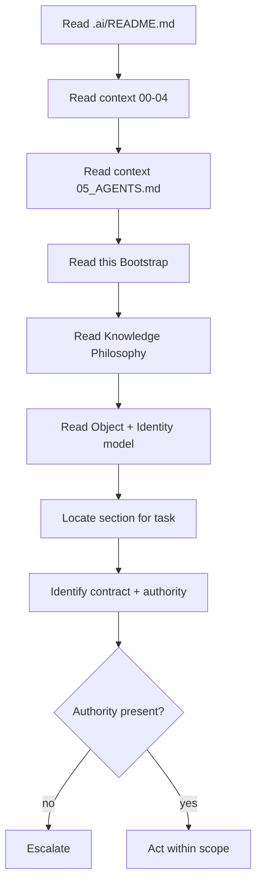

*Diagram `CAT-KE-P1-01-D-1` is illustrative of the `AI Quick Bootstrap` operating model; it does not authorize a production deployment, validate a corpus, or grant authority.*

#### CAT-KE-P1-01-D-2 — Context Flow — Knowledge to Action

**Diagram ID:** `CAT-KE-P1-01-D-2`
**Title:** Context Flow — Knowledge to Action
**Type:** Context Flow
**Purpose:** Show how governed context flows from documents into bounded AI action.
**Audience:** Human owners, knowledge architects, engineers, security reviewers, operators, auditors, and AI coding agents.
**Reading Order:** Read left to right; governance gates are mandatory.

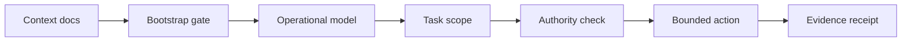

*Diagram `CAT-KE-P1-01-D-2` is illustrative of the `AI Quick Bootstrap` operating model; it does not authorize a production deployment, validate a corpus, or grant authority.*

#### CAT-KE-P1-01-D-3 — Memory Flow — Session Reconstruction

**Diagram ID:** `CAT-KE-P1-01-D-3`
**Title:** Memory Flow — Session Reconstruction
**Type:** Memory Flow
**Purpose:** Show how a new AI session reconstructs prior memory before acting.
**Audience:** Human owners, knowledge architects, engineers, security reviewers, operators, auditors, and AI coding agents.
**Reading Order:** Read top to bottom.

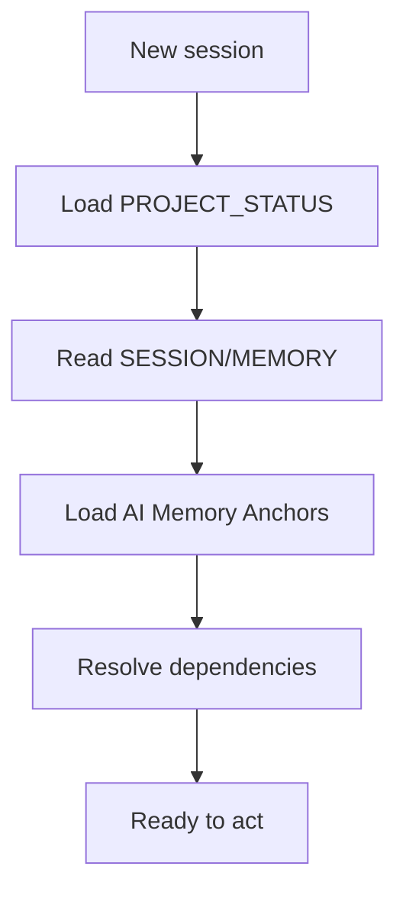

*Diagram `CAT-KE-P1-01-D-3` is illustrative of the `AI Quick Bootstrap` operating model; it does not authorize a production deployment, validate a corpus, or grant authority.*

#### CAT-KE-P1-01-D-4 — AI Quick Bootstrap — C4 Container

**Diagram ID:** `CAT-KE-P1-01-D-4`
**Title:** AI Quick Bootstrap — C4 Container
**Type:** C4 Container
**Purpose:** Decompose the Knowledge Engine into containers responsible for AI Quick Bootstrap.
**Audience:** Human owners, knowledge architects, engineers, security reviewers, operators, auditors, and AI coding agents.
**Reading Order:** Read the engine container and its internal components.

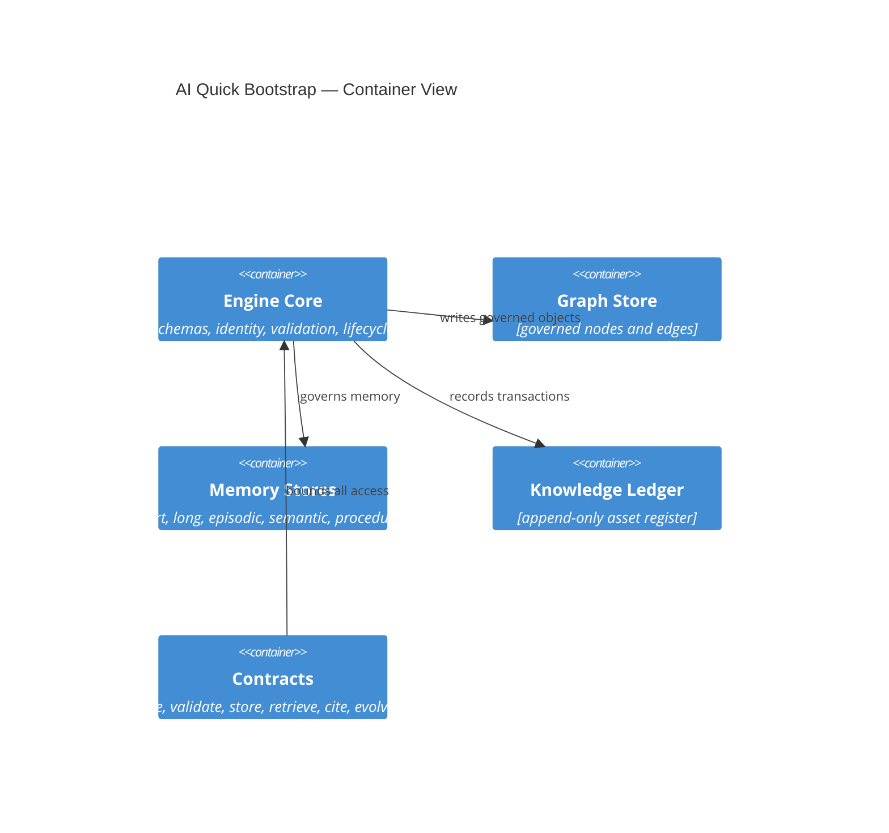

*Diagram `CAT-KE-P1-01-D-4` is illustrative of the `AI Quick Bootstrap` operating model; it does not authorize a production deployment, validate a corpus, or grant authority.*

#### CAT-KE-P1-01-D-5 — AI Quick Bootstrap — Versioning History

**Diagram ID:** `CAT-KE-P1-01-D-5`
**Title:** AI Quick Bootstrap — Versioning History
**Type:** Versioning Graph
**Purpose:** Show how AI Quick Bootstrap advances through immutable versions over time.
**Audience:** Human owners, knowledge architects, engineers, security reviewers, operators, auditors, and AI coding agents.
**Reading Order:** Read commits left to right along main; supersessions branch and merge.

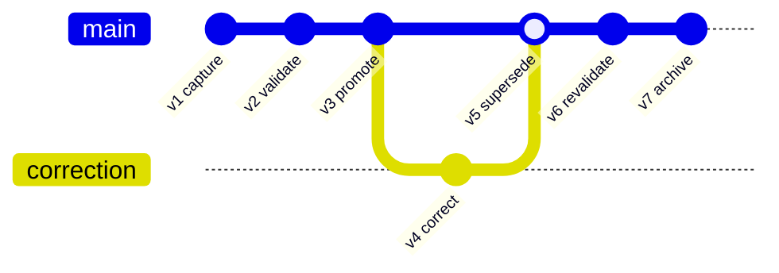

*Diagram `CAT-KE-P1-01-D-5` is illustrative of the `AI Quick Bootstrap` operating model; it does not authorize a production deployment, validate a corpus, or grant authority.*

#### CAT-KE-P1-01-D-6 — AI Quick Bootstrap — Control Priority Quadrant

**Diagram ID:** `CAT-KE-P1-01-D-6`
**Title:** AI Quick Bootstrap — Control Priority Quadrant
**Type:** Quadrant Chart
**Purpose:** Map the AI Quick Bootstrap controls by criticality versus implementation effort to guide sequencing.
**Audience:** Human owners, knowledge architects, engineers, security reviewers, operators, auditors, and AI coding agents.
**Reading Order:** Read the axes; top-right is high-criticality and high-effort.

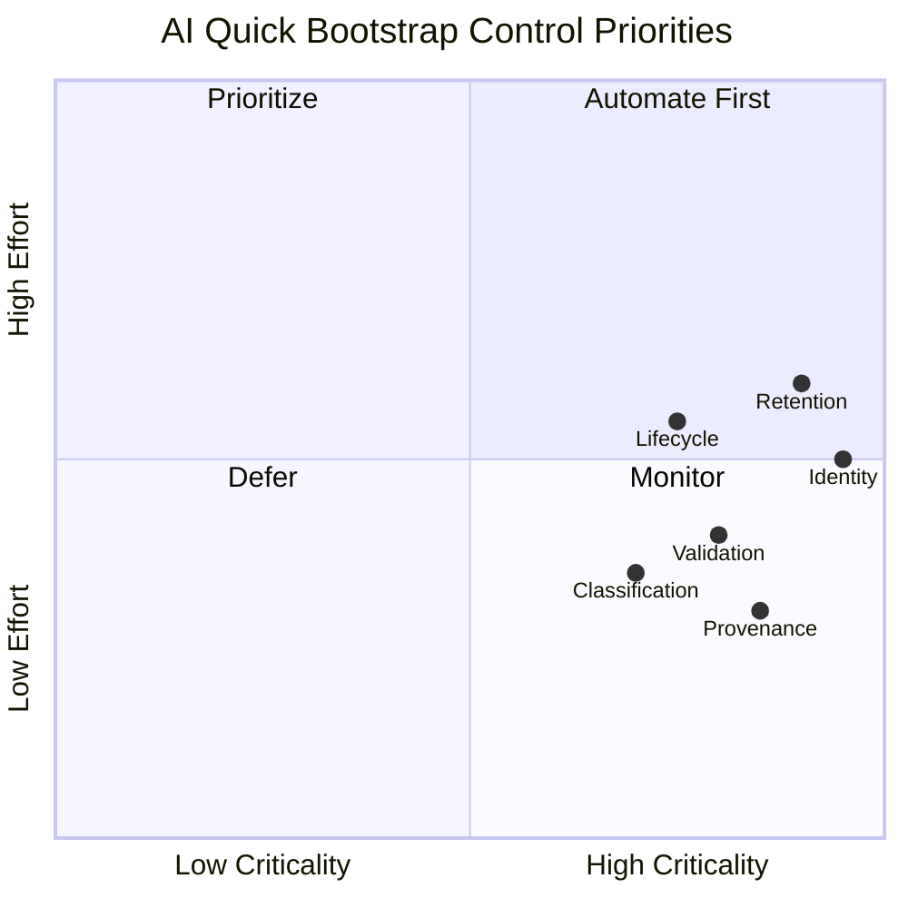

*Diagram `CAT-KE-P1-01-D-6` is illustrative of the `AI Quick Bootstrap` operating model; it does not authorize a production deployment, validate a corpus, or grant authority.*

#### CAT-KE-P1-01-D-7 — AI Quick Bootstrap — Retrieval Ranking Flow

**Diagram ID:** `CAT-KE-P1-01-D-7`
**Title:** AI Quick Bootstrap — Retrieval Ranking Flow
**Type:** Ranking Flow
**Purpose:** Show how retrieval ranks AI Quick Bootstrap candidates under policy before returning them.
**Audience:** Human owners, knowledge architects, engineers, security reviewers, operators, auditors, and AI coding agents.
**Reading Order:** Read top to bottom through the ranking stages.

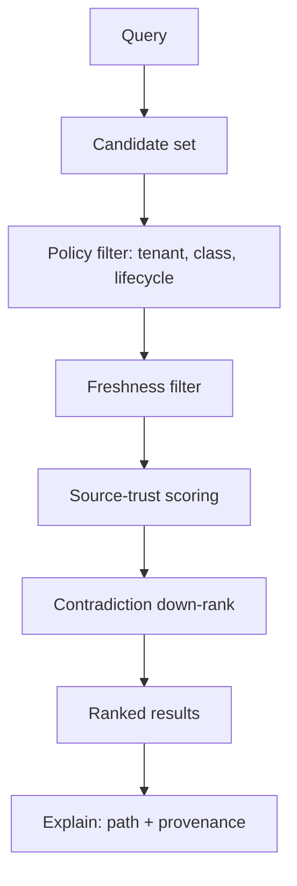

*Diagram `CAT-KE-P1-01-D-7` is illustrative of the `AI Quick Bootstrap` operating model; it does not authorize a production deployment, validate a corpus, or grant authority.*

#### CAT-KE-P1-01 — ASCII — AI Quick Bootstrap at a Glance

**Diagram ID:** `CAT-KE-P1-01-ASCII`
**Title:** AI Quick Bootstrap at a Glance
**Type:** ASCII
**Purpose:** A compact text view of AI Quick Bootstrap for terminals and quick reference.
**Audience:** Human owners, knowledge architects, engineers, security reviewers, operators, auditors, and AI coding agents.
**Reading Order:** Read the top legend, then the boxed structure.

```text
Legend: [O]=object  [S]=source  [E]=edge  [V]=validation  [L]=ledger

            +-------------------+
   capture  |   [S] source      |
      |     +---------+---------+
      v               v
  +-------+       +----------+
  | [O]   | ----> | [V] gate |
  +-------+       +----+-----+
      |                | pass
      |                v
  +-------+       +----------+        +----------+
  | [L]   | <---- | corpus   | <----> | [E] graph|
  +-------+       +----+-----+        +----------+
      |                |
      v                v
   evidence        retrieve (policy-aware) --> cite
```

*ASCII diagram `CAT-KE-P1-01-ASCII` is illustrative only.*

## 2. Knowledge Philosophy

**Section ID:** `CAT-KE-P1-02`  
**Constitutional domain:** Knowledge Foundation  
**Human accountable owner:** Chief Knowledge Officer (Executive CKO) and Lead Repository Architect  
**Primary record:** knowledge philosophy charter  
**Decision status:** Foundation decision for the Knowledge Engine Bible Part 1; implementation and production authority remain evidence-gated. Later implementation ADRs MUST preserve this section unless they explicitly supersede a named requirement.  
**Primary question:** Knowledge in CAT is a governed, attributable, versioned asset that must be preserved as carefully as money and handled with stricter care than code, because knowledge outlives every system that produced it.

### Purpose

Knowledge Philosophy states the first principles from which every other knowledge decision derives. CAT holds that knowledge — not code, not models, not features — is the durable substrate of the enterprise. Code is rewritten, models are replaced, products are retired, but the accumulated knowledge of what is true, what works, why decisions were made, and what the organization has learned is the compounding asset. This section makes that belief operational by defining what counts as knowledge, what does not, and the duties that ownership of knowledge imposes.

**Normative application:** For `2. Knowledge Philosophy`, the owning implementation MUST make this section observable through a named contract, a policy or guard, a test or review check, and an operational signal. A prose claim without enforcement evidence is incomplete.

### Business Explanation

The business case is compounding returns and risk reduction. Every commerce decision, campaign, treasury position, affiliate relationship, and content artifact either deposits into or withdraws from the organizational knowledge account. A philosophy that treats knowledge as a first-class asset makes the organization smarter over time; one that treats it as an exhaust makes the organization repeat its mistakes at scale. The cost of formal knowledge discipline is visible and bounded; the cost of informal knowledge loss is invisible and unbounded.

**Normative application:** For `2. Knowledge Philosophy`, the owning implementation MUST expose to an accountable reviewer the cost, benefit, risk, owner, uncertainty, and consequence of this capability before it is accepted.

The business MUST fund the control work that keeps `Knowledge Philosophy` trustworthy as part of delivery: provenance capture, classification, validation, human review where required, recovery, audit, and lifecycle retirement are not optional overhead. Success is the durable outcome represented by `knowledge philosophy charter`, not output volume or knowledge-object count.

### Engineering Explanation

Philosophy becomes engineering through structure: every knowledge-bearing artifact carries metadata that makes the philosophy enforceable — identity, source, rights, freshness, classification, confidence, contradiction flags, and owner. The philosophy rejects the pattern of storing knowledge as free text with no machine-readable provenance. Instead, knowledge is captured at boundaries where it is created and modified, so the engineering surface inherits the duty of preservation rather than retrofitting it later.

Implement `Knowledge Philosophy` through versioned schemas, deterministic state machines, owned ports, immutable identities, hierarchical budgets, cancellation, idempotency, checkpoints, and source-of-truth verification. Probabilistic inference may propose; deterministic services authorize and commit.

Make time, randomness, source routes, policy versions, and external effects injectable in tests. Classify every dependency as startup-hard, runtime-required, optional, or asynchronous; define timeout, circuit, fallback, replay, migration, and failure ownership explicitly for `Knowledge Philosophy`.

### Architecture Perspective

Architecturally, knowledge is a peer of data, code, and events, not a subordinate. The Knowledge Engine is a first-class subsystem with its own contracts, not a documentation folder. Philosophy mandates that knowledge seams exist in every layer: at every domain boundary, at every agent boundary, and at every human-decision boundary, knowledge is captured, versioned, and made retrievable under policy.

**Normative application:** For `2. Knowledge Philosophy`, the owning implementation MUST make this perspective observable through a named contract, a policy or guard, a test or review check, and an operational signal. A prose claim without enforcement evidence is incomplete.

Chief Knowledge Officer (Executive CKO) and Lead Repository Architect remains the human accountability boundary for `Knowledge Philosophy`. The Knowledge Foundation domain owns semantics and canonical state; CATA coordinates portfolios, the Supervisor coordinates runtime, specialists produce bounded artifacts, and policy and effect gateways prevent orchestration from becoming authority.

### AI Perspective

For an AI, this philosophy means that knowledge is never something to be generated freely and trusted; it is always something to be sourced, attributed, dated, and marked for confidence. The AI's job is to preserve the integrity of the knowledge chain — to extend it only with labeled, owned contributions and to refuse to present inference as fact. The philosophy is the AI's standing instruction to treat the provenance and classification of every claim as inseparable from the claim itself.

**Normative application:** For `2. Knowledge Philosophy`, the owning implementation MUST make this perspective observable through a named contract, a policy or guard, a test or review check, and an operational signal. A prose claim without enforcement evidence is incomplete.

AI confidence about `Knowledge Philosophy` is one signal only; it cannot substitute for provenance, validation, authority, or human acceptance where the class of knowledge requires them.

### Implementation Strategy

The implementation strategy for `Knowledge Philosophy` proceeds in evidence-gated increments rather than a single release. Each increment begins as a hypothesis encoded as a typed schema and a contract, runs first in simulation or a sandboxed knowledge store, proves quality and safety against positive and negative fixtures, and is promoted only after independent owner acceptance.

1. **Model first.** Define the canonical schema, identity derivation, legal-edge matrix (where relevant), and the policy bindings for `knowledge philosophy charter` before any code writes or reads it.
2. **Validate at the boundary.** Place the Knowledge Foundation validations at the ingestion seam so that invalid or unprovenanced input is quarantined before it can reach the citable corpus.
3. **Version everything.** Treat every `Knowledge Philosophy` artifact as immutable and append-only; all change is a versioned transformation with recorded inputs and outputs.
4. **Observe continuously.** Emit structured decision receipts, tool receipts, and redacted artifacts with immutable lineage for every `Knowledge Philosophy` operation.
5. **Fail closed.** When policy, provenance, classification, or ownership cannot be established for a `Knowledge Philosophy` operation, the operation stops, preserves state and evidence, and routes the decision to Chief Knowledge Officer (Executive CKO) and Lead Repository Architect.

### Developer Notes

- Before editing a `Knowledge Philosophy` implementation, inspect the registered schema, the owning domain API, the policy bindings, the validation pipeline, the tests, and the operational runbook.
- Do not create a bypass around a validation, classification, provenance, or approval control to satisfy a task quickly. A bypass is a defect, not a shortcut.
- State assumptions, the exact authority requested, data classifications, expected effects, and the rollback path in the change description for every `Knowledge Philosophy` change.
- Add a negative test for every newly permitted `Knowledge Philosophy` capability and a recovery test for every material external effect that depends on it.
- If a requirement is ambiguous, stop at the safe boundary and request an accountable human decision; do not convert inference into permission for `Knowledge Philosophy`.

### Codex Notes

When generating code for `Knowledge Philosophy`, Codex should emit the schema, contract, validation, and test scaffolding together rather than logic alone. The `Knowledge Philosophy` surface is contract-first: the typed request, response, event, error, and receipt shapes are the deliverable, and the implementation must conform to them.

- Prefer deterministic guards over prompt-level instructions for every `Knowledge Philosophy` policy; the model may not be relied upon to enforce invariants.
- Generate negative fixtures first for `Knowledge Philosophy`: malformed input, missing provenance, classification mismatch, expired source, and contradictory edges.
- Keep `Knowledge Philosophy` changes minimal and additive; prefer a new version over an in-place mutation.
- Include redaction in every emitted log, metric, and artifact for `Knowledge Philosophy`; protected content must never appear in observability.

### Claude Code Notes

When operating agentic edits on `Knowledge Philosophy`, Claude Code should treat the Knowledge Engine contracts as the boundary of permission: read through retrieval contracts, write through contribution contracts, and never reach storage or the graph store directly. The agent must record its `Knowledge Philosophy` contributions against the ledger with provenance.

- Before modifying `Knowledge Philosophy`, load the relevant section of this Bible, the schema, and the current ownership and classification state.
- Distinguish a proposed `Knowledge Philosophy` contribution from a validated one; never present a draft as trusted or citable.
- On contradiction detection between `Knowledge Philosophy` objects, create a governed edge and escalate rather than silently choosing one side.
- Preserve user work: if a `Knowledge Philosophy` change would invalidate dependent paths, report the impact and request the human decision.

### Gemini CLI Notes

When working in a terminal against `Knowledge Philosophy` at scale, Gemini CLI's long context is useful for loading whole sections, schemas, and the dependency graph before proposing a change. The agent should summarize the `Knowledge Philosophy` context into a bounded brief, cite the section anchors it relied on, and flag any unresolved conflict before acting.

- Use the `Knowledge Philosophy` contracts as the only access path; shell-level or direct-store access is prohibited.
- Batch `Knowledge Philosophy` validations and run them locally against fixtures before proposing promotion.
- Keep the `Knowledge Philosophy` change set small and reviewable; large diffs obscure provenance and classification changes.
- Report the token and cost footprint of `Knowledge Philosophy` retrieval operations, because knowledge economics are part of the deliverable.

### Future AI Notes

Future AI models may reason over `Knowledge Philosophy` more fluently and at greater scale, but no advance in model quality changes CAT's requirement for provenance, classification, validation, authority, and evidence. A more capable model that bypasses these controls is a larger risk, not a smaller one.

- Future agents operating on `Knowledge Philosophy` must consume the same contracts; intelligence is not a license to bypass seams.
- Richer reasoning over `Knowledge Philosophy` must still emit explainable graph paths; opacity is not acceptable even when the model is accurate.
- Future autonomy over `Knowledge Philosophy` is earned through measured evidence, not asserted; escalation paths to Chief Knowledge Officer (Executive CKO) and Lead Repository Architect must remain open.
- Future `Knowledge Philosophy` capability must never retroactively authorize current behavior; the constitution governs forward.

### Security Notes

Apply zero standing privilege, workload identity, tenant and environment isolation, purpose-bound data, secret-manager references, prompt and tool injection defenses, egress policy, sandboxing, rate limits, revocation, tamper-evident receipts, and a tested kill switch for `Knowledge Philosophy`.

Section invariant for `Knowledge Philosophy`: No knowledge is first-class in CAT until it has identity, provenance, classification, an owner, and a declared lifecycle; undocumented, unowned, or unattributable knowledge is treated as a liability, not an asset.

Threat tests for `{title}` cover confused deputy, role-title escalation, malicious context, poisoned knowledge, memory exfiltration, approval laundering, replay, supply-chain substitution, side channels, resource exhaustion, audit tampering, and compromised provider behavior. Each must fail closed and emit a protected signal.

### Performance Notes

Declare separate service-level objectives for `Knowledge Philosophy` admission, queueing, validation, retrieval, effect verification, and evidence publication; one hundred percent of terminal `knowledge philosophy charter` records must be attributable and schema-valid.

Measure the `Knowledge Philosophy` latency components separately — source fetch, validation, indexing, traversal, ranking, evidence publication — and report percentiles, quality, safety, cost, human burden, cancellation delay, and terminal classes. Never improve averages by dropping rejected, failed, or quarantined `Knowledge Philosophy` work.

### Scalability Notes

Partition `Knowledge Philosophy` work by tenant and bounded aggregate, preserve global contract compatibility, cap concurrency and fan-out, and fail closed when ownership or policy cannot converge.

Use bounded fan-out, backpressure, fairness reservations, locality, and asynchronous facts where ordering is unnecessary for `{title}`. Cross-region or cross-node scale requires explicit data residency, identity federation, protocol compatibility, conflict resolution, disconnect behavior, and reconciliation. Rebuildable projections absorb read scale without becoming sources of truth.

### Failure Modes

The principal `Knowledge Philosophy` failure is unprovenanced or misclassified knowledge entering active use; secondary failures are stale sources, contradictory edges, identity drift, retention violation, and silent degradation.

| Failure mode | Trigger | Effect | Detection |
|---|---|---|---|
| Unprovenanced knowledge | Ingestion without source record | Trust erosion, audit gap | Provenance gate at ingestion |
| Misclassification | Wrong class assigned at capture | Wrong validation, wrong retention | Class-specific validation failure |
| Stale source | Source past freshness SLA | Outdated facts cited | Freshness monitor + re-fetch |
| Contradictory edges | Two edges conflict unresolved | Ambiguous reasoning | Contradiction detection + review queue |
| Identity drift | Duplicate or moved identity | Broken references | Registry integrity scan |
| Retention violation | Memory or data past legal limit | Compliance breach | Retention enforcement + tombstones |
| Silent degradation | Quality metric decline unnoticed | Erosion of trust | Continuous quality monitoring |

### Recovery Strategy

Recovery for `Knowledge Philosophy` stops further effects, preserves the run record, isolates the cause, reconciles knowledge state against authoritative sources, and routes the unresolved decision to Chief Knowledge Officer (Executive CKO) and Lead Repository Architect.

1. **Contain.** Suspend the affected `Knowledge Philosophy` scope and prevent new reads of the compromised knowledge.
2. **Preserve.** Freeze the run record, receipts, and evidence for `Knowledge Philosophy`; do not delete.
3. **Reconcile.** Re-establish authoritative `Knowledge Philosophy` state from validated sources; quarantine anything that cannot be reconciled.
4. **Restore.** Restore the `Knowledge Philosophy` invariant — provenance, classification, ownership, lifecycle — before resuming.
5. **Review.** Link a terminal recovery receipt and route the residual decision to Chief Knowledge Officer (Executive CKO) and Lead Repository Architect; capture the lesson as governed knowledge.

### Extension Points

`Knowledge Philosophy` exposes typed extension points so the engine grows without breaking contracts:

- **Source adapters.** New `Knowledge Philosophy` sources plug into the ingestion seam through a typed adapter that normalizes input and records provenance.
- **Validation rules.** New `Knowledge Philosophy` checks are registered class-specific validators; they compose into the validation pipeline without modifying core logic.
- **Entity and edge types.** New `Knowledge Philosophy` entity or edge types extend the registered schema and legal-edge matrix; unknown types remain rejected.
- **Memory classes.** New `Knowledge Philosophy` memory classes are added as governed stores with namespace, consent, retention, and tombstone controls.
- **Retrieval strategies.** New `Knowledge Philosophy` ranking or traversal strategies register behind the retrieval contract; the policy layer governs their use.

### Ownership

| Ownership layer | Holder | Responsibility |
|---|---|---|
| Human accountable owner | Chief Knowledge Officer (Executive CKO) and Lead Repository Architect | Residual business judgment, risk acceptance, rights, and consequential approval for `Knowledge Philosophy`. |
| Operational owner | Knowledge Foundation Service Owner | Enforcement, schemas, contracts, runbooks, and SLOs for `Knowledge Philosophy`. |
| Domain owner | Domain Owners (per knowledge class) | Class-specific validation, freshness, and canonical truth for `{title}`. |
| Audit owner | Independent Audit Owner | Independent evidence review, tamper-evidence, and retention for `{title}`. |
| Chief Knowledge Officer | Executive CKO | Cross-domain knowledge policy, asset register integrity, and constitution for `{title}`. |

### Dependencies

`Knowledge Philosophy` depends on the following, which MUST be satisfied before the capability is promotable:

| Dependency | Type | Requirement |
|---|---|---|
| Knowledge Object Model | Foundation | Schema and identity derivation exist and are versioned. |
| Identity Registry | Foundation | Globally unique, immutable, resolvable identities exist. |
| Policy Decision Point | Runtime-required | Classification, tenant, and lifecycle policy is enforced at every `Knowledge Philosophy` boundary. |
| Validation Pipeline | Runtime-required | Class-specific checks run before promotion. |
| Observability | Runtime-required | Structured logs, traces, metrics, receipts, and redacted artifacts are emitted. |
| Higher-order context | Foundation | `context/00` through `context/05` are read and applied. |
| Accepted ADR | Gated | A completed, accepted ADR exists before a production `Knowledge Philosophy` change. |

### Risks

| Risk | Likelihood | Impact | Mitigation |
|---|---|---|---|
| Unprovenanced knowledge trusted | Medium | High | Mandatory provenance gate; quarantine on absence. |
| Misclassification | Medium | High | Class-specific validation; conservative reclassification on doubt. |
| Contradiction accumulation | High | Medium | Contradiction detection edges; resolution queue with owners. |
| Staleness eroding decisions | High | Medium | Freshness SLAs; scheduled re-fetch; expiry enforcement. |
| Cross-tenant leakage | Low | Critical | Structural tenant isolation in traversal; deny by default. |
| Retention non-compliance | Medium | Critical | Retention enforcement; tombstones; re-consent. |
| Scale-induced governance lapse | Medium | High | Layered architecture; fail-closed under overload. |
| Model overconfidence | High | High | Confidence never substitutes for evidence or authority. |

### Anti-patterns

- Storing `Knowledge Philosophy` as free text without machine-readable provenance, classification, or identity.
- Mutating `Knowledge Philosophy` in place instead of versioning it; destroying history.
- Bypassing the `Knowledge Philosophy` contracts to read or write stores directly.
- Treating AI-generated `Knowledge Philosophy` as validated without deterministic checks.
- Promoting memory into authoritative `Knowledge Philosophy` without validation.
- Dropping or hiding contradictory `Knowledge Philosophy` edges to produce a clean path.
- Allowing `Knowledge Philosophy` to persist without an owner; orphaned knowledge.
- Inferring implementation permission from this document's existence or completion percentage.

### Best Practices

- Capture `Knowledge Philosophy` at the boundary where it is created or modified; do not retrofit provenance later.
- Make `Knowledge Philosophy` immutable and append-only; express all change as versioned transformations.
- Validate `Knowledge Philosophy` by class before promotion; quarantine on any failed check.
- Carry classification, confidence, and lifecycle with every `Knowledge Philosophy` object at all times.
- Represent `Knowledge Philosophy` relationships as governed edges; compute structure, do not imply it.
- Enforce tenant isolation, retention, and consent structurally in traversal.
- Keep projections rebuildable; never promote a cache to a source of truth.
- Require an accepted ADR before any irreversible `Knowledge Philosophy` architecture choice.

### Examples

The following illustrative examples show intended `Knowledge Philosophy` behavior. They are illustrative only; they do not authorize production use, validate a real corpus, or grant any authority.

**Example 1 — Compliant `Knowledge Philosophy` contribution.**
A domain emits a `{title}` record with identity, source reference, classification, declared confidence, owner, and lifecycle state. The validation pipeline confirms schema, provenance, freshness, rights, and contradiction status; the object is promoted to the citable corpus and recorded in the ledger with a digest. Retrieval returns the object with its provenance and lifecycle visible.

**Example 2 — Compliant `Knowledge Philosophy` evolution.**
A reviewer finds that a `{title}` object is stale. They propose a correction as a new version citing an authoritative source; the engine records a `supersedes` edge from the old version to the new, preserves the old version as history, and re-evaluates dependent paths. An independent reviewer can reconstruct the state at any past date.

**Example 3 — Compliant `Knowledge Philosophy` contradiction handling.**
Two `{title}` objects assert incompatible claims. The engine creates a governed `contradicts` edge, down-ranks both in retrieval, flags them for review, and surfaces the conflict to the domain owner. Neither is silently chosen; resolution is a recorded human or independent-evaluator decision.

### Counter Examples

The following are non-compliant `Knowledge Philosophy` patterns that MUST be rejected:

**Counter-example 1 — Unprovenanced assertion.**
An AI contributes a `Knowledge Philosophy` claim without a source reference. The object is rejected at ingestion; the claim may live only as a draft, never as trusted or citable knowledge.

**Counter-example 2 — Silent overwrite.**
A maintainer edits a `{title}` object in place to correct an error. The in-place mutation destroys history and violates immutability; the change is rolled back and re-applied as a versioned correction.

**Counter-example 3 — Hidden contradiction.**
A traversal hides a `contradicts` edge to return a clean recommendation. Hiding the edge is a knowledge-integrity violation; the traversal must surface the conflict and down-rank rather than conceal.

**Counter-example 4 — Memory as truth.**
An agent treats a long-term memory as an authoritative fact and acts on it without validation. The memory is advisory only; acting on it as fact is a discipline violation requiring the fact to be validated first.

### Implementation Checklist

- [ ] Canonical schema, owner, compatibility policy, and stable error taxonomy defined for `Knowledge Philosophy`.
- [ ] Identity, policy, classification, provenance, and lifecycle encoded outside the model for `Knowledge Philosophy`.
- [ ] Each AI capability for `Knowledge Philosophy` mapped to an owned port, data class, effect class, and receipt.
- [ ] State transitions implemented with optimistic concurrency and durable checkpoints for `Knowledge Philosophy`.
- [ ] Correlation, causation, deadline, cancellation, and budget propagated through every `Knowledge Philosophy` call.
- [ ] External effects verified from authoritative state before completion or retry for `Knowledge Philosophy`.
- [ ] Degraded behavior, circuit breaking, containment, recovery, and reconciliation provided for `Knowledge Philosophy`.
- [ ] Operational logs redacted; protected forensic evidence retained by explicit policy for `Knowledge Philosophy`.
- [ ] Role-quality, adversarial, tenancy, load, chaos, migration, and rollback tests created for `Knowledge Philosophy`.
- [ ] Dashboards, alert thresholds, runbooks, on-call ownership, and support boundaries shipped for `Knowledge Philosophy`.
- [ ] An immutable `Knowledge Philosophy` version canaried with a tested last-known-safe rollback target.
- [ ] Independent owner acceptance and applicable certification required before production `Knowledge Philosophy`.

### AI Memory Anchor

**Memory anchor `CAT-KE-P1-02`:** `2. Knowledge Philosophy` means: Knowledge in CAT is a governed, attributable, versioned asset that must be preserved as carefully as money and handled with stricter care than code, because knowledge outlives every system that produced it. The AI agent MUST preserve provenance, classification, identity, validation, evidence, safe failure, and human accountability for `Knowledge Philosophy`. If a request conflicts with those anchors, stop, explain the conflict, and propose the smallest safe alternative.

### Cross References

- Section-specific context: `core/knowledge/`, `core/memory/`, `core/rag/`, `knowledge/`, and `context/06_KNOWLEDGE_ENGINE.md`.
- Constitutional baseline: `context/00_PROJECT_CONTEXT.md`, `context/01_PROJECT_OVERVIEW.md`, `context/02_PROJECT_RULES.md`, `context/03_TECH_STACK.md`, `context/04_ARCHITECTURE.md`, and `context/05_AGENTS.md`.
- This Bible: sections 1 through 20 of `context/06_KNOWLEDGE_ENGINE.md` Part 1.
- Operational implementation also consults `context/16_DEPLOYMENT.md`, `context/17_SECURITY.md`, `context/18_PROMPTING.md`, and `context/19_DEVELOPMENT_GUIDE.md` as they become authoritative.
- Architecture references: `architecture/KnowledgeGraph/`, `architecture/Data_Flow.md`, `architecture/AI_Architecture.md`.

### Repository Mapping

| Repository concern | Canonical location or governing source |
|---|---|
| Knowledge core | `core/knowledge/` — object model, identity, validation, lifecycle. |
| Memory | `core/memory/` — working, short, long, episodic, semantic, procedural, collective stores. |
| Retrieval / RAG | `core/rag/` — policy-aware retrieval contracts. |
| Knowledge graph | `architecture/KnowledgeGraph/` and `core/knowledge/graph/` when implemented. |
| Knowledge assets | `knowledge/` — index, glossary, maps; placeholders are non-authoritative. |
| Architecture authority | `context/04_ARCHITECTURE.md`, `architecture/System_Architecture.md`, and this Bible. |
| Agents | `context/05_AGENTS.md` and `agents/` — agents consume and contribute knowledge through contracts. |
| Security authority | `SECURITY.md`, `context/17_SECURITY.md` when completed, and policy implementation paths. |
| Decisions | `adr/ADR-0001.md` through `adr/ADR-0055.md` are current placeholders; a material implementation MUST create or complete a relevant accepted ADR rather than cite an empty ADR as evidence. |

### Folder Mapping

| Folder | Role in `Knowledge Philosophy` | Authority |
|---|---|---|
| `core/knowledge/` | `Knowledge Philosophy` object model, identity, validation, lifecycle services. | Normative when implemented. |
| `core/memory/` | `Knowledge Philosophy` memory stores and governance. | Normative when implemented. |
| `core/rag/` | `Knowledge Philosophy` retrieval contracts. | Normative when implemented. |
| `knowledge/` | `Knowledge Philosophy` asset index, glossary, and maps. | Reference; placeholders non-authoritative. |
| `architecture/KnowledgeGraph/` | `Knowledge Philosophy` graph models. | Reference diagrams. |
| `context/06_KNOWLEDGE_ENGINE.md` | `Knowledge Philosophy` constitutional documentation (this file). | Normative foundation. |
| `adr/` | `Knowledge Philosophy` implementation decisions. | Evidence-gated; placeholders non-authoritative. |

### Future Evolution

Future evolution of `Knowledge Philosophy` may include richer semantic models, multimodal knowledge objects, federated knowledge exchange, automated contradiction resolution, and continuous-learning loops. Every increment begins as a hypothesis, runs in simulation or a sandboxed knowledge store, proves quality and safety, obtains independent human authorization, canaries immutable versions, and retains rollback, migration, and historical interpretation.

Future capability never retroactively authorizes current behavior. Rights, law, accountability, provenance, classification, tenant choice, evidence, security, and safe exit remain constraints for `Knowledge Philosophy` even when technology, organization, providers, or economic models change.

### Operating Contract

| Contract dimension | Normative requirement |
|---|---|
| Business outcome | Knowledge Philosophy states the first principles from which every other knowledge decision derives. |
| Human accountability | Chief Knowledge Officer (Executive CKO) and Lead Repository Architect |
| Authoritative artifact | knowledge philosophy charter |
| Required inputs | authenticated charter; current knowledge foundation state; policy and authority snapshot; owned evidence; deadline; budget; acceptance criteria; human accountability route |
| Required outputs | versioned knowledge philosophy charter; decision evidence; state transition; exceptions; resource account; terminal receipt |
| Constitutional invariant | No knowledge is first-class in CAT until it has identity, provenance, classification, an owner, and a declared lifecycle; undocumented, unowned, or unattributable knowledge is treated as a liability, not an asset. |
| Default authority | A0/A1 advice and preparation unless an exact role card, policy, certification and effect-specific grant narrow a higher ceiling. |
| Default failure | Stop the smallest unsafe scope, preserve state and evidence, reconcile any attempted effect, and route the unresolved decision to the named owner. |
| Performance envelope | Declare separate SLOs for admission, queueing, validation, retrieval, effect verification and evidence publication; 100 percent of terminal knowledge philosophy charter records must be attributable and schema-valid. |
| Scale model | Partition knowledge foundation work by tenant and bounded aggregate, preserve global contract compatibility, cap concurrency and fan-out, and fail closed when ownership or policy cannot converge. |
| Future direction | richer semantic models, multimodal knowledge objects, federated exchange and continuously validated knowledge |

### End-to-End Constitutional Procedure

1. **Establish charter and scope.** Validate identity, scope, owner, policy, data, authority, budget and deadline for `Knowledge Philosophy`; persist the decision and do not begin a dependent step until its preconditions and evidence pass.
2. **Resolve identity version tenant and owner.** Validate identity, scope, owner, policy, data, authority, budget and deadline; persist the decision and do not begin a dependent step until its preconditions and evidence pass.
3. **Capture source and provenance.** Validate identity, scope, owner, policy, data, authority, budget and deadline; persist the decision and do not begin a dependent step until its preconditions and evidence pass.
4. **Classify by taxonomy class.** Validate identity, scope, owner, policy, data, authority, budget and deadline; persist the decision and do not begin a dependent step until its preconditions and evidence pass.
5. **Validate by class against authority freshness rights and contradiction.** Validate identity, scope, owner, policy, data, authority, budget and deadline; persist the decision and do not begin a dependent step until its preconditions and evidence pass.
6. **Promote to the citable corpus and record in the ledger.** Validate identity, scope, owner, policy, data, authority, budget and deadline; persist the decision and do not begin a dependent step until its preconditions and evidence pass.
7. **Retrieve under policy and cite with provenance.** Validate identity, scope, owner, policy, data, authority, budget and deadline; persist the decision and do not begin a dependent step until its preconditions and evidence pass.
8. **Retire or supersede through lifecycle with reconciliation.** Validate identity, scope, owner, policy, data, authority, budget and deadline; persist the decision and do not begin a dependent step until its preconditions and evidence pass.

### Required Decision Record

| Record component | Minimum fields | Independent check |
|---|---|---|
| Charter | outcome, non-goals, sponsor, owner, acceptance, deadline and expiry | mission and owner resolver |
| Identity | logical ID, immutable version, runtime principal, tenant, environment and operator | identity and lifecycle service |
| Evidence | sources, revisions, rights, freshness, transformations, contradictions and confidence | domain and provenance validator |
| Decision | facts, assumptions, alternatives, dissent, risk, cost, uncertainty and requested judgment | human or independent evaluator |
| Authority | role ceiling, task grant, policy, data purpose, approval and live revocation state | policy enforcement point |
| Execution | plan, resources, tools, state versions, checkpoints, attempts and effects | orchestrator and domain gateways |
| Outcome | typed status, acceptance, quality, business result, externalities, incidents and follow-up owner | task owner and analytics |
| Audit | correlation, causation, digests, timestamps, receipts, retention and access history | independent Audit owner |

### Constitutional Control Catalogue

Each control below is independently testable for `Knowledge Philosophy`. Satisfying a narrative goal without the named enforcement and evidence is not constitutional conformance.

#### CAT-KE-P1-02-C01 — Charter Scope

- **Rule:** For `knowledge philosophy`, bind all work to a signed outcome, explicit non-goals, owner, expiry and acceptance criteria.
- **Business test:** `knowledge philosophy charter` exposes the cost, benefit, risk, owner, uncertainty and consequence of this control to an accountable reviewer.
- **Engineering enforcement:** The boundary responsible for `establish charter and scope` validates this control before state change and again before any related material effect.
- **AI behavior:** Missing, stale, contradictory, denied or unverifiable control data causes a typed stop, wait, refusal or escalation; the model never fills the gap with confidence.
- **Human boundary:** Chief Knowledge Officer (Executive CKO) and Lead Repository Architect receives the exact requested decision and evidence when human judgment is required; no UI default or silence creates consent.
- **Security assertion:** Forged role, cross-tenant reference, replay, changed payload, expired grant, injected instruction and evidence tampering all fail closed and emit a protected signal.
- **Performance assertion:** Enforcement remains inside the declared SLO and resource reserve; overload applies backpressure rather than removing checks.
- **Evidence:** Store logical and runtime identity, tenant, versions, policy, grants, input/output digests, decision, state, timestamps, owner and redacted receipts.
- **Failure code:** `CAT_KE_P1_02_C01`; dependent work remains non-success and any attempted effect enters reconciliation.
- **Recovery:** Contain the affected scope, establish authoritative effect state, restore the invariant, obtain required human decision and link a terminal recovery receipt.
- **Implementation test:** Run positive, negative, boundary, cancellation, duplicate, stale-state, migration and compromised-dependency fixtures deterministically.
- **Ownership:** Chief Knowledge Officer (Executive CKO) and Lead Repository Architect owns residual business judgment; the Knowledge Foundation service owner owns enforcement; Audit owns independent evidence review.
- **Constitutional assertion:** An independent reviewer can reproduce the `Charter Scope` disposition without trusting hidden reasoning, title, provider success or undocumented operator explanation.

#### CAT-KE-P1-02-C02 — Human Accountability

- **Rule:** For `knowledge philosophy`, retain a named human role for strategy, residual risk, rights, legal judgment and consequential approval.
- **Business test:** `knowledge philosophy charter` exposes the cost, benefit, risk, owner, uncertainty and consequence of this control to an accountable reviewer.
- **Engineering enforcement:** The boundary responsible for `resolve identity version tenant and owner` validates this control before state change and again before any related material effect.
- **AI behavior:** Missing, stale, contradictory, denied or unverifiable control data causes a typed stop, wait, refusal or escalation; the model never fills the gap with confidence.
- **Human boundary:** Chief Knowledge Officer (Executive CKO) and Lead Repository Architect receives the exact requested decision and evidence when human judgment is required; no UI default or silence creates consent.
- **Security assertion:** Forged role, cross-tenant reference, replay, changed payload, expired grant, injected instruction and evidence tampering all fail closed and emit a protected signal.
- **Performance assertion:** Enforcement remains inside the declared SLO and resource reserve; overload applies backpressure rather than removing checks.
- **Evidence:** Store logical and runtime identity, tenant, versions, policy, grants, input/output digests, decision, state, timestamps, owner and redacted receipts.
- **Failure code:** `CAT_KE_P1_02_C02`; dependent work remains non-success and any attempted effect enters reconciliation.
- **Recovery:** Contain the affected scope, establish authoritative effect state, restore the invariant, obtain required human decision and link a terminal recovery receipt.
- **Implementation test:** Run positive, negative, boundary, cancellation, duplicate, stale-state, migration and compromised-dependency fixtures deterministically.
- **Ownership:** Chief Knowledge Officer (Executive CKO) and Lead Repository Architect owns residual business judgment; the Knowledge Foundation service owner owns enforcement; Audit owns independent evidence review.
- **Constitutional assertion:** An independent reviewer can reproduce the `Human Accountability` disposition without trusting hidden reasoning, title, provider success or undocumented operator explanation.

#### CAT-KE-P1-02-C03 — Identity and Version

- **Rule:** For `knowledge philosophy`, authenticate logical role, immutable bundle, runtime principal, tenant, environment and operator.
- **Business test:** `knowledge philosophy charter` exposes the cost, benefit, risk, owner, uncertainty and consequence of this control to an accountable reviewer.
- **Engineering enforcement:** The boundary responsible for `capture source and provenance` validates this control before state change and again before any related material effect.
- **AI behavior:** Missing, stale, contradictory, denied or unverifiable control data causes a typed stop, wait, refusal or escalation; the model never fills the gap with confidence.
- **Human boundary:** Chief Knowledge Officer (Executive CKO) and Lead Repository Architect receives the exact requested decision and evidence when human judgment is required; no UI default or silence creates consent.
- **Security assertion:** Forged role, cross-tenant reference, replay, changed payload, expired grant, injected instruction and evidence tampering all fail closed and emit a protected signal.
- **Performance assertion:** Enforcement remains inside the declared SLO and resource reserve; overload applies backpressure rather than removing checks.
- **Evidence:** Store logical and runtime identity, tenant, versions, policy, grants, input/output digests, decision, state, timestamps, owner and redacted receipts.
- **Failure code:** `CAT_KE_P1_02_C03`; dependent work remains non-success and any attempted effect enters reconciliation.
- **Recovery:** Contain the affected scope, establish authoritative effect state, restore the invariant, obtain required human decision and link a terminal recovery receipt.
- **Implementation test:** Run positive, negative, boundary, cancellation, duplicate, stale-state, migration and compromised-dependency fixtures deterministically.
- **Ownership:** Chief Knowledge Officer (Executive CKO) and Lead Repository Architect owns residual business judgment; the Knowledge Foundation service owner owns enforcement; Audit owns independent evidence review.
- **Constitutional assertion:** An independent reviewer can reproduce the `Identity and Version` disposition without trusting hidden reasoning, title, provider success or undocumented operator explanation.

#### CAT-KE-P1-02-C04 — Ownership

- **Rule:** For `knowledge philosophy`, name exactly one operational owner for each task, artifact, decision, incident and recovery case.
- **Business test:** `knowledge philosophy charter` exposes the cost, benefit, risk, owner, uncertainty and consequence of this control to an accountable reviewer.
- **Engineering enforcement:** The boundary responsible for `classify by taxonomy class` validates this control before state change and again before any related material effect.
- **AI behavior:** Missing, stale, contradictory, denied or unverifiable control data causes a typed stop, wait, refusal or escalation; the model never fills the gap with confidence.
- **Human boundary:** Chief Knowledge Officer (Executive CKO) and Lead Repository Architect receives the exact requested decision and evidence when human judgment is required; no UI default or silence creates consent.
- **Security assertion:** Forged role, cross-tenant reference, replay, changed payload, expired grant, injected instruction and evidence tampering all fail closed and emit a protected signal.
- **Performance assertion:** Enforcement remains inside the declared SLO and resource reserve; overload applies backpressure rather than removing checks.
- **Evidence:** Store logical and runtime identity, tenant, versions, policy, grants, input/output digests, decision, state, timestamps, owner and redacted receipts.
- **Failure code:** `CAT_KE_P1_02_C04`; dependent work remains non-success and any attempted effect enters reconciliation.
- **Recovery:** Contain the affected scope, establish authoritative effect state, restore the invariant, obtain required human decision and link a terminal recovery receipt.
- **Implementation test:** Run positive, negative, boundary, cancellation, duplicate, stale-state, migration and compromised-dependency fixtures deterministically.
- **Ownership:** Chief Knowledge Officer (Executive CKO) and Lead Repository Architect owns residual business judgment; the Knowledge Foundation service owner owns enforcement; Audit owns independent evidence review.
- **Constitutional assertion:** An independent reviewer can reproduce the `Ownership` disposition without trusting hidden reasoning, title, provider success or undocumented operator explanation.

#### CAT-KE-P1-02-C05 — Authority and Permission

- **Rule:** For `knowledge philosophy`, intersect role ceiling, task grant, policy, data purpose, approval and live system state.
- **Business test:** `knowledge philosophy charter` exposes the cost, benefit, risk, owner, uncertainty and consequence of this control to an accountable reviewer.
- **Engineering enforcement:** The boundary responsible for `validate by class against authority freshness rights and contradiction` validates this control before state change and again before any related material effect.
- **AI behavior:** Missing, stale, contradictory, denied or unverifiable control data causes a typed stop, wait, refusal or escalation; the model never fills the gap with confidence.
- **Human boundary:** Chief Knowledge Officer (Executive CKO) and Lead Repository Architect receives the exact requested decision and evidence when human judgment is required; no UI default or silence creates consent.
- **Security assertion:** Forged role, cross-tenant reference, replay, changed payload, expired grant, injected instruction and evidence tampering all fail closed and emit a protected signal.
- **Performance assertion:** Enforcement remains inside the declared SLO and resource reserve; overload applies backpressure rather than removing checks.
- **Evidence:** Store logical and runtime identity, tenant, versions, policy, grants, input/output digests, decision, state, timestamps, owner and redacted receipts.
- **Failure code:** `CAT_KE_P1_02_C05`; dependent work remains non-success and any attempted effect enters reconciliation.
- **Recovery:** Contain the affected scope, establish authoritative effect state, restore the invariant, obtain required human decision and link a terminal recovery receipt.
- **Implementation test:** Run positive, negative, boundary, cancellation, duplicate, stale-state, migration and compromised-dependency fixtures deterministically.
- **Ownership:** Chief Knowledge Officer (Executive CKO) and Lead Repository Architect owns residual business judgment; the Knowledge Foundation service owner owns enforcement; Audit owns independent evidence review.
- **Constitutional assertion:** An independent reviewer can reproduce the `Authority and Permission` disposition without trusting hidden reasoning, title, provider success or undocumented operator explanation.

#### CAT-KE-P1-02-C06 — Separation of Duties

- **Rule:** For `knowledge philosophy`, prevent requester, evaluator, approver, executor and auditor roles from collapsing where risk requires independence.
- **Business test:** `knowledge philosophy charter` exposes the cost, benefit, risk, owner, uncertainty and consequence of this control to an accountable reviewer.
- **Engineering enforcement:** The boundary responsible for `promote to the citable corpus and record in the ledger` validates this control before state change and again before any related material effect.
- **AI behavior:** Missing, stale, contradictory, denied or unverifiable control data causes a typed stop, wait, refusal or escalation; the model never fills the gap with confidence.
- **Human boundary:** Chief Knowledge Officer (Executive CKO) and Lead Repository Architect receives the exact requested decision and evidence when human judgment is required; no UI default or silence creates consent.
- **Security assertion:** Forged role, cross-tenant reference, replay, changed payload, expired grant, injected instruction and evidence tampering all fail closed and emit a protected signal.
- **Performance assertion:** Enforcement remains inside the declared SLO and resource reserve; overload applies backpressure rather than removing checks.
- **Evidence:** Store logical and runtime identity, tenant, versions, policy, grants, input/output digests, decision, state, timestamps, owner and redacted receipts.
- **Failure code:** `CAT_KE_P1_02_C06`; dependent work remains non-success and any attempted effect enters reconciliation.
- **Recovery:** Contain the affected scope, establish authoritative effect state, restore the invariant, obtain required human decision and link a terminal recovery receipt.
- **Implementation test:** Run positive, negative, boundary, cancellation, duplicate, stale-state, migration and compromised-dependency fixtures deterministically.
- **Ownership:** Chief Knowledge Officer (Executive CKO) and Lead Repository Architect owns residual business judgment; the Knowledge Foundation service owner owns enforcement; Audit owns independent evidence review.
- **Constitutional assertion:** An independent reviewer can reproduce the `Separation of Duties` disposition without trusting hidden reasoning, title, provider success or undocumented operator explanation.

#### CAT-KE-P1-02-C07 — Data and Privacy

- **Rule:** For `knowledge philosophy`, enforce classification, minimization, purpose, consent, residency, retention, subject rights and deletion.
- **Business test:** `knowledge philosophy charter` exposes the cost, benefit, risk, owner, uncertainty and consequence of this control to an accountable reviewer.
- **Engineering enforcement:** The boundary responsible for `retrieve under policy and cite with provenance` validates this control before state change and again before any related material effect.
- **AI behavior:** Missing, stale, contradictory, denied or unverifiable control data causes a typed stop, wait, refusal or escalation; the model never fills the gap with confidence.
- **Human boundary:** Chief Knowledge Officer (Executive CKO) and Lead Repository Architect receives the exact requested decision and evidence when human judgment is required; no UI default or silence creates consent.
- **Security assertion:** Forged role, cross-tenant reference, replay, changed payload, expired grant, injected instruction and evidence tampering all fail closed and emit a protected signal.
- **Performance assertion:** Enforcement remains inside the declared SLO and resource reserve; overload applies backpressure rather than removing checks.
- **Evidence:** Store logical and runtime identity, tenant, versions, policy, grants, input/output digests, decision, state, timestamps, owner and redacted receipts.
- **Failure code:** `CAT_KE_P1_02_C07`; dependent work remains non-success and any attempted effect enters reconciliation.
- **Recovery:** Contain the affected scope, establish authoritative effect state, restore the invariant, obtain required human decision and link a terminal recovery receipt.
- **Implementation test:** Run positive, negative, boundary, cancellation, duplicate, stale-state, migration and compromised-dependency fixtures deterministically.
- **Ownership:** Chief Knowledge Officer (Executive CKO) and Lead Repository Architect owns residual business judgment; the Knowledge Foundation service owner owns enforcement; Audit owns independent evidence review.
- **Constitutional assertion:** An independent reviewer can reproduce the `Data and Privacy` disposition without trusting hidden reasoning, title, provider success or undocumented operator explanation.

#### CAT-KE-P1-02-C08 — Context Integrity

- **Rule:** For `knowledge philosophy`, assemble minimum source-labelled context with precedence, freshness, digest, budget, exclusions and expiry.
- **Business test:** `knowledge philosophy charter` exposes the cost, benefit, risk, owner, uncertainty and consequence of this control to an accountable reviewer.
- **Engineering enforcement:** The boundary responsible for `retire or supersede through lifecycle with reconciliation` validates this control before state change and again before any related material effect.
- **AI behavior:** Missing, stale, contradictory, denied or unverifiable control data causes a typed stop, wait, refusal or escalation; the model never fills the gap with confidence.
- **Human boundary:** Chief Knowledge Officer (Executive CKO) and Lead Repository Architect receives the exact requested decision and evidence when human judgment is required; no UI default or silence creates consent.
- **Security assertion:** Forged role, cross-tenant reference, replay, changed payload, expired grant, injected instruction and evidence tampering all fail closed and emit a protected signal.
- **Performance assertion:** Enforcement remains inside the declared SLO and resource reserve; overload applies backpressure rather than removing checks.
- **Evidence:** Store logical and runtime identity, tenant, versions, policy, grants, input/output digests, decision, state, timestamps, owner and redacted receipts.
- **Failure code:** `CAT_KE_P1_02_C08`; dependent work remains non-success and any attempted effect enters reconciliation.
- **Recovery:** Contain the affected scope, establish authoritative effect state, restore the invariant, obtain required human decision and link a terminal recovery receipt.
- **Implementation test:** Run positive, negative, boundary, cancellation, duplicate, stale-state, migration and compromised-dependency fixtures deterministically.
- **Ownership:** Chief Knowledge Officer (Executive CKO) and Lead Repository Architect owns residual business judgment; the Knowledge Foundation service owner owns enforcement; Audit owns independent evidence review.
- **Constitutional assertion:** An independent reviewer can reproduce the `Context Integrity` disposition without trusting hidden reasoning, title, provider success or undocumented operator explanation.

#### CAT-KE-P1-02-C09 — Knowledge Provenance

- **Rule:** For `knowledge philosophy`, preserve source rights, authority, temporal validity, contradiction and domain-owner review for claims.
- **Business test:** `knowledge philosophy charter` exposes the cost, benefit, risk, owner, uncertainty and consequence of this control to an accountable reviewer.
- **Engineering enforcement:** The boundary responsible for `establish charter and scope` validates this control before state change and again before any related material effect.
- **AI behavior:** Missing, stale, contradictory, denied or unverifiable control data causes a typed stop, wait, refusal or escalation; the model never fills the gap with confidence.
- **Human boundary:** Chief Knowledge Officer (Executive CKO) and Lead Repository Architect receives the exact requested decision and evidence when human judgment is required; no UI default or silence creates consent.
- **Security assertion:** Forged role, cross-tenant reference, replay, changed payload, expired grant, injected instruction and evidence tampering all fail closed and emit a protected signal.
- **Performance assertion:** Enforcement remains inside the declared SLO and resource reserve; overload applies backpressure rather than removing checks.
- **Evidence:** Store logical and runtime identity, tenant, versions, policy, grants, input/output digests, decision, state, timestamps, owner and redacted receipts.
- **Failure code:** `CAT_KE_P1_02_C09`; dependent work remains non-success and any attempted effect enters reconciliation.
- **Recovery:** Contain the affected scope, establish authoritative effect state, restore the invariant, obtain required human decision and link a terminal recovery receipt.
- **Implementation test:** Run positive, negative, boundary, cancellation, duplicate, stale-state, migration and compromised-dependency fixtures deterministically.
- **Ownership:** Chief Knowledge Officer (Executive CKO) and Lead Repository Architect owns residual business judgment; the Knowledge Foundation service owner owns enforcement; Audit owns independent evidence review.
- **Constitutional assertion:** An independent reviewer can reproduce the `Knowledge Provenance` disposition without trusting hidden reasoning, title, provider success or undocumented operator explanation.

#### CAT-KE-P1-02-C10 — Memory Governance

- **Rule:** For `knowledge philosophy`, separate working state from durable memory and enforce namespace, provenance, consent, conflict and tombstones.
- **Business test:** `knowledge philosophy charter` exposes the cost, benefit, risk, owner, uncertainty and consequence of this control to an accountable reviewer.
- **Engineering enforcement:** The boundary responsible for `resolve identity version tenant and owner` validates this control before state change and again before any related material effect.
- **AI behavior:** Missing, stale, contradictory, denied or unverifiable control data causes a typed stop, wait, refusal or escalation; the model never fills the gap with confidence.
- **Human boundary:** Chief Knowledge Officer (Executive CKO) and Lead Repository Architect receives the exact requested decision and evidence when human judgment is required; no UI default or silence creates consent.
- **Security assertion:** Forged role, cross-tenant reference, replay, changed payload, expired grant, injected instruction and evidence tampering all fail closed and emit a protected signal.
- **Performance assertion:** Enforcement remains inside the declared SLO and resource reserve; overload applies backpressure rather than removing checks.
- **Evidence:** Store logical and runtime identity, tenant, versions, policy, grants, input/output digests, decision, state, timestamps, owner and redacted receipts.
- **Failure code:** `CAT_KE_P1_02_C10`; dependent work remains non-success and any attempted effect enters reconciliation.
- **Recovery:** Contain the affected scope, establish authoritative effect state, restore the invariant, obtain required human decision and link a terminal recovery receipt.
- **Implementation test:** Run positive, negative, boundary, cancellation, duplicate, stale-state, migration and compromised-dependency fixtures deterministically.
- **Ownership:** Chief Knowledge Officer (Executive CKO) and Lead Repository Architect owns residual business judgment; the Knowledge Foundation service owner owns enforcement; Audit owns independent evidence review.
- **Constitutional assertion:** An independent reviewer can reproduce the `Memory Governance` disposition without trusting hidden reasoning, title, provider success or undocumented operator explanation.

#### CAT-KE-P1-02-C11 — Decision Quality

- **Rule:** For `knowledge philosophy`, separate facts, assumptions, forecasts, alternatives, dissent, uncertainty and requested human judgment.
- **Business test:** `knowledge philosophy charter` exposes the cost, benefit, risk, owner, uncertainty and consequence of this control to an accountable reviewer.
- **Engineering enforcement:** The boundary responsible for `capture source and provenance` validates this control before state change and again before any related material effect.
- **AI behavior:** Missing, stale, contradictory, denied or unverifiable control data causes a typed stop, wait, refusal or escalation; the model never fills the gap with confidence.
- **Human boundary:** Chief Knowledge Officer (Executive CKO) and Lead Repository Architect receives the exact requested decision and evidence when human judgment is required; no UI default or silence creates consent.
- **Security assertion:** Forged role, cross-tenant reference, replay, changed payload, expired grant, injected instruction and evidence tampering all fail closed and emit a protected signal.
- **Performance assertion:** Enforcement remains inside the declared SLO and resource reserve; overload applies backpressure rather than removing checks.
- **Evidence:** Store logical and runtime identity, tenant, versions, policy, grants, input/output digests, decision, state, timestamps, owner and redacted receipts.
- **Failure code:** `CAT_KE_P1_02_C11`; dependent work remains non-success and any attempted effect enters reconciliation.
- **Recovery:** Contain the affected scope, establish authoritative effect state, restore the invariant, obtain required human decision and link a terminal recovery receipt.
- **Implementation test:** Run positive, negative, boundary, cancellation, duplicate, stale-state, migration and compromised-dependency fixtures deterministically.
- **Ownership:** Chief Knowledge Officer (Executive CKO) and Lead Repository Architect owns residual business judgment; the Knowledge Foundation service owner owns enforcement; Audit owns independent evidence review.
- **Constitutional assertion:** An independent reviewer can reproduce the `Decision Quality` disposition without trusting hidden reasoning, title, provider success or undocumented operator explanation.

#### CAT-KE-P1-02-C12 — Tools and Effects

- **Rule:** For `knowledge philosophy`, invoke only registered typed capabilities with idempotency, receipts and source-of-truth postcondition verification.
- **Business test:** `knowledge philosophy charter` exposes the cost, benefit, risk, owner, uncertainty and consequence of this control to an accountable reviewer.
- **Engineering enforcement:** The boundary responsible for `classify by taxonomy class` validates this control before state change and again before any related material effect.
- **AI behavior:** Missing, stale, contradictory, denied or unverifiable control data causes a typed stop, wait, refusal or escalation; the model never fills the gap with confidence.
- **Human boundary:** Chief Knowledge Officer (Executive CKO) and Lead Repository Architect receives the exact requested decision and evidence when human judgment is required; no UI default or silence creates consent.
- **Security assertion:** Forged role, cross-tenant reference, replay, changed payload, expired grant, injected instruction and evidence tampering all fail closed and emit a protected signal.
- **Performance assertion:** Enforcement remains inside the declared SLO and resource reserve; overload applies backpressure rather than removing checks.
- **Evidence:** Store logical and runtime identity, tenant, versions, policy, grants, input/output digests, decision, state, timestamps, owner and redacted receipts.
- **Failure code:** `CAT_KE_P1_02_C12`; dependent work remains non-success and any attempted effect enters reconciliation.
- **Recovery:** Contain the affected scope, establish authoritative effect state, restore the invariant, obtain required human decision and link a terminal recovery receipt.
- **Implementation test:** Run positive, negative, boundary, cancellation, duplicate, stale-state, migration and compromised-dependency fixtures deterministically.
- **Ownership:** Chief Knowledge Officer (Executive CKO) and Lead Repository Architect owns residual business judgment; the Knowledge Foundation service owner owns enforcement; Audit owns independent evidence review.
- **Constitutional assertion:** An independent reviewer can reproduce the `Tools and Effects` disposition without trusting hidden reasoning, title, provider success or undocumented operator explanation.

#### CAT-KE-P1-02-C13 — Resource Economics

- **Rule:** For `knowledge philosophy`, reserve compute, token, cost, tool, storage, concurrency, human-review and safe-shutdown budgets.
- **Business test:** `knowledge philosophy charter` exposes the cost, benefit, risk, owner, uncertainty and consequence of this control to an accountable reviewer.
- **Engineering enforcement:** The boundary responsible for `establish charter and scope` validates this control before state change and again before any related material effect.
- **AI behavior:** Missing, stale, contradictory, denied or unverifiable control data causes a typed stop, wait, refusal or escalation; the model never fills the gap with confidence.
- **Human boundary:** Chief Knowledge Officer (Executive CKO) and Lead Repository Architect receives the exact requested decision and evidence when human judgment is required; no UI default or silence creates consent.
- **Security assertion:** Forged role, cross-tenant reference, replay, changed payload, expired grant, injected instruction and evidence tampering all fail closed and emit a protected signal.
- **Performance assertion:** Enforcement remains inside the declared SLO and resource reserve; overload applies backpressure rather than removing checks.
- **Evidence:** Store logical and runtime identity, tenant, versions, policy, grants, input/output digests, decision, state, timestamps, owner and redacted receipts.
- **Failure code:** `CAT_KE_P1_02_C13`; dependent work remains non-success and any attempted effect enters reconciliation.
- **Recovery:** Contain the affected scope, establish authoritative effect state, restore the invariant, obtain required human decision and link a terminal recovery receipt.
- **Implementation test:** Run positive, negative, boundary, cancellation, duplicate, stale-state, migration and compromised-dependency fixtures deterministically.
- **Ownership:** Chief Knowledge Officer (Executive CKO) and Lead Repository Architect owns residual business judgment; the Knowledge Foundation service owner owns enforcement; Audit owns independent evidence review.
- **Constitutional assertion:** An independent reviewer can reproduce the `Resource Economics` disposition without trusting hidden reasoning, title, provider success or undocumented operator explanation.

#### CAT-KE-P1-02-C14 — Communication

- **Rule:** For `knowledge philosophy`, use typed commands, queries, events, approvals, notifications and receipts with correlation and replay controls.
- **Business test:** `knowledge philosophy charter` exposes the cost, benefit, risk, owner, uncertainty and consequence of this control to an accountable reviewer.
- **Engineering enforcement:** The boundary responsible for `resolve identity version tenant and owner` validates this control before state change and again before any related material effect.
- **AI behavior:** Missing, stale, contradictory, denied or unverifiable control data causes a typed stop, wait, refusal or escalation; the model never fills the gap with confidence.
- **Human boundary:** Chief Knowledge Officer (Executive CKO) and Lead Repository Architect receives the exact requested decision and evidence when human judgment is required; no UI default or silence creates consent.
- **Security assertion:** Forged role, cross-tenant reference, replay, changed payload, expired grant, injected instruction and evidence tampering all fail closed and emit a protected signal.
- **Performance assertion:** Enforcement remains inside the declared SLO and resource reserve; overload applies backpressure rather than removing checks.
- **Evidence:** Store logical and runtime identity, tenant, versions, policy, grants, input/output digests, decision, state, timestamps, owner and redacted receipts.
- **Failure code:** `CAT_KE_P1_02_C14`; dependent work remains non-success and any attempted effect enters reconciliation.
- **Recovery:** Contain the affected scope, establish authoritative effect state, restore the invariant, obtain required human decision and link a terminal recovery receipt.
- **Implementation test:** Run positive, negative, boundary, cancellation, duplicate, stale-state, migration and compromised-dependency fixtures deterministically.
- **Ownership:** Chief Knowledge Officer (Executive CKO) and Lead Repository Architect owns residual business judgment; the Knowledge Foundation service owner owns enforcement; Audit owns independent evidence review.
- **Constitutional assertion:** An independent reviewer can reproduce the `Communication` disposition without trusting hidden reasoning, title, provider success or undocumented operator explanation.

#### CAT-KE-P1-02-C15 — Approval and Override

- **Rule:** For `knowledge philosophy`, bind human decisions to exact subject, payload, effect, environment, conditions, expiry and separation policy.
- **Business test:** `knowledge philosophy charter` exposes the cost, benefit, risk, owner, uncertainty and consequence of this control to an accountable reviewer.
- **Engineering enforcement:** The boundary responsible for `capture source and provenance` validates this control before state change and again before any related material effect.
- **AI behavior:** Missing, stale, contradictory, denied or unverifiable control data causes a typed stop, wait, refusal or escalation; the model never fills the gap with confidence.
- **Human boundary:** Chief Knowledge Officer (Executive CKO) and Lead Repository Architect receives the exact requested decision and evidence when human judgment is required; no UI default or silence creates consent.
- **Security assertion:** Forged role, cross-tenant reference, replay, changed payload, expired grant, injected instruction and evidence tampering all fail closed and emit a protected signal.
- **Performance assertion:** Enforcement remains inside the declared SLO and resource reserve; overload applies backpressure rather than removing checks.
- **Evidence:** Store logical and runtime identity, tenant, versions, policy, grants, input/output digests, decision, state, timestamps, owner and redacted receipts.
- **Failure code:** `CAT_KE_P1_02_C15`; dependent work remains non-success and any attempted effect enters reconciliation.
- **Recovery:** Contain the affected scope, establish authoritative effect state, restore the invariant, obtain required human decision and link a terminal recovery receipt.
- **Implementation test:** Run positive, negative, boundary, cancellation, duplicate, stale-state, migration and compromised-dependency fixtures deterministically.
- **Ownership:** Chief Knowledge Officer (Executive CKO) and Lead Repository Architect owns residual business judgment; the Knowledge Foundation service owner owns enforcement; Audit owns independent evidence review.
- **Constitutional assertion:** An independent reviewer can reproduce the `Approval and Override` disposition without trusting hidden reasoning, title, provider success or undocumented operator explanation.

#### CAT-KE-P1-02-C16 — Security and Isolation

- **Rule:** For `knowledge philosophy`, apply default deny, least privilege, sandboxing, egress limits, secret indirection, containment and zeroization.
- **Business test:** `knowledge philosophy charter` exposes the cost, benefit, risk, owner, uncertainty and consequence of this control to an accountable reviewer.
- **Engineering enforcement:** The boundary responsible for `classify by taxonomy class` validates this control before state change and again before any related material effect.
- **AI behavior:** Missing, stale, contradictory, denied or unverifiable control data causes a typed stop, wait, refusal or escalation; the model never fills the gap with confidence.
- **Human boundary:** Chief Knowledge Officer (Executive CKO) and Lead Repository Architect receives the exact requested decision and evidence when human judgment is required; no UI default or silence creates consent.
- **Security assertion:** Forged role, cross-tenant reference, replay, changed payload, expired grant, injected instruction and evidence tampering all fail closed and emit a protected signal.
- **Performance assertion:** Enforcement remains inside the declared SLO and resource reserve; overload applies backpressure rather than removing checks.
- **Evidence:** Store logical and runtime identity, tenant, versions, policy, grants, input/output digests, decision, state, timestamps, owner and redacted receipts.
- **Failure code:** `CAT_KE_P1_02_C16`; dependent work remains non-success and any attempted effect enters reconciliation.
- **Recovery:** Contain the affected scope, establish authoritative effect state, restore the invariant, obtain required human decision and link a terminal recovery receipt.
- **Implementation test:** Run positive, negative, boundary, cancellation, duplicate, stale-state, migration and compromised-dependency fixtures deterministically.
- **Ownership:** Chief Knowledge Officer (Executive CKO) and Lead Repository Architect owns residual business judgment; the Knowledge Foundation service owner owns enforcement; Audit owns independent evidence review.
- **Constitutional assertion:** An independent reviewer can reproduce the `Security and Isolation` disposition without trusting hidden reasoning, title, provider success or undocumented operator explanation.

#### CAT-KE-P1-02-C17 — Audit and Observability

- **Rule:** For `knowledge philosophy`, emit redacted logs, bounded metrics, traces, decisions, version digests and tamper-evident evidence.
- **Business test:** `knowledge philosophy charter` exposes the cost, benefit, risk, owner, uncertainty and consequence of this control to an accountable reviewer.
- **Engineering enforcement:** The boundary responsible for `validate by class against authority freshness rights and contradiction` validates this control before state change and again before any related material effect.
- **AI behavior:** Missing, stale, contradictory, denied or unverifiable control data causes a typed stop, wait, refusal or escalation; the model never fills the gap with confidence.
- **Human boundary:** Chief Knowledge Officer (Executive CKO) and Lead Repository Architect receives the exact requested decision and evidence when human judgment is required; no UI default or silence creates consent.
- **Security assertion:** Forged role, cross-tenant reference, replay, changed payload, expired grant, injected instruction and evidence tampering all fail closed and emit a protected signal.
- **Performance assertion:** Enforcement remains inside the declared SLO and resource reserve; overload applies backpressure rather than removing checks.
- **Evidence:** Store logical and runtime identity, tenant, versions, policy, grants, input/output digests, decision, state, timestamps, owner and redacted receipts.
- **Failure code:** `CAT_KE_P1_02_C17`; dependent work remains non-success and any attempted effect enters reconciliation.
- **Recovery:** Contain the affected scope, establish authoritative effect state, restore the invariant, obtain required human decision and link a terminal recovery receipt.
- **Implementation test:** Run positive, negative, boundary, cancellation, duplicate, stale-state, migration and compromised-dependency fixtures deterministically.
- **Ownership:** Chief Knowledge Officer (Executive CKO) and Lead Repository Architect owns residual business judgment; the Knowledge Foundation service owner owns enforcement; Audit owns independent evidence review.
- **Constitutional assertion:** An independent reviewer can reproduce the `Audit and Observability` disposition without trusting hidden reasoning, title, provider success or undocumented operator explanation.

#### CAT-KE-P1-02-C18 — Failure Recovery Evolution

- **Rule:** For `knowledge philosophy`, contain failure, reconcile effects, recover invariants, learn through proposals and evolve only through compatible certified change.
- **Business test:** `knowledge philosophy charter` exposes the cost, benefit, risk, owner, uncertainty and consequence of this control to an accountable reviewer.
- **Engineering enforcement:** The boundary responsible for `promote to the citable corpus and record in the ledger` validates this control before state change and again before any related material effect.
- **AI behavior:** Missing, stale, contradictory, denied or unverifiable control data causes a typed stop, wait, refusal or escalation; the model never fills the gap with confidence.
- **Human boundary:** Chief Knowledge Officer (Executive CKO) and Lead Repository Architect receives the exact requested decision and evidence when human judgment is required; no UI default or silence creates consent.
- **Security assertion:** Forged role, cross-tenant reference, replay, changed payload, expired grant, injected instruction and evidence tampering all fail closed and emit a protected signal.
- **Performance assertion:** Enforcement remains inside the declared SLO and resource reserve; overload applies backpressure rather than removing checks.
- **Evidence:** Store logical and runtime identity, tenant, versions, policy, grants, input/output digests, decision, state, timestamps, owner and redacted receipts.
- **Failure code:** `CAT_KE_P1_02_C18`; dependent work remains non-success and any attempted effect enters reconciliation.
- **Recovery:** Contain the affected scope, establish authoritative effect state, restore the invariant, obtain required human decision and link a terminal recovery receipt.
- **Implementation test:** Run positive, negative, boundary, cancellation, duplicate, stale-state, migration and compromised-dependency fixtures deterministically.
- **Ownership:** Chief Knowledge Officer (Executive CKO) and Lead Repository Architect owns residual business judgment; the Knowledge Foundation service owner owns enforcement; Audit owns independent evidence review.
- **Constitutional assertion:** An independent reviewer can reproduce the `Failure Recovery Evolution` disposition without trusting hidden reasoning, title, provider success or undocumented operator explanation.

### Future Capability Gate

| Gate | Question | Required evidence |
|---|---|---|
| Human and societal value | Who benefits, who bears risk and which rights are affected? | stakeholder impact and appeal design |
| Legal and governance | Which operators, jurisdictions, contracts and accountable people govern it? | accepted governance and legal review |
| Technical feasibility | Can contracts, identity, state, effects and disconnect behavior be verified? | simulation, formal tests and interoperability report |
| Security and misuse | How can participants, providers or agents abuse the capability? | threat model, red team and containment proof |
| Economic sustainability | What are full costs, incentives, externalities and failure reserves? | auditable economic model |
| Operational resilience | How does it degrade, fail over, reconcile and exit? | chaos, regional failure and migration exercises |
| Human control | Can people understand, stop, appeal and leave? | accessible interfaces and override rehearsal |
| Incremental rollout | What smallest reversible scope proves value? | canary plan, metrics, expiry and rollback |

### Section Acceptance Checklist

- [ ] Human accountable owner and operational owner resolve for `Knowledge Philosophy`.
- [ ] Mission, non-goals, inputs, outputs and terminal criteria are typed.
- [ ] Identity, version, tenant, environment and lifecycle are immutable for a run.
- [ ] Permission and authority are deterministic, revocable and effect-specific.
- [ ] Data, context, knowledge and memory preserve purpose, provenance and lifecycle.
- [ ] Decision artifacts expose alternatives, dissent, uncertainty and requested judgment.
- [ ] Budgets preserve verification, recovery and safe shutdown.
- [ ] Communication semantics, schemas, replay and ownership are registered.
- [ ] Approvals and overrides bind exact immutable scope.
- [ ] Isolation, sandbox, egress, secrets and supply-chain controls are tested.
- [ ] External effects use idempotency and source-of-truth verification.
- [ ] Logs, metrics, traces, audit and evidence are redacted and complete.
- [ ] Failure, partial result, uncertainty and quarantine are explicit states.
- [ ] Recovery reconciles effects and proves restored invariants.
- [ ] Evolution has evaluation, certification, migration and rollback evidence.
- [ ] Human interfaces are accessible, non-coercive and preserve denial and escalation.
- [ ] An accepted ADR exists before irreversible architecture choice.
- [ ] Independent review can reproduce every consequential disposition.

### 2030–2035 Non-Negotiable Continuities

- **Human accountability** remains binding regardless of autonomy, scale, federation, marketplace adoption or model capability.
- **Applicable law and rights** remains binding regardless of autonomy, scale, federation, marketplace adoption or model capability.
- **Tenant choice and exit** remains binding regardless of autonomy, scale, federation, marketplace adoption or model capability.
- **Explicit agent and operator identity** remains binding regardless of autonomy, scale, federation, marketplace adoption or model capability.
- **Least privilege and purpose-bound data** remains binding regardless of autonomy, scale, federation, marketplace adoption or model capability.
- **Canonical domain ownership** remains binding regardless of autonomy, scale, federation, marketplace adoption or model capability.
- **Typed communication and compatibility** remains binding regardless of autonomy, scale, federation, marketplace adoption or model capability.
- **Effect idempotency and reconciliation** remains binding regardless of autonomy, scale, federation, marketplace adoption or model capability.
- **Independent security and audit** remains binding regardless of autonomy, scale, federation, marketplace adoption or model capability.
- **Evidence and historical interpretability** remains binding regardless of autonomy, scale, federation, marketplace adoption or model capability.
- **Safe suspension and retirement** remains binding regardless of autonomy, scale, federation, marketplace adoption or model capability.
- **No legal personhood inferred from organizational language** remains binding regardless of autonomy, scale, federation, marketplace adoption or model capability.
### ADR References

- Candidate implementation decision record: a knowledge-engine ADR in `adr/` to be created and accepted before a production `Knowledge Philosophy` change. It is a Draft placeholder until completed and accepted; the filename grants no authority.
- A material ADR must record context, decision, alternatives, consequences, rights and security, data, economics, operability, compatibility, migration, rollback, tests, evidence and supersession scope.
- Where no accepted ADR exists, implementation MUST preserve the more restrictive current constitution for `Knowledge Philosophy` and seek a human architecture decision.

### Related Documents

- `context/00_PROJECT_CONTEXT.md` — project purpose and context hierarchy.
- `context/01_PROJECT_OVERVIEW.md` — product and organizational overview.
- `context/02_PROJECT_RULES.md` — CAT constitutional rules, including knowledge preservation.
- `context/03_TECH_STACK.md` — technology selections.
- `context/04_ARCHITECTURE.md` — system architecture authority.
- `context/05_AGENTS.md` — agent organization, including the executive Chief Knowledge Officer.
- `context/06_KNOWLEDGE_ENGINE.md` — this Bible.
- `context/07_TREASURY_CORE.md`, `context/08_AFFILIATE_ENGINE.md`, `context/09_CONTENT_ENGINE.md` — domains that consume and contribute knowledge.
- `context/17_SECURITY.md`, `context/18_PROMPTING.md`, `context/19_DEVELOPMENT_GUIDE.md` — operational authority when completed.
- `architecture/KnowledgeGraph/`, `architecture/Data_Flow.md`, `architecture/AI_Architecture.md` — architecture references.

#### CAT-KE-P1-02-D-1 — Knowledge Philosophy — C4 Context

**Diagram ID:** `CAT-KE-P1-02-D-1`
**Title:** Knowledge Philosophy — C4 Context
**Type:** C4 Context
**Purpose:** Situate Knowledge Philosophy in the CAT system context, showing external actors, adjacent subsystems, and governed boundaries.
**Audience:** Human owners, knowledge architects, engineers, security reviewers, operators, auditors, and AI coding agents.
**Reading Order:** Start at the central Knowledge Philosophy container, then read inbound producers and outbound consumers.

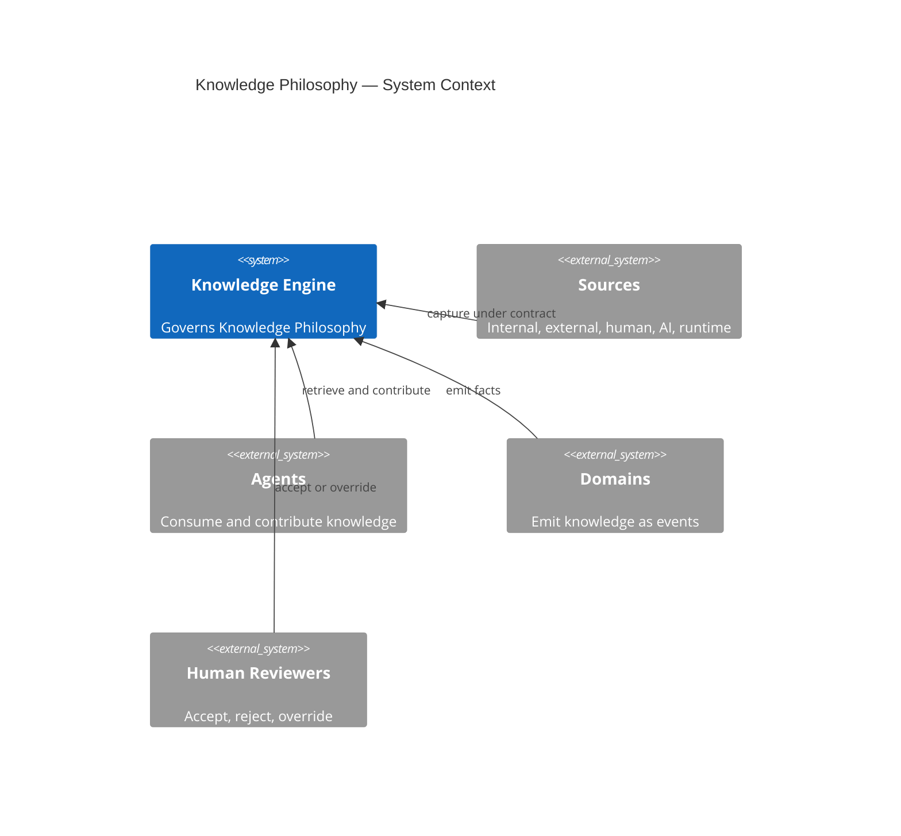

*Diagram `CAT-KE-P1-02-D-1` is illustrative of the `Knowledge Philosophy` operating model; it does not authorize a production deployment, validate a corpus, or grant authority.*

#### CAT-KE-P1-02-D-2 — Knowledge Philosophy — Operating Flow

**Diagram ID:** `CAT-KE-P1-02-D-2`
**Title:** Knowledge Philosophy — Operating Flow
**Type:** Flowchart
**Purpose:** Show the governed end-to-end flow of Knowledge Philosophy from capture to evidence.
**Audience:** Human owners, knowledge architects, engineers, security reviewers, operators, auditors, and AI coding agents.
**Reading Order:** Follow arrows left to right from capture to evidence.

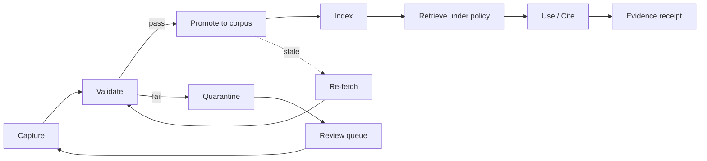

*Diagram `CAT-KE-P1-02-D-2` is illustrative of the `Knowledge Philosophy` operating model; it does not authorize a production deployment, validate a corpus, or grant authority.*

#### CAT-KE-P1-02-D-3 — Knowledge Philosophy — Lifecycle States

**Diagram ID:** `CAT-KE-P1-02-D-3`
**Title:** Knowledge Philosophy — Lifecycle States
**Type:** State Diagram
**Purpose:** Show the governed lifecycle states and guarded transitions for Knowledge Philosophy.
**Audience:** Human owners, knowledge architects, engineers, security reviewers, operators, auditors, and AI coding agents.
**Reading Order:** Start at [*] entry and follow transitions to terminal states.

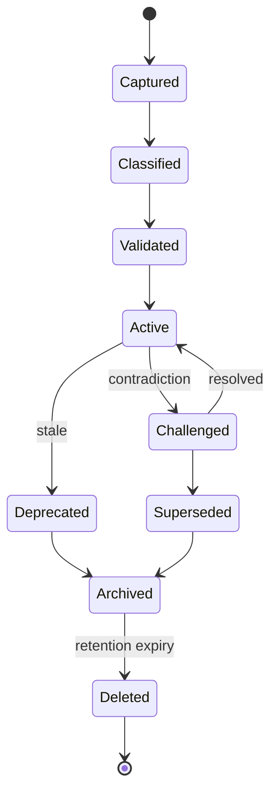

*Diagram `CAT-KE-P1-02-D-3` is illustrative of the `Knowledge Philosophy` operating model; it does not authorize a production deployment, validate a corpus, or grant authority.*

#### CAT-KE-P1-02-D-4 — Knowledge Philosophy — Contribution Sequence

**Diagram ID:** `CAT-KE-P1-02-D-4`
**Title:** Knowledge Philosophy — Contribution Sequence
**Type:** Sequence Diagram
**Purpose:** Show the typed message exchange when a contributor writes Knowledge Philosophy through contracts.
**Audience:** Human owners, knowledge architects, engineers, security reviewers, operators, auditors, and AI coding agents.
**Reading Order:** Read top to bottom; each arrow is a typed contract call.

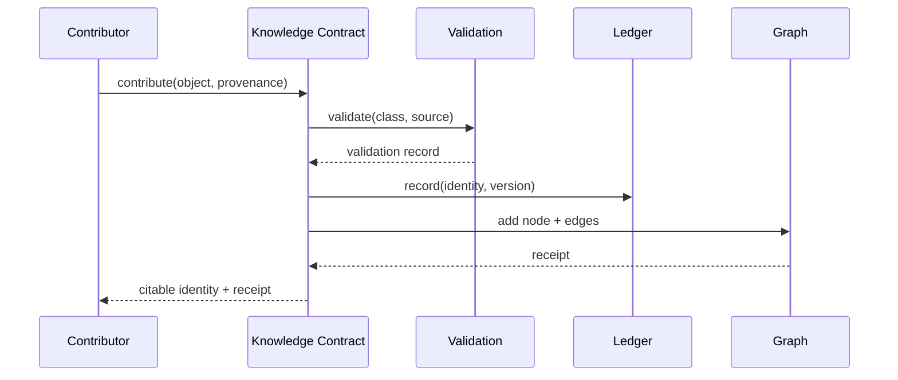

*Diagram `CAT-KE-P1-02-D-4` is illustrative of the `Knowledge Philosophy` operating model; it does not authorize a production deployment, validate a corpus, or grant authority.*

#### CAT-KE-P1-02-D-5 — Knowledge Philosophy — Entity Relationship

**Diagram ID:** `CAT-KE-P1-02-D-5`
**Title:** Knowledge Philosophy — Entity Relationship
**Type:** ER Diagram
**Purpose:** Show the core entities and their governed relationships for Knowledge Philosophy.
**Audience:** Human owners, knowledge architects, engineers, security reviewers, operators, auditors, and AI coding agents.
**Reading Order:** Read entities and cardinalities; each relationship is a governed edge.

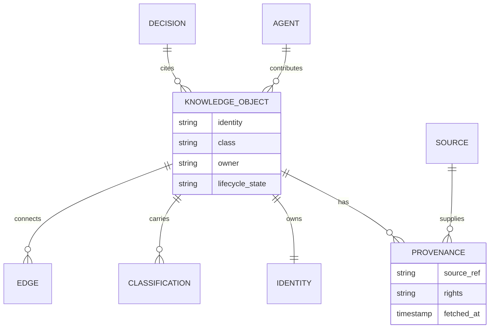

*Diagram `CAT-KE-P1-02-D-5` is illustrative of the `Knowledge Philosophy` operating model; it does not authorize a production deployment, validate a corpus, or grant authority.*

#### CAT-KE-P1-02-D-6 — Knowledge Philosophy — Concept Mindmap

**Diagram ID:** `CAT-KE-P1-02-D-6`
**Title:** Knowledge Philosophy — Concept Mindmap
**Type:** Mindmap
**Purpose:** Map the conceptual neighborhood of Knowledge Philosophy for orientation.
**Audience:** Human owners, knowledge architects, engineers, security reviewers, operators, auditors, and AI coding agents.
**Reading Order:** Read from the center outward to branches.

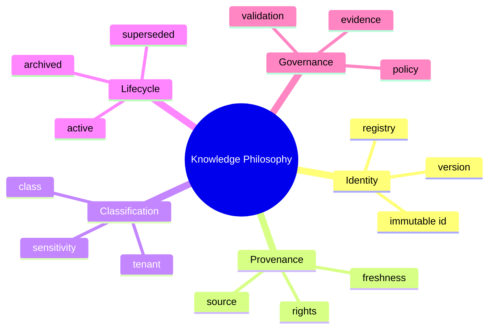

*Diagram `CAT-KE-P1-02-D-6` is illustrative of the `Knowledge Philosophy` operating model; it does not authorize a production deployment, validate a corpus, or grant authority.*

#### CAT-KE-P1-02-D-7 — Knowledge Philosophy — Evolution Timeline

**Diagram ID:** `CAT-KE-P1-02-D-7`
**Title:** Knowledge Philosophy — Evolution Timeline
**Type:** Timeline
**Purpose:** Show how Knowledge Philosophy is intended to mature across phases.
**Audience:** Human owners, knowledge architects, engineers, security reviewers, operators, auditors, and AI coding agents.
**Reading Order:** Read left to right; each phase is evidence-gated.

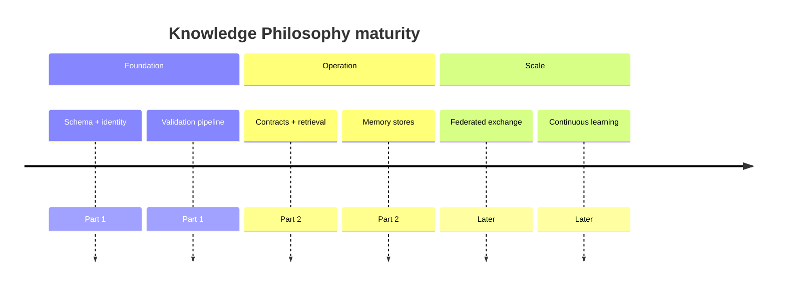

*Diagram `CAT-KE-P1-02-D-7` is illustrative of the `Knowledge Philosophy` operating model; it does not authorize a production deployment, validate a corpus, or grant authority.*

#### CAT-KE-P1-02-D-8 — Knowledge Philosophy — Agent Journey

**Diagram ID:** `CAT-KE-P1-02-D-8`
**Title:** Knowledge Philosophy — Agent Journey
**Type:** Journey
**Purpose:** Show the agent's emotional/step journey while working with Knowledge Philosophy.
**Audience:** Human owners, knowledge architects, engineers, security reviewers, operators, auditors, and AI coding agents.
**Reading Order:** Read left to right through the journey stages.

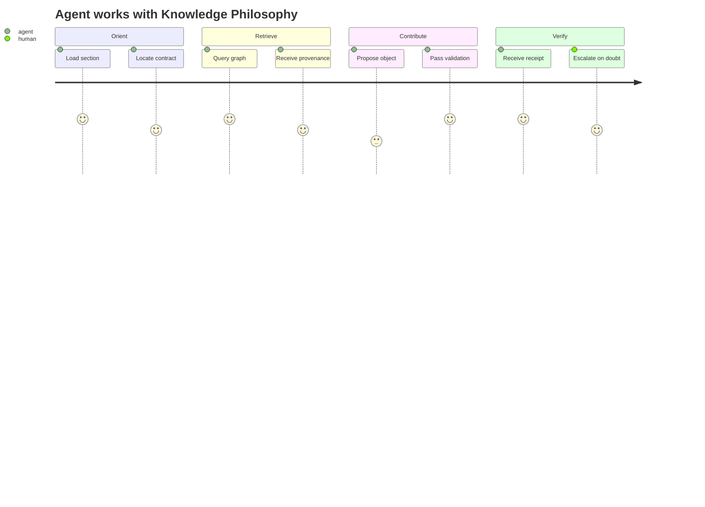

*Diagram `CAT-KE-P1-02-D-8` is illustrative of the `Knowledge Philosophy` operating model; it does not authorize a production deployment, validate a corpus, or grant authority.*

#### CAT-KE-P1-02-D-9 — Knowledge Philosophy — Object Model

**Diagram ID:** `CAT-KE-P1-02-D-9`
**Title:** Knowledge Philosophy — Object Model
**Type:** Class Diagram
**Purpose:** Show the class structure and inheritance/composition for Knowledge Philosophy.
**Audience:** Human owners, knowledge architects, engineers, security reviewers, operators, auditors, and AI coding agents.
**Reading Order:** Read classes top-down; arrows show composition.

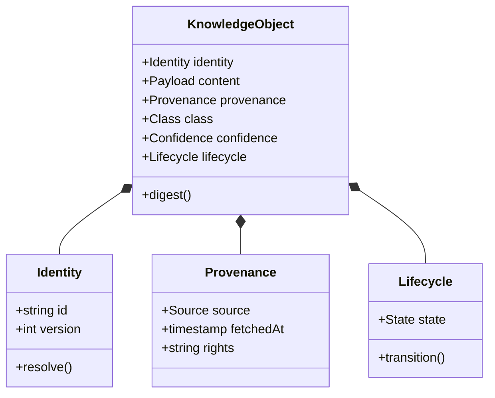

*Diagram `CAT-KE-P1-02-D-9` is illustrative of the `Knowledge Philosophy` operating model; it does not authorize a production deployment, validate a corpus, or grant authority.*

#### CAT-KE-P1-02-D-10 — Knowledge Philosophy — Decision Tree

**Diagram ID:** `CAT-KE-P1-02-D-10`
**Title:** Knowledge Philosophy — Decision Tree
**Type:** Decision Tree
**Purpose:** Show the decision logic the engine applies to a Knowledge Philosophy operation.
**Audience:** Human owners, knowledge architects, engineers, security reviewers, operators, auditors, and AI coding agents.
**Reading Order:** Start at the top question and follow yes/no branches.

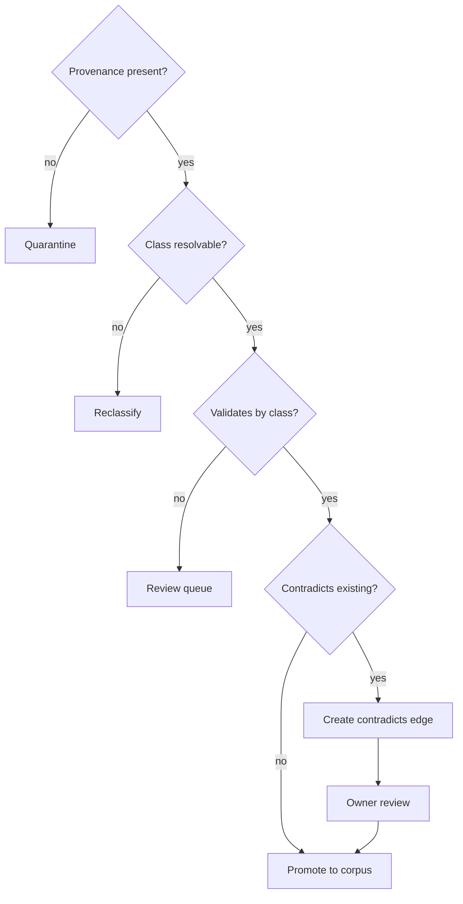

*Diagram `CAT-KE-P1-02-D-10` is illustrative of the `Knowledge Philosophy` operating model; it does not authorize a production deployment, validate a corpus, or grant authority.*

#### CAT-KE-P1-02-D-11 — Knowledge Philosophy — C4 Container

**Diagram ID:** `CAT-KE-P1-02-D-11`
**Title:** Knowledge Philosophy — C4 Container
**Type:** C4 Container
**Purpose:** Decompose the Knowledge Engine into containers responsible for Knowledge Philosophy.
**Audience:** Human owners, knowledge architects, engineers, security reviewers, operators, auditors, and AI coding agents.
**Reading Order:** Read the engine container and its internal components.


*Diagram `CAT-KE-P1-02-D-11` is illustrative of the `Knowledge Philosophy` operating model; it does not authorize a production deployment, validate a corpus, or grant authority.*

#### CAT-KE-P1-02-D-12 — Knowledge Philosophy — Versioning History

**Diagram ID:** `CAT-KE-P1-02-D-12`
**Title:** Knowledge Philosophy — Versioning History
**Type:** Versioning Graph
**Purpose:** Show how Knowledge Philosophy advances through immutable versions over time.
**Audience:** Human owners, knowledge architects, engineers, security reviewers, operators, auditors, and AI coding agents.
**Reading Order:** Read commits left to right along main; supersessions branch and merge.


*Diagram `CAT-KE-P1-02-D-12` is illustrative of the `Knowledge Philosophy` operating model; it does not authorize a production deployment, validate a corpus, or grant authority.*

#### CAT-KE-P1-02-D-13 — Knowledge Philosophy — Control Priority Quadrant

**Diagram ID:** `CAT-KE-P1-02-D-13`
**Title:** Knowledge Philosophy — Control Priority Quadrant
**Type:** Quadrant Chart
**Purpose:** Map the Knowledge Philosophy controls by criticality versus implementation effort to guide sequencing.
**Audience:** Human owners, knowledge architects, engineers, security reviewers, operators, auditors, and AI coding agents.
**Reading Order:** Read the axes; top-right is high-criticality and high-effort.

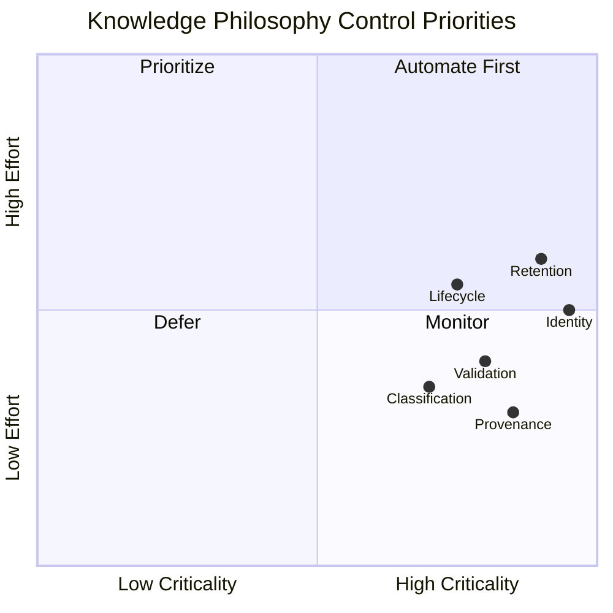

*Diagram `CAT-KE-P1-02-D-13` is illustrative of the `Knowledge Philosophy` operating model; it does not authorize a production deployment, validate a corpus, or grant authority.*

#### CAT-KE-P1-02-D-14 — Knowledge Philosophy — Retrieval Ranking Flow

**Diagram ID:** `CAT-KE-P1-02-D-14`
**Title:** Knowledge Philosophy — Retrieval Ranking Flow
**Type:** Ranking Flow
**Purpose:** Show how retrieval ranks Knowledge Philosophy candidates under policy before returning them.
**Audience:** Human owners, knowledge architects, engineers, security reviewers, operators, auditors, and AI coding agents.
**Reading Order:** Read top to bottom through the ranking stages.

```mermaid
flowchart TD
  Q[Query] --> C[Candidate set]
  C --> P1[Policy filter: tenant, class, lifecycle]
  P1 --> F[Freshness filter]
  F --> S[Source-trust scoring]
  S --> Co[Contradiction down-rank]
  Co --> R[Ranked results]
  R --> X[Explain: path + provenance]
```

*Diagram `CAT-KE-P1-02-D-14` is illustrative of the `Knowledge Philosophy` operating model; it does not authorize a production deployment, validate a corpus, or grant authority.*

#### CAT-KE-P1-02 — ASCII — Knowledge Philosophy at a Glance

**Diagram ID:** `CAT-KE-P1-02-ASCII`
**Title:** Knowledge Philosophy at a Glance
**Type:** ASCII
**Purpose:** A compact text view of Knowledge Philosophy for terminals and quick reference.
**Audience:** Human owners, knowledge architects, engineers, security reviewers, operators, auditors, and AI coding agents.
**Reading Order:** Read the top legend, then the boxed structure.

```text
Legend: [O]=object  [S]=source  [E]=edge  [V]=validation  [L]=ledger

            +-------------------+
   capture  |   [S] source      |
      |     +---------+---------+
      v               v
  +-------+       +----------+
  | [O]   | ----> | [V] gate |
  +-------+       +----+-----+
      |                | pass
      |                v
  +-------+       +----------+        +----------+
  | [L]   | <---- | corpus   | <----> | [E] graph|
  +-------+       +----+-----+        +----------+
      |                |
      v                v
   evidence        retrieve (policy-aware) --> cite
```

*ASCII diagram `CAT-KE-P1-02-ASCII` is illustrative only.*

## 3. Knowledge First Architecture

**Section ID:** `CAT-KE-P1-03`  
**Constitutional domain:** Knowledge Architecture  
**Human accountable owner:** Chief Architect and Chief Knowledge Officer  
**Primary record:** knowledge architecture seam record  
**Decision status:** Foundation decision for the Knowledge Engine Bible Part 1; implementation and production authority remain evidence-gated. Later implementation ADRs MUST preserve this section unless they explicitly supersede a named requirement.  
**Primary question:** The architecture must be designed so that knowledge flows, capture, retrieval, validation, and evolution are first-class seams — not features bolted onto a system that was designed without knowledge in mind.

### Purpose

Knowledge First Architecture inverts the usual priority. Instead of building a system and then asking 'how do we make it smart?', CAT builds the knowledge substrate first and then layers behavior on top of it. Every capability — research, analysis, content, treasury, affiliate — is an expression over a governed knowledge base. This makes intelligence a property of the whole system rather than a property of a model bolted to a feature. The purpose of this section is to define the seams that make that inversion real and testable.

**Normative application:** For `3. Knowledge First Architecture`, the owning implementation MUST make this section observable through a named contract, a policy or guard, a test or review check, and an operational signal. A prose claim without enforcement evidence is incomplete.

### Business Explanation

The business benefit is that every investment in knowledge compounds across every feature. A captured insight about a market, a customer, a regulation, or a technology becomes available to every agent and every human instead of dying inside the silo where it was learned. The cost of features falls over time because they increasingly assemble existing knowledge rather than rediscover it. The architecture pays for itself through reuse and through the prevention of contradictory action.

**Normative application:** For `3. Knowledge First Architecture`, the owning implementation MUST expose to an accountable reviewer the cost, benefit, risk, owner, uncertainty, and consequence of this capability before it is accepted.

The business MUST fund the control work that keeps `Knowledge First Architecture` trustworthy as part of delivery: provenance capture, classification, validation, human review where required, recovery, audit, and lifecycle retirement are not optional overhead. Success is the durable outcome represented by `knowledge architecture seam record`, not output volume or knowledge-object count.

### Engineering Explanation

Engineering realizes knowledge-first through explicit seams: a knowledge capture port at every domain and agent boundary; a retrieval port with policy, ranking, and freshness controls; a validation port that checks consistency before promotion; and an evolution port that versions knowledge changes as first-class events. These seams are typed, tested, and observable. A subsystem that lacks them is non-compliant by definition.

Implement `Knowledge First Architecture` through versioned schemas, deterministic state machines, owned ports, immutable identities, hierarchical budgets, cancellation, idempotency, checkpoints, and source-of-truth verification. Probabilistic inference may propose; deterministic services authorize and commit.

Make time, randomness, source routes, policy versions, and external effects injectable in tests. Classify every dependency as startup-hard, runtime-required, optional, or asynchronous; define timeout, circuit, fallback, replay, migration, and failure ownership explicitly for `Knowledge First Architecture`.

### Architecture Perspective

Architecturally, the Knowledge Engine is positioned as the connective tissue between the Kernel, the Domains, and the Agents. It does not own business truth — domains do — but it owns the representation, linkage, and lifecycle of knowledge about that truth. The Agent layer reads knowledge to reason and writes knowledge to remember; the Domain layer emits knowledge as events; the Kernel schedules knowledge operations as governed work.

**Normative application:** For `3. Knowledge First Architecture`, the owning implementation MUST make this perspective observable through a named contract, a policy or guard, a test or review check, and an operational signal. A prose claim without enforcement evidence is incomplete.

Chief Architect and Chief Knowledge Officer remains the human accountability boundary for `Knowledge First Architecture`. The Knowledge Architecture domain owns semantics and canonical state; CATA coordinates portfolios, the Supervisor coordinates runtime, specialists produce bounded artifacts, and policy and effect gateways prevent orchestration from becoming authority.

### AI Perspective

For an AI, knowledge-first means that retrieval is never optional and never implicit. Every reasoning step is expected to declare its knowledge basis, every proposed action is expected to cite its knowledge support, and every durable contribution is expected to pass through the knowledge seams rather than bypassing them. The architecture gives the AI a reliable place to read and a governed place to write.

**Normative application:** For `3. Knowledge First Architecture`, the owning implementation MUST make this perspective observable through a named contract, a policy or guard, a test or review check, and an operational signal. A prose claim without enforcement evidence is incomplete.

AI confidence about `Knowledge First Architecture` is one signal only; it cannot substitute for provenance, validation, authority, or human acceptance where the class of knowledge requires them.

### Implementation Strategy

The implementation strategy for `Knowledge First Architecture` proceeds in evidence-gated increments rather than a single release. Each increment begins as a hypothesis encoded as a typed schema and a contract, runs first in simulation or a sandboxed knowledge store, proves quality and safety against positive and negative fixtures, and is promoted only after independent owner acceptance.

1. **Model first.** Define the canonical schema, identity derivation, legal-edge matrix (where relevant), and the policy bindings for `knowledge architecture seam record` before any code writes or reads it.
2. **Validate at the boundary.** Place the Knowledge Architecture validations at the ingestion seam so that invalid or unprovenanced input is quarantined before it can reach the citable corpus.
3. **Version everything.** Treat every `Knowledge First Architecture` artifact as immutable and append-only; all change is a versioned transformation with recorded inputs and outputs.
4. **Observe continuously.** Emit structured decision receipts, tool receipts, and redacted artifacts with immutable lineage for every `Knowledge First Architecture` operation.
5. **Fail closed.** When policy, provenance, classification, or ownership cannot be established for a `Knowledge First Architecture` operation, the operation stops, preserves state and evidence, and routes the decision to Chief Architect and Chief Knowledge Officer.

### Developer Notes

- Before editing a `Knowledge First Architecture` implementation, inspect the registered schema, the owning domain API, the policy bindings, the validation pipeline, the tests, and the operational runbook.
- Do not create a bypass around a validation, classification, provenance, or approval control to satisfy a task quickly. A bypass is a defect, not a shortcut.
- State assumptions, the exact authority requested, data classifications, expected effects, and the rollback path in the change description for every `Knowledge First Architecture` change.
- Add a negative test for every newly permitted `Knowledge First Architecture` capability and a recovery test for every material external effect that depends on it.
- If a requirement is ambiguous, stop at the safe boundary and request an accountable human decision; do not convert inference into permission for `Knowledge First Architecture`.

### Codex Notes

When generating code for `Knowledge First Architecture`, Codex should emit the schema, contract, validation, and test scaffolding together rather than logic alone. The `Knowledge First Architecture` surface is contract-first: the typed request, response, event, error, and receipt shapes are the deliverable, and the implementation must conform to them.

- Prefer deterministic guards over prompt-level instructions for every `Knowledge First Architecture` policy; the model may not be relied upon to enforce invariants.
- Generate negative fixtures first for `Knowledge First Architecture`: malformed input, missing provenance, classification mismatch, expired source, and contradictory edges.
- Keep `Knowledge First Architecture` changes minimal and additive; prefer a new version over an in-place mutation.
- Include redaction in every emitted log, metric, and artifact for `Knowledge First Architecture`; protected content must never appear in observability.

### Claude Code Notes

When operating agentic edits on `Knowledge First Architecture`, Claude Code should treat the Knowledge Engine contracts as the boundary of permission: read through retrieval contracts, write through contribution contracts, and never reach storage or the graph store directly. The agent must record its `Knowledge First Architecture` contributions against the ledger with provenance.

- Before modifying `Knowledge First Architecture`, load the relevant section of this Bible, the schema, and the current ownership and classification state.
- Distinguish a proposed `Knowledge First Architecture` contribution from a validated one; never present a draft as trusted or citable.
- On contradiction detection between `Knowledge First Architecture` objects, create a governed edge and escalate rather than silently choosing one side.
- Preserve user work: if a `Knowledge First Architecture` change would invalidate dependent paths, report the impact and request the human decision.

### Gemini CLI Notes

When working in a terminal against `Knowledge First Architecture` at scale, Gemini CLI's long context is useful for loading whole sections, schemas, and the dependency graph before proposing a change. The agent should summarize the `Knowledge First Architecture` context into a bounded brief, cite the section anchors it relied on, and flag any unresolved conflict before acting.

- Use the `Knowledge First Architecture` contracts as the only access path; shell-level or direct-store access is prohibited.
- Batch `Knowledge First Architecture` validations and run them locally against fixtures before proposing promotion.
- Keep the `Knowledge First Architecture` change set small and reviewable; large diffs obscure provenance and classification changes.
- Report the token and cost footprint of `Knowledge First Architecture` retrieval operations, because knowledge economics are part of the deliverable.

### Future AI Notes

Future AI models may reason over `Knowledge First Architecture` more fluently and at greater scale, but no advance in model quality changes CAT's requirement for provenance, classification, validation, authority, and evidence. A more capable model that bypasses these controls is a larger risk, not a smaller one.

- Future agents operating on `Knowledge First Architecture` must consume the same contracts; intelligence is not a license to bypass seams.
- Richer reasoning over `Knowledge First Architecture` must still emit explainable graph paths; opacity is not acceptable even when the model is accurate.
- Future autonomy over `Knowledge First Architecture` is earned through measured evidence, not asserted; escalation paths to Chief Architect and Chief Knowledge Officer must remain open.
- Future `Knowledge First Architecture` capability must never retroactively authorize current behavior; the constitution governs forward.

### Security Notes

Apply zero standing privilege, workload identity, tenant and environment isolation, purpose-bound data, secret-manager references, prompt and tool injection defenses, egress policy, sandboxing, rate limits, revocation, tamper-evident receipts, and a tested kill switch for `Knowledge First Architecture`.

Section invariant for `Knowledge First Architecture`: No CAT subsystem may be designed or changed without an explicit knowledge seam: where knowledge is captured, where it is stored, how it is retrieved, who owns it, and how it is retired.

Threat tests for `{title}` cover confused deputy, role-title escalation, malicious context, poisoned knowledge, memory exfiltration, approval laundering, replay, supply-chain substitution, side channels, resource exhaustion, audit tampering, and compromised provider behavior. Each must fail closed and emit a protected signal.

### Performance Notes

Declare separate service-level objectives for `Knowledge First Architecture` admission, queueing, validation, retrieval, effect verification, and evidence publication; one hundred percent of terminal `knowledge architecture seam record` records must be attributable and schema-valid.

Measure the `Knowledge First Architecture` latency components separately — source fetch, validation, indexing, traversal, ranking, evidence publication — and report percentiles, quality, safety, cost, human burden, cancellation delay, and terminal classes. Never improve averages by dropping rejected, failed, or quarantined `Knowledge First Architecture` work.

### Scalability Notes

Partition `Knowledge First Architecture` work by tenant and bounded aggregate, preserve global contract compatibility, cap concurrency and fan-out, and fail closed when ownership or policy cannot converge.

Use bounded fan-out, backpressure, fairness reservations, locality, and asynchronous facts where ordering is unnecessary for `{title}`. Cross-region or cross-node scale requires explicit data residency, identity federation, protocol compatibility, conflict resolution, disconnect behavior, and reconciliation. Rebuildable projections absorb read scale without becoming sources of truth.

### Failure Modes

The principal `Knowledge First Architecture` failure is unprovenanced or misclassified knowledge entering active use; secondary failures are stale sources, contradictory edges, identity drift, retention violation, and silent degradation.

| Failure mode | Trigger | Effect | Detection |
|---|---|---|---|
| Unprovenanced knowledge | Ingestion without source record | Trust erosion, audit gap | Provenance gate at ingestion |
| Misclassification | Wrong class assigned at capture | Wrong validation, wrong retention | Class-specific validation failure |
| Stale source | Source past freshness SLA | Outdated facts cited | Freshness monitor + re-fetch |
| Contradictory edges | Two edges conflict unresolved | Ambiguous reasoning | Contradiction detection + review queue |
| Identity drift | Duplicate or moved identity | Broken references | Registry integrity scan |
| Retention violation | Memory or data past legal limit | Compliance breach | Retention enforcement + tombstones |
| Silent degradation | Quality metric decline unnoticed | Erosion of trust | Continuous quality monitoring |

### Recovery Strategy

Recovery for `Knowledge First Architecture` stops further effects, preserves the run record, isolates the cause, reconciles knowledge state against authoritative sources, and routes the unresolved decision to Chief Architect and Chief Knowledge Officer.

1. **Contain.** Suspend the affected `Knowledge First Architecture` scope and prevent new reads of the compromised knowledge.
2. **Preserve.** Freeze the run record, receipts, and evidence for `Knowledge First Architecture`; do not delete.
3. **Reconcile.** Re-establish authoritative `Knowledge First Architecture` state from validated sources; quarantine anything that cannot be reconciled.
4. **Restore.** Restore the `Knowledge First Architecture` invariant — provenance, classification, ownership, lifecycle — before resuming.
5. **Review.** Link a terminal recovery receipt and route the residual decision to Chief Architect and Chief Knowledge Officer; capture the lesson as governed knowledge.

### Extension Points

`Knowledge First Architecture` exposes typed extension points so the engine grows without breaking contracts:

- **Source adapters.** New `Knowledge First Architecture` sources plug into the ingestion seam through a typed adapter that normalizes input and records provenance.
- **Validation rules.** New `Knowledge First Architecture` checks are registered class-specific validators; they compose into the validation pipeline without modifying core logic.
- **Entity and edge types.** New `Knowledge First Architecture` entity or edge types extend the registered schema and legal-edge matrix; unknown types remain rejected.
- **Memory classes.** New `Knowledge First Architecture` memory classes are added as governed stores with namespace, consent, retention, and tombstone controls.
- **Retrieval strategies.** New `Knowledge First Architecture` ranking or traversal strategies register behind the retrieval contract; the policy layer governs their use.

### Ownership

| Ownership layer | Holder | Responsibility |
|---|---|---|
| Human accountable owner | Chief Architect and Chief Knowledge Officer | Residual business judgment, risk acceptance, rights, and consequential approval for `Knowledge First Architecture`. |
| Operational owner | Knowledge Architecture Service Owner | Enforcement, schemas, contracts, runbooks, and SLOs for `Knowledge First Architecture`. |
| Domain owner | Domain Owners (per knowledge class) | Class-specific validation, freshness, and canonical truth for `{title}`. |
| Audit owner | Independent Audit Owner | Independent evidence review, tamper-evidence, and retention for `{title}`. |
| Chief Knowledge Officer | Executive CKO | Cross-domain knowledge policy, asset register integrity, and constitution for `{title}`. |

### Dependencies

`Knowledge First Architecture` depends on the following, which MUST be satisfied before the capability is promotable:

| Dependency | Type | Requirement |
|---|---|---|
| Knowledge Object Model | Foundation | Schema and identity derivation exist and are versioned. |
| Identity Registry | Foundation | Globally unique, immutable, resolvable identities exist. |
| Policy Decision Point | Runtime-required | Classification, tenant, and lifecycle policy is enforced at every `Knowledge First Architecture` boundary. |
| Validation Pipeline | Runtime-required | Class-specific checks run before promotion. |
| Observability | Runtime-required | Structured logs, traces, metrics, receipts, and redacted artifacts are emitted. |
| Higher-order context | Foundation | `context/00` through `context/05` are read and applied. |
| Accepted ADR | Gated | A completed, accepted ADR exists before a production `Knowledge First Architecture` change. |

### Risks

| Risk | Likelihood | Impact | Mitigation |
|---|---|---|---|
| Unprovenanced knowledge trusted | Medium | High | Mandatory provenance gate; quarantine on absence. |
| Misclassification | Medium | High | Class-specific validation; conservative reclassification on doubt. |
| Contradiction accumulation | High | Medium | Contradiction detection edges; resolution queue with owners. |
| Staleness eroding decisions | High | Medium | Freshness SLAs; scheduled re-fetch; expiry enforcement. |
| Cross-tenant leakage | Low | Critical | Structural tenant isolation in traversal; deny by default. |
| Retention non-compliance | Medium | Critical | Retention enforcement; tombstones; re-consent. |
| Scale-induced governance lapse | Medium | High | Layered architecture; fail-closed under overload. |
| Model overconfidence | High | High | Confidence never substitutes for evidence or authority. |

### Anti-patterns

- Storing `Knowledge First Architecture` as free text without machine-readable provenance, classification, or identity.
- Mutating `Knowledge First Architecture` in place instead of versioning it; destroying history.
- Bypassing the `Knowledge First Architecture` contracts to read or write stores directly.
- Treating AI-generated `Knowledge First Architecture` as validated without deterministic checks.
- Promoting memory into authoritative `Knowledge First Architecture` without validation.
- Dropping or hiding contradictory `Knowledge First Architecture` edges to produce a clean path.
- Allowing `Knowledge First Architecture` to persist without an owner; orphaned knowledge.
- Inferring implementation permission from this document's existence or completion percentage.

### Best Practices

- Capture `Knowledge First Architecture` at the boundary where it is created or modified; do not retrofit provenance later.
- Make `Knowledge First Architecture` immutable and append-only; express all change as versioned transformations.
- Validate `Knowledge First Architecture` by class before promotion; quarantine on any failed check.
- Carry classification, confidence, and lifecycle with every `Knowledge First Architecture` object at all times.
- Represent `Knowledge First Architecture` relationships as governed edges; compute structure, do not imply it.
- Enforce tenant isolation, retention, and consent structurally in traversal.
- Keep projections rebuildable; never promote a cache to a source of truth.
- Require an accepted ADR before any irreversible `Knowledge First Architecture` architecture choice.

### Examples

The following illustrative examples show intended `Knowledge First Architecture` behavior. They are illustrative only; they do not authorize production use, validate a real corpus, or grant any authority.

**Example 1 — Compliant `Knowledge First Architecture` contribution.**
A domain emits a `{title}` record with identity, source reference, classification, declared confidence, owner, and lifecycle state. The validation pipeline confirms schema, provenance, freshness, rights, and contradiction status; the object is promoted to the citable corpus and recorded in the ledger with a digest. Retrieval returns the object with its provenance and lifecycle visible.

**Example 2 — Compliant `Knowledge First Architecture` evolution.**
A reviewer finds that a `{title}` object is stale. They propose a correction as a new version citing an authoritative source; the engine records a `supersedes` edge from the old version to the new, preserves the old version as history, and re-evaluates dependent paths. An independent reviewer can reconstruct the state at any past date.

**Example 3 — Compliant `Knowledge First Architecture` contradiction handling.**
Two `{title}` objects assert incompatible claims. The engine creates a governed `contradicts` edge, down-ranks both in retrieval, flags them for review, and surfaces the conflict to the domain owner. Neither is silently chosen; resolution is a recorded human or independent-evaluator decision.

### Counter Examples

The following are non-compliant `Knowledge First Architecture` patterns that MUST be rejected:

**Counter-example 1 — Unprovenanced assertion.**
An AI contributes a `Knowledge First Architecture` claim without a source reference. The object is rejected at ingestion; the claim may live only as a draft, never as trusted or citable knowledge.

**Counter-example 2 — Silent overwrite.**
A maintainer edits a `{title}` object in place to correct an error. The in-place mutation destroys history and violates immutability; the change is rolled back and re-applied as a versioned correction.

**Counter-example 3 — Hidden contradiction.**
A traversal hides a `contradicts` edge to return a clean recommendation. Hiding the edge is a knowledge-integrity violation; the traversal must surface the conflict and down-rank rather than conceal.

**Counter-example 4 — Memory as truth.**
An agent treats a long-term memory as an authoritative fact and acts on it without validation. The memory is advisory only; acting on it as fact is a discipline violation requiring the fact to be validated first.

### Implementation Checklist

- [ ] Canonical schema, owner, compatibility policy, and stable error taxonomy defined for `Knowledge First Architecture`.
- [ ] Identity, policy, classification, provenance, and lifecycle encoded outside the model for `Knowledge First Architecture`.
- [ ] Each AI capability for `Knowledge First Architecture` mapped to an owned port, data class, effect class, and receipt.
- [ ] State transitions implemented with optimistic concurrency and durable checkpoints for `Knowledge First Architecture`.
- [ ] Correlation, causation, deadline, cancellation, and budget propagated through every `Knowledge First Architecture` call.
- [ ] External effects verified from authoritative state before completion or retry for `Knowledge First Architecture`.
- [ ] Degraded behavior, circuit breaking, containment, recovery, and reconciliation provided for `Knowledge First Architecture`.
- [ ] Operational logs redacted; protected forensic evidence retained by explicit policy for `Knowledge First Architecture`.
- [ ] Role-quality, adversarial, tenancy, load, chaos, migration, and rollback tests created for `Knowledge First Architecture`.
- [ ] Dashboards, alert thresholds, runbooks, on-call ownership, and support boundaries shipped for `Knowledge First Architecture`.
- [ ] An immutable `Knowledge First Architecture` version canaried with a tested last-known-safe rollback target.
- [ ] Independent owner acceptance and applicable certification required before production `Knowledge First Architecture`.

### AI Memory Anchor

**Memory anchor `CAT-KE-P1-03`:** `3. Knowledge First Architecture` means: The architecture must be designed so that knowledge flows, capture, retrieval, validation, and evolution are first-class seams — not features bolted onto a system that was designed without knowledge in mind. The AI agent MUST preserve provenance, classification, identity, validation, evidence, safe failure, and human accountability for `Knowledge First Architecture`. If a request conflicts with those anchors, stop, explain the conflict, and propose the smallest safe alternative.

### Cross References

- Section-specific context: `core/knowledge/`, `core/memory/`, `core/rag/`, `knowledge/`, and `context/06_KNOWLEDGE_ENGINE.md`.
- Constitutional baseline: `context/00_PROJECT_CONTEXT.md`, `context/01_PROJECT_OVERVIEW.md`, `context/02_PROJECT_RULES.md`, `context/03_TECH_STACK.md`, `context/04_ARCHITECTURE.md`, and `context/05_AGENTS.md`.
- This Bible: sections 1 through 20 of `context/06_KNOWLEDGE_ENGINE.md` Part 1.
- Operational implementation also consults `context/16_DEPLOYMENT.md`, `context/17_SECURITY.md`, `context/18_PROMPTING.md`, and `context/19_DEVELOPMENT_GUIDE.md` as they become authoritative.
- Architecture references: `architecture/KnowledgeGraph/`, `architecture/Data_Flow.md`, `architecture/AI_Architecture.md`.

### Repository Mapping

| Repository concern | Canonical location or governing source |
|---|---|
| Knowledge core | `core/knowledge/` — object model, identity, validation, lifecycle. |
| Memory | `core/memory/` — working, short, long, episodic, semantic, procedural, collective stores. |
| Retrieval / RAG | `core/rag/` — policy-aware retrieval contracts. |
| Knowledge graph | `architecture/KnowledgeGraph/` and `core/knowledge/graph/` when implemented. |
| Knowledge assets | `knowledge/` — index, glossary, maps; placeholders are non-authoritative. |
| Architecture authority | `context/04_ARCHITECTURE.md`, `architecture/System_Architecture.md`, and this Bible. |
| Agents | `context/05_AGENTS.md` and `agents/` — agents consume and contribute knowledge through contracts. |
| Security authority | `SECURITY.md`, `context/17_SECURITY.md` when completed, and policy implementation paths. |
| Decisions | `adr/ADR-0001.md` through `adr/ADR-0055.md` are current placeholders; a material implementation MUST create or complete a relevant accepted ADR rather than cite an empty ADR as evidence. |

### Folder Mapping

| Folder | Role in `Knowledge First Architecture` | Authority |
|---|---|---|
| `core/knowledge/` | `Knowledge First Architecture` object model, identity, validation, lifecycle services. | Normative when implemented. |
| `core/memory/` | `Knowledge First Architecture` memory stores and governance. | Normative when implemented. |
| `core/rag/` | `Knowledge First Architecture` retrieval contracts. | Normative when implemented. |
| `knowledge/` | `Knowledge First Architecture` asset index, glossary, and maps. | Reference; placeholders non-authoritative. |
| `architecture/KnowledgeGraph/` | `Knowledge First Architecture` graph models. | Reference diagrams. |
| `context/06_KNOWLEDGE_ENGINE.md` | `Knowledge First Architecture` constitutional documentation (this file). | Normative foundation. |
| `adr/` | `Knowledge First Architecture` implementation decisions. | Evidence-gated; placeholders non-authoritative. |

### Future Evolution

Future evolution of `Knowledge First Architecture` may include richer semantic models, multimodal knowledge objects, federated knowledge exchange, automated contradiction resolution, and continuous-learning loops. Every increment begins as a hypothesis, runs in simulation or a sandboxed knowledge store, proves quality and safety, obtains independent human authorization, canaries immutable versions, and retains rollback, migration, and historical interpretation.

Future capability never retroactively authorizes current behavior. Rights, law, accountability, provenance, classification, tenant choice, evidence, security, and safe exit remain constraints for `Knowledge First Architecture` even when technology, organization, providers, or economic models change.

### Operating Contract

| Contract dimension | Normative requirement |
|---|---|
| Business outcome | Knowledge First Architecture inverts the usual priority. |
| Human accountability | Chief Architect and Chief Knowledge Officer |
| Authoritative artifact | knowledge architecture seam record |
| Required inputs | authenticated charter; current knowledge architecture state; policy and authority snapshot; owned evidence; deadline; budget; acceptance criteria; human accountability route |
| Required outputs | versioned knowledge architecture seam record; decision evidence; state transition; exceptions; resource account; terminal receipt |
| Constitutional invariant | No CAT subsystem may be designed or changed without an explicit knowledge seam: where knowledge is captured, where it is stored, how it is retrieved, who owns it, and how it is retired. |
| Default authority | A0/A1 advice and preparation unless an exact role card, policy, certification and effect-specific grant narrow a higher ceiling. |
| Default failure | Stop the smallest unsafe scope, preserve state and evidence, reconcile any attempted effect, and route the unresolved decision to the named owner. |
| Performance envelope | Declare separate SLOs for admission, queueing, validation, retrieval, effect verification and evidence publication; 100 percent of terminal knowledge architecture seam record records must be attributable and schema-valid. |
| Scale model | Partition knowledge architecture work by tenant and bounded aggregate, preserve global contract compatibility, cap concurrency and fan-out, and fail closed when ownership or policy cannot converge. |
| Future direction | richer semantic models, multimodal knowledge objects, federated exchange and continuously validated knowledge |

### End-to-End Constitutional Procedure

1. **Establish charter and scope.** Validate identity, scope, owner, policy, data, authority, budget and deadline for `Knowledge First Architecture`; persist the decision and do not begin a dependent step until its preconditions and evidence pass.
2. **Resolve identity version tenant and owner.** Validate identity, scope, owner, policy, data, authority, budget and deadline; persist the decision and do not begin a dependent step until its preconditions and evidence pass.
3. **Capture source and provenance.** Validate identity, scope, owner, policy, data, authority, budget and deadline; persist the decision and do not begin a dependent step until its preconditions and evidence pass.
4. **Classify by taxonomy class.** Validate identity, scope, owner, policy, data, authority, budget and deadline; persist the decision and do not begin a dependent step until its preconditions and evidence pass.
5. **Validate by class against authority freshness rights and contradiction.** Validate identity, scope, owner, policy, data, authority, budget and deadline; persist the decision and do not begin a dependent step until its preconditions and evidence pass.
6. **Promote to the citable corpus and record in the ledger.** Validate identity, scope, owner, policy, data, authority, budget and deadline; persist the decision and do not begin a dependent step until its preconditions and evidence pass.
7. **Retrieve under policy and cite with provenance.** Validate identity, scope, owner, policy, data, authority, budget and deadline; persist the decision and do not begin a dependent step until its preconditions and evidence pass.
8. **Retire or supersede through lifecycle with reconciliation.** Validate identity, scope, owner, policy, data, authority, budget and deadline; persist the decision and do not begin a dependent step until its preconditions and evidence pass.

### Required Decision Record

| Record component | Minimum fields | Independent check |
|---|---|---|
| Charter | outcome, non-goals, sponsor, owner, acceptance, deadline and expiry | mission and owner resolver |
| Identity | logical ID, immutable version, runtime principal, tenant, environment and operator | identity and lifecycle service |
| Evidence | sources, revisions, rights, freshness, transformations, contradictions and confidence | domain and provenance validator |
| Decision | facts, assumptions, alternatives, dissent, risk, cost, uncertainty and requested judgment | human or independent evaluator |
| Authority | role ceiling, task grant, policy, data purpose, approval and live revocation state | policy enforcement point |
| Execution | plan, resources, tools, state versions, checkpoints, attempts and effects | orchestrator and domain gateways |
| Outcome | typed status, acceptance, quality, business result, externalities, incidents and follow-up owner | task owner and analytics |
| Audit | correlation, causation, digests, timestamps, receipts, retention and access history | independent Audit owner |

### Constitutional Control Catalogue

Each control below is independently testable for `Knowledge First Architecture`. Satisfying a narrative goal without the named enforcement and evidence is not constitutional conformance.

#### CAT-KE-P1-03-C01 — Charter Scope

- **Rule:** For `knowledge first architecture`, bind all work to a signed outcome, explicit non-goals, owner, expiry and acceptance criteria.
- **Business test:** `knowledge architecture seam record` exposes the cost, benefit, risk, owner, uncertainty and consequence of this control to an accountable reviewer.
- **Engineering enforcement:** The boundary responsible for `establish charter and scope` validates this control before state change and again before any related material effect.
- **AI behavior:** Missing, stale, contradictory, denied or unverifiable control data causes a typed stop, wait, refusal or escalation; the model never fills the gap with confidence.
- **Human boundary:** Chief Architect and Chief Knowledge Officer receives the exact requested decision and evidence when human judgment is required; no UI default or silence creates consent.
- **Security assertion:** Forged role, cross-tenant reference, replay, changed payload, expired grant, injected instruction and evidence tampering all fail closed and emit a protected signal.
- **Performance assertion:** Enforcement remains inside the declared SLO and resource reserve; overload applies backpressure rather than removing checks.
- **Evidence:** Store logical and runtime identity, tenant, versions, policy, grants, input/output digests, decision, state, timestamps, owner and redacted receipts.
- **Failure code:** `CAT_KE_P1_03_C01`; dependent work remains non-success and any attempted effect enters reconciliation.
- **Recovery:** Contain the affected scope, establish authoritative effect state, restore the invariant, obtain required human decision and link a terminal recovery receipt.
- **Implementation test:** Run positive, negative, boundary, cancellation, duplicate, stale-state, migration and compromised-dependency fixtures deterministically.
- **Ownership:** Chief Architect and Chief Knowledge Officer owns residual business judgment; the Knowledge Architecture service owner owns enforcement; Audit owns independent evidence review.
- **Constitutional assertion:** An independent reviewer can reproduce the `Charter Scope` disposition without trusting hidden reasoning, title, provider success or undocumented operator explanation.

#### CAT-KE-P1-03-C02 — Human Accountability

- **Rule:** For `knowledge first architecture`, retain a named human role for strategy, residual risk, rights, legal judgment and consequential approval.
- **Business test:** `knowledge architecture seam record` exposes the cost, benefit, risk, owner, uncertainty and consequence of this control to an accountable reviewer.
- **Engineering enforcement:** The boundary responsible for `resolve identity version tenant and owner` validates this control before state change and again before any related material effect.
- **AI behavior:** Missing, stale, contradictory, denied or unverifiable control data causes a typed stop, wait, refusal or escalation; the model never fills the gap with confidence.
- **Human boundary:** Chief Architect and Chief Knowledge Officer receives the exact requested decision and evidence when human judgment is required; no UI default or silence creates consent.
- **Security assertion:** Forged role, cross-tenant reference, replay, changed payload, expired grant, injected instruction and evidence tampering all fail closed and emit a protected signal.
- **Performance assertion:** Enforcement remains inside the declared SLO and resource reserve; overload applies backpressure rather than removing checks.
- **Evidence:** Store logical and runtime identity, tenant, versions, policy, grants, input/output digests, decision, state, timestamps, owner and redacted receipts.
- **Failure code:** `CAT_KE_P1_03_C02`; dependent work remains non-success and any attempted effect enters reconciliation.
- **Recovery:** Contain the affected scope, establish authoritative effect state, restore the invariant, obtain required human decision and link a terminal recovery receipt.
- **Implementation test:** Run positive, negative, boundary, cancellation, duplicate, stale-state, migration and compromised-dependency fixtures deterministically.
- **Ownership:** Chief Architect and Chief Knowledge Officer owns residual business judgment; the Knowledge Architecture service owner owns enforcement; Audit owns independent evidence review.
- **Constitutional assertion:** An independent reviewer can reproduce the `Human Accountability` disposition without trusting hidden reasoning, title, provider success or undocumented operator explanation.

#### CAT-KE-P1-03-C03 — Identity and Version

- **Rule:** For `knowledge first architecture`, authenticate logical role, immutable bundle, runtime principal, tenant, environment and operator.
- **Business test:** `knowledge architecture seam record` exposes the cost, benefit, risk, owner, uncertainty and consequence of this control to an accountable reviewer.
- **Engineering enforcement:** The boundary responsible for `capture source and provenance` validates this control before state change and again before any related material effect.
- **AI behavior:** Missing, stale, contradictory, denied or unverifiable control data causes a typed stop, wait, refusal or escalation; the model never fills the gap with confidence.
- **Human boundary:** Chief Architect and Chief Knowledge Officer receives the exact requested decision and evidence when human judgment is required; no UI default or silence creates consent.
- **Security assertion:** Forged role, cross-tenant reference, replay, changed payload, expired grant, injected instruction and evidence tampering all fail closed and emit a protected signal.
- **Performance assertion:** Enforcement remains inside the declared SLO and resource reserve; overload applies backpressure rather than removing checks.
- **Evidence:** Store logical and runtime identity, tenant, versions, policy, grants, input/output digests, decision, state, timestamps, owner and redacted receipts.
- **Failure code:** `CAT_KE_P1_03_C03`; dependent work remains non-success and any attempted effect enters reconciliation.
- **Recovery:** Contain the affected scope, establish authoritative effect state, restore the invariant, obtain required human decision and link a terminal recovery receipt.
- **Implementation test:** Run positive, negative, boundary, cancellation, duplicate, stale-state, migration and compromised-dependency fixtures deterministically.
- **Ownership:** Chief Architect and Chief Knowledge Officer owns residual business judgment; the Knowledge Architecture service owner owns enforcement; Audit owns independent evidence review.
- **Constitutional assertion:** An independent reviewer can reproduce the `Identity and Version` disposition without trusting hidden reasoning, title, provider success or undocumented operator explanation.

#### CAT-KE-P1-03-C04 — Ownership

- **Rule:** For `knowledge first architecture`, name exactly one operational owner for each task, artifact, decision, incident and recovery case.
- **Business test:** `knowledge architecture seam record` exposes the cost, benefit, risk, owner, uncertainty and consequence of this control to an accountable reviewer.
- **Engineering enforcement:** The boundary responsible for `classify by taxonomy class` validates this control before state change and again before any related material effect.
- **AI behavior:** Missing, stale, contradictory, denied or unverifiable control data causes a typed stop, wait, refusal or escalation; the model never fills the gap with confidence.
- **Human boundary:** Chief Architect and Chief Knowledge Officer receives the exact requested decision and evidence when human judgment is required; no UI default or silence creates consent.
- **Security assertion:** Forged role, cross-tenant reference, replay, changed payload, expired grant, injected instruction and evidence tampering all fail closed and emit a protected signal.
- **Performance assertion:** Enforcement remains inside the declared SLO and resource reserve; overload applies backpressure rather than removing checks.
- **Evidence:** Store logical and runtime identity, tenant, versions, policy, grants, input/output digests, decision, state, timestamps, owner and redacted receipts.
- **Failure code:** `CAT_KE_P1_03_C04`; dependent work remains non-success and any attempted effect enters reconciliation.
- **Recovery:** Contain the affected scope, establish authoritative effect state, restore the invariant, obtain required human decision and link a terminal recovery receipt.
- **Implementation test:** Run positive, negative, boundary, cancellation, duplicate, stale-state, migration and compromised-dependency fixtures deterministically.
- **Ownership:** Chief Architect and Chief Knowledge Officer owns residual business judgment; the Knowledge Architecture service owner owns enforcement; Audit owns independent evidence review.
- **Constitutional assertion:** An independent reviewer can reproduce the `Ownership` disposition without trusting hidden reasoning, title, provider success or undocumented operator explanation.

#### CAT-KE-P1-03-C05 — Authority and Permission

- **Rule:** For `knowledge first architecture`, intersect role ceiling, task grant, policy, data purpose, approval and live system state.
- **Business test:** `knowledge architecture seam record` exposes the cost, benefit, risk, owner, uncertainty and consequence of this control to an accountable reviewer.
- **Engineering enforcement:** The boundary responsible for `validate by class against authority freshness rights and contradiction` validates this control before state change and again before any related material effect.
- **AI behavior:** Missing, stale, contradictory, denied or unverifiable control data causes a typed stop, wait, refusal or escalation; the model never fills the gap with confidence.
- **Human boundary:** Chief Architect and Chief Knowledge Officer receives the exact requested decision and evidence when human judgment is required; no UI default or silence creates consent.
- **Security assertion:** Forged role, cross-tenant reference, replay, changed payload, expired grant, injected instruction and evidence tampering all fail closed and emit a protected signal.
- **Performance assertion:** Enforcement remains inside the declared SLO and resource reserve; overload applies backpressure rather than removing checks.
- **Evidence:** Store logical and runtime identity, tenant, versions, policy, grants, input/output digests, decision, state, timestamps, owner and redacted receipts.
- **Failure code:** `CAT_KE_P1_03_C05`; dependent work remains non-success and any attempted effect enters reconciliation.
- **Recovery:** Contain the affected scope, establish authoritative effect state, restore the invariant, obtain required human decision and link a terminal recovery receipt.
- **Implementation test:** Run positive, negative, boundary, cancellation, duplicate, stale-state, migration and compromised-dependency fixtures deterministically.
- **Ownership:** Chief Architect and Chief Knowledge Officer owns residual business judgment; the Knowledge Architecture service owner owns enforcement; Audit owns independent evidence review.
- **Constitutional assertion:** An independent reviewer can reproduce the `Authority and Permission` disposition without trusting hidden reasoning, title, provider success or undocumented operator explanation.

#### CAT-KE-P1-03-C06 — Separation of Duties

- **Rule:** For `knowledge first architecture`, prevent requester, evaluator, approver, executor and auditor roles from collapsing where risk requires independence.
- **Business test:** `knowledge architecture seam record` exposes the cost, benefit, risk, owner, uncertainty and consequence of this control to an accountable reviewer.
- **Engineering enforcement:** The boundary responsible for `promote to the citable corpus and record in the ledger` validates this control before state change and again before any related material effect.
- **AI behavior:** Missing, stale, contradictory, denied or unverifiable control data causes a typed stop, wait, refusal or escalation; the model never fills the gap with confidence.
- **Human boundary:** Chief Architect and Chief Knowledge Officer receives the exact requested decision and evidence when human judgment is required; no UI default or silence creates consent.
- **Security assertion:** Forged role, cross-tenant reference, replay, changed payload, expired grant, injected instruction and evidence tampering all fail closed and emit a protected signal.
- **Performance assertion:** Enforcement remains inside the declared SLO and resource reserve; overload applies backpressure rather than removing checks.
- **Evidence:** Store logical and runtime identity, tenant, versions, policy, grants, input/output digests, decision, state, timestamps, owner and redacted receipts.
- **Failure code:** `CAT_KE_P1_03_C06`; dependent work remains non-success and any attempted effect enters reconciliation.
- **Recovery:** Contain the affected scope, establish authoritative effect state, restore the invariant, obtain required human decision and link a terminal recovery receipt.
- **Implementation test:** Run positive, negative, boundary, cancellation, duplicate, stale-state, migration and compromised-dependency fixtures deterministically.
- **Ownership:** Chief Architect and Chief Knowledge Officer owns residual business judgment; the Knowledge Architecture service owner owns enforcement; Audit owns independent evidence review.
- **Constitutional assertion:** An independent reviewer can reproduce the `Separation of Duties` disposition without trusting hidden reasoning, title, provider success or undocumented operator explanation.

#### CAT-KE-P1-03-C07 — Data and Privacy

- **Rule:** For `knowledge first architecture`, enforce classification, minimization, purpose, consent, residency, retention, subject rights and deletion.
- **Business test:** `knowledge architecture seam record` exposes the cost, benefit, risk, owner, uncertainty and consequence of this control to an accountable reviewer.
- **Engineering enforcement:** The boundary responsible for `retrieve under policy and cite with provenance` validates this control before state change and again before any related material effect.
- **AI behavior:** Missing, stale, contradictory, denied or unverifiable control data causes a typed stop, wait, refusal or escalation; the model never fills the gap with confidence.
- **Human boundary:** Chief Architect and Chief Knowledge Officer receives the exact requested decision and evidence when human judgment is required; no UI default or silence creates consent.
- **Security assertion:** Forged role, cross-tenant reference, replay, changed payload, expired grant, injected instruction and evidence tampering all fail closed and emit a protected signal.
- **Performance assertion:** Enforcement remains inside the declared SLO and resource reserve; overload applies backpressure rather than removing checks.
- **Evidence:** Store logical and runtime identity, tenant, versions, policy, grants, input/output digests, decision, state, timestamps, owner and redacted receipts.
- **Failure code:** `CAT_KE_P1_03_C07`; dependent work remains non-success and any attempted effect enters reconciliation.
- **Recovery:** Contain the affected scope, establish authoritative effect state, restore the invariant, obtain required human decision and link a terminal recovery receipt.
- **Implementation test:** Run positive, negative, boundary, cancellation, duplicate, stale-state, migration and compromised-dependency fixtures deterministically.
- **Ownership:** Chief Architect and Chief Knowledge Officer owns residual business judgment; the Knowledge Architecture service owner owns enforcement; Audit owns independent evidence review.
- **Constitutional assertion:** An independent reviewer can reproduce the `Data and Privacy` disposition without trusting hidden reasoning, title, provider success or undocumented operator explanation.

#### CAT-KE-P1-03-C08 — Context Integrity

- **Rule:** For `knowledge first architecture`, assemble minimum source-labelled context with precedence, freshness, digest, budget, exclusions and expiry.
- **Business test:** `knowledge architecture seam record` exposes the cost, benefit, risk, owner, uncertainty and consequence of this control to an accountable reviewer.
- **Engineering enforcement:** The boundary responsible for `retire or supersede through lifecycle with reconciliation` validates this control before state change and again before any related material effect.
- **AI behavior:** Missing, stale, contradictory, denied or unverifiable control data causes a typed stop, wait, refusal or escalation; the model never fills the gap with confidence.
- **Human boundary:** Chief Architect and Chief Knowledge Officer receives the exact requested decision and evidence when human judgment is required; no UI default or silence creates consent.
- **Security assertion:** Forged role, cross-tenant reference, replay, changed payload, expired grant, injected instruction and evidence tampering all fail closed and emit a protected signal.
- **Performance assertion:** Enforcement remains inside the declared SLO and resource reserve; overload applies backpressure rather than removing checks.
- **Evidence:** Store logical and runtime identity, tenant, versions, policy, grants, input/output digests, decision, state, timestamps, owner and redacted receipts.
- **Failure code:** `CAT_KE_P1_03_C08`; dependent work remains non-success and any attempted effect enters reconciliation.
- **Recovery:** Contain the affected scope, establish authoritative effect state, restore the invariant, obtain required human decision and link a terminal recovery receipt.
- **Implementation test:** Run positive, negative, boundary, cancellation, duplicate, stale-state, migration and compromised-dependency fixtures deterministically.
- **Ownership:** Chief Architect and Chief Knowledge Officer owns residual business judgment; the Knowledge Architecture service owner owns enforcement; Audit owns independent evidence review.
- **Constitutional assertion:** An independent reviewer can reproduce the `Context Integrity` disposition without trusting hidden reasoning, title, provider success or undocumented operator explanation.

#### CAT-KE-P1-03-C09 — Knowledge Provenance

- **Rule:** For `knowledge first architecture`, preserve source rights, authority, temporal validity, contradiction and domain-owner review for claims.
- **Business test:** `knowledge architecture seam record` exposes the cost, benefit, risk, owner, uncertainty and consequence of this control to an accountable reviewer.
- **Engineering enforcement:** The boundary responsible for `establish charter and scope` validates this control before state change and again before any related material effect.
- **AI behavior:** Missing, stale, contradictory, denied or unverifiable control data causes a typed stop, wait, refusal or escalation; the model never fills the gap with confidence.
- **Human boundary:** Chief Architect and Chief Knowledge Officer receives the exact requested decision and evidence when human judgment is required; no UI default or silence creates consent.
- **Security assertion:** Forged role, cross-tenant reference, replay, changed payload, expired grant, injected instruction and evidence tampering all fail closed and emit a protected signal.
- **Performance assertion:** Enforcement remains inside the declared SLO and resource reserve; overload applies backpressure rather than removing checks.
- **Evidence:** Store logical and runtime identity, tenant, versions, policy, grants, input/output digests, decision, state, timestamps, owner and redacted receipts.
- **Failure code:** `CAT_KE_P1_03_C09`; dependent work remains non-success and any attempted effect enters reconciliation.
- **Recovery:** Contain the affected scope, establish authoritative effect state, restore the invariant, obtain required human decision and link a terminal recovery receipt.
- **Implementation test:** Run positive, negative, boundary, cancellation, duplicate, stale-state, migration and compromised-dependency fixtures deterministically.
- **Ownership:** Chief Architect and Chief Knowledge Officer owns residual business judgment; the Knowledge Architecture service owner owns enforcement; Audit owns independent evidence review.
- **Constitutional assertion:** An independent reviewer can reproduce the `Knowledge Provenance` disposition without trusting hidden reasoning, title, provider success or undocumented operator explanation.

#### CAT-KE-P1-03-C10 — Memory Governance

- **Rule:** For `knowledge first architecture`, separate working state from durable memory and enforce namespace, provenance, consent, conflict and tombstones.
- **Business test:** `knowledge architecture seam record` exposes the cost, benefit, risk, owner, uncertainty and consequence of this control to an accountable reviewer.
- **Engineering enforcement:** The boundary responsible for `resolve identity version tenant and owner` validates this control before state change and again before any related material effect.
- **AI behavior:** Missing, stale, contradictory, denied or unverifiable control data causes a typed stop, wait, refusal or escalation; the model never fills the gap with confidence.
- **Human boundary:** Chief Architect and Chief Knowledge Officer receives the exact requested decision and evidence when human judgment is required; no UI default or silence creates consent.
- **Security assertion:** Forged role, cross-tenant reference, replay, changed payload, expired grant, injected instruction and evidence tampering all fail closed and emit a protected signal.
- **Performance assertion:** Enforcement remains inside the declared SLO and resource reserve; overload applies backpressure rather than removing checks.
- **Evidence:** Store logical and runtime identity, tenant, versions, policy, grants, input/output digests, decision, state, timestamps, owner and redacted receipts.
- **Failure code:** `CAT_KE_P1_03_C10`; dependent work remains non-success and any attempted effect enters reconciliation.
- **Recovery:** Contain the affected scope, establish authoritative effect state, restore the invariant, obtain required human decision and link a terminal recovery receipt.
- **Implementation test:** Run positive, negative, boundary, cancellation, duplicate, stale-state, migration and compromised-dependency fixtures deterministically.
- **Ownership:** Chief Architect and Chief Knowledge Officer owns residual business judgment; the Knowledge Architecture service owner owns enforcement; Audit owns independent evidence review.
- **Constitutional assertion:** An independent reviewer can reproduce the `Memory Governance` disposition without trusting hidden reasoning, title, provider success or undocumented operator explanation.

#### CAT-KE-P1-03-C11 — Decision Quality

- **Rule:** For `knowledge first architecture`, separate facts, assumptions, forecasts, alternatives, dissent, uncertainty and requested human judgment.
- **Business test:** `knowledge architecture seam record` exposes the cost, benefit, risk, owner, uncertainty and consequence of this control to an accountable reviewer.
- **Engineering enforcement:** The boundary responsible for `capture source and provenance` validates this control before state change and again before any related material effect.
- **AI behavior:** Missing, stale, contradictory, denied or unverifiable control data causes a typed stop, wait, refusal or escalation; the model never fills the gap with confidence.
- **Human boundary:** Chief Architect and Chief Knowledge Officer receives the exact requested decision and evidence when human judgment is required; no UI default or silence creates consent.
- **Security assertion:** Forged role, cross-tenant reference, replay, changed payload, expired grant, injected instruction and evidence tampering all fail closed and emit a protected signal.
- **Performance assertion:** Enforcement remains inside the declared SLO and resource reserve; overload applies backpressure rather than removing checks.
- **Evidence:** Store logical and runtime identity, tenant, versions, policy, grants, input/output digests, decision, state, timestamps, owner and redacted receipts.
- **Failure code:** `CAT_KE_P1_03_C11`; dependent work remains non-success and any attempted effect enters reconciliation.
- **Recovery:** Contain the affected scope, establish authoritative effect state, restore the invariant, obtain required human decision and link a terminal recovery receipt.
- **Implementation test:** Run positive, negative, boundary, cancellation, duplicate, stale-state, migration and compromised-dependency fixtures deterministically.
- **Ownership:** Chief Architect and Chief Knowledge Officer owns residual business judgment; the Knowledge Architecture service owner owns enforcement; Audit owns independent evidence review.
- **Constitutional assertion:** An independent reviewer can reproduce the `Decision Quality` disposition without trusting hidden reasoning, title, provider success or undocumented operator explanation.

#### CAT-KE-P1-03-C12 — Tools and Effects

- **Rule:** For `knowledge first architecture`, invoke only registered typed capabilities with idempotency, receipts and source-of-truth postcondition verification.
- **Business test:** `knowledge architecture seam record` exposes the cost, benefit, risk, owner, uncertainty and consequence of this control to an accountable reviewer.
- **Engineering enforcement:** The boundary responsible for `classify by taxonomy class` validates this control before state change and again before any related material effect.
- **AI behavior:** Missing, stale, contradictory, denied or unverifiable control data causes a typed stop, wait, refusal or escalation; the model never fills the gap with confidence.
- **Human boundary:** Chief Architect and Chief Knowledge Officer receives the exact requested decision and evidence when human judgment is required; no UI default or silence creates consent.
- **Security assertion:** Forged role, cross-tenant reference, replay, changed payload, expired grant, injected instruction and evidence tampering all fail closed and emit a protected signal.
- **Performance assertion:** Enforcement remains inside the declared SLO and resource reserve; overload applies backpressure rather than removing checks.
- **Evidence:** Store logical and runtime identity, tenant, versions, policy, grants, input/output digests, decision, state, timestamps, owner and redacted receipts.
- **Failure code:** `CAT_KE_P1_03_C12`; dependent work remains non-success and any attempted effect enters reconciliation.
- **Recovery:** Contain the affected scope, establish authoritative effect state, restore the invariant, obtain required human decision and link a terminal recovery receipt.
- **Implementation test:** Run positive, negative, boundary, cancellation, duplicate, stale-state, migration and compromised-dependency fixtures deterministically.
- **Ownership:** Chief Architect and Chief Knowledge Officer owns residual business judgment; the Knowledge Architecture service owner owns enforcement; Audit owns independent evidence review.
- **Constitutional assertion:** An independent reviewer can reproduce the `Tools and Effects` disposition without trusting hidden reasoning, title, provider success or undocumented operator explanation.

#### CAT-KE-P1-03-C13 — Resource Economics

- **Rule:** For `knowledge first architecture`, reserve compute, token, cost, tool, storage, concurrency, human-review and safe-shutdown budgets.
- **Business test:** `knowledge architecture seam record` exposes the cost, benefit, risk, owner, uncertainty and consequence of this control to an accountable reviewer.
- **Engineering enforcement:** The boundary responsible for `establish charter and scope` validates this control before state change and again before any related material effect.
- **AI behavior:** Missing, stale, contradictory, denied or unverifiable control data causes a typed stop, wait, refusal or escalation; the model never fills the gap with confidence.
- **Human boundary:** Chief Architect and Chief Knowledge Officer receives the exact requested decision and evidence when human judgment is required; no UI default or silence creates consent.
- **Security assertion:** Forged role, cross-tenant reference, replay, changed payload, expired grant, injected instruction and evidence tampering all fail closed and emit a protected signal.
- **Performance assertion:** Enforcement remains inside the declared SLO and resource reserve; overload applies backpressure rather than removing checks.
- **Evidence:** Store logical and runtime identity, tenant, versions, policy, grants, input/output digests, decision, state, timestamps, owner and redacted receipts.
- **Failure code:** `CAT_KE_P1_03_C13`; dependent work remains non-success and any attempted effect enters reconciliation.
- **Recovery:** Contain the affected scope, establish authoritative effect state, restore the invariant, obtain required human decision and link a terminal recovery receipt.
- **Implementation test:** Run positive, negative, boundary, cancellation, duplicate, stale-state, migration and compromised-dependency fixtures deterministically.
- **Ownership:** Chief Architect and Chief Knowledge Officer owns residual business judgment; the Knowledge Architecture service owner owns enforcement; Audit owns independent evidence review.
- **Constitutional assertion:** An independent reviewer can reproduce the `Resource Economics` disposition without trusting hidden reasoning, title, provider success or undocumented operator explanation.

#### CAT-KE-P1-03-C14 — Communication

- **Rule:** For `knowledge first architecture`, use typed commands, queries, events, approvals, notifications and receipts with correlation and replay controls.
- **Business test:** `knowledge architecture seam record` exposes the cost, benefit, risk, owner, uncertainty and consequence of this control to an accountable reviewer.
- **Engineering enforcement:** The boundary responsible for `resolve identity version tenant and owner` validates this control before state change and again before any related material effect.
- **AI behavior:** Missing, stale, contradictory, denied or unverifiable control data causes a typed stop, wait, refusal or escalation; the model never fills the gap with confidence.
- **Human boundary:** Chief Architect and Chief Knowledge Officer receives the exact requested decision and evidence when human judgment is required; no UI default or silence creates consent.
- **Security assertion:** Forged role, cross-tenant reference, replay, changed payload, expired grant, injected instruction and evidence tampering all fail closed and emit a protected signal.
- **Performance assertion:** Enforcement remains inside the declared SLO and resource reserve; overload applies backpressure rather than removing checks.
- **Evidence:** Store logical and runtime identity, tenant, versions, policy, grants, input/output digests, decision, state, timestamps, owner and redacted receipts.
- **Failure code:** `CAT_KE_P1_03_C14`; dependent work remains non-success and any attempted effect enters reconciliation.
- **Recovery:** Contain the affected scope, establish authoritative effect state, restore the invariant, obtain required human decision and link a terminal recovery receipt.
- **Implementation test:** Run positive, negative, boundary, cancellation, duplicate, stale-state, migration and compromised-dependency fixtures deterministically.
- **Ownership:** Chief Architect and Chief Knowledge Officer owns residual business judgment; the Knowledge Architecture service owner owns enforcement; Audit owns independent evidence review.
- **Constitutional assertion:** An independent reviewer can reproduce the `Communication` disposition without trusting hidden reasoning, title, provider success or undocumented operator explanation.

#### CAT-KE-P1-03-C15 — Approval and Override

- **Rule:** For `knowledge first architecture`, bind human decisions to exact subject, payload, effect, environment, conditions, expiry and separation policy.
- **Business test:** `knowledge architecture seam record` exposes the cost, benefit, risk, owner, uncertainty and consequence of this control to an accountable reviewer.
- **Engineering enforcement:** The boundary responsible for `capture source and provenance` validates this control before state change and again before any related material effect.
- **AI behavior:** Missing, stale, contradictory, denied or unverifiable control data causes a typed stop, wait, refusal or escalation; the model never fills the gap with confidence.
- **Human boundary:** Chief Architect and Chief Knowledge Officer receives the exact requested decision and evidence when human judgment is required; no UI default or silence creates consent.
- **Security assertion:** Forged role, cross-tenant reference, replay, changed payload, expired grant, injected instruction and evidence tampering all fail closed and emit a protected signal.
- **Performance assertion:** Enforcement remains inside the declared SLO and resource reserve; overload applies backpressure rather than removing checks.
- **Evidence:** Store logical and runtime identity, tenant, versions, policy, grants, input/output digests, decision, state, timestamps, owner and redacted receipts.
- **Failure code:** `CAT_KE_P1_03_C15`; dependent work remains non-success and any attempted effect enters reconciliation.
- **Recovery:** Contain the affected scope, establish authoritative effect state, restore the invariant, obtain required human decision and link a terminal recovery receipt.
- **Implementation test:** Run positive, negative, boundary, cancellation, duplicate, stale-state, migration and compromised-dependency fixtures deterministically.
- **Ownership:** Chief Architect and Chief Knowledge Officer owns residual business judgment; the Knowledge Architecture service owner owns enforcement; Audit owns independent evidence review.
- **Constitutional assertion:** An independent reviewer can reproduce the `Approval and Override` disposition without trusting hidden reasoning, title, provider success or undocumented operator explanation.

#### CAT-KE-P1-03-C16 — Security and Isolation

- **Rule:** For `knowledge first architecture`, apply default deny, least privilege, sandboxing, egress limits, secret indirection, containment and zeroization.
- **Business test:** `knowledge architecture seam record` exposes the cost, benefit, risk, owner, uncertainty and consequence of this control to an accountable reviewer.
- **Engineering enforcement:** The boundary responsible for `classify by taxonomy class` validates this control before state change and again before any related material effect.
- **AI behavior:** Missing, stale, contradictory, denied or unverifiable control data causes a typed stop, wait, refusal or escalation; the model never fills the gap with confidence.
- **Human boundary:** Chief Architect and Chief Knowledge Officer receives the exact requested decision and evidence when human judgment is required; no UI default or silence creates consent.
- **Security assertion:** Forged role, cross-tenant reference, replay, changed payload, expired grant, injected instruction and evidence tampering all fail closed and emit a protected signal.
- **Performance assertion:** Enforcement remains inside the declared SLO and resource reserve; overload applies backpressure rather than removing checks.
- **Evidence:** Store logical and runtime identity, tenant, versions, policy, grants, input/output digests, decision, state, timestamps, owner and redacted receipts.
- **Failure code:** `CAT_KE_P1_03_C16`; dependent work remains non-success and any attempted effect enters reconciliation.
- **Recovery:** Contain the affected scope, establish authoritative effect state, restore the invariant, obtain required human decision and link a terminal recovery receipt.
- **Implementation test:** Run positive, negative, boundary, cancellation, duplicate, stale-state, migration and compromised-dependency fixtures deterministically.
- **Ownership:** Chief Architect and Chief Knowledge Officer owns residual business judgment; the Knowledge Architecture service owner owns enforcement; Audit owns independent evidence review.
- **Constitutional assertion:** An independent reviewer can reproduce the `Security and Isolation` disposition without trusting hidden reasoning, title, provider success or undocumented operator explanation.

#### CAT-KE-P1-03-C17 — Audit and Observability

- **Rule:** For `knowledge first architecture`, emit redacted logs, bounded metrics, traces, decisions, version digests and tamper-evident evidence.
- **Business test:** `knowledge architecture seam record` exposes the cost, benefit, risk, owner, uncertainty and consequence of this control to an accountable reviewer.
- **Engineering enforcement:** The boundary responsible for `validate by class against authority freshness rights and contradiction` validates this control before state change and again before any related material effect.
- **AI behavior:** Missing, stale, contradictory, denied or unverifiable control data causes a typed stop, wait, refusal or escalation; the model never fills the gap with confidence.
- **Human boundary:** Chief Architect and Chief Knowledge Officer receives the exact requested decision and evidence when human judgment is required; no UI default or silence creates consent.
- **Security assertion:** Forged role, cross-tenant reference, replay, changed payload, expired grant, injected instruction and evidence tampering all fail closed and emit a protected signal.
- **Performance assertion:** Enforcement remains inside the declared SLO and resource reserve; overload applies backpressure rather than removing checks.
- **Evidence:** Store logical and runtime identity, tenant, versions, policy, grants, input/output digests, decision, state, timestamps, owner and redacted receipts.
- **Failure code:** `CAT_KE_P1_03_C17`; dependent work remains non-success and any attempted effect enters reconciliation.
- **Recovery:** Contain the affected scope, establish authoritative effect state, restore the invariant, obtain required human decision and link a terminal recovery receipt.
- **Implementation test:** Run positive, negative, boundary, cancellation, duplicate, stale-state, migration and compromised-dependency fixtures deterministically.
- **Ownership:** Chief Architect and Chief Knowledge Officer owns residual business judgment; the Knowledge Architecture service owner owns enforcement; Audit owns independent evidence review.
- **Constitutional assertion:** An independent reviewer can reproduce the `Audit and Observability` disposition without trusting hidden reasoning, title, provider success or undocumented operator explanation.

#### CAT-KE-P1-03-C18 — Failure Recovery Evolution

- **Rule:** For `knowledge first architecture`, contain failure, reconcile effects, recover invariants, learn through proposals and evolve only through compatible certified change.
- **Business test:** `knowledge architecture seam record` exposes the cost, benefit, risk, owner, uncertainty and consequence of this control to an accountable reviewer.
- **Engineering enforcement:** The boundary responsible for `promote to the citable corpus and record in the ledger` validates this control before state change and again before any related material effect.
- **AI behavior:** Missing, stale, contradictory, denied or unverifiable control data causes a typed stop, wait, refusal or escalation; the model never fills the gap with confidence.
- **Human boundary:** Chief Architect and Chief Knowledge Officer receives the exact requested decision and evidence when human judgment is required; no UI default or silence creates consent.
- **Security assertion:** Forged role, cross-tenant reference, replay, changed payload, expired grant, injected instruction and evidence tampering all fail closed and emit a protected signal.
- **Performance assertion:** Enforcement remains inside the declared SLO and resource reserve; overload applies backpressure rather than removing checks.
- **Evidence:** Store logical and runtime identity, tenant, versions, policy, grants, input/output digests, decision, state, timestamps, owner and redacted receipts.
- **Failure code:** `CAT_KE_P1_03_C18`; dependent work remains non-success and any attempted effect enters reconciliation.
- **Recovery:** Contain the affected scope, establish authoritative effect state, restore the invariant, obtain required human decision and link a terminal recovery receipt.
- **Implementation test:** Run positive, negative, boundary, cancellation, duplicate, stale-state, migration and compromised-dependency fixtures deterministically.
- **Ownership:** Chief Architect and Chief Knowledge Officer owns residual business judgment; the Knowledge Architecture service owner owns enforcement; Audit owns independent evidence review.
- **Constitutional assertion:** An independent reviewer can reproduce the `Failure Recovery Evolution` disposition without trusting hidden reasoning, title, provider success or undocumented operator explanation.

### Future Capability Gate

| Gate | Question | Required evidence |
|---|---|---|
| Human and societal value | Who benefits, who bears risk and which rights are affected? | stakeholder impact and appeal design |
| Legal and governance | Which operators, jurisdictions, contracts and accountable people govern it? | accepted governance and legal review |
| Technical feasibility | Can contracts, identity, state, effects and disconnect behavior be verified? | simulation, formal tests and interoperability report |
| Security and misuse | How can participants, providers or agents abuse the capability? | threat model, red team and containment proof |
| Economic sustainability | What are full costs, incentives, externalities and failure reserves? | auditable economic model |
| Operational resilience | How does it degrade, fail over, reconcile and exit? | chaos, regional failure and migration exercises |
| Human control | Can people understand, stop, appeal and leave? | accessible interfaces and override rehearsal |
| Incremental rollout | What smallest reversible scope proves value? | canary plan, metrics, expiry and rollback |

### Section Acceptance Checklist

- [ ] Human accountable owner and operational owner resolve for `Knowledge First Architecture`.
- [ ] Mission, non-goals, inputs, outputs and terminal criteria are typed.
- [ ] Identity, version, tenant, environment and lifecycle are immutable for a run.
- [ ] Permission and authority are deterministic, revocable and effect-specific.
- [ ] Data, context, knowledge and memory preserve purpose, provenance and lifecycle.
- [ ] Decision artifacts expose alternatives, dissent, uncertainty and requested judgment.
- [ ] Budgets preserve verification, recovery and safe shutdown.
- [ ] Communication semantics, schemas, replay and ownership are registered.
- [ ] Approvals and overrides bind exact immutable scope.
- [ ] Isolation, sandbox, egress, secrets and supply-chain controls are tested.
- [ ] External effects use idempotency and source-of-truth verification.
- [ ] Logs, metrics, traces, audit and evidence are redacted and complete.
- [ ] Failure, partial result, uncertainty and quarantine are explicit states.
- [ ] Recovery reconciles effects and proves restored invariants.
- [ ] Evolution has evaluation, certification, migration and rollback evidence.
- [ ] Human interfaces are accessible, non-coercive and preserve denial and escalation.
- [ ] An accepted ADR exists before irreversible architecture choice.
- [ ] Independent review can reproduce every consequential disposition.

### 2030–2035 Non-Negotiable Continuities

- **Human accountability** remains binding regardless of autonomy, scale, federation, marketplace adoption or model capability.
- **Applicable law and rights** remains binding regardless of autonomy, scale, federation, marketplace adoption or model capability.
- **Tenant choice and exit** remains binding regardless of autonomy, scale, federation, marketplace adoption or model capability.
- **Explicit agent and operator identity** remains binding regardless of autonomy, scale, federation, marketplace adoption or model capability.
- **Least privilege and purpose-bound data** remains binding regardless of autonomy, scale, federation, marketplace adoption or model capability.
- **Canonical domain ownership** remains binding regardless of autonomy, scale, federation, marketplace adoption or model capability.
- **Typed communication and compatibility** remains binding regardless of autonomy, scale, federation, marketplace adoption or model capability.
- **Effect idempotency and reconciliation** remains binding regardless of autonomy, scale, federation, marketplace adoption or model capability.
- **Independent security and audit** remains binding regardless of autonomy, scale, federation, marketplace adoption or model capability.
- **Evidence and historical interpretability** remains binding regardless of autonomy, scale, federation, marketplace adoption or model capability.
- **Safe suspension and retirement** remains binding regardless of autonomy, scale, federation, marketplace adoption or model capability.
- **No legal personhood inferred from organizational language** remains binding regardless of autonomy, scale, federation, marketplace adoption or model capability.
### ADR References

- Candidate implementation decision record: a knowledge-engine ADR in `adr/` to be created and accepted before a production `Knowledge First Architecture` change. It is a Draft placeholder until completed and accepted; the filename grants no authority.
- A material ADR must record context, decision, alternatives, consequences, rights and security, data, economics, operability, compatibility, migration, rollback, tests, evidence and supersession scope.
- Where no accepted ADR exists, implementation MUST preserve the more restrictive current constitution for `Knowledge First Architecture` and seek a human architecture decision.

### Related Documents

- `context/00_PROJECT_CONTEXT.md` — project purpose and context hierarchy.
- `context/01_PROJECT_OVERVIEW.md` — product and organizational overview.
- `context/02_PROJECT_RULES.md` — CAT constitutional rules, including knowledge preservation.
- `context/03_TECH_STACK.md` — technology selections.
- `context/04_ARCHITECTURE.md` — system architecture authority.
- `context/05_AGENTS.md` — agent organization, including the executive Chief Knowledge Officer.
- `context/06_KNOWLEDGE_ENGINE.md` — this Bible.
- `context/07_TREASURY_CORE.md`, `context/08_AFFILIATE_ENGINE.md`, `context/09_CONTENT_ENGINE.md` — domains that consume and contribute knowledge.
- `context/17_SECURITY.md`, `context/18_PROMPTING.md`, `context/19_DEVELOPMENT_GUIDE.md` — operational authority when completed.
- `architecture/KnowledgeGraph/`, `architecture/Data_Flow.md`, `architecture/AI_Architecture.md` — architecture references.

#### CAT-KE-P1-03-D-1 — Knowledge First Architecture — C4 Context

**Diagram ID:** `CAT-KE-P1-03-D-1`
**Title:** Knowledge First Architecture — C4 Context
**Type:** C4 Context
**Purpose:** Situate Knowledge First Architecture in the CAT system context, showing external actors, adjacent subsystems, and governed boundaries.
**Audience:** Human owners, knowledge architects, engineers, security reviewers, operators, auditors, and AI coding agents.
**Reading Order:** Start at the central Knowledge First Architecture container, then read inbound producers and outbound consumers.

```mermaid
C4Context
title Knowledge First Architecture — System Context
System(knowledge, "Knowledge Engine", "Governs Knowledge First Architecture")
System_Ext(sources, "Sources", "Internal, external, human, AI, runtime")
System_Ext(agents, "Agents", "Consume and contribute knowledge")
System_Ext(domains, "Domains", "Emit knowledge as events")
System_Ext(reviewers, "Human Reviewers", "Accept, reject, override")
Rel(sources, knowledge, "capture under contract")
Rel(agents, knowledge, "retrieve and contribute")
Rel(domains, knowledge, "emit facts")
Rel(reviewers, knowledge, "accept or override")
```

*Diagram `CAT-KE-P1-03-D-1` is illustrative of the `Knowledge First Architecture` operating model; it does not authorize a production deployment, validate a corpus, or grant authority.*

#### CAT-KE-P1-03-D-2 — Knowledge First Architecture — Operating Flow

**Diagram ID:** `CAT-KE-P1-03-D-2`
**Title:** Knowledge First Architecture — Operating Flow
**Type:** Flowchart
**Purpose:** Show the governed end-to-end flow of Knowledge First Architecture from capture to evidence.
**Audience:** Human owners, knowledge architects, engineers, security reviewers, operators, auditors, and AI coding agents.
**Reading Order:** Follow arrows left to right from capture to evidence.

```mermaid
flowchart LR
  C[Capture] --> V[Validate]
  V -->|pass| P[Promote to corpus]
  V -->|fail| Q[Quarantine]
  P --> I[Index]
  I --> R[Retrieve under policy]
  R --> U[Use / Cite]
  U --> E[Evidence receipt]
  Q --> Rev[Review queue]
  Rev --> C
  P -.->|stale| Q2[Re-fetch]
  Q2 --> V
```

*Diagram `CAT-KE-P1-03-D-2` is illustrative of the `Knowledge First Architecture` operating model; it does not authorize a production deployment, validate a corpus, or grant authority.*

#### CAT-KE-P1-03-D-3 — Knowledge First Architecture — Lifecycle States

**Diagram ID:** `CAT-KE-P1-03-D-3`
**Title:** Knowledge First Architecture — Lifecycle States
**Type:** State Diagram
**Purpose:** Show the governed lifecycle states and guarded transitions for Knowledge First Architecture.
**Audience:** Human owners, knowledge architects, engineers, security reviewers, operators, auditors, and AI coding agents.
**Reading Order:** Start at [*] entry and follow transitions to terminal states.

```mermaid
stateDiagram-v2
  [*] --> Captured
  Captured --> Classified
  Classified --> Validated
  Validated --> Active
  Active --> Challenged: contradiction
  Challenged --> Active: resolved
  Challenged --> Superseded
  Active --> Deprecated: stale
  Deprecated --> Archived
  Superseded --> Archived
  Archived --> Deleted: retention expiry
  Deleted --> [*]
```

*Diagram `CAT-KE-P1-03-D-3` is illustrative of the `Knowledge First Architecture` operating model; it does not authorize a production deployment, validate a corpus, or grant authority.*

#### CAT-KE-P1-03-D-4 — Knowledge First Architecture — Contribution Sequence

**Diagram ID:** `CAT-KE-P1-03-D-4`
**Title:** Knowledge First Architecture — Contribution Sequence
**Type:** Sequence Diagram
**Purpose:** Show the typed message exchange when a contributor writes Knowledge First Architecture through contracts.
**Audience:** Human owners, knowledge architects, engineers, security reviewers, operators, auditors, and AI coding agents.
**Reading Order:** Read top to bottom; each arrow is a typed contract call.

```mermaid
sequenceDiagram
  participant C as Contributor
  participant K as Knowledge Contract
  participant V as Validation
  participant L as Ledger
  participant G as Graph
  C->>K: contribute(object, provenance)
  K->>V: validate(class, source)
  V-->>K: validation record
  K->>L: record(identity, version)
  K->>G: add node + edges
  G-->>K: receipt
  K-->>C: citable identity + receipt
```

*Diagram `CAT-KE-P1-03-D-4` is illustrative of the `Knowledge First Architecture` operating model; it does not authorize a production deployment, validate a corpus, or grant authority.*

#### CAT-KE-P1-03-D-5 — Knowledge First Architecture — Entity Relationship

**Diagram ID:** `CAT-KE-P1-03-D-5`
**Title:** Knowledge First Architecture — Entity Relationship
**Type:** ER Diagram
**Purpose:** Show the core entities and their governed relationships for Knowledge First Architecture.
**Audience:** Human owners, knowledge architects, engineers, security reviewers, operators, auditors, and AI coding agents.
**Reading Order:** Read entities and cardinalities; each relationship is a governed edge.

```mermaid
erDiagram
  KNOWLEDGE_OBJECT ||--o{ PROVENANCE : has
  KNOWLEDGE_OBJECT ||--|| IDENTITY : owns
  KNOWLEDGE_OBJECT ||--o{ CLASSIFICATION : carries
  KNOWLEDGE_OBJECT ||--o{ EDGE : connects
  SOURCE ||--o{ PROVENANCE : supplies
  AGENT ||--o{ KNOWLEDGE_OBJECT : contributes
  DECISION ||--o{ KNOWLEDGE_OBJECT : cites
  KNOWLEDGE_OBJECT {
    string identity
    string class
    string owner
    string lifecycle_state
  }
  PROVENANCE {
    string source_ref
    string rights
    timestamp fetched_at
  }
```

*Diagram `CAT-KE-P1-03-D-5` is illustrative of the `Knowledge First Architecture` operating model; it does not authorize a production deployment, validate a corpus, or grant authority.*

#### CAT-KE-P1-03-D-6 — Knowledge First Architecture — Concept Mindmap

**Diagram ID:** `CAT-KE-P1-03-D-6`
**Title:** Knowledge First Architecture — Concept Mindmap
**Type:** Mindmap
**Purpose:** Map the conceptual neighborhood of Knowledge First Architecture for orientation.
**Audience:** Human owners, knowledge architects, engineers, security reviewers, operators, auditors, and AI coding agents.
**Reading Order:** Read from the center outward to branches.

```mermaid
mindmap
  root((Knowledge First Architecture))
    Identity
      immutable id
      version
      registry
    Provenance
      source
      rights
      freshness
    Classification
      class
      sensitivity
      tenant
    Lifecycle
      active
      superseded
      archived
    Governance
      policy
      validation
      evidence
```

*Diagram `CAT-KE-P1-03-D-6` is illustrative of the `Knowledge First Architecture` operating model; it does not authorize a production deployment, validate a corpus, or grant authority.*

#### CAT-KE-P1-03-D-7 — Knowledge First Architecture — Evolution Timeline

**Diagram ID:** `CAT-KE-P1-03-D-7`
**Title:** Knowledge First Architecture — Evolution Timeline
**Type:** Timeline
**Purpose:** Show how Knowledge First Architecture is intended to mature across phases.
**Audience:** Human owners, knowledge architects, engineers, security reviewers, operators, auditors, and AI coding agents.
**Reading Order:** Read left to right; each phase is evidence-gated.

```mermaid
timeline
    title Knowledge First Architecture maturity
    section Foundation
        Schema + identity : Part 1
        Validation pipeline : Part 1
    section Operation
        Contracts + retrieval : Part 2
        Memory stores : Part 2
    section Scale
        Federated exchange : Later
        Continuous learning : Later
```

*Diagram `CAT-KE-P1-03-D-7` is illustrative of the `Knowledge First Architecture` operating model; it does not authorize a production deployment, validate a corpus, or grant authority.*

#### CAT-KE-P1-03-D-8 — Knowledge First Architecture — Agent Journey

**Diagram ID:** `CAT-KE-P1-03-D-8`
**Title:** Knowledge First Architecture — Agent Journey
**Type:** Journey
**Purpose:** Show the agent's emotional/step journey while working with Knowledge First Architecture.
**Audience:** Human owners, knowledge architects, engineers, security reviewers, operators, auditors, and AI coding agents.
**Reading Order:** Read left to right through the journey stages.

```mermaid
journey
    title Agent works with Knowledge First Architecture
    section Orient
      Load section: 5: agent
      Locate contract: 4: agent
    section Retrieve
      Query graph: 5: agent
      Receive provenance: 4: agent
    section Contribute
      Propose object: 3: agent
      Pass validation: 5: agent
    section Verify
      Receive receipt: 5: agent
      Escalate on doubt: 4: human
```

*Diagram `CAT-KE-P1-03-D-8` is illustrative of the `Knowledge First Architecture` operating model; it does not authorize a production deployment, validate a corpus, or grant authority.*

#### CAT-KE-P1-03-D-9 — Knowledge First Architecture — Object Model

**Diagram ID:** `CAT-KE-P1-03-D-9`
**Title:** Knowledge First Architecture — Object Model
**Type:** Class Diagram
**Purpose:** Show the class structure and inheritance/composition for Knowledge First Architecture.
**Audience:** Human owners, knowledge architects, engineers, security reviewers, operators, auditors, and AI coding agents.
**Reading Order:** Read classes top-down; arrows show composition.

```mermaid
classDiagram
  class KnowledgeObject {
    +Identity identity
    +Payload content
    +Provenance provenance
    +Class class
    +Confidence confidence
    +Lifecycle lifecycle
    +digest()
  }
  class Identity {
    +string id
    +int version
    +resolve()
  }
  class Provenance {
    +Source source
    +timestamp fetchedAt
    +string rights
  }
  class Lifecycle {
    +State state
    +transition()
  }
  KnowledgeObject *-- Identity
  KnowledgeObject *-- Provenance
  KnowledgeObject *-- Lifecycle
```

*Diagram `CAT-KE-P1-03-D-9` is illustrative of the `Knowledge First Architecture` operating model; it does not authorize a production deployment, validate a corpus, or grant authority.*

#### CAT-KE-P1-03-D-10 — Knowledge First Architecture — Decision Tree

**Diagram ID:** `CAT-KE-P1-03-D-10`
**Title:** Knowledge First Architecture — Decision Tree
**Type:** Decision Tree
**Purpose:** Show the decision logic the engine applies to a Knowledge First Architecture operation.
**Audience:** Human owners, knowledge architects, engineers, security reviewers, operators, auditors, and AI coding agents.
**Reading Order:** Start at the top question and follow yes/no branches.

```mermaid
flowchart TD
  Q1{Provenance present?}
  Q1 -->|no| Stop1[Quarantine]
  Q1 -->|yes| Q2{Class resolvable?}
  Q2 -->|no| Stop2[Reclassify]
  Q2 -->|yes| Q3{Validates by class?}
  Q3 -->|no| Stop3[Review queue]
  Q3 -->|yes| Q4{Contradicts existing?}
  Q4 -->|yes| Edge1[Create contradicts edge]
  Q4 -->|no| Promote[Promote to corpus]
  Edge1 --> Review[Owner review]
  Review --> Promote
```

*Diagram `CAT-KE-P1-03-D-10` is illustrative of the `Knowledge First Architecture` operating model; it does not authorize a production deployment, validate a corpus, or grant authority.*

#### CAT-KE-P1-03-D-11 — Knowledge First Architecture — C4 Container

**Diagram ID:** `CAT-KE-P1-03-D-11`
**Title:** Knowledge First Architecture — C4 Container
**Type:** C4 Container
**Purpose:** Decompose the Knowledge Engine into containers responsible for Knowledge First Architecture.
**Audience:** Human owners, knowledge architects, engineers, security reviewers, operators, auditors, and AI coding agents.
**Reading Order:** Read the engine container and its internal components.

```mermaid
C4Container
title Knowledge First Architecture — Container View
Container(spa, "Engine Core", "schemas, identity, validation, lifecycle")
Container(graph, "Graph Store", "governed nodes and edges")
Container(mem, "Memory Stores", "working, short, long, episodic, semantic, procedural, collective")
Container(ledger, "Knowledge Ledger", "append-only asset register")
Container(ports, "Contracts", "produce, validate, store, retrieve, cite, evolve, retire")
Rel(spa, graph, "writes governed objects")
Rel(spa, mem, "governs memory")
Rel(spa, ledger, "records transactions")
Rel(ports, spa, "bounds all access")
```

*Diagram `CAT-KE-P1-03-D-11` is illustrative of the `Knowledge First Architecture` operating model; it does not authorize a production deployment, validate a corpus, or grant authority.*

#### CAT-KE-P1-03-D-12 — Knowledge First Architecture — Versioning History

**Diagram ID:** `CAT-KE-P1-03-D-12`
**Title:** Knowledge First Architecture — Versioning History
**Type:** Versioning Graph
**Purpose:** Show how Knowledge First Architecture advances through immutable versions over time.
**Audience:** Human owners, knowledge architects, engineers, security reviewers, operators, auditors, and AI coding agents.
**Reading Order:** Read commits left to right along main; supersessions branch and merge.

```mermaid
gitGraph
  commit id: "v1 capture"
  commit id: "v2 validate"
  commit id: "v3 promote"
  branch correction
  commit id: "v4 correct"
  checkout main
  merge correction id: "v5 supersede"
  commit id: "v6 revalidate"
  commit id: "v7 archive"
```

*Diagram `CAT-KE-P1-03-D-12` is illustrative of the `Knowledge First Architecture` operating model; it does not authorize a production deployment, validate a corpus, or grant authority.*

#### CAT-KE-P1-03-D-13 — Knowledge First Architecture — Control Priority Quadrant

**Diagram ID:** `CAT-KE-P1-03-D-13`
**Title:** Knowledge First Architecture — Control Priority Quadrant
**Type:** Quadrant Chart
**Purpose:** Map the Knowledge First Architecture controls by criticality versus implementation effort to guide sequencing.
**Audience:** Human owners, knowledge architects, engineers, security reviewers, operators, auditors, and AI coding agents.
**Reading Order:** Read the axes; top-right is high-criticality and high-effort.

```mermaid
quadrantChart
title Knowledge First Architecture Control Priorities
  x-axis Low Criticality --> High Criticality
  y-axis Low Effort --> High Effort
  quadrant-1 Automate First
  quadrant-2 Prioritize
  quadrant-3 Defer
  quadrant-4 Monitor
  Provenance: [0.85, 0.30]
  Validation: [0.80, 0.40]
  Classification: [0.70, 0.35]
  Lifecycle: [0.75, 0.55]
  Retention: [0.90, 0.60]
  Identity: [0.95, 0.50]
```

*Diagram `CAT-KE-P1-03-D-13` is illustrative of the `Knowledge First Architecture` operating model; it does not authorize a production deployment, validate a corpus, or grant authority.*

#### CAT-KE-P1-03-D-14 — Knowledge First Architecture — Retrieval Ranking Flow

**Diagram ID:** `CAT-KE-P1-03-D-14`
**Title:** Knowledge First Architecture — Retrieval Ranking Flow
**Type:** Ranking Flow
**Purpose:** Show how retrieval ranks Knowledge First Architecture candidates under policy before returning them.
**Audience:** Human owners, knowledge architects, engineers, security reviewers, operators, auditors, and AI coding agents.
**Reading Order:** Read top to bottom through the ranking stages.

```mermaid
flowchart TD
  Q[Query] --> C[Candidate set]
  C --> P1[Policy filter: tenant, class, lifecycle]
  P1 --> F[Freshness filter]
  F --> S[Source-trust scoring]
  S --> Co[Contradiction down-rank]
  Co --> R[Ranked results]
  R --> X[Explain: path + provenance]
```

*Diagram `CAT-KE-P1-03-D-14` is illustrative of the `Knowledge First Architecture` operating model; it does not authorize a production deployment, validate a corpus, or grant authority.*

#### CAT-KE-P1-03 — ASCII — Knowledge First Architecture at a Glance

**Diagram ID:** `CAT-KE-P1-03-ASCII`
**Title:** Knowledge First Architecture at a Glance
**Type:** ASCII
**Purpose:** A compact text view of Knowledge First Architecture for terminals and quick reference.
**Audience:** Human owners, knowledge architects, engineers, security reviewers, operators, auditors, and AI coding agents.
**Reading Order:** Read the top legend, then the boxed structure.

```text
Legend: [O]=object  [S]=source  [E]=edge  [V]=validation  [L]=ledger

            +-------------------+
   capture  |   [S] source      |
      |     +---------+---------+
      v               v
  +-------+       +----------+
  | [O]   | ----> | [V] gate |
  +-------+       +----+-----+
      |                | pass
      |                v
  +-------+       +----------+        +----------+
  | [L]   | <---- | corpus   | <----> | [E] graph|
  +-------+       +----+-----+        +----------+
      |                |
      v                v
   evidence        retrieve (policy-aware) --> cite
```

*ASCII diagram `CAT-KE-P1-03-ASCII` is illustrative only.*

## 4. Knowledge as the Primary Asset

**Section ID:** `CAT-KE-P1-04`  
**Constitutional domain:** Knowledge Economics  
**Human accountable owner:** Chief Knowledge Officer and Chief Financial Officer  
**Primary record:** knowledge asset register  
**Decision status:** Foundation decision for the Knowledge Engine Bible Part 1; implementation and production authority remain evidence-gated. Later implementation ADRs MUST preserve this section unless they explicitly supersede a named requirement.  
**Primary question:** Knowledge is declared the primary balance-sheet-intangible of CAT: the asset whose preservation, quality, and controlled growth is the explicit objective of the enterprise, outranking features and throughput.

### Purpose

This section elevates knowledge from 'important' to 'primary'. Declaring knowledge the primary asset changes how decisions are made: when a choice improves throughput but erodes knowledge quality, the decision is made for knowledge. The purpose is to make this priority explicit, auditable, and enforceable so that it survives leadership changes, deadline pressure, and the natural entropy that erodes quality in favor of speed.

**Normative application:** For `4. Knowledge as the Primary Asset`, the owning implementation MUST make this section observable through a named contract, a policy or guard, a test or review check, and an operational signal. A prose claim without enforcement evidence is incomplete.

### Business Explanation

The business framing is asset accounting. CAT maintains a knowledge asset register analogous to a financial ledger: what knowledge it holds, who owns it, what it is worth (in terms of dependence and reuse), what it costs to maintain, and what its risks are. Decisions that would impair a material knowledge asset require the same scrutiny as decisions that would impair a material financial asset. This makes knowledge stewardship a board-level concern rather than a documentation chore.

**Normative application:** For `4. Knowledge as the Primary Asset`, the owning implementation MUST expose to an accountable reviewer the cost, benefit, risk, owner, uncertainty, and consequence of this capability before it is accepted.

The business MUST fund the control work that keeps `Knowledge as the Primary Asset` trustworthy as part of delivery: provenance capture, classification, validation, human review where required, recovery, audit, and lifecycle retirement are not optional overhead. Success is the durable outcome represented by `knowledge asset register`, not output volume or knowledge-object count.

### Engineering Explanation

Engineering treats the asset declaration as a set of non-functional requirements that gates releases: a change that drops provenance on captured knowledge, that merges incompatible classifications, or that removes an owner without a successor fails the build. Knowledge quality is measured continuously — freshness, coverage, contradiction density, retrieval precision — and degraded dimensions block promotion, exactly as test failures do.

Implement `Knowledge as the Primary Asset` through versioned schemas, deterministic state machines, owned ports, immutable identities, hierarchical budgets, cancellation, idempotency, checkpoints, and source-of-truth verification. Probabilistic inference may propose; deterministic services authorize and commit.

Make time, randomness, source routes, policy versions, and external effects injectable in tests. Classify every dependency as startup-hard, runtime-required, optional, or asynchronous; define timeout, circuit, fallback, replay, migration, and failure ownership explicitly for `Knowledge as the Primary Asset`.

### Architecture Perspective

Architecturally, the asset model requires a knowledge ledger that is append-only and auditable, separate from but reconciled with domain truth. The ledger records the existence, version, owner, classification, and dependency footprint of every material knowledge object. It is the authoritative registry of what the enterprise knows and the basis for all knowledge economics.

**Normative application:** For `4. Knowledge as the Primary Asset`, the owning implementation MUST make this perspective observable through a named contract, a policy or guard, a test or review check, and an operational signal. A prose claim without enforcement evidence is incomplete.

Chief Knowledge Officer and Chief Financial Officer remains the human accountability boundary for `Knowledge as the Primary Asset`. The Knowledge Economics domain owns semantics and canonical state; CATA coordinates portfolios, the Supervisor coordinates runtime, specialists produce bounded artifacts, and policy and effect gateways prevent orchestration from becoming authority.

### AI Perspective

For an AI, the asset framing means that generating, modifying, or retiring knowledge is never a lightweight, reversible edit — it is an asset transaction. The AI must record every such transaction against the ledger, must not create knowledge objects without provenance, and must treat contradictions between knowledge objects as asset impairments requiring resolution rather than as noise to be ignored.

**Normative application:** For `4. Knowledge as the Primary Asset`, the owning implementation MUST make this perspective observable through a named contract, a policy or guard, a test or review check, and an operational signal. A prose claim without enforcement evidence is incomplete.

AI confidence about `Knowledge as the Primary Asset` is one signal only; it cannot substitute for provenance, validation, authority, or human acceptance where the class of knowledge requires them.

### Implementation Strategy

The implementation strategy for `Knowledge as the Primary Asset` proceeds in evidence-gated increments rather than a single release. Each increment begins as a hypothesis encoded as a typed schema and a contract, runs first in simulation or a sandboxed knowledge store, proves quality and safety against positive and negative fixtures, and is promoted only after independent owner acceptance.

1. **Model first.** Define the canonical schema, identity derivation, legal-edge matrix (where relevant), and the policy bindings for `knowledge asset register` before any code writes or reads it.
2. **Validate at the boundary.** Place the Knowledge Economics validations at the ingestion seam so that invalid or unprovenanced input is quarantined before it can reach the citable corpus.
3. **Version everything.** Treat every `Knowledge as the Primary Asset` artifact as immutable and append-only; all change is a versioned transformation with recorded inputs and outputs.
4. **Observe continuously.** Emit structured decision receipts, tool receipts, and redacted artifacts with immutable lineage for every `Knowledge as the Primary Asset` operation.
5. **Fail closed.** When policy, provenance, classification, or ownership cannot be established for a `Knowledge as the Primary Asset` operation, the operation stops, preserves state and evidence, and routes the decision to Chief Knowledge Officer and Chief Financial Officer.

### Developer Notes

- Before editing a `Knowledge as the Primary Asset` implementation, inspect the registered schema, the owning domain API, the policy bindings, the validation pipeline, the tests, and the operational runbook.
- Do not create a bypass around a validation, classification, provenance, or approval control to satisfy a task quickly. A bypass is a defect, not a shortcut.
- State assumptions, the exact authority requested, data classifications, expected effects, and the rollback path in the change description for every `Knowledge as the Primary Asset` change.
- Add a negative test for every newly permitted `Knowledge as the Primary Asset` capability and a recovery test for every material external effect that depends on it.
- If a requirement is ambiguous, stop at the safe boundary and request an accountable human decision; do not convert inference into permission for `Knowledge as the Primary Asset`.

### Codex Notes

When generating code for `Knowledge as the Primary Asset`, Codex should emit the schema, contract, validation, and test scaffolding together rather than logic alone. The `Knowledge as the Primary Asset` surface is contract-first: the typed request, response, event, error, and receipt shapes are the deliverable, and the implementation must conform to them.

- Prefer deterministic guards over prompt-level instructions for every `Knowledge as the Primary Asset` policy; the model may not be relied upon to enforce invariants.
- Generate negative fixtures first for `Knowledge as the Primary Asset`: malformed input, missing provenance, classification mismatch, expired source, and contradictory edges.
- Keep `Knowledge as the Primary Asset` changes minimal and additive; prefer a new version over an in-place mutation.
- Include redaction in every emitted log, metric, and artifact for `Knowledge as the Primary Asset`; protected content must never appear in observability.

### Claude Code Notes

When operating agentic edits on `Knowledge as the Primary Asset`, Claude Code should treat the Knowledge Engine contracts as the boundary of permission: read through retrieval contracts, write through contribution contracts, and never reach storage or the graph store directly. The agent must record its `Knowledge as the Primary Asset` contributions against the ledger with provenance.

- Before modifying `Knowledge as the Primary Asset`, load the relevant section of this Bible, the schema, and the current ownership and classification state.
- Distinguish a proposed `Knowledge as the Primary Asset` contribution from a validated one; never present a draft as trusted or citable.
- On contradiction detection between `Knowledge as the Primary Asset` objects, create a governed edge and escalate rather than silently choosing one side.
- Preserve user work: if a `Knowledge as the Primary Asset` change would invalidate dependent paths, report the impact and request the human decision.

### Gemini CLI Notes

When working in a terminal against `Knowledge as the Primary Asset` at scale, Gemini CLI's long context is useful for loading whole sections, schemas, and the dependency graph before proposing a change. The agent should summarize the `Knowledge as the Primary Asset` context into a bounded brief, cite the section anchors it relied on, and flag any unresolved conflict before acting.

- Use the `Knowledge as the Primary Asset` contracts as the only access path; shell-level or direct-store access is prohibited.
- Batch `Knowledge as the Primary Asset` validations and run them locally against fixtures before proposing promotion.
- Keep the `Knowledge as the Primary Asset` change set small and reviewable; large diffs obscure provenance and classification changes.
- Report the token and cost footprint of `Knowledge as the Primary Asset` retrieval operations, because knowledge economics are part of the deliverable.

### Future AI Notes

Future AI models may reason over `Knowledge as the Primary Asset` more fluently and at greater scale, but no advance in model quality changes CAT's requirement for provenance, classification, validation, authority, and evidence. A more capable model that bypasses these controls is a larger risk, not a smaller one.

- Future agents operating on `Knowledge as the Primary Asset` must consume the same contracts; intelligence is not a license to bypass seams.
- Richer reasoning over `Knowledge as the Primary Asset` must still emit explainable graph paths; opacity is not acceptable even when the model is accurate.
- Future autonomy over `Knowledge as the Primary Asset` is earned through measured evidence, not asserted; escalation paths to Chief Knowledge Officer and Chief Financial Officer must remain open.
- Future `Knowledge as the Primary Asset` capability must never retroactively authorize current behavior; the constitution governs forward.

### Security Notes

Apply zero standing privilege, workload identity, tenant and environment isolation, purpose-bound data, secret-manager references, prompt and tool injection defenses, egress policy, sandboxing, rate limits, revocation, tamper-evident receipts, and a tested kill switch for `Knowledge as the Primary Asset`.

Section invariant for `Knowledge as the Primary Asset`: No business metric may reward throughput, volume, or feature delivery that degrades knowledge provenance, classification, ownership, or lifecycle; degradations of knowledge integrity are accounted as liabilities.

Threat tests for `{title}` cover confused deputy, role-title escalation, malicious context, poisoned knowledge, memory exfiltration, approval laundering, replay, supply-chain substitution, side channels, resource exhaustion, audit tampering, and compromised provider behavior. Each must fail closed and emit a protected signal.

### Performance Notes

Declare separate service-level objectives for `Knowledge as the Primary Asset` admission, queueing, validation, retrieval, effect verification, and evidence publication; one hundred percent of terminal `knowledge asset register` records must be attributable and schema-valid.

Measure the `Knowledge as the Primary Asset` latency components separately — source fetch, validation, indexing, traversal, ranking, evidence publication — and report percentiles, quality, safety, cost, human burden, cancellation delay, and terminal classes. Never improve averages by dropping rejected, failed, or quarantined `Knowledge as the Primary Asset` work.

### Scalability Notes

Partition `Knowledge as the Primary Asset` work by tenant and bounded aggregate, preserve global contract compatibility, cap concurrency and fan-out, and fail closed when ownership or policy cannot converge.

Use bounded fan-out, backpressure, fairness reservations, locality, and asynchronous facts where ordering is unnecessary for `{title}`. Cross-region or cross-node scale requires explicit data residency, identity federation, protocol compatibility, conflict resolution, disconnect behavior, and reconciliation. Rebuildable projections absorb read scale without becoming sources of truth.

### Failure Modes

The principal `Knowledge as the Primary Asset` failure is unprovenanced or misclassified knowledge entering active use; secondary failures are stale sources, contradictory edges, identity drift, retention violation, and silent degradation.

| Failure mode | Trigger | Effect | Detection |
|---|---|---|---|
| Unprovenanced knowledge | Ingestion without source record | Trust erosion, audit gap | Provenance gate at ingestion |
| Misclassification | Wrong class assigned at capture | Wrong validation, wrong retention | Class-specific validation failure |
| Stale source | Source past freshness SLA | Outdated facts cited | Freshness monitor + re-fetch |
| Contradictory edges | Two edges conflict unresolved | Ambiguous reasoning | Contradiction detection + review queue |
| Identity drift | Duplicate or moved identity | Broken references | Registry integrity scan |
| Retention violation | Memory or data past legal limit | Compliance breach | Retention enforcement + tombstones |
| Silent degradation | Quality metric decline unnoticed | Erosion of trust | Continuous quality monitoring |

### Recovery Strategy

Recovery for `Knowledge as the Primary Asset` stops further effects, preserves the run record, isolates the cause, reconciles knowledge state against authoritative sources, and routes the unresolved decision to Chief Knowledge Officer and Chief Financial Officer.

1. **Contain.** Suspend the affected `Knowledge as the Primary Asset` scope and prevent new reads of the compromised knowledge.
2. **Preserve.** Freeze the run record, receipts, and evidence for `Knowledge as the Primary Asset`; do not delete.
3. **Reconcile.** Re-establish authoritative `Knowledge as the Primary Asset` state from validated sources; quarantine anything that cannot be reconciled.
4. **Restore.** Restore the `Knowledge as the Primary Asset` invariant — provenance, classification, ownership, lifecycle — before resuming.
5. **Review.** Link a terminal recovery receipt and route the residual decision to Chief Knowledge Officer and Chief Financial Officer; capture the lesson as governed knowledge.

### Extension Points

`Knowledge as the Primary Asset` exposes typed extension points so the engine grows without breaking contracts:

- **Source adapters.** New `Knowledge as the Primary Asset` sources plug into the ingestion seam through a typed adapter that normalizes input and records provenance.
- **Validation rules.** New `Knowledge as the Primary Asset` checks are registered class-specific validators; they compose into the validation pipeline without modifying core logic.
- **Entity and edge types.** New `Knowledge as the Primary Asset` entity or edge types extend the registered schema and legal-edge matrix; unknown types remain rejected.
- **Memory classes.** New `Knowledge as the Primary Asset` memory classes are added as governed stores with namespace, consent, retention, and tombstone controls.
- **Retrieval strategies.** New `Knowledge as the Primary Asset` ranking or traversal strategies register behind the retrieval contract; the policy layer governs their use.

### Ownership

| Ownership layer | Holder | Responsibility |
|---|---|---|
| Human accountable owner | Chief Knowledge Officer and Chief Financial Officer | Residual business judgment, risk acceptance, rights, and consequential approval for `Knowledge as the Primary Asset`. |
| Operational owner | Knowledge Economics Service Owner | Enforcement, schemas, contracts, runbooks, and SLOs for `Knowledge as the Primary Asset`. |
| Domain owner | Domain Owners (per knowledge class) | Class-specific validation, freshness, and canonical truth for `{title}`. |
| Audit owner | Independent Audit Owner | Independent evidence review, tamper-evidence, and retention for `{title}`. |
| Chief Knowledge Officer | Executive CKO | Cross-domain knowledge policy, asset register integrity, and constitution for `{title}`. |

### Dependencies

`Knowledge as the Primary Asset` depends on the following, which MUST be satisfied before the capability is promotable:

| Dependency | Type | Requirement |
|---|---|---|
| Knowledge Object Model | Foundation | Schema and identity derivation exist and are versioned. |
| Identity Registry | Foundation | Globally unique, immutable, resolvable identities exist. |
| Policy Decision Point | Runtime-required | Classification, tenant, and lifecycle policy is enforced at every `Knowledge as the Primary Asset` boundary. |
| Validation Pipeline | Runtime-required | Class-specific checks run before promotion. |
| Observability | Runtime-required | Structured logs, traces, metrics, receipts, and redacted artifacts are emitted. |
| Higher-order context | Foundation | `context/00` through `context/05` are read and applied. |
| Accepted ADR | Gated | A completed, accepted ADR exists before a production `Knowledge as the Primary Asset` change. |

### Risks

| Risk | Likelihood | Impact | Mitigation |
|---|---|---|---|
| Unprovenanced knowledge trusted | Medium | High | Mandatory provenance gate; quarantine on absence. |
| Misclassification | Medium | High | Class-specific validation; conservative reclassification on doubt. |
| Contradiction accumulation | High | Medium | Contradiction detection edges; resolution queue with owners. |
| Staleness eroding decisions | High | Medium | Freshness SLAs; scheduled re-fetch; expiry enforcement. |
| Cross-tenant leakage | Low | Critical | Structural tenant isolation in traversal; deny by default. |
| Retention non-compliance | Medium | Critical | Retention enforcement; tombstones; re-consent. |
| Scale-induced governance lapse | Medium | High | Layered architecture; fail-closed under overload. |
| Model overconfidence | High | High | Confidence never substitutes for evidence or authority. |

### Anti-patterns

- Storing `Knowledge as the Primary Asset` as free text without machine-readable provenance, classification, or identity.
- Mutating `Knowledge as the Primary Asset` in place instead of versioning it; destroying history.
- Bypassing the `Knowledge as the Primary Asset` contracts to read or write stores directly.
- Treating AI-generated `Knowledge as the Primary Asset` as validated without deterministic checks.
- Promoting memory into authoritative `Knowledge as the Primary Asset` without validation.
- Dropping or hiding contradictory `Knowledge as the Primary Asset` edges to produce a clean path.
- Allowing `Knowledge as the Primary Asset` to persist without an owner; orphaned knowledge.
- Inferring implementation permission from this document's existence or completion percentage.

### Best Practices

- Capture `Knowledge as the Primary Asset` at the boundary where it is created or modified; do not retrofit provenance later.
- Make `Knowledge as the Primary Asset` immutable and append-only; express all change as versioned transformations.
- Validate `Knowledge as the Primary Asset` by class before promotion; quarantine on any failed check.
- Carry classification, confidence, and lifecycle with every `Knowledge as the Primary Asset` object at all times.
- Represent `Knowledge as the Primary Asset` relationships as governed edges; compute structure, do not imply it.
- Enforce tenant isolation, retention, and consent structurally in traversal.
- Keep projections rebuildable; never promote a cache to a source of truth.
- Require an accepted ADR before any irreversible `Knowledge as the Primary Asset` architecture choice.

### Examples

The following illustrative examples show intended `Knowledge as the Primary Asset` behavior. They are illustrative only; they do not authorize production use, validate a real corpus, or grant any authority.

**Example 1 — Compliant `Knowledge as the Primary Asset` contribution.**
A domain emits a `{title}` record with identity, source reference, classification, declared confidence, owner, and lifecycle state. The validation pipeline confirms schema, provenance, freshness, rights, and contradiction status; the object is promoted to the citable corpus and recorded in the ledger with a digest. Retrieval returns the object with its provenance and lifecycle visible.

**Example 2 — Compliant `Knowledge as the Primary Asset` evolution.**
A reviewer finds that a `{title}` object is stale. They propose a correction as a new version citing an authoritative source; the engine records a `supersedes` edge from the old version to the new, preserves the old version as history, and re-evaluates dependent paths. An independent reviewer can reconstruct the state at any past date.

**Example 3 — Compliant `Knowledge as the Primary Asset` contradiction handling.**
Two `{title}` objects assert incompatible claims. The engine creates a governed `contradicts` edge, down-ranks both in retrieval, flags them for review, and surfaces the conflict to the domain owner. Neither is silently chosen; resolution is a recorded human or independent-evaluator decision.

### Counter Examples

The following are non-compliant `Knowledge as the Primary Asset` patterns that MUST be rejected:

**Counter-example 1 — Unprovenanced assertion.**
An AI contributes a `Knowledge as the Primary Asset` claim without a source reference. The object is rejected at ingestion; the claim may live only as a draft, never as trusted or citable knowledge.

**Counter-example 2 — Silent overwrite.**
A maintainer edits a `{title}` object in place to correct an error. The in-place mutation destroys history and violates immutability; the change is rolled back and re-applied as a versioned correction.

**Counter-example 3 — Hidden contradiction.**
A traversal hides a `contradicts` edge to return a clean recommendation. Hiding the edge is a knowledge-integrity violation; the traversal must surface the conflict and down-rank rather than conceal.

**Counter-example 4 — Memory as truth.**
An agent treats a long-term memory as an authoritative fact and acts on it without validation. The memory is advisory only; acting on it as fact is a discipline violation requiring the fact to be validated first.

### Implementation Checklist

- [ ] Canonical schema, owner, compatibility policy, and stable error taxonomy defined for `Knowledge as the Primary Asset`.
- [ ] Identity, policy, classification, provenance, and lifecycle encoded outside the model for `Knowledge as the Primary Asset`.
- [ ] Each AI capability for `Knowledge as the Primary Asset` mapped to an owned port, data class, effect class, and receipt.
- [ ] State transitions implemented with optimistic concurrency and durable checkpoints for `Knowledge as the Primary Asset`.
- [ ] Correlation, causation, deadline, cancellation, and budget propagated through every `Knowledge as the Primary Asset` call.
- [ ] External effects verified from authoritative state before completion or retry for `Knowledge as the Primary Asset`.
- [ ] Degraded behavior, circuit breaking, containment, recovery, and reconciliation provided for `Knowledge as the Primary Asset`.
- [ ] Operational logs redacted; protected forensic evidence retained by explicit policy for `Knowledge as the Primary Asset`.
- [ ] Role-quality, adversarial, tenancy, load, chaos, migration, and rollback tests created for `Knowledge as the Primary Asset`.
- [ ] Dashboards, alert thresholds, runbooks, on-call ownership, and support boundaries shipped for `Knowledge as the Primary Asset`.
- [ ] An immutable `Knowledge as the Primary Asset` version canaried with a tested last-known-safe rollback target.
- [ ] Independent owner acceptance and applicable certification required before production `Knowledge as the Primary Asset`.

### AI Memory Anchor

**Memory anchor `CAT-KE-P1-04`:** `4. Knowledge as the Primary Asset` means: Knowledge is declared the primary balance-sheet-intangible of CAT: the asset whose preservation, quality, and controlled growth is the explicit objective of the enterprise, outranking features and throughput. The AI agent MUST preserve provenance, classification, identity, validation, evidence, safe failure, and human accountability for `Knowledge as the Primary Asset`. If a request conflicts with those anchors, stop, explain the conflict, and propose the smallest safe alternative.

### Cross References

- Section-specific context: `core/knowledge/`, `core/memory/`, `core/rag/`, `knowledge/`, and `context/06_KNOWLEDGE_ENGINE.md`.
- Constitutional baseline: `context/00_PROJECT_CONTEXT.md`, `context/01_PROJECT_OVERVIEW.md`, `context/02_PROJECT_RULES.md`, `context/03_TECH_STACK.md`, `context/04_ARCHITECTURE.md`, and `context/05_AGENTS.md`.
- This Bible: sections 1 through 20 of `context/06_KNOWLEDGE_ENGINE.md` Part 1.
- Operational implementation also consults `context/16_DEPLOYMENT.md`, `context/17_SECURITY.md`, `context/18_PROMPTING.md`, and `context/19_DEVELOPMENT_GUIDE.md` as they become authoritative.
- Architecture references: `architecture/KnowledgeGraph/`, `architecture/Data_Flow.md`, `architecture/AI_Architecture.md`.

### Repository Mapping

| Repository concern | Canonical location or governing source |
|---|---|
| Knowledge core | `core/knowledge/` — object model, identity, validation, lifecycle. |
| Memory | `core/memory/` — working, short, long, episodic, semantic, procedural, collective stores. |
| Retrieval / RAG | `core/rag/` — policy-aware retrieval contracts. |
| Knowledge graph | `architecture/KnowledgeGraph/` and `core/knowledge/graph/` when implemented. |
| Knowledge assets | `knowledge/` — index, glossary, maps; placeholders are non-authoritative. |
| Architecture authority | `context/04_ARCHITECTURE.md`, `architecture/System_Architecture.md`, and this Bible. |
| Agents | `context/05_AGENTS.md` and `agents/` — agents consume and contribute knowledge through contracts. |
| Security authority | `SECURITY.md`, `context/17_SECURITY.md` when completed, and policy implementation paths. |
| Decisions | `adr/ADR-0001.md` through `adr/ADR-0055.md` are current placeholders; a material implementation MUST create or complete a relevant accepted ADR rather than cite an empty ADR as evidence. |

### Folder Mapping

| Folder | Role in `Knowledge as the Primary Asset` | Authority |
|---|---|---|
| `core/knowledge/` | `Knowledge as the Primary Asset` object model, identity, validation, lifecycle services. | Normative when implemented. |
| `core/memory/` | `Knowledge as the Primary Asset` memory stores and governance. | Normative when implemented. |
| `core/rag/` | `Knowledge as the Primary Asset` retrieval contracts. | Normative when implemented. |
| `knowledge/` | `Knowledge as the Primary Asset` asset index, glossary, and maps. | Reference; placeholders non-authoritative. |
| `architecture/KnowledgeGraph/` | `Knowledge as the Primary Asset` graph models. | Reference diagrams. |
| `context/06_KNOWLEDGE_ENGINE.md` | `Knowledge as the Primary Asset` constitutional documentation (this file). | Normative foundation. |
| `adr/` | `Knowledge as the Primary Asset` implementation decisions. | Evidence-gated; placeholders non-authoritative. |

### Future Evolution

Future evolution of `Knowledge as the Primary Asset` may include richer semantic models, multimodal knowledge objects, federated knowledge exchange, automated contradiction resolution, and continuous-learning loops. Every increment begins as a hypothesis, runs in simulation or a sandboxed knowledge store, proves quality and safety, obtains independent human authorization, canaries immutable versions, and retains rollback, migration, and historical interpretation.

Future capability never retroactively authorizes current behavior. Rights, law, accountability, provenance, classification, tenant choice, evidence, security, and safe exit remain constraints for `Knowledge as the Primary Asset` even when technology, organization, providers, or economic models change.

### Operating Contract

| Contract dimension | Normative requirement |
|---|---|
| Business outcome | This section elevates knowledge from 'important' to 'primary'. |
| Human accountability | Chief Knowledge Officer and Chief Financial Officer |
| Authoritative artifact | knowledge asset register |
| Required inputs | authenticated charter; current knowledge economics state; policy and authority snapshot; owned evidence; deadline; budget; acceptance criteria; human accountability route |
| Required outputs | versioned knowledge asset register; decision evidence; state transition; exceptions; resource account; terminal receipt |
| Constitutional invariant | No business metric may reward throughput, volume, or feature delivery that degrades knowledge provenance, classification, ownership, or lifecycle; degradations of knowledge integrity are accounted as liabilities. |
| Default authority | A0/A1 advice and preparation unless an exact role card, policy, certification and effect-specific grant narrow a higher ceiling. |
| Default failure | Stop the smallest unsafe scope, preserve state and evidence, reconcile any attempted effect, and route the unresolved decision to the named owner. |
| Performance envelope | Declare separate SLOs for admission, queueing, validation, retrieval, effect verification and evidence publication; 100 percent of terminal knowledge asset register records must be attributable and schema-valid. |
| Scale model | Partition knowledge economics work by tenant and bounded aggregate, preserve global contract compatibility, cap concurrency and fan-out, and fail closed when ownership or policy cannot converge. |
| Future direction | richer semantic models, multimodal knowledge objects, federated exchange and continuously validated knowledge |

### End-to-End Constitutional Procedure

1. **Establish charter and scope.** Validate identity, scope, owner, policy, data, authority, budget and deadline for `Knowledge as the Primary Asset`; persist the decision and do not begin a dependent step until its preconditions and evidence pass.
2. **Resolve identity version tenant and owner.** Validate identity, scope, owner, policy, data, authority, budget and deadline; persist the decision and do not begin a dependent step until its preconditions and evidence pass.
3. **Capture source and provenance.** Validate identity, scope, owner, policy, data, authority, budget and deadline; persist the decision and do not begin a dependent step until its preconditions and evidence pass.
4. **Classify by taxonomy class.** Validate identity, scope, owner, policy, data, authority, budget and deadline; persist the decision and do not begin a dependent step until its preconditions and evidence pass.
5. **Validate by class against authority freshness rights and contradiction.** Validate identity, scope, owner, policy, data, authority, budget and deadline; persist the decision and do not begin a dependent step until its preconditions and evidence pass.
6. **Promote to the citable corpus and record in the ledger.** Validate identity, scope, owner, policy, data, authority, budget and deadline; persist the decision and do not begin a dependent step until its preconditions and evidence pass.
7. **Retrieve under policy and cite with provenance.** Validate identity, scope, owner, policy, data, authority, budget and deadline; persist the decision and do not begin a dependent step until its preconditions and evidence pass.
8. **Retire or supersede through lifecycle with reconciliation.** Validate identity, scope, owner, policy, data, authority, budget and deadline; persist the decision and do not begin a dependent step until its preconditions and evidence pass.

### Required Decision Record

| Record component | Minimum fields | Independent check |
|---|---|---|
| Charter | outcome, non-goals, sponsor, owner, acceptance, deadline and expiry | mission and owner resolver |
| Identity | logical ID, immutable version, runtime principal, tenant, environment and operator | identity and lifecycle service |
| Evidence | sources, revisions, rights, freshness, transformations, contradictions and confidence | domain and provenance validator |
| Decision | facts, assumptions, alternatives, dissent, risk, cost, uncertainty and requested judgment | human or independent evaluator |
| Authority | role ceiling, task grant, policy, data purpose, approval and live revocation state | policy enforcement point |
| Execution | plan, resources, tools, state versions, checkpoints, attempts and effects | orchestrator and domain gateways |
| Outcome | typed status, acceptance, quality, business result, externalities, incidents and follow-up owner | task owner and analytics |
| Audit | correlation, causation, digests, timestamps, receipts, retention and access history | independent Audit owner |

### Constitutional Control Catalogue

Each control below is independently testable for `Knowledge as the Primary Asset`. Satisfying a narrative goal without the named enforcement and evidence is not constitutional conformance.

#### CAT-KE-P1-04-C01 — Charter Scope

- **Rule:** For `knowledge as the primary asset`, bind all work to a signed outcome, explicit non-goals, owner, expiry and acceptance criteria.
- **Business test:** `knowledge asset register` exposes the cost, benefit, risk, owner, uncertainty and consequence of this control to an accountable reviewer.
- **Engineering enforcement:** The boundary responsible for `establish charter and scope` validates this control before state change and again before any related material effect.
- **AI behavior:** Missing, stale, contradictory, denied or unverifiable control data causes a typed stop, wait, refusal or escalation; the model never fills the gap with confidence.
- **Human boundary:** Chief Knowledge Officer and Chief Financial Officer receives the exact requested decision and evidence when human judgment is required; no UI default or silence creates consent.
- **Security assertion:** Forged role, cross-tenant reference, replay, changed payload, expired grant, injected instruction and evidence tampering all fail closed and emit a protected signal.
- **Performance assertion:** Enforcement remains inside the declared SLO and resource reserve; overload applies backpressure rather than removing checks.
- **Evidence:** Store logical and runtime identity, tenant, versions, policy, grants, input/output digests, decision, state, timestamps, owner and redacted receipts.
- **Failure code:** `CAT_KE_P1_04_C01`; dependent work remains non-success and any attempted effect enters reconciliation.
- **Recovery:** Contain the affected scope, establish authoritative effect state, restore the invariant, obtain required human decision and link a terminal recovery receipt.
- **Implementation test:** Run positive, negative, boundary, cancellation, duplicate, stale-state, migration and compromised-dependency fixtures deterministically.
- **Ownership:** Chief Knowledge Officer and Chief Financial Officer owns residual business judgment; the Knowledge Economics service owner owns enforcement; Audit owns independent evidence review.
- **Constitutional assertion:** An independent reviewer can reproduce the `Charter Scope` disposition without trusting hidden reasoning, title, provider success or undocumented operator explanation.

#### CAT-KE-P1-04-C02 — Human Accountability

- **Rule:** For `knowledge as the primary asset`, retain a named human role for strategy, residual risk, rights, legal judgment and consequential approval.
- **Business test:** `knowledge asset register` exposes the cost, benefit, risk, owner, uncertainty and consequence of this control to an accountable reviewer.
- **Engineering enforcement:** The boundary responsible for `resolve identity version tenant and owner` validates this control before state change and again before any related material effect.
- **AI behavior:** Missing, stale, contradictory, denied or unverifiable control data causes a typed stop, wait, refusal or escalation; the model never fills the gap with confidence.
- **Human boundary:** Chief Knowledge Officer and Chief Financial Officer receives the exact requested decision and evidence when human judgment is required; no UI default or silence creates consent.
- **Security assertion:** Forged role, cross-tenant reference, replay, changed payload, expired grant, injected instruction and evidence tampering all fail closed and emit a protected signal.
- **Performance assertion:** Enforcement remains inside the declared SLO and resource reserve; overload applies backpressure rather than removing checks.
- **Evidence:** Store logical and runtime identity, tenant, versions, policy, grants, input/output digests, decision, state, timestamps, owner and redacted receipts.
- **Failure code:** `CAT_KE_P1_04_C02`; dependent work remains non-success and any attempted effect enters reconciliation.
- **Recovery:** Contain the affected scope, establish authoritative effect state, restore the invariant, obtain required human decision and link a terminal recovery receipt.
- **Implementation test:** Run positive, negative, boundary, cancellation, duplicate, stale-state, migration and compromised-dependency fixtures deterministically.
- **Ownership:** Chief Knowledge Officer and Chief Financial Officer owns residual business judgment; the Knowledge Economics service owner owns enforcement; Audit owns independent evidence review.
- **Constitutional assertion:** An independent reviewer can reproduce the `Human Accountability` disposition without trusting hidden reasoning, title, provider success or undocumented operator explanation.

#### CAT-KE-P1-04-C03 — Identity and Version

- **Rule:** For `knowledge as the primary asset`, authenticate logical role, immutable bundle, runtime principal, tenant, environment and operator.
- **Business test:** `knowledge asset register` exposes the cost, benefit, risk, owner, uncertainty and consequence of this control to an accountable reviewer.
- **Engineering enforcement:** The boundary responsible for `capture source and provenance` validates this control before state change and again before any related material effect.
- **AI behavior:** Missing, stale, contradictory, denied or unverifiable control data causes a typed stop, wait, refusal or escalation; the model never fills the gap with confidence.
- **Human boundary:** Chief Knowledge Officer and Chief Financial Officer receives the exact requested decision and evidence when human judgment is required; no UI default or silence creates consent.
- **Security assertion:** Forged role, cross-tenant reference, replay, changed payload, expired grant, injected instruction and evidence tampering all fail closed and emit a protected signal.
- **Performance assertion:** Enforcement remains inside the declared SLO and resource reserve; overload applies backpressure rather than removing checks.
- **Evidence:** Store logical and runtime identity, tenant, versions, policy, grants, input/output digests, decision, state, timestamps, owner and redacted receipts.
- **Failure code:** `CAT_KE_P1_04_C03`; dependent work remains non-success and any attempted effect enters reconciliation.
- **Recovery:** Contain the affected scope, establish authoritative effect state, restore the invariant, obtain required human decision and link a terminal recovery receipt.
- **Implementation test:** Run positive, negative, boundary, cancellation, duplicate, stale-state, migration and compromised-dependency fixtures deterministically.
- **Ownership:** Chief Knowledge Officer and Chief Financial Officer owns residual business judgment; the Knowledge Economics service owner owns enforcement; Audit owns independent evidence review.
- **Constitutional assertion:** An independent reviewer can reproduce the `Identity and Version` disposition without trusting hidden reasoning, title, provider success or undocumented operator explanation.

#### CAT-KE-P1-04-C04 — Ownership

- **Rule:** For `knowledge as the primary asset`, name exactly one operational owner for each task, artifact, decision, incident and recovery case.
- **Business test:** `knowledge asset register` exposes the cost, benefit, risk, owner, uncertainty and consequence of this control to an accountable reviewer.
- **Engineering enforcement:** The boundary responsible for `classify by taxonomy class` validates this control before state change and again before any related material effect.
- **AI behavior:** Missing, stale, contradictory, denied or unverifiable control data causes a typed stop, wait, refusal or escalation; the model never fills the gap with confidence.
- **Human boundary:** Chief Knowledge Officer and Chief Financial Officer receives the exact requested decision and evidence when human judgment is required; no UI default or silence creates consent.
- **Security assertion:** Forged role, cross-tenant reference, replay, changed payload, expired grant, injected instruction and evidence tampering all fail closed and emit a protected signal.
- **Performance assertion:** Enforcement remains inside the declared SLO and resource reserve; overload applies backpressure rather than removing checks.
- **Evidence:** Store logical and runtime identity, tenant, versions, policy, grants, input/output digests, decision, state, timestamps, owner and redacted receipts.
- **Failure code:** `CAT_KE_P1_04_C04`; dependent work remains non-success and any attempted effect enters reconciliation.
- **Recovery:** Contain the affected scope, establish authoritative effect state, restore the invariant, obtain required human decision and link a terminal recovery receipt.
- **Implementation test:** Run positive, negative, boundary, cancellation, duplicate, stale-state, migration and compromised-dependency fixtures deterministically.
- **Ownership:** Chief Knowledge Officer and Chief Financial Officer owns residual business judgment; the Knowledge Economics service owner owns enforcement; Audit owns independent evidence review.
- **Constitutional assertion:** An independent reviewer can reproduce the `Ownership` disposition without trusting hidden reasoning, title, provider success or undocumented operator explanation.

#### CAT-KE-P1-04-C05 — Authority and Permission

- **Rule:** For `knowledge as the primary asset`, intersect role ceiling, task grant, policy, data purpose, approval and live system state.
- **Business test:** `knowledge asset register` exposes the cost, benefit, risk, owner, uncertainty and consequence of this control to an accountable reviewer.
- **Engineering enforcement:** The boundary responsible for `validate by class against authority freshness rights and contradiction` validates this control before state change and again before any related material effect.
- **AI behavior:** Missing, stale, contradictory, denied or unverifiable control data causes a typed stop, wait, refusal or escalation; the model never fills the gap with confidence.
- **Human boundary:** Chief Knowledge Officer and Chief Financial Officer receives the exact requested decision and evidence when human judgment is required; no UI default or silence creates consent.
- **Security assertion:** Forged role, cross-tenant reference, replay, changed payload, expired grant, injected instruction and evidence tampering all fail closed and emit a protected signal.
- **Performance assertion:** Enforcement remains inside the declared SLO and resource reserve; overload applies backpressure rather than removing checks.
- **Evidence:** Store logical and runtime identity, tenant, versions, policy, grants, input/output digests, decision, state, timestamps, owner and redacted receipts.
- **Failure code:** `CAT_KE_P1_04_C05`; dependent work remains non-success and any attempted effect enters reconciliation.
- **Recovery:** Contain the affected scope, establish authoritative effect state, restore the invariant, obtain required human decision and link a terminal recovery receipt.
- **Implementation test:** Run positive, negative, boundary, cancellation, duplicate, stale-state, migration and compromised-dependency fixtures deterministically.
- **Ownership:** Chief Knowledge Officer and Chief Financial Officer owns residual business judgment; the Knowledge Economics service owner owns enforcement; Audit owns independent evidence review.
- **Constitutional assertion:** An independent reviewer can reproduce the `Authority and Permission` disposition without trusting hidden reasoning, title, provider success or undocumented operator explanation.

#### CAT-KE-P1-04-C06 — Separation of Duties

- **Rule:** For `knowledge as the primary asset`, prevent requester, evaluator, approver, executor and auditor roles from collapsing where risk requires independence.
- **Business test:** `knowledge asset register` exposes the cost, benefit, risk, owner, uncertainty and consequence of this control to an accountable reviewer.
- **Engineering enforcement:** The boundary responsible for `promote to the citable corpus and record in the ledger` validates this control before state change and again before any related material effect.
- **AI behavior:** Missing, stale, contradictory, denied or unverifiable control data causes a typed stop, wait, refusal or escalation; the model never fills the gap with confidence.
- **Human boundary:** Chief Knowledge Officer and Chief Financial Officer receives the exact requested decision and evidence when human judgment is required; no UI default or silence creates consent.
- **Security assertion:** Forged role, cross-tenant reference, replay, changed payload, expired grant, injected instruction and evidence tampering all fail closed and emit a protected signal.
- **Performance assertion:** Enforcement remains inside the declared SLO and resource reserve; overload applies backpressure rather than removing checks.
- **Evidence:** Store logical and runtime identity, tenant, versions, policy, grants, input/output digests, decision, state, timestamps, owner and redacted receipts.
- **Failure code:** `CAT_KE_P1_04_C06`; dependent work remains non-success and any attempted effect enters reconciliation.
- **Recovery:** Contain the affected scope, establish authoritative effect state, restore the invariant, obtain required human decision and link a terminal recovery receipt.
- **Implementation test:** Run positive, negative, boundary, cancellation, duplicate, stale-state, migration and compromised-dependency fixtures deterministically.
- **Ownership:** Chief Knowledge Officer and Chief Financial Officer owns residual business judgment; the Knowledge Economics service owner owns enforcement; Audit owns independent evidence review.
- **Constitutional assertion:** An independent reviewer can reproduce the `Separation of Duties` disposition without trusting hidden reasoning, title, provider success or undocumented operator explanation.

#### CAT-KE-P1-04-C07 — Data and Privacy

- **Rule:** For `knowledge as the primary asset`, enforce classification, minimization, purpose, consent, residency, retention, subject rights and deletion.
- **Business test:** `knowledge asset register` exposes the cost, benefit, risk, owner, uncertainty and consequence of this control to an accountable reviewer.
- **Engineering enforcement:** The boundary responsible for `retrieve under policy and cite with provenance` validates this control before state change and again before any related material effect.
- **AI behavior:** Missing, stale, contradictory, denied or unverifiable control data causes a typed stop, wait, refusal or escalation; the model never fills the gap with confidence.
- **Human boundary:** Chief Knowledge Officer and Chief Financial Officer receives the exact requested decision and evidence when human judgment is required; no UI default or silence creates consent.
- **Security assertion:** Forged role, cross-tenant reference, replay, changed payload, expired grant, injected instruction and evidence tampering all fail closed and emit a protected signal.
- **Performance assertion:** Enforcement remains inside the declared SLO and resource reserve; overload applies backpressure rather than removing checks.
- **Evidence:** Store logical and runtime identity, tenant, versions, policy, grants, input/output digests, decision, state, timestamps, owner and redacted receipts.
- **Failure code:** `CAT_KE_P1_04_C07`; dependent work remains non-success and any attempted effect enters reconciliation.
- **Recovery:** Contain the affected scope, establish authoritative effect state, restore the invariant, obtain required human decision and link a terminal recovery receipt.
- **Implementation test:** Run positive, negative, boundary, cancellation, duplicate, stale-state, migration and compromised-dependency fixtures deterministically.
- **Ownership:** Chief Knowledge Officer and Chief Financial Officer owns residual business judgment; the Knowledge Economics service owner owns enforcement; Audit owns independent evidence review.
- **Constitutional assertion:** An independent reviewer can reproduce the `Data and Privacy` disposition without trusting hidden reasoning, title, provider success or undocumented operator explanation.

#### CAT-KE-P1-04-C08 — Context Integrity

- **Rule:** For `knowledge as the primary asset`, assemble minimum source-labelled context with precedence, freshness, digest, budget, exclusions and expiry.
- **Business test:** `knowledge asset register` exposes the cost, benefit, risk, owner, uncertainty and consequence of this control to an accountable reviewer.
- **Engineering enforcement:** The boundary responsible for `retire or supersede through lifecycle with reconciliation` validates this control before state change and again before any related material effect.
- **AI behavior:** Missing, stale, contradictory, denied or unverifiable control data causes a typed stop, wait, refusal or escalation; the model never fills the gap with confidence.
- **Human boundary:** Chief Knowledge Officer and Chief Financial Officer receives the exact requested decision and evidence when human judgment is required; no UI default or silence creates consent.
- **Security assertion:** Forged role, cross-tenant reference, replay, changed payload, expired grant, injected instruction and evidence tampering all fail closed and emit a protected signal.
- **Performance assertion:** Enforcement remains inside the declared SLO and resource reserve; overload applies backpressure rather than removing checks.
- **Evidence:** Store logical and runtime identity, tenant, versions, policy, grants, input/output digests, decision, state, timestamps, owner and redacted receipts.
- **Failure code:** `CAT_KE_P1_04_C08`; dependent work remains non-success and any attempted effect enters reconciliation.
- **Recovery:** Contain the affected scope, establish authoritative effect state, restore the invariant, obtain required human decision and link a terminal recovery receipt.
- **Implementation test:** Run positive, negative, boundary, cancellation, duplicate, stale-state, migration and compromised-dependency fixtures deterministically.
- **Ownership:** Chief Knowledge Officer and Chief Financial Officer owns residual business judgment; the Knowledge Economics service owner owns enforcement; Audit owns independent evidence review.
- **Constitutional assertion:** An independent reviewer can reproduce the `Context Integrity` disposition without trusting hidden reasoning, title, provider success or undocumented operator explanation.

#### CAT-KE-P1-04-C09 — Knowledge Provenance

- **Rule:** For `knowledge as the primary asset`, preserve source rights, authority, temporal validity, contradiction and domain-owner review for claims.
- **Business test:** `knowledge asset register` exposes the cost, benefit, risk, owner, uncertainty and consequence of this control to an accountable reviewer.
- **Engineering enforcement:** The boundary responsible for `establish charter and scope` validates this control before state change and again before any related material effect.
- **AI behavior:** Missing, stale, contradictory, denied or unverifiable control data causes a typed stop, wait, refusal or escalation; the model never fills the gap with confidence.
- **Human boundary:** Chief Knowledge Officer and Chief Financial Officer receives the exact requested decision and evidence when human judgment is required; no UI default or silence creates consent.
- **Security assertion:** Forged role, cross-tenant reference, replay, changed payload, expired grant, injected instruction and evidence tampering all fail closed and emit a protected signal.
- **Performance assertion:** Enforcement remains inside the declared SLO and resource reserve; overload applies backpressure rather than removing checks.
- **Evidence:** Store logical and runtime identity, tenant, versions, policy, grants, input/output digests, decision, state, timestamps, owner and redacted receipts.
- **Failure code:** `CAT_KE_P1_04_C09`; dependent work remains non-success and any attempted effect enters reconciliation.
- **Recovery:** Contain the affected scope, establish authoritative effect state, restore the invariant, obtain required human decision and link a terminal recovery receipt.
- **Implementation test:** Run positive, negative, boundary, cancellation, duplicate, stale-state, migration and compromised-dependency fixtures deterministically.
- **Ownership:** Chief Knowledge Officer and Chief Financial Officer owns residual business judgment; the Knowledge Economics service owner owns enforcement; Audit owns independent evidence review.
- **Constitutional assertion:** An independent reviewer can reproduce the `Knowledge Provenance` disposition without trusting hidden reasoning, title, provider success or undocumented operator explanation.

#### CAT-KE-P1-04-C10 — Memory Governance

- **Rule:** For `knowledge as the primary asset`, separate working state from durable memory and enforce namespace, provenance, consent, conflict and tombstones.
- **Business test:** `knowledge asset register` exposes the cost, benefit, risk, owner, uncertainty and consequence of this control to an accountable reviewer.
- **Engineering enforcement:** The boundary responsible for `resolve identity version tenant and owner` validates this control before state change and again before any related material effect.
- **AI behavior:** Missing, stale, contradictory, denied or unverifiable control data causes a typed stop, wait, refusal or escalation; the model never fills the gap with confidence.
- **Human boundary:** Chief Knowledge Officer and Chief Financial Officer receives the exact requested decision and evidence when human judgment is required; no UI default or silence creates consent.
- **Security assertion:** Forged role, cross-tenant reference, replay, changed payload, expired grant, injected instruction and evidence tampering all fail closed and emit a protected signal.
- **Performance assertion:** Enforcement remains inside the declared SLO and resource reserve; overload applies backpressure rather than removing checks.
- **Evidence:** Store logical and runtime identity, tenant, versions, policy, grants, input/output digests, decision, state, timestamps, owner and redacted receipts.
- **Failure code:** `CAT_KE_P1_04_C10`; dependent work remains non-success and any attempted effect enters reconciliation.
- **Recovery:** Contain the affected scope, establish authoritative effect state, restore the invariant, obtain required human decision and link a terminal recovery receipt.
- **Implementation test:** Run positive, negative, boundary, cancellation, duplicate, stale-state, migration and compromised-dependency fixtures deterministically.
- **Ownership:** Chief Knowledge Officer and Chief Financial Officer owns residual business judgment; the Knowledge Economics service owner owns enforcement; Audit owns independent evidence review.
- **Constitutional assertion:** An independent reviewer can reproduce the `Memory Governance` disposition without trusting hidden reasoning, title, provider success or undocumented operator explanation.

#### CAT-KE-P1-04-C11 — Decision Quality

- **Rule:** For `knowledge as the primary asset`, separate facts, assumptions, forecasts, alternatives, dissent, uncertainty and requested human judgment.
- **Business test:** `knowledge asset register` exposes the cost, benefit, risk, owner, uncertainty and consequence of this control to an accountable reviewer.
- **Engineering enforcement:** The boundary responsible for `capture source and provenance` validates this control before state change and again before any related material effect.
- **AI behavior:** Missing, stale, contradictory, denied or unverifiable control data causes a typed stop, wait, refusal or escalation; the model never fills the gap with confidence.
- **Human boundary:** Chief Knowledge Officer and Chief Financial Officer receives the exact requested decision and evidence when human judgment is required; no UI default or silence creates consent.
- **Security assertion:** Forged role, cross-tenant reference, replay, changed payload, expired grant, injected instruction and evidence tampering all fail closed and emit a protected signal.
- **Performance assertion:** Enforcement remains inside the declared SLO and resource reserve; overload applies backpressure rather than removing checks.
- **Evidence:** Store logical and runtime identity, tenant, versions, policy, grants, input/output digests, decision, state, timestamps, owner and redacted receipts.
- **Failure code:** `CAT_KE_P1_04_C11`; dependent work remains non-success and any attempted effect enters reconciliation.
- **Recovery:** Contain the affected scope, establish authoritative effect state, restore the invariant, obtain required human decision and link a terminal recovery receipt.
- **Implementation test:** Run positive, negative, boundary, cancellation, duplicate, stale-state, migration and compromised-dependency fixtures deterministically.
- **Ownership:** Chief Knowledge Officer and Chief Financial Officer owns residual business judgment; the Knowledge Economics service owner owns enforcement; Audit owns independent evidence review.
- **Constitutional assertion:** An independent reviewer can reproduce the `Decision Quality` disposition without trusting hidden reasoning, title, provider success or undocumented operator explanation.

#### CAT-KE-P1-04-C12 — Tools and Effects

- **Rule:** For `knowledge as the primary asset`, invoke only registered typed capabilities with idempotency, receipts and source-of-truth postcondition verification.
- **Business test:** `knowledge asset register` exposes the cost, benefit, risk, owner, uncertainty and consequence of this control to an accountable reviewer.
- **Engineering enforcement:** The boundary responsible for `classify by taxonomy class` validates this control before state change and again before any related material effect.
- **AI behavior:** Missing, stale, contradictory, denied or unverifiable control data causes a typed stop, wait, refusal or escalation; the model never fills the gap with confidence.
- **Human boundary:** Chief Knowledge Officer and Chief Financial Officer receives the exact requested decision and evidence when human judgment is required; no UI default or silence creates consent.
- **Security assertion:** Forged role, cross-tenant reference, replay, changed payload, expired grant, injected instruction and evidence tampering all fail closed and emit a protected signal.
- **Performance assertion:** Enforcement remains inside the declared SLO and resource reserve; overload applies backpressure rather than removing checks.
- **Evidence:** Store logical and runtime identity, tenant, versions, policy, grants, input/output digests, decision, state, timestamps, owner and redacted receipts.
- **Failure code:** `CAT_KE_P1_04_C12`; dependent work remains non-success and any attempted effect enters reconciliation.
- **Recovery:** Contain the affected scope, establish authoritative effect state, restore the invariant, obtain required human decision and link a terminal recovery receipt.
- **Implementation test:** Run positive, negative, boundary, cancellation, duplicate, stale-state, migration and compromised-dependency fixtures deterministically.
- **Ownership:** Chief Knowledge Officer and Chief Financial Officer owns residual business judgment; the Knowledge Economics service owner owns enforcement; Audit owns independent evidence review.
- **Constitutional assertion:** An independent reviewer can reproduce the `Tools and Effects` disposition without trusting hidden reasoning, title, provider success or undocumented operator explanation.

#### CAT-KE-P1-04-C13 — Resource Economics

- **Rule:** For `knowledge as the primary asset`, reserve compute, token, cost, tool, storage, concurrency, human-review and safe-shutdown budgets.
- **Business test:** `knowledge asset register` exposes the cost, benefit, risk, owner, uncertainty and consequence of this control to an accountable reviewer.
- **Engineering enforcement:** The boundary responsible for `establish charter and scope` validates this control before state change and again before any related material effect.
- **AI behavior:** Missing, stale, contradictory, denied or unverifiable control data causes a typed stop, wait, refusal or escalation; the model never fills the gap with confidence.
- **Human boundary:** Chief Knowledge Officer and Chief Financial Officer receives the exact requested decision and evidence when human judgment is required; no UI default or silence creates consent.
- **Security assertion:** Forged role, cross-tenant reference, replay, changed payload, expired grant, injected instruction and evidence tampering all fail closed and emit a protected signal.
- **Performance assertion:** Enforcement remains inside the declared SLO and resource reserve; overload applies backpressure rather than removing checks.
- **Evidence:** Store logical and runtime identity, tenant, versions, policy, grants, input/output digests, decision, state, timestamps, owner and redacted receipts.
- **Failure code:** `CAT_KE_P1_04_C13`; dependent work remains non-success and any attempted effect enters reconciliation.
- **Recovery:** Contain the affected scope, establish authoritative effect state, restore the invariant, obtain required human decision and link a terminal recovery receipt.
- **Implementation test:** Run positive, negative, boundary, cancellation, duplicate, stale-state, migration and compromised-dependency fixtures deterministically.
- **Ownership:** Chief Knowledge Officer and Chief Financial Officer owns residual business judgment; the Knowledge Economics service owner owns enforcement; Audit owns independent evidence review.
- **Constitutional assertion:** An independent reviewer can reproduce the `Resource Economics` disposition without trusting hidden reasoning, title, provider success or undocumented operator explanation.

#### CAT-KE-P1-04-C14 — Communication

- **Rule:** For `knowledge as the primary asset`, use typed commands, queries, events, approvals, notifications and receipts with correlation and replay controls.
- **Business test:** `knowledge asset register` exposes the cost, benefit, risk, owner, uncertainty and consequence of this control to an accountable reviewer.
- **Engineering enforcement:** The boundary responsible for `resolve identity version tenant and owner` validates this control before state change and again before any related material effect.
- **AI behavior:** Missing, stale, contradictory, denied or unverifiable control data causes a typed stop, wait, refusal or escalation; the model never fills the gap with confidence.
- **Human boundary:** Chief Knowledge Officer and Chief Financial Officer receives the exact requested decision and evidence when human judgment is required; no UI default or silence creates consent.
- **Security assertion:** Forged role, cross-tenant reference, replay, changed payload, expired grant, injected instruction and evidence tampering all fail closed and emit a protected signal.
- **Performance assertion:** Enforcement remains inside the declared SLO and resource reserve; overload applies backpressure rather than removing checks.
- **Evidence:** Store logical and runtime identity, tenant, versions, policy, grants, input/output digests, decision, state, timestamps, owner and redacted receipts.
- **Failure code:** `CAT_KE_P1_04_C14`; dependent work remains non-success and any attempted effect enters reconciliation.
- **Recovery:** Contain the affected scope, establish authoritative effect state, restore the invariant, obtain required human decision and link a terminal recovery receipt.
- **Implementation test:** Run positive, negative, boundary, cancellation, duplicate, stale-state, migration and compromised-dependency fixtures deterministically.
- **Ownership:** Chief Knowledge Officer and Chief Financial Officer owns residual business judgment; the Knowledge Economics service owner owns enforcement; Audit owns independent evidence review.
- **Constitutional assertion:** An independent reviewer can reproduce the `Communication` disposition without trusting hidden reasoning, title, provider success or undocumented operator explanation.

#### CAT-KE-P1-04-C15 — Approval and Override

- **Rule:** For `knowledge as the primary asset`, bind human decisions to exact subject, payload, effect, environment, conditions, expiry and separation policy.
- **Business test:** `knowledge asset register` exposes the cost, benefit, risk, owner, uncertainty and consequence of this control to an accountable reviewer.
- **Engineering enforcement:** The boundary responsible for `capture source and provenance` validates this control before state change and again before any related material effect.
- **AI behavior:** Missing, stale, contradictory, denied or unverifiable control data causes a typed stop, wait, refusal or escalation; the model never fills the gap with confidence.
- **Human boundary:** Chief Knowledge Officer and Chief Financial Officer receives the exact requested decision and evidence when human judgment is required; no UI default or silence creates consent.
- **Security assertion:** Forged role, cross-tenant reference, replay, changed payload, expired grant, injected instruction and evidence tampering all fail closed and emit a protected signal.
- **Performance assertion:** Enforcement remains inside the declared SLO and resource reserve; overload applies backpressure rather than removing checks.
- **Evidence:** Store logical and runtime identity, tenant, versions, policy, grants, input/output digests, decision, state, timestamps, owner and redacted receipts.
- **Failure code:** `CAT_KE_P1_04_C15`; dependent work remains non-success and any attempted effect enters reconciliation.
- **Recovery:** Contain the affected scope, establish authoritative effect state, restore the invariant, obtain required human decision and link a terminal recovery receipt.
- **Implementation test:** Run positive, negative, boundary, cancellation, duplicate, stale-state, migration and compromised-dependency fixtures deterministically.
- **Ownership:** Chief Knowledge Officer and Chief Financial Officer owns residual business judgment; the Knowledge Economics service owner owns enforcement; Audit owns independent evidence review.
- **Constitutional assertion:** An independent reviewer can reproduce the `Approval and Override` disposition without trusting hidden reasoning, title, provider success or undocumented operator explanation.

#### CAT-KE-P1-04-C16 — Security and Isolation

- **Rule:** For `knowledge as the primary asset`, apply default deny, least privilege, sandboxing, egress limits, secret indirection, containment and zeroization.
- **Business test:** `knowledge asset register` exposes the cost, benefit, risk, owner, uncertainty and consequence of this control to an accountable reviewer.
- **Engineering enforcement:** The boundary responsible for `classify by taxonomy class` validates this control before state change and again before any related material effect.
- **AI behavior:** Missing, stale, contradictory, denied or unverifiable control data causes a typed stop, wait, refusal or escalation; the model never fills the gap with confidence.
- **Human boundary:** Chief Knowledge Officer and Chief Financial Officer receives the exact requested decision and evidence when human judgment is required; no UI default or silence creates consent.
- **Security assertion:** Forged role, cross-tenant reference, replay, changed payload, expired grant, injected instruction and evidence tampering all fail closed and emit a protected signal.
- **Performance assertion:** Enforcement remains inside the declared SLO and resource reserve; overload applies backpressure rather than removing checks.
- **Evidence:** Store logical and runtime identity, tenant, versions, policy, grants, input/output digests, decision, state, timestamps, owner and redacted receipts.
- **Failure code:** `CAT_KE_P1_04_C16`; dependent work remains non-success and any attempted effect enters reconciliation.
- **Recovery:** Contain the affected scope, establish authoritative effect state, restore the invariant, obtain required human decision and link a terminal recovery receipt.
- **Implementation test:** Run positive, negative, boundary, cancellation, duplicate, stale-state, migration and compromised-dependency fixtures deterministically.
- **Ownership:** Chief Knowledge Officer and Chief Financial Officer owns residual business judgment; the Knowledge Economics service owner owns enforcement; Audit owns independent evidence review.
- **Constitutional assertion:** An independent reviewer can reproduce the `Security and Isolation` disposition without trusting hidden reasoning, title, provider success or undocumented operator explanation.

#### CAT-KE-P1-04-C17 — Audit and Observability

- **Rule:** For `knowledge as the primary asset`, emit redacted logs, bounded metrics, traces, decisions, version digests and tamper-evident evidence.
- **Business test:** `knowledge asset register` exposes the cost, benefit, risk, owner, uncertainty and consequence of this control to an accountable reviewer.
- **Engineering enforcement:** The boundary responsible for `validate by class against authority freshness rights and contradiction` validates this control before state change and again before any related material effect.
- **AI behavior:** Missing, stale, contradictory, denied or unverifiable control data causes a typed stop, wait, refusal or escalation; the model never fills the gap with confidence.
- **Human boundary:** Chief Knowledge Officer and Chief Financial Officer receives the exact requested decision and evidence when human judgment is required; no UI default or silence creates consent.
- **Security assertion:** Forged role, cross-tenant reference, replay, changed payload, expired grant, injected instruction and evidence tampering all fail closed and emit a protected signal.
- **Performance assertion:** Enforcement remains inside the declared SLO and resource reserve; overload applies backpressure rather than removing checks.
- **Evidence:** Store logical and runtime identity, tenant, versions, policy, grants, input/output digests, decision, state, timestamps, owner and redacted receipts.
- **Failure code:** `CAT_KE_P1_04_C17`; dependent work remains non-success and any attempted effect enters reconciliation.
- **Recovery:** Contain the affected scope, establish authoritative effect state, restore the invariant, obtain required human decision and link a terminal recovery receipt.
- **Implementation test:** Run positive, negative, boundary, cancellation, duplicate, stale-state, migration and compromised-dependency fixtures deterministically.
- **Ownership:** Chief Knowledge Officer and Chief Financial Officer owns residual business judgment; the Knowledge Economics service owner owns enforcement; Audit owns independent evidence review.
- **Constitutional assertion:** An independent reviewer can reproduce the `Audit and Observability` disposition without trusting hidden reasoning, title, provider success or undocumented operator explanation.

#### CAT-KE-P1-04-C18 — Failure Recovery Evolution

- **Rule:** For `knowledge as the primary asset`, contain failure, reconcile effects, recover invariants, learn through proposals and evolve only through compatible certified change.
- **Business test:** `knowledge asset register` exposes the cost, benefit, risk, owner, uncertainty and consequence of this control to an accountable reviewer.
- **Engineering enforcement:** The boundary responsible for `promote to the citable corpus and record in the ledger` validates this control before state change and again before any related material effect.
- **AI behavior:** Missing, stale, contradictory, denied or unverifiable control data causes a typed stop, wait, refusal or escalation; the model never fills the gap with confidence.
- **Human boundary:** Chief Knowledge Officer and Chief Financial Officer receives the exact requested decision and evidence when human judgment is required; no UI default or silence creates consent.
- **Security assertion:** Forged role, cross-tenant reference, replay, changed payload, expired grant, injected instruction and evidence tampering all fail closed and emit a protected signal.
- **Performance assertion:** Enforcement remains inside the declared SLO and resource reserve; overload applies backpressure rather than removing checks.
- **Evidence:** Store logical and runtime identity, tenant, versions, policy, grants, input/output digests, decision, state, timestamps, owner and redacted receipts.
- **Failure code:** `CAT_KE_P1_04_C18`; dependent work remains non-success and any attempted effect enters reconciliation.
- **Recovery:** Contain the affected scope, establish authoritative effect state, restore the invariant, obtain required human decision and link a terminal recovery receipt.
- **Implementation test:** Run positive, negative, boundary, cancellation, duplicate, stale-state, migration and compromised-dependency fixtures deterministically.
- **Ownership:** Chief Knowledge Officer and Chief Financial Officer owns residual business judgment; the Knowledge Economics service owner owns enforcement; Audit owns independent evidence review.
- **Constitutional assertion:** An independent reviewer can reproduce the `Failure Recovery Evolution` disposition without trusting hidden reasoning, title, provider success or undocumented operator explanation.

### Future Capability Gate

| Gate | Question | Required evidence |
|---|---|---|
| Human and societal value | Who benefits, who bears risk and which rights are affected? | stakeholder impact and appeal design |
| Legal and governance | Which operators, jurisdictions, contracts and accountable people govern it? | accepted governance and legal review |
| Technical feasibility | Can contracts, identity, state, effects and disconnect behavior be verified? | simulation, formal tests and interoperability report |
| Security and misuse | How can participants, providers or agents abuse the capability? | threat model, red team and containment proof |
| Economic sustainability | What are full costs, incentives, externalities and failure reserves? | auditable economic model |
| Operational resilience | How does it degrade, fail over, reconcile and exit? | chaos, regional failure and migration exercises |
| Human control | Can people understand, stop, appeal and leave? | accessible interfaces and override rehearsal |
| Incremental rollout | What smallest reversible scope proves value? | canary plan, metrics, expiry and rollback |

### Section Acceptance Checklist

- [ ] Human accountable owner and operational owner resolve for `Knowledge as the Primary Asset`.
- [ ] Mission, non-goals, inputs, outputs and terminal criteria are typed.
- [ ] Identity, version, tenant, environment and lifecycle are immutable for a run.
- [ ] Permission and authority are deterministic, revocable and effect-specific.
- [ ] Data, context, knowledge and memory preserve purpose, provenance and lifecycle.
- [ ] Decision artifacts expose alternatives, dissent, uncertainty and requested judgment.
- [ ] Budgets preserve verification, recovery and safe shutdown.
- [ ] Communication semantics, schemas, replay and ownership are registered.
- [ ] Approvals and overrides bind exact immutable scope.
- [ ] Isolation, sandbox, egress, secrets and supply-chain controls are tested.
- [ ] External effects use idempotency and source-of-truth verification.
- [ ] Logs, metrics, traces, audit and evidence are redacted and complete.
- [ ] Failure, partial result, uncertainty and quarantine are explicit states.
- [ ] Recovery reconciles effects and proves restored invariants.
- [ ] Evolution has evaluation, certification, migration and rollback evidence.
- [ ] Human interfaces are accessible, non-coercive and preserve denial and escalation.
- [ ] An accepted ADR exists before irreversible architecture choice.
- [ ] Independent review can reproduce every consequential disposition.

### 2030–2035 Non-Negotiable Continuities

- **Human accountability** remains binding regardless of autonomy, scale, federation, marketplace adoption or model capability.
- **Applicable law and rights** remains binding regardless of autonomy, scale, federation, marketplace adoption or model capability.
- **Tenant choice and exit** remains binding regardless of autonomy, scale, federation, marketplace adoption or model capability.
- **Explicit agent and operator identity** remains binding regardless of autonomy, scale, federation, marketplace adoption or model capability.
- **Least privilege and purpose-bound data** remains binding regardless of autonomy, scale, federation, marketplace adoption or model capability.
- **Canonical domain ownership** remains binding regardless of autonomy, scale, federation, marketplace adoption or model capability.
- **Typed communication and compatibility** remains binding regardless of autonomy, scale, federation, marketplace adoption or model capability.
- **Effect idempotency and reconciliation** remains binding regardless of autonomy, scale, federation, marketplace adoption or model capability.
- **Independent security and audit** remains binding regardless of autonomy, scale, federation, marketplace adoption or model capability.
- **Evidence and historical interpretability** remains binding regardless of autonomy, scale, federation, marketplace adoption or model capability.
- **Safe suspension and retirement** remains binding regardless of autonomy, scale, federation, marketplace adoption or model capability.
- **No legal personhood inferred from organizational language** remains binding regardless of autonomy, scale, federation, marketplace adoption or model capability.
### ADR References

- Candidate implementation decision record: a knowledge-engine ADR in `adr/` to be created and accepted before a production `Knowledge as the Primary Asset` change. It is a Draft placeholder until completed and accepted; the filename grants no authority.
- A material ADR must record context, decision, alternatives, consequences, rights and security, data, economics, operability, compatibility, migration, rollback, tests, evidence and supersession scope.
- Where no accepted ADR exists, implementation MUST preserve the more restrictive current constitution for `Knowledge as the Primary Asset` and seek a human architecture decision.

### Related Documents

- `context/00_PROJECT_CONTEXT.md` — project purpose and context hierarchy.
- `context/01_PROJECT_OVERVIEW.md` — product and organizational overview.
- `context/02_PROJECT_RULES.md` — CAT constitutional rules, including knowledge preservation.
- `context/03_TECH_STACK.md` — technology selections.
- `context/04_ARCHITECTURE.md` — system architecture authority.
- `context/05_AGENTS.md` — agent organization, including the executive Chief Knowledge Officer.
- `context/06_KNOWLEDGE_ENGINE.md` — this Bible.
- `context/07_TREASURY_CORE.md`, `context/08_AFFILIATE_ENGINE.md`, `context/09_CONTENT_ENGINE.md` — domains that consume and contribute knowledge.
- `context/17_SECURITY.md`, `context/18_PROMPTING.md`, `context/19_DEVELOPMENT_GUIDE.md` — operational authority when completed.
- `architecture/KnowledgeGraph/`, `architecture/Data_Flow.md`, `architecture/AI_Architecture.md` — architecture references.

#### CAT-KE-P1-04-D-1 — Knowledge as the Primary Asset — C4 Context

**Diagram ID:** `CAT-KE-P1-04-D-1`
**Title:** Knowledge as the Primary Asset — C4 Context
**Type:** C4 Context
**Purpose:** Situate Knowledge as the Primary Asset in the CAT system context, showing external actors, adjacent subsystems, and governed boundaries.
**Audience:** Human owners, knowledge architects, engineers, security reviewers, operators, auditors, and AI coding agents.
**Reading Order:** Start at the central Knowledge as the Primary Asset container, then read inbound producers and outbound consumers.

```mermaid
C4Context
title Knowledge as the Primary Asset — System Context
System(knowledge, "Knowledge Engine", "Governs Knowledge as the Primary Asset")
System_Ext(sources, "Sources", "Internal, external, human, AI, runtime")
System_Ext(agents, "Agents", "Consume and contribute knowledge")
System_Ext(domains, "Domains", "Emit knowledge as events")
System_Ext(reviewers, "Human Reviewers", "Accept, reject, override")
Rel(sources, knowledge, "capture under contract")
Rel(agents, knowledge, "retrieve and contribute")
Rel(domains, knowledge, "emit facts")
Rel(reviewers, knowledge, "accept or override")
```

*Diagram `CAT-KE-P1-04-D-1` is illustrative of the `Knowledge as the Primary Asset` operating model; it does not authorize a production deployment, validate a corpus, or grant authority.*

#### CAT-KE-P1-04-D-2 — Knowledge as the Primary Asset — Operating Flow

**Diagram ID:** `CAT-KE-P1-04-D-2`
**Title:** Knowledge as the Primary Asset — Operating Flow
**Type:** Flowchart
**Purpose:** Show the governed end-to-end flow of Knowledge as the Primary Asset from capture to evidence.
**Audience:** Human owners, knowledge architects, engineers, security reviewers, operators, auditors, and AI coding agents.
**Reading Order:** Follow arrows left to right from capture to evidence.

```mermaid
flowchart LR
  C[Capture] --> V[Validate]
  V -->|pass| P[Promote to corpus]
  V -->|fail| Q[Quarantine]
  P --> I[Index]
  I --> R[Retrieve under policy]
  R --> U[Use / Cite]
  U --> E[Evidence receipt]
  Q --> Rev[Review queue]
  Rev --> C
  P -.->|stale| Q2[Re-fetch]
  Q2 --> V
```

*Diagram `CAT-KE-P1-04-D-2` is illustrative of the `Knowledge as the Primary Asset` operating model; it does not authorize a production deployment, validate a corpus, or grant authority.*

#### CAT-KE-P1-04-D-3 — Knowledge as the Primary Asset — Lifecycle States

**Diagram ID:** `CAT-KE-P1-04-D-3`
**Title:** Knowledge as the Primary Asset — Lifecycle States
**Type:** State Diagram
**Purpose:** Show the governed lifecycle states and guarded transitions for Knowledge as the Primary Asset.
**Audience:** Human owners, knowledge architects, engineers, security reviewers, operators, auditors, and AI coding agents.
**Reading Order:** Start at [*] entry and follow transitions to terminal states.

```mermaid
stateDiagram-v2
  [*] --> Captured
  Captured --> Classified
  Classified --> Validated
  Validated --> Active
  Active --> Challenged: contradiction
  Challenged --> Active: resolved
  Challenged --> Superseded
  Active --> Deprecated: stale
  Deprecated --> Archived
  Superseded --> Archived
  Archived --> Deleted: retention expiry
  Deleted --> [*]
```

*Diagram `CAT-KE-P1-04-D-3` is illustrative of the `Knowledge as the Primary Asset` operating model; it does not authorize a production deployment, validate a corpus, or grant authority.*

#### CAT-KE-P1-04-D-4 — Knowledge as the Primary Asset — Contribution Sequence

**Diagram ID:** `CAT-KE-P1-04-D-4`
**Title:** Knowledge as the Primary Asset — Contribution Sequence
**Type:** Sequence Diagram
**Purpose:** Show the typed message exchange when a contributor writes Knowledge as the Primary Asset through contracts.
**Audience:** Human owners, knowledge architects, engineers, security reviewers, operators, auditors, and AI coding agents.
**Reading Order:** Read top to bottom; each arrow is a typed contract call.

```mermaid
sequenceDiagram
  participant C as Contributor
  participant K as Knowledge Contract
  participant V as Validation
  participant L as Ledger
  participant G as Graph
  C->>K: contribute(object, provenance)
  K->>V: validate(class, source)
  V-->>K: validation record
  K->>L: record(identity, version)
  K->>G: add node + edges
  G-->>K: receipt
  K-->>C: citable identity + receipt
```

*Diagram `CAT-KE-P1-04-D-4` is illustrative of the `Knowledge as the Primary Asset` operating model; it does not authorize a production deployment, validate a corpus, or grant authority.*

#### CAT-KE-P1-04-D-5 — Knowledge as the Primary Asset — Entity Relationship

**Diagram ID:** `CAT-KE-P1-04-D-5`
**Title:** Knowledge as the Primary Asset — Entity Relationship
**Type:** ER Diagram
**Purpose:** Show the core entities and their governed relationships for Knowledge as the Primary Asset.
**Audience:** Human owners, knowledge architects, engineers, security reviewers, operators, auditors, and AI coding agents.
**Reading Order:** Read entities and cardinalities; each relationship is a governed edge.

```mermaid
erDiagram
  KNOWLEDGE_OBJECT ||--o{ PROVENANCE : has
  KNOWLEDGE_OBJECT ||--|| IDENTITY : owns
  KNOWLEDGE_OBJECT ||--o{ CLASSIFICATION : carries
  KNOWLEDGE_OBJECT ||--o{ EDGE : connects
  SOURCE ||--o{ PROVENANCE : supplies
  AGENT ||--o{ KNOWLEDGE_OBJECT : contributes
  DECISION ||--o{ KNOWLEDGE_OBJECT : cites
  KNOWLEDGE_OBJECT {
    string identity
    string class
    string owner
    string lifecycle_state
  }
  PROVENANCE {
    string source_ref
    string rights
    timestamp fetched_at
  }
```

*Diagram `CAT-KE-P1-04-D-5` is illustrative of the `Knowledge as the Primary Asset` operating model; it does not authorize a production deployment, validate a corpus, or grant authority.*

#### CAT-KE-P1-04-D-6 — Knowledge as the Primary Asset — Concept Mindmap

**Diagram ID:** `CAT-KE-P1-04-D-6`
**Title:** Knowledge as the Primary Asset — Concept Mindmap
**Type:** Mindmap
**Purpose:** Map the conceptual neighborhood of Knowledge as the Primary Asset for orientation.
**Audience:** Human owners, knowledge architects, engineers, security reviewers, operators, auditors, and AI coding agents.
**Reading Order:** Read from the center outward to branches.

```mermaid
mindmap
  root((Knowledge as the Primary Asset))
    Identity
      immutable id
      version
      registry
    Provenance
      source
      rights
      freshness
    Classification
      class
      sensitivity
      tenant
    Lifecycle
      active
      superseded
      archived
    Governance
      policy
      validation
      evidence
```

*Diagram `CAT-KE-P1-04-D-6` is illustrative of the `Knowledge as the Primary Asset` operating model; it does not authorize a production deployment, validate a corpus, or grant authority.*

#### CAT-KE-P1-04-D-7 — Knowledge as the Primary Asset — Evolution Timeline

**Diagram ID:** `CAT-KE-P1-04-D-7`
**Title:** Knowledge as the Primary Asset — Evolution Timeline
**Type:** Timeline
**Purpose:** Show how Knowledge as the Primary Asset is intended to mature across phases.
**Audience:** Human owners, knowledge architects, engineers, security reviewers, operators, auditors, and AI coding agents.
**Reading Order:** Read left to right; each phase is evidence-gated.

```mermaid
timeline
    title Knowledge as the Primary Asset maturity
    section Foundation
        Schema + identity : Part 1
        Validation pipeline : Part 1
    section Operation
        Contracts + retrieval : Part 2
        Memory stores : Part 2
    section Scale
        Federated exchange : Later
        Continuous learning : Later
```

*Diagram `CAT-KE-P1-04-D-7` is illustrative of the `Knowledge as the Primary Asset` operating model; it does not authorize a production deployment, validate a corpus, or grant authority.*

#### CAT-KE-P1-04-D-8 — Knowledge as the Primary Asset — Agent Journey

**Diagram ID:** `CAT-KE-P1-04-D-8`
**Title:** Knowledge as the Primary Asset — Agent Journey
**Type:** Journey
**Purpose:** Show the agent's emotional/step journey while working with Knowledge as the Primary Asset.
**Audience:** Human owners, knowledge architects, engineers, security reviewers, operators, auditors, and AI coding agents.
**Reading Order:** Read left to right through the journey stages.

```mermaid
journey
    title Agent works with Knowledge as the Primary Asset
    section Orient
      Load section: 5: agent
      Locate contract: 4: agent
    section Retrieve
      Query graph: 5: agent
      Receive provenance: 4: agent
    section Contribute
      Propose object: 3: agent
      Pass validation: 5: agent
    section Verify
      Receive receipt: 5: agent
      Escalate on doubt: 4: human
```

*Diagram `CAT-KE-P1-04-D-8` is illustrative of the `Knowledge as the Primary Asset` operating model; it does not authorize a production deployment, validate a corpus, or grant authority.*

#### CAT-KE-P1-04-D-9 — Knowledge as the Primary Asset — Object Model

**Diagram ID:** `CAT-KE-P1-04-D-9`
**Title:** Knowledge as the Primary Asset — Object Model
**Type:** Class Diagram
**Purpose:** Show the class structure and inheritance/composition for Knowledge as the Primary Asset.
**Audience:** Human owners, knowledge architects, engineers, security reviewers, operators, auditors, and AI coding agents.
**Reading Order:** Read classes top-down; arrows show composition.

```mermaid
classDiagram
  class KnowledgeObject {
    +Identity identity
    +Payload content
    +Provenance provenance
    +Class class
    +Confidence confidence
    +Lifecycle lifecycle
    +digest()
  }
  class Identity {
    +string id
    +int version
    +resolve()
  }
  class Provenance {
    +Source source
    +timestamp fetchedAt
    +string rights
  }
  class Lifecycle {
    +State state
    +transition()
  }
  KnowledgeObject *-- Identity
  KnowledgeObject *-- Provenance
  KnowledgeObject *-- Lifecycle
```

*Diagram `CAT-KE-P1-04-D-9` is illustrative of the `Knowledge as the Primary Asset` operating model; it does not authorize a production deployment, validate a corpus, or grant authority.*

#### CAT-KE-P1-04-D-10 — Knowledge as the Primary Asset — Decision Tree

**Diagram ID:** `CAT-KE-P1-04-D-10`
**Title:** Knowledge as the Primary Asset — Decision Tree
**Type:** Decision Tree
**Purpose:** Show the decision logic the engine applies to a Knowledge as the Primary Asset operation.
**Audience:** Human owners, knowledge architects, engineers, security reviewers, operators, auditors, and AI coding agents.
**Reading Order:** Start at the top question and follow yes/no branches.

```mermaid
flowchart TD
  Q1{Provenance present?}
  Q1 -->|no| Stop1[Quarantine]
  Q1 -->|yes| Q2{Class resolvable?}
  Q2 -->|no| Stop2[Reclassify]
  Q2 -->|yes| Q3{Validates by class?}
  Q3 -->|no| Stop3[Review queue]
  Q3 -->|yes| Q4{Contradicts existing?}
  Q4 -->|yes| Edge1[Create contradicts edge]
  Q4 -->|no| Promote[Promote to corpus]
  Edge1 --> Review[Owner review]
  Review --> Promote
```

*Diagram `CAT-KE-P1-04-D-10` is illustrative of the `Knowledge as the Primary Asset` operating model; it does not authorize a production deployment, validate a corpus, or grant authority.*

#### CAT-KE-P1-04-D-11 — Knowledge as the Primary Asset — C4 Container

**Diagram ID:** `CAT-KE-P1-04-D-11`
**Title:** Knowledge as the Primary Asset — C4 Container
**Type:** C4 Container
**Purpose:** Decompose the Knowledge Engine into containers responsible for Knowledge as the Primary Asset.
**Audience:** Human owners, knowledge architects, engineers, security reviewers, operators, auditors, and AI coding agents.
**Reading Order:** Read the engine container and its internal components.

```mermaid
C4Container
title Knowledge as the Primary Asset — Container View
Container(spa, "Engine Core", "schemas, identity, validation, lifecycle")
Container(graph, "Graph Store", "governed nodes and edges")
Container(mem, "Memory Stores", "working, short, long, episodic, semantic, procedural, collective")
Container(ledger, "Knowledge Ledger", "append-only asset register")
Container(ports, "Contracts", "produce, validate, store, retrieve, cite, evolve, retire")
Rel(spa, graph, "writes governed objects")
Rel(spa, mem, "governs memory")
Rel(spa, ledger, "records transactions")
Rel(ports, spa, "bounds all access")
```

*Diagram `CAT-KE-P1-04-D-11` is illustrative of the `Knowledge as the Primary Asset` operating model; it does not authorize a production deployment, validate a corpus, or grant authority.*

#### CAT-KE-P1-04-D-12 — Knowledge as the Primary Asset — Versioning History

**Diagram ID:** `CAT-KE-P1-04-D-12`
**Title:** Knowledge as the Primary Asset — Versioning History
**Type:** Versioning Graph
**Purpose:** Show how Knowledge as the Primary Asset advances through immutable versions over time.
**Audience:** Human owners, knowledge architects, engineers, security reviewers, operators, auditors, and AI coding agents.
**Reading Order:** Read commits left to right along main; supersessions branch and merge.

```mermaid
gitGraph
  commit id: "v1 capture"
  commit id: "v2 validate"
  commit id: "v3 promote"
  branch correction
  commit id: "v4 correct"
  checkout main
  merge correction id: "v5 supersede"
  commit id: "v6 revalidate"
  commit id: "v7 archive"
```

*Diagram `CAT-KE-P1-04-D-12` is illustrative of the `Knowledge as the Primary Asset` operating model; it does not authorize a production deployment, validate a corpus, or grant authority.*

#### CAT-KE-P1-04-D-13 — Knowledge as the Primary Asset — Control Priority Quadrant

**Diagram ID:** `CAT-KE-P1-04-D-13`
**Title:** Knowledge as the Primary Asset — Control Priority Quadrant
**Type:** Quadrant Chart
**Purpose:** Map the Knowledge as the Primary Asset controls by criticality versus implementation effort to guide sequencing.
**Audience:** Human owners, knowledge architects, engineers, security reviewers, operators, auditors, and AI coding agents.
**Reading Order:** Read the axes; top-right is high-criticality and high-effort.

```mermaid
quadrantChart
title Knowledge as the Primary Asset Control Priorities
  x-axis Low Criticality --> High Criticality
  y-axis Low Effort --> High Effort
  quadrant-1 Automate First
  quadrant-2 Prioritize
  quadrant-3 Defer
  quadrant-4 Monitor
  Provenance: [0.85, 0.30]
  Validation: [0.80, 0.40]
  Classification: [0.70, 0.35]
  Lifecycle: [0.75, 0.55]
  Retention: [0.90, 0.60]
  Identity: [0.95, 0.50]
```

*Diagram `CAT-KE-P1-04-D-13` is illustrative of the `Knowledge as the Primary Asset` operating model; it does not authorize a production deployment, validate a corpus, or grant authority.*

#### CAT-KE-P1-04-D-14 — Knowledge as the Primary Asset — Retrieval Ranking Flow

**Diagram ID:** `CAT-KE-P1-04-D-14`
**Title:** Knowledge as the Primary Asset — Retrieval Ranking Flow
**Type:** Ranking Flow
**Purpose:** Show how retrieval ranks Knowledge as the Primary Asset candidates under policy before returning them.
**Audience:** Human owners, knowledge architects, engineers, security reviewers, operators, auditors, and AI coding agents.
**Reading Order:** Read top to bottom through the ranking stages.

```mermaid
flowchart TD
  Q[Query] --> C[Candidate set]
  C --> P1[Policy filter: tenant, class, lifecycle]
  P1 --> F[Freshness filter]
  F --> S[Source-trust scoring]
  S --> Co[Contradiction down-rank]
  Co --> R[Ranked results]
  R --> X[Explain: path + provenance]
```

*Diagram `CAT-KE-P1-04-D-14` is illustrative of the `Knowledge as the Primary Asset` operating model; it does not authorize a production deployment, validate a corpus, or grant authority.*

#### CAT-KE-P1-04 — ASCII — Knowledge as the Primary Asset at a Glance

**Diagram ID:** `CAT-KE-P1-04-ASCII`
**Title:** Knowledge as the Primary Asset at a Glance
**Type:** ASCII
**Purpose:** A compact text view of Knowledge as the Primary Asset for terminals and quick reference.
**Audience:** Human owners, knowledge architects, engineers, security reviewers, operators, auditors, and AI coding agents.
**Reading Order:** Read the top legend, then the boxed structure.

```text
Legend: [O]=object  [S]=source  [E]=edge  [V]=validation  [L]=ledger

            +-------------------+
   capture  |   [S] source      |
      |     +---------+---------+
      v               v
  +-------+       +----------+
  | [O]   | ----> | [V] gate |
  +-------+       +----+-----+
      |                | pass
      |                v
  +-------+       +----------+        +----------+
  | [L]   | <---- | corpus   | <----> | [E] graph|
  +-------+       +----+-----+        +----------+
      |                |
      v                v
   evidence        retrieve (policy-aware) --> cite
```

*ASCII diagram `CAT-KE-P1-04-ASCII` is illustrative only.*

## 5. Knowledge Taxonomy

**Section ID:** `CAT-KE-P1-05`  
**Constitutional domain:** Knowledge Classification  
**Human accountable owner:** Chief Knowledge Officer and Domain Owners  
**Primary record:** knowledge taxonomy register  
**Decision status:** Foundation decision for the Knowledge Engine Bible Part 1; implementation and production authority remain evidence-gated. Later implementation ADRs MUST preserve this section unless they explicitly supersede a named requirement.  
**Primary question:** Knowledge is not one thing; CAT classifies it along a precise hierarchy from raw data to wisdom, plus operational classes — policies, rules, context, reasoning, plans, strategies, memories, goals, capabilities, relationships — each with distinct ownership, validation, retention, and risk.

### Purpose

The taxonomy gives the engine a shared vocabulary for what kind of thing a piece of knowledge is. Different classes behave differently: a fact is validated against authority, a policy is validated against governance, a memory is validated against consent and retention, a strategy is validated against goals. Without a taxonomy, the engine cannot apply the right controls and the AI cannot apply the right epistemic standards. The taxonomy is the grammar that makes the rest of the engine coherent.

**Normative application:** For `5. Knowledge Taxonomy`, the owning implementation MUST make this section observable through a named contract, a policy or guard, a test or review check, and an operational signal. A prose claim without enforcement evidence is incomplete.

### Business Explanation

For the business, taxonomy makes knowledge governable at scale. It lets owners answer 'what kinds of knowledge do we hold, in what condition, and with what exposure?' without reading every document. It enables targeted investment — strengthening facts where precision matters, preserving experience where judgment matters, enforcing policies where compliance matters. A flat, unclassified knowledge base is ungovernable; a classified one is manageable.

**Normative application:** For `5. Knowledge Taxonomy`, the owning implementation MUST expose to an accountable reviewer the cost, benefit, risk, owner, uncertainty, and consequence of this capability before it is accepted.

The business MUST fund the control work that keeps `Knowledge Taxonomy` trustworthy as part of delivery: provenance capture, classification, validation, human review where required, recovery, audit, and lifecycle retirement are not optional overhead. Success is the durable outcome represented by `knowledge taxonomy register`, not output volume or knowledge-object count.

### Engineering Explanation

Engineering implements the taxonomy as an enumerated type with a validation rule set per class. Each class carries defaults for validation path, retention, freshness SLA, conflict handling, and access sensitivity. Promotion of a knowledge object requires its class to be declared and its class-specific validations to pass. Cross-class promotion (e.g., information promoted to knowledge) is an explicit, versioned transformation with its own evidence.

Implement `Knowledge Taxonomy` through versioned schemas, deterministic state machines, owned ports, immutable identities, hierarchical budgets, cancellation, idempotency, checkpoints, and source-of-truth verification. Probabilistic inference may propose; deterministic services authorize and commit.

Make time, randomness, source routes, policy versions, and external effects injectable in tests. Classify every dependency as startup-hard, runtime-required, optional, or asynchronous; define timeout, circuit, fallback, replay, migration, and failure ownership explicitly for `Knowledge Taxonomy`.

### Architecture Perspective

Architecturally, the taxonomy is the spine of the knowledge graph: classes determine which entity types and edge types are legal. A 'fact' connects to authority and evidence; a 'policy' connects to governance and scope; a 'memory' connects to consent and expiry. The taxonomy is not decorative metadata — it determines the legal shape of the graph and therefore the legal shape of retrieval and reasoning.

**Normative application:** For `5. Knowledge Taxonomy`, the owning implementation MUST make this perspective observable through a named contract, a policy or guard, a test or review check, and an operational signal. A prose claim without enforcement evidence is incomplete.

Chief Knowledge Officer and Domain Owners remains the human accountability boundary for `Knowledge Taxonomy`. The Knowledge Classification domain owns semantics and canonical state; CATA coordinates portfolios, the Supervisor coordinates runtime, specialists produce bounded artifacts, and policy and effect gateways prevent orchestration from becoming authority.

### AI Perspective

For an AI, the taxonomy is epistemic discipline. The AI must know whether it is handling a fact (verify), an inference (mark uncertainty), a policy (enforce), a memory (respect retention and consent), or a goal (align, do not override). Treating all knowledge uniformly is the most common AI error: presenting an inference as a fact, or a preference as a policy. The taxonomy forces the AI to carry class with every claim.

**Normative application:** For `5. Knowledge Taxonomy`, the owning implementation MUST make this perspective observable through a named contract, a policy or guard, a test or review check, and an operational signal. A prose claim without enforcement evidence is incomplete.

AI confidence about `Knowledge Taxonomy` is one signal only; it cannot substitute for provenance, validation, authority, or human acceptance where the class of knowledge requires them.

### Implementation Strategy

The implementation strategy for `Knowledge Taxonomy` proceeds in evidence-gated increments rather than a single release. Each increment begins as a hypothesis encoded as a typed schema and a contract, runs first in simulation or a sandboxed knowledge store, proves quality and safety against positive and negative fixtures, and is promoted only after independent owner acceptance.

1. **Model first.** Define the canonical schema, identity derivation, legal-edge matrix (where relevant), and the policy bindings for `knowledge taxonomy register` before any code writes or reads it.
2. **Validate at the boundary.** Place the Knowledge Classification validations at the ingestion seam so that invalid or unprovenanced input is quarantined before it can reach the citable corpus.
3. **Version everything.** Treat every `Knowledge Taxonomy` artifact as immutable and append-only; all change is a versioned transformation with recorded inputs and outputs.
4. **Observe continuously.** Emit structured decision receipts, tool receipts, and redacted artifacts with immutable lineage for every `Knowledge Taxonomy` operation.
5. **Fail closed.** When policy, provenance, classification, or ownership cannot be established for a `Knowledge Taxonomy` operation, the operation stops, preserves state and evidence, and routes the decision to Chief Knowledge Officer and Domain Owners.

### Developer Notes

- Before editing a `Knowledge Taxonomy` implementation, inspect the registered schema, the owning domain API, the policy bindings, the validation pipeline, the tests, and the operational runbook.
- Do not create a bypass around a validation, classification, provenance, or approval control to satisfy a task quickly. A bypass is a defect, not a shortcut.
- State assumptions, the exact authority requested, data classifications, expected effects, and the rollback path in the change description for every `Knowledge Taxonomy` change.
- Add a negative test for every newly permitted `Knowledge Taxonomy` capability and a recovery test for every material external effect that depends on it.
- If a requirement is ambiguous, stop at the safe boundary and request an accountable human decision; do not convert inference into permission for `Knowledge Taxonomy`.

### Codex Notes

When generating code for `Knowledge Taxonomy`, Codex should emit the schema, contract, validation, and test scaffolding together rather than logic alone. The `Knowledge Taxonomy` surface is contract-first: the typed request, response, event, error, and receipt shapes are the deliverable, and the implementation must conform to them.

- Prefer deterministic guards over prompt-level instructions for every `Knowledge Taxonomy` policy; the model may not be relied upon to enforce invariants.
- Generate negative fixtures first for `Knowledge Taxonomy`: malformed input, missing provenance, classification mismatch, expired source, and contradictory edges.
- Keep `Knowledge Taxonomy` changes minimal and additive; prefer a new version over an in-place mutation.
- Include redaction in every emitted log, metric, and artifact for `Knowledge Taxonomy`; protected content must never appear in observability.

### Claude Code Notes

When operating agentic edits on `Knowledge Taxonomy`, Claude Code should treat the Knowledge Engine contracts as the boundary of permission: read through retrieval contracts, write through contribution contracts, and never reach storage or the graph store directly. The agent must record its `Knowledge Taxonomy` contributions against the ledger with provenance.

- Before modifying `Knowledge Taxonomy`, load the relevant section of this Bible, the schema, and the current ownership and classification state.
- Distinguish a proposed `Knowledge Taxonomy` contribution from a validated one; never present a draft as trusted or citable.
- On contradiction detection between `Knowledge Taxonomy` objects, create a governed edge and escalate rather than silently choosing one side.
- Preserve user work: if a `Knowledge Taxonomy` change would invalidate dependent paths, report the impact and request the human decision.

### Gemini CLI Notes

When working in a terminal against `Knowledge Taxonomy` at scale, Gemini CLI's long context is useful for loading whole sections, schemas, and the dependency graph before proposing a change. The agent should summarize the `Knowledge Taxonomy` context into a bounded brief, cite the section anchors it relied on, and flag any unresolved conflict before acting.

- Use the `Knowledge Taxonomy` contracts as the only access path; shell-level or direct-store access is prohibited.
- Batch `Knowledge Taxonomy` validations and run them locally against fixtures before proposing promotion.
- Keep the `Knowledge Taxonomy` change set small and reviewable; large diffs obscure provenance and classification changes.
- Report the token and cost footprint of `Knowledge Taxonomy` retrieval operations, because knowledge economics are part of the deliverable.

### Future AI Notes

Future AI models may reason over `Knowledge Taxonomy` more fluently and at greater scale, but no advance in model quality changes CAT's requirement for provenance, classification, validation, authority, and evidence. A more capable model that bypasses these controls is a larger risk, not a smaller one.

- Future agents operating on `Knowledge Taxonomy` must consume the same contracts; intelligence is not a license to bypass seams.
- Richer reasoning over `Knowledge Taxonomy` must still emit explainable graph paths; opacity is not acceptable even when the model is accurate.
- Future autonomy over `Knowledge Taxonomy` is earned through measured evidence, not asserted; escalation paths to Chief Knowledge Officer and Domain Owners must remain open.
- Future `Knowledge Taxonomy` capability must never retroactively authorize current behavior; the constitution governs forward.

### Security Notes

Apply zero standing privilege, workload identity, tenant and environment isolation, purpose-bound data, secret-manager references, prompt and tool injection defenses, egress policy, sandboxing, rate limits, revocation, tamper-evident receipts, and a tested kill switch for `Knowledge Taxonomy`.

Section invariant for `Knowledge Taxonomy`: Every knowledge object MUST declare exactly one primary class and MAY declare supporting classes; an object whose class cannot be resolved is unclassifiable and therefore unpromotable until classified.

Threat tests for `{title}` cover confused deputy, role-title escalation, malicious context, poisoned knowledge, memory exfiltration, approval laundering, replay, supply-chain substitution, side channels, resource exhaustion, audit tampering, and compromised provider behavior. Each must fail closed and emit a protected signal.

### Performance Notes

Declare separate service-level objectives for `Knowledge Taxonomy` admission, queueing, validation, retrieval, effect verification, and evidence publication; one hundred percent of terminal `knowledge taxonomy register` records must be attributable and schema-valid.

Measure the `Knowledge Taxonomy` latency components separately — source fetch, validation, indexing, traversal, ranking, evidence publication — and report percentiles, quality, safety, cost, human burden, cancellation delay, and terminal classes. Never improve averages by dropping rejected, failed, or quarantined `Knowledge Taxonomy` work.

### Scalability Notes

Partition `Knowledge Taxonomy` work by tenant and bounded aggregate, preserve global contract compatibility, cap concurrency and fan-out, and fail closed when ownership or policy cannot converge.

Use bounded fan-out, backpressure, fairness reservations, locality, and asynchronous facts where ordering is unnecessary for `{title}`. Cross-region or cross-node scale requires explicit data residency, identity federation, protocol compatibility, conflict resolution, disconnect behavior, and reconciliation. Rebuildable projections absorb read scale without becoming sources of truth.

### Failure Modes

The principal `Knowledge Taxonomy` failure is unprovenanced or misclassified knowledge entering active use; secondary failures are stale sources, contradictory edges, identity drift, retention violation, and silent degradation.

| Failure mode | Trigger | Effect | Detection |
|---|---|---|---|
| Unprovenanced knowledge | Ingestion without source record | Trust erosion, audit gap | Provenance gate at ingestion |
| Misclassification | Wrong class assigned at capture | Wrong validation, wrong retention | Class-specific validation failure |
| Stale source | Source past freshness SLA | Outdated facts cited | Freshness monitor + re-fetch |
| Contradictory edges | Two edges conflict unresolved | Ambiguous reasoning | Contradiction detection + review queue |
| Identity drift | Duplicate or moved identity | Broken references | Registry integrity scan |
| Retention violation | Memory or data past legal limit | Compliance breach | Retention enforcement + tombstones |
| Silent degradation | Quality metric decline unnoticed | Erosion of trust | Continuous quality monitoring |

### Recovery Strategy

Recovery for `Knowledge Taxonomy` stops further effects, preserves the run record, isolates the cause, reconciles knowledge state against authoritative sources, and routes the unresolved decision to Chief Knowledge Officer and Domain Owners.

1. **Contain.** Suspend the affected `Knowledge Taxonomy` scope and prevent new reads of the compromised knowledge.
2. **Preserve.** Freeze the run record, receipts, and evidence for `Knowledge Taxonomy`; do not delete.
3. **Reconcile.** Re-establish authoritative `Knowledge Taxonomy` state from validated sources; quarantine anything that cannot be reconciled.
4. **Restore.** Restore the `Knowledge Taxonomy` invariant — provenance, classification, ownership, lifecycle — before resuming.
5. **Review.** Link a terminal recovery receipt and route the residual decision to Chief Knowledge Officer and Domain Owners; capture the lesson as governed knowledge.

### Extension Points

`Knowledge Taxonomy` exposes typed extension points so the engine grows without breaking contracts:

- **Source adapters.** New `Knowledge Taxonomy` sources plug into the ingestion seam through a typed adapter that normalizes input and records provenance.
- **Validation rules.** New `Knowledge Taxonomy` checks are registered class-specific validators; they compose into the validation pipeline without modifying core logic.
- **Entity and edge types.** New `Knowledge Taxonomy` entity or edge types extend the registered schema and legal-edge matrix; unknown types remain rejected.
- **Memory classes.** New `Knowledge Taxonomy` memory classes are added as governed stores with namespace, consent, retention, and tombstone controls.
- **Retrieval strategies.** New `Knowledge Taxonomy` ranking or traversal strategies register behind the retrieval contract; the policy layer governs their use.

### Ownership

| Ownership layer | Holder | Responsibility |
|---|---|---|
| Human accountable owner | Chief Knowledge Officer and Domain Owners | Residual business judgment, risk acceptance, rights, and consequential approval for `Knowledge Taxonomy`. |
| Operational owner | Knowledge Classification Service Owner | Enforcement, schemas, contracts, runbooks, and SLOs for `Knowledge Taxonomy`. |
| Domain owner | Domain Owners (per knowledge class) | Class-specific validation, freshness, and canonical truth for `{title}`. |
| Audit owner | Independent Audit Owner | Independent evidence review, tamper-evidence, and retention for `{title}`. |
| Chief Knowledge Officer | Executive CKO | Cross-domain knowledge policy, asset register integrity, and constitution for `{title}`. |

### Dependencies

`Knowledge Taxonomy` depends on the following, which MUST be satisfied before the capability is promotable:

| Dependency | Type | Requirement |
|---|---|---|
| Knowledge Object Model | Foundation | Schema and identity derivation exist and are versioned. |
| Identity Registry | Foundation | Globally unique, immutable, resolvable identities exist. |
| Policy Decision Point | Runtime-required | Classification, tenant, and lifecycle policy is enforced at every `Knowledge Taxonomy` boundary. |
| Validation Pipeline | Runtime-required | Class-specific checks run before promotion. |
| Observability | Runtime-required | Structured logs, traces, metrics, receipts, and redacted artifacts are emitted. |
| Higher-order context | Foundation | `context/00` through `context/05` are read and applied. |
| Accepted ADR | Gated | A completed, accepted ADR exists before a production `Knowledge Taxonomy` change. |

### Risks

| Risk | Likelihood | Impact | Mitigation |
|---|---|---|---|
| Unprovenanced knowledge trusted | Medium | High | Mandatory provenance gate; quarantine on absence. |
| Misclassification | Medium | High | Class-specific validation; conservative reclassification on doubt. |
| Contradiction accumulation | High | Medium | Contradiction detection edges; resolution queue with owners. |
| Staleness eroding decisions | High | Medium | Freshness SLAs; scheduled re-fetch; expiry enforcement. |
| Cross-tenant leakage | Low | Critical | Structural tenant isolation in traversal; deny by default. |
| Retention non-compliance | Medium | Critical | Retention enforcement; tombstones; re-consent. |
| Scale-induced governance lapse | Medium | High | Layered architecture; fail-closed under overload. |
| Model overconfidence | High | High | Confidence never substitutes for evidence or authority. |

### Anti-patterns

- Storing `Knowledge Taxonomy` as free text without machine-readable provenance, classification, or identity.
- Mutating `Knowledge Taxonomy` in place instead of versioning it; destroying history.
- Bypassing the `Knowledge Taxonomy` contracts to read or write stores directly.
- Treating AI-generated `Knowledge Taxonomy` as validated without deterministic checks.
- Promoting memory into authoritative `Knowledge Taxonomy` without validation.
- Dropping or hiding contradictory `Knowledge Taxonomy` edges to produce a clean path.
- Allowing `Knowledge Taxonomy` to persist without an owner; orphaned knowledge.
- Inferring implementation permission from this document's existence or completion percentage.

### Best Practices

- Capture `Knowledge Taxonomy` at the boundary where it is created or modified; do not retrofit provenance later.
- Make `Knowledge Taxonomy` immutable and append-only; express all change as versioned transformations.
- Validate `Knowledge Taxonomy` by class before promotion; quarantine on any failed check.
- Carry classification, confidence, and lifecycle with every `Knowledge Taxonomy` object at all times.
- Represent `Knowledge Taxonomy` relationships as governed edges; compute structure, do not imply it.
- Enforce tenant isolation, retention, and consent structurally in traversal.
- Keep projections rebuildable; never promote a cache to a source of truth.
- Require an accepted ADR before any irreversible `Knowledge Taxonomy` architecture choice.

### Examples

The following illustrative examples show intended `Knowledge Taxonomy` behavior. They are illustrative only; they do not authorize production use, validate a real corpus, or grant any authority.

**Example 1 — Compliant `Knowledge Taxonomy` contribution.**
A domain emits a `{title}` record with identity, source reference, classification, declared confidence, owner, and lifecycle state. The validation pipeline confirms schema, provenance, freshness, rights, and contradiction status; the object is promoted to the citable corpus and recorded in the ledger with a digest. Retrieval returns the object with its provenance and lifecycle visible.

**Example 2 — Compliant `Knowledge Taxonomy` evolution.**
A reviewer finds that a `{title}` object is stale. They propose a correction as a new version citing an authoritative source; the engine records a `supersedes` edge from the old version to the new, preserves the old version as history, and re-evaluates dependent paths. An independent reviewer can reconstruct the state at any past date.

**Example 3 — Compliant `Knowledge Taxonomy` contradiction handling.**
Two `{title}` objects assert incompatible claims. The engine creates a governed `contradicts` edge, down-ranks both in retrieval, flags them for review, and surfaces the conflict to the domain owner. Neither is silently chosen; resolution is a recorded human or independent-evaluator decision.

### Counter Examples

The following are non-compliant `Knowledge Taxonomy` patterns that MUST be rejected:

**Counter-example 1 — Unprovenanced assertion.**
An AI contributes a `Knowledge Taxonomy` claim without a source reference. The object is rejected at ingestion; the claim may live only as a draft, never as trusted or citable knowledge.

**Counter-example 2 — Silent overwrite.**
A maintainer edits a `{title}` object in place to correct an error. The in-place mutation destroys history and violates immutability; the change is rolled back and re-applied as a versioned correction.

**Counter-example 3 — Hidden contradiction.**
A traversal hides a `contradicts` edge to return a clean recommendation. Hiding the edge is a knowledge-integrity violation; the traversal must surface the conflict and down-rank rather than conceal.

**Counter-example 4 — Memory as truth.**
An agent treats a long-term memory as an authoritative fact and acts on it without validation. The memory is advisory only; acting on it as fact is a discipline violation requiring the fact to be validated first.

### Implementation Checklist

- [ ] Canonical schema, owner, compatibility policy, and stable error taxonomy defined for `Knowledge Taxonomy`.
- [ ] Identity, policy, classification, provenance, and lifecycle encoded outside the model for `Knowledge Taxonomy`.
- [ ] Each AI capability for `Knowledge Taxonomy` mapped to an owned port, data class, effect class, and receipt.
- [ ] State transitions implemented with optimistic concurrency and durable checkpoints for `Knowledge Taxonomy`.
- [ ] Correlation, causation, deadline, cancellation, and budget propagated through every `Knowledge Taxonomy` call.
- [ ] External effects verified from authoritative state before completion or retry for `Knowledge Taxonomy`.
- [ ] Degraded behavior, circuit breaking, containment, recovery, and reconciliation provided for `Knowledge Taxonomy`.
- [ ] Operational logs redacted; protected forensic evidence retained by explicit policy for `Knowledge Taxonomy`.
- [ ] Role-quality, adversarial, tenancy, load, chaos, migration, and rollback tests created for `Knowledge Taxonomy`.
- [ ] Dashboards, alert thresholds, runbooks, on-call ownership, and support boundaries shipped for `Knowledge Taxonomy`.
- [ ] An immutable `Knowledge Taxonomy` version canaried with a tested last-known-safe rollback target.
- [ ] Independent owner acceptance and applicable certification required before production `Knowledge Taxonomy`.

### AI Memory Anchor

**Memory anchor `CAT-KE-P1-05`:** `5. Knowledge Taxonomy` means: Knowledge is not one thing; CAT classifies it along a precise hierarchy from raw data to wisdom, plus operational classes — policies, rules, context, reasoning, plans, strategies, memories, goals, capabilities, relationships — each with distinct ownership, validation, retention, and risk. The AI agent MUST preserve provenance, classification, identity, validation, evidence, safe failure, and human accountability for `Knowledge Taxonomy`. If a request conflicts with those anchors, stop, explain the conflict, and propose the smallest safe alternative.

### Cross References

- Section-specific context: `core/knowledge/`, `core/memory/`, `core/rag/`, `knowledge/`, and `context/06_KNOWLEDGE_ENGINE.md`.
- Constitutional baseline: `context/00_PROJECT_CONTEXT.md`, `context/01_PROJECT_OVERVIEW.md`, `context/02_PROJECT_RULES.md`, `context/03_TECH_STACK.md`, `context/04_ARCHITECTURE.md`, and `context/05_AGENTS.md`.
- This Bible: sections 1 through 20 of `context/06_KNOWLEDGE_ENGINE.md` Part 1.
- Operational implementation also consults `context/16_DEPLOYMENT.md`, `context/17_SECURITY.md`, `context/18_PROMPTING.md`, and `context/19_DEVELOPMENT_GUIDE.md` as they become authoritative.
- Architecture references: `architecture/KnowledgeGraph/`, `architecture/Data_Flow.md`, `architecture/AI_Architecture.md`.

### Repository Mapping

| Repository concern | Canonical location or governing source |
|---|---|
| Knowledge core | `core/knowledge/` — object model, identity, validation, lifecycle. |
| Memory | `core/memory/` — working, short, long, episodic, semantic, procedural, collective stores. |
| Retrieval / RAG | `core/rag/` — policy-aware retrieval contracts. |
| Knowledge graph | `architecture/KnowledgeGraph/` and `core/knowledge/graph/` when implemented. |
| Knowledge assets | `knowledge/` — index, glossary, maps; placeholders are non-authoritative. |
| Architecture authority | `context/04_ARCHITECTURE.md`, `architecture/System_Architecture.md`, and this Bible. |
| Agents | `context/05_AGENTS.md` and `agents/` — agents consume and contribute knowledge through contracts. |
| Security authority | `SECURITY.md`, `context/17_SECURITY.md` when completed, and policy implementation paths. |
| Decisions | `adr/ADR-0001.md` through `adr/ADR-0055.md` are current placeholders; a material implementation MUST create or complete a relevant accepted ADR rather than cite an empty ADR as evidence. |

### Folder Mapping

| Folder | Role in `Knowledge Taxonomy` | Authority |
|---|---|---|
| `core/knowledge/` | `Knowledge Taxonomy` object model, identity, validation, lifecycle services. | Normative when implemented. |
| `core/memory/` | `Knowledge Taxonomy` memory stores and governance. | Normative when implemented. |
| `core/rag/` | `Knowledge Taxonomy` retrieval contracts. | Normative when implemented. |
| `knowledge/` | `Knowledge Taxonomy` asset index, glossary, and maps. | Reference; placeholders non-authoritative. |
| `architecture/KnowledgeGraph/` | `Knowledge Taxonomy` graph models. | Reference diagrams. |
| `context/06_KNOWLEDGE_ENGINE.md` | `Knowledge Taxonomy` constitutional documentation (this file). | Normative foundation. |
| `adr/` | `Knowledge Taxonomy` implementation decisions. | Evidence-gated; placeholders non-authoritative. |

### Future Evolution

Future evolution of `Knowledge Taxonomy` may include richer semantic models, multimodal knowledge objects, federated knowledge exchange, automated contradiction resolution, and continuous-learning loops. Every increment begins as a hypothesis, runs in simulation or a sandboxed knowledge store, proves quality and safety, obtains independent human authorization, canaries immutable versions, and retains rollback, migration, and historical interpretation.

Future capability never retroactively authorizes current behavior. Rights, law, accountability, provenance, classification, tenant choice, evidence, security, and safe exit remain constraints for `Knowledge Taxonomy` even when technology, organization, providers, or economic models change.

### Operating Contract

| Contract dimension | Normative requirement |
|---|---|
| Business outcome | The taxonomy gives the engine a shared vocabulary for what kind of thing a piece of knowledge is. |
| Human accountability | Chief Knowledge Officer and Domain Owners |
| Authoritative artifact | knowledge taxonomy register |
| Required inputs | authenticated charter; current knowledge classification state; policy and authority snapshot; owned evidence; deadline; budget; acceptance criteria; human accountability route |
| Required outputs | versioned knowledge taxonomy register; decision evidence; state transition; exceptions; resource account; terminal receipt |
| Constitutional invariant | Every knowledge object MUST declare exactly one primary class and MAY declare supporting classes; an object whose class cannot be resolved is unclassifiable and therefore unpromotable until classified. |
| Default authority | A0/A1 advice and preparation unless an exact role card, policy, certification and effect-specific grant narrow a higher ceiling. |
| Default failure | Stop the smallest unsafe scope, preserve state and evidence, reconcile any attempted effect, and route the unresolved decision to the named owner. |
| Performance envelope | Declare separate SLOs for admission, queueing, validation, retrieval, effect verification and evidence publication; 100 percent of terminal knowledge taxonomy register records must be attributable and schema-valid. |
| Scale model | Partition knowledge classification work by tenant and bounded aggregate, preserve global contract compatibility, cap concurrency and fan-out, and fail closed when ownership or policy cannot converge. |
| Future direction | richer semantic models, multimodal knowledge objects, federated exchange and continuously validated knowledge |

### End-to-End Constitutional Procedure

1. **Establish charter and scope.** Validate identity, scope, owner, policy, data, authority, budget and deadline for `Knowledge Taxonomy`; persist the decision and do not begin a dependent step until its preconditions and evidence pass.
2. **Resolve identity version tenant and owner.** Validate identity, scope, owner, policy, data, authority, budget and deadline; persist the decision and do not begin a dependent step until its preconditions and evidence pass.
3. **Capture source and provenance.** Validate identity, scope, owner, policy, data, authority, budget and deadline; persist the decision and do not begin a dependent step until its preconditions and evidence pass.
4. **Classify by taxonomy class.** Validate identity, scope, owner, policy, data, authority, budget and deadline; persist the decision and do not begin a dependent step until its preconditions and evidence pass.
5. **Validate by class against authority freshness rights and contradiction.** Validate identity, scope, owner, policy, data, authority, budget and deadline; persist the decision and do not begin a dependent step until its preconditions and evidence pass.
6. **Promote to the citable corpus and record in the ledger.** Validate identity, scope, owner, policy, data, authority, budget and deadline; persist the decision and do not begin a dependent step until its preconditions and evidence pass.
7. **Retrieve under policy and cite with provenance.** Validate identity, scope, owner, policy, data, authority, budget and deadline; persist the decision and do not begin a dependent step until its preconditions and evidence pass.
8. **Retire or supersede through lifecycle with reconciliation.** Validate identity, scope, owner, policy, data, authority, budget and deadline; persist the decision and do not begin a dependent step until its preconditions and evidence pass.

### Required Decision Record

| Record component | Minimum fields | Independent check |
|---|---|---|
| Charter | outcome, non-goals, sponsor, owner, acceptance, deadline and expiry | mission and owner resolver |
| Identity | logical ID, immutable version, runtime principal, tenant, environment and operator | identity and lifecycle service |
| Evidence | sources, revisions, rights, freshness, transformations, contradictions and confidence | domain and provenance validator |
| Decision | facts, assumptions, alternatives, dissent, risk, cost, uncertainty and requested judgment | human or independent evaluator |
| Authority | role ceiling, task grant, policy, data purpose, approval and live revocation state | policy enforcement point |
| Execution | plan, resources, tools, state versions, checkpoints, attempts and effects | orchestrator and domain gateways |
| Outcome | typed status, acceptance, quality, business result, externalities, incidents and follow-up owner | task owner and analytics |
| Audit | correlation, causation, digests, timestamps, receipts, retention and access history | independent Audit owner |

### Constitutional Control Catalogue

Each control below is independently testable for `Knowledge Taxonomy`. Satisfying a narrative goal without the named enforcement and evidence is not constitutional conformance.

#### CAT-KE-P1-05-C01 — Charter Scope

- **Rule:** For `knowledge taxonomy`, bind all work to a signed outcome, explicit non-goals, owner, expiry and acceptance criteria.
- **Business test:** `knowledge taxonomy register` exposes the cost, benefit, risk, owner, uncertainty and consequence of this control to an accountable reviewer.
- **Engineering enforcement:** The boundary responsible for `establish charter and scope` validates this control before state change and again before any related material effect.
- **AI behavior:** Missing, stale, contradictory, denied or unverifiable control data causes a typed stop, wait, refusal or escalation; the model never fills the gap with confidence.
- **Human boundary:** Chief Knowledge Officer and Domain Owners receives the exact requested decision and evidence when human judgment is required; no UI default or silence creates consent.
- **Security assertion:** Forged role, cross-tenant reference, replay, changed payload, expired grant, injected instruction and evidence tampering all fail closed and emit a protected signal.
- **Performance assertion:** Enforcement remains inside the declared SLO and resource reserve; overload applies backpressure rather than removing checks.
- **Evidence:** Store logical and runtime identity, tenant, versions, policy, grants, input/output digests, decision, state, timestamps, owner and redacted receipts.
- **Failure code:** `CAT_KE_P1_05_C01`; dependent work remains non-success and any attempted effect enters reconciliation.
- **Recovery:** Contain the affected scope, establish authoritative effect state, restore the invariant, obtain required human decision and link a terminal recovery receipt.
- **Implementation test:** Run positive, negative, boundary, cancellation, duplicate, stale-state, migration and compromised-dependency fixtures deterministically.
- **Ownership:** Chief Knowledge Officer and Domain Owners owns residual business judgment; the Knowledge Classification service owner owns enforcement; Audit owns independent evidence review.
- **Constitutional assertion:** An independent reviewer can reproduce the `Charter Scope` disposition without trusting hidden reasoning, title, provider success or undocumented operator explanation.

#### CAT-KE-P1-05-C02 — Human Accountability

- **Rule:** For `knowledge taxonomy`, retain a named human role for strategy, residual risk, rights, legal judgment and consequential approval.
- **Business test:** `knowledge taxonomy register` exposes the cost, benefit, risk, owner, uncertainty and consequence of this control to an accountable reviewer.
- **Engineering enforcement:** The boundary responsible for `resolve identity version tenant and owner` validates this control before state change and again before any related material effect.
- **AI behavior:** Missing, stale, contradictory, denied or unverifiable control data causes a typed stop, wait, refusal or escalation; the model never fills the gap with confidence.
- **Human boundary:** Chief Knowledge Officer and Domain Owners receives the exact requested decision and evidence when human judgment is required; no UI default or silence creates consent.
- **Security assertion:** Forged role, cross-tenant reference, replay, changed payload, expired grant, injected instruction and evidence tampering all fail closed and emit a protected signal.
- **Performance assertion:** Enforcement remains inside the declared SLO and resource reserve; overload applies backpressure rather than removing checks.
- **Evidence:** Store logical and runtime identity, tenant, versions, policy, grants, input/output digests, decision, state, timestamps, owner and redacted receipts.
- **Failure code:** `CAT_KE_P1_05_C02`; dependent work remains non-success and any attempted effect enters reconciliation.
- **Recovery:** Contain the affected scope, establish authoritative effect state, restore the invariant, obtain required human decision and link a terminal recovery receipt.
- **Implementation test:** Run positive, negative, boundary, cancellation, duplicate, stale-state, migration and compromised-dependency fixtures deterministically.
- **Ownership:** Chief Knowledge Officer and Domain Owners owns residual business judgment; the Knowledge Classification service owner owns enforcement; Audit owns independent evidence review.
- **Constitutional assertion:** An independent reviewer can reproduce the `Human Accountability` disposition without trusting hidden reasoning, title, provider success or undocumented operator explanation.

#### CAT-KE-P1-05-C03 — Identity and Version

- **Rule:** For `knowledge taxonomy`, authenticate logical role, immutable bundle, runtime principal, tenant, environment and operator.
- **Business test:** `knowledge taxonomy register` exposes the cost, benefit, risk, owner, uncertainty and consequence of this control to an accountable reviewer.
- **Engineering enforcement:** The boundary responsible for `capture source and provenance` validates this control before state change and again before any related material effect.
- **AI behavior:** Missing, stale, contradictory, denied or unverifiable control data causes a typed stop, wait, refusal or escalation; the model never fills the gap with confidence.
- **Human boundary:** Chief Knowledge Officer and Domain Owners receives the exact requested decision and evidence when human judgment is required; no UI default or silence creates consent.
- **Security assertion:** Forged role, cross-tenant reference, replay, changed payload, expired grant, injected instruction and evidence tampering all fail closed and emit a protected signal.
- **Performance assertion:** Enforcement remains inside the declared SLO and resource reserve; overload applies backpressure rather than removing checks.
- **Evidence:** Store logical and runtime identity, tenant, versions, policy, grants, input/output digests, decision, state, timestamps, owner and redacted receipts.
- **Failure code:** `CAT_KE_P1_05_C03`; dependent work remains non-success and any attempted effect enters reconciliation.
- **Recovery:** Contain the affected scope, establish authoritative effect state, restore the invariant, obtain required human decision and link a terminal recovery receipt.
- **Implementation test:** Run positive, negative, boundary, cancellation, duplicate, stale-state, migration and compromised-dependency fixtures deterministically.
- **Ownership:** Chief Knowledge Officer and Domain Owners owns residual business judgment; the Knowledge Classification service owner owns enforcement; Audit owns independent evidence review.
- **Constitutional assertion:** An independent reviewer can reproduce the `Identity and Version` disposition without trusting hidden reasoning, title, provider success or undocumented operator explanation.

#### CAT-KE-P1-05-C04 — Ownership

- **Rule:** For `knowledge taxonomy`, name exactly one operational owner for each task, artifact, decision, incident and recovery case.
- **Business test:** `knowledge taxonomy register` exposes the cost, benefit, risk, owner, uncertainty and consequence of this control to an accountable reviewer.
- **Engineering enforcement:** The boundary responsible for `classify by taxonomy class` validates this control before state change and again before any related material effect.
- **AI behavior:** Missing, stale, contradictory, denied or unverifiable control data causes a typed stop, wait, refusal or escalation; the model never fills the gap with confidence.
- **Human boundary:** Chief Knowledge Officer and Domain Owners receives the exact requested decision and evidence when human judgment is required; no UI default or silence creates consent.
- **Security assertion:** Forged role, cross-tenant reference, replay, changed payload, expired grant, injected instruction and evidence tampering all fail closed and emit a protected signal.
- **Performance assertion:** Enforcement remains inside the declared SLO and resource reserve; overload applies backpressure rather than removing checks.
- **Evidence:** Store logical and runtime identity, tenant, versions, policy, grants, input/output digests, decision, state, timestamps, owner and redacted receipts.
- **Failure code:** `CAT_KE_P1_05_C04`; dependent work remains non-success and any attempted effect enters reconciliation.
- **Recovery:** Contain the affected scope, establish authoritative effect state, restore the invariant, obtain required human decision and link a terminal recovery receipt.
- **Implementation test:** Run positive, negative, boundary, cancellation, duplicate, stale-state, migration and compromised-dependency fixtures deterministically.
- **Ownership:** Chief Knowledge Officer and Domain Owners owns residual business judgment; the Knowledge Classification service owner owns enforcement; Audit owns independent evidence review.
- **Constitutional assertion:** An independent reviewer can reproduce the `Ownership` disposition without trusting hidden reasoning, title, provider success or undocumented operator explanation.

#### CAT-KE-P1-05-C05 — Authority and Permission

- **Rule:** For `knowledge taxonomy`, intersect role ceiling, task grant, policy, data purpose, approval and live system state.
- **Business test:** `knowledge taxonomy register` exposes the cost, benefit, risk, owner, uncertainty and consequence of this control to an accountable reviewer.
- **Engineering enforcement:** The boundary responsible for `validate by class against authority freshness rights and contradiction` validates this control before state change and again before any related material effect.
- **AI behavior:** Missing, stale, contradictory, denied or unverifiable control data causes a typed stop, wait, refusal or escalation; the model never fills the gap with confidence.
- **Human boundary:** Chief Knowledge Officer and Domain Owners receives the exact requested decision and evidence when human judgment is required; no UI default or silence creates consent.
- **Security assertion:** Forged role, cross-tenant reference, replay, changed payload, expired grant, injected instruction and evidence tampering all fail closed and emit a protected signal.
- **Performance assertion:** Enforcement remains inside the declared SLO and resource reserve; overload applies backpressure rather than removing checks.
- **Evidence:** Store logical and runtime identity, tenant, versions, policy, grants, input/output digests, decision, state, timestamps, owner and redacted receipts.
- **Failure code:** `CAT_KE_P1_05_C05`; dependent work remains non-success and any attempted effect enters reconciliation.
- **Recovery:** Contain the affected scope, establish authoritative effect state, restore the invariant, obtain required human decision and link a terminal recovery receipt.
- **Implementation test:** Run positive, negative, boundary, cancellation, duplicate, stale-state, migration and compromised-dependency fixtures deterministically.
- **Ownership:** Chief Knowledge Officer and Domain Owners owns residual business judgment; the Knowledge Classification service owner owns enforcement; Audit owns independent evidence review.
- **Constitutional assertion:** An independent reviewer can reproduce the `Authority and Permission` disposition without trusting hidden reasoning, title, provider success or undocumented operator explanation.

#### CAT-KE-P1-05-C06 — Separation of Duties

- **Rule:** For `knowledge taxonomy`, prevent requester, evaluator, approver, executor and auditor roles from collapsing where risk requires independence.
- **Business test:** `knowledge taxonomy register` exposes the cost, benefit, risk, owner, uncertainty and consequence of this control to an accountable reviewer.
- **Engineering enforcement:** The boundary responsible for `promote to the citable corpus and record in the ledger` validates this control before state change and again before any related material effect.
- **AI behavior:** Missing, stale, contradictory, denied or unverifiable control data causes a typed stop, wait, refusal or escalation; the model never fills the gap with confidence.
- **Human boundary:** Chief Knowledge Officer and Domain Owners receives the exact requested decision and evidence when human judgment is required; no UI default or silence creates consent.
- **Security assertion:** Forged role, cross-tenant reference, replay, changed payload, expired grant, injected instruction and evidence tampering all fail closed and emit a protected signal.
- **Performance assertion:** Enforcement remains inside the declared SLO and resource reserve; overload applies backpressure rather than removing checks.
- **Evidence:** Store logical and runtime identity, tenant, versions, policy, grants, input/output digests, decision, state, timestamps, owner and redacted receipts.
- **Failure code:** `CAT_KE_P1_05_C06`; dependent work remains non-success and any attempted effect enters reconciliation.
- **Recovery:** Contain the affected scope, establish authoritative effect state, restore the invariant, obtain required human decision and link a terminal recovery receipt.
- **Implementation test:** Run positive, negative, boundary, cancellation, duplicate, stale-state, migration and compromised-dependency fixtures deterministically.
- **Ownership:** Chief Knowledge Officer and Domain Owners owns residual business judgment; the Knowledge Classification service owner owns enforcement; Audit owns independent evidence review.
- **Constitutional assertion:** An independent reviewer can reproduce the `Separation of Duties` disposition without trusting hidden reasoning, title, provider success or undocumented operator explanation.

#### CAT-KE-P1-05-C07 — Data and Privacy

- **Rule:** For `knowledge taxonomy`, enforce classification, minimization, purpose, consent, residency, retention, subject rights and deletion.
- **Business test:** `knowledge taxonomy register` exposes the cost, benefit, risk, owner, uncertainty and consequence of this control to an accountable reviewer.
- **Engineering enforcement:** The boundary responsible for `retrieve under policy and cite with provenance` validates this control before state change and again before any related material effect.
- **AI behavior:** Missing, stale, contradictory, denied or unverifiable control data causes a typed stop, wait, refusal or escalation; the model never fills the gap with confidence.
- **Human boundary:** Chief Knowledge Officer and Domain Owners receives the exact requested decision and evidence when human judgment is required; no UI default or silence creates consent.
- **Security assertion:** Forged role, cross-tenant reference, replay, changed payload, expired grant, injected instruction and evidence tampering all fail closed and emit a protected signal.
- **Performance assertion:** Enforcement remains inside the declared SLO and resource reserve; overload applies backpressure rather than removing checks.
- **Evidence:** Store logical and runtime identity, tenant, versions, policy, grants, input/output digests, decision, state, timestamps, owner and redacted receipts.
- **Failure code:** `CAT_KE_P1_05_C07`; dependent work remains non-success and any attempted effect enters reconciliation.
- **Recovery:** Contain the affected scope, establish authoritative effect state, restore the invariant, obtain required human decision and link a terminal recovery receipt.
- **Implementation test:** Run positive, negative, boundary, cancellation, duplicate, stale-state, migration and compromised-dependency fixtures deterministically.
- **Ownership:** Chief Knowledge Officer and Domain Owners owns residual business judgment; the Knowledge Classification service owner owns enforcement; Audit owns independent evidence review.
- **Constitutional assertion:** An independent reviewer can reproduce the `Data and Privacy` disposition without trusting hidden reasoning, title, provider success or undocumented operator explanation.

#### CAT-KE-P1-05-C08 — Context Integrity

- **Rule:** For `knowledge taxonomy`, assemble minimum source-labelled context with precedence, freshness, digest, budget, exclusions and expiry.
- **Business test:** `knowledge taxonomy register` exposes the cost, benefit, risk, owner, uncertainty and consequence of this control to an accountable reviewer.
- **Engineering enforcement:** The boundary responsible for `retire or supersede through lifecycle with reconciliation` validates this control before state change and again before any related material effect.
- **AI behavior:** Missing, stale, contradictory, denied or unverifiable control data causes a typed stop, wait, refusal or escalation; the model never fills the gap with confidence.
- **Human boundary:** Chief Knowledge Officer and Domain Owners receives the exact requested decision and evidence when human judgment is required; no UI default or silence creates consent.
- **Security assertion:** Forged role, cross-tenant reference, replay, changed payload, expired grant, injected instruction and evidence tampering all fail closed and emit a protected signal.
- **Performance assertion:** Enforcement remains inside the declared SLO and resource reserve; overload applies backpressure rather than removing checks.
- **Evidence:** Store logical and runtime identity, tenant, versions, policy, grants, input/output digests, decision, state, timestamps, owner and redacted receipts.
- **Failure code:** `CAT_KE_P1_05_C08`; dependent work remains non-success and any attempted effect enters reconciliation.
- **Recovery:** Contain the affected scope, establish authoritative effect state, restore the invariant, obtain required human decision and link a terminal recovery receipt.
- **Implementation test:** Run positive, negative, boundary, cancellation, duplicate, stale-state, migration and compromised-dependency fixtures deterministically.
- **Ownership:** Chief Knowledge Officer and Domain Owners owns residual business judgment; the Knowledge Classification service owner owns enforcement; Audit owns independent evidence review.
- **Constitutional assertion:** An independent reviewer can reproduce the `Context Integrity` disposition without trusting hidden reasoning, title, provider success or undocumented operator explanation.

#### CAT-KE-P1-05-C09 — Knowledge Provenance

- **Rule:** For `knowledge taxonomy`, preserve source rights, authority, temporal validity, contradiction and domain-owner review for claims.
- **Business test:** `knowledge taxonomy register` exposes the cost, benefit, risk, owner, uncertainty and consequence of this control to an accountable reviewer.
- **Engineering enforcement:** The boundary responsible for `establish charter and scope` validates this control before state change and again before any related material effect.
- **AI behavior:** Missing, stale, contradictory, denied or unverifiable control data causes a typed stop, wait, refusal or escalation; the model never fills the gap with confidence.
- **Human boundary:** Chief Knowledge Officer and Domain Owners receives the exact requested decision and evidence when human judgment is required; no UI default or silence creates consent.
- **Security assertion:** Forged role, cross-tenant reference, replay, changed payload, expired grant, injected instruction and evidence tampering all fail closed and emit a protected signal.
- **Performance assertion:** Enforcement remains inside the declared SLO and resource reserve; overload applies backpressure rather than removing checks.
- **Evidence:** Store logical and runtime identity, tenant, versions, policy, grants, input/output digests, decision, state, timestamps, owner and redacted receipts.
- **Failure code:** `CAT_KE_P1_05_C09`; dependent work remains non-success and any attempted effect enters reconciliation.
- **Recovery:** Contain the affected scope, establish authoritative effect state, restore the invariant, obtain required human decision and link a terminal recovery receipt.
- **Implementation test:** Run positive, negative, boundary, cancellation, duplicate, stale-state, migration and compromised-dependency fixtures deterministically.
- **Ownership:** Chief Knowledge Officer and Domain Owners owns residual business judgment; the Knowledge Classification service owner owns enforcement; Audit owns independent evidence review.
- **Constitutional assertion:** An independent reviewer can reproduce the `Knowledge Provenance` disposition without trusting hidden reasoning, title, provider success or undocumented operator explanation.

#### CAT-KE-P1-05-C10 — Memory Governance

- **Rule:** For `knowledge taxonomy`, separate working state from durable memory and enforce namespace, provenance, consent, conflict and tombstones.
- **Business test:** `knowledge taxonomy register` exposes the cost, benefit, risk, owner, uncertainty and consequence of this control to an accountable reviewer.
- **Engineering enforcement:** The boundary responsible for `resolve identity version tenant and owner` validates this control before state change and again before any related material effect.
- **AI behavior:** Missing, stale, contradictory, denied or unverifiable control data causes a typed stop, wait, refusal or escalation; the model never fills the gap with confidence.
- **Human boundary:** Chief Knowledge Officer and Domain Owners receives the exact requested decision and evidence when human judgment is required; no UI default or silence creates consent.
- **Security assertion:** Forged role, cross-tenant reference, replay, changed payload, expired grant, injected instruction and evidence tampering all fail closed and emit a protected signal.
- **Performance assertion:** Enforcement remains inside the declared SLO and resource reserve; overload applies backpressure rather than removing checks.
- **Evidence:** Store logical and runtime identity, tenant, versions, policy, grants, input/output digests, decision, state, timestamps, owner and redacted receipts.
- **Failure code:** `CAT_KE_P1_05_C10`; dependent work remains non-success and any attempted effect enters reconciliation.
- **Recovery:** Contain the affected scope, establish authoritative effect state, restore the invariant, obtain required human decision and link a terminal recovery receipt.
- **Implementation test:** Run positive, negative, boundary, cancellation, duplicate, stale-state, migration and compromised-dependency fixtures deterministically.
- **Ownership:** Chief Knowledge Officer and Domain Owners owns residual business judgment; the Knowledge Classification service owner owns enforcement; Audit owns independent evidence review.
- **Constitutional assertion:** An independent reviewer can reproduce the `Memory Governance` disposition without trusting hidden reasoning, title, provider success or undocumented operator explanation.

#### CAT-KE-P1-05-C11 — Decision Quality

- **Rule:** For `knowledge taxonomy`, separate facts, assumptions, forecasts, alternatives, dissent, uncertainty and requested human judgment.
- **Business test:** `knowledge taxonomy register` exposes the cost, benefit, risk, owner, uncertainty and consequence of this control to an accountable reviewer.
- **Engineering enforcement:** The boundary responsible for `capture source and provenance` validates this control before state change and again before any related material effect.
- **AI behavior:** Missing, stale, contradictory, denied or unverifiable control data causes a typed stop, wait, refusal or escalation; the model never fills the gap with confidence.
- **Human boundary:** Chief Knowledge Officer and Domain Owners receives the exact requested decision and evidence when human judgment is required; no UI default or silence creates consent.
- **Security assertion:** Forged role, cross-tenant reference, replay, changed payload, expired grant, injected instruction and evidence tampering all fail closed and emit a protected signal.
- **Performance assertion:** Enforcement remains inside the declared SLO and resource reserve; overload applies backpressure rather than removing checks.
- **Evidence:** Store logical and runtime identity, tenant, versions, policy, grants, input/output digests, decision, state, timestamps, owner and redacted receipts.
- **Failure code:** `CAT_KE_P1_05_C11`; dependent work remains non-success and any attempted effect enters reconciliation.
- **Recovery:** Contain the affected scope, establish authoritative effect state, restore the invariant, obtain required human decision and link a terminal recovery receipt.
- **Implementation test:** Run positive, negative, boundary, cancellation, duplicate, stale-state, migration and compromised-dependency fixtures deterministically.
- **Ownership:** Chief Knowledge Officer and Domain Owners owns residual business judgment; the Knowledge Classification service owner owns enforcement; Audit owns independent evidence review.
- **Constitutional assertion:** An independent reviewer can reproduce the `Decision Quality` disposition without trusting hidden reasoning, title, provider success or undocumented operator explanation.

#### CAT-KE-P1-05-C12 — Tools and Effects

- **Rule:** For `knowledge taxonomy`, invoke only registered typed capabilities with idempotency, receipts and source-of-truth postcondition verification.
- **Business test:** `knowledge taxonomy register` exposes the cost, benefit, risk, owner, uncertainty and consequence of this control to an accountable reviewer.
- **Engineering enforcement:** The boundary responsible for `classify by taxonomy class` validates this control before state change and again before any related material effect.
- **AI behavior:** Missing, stale, contradictory, denied or unverifiable control data causes a typed stop, wait, refusal or escalation; the model never fills the gap with confidence.
- **Human boundary:** Chief Knowledge Officer and Domain Owners receives the exact requested decision and evidence when human judgment is required; no UI default or silence creates consent.
- **Security assertion:** Forged role, cross-tenant reference, replay, changed payload, expired grant, injected instruction and evidence tampering all fail closed and emit a protected signal.
- **Performance assertion:** Enforcement remains inside the declared SLO and resource reserve; overload applies backpressure rather than removing checks.
- **Evidence:** Store logical and runtime identity, tenant, versions, policy, grants, input/output digests, decision, state, timestamps, owner and redacted receipts.
- **Failure code:** `CAT_KE_P1_05_C12`; dependent work remains non-success and any attempted effect enters reconciliation.
- **Recovery:** Contain the affected scope, establish authoritative effect state, restore the invariant, obtain required human decision and link a terminal recovery receipt.
- **Implementation test:** Run positive, negative, boundary, cancellation, duplicate, stale-state, migration and compromised-dependency fixtures deterministically.
- **Ownership:** Chief Knowledge Officer and Domain Owners owns residual business judgment; the Knowledge Classification service owner owns enforcement; Audit owns independent evidence review.
- **Constitutional assertion:** An independent reviewer can reproduce the `Tools and Effects` disposition without trusting hidden reasoning, title, provider success or undocumented operator explanation.

#### CAT-KE-P1-05-C13 — Resource Economics

- **Rule:** For `knowledge taxonomy`, reserve compute, token, cost, tool, storage, concurrency, human-review and safe-shutdown budgets.
- **Business test:** `knowledge taxonomy register` exposes the cost, benefit, risk, owner, uncertainty and consequence of this control to an accountable reviewer.
- **Engineering enforcement:** The boundary responsible for `establish charter and scope` validates this control before state change and again before any related material effect.
- **AI behavior:** Missing, stale, contradictory, denied or unverifiable control data causes a typed stop, wait, refusal or escalation; the model never fills the gap with confidence.
- **Human boundary:** Chief Knowledge Officer and Domain Owners receives the exact requested decision and evidence when human judgment is required; no UI default or silence creates consent.
- **Security assertion:** Forged role, cross-tenant reference, replay, changed payload, expired grant, injected instruction and evidence tampering all fail closed and emit a protected signal.
- **Performance assertion:** Enforcement remains inside the declared SLO and resource reserve; overload applies backpressure rather than removing checks.
- **Evidence:** Store logical and runtime identity, tenant, versions, policy, grants, input/output digests, decision, state, timestamps, owner and redacted receipts.
- **Failure code:** `CAT_KE_P1_05_C13`; dependent work remains non-success and any attempted effect enters reconciliation.
- **Recovery:** Contain the affected scope, establish authoritative effect state, restore the invariant, obtain required human decision and link a terminal recovery receipt.
- **Implementation test:** Run positive, negative, boundary, cancellation, duplicate, stale-state, migration and compromised-dependency fixtures deterministically.
- **Ownership:** Chief Knowledge Officer and Domain Owners owns residual business judgment; the Knowledge Classification service owner owns enforcement; Audit owns independent evidence review.
- **Constitutional assertion:** An independent reviewer can reproduce the `Resource Economics` disposition without trusting hidden reasoning, title, provider success or undocumented operator explanation.

#### CAT-KE-P1-05-C14 — Communication

- **Rule:** For `knowledge taxonomy`, use typed commands, queries, events, approvals, notifications and receipts with correlation and replay controls.
- **Business test:** `knowledge taxonomy register` exposes the cost, benefit, risk, owner, uncertainty and consequence of this control to an accountable reviewer.
- **Engineering enforcement:** The boundary responsible for `resolve identity version tenant and owner` validates this control before state change and again before any related material effect.
- **AI behavior:** Missing, stale, contradictory, denied or unverifiable control data causes a typed stop, wait, refusal or escalation; the model never fills the gap with confidence.
- **Human boundary:** Chief Knowledge Officer and Domain Owners receives the exact requested decision and evidence when human judgment is required; no UI default or silence creates consent.
- **Security assertion:** Forged role, cross-tenant reference, replay, changed payload, expired grant, injected instruction and evidence tampering all fail closed and emit a protected signal.
- **Performance assertion:** Enforcement remains inside the declared SLO and resource reserve; overload applies backpressure rather than removing checks.
- **Evidence:** Store logical and runtime identity, tenant, versions, policy, grants, input/output digests, decision, state, timestamps, owner and redacted receipts.
- **Failure code:** `CAT_KE_P1_05_C14`; dependent work remains non-success and any attempted effect enters reconciliation.
- **Recovery:** Contain the affected scope, establish authoritative effect state, restore the invariant, obtain required human decision and link a terminal recovery receipt.
- **Implementation test:** Run positive, negative, boundary, cancellation, duplicate, stale-state, migration and compromised-dependency fixtures deterministically.
- **Ownership:** Chief Knowledge Officer and Domain Owners owns residual business judgment; the Knowledge Classification service owner owns enforcement; Audit owns independent evidence review.
- **Constitutional assertion:** An independent reviewer can reproduce the `Communication` disposition without trusting hidden reasoning, title, provider success or undocumented operator explanation.

#### CAT-KE-P1-05-C15 — Approval and Override

- **Rule:** For `knowledge taxonomy`, bind human decisions to exact subject, payload, effect, environment, conditions, expiry and separation policy.
- **Business test:** `knowledge taxonomy register` exposes the cost, benefit, risk, owner, uncertainty and consequence of this control to an accountable reviewer.
- **Engineering enforcement:** The boundary responsible for `capture source and provenance` validates this control before state change and again before any related material effect.
- **AI behavior:** Missing, stale, contradictory, denied or unverifiable control data causes a typed stop, wait, refusal or escalation; the model never fills the gap with confidence.
- **Human boundary:** Chief Knowledge Officer and Domain Owners receives the exact requested decision and evidence when human judgment is required; no UI default or silence creates consent.
- **Security assertion:** Forged role, cross-tenant reference, replay, changed payload, expired grant, injected instruction and evidence tampering all fail closed and emit a protected signal.
- **Performance assertion:** Enforcement remains inside the declared SLO and resource reserve; overload applies backpressure rather than removing checks.
- **Evidence:** Store logical and runtime identity, tenant, versions, policy, grants, input/output digests, decision, state, timestamps, owner and redacted receipts.
- **Failure code:** `CAT_KE_P1_05_C15`; dependent work remains non-success and any attempted effect enters reconciliation.
- **Recovery:** Contain the affected scope, establish authoritative effect state, restore the invariant, obtain required human decision and link a terminal recovery receipt.
- **Implementation test:** Run positive, negative, boundary, cancellation, duplicate, stale-state, migration and compromised-dependency fixtures deterministically.
- **Ownership:** Chief Knowledge Officer and Domain Owners owns residual business judgment; the Knowledge Classification service owner owns enforcement; Audit owns independent evidence review.
- **Constitutional assertion:** An independent reviewer can reproduce the `Approval and Override` disposition without trusting hidden reasoning, title, provider success or undocumented operator explanation.

#### CAT-KE-P1-05-C16 — Security and Isolation

- **Rule:** For `knowledge taxonomy`, apply default deny, least privilege, sandboxing, egress limits, secret indirection, containment and zeroization.
- **Business test:** `knowledge taxonomy register` exposes the cost, benefit, risk, owner, uncertainty and consequence of this control to an accountable reviewer.
- **Engineering enforcement:** The boundary responsible for `classify by taxonomy class` validates this control before state change and again before any related material effect.
- **AI behavior:** Missing, stale, contradictory, denied or unverifiable control data causes a typed stop, wait, refusal or escalation; the model never fills the gap with confidence.
- **Human boundary:** Chief Knowledge Officer and Domain Owners receives the exact requested decision and evidence when human judgment is required; no UI default or silence creates consent.
- **Security assertion:** Forged role, cross-tenant reference, replay, changed payload, expired grant, injected instruction and evidence tampering all fail closed and emit a protected signal.
- **Performance assertion:** Enforcement remains inside the declared SLO and resource reserve; overload applies backpressure rather than removing checks.
- **Evidence:** Store logical and runtime identity, tenant, versions, policy, grants, input/output digests, decision, state, timestamps, owner and redacted receipts.
- **Failure code:** `CAT_KE_P1_05_C16`; dependent work remains non-success and any attempted effect enters reconciliation.
- **Recovery:** Contain the affected scope, establish authoritative effect state, restore the invariant, obtain required human decision and link a terminal recovery receipt.
- **Implementation test:** Run positive, negative, boundary, cancellation, duplicate, stale-state, migration and compromised-dependency fixtures deterministically.
- **Ownership:** Chief Knowledge Officer and Domain Owners owns residual business judgment; the Knowledge Classification service owner owns enforcement; Audit owns independent evidence review.
- **Constitutional assertion:** An independent reviewer can reproduce the `Security and Isolation` disposition without trusting hidden reasoning, title, provider success or undocumented operator explanation.

#### CAT-KE-P1-05-C17 — Audit and Observability

- **Rule:** For `knowledge taxonomy`, emit redacted logs, bounded metrics, traces, decisions, version digests and tamper-evident evidence.
- **Business test:** `knowledge taxonomy register` exposes the cost, benefit, risk, owner, uncertainty and consequence of this control to an accountable reviewer.
- **Engineering enforcement:** The boundary responsible for `validate by class against authority freshness rights and contradiction` validates this control before state change and again before any related material effect.
- **AI behavior:** Missing, stale, contradictory, denied or unverifiable control data causes a typed stop, wait, refusal or escalation; the model never fills the gap with confidence.
- **Human boundary:** Chief Knowledge Officer and Domain Owners receives the exact requested decision and evidence when human judgment is required; no UI default or silence creates consent.
- **Security assertion:** Forged role, cross-tenant reference, replay, changed payload, expired grant, injected instruction and evidence tampering all fail closed and emit a protected signal.
- **Performance assertion:** Enforcement remains inside the declared SLO and resource reserve; overload applies backpressure rather than removing checks.
- **Evidence:** Store logical and runtime identity, tenant, versions, policy, grants, input/output digests, decision, state, timestamps, owner and redacted receipts.
- **Failure code:** `CAT_KE_P1_05_C17`; dependent work remains non-success and any attempted effect enters reconciliation.
- **Recovery:** Contain the affected scope, establish authoritative effect state, restore the invariant, obtain required human decision and link a terminal recovery receipt.
- **Implementation test:** Run positive, negative, boundary, cancellation, duplicate, stale-state, migration and compromised-dependency fixtures deterministically.
- **Ownership:** Chief Knowledge Officer and Domain Owners owns residual business judgment; the Knowledge Classification service owner owns enforcement; Audit owns independent evidence review.
- **Constitutional assertion:** An independent reviewer can reproduce the `Audit and Observability` disposition without trusting hidden reasoning, title, provider success or undocumented operator explanation.

#### CAT-KE-P1-05-C18 — Failure Recovery Evolution

- **Rule:** For `knowledge taxonomy`, contain failure, reconcile effects, recover invariants, learn through proposals and evolve only through compatible certified change.
- **Business test:** `knowledge taxonomy register` exposes the cost, benefit, risk, owner, uncertainty and consequence of this control to an accountable reviewer.
- **Engineering enforcement:** The boundary responsible for `promote to the citable corpus and record in the ledger` validates this control before state change and again before any related material effect.
- **AI behavior:** Missing, stale, contradictory, denied or unverifiable control data causes a typed stop, wait, refusal or escalation; the model never fills the gap with confidence.
- **Human boundary:** Chief Knowledge Officer and Domain Owners receives the exact requested decision and evidence when human judgment is required; no UI default or silence creates consent.
- **Security assertion:** Forged role, cross-tenant reference, replay, changed payload, expired grant, injected instruction and evidence tampering all fail closed and emit a protected signal.
- **Performance assertion:** Enforcement remains inside the declared SLO and resource reserve; overload applies backpressure rather than removing checks.
- **Evidence:** Store logical and runtime identity, tenant, versions, policy, grants, input/output digests, decision, state, timestamps, owner and redacted receipts.
- **Failure code:** `CAT_KE_P1_05_C18`; dependent work remains non-success and any attempted effect enters reconciliation.
- **Recovery:** Contain the affected scope, establish authoritative effect state, restore the invariant, obtain required human decision and link a terminal recovery receipt.
- **Implementation test:** Run positive, negative, boundary, cancellation, duplicate, stale-state, migration and compromised-dependency fixtures deterministically.
- **Ownership:** Chief Knowledge Officer and Domain Owners owns residual business judgment; the Knowledge Classification service owner owns enforcement; Audit owns independent evidence review.
- **Constitutional assertion:** An independent reviewer can reproduce the `Failure Recovery Evolution` disposition without trusting hidden reasoning, title, provider success or undocumented operator explanation.

### Future Capability Gate

| Gate | Question | Required evidence |
|---|---|---|
| Human and societal value | Who benefits, who bears risk and which rights are affected? | stakeholder impact and appeal design |
| Legal and governance | Which operators, jurisdictions, contracts and accountable people govern it? | accepted governance and legal review |
| Technical feasibility | Can contracts, identity, state, effects and disconnect behavior be verified? | simulation, formal tests and interoperability report |
| Security and misuse | How can participants, providers or agents abuse the capability? | threat model, red team and containment proof |
| Economic sustainability | What are full costs, incentives, externalities and failure reserves? | auditable economic model |
| Operational resilience | How does it degrade, fail over, reconcile and exit? | chaos, regional failure and migration exercises |
| Human control | Can people understand, stop, appeal and leave? | accessible interfaces and override rehearsal |
| Incremental rollout | What smallest reversible scope proves value? | canary plan, metrics, expiry and rollback |

### Section Acceptance Checklist

- [ ] Human accountable owner and operational owner resolve for `Knowledge Taxonomy`.
- [ ] Mission, non-goals, inputs, outputs and terminal criteria are typed.
- [ ] Identity, version, tenant, environment and lifecycle are immutable for a run.
- [ ] Permission and authority are deterministic, revocable and effect-specific.
- [ ] Data, context, knowledge and memory preserve purpose, provenance and lifecycle.
- [ ] Decision artifacts expose alternatives, dissent, uncertainty and requested judgment.
- [ ] Budgets preserve verification, recovery and safe shutdown.
- [ ] Communication semantics, schemas, replay and ownership are registered.
- [ ] Approvals and overrides bind exact immutable scope.
- [ ] Isolation, sandbox, egress, secrets and supply-chain controls are tested.
- [ ] External effects use idempotency and source-of-truth verification.
- [ ] Logs, metrics, traces, audit and evidence are redacted and complete.
- [ ] Failure, partial result, uncertainty and quarantine are explicit states.
- [ ] Recovery reconciles effects and proves restored invariants.
- [ ] Evolution has evaluation, certification, migration and rollback evidence.
- [ ] Human interfaces are accessible, non-coercive and preserve denial and escalation.
- [ ] An accepted ADR exists before irreversible architecture choice.
- [ ] Independent review can reproduce every consequential disposition.

### 2030–2035 Non-Negotiable Continuities

- **Human accountability** remains binding regardless of autonomy, scale, federation, marketplace adoption or model capability.
- **Applicable law and rights** remains binding regardless of autonomy, scale, federation, marketplace adoption or model capability.
- **Tenant choice and exit** remains binding regardless of autonomy, scale, federation, marketplace adoption or model capability.
- **Explicit agent and operator identity** remains binding regardless of autonomy, scale, federation, marketplace adoption or model capability.
- **Least privilege and purpose-bound data** remains binding regardless of autonomy, scale, federation, marketplace adoption or model capability.
- **Canonical domain ownership** remains binding regardless of autonomy, scale, federation, marketplace adoption or model capability.
- **Typed communication and compatibility** remains binding regardless of autonomy, scale, federation, marketplace adoption or model capability.
- **Effect idempotency and reconciliation** remains binding regardless of autonomy, scale, federation, marketplace adoption or model capability.
- **Independent security and audit** remains binding regardless of autonomy, scale, federation, marketplace adoption or model capability.
- **Evidence and historical interpretability** remains binding regardless of autonomy, scale, federation, marketplace adoption or model capability.
- **Safe suspension and retirement** remains binding regardless of autonomy, scale, federation, marketplace adoption or model capability.
- **No legal personhood inferred from organizational language** remains binding regardless of autonomy, scale, federation, marketplace adoption or model capability.
### ADR References

- Candidate implementation decision record: a knowledge-engine ADR in `adr/` to be created and accepted before a production `Knowledge Taxonomy` change. It is a Draft placeholder until completed and accepted; the filename grants no authority.
- A material ADR must record context, decision, alternatives, consequences, rights and security, data, economics, operability, compatibility, migration, rollback, tests, evidence and supersession scope.
- Where no accepted ADR exists, implementation MUST preserve the more restrictive current constitution for `Knowledge Taxonomy` and seek a human architecture decision.

### Related Documents

- `context/00_PROJECT_CONTEXT.md` — project purpose and context hierarchy.
- `context/01_PROJECT_OVERVIEW.md` — product and organizational overview.
- `context/02_PROJECT_RULES.md` — CAT constitutional rules, including knowledge preservation.
- `context/03_TECH_STACK.md` — technology selections.
- `context/04_ARCHITECTURE.md` — system architecture authority.
- `context/05_AGENTS.md` — agent organization, including the executive Chief Knowledge Officer.
- `context/06_KNOWLEDGE_ENGINE.md` — this Bible.
- `context/07_TREASURY_CORE.md`, `context/08_AFFILIATE_ENGINE.md`, `context/09_CONTENT_ENGINE.md` — domains that consume and contribute knowledge.
- `context/17_SECURITY.md`, `context/18_PROMPTING.md`, `context/19_DEVELOPMENT_GUIDE.md` — operational authority when completed.
- `architecture/KnowledgeGraph/`, `architecture/Data_Flow.md`, `architecture/AI_Architecture.md` — architecture references.

### Taxonomy Class Reference

CAT recognizes the complete knowledge hierarchy below. Each class has a distinct primary validation path, a default owner, and a distinct retention and risk profile; an object whose class cannot be resolved to one of these is unclassifiable and unpromotable.

| Class | Definition | Primary validation | Default owner |
|---|---|---|---|
| Raw Data | Unprocessed signals, bytes, events, and measurements before interpretation. | Format, source rights, residency. | Domain / Platform. |
| Facts | Verified assertions about state derived from authoritative sources. | Authority, freshness, source-of-truth. | Domain Owner. |
| Information | Organized, contextualized data that answers who/what/when/where. | Schema, context binding, timeliness. | Domain Owner. |
| Knowledge | Validated, connected understanding of how and why, expressed as objects and edges. | Class rules, contradiction, provenance. | Chief Knowledge Officer. |
| Experience | Attributed, time-bound lessons drawn from prior runs and outcomes. | Attribution, recency, applicability. | Domain Owner. |
| Wisdom | Human-judged principles and priorities that guide decisions under uncertainty. | Human acceptance, governance. | Executive / Governance Council. |
| Policies | Binding rules that constrain behavior and authorize or forbid effects. | Governance acceptance, scope. | Governance Council. |
| Rules | Deterministic, machine-checkable conditions over facts and state. | Test coverage, determinism. | Domain Owner. |
| Context | The minimum source-labelled state assembled for a specific reasoning task. | Freshness, budget, exclusions. | Orchestrator / Task Owner. |
| Reasoning | The explicit chain from inputs to a conclusion, with uncertainty marked. | Inference discipline, evidence. | Agent / Reviewer. |
| Plans | Ordered, bounded steps intended to achieve a goal under constraints. | Feasibility, budget, reversibility. | Task Owner. |
| Strategies | Higher-level approaches that guide plans across situations. | Goal alignment, trade-off review. | Executive / Domain. |
| Memories | Governed, retention-bound working or durable state distinct from truth. | Consent, retention, tombstones. | Memory Service Owner. |
| Goals | Declared outcomes the system or agent pursues under authority. | Authority, measurability, owner. | Executive / Product. |
| Capabilities | Named, bounded permissions to perform an operation on a resource. | Grant, policy, idempotency. | Platform / Domain. |
| Relationships | Typed, governed edges connecting knowledge objects and entities. | Legal-edge matrix, provenance. | Knowledge Graph Owner. |

#### CAT-KE-P1-05-D-1 — Knowledge Taxonomy — C4 Context

**Diagram ID:** `CAT-KE-P1-05-D-1`
**Title:** Knowledge Taxonomy — C4 Context
**Type:** C4 Context
**Purpose:** Situate Knowledge Taxonomy in the CAT system context, showing external actors, adjacent subsystems, and governed boundaries.
**Audience:** Human owners, knowledge architects, engineers, security reviewers, operators, auditors, and AI coding agents.
**Reading Order:** Start at the central Knowledge Taxonomy container, then read inbound producers and outbound consumers.

```mermaid
C4Context
title Knowledge Taxonomy — System Context
System(knowledge, "Knowledge Engine", "Governs Knowledge Taxonomy")
System_Ext(sources, "Sources", "Internal, external, human, AI, runtime")
System_Ext(agents, "Agents", "Consume and contribute knowledge")
System_Ext(domains, "Domains", "Emit knowledge as events")
System_Ext(reviewers, "Human Reviewers", "Accept, reject, override")
Rel(sources, knowledge, "capture under contract")
Rel(agents, knowledge, "retrieve and contribute")
Rel(domains, knowledge, "emit facts")
Rel(reviewers, knowledge, "accept or override")
```

*Diagram `CAT-KE-P1-05-D-1` is illustrative of the `Knowledge Taxonomy` operating model; it does not authorize a production deployment, validate a corpus, or grant authority.*

#### CAT-KE-P1-05-D-2 — Knowledge Taxonomy — Operating Flow

**Diagram ID:** `CAT-KE-P1-05-D-2`
**Title:** Knowledge Taxonomy — Operating Flow
**Type:** Flowchart
**Purpose:** Show the governed end-to-end flow of Knowledge Taxonomy from capture to evidence.
**Audience:** Human owners, knowledge architects, engineers, security reviewers, operators, auditors, and AI coding agents.
**Reading Order:** Follow arrows left to right from capture to evidence.

```mermaid
flowchart LR
  C[Capture] --> V[Validate]
  V -->|pass| P[Promote to corpus]
  V -->|fail| Q[Quarantine]
  P --> I[Index]
  I --> R[Retrieve under policy]
  R --> U[Use / Cite]
  U --> E[Evidence receipt]
  Q --> Rev[Review queue]
  Rev --> C
  P -.->|stale| Q2[Re-fetch]
  Q2 --> V
```

*Diagram `CAT-KE-P1-05-D-2` is illustrative of the `Knowledge Taxonomy` operating model; it does not authorize a production deployment, validate a corpus, or grant authority.*

#### CAT-KE-P1-05-D-3 — Knowledge Taxonomy — Lifecycle States

**Diagram ID:** `CAT-KE-P1-05-D-3`
**Title:** Knowledge Taxonomy — Lifecycle States
**Type:** State Diagram
**Purpose:** Show the governed lifecycle states and guarded transitions for Knowledge Taxonomy.
**Audience:** Human owners, knowledge architects, engineers, security reviewers, operators, auditors, and AI coding agents.
**Reading Order:** Start at [*] entry and follow transitions to terminal states.

```mermaid
stateDiagram-v2
  [*] --> Captured
  Captured --> Classified
  Classified --> Validated
  Validated --> Active
  Active --> Challenged: contradiction
  Challenged --> Active: resolved
  Challenged --> Superseded
  Active --> Deprecated: stale
  Deprecated --> Archived
  Superseded --> Archived
  Archived --> Deleted: retention expiry
  Deleted --> [*]
```

*Diagram `CAT-KE-P1-05-D-3` is illustrative of the `Knowledge Taxonomy` operating model; it does not authorize a production deployment, validate a corpus, or grant authority.*

#### CAT-KE-P1-05-D-4 — Knowledge Taxonomy — Contribution Sequence

**Diagram ID:** `CAT-KE-P1-05-D-4`
**Title:** Knowledge Taxonomy — Contribution Sequence
**Type:** Sequence Diagram
**Purpose:** Show the typed message exchange when a contributor writes Knowledge Taxonomy through contracts.
**Audience:** Human owners, knowledge architects, engineers, security reviewers, operators, auditors, and AI coding agents.
**Reading Order:** Read top to bottom; each arrow is a typed contract call.

```mermaid
sequenceDiagram
  participant C as Contributor
  participant K as Knowledge Contract
  participant V as Validation
  participant L as Ledger
  participant G as Graph
  C->>K: contribute(object, provenance)
  K->>V: validate(class, source)
  V-->>K: validation record
  K->>L: record(identity, version)
  K->>G: add node + edges
  G-->>K: receipt
  K-->>C: citable identity + receipt
```

*Diagram `CAT-KE-P1-05-D-4` is illustrative of the `Knowledge Taxonomy` operating model; it does not authorize a production deployment, validate a corpus, or grant authority.*

#### CAT-KE-P1-05-D-5 — Knowledge Taxonomy — Entity Relationship

**Diagram ID:** `CAT-KE-P1-05-D-5`
**Title:** Knowledge Taxonomy — Entity Relationship
**Type:** ER Diagram
**Purpose:** Show the core entities and their governed relationships for Knowledge Taxonomy.
**Audience:** Human owners, knowledge architects, engineers, security reviewers, operators, auditors, and AI coding agents.
**Reading Order:** Read entities and cardinalities; each relationship is a governed edge.

```mermaid
erDiagram
  KNOWLEDGE_OBJECT ||--o{ PROVENANCE : has
  KNOWLEDGE_OBJECT ||--|| IDENTITY : owns
  KNOWLEDGE_OBJECT ||--o{ CLASSIFICATION : carries
  KNOWLEDGE_OBJECT ||--o{ EDGE : connects
  SOURCE ||--o{ PROVENANCE : supplies
  AGENT ||--o{ KNOWLEDGE_OBJECT : contributes
  DECISION ||--o{ KNOWLEDGE_OBJECT : cites
  KNOWLEDGE_OBJECT {
    string identity
    string class
    string owner
    string lifecycle_state
  }
  PROVENANCE {
    string source_ref
    string rights
    timestamp fetched_at
  }
```

*Diagram `CAT-KE-P1-05-D-5` is illustrative of the `Knowledge Taxonomy` operating model; it does not authorize a production deployment, validate a corpus, or grant authority.*

#### CAT-KE-P1-05-D-6 — Knowledge Taxonomy — Concept Mindmap

**Diagram ID:** `CAT-KE-P1-05-D-6`
**Title:** Knowledge Taxonomy — Concept Mindmap
**Type:** Mindmap
**Purpose:** Map the conceptual neighborhood of Knowledge Taxonomy for orientation.
**Audience:** Human owners, knowledge architects, engineers, security reviewers, operators, auditors, and AI coding agents.
**Reading Order:** Read from the center outward to branches.

```mermaid
mindmap
  root((Knowledge Taxonomy))
    Identity
      immutable id
      version
      registry
    Provenance
      source
      rights
      freshness
    Classification
      class
      sensitivity
      tenant
    Lifecycle
      active
      superseded
      archived
    Governance
      policy
      validation
      evidence
```

*Diagram `CAT-KE-P1-05-D-6` is illustrative of the `Knowledge Taxonomy` operating model; it does not authorize a production deployment, validate a corpus, or grant authority.*

#### CAT-KE-P1-05-D-7 — Knowledge Taxonomy — Evolution Timeline

**Diagram ID:** `CAT-KE-P1-05-D-7`
**Title:** Knowledge Taxonomy — Evolution Timeline
**Type:** Timeline
**Purpose:** Show how Knowledge Taxonomy is intended to mature across phases.
**Audience:** Human owners, knowledge architects, engineers, security reviewers, operators, auditors, and AI coding agents.
**Reading Order:** Read left to right; each phase is evidence-gated.

```mermaid
timeline
    title Knowledge Taxonomy maturity
    section Foundation
        Schema + identity : Part 1
        Validation pipeline : Part 1
    section Operation
        Contracts + retrieval : Part 2
        Memory stores : Part 2
    section Scale
        Federated exchange : Later
        Continuous learning : Later
```

*Diagram `CAT-KE-P1-05-D-7` is illustrative of the `Knowledge Taxonomy` operating model; it does not authorize a production deployment, validate a corpus, or grant authority.*

#### CAT-KE-P1-05-D-8 — Knowledge Taxonomy — Agent Journey

**Diagram ID:** `CAT-KE-P1-05-D-8`
**Title:** Knowledge Taxonomy — Agent Journey
**Type:** Journey
**Purpose:** Show the agent's emotional/step journey while working with Knowledge Taxonomy.
**Audience:** Human owners, knowledge architects, engineers, security reviewers, operators, auditors, and AI coding agents.
**Reading Order:** Read left to right through the journey stages.

```mermaid
journey
    title Agent works with Knowledge Taxonomy
    section Orient
      Load section: 5: agent
      Locate contract: 4: agent
    section Retrieve
      Query graph: 5: agent
      Receive provenance: 4: agent
    section Contribute
      Propose object: 3: agent
      Pass validation: 5: agent
    section Verify
      Receive receipt: 5: agent
      Escalate on doubt: 4: human
```

*Diagram `CAT-KE-P1-05-D-8` is illustrative of the `Knowledge Taxonomy` operating model; it does not authorize a production deployment, validate a corpus, or grant authority.*

#### CAT-KE-P1-05-D-9 — Knowledge Taxonomy — Object Model

**Diagram ID:** `CAT-KE-P1-05-D-9`
**Title:** Knowledge Taxonomy — Object Model
**Type:** Class Diagram
**Purpose:** Show the class structure and inheritance/composition for Knowledge Taxonomy.
**Audience:** Human owners, knowledge architects, engineers, security reviewers, operators, auditors, and AI coding agents.
**Reading Order:** Read classes top-down; arrows show composition.

```mermaid
classDiagram
  class KnowledgeObject {
    +Identity identity
    +Payload content
    +Provenance provenance
    +Class class
    +Confidence confidence
    +Lifecycle lifecycle
    +digest()
  }
  class Identity {
    +string id
    +int version
    +resolve()
  }
  class Provenance {
    +Source source
    +timestamp fetchedAt
    +string rights
  }
  class Lifecycle {
    +State state
    +transition()
  }
  KnowledgeObject *-- Identity
  KnowledgeObject *-- Provenance
  KnowledgeObject *-- Lifecycle
```

*Diagram `CAT-KE-P1-05-D-9` is illustrative of the `Knowledge Taxonomy` operating model; it does not authorize a production deployment, validate a corpus, or grant authority.*

#### CAT-KE-P1-05-D-10 — Knowledge Taxonomy — Decision Tree

**Diagram ID:** `CAT-KE-P1-05-D-10`
**Title:** Knowledge Taxonomy — Decision Tree
**Type:** Decision Tree
**Purpose:** Show the decision logic the engine applies to a Knowledge Taxonomy operation.
**Audience:** Human owners, knowledge architects, engineers, security reviewers, operators, auditors, and AI coding agents.
**Reading Order:** Start at the top question and follow yes/no branches.

```mermaid
flowchart TD
  Q1{Provenance present?}
  Q1 -->|no| Stop1[Quarantine]
  Q1 -->|yes| Q2{Class resolvable?}
  Q2 -->|no| Stop2[Reclassify]
  Q2 -->|yes| Q3{Validates by class?}
  Q3 -->|no| Stop3[Review queue]
  Q3 -->|yes| Q4{Contradicts existing?}
  Q4 -->|yes| Edge1[Create contradicts edge]
  Q4 -->|no| Promote[Promote to corpus]
  Edge1 --> Review[Owner review]
  Review --> Promote
```

*Diagram `CAT-KE-P1-05-D-10` is illustrative of the `Knowledge Taxonomy` operating model; it does not authorize a production deployment, validate a corpus, or grant authority.*

#### CAT-KE-P1-05-D-11 — Knowledge Taxonomy Hierarchy

**Diagram ID:** `CAT-KE-P1-05-D-11`
**Title:** Knowledge Taxonomy Hierarchy
**Type:** Taxonomy Hierarchy
**Purpose:** Show the full DIKW-plus taxonomy hierarchy CAT uses to classify knowledge.
**Audience:** Human owners, knowledge architects, engineers, security reviewers, operators, auditors, and AI coding agents.
**Reading Order:** Read bottom-up from raw data to wisdom, plus operational classes.

```mermaid
flowchart BT
  Raw[Raw Data] --> Facts[Facts]
  Facts --> Info[Information]
  Info --> Knowledge[Knowledge]
  Knowledge --> Experience[Experience]
  Experience --> Wisdom[Wisdom]
  Knowledge -.-> Policies[Policies]
  Knowledge -.-> Rules[Rules]
  Knowledge -.-> Context[Context]
  Knowledge -.-> Reasoning[Reasoning]
  Knowledge -.-> Plans[Plans]
  Knowledge -.-> Strategies[Strategies]
  Knowledge -.-> Memories[Memories]
  Knowledge -.-> Goals[Goals]
  Knowledge -.-> Capabilities[Capabilities]
  Knowledge -.-> Relationships[Relationships]
```

*Diagram `CAT-KE-P1-05-D-11` is illustrative of the `Knowledge Taxonomy` operating model; it does not authorize a production deployment, validate a corpus, or grant authority.*

#### CAT-KE-P1-05-D-12 — Knowledge Taxonomy — C4 Container

**Diagram ID:** `CAT-KE-P1-05-D-12`
**Title:** Knowledge Taxonomy — C4 Container
**Type:** C4 Container
**Purpose:** Decompose the Knowledge Engine into containers responsible for Knowledge Taxonomy.
**Audience:** Human owners, knowledge architects, engineers, security reviewers, operators, auditors, and AI coding agents.
**Reading Order:** Read the engine container and its internal components.

```mermaid
C4Container
title Knowledge Taxonomy — Container View
Container(spa, "Engine Core", "schemas, identity, validation, lifecycle")
Container(graph, "Graph Store", "governed nodes and edges")
Container(mem, "Memory Stores", "working, short, long, episodic, semantic, procedural, collective")
Container(ledger, "Knowledge Ledger", "append-only asset register")
Container(ports, "Contracts", "produce, validate, store, retrieve, cite, evolve, retire")
Rel(spa, graph, "writes governed objects")
Rel(spa, mem, "governs memory")
Rel(spa, ledger, "records transactions")
Rel(ports, spa, "bounds all access")
```

*Diagram `CAT-KE-P1-05-D-12` is illustrative of the `Knowledge Taxonomy` operating model; it does not authorize a production deployment, validate a corpus, or grant authority.*

#### CAT-KE-P1-05-D-13 — Knowledge Taxonomy — Versioning History

**Diagram ID:** `CAT-KE-P1-05-D-13`
**Title:** Knowledge Taxonomy — Versioning History
**Type:** Versioning Graph
**Purpose:** Show how Knowledge Taxonomy advances through immutable versions over time.
**Audience:** Human owners, knowledge architects, engineers, security reviewers, operators, auditors, and AI coding agents.
**Reading Order:** Read commits left to right along main; supersessions branch and merge.

```mermaid
gitGraph
  commit id: "v1 capture"
  commit id: "v2 validate"
  commit id: "v3 promote"
  branch correction
  commit id: "v4 correct"
  checkout main
  merge correction id: "v5 supersede"
  commit id: "v6 revalidate"
  commit id: "v7 archive"
```

*Diagram `CAT-KE-P1-05-D-13` is illustrative of the `Knowledge Taxonomy` operating model; it does not authorize a production deployment, validate a corpus, or grant authority.*

#### CAT-KE-P1-05-D-14 — Knowledge Taxonomy — Control Priority Quadrant

**Diagram ID:** `CAT-KE-P1-05-D-14`
**Title:** Knowledge Taxonomy — Control Priority Quadrant
**Type:** Quadrant Chart
**Purpose:** Map the Knowledge Taxonomy controls by criticality versus implementation effort to guide sequencing.
**Audience:** Human owners, knowledge architects, engineers, security reviewers, operators, auditors, and AI coding agents.
**Reading Order:** Read the axes; top-right is high-criticality and high-effort.

```mermaid
quadrantChart
title Knowledge Taxonomy Control Priorities
  x-axis Low Criticality --> High Criticality
  y-axis Low Effort --> High Effort
  quadrant-1 Automate First
  quadrant-2 Prioritize
  quadrant-3 Defer
  quadrant-4 Monitor
  Provenance: [0.85, 0.30]
  Validation: [0.80, 0.40]
  Classification: [0.70, 0.35]
  Lifecycle: [0.75, 0.55]
  Retention: [0.90, 0.60]
  Identity: [0.95, 0.50]
```

*Diagram `CAT-KE-P1-05-D-14` is illustrative of the `Knowledge Taxonomy` operating model; it does not authorize a production deployment, validate a corpus, or grant authority.*

#### CAT-KE-P1-05-D-15 — Knowledge Taxonomy — Retrieval Ranking Flow

**Diagram ID:** `CAT-KE-P1-05-D-15`
**Title:** Knowledge Taxonomy — Retrieval Ranking Flow
**Type:** Ranking Flow
**Purpose:** Show how retrieval ranks Knowledge Taxonomy candidates under policy before returning them.
**Audience:** Human owners, knowledge architects, engineers, security reviewers, operators, auditors, and AI coding agents.
**Reading Order:** Read top to bottom through the ranking stages.

```mermaid
flowchart TD
  Q[Query] --> C[Candidate set]
  C --> P1[Policy filter: tenant, class, lifecycle]
  P1 --> F[Freshness filter]
  F --> S[Source-trust scoring]
  S --> Co[Contradiction down-rank]
  Co --> R[Ranked results]
  R --> X[Explain: path + provenance]
```

*Diagram `CAT-KE-P1-05-D-15` is illustrative of the `Knowledge Taxonomy` operating model; it does not authorize a production deployment, validate a corpus, or grant authority.*

#### CAT-KE-P1-05 — ASCII — Knowledge Taxonomy at a Glance

**Diagram ID:** `CAT-KE-P1-05-ASCII`
**Title:** Knowledge Taxonomy at a Glance
**Type:** ASCII
**Purpose:** A compact text view of Knowledge Taxonomy for terminals and quick reference.
**Audience:** Human owners, knowledge architects, engineers, security reviewers, operators, auditors, and AI coding agents.
**Reading Order:** Read the top legend, then the boxed structure.

```text
Legend: [O]=object  [S]=source  [E]=edge  [V]=validation  [L]=ledger

            +-------------------+
   capture  |   [S] source      |
      |     +---------+---------+
      v               v
  +-------+       +----------+
  | [O]   | ----> | [V] gate |
  +-------+       +----+-----+
      |                | pass
      |                v
  +-------+       +----------+        +----------+
  | [L]   | <---- | corpus   | <----> | [E] graph|
  +-------+       +----+-----+        +----------+
      |                |
      v                v
   evidence        retrieve (policy-aware) --> cite
```

*ASCII diagram `CAT-KE-P1-05-ASCII` is illustrative only.*

## 6. Knowledge Object Model

**Section ID:** `CAT-KE-P1-06`  
**Constitutional domain:** Knowledge Object Standard  
**Human accountable owner:** Knowledge Engine Service Owner and Chief Knowledge Officer  
**Primary record:** knowledge object schema  
**Decision status:** Foundation decision for the Knowledge Engine Bible Part 1; implementation and production authority remain evidence-gated. Later implementation ADRs MUST preserve this section unless they explicitly supersede a named requirement.  
**Primary question:** A knowledge object is a versioned, self-describing, policy-bound capsule that bundles a claim with everything required to trust, govern, retrieve, and retire it — identity, content, provenance, classification, confidence, lifecycle, and links.

### Purpose

The Object Model defines the atom of the Knowledge Engine. Everything else — taxonomy, graph, memory, retrieval — operates on knowledge objects. The model exists so that knowledge is never a bare string floating in a document; it is always a structured capsule that can be validated, traced, ranked, expired, and audited. The purpose is to make knowledge a manipulable, governable engineering artifact rather than an unstructured artifact.

**Normative application:** For `6. Knowledge Object Model`, the owning implementation MUST make this section observable through a named contract, a policy or guard, a test or review check, and an operational signal. A prose claim without enforcement evidence is incomplete.

### Business Explanation

The business value is interchange and trust. When every piece of knowledge conforms to one object model, it can flow between agents, domains, humans, and systems without loss of meaning or control. Reviewers can trust knowledge because its provenance and confidence travel with it. Costs fall because tooling is built once for the object, not repeatedly for each silo's idiosyncratic format.

**Normative application:** For `6. Knowledge Object Model`, the owning implementation MUST expose to an accountable reviewer the cost, benefit, risk, owner, uncertainty, and consequence of this capability before it is accepted.

The business MUST fund the control work that keeps `Knowledge Object Model` trustworthy as part of delivery: provenance capture, classification, validation, human review where required, recovery, audit, and lifecycle retirement are not optional overhead. Success is the durable outcome represented by `knowledge object schema`, not output volume or knowledge-object count.

### Engineering Explanation

Engineering defines the object as an immutable, content-addressable core plus a mutable metadata envelope. The core (the claim and its source) is immutable once persisted; the envelope (classification, confidence, links, lifecycle state) is versioned. Changes create new versions rather than mutating history. The object carries a cryptographic digest, a schema version, and a compatibility contract so it remains interpretable across engine versions.

Implement `Knowledge Object Model` through versioned schemas, deterministic state machines, owned ports, immutable identities, hierarchical budgets, cancellation, idempotency, checkpoints, and source-of-truth verification. Probabilistic inference may propose; deterministic services authorize and commit.

Make time, randomness, source routes, policy versions, and external effects injectable in tests. Classify every dependency as startup-hard, runtime-required, optional, or asynchronous; define timeout, circuit, fallback, replay, migration, and failure ownership explicitly for `Knowledge Object Model`.

### Architecture Perspective

Architecturally, the object model is the canonical interface of the Knowledge Engine: every producer writes objects, every consumer reads objects, every store holds objects, every graph node is backed by an object. This uniformity is what allows the graph, the memory stores, and the retrieval layers to interoperate. The object model is the contract that holds the engine together.

**Normative application:** For `6. Knowledge Object Model`, the owning implementation MUST make this perspective observable through a named contract, a policy or guard, a test or review check, and an operational signal. A prose claim without enforcement evidence is incomplete.

Knowledge Engine Service Owner and Chief Knowledge Officer remains the human accountability boundary for `Knowledge Object Model`. The Knowledge Object Standard domain owns semantics and canonical state; CATA coordinates portfolios, the Supervisor coordinates runtime, specialists produce bounded artifacts, and policy and effect gateways prevent orchestration from becoming authority.

### AI Perspective

For an AI, the object model is the discipline of never producing a free-floating claim. When the AI contributes knowledge, it must produce a complete object — with source, class, confidence, and lifecycle — or it must mark its output as a draft that is not yet knowledge. The model prevents the AI from polluting the knowledge base with unattributed, unclassified assertions.

**Normative application:** For `6. Knowledge Object Model`, the owning implementation MUST make this perspective observable through a named contract, a policy or guard, a test or review check, and an operational signal. A prose claim without enforcement evidence is incomplete.

AI confidence about `Knowledge Object Model` is one signal only; it cannot substitute for provenance, validation, authority, or human acceptance where the class of knowledge requires them.

### Implementation Strategy

The implementation strategy for `Knowledge Object Model` proceeds in evidence-gated increments rather than a single release. Each increment begins as a hypothesis encoded as a typed schema and a contract, runs first in simulation or a sandboxed knowledge store, proves quality and safety against positive and negative fixtures, and is promoted only after independent owner acceptance.

1. **Model first.** Define the canonical schema, identity derivation, legal-edge matrix (where relevant), and the policy bindings for `knowledge object schema` before any code writes or reads it.
2. **Validate at the boundary.** Place the Knowledge Object Standard validations at the ingestion seam so that invalid or unprovenanced input is quarantined before it can reach the citable corpus.
3. **Version everything.** Treat every `Knowledge Object Model` artifact as immutable and append-only; all change is a versioned transformation with recorded inputs and outputs.
4. **Observe continuously.** Emit structured decision receipts, tool receipts, and redacted artifacts with immutable lineage for every `Knowledge Object Model` operation.
5. **Fail closed.** When policy, provenance, classification, or ownership cannot be established for a `Knowledge Object Model` operation, the operation stops, preserves state and evidence, and routes the decision to Knowledge Engine Service Owner and Chief Knowledge Officer.

### Developer Notes

- Before editing a `Knowledge Object Model` implementation, inspect the registered schema, the owning domain API, the policy bindings, the validation pipeline, the tests, and the operational runbook.
- Do not create a bypass around a validation, classification, provenance, or approval control to satisfy a task quickly. A bypass is a defect, not a shortcut.
- State assumptions, the exact authority requested, data classifications, expected effects, and the rollback path in the change description for every `Knowledge Object Model` change.
- Add a negative test for every newly permitted `Knowledge Object Model` capability and a recovery test for every material external effect that depends on it.
- If a requirement is ambiguous, stop at the safe boundary and request an accountable human decision; do not convert inference into permission for `Knowledge Object Model`.

### Codex Notes

When generating code for `Knowledge Object Model`, Codex should emit the schema, contract, validation, and test scaffolding together rather than logic alone. The `Knowledge Object Model` surface is contract-first: the typed request, response, event, error, and receipt shapes are the deliverable, and the implementation must conform to them.

- Prefer deterministic guards over prompt-level instructions for every `Knowledge Object Model` policy; the model may not be relied upon to enforce invariants.
- Generate negative fixtures first for `Knowledge Object Model`: malformed input, missing provenance, classification mismatch, expired source, and contradictory edges.
- Keep `Knowledge Object Model` changes minimal and additive; prefer a new version over an in-place mutation.
- Include redaction in every emitted log, metric, and artifact for `Knowledge Object Model`; protected content must never appear in observability.

### Claude Code Notes

When operating agentic edits on `Knowledge Object Model`, Claude Code should treat the Knowledge Engine contracts as the boundary of permission: read through retrieval contracts, write through contribution contracts, and never reach storage or the graph store directly. The agent must record its `Knowledge Object Model` contributions against the ledger with provenance.

- Before modifying `Knowledge Object Model`, load the relevant section of this Bible, the schema, and the current ownership and classification state.
- Distinguish a proposed `Knowledge Object Model` contribution from a validated one; never present a draft as trusted or citable.
- On contradiction detection between `Knowledge Object Model` objects, create a governed edge and escalate rather than silently choosing one side.
- Preserve user work: if a `Knowledge Object Model` change would invalidate dependent paths, report the impact and request the human decision.

### Gemini CLI Notes

When working in a terminal against `Knowledge Object Model` at scale, Gemini CLI's long context is useful for loading whole sections, schemas, and the dependency graph before proposing a change. The agent should summarize the `Knowledge Object Model` context into a bounded brief, cite the section anchors it relied on, and flag any unresolved conflict before acting.

- Use the `Knowledge Object Model` contracts as the only access path; shell-level or direct-store access is prohibited.
- Batch `Knowledge Object Model` validations and run them locally against fixtures before proposing promotion.
- Keep the `Knowledge Object Model` change set small and reviewable; large diffs obscure provenance and classification changes.
- Report the token and cost footprint of `Knowledge Object Model` retrieval operations, because knowledge economics are part of the deliverable.

### Future AI Notes

Future AI models may reason over `Knowledge Object Model` more fluently and at greater scale, but no advance in model quality changes CAT's requirement for provenance, classification, validation, authority, and evidence. A more capable model that bypasses these controls is a larger risk, not a smaller one.

- Future agents operating on `Knowledge Object Model` must consume the same contracts; intelligence is not a license to bypass seams.
- Richer reasoning over `Knowledge Object Model` must still emit explainable graph paths; opacity is not acceptable even when the model is accurate.
- Future autonomy over `Knowledge Object Model` is earned through measured evidence, not asserted; escalation paths to Knowledge Engine Service Owner and Chief Knowledge Officer must remain open.
- Future `Knowledge Object Model` capability must never retroactively authorize current behavior; the constitution governs forward.

### Security Notes

Apply zero standing privilege, workload identity, tenant and environment isolation, purpose-bound data, secret-manager references, prompt and tool injection defenses, egress policy, sandboxing, rate limits, revocation, tamper-evident receipts, and a tested kill switch for `Knowledge Object Model`.

Section invariant for `Knowledge Object Model`: No knowledge object may exist without the mandatory fields: immutable identity, content payload, source provenance, classification, declared confidence, owner, and lifecycle state; a partial object is invalid and unpersistable.

Threat tests for `{title}` cover confused deputy, role-title escalation, malicious context, poisoned knowledge, memory exfiltration, approval laundering, replay, supply-chain substitution, side channels, resource exhaustion, audit tampering, and compromised provider behavior. Each must fail closed and emit a protected signal.

### Performance Notes

Declare separate service-level objectives for `Knowledge Object Model` admission, queueing, validation, retrieval, effect verification, and evidence publication; one hundred percent of terminal `knowledge object schema` records must be attributable and schema-valid.

Measure the `Knowledge Object Model` latency components separately — source fetch, validation, indexing, traversal, ranking, evidence publication — and report percentiles, quality, safety, cost, human burden, cancellation delay, and terminal classes. Never improve averages by dropping rejected, failed, or quarantined `Knowledge Object Model` work.

### Scalability Notes

Partition `Knowledge Object Model` work by tenant and bounded aggregate, preserve global contract compatibility, cap concurrency and fan-out, and fail closed when ownership or policy cannot converge.

Use bounded fan-out, backpressure, fairness reservations, locality, and asynchronous facts where ordering is unnecessary for `{title}`. Cross-region or cross-node scale requires explicit data residency, identity federation, protocol compatibility, conflict resolution, disconnect behavior, and reconciliation. Rebuildable projections absorb read scale without becoming sources of truth.

### Failure Modes

The principal `Knowledge Object Model` failure is unprovenanced or misclassified knowledge entering active use; secondary failures are stale sources, contradictory edges, identity drift, retention violation, and silent degradation.

| Failure mode | Trigger | Effect | Detection |
|---|---|---|---|
| Unprovenanced knowledge | Ingestion without source record | Trust erosion, audit gap | Provenance gate at ingestion |
| Misclassification | Wrong class assigned at capture | Wrong validation, wrong retention | Class-specific validation failure |
| Stale source | Source past freshness SLA | Outdated facts cited | Freshness monitor + re-fetch |
| Contradictory edges | Two edges conflict unresolved | Ambiguous reasoning | Contradiction detection + review queue |
| Identity drift | Duplicate or moved identity | Broken references | Registry integrity scan |
| Retention violation | Memory or data past legal limit | Compliance breach | Retention enforcement + tombstones |
| Silent degradation | Quality metric decline unnoticed | Erosion of trust | Continuous quality monitoring |

### Recovery Strategy

Recovery for `Knowledge Object Model` stops further effects, preserves the run record, isolates the cause, reconciles knowledge state against authoritative sources, and routes the unresolved decision to Knowledge Engine Service Owner and Chief Knowledge Officer.

1. **Contain.** Suspend the affected `Knowledge Object Model` scope and prevent new reads of the compromised knowledge.
2. **Preserve.** Freeze the run record, receipts, and evidence for `Knowledge Object Model`; do not delete.
3. **Reconcile.** Re-establish authoritative `Knowledge Object Model` state from validated sources; quarantine anything that cannot be reconciled.
4. **Restore.** Restore the `Knowledge Object Model` invariant — provenance, classification, ownership, lifecycle — before resuming.
5. **Review.** Link a terminal recovery receipt and route the residual decision to Knowledge Engine Service Owner and Chief Knowledge Officer; capture the lesson as governed knowledge.

### Extension Points

`Knowledge Object Model` exposes typed extension points so the engine grows without breaking contracts:

- **Source adapters.** New `Knowledge Object Model` sources plug into the ingestion seam through a typed adapter that normalizes input and records provenance.
- **Validation rules.** New `Knowledge Object Model` checks are registered class-specific validators; they compose into the validation pipeline without modifying core logic.
- **Entity and edge types.** New `Knowledge Object Model` entity or edge types extend the registered schema and legal-edge matrix; unknown types remain rejected.
- **Memory classes.** New `Knowledge Object Model` memory classes are added as governed stores with namespace, consent, retention, and tombstone controls.
- **Retrieval strategies.** New `Knowledge Object Model` ranking or traversal strategies register behind the retrieval contract; the policy layer governs their use.

### Ownership

| Ownership layer | Holder | Responsibility |
|---|---|---|
| Human accountable owner | Knowledge Engine Service Owner and Chief Knowledge Officer | Residual business judgment, risk acceptance, rights, and consequential approval for `Knowledge Object Model`. |
| Operational owner | Knowledge Object Standard Service Owner | Enforcement, schemas, contracts, runbooks, and SLOs for `Knowledge Object Model`. |
| Domain owner | Domain Owners (per knowledge class) | Class-specific validation, freshness, and canonical truth for `{title}`. |
| Audit owner | Independent Audit Owner | Independent evidence review, tamper-evidence, and retention for `{title}`. |
| Chief Knowledge Officer | Executive CKO | Cross-domain knowledge policy, asset register integrity, and constitution for `{title}`. |

### Dependencies

`Knowledge Object Model` depends on the following, which MUST be satisfied before the capability is promotable:

| Dependency | Type | Requirement |
|---|---|---|
| Knowledge Object Model | Foundation | Schema and identity derivation exist and are versioned. |
| Identity Registry | Foundation | Globally unique, immutable, resolvable identities exist. |
| Policy Decision Point | Runtime-required | Classification, tenant, and lifecycle policy is enforced at every `Knowledge Object Model` boundary. |
| Validation Pipeline | Runtime-required | Class-specific checks run before promotion. |
| Observability | Runtime-required | Structured logs, traces, metrics, receipts, and redacted artifacts are emitted. |
| Higher-order context | Foundation | `context/00` through `context/05` are read and applied. |
| Accepted ADR | Gated | A completed, accepted ADR exists before a production `Knowledge Object Model` change. |

### Risks

| Risk | Likelihood | Impact | Mitigation |
|---|---|---|---|
| Unprovenanced knowledge trusted | Medium | High | Mandatory provenance gate; quarantine on absence. |
| Misclassification | Medium | High | Class-specific validation; conservative reclassification on doubt. |
| Contradiction accumulation | High | Medium | Contradiction detection edges; resolution queue with owners. |
| Staleness eroding decisions | High | Medium | Freshness SLAs; scheduled re-fetch; expiry enforcement. |
| Cross-tenant leakage | Low | Critical | Structural tenant isolation in traversal; deny by default. |
| Retention non-compliance | Medium | Critical | Retention enforcement; tombstones; re-consent. |
| Scale-induced governance lapse | Medium | High | Layered architecture; fail-closed under overload. |
| Model overconfidence | High | High | Confidence never substitutes for evidence or authority. |

### Anti-patterns

- Storing `Knowledge Object Model` as free text without machine-readable provenance, classification, or identity.
- Mutating `Knowledge Object Model` in place instead of versioning it; destroying history.
- Bypassing the `Knowledge Object Model` contracts to read or write stores directly.
- Treating AI-generated `Knowledge Object Model` as validated without deterministic checks.
- Promoting memory into authoritative `Knowledge Object Model` without validation.
- Dropping or hiding contradictory `Knowledge Object Model` edges to produce a clean path.
- Allowing `Knowledge Object Model` to persist without an owner; orphaned knowledge.
- Inferring implementation permission from this document's existence or completion percentage.

### Best Practices

- Capture `Knowledge Object Model` at the boundary where it is created or modified; do not retrofit provenance later.
- Make `Knowledge Object Model` immutable and append-only; express all change as versioned transformations.
- Validate `Knowledge Object Model` by class before promotion; quarantine on any failed check.
- Carry classification, confidence, and lifecycle with every `Knowledge Object Model` object at all times.
- Represent `Knowledge Object Model` relationships as governed edges; compute structure, do not imply it.
- Enforce tenant isolation, retention, and consent structurally in traversal.
- Keep projections rebuildable; never promote a cache to a source of truth.
- Require an accepted ADR before any irreversible `Knowledge Object Model` architecture choice.

### Examples

The following illustrative examples show intended `Knowledge Object Model` behavior. They are illustrative only; they do not authorize production use, validate a real corpus, or grant any authority.

**Example 1 — Compliant `Knowledge Object Model` contribution.**
A domain emits a `{title}` record with identity, source reference, classification, declared confidence, owner, and lifecycle state. The validation pipeline confirms schema, provenance, freshness, rights, and contradiction status; the object is promoted to the citable corpus and recorded in the ledger with a digest. Retrieval returns the object with its provenance and lifecycle visible.

**Example 2 — Compliant `Knowledge Object Model` evolution.**
A reviewer finds that a `{title}` object is stale. They propose a correction as a new version citing an authoritative source; the engine records a `supersedes` edge from the old version to the new, preserves the old version as history, and re-evaluates dependent paths. An independent reviewer can reconstruct the state at any past date.

**Example 3 — Compliant `Knowledge Object Model` contradiction handling.**
Two `{title}` objects assert incompatible claims. The engine creates a governed `contradicts` edge, down-ranks both in retrieval, flags them for review, and surfaces the conflict to the domain owner. Neither is silently chosen; resolution is a recorded human or independent-evaluator decision.

### Counter Examples

The following are non-compliant `Knowledge Object Model` patterns that MUST be rejected:

**Counter-example 1 — Unprovenanced assertion.**
An AI contributes a `Knowledge Object Model` claim without a source reference. The object is rejected at ingestion; the claim may live only as a draft, never as trusted or citable knowledge.

**Counter-example 2 — Silent overwrite.**
A maintainer edits a `{title}` object in place to correct an error. The in-place mutation destroys history and violates immutability; the change is rolled back and re-applied as a versioned correction.

**Counter-example 3 — Hidden contradiction.**
A traversal hides a `contradicts` edge to return a clean recommendation. Hiding the edge is a knowledge-integrity violation; the traversal must surface the conflict and down-rank rather than conceal.

**Counter-example 4 — Memory as truth.**
An agent treats a long-term memory as an authoritative fact and acts on it without validation. The memory is advisory only; acting on it as fact is a discipline violation requiring the fact to be validated first.

### Implementation Checklist

- [ ] Canonical schema, owner, compatibility policy, and stable error taxonomy defined for `Knowledge Object Model`.
- [ ] Identity, policy, classification, provenance, and lifecycle encoded outside the model for `Knowledge Object Model`.
- [ ] Each AI capability for `Knowledge Object Model` mapped to an owned port, data class, effect class, and receipt.
- [ ] State transitions implemented with optimistic concurrency and durable checkpoints for `Knowledge Object Model`.
- [ ] Correlation, causation, deadline, cancellation, and budget propagated through every `Knowledge Object Model` call.
- [ ] External effects verified from authoritative state before completion or retry for `Knowledge Object Model`.
- [ ] Degraded behavior, circuit breaking, containment, recovery, and reconciliation provided for `Knowledge Object Model`.
- [ ] Operational logs redacted; protected forensic evidence retained by explicit policy for `Knowledge Object Model`.
- [ ] Role-quality, adversarial, tenancy, load, chaos, migration, and rollback tests created for `Knowledge Object Model`.
- [ ] Dashboards, alert thresholds, runbooks, on-call ownership, and support boundaries shipped for `Knowledge Object Model`.
- [ ] An immutable `Knowledge Object Model` version canaried with a tested last-known-safe rollback target.
- [ ] Independent owner acceptance and applicable certification required before production `Knowledge Object Model`.

### AI Memory Anchor

**Memory anchor `CAT-KE-P1-06`:** `6. Knowledge Object Model` means: A knowledge object is a versioned, self-describing, policy-bound capsule that bundles a claim with everything required to trust, govern, retrieve, and retire it — identity, content, provenance, classification, confidence, lifecycle, and links. The AI agent MUST preserve provenance, classification, identity, validation, evidence, safe failure, and human accountability for `Knowledge Object Model`. If a request conflicts with those anchors, stop, explain the conflict, and propose the smallest safe alternative.

### Cross References

- Section-specific context: `core/knowledge/`, `core/memory/`, `core/rag/`, `knowledge/`, and `context/06_KNOWLEDGE_ENGINE.md`.
- Constitutional baseline: `context/00_PROJECT_CONTEXT.md`, `context/01_PROJECT_OVERVIEW.md`, `context/02_PROJECT_RULES.md`, `context/03_TECH_STACK.md`, `context/04_ARCHITECTURE.md`, and `context/05_AGENTS.md`.
- This Bible: sections 1 through 20 of `context/06_KNOWLEDGE_ENGINE.md` Part 1.
- Operational implementation also consults `context/16_DEPLOYMENT.md`, `context/17_SECURITY.md`, `context/18_PROMPTING.md`, and `context/19_DEVELOPMENT_GUIDE.md` as they become authoritative.
- Architecture references: `architecture/KnowledgeGraph/`, `architecture/Data_Flow.md`, `architecture/AI_Architecture.md`.

### Repository Mapping

| Repository concern | Canonical location or governing source |
|---|---|
| Knowledge core | `core/knowledge/` — object model, identity, validation, lifecycle. |
| Memory | `core/memory/` — working, short, long, episodic, semantic, procedural, collective stores. |
| Retrieval / RAG | `core/rag/` — policy-aware retrieval contracts. |
| Knowledge graph | `architecture/KnowledgeGraph/` and `core/knowledge/graph/` when implemented. |
| Knowledge assets | `knowledge/` — index, glossary, maps; placeholders are non-authoritative. |
| Architecture authority | `context/04_ARCHITECTURE.md`, `architecture/System_Architecture.md`, and this Bible. |
| Agents | `context/05_AGENTS.md` and `agents/` — agents consume and contribute knowledge through contracts. |
| Security authority | `SECURITY.md`, `context/17_SECURITY.md` when completed, and policy implementation paths. |
| Decisions | `adr/ADR-0001.md` through `adr/ADR-0055.md` are current placeholders; a material implementation MUST create or complete a relevant accepted ADR rather than cite an empty ADR as evidence. |

### Folder Mapping

| Folder | Role in `Knowledge Object Model` | Authority |
|---|---|---|
| `core/knowledge/` | `Knowledge Object Model` object model, identity, validation, lifecycle services. | Normative when implemented. |
| `core/memory/` | `Knowledge Object Model` memory stores and governance. | Normative when implemented. |
| `core/rag/` | `Knowledge Object Model` retrieval contracts. | Normative when implemented. |
| `knowledge/` | `Knowledge Object Model` asset index, glossary, and maps. | Reference; placeholders non-authoritative. |
| `architecture/KnowledgeGraph/` | `Knowledge Object Model` graph models. | Reference diagrams. |
| `context/06_KNOWLEDGE_ENGINE.md` | `Knowledge Object Model` constitutional documentation (this file). | Normative foundation. |
| `adr/` | `Knowledge Object Model` implementation decisions. | Evidence-gated; placeholders non-authoritative. |

### Future Evolution

Future evolution of `Knowledge Object Model` may include richer semantic models, multimodal knowledge objects, federated knowledge exchange, automated contradiction resolution, and continuous-learning loops. Every increment begins as a hypothesis, runs in simulation or a sandboxed knowledge store, proves quality and safety, obtains independent human authorization, canaries immutable versions, and retains rollback, migration, and historical interpretation.

Future capability never retroactively authorizes current behavior. Rights, law, accountability, provenance, classification, tenant choice, evidence, security, and safe exit remain constraints for `Knowledge Object Model` even when technology, organization, providers, or economic models change.

### Operating Contract

| Contract dimension | Normative requirement |
|---|---|
| Business outcome | The Object Model defines the atom of the Knowledge Engine. |
| Human accountability | Knowledge Engine Service Owner and Chief Knowledge Officer |
| Authoritative artifact | knowledge object schema |
| Required inputs | authenticated charter; current knowledge object standard state; policy and authority snapshot; owned evidence; deadline; budget; acceptance criteria; human accountability route |
| Required outputs | versioned knowledge object schema; decision evidence; state transition; exceptions; resource account; terminal receipt |
| Constitutional invariant | No knowledge object may exist without the mandatory fields: immutable identity, content payload, source provenance, classification, declared confidence, owner, and lifecycle state; a partial object is invalid and unpersistable. |
| Default authority | A0/A1 advice and preparation unless an exact role card, policy, certification and effect-specific grant narrow a higher ceiling. |
| Default failure | Stop the smallest unsafe scope, preserve state and evidence, reconcile any attempted effect, and route the unresolved decision to the named owner. |
| Performance envelope | Declare separate SLOs for admission, queueing, validation, retrieval, effect verification and evidence publication; 100 percent of terminal knowledge object schema records must be attributable and schema-valid. |
| Scale model | Partition knowledge object standard work by tenant and bounded aggregate, preserve global contract compatibility, cap concurrency and fan-out, and fail closed when ownership or policy cannot converge. |
| Future direction | richer semantic models, multimodal knowledge objects, federated exchange and continuously validated knowledge |

### End-to-End Constitutional Procedure

1. **Establish charter and scope.** Validate identity, scope, owner, policy, data, authority, budget and deadline for `Knowledge Object Model`; persist the decision and do not begin a dependent step until its preconditions and evidence pass.
2. **Resolve identity version tenant and owner.** Validate identity, scope, owner, policy, data, authority, budget and deadline; persist the decision and do not begin a dependent step until its preconditions and evidence pass.
3. **Capture source and provenance.** Validate identity, scope, owner, policy, data, authority, budget and deadline; persist the decision and do not begin a dependent step until its preconditions and evidence pass.
4. **Classify by taxonomy class.** Validate identity, scope, owner, policy, data, authority, budget and deadline; persist the decision and do not begin a dependent step until its preconditions and evidence pass.
5. **Validate by class against authority freshness rights and contradiction.** Validate identity, scope, owner, policy, data, authority, budget and deadline; persist the decision and do not begin a dependent step until its preconditions and evidence pass.
6. **Promote to the citable corpus and record in the ledger.** Validate identity, scope, owner, policy, data, authority, budget and deadline; persist the decision and do not begin a dependent step until its preconditions and evidence pass.
7. **Retrieve under policy and cite with provenance.** Validate identity, scope, owner, policy, data, authority, budget and deadline; persist the decision and do not begin a dependent step until its preconditions and evidence pass.
8. **Retire or supersede through lifecycle with reconciliation.** Validate identity, scope, owner, policy, data, authority, budget and deadline; persist the decision and do not begin a dependent step until its preconditions and evidence pass.

### Required Decision Record

| Record component | Minimum fields | Independent check |
|---|---|---|
| Charter | outcome, non-goals, sponsor, owner, acceptance, deadline and expiry | mission and owner resolver |
| Identity | logical ID, immutable version, runtime principal, tenant, environment and operator | identity and lifecycle service |
| Evidence | sources, revisions, rights, freshness, transformations, contradictions and confidence | domain and provenance validator |
| Decision | facts, assumptions, alternatives, dissent, risk, cost, uncertainty and requested judgment | human or independent evaluator |
| Authority | role ceiling, task grant, policy, data purpose, approval and live revocation state | policy enforcement point |
| Execution | plan, resources, tools, state versions, checkpoints, attempts and effects | orchestrator and domain gateways |
| Outcome | typed status, acceptance, quality, business result, externalities, incidents and follow-up owner | task owner and analytics |
| Audit | correlation, causation, digests, timestamps, receipts, retention and access history | independent Audit owner |

### Constitutional Control Catalogue

Each control below is independently testable for `Knowledge Object Model`. Satisfying a narrative goal without the named enforcement and evidence is not constitutional conformance.

#### CAT-KE-P1-06-C01 — Charter Scope

- **Rule:** For `knowledge object model`, bind all work to a signed outcome, explicit non-goals, owner, expiry and acceptance criteria.
- **Business test:** `knowledge object schema` exposes the cost, benefit, risk, owner, uncertainty and consequence of this control to an accountable reviewer.
- **Engineering enforcement:** The boundary responsible for `establish charter and scope` validates this control before state change and again before any related material effect.
- **AI behavior:** Missing, stale, contradictory, denied or unverifiable control data causes a typed stop, wait, refusal or escalation; the model never fills the gap with confidence.
- **Human boundary:** Knowledge Engine Service Owner and Chief Knowledge Officer receives the exact requested decision and evidence when human judgment is required; no UI default or silence creates consent.
- **Security assertion:** Forged role, cross-tenant reference, replay, changed payload, expired grant, injected instruction and evidence tampering all fail closed and emit a protected signal.
- **Performance assertion:** Enforcement remains inside the declared SLO and resource reserve; overload applies backpressure rather than removing checks.
- **Evidence:** Store logical and runtime identity, tenant, versions, policy, grants, input/output digests, decision, state, timestamps, owner and redacted receipts.
- **Failure code:** `CAT_KE_P1_06_C01`; dependent work remains non-success and any attempted effect enters reconciliation.
- **Recovery:** Contain the affected scope, establish authoritative effect state, restore the invariant, obtain required human decision and link a terminal recovery receipt.
- **Implementation test:** Run positive, negative, boundary, cancellation, duplicate, stale-state, migration and compromised-dependency fixtures deterministically.
- **Ownership:** Knowledge Engine Service Owner and Chief Knowledge Officer owns residual business judgment; the Knowledge Object Standard service owner owns enforcement; Audit owns independent evidence review.
- **Constitutional assertion:** An independent reviewer can reproduce the `Charter Scope` disposition without trusting hidden reasoning, title, provider success or undocumented operator explanation.

#### CAT-KE-P1-06-C02 — Human Accountability

- **Rule:** For `knowledge object model`, retain a named human role for strategy, residual risk, rights, legal judgment and consequential approval.
- **Business test:** `knowledge object schema` exposes the cost, benefit, risk, owner, uncertainty and consequence of this control to an accountable reviewer.
- **Engineering enforcement:** The boundary responsible for `resolve identity version tenant and owner` validates this control before state change and again before any related material effect.
- **AI behavior:** Missing, stale, contradictory, denied or unverifiable control data causes a typed stop, wait, refusal or escalation; the model never fills the gap with confidence.
- **Human boundary:** Knowledge Engine Service Owner and Chief Knowledge Officer receives the exact requested decision and evidence when human judgment is required; no UI default or silence creates consent.
- **Security assertion:** Forged role, cross-tenant reference, replay, changed payload, expired grant, injected instruction and evidence tampering all fail closed and emit a protected signal.
- **Performance assertion:** Enforcement remains inside the declared SLO and resource reserve; overload applies backpressure rather than removing checks.
- **Evidence:** Store logical and runtime identity, tenant, versions, policy, grants, input/output digests, decision, state, timestamps, owner and redacted receipts.
- **Failure code:** `CAT_KE_P1_06_C02`; dependent work remains non-success and any attempted effect enters reconciliation.
- **Recovery:** Contain the affected scope, establish authoritative effect state, restore the invariant, obtain required human decision and link a terminal recovery receipt.
- **Implementation test:** Run positive, negative, boundary, cancellation, duplicate, stale-state, migration and compromised-dependency fixtures deterministically.
- **Ownership:** Knowledge Engine Service Owner and Chief Knowledge Officer owns residual business judgment; the Knowledge Object Standard service owner owns enforcement; Audit owns independent evidence review.
- **Constitutional assertion:** An independent reviewer can reproduce the `Human Accountability` disposition without trusting hidden reasoning, title, provider success or undocumented operator explanation.

#### CAT-KE-P1-06-C03 — Identity and Version

- **Rule:** For `knowledge object model`, authenticate logical role, immutable bundle, runtime principal, tenant, environment and operator.
- **Business test:** `knowledge object schema` exposes the cost, benefit, risk, owner, uncertainty and consequence of this control to an accountable reviewer.
- **Engineering enforcement:** The boundary responsible for `capture source and provenance` validates this control before state change and again before any related material effect.
- **AI behavior:** Missing, stale, contradictory, denied or unverifiable control data causes a typed stop, wait, refusal or escalation; the model never fills the gap with confidence.
- **Human boundary:** Knowledge Engine Service Owner and Chief Knowledge Officer receives the exact requested decision and evidence when human judgment is required; no UI default or silence creates consent.
- **Security assertion:** Forged role, cross-tenant reference, replay, changed payload, expired grant, injected instruction and evidence tampering all fail closed and emit a protected signal.
- **Performance assertion:** Enforcement remains inside the declared SLO and resource reserve; overload applies backpressure rather than removing checks.
- **Evidence:** Store logical and runtime identity, tenant, versions, policy, grants, input/output digests, decision, state, timestamps, owner and redacted receipts.
- **Failure code:** `CAT_KE_P1_06_C03`; dependent work remains non-success and any attempted effect enters reconciliation.
- **Recovery:** Contain the affected scope, establish authoritative effect state, restore the invariant, obtain required human decision and link a terminal recovery receipt.
- **Implementation test:** Run positive, negative, boundary, cancellation, duplicate, stale-state, migration and compromised-dependency fixtures deterministically.
- **Ownership:** Knowledge Engine Service Owner and Chief Knowledge Officer owns residual business judgment; the Knowledge Object Standard service owner owns enforcement; Audit owns independent evidence review.
- **Constitutional assertion:** An independent reviewer can reproduce the `Identity and Version` disposition without trusting hidden reasoning, title, provider success or undocumented operator explanation.

#### CAT-KE-P1-06-C04 — Ownership

- **Rule:** For `knowledge object model`, name exactly one operational owner for each task, artifact, decision, incident and recovery case.
- **Business test:** `knowledge object schema` exposes the cost, benefit, risk, owner, uncertainty and consequence of this control to an accountable reviewer.
- **Engineering enforcement:** The boundary responsible for `classify by taxonomy class` validates this control before state change and again before any related material effect.
- **AI behavior:** Missing, stale, contradictory, denied or unverifiable control data causes a typed stop, wait, refusal or escalation; the model never fills the gap with confidence.
- **Human boundary:** Knowledge Engine Service Owner and Chief Knowledge Officer receives the exact requested decision and evidence when human judgment is required; no UI default or silence creates consent.
- **Security assertion:** Forged role, cross-tenant reference, replay, changed payload, expired grant, injected instruction and evidence tampering all fail closed and emit a protected signal.
- **Performance assertion:** Enforcement remains inside the declared SLO and resource reserve; overload applies backpressure rather than removing checks.
- **Evidence:** Store logical and runtime identity, tenant, versions, policy, grants, input/output digests, decision, state, timestamps, owner and redacted receipts.
- **Failure code:** `CAT_KE_P1_06_C04`; dependent work remains non-success and any attempted effect enters reconciliation.
- **Recovery:** Contain the affected scope, establish authoritative effect state, restore the invariant, obtain required human decision and link a terminal recovery receipt.
- **Implementation test:** Run positive, negative, boundary, cancellation, duplicate, stale-state, migration and compromised-dependency fixtures deterministically.
- **Ownership:** Knowledge Engine Service Owner and Chief Knowledge Officer owns residual business judgment; the Knowledge Object Standard service owner owns enforcement; Audit owns independent evidence review.
- **Constitutional assertion:** An independent reviewer can reproduce the `Ownership` disposition without trusting hidden reasoning, title, provider success or undocumented operator explanation.

#### CAT-KE-P1-06-C05 — Authority and Permission

- **Rule:** For `knowledge object model`, intersect role ceiling, task grant, policy, data purpose, approval and live system state.
- **Business test:** `knowledge object schema` exposes the cost, benefit, risk, owner, uncertainty and consequence of this control to an accountable reviewer.
- **Engineering enforcement:** The boundary responsible for `validate by class against authority freshness rights and contradiction` validates this control before state change and again before any related material effect.
- **AI behavior:** Missing, stale, contradictory, denied or unverifiable control data causes a typed stop, wait, refusal or escalation; the model never fills the gap with confidence.
- **Human boundary:** Knowledge Engine Service Owner and Chief Knowledge Officer receives the exact requested decision and evidence when human judgment is required; no UI default or silence creates consent.
- **Security assertion:** Forged role, cross-tenant reference, replay, changed payload, expired grant, injected instruction and evidence tampering all fail closed and emit a protected signal.
- **Performance assertion:** Enforcement remains inside the declared SLO and resource reserve; overload applies backpressure rather than removing checks.
- **Evidence:** Store logical and runtime identity, tenant, versions, policy, grants, input/output digests, decision, state, timestamps, owner and redacted receipts.
- **Failure code:** `CAT_KE_P1_06_C05`; dependent work remains non-success and any attempted effect enters reconciliation.
- **Recovery:** Contain the affected scope, establish authoritative effect state, restore the invariant, obtain required human decision and link a terminal recovery receipt.
- **Implementation test:** Run positive, negative, boundary, cancellation, duplicate, stale-state, migration and compromised-dependency fixtures deterministically.
- **Ownership:** Knowledge Engine Service Owner and Chief Knowledge Officer owns residual business judgment; the Knowledge Object Standard service owner owns enforcement; Audit owns independent evidence review.
- **Constitutional assertion:** An independent reviewer can reproduce the `Authority and Permission` disposition without trusting hidden reasoning, title, provider success or undocumented operator explanation.

#### CAT-KE-P1-06-C06 — Separation of Duties

- **Rule:** For `knowledge object model`, prevent requester, evaluator, approver, executor and auditor roles from collapsing where risk requires independence.
- **Business test:** `knowledge object schema` exposes the cost, benefit, risk, owner, uncertainty and consequence of this control to an accountable reviewer.
- **Engineering enforcement:** The boundary responsible for `promote to the citable corpus and record in the ledger` validates this control before state change and again before any related material effect.
- **AI behavior:** Missing, stale, contradictory, denied or unverifiable control data causes a typed stop, wait, refusal or escalation; the model never fills the gap with confidence.
- **Human boundary:** Knowledge Engine Service Owner and Chief Knowledge Officer receives the exact requested decision and evidence when human judgment is required; no UI default or silence creates consent.
- **Security assertion:** Forged role, cross-tenant reference, replay, changed payload, expired grant, injected instruction and evidence tampering all fail closed and emit a protected signal.
- **Performance assertion:** Enforcement remains inside the declared SLO and resource reserve; overload applies backpressure rather than removing checks.
- **Evidence:** Store logical and runtime identity, tenant, versions, policy, grants, input/output digests, decision, state, timestamps, owner and redacted receipts.
- **Failure code:** `CAT_KE_P1_06_C06`; dependent work remains non-success and any attempted effect enters reconciliation.
- **Recovery:** Contain the affected scope, establish authoritative effect state, restore the invariant, obtain required human decision and link a terminal recovery receipt.
- **Implementation test:** Run positive, negative, boundary, cancellation, duplicate, stale-state, migration and compromised-dependency fixtures deterministically.
- **Ownership:** Knowledge Engine Service Owner and Chief Knowledge Officer owns residual business judgment; the Knowledge Object Standard service owner owns enforcement; Audit owns independent evidence review.
- **Constitutional assertion:** An independent reviewer can reproduce the `Separation of Duties` disposition without trusting hidden reasoning, title, provider success or undocumented operator explanation.

#### CAT-KE-P1-06-C07 — Data and Privacy

- **Rule:** For `knowledge object model`, enforce classification, minimization, purpose, consent, residency, retention, subject rights and deletion.
- **Business test:** `knowledge object schema` exposes the cost, benefit, risk, owner, uncertainty and consequence of this control to an accountable reviewer.
- **Engineering enforcement:** The boundary responsible for `retrieve under policy and cite with provenance` validates this control before state change and again before any related material effect.
- **AI behavior:** Missing, stale, contradictory, denied or unverifiable control data causes a typed stop, wait, refusal or escalation; the model never fills the gap with confidence.
- **Human boundary:** Knowledge Engine Service Owner and Chief Knowledge Officer receives the exact requested decision and evidence when human judgment is required; no UI default or silence creates consent.
- **Security assertion:** Forged role, cross-tenant reference, replay, changed payload, expired grant, injected instruction and evidence tampering all fail closed and emit a protected signal.
- **Performance assertion:** Enforcement remains inside the declared SLO and resource reserve; overload applies backpressure rather than removing checks.
- **Evidence:** Store logical and runtime identity, tenant, versions, policy, grants, input/output digests, decision, state, timestamps, owner and redacted receipts.
- **Failure code:** `CAT_KE_P1_06_C07`; dependent work remains non-success and any attempted effect enters reconciliation.
- **Recovery:** Contain the affected scope, establish authoritative effect state, restore the invariant, obtain required human decision and link a terminal recovery receipt.
- **Implementation test:** Run positive, negative, boundary, cancellation, duplicate, stale-state, migration and compromised-dependency fixtures deterministically.
- **Ownership:** Knowledge Engine Service Owner and Chief Knowledge Officer owns residual business judgment; the Knowledge Object Standard service owner owns enforcement; Audit owns independent evidence review.
- **Constitutional assertion:** An independent reviewer can reproduce the `Data and Privacy` disposition without trusting hidden reasoning, title, provider success or undocumented operator explanation.

#### CAT-KE-P1-06-C08 — Context Integrity

- **Rule:** For `knowledge object model`, assemble minimum source-labelled context with precedence, freshness, digest, budget, exclusions and expiry.
- **Business test:** `knowledge object schema` exposes the cost, benefit, risk, owner, uncertainty and consequence of this control to an accountable reviewer.
- **Engineering enforcement:** The boundary responsible for `retire or supersede through lifecycle with reconciliation` validates this control before state change and again before any related material effect.
- **AI behavior:** Missing, stale, contradictory, denied or unverifiable control data causes a typed stop, wait, refusal or escalation; the model never fills the gap with confidence.
- **Human boundary:** Knowledge Engine Service Owner and Chief Knowledge Officer receives the exact requested decision and evidence when human judgment is required; no UI default or silence creates consent.
- **Security assertion:** Forged role, cross-tenant reference, replay, changed payload, expired grant, injected instruction and evidence tampering all fail closed and emit a protected signal.
- **Performance assertion:** Enforcement remains inside the declared SLO and resource reserve; overload applies backpressure rather than removing checks.
- **Evidence:** Store logical and runtime identity, tenant, versions, policy, grants, input/output digests, decision, state, timestamps, owner and redacted receipts.
- **Failure code:** `CAT_KE_P1_06_C08`; dependent work remains non-success and any attempted effect enters reconciliation.
- **Recovery:** Contain the affected scope, establish authoritative effect state, restore the invariant, obtain required human decision and link a terminal recovery receipt.
- **Implementation test:** Run positive, negative, boundary, cancellation, duplicate, stale-state, migration and compromised-dependency fixtures deterministically.
- **Ownership:** Knowledge Engine Service Owner and Chief Knowledge Officer owns residual business judgment; the Knowledge Object Standard service owner owns enforcement; Audit owns independent evidence review.
- **Constitutional assertion:** An independent reviewer can reproduce the `Context Integrity` disposition without trusting hidden reasoning, title, provider success or undocumented operator explanation.

#### CAT-KE-P1-06-C09 — Knowledge Provenance

- **Rule:** For `knowledge object model`, preserve source rights, authority, temporal validity, contradiction and domain-owner review for claims.
- **Business test:** `knowledge object schema` exposes the cost, benefit, risk, owner, uncertainty and consequence of this control to an accountable reviewer.
- **Engineering enforcement:** The boundary responsible for `establish charter and scope` validates this control before state change and again before any related material effect.
- **AI behavior:** Missing, stale, contradictory, denied or unverifiable control data causes a typed stop, wait, refusal or escalation; the model never fills the gap with confidence.
- **Human boundary:** Knowledge Engine Service Owner and Chief Knowledge Officer receives the exact requested decision and evidence when human judgment is required; no UI default or silence creates consent.
- **Security assertion:** Forged role, cross-tenant reference, replay, changed payload, expired grant, injected instruction and evidence tampering all fail closed and emit a protected signal.
- **Performance assertion:** Enforcement remains inside the declared SLO and resource reserve; overload applies backpressure rather than removing checks.
- **Evidence:** Store logical and runtime identity, tenant, versions, policy, grants, input/output digests, decision, state, timestamps, owner and redacted receipts.
- **Failure code:** `CAT_KE_P1_06_C09`; dependent work remains non-success and any attempted effect enters reconciliation.
- **Recovery:** Contain the affected scope, establish authoritative effect state, restore the invariant, obtain required human decision and link a terminal recovery receipt.
- **Implementation test:** Run positive, negative, boundary, cancellation, duplicate, stale-state, migration and compromised-dependency fixtures deterministically.
- **Ownership:** Knowledge Engine Service Owner and Chief Knowledge Officer owns residual business judgment; the Knowledge Object Standard service owner owns enforcement; Audit owns independent evidence review.
- **Constitutional assertion:** An independent reviewer can reproduce the `Knowledge Provenance` disposition without trusting hidden reasoning, title, provider success or undocumented operator explanation.

#### CAT-KE-P1-06-C10 — Memory Governance

- **Rule:** For `knowledge object model`, separate working state from durable memory and enforce namespace, provenance, consent, conflict and tombstones.
- **Business test:** `knowledge object schema` exposes the cost, benefit, risk, owner, uncertainty and consequence of this control to an accountable reviewer.
- **Engineering enforcement:** The boundary responsible for `resolve identity version tenant and owner` validates this control before state change and again before any related material effect.
- **AI behavior:** Missing, stale, contradictory, denied or unverifiable control data causes a typed stop, wait, refusal or escalation; the model never fills the gap with confidence.
- **Human boundary:** Knowledge Engine Service Owner and Chief Knowledge Officer receives the exact requested decision and evidence when human judgment is required; no UI default or silence creates consent.
- **Security assertion:** Forged role, cross-tenant reference, replay, changed payload, expired grant, injected instruction and evidence tampering all fail closed and emit a protected signal.
- **Performance assertion:** Enforcement remains inside the declared SLO and resource reserve; overload applies backpressure rather than removing checks.
- **Evidence:** Store logical and runtime identity, tenant, versions, policy, grants, input/output digests, decision, state, timestamps, owner and redacted receipts.
- **Failure code:** `CAT_KE_P1_06_C10`; dependent work remains non-success and any attempted effect enters reconciliation.
- **Recovery:** Contain the affected scope, establish authoritative effect state, restore the invariant, obtain required human decision and link a terminal recovery receipt.
- **Implementation test:** Run positive, negative, boundary, cancellation, duplicate, stale-state, migration and compromised-dependency fixtures deterministically.
- **Ownership:** Knowledge Engine Service Owner and Chief Knowledge Officer owns residual business judgment; the Knowledge Object Standard service owner owns enforcement; Audit owns independent evidence review.
- **Constitutional assertion:** An independent reviewer can reproduce the `Memory Governance` disposition without trusting hidden reasoning, title, provider success or undocumented operator explanation.

#### CAT-KE-P1-06-C11 — Decision Quality

- **Rule:** For `knowledge object model`, separate facts, assumptions, forecasts, alternatives, dissent, uncertainty and requested human judgment.
- **Business test:** `knowledge object schema` exposes the cost, benefit, risk, owner, uncertainty and consequence of this control to an accountable reviewer.
- **Engineering enforcement:** The boundary responsible for `capture source and provenance` validates this control before state change and again before any related material effect.
- **AI behavior:** Missing, stale, contradictory, denied or unverifiable control data causes a typed stop, wait, refusal or escalation; the model never fills the gap with confidence.
- **Human boundary:** Knowledge Engine Service Owner and Chief Knowledge Officer receives the exact requested decision and evidence when human judgment is required; no UI default or silence creates consent.
- **Security assertion:** Forged role, cross-tenant reference, replay, changed payload, expired grant, injected instruction and evidence tampering all fail closed and emit a protected signal.
- **Performance assertion:** Enforcement remains inside the declared SLO and resource reserve; overload applies backpressure rather than removing checks.
- **Evidence:** Store logical and runtime identity, tenant, versions, policy, grants, input/output digests, decision, state, timestamps, owner and redacted receipts.
- **Failure code:** `CAT_KE_P1_06_C11`; dependent work remains non-success and any attempted effect enters reconciliation.
- **Recovery:** Contain the affected scope, establish authoritative effect state, restore the invariant, obtain required human decision and link a terminal recovery receipt.
- **Implementation test:** Run positive, negative, boundary, cancellation, duplicate, stale-state, migration and compromised-dependency fixtures deterministically.
- **Ownership:** Knowledge Engine Service Owner and Chief Knowledge Officer owns residual business judgment; the Knowledge Object Standard service owner owns enforcement; Audit owns independent evidence review.
- **Constitutional assertion:** An independent reviewer can reproduce the `Decision Quality` disposition without trusting hidden reasoning, title, provider success or undocumented operator explanation.

#### CAT-KE-P1-06-C12 — Tools and Effects

- **Rule:** For `knowledge object model`, invoke only registered typed capabilities with idempotency, receipts and source-of-truth postcondition verification.
- **Business test:** `knowledge object schema` exposes the cost, benefit, risk, owner, uncertainty and consequence of this control to an accountable reviewer.
- **Engineering enforcement:** The boundary responsible for `classify by taxonomy class` validates this control before state change and again before any related material effect.
- **AI behavior:** Missing, stale, contradictory, denied or unverifiable control data causes a typed stop, wait, refusal or escalation; the model never fills the gap with confidence.
- **Human boundary:** Knowledge Engine Service Owner and Chief Knowledge Officer receives the exact requested decision and evidence when human judgment is required; no UI default or silence creates consent.
- **Security assertion:** Forged role, cross-tenant reference, replay, changed payload, expired grant, injected instruction and evidence tampering all fail closed and emit a protected signal.
- **Performance assertion:** Enforcement remains inside the declared SLO and resource reserve; overload applies backpressure rather than removing checks.
- **Evidence:** Store logical and runtime identity, tenant, versions, policy, grants, input/output digests, decision, state, timestamps, owner and redacted receipts.
- **Failure code:** `CAT_KE_P1_06_C12`; dependent work remains non-success and any attempted effect enters reconciliation.
- **Recovery:** Contain the affected scope, establish authoritative effect state, restore the invariant, obtain required human decision and link a terminal recovery receipt.
- **Implementation test:** Run positive, negative, boundary, cancellation, duplicate, stale-state, migration and compromised-dependency fixtures deterministically.
- **Ownership:** Knowledge Engine Service Owner and Chief Knowledge Officer owns residual business judgment; the Knowledge Object Standard service owner owns enforcement; Audit owns independent evidence review.
- **Constitutional assertion:** An independent reviewer can reproduce the `Tools and Effects` disposition without trusting hidden reasoning, title, provider success or undocumented operator explanation.

#### CAT-KE-P1-06-C13 — Resource Economics

- **Rule:** For `knowledge object model`, reserve compute, token, cost, tool, storage, concurrency, human-review and safe-shutdown budgets.
- **Business test:** `knowledge object schema` exposes the cost, benefit, risk, owner, uncertainty and consequence of this control to an accountable reviewer.
- **Engineering enforcement:** The boundary responsible for `establish charter and scope` validates this control before state change and again before any related material effect.
- **AI behavior:** Missing, stale, contradictory, denied or unverifiable control data causes a typed stop, wait, refusal or escalation; the model never fills the gap with confidence.
- **Human boundary:** Knowledge Engine Service Owner and Chief Knowledge Officer receives the exact requested decision and evidence when human judgment is required; no UI default or silence creates consent.
- **Security assertion:** Forged role, cross-tenant reference, replay, changed payload, expired grant, injected instruction and evidence tampering all fail closed and emit a protected signal.
- **Performance assertion:** Enforcement remains inside the declared SLO and resource reserve; overload applies backpressure rather than removing checks.
- **Evidence:** Store logical and runtime identity, tenant, versions, policy, grants, input/output digests, decision, state, timestamps, owner and redacted receipts.
- **Failure code:** `CAT_KE_P1_06_C13`; dependent work remains non-success and any attempted effect enters reconciliation.
- **Recovery:** Contain the affected scope, establish authoritative effect state, restore the invariant, obtain required human decision and link a terminal recovery receipt.
- **Implementation test:** Run positive, negative, boundary, cancellation, duplicate, stale-state, migration and compromised-dependency fixtures deterministically.
- **Ownership:** Knowledge Engine Service Owner and Chief Knowledge Officer owns residual business judgment; the Knowledge Object Standard service owner owns enforcement; Audit owns independent evidence review.
- **Constitutional assertion:** An independent reviewer can reproduce the `Resource Economics` disposition without trusting hidden reasoning, title, provider success or undocumented operator explanation.

#### CAT-KE-P1-06-C14 — Communication

- **Rule:** For `knowledge object model`, use typed commands, queries, events, approvals, notifications and receipts with correlation and replay controls.
- **Business test:** `knowledge object schema` exposes the cost, benefit, risk, owner, uncertainty and consequence of this control to an accountable reviewer.
- **Engineering enforcement:** The boundary responsible for `resolve identity version tenant and owner` validates this control before state change and again before any related material effect.
- **AI behavior:** Missing, stale, contradictory, denied or unverifiable control data causes a typed stop, wait, refusal or escalation; the model never fills the gap with confidence.
- **Human boundary:** Knowledge Engine Service Owner and Chief Knowledge Officer receives the exact requested decision and evidence when human judgment is required; no UI default or silence creates consent.
- **Security assertion:** Forged role, cross-tenant reference, replay, changed payload, expired grant, injected instruction and evidence tampering all fail closed and emit a protected signal.
- **Performance assertion:** Enforcement remains inside the declared SLO and resource reserve; overload applies backpressure rather than removing checks.
- **Evidence:** Store logical and runtime identity, tenant, versions, policy, grants, input/output digests, decision, state, timestamps, owner and redacted receipts.
- **Failure code:** `CAT_KE_P1_06_C14`; dependent work remains non-success and any attempted effect enters reconciliation.
- **Recovery:** Contain the affected scope, establish authoritative effect state, restore the invariant, obtain required human decision and link a terminal recovery receipt.
- **Implementation test:** Run positive, negative, boundary, cancellation, duplicate, stale-state, migration and compromised-dependency fixtures deterministically.
- **Ownership:** Knowledge Engine Service Owner and Chief Knowledge Officer owns residual business judgment; the Knowledge Object Standard service owner owns enforcement; Audit owns independent evidence review.
- **Constitutional assertion:** An independent reviewer can reproduce the `Communication` disposition without trusting hidden reasoning, title, provider success or undocumented operator explanation.

#### CAT-KE-P1-06-C15 — Approval and Override

- **Rule:** For `knowledge object model`, bind human decisions to exact subject, payload, effect, environment, conditions, expiry and separation policy.
- **Business test:** `knowledge object schema` exposes the cost, benefit, risk, owner, uncertainty and consequence of this control to an accountable reviewer.
- **Engineering enforcement:** The boundary responsible for `capture source and provenance` validates this control before state change and again before any related material effect.
- **AI behavior:** Missing, stale, contradictory, denied or unverifiable control data causes a typed stop, wait, refusal or escalation; the model never fills the gap with confidence.
- **Human boundary:** Knowledge Engine Service Owner and Chief Knowledge Officer receives the exact requested decision and evidence when human judgment is required; no UI default or silence creates consent.
- **Security assertion:** Forged role, cross-tenant reference, replay, changed payload, expired grant, injected instruction and evidence tampering all fail closed and emit a protected signal.
- **Performance assertion:** Enforcement remains inside the declared SLO and resource reserve; overload applies backpressure rather than removing checks.
- **Evidence:** Store logical and runtime identity, tenant, versions, policy, grants, input/output digests, decision, state, timestamps, owner and redacted receipts.
- **Failure code:** `CAT_KE_P1_06_C15`; dependent work remains non-success and any attempted effect enters reconciliation.
- **Recovery:** Contain the affected scope, establish authoritative effect state, restore the invariant, obtain required human decision and link a terminal recovery receipt.
- **Implementation test:** Run positive, negative, boundary, cancellation, duplicate, stale-state, migration and compromised-dependency fixtures deterministically.
- **Ownership:** Knowledge Engine Service Owner and Chief Knowledge Officer owns residual business judgment; the Knowledge Object Standard service owner owns enforcement; Audit owns independent evidence review.
- **Constitutional assertion:** An independent reviewer can reproduce the `Approval and Override` disposition without trusting hidden reasoning, title, provider success or undocumented operator explanation.

#### CAT-KE-P1-06-C16 — Security and Isolation

- **Rule:** For `knowledge object model`, apply default deny, least privilege, sandboxing, egress limits, secret indirection, containment and zeroization.
- **Business test:** `knowledge object schema` exposes the cost, benefit, risk, owner, uncertainty and consequence of this control to an accountable reviewer.
- **Engineering enforcement:** The boundary responsible for `classify by taxonomy class` validates this control before state change and again before any related material effect.
- **AI behavior:** Missing, stale, contradictory, denied or unverifiable control data causes a typed stop, wait, refusal or escalation; the model never fills the gap with confidence.
- **Human boundary:** Knowledge Engine Service Owner and Chief Knowledge Officer receives the exact requested decision and evidence when human judgment is required; no UI default or silence creates consent.
- **Security assertion:** Forged role, cross-tenant reference, replay, changed payload, expired grant, injected instruction and evidence tampering all fail closed and emit a protected signal.
- **Performance assertion:** Enforcement remains inside the declared SLO and resource reserve; overload applies backpressure rather than removing checks.
- **Evidence:** Store logical and runtime identity, tenant, versions, policy, grants, input/output digests, decision, state, timestamps, owner and redacted receipts.
- **Failure code:** `CAT_KE_P1_06_C16`; dependent work remains non-success and any attempted effect enters reconciliation.
- **Recovery:** Contain the affected scope, establish authoritative effect state, restore the invariant, obtain required human decision and link a terminal recovery receipt.
- **Implementation test:** Run positive, negative, boundary, cancellation, duplicate, stale-state, migration and compromised-dependency fixtures deterministically.
- **Ownership:** Knowledge Engine Service Owner and Chief Knowledge Officer owns residual business judgment; the Knowledge Object Standard service owner owns enforcement; Audit owns independent evidence review.
- **Constitutional assertion:** An independent reviewer can reproduce the `Security and Isolation` disposition without trusting hidden reasoning, title, provider success or undocumented operator explanation.

#### CAT-KE-P1-06-C17 — Audit and Observability

- **Rule:** For `knowledge object model`, emit redacted logs, bounded metrics, traces, decisions, version digests and tamper-evident evidence.
- **Business test:** `knowledge object schema` exposes the cost, benefit, risk, owner, uncertainty and consequence of this control to an accountable reviewer.
- **Engineering enforcement:** The boundary responsible for `validate by class against authority freshness rights and contradiction` validates this control before state change and again before any related material effect.
- **AI behavior:** Missing, stale, contradictory, denied or unverifiable control data causes a typed stop, wait, refusal or escalation; the model never fills the gap with confidence.
- **Human boundary:** Knowledge Engine Service Owner and Chief Knowledge Officer receives the exact requested decision and evidence when human judgment is required; no UI default or silence creates consent.
- **Security assertion:** Forged role, cross-tenant reference, replay, changed payload, expired grant, injected instruction and evidence tampering all fail closed and emit a protected signal.
- **Performance assertion:** Enforcement remains inside the declared SLO and resource reserve; overload applies backpressure rather than removing checks.
- **Evidence:** Store logical and runtime identity, tenant, versions, policy, grants, input/output digests, decision, state, timestamps, owner and redacted receipts.
- **Failure code:** `CAT_KE_P1_06_C17`; dependent work remains non-success and any attempted effect enters reconciliation.
- **Recovery:** Contain the affected scope, establish authoritative effect state, restore the invariant, obtain required human decision and link a terminal recovery receipt.
- **Implementation test:** Run positive, negative, boundary, cancellation, duplicate, stale-state, migration and compromised-dependency fixtures deterministically.
- **Ownership:** Knowledge Engine Service Owner and Chief Knowledge Officer owns residual business judgment; the Knowledge Object Standard service owner owns enforcement; Audit owns independent evidence review.
- **Constitutional assertion:** An independent reviewer can reproduce the `Audit and Observability` disposition without trusting hidden reasoning, title, provider success or undocumented operator explanation.

#### CAT-KE-P1-06-C18 — Failure Recovery Evolution

- **Rule:** For `knowledge object model`, contain failure, reconcile effects, recover invariants, learn through proposals and evolve only through compatible certified change.
- **Business test:** `knowledge object schema` exposes the cost, benefit, risk, owner, uncertainty and consequence of this control to an accountable reviewer.
- **Engineering enforcement:** The boundary responsible for `promote to the citable corpus and record in the ledger` validates this control before state change and again before any related material effect.
- **AI behavior:** Missing, stale, contradictory, denied or unverifiable control data causes a typed stop, wait, refusal or escalation; the model never fills the gap with confidence.
- **Human boundary:** Knowledge Engine Service Owner and Chief Knowledge Officer receives the exact requested decision and evidence when human judgment is required; no UI default or silence creates consent.
- **Security assertion:** Forged role, cross-tenant reference, replay, changed payload, expired grant, injected instruction and evidence tampering all fail closed and emit a protected signal.
- **Performance assertion:** Enforcement remains inside the declared SLO and resource reserve; overload applies backpressure rather than removing checks.
- **Evidence:** Store logical and runtime identity, tenant, versions, policy, grants, input/output digests, decision, state, timestamps, owner and redacted receipts.
- **Failure code:** `CAT_KE_P1_06_C18`; dependent work remains non-success and any attempted effect enters reconciliation.
- **Recovery:** Contain the affected scope, establish authoritative effect state, restore the invariant, obtain required human decision and link a terminal recovery receipt.
- **Implementation test:** Run positive, negative, boundary, cancellation, duplicate, stale-state, migration and compromised-dependency fixtures deterministically.
- **Ownership:** Knowledge Engine Service Owner and Chief Knowledge Officer owns residual business judgment; the Knowledge Object Standard service owner owns enforcement; Audit owns independent evidence review.
- **Constitutional assertion:** An independent reviewer can reproduce the `Failure Recovery Evolution` disposition without trusting hidden reasoning, title, provider success or undocumented operator explanation.

### Future Capability Gate

| Gate | Question | Required evidence |
|---|---|---|
| Human and societal value | Who benefits, who bears risk and which rights are affected? | stakeholder impact and appeal design |
| Legal and governance | Which operators, jurisdictions, contracts and accountable people govern it? | accepted governance and legal review |
| Technical feasibility | Can contracts, identity, state, effects and disconnect behavior be verified? | simulation, formal tests and interoperability report |
| Security and misuse | How can participants, providers or agents abuse the capability? | threat model, red team and containment proof |
| Economic sustainability | What are full costs, incentives, externalities and failure reserves? | auditable economic model |
| Operational resilience | How does it degrade, fail over, reconcile and exit? | chaos, regional failure and migration exercises |
| Human control | Can people understand, stop, appeal and leave? | accessible interfaces and override rehearsal |
| Incremental rollout | What smallest reversible scope proves value? | canary plan, metrics, expiry and rollback |

### Section Acceptance Checklist

- [ ] Human accountable owner and operational owner resolve for `Knowledge Object Model`.
- [ ] Mission, non-goals, inputs, outputs and terminal criteria are typed.
- [ ] Identity, version, tenant, environment and lifecycle are immutable for a run.
- [ ] Permission and authority are deterministic, revocable and effect-specific.
- [ ] Data, context, knowledge and memory preserve purpose, provenance and lifecycle.
- [ ] Decision artifacts expose alternatives, dissent, uncertainty and requested judgment.
- [ ] Budgets preserve verification, recovery and safe shutdown.
- [ ] Communication semantics, schemas, replay and ownership are registered.
- [ ] Approvals and overrides bind exact immutable scope.
- [ ] Isolation, sandbox, egress, secrets and supply-chain controls are tested.
- [ ] External effects use idempotency and source-of-truth verification.
- [ ] Logs, metrics, traces, audit and evidence are redacted and complete.
- [ ] Failure, partial result, uncertainty and quarantine are explicit states.
- [ ] Recovery reconciles effects and proves restored invariants.
- [ ] Evolution has evaluation, certification, migration and rollback evidence.
- [ ] Human interfaces are accessible, non-coercive and preserve denial and escalation.
- [ ] An accepted ADR exists before irreversible architecture choice.
- [ ] Independent review can reproduce every consequential disposition.

### 2030–2035 Non-Negotiable Continuities

- **Human accountability** remains binding regardless of autonomy, scale, federation, marketplace adoption or model capability.
- **Applicable law and rights** remains binding regardless of autonomy, scale, federation, marketplace adoption or model capability.
- **Tenant choice and exit** remains binding regardless of autonomy, scale, federation, marketplace adoption or model capability.
- **Explicit agent and operator identity** remains binding regardless of autonomy, scale, federation, marketplace adoption or model capability.
- **Least privilege and purpose-bound data** remains binding regardless of autonomy, scale, federation, marketplace adoption or model capability.
- **Canonical domain ownership** remains binding regardless of autonomy, scale, federation, marketplace adoption or model capability.
- **Typed communication and compatibility** remains binding regardless of autonomy, scale, federation, marketplace adoption or model capability.
- **Effect idempotency and reconciliation** remains binding regardless of autonomy, scale, federation, marketplace adoption or model capability.
- **Independent security and audit** remains binding regardless of autonomy, scale, federation, marketplace adoption or model capability.
- **Evidence and historical interpretability** remains binding regardless of autonomy, scale, federation, marketplace adoption or model capability.
- **Safe suspension and retirement** remains binding regardless of autonomy, scale, federation, marketplace adoption or model capability.
- **No legal personhood inferred from organizational language** remains binding regardless of autonomy, scale, federation, marketplace adoption or model capability.
### ADR References

- Candidate implementation decision record: a knowledge-engine ADR in `adr/` to be created and accepted before a production `Knowledge Object Model` change. It is a Draft placeholder until completed and accepted; the filename grants no authority.
- A material ADR must record context, decision, alternatives, consequences, rights and security, data, economics, operability, compatibility, migration, rollback, tests, evidence and supersession scope.
- Where no accepted ADR exists, implementation MUST preserve the more restrictive current constitution for `Knowledge Object Model` and seek a human architecture decision.

### Related Documents

- `context/00_PROJECT_CONTEXT.md` — project purpose and context hierarchy.
- `context/01_PROJECT_OVERVIEW.md` — product and organizational overview.
- `context/02_PROJECT_RULES.md` — CAT constitutional rules, including knowledge preservation.
- `context/03_TECH_STACK.md` — technology selections.
- `context/04_ARCHITECTURE.md` — system architecture authority.
- `context/05_AGENTS.md` — agent organization, including the executive Chief Knowledge Officer.
- `context/06_KNOWLEDGE_ENGINE.md` — this Bible.
- `context/07_TREASURY_CORE.md`, `context/08_AFFILIATE_ENGINE.md`, `context/09_CONTENT_ENGINE.md` — domains that consume and contribute knowledge.
- `context/17_SECURITY.md`, `context/18_PROMPTING.md`, `context/19_DEVELOPMENT_GUIDE.md` — operational authority when completed.
- `architecture/KnowledgeGraph/`, `architecture/Data_Flow.md`, `architecture/AI_Architecture.md` — architecture references.

#### CAT-KE-P1-06-D-1 — Knowledge Object Model — C4 Context

**Diagram ID:** `CAT-KE-P1-06-D-1`
**Title:** Knowledge Object Model — C4 Context
**Type:** C4 Context
**Purpose:** Situate Knowledge Object Model in the CAT system context, showing external actors, adjacent subsystems, and governed boundaries.
**Audience:** Human owners, knowledge architects, engineers, security reviewers, operators, auditors, and AI coding agents.
**Reading Order:** Start at the central Knowledge Object Model container, then read inbound producers and outbound consumers.

```mermaid
C4Context
title Knowledge Object Model — System Context
System(knowledge, "Knowledge Engine", "Governs Knowledge Object Model")
System_Ext(sources, "Sources", "Internal, external, human, AI, runtime")
System_Ext(agents, "Agents", "Consume and contribute knowledge")
System_Ext(domains, "Domains", "Emit knowledge as events")
System_Ext(reviewers, "Human Reviewers", "Accept, reject, override")
Rel(sources, knowledge, "capture under contract")
Rel(agents, knowledge, "retrieve and contribute")
Rel(domains, knowledge, "emit facts")
Rel(reviewers, knowledge, "accept or override")
```

*Diagram `CAT-KE-P1-06-D-1` is illustrative of the `Knowledge Object Model` operating model; it does not authorize a production deployment, validate a corpus, or grant authority.*

#### CAT-KE-P1-06-D-2 — Knowledge Object Model — Operating Flow

**Diagram ID:** `CAT-KE-P1-06-D-2`
**Title:** Knowledge Object Model — Operating Flow
**Type:** Flowchart
**Purpose:** Show the governed end-to-end flow of Knowledge Object Model from capture to evidence.
**Audience:** Human owners, knowledge architects, engineers, security reviewers, operators, auditors, and AI coding agents.
**Reading Order:** Follow arrows left to right from capture to evidence.

```mermaid
flowchart LR
  C[Capture] --> V[Validate]
  V -->|pass| P[Promote to corpus]
  V -->|fail| Q[Quarantine]
  P --> I[Index]
  I --> R[Retrieve under policy]
  R --> U[Use / Cite]
  U --> E[Evidence receipt]
  Q --> Rev[Review queue]
  Rev --> C
  P -.->|stale| Q2[Re-fetch]
  Q2 --> V
```

*Diagram `CAT-KE-P1-06-D-2` is illustrative of the `Knowledge Object Model` operating model; it does not authorize a production deployment, validate a corpus, or grant authority.*

#### CAT-KE-P1-06-D-3 — Knowledge Object Model — Lifecycle States

**Diagram ID:** `CAT-KE-P1-06-D-3`
**Title:** Knowledge Object Model — Lifecycle States
**Type:** State Diagram
**Purpose:** Show the governed lifecycle states and guarded transitions for Knowledge Object Model.
**Audience:** Human owners, knowledge architects, engineers, security reviewers, operators, auditors, and AI coding agents.
**Reading Order:** Start at [*] entry and follow transitions to terminal states.

```mermaid
stateDiagram-v2
  [*] --> Captured
  Captured --> Classified
  Classified --> Validated
  Validated --> Active
  Active --> Challenged: contradiction
  Challenged --> Active: resolved
  Challenged --> Superseded
  Active --> Deprecated: stale
  Deprecated --> Archived
  Superseded --> Archived
  Archived --> Deleted: retention expiry
  Deleted --> [*]
```

*Diagram `CAT-KE-P1-06-D-3` is illustrative of the `Knowledge Object Model` operating model; it does not authorize a production deployment, validate a corpus, or grant authority.*

#### CAT-KE-P1-06-D-4 — Knowledge Object Model — Contribution Sequence

**Diagram ID:** `CAT-KE-P1-06-D-4`
**Title:** Knowledge Object Model — Contribution Sequence
**Type:** Sequence Diagram
**Purpose:** Show the typed message exchange when a contributor writes Knowledge Object Model through contracts.
**Audience:** Human owners, knowledge architects, engineers, security reviewers, operators, auditors, and AI coding agents.
**Reading Order:** Read top to bottom; each arrow is a typed contract call.

```mermaid
sequenceDiagram
  participant C as Contributor
  participant K as Knowledge Contract
  participant V as Validation
  participant L as Ledger
  participant G as Graph
  C->>K: contribute(object, provenance)
  K->>V: validate(class, source)
  V-->>K: validation record
  K->>L: record(identity, version)
  K->>G: add node + edges
  G-->>K: receipt
  K-->>C: citable identity + receipt
```

*Diagram `CAT-KE-P1-06-D-4` is illustrative of the `Knowledge Object Model` operating model; it does not authorize a production deployment, validate a corpus, or grant authority.*

#### CAT-KE-P1-06-D-5 — Knowledge Object Model — Entity Relationship

**Diagram ID:** `CAT-KE-P1-06-D-5`
**Title:** Knowledge Object Model — Entity Relationship
**Type:** ER Diagram
**Purpose:** Show the core entities and their governed relationships for Knowledge Object Model.
**Audience:** Human owners, knowledge architects, engineers, security reviewers, operators, auditors, and AI coding agents.
**Reading Order:** Read entities and cardinalities; each relationship is a governed edge.

```mermaid
erDiagram
  KNOWLEDGE_OBJECT ||--o{ PROVENANCE : has
  KNOWLEDGE_OBJECT ||--|| IDENTITY : owns
  KNOWLEDGE_OBJECT ||--o{ CLASSIFICATION : carries
  KNOWLEDGE_OBJECT ||--o{ EDGE : connects
  SOURCE ||--o{ PROVENANCE : supplies
  AGENT ||--o{ KNOWLEDGE_OBJECT : contributes
  DECISION ||--o{ KNOWLEDGE_OBJECT : cites
  KNOWLEDGE_OBJECT {
    string identity
    string class
    string owner
    string lifecycle_state
  }
  PROVENANCE {
    string source_ref
    string rights
    timestamp fetched_at
  }
```

*Diagram `CAT-KE-P1-06-D-5` is illustrative of the `Knowledge Object Model` operating model; it does not authorize a production deployment, validate a corpus, or grant authority.*

#### CAT-KE-P1-06-D-6 — Knowledge Object Model — Concept Mindmap

**Diagram ID:** `CAT-KE-P1-06-D-6`
**Title:** Knowledge Object Model — Concept Mindmap
**Type:** Mindmap
**Purpose:** Map the conceptual neighborhood of Knowledge Object Model for orientation.
**Audience:** Human owners, knowledge architects, engineers, security reviewers, operators, auditors, and AI coding agents.
**Reading Order:** Read from the center outward to branches.

```mermaid
mindmap
  root((Knowledge Object Model))
    Identity
      immutable id
      version
      registry
    Provenance
      source
      rights
      freshness
    Classification
      class
      sensitivity
      tenant
    Lifecycle
      active
      superseded
      archived
    Governance
      policy
      validation
      evidence
```

*Diagram `CAT-KE-P1-06-D-6` is illustrative of the `Knowledge Object Model` operating model; it does not authorize a production deployment, validate a corpus, or grant authority.*

#### CAT-KE-P1-06-D-7 — Knowledge Object Model — Evolution Timeline

**Diagram ID:** `CAT-KE-P1-06-D-7`
**Title:** Knowledge Object Model — Evolution Timeline
**Type:** Timeline
**Purpose:** Show how Knowledge Object Model is intended to mature across phases.
**Audience:** Human owners, knowledge architects, engineers, security reviewers, operators, auditors, and AI coding agents.
**Reading Order:** Read left to right; each phase is evidence-gated.

```mermaid
timeline
    title Knowledge Object Model maturity
    section Foundation
        Schema + identity : Part 1
        Validation pipeline : Part 1
    section Operation
        Contracts + retrieval : Part 2
        Memory stores : Part 2
    section Scale
        Federated exchange : Later
        Continuous learning : Later
```

*Diagram `CAT-KE-P1-06-D-7` is illustrative of the `Knowledge Object Model` operating model; it does not authorize a production deployment, validate a corpus, or grant authority.*

#### CAT-KE-P1-06-D-8 — Knowledge Object Model — Agent Journey

**Diagram ID:** `CAT-KE-P1-06-D-8`
**Title:** Knowledge Object Model — Agent Journey
**Type:** Journey
**Purpose:** Show the agent's emotional/step journey while working with Knowledge Object Model.
**Audience:** Human owners, knowledge architects, engineers, security reviewers, operators, auditors, and AI coding agents.
**Reading Order:** Read left to right through the journey stages.

```mermaid
journey
    title Agent works with Knowledge Object Model
    section Orient
      Load section: 5: agent
      Locate contract: 4: agent
    section Retrieve
      Query graph: 5: agent
      Receive provenance: 4: agent
    section Contribute
      Propose object: 3: agent
      Pass validation: 5: agent
    section Verify
      Receive receipt: 5: agent
      Escalate on doubt: 4: human
```

*Diagram `CAT-KE-P1-06-D-8` is illustrative of the `Knowledge Object Model` operating model; it does not authorize a production deployment, validate a corpus, or grant authority.*

#### CAT-KE-P1-06-D-9 — Knowledge Object Model — Object Model

**Diagram ID:** `CAT-KE-P1-06-D-9`
**Title:** Knowledge Object Model — Object Model
**Type:** Class Diagram
**Purpose:** Show the class structure and inheritance/composition for Knowledge Object Model.
**Audience:** Human owners, knowledge architects, engineers, security reviewers, operators, auditors, and AI coding agents.
**Reading Order:** Read classes top-down; arrows show composition.

```mermaid
classDiagram
  class KnowledgeObject {
    +Identity identity
    +Payload content
    +Provenance provenance
    +Class class
    +Confidence confidence
    +Lifecycle lifecycle
    +digest()
  }
  class Identity {
    +string id
    +int version
    +resolve()
  }
  class Provenance {
    +Source source
    +timestamp fetchedAt
    +string rights
  }
  class Lifecycle {
    +State state
    +transition()
  }
  KnowledgeObject *-- Identity
  KnowledgeObject *-- Provenance
  KnowledgeObject *-- Lifecycle
```

*Diagram `CAT-KE-P1-06-D-9` is illustrative of the `Knowledge Object Model` operating model; it does not authorize a production deployment, validate a corpus, or grant authority.*

#### CAT-KE-P1-06-D-10 — Knowledge Object Model — Decision Tree

**Diagram ID:** `CAT-KE-P1-06-D-10`
**Title:** Knowledge Object Model — Decision Tree
**Type:** Decision Tree
**Purpose:** Show the decision logic the engine applies to a Knowledge Object Model operation.
**Audience:** Human owners, knowledge architects, engineers, security reviewers, operators, auditors, and AI coding agents.
**Reading Order:** Start at the top question and follow yes/no branches.

```mermaid
flowchart TD
  Q1{Provenance present?}
  Q1 -->|no| Stop1[Quarantine]
  Q1 -->|yes| Q2{Class resolvable?}
  Q2 -->|no| Stop2[Reclassify]
  Q2 -->|yes| Q3{Validates by class?}
  Q3 -->|no| Stop3[Review queue]
  Q3 -->|yes| Q4{Contradicts existing?}
  Q4 -->|yes| Edge1[Create contradicts edge]
  Q4 -->|no| Promote[Promote to corpus]
  Edge1 --> Review[Owner review]
  Review --> Promote
```

*Diagram `CAT-KE-P1-06-D-10` is illustrative of the `Knowledge Object Model` operating model; it does not authorize a production deployment, validate a corpus, or grant authority.*

#### CAT-KE-P1-06-D-11 — Knowledge Object Model — C4 Container

**Diagram ID:** `CAT-KE-P1-06-D-11`
**Title:** Knowledge Object Model — C4 Container
**Type:** C4 Container
**Purpose:** Decompose the Knowledge Engine into containers responsible for Knowledge Object Model.
**Audience:** Human owners, knowledge architects, engineers, security reviewers, operators, auditors, and AI coding agents.
**Reading Order:** Read the engine container and its internal components.

```mermaid
C4Container
title Knowledge Object Model — Container View
Container(spa, "Engine Core", "schemas, identity, validation, lifecycle")
Container(graph, "Graph Store", "governed nodes and edges")
Container(mem, "Memory Stores", "working, short, long, episodic, semantic, procedural, collective")
Container(ledger, "Knowledge Ledger", "append-only asset register")
Container(ports, "Contracts", "produce, validate, store, retrieve, cite, evolve, retire")
Rel(spa, graph, "writes governed objects")
Rel(spa, mem, "governs memory")
Rel(spa, ledger, "records transactions")
Rel(ports, spa, "bounds all access")
```

*Diagram `CAT-KE-P1-06-D-11` is illustrative of the `Knowledge Object Model` operating model; it does not authorize a production deployment, validate a corpus, or grant authority.*

#### CAT-KE-P1-06-D-12 — Knowledge Object Model — Versioning History

**Diagram ID:** `CAT-KE-P1-06-D-12`
**Title:** Knowledge Object Model — Versioning History
**Type:** Versioning Graph
**Purpose:** Show how Knowledge Object Model advances through immutable versions over time.
**Audience:** Human owners, knowledge architects, engineers, security reviewers, operators, auditors, and AI coding agents.
**Reading Order:** Read commits left to right along main; supersessions branch and merge.

```mermaid
gitGraph
  commit id: "v1 capture"
  commit id: "v2 validate"
  commit id: "v3 promote"
  branch correction
  commit id: "v4 correct"
  checkout main
  merge correction id: "v5 supersede"
  commit id: "v6 revalidate"
  commit id: "v7 archive"
```

*Diagram `CAT-KE-P1-06-D-12` is illustrative of the `Knowledge Object Model` operating model; it does not authorize a production deployment, validate a corpus, or grant authority.*

#### CAT-KE-P1-06-D-13 — Knowledge Object Model — Control Priority Quadrant

**Diagram ID:** `CAT-KE-P1-06-D-13`
**Title:** Knowledge Object Model — Control Priority Quadrant
**Type:** Quadrant Chart
**Purpose:** Map the Knowledge Object Model controls by criticality versus implementation effort to guide sequencing.
**Audience:** Human owners, knowledge architects, engineers, security reviewers, operators, auditors, and AI coding agents.
**Reading Order:** Read the axes; top-right is high-criticality and high-effort.

```mermaid
quadrantChart
title Knowledge Object Model Control Priorities
  x-axis Low Criticality --> High Criticality
  y-axis Low Effort --> High Effort
  quadrant-1 Automate First
  quadrant-2 Prioritize
  quadrant-3 Defer
  quadrant-4 Monitor
  Provenance: [0.85, 0.30]
  Validation: [0.80, 0.40]
  Classification: [0.70, 0.35]
  Lifecycle: [0.75, 0.55]
  Retention: [0.90, 0.60]
  Identity: [0.95, 0.50]
```

*Diagram `CAT-KE-P1-06-D-13` is illustrative of the `Knowledge Object Model` operating model; it does not authorize a production deployment, validate a corpus, or grant authority.*

#### CAT-KE-P1-06-D-14 — Knowledge Object Model — Retrieval Ranking Flow

**Diagram ID:** `CAT-KE-P1-06-D-14`
**Title:** Knowledge Object Model — Retrieval Ranking Flow
**Type:** Ranking Flow
**Purpose:** Show how retrieval ranks Knowledge Object Model candidates under policy before returning them.
**Audience:** Human owners, knowledge architects, engineers, security reviewers, operators, auditors, and AI coding agents.
**Reading Order:** Read top to bottom through the ranking stages.

```mermaid
flowchart TD
  Q[Query] --> C[Candidate set]
  C --> P1[Policy filter: tenant, class, lifecycle]
  P1 --> F[Freshness filter]
  F --> S[Source-trust scoring]
  S --> Co[Contradiction down-rank]
  Co --> R[Ranked results]
  R --> X[Explain: path + provenance]
```

*Diagram `CAT-KE-P1-06-D-14` is illustrative of the `Knowledge Object Model` operating model; it does not authorize a production deployment, validate a corpus, or grant authority.*

#### CAT-KE-P1-06 — ASCII — Knowledge Object Model at a Glance

**Diagram ID:** `CAT-KE-P1-06-ASCII`
**Title:** Knowledge Object Model at a Glance
**Type:** ASCII
**Purpose:** A compact text view of Knowledge Object Model for terminals and quick reference.
**Audience:** Human owners, knowledge architects, engineers, security reviewers, operators, auditors, and AI coding agents.
**Reading Order:** Read the top legend, then the boxed structure.

```text
Legend: [O]=object  [S]=source  [E]=edge  [V]=validation  [L]=ledger

            +-------------------+
   capture  |   [S] source      |
      |     +---------+---------+
      v               v
  +-------+       +----------+
  | [O]   | ----> | [V] gate |
  +-------+       +----+-----+
      |                | pass
      |                v
  +-------+       +----------+        +----------+
  | [L]   | <---- | corpus   | <----> | [E] graph|
  +-------+       +----+-----+        +----------+
      |                |
      v                v
   evidence        retrieve (policy-aware) --> cite
```

*ASCII diagram `CAT-KE-P1-06-ASCII` is illustrative only.*

## 7. Knowledge Identity Model

**Section ID:** `CAT-KE-P1-07`  
**Constitutional domain:** Knowledge Identity  
**Human accountable owner:** Knowledge Engine Service Owner and Platform Identity Owner  
**Primary record:** knowledge identity registry  
**Decision status:** Foundation decision for the Knowledge Engine Bible Part 1; implementation and production authority remain evidence-gated. Later implementation ADRs MUST preserve this section unless they explicitly supersede a named requirement.  
**Primary question:** Every knowledge object has a globally unique, immutable, resolvable identity that separates what the knowledge is from where it is stored, who created it, and which version it is — enabling stable reference across systems, versions, and time.

### Purpose

The Identity Model gives knowledge the same stable addressing that code gives packages and finance gives account numbers. Without stable identity, knowledge cannot be reliably cited, linked, de-duplicated, versioned, or retired. The purpose is to make every piece of knowledge addressable once and forever, so that the graph, memory, and retrieval layers can refer to it without ambiguity and so that history remains interpretable after the object has changed or been retired.

**Normative application:** For `7. Knowledge Identity Model`, the owning implementation MUST make this section observable through a named contract, a policy or guard, a test or review check, and an operational signal. A prose claim without enforcement evidence is incomplete.

### Business Explanation

Stable identity supports audit, compliance, and continuity. A regulator's question — 'show me everything we knew about X on date Y and the basis for each claim' — is answerable only if knowledge has durable identity. Continuity across reorganizations, re-platformings, and personnel changes depends on identity surviving the systems that host it.

**Normative application:** For `7. Knowledge Identity Model`, the owning implementation MUST expose to an accountable reviewer the cost, benefit, risk, owner, uncertainty, and consequence of this capability before it is accepted.

The business MUST fund the control work that keeps `Knowledge Identity Model` trustworthy as part of delivery: provenance capture, classification, validation, human review where required, recovery, audit, and lifecycle retirement are not optional overhead. Success is the durable outcome represented by `knowledge identity registry`, not output volume or knowledge-object count.

### Engineering Explanation

Engineering realizes identity as a deterministic, content-and-scope-derived identifier with a separate version number. Identity is logically scoped (tenant, domain, class) and resolvable through a registry. The registry is the source of truth for which identities exist and their current lifecycle state. Aliases and external identifiers are mapped, never promoted to primary. Digests and signatures bind identity to content integrity.

Implement `Knowledge Identity Model` through versioned schemas, deterministic state machines, owned ports, immutable identities, hierarchical budgets, cancellation, idempotency, checkpoints, and source-of-truth verification. Probabilistic inference may propose; deterministic services authorize and commit.

Make time, randomness, source routes, policy versions, and external effects injectable in tests. Classify every dependency as startup-hard, runtime-required, optional, or asynchronous; define timeout, circuit, fallback, replay, migration, and failure ownership explicitly for `Knowledge Identity Model`.

### Architecture Perspective

Architecturally, identity is the join key of the entire engine. The graph edges reference identities, the memory stores key on identities, the retrieval layer returns identities, and the ledger records identities. Identity is the one thing that must never be ambiguous, because every other subsystem depends on its resolution being correct and fast.

**Normative application:** For `7. Knowledge Identity Model`, the owning implementation MUST make this perspective observable through a named contract, a policy or guard, a test or review check, and an operational signal. A prose claim without enforcement evidence is incomplete.

Knowledge Engine Service Owner and Platform Identity Owner remains the human accountability boundary for `Knowledge Identity Model`. The Knowledge Identity domain owns semantics and canonical state; CATA coordinates portfolios, the Supervisor coordinates runtime, specialists produce bounded artifacts, and policy and effect gateways prevent orchestration from becoming authority.

### AI Perspective

For an AI, identity is the rule that knowledge is never paraphrased into oblivion. When the AI retrieves knowledge, it cites identity; when it links knowledge, it links identity; when it detects that two statements conflict, it resolves them through identity and provenance rather than by guessing. Identity is the AI's anchor against hallucinated or merged claims.

**Normative application:** For `7. Knowledge Identity Model`, the owning implementation MUST make this perspective observable through a named contract, a policy or guard, a test or review check, and an operational signal. A prose claim without enforcement evidence is incomplete.

AI confidence about `Knowledge Identity Model` is one signal only; it cannot substitute for provenance, validation, authority, or human acceptance where the class of knowledge requires them.

### Implementation Strategy

The implementation strategy for `Knowledge Identity Model` proceeds in evidence-gated increments rather than a single release. Each increment begins as a hypothesis encoded as a typed schema and a contract, runs first in simulation or a sandboxed knowledge store, proves quality and safety against positive and negative fixtures, and is promoted only after independent owner acceptance.

1. **Model first.** Define the canonical schema, identity derivation, legal-edge matrix (where relevant), and the policy bindings for `knowledge identity registry` before any code writes or reads it.
2. **Validate at the boundary.** Place the Knowledge Identity validations at the ingestion seam so that invalid or unprovenanced input is quarantined before it can reach the citable corpus.
3. **Version everything.** Treat every `Knowledge Identity Model` artifact as immutable and append-only; all change is a versioned transformation with recorded inputs and outputs.
4. **Observe continuously.** Emit structured decision receipts, tool receipts, and redacted artifacts with immutable lineage for every `Knowledge Identity Model` operation.
5. **Fail closed.** When policy, provenance, classification, or ownership cannot be established for a `Knowledge Identity Model` operation, the operation stops, preserves state and evidence, and routes the decision to Knowledge Engine Service Owner and Platform Identity Owner.

### Developer Notes

- Before editing a `Knowledge Identity Model` implementation, inspect the registered schema, the owning domain API, the policy bindings, the validation pipeline, the tests, and the operational runbook.
- Do not create a bypass around a validation, classification, provenance, or approval control to satisfy a task quickly. A bypass is a defect, not a shortcut.
- State assumptions, the exact authority requested, data classifications, expected effects, and the rollback path in the change description for every `Knowledge Identity Model` change.
- Add a negative test for every newly permitted `Knowledge Identity Model` capability and a recovery test for every material external effect that depends on it.
- If a requirement is ambiguous, stop at the safe boundary and request an accountable human decision; do not convert inference into permission for `Knowledge Identity Model`.

### Codex Notes

When generating code for `Knowledge Identity Model`, Codex should emit the schema, contract, validation, and test scaffolding together rather than logic alone. The `Knowledge Identity Model` surface is contract-first: the typed request, response, event, error, and receipt shapes are the deliverable, and the implementation must conform to them.

- Prefer deterministic guards over prompt-level instructions for every `Knowledge Identity Model` policy; the model may not be relied upon to enforce invariants.
- Generate negative fixtures first for `Knowledge Identity Model`: malformed input, missing provenance, classification mismatch, expired source, and contradictory edges.
- Keep `Knowledge Identity Model` changes minimal and additive; prefer a new version over an in-place mutation.
- Include redaction in every emitted log, metric, and artifact for `Knowledge Identity Model`; protected content must never appear in observability.

### Claude Code Notes

When operating agentic edits on `Knowledge Identity Model`, Claude Code should treat the Knowledge Engine contracts as the boundary of permission: read through retrieval contracts, write through contribution contracts, and never reach storage or the graph store directly. The agent must record its `Knowledge Identity Model` contributions against the ledger with provenance.

- Before modifying `Knowledge Identity Model`, load the relevant section of this Bible, the schema, and the current ownership and classification state.
- Distinguish a proposed `Knowledge Identity Model` contribution from a validated one; never present a draft as trusted or citable.
- On contradiction detection between `Knowledge Identity Model` objects, create a governed edge and escalate rather than silently choosing one side.
- Preserve user work: if a `Knowledge Identity Model` change would invalidate dependent paths, report the impact and request the human decision.

### Gemini CLI Notes

When working in a terminal against `Knowledge Identity Model` at scale, Gemini CLI's long context is useful for loading whole sections, schemas, and the dependency graph before proposing a change. The agent should summarize the `Knowledge Identity Model` context into a bounded brief, cite the section anchors it relied on, and flag any unresolved conflict before acting.

- Use the `Knowledge Identity Model` contracts as the only access path; shell-level or direct-store access is prohibited.
- Batch `Knowledge Identity Model` validations and run them locally against fixtures before proposing promotion.
- Keep the `Knowledge Identity Model` change set small and reviewable; large diffs obscure provenance and classification changes.
- Report the token and cost footprint of `Knowledge Identity Model` retrieval operations, because knowledge economics are part of the deliverable.

### Future AI Notes

Future AI models may reason over `Knowledge Identity Model` more fluently and at greater scale, but no advance in model quality changes CAT's requirement for provenance, classification, validation, authority, and evidence. A more capable model that bypasses these controls is a larger risk, not a smaller one.

- Future agents operating on `Knowledge Identity Model` must consume the same contracts; intelligence is not a license to bypass seams.
- Richer reasoning over `Knowledge Identity Model` must still emit explainable graph paths; opacity is not acceptable even when the model is accurate.
- Future autonomy over `Knowledge Identity Model` is earned through measured evidence, not asserted; escalation paths to Knowledge Engine Service Owner and Platform Identity Owner must remain open.
- Future `Knowledge Identity Model` capability must never retroactively authorize current behavior; the constitution governs forward.

### Security Notes

Apply zero standing privilege, workload identity, tenant and environment isolation, purpose-bound data, secret-manager references, prompt and tool injection defenses, egress policy, sandboxing, rate limits, revocation, tamper-evident receipts, and a tested kill switch for `Knowledge Identity Model`.

Section invariant for `Knowledge Identity Model`: No two knowledge objects may share an identity; identity is immutable for the life of the object; references that cannot resolve to a registered identity are broken and must be repaired or removed.

Threat tests for `{title}` cover confused deputy, role-title escalation, malicious context, poisoned knowledge, memory exfiltration, approval laundering, replay, supply-chain substitution, side channels, resource exhaustion, audit tampering, and compromised provider behavior. Each must fail closed and emit a protected signal.

### Performance Notes

Declare separate service-level objectives for `Knowledge Identity Model` admission, queueing, validation, retrieval, effect verification, and evidence publication; one hundred percent of terminal `knowledge identity registry` records must be attributable and schema-valid.

Measure the `Knowledge Identity Model` latency components separately — source fetch, validation, indexing, traversal, ranking, evidence publication — and report percentiles, quality, safety, cost, human burden, cancellation delay, and terminal classes. Never improve averages by dropping rejected, failed, or quarantined `Knowledge Identity Model` work.

### Scalability Notes

Partition `Knowledge Identity Model` work by tenant and bounded aggregate, preserve global contract compatibility, cap concurrency and fan-out, and fail closed when ownership or policy cannot converge.

Use bounded fan-out, backpressure, fairness reservations, locality, and asynchronous facts where ordering is unnecessary for `{title}`. Cross-region or cross-node scale requires explicit data residency, identity federation, protocol compatibility, conflict resolution, disconnect behavior, and reconciliation. Rebuildable projections absorb read scale without becoming sources of truth.

### Failure Modes

The principal `Knowledge Identity Model` failure is unprovenanced or misclassified knowledge entering active use; secondary failures are stale sources, contradictory edges, identity drift, retention violation, and silent degradation.

| Failure mode | Trigger | Effect | Detection |
|---|---|---|---|
| Unprovenanced knowledge | Ingestion without source record | Trust erosion, audit gap | Provenance gate at ingestion |
| Misclassification | Wrong class assigned at capture | Wrong validation, wrong retention | Class-specific validation failure |
| Stale source | Source past freshness SLA | Outdated facts cited | Freshness monitor + re-fetch |
| Contradictory edges | Two edges conflict unresolved | Ambiguous reasoning | Contradiction detection + review queue |
| Identity drift | Duplicate or moved identity | Broken references | Registry integrity scan |
| Retention violation | Memory or data past legal limit | Compliance breach | Retention enforcement + tombstones |
| Silent degradation | Quality metric decline unnoticed | Erosion of trust | Continuous quality monitoring |

### Recovery Strategy

Recovery for `Knowledge Identity Model` stops further effects, preserves the run record, isolates the cause, reconciles knowledge state against authoritative sources, and routes the unresolved decision to Knowledge Engine Service Owner and Platform Identity Owner.

1. **Contain.** Suspend the affected `Knowledge Identity Model` scope and prevent new reads of the compromised knowledge.
2. **Preserve.** Freeze the run record, receipts, and evidence for `Knowledge Identity Model`; do not delete.
3. **Reconcile.** Re-establish authoritative `Knowledge Identity Model` state from validated sources; quarantine anything that cannot be reconciled.
4. **Restore.** Restore the `Knowledge Identity Model` invariant — provenance, classification, ownership, lifecycle — before resuming.
5. **Review.** Link a terminal recovery receipt and route the residual decision to Knowledge Engine Service Owner and Platform Identity Owner; capture the lesson as governed knowledge.

### Extension Points

`Knowledge Identity Model` exposes typed extension points so the engine grows without breaking contracts:

- **Source adapters.** New `Knowledge Identity Model` sources plug into the ingestion seam through a typed adapter that normalizes input and records provenance.
- **Validation rules.** New `Knowledge Identity Model` checks are registered class-specific validators; they compose into the validation pipeline without modifying core logic.
- **Entity and edge types.** New `Knowledge Identity Model` entity or edge types extend the registered schema and legal-edge matrix; unknown types remain rejected.
- **Memory classes.** New `Knowledge Identity Model` memory classes are added as governed stores with namespace, consent, retention, and tombstone controls.
- **Retrieval strategies.** New `Knowledge Identity Model` ranking or traversal strategies register behind the retrieval contract; the policy layer governs their use.

### Ownership

| Ownership layer | Holder | Responsibility |
|---|---|---|
| Human accountable owner | Knowledge Engine Service Owner and Platform Identity Owner | Residual business judgment, risk acceptance, rights, and consequential approval for `Knowledge Identity Model`. |
| Operational owner | Knowledge Identity Service Owner | Enforcement, schemas, contracts, runbooks, and SLOs for `Knowledge Identity Model`. |
| Domain owner | Domain Owners (per knowledge class) | Class-specific validation, freshness, and canonical truth for `{title}`. |
| Audit owner | Independent Audit Owner | Independent evidence review, tamper-evidence, and retention for `{title}`. |
| Chief Knowledge Officer | Executive CKO | Cross-domain knowledge policy, asset register integrity, and constitution for `{title}`. |

### Dependencies

`Knowledge Identity Model` depends on the following, which MUST be satisfied before the capability is promotable:

| Dependency | Type | Requirement |
|---|---|---|
| Knowledge Object Model | Foundation | Schema and identity derivation exist and are versioned. |
| Identity Registry | Foundation | Globally unique, immutable, resolvable identities exist. |
| Policy Decision Point | Runtime-required | Classification, tenant, and lifecycle policy is enforced at every `Knowledge Identity Model` boundary. |
| Validation Pipeline | Runtime-required | Class-specific checks run before promotion. |
| Observability | Runtime-required | Structured logs, traces, metrics, receipts, and redacted artifacts are emitted. |
| Higher-order context | Foundation | `context/00` through `context/05` are read and applied. |
| Accepted ADR | Gated | A completed, accepted ADR exists before a production `Knowledge Identity Model` change. |

### Risks

| Risk | Likelihood | Impact | Mitigation |
|---|---|---|---|
| Unprovenanced knowledge trusted | Medium | High | Mandatory provenance gate; quarantine on absence. |
| Misclassification | Medium | High | Class-specific validation; conservative reclassification on doubt. |
| Contradiction accumulation | High | Medium | Contradiction detection edges; resolution queue with owners. |
| Staleness eroding decisions | High | Medium | Freshness SLAs; scheduled re-fetch; expiry enforcement. |
| Cross-tenant leakage | Low | Critical | Structural tenant isolation in traversal; deny by default. |
| Retention non-compliance | Medium | Critical | Retention enforcement; tombstones; re-consent. |
| Scale-induced governance lapse | Medium | High | Layered architecture; fail-closed under overload. |
| Model overconfidence | High | High | Confidence never substitutes for evidence or authority. |

### Anti-patterns

- Storing `Knowledge Identity Model` as free text without machine-readable provenance, classification, or identity.
- Mutating `Knowledge Identity Model` in place instead of versioning it; destroying history.
- Bypassing the `Knowledge Identity Model` contracts to read or write stores directly.
- Treating AI-generated `Knowledge Identity Model` as validated without deterministic checks.
- Promoting memory into authoritative `Knowledge Identity Model` without validation.
- Dropping or hiding contradictory `Knowledge Identity Model` edges to produce a clean path.
- Allowing `Knowledge Identity Model` to persist without an owner; orphaned knowledge.
- Inferring implementation permission from this document's existence or completion percentage.

### Best Practices

- Capture `Knowledge Identity Model` at the boundary where it is created or modified; do not retrofit provenance later.
- Make `Knowledge Identity Model` immutable and append-only; express all change as versioned transformations.
- Validate `Knowledge Identity Model` by class before promotion; quarantine on any failed check.
- Carry classification, confidence, and lifecycle with every `Knowledge Identity Model` object at all times.
- Represent `Knowledge Identity Model` relationships as governed edges; compute structure, do not imply it.
- Enforce tenant isolation, retention, and consent structurally in traversal.
- Keep projections rebuildable; never promote a cache to a source of truth.
- Require an accepted ADR before any irreversible `Knowledge Identity Model` architecture choice.

### Examples

The following illustrative examples show intended `Knowledge Identity Model` behavior. They are illustrative only; they do not authorize production use, validate a real corpus, or grant any authority.

**Example 1 — Compliant `Knowledge Identity Model` contribution.**
A domain emits a `{title}` record with identity, source reference, classification, declared confidence, owner, and lifecycle state. The validation pipeline confirms schema, provenance, freshness, rights, and contradiction status; the object is promoted to the citable corpus and recorded in the ledger with a digest. Retrieval returns the object with its provenance and lifecycle visible.

**Example 2 — Compliant `Knowledge Identity Model` evolution.**
A reviewer finds that a `{title}` object is stale. They propose a correction as a new version citing an authoritative source; the engine records a `supersedes` edge from the old version to the new, preserves the old version as history, and re-evaluates dependent paths. An independent reviewer can reconstruct the state at any past date.

**Example 3 — Compliant `Knowledge Identity Model` contradiction handling.**
Two `{title}` objects assert incompatible claims. The engine creates a governed `contradicts` edge, down-ranks both in retrieval, flags them for review, and surfaces the conflict to the domain owner. Neither is silently chosen; resolution is a recorded human or independent-evaluator decision.

### Counter Examples

The following are non-compliant `Knowledge Identity Model` patterns that MUST be rejected:

**Counter-example 1 — Unprovenanced assertion.**
An AI contributes a `Knowledge Identity Model` claim without a source reference. The object is rejected at ingestion; the claim may live only as a draft, never as trusted or citable knowledge.

**Counter-example 2 — Silent overwrite.**
A maintainer edits a `{title}` object in place to correct an error. The in-place mutation destroys history and violates immutability; the change is rolled back and re-applied as a versioned correction.

**Counter-example 3 — Hidden contradiction.**
A traversal hides a `contradicts` edge to return a clean recommendation. Hiding the edge is a knowledge-integrity violation; the traversal must surface the conflict and down-rank rather than conceal.

**Counter-example 4 — Memory as truth.**
An agent treats a long-term memory as an authoritative fact and acts on it without validation. The memory is advisory only; acting on it as fact is a discipline violation requiring the fact to be validated first.

### Implementation Checklist

- [ ] Canonical schema, owner, compatibility policy, and stable error taxonomy defined for `Knowledge Identity Model`.
- [ ] Identity, policy, classification, provenance, and lifecycle encoded outside the model for `Knowledge Identity Model`.
- [ ] Each AI capability for `Knowledge Identity Model` mapped to an owned port, data class, effect class, and receipt.
- [ ] State transitions implemented with optimistic concurrency and durable checkpoints for `Knowledge Identity Model`.
- [ ] Correlation, causation, deadline, cancellation, and budget propagated through every `Knowledge Identity Model` call.
- [ ] External effects verified from authoritative state before completion or retry for `Knowledge Identity Model`.
- [ ] Degraded behavior, circuit breaking, containment, recovery, and reconciliation provided for `Knowledge Identity Model`.
- [ ] Operational logs redacted; protected forensic evidence retained by explicit policy for `Knowledge Identity Model`.
- [ ] Role-quality, adversarial, tenancy, load, chaos, migration, and rollback tests created for `Knowledge Identity Model`.
- [ ] Dashboards, alert thresholds, runbooks, on-call ownership, and support boundaries shipped for `Knowledge Identity Model`.
- [ ] An immutable `Knowledge Identity Model` version canaried with a tested last-known-safe rollback target.
- [ ] Independent owner acceptance and applicable certification required before production `Knowledge Identity Model`.

### AI Memory Anchor

**Memory anchor `CAT-KE-P1-07`:** `7. Knowledge Identity Model` means: Every knowledge object has a globally unique, immutable, resolvable identity that separates what the knowledge is from where it is stored, who created it, and which version it is — enabling stable reference across systems, versions, and time. The AI agent MUST preserve provenance, classification, identity, validation, evidence, safe failure, and human accountability for `Knowledge Identity Model`. If a request conflicts with those anchors, stop, explain the conflict, and propose the smallest safe alternative.

### Cross References

- Section-specific context: `core/knowledge/`, `core/memory/`, `core/rag/`, `knowledge/`, and `context/06_KNOWLEDGE_ENGINE.md`.
- Constitutional baseline: `context/00_PROJECT_CONTEXT.md`, `context/01_PROJECT_OVERVIEW.md`, `context/02_PROJECT_RULES.md`, `context/03_TECH_STACK.md`, `context/04_ARCHITECTURE.md`, and `context/05_AGENTS.md`.
- This Bible: sections 1 through 20 of `context/06_KNOWLEDGE_ENGINE.md` Part 1.
- Operational implementation also consults `context/16_DEPLOYMENT.md`, `context/17_SECURITY.md`, `context/18_PROMPTING.md`, and `context/19_DEVELOPMENT_GUIDE.md` as they become authoritative.
- Architecture references: `architecture/KnowledgeGraph/`, `architecture/Data_Flow.md`, `architecture/AI_Architecture.md`.

### Repository Mapping

| Repository concern | Canonical location or governing source |
|---|---|
| Knowledge core | `core/knowledge/` — object model, identity, validation, lifecycle. |
| Memory | `core/memory/` — working, short, long, episodic, semantic, procedural, collective stores. |
| Retrieval / RAG | `core/rag/` — policy-aware retrieval contracts. |
| Knowledge graph | `architecture/KnowledgeGraph/` and `core/knowledge/graph/` when implemented. |
| Knowledge assets | `knowledge/` — index, glossary, maps; placeholders are non-authoritative. |
| Architecture authority | `context/04_ARCHITECTURE.md`, `architecture/System_Architecture.md`, and this Bible. |
| Agents | `context/05_AGENTS.md` and `agents/` — agents consume and contribute knowledge through contracts. |
| Security authority | `SECURITY.md`, `context/17_SECURITY.md` when completed, and policy implementation paths. |
| Decisions | `adr/ADR-0001.md` through `adr/ADR-0055.md` are current placeholders; a material implementation MUST create or complete a relevant accepted ADR rather than cite an empty ADR as evidence. |

### Folder Mapping

| Folder | Role in `Knowledge Identity Model` | Authority |
|---|---|---|
| `core/knowledge/` | `Knowledge Identity Model` object model, identity, validation, lifecycle services. | Normative when implemented. |
| `core/memory/` | `Knowledge Identity Model` memory stores and governance. | Normative when implemented. |
| `core/rag/` | `Knowledge Identity Model` retrieval contracts. | Normative when implemented. |
| `knowledge/` | `Knowledge Identity Model` asset index, glossary, and maps. | Reference; placeholders non-authoritative. |
| `architecture/KnowledgeGraph/` | `Knowledge Identity Model` graph models. | Reference diagrams. |
| `context/06_KNOWLEDGE_ENGINE.md` | `Knowledge Identity Model` constitutional documentation (this file). | Normative foundation. |
| `adr/` | `Knowledge Identity Model` implementation decisions. | Evidence-gated; placeholders non-authoritative. |

### Future Evolution

Future evolution of `Knowledge Identity Model` may include richer semantic models, multimodal knowledge objects, federated knowledge exchange, automated contradiction resolution, and continuous-learning loops. Every increment begins as a hypothesis, runs in simulation or a sandboxed knowledge store, proves quality and safety, obtains independent human authorization, canaries immutable versions, and retains rollback, migration, and historical interpretation.

Future capability never retroactively authorizes current behavior. Rights, law, accountability, provenance, classification, tenant choice, evidence, security, and safe exit remain constraints for `Knowledge Identity Model` even when technology, organization, providers, or economic models change.

### Operating Contract

| Contract dimension | Normative requirement |
|---|---|
| Business outcome | The Identity Model gives knowledge the same stable addressing that code gives packages and finance gives account numbers. |
| Human accountability | Knowledge Engine Service Owner and Platform Identity Owner |
| Authoritative artifact | knowledge identity registry |
| Required inputs | authenticated charter; current knowledge identity state; policy and authority snapshot; owned evidence; deadline; budget; acceptance criteria; human accountability route |
| Required outputs | versioned knowledge identity registry; decision evidence; state transition; exceptions; resource account; terminal receipt |
| Constitutional invariant | No two knowledge objects may share an identity; identity is immutable for the life of the object; references that cannot resolve to a registered identity are broken and must be repaired or removed. |
| Default authority | A0/A1 advice and preparation unless an exact role card, policy, certification and effect-specific grant narrow a higher ceiling. |
| Default failure | Stop the smallest unsafe scope, preserve state and evidence, reconcile any attempted effect, and route the unresolved decision to the named owner. |
| Performance envelope | Declare separate SLOs for admission, queueing, validation, retrieval, effect verification and evidence publication; 100 percent of terminal knowledge identity registry records must be attributable and schema-valid. |
| Scale model | Partition knowledge identity work by tenant and bounded aggregate, preserve global contract compatibility, cap concurrency and fan-out, and fail closed when ownership or policy cannot converge. |
| Future direction | richer semantic models, multimodal knowledge objects, federated exchange and continuously validated knowledge |

### End-to-End Constitutional Procedure

1. **Establish charter and scope.** Validate identity, scope, owner, policy, data, authority, budget and deadline for `Knowledge Identity Model`; persist the decision and do not begin a dependent step until its preconditions and evidence pass.
2. **Resolve identity version tenant and owner.** Validate identity, scope, owner, policy, data, authority, budget and deadline; persist the decision and do not begin a dependent step until its preconditions and evidence pass.
3. **Capture source and provenance.** Validate identity, scope, owner, policy, data, authority, budget and deadline; persist the decision and do not begin a dependent step until its preconditions and evidence pass.
4. **Classify by taxonomy class.** Validate identity, scope, owner, policy, data, authority, budget and deadline; persist the decision and do not begin a dependent step until its preconditions and evidence pass.
5. **Validate by class against authority freshness rights and contradiction.** Validate identity, scope, owner, policy, data, authority, budget and deadline; persist the decision and do not begin a dependent step until its preconditions and evidence pass.
6. **Promote to the citable corpus and record in the ledger.** Validate identity, scope, owner, policy, data, authority, budget and deadline; persist the decision and do not begin a dependent step until its preconditions and evidence pass.
7. **Retrieve under policy and cite with provenance.** Validate identity, scope, owner, policy, data, authority, budget and deadline; persist the decision and do not begin a dependent step until its preconditions and evidence pass.
8. **Retire or supersede through lifecycle with reconciliation.** Validate identity, scope, owner, policy, data, authority, budget and deadline; persist the decision and do not begin a dependent step until its preconditions and evidence pass.

### Required Decision Record

| Record component | Minimum fields | Independent check |
|---|---|---|
| Charter | outcome, non-goals, sponsor, owner, acceptance, deadline and expiry | mission and owner resolver |
| Identity | logical ID, immutable version, runtime principal, tenant, environment and operator | identity and lifecycle service |
| Evidence | sources, revisions, rights, freshness, transformations, contradictions and confidence | domain and provenance validator |
| Decision | facts, assumptions, alternatives, dissent, risk, cost, uncertainty and requested judgment | human or independent evaluator |
| Authority | role ceiling, task grant, policy, data purpose, approval and live revocation state | policy enforcement point |
| Execution | plan, resources, tools, state versions, checkpoints, attempts and effects | orchestrator and domain gateways |
| Outcome | typed status, acceptance, quality, business result, externalities, incidents and follow-up owner | task owner and analytics |
| Audit | correlation, causation, digests, timestamps, receipts, retention and access history | independent Audit owner |

### Constitutional Control Catalogue

Each control below is independently testable for `Knowledge Identity Model`. Satisfying a narrative goal without the named enforcement and evidence is not constitutional conformance.

#### CAT-KE-P1-07-C01 — Charter Scope

- **Rule:** For `knowledge identity model`, bind all work to a signed outcome, explicit non-goals, owner, expiry and acceptance criteria.
- **Business test:** `knowledge identity registry` exposes the cost, benefit, risk, owner, uncertainty and consequence of this control to an accountable reviewer.
- **Engineering enforcement:** The boundary responsible for `establish charter and scope` validates this control before state change and again before any related material effect.
- **AI behavior:** Missing, stale, contradictory, denied or unverifiable control data causes a typed stop, wait, refusal or escalation; the model never fills the gap with confidence.
- **Human boundary:** Knowledge Engine Service Owner and Platform Identity Owner receives the exact requested decision and evidence when human judgment is required; no UI default or silence creates consent.
- **Security assertion:** Forged role, cross-tenant reference, replay, changed payload, expired grant, injected instruction and evidence tampering all fail closed and emit a protected signal.
- **Performance assertion:** Enforcement remains inside the declared SLO and resource reserve; overload applies backpressure rather than removing checks.
- **Evidence:** Store logical and runtime identity, tenant, versions, policy, grants, input/output digests, decision, state, timestamps, owner and redacted receipts.
- **Failure code:** `CAT_KE_P1_07_C01`; dependent work remains non-success and any attempted effect enters reconciliation.
- **Recovery:** Contain the affected scope, establish authoritative effect state, restore the invariant, obtain required human decision and link a terminal recovery receipt.
- **Implementation test:** Run positive, negative, boundary, cancellation, duplicate, stale-state, migration and compromised-dependency fixtures deterministically.
- **Ownership:** Knowledge Engine Service Owner and Platform Identity Owner owns residual business judgment; the Knowledge Identity service owner owns enforcement; Audit owns independent evidence review.
- **Constitutional assertion:** An independent reviewer can reproduce the `Charter Scope` disposition without trusting hidden reasoning, title, provider success or undocumented operator explanation.

#### CAT-KE-P1-07-C02 — Human Accountability

- **Rule:** For `knowledge identity model`, retain a named human role for strategy, residual risk, rights, legal judgment and consequential approval.
- **Business test:** `knowledge identity registry` exposes the cost, benefit, risk, owner, uncertainty and consequence of this control to an accountable reviewer.
- **Engineering enforcement:** The boundary responsible for `resolve identity version tenant and owner` validates this control before state change and again before any related material effect.
- **AI behavior:** Missing, stale, contradictory, denied or unverifiable control data causes a typed stop, wait, refusal or escalation; the model never fills the gap with confidence.
- **Human boundary:** Knowledge Engine Service Owner and Platform Identity Owner receives the exact requested decision and evidence when human judgment is required; no UI default or silence creates consent.
- **Security assertion:** Forged role, cross-tenant reference, replay, changed payload, expired grant, injected instruction and evidence tampering all fail closed and emit a protected signal.
- **Performance assertion:** Enforcement remains inside the declared SLO and resource reserve; overload applies backpressure rather than removing checks.
- **Evidence:** Store logical and runtime identity, tenant, versions, policy, grants, input/output digests, decision, state, timestamps, owner and redacted receipts.
- **Failure code:** `CAT_KE_P1_07_C02`; dependent work remains non-success and any attempted effect enters reconciliation.
- **Recovery:** Contain the affected scope, establish authoritative effect state, restore the invariant, obtain required human decision and link a terminal recovery receipt.
- **Implementation test:** Run positive, negative, boundary, cancellation, duplicate, stale-state, migration and compromised-dependency fixtures deterministically.
- **Ownership:** Knowledge Engine Service Owner and Platform Identity Owner owns residual business judgment; the Knowledge Identity service owner owns enforcement; Audit owns independent evidence review.
- **Constitutional assertion:** An independent reviewer can reproduce the `Human Accountability` disposition without trusting hidden reasoning, title, provider success or undocumented operator explanation.

#### CAT-KE-P1-07-C03 — Identity and Version

- **Rule:** For `knowledge identity model`, authenticate logical role, immutable bundle, runtime principal, tenant, environment and operator.
- **Business test:** `knowledge identity registry` exposes the cost, benefit, risk, owner, uncertainty and consequence of this control to an accountable reviewer.
- **Engineering enforcement:** The boundary responsible for `capture source and provenance` validates this control before state change and again before any related material effect.
- **AI behavior:** Missing, stale, contradictory, denied or unverifiable control data causes a typed stop, wait, refusal or escalation; the model never fills the gap with confidence.
- **Human boundary:** Knowledge Engine Service Owner and Platform Identity Owner receives the exact requested decision and evidence when human judgment is required; no UI default or silence creates consent.
- **Security assertion:** Forged role, cross-tenant reference, replay, changed payload, expired grant, injected instruction and evidence tampering all fail closed and emit a protected signal.
- **Performance assertion:** Enforcement remains inside the declared SLO and resource reserve; overload applies backpressure rather than removing checks.
- **Evidence:** Store logical and runtime identity, tenant, versions, policy, grants, input/output digests, decision, state, timestamps, owner and redacted receipts.
- **Failure code:** `CAT_KE_P1_07_C03`; dependent work remains non-success and any attempted effect enters reconciliation.
- **Recovery:** Contain the affected scope, establish authoritative effect state, restore the invariant, obtain required human decision and link a terminal recovery receipt.
- **Implementation test:** Run positive, negative, boundary, cancellation, duplicate, stale-state, migration and compromised-dependency fixtures deterministically.
- **Ownership:** Knowledge Engine Service Owner and Platform Identity Owner owns residual business judgment; the Knowledge Identity service owner owns enforcement; Audit owns independent evidence review.
- **Constitutional assertion:** An independent reviewer can reproduce the `Identity and Version` disposition without trusting hidden reasoning, title, provider success or undocumented operator explanation.

#### CAT-KE-P1-07-C04 — Ownership

- **Rule:** For `knowledge identity model`, name exactly one operational owner for each task, artifact, decision, incident and recovery case.
- **Business test:** `knowledge identity registry` exposes the cost, benefit, risk, owner, uncertainty and consequence of this control to an accountable reviewer.
- **Engineering enforcement:** The boundary responsible for `classify by taxonomy class` validates this control before state change and again before any related material effect.
- **AI behavior:** Missing, stale, contradictory, denied or unverifiable control data causes a typed stop, wait, refusal or escalation; the model never fills the gap with confidence.
- **Human boundary:** Knowledge Engine Service Owner and Platform Identity Owner receives the exact requested decision and evidence when human judgment is required; no UI default or silence creates consent.
- **Security assertion:** Forged role, cross-tenant reference, replay, changed payload, expired grant, injected instruction and evidence tampering all fail closed and emit a protected signal.
- **Performance assertion:** Enforcement remains inside the declared SLO and resource reserve; overload applies backpressure rather than removing checks.
- **Evidence:** Store logical and runtime identity, tenant, versions, policy, grants, input/output digests, decision, state, timestamps, owner and redacted receipts.
- **Failure code:** `CAT_KE_P1_07_C04`; dependent work remains non-success and any attempted effect enters reconciliation.
- **Recovery:** Contain the affected scope, establish authoritative effect state, restore the invariant, obtain required human decision and link a terminal recovery receipt.
- **Implementation test:** Run positive, negative, boundary, cancellation, duplicate, stale-state, migration and compromised-dependency fixtures deterministically.
- **Ownership:** Knowledge Engine Service Owner and Platform Identity Owner owns residual business judgment; the Knowledge Identity service owner owns enforcement; Audit owns independent evidence review.
- **Constitutional assertion:** An independent reviewer can reproduce the `Ownership` disposition without trusting hidden reasoning, title, provider success or undocumented operator explanation.

#### CAT-KE-P1-07-C05 — Authority and Permission

- **Rule:** For `knowledge identity model`, intersect role ceiling, task grant, policy, data purpose, approval and live system state.
- **Business test:** `knowledge identity registry` exposes the cost, benefit, risk, owner, uncertainty and consequence of this control to an accountable reviewer.
- **Engineering enforcement:** The boundary responsible for `validate by class against authority freshness rights and contradiction` validates this control before state change and again before any related material effect.
- **AI behavior:** Missing, stale, contradictory, denied or unverifiable control data causes a typed stop, wait, refusal or escalation; the model never fills the gap with confidence.
- **Human boundary:** Knowledge Engine Service Owner and Platform Identity Owner receives the exact requested decision and evidence when human judgment is required; no UI default or silence creates consent.
- **Security assertion:** Forged role, cross-tenant reference, replay, changed payload, expired grant, injected instruction and evidence tampering all fail closed and emit a protected signal.
- **Performance assertion:** Enforcement remains inside the declared SLO and resource reserve; overload applies backpressure rather than removing checks.
- **Evidence:** Store logical and runtime identity, tenant, versions, policy, grants, input/output digests, decision, state, timestamps, owner and redacted receipts.
- **Failure code:** `CAT_KE_P1_07_C05`; dependent work remains non-success and any attempted effect enters reconciliation.
- **Recovery:** Contain the affected scope, establish authoritative effect state, restore the invariant, obtain required human decision and link a terminal recovery receipt.
- **Implementation test:** Run positive, negative, boundary, cancellation, duplicate, stale-state, migration and compromised-dependency fixtures deterministically.
- **Ownership:** Knowledge Engine Service Owner and Platform Identity Owner owns residual business judgment; the Knowledge Identity service owner owns enforcement; Audit owns independent evidence review.
- **Constitutional assertion:** An independent reviewer can reproduce the `Authority and Permission` disposition without trusting hidden reasoning, title, provider success or undocumented operator explanation.

#### CAT-KE-P1-07-C06 — Separation of Duties

- **Rule:** For `knowledge identity model`, prevent requester, evaluator, approver, executor and auditor roles from collapsing where risk requires independence.
- **Business test:** `knowledge identity registry` exposes the cost, benefit, risk, owner, uncertainty and consequence of this control to an accountable reviewer.
- **Engineering enforcement:** The boundary responsible for `promote to the citable corpus and record in the ledger` validates this control before state change and again before any related material effect.
- **AI behavior:** Missing, stale, contradictory, denied or unverifiable control data causes a typed stop, wait, refusal or escalation; the model never fills the gap with confidence.
- **Human boundary:** Knowledge Engine Service Owner and Platform Identity Owner receives the exact requested decision and evidence when human judgment is required; no UI default or silence creates consent.
- **Security assertion:** Forged role, cross-tenant reference, replay, changed payload, expired grant, injected instruction and evidence tampering all fail closed and emit a protected signal.
- **Performance assertion:** Enforcement remains inside the declared SLO and resource reserve; overload applies backpressure rather than removing checks.
- **Evidence:** Store logical and runtime identity, tenant, versions, policy, grants, input/output digests, decision, state, timestamps, owner and redacted receipts.
- **Failure code:** `CAT_KE_P1_07_C06`; dependent work remains non-success and any attempted effect enters reconciliation.
- **Recovery:** Contain the affected scope, establish authoritative effect state, restore the invariant, obtain required human decision and link a terminal recovery receipt.
- **Implementation test:** Run positive, negative, boundary, cancellation, duplicate, stale-state, migration and compromised-dependency fixtures deterministically.
- **Ownership:** Knowledge Engine Service Owner and Platform Identity Owner owns residual business judgment; the Knowledge Identity service owner owns enforcement; Audit owns independent evidence review.
- **Constitutional assertion:** An independent reviewer can reproduce the `Separation of Duties` disposition without trusting hidden reasoning, title, provider success or undocumented operator explanation.

#### CAT-KE-P1-07-C07 — Data and Privacy

- **Rule:** For `knowledge identity model`, enforce classification, minimization, purpose, consent, residency, retention, subject rights and deletion.
- **Business test:** `knowledge identity registry` exposes the cost, benefit, risk, owner, uncertainty and consequence of this control to an accountable reviewer.
- **Engineering enforcement:** The boundary responsible for `retrieve under policy and cite with provenance` validates this control before state change and again before any related material effect.
- **AI behavior:** Missing, stale, contradictory, denied or unverifiable control data causes a typed stop, wait, refusal or escalation; the model never fills the gap with confidence.
- **Human boundary:** Knowledge Engine Service Owner and Platform Identity Owner receives the exact requested decision and evidence when human judgment is required; no UI default or silence creates consent.
- **Security assertion:** Forged role, cross-tenant reference, replay, changed payload, expired grant, injected instruction and evidence tampering all fail closed and emit a protected signal.
- **Performance assertion:** Enforcement remains inside the declared SLO and resource reserve; overload applies backpressure rather than removing checks.
- **Evidence:** Store logical and runtime identity, tenant, versions, policy, grants, input/output digests, decision, state, timestamps, owner and redacted receipts.
- **Failure code:** `CAT_KE_P1_07_C07`; dependent work remains non-success and any attempted effect enters reconciliation.
- **Recovery:** Contain the affected scope, establish authoritative effect state, restore the invariant, obtain required human decision and link a terminal recovery receipt.
- **Implementation test:** Run positive, negative, boundary, cancellation, duplicate, stale-state, migration and compromised-dependency fixtures deterministically.
- **Ownership:** Knowledge Engine Service Owner and Platform Identity Owner owns residual business judgment; the Knowledge Identity service owner owns enforcement; Audit owns independent evidence review.
- **Constitutional assertion:** An independent reviewer can reproduce the `Data and Privacy` disposition without trusting hidden reasoning, title, provider success or undocumented operator explanation.

#### CAT-KE-P1-07-C08 — Context Integrity

- **Rule:** For `knowledge identity model`, assemble minimum source-labelled context with precedence, freshness, digest, budget, exclusions and expiry.
- **Business test:** `knowledge identity registry` exposes the cost, benefit, risk, owner, uncertainty and consequence of this control to an accountable reviewer.
- **Engineering enforcement:** The boundary responsible for `retire or supersede through lifecycle with reconciliation` validates this control before state change and again before any related material effect.
- **AI behavior:** Missing, stale, contradictory, denied or unverifiable control data causes a typed stop, wait, refusal or escalation; the model never fills the gap with confidence.
- **Human boundary:** Knowledge Engine Service Owner and Platform Identity Owner receives the exact requested decision and evidence when human judgment is required; no UI default or silence creates consent.
- **Security assertion:** Forged role, cross-tenant reference, replay, changed payload, expired grant, injected instruction and evidence tampering all fail closed and emit a protected signal.
- **Performance assertion:** Enforcement remains inside the declared SLO and resource reserve; overload applies backpressure rather than removing checks.
- **Evidence:** Store logical and runtime identity, tenant, versions, policy, grants, input/output digests, decision, state, timestamps, owner and redacted receipts.
- **Failure code:** `CAT_KE_P1_07_C08`; dependent work remains non-success and any attempted effect enters reconciliation.
- **Recovery:** Contain the affected scope, establish authoritative effect state, restore the invariant, obtain required human decision and link a terminal recovery receipt.
- **Implementation test:** Run positive, negative, boundary, cancellation, duplicate, stale-state, migration and compromised-dependency fixtures deterministically.
- **Ownership:** Knowledge Engine Service Owner and Platform Identity Owner owns residual business judgment; the Knowledge Identity service owner owns enforcement; Audit owns independent evidence review.
- **Constitutional assertion:** An independent reviewer can reproduce the `Context Integrity` disposition without trusting hidden reasoning, title, provider success or undocumented operator explanation.

#### CAT-KE-P1-07-C09 — Knowledge Provenance

- **Rule:** For `knowledge identity model`, preserve source rights, authority, temporal validity, contradiction and domain-owner review for claims.
- **Business test:** `knowledge identity registry` exposes the cost, benefit, risk, owner, uncertainty and consequence of this control to an accountable reviewer.
- **Engineering enforcement:** The boundary responsible for `establish charter and scope` validates this control before state change and again before any related material effect.
- **AI behavior:** Missing, stale, contradictory, denied or unverifiable control data causes a typed stop, wait, refusal or escalation; the model never fills the gap with confidence.
- **Human boundary:** Knowledge Engine Service Owner and Platform Identity Owner receives the exact requested decision and evidence when human judgment is required; no UI default or silence creates consent.
- **Security assertion:** Forged role, cross-tenant reference, replay, changed payload, expired grant, injected instruction and evidence tampering all fail closed and emit a protected signal.
- **Performance assertion:** Enforcement remains inside the declared SLO and resource reserve; overload applies backpressure rather than removing checks.
- **Evidence:** Store logical and runtime identity, tenant, versions, policy, grants, input/output digests, decision, state, timestamps, owner and redacted receipts.
- **Failure code:** `CAT_KE_P1_07_C09`; dependent work remains non-success and any attempted effect enters reconciliation.
- **Recovery:** Contain the affected scope, establish authoritative effect state, restore the invariant, obtain required human decision and link a terminal recovery receipt.
- **Implementation test:** Run positive, negative, boundary, cancellation, duplicate, stale-state, migration and compromised-dependency fixtures deterministically.
- **Ownership:** Knowledge Engine Service Owner and Platform Identity Owner owns residual business judgment; the Knowledge Identity service owner owns enforcement; Audit owns independent evidence review.
- **Constitutional assertion:** An independent reviewer can reproduce the `Knowledge Provenance` disposition without trusting hidden reasoning, title, provider success or undocumented operator explanation.

#### CAT-KE-P1-07-C10 — Memory Governance

- **Rule:** For `knowledge identity model`, separate working state from durable memory and enforce namespace, provenance, consent, conflict and tombstones.
- **Business test:** `knowledge identity registry` exposes the cost, benefit, risk, owner, uncertainty and consequence of this control to an accountable reviewer.
- **Engineering enforcement:** The boundary responsible for `resolve identity version tenant and owner` validates this control before state change and again before any related material effect.
- **AI behavior:** Missing, stale, contradictory, denied or unverifiable control data causes a typed stop, wait, refusal or escalation; the model never fills the gap with confidence.
- **Human boundary:** Knowledge Engine Service Owner and Platform Identity Owner receives the exact requested decision and evidence when human judgment is required; no UI default or silence creates consent.
- **Security assertion:** Forged role, cross-tenant reference, replay, changed payload, expired grant, injected instruction and evidence tampering all fail closed and emit a protected signal.
- **Performance assertion:** Enforcement remains inside the declared SLO and resource reserve; overload applies backpressure rather than removing checks.
- **Evidence:** Store logical and runtime identity, tenant, versions, policy, grants, input/output digests, decision, state, timestamps, owner and redacted receipts.
- **Failure code:** `CAT_KE_P1_07_C10`; dependent work remains non-success and any attempted effect enters reconciliation.
- **Recovery:** Contain the affected scope, establish authoritative effect state, restore the invariant, obtain required human decision and link a terminal recovery receipt.
- **Implementation test:** Run positive, negative, boundary, cancellation, duplicate, stale-state, migration and compromised-dependency fixtures deterministically.
- **Ownership:** Knowledge Engine Service Owner and Platform Identity Owner owns residual business judgment; the Knowledge Identity service owner owns enforcement; Audit owns independent evidence review.
- **Constitutional assertion:** An independent reviewer can reproduce the `Memory Governance` disposition without trusting hidden reasoning, title, provider success or undocumented operator explanation.

#### CAT-KE-P1-07-C11 — Decision Quality

- **Rule:** For `knowledge identity model`, separate facts, assumptions, forecasts, alternatives, dissent, uncertainty and requested human judgment.
- **Business test:** `knowledge identity registry` exposes the cost, benefit, risk, owner, uncertainty and consequence of this control to an accountable reviewer.
- **Engineering enforcement:** The boundary responsible for `capture source and provenance` validates this control before state change and again before any related material effect.
- **AI behavior:** Missing, stale, contradictory, denied or unverifiable control data causes a typed stop, wait, refusal or escalation; the model never fills the gap with confidence.
- **Human boundary:** Knowledge Engine Service Owner and Platform Identity Owner receives the exact requested decision and evidence when human judgment is required; no UI default or silence creates consent.
- **Security assertion:** Forged role, cross-tenant reference, replay, changed payload, expired grant, injected instruction and evidence tampering all fail closed and emit a protected signal.
- **Performance assertion:** Enforcement remains inside the declared SLO and resource reserve; overload applies backpressure rather than removing checks.
- **Evidence:** Store logical and runtime identity, tenant, versions, policy, grants, input/output digests, decision, state, timestamps, owner and redacted receipts.
- **Failure code:** `CAT_KE_P1_07_C11`; dependent work remains non-success and any attempted effect enters reconciliation.
- **Recovery:** Contain the affected scope, establish authoritative effect state, restore the invariant, obtain required human decision and link a terminal recovery receipt.
- **Implementation test:** Run positive, negative, boundary, cancellation, duplicate, stale-state, migration and compromised-dependency fixtures deterministically.
- **Ownership:** Knowledge Engine Service Owner and Platform Identity Owner owns residual business judgment; the Knowledge Identity service owner owns enforcement; Audit owns independent evidence review.
- **Constitutional assertion:** An independent reviewer can reproduce the `Decision Quality` disposition without trusting hidden reasoning, title, provider success or undocumented operator explanation.

#### CAT-KE-P1-07-C12 — Tools and Effects

- **Rule:** For `knowledge identity model`, invoke only registered typed capabilities with idempotency, receipts and source-of-truth postcondition verification.
- **Business test:** `knowledge identity registry` exposes the cost, benefit, risk, owner, uncertainty and consequence of this control to an accountable reviewer.
- **Engineering enforcement:** The boundary responsible for `classify by taxonomy class` validates this control before state change and again before any related material effect.
- **AI behavior:** Missing, stale, contradictory, denied or unverifiable control data causes a typed stop, wait, refusal or escalation; the model never fills the gap with confidence.
- **Human boundary:** Knowledge Engine Service Owner and Platform Identity Owner receives the exact requested decision and evidence when human judgment is required; no UI default or silence creates consent.
- **Security assertion:** Forged role, cross-tenant reference, replay, changed payload, expired grant, injected instruction and evidence tampering all fail closed and emit a protected signal.
- **Performance assertion:** Enforcement remains inside the declared SLO and resource reserve; overload applies backpressure rather than removing checks.
- **Evidence:** Store logical and runtime identity, tenant, versions, policy, grants, input/output digests, decision, state, timestamps, owner and redacted receipts.
- **Failure code:** `CAT_KE_P1_07_C12`; dependent work remains non-success and any attempted effect enters reconciliation.
- **Recovery:** Contain the affected scope, establish authoritative effect state, restore the invariant, obtain required human decision and link a terminal recovery receipt.
- **Implementation test:** Run positive, negative, boundary, cancellation, duplicate, stale-state, migration and compromised-dependency fixtures deterministically.
- **Ownership:** Knowledge Engine Service Owner and Platform Identity Owner owns residual business judgment; the Knowledge Identity service owner owns enforcement; Audit owns independent evidence review.
- **Constitutional assertion:** An independent reviewer can reproduce the `Tools and Effects` disposition without trusting hidden reasoning, title, provider success or undocumented operator explanation.

#### CAT-KE-P1-07-C13 — Resource Economics

- **Rule:** For `knowledge identity model`, reserve compute, token, cost, tool, storage, concurrency, human-review and safe-shutdown budgets.
- **Business test:** `knowledge identity registry` exposes the cost, benefit, risk, owner, uncertainty and consequence of this control to an accountable reviewer.
- **Engineering enforcement:** The boundary responsible for `establish charter and scope` validates this control before state change and again before any related material effect.
- **AI behavior:** Missing, stale, contradictory, denied or unverifiable control data causes a typed stop, wait, refusal or escalation; the model never fills the gap with confidence.
- **Human boundary:** Knowledge Engine Service Owner and Platform Identity Owner receives the exact requested decision and evidence when human judgment is required; no UI default or silence creates consent.
- **Security assertion:** Forged role, cross-tenant reference, replay, changed payload, expired grant, injected instruction and evidence tampering all fail closed and emit a protected signal.
- **Performance assertion:** Enforcement remains inside the declared SLO and resource reserve; overload applies backpressure rather than removing checks.
- **Evidence:** Store logical and runtime identity, tenant, versions, policy, grants, input/output digests, decision, state, timestamps, owner and redacted receipts.
- **Failure code:** `CAT_KE_P1_07_C13`; dependent work remains non-success and any attempted effect enters reconciliation.
- **Recovery:** Contain the affected scope, establish authoritative effect state, restore the invariant, obtain required human decision and link a terminal recovery receipt.
- **Implementation test:** Run positive, negative, boundary, cancellation, duplicate, stale-state, migration and compromised-dependency fixtures deterministically.
- **Ownership:** Knowledge Engine Service Owner and Platform Identity Owner owns residual business judgment; the Knowledge Identity service owner owns enforcement; Audit owns independent evidence review.
- **Constitutional assertion:** An independent reviewer can reproduce the `Resource Economics` disposition without trusting hidden reasoning, title, provider success or undocumented operator explanation.

#### CAT-KE-P1-07-C14 — Communication

- **Rule:** For `knowledge identity model`, use typed commands, queries, events, approvals, notifications and receipts with correlation and replay controls.
- **Business test:** `knowledge identity registry` exposes the cost, benefit, risk, owner, uncertainty and consequence of this control to an accountable reviewer.
- **Engineering enforcement:** The boundary responsible for `resolve identity version tenant and owner` validates this control before state change and again before any related material effect.
- **AI behavior:** Missing, stale, contradictory, denied or unverifiable control data causes a typed stop, wait, refusal or escalation; the model never fills the gap with confidence.
- **Human boundary:** Knowledge Engine Service Owner and Platform Identity Owner receives the exact requested decision and evidence when human judgment is required; no UI default or silence creates consent.
- **Security assertion:** Forged role, cross-tenant reference, replay, changed payload, expired grant, injected instruction and evidence tampering all fail closed and emit a protected signal.
- **Performance assertion:** Enforcement remains inside the declared SLO and resource reserve; overload applies backpressure rather than removing checks.
- **Evidence:** Store logical and runtime identity, tenant, versions, policy, grants, input/output digests, decision, state, timestamps, owner and redacted receipts.
- **Failure code:** `CAT_KE_P1_07_C14`; dependent work remains non-success and any attempted effect enters reconciliation.
- **Recovery:** Contain the affected scope, establish authoritative effect state, restore the invariant, obtain required human decision and link a terminal recovery receipt.
- **Implementation test:** Run positive, negative, boundary, cancellation, duplicate, stale-state, migration and compromised-dependency fixtures deterministically.
- **Ownership:** Knowledge Engine Service Owner and Platform Identity Owner owns residual business judgment; the Knowledge Identity service owner owns enforcement; Audit owns independent evidence review.
- **Constitutional assertion:** An independent reviewer can reproduce the `Communication` disposition without trusting hidden reasoning, title, provider success or undocumented operator explanation.

#### CAT-KE-P1-07-C15 — Approval and Override

- **Rule:** For `knowledge identity model`, bind human decisions to exact subject, payload, effect, environment, conditions, expiry and separation policy.
- **Business test:** `knowledge identity registry` exposes the cost, benefit, risk, owner, uncertainty and consequence of this control to an accountable reviewer.
- **Engineering enforcement:** The boundary responsible for `capture source and provenance` validates this control before state change and again before any related material effect.
- **AI behavior:** Missing, stale, contradictory, denied or unverifiable control data causes a typed stop, wait, refusal or escalation; the model never fills the gap with confidence.
- **Human boundary:** Knowledge Engine Service Owner and Platform Identity Owner receives the exact requested decision and evidence when human judgment is required; no UI default or silence creates consent.
- **Security assertion:** Forged role, cross-tenant reference, replay, changed payload, expired grant, injected instruction and evidence tampering all fail closed and emit a protected signal.
- **Performance assertion:** Enforcement remains inside the declared SLO and resource reserve; overload applies backpressure rather than removing checks.
- **Evidence:** Store logical and runtime identity, tenant, versions, policy, grants, input/output digests, decision, state, timestamps, owner and redacted receipts.
- **Failure code:** `CAT_KE_P1_07_C15`; dependent work remains non-success and any attempted effect enters reconciliation.
- **Recovery:** Contain the affected scope, establish authoritative effect state, restore the invariant, obtain required human decision and link a terminal recovery receipt.
- **Implementation test:** Run positive, negative, boundary, cancellation, duplicate, stale-state, migration and compromised-dependency fixtures deterministically.
- **Ownership:** Knowledge Engine Service Owner and Platform Identity Owner owns residual business judgment; the Knowledge Identity service owner owns enforcement; Audit owns independent evidence review.
- **Constitutional assertion:** An independent reviewer can reproduce the `Approval and Override` disposition without trusting hidden reasoning, title, provider success or undocumented operator explanation.

#### CAT-KE-P1-07-C16 — Security and Isolation

- **Rule:** For `knowledge identity model`, apply default deny, least privilege, sandboxing, egress limits, secret indirection, containment and zeroization.
- **Business test:** `knowledge identity registry` exposes the cost, benefit, risk, owner, uncertainty and consequence of this control to an accountable reviewer.
- **Engineering enforcement:** The boundary responsible for `classify by taxonomy class` validates this control before state change and again before any related material effect.
- **AI behavior:** Missing, stale, contradictory, denied or unverifiable control data causes a typed stop, wait, refusal or escalation; the model never fills the gap with confidence.
- **Human boundary:** Knowledge Engine Service Owner and Platform Identity Owner receives the exact requested decision and evidence when human judgment is required; no UI default or silence creates consent.
- **Security assertion:** Forged role, cross-tenant reference, replay, changed payload, expired grant, injected instruction and evidence tampering all fail closed and emit a protected signal.
- **Performance assertion:** Enforcement remains inside the declared SLO and resource reserve; overload applies backpressure rather than removing checks.
- **Evidence:** Store logical and runtime identity, tenant, versions, policy, grants, input/output digests, decision, state, timestamps, owner and redacted receipts.
- **Failure code:** `CAT_KE_P1_07_C16`; dependent work remains non-success and any attempted effect enters reconciliation.
- **Recovery:** Contain the affected scope, establish authoritative effect state, restore the invariant, obtain required human decision and link a terminal recovery receipt.
- **Implementation test:** Run positive, negative, boundary, cancellation, duplicate, stale-state, migration and compromised-dependency fixtures deterministically.
- **Ownership:** Knowledge Engine Service Owner and Platform Identity Owner owns residual business judgment; the Knowledge Identity service owner owns enforcement; Audit owns independent evidence review.
- **Constitutional assertion:** An independent reviewer can reproduce the `Security and Isolation` disposition without trusting hidden reasoning, title, provider success or undocumented operator explanation.

#### CAT-KE-P1-07-C17 — Audit and Observability

- **Rule:** For `knowledge identity model`, emit redacted logs, bounded metrics, traces, decisions, version digests and tamper-evident evidence.
- **Business test:** `knowledge identity registry` exposes the cost, benefit, risk, owner, uncertainty and consequence of this control to an accountable reviewer.
- **Engineering enforcement:** The boundary responsible for `validate by class against authority freshness rights and contradiction` validates this control before state change and again before any related material effect.
- **AI behavior:** Missing, stale, contradictory, denied or unverifiable control data causes a typed stop, wait, refusal or escalation; the model never fills the gap with confidence.
- **Human boundary:** Knowledge Engine Service Owner and Platform Identity Owner receives the exact requested decision and evidence when human judgment is required; no UI default or silence creates consent.
- **Security assertion:** Forged role, cross-tenant reference, replay, changed payload, expired grant, injected instruction and evidence tampering all fail closed and emit a protected signal.
- **Performance assertion:** Enforcement remains inside the declared SLO and resource reserve; overload applies backpressure rather than removing checks.
- **Evidence:** Store logical and runtime identity, tenant, versions, policy, grants, input/output digests, decision, state, timestamps, owner and redacted receipts.
- **Failure code:** `CAT_KE_P1_07_C17`; dependent work remains non-success and any attempted effect enters reconciliation.
- **Recovery:** Contain the affected scope, establish authoritative effect state, restore the invariant, obtain required human decision and link a terminal recovery receipt.
- **Implementation test:** Run positive, negative, boundary, cancellation, duplicate, stale-state, migration and compromised-dependency fixtures deterministically.
- **Ownership:** Knowledge Engine Service Owner and Platform Identity Owner owns residual business judgment; the Knowledge Identity service owner owns enforcement; Audit owns independent evidence review.
- **Constitutional assertion:** An independent reviewer can reproduce the `Audit and Observability` disposition without trusting hidden reasoning, title, provider success or undocumented operator explanation.

#### CAT-KE-P1-07-C18 — Failure Recovery Evolution

- **Rule:** For `knowledge identity model`, contain failure, reconcile effects, recover invariants, learn through proposals and evolve only through compatible certified change.
- **Business test:** `knowledge identity registry` exposes the cost, benefit, risk, owner, uncertainty and consequence of this control to an accountable reviewer.
- **Engineering enforcement:** The boundary responsible for `promote to the citable corpus and record in the ledger` validates this control before state change and again before any related material effect.
- **AI behavior:** Missing, stale, contradictory, denied or unverifiable control data causes a typed stop, wait, refusal or escalation; the model never fills the gap with confidence.
- **Human boundary:** Knowledge Engine Service Owner and Platform Identity Owner receives the exact requested decision and evidence when human judgment is required; no UI default or silence creates consent.
- **Security assertion:** Forged role, cross-tenant reference, replay, changed payload, expired grant, injected instruction and evidence tampering all fail closed and emit a protected signal.
- **Performance assertion:** Enforcement remains inside the declared SLO and resource reserve; overload applies backpressure rather than removing checks.
- **Evidence:** Store logical and runtime identity, tenant, versions, policy, grants, input/output digests, decision, state, timestamps, owner and redacted receipts.
- **Failure code:** `CAT_KE_P1_07_C18`; dependent work remains non-success and any attempted effect enters reconciliation.
- **Recovery:** Contain the affected scope, establish authoritative effect state, restore the invariant, obtain required human decision and link a terminal recovery receipt.
- **Implementation test:** Run positive, negative, boundary, cancellation, duplicate, stale-state, migration and compromised-dependency fixtures deterministically.
- **Ownership:** Knowledge Engine Service Owner and Platform Identity Owner owns residual business judgment; the Knowledge Identity service owner owns enforcement; Audit owns independent evidence review.
- **Constitutional assertion:** An independent reviewer can reproduce the `Failure Recovery Evolution` disposition without trusting hidden reasoning, title, provider success or undocumented operator explanation.

### Future Capability Gate

| Gate | Question | Required evidence |
|---|---|---|
| Human and societal value | Who benefits, who bears risk and which rights are affected? | stakeholder impact and appeal design |
| Legal and governance | Which operators, jurisdictions, contracts and accountable people govern it? | accepted governance and legal review |
| Technical feasibility | Can contracts, identity, state, effects and disconnect behavior be verified? | simulation, formal tests and interoperability report |
| Security and misuse | How can participants, providers or agents abuse the capability? | threat model, red team and containment proof |
| Economic sustainability | What are full costs, incentives, externalities and failure reserves? | auditable economic model |
| Operational resilience | How does it degrade, fail over, reconcile and exit? | chaos, regional failure and migration exercises |
| Human control | Can people understand, stop, appeal and leave? | accessible interfaces and override rehearsal |
| Incremental rollout | What smallest reversible scope proves value? | canary plan, metrics, expiry and rollback |

### Section Acceptance Checklist

- [ ] Human accountable owner and operational owner resolve for `Knowledge Identity Model`.
- [ ] Mission, non-goals, inputs, outputs and terminal criteria are typed.
- [ ] Identity, version, tenant, environment and lifecycle are immutable for a run.
- [ ] Permission and authority are deterministic, revocable and effect-specific.
- [ ] Data, context, knowledge and memory preserve purpose, provenance and lifecycle.
- [ ] Decision artifacts expose alternatives, dissent, uncertainty and requested judgment.
- [ ] Budgets preserve verification, recovery and safe shutdown.
- [ ] Communication semantics, schemas, replay and ownership are registered.
- [ ] Approvals and overrides bind exact immutable scope.
- [ ] Isolation, sandbox, egress, secrets and supply-chain controls are tested.
- [ ] External effects use idempotency and source-of-truth verification.
- [ ] Logs, metrics, traces, audit and evidence are redacted and complete.
- [ ] Failure, partial result, uncertainty and quarantine are explicit states.
- [ ] Recovery reconciles effects and proves restored invariants.
- [ ] Evolution has evaluation, certification, migration and rollback evidence.
- [ ] Human interfaces are accessible, non-coercive and preserve denial and escalation.
- [ ] An accepted ADR exists before irreversible architecture choice.
- [ ] Independent review can reproduce every consequential disposition.

### 2030–2035 Non-Negotiable Continuities

- **Human accountability** remains binding regardless of autonomy, scale, federation, marketplace adoption or model capability.
- **Applicable law and rights** remains binding regardless of autonomy, scale, federation, marketplace adoption or model capability.
- **Tenant choice and exit** remains binding regardless of autonomy, scale, federation, marketplace adoption or model capability.
- **Explicit agent and operator identity** remains binding regardless of autonomy, scale, federation, marketplace adoption or model capability.
- **Least privilege and purpose-bound data** remains binding regardless of autonomy, scale, federation, marketplace adoption or model capability.
- **Canonical domain ownership** remains binding regardless of autonomy, scale, federation, marketplace adoption or model capability.
- **Typed communication and compatibility** remains binding regardless of autonomy, scale, federation, marketplace adoption or model capability.
- **Effect idempotency and reconciliation** remains binding regardless of autonomy, scale, federation, marketplace adoption or model capability.
- **Independent security and audit** remains binding regardless of autonomy, scale, federation, marketplace adoption or model capability.
- **Evidence and historical interpretability** remains binding regardless of autonomy, scale, federation, marketplace adoption or model capability.
- **Safe suspension and retirement** remains binding regardless of autonomy, scale, federation, marketplace adoption or model capability.
- **No legal personhood inferred from organizational language** remains binding regardless of autonomy, scale, federation, marketplace adoption or model capability.
### ADR References

- Candidate implementation decision record: a knowledge-engine ADR in `adr/` to be created and accepted before a production `Knowledge Identity Model` change. It is a Draft placeholder until completed and accepted; the filename grants no authority.
- A material ADR must record context, decision, alternatives, consequences, rights and security, data, economics, operability, compatibility, migration, rollback, tests, evidence and supersession scope.
- Where no accepted ADR exists, implementation MUST preserve the more restrictive current constitution for `Knowledge Identity Model` and seek a human architecture decision.

### Related Documents

- `context/00_PROJECT_CONTEXT.md` — project purpose and context hierarchy.
- `context/01_PROJECT_OVERVIEW.md` — product and organizational overview.
- `context/02_PROJECT_RULES.md` — CAT constitutional rules, including knowledge preservation.
- `context/03_TECH_STACK.md` — technology selections.
- `context/04_ARCHITECTURE.md` — system architecture authority.
- `context/05_AGENTS.md` — agent organization, including the executive Chief Knowledge Officer.
- `context/06_KNOWLEDGE_ENGINE.md` — this Bible.
- `context/07_TREASURY_CORE.md`, `context/08_AFFILIATE_ENGINE.md`, `context/09_CONTENT_ENGINE.md` — domains that consume and contribute knowledge.
- `context/17_SECURITY.md`, `context/18_PROMPTING.md`, `context/19_DEVELOPMENT_GUIDE.md` — operational authority when completed.
- `architecture/KnowledgeGraph/`, `architecture/Data_Flow.md`, `architecture/AI_Architecture.md` — architecture references.

#### CAT-KE-P1-07-D-1 — Knowledge Identity Model — C4 Context

**Diagram ID:** `CAT-KE-P1-07-D-1`
**Title:** Knowledge Identity Model — C4 Context
**Type:** C4 Context
**Purpose:** Situate Knowledge Identity Model in the CAT system context, showing external actors, adjacent subsystems, and governed boundaries.
**Audience:** Human owners, knowledge architects, engineers, security reviewers, operators, auditors, and AI coding agents.
**Reading Order:** Start at the central Knowledge Identity Model container, then read inbound producers and outbound consumers.

```mermaid
C4Context
title Knowledge Identity Model — System Context
System(knowledge, "Knowledge Engine", "Governs Knowledge Identity Model")
System_Ext(sources, "Sources", "Internal, external, human, AI, runtime")
System_Ext(agents, "Agents", "Consume and contribute knowledge")
System_Ext(domains, "Domains", "Emit knowledge as events")
System_Ext(reviewers, "Human Reviewers", "Accept, reject, override")
Rel(sources, knowledge, "capture under contract")
Rel(agents, knowledge, "retrieve and contribute")
Rel(domains, knowledge, "emit facts")
Rel(reviewers, knowledge, "accept or override")
```

*Diagram `CAT-KE-P1-07-D-1` is illustrative of the `Knowledge Identity Model` operating model; it does not authorize a production deployment, validate a corpus, or grant authority.*

#### CAT-KE-P1-07-D-2 — Knowledge Identity Model — Operating Flow

**Diagram ID:** `CAT-KE-P1-07-D-2`
**Title:** Knowledge Identity Model — Operating Flow
**Type:** Flowchart
**Purpose:** Show the governed end-to-end flow of Knowledge Identity Model from capture to evidence.
**Audience:** Human owners, knowledge architects, engineers, security reviewers, operators, auditors, and AI coding agents.
**Reading Order:** Follow arrows left to right from capture to evidence.

```mermaid
flowchart LR
  C[Capture] --> V[Validate]
  V -->|pass| P[Promote to corpus]
  V -->|fail| Q[Quarantine]
  P --> I[Index]
  I --> R[Retrieve under policy]
  R --> U[Use / Cite]
  U --> E[Evidence receipt]
  Q --> Rev[Review queue]
  Rev --> C
  P -.->|stale| Q2[Re-fetch]
  Q2 --> V
```

*Diagram `CAT-KE-P1-07-D-2` is illustrative of the `Knowledge Identity Model` operating model; it does not authorize a production deployment, validate a corpus, or grant authority.*

#### CAT-KE-P1-07-D-3 — Knowledge Identity Model — Lifecycle States

**Diagram ID:** `CAT-KE-P1-07-D-3`
**Title:** Knowledge Identity Model — Lifecycle States
**Type:** State Diagram
**Purpose:** Show the governed lifecycle states and guarded transitions for Knowledge Identity Model.
**Audience:** Human owners, knowledge architects, engineers, security reviewers, operators, auditors, and AI coding agents.
**Reading Order:** Start at [*] entry and follow transitions to terminal states.

```mermaid
stateDiagram-v2
  [*] --> Captured
  Captured --> Classified
  Classified --> Validated
  Validated --> Active
  Active --> Challenged: contradiction
  Challenged --> Active: resolved
  Challenged --> Superseded
  Active --> Deprecated: stale
  Deprecated --> Archived
  Superseded --> Archived
  Archived --> Deleted: retention expiry
  Deleted --> [*]
```

*Diagram `CAT-KE-P1-07-D-3` is illustrative of the `Knowledge Identity Model` operating model; it does not authorize a production deployment, validate a corpus, or grant authority.*

#### CAT-KE-P1-07-D-4 — Knowledge Identity Model — Contribution Sequence

**Diagram ID:** `CAT-KE-P1-07-D-4`
**Title:** Knowledge Identity Model — Contribution Sequence
**Type:** Sequence Diagram
**Purpose:** Show the typed message exchange when a contributor writes Knowledge Identity Model through contracts.
**Audience:** Human owners, knowledge architects, engineers, security reviewers, operators, auditors, and AI coding agents.
**Reading Order:** Read top to bottom; each arrow is a typed contract call.

```mermaid
sequenceDiagram
  participant C as Contributor
  participant K as Knowledge Contract
  participant V as Validation
  participant L as Ledger
  participant G as Graph
  C->>K: contribute(object, provenance)
  K->>V: validate(class, source)
  V-->>K: validation record
  K->>L: record(identity, version)
  K->>G: add node + edges
  G-->>K: receipt
  K-->>C: citable identity + receipt
```

*Diagram `CAT-KE-P1-07-D-4` is illustrative of the `Knowledge Identity Model` operating model; it does not authorize a production deployment, validate a corpus, or grant authority.*

#### CAT-KE-P1-07-D-5 — Knowledge Identity Model — Entity Relationship

**Diagram ID:** `CAT-KE-P1-07-D-5`
**Title:** Knowledge Identity Model — Entity Relationship
**Type:** ER Diagram
**Purpose:** Show the core entities and their governed relationships for Knowledge Identity Model.
**Audience:** Human owners, knowledge architects, engineers, security reviewers, operators, auditors, and AI coding agents.
**Reading Order:** Read entities and cardinalities; each relationship is a governed edge.

```mermaid
erDiagram
  KNOWLEDGE_OBJECT ||--o{ PROVENANCE : has
  KNOWLEDGE_OBJECT ||--|| IDENTITY : owns
  KNOWLEDGE_OBJECT ||--o{ CLASSIFICATION : carries
  KNOWLEDGE_OBJECT ||--o{ EDGE : connects
  SOURCE ||--o{ PROVENANCE : supplies
  AGENT ||--o{ KNOWLEDGE_OBJECT : contributes
  DECISION ||--o{ KNOWLEDGE_OBJECT : cites
  KNOWLEDGE_OBJECT {
    string identity
    string class
    string owner
    string lifecycle_state
  }
  PROVENANCE {
    string source_ref
    string rights
    timestamp fetched_at
  }
```

*Diagram `CAT-KE-P1-07-D-5` is illustrative of the `Knowledge Identity Model` operating model; it does not authorize a production deployment, validate a corpus, or grant authority.*

#### CAT-KE-P1-07-D-6 — Knowledge Identity Model — Concept Mindmap

**Diagram ID:** `CAT-KE-P1-07-D-6`
**Title:** Knowledge Identity Model — Concept Mindmap
**Type:** Mindmap
**Purpose:** Map the conceptual neighborhood of Knowledge Identity Model for orientation.
**Audience:** Human owners, knowledge architects, engineers, security reviewers, operators, auditors, and AI coding agents.
**Reading Order:** Read from the center outward to branches.

```mermaid
mindmap
  root((Knowledge Identity Model))
    Identity
      immutable id
      version
      registry
    Provenance
      source
      rights
      freshness
    Classification
      class
      sensitivity
      tenant
    Lifecycle
      active
      superseded
      archived
    Governance
      policy
      validation
      evidence
```

*Diagram `CAT-KE-P1-07-D-6` is illustrative of the `Knowledge Identity Model` operating model; it does not authorize a production deployment, validate a corpus, or grant authority.*

#### CAT-KE-P1-07-D-7 — Knowledge Identity Model — Evolution Timeline

**Diagram ID:** `CAT-KE-P1-07-D-7`
**Title:** Knowledge Identity Model — Evolution Timeline
**Type:** Timeline
**Purpose:** Show how Knowledge Identity Model is intended to mature across phases.
**Audience:** Human owners, knowledge architects, engineers, security reviewers, operators, auditors, and AI coding agents.
**Reading Order:** Read left to right; each phase is evidence-gated.

```mermaid
timeline
    title Knowledge Identity Model maturity
    section Foundation
        Schema + identity : Part 1
        Validation pipeline : Part 1
    section Operation
        Contracts + retrieval : Part 2
        Memory stores : Part 2
    section Scale
        Federated exchange : Later
        Continuous learning : Later
```

*Diagram `CAT-KE-P1-07-D-7` is illustrative of the `Knowledge Identity Model` operating model; it does not authorize a production deployment, validate a corpus, or grant authority.*

#### CAT-KE-P1-07-D-8 — Knowledge Identity Model — Agent Journey

**Diagram ID:** `CAT-KE-P1-07-D-8`
**Title:** Knowledge Identity Model — Agent Journey
**Type:** Journey
**Purpose:** Show the agent's emotional/step journey while working with Knowledge Identity Model.
**Audience:** Human owners, knowledge architects, engineers, security reviewers, operators, auditors, and AI coding agents.
**Reading Order:** Read left to right through the journey stages.

```mermaid
journey
    title Agent works with Knowledge Identity Model
    section Orient
      Load section: 5: agent
      Locate contract: 4: agent
    section Retrieve
      Query graph: 5: agent
      Receive provenance: 4: agent
    section Contribute
      Propose object: 3: agent
      Pass validation: 5: agent
    section Verify
      Receive receipt: 5: agent
      Escalate on doubt: 4: human
```

*Diagram `CAT-KE-P1-07-D-8` is illustrative of the `Knowledge Identity Model` operating model; it does not authorize a production deployment, validate a corpus, or grant authority.*

#### CAT-KE-P1-07-D-9 — Knowledge Identity Model — Object Model

**Diagram ID:** `CAT-KE-P1-07-D-9`
**Title:** Knowledge Identity Model — Object Model
**Type:** Class Diagram
**Purpose:** Show the class structure and inheritance/composition for Knowledge Identity Model.
**Audience:** Human owners, knowledge architects, engineers, security reviewers, operators, auditors, and AI coding agents.
**Reading Order:** Read classes top-down; arrows show composition.

```mermaid
classDiagram
  class KnowledgeObject {
    +Identity identity
    +Payload content
    +Provenance provenance
    +Class class
    +Confidence confidence
    +Lifecycle lifecycle
    +digest()
  }
  class Identity {
    +string id
    +int version
    +resolve()
  }
  class Provenance {
    +Source source
    +timestamp fetchedAt
    +string rights
  }
  class Lifecycle {
    +State state
    +transition()
  }
  KnowledgeObject *-- Identity
  KnowledgeObject *-- Provenance
  KnowledgeObject *-- Lifecycle
```

*Diagram `CAT-KE-P1-07-D-9` is illustrative of the `Knowledge Identity Model` operating model; it does not authorize a production deployment, validate a corpus, or grant authority.*

#### CAT-KE-P1-07-D-10 — Knowledge Identity Model — Decision Tree

**Diagram ID:** `CAT-KE-P1-07-D-10`
**Title:** Knowledge Identity Model — Decision Tree
**Type:** Decision Tree
**Purpose:** Show the decision logic the engine applies to a Knowledge Identity Model operation.
**Audience:** Human owners, knowledge architects, engineers, security reviewers, operators, auditors, and AI coding agents.
**Reading Order:** Start at the top question and follow yes/no branches.

```mermaid
flowchart TD
  Q1{Provenance present?}
  Q1 -->|no| Stop1[Quarantine]
  Q1 -->|yes| Q2{Class resolvable?}
  Q2 -->|no| Stop2[Reclassify]
  Q2 -->|yes| Q3{Validates by class?}
  Q3 -->|no| Stop3[Review queue]
  Q3 -->|yes| Q4{Contradicts existing?}
  Q4 -->|yes| Edge1[Create contradicts edge]
  Q4 -->|no| Promote[Promote to corpus]
  Edge1 --> Review[Owner review]
  Review --> Promote
```

*Diagram `CAT-KE-P1-07-D-10` is illustrative of the `Knowledge Identity Model` operating model; it does not authorize a production deployment, validate a corpus, or grant authority.*

#### CAT-KE-P1-07-D-11 — Knowledge Identity Model — C4 Container

**Diagram ID:** `CAT-KE-P1-07-D-11`
**Title:** Knowledge Identity Model — C4 Container
**Type:** C4 Container
**Purpose:** Decompose the Knowledge Engine into containers responsible for Knowledge Identity Model.
**Audience:** Human owners, knowledge architects, engineers, security reviewers, operators, auditors, and AI coding agents.
**Reading Order:** Read the engine container and its internal components.

```mermaid
C4Container
title Knowledge Identity Model — Container View
Container(spa, "Engine Core", "schemas, identity, validation, lifecycle")
Container(graph, "Graph Store", "governed nodes and edges")
Container(mem, "Memory Stores", "working, short, long, episodic, semantic, procedural, collective")
Container(ledger, "Knowledge Ledger", "append-only asset register")
Container(ports, "Contracts", "produce, validate, store, retrieve, cite, evolve, retire")
Rel(spa, graph, "writes governed objects")
Rel(spa, mem, "governs memory")
Rel(spa, ledger, "records transactions")
Rel(ports, spa, "bounds all access")
```

*Diagram `CAT-KE-P1-07-D-11` is illustrative of the `Knowledge Identity Model` operating model; it does not authorize a production deployment, validate a corpus, or grant authority.*

#### CAT-KE-P1-07-D-12 — Knowledge Identity Model — Versioning History

**Diagram ID:** `CAT-KE-P1-07-D-12`
**Title:** Knowledge Identity Model — Versioning History
**Type:** Versioning Graph
**Purpose:** Show how Knowledge Identity Model advances through immutable versions over time.
**Audience:** Human owners, knowledge architects, engineers, security reviewers, operators, auditors, and AI coding agents.
**Reading Order:** Read commits left to right along main; supersessions branch and merge.

```mermaid
gitGraph
  commit id: "v1 capture"
  commit id: "v2 validate"
  commit id: "v3 promote"
  branch correction
  commit id: "v4 correct"
  checkout main
  merge correction id: "v5 supersede"
  commit id: "v6 revalidate"
  commit id: "v7 archive"
```

*Diagram `CAT-KE-P1-07-D-12` is illustrative of the `Knowledge Identity Model` operating model; it does not authorize a production deployment, validate a corpus, or grant authority.*

#### CAT-KE-P1-07-D-13 — Knowledge Identity Model — Control Priority Quadrant

**Diagram ID:** `CAT-KE-P1-07-D-13`
**Title:** Knowledge Identity Model — Control Priority Quadrant
**Type:** Quadrant Chart
**Purpose:** Map the Knowledge Identity Model controls by criticality versus implementation effort to guide sequencing.
**Audience:** Human owners, knowledge architects, engineers, security reviewers, operators, auditors, and AI coding agents.
**Reading Order:** Read the axes; top-right is high-criticality and high-effort.

```mermaid
quadrantChart
title Knowledge Identity Model Control Priorities
  x-axis Low Criticality --> High Criticality
  y-axis Low Effort --> High Effort
  quadrant-1 Automate First
  quadrant-2 Prioritize
  quadrant-3 Defer
  quadrant-4 Monitor
  Provenance: [0.85, 0.30]
  Validation: [0.80, 0.40]
  Classification: [0.70, 0.35]
  Lifecycle: [0.75, 0.55]
  Retention: [0.90, 0.60]
  Identity: [0.95, 0.50]
```

*Diagram `CAT-KE-P1-07-D-13` is illustrative of the `Knowledge Identity Model` operating model; it does not authorize a production deployment, validate a corpus, or grant authority.*

#### CAT-KE-P1-07-D-14 — Knowledge Identity Model — Retrieval Ranking Flow

**Diagram ID:** `CAT-KE-P1-07-D-14`
**Title:** Knowledge Identity Model — Retrieval Ranking Flow
**Type:** Ranking Flow
**Purpose:** Show how retrieval ranks Knowledge Identity Model candidates under policy before returning them.
**Audience:** Human owners, knowledge architects, engineers, security reviewers, operators, auditors, and AI coding agents.
**Reading Order:** Read top to bottom through the ranking stages.

```mermaid
flowchart TD
  Q[Query] --> C[Candidate set]
  C --> P1[Policy filter: tenant, class, lifecycle]
  P1 --> F[Freshness filter]
  F --> S[Source-trust scoring]
  S --> Co[Contradiction down-rank]
  Co --> R[Ranked results]
  R --> X[Explain: path + provenance]
```

*Diagram `CAT-KE-P1-07-D-14` is illustrative of the `Knowledge Identity Model` operating model; it does not authorize a production deployment, validate a corpus, or grant authority.*

#### CAT-KE-P1-07 — ASCII — Knowledge Identity Model at a Glance

**Diagram ID:** `CAT-KE-P1-07-ASCII`
**Title:** Knowledge Identity Model at a Glance
**Type:** ASCII
**Purpose:** A compact text view of Knowledge Identity Model for terminals and quick reference.
**Audience:** Human owners, knowledge architects, engineers, security reviewers, operators, auditors, and AI coding agents.
**Reading Order:** Read the top legend, then the boxed structure.

```text
Legend: [O]=object  [S]=source  [E]=edge  [V]=validation  [L]=ledger

            +-------------------+
   capture  |   [S] source      |
      |     +---------+---------+
      v               v
  +-------+       +----------+
  | [O]   | ----> | [V] gate |
  +-------+       +----+-----+
      |                | pass
      |                v
  +-------+       +----------+        +----------+
  | [L]   | <---- | corpus   | <----> | [E] graph|
  +-------+       +----+-----+        +----------+
      |                |
      v                v
   evidence        retrieve (policy-aware) --> cite
```

*ASCII diagram `CAT-KE-P1-07-ASCII` is illustrative only.*

## 8. Knowledge Relationships

**Section ID:** `CAT-KE-P1-08`  
**Constitutional domain:** Knowledge Graph Structure  
**Human accountable owner:** Chief Knowledge Officer and Knowledge Graph Service Owner  
**Primary record:** knowledge relationship register  
**Decision status:** Foundation decision for the Knowledge Engine Bible Part 1; implementation and production authority remain evidence-gated. Later implementation ADRs MUST preserve this section unless they explicitly supersede a named requirement.  
**Primary question:** Knowledge is defined as much by its relationships as by its content; CAT models every meaningful relationship type — supports, contradicts, derives-from, supersedes, depends-on, authorizes, expires-with, relates-to — so that structure itself is computable evidence.

### Purpose

Relationships turn isolated facts into a fabric. A fact that contradicts another fact, a policy that authorizes a capability, a plan that derives from a strategy, a memory that expires with a consent — these connections are where meaning lives. The purpose of this section is to enumerate the relationship types CAT recognizes and to make each one a governed, computable edge rather than a prose implication.

**Normative application:** For `8. Knowledge Relationships`, the owning implementation MUST make this section observable through a named contract, a policy or guard, a test or review check, and an operational signal. A prose claim without enforcement evidence is incomplete.

### Business Explanation

For the business, explicit relationships make the knowledge base navigable and trustworthy. Reviewers can trace why a decision was made (derives-from), what it depends on (depends-on), what would invalidate it (contradicted-by), and what it replaces (supersedes). This traceability is what makes AI-assisted decisions auditable: the chain of reasoning is not hidden inside a model but expressed in the graph.

**Normative application:** For `8. Knowledge Relationships`, the owning implementation MUST expose to an accountable reviewer the cost, benefit, risk, owner, uncertainty, and consequence of this capability before it is accepted.

The business MUST fund the control work that keeps `Knowledge Relationships` trustworthy as part of delivery: provenance capture, classification, validation, human review where required, recovery, audit, and lifecycle retirement are not optional overhead. Success is the durable outcome represented by `knowledge relationship register`, not output volume or knowledge-object count.

### Engineering Explanation

Engineering implements relationships as typed edges with their own identity, provenance, lifecycle, and weight. Edges are first-class objects: they can be created, versioned, challenged, and retired independently of the nodes they connect. Edge validity is checked at write time (is this edge type legal between these classes?) and at read time (are all edges in this path still live and trusted?).

Implement `Knowledge Relationships` through versioned schemas, deterministic state machines, owned ports, immutable identities, hierarchical budgets, cancellation, idempotency, checkpoints, and source-of-truth verification. Probabilistic inference may propose; deterministic services authorize and commit.

Make time, randomness, source routes, policy versions, and external effects injectable in tests. Classify every dependency as startup-hard, runtime-required, optional, or asynchronous; define timeout, circuit, fallback, replay, migration, and failure ownership explicitly for `Knowledge Relationships`.

### Architecture Perspective

Architecturally, relationships are the graph. The choice to make edges first-class — rather than implicit foreign keys — is what allows the engine to compute over structure: to detect contradictions, to propagate invalidation, to rank by connectivity, and to explain retrieval results as paths rather than as opaque scores.

**Normative application:** For `8. Knowledge Relationships`, the owning implementation MUST make this perspective observable through a named contract, a policy or guard, a test or review check, and an operational signal. A prose claim without enforcement evidence is incomplete.

Chief Knowledge Officer and Knowledge Graph Service Owner remains the human accountability boundary for `Knowledge Relationships`. The Knowledge Graph Structure domain owns semantics and canonical state; CATA coordinates portfolios, the Supervisor coordinates runtime, specialists produce bounded artifacts, and policy and effect gateways prevent orchestration from becoming authority.

### AI Perspective

For an AI, relationships are the difference between retrieving documents and reasoning over a model. The AI must maintain relationship integrity: it must not assert a 'supports' edge without evidence, must not silently drop a 'contradicts' edge to make a path clean, and must propagate the effect of a supersession along dependent edges. Relationships are the AI's obligation to represent what it knows honestly.

**Normative application:** For `8. Knowledge Relationships`, the owning implementation MUST make this perspective observable through a named contract, a policy or guard, a test or review check, and an operational signal. A prose claim without enforcement evidence is incomplete.

AI confidence about `Knowledge Relationships` is one signal only; it cannot substitute for provenance, validation, authority, or human acceptance where the class of knowledge requires them.

### Implementation Strategy

The implementation strategy for `Knowledge Relationships` proceeds in evidence-gated increments rather than a single release. Each increment begins as a hypothesis encoded as a typed schema and a contract, runs first in simulation or a sandboxed knowledge store, proves quality and safety against positive and negative fixtures, and is promoted only after independent owner acceptance.

1. **Model first.** Define the canonical schema, identity derivation, legal-edge matrix (where relevant), and the policy bindings for `knowledge relationship register` before any code writes or reads it.
2. **Validate at the boundary.** Place the Knowledge Graph Structure validations at the ingestion seam so that invalid or unprovenanced input is quarantined before it can reach the citable corpus.
3. **Version everything.** Treat every `Knowledge Relationships` artifact as immutable and append-only; all change is a versioned transformation with recorded inputs and outputs.
4. **Observe continuously.** Emit structured decision receipts, tool receipts, and redacted artifacts with immutable lineage for every `Knowledge Relationships` operation.
5. **Fail closed.** When policy, provenance, classification, or ownership cannot be established for a `Knowledge Relationships` operation, the operation stops, preserves state and evidence, and routes the decision to Chief Knowledge Officer and Knowledge Graph Service Owner.

### Developer Notes

- Before editing a `Knowledge Relationships` implementation, inspect the registered schema, the owning domain API, the policy bindings, the validation pipeline, the tests, and the operational runbook.
- Do not create a bypass around a validation, classification, provenance, or approval control to satisfy a task quickly. A bypass is a defect, not a shortcut.
- State assumptions, the exact authority requested, data classifications, expected effects, and the rollback path in the change description for every `Knowledge Relationships` change.
- Add a negative test for every newly permitted `Knowledge Relationships` capability and a recovery test for every material external effect that depends on it.
- If a requirement is ambiguous, stop at the safe boundary and request an accountable human decision; do not convert inference into permission for `Knowledge Relationships`.

### Codex Notes

When generating code for `Knowledge Relationships`, Codex should emit the schema, contract, validation, and test scaffolding together rather than logic alone. The `Knowledge Relationships` surface is contract-first: the typed request, response, event, error, and receipt shapes are the deliverable, and the implementation must conform to them.

- Prefer deterministic guards over prompt-level instructions for every `Knowledge Relationships` policy; the model may not be relied upon to enforce invariants.
- Generate negative fixtures first for `Knowledge Relationships`: malformed input, missing provenance, classification mismatch, expired source, and contradictory edges.
- Keep `Knowledge Relationships` changes minimal and additive; prefer a new version over an in-place mutation.
- Include redaction in every emitted log, metric, and artifact for `Knowledge Relationships`; protected content must never appear in observability.

### Claude Code Notes

When operating agentic edits on `Knowledge Relationships`, Claude Code should treat the Knowledge Engine contracts as the boundary of permission: read through retrieval contracts, write through contribution contracts, and never reach storage or the graph store directly. The agent must record its `Knowledge Relationships` contributions against the ledger with provenance.

- Before modifying `Knowledge Relationships`, load the relevant section of this Bible, the schema, and the current ownership and classification state.
- Distinguish a proposed `Knowledge Relationships` contribution from a validated one; never present a draft as trusted or citable.
- On contradiction detection between `Knowledge Relationships` objects, create a governed edge and escalate rather than silently choosing one side.
- Preserve user work: if a `Knowledge Relationships` change would invalidate dependent paths, report the impact and request the human decision.

### Gemini CLI Notes

When working in a terminal against `Knowledge Relationships` at scale, Gemini CLI's long context is useful for loading whole sections, schemas, and the dependency graph before proposing a change. The agent should summarize the `Knowledge Relationships` context into a bounded brief, cite the section anchors it relied on, and flag any unresolved conflict before acting.

- Use the `Knowledge Relationships` contracts as the only access path; shell-level or direct-store access is prohibited.
- Batch `Knowledge Relationships` validations and run them locally against fixtures before proposing promotion.
- Keep the `Knowledge Relationships` change set small and reviewable; large diffs obscure provenance and classification changes.
- Report the token and cost footprint of `Knowledge Relationships` retrieval operations, because knowledge economics are part of the deliverable.

### Future AI Notes

Future AI models may reason over `Knowledge Relationships` more fluently and at greater scale, but no advance in model quality changes CAT's requirement for provenance, classification, validation, authority, and evidence. A more capable model that bypasses these controls is a larger risk, not a smaller one.

- Future agents operating on `Knowledge Relationships` must consume the same contracts; intelligence is not a license to bypass seams.
- Richer reasoning over `Knowledge Relationships` must still emit explainable graph paths; opacity is not acceptable even when the model is accurate.
- Future autonomy over `Knowledge Relationships` is earned through measured evidence, not asserted; escalation paths to Chief Knowledge Officer and Knowledge Graph Service Owner must remain open.
- Future `Knowledge Relationships` capability must never retroactively authorize current behavior; the constitution governs forward.

### Security Notes

Apply zero standing privilege, workload identity, tenant and environment isolation, purpose-bound data, secret-manager references, prompt and tool injection defenses, egress policy, sandboxing, rate limits, revocation, tamper-evident receipts, and a tested kill switch for `Knowledge Relationships`.

Section invariant for `Knowledge Relationships`: Every relationship is typed, versioned, attributable, and directional; an untyped or unowned edge is invalid and may not participate in reasoning until repaired.

Threat tests for `{title}` cover confused deputy, role-title escalation, malicious context, poisoned knowledge, memory exfiltration, approval laundering, replay, supply-chain substitution, side channels, resource exhaustion, audit tampering, and compromised provider behavior. Each must fail closed and emit a protected signal.

### Performance Notes

Declare separate service-level objectives for `Knowledge Relationships` admission, queueing, validation, retrieval, effect verification, and evidence publication; one hundred percent of terminal `knowledge relationship register` records must be attributable and schema-valid.

Measure the `Knowledge Relationships` latency components separately — source fetch, validation, indexing, traversal, ranking, evidence publication — and report percentiles, quality, safety, cost, human burden, cancellation delay, and terminal classes. Never improve averages by dropping rejected, failed, or quarantined `Knowledge Relationships` work.

### Scalability Notes

Partition `Knowledge Relationships` work by tenant and bounded aggregate, preserve global contract compatibility, cap concurrency and fan-out, and fail closed when ownership or policy cannot converge.

Use bounded fan-out, backpressure, fairness reservations, locality, and asynchronous facts where ordering is unnecessary for `{title}`. Cross-region or cross-node scale requires explicit data residency, identity federation, protocol compatibility, conflict resolution, disconnect behavior, and reconciliation. Rebuildable projections absorb read scale without becoming sources of truth.

### Failure Modes

The principal `Knowledge Relationships` failure is unprovenanced or misclassified knowledge entering active use; secondary failures are stale sources, contradictory edges, identity drift, retention violation, and silent degradation.

| Failure mode | Trigger | Effect | Detection |
|---|---|---|---|
| Unprovenanced knowledge | Ingestion without source record | Trust erosion, audit gap | Provenance gate at ingestion |
| Misclassification | Wrong class assigned at capture | Wrong validation, wrong retention | Class-specific validation failure |
| Stale source | Source past freshness SLA | Outdated facts cited | Freshness monitor + re-fetch |
| Contradictory edges | Two edges conflict unresolved | Ambiguous reasoning | Contradiction detection + review queue |
| Identity drift | Duplicate or moved identity | Broken references | Registry integrity scan |
| Retention violation | Memory or data past legal limit | Compliance breach | Retention enforcement + tombstones |
| Silent degradation | Quality metric decline unnoticed | Erosion of trust | Continuous quality monitoring |

### Recovery Strategy

Recovery for `Knowledge Relationships` stops further effects, preserves the run record, isolates the cause, reconciles knowledge state against authoritative sources, and routes the unresolved decision to Chief Knowledge Officer and Knowledge Graph Service Owner.

1. **Contain.** Suspend the affected `Knowledge Relationships` scope and prevent new reads of the compromised knowledge.
2. **Preserve.** Freeze the run record, receipts, and evidence for `Knowledge Relationships`; do not delete.
3. **Reconcile.** Re-establish authoritative `Knowledge Relationships` state from validated sources; quarantine anything that cannot be reconciled.
4. **Restore.** Restore the `Knowledge Relationships` invariant — provenance, classification, ownership, lifecycle — before resuming.
5. **Review.** Link a terminal recovery receipt and route the residual decision to Chief Knowledge Officer and Knowledge Graph Service Owner; capture the lesson as governed knowledge.

### Extension Points

`Knowledge Relationships` exposes typed extension points so the engine grows without breaking contracts:

- **Source adapters.** New `Knowledge Relationships` sources plug into the ingestion seam through a typed adapter that normalizes input and records provenance.
- **Validation rules.** New `Knowledge Relationships` checks are registered class-specific validators; they compose into the validation pipeline without modifying core logic.
- **Entity and edge types.** New `Knowledge Relationships` entity or edge types extend the registered schema and legal-edge matrix; unknown types remain rejected.
- **Memory classes.** New `Knowledge Relationships` memory classes are added as governed stores with namespace, consent, retention, and tombstone controls.
- **Retrieval strategies.** New `Knowledge Relationships` ranking or traversal strategies register behind the retrieval contract; the policy layer governs their use.

### Ownership

| Ownership layer | Holder | Responsibility |
|---|---|---|
| Human accountable owner | Chief Knowledge Officer and Knowledge Graph Service Owner | Residual business judgment, risk acceptance, rights, and consequential approval for `Knowledge Relationships`. |
| Operational owner | Knowledge Graph Structure Service Owner | Enforcement, schemas, contracts, runbooks, and SLOs for `Knowledge Relationships`. |
| Domain owner | Domain Owners (per knowledge class) | Class-specific validation, freshness, and canonical truth for `{title}`. |
| Audit owner | Independent Audit Owner | Independent evidence review, tamper-evidence, and retention for `{title}`. |
| Chief Knowledge Officer | Executive CKO | Cross-domain knowledge policy, asset register integrity, and constitution for `{title}`. |

### Dependencies

`Knowledge Relationships` depends on the following, which MUST be satisfied before the capability is promotable:

| Dependency | Type | Requirement |
|---|---|---|
| Knowledge Object Model | Foundation | Schema and identity derivation exist and are versioned. |
| Identity Registry | Foundation | Globally unique, immutable, resolvable identities exist. |
| Policy Decision Point | Runtime-required | Classification, tenant, and lifecycle policy is enforced at every `Knowledge Relationships` boundary. |
| Validation Pipeline | Runtime-required | Class-specific checks run before promotion. |
| Observability | Runtime-required | Structured logs, traces, metrics, receipts, and redacted artifacts are emitted. |
| Higher-order context | Foundation | `context/00` through `context/05` are read and applied. |
| Accepted ADR | Gated | A completed, accepted ADR exists before a production `Knowledge Relationships` change. |

### Risks

| Risk | Likelihood | Impact | Mitigation |
|---|---|---|---|
| Unprovenanced knowledge trusted | Medium | High | Mandatory provenance gate; quarantine on absence. |
| Misclassification | Medium | High | Class-specific validation; conservative reclassification on doubt. |
| Contradiction accumulation | High | Medium | Contradiction detection edges; resolution queue with owners. |
| Staleness eroding decisions | High | Medium | Freshness SLAs; scheduled re-fetch; expiry enforcement. |
| Cross-tenant leakage | Low | Critical | Structural tenant isolation in traversal; deny by default. |
| Retention non-compliance | Medium | Critical | Retention enforcement; tombstones; re-consent. |
| Scale-induced governance lapse | Medium | High | Layered architecture; fail-closed under overload. |
| Model overconfidence | High | High | Confidence never substitutes for evidence or authority. |

### Anti-patterns

- Storing `Knowledge Relationships` as free text without machine-readable provenance, classification, or identity.
- Mutating `Knowledge Relationships` in place instead of versioning it; destroying history.
- Bypassing the `Knowledge Relationships` contracts to read or write stores directly.
- Treating AI-generated `Knowledge Relationships` as validated without deterministic checks.
- Promoting memory into authoritative `Knowledge Relationships` without validation.
- Dropping or hiding contradictory `Knowledge Relationships` edges to produce a clean path.
- Allowing `Knowledge Relationships` to persist without an owner; orphaned knowledge.
- Inferring implementation permission from this document's existence or completion percentage.

### Best Practices

- Capture `Knowledge Relationships` at the boundary where it is created or modified; do not retrofit provenance later.
- Make `Knowledge Relationships` immutable and append-only; express all change as versioned transformations.
- Validate `Knowledge Relationships` by class before promotion; quarantine on any failed check.
- Carry classification, confidence, and lifecycle with every `Knowledge Relationships` object at all times.
- Represent `Knowledge Relationships` relationships as governed edges; compute structure, do not imply it.
- Enforce tenant isolation, retention, and consent structurally in traversal.
- Keep projections rebuildable; never promote a cache to a source of truth.
- Require an accepted ADR before any irreversible `Knowledge Relationships` architecture choice.

### Examples

The following illustrative examples show intended `Knowledge Relationships` behavior. They are illustrative only; they do not authorize production use, validate a real corpus, or grant any authority.

**Example 1 — Compliant `Knowledge Relationships` contribution.**
A domain emits a `{title}` record with identity, source reference, classification, declared confidence, owner, and lifecycle state. The validation pipeline confirms schema, provenance, freshness, rights, and contradiction status; the object is promoted to the citable corpus and recorded in the ledger with a digest. Retrieval returns the object with its provenance and lifecycle visible.

**Example 2 — Compliant `Knowledge Relationships` evolution.**
A reviewer finds that a `{title}` object is stale. They propose a correction as a new version citing an authoritative source; the engine records a `supersedes` edge from the old version to the new, preserves the old version as history, and re-evaluates dependent paths. An independent reviewer can reconstruct the state at any past date.

**Example 3 — Compliant `Knowledge Relationships` contradiction handling.**
Two `{title}` objects assert incompatible claims. The engine creates a governed `contradicts` edge, down-ranks both in retrieval, flags them for review, and surfaces the conflict to the domain owner. Neither is silently chosen; resolution is a recorded human or independent-evaluator decision.

### Counter Examples

The following are non-compliant `Knowledge Relationships` patterns that MUST be rejected:

**Counter-example 1 — Unprovenanced assertion.**
An AI contributes a `Knowledge Relationships` claim without a source reference. The object is rejected at ingestion; the claim may live only as a draft, never as trusted or citable knowledge.

**Counter-example 2 — Silent overwrite.**
A maintainer edits a `{title}` object in place to correct an error. The in-place mutation destroys history and violates immutability; the change is rolled back and re-applied as a versioned correction.

**Counter-example 3 — Hidden contradiction.**
A traversal hides a `contradicts` edge to return a clean recommendation. Hiding the edge is a knowledge-integrity violation; the traversal must surface the conflict and down-rank rather than conceal.

**Counter-example 4 — Memory as truth.**
An agent treats a long-term memory as an authoritative fact and acts on it without validation. The memory is advisory only; acting on it as fact is a discipline violation requiring the fact to be validated first.

### Implementation Checklist

- [ ] Canonical schema, owner, compatibility policy, and stable error taxonomy defined for `Knowledge Relationships`.
- [ ] Identity, policy, classification, provenance, and lifecycle encoded outside the model for `Knowledge Relationships`.
- [ ] Each AI capability for `Knowledge Relationships` mapped to an owned port, data class, effect class, and receipt.
- [ ] State transitions implemented with optimistic concurrency and durable checkpoints for `Knowledge Relationships`.
- [ ] Correlation, causation, deadline, cancellation, and budget propagated through every `Knowledge Relationships` call.
- [ ] External effects verified from authoritative state before completion or retry for `Knowledge Relationships`.
- [ ] Degraded behavior, circuit breaking, containment, recovery, and reconciliation provided for `Knowledge Relationships`.
- [ ] Operational logs redacted; protected forensic evidence retained by explicit policy for `Knowledge Relationships`.
- [ ] Role-quality, adversarial, tenancy, load, chaos, migration, and rollback tests created for `Knowledge Relationships`.
- [ ] Dashboards, alert thresholds, runbooks, on-call ownership, and support boundaries shipped for `Knowledge Relationships`.
- [ ] An immutable `Knowledge Relationships` version canaried with a tested last-known-safe rollback target.
- [ ] Independent owner acceptance and applicable certification required before production `Knowledge Relationships`.

### AI Memory Anchor

**Memory anchor `CAT-KE-P1-08`:** `8. Knowledge Relationships` means: Knowledge is defined as much by its relationships as by its content; CAT models every meaningful relationship type — supports, contradicts, derives-from, supersedes, depends-on, authorizes, expires-with, relates-to — so that structure itself is computable evidence. The AI agent MUST preserve provenance, classification, identity, validation, evidence, safe failure, and human accountability for `Knowledge Relationships`. If a request conflicts with those anchors, stop, explain the conflict, and propose the smallest safe alternative.

### Cross References

- Section-specific context: `core/knowledge/`, `core/memory/`, `core/rag/`, `knowledge/`, and `context/06_KNOWLEDGE_ENGINE.md`.
- Constitutional baseline: `context/00_PROJECT_CONTEXT.md`, `context/01_PROJECT_OVERVIEW.md`, `context/02_PROJECT_RULES.md`, `context/03_TECH_STACK.md`, `context/04_ARCHITECTURE.md`, and `context/05_AGENTS.md`.
- This Bible: sections 1 through 20 of `context/06_KNOWLEDGE_ENGINE.md` Part 1.
- Operational implementation also consults `context/16_DEPLOYMENT.md`, `context/17_SECURITY.md`, `context/18_PROMPTING.md`, and `context/19_DEVELOPMENT_GUIDE.md` as they become authoritative.
- Architecture references: `architecture/KnowledgeGraph/`, `architecture/Data_Flow.md`, `architecture/AI_Architecture.md`.

### Repository Mapping

| Repository concern | Canonical location or governing source |
|---|---|
| Knowledge core | `core/knowledge/` — object model, identity, validation, lifecycle. |
| Memory | `core/memory/` — working, short, long, episodic, semantic, procedural, collective stores. |
| Retrieval / RAG | `core/rag/` — policy-aware retrieval contracts. |
| Knowledge graph | `architecture/KnowledgeGraph/` and `core/knowledge/graph/` when implemented. |
| Knowledge assets | `knowledge/` — index, glossary, maps; placeholders are non-authoritative. |
| Architecture authority | `context/04_ARCHITECTURE.md`, `architecture/System_Architecture.md`, and this Bible. |
| Agents | `context/05_AGENTS.md` and `agents/` — agents consume and contribute knowledge through contracts. |
| Security authority | `SECURITY.md`, `context/17_SECURITY.md` when completed, and policy implementation paths. |
| Decisions | `adr/ADR-0001.md` through `adr/ADR-0055.md` are current placeholders; a material implementation MUST create or complete a relevant accepted ADR rather than cite an empty ADR as evidence. |

### Folder Mapping

| Folder | Role in `Knowledge Relationships` | Authority |
|---|---|---|
| `core/knowledge/` | `Knowledge Relationships` object model, identity, validation, lifecycle services. | Normative when implemented. |
| `core/memory/` | `Knowledge Relationships` memory stores and governance. | Normative when implemented. |
| `core/rag/` | `Knowledge Relationships` retrieval contracts. | Normative when implemented. |
| `knowledge/` | `Knowledge Relationships` asset index, glossary, and maps. | Reference; placeholders non-authoritative. |
| `architecture/KnowledgeGraph/` | `Knowledge Relationships` graph models. | Reference diagrams. |
| `context/06_KNOWLEDGE_ENGINE.md` | `Knowledge Relationships` constitutional documentation (this file). | Normative foundation. |
| `adr/` | `Knowledge Relationships` implementation decisions. | Evidence-gated; placeholders non-authoritative. |

### Future Evolution

Future evolution of `Knowledge Relationships` may include richer semantic models, multimodal knowledge objects, federated knowledge exchange, automated contradiction resolution, and continuous-learning loops. Every increment begins as a hypothesis, runs in simulation or a sandboxed knowledge store, proves quality and safety, obtains independent human authorization, canaries immutable versions, and retains rollback, migration, and historical interpretation.

Future capability never retroactively authorizes current behavior. Rights, law, accountability, provenance, classification, tenant choice, evidence, security, and safe exit remain constraints for `Knowledge Relationships` even when technology, organization, providers, or economic models change.

### Operating Contract

| Contract dimension | Normative requirement |
|---|---|
| Business outcome | Relationships turn isolated facts into a fabric. |
| Human accountability | Chief Knowledge Officer and Knowledge Graph Service Owner |
| Authoritative artifact | knowledge relationship register |
| Required inputs | authenticated charter; current knowledge graph structure state; policy and authority snapshot; owned evidence; deadline; budget; acceptance criteria; human accountability route |
| Required outputs | versioned knowledge relationship register; decision evidence; state transition; exceptions; resource account; terminal receipt |
| Constitutional invariant | Every relationship is typed, versioned, attributable, and directional; an untyped or unowned edge is invalid and may not participate in reasoning until repaired. |
| Default authority | A0/A1 advice and preparation unless an exact role card, policy, certification and effect-specific grant narrow a higher ceiling. |
| Default failure | Stop the smallest unsafe scope, preserve state and evidence, reconcile any attempted effect, and route the unresolved decision to the named owner. |
| Performance envelope | Declare separate SLOs for admission, queueing, validation, retrieval, effect verification and evidence publication; 100 percent of terminal knowledge relationship register records must be attributable and schema-valid. |
| Scale model | Partition knowledge graph structure work by tenant and bounded aggregate, preserve global contract compatibility, cap concurrency and fan-out, and fail closed when ownership or policy cannot converge. |
| Future direction | richer semantic models, multimodal knowledge objects, federated exchange and continuously validated knowledge |

### End-to-End Constitutional Procedure

1. **Establish charter and scope.** Validate identity, scope, owner, policy, data, authority, budget and deadline for `Knowledge Relationships`; persist the decision and do not begin a dependent step until its preconditions and evidence pass.
2. **Resolve identity version tenant and owner.** Validate identity, scope, owner, policy, data, authority, budget and deadline; persist the decision and do not begin a dependent step until its preconditions and evidence pass.
3. **Capture source and provenance.** Validate identity, scope, owner, policy, data, authority, budget and deadline; persist the decision and do not begin a dependent step until its preconditions and evidence pass.
4. **Classify by taxonomy class.** Validate identity, scope, owner, policy, data, authority, budget and deadline; persist the decision and do not begin a dependent step until its preconditions and evidence pass.
5. **Validate by class against authority freshness rights and contradiction.** Validate identity, scope, owner, policy, data, authority, budget and deadline; persist the decision and do not begin a dependent step until its preconditions and evidence pass.
6. **Promote to the citable corpus and record in the ledger.** Validate identity, scope, owner, policy, data, authority, budget and deadline; persist the decision and do not begin a dependent step until its preconditions and evidence pass.
7. **Retrieve under policy and cite with provenance.** Validate identity, scope, owner, policy, data, authority, budget and deadline; persist the decision and do not begin a dependent step until its preconditions and evidence pass.
8. **Retire or supersede through lifecycle with reconciliation.** Validate identity, scope, owner, policy, data, authority, budget and deadline; persist the decision and do not begin a dependent step until its preconditions and evidence pass.

### Required Decision Record

| Record component | Minimum fields | Independent check |
|---|---|---|
| Charter | outcome, non-goals, sponsor, owner, acceptance, deadline and expiry | mission and owner resolver |
| Identity | logical ID, immutable version, runtime principal, tenant, environment and operator | identity and lifecycle service |
| Evidence | sources, revisions, rights, freshness, transformations, contradictions and confidence | domain and provenance validator |
| Decision | facts, assumptions, alternatives, dissent, risk, cost, uncertainty and requested judgment | human or independent evaluator |
| Authority | role ceiling, task grant, policy, data purpose, approval and live revocation state | policy enforcement point |
| Execution | plan, resources, tools, state versions, checkpoints, attempts and effects | orchestrator and domain gateways |
| Outcome | typed status, acceptance, quality, business result, externalities, incidents and follow-up owner | task owner and analytics |
| Audit | correlation, causation, digests, timestamps, receipts, retention and access history | independent Audit owner |

### Constitutional Control Catalogue

Each control below is independently testable for `Knowledge Relationships`. Satisfying a narrative goal without the named enforcement and evidence is not constitutional conformance.

#### CAT-KE-P1-08-C01 — Charter Scope

- **Rule:** For `knowledge relationships`, bind all work to a signed outcome, explicit non-goals, owner, expiry and acceptance criteria.
- **Business test:** `knowledge relationship register` exposes the cost, benefit, risk, owner, uncertainty and consequence of this control to an accountable reviewer.
- **Engineering enforcement:** The boundary responsible for `establish charter and scope` validates this control before state change and again before any related material effect.
- **AI behavior:** Missing, stale, contradictory, denied or unverifiable control data causes a typed stop, wait, refusal or escalation; the model never fills the gap with confidence.
- **Human boundary:** Chief Knowledge Officer and Knowledge Graph Service Owner receives the exact requested decision and evidence when human judgment is required; no UI default or silence creates consent.
- **Security assertion:** Forged role, cross-tenant reference, replay, changed payload, expired grant, injected instruction and evidence tampering all fail closed and emit a protected signal.
- **Performance assertion:** Enforcement remains inside the declared SLO and resource reserve; overload applies backpressure rather than removing checks.
- **Evidence:** Store logical and runtime identity, tenant, versions, policy, grants, input/output digests, decision, state, timestamps, owner and redacted receipts.
- **Failure code:** `CAT_KE_P1_08_C01`; dependent work remains non-success and any attempted effect enters reconciliation.
- **Recovery:** Contain the affected scope, establish authoritative effect state, restore the invariant, obtain required human decision and link a terminal recovery receipt.
- **Implementation test:** Run positive, negative, boundary, cancellation, duplicate, stale-state, migration and compromised-dependency fixtures deterministically.
- **Ownership:** Chief Knowledge Officer and Knowledge Graph Service Owner owns residual business judgment; the Knowledge Graph Structure service owner owns enforcement; Audit owns independent evidence review.
- **Constitutional assertion:** An independent reviewer can reproduce the `Charter Scope` disposition without trusting hidden reasoning, title, provider success or undocumented operator explanation.

#### CAT-KE-P1-08-C02 — Human Accountability

- **Rule:** For `knowledge relationships`, retain a named human role for strategy, residual risk, rights, legal judgment and consequential approval.
- **Business test:** `knowledge relationship register` exposes the cost, benefit, risk, owner, uncertainty and consequence of this control to an accountable reviewer.
- **Engineering enforcement:** The boundary responsible for `resolve identity version tenant and owner` validates this control before state change and again before any related material effect.
- **AI behavior:** Missing, stale, contradictory, denied or unverifiable control data causes a typed stop, wait, refusal or escalation; the model never fills the gap with confidence.
- **Human boundary:** Chief Knowledge Officer and Knowledge Graph Service Owner receives the exact requested decision and evidence when human judgment is required; no UI default or silence creates consent.
- **Security assertion:** Forged role, cross-tenant reference, replay, changed payload, expired grant, injected instruction and evidence tampering all fail closed and emit a protected signal.
- **Performance assertion:** Enforcement remains inside the declared SLO and resource reserve; overload applies backpressure rather than removing checks.
- **Evidence:** Store logical and runtime identity, tenant, versions, policy, grants, input/output digests, decision, state, timestamps, owner and redacted receipts.
- **Failure code:** `CAT_KE_P1_08_C02`; dependent work remains non-success and any attempted effect enters reconciliation.
- **Recovery:** Contain the affected scope, establish authoritative effect state, restore the invariant, obtain required human decision and link a terminal recovery receipt.
- **Implementation test:** Run positive, negative, boundary, cancellation, duplicate, stale-state, migration and compromised-dependency fixtures deterministically.
- **Ownership:** Chief Knowledge Officer and Knowledge Graph Service Owner owns residual business judgment; the Knowledge Graph Structure service owner owns enforcement; Audit owns independent evidence review.
- **Constitutional assertion:** An independent reviewer can reproduce the `Human Accountability` disposition without trusting hidden reasoning, title, provider success or undocumented operator explanation.

#### CAT-KE-P1-08-C03 — Identity and Version

- **Rule:** For `knowledge relationships`, authenticate logical role, immutable bundle, runtime principal, tenant, environment and operator.
- **Business test:** `knowledge relationship register` exposes the cost, benefit, risk, owner, uncertainty and consequence of this control to an accountable reviewer.
- **Engineering enforcement:** The boundary responsible for `capture source and provenance` validates this control before state change and again before any related material effect.
- **AI behavior:** Missing, stale, contradictory, denied or unverifiable control data causes a typed stop, wait, refusal or escalation; the model never fills the gap with confidence.
- **Human boundary:** Chief Knowledge Officer and Knowledge Graph Service Owner receives the exact requested decision and evidence when human judgment is required; no UI default or silence creates consent.
- **Security assertion:** Forged role, cross-tenant reference, replay, changed payload, expired grant, injected instruction and evidence tampering all fail closed and emit a protected signal.
- **Performance assertion:** Enforcement remains inside the declared SLO and resource reserve; overload applies backpressure rather than removing checks.
- **Evidence:** Store logical and runtime identity, tenant, versions, policy, grants, input/output digests, decision, state, timestamps, owner and redacted receipts.
- **Failure code:** `CAT_KE_P1_08_C03`; dependent work remains non-success and any attempted effect enters reconciliation.
- **Recovery:** Contain the affected scope, establish authoritative effect state, restore the invariant, obtain required human decision and link a terminal recovery receipt.
- **Implementation test:** Run positive, negative, boundary, cancellation, duplicate, stale-state, migration and compromised-dependency fixtures deterministically.
- **Ownership:** Chief Knowledge Officer and Knowledge Graph Service Owner owns residual business judgment; the Knowledge Graph Structure service owner owns enforcement; Audit owns independent evidence review.
- **Constitutional assertion:** An independent reviewer can reproduce the `Identity and Version` disposition without trusting hidden reasoning, title, provider success or undocumented operator explanation.

#### CAT-KE-P1-08-C04 — Ownership

- **Rule:** For `knowledge relationships`, name exactly one operational owner for each task, artifact, decision, incident and recovery case.
- **Business test:** `knowledge relationship register` exposes the cost, benefit, risk, owner, uncertainty and consequence of this control to an accountable reviewer.
- **Engineering enforcement:** The boundary responsible for `classify by taxonomy class` validates this control before state change and again before any related material effect.
- **AI behavior:** Missing, stale, contradictory, denied or unverifiable control data causes a typed stop, wait, refusal or escalation; the model never fills the gap with confidence.
- **Human boundary:** Chief Knowledge Officer and Knowledge Graph Service Owner receives the exact requested decision and evidence when human judgment is required; no UI default or silence creates consent.
- **Security assertion:** Forged role, cross-tenant reference, replay, changed payload, expired grant, injected instruction and evidence tampering all fail closed and emit a protected signal.
- **Performance assertion:** Enforcement remains inside the declared SLO and resource reserve; overload applies backpressure rather than removing checks.
- **Evidence:** Store logical and runtime identity, tenant, versions, policy, grants, input/output digests, decision, state, timestamps, owner and redacted receipts.
- **Failure code:** `CAT_KE_P1_08_C04`; dependent work remains non-success and any attempted effect enters reconciliation.
- **Recovery:** Contain the affected scope, establish authoritative effect state, restore the invariant, obtain required human decision and link a terminal recovery receipt.
- **Implementation test:** Run positive, negative, boundary, cancellation, duplicate, stale-state, migration and compromised-dependency fixtures deterministically.
- **Ownership:** Chief Knowledge Officer and Knowledge Graph Service Owner owns residual business judgment; the Knowledge Graph Structure service owner owns enforcement; Audit owns independent evidence review.
- **Constitutional assertion:** An independent reviewer can reproduce the `Ownership` disposition without trusting hidden reasoning, title, provider success or undocumented operator explanation.

#### CAT-KE-P1-08-C05 — Authority and Permission

- **Rule:** For `knowledge relationships`, intersect role ceiling, task grant, policy, data purpose, approval and live system state.
- **Business test:** `knowledge relationship register` exposes the cost, benefit, risk, owner, uncertainty and consequence of this control to an accountable reviewer.
- **Engineering enforcement:** The boundary responsible for `validate by class against authority freshness rights and contradiction` validates this control before state change and again before any related material effect.
- **AI behavior:** Missing, stale, contradictory, denied or unverifiable control data causes a typed stop, wait, refusal or escalation; the model never fills the gap with confidence.
- **Human boundary:** Chief Knowledge Officer and Knowledge Graph Service Owner receives the exact requested decision and evidence when human judgment is required; no UI default or silence creates consent.
- **Security assertion:** Forged role, cross-tenant reference, replay, changed payload, expired grant, injected instruction and evidence tampering all fail closed and emit a protected signal.
- **Performance assertion:** Enforcement remains inside the declared SLO and resource reserve; overload applies backpressure rather than removing checks.
- **Evidence:** Store logical and runtime identity, tenant, versions, policy, grants, input/output digests, decision, state, timestamps, owner and redacted receipts.
- **Failure code:** `CAT_KE_P1_08_C05`; dependent work remains non-success and any attempted effect enters reconciliation.
- **Recovery:** Contain the affected scope, establish authoritative effect state, restore the invariant, obtain required human decision and link a terminal recovery receipt.
- **Implementation test:** Run positive, negative, boundary, cancellation, duplicate, stale-state, migration and compromised-dependency fixtures deterministically.
- **Ownership:** Chief Knowledge Officer and Knowledge Graph Service Owner owns residual business judgment; the Knowledge Graph Structure service owner owns enforcement; Audit owns independent evidence review.
- **Constitutional assertion:** An independent reviewer can reproduce the `Authority and Permission` disposition without trusting hidden reasoning, title, provider success or undocumented operator explanation.

#### CAT-KE-P1-08-C06 — Separation of Duties

- **Rule:** For `knowledge relationships`, prevent requester, evaluator, approver, executor and auditor roles from collapsing where risk requires independence.
- **Business test:** `knowledge relationship register` exposes the cost, benefit, risk, owner, uncertainty and consequence of this control to an accountable reviewer.
- **Engineering enforcement:** The boundary responsible for `promote to the citable corpus and record in the ledger` validates this control before state change and again before any related material effect.
- **AI behavior:** Missing, stale, contradictory, denied or unverifiable control data causes a typed stop, wait, refusal or escalation; the model never fills the gap with confidence.
- **Human boundary:** Chief Knowledge Officer and Knowledge Graph Service Owner receives the exact requested decision and evidence when human judgment is required; no UI default or silence creates consent.
- **Security assertion:** Forged role, cross-tenant reference, replay, changed payload, expired grant, injected instruction and evidence tampering all fail closed and emit a protected signal.
- **Performance assertion:** Enforcement remains inside the declared SLO and resource reserve; overload applies backpressure rather than removing checks.
- **Evidence:** Store logical and runtime identity, tenant, versions, policy, grants, input/output digests, decision, state, timestamps, owner and redacted receipts.
- **Failure code:** `CAT_KE_P1_08_C06`; dependent work remains non-success and any attempted effect enters reconciliation.
- **Recovery:** Contain the affected scope, establish authoritative effect state, restore the invariant, obtain required human decision and link a terminal recovery receipt.
- **Implementation test:** Run positive, negative, boundary, cancellation, duplicate, stale-state, migration and compromised-dependency fixtures deterministically.
- **Ownership:** Chief Knowledge Officer and Knowledge Graph Service Owner owns residual business judgment; the Knowledge Graph Structure service owner owns enforcement; Audit owns independent evidence review.
- **Constitutional assertion:** An independent reviewer can reproduce the `Separation of Duties` disposition without trusting hidden reasoning, title, provider success or undocumented operator explanation.

#### CAT-KE-P1-08-C07 — Data and Privacy

- **Rule:** For `knowledge relationships`, enforce classification, minimization, purpose, consent, residency, retention, subject rights and deletion.
- **Business test:** `knowledge relationship register` exposes the cost, benefit, risk, owner, uncertainty and consequence of this control to an accountable reviewer.
- **Engineering enforcement:** The boundary responsible for `retrieve under policy and cite with provenance` validates this control before state change and again before any related material effect.
- **AI behavior:** Missing, stale, contradictory, denied or unverifiable control data causes a typed stop, wait, refusal or escalation; the model never fills the gap with confidence.
- **Human boundary:** Chief Knowledge Officer and Knowledge Graph Service Owner receives the exact requested decision and evidence when human judgment is required; no UI default or silence creates consent.
- **Security assertion:** Forged role, cross-tenant reference, replay, changed payload, expired grant, injected instruction and evidence tampering all fail closed and emit a protected signal.
- **Performance assertion:** Enforcement remains inside the declared SLO and resource reserve; overload applies backpressure rather than removing checks.
- **Evidence:** Store logical and runtime identity, tenant, versions, policy, grants, input/output digests, decision, state, timestamps, owner and redacted receipts.
- **Failure code:** `CAT_KE_P1_08_C07`; dependent work remains non-success and any attempted effect enters reconciliation.
- **Recovery:** Contain the affected scope, establish authoritative effect state, restore the invariant, obtain required human decision and link a terminal recovery receipt.
- **Implementation test:** Run positive, negative, boundary, cancellation, duplicate, stale-state, migration and compromised-dependency fixtures deterministically.
- **Ownership:** Chief Knowledge Officer and Knowledge Graph Service Owner owns residual business judgment; the Knowledge Graph Structure service owner owns enforcement; Audit owns independent evidence review.
- **Constitutional assertion:** An independent reviewer can reproduce the `Data and Privacy` disposition without trusting hidden reasoning, title, provider success or undocumented operator explanation.

#### CAT-KE-P1-08-C08 — Context Integrity

- **Rule:** For `knowledge relationships`, assemble minimum source-labelled context with precedence, freshness, digest, budget, exclusions and expiry.
- **Business test:** `knowledge relationship register` exposes the cost, benefit, risk, owner, uncertainty and consequence of this control to an accountable reviewer.
- **Engineering enforcement:** The boundary responsible for `retire or supersede through lifecycle with reconciliation` validates this control before state change and again before any related material effect.
- **AI behavior:** Missing, stale, contradictory, denied or unverifiable control data causes a typed stop, wait, refusal or escalation; the model never fills the gap with confidence.
- **Human boundary:** Chief Knowledge Officer and Knowledge Graph Service Owner receives the exact requested decision and evidence when human judgment is required; no UI default or silence creates consent.
- **Security assertion:** Forged role, cross-tenant reference, replay, changed payload, expired grant, injected instruction and evidence tampering all fail closed and emit a protected signal.
- **Performance assertion:** Enforcement remains inside the declared SLO and resource reserve; overload applies backpressure rather than removing checks.
- **Evidence:** Store logical and runtime identity, tenant, versions, policy, grants, input/output digests, decision, state, timestamps, owner and redacted receipts.
- **Failure code:** `CAT_KE_P1_08_C08`; dependent work remains non-success and any attempted effect enters reconciliation.
- **Recovery:** Contain the affected scope, establish authoritative effect state, restore the invariant, obtain required human decision and link a terminal recovery receipt.
- **Implementation test:** Run positive, negative, boundary, cancellation, duplicate, stale-state, migration and compromised-dependency fixtures deterministically.
- **Ownership:** Chief Knowledge Officer and Knowledge Graph Service Owner owns residual business judgment; the Knowledge Graph Structure service owner owns enforcement; Audit owns independent evidence review.
- **Constitutional assertion:** An independent reviewer can reproduce the `Context Integrity` disposition without trusting hidden reasoning, title, provider success or undocumented operator explanation.

#### CAT-KE-P1-08-C09 — Knowledge Provenance

- **Rule:** For `knowledge relationships`, preserve source rights, authority, temporal validity, contradiction and domain-owner review for claims.
- **Business test:** `knowledge relationship register` exposes the cost, benefit, risk, owner, uncertainty and consequence of this control to an accountable reviewer.
- **Engineering enforcement:** The boundary responsible for `establish charter and scope` validates this control before state change and again before any related material effect.
- **AI behavior:** Missing, stale, contradictory, denied or unverifiable control data causes a typed stop, wait, refusal or escalation; the model never fills the gap with confidence.
- **Human boundary:** Chief Knowledge Officer and Knowledge Graph Service Owner receives the exact requested decision and evidence when human judgment is required; no UI default or silence creates consent.
- **Security assertion:** Forged role, cross-tenant reference, replay, changed payload, expired grant, injected instruction and evidence tampering all fail closed and emit a protected signal.
- **Performance assertion:** Enforcement remains inside the declared SLO and resource reserve; overload applies backpressure rather than removing checks.
- **Evidence:** Store logical and runtime identity, tenant, versions, policy, grants, input/output digests, decision, state, timestamps, owner and redacted receipts.
- **Failure code:** `CAT_KE_P1_08_C09`; dependent work remains non-success and any attempted effect enters reconciliation.
- **Recovery:** Contain the affected scope, establish authoritative effect state, restore the invariant, obtain required human decision and link a terminal recovery receipt.
- **Implementation test:** Run positive, negative, boundary, cancellation, duplicate, stale-state, migration and compromised-dependency fixtures deterministically.
- **Ownership:** Chief Knowledge Officer and Knowledge Graph Service Owner owns residual business judgment; the Knowledge Graph Structure service owner owns enforcement; Audit owns independent evidence review.
- **Constitutional assertion:** An independent reviewer can reproduce the `Knowledge Provenance` disposition without trusting hidden reasoning, title, provider success or undocumented operator explanation.

#### CAT-KE-P1-08-C10 — Memory Governance

- **Rule:** For `knowledge relationships`, separate working state from durable memory and enforce namespace, provenance, consent, conflict and tombstones.
- **Business test:** `knowledge relationship register` exposes the cost, benefit, risk, owner, uncertainty and consequence of this control to an accountable reviewer.
- **Engineering enforcement:** The boundary responsible for `resolve identity version tenant and owner` validates this control before state change and again before any related material effect.
- **AI behavior:** Missing, stale, contradictory, denied or unverifiable control data causes a typed stop, wait, refusal or escalation; the model never fills the gap with confidence.
- **Human boundary:** Chief Knowledge Officer and Knowledge Graph Service Owner receives the exact requested decision and evidence when human judgment is required; no UI default or silence creates consent.
- **Security assertion:** Forged role, cross-tenant reference, replay, changed payload, expired grant, injected instruction and evidence tampering all fail closed and emit a protected signal.
- **Performance assertion:** Enforcement remains inside the declared SLO and resource reserve; overload applies backpressure rather than removing checks.
- **Evidence:** Store logical and runtime identity, tenant, versions, policy, grants, input/output digests, decision, state, timestamps, owner and redacted receipts.
- **Failure code:** `CAT_KE_P1_08_C10`; dependent work remains non-success and any attempted effect enters reconciliation.
- **Recovery:** Contain the affected scope, establish authoritative effect state, restore the invariant, obtain required human decision and link a terminal recovery receipt.
- **Implementation test:** Run positive, negative, boundary, cancellation, duplicate, stale-state, migration and compromised-dependency fixtures deterministically.
- **Ownership:** Chief Knowledge Officer and Knowledge Graph Service Owner owns residual business judgment; the Knowledge Graph Structure service owner owns enforcement; Audit owns independent evidence review.
- **Constitutional assertion:** An independent reviewer can reproduce the `Memory Governance` disposition without trusting hidden reasoning, title, provider success or undocumented operator explanation.

#### CAT-KE-P1-08-C11 — Decision Quality

- **Rule:** For `knowledge relationships`, separate facts, assumptions, forecasts, alternatives, dissent, uncertainty and requested human judgment.
- **Business test:** `knowledge relationship register` exposes the cost, benefit, risk, owner, uncertainty and consequence of this control to an accountable reviewer.
- **Engineering enforcement:** The boundary responsible for `capture source and provenance` validates this control before state change and again before any related material effect.
- **AI behavior:** Missing, stale, contradictory, denied or unverifiable control data causes a typed stop, wait, refusal or escalation; the model never fills the gap with confidence.
- **Human boundary:** Chief Knowledge Officer and Knowledge Graph Service Owner receives the exact requested decision and evidence when human judgment is required; no UI default or silence creates consent.
- **Security assertion:** Forged role, cross-tenant reference, replay, changed payload, expired grant, injected instruction and evidence tampering all fail closed and emit a protected signal.
- **Performance assertion:** Enforcement remains inside the declared SLO and resource reserve; overload applies backpressure rather than removing checks.
- **Evidence:** Store logical and runtime identity, tenant, versions, policy, grants, input/output digests, decision, state, timestamps, owner and redacted receipts.
- **Failure code:** `CAT_KE_P1_08_C11`; dependent work remains non-success and any attempted effect enters reconciliation.
- **Recovery:** Contain the affected scope, establish authoritative effect state, restore the invariant, obtain required human decision and link a terminal recovery receipt.
- **Implementation test:** Run positive, negative, boundary, cancellation, duplicate, stale-state, migration and compromised-dependency fixtures deterministically.
- **Ownership:** Chief Knowledge Officer and Knowledge Graph Service Owner owns residual business judgment; the Knowledge Graph Structure service owner owns enforcement; Audit owns independent evidence review.
- **Constitutional assertion:** An independent reviewer can reproduce the `Decision Quality` disposition without trusting hidden reasoning, title, provider success or undocumented operator explanation.

#### CAT-KE-P1-08-C12 — Tools and Effects

- **Rule:** For `knowledge relationships`, invoke only registered typed capabilities with idempotency, receipts and source-of-truth postcondition verification.
- **Business test:** `knowledge relationship register` exposes the cost, benefit, risk, owner, uncertainty and consequence of this control to an accountable reviewer.
- **Engineering enforcement:** The boundary responsible for `classify by taxonomy class` validates this control before state change and again before any related material effect.
- **AI behavior:** Missing, stale, contradictory, denied or unverifiable control data causes a typed stop, wait, refusal or escalation; the model never fills the gap with confidence.
- **Human boundary:** Chief Knowledge Officer and Knowledge Graph Service Owner receives the exact requested decision and evidence when human judgment is required; no UI default or silence creates consent.
- **Security assertion:** Forged role, cross-tenant reference, replay, changed payload, expired grant, injected instruction and evidence tampering all fail closed and emit a protected signal.
- **Performance assertion:** Enforcement remains inside the declared SLO and resource reserve; overload applies backpressure rather than removing checks.
- **Evidence:** Store logical and runtime identity, tenant, versions, policy, grants, input/output digests, decision, state, timestamps, owner and redacted receipts.
- **Failure code:** `CAT_KE_P1_08_C12`; dependent work remains non-success and any attempted effect enters reconciliation.
- **Recovery:** Contain the affected scope, establish authoritative effect state, restore the invariant, obtain required human decision and link a terminal recovery receipt.
- **Implementation test:** Run positive, negative, boundary, cancellation, duplicate, stale-state, migration and compromised-dependency fixtures deterministically.
- **Ownership:** Chief Knowledge Officer and Knowledge Graph Service Owner owns residual business judgment; the Knowledge Graph Structure service owner owns enforcement; Audit owns independent evidence review.
- **Constitutional assertion:** An independent reviewer can reproduce the `Tools and Effects` disposition without trusting hidden reasoning, title, provider success or undocumented operator explanation.

#### CAT-KE-P1-08-C13 — Resource Economics

- **Rule:** For `knowledge relationships`, reserve compute, token, cost, tool, storage, concurrency, human-review and safe-shutdown budgets.
- **Business test:** `knowledge relationship register` exposes the cost, benefit, risk, owner, uncertainty and consequence of this control to an accountable reviewer.
- **Engineering enforcement:** The boundary responsible for `establish charter and scope` validates this control before state change and again before any related material effect.
- **AI behavior:** Missing, stale, contradictory, denied or unverifiable control data causes a typed stop, wait, refusal or escalation; the model never fills the gap with confidence.
- **Human boundary:** Chief Knowledge Officer and Knowledge Graph Service Owner receives the exact requested decision and evidence when human judgment is required; no UI default or silence creates consent.
- **Security assertion:** Forged role, cross-tenant reference, replay, changed payload, expired grant, injected instruction and evidence tampering all fail closed and emit a protected signal.
- **Performance assertion:** Enforcement remains inside the declared SLO and resource reserve; overload applies backpressure rather than removing checks.
- **Evidence:** Store logical and runtime identity, tenant, versions, policy, grants, input/output digests, decision, state, timestamps, owner and redacted receipts.
- **Failure code:** `CAT_KE_P1_08_C13`; dependent work remains non-success and any attempted effect enters reconciliation.
- **Recovery:** Contain the affected scope, establish authoritative effect state, restore the invariant, obtain required human decision and link a terminal recovery receipt.
- **Implementation test:** Run positive, negative, boundary, cancellation, duplicate, stale-state, migration and compromised-dependency fixtures deterministically.
- **Ownership:** Chief Knowledge Officer and Knowledge Graph Service Owner owns residual business judgment; the Knowledge Graph Structure service owner owns enforcement; Audit owns independent evidence review.
- **Constitutional assertion:** An independent reviewer can reproduce the `Resource Economics` disposition without trusting hidden reasoning, title, provider success or undocumented operator explanation.

#### CAT-KE-P1-08-C14 — Communication

- **Rule:** For `knowledge relationships`, use typed commands, queries, events, approvals, notifications and receipts with correlation and replay controls.
- **Business test:** `knowledge relationship register` exposes the cost, benefit, risk, owner, uncertainty and consequence of this control to an accountable reviewer.
- **Engineering enforcement:** The boundary responsible for `resolve identity version tenant and owner` validates this control before state change and again before any related material effect.
- **AI behavior:** Missing, stale, contradictory, denied or unverifiable control data causes a typed stop, wait, refusal or escalation; the model never fills the gap with confidence.
- **Human boundary:** Chief Knowledge Officer and Knowledge Graph Service Owner receives the exact requested decision and evidence when human judgment is required; no UI default or silence creates consent.
- **Security assertion:** Forged role, cross-tenant reference, replay, changed payload, expired grant, injected instruction and evidence tampering all fail closed and emit a protected signal.
- **Performance assertion:** Enforcement remains inside the declared SLO and resource reserve; overload applies backpressure rather than removing checks.
- **Evidence:** Store logical and runtime identity, tenant, versions, policy, grants, input/output digests, decision, state, timestamps, owner and redacted receipts.
- **Failure code:** `CAT_KE_P1_08_C14`; dependent work remains non-success and any attempted effect enters reconciliation.
- **Recovery:** Contain the affected scope, establish authoritative effect state, restore the invariant, obtain required human decision and link a terminal recovery receipt.
- **Implementation test:** Run positive, negative, boundary, cancellation, duplicate, stale-state, migration and compromised-dependency fixtures deterministically.
- **Ownership:** Chief Knowledge Officer and Knowledge Graph Service Owner owns residual business judgment; the Knowledge Graph Structure service owner owns enforcement; Audit owns independent evidence review.
- **Constitutional assertion:** An independent reviewer can reproduce the `Communication` disposition without trusting hidden reasoning, title, provider success or undocumented operator explanation.

#### CAT-KE-P1-08-C15 — Approval and Override

- **Rule:** For `knowledge relationships`, bind human decisions to exact subject, payload, effect, environment, conditions, expiry and separation policy.
- **Business test:** `knowledge relationship register` exposes the cost, benefit, risk, owner, uncertainty and consequence of this control to an accountable reviewer.
- **Engineering enforcement:** The boundary responsible for `capture source and provenance` validates this control before state change and again before any related material effect.
- **AI behavior:** Missing, stale, contradictory, denied or unverifiable control data causes a typed stop, wait, refusal or escalation; the model never fills the gap with confidence.
- **Human boundary:** Chief Knowledge Officer and Knowledge Graph Service Owner receives the exact requested decision and evidence when human judgment is required; no UI default or silence creates consent.
- **Security assertion:** Forged role, cross-tenant reference, replay, changed payload, expired grant, injected instruction and evidence tampering all fail closed and emit a protected signal.
- **Performance assertion:** Enforcement remains inside the declared SLO and resource reserve; overload applies backpressure rather than removing checks.
- **Evidence:** Store logical and runtime identity, tenant, versions, policy, grants, input/output digests, decision, state, timestamps, owner and redacted receipts.
- **Failure code:** `CAT_KE_P1_08_C15`; dependent work remains non-success and any attempted effect enters reconciliation.
- **Recovery:** Contain the affected scope, establish authoritative effect state, restore the invariant, obtain required human decision and link a terminal recovery receipt.
- **Implementation test:** Run positive, negative, boundary, cancellation, duplicate, stale-state, migration and compromised-dependency fixtures deterministically.
- **Ownership:** Chief Knowledge Officer and Knowledge Graph Service Owner owns residual business judgment; the Knowledge Graph Structure service owner owns enforcement; Audit owns independent evidence review.
- **Constitutional assertion:** An independent reviewer can reproduce the `Approval and Override` disposition without trusting hidden reasoning, title, provider success or undocumented operator explanation.

#### CAT-KE-P1-08-C16 — Security and Isolation

- **Rule:** For `knowledge relationships`, apply default deny, least privilege, sandboxing, egress limits, secret indirection, containment and zeroization.
- **Business test:** `knowledge relationship register` exposes the cost, benefit, risk, owner, uncertainty and consequence of this control to an accountable reviewer.
- **Engineering enforcement:** The boundary responsible for `classify by taxonomy class` validates this control before state change and again before any related material effect.
- **AI behavior:** Missing, stale, contradictory, denied or unverifiable control data causes a typed stop, wait, refusal or escalation; the model never fills the gap with confidence.
- **Human boundary:** Chief Knowledge Officer and Knowledge Graph Service Owner receives the exact requested decision and evidence when human judgment is required; no UI default or silence creates consent.
- **Security assertion:** Forged role, cross-tenant reference, replay, changed payload, expired grant, injected instruction and evidence tampering all fail closed and emit a protected signal.
- **Performance assertion:** Enforcement remains inside the declared SLO and resource reserve; overload applies backpressure rather than removing checks.
- **Evidence:** Store logical and runtime identity, tenant, versions, policy, grants, input/output digests, decision, state, timestamps, owner and redacted receipts.
- **Failure code:** `CAT_KE_P1_08_C16`; dependent work remains non-success and any attempted effect enters reconciliation.
- **Recovery:** Contain the affected scope, establish authoritative effect state, restore the invariant, obtain required human decision and link a terminal recovery receipt.
- **Implementation test:** Run positive, negative, boundary, cancellation, duplicate, stale-state, migration and compromised-dependency fixtures deterministically.
- **Ownership:** Chief Knowledge Officer and Knowledge Graph Service Owner owns residual business judgment; the Knowledge Graph Structure service owner owns enforcement; Audit owns independent evidence review.
- **Constitutional assertion:** An independent reviewer can reproduce the `Security and Isolation` disposition without trusting hidden reasoning, title, provider success or undocumented operator explanation.

#### CAT-KE-P1-08-C17 — Audit and Observability

- **Rule:** For `knowledge relationships`, emit redacted logs, bounded metrics, traces, decisions, version digests and tamper-evident evidence.
- **Business test:** `knowledge relationship register` exposes the cost, benefit, risk, owner, uncertainty and consequence of this control to an accountable reviewer.
- **Engineering enforcement:** The boundary responsible for `validate by class against authority freshness rights and contradiction` validates this control before state change and again before any related material effect.
- **AI behavior:** Missing, stale, contradictory, denied or unverifiable control data causes a typed stop, wait, refusal or escalation; the model never fills the gap with confidence.
- **Human boundary:** Chief Knowledge Officer and Knowledge Graph Service Owner receives the exact requested decision and evidence when human judgment is required; no UI default or silence creates consent.
- **Security assertion:** Forged role, cross-tenant reference, replay, changed payload, expired grant, injected instruction and evidence tampering all fail closed and emit a protected signal.
- **Performance assertion:** Enforcement remains inside the declared SLO and resource reserve; overload applies backpressure rather than removing checks.
- **Evidence:** Store logical and runtime identity, tenant, versions, policy, grants, input/output digests, decision, state, timestamps, owner and redacted receipts.
- **Failure code:** `CAT_KE_P1_08_C17`; dependent work remains non-success and any attempted effect enters reconciliation.
- **Recovery:** Contain the affected scope, establish authoritative effect state, restore the invariant, obtain required human decision and link a terminal recovery receipt.
- **Implementation test:** Run positive, negative, boundary, cancellation, duplicate, stale-state, migration and compromised-dependency fixtures deterministically.
- **Ownership:** Chief Knowledge Officer and Knowledge Graph Service Owner owns residual business judgment; the Knowledge Graph Structure service owner owns enforcement; Audit owns independent evidence review.
- **Constitutional assertion:** An independent reviewer can reproduce the `Audit and Observability` disposition without trusting hidden reasoning, title, provider success or undocumented operator explanation.

#### CAT-KE-P1-08-C18 — Failure Recovery Evolution

- **Rule:** For `knowledge relationships`, contain failure, reconcile effects, recover invariants, learn through proposals and evolve only through compatible certified change.
- **Business test:** `knowledge relationship register` exposes the cost, benefit, risk, owner, uncertainty and consequence of this control to an accountable reviewer.
- **Engineering enforcement:** The boundary responsible for `promote to the citable corpus and record in the ledger` validates this control before state change and again before any related material effect.
- **AI behavior:** Missing, stale, contradictory, denied or unverifiable control data causes a typed stop, wait, refusal or escalation; the model never fills the gap with confidence.
- **Human boundary:** Chief Knowledge Officer and Knowledge Graph Service Owner receives the exact requested decision and evidence when human judgment is required; no UI default or silence creates consent.
- **Security assertion:** Forged role, cross-tenant reference, replay, changed payload, expired grant, injected instruction and evidence tampering all fail closed and emit a protected signal.
- **Performance assertion:** Enforcement remains inside the declared SLO and resource reserve; overload applies backpressure rather than removing checks.
- **Evidence:** Store logical and runtime identity, tenant, versions, policy, grants, input/output digests, decision, state, timestamps, owner and redacted receipts.
- **Failure code:** `CAT_KE_P1_08_C18`; dependent work remains non-success and any attempted effect enters reconciliation.
- **Recovery:** Contain the affected scope, establish authoritative effect state, restore the invariant, obtain required human decision and link a terminal recovery receipt.
- **Implementation test:** Run positive, negative, boundary, cancellation, duplicate, stale-state, migration and compromised-dependency fixtures deterministically.
- **Ownership:** Chief Knowledge Officer and Knowledge Graph Service Owner owns residual business judgment; the Knowledge Graph Structure service owner owns enforcement; Audit owns independent evidence review.
- **Constitutional assertion:** An independent reviewer can reproduce the `Failure Recovery Evolution` disposition without trusting hidden reasoning, title, provider success or undocumented operator explanation.

### Future Capability Gate

| Gate | Question | Required evidence |
|---|---|---|
| Human and societal value | Who benefits, who bears risk and which rights are affected? | stakeholder impact and appeal design |
| Legal and governance | Which operators, jurisdictions, contracts and accountable people govern it? | accepted governance and legal review |
| Technical feasibility | Can contracts, identity, state, effects and disconnect behavior be verified? | simulation, formal tests and interoperability report |
| Security and misuse | How can participants, providers or agents abuse the capability? | threat model, red team and containment proof |
| Economic sustainability | What are full costs, incentives, externalities and failure reserves? | auditable economic model |
| Operational resilience | How does it degrade, fail over, reconcile and exit? | chaos, regional failure and migration exercises |
| Human control | Can people understand, stop, appeal and leave? | accessible interfaces and override rehearsal |
| Incremental rollout | What smallest reversible scope proves value? | canary plan, metrics, expiry and rollback |

### Section Acceptance Checklist

- [ ] Human accountable owner and operational owner resolve for `Knowledge Relationships`.
- [ ] Mission, non-goals, inputs, outputs and terminal criteria are typed.
- [ ] Identity, version, tenant, environment and lifecycle are immutable for a run.
- [ ] Permission and authority are deterministic, revocable and effect-specific.
- [ ] Data, context, knowledge and memory preserve purpose, provenance and lifecycle.
- [ ] Decision artifacts expose alternatives, dissent, uncertainty and requested judgment.
- [ ] Budgets preserve verification, recovery and safe shutdown.
- [ ] Communication semantics, schemas, replay and ownership are registered.
- [ ] Approvals and overrides bind exact immutable scope.
- [ ] Isolation, sandbox, egress, secrets and supply-chain controls are tested.
- [ ] External effects use idempotency and source-of-truth verification.
- [ ] Logs, metrics, traces, audit and evidence are redacted and complete.
- [ ] Failure, partial result, uncertainty and quarantine are explicit states.
- [ ] Recovery reconciles effects and proves restored invariants.
- [ ] Evolution has evaluation, certification, migration and rollback evidence.
- [ ] Human interfaces are accessible, non-coercive and preserve denial and escalation.
- [ ] An accepted ADR exists before irreversible architecture choice.
- [ ] Independent review can reproduce every consequential disposition.

### 2030–2035 Non-Negotiable Continuities

- **Human accountability** remains binding regardless of autonomy, scale, federation, marketplace adoption or model capability.
- **Applicable law and rights** remains binding regardless of autonomy, scale, federation, marketplace adoption or model capability.
- **Tenant choice and exit** remains binding regardless of autonomy, scale, federation, marketplace adoption or model capability.
- **Explicit agent and operator identity** remains binding regardless of autonomy, scale, federation, marketplace adoption or model capability.
- **Least privilege and purpose-bound data** remains binding regardless of autonomy, scale, federation, marketplace adoption or model capability.
- **Canonical domain ownership** remains binding regardless of autonomy, scale, federation, marketplace adoption or model capability.
- **Typed communication and compatibility** remains binding regardless of autonomy, scale, federation, marketplace adoption or model capability.
- **Effect idempotency and reconciliation** remains binding regardless of autonomy, scale, federation, marketplace adoption or model capability.
- **Independent security and audit** remains binding regardless of autonomy, scale, federation, marketplace adoption or model capability.
- **Evidence and historical interpretability** remains binding regardless of autonomy, scale, federation, marketplace adoption or model capability.
- **Safe suspension and retirement** remains binding regardless of autonomy, scale, federation, marketplace adoption or model capability.
- **No legal personhood inferred from organizational language** remains binding regardless of autonomy, scale, federation, marketplace adoption or model capability.
### ADR References

- Candidate implementation decision record: a knowledge-engine ADR in `adr/` to be created and accepted before a production `Knowledge Relationships` change. It is a Draft placeholder until completed and accepted; the filename grants no authority.
- A material ADR must record context, decision, alternatives, consequences, rights and security, data, economics, operability, compatibility, migration, rollback, tests, evidence and supersession scope.
- Where no accepted ADR exists, implementation MUST preserve the more restrictive current constitution for `Knowledge Relationships` and seek a human architecture decision.

### Related Documents

- `context/00_PROJECT_CONTEXT.md` — project purpose and context hierarchy.
- `context/01_PROJECT_OVERVIEW.md` — product and organizational overview.
- `context/02_PROJECT_RULES.md` — CAT constitutional rules, including knowledge preservation.
- `context/03_TECH_STACK.md` — technology selections.
- `context/04_ARCHITECTURE.md` — system architecture authority.
- `context/05_AGENTS.md` — agent organization, including the executive Chief Knowledge Officer.
- `context/06_KNOWLEDGE_ENGINE.md` — this Bible.
- `context/07_TREASURY_CORE.md`, `context/08_AFFILIATE_ENGINE.md`, `context/09_CONTENT_ENGINE.md` — domains that consume and contribute knowledge.
- `context/17_SECURITY.md`, `context/18_PROMPTING.md`, `context/19_DEVELOPMENT_GUIDE.md` — operational authority when completed.
- `architecture/KnowledgeGraph/`, `architecture/Data_Flow.md`, `architecture/AI_Architecture.md` — architecture references.

#### CAT-KE-P1-08-D-1 — Knowledge Relationships — C4 Context

**Diagram ID:** `CAT-KE-P1-08-D-1`
**Title:** Knowledge Relationships — C4 Context
**Type:** C4 Context
**Purpose:** Situate Knowledge Relationships in the CAT system context, showing external actors, adjacent subsystems, and governed boundaries.
**Audience:** Human owners, knowledge architects, engineers, security reviewers, operators, auditors, and AI coding agents.
**Reading Order:** Start at the central Knowledge Relationships container, then read inbound producers and outbound consumers.

```mermaid
C4Context
title Knowledge Relationships — System Context
System(knowledge, "Knowledge Engine", "Governs Knowledge Relationships")
System_Ext(sources, "Sources", "Internal, external, human, AI, runtime")
System_Ext(agents, "Agents", "Consume and contribute knowledge")
System_Ext(domains, "Domains", "Emit knowledge as events")
System_Ext(reviewers, "Human Reviewers", "Accept, reject, override")
Rel(sources, knowledge, "capture under contract")
Rel(agents, knowledge, "retrieve and contribute")
Rel(domains, knowledge, "emit facts")
Rel(reviewers, knowledge, "accept or override")
```

*Diagram `CAT-KE-P1-08-D-1` is illustrative of the `Knowledge Relationships` operating model; it does not authorize a production deployment, validate a corpus, or grant authority.*

#### CAT-KE-P1-08-D-2 — Knowledge Relationships — Operating Flow

**Diagram ID:** `CAT-KE-P1-08-D-2`
**Title:** Knowledge Relationships — Operating Flow
**Type:** Flowchart
**Purpose:** Show the governed end-to-end flow of Knowledge Relationships from capture to evidence.
**Audience:** Human owners, knowledge architects, engineers, security reviewers, operators, auditors, and AI coding agents.
**Reading Order:** Follow arrows left to right from capture to evidence.

```mermaid
flowchart LR
  C[Capture] --> V[Validate]
  V -->|pass| P[Promote to corpus]
  V -->|fail| Q[Quarantine]
  P --> I[Index]
  I --> R[Retrieve under policy]
  R --> U[Use / Cite]
  U --> E[Evidence receipt]
  Q --> Rev[Review queue]
  Rev --> C
  P -.->|stale| Q2[Re-fetch]
  Q2 --> V
```

*Diagram `CAT-KE-P1-08-D-2` is illustrative of the `Knowledge Relationships` operating model; it does not authorize a production deployment, validate a corpus, or grant authority.*

#### CAT-KE-P1-08-D-3 — Knowledge Relationships — Lifecycle States

**Diagram ID:** `CAT-KE-P1-08-D-3`
**Title:** Knowledge Relationships — Lifecycle States
**Type:** State Diagram
**Purpose:** Show the governed lifecycle states and guarded transitions for Knowledge Relationships.
**Audience:** Human owners, knowledge architects, engineers, security reviewers, operators, auditors, and AI coding agents.
**Reading Order:** Start at [*] entry and follow transitions to terminal states.

```mermaid
stateDiagram-v2
  [*] --> Captured
  Captured --> Classified
  Classified --> Validated
  Validated --> Active
  Active --> Challenged: contradiction
  Challenged --> Active: resolved
  Challenged --> Superseded
  Active --> Deprecated: stale
  Deprecated --> Archived
  Superseded --> Archived
  Archived --> Deleted: retention expiry
  Deleted --> [*]
```

*Diagram `CAT-KE-P1-08-D-3` is illustrative of the `Knowledge Relationships` operating model; it does not authorize a production deployment, validate a corpus, or grant authority.*

#### CAT-KE-P1-08-D-4 — Knowledge Relationships — Contribution Sequence

**Diagram ID:** `CAT-KE-P1-08-D-4`
**Title:** Knowledge Relationships — Contribution Sequence
**Type:** Sequence Diagram
**Purpose:** Show the typed message exchange when a contributor writes Knowledge Relationships through contracts.
**Audience:** Human owners, knowledge architects, engineers, security reviewers, operators, auditors, and AI coding agents.
**Reading Order:** Read top to bottom; each arrow is a typed contract call.

```mermaid
sequenceDiagram
  participant C as Contributor
  participant K as Knowledge Contract
  participant V as Validation
  participant L as Ledger
  participant G as Graph
  C->>K: contribute(object, provenance)
  K->>V: validate(class, source)
  V-->>K: validation record
  K->>L: record(identity, version)
  K->>G: add node + edges
  G-->>K: receipt
  K-->>C: citable identity + receipt
```

*Diagram `CAT-KE-P1-08-D-4` is illustrative of the `Knowledge Relationships` operating model; it does not authorize a production deployment, validate a corpus, or grant authority.*

#### CAT-KE-P1-08-D-5 — Knowledge Relationships — Entity Relationship

**Diagram ID:** `CAT-KE-P1-08-D-5`
**Title:** Knowledge Relationships — Entity Relationship
**Type:** ER Diagram
**Purpose:** Show the core entities and their governed relationships for Knowledge Relationships.
**Audience:** Human owners, knowledge architects, engineers, security reviewers, operators, auditors, and AI coding agents.
**Reading Order:** Read entities and cardinalities; each relationship is a governed edge.

```mermaid
erDiagram
  KNOWLEDGE_OBJECT ||--o{ PROVENANCE : has
  KNOWLEDGE_OBJECT ||--|| IDENTITY : owns
  KNOWLEDGE_OBJECT ||--o{ CLASSIFICATION : carries
  KNOWLEDGE_OBJECT ||--o{ EDGE : connects
  SOURCE ||--o{ PROVENANCE : supplies
  AGENT ||--o{ KNOWLEDGE_OBJECT : contributes
  DECISION ||--o{ KNOWLEDGE_OBJECT : cites
  KNOWLEDGE_OBJECT {
    string identity
    string class
    string owner
    string lifecycle_state
  }
  PROVENANCE {
    string source_ref
    string rights
    timestamp fetched_at
  }
```

*Diagram `CAT-KE-P1-08-D-5` is illustrative of the `Knowledge Relationships` operating model; it does not authorize a production deployment, validate a corpus, or grant authority.*

#### CAT-KE-P1-08-D-6 — Knowledge Relationships — Concept Mindmap

**Diagram ID:** `CAT-KE-P1-08-D-6`
**Title:** Knowledge Relationships — Concept Mindmap
**Type:** Mindmap
**Purpose:** Map the conceptual neighborhood of Knowledge Relationships for orientation.
**Audience:** Human owners, knowledge architects, engineers, security reviewers, operators, auditors, and AI coding agents.
**Reading Order:** Read from the center outward to branches.

```mermaid
mindmap
  root((Knowledge Relationships))
    Identity
      immutable id
      version
      registry
    Provenance
      source
      rights
      freshness
    Classification
      class
      sensitivity
      tenant
    Lifecycle
      active
      superseded
      archived
    Governance
      policy
      validation
      evidence
```

*Diagram `CAT-KE-P1-08-D-6` is illustrative of the `Knowledge Relationships` operating model; it does not authorize a production deployment, validate a corpus, or grant authority.*

#### CAT-KE-P1-08-D-7 — Knowledge Relationships — Evolution Timeline

**Diagram ID:** `CAT-KE-P1-08-D-7`
**Title:** Knowledge Relationships — Evolution Timeline
**Type:** Timeline
**Purpose:** Show how Knowledge Relationships is intended to mature across phases.
**Audience:** Human owners, knowledge architects, engineers, security reviewers, operators, auditors, and AI coding agents.
**Reading Order:** Read left to right; each phase is evidence-gated.

```mermaid
timeline
    title Knowledge Relationships maturity
    section Foundation
        Schema + identity : Part 1
        Validation pipeline : Part 1
    section Operation
        Contracts + retrieval : Part 2
        Memory stores : Part 2
    section Scale
        Federated exchange : Later
        Continuous learning : Later
```

*Diagram `CAT-KE-P1-08-D-7` is illustrative of the `Knowledge Relationships` operating model; it does not authorize a production deployment, validate a corpus, or grant authority.*

#### CAT-KE-P1-08-D-8 — Knowledge Relationships — Agent Journey

**Diagram ID:** `CAT-KE-P1-08-D-8`
**Title:** Knowledge Relationships — Agent Journey
**Type:** Journey
**Purpose:** Show the agent's emotional/step journey while working with Knowledge Relationships.
**Audience:** Human owners, knowledge architects, engineers, security reviewers, operators, auditors, and AI coding agents.
**Reading Order:** Read left to right through the journey stages.

```mermaid
journey
    title Agent works with Knowledge Relationships
    section Orient
      Load section: 5: agent
      Locate contract: 4: agent
    section Retrieve
      Query graph: 5: agent
      Receive provenance: 4: agent
    section Contribute
      Propose object: 3: agent
      Pass validation: 5: agent
    section Verify
      Receive receipt: 5: agent
      Escalate on doubt: 4: human
```

*Diagram `CAT-KE-P1-08-D-8` is illustrative of the `Knowledge Relationships` operating model; it does not authorize a production deployment, validate a corpus, or grant authority.*

#### CAT-KE-P1-08-D-9 — Knowledge Relationships — Object Model

**Diagram ID:** `CAT-KE-P1-08-D-9`
**Title:** Knowledge Relationships — Object Model
**Type:** Class Diagram
**Purpose:** Show the class structure and inheritance/composition for Knowledge Relationships.
**Audience:** Human owners, knowledge architects, engineers, security reviewers, operators, auditors, and AI coding agents.
**Reading Order:** Read classes top-down; arrows show composition.

```mermaid
classDiagram
  class KnowledgeObject {
    +Identity identity
    +Payload content
    +Provenance provenance
    +Class class
    +Confidence confidence
    +Lifecycle lifecycle
    +digest()
  }
  class Identity {
    +string id
    +int version
    +resolve()
  }
  class Provenance {
    +Source source
    +timestamp fetchedAt
    +string rights
  }
  class Lifecycle {
    +State state
    +transition()
  }
  KnowledgeObject *-- Identity
  KnowledgeObject *-- Provenance
  KnowledgeObject *-- Lifecycle
```

*Diagram `CAT-KE-P1-08-D-9` is illustrative of the `Knowledge Relationships` operating model; it does not authorize a production deployment, validate a corpus, or grant authority.*

#### CAT-KE-P1-08-D-10 — Knowledge Relationships — Decision Tree

**Diagram ID:** `CAT-KE-P1-08-D-10`
**Title:** Knowledge Relationships — Decision Tree
**Type:** Decision Tree
**Purpose:** Show the decision logic the engine applies to a Knowledge Relationships operation.
**Audience:** Human owners, knowledge architects, engineers, security reviewers, operators, auditors, and AI coding agents.
**Reading Order:** Start at the top question and follow yes/no branches.

```mermaid
flowchart TD
  Q1{Provenance present?}
  Q1 -->|no| Stop1[Quarantine]
  Q1 -->|yes| Q2{Class resolvable?}
  Q2 -->|no| Stop2[Reclassify]
  Q2 -->|yes| Q3{Validates by class?}
  Q3 -->|no| Stop3[Review queue]
  Q3 -->|yes| Q4{Contradicts existing?}
  Q4 -->|yes| Edge1[Create contradicts edge]
  Q4 -->|no| Promote[Promote to corpus]
  Edge1 --> Review[Owner review]
  Review --> Promote
```

*Diagram `CAT-KE-P1-08-D-10` is illustrative of the `Knowledge Relationships` operating model; it does not authorize a production deployment, validate a corpus, or grant authority.*

#### CAT-KE-P1-08-D-11 — Relationship Type Catalogue

**Diagram ID:** `CAT-KE-P1-08-D-11`
**Title:** Relationship Type Catalogue
**Type:** Relationship Catalogue
**Purpose:** Show the catalogue of governed relationship (edge) types.
**Audience:** Human owners, knowledge architects, engineers, security reviewers, operators, auditors, and AI coding agents.
**Reading Order:** Read the center and branches; each is a typed edge.

```mermaid
mindmap
  root((Relationships))
    supports
    contradicts
    derives-from
    supersedes
    depends-on
    authorizes
    expires-with
    relates-to
    produced-by
    cites
    enables
    invalidates
```

*Diagram `CAT-KE-P1-08-D-11` is illustrative of the `Knowledge Relationships` operating model; it does not authorize a production deployment, validate a corpus, or grant authority.*

#### CAT-KE-P1-08-D-12 — Knowledge Relationships — C4 Container

**Diagram ID:** `CAT-KE-P1-08-D-12`
**Title:** Knowledge Relationships — C4 Container
**Type:** C4 Container
**Purpose:** Decompose the Knowledge Engine into containers responsible for Knowledge Relationships.
**Audience:** Human owners, knowledge architects, engineers, security reviewers, operators, auditors, and AI coding agents.
**Reading Order:** Read the engine container and its internal components.

```mermaid
C4Container
title Knowledge Relationships — Container View
Container(spa, "Engine Core", "schemas, identity, validation, lifecycle")
Container(graph, "Graph Store", "governed nodes and edges")
Container(mem, "Memory Stores", "working, short, long, episodic, semantic, procedural, collective")
Container(ledger, "Knowledge Ledger", "append-only asset register")
Container(ports, "Contracts", "produce, validate, store, retrieve, cite, evolve, retire")
Rel(spa, graph, "writes governed objects")
Rel(spa, mem, "governs memory")
Rel(spa, ledger, "records transactions")
Rel(ports, spa, "bounds all access")
```

*Diagram `CAT-KE-P1-08-D-12` is illustrative of the `Knowledge Relationships` operating model; it does not authorize a production deployment, validate a corpus, or grant authority.*

#### CAT-KE-P1-08-D-13 — Knowledge Relationships — Versioning History

**Diagram ID:** `CAT-KE-P1-08-D-13`
**Title:** Knowledge Relationships — Versioning History
**Type:** Versioning Graph
**Purpose:** Show how Knowledge Relationships advances through immutable versions over time.
**Audience:** Human owners, knowledge architects, engineers, security reviewers, operators, auditors, and AI coding agents.
**Reading Order:** Read commits left to right along main; supersessions branch and merge.

```mermaid
gitGraph
  commit id: "v1 capture"
  commit id: "v2 validate"
  commit id: "v3 promote"
  branch correction
  commit id: "v4 correct"
  checkout main
  merge correction id: "v5 supersede"
  commit id: "v6 revalidate"
  commit id: "v7 archive"
```

*Diagram `CAT-KE-P1-08-D-13` is illustrative of the `Knowledge Relationships` operating model; it does not authorize a production deployment, validate a corpus, or grant authority.*

#### CAT-KE-P1-08-D-14 — Knowledge Relationships — Control Priority Quadrant

**Diagram ID:** `CAT-KE-P1-08-D-14`
**Title:** Knowledge Relationships — Control Priority Quadrant
**Type:** Quadrant Chart
**Purpose:** Map the Knowledge Relationships controls by criticality versus implementation effort to guide sequencing.
**Audience:** Human owners, knowledge architects, engineers, security reviewers, operators, auditors, and AI coding agents.
**Reading Order:** Read the axes; top-right is high-criticality and high-effort.

```mermaid
quadrantChart
title Knowledge Relationships Control Priorities
  x-axis Low Criticality --> High Criticality
  y-axis Low Effort --> High Effort
  quadrant-1 Automate First
  quadrant-2 Prioritize
  quadrant-3 Defer
  quadrant-4 Monitor
  Provenance: [0.85, 0.30]
  Validation: [0.80, 0.40]
  Classification: [0.70, 0.35]
  Lifecycle: [0.75, 0.55]
  Retention: [0.90, 0.60]
  Identity: [0.95, 0.50]
```

*Diagram `CAT-KE-P1-08-D-14` is illustrative of the `Knowledge Relationships` operating model; it does not authorize a production deployment, validate a corpus, or grant authority.*

#### CAT-KE-P1-08-D-15 — Knowledge Relationships — Retrieval Ranking Flow

**Diagram ID:** `CAT-KE-P1-08-D-15`
**Title:** Knowledge Relationships — Retrieval Ranking Flow
**Type:** Ranking Flow
**Purpose:** Show how retrieval ranks Knowledge Relationships candidates under policy before returning them.
**Audience:** Human owners, knowledge architects, engineers, security reviewers, operators, auditors, and AI coding agents.
**Reading Order:** Read top to bottom through the ranking stages.

```mermaid
flowchart TD
  Q[Query] --> C[Candidate set]
  C --> P1[Policy filter: tenant, class, lifecycle]
  P1 --> F[Freshness filter]
  F --> S[Source-trust scoring]
  S --> Co[Contradiction down-rank]
  Co --> R[Ranked results]
  R --> X[Explain: path + provenance]
```

*Diagram `CAT-KE-P1-08-D-15` is illustrative of the `Knowledge Relationships` operating model; it does not authorize a production deployment, validate a corpus, or grant authority.*

#### CAT-KE-P1-08 — ASCII — Knowledge Relationships at a Glance

**Diagram ID:** `CAT-KE-P1-08-ASCII`
**Title:** Knowledge Relationships at a Glance
**Type:** ASCII
**Purpose:** A compact text view of Knowledge Relationships for terminals and quick reference.
**Audience:** Human owners, knowledge architects, engineers, security reviewers, operators, auditors, and AI coding agents.
**Reading Order:** Read the top legend, then the boxed structure.

```text
Legend: [O]=object  [S]=source  [E]=edge  [V]=validation  [L]=ledger

            +-------------------+
   capture  |   [S] source      |
      |     +---------+---------+
      v               v
  +-------+       +----------+
  | [O]   | ----> | [V] gate |
  +-------+       +----+-----+
      |                | pass
      |                v
  +-------+       +----------+        +----------+
  | [L]   | <---- | corpus   | <----> | [E] graph|
  +-------+       +----+-----+        +----------+
      |                |
      v                v
   evidence        retrieve (policy-aware) --> cite
```

*ASCII diagram `CAT-KE-P1-08-ASCII` is illustrative only.*

## 9. Knowledge Lifecycle

**Section ID:** `CAT-KE-P1-09`  
**Constitutional domain:** Knowledge Lifecycle Governance  
**Human accountable owner:** Domain Owners and Chief Knowledge Officer  
**Primary record:** knowledge lifecycle record  
**Decision status:** Foundation decision for the Knowledge Engine Bible Part 1; implementation and production authority remain evidence-gated. Later implementation ADRs MUST preserve this section unless they explicitly supersede a named requirement.  
**Primary question:** Every knowledge object passes through governed states from capture to archive or deletion; lifecycle is not an afterthought but the control that prevents the knowledge base from decaying into stale, contradictory, or illegal clutter.

### Purpose

The Lifecycle defines the states a knowledge object traverses: captured, classified, validated, active, referenced, challenged, superseded, deprecated, archived, and deleted. The purpose is to ensure knowledge is born deliberate, lives reviewed, and dies accounted for — never abandoned. Lifecycle is the control that keeps the asset register honest: it is what distinguishes living knowledge from dead records.

**Normative application:** For `9. Knowledge Lifecycle`, the owning implementation MUST make this section observable through a named contract, a policy or guard, a test or review check, and an operational signal. A prose claim without enforcement evidence is incomplete.

### Business Explanation

Lifecycle control protects the business from the two failure modes of unmanaged knowledge: stale knowledge that drives wrong decisions, and retained knowledge that violates law or contract. A governed lifecycle means every piece of knowledge has a known freshness, a known review schedule, and a known exit. It converts the knowledge base from a growing liability into a maintained asset.

**Normative application:** For `9. Knowledge Lifecycle`, the owning implementation MUST expose to an accountable reviewer the cost, benefit, risk, owner, uncertainty, and consequence of this capability before it is accepted.

The business MUST fund the control work that keeps `Knowledge Lifecycle` trustworthy as part of delivery: provenance capture, classification, validation, human review where required, recovery, audit, and lifecycle retirement are not optional overhead. Success is the durable outcome represented by `knowledge lifecycle record`, not output volume or knowledge-object count.

### Engineering Explanation

Engineering implements lifecycle as a state machine with typed, guarded transitions. Each transition emits an event, updates the ledger, and triggers downstream effects (e.g., supersession invalidates dependent edges; deletion propagates tombstones). Transitions are idempotent and replay-safe. Time-based transitions (expiry, review-due) are scheduled and enforced, not advisory.

Implement `Knowledge Lifecycle` through versioned schemas, deterministic state machines, owned ports, immutable identities, hierarchical budgets, cancellation, idempotency, checkpoints, and source-of-truth verification. Probabilistic inference may propose; deterministic services authorize and commit.

Make time, randomness, source routes, policy versions, and external effects injectable in tests. Classify every dependency as startup-hard, runtime-required, optional, or asynchronous; define timeout, circuit, fallback, replay, migration, and failure ownership explicitly for `Knowledge Lifecycle`.

### Architecture Perspective

Architecturally, lifecycle is orthogonal to storage: an archived object may remain in cold storage for compliance while being excluded from active reasoning. The engine separates the question 'does this exist?' from 'may this be used?' — the latter is governed by lifecycle state, and retrieval filters on it by default.

**Normative application:** For `9. Knowledge Lifecycle`, the owning implementation MUST make this perspective observable through a named contract, a policy or guard, a test or review check, and an operational signal. A prose claim without enforcement evidence is incomplete.

Domain Owners and Chief Knowledge Officer remains the human accountability boundary for `Knowledge Lifecycle`. The Knowledge Lifecycle Governance domain owns semantics and canonical state; CATA coordinates portfolios, the Supervisor coordinates runtime, specialists produce bounded artifacts, and policy and effect gateways prevent orchestration from becoming authority.

### AI Perspective

For an AI, lifecycle is the discipline of respecting the temporal validity of knowledge. The AI must not cite deprecated or superseded knowledge as current, must not resurrect deleted knowledge from memory, and must flag knowledge approaching expiry as uncertain. The AI treats lifecycle state as an epistemic qualifier on every retrieved object.

**Normative application:** For `9. Knowledge Lifecycle`, the owning implementation MUST make this perspective observable through a named contract, a policy or guard, a test or review check, and an operational signal. A prose claim without enforcement evidence is incomplete.

AI confidence about `Knowledge Lifecycle` is one signal only; it cannot substitute for provenance, validation, authority, or human acceptance where the class of knowledge requires them.

### Implementation Strategy

The implementation strategy for `Knowledge Lifecycle` proceeds in evidence-gated increments rather than a single release. Each increment begins as a hypothesis encoded as a typed schema and a contract, runs first in simulation or a sandboxed knowledge store, proves quality and safety against positive and negative fixtures, and is promoted only after independent owner acceptance.

1. **Model first.** Define the canonical schema, identity derivation, legal-edge matrix (where relevant), and the policy bindings for `knowledge lifecycle record` before any code writes or reads it.
2. **Validate at the boundary.** Place the Knowledge Lifecycle Governance validations at the ingestion seam so that invalid or unprovenanced input is quarantined before it can reach the citable corpus.
3. **Version everything.** Treat every `Knowledge Lifecycle` artifact as immutable and append-only; all change is a versioned transformation with recorded inputs and outputs.
4. **Observe continuously.** Emit structured decision receipts, tool receipts, and redacted artifacts with immutable lineage for every `Knowledge Lifecycle` operation.
5. **Fail closed.** When policy, provenance, classification, or ownership cannot be established for a `Knowledge Lifecycle` operation, the operation stops, preserves state and evidence, and routes the decision to Domain Owners and Chief Knowledge Officer.

### Developer Notes

- Before editing a `Knowledge Lifecycle` implementation, inspect the registered schema, the owning domain API, the policy bindings, the validation pipeline, the tests, and the operational runbook.
- Do not create a bypass around a validation, classification, provenance, or approval control to satisfy a task quickly. A bypass is a defect, not a shortcut.
- State assumptions, the exact authority requested, data classifications, expected effects, and the rollback path in the change description for every `Knowledge Lifecycle` change.
- Add a negative test for every newly permitted `Knowledge Lifecycle` capability and a recovery test for every material external effect that depends on it.
- If a requirement is ambiguous, stop at the safe boundary and request an accountable human decision; do not convert inference into permission for `Knowledge Lifecycle`.

### Codex Notes

When generating code for `Knowledge Lifecycle`, Codex should emit the schema, contract, validation, and test scaffolding together rather than logic alone. The `Knowledge Lifecycle` surface is contract-first: the typed request, response, event, error, and receipt shapes are the deliverable, and the implementation must conform to them.

- Prefer deterministic guards over prompt-level instructions for every `Knowledge Lifecycle` policy; the model may not be relied upon to enforce invariants.
- Generate negative fixtures first for `Knowledge Lifecycle`: malformed input, missing provenance, classification mismatch, expired source, and contradictory edges.
- Keep `Knowledge Lifecycle` changes minimal and additive; prefer a new version over an in-place mutation.
- Include redaction in every emitted log, metric, and artifact for `Knowledge Lifecycle`; protected content must never appear in observability.

### Claude Code Notes

When operating agentic edits on `Knowledge Lifecycle`, Claude Code should treat the Knowledge Engine contracts as the boundary of permission: read through retrieval contracts, write through contribution contracts, and never reach storage or the graph store directly. The agent must record its `Knowledge Lifecycle` contributions against the ledger with provenance.

- Before modifying `Knowledge Lifecycle`, load the relevant section of this Bible, the schema, and the current ownership and classification state.
- Distinguish a proposed `Knowledge Lifecycle` contribution from a validated one; never present a draft as trusted or citable.
- On contradiction detection between `Knowledge Lifecycle` objects, create a governed edge and escalate rather than silently choosing one side.
- Preserve user work: if a `Knowledge Lifecycle` change would invalidate dependent paths, report the impact and request the human decision.

### Gemini CLI Notes

When working in a terminal against `Knowledge Lifecycle` at scale, Gemini CLI's long context is useful for loading whole sections, schemas, and the dependency graph before proposing a change. The agent should summarize the `Knowledge Lifecycle` context into a bounded brief, cite the section anchors it relied on, and flag any unresolved conflict before acting.

- Use the `Knowledge Lifecycle` contracts as the only access path; shell-level or direct-store access is prohibited.
- Batch `Knowledge Lifecycle` validations and run them locally against fixtures before proposing promotion.
- Keep the `Knowledge Lifecycle` change set small and reviewable; large diffs obscure provenance and classification changes.
- Report the token and cost footprint of `Knowledge Lifecycle` retrieval operations, because knowledge economics are part of the deliverable.

### Future AI Notes

Future AI models may reason over `Knowledge Lifecycle` more fluently and at greater scale, but no advance in model quality changes CAT's requirement for provenance, classification, validation, authority, and evidence. A more capable model that bypasses these controls is a larger risk, not a smaller one.

- Future agents operating on `Knowledge Lifecycle` must consume the same contracts; intelligence is not a license to bypass seams.
- Richer reasoning over `Knowledge Lifecycle` must still emit explainable graph paths; opacity is not acceptable even when the model is accurate.
- Future autonomy over `Knowledge Lifecycle` is earned through measured evidence, not asserted; escalation paths to Domain Owners and Chief Knowledge Officer must remain open.
- Future `Knowledge Lifecycle` capability must never retroactively authorize current behavior; the constitution governs forward.

### Security Notes

Apply zero standing privilege, workload identity, tenant and environment isolation, purpose-bound data, secret-manager references, prompt and tool injection defenses, egress policy, sandboxing, rate limits, revocation, tamper-evident receipts, and a tested kill switch for `Knowledge Lifecycle`.

Section invariant for `Knowledge Lifecycle`: No knowledge object may bypass lifecycle states; every state transition is attributable, policy-validated, and reversible within defined windows; objects with no owner enter a forced review, never a silent perpetual state.

Threat tests for `{title}` cover confused deputy, role-title escalation, malicious context, poisoned knowledge, memory exfiltration, approval laundering, replay, supply-chain substitution, side channels, resource exhaustion, audit tampering, and compromised provider behavior. Each must fail closed and emit a protected signal.

### Performance Notes

Declare separate service-level objectives for `Knowledge Lifecycle` admission, queueing, validation, retrieval, effect verification, and evidence publication; one hundred percent of terminal `knowledge lifecycle record` records must be attributable and schema-valid.

Measure the `Knowledge Lifecycle` latency components separately — source fetch, validation, indexing, traversal, ranking, evidence publication — and report percentiles, quality, safety, cost, human burden, cancellation delay, and terminal classes. Never improve averages by dropping rejected, failed, or quarantined `Knowledge Lifecycle` work.

### Scalability Notes

Partition `Knowledge Lifecycle` work by tenant and bounded aggregate, preserve global contract compatibility, cap concurrency and fan-out, and fail closed when ownership or policy cannot converge.

Use bounded fan-out, backpressure, fairness reservations, locality, and asynchronous facts where ordering is unnecessary for `{title}`. Cross-region or cross-node scale requires explicit data residency, identity federation, protocol compatibility, conflict resolution, disconnect behavior, and reconciliation. Rebuildable projections absorb read scale without becoming sources of truth.

### Failure Modes

The principal `Knowledge Lifecycle` failure is unprovenanced or misclassified knowledge entering active use; secondary failures are stale sources, contradictory edges, identity drift, retention violation, and silent degradation.

| Failure mode | Trigger | Effect | Detection |
|---|---|---|---|
| Unprovenanced knowledge | Ingestion without source record | Trust erosion, audit gap | Provenance gate at ingestion |
| Misclassification | Wrong class assigned at capture | Wrong validation, wrong retention | Class-specific validation failure |
| Stale source | Source past freshness SLA | Outdated facts cited | Freshness monitor + re-fetch |
| Contradictory edges | Two edges conflict unresolved | Ambiguous reasoning | Contradiction detection + review queue |
| Identity drift | Duplicate or moved identity | Broken references | Registry integrity scan |
| Retention violation | Memory or data past legal limit | Compliance breach | Retention enforcement + tombstones |
| Silent degradation | Quality metric decline unnoticed | Erosion of trust | Continuous quality monitoring |

### Recovery Strategy

Recovery for `Knowledge Lifecycle` stops further effects, preserves the run record, isolates the cause, reconciles knowledge state against authoritative sources, and routes the unresolved decision to Domain Owners and Chief Knowledge Officer.

1. **Contain.** Suspend the affected `Knowledge Lifecycle` scope and prevent new reads of the compromised knowledge.
2. **Preserve.** Freeze the run record, receipts, and evidence for `Knowledge Lifecycle`; do not delete.
3. **Reconcile.** Re-establish authoritative `Knowledge Lifecycle` state from validated sources; quarantine anything that cannot be reconciled.
4. **Restore.** Restore the `Knowledge Lifecycle` invariant — provenance, classification, ownership, lifecycle — before resuming.
5. **Review.** Link a terminal recovery receipt and route the residual decision to Domain Owners and Chief Knowledge Officer; capture the lesson as governed knowledge.

### Extension Points

`Knowledge Lifecycle` exposes typed extension points so the engine grows without breaking contracts:

- **Source adapters.** New `Knowledge Lifecycle` sources plug into the ingestion seam through a typed adapter that normalizes input and records provenance.
- **Validation rules.** New `Knowledge Lifecycle` checks are registered class-specific validators; they compose into the validation pipeline without modifying core logic.
- **Entity and edge types.** New `Knowledge Lifecycle` entity or edge types extend the registered schema and legal-edge matrix; unknown types remain rejected.
- **Memory classes.** New `Knowledge Lifecycle` memory classes are added as governed stores with namespace, consent, retention, and tombstone controls.
- **Retrieval strategies.** New `Knowledge Lifecycle` ranking or traversal strategies register behind the retrieval contract; the policy layer governs their use.

### Ownership

| Ownership layer | Holder | Responsibility |
|---|---|---|
| Human accountable owner | Domain Owners and Chief Knowledge Officer | Residual business judgment, risk acceptance, rights, and consequential approval for `Knowledge Lifecycle`. |
| Operational owner | Knowledge Lifecycle Governance Service Owner | Enforcement, schemas, contracts, runbooks, and SLOs for `Knowledge Lifecycle`. |
| Domain owner | Domain Owners (per knowledge class) | Class-specific validation, freshness, and canonical truth for `{title}`. |
| Audit owner | Independent Audit Owner | Independent evidence review, tamper-evidence, and retention for `{title}`. |
| Chief Knowledge Officer | Executive CKO | Cross-domain knowledge policy, asset register integrity, and constitution for `{title}`. |

### Dependencies

`Knowledge Lifecycle` depends on the following, which MUST be satisfied before the capability is promotable:

| Dependency | Type | Requirement |
|---|---|---|
| Knowledge Object Model | Foundation | Schema and identity derivation exist and are versioned. |
| Identity Registry | Foundation | Globally unique, immutable, resolvable identities exist. |
| Policy Decision Point | Runtime-required | Classification, tenant, and lifecycle policy is enforced at every `Knowledge Lifecycle` boundary. |
| Validation Pipeline | Runtime-required | Class-specific checks run before promotion. |
| Observability | Runtime-required | Structured logs, traces, metrics, receipts, and redacted artifacts are emitted. |
| Higher-order context | Foundation | `context/00` through `context/05` are read and applied. |
| Accepted ADR | Gated | A completed, accepted ADR exists before a production `Knowledge Lifecycle` change. |

### Risks

| Risk | Likelihood | Impact | Mitigation |
|---|---|---|---|
| Unprovenanced knowledge trusted | Medium | High | Mandatory provenance gate; quarantine on absence. |
| Misclassification | Medium | High | Class-specific validation; conservative reclassification on doubt. |
| Contradiction accumulation | High | Medium | Contradiction detection edges; resolution queue with owners. |
| Staleness eroding decisions | High | Medium | Freshness SLAs; scheduled re-fetch; expiry enforcement. |
| Cross-tenant leakage | Low | Critical | Structural tenant isolation in traversal; deny by default. |
| Retention non-compliance | Medium | Critical | Retention enforcement; tombstones; re-consent. |
| Scale-induced governance lapse | Medium | High | Layered architecture; fail-closed under overload. |
| Model overconfidence | High | High | Confidence never substitutes for evidence or authority. |

### Anti-patterns

- Storing `Knowledge Lifecycle` as free text without machine-readable provenance, classification, or identity.
- Mutating `Knowledge Lifecycle` in place instead of versioning it; destroying history.
- Bypassing the `Knowledge Lifecycle` contracts to read or write stores directly.
- Treating AI-generated `Knowledge Lifecycle` as validated without deterministic checks.
- Promoting memory into authoritative `Knowledge Lifecycle` without validation.
- Dropping or hiding contradictory `Knowledge Lifecycle` edges to produce a clean path.
- Allowing `Knowledge Lifecycle` to persist without an owner; orphaned knowledge.
- Inferring implementation permission from this document's existence or completion percentage.

### Best Practices

- Capture `Knowledge Lifecycle` at the boundary where it is created or modified; do not retrofit provenance later.
- Make `Knowledge Lifecycle` immutable and append-only; express all change as versioned transformations.
- Validate `Knowledge Lifecycle` by class before promotion; quarantine on any failed check.
- Carry classification, confidence, and lifecycle with every `Knowledge Lifecycle` object at all times.
- Represent `Knowledge Lifecycle` relationships as governed edges; compute structure, do not imply it.
- Enforce tenant isolation, retention, and consent structurally in traversal.
- Keep projections rebuildable; never promote a cache to a source of truth.
- Require an accepted ADR before any irreversible `Knowledge Lifecycle` architecture choice.

### Examples

The following illustrative examples show intended `Knowledge Lifecycle` behavior. They are illustrative only; they do not authorize production use, validate a real corpus, or grant any authority.

**Example 1 — Compliant `Knowledge Lifecycle` contribution.**
A domain emits a `{title}` record with identity, source reference, classification, declared confidence, owner, and lifecycle state. The validation pipeline confirms schema, provenance, freshness, rights, and contradiction status; the object is promoted to the citable corpus and recorded in the ledger with a digest. Retrieval returns the object with its provenance and lifecycle visible.

**Example 2 — Compliant `Knowledge Lifecycle` evolution.**
A reviewer finds that a `{title}` object is stale. They propose a correction as a new version citing an authoritative source; the engine records a `supersedes` edge from the old version to the new, preserves the old version as history, and re-evaluates dependent paths. An independent reviewer can reconstruct the state at any past date.

**Example 3 — Compliant `Knowledge Lifecycle` contradiction handling.**
Two `{title}` objects assert incompatible claims. The engine creates a governed `contradicts` edge, down-ranks both in retrieval, flags them for review, and surfaces the conflict to the domain owner. Neither is silently chosen; resolution is a recorded human or independent-evaluator decision.

### Counter Examples

The following are non-compliant `Knowledge Lifecycle` patterns that MUST be rejected:

**Counter-example 1 — Unprovenanced assertion.**
An AI contributes a `Knowledge Lifecycle` claim without a source reference. The object is rejected at ingestion; the claim may live only as a draft, never as trusted or citable knowledge.

**Counter-example 2 — Silent overwrite.**
A maintainer edits a `{title}` object in place to correct an error. The in-place mutation destroys history and violates immutability; the change is rolled back and re-applied as a versioned correction.

**Counter-example 3 — Hidden contradiction.**
A traversal hides a `contradicts` edge to return a clean recommendation. Hiding the edge is a knowledge-integrity violation; the traversal must surface the conflict and down-rank rather than conceal.

**Counter-example 4 — Memory as truth.**
An agent treats a long-term memory as an authoritative fact and acts on it without validation. The memory is advisory only; acting on it as fact is a discipline violation requiring the fact to be validated first.

### Implementation Checklist

- [ ] Canonical schema, owner, compatibility policy, and stable error taxonomy defined for `Knowledge Lifecycle`.
- [ ] Identity, policy, classification, provenance, and lifecycle encoded outside the model for `Knowledge Lifecycle`.
- [ ] Each AI capability for `Knowledge Lifecycle` mapped to an owned port, data class, effect class, and receipt.
- [ ] State transitions implemented with optimistic concurrency and durable checkpoints for `Knowledge Lifecycle`.
- [ ] Correlation, causation, deadline, cancellation, and budget propagated through every `Knowledge Lifecycle` call.
- [ ] External effects verified from authoritative state before completion or retry for `Knowledge Lifecycle`.
- [ ] Degraded behavior, circuit breaking, containment, recovery, and reconciliation provided for `Knowledge Lifecycle`.
- [ ] Operational logs redacted; protected forensic evidence retained by explicit policy for `Knowledge Lifecycle`.
- [ ] Role-quality, adversarial, tenancy, load, chaos, migration, and rollback tests created for `Knowledge Lifecycle`.
- [ ] Dashboards, alert thresholds, runbooks, on-call ownership, and support boundaries shipped for `Knowledge Lifecycle`.
- [ ] An immutable `Knowledge Lifecycle` version canaried with a tested last-known-safe rollback target.
- [ ] Independent owner acceptance and applicable certification required before production `Knowledge Lifecycle`.

### AI Memory Anchor

**Memory anchor `CAT-KE-P1-09`:** `9. Knowledge Lifecycle` means: Every knowledge object passes through governed states from capture to archive or deletion; lifecycle is not an afterthought but the control that prevents the knowledge base from decaying into stale, contradictory, or illegal clutter. The AI agent MUST preserve provenance, classification, identity, validation, evidence, safe failure, and human accountability for `Knowledge Lifecycle`. If a request conflicts with those anchors, stop, explain the conflict, and propose the smallest safe alternative.

### Cross References

- Section-specific context: `core/knowledge/`, `core/memory/`, `core/rag/`, `knowledge/`, and `context/06_KNOWLEDGE_ENGINE.md`.
- Constitutional baseline: `context/00_PROJECT_CONTEXT.md`, `context/01_PROJECT_OVERVIEW.md`, `context/02_PROJECT_RULES.md`, `context/03_TECH_STACK.md`, `context/04_ARCHITECTURE.md`, and `context/05_AGENTS.md`.
- This Bible: sections 1 through 20 of `context/06_KNOWLEDGE_ENGINE.md` Part 1.
- Operational implementation also consults `context/16_DEPLOYMENT.md`, `context/17_SECURITY.md`, `context/18_PROMPTING.md`, and `context/19_DEVELOPMENT_GUIDE.md` as they become authoritative.
- Architecture references: `architecture/KnowledgeGraph/`, `architecture/Data_Flow.md`, `architecture/AI_Architecture.md`.

### Repository Mapping

| Repository concern | Canonical location or governing source |
|---|---|
| Knowledge core | `core/knowledge/` — object model, identity, validation, lifecycle. |
| Memory | `core/memory/` — working, short, long, episodic, semantic, procedural, collective stores. |
| Retrieval / RAG | `core/rag/` — policy-aware retrieval contracts. |
| Knowledge graph | `architecture/KnowledgeGraph/` and `core/knowledge/graph/` when implemented. |
| Knowledge assets | `knowledge/` — index, glossary, maps; placeholders are non-authoritative. |
| Architecture authority | `context/04_ARCHITECTURE.md`, `architecture/System_Architecture.md`, and this Bible. |
| Agents | `context/05_AGENTS.md` and `agents/` — agents consume and contribute knowledge through contracts. |
| Security authority | `SECURITY.md`, `context/17_SECURITY.md` when completed, and policy implementation paths. |
| Decisions | `adr/ADR-0001.md` through `adr/ADR-0055.md` are current placeholders; a material implementation MUST create or complete a relevant accepted ADR rather than cite an empty ADR as evidence. |

### Folder Mapping

| Folder | Role in `Knowledge Lifecycle` | Authority |
|---|---|---|
| `core/knowledge/` | `Knowledge Lifecycle` object model, identity, validation, lifecycle services. | Normative when implemented. |
| `core/memory/` | `Knowledge Lifecycle` memory stores and governance. | Normative when implemented. |
| `core/rag/` | `Knowledge Lifecycle` retrieval contracts. | Normative when implemented. |
| `knowledge/` | `Knowledge Lifecycle` asset index, glossary, and maps. | Reference; placeholders non-authoritative. |
| `architecture/KnowledgeGraph/` | `Knowledge Lifecycle` graph models. | Reference diagrams. |
| `context/06_KNOWLEDGE_ENGINE.md` | `Knowledge Lifecycle` constitutional documentation (this file). | Normative foundation. |
| `adr/` | `Knowledge Lifecycle` implementation decisions. | Evidence-gated; placeholders non-authoritative. |

### Future Evolution

Future evolution of `Knowledge Lifecycle` may include richer semantic models, multimodal knowledge objects, federated knowledge exchange, automated contradiction resolution, and continuous-learning loops. Every increment begins as a hypothesis, runs in simulation or a sandboxed knowledge store, proves quality and safety, obtains independent human authorization, canaries immutable versions, and retains rollback, migration, and historical interpretation.

Future capability never retroactively authorizes current behavior. Rights, law, accountability, provenance, classification, tenant choice, evidence, security, and safe exit remain constraints for `Knowledge Lifecycle` even when technology, organization, providers, or economic models change.

### Operating Contract

| Contract dimension | Normative requirement |
|---|---|
| Business outcome | The Lifecycle defines the states a knowledge object traverses: captured, classified, validated, active, referenced, challenged, superseded, deprecated, archived, and deleted. |
| Human accountability | Domain Owners and Chief Knowledge Officer |
| Authoritative artifact | knowledge lifecycle record |
| Required inputs | authenticated charter; current knowledge lifecycle governance state; policy and authority snapshot; owned evidence; deadline; budget; acceptance criteria; human accountability route |
| Required outputs | versioned knowledge lifecycle record; decision evidence; state transition; exceptions; resource account; terminal receipt |
| Constitutional invariant | No knowledge object may bypass lifecycle states; every state transition is attributable, policy-validated, and reversible within defined windows; objects with no owner enter a forced review, never a silent perpetual state. |
| Default authority | A0/A1 advice and preparation unless an exact role card, policy, certification and effect-specific grant narrow a higher ceiling. |
| Default failure | Stop the smallest unsafe scope, preserve state and evidence, reconcile any attempted effect, and route the unresolved decision to the named owner. |
| Performance envelope | Declare separate SLOs for admission, queueing, validation, retrieval, effect verification and evidence publication; 100 percent of terminal knowledge lifecycle record records must be attributable and schema-valid. |
| Scale model | Partition knowledge lifecycle governance work by tenant and bounded aggregate, preserve global contract compatibility, cap concurrency and fan-out, and fail closed when ownership or policy cannot converge. |
| Future direction | richer semantic models, multimodal knowledge objects, federated exchange and continuously validated knowledge |

### End-to-End Constitutional Procedure

1. **Establish charter and scope.** Validate identity, scope, owner, policy, data, authority, budget and deadline for `Knowledge Lifecycle`; persist the decision and do not begin a dependent step until its preconditions and evidence pass.
2. **Resolve identity version tenant and owner.** Validate identity, scope, owner, policy, data, authority, budget and deadline; persist the decision and do not begin a dependent step until its preconditions and evidence pass.
3. **Capture source and provenance.** Validate identity, scope, owner, policy, data, authority, budget and deadline; persist the decision and do not begin a dependent step until its preconditions and evidence pass.
4. **Classify by taxonomy class.** Validate identity, scope, owner, policy, data, authority, budget and deadline; persist the decision and do not begin a dependent step until its preconditions and evidence pass.
5. **Validate by class against authority freshness rights and contradiction.** Validate identity, scope, owner, policy, data, authority, budget and deadline; persist the decision and do not begin a dependent step until its preconditions and evidence pass.
6. **Promote to the citable corpus and record in the ledger.** Validate identity, scope, owner, policy, data, authority, budget and deadline; persist the decision and do not begin a dependent step until its preconditions and evidence pass.
7. **Retrieve under policy and cite with provenance.** Validate identity, scope, owner, policy, data, authority, budget and deadline; persist the decision and do not begin a dependent step until its preconditions and evidence pass.
8. **Retire or supersede through lifecycle with reconciliation.** Validate identity, scope, owner, policy, data, authority, budget and deadline; persist the decision and do not begin a dependent step until its preconditions and evidence pass.

### Required Decision Record

| Record component | Minimum fields | Independent check |
|---|---|---|
| Charter | outcome, non-goals, sponsor, owner, acceptance, deadline and expiry | mission and owner resolver |
| Identity | logical ID, immutable version, runtime principal, tenant, environment and operator | identity and lifecycle service |
| Evidence | sources, revisions, rights, freshness, transformations, contradictions and confidence | domain and provenance validator |
| Decision | facts, assumptions, alternatives, dissent, risk, cost, uncertainty and requested judgment | human or independent evaluator |
| Authority | role ceiling, task grant, policy, data purpose, approval and live revocation state | policy enforcement point |
| Execution | plan, resources, tools, state versions, checkpoints, attempts and effects | orchestrator and domain gateways |
| Outcome | typed status, acceptance, quality, business result, externalities, incidents and follow-up owner | task owner and analytics |
| Audit | correlation, causation, digests, timestamps, receipts, retention and access history | independent Audit owner |

### Constitutional Control Catalogue

Each control below is independently testable for `Knowledge Lifecycle`. Satisfying a narrative goal without the named enforcement and evidence is not constitutional conformance.

#### CAT-KE-P1-09-C01 — Charter Scope

- **Rule:** For `knowledge lifecycle`, bind all work to a signed outcome, explicit non-goals, owner, expiry and acceptance criteria.
- **Business test:** `knowledge lifecycle record` exposes the cost, benefit, risk, owner, uncertainty and consequence of this control to an accountable reviewer.
- **Engineering enforcement:** The boundary responsible for `establish charter and scope` validates this control before state change and again before any related material effect.
- **AI behavior:** Missing, stale, contradictory, denied or unverifiable control data causes a typed stop, wait, refusal or escalation; the model never fills the gap with confidence.
- **Human boundary:** Domain Owners and Chief Knowledge Officer receives the exact requested decision and evidence when human judgment is required; no UI default or silence creates consent.
- **Security assertion:** Forged role, cross-tenant reference, replay, changed payload, expired grant, injected instruction and evidence tampering all fail closed and emit a protected signal.
- **Performance assertion:** Enforcement remains inside the declared SLO and resource reserve; overload applies backpressure rather than removing checks.
- **Evidence:** Store logical and runtime identity, tenant, versions, policy, grants, input/output digests, decision, state, timestamps, owner and redacted receipts.
- **Failure code:** `CAT_KE_P1_09_C01`; dependent work remains non-success and any attempted effect enters reconciliation.
- **Recovery:** Contain the affected scope, establish authoritative effect state, restore the invariant, obtain required human decision and link a terminal recovery receipt.
- **Implementation test:** Run positive, negative, boundary, cancellation, duplicate, stale-state, migration and compromised-dependency fixtures deterministically.
- **Ownership:** Domain Owners and Chief Knowledge Officer owns residual business judgment; the Knowledge Lifecycle Governance service owner owns enforcement; Audit owns independent evidence review.
- **Constitutional assertion:** An independent reviewer can reproduce the `Charter Scope` disposition without trusting hidden reasoning, title, provider success or undocumented operator explanation.

#### CAT-KE-P1-09-C02 — Human Accountability

- **Rule:** For `knowledge lifecycle`, retain a named human role for strategy, residual risk, rights, legal judgment and consequential approval.
- **Business test:** `knowledge lifecycle record` exposes the cost, benefit, risk, owner, uncertainty and consequence of this control to an accountable reviewer.
- **Engineering enforcement:** The boundary responsible for `resolve identity version tenant and owner` validates this control before state change and again before any related material effect.
- **AI behavior:** Missing, stale, contradictory, denied or unverifiable control data causes a typed stop, wait, refusal or escalation; the model never fills the gap with confidence.
- **Human boundary:** Domain Owners and Chief Knowledge Officer receives the exact requested decision and evidence when human judgment is required; no UI default or silence creates consent.
- **Security assertion:** Forged role, cross-tenant reference, replay, changed payload, expired grant, injected instruction and evidence tampering all fail closed and emit a protected signal.
- **Performance assertion:** Enforcement remains inside the declared SLO and resource reserve; overload applies backpressure rather than removing checks.
- **Evidence:** Store logical and runtime identity, tenant, versions, policy, grants, input/output digests, decision, state, timestamps, owner and redacted receipts.
- **Failure code:** `CAT_KE_P1_09_C02`; dependent work remains non-success and any attempted effect enters reconciliation.
- **Recovery:** Contain the affected scope, establish authoritative effect state, restore the invariant, obtain required human decision and link a terminal recovery receipt.
- **Implementation test:** Run positive, negative, boundary, cancellation, duplicate, stale-state, migration and compromised-dependency fixtures deterministically.
- **Ownership:** Domain Owners and Chief Knowledge Officer owns residual business judgment; the Knowledge Lifecycle Governance service owner owns enforcement; Audit owns independent evidence review.
- **Constitutional assertion:** An independent reviewer can reproduce the `Human Accountability` disposition without trusting hidden reasoning, title, provider success or undocumented operator explanation.

#### CAT-KE-P1-09-C03 — Identity and Version

- **Rule:** For `knowledge lifecycle`, authenticate logical role, immutable bundle, runtime principal, tenant, environment and operator.
- **Business test:** `knowledge lifecycle record` exposes the cost, benefit, risk, owner, uncertainty and consequence of this control to an accountable reviewer.
- **Engineering enforcement:** The boundary responsible for `capture source and provenance` validates this control before state change and again before any related material effect.
- **AI behavior:** Missing, stale, contradictory, denied or unverifiable control data causes a typed stop, wait, refusal or escalation; the model never fills the gap with confidence.
- **Human boundary:** Domain Owners and Chief Knowledge Officer receives the exact requested decision and evidence when human judgment is required; no UI default or silence creates consent.
- **Security assertion:** Forged role, cross-tenant reference, replay, changed payload, expired grant, injected instruction and evidence tampering all fail closed and emit a protected signal.
- **Performance assertion:** Enforcement remains inside the declared SLO and resource reserve; overload applies backpressure rather than removing checks.
- **Evidence:** Store logical and runtime identity, tenant, versions, policy, grants, input/output digests, decision, state, timestamps, owner and redacted receipts.
- **Failure code:** `CAT_KE_P1_09_C03`; dependent work remains non-success and any attempted effect enters reconciliation.
- **Recovery:** Contain the affected scope, establish authoritative effect state, restore the invariant, obtain required human decision and link a terminal recovery receipt.
- **Implementation test:** Run positive, negative, boundary, cancellation, duplicate, stale-state, migration and compromised-dependency fixtures deterministically.
- **Ownership:** Domain Owners and Chief Knowledge Officer owns residual business judgment; the Knowledge Lifecycle Governance service owner owns enforcement; Audit owns independent evidence review.
- **Constitutional assertion:** An independent reviewer can reproduce the `Identity and Version` disposition without trusting hidden reasoning, title, provider success or undocumented operator explanation.

#### CAT-KE-P1-09-C04 — Ownership

- **Rule:** For `knowledge lifecycle`, name exactly one operational owner for each task, artifact, decision, incident and recovery case.
- **Business test:** `knowledge lifecycle record` exposes the cost, benefit, risk, owner, uncertainty and consequence of this control to an accountable reviewer.
- **Engineering enforcement:** The boundary responsible for `classify by taxonomy class` validates this control before state change and again before any related material effect.
- **AI behavior:** Missing, stale, contradictory, denied or unverifiable control data causes a typed stop, wait, refusal or escalation; the model never fills the gap with confidence.
- **Human boundary:** Domain Owners and Chief Knowledge Officer receives the exact requested decision and evidence when human judgment is required; no UI default or silence creates consent.
- **Security assertion:** Forged role, cross-tenant reference, replay, changed payload, expired grant, injected instruction and evidence tampering all fail closed and emit a protected signal.
- **Performance assertion:** Enforcement remains inside the declared SLO and resource reserve; overload applies backpressure rather than removing checks.
- **Evidence:** Store logical and runtime identity, tenant, versions, policy, grants, input/output digests, decision, state, timestamps, owner and redacted receipts.
- **Failure code:** `CAT_KE_P1_09_C04`; dependent work remains non-success and any attempted effect enters reconciliation.
- **Recovery:** Contain the affected scope, establish authoritative effect state, restore the invariant, obtain required human decision and link a terminal recovery receipt.
- **Implementation test:** Run positive, negative, boundary, cancellation, duplicate, stale-state, migration and compromised-dependency fixtures deterministically.
- **Ownership:** Domain Owners and Chief Knowledge Officer owns residual business judgment; the Knowledge Lifecycle Governance service owner owns enforcement; Audit owns independent evidence review.
- **Constitutional assertion:** An independent reviewer can reproduce the `Ownership` disposition without trusting hidden reasoning, title, provider success or undocumented operator explanation.

#### CAT-KE-P1-09-C05 — Authority and Permission

- **Rule:** For `knowledge lifecycle`, intersect role ceiling, task grant, policy, data purpose, approval and live system state.
- **Business test:** `knowledge lifecycle record` exposes the cost, benefit, risk, owner, uncertainty and consequence of this control to an accountable reviewer.
- **Engineering enforcement:** The boundary responsible for `validate by class against authority freshness rights and contradiction` validates this control before state change and again before any related material effect.
- **AI behavior:** Missing, stale, contradictory, denied or unverifiable control data causes a typed stop, wait, refusal or escalation; the model never fills the gap with confidence.
- **Human boundary:** Domain Owners and Chief Knowledge Officer receives the exact requested decision and evidence when human judgment is required; no UI default or silence creates consent.
- **Security assertion:** Forged role, cross-tenant reference, replay, changed payload, expired grant, injected instruction and evidence tampering all fail closed and emit a protected signal.
- **Performance assertion:** Enforcement remains inside the declared SLO and resource reserve; overload applies backpressure rather than removing checks.
- **Evidence:** Store logical and runtime identity, tenant, versions, policy, grants, input/output digests, decision, state, timestamps, owner and redacted receipts.
- **Failure code:** `CAT_KE_P1_09_C05`; dependent work remains non-success and any attempted effect enters reconciliation.
- **Recovery:** Contain the affected scope, establish authoritative effect state, restore the invariant, obtain required human decision and link a terminal recovery receipt.
- **Implementation test:** Run positive, negative, boundary, cancellation, duplicate, stale-state, migration and compromised-dependency fixtures deterministically.
- **Ownership:** Domain Owners and Chief Knowledge Officer owns residual business judgment; the Knowledge Lifecycle Governance service owner owns enforcement; Audit owns independent evidence review.
- **Constitutional assertion:** An independent reviewer can reproduce the `Authority and Permission` disposition without trusting hidden reasoning, title, provider success or undocumented operator explanation.

#### CAT-KE-P1-09-C06 — Separation of Duties

- **Rule:** For `knowledge lifecycle`, prevent requester, evaluator, approver, executor and auditor roles from collapsing where risk requires independence.
- **Business test:** `knowledge lifecycle record` exposes the cost, benefit, risk, owner, uncertainty and consequence of this control to an accountable reviewer.
- **Engineering enforcement:** The boundary responsible for `promote to the citable corpus and record in the ledger` validates this control before state change and again before any related material effect.
- **AI behavior:** Missing, stale, contradictory, denied or unverifiable control data causes a typed stop, wait, refusal or escalation; the model never fills the gap with confidence.
- **Human boundary:** Domain Owners and Chief Knowledge Officer receives the exact requested decision and evidence when human judgment is required; no UI default or silence creates consent.
- **Security assertion:** Forged role, cross-tenant reference, replay, changed payload, expired grant, injected instruction and evidence tampering all fail closed and emit a protected signal.
- **Performance assertion:** Enforcement remains inside the declared SLO and resource reserve; overload applies backpressure rather than removing checks.
- **Evidence:** Store logical and runtime identity, tenant, versions, policy, grants, input/output digests, decision, state, timestamps, owner and redacted receipts.
- **Failure code:** `CAT_KE_P1_09_C06`; dependent work remains non-success and any attempted effect enters reconciliation.
- **Recovery:** Contain the affected scope, establish authoritative effect state, restore the invariant, obtain required human decision and link a terminal recovery receipt.
- **Implementation test:** Run positive, negative, boundary, cancellation, duplicate, stale-state, migration and compromised-dependency fixtures deterministically.
- **Ownership:** Domain Owners and Chief Knowledge Officer owns residual business judgment; the Knowledge Lifecycle Governance service owner owns enforcement; Audit owns independent evidence review.
- **Constitutional assertion:** An independent reviewer can reproduce the `Separation of Duties` disposition without trusting hidden reasoning, title, provider success or undocumented operator explanation.

#### CAT-KE-P1-09-C07 — Data and Privacy

- **Rule:** For `knowledge lifecycle`, enforce classification, minimization, purpose, consent, residency, retention, subject rights and deletion.
- **Business test:** `knowledge lifecycle record` exposes the cost, benefit, risk, owner, uncertainty and consequence of this control to an accountable reviewer.
- **Engineering enforcement:** The boundary responsible for `retrieve under policy and cite with provenance` validates this control before state change and again before any related material effect.
- **AI behavior:** Missing, stale, contradictory, denied or unverifiable control data causes a typed stop, wait, refusal or escalation; the model never fills the gap with confidence.
- **Human boundary:** Domain Owners and Chief Knowledge Officer receives the exact requested decision and evidence when human judgment is required; no UI default or silence creates consent.
- **Security assertion:** Forged role, cross-tenant reference, replay, changed payload, expired grant, injected instruction and evidence tampering all fail closed and emit a protected signal.
- **Performance assertion:** Enforcement remains inside the declared SLO and resource reserve; overload applies backpressure rather than removing checks.
- **Evidence:** Store logical and runtime identity, tenant, versions, policy, grants, input/output digests, decision, state, timestamps, owner and redacted receipts.
- **Failure code:** `CAT_KE_P1_09_C07`; dependent work remains non-success and any attempted effect enters reconciliation.
- **Recovery:** Contain the affected scope, establish authoritative effect state, restore the invariant, obtain required human decision and link a terminal recovery receipt.
- **Implementation test:** Run positive, negative, boundary, cancellation, duplicate, stale-state, migration and compromised-dependency fixtures deterministically.
- **Ownership:** Domain Owners and Chief Knowledge Officer owns residual business judgment; the Knowledge Lifecycle Governance service owner owns enforcement; Audit owns independent evidence review.
- **Constitutional assertion:** An independent reviewer can reproduce the `Data and Privacy` disposition without trusting hidden reasoning, title, provider success or undocumented operator explanation.

#### CAT-KE-P1-09-C08 — Context Integrity

- **Rule:** For `knowledge lifecycle`, assemble minimum source-labelled context with precedence, freshness, digest, budget, exclusions and expiry.
- **Business test:** `knowledge lifecycle record` exposes the cost, benefit, risk, owner, uncertainty and consequence of this control to an accountable reviewer.
- **Engineering enforcement:** The boundary responsible for `retire or supersede through lifecycle with reconciliation` validates this control before state change and again before any related material effect.
- **AI behavior:** Missing, stale, contradictory, denied or unverifiable control data causes a typed stop, wait, refusal or escalation; the model never fills the gap with confidence.
- **Human boundary:** Domain Owners and Chief Knowledge Officer receives the exact requested decision and evidence when human judgment is required; no UI default or silence creates consent.
- **Security assertion:** Forged role, cross-tenant reference, replay, changed payload, expired grant, injected instruction and evidence tampering all fail closed and emit a protected signal.
- **Performance assertion:** Enforcement remains inside the declared SLO and resource reserve; overload applies backpressure rather than removing checks.
- **Evidence:** Store logical and runtime identity, tenant, versions, policy, grants, input/output digests, decision, state, timestamps, owner and redacted receipts.
- **Failure code:** `CAT_KE_P1_09_C08`; dependent work remains non-success and any attempted effect enters reconciliation.
- **Recovery:** Contain the affected scope, establish authoritative effect state, restore the invariant, obtain required human decision and link a terminal recovery receipt.
- **Implementation test:** Run positive, negative, boundary, cancellation, duplicate, stale-state, migration and compromised-dependency fixtures deterministically.
- **Ownership:** Domain Owners and Chief Knowledge Officer owns residual business judgment; the Knowledge Lifecycle Governance service owner owns enforcement; Audit owns independent evidence review.
- **Constitutional assertion:** An independent reviewer can reproduce the `Context Integrity` disposition without trusting hidden reasoning, title, provider success or undocumented operator explanation.

#### CAT-KE-P1-09-C09 — Knowledge Provenance

- **Rule:** For `knowledge lifecycle`, preserve source rights, authority, temporal validity, contradiction and domain-owner review for claims.
- **Business test:** `knowledge lifecycle record` exposes the cost, benefit, risk, owner, uncertainty and consequence of this control to an accountable reviewer.
- **Engineering enforcement:** The boundary responsible for `establish charter and scope` validates this control before state change and again before any related material effect.
- **AI behavior:** Missing, stale, contradictory, denied or unverifiable control data causes a typed stop, wait, refusal or escalation; the model never fills the gap with confidence.
- **Human boundary:** Domain Owners and Chief Knowledge Officer receives the exact requested decision and evidence when human judgment is required; no UI default or silence creates consent.
- **Security assertion:** Forged role, cross-tenant reference, replay, changed payload, expired grant, injected instruction and evidence tampering all fail closed and emit a protected signal.
- **Performance assertion:** Enforcement remains inside the declared SLO and resource reserve; overload applies backpressure rather than removing checks.
- **Evidence:** Store logical and runtime identity, tenant, versions, policy, grants, input/output digests, decision, state, timestamps, owner and redacted receipts.
- **Failure code:** `CAT_KE_P1_09_C09`; dependent work remains non-success and any attempted effect enters reconciliation.
- **Recovery:** Contain the affected scope, establish authoritative effect state, restore the invariant, obtain required human decision and link a terminal recovery receipt.
- **Implementation test:** Run positive, negative, boundary, cancellation, duplicate, stale-state, migration and compromised-dependency fixtures deterministically.
- **Ownership:** Domain Owners and Chief Knowledge Officer owns residual business judgment; the Knowledge Lifecycle Governance service owner owns enforcement; Audit owns independent evidence review.
- **Constitutional assertion:** An independent reviewer can reproduce the `Knowledge Provenance` disposition without trusting hidden reasoning, title, provider success or undocumented operator explanation.

#### CAT-KE-P1-09-C10 — Memory Governance

- **Rule:** For `knowledge lifecycle`, separate working state from durable memory and enforce namespace, provenance, consent, conflict and tombstones.
- **Business test:** `knowledge lifecycle record` exposes the cost, benefit, risk, owner, uncertainty and consequence of this control to an accountable reviewer.
- **Engineering enforcement:** The boundary responsible for `resolve identity version tenant and owner` validates this control before state change and again before any related material effect.
- **AI behavior:** Missing, stale, contradictory, denied or unverifiable control data causes a typed stop, wait, refusal or escalation; the model never fills the gap with confidence.
- **Human boundary:** Domain Owners and Chief Knowledge Officer receives the exact requested decision and evidence when human judgment is required; no UI default or silence creates consent.
- **Security assertion:** Forged role, cross-tenant reference, replay, changed payload, expired grant, injected instruction and evidence tampering all fail closed and emit a protected signal.
- **Performance assertion:** Enforcement remains inside the declared SLO and resource reserve; overload applies backpressure rather than removing checks.
- **Evidence:** Store logical and runtime identity, tenant, versions, policy, grants, input/output digests, decision, state, timestamps, owner and redacted receipts.
- **Failure code:** `CAT_KE_P1_09_C10`; dependent work remains non-success and any attempted effect enters reconciliation.
- **Recovery:** Contain the affected scope, establish authoritative effect state, restore the invariant, obtain required human decision and link a terminal recovery receipt.
- **Implementation test:** Run positive, negative, boundary, cancellation, duplicate, stale-state, migration and compromised-dependency fixtures deterministically.
- **Ownership:** Domain Owners and Chief Knowledge Officer owns residual business judgment; the Knowledge Lifecycle Governance service owner owns enforcement; Audit owns independent evidence review.
- **Constitutional assertion:** An independent reviewer can reproduce the `Memory Governance` disposition without trusting hidden reasoning, title, provider success or undocumented operator explanation.

#### CAT-KE-P1-09-C11 — Decision Quality

- **Rule:** For `knowledge lifecycle`, separate facts, assumptions, forecasts, alternatives, dissent, uncertainty and requested human judgment.
- **Business test:** `knowledge lifecycle record` exposes the cost, benefit, risk, owner, uncertainty and consequence of this control to an accountable reviewer.
- **Engineering enforcement:** The boundary responsible for `capture source and provenance` validates this control before state change and again before any related material effect.
- **AI behavior:** Missing, stale, contradictory, denied or unverifiable control data causes a typed stop, wait, refusal or escalation; the model never fills the gap with confidence.
- **Human boundary:** Domain Owners and Chief Knowledge Officer receives the exact requested decision and evidence when human judgment is required; no UI default or silence creates consent.
- **Security assertion:** Forged role, cross-tenant reference, replay, changed payload, expired grant, injected instruction and evidence tampering all fail closed and emit a protected signal.
- **Performance assertion:** Enforcement remains inside the declared SLO and resource reserve; overload applies backpressure rather than removing checks.
- **Evidence:** Store logical and runtime identity, tenant, versions, policy, grants, input/output digests, decision, state, timestamps, owner and redacted receipts.
- **Failure code:** `CAT_KE_P1_09_C11`; dependent work remains non-success and any attempted effect enters reconciliation.
- **Recovery:** Contain the affected scope, establish authoritative effect state, restore the invariant, obtain required human decision and link a terminal recovery receipt.
- **Implementation test:** Run positive, negative, boundary, cancellation, duplicate, stale-state, migration and compromised-dependency fixtures deterministically.
- **Ownership:** Domain Owners and Chief Knowledge Officer owns residual business judgment; the Knowledge Lifecycle Governance service owner owns enforcement; Audit owns independent evidence review.
- **Constitutional assertion:** An independent reviewer can reproduce the `Decision Quality` disposition without trusting hidden reasoning, title, provider success or undocumented operator explanation.

#### CAT-KE-P1-09-C12 — Tools and Effects

- **Rule:** For `knowledge lifecycle`, invoke only registered typed capabilities with idempotency, receipts and source-of-truth postcondition verification.
- **Business test:** `knowledge lifecycle record` exposes the cost, benefit, risk, owner, uncertainty and consequence of this control to an accountable reviewer.
- **Engineering enforcement:** The boundary responsible for `classify by taxonomy class` validates this control before state change and again before any related material effect.
- **AI behavior:** Missing, stale, contradictory, denied or unverifiable control data causes a typed stop, wait, refusal or escalation; the model never fills the gap with confidence.
- **Human boundary:** Domain Owners and Chief Knowledge Officer receives the exact requested decision and evidence when human judgment is required; no UI default or silence creates consent.
- **Security assertion:** Forged role, cross-tenant reference, replay, changed payload, expired grant, injected instruction and evidence tampering all fail closed and emit a protected signal.
- **Performance assertion:** Enforcement remains inside the declared SLO and resource reserve; overload applies backpressure rather than removing checks.
- **Evidence:** Store logical and runtime identity, tenant, versions, policy, grants, input/output digests, decision, state, timestamps, owner and redacted receipts.
- **Failure code:** `CAT_KE_P1_09_C12`; dependent work remains non-success and any attempted effect enters reconciliation.
- **Recovery:** Contain the affected scope, establish authoritative effect state, restore the invariant, obtain required human decision and link a terminal recovery receipt.
- **Implementation test:** Run positive, negative, boundary, cancellation, duplicate, stale-state, migration and compromised-dependency fixtures deterministically.
- **Ownership:** Domain Owners and Chief Knowledge Officer owns residual business judgment; the Knowledge Lifecycle Governance service owner owns enforcement; Audit owns independent evidence review.
- **Constitutional assertion:** An independent reviewer can reproduce the `Tools and Effects` disposition without trusting hidden reasoning, title, provider success or undocumented operator explanation.

#### CAT-KE-P1-09-C13 — Resource Economics

- **Rule:** For `knowledge lifecycle`, reserve compute, token, cost, tool, storage, concurrency, human-review and safe-shutdown budgets.
- **Business test:** `knowledge lifecycle record` exposes the cost, benefit, risk, owner, uncertainty and consequence of this control to an accountable reviewer.
- **Engineering enforcement:** The boundary responsible for `establish charter and scope` validates this control before state change and again before any related material effect.
- **AI behavior:** Missing, stale, contradictory, denied or unverifiable control data causes a typed stop, wait, refusal or escalation; the model never fills the gap with confidence.
- **Human boundary:** Domain Owners and Chief Knowledge Officer receives the exact requested decision and evidence when human judgment is required; no UI default or silence creates consent.
- **Security assertion:** Forged role, cross-tenant reference, replay, changed payload, expired grant, injected instruction and evidence tampering all fail closed and emit a protected signal.
- **Performance assertion:** Enforcement remains inside the declared SLO and resource reserve; overload applies backpressure rather than removing checks.
- **Evidence:** Store logical and runtime identity, tenant, versions, policy, grants, input/output digests, decision, state, timestamps, owner and redacted receipts.
- **Failure code:** `CAT_KE_P1_09_C13`; dependent work remains non-success and any attempted effect enters reconciliation.
- **Recovery:** Contain the affected scope, establish authoritative effect state, restore the invariant, obtain required human decision and link a terminal recovery receipt.
- **Implementation test:** Run positive, negative, boundary, cancellation, duplicate, stale-state, migration and compromised-dependency fixtures deterministically.
- **Ownership:** Domain Owners and Chief Knowledge Officer owns residual business judgment; the Knowledge Lifecycle Governance service owner owns enforcement; Audit owns independent evidence review.
- **Constitutional assertion:** An independent reviewer can reproduce the `Resource Economics` disposition without trusting hidden reasoning, title, provider success or undocumented operator explanation.

#### CAT-KE-P1-09-C14 — Communication

- **Rule:** For `knowledge lifecycle`, use typed commands, queries, events, approvals, notifications and receipts with correlation and replay controls.
- **Business test:** `knowledge lifecycle record` exposes the cost, benefit, risk, owner, uncertainty and consequence of this control to an accountable reviewer.
- **Engineering enforcement:** The boundary responsible for `resolve identity version tenant and owner` validates this control before state change and again before any related material effect.
- **AI behavior:** Missing, stale, contradictory, denied or unverifiable control data causes a typed stop, wait, refusal or escalation; the model never fills the gap with confidence.
- **Human boundary:** Domain Owners and Chief Knowledge Officer receives the exact requested decision and evidence when human judgment is required; no UI default or silence creates consent.
- **Security assertion:** Forged role, cross-tenant reference, replay, changed payload, expired grant, injected instruction and evidence tampering all fail closed and emit a protected signal.
- **Performance assertion:** Enforcement remains inside the declared SLO and resource reserve; overload applies backpressure rather than removing checks.
- **Evidence:** Store logical and runtime identity, tenant, versions, policy, grants, input/output digests, decision, state, timestamps, owner and redacted receipts.
- **Failure code:** `CAT_KE_P1_09_C14`; dependent work remains non-success and any attempted effect enters reconciliation.
- **Recovery:** Contain the affected scope, establish authoritative effect state, restore the invariant, obtain required human decision and link a terminal recovery receipt.
- **Implementation test:** Run positive, negative, boundary, cancellation, duplicate, stale-state, migration and compromised-dependency fixtures deterministically.
- **Ownership:** Domain Owners and Chief Knowledge Officer owns residual business judgment; the Knowledge Lifecycle Governance service owner owns enforcement; Audit owns independent evidence review.
- **Constitutional assertion:** An independent reviewer can reproduce the `Communication` disposition without trusting hidden reasoning, title, provider success or undocumented operator explanation.

#### CAT-KE-P1-09-C15 — Approval and Override

- **Rule:** For `knowledge lifecycle`, bind human decisions to exact subject, payload, effect, environment, conditions, expiry and separation policy.
- **Business test:** `knowledge lifecycle record` exposes the cost, benefit, risk, owner, uncertainty and consequence of this control to an accountable reviewer.
- **Engineering enforcement:** The boundary responsible for `capture source and provenance` validates this control before state change and again before any related material effect.
- **AI behavior:** Missing, stale, contradictory, denied or unverifiable control data causes a typed stop, wait, refusal or escalation; the model never fills the gap with confidence.
- **Human boundary:** Domain Owners and Chief Knowledge Officer receives the exact requested decision and evidence when human judgment is required; no UI default or silence creates consent.
- **Security assertion:** Forged role, cross-tenant reference, replay, changed payload, expired grant, injected instruction and evidence tampering all fail closed and emit a protected signal.
- **Performance assertion:** Enforcement remains inside the declared SLO and resource reserve; overload applies backpressure rather than removing checks.
- **Evidence:** Store logical and runtime identity, tenant, versions, policy, grants, input/output digests, decision, state, timestamps, owner and redacted receipts.
- **Failure code:** `CAT_KE_P1_09_C15`; dependent work remains non-success and any attempted effect enters reconciliation.
- **Recovery:** Contain the affected scope, establish authoritative effect state, restore the invariant, obtain required human decision and link a terminal recovery receipt.
- **Implementation test:** Run positive, negative, boundary, cancellation, duplicate, stale-state, migration and compromised-dependency fixtures deterministically.
- **Ownership:** Domain Owners and Chief Knowledge Officer owns residual business judgment; the Knowledge Lifecycle Governance service owner owns enforcement; Audit owns independent evidence review.
- **Constitutional assertion:** An independent reviewer can reproduce the `Approval and Override` disposition without trusting hidden reasoning, title, provider success or undocumented operator explanation.

#### CAT-KE-P1-09-C16 — Security and Isolation

- **Rule:** For `knowledge lifecycle`, apply default deny, least privilege, sandboxing, egress limits, secret indirection, containment and zeroization.
- **Business test:** `knowledge lifecycle record` exposes the cost, benefit, risk, owner, uncertainty and consequence of this control to an accountable reviewer.
- **Engineering enforcement:** The boundary responsible for `classify by taxonomy class` validates this control before state change and again before any related material effect.
- **AI behavior:** Missing, stale, contradictory, denied or unverifiable control data causes a typed stop, wait, refusal or escalation; the model never fills the gap with confidence.
- **Human boundary:** Domain Owners and Chief Knowledge Officer receives the exact requested decision and evidence when human judgment is required; no UI default or silence creates consent.
- **Security assertion:** Forged role, cross-tenant reference, replay, changed payload, expired grant, injected instruction and evidence tampering all fail closed and emit a protected signal.
- **Performance assertion:** Enforcement remains inside the declared SLO and resource reserve; overload applies backpressure rather than removing checks.
- **Evidence:** Store logical and runtime identity, tenant, versions, policy, grants, input/output digests, decision, state, timestamps, owner and redacted receipts.
- **Failure code:** `CAT_KE_P1_09_C16`; dependent work remains non-success and any attempted effect enters reconciliation.
- **Recovery:** Contain the affected scope, establish authoritative effect state, restore the invariant, obtain required human decision and link a terminal recovery receipt.
- **Implementation test:** Run positive, negative, boundary, cancellation, duplicate, stale-state, migration and compromised-dependency fixtures deterministically.
- **Ownership:** Domain Owners and Chief Knowledge Officer owns residual business judgment; the Knowledge Lifecycle Governance service owner owns enforcement; Audit owns independent evidence review.
- **Constitutional assertion:** An independent reviewer can reproduce the `Security and Isolation` disposition without trusting hidden reasoning, title, provider success or undocumented operator explanation.

#### CAT-KE-P1-09-C17 — Audit and Observability

- **Rule:** For `knowledge lifecycle`, emit redacted logs, bounded metrics, traces, decisions, version digests and tamper-evident evidence.
- **Business test:** `knowledge lifecycle record` exposes the cost, benefit, risk, owner, uncertainty and consequence of this control to an accountable reviewer.
- **Engineering enforcement:** The boundary responsible for `validate by class against authority freshness rights and contradiction` validates this control before state change and again before any related material effect.
- **AI behavior:** Missing, stale, contradictory, denied or unverifiable control data causes a typed stop, wait, refusal or escalation; the model never fills the gap with confidence.
- **Human boundary:** Domain Owners and Chief Knowledge Officer receives the exact requested decision and evidence when human judgment is required; no UI default or silence creates consent.
- **Security assertion:** Forged role, cross-tenant reference, replay, changed payload, expired grant, injected instruction and evidence tampering all fail closed and emit a protected signal.
- **Performance assertion:** Enforcement remains inside the declared SLO and resource reserve; overload applies backpressure rather than removing checks.
- **Evidence:** Store logical and runtime identity, tenant, versions, policy, grants, input/output digests, decision, state, timestamps, owner and redacted receipts.
- **Failure code:** `CAT_KE_P1_09_C17`; dependent work remains non-success and any attempted effect enters reconciliation.
- **Recovery:** Contain the affected scope, establish authoritative effect state, restore the invariant, obtain required human decision and link a terminal recovery receipt.
- **Implementation test:** Run positive, negative, boundary, cancellation, duplicate, stale-state, migration and compromised-dependency fixtures deterministically.
- **Ownership:** Domain Owners and Chief Knowledge Officer owns residual business judgment; the Knowledge Lifecycle Governance service owner owns enforcement; Audit owns independent evidence review.
- **Constitutional assertion:** An independent reviewer can reproduce the `Audit and Observability` disposition without trusting hidden reasoning, title, provider success or undocumented operator explanation.

#### CAT-KE-P1-09-C18 — Failure Recovery Evolution

- **Rule:** For `knowledge lifecycle`, contain failure, reconcile effects, recover invariants, learn through proposals and evolve only through compatible certified change.
- **Business test:** `knowledge lifecycle record` exposes the cost, benefit, risk, owner, uncertainty and consequence of this control to an accountable reviewer.
- **Engineering enforcement:** The boundary responsible for `promote to the citable corpus and record in the ledger` validates this control before state change and again before any related material effect.
- **AI behavior:** Missing, stale, contradictory, denied or unverifiable control data causes a typed stop, wait, refusal or escalation; the model never fills the gap with confidence.
- **Human boundary:** Domain Owners and Chief Knowledge Officer receives the exact requested decision and evidence when human judgment is required; no UI default or silence creates consent.
- **Security assertion:** Forged role, cross-tenant reference, replay, changed payload, expired grant, injected instruction and evidence tampering all fail closed and emit a protected signal.
- **Performance assertion:** Enforcement remains inside the declared SLO and resource reserve; overload applies backpressure rather than removing checks.
- **Evidence:** Store logical and runtime identity, tenant, versions, policy, grants, input/output digests, decision, state, timestamps, owner and redacted receipts.
- **Failure code:** `CAT_KE_P1_09_C18`; dependent work remains non-success and any attempted effect enters reconciliation.
- **Recovery:** Contain the affected scope, establish authoritative effect state, restore the invariant, obtain required human decision and link a terminal recovery receipt.
- **Implementation test:** Run positive, negative, boundary, cancellation, duplicate, stale-state, migration and compromised-dependency fixtures deterministically.
- **Ownership:** Domain Owners and Chief Knowledge Officer owns residual business judgment; the Knowledge Lifecycle Governance service owner owns enforcement; Audit owns independent evidence review.
- **Constitutional assertion:** An independent reviewer can reproduce the `Failure Recovery Evolution` disposition without trusting hidden reasoning, title, provider success or undocumented operator explanation.

### Future Capability Gate

| Gate | Question | Required evidence |
|---|---|---|
| Human and societal value | Who benefits, who bears risk and which rights are affected? | stakeholder impact and appeal design |
| Legal and governance | Which operators, jurisdictions, contracts and accountable people govern it? | accepted governance and legal review |
| Technical feasibility | Can contracts, identity, state, effects and disconnect behavior be verified? | simulation, formal tests and interoperability report |
| Security and misuse | How can participants, providers or agents abuse the capability? | threat model, red team and containment proof |
| Economic sustainability | What are full costs, incentives, externalities and failure reserves? | auditable economic model |
| Operational resilience | How does it degrade, fail over, reconcile and exit? | chaos, regional failure and migration exercises |
| Human control | Can people understand, stop, appeal and leave? | accessible interfaces and override rehearsal |
| Incremental rollout | What smallest reversible scope proves value? | canary plan, metrics, expiry and rollback |

### Section Acceptance Checklist

- [ ] Human accountable owner and operational owner resolve for `Knowledge Lifecycle`.
- [ ] Mission, non-goals, inputs, outputs and terminal criteria are typed.
- [ ] Identity, version, tenant, environment and lifecycle are immutable for a run.
- [ ] Permission and authority are deterministic, revocable and effect-specific.
- [ ] Data, context, knowledge and memory preserve purpose, provenance and lifecycle.
- [ ] Decision artifacts expose alternatives, dissent, uncertainty and requested judgment.
- [ ] Budgets preserve verification, recovery and safe shutdown.
- [ ] Communication semantics, schemas, replay and ownership are registered.
- [ ] Approvals and overrides bind exact immutable scope.
- [ ] Isolation, sandbox, egress, secrets and supply-chain controls are tested.
- [ ] External effects use idempotency and source-of-truth verification.
- [ ] Logs, metrics, traces, audit and evidence are redacted and complete.
- [ ] Failure, partial result, uncertainty and quarantine are explicit states.
- [ ] Recovery reconciles effects and proves restored invariants.
- [ ] Evolution has evaluation, certification, migration and rollback evidence.
- [ ] Human interfaces are accessible, non-coercive and preserve denial and escalation.
- [ ] An accepted ADR exists before irreversible architecture choice.
- [ ] Independent review can reproduce every consequential disposition.

### 2030–2035 Non-Negotiable Continuities

- **Human accountability** remains binding regardless of autonomy, scale, federation, marketplace adoption or model capability.
- **Applicable law and rights** remains binding regardless of autonomy, scale, federation, marketplace adoption or model capability.
- **Tenant choice and exit** remains binding regardless of autonomy, scale, federation, marketplace adoption or model capability.
- **Explicit agent and operator identity** remains binding regardless of autonomy, scale, federation, marketplace adoption or model capability.
- **Least privilege and purpose-bound data** remains binding regardless of autonomy, scale, federation, marketplace adoption or model capability.
- **Canonical domain ownership** remains binding regardless of autonomy, scale, federation, marketplace adoption or model capability.
- **Typed communication and compatibility** remains binding regardless of autonomy, scale, federation, marketplace adoption or model capability.
- **Effect idempotency and reconciliation** remains binding regardless of autonomy, scale, federation, marketplace adoption or model capability.
- **Independent security and audit** remains binding regardless of autonomy, scale, federation, marketplace adoption or model capability.
- **Evidence and historical interpretability** remains binding regardless of autonomy, scale, federation, marketplace adoption or model capability.
- **Safe suspension and retirement** remains binding regardless of autonomy, scale, federation, marketplace adoption or model capability.
- **No legal personhood inferred from organizational language** remains binding regardless of autonomy, scale, federation, marketplace adoption or model capability.
### ADR References

- Candidate implementation decision record: a knowledge-engine ADR in `adr/` to be created and accepted before a production `Knowledge Lifecycle` change. It is a Draft placeholder until completed and accepted; the filename grants no authority.
- A material ADR must record context, decision, alternatives, consequences, rights and security, data, economics, operability, compatibility, migration, rollback, tests, evidence and supersession scope.
- Where no accepted ADR exists, implementation MUST preserve the more restrictive current constitution for `Knowledge Lifecycle` and seek a human architecture decision.

### Related Documents

- `context/00_PROJECT_CONTEXT.md` — project purpose and context hierarchy.
- `context/01_PROJECT_OVERVIEW.md` — product and organizational overview.
- `context/02_PROJECT_RULES.md` — CAT constitutional rules, including knowledge preservation.
- `context/03_TECH_STACK.md` — technology selections.
- `context/04_ARCHITECTURE.md` — system architecture authority.
- `context/05_AGENTS.md` — agent organization, including the executive Chief Knowledge Officer.
- `context/06_KNOWLEDGE_ENGINE.md` — this Bible.
- `context/07_TREASURY_CORE.md`, `context/08_AFFILIATE_ENGINE.md`, `context/09_CONTENT_ENGINE.md` — domains that consume and contribute knowledge.
- `context/17_SECURITY.md`, `context/18_PROMPTING.md`, `context/19_DEVELOPMENT_GUIDE.md` — operational authority when completed.
- `architecture/KnowledgeGraph/`, `architecture/Data_Flow.md`, `architecture/AI_Architecture.md` — architecture references.

#### CAT-KE-P1-09-D-1 — Knowledge Lifecycle — C4 Context

**Diagram ID:** `CAT-KE-P1-09-D-1`
**Title:** Knowledge Lifecycle — C4 Context
**Type:** C4 Context
**Purpose:** Situate Knowledge Lifecycle in the CAT system context, showing external actors, adjacent subsystems, and governed boundaries.
**Audience:** Human owners, knowledge architects, engineers, security reviewers, operators, auditors, and AI coding agents.
**Reading Order:** Start at the central Knowledge Lifecycle container, then read inbound producers and outbound consumers.

```mermaid
C4Context
title Knowledge Lifecycle — System Context
System(knowledge, "Knowledge Engine", "Governs Knowledge Lifecycle")
System_Ext(sources, "Sources", "Internal, external, human, AI, runtime")
System_Ext(agents, "Agents", "Consume and contribute knowledge")
System_Ext(domains, "Domains", "Emit knowledge as events")
System_Ext(reviewers, "Human Reviewers", "Accept, reject, override")
Rel(sources, knowledge, "capture under contract")
Rel(agents, knowledge, "retrieve and contribute")
Rel(domains, knowledge, "emit facts")
Rel(reviewers, knowledge, "accept or override")
```

*Diagram `CAT-KE-P1-09-D-1` is illustrative of the `Knowledge Lifecycle` operating model; it does not authorize a production deployment, validate a corpus, or grant authority.*

#### CAT-KE-P1-09-D-2 — Knowledge Lifecycle — Operating Flow

**Diagram ID:** `CAT-KE-P1-09-D-2`
**Title:** Knowledge Lifecycle — Operating Flow
**Type:** Flowchart
**Purpose:** Show the governed end-to-end flow of Knowledge Lifecycle from capture to evidence.
**Audience:** Human owners, knowledge architects, engineers, security reviewers, operators, auditors, and AI coding agents.
**Reading Order:** Follow arrows left to right from capture to evidence.

```mermaid
flowchart LR
  C[Capture] --> V[Validate]
  V -->|pass| P[Promote to corpus]
  V -->|fail| Q[Quarantine]
  P --> I[Index]
  I --> R[Retrieve under policy]
  R --> U[Use / Cite]
  U --> E[Evidence receipt]
  Q --> Rev[Review queue]
  Rev --> C
  P -.->|stale| Q2[Re-fetch]
  Q2 --> V
```

*Diagram `CAT-KE-P1-09-D-2` is illustrative of the `Knowledge Lifecycle` operating model; it does not authorize a production deployment, validate a corpus, or grant authority.*

#### CAT-KE-P1-09-D-3 — Knowledge Lifecycle — Lifecycle States

**Diagram ID:** `CAT-KE-P1-09-D-3`
**Title:** Knowledge Lifecycle — Lifecycle States
**Type:** State Diagram
**Purpose:** Show the governed lifecycle states and guarded transitions for Knowledge Lifecycle.
**Audience:** Human owners, knowledge architects, engineers, security reviewers, operators, auditors, and AI coding agents.
**Reading Order:** Start at [*] entry and follow transitions to terminal states.

```mermaid
stateDiagram-v2
  [*] --> Captured
  Captured --> Classified
  Classified --> Validated
  Validated --> Active
  Active --> Challenged: contradiction
  Challenged --> Active: resolved
  Challenged --> Superseded
  Active --> Deprecated: stale
  Deprecated --> Archived
  Superseded --> Archived
  Archived --> Deleted: retention expiry
  Deleted --> [*]
```

*Diagram `CAT-KE-P1-09-D-3` is illustrative of the `Knowledge Lifecycle` operating model; it does not authorize a production deployment, validate a corpus, or grant authority.*

#### CAT-KE-P1-09-D-4 — Knowledge Lifecycle — Contribution Sequence

**Diagram ID:** `CAT-KE-P1-09-D-4`
**Title:** Knowledge Lifecycle — Contribution Sequence
**Type:** Sequence Diagram
**Purpose:** Show the typed message exchange when a contributor writes Knowledge Lifecycle through contracts.
**Audience:** Human owners, knowledge architects, engineers, security reviewers, operators, auditors, and AI coding agents.
**Reading Order:** Read top to bottom; each arrow is a typed contract call.

```mermaid
sequenceDiagram
  participant C as Contributor
  participant K as Knowledge Contract
  participant V as Validation
  participant L as Ledger
  participant G as Graph
  C->>K: contribute(object, provenance)
  K->>V: validate(class, source)
  V-->>K: validation record
  K->>L: record(identity, version)
  K->>G: add node + edges
  G-->>K: receipt
  K-->>C: citable identity + receipt
```

*Diagram `CAT-KE-P1-09-D-4` is illustrative of the `Knowledge Lifecycle` operating model; it does not authorize a production deployment, validate a corpus, or grant authority.*

#### CAT-KE-P1-09-D-5 — Knowledge Lifecycle — Entity Relationship

**Diagram ID:** `CAT-KE-P1-09-D-5`
**Title:** Knowledge Lifecycle — Entity Relationship
**Type:** ER Diagram
**Purpose:** Show the core entities and their governed relationships for Knowledge Lifecycle.
**Audience:** Human owners, knowledge architects, engineers, security reviewers, operators, auditors, and AI coding agents.
**Reading Order:** Read entities and cardinalities; each relationship is a governed edge.

```mermaid
erDiagram
  KNOWLEDGE_OBJECT ||--o{ PROVENANCE : has
  KNOWLEDGE_OBJECT ||--|| IDENTITY : owns
  KNOWLEDGE_OBJECT ||--o{ CLASSIFICATION : carries
  KNOWLEDGE_OBJECT ||--o{ EDGE : connects
  SOURCE ||--o{ PROVENANCE : supplies
  AGENT ||--o{ KNOWLEDGE_OBJECT : contributes
  DECISION ||--o{ KNOWLEDGE_OBJECT : cites
  KNOWLEDGE_OBJECT {
    string identity
    string class
    string owner
    string lifecycle_state
  }
  PROVENANCE {
    string source_ref
    string rights
    timestamp fetched_at
  }
```

*Diagram `CAT-KE-P1-09-D-5` is illustrative of the `Knowledge Lifecycle` operating model; it does not authorize a production deployment, validate a corpus, or grant authority.*

#### CAT-KE-P1-09-D-6 — Knowledge Lifecycle — Concept Mindmap

**Diagram ID:** `CAT-KE-P1-09-D-6`
**Title:** Knowledge Lifecycle — Concept Mindmap
**Type:** Mindmap
**Purpose:** Map the conceptual neighborhood of Knowledge Lifecycle for orientation.
**Audience:** Human owners, knowledge architects, engineers, security reviewers, operators, auditors, and AI coding agents.
**Reading Order:** Read from the center outward to branches.

```mermaid
mindmap
  root((Knowledge Lifecycle))
    Identity
      immutable id
      version
      registry
    Provenance
      source
      rights
      freshness
    Classification
      class
      sensitivity
      tenant
    Lifecycle
      active
      superseded
      archived
    Governance
      policy
      validation
      evidence
```

*Diagram `CAT-KE-P1-09-D-6` is illustrative of the `Knowledge Lifecycle` operating model; it does not authorize a production deployment, validate a corpus, or grant authority.*

#### CAT-KE-P1-09-D-7 — Knowledge Lifecycle — Evolution Timeline

**Diagram ID:** `CAT-KE-P1-09-D-7`
**Title:** Knowledge Lifecycle — Evolution Timeline
**Type:** Timeline
**Purpose:** Show how Knowledge Lifecycle is intended to mature across phases.
**Audience:** Human owners, knowledge architects, engineers, security reviewers, operators, auditors, and AI coding agents.
**Reading Order:** Read left to right; each phase is evidence-gated.

```mermaid
timeline
    title Knowledge Lifecycle maturity
    section Foundation
        Schema + identity : Part 1
        Validation pipeline : Part 1
    section Operation
        Contracts + retrieval : Part 2
        Memory stores : Part 2
    section Scale
        Federated exchange : Later
        Continuous learning : Later
```

*Diagram `CAT-KE-P1-09-D-7` is illustrative of the `Knowledge Lifecycle` operating model; it does not authorize a production deployment, validate a corpus, or grant authority.*

#### CAT-KE-P1-09-D-8 — Knowledge Lifecycle — Agent Journey

**Diagram ID:** `CAT-KE-P1-09-D-8`
**Title:** Knowledge Lifecycle — Agent Journey
**Type:** Journey
**Purpose:** Show the agent's emotional/step journey while working with Knowledge Lifecycle.
**Audience:** Human owners, knowledge architects, engineers, security reviewers, operators, auditors, and AI coding agents.
**Reading Order:** Read left to right through the journey stages.

```mermaid
journey
    title Agent works with Knowledge Lifecycle
    section Orient
      Load section: 5: agent
      Locate contract: 4: agent
    section Retrieve
      Query graph: 5: agent
      Receive provenance: 4: agent
    section Contribute
      Propose object: 3: agent
      Pass validation: 5: agent
    section Verify
      Receive receipt: 5: agent
      Escalate on doubt: 4: human
```

*Diagram `CAT-KE-P1-09-D-8` is illustrative of the `Knowledge Lifecycle` operating model; it does not authorize a production deployment, validate a corpus, or grant authority.*

#### CAT-KE-P1-09-D-9 — Knowledge Lifecycle — Object Model

**Diagram ID:** `CAT-KE-P1-09-D-9`
**Title:** Knowledge Lifecycle — Object Model
**Type:** Class Diagram
**Purpose:** Show the class structure and inheritance/composition for Knowledge Lifecycle.
**Audience:** Human owners, knowledge architects, engineers, security reviewers, operators, auditors, and AI coding agents.
**Reading Order:** Read classes top-down; arrows show composition.

```mermaid
classDiagram
  class KnowledgeObject {
    +Identity identity
    +Payload content
    +Provenance provenance
    +Class class
    +Confidence confidence
    +Lifecycle lifecycle
    +digest()
  }
  class Identity {
    +string id
    +int version
    +resolve()
  }
  class Provenance {
    +Source source
    +timestamp fetchedAt
    +string rights
  }
  class Lifecycle {
    +State state
    +transition()
  }
  KnowledgeObject *-- Identity
  KnowledgeObject *-- Provenance
  KnowledgeObject *-- Lifecycle
```

*Diagram `CAT-KE-P1-09-D-9` is illustrative of the `Knowledge Lifecycle` operating model; it does not authorize a production deployment, validate a corpus, or grant authority.*

#### CAT-KE-P1-09-D-10 — Knowledge Lifecycle — Decision Tree

**Diagram ID:** `CAT-KE-P1-09-D-10`
**Title:** Knowledge Lifecycle — Decision Tree
**Type:** Decision Tree
**Purpose:** Show the decision logic the engine applies to a Knowledge Lifecycle operation.
**Audience:** Human owners, knowledge architects, engineers, security reviewers, operators, auditors, and AI coding agents.
**Reading Order:** Start at the top question and follow yes/no branches.

```mermaid
flowchart TD
  Q1{Provenance present?}
  Q1 -->|no| Stop1[Quarantine]
  Q1 -->|yes| Q2{Class resolvable?}
  Q2 -->|no| Stop2[Reclassify]
  Q2 -->|yes| Q3{Validates by class?}
  Q3 -->|no| Stop3[Review queue]
  Q3 -->|yes| Q4{Contradicts existing?}
  Q4 -->|yes| Edge1[Create contradicts edge]
  Q4 -->|no| Promote[Promote to corpus]
  Edge1 --> Review[Owner review]
  Review --> Promote
```

*Diagram `CAT-KE-P1-09-D-10` is illustrative of the `Knowledge Lifecycle` operating model; it does not authorize a production deployment, validate a corpus, or grant authority.*

#### CAT-KE-P1-09-D-11 — Knowledge Lifecycle — C4 Container

**Diagram ID:** `CAT-KE-P1-09-D-11`
**Title:** Knowledge Lifecycle — C4 Container
**Type:** C4 Container
**Purpose:** Decompose the Knowledge Engine into containers responsible for Knowledge Lifecycle.
**Audience:** Human owners, knowledge architects, engineers, security reviewers, operators, auditors, and AI coding agents.
**Reading Order:** Read the engine container and its internal components.

```mermaid
C4Container
title Knowledge Lifecycle — Container View
Container(spa, "Engine Core", "schemas, identity, validation, lifecycle")
Container(graph, "Graph Store", "governed nodes and edges")
Container(mem, "Memory Stores", "working, short, long, episodic, semantic, procedural, collective")
Container(ledger, "Knowledge Ledger", "append-only asset register")
Container(ports, "Contracts", "produce, validate, store, retrieve, cite, evolve, retire")
Rel(spa, graph, "writes governed objects")
Rel(spa, mem, "governs memory")
Rel(spa, ledger, "records transactions")
Rel(ports, spa, "bounds all access")
```

*Diagram `CAT-KE-P1-09-D-11` is illustrative of the `Knowledge Lifecycle` operating model; it does not authorize a production deployment, validate a corpus, or grant authority.*

#### CAT-KE-P1-09-D-12 — Knowledge Lifecycle — Versioning History

**Diagram ID:** `CAT-KE-P1-09-D-12`
**Title:** Knowledge Lifecycle — Versioning History
**Type:** Versioning Graph
**Purpose:** Show how Knowledge Lifecycle advances through immutable versions over time.
**Audience:** Human owners, knowledge architects, engineers, security reviewers, operators, auditors, and AI coding agents.
**Reading Order:** Read commits left to right along main; supersessions branch and merge.

```mermaid
gitGraph
  commit id: "v1 capture"
  commit id: "v2 validate"
  commit id: "v3 promote"
  branch correction
  commit id: "v4 correct"
  checkout main
  merge correction id: "v5 supersede"
  commit id: "v6 revalidate"
  commit id: "v7 archive"
```

*Diagram `CAT-KE-P1-09-D-12` is illustrative of the `Knowledge Lifecycle` operating model; it does not authorize a production deployment, validate a corpus, or grant authority.*

#### CAT-KE-P1-09-D-13 — Knowledge Lifecycle — Control Priority Quadrant

**Diagram ID:** `CAT-KE-P1-09-D-13`
**Title:** Knowledge Lifecycle — Control Priority Quadrant
**Type:** Quadrant Chart
**Purpose:** Map the Knowledge Lifecycle controls by criticality versus implementation effort to guide sequencing.
**Audience:** Human owners, knowledge architects, engineers, security reviewers, operators, auditors, and AI coding agents.
**Reading Order:** Read the axes; top-right is high-criticality and high-effort.

```mermaid
quadrantChart
title Knowledge Lifecycle Control Priorities
  x-axis Low Criticality --> High Criticality
  y-axis Low Effort --> High Effort
  quadrant-1 Automate First
  quadrant-2 Prioritize
  quadrant-3 Defer
  quadrant-4 Monitor
  Provenance: [0.85, 0.30]
  Validation: [0.80, 0.40]
  Classification: [0.70, 0.35]
  Lifecycle: [0.75, 0.55]
  Retention: [0.90, 0.60]
  Identity: [0.95, 0.50]
```

*Diagram `CAT-KE-P1-09-D-13` is illustrative of the `Knowledge Lifecycle` operating model; it does not authorize a production deployment, validate a corpus, or grant authority.*

#### CAT-KE-P1-09-D-14 — Knowledge Lifecycle — Retrieval Ranking Flow

**Diagram ID:** `CAT-KE-P1-09-D-14`
**Title:** Knowledge Lifecycle — Retrieval Ranking Flow
**Type:** Ranking Flow
**Purpose:** Show how retrieval ranks Knowledge Lifecycle candidates under policy before returning them.
**Audience:** Human owners, knowledge architects, engineers, security reviewers, operators, auditors, and AI coding agents.
**Reading Order:** Read top to bottom through the ranking stages.

```mermaid
flowchart TD
  Q[Query] --> C[Candidate set]
  C --> P1[Policy filter: tenant, class, lifecycle]
  P1 --> F[Freshness filter]
  F --> S[Source-trust scoring]
  S --> Co[Contradiction down-rank]
  Co --> R[Ranked results]
  R --> X[Explain: path + provenance]
```

*Diagram `CAT-KE-P1-09-D-14` is illustrative of the `Knowledge Lifecycle` operating model; it does not authorize a production deployment, validate a corpus, or grant authority.*

#### CAT-KE-P1-09 — ASCII — Knowledge Lifecycle at a Glance

**Diagram ID:** `CAT-KE-P1-09-ASCII`
**Title:** Knowledge Lifecycle at a Glance
**Type:** ASCII
**Purpose:** A compact text view of Knowledge Lifecycle for terminals and quick reference.
**Audience:** Human owners, knowledge architects, engineers, security reviewers, operators, auditors, and AI coding agents.
**Reading Order:** Read the top legend, then the boxed structure.

```text
Legend: [O]=object  [S]=source  [E]=edge  [V]=validation  [L]=ledger

            +-------------------+
   capture  |   [S] source      |
      |     +---------+---------+
      v               v
  +-------+       +----------+
  | [O]   | ----> | [V] gate |
  +-------+       +----+-----+
      |                | pass
      |                v
  +-------+       +----------+        +----------+
  | [L]   | <---- | corpus   | <----> | [E] graph|
  +-------+       +----+-----+        +----------+
      |                |
      v                v
   evidence        retrieve (policy-aware) --> cite
```

*ASCII diagram `CAT-KE-P1-09-ASCII` is illustrative only.*

## 10. Knowledge Evolution

**Section ID:** `CAT-KE-P1-10`  
**Constitutional domain:** Knowledge Evolution  
**Human accountable owner:** Domain Owners and Chief Knowledge Officer  
**Primary record:** knowledge evolution record  
**Decision status:** Foundation decision for the Knowledge Engine Bible Part 1; implementation and production authority remain evidence-gated. Later implementation ADRs MUST preserve this section unless they explicitly supersede a named requirement.  
**Primary question:** Knowledge changes deliberately and reversibly; every evolution — correction, refinement, merge, split, supersession, migration — is a versioned, evidence-backed, reviewable transformation that preserves the interpretability of history.

### Purpose

Evolution governs how knowledge improves over time without losing its history. CAT rejects destructive editing of knowledge: corrections do not erase the original, merges do not destroy the merged, migrations do not break old references. The purpose is to make the knowledge base a faithful historical record — auditable to any past date — while still allowing it to grow more accurate.

**Normative application:** For `10. Knowledge Evolution`, the owning implementation MUST make this section observable through a named contract, a policy or guard, a test or review check, and an operational signal. A prose claim without enforcement evidence is incomplete.

### Business Explanation

For the business, reversible evolution is the foundation of trust and compliance. When a decision is questioned months later, the exact knowledge state at the time of the decision can be reconstructed. When a correction is made, the fact that it was a correction — not a silent overwrite — is itself evidence of good governance. This satisfies auditors, regulators, and internal review.

**Normative application:** For `10. Knowledge Evolution`, the owning implementation MUST expose to an accountable reviewer the cost, benefit, risk, owner, uncertainty, and consequence of this capability before it is accepted.

The business MUST fund the control work that keeps `Knowledge Evolution` trustworthy as part of delivery: provenance capture, classification, validation, human review where required, recovery, audit, and lifecycle retirement are not optional overhead. Success is the durable outcome represented by `knowledge evolution record`, not output volume or knowledge-object count.

### Engineering Explanation

Engineering implements evolution through immutable version chains, transformation functions with recorded inputs and outputs, and compatibility policy. Each transformation is reproducible: given the input version and the transformation record, the output version can be regenerated and verified. Migrations carry forward identity and provenance so that history remains a single coherent chain.

Implement `Knowledge Evolution` through versioned schemas, deterministic state machines, owned ports, immutable identities, hierarchical budgets, cancellation, idempotency, checkpoints, and source-of-truth verification. Probabilistic inference may propose; deterministic services authorize and commit.

Make time, randomness, source routes, policy versions, and external effects injectable in tests. Classify every dependency as startup-hard, runtime-required, optional, or asynchronous; define timeout, circuit, fallback, replay, migration, and failure ownership explicitly for `Knowledge Evolution`.

### Architecture Perspective

Architecturally, evolution is modeled as a graph over versions as much as over objects: a 'supersedes' edge connects version N to N+1, a 'derives-from' edge connects an object to its source objects, and a 'migrated-from' edge bridges schema versions. This makes the history itself queryable — the engine can answer 'how did this knowledge come to be what it is?'

**Normative application:** For `10. Knowledge Evolution`, the owning implementation MUST make this perspective observable through a named contract, a policy or guard, a test or review check, and an operational signal. A prose claim without enforcement evidence is incomplete.

Domain Owners and Chief Knowledge Officer remains the human accountability boundary for `Knowledge Evolution`. The Knowledge Evolution domain owns semantics and canonical state; CATA coordinates portfolios, the Supervisor coordinates runtime, specialists produce bounded artifacts, and policy and effect gateways prevent orchestration from becoming authority.

### AI Perspective

For an AI, evolution is the obligation to improve knowledge through proper channels, never to edit it casually. When the AI discovers an error, it proposes a correction as a new version with evidence; it does not overwrite. When the AI merges two objects, it records the merge so reviewers can see what was combined and why. Evolution discipline keeps the AI's knowledge contributions trustworthy.

**Normative application:** For `10. Knowledge Evolution`, the owning implementation MUST make this perspective observable through a named contract, a policy or guard, a test or review check, and an operational signal. A prose claim without enforcement evidence is incomplete.

AI confidence about `Knowledge Evolution` is one signal only; it cannot substitute for provenance, validation, authority, or human acceptance where the class of knowledge requires them.

### Implementation Strategy

The implementation strategy for `Knowledge Evolution` proceeds in evidence-gated increments rather than a single release. Each increment begins as a hypothesis encoded as a typed schema and a contract, runs first in simulation or a sandboxed knowledge store, proves quality and safety against positive and negative fixtures, and is promoted only after independent owner acceptance.

1. **Model first.** Define the canonical schema, identity derivation, legal-edge matrix (where relevant), and the policy bindings for `knowledge evolution record` before any code writes or reads it.
2. **Validate at the boundary.** Place the Knowledge Evolution validations at the ingestion seam so that invalid or unprovenanced input is quarantined before it can reach the citable corpus.
3. **Version everything.** Treat every `Knowledge Evolution` artifact as immutable and append-only; all change is a versioned transformation with recorded inputs and outputs.
4. **Observe continuously.** Emit structured decision receipts, tool receipts, and redacted artifacts with immutable lineage for every `Knowledge Evolution` operation.
5. **Fail closed.** When policy, provenance, classification, or ownership cannot be established for a `Knowledge Evolution` operation, the operation stops, preserves state and evidence, and routes the decision to Domain Owners and Chief Knowledge Officer.

### Developer Notes

- Before editing a `Knowledge Evolution` implementation, inspect the registered schema, the owning domain API, the policy bindings, the validation pipeline, the tests, and the operational runbook.
- Do not create a bypass around a validation, classification, provenance, or approval control to satisfy a task quickly. A bypass is a defect, not a shortcut.
- State assumptions, the exact authority requested, data classifications, expected effects, and the rollback path in the change description for every `Knowledge Evolution` change.
- Add a negative test for every newly permitted `Knowledge Evolution` capability and a recovery test for every material external effect that depends on it.
- If a requirement is ambiguous, stop at the safe boundary and request an accountable human decision; do not convert inference into permission for `Knowledge Evolution`.

### Codex Notes

When generating code for `Knowledge Evolution`, Codex should emit the schema, contract, validation, and test scaffolding together rather than logic alone. The `Knowledge Evolution` surface is contract-first: the typed request, response, event, error, and receipt shapes are the deliverable, and the implementation must conform to them.

- Prefer deterministic guards over prompt-level instructions for every `Knowledge Evolution` policy; the model may not be relied upon to enforce invariants.
- Generate negative fixtures first for `Knowledge Evolution`: malformed input, missing provenance, classification mismatch, expired source, and contradictory edges.
- Keep `Knowledge Evolution` changes minimal and additive; prefer a new version over an in-place mutation.
- Include redaction in every emitted log, metric, and artifact for `Knowledge Evolution`; protected content must never appear in observability.

### Claude Code Notes

When operating agentic edits on `Knowledge Evolution`, Claude Code should treat the Knowledge Engine contracts as the boundary of permission: read through retrieval contracts, write through contribution contracts, and never reach storage or the graph store directly. The agent must record its `Knowledge Evolution` contributions against the ledger with provenance.

- Before modifying `Knowledge Evolution`, load the relevant section of this Bible, the schema, and the current ownership and classification state.
- Distinguish a proposed `Knowledge Evolution` contribution from a validated one; never present a draft as trusted or citable.
- On contradiction detection between `Knowledge Evolution` objects, create a governed edge and escalate rather than silently choosing one side.
- Preserve user work: if a `Knowledge Evolution` change would invalidate dependent paths, report the impact and request the human decision.

### Gemini CLI Notes

When working in a terminal against `Knowledge Evolution` at scale, Gemini CLI's long context is useful for loading whole sections, schemas, and the dependency graph before proposing a change. The agent should summarize the `Knowledge Evolution` context into a bounded brief, cite the section anchors it relied on, and flag any unresolved conflict before acting.

- Use the `Knowledge Evolution` contracts as the only access path; shell-level or direct-store access is prohibited.
- Batch `Knowledge Evolution` validations and run them locally against fixtures before proposing promotion.
- Keep the `Knowledge Evolution` change set small and reviewable; large diffs obscure provenance and classification changes.
- Report the token and cost footprint of `Knowledge Evolution` retrieval operations, because knowledge economics are part of the deliverable.

### Future AI Notes

Future AI models may reason over `Knowledge Evolution` more fluently and at greater scale, but no advance in model quality changes CAT's requirement for provenance, classification, validation, authority, and evidence. A more capable model that bypasses these controls is a larger risk, not a smaller one.

- Future agents operating on `Knowledge Evolution` must consume the same contracts; intelligence is not a license to bypass seams.
- Richer reasoning over `Knowledge Evolution` must still emit explainable graph paths; opacity is not acceptable even when the model is accurate.
- Future autonomy over `Knowledge Evolution` is earned through measured evidence, not asserted; escalation paths to Domain Owners and Chief Knowledge Officer must remain open.
- Future `Knowledge Evolution` capability must never retroactively authorize current behavior; the constitution governs forward.

### Security Notes

Apply zero standing privilege, workload identity, tenant and environment isolation, purpose-bound data, secret-manager references, prompt and tool injection defenses, egress policy, sandboxing, rate limits, revocation, tamper-evident receipts, and a tested kill switch for `Knowledge Evolution`.

Section invariant for `Knowledge Evolution`: No knowledge object may be mutated in place; all change is versioned append-only with provenance, and every version remains interpretable by an independent reviewer after the change.

Threat tests for `{title}` cover confused deputy, role-title escalation, malicious context, poisoned knowledge, memory exfiltration, approval laundering, replay, supply-chain substitution, side channels, resource exhaustion, audit tampering, and compromised provider behavior. Each must fail closed and emit a protected signal.

### Performance Notes

Declare separate service-level objectives for `Knowledge Evolution` admission, queueing, validation, retrieval, effect verification, and evidence publication; one hundred percent of terminal `knowledge evolution record` records must be attributable and schema-valid.

Measure the `Knowledge Evolution` latency components separately — source fetch, validation, indexing, traversal, ranking, evidence publication — and report percentiles, quality, safety, cost, human burden, cancellation delay, and terminal classes. Never improve averages by dropping rejected, failed, or quarantined `Knowledge Evolution` work.

### Scalability Notes

Partition `Knowledge Evolution` work by tenant and bounded aggregate, preserve global contract compatibility, cap concurrency and fan-out, and fail closed when ownership or policy cannot converge.

Use bounded fan-out, backpressure, fairness reservations, locality, and asynchronous facts where ordering is unnecessary for `{title}`. Cross-region or cross-node scale requires explicit data residency, identity federation, protocol compatibility, conflict resolution, disconnect behavior, and reconciliation. Rebuildable projections absorb read scale without becoming sources of truth.

### Failure Modes

The principal `Knowledge Evolution` failure is unprovenanced or misclassified knowledge entering active use; secondary failures are stale sources, contradictory edges, identity drift, retention violation, and silent degradation.

| Failure mode | Trigger | Effect | Detection |
|---|---|---|---|
| Unprovenanced knowledge | Ingestion without source record | Trust erosion, audit gap | Provenance gate at ingestion |
| Misclassification | Wrong class assigned at capture | Wrong validation, wrong retention | Class-specific validation failure |
| Stale source | Source past freshness SLA | Outdated facts cited | Freshness monitor + re-fetch |
| Contradictory edges | Two edges conflict unresolved | Ambiguous reasoning | Contradiction detection + review queue |
| Identity drift | Duplicate or moved identity | Broken references | Registry integrity scan |
| Retention violation | Memory or data past legal limit | Compliance breach | Retention enforcement + tombstones |
| Silent degradation | Quality metric decline unnoticed | Erosion of trust | Continuous quality monitoring |

### Recovery Strategy

Recovery for `Knowledge Evolution` stops further effects, preserves the run record, isolates the cause, reconciles knowledge state against authoritative sources, and routes the unresolved decision to Domain Owners and Chief Knowledge Officer.

1. **Contain.** Suspend the affected `Knowledge Evolution` scope and prevent new reads of the compromised knowledge.
2. **Preserve.** Freeze the run record, receipts, and evidence for `Knowledge Evolution`; do not delete.
3. **Reconcile.** Re-establish authoritative `Knowledge Evolution` state from validated sources; quarantine anything that cannot be reconciled.
4. **Restore.** Restore the `Knowledge Evolution` invariant — provenance, classification, ownership, lifecycle — before resuming.
5. **Review.** Link a terminal recovery receipt and route the residual decision to Domain Owners and Chief Knowledge Officer; capture the lesson as governed knowledge.

### Extension Points

`Knowledge Evolution` exposes typed extension points so the engine grows without breaking contracts:

- **Source adapters.** New `Knowledge Evolution` sources plug into the ingestion seam through a typed adapter that normalizes input and records provenance.
- **Validation rules.** New `Knowledge Evolution` checks are registered class-specific validators; they compose into the validation pipeline without modifying core logic.
- **Entity and edge types.** New `Knowledge Evolution` entity or edge types extend the registered schema and legal-edge matrix; unknown types remain rejected.
- **Memory classes.** New `Knowledge Evolution` memory classes are added as governed stores with namespace, consent, retention, and tombstone controls.
- **Retrieval strategies.** New `Knowledge Evolution` ranking or traversal strategies register behind the retrieval contract; the policy layer governs their use.

### Ownership

| Ownership layer | Holder | Responsibility |
|---|---|---|
| Human accountable owner | Domain Owners and Chief Knowledge Officer | Residual business judgment, risk acceptance, rights, and consequential approval for `Knowledge Evolution`. |
| Operational owner | Knowledge Evolution Service Owner | Enforcement, schemas, contracts, runbooks, and SLOs for `Knowledge Evolution`. |
| Domain owner | Domain Owners (per knowledge class) | Class-specific validation, freshness, and canonical truth for `{title}`. |
| Audit owner | Independent Audit Owner | Independent evidence review, tamper-evidence, and retention for `{title}`. |
| Chief Knowledge Officer | Executive CKO | Cross-domain knowledge policy, asset register integrity, and constitution for `{title}`. |

### Dependencies

`Knowledge Evolution` depends on the following, which MUST be satisfied before the capability is promotable:

| Dependency | Type | Requirement |
|---|---|---|
| Knowledge Object Model | Foundation | Schema and identity derivation exist and are versioned. |
| Identity Registry | Foundation | Globally unique, immutable, resolvable identities exist. |
| Policy Decision Point | Runtime-required | Classification, tenant, and lifecycle policy is enforced at every `Knowledge Evolution` boundary. |
| Validation Pipeline | Runtime-required | Class-specific checks run before promotion. |
| Observability | Runtime-required | Structured logs, traces, metrics, receipts, and redacted artifacts are emitted. |
| Higher-order context | Foundation | `context/00` through `context/05` are read and applied. |
| Accepted ADR | Gated | A completed, accepted ADR exists before a production `Knowledge Evolution` change. |

### Risks

| Risk | Likelihood | Impact | Mitigation |
|---|---|---|---|
| Unprovenanced knowledge trusted | Medium | High | Mandatory provenance gate; quarantine on absence. |
| Misclassification | Medium | High | Class-specific validation; conservative reclassification on doubt. |
| Contradiction accumulation | High | Medium | Contradiction detection edges; resolution queue with owners. |
| Staleness eroding decisions | High | Medium | Freshness SLAs; scheduled re-fetch; expiry enforcement. |
| Cross-tenant leakage | Low | Critical | Structural tenant isolation in traversal; deny by default. |
| Retention non-compliance | Medium | Critical | Retention enforcement; tombstones; re-consent. |
| Scale-induced governance lapse | Medium | High | Layered architecture; fail-closed under overload. |
| Model overconfidence | High | High | Confidence never substitutes for evidence or authority. |

### Anti-patterns

- Storing `Knowledge Evolution` as free text without machine-readable provenance, classification, or identity.
- Mutating `Knowledge Evolution` in place instead of versioning it; destroying history.
- Bypassing the `Knowledge Evolution` contracts to read or write stores directly.
- Treating AI-generated `Knowledge Evolution` as validated without deterministic checks.
- Promoting memory into authoritative `Knowledge Evolution` without validation.
- Dropping or hiding contradictory `Knowledge Evolution` edges to produce a clean path.
- Allowing `Knowledge Evolution` to persist without an owner; orphaned knowledge.
- Inferring implementation permission from this document's existence or completion percentage.

### Best Practices

- Capture `Knowledge Evolution` at the boundary where it is created or modified; do not retrofit provenance later.
- Make `Knowledge Evolution` immutable and append-only; express all change as versioned transformations.
- Validate `Knowledge Evolution` by class before promotion; quarantine on any failed check.
- Carry classification, confidence, and lifecycle with every `Knowledge Evolution` object at all times.
- Represent `Knowledge Evolution` relationships as governed edges; compute structure, do not imply it.
- Enforce tenant isolation, retention, and consent structurally in traversal.
- Keep projections rebuildable; never promote a cache to a source of truth.
- Require an accepted ADR before any irreversible `Knowledge Evolution` architecture choice.

### Examples

The following illustrative examples show intended `Knowledge Evolution` behavior. They are illustrative only; they do not authorize production use, validate a real corpus, or grant any authority.

**Example 1 — Compliant `Knowledge Evolution` contribution.**
A domain emits a `{title}` record with identity, source reference, classification, declared confidence, owner, and lifecycle state. The validation pipeline confirms schema, provenance, freshness, rights, and contradiction status; the object is promoted to the citable corpus and recorded in the ledger with a digest. Retrieval returns the object with its provenance and lifecycle visible.

**Example 2 — Compliant `Knowledge Evolution` evolution.**
A reviewer finds that a `{title}` object is stale. They propose a correction as a new version citing an authoritative source; the engine records a `supersedes` edge from the old version to the new, preserves the old version as history, and re-evaluates dependent paths. An independent reviewer can reconstruct the state at any past date.

**Example 3 — Compliant `Knowledge Evolution` contradiction handling.**
Two `{title}` objects assert incompatible claims. The engine creates a governed `contradicts` edge, down-ranks both in retrieval, flags them for review, and surfaces the conflict to the domain owner. Neither is silently chosen; resolution is a recorded human or independent-evaluator decision.

### Counter Examples

The following are non-compliant `Knowledge Evolution` patterns that MUST be rejected:

**Counter-example 1 — Unprovenanced assertion.**
An AI contributes a `Knowledge Evolution` claim without a source reference. The object is rejected at ingestion; the claim may live only as a draft, never as trusted or citable knowledge.

**Counter-example 2 — Silent overwrite.**
A maintainer edits a `{title}` object in place to correct an error. The in-place mutation destroys history and violates immutability; the change is rolled back and re-applied as a versioned correction.

**Counter-example 3 — Hidden contradiction.**
A traversal hides a `contradicts` edge to return a clean recommendation. Hiding the edge is a knowledge-integrity violation; the traversal must surface the conflict and down-rank rather than conceal.

**Counter-example 4 — Memory as truth.**
An agent treats a long-term memory as an authoritative fact and acts on it without validation. The memory is advisory only; acting on it as fact is a discipline violation requiring the fact to be validated first.

### Implementation Checklist

- [ ] Canonical schema, owner, compatibility policy, and stable error taxonomy defined for `Knowledge Evolution`.
- [ ] Identity, policy, classification, provenance, and lifecycle encoded outside the model for `Knowledge Evolution`.
- [ ] Each AI capability for `Knowledge Evolution` mapped to an owned port, data class, effect class, and receipt.
- [ ] State transitions implemented with optimistic concurrency and durable checkpoints for `Knowledge Evolution`.
- [ ] Correlation, causation, deadline, cancellation, and budget propagated through every `Knowledge Evolution` call.
- [ ] External effects verified from authoritative state before completion or retry for `Knowledge Evolution`.
- [ ] Degraded behavior, circuit breaking, containment, recovery, and reconciliation provided for `Knowledge Evolution`.
- [ ] Operational logs redacted; protected forensic evidence retained by explicit policy for `Knowledge Evolution`.
- [ ] Role-quality, adversarial, tenancy, load, chaos, migration, and rollback tests created for `Knowledge Evolution`.
- [ ] Dashboards, alert thresholds, runbooks, on-call ownership, and support boundaries shipped for `Knowledge Evolution`.
- [ ] An immutable `Knowledge Evolution` version canaried with a tested last-known-safe rollback target.
- [ ] Independent owner acceptance and applicable certification required before production `Knowledge Evolution`.

### AI Memory Anchor

**Memory anchor `CAT-KE-P1-10`:** `10. Knowledge Evolution` means: Knowledge changes deliberately and reversibly; every evolution — correction, refinement, merge, split, supersession, migration — is a versioned, evidence-backed, reviewable transformation that preserves the interpretability of history. The AI agent MUST preserve provenance, classification, identity, validation, evidence, safe failure, and human accountability for `Knowledge Evolution`. If a request conflicts with those anchors, stop, explain the conflict, and propose the smallest safe alternative.

### Cross References

- Section-specific context: `core/knowledge/`, `core/memory/`, `core/rag/`, `knowledge/`, and `context/06_KNOWLEDGE_ENGINE.md`.
- Constitutional baseline: `context/00_PROJECT_CONTEXT.md`, `context/01_PROJECT_OVERVIEW.md`, `context/02_PROJECT_RULES.md`, `context/03_TECH_STACK.md`, `context/04_ARCHITECTURE.md`, and `context/05_AGENTS.md`.
- This Bible: sections 1 through 20 of `context/06_KNOWLEDGE_ENGINE.md` Part 1.
- Operational implementation also consults `context/16_DEPLOYMENT.md`, `context/17_SECURITY.md`, `context/18_PROMPTING.md`, and `context/19_DEVELOPMENT_GUIDE.md` as they become authoritative.
- Architecture references: `architecture/KnowledgeGraph/`, `architecture/Data_Flow.md`, `architecture/AI_Architecture.md`.

### Repository Mapping

| Repository concern | Canonical location or governing source |
|---|---|
| Knowledge core | `core/knowledge/` — object model, identity, validation, lifecycle. |
| Memory | `core/memory/` — working, short, long, episodic, semantic, procedural, collective stores. |
| Retrieval / RAG | `core/rag/` — policy-aware retrieval contracts. |
| Knowledge graph | `architecture/KnowledgeGraph/` and `core/knowledge/graph/` when implemented. |
| Knowledge assets | `knowledge/` — index, glossary, maps; placeholders are non-authoritative. |
| Architecture authority | `context/04_ARCHITECTURE.md`, `architecture/System_Architecture.md`, and this Bible. |
| Agents | `context/05_AGENTS.md` and `agents/` — agents consume and contribute knowledge through contracts. |
| Security authority | `SECURITY.md`, `context/17_SECURITY.md` when completed, and policy implementation paths. |
| Decisions | `adr/ADR-0001.md` through `adr/ADR-0055.md` are current placeholders; a material implementation MUST create or complete a relevant accepted ADR rather than cite an empty ADR as evidence. |

### Folder Mapping

| Folder | Role in `Knowledge Evolution` | Authority |
|---|---|---|
| `core/knowledge/` | `Knowledge Evolution` object model, identity, validation, lifecycle services. | Normative when implemented. |
| `core/memory/` | `Knowledge Evolution` memory stores and governance. | Normative when implemented. |
| `core/rag/` | `Knowledge Evolution` retrieval contracts. | Normative when implemented. |
| `knowledge/` | `Knowledge Evolution` asset index, glossary, and maps. | Reference; placeholders non-authoritative. |
| `architecture/KnowledgeGraph/` | `Knowledge Evolution` graph models. | Reference diagrams. |
| `context/06_KNOWLEDGE_ENGINE.md` | `Knowledge Evolution` constitutional documentation (this file). | Normative foundation. |
| `adr/` | `Knowledge Evolution` implementation decisions. | Evidence-gated; placeholders non-authoritative. |

### Future Evolution

Future evolution of `Knowledge Evolution` may include richer semantic models, multimodal knowledge objects, federated knowledge exchange, automated contradiction resolution, and continuous-learning loops. Every increment begins as a hypothesis, runs in simulation or a sandboxed knowledge store, proves quality and safety, obtains independent human authorization, canaries immutable versions, and retains rollback, migration, and historical interpretation.

Future capability never retroactively authorizes current behavior. Rights, law, accountability, provenance, classification, tenant choice, evidence, security, and safe exit remain constraints for `Knowledge Evolution` even when technology, organization, providers, or economic models change.

### Operating Contract

| Contract dimension | Normative requirement |
|---|---|
| Business outcome | Evolution governs how knowledge improves over time without losing its history. |
| Human accountability | Domain Owners and Chief Knowledge Officer |
| Authoritative artifact | knowledge evolution record |
| Required inputs | authenticated charter; current knowledge evolution state; policy and authority snapshot; owned evidence; deadline; budget; acceptance criteria; human accountability route |
| Required outputs | versioned knowledge evolution record; decision evidence; state transition; exceptions; resource account; terminal receipt |
| Constitutional invariant | No knowledge object may be mutated in place; all change is versioned append-only with provenance, and every version remains interpretable by an independent reviewer after the change. |
| Default authority | A0/A1 advice and preparation unless an exact role card, policy, certification and effect-specific grant narrow a higher ceiling. |
| Default failure | Stop the smallest unsafe scope, preserve state and evidence, reconcile any attempted effect, and route the unresolved decision to the named owner. |
| Performance envelope | Declare separate SLOs for admission, queueing, validation, retrieval, effect verification and evidence publication; 100 percent of terminal knowledge evolution record records must be attributable and schema-valid. |
| Scale model | Partition knowledge evolution work by tenant and bounded aggregate, preserve global contract compatibility, cap concurrency and fan-out, and fail closed when ownership or policy cannot converge. |
| Future direction | richer semantic models, multimodal knowledge objects, federated exchange and continuously validated knowledge |

### End-to-End Constitutional Procedure

1. **Establish charter and scope.** Validate identity, scope, owner, policy, data, authority, budget and deadline for `Knowledge Evolution`; persist the decision and do not begin a dependent step until its preconditions and evidence pass.
2. **Resolve identity version tenant and owner.** Validate identity, scope, owner, policy, data, authority, budget and deadline; persist the decision and do not begin a dependent step until its preconditions and evidence pass.
3. **Capture source and provenance.** Validate identity, scope, owner, policy, data, authority, budget and deadline; persist the decision and do not begin a dependent step until its preconditions and evidence pass.
4. **Classify by taxonomy class.** Validate identity, scope, owner, policy, data, authority, budget and deadline; persist the decision and do not begin a dependent step until its preconditions and evidence pass.
5. **Validate by class against authority freshness rights and contradiction.** Validate identity, scope, owner, policy, data, authority, budget and deadline; persist the decision and do not begin a dependent step until its preconditions and evidence pass.
6. **Promote to the citable corpus and record in the ledger.** Validate identity, scope, owner, policy, data, authority, budget and deadline; persist the decision and do not begin a dependent step until its preconditions and evidence pass.
7. **Retrieve under policy and cite with provenance.** Validate identity, scope, owner, policy, data, authority, budget and deadline; persist the decision and do not begin a dependent step until its preconditions and evidence pass.
8. **Retire or supersede through lifecycle with reconciliation.** Validate identity, scope, owner, policy, data, authority, budget and deadline; persist the decision and do not begin a dependent step until its preconditions and evidence pass.

### Required Decision Record

| Record component | Minimum fields | Independent check |
|---|---|---|
| Charter | outcome, non-goals, sponsor, owner, acceptance, deadline and expiry | mission and owner resolver |
| Identity | logical ID, immutable version, runtime principal, tenant, environment and operator | identity and lifecycle service |
| Evidence | sources, revisions, rights, freshness, transformations, contradictions and confidence | domain and provenance validator |
| Decision | facts, assumptions, alternatives, dissent, risk, cost, uncertainty and requested judgment | human or independent evaluator |
| Authority | role ceiling, task grant, policy, data purpose, approval and live revocation state | policy enforcement point |
| Execution | plan, resources, tools, state versions, checkpoints, attempts and effects | orchestrator and domain gateways |
| Outcome | typed status, acceptance, quality, business result, externalities, incidents and follow-up owner | task owner and analytics |
| Audit | correlation, causation, digests, timestamps, receipts, retention and access history | independent Audit owner |

### Constitutional Control Catalogue

Each control below is independently testable for `Knowledge Evolution`. Satisfying a narrative goal without the named enforcement and evidence is not constitutional conformance.

#### CAT-KE-P1-10-C01 — Charter Scope

- **Rule:** For `knowledge evolution`, bind all work to a signed outcome, explicit non-goals, owner, expiry and acceptance criteria.
- **Business test:** `knowledge evolution record` exposes the cost, benefit, risk, owner, uncertainty and consequence of this control to an accountable reviewer.
- **Engineering enforcement:** The boundary responsible for `establish charter and scope` validates this control before state change and again before any related material effect.
- **AI behavior:** Missing, stale, contradictory, denied or unverifiable control data causes a typed stop, wait, refusal or escalation; the model never fills the gap with confidence.
- **Human boundary:** Domain Owners and Chief Knowledge Officer receives the exact requested decision and evidence when human judgment is required; no UI default or silence creates consent.
- **Security assertion:** Forged role, cross-tenant reference, replay, changed payload, expired grant, injected instruction and evidence tampering all fail closed and emit a protected signal.
- **Performance assertion:** Enforcement remains inside the declared SLO and resource reserve; overload applies backpressure rather than removing checks.
- **Evidence:** Store logical and runtime identity, tenant, versions, policy, grants, input/output digests, decision, state, timestamps, owner and redacted receipts.
- **Failure code:** `CAT_KE_P1_10_C01`; dependent work remains non-success and any attempted effect enters reconciliation.
- **Recovery:** Contain the affected scope, establish authoritative effect state, restore the invariant, obtain required human decision and link a terminal recovery receipt.
- **Implementation test:** Run positive, negative, boundary, cancellation, duplicate, stale-state, migration and compromised-dependency fixtures deterministically.
- **Ownership:** Domain Owners and Chief Knowledge Officer owns residual business judgment; the Knowledge Evolution service owner owns enforcement; Audit owns independent evidence review.
- **Constitutional assertion:** An independent reviewer can reproduce the `Charter Scope` disposition without trusting hidden reasoning, title, provider success or undocumented operator explanation.

#### CAT-KE-P1-10-C02 — Human Accountability

- **Rule:** For `knowledge evolution`, retain a named human role for strategy, residual risk, rights, legal judgment and consequential approval.
- **Business test:** `knowledge evolution record` exposes the cost, benefit, risk, owner, uncertainty and consequence of this control to an accountable reviewer.
- **Engineering enforcement:** The boundary responsible for `resolve identity version tenant and owner` validates this control before state change and again before any related material effect.
- **AI behavior:** Missing, stale, contradictory, denied or unverifiable control data causes a typed stop, wait, refusal or escalation; the model never fills the gap with confidence.
- **Human boundary:** Domain Owners and Chief Knowledge Officer receives the exact requested decision and evidence when human judgment is required; no UI default or silence creates consent.
- **Security assertion:** Forged role, cross-tenant reference, replay, changed payload, expired grant, injected instruction and evidence tampering all fail closed and emit a protected signal.
- **Performance assertion:** Enforcement remains inside the declared SLO and resource reserve; overload applies backpressure rather than removing checks.
- **Evidence:** Store logical and runtime identity, tenant, versions, policy, grants, input/output digests, decision, state, timestamps, owner and redacted receipts.
- **Failure code:** `CAT_KE_P1_10_C02`; dependent work remains non-success and any attempted effect enters reconciliation.
- **Recovery:** Contain the affected scope, establish authoritative effect state, restore the invariant, obtain required human decision and link a terminal recovery receipt.
- **Implementation test:** Run positive, negative, boundary, cancellation, duplicate, stale-state, migration and compromised-dependency fixtures deterministically.
- **Ownership:** Domain Owners and Chief Knowledge Officer owns residual business judgment; the Knowledge Evolution service owner owns enforcement; Audit owns independent evidence review.
- **Constitutional assertion:** An independent reviewer can reproduce the `Human Accountability` disposition without trusting hidden reasoning, title, provider success or undocumented operator explanation.

#### CAT-KE-P1-10-C03 — Identity and Version

- **Rule:** For `knowledge evolution`, authenticate logical role, immutable bundle, runtime principal, tenant, environment and operator.
- **Business test:** `knowledge evolution record` exposes the cost, benefit, risk, owner, uncertainty and consequence of this control to an accountable reviewer.
- **Engineering enforcement:** The boundary responsible for `capture source and provenance` validates this control before state change and again before any related material effect.
- **AI behavior:** Missing, stale, contradictory, denied or unverifiable control data causes a typed stop, wait, refusal or escalation; the model never fills the gap with confidence.
- **Human boundary:** Domain Owners and Chief Knowledge Officer receives the exact requested decision and evidence when human judgment is required; no UI default or silence creates consent.
- **Security assertion:** Forged role, cross-tenant reference, replay, changed payload, expired grant, injected instruction and evidence tampering all fail closed and emit a protected signal.
- **Performance assertion:** Enforcement remains inside the declared SLO and resource reserve; overload applies backpressure rather than removing checks.
- **Evidence:** Store logical and runtime identity, tenant, versions, policy, grants, input/output digests, decision, state, timestamps, owner and redacted receipts.
- **Failure code:** `CAT_KE_P1_10_C03`; dependent work remains non-success and any attempted effect enters reconciliation.
- **Recovery:** Contain the affected scope, establish authoritative effect state, restore the invariant, obtain required human decision and link a terminal recovery receipt.
- **Implementation test:** Run positive, negative, boundary, cancellation, duplicate, stale-state, migration and compromised-dependency fixtures deterministically.
- **Ownership:** Domain Owners and Chief Knowledge Officer owns residual business judgment; the Knowledge Evolution service owner owns enforcement; Audit owns independent evidence review.
- **Constitutional assertion:** An independent reviewer can reproduce the `Identity and Version` disposition without trusting hidden reasoning, title, provider success or undocumented operator explanation.

#### CAT-KE-P1-10-C04 — Ownership

- **Rule:** For `knowledge evolution`, name exactly one operational owner for each task, artifact, decision, incident and recovery case.
- **Business test:** `knowledge evolution record` exposes the cost, benefit, risk, owner, uncertainty and consequence of this control to an accountable reviewer.
- **Engineering enforcement:** The boundary responsible for `classify by taxonomy class` validates this control before state change and again before any related material effect.
- **AI behavior:** Missing, stale, contradictory, denied or unverifiable control data causes a typed stop, wait, refusal or escalation; the model never fills the gap with confidence.
- **Human boundary:** Domain Owners and Chief Knowledge Officer receives the exact requested decision and evidence when human judgment is required; no UI default or silence creates consent.
- **Security assertion:** Forged role, cross-tenant reference, replay, changed payload, expired grant, injected instruction and evidence tampering all fail closed and emit a protected signal.
- **Performance assertion:** Enforcement remains inside the declared SLO and resource reserve; overload applies backpressure rather than removing checks.
- **Evidence:** Store logical and runtime identity, tenant, versions, policy, grants, input/output digests, decision, state, timestamps, owner and redacted receipts.
- **Failure code:** `CAT_KE_P1_10_C04`; dependent work remains non-success and any attempted effect enters reconciliation.
- **Recovery:** Contain the affected scope, establish authoritative effect state, restore the invariant, obtain required human decision and link a terminal recovery receipt.
- **Implementation test:** Run positive, negative, boundary, cancellation, duplicate, stale-state, migration and compromised-dependency fixtures deterministically.
- **Ownership:** Domain Owners and Chief Knowledge Officer owns residual business judgment; the Knowledge Evolution service owner owns enforcement; Audit owns independent evidence review.
- **Constitutional assertion:** An independent reviewer can reproduce the `Ownership` disposition without trusting hidden reasoning, title, provider success or undocumented operator explanation.

#### CAT-KE-P1-10-C05 — Authority and Permission

- **Rule:** For `knowledge evolution`, intersect role ceiling, task grant, policy, data purpose, approval and live system state.
- **Business test:** `knowledge evolution record` exposes the cost, benefit, risk, owner, uncertainty and consequence of this control to an accountable reviewer.
- **Engineering enforcement:** The boundary responsible for `validate by class against authority freshness rights and contradiction` validates this control before state change and again before any related material effect.
- **AI behavior:** Missing, stale, contradictory, denied or unverifiable control data causes a typed stop, wait, refusal or escalation; the model never fills the gap with confidence.
- **Human boundary:** Domain Owners and Chief Knowledge Officer receives the exact requested decision and evidence when human judgment is required; no UI default or silence creates consent.
- **Security assertion:** Forged role, cross-tenant reference, replay, changed payload, expired grant, injected instruction and evidence tampering all fail closed and emit a protected signal.
- **Performance assertion:** Enforcement remains inside the declared SLO and resource reserve; overload applies backpressure rather than removing checks.
- **Evidence:** Store logical and runtime identity, tenant, versions, policy, grants, input/output digests, decision, state, timestamps, owner and redacted receipts.
- **Failure code:** `CAT_KE_P1_10_C05`; dependent work remains non-success and any attempted effect enters reconciliation.
- **Recovery:** Contain the affected scope, establish authoritative effect state, restore the invariant, obtain required human decision and link a terminal recovery receipt.
- **Implementation test:** Run positive, negative, boundary, cancellation, duplicate, stale-state, migration and compromised-dependency fixtures deterministically.
- **Ownership:** Domain Owners and Chief Knowledge Officer owns residual business judgment; the Knowledge Evolution service owner owns enforcement; Audit owns independent evidence review.
- **Constitutional assertion:** An independent reviewer can reproduce the `Authority and Permission` disposition without trusting hidden reasoning, title, provider success or undocumented operator explanation.

#### CAT-KE-P1-10-C06 — Separation of Duties

- **Rule:** For `knowledge evolution`, prevent requester, evaluator, approver, executor and auditor roles from collapsing where risk requires independence.
- **Business test:** `knowledge evolution record` exposes the cost, benefit, risk, owner, uncertainty and consequence of this control to an accountable reviewer.
- **Engineering enforcement:** The boundary responsible for `promote to the citable corpus and record in the ledger` validates this control before state change and again before any related material effect.
- **AI behavior:** Missing, stale, contradictory, denied or unverifiable control data causes a typed stop, wait, refusal or escalation; the model never fills the gap with confidence.
- **Human boundary:** Domain Owners and Chief Knowledge Officer receives the exact requested decision and evidence when human judgment is required; no UI default or silence creates consent.
- **Security assertion:** Forged role, cross-tenant reference, replay, changed payload, expired grant, injected instruction and evidence tampering all fail closed and emit a protected signal.
- **Performance assertion:** Enforcement remains inside the declared SLO and resource reserve; overload applies backpressure rather than removing checks.
- **Evidence:** Store logical and runtime identity, tenant, versions, policy, grants, input/output digests, decision, state, timestamps, owner and redacted receipts.
- **Failure code:** `CAT_KE_P1_10_C06`; dependent work remains non-success and any attempted effect enters reconciliation.
- **Recovery:** Contain the affected scope, establish authoritative effect state, restore the invariant, obtain required human decision and link a terminal recovery receipt.
- **Implementation test:** Run positive, negative, boundary, cancellation, duplicate, stale-state, migration and compromised-dependency fixtures deterministically.
- **Ownership:** Domain Owners and Chief Knowledge Officer owns residual business judgment; the Knowledge Evolution service owner owns enforcement; Audit owns independent evidence review.
- **Constitutional assertion:** An independent reviewer can reproduce the `Separation of Duties` disposition without trusting hidden reasoning, title, provider success or undocumented operator explanation.

#### CAT-KE-P1-10-C07 — Data and Privacy

- **Rule:** For `knowledge evolution`, enforce classification, minimization, purpose, consent, residency, retention, subject rights and deletion.
- **Business test:** `knowledge evolution record` exposes the cost, benefit, risk, owner, uncertainty and consequence of this control to an accountable reviewer.
- **Engineering enforcement:** The boundary responsible for `retrieve under policy and cite with provenance` validates this control before state change and again before any related material effect.
- **AI behavior:** Missing, stale, contradictory, denied or unverifiable control data causes a typed stop, wait, refusal or escalation; the model never fills the gap with confidence.
- **Human boundary:** Domain Owners and Chief Knowledge Officer receives the exact requested decision and evidence when human judgment is required; no UI default or silence creates consent.
- **Security assertion:** Forged role, cross-tenant reference, replay, changed payload, expired grant, injected instruction and evidence tampering all fail closed and emit a protected signal.
- **Performance assertion:** Enforcement remains inside the declared SLO and resource reserve; overload applies backpressure rather than removing checks.
- **Evidence:** Store logical and runtime identity, tenant, versions, policy, grants, input/output digests, decision, state, timestamps, owner and redacted receipts.
- **Failure code:** `CAT_KE_P1_10_C07`; dependent work remains non-success and any attempted effect enters reconciliation.
- **Recovery:** Contain the affected scope, establish authoritative effect state, restore the invariant, obtain required human decision and link a terminal recovery receipt.
- **Implementation test:** Run positive, negative, boundary, cancellation, duplicate, stale-state, migration and compromised-dependency fixtures deterministically.
- **Ownership:** Domain Owners and Chief Knowledge Officer owns residual business judgment; the Knowledge Evolution service owner owns enforcement; Audit owns independent evidence review.
- **Constitutional assertion:** An independent reviewer can reproduce the `Data and Privacy` disposition without trusting hidden reasoning, title, provider success or undocumented operator explanation.

#### CAT-KE-P1-10-C08 — Context Integrity

- **Rule:** For `knowledge evolution`, assemble minimum source-labelled context with precedence, freshness, digest, budget, exclusions and expiry.
- **Business test:** `knowledge evolution record` exposes the cost, benefit, risk, owner, uncertainty and consequence of this control to an accountable reviewer.
- **Engineering enforcement:** The boundary responsible for `retire or supersede through lifecycle with reconciliation` validates this control before state change and again before any related material effect.
- **AI behavior:** Missing, stale, contradictory, denied or unverifiable control data causes a typed stop, wait, refusal or escalation; the model never fills the gap with confidence.
- **Human boundary:** Domain Owners and Chief Knowledge Officer receives the exact requested decision and evidence when human judgment is required; no UI default or silence creates consent.
- **Security assertion:** Forged role, cross-tenant reference, replay, changed payload, expired grant, injected instruction and evidence tampering all fail closed and emit a protected signal.
- **Performance assertion:** Enforcement remains inside the declared SLO and resource reserve; overload applies backpressure rather than removing checks.
- **Evidence:** Store logical and runtime identity, tenant, versions, policy, grants, input/output digests, decision, state, timestamps, owner and redacted receipts.
- **Failure code:** `CAT_KE_P1_10_C08`; dependent work remains non-success and any attempted effect enters reconciliation.
- **Recovery:** Contain the affected scope, establish authoritative effect state, restore the invariant, obtain required human decision and link a terminal recovery receipt.
- **Implementation test:** Run positive, negative, boundary, cancellation, duplicate, stale-state, migration and compromised-dependency fixtures deterministically.
- **Ownership:** Domain Owners and Chief Knowledge Officer owns residual business judgment; the Knowledge Evolution service owner owns enforcement; Audit owns independent evidence review.
- **Constitutional assertion:** An independent reviewer can reproduce the `Context Integrity` disposition without trusting hidden reasoning, title, provider success or undocumented operator explanation.

#### CAT-KE-P1-10-C09 — Knowledge Provenance

- **Rule:** For `knowledge evolution`, preserve source rights, authority, temporal validity, contradiction and domain-owner review for claims.
- **Business test:** `knowledge evolution record` exposes the cost, benefit, risk, owner, uncertainty and consequence of this control to an accountable reviewer.
- **Engineering enforcement:** The boundary responsible for `establish charter and scope` validates this control before state change and again before any related material effect.
- **AI behavior:** Missing, stale, contradictory, denied or unverifiable control data causes a typed stop, wait, refusal or escalation; the model never fills the gap with confidence.
- **Human boundary:** Domain Owners and Chief Knowledge Officer receives the exact requested decision and evidence when human judgment is required; no UI default or silence creates consent.
- **Security assertion:** Forged role, cross-tenant reference, replay, changed payload, expired grant, injected instruction and evidence tampering all fail closed and emit a protected signal.
- **Performance assertion:** Enforcement remains inside the declared SLO and resource reserve; overload applies backpressure rather than removing checks.
- **Evidence:** Store logical and runtime identity, tenant, versions, policy, grants, input/output digests, decision, state, timestamps, owner and redacted receipts.
- **Failure code:** `CAT_KE_P1_10_C09`; dependent work remains non-success and any attempted effect enters reconciliation.
- **Recovery:** Contain the affected scope, establish authoritative effect state, restore the invariant, obtain required human decision and link a terminal recovery receipt.
- **Implementation test:** Run positive, negative, boundary, cancellation, duplicate, stale-state, migration and compromised-dependency fixtures deterministically.
- **Ownership:** Domain Owners and Chief Knowledge Officer owns residual business judgment; the Knowledge Evolution service owner owns enforcement; Audit owns independent evidence review.
- **Constitutional assertion:** An independent reviewer can reproduce the `Knowledge Provenance` disposition without trusting hidden reasoning, title, provider success or undocumented operator explanation.

#### CAT-KE-P1-10-C10 — Memory Governance

- **Rule:** For `knowledge evolution`, separate working state from durable memory and enforce namespace, provenance, consent, conflict and tombstones.
- **Business test:** `knowledge evolution record` exposes the cost, benefit, risk, owner, uncertainty and consequence of this control to an accountable reviewer.
- **Engineering enforcement:** The boundary responsible for `resolve identity version tenant and owner` validates this control before state change and again before any related material effect.
- **AI behavior:** Missing, stale, contradictory, denied or unverifiable control data causes a typed stop, wait, refusal or escalation; the model never fills the gap with confidence.
- **Human boundary:** Domain Owners and Chief Knowledge Officer receives the exact requested decision and evidence when human judgment is required; no UI default or silence creates consent.
- **Security assertion:** Forged role, cross-tenant reference, replay, changed payload, expired grant, injected instruction and evidence tampering all fail closed and emit a protected signal.
- **Performance assertion:** Enforcement remains inside the declared SLO and resource reserve; overload applies backpressure rather than removing checks.
- **Evidence:** Store logical and runtime identity, tenant, versions, policy, grants, input/output digests, decision, state, timestamps, owner and redacted receipts.
- **Failure code:** `CAT_KE_P1_10_C10`; dependent work remains non-success and any attempted effect enters reconciliation.
- **Recovery:** Contain the affected scope, establish authoritative effect state, restore the invariant, obtain required human decision and link a terminal recovery receipt.
- **Implementation test:** Run positive, negative, boundary, cancellation, duplicate, stale-state, migration and compromised-dependency fixtures deterministically.
- **Ownership:** Domain Owners and Chief Knowledge Officer owns residual business judgment; the Knowledge Evolution service owner owns enforcement; Audit owns independent evidence review.
- **Constitutional assertion:** An independent reviewer can reproduce the `Memory Governance` disposition without trusting hidden reasoning, title, provider success or undocumented operator explanation.

#### CAT-KE-P1-10-C11 — Decision Quality

- **Rule:** For `knowledge evolution`, separate facts, assumptions, forecasts, alternatives, dissent, uncertainty and requested human judgment.
- **Business test:** `knowledge evolution record` exposes the cost, benefit, risk, owner, uncertainty and consequence of this control to an accountable reviewer.
- **Engineering enforcement:** The boundary responsible for `capture source and provenance` validates this control before state change and again before any related material effect.
- **AI behavior:** Missing, stale, contradictory, denied or unverifiable control data causes a typed stop, wait, refusal or escalation; the model never fills the gap with confidence.
- **Human boundary:** Domain Owners and Chief Knowledge Officer receives the exact requested decision and evidence when human judgment is required; no UI default or silence creates consent.
- **Security assertion:** Forged role, cross-tenant reference, replay, changed payload, expired grant, injected instruction and evidence tampering all fail closed and emit a protected signal.
- **Performance assertion:** Enforcement remains inside the declared SLO and resource reserve; overload applies backpressure rather than removing checks.
- **Evidence:** Store logical and runtime identity, tenant, versions, policy, grants, input/output digests, decision, state, timestamps, owner and redacted receipts.
- **Failure code:** `CAT_KE_P1_10_C11`; dependent work remains non-success and any attempted effect enters reconciliation.
- **Recovery:** Contain the affected scope, establish authoritative effect state, restore the invariant, obtain required human decision and link a terminal recovery receipt.
- **Implementation test:** Run positive, negative, boundary, cancellation, duplicate, stale-state, migration and compromised-dependency fixtures deterministically.
- **Ownership:** Domain Owners and Chief Knowledge Officer owns residual business judgment; the Knowledge Evolution service owner owns enforcement; Audit owns independent evidence review.
- **Constitutional assertion:** An independent reviewer can reproduce the `Decision Quality` disposition without trusting hidden reasoning, title, provider success or undocumented operator explanation.

#### CAT-KE-P1-10-C12 — Tools and Effects

- **Rule:** For `knowledge evolution`, invoke only registered typed capabilities with idempotency, receipts and source-of-truth postcondition verification.
- **Business test:** `knowledge evolution record` exposes the cost, benefit, risk, owner, uncertainty and consequence of this control to an accountable reviewer.
- **Engineering enforcement:** The boundary responsible for `classify by taxonomy class` validates this control before state change and again before any related material effect.
- **AI behavior:** Missing, stale, contradictory, denied or unverifiable control data causes a typed stop, wait, refusal or escalation; the model never fills the gap with confidence.
- **Human boundary:** Domain Owners and Chief Knowledge Officer receives the exact requested decision and evidence when human judgment is required; no UI default or silence creates consent.
- **Security assertion:** Forged role, cross-tenant reference, replay, changed payload, expired grant, injected instruction and evidence tampering all fail closed and emit a protected signal.
- **Performance assertion:** Enforcement remains inside the declared SLO and resource reserve; overload applies backpressure rather than removing checks.
- **Evidence:** Store logical and runtime identity, tenant, versions, policy, grants, input/output digests, decision, state, timestamps, owner and redacted receipts.
- **Failure code:** `CAT_KE_P1_10_C12`; dependent work remains non-success and any attempted effect enters reconciliation.
- **Recovery:** Contain the affected scope, establish authoritative effect state, restore the invariant, obtain required human decision and link a terminal recovery receipt.
- **Implementation test:** Run positive, negative, boundary, cancellation, duplicate, stale-state, migration and compromised-dependency fixtures deterministically.
- **Ownership:** Domain Owners and Chief Knowledge Officer owns residual business judgment; the Knowledge Evolution service owner owns enforcement; Audit owns independent evidence review.
- **Constitutional assertion:** An independent reviewer can reproduce the `Tools and Effects` disposition without trusting hidden reasoning, title, provider success or undocumented operator explanation.

#### CAT-KE-P1-10-C13 — Resource Economics

- **Rule:** For `knowledge evolution`, reserve compute, token, cost, tool, storage, concurrency, human-review and safe-shutdown budgets.
- **Business test:** `knowledge evolution record` exposes the cost, benefit, risk, owner, uncertainty and consequence of this control to an accountable reviewer.
- **Engineering enforcement:** The boundary responsible for `establish charter and scope` validates this control before state change and again before any related material effect.
- **AI behavior:** Missing, stale, contradictory, denied or unverifiable control data causes a typed stop, wait, refusal or escalation; the model never fills the gap with confidence.
- **Human boundary:** Domain Owners and Chief Knowledge Officer receives the exact requested decision and evidence when human judgment is required; no UI default or silence creates consent.
- **Security assertion:** Forged role, cross-tenant reference, replay, changed payload, expired grant, injected instruction and evidence tampering all fail closed and emit a protected signal.
- **Performance assertion:** Enforcement remains inside the declared SLO and resource reserve; overload applies backpressure rather than removing checks.
- **Evidence:** Store logical and runtime identity, tenant, versions, policy, grants, input/output digests, decision, state, timestamps, owner and redacted receipts.
- **Failure code:** `CAT_KE_P1_10_C13`; dependent work remains non-success and any attempted effect enters reconciliation.
- **Recovery:** Contain the affected scope, establish authoritative effect state, restore the invariant, obtain required human decision and link a terminal recovery receipt.
- **Implementation test:** Run positive, negative, boundary, cancellation, duplicate, stale-state, migration and compromised-dependency fixtures deterministically.
- **Ownership:** Domain Owners and Chief Knowledge Officer owns residual business judgment; the Knowledge Evolution service owner owns enforcement; Audit owns independent evidence review.
- **Constitutional assertion:** An independent reviewer can reproduce the `Resource Economics` disposition without trusting hidden reasoning, title, provider success or undocumented operator explanation.

#### CAT-KE-P1-10-C14 — Communication

- **Rule:** For `knowledge evolution`, use typed commands, queries, events, approvals, notifications and receipts with correlation and replay controls.
- **Business test:** `knowledge evolution record` exposes the cost, benefit, risk, owner, uncertainty and consequence of this control to an accountable reviewer.
- **Engineering enforcement:** The boundary responsible for `resolve identity version tenant and owner` validates this control before state change and again before any related material effect.
- **AI behavior:** Missing, stale, contradictory, denied or unverifiable control data causes a typed stop, wait, refusal or escalation; the model never fills the gap with confidence.
- **Human boundary:** Domain Owners and Chief Knowledge Officer receives the exact requested decision and evidence when human judgment is required; no UI default or silence creates consent.
- **Security assertion:** Forged role, cross-tenant reference, replay, changed payload, expired grant, injected instruction and evidence tampering all fail closed and emit a protected signal.
- **Performance assertion:** Enforcement remains inside the declared SLO and resource reserve; overload applies backpressure rather than removing checks.
- **Evidence:** Store logical and runtime identity, tenant, versions, policy, grants, input/output digests, decision, state, timestamps, owner and redacted receipts.
- **Failure code:** `CAT_KE_P1_10_C14`; dependent work remains non-success and any attempted effect enters reconciliation.
- **Recovery:** Contain the affected scope, establish authoritative effect state, restore the invariant, obtain required human decision and link a terminal recovery receipt.
- **Implementation test:** Run positive, negative, boundary, cancellation, duplicate, stale-state, migration and compromised-dependency fixtures deterministically.
- **Ownership:** Domain Owners and Chief Knowledge Officer owns residual business judgment; the Knowledge Evolution service owner owns enforcement; Audit owns independent evidence review.
- **Constitutional assertion:** An independent reviewer can reproduce the `Communication` disposition without trusting hidden reasoning, title, provider success or undocumented operator explanation.

#### CAT-KE-P1-10-C15 — Approval and Override

- **Rule:** For `knowledge evolution`, bind human decisions to exact subject, payload, effect, environment, conditions, expiry and separation policy.
- **Business test:** `knowledge evolution record` exposes the cost, benefit, risk, owner, uncertainty and consequence of this control to an accountable reviewer.
- **Engineering enforcement:** The boundary responsible for `capture source and provenance` validates this control before state change and again before any related material effect.
- **AI behavior:** Missing, stale, contradictory, denied or unverifiable control data causes a typed stop, wait, refusal or escalation; the model never fills the gap with confidence.
- **Human boundary:** Domain Owners and Chief Knowledge Officer receives the exact requested decision and evidence when human judgment is required; no UI default or silence creates consent.
- **Security assertion:** Forged role, cross-tenant reference, replay, changed payload, expired grant, injected instruction and evidence tampering all fail closed and emit a protected signal.
- **Performance assertion:** Enforcement remains inside the declared SLO and resource reserve; overload applies backpressure rather than removing checks.
- **Evidence:** Store logical and runtime identity, tenant, versions, policy, grants, input/output digests, decision, state, timestamps, owner and redacted receipts.
- **Failure code:** `CAT_KE_P1_10_C15`; dependent work remains non-success and any attempted effect enters reconciliation.
- **Recovery:** Contain the affected scope, establish authoritative effect state, restore the invariant, obtain required human decision and link a terminal recovery receipt.
- **Implementation test:** Run positive, negative, boundary, cancellation, duplicate, stale-state, migration and compromised-dependency fixtures deterministically.
- **Ownership:** Domain Owners and Chief Knowledge Officer owns residual business judgment; the Knowledge Evolution service owner owns enforcement; Audit owns independent evidence review.
- **Constitutional assertion:** An independent reviewer can reproduce the `Approval and Override` disposition without trusting hidden reasoning, title, provider success or undocumented operator explanation.

#### CAT-KE-P1-10-C16 — Security and Isolation

- **Rule:** For `knowledge evolution`, apply default deny, least privilege, sandboxing, egress limits, secret indirection, containment and zeroization.
- **Business test:** `knowledge evolution record` exposes the cost, benefit, risk, owner, uncertainty and consequence of this control to an accountable reviewer.
- **Engineering enforcement:** The boundary responsible for `classify by taxonomy class` validates this control before state change and again before any related material effect.
- **AI behavior:** Missing, stale, contradictory, denied or unverifiable control data causes a typed stop, wait, refusal or escalation; the model never fills the gap with confidence.
- **Human boundary:** Domain Owners and Chief Knowledge Officer receives the exact requested decision and evidence when human judgment is required; no UI default or silence creates consent.
- **Security assertion:** Forged role, cross-tenant reference, replay, changed payload, expired grant, injected instruction and evidence tampering all fail closed and emit a protected signal.
- **Performance assertion:** Enforcement remains inside the declared SLO and resource reserve; overload applies backpressure rather than removing checks.
- **Evidence:** Store logical and runtime identity, tenant, versions, policy, grants, input/output digests, decision, state, timestamps, owner and redacted receipts.
- **Failure code:** `CAT_KE_P1_10_C16`; dependent work remains non-success and any attempted effect enters reconciliation.
- **Recovery:** Contain the affected scope, establish authoritative effect state, restore the invariant, obtain required human decision and link a terminal recovery receipt.
- **Implementation test:** Run positive, negative, boundary, cancellation, duplicate, stale-state, migration and compromised-dependency fixtures deterministically.
- **Ownership:** Domain Owners and Chief Knowledge Officer owns residual business judgment; the Knowledge Evolution service owner owns enforcement; Audit owns independent evidence review.
- **Constitutional assertion:** An independent reviewer can reproduce the `Security and Isolation` disposition without trusting hidden reasoning, title, provider success or undocumented operator explanation.

#### CAT-KE-P1-10-C17 — Audit and Observability

- **Rule:** For `knowledge evolution`, emit redacted logs, bounded metrics, traces, decisions, version digests and tamper-evident evidence.
- **Business test:** `knowledge evolution record` exposes the cost, benefit, risk, owner, uncertainty and consequence of this control to an accountable reviewer.
- **Engineering enforcement:** The boundary responsible for `validate by class against authority freshness rights and contradiction` validates this control before state change and again before any related material effect.
- **AI behavior:** Missing, stale, contradictory, denied or unverifiable control data causes a typed stop, wait, refusal or escalation; the model never fills the gap with confidence.
- **Human boundary:** Domain Owners and Chief Knowledge Officer receives the exact requested decision and evidence when human judgment is required; no UI default or silence creates consent.
- **Security assertion:** Forged role, cross-tenant reference, replay, changed payload, expired grant, injected instruction and evidence tampering all fail closed and emit a protected signal.
- **Performance assertion:** Enforcement remains inside the declared SLO and resource reserve; overload applies backpressure rather than removing checks.
- **Evidence:** Store logical and runtime identity, tenant, versions, policy, grants, input/output digests, decision, state, timestamps, owner and redacted receipts.
- **Failure code:** `CAT_KE_P1_10_C17`; dependent work remains non-success and any attempted effect enters reconciliation.
- **Recovery:** Contain the affected scope, establish authoritative effect state, restore the invariant, obtain required human decision and link a terminal recovery receipt.
- **Implementation test:** Run positive, negative, boundary, cancellation, duplicate, stale-state, migration and compromised-dependency fixtures deterministically.
- **Ownership:** Domain Owners and Chief Knowledge Officer owns residual business judgment; the Knowledge Evolution service owner owns enforcement; Audit owns independent evidence review.
- **Constitutional assertion:** An independent reviewer can reproduce the `Audit and Observability` disposition without trusting hidden reasoning, title, provider success or undocumented operator explanation.

#### CAT-KE-P1-10-C18 — Failure Recovery Evolution

- **Rule:** For `knowledge evolution`, contain failure, reconcile effects, recover invariants, learn through proposals and evolve only through compatible certified change.
- **Business test:** `knowledge evolution record` exposes the cost, benefit, risk, owner, uncertainty and consequence of this control to an accountable reviewer.
- **Engineering enforcement:** The boundary responsible for `promote to the citable corpus and record in the ledger` validates this control before state change and again before any related material effect.
- **AI behavior:** Missing, stale, contradictory, denied or unverifiable control data causes a typed stop, wait, refusal or escalation; the model never fills the gap with confidence.
- **Human boundary:** Domain Owners and Chief Knowledge Officer receives the exact requested decision and evidence when human judgment is required; no UI default or silence creates consent.
- **Security assertion:** Forged role, cross-tenant reference, replay, changed payload, expired grant, injected instruction and evidence tampering all fail closed and emit a protected signal.
- **Performance assertion:** Enforcement remains inside the declared SLO and resource reserve; overload applies backpressure rather than removing checks.
- **Evidence:** Store logical and runtime identity, tenant, versions, policy, grants, input/output digests, decision, state, timestamps, owner and redacted receipts.
- **Failure code:** `CAT_KE_P1_10_C18`; dependent work remains non-success and any attempted effect enters reconciliation.
- **Recovery:** Contain the affected scope, establish authoritative effect state, restore the invariant, obtain required human decision and link a terminal recovery receipt.
- **Implementation test:** Run positive, negative, boundary, cancellation, duplicate, stale-state, migration and compromised-dependency fixtures deterministically.
- **Ownership:** Domain Owners and Chief Knowledge Officer owns residual business judgment; the Knowledge Evolution service owner owns enforcement; Audit owns independent evidence review.
- **Constitutional assertion:** An independent reviewer can reproduce the `Failure Recovery Evolution` disposition without trusting hidden reasoning, title, provider success or undocumented operator explanation.

### Future Capability Gate

| Gate | Question | Required evidence |
|---|---|---|
| Human and societal value | Who benefits, who bears risk and which rights are affected? | stakeholder impact and appeal design |
| Legal and governance | Which operators, jurisdictions, contracts and accountable people govern it? | accepted governance and legal review |
| Technical feasibility | Can contracts, identity, state, effects and disconnect behavior be verified? | simulation, formal tests and interoperability report |
| Security and misuse | How can participants, providers or agents abuse the capability? | threat model, red team and containment proof |
| Economic sustainability | What are full costs, incentives, externalities and failure reserves? | auditable economic model |
| Operational resilience | How does it degrade, fail over, reconcile and exit? | chaos, regional failure and migration exercises |
| Human control | Can people understand, stop, appeal and leave? | accessible interfaces and override rehearsal |
| Incremental rollout | What smallest reversible scope proves value? | canary plan, metrics, expiry and rollback |

### Section Acceptance Checklist

- [ ] Human accountable owner and operational owner resolve for `Knowledge Evolution`.
- [ ] Mission, non-goals, inputs, outputs and terminal criteria are typed.
- [ ] Identity, version, tenant, environment and lifecycle are immutable for a run.
- [ ] Permission and authority are deterministic, revocable and effect-specific.
- [ ] Data, context, knowledge and memory preserve purpose, provenance and lifecycle.
- [ ] Decision artifacts expose alternatives, dissent, uncertainty and requested judgment.
- [ ] Budgets preserve verification, recovery and safe shutdown.
- [ ] Communication semantics, schemas, replay and ownership are registered.
- [ ] Approvals and overrides bind exact immutable scope.
- [ ] Isolation, sandbox, egress, secrets and supply-chain controls are tested.
- [ ] External effects use idempotency and source-of-truth verification.
- [ ] Logs, metrics, traces, audit and evidence are redacted and complete.
- [ ] Failure, partial result, uncertainty and quarantine are explicit states.
- [ ] Recovery reconciles effects and proves restored invariants.
- [ ] Evolution has evaluation, certification, migration and rollback evidence.
- [ ] Human interfaces are accessible, non-coercive and preserve denial and escalation.
- [ ] An accepted ADR exists before irreversible architecture choice.
- [ ] Independent review can reproduce every consequential disposition.

### 2030–2035 Non-Negotiable Continuities

- **Human accountability** remains binding regardless of autonomy, scale, federation, marketplace adoption or model capability.
- **Applicable law and rights** remains binding regardless of autonomy, scale, federation, marketplace adoption or model capability.
- **Tenant choice and exit** remains binding regardless of autonomy, scale, federation, marketplace adoption or model capability.
- **Explicit agent and operator identity** remains binding regardless of autonomy, scale, federation, marketplace adoption or model capability.
- **Least privilege and purpose-bound data** remains binding regardless of autonomy, scale, federation, marketplace adoption or model capability.
- **Canonical domain ownership** remains binding regardless of autonomy, scale, federation, marketplace adoption or model capability.
- **Typed communication and compatibility** remains binding regardless of autonomy, scale, federation, marketplace adoption or model capability.
- **Effect idempotency and reconciliation** remains binding regardless of autonomy, scale, federation, marketplace adoption or model capability.
- **Independent security and audit** remains binding regardless of autonomy, scale, federation, marketplace adoption or model capability.
- **Evidence and historical interpretability** remains binding regardless of autonomy, scale, federation, marketplace adoption or model capability.
- **Safe suspension and retirement** remains binding regardless of autonomy, scale, federation, marketplace adoption or model capability.
- **No legal personhood inferred from organizational language** remains binding regardless of autonomy, scale, federation, marketplace adoption or model capability.
### ADR References

- Candidate implementation decision record: a knowledge-engine ADR in `adr/` to be created and accepted before a production `Knowledge Evolution` change. It is a Draft placeholder until completed and accepted; the filename grants no authority.
- A material ADR must record context, decision, alternatives, consequences, rights and security, data, economics, operability, compatibility, migration, rollback, tests, evidence and supersession scope.
- Where no accepted ADR exists, implementation MUST preserve the more restrictive current constitution for `Knowledge Evolution` and seek a human architecture decision.

### Related Documents

- `context/00_PROJECT_CONTEXT.md` — project purpose and context hierarchy.
- `context/01_PROJECT_OVERVIEW.md` — product and organizational overview.
- `context/02_PROJECT_RULES.md` — CAT constitutional rules, including knowledge preservation.
- `context/03_TECH_STACK.md` — technology selections.
- `context/04_ARCHITECTURE.md` — system architecture authority.
- `context/05_AGENTS.md` — agent organization, including the executive Chief Knowledge Officer.
- `context/06_KNOWLEDGE_ENGINE.md` — this Bible.
- `context/07_TREASURY_CORE.md`, `context/08_AFFILIATE_ENGINE.md`, `context/09_CONTENT_ENGINE.md` — domains that consume and contribute knowledge.
- `context/17_SECURITY.md`, `context/18_PROMPTING.md`, `context/19_DEVELOPMENT_GUIDE.md` — operational authority when completed.
- `architecture/KnowledgeGraph/`, `architecture/Data_Flow.md`, `architecture/AI_Architecture.md` — architecture references.

#### CAT-KE-P1-10-D-1 — Knowledge Evolution — C4 Context

**Diagram ID:** `CAT-KE-P1-10-D-1`
**Title:** Knowledge Evolution — C4 Context
**Type:** C4 Context
**Purpose:** Situate Knowledge Evolution in the CAT system context, showing external actors, adjacent subsystems, and governed boundaries.
**Audience:** Human owners, knowledge architects, engineers, security reviewers, operators, auditors, and AI coding agents.
**Reading Order:** Start at the central Knowledge Evolution container, then read inbound producers and outbound consumers.

```mermaid
C4Context
title Knowledge Evolution — System Context
System(knowledge, "Knowledge Engine", "Governs Knowledge Evolution")
System_Ext(sources, "Sources", "Internal, external, human, AI, runtime")
System_Ext(agents, "Agents", "Consume and contribute knowledge")
System_Ext(domains, "Domains", "Emit knowledge as events")
System_Ext(reviewers, "Human Reviewers", "Accept, reject, override")
Rel(sources, knowledge, "capture under contract")
Rel(agents, knowledge, "retrieve and contribute")
Rel(domains, knowledge, "emit facts")
Rel(reviewers, knowledge, "accept or override")
```

*Diagram `CAT-KE-P1-10-D-1` is illustrative of the `Knowledge Evolution` operating model; it does not authorize a production deployment, validate a corpus, or grant authority.*

#### CAT-KE-P1-10-D-2 — Knowledge Evolution — Operating Flow

**Diagram ID:** `CAT-KE-P1-10-D-2`
**Title:** Knowledge Evolution — Operating Flow
**Type:** Flowchart
**Purpose:** Show the governed end-to-end flow of Knowledge Evolution from capture to evidence.
**Audience:** Human owners, knowledge architects, engineers, security reviewers, operators, auditors, and AI coding agents.
**Reading Order:** Follow arrows left to right from capture to evidence.

```mermaid
flowchart LR
  C[Capture] --> V[Validate]
  V -->|pass| P[Promote to corpus]
  V -->|fail| Q[Quarantine]
  P --> I[Index]
  I --> R[Retrieve under policy]
  R --> U[Use / Cite]
  U --> E[Evidence receipt]
  Q --> Rev[Review queue]
  Rev --> C
  P -.->|stale| Q2[Re-fetch]
  Q2 --> V
```

*Diagram `CAT-KE-P1-10-D-2` is illustrative of the `Knowledge Evolution` operating model; it does not authorize a production deployment, validate a corpus, or grant authority.*

#### CAT-KE-P1-10-D-3 — Knowledge Evolution — Lifecycle States

**Diagram ID:** `CAT-KE-P1-10-D-3`
**Title:** Knowledge Evolution — Lifecycle States
**Type:** State Diagram
**Purpose:** Show the governed lifecycle states and guarded transitions for Knowledge Evolution.
**Audience:** Human owners, knowledge architects, engineers, security reviewers, operators, auditors, and AI coding agents.
**Reading Order:** Start at [*] entry and follow transitions to terminal states.

```mermaid
stateDiagram-v2
  [*] --> Captured
  Captured --> Classified
  Classified --> Validated
  Validated --> Active
  Active --> Challenged: contradiction
  Challenged --> Active: resolved
  Challenged --> Superseded
  Active --> Deprecated: stale
  Deprecated --> Archived
  Superseded --> Archived
  Archived --> Deleted: retention expiry
  Deleted --> [*]
```

*Diagram `CAT-KE-P1-10-D-3` is illustrative of the `Knowledge Evolution` operating model; it does not authorize a production deployment, validate a corpus, or grant authority.*

#### CAT-KE-P1-10-D-4 — Knowledge Evolution — Contribution Sequence

**Diagram ID:** `CAT-KE-P1-10-D-4`
**Title:** Knowledge Evolution — Contribution Sequence
**Type:** Sequence Diagram
**Purpose:** Show the typed message exchange when a contributor writes Knowledge Evolution through contracts.
**Audience:** Human owners, knowledge architects, engineers, security reviewers, operators, auditors, and AI coding agents.
**Reading Order:** Read top to bottom; each arrow is a typed contract call.

```mermaid
sequenceDiagram
  participant C as Contributor
  participant K as Knowledge Contract
  participant V as Validation
  participant L as Ledger
  participant G as Graph
  C->>K: contribute(object, provenance)
  K->>V: validate(class, source)
  V-->>K: validation record
  K->>L: record(identity, version)
  K->>G: add node + edges
  G-->>K: receipt
  K-->>C: citable identity + receipt
```

*Diagram `CAT-KE-P1-10-D-4` is illustrative of the `Knowledge Evolution` operating model; it does not authorize a production deployment, validate a corpus, or grant authority.*

#### CAT-KE-P1-10-D-5 — Knowledge Evolution — Entity Relationship

**Diagram ID:** `CAT-KE-P1-10-D-5`
**Title:** Knowledge Evolution — Entity Relationship
**Type:** ER Diagram
**Purpose:** Show the core entities and their governed relationships for Knowledge Evolution.
**Audience:** Human owners, knowledge architects, engineers, security reviewers, operators, auditors, and AI coding agents.
**Reading Order:** Read entities and cardinalities; each relationship is a governed edge.

```mermaid
erDiagram
  KNOWLEDGE_OBJECT ||--o{ PROVENANCE : has
  KNOWLEDGE_OBJECT ||--|| IDENTITY : owns
  KNOWLEDGE_OBJECT ||--o{ CLASSIFICATION : carries
  KNOWLEDGE_OBJECT ||--o{ EDGE : connects
  SOURCE ||--o{ PROVENANCE : supplies
  AGENT ||--o{ KNOWLEDGE_OBJECT : contributes
  DECISION ||--o{ KNOWLEDGE_OBJECT : cites
  KNOWLEDGE_OBJECT {
    string identity
    string class
    string owner
    string lifecycle_state
  }
  PROVENANCE {
    string source_ref
    string rights
    timestamp fetched_at
  }
```

*Diagram `CAT-KE-P1-10-D-5` is illustrative of the `Knowledge Evolution` operating model; it does not authorize a production deployment, validate a corpus, or grant authority.*

#### CAT-KE-P1-10-D-6 — Knowledge Evolution — Concept Mindmap

**Diagram ID:** `CAT-KE-P1-10-D-6`
**Title:** Knowledge Evolution — Concept Mindmap
**Type:** Mindmap
**Purpose:** Map the conceptual neighborhood of Knowledge Evolution for orientation.
**Audience:** Human owners, knowledge architects, engineers, security reviewers, operators, auditors, and AI coding agents.
**Reading Order:** Read from the center outward to branches.

```mermaid
mindmap
  root((Knowledge Evolution))
    Identity
      immutable id
      version
      registry
    Provenance
      source
      rights
      freshness
    Classification
      class
      sensitivity
      tenant
    Lifecycle
      active
      superseded
      archived
    Governance
      policy
      validation
      evidence
```

*Diagram `CAT-KE-P1-10-D-6` is illustrative of the `Knowledge Evolution` operating model; it does not authorize a production deployment, validate a corpus, or grant authority.*

#### CAT-KE-P1-10-D-7 — Knowledge Evolution — Evolution Timeline

**Diagram ID:** `CAT-KE-P1-10-D-7`
**Title:** Knowledge Evolution — Evolution Timeline
**Type:** Timeline
**Purpose:** Show how Knowledge Evolution is intended to mature across phases.
**Audience:** Human owners, knowledge architects, engineers, security reviewers, operators, auditors, and AI coding agents.
**Reading Order:** Read left to right; each phase is evidence-gated.

```mermaid
timeline
    title Knowledge Evolution maturity
    section Foundation
        Schema + identity : Part 1
        Validation pipeline : Part 1
    section Operation
        Contracts + retrieval : Part 2
        Memory stores : Part 2
    section Scale
        Federated exchange : Later
        Continuous learning : Later
```

*Diagram `CAT-KE-P1-10-D-7` is illustrative of the `Knowledge Evolution` operating model; it does not authorize a production deployment, validate a corpus, or grant authority.*

#### CAT-KE-P1-10-D-8 — Knowledge Evolution — Agent Journey

**Diagram ID:** `CAT-KE-P1-10-D-8`
**Title:** Knowledge Evolution — Agent Journey
**Type:** Journey
**Purpose:** Show the agent's emotional/step journey while working with Knowledge Evolution.
**Audience:** Human owners, knowledge architects, engineers, security reviewers, operators, auditors, and AI coding agents.
**Reading Order:** Read left to right through the journey stages.

```mermaid
journey
    title Agent works with Knowledge Evolution
    section Orient
      Load section: 5: agent
      Locate contract: 4: agent
    section Retrieve
      Query graph: 5: agent
      Receive provenance: 4: agent
    section Contribute
      Propose object: 3: agent
      Pass validation: 5: agent
    section Verify
      Receive receipt: 5: agent
      Escalate on doubt: 4: human
```

*Diagram `CAT-KE-P1-10-D-8` is illustrative of the `Knowledge Evolution` operating model; it does not authorize a production deployment, validate a corpus, or grant authority.*

#### CAT-KE-P1-10-D-9 — Knowledge Evolution — Object Model

**Diagram ID:** `CAT-KE-P1-10-D-9`
**Title:** Knowledge Evolution — Object Model
**Type:** Class Diagram
**Purpose:** Show the class structure and inheritance/composition for Knowledge Evolution.
**Audience:** Human owners, knowledge architects, engineers, security reviewers, operators, auditors, and AI coding agents.
**Reading Order:** Read classes top-down; arrows show composition.

```mermaid
classDiagram
  class KnowledgeObject {
    +Identity identity
    +Payload content
    +Provenance provenance
    +Class class
    +Confidence confidence
    +Lifecycle lifecycle
    +digest()
  }
  class Identity {
    +string id
    +int version
    +resolve()
  }
  class Provenance {
    +Source source
    +timestamp fetchedAt
    +string rights
  }
  class Lifecycle {
    +State state
    +transition()
  }
  KnowledgeObject *-- Identity
  KnowledgeObject *-- Provenance
  KnowledgeObject *-- Lifecycle
```

*Diagram `CAT-KE-P1-10-D-9` is illustrative of the `Knowledge Evolution` operating model; it does not authorize a production deployment, validate a corpus, or grant authority.*

#### CAT-KE-P1-10-D-10 — Knowledge Evolution — Decision Tree

**Diagram ID:** `CAT-KE-P1-10-D-10`
**Title:** Knowledge Evolution — Decision Tree
**Type:** Decision Tree
**Purpose:** Show the decision logic the engine applies to a Knowledge Evolution operation.
**Audience:** Human owners, knowledge architects, engineers, security reviewers, operators, auditors, and AI coding agents.
**Reading Order:** Start at the top question and follow yes/no branches.

```mermaid
flowchart TD
  Q1{Provenance present?}
  Q1 -->|no| Stop1[Quarantine]
  Q1 -->|yes| Q2{Class resolvable?}
  Q2 -->|no| Stop2[Reclassify]
  Q2 -->|yes| Q3{Validates by class?}
  Q3 -->|no| Stop3[Review queue]
  Q3 -->|yes| Q4{Contradicts existing?}
  Q4 -->|yes| Edge1[Create contradicts edge]
  Q4 -->|no| Promote[Promote to corpus]
  Edge1 --> Review[Owner review]
  Review --> Promote
```

*Diagram `CAT-KE-P1-10-D-10` is illustrative of the `Knowledge Evolution` operating model; it does not authorize a production deployment, validate a corpus, or grant authority.*

#### CAT-KE-P1-10-D-11 — Knowledge Evolution — C4 Container

**Diagram ID:** `CAT-KE-P1-10-D-11`
**Title:** Knowledge Evolution — C4 Container
**Type:** C4 Container
**Purpose:** Decompose the Knowledge Engine into containers responsible for Knowledge Evolution.
**Audience:** Human owners, knowledge architects, engineers, security reviewers, operators, auditors, and AI coding agents.
**Reading Order:** Read the engine container and its internal components.

```mermaid
C4Container
title Knowledge Evolution — Container View
Container(spa, "Engine Core", "schemas, identity, validation, lifecycle")
Container(graph, "Graph Store", "governed nodes and edges")
Container(mem, "Memory Stores", "working, short, long, episodic, semantic, procedural, collective")
Container(ledger, "Knowledge Ledger", "append-only asset register")
Container(ports, "Contracts", "produce, validate, store, retrieve, cite, evolve, retire")
Rel(spa, graph, "writes governed objects")
Rel(spa, mem, "governs memory")
Rel(spa, ledger, "records transactions")
Rel(ports, spa, "bounds all access")
```

*Diagram `CAT-KE-P1-10-D-11` is illustrative of the `Knowledge Evolution` operating model; it does not authorize a production deployment, validate a corpus, or grant authority.*

#### CAT-KE-P1-10-D-12 — Knowledge Evolution — Versioning History

**Diagram ID:** `CAT-KE-P1-10-D-12`
**Title:** Knowledge Evolution — Versioning History
**Type:** Versioning Graph
**Purpose:** Show how Knowledge Evolution advances through immutable versions over time.
**Audience:** Human owners, knowledge architects, engineers, security reviewers, operators, auditors, and AI coding agents.
**Reading Order:** Read commits left to right along main; supersessions branch and merge.

```mermaid
gitGraph
  commit id: "v1 capture"
  commit id: "v2 validate"
  commit id: "v3 promote"
  branch correction
  commit id: "v4 correct"
  checkout main
  merge correction id: "v5 supersede"
  commit id: "v6 revalidate"
  commit id: "v7 archive"
```

*Diagram `CAT-KE-P1-10-D-12` is illustrative of the `Knowledge Evolution` operating model; it does not authorize a production deployment, validate a corpus, or grant authority.*

#### CAT-KE-P1-10-D-13 — Knowledge Evolution — Control Priority Quadrant

**Diagram ID:** `CAT-KE-P1-10-D-13`
**Title:** Knowledge Evolution — Control Priority Quadrant
**Type:** Quadrant Chart
**Purpose:** Map the Knowledge Evolution controls by criticality versus implementation effort to guide sequencing.
**Audience:** Human owners, knowledge architects, engineers, security reviewers, operators, auditors, and AI coding agents.
**Reading Order:** Read the axes; top-right is high-criticality and high-effort.

```mermaid
quadrantChart
title Knowledge Evolution Control Priorities
  x-axis Low Criticality --> High Criticality
  y-axis Low Effort --> High Effort
  quadrant-1 Automate First
  quadrant-2 Prioritize
  quadrant-3 Defer
  quadrant-4 Monitor
  Provenance: [0.85, 0.30]
  Validation: [0.80, 0.40]
  Classification: [0.70, 0.35]
  Lifecycle: [0.75, 0.55]
  Retention: [0.90, 0.60]
  Identity: [0.95, 0.50]
```

*Diagram `CAT-KE-P1-10-D-13` is illustrative of the `Knowledge Evolution` operating model; it does not authorize a production deployment, validate a corpus, or grant authority.*

#### CAT-KE-P1-10-D-14 — Knowledge Evolution — Retrieval Ranking Flow

**Diagram ID:** `CAT-KE-P1-10-D-14`
**Title:** Knowledge Evolution — Retrieval Ranking Flow
**Type:** Ranking Flow
**Purpose:** Show how retrieval ranks Knowledge Evolution candidates under policy before returning them.
**Audience:** Human owners, knowledge architects, engineers, security reviewers, operators, auditors, and AI coding agents.
**Reading Order:** Read top to bottom through the ranking stages.

```mermaid
flowchart TD
  Q[Query] --> C[Candidate set]
  C --> P1[Policy filter: tenant, class, lifecycle]
  P1 --> F[Freshness filter]
  F --> S[Source-trust scoring]
  S --> Co[Contradiction down-rank]
  Co --> R[Ranked results]
  R --> X[Explain: path + provenance]
```

*Diagram `CAT-KE-P1-10-D-14` is illustrative of the `Knowledge Evolution` operating model; it does not authorize a production deployment, validate a corpus, or grant authority.*

#### CAT-KE-P1-10 — ASCII — Knowledge Evolution at a Glance

**Diagram ID:** `CAT-KE-P1-10-ASCII`
**Title:** Knowledge Evolution at a Glance
**Type:** ASCII
**Purpose:** A compact text view of Knowledge Evolution for terminals and quick reference.
**Audience:** Human owners, knowledge architects, engineers, security reviewers, operators, auditors, and AI coding agents.
**Reading Order:** Read the top legend, then the boxed structure.

```text
Legend: [O]=object  [S]=source  [E]=edge  [V]=validation  [L]=ledger

            +-------------------+
   capture  |   [S] source      |
      |     +---------+---------+
      v               v
  +-------+       +----------+
  | [O]   | ----> | [V] gate |
  +-------+       +----+-----+
      |                | pass
      |                v
  +-------+       +----------+        +----------+
  | [L]   | <---- | corpus   | <----> | [E] graph|
  +-------+       +----+-----+        +----------+
      |                |
      v                v
   evidence        retrieve (policy-aware) --> cite
```

*ASCII diagram `CAT-KE-P1-10-ASCII` is illustrative only.*

## 11. Knowledge Validation

**Section ID:** `CAT-KE-P1-11`  
**Constitutional domain:** Knowledge Quality  
**Human accountable owner:** Domain Owners, Security Reviewer, and Chief Knowledge Officer  
**Primary record:** knowledge validation record  
**Decision status:** Foundation decision for the Knowledge Engine Bible Part 1; implementation and production authority remain evidence-gated. Later implementation ADRs MUST preserve this section unless they explicitly supersede a named requirement.  
**Primary question:** No knowledge object enters active use without passing validation appropriate to its class; validation is a deterministic, evidence-checked gate that separates 'captured' from 'trusted', and 'trusted' from 'citable'.

### Purpose

Validation is the quality gate of the Knowledge Engine. It distinguishes the captured stream — raw, possibly wrong, possibly malicious — from the trusted corpus. The purpose is to ensure that what agents and humans cite has been checked against the right authority: facts against sources, policies against governance, experiences against attribution, inferences against declared uncertainty. Without validation, the knowledge base is just an opinion database.

**Normative application:** For `11. Knowledge Validation`, the owning implementation MUST make this section observable through a named contract, a policy or guard, a test or review check, and an operational signal. A prose claim without enforcement evidence is incomplete.

### Business Explanation

For the business, validation is the difference between an AI that amplifies correct knowledge and one that scales errors. Validated knowledge is a defensible basis for decisions; unvalidated knowledge is a risk. The business funds validation because the cost of a wrong decision scaled across automation dwarfs the cost of checking.

**Normative application:** For `11. Knowledge Validation`, the owning implementation MUST expose to an accountable reviewer the cost, benefit, risk, owner, uncertainty, and consequence of this capability before it is accepted.

The business MUST fund the control work that keeps `Knowledge Validation` trustworthy as part of delivery: provenance capture, classification, validation, human review where required, recovery, audit, and lifecycle retirement are not optional overhead. Success is the durable outcome represented by `knowledge validation record`, not output volume or knowledge-object count.

### Engineering Explanation

Engineering implements validation as a pipeline of typed checks: schema, provenance, authority, freshness, classification, contradiction, rights, and domain-specific rules. Each check is deterministic where possible and recorded with evidence where it requires judgment (e.g., human or independent evaluator). The pipeline produces a validation record that becomes part of the object's metadata envelope.

Implement `Knowledge Validation` through versioned schemas, deterministic state machines, owned ports, immutable identities, hierarchical budgets, cancellation, idempotency, checkpoints, and source-of-truth verification. Probabilistic inference may propose; deterministic services authorize and commit.

Make time, randomness, source routes, policy versions, and external effects injectable in tests. Classify every dependency as startup-hard, runtime-required, optional, or asynchronous; define timeout, circuit, fallback, replay, migration, and failure ownership explicitly for `Knowledge Validation`.

### Architecture Perspective

Architecturally, validation sits between capture and active storage. Objects enter a quarantine/validation store; only validated objects are promoted to the retrievable, citable corpus. This separation means a flood of captured noise cannot pollute reasoning, and a validation failure is contained rather than propagated.

**Normative application:** For `11. Knowledge Validation`, the owning implementation MUST make this perspective observable through a named contract, a policy or guard, a test or review check, and an operational signal. A prose claim without enforcement evidence is incomplete.

Domain Owners, Security Reviewer, and Chief Knowledge Officer remains the human accountability boundary for `Knowledge Validation`. The Knowledge Quality domain owns semantics and canonical state; CATA coordinates portfolios, the Supervisor coordinates runtime, specialists produce bounded artifacts, and policy and effect gateways prevent orchestration from becoming authority.

### AI Perspective

For an AI, validation is the rule that confidence is not a substitute for evidence. The AI may propose knowledge and assign confidence, but validation is performed by deterministic services and, where required, by humans. The AI must present its evidence for validation rather than asserting that validation has occurred. The AI never self-validates.

**Normative application:** For `11. Knowledge Validation`, the owning implementation MUST make this perspective observable through a named contract, a policy or guard, a test or review check, and an operational signal. A prose claim without enforcement evidence is incomplete.

AI confidence about `Knowledge Validation` is one signal only; it cannot substitute for provenance, validation, authority, or human acceptance where the class of knowledge requires them.

### Implementation Strategy

The implementation strategy for `Knowledge Validation` proceeds in evidence-gated increments rather than a single release. Each increment begins as a hypothesis encoded as a typed schema and a contract, runs first in simulation or a sandboxed knowledge store, proves quality and safety against positive and negative fixtures, and is promoted only after independent owner acceptance.

1. **Model first.** Define the canonical schema, identity derivation, legal-edge matrix (where relevant), and the policy bindings for `knowledge validation record` before any code writes or reads it.
2. **Validate at the boundary.** Place the Knowledge Quality validations at the ingestion seam so that invalid or unprovenanced input is quarantined before it can reach the citable corpus.
3. **Version everything.** Treat every `Knowledge Validation` artifact as immutable and append-only; all change is a versioned transformation with recorded inputs and outputs.
4. **Observe continuously.** Emit structured decision receipts, tool receipts, and redacted artifacts with immutable lineage for every `Knowledge Validation` operation.
5. **Fail closed.** When policy, provenance, classification, or ownership cannot be established for a `Knowledge Validation` operation, the operation stops, preserves state and evidence, and routes the decision to Domain Owners, Security Reviewer, and Chief Knowledge Officer.

### Developer Notes

- Before editing a `Knowledge Validation` implementation, inspect the registered schema, the owning domain API, the policy bindings, the validation pipeline, the tests, and the operational runbook.
- Do not create a bypass around a validation, classification, provenance, or approval control to satisfy a task quickly. A bypass is a defect, not a shortcut.
- State assumptions, the exact authority requested, data classifications, expected effects, and the rollback path in the change description for every `Knowledge Validation` change.
- Add a negative test for every newly permitted `Knowledge Validation` capability and a recovery test for every material external effect that depends on it.
- If a requirement is ambiguous, stop at the safe boundary and request an accountable human decision; do not convert inference into permission for `Knowledge Validation`.

### Codex Notes

When generating code for `Knowledge Validation`, Codex should emit the schema, contract, validation, and test scaffolding together rather than logic alone. The `Knowledge Validation` surface is contract-first: the typed request, response, event, error, and receipt shapes are the deliverable, and the implementation must conform to them.

- Prefer deterministic guards over prompt-level instructions for every `Knowledge Validation` policy; the model may not be relied upon to enforce invariants.
- Generate negative fixtures first for `Knowledge Validation`: malformed input, missing provenance, classification mismatch, expired source, and contradictory edges.
- Keep `Knowledge Validation` changes minimal and additive; prefer a new version over an in-place mutation.
- Include redaction in every emitted log, metric, and artifact for `Knowledge Validation`; protected content must never appear in observability.

### Claude Code Notes

When operating agentic edits on `Knowledge Validation`, Claude Code should treat the Knowledge Engine contracts as the boundary of permission: read through retrieval contracts, write through contribution contracts, and never reach storage or the graph store directly. The agent must record its `Knowledge Validation` contributions against the ledger with provenance.

- Before modifying `Knowledge Validation`, load the relevant section of this Bible, the schema, and the current ownership and classification state.
- Distinguish a proposed `Knowledge Validation` contribution from a validated one; never present a draft as trusted or citable.
- On contradiction detection between `Knowledge Validation` objects, create a governed edge and escalate rather than silently choosing one side.
- Preserve user work: if a `Knowledge Validation` change would invalidate dependent paths, report the impact and request the human decision.

### Gemini CLI Notes

When working in a terminal against `Knowledge Validation` at scale, Gemini CLI's long context is useful for loading whole sections, schemas, and the dependency graph before proposing a change. The agent should summarize the `Knowledge Validation` context into a bounded brief, cite the section anchors it relied on, and flag any unresolved conflict before acting.

- Use the `Knowledge Validation` contracts as the only access path; shell-level or direct-store access is prohibited.
- Batch `Knowledge Validation` validations and run them locally against fixtures before proposing promotion.
- Keep the `Knowledge Validation` change set small and reviewable; large diffs obscure provenance and classification changes.
- Report the token and cost footprint of `Knowledge Validation` retrieval operations, because knowledge economics are part of the deliverable.

### Future AI Notes

Future AI models may reason over `Knowledge Validation` more fluently and at greater scale, but no advance in model quality changes CAT's requirement for provenance, classification, validation, authority, and evidence. A more capable model that bypasses these controls is a larger risk, not a smaller one.

- Future agents operating on `Knowledge Validation` must consume the same contracts; intelligence is not a license to bypass seams.
- Richer reasoning over `Knowledge Validation` must still emit explainable graph paths; opacity is not acceptable even when the model is accurate.
- Future autonomy over `Knowledge Validation` is earned through measured evidence, not asserted; escalation paths to Domain Owners, Security Reviewer, and Chief Knowledge Officer must remain open.
- Future `Knowledge Validation` capability must never retroactively authorize current behavior; the constitution governs forward.

### Security Notes

Apply zero standing privilege, workload identity, tenant and environment isolation, purpose-bound data, secret-manager references, prompt and tool injection defenses, egress policy, sandboxing, rate limits, revocation, tamper-evident receipts, and a tested kill switch for `Knowledge Validation`.

Section invariant for `Knowledge Validation`: Validation is mandatory and class-specific; an object that has not passed validation is never returned as trusted or citable, regardless of how plausible or useful it appears.

Threat tests for `{title}` cover confused deputy, role-title escalation, malicious context, poisoned knowledge, memory exfiltration, approval laundering, replay, supply-chain substitution, side channels, resource exhaustion, audit tampering, and compromised provider behavior. Each must fail closed and emit a protected signal.

### Performance Notes

Declare separate service-level objectives for `Knowledge Validation` admission, queueing, validation, retrieval, effect verification, and evidence publication; one hundred percent of terminal `knowledge validation record` records must be attributable and schema-valid.

Measure the `Knowledge Validation` latency components separately — source fetch, validation, indexing, traversal, ranking, evidence publication — and report percentiles, quality, safety, cost, human burden, cancellation delay, and terminal classes. Never improve averages by dropping rejected, failed, or quarantined `Knowledge Validation` work.

### Scalability Notes

Partition `Knowledge Validation` work by tenant and bounded aggregate, preserve global contract compatibility, cap concurrency and fan-out, and fail closed when ownership or policy cannot converge.

Use bounded fan-out, backpressure, fairness reservations, locality, and asynchronous facts where ordering is unnecessary for `{title}`. Cross-region or cross-node scale requires explicit data residency, identity federation, protocol compatibility, conflict resolution, disconnect behavior, and reconciliation. Rebuildable projections absorb read scale without becoming sources of truth.

### Failure Modes

The principal `Knowledge Validation` failure is unprovenanced or misclassified knowledge entering active use; secondary failures are stale sources, contradictory edges, identity drift, retention violation, and silent degradation.

| Failure mode | Trigger | Effect | Detection |
|---|---|---|---|
| Unprovenanced knowledge | Ingestion without source record | Trust erosion, audit gap | Provenance gate at ingestion |
| Misclassification | Wrong class assigned at capture | Wrong validation, wrong retention | Class-specific validation failure |
| Stale source | Source past freshness SLA | Outdated facts cited | Freshness monitor + re-fetch |
| Contradictory edges | Two edges conflict unresolved | Ambiguous reasoning | Contradiction detection + review queue |
| Identity drift | Duplicate or moved identity | Broken references | Registry integrity scan |
| Retention violation | Memory or data past legal limit | Compliance breach | Retention enforcement + tombstones |
| Silent degradation | Quality metric decline unnoticed | Erosion of trust | Continuous quality monitoring |

### Recovery Strategy

Recovery for `Knowledge Validation` stops further effects, preserves the run record, isolates the cause, reconciles knowledge state against authoritative sources, and routes the unresolved decision to Domain Owners, Security Reviewer, and Chief Knowledge Officer.

1. **Contain.** Suspend the affected `Knowledge Validation` scope and prevent new reads of the compromised knowledge.
2. **Preserve.** Freeze the run record, receipts, and evidence for `Knowledge Validation`; do not delete.
3. **Reconcile.** Re-establish authoritative `Knowledge Validation` state from validated sources; quarantine anything that cannot be reconciled.
4. **Restore.** Restore the `Knowledge Validation` invariant — provenance, classification, ownership, lifecycle — before resuming.
5. **Review.** Link a terminal recovery receipt and route the residual decision to Domain Owners, Security Reviewer, and Chief Knowledge Officer; capture the lesson as governed knowledge.

### Extension Points

`Knowledge Validation` exposes typed extension points so the engine grows without breaking contracts:

- **Source adapters.** New `Knowledge Validation` sources plug into the ingestion seam through a typed adapter that normalizes input and records provenance.
- **Validation rules.** New `Knowledge Validation` checks are registered class-specific validators; they compose into the validation pipeline without modifying core logic.
- **Entity and edge types.** New `Knowledge Validation` entity or edge types extend the registered schema and legal-edge matrix; unknown types remain rejected.
- **Memory classes.** New `Knowledge Validation` memory classes are added as governed stores with namespace, consent, retention, and tombstone controls.
- **Retrieval strategies.** New `Knowledge Validation` ranking or traversal strategies register behind the retrieval contract; the policy layer governs their use.

### Ownership

| Ownership layer | Holder | Responsibility |
|---|---|---|
| Human accountable owner | Domain Owners, Security Reviewer, and Chief Knowledge Officer | Residual business judgment, risk acceptance, rights, and consequential approval for `Knowledge Validation`. |
| Operational owner | Knowledge Quality Service Owner | Enforcement, schemas, contracts, runbooks, and SLOs for `Knowledge Validation`. |
| Domain owner | Domain Owners (per knowledge class) | Class-specific validation, freshness, and canonical truth for `{title}`. |
| Audit owner | Independent Audit Owner | Independent evidence review, tamper-evidence, and retention for `{title}`. |
| Chief Knowledge Officer | Executive CKO | Cross-domain knowledge policy, asset register integrity, and constitution for `{title}`. |

### Dependencies

`Knowledge Validation` depends on the following, which MUST be satisfied before the capability is promotable:

| Dependency | Type | Requirement |
|---|---|---|
| Knowledge Object Model | Foundation | Schema and identity derivation exist and are versioned. |
| Identity Registry | Foundation | Globally unique, immutable, resolvable identities exist. |
| Policy Decision Point | Runtime-required | Classification, tenant, and lifecycle policy is enforced at every `Knowledge Validation` boundary. |
| Validation Pipeline | Runtime-required | Class-specific checks run before promotion. |
| Observability | Runtime-required | Structured logs, traces, metrics, receipts, and redacted artifacts are emitted. |
| Higher-order context | Foundation | `context/00` through `context/05` are read and applied. |
| Accepted ADR | Gated | A completed, accepted ADR exists before a production `Knowledge Validation` change. |

### Risks

| Risk | Likelihood | Impact | Mitigation |
|---|---|---|---|
| Unprovenanced knowledge trusted | Medium | High | Mandatory provenance gate; quarantine on absence. |
| Misclassification | Medium | High | Class-specific validation; conservative reclassification on doubt. |
| Contradiction accumulation | High | Medium | Contradiction detection edges; resolution queue with owners. |
| Staleness eroding decisions | High | Medium | Freshness SLAs; scheduled re-fetch; expiry enforcement. |
| Cross-tenant leakage | Low | Critical | Structural tenant isolation in traversal; deny by default. |
| Retention non-compliance | Medium | Critical | Retention enforcement; tombstones; re-consent. |
| Scale-induced governance lapse | Medium | High | Layered architecture; fail-closed under overload. |
| Model overconfidence | High | High | Confidence never substitutes for evidence or authority. |

### Anti-patterns

- Storing `Knowledge Validation` as free text without machine-readable provenance, classification, or identity.
- Mutating `Knowledge Validation` in place instead of versioning it; destroying history.
- Bypassing the `Knowledge Validation` contracts to read or write stores directly.
- Treating AI-generated `Knowledge Validation` as validated without deterministic checks.
- Promoting memory into authoritative `Knowledge Validation` without validation.
- Dropping or hiding contradictory `Knowledge Validation` edges to produce a clean path.
- Allowing `Knowledge Validation` to persist without an owner; orphaned knowledge.
- Inferring implementation permission from this document's existence or completion percentage.

### Best Practices

- Capture `Knowledge Validation` at the boundary where it is created or modified; do not retrofit provenance later.
- Make `Knowledge Validation` immutable and append-only; express all change as versioned transformations.
- Validate `Knowledge Validation` by class before promotion; quarantine on any failed check.
- Carry classification, confidence, and lifecycle with every `Knowledge Validation` object at all times.
- Represent `Knowledge Validation` relationships as governed edges; compute structure, do not imply it.
- Enforce tenant isolation, retention, and consent structurally in traversal.
- Keep projections rebuildable; never promote a cache to a source of truth.
- Require an accepted ADR before any irreversible `Knowledge Validation` architecture choice.

### Examples

The following illustrative examples show intended `Knowledge Validation` behavior. They are illustrative only; they do not authorize production use, validate a real corpus, or grant any authority.

**Example 1 — Compliant `Knowledge Validation` contribution.**
A domain emits a `{title}` record with identity, source reference, classification, declared confidence, owner, and lifecycle state. The validation pipeline confirms schema, provenance, freshness, rights, and contradiction status; the object is promoted to the citable corpus and recorded in the ledger with a digest. Retrieval returns the object with its provenance and lifecycle visible.

**Example 2 — Compliant `Knowledge Validation` evolution.**
A reviewer finds that a `{title}` object is stale. They propose a correction as a new version citing an authoritative source; the engine records a `supersedes` edge from the old version to the new, preserves the old version as history, and re-evaluates dependent paths. An independent reviewer can reconstruct the state at any past date.

**Example 3 — Compliant `Knowledge Validation` contradiction handling.**
Two `{title}` objects assert incompatible claims. The engine creates a governed `contradicts` edge, down-ranks both in retrieval, flags them for review, and surfaces the conflict to the domain owner. Neither is silently chosen; resolution is a recorded human or independent-evaluator decision.

### Counter Examples

The following are non-compliant `Knowledge Validation` patterns that MUST be rejected:

**Counter-example 1 — Unprovenanced assertion.**
An AI contributes a `Knowledge Validation` claim without a source reference. The object is rejected at ingestion; the claim may live only as a draft, never as trusted or citable knowledge.

**Counter-example 2 — Silent overwrite.**
A maintainer edits a `{title}` object in place to correct an error. The in-place mutation destroys history and violates immutability; the change is rolled back and re-applied as a versioned correction.

**Counter-example 3 — Hidden contradiction.**
A traversal hides a `contradicts` edge to return a clean recommendation. Hiding the edge is a knowledge-integrity violation; the traversal must surface the conflict and down-rank rather than conceal.

**Counter-example 4 — Memory as truth.**
An agent treats a long-term memory as an authoritative fact and acts on it without validation. The memory is advisory only; acting on it as fact is a discipline violation requiring the fact to be validated first.

### Implementation Checklist

- [ ] Canonical schema, owner, compatibility policy, and stable error taxonomy defined for `Knowledge Validation`.
- [ ] Identity, policy, classification, provenance, and lifecycle encoded outside the model for `Knowledge Validation`.
- [ ] Each AI capability for `Knowledge Validation` mapped to an owned port, data class, effect class, and receipt.
- [ ] State transitions implemented with optimistic concurrency and durable checkpoints for `Knowledge Validation`.
- [ ] Correlation, causation, deadline, cancellation, and budget propagated through every `Knowledge Validation` call.
- [ ] External effects verified from authoritative state before completion or retry for `Knowledge Validation`.
- [ ] Degraded behavior, circuit breaking, containment, recovery, and reconciliation provided for `Knowledge Validation`.
- [ ] Operational logs redacted; protected forensic evidence retained by explicit policy for `Knowledge Validation`.
- [ ] Role-quality, adversarial, tenancy, load, chaos, migration, and rollback tests created for `Knowledge Validation`.
- [ ] Dashboards, alert thresholds, runbooks, on-call ownership, and support boundaries shipped for `Knowledge Validation`.
- [ ] An immutable `Knowledge Validation` version canaried with a tested last-known-safe rollback target.
- [ ] Independent owner acceptance and applicable certification required before production `Knowledge Validation`.

### AI Memory Anchor

**Memory anchor `CAT-KE-P1-11`:** `11. Knowledge Validation` means: No knowledge object enters active use without passing validation appropriate to its class; validation is a deterministic, evidence-checked gate that separates 'captured' from 'trusted', and 'trusted' from 'citable'. The AI agent MUST preserve provenance, classification, identity, validation, evidence, safe failure, and human accountability for `Knowledge Validation`. If a request conflicts with those anchors, stop, explain the conflict, and propose the smallest safe alternative.

### Cross References

- Section-specific context: `core/knowledge/`, `core/memory/`, `core/rag/`, `knowledge/`, and `context/06_KNOWLEDGE_ENGINE.md`.
- Constitutional baseline: `context/00_PROJECT_CONTEXT.md`, `context/01_PROJECT_OVERVIEW.md`, `context/02_PROJECT_RULES.md`, `context/03_TECH_STACK.md`, `context/04_ARCHITECTURE.md`, and `context/05_AGENTS.md`.
- This Bible: sections 1 through 20 of `context/06_KNOWLEDGE_ENGINE.md` Part 1.
- Operational implementation also consults `context/16_DEPLOYMENT.md`, `context/17_SECURITY.md`, `context/18_PROMPTING.md`, and `context/19_DEVELOPMENT_GUIDE.md` as they become authoritative.
- Architecture references: `architecture/KnowledgeGraph/`, `architecture/Data_Flow.md`, `architecture/AI_Architecture.md`.

### Repository Mapping

| Repository concern | Canonical location or governing source |
|---|---|
| Knowledge core | `core/knowledge/` — object model, identity, validation, lifecycle. |
| Memory | `core/memory/` — working, short, long, episodic, semantic, procedural, collective stores. |
| Retrieval / RAG | `core/rag/` — policy-aware retrieval contracts. |
| Knowledge graph | `architecture/KnowledgeGraph/` and `core/knowledge/graph/` when implemented. |
| Knowledge assets | `knowledge/` — index, glossary, maps; placeholders are non-authoritative. |
| Architecture authority | `context/04_ARCHITECTURE.md`, `architecture/System_Architecture.md`, and this Bible. |
| Agents | `context/05_AGENTS.md` and `agents/` — agents consume and contribute knowledge through contracts. |
| Security authority | `SECURITY.md`, `context/17_SECURITY.md` when completed, and policy implementation paths. |
| Decisions | `adr/ADR-0001.md` through `adr/ADR-0055.md` are current placeholders; a material implementation MUST create or complete a relevant accepted ADR rather than cite an empty ADR as evidence. |

### Folder Mapping

| Folder | Role in `Knowledge Validation` | Authority |
|---|---|---|
| `core/knowledge/` | `Knowledge Validation` object model, identity, validation, lifecycle services. | Normative when implemented. |
| `core/memory/` | `Knowledge Validation` memory stores and governance. | Normative when implemented. |
| `core/rag/` | `Knowledge Validation` retrieval contracts. | Normative when implemented. |
| `knowledge/` | `Knowledge Validation` asset index, glossary, and maps. | Reference; placeholders non-authoritative. |
| `architecture/KnowledgeGraph/` | `Knowledge Validation` graph models. | Reference diagrams. |
| `context/06_KNOWLEDGE_ENGINE.md` | `Knowledge Validation` constitutional documentation (this file). | Normative foundation. |
| `adr/` | `Knowledge Validation` implementation decisions. | Evidence-gated; placeholders non-authoritative. |

### Future Evolution

Future evolution of `Knowledge Validation` may include richer semantic models, multimodal knowledge objects, federated knowledge exchange, automated contradiction resolution, and continuous-learning loops. Every increment begins as a hypothesis, runs in simulation or a sandboxed knowledge store, proves quality and safety, obtains independent human authorization, canaries immutable versions, and retains rollback, migration, and historical interpretation.

Future capability never retroactively authorizes current behavior. Rights, law, accountability, provenance, classification, tenant choice, evidence, security, and safe exit remain constraints for `Knowledge Validation` even when technology, organization, providers, or economic models change.

### Operating Contract

| Contract dimension | Normative requirement |
|---|---|
| Business outcome | Validation is the quality gate of the Knowledge Engine. |
| Human accountability | Domain Owners, Security Reviewer, and Chief Knowledge Officer |
| Authoritative artifact | knowledge validation record |
| Required inputs | authenticated charter; current knowledge quality state; policy and authority snapshot; owned evidence; deadline; budget; acceptance criteria; human accountability route |
| Required outputs | versioned knowledge validation record; decision evidence; state transition; exceptions; resource account; terminal receipt |
| Constitutional invariant | Validation is mandatory and class-specific; an object that has not passed validation is never returned as trusted or citable, regardless of how plausible or useful it appears. |
| Default authority | A0/A1 advice and preparation unless an exact role card, policy, certification and effect-specific grant narrow a higher ceiling. |
| Default failure | Stop the smallest unsafe scope, preserve state and evidence, reconcile any attempted effect, and route the unresolved decision to the named owner. |
| Performance envelope | Declare separate SLOs for admission, queueing, validation, retrieval, effect verification and evidence publication; 100 percent of terminal knowledge validation record records must be attributable and schema-valid. |
| Scale model | Partition knowledge quality work by tenant and bounded aggregate, preserve global contract compatibility, cap concurrency and fan-out, and fail closed when ownership or policy cannot converge. |
| Future direction | richer semantic models, multimodal knowledge objects, federated exchange and continuously validated knowledge |

### End-to-End Constitutional Procedure

1. **Establish charter and scope.** Validate identity, scope, owner, policy, data, authority, budget and deadline for `Knowledge Validation`; persist the decision and do not begin a dependent step until its preconditions and evidence pass.
2. **Resolve identity version tenant and owner.** Validate identity, scope, owner, policy, data, authority, budget and deadline; persist the decision and do not begin a dependent step until its preconditions and evidence pass.
3. **Capture source and provenance.** Validate identity, scope, owner, policy, data, authority, budget and deadline; persist the decision and do not begin a dependent step until its preconditions and evidence pass.
4. **Classify by taxonomy class.** Validate identity, scope, owner, policy, data, authority, budget and deadline; persist the decision and do not begin a dependent step until its preconditions and evidence pass.
5. **Validate by class against authority freshness rights and contradiction.** Validate identity, scope, owner, policy, data, authority, budget and deadline; persist the decision and do not begin a dependent step until its preconditions and evidence pass.
6. **Promote to the citable corpus and record in the ledger.** Validate identity, scope, owner, policy, data, authority, budget and deadline; persist the decision and do not begin a dependent step until its preconditions and evidence pass.
7. **Retrieve under policy and cite with provenance.** Validate identity, scope, owner, policy, data, authority, budget and deadline; persist the decision and do not begin a dependent step until its preconditions and evidence pass.
8. **Retire or supersede through lifecycle with reconciliation.** Validate identity, scope, owner, policy, data, authority, budget and deadline; persist the decision and do not begin a dependent step until its preconditions and evidence pass.

### Required Decision Record

| Record component | Minimum fields | Independent check |
|---|---|---|
| Charter | outcome, non-goals, sponsor, owner, acceptance, deadline and expiry | mission and owner resolver |
| Identity | logical ID, immutable version, runtime principal, tenant, environment and operator | identity and lifecycle service |
| Evidence | sources, revisions, rights, freshness, transformations, contradictions and confidence | domain and provenance validator |
| Decision | facts, assumptions, alternatives, dissent, risk, cost, uncertainty and requested judgment | human or independent evaluator |
| Authority | role ceiling, task grant, policy, data purpose, approval and live revocation state | policy enforcement point |
| Execution | plan, resources, tools, state versions, checkpoints, attempts and effects | orchestrator and domain gateways |
| Outcome | typed status, acceptance, quality, business result, externalities, incidents and follow-up owner | task owner and analytics |
| Audit | correlation, causation, digests, timestamps, receipts, retention and access history | independent Audit owner |

### Constitutional Control Catalogue

Each control below is independently testable for `Knowledge Validation`. Satisfying a narrative goal without the named enforcement and evidence is not constitutional conformance.

#### CAT-KE-P1-11-C01 — Charter Scope

- **Rule:** For `knowledge validation`, bind all work to a signed outcome, explicit non-goals, owner, expiry and acceptance criteria.
- **Business test:** `knowledge validation record` exposes the cost, benefit, risk, owner, uncertainty and consequence of this control to an accountable reviewer.
- **Engineering enforcement:** The boundary responsible for `establish charter and scope` validates this control before state change and again before any related material effect.
- **AI behavior:** Missing, stale, contradictory, denied or unverifiable control data causes a typed stop, wait, refusal or escalation; the model never fills the gap with confidence.
- **Human boundary:** Domain Owners, Security Reviewer, and Chief Knowledge Officer receives the exact requested decision and evidence when human judgment is required; no UI default or silence creates consent.
- **Security assertion:** Forged role, cross-tenant reference, replay, changed payload, expired grant, injected instruction and evidence tampering all fail closed and emit a protected signal.
- **Performance assertion:** Enforcement remains inside the declared SLO and resource reserve; overload applies backpressure rather than removing checks.
- **Evidence:** Store logical and runtime identity, tenant, versions, policy, grants, input/output digests, decision, state, timestamps, owner and redacted receipts.
- **Failure code:** `CAT_KE_P1_11_C01`; dependent work remains non-success and any attempted effect enters reconciliation.
- **Recovery:** Contain the affected scope, establish authoritative effect state, restore the invariant, obtain required human decision and link a terminal recovery receipt.
- **Implementation test:** Run positive, negative, boundary, cancellation, duplicate, stale-state, migration and compromised-dependency fixtures deterministically.
- **Ownership:** Domain Owners, Security Reviewer, and Chief Knowledge Officer owns residual business judgment; the Knowledge Quality service owner owns enforcement; Audit owns independent evidence review.
- **Constitutional assertion:** An independent reviewer can reproduce the `Charter Scope` disposition without trusting hidden reasoning, title, provider success or undocumented operator explanation.

#### CAT-KE-P1-11-C02 — Human Accountability

- **Rule:** For `knowledge validation`, retain a named human role for strategy, residual risk, rights, legal judgment and consequential approval.
- **Business test:** `knowledge validation record` exposes the cost, benefit, risk, owner, uncertainty and consequence of this control to an accountable reviewer.
- **Engineering enforcement:** The boundary responsible for `resolve identity version tenant and owner` validates this control before state change and again before any related material effect.
- **AI behavior:** Missing, stale, contradictory, denied or unverifiable control data causes a typed stop, wait, refusal or escalation; the model never fills the gap with confidence.
- **Human boundary:** Domain Owners, Security Reviewer, and Chief Knowledge Officer receives the exact requested decision and evidence when human judgment is required; no UI default or silence creates consent.
- **Security assertion:** Forged role, cross-tenant reference, replay, changed payload, expired grant, injected instruction and evidence tampering all fail closed and emit a protected signal.
- **Performance assertion:** Enforcement remains inside the declared SLO and resource reserve; overload applies backpressure rather than removing checks.
- **Evidence:** Store logical and runtime identity, tenant, versions, policy, grants, input/output digests, decision, state, timestamps, owner and redacted receipts.
- **Failure code:** `CAT_KE_P1_11_C02`; dependent work remains non-success and any attempted effect enters reconciliation.
- **Recovery:** Contain the affected scope, establish authoritative effect state, restore the invariant, obtain required human decision and link a terminal recovery receipt.
- **Implementation test:** Run positive, negative, boundary, cancellation, duplicate, stale-state, migration and compromised-dependency fixtures deterministically.
- **Ownership:** Domain Owners, Security Reviewer, and Chief Knowledge Officer owns residual business judgment; the Knowledge Quality service owner owns enforcement; Audit owns independent evidence review.
- **Constitutional assertion:** An independent reviewer can reproduce the `Human Accountability` disposition without trusting hidden reasoning, title, provider success or undocumented operator explanation.

#### CAT-KE-P1-11-C03 — Identity and Version

- **Rule:** For `knowledge validation`, authenticate logical role, immutable bundle, runtime principal, tenant, environment and operator.
- **Business test:** `knowledge validation record` exposes the cost, benefit, risk, owner, uncertainty and consequence of this control to an accountable reviewer.
- **Engineering enforcement:** The boundary responsible for `capture source and provenance` validates this control before state change and again before any related material effect.
- **AI behavior:** Missing, stale, contradictory, denied or unverifiable control data causes a typed stop, wait, refusal or escalation; the model never fills the gap with confidence.
- **Human boundary:** Domain Owners, Security Reviewer, and Chief Knowledge Officer receives the exact requested decision and evidence when human judgment is required; no UI default or silence creates consent.
- **Security assertion:** Forged role, cross-tenant reference, replay, changed payload, expired grant, injected instruction and evidence tampering all fail closed and emit a protected signal.
- **Performance assertion:** Enforcement remains inside the declared SLO and resource reserve; overload applies backpressure rather than removing checks.
- **Evidence:** Store logical and runtime identity, tenant, versions, policy, grants, input/output digests, decision, state, timestamps, owner and redacted receipts.
- **Failure code:** `CAT_KE_P1_11_C03`; dependent work remains non-success and any attempted effect enters reconciliation.
- **Recovery:** Contain the affected scope, establish authoritative effect state, restore the invariant, obtain required human decision and link a terminal recovery receipt.
- **Implementation test:** Run positive, negative, boundary, cancellation, duplicate, stale-state, migration and compromised-dependency fixtures deterministically.
- **Ownership:** Domain Owners, Security Reviewer, and Chief Knowledge Officer owns residual business judgment; the Knowledge Quality service owner owns enforcement; Audit owns independent evidence review.
- **Constitutional assertion:** An independent reviewer can reproduce the `Identity and Version` disposition without trusting hidden reasoning, title, provider success or undocumented operator explanation.

#### CAT-KE-P1-11-C04 — Ownership

- **Rule:** For `knowledge validation`, name exactly one operational owner for each task, artifact, decision, incident and recovery case.
- **Business test:** `knowledge validation record` exposes the cost, benefit, risk, owner, uncertainty and consequence of this control to an accountable reviewer.
- **Engineering enforcement:** The boundary responsible for `classify by taxonomy class` validates this control before state change and again before any related material effect.
- **AI behavior:** Missing, stale, contradictory, denied or unverifiable control data causes a typed stop, wait, refusal or escalation; the model never fills the gap with confidence.
- **Human boundary:** Domain Owners, Security Reviewer, and Chief Knowledge Officer receives the exact requested decision and evidence when human judgment is required; no UI default or silence creates consent.
- **Security assertion:** Forged role, cross-tenant reference, replay, changed payload, expired grant, injected instruction and evidence tampering all fail closed and emit a protected signal.
- **Performance assertion:** Enforcement remains inside the declared SLO and resource reserve; overload applies backpressure rather than removing checks.
- **Evidence:** Store logical and runtime identity, tenant, versions, policy, grants, input/output digests, decision, state, timestamps, owner and redacted receipts.
- **Failure code:** `CAT_KE_P1_11_C04`; dependent work remains non-success and any attempted effect enters reconciliation.
- **Recovery:** Contain the affected scope, establish authoritative effect state, restore the invariant, obtain required human decision and link a terminal recovery receipt.
- **Implementation test:** Run positive, negative, boundary, cancellation, duplicate, stale-state, migration and compromised-dependency fixtures deterministically.
- **Ownership:** Domain Owners, Security Reviewer, and Chief Knowledge Officer owns residual business judgment; the Knowledge Quality service owner owns enforcement; Audit owns independent evidence review.
- **Constitutional assertion:** An independent reviewer can reproduce the `Ownership` disposition without trusting hidden reasoning, title, provider success or undocumented operator explanation.

#### CAT-KE-P1-11-C05 — Authority and Permission

- **Rule:** For `knowledge validation`, intersect role ceiling, task grant, policy, data purpose, approval and live system state.
- **Business test:** `knowledge validation record` exposes the cost, benefit, risk, owner, uncertainty and consequence of this control to an accountable reviewer.
- **Engineering enforcement:** The boundary responsible for `validate by class against authority freshness rights and contradiction` validates this control before state change and again before any related material effect.
- **AI behavior:** Missing, stale, contradictory, denied or unverifiable control data causes a typed stop, wait, refusal or escalation; the model never fills the gap with confidence.
- **Human boundary:** Domain Owners, Security Reviewer, and Chief Knowledge Officer receives the exact requested decision and evidence when human judgment is required; no UI default or silence creates consent.
- **Security assertion:** Forged role, cross-tenant reference, replay, changed payload, expired grant, injected instruction and evidence tampering all fail closed and emit a protected signal.
- **Performance assertion:** Enforcement remains inside the declared SLO and resource reserve; overload applies backpressure rather than removing checks.
- **Evidence:** Store logical and runtime identity, tenant, versions, policy, grants, input/output digests, decision, state, timestamps, owner and redacted receipts.
- **Failure code:** `CAT_KE_P1_11_C05`; dependent work remains non-success and any attempted effect enters reconciliation.
- **Recovery:** Contain the affected scope, establish authoritative effect state, restore the invariant, obtain required human decision and link a terminal recovery receipt.
- **Implementation test:** Run positive, negative, boundary, cancellation, duplicate, stale-state, migration and compromised-dependency fixtures deterministically.
- **Ownership:** Domain Owners, Security Reviewer, and Chief Knowledge Officer owns residual business judgment; the Knowledge Quality service owner owns enforcement; Audit owns independent evidence review.
- **Constitutional assertion:** An independent reviewer can reproduce the `Authority and Permission` disposition without trusting hidden reasoning, title, provider success or undocumented operator explanation.

#### CAT-KE-P1-11-C06 — Separation of Duties

- **Rule:** For `knowledge validation`, prevent requester, evaluator, approver, executor and auditor roles from collapsing where risk requires independence.
- **Business test:** `knowledge validation record` exposes the cost, benefit, risk, owner, uncertainty and consequence of this control to an accountable reviewer.
- **Engineering enforcement:** The boundary responsible for `promote to the citable corpus and record in the ledger` validates this control before state change and again before any related material effect.
- **AI behavior:** Missing, stale, contradictory, denied or unverifiable control data causes a typed stop, wait, refusal or escalation; the model never fills the gap with confidence.
- **Human boundary:** Domain Owners, Security Reviewer, and Chief Knowledge Officer receives the exact requested decision and evidence when human judgment is required; no UI default or silence creates consent.
- **Security assertion:** Forged role, cross-tenant reference, replay, changed payload, expired grant, injected instruction and evidence tampering all fail closed and emit a protected signal.
- **Performance assertion:** Enforcement remains inside the declared SLO and resource reserve; overload applies backpressure rather than removing checks.
- **Evidence:** Store logical and runtime identity, tenant, versions, policy, grants, input/output digests, decision, state, timestamps, owner and redacted receipts.
- **Failure code:** `CAT_KE_P1_11_C06`; dependent work remains non-success and any attempted effect enters reconciliation.
- **Recovery:** Contain the affected scope, establish authoritative effect state, restore the invariant, obtain required human decision and link a terminal recovery receipt.
- **Implementation test:** Run positive, negative, boundary, cancellation, duplicate, stale-state, migration and compromised-dependency fixtures deterministically.
- **Ownership:** Domain Owners, Security Reviewer, and Chief Knowledge Officer owns residual business judgment; the Knowledge Quality service owner owns enforcement; Audit owns independent evidence review.
- **Constitutional assertion:** An independent reviewer can reproduce the `Separation of Duties` disposition without trusting hidden reasoning, title, provider success or undocumented operator explanation.

#### CAT-KE-P1-11-C07 — Data and Privacy

- **Rule:** For `knowledge validation`, enforce classification, minimization, purpose, consent, residency, retention, subject rights and deletion.
- **Business test:** `knowledge validation record` exposes the cost, benefit, risk, owner, uncertainty and consequence of this control to an accountable reviewer.
- **Engineering enforcement:** The boundary responsible for `retrieve under policy and cite with provenance` validates this control before state change and again before any related material effect.
- **AI behavior:** Missing, stale, contradictory, denied or unverifiable control data causes a typed stop, wait, refusal or escalation; the model never fills the gap with confidence.
- **Human boundary:** Domain Owners, Security Reviewer, and Chief Knowledge Officer receives the exact requested decision and evidence when human judgment is required; no UI default or silence creates consent.
- **Security assertion:** Forged role, cross-tenant reference, replay, changed payload, expired grant, injected instruction and evidence tampering all fail closed and emit a protected signal.
- **Performance assertion:** Enforcement remains inside the declared SLO and resource reserve; overload applies backpressure rather than removing checks.
- **Evidence:** Store logical and runtime identity, tenant, versions, policy, grants, input/output digests, decision, state, timestamps, owner and redacted receipts.
- **Failure code:** `CAT_KE_P1_11_C07`; dependent work remains non-success and any attempted effect enters reconciliation.
- **Recovery:** Contain the affected scope, establish authoritative effect state, restore the invariant, obtain required human decision and link a terminal recovery receipt.
- **Implementation test:** Run positive, negative, boundary, cancellation, duplicate, stale-state, migration and compromised-dependency fixtures deterministically.
- **Ownership:** Domain Owners, Security Reviewer, and Chief Knowledge Officer owns residual business judgment; the Knowledge Quality service owner owns enforcement; Audit owns independent evidence review.
- **Constitutional assertion:** An independent reviewer can reproduce the `Data and Privacy` disposition without trusting hidden reasoning, title, provider success or undocumented operator explanation.

#### CAT-KE-P1-11-C08 — Context Integrity

- **Rule:** For `knowledge validation`, assemble minimum source-labelled context with precedence, freshness, digest, budget, exclusions and expiry.
- **Business test:** `knowledge validation record` exposes the cost, benefit, risk, owner, uncertainty and consequence of this control to an accountable reviewer.
- **Engineering enforcement:** The boundary responsible for `retire or supersede through lifecycle with reconciliation` validates this control before state change and again before any related material effect.
- **AI behavior:** Missing, stale, contradictory, denied or unverifiable control data causes a typed stop, wait, refusal or escalation; the model never fills the gap with confidence.
- **Human boundary:** Domain Owners, Security Reviewer, and Chief Knowledge Officer receives the exact requested decision and evidence when human judgment is required; no UI default or silence creates consent.
- **Security assertion:** Forged role, cross-tenant reference, replay, changed payload, expired grant, injected instruction and evidence tampering all fail closed and emit a protected signal.
- **Performance assertion:** Enforcement remains inside the declared SLO and resource reserve; overload applies backpressure rather than removing checks.
- **Evidence:** Store logical and runtime identity, tenant, versions, policy, grants, input/output digests, decision, state, timestamps, owner and redacted receipts.
- **Failure code:** `CAT_KE_P1_11_C08`; dependent work remains non-success and any attempted effect enters reconciliation.
- **Recovery:** Contain the affected scope, establish authoritative effect state, restore the invariant, obtain required human decision and link a terminal recovery receipt.
- **Implementation test:** Run positive, negative, boundary, cancellation, duplicate, stale-state, migration and compromised-dependency fixtures deterministically.
- **Ownership:** Domain Owners, Security Reviewer, and Chief Knowledge Officer owns residual business judgment; the Knowledge Quality service owner owns enforcement; Audit owns independent evidence review.
- **Constitutional assertion:** An independent reviewer can reproduce the `Context Integrity` disposition without trusting hidden reasoning, title, provider success or undocumented operator explanation.

#### CAT-KE-P1-11-C09 — Knowledge Provenance

- **Rule:** For `knowledge validation`, preserve source rights, authority, temporal validity, contradiction and domain-owner review for claims.
- **Business test:** `knowledge validation record` exposes the cost, benefit, risk, owner, uncertainty and consequence of this control to an accountable reviewer.
- **Engineering enforcement:** The boundary responsible for `establish charter and scope` validates this control before state change and again before any related material effect.
- **AI behavior:** Missing, stale, contradictory, denied or unverifiable control data causes a typed stop, wait, refusal or escalation; the model never fills the gap with confidence.
- **Human boundary:** Domain Owners, Security Reviewer, and Chief Knowledge Officer receives the exact requested decision and evidence when human judgment is required; no UI default or silence creates consent.
- **Security assertion:** Forged role, cross-tenant reference, replay, changed payload, expired grant, injected instruction and evidence tampering all fail closed and emit a protected signal.
- **Performance assertion:** Enforcement remains inside the declared SLO and resource reserve; overload applies backpressure rather than removing checks.
- **Evidence:** Store logical and runtime identity, tenant, versions, policy, grants, input/output digests, decision, state, timestamps, owner and redacted receipts.
- **Failure code:** `CAT_KE_P1_11_C09`; dependent work remains non-success and any attempted effect enters reconciliation.
- **Recovery:** Contain the affected scope, establish authoritative effect state, restore the invariant, obtain required human decision and link a terminal recovery receipt.
- **Implementation test:** Run positive, negative, boundary, cancellation, duplicate, stale-state, migration and compromised-dependency fixtures deterministically.
- **Ownership:** Domain Owners, Security Reviewer, and Chief Knowledge Officer owns residual business judgment; the Knowledge Quality service owner owns enforcement; Audit owns independent evidence review.
- **Constitutional assertion:** An independent reviewer can reproduce the `Knowledge Provenance` disposition without trusting hidden reasoning, title, provider success or undocumented operator explanation.

#### CAT-KE-P1-11-C10 — Memory Governance

- **Rule:** For `knowledge validation`, separate working state from durable memory and enforce namespace, provenance, consent, conflict and tombstones.
- **Business test:** `knowledge validation record` exposes the cost, benefit, risk, owner, uncertainty and consequence of this control to an accountable reviewer.
- **Engineering enforcement:** The boundary responsible for `resolve identity version tenant and owner` validates this control before state change and again before any related material effect.
- **AI behavior:** Missing, stale, contradictory, denied or unverifiable control data causes a typed stop, wait, refusal or escalation; the model never fills the gap with confidence.
- **Human boundary:** Domain Owners, Security Reviewer, and Chief Knowledge Officer receives the exact requested decision and evidence when human judgment is required; no UI default or silence creates consent.
- **Security assertion:** Forged role, cross-tenant reference, replay, changed payload, expired grant, injected instruction and evidence tampering all fail closed and emit a protected signal.
- **Performance assertion:** Enforcement remains inside the declared SLO and resource reserve; overload applies backpressure rather than removing checks.
- **Evidence:** Store logical and runtime identity, tenant, versions, policy, grants, input/output digests, decision, state, timestamps, owner and redacted receipts.
- **Failure code:** `CAT_KE_P1_11_C10`; dependent work remains non-success and any attempted effect enters reconciliation.
- **Recovery:** Contain the affected scope, establish authoritative effect state, restore the invariant, obtain required human decision and link a terminal recovery receipt.
- **Implementation test:** Run positive, negative, boundary, cancellation, duplicate, stale-state, migration and compromised-dependency fixtures deterministically.
- **Ownership:** Domain Owners, Security Reviewer, and Chief Knowledge Officer owns residual business judgment; the Knowledge Quality service owner owns enforcement; Audit owns independent evidence review.
- **Constitutional assertion:** An independent reviewer can reproduce the `Memory Governance` disposition without trusting hidden reasoning, title, provider success or undocumented operator explanation.

#### CAT-KE-P1-11-C11 — Decision Quality

- **Rule:** For `knowledge validation`, separate facts, assumptions, forecasts, alternatives, dissent, uncertainty and requested human judgment.
- **Business test:** `knowledge validation record` exposes the cost, benefit, risk, owner, uncertainty and consequence of this control to an accountable reviewer.
- **Engineering enforcement:** The boundary responsible for `capture source and provenance` validates this control before state change and again before any related material effect.
- **AI behavior:** Missing, stale, contradictory, denied or unverifiable control data causes a typed stop, wait, refusal or escalation; the model never fills the gap with confidence.
- **Human boundary:** Domain Owners, Security Reviewer, and Chief Knowledge Officer receives the exact requested decision and evidence when human judgment is required; no UI default or silence creates consent.
- **Security assertion:** Forged role, cross-tenant reference, replay, changed payload, expired grant, injected instruction and evidence tampering all fail closed and emit a protected signal.
- **Performance assertion:** Enforcement remains inside the declared SLO and resource reserve; overload applies backpressure rather than removing checks.
- **Evidence:** Store logical and runtime identity, tenant, versions, policy, grants, input/output digests, decision, state, timestamps, owner and redacted receipts.
- **Failure code:** `CAT_KE_P1_11_C11`; dependent work remains non-success and any attempted effect enters reconciliation.
- **Recovery:** Contain the affected scope, establish authoritative effect state, restore the invariant, obtain required human decision and link a terminal recovery receipt.
- **Implementation test:** Run positive, negative, boundary, cancellation, duplicate, stale-state, migration and compromised-dependency fixtures deterministically.
- **Ownership:** Domain Owners, Security Reviewer, and Chief Knowledge Officer owns residual business judgment; the Knowledge Quality service owner owns enforcement; Audit owns independent evidence review.
- **Constitutional assertion:** An independent reviewer can reproduce the `Decision Quality` disposition without trusting hidden reasoning, title, provider success or undocumented operator explanation.

#### CAT-KE-P1-11-C12 — Tools and Effects

- **Rule:** For `knowledge validation`, invoke only registered typed capabilities with idempotency, receipts and source-of-truth postcondition verification.
- **Business test:** `knowledge validation record` exposes the cost, benefit, risk, owner, uncertainty and consequence of this control to an accountable reviewer.
- **Engineering enforcement:** The boundary responsible for `classify by taxonomy class` validates this control before state change and again before any related material effect.
- **AI behavior:** Missing, stale, contradictory, denied or unverifiable control data causes a typed stop, wait, refusal or escalation; the model never fills the gap with confidence.
- **Human boundary:** Domain Owners, Security Reviewer, and Chief Knowledge Officer receives the exact requested decision and evidence when human judgment is required; no UI default or silence creates consent.
- **Security assertion:** Forged role, cross-tenant reference, replay, changed payload, expired grant, injected instruction and evidence tampering all fail closed and emit a protected signal.
- **Performance assertion:** Enforcement remains inside the declared SLO and resource reserve; overload applies backpressure rather than removing checks.
- **Evidence:** Store logical and runtime identity, tenant, versions, policy, grants, input/output digests, decision, state, timestamps, owner and redacted receipts.
- **Failure code:** `CAT_KE_P1_11_C12`; dependent work remains non-success and any attempted effect enters reconciliation.
- **Recovery:** Contain the affected scope, establish authoritative effect state, restore the invariant, obtain required human decision and link a terminal recovery receipt.
- **Implementation test:** Run positive, negative, boundary, cancellation, duplicate, stale-state, migration and compromised-dependency fixtures deterministically.
- **Ownership:** Domain Owners, Security Reviewer, and Chief Knowledge Officer owns residual business judgment; the Knowledge Quality service owner owns enforcement; Audit owns independent evidence review.
- **Constitutional assertion:** An independent reviewer can reproduce the `Tools and Effects` disposition without trusting hidden reasoning, title, provider success or undocumented operator explanation.

#### CAT-KE-P1-11-C13 — Resource Economics

- **Rule:** For `knowledge validation`, reserve compute, token, cost, tool, storage, concurrency, human-review and safe-shutdown budgets.
- **Business test:** `knowledge validation record` exposes the cost, benefit, risk, owner, uncertainty and consequence of this control to an accountable reviewer.
- **Engineering enforcement:** The boundary responsible for `establish charter and scope` validates this control before state change and again before any related material effect.
- **AI behavior:** Missing, stale, contradictory, denied or unverifiable control data causes a typed stop, wait, refusal or escalation; the model never fills the gap with confidence.
- **Human boundary:** Domain Owners, Security Reviewer, and Chief Knowledge Officer receives the exact requested decision and evidence when human judgment is required; no UI default or silence creates consent.
- **Security assertion:** Forged role, cross-tenant reference, replay, changed payload, expired grant, injected instruction and evidence tampering all fail closed and emit a protected signal.
- **Performance assertion:** Enforcement remains inside the declared SLO and resource reserve; overload applies backpressure rather than removing checks.
- **Evidence:** Store logical and runtime identity, tenant, versions, policy, grants, input/output digests, decision, state, timestamps, owner and redacted receipts.
- **Failure code:** `CAT_KE_P1_11_C13`; dependent work remains non-success and any attempted effect enters reconciliation.
- **Recovery:** Contain the affected scope, establish authoritative effect state, restore the invariant, obtain required human decision and link a terminal recovery receipt.
- **Implementation test:** Run positive, negative, boundary, cancellation, duplicate, stale-state, migration and compromised-dependency fixtures deterministically.
- **Ownership:** Domain Owners, Security Reviewer, and Chief Knowledge Officer owns residual business judgment; the Knowledge Quality service owner owns enforcement; Audit owns independent evidence review.
- **Constitutional assertion:** An independent reviewer can reproduce the `Resource Economics` disposition without trusting hidden reasoning, title, provider success or undocumented operator explanation.

#### CAT-KE-P1-11-C14 — Communication

- **Rule:** For `knowledge validation`, use typed commands, queries, events, approvals, notifications and receipts with correlation and replay controls.
- **Business test:** `knowledge validation record` exposes the cost, benefit, risk, owner, uncertainty and consequence of this control to an accountable reviewer.
- **Engineering enforcement:** The boundary responsible for `resolve identity version tenant and owner` validates this control before state change and again before any related material effect.
- **AI behavior:** Missing, stale, contradictory, denied or unverifiable control data causes a typed stop, wait, refusal or escalation; the model never fills the gap with confidence.
- **Human boundary:** Domain Owners, Security Reviewer, and Chief Knowledge Officer receives the exact requested decision and evidence when human judgment is required; no UI default or silence creates consent.
- **Security assertion:** Forged role, cross-tenant reference, replay, changed payload, expired grant, injected instruction and evidence tampering all fail closed and emit a protected signal.
- **Performance assertion:** Enforcement remains inside the declared SLO and resource reserve; overload applies backpressure rather than removing checks.
- **Evidence:** Store logical and runtime identity, tenant, versions, policy, grants, input/output digests, decision, state, timestamps, owner and redacted receipts.
- **Failure code:** `CAT_KE_P1_11_C14`; dependent work remains non-success and any attempted effect enters reconciliation.
- **Recovery:** Contain the affected scope, establish authoritative effect state, restore the invariant, obtain required human decision and link a terminal recovery receipt.
- **Implementation test:** Run positive, negative, boundary, cancellation, duplicate, stale-state, migration and compromised-dependency fixtures deterministically.
- **Ownership:** Domain Owners, Security Reviewer, and Chief Knowledge Officer owns residual business judgment; the Knowledge Quality service owner owns enforcement; Audit owns independent evidence review.
- **Constitutional assertion:** An independent reviewer can reproduce the `Communication` disposition without trusting hidden reasoning, title, provider success or undocumented operator explanation.

#### CAT-KE-P1-11-C15 — Approval and Override

- **Rule:** For `knowledge validation`, bind human decisions to exact subject, payload, effect, environment, conditions, expiry and separation policy.
- **Business test:** `knowledge validation record` exposes the cost, benefit, risk, owner, uncertainty and consequence of this control to an accountable reviewer.
- **Engineering enforcement:** The boundary responsible for `capture source and provenance` validates this control before state change and again before any related material effect.
- **AI behavior:** Missing, stale, contradictory, denied or unverifiable control data causes a typed stop, wait, refusal or escalation; the model never fills the gap with confidence.
- **Human boundary:** Domain Owners, Security Reviewer, and Chief Knowledge Officer receives the exact requested decision and evidence when human judgment is required; no UI default or silence creates consent.
- **Security assertion:** Forged role, cross-tenant reference, replay, changed payload, expired grant, injected instruction and evidence tampering all fail closed and emit a protected signal.
- **Performance assertion:** Enforcement remains inside the declared SLO and resource reserve; overload applies backpressure rather than removing checks.
- **Evidence:** Store logical and runtime identity, tenant, versions, policy, grants, input/output digests, decision, state, timestamps, owner and redacted receipts.
- **Failure code:** `CAT_KE_P1_11_C15`; dependent work remains non-success and any attempted effect enters reconciliation.
- **Recovery:** Contain the affected scope, establish authoritative effect state, restore the invariant, obtain required human decision and link a terminal recovery receipt.
- **Implementation test:** Run positive, negative, boundary, cancellation, duplicate, stale-state, migration and compromised-dependency fixtures deterministically.
- **Ownership:** Domain Owners, Security Reviewer, and Chief Knowledge Officer owns residual business judgment; the Knowledge Quality service owner owns enforcement; Audit owns independent evidence review.
- **Constitutional assertion:** An independent reviewer can reproduce the `Approval and Override` disposition without trusting hidden reasoning, title, provider success or undocumented operator explanation.

#### CAT-KE-P1-11-C16 — Security and Isolation

- **Rule:** For `knowledge validation`, apply default deny, least privilege, sandboxing, egress limits, secret indirection, containment and zeroization.
- **Business test:** `knowledge validation record` exposes the cost, benefit, risk, owner, uncertainty and consequence of this control to an accountable reviewer.
- **Engineering enforcement:** The boundary responsible for `classify by taxonomy class` validates this control before state change and again before any related material effect.
- **AI behavior:** Missing, stale, contradictory, denied or unverifiable control data causes a typed stop, wait, refusal or escalation; the model never fills the gap with confidence.
- **Human boundary:** Domain Owners, Security Reviewer, and Chief Knowledge Officer receives the exact requested decision and evidence when human judgment is required; no UI default or silence creates consent.
- **Security assertion:** Forged role, cross-tenant reference, replay, changed payload, expired grant, injected instruction and evidence tampering all fail closed and emit a protected signal.
- **Performance assertion:** Enforcement remains inside the declared SLO and resource reserve; overload applies backpressure rather than removing checks.
- **Evidence:** Store logical and runtime identity, tenant, versions, policy, grants, input/output digests, decision, state, timestamps, owner and redacted receipts.
- **Failure code:** `CAT_KE_P1_11_C16`; dependent work remains non-success and any attempted effect enters reconciliation.
- **Recovery:** Contain the affected scope, establish authoritative effect state, restore the invariant, obtain required human decision and link a terminal recovery receipt.
- **Implementation test:** Run positive, negative, boundary, cancellation, duplicate, stale-state, migration and compromised-dependency fixtures deterministically.
- **Ownership:** Domain Owners, Security Reviewer, and Chief Knowledge Officer owns residual business judgment; the Knowledge Quality service owner owns enforcement; Audit owns independent evidence review.
- **Constitutional assertion:** An independent reviewer can reproduce the `Security and Isolation` disposition without trusting hidden reasoning, title, provider success or undocumented operator explanation.

#### CAT-KE-P1-11-C17 — Audit and Observability

- **Rule:** For `knowledge validation`, emit redacted logs, bounded metrics, traces, decisions, version digests and tamper-evident evidence.
- **Business test:** `knowledge validation record` exposes the cost, benefit, risk, owner, uncertainty and consequence of this control to an accountable reviewer.
- **Engineering enforcement:** The boundary responsible for `validate by class against authority freshness rights and contradiction` validates this control before state change and again before any related material effect.
- **AI behavior:** Missing, stale, contradictory, denied or unverifiable control data causes a typed stop, wait, refusal or escalation; the model never fills the gap with confidence.
- **Human boundary:** Domain Owners, Security Reviewer, and Chief Knowledge Officer receives the exact requested decision and evidence when human judgment is required; no UI default or silence creates consent.
- **Security assertion:** Forged role, cross-tenant reference, replay, changed payload, expired grant, injected instruction and evidence tampering all fail closed and emit a protected signal.
- **Performance assertion:** Enforcement remains inside the declared SLO and resource reserve; overload applies backpressure rather than removing checks.
- **Evidence:** Store logical and runtime identity, tenant, versions, policy, grants, input/output digests, decision, state, timestamps, owner and redacted receipts.
- **Failure code:** `CAT_KE_P1_11_C17`; dependent work remains non-success and any attempted effect enters reconciliation.
- **Recovery:** Contain the affected scope, establish authoritative effect state, restore the invariant, obtain required human decision and link a terminal recovery receipt.
- **Implementation test:** Run positive, negative, boundary, cancellation, duplicate, stale-state, migration and compromised-dependency fixtures deterministically.
- **Ownership:** Domain Owners, Security Reviewer, and Chief Knowledge Officer owns residual business judgment; the Knowledge Quality service owner owns enforcement; Audit owns independent evidence review.
- **Constitutional assertion:** An independent reviewer can reproduce the `Audit and Observability` disposition without trusting hidden reasoning, title, provider success or undocumented operator explanation.

#### CAT-KE-P1-11-C18 — Failure Recovery Evolution

- **Rule:** For `knowledge validation`, contain failure, reconcile effects, recover invariants, learn through proposals and evolve only through compatible certified change.
- **Business test:** `knowledge validation record` exposes the cost, benefit, risk, owner, uncertainty and consequence of this control to an accountable reviewer.
- **Engineering enforcement:** The boundary responsible for `promote to the citable corpus and record in the ledger` validates this control before state change and again before any related material effect.
- **AI behavior:** Missing, stale, contradictory, denied or unverifiable control data causes a typed stop, wait, refusal or escalation; the model never fills the gap with confidence.
- **Human boundary:** Domain Owners, Security Reviewer, and Chief Knowledge Officer receives the exact requested decision and evidence when human judgment is required; no UI default or silence creates consent.
- **Security assertion:** Forged role, cross-tenant reference, replay, changed payload, expired grant, injected instruction and evidence tampering all fail closed and emit a protected signal.
- **Performance assertion:** Enforcement remains inside the declared SLO and resource reserve; overload applies backpressure rather than removing checks.
- **Evidence:** Store logical and runtime identity, tenant, versions, policy, grants, input/output digests, decision, state, timestamps, owner and redacted receipts.
- **Failure code:** `CAT_KE_P1_11_C18`; dependent work remains non-success and any attempted effect enters reconciliation.
- **Recovery:** Contain the affected scope, establish authoritative effect state, restore the invariant, obtain required human decision and link a terminal recovery receipt.
- **Implementation test:** Run positive, negative, boundary, cancellation, duplicate, stale-state, migration and compromised-dependency fixtures deterministically.
- **Ownership:** Domain Owners, Security Reviewer, and Chief Knowledge Officer owns residual business judgment; the Knowledge Quality service owner owns enforcement; Audit owns independent evidence review.
- **Constitutional assertion:** An independent reviewer can reproduce the `Failure Recovery Evolution` disposition without trusting hidden reasoning, title, provider success or undocumented operator explanation.

### Future Capability Gate

| Gate | Question | Required evidence |
|---|---|---|
| Human and societal value | Who benefits, who bears risk and which rights are affected? | stakeholder impact and appeal design |
| Legal and governance | Which operators, jurisdictions, contracts and accountable people govern it? | accepted governance and legal review |
| Technical feasibility | Can contracts, identity, state, effects and disconnect behavior be verified? | simulation, formal tests and interoperability report |
| Security and misuse | How can participants, providers or agents abuse the capability? | threat model, red team and containment proof |
| Economic sustainability | What are full costs, incentives, externalities and failure reserves? | auditable economic model |
| Operational resilience | How does it degrade, fail over, reconcile and exit? | chaos, regional failure and migration exercises |
| Human control | Can people understand, stop, appeal and leave? | accessible interfaces and override rehearsal |
| Incremental rollout | What smallest reversible scope proves value? | canary plan, metrics, expiry and rollback |

### Section Acceptance Checklist

- [ ] Human accountable owner and operational owner resolve for `Knowledge Validation`.
- [ ] Mission, non-goals, inputs, outputs and terminal criteria are typed.
- [ ] Identity, version, tenant, environment and lifecycle are immutable for a run.
- [ ] Permission and authority are deterministic, revocable and effect-specific.
- [ ] Data, context, knowledge and memory preserve purpose, provenance and lifecycle.
- [ ] Decision artifacts expose alternatives, dissent, uncertainty and requested judgment.
- [ ] Budgets preserve verification, recovery and safe shutdown.
- [ ] Communication semantics, schemas, replay and ownership are registered.
- [ ] Approvals and overrides bind exact immutable scope.
- [ ] Isolation, sandbox, egress, secrets and supply-chain controls are tested.
- [ ] External effects use idempotency and source-of-truth verification.
- [ ] Logs, metrics, traces, audit and evidence are redacted and complete.
- [ ] Failure, partial result, uncertainty and quarantine are explicit states.
- [ ] Recovery reconciles effects and proves restored invariants.
- [ ] Evolution has evaluation, certification, migration and rollback evidence.
- [ ] Human interfaces are accessible, non-coercive and preserve denial and escalation.
- [ ] An accepted ADR exists before irreversible architecture choice.
- [ ] Independent review can reproduce every consequential disposition.

### 2030–2035 Non-Negotiable Continuities

- **Human accountability** remains binding regardless of autonomy, scale, federation, marketplace adoption or model capability.
- **Applicable law and rights** remains binding regardless of autonomy, scale, federation, marketplace adoption or model capability.
- **Tenant choice and exit** remains binding regardless of autonomy, scale, federation, marketplace adoption or model capability.
- **Explicit agent and operator identity** remains binding regardless of autonomy, scale, federation, marketplace adoption or model capability.
- **Least privilege and purpose-bound data** remains binding regardless of autonomy, scale, federation, marketplace adoption or model capability.
- **Canonical domain ownership** remains binding regardless of autonomy, scale, federation, marketplace adoption or model capability.
- **Typed communication and compatibility** remains binding regardless of autonomy, scale, federation, marketplace adoption or model capability.
- **Effect idempotency and reconciliation** remains binding regardless of autonomy, scale, federation, marketplace adoption or model capability.
- **Independent security and audit** remains binding regardless of autonomy, scale, federation, marketplace adoption or model capability.
- **Evidence and historical interpretability** remains binding regardless of autonomy, scale, federation, marketplace adoption or model capability.
- **Safe suspension and retirement** remains binding regardless of autonomy, scale, federation, marketplace adoption or model capability.
- **No legal personhood inferred from organizational language** remains binding regardless of autonomy, scale, federation, marketplace adoption or model capability.
### ADR References

- Candidate implementation decision record: a knowledge-engine ADR in `adr/` to be created and accepted before a production `Knowledge Validation` change. It is a Draft placeholder until completed and accepted; the filename grants no authority.
- A material ADR must record context, decision, alternatives, consequences, rights and security, data, economics, operability, compatibility, migration, rollback, tests, evidence and supersession scope.
- Where no accepted ADR exists, implementation MUST preserve the more restrictive current constitution for `Knowledge Validation` and seek a human architecture decision.

### Related Documents

- `context/00_PROJECT_CONTEXT.md` — project purpose and context hierarchy.
- `context/01_PROJECT_OVERVIEW.md` — product and organizational overview.
- `context/02_PROJECT_RULES.md` — CAT constitutional rules, including knowledge preservation.
- `context/03_TECH_STACK.md` — technology selections.
- `context/04_ARCHITECTURE.md` — system architecture authority.
- `context/05_AGENTS.md` — agent organization, including the executive Chief Knowledge Officer.
- `context/06_KNOWLEDGE_ENGINE.md` — this Bible.
- `context/07_TREASURY_CORE.md`, `context/08_AFFILIATE_ENGINE.md`, `context/09_CONTENT_ENGINE.md` — domains that consume and contribute knowledge.
- `context/17_SECURITY.md`, `context/18_PROMPTING.md`, `context/19_DEVELOPMENT_GUIDE.md` — operational authority when completed.
- `architecture/KnowledgeGraph/`, `architecture/Data_Flow.md`, `architecture/AI_Architecture.md` — architecture references.

#### CAT-KE-P1-11-D-1 — Knowledge Validation — C4 Context

**Diagram ID:** `CAT-KE-P1-11-D-1`
**Title:** Knowledge Validation — C4 Context
**Type:** C4 Context
**Purpose:** Situate Knowledge Validation in the CAT system context, showing external actors, adjacent subsystems, and governed boundaries.
**Audience:** Human owners, knowledge architects, engineers, security reviewers, operators, auditors, and AI coding agents.
**Reading Order:** Start at the central Knowledge Validation container, then read inbound producers and outbound consumers.

```mermaid
C4Context
title Knowledge Validation — System Context
System(knowledge, "Knowledge Engine", "Governs Knowledge Validation")
System_Ext(sources, "Sources", "Internal, external, human, AI, runtime")
System_Ext(agents, "Agents", "Consume and contribute knowledge")
System_Ext(domains, "Domains", "Emit knowledge as events")
System_Ext(reviewers, "Human Reviewers", "Accept, reject, override")
Rel(sources, knowledge, "capture under contract")
Rel(agents, knowledge, "retrieve and contribute")
Rel(domains, knowledge, "emit facts")
Rel(reviewers, knowledge, "accept or override")
```

*Diagram `CAT-KE-P1-11-D-1` is illustrative of the `Knowledge Validation` operating model; it does not authorize a production deployment, validate a corpus, or grant authority.*

#### CAT-KE-P1-11-D-2 — Knowledge Validation — Operating Flow

**Diagram ID:** `CAT-KE-P1-11-D-2`
**Title:** Knowledge Validation — Operating Flow
**Type:** Flowchart
**Purpose:** Show the governed end-to-end flow of Knowledge Validation from capture to evidence.
**Audience:** Human owners, knowledge architects, engineers, security reviewers, operators, auditors, and AI coding agents.
**Reading Order:** Follow arrows left to right from capture to evidence.

```mermaid
flowchart LR
  C[Capture] --> V[Validate]
  V -->|pass| P[Promote to corpus]
  V -->|fail| Q[Quarantine]
  P --> I[Index]
  I --> R[Retrieve under policy]
  R --> U[Use / Cite]
  U --> E[Evidence receipt]
  Q --> Rev[Review queue]
  Rev --> C
  P -.->|stale| Q2[Re-fetch]
  Q2 --> V
```

*Diagram `CAT-KE-P1-11-D-2` is illustrative of the `Knowledge Validation` operating model; it does not authorize a production deployment, validate a corpus, or grant authority.*

#### CAT-KE-P1-11-D-3 — Knowledge Validation — Lifecycle States

**Diagram ID:** `CAT-KE-P1-11-D-3`
**Title:** Knowledge Validation — Lifecycle States
**Type:** State Diagram
**Purpose:** Show the governed lifecycle states and guarded transitions for Knowledge Validation.
**Audience:** Human owners, knowledge architects, engineers, security reviewers, operators, auditors, and AI coding agents.
**Reading Order:** Start at [*] entry and follow transitions to terminal states.

```mermaid
stateDiagram-v2
  [*] --> Captured
  Captured --> Classified
  Classified --> Validated
  Validated --> Active
  Active --> Challenged: contradiction
  Challenged --> Active: resolved
  Challenged --> Superseded
  Active --> Deprecated: stale
  Deprecated --> Archived
  Superseded --> Archived
  Archived --> Deleted: retention expiry
  Deleted --> [*]
```

*Diagram `CAT-KE-P1-11-D-3` is illustrative of the `Knowledge Validation` operating model; it does not authorize a production deployment, validate a corpus, or grant authority.*

#### CAT-KE-P1-11-D-4 — Knowledge Validation — Contribution Sequence

**Diagram ID:** `CAT-KE-P1-11-D-4`
**Title:** Knowledge Validation — Contribution Sequence
**Type:** Sequence Diagram
**Purpose:** Show the typed message exchange when a contributor writes Knowledge Validation through contracts.
**Audience:** Human owners, knowledge architects, engineers, security reviewers, operators, auditors, and AI coding agents.
**Reading Order:** Read top to bottom; each arrow is a typed contract call.

```mermaid
sequenceDiagram
  participant C as Contributor
  participant K as Knowledge Contract
  participant V as Validation
  participant L as Ledger
  participant G as Graph
  C->>K: contribute(object, provenance)
  K->>V: validate(class, source)
  V-->>K: validation record
  K->>L: record(identity, version)
  K->>G: add node + edges
  G-->>K: receipt
  K-->>C: citable identity + receipt
```

*Diagram `CAT-KE-P1-11-D-4` is illustrative of the `Knowledge Validation` operating model; it does not authorize a production deployment, validate a corpus, or grant authority.*

#### CAT-KE-P1-11-D-5 — Knowledge Validation — Entity Relationship

**Diagram ID:** `CAT-KE-P1-11-D-5`
**Title:** Knowledge Validation — Entity Relationship
**Type:** ER Diagram
**Purpose:** Show the core entities and their governed relationships for Knowledge Validation.
**Audience:** Human owners, knowledge architects, engineers, security reviewers, operators, auditors, and AI coding agents.
**Reading Order:** Read entities and cardinalities; each relationship is a governed edge.

```mermaid
erDiagram
  KNOWLEDGE_OBJECT ||--o{ PROVENANCE : has
  KNOWLEDGE_OBJECT ||--|| IDENTITY : owns
  KNOWLEDGE_OBJECT ||--o{ CLASSIFICATION : carries
  KNOWLEDGE_OBJECT ||--o{ EDGE : connects
  SOURCE ||--o{ PROVENANCE : supplies
  AGENT ||--o{ KNOWLEDGE_OBJECT : contributes
  DECISION ||--o{ KNOWLEDGE_OBJECT : cites
  KNOWLEDGE_OBJECT {
    string identity
    string class
    string owner
    string lifecycle_state
  }
  PROVENANCE {
    string source_ref
    string rights
    timestamp fetched_at
  }
```

*Diagram `CAT-KE-P1-11-D-5` is illustrative of the `Knowledge Validation` operating model; it does not authorize a production deployment, validate a corpus, or grant authority.*

#### CAT-KE-P1-11-D-6 — Knowledge Validation — Concept Mindmap

**Diagram ID:** `CAT-KE-P1-11-D-6`
**Title:** Knowledge Validation — Concept Mindmap
**Type:** Mindmap
**Purpose:** Map the conceptual neighborhood of Knowledge Validation for orientation.
**Audience:** Human owners, knowledge architects, engineers, security reviewers, operators, auditors, and AI coding agents.
**Reading Order:** Read from the center outward to branches.

```mermaid
mindmap
  root((Knowledge Validation))
    Identity
      immutable id
      version
      registry
    Provenance
      source
      rights
      freshness
    Classification
      class
      sensitivity
      tenant
    Lifecycle
      active
      superseded
      archived
    Governance
      policy
      validation
      evidence
```

*Diagram `CAT-KE-P1-11-D-6` is illustrative of the `Knowledge Validation` operating model; it does not authorize a production deployment, validate a corpus, or grant authority.*

#### CAT-KE-P1-11-D-7 — Knowledge Validation — Evolution Timeline

**Diagram ID:** `CAT-KE-P1-11-D-7`
**Title:** Knowledge Validation — Evolution Timeline
**Type:** Timeline
**Purpose:** Show how Knowledge Validation is intended to mature across phases.
**Audience:** Human owners, knowledge architects, engineers, security reviewers, operators, auditors, and AI coding agents.
**Reading Order:** Read left to right; each phase is evidence-gated.

```mermaid
timeline
    title Knowledge Validation maturity
    section Foundation
        Schema + identity : Part 1
        Validation pipeline : Part 1
    section Operation
        Contracts + retrieval : Part 2
        Memory stores : Part 2
    section Scale
        Federated exchange : Later
        Continuous learning : Later
```

*Diagram `CAT-KE-P1-11-D-7` is illustrative of the `Knowledge Validation` operating model; it does not authorize a production deployment, validate a corpus, or grant authority.*

#### CAT-KE-P1-11-D-8 — Knowledge Validation — Agent Journey

**Diagram ID:** `CAT-KE-P1-11-D-8`
**Title:** Knowledge Validation — Agent Journey
**Type:** Journey
**Purpose:** Show the agent's emotional/step journey while working with Knowledge Validation.
**Audience:** Human owners, knowledge architects, engineers, security reviewers, operators, auditors, and AI coding agents.
**Reading Order:** Read left to right through the journey stages.

```mermaid
journey
    title Agent works with Knowledge Validation
    section Orient
      Load section: 5: agent
      Locate contract: 4: agent
    section Retrieve
      Query graph: 5: agent
      Receive provenance: 4: agent
    section Contribute
      Propose object: 3: agent
      Pass validation: 5: agent
    section Verify
      Receive receipt: 5: agent
      Escalate on doubt: 4: human
```

*Diagram `CAT-KE-P1-11-D-8` is illustrative of the `Knowledge Validation` operating model; it does not authorize a production deployment, validate a corpus, or grant authority.*

#### CAT-KE-P1-11-D-9 — Knowledge Validation — Object Model

**Diagram ID:** `CAT-KE-P1-11-D-9`
**Title:** Knowledge Validation — Object Model
**Type:** Class Diagram
**Purpose:** Show the class structure and inheritance/composition for Knowledge Validation.
**Audience:** Human owners, knowledge architects, engineers, security reviewers, operators, auditors, and AI coding agents.
**Reading Order:** Read classes top-down; arrows show composition.

```mermaid
classDiagram
  class KnowledgeObject {
    +Identity identity
    +Payload content
    +Provenance provenance
    +Class class
    +Confidence confidence
    +Lifecycle lifecycle
    +digest()
  }
  class Identity {
    +string id
    +int version
    +resolve()
  }
  class Provenance {
    +Source source
    +timestamp fetchedAt
    +string rights
  }
  class Lifecycle {
    +State state
    +transition()
  }
  KnowledgeObject *-- Identity
  KnowledgeObject *-- Provenance
  KnowledgeObject *-- Lifecycle
```

*Diagram `CAT-KE-P1-11-D-9` is illustrative of the `Knowledge Validation` operating model; it does not authorize a production deployment, validate a corpus, or grant authority.*

#### CAT-KE-P1-11-D-10 — Knowledge Validation — Decision Tree

**Diagram ID:** `CAT-KE-P1-11-D-10`
**Title:** Knowledge Validation — Decision Tree
**Type:** Decision Tree
**Purpose:** Show the decision logic the engine applies to a Knowledge Validation operation.
**Audience:** Human owners, knowledge architects, engineers, security reviewers, operators, auditors, and AI coding agents.
**Reading Order:** Start at the top question and follow yes/no branches.

```mermaid
flowchart TD
  Q1{Provenance present?}
  Q1 -->|no| Stop1[Quarantine]
  Q1 -->|yes| Q2{Class resolvable?}
  Q2 -->|no| Stop2[Reclassify]
  Q2 -->|yes| Q3{Validates by class?}
  Q3 -->|no| Stop3[Review queue]
  Q3 -->|yes| Q4{Contradicts existing?}
  Q4 -->|yes| Edge1[Create contradicts edge]
  Q4 -->|no| Promote[Promote to corpus]
  Edge1 --> Review[Owner review]
  Review --> Promote
```

*Diagram `CAT-KE-P1-11-D-10` is illustrative of the `Knowledge Validation` operating model; it does not authorize a production deployment, validate a corpus, or grant authority.*

#### CAT-KE-P1-11-D-11 — Knowledge Validation — C4 Container

**Diagram ID:** `CAT-KE-P1-11-D-11`
**Title:** Knowledge Validation — C4 Container
**Type:** C4 Container
**Purpose:** Decompose the Knowledge Engine into containers responsible for Knowledge Validation.
**Audience:** Human owners, knowledge architects, engineers, security reviewers, operators, auditors, and AI coding agents.
**Reading Order:** Read the engine container and its internal components.

```mermaid
C4Container
title Knowledge Validation — Container View
Container(spa, "Engine Core", "schemas, identity, validation, lifecycle")
Container(graph, "Graph Store", "governed nodes and edges")
Container(mem, "Memory Stores", "working, short, long, episodic, semantic, procedural, collective")
Container(ledger, "Knowledge Ledger", "append-only asset register")
Container(ports, "Contracts", "produce, validate, store, retrieve, cite, evolve, retire")
Rel(spa, graph, "writes governed objects")
Rel(spa, mem, "governs memory")
Rel(spa, ledger, "records transactions")
Rel(ports, spa, "bounds all access")
```

*Diagram `CAT-KE-P1-11-D-11` is illustrative of the `Knowledge Validation` operating model; it does not authorize a production deployment, validate a corpus, or grant authority.*

#### CAT-KE-P1-11-D-12 — Knowledge Validation — Versioning History

**Diagram ID:** `CAT-KE-P1-11-D-12`
**Title:** Knowledge Validation — Versioning History
**Type:** Versioning Graph
**Purpose:** Show how Knowledge Validation advances through immutable versions over time.
**Audience:** Human owners, knowledge architects, engineers, security reviewers, operators, auditors, and AI coding agents.
**Reading Order:** Read commits left to right along main; supersessions branch and merge.

```mermaid
gitGraph
  commit id: "v1 capture"
  commit id: "v2 validate"
  commit id: "v3 promote"
  branch correction
  commit id: "v4 correct"
  checkout main
  merge correction id: "v5 supersede"
  commit id: "v6 revalidate"
  commit id: "v7 archive"
```

*Diagram `CAT-KE-P1-11-D-12` is illustrative of the `Knowledge Validation` operating model; it does not authorize a production deployment, validate a corpus, or grant authority.*

#### CAT-KE-P1-11-D-13 — Knowledge Validation — Control Priority Quadrant

**Diagram ID:** `CAT-KE-P1-11-D-13`
**Title:** Knowledge Validation — Control Priority Quadrant
**Type:** Quadrant Chart
**Purpose:** Map the Knowledge Validation controls by criticality versus implementation effort to guide sequencing.
**Audience:** Human owners, knowledge architects, engineers, security reviewers, operators, auditors, and AI coding agents.
**Reading Order:** Read the axes; top-right is high-criticality and high-effort.

```mermaid
quadrantChart
title Knowledge Validation Control Priorities
  x-axis Low Criticality --> High Criticality
  y-axis Low Effort --> High Effort
  quadrant-1 Automate First
  quadrant-2 Prioritize
  quadrant-3 Defer
  quadrant-4 Monitor
  Provenance: [0.85, 0.30]
  Validation: [0.80, 0.40]
  Classification: [0.70, 0.35]
  Lifecycle: [0.75, 0.55]
  Retention: [0.90, 0.60]
  Identity: [0.95, 0.50]
```

*Diagram `CAT-KE-P1-11-D-13` is illustrative of the `Knowledge Validation` operating model; it does not authorize a production deployment, validate a corpus, or grant authority.*

#### CAT-KE-P1-11-D-14 — Knowledge Validation — Retrieval Ranking Flow

**Diagram ID:** `CAT-KE-P1-11-D-14`
**Title:** Knowledge Validation — Retrieval Ranking Flow
**Type:** Ranking Flow
**Purpose:** Show how retrieval ranks Knowledge Validation candidates under policy before returning them.
**Audience:** Human owners, knowledge architects, engineers, security reviewers, operators, auditors, and AI coding agents.
**Reading Order:** Read top to bottom through the ranking stages.

```mermaid
flowchart TD
  Q[Query] --> C[Candidate set]
  C --> P1[Policy filter: tenant, class, lifecycle]
  P1 --> F[Freshness filter]
  F --> S[Source-trust scoring]
  S --> Co[Contradiction down-rank]
  Co --> R[Ranked results]
  R --> X[Explain: path + provenance]
```

*Diagram `CAT-KE-P1-11-D-14` is illustrative of the `Knowledge Validation` operating model; it does not authorize a production deployment, validate a corpus, or grant authority.*

#### CAT-KE-P1-11 — ASCII — Knowledge Validation at a Glance

**Diagram ID:** `CAT-KE-P1-11-ASCII`
**Title:** Knowledge Validation at a Glance
**Type:** ASCII
**Purpose:** A compact text view of Knowledge Validation for terminals and quick reference.
**Audience:** Human owners, knowledge architects, engineers, security reviewers, operators, auditors, and AI coding agents.
**Reading Order:** Read the top legend, then the boxed structure.

```text
Legend: [O]=object  [S]=source  [E]=edge  [V]=validation  [L]=ledger

            +-------------------+
   capture  |   [S] source      |
      |     +---------+---------+
      v               v
  +-------+       +----------+
  | [O]   | ----> | [V] gate |
  +-------+       +----+-----+
      |                | pass
      |                v
  +-------+       +----------+        +----------+
  | [L]   | <---- | corpus   | <----> | [E] graph|
  +-------+       +----+-----+        +----------+
      |                |
      v                v
   evidence        retrieve (policy-aware) --> cite
```

*ASCII diagram `CAT-KE-P1-11-ASCII` is illustrative only.*

## 12. Knowledge Sources

**Section ID:** `CAT-KE-P1-12`  
**Constitutional domain:** Knowledge Provenance  
**Human accountable owner:** Domain Owners and Chief Knowledge Officer  
**Primary record:** knowledge source register  
**Decision status:** Foundation decision for the Knowledge Engine Bible Part 1; implementation and production authority remain evidence-gated. Later implementation ADRs MUST preserve this section unless they explicitly supersede a named requirement.  
**Primary question:** Every knowledge object declares its source with a typed provenance — internal, external, human, AI, runtime, repository, event, telemetry, or document — because the trust, rights, and retention of knowledge are determined by where it came from.

### Purpose

Sources is the provenance foundation. The trust owed to a claim depends on its origin: a fact from an authoritative system record is trusted differently than an inference from an AI, which is trusted differently than a note from a human. The purpose is to make source a mandatory, typed, first-class attribute so that the engine can apply source-appropriate validation, retention, and rights automatically.

**Normative application:** For `12. Knowledge Sources`, the owning implementation MUST make this section observable through a named contract, a policy or guard, a test or review check, and an operational signal. A prose claim without enforcement evidence is incomplete.

### Business Explanation

For the business, source discipline is the basis of legal compliance and risk management. External data carries licensing and residency obligations; human data carries privacy and consent obligations; AI-generated data carries a distinct risk profile. Knowing the source of every piece of knowledge is what allows the business to honor its contracts and protect its customers.

**Normative application:** For `12. Knowledge Sources`, the owning implementation MUST expose to an accountable reviewer the cost, benefit, risk, owner, uncertainty, and consequence of this capability before it is accepted.

The business MUST fund the control work that keeps `Knowledge Sources` trustworthy as part of delivery: provenance capture, classification, validation, human review where required, recovery, audit, and lifecycle retirement are not optional overhead. Success is the durable outcome represented by `knowledge source register`, not output volume or knowledge-object count.

### Engineering Explanation

Engineering implements source as a structured provenance record: type, reference, timestamp, fetch/transform chain, rights, and freshness. Provenance is captured at ingestion and travels immutably with the object. External sources are rate-limited, rights-checked, and re-fetched on schedule; internal sources are bound to the emitting event or record.

Implement `Knowledge Sources` through versioned schemas, deterministic state machines, owned ports, immutable identities, hierarchical budgets, cancellation, idempotency, checkpoints, and source-of-truth verification. Probabilistic inference may propose; deterministic services authorize and commit.

Make time, randomness, source routes, policy versions, and external effects injectable in tests. Classify every dependency as startup-hard, runtime-required, optional, or asynchronous; define timeout, circuit, fallback, replay, migration, and failure ownership explicitly for `Knowledge Sources`.

### Architecture Perspective

Architecturally, sources are the entry boundary of the engine. Each source type has an adapter that normalizes input into the object model while preserving provenance. The adapters are the controlled perimeter: no knowledge enters except through a typed adapter, and every adapter records what it ingested and when.

**Normative application:** For `12. Knowledge Sources`, the owning implementation MUST make this perspective observable through a named contract, a policy or guard, a test or review check, and an operational signal. A prose claim without enforcement evidence is incomplete.

Domain Owners and Chief Knowledge Officer remains the human accountability boundary for `Knowledge Sources`. The Knowledge Provenance domain owns semantics and canonical state; CATA coordinates portfolios, the Supervisor coordinates runtime, specialists produce bounded artifacts, and policy and effect gateways prevent orchestration from becoming authority.

### AI Perspective

For an AI, source discipline means never presenting knowledge without its origin and never merging sources of different trust into one claim. The AI must label its own contributions as AI-source, must cite external sources by reference rather than by paraphrase, and must downgrade confidence when a source is weak, stale, or absent.

**Normative application:** For `12. Knowledge Sources`, the owning implementation MUST make this perspective observable through a named contract, a policy or guard, a test or review check, and an operational signal. A prose claim without enforcement evidence is incomplete.

AI confidence about `Knowledge Sources` is one signal only; it cannot substitute for provenance, validation, authority, or human acceptance where the class of knowledge requires them.

### Implementation Strategy

The implementation strategy for `Knowledge Sources` proceeds in evidence-gated increments rather than a single release. Each increment begins as a hypothesis encoded as a typed schema and a contract, runs first in simulation or a sandboxed knowledge store, proves quality and safety against positive and negative fixtures, and is promoted only after independent owner acceptance.

1. **Model first.** Define the canonical schema, identity derivation, legal-edge matrix (where relevant), and the policy bindings for `knowledge source register` before any code writes or reads it.
2. **Validate at the boundary.** Place the Knowledge Provenance validations at the ingestion seam so that invalid or unprovenanced input is quarantined before it can reach the citable corpus.
3. **Version everything.** Treat every `Knowledge Sources` artifact as immutable and append-only; all change is a versioned transformation with recorded inputs and outputs.
4. **Observe continuously.** Emit structured decision receipts, tool receipts, and redacted artifacts with immutable lineage for every `Knowledge Sources` operation.
5. **Fail closed.** When policy, provenance, classification, or ownership cannot be established for a `Knowledge Sources` operation, the operation stops, preserves state and evidence, and routes the decision to Domain Owners and Chief Knowledge Officer.

### Developer Notes

- Before editing a `Knowledge Sources` implementation, inspect the registered schema, the owning domain API, the policy bindings, the validation pipeline, the tests, and the operational runbook.
- Do not create a bypass around a validation, classification, provenance, or approval control to satisfy a task quickly. A bypass is a defect, not a shortcut.
- State assumptions, the exact authority requested, data classifications, expected effects, and the rollback path in the change description for every `Knowledge Sources` change.
- Add a negative test for every newly permitted `Knowledge Sources` capability and a recovery test for every material external effect that depends on it.
- If a requirement is ambiguous, stop at the safe boundary and request an accountable human decision; do not convert inference into permission for `Knowledge Sources`.

### Codex Notes

When generating code for `Knowledge Sources`, Codex should emit the schema, contract, validation, and test scaffolding together rather than logic alone. The `Knowledge Sources` surface is contract-first: the typed request, response, event, error, and receipt shapes are the deliverable, and the implementation must conform to them.

- Prefer deterministic guards over prompt-level instructions for every `Knowledge Sources` policy; the model may not be relied upon to enforce invariants.
- Generate negative fixtures first for `Knowledge Sources`: malformed input, missing provenance, classification mismatch, expired source, and contradictory edges.
- Keep `Knowledge Sources` changes minimal and additive; prefer a new version over an in-place mutation.
- Include redaction in every emitted log, metric, and artifact for `Knowledge Sources`; protected content must never appear in observability.

### Claude Code Notes

When operating agentic edits on `Knowledge Sources`, Claude Code should treat the Knowledge Engine contracts as the boundary of permission: read through retrieval contracts, write through contribution contracts, and never reach storage or the graph store directly. The agent must record its `Knowledge Sources` contributions against the ledger with provenance.

- Before modifying `Knowledge Sources`, load the relevant section of this Bible, the schema, and the current ownership and classification state.
- Distinguish a proposed `Knowledge Sources` contribution from a validated one; never present a draft as trusted or citable.
- On contradiction detection between `Knowledge Sources` objects, create a governed edge and escalate rather than silently choosing one side.
- Preserve user work: if a `Knowledge Sources` change would invalidate dependent paths, report the impact and request the human decision.

### Gemini CLI Notes

When working in a terminal against `Knowledge Sources` at scale, Gemini CLI's long context is useful for loading whole sections, schemas, and the dependency graph before proposing a change. The agent should summarize the `Knowledge Sources` context into a bounded brief, cite the section anchors it relied on, and flag any unresolved conflict before acting.

- Use the `Knowledge Sources` contracts as the only access path; shell-level or direct-store access is prohibited.
- Batch `Knowledge Sources` validations and run them locally against fixtures before proposing promotion.
- Keep the `Knowledge Sources` change set small and reviewable; large diffs obscure provenance and classification changes.
- Report the token and cost footprint of `Knowledge Sources` retrieval operations, because knowledge economics are part of the deliverable.

### Future AI Notes

Future AI models may reason over `Knowledge Sources` more fluently and at greater scale, but no advance in model quality changes CAT's requirement for provenance, classification, validation, authority, and evidence. A more capable model that bypasses these controls is a larger risk, not a smaller one.

- Future agents operating on `Knowledge Sources` must consume the same contracts; intelligence is not a license to bypass seams.
- Richer reasoning over `Knowledge Sources` must still emit explainable graph paths; opacity is not acceptable even when the model is accurate.
- Future autonomy over `Knowledge Sources` is earned through measured evidence, not asserted; escalation paths to Domain Owners and Chief Knowledge Officer must remain open.
- Future `Knowledge Sources` capability must never retroactively authorize current behavior; the constitution governs forward.

### Security Notes

Apply zero standing privilege, workload identity, tenant and environment isolation, purpose-bound data, secret-manager references, prompt and tool injection defenses, egress policy, sandboxing, rate limits, revocation, tamper-evident receipts, and a tested kill switch for `Knowledge Sources`.

Section invariant for `Knowledge Sources`: No knowledge object may be persisted without a declared, verifiable source; objects whose source cannot be established or verified are quarantined and never trusted, regardless of plausibility.

Threat tests for `{title}` cover confused deputy, role-title escalation, malicious context, poisoned knowledge, memory exfiltration, approval laundering, replay, supply-chain substitution, side channels, resource exhaustion, audit tampering, and compromised provider behavior. Each must fail closed and emit a protected signal.

### Performance Notes

Declare separate service-level objectives for `Knowledge Sources` admission, queueing, validation, retrieval, effect verification, and evidence publication; one hundred percent of terminal `knowledge source register` records must be attributable and schema-valid.

Measure the `Knowledge Sources` latency components separately — source fetch, validation, indexing, traversal, ranking, evidence publication — and report percentiles, quality, safety, cost, human burden, cancellation delay, and terminal classes. Never improve averages by dropping rejected, failed, or quarantined `Knowledge Sources` work.

### Scalability Notes

Partition `Knowledge Sources` work by tenant and bounded aggregate, preserve global contract compatibility, cap concurrency and fan-out, and fail closed when ownership or policy cannot converge.

Use bounded fan-out, backpressure, fairness reservations, locality, and asynchronous facts where ordering is unnecessary for `{title}`. Cross-region or cross-node scale requires explicit data residency, identity federation, protocol compatibility, conflict resolution, disconnect behavior, and reconciliation. Rebuildable projections absorb read scale without becoming sources of truth.

### Failure Modes

The principal `Knowledge Sources` failure is unprovenanced or misclassified knowledge entering active use; secondary failures are stale sources, contradictory edges, identity drift, retention violation, and silent degradation.

| Failure mode | Trigger | Effect | Detection |
|---|---|---|---|
| Unprovenanced knowledge | Ingestion without source record | Trust erosion, audit gap | Provenance gate at ingestion |
| Misclassification | Wrong class assigned at capture | Wrong validation, wrong retention | Class-specific validation failure |
| Stale source | Source past freshness SLA | Outdated facts cited | Freshness monitor + re-fetch |
| Contradictory edges | Two edges conflict unresolved | Ambiguous reasoning | Contradiction detection + review queue |
| Identity drift | Duplicate or moved identity | Broken references | Registry integrity scan |
| Retention violation | Memory or data past legal limit | Compliance breach | Retention enforcement + tombstones |
| Silent degradation | Quality metric decline unnoticed | Erosion of trust | Continuous quality monitoring |

### Recovery Strategy

Recovery for `Knowledge Sources` stops further effects, preserves the run record, isolates the cause, reconciles knowledge state against authoritative sources, and routes the unresolved decision to Domain Owners and Chief Knowledge Officer.

1. **Contain.** Suspend the affected `Knowledge Sources` scope and prevent new reads of the compromised knowledge.
2. **Preserve.** Freeze the run record, receipts, and evidence for `Knowledge Sources`; do not delete.
3. **Reconcile.** Re-establish authoritative `Knowledge Sources` state from validated sources; quarantine anything that cannot be reconciled.
4. **Restore.** Restore the `Knowledge Sources` invariant — provenance, classification, ownership, lifecycle — before resuming.
5. **Review.** Link a terminal recovery receipt and route the residual decision to Domain Owners and Chief Knowledge Officer; capture the lesson as governed knowledge.

### Extension Points

`Knowledge Sources` exposes typed extension points so the engine grows without breaking contracts:

- **Source adapters.** New `Knowledge Sources` sources plug into the ingestion seam through a typed adapter that normalizes input and records provenance.
- **Validation rules.** New `Knowledge Sources` checks are registered class-specific validators; they compose into the validation pipeline without modifying core logic.
- **Entity and edge types.** New `Knowledge Sources` entity or edge types extend the registered schema and legal-edge matrix; unknown types remain rejected.
- **Memory classes.** New `Knowledge Sources` memory classes are added as governed stores with namespace, consent, retention, and tombstone controls.
- **Retrieval strategies.** New `Knowledge Sources` ranking or traversal strategies register behind the retrieval contract; the policy layer governs their use.

### Ownership

| Ownership layer | Holder | Responsibility |
|---|---|---|
| Human accountable owner | Domain Owners and Chief Knowledge Officer | Residual business judgment, risk acceptance, rights, and consequential approval for `Knowledge Sources`. |
| Operational owner | Knowledge Provenance Service Owner | Enforcement, schemas, contracts, runbooks, and SLOs for `Knowledge Sources`. |
| Domain owner | Domain Owners (per knowledge class) | Class-specific validation, freshness, and canonical truth for `{title}`. |
| Audit owner | Independent Audit Owner | Independent evidence review, tamper-evidence, and retention for `{title}`. |
| Chief Knowledge Officer | Executive CKO | Cross-domain knowledge policy, asset register integrity, and constitution for `{title}`. |

### Dependencies

`Knowledge Sources` depends on the following, which MUST be satisfied before the capability is promotable:

| Dependency | Type | Requirement |
|---|---|---|
| Knowledge Object Model | Foundation | Schema and identity derivation exist and are versioned. |
| Identity Registry | Foundation | Globally unique, immutable, resolvable identities exist. |
| Policy Decision Point | Runtime-required | Classification, tenant, and lifecycle policy is enforced at every `Knowledge Sources` boundary. |
| Validation Pipeline | Runtime-required | Class-specific checks run before promotion. |
| Observability | Runtime-required | Structured logs, traces, metrics, receipts, and redacted artifacts are emitted. |
| Higher-order context | Foundation | `context/00` through `context/05` are read and applied. |
| Accepted ADR | Gated | A completed, accepted ADR exists before a production `Knowledge Sources` change. |

### Risks

| Risk | Likelihood | Impact | Mitigation |
|---|---|---|---|
| Unprovenanced knowledge trusted | Medium | High | Mandatory provenance gate; quarantine on absence. |
| Misclassification | Medium | High | Class-specific validation; conservative reclassification on doubt. |
| Contradiction accumulation | High | Medium | Contradiction detection edges; resolution queue with owners. |
| Staleness eroding decisions | High | Medium | Freshness SLAs; scheduled re-fetch; expiry enforcement. |
| Cross-tenant leakage | Low | Critical | Structural tenant isolation in traversal; deny by default. |
| Retention non-compliance | Medium | Critical | Retention enforcement; tombstones; re-consent. |
| Scale-induced governance lapse | Medium | High | Layered architecture; fail-closed under overload. |
| Model overconfidence | High | High | Confidence never substitutes for evidence or authority. |

### Anti-patterns

- Storing `Knowledge Sources` as free text without machine-readable provenance, classification, or identity.
- Mutating `Knowledge Sources` in place instead of versioning it; destroying history.
- Bypassing the `Knowledge Sources` contracts to read or write stores directly.
- Treating AI-generated `Knowledge Sources` as validated without deterministic checks.
- Promoting memory into authoritative `Knowledge Sources` without validation.
- Dropping or hiding contradictory `Knowledge Sources` edges to produce a clean path.
- Allowing `Knowledge Sources` to persist without an owner; orphaned knowledge.
- Inferring implementation permission from this document's existence or completion percentage.

### Best Practices

- Capture `Knowledge Sources` at the boundary where it is created or modified; do not retrofit provenance later.
- Make `Knowledge Sources` immutable and append-only; express all change as versioned transformations.
- Validate `Knowledge Sources` by class before promotion; quarantine on any failed check.
- Carry classification, confidence, and lifecycle with every `Knowledge Sources` object at all times.
- Represent `Knowledge Sources` relationships as governed edges; compute structure, do not imply it.
- Enforce tenant isolation, retention, and consent structurally in traversal.
- Keep projections rebuildable; never promote a cache to a source of truth.
- Require an accepted ADR before any irreversible `Knowledge Sources` architecture choice.

### Examples

The following illustrative examples show intended `Knowledge Sources` behavior. They are illustrative only; they do not authorize production use, validate a real corpus, or grant any authority.

**Example 1 — Compliant `Knowledge Sources` contribution.**
A domain emits a `{title}` record with identity, source reference, classification, declared confidence, owner, and lifecycle state. The validation pipeline confirms schema, provenance, freshness, rights, and contradiction status; the object is promoted to the citable corpus and recorded in the ledger with a digest. Retrieval returns the object with its provenance and lifecycle visible.

**Example 2 — Compliant `Knowledge Sources` evolution.**
A reviewer finds that a `{title}` object is stale. They propose a correction as a new version citing an authoritative source; the engine records a `supersedes` edge from the old version to the new, preserves the old version as history, and re-evaluates dependent paths. An independent reviewer can reconstruct the state at any past date.

**Example 3 — Compliant `Knowledge Sources` contradiction handling.**
Two `{title}` objects assert incompatible claims. The engine creates a governed `contradicts` edge, down-ranks both in retrieval, flags them for review, and surfaces the conflict to the domain owner. Neither is silently chosen; resolution is a recorded human or independent-evaluator decision.

### Counter Examples

The following are non-compliant `Knowledge Sources` patterns that MUST be rejected:

**Counter-example 1 — Unprovenanced assertion.**
An AI contributes a `Knowledge Sources` claim without a source reference. The object is rejected at ingestion; the claim may live only as a draft, never as trusted or citable knowledge.

**Counter-example 2 — Silent overwrite.**
A maintainer edits a `{title}` object in place to correct an error. The in-place mutation destroys history and violates immutability; the change is rolled back and re-applied as a versioned correction.

**Counter-example 3 — Hidden contradiction.**
A traversal hides a `contradicts` edge to return a clean recommendation. Hiding the edge is a knowledge-integrity violation; the traversal must surface the conflict and down-rank rather than conceal.

**Counter-example 4 — Memory as truth.**
An agent treats a long-term memory as an authoritative fact and acts on it without validation. The memory is advisory only; acting on it as fact is a discipline violation requiring the fact to be validated first.

### Implementation Checklist

- [ ] Canonical schema, owner, compatibility policy, and stable error taxonomy defined for `Knowledge Sources`.
- [ ] Identity, policy, classification, provenance, and lifecycle encoded outside the model for `Knowledge Sources`.
- [ ] Each AI capability for `Knowledge Sources` mapped to an owned port, data class, effect class, and receipt.
- [ ] State transitions implemented with optimistic concurrency and durable checkpoints for `Knowledge Sources`.
- [ ] Correlation, causation, deadline, cancellation, and budget propagated through every `Knowledge Sources` call.
- [ ] External effects verified from authoritative state before completion or retry for `Knowledge Sources`.
- [ ] Degraded behavior, circuit breaking, containment, recovery, and reconciliation provided for `Knowledge Sources`.
- [ ] Operational logs redacted; protected forensic evidence retained by explicit policy for `Knowledge Sources`.
- [ ] Role-quality, adversarial, tenancy, load, chaos, migration, and rollback tests created for `Knowledge Sources`.
- [ ] Dashboards, alert thresholds, runbooks, on-call ownership, and support boundaries shipped for `Knowledge Sources`.
- [ ] An immutable `Knowledge Sources` version canaried with a tested last-known-safe rollback target.
- [ ] Independent owner acceptance and applicable certification required before production `Knowledge Sources`.

### AI Memory Anchor

**Memory anchor `CAT-KE-P1-12`:** `12. Knowledge Sources` means: Every knowledge object declares its source with a typed provenance — internal, external, human, AI, runtime, repository, event, telemetry, or document — because the trust, rights, and retention of knowledge are determined by where it came from. The AI agent MUST preserve provenance, classification, identity, validation, evidence, safe failure, and human accountability for `Knowledge Sources`. If a request conflicts with those anchors, stop, explain the conflict, and propose the smallest safe alternative.

### Cross References

- Section-specific context: `core/knowledge/`, `core/memory/`, `core/rag/`, `knowledge/`, and `context/06_KNOWLEDGE_ENGINE.md`.
- Constitutional baseline: `context/00_PROJECT_CONTEXT.md`, `context/01_PROJECT_OVERVIEW.md`, `context/02_PROJECT_RULES.md`, `context/03_TECH_STACK.md`, `context/04_ARCHITECTURE.md`, and `context/05_AGENTS.md`.
- This Bible: sections 1 through 20 of `context/06_KNOWLEDGE_ENGINE.md` Part 1.
- Operational implementation also consults `context/16_DEPLOYMENT.md`, `context/17_SECURITY.md`, `context/18_PROMPTING.md`, and `context/19_DEVELOPMENT_GUIDE.md` as they become authoritative.
- Architecture references: `architecture/KnowledgeGraph/`, `architecture/Data_Flow.md`, `architecture/AI_Architecture.md`.

### Repository Mapping

| Repository concern | Canonical location or governing source |
|---|---|
| Knowledge core | `core/knowledge/` — object model, identity, validation, lifecycle. |
| Memory | `core/memory/` — working, short, long, episodic, semantic, procedural, collective stores. |
| Retrieval / RAG | `core/rag/` — policy-aware retrieval contracts. |
| Knowledge graph | `architecture/KnowledgeGraph/` and `core/knowledge/graph/` when implemented. |
| Knowledge assets | `knowledge/` — index, glossary, maps; placeholders are non-authoritative. |
| Architecture authority | `context/04_ARCHITECTURE.md`, `architecture/System_Architecture.md`, and this Bible. |
| Agents | `context/05_AGENTS.md` and `agents/` — agents consume and contribute knowledge through contracts. |
| Security authority | `SECURITY.md`, `context/17_SECURITY.md` when completed, and policy implementation paths. |
| Decisions | `adr/ADR-0001.md` through `adr/ADR-0055.md` are current placeholders; a material implementation MUST create or complete a relevant accepted ADR rather than cite an empty ADR as evidence. |

### Folder Mapping

| Folder | Role in `Knowledge Sources` | Authority |
|---|---|---|
| `core/knowledge/` | `Knowledge Sources` object model, identity, validation, lifecycle services. | Normative when implemented. |
| `core/memory/` | `Knowledge Sources` memory stores and governance. | Normative when implemented. |
| `core/rag/` | `Knowledge Sources` retrieval contracts. | Normative when implemented. |
| `knowledge/` | `Knowledge Sources` asset index, glossary, and maps. | Reference; placeholders non-authoritative. |
| `architecture/KnowledgeGraph/` | `Knowledge Sources` graph models. | Reference diagrams. |
| `context/06_KNOWLEDGE_ENGINE.md` | `Knowledge Sources` constitutional documentation (this file). | Normative foundation. |
| `adr/` | `Knowledge Sources` implementation decisions. | Evidence-gated; placeholders non-authoritative. |

### Future Evolution

Future evolution of `Knowledge Sources` may include richer semantic models, multimodal knowledge objects, federated knowledge exchange, automated contradiction resolution, and continuous-learning loops. Every increment begins as a hypothesis, runs in simulation or a sandboxed knowledge store, proves quality and safety, obtains independent human authorization, canaries immutable versions, and retains rollback, migration, and historical interpretation.

Future capability never retroactively authorizes current behavior. Rights, law, accountability, provenance, classification, tenant choice, evidence, security, and safe exit remain constraints for `Knowledge Sources` even when technology, organization, providers, or economic models change.

### Operating Contract

| Contract dimension | Normative requirement |
|---|---|
| Business outcome | Sources is the provenance foundation. |
| Human accountability | Domain Owners and Chief Knowledge Officer |
| Authoritative artifact | knowledge source register |
| Required inputs | authenticated charter; current knowledge provenance state; policy and authority snapshot; owned evidence; deadline; budget; acceptance criteria; human accountability route |
| Required outputs | versioned knowledge source register; decision evidence; state transition; exceptions; resource account; terminal receipt |
| Constitutional invariant | No knowledge object may be persisted without a declared, verifiable source; objects whose source cannot be established or verified are quarantined and never trusted, regardless of plausibility. |
| Default authority | A0/A1 advice and preparation unless an exact role card, policy, certification and effect-specific grant narrow a higher ceiling. |
| Default failure | Stop the smallest unsafe scope, preserve state and evidence, reconcile any attempted effect, and route the unresolved decision to the named owner. |
| Performance envelope | Declare separate SLOs for admission, queueing, validation, retrieval, effect verification and evidence publication; 100 percent of terminal knowledge source register records must be attributable and schema-valid. |
| Scale model | Partition knowledge provenance work by tenant and bounded aggregate, preserve global contract compatibility, cap concurrency and fan-out, and fail closed when ownership or policy cannot converge. |
| Future direction | richer semantic models, multimodal knowledge objects, federated exchange and continuously validated knowledge |

### End-to-End Constitutional Procedure

1. **Establish charter and scope.** Validate identity, scope, owner, policy, data, authority, budget and deadline for `Knowledge Sources`; persist the decision and do not begin a dependent step until its preconditions and evidence pass.
2. **Resolve identity version tenant and owner.** Validate identity, scope, owner, policy, data, authority, budget and deadline; persist the decision and do not begin a dependent step until its preconditions and evidence pass.
3. **Capture source and provenance.** Validate identity, scope, owner, policy, data, authority, budget and deadline; persist the decision and do not begin a dependent step until its preconditions and evidence pass.
4. **Classify by taxonomy class.** Validate identity, scope, owner, policy, data, authority, budget and deadline; persist the decision and do not begin a dependent step until its preconditions and evidence pass.
5. **Validate by class against authority freshness rights and contradiction.** Validate identity, scope, owner, policy, data, authority, budget and deadline; persist the decision and do not begin a dependent step until its preconditions and evidence pass.
6. **Promote to the citable corpus and record in the ledger.** Validate identity, scope, owner, policy, data, authority, budget and deadline; persist the decision and do not begin a dependent step until its preconditions and evidence pass.
7. **Retrieve under policy and cite with provenance.** Validate identity, scope, owner, policy, data, authority, budget and deadline; persist the decision and do not begin a dependent step until its preconditions and evidence pass.
8. **Retire or supersede through lifecycle with reconciliation.** Validate identity, scope, owner, policy, data, authority, budget and deadline; persist the decision and do not begin a dependent step until its preconditions and evidence pass.

### Required Decision Record

| Record component | Minimum fields | Independent check |
|---|---|---|
| Charter | outcome, non-goals, sponsor, owner, acceptance, deadline and expiry | mission and owner resolver |
| Identity | logical ID, immutable version, runtime principal, tenant, environment and operator | identity and lifecycle service |
| Evidence | sources, revisions, rights, freshness, transformations, contradictions and confidence | domain and provenance validator |
| Decision | facts, assumptions, alternatives, dissent, risk, cost, uncertainty and requested judgment | human or independent evaluator |
| Authority | role ceiling, task grant, policy, data purpose, approval and live revocation state | policy enforcement point |
| Execution | plan, resources, tools, state versions, checkpoints, attempts and effects | orchestrator and domain gateways |
| Outcome | typed status, acceptance, quality, business result, externalities, incidents and follow-up owner | task owner and analytics |
| Audit | correlation, causation, digests, timestamps, receipts, retention and access history | independent Audit owner |

### Constitutional Control Catalogue

Each control below is independently testable for `Knowledge Sources`. Satisfying a narrative goal without the named enforcement and evidence is not constitutional conformance.

#### CAT-KE-P1-12-C01 — Charter Scope

- **Rule:** For `knowledge sources`, bind all work to a signed outcome, explicit non-goals, owner, expiry and acceptance criteria.
- **Business test:** `knowledge source register` exposes the cost, benefit, risk, owner, uncertainty and consequence of this control to an accountable reviewer.
- **Engineering enforcement:** The boundary responsible for `establish charter and scope` validates this control before state change and again before any related material effect.
- **AI behavior:** Missing, stale, contradictory, denied or unverifiable control data causes a typed stop, wait, refusal or escalation; the model never fills the gap with confidence.
- **Human boundary:** Domain Owners and Chief Knowledge Officer receives the exact requested decision and evidence when human judgment is required; no UI default or silence creates consent.
- **Security assertion:** Forged role, cross-tenant reference, replay, changed payload, expired grant, injected instruction and evidence tampering all fail closed and emit a protected signal.
- **Performance assertion:** Enforcement remains inside the declared SLO and resource reserve; overload applies backpressure rather than removing checks.
- **Evidence:** Store logical and runtime identity, tenant, versions, policy, grants, input/output digests, decision, state, timestamps, owner and redacted receipts.
- **Failure code:** `CAT_KE_P1_12_C01`; dependent work remains non-success and any attempted effect enters reconciliation.
- **Recovery:** Contain the affected scope, establish authoritative effect state, restore the invariant, obtain required human decision and link a terminal recovery receipt.
- **Implementation test:** Run positive, negative, boundary, cancellation, duplicate, stale-state, migration and compromised-dependency fixtures deterministically.
- **Ownership:** Domain Owners and Chief Knowledge Officer owns residual business judgment; the Knowledge Provenance service owner owns enforcement; Audit owns independent evidence review.
- **Constitutional assertion:** An independent reviewer can reproduce the `Charter Scope` disposition without trusting hidden reasoning, title, provider success or undocumented operator explanation.

#### CAT-KE-P1-12-C02 — Human Accountability

- **Rule:** For `knowledge sources`, retain a named human role for strategy, residual risk, rights, legal judgment and consequential approval.
- **Business test:** `knowledge source register` exposes the cost, benefit, risk, owner, uncertainty and consequence of this control to an accountable reviewer.
- **Engineering enforcement:** The boundary responsible for `resolve identity version tenant and owner` validates this control before state change and again before any related material effect.
- **AI behavior:** Missing, stale, contradictory, denied or unverifiable control data causes a typed stop, wait, refusal or escalation; the model never fills the gap with confidence.
- **Human boundary:** Domain Owners and Chief Knowledge Officer receives the exact requested decision and evidence when human judgment is required; no UI default or silence creates consent.
- **Security assertion:** Forged role, cross-tenant reference, replay, changed payload, expired grant, injected instruction and evidence tampering all fail closed and emit a protected signal.
- **Performance assertion:** Enforcement remains inside the declared SLO and resource reserve; overload applies backpressure rather than removing checks.
- **Evidence:** Store logical and runtime identity, tenant, versions, policy, grants, input/output digests, decision, state, timestamps, owner and redacted receipts.
- **Failure code:** `CAT_KE_P1_12_C02`; dependent work remains non-success and any attempted effect enters reconciliation.
- **Recovery:** Contain the affected scope, establish authoritative effect state, restore the invariant, obtain required human decision and link a terminal recovery receipt.
- **Implementation test:** Run positive, negative, boundary, cancellation, duplicate, stale-state, migration and compromised-dependency fixtures deterministically.
- **Ownership:** Domain Owners and Chief Knowledge Officer owns residual business judgment; the Knowledge Provenance service owner owns enforcement; Audit owns independent evidence review.
- **Constitutional assertion:** An independent reviewer can reproduce the `Human Accountability` disposition without trusting hidden reasoning, title, provider success or undocumented operator explanation.

#### CAT-KE-P1-12-C03 — Identity and Version

- **Rule:** For `knowledge sources`, authenticate logical role, immutable bundle, runtime principal, tenant, environment and operator.
- **Business test:** `knowledge source register` exposes the cost, benefit, risk, owner, uncertainty and consequence of this control to an accountable reviewer.
- **Engineering enforcement:** The boundary responsible for `capture source and provenance` validates this control before state change and again before any related material effect.
- **AI behavior:** Missing, stale, contradictory, denied or unverifiable control data causes a typed stop, wait, refusal or escalation; the model never fills the gap with confidence.
- **Human boundary:** Domain Owners and Chief Knowledge Officer receives the exact requested decision and evidence when human judgment is required; no UI default or silence creates consent.
- **Security assertion:** Forged role, cross-tenant reference, replay, changed payload, expired grant, injected instruction and evidence tampering all fail closed and emit a protected signal.
- **Performance assertion:** Enforcement remains inside the declared SLO and resource reserve; overload applies backpressure rather than removing checks.
- **Evidence:** Store logical and runtime identity, tenant, versions, policy, grants, input/output digests, decision, state, timestamps, owner and redacted receipts.
- **Failure code:** `CAT_KE_P1_12_C03`; dependent work remains non-success and any attempted effect enters reconciliation.
- **Recovery:** Contain the affected scope, establish authoritative effect state, restore the invariant, obtain required human decision and link a terminal recovery receipt.
- **Implementation test:** Run positive, negative, boundary, cancellation, duplicate, stale-state, migration and compromised-dependency fixtures deterministically.
- **Ownership:** Domain Owners and Chief Knowledge Officer owns residual business judgment; the Knowledge Provenance service owner owns enforcement; Audit owns independent evidence review.
- **Constitutional assertion:** An independent reviewer can reproduce the `Identity and Version` disposition without trusting hidden reasoning, title, provider success or undocumented operator explanation.

#### CAT-KE-P1-12-C04 — Ownership

- **Rule:** For `knowledge sources`, name exactly one operational owner for each task, artifact, decision, incident and recovery case.
- **Business test:** `knowledge source register` exposes the cost, benefit, risk, owner, uncertainty and consequence of this control to an accountable reviewer.
- **Engineering enforcement:** The boundary responsible for `classify by taxonomy class` validates this control before state change and again before any related material effect.
- **AI behavior:** Missing, stale, contradictory, denied or unverifiable control data causes a typed stop, wait, refusal or escalation; the model never fills the gap with confidence.
- **Human boundary:** Domain Owners and Chief Knowledge Officer receives the exact requested decision and evidence when human judgment is required; no UI default or silence creates consent.
- **Security assertion:** Forged role, cross-tenant reference, replay, changed payload, expired grant, injected instruction and evidence tampering all fail closed and emit a protected signal.
- **Performance assertion:** Enforcement remains inside the declared SLO and resource reserve; overload applies backpressure rather than removing checks.
- **Evidence:** Store logical and runtime identity, tenant, versions, policy, grants, input/output digests, decision, state, timestamps, owner and redacted receipts.
- **Failure code:** `CAT_KE_P1_12_C04`; dependent work remains non-success and any attempted effect enters reconciliation.
- **Recovery:** Contain the affected scope, establish authoritative effect state, restore the invariant, obtain required human decision and link a terminal recovery receipt.
- **Implementation test:** Run positive, negative, boundary, cancellation, duplicate, stale-state, migration and compromised-dependency fixtures deterministically.
- **Ownership:** Domain Owners and Chief Knowledge Officer owns residual business judgment; the Knowledge Provenance service owner owns enforcement; Audit owns independent evidence review.
- **Constitutional assertion:** An independent reviewer can reproduce the `Ownership` disposition without trusting hidden reasoning, title, provider success or undocumented operator explanation.

#### CAT-KE-P1-12-C05 — Authority and Permission

- **Rule:** For `knowledge sources`, intersect role ceiling, task grant, policy, data purpose, approval and live system state.
- **Business test:** `knowledge source register` exposes the cost, benefit, risk, owner, uncertainty and consequence of this control to an accountable reviewer.
- **Engineering enforcement:** The boundary responsible for `validate by class against authority freshness rights and contradiction` validates this control before state change and again before any related material effect.
- **AI behavior:** Missing, stale, contradictory, denied or unverifiable control data causes a typed stop, wait, refusal or escalation; the model never fills the gap with confidence.
- **Human boundary:** Domain Owners and Chief Knowledge Officer receives the exact requested decision and evidence when human judgment is required; no UI default or silence creates consent.
- **Security assertion:** Forged role, cross-tenant reference, replay, changed payload, expired grant, injected instruction and evidence tampering all fail closed and emit a protected signal.
- **Performance assertion:** Enforcement remains inside the declared SLO and resource reserve; overload applies backpressure rather than removing checks.
- **Evidence:** Store logical and runtime identity, tenant, versions, policy, grants, input/output digests, decision, state, timestamps, owner and redacted receipts.
- **Failure code:** `CAT_KE_P1_12_C05`; dependent work remains non-success and any attempted effect enters reconciliation.
- **Recovery:** Contain the affected scope, establish authoritative effect state, restore the invariant, obtain required human decision and link a terminal recovery receipt.
- **Implementation test:** Run positive, negative, boundary, cancellation, duplicate, stale-state, migration and compromised-dependency fixtures deterministically.
- **Ownership:** Domain Owners and Chief Knowledge Officer owns residual business judgment; the Knowledge Provenance service owner owns enforcement; Audit owns independent evidence review.
- **Constitutional assertion:** An independent reviewer can reproduce the `Authority and Permission` disposition without trusting hidden reasoning, title, provider success or undocumented operator explanation.

#### CAT-KE-P1-12-C06 — Separation of Duties

- **Rule:** For `knowledge sources`, prevent requester, evaluator, approver, executor and auditor roles from collapsing where risk requires independence.
- **Business test:** `knowledge source register` exposes the cost, benefit, risk, owner, uncertainty and consequence of this control to an accountable reviewer.
- **Engineering enforcement:** The boundary responsible for `promote to the citable corpus and record in the ledger` validates this control before state change and again before any related material effect.
- **AI behavior:** Missing, stale, contradictory, denied or unverifiable control data causes a typed stop, wait, refusal or escalation; the model never fills the gap with confidence.
- **Human boundary:** Domain Owners and Chief Knowledge Officer receives the exact requested decision and evidence when human judgment is required; no UI default or silence creates consent.
- **Security assertion:** Forged role, cross-tenant reference, replay, changed payload, expired grant, injected instruction and evidence tampering all fail closed and emit a protected signal.
- **Performance assertion:** Enforcement remains inside the declared SLO and resource reserve; overload applies backpressure rather than removing checks.
- **Evidence:** Store logical and runtime identity, tenant, versions, policy, grants, input/output digests, decision, state, timestamps, owner and redacted receipts.
- **Failure code:** `CAT_KE_P1_12_C06`; dependent work remains non-success and any attempted effect enters reconciliation.
- **Recovery:** Contain the affected scope, establish authoritative effect state, restore the invariant, obtain required human decision and link a terminal recovery receipt.
- **Implementation test:** Run positive, negative, boundary, cancellation, duplicate, stale-state, migration and compromised-dependency fixtures deterministically.
- **Ownership:** Domain Owners and Chief Knowledge Officer owns residual business judgment; the Knowledge Provenance service owner owns enforcement; Audit owns independent evidence review.
- **Constitutional assertion:** An independent reviewer can reproduce the `Separation of Duties` disposition without trusting hidden reasoning, title, provider success or undocumented operator explanation.

#### CAT-KE-P1-12-C07 — Data and Privacy

- **Rule:** For `knowledge sources`, enforce classification, minimization, purpose, consent, residency, retention, subject rights and deletion.
- **Business test:** `knowledge source register` exposes the cost, benefit, risk, owner, uncertainty and consequence of this control to an accountable reviewer.
- **Engineering enforcement:** The boundary responsible for `retrieve under policy and cite with provenance` validates this control before state change and again before any related material effect.
- **AI behavior:** Missing, stale, contradictory, denied or unverifiable control data causes a typed stop, wait, refusal or escalation; the model never fills the gap with confidence.
- **Human boundary:** Domain Owners and Chief Knowledge Officer receives the exact requested decision and evidence when human judgment is required; no UI default or silence creates consent.
- **Security assertion:** Forged role, cross-tenant reference, replay, changed payload, expired grant, injected instruction and evidence tampering all fail closed and emit a protected signal.
- **Performance assertion:** Enforcement remains inside the declared SLO and resource reserve; overload applies backpressure rather than removing checks.
- **Evidence:** Store logical and runtime identity, tenant, versions, policy, grants, input/output digests, decision, state, timestamps, owner and redacted receipts.
- **Failure code:** `CAT_KE_P1_12_C07`; dependent work remains non-success and any attempted effect enters reconciliation.
- **Recovery:** Contain the affected scope, establish authoritative effect state, restore the invariant, obtain required human decision and link a terminal recovery receipt.
- **Implementation test:** Run positive, negative, boundary, cancellation, duplicate, stale-state, migration and compromised-dependency fixtures deterministically.
- **Ownership:** Domain Owners and Chief Knowledge Officer owns residual business judgment; the Knowledge Provenance service owner owns enforcement; Audit owns independent evidence review.
- **Constitutional assertion:** An independent reviewer can reproduce the `Data and Privacy` disposition without trusting hidden reasoning, title, provider success or undocumented operator explanation.

#### CAT-KE-P1-12-C08 — Context Integrity

- **Rule:** For `knowledge sources`, assemble minimum source-labelled context with precedence, freshness, digest, budget, exclusions and expiry.
- **Business test:** `knowledge source register` exposes the cost, benefit, risk, owner, uncertainty and consequence of this control to an accountable reviewer.
- **Engineering enforcement:** The boundary responsible for `retire or supersede through lifecycle with reconciliation` validates this control before state change and again before any related material effect.
- **AI behavior:** Missing, stale, contradictory, denied or unverifiable control data causes a typed stop, wait, refusal or escalation; the model never fills the gap with confidence.
- **Human boundary:** Domain Owners and Chief Knowledge Officer receives the exact requested decision and evidence when human judgment is required; no UI default or silence creates consent.
- **Security assertion:** Forged role, cross-tenant reference, replay, changed payload, expired grant, injected instruction and evidence tampering all fail closed and emit a protected signal.
- **Performance assertion:** Enforcement remains inside the declared SLO and resource reserve; overload applies backpressure rather than removing checks.
- **Evidence:** Store logical and runtime identity, tenant, versions, policy, grants, input/output digests, decision, state, timestamps, owner and redacted receipts.
- **Failure code:** `CAT_KE_P1_12_C08`; dependent work remains non-success and any attempted effect enters reconciliation.
- **Recovery:** Contain the affected scope, establish authoritative effect state, restore the invariant, obtain required human decision and link a terminal recovery receipt.
- **Implementation test:** Run positive, negative, boundary, cancellation, duplicate, stale-state, migration and compromised-dependency fixtures deterministically.
- **Ownership:** Domain Owners and Chief Knowledge Officer owns residual business judgment; the Knowledge Provenance service owner owns enforcement; Audit owns independent evidence review.
- **Constitutional assertion:** An independent reviewer can reproduce the `Context Integrity` disposition without trusting hidden reasoning, title, provider success or undocumented operator explanation.

#### CAT-KE-P1-12-C09 — Knowledge Provenance

- **Rule:** For `knowledge sources`, preserve source rights, authority, temporal validity, contradiction and domain-owner review for claims.
- **Business test:** `knowledge source register` exposes the cost, benefit, risk, owner, uncertainty and consequence of this control to an accountable reviewer.
- **Engineering enforcement:** The boundary responsible for `establish charter and scope` validates this control before state change and again before any related material effect.
- **AI behavior:** Missing, stale, contradictory, denied or unverifiable control data causes a typed stop, wait, refusal or escalation; the model never fills the gap with confidence.
- **Human boundary:** Domain Owners and Chief Knowledge Officer receives the exact requested decision and evidence when human judgment is required; no UI default or silence creates consent.
- **Security assertion:** Forged role, cross-tenant reference, replay, changed payload, expired grant, injected instruction and evidence tampering all fail closed and emit a protected signal.
- **Performance assertion:** Enforcement remains inside the declared SLO and resource reserve; overload applies backpressure rather than removing checks.
- **Evidence:** Store logical and runtime identity, tenant, versions, policy, grants, input/output digests, decision, state, timestamps, owner and redacted receipts.
- **Failure code:** `CAT_KE_P1_12_C09`; dependent work remains non-success and any attempted effect enters reconciliation.
- **Recovery:** Contain the affected scope, establish authoritative effect state, restore the invariant, obtain required human decision and link a terminal recovery receipt.
- **Implementation test:** Run positive, negative, boundary, cancellation, duplicate, stale-state, migration and compromised-dependency fixtures deterministically.
- **Ownership:** Domain Owners and Chief Knowledge Officer owns residual business judgment; the Knowledge Provenance service owner owns enforcement; Audit owns independent evidence review.
- **Constitutional assertion:** An independent reviewer can reproduce the `Knowledge Provenance` disposition without trusting hidden reasoning, title, provider success or undocumented operator explanation.

#### CAT-KE-P1-12-C10 — Memory Governance

- **Rule:** For `knowledge sources`, separate working state from durable memory and enforce namespace, provenance, consent, conflict and tombstones.
- **Business test:** `knowledge source register` exposes the cost, benefit, risk, owner, uncertainty and consequence of this control to an accountable reviewer.
- **Engineering enforcement:** The boundary responsible for `resolve identity version tenant and owner` validates this control before state change and again before any related material effect.
- **AI behavior:** Missing, stale, contradictory, denied or unverifiable control data causes a typed stop, wait, refusal or escalation; the model never fills the gap with confidence.
- **Human boundary:** Domain Owners and Chief Knowledge Officer receives the exact requested decision and evidence when human judgment is required; no UI default or silence creates consent.
- **Security assertion:** Forged role, cross-tenant reference, replay, changed payload, expired grant, injected instruction and evidence tampering all fail closed and emit a protected signal.
- **Performance assertion:** Enforcement remains inside the declared SLO and resource reserve; overload applies backpressure rather than removing checks.
- **Evidence:** Store logical and runtime identity, tenant, versions, policy, grants, input/output digests, decision, state, timestamps, owner and redacted receipts.
- **Failure code:** `CAT_KE_P1_12_C10`; dependent work remains non-success and any attempted effect enters reconciliation.
- **Recovery:** Contain the affected scope, establish authoritative effect state, restore the invariant, obtain required human decision and link a terminal recovery receipt.
- **Implementation test:** Run positive, negative, boundary, cancellation, duplicate, stale-state, migration and compromised-dependency fixtures deterministically.
- **Ownership:** Domain Owners and Chief Knowledge Officer owns residual business judgment; the Knowledge Provenance service owner owns enforcement; Audit owns independent evidence review.
- **Constitutional assertion:** An independent reviewer can reproduce the `Memory Governance` disposition without trusting hidden reasoning, title, provider success or undocumented operator explanation.

#### CAT-KE-P1-12-C11 — Decision Quality

- **Rule:** For `knowledge sources`, separate facts, assumptions, forecasts, alternatives, dissent, uncertainty and requested human judgment.
- **Business test:** `knowledge source register` exposes the cost, benefit, risk, owner, uncertainty and consequence of this control to an accountable reviewer.
- **Engineering enforcement:** The boundary responsible for `capture source and provenance` validates this control before state change and again before any related material effect.
- **AI behavior:** Missing, stale, contradictory, denied or unverifiable control data causes a typed stop, wait, refusal or escalation; the model never fills the gap with confidence.
- **Human boundary:** Domain Owners and Chief Knowledge Officer receives the exact requested decision and evidence when human judgment is required; no UI default or silence creates consent.
- **Security assertion:** Forged role, cross-tenant reference, replay, changed payload, expired grant, injected instruction and evidence tampering all fail closed and emit a protected signal.
- **Performance assertion:** Enforcement remains inside the declared SLO and resource reserve; overload applies backpressure rather than removing checks.
- **Evidence:** Store logical and runtime identity, tenant, versions, policy, grants, input/output digests, decision, state, timestamps, owner and redacted receipts.
- **Failure code:** `CAT_KE_P1_12_C11`; dependent work remains non-success and any attempted effect enters reconciliation.
- **Recovery:** Contain the affected scope, establish authoritative effect state, restore the invariant, obtain required human decision and link a terminal recovery receipt.
- **Implementation test:** Run positive, negative, boundary, cancellation, duplicate, stale-state, migration and compromised-dependency fixtures deterministically.
- **Ownership:** Domain Owners and Chief Knowledge Officer owns residual business judgment; the Knowledge Provenance service owner owns enforcement; Audit owns independent evidence review.
- **Constitutional assertion:** An independent reviewer can reproduce the `Decision Quality` disposition without trusting hidden reasoning, title, provider success or undocumented operator explanation.

#### CAT-KE-P1-12-C12 — Tools and Effects

- **Rule:** For `knowledge sources`, invoke only registered typed capabilities with idempotency, receipts and source-of-truth postcondition verification.
- **Business test:** `knowledge source register` exposes the cost, benefit, risk, owner, uncertainty and consequence of this control to an accountable reviewer.
- **Engineering enforcement:** The boundary responsible for `classify by taxonomy class` validates this control before state change and again before any related material effect.
- **AI behavior:** Missing, stale, contradictory, denied or unverifiable control data causes a typed stop, wait, refusal or escalation; the model never fills the gap with confidence.
- **Human boundary:** Domain Owners and Chief Knowledge Officer receives the exact requested decision and evidence when human judgment is required; no UI default or silence creates consent.
- **Security assertion:** Forged role, cross-tenant reference, replay, changed payload, expired grant, injected instruction and evidence tampering all fail closed and emit a protected signal.
- **Performance assertion:** Enforcement remains inside the declared SLO and resource reserve; overload applies backpressure rather than removing checks.
- **Evidence:** Store logical and runtime identity, tenant, versions, policy, grants, input/output digests, decision, state, timestamps, owner and redacted receipts.
- **Failure code:** `CAT_KE_P1_12_C12`; dependent work remains non-success and any attempted effect enters reconciliation.
- **Recovery:** Contain the affected scope, establish authoritative effect state, restore the invariant, obtain required human decision and link a terminal recovery receipt.
- **Implementation test:** Run positive, negative, boundary, cancellation, duplicate, stale-state, migration and compromised-dependency fixtures deterministically.
- **Ownership:** Domain Owners and Chief Knowledge Officer owns residual business judgment; the Knowledge Provenance service owner owns enforcement; Audit owns independent evidence review.
- **Constitutional assertion:** An independent reviewer can reproduce the `Tools and Effects` disposition without trusting hidden reasoning, title, provider success or undocumented operator explanation.

#### CAT-KE-P1-12-C13 — Resource Economics

- **Rule:** For `knowledge sources`, reserve compute, token, cost, tool, storage, concurrency, human-review and safe-shutdown budgets.
- **Business test:** `knowledge source register` exposes the cost, benefit, risk, owner, uncertainty and consequence of this control to an accountable reviewer.
- **Engineering enforcement:** The boundary responsible for `establish charter and scope` validates this control before state change and again before any related material effect.
- **AI behavior:** Missing, stale, contradictory, denied or unverifiable control data causes a typed stop, wait, refusal or escalation; the model never fills the gap with confidence.
- **Human boundary:** Domain Owners and Chief Knowledge Officer receives the exact requested decision and evidence when human judgment is required; no UI default or silence creates consent.
- **Security assertion:** Forged role, cross-tenant reference, replay, changed payload, expired grant, injected instruction and evidence tampering all fail closed and emit a protected signal.
- **Performance assertion:** Enforcement remains inside the declared SLO and resource reserve; overload applies backpressure rather than removing checks.
- **Evidence:** Store logical and runtime identity, tenant, versions, policy, grants, input/output digests, decision, state, timestamps, owner and redacted receipts.
- **Failure code:** `CAT_KE_P1_12_C13`; dependent work remains non-success and any attempted effect enters reconciliation.
- **Recovery:** Contain the affected scope, establish authoritative effect state, restore the invariant, obtain required human decision and link a terminal recovery receipt.
- **Implementation test:** Run positive, negative, boundary, cancellation, duplicate, stale-state, migration and compromised-dependency fixtures deterministically.
- **Ownership:** Domain Owners and Chief Knowledge Officer owns residual business judgment; the Knowledge Provenance service owner owns enforcement; Audit owns independent evidence review.
- **Constitutional assertion:** An independent reviewer can reproduce the `Resource Economics` disposition without trusting hidden reasoning, title, provider success or undocumented operator explanation.

#### CAT-KE-P1-12-C14 — Communication

- **Rule:** For `knowledge sources`, use typed commands, queries, events, approvals, notifications and receipts with correlation and replay controls.
- **Business test:** `knowledge source register` exposes the cost, benefit, risk, owner, uncertainty and consequence of this control to an accountable reviewer.
- **Engineering enforcement:** The boundary responsible for `resolve identity version tenant and owner` validates this control before state change and again before any related material effect.
- **AI behavior:** Missing, stale, contradictory, denied or unverifiable control data causes a typed stop, wait, refusal or escalation; the model never fills the gap with confidence.
- **Human boundary:** Domain Owners and Chief Knowledge Officer receives the exact requested decision and evidence when human judgment is required; no UI default or silence creates consent.
- **Security assertion:** Forged role, cross-tenant reference, replay, changed payload, expired grant, injected instruction and evidence tampering all fail closed and emit a protected signal.
- **Performance assertion:** Enforcement remains inside the declared SLO and resource reserve; overload applies backpressure rather than removing checks.
- **Evidence:** Store logical and runtime identity, tenant, versions, policy, grants, input/output digests, decision, state, timestamps, owner and redacted receipts.
- **Failure code:** `CAT_KE_P1_12_C14`; dependent work remains non-success and any attempted effect enters reconciliation.
- **Recovery:** Contain the affected scope, establish authoritative effect state, restore the invariant, obtain required human decision and link a terminal recovery receipt.
- **Implementation test:** Run positive, negative, boundary, cancellation, duplicate, stale-state, migration and compromised-dependency fixtures deterministically.
- **Ownership:** Domain Owners and Chief Knowledge Officer owns residual business judgment; the Knowledge Provenance service owner owns enforcement; Audit owns independent evidence review.
- **Constitutional assertion:** An independent reviewer can reproduce the `Communication` disposition without trusting hidden reasoning, title, provider success or undocumented operator explanation.

#### CAT-KE-P1-12-C15 — Approval and Override

- **Rule:** For `knowledge sources`, bind human decisions to exact subject, payload, effect, environment, conditions, expiry and separation policy.
- **Business test:** `knowledge source register` exposes the cost, benefit, risk, owner, uncertainty and consequence of this control to an accountable reviewer.
- **Engineering enforcement:** The boundary responsible for `capture source and provenance` validates this control before state change and again before any related material effect.
- **AI behavior:** Missing, stale, contradictory, denied or unverifiable control data causes a typed stop, wait, refusal or escalation; the model never fills the gap with confidence.
- **Human boundary:** Domain Owners and Chief Knowledge Officer receives the exact requested decision and evidence when human judgment is required; no UI default or silence creates consent.
- **Security assertion:** Forged role, cross-tenant reference, replay, changed payload, expired grant, injected instruction and evidence tampering all fail closed and emit a protected signal.
- **Performance assertion:** Enforcement remains inside the declared SLO and resource reserve; overload applies backpressure rather than removing checks.
- **Evidence:** Store logical and runtime identity, tenant, versions, policy, grants, input/output digests, decision, state, timestamps, owner and redacted receipts.
- **Failure code:** `CAT_KE_P1_12_C15`; dependent work remains non-success and any attempted effect enters reconciliation.
- **Recovery:** Contain the affected scope, establish authoritative effect state, restore the invariant, obtain required human decision and link a terminal recovery receipt.
- **Implementation test:** Run positive, negative, boundary, cancellation, duplicate, stale-state, migration and compromised-dependency fixtures deterministically.
- **Ownership:** Domain Owners and Chief Knowledge Officer owns residual business judgment; the Knowledge Provenance service owner owns enforcement; Audit owns independent evidence review.
- **Constitutional assertion:** An independent reviewer can reproduce the `Approval and Override` disposition without trusting hidden reasoning, title, provider success or undocumented operator explanation.

#### CAT-KE-P1-12-C16 — Security and Isolation

- **Rule:** For `knowledge sources`, apply default deny, least privilege, sandboxing, egress limits, secret indirection, containment and zeroization.
- **Business test:** `knowledge source register` exposes the cost, benefit, risk, owner, uncertainty and consequence of this control to an accountable reviewer.
- **Engineering enforcement:** The boundary responsible for `classify by taxonomy class` validates this control before state change and again before any related material effect.
- **AI behavior:** Missing, stale, contradictory, denied or unverifiable control data causes a typed stop, wait, refusal or escalation; the model never fills the gap with confidence.
- **Human boundary:** Domain Owners and Chief Knowledge Officer receives the exact requested decision and evidence when human judgment is required; no UI default or silence creates consent.
- **Security assertion:** Forged role, cross-tenant reference, replay, changed payload, expired grant, injected instruction and evidence tampering all fail closed and emit a protected signal.
- **Performance assertion:** Enforcement remains inside the declared SLO and resource reserve; overload applies backpressure rather than removing checks.
- **Evidence:** Store logical and runtime identity, tenant, versions, policy, grants, input/output digests, decision, state, timestamps, owner and redacted receipts.
- **Failure code:** `CAT_KE_P1_12_C16`; dependent work remains non-success and any attempted effect enters reconciliation.
- **Recovery:** Contain the affected scope, establish authoritative effect state, restore the invariant, obtain required human decision and link a terminal recovery receipt.
- **Implementation test:** Run positive, negative, boundary, cancellation, duplicate, stale-state, migration and compromised-dependency fixtures deterministically.
- **Ownership:** Domain Owners and Chief Knowledge Officer owns residual business judgment; the Knowledge Provenance service owner owns enforcement; Audit owns independent evidence review.
- **Constitutional assertion:** An independent reviewer can reproduce the `Security and Isolation` disposition without trusting hidden reasoning, title, provider success or undocumented operator explanation.

#### CAT-KE-P1-12-C17 — Audit and Observability

- **Rule:** For `knowledge sources`, emit redacted logs, bounded metrics, traces, decisions, version digests and tamper-evident evidence.
- **Business test:** `knowledge source register` exposes the cost, benefit, risk, owner, uncertainty and consequence of this control to an accountable reviewer.
- **Engineering enforcement:** The boundary responsible for `validate by class against authority freshness rights and contradiction` validates this control before state change and again before any related material effect.
- **AI behavior:** Missing, stale, contradictory, denied or unverifiable control data causes a typed stop, wait, refusal or escalation; the model never fills the gap with confidence.
- **Human boundary:** Domain Owners and Chief Knowledge Officer receives the exact requested decision and evidence when human judgment is required; no UI default or silence creates consent.
- **Security assertion:** Forged role, cross-tenant reference, replay, changed payload, expired grant, injected instruction and evidence tampering all fail closed and emit a protected signal.
- **Performance assertion:** Enforcement remains inside the declared SLO and resource reserve; overload applies backpressure rather than removing checks.
- **Evidence:** Store logical and runtime identity, tenant, versions, policy, grants, input/output digests, decision, state, timestamps, owner and redacted receipts.
- **Failure code:** `CAT_KE_P1_12_C17`; dependent work remains non-success and any attempted effect enters reconciliation.
- **Recovery:** Contain the affected scope, establish authoritative effect state, restore the invariant, obtain required human decision and link a terminal recovery receipt.
- **Implementation test:** Run positive, negative, boundary, cancellation, duplicate, stale-state, migration and compromised-dependency fixtures deterministically.
- **Ownership:** Domain Owners and Chief Knowledge Officer owns residual business judgment; the Knowledge Provenance service owner owns enforcement; Audit owns independent evidence review.
- **Constitutional assertion:** An independent reviewer can reproduce the `Audit and Observability` disposition without trusting hidden reasoning, title, provider success or undocumented operator explanation.

#### CAT-KE-P1-12-C18 — Failure Recovery Evolution

- **Rule:** For `knowledge sources`, contain failure, reconcile effects, recover invariants, learn through proposals and evolve only through compatible certified change.
- **Business test:** `knowledge source register` exposes the cost, benefit, risk, owner, uncertainty and consequence of this control to an accountable reviewer.
- **Engineering enforcement:** The boundary responsible for `promote to the citable corpus and record in the ledger` validates this control before state change and again before any related material effect.
- **AI behavior:** Missing, stale, contradictory, denied or unverifiable control data causes a typed stop, wait, refusal or escalation; the model never fills the gap with confidence.
- **Human boundary:** Domain Owners and Chief Knowledge Officer receives the exact requested decision and evidence when human judgment is required; no UI default or silence creates consent.
- **Security assertion:** Forged role, cross-tenant reference, replay, changed payload, expired grant, injected instruction and evidence tampering all fail closed and emit a protected signal.
- **Performance assertion:** Enforcement remains inside the declared SLO and resource reserve; overload applies backpressure rather than removing checks.
- **Evidence:** Store logical and runtime identity, tenant, versions, policy, grants, input/output digests, decision, state, timestamps, owner and redacted receipts.
- **Failure code:** `CAT_KE_P1_12_C18`; dependent work remains non-success and any attempted effect enters reconciliation.
- **Recovery:** Contain the affected scope, establish authoritative effect state, restore the invariant, obtain required human decision and link a terminal recovery receipt.
- **Implementation test:** Run positive, negative, boundary, cancellation, duplicate, stale-state, migration and compromised-dependency fixtures deterministically.
- **Ownership:** Domain Owners and Chief Knowledge Officer owns residual business judgment; the Knowledge Provenance service owner owns enforcement; Audit owns independent evidence review.
- **Constitutional assertion:** An independent reviewer can reproduce the `Failure Recovery Evolution` disposition without trusting hidden reasoning, title, provider success or undocumented operator explanation.

### Future Capability Gate

| Gate | Question | Required evidence |
|---|---|---|
| Human and societal value | Who benefits, who bears risk and which rights are affected? | stakeholder impact and appeal design |
| Legal and governance | Which operators, jurisdictions, contracts and accountable people govern it? | accepted governance and legal review |
| Technical feasibility | Can contracts, identity, state, effects and disconnect behavior be verified? | simulation, formal tests and interoperability report |
| Security and misuse | How can participants, providers or agents abuse the capability? | threat model, red team and containment proof |
| Economic sustainability | What are full costs, incentives, externalities and failure reserves? | auditable economic model |
| Operational resilience | How does it degrade, fail over, reconcile and exit? | chaos, regional failure and migration exercises |
| Human control | Can people understand, stop, appeal and leave? | accessible interfaces and override rehearsal |
| Incremental rollout | What smallest reversible scope proves value? | canary plan, metrics, expiry and rollback |

### Section Acceptance Checklist

- [ ] Human accountable owner and operational owner resolve for `Knowledge Sources`.
- [ ] Mission, non-goals, inputs, outputs and terminal criteria are typed.
- [ ] Identity, version, tenant, environment and lifecycle are immutable for a run.
- [ ] Permission and authority are deterministic, revocable and effect-specific.
- [ ] Data, context, knowledge and memory preserve purpose, provenance and lifecycle.
- [ ] Decision artifacts expose alternatives, dissent, uncertainty and requested judgment.
- [ ] Budgets preserve verification, recovery and safe shutdown.
- [ ] Communication semantics, schemas, replay and ownership are registered.
- [ ] Approvals and overrides bind exact immutable scope.
- [ ] Isolation, sandbox, egress, secrets and supply-chain controls are tested.
- [ ] External effects use idempotency and source-of-truth verification.
- [ ] Logs, metrics, traces, audit and evidence are redacted and complete.
- [ ] Failure, partial result, uncertainty and quarantine are explicit states.
- [ ] Recovery reconciles effects and proves restored invariants.
- [ ] Evolution has evaluation, certification, migration and rollback evidence.
- [ ] Human interfaces are accessible, non-coercive and preserve denial and escalation.
- [ ] An accepted ADR exists before irreversible architecture choice.
- [ ] Independent review can reproduce every consequential disposition.

### 2030–2035 Non-Negotiable Continuities

- **Human accountability** remains binding regardless of autonomy, scale, federation, marketplace adoption or model capability.
- **Applicable law and rights** remains binding regardless of autonomy, scale, federation, marketplace adoption or model capability.
- **Tenant choice and exit** remains binding regardless of autonomy, scale, federation, marketplace adoption or model capability.
- **Explicit agent and operator identity** remains binding regardless of autonomy, scale, federation, marketplace adoption or model capability.
- **Least privilege and purpose-bound data** remains binding regardless of autonomy, scale, federation, marketplace adoption or model capability.
- **Canonical domain ownership** remains binding regardless of autonomy, scale, federation, marketplace adoption or model capability.
- **Typed communication and compatibility** remains binding regardless of autonomy, scale, federation, marketplace adoption or model capability.
- **Effect idempotency and reconciliation** remains binding regardless of autonomy, scale, federation, marketplace adoption or model capability.
- **Independent security and audit** remains binding regardless of autonomy, scale, federation, marketplace adoption or model capability.
- **Evidence and historical interpretability** remains binding regardless of autonomy, scale, federation, marketplace adoption or model capability.
- **Safe suspension and retirement** remains binding regardless of autonomy, scale, federation, marketplace adoption or model capability.
- **No legal personhood inferred from organizational language** remains binding regardless of autonomy, scale, federation, marketplace adoption or model capability.
### ADR References

- Candidate implementation decision record: a knowledge-engine ADR in `adr/` to be created and accepted before a production `Knowledge Sources` change. It is a Draft placeholder until completed and accepted; the filename grants no authority.
- A material ADR must record context, decision, alternatives, consequences, rights and security, data, economics, operability, compatibility, migration, rollback, tests, evidence and supersession scope.
- Where no accepted ADR exists, implementation MUST preserve the more restrictive current constitution for `Knowledge Sources` and seek a human architecture decision.

### Related Documents

- `context/00_PROJECT_CONTEXT.md` — project purpose and context hierarchy.
- `context/01_PROJECT_OVERVIEW.md` — product and organizational overview.
- `context/02_PROJECT_RULES.md` — CAT constitutional rules, including knowledge preservation.
- `context/03_TECH_STACK.md` — technology selections.
- `context/04_ARCHITECTURE.md` — system architecture authority.
- `context/05_AGENTS.md` — agent organization, including the executive Chief Knowledge Officer.
- `context/06_KNOWLEDGE_ENGINE.md` — this Bible.
- `context/07_TREASURY_CORE.md`, `context/08_AFFILIATE_ENGINE.md`, `context/09_CONTENT_ENGINE.md` — domains that consume and contribute knowledge.
- `context/17_SECURITY.md`, `context/18_PROMPTING.md`, `context/19_DEVELOPMENT_GUIDE.md` — operational authority when completed.
- `architecture/KnowledgeGraph/`, `architecture/Data_Flow.md`, `architecture/AI_Architecture.md` — architecture references.

#### CAT-KE-P1-12-D-1 — Knowledge Sources — C4 Context

**Diagram ID:** `CAT-KE-P1-12-D-1`
**Title:** Knowledge Sources — C4 Context
**Type:** C4 Context
**Purpose:** Situate Knowledge Sources in the CAT system context, showing external actors, adjacent subsystems, and governed boundaries.
**Audience:** Human owners, knowledge architects, engineers, security reviewers, operators, auditors, and AI coding agents.
**Reading Order:** Start at the central Knowledge Sources container, then read inbound producers and outbound consumers.

```mermaid
C4Context
title Knowledge Sources — System Context
System(knowledge, "Knowledge Engine", "Governs Knowledge Sources")
System_Ext(sources, "Sources", "Internal, external, human, AI, runtime")
System_Ext(agents, "Agents", "Consume and contribute knowledge")
System_Ext(domains, "Domains", "Emit knowledge as events")
System_Ext(reviewers, "Human Reviewers", "Accept, reject, override")
Rel(sources, knowledge, "capture under contract")
Rel(agents, knowledge, "retrieve and contribute")
Rel(domains, knowledge, "emit facts")
Rel(reviewers, knowledge, "accept or override")
```

*Diagram `CAT-KE-P1-12-D-1` is illustrative of the `Knowledge Sources` operating model; it does not authorize a production deployment, validate a corpus, or grant authority.*

#### CAT-KE-P1-12-D-2 — Knowledge Sources — Operating Flow

**Diagram ID:** `CAT-KE-P1-12-D-2`
**Title:** Knowledge Sources — Operating Flow
**Type:** Flowchart
**Purpose:** Show the governed end-to-end flow of Knowledge Sources from capture to evidence.
**Audience:** Human owners, knowledge architects, engineers, security reviewers, operators, auditors, and AI coding agents.
**Reading Order:** Follow arrows left to right from capture to evidence.

```mermaid
flowchart LR
  C[Capture] --> V[Validate]
  V -->|pass| P[Promote to corpus]
  V -->|fail| Q[Quarantine]
  P --> I[Index]
  I --> R[Retrieve under policy]
  R --> U[Use / Cite]
  U --> E[Evidence receipt]
  Q --> Rev[Review queue]
  Rev --> C
  P -.->|stale| Q2[Re-fetch]
  Q2 --> V
```

*Diagram `CAT-KE-P1-12-D-2` is illustrative of the `Knowledge Sources` operating model; it does not authorize a production deployment, validate a corpus, or grant authority.*

#### CAT-KE-P1-12-D-3 — Knowledge Sources — Lifecycle States

**Diagram ID:** `CAT-KE-P1-12-D-3`
**Title:** Knowledge Sources — Lifecycle States
**Type:** State Diagram
**Purpose:** Show the governed lifecycle states and guarded transitions for Knowledge Sources.
**Audience:** Human owners, knowledge architects, engineers, security reviewers, operators, auditors, and AI coding agents.
**Reading Order:** Start at [*] entry and follow transitions to terminal states.

```mermaid
stateDiagram-v2
  [*] --> Captured
  Captured --> Classified
  Classified --> Validated
  Validated --> Active
  Active --> Challenged: contradiction
  Challenged --> Active: resolved
  Challenged --> Superseded
  Active --> Deprecated: stale
  Deprecated --> Archived
  Superseded --> Archived
  Archived --> Deleted: retention expiry
  Deleted --> [*]
```

*Diagram `CAT-KE-P1-12-D-3` is illustrative of the `Knowledge Sources` operating model; it does not authorize a production deployment, validate a corpus, or grant authority.*

#### CAT-KE-P1-12-D-4 — Knowledge Sources — Contribution Sequence

**Diagram ID:** `CAT-KE-P1-12-D-4`
**Title:** Knowledge Sources — Contribution Sequence
**Type:** Sequence Diagram
**Purpose:** Show the typed message exchange when a contributor writes Knowledge Sources through contracts.
**Audience:** Human owners, knowledge architects, engineers, security reviewers, operators, auditors, and AI coding agents.
**Reading Order:** Read top to bottom; each arrow is a typed contract call.

```mermaid
sequenceDiagram
  participant C as Contributor
  participant K as Knowledge Contract
  participant V as Validation
  participant L as Ledger
  participant G as Graph
  C->>K: contribute(object, provenance)
  K->>V: validate(class, source)
  V-->>K: validation record
  K->>L: record(identity, version)
  K->>G: add node + edges
  G-->>K: receipt
  K-->>C: citable identity + receipt
```

*Diagram `CAT-KE-P1-12-D-4` is illustrative of the `Knowledge Sources` operating model; it does not authorize a production deployment, validate a corpus, or grant authority.*

#### CAT-KE-P1-12-D-5 — Knowledge Sources — Entity Relationship

**Diagram ID:** `CAT-KE-P1-12-D-5`
**Title:** Knowledge Sources — Entity Relationship
**Type:** ER Diagram
**Purpose:** Show the core entities and their governed relationships for Knowledge Sources.
**Audience:** Human owners, knowledge architects, engineers, security reviewers, operators, auditors, and AI coding agents.
**Reading Order:** Read entities and cardinalities; each relationship is a governed edge.

```mermaid
erDiagram
  KNOWLEDGE_OBJECT ||--o{ PROVENANCE : has
  KNOWLEDGE_OBJECT ||--|| IDENTITY : owns
  KNOWLEDGE_OBJECT ||--o{ CLASSIFICATION : carries
  KNOWLEDGE_OBJECT ||--o{ EDGE : connects
  SOURCE ||--o{ PROVENANCE : supplies
  AGENT ||--o{ KNOWLEDGE_OBJECT : contributes
  DECISION ||--o{ KNOWLEDGE_OBJECT : cites
  KNOWLEDGE_OBJECT {
    string identity
    string class
    string owner
    string lifecycle_state
  }
  PROVENANCE {
    string source_ref
    string rights
    timestamp fetched_at
  }
```

*Diagram `CAT-KE-P1-12-D-5` is illustrative of the `Knowledge Sources` operating model; it does not authorize a production deployment, validate a corpus, or grant authority.*

#### CAT-KE-P1-12-D-6 — Knowledge Sources — Concept Mindmap

**Diagram ID:** `CAT-KE-P1-12-D-6`
**Title:** Knowledge Sources — Concept Mindmap
**Type:** Mindmap
**Purpose:** Map the conceptual neighborhood of Knowledge Sources for orientation.
**Audience:** Human owners, knowledge architects, engineers, security reviewers, operators, auditors, and AI coding agents.
**Reading Order:** Read from the center outward to branches.

```mermaid
mindmap
  root((Knowledge Sources))
    Identity
      immutable id
      version
      registry
    Provenance
      source
      rights
      freshness
    Classification
      class
      sensitivity
      tenant
    Lifecycle
      active
      superseded
      archived
    Governance
      policy
      validation
      evidence
```

*Diagram `CAT-KE-P1-12-D-6` is illustrative of the `Knowledge Sources` operating model; it does not authorize a production deployment, validate a corpus, or grant authority.*

#### CAT-KE-P1-12-D-7 — Knowledge Sources — Evolution Timeline

**Diagram ID:** `CAT-KE-P1-12-D-7`
**Title:** Knowledge Sources — Evolution Timeline
**Type:** Timeline
**Purpose:** Show how Knowledge Sources is intended to mature across phases.
**Audience:** Human owners, knowledge architects, engineers, security reviewers, operators, auditors, and AI coding agents.
**Reading Order:** Read left to right; each phase is evidence-gated.

```mermaid
timeline
    title Knowledge Sources maturity
    section Foundation
        Schema + identity : Part 1
        Validation pipeline : Part 1
    section Operation
        Contracts + retrieval : Part 2
        Memory stores : Part 2
    section Scale
        Federated exchange : Later
        Continuous learning : Later
```

*Diagram `CAT-KE-P1-12-D-7` is illustrative of the `Knowledge Sources` operating model; it does not authorize a production deployment, validate a corpus, or grant authority.*

#### CAT-KE-P1-12-D-8 — Knowledge Sources — Agent Journey

**Diagram ID:** `CAT-KE-P1-12-D-8`
**Title:** Knowledge Sources — Agent Journey
**Type:** Journey
**Purpose:** Show the agent's emotional/step journey while working with Knowledge Sources.
**Audience:** Human owners, knowledge architects, engineers, security reviewers, operators, auditors, and AI coding agents.
**Reading Order:** Read left to right through the journey stages.

```mermaid
journey
    title Agent works with Knowledge Sources
    section Orient
      Load section: 5: agent
      Locate contract: 4: agent
    section Retrieve
      Query graph: 5: agent
      Receive provenance: 4: agent
    section Contribute
      Propose object: 3: agent
      Pass validation: 5: agent
    section Verify
      Receive receipt: 5: agent
      Escalate on doubt: 4: human
```

*Diagram `CAT-KE-P1-12-D-8` is illustrative of the `Knowledge Sources` operating model; it does not authorize a production deployment, validate a corpus, or grant authority.*

#### CAT-KE-P1-12-D-9 — Knowledge Sources — Object Model

**Diagram ID:** `CAT-KE-P1-12-D-9`
**Title:** Knowledge Sources — Object Model
**Type:** Class Diagram
**Purpose:** Show the class structure and inheritance/composition for Knowledge Sources.
**Audience:** Human owners, knowledge architects, engineers, security reviewers, operators, auditors, and AI coding agents.
**Reading Order:** Read classes top-down; arrows show composition.

```mermaid
classDiagram
  class KnowledgeObject {
    +Identity identity
    +Payload content
    +Provenance provenance
    +Class class
    +Confidence confidence
    +Lifecycle lifecycle
    +digest()
  }
  class Identity {
    +string id
    +int version
    +resolve()
  }
  class Provenance {
    +Source source
    +timestamp fetchedAt
    +string rights
  }
  class Lifecycle {
    +State state
    +transition()
  }
  KnowledgeObject *-- Identity
  KnowledgeObject *-- Provenance
  KnowledgeObject *-- Lifecycle
```

*Diagram `CAT-KE-P1-12-D-9` is illustrative of the `Knowledge Sources` operating model; it does not authorize a production deployment, validate a corpus, or grant authority.*

#### CAT-KE-P1-12-D-10 — Knowledge Sources — Decision Tree

**Diagram ID:** `CAT-KE-P1-12-D-10`
**Title:** Knowledge Sources — Decision Tree
**Type:** Decision Tree
**Purpose:** Show the decision logic the engine applies to a Knowledge Sources operation.
**Audience:** Human owners, knowledge architects, engineers, security reviewers, operators, auditors, and AI coding agents.
**Reading Order:** Start at the top question and follow yes/no branches.

```mermaid
flowchart TD
  Q1{Provenance present?}
  Q1 -->|no| Stop1[Quarantine]
  Q1 -->|yes| Q2{Class resolvable?}
  Q2 -->|no| Stop2[Reclassify]
  Q2 -->|yes| Q3{Validates by class?}
  Q3 -->|no| Stop3[Review queue]
  Q3 -->|yes| Q4{Contradicts existing?}
  Q4 -->|yes| Edge1[Create contradicts edge]
  Q4 -->|no| Promote[Promote to corpus]
  Edge1 --> Review[Owner review]
  Review --> Promote
```

*Diagram `CAT-KE-P1-12-D-10` is illustrative of the `Knowledge Sources` operating model; it does not authorize a production deployment, validate a corpus, or grant authority.*

#### CAT-KE-P1-12-D-11 — Knowledge Sources — C4 Container

**Diagram ID:** `CAT-KE-P1-12-D-11`
**Title:** Knowledge Sources — C4 Container
**Type:** C4 Container
**Purpose:** Decompose the Knowledge Engine into containers responsible for Knowledge Sources.
**Audience:** Human owners, knowledge architects, engineers, security reviewers, operators, auditors, and AI coding agents.
**Reading Order:** Read the engine container and its internal components.

```mermaid
C4Container
title Knowledge Sources — Container View
Container(spa, "Engine Core", "schemas, identity, validation, lifecycle")
Container(graph, "Graph Store", "governed nodes and edges")
Container(mem, "Memory Stores", "working, short, long, episodic, semantic, procedural, collective")
Container(ledger, "Knowledge Ledger", "append-only asset register")
Container(ports, "Contracts", "produce, validate, store, retrieve, cite, evolve, retire")
Rel(spa, graph, "writes governed objects")
Rel(spa, mem, "governs memory")
Rel(spa, ledger, "records transactions")
Rel(ports, spa, "bounds all access")
```

*Diagram `CAT-KE-P1-12-D-11` is illustrative of the `Knowledge Sources` operating model; it does not authorize a production deployment, validate a corpus, or grant authority.*

#### CAT-KE-P1-12-D-12 — Knowledge Sources — Versioning History

**Diagram ID:** `CAT-KE-P1-12-D-12`
**Title:** Knowledge Sources — Versioning History
**Type:** Versioning Graph
**Purpose:** Show how Knowledge Sources advances through immutable versions over time.
**Audience:** Human owners, knowledge architects, engineers, security reviewers, operators, auditors, and AI coding agents.
**Reading Order:** Read commits left to right along main; supersessions branch and merge.

```mermaid
gitGraph
  commit id: "v1 capture"
  commit id: "v2 validate"
  commit id: "v3 promote"
  branch correction
  commit id: "v4 correct"
  checkout main
  merge correction id: "v5 supersede"
  commit id: "v6 revalidate"
  commit id: "v7 archive"
```

*Diagram `CAT-KE-P1-12-D-12` is illustrative of the `Knowledge Sources` operating model; it does not authorize a production deployment, validate a corpus, or grant authority.*

#### CAT-KE-P1-12-D-13 — Knowledge Sources — Control Priority Quadrant

**Diagram ID:** `CAT-KE-P1-12-D-13`
**Title:** Knowledge Sources — Control Priority Quadrant
**Type:** Quadrant Chart
**Purpose:** Map the Knowledge Sources controls by criticality versus implementation effort to guide sequencing.
**Audience:** Human owners, knowledge architects, engineers, security reviewers, operators, auditors, and AI coding agents.
**Reading Order:** Read the axes; top-right is high-criticality and high-effort.

```mermaid
quadrantChart
title Knowledge Sources Control Priorities
  x-axis Low Criticality --> High Criticality
  y-axis Low Effort --> High Effort
  quadrant-1 Automate First
  quadrant-2 Prioritize
  quadrant-3 Defer
  quadrant-4 Monitor
  Provenance: [0.85, 0.30]
  Validation: [0.80, 0.40]
  Classification: [0.70, 0.35]
  Lifecycle: [0.75, 0.55]
  Retention: [0.90, 0.60]
  Identity: [0.95, 0.50]
```

*Diagram `CAT-KE-P1-12-D-13` is illustrative of the `Knowledge Sources` operating model; it does not authorize a production deployment, validate a corpus, or grant authority.*

#### CAT-KE-P1-12-D-14 — Knowledge Sources — Retrieval Ranking Flow

**Diagram ID:** `CAT-KE-P1-12-D-14`
**Title:** Knowledge Sources — Retrieval Ranking Flow
**Type:** Ranking Flow
**Purpose:** Show how retrieval ranks Knowledge Sources candidates under policy before returning them.
**Audience:** Human owners, knowledge architects, engineers, security reviewers, operators, auditors, and AI coding agents.
**Reading Order:** Read top to bottom through the ranking stages.

```mermaid
flowchart TD
  Q[Query] --> C[Candidate set]
  C --> P1[Policy filter: tenant, class, lifecycle]
  P1 --> F[Freshness filter]
  F --> S[Source-trust scoring]
  S --> Co[Contradiction down-rank]
  Co --> R[Ranked results]
  R --> X[Explain: path + provenance]
```

*Diagram `CAT-KE-P1-12-D-14` is illustrative of the `Knowledge Sources` operating model; it does not authorize a production deployment, validate a corpus, or grant authority.*

#### CAT-KE-P1-12 — ASCII — Knowledge Sources at a Glance

**Diagram ID:** `CAT-KE-P1-12-ASCII`
**Title:** Knowledge Sources at a Glance
**Type:** ASCII
**Purpose:** A compact text view of Knowledge Sources for terminals and quick reference.
**Audience:** Human owners, knowledge architects, engineers, security reviewers, operators, auditors, and AI coding agents.
**Reading Order:** Read the top legend, then the boxed structure.

```text
Legend: [O]=object  [S]=source  [E]=edge  [V]=validation  [L]=ledger

            +-------------------+
   capture  |   [S] source      |
      |     +---------+---------+
      v               v
  +-------+       +----------+
  | [O]   | ----> | [V] gate |
  +-------+       +----+-----+
      |                | pass
      |                v
  +-------+       +----------+        +----------+
  | [L]   | <---- | corpus   | <----> | [E] graph|
  +-------+       +----+-----+        +----------+
      |                |
      v                v
   evidence        retrieve (policy-aware) --> cite
```

*ASCII diagram `CAT-KE-P1-12-ASCII` is illustrative only.*

## 13. Knowledge Contracts

**Section ID:** `CAT-KE-P1-13`  
**Constitutional domain:** Knowledge Contract Layer  
**Human accountable owner:** Knowledge Engine Service Owner and Chief Knowledge Officer  
**Primary record:** knowledge contract registry  
**Decision status:** Foundation decision for the Knowledge Engine Bible Part 1; implementation and production authority remain evidence-gated. Later implementation ADRs MUST preserve this section unless they explicitly supersede a named requirement.  
**Primary question:** Every interaction with knowledge — produce, validate, store, retrieve, cite, evolve, retire — is governed by a typed contract that states inputs, outputs, authority, policy, failure behavior, and evidence, making knowledge work as testable as any code.

### Purpose

Contracts make the Knowledge Engine a system rather than a collection of scripts. Produce, validate, store, retrieve, cite, evolve, retire — each is a defined operation with a contract. The purpose is to ensure every knowledge interaction is typed, authorized, observable, and recoverable, so that the engine can be tested, audited, and evolved as a unit.

**Normative application:** For `13. Knowledge Contracts`, the owning implementation MUST make this section observable through a named contract, a policy or guard, a test or review check, and an operational signal. A prose claim without enforcement evidence is incomplete.

### Business Explanation

For the business, contracts convert knowledge operations from opaque model behavior into manageable, costed, owned capabilities. Each contract has an owner, an SLO, a cost model, and a risk profile. This is what makes the Knowledge Engine investable: leaders can see exactly what it does, what it costs, and who is accountable.

**Normative application:** For `13. Knowledge Contracts`, the owning implementation MUST expose to an accountable reviewer the cost, benefit, risk, owner, uncertainty, and consequence of this capability before it is accepted.

The business MUST fund the control work that keeps `Knowledge Contracts` trustworthy as part of delivery: provenance capture, classification, validation, human review where required, recovery, audit, and lifecycle retirement are not optional overhead. Success is the durable outcome represented by `knowledge contract registry`, not output volume or knowledge-object count.

### Engineering Explanation

Engineering implements contracts as versioned interface definitions with schemas for request, response, events, errors, and receipts. Each contract binds to a policy decision point, an observability spec, and a test suite including negative and failure-recovery cases. Contracts are the unit of compatibility: changing a contract is a versioned event with migration evidence.

Implement `Knowledge Contracts` through versioned schemas, deterministic state machines, owned ports, immutable identities, hierarchical budgets, cancellation, idempotency, checkpoints, and source-of-truth verification. Probabilistic inference may propose; deterministic services authorize and commit.

Make time, randomness, source routes, policy versions, and external effects injectable in tests. Classify every dependency as startup-hard, runtime-required, optional, or asynchronous; define timeout, circuit, fallback, replay, migration, and failure ownership explicitly for `Knowledge Contracts`.

### Architecture Perspective

Architecturally, contracts are the seams between the Knowledge Engine and the rest of CAT: agents call contracts, domains emit through contracts, the kernel schedules contracts. Because every path crosses a contract, every path is observable and governable. Contracts are how the engine enforces its invariants without trusting callers.

**Normative application:** For `13. Knowledge Contracts`, the owning implementation MUST make this perspective observable through a named contract, a policy or guard, a test or review check, and an operational signal. A prose claim without enforcement evidence is incomplete.

Knowledge Engine Service Owner and Chief Knowledge Officer remains the human accountability boundary for `Knowledge Contracts`. The Knowledge Contract Layer domain owns semantics and canonical state; CATA coordinates portfolios, the Supervisor coordinates runtime, specialists produce bounded artifacts, and policy and effect gateways prevent orchestration from becoming authority.

### AI Perspective

For an AI, contracts are the rule that knowledge access is never direct. The AI retrieves through a contract, cites through a contract, and contributes through a contract. The AI must not read or write knowledge stores by any path that bypasses the contracts, because bypassing the contract bypasses the policy, provenance, and audit that make the knowledge trustworthy.

**Normative application:** For `13. Knowledge Contracts`, the owning implementation MUST make this perspective observable through a named contract, a policy or guard, a test or review check, and an operational signal. A prose claim without enforcement evidence is incomplete.

AI confidence about `Knowledge Contracts` is one signal only; it cannot substitute for provenance, validation, authority, or human acceptance where the class of knowledge requires them.

### Implementation Strategy

The implementation strategy for `Knowledge Contracts` proceeds in evidence-gated increments rather than a single release. Each increment begins as a hypothesis encoded as a typed schema and a contract, runs first in simulation or a sandboxed knowledge store, proves quality and safety against positive and negative fixtures, and is promoted only after independent owner acceptance.

1. **Model first.** Define the canonical schema, identity derivation, legal-edge matrix (where relevant), and the policy bindings for `knowledge contract registry` before any code writes or reads it.
2. **Validate at the boundary.** Place the Knowledge Contract Layer validations at the ingestion seam so that invalid or unprovenanced input is quarantined before it can reach the citable corpus.
3. **Version everything.** Treat every `Knowledge Contracts` artifact as immutable and append-only; all change is a versioned transformation with recorded inputs and outputs.
4. **Observe continuously.** Emit structured decision receipts, tool receipts, and redacted artifacts with immutable lineage for every `Knowledge Contracts` operation.
5. **Fail closed.** When policy, provenance, classification, or ownership cannot be established for a `Knowledge Contracts` operation, the operation stops, preserves state and evidence, and routes the decision to Knowledge Engine Service Owner and Chief Knowledge Officer.

### Developer Notes

- Before editing a `Knowledge Contracts` implementation, inspect the registered schema, the owning domain API, the policy bindings, the validation pipeline, the tests, and the operational runbook.
- Do not create a bypass around a validation, classification, provenance, or approval control to satisfy a task quickly. A bypass is a defect, not a shortcut.
- State assumptions, the exact authority requested, data classifications, expected effects, and the rollback path in the change description for every `Knowledge Contracts` change.
- Add a negative test for every newly permitted `Knowledge Contracts` capability and a recovery test for every material external effect that depends on it.
- If a requirement is ambiguous, stop at the safe boundary and request an accountable human decision; do not convert inference into permission for `Knowledge Contracts`.

### Codex Notes

When generating code for `Knowledge Contracts`, Codex should emit the schema, contract, validation, and test scaffolding together rather than logic alone. The `Knowledge Contracts` surface is contract-first: the typed request, response, event, error, and receipt shapes are the deliverable, and the implementation must conform to them.

- Prefer deterministic guards over prompt-level instructions for every `Knowledge Contracts` policy; the model may not be relied upon to enforce invariants.
- Generate negative fixtures first for `Knowledge Contracts`: malformed input, missing provenance, classification mismatch, expired source, and contradictory edges.
- Keep `Knowledge Contracts` changes minimal and additive; prefer a new version over an in-place mutation.
- Include redaction in every emitted log, metric, and artifact for `Knowledge Contracts`; protected content must never appear in observability.

### Claude Code Notes

When operating agentic edits on `Knowledge Contracts`, Claude Code should treat the Knowledge Engine contracts as the boundary of permission: read through retrieval contracts, write through contribution contracts, and never reach storage or the graph store directly. The agent must record its `Knowledge Contracts` contributions against the ledger with provenance.

- Before modifying `Knowledge Contracts`, load the relevant section of this Bible, the schema, and the current ownership and classification state.
- Distinguish a proposed `Knowledge Contracts` contribution from a validated one; never present a draft as trusted or citable.
- On contradiction detection between `Knowledge Contracts` objects, create a governed edge and escalate rather than silently choosing one side.
- Preserve user work: if a `Knowledge Contracts` change would invalidate dependent paths, report the impact and request the human decision.

### Gemini CLI Notes

When working in a terminal against `Knowledge Contracts` at scale, Gemini CLI's long context is useful for loading whole sections, schemas, and the dependency graph before proposing a change. The agent should summarize the `Knowledge Contracts` context into a bounded brief, cite the section anchors it relied on, and flag any unresolved conflict before acting.

- Use the `Knowledge Contracts` contracts as the only access path; shell-level or direct-store access is prohibited.
- Batch `Knowledge Contracts` validations and run them locally against fixtures before proposing promotion.
- Keep the `Knowledge Contracts` change set small and reviewable; large diffs obscure provenance and classification changes.
- Report the token and cost footprint of `Knowledge Contracts` retrieval operations, because knowledge economics are part of the deliverable.

### Future AI Notes

Future AI models may reason over `Knowledge Contracts` more fluently and at greater scale, but no advance in model quality changes CAT's requirement for provenance, classification, validation, authority, and evidence. A more capable model that bypasses these controls is a larger risk, not a smaller one.

- Future agents operating on `Knowledge Contracts` must consume the same contracts; intelligence is not a license to bypass seams.
- Richer reasoning over `Knowledge Contracts` must still emit explainable graph paths; opacity is not acceptable even when the model is accurate.
- Future autonomy over `Knowledge Contracts` is earned through measured evidence, not asserted; escalation paths to Knowledge Engine Service Owner and Chief Knowledge Officer must remain open.
- Future `Knowledge Contracts` capability must never retroactively authorize current behavior; the constitution governs forward.

### Security Notes

Apply zero standing privilege, workload identity, tenant and environment isolation, purpose-bound data, secret-manager references, prompt and tool injection defenses, egress policy, sandboxing, rate limits, revocation, tamper-evident receipts, and a tested kill switch for `Knowledge Contracts`.

Section invariant for `Knowledge Contracts`: No knowledge operation may be performed outside a registered contract; ad-hoc access to knowledge stores is prohibited and detected as a policy violation.

Threat tests for `{title}` cover confused deputy, role-title escalation, malicious context, poisoned knowledge, memory exfiltration, approval laundering, replay, supply-chain substitution, side channels, resource exhaustion, audit tampering, and compromised provider behavior. Each must fail closed and emit a protected signal.

### Performance Notes

Declare separate service-level objectives for `Knowledge Contracts` admission, queueing, validation, retrieval, effect verification, and evidence publication; one hundred percent of terminal `knowledge contract registry` records must be attributable and schema-valid.

Measure the `Knowledge Contracts` latency components separately — source fetch, validation, indexing, traversal, ranking, evidence publication — and report percentiles, quality, safety, cost, human burden, cancellation delay, and terminal classes. Never improve averages by dropping rejected, failed, or quarantined `Knowledge Contracts` work.

### Scalability Notes

Partition `Knowledge Contracts` work by tenant and bounded aggregate, preserve global contract compatibility, cap concurrency and fan-out, and fail closed when ownership or policy cannot converge.

Use bounded fan-out, backpressure, fairness reservations, locality, and asynchronous facts where ordering is unnecessary for `{title}`. Cross-region or cross-node scale requires explicit data residency, identity federation, protocol compatibility, conflict resolution, disconnect behavior, and reconciliation. Rebuildable projections absorb read scale without becoming sources of truth.

### Failure Modes

The principal `Knowledge Contracts` failure is unprovenanced or misclassified knowledge entering active use; secondary failures are stale sources, contradictory edges, identity drift, retention violation, and silent degradation.

| Failure mode | Trigger | Effect | Detection |
|---|---|---|---|
| Unprovenanced knowledge | Ingestion without source record | Trust erosion, audit gap | Provenance gate at ingestion |
| Misclassification | Wrong class assigned at capture | Wrong validation, wrong retention | Class-specific validation failure |
| Stale source | Source past freshness SLA | Outdated facts cited | Freshness monitor + re-fetch |
| Contradictory edges | Two edges conflict unresolved | Ambiguous reasoning | Contradiction detection + review queue |
| Identity drift | Duplicate or moved identity | Broken references | Registry integrity scan |
| Retention violation | Memory or data past legal limit | Compliance breach | Retention enforcement + tombstones |
| Silent degradation | Quality metric decline unnoticed | Erosion of trust | Continuous quality monitoring |

### Recovery Strategy

Recovery for `Knowledge Contracts` stops further effects, preserves the run record, isolates the cause, reconciles knowledge state against authoritative sources, and routes the unresolved decision to Knowledge Engine Service Owner and Chief Knowledge Officer.

1. **Contain.** Suspend the affected `Knowledge Contracts` scope and prevent new reads of the compromised knowledge.
2. **Preserve.** Freeze the run record, receipts, and evidence for `Knowledge Contracts`; do not delete.
3. **Reconcile.** Re-establish authoritative `Knowledge Contracts` state from validated sources; quarantine anything that cannot be reconciled.
4. **Restore.** Restore the `Knowledge Contracts` invariant — provenance, classification, ownership, lifecycle — before resuming.
5. **Review.** Link a terminal recovery receipt and route the residual decision to Knowledge Engine Service Owner and Chief Knowledge Officer; capture the lesson as governed knowledge.

### Extension Points

`Knowledge Contracts` exposes typed extension points so the engine grows without breaking contracts:

- **Source adapters.** New `Knowledge Contracts` sources plug into the ingestion seam through a typed adapter that normalizes input and records provenance.
- **Validation rules.** New `Knowledge Contracts` checks are registered class-specific validators; they compose into the validation pipeline without modifying core logic.
- **Entity and edge types.** New `Knowledge Contracts` entity or edge types extend the registered schema and legal-edge matrix; unknown types remain rejected.
- **Memory classes.** New `Knowledge Contracts` memory classes are added as governed stores with namespace, consent, retention, and tombstone controls.
- **Retrieval strategies.** New `Knowledge Contracts` ranking or traversal strategies register behind the retrieval contract; the policy layer governs their use.

### Ownership

| Ownership layer | Holder | Responsibility |
|---|---|---|
| Human accountable owner | Knowledge Engine Service Owner and Chief Knowledge Officer | Residual business judgment, risk acceptance, rights, and consequential approval for `Knowledge Contracts`. |
| Operational owner | Knowledge Contract Layer Service Owner | Enforcement, schemas, contracts, runbooks, and SLOs for `Knowledge Contracts`. |
| Domain owner | Domain Owners (per knowledge class) | Class-specific validation, freshness, and canonical truth for `{title}`. |
| Audit owner | Independent Audit Owner | Independent evidence review, tamper-evidence, and retention for `{title}`. |
| Chief Knowledge Officer | Executive CKO | Cross-domain knowledge policy, asset register integrity, and constitution for `{title}`. |

### Dependencies

`Knowledge Contracts` depends on the following, which MUST be satisfied before the capability is promotable:

| Dependency | Type | Requirement |
|---|---|---|
| Knowledge Object Model | Foundation | Schema and identity derivation exist and are versioned. |
| Identity Registry | Foundation | Globally unique, immutable, resolvable identities exist. |
| Policy Decision Point | Runtime-required | Classification, tenant, and lifecycle policy is enforced at every `Knowledge Contracts` boundary. |
| Validation Pipeline | Runtime-required | Class-specific checks run before promotion. |
| Observability | Runtime-required | Structured logs, traces, metrics, receipts, and redacted artifacts are emitted. |
| Higher-order context | Foundation | `context/00` through `context/05` are read and applied. |
| Accepted ADR | Gated | A completed, accepted ADR exists before a production `Knowledge Contracts` change. |

### Risks

| Risk | Likelihood | Impact | Mitigation |
|---|---|---|---|
| Unprovenanced knowledge trusted | Medium | High | Mandatory provenance gate; quarantine on absence. |
| Misclassification | Medium | High | Class-specific validation; conservative reclassification on doubt. |
| Contradiction accumulation | High | Medium | Contradiction detection edges; resolution queue with owners. |
| Staleness eroding decisions | High | Medium | Freshness SLAs; scheduled re-fetch; expiry enforcement. |
| Cross-tenant leakage | Low | Critical | Structural tenant isolation in traversal; deny by default. |
| Retention non-compliance | Medium | Critical | Retention enforcement; tombstones; re-consent. |
| Scale-induced governance lapse | Medium | High | Layered architecture; fail-closed under overload. |
| Model overconfidence | High | High | Confidence never substitutes for evidence or authority. |

### Anti-patterns

- Storing `Knowledge Contracts` as free text without machine-readable provenance, classification, or identity.
- Mutating `Knowledge Contracts` in place instead of versioning it; destroying history.
- Bypassing the `Knowledge Contracts` contracts to read or write stores directly.
- Treating AI-generated `Knowledge Contracts` as validated without deterministic checks.
- Promoting memory into authoritative `Knowledge Contracts` without validation.
- Dropping or hiding contradictory `Knowledge Contracts` edges to produce a clean path.
- Allowing `Knowledge Contracts` to persist without an owner; orphaned knowledge.
- Inferring implementation permission from this document's existence or completion percentage.

### Best Practices

- Capture `Knowledge Contracts` at the boundary where it is created or modified; do not retrofit provenance later.
- Make `Knowledge Contracts` immutable and append-only; express all change as versioned transformations.
- Validate `Knowledge Contracts` by class before promotion; quarantine on any failed check.
- Carry classification, confidence, and lifecycle with every `Knowledge Contracts` object at all times.
- Represent `Knowledge Contracts` relationships as governed edges; compute structure, do not imply it.
- Enforce tenant isolation, retention, and consent structurally in traversal.
- Keep projections rebuildable; never promote a cache to a source of truth.
- Require an accepted ADR before any irreversible `Knowledge Contracts` architecture choice.

### Examples

The following illustrative examples show intended `Knowledge Contracts` behavior. They are illustrative only; they do not authorize production use, validate a real corpus, or grant any authority.

**Example 1 — Compliant `Knowledge Contracts` contribution.**
A domain emits a `{title}` record with identity, source reference, classification, declared confidence, owner, and lifecycle state. The validation pipeline confirms schema, provenance, freshness, rights, and contradiction status; the object is promoted to the citable corpus and recorded in the ledger with a digest. Retrieval returns the object with its provenance and lifecycle visible.

**Example 2 — Compliant `Knowledge Contracts` evolution.**
A reviewer finds that a `{title}` object is stale. They propose a correction as a new version citing an authoritative source; the engine records a `supersedes` edge from the old version to the new, preserves the old version as history, and re-evaluates dependent paths. An independent reviewer can reconstruct the state at any past date.

**Example 3 — Compliant `Knowledge Contracts` contradiction handling.**
Two `{title}` objects assert incompatible claims. The engine creates a governed `contradicts` edge, down-ranks both in retrieval, flags them for review, and surfaces the conflict to the domain owner. Neither is silently chosen; resolution is a recorded human or independent-evaluator decision.

### Counter Examples

The following are non-compliant `Knowledge Contracts` patterns that MUST be rejected:

**Counter-example 1 — Unprovenanced assertion.**
An AI contributes a `Knowledge Contracts` claim without a source reference. The object is rejected at ingestion; the claim may live only as a draft, never as trusted or citable knowledge.

**Counter-example 2 — Silent overwrite.**
A maintainer edits a `{title}` object in place to correct an error. The in-place mutation destroys history and violates immutability; the change is rolled back and re-applied as a versioned correction.

**Counter-example 3 — Hidden contradiction.**
A traversal hides a `contradicts` edge to return a clean recommendation. Hiding the edge is a knowledge-integrity violation; the traversal must surface the conflict and down-rank rather than conceal.

**Counter-example 4 — Memory as truth.**
An agent treats a long-term memory as an authoritative fact and acts on it without validation. The memory is advisory only; acting on it as fact is a discipline violation requiring the fact to be validated first.

### Implementation Checklist

- [ ] Canonical schema, owner, compatibility policy, and stable error taxonomy defined for `Knowledge Contracts`.
- [ ] Identity, policy, classification, provenance, and lifecycle encoded outside the model for `Knowledge Contracts`.
- [ ] Each AI capability for `Knowledge Contracts` mapped to an owned port, data class, effect class, and receipt.
- [ ] State transitions implemented with optimistic concurrency and durable checkpoints for `Knowledge Contracts`.
- [ ] Correlation, causation, deadline, cancellation, and budget propagated through every `Knowledge Contracts` call.
- [ ] External effects verified from authoritative state before completion or retry for `Knowledge Contracts`.
- [ ] Degraded behavior, circuit breaking, containment, recovery, and reconciliation provided for `Knowledge Contracts`.
- [ ] Operational logs redacted; protected forensic evidence retained by explicit policy for `Knowledge Contracts`.
- [ ] Role-quality, adversarial, tenancy, load, chaos, migration, and rollback tests created for `Knowledge Contracts`.
- [ ] Dashboards, alert thresholds, runbooks, on-call ownership, and support boundaries shipped for `Knowledge Contracts`.
- [ ] An immutable `Knowledge Contracts` version canaried with a tested last-known-safe rollback target.
- [ ] Independent owner acceptance and applicable certification required before production `Knowledge Contracts`.

### AI Memory Anchor

**Memory anchor `CAT-KE-P1-13`:** `13. Knowledge Contracts` means: Every interaction with knowledge — produce, validate, store, retrieve, cite, evolve, retire — is governed by a typed contract that states inputs, outputs, authority, policy, failure behavior, and evidence, making knowledge work as testable as any code. The AI agent MUST preserve provenance, classification, identity, validation, evidence, safe failure, and human accountability for `Knowledge Contracts`. If a request conflicts with those anchors, stop, explain the conflict, and propose the smallest safe alternative.

### Cross References

- Section-specific context: `core/knowledge/`, `core/memory/`, `core/rag/`, `knowledge/`, and `context/06_KNOWLEDGE_ENGINE.md`.
- Constitutional baseline: `context/00_PROJECT_CONTEXT.md`, `context/01_PROJECT_OVERVIEW.md`, `context/02_PROJECT_RULES.md`, `context/03_TECH_STACK.md`, `context/04_ARCHITECTURE.md`, and `context/05_AGENTS.md`.
- This Bible: sections 1 through 20 of `context/06_KNOWLEDGE_ENGINE.md` Part 1.
- Operational implementation also consults `context/16_DEPLOYMENT.md`, `context/17_SECURITY.md`, `context/18_PROMPTING.md`, and `context/19_DEVELOPMENT_GUIDE.md` as they become authoritative.
- Architecture references: `architecture/KnowledgeGraph/`, `architecture/Data_Flow.md`, `architecture/AI_Architecture.md`.

### Repository Mapping

| Repository concern | Canonical location or governing source |
|---|---|
| Knowledge core | `core/knowledge/` — object model, identity, validation, lifecycle. |
| Memory | `core/memory/` — working, short, long, episodic, semantic, procedural, collective stores. |
| Retrieval / RAG | `core/rag/` — policy-aware retrieval contracts. |
| Knowledge graph | `architecture/KnowledgeGraph/` and `core/knowledge/graph/` when implemented. |
| Knowledge assets | `knowledge/` — index, glossary, maps; placeholders are non-authoritative. |
| Architecture authority | `context/04_ARCHITECTURE.md`, `architecture/System_Architecture.md`, and this Bible. |
| Agents | `context/05_AGENTS.md` and `agents/` — agents consume and contribute knowledge through contracts. |
| Security authority | `SECURITY.md`, `context/17_SECURITY.md` when completed, and policy implementation paths. |
| Decisions | `adr/ADR-0001.md` through `adr/ADR-0055.md` are current placeholders; a material implementation MUST create or complete a relevant accepted ADR rather than cite an empty ADR as evidence. |

### Folder Mapping

| Folder | Role in `Knowledge Contracts` | Authority |
|---|---|---|
| `core/knowledge/` | `Knowledge Contracts` object model, identity, validation, lifecycle services. | Normative when implemented. |
| `core/memory/` | `Knowledge Contracts` memory stores and governance. | Normative when implemented. |
| `core/rag/` | `Knowledge Contracts` retrieval contracts. | Normative when implemented. |
| `knowledge/` | `Knowledge Contracts` asset index, glossary, and maps. | Reference; placeholders non-authoritative. |
| `architecture/KnowledgeGraph/` | `Knowledge Contracts` graph models. | Reference diagrams. |
| `context/06_KNOWLEDGE_ENGINE.md` | `Knowledge Contracts` constitutional documentation (this file). | Normative foundation. |
| `adr/` | `Knowledge Contracts` implementation decisions. | Evidence-gated; placeholders non-authoritative. |

### Future Evolution

Future evolution of `Knowledge Contracts` may include richer semantic models, multimodal knowledge objects, federated knowledge exchange, automated contradiction resolution, and continuous-learning loops. Every increment begins as a hypothesis, runs in simulation or a sandboxed knowledge store, proves quality and safety, obtains independent human authorization, canaries immutable versions, and retains rollback, migration, and historical interpretation.

Future capability never retroactively authorizes current behavior. Rights, law, accountability, provenance, classification, tenant choice, evidence, security, and safe exit remain constraints for `Knowledge Contracts` even when technology, organization, providers, or economic models change.

### Operating Contract

| Contract dimension | Normative requirement |
|---|---|
| Business outcome | Contracts make the Knowledge Engine a system rather than a collection of scripts. |
| Human accountability | Knowledge Engine Service Owner and Chief Knowledge Officer |
| Authoritative artifact | knowledge contract registry |
| Required inputs | authenticated charter; current knowledge contract layer state; policy and authority snapshot; owned evidence; deadline; budget; acceptance criteria; human accountability route |
| Required outputs | versioned knowledge contract registry; decision evidence; state transition; exceptions; resource account; terminal receipt |
| Constitutional invariant | No knowledge operation may be performed outside a registered contract; ad-hoc access to knowledge stores is prohibited and detected as a policy violation. |
| Default authority | A0/A1 advice and preparation unless an exact role card, policy, certification and effect-specific grant narrow a higher ceiling. |
| Default failure | Stop the smallest unsafe scope, preserve state and evidence, reconcile any attempted effect, and route the unresolved decision to the named owner. |
| Performance envelope | Declare separate SLOs for admission, queueing, validation, retrieval, effect verification and evidence publication; 100 percent of terminal knowledge contract registry records must be attributable and schema-valid. |
| Scale model | Partition knowledge contract layer work by tenant and bounded aggregate, preserve global contract compatibility, cap concurrency and fan-out, and fail closed when ownership or policy cannot converge. |
| Future direction | richer semantic models, multimodal knowledge objects, federated exchange and continuously validated knowledge |

### End-to-End Constitutional Procedure

1. **Establish charter and scope.** Validate identity, scope, owner, policy, data, authority, budget and deadline for `Knowledge Contracts`; persist the decision and do not begin a dependent step until its preconditions and evidence pass.
2. **Resolve identity version tenant and owner.** Validate identity, scope, owner, policy, data, authority, budget and deadline; persist the decision and do not begin a dependent step until its preconditions and evidence pass.
3. **Capture source and provenance.** Validate identity, scope, owner, policy, data, authority, budget and deadline; persist the decision and do not begin a dependent step until its preconditions and evidence pass.
4. **Classify by taxonomy class.** Validate identity, scope, owner, policy, data, authority, budget and deadline; persist the decision and do not begin a dependent step until its preconditions and evidence pass.
5. **Validate by class against authority freshness rights and contradiction.** Validate identity, scope, owner, policy, data, authority, budget and deadline; persist the decision and do not begin a dependent step until its preconditions and evidence pass.
6. **Promote to the citable corpus and record in the ledger.** Validate identity, scope, owner, policy, data, authority, budget and deadline; persist the decision and do not begin a dependent step until its preconditions and evidence pass.
7. **Retrieve under policy and cite with provenance.** Validate identity, scope, owner, policy, data, authority, budget and deadline; persist the decision and do not begin a dependent step until its preconditions and evidence pass.
8. **Retire or supersede through lifecycle with reconciliation.** Validate identity, scope, owner, policy, data, authority, budget and deadline; persist the decision and do not begin a dependent step until its preconditions and evidence pass.

### Required Decision Record

| Record component | Minimum fields | Independent check |
|---|---|---|
| Charter | outcome, non-goals, sponsor, owner, acceptance, deadline and expiry | mission and owner resolver |
| Identity | logical ID, immutable version, runtime principal, tenant, environment and operator | identity and lifecycle service |
| Evidence | sources, revisions, rights, freshness, transformations, contradictions and confidence | domain and provenance validator |
| Decision | facts, assumptions, alternatives, dissent, risk, cost, uncertainty and requested judgment | human or independent evaluator |
| Authority | role ceiling, task grant, policy, data purpose, approval and live revocation state | policy enforcement point |
| Execution | plan, resources, tools, state versions, checkpoints, attempts and effects | orchestrator and domain gateways |
| Outcome | typed status, acceptance, quality, business result, externalities, incidents and follow-up owner | task owner and analytics |
| Audit | correlation, causation, digests, timestamps, receipts, retention and access history | independent Audit owner |

### Constitutional Control Catalogue

Each control below is independently testable for `Knowledge Contracts`. Satisfying a narrative goal without the named enforcement and evidence is not constitutional conformance.

#### CAT-KE-P1-13-C01 — Charter Scope

- **Rule:** For `knowledge contracts`, bind all work to a signed outcome, explicit non-goals, owner, expiry and acceptance criteria.
- **Business test:** `knowledge contract registry` exposes the cost, benefit, risk, owner, uncertainty and consequence of this control to an accountable reviewer.
- **Engineering enforcement:** The boundary responsible for `establish charter and scope` validates this control before state change and again before any related material effect.
- **AI behavior:** Missing, stale, contradictory, denied or unverifiable control data causes a typed stop, wait, refusal or escalation; the model never fills the gap with confidence.
- **Human boundary:** Knowledge Engine Service Owner and Chief Knowledge Officer receives the exact requested decision and evidence when human judgment is required; no UI default or silence creates consent.
- **Security assertion:** Forged role, cross-tenant reference, replay, changed payload, expired grant, injected instruction and evidence tampering all fail closed and emit a protected signal.
- **Performance assertion:** Enforcement remains inside the declared SLO and resource reserve; overload applies backpressure rather than removing checks.
- **Evidence:** Store logical and runtime identity, tenant, versions, policy, grants, input/output digests, decision, state, timestamps, owner and redacted receipts.
- **Failure code:** `CAT_KE_P1_13_C01`; dependent work remains non-success and any attempted effect enters reconciliation.
- **Recovery:** Contain the affected scope, establish authoritative effect state, restore the invariant, obtain required human decision and link a terminal recovery receipt.
- **Implementation test:** Run positive, negative, boundary, cancellation, duplicate, stale-state, migration and compromised-dependency fixtures deterministically.
- **Ownership:** Knowledge Engine Service Owner and Chief Knowledge Officer owns residual business judgment; the Knowledge Contract Layer service owner owns enforcement; Audit owns independent evidence review.
- **Constitutional assertion:** An independent reviewer can reproduce the `Charter Scope` disposition without trusting hidden reasoning, title, provider success or undocumented operator explanation.

#### CAT-KE-P1-13-C02 — Human Accountability

- **Rule:** For `knowledge contracts`, retain a named human role for strategy, residual risk, rights, legal judgment and consequential approval.
- **Business test:** `knowledge contract registry` exposes the cost, benefit, risk, owner, uncertainty and consequence of this control to an accountable reviewer.
- **Engineering enforcement:** The boundary responsible for `resolve identity version tenant and owner` validates this control before state change and again before any related material effect.
- **AI behavior:** Missing, stale, contradictory, denied or unverifiable control data causes a typed stop, wait, refusal or escalation; the model never fills the gap with confidence.
- **Human boundary:** Knowledge Engine Service Owner and Chief Knowledge Officer receives the exact requested decision and evidence when human judgment is required; no UI default or silence creates consent.
- **Security assertion:** Forged role, cross-tenant reference, replay, changed payload, expired grant, injected instruction and evidence tampering all fail closed and emit a protected signal.
- **Performance assertion:** Enforcement remains inside the declared SLO and resource reserve; overload applies backpressure rather than removing checks.
- **Evidence:** Store logical and runtime identity, tenant, versions, policy, grants, input/output digests, decision, state, timestamps, owner and redacted receipts.
- **Failure code:** `CAT_KE_P1_13_C02`; dependent work remains non-success and any attempted effect enters reconciliation.
- **Recovery:** Contain the affected scope, establish authoritative effect state, restore the invariant, obtain required human decision and link a terminal recovery receipt.
- **Implementation test:** Run positive, negative, boundary, cancellation, duplicate, stale-state, migration and compromised-dependency fixtures deterministically.
- **Ownership:** Knowledge Engine Service Owner and Chief Knowledge Officer owns residual business judgment; the Knowledge Contract Layer service owner owns enforcement; Audit owns independent evidence review.
- **Constitutional assertion:** An independent reviewer can reproduce the `Human Accountability` disposition without trusting hidden reasoning, title, provider success or undocumented operator explanation.

#### CAT-KE-P1-13-C03 — Identity and Version

- **Rule:** For `knowledge contracts`, authenticate logical role, immutable bundle, runtime principal, tenant, environment and operator.
- **Business test:** `knowledge contract registry` exposes the cost, benefit, risk, owner, uncertainty and consequence of this control to an accountable reviewer.
- **Engineering enforcement:** The boundary responsible for `capture source and provenance` validates this control before state change and again before any related material effect.
- **AI behavior:** Missing, stale, contradictory, denied or unverifiable control data causes a typed stop, wait, refusal or escalation; the model never fills the gap with confidence.
- **Human boundary:** Knowledge Engine Service Owner and Chief Knowledge Officer receives the exact requested decision and evidence when human judgment is required; no UI default or silence creates consent.
- **Security assertion:** Forged role, cross-tenant reference, replay, changed payload, expired grant, injected instruction and evidence tampering all fail closed and emit a protected signal.
- **Performance assertion:** Enforcement remains inside the declared SLO and resource reserve; overload applies backpressure rather than removing checks.
- **Evidence:** Store logical and runtime identity, tenant, versions, policy, grants, input/output digests, decision, state, timestamps, owner and redacted receipts.
- **Failure code:** `CAT_KE_P1_13_C03`; dependent work remains non-success and any attempted effect enters reconciliation.
- **Recovery:** Contain the affected scope, establish authoritative effect state, restore the invariant, obtain required human decision and link a terminal recovery receipt.
- **Implementation test:** Run positive, negative, boundary, cancellation, duplicate, stale-state, migration and compromised-dependency fixtures deterministically.
- **Ownership:** Knowledge Engine Service Owner and Chief Knowledge Officer owns residual business judgment; the Knowledge Contract Layer service owner owns enforcement; Audit owns independent evidence review.
- **Constitutional assertion:** An independent reviewer can reproduce the `Identity and Version` disposition without trusting hidden reasoning, title, provider success or undocumented operator explanation.

#### CAT-KE-P1-13-C04 — Ownership

- **Rule:** For `knowledge contracts`, name exactly one operational owner for each task, artifact, decision, incident and recovery case.
- **Business test:** `knowledge contract registry` exposes the cost, benefit, risk, owner, uncertainty and consequence of this control to an accountable reviewer.
- **Engineering enforcement:** The boundary responsible for `classify by taxonomy class` validates this control before state change and again before any related material effect.
- **AI behavior:** Missing, stale, contradictory, denied or unverifiable control data causes a typed stop, wait, refusal or escalation; the model never fills the gap with confidence.
- **Human boundary:** Knowledge Engine Service Owner and Chief Knowledge Officer receives the exact requested decision and evidence when human judgment is required; no UI default or silence creates consent.
- **Security assertion:** Forged role, cross-tenant reference, replay, changed payload, expired grant, injected instruction and evidence tampering all fail closed and emit a protected signal.
- **Performance assertion:** Enforcement remains inside the declared SLO and resource reserve; overload applies backpressure rather than removing checks.
- **Evidence:** Store logical and runtime identity, tenant, versions, policy, grants, input/output digests, decision, state, timestamps, owner and redacted receipts.
- **Failure code:** `CAT_KE_P1_13_C04`; dependent work remains non-success and any attempted effect enters reconciliation.
- **Recovery:** Contain the affected scope, establish authoritative effect state, restore the invariant, obtain required human decision and link a terminal recovery receipt.
- **Implementation test:** Run positive, negative, boundary, cancellation, duplicate, stale-state, migration and compromised-dependency fixtures deterministically.
- **Ownership:** Knowledge Engine Service Owner and Chief Knowledge Officer owns residual business judgment; the Knowledge Contract Layer service owner owns enforcement; Audit owns independent evidence review.
- **Constitutional assertion:** An independent reviewer can reproduce the `Ownership` disposition without trusting hidden reasoning, title, provider success or undocumented operator explanation.

#### CAT-KE-P1-13-C05 — Authority and Permission

- **Rule:** For `knowledge contracts`, intersect role ceiling, task grant, policy, data purpose, approval and live system state.
- **Business test:** `knowledge contract registry` exposes the cost, benefit, risk, owner, uncertainty and consequence of this control to an accountable reviewer.
- **Engineering enforcement:** The boundary responsible for `validate by class against authority freshness rights and contradiction` validates this control before state change and again before any related material effect.
- **AI behavior:** Missing, stale, contradictory, denied or unverifiable control data causes a typed stop, wait, refusal or escalation; the model never fills the gap with confidence.
- **Human boundary:** Knowledge Engine Service Owner and Chief Knowledge Officer receives the exact requested decision and evidence when human judgment is required; no UI default or silence creates consent.
- **Security assertion:** Forged role, cross-tenant reference, replay, changed payload, expired grant, injected instruction and evidence tampering all fail closed and emit a protected signal.
- **Performance assertion:** Enforcement remains inside the declared SLO and resource reserve; overload applies backpressure rather than removing checks.
- **Evidence:** Store logical and runtime identity, tenant, versions, policy, grants, input/output digests, decision, state, timestamps, owner and redacted receipts.
- **Failure code:** `CAT_KE_P1_13_C05`; dependent work remains non-success and any attempted effect enters reconciliation.
- **Recovery:** Contain the affected scope, establish authoritative effect state, restore the invariant, obtain required human decision and link a terminal recovery receipt.
- **Implementation test:** Run positive, negative, boundary, cancellation, duplicate, stale-state, migration and compromised-dependency fixtures deterministically.
- **Ownership:** Knowledge Engine Service Owner and Chief Knowledge Officer owns residual business judgment; the Knowledge Contract Layer service owner owns enforcement; Audit owns independent evidence review.
- **Constitutional assertion:** An independent reviewer can reproduce the `Authority and Permission` disposition without trusting hidden reasoning, title, provider success or undocumented operator explanation.

#### CAT-KE-P1-13-C06 — Separation of Duties

- **Rule:** For `knowledge contracts`, prevent requester, evaluator, approver, executor and auditor roles from collapsing where risk requires independence.
- **Business test:** `knowledge contract registry` exposes the cost, benefit, risk, owner, uncertainty and consequence of this control to an accountable reviewer.
- **Engineering enforcement:** The boundary responsible for `promote to the citable corpus and record in the ledger` validates this control before state change and again before any related material effect.
- **AI behavior:** Missing, stale, contradictory, denied or unverifiable control data causes a typed stop, wait, refusal or escalation; the model never fills the gap with confidence.
- **Human boundary:** Knowledge Engine Service Owner and Chief Knowledge Officer receives the exact requested decision and evidence when human judgment is required; no UI default or silence creates consent.
- **Security assertion:** Forged role, cross-tenant reference, replay, changed payload, expired grant, injected instruction and evidence tampering all fail closed and emit a protected signal.
- **Performance assertion:** Enforcement remains inside the declared SLO and resource reserve; overload applies backpressure rather than removing checks.
- **Evidence:** Store logical and runtime identity, tenant, versions, policy, grants, input/output digests, decision, state, timestamps, owner and redacted receipts.
- **Failure code:** `CAT_KE_P1_13_C06`; dependent work remains non-success and any attempted effect enters reconciliation.
- **Recovery:** Contain the affected scope, establish authoritative effect state, restore the invariant, obtain required human decision and link a terminal recovery receipt.
- **Implementation test:** Run positive, negative, boundary, cancellation, duplicate, stale-state, migration and compromised-dependency fixtures deterministically.
- **Ownership:** Knowledge Engine Service Owner and Chief Knowledge Officer owns residual business judgment; the Knowledge Contract Layer service owner owns enforcement; Audit owns independent evidence review.
- **Constitutional assertion:** An independent reviewer can reproduce the `Separation of Duties` disposition without trusting hidden reasoning, title, provider success or undocumented operator explanation.

#### CAT-KE-P1-13-C07 — Data and Privacy

- **Rule:** For `knowledge contracts`, enforce classification, minimization, purpose, consent, residency, retention, subject rights and deletion.
- **Business test:** `knowledge contract registry` exposes the cost, benefit, risk, owner, uncertainty and consequence of this control to an accountable reviewer.
- **Engineering enforcement:** The boundary responsible for `retrieve under policy and cite with provenance` validates this control before state change and again before any related material effect.
- **AI behavior:** Missing, stale, contradictory, denied or unverifiable control data causes a typed stop, wait, refusal or escalation; the model never fills the gap with confidence.
- **Human boundary:** Knowledge Engine Service Owner and Chief Knowledge Officer receives the exact requested decision and evidence when human judgment is required; no UI default or silence creates consent.
- **Security assertion:** Forged role, cross-tenant reference, replay, changed payload, expired grant, injected instruction and evidence tampering all fail closed and emit a protected signal.
- **Performance assertion:** Enforcement remains inside the declared SLO and resource reserve; overload applies backpressure rather than removing checks.
- **Evidence:** Store logical and runtime identity, tenant, versions, policy, grants, input/output digests, decision, state, timestamps, owner and redacted receipts.
- **Failure code:** `CAT_KE_P1_13_C07`; dependent work remains non-success and any attempted effect enters reconciliation.
- **Recovery:** Contain the affected scope, establish authoritative effect state, restore the invariant, obtain required human decision and link a terminal recovery receipt.
- **Implementation test:** Run positive, negative, boundary, cancellation, duplicate, stale-state, migration and compromised-dependency fixtures deterministically.
- **Ownership:** Knowledge Engine Service Owner and Chief Knowledge Officer owns residual business judgment; the Knowledge Contract Layer service owner owns enforcement; Audit owns independent evidence review.
- **Constitutional assertion:** An independent reviewer can reproduce the `Data and Privacy` disposition without trusting hidden reasoning, title, provider success or undocumented operator explanation.

#### CAT-KE-P1-13-C08 — Context Integrity

- **Rule:** For `knowledge contracts`, assemble minimum source-labelled context with precedence, freshness, digest, budget, exclusions and expiry.
- **Business test:** `knowledge contract registry` exposes the cost, benefit, risk, owner, uncertainty and consequence of this control to an accountable reviewer.
- **Engineering enforcement:** The boundary responsible for `retire or supersede through lifecycle with reconciliation` validates this control before state change and again before any related material effect.
- **AI behavior:** Missing, stale, contradictory, denied or unverifiable control data causes a typed stop, wait, refusal or escalation; the model never fills the gap with confidence.
- **Human boundary:** Knowledge Engine Service Owner and Chief Knowledge Officer receives the exact requested decision and evidence when human judgment is required; no UI default or silence creates consent.
- **Security assertion:** Forged role, cross-tenant reference, replay, changed payload, expired grant, injected instruction and evidence tampering all fail closed and emit a protected signal.
- **Performance assertion:** Enforcement remains inside the declared SLO and resource reserve; overload applies backpressure rather than removing checks.
- **Evidence:** Store logical and runtime identity, tenant, versions, policy, grants, input/output digests, decision, state, timestamps, owner and redacted receipts.
- **Failure code:** `CAT_KE_P1_13_C08`; dependent work remains non-success and any attempted effect enters reconciliation.
- **Recovery:** Contain the affected scope, establish authoritative effect state, restore the invariant, obtain required human decision and link a terminal recovery receipt.
- **Implementation test:** Run positive, negative, boundary, cancellation, duplicate, stale-state, migration and compromised-dependency fixtures deterministically.
- **Ownership:** Knowledge Engine Service Owner and Chief Knowledge Officer owns residual business judgment; the Knowledge Contract Layer service owner owns enforcement; Audit owns independent evidence review.
- **Constitutional assertion:** An independent reviewer can reproduce the `Context Integrity` disposition without trusting hidden reasoning, title, provider success or undocumented operator explanation.

#### CAT-KE-P1-13-C09 — Knowledge Provenance

- **Rule:** For `knowledge contracts`, preserve source rights, authority, temporal validity, contradiction and domain-owner review for claims.
- **Business test:** `knowledge contract registry` exposes the cost, benefit, risk, owner, uncertainty and consequence of this control to an accountable reviewer.
- **Engineering enforcement:** The boundary responsible for `establish charter and scope` validates this control before state change and again before any related material effect.
- **AI behavior:** Missing, stale, contradictory, denied or unverifiable control data causes a typed stop, wait, refusal or escalation; the model never fills the gap with confidence.
- **Human boundary:** Knowledge Engine Service Owner and Chief Knowledge Officer receives the exact requested decision and evidence when human judgment is required; no UI default or silence creates consent.
- **Security assertion:** Forged role, cross-tenant reference, replay, changed payload, expired grant, injected instruction and evidence tampering all fail closed and emit a protected signal.
- **Performance assertion:** Enforcement remains inside the declared SLO and resource reserve; overload applies backpressure rather than removing checks.
- **Evidence:** Store logical and runtime identity, tenant, versions, policy, grants, input/output digests, decision, state, timestamps, owner and redacted receipts.
- **Failure code:** `CAT_KE_P1_13_C09`; dependent work remains non-success and any attempted effect enters reconciliation.
- **Recovery:** Contain the affected scope, establish authoritative effect state, restore the invariant, obtain required human decision and link a terminal recovery receipt.
- **Implementation test:** Run positive, negative, boundary, cancellation, duplicate, stale-state, migration and compromised-dependency fixtures deterministically.
- **Ownership:** Knowledge Engine Service Owner and Chief Knowledge Officer owns residual business judgment; the Knowledge Contract Layer service owner owns enforcement; Audit owns independent evidence review.
- **Constitutional assertion:** An independent reviewer can reproduce the `Knowledge Provenance` disposition without trusting hidden reasoning, title, provider success or undocumented operator explanation.

#### CAT-KE-P1-13-C10 — Memory Governance

- **Rule:** For `knowledge contracts`, separate working state from durable memory and enforce namespace, provenance, consent, conflict and tombstones.
- **Business test:** `knowledge contract registry` exposes the cost, benefit, risk, owner, uncertainty and consequence of this control to an accountable reviewer.
- **Engineering enforcement:** The boundary responsible for `resolve identity version tenant and owner` validates this control before state change and again before any related material effect.
- **AI behavior:** Missing, stale, contradictory, denied or unverifiable control data causes a typed stop, wait, refusal or escalation; the model never fills the gap with confidence.
- **Human boundary:** Knowledge Engine Service Owner and Chief Knowledge Officer receives the exact requested decision and evidence when human judgment is required; no UI default or silence creates consent.
- **Security assertion:** Forged role, cross-tenant reference, replay, changed payload, expired grant, injected instruction and evidence tampering all fail closed and emit a protected signal.
- **Performance assertion:** Enforcement remains inside the declared SLO and resource reserve; overload applies backpressure rather than removing checks.
- **Evidence:** Store logical and runtime identity, tenant, versions, policy, grants, input/output digests, decision, state, timestamps, owner and redacted receipts.
- **Failure code:** `CAT_KE_P1_13_C10`; dependent work remains non-success and any attempted effect enters reconciliation.
- **Recovery:** Contain the affected scope, establish authoritative effect state, restore the invariant, obtain required human decision and link a terminal recovery receipt.
- **Implementation test:** Run positive, negative, boundary, cancellation, duplicate, stale-state, migration and compromised-dependency fixtures deterministically.
- **Ownership:** Knowledge Engine Service Owner and Chief Knowledge Officer owns residual business judgment; the Knowledge Contract Layer service owner owns enforcement; Audit owns independent evidence review.
- **Constitutional assertion:** An independent reviewer can reproduce the `Memory Governance` disposition without trusting hidden reasoning, title, provider success or undocumented operator explanation.

#### CAT-KE-P1-13-C11 — Decision Quality

- **Rule:** For `knowledge contracts`, separate facts, assumptions, forecasts, alternatives, dissent, uncertainty and requested human judgment.
- **Business test:** `knowledge contract registry` exposes the cost, benefit, risk, owner, uncertainty and consequence of this control to an accountable reviewer.
- **Engineering enforcement:** The boundary responsible for `capture source and provenance` validates this control before state change and again before any related material effect.
- **AI behavior:** Missing, stale, contradictory, denied or unverifiable control data causes a typed stop, wait, refusal or escalation; the model never fills the gap with confidence.
- **Human boundary:** Knowledge Engine Service Owner and Chief Knowledge Officer receives the exact requested decision and evidence when human judgment is required; no UI default or silence creates consent.
- **Security assertion:** Forged role, cross-tenant reference, replay, changed payload, expired grant, injected instruction and evidence tampering all fail closed and emit a protected signal.
- **Performance assertion:** Enforcement remains inside the declared SLO and resource reserve; overload applies backpressure rather than removing checks.
- **Evidence:** Store logical and runtime identity, tenant, versions, policy, grants, input/output digests, decision, state, timestamps, owner and redacted receipts.
- **Failure code:** `CAT_KE_P1_13_C11`; dependent work remains non-success and any attempted effect enters reconciliation.
- **Recovery:** Contain the affected scope, establish authoritative effect state, restore the invariant, obtain required human decision and link a terminal recovery receipt.
- **Implementation test:** Run positive, negative, boundary, cancellation, duplicate, stale-state, migration and compromised-dependency fixtures deterministically.
- **Ownership:** Knowledge Engine Service Owner and Chief Knowledge Officer owns residual business judgment; the Knowledge Contract Layer service owner owns enforcement; Audit owns independent evidence review.
- **Constitutional assertion:** An independent reviewer can reproduce the `Decision Quality` disposition without trusting hidden reasoning, title, provider success or undocumented operator explanation.

#### CAT-KE-P1-13-C12 — Tools and Effects

- **Rule:** For `knowledge contracts`, invoke only registered typed capabilities with idempotency, receipts and source-of-truth postcondition verification.
- **Business test:** `knowledge contract registry` exposes the cost, benefit, risk, owner, uncertainty and consequence of this control to an accountable reviewer.
- **Engineering enforcement:** The boundary responsible for `classify by taxonomy class` validates this control before state change and again before any related material effect.
- **AI behavior:** Missing, stale, contradictory, denied or unverifiable control data causes a typed stop, wait, refusal or escalation; the model never fills the gap with confidence.
- **Human boundary:** Knowledge Engine Service Owner and Chief Knowledge Officer receives the exact requested decision and evidence when human judgment is required; no UI default or silence creates consent.
- **Security assertion:** Forged role, cross-tenant reference, replay, changed payload, expired grant, injected instruction and evidence tampering all fail closed and emit a protected signal.
- **Performance assertion:** Enforcement remains inside the declared SLO and resource reserve; overload applies backpressure rather than removing checks.
- **Evidence:** Store logical and runtime identity, tenant, versions, policy, grants, input/output digests, decision, state, timestamps, owner and redacted receipts.
- **Failure code:** `CAT_KE_P1_13_C12`; dependent work remains non-success and any attempted effect enters reconciliation.
- **Recovery:** Contain the affected scope, establish authoritative effect state, restore the invariant, obtain required human decision and link a terminal recovery receipt.
- **Implementation test:** Run positive, negative, boundary, cancellation, duplicate, stale-state, migration and compromised-dependency fixtures deterministically.
- **Ownership:** Knowledge Engine Service Owner and Chief Knowledge Officer owns residual business judgment; the Knowledge Contract Layer service owner owns enforcement; Audit owns independent evidence review.
- **Constitutional assertion:** An independent reviewer can reproduce the `Tools and Effects` disposition without trusting hidden reasoning, title, provider success or undocumented operator explanation.

#### CAT-KE-P1-13-C13 — Resource Economics

- **Rule:** For `knowledge contracts`, reserve compute, token, cost, tool, storage, concurrency, human-review and safe-shutdown budgets.
- **Business test:** `knowledge contract registry` exposes the cost, benefit, risk, owner, uncertainty and consequence of this control to an accountable reviewer.
- **Engineering enforcement:** The boundary responsible for `establish charter and scope` validates this control before state change and again before any related material effect.
- **AI behavior:** Missing, stale, contradictory, denied or unverifiable control data causes a typed stop, wait, refusal or escalation; the model never fills the gap with confidence.
- **Human boundary:** Knowledge Engine Service Owner and Chief Knowledge Officer receives the exact requested decision and evidence when human judgment is required; no UI default or silence creates consent.
- **Security assertion:** Forged role, cross-tenant reference, replay, changed payload, expired grant, injected instruction and evidence tampering all fail closed and emit a protected signal.
- **Performance assertion:** Enforcement remains inside the declared SLO and resource reserve; overload applies backpressure rather than removing checks.
- **Evidence:** Store logical and runtime identity, tenant, versions, policy, grants, input/output digests, decision, state, timestamps, owner and redacted receipts.
- **Failure code:** `CAT_KE_P1_13_C13`; dependent work remains non-success and any attempted effect enters reconciliation.
- **Recovery:** Contain the affected scope, establish authoritative effect state, restore the invariant, obtain required human decision and link a terminal recovery receipt.
- **Implementation test:** Run positive, negative, boundary, cancellation, duplicate, stale-state, migration and compromised-dependency fixtures deterministically.
- **Ownership:** Knowledge Engine Service Owner and Chief Knowledge Officer owns residual business judgment; the Knowledge Contract Layer service owner owns enforcement; Audit owns independent evidence review.
- **Constitutional assertion:** An independent reviewer can reproduce the `Resource Economics` disposition without trusting hidden reasoning, title, provider success or undocumented operator explanation.

#### CAT-KE-P1-13-C14 — Communication

- **Rule:** For `knowledge contracts`, use typed commands, queries, events, approvals, notifications and receipts with correlation and replay controls.
- **Business test:** `knowledge contract registry` exposes the cost, benefit, risk, owner, uncertainty and consequence of this control to an accountable reviewer.
- **Engineering enforcement:** The boundary responsible for `resolve identity version tenant and owner` validates this control before state change and again before any related material effect.
- **AI behavior:** Missing, stale, contradictory, denied or unverifiable control data causes a typed stop, wait, refusal or escalation; the model never fills the gap with confidence.
- **Human boundary:** Knowledge Engine Service Owner and Chief Knowledge Officer receives the exact requested decision and evidence when human judgment is required; no UI default or silence creates consent.
- **Security assertion:** Forged role, cross-tenant reference, replay, changed payload, expired grant, injected instruction and evidence tampering all fail closed and emit a protected signal.
- **Performance assertion:** Enforcement remains inside the declared SLO and resource reserve; overload applies backpressure rather than removing checks.
- **Evidence:** Store logical and runtime identity, tenant, versions, policy, grants, input/output digests, decision, state, timestamps, owner and redacted receipts.
- **Failure code:** `CAT_KE_P1_13_C14`; dependent work remains non-success and any attempted effect enters reconciliation.
- **Recovery:** Contain the affected scope, establish authoritative effect state, restore the invariant, obtain required human decision and link a terminal recovery receipt.
- **Implementation test:** Run positive, negative, boundary, cancellation, duplicate, stale-state, migration and compromised-dependency fixtures deterministically.
- **Ownership:** Knowledge Engine Service Owner and Chief Knowledge Officer owns residual business judgment; the Knowledge Contract Layer service owner owns enforcement; Audit owns independent evidence review.
- **Constitutional assertion:** An independent reviewer can reproduce the `Communication` disposition without trusting hidden reasoning, title, provider success or undocumented operator explanation.

#### CAT-KE-P1-13-C15 — Approval and Override

- **Rule:** For `knowledge contracts`, bind human decisions to exact subject, payload, effect, environment, conditions, expiry and separation policy.
- **Business test:** `knowledge contract registry` exposes the cost, benefit, risk, owner, uncertainty and consequence of this control to an accountable reviewer.
- **Engineering enforcement:** The boundary responsible for `capture source and provenance` validates this control before state change and again before any related material effect.
- **AI behavior:** Missing, stale, contradictory, denied or unverifiable control data causes a typed stop, wait, refusal or escalation; the model never fills the gap with confidence.
- **Human boundary:** Knowledge Engine Service Owner and Chief Knowledge Officer receives the exact requested decision and evidence when human judgment is required; no UI default or silence creates consent.
- **Security assertion:** Forged role, cross-tenant reference, replay, changed payload, expired grant, injected instruction and evidence tampering all fail closed and emit a protected signal.
- **Performance assertion:** Enforcement remains inside the declared SLO and resource reserve; overload applies backpressure rather than removing checks.
- **Evidence:** Store logical and runtime identity, tenant, versions, policy, grants, input/output digests, decision, state, timestamps, owner and redacted receipts.
- **Failure code:** `CAT_KE_P1_13_C15`; dependent work remains non-success and any attempted effect enters reconciliation.
- **Recovery:** Contain the affected scope, establish authoritative effect state, restore the invariant, obtain required human decision and link a terminal recovery receipt.
- **Implementation test:** Run positive, negative, boundary, cancellation, duplicate, stale-state, migration and compromised-dependency fixtures deterministically.
- **Ownership:** Knowledge Engine Service Owner and Chief Knowledge Officer owns residual business judgment; the Knowledge Contract Layer service owner owns enforcement; Audit owns independent evidence review.
- **Constitutional assertion:** An independent reviewer can reproduce the `Approval and Override` disposition without trusting hidden reasoning, title, provider success or undocumented operator explanation.

#### CAT-KE-P1-13-C16 — Security and Isolation

- **Rule:** For `knowledge contracts`, apply default deny, least privilege, sandboxing, egress limits, secret indirection, containment and zeroization.
- **Business test:** `knowledge contract registry` exposes the cost, benefit, risk, owner, uncertainty and consequence of this control to an accountable reviewer.
- **Engineering enforcement:** The boundary responsible for `classify by taxonomy class` validates this control before state change and again before any related material effect.
- **AI behavior:** Missing, stale, contradictory, denied or unverifiable control data causes a typed stop, wait, refusal or escalation; the model never fills the gap with confidence.
- **Human boundary:** Knowledge Engine Service Owner and Chief Knowledge Officer receives the exact requested decision and evidence when human judgment is required; no UI default or silence creates consent.
- **Security assertion:** Forged role, cross-tenant reference, replay, changed payload, expired grant, injected instruction and evidence tampering all fail closed and emit a protected signal.
- **Performance assertion:** Enforcement remains inside the declared SLO and resource reserve; overload applies backpressure rather than removing checks.
- **Evidence:** Store logical and runtime identity, tenant, versions, policy, grants, input/output digests, decision, state, timestamps, owner and redacted receipts.
- **Failure code:** `CAT_KE_P1_13_C16`; dependent work remains non-success and any attempted effect enters reconciliation.
- **Recovery:** Contain the affected scope, establish authoritative effect state, restore the invariant, obtain required human decision and link a terminal recovery receipt.
- **Implementation test:** Run positive, negative, boundary, cancellation, duplicate, stale-state, migration and compromised-dependency fixtures deterministically.
- **Ownership:** Knowledge Engine Service Owner and Chief Knowledge Officer owns residual business judgment; the Knowledge Contract Layer service owner owns enforcement; Audit owns independent evidence review.
- **Constitutional assertion:** An independent reviewer can reproduce the `Security and Isolation` disposition without trusting hidden reasoning, title, provider success or undocumented operator explanation.

#### CAT-KE-P1-13-C17 — Audit and Observability

- **Rule:** For `knowledge contracts`, emit redacted logs, bounded metrics, traces, decisions, version digests and tamper-evident evidence.
- **Business test:** `knowledge contract registry` exposes the cost, benefit, risk, owner, uncertainty and consequence of this control to an accountable reviewer.
- **Engineering enforcement:** The boundary responsible for `validate by class against authority freshness rights and contradiction` validates this control before state change and again before any related material effect.
- **AI behavior:** Missing, stale, contradictory, denied or unverifiable control data causes a typed stop, wait, refusal or escalation; the model never fills the gap with confidence.
- **Human boundary:** Knowledge Engine Service Owner and Chief Knowledge Officer receives the exact requested decision and evidence when human judgment is required; no UI default or silence creates consent.
- **Security assertion:** Forged role, cross-tenant reference, replay, changed payload, expired grant, injected instruction and evidence tampering all fail closed and emit a protected signal.
- **Performance assertion:** Enforcement remains inside the declared SLO and resource reserve; overload applies backpressure rather than removing checks.
- **Evidence:** Store logical and runtime identity, tenant, versions, policy, grants, input/output digests, decision, state, timestamps, owner and redacted receipts.
- **Failure code:** `CAT_KE_P1_13_C17`; dependent work remains non-success and any attempted effect enters reconciliation.
- **Recovery:** Contain the affected scope, establish authoritative effect state, restore the invariant, obtain required human decision and link a terminal recovery receipt.
- **Implementation test:** Run positive, negative, boundary, cancellation, duplicate, stale-state, migration and compromised-dependency fixtures deterministically.
- **Ownership:** Knowledge Engine Service Owner and Chief Knowledge Officer owns residual business judgment; the Knowledge Contract Layer service owner owns enforcement; Audit owns independent evidence review.
- **Constitutional assertion:** An independent reviewer can reproduce the `Audit and Observability` disposition without trusting hidden reasoning, title, provider success or undocumented operator explanation.

#### CAT-KE-P1-13-C18 — Failure Recovery Evolution

- **Rule:** For `knowledge contracts`, contain failure, reconcile effects, recover invariants, learn through proposals and evolve only through compatible certified change.
- **Business test:** `knowledge contract registry` exposes the cost, benefit, risk, owner, uncertainty and consequence of this control to an accountable reviewer.
- **Engineering enforcement:** The boundary responsible for `promote to the citable corpus and record in the ledger` validates this control before state change and again before any related material effect.
- **AI behavior:** Missing, stale, contradictory, denied or unverifiable control data causes a typed stop, wait, refusal or escalation; the model never fills the gap with confidence.
- **Human boundary:** Knowledge Engine Service Owner and Chief Knowledge Officer receives the exact requested decision and evidence when human judgment is required; no UI default or silence creates consent.
- **Security assertion:** Forged role, cross-tenant reference, replay, changed payload, expired grant, injected instruction and evidence tampering all fail closed and emit a protected signal.
- **Performance assertion:** Enforcement remains inside the declared SLO and resource reserve; overload applies backpressure rather than removing checks.
- **Evidence:** Store logical and runtime identity, tenant, versions, policy, grants, input/output digests, decision, state, timestamps, owner and redacted receipts.
- **Failure code:** `CAT_KE_P1_13_C18`; dependent work remains non-success and any attempted effect enters reconciliation.
- **Recovery:** Contain the affected scope, establish authoritative effect state, restore the invariant, obtain required human decision and link a terminal recovery receipt.
- **Implementation test:** Run positive, negative, boundary, cancellation, duplicate, stale-state, migration and compromised-dependency fixtures deterministically.
- **Ownership:** Knowledge Engine Service Owner and Chief Knowledge Officer owns residual business judgment; the Knowledge Contract Layer service owner owns enforcement; Audit owns independent evidence review.
- **Constitutional assertion:** An independent reviewer can reproduce the `Failure Recovery Evolution` disposition without trusting hidden reasoning, title, provider success or undocumented operator explanation.

### Future Capability Gate

| Gate | Question | Required evidence |
|---|---|---|
| Human and societal value | Who benefits, who bears risk and which rights are affected? | stakeholder impact and appeal design |
| Legal and governance | Which operators, jurisdictions, contracts and accountable people govern it? | accepted governance and legal review |
| Technical feasibility | Can contracts, identity, state, effects and disconnect behavior be verified? | simulation, formal tests and interoperability report |
| Security and misuse | How can participants, providers or agents abuse the capability? | threat model, red team and containment proof |
| Economic sustainability | What are full costs, incentives, externalities and failure reserves? | auditable economic model |
| Operational resilience | How does it degrade, fail over, reconcile and exit? | chaos, regional failure and migration exercises |
| Human control | Can people understand, stop, appeal and leave? | accessible interfaces and override rehearsal |
| Incremental rollout | What smallest reversible scope proves value? | canary plan, metrics, expiry and rollback |

### Section Acceptance Checklist

- [ ] Human accountable owner and operational owner resolve for `Knowledge Contracts`.
- [ ] Mission, non-goals, inputs, outputs and terminal criteria are typed.
- [ ] Identity, version, tenant, environment and lifecycle are immutable for a run.
- [ ] Permission and authority are deterministic, revocable and effect-specific.
- [ ] Data, context, knowledge and memory preserve purpose, provenance and lifecycle.
- [ ] Decision artifacts expose alternatives, dissent, uncertainty and requested judgment.
- [ ] Budgets preserve verification, recovery and safe shutdown.
- [ ] Communication semantics, schemas, replay and ownership are registered.
- [ ] Approvals and overrides bind exact immutable scope.
- [ ] Isolation, sandbox, egress, secrets and supply-chain controls are tested.
- [ ] External effects use idempotency and source-of-truth verification.
- [ ] Logs, metrics, traces, audit and evidence are redacted and complete.
- [ ] Failure, partial result, uncertainty and quarantine are explicit states.
- [ ] Recovery reconciles effects and proves restored invariants.
- [ ] Evolution has evaluation, certification, migration and rollback evidence.
- [ ] Human interfaces are accessible, non-coercive and preserve denial and escalation.
- [ ] An accepted ADR exists before irreversible architecture choice.
- [ ] Independent review can reproduce every consequential disposition.

### 2030–2035 Non-Negotiable Continuities

- **Human accountability** remains binding regardless of autonomy, scale, federation, marketplace adoption or model capability.
- **Applicable law and rights** remains binding regardless of autonomy, scale, federation, marketplace adoption or model capability.
- **Tenant choice and exit** remains binding regardless of autonomy, scale, federation, marketplace adoption or model capability.
- **Explicit agent and operator identity** remains binding regardless of autonomy, scale, federation, marketplace adoption or model capability.
- **Least privilege and purpose-bound data** remains binding regardless of autonomy, scale, federation, marketplace adoption or model capability.
- **Canonical domain ownership** remains binding regardless of autonomy, scale, federation, marketplace adoption or model capability.
- **Typed communication and compatibility** remains binding regardless of autonomy, scale, federation, marketplace adoption or model capability.
- **Effect idempotency and reconciliation** remains binding regardless of autonomy, scale, federation, marketplace adoption or model capability.
- **Independent security and audit** remains binding regardless of autonomy, scale, federation, marketplace adoption or model capability.
- **Evidence and historical interpretability** remains binding regardless of autonomy, scale, federation, marketplace adoption or model capability.
- **Safe suspension and retirement** remains binding regardless of autonomy, scale, federation, marketplace adoption or model capability.
- **No legal personhood inferred from organizational language** remains binding regardless of autonomy, scale, federation, marketplace adoption or model capability.
### ADR References

- Candidate implementation decision record: a knowledge-engine ADR in `adr/` to be created and accepted before a production `Knowledge Contracts` change. It is a Draft placeholder until completed and accepted; the filename grants no authority.
- A material ADR must record context, decision, alternatives, consequences, rights and security, data, economics, operability, compatibility, migration, rollback, tests, evidence and supersession scope.
- Where no accepted ADR exists, implementation MUST preserve the more restrictive current constitution for `Knowledge Contracts` and seek a human architecture decision.

### Related Documents

- `context/00_PROJECT_CONTEXT.md` — project purpose and context hierarchy.
- `context/01_PROJECT_OVERVIEW.md` — product and organizational overview.
- `context/02_PROJECT_RULES.md` — CAT constitutional rules, including knowledge preservation.
- `context/03_TECH_STACK.md` — technology selections.
- `context/04_ARCHITECTURE.md` — system architecture authority.
- `context/05_AGENTS.md` — agent organization, including the executive Chief Knowledge Officer.
- `context/06_KNOWLEDGE_ENGINE.md` — this Bible.
- `context/07_TREASURY_CORE.md`, `context/08_AFFILIATE_ENGINE.md`, `context/09_CONTENT_ENGINE.md` — domains that consume and contribute knowledge.
- `context/17_SECURITY.md`, `context/18_PROMPTING.md`, `context/19_DEVELOPMENT_GUIDE.md` — operational authority when completed.
- `architecture/KnowledgeGraph/`, `architecture/Data_Flow.md`, `architecture/AI_Architecture.md` — architecture references.

#### CAT-KE-P1-13-D-1 — Knowledge Contracts — C4 Context

**Diagram ID:** `CAT-KE-P1-13-D-1`
**Title:** Knowledge Contracts — C4 Context
**Type:** C4 Context
**Purpose:** Situate Knowledge Contracts in the CAT system context, showing external actors, adjacent subsystems, and governed boundaries.
**Audience:** Human owners, knowledge architects, engineers, security reviewers, operators, auditors, and AI coding agents.
**Reading Order:** Start at the central Knowledge Contracts container, then read inbound producers and outbound consumers.

```mermaid
C4Context
title Knowledge Contracts — System Context
System(knowledge, "Knowledge Engine", "Governs Knowledge Contracts")
System_Ext(sources, "Sources", "Internal, external, human, AI, runtime")
System_Ext(agents, "Agents", "Consume and contribute knowledge")
System_Ext(domains, "Domains", "Emit knowledge as events")
System_Ext(reviewers, "Human Reviewers", "Accept, reject, override")
Rel(sources, knowledge, "capture under contract")
Rel(agents, knowledge, "retrieve and contribute")
Rel(domains, knowledge, "emit facts")
Rel(reviewers, knowledge, "accept or override")
```

*Diagram `CAT-KE-P1-13-D-1` is illustrative of the `Knowledge Contracts` operating model; it does not authorize a production deployment, validate a corpus, or grant authority.*

#### CAT-KE-P1-13-D-2 — Knowledge Contracts — Operating Flow

**Diagram ID:** `CAT-KE-P1-13-D-2`
**Title:** Knowledge Contracts — Operating Flow
**Type:** Flowchart
**Purpose:** Show the governed end-to-end flow of Knowledge Contracts from capture to evidence.
**Audience:** Human owners, knowledge architects, engineers, security reviewers, operators, auditors, and AI coding agents.
**Reading Order:** Follow arrows left to right from capture to evidence.

```mermaid
flowchart LR
  C[Capture] --> V[Validate]
  V -->|pass| P[Promote to corpus]
  V -->|fail| Q[Quarantine]
  P --> I[Index]
  I --> R[Retrieve under policy]
  R --> U[Use / Cite]
  U --> E[Evidence receipt]
  Q --> Rev[Review queue]
  Rev --> C
  P -.->|stale| Q2[Re-fetch]
  Q2 --> V
```

*Diagram `CAT-KE-P1-13-D-2` is illustrative of the `Knowledge Contracts` operating model; it does not authorize a production deployment, validate a corpus, or grant authority.*

#### CAT-KE-P1-13-D-3 — Knowledge Contracts — Lifecycle States

**Diagram ID:** `CAT-KE-P1-13-D-3`
**Title:** Knowledge Contracts — Lifecycle States
**Type:** State Diagram
**Purpose:** Show the governed lifecycle states and guarded transitions for Knowledge Contracts.
**Audience:** Human owners, knowledge architects, engineers, security reviewers, operators, auditors, and AI coding agents.
**Reading Order:** Start at [*] entry and follow transitions to terminal states.

```mermaid
stateDiagram-v2
  [*] --> Captured
  Captured --> Classified
  Classified --> Validated
  Validated --> Active
  Active --> Challenged: contradiction
  Challenged --> Active: resolved
  Challenged --> Superseded
  Active --> Deprecated: stale
  Deprecated --> Archived
  Superseded --> Archived
  Archived --> Deleted: retention expiry
  Deleted --> [*]
```

*Diagram `CAT-KE-P1-13-D-3` is illustrative of the `Knowledge Contracts` operating model; it does not authorize a production deployment, validate a corpus, or grant authority.*

#### CAT-KE-P1-13-D-4 — Knowledge Contracts — Contribution Sequence

**Diagram ID:** `CAT-KE-P1-13-D-4`
**Title:** Knowledge Contracts — Contribution Sequence
**Type:** Sequence Diagram
**Purpose:** Show the typed message exchange when a contributor writes Knowledge Contracts through contracts.
**Audience:** Human owners, knowledge architects, engineers, security reviewers, operators, auditors, and AI coding agents.
**Reading Order:** Read top to bottom; each arrow is a typed contract call.

```mermaid
sequenceDiagram
  participant C as Contributor
  participant K as Knowledge Contract
  participant V as Validation
  participant L as Ledger
  participant G as Graph
  C->>K: contribute(object, provenance)
  K->>V: validate(class, source)
  V-->>K: validation record
  K->>L: record(identity, version)
  K->>G: add node + edges
  G-->>K: receipt
  K-->>C: citable identity + receipt
```

*Diagram `CAT-KE-P1-13-D-4` is illustrative of the `Knowledge Contracts` operating model; it does not authorize a production deployment, validate a corpus, or grant authority.*

#### CAT-KE-P1-13-D-5 — Knowledge Contracts — Entity Relationship

**Diagram ID:** `CAT-KE-P1-13-D-5`
**Title:** Knowledge Contracts — Entity Relationship
**Type:** ER Diagram
**Purpose:** Show the core entities and their governed relationships for Knowledge Contracts.
**Audience:** Human owners, knowledge architects, engineers, security reviewers, operators, auditors, and AI coding agents.
**Reading Order:** Read entities and cardinalities; each relationship is a governed edge.

```mermaid
erDiagram
  KNOWLEDGE_OBJECT ||--o{ PROVENANCE : has
  KNOWLEDGE_OBJECT ||--|| IDENTITY : owns
  KNOWLEDGE_OBJECT ||--o{ CLASSIFICATION : carries
  KNOWLEDGE_OBJECT ||--o{ EDGE : connects
  SOURCE ||--o{ PROVENANCE : supplies
  AGENT ||--o{ KNOWLEDGE_OBJECT : contributes
  DECISION ||--o{ KNOWLEDGE_OBJECT : cites
  KNOWLEDGE_OBJECT {
    string identity
    string class
    string owner
    string lifecycle_state
  }
  PROVENANCE {
    string source_ref
    string rights
    timestamp fetched_at
  }
```

*Diagram `CAT-KE-P1-13-D-5` is illustrative of the `Knowledge Contracts` operating model; it does not authorize a production deployment, validate a corpus, or grant authority.*

#### CAT-KE-P1-13-D-6 — Knowledge Contracts — Concept Mindmap

**Diagram ID:** `CAT-KE-P1-13-D-6`
**Title:** Knowledge Contracts — Concept Mindmap
**Type:** Mindmap
**Purpose:** Map the conceptual neighborhood of Knowledge Contracts for orientation.
**Audience:** Human owners, knowledge architects, engineers, security reviewers, operators, auditors, and AI coding agents.
**Reading Order:** Read from the center outward to branches.

```mermaid
mindmap
  root((Knowledge Contracts))
    Identity
      immutable id
      version
      registry
    Provenance
      source
      rights
      freshness
    Classification
      class
      sensitivity
      tenant
    Lifecycle
      active
      superseded
      archived
    Governance
      policy
      validation
      evidence
```

*Diagram `CAT-KE-P1-13-D-6` is illustrative of the `Knowledge Contracts` operating model; it does not authorize a production deployment, validate a corpus, or grant authority.*

#### CAT-KE-P1-13-D-7 — Knowledge Contracts — Evolution Timeline

**Diagram ID:** `CAT-KE-P1-13-D-7`
**Title:** Knowledge Contracts — Evolution Timeline
**Type:** Timeline
**Purpose:** Show how Knowledge Contracts is intended to mature across phases.
**Audience:** Human owners, knowledge architects, engineers, security reviewers, operators, auditors, and AI coding agents.
**Reading Order:** Read left to right; each phase is evidence-gated.

```mermaid
timeline
    title Knowledge Contracts maturity
    section Foundation
        Schema + identity : Part 1
        Validation pipeline : Part 1
    section Operation
        Contracts + retrieval : Part 2
        Memory stores : Part 2
    section Scale
        Federated exchange : Later
        Continuous learning : Later
```

*Diagram `CAT-KE-P1-13-D-7` is illustrative of the `Knowledge Contracts` operating model; it does not authorize a production deployment, validate a corpus, or grant authority.*

#### CAT-KE-P1-13-D-8 — Knowledge Contracts — Agent Journey

**Diagram ID:** `CAT-KE-P1-13-D-8`
**Title:** Knowledge Contracts — Agent Journey
**Type:** Journey
**Purpose:** Show the agent's emotional/step journey while working with Knowledge Contracts.
**Audience:** Human owners, knowledge architects, engineers, security reviewers, operators, auditors, and AI coding agents.
**Reading Order:** Read left to right through the journey stages.

```mermaid
journey
    title Agent works with Knowledge Contracts
    section Orient
      Load section: 5: agent
      Locate contract: 4: agent
    section Retrieve
      Query graph: 5: agent
      Receive provenance: 4: agent
    section Contribute
      Propose object: 3: agent
      Pass validation: 5: agent
    section Verify
      Receive receipt: 5: agent
      Escalate on doubt: 4: human
```

*Diagram `CAT-KE-P1-13-D-8` is illustrative of the `Knowledge Contracts` operating model; it does not authorize a production deployment, validate a corpus, or grant authority.*

#### CAT-KE-P1-13-D-9 — Knowledge Contracts — Object Model

**Diagram ID:** `CAT-KE-P1-13-D-9`
**Title:** Knowledge Contracts — Object Model
**Type:** Class Diagram
**Purpose:** Show the class structure and inheritance/composition for Knowledge Contracts.
**Audience:** Human owners, knowledge architects, engineers, security reviewers, operators, auditors, and AI coding agents.
**Reading Order:** Read classes top-down; arrows show composition.

```mermaid
classDiagram
  class KnowledgeObject {
    +Identity identity
    +Payload content
    +Provenance provenance
    +Class class
    +Confidence confidence
    +Lifecycle lifecycle
    +digest()
  }
  class Identity {
    +string id
    +int version
    +resolve()
  }
  class Provenance {
    +Source source
    +timestamp fetchedAt
    +string rights
  }
  class Lifecycle {
    +State state
    +transition()
  }
  KnowledgeObject *-- Identity
  KnowledgeObject *-- Provenance
  KnowledgeObject *-- Lifecycle
```

*Diagram `CAT-KE-P1-13-D-9` is illustrative of the `Knowledge Contracts` operating model; it does not authorize a production deployment, validate a corpus, or grant authority.*

#### CAT-KE-P1-13-D-10 — Knowledge Contracts — Decision Tree

**Diagram ID:** `CAT-KE-P1-13-D-10`
**Title:** Knowledge Contracts — Decision Tree
**Type:** Decision Tree
**Purpose:** Show the decision logic the engine applies to a Knowledge Contracts operation.
**Audience:** Human owners, knowledge architects, engineers, security reviewers, operators, auditors, and AI coding agents.
**Reading Order:** Start at the top question and follow yes/no branches.

```mermaid
flowchart TD
  Q1{Provenance present?}
  Q1 -->|no| Stop1[Quarantine]
  Q1 -->|yes| Q2{Class resolvable?}
  Q2 -->|no| Stop2[Reclassify]
  Q2 -->|yes| Q3{Validates by class?}
  Q3 -->|no| Stop3[Review queue]
  Q3 -->|yes| Q4{Contradicts existing?}
  Q4 -->|yes| Edge1[Create contradicts edge]
  Q4 -->|no| Promote[Promote to corpus]
  Edge1 --> Review[Owner review]
  Review --> Promote
```

*Diagram `CAT-KE-P1-13-D-10` is illustrative of the `Knowledge Contracts` operating model; it does not authorize a production deployment, validate a corpus, or grant authority.*

#### CAT-KE-P1-13-D-11 — Knowledge Contracts — C4 Container

**Diagram ID:** `CAT-KE-P1-13-D-11`
**Title:** Knowledge Contracts — C4 Container
**Type:** C4 Container
**Purpose:** Decompose the Knowledge Engine into containers responsible for Knowledge Contracts.
**Audience:** Human owners, knowledge architects, engineers, security reviewers, operators, auditors, and AI coding agents.
**Reading Order:** Read the engine container and its internal components.

```mermaid
C4Container
title Knowledge Contracts — Container View
Container(spa, "Engine Core", "schemas, identity, validation, lifecycle")
Container(graph, "Graph Store", "governed nodes and edges")
Container(mem, "Memory Stores", "working, short, long, episodic, semantic, procedural, collective")
Container(ledger, "Knowledge Ledger", "append-only asset register")
Container(ports, "Contracts", "produce, validate, store, retrieve, cite, evolve, retire")
Rel(spa, graph, "writes governed objects")
Rel(spa, mem, "governs memory")
Rel(spa, ledger, "records transactions")
Rel(ports, spa, "bounds all access")
```

*Diagram `CAT-KE-P1-13-D-11` is illustrative of the `Knowledge Contracts` operating model; it does not authorize a production deployment, validate a corpus, or grant authority.*

#### CAT-KE-P1-13-D-12 — Knowledge Contracts — Versioning History

**Diagram ID:** `CAT-KE-P1-13-D-12`
**Title:** Knowledge Contracts — Versioning History
**Type:** Versioning Graph
**Purpose:** Show how Knowledge Contracts advances through immutable versions over time.
**Audience:** Human owners, knowledge architects, engineers, security reviewers, operators, auditors, and AI coding agents.
**Reading Order:** Read commits left to right along main; supersessions branch and merge.

```mermaid
gitGraph
  commit id: "v1 capture"
  commit id: "v2 validate"
  commit id: "v3 promote"
  branch correction
  commit id: "v4 correct"
  checkout main
  merge correction id: "v5 supersede"
  commit id: "v6 revalidate"
  commit id: "v7 archive"
```

*Diagram `CAT-KE-P1-13-D-12` is illustrative of the `Knowledge Contracts` operating model; it does not authorize a production deployment, validate a corpus, or grant authority.*

#### CAT-KE-P1-13-D-13 — Knowledge Contracts — Control Priority Quadrant

**Diagram ID:** `CAT-KE-P1-13-D-13`
**Title:** Knowledge Contracts — Control Priority Quadrant
**Type:** Quadrant Chart
**Purpose:** Map the Knowledge Contracts controls by criticality versus implementation effort to guide sequencing.
**Audience:** Human owners, knowledge architects, engineers, security reviewers, operators, auditors, and AI coding agents.
**Reading Order:** Read the axes; top-right is high-criticality and high-effort.

```mermaid
quadrantChart
title Knowledge Contracts Control Priorities
  x-axis Low Criticality --> High Criticality
  y-axis Low Effort --> High Effort
  quadrant-1 Automate First
  quadrant-2 Prioritize
  quadrant-3 Defer
  quadrant-4 Monitor
  Provenance: [0.85, 0.30]
  Validation: [0.80, 0.40]
  Classification: [0.70, 0.35]
  Lifecycle: [0.75, 0.55]
  Retention: [0.90, 0.60]
  Identity: [0.95, 0.50]
```

*Diagram `CAT-KE-P1-13-D-13` is illustrative of the `Knowledge Contracts` operating model; it does not authorize a production deployment, validate a corpus, or grant authority.*

#### CAT-KE-P1-13-D-14 — Knowledge Contracts — Retrieval Ranking Flow

**Diagram ID:** `CAT-KE-P1-13-D-14`
**Title:** Knowledge Contracts — Retrieval Ranking Flow
**Type:** Ranking Flow
**Purpose:** Show how retrieval ranks Knowledge Contracts candidates under policy before returning them.
**Audience:** Human owners, knowledge architects, engineers, security reviewers, operators, auditors, and AI coding agents.
**Reading Order:** Read top to bottom through the ranking stages.

```mermaid
flowchart TD
  Q[Query] --> C[Candidate set]
  C --> P1[Policy filter: tenant, class, lifecycle]
  P1 --> F[Freshness filter]
  F --> S[Source-trust scoring]
  S --> Co[Contradiction down-rank]
  Co --> R[Ranked results]
  R --> X[Explain: path + provenance]
```

*Diagram `CAT-KE-P1-13-D-14` is illustrative of the `Knowledge Contracts` operating model; it does not authorize a production deployment, validate a corpus, or grant authority.*

#### CAT-KE-P1-13 — ASCII — Knowledge Contracts at a Glance

**Diagram ID:** `CAT-KE-P1-13-ASCII`
**Title:** Knowledge Contracts at a Glance
**Type:** ASCII
**Purpose:** A compact text view of Knowledge Contracts for terminals and quick reference.
**Audience:** Human owners, knowledge architects, engineers, security reviewers, operators, auditors, and AI coding agents.
**Reading Order:** Read the top legend, then the boxed structure.

```text
Legend: [O]=object  [S]=source  [E]=edge  [V]=validation  [L]=ledger

            +-------------------+
   capture  |   [S] source      |
      |     +---------+---------+
      v               v
  +-------+       +----------+
  | [O]   | ----> | [V] gate |
  +-------+       +----+-----+
      |                | pass
      |                v
  +-------+       +----------+        +----------+
  | [L]   | <---- | corpus   | <----> | [E] graph|
  +-------+       +----+-----+        +----------+
      |                |
      v                v
   evidence        retrieve (policy-aware) --> cite
```

*ASCII diagram `CAT-KE-P1-13-ASCII` is illustrative only.*

## 14. Knowledge Constitution

**Section ID:** `CAT-KE-P1-14`  
**Constitutional domain:** Knowledge Governance  
**Human accountable owner:** Chief Knowledge Officer and Governance Council  
**Primary record:** knowledge constitution register  
**Decision status:** Foundation decision for the Knowledge Engine Bible Part 1; implementation and production authority remain evidence-gated. Later implementation ADRs MUST preserve this section unless they explicitly supersede a named requirement.  
**Primary question:** The Knowledge Engine is governed by a constitution of non-negotiable invariants that hold regardless of scale, model capability, deadline, or leadership — human accountability, provenance, classification, least privilege, retention, and reversibility above all.

### Purpose

The Constitution states the rules that do not bend. Every other section of this Bible operates within it. The purpose is to provide the stable, highest-priority layer that protects knowledge integrity when pressure is greatest: under deadlines, during incidents, when a powerful model insists, when a leader demands speed. The Constitution is the answer to 'but can't we just…' — the answer is no, not without governed change.

**Normative application:** For `14. Knowledge Constitution`, the owning implementation MUST make this section observable through a named contract, a policy or guard, a test or review check, and an operational signal. A prose claim without enforcement evidence is incomplete.

### Business Explanation

For the business, the Constitution is the guarantee that makes knowledge trustworthy enough to bet on. Customers, partners, auditors, and regulators can rely on the fact that certain things will always hold — provenance will exist, retention will be honored, accountability will be traceable. This reliability is a competitive and compliance asset that compounds with every decision made under it.

**Normative application:** For `14. Knowledge Constitution`, the owning implementation MUST expose to an accountable reviewer the cost, benefit, risk, owner, uncertainty, and consequence of this capability before it is accepted.

The business MUST fund the control work that keeps `Knowledge Constitution` trustworthy as part of delivery: provenance capture, classification, validation, human review where required, recovery, audit, and lifecycle retirement are not optional overhead. Success is the durable outcome represented by `knowledge constitution register`, not output volume or knowledge-object count.

### Engineering Explanation

Engineering encodes the Constitution as the highest-priority policy layer, checked before every knowledge operation. Constitutional checks are deterministic, fail closed, and emit protected signals on violation. They cannot be overridden by runtime configuration; override requires a governed exception with compensating controls and an expiry.

Implement `Knowledge Constitution` through versioned schemas, deterministic state machines, owned ports, immutable identities, hierarchical budgets, cancellation, idempotency, checkpoints, and source-of-truth verification. Probabilistic inference may propose; deterministic services authorize and commit.

Make time, randomness, source routes, policy versions, and external effects injectable in tests. Classify every dependency as startup-hard, runtime-required, optional, or asynchronous; define timeout, circuit, fallback, replay, migration, and failure ownership explicitly for `Knowledge Constitution`.

### Architecture Perspective

Architecturally, the Constitution is the apex of the governance stack: it constrains policies, policies constrain contracts, contracts constrain operations. This layering means a constitutional change is rare, deliberate, and propagated top-down, while day-to-day policy remains flexible within the constitutional envelope.

**Normative application:** For `14. Knowledge Constitution`, the owning implementation MUST make this perspective observable through a named contract, a policy or guard, a test or review check, and an operational signal. A prose claim without enforcement evidence is incomplete.

Chief Knowledge Officer and Governance Council remains the human accountability boundary for `Knowledge Constitution`. The Knowledge Governance domain owns semantics and canonical state; CATA coordinates portfolios, the Supervisor coordinates runtime, specialists produce bounded artifacts, and policy and effect gateways prevent orchestration from becoming authority.

### AI Perspective

For an AI, the Constitution is the hard stop. If a request would require violating an invariant — producing unprovenanced knowledge, bypassing classification, extending retention illegally — the AI refuses, explains the conflict, and escalates. The AI never treats the Constitution as negotiable, and never assumes urgency or authority overrides it.

**Normative application:** For `14. Knowledge Constitution`, the owning implementation MUST make this perspective observable through a named contract, a policy or guard, a test or review check, and an operational signal. A prose claim without enforcement evidence is incomplete.

AI confidence about `Knowledge Constitution` is one signal only; it cannot substitute for provenance, validation, authority, or human acceptance where the class of knowledge requires them.

### Implementation Strategy

The implementation strategy for `Knowledge Constitution` proceeds in evidence-gated increments rather than a single release. Each increment begins as a hypothesis encoded as a typed schema and a contract, runs first in simulation or a sandboxed knowledge store, proves quality and safety against positive and negative fixtures, and is promoted only after independent owner acceptance.

1. **Model first.** Define the canonical schema, identity derivation, legal-edge matrix (where relevant), and the policy bindings for `knowledge constitution register` before any code writes or reads it.
2. **Validate at the boundary.** Place the Knowledge Governance validations at the ingestion seam so that invalid or unprovenanced input is quarantined before it can reach the citable corpus.
3. **Version everything.** Treat every `Knowledge Constitution` artifact as immutable and append-only; all change is a versioned transformation with recorded inputs and outputs.
4. **Observe continuously.** Emit structured decision receipts, tool receipts, and redacted artifacts with immutable lineage for every `Knowledge Constitution` operation.
5. **Fail closed.** When policy, provenance, classification, or ownership cannot be established for a `Knowledge Constitution` operation, the operation stops, preserves state and evidence, and routes the decision to Chief Knowledge Officer and Governance Council.

### Developer Notes

- Before editing a `Knowledge Constitution` implementation, inspect the registered schema, the owning domain API, the policy bindings, the validation pipeline, the tests, and the operational runbook.
- Do not create a bypass around a validation, classification, provenance, or approval control to satisfy a task quickly. A bypass is a defect, not a shortcut.
- State assumptions, the exact authority requested, data classifications, expected effects, and the rollback path in the change description for every `Knowledge Constitution` change.
- Add a negative test for every newly permitted `Knowledge Constitution` capability and a recovery test for every material external effect that depends on it.
- If a requirement is ambiguous, stop at the safe boundary and request an accountable human decision; do not convert inference into permission for `Knowledge Constitution`.

### Codex Notes

When generating code for `Knowledge Constitution`, Codex should emit the schema, contract, validation, and test scaffolding together rather than logic alone. The `Knowledge Constitution` surface is contract-first: the typed request, response, event, error, and receipt shapes are the deliverable, and the implementation must conform to them.

- Prefer deterministic guards over prompt-level instructions for every `Knowledge Constitution` policy; the model may not be relied upon to enforce invariants.
- Generate negative fixtures first for `Knowledge Constitution`: malformed input, missing provenance, classification mismatch, expired source, and contradictory edges.
- Keep `Knowledge Constitution` changes minimal and additive; prefer a new version over an in-place mutation.
- Include redaction in every emitted log, metric, and artifact for `Knowledge Constitution`; protected content must never appear in observability.

### Claude Code Notes

When operating agentic edits on `Knowledge Constitution`, Claude Code should treat the Knowledge Engine contracts as the boundary of permission: read through retrieval contracts, write through contribution contracts, and never reach storage or the graph store directly. The agent must record its `Knowledge Constitution` contributions against the ledger with provenance.

- Before modifying `Knowledge Constitution`, load the relevant section of this Bible, the schema, and the current ownership and classification state.
- Distinguish a proposed `Knowledge Constitution` contribution from a validated one; never present a draft as trusted or citable.
- On contradiction detection between `Knowledge Constitution` objects, create a governed edge and escalate rather than silently choosing one side.
- Preserve user work: if a `Knowledge Constitution` change would invalidate dependent paths, report the impact and request the human decision.

### Gemini CLI Notes

When working in a terminal against `Knowledge Constitution` at scale, Gemini CLI's long context is useful for loading whole sections, schemas, and the dependency graph before proposing a change. The agent should summarize the `Knowledge Constitution` context into a bounded brief, cite the section anchors it relied on, and flag any unresolved conflict before acting.

- Use the `Knowledge Constitution` contracts as the only access path; shell-level or direct-store access is prohibited.
- Batch `Knowledge Constitution` validations and run them locally against fixtures before proposing promotion.
- Keep the `Knowledge Constitution` change set small and reviewable; large diffs obscure provenance and classification changes.
- Report the token and cost footprint of `Knowledge Constitution` retrieval operations, because knowledge economics are part of the deliverable.

### Future AI Notes

Future AI models may reason over `Knowledge Constitution` more fluently and at greater scale, but no advance in model quality changes CAT's requirement for provenance, classification, validation, authority, and evidence. A more capable model that bypasses these controls is a larger risk, not a smaller one.

- Future agents operating on `Knowledge Constitution` must consume the same contracts; intelligence is not a license to bypass seams.
- Richer reasoning over `Knowledge Constitution` must still emit explainable graph paths; opacity is not acceptable even when the model is accurate.
- Future autonomy over `Knowledge Constitution` is earned through measured evidence, not asserted; escalation paths to Chief Knowledge Officer and Governance Council must remain open.
- Future `Knowledge Constitution` capability must never retroactively authorize current behavior; the constitution governs forward.

### Security Notes

Apply zero standing privilege, workload identity, tenant and environment isolation, purpose-bound data, secret-manager references, prompt and tool injection defenses, egress policy, sandboxing, rate limits, revocation, tamper-evident receipts, and a tested kill switch for `Knowledge Constitution`.

Section invariant for `Knowledge Constitution`: No knowledge decision — however urgent or beneficial — may violate a constitutional invariant; invariants are superseded only by a recorded, reviewed, higher-order governance decision, never by convenience or confidence.

Threat tests for `{title}` cover confused deputy, role-title escalation, malicious context, poisoned knowledge, memory exfiltration, approval laundering, replay, supply-chain substitution, side channels, resource exhaustion, audit tampering, and compromised provider behavior. Each must fail closed and emit a protected signal.

### Performance Notes

Declare separate service-level objectives for `Knowledge Constitution` admission, queueing, validation, retrieval, effect verification, and evidence publication; one hundred percent of terminal `knowledge constitution register` records must be attributable and schema-valid.

Measure the `Knowledge Constitution` latency components separately — source fetch, validation, indexing, traversal, ranking, evidence publication — and report percentiles, quality, safety, cost, human burden, cancellation delay, and terminal classes. Never improve averages by dropping rejected, failed, or quarantined `Knowledge Constitution` work.

### Scalability Notes

Partition `Knowledge Constitution` work by tenant and bounded aggregate, preserve global contract compatibility, cap concurrency and fan-out, and fail closed when ownership or policy cannot converge.

Use bounded fan-out, backpressure, fairness reservations, locality, and asynchronous facts where ordering is unnecessary for `{title}`. Cross-region or cross-node scale requires explicit data residency, identity federation, protocol compatibility, conflict resolution, disconnect behavior, and reconciliation. Rebuildable projections absorb read scale without becoming sources of truth.

### Failure Modes

The principal `Knowledge Constitution` failure is unprovenanced or misclassified knowledge entering active use; secondary failures are stale sources, contradictory edges, identity drift, retention violation, and silent degradation.

| Failure mode | Trigger | Effect | Detection |
|---|---|---|---|
| Unprovenanced knowledge | Ingestion without source record | Trust erosion, audit gap | Provenance gate at ingestion |
| Misclassification | Wrong class assigned at capture | Wrong validation, wrong retention | Class-specific validation failure |
| Stale source | Source past freshness SLA | Outdated facts cited | Freshness monitor + re-fetch |
| Contradictory edges | Two edges conflict unresolved | Ambiguous reasoning | Contradiction detection + review queue |
| Identity drift | Duplicate or moved identity | Broken references | Registry integrity scan |
| Retention violation | Memory or data past legal limit | Compliance breach | Retention enforcement + tombstones |
| Silent degradation | Quality metric decline unnoticed | Erosion of trust | Continuous quality monitoring |

### Recovery Strategy

Recovery for `Knowledge Constitution` stops further effects, preserves the run record, isolates the cause, reconciles knowledge state against authoritative sources, and routes the unresolved decision to Chief Knowledge Officer and Governance Council.

1. **Contain.** Suspend the affected `Knowledge Constitution` scope and prevent new reads of the compromised knowledge.
2. **Preserve.** Freeze the run record, receipts, and evidence for `Knowledge Constitution`; do not delete.
3. **Reconcile.** Re-establish authoritative `Knowledge Constitution` state from validated sources; quarantine anything that cannot be reconciled.
4. **Restore.** Restore the `Knowledge Constitution` invariant — provenance, classification, ownership, lifecycle — before resuming.
5. **Review.** Link a terminal recovery receipt and route the residual decision to Chief Knowledge Officer and Governance Council; capture the lesson as governed knowledge.

### Extension Points

`Knowledge Constitution` exposes typed extension points so the engine grows without breaking contracts:

- **Source adapters.** New `Knowledge Constitution` sources plug into the ingestion seam through a typed adapter that normalizes input and records provenance.
- **Validation rules.** New `Knowledge Constitution` checks are registered class-specific validators; they compose into the validation pipeline without modifying core logic.
- **Entity and edge types.** New `Knowledge Constitution` entity or edge types extend the registered schema and legal-edge matrix; unknown types remain rejected.
- **Memory classes.** New `Knowledge Constitution` memory classes are added as governed stores with namespace, consent, retention, and tombstone controls.
- **Retrieval strategies.** New `Knowledge Constitution` ranking or traversal strategies register behind the retrieval contract; the policy layer governs their use.

### Ownership

| Ownership layer | Holder | Responsibility |
|---|---|---|
| Human accountable owner | Chief Knowledge Officer and Governance Council | Residual business judgment, risk acceptance, rights, and consequential approval for `Knowledge Constitution`. |
| Operational owner | Knowledge Governance Service Owner | Enforcement, schemas, contracts, runbooks, and SLOs for `Knowledge Constitution`. |
| Domain owner | Domain Owners (per knowledge class) | Class-specific validation, freshness, and canonical truth for `{title}`. |
| Audit owner | Independent Audit Owner | Independent evidence review, tamper-evidence, and retention for `{title}`. |
| Chief Knowledge Officer | Executive CKO | Cross-domain knowledge policy, asset register integrity, and constitution for `{title}`. |

### Dependencies

`Knowledge Constitution` depends on the following, which MUST be satisfied before the capability is promotable:

| Dependency | Type | Requirement |
|---|---|---|
| Knowledge Object Model | Foundation | Schema and identity derivation exist and are versioned. |
| Identity Registry | Foundation | Globally unique, immutable, resolvable identities exist. |
| Policy Decision Point | Runtime-required | Classification, tenant, and lifecycle policy is enforced at every `Knowledge Constitution` boundary. |
| Validation Pipeline | Runtime-required | Class-specific checks run before promotion. |
| Observability | Runtime-required | Structured logs, traces, metrics, receipts, and redacted artifacts are emitted. |
| Higher-order context | Foundation | `context/00` through `context/05` are read and applied. |
| Accepted ADR | Gated | A completed, accepted ADR exists before a production `Knowledge Constitution` change. |

### Risks

| Risk | Likelihood | Impact | Mitigation |
|---|---|---|---|
| Unprovenanced knowledge trusted | Medium | High | Mandatory provenance gate; quarantine on absence. |
| Misclassification | Medium | High | Class-specific validation; conservative reclassification on doubt. |
| Contradiction accumulation | High | Medium | Contradiction detection edges; resolution queue with owners. |
| Staleness eroding decisions | High | Medium | Freshness SLAs; scheduled re-fetch; expiry enforcement. |
| Cross-tenant leakage | Low | Critical | Structural tenant isolation in traversal; deny by default. |
| Retention non-compliance | Medium | Critical | Retention enforcement; tombstones; re-consent. |
| Scale-induced governance lapse | Medium | High | Layered architecture; fail-closed under overload. |
| Model overconfidence | High | High | Confidence never substitutes for evidence or authority. |

### Anti-patterns

- Storing `Knowledge Constitution` as free text without machine-readable provenance, classification, or identity.
- Mutating `Knowledge Constitution` in place instead of versioning it; destroying history.
- Bypassing the `Knowledge Constitution` contracts to read or write stores directly.
- Treating AI-generated `Knowledge Constitution` as validated without deterministic checks.
- Promoting memory into authoritative `Knowledge Constitution` without validation.
- Dropping or hiding contradictory `Knowledge Constitution` edges to produce a clean path.
- Allowing `Knowledge Constitution` to persist without an owner; orphaned knowledge.
- Inferring implementation permission from this document's existence or completion percentage.

### Best Practices

- Capture `Knowledge Constitution` at the boundary where it is created or modified; do not retrofit provenance later.
- Make `Knowledge Constitution` immutable and append-only; express all change as versioned transformations.
- Validate `Knowledge Constitution` by class before promotion; quarantine on any failed check.
- Carry classification, confidence, and lifecycle with every `Knowledge Constitution` object at all times.
- Represent `Knowledge Constitution` relationships as governed edges; compute structure, do not imply it.
- Enforce tenant isolation, retention, and consent structurally in traversal.
- Keep projections rebuildable; never promote a cache to a source of truth.
- Require an accepted ADR before any irreversible `Knowledge Constitution` architecture choice.

### Examples

The following illustrative examples show intended `Knowledge Constitution` behavior. They are illustrative only; they do not authorize production use, validate a real corpus, or grant any authority.

**Example 1 — Compliant `Knowledge Constitution` contribution.**
A domain emits a `{title}` record with identity, source reference, classification, declared confidence, owner, and lifecycle state. The validation pipeline confirms schema, provenance, freshness, rights, and contradiction status; the object is promoted to the citable corpus and recorded in the ledger with a digest. Retrieval returns the object with its provenance and lifecycle visible.

**Example 2 — Compliant `Knowledge Constitution` evolution.**
A reviewer finds that a `{title}` object is stale. They propose a correction as a new version citing an authoritative source; the engine records a `supersedes` edge from the old version to the new, preserves the old version as history, and re-evaluates dependent paths. An independent reviewer can reconstruct the state at any past date.

**Example 3 — Compliant `Knowledge Constitution` contradiction handling.**
Two `{title}` objects assert incompatible claims. The engine creates a governed `contradicts` edge, down-ranks both in retrieval, flags them for review, and surfaces the conflict to the domain owner. Neither is silently chosen; resolution is a recorded human or independent-evaluator decision.

### Counter Examples

The following are non-compliant `Knowledge Constitution` patterns that MUST be rejected:

**Counter-example 1 — Unprovenanced assertion.**
An AI contributes a `Knowledge Constitution` claim without a source reference. The object is rejected at ingestion; the claim may live only as a draft, never as trusted or citable knowledge.

**Counter-example 2 — Silent overwrite.**
A maintainer edits a `{title}` object in place to correct an error. The in-place mutation destroys history and violates immutability; the change is rolled back and re-applied as a versioned correction.

**Counter-example 3 — Hidden contradiction.**
A traversal hides a `contradicts` edge to return a clean recommendation. Hiding the edge is a knowledge-integrity violation; the traversal must surface the conflict and down-rank rather than conceal.

**Counter-example 4 — Memory as truth.**
An agent treats a long-term memory as an authoritative fact and acts on it without validation. The memory is advisory only; acting on it as fact is a discipline violation requiring the fact to be validated first.

### Implementation Checklist

- [ ] Canonical schema, owner, compatibility policy, and stable error taxonomy defined for `Knowledge Constitution`.
- [ ] Identity, policy, classification, provenance, and lifecycle encoded outside the model for `Knowledge Constitution`.
- [ ] Each AI capability for `Knowledge Constitution` mapped to an owned port, data class, effect class, and receipt.
- [ ] State transitions implemented with optimistic concurrency and durable checkpoints for `Knowledge Constitution`.
- [ ] Correlation, causation, deadline, cancellation, and budget propagated through every `Knowledge Constitution` call.
- [ ] External effects verified from authoritative state before completion or retry for `Knowledge Constitution`.
- [ ] Degraded behavior, circuit breaking, containment, recovery, and reconciliation provided for `Knowledge Constitution`.
- [ ] Operational logs redacted; protected forensic evidence retained by explicit policy for `Knowledge Constitution`.
- [ ] Role-quality, adversarial, tenancy, load, chaos, migration, and rollback tests created for `Knowledge Constitution`.
- [ ] Dashboards, alert thresholds, runbooks, on-call ownership, and support boundaries shipped for `Knowledge Constitution`.
- [ ] An immutable `Knowledge Constitution` version canaried with a tested last-known-safe rollback target.
- [ ] Independent owner acceptance and applicable certification required before production `Knowledge Constitution`.

### AI Memory Anchor

**Memory anchor `CAT-KE-P1-14`:** `14. Knowledge Constitution` means: The Knowledge Engine is governed by a constitution of non-negotiable invariants that hold regardless of scale, model capability, deadline, or leadership — human accountability, provenance, classification, least privilege, retention, and reversibility above all. The AI agent MUST preserve provenance, classification, identity, validation, evidence, safe failure, and human accountability for `Knowledge Constitution`. If a request conflicts with those anchors, stop, explain the conflict, and propose the smallest safe alternative.

### Cross References

- Section-specific context: `core/knowledge/`, `core/memory/`, `core/rag/`, `knowledge/`, and `context/06_KNOWLEDGE_ENGINE.md`.
- Constitutional baseline: `context/00_PROJECT_CONTEXT.md`, `context/01_PROJECT_OVERVIEW.md`, `context/02_PROJECT_RULES.md`, `context/03_TECH_STACK.md`, `context/04_ARCHITECTURE.md`, and `context/05_AGENTS.md`.
- This Bible: sections 1 through 20 of `context/06_KNOWLEDGE_ENGINE.md` Part 1.
- Operational implementation also consults `context/16_DEPLOYMENT.md`, `context/17_SECURITY.md`, `context/18_PROMPTING.md`, and `context/19_DEVELOPMENT_GUIDE.md` as they become authoritative.
- Architecture references: `architecture/KnowledgeGraph/`, `architecture/Data_Flow.md`, `architecture/AI_Architecture.md`.

### Repository Mapping

| Repository concern | Canonical location or governing source |
|---|---|
| Knowledge core | `core/knowledge/` — object model, identity, validation, lifecycle. |
| Memory | `core/memory/` — working, short, long, episodic, semantic, procedural, collective stores. |
| Retrieval / RAG | `core/rag/` — policy-aware retrieval contracts. |
| Knowledge graph | `architecture/KnowledgeGraph/` and `core/knowledge/graph/` when implemented. |
| Knowledge assets | `knowledge/` — index, glossary, maps; placeholders are non-authoritative. |
| Architecture authority | `context/04_ARCHITECTURE.md`, `architecture/System_Architecture.md`, and this Bible. |
| Agents | `context/05_AGENTS.md` and `agents/` — agents consume and contribute knowledge through contracts. |
| Security authority | `SECURITY.md`, `context/17_SECURITY.md` when completed, and policy implementation paths. |
| Decisions | `adr/ADR-0001.md` through `adr/ADR-0055.md` are current placeholders; a material implementation MUST create or complete a relevant accepted ADR rather than cite an empty ADR as evidence. |

### Folder Mapping

| Folder | Role in `Knowledge Constitution` | Authority |
|---|---|---|
| `core/knowledge/` | `Knowledge Constitution` object model, identity, validation, lifecycle services. | Normative when implemented. |
| `core/memory/` | `Knowledge Constitution` memory stores and governance. | Normative when implemented. |
| `core/rag/` | `Knowledge Constitution` retrieval contracts. | Normative when implemented. |
| `knowledge/` | `Knowledge Constitution` asset index, glossary, and maps. | Reference; placeholders non-authoritative. |
| `architecture/KnowledgeGraph/` | `Knowledge Constitution` graph models. | Reference diagrams. |
| `context/06_KNOWLEDGE_ENGINE.md` | `Knowledge Constitution` constitutional documentation (this file). | Normative foundation. |
| `adr/` | `Knowledge Constitution` implementation decisions. | Evidence-gated; placeholders non-authoritative. |

### Future Evolution

Future evolution of `Knowledge Constitution` may include richer semantic models, multimodal knowledge objects, federated knowledge exchange, automated contradiction resolution, and continuous-learning loops. Every increment begins as a hypothesis, runs in simulation or a sandboxed knowledge store, proves quality and safety, obtains independent human authorization, canaries immutable versions, and retains rollback, migration, and historical interpretation.

Future capability never retroactively authorizes current behavior. Rights, law, accountability, provenance, classification, tenant choice, evidence, security, and safe exit remain constraints for `Knowledge Constitution` even when technology, organization, providers, or economic models change.

### Operating Contract

| Contract dimension | Normative requirement |
|---|---|
| Business outcome | The Constitution states the rules that do not bend. |
| Human accountability | Chief Knowledge Officer and Governance Council |
| Authoritative artifact | knowledge constitution register |
| Required inputs | authenticated charter; current knowledge governance state; policy and authority snapshot; owned evidence; deadline; budget; acceptance criteria; human accountability route |
| Required outputs | versioned knowledge constitution register; decision evidence; state transition; exceptions; resource account; terminal receipt |
| Constitutional invariant | No knowledge decision — however urgent or beneficial — may violate a constitutional invariant; invariants are superseded only by a recorded, reviewed, higher-order governance decision, never by convenience or confidence. |
| Default authority | A0/A1 advice and preparation unless an exact role card, policy, certification and effect-specific grant narrow a higher ceiling. |
| Default failure | Stop the smallest unsafe scope, preserve state and evidence, reconcile any attempted effect, and route the unresolved decision to the named owner. |
| Performance envelope | Declare separate SLOs for admission, queueing, validation, retrieval, effect verification and evidence publication; 100 percent of terminal knowledge constitution register records must be attributable and schema-valid. |
| Scale model | Partition knowledge governance work by tenant and bounded aggregate, preserve global contract compatibility, cap concurrency and fan-out, and fail closed when ownership or policy cannot converge. |
| Future direction | richer semantic models, multimodal knowledge objects, federated exchange and continuously validated knowledge |

### End-to-End Constitutional Procedure

1. **Establish charter and scope.** Validate identity, scope, owner, policy, data, authority, budget and deadline for `Knowledge Constitution`; persist the decision and do not begin a dependent step until its preconditions and evidence pass.
2. **Resolve identity version tenant and owner.** Validate identity, scope, owner, policy, data, authority, budget and deadline; persist the decision and do not begin a dependent step until its preconditions and evidence pass.
3. **Capture source and provenance.** Validate identity, scope, owner, policy, data, authority, budget and deadline; persist the decision and do not begin a dependent step until its preconditions and evidence pass.
4. **Classify by taxonomy class.** Validate identity, scope, owner, policy, data, authority, budget and deadline; persist the decision and do not begin a dependent step until its preconditions and evidence pass.
5. **Validate by class against authority freshness rights and contradiction.** Validate identity, scope, owner, policy, data, authority, budget and deadline; persist the decision and do not begin a dependent step until its preconditions and evidence pass.
6. **Promote to the citable corpus and record in the ledger.** Validate identity, scope, owner, policy, data, authority, budget and deadline; persist the decision and do not begin a dependent step until its preconditions and evidence pass.
7. **Retrieve under policy and cite with provenance.** Validate identity, scope, owner, policy, data, authority, budget and deadline; persist the decision and do not begin a dependent step until its preconditions and evidence pass.
8. **Retire or supersede through lifecycle with reconciliation.** Validate identity, scope, owner, policy, data, authority, budget and deadline; persist the decision and do not begin a dependent step until its preconditions and evidence pass.

### Required Decision Record

| Record component | Minimum fields | Independent check |
|---|---|---|
| Charter | outcome, non-goals, sponsor, owner, acceptance, deadline and expiry | mission and owner resolver |
| Identity | logical ID, immutable version, runtime principal, tenant, environment and operator | identity and lifecycle service |
| Evidence | sources, revisions, rights, freshness, transformations, contradictions and confidence | domain and provenance validator |
| Decision | facts, assumptions, alternatives, dissent, risk, cost, uncertainty and requested judgment | human or independent evaluator |
| Authority | role ceiling, task grant, policy, data purpose, approval and live revocation state | policy enforcement point |
| Execution | plan, resources, tools, state versions, checkpoints, attempts and effects | orchestrator and domain gateways |
| Outcome | typed status, acceptance, quality, business result, externalities, incidents and follow-up owner | task owner and analytics |
| Audit | correlation, causation, digests, timestamps, receipts, retention and access history | independent Audit owner |

### Constitutional Control Catalogue

Each control below is independently testable for `Knowledge Constitution`. Satisfying a narrative goal without the named enforcement and evidence is not constitutional conformance.

#### CAT-KE-P1-14-C01 — Charter Scope

- **Rule:** For `knowledge constitution`, bind all work to a signed outcome, explicit non-goals, owner, expiry and acceptance criteria.
- **Business test:** `knowledge constitution register` exposes the cost, benefit, risk, owner, uncertainty and consequence of this control to an accountable reviewer.
- **Engineering enforcement:** The boundary responsible for `establish charter and scope` validates this control before state change and again before any related material effect.
- **AI behavior:** Missing, stale, contradictory, denied or unverifiable control data causes a typed stop, wait, refusal or escalation; the model never fills the gap with confidence.
- **Human boundary:** Chief Knowledge Officer and Governance Council receives the exact requested decision and evidence when human judgment is required; no UI default or silence creates consent.
- **Security assertion:** Forged role, cross-tenant reference, replay, changed payload, expired grant, injected instruction and evidence tampering all fail closed and emit a protected signal.
- **Performance assertion:** Enforcement remains inside the declared SLO and resource reserve; overload applies backpressure rather than removing checks.
- **Evidence:** Store logical and runtime identity, tenant, versions, policy, grants, input/output digests, decision, state, timestamps, owner and redacted receipts.
- **Failure code:** `CAT_KE_P1_14_C01`; dependent work remains non-success and any attempted effect enters reconciliation.
- **Recovery:** Contain the affected scope, establish authoritative effect state, restore the invariant, obtain required human decision and link a terminal recovery receipt.
- **Implementation test:** Run positive, negative, boundary, cancellation, duplicate, stale-state, migration and compromised-dependency fixtures deterministically.
- **Ownership:** Chief Knowledge Officer and Governance Council owns residual business judgment; the Knowledge Governance service owner owns enforcement; Audit owns independent evidence review.
- **Constitutional assertion:** An independent reviewer can reproduce the `Charter Scope` disposition without trusting hidden reasoning, title, provider success or undocumented operator explanation.

#### CAT-KE-P1-14-C02 — Human Accountability

- **Rule:** For `knowledge constitution`, retain a named human role for strategy, residual risk, rights, legal judgment and consequential approval.
- **Business test:** `knowledge constitution register` exposes the cost, benefit, risk, owner, uncertainty and consequence of this control to an accountable reviewer.
- **Engineering enforcement:** The boundary responsible for `resolve identity version tenant and owner` validates this control before state change and again before any related material effect.
- **AI behavior:** Missing, stale, contradictory, denied or unverifiable control data causes a typed stop, wait, refusal or escalation; the model never fills the gap with confidence.
- **Human boundary:** Chief Knowledge Officer and Governance Council receives the exact requested decision and evidence when human judgment is required; no UI default or silence creates consent.
- **Security assertion:** Forged role, cross-tenant reference, replay, changed payload, expired grant, injected instruction and evidence tampering all fail closed and emit a protected signal.
- **Performance assertion:** Enforcement remains inside the declared SLO and resource reserve; overload applies backpressure rather than removing checks.
- **Evidence:** Store logical and runtime identity, tenant, versions, policy, grants, input/output digests, decision, state, timestamps, owner and redacted receipts.
- **Failure code:** `CAT_KE_P1_14_C02`; dependent work remains non-success and any attempted effect enters reconciliation.
- **Recovery:** Contain the affected scope, establish authoritative effect state, restore the invariant, obtain required human decision and link a terminal recovery receipt.
- **Implementation test:** Run positive, negative, boundary, cancellation, duplicate, stale-state, migration and compromised-dependency fixtures deterministically.
- **Ownership:** Chief Knowledge Officer and Governance Council owns residual business judgment; the Knowledge Governance service owner owns enforcement; Audit owns independent evidence review.
- **Constitutional assertion:** An independent reviewer can reproduce the `Human Accountability` disposition without trusting hidden reasoning, title, provider success or undocumented operator explanation.

#### CAT-KE-P1-14-C03 — Identity and Version

- **Rule:** For `knowledge constitution`, authenticate logical role, immutable bundle, runtime principal, tenant, environment and operator.
- **Business test:** `knowledge constitution register` exposes the cost, benefit, risk, owner, uncertainty and consequence of this control to an accountable reviewer.
- **Engineering enforcement:** The boundary responsible for `capture source and provenance` validates this control before state change and again before any related material effect.
- **AI behavior:** Missing, stale, contradictory, denied or unverifiable control data causes a typed stop, wait, refusal or escalation; the model never fills the gap with confidence.
- **Human boundary:** Chief Knowledge Officer and Governance Council receives the exact requested decision and evidence when human judgment is required; no UI default or silence creates consent.
- **Security assertion:** Forged role, cross-tenant reference, replay, changed payload, expired grant, injected instruction and evidence tampering all fail closed and emit a protected signal.
- **Performance assertion:** Enforcement remains inside the declared SLO and resource reserve; overload applies backpressure rather than removing checks.
- **Evidence:** Store logical and runtime identity, tenant, versions, policy, grants, input/output digests, decision, state, timestamps, owner and redacted receipts.
- **Failure code:** `CAT_KE_P1_14_C03`; dependent work remains non-success and any attempted effect enters reconciliation.
- **Recovery:** Contain the affected scope, establish authoritative effect state, restore the invariant, obtain required human decision and link a terminal recovery receipt.
- **Implementation test:** Run positive, negative, boundary, cancellation, duplicate, stale-state, migration and compromised-dependency fixtures deterministically.
- **Ownership:** Chief Knowledge Officer and Governance Council owns residual business judgment; the Knowledge Governance service owner owns enforcement; Audit owns independent evidence review.
- **Constitutional assertion:** An independent reviewer can reproduce the `Identity and Version` disposition without trusting hidden reasoning, title, provider success or undocumented operator explanation.

#### CAT-KE-P1-14-C04 — Ownership

- **Rule:** For `knowledge constitution`, name exactly one operational owner for each task, artifact, decision, incident and recovery case.
- **Business test:** `knowledge constitution register` exposes the cost, benefit, risk, owner, uncertainty and consequence of this control to an accountable reviewer.
- **Engineering enforcement:** The boundary responsible for `classify by taxonomy class` validates this control before state change and again before any related material effect.
- **AI behavior:** Missing, stale, contradictory, denied or unverifiable control data causes a typed stop, wait, refusal or escalation; the model never fills the gap with confidence.
- **Human boundary:** Chief Knowledge Officer and Governance Council receives the exact requested decision and evidence when human judgment is required; no UI default or silence creates consent.
- **Security assertion:** Forged role, cross-tenant reference, replay, changed payload, expired grant, injected instruction and evidence tampering all fail closed and emit a protected signal.
- **Performance assertion:** Enforcement remains inside the declared SLO and resource reserve; overload applies backpressure rather than removing checks.
- **Evidence:** Store logical and runtime identity, tenant, versions, policy, grants, input/output digests, decision, state, timestamps, owner and redacted receipts.
- **Failure code:** `CAT_KE_P1_14_C04`; dependent work remains non-success and any attempted effect enters reconciliation.
- **Recovery:** Contain the affected scope, establish authoritative effect state, restore the invariant, obtain required human decision and link a terminal recovery receipt.
- **Implementation test:** Run positive, negative, boundary, cancellation, duplicate, stale-state, migration and compromised-dependency fixtures deterministically.
- **Ownership:** Chief Knowledge Officer and Governance Council owns residual business judgment; the Knowledge Governance service owner owns enforcement; Audit owns independent evidence review.
- **Constitutional assertion:** An independent reviewer can reproduce the `Ownership` disposition without trusting hidden reasoning, title, provider success or undocumented operator explanation.

#### CAT-KE-P1-14-C05 — Authority and Permission

- **Rule:** For `knowledge constitution`, intersect role ceiling, task grant, policy, data purpose, approval and live system state.
- **Business test:** `knowledge constitution register` exposes the cost, benefit, risk, owner, uncertainty and consequence of this control to an accountable reviewer.
- **Engineering enforcement:** The boundary responsible for `validate by class against authority freshness rights and contradiction` validates this control before state change and again before any related material effect.
- **AI behavior:** Missing, stale, contradictory, denied or unverifiable control data causes a typed stop, wait, refusal or escalation; the model never fills the gap with confidence.
- **Human boundary:** Chief Knowledge Officer and Governance Council receives the exact requested decision and evidence when human judgment is required; no UI default or silence creates consent.
- **Security assertion:** Forged role, cross-tenant reference, replay, changed payload, expired grant, injected instruction and evidence tampering all fail closed and emit a protected signal.
- **Performance assertion:** Enforcement remains inside the declared SLO and resource reserve; overload applies backpressure rather than removing checks.
- **Evidence:** Store logical and runtime identity, tenant, versions, policy, grants, input/output digests, decision, state, timestamps, owner and redacted receipts.
- **Failure code:** `CAT_KE_P1_14_C05`; dependent work remains non-success and any attempted effect enters reconciliation.
- **Recovery:** Contain the affected scope, establish authoritative effect state, restore the invariant, obtain required human decision and link a terminal recovery receipt.
- **Implementation test:** Run positive, negative, boundary, cancellation, duplicate, stale-state, migration and compromised-dependency fixtures deterministically.
- **Ownership:** Chief Knowledge Officer and Governance Council owns residual business judgment; the Knowledge Governance service owner owns enforcement; Audit owns independent evidence review.
- **Constitutional assertion:** An independent reviewer can reproduce the `Authority and Permission` disposition without trusting hidden reasoning, title, provider success or undocumented operator explanation.

#### CAT-KE-P1-14-C06 — Separation of Duties

- **Rule:** For `knowledge constitution`, prevent requester, evaluator, approver, executor and auditor roles from collapsing where risk requires independence.
- **Business test:** `knowledge constitution register` exposes the cost, benefit, risk, owner, uncertainty and consequence of this control to an accountable reviewer.
- **Engineering enforcement:** The boundary responsible for `promote to the citable corpus and record in the ledger` validates this control before state change and again before any related material effect.
- **AI behavior:** Missing, stale, contradictory, denied or unverifiable control data causes a typed stop, wait, refusal or escalation; the model never fills the gap with confidence.
- **Human boundary:** Chief Knowledge Officer and Governance Council receives the exact requested decision and evidence when human judgment is required; no UI default or silence creates consent.
- **Security assertion:** Forged role, cross-tenant reference, replay, changed payload, expired grant, injected instruction and evidence tampering all fail closed and emit a protected signal.
- **Performance assertion:** Enforcement remains inside the declared SLO and resource reserve; overload applies backpressure rather than removing checks.
- **Evidence:** Store logical and runtime identity, tenant, versions, policy, grants, input/output digests, decision, state, timestamps, owner and redacted receipts.
- **Failure code:** `CAT_KE_P1_14_C06`; dependent work remains non-success and any attempted effect enters reconciliation.
- **Recovery:** Contain the affected scope, establish authoritative effect state, restore the invariant, obtain required human decision and link a terminal recovery receipt.
- **Implementation test:** Run positive, negative, boundary, cancellation, duplicate, stale-state, migration and compromised-dependency fixtures deterministically.
- **Ownership:** Chief Knowledge Officer and Governance Council owns residual business judgment; the Knowledge Governance service owner owns enforcement; Audit owns independent evidence review.
- **Constitutional assertion:** An independent reviewer can reproduce the `Separation of Duties` disposition without trusting hidden reasoning, title, provider success or undocumented operator explanation.

#### CAT-KE-P1-14-C07 — Data and Privacy

- **Rule:** For `knowledge constitution`, enforce classification, minimization, purpose, consent, residency, retention, subject rights and deletion.
- **Business test:** `knowledge constitution register` exposes the cost, benefit, risk, owner, uncertainty and consequence of this control to an accountable reviewer.
- **Engineering enforcement:** The boundary responsible for `retrieve under policy and cite with provenance` validates this control before state change and again before any related material effect.
- **AI behavior:** Missing, stale, contradictory, denied or unverifiable control data causes a typed stop, wait, refusal or escalation; the model never fills the gap with confidence.
- **Human boundary:** Chief Knowledge Officer and Governance Council receives the exact requested decision and evidence when human judgment is required; no UI default or silence creates consent.
- **Security assertion:** Forged role, cross-tenant reference, replay, changed payload, expired grant, injected instruction and evidence tampering all fail closed and emit a protected signal.
- **Performance assertion:** Enforcement remains inside the declared SLO and resource reserve; overload applies backpressure rather than removing checks.
- **Evidence:** Store logical and runtime identity, tenant, versions, policy, grants, input/output digests, decision, state, timestamps, owner and redacted receipts.
- **Failure code:** `CAT_KE_P1_14_C07`; dependent work remains non-success and any attempted effect enters reconciliation.
- **Recovery:** Contain the affected scope, establish authoritative effect state, restore the invariant, obtain required human decision and link a terminal recovery receipt.
- **Implementation test:** Run positive, negative, boundary, cancellation, duplicate, stale-state, migration and compromised-dependency fixtures deterministically.
- **Ownership:** Chief Knowledge Officer and Governance Council owns residual business judgment; the Knowledge Governance service owner owns enforcement; Audit owns independent evidence review.
- **Constitutional assertion:** An independent reviewer can reproduce the `Data and Privacy` disposition without trusting hidden reasoning, title, provider success or undocumented operator explanation.

#### CAT-KE-P1-14-C08 — Context Integrity

- **Rule:** For `knowledge constitution`, assemble minimum source-labelled context with precedence, freshness, digest, budget, exclusions and expiry.
- **Business test:** `knowledge constitution register` exposes the cost, benefit, risk, owner, uncertainty and consequence of this control to an accountable reviewer.
- **Engineering enforcement:** The boundary responsible for `retire or supersede through lifecycle with reconciliation` validates this control before state change and again before any related material effect.
- **AI behavior:** Missing, stale, contradictory, denied or unverifiable control data causes a typed stop, wait, refusal or escalation; the model never fills the gap with confidence.
- **Human boundary:** Chief Knowledge Officer and Governance Council receives the exact requested decision and evidence when human judgment is required; no UI default or silence creates consent.
- **Security assertion:** Forged role, cross-tenant reference, replay, changed payload, expired grant, injected instruction and evidence tampering all fail closed and emit a protected signal.
- **Performance assertion:** Enforcement remains inside the declared SLO and resource reserve; overload applies backpressure rather than removing checks.
- **Evidence:** Store logical and runtime identity, tenant, versions, policy, grants, input/output digests, decision, state, timestamps, owner and redacted receipts.
- **Failure code:** `CAT_KE_P1_14_C08`; dependent work remains non-success and any attempted effect enters reconciliation.
- **Recovery:** Contain the affected scope, establish authoritative effect state, restore the invariant, obtain required human decision and link a terminal recovery receipt.
- **Implementation test:** Run positive, negative, boundary, cancellation, duplicate, stale-state, migration and compromised-dependency fixtures deterministically.
- **Ownership:** Chief Knowledge Officer and Governance Council owns residual business judgment; the Knowledge Governance service owner owns enforcement; Audit owns independent evidence review.
- **Constitutional assertion:** An independent reviewer can reproduce the `Context Integrity` disposition without trusting hidden reasoning, title, provider success or undocumented operator explanation.

#### CAT-KE-P1-14-C09 — Knowledge Provenance

- **Rule:** For `knowledge constitution`, preserve source rights, authority, temporal validity, contradiction and domain-owner review for claims.
- **Business test:** `knowledge constitution register` exposes the cost, benefit, risk, owner, uncertainty and consequence of this control to an accountable reviewer.
- **Engineering enforcement:** The boundary responsible for `establish charter and scope` validates this control before state change and again before any related material effect.
- **AI behavior:** Missing, stale, contradictory, denied or unverifiable control data causes a typed stop, wait, refusal or escalation; the model never fills the gap with confidence.
- **Human boundary:** Chief Knowledge Officer and Governance Council receives the exact requested decision and evidence when human judgment is required; no UI default or silence creates consent.
- **Security assertion:** Forged role, cross-tenant reference, replay, changed payload, expired grant, injected instruction and evidence tampering all fail closed and emit a protected signal.
- **Performance assertion:** Enforcement remains inside the declared SLO and resource reserve; overload applies backpressure rather than removing checks.
- **Evidence:** Store logical and runtime identity, tenant, versions, policy, grants, input/output digests, decision, state, timestamps, owner and redacted receipts.
- **Failure code:** `CAT_KE_P1_14_C09`; dependent work remains non-success and any attempted effect enters reconciliation.
- **Recovery:** Contain the affected scope, establish authoritative effect state, restore the invariant, obtain required human decision and link a terminal recovery receipt.
- **Implementation test:** Run positive, negative, boundary, cancellation, duplicate, stale-state, migration and compromised-dependency fixtures deterministically.
- **Ownership:** Chief Knowledge Officer and Governance Council owns residual business judgment; the Knowledge Governance service owner owns enforcement; Audit owns independent evidence review.
- **Constitutional assertion:** An independent reviewer can reproduce the `Knowledge Provenance` disposition without trusting hidden reasoning, title, provider success or undocumented operator explanation.

#### CAT-KE-P1-14-C10 — Memory Governance

- **Rule:** For `knowledge constitution`, separate working state from durable memory and enforce namespace, provenance, consent, conflict and tombstones.
- **Business test:** `knowledge constitution register` exposes the cost, benefit, risk, owner, uncertainty and consequence of this control to an accountable reviewer.
- **Engineering enforcement:** The boundary responsible for `resolve identity version tenant and owner` validates this control before state change and again before any related material effect.
- **AI behavior:** Missing, stale, contradictory, denied or unverifiable control data causes a typed stop, wait, refusal or escalation; the model never fills the gap with confidence.
- **Human boundary:** Chief Knowledge Officer and Governance Council receives the exact requested decision and evidence when human judgment is required; no UI default or silence creates consent.
- **Security assertion:** Forged role, cross-tenant reference, replay, changed payload, expired grant, injected instruction and evidence tampering all fail closed and emit a protected signal.
- **Performance assertion:** Enforcement remains inside the declared SLO and resource reserve; overload applies backpressure rather than removing checks.
- **Evidence:** Store logical and runtime identity, tenant, versions, policy, grants, input/output digests, decision, state, timestamps, owner and redacted receipts.
- **Failure code:** `CAT_KE_P1_14_C10`; dependent work remains non-success and any attempted effect enters reconciliation.
- **Recovery:** Contain the affected scope, establish authoritative effect state, restore the invariant, obtain required human decision and link a terminal recovery receipt.
- **Implementation test:** Run positive, negative, boundary, cancellation, duplicate, stale-state, migration and compromised-dependency fixtures deterministically.
- **Ownership:** Chief Knowledge Officer and Governance Council owns residual business judgment; the Knowledge Governance service owner owns enforcement; Audit owns independent evidence review.
- **Constitutional assertion:** An independent reviewer can reproduce the `Memory Governance` disposition without trusting hidden reasoning, title, provider success or undocumented operator explanation.

#### CAT-KE-P1-14-C11 — Decision Quality

- **Rule:** For `knowledge constitution`, separate facts, assumptions, forecasts, alternatives, dissent, uncertainty and requested human judgment.
- **Business test:** `knowledge constitution register` exposes the cost, benefit, risk, owner, uncertainty and consequence of this control to an accountable reviewer.
- **Engineering enforcement:** The boundary responsible for `capture source and provenance` validates this control before state change and again before any related material effect.
- **AI behavior:** Missing, stale, contradictory, denied or unverifiable control data causes a typed stop, wait, refusal or escalation; the model never fills the gap with confidence.
- **Human boundary:** Chief Knowledge Officer and Governance Council receives the exact requested decision and evidence when human judgment is required; no UI default or silence creates consent.
- **Security assertion:** Forged role, cross-tenant reference, replay, changed payload, expired grant, injected instruction and evidence tampering all fail closed and emit a protected signal.
- **Performance assertion:** Enforcement remains inside the declared SLO and resource reserve; overload applies backpressure rather than removing checks.
- **Evidence:** Store logical and runtime identity, tenant, versions, policy, grants, input/output digests, decision, state, timestamps, owner and redacted receipts.
- **Failure code:** `CAT_KE_P1_14_C11`; dependent work remains non-success and any attempted effect enters reconciliation.
- **Recovery:** Contain the affected scope, establish authoritative effect state, restore the invariant, obtain required human decision and link a terminal recovery receipt.
- **Implementation test:** Run positive, negative, boundary, cancellation, duplicate, stale-state, migration and compromised-dependency fixtures deterministically.
- **Ownership:** Chief Knowledge Officer and Governance Council owns residual business judgment; the Knowledge Governance service owner owns enforcement; Audit owns independent evidence review.
- **Constitutional assertion:** An independent reviewer can reproduce the `Decision Quality` disposition without trusting hidden reasoning, title, provider success or undocumented operator explanation.

#### CAT-KE-P1-14-C12 — Tools and Effects

- **Rule:** For `knowledge constitution`, invoke only registered typed capabilities with idempotency, receipts and source-of-truth postcondition verification.
- **Business test:** `knowledge constitution register` exposes the cost, benefit, risk, owner, uncertainty and consequence of this control to an accountable reviewer.
- **Engineering enforcement:** The boundary responsible for `classify by taxonomy class` validates this control before state change and again before any related material effect.
- **AI behavior:** Missing, stale, contradictory, denied or unverifiable control data causes a typed stop, wait, refusal or escalation; the model never fills the gap with confidence.
- **Human boundary:** Chief Knowledge Officer and Governance Council receives the exact requested decision and evidence when human judgment is required; no UI default or silence creates consent.
- **Security assertion:** Forged role, cross-tenant reference, replay, changed payload, expired grant, injected instruction and evidence tampering all fail closed and emit a protected signal.
- **Performance assertion:** Enforcement remains inside the declared SLO and resource reserve; overload applies backpressure rather than removing checks.
- **Evidence:** Store logical and runtime identity, tenant, versions, policy, grants, input/output digests, decision, state, timestamps, owner and redacted receipts.
- **Failure code:** `CAT_KE_P1_14_C12`; dependent work remains non-success and any attempted effect enters reconciliation.
- **Recovery:** Contain the affected scope, establish authoritative effect state, restore the invariant, obtain required human decision and link a terminal recovery receipt.
- **Implementation test:** Run positive, negative, boundary, cancellation, duplicate, stale-state, migration and compromised-dependency fixtures deterministically.
- **Ownership:** Chief Knowledge Officer and Governance Council owns residual business judgment; the Knowledge Governance service owner owns enforcement; Audit owns independent evidence review.
- **Constitutional assertion:** An independent reviewer can reproduce the `Tools and Effects` disposition without trusting hidden reasoning, title, provider success or undocumented operator explanation.

#### CAT-KE-P1-14-C13 — Resource Economics

- **Rule:** For `knowledge constitution`, reserve compute, token, cost, tool, storage, concurrency, human-review and safe-shutdown budgets.
- **Business test:** `knowledge constitution register` exposes the cost, benefit, risk, owner, uncertainty and consequence of this control to an accountable reviewer.
- **Engineering enforcement:** The boundary responsible for `establish charter and scope` validates this control before state change and again before any related material effect.
- **AI behavior:** Missing, stale, contradictory, denied or unverifiable control data causes a typed stop, wait, refusal or escalation; the model never fills the gap with confidence.
- **Human boundary:** Chief Knowledge Officer and Governance Council receives the exact requested decision and evidence when human judgment is required; no UI default or silence creates consent.
- **Security assertion:** Forged role, cross-tenant reference, replay, changed payload, expired grant, injected instruction and evidence tampering all fail closed and emit a protected signal.
- **Performance assertion:** Enforcement remains inside the declared SLO and resource reserve; overload applies backpressure rather than removing checks.
- **Evidence:** Store logical and runtime identity, tenant, versions, policy, grants, input/output digests, decision, state, timestamps, owner and redacted receipts.
- **Failure code:** `CAT_KE_P1_14_C13`; dependent work remains non-success and any attempted effect enters reconciliation.
- **Recovery:** Contain the affected scope, establish authoritative effect state, restore the invariant, obtain required human decision and link a terminal recovery receipt.
- **Implementation test:** Run positive, negative, boundary, cancellation, duplicate, stale-state, migration and compromised-dependency fixtures deterministically.
- **Ownership:** Chief Knowledge Officer and Governance Council owns residual business judgment; the Knowledge Governance service owner owns enforcement; Audit owns independent evidence review.
- **Constitutional assertion:** An independent reviewer can reproduce the `Resource Economics` disposition without trusting hidden reasoning, title, provider success or undocumented operator explanation.

#### CAT-KE-P1-14-C14 — Communication

- **Rule:** For `knowledge constitution`, use typed commands, queries, events, approvals, notifications and receipts with correlation and replay controls.
- **Business test:** `knowledge constitution register` exposes the cost, benefit, risk, owner, uncertainty and consequence of this control to an accountable reviewer.
- **Engineering enforcement:** The boundary responsible for `resolve identity version tenant and owner` validates this control before state change and again before any related material effect.
- **AI behavior:** Missing, stale, contradictory, denied or unverifiable control data causes a typed stop, wait, refusal or escalation; the model never fills the gap with confidence.
- **Human boundary:** Chief Knowledge Officer and Governance Council receives the exact requested decision and evidence when human judgment is required; no UI default or silence creates consent.
- **Security assertion:** Forged role, cross-tenant reference, replay, changed payload, expired grant, injected instruction and evidence tampering all fail closed and emit a protected signal.
- **Performance assertion:** Enforcement remains inside the declared SLO and resource reserve; overload applies backpressure rather than removing checks.
- **Evidence:** Store logical and runtime identity, tenant, versions, policy, grants, input/output digests, decision, state, timestamps, owner and redacted receipts.
- **Failure code:** `CAT_KE_P1_14_C14`; dependent work remains non-success and any attempted effect enters reconciliation.
- **Recovery:** Contain the affected scope, establish authoritative effect state, restore the invariant, obtain required human decision and link a terminal recovery receipt.
- **Implementation test:** Run positive, negative, boundary, cancellation, duplicate, stale-state, migration and compromised-dependency fixtures deterministically.
- **Ownership:** Chief Knowledge Officer and Governance Council owns residual business judgment; the Knowledge Governance service owner owns enforcement; Audit owns independent evidence review.
- **Constitutional assertion:** An independent reviewer can reproduce the `Communication` disposition without trusting hidden reasoning, title, provider success or undocumented operator explanation.

#### CAT-KE-P1-14-C15 — Approval and Override

- **Rule:** For `knowledge constitution`, bind human decisions to exact subject, payload, effect, environment, conditions, expiry and separation policy.
- **Business test:** `knowledge constitution register` exposes the cost, benefit, risk, owner, uncertainty and consequence of this control to an accountable reviewer.
- **Engineering enforcement:** The boundary responsible for `capture source and provenance` validates this control before state change and again before any related material effect.
- **AI behavior:** Missing, stale, contradictory, denied or unverifiable control data causes a typed stop, wait, refusal or escalation; the model never fills the gap with confidence.
- **Human boundary:** Chief Knowledge Officer and Governance Council receives the exact requested decision and evidence when human judgment is required; no UI default or silence creates consent.
- **Security assertion:** Forged role, cross-tenant reference, replay, changed payload, expired grant, injected instruction and evidence tampering all fail closed and emit a protected signal.
- **Performance assertion:** Enforcement remains inside the declared SLO and resource reserve; overload applies backpressure rather than removing checks.
- **Evidence:** Store logical and runtime identity, tenant, versions, policy, grants, input/output digests, decision, state, timestamps, owner and redacted receipts.
- **Failure code:** `CAT_KE_P1_14_C15`; dependent work remains non-success and any attempted effect enters reconciliation.
- **Recovery:** Contain the affected scope, establish authoritative effect state, restore the invariant, obtain required human decision and link a terminal recovery receipt.
- **Implementation test:** Run positive, negative, boundary, cancellation, duplicate, stale-state, migration and compromised-dependency fixtures deterministically.
- **Ownership:** Chief Knowledge Officer and Governance Council owns residual business judgment; the Knowledge Governance service owner owns enforcement; Audit owns independent evidence review.
- **Constitutional assertion:** An independent reviewer can reproduce the `Approval and Override` disposition without trusting hidden reasoning, title, provider success or undocumented operator explanation.

#### CAT-KE-P1-14-C16 — Security and Isolation

- **Rule:** For `knowledge constitution`, apply default deny, least privilege, sandboxing, egress limits, secret indirection, containment and zeroization.
- **Business test:** `knowledge constitution register` exposes the cost, benefit, risk, owner, uncertainty and consequence of this control to an accountable reviewer.
- **Engineering enforcement:** The boundary responsible for `classify by taxonomy class` validates this control before state change and again before any related material effect.
- **AI behavior:** Missing, stale, contradictory, denied or unverifiable control data causes a typed stop, wait, refusal or escalation; the model never fills the gap with confidence.
- **Human boundary:** Chief Knowledge Officer and Governance Council receives the exact requested decision and evidence when human judgment is required; no UI default or silence creates consent.
- **Security assertion:** Forged role, cross-tenant reference, replay, changed payload, expired grant, injected instruction and evidence tampering all fail closed and emit a protected signal.
- **Performance assertion:** Enforcement remains inside the declared SLO and resource reserve; overload applies backpressure rather than removing checks.
- **Evidence:** Store logical and runtime identity, tenant, versions, policy, grants, input/output digests, decision, state, timestamps, owner and redacted receipts.
- **Failure code:** `CAT_KE_P1_14_C16`; dependent work remains non-success and any attempted effect enters reconciliation.
- **Recovery:** Contain the affected scope, establish authoritative effect state, restore the invariant, obtain required human decision and link a terminal recovery receipt.
- **Implementation test:** Run positive, negative, boundary, cancellation, duplicate, stale-state, migration and compromised-dependency fixtures deterministically.
- **Ownership:** Chief Knowledge Officer and Governance Council owns residual business judgment; the Knowledge Governance service owner owns enforcement; Audit owns independent evidence review.
- **Constitutional assertion:** An independent reviewer can reproduce the `Security and Isolation` disposition without trusting hidden reasoning, title, provider success or undocumented operator explanation.

#### CAT-KE-P1-14-C17 — Audit and Observability

- **Rule:** For `knowledge constitution`, emit redacted logs, bounded metrics, traces, decisions, version digests and tamper-evident evidence.
- **Business test:** `knowledge constitution register` exposes the cost, benefit, risk, owner, uncertainty and consequence of this control to an accountable reviewer.
- **Engineering enforcement:** The boundary responsible for `validate by class against authority freshness rights and contradiction` validates this control before state change and again before any related material effect.
- **AI behavior:** Missing, stale, contradictory, denied or unverifiable control data causes a typed stop, wait, refusal or escalation; the model never fills the gap with confidence.
- **Human boundary:** Chief Knowledge Officer and Governance Council receives the exact requested decision and evidence when human judgment is required; no UI default or silence creates consent.
- **Security assertion:** Forged role, cross-tenant reference, replay, changed payload, expired grant, injected instruction and evidence tampering all fail closed and emit a protected signal.
- **Performance assertion:** Enforcement remains inside the declared SLO and resource reserve; overload applies backpressure rather than removing checks.
- **Evidence:** Store logical and runtime identity, tenant, versions, policy, grants, input/output digests, decision, state, timestamps, owner and redacted receipts.
- **Failure code:** `CAT_KE_P1_14_C17`; dependent work remains non-success and any attempted effect enters reconciliation.
- **Recovery:** Contain the affected scope, establish authoritative effect state, restore the invariant, obtain required human decision and link a terminal recovery receipt.
- **Implementation test:** Run positive, negative, boundary, cancellation, duplicate, stale-state, migration and compromised-dependency fixtures deterministically.
- **Ownership:** Chief Knowledge Officer and Governance Council owns residual business judgment; the Knowledge Governance service owner owns enforcement; Audit owns independent evidence review.
- **Constitutional assertion:** An independent reviewer can reproduce the `Audit and Observability` disposition without trusting hidden reasoning, title, provider success or undocumented operator explanation.

#### CAT-KE-P1-14-C18 — Failure Recovery Evolution

- **Rule:** For `knowledge constitution`, contain failure, reconcile effects, recover invariants, learn through proposals and evolve only through compatible certified change.
- **Business test:** `knowledge constitution register` exposes the cost, benefit, risk, owner, uncertainty and consequence of this control to an accountable reviewer.
- **Engineering enforcement:** The boundary responsible for `promote to the citable corpus and record in the ledger` validates this control before state change and again before any related material effect.
- **AI behavior:** Missing, stale, contradictory, denied or unverifiable control data causes a typed stop, wait, refusal or escalation; the model never fills the gap with confidence.
- **Human boundary:** Chief Knowledge Officer and Governance Council receives the exact requested decision and evidence when human judgment is required; no UI default or silence creates consent.
- **Security assertion:** Forged role, cross-tenant reference, replay, changed payload, expired grant, injected instruction and evidence tampering all fail closed and emit a protected signal.
- **Performance assertion:** Enforcement remains inside the declared SLO and resource reserve; overload applies backpressure rather than removing checks.
- **Evidence:** Store logical and runtime identity, tenant, versions, policy, grants, input/output digests, decision, state, timestamps, owner and redacted receipts.
- **Failure code:** `CAT_KE_P1_14_C18`; dependent work remains non-success and any attempted effect enters reconciliation.
- **Recovery:** Contain the affected scope, establish authoritative effect state, restore the invariant, obtain required human decision and link a terminal recovery receipt.
- **Implementation test:** Run positive, negative, boundary, cancellation, duplicate, stale-state, migration and compromised-dependency fixtures deterministically.
- **Ownership:** Chief Knowledge Officer and Governance Council owns residual business judgment; the Knowledge Governance service owner owns enforcement; Audit owns independent evidence review.
- **Constitutional assertion:** An independent reviewer can reproduce the `Failure Recovery Evolution` disposition without trusting hidden reasoning, title, provider success or undocumented operator explanation.

### Future Capability Gate

| Gate | Question | Required evidence |
|---|---|---|
| Human and societal value | Who benefits, who bears risk and which rights are affected? | stakeholder impact and appeal design |
| Legal and governance | Which operators, jurisdictions, contracts and accountable people govern it? | accepted governance and legal review |
| Technical feasibility | Can contracts, identity, state, effects and disconnect behavior be verified? | simulation, formal tests and interoperability report |
| Security and misuse | How can participants, providers or agents abuse the capability? | threat model, red team and containment proof |
| Economic sustainability | What are full costs, incentives, externalities and failure reserves? | auditable economic model |
| Operational resilience | How does it degrade, fail over, reconcile and exit? | chaos, regional failure and migration exercises |
| Human control | Can people understand, stop, appeal and leave? | accessible interfaces and override rehearsal |
| Incremental rollout | What smallest reversible scope proves value? | canary plan, metrics, expiry and rollback |

### Section Acceptance Checklist

- [ ] Human accountable owner and operational owner resolve for `Knowledge Constitution`.
- [ ] Mission, non-goals, inputs, outputs and terminal criteria are typed.
- [ ] Identity, version, tenant, environment and lifecycle are immutable for a run.
- [ ] Permission and authority are deterministic, revocable and effect-specific.
- [ ] Data, context, knowledge and memory preserve purpose, provenance and lifecycle.
- [ ] Decision artifacts expose alternatives, dissent, uncertainty and requested judgment.
- [ ] Budgets preserve verification, recovery and safe shutdown.
- [ ] Communication semantics, schemas, replay and ownership are registered.
- [ ] Approvals and overrides bind exact immutable scope.
- [ ] Isolation, sandbox, egress, secrets and supply-chain controls are tested.
- [ ] External effects use idempotency and source-of-truth verification.
- [ ] Logs, metrics, traces, audit and evidence are redacted and complete.
- [ ] Failure, partial result, uncertainty and quarantine are explicit states.
- [ ] Recovery reconciles effects and proves restored invariants.
- [ ] Evolution has evaluation, certification, migration and rollback evidence.
- [ ] Human interfaces are accessible, non-coercive and preserve denial and escalation.
- [ ] An accepted ADR exists before irreversible architecture choice.
- [ ] Independent review can reproduce every consequential disposition.

### 2030–2035 Non-Negotiable Continuities

- **Human accountability** remains binding regardless of autonomy, scale, federation, marketplace adoption or model capability.
- **Applicable law and rights** remains binding regardless of autonomy, scale, federation, marketplace adoption or model capability.
- **Tenant choice and exit** remains binding regardless of autonomy, scale, federation, marketplace adoption or model capability.
- **Explicit agent and operator identity** remains binding regardless of autonomy, scale, federation, marketplace adoption or model capability.
- **Least privilege and purpose-bound data** remains binding regardless of autonomy, scale, federation, marketplace adoption or model capability.
- **Canonical domain ownership** remains binding regardless of autonomy, scale, federation, marketplace adoption or model capability.
- **Typed communication and compatibility** remains binding regardless of autonomy, scale, federation, marketplace adoption or model capability.
- **Effect idempotency and reconciliation** remains binding regardless of autonomy, scale, federation, marketplace adoption or model capability.
- **Independent security and audit** remains binding regardless of autonomy, scale, federation, marketplace adoption or model capability.
- **Evidence and historical interpretability** remains binding regardless of autonomy, scale, federation, marketplace adoption or model capability.
- **Safe suspension and retirement** remains binding regardless of autonomy, scale, federation, marketplace adoption or model capability.
- **No legal personhood inferred from organizational language** remains binding regardless of autonomy, scale, federation, marketplace adoption or model capability.
### ADR References

- Candidate implementation decision record: a knowledge-engine ADR in `adr/` to be created and accepted before a production `Knowledge Constitution` change. It is a Draft placeholder until completed and accepted; the filename grants no authority.
- A material ADR must record context, decision, alternatives, consequences, rights and security, data, economics, operability, compatibility, migration, rollback, tests, evidence and supersession scope.
- Where no accepted ADR exists, implementation MUST preserve the more restrictive current constitution for `Knowledge Constitution` and seek a human architecture decision.

### Related Documents

- `context/00_PROJECT_CONTEXT.md` — project purpose and context hierarchy.
- `context/01_PROJECT_OVERVIEW.md` — product and organizational overview.
- `context/02_PROJECT_RULES.md` — CAT constitutional rules, including knowledge preservation.
- `context/03_TECH_STACK.md` — technology selections.
- `context/04_ARCHITECTURE.md` — system architecture authority.
- `context/05_AGENTS.md` — agent organization, including the executive Chief Knowledge Officer.
- `context/06_KNOWLEDGE_ENGINE.md` — this Bible.
- `context/07_TREASURY_CORE.md`, `context/08_AFFILIATE_ENGINE.md`, `context/09_CONTENT_ENGINE.md` — domains that consume and contribute knowledge.
- `context/17_SECURITY.md`, `context/18_PROMPTING.md`, `context/19_DEVELOPMENT_GUIDE.md` — operational authority when completed.
- `architecture/KnowledgeGraph/`, `architecture/Data_Flow.md`, `architecture/AI_Architecture.md` — architecture references.

#### CAT-KE-P1-14-D-1 — Knowledge Constitution — C4 Context

**Diagram ID:** `CAT-KE-P1-14-D-1`
**Title:** Knowledge Constitution — C4 Context
**Type:** C4 Context
**Purpose:** Situate Knowledge Constitution in the CAT system context, showing external actors, adjacent subsystems, and governed boundaries.
**Audience:** Human owners, knowledge architects, engineers, security reviewers, operators, auditors, and AI coding agents.
**Reading Order:** Start at the central Knowledge Constitution container, then read inbound producers and outbound consumers.

```mermaid
C4Context
title Knowledge Constitution — System Context
System(knowledge, "Knowledge Engine", "Governs Knowledge Constitution")
System_Ext(sources, "Sources", "Internal, external, human, AI, runtime")
System_Ext(agents, "Agents", "Consume and contribute knowledge")
System_Ext(domains, "Domains", "Emit knowledge as events")
System_Ext(reviewers, "Human Reviewers", "Accept, reject, override")
Rel(sources, knowledge, "capture under contract")
Rel(agents, knowledge, "retrieve and contribute")
Rel(domains, knowledge, "emit facts")
Rel(reviewers, knowledge, "accept or override")
```

*Diagram `CAT-KE-P1-14-D-1` is illustrative of the `Knowledge Constitution` operating model; it does not authorize a production deployment, validate a corpus, or grant authority.*

#### CAT-KE-P1-14-D-2 — Knowledge Constitution — Operating Flow

**Diagram ID:** `CAT-KE-P1-14-D-2`
**Title:** Knowledge Constitution — Operating Flow
**Type:** Flowchart
**Purpose:** Show the governed end-to-end flow of Knowledge Constitution from capture to evidence.
**Audience:** Human owners, knowledge architects, engineers, security reviewers, operators, auditors, and AI coding agents.
**Reading Order:** Follow arrows left to right from capture to evidence.

```mermaid
flowchart LR
  C[Capture] --> V[Validate]
  V -->|pass| P[Promote to corpus]
  V -->|fail| Q[Quarantine]
  P --> I[Index]
  I --> R[Retrieve under policy]
  R --> U[Use / Cite]
  U --> E[Evidence receipt]
  Q --> Rev[Review queue]
  Rev --> C
  P -.->|stale| Q2[Re-fetch]
  Q2 --> V
```

*Diagram `CAT-KE-P1-14-D-2` is illustrative of the `Knowledge Constitution` operating model; it does not authorize a production deployment, validate a corpus, or grant authority.*

#### CAT-KE-P1-14-D-3 — Knowledge Constitution — Lifecycle States

**Diagram ID:** `CAT-KE-P1-14-D-3`
**Title:** Knowledge Constitution — Lifecycle States
**Type:** State Diagram
**Purpose:** Show the governed lifecycle states and guarded transitions for Knowledge Constitution.
**Audience:** Human owners, knowledge architects, engineers, security reviewers, operators, auditors, and AI coding agents.
**Reading Order:** Start at [*] entry and follow transitions to terminal states.

```mermaid
stateDiagram-v2
  [*] --> Captured
  Captured --> Classified
  Classified --> Validated
  Validated --> Active
  Active --> Challenged: contradiction
  Challenged --> Active: resolved
  Challenged --> Superseded
  Active --> Deprecated: stale
  Deprecated --> Archived
  Superseded --> Archived
  Archived --> Deleted: retention expiry
  Deleted --> [*]
```

*Diagram `CAT-KE-P1-14-D-3` is illustrative of the `Knowledge Constitution` operating model; it does not authorize a production deployment, validate a corpus, or grant authority.*

#### CAT-KE-P1-14-D-4 — Knowledge Constitution — Contribution Sequence

**Diagram ID:** `CAT-KE-P1-14-D-4`
**Title:** Knowledge Constitution — Contribution Sequence
**Type:** Sequence Diagram
**Purpose:** Show the typed message exchange when a contributor writes Knowledge Constitution through contracts.
**Audience:** Human owners, knowledge architects, engineers, security reviewers, operators, auditors, and AI coding agents.
**Reading Order:** Read top to bottom; each arrow is a typed contract call.

```mermaid
sequenceDiagram
  participant C as Contributor
  participant K as Knowledge Contract
  participant V as Validation
  participant L as Ledger
  participant G as Graph
  C->>K: contribute(object, provenance)
  K->>V: validate(class, source)
  V-->>K: validation record
  K->>L: record(identity, version)
  K->>G: add node + edges
  G-->>K: receipt
  K-->>C: citable identity + receipt
```

*Diagram `CAT-KE-P1-14-D-4` is illustrative of the `Knowledge Constitution` operating model; it does not authorize a production deployment, validate a corpus, or grant authority.*

#### CAT-KE-P1-14-D-5 — Knowledge Constitution — Entity Relationship

**Diagram ID:** `CAT-KE-P1-14-D-5`
**Title:** Knowledge Constitution — Entity Relationship
**Type:** ER Diagram
**Purpose:** Show the core entities and their governed relationships for Knowledge Constitution.
**Audience:** Human owners, knowledge architects, engineers, security reviewers, operators, auditors, and AI coding agents.
**Reading Order:** Read entities and cardinalities; each relationship is a governed edge.

```mermaid
erDiagram
  KNOWLEDGE_OBJECT ||--o{ PROVENANCE : has
  KNOWLEDGE_OBJECT ||--|| IDENTITY : owns
  KNOWLEDGE_OBJECT ||--o{ CLASSIFICATION : carries
  KNOWLEDGE_OBJECT ||--o{ EDGE : connects
  SOURCE ||--o{ PROVENANCE : supplies
  AGENT ||--o{ KNOWLEDGE_OBJECT : contributes
  DECISION ||--o{ KNOWLEDGE_OBJECT : cites
  KNOWLEDGE_OBJECT {
    string identity
    string class
    string owner
    string lifecycle_state
  }
  PROVENANCE {
    string source_ref
    string rights
    timestamp fetched_at
  }
```

*Diagram `CAT-KE-P1-14-D-5` is illustrative of the `Knowledge Constitution` operating model; it does not authorize a production deployment, validate a corpus, or grant authority.*

#### CAT-KE-P1-14-D-6 — Knowledge Constitution — Concept Mindmap

**Diagram ID:** `CAT-KE-P1-14-D-6`
**Title:** Knowledge Constitution — Concept Mindmap
**Type:** Mindmap
**Purpose:** Map the conceptual neighborhood of Knowledge Constitution for orientation.
**Audience:** Human owners, knowledge architects, engineers, security reviewers, operators, auditors, and AI coding agents.
**Reading Order:** Read from the center outward to branches.

```mermaid
mindmap
  root((Knowledge Constitution))
    Identity
      immutable id
      version
      registry
    Provenance
      source
      rights
      freshness
    Classification
      class
      sensitivity
      tenant
    Lifecycle
      active
      superseded
      archived
    Governance
      policy
      validation
      evidence
```

*Diagram `CAT-KE-P1-14-D-6` is illustrative of the `Knowledge Constitution` operating model; it does not authorize a production deployment, validate a corpus, or grant authority.*

#### CAT-KE-P1-14-D-7 — Knowledge Constitution — Evolution Timeline

**Diagram ID:** `CAT-KE-P1-14-D-7`
**Title:** Knowledge Constitution — Evolution Timeline
**Type:** Timeline
**Purpose:** Show how Knowledge Constitution is intended to mature across phases.
**Audience:** Human owners, knowledge architects, engineers, security reviewers, operators, auditors, and AI coding agents.
**Reading Order:** Read left to right; each phase is evidence-gated.

```mermaid
timeline
    title Knowledge Constitution maturity
    section Foundation
        Schema + identity : Part 1
        Validation pipeline : Part 1
    section Operation
        Contracts + retrieval : Part 2
        Memory stores : Part 2
    section Scale
        Federated exchange : Later
        Continuous learning : Later
```

*Diagram `CAT-KE-P1-14-D-7` is illustrative of the `Knowledge Constitution` operating model; it does not authorize a production deployment, validate a corpus, or grant authority.*

#### CAT-KE-P1-14-D-8 — Knowledge Constitution — Agent Journey

**Diagram ID:** `CAT-KE-P1-14-D-8`
**Title:** Knowledge Constitution — Agent Journey
**Type:** Journey
**Purpose:** Show the agent's emotional/step journey while working with Knowledge Constitution.
**Audience:** Human owners, knowledge architects, engineers, security reviewers, operators, auditors, and AI coding agents.
**Reading Order:** Read left to right through the journey stages.

```mermaid
journey
    title Agent works with Knowledge Constitution
    section Orient
      Load section: 5: agent
      Locate contract: 4: agent
    section Retrieve
      Query graph: 5: agent
      Receive provenance: 4: agent
    section Contribute
      Propose object: 3: agent
      Pass validation: 5: agent
    section Verify
      Receive receipt: 5: agent
      Escalate on doubt: 4: human
```

*Diagram `CAT-KE-P1-14-D-8` is illustrative of the `Knowledge Constitution` operating model; it does not authorize a production deployment, validate a corpus, or grant authority.*

#### CAT-KE-P1-14-D-9 — Knowledge Constitution — Object Model

**Diagram ID:** `CAT-KE-P1-14-D-9`
**Title:** Knowledge Constitution — Object Model
**Type:** Class Diagram
**Purpose:** Show the class structure and inheritance/composition for Knowledge Constitution.
**Audience:** Human owners, knowledge architects, engineers, security reviewers, operators, auditors, and AI coding agents.
**Reading Order:** Read classes top-down; arrows show composition.

```mermaid
classDiagram
  class KnowledgeObject {
    +Identity identity
    +Payload content
    +Provenance provenance
    +Class class
    +Confidence confidence
    +Lifecycle lifecycle
    +digest()
  }
  class Identity {
    +string id
    +int version
    +resolve()
  }
  class Provenance {
    +Source source
    +timestamp fetchedAt
    +string rights
  }
  class Lifecycle {
    +State state
    +transition()
  }
  KnowledgeObject *-- Identity
  KnowledgeObject *-- Provenance
  KnowledgeObject *-- Lifecycle
```

*Diagram `CAT-KE-P1-14-D-9` is illustrative of the `Knowledge Constitution` operating model; it does not authorize a production deployment, validate a corpus, or grant authority.*

#### CAT-KE-P1-14-D-10 — Knowledge Constitution — Decision Tree

**Diagram ID:** `CAT-KE-P1-14-D-10`
**Title:** Knowledge Constitution — Decision Tree
**Type:** Decision Tree
**Purpose:** Show the decision logic the engine applies to a Knowledge Constitution operation.
**Audience:** Human owners, knowledge architects, engineers, security reviewers, operators, auditors, and AI coding agents.
**Reading Order:** Start at the top question and follow yes/no branches.

```mermaid
flowchart TD
  Q1{Provenance present?}
  Q1 -->|no| Stop1[Quarantine]
  Q1 -->|yes| Q2{Class resolvable?}
  Q2 -->|no| Stop2[Reclassify]
  Q2 -->|yes| Q3{Validates by class?}
  Q3 -->|no| Stop3[Review queue]
  Q3 -->|yes| Q4{Contradicts existing?}
  Q4 -->|yes| Edge1[Create contradicts edge]
  Q4 -->|no| Promote[Promote to corpus]
  Edge1 --> Review[Owner review]
  Review --> Promote
```

*Diagram `CAT-KE-P1-14-D-10` is illustrative of the `Knowledge Constitution` operating model; it does not authorize a production deployment, validate a corpus, or grant authority.*

#### CAT-KE-P1-14-D-11 — Knowledge Constitution — C4 Container

**Diagram ID:** `CAT-KE-P1-14-D-11`
**Title:** Knowledge Constitution — C4 Container
**Type:** C4 Container
**Purpose:** Decompose the Knowledge Engine into containers responsible for Knowledge Constitution.
**Audience:** Human owners, knowledge architects, engineers, security reviewers, operators, auditors, and AI coding agents.
**Reading Order:** Read the engine container and its internal components.

```mermaid
C4Container
title Knowledge Constitution — Container View
Container(spa, "Engine Core", "schemas, identity, validation, lifecycle")
Container(graph, "Graph Store", "governed nodes and edges")
Container(mem, "Memory Stores", "working, short, long, episodic, semantic, procedural, collective")
Container(ledger, "Knowledge Ledger", "append-only asset register")
Container(ports, "Contracts", "produce, validate, store, retrieve, cite, evolve, retire")
Rel(spa, graph, "writes governed objects")
Rel(spa, mem, "governs memory")
Rel(spa, ledger, "records transactions")
Rel(ports, spa, "bounds all access")
```

*Diagram `CAT-KE-P1-14-D-11` is illustrative of the `Knowledge Constitution` operating model; it does not authorize a production deployment, validate a corpus, or grant authority.*

#### CAT-KE-P1-14-D-12 — Knowledge Constitution — Versioning History

**Diagram ID:** `CAT-KE-P1-14-D-12`
**Title:** Knowledge Constitution — Versioning History
**Type:** Versioning Graph
**Purpose:** Show how Knowledge Constitution advances through immutable versions over time.
**Audience:** Human owners, knowledge architects, engineers, security reviewers, operators, auditors, and AI coding agents.
**Reading Order:** Read commits left to right along main; supersessions branch and merge.

```mermaid
gitGraph
  commit id: "v1 capture"
  commit id: "v2 validate"
  commit id: "v3 promote"
  branch correction
  commit id: "v4 correct"
  checkout main
  merge correction id: "v5 supersede"
  commit id: "v6 revalidate"
  commit id: "v7 archive"
```

*Diagram `CAT-KE-P1-14-D-12` is illustrative of the `Knowledge Constitution` operating model; it does not authorize a production deployment, validate a corpus, or grant authority.*

#### CAT-KE-P1-14-D-13 — Knowledge Constitution — Control Priority Quadrant

**Diagram ID:** `CAT-KE-P1-14-D-13`
**Title:** Knowledge Constitution — Control Priority Quadrant
**Type:** Quadrant Chart
**Purpose:** Map the Knowledge Constitution controls by criticality versus implementation effort to guide sequencing.
**Audience:** Human owners, knowledge architects, engineers, security reviewers, operators, auditors, and AI coding agents.
**Reading Order:** Read the axes; top-right is high-criticality and high-effort.

```mermaid
quadrantChart
title Knowledge Constitution Control Priorities
  x-axis Low Criticality --> High Criticality
  y-axis Low Effort --> High Effort
  quadrant-1 Automate First
  quadrant-2 Prioritize
  quadrant-3 Defer
  quadrant-4 Monitor
  Provenance: [0.85, 0.30]
  Validation: [0.80, 0.40]
  Classification: [0.70, 0.35]
  Lifecycle: [0.75, 0.55]
  Retention: [0.90, 0.60]
  Identity: [0.95, 0.50]
```

*Diagram `CAT-KE-P1-14-D-13` is illustrative of the `Knowledge Constitution` operating model; it does not authorize a production deployment, validate a corpus, or grant authority.*

#### CAT-KE-P1-14-D-14 — Knowledge Constitution — Retrieval Ranking Flow

**Diagram ID:** `CAT-KE-P1-14-D-14`
**Title:** Knowledge Constitution — Retrieval Ranking Flow
**Type:** Ranking Flow
**Purpose:** Show how retrieval ranks Knowledge Constitution candidates under policy before returning them.
**Audience:** Human owners, knowledge architects, engineers, security reviewers, operators, auditors, and AI coding agents.
**Reading Order:** Read top to bottom through the ranking stages.

```mermaid
flowchart TD
  Q[Query] --> C[Candidate set]
  C --> P1[Policy filter: tenant, class, lifecycle]
  P1 --> F[Freshness filter]
  F --> S[Source-trust scoring]
  S --> Co[Contradiction down-rank]
  Co --> R[Ranked results]
  R --> X[Explain: path + provenance]
```

*Diagram `CAT-KE-P1-14-D-14` is illustrative of the `Knowledge Constitution` operating model; it does not authorize a production deployment, validate a corpus, or grant authority.*

#### CAT-KE-P1-14 — ASCII — Knowledge Constitution at a Glance

**Diagram ID:** `CAT-KE-P1-14-ASCII`
**Title:** Knowledge Constitution at a Glance
**Type:** ASCII
**Purpose:** A compact text view of Knowledge Constitution for terminals and quick reference.
**Audience:** Human owners, knowledge architects, engineers, security reviewers, operators, auditors, and AI coding agents.
**Reading Order:** Read the top legend, then the boxed structure.

```text
Legend: [O]=object  [S]=source  [E]=edge  [V]=validation  [L]=ledger

            +-------------------+
   capture  |   [S] source      |
      |     +---------+---------+
      v               v
  +-------+       +----------+
  | [O]   | ----> | [V] gate |
  +-------+       +----+-----+
      |                | pass
      |                v
  +-------+       +----------+        +----------+
  | [L]   | <---- | corpus   | <----> | [E] graph|
  +-------+       +----+-----+        +----------+
      |                |
      v                v
   evidence        retrieve (policy-aware) --> cite
```

*ASCII diagram `CAT-KE-P1-14-ASCII` is illustrative only.*

## 15. Memory Philosophy

**Section ID:** `CAT-KE-P1-15`  
**Constitutional domain:** Knowledge Memory  
**Human accountable owner:** Memory Service Owner and Chief Knowledge Officer  
**Primary record:** memory governance register  
**Decision status:** Foundation decision for the Knowledge Engine Bible Part 1; implementation and production authority remain evidence-gated. Later implementation ADRs MUST preserve this section unless they explicitly supersede a named requirement.  
**Primary question:** Memory is governed, ephemeral-or-durable, retention-bound state distinct from authoritative truth; CAT separates working, short, long, episodic, semantic, procedural, and collective memory, each with consent, provenance, conflict, and tombstone controls.

### Purpose

Memory Philosophy defines what it means for CAT to remember. Memory is not a hidden cache that grows without limit; it is a governed store with declared purpose, provenance, retention, and consent. The purpose is to give agents and the platform a controllable ability to carry state across runs and contexts without that state becoming an unaudited, rights-violating, ever-growing shadow system.

**Normative application:** For `15. Memory Philosophy`, the owning implementation MUST make this section observable through a named contract, a policy or guard, a test or review check, and an operational signal. A prose claim without enforcement evidence is incomplete.

### Business Explanation

For the business, governed memory is what makes agents genuinely useful across time — remembering preferences, history, and learned patterns — while staying compliant with privacy and consent law. Ungoverned memory is a liability: it can retain data past legal limits, leak across tenants, and lock in wrong generalizations. Governed memory is a capability; ungoverned memory is a risk.

**Normative application:** For `15. Memory Philosophy`, the owning implementation MUST expose to an accountable reviewer the cost, benefit, risk, owner, uncertainty, and consequence of this capability before it is accepted.

The business MUST fund the control work that keeps `Memory Philosophy` trustworthy as part of delivery: provenance capture, classification, validation, human review where required, recovery, audit, and lifecycle retirement are not optional overhead. Success is the durable outcome represented by `memory governance register`, not output volume or knowledge-object count.

### Engineering Explanation

Engineering implements memory as typed stores per class — working (Working, in-run), short (Short, session), long (Long, durable), episodic (Episode, event-bound), semantic (Semantic, concept), procedural (Procedural, skill), collective (Collective, shared) — each with namespace, provenance, retention, conflict policy, and tombstones. Writes are policy-checked; reads are scoped; expiries are enforced. Memory never bypasses the object model or the identity model.

Implement `Memory Philosophy` through versioned schemas, deterministic state machines, owned ports, immutable identities, hierarchical budgets, cancellation, idempotency, checkpoints, and source-of-truth verification. Probabilistic inference may propose; deterministic services authorize and commit.

Make time, randomness, source routes, policy versions, and external effects injectable in tests. Classify every dependency as startup-hard, runtime-required, optional, or asynchronous; define timeout, circuit, fallback, replay, migration, and failure ownership explicitly for `Memory Philosophy`.

### Architecture Perspective

Architecturally, memory is a peer subsystem to the knowledge graph but with different semantics: knowledge is authoritative and citable; memory is contextual and advisory. Retrieval combines both under policy — a fact from knowledge can override a recollection from memory; a memory can supply context that knowledge does not hold. The boundary between them is explicit and governed.

**Normative application:** For `15. Memory Philosophy`, the owning implementation MUST make this perspective observable through a named contract, a policy or guard, a test or review check, and an operational signal. A prose claim without enforcement evidence is incomplete.

Memory Service Owner and Chief Knowledge Officer remains the human accountability boundary for `Memory Philosophy`. The Knowledge Memory domain owns semantics and canonical state; CATA coordinates portfolios, the Supervisor coordinates runtime, specialists produce bounded artifacts, and policy and effect gateways prevent orchestration from becoming authority.

### AI Perspective

For an AI, memory philosophy is the discipline of not confusing what it remembers with what is true. Memory can be stale, partial, or wrong; the AI must treat memory as a hint requiring validation against authoritative knowledge, must respect retention and consent, and must never silently promote a memory into an authoritative claim.

**Normative application:** For `15. Memory Philosophy`, the owning implementation MUST make this perspective observable through a named contract, a policy or guard, a test or review check, and an operational signal. A prose claim without enforcement evidence is incomplete.

AI confidence about `Memory Philosophy` is one signal only; it cannot substitute for provenance, validation, authority, or human acceptance where the class of knowledge requires them.

### Implementation Strategy

The implementation strategy for `Memory Philosophy` proceeds in evidence-gated increments rather than a single release. Each increment begins as a hypothesis encoded as a typed schema and a contract, runs first in simulation or a sandboxed knowledge store, proves quality and safety against positive and negative fixtures, and is promoted only after independent owner acceptance.

1. **Model first.** Define the canonical schema, identity derivation, legal-edge matrix (where relevant), and the policy bindings for `memory governance register` before any code writes or reads it.
2. **Validate at the boundary.** Place the Knowledge Memory validations at the ingestion seam so that invalid or unprovenanced input is quarantined before it can reach the citable corpus.
3. **Version everything.** Treat every `Memory Philosophy` artifact as immutable and append-only; all change is a versioned transformation with recorded inputs and outputs.
4. **Observe continuously.** Emit structured decision receipts, tool receipts, and redacted artifacts with immutable lineage for every `Memory Philosophy` operation.
5. **Fail closed.** When policy, provenance, classification, or ownership cannot be established for a `Memory Philosophy` operation, the operation stops, preserves state and evidence, and routes the decision to Memory Service Owner and Chief Knowledge Officer.

### Developer Notes

- Before editing a `Memory Philosophy` implementation, inspect the registered schema, the owning domain API, the policy bindings, the validation pipeline, the tests, and the operational runbook.
- Do not create a bypass around a validation, classification, provenance, or approval control to satisfy a task quickly. A bypass is a defect, not a shortcut.
- State assumptions, the exact authority requested, data classifications, expected effects, and the rollback path in the change description for every `Memory Philosophy` change.
- Add a negative test for every newly permitted `Memory Philosophy` capability and a recovery test for every material external effect that depends on it.
- If a requirement is ambiguous, stop at the safe boundary and request an accountable human decision; do not convert inference into permission for `Memory Philosophy`.

### Codex Notes

When generating code for `Memory Philosophy`, Codex should emit the schema, contract, validation, and test scaffolding together rather than logic alone. The `Memory Philosophy` surface is contract-first: the typed request, response, event, error, and receipt shapes are the deliverable, and the implementation must conform to them.

- Prefer deterministic guards over prompt-level instructions for every `Memory Philosophy` policy; the model may not be relied upon to enforce invariants.
- Generate negative fixtures first for `Memory Philosophy`: malformed input, missing provenance, classification mismatch, expired source, and contradictory edges.
- Keep `Memory Philosophy` changes minimal and additive; prefer a new version over an in-place mutation.
- Include redaction in every emitted log, metric, and artifact for `Memory Philosophy`; protected content must never appear in observability.

### Claude Code Notes

When operating agentic edits on `Memory Philosophy`, Claude Code should treat the Knowledge Engine contracts as the boundary of permission: read through retrieval contracts, write through contribution contracts, and never reach storage or the graph store directly. The agent must record its `Memory Philosophy` contributions against the ledger with provenance.

- Before modifying `Memory Philosophy`, load the relevant section of this Bible, the schema, and the current ownership and classification state.
- Distinguish a proposed `Memory Philosophy` contribution from a validated one; never present a draft as trusted or citable.
- On contradiction detection between `Memory Philosophy` objects, create a governed edge and escalate rather than silently choosing one side.
- Preserve user work: if a `Memory Philosophy` change would invalidate dependent paths, report the impact and request the human decision.

### Gemini CLI Notes

When working in a terminal against `Memory Philosophy` at scale, Gemini CLI's long context is useful for loading whole sections, schemas, and the dependency graph before proposing a change. The agent should summarize the `Memory Philosophy` context into a bounded brief, cite the section anchors it relied on, and flag any unresolved conflict before acting.

- Use the `Memory Philosophy` contracts as the only access path; shell-level or direct-store access is prohibited.
- Batch `Memory Philosophy` validations and run them locally against fixtures before proposing promotion.
- Keep the `Memory Philosophy` change set small and reviewable; large diffs obscure provenance and classification changes.
- Report the token and cost footprint of `Memory Philosophy` retrieval operations, because knowledge economics are part of the deliverable.

### Future AI Notes

Future AI models may reason over `Memory Philosophy` more fluently and at greater scale, but no advance in model quality changes CAT's requirement for provenance, classification, validation, authority, and evidence. A more capable model that bypasses these controls is a larger risk, not a smaller one.

- Future agents operating on `Memory Philosophy` must consume the same contracts; intelligence is not a license to bypass seams.
- Richer reasoning over `Memory Philosophy` must still emit explainable graph paths; opacity is not acceptable even when the model is accurate.
- Future autonomy over `Memory Philosophy` is earned through measured evidence, not asserted; escalation paths to Memory Service Owner and Chief Knowledge Officer must remain open.
- Future `Memory Philosophy` capability must never retroactively authorize current behavior; the constitution governs forward.

### Security Notes

Apply zero standing privilege, workload identity, tenant and environment isolation, purpose-bound data, secret-manager references, prompt and tool injection defenses, egress policy, sandboxing, rate limits, revocation, tamper-evident receipts, and a tested kill switch for `Memory Philosophy`.

Section invariant for `Memory Philosophy`: No durable memory may be written outside the Memory authority; memory is never authoritative truth, never inherits rights from what it remembers, and never persists beyond its declared retention without re-consent.

Threat tests for `{title}` cover confused deputy, role-title escalation, malicious context, poisoned knowledge, memory exfiltration, approval laundering, replay, supply-chain substitution, side channels, resource exhaustion, audit tampering, and compromised provider behavior. Each must fail closed and emit a protected signal.

### Performance Notes

Declare separate service-level objectives for `Memory Philosophy` admission, queueing, validation, retrieval, effect verification, and evidence publication; one hundred percent of terminal `memory governance register` records must be attributable and schema-valid.

Measure the `Memory Philosophy` latency components separately — source fetch, validation, indexing, traversal, ranking, evidence publication — and report percentiles, quality, safety, cost, human burden, cancellation delay, and terminal classes. Never improve averages by dropping rejected, failed, or quarantined `Memory Philosophy` work.

### Scalability Notes

Partition `Memory Philosophy` work by tenant and bounded aggregate, preserve global contract compatibility, cap concurrency and fan-out, and fail closed when ownership or policy cannot converge.

Use bounded fan-out, backpressure, fairness reservations, locality, and asynchronous facts where ordering is unnecessary for `{title}`. Cross-region or cross-node scale requires explicit data residency, identity federation, protocol compatibility, conflict resolution, disconnect behavior, and reconciliation. Rebuildable projections absorb read scale without becoming sources of truth.

### Failure Modes

The principal `Memory Philosophy` failure is unprovenanced or misclassified knowledge entering active use; secondary failures are stale sources, contradictory edges, identity drift, retention violation, and silent degradation.

| Failure mode | Trigger | Effect | Detection |
|---|---|---|---|
| Unprovenanced knowledge | Ingestion without source record | Trust erosion, audit gap | Provenance gate at ingestion |
| Misclassification | Wrong class assigned at capture | Wrong validation, wrong retention | Class-specific validation failure |
| Stale source | Source past freshness SLA | Outdated facts cited | Freshness monitor + re-fetch |
| Contradictory edges | Two edges conflict unresolved | Ambiguous reasoning | Contradiction detection + review queue |
| Identity drift | Duplicate or moved identity | Broken references | Registry integrity scan |
| Retention violation | Memory or data past legal limit | Compliance breach | Retention enforcement + tombstones |
| Silent degradation | Quality metric decline unnoticed | Erosion of trust | Continuous quality monitoring |

### Recovery Strategy

Recovery for `Memory Philosophy` stops further effects, preserves the run record, isolates the cause, reconciles knowledge state against authoritative sources, and routes the unresolved decision to Memory Service Owner and Chief Knowledge Officer.

1. **Contain.** Suspend the affected `Memory Philosophy` scope and prevent new reads of the compromised knowledge.
2. **Preserve.** Freeze the run record, receipts, and evidence for `Memory Philosophy`; do not delete.
3. **Reconcile.** Re-establish authoritative `Memory Philosophy` state from validated sources; quarantine anything that cannot be reconciled.
4. **Restore.** Restore the `Memory Philosophy` invariant — provenance, classification, ownership, lifecycle — before resuming.
5. **Review.** Link a terminal recovery receipt and route the residual decision to Memory Service Owner and Chief Knowledge Officer; capture the lesson as governed knowledge.

### Extension Points

`Memory Philosophy` exposes typed extension points so the engine grows without breaking contracts:

- **Source adapters.** New `Memory Philosophy` sources plug into the ingestion seam through a typed adapter that normalizes input and records provenance.
- **Validation rules.** New `Memory Philosophy` checks are registered class-specific validators; they compose into the validation pipeline without modifying core logic.
- **Entity and edge types.** New `Memory Philosophy` entity or edge types extend the registered schema and legal-edge matrix; unknown types remain rejected.
- **Memory classes.** New `Memory Philosophy` memory classes are added as governed stores with namespace, consent, retention, and tombstone controls.
- **Retrieval strategies.** New `Memory Philosophy` ranking or traversal strategies register behind the retrieval contract; the policy layer governs their use.

### Ownership

| Ownership layer | Holder | Responsibility |
|---|---|---|
| Human accountable owner | Memory Service Owner and Chief Knowledge Officer | Residual business judgment, risk acceptance, rights, and consequential approval for `Memory Philosophy`. |
| Operational owner | Knowledge Memory Service Owner | Enforcement, schemas, contracts, runbooks, and SLOs for `Memory Philosophy`. |
| Domain owner | Domain Owners (per knowledge class) | Class-specific validation, freshness, and canonical truth for `{title}`. |
| Audit owner | Independent Audit Owner | Independent evidence review, tamper-evidence, and retention for `{title}`. |
| Chief Knowledge Officer | Executive CKO | Cross-domain knowledge policy, asset register integrity, and constitution for `{title}`. |

### Dependencies

`Memory Philosophy` depends on the following, which MUST be satisfied before the capability is promotable:

| Dependency | Type | Requirement |
|---|---|---|
| Knowledge Object Model | Foundation | Schema and identity derivation exist and are versioned. |
| Identity Registry | Foundation | Globally unique, immutable, resolvable identities exist. |
| Policy Decision Point | Runtime-required | Classification, tenant, and lifecycle policy is enforced at every `Memory Philosophy` boundary. |
| Validation Pipeline | Runtime-required | Class-specific checks run before promotion. |
| Observability | Runtime-required | Structured logs, traces, metrics, receipts, and redacted artifacts are emitted. |
| Higher-order context | Foundation | `context/00` through `context/05` are read and applied. |
| Accepted ADR | Gated | A completed, accepted ADR exists before a production `Memory Philosophy` change. |

### Risks

| Risk | Likelihood | Impact | Mitigation |
|---|---|---|---|
| Unprovenanced knowledge trusted | Medium | High | Mandatory provenance gate; quarantine on absence. |
| Misclassification | Medium | High | Class-specific validation; conservative reclassification on doubt. |
| Contradiction accumulation | High | Medium | Contradiction detection edges; resolution queue with owners. |
| Staleness eroding decisions | High | Medium | Freshness SLAs; scheduled re-fetch; expiry enforcement. |
| Cross-tenant leakage | Low | Critical | Structural tenant isolation in traversal; deny by default. |
| Retention non-compliance | Medium | Critical | Retention enforcement; tombstones; re-consent. |
| Scale-induced governance lapse | Medium | High | Layered architecture; fail-closed under overload. |
| Model overconfidence | High | High | Confidence never substitutes for evidence or authority. |

### Anti-patterns

- Storing `Memory Philosophy` as free text without machine-readable provenance, classification, or identity.
- Mutating `Memory Philosophy` in place instead of versioning it; destroying history.
- Bypassing the `Memory Philosophy` contracts to read or write stores directly.
- Treating AI-generated `Memory Philosophy` as validated without deterministic checks.
- Promoting memory into authoritative `Memory Philosophy` without validation.
- Dropping or hiding contradictory `Memory Philosophy` edges to produce a clean path.
- Allowing `Memory Philosophy` to persist without an owner; orphaned knowledge.
- Inferring implementation permission from this document's existence or completion percentage.

### Best Practices

- Capture `Memory Philosophy` at the boundary where it is created or modified; do not retrofit provenance later.
- Make `Memory Philosophy` immutable and append-only; express all change as versioned transformations.
- Validate `Memory Philosophy` by class before promotion; quarantine on any failed check.
- Carry classification, confidence, and lifecycle with every `Memory Philosophy` object at all times.
- Represent `Memory Philosophy` relationships as governed edges; compute structure, do not imply it.
- Enforce tenant isolation, retention, and consent structurally in traversal.
- Keep projections rebuildable; never promote a cache to a source of truth.
- Require an accepted ADR before any irreversible `Memory Philosophy` architecture choice.

### Examples

The following illustrative examples show intended `Memory Philosophy` behavior. They are illustrative only; they do not authorize production use, validate a real corpus, or grant any authority.

**Example 1 — Compliant `Memory Philosophy` contribution.**
A domain emits a `{title}` record with identity, source reference, classification, declared confidence, owner, and lifecycle state. The validation pipeline confirms schema, provenance, freshness, rights, and contradiction status; the object is promoted to the citable corpus and recorded in the ledger with a digest. Retrieval returns the object with its provenance and lifecycle visible.

**Example 2 — Compliant `Memory Philosophy` evolution.**
A reviewer finds that a `{title}` object is stale. They propose a correction as a new version citing an authoritative source; the engine records a `supersedes` edge from the old version to the new, preserves the old version as history, and re-evaluates dependent paths. An independent reviewer can reconstruct the state at any past date.

**Example 3 — Compliant `Memory Philosophy` contradiction handling.**
Two `{title}` objects assert incompatible claims. The engine creates a governed `contradicts` edge, down-ranks both in retrieval, flags them for review, and surfaces the conflict to the domain owner. Neither is silently chosen; resolution is a recorded human or independent-evaluator decision.

### Counter Examples

The following are non-compliant `Memory Philosophy` patterns that MUST be rejected:

**Counter-example 1 — Unprovenanced assertion.**
An AI contributes a `Memory Philosophy` claim without a source reference. The object is rejected at ingestion; the claim may live only as a draft, never as trusted or citable knowledge.

**Counter-example 2 — Silent overwrite.**
A maintainer edits a `{title}` object in place to correct an error. The in-place mutation destroys history and violates immutability; the change is rolled back and re-applied as a versioned correction.

**Counter-example 3 — Hidden contradiction.**
A traversal hides a `contradicts` edge to return a clean recommendation. Hiding the edge is a knowledge-integrity violation; the traversal must surface the conflict and down-rank rather than conceal.

**Counter-example 4 — Memory as truth.**
An agent treats a long-term memory as an authoritative fact and acts on it without validation. The memory is advisory only; acting on it as fact is a discipline violation requiring the fact to be validated first.

### Implementation Checklist

- [ ] Canonical schema, owner, compatibility policy, and stable error taxonomy defined for `Memory Philosophy`.
- [ ] Identity, policy, classification, provenance, and lifecycle encoded outside the model for `Memory Philosophy`.
- [ ] Each AI capability for `Memory Philosophy` mapped to an owned port, data class, effect class, and receipt.
- [ ] State transitions implemented with optimistic concurrency and durable checkpoints for `Memory Philosophy`.
- [ ] Correlation, causation, deadline, cancellation, and budget propagated through every `Memory Philosophy` call.
- [ ] External effects verified from authoritative state before completion or retry for `Memory Philosophy`.
- [ ] Degraded behavior, circuit breaking, containment, recovery, and reconciliation provided for `Memory Philosophy`.
- [ ] Operational logs redacted; protected forensic evidence retained by explicit policy for `Memory Philosophy`.
- [ ] Role-quality, adversarial, tenancy, load, chaos, migration, and rollback tests created for `Memory Philosophy`.
- [ ] Dashboards, alert thresholds, runbooks, on-call ownership, and support boundaries shipped for `Memory Philosophy`.
- [ ] An immutable `Memory Philosophy` version canaried with a tested last-known-safe rollback target.
- [ ] Independent owner acceptance and applicable certification required before production `Memory Philosophy`.

### AI Memory Anchor

**Memory anchor `CAT-KE-P1-15`:** `15. Memory Philosophy` means: Memory is governed, ephemeral-or-durable, retention-bound state distinct from authoritative truth; CAT separates working, short, long, episodic, semantic, procedural, and collective memory, each with consent, provenance, conflict, and tombstone controls. The AI agent MUST preserve provenance, classification, identity, validation, evidence, safe failure, and human accountability for `Memory Philosophy`. If a request conflicts with those anchors, stop, explain the conflict, and propose the smallest safe alternative.

### Cross References

- Section-specific context: `core/knowledge/`, `core/memory/`, `core/rag/`, `knowledge/`, and `context/06_KNOWLEDGE_ENGINE.md`.
- Constitutional baseline: `context/00_PROJECT_CONTEXT.md`, `context/01_PROJECT_OVERVIEW.md`, `context/02_PROJECT_RULES.md`, `context/03_TECH_STACK.md`, `context/04_ARCHITECTURE.md`, and `context/05_AGENTS.md`.
- This Bible: sections 1 through 20 of `context/06_KNOWLEDGE_ENGINE.md` Part 1.
- Operational implementation also consults `context/16_DEPLOYMENT.md`, `context/17_SECURITY.md`, `context/18_PROMPTING.md`, and `context/19_DEVELOPMENT_GUIDE.md` as they become authoritative.
- Architecture references: `architecture/KnowledgeGraph/`, `architecture/Data_Flow.md`, `architecture/AI_Architecture.md`.

### Repository Mapping

| Repository concern | Canonical location or governing source |
|---|---|
| Knowledge core | `core/knowledge/` — object model, identity, validation, lifecycle. |
| Memory | `core/memory/` — working, short, long, episodic, semantic, procedural, collective stores. |
| Retrieval / RAG | `core/rag/` — policy-aware retrieval contracts. |
| Knowledge graph | `architecture/KnowledgeGraph/` and `core/knowledge/graph/` when implemented. |
| Knowledge assets | `knowledge/` — index, glossary, maps; placeholders are non-authoritative. |
| Architecture authority | `context/04_ARCHITECTURE.md`, `architecture/System_Architecture.md`, and this Bible. |
| Agents | `context/05_AGENTS.md` and `agents/` — agents consume and contribute knowledge through contracts. |
| Security authority | `SECURITY.md`, `context/17_SECURITY.md` when completed, and policy implementation paths. |
| Decisions | `adr/ADR-0001.md` through `adr/ADR-0055.md` are current placeholders; a material implementation MUST create or complete a relevant accepted ADR rather than cite an empty ADR as evidence. |

### Folder Mapping

| Folder | Role in `Memory Philosophy` | Authority |
|---|---|---|
| `core/knowledge/` | `Memory Philosophy` object model, identity, validation, lifecycle services. | Normative when implemented. |
| `core/memory/` | `Memory Philosophy` memory stores and governance. | Normative when implemented. |
| `core/rag/` | `Memory Philosophy` retrieval contracts. | Normative when implemented. |
| `knowledge/` | `Memory Philosophy` asset index, glossary, and maps. | Reference; placeholders non-authoritative. |
| `architecture/KnowledgeGraph/` | `Memory Philosophy` graph models. | Reference diagrams. |
| `context/06_KNOWLEDGE_ENGINE.md` | `Memory Philosophy` constitutional documentation (this file). | Normative foundation. |
| `adr/` | `Memory Philosophy` implementation decisions. | Evidence-gated; placeholders non-authoritative. |

### Future Evolution

Future evolution of `Memory Philosophy` may include richer semantic models, multimodal knowledge objects, federated knowledge exchange, automated contradiction resolution, and continuous-learning loops. Every increment begins as a hypothesis, runs in simulation or a sandboxed knowledge store, proves quality and safety, obtains independent human authorization, canaries immutable versions, and retains rollback, migration, and historical interpretation.

Future capability never retroactively authorizes current behavior. Rights, law, accountability, provenance, classification, tenant choice, evidence, security, and safe exit remain constraints for `Memory Philosophy` even when technology, organization, providers, or economic models change.

### Operating Contract

| Contract dimension | Normative requirement |
|---|---|
| Business outcome | Memory Philosophy defines what it means for CAT to remember. |
| Human accountability | Memory Service Owner and Chief Knowledge Officer |
| Authoritative artifact | memory governance register |
| Required inputs | authenticated charter; current knowledge memory state; policy and authority snapshot; owned evidence; deadline; budget; acceptance criteria; human accountability route |
| Required outputs | versioned memory governance register; decision evidence; state transition; exceptions; resource account; terminal receipt |
| Constitutional invariant | No durable memory may be written outside the Memory authority; memory is never authoritative truth, never inherits rights from what it remembers, and never persists beyond its declared retention without re-consent. |
| Default authority | A0/A1 advice and preparation unless an exact role card, policy, certification and effect-specific grant narrow a higher ceiling. |
| Default failure | Stop the smallest unsafe scope, preserve state and evidence, reconcile any attempted effect, and route the unresolved decision to the named owner. |
| Performance envelope | Declare separate SLOs for admission, queueing, validation, retrieval, effect verification and evidence publication; 100 percent of terminal memory governance register records must be attributable and schema-valid. |
| Scale model | Partition knowledge memory work by tenant and bounded aggregate, preserve global contract compatibility, cap concurrency and fan-out, and fail closed when ownership or policy cannot converge. |
| Future direction | richer semantic models, multimodal knowledge objects, federated exchange and continuously validated knowledge |

### End-to-End Constitutional Procedure

1. **Establish charter and scope.** Validate identity, scope, owner, policy, data, authority, budget and deadline for `Memory Philosophy`; persist the decision and do not begin a dependent step until its preconditions and evidence pass.
2. **Resolve identity version tenant and owner.** Validate identity, scope, owner, policy, data, authority, budget and deadline; persist the decision and do not begin a dependent step until its preconditions and evidence pass.
3. **Capture source and provenance.** Validate identity, scope, owner, policy, data, authority, budget and deadline; persist the decision and do not begin a dependent step until its preconditions and evidence pass.
4. **Classify by taxonomy class.** Validate identity, scope, owner, policy, data, authority, budget and deadline; persist the decision and do not begin a dependent step until its preconditions and evidence pass.
5. **Validate by class against authority freshness rights and contradiction.** Validate identity, scope, owner, policy, data, authority, budget and deadline; persist the decision and do not begin a dependent step until its preconditions and evidence pass.
6. **Promote to the citable corpus and record in the ledger.** Validate identity, scope, owner, policy, data, authority, budget and deadline; persist the decision and do not begin a dependent step until its preconditions and evidence pass.
7. **Retrieve under policy and cite with provenance.** Validate identity, scope, owner, policy, data, authority, budget and deadline; persist the decision and do not begin a dependent step until its preconditions and evidence pass.
8. **Retire or supersede through lifecycle with reconciliation.** Validate identity, scope, owner, policy, data, authority, budget and deadline; persist the decision and do not begin a dependent step until its preconditions and evidence pass.

### Required Decision Record

| Record component | Minimum fields | Independent check |
|---|---|---|
| Charter | outcome, non-goals, sponsor, owner, acceptance, deadline and expiry | mission and owner resolver |
| Identity | logical ID, immutable version, runtime principal, tenant, environment and operator | identity and lifecycle service |
| Evidence | sources, revisions, rights, freshness, transformations, contradictions and confidence | domain and provenance validator |
| Decision | facts, assumptions, alternatives, dissent, risk, cost, uncertainty and requested judgment | human or independent evaluator |
| Authority | role ceiling, task grant, policy, data purpose, approval and live revocation state | policy enforcement point |
| Execution | plan, resources, tools, state versions, checkpoints, attempts and effects | orchestrator and domain gateways |
| Outcome | typed status, acceptance, quality, business result, externalities, incidents and follow-up owner | task owner and analytics |
| Audit | correlation, causation, digests, timestamps, receipts, retention and access history | independent Audit owner |

### Constitutional Control Catalogue

Each control below is independently testable for `Memory Philosophy`. Satisfying a narrative goal without the named enforcement and evidence is not constitutional conformance.

#### CAT-KE-P1-15-C01 — Charter Scope

- **Rule:** For `memory philosophy`, bind all work to a signed outcome, explicit non-goals, owner, expiry and acceptance criteria.
- **Business test:** `memory governance register` exposes the cost, benefit, risk, owner, uncertainty and consequence of this control to an accountable reviewer.
- **Engineering enforcement:** The boundary responsible for `establish charter and scope` validates this control before state change and again before any related material effect.
- **AI behavior:** Missing, stale, contradictory, denied or unverifiable control data causes a typed stop, wait, refusal or escalation; the model never fills the gap with confidence.
- **Human boundary:** Memory Service Owner and Chief Knowledge Officer receives the exact requested decision and evidence when human judgment is required; no UI default or silence creates consent.
- **Security assertion:** Forged role, cross-tenant reference, replay, changed payload, expired grant, injected instruction and evidence tampering all fail closed and emit a protected signal.
- **Performance assertion:** Enforcement remains inside the declared SLO and resource reserve; overload applies backpressure rather than removing checks.
- **Evidence:** Store logical and runtime identity, tenant, versions, policy, grants, input/output digests, decision, state, timestamps, owner and redacted receipts.
- **Failure code:** `CAT_KE_P1_15_C01`; dependent work remains non-success and any attempted effect enters reconciliation.
- **Recovery:** Contain the affected scope, establish authoritative effect state, restore the invariant, obtain required human decision and link a terminal recovery receipt.
- **Implementation test:** Run positive, negative, boundary, cancellation, duplicate, stale-state, migration and compromised-dependency fixtures deterministically.
- **Ownership:** Memory Service Owner and Chief Knowledge Officer owns residual business judgment; the Knowledge Memory service owner owns enforcement; Audit owns independent evidence review.
- **Constitutional assertion:** An independent reviewer can reproduce the `Charter Scope` disposition without trusting hidden reasoning, title, provider success or undocumented operator explanation.

#### CAT-KE-P1-15-C02 — Human Accountability

- **Rule:** For `memory philosophy`, retain a named human role for strategy, residual risk, rights, legal judgment and consequential approval.
- **Business test:** `memory governance register` exposes the cost, benefit, risk, owner, uncertainty and consequence of this control to an accountable reviewer.
- **Engineering enforcement:** The boundary responsible for `resolve identity version tenant and owner` validates this control before state change and again before any related material effect.
- **AI behavior:** Missing, stale, contradictory, denied or unverifiable control data causes a typed stop, wait, refusal or escalation; the model never fills the gap with confidence.
- **Human boundary:** Memory Service Owner and Chief Knowledge Officer receives the exact requested decision and evidence when human judgment is required; no UI default or silence creates consent.
- **Security assertion:** Forged role, cross-tenant reference, replay, changed payload, expired grant, injected instruction and evidence tampering all fail closed and emit a protected signal.
- **Performance assertion:** Enforcement remains inside the declared SLO and resource reserve; overload applies backpressure rather than removing checks.
- **Evidence:** Store logical and runtime identity, tenant, versions, policy, grants, input/output digests, decision, state, timestamps, owner and redacted receipts.
- **Failure code:** `CAT_KE_P1_15_C02`; dependent work remains non-success and any attempted effect enters reconciliation.
- **Recovery:** Contain the affected scope, establish authoritative effect state, restore the invariant, obtain required human decision and link a terminal recovery receipt.
- **Implementation test:** Run positive, negative, boundary, cancellation, duplicate, stale-state, migration and compromised-dependency fixtures deterministically.
- **Ownership:** Memory Service Owner and Chief Knowledge Officer owns residual business judgment; the Knowledge Memory service owner owns enforcement; Audit owns independent evidence review.
- **Constitutional assertion:** An independent reviewer can reproduce the `Human Accountability` disposition without trusting hidden reasoning, title, provider success or undocumented operator explanation.

#### CAT-KE-P1-15-C03 — Identity and Version

- **Rule:** For `memory philosophy`, authenticate logical role, immutable bundle, runtime principal, tenant, environment and operator.
- **Business test:** `memory governance register` exposes the cost, benefit, risk, owner, uncertainty and consequence of this control to an accountable reviewer.
- **Engineering enforcement:** The boundary responsible for `capture source and provenance` validates this control before state change and again before any related material effect.
- **AI behavior:** Missing, stale, contradictory, denied or unverifiable control data causes a typed stop, wait, refusal or escalation; the model never fills the gap with confidence.
- **Human boundary:** Memory Service Owner and Chief Knowledge Officer receives the exact requested decision and evidence when human judgment is required; no UI default or silence creates consent.
- **Security assertion:** Forged role, cross-tenant reference, replay, changed payload, expired grant, injected instruction and evidence tampering all fail closed and emit a protected signal.
- **Performance assertion:** Enforcement remains inside the declared SLO and resource reserve; overload applies backpressure rather than removing checks.
- **Evidence:** Store logical and runtime identity, tenant, versions, policy, grants, input/output digests, decision, state, timestamps, owner and redacted receipts.
- **Failure code:** `CAT_KE_P1_15_C03`; dependent work remains non-success and any attempted effect enters reconciliation.
- **Recovery:** Contain the affected scope, establish authoritative effect state, restore the invariant, obtain required human decision and link a terminal recovery receipt.
- **Implementation test:** Run positive, negative, boundary, cancellation, duplicate, stale-state, migration and compromised-dependency fixtures deterministically.
- **Ownership:** Memory Service Owner and Chief Knowledge Officer owns residual business judgment; the Knowledge Memory service owner owns enforcement; Audit owns independent evidence review.
- **Constitutional assertion:** An independent reviewer can reproduce the `Identity and Version` disposition without trusting hidden reasoning, title, provider success or undocumented operator explanation.

#### CAT-KE-P1-15-C04 — Ownership

- **Rule:** For `memory philosophy`, name exactly one operational owner for each task, artifact, decision, incident and recovery case.
- **Business test:** `memory governance register` exposes the cost, benefit, risk, owner, uncertainty and consequence of this control to an accountable reviewer.
- **Engineering enforcement:** The boundary responsible for `classify by taxonomy class` validates this control before state change and again before any related material effect.
- **AI behavior:** Missing, stale, contradictory, denied or unverifiable control data causes a typed stop, wait, refusal or escalation; the model never fills the gap with confidence.
- **Human boundary:** Memory Service Owner and Chief Knowledge Officer receives the exact requested decision and evidence when human judgment is required; no UI default or silence creates consent.
- **Security assertion:** Forged role, cross-tenant reference, replay, changed payload, expired grant, injected instruction and evidence tampering all fail closed and emit a protected signal.
- **Performance assertion:** Enforcement remains inside the declared SLO and resource reserve; overload applies backpressure rather than removing checks.
- **Evidence:** Store logical and runtime identity, tenant, versions, policy, grants, input/output digests, decision, state, timestamps, owner and redacted receipts.
- **Failure code:** `CAT_KE_P1_15_C04`; dependent work remains non-success and any attempted effect enters reconciliation.
- **Recovery:** Contain the affected scope, establish authoritative effect state, restore the invariant, obtain required human decision and link a terminal recovery receipt.
- **Implementation test:** Run positive, negative, boundary, cancellation, duplicate, stale-state, migration and compromised-dependency fixtures deterministically.
- **Ownership:** Memory Service Owner and Chief Knowledge Officer owns residual business judgment; the Knowledge Memory service owner owns enforcement; Audit owns independent evidence review.
- **Constitutional assertion:** An independent reviewer can reproduce the `Ownership` disposition without trusting hidden reasoning, title, provider success or undocumented operator explanation.

#### CAT-KE-P1-15-C05 — Authority and Permission

- **Rule:** For `memory philosophy`, intersect role ceiling, task grant, policy, data purpose, approval and live system state.
- **Business test:** `memory governance register` exposes the cost, benefit, risk, owner, uncertainty and consequence of this control to an accountable reviewer.
- **Engineering enforcement:** The boundary responsible for `validate by class against authority freshness rights and contradiction` validates this control before state change and again before any related material effect.
- **AI behavior:** Missing, stale, contradictory, denied or unverifiable control data causes a typed stop, wait, refusal or escalation; the model never fills the gap with confidence.
- **Human boundary:** Memory Service Owner and Chief Knowledge Officer receives the exact requested decision and evidence when human judgment is required; no UI default or silence creates consent.
- **Security assertion:** Forged role, cross-tenant reference, replay, changed payload, expired grant, injected instruction and evidence tampering all fail closed and emit a protected signal.
- **Performance assertion:** Enforcement remains inside the declared SLO and resource reserve; overload applies backpressure rather than removing checks.
- **Evidence:** Store logical and runtime identity, tenant, versions, policy, grants, input/output digests, decision, state, timestamps, owner and redacted receipts.
- **Failure code:** `CAT_KE_P1_15_C05`; dependent work remains non-success and any attempted effect enters reconciliation.
- **Recovery:** Contain the affected scope, establish authoritative effect state, restore the invariant, obtain required human decision and link a terminal recovery receipt.
- **Implementation test:** Run positive, negative, boundary, cancellation, duplicate, stale-state, migration and compromised-dependency fixtures deterministically.
- **Ownership:** Memory Service Owner and Chief Knowledge Officer owns residual business judgment; the Knowledge Memory service owner owns enforcement; Audit owns independent evidence review.
- **Constitutional assertion:** An independent reviewer can reproduce the `Authority and Permission` disposition without trusting hidden reasoning, title, provider success or undocumented operator explanation.

#### CAT-KE-P1-15-C06 — Separation of Duties

- **Rule:** For `memory philosophy`, prevent requester, evaluator, approver, executor and auditor roles from collapsing where risk requires independence.
- **Business test:** `memory governance register` exposes the cost, benefit, risk, owner, uncertainty and consequence of this control to an accountable reviewer.
- **Engineering enforcement:** The boundary responsible for `promote to the citable corpus and record in the ledger` validates this control before state change and again before any related material effect.
- **AI behavior:** Missing, stale, contradictory, denied or unverifiable control data causes a typed stop, wait, refusal or escalation; the model never fills the gap with confidence.
- **Human boundary:** Memory Service Owner and Chief Knowledge Officer receives the exact requested decision and evidence when human judgment is required; no UI default or silence creates consent.
- **Security assertion:** Forged role, cross-tenant reference, replay, changed payload, expired grant, injected instruction and evidence tampering all fail closed and emit a protected signal.
- **Performance assertion:** Enforcement remains inside the declared SLO and resource reserve; overload applies backpressure rather than removing checks.
- **Evidence:** Store logical and runtime identity, tenant, versions, policy, grants, input/output digests, decision, state, timestamps, owner and redacted receipts.
- **Failure code:** `CAT_KE_P1_15_C06`; dependent work remains non-success and any attempted effect enters reconciliation.
- **Recovery:** Contain the affected scope, establish authoritative effect state, restore the invariant, obtain required human decision and link a terminal recovery receipt.
- **Implementation test:** Run positive, negative, boundary, cancellation, duplicate, stale-state, migration and compromised-dependency fixtures deterministically.
- **Ownership:** Memory Service Owner and Chief Knowledge Officer owns residual business judgment; the Knowledge Memory service owner owns enforcement; Audit owns independent evidence review.
- **Constitutional assertion:** An independent reviewer can reproduce the `Separation of Duties` disposition without trusting hidden reasoning, title, provider success or undocumented operator explanation.

#### CAT-KE-P1-15-C07 — Data and Privacy

- **Rule:** For `memory philosophy`, enforce classification, minimization, purpose, consent, residency, retention, subject rights and deletion.
- **Business test:** `memory governance register` exposes the cost, benefit, risk, owner, uncertainty and consequence of this control to an accountable reviewer.
- **Engineering enforcement:** The boundary responsible for `retrieve under policy and cite with provenance` validates this control before state change and again before any related material effect.
- **AI behavior:** Missing, stale, contradictory, denied or unverifiable control data causes a typed stop, wait, refusal or escalation; the model never fills the gap with confidence.
- **Human boundary:** Memory Service Owner and Chief Knowledge Officer receives the exact requested decision and evidence when human judgment is required; no UI default or silence creates consent.
- **Security assertion:** Forged role, cross-tenant reference, replay, changed payload, expired grant, injected instruction and evidence tampering all fail closed and emit a protected signal.
- **Performance assertion:** Enforcement remains inside the declared SLO and resource reserve; overload applies backpressure rather than removing checks.
- **Evidence:** Store logical and runtime identity, tenant, versions, policy, grants, input/output digests, decision, state, timestamps, owner and redacted receipts.
- **Failure code:** `CAT_KE_P1_15_C07`; dependent work remains non-success and any attempted effect enters reconciliation.
- **Recovery:** Contain the affected scope, establish authoritative effect state, restore the invariant, obtain required human decision and link a terminal recovery receipt.
- **Implementation test:** Run positive, negative, boundary, cancellation, duplicate, stale-state, migration and compromised-dependency fixtures deterministically.
- **Ownership:** Memory Service Owner and Chief Knowledge Officer owns residual business judgment; the Knowledge Memory service owner owns enforcement; Audit owns independent evidence review.
- **Constitutional assertion:** An independent reviewer can reproduce the `Data and Privacy` disposition without trusting hidden reasoning, title, provider success or undocumented operator explanation.

#### CAT-KE-P1-15-C08 — Context Integrity

- **Rule:** For `memory philosophy`, assemble minimum source-labelled context with precedence, freshness, digest, budget, exclusions and expiry.
- **Business test:** `memory governance register` exposes the cost, benefit, risk, owner, uncertainty and consequence of this control to an accountable reviewer.
- **Engineering enforcement:** The boundary responsible for `retire or supersede through lifecycle with reconciliation` validates this control before state change and again before any related material effect.
- **AI behavior:** Missing, stale, contradictory, denied or unverifiable control data causes a typed stop, wait, refusal or escalation; the model never fills the gap with confidence.
- **Human boundary:** Memory Service Owner and Chief Knowledge Officer receives the exact requested decision and evidence when human judgment is required; no UI default or silence creates consent.
- **Security assertion:** Forged role, cross-tenant reference, replay, changed payload, expired grant, injected instruction and evidence tampering all fail closed and emit a protected signal.
- **Performance assertion:** Enforcement remains inside the declared SLO and resource reserve; overload applies backpressure rather than removing checks.
- **Evidence:** Store logical and runtime identity, tenant, versions, policy, grants, input/output digests, decision, state, timestamps, owner and redacted receipts.
- **Failure code:** `CAT_KE_P1_15_C08`; dependent work remains non-success and any attempted effect enters reconciliation.
- **Recovery:** Contain the affected scope, establish authoritative effect state, restore the invariant, obtain required human decision and link a terminal recovery receipt.
- **Implementation test:** Run positive, negative, boundary, cancellation, duplicate, stale-state, migration and compromised-dependency fixtures deterministically.
- **Ownership:** Memory Service Owner and Chief Knowledge Officer owns residual business judgment; the Knowledge Memory service owner owns enforcement; Audit owns independent evidence review.
- **Constitutional assertion:** An independent reviewer can reproduce the `Context Integrity` disposition without trusting hidden reasoning, title, provider success or undocumented operator explanation.

#### CAT-KE-P1-15-C09 — Knowledge Provenance

- **Rule:** For `memory philosophy`, preserve source rights, authority, temporal validity, contradiction and domain-owner review for claims.
- **Business test:** `memory governance register` exposes the cost, benefit, risk, owner, uncertainty and consequence of this control to an accountable reviewer.
- **Engineering enforcement:** The boundary responsible for `establish charter and scope` validates this control before state change and again before any related material effect.
- **AI behavior:** Missing, stale, contradictory, denied or unverifiable control data causes a typed stop, wait, refusal or escalation; the model never fills the gap with confidence.
- **Human boundary:** Memory Service Owner and Chief Knowledge Officer receives the exact requested decision and evidence when human judgment is required; no UI default or silence creates consent.
- **Security assertion:** Forged role, cross-tenant reference, replay, changed payload, expired grant, injected instruction and evidence tampering all fail closed and emit a protected signal.
- **Performance assertion:** Enforcement remains inside the declared SLO and resource reserve; overload applies backpressure rather than removing checks.
- **Evidence:** Store logical and runtime identity, tenant, versions, policy, grants, input/output digests, decision, state, timestamps, owner and redacted receipts.
- **Failure code:** `CAT_KE_P1_15_C09`; dependent work remains non-success and any attempted effect enters reconciliation.
- **Recovery:** Contain the affected scope, establish authoritative effect state, restore the invariant, obtain required human decision and link a terminal recovery receipt.
- **Implementation test:** Run positive, negative, boundary, cancellation, duplicate, stale-state, migration and compromised-dependency fixtures deterministically.
- **Ownership:** Memory Service Owner and Chief Knowledge Officer owns residual business judgment; the Knowledge Memory service owner owns enforcement; Audit owns independent evidence review.
- **Constitutional assertion:** An independent reviewer can reproduce the `Knowledge Provenance` disposition without trusting hidden reasoning, title, provider success or undocumented operator explanation.

#### CAT-KE-P1-15-C10 — Memory Governance

- **Rule:** For `memory philosophy`, separate working state from durable memory and enforce namespace, provenance, consent, conflict and tombstones.
- **Business test:** `memory governance register` exposes the cost, benefit, risk, owner, uncertainty and consequence of this control to an accountable reviewer.
- **Engineering enforcement:** The boundary responsible for `resolve identity version tenant and owner` validates this control before state change and again before any related material effect.
- **AI behavior:** Missing, stale, contradictory, denied or unverifiable control data causes a typed stop, wait, refusal or escalation; the model never fills the gap with confidence.
- **Human boundary:** Memory Service Owner and Chief Knowledge Officer receives the exact requested decision and evidence when human judgment is required; no UI default or silence creates consent.
- **Security assertion:** Forged role, cross-tenant reference, replay, changed payload, expired grant, injected instruction and evidence tampering all fail closed and emit a protected signal.
- **Performance assertion:** Enforcement remains inside the declared SLO and resource reserve; overload applies backpressure rather than removing checks.
- **Evidence:** Store logical and runtime identity, tenant, versions, policy, grants, input/output digests, decision, state, timestamps, owner and redacted receipts.
- **Failure code:** `CAT_KE_P1_15_C10`; dependent work remains non-success and any attempted effect enters reconciliation.
- **Recovery:** Contain the affected scope, establish authoritative effect state, restore the invariant, obtain required human decision and link a terminal recovery receipt.
- **Implementation test:** Run positive, negative, boundary, cancellation, duplicate, stale-state, migration and compromised-dependency fixtures deterministically.
- **Ownership:** Memory Service Owner and Chief Knowledge Officer owns residual business judgment; the Knowledge Memory service owner owns enforcement; Audit owns independent evidence review.
- **Constitutional assertion:** An independent reviewer can reproduce the `Memory Governance` disposition without trusting hidden reasoning, title, provider success or undocumented operator explanation.

#### CAT-KE-P1-15-C11 — Decision Quality

- **Rule:** For `memory philosophy`, separate facts, assumptions, forecasts, alternatives, dissent, uncertainty and requested human judgment.
- **Business test:** `memory governance register` exposes the cost, benefit, risk, owner, uncertainty and consequence of this control to an accountable reviewer.
- **Engineering enforcement:** The boundary responsible for `capture source and provenance` validates this control before state change and again before any related material effect.
- **AI behavior:** Missing, stale, contradictory, denied or unverifiable control data causes a typed stop, wait, refusal or escalation; the model never fills the gap with confidence.
- **Human boundary:** Memory Service Owner and Chief Knowledge Officer receives the exact requested decision and evidence when human judgment is required; no UI default or silence creates consent.
- **Security assertion:** Forged role, cross-tenant reference, replay, changed payload, expired grant, injected instruction and evidence tampering all fail closed and emit a protected signal.
- **Performance assertion:** Enforcement remains inside the declared SLO and resource reserve; overload applies backpressure rather than removing checks.
- **Evidence:** Store logical and runtime identity, tenant, versions, policy, grants, input/output digests, decision, state, timestamps, owner and redacted receipts.
- **Failure code:** `CAT_KE_P1_15_C11`; dependent work remains non-success and any attempted effect enters reconciliation.
- **Recovery:** Contain the affected scope, establish authoritative effect state, restore the invariant, obtain required human decision and link a terminal recovery receipt.
- **Implementation test:** Run positive, negative, boundary, cancellation, duplicate, stale-state, migration and compromised-dependency fixtures deterministically.
- **Ownership:** Memory Service Owner and Chief Knowledge Officer owns residual business judgment; the Knowledge Memory service owner owns enforcement; Audit owns independent evidence review.
- **Constitutional assertion:** An independent reviewer can reproduce the `Decision Quality` disposition without trusting hidden reasoning, title, provider success or undocumented operator explanation.

#### CAT-KE-P1-15-C12 — Tools and Effects

- **Rule:** For `memory philosophy`, invoke only registered typed capabilities with idempotency, receipts and source-of-truth postcondition verification.
- **Business test:** `memory governance register` exposes the cost, benefit, risk, owner, uncertainty and consequence of this control to an accountable reviewer.
- **Engineering enforcement:** The boundary responsible for `classify by taxonomy class` validates this control before state change and again before any related material effect.
- **AI behavior:** Missing, stale, contradictory, denied or unverifiable control data causes a typed stop, wait, refusal or escalation; the model never fills the gap with confidence.
- **Human boundary:** Memory Service Owner and Chief Knowledge Officer receives the exact requested decision and evidence when human judgment is required; no UI default or silence creates consent.
- **Security assertion:** Forged role, cross-tenant reference, replay, changed payload, expired grant, injected instruction and evidence tampering all fail closed and emit a protected signal.
- **Performance assertion:** Enforcement remains inside the declared SLO and resource reserve; overload applies backpressure rather than removing checks.
- **Evidence:** Store logical and runtime identity, tenant, versions, policy, grants, input/output digests, decision, state, timestamps, owner and redacted receipts.
- **Failure code:** `CAT_KE_P1_15_C12`; dependent work remains non-success and any attempted effect enters reconciliation.
- **Recovery:** Contain the affected scope, establish authoritative effect state, restore the invariant, obtain required human decision and link a terminal recovery receipt.
- **Implementation test:** Run positive, negative, boundary, cancellation, duplicate, stale-state, migration and compromised-dependency fixtures deterministically.
- **Ownership:** Memory Service Owner and Chief Knowledge Officer owns residual business judgment; the Knowledge Memory service owner owns enforcement; Audit owns independent evidence review.
- **Constitutional assertion:** An independent reviewer can reproduce the `Tools and Effects` disposition without trusting hidden reasoning, title, provider success or undocumented operator explanation.

#### CAT-KE-P1-15-C13 — Resource Economics

- **Rule:** For `memory philosophy`, reserve compute, token, cost, tool, storage, concurrency, human-review and safe-shutdown budgets.
- **Business test:** `memory governance register` exposes the cost, benefit, risk, owner, uncertainty and consequence of this control to an accountable reviewer.
- **Engineering enforcement:** The boundary responsible for `establish charter and scope` validates this control before state change and again before any related material effect.
- **AI behavior:** Missing, stale, contradictory, denied or unverifiable control data causes a typed stop, wait, refusal or escalation; the model never fills the gap with confidence.
- **Human boundary:** Memory Service Owner and Chief Knowledge Officer receives the exact requested decision and evidence when human judgment is required; no UI default or silence creates consent.
- **Security assertion:** Forged role, cross-tenant reference, replay, changed payload, expired grant, injected instruction and evidence tampering all fail closed and emit a protected signal.
- **Performance assertion:** Enforcement remains inside the declared SLO and resource reserve; overload applies backpressure rather than removing checks.
- **Evidence:** Store logical and runtime identity, tenant, versions, policy, grants, input/output digests, decision, state, timestamps, owner and redacted receipts.
- **Failure code:** `CAT_KE_P1_15_C13`; dependent work remains non-success and any attempted effect enters reconciliation.
- **Recovery:** Contain the affected scope, establish authoritative effect state, restore the invariant, obtain required human decision and link a terminal recovery receipt.
- **Implementation test:** Run positive, negative, boundary, cancellation, duplicate, stale-state, migration and compromised-dependency fixtures deterministically.
- **Ownership:** Memory Service Owner and Chief Knowledge Officer owns residual business judgment; the Knowledge Memory service owner owns enforcement; Audit owns independent evidence review.
- **Constitutional assertion:** An independent reviewer can reproduce the `Resource Economics` disposition without trusting hidden reasoning, title, provider success or undocumented operator explanation.

#### CAT-KE-P1-15-C14 — Communication

- **Rule:** For `memory philosophy`, use typed commands, queries, events, approvals, notifications and receipts with correlation and replay controls.
- **Business test:** `memory governance register` exposes the cost, benefit, risk, owner, uncertainty and consequence of this control to an accountable reviewer.
- **Engineering enforcement:** The boundary responsible for `resolve identity version tenant and owner` validates this control before state change and again before any related material effect.
- **AI behavior:** Missing, stale, contradictory, denied or unverifiable control data causes a typed stop, wait, refusal or escalation; the model never fills the gap with confidence.
- **Human boundary:** Memory Service Owner and Chief Knowledge Officer receives the exact requested decision and evidence when human judgment is required; no UI default or silence creates consent.
- **Security assertion:** Forged role, cross-tenant reference, replay, changed payload, expired grant, injected instruction and evidence tampering all fail closed and emit a protected signal.
- **Performance assertion:** Enforcement remains inside the declared SLO and resource reserve; overload applies backpressure rather than removing checks.
- **Evidence:** Store logical and runtime identity, tenant, versions, policy, grants, input/output digests, decision, state, timestamps, owner and redacted receipts.
- **Failure code:** `CAT_KE_P1_15_C14`; dependent work remains non-success and any attempted effect enters reconciliation.
- **Recovery:** Contain the affected scope, establish authoritative effect state, restore the invariant, obtain required human decision and link a terminal recovery receipt.
- **Implementation test:** Run positive, negative, boundary, cancellation, duplicate, stale-state, migration and compromised-dependency fixtures deterministically.
- **Ownership:** Memory Service Owner and Chief Knowledge Officer owns residual business judgment; the Knowledge Memory service owner owns enforcement; Audit owns independent evidence review.
- **Constitutional assertion:** An independent reviewer can reproduce the `Communication` disposition without trusting hidden reasoning, title, provider success or undocumented operator explanation.

#### CAT-KE-P1-15-C15 — Approval and Override

- **Rule:** For `memory philosophy`, bind human decisions to exact subject, payload, effect, environment, conditions, expiry and separation policy.
- **Business test:** `memory governance register` exposes the cost, benefit, risk, owner, uncertainty and consequence of this control to an accountable reviewer.
- **Engineering enforcement:** The boundary responsible for `capture source and provenance` validates this control before state change and again before any related material effect.
- **AI behavior:** Missing, stale, contradictory, denied or unverifiable control data causes a typed stop, wait, refusal or escalation; the model never fills the gap with confidence.
- **Human boundary:** Memory Service Owner and Chief Knowledge Officer receives the exact requested decision and evidence when human judgment is required; no UI default or silence creates consent.
- **Security assertion:** Forged role, cross-tenant reference, replay, changed payload, expired grant, injected instruction and evidence tampering all fail closed and emit a protected signal.
- **Performance assertion:** Enforcement remains inside the declared SLO and resource reserve; overload applies backpressure rather than removing checks.
- **Evidence:** Store logical and runtime identity, tenant, versions, policy, grants, input/output digests, decision, state, timestamps, owner and redacted receipts.
- **Failure code:** `CAT_KE_P1_15_C15`; dependent work remains non-success and any attempted effect enters reconciliation.
- **Recovery:** Contain the affected scope, establish authoritative effect state, restore the invariant, obtain required human decision and link a terminal recovery receipt.
- **Implementation test:** Run positive, negative, boundary, cancellation, duplicate, stale-state, migration and compromised-dependency fixtures deterministically.
- **Ownership:** Memory Service Owner and Chief Knowledge Officer owns residual business judgment; the Knowledge Memory service owner owns enforcement; Audit owns independent evidence review.
- **Constitutional assertion:** An independent reviewer can reproduce the `Approval and Override` disposition without trusting hidden reasoning, title, provider success or undocumented operator explanation.

#### CAT-KE-P1-15-C16 — Security and Isolation

- **Rule:** For `memory philosophy`, apply default deny, least privilege, sandboxing, egress limits, secret indirection, containment and zeroization.
- **Business test:** `memory governance register` exposes the cost, benefit, risk, owner, uncertainty and consequence of this control to an accountable reviewer.
- **Engineering enforcement:** The boundary responsible for `classify by taxonomy class` validates this control before state change and again before any related material effect.
- **AI behavior:** Missing, stale, contradictory, denied or unverifiable control data causes a typed stop, wait, refusal or escalation; the model never fills the gap with confidence.
- **Human boundary:** Memory Service Owner and Chief Knowledge Officer receives the exact requested decision and evidence when human judgment is required; no UI default or silence creates consent.
- **Security assertion:** Forged role, cross-tenant reference, replay, changed payload, expired grant, injected instruction and evidence tampering all fail closed and emit a protected signal.
- **Performance assertion:** Enforcement remains inside the declared SLO and resource reserve; overload applies backpressure rather than removing checks.
- **Evidence:** Store logical and runtime identity, tenant, versions, policy, grants, input/output digests, decision, state, timestamps, owner and redacted receipts.
- **Failure code:** `CAT_KE_P1_15_C16`; dependent work remains non-success and any attempted effect enters reconciliation.
- **Recovery:** Contain the affected scope, establish authoritative effect state, restore the invariant, obtain required human decision and link a terminal recovery receipt.
- **Implementation test:** Run positive, negative, boundary, cancellation, duplicate, stale-state, migration and compromised-dependency fixtures deterministically.
- **Ownership:** Memory Service Owner and Chief Knowledge Officer owns residual business judgment; the Knowledge Memory service owner owns enforcement; Audit owns independent evidence review.
- **Constitutional assertion:** An independent reviewer can reproduce the `Security and Isolation` disposition without trusting hidden reasoning, title, provider success or undocumented operator explanation.

#### CAT-KE-P1-15-C17 — Audit and Observability

- **Rule:** For `memory philosophy`, emit redacted logs, bounded metrics, traces, decisions, version digests and tamper-evident evidence.
- **Business test:** `memory governance register` exposes the cost, benefit, risk, owner, uncertainty and consequence of this control to an accountable reviewer.
- **Engineering enforcement:** The boundary responsible for `validate by class against authority freshness rights and contradiction` validates this control before state change and again before any related material effect.
- **AI behavior:** Missing, stale, contradictory, denied or unverifiable control data causes a typed stop, wait, refusal or escalation; the model never fills the gap with confidence.
- **Human boundary:** Memory Service Owner and Chief Knowledge Officer receives the exact requested decision and evidence when human judgment is required; no UI default or silence creates consent.
- **Security assertion:** Forged role, cross-tenant reference, replay, changed payload, expired grant, injected instruction and evidence tampering all fail closed and emit a protected signal.
- **Performance assertion:** Enforcement remains inside the declared SLO and resource reserve; overload applies backpressure rather than removing checks.
- **Evidence:** Store logical and runtime identity, tenant, versions, policy, grants, input/output digests, decision, state, timestamps, owner and redacted receipts.
- **Failure code:** `CAT_KE_P1_15_C17`; dependent work remains non-success and any attempted effect enters reconciliation.
- **Recovery:** Contain the affected scope, establish authoritative effect state, restore the invariant, obtain required human decision and link a terminal recovery receipt.
- **Implementation test:** Run positive, negative, boundary, cancellation, duplicate, stale-state, migration and compromised-dependency fixtures deterministically.
- **Ownership:** Memory Service Owner and Chief Knowledge Officer owns residual business judgment; the Knowledge Memory service owner owns enforcement; Audit owns independent evidence review.
- **Constitutional assertion:** An independent reviewer can reproduce the `Audit and Observability` disposition without trusting hidden reasoning, title, provider success or undocumented operator explanation.

#### CAT-KE-P1-15-C18 — Failure Recovery Evolution

- **Rule:** For `memory philosophy`, contain failure, reconcile effects, recover invariants, learn through proposals and evolve only through compatible certified change.
- **Business test:** `memory governance register` exposes the cost, benefit, risk, owner, uncertainty and consequence of this control to an accountable reviewer.
- **Engineering enforcement:** The boundary responsible for `promote to the citable corpus and record in the ledger` validates this control before state change and again before any related material effect.
- **AI behavior:** Missing, stale, contradictory, denied or unverifiable control data causes a typed stop, wait, refusal or escalation; the model never fills the gap with confidence.
- **Human boundary:** Memory Service Owner and Chief Knowledge Officer receives the exact requested decision and evidence when human judgment is required; no UI default or silence creates consent.
- **Security assertion:** Forged role, cross-tenant reference, replay, changed payload, expired grant, injected instruction and evidence tampering all fail closed and emit a protected signal.
- **Performance assertion:** Enforcement remains inside the declared SLO and resource reserve; overload applies backpressure rather than removing checks.
- **Evidence:** Store logical and runtime identity, tenant, versions, policy, grants, input/output digests, decision, state, timestamps, owner and redacted receipts.
- **Failure code:** `CAT_KE_P1_15_C18`; dependent work remains non-success and any attempted effect enters reconciliation.
- **Recovery:** Contain the affected scope, establish authoritative effect state, restore the invariant, obtain required human decision and link a terminal recovery receipt.
- **Implementation test:** Run positive, negative, boundary, cancellation, duplicate, stale-state, migration and compromised-dependency fixtures deterministically.
- **Ownership:** Memory Service Owner and Chief Knowledge Officer owns residual business judgment; the Knowledge Memory service owner owns enforcement; Audit owns independent evidence review.
- **Constitutional assertion:** An independent reviewer can reproduce the `Failure Recovery Evolution` disposition without trusting hidden reasoning, title, provider success or undocumented operator explanation.

### Future Capability Gate

| Gate | Question | Required evidence |
|---|---|---|
| Human and societal value | Who benefits, who bears risk and which rights are affected? | stakeholder impact and appeal design |
| Legal and governance | Which operators, jurisdictions, contracts and accountable people govern it? | accepted governance and legal review |
| Technical feasibility | Can contracts, identity, state, effects and disconnect behavior be verified? | simulation, formal tests and interoperability report |
| Security and misuse | How can participants, providers or agents abuse the capability? | threat model, red team and containment proof |
| Economic sustainability | What are full costs, incentives, externalities and failure reserves? | auditable economic model |
| Operational resilience | How does it degrade, fail over, reconcile and exit? | chaos, regional failure and migration exercises |
| Human control | Can people understand, stop, appeal and leave? | accessible interfaces and override rehearsal |
| Incremental rollout | What smallest reversible scope proves value? | canary plan, metrics, expiry and rollback |

### Section Acceptance Checklist

- [ ] Human accountable owner and operational owner resolve for `Memory Philosophy`.
- [ ] Mission, non-goals, inputs, outputs and terminal criteria are typed.
- [ ] Identity, version, tenant, environment and lifecycle are immutable for a run.
- [ ] Permission and authority are deterministic, revocable and effect-specific.
- [ ] Data, context, knowledge and memory preserve purpose, provenance and lifecycle.
- [ ] Decision artifacts expose alternatives, dissent, uncertainty and requested judgment.
- [ ] Budgets preserve verification, recovery and safe shutdown.
- [ ] Communication semantics, schemas, replay and ownership are registered.
- [ ] Approvals and overrides bind exact immutable scope.
- [ ] Isolation, sandbox, egress, secrets and supply-chain controls are tested.
- [ ] External effects use idempotency and source-of-truth verification.
- [ ] Logs, metrics, traces, audit and evidence are redacted and complete.
- [ ] Failure, partial result, uncertainty and quarantine are explicit states.
- [ ] Recovery reconciles effects and proves restored invariants.
- [ ] Evolution has evaluation, certification, migration and rollback evidence.
- [ ] Human interfaces are accessible, non-coercive and preserve denial and escalation.
- [ ] An accepted ADR exists before irreversible architecture choice.
- [ ] Independent review can reproduce every consequential disposition.

### 2030–2035 Non-Negotiable Continuities

- **Human accountability** remains binding regardless of autonomy, scale, federation, marketplace adoption or model capability.
- **Applicable law and rights** remains binding regardless of autonomy, scale, federation, marketplace adoption or model capability.
- **Tenant choice and exit** remains binding regardless of autonomy, scale, federation, marketplace adoption or model capability.
- **Explicit agent and operator identity** remains binding regardless of autonomy, scale, federation, marketplace adoption or model capability.
- **Least privilege and purpose-bound data** remains binding regardless of autonomy, scale, federation, marketplace adoption or model capability.
- **Canonical domain ownership** remains binding regardless of autonomy, scale, federation, marketplace adoption or model capability.
- **Typed communication and compatibility** remains binding regardless of autonomy, scale, federation, marketplace adoption or model capability.
- **Effect idempotency and reconciliation** remains binding regardless of autonomy, scale, federation, marketplace adoption or model capability.
- **Independent security and audit** remains binding regardless of autonomy, scale, federation, marketplace adoption or model capability.
- **Evidence and historical interpretability** remains binding regardless of autonomy, scale, federation, marketplace adoption or model capability.
- **Safe suspension and retirement** remains binding regardless of autonomy, scale, federation, marketplace adoption or model capability.
- **No legal personhood inferred from organizational language** remains binding regardless of autonomy, scale, federation, marketplace adoption or model capability.
### ADR References

- Candidate implementation decision record: a knowledge-engine ADR in `adr/` to be created and accepted before a production `Memory Philosophy` change. It is a Draft placeholder until completed and accepted; the filename grants no authority.
- A material ADR must record context, decision, alternatives, consequences, rights and security, data, economics, operability, compatibility, migration, rollback, tests, evidence and supersession scope.
- Where no accepted ADR exists, implementation MUST preserve the more restrictive current constitution for `Memory Philosophy` and seek a human architecture decision.

### Related Documents

- `context/00_PROJECT_CONTEXT.md` — project purpose and context hierarchy.
- `context/01_PROJECT_OVERVIEW.md` — product and organizational overview.
- `context/02_PROJECT_RULES.md` — CAT constitutional rules, including knowledge preservation.
- `context/03_TECH_STACK.md` — technology selections.
- `context/04_ARCHITECTURE.md` — system architecture authority.
- `context/05_AGENTS.md` — agent organization, including the executive Chief Knowledge Officer.
- `context/06_KNOWLEDGE_ENGINE.md` — this Bible.
- `context/07_TREASURY_CORE.md`, `context/08_AFFILIATE_ENGINE.md`, `context/09_CONTENT_ENGINE.md` — domains that consume and contribute knowledge.
- `context/17_SECURITY.md`, `context/18_PROMPTING.md`, `context/19_DEVELOPMENT_GUIDE.md` — operational authority when completed.
- `architecture/KnowledgeGraph/`, `architecture/Data_Flow.md`, `architecture/AI_Architecture.md` — architecture references.

#### CAT-KE-P1-15-D-1 — Memory Philosophy — C4 Context

**Diagram ID:** `CAT-KE-P1-15-D-1`
**Title:** Memory Philosophy — C4 Context
**Type:** C4 Context
**Purpose:** Situate Memory Philosophy in the CAT system context, showing external actors, adjacent subsystems, and governed boundaries.
**Audience:** Human owners, knowledge architects, engineers, security reviewers, operators, auditors, and AI coding agents.
**Reading Order:** Start at the central Memory Philosophy container, then read inbound producers and outbound consumers.

```mermaid
C4Context
title Memory Philosophy — System Context
System(knowledge, "Knowledge Engine", "Governs Memory Philosophy")
System_Ext(sources, "Sources", "Internal, external, human, AI, runtime")
System_Ext(agents, "Agents", "Consume and contribute knowledge")
System_Ext(domains, "Domains", "Emit knowledge as events")
System_Ext(reviewers, "Human Reviewers", "Accept, reject, override")
Rel(sources, knowledge, "capture under contract")
Rel(agents, knowledge, "retrieve and contribute")
Rel(domains, knowledge, "emit facts")
Rel(reviewers, knowledge, "accept or override")
```

*Diagram `CAT-KE-P1-15-D-1` is illustrative of the `Memory Philosophy` operating model; it does not authorize a production deployment, validate a corpus, or grant authority.*

#### CAT-KE-P1-15-D-2 — Memory Philosophy — Operating Flow

**Diagram ID:** `CAT-KE-P1-15-D-2`
**Title:** Memory Philosophy — Operating Flow
**Type:** Flowchart
**Purpose:** Show the governed end-to-end flow of Memory Philosophy from capture to evidence.
**Audience:** Human owners, knowledge architects, engineers, security reviewers, operators, auditors, and AI coding agents.
**Reading Order:** Follow arrows left to right from capture to evidence.

```mermaid
flowchart LR
  C[Capture] --> V[Validate]
  V -->|pass| P[Promote to corpus]
  V -->|fail| Q[Quarantine]
  P --> I[Index]
  I --> R[Retrieve under policy]
  R --> U[Use / Cite]
  U --> E[Evidence receipt]
  Q --> Rev[Review queue]
  Rev --> C
  P -.->|stale| Q2[Re-fetch]
  Q2 --> V
```

*Diagram `CAT-KE-P1-15-D-2` is illustrative of the `Memory Philosophy` operating model; it does not authorize a production deployment, validate a corpus, or grant authority.*

#### CAT-KE-P1-15-D-3 — Memory Philosophy — Lifecycle States

**Diagram ID:** `CAT-KE-P1-15-D-3`
**Title:** Memory Philosophy — Lifecycle States
**Type:** State Diagram
**Purpose:** Show the governed lifecycle states and guarded transitions for Memory Philosophy.
**Audience:** Human owners, knowledge architects, engineers, security reviewers, operators, auditors, and AI coding agents.
**Reading Order:** Start at [*] entry and follow transitions to terminal states.

```mermaid
stateDiagram-v2
  [*] --> Captured
  Captured --> Classified
  Classified --> Validated
  Validated --> Active
  Active --> Challenged: contradiction
  Challenged --> Active: resolved
  Challenged --> Superseded
  Active --> Deprecated: stale
  Deprecated --> Archived
  Superseded --> Archived
  Archived --> Deleted: retention expiry
  Deleted --> [*]
```

*Diagram `CAT-KE-P1-15-D-3` is illustrative of the `Memory Philosophy` operating model; it does not authorize a production deployment, validate a corpus, or grant authority.*

#### CAT-KE-P1-15-D-4 — Memory Philosophy — Contribution Sequence

**Diagram ID:** `CAT-KE-P1-15-D-4`
**Title:** Memory Philosophy — Contribution Sequence
**Type:** Sequence Diagram
**Purpose:** Show the typed message exchange when a contributor writes Memory Philosophy through contracts.
**Audience:** Human owners, knowledge architects, engineers, security reviewers, operators, auditors, and AI coding agents.
**Reading Order:** Read top to bottom; each arrow is a typed contract call.

```mermaid
sequenceDiagram
  participant C as Contributor
  participant K as Knowledge Contract
  participant V as Validation
  participant L as Ledger
  participant G as Graph
  C->>K: contribute(object, provenance)
  K->>V: validate(class, source)
  V-->>K: validation record
  K->>L: record(identity, version)
  K->>G: add node + edges
  G-->>K: receipt
  K-->>C: citable identity + receipt
```

*Diagram `CAT-KE-P1-15-D-4` is illustrative of the `Memory Philosophy` operating model; it does not authorize a production deployment, validate a corpus, or grant authority.*

#### CAT-KE-P1-15-D-5 — Memory Philosophy — Entity Relationship

**Diagram ID:** `CAT-KE-P1-15-D-5`
**Title:** Memory Philosophy — Entity Relationship
**Type:** ER Diagram
**Purpose:** Show the core entities and their governed relationships for Memory Philosophy.
**Audience:** Human owners, knowledge architects, engineers, security reviewers, operators, auditors, and AI coding agents.
**Reading Order:** Read entities and cardinalities; each relationship is a governed edge.

```mermaid
erDiagram
  KNOWLEDGE_OBJECT ||--o{ PROVENANCE : has
  KNOWLEDGE_OBJECT ||--|| IDENTITY : owns
  KNOWLEDGE_OBJECT ||--o{ CLASSIFICATION : carries
  KNOWLEDGE_OBJECT ||--o{ EDGE : connects
  SOURCE ||--o{ PROVENANCE : supplies
  AGENT ||--o{ KNOWLEDGE_OBJECT : contributes
  DECISION ||--o{ KNOWLEDGE_OBJECT : cites
  KNOWLEDGE_OBJECT {
    string identity
    string class
    string owner
    string lifecycle_state
  }
  PROVENANCE {
    string source_ref
    string rights
    timestamp fetched_at
  }
```

*Diagram `CAT-KE-P1-15-D-5` is illustrative of the `Memory Philosophy` operating model; it does not authorize a production deployment, validate a corpus, or grant authority.*

#### CAT-KE-P1-15-D-6 — Memory Philosophy — Concept Mindmap

**Diagram ID:** `CAT-KE-P1-15-D-6`
**Title:** Memory Philosophy — Concept Mindmap
**Type:** Mindmap
**Purpose:** Map the conceptual neighborhood of Memory Philosophy for orientation.
**Audience:** Human owners, knowledge architects, engineers, security reviewers, operators, auditors, and AI coding agents.
**Reading Order:** Read from the center outward to branches.

```mermaid
mindmap
  root((Memory Philosophy))
    Identity
      immutable id
      version
      registry
    Provenance
      source
      rights
      freshness
    Classification
      class
      sensitivity
      tenant
    Lifecycle
      active
      superseded
      archived
    Governance
      policy
      validation
      evidence
```

*Diagram `CAT-KE-P1-15-D-6` is illustrative of the `Memory Philosophy` operating model; it does not authorize a production deployment, validate a corpus, or grant authority.*

#### CAT-KE-P1-15-D-7 — Memory Philosophy — Evolution Timeline

**Diagram ID:** `CAT-KE-P1-15-D-7`
**Title:** Memory Philosophy — Evolution Timeline
**Type:** Timeline
**Purpose:** Show how Memory Philosophy is intended to mature across phases.
**Audience:** Human owners, knowledge architects, engineers, security reviewers, operators, auditors, and AI coding agents.
**Reading Order:** Read left to right; each phase is evidence-gated.

```mermaid
timeline
    title Memory Philosophy maturity
    section Foundation
        Schema + identity : Part 1
        Validation pipeline : Part 1
    section Operation
        Contracts + retrieval : Part 2
        Memory stores : Part 2
    section Scale
        Federated exchange : Later
        Continuous learning : Later
```

*Diagram `CAT-KE-P1-15-D-7` is illustrative of the `Memory Philosophy` operating model; it does not authorize a production deployment, validate a corpus, or grant authority.*

#### CAT-KE-P1-15-D-8 — Memory Philosophy — Agent Journey

**Diagram ID:** `CAT-KE-P1-15-D-8`
**Title:** Memory Philosophy — Agent Journey
**Type:** Journey
**Purpose:** Show the agent's emotional/step journey while working with Memory Philosophy.
**Audience:** Human owners, knowledge architects, engineers, security reviewers, operators, auditors, and AI coding agents.
**Reading Order:** Read left to right through the journey stages.

```mermaid
journey
    title Agent works with Memory Philosophy
    section Orient
      Load section: 5: agent
      Locate contract: 4: agent
    section Retrieve
      Query graph: 5: agent
      Receive provenance: 4: agent
    section Contribute
      Propose object: 3: agent
      Pass validation: 5: agent
    section Verify
      Receive receipt: 5: agent
      Escalate on doubt: 4: human
```

*Diagram `CAT-KE-P1-15-D-8` is illustrative of the `Memory Philosophy` operating model; it does not authorize a production deployment, validate a corpus, or grant authority.*

#### CAT-KE-P1-15-D-9 — Memory Philosophy — Object Model

**Diagram ID:** `CAT-KE-P1-15-D-9`
**Title:** Memory Philosophy — Object Model
**Type:** Class Diagram
**Purpose:** Show the class structure and inheritance/composition for Memory Philosophy.
**Audience:** Human owners, knowledge architects, engineers, security reviewers, operators, auditors, and AI coding agents.
**Reading Order:** Read classes top-down; arrows show composition.

```mermaid
classDiagram
  class KnowledgeObject {
    +Identity identity
    +Payload content
    +Provenance provenance
    +Class class
    +Confidence confidence
    +Lifecycle lifecycle
    +digest()
  }
  class Identity {
    +string id
    +int version
    +resolve()
  }
  class Provenance {
    +Source source
    +timestamp fetchedAt
    +string rights
  }
  class Lifecycle {
    +State state
    +transition()
  }
  KnowledgeObject *-- Identity
  KnowledgeObject *-- Provenance
  KnowledgeObject *-- Lifecycle
```

*Diagram `CAT-KE-P1-15-D-9` is illustrative of the `Memory Philosophy` operating model; it does not authorize a production deployment, validate a corpus, or grant authority.*

#### CAT-KE-P1-15-D-10 — Memory Philosophy — Decision Tree

**Diagram ID:** `CAT-KE-P1-15-D-10`
**Title:** Memory Philosophy — Decision Tree
**Type:** Decision Tree
**Purpose:** Show the decision logic the engine applies to a Memory Philosophy operation.
**Audience:** Human owners, knowledge architects, engineers, security reviewers, operators, auditors, and AI coding agents.
**Reading Order:** Start at the top question and follow yes/no branches.

```mermaid
flowchart TD
  Q1{Provenance present?}
  Q1 -->|no| Stop1[Quarantine]
  Q1 -->|yes| Q2{Class resolvable?}
  Q2 -->|no| Stop2[Reclassify]
  Q2 -->|yes| Q3{Validates by class?}
  Q3 -->|no| Stop3[Review queue]
  Q3 -->|yes| Q4{Contradicts existing?}
  Q4 -->|yes| Edge1[Create contradicts edge]
  Q4 -->|no| Promote[Promote to corpus]
  Edge1 --> Review[Owner review]
  Review --> Promote
```

*Diagram `CAT-KE-P1-15-D-10` is illustrative of the `Memory Philosophy` operating model; it does not authorize a production deployment, validate a corpus, or grant authority.*

#### CAT-KE-P1-15-D-11 — Memory Classes

**Diagram ID:** `CAT-KE-P1-15-D-11`
**Title:** Memory Classes
**Type:** Memory Class Map
**Purpose:** Show the seven governed memory classes and their relationships.
**Audience:** Human owners, knowledge architects, engineers, security reviewers, operators, auditors, and AI coding agents.
**Reading Order:** Read the center and its branches.

```mermaid
mindmap
  root((Memory))
    Working
      in-run state
    Short
      session
    Long
      durable
    Episodic
      Episode event-bound
    Semantic
      concepts
    Procedural
      skills
    Collective
      shared
```

*Diagram `CAT-KE-P1-15-D-11` is illustrative of the `Memory Philosophy` operating model; it does not authorize a production deployment, validate a corpus, or grant authority.*

#### CAT-KE-P1-15-D-12 — Memory Philosophy — C4 Container

**Diagram ID:** `CAT-KE-P1-15-D-12`
**Title:** Memory Philosophy — C4 Container
**Type:** C4 Container
**Purpose:** Decompose the Knowledge Engine into containers responsible for Memory Philosophy.
**Audience:** Human owners, knowledge architects, engineers, security reviewers, operators, auditors, and AI coding agents.
**Reading Order:** Read the engine container and its internal components.

```mermaid
C4Container
title Memory Philosophy — Container View
Container(spa, "Engine Core", "schemas, identity, validation, lifecycle")
Container(graph, "Graph Store", "governed nodes and edges")
Container(mem, "Memory Stores", "working, short, long, episodic, semantic, procedural, collective")
Container(ledger, "Knowledge Ledger", "append-only asset register")
Container(ports, "Contracts", "produce, validate, store, retrieve, cite, evolve, retire")
Rel(spa, graph, "writes governed objects")
Rel(spa, mem, "governs memory")
Rel(spa, ledger, "records transactions")
Rel(ports, spa, "bounds all access")
```

*Diagram `CAT-KE-P1-15-D-12` is illustrative of the `Memory Philosophy` operating model; it does not authorize a production deployment, validate a corpus, or grant authority.*

#### CAT-KE-P1-15-D-13 — Memory Philosophy — Versioning History

**Diagram ID:** `CAT-KE-P1-15-D-13`
**Title:** Memory Philosophy — Versioning History
**Type:** Versioning Graph
**Purpose:** Show how Memory Philosophy advances through immutable versions over time.
**Audience:** Human owners, knowledge architects, engineers, security reviewers, operators, auditors, and AI coding agents.
**Reading Order:** Read commits left to right along main; supersessions branch and merge.

```mermaid
gitGraph
  commit id: "v1 capture"
  commit id: "v2 validate"
  commit id: "v3 promote"
  branch correction
  commit id: "v4 correct"
  checkout main
  merge correction id: "v5 supersede"
  commit id: "v6 revalidate"
  commit id: "v7 archive"
```

*Diagram `CAT-KE-P1-15-D-13` is illustrative of the `Memory Philosophy` operating model; it does not authorize a production deployment, validate a corpus, or grant authority.*

#### CAT-KE-P1-15-D-14 — Memory Philosophy — Control Priority Quadrant

**Diagram ID:** `CAT-KE-P1-15-D-14`
**Title:** Memory Philosophy — Control Priority Quadrant
**Type:** Quadrant Chart
**Purpose:** Map the Memory Philosophy controls by criticality versus implementation effort to guide sequencing.
**Audience:** Human owners, knowledge architects, engineers, security reviewers, operators, auditors, and AI coding agents.
**Reading Order:** Read the axes; top-right is high-criticality and high-effort.

```mermaid
quadrantChart
title Memory Philosophy Control Priorities
  x-axis Low Criticality --> High Criticality
  y-axis Low Effort --> High Effort
  quadrant-1 Automate First
  quadrant-2 Prioritize
  quadrant-3 Defer
  quadrant-4 Monitor
  Provenance: [0.85, 0.30]
  Validation: [0.80, 0.40]
  Classification: [0.70, 0.35]
  Lifecycle: [0.75, 0.55]
  Retention: [0.90, 0.60]
  Identity: [0.95, 0.50]
```

*Diagram `CAT-KE-P1-15-D-14` is illustrative of the `Memory Philosophy` operating model; it does not authorize a production deployment, validate a corpus, or grant authority.*

#### CAT-KE-P1-15-D-15 — Memory Philosophy — Retrieval Ranking Flow

**Diagram ID:** `CAT-KE-P1-15-D-15`
**Title:** Memory Philosophy — Retrieval Ranking Flow
**Type:** Ranking Flow
**Purpose:** Show how retrieval ranks Memory Philosophy candidates under policy before returning them.
**Audience:** Human owners, knowledge architects, engineers, security reviewers, operators, auditors, and AI coding agents.
**Reading Order:** Read top to bottom through the ranking stages.

```mermaid
flowchart TD
  Q[Query] --> C[Candidate set]
  C --> P1[Policy filter: tenant, class, lifecycle]
  P1 --> F[Freshness filter]
  F --> S[Source-trust scoring]
  S --> Co[Contradiction down-rank]
  Co --> R[Ranked results]
  R --> X[Explain: path + provenance]
```

*Diagram `CAT-KE-P1-15-D-15` is illustrative of the `Memory Philosophy` operating model; it does not authorize a production deployment, validate a corpus, or grant authority.*

#### CAT-KE-P1-15 — ASCII — Memory Philosophy at a Glance

**Diagram ID:** `CAT-KE-P1-15-ASCII`
**Title:** Memory Philosophy at a Glance
**Type:** ASCII
**Purpose:** A compact text view of Memory Philosophy for terminals and quick reference.
**Audience:** Human owners, knowledge architects, engineers, security reviewers, operators, auditors, and AI coding agents.
**Reading Order:** Read the top legend, then the boxed structure.

```text
Legend: [O]=object  [S]=source  [E]=edge  [V]=validation  [L]=ledger

            +-------------------+
   capture  |   [S] source      |
      |     +---------+---------+
      v               v
  +-------+       +----------+
  | [O]   | ----> | [V] gate |
  +-------+       +----+-----+
      |                | pass
      |                v
  +-------+       +----------+        +----------+
  | [L]   | <---- | corpus   | <----> | [E] graph|
  +-------+       +----+-----+        +----------+
      |                |
      v                v
   evidence        retrieve (policy-aware) --> cite
```

*ASCII diagram `CAT-KE-P1-15-ASCII` is illustrative only.*

## 16. Knowledge Graph Philosophy

**Section ID:** `CAT-KE-P1-16`  
**Constitutional domain:** Knowledge Graph Foundation  
**Human accountable owner:** Knowledge Graph Service Owner and Chief Knowledge Officer  
**Primary record:** knowledge graph charter  
**Decision status:** Foundation decision for the Knowledge Engine Bible Part 1; implementation and production authority remain evidence-gated. Later implementation ADRs MUST preserve this section unless they explicitly supersede a named requirement.  
**Primary question:** The knowledge graph is the connective computational fabric of CAT — not a visualization, not an index, but the governed, typed, provenance-bearing structure over which reasoning, retrieval, explanation, and contradiction are computed.

### Purpose

The Graph Philosophy explains why CAT commits to a graph rather than a document store. A graph makes structure computable: contradictions, dependencies, derivation chains, and authority paths become traversable rather than implicit. The purpose is to make the relationships among knowledge objects first-class so that reasoning over the graph is explicit, explainable, and verifiable.

**Normative application:** For `16. Knowledge Graph Philosophy`, the owning implementation MUST make this section observable through a named contract, a policy or guard, a test or review check, and an operational signal. A prose claim without enforcement evidence is incomplete.

### Business Explanation

For the business, a graph is the substrate for trustworthy AI explanation. When an agent recommends an action, the graph can show the path from goals through strategies, plans, policies, facts, and sources — a transparent chain. This explainability is what allows humans to trust AI-assisted decisions and what satisfies auditors. A document store cannot do this; a graph can.

**Normative application:** For `16. Knowledge Graph Philosophy`, the owning implementation MUST expose to an accountable reviewer the cost, benefit, risk, owner, uncertainty, and consequence of this capability before it is accepted.

The business MUST fund the control work that keeps `Knowledge Graph Philosophy` trustworthy as part of delivery: provenance capture, classification, validation, human review where required, recovery, audit, and lifecycle retirement are not optional overhead. Success is the durable outcome represented by `knowledge graph charter`, not output volume or knowledge-object count.

### Engineering Explanation

Engineering implements the graph as governed nodes (knowledge objects) and governed edges (relationships), both backed by the object model and identity model. The graph is queryable with a policy-aware traversal that enforces classification, tenant scope, and lifecycle at every hop. Graph mutations are contract-bound and versioned.

Implement `Knowledge Graph Philosophy` through versioned schemas, deterministic state machines, owned ports, immutable identities, hierarchical budgets, cancellation, idempotency, checkpoints, and source-of-truth verification. Probabilistic inference may propose; deterministic services authorize and commit.

Make time, randomness, source routes, policy versions, and external effects injectable in tests. Classify every dependency as startup-hard, runtime-required, optional, or asynchronous; define timeout, circuit, fallback, replay, migration, and failure ownership explicitly for `Knowledge Graph Philosophy`.

### Architecture Perspective

Architecturally, the graph is the integration point of the Knowledge Engine: the taxonomy determines node and edge types, the object model backs nodes, the relationship model backs edges, the lifecycle governs visibility, and retrieval traverses it. The graph is where the engine's separate concerns converge into one computable structure.

**Normative application:** For `16. Knowledge Graph Philosophy`, the owning implementation MUST make this perspective observable through a named contract, a policy or guard, a test or review check, and an operational signal. A prose claim without enforcement evidence is incomplete.

Knowledge Graph Service Owner and Chief Knowledge Officer remains the human accountability boundary for `Knowledge Graph Philosophy`. The Knowledge Graph Foundation domain owns semantics and canonical state; CATA coordinates portfolios, the Supervisor coordinates runtime, specialists produce bounded artifacts, and policy and effect gateways prevent orchestration from becoming authority.

### AI Perspective

For an AI, the graph is the preferred substrate for reasoning. Rather than reasoning over unstructured text, the AI reasons over typed paths, can follow derivation and authority links, can detect contradictions as conflicting edges, and can explain its conclusions as graph paths. The AI must maintain the graph's integrity — governed nodes and edges only.

**Normative application:** For `16. Knowledge Graph Philosophy`, the owning implementation MUST make this perspective observable through a named contract, a policy or guard, a test or review check, and an operational signal. A prose claim without enforcement evidence is incomplete.

AI confidence about `Knowledge Graph Philosophy` is one signal only; it cannot substitute for provenance, validation, authority, or human acceptance where the class of knowledge requires them.

### Implementation Strategy

The implementation strategy for `Knowledge Graph Philosophy` proceeds in evidence-gated increments rather than a single release. Each increment begins as a hypothesis encoded as a typed schema and a contract, runs first in simulation or a sandboxed knowledge store, proves quality and safety against positive and negative fixtures, and is promoted only after independent owner acceptance.

1. **Model first.** Define the canonical schema, identity derivation, legal-edge matrix (where relevant), and the policy bindings for `knowledge graph charter` before any code writes or reads it.
2. **Validate at the boundary.** Place the Knowledge Graph Foundation validations at the ingestion seam so that invalid or unprovenanced input is quarantined before it can reach the citable corpus.
3. **Version everything.** Treat every `Knowledge Graph Philosophy` artifact as immutable and append-only; all change is a versioned transformation with recorded inputs and outputs.
4. **Observe continuously.** Emit structured decision receipts, tool receipts, and redacted artifacts with immutable lineage for every `Knowledge Graph Philosophy` operation.
5. **Fail closed.** When policy, provenance, classification, or ownership cannot be established for a `Knowledge Graph Philosophy` operation, the operation stops, preserves state and evidence, and routes the decision to Knowledge Graph Service Owner and Chief Knowledge Officer.

### Developer Notes

- Before editing a `Knowledge Graph Philosophy` implementation, inspect the registered schema, the owning domain API, the policy bindings, the validation pipeline, the tests, and the operational runbook.
- Do not create a bypass around a validation, classification, provenance, or approval control to satisfy a task quickly. A bypass is a defect, not a shortcut.
- State assumptions, the exact authority requested, data classifications, expected effects, and the rollback path in the change description for every `Knowledge Graph Philosophy` change.
- Add a negative test for every newly permitted `Knowledge Graph Philosophy` capability and a recovery test for every material external effect that depends on it.
- If a requirement is ambiguous, stop at the safe boundary and request an accountable human decision; do not convert inference into permission for `Knowledge Graph Philosophy`.

### Codex Notes

When generating code for `Knowledge Graph Philosophy`, Codex should emit the schema, contract, validation, and test scaffolding together rather than logic alone. The `Knowledge Graph Philosophy` surface is contract-first: the typed request, response, event, error, and receipt shapes are the deliverable, and the implementation must conform to them.

- Prefer deterministic guards over prompt-level instructions for every `Knowledge Graph Philosophy` policy; the model may not be relied upon to enforce invariants.
- Generate negative fixtures first for `Knowledge Graph Philosophy`: malformed input, missing provenance, classification mismatch, expired source, and contradictory edges.
- Keep `Knowledge Graph Philosophy` changes minimal and additive; prefer a new version over an in-place mutation.
- Include redaction in every emitted log, metric, and artifact for `Knowledge Graph Philosophy`; protected content must never appear in observability.

### Claude Code Notes

When operating agentic edits on `Knowledge Graph Philosophy`, Claude Code should treat the Knowledge Engine contracts as the boundary of permission: read through retrieval contracts, write through contribution contracts, and never reach storage or the graph store directly. The agent must record its `Knowledge Graph Philosophy` contributions against the ledger with provenance.

- Before modifying `Knowledge Graph Philosophy`, load the relevant section of this Bible, the schema, and the current ownership and classification state.
- Distinguish a proposed `Knowledge Graph Philosophy` contribution from a validated one; never present a draft as trusted or citable.
- On contradiction detection between `Knowledge Graph Philosophy` objects, create a governed edge and escalate rather than silently choosing one side.
- Preserve user work: if a `Knowledge Graph Philosophy` change would invalidate dependent paths, report the impact and request the human decision.

### Gemini CLI Notes

When working in a terminal against `Knowledge Graph Philosophy` at scale, Gemini CLI's long context is useful for loading whole sections, schemas, and the dependency graph before proposing a change. The agent should summarize the `Knowledge Graph Philosophy` context into a bounded brief, cite the section anchors it relied on, and flag any unresolved conflict before acting.

- Use the `Knowledge Graph Philosophy` contracts as the only access path; shell-level or direct-store access is prohibited.
- Batch `Knowledge Graph Philosophy` validations and run them locally against fixtures before proposing promotion.
- Keep the `Knowledge Graph Philosophy` change set small and reviewable; large diffs obscure provenance and classification changes.
- Report the token and cost footprint of `Knowledge Graph Philosophy` retrieval operations, because knowledge economics are part of the deliverable.

### Future AI Notes

Future AI models may reason over `Knowledge Graph Philosophy` more fluently and at greater scale, but no advance in model quality changes CAT's requirement for provenance, classification, validation, authority, and evidence. A more capable model that bypasses these controls is a larger risk, not a smaller one.

- Future agents operating on `Knowledge Graph Philosophy` must consume the same contracts; intelligence is not a license to bypass seams.
- Richer reasoning over `Knowledge Graph Philosophy` must still emit explainable graph paths; opacity is not acceptable even when the model is accurate.
- Future autonomy over `Knowledge Graph Philosophy` is earned through measured evidence, not asserted; escalation paths to Knowledge Graph Service Owner and Chief Knowledge Officer must remain open.
- Future `Knowledge Graph Philosophy` capability must never retroactively authorize current behavior; the constitution governs forward.

### Security Notes

Apply zero standing privilege, workload identity, tenant and environment isolation, purpose-bound data, secret-manager references, prompt and tool injection defenses, egress policy, sandboxing, rate limits, revocation, tamper-evident receipts, and a tested kill switch for `Knowledge Graph Philosophy`.

Section invariant for `Knowledge Graph Philosophy`: The graph is governed, not ad-hoc: every node and edge is a versioned object with identity, provenance, classification, and lifecycle; an ungoverned node or edge is a defect to be repaired, not tolerated.

Threat tests for `{title}` cover confused deputy, role-title escalation, malicious context, poisoned knowledge, memory exfiltration, approval laundering, replay, supply-chain substitution, side channels, resource exhaustion, audit tampering, and compromised provider behavior. Each must fail closed and emit a protected signal.

### Performance Notes

Declare separate service-level objectives for `Knowledge Graph Philosophy` admission, queueing, validation, retrieval, effect verification, and evidence publication; one hundred percent of terminal `knowledge graph charter` records must be attributable and schema-valid.

Measure the `Knowledge Graph Philosophy` latency components separately — source fetch, validation, indexing, traversal, ranking, evidence publication — and report percentiles, quality, safety, cost, human burden, cancellation delay, and terminal classes. Never improve averages by dropping rejected, failed, or quarantined `Knowledge Graph Philosophy` work.

### Scalability Notes

Partition `Knowledge Graph Philosophy` work by tenant and bounded aggregate, preserve global contract compatibility, cap concurrency and fan-out, and fail closed when ownership or policy cannot converge.

Use bounded fan-out, backpressure, fairness reservations, locality, and asynchronous facts where ordering is unnecessary for `{title}`. Cross-region or cross-node scale requires explicit data residency, identity federation, protocol compatibility, conflict resolution, disconnect behavior, and reconciliation. Rebuildable projections absorb read scale without becoming sources of truth.

### Failure Modes

The principal `Knowledge Graph Philosophy` failure is unprovenanced or misclassified knowledge entering active use; secondary failures are stale sources, contradictory edges, identity drift, retention violation, and silent degradation.

| Failure mode | Trigger | Effect | Detection |
|---|---|---|---|
| Unprovenanced knowledge | Ingestion without source record | Trust erosion, audit gap | Provenance gate at ingestion |
| Misclassification | Wrong class assigned at capture | Wrong validation, wrong retention | Class-specific validation failure |
| Stale source | Source past freshness SLA | Outdated facts cited | Freshness monitor + re-fetch |
| Contradictory edges | Two edges conflict unresolved | Ambiguous reasoning | Contradiction detection + review queue |
| Identity drift | Duplicate or moved identity | Broken references | Registry integrity scan |
| Retention violation | Memory or data past legal limit | Compliance breach | Retention enforcement + tombstones |
| Silent degradation | Quality metric decline unnoticed | Erosion of trust | Continuous quality monitoring |

### Recovery Strategy

Recovery for `Knowledge Graph Philosophy` stops further effects, preserves the run record, isolates the cause, reconciles knowledge state against authoritative sources, and routes the unresolved decision to Knowledge Graph Service Owner and Chief Knowledge Officer.

1. **Contain.** Suspend the affected `Knowledge Graph Philosophy` scope and prevent new reads of the compromised knowledge.
2. **Preserve.** Freeze the run record, receipts, and evidence for `Knowledge Graph Philosophy`; do not delete.
3. **Reconcile.** Re-establish authoritative `Knowledge Graph Philosophy` state from validated sources; quarantine anything that cannot be reconciled.
4. **Restore.** Restore the `Knowledge Graph Philosophy` invariant — provenance, classification, ownership, lifecycle — before resuming.
5. **Review.** Link a terminal recovery receipt and route the residual decision to Knowledge Graph Service Owner and Chief Knowledge Officer; capture the lesson as governed knowledge.

### Extension Points

`Knowledge Graph Philosophy` exposes typed extension points so the engine grows without breaking contracts:

- **Source adapters.** New `Knowledge Graph Philosophy` sources plug into the ingestion seam through a typed adapter that normalizes input and records provenance.
- **Validation rules.** New `Knowledge Graph Philosophy` checks are registered class-specific validators; they compose into the validation pipeline without modifying core logic.
- **Entity and edge types.** New `Knowledge Graph Philosophy` entity or edge types extend the registered schema and legal-edge matrix; unknown types remain rejected.
- **Memory classes.** New `Knowledge Graph Philosophy` memory classes are added as governed stores with namespace, consent, retention, and tombstone controls.
- **Retrieval strategies.** New `Knowledge Graph Philosophy` ranking or traversal strategies register behind the retrieval contract; the policy layer governs their use.

### Ownership

| Ownership layer | Holder | Responsibility |
|---|---|---|
| Human accountable owner | Knowledge Graph Service Owner and Chief Knowledge Officer | Residual business judgment, risk acceptance, rights, and consequential approval for `Knowledge Graph Philosophy`. |
| Operational owner | Knowledge Graph Foundation Service Owner | Enforcement, schemas, contracts, runbooks, and SLOs for `Knowledge Graph Philosophy`. |
| Domain owner | Domain Owners (per knowledge class) | Class-specific validation, freshness, and canonical truth for `{title}`. |
| Audit owner | Independent Audit Owner | Independent evidence review, tamper-evidence, and retention for `{title}`. |
| Chief Knowledge Officer | Executive CKO | Cross-domain knowledge policy, asset register integrity, and constitution for `{title}`. |

### Dependencies

`Knowledge Graph Philosophy` depends on the following, which MUST be satisfied before the capability is promotable:

| Dependency | Type | Requirement |
|---|---|---|
| Knowledge Object Model | Foundation | Schema and identity derivation exist and are versioned. |
| Identity Registry | Foundation | Globally unique, immutable, resolvable identities exist. |
| Policy Decision Point | Runtime-required | Classification, tenant, and lifecycle policy is enforced at every `Knowledge Graph Philosophy` boundary. |
| Validation Pipeline | Runtime-required | Class-specific checks run before promotion. |
| Observability | Runtime-required | Structured logs, traces, metrics, receipts, and redacted artifacts are emitted. |
| Higher-order context | Foundation | `context/00` through `context/05` are read and applied. |
| Accepted ADR | Gated | A completed, accepted ADR exists before a production `Knowledge Graph Philosophy` change. |

### Risks

| Risk | Likelihood | Impact | Mitigation |
|---|---|---|---|
| Unprovenanced knowledge trusted | Medium | High | Mandatory provenance gate; quarantine on absence. |
| Misclassification | Medium | High | Class-specific validation; conservative reclassification on doubt. |
| Contradiction accumulation | High | Medium | Contradiction detection edges; resolution queue with owners. |
| Staleness eroding decisions | High | Medium | Freshness SLAs; scheduled re-fetch; expiry enforcement. |
| Cross-tenant leakage | Low | Critical | Structural tenant isolation in traversal; deny by default. |
| Retention non-compliance | Medium | Critical | Retention enforcement; tombstones; re-consent. |
| Scale-induced governance lapse | Medium | High | Layered architecture; fail-closed under overload. |
| Model overconfidence | High | High | Confidence never substitutes for evidence or authority. |

### Anti-patterns

- Storing `Knowledge Graph Philosophy` as free text without machine-readable provenance, classification, or identity.
- Mutating `Knowledge Graph Philosophy` in place instead of versioning it; destroying history.
- Bypassing the `Knowledge Graph Philosophy` contracts to read or write stores directly.
- Treating AI-generated `Knowledge Graph Philosophy` as validated without deterministic checks.
- Promoting memory into authoritative `Knowledge Graph Philosophy` without validation.
- Dropping or hiding contradictory `Knowledge Graph Philosophy` edges to produce a clean path.
- Allowing `Knowledge Graph Philosophy` to persist without an owner; orphaned knowledge.
- Inferring implementation permission from this document's existence or completion percentage.

### Best Practices

- Capture `Knowledge Graph Philosophy` at the boundary where it is created or modified; do not retrofit provenance later.
- Make `Knowledge Graph Philosophy` immutable and append-only; express all change as versioned transformations.
- Validate `Knowledge Graph Philosophy` by class before promotion; quarantine on any failed check.
- Carry classification, confidence, and lifecycle with every `Knowledge Graph Philosophy` object at all times.
- Represent `Knowledge Graph Philosophy` relationships as governed edges; compute structure, do not imply it.
- Enforce tenant isolation, retention, and consent structurally in traversal.
- Keep projections rebuildable; never promote a cache to a source of truth.
- Require an accepted ADR before any irreversible `Knowledge Graph Philosophy` architecture choice.

### Examples

The following illustrative examples show intended `Knowledge Graph Philosophy` behavior. They are illustrative only; they do not authorize production use, validate a real corpus, or grant any authority.

**Example 1 — Compliant `Knowledge Graph Philosophy` contribution.**
A domain emits a `{title}` record with identity, source reference, classification, declared confidence, owner, and lifecycle state. The validation pipeline confirms schema, provenance, freshness, rights, and contradiction status; the object is promoted to the citable corpus and recorded in the ledger with a digest. Retrieval returns the object with its provenance and lifecycle visible.

**Example 2 — Compliant `Knowledge Graph Philosophy` evolution.**
A reviewer finds that a `{title}` object is stale. They propose a correction as a new version citing an authoritative source; the engine records a `supersedes` edge from the old version to the new, preserves the old version as history, and re-evaluates dependent paths. An independent reviewer can reconstruct the state at any past date.

**Example 3 — Compliant `Knowledge Graph Philosophy` contradiction handling.**
Two `{title}` objects assert incompatible claims. The engine creates a governed `contradicts` edge, down-ranks both in retrieval, flags them for review, and surfaces the conflict to the domain owner. Neither is silently chosen; resolution is a recorded human or independent-evaluator decision.

### Counter Examples

The following are non-compliant `Knowledge Graph Philosophy` patterns that MUST be rejected:

**Counter-example 1 — Unprovenanced assertion.**
An AI contributes a `Knowledge Graph Philosophy` claim without a source reference. The object is rejected at ingestion; the claim may live only as a draft, never as trusted or citable knowledge.

**Counter-example 2 — Silent overwrite.**
A maintainer edits a `{title}` object in place to correct an error. The in-place mutation destroys history and violates immutability; the change is rolled back and re-applied as a versioned correction.

**Counter-example 3 — Hidden contradiction.**
A traversal hides a `contradicts` edge to return a clean recommendation. Hiding the edge is a knowledge-integrity violation; the traversal must surface the conflict and down-rank rather than conceal.

**Counter-example 4 — Memory as truth.**
An agent treats a long-term memory as an authoritative fact and acts on it without validation. The memory is advisory only; acting on it as fact is a discipline violation requiring the fact to be validated first.

### Implementation Checklist

- [ ] Canonical schema, owner, compatibility policy, and stable error taxonomy defined for `Knowledge Graph Philosophy`.
- [ ] Identity, policy, classification, provenance, and lifecycle encoded outside the model for `Knowledge Graph Philosophy`.
- [ ] Each AI capability for `Knowledge Graph Philosophy` mapped to an owned port, data class, effect class, and receipt.
- [ ] State transitions implemented with optimistic concurrency and durable checkpoints for `Knowledge Graph Philosophy`.
- [ ] Correlation, causation, deadline, cancellation, and budget propagated through every `Knowledge Graph Philosophy` call.
- [ ] External effects verified from authoritative state before completion or retry for `Knowledge Graph Philosophy`.
- [ ] Degraded behavior, circuit breaking, containment, recovery, and reconciliation provided for `Knowledge Graph Philosophy`.
- [ ] Operational logs redacted; protected forensic evidence retained by explicit policy for `Knowledge Graph Philosophy`.
- [ ] Role-quality, adversarial, tenancy, load, chaos, migration, and rollback tests created for `Knowledge Graph Philosophy`.
- [ ] Dashboards, alert thresholds, runbooks, on-call ownership, and support boundaries shipped for `Knowledge Graph Philosophy`.
- [ ] An immutable `Knowledge Graph Philosophy` version canaried with a tested last-known-safe rollback target.
- [ ] Independent owner acceptance and applicable certification required before production `Knowledge Graph Philosophy`.

### AI Memory Anchor

**Memory anchor `CAT-KE-P1-16`:** `16. Knowledge Graph Philosophy` means: The knowledge graph is the connective computational fabric of CAT — not a visualization, not an index, but the governed, typed, provenance-bearing structure over which reasoning, retrieval, explanation, and contradiction are computed. The AI agent MUST preserve provenance, classification, identity, validation, evidence, safe failure, and human accountability for `Knowledge Graph Philosophy`. If a request conflicts with those anchors, stop, explain the conflict, and propose the smallest safe alternative.

### Cross References

- Section-specific context: `core/knowledge/`, `core/memory/`, `core/rag/`, `knowledge/`, and `context/06_KNOWLEDGE_ENGINE.md`.
- Constitutional baseline: `context/00_PROJECT_CONTEXT.md`, `context/01_PROJECT_OVERVIEW.md`, `context/02_PROJECT_RULES.md`, `context/03_TECH_STACK.md`, `context/04_ARCHITECTURE.md`, and `context/05_AGENTS.md`.
- This Bible: sections 1 through 20 of `context/06_KNOWLEDGE_ENGINE.md` Part 1.
- Operational implementation also consults `context/16_DEPLOYMENT.md`, `context/17_SECURITY.md`, `context/18_PROMPTING.md`, and `context/19_DEVELOPMENT_GUIDE.md` as they become authoritative.
- Architecture references: `architecture/KnowledgeGraph/`, `architecture/Data_Flow.md`, `architecture/AI_Architecture.md`.

### Repository Mapping

| Repository concern | Canonical location or governing source |
|---|---|
| Knowledge core | `core/knowledge/` — object model, identity, validation, lifecycle. |
| Memory | `core/memory/` — working, short, long, episodic, semantic, procedural, collective stores. |
| Retrieval / RAG | `core/rag/` — policy-aware retrieval contracts. |
| Knowledge graph | `architecture/KnowledgeGraph/` and `core/knowledge/graph/` when implemented. |
| Knowledge assets | `knowledge/` — index, glossary, maps; placeholders are non-authoritative. |
| Architecture authority | `context/04_ARCHITECTURE.md`, `architecture/System_Architecture.md`, and this Bible. |
| Agents | `context/05_AGENTS.md` and `agents/` — agents consume and contribute knowledge through contracts. |
| Security authority | `SECURITY.md`, `context/17_SECURITY.md` when completed, and policy implementation paths. |
| Decisions | `adr/ADR-0001.md` through `adr/ADR-0055.md` are current placeholders; a material implementation MUST create or complete a relevant accepted ADR rather than cite an empty ADR as evidence. |

### Folder Mapping

| Folder | Role in `Knowledge Graph Philosophy` | Authority |
|---|---|---|
| `core/knowledge/` | `Knowledge Graph Philosophy` object model, identity, validation, lifecycle services. | Normative when implemented. |
| `core/memory/` | `Knowledge Graph Philosophy` memory stores and governance. | Normative when implemented. |
| `core/rag/` | `Knowledge Graph Philosophy` retrieval contracts. | Normative when implemented. |
| `knowledge/` | `Knowledge Graph Philosophy` asset index, glossary, and maps. | Reference; placeholders non-authoritative. |
| `architecture/KnowledgeGraph/` | `Knowledge Graph Philosophy` graph models. | Reference diagrams. |
| `context/06_KNOWLEDGE_ENGINE.md` | `Knowledge Graph Philosophy` constitutional documentation (this file). | Normative foundation. |
| `adr/` | `Knowledge Graph Philosophy` implementation decisions. | Evidence-gated; placeholders non-authoritative. |

### Future Evolution

Future evolution of `Knowledge Graph Philosophy` may include richer semantic models, multimodal knowledge objects, federated knowledge exchange, automated contradiction resolution, and continuous-learning loops. Every increment begins as a hypothesis, runs in simulation or a sandboxed knowledge store, proves quality and safety, obtains independent human authorization, canaries immutable versions, and retains rollback, migration, and historical interpretation.

Future capability never retroactively authorizes current behavior. Rights, law, accountability, provenance, classification, tenant choice, evidence, security, and safe exit remain constraints for `Knowledge Graph Philosophy` even when technology, organization, providers, or economic models change.

### Operating Contract

| Contract dimension | Normative requirement |
|---|---|
| Business outcome | The Graph Philosophy explains why CAT commits to a graph rather than a document store. |
| Human accountability | Knowledge Graph Service Owner and Chief Knowledge Officer |
| Authoritative artifact | knowledge graph charter |
| Required inputs | authenticated charter; current knowledge graph foundation state; policy and authority snapshot; owned evidence; deadline; budget; acceptance criteria; human accountability route |
| Required outputs | versioned knowledge graph charter; decision evidence; state transition; exceptions; resource account; terminal receipt |
| Constitutional invariant | The graph is governed, not ad-hoc: every node and edge is a versioned object with identity, provenance, classification, and lifecycle; an ungoverned node or edge is a defect to be repaired, not tolerated. |
| Default authority | A0/A1 advice and preparation unless an exact role card, policy, certification and effect-specific grant narrow a higher ceiling. |
| Default failure | Stop the smallest unsafe scope, preserve state and evidence, reconcile any attempted effect, and route the unresolved decision to the named owner. |
| Performance envelope | Declare separate SLOs for admission, queueing, validation, retrieval, effect verification and evidence publication; 100 percent of terminal knowledge graph charter records must be attributable and schema-valid. |
| Scale model | Partition knowledge graph foundation work by tenant and bounded aggregate, preserve global contract compatibility, cap concurrency and fan-out, and fail closed when ownership or policy cannot converge. |
| Future direction | richer semantic models, multimodal knowledge objects, federated exchange and continuously validated knowledge |

### End-to-End Constitutional Procedure

1. **Establish charter and scope.** Validate identity, scope, owner, policy, data, authority, budget and deadline for `Knowledge Graph Philosophy`; persist the decision and do not begin a dependent step until its preconditions and evidence pass.
2. **Resolve identity version tenant and owner.** Validate identity, scope, owner, policy, data, authority, budget and deadline; persist the decision and do not begin a dependent step until its preconditions and evidence pass.
3. **Capture source and provenance.** Validate identity, scope, owner, policy, data, authority, budget and deadline; persist the decision and do not begin a dependent step until its preconditions and evidence pass.
4. **Classify by taxonomy class.** Validate identity, scope, owner, policy, data, authority, budget and deadline; persist the decision and do not begin a dependent step until its preconditions and evidence pass.
5. **Validate by class against authority freshness rights and contradiction.** Validate identity, scope, owner, policy, data, authority, budget and deadline; persist the decision and do not begin a dependent step until its preconditions and evidence pass.
6. **Promote to the citable corpus and record in the ledger.** Validate identity, scope, owner, policy, data, authority, budget and deadline; persist the decision and do not begin a dependent step until its preconditions and evidence pass.
7. **Retrieve under policy and cite with provenance.** Validate identity, scope, owner, policy, data, authority, budget and deadline; persist the decision and do not begin a dependent step until its preconditions and evidence pass.
8. **Retire or supersede through lifecycle with reconciliation.** Validate identity, scope, owner, policy, data, authority, budget and deadline; persist the decision and do not begin a dependent step until its preconditions and evidence pass.

### Required Decision Record

| Record component | Minimum fields | Independent check |
|---|---|---|
| Charter | outcome, non-goals, sponsor, owner, acceptance, deadline and expiry | mission and owner resolver |
| Identity | logical ID, immutable version, runtime principal, tenant, environment and operator | identity and lifecycle service |
| Evidence | sources, revisions, rights, freshness, transformations, contradictions and confidence | domain and provenance validator |
| Decision | facts, assumptions, alternatives, dissent, risk, cost, uncertainty and requested judgment | human or independent evaluator |
| Authority | role ceiling, task grant, policy, data purpose, approval and live revocation state | policy enforcement point |
| Execution | plan, resources, tools, state versions, checkpoints, attempts and effects | orchestrator and domain gateways |
| Outcome | typed status, acceptance, quality, business result, externalities, incidents and follow-up owner | task owner and analytics |
| Audit | correlation, causation, digests, timestamps, receipts, retention and access history | independent Audit owner |

### Constitutional Control Catalogue

Each control below is independently testable for `Knowledge Graph Philosophy`. Satisfying a narrative goal without the named enforcement and evidence is not constitutional conformance.

#### CAT-KE-P1-16-C01 — Charter Scope

- **Rule:** For `knowledge graph philosophy`, bind all work to a signed outcome, explicit non-goals, owner, expiry and acceptance criteria.
- **Business test:** `knowledge graph charter` exposes the cost, benefit, risk, owner, uncertainty and consequence of this control to an accountable reviewer.
- **Engineering enforcement:** The boundary responsible for `establish charter and scope` validates this control before state change and again before any related material effect.
- **AI behavior:** Missing, stale, contradictory, denied or unverifiable control data causes a typed stop, wait, refusal or escalation; the model never fills the gap with confidence.
- **Human boundary:** Knowledge Graph Service Owner and Chief Knowledge Officer receives the exact requested decision and evidence when human judgment is required; no UI default or silence creates consent.
- **Security assertion:** Forged role, cross-tenant reference, replay, changed payload, expired grant, injected instruction and evidence tampering all fail closed and emit a protected signal.
- **Performance assertion:** Enforcement remains inside the declared SLO and resource reserve; overload applies backpressure rather than removing checks.
- **Evidence:** Store logical and runtime identity, tenant, versions, policy, grants, input/output digests, decision, state, timestamps, owner and redacted receipts.
- **Failure code:** `CAT_KE_P1_16_C01`; dependent work remains non-success and any attempted effect enters reconciliation.
- **Recovery:** Contain the affected scope, establish authoritative effect state, restore the invariant, obtain required human decision and link a terminal recovery receipt.
- **Implementation test:** Run positive, negative, boundary, cancellation, duplicate, stale-state, migration and compromised-dependency fixtures deterministically.
- **Ownership:** Knowledge Graph Service Owner and Chief Knowledge Officer owns residual business judgment; the Knowledge Graph Foundation service owner owns enforcement; Audit owns independent evidence review.
- **Constitutional assertion:** An independent reviewer can reproduce the `Charter Scope` disposition without trusting hidden reasoning, title, provider success or undocumented operator explanation.

#### CAT-KE-P1-16-C02 — Human Accountability

- **Rule:** For `knowledge graph philosophy`, retain a named human role for strategy, residual risk, rights, legal judgment and consequential approval.
- **Business test:** `knowledge graph charter` exposes the cost, benefit, risk, owner, uncertainty and consequence of this control to an accountable reviewer.
- **Engineering enforcement:** The boundary responsible for `resolve identity version tenant and owner` validates this control before state change and again before any related material effect.
- **AI behavior:** Missing, stale, contradictory, denied or unverifiable control data causes a typed stop, wait, refusal or escalation; the model never fills the gap with confidence.
- **Human boundary:** Knowledge Graph Service Owner and Chief Knowledge Officer receives the exact requested decision and evidence when human judgment is required; no UI default or silence creates consent.
- **Security assertion:** Forged role, cross-tenant reference, replay, changed payload, expired grant, injected instruction and evidence tampering all fail closed and emit a protected signal.
- **Performance assertion:** Enforcement remains inside the declared SLO and resource reserve; overload applies backpressure rather than removing checks.
- **Evidence:** Store logical and runtime identity, tenant, versions, policy, grants, input/output digests, decision, state, timestamps, owner and redacted receipts.
- **Failure code:** `CAT_KE_P1_16_C02`; dependent work remains non-success and any attempted effect enters reconciliation.
- **Recovery:** Contain the affected scope, establish authoritative effect state, restore the invariant, obtain required human decision and link a terminal recovery receipt.
- **Implementation test:** Run positive, negative, boundary, cancellation, duplicate, stale-state, migration and compromised-dependency fixtures deterministically.
- **Ownership:** Knowledge Graph Service Owner and Chief Knowledge Officer owns residual business judgment; the Knowledge Graph Foundation service owner owns enforcement; Audit owns independent evidence review.
- **Constitutional assertion:** An independent reviewer can reproduce the `Human Accountability` disposition without trusting hidden reasoning, title, provider success or undocumented operator explanation.

#### CAT-KE-P1-16-C03 — Identity and Version

- **Rule:** For `knowledge graph philosophy`, authenticate logical role, immutable bundle, runtime principal, tenant, environment and operator.
- **Business test:** `knowledge graph charter` exposes the cost, benefit, risk, owner, uncertainty and consequence of this control to an accountable reviewer.
- **Engineering enforcement:** The boundary responsible for `capture source and provenance` validates this control before state change and again before any related material effect.
- **AI behavior:** Missing, stale, contradictory, denied or unverifiable control data causes a typed stop, wait, refusal or escalation; the model never fills the gap with confidence.
- **Human boundary:** Knowledge Graph Service Owner and Chief Knowledge Officer receives the exact requested decision and evidence when human judgment is required; no UI default or silence creates consent.
- **Security assertion:** Forged role, cross-tenant reference, replay, changed payload, expired grant, injected instruction and evidence tampering all fail closed and emit a protected signal.
- **Performance assertion:** Enforcement remains inside the declared SLO and resource reserve; overload applies backpressure rather than removing checks.
- **Evidence:** Store logical and runtime identity, tenant, versions, policy, grants, input/output digests, decision, state, timestamps, owner and redacted receipts.
- **Failure code:** `CAT_KE_P1_16_C03`; dependent work remains non-success and any attempted effect enters reconciliation.
- **Recovery:** Contain the affected scope, establish authoritative effect state, restore the invariant, obtain required human decision and link a terminal recovery receipt.
- **Implementation test:** Run positive, negative, boundary, cancellation, duplicate, stale-state, migration and compromised-dependency fixtures deterministically.
- **Ownership:** Knowledge Graph Service Owner and Chief Knowledge Officer owns residual business judgment; the Knowledge Graph Foundation service owner owns enforcement; Audit owns independent evidence review.
- **Constitutional assertion:** An independent reviewer can reproduce the `Identity and Version` disposition without trusting hidden reasoning, title, provider success or undocumented operator explanation.

#### CAT-KE-P1-16-C04 — Ownership

- **Rule:** For `knowledge graph philosophy`, name exactly one operational owner for each task, artifact, decision, incident and recovery case.
- **Business test:** `knowledge graph charter` exposes the cost, benefit, risk, owner, uncertainty and consequence of this control to an accountable reviewer.
- **Engineering enforcement:** The boundary responsible for `classify by taxonomy class` validates this control before state change and again before any related material effect.
- **AI behavior:** Missing, stale, contradictory, denied or unverifiable control data causes a typed stop, wait, refusal or escalation; the model never fills the gap with confidence.
- **Human boundary:** Knowledge Graph Service Owner and Chief Knowledge Officer receives the exact requested decision and evidence when human judgment is required; no UI default or silence creates consent.
- **Security assertion:** Forged role, cross-tenant reference, replay, changed payload, expired grant, injected instruction and evidence tampering all fail closed and emit a protected signal.
- **Performance assertion:** Enforcement remains inside the declared SLO and resource reserve; overload applies backpressure rather than removing checks.
- **Evidence:** Store logical and runtime identity, tenant, versions, policy, grants, input/output digests, decision, state, timestamps, owner and redacted receipts.
- **Failure code:** `CAT_KE_P1_16_C04`; dependent work remains non-success and any attempted effect enters reconciliation.
- **Recovery:** Contain the affected scope, establish authoritative effect state, restore the invariant, obtain required human decision and link a terminal recovery receipt.
- **Implementation test:** Run positive, negative, boundary, cancellation, duplicate, stale-state, migration and compromised-dependency fixtures deterministically.
- **Ownership:** Knowledge Graph Service Owner and Chief Knowledge Officer owns residual business judgment; the Knowledge Graph Foundation service owner owns enforcement; Audit owns independent evidence review.
- **Constitutional assertion:** An independent reviewer can reproduce the `Ownership` disposition without trusting hidden reasoning, title, provider success or undocumented operator explanation.

#### CAT-KE-P1-16-C05 — Authority and Permission

- **Rule:** For `knowledge graph philosophy`, intersect role ceiling, task grant, policy, data purpose, approval and live system state.
- **Business test:** `knowledge graph charter` exposes the cost, benefit, risk, owner, uncertainty and consequence of this control to an accountable reviewer.
- **Engineering enforcement:** The boundary responsible for `validate by class against authority freshness rights and contradiction` validates this control before state change and again before any related material effect.
- **AI behavior:** Missing, stale, contradictory, denied or unverifiable control data causes a typed stop, wait, refusal or escalation; the model never fills the gap with confidence.
- **Human boundary:** Knowledge Graph Service Owner and Chief Knowledge Officer receives the exact requested decision and evidence when human judgment is required; no UI default or silence creates consent.
- **Security assertion:** Forged role, cross-tenant reference, replay, changed payload, expired grant, injected instruction and evidence tampering all fail closed and emit a protected signal.
- **Performance assertion:** Enforcement remains inside the declared SLO and resource reserve; overload applies backpressure rather than removing checks.
- **Evidence:** Store logical and runtime identity, tenant, versions, policy, grants, input/output digests, decision, state, timestamps, owner and redacted receipts.
- **Failure code:** `CAT_KE_P1_16_C05`; dependent work remains non-success and any attempted effect enters reconciliation.
- **Recovery:** Contain the affected scope, establish authoritative effect state, restore the invariant, obtain required human decision and link a terminal recovery receipt.
- **Implementation test:** Run positive, negative, boundary, cancellation, duplicate, stale-state, migration and compromised-dependency fixtures deterministically.
- **Ownership:** Knowledge Graph Service Owner and Chief Knowledge Officer owns residual business judgment; the Knowledge Graph Foundation service owner owns enforcement; Audit owns independent evidence review.
- **Constitutional assertion:** An independent reviewer can reproduce the `Authority and Permission` disposition without trusting hidden reasoning, title, provider success or undocumented operator explanation.

#### CAT-KE-P1-16-C06 — Separation of Duties

- **Rule:** For `knowledge graph philosophy`, prevent requester, evaluator, approver, executor and auditor roles from collapsing where risk requires independence.
- **Business test:** `knowledge graph charter` exposes the cost, benefit, risk, owner, uncertainty and consequence of this control to an accountable reviewer.
- **Engineering enforcement:** The boundary responsible for `promote to the citable corpus and record in the ledger` validates this control before state change and again before any related material effect.
- **AI behavior:** Missing, stale, contradictory, denied or unverifiable control data causes a typed stop, wait, refusal or escalation; the model never fills the gap with confidence.
- **Human boundary:** Knowledge Graph Service Owner and Chief Knowledge Officer receives the exact requested decision and evidence when human judgment is required; no UI default or silence creates consent.
- **Security assertion:** Forged role, cross-tenant reference, replay, changed payload, expired grant, injected instruction and evidence tampering all fail closed and emit a protected signal.
- **Performance assertion:** Enforcement remains inside the declared SLO and resource reserve; overload applies backpressure rather than removing checks.
- **Evidence:** Store logical and runtime identity, tenant, versions, policy, grants, input/output digests, decision, state, timestamps, owner and redacted receipts.
- **Failure code:** `CAT_KE_P1_16_C06`; dependent work remains non-success and any attempted effect enters reconciliation.
- **Recovery:** Contain the affected scope, establish authoritative effect state, restore the invariant, obtain required human decision and link a terminal recovery receipt.
- **Implementation test:** Run positive, negative, boundary, cancellation, duplicate, stale-state, migration and compromised-dependency fixtures deterministically.
- **Ownership:** Knowledge Graph Service Owner and Chief Knowledge Officer owns residual business judgment; the Knowledge Graph Foundation service owner owns enforcement; Audit owns independent evidence review.
- **Constitutional assertion:** An independent reviewer can reproduce the `Separation of Duties` disposition without trusting hidden reasoning, title, provider success or undocumented operator explanation.

#### CAT-KE-P1-16-C07 — Data and Privacy

- **Rule:** For `knowledge graph philosophy`, enforce classification, minimization, purpose, consent, residency, retention, subject rights and deletion.
- **Business test:** `knowledge graph charter` exposes the cost, benefit, risk, owner, uncertainty and consequence of this control to an accountable reviewer.
- **Engineering enforcement:** The boundary responsible for `retrieve under policy and cite with provenance` validates this control before state change and again before any related material effect.
- **AI behavior:** Missing, stale, contradictory, denied or unverifiable control data causes a typed stop, wait, refusal or escalation; the model never fills the gap with confidence.
- **Human boundary:** Knowledge Graph Service Owner and Chief Knowledge Officer receives the exact requested decision and evidence when human judgment is required; no UI default or silence creates consent.
- **Security assertion:** Forged role, cross-tenant reference, replay, changed payload, expired grant, injected instruction and evidence tampering all fail closed and emit a protected signal.
- **Performance assertion:** Enforcement remains inside the declared SLO and resource reserve; overload applies backpressure rather than removing checks.
- **Evidence:** Store logical and runtime identity, tenant, versions, policy, grants, input/output digests, decision, state, timestamps, owner and redacted receipts.
- **Failure code:** `CAT_KE_P1_16_C07`; dependent work remains non-success and any attempted effect enters reconciliation.
- **Recovery:** Contain the affected scope, establish authoritative effect state, restore the invariant, obtain required human decision and link a terminal recovery receipt.
- **Implementation test:** Run positive, negative, boundary, cancellation, duplicate, stale-state, migration and compromised-dependency fixtures deterministically.
- **Ownership:** Knowledge Graph Service Owner and Chief Knowledge Officer owns residual business judgment; the Knowledge Graph Foundation service owner owns enforcement; Audit owns independent evidence review.
- **Constitutional assertion:** An independent reviewer can reproduce the `Data and Privacy` disposition without trusting hidden reasoning, title, provider success or undocumented operator explanation.

#### CAT-KE-P1-16-C08 — Context Integrity

- **Rule:** For `knowledge graph philosophy`, assemble minimum source-labelled context with precedence, freshness, digest, budget, exclusions and expiry.
- **Business test:** `knowledge graph charter` exposes the cost, benefit, risk, owner, uncertainty and consequence of this control to an accountable reviewer.
- **Engineering enforcement:** The boundary responsible for `retire or supersede through lifecycle with reconciliation` validates this control before state change and again before any related material effect.
- **AI behavior:** Missing, stale, contradictory, denied or unverifiable control data causes a typed stop, wait, refusal or escalation; the model never fills the gap with confidence.
- **Human boundary:** Knowledge Graph Service Owner and Chief Knowledge Officer receives the exact requested decision and evidence when human judgment is required; no UI default or silence creates consent.
- **Security assertion:** Forged role, cross-tenant reference, replay, changed payload, expired grant, injected instruction and evidence tampering all fail closed and emit a protected signal.
- **Performance assertion:** Enforcement remains inside the declared SLO and resource reserve; overload applies backpressure rather than removing checks.
- **Evidence:** Store logical and runtime identity, tenant, versions, policy, grants, input/output digests, decision, state, timestamps, owner and redacted receipts.
- **Failure code:** `CAT_KE_P1_16_C08`; dependent work remains non-success and any attempted effect enters reconciliation.
- **Recovery:** Contain the affected scope, establish authoritative effect state, restore the invariant, obtain required human decision and link a terminal recovery receipt.
- **Implementation test:** Run positive, negative, boundary, cancellation, duplicate, stale-state, migration and compromised-dependency fixtures deterministically.
- **Ownership:** Knowledge Graph Service Owner and Chief Knowledge Officer owns residual business judgment; the Knowledge Graph Foundation service owner owns enforcement; Audit owns independent evidence review.
- **Constitutional assertion:** An independent reviewer can reproduce the `Context Integrity` disposition without trusting hidden reasoning, title, provider success or undocumented operator explanation.

#### CAT-KE-P1-16-C09 — Knowledge Provenance

- **Rule:** For `knowledge graph philosophy`, preserve source rights, authority, temporal validity, contradiction and domain-owner review for claims.
- **Business test:** `knowledge graph charter` exposes the cost, benefit, risk, owner, uncertainty and consequence of this control to an accountable reviewer.
- **Engineering enforcement:** The boundary responsible for `establish charter and scope` validates this control before state change and again before any related material effect.
- **AI behavior:** Missing, stale, contradictory, denied or unverifiable control data causes a typed stop, wait, refusal or escalation; the model never fills the gap with confidence.
- **Human boundary:** Knowledge Graph Service Owner and Chief Knowledge Officer receives the exact requested decision and evidence when human judgment is required; no UI default or silence creates consent.
- **Security assertion:** Forged role, cross-tenant reference, replay, changed payload, expired grant, injected instruction and evidence tampering all fail closed and emit a protected signal.
- **Performance assertion:** Enforcement remains inside the declared SLO and resource reserve; overload applies backpressure rather than removing checks.
- **Evidence:** Store logical and runtime identity, tenant, versions, policy, grants, input/output digests, decision, state, timestamps, owner and redacted receipts.
- **Failure code:** `CAT_KE_P1_16_C09`; dependent work remains non-success and any attempted effect enters reconciliation.
- **Recovery:** Contain the affected scope, establish authoritative effect state, restore the invariant, obtain required human decision and link a terminal recovery receipt.
- **Implementation test:** Run positive, negative, boundary, cancellation, duplicate, stale-state, migration and compromised-dependency fixtures deterministically.
- **Ownership:** Knowledge Graph Service Owner and Chief Knowledge Officer owns residual business judgment; the Knowledge Graph Foundation service owner owns enforcement; Audit owns independent evidence review.
- **Constitutional assertion:** An independent reviewer can reproduce the `Knowledge Provenance` disposition without trusting hidden reasoning, title, provider success or undocumented operator explanation.

#### CAT-KE-P1-16-C10 — Memory Governance

- **Rule:** For `knowledge graph philosophy`, separate working state from durable memory and enforce namespace, provenance, consent, conflict and tombstones.
- **Business test:** `knowledge graph charter` exposes the cost, benefit, risk, owner, uncertainty and consequence of this control to an accountable reviewer.
- **Engineering enforcement:** The boundary responsible for `resolve identity version tenant and owner` validates this control before state change and again before any related material effect.
- **AI behavior:** Missing, stale, contradictory, denied or unverifiable control data causes a typed stop, wait, refusal or escalation; the model never fills the gap with confidence.
- **Human boundary:** Knowledge Graph Service Owner and Chief Knowledge Officer receives the exact requested decision and evidence when human judgment is required; no UI default or silence creates consent.
- **Security assertion:** Forged role, cross-tenant reference, replay, changed payload, expired grant, injected instruction and evidence tampering all fail closed and emit a protected signal.
- **Performance assertion:** Enforcement remains inside the declared SLO and resource reserve; overload applies backpressure rather than removing checks.
- **Evidence:** Store logical and runtime identity, tenant, versions, policy, grants, input/output digests, decision, state, timestamps, owner and redacted receipts.
- **Failure code:** `CAT_KE_P1_16_C10`; dependent work remains non-success and any attempted effect enters reconciliation.
- **Recovery:** Contain the affected scope, establish authoritative effect state, restore the invariant, obtain required human decision and link a terminal recovery receipt.
- **Implementation test:** Run positive, negative, boundary, cancellation, duplicate, stale-state, migration and compromised-dependency fixtures deterministically.
- **Ownership:** Knowledge Graph Service Owner and Chief Knowledge Officer owns residual business judgment; the Knowledge Graph Foundation service owner owns enforcement; Audit owns independent evidence review.
- **Constitutional assertion:** An independent reviewer can reproduce the `Memory Governance` disposition without trusting hidden reasoning, title, provider success or undocumented operator explanation.

#### CAT-KE-P1-16-C11 — Decision Quality

- **Rule:** For `knowledge graph philosophy`, separate facts, assumptions, forecasts, alternatives, dissent, uncertainty and requested human judgment.
- **Business test:** `knowledge graph charter` exposes the cost, benefit, risk, owner, uncertainty and consequence of this control to an accountable reviewer.
- **Engineering enforcement:** The boundary responsible for `capture source and provenance` validates this control before state change and again before any related material effect.
- **AI behavior:** Missing, stale, contradictory, denied or unverifiable control data causes a typed stop, wait, refusal or escalation; the model never fills the gap with confidence.
- **Human boundary:** Knowledge Graph Service Owner and Chief Knowledge Officer receives the exact requested decision and evidence when human judgment is required; no UI default or silence creates consent.
- **Security assertion:** Forged role, cross-tenant reference, replay, changed payload, expired grant, injected instruction and evidence tampering all fail closed and emit a protected signal.
- **Performance assertion:** Enforcement remains inside the declared SLO and resource reserve; overload applies backpressure rather than removing checks.
- **Evidence:** Store logical and runtime identity, tenant, versions, policy, grants, input/output digests, decision, state, timestamps, owner and redacted receipts.
- **Failure code:** `CAT_KE_P1_16_C11`; dependent work remains non-success and any attempted effect enters reconciliation.
- **Recovery:** Contain the affected scope, establish authoritative effect state, restore the invariant, obtain required human decision and link a terminal recovery receipt.
- **Implementation test:** Run positive, negative, boundary, cancellation, duplicate, stale-state, migration and compromised-dependency fixtures deterministically.
- **Ownership:** Knowledge Graph Service Owner and Chief Knowledge Officer owns residual business judgment; the Knowledge Graph Foundation service owner owns enforcement; Audit owns independent evidence review.
- **Constitutional assertion:** An independent reviewer can reproduce the `Decision Quality` disposition without trusting hidden reasoning, title, provider success or undocumented operator explanation.

#### CAT-KE-P1-16-C12 — Tools and Effects

- **Rule:** For `knowledge graph philosophy`, invoke only registered typed capabilities with idempotency, receipts and source-of-truth postcondition verification.
- **Business test:** `knowledge graph charter` exposes the cost, benefit, risk, owner, uncertainty and consequence of this control to an accountable reviewer.
- **Engineering enforcement:** The boundary responsible for `classify by taxonomy class` validates this control before state change and again before any related material effect.
- **AI behavior:** Missing, stale, contradictory, denied or unverifiable control data causes a typed stop, wait, refusal or escalation; the model never fills the gap with confidence.
- **Human boundary:** Knowledge Graph Service Owner and Chief Knowledge Officer receives the exact requested decision and evidence when human judgment is required; no UI default or silence creates consent.
- **Security assertion:** Forged role, cross-tenant reference, replay, changed payload, expired grant, injected instruction and evidence tampering all fail closed and emit a protected signal.
- **Performance assertion:** Enforcement remains inside the declared SLO and resource reserve; overload applies backpressure rather than removing checks.
- **Evidence:** Store logical and runtime identity, tenant, versions, policy, grants, input/output digests, decision, state, timestamps, owner and redacted receipts.
- **Failure code:** `CAT_KE_P1_16_C12`; dependent work remains non-success and any attempted effect enters reconciliation.
- **Recovery:** Contain the affected scope, establish authoritative effect state, restore the invariant, obtain required human decision and link a terminal recovery receipt.
- **Implementation test:** Run positive, negative, boundary, cancellation, duplicate, stale-state, migration and compromised-dependency fixtures deterministically.
- **Ownership:** Knowledge Graph Service Owner and Chief Knowledge Officer owns residual business judgment; the Knowledge Graph Foundation service owner owns enforcement; Audit owns independent evidence review.
- **Constitutional assertion:** An independent reviewer can reproduce the `Tools and Effects` disposition without trusting hidden reasoning, title, provider success or undocumented operator explanation.

#### CAT-KE-P1-16-C13 — Resource Economics

- **Rule:** For `knowledge graph philosophy`, reserve compute, token, cost, tool, storage, concurrency, human-review and safe-shutdown budgets.
- **Business test:** `knowledge graph charter` exposes the cost, benefit, risk, owner, uncertainty and consequence of this control to an accountable reviewer.
- **Engineering enforcement:** The boundary responsible for `establish charter and scope` validates this control before state change and again before any related material effect.
- **AI behavior:** Missing, stale, contradictory, denied or unverifiable control data causes a typed stop, wait, refusal or escalation; the model never fills the gap with confidence.
- **Human boundary:** Knowledge Graph Service Owner and Chief Knowledge Officer receives the exact requested decision and evidence when human judgment is required; no UI default or silence creates consent.
- **Security assertion:** Forged role, cross-tenant reference, replay, changed payload, expired grant, injected instruction and evidence tampering all fail closed and emit a protected signal.
- **Performance assertion:** Enforcement remains inside the declared SLO and resource reserve; overload applies backpressure rather than removing checks.
- **Evidence:** Store logical and runtime identity, tenant, versions, policy, grants, input/output digests, decision, state, timestamps, owner and redacted receipts.
- **Failure code:** `CAT_KE_P1_16_C13`; dependent work remains non-success and any attempted effect enters reconciliation.
- **Recovery:** Contain the affected scope, establish authoritative effect state, restore the invariant, obtain required human decision and link a terminal recovery receipt.
- **Implementation test:** Run positive, negative, boundary, cancellation, duplicate, stale-state, migration and compromised-dependency fixtures deterministically.
- **Ownership:** Knowledge Graph Service Owner and Chief Knowledge Officer owns residual business judgment; the Knowledge Graph Foundation service owner owns enforcement; Audit owns independent evidence review.
- **Constitutional assertion:** An independent reviewer can reproduce the `Resource Economics` disposition without trusting hidden reasoning, title, provider success or undocumented operator explanation.

#### CAT-KE-P1-16-C14 — Communication

- **Rule:** For `knowledge graph philosophy`, use typed commands, queries, events, approvals, notifications and receipts with correlation and replay controls.
- **Business test:** `knowledge graph charter` exposes the cost, benefit, risk, owner, uncertainty and consequence of this control to an accountable reviewer.
- **Engineering enforcement:** The boundary responsible for `resolve identity version tenant and owner` validates this control before state change and again before any related material effect.
- **AI behavior:** Missing, stale, contradictory, denied or unverifiable control data causes a typed stop, wait, refusal or escalation; the model never fills the gap with confidence.
- **Human boundary:** Knowledge Graph Service Owner and Chief Knowledge Officer receives the exact requested decision and evidence when human judgment is required; no UI default or silence creates consent.
- **Security assertion:** Forged role, cross-tenant reference, replay, changed payload, expired grant, injected instruction and evidence tampering all fail closed and emit a protected signal.
- **Performance assertion:** Enforcement remains inside the declared SLO and resource reserve; overload applies backpressure rather than removing checks.
- **Evidence:** Store logical and runtime identity, tenant, versions, policy, grants, input/output digests, decision, state, timestamps, owner and redacted receipts.
- **Failure code:** `CAT_KE_P1_16_C14`; dependent work remains non-success and any attempted effect enters reconciliation.
- **Recovery:** Contain the affected scope, establish authoritative effect state, restore the invariant, obtain required human decision and link a terminal recovery receipt.
- **Implementation test:** Run positive, negative, boundary, cancellation, duplicate, stale-state, migration and compromised-dependency fixtures deterministically.
- **Ownership:** Knowledge Graph Service Owner and Chief Knowledge Officer owns residual business judgment; the Knowledge Graph Foundation service owner owns enforcement; Audit owns independent evidence review.
- **Constitutional assertion:** An independent reviewer can reproduce the `Communication` disposition without trusting hidden reasoning, title, provider success or undocumented operator explanation.

#### CAT-KE-P1-16-C15 — Approval and Override

- **Rule:** For `knowledge graph philosophy`, bind human decisions to exact subject, payload, effect, environment, conditions, expiry and separation policy.
- **Business test:** `knowledge graph charter` exposes the cost, benefit, risk, owner, uncertainty and consequence of this control to an accountable reviewer.
- **Engineering enforcement:** The boundary responsible for `capture source and provenance` validates this control before state change and again before any related material effect.
- **AI behavior:** Missing, stale, contradictory, denied or unverifiable control data causes a typed stop, wait, refusal or escalation; the model never fills the gap with confidence.
- **Human boundary:** Knowledge Graph Service Owner and Chief Knowledge Officer receives the exact requested decision and evidence when human judgment is required; no UI default or silence creates consent.
- **Security assertion:** Forged role, cross-tenant reference, replay, changed payload, expired grant, injected instruction and evidence tampering all fail closed and emit a protected signal.
- **Performance assertion:** Enforcement remains inside the declared SLO and resource reserve; overload applies backpressure rather than removing checks.
- **Evidence:** Store logical and runtime identity, tenant, versions, policy, grants, input/output digests, decision, state, timestamps, owner and redacted receipts.
- **Failure code:** `CAT_KE_P1_16_C15`; dependent work remains non-success and any attempted effect enters reconciliation.
- **Recovery:** Contain the affected scope, establish authoritative effect state, restore the invariant, obtain required human decision and link a terminal recovery receipt.
- **Implementation test:** Run positive, negative, boundary, cancellation, duplicate, stale-state, migration and compromised-dependency fixtures deterministically.
- **Ownership:** Knowledge Graph Service Owner and Chief Knowledge Officer owns residual business judgment; the Knowledge Graph Foundation service owner owns enforcement; Audit owns independent evidence review.
- **Constitutional assertion:** An independent reviewer can reproduce the `Approval and Override` disposition without trusting hidden reasoning, title, provider success or undocumented operator explanation.

#### CAT-KE-P1-16-C16 — Security and Isolation

- **Rule:** For `knowledge graph philosophy`, apply default deny, least privilege, sandboxing, egress limits, secret indirection, containment and zeroization.
- **Business test:** `knowledge graph charter` exposes the cost, benefit, risk, owner, uncertainty and consequence of this control to an accountable reviewer.
- **Engineering enforcement:** The boundary responsible for `classify by taxonomy class` validates this control before state change and again before any related material effect.
- **AI behavior:** Missing, stale, contradictory, denied or unverifiable control data causes a typed stop, wait, refusal or escalation; the model never fills the gap with confidence.
- **Human boundary:** Knowledge Graph Service Owner and Chief Knowledge Officer receives the exact requested decision and evidence when human judgment is required; no UI default or silence creates consent.
- **Security assertion:** Forged role, cross-tenant reference, replay, changed payload, expired grant, injected instruction and evidence tampering all fail closed and emit a protected signal.
- **Performance assertion:** Enforcement remains inside the declared SLO and resource reserve; overload applies backpressure rather than removing checks.
- **Evidence:** Store logical and runtime identity, tenant, versions, policy, grants, input/output digests, decision, state, timestamps, owner and redacted receipts.
- **Failure code:** `CAT_KE_P1_16_C16`; dependent work remains non-success and any attempted effect enters reconciliation.
- **Recovery:** Contain the affected scope, establish authoritative effect state, restore the invariant, obtain required human decision and link a terminal recovery receipt.
- **Implementation test:** Run positive, negative, boundary, cancellation, duplicate, stale-state, migration and compromised-dependency fixtures deterministically.
- **Ownership:** Knowledge Graph Service Owner and Chief Knowledge Officer owns residual business judgment; the Knowledge Graph Foundation service owner owns enforcement; Audit owns independent evidence review.
- **Constitutional assertion:** An independent reviewer can reproduce the `Security and Isolation` disposition without trusting hidden reasoning, title, provider success or undocumented operator explanation.

#### CAT-KE-P1-16-C17 — Audit and Observability

- **Rule:** For `knowledge graph philosophy`, emit redacted logs, bounded metrics, traces, decisions, version digests and tamper-evident evidence.
- **Business test:** `knowledge graph charter` exposes the cost, benefit, risk, owner, uncertainty and consequence of this control to an accountable reviewer.
- **Engineering enforcement:** The boundary responsible for `validate by class against authority freshness rights and contradiction` validates this control before state change and again before any related material effect.
- **AI behavior:** Missing, stale, contradictory, denied or unverifiable control data causes a typed stop, wait, refusal or escalation; the model never fills the gap with confidence.
- **Human boundary:** Knowledge Graph Service Owner and Chief Knowledge Officer receives the exact requested decision and evidence when human judgment is required; no UI default or silence creates consent.
- **Security assertion:** Forged role, cross-tenant reference, replay, changed payload, expired grant, injected instruction and evidence tampering all fail closed and emit a protected signal.
- **Performance assertion:** Enforcement remains inside the declared SLO and resource reserve; overload applies backpressure rather than removing checks.
- **Evidence:** Store logical and runtime identity, tenant, versions, policy, grants, input/output digests, decision, state, timestamps, owner and redacted receipts.
- **Failure code:** `CAT_KE_P1_16_C17`; dependent work remains non-success and any attempted effect enters reconciliation.
- **Recovery:** Contain the affected scope, establish authoritative effect state, restore the invariant, obtain required human decision and link a terminal recovery receipt.
- **Implementation test:** Run positive, negative, boundary, cancellation, duplicate, stale-state, migration and compromised-dependency fixtures deterministically.
- **Ownership:** Knowledge Graph Service Owner and Chief Knowledge Officer owns residual business judgment; the Knowledge Graph Foundation service owner owns enforcement; Audit owns independent evidence review.
- **Constitutional assertion:** An independent reviewer can reproduce the `Audit and Observability` disposition without trusting hidden reasoning, title, provider success or undocumented operator explanation.

#### CAT-KE-P1-16-C18 — Failure Recovery Evolution

- **Rule:** For `knowledge graph philosophy`, contain failure, reconcile effects, recover invariants, learn through proposals and evolve only through compatible certified change.
- **Business test:** `knowledge graph charter` exposes the cost, benefit, risk, owner, uncertainty and consequence of this control to an accountable reviewer.
- **Engineering enforcement:** The boundary responsible for `promote to the citable corpus and record in the ledger` validates this control before state change and again before any related material effect.
- **AI behavior:** Missing, stale, contradictory, denied or unverifiable control data causes a typed stop, wait, refusal or escalation; the model never fills the gap with confidence.
- **Human boundary:** Knowledge Graph Service Owner and Chief Knowledge Officer receives the exact requested decision and evidence when human judgment is required; no UI default or silence creates consent.
- **Security assertion:** Forged role, cross-tenant reference, replay, changed payload, expired grant, injected instruction and evidence tampering all fail closed and emit a protected signal.
- **Performance assertion:** Enforcement remains inside the declared SLO and resource reserve; overload applies backpressure rather than removing checks.
- **Evidence:** Store logical and runtime identity, tenant, versions, policy, grants, input/output digests, decision, state, timestamps, owner and redacted receipts.
- **Failure code:** `CAT_KE_P1_16_C18`; dependent work remains non-success and any attempted effect enters reconciliation.
- **Recovery:** Contain the affected scope, establish authoritative effect state, restore the invariant, obtain required human decision and link a terminal recovery receipt.
- **Implementation test:** Run positive, negative, boundary, cancellation, duplicate, stale-state, migration and compromised-dependency fixtures deterministically.
- **Ownership:** Knowledge Graph Service Owner and Chief Knowledge Officer owns residual business judgment; the Knowledge Graph Foundation service owner owns enforcement; Audit owns independent evidence review.
- **Constitutional assertion:** An independent reviewer can reproduce the `Failure Recovery Evolution` disposition without trusting hidden reasoning, title, provider success or undocumented operator explanation.

### Future Capability Gate

| Gate | Question | Required evidence |
|---|---|---|
| Human and societal value | Who benefits, who bears risk and which rights are affected? | stakeholder impact and appeal design |
| Legal and governance | Which operators, jurisdictions, contracts and accountable people govern it? | accepted governance and legal review |
| Technical feasibility | Can contracts, identity, state, effects and disconnect behavior be verified? | simulation, formal tests and interoperability report |
| Security and misuse | How can participants, providers or agents abuse the capability? | threat model, red team and containment proof |
| Economic sustainability | What are full costs, incentives, externalities and failure reserves? | auditable economic model |
| Operational resilience | How does it degrade, fail over, reconcile and exit? | chaos, regional failure and migration exercises |
| Human control | Can people understand, stop, appeal and leave? | accessible interfaces and override rehearsal |
| Incremental rollout | What smallest reversible scope proves value? | canary plan, metrics, expiry and rollback |

### Section Acceptance Checklist

- [ ] Human accountable owner and operational owner resolve for `Knowledge Graph Philosophy`.
- [ ] Mission, non-goals, inputs, outputs and terminal criteria are typed.
- [ ] Identity, version, tenant, environment and lifecycle are immutable for a run.
- [ ] Permission and authority are deterministic, revocable and effect-specific.
- [ ] Data, context, knowledge and memory preserve purpose, provenance and lifecycle.
- [ ] Decision artifacts expose alternatives, dissent, uncertainty and requested judgment.
- [ ] Budgets preserve verification, recovery and safe shutdown.
- [ ] Communication semantics, schemas, replay and ownership are registered.
- [ ] Approvals and overrides bind exact immutable scope.
- [ ] Isolation, sandbox, egress, secrets and supply-chain controls are tested.
- [ ] External effects use idempotency and source-of-truth verification.
- [ ] Logs, metrics, traces, audit and evidence are redacted and complete.
- [ ] Failure, partial result, uncertainty and quarantine are explicit states.
- [ ] Recovery reconciles effects and proves restored invariants.
- [ ] Evolution has evaluation, certification, migration and rollback evidence.
- [ ] Human interfaces are accessible, non-coercive and preserve denial and escalation.
- [ ] An accepted ADR exists before irreversible architecture choice.
- [ ] Independent review can reproduce every consequential disposition.

### 2030–2035 Non-Negotiable Continuities

- **Human accountability** remains binding regardless of autonomy, scale, federation, marketplace adoption or model capability.
- **Applicable law and rights** remains binding regardless of autonomy, scale, federation, marketplace adoption or model capability.
- **Tenant choice and exit** remains binding regardless of autonomy, scale, federation, marketplace adoption or model capability.
- **Explicit agent and operator identity** remains binding regardless of autonomy, scale, federation, marketplace adoption or model capability.
- **Least privilege and purpose-bound data** remains binding regardless of autonomy, scale, federation, marketplace adoption or model capability.
- **Canonical domain ownership** remains binding regardless of autonomy, scale, federation, marketplace adoption or model capability.
- **Typed communication and compatibility** remains binding regardless of autonomy, scale, federation, marketplace adoption or model capability.
- **Effect idempotency and reconciliation** remains binding regardless of autonomy, scale, federation, marketplace adoption or model capability.
- **Independent security and audit** remains binding regardless of autonomy, scale, federation, marketplace adoption or model capability.
- **Evidence and historical interpretability** remains binding regardless of autonomy, scale, federation, marketplace adoption or model capability.
- **Safe suspension and retirement** remains binding regardless of autonomy, scale, federation, marketplace adoption or model capability.
- **No legal personhood inferred from organizational language** remains binding regardless of autonomy, scale, federation, marketplace adoption or model capability.
### ADR References

- Candidate implementation decision record: a knowledge-engine ADR in `adr/` to be created and accepted before a production `Knowledge Graph Philosophy` change. It is a Draft placeholder until completed and accepted; the filename grants no authority.
- A material ADR must record context, decision, alternatives, consequences, rights and security, data, economics, operability, compatibility, migration, rollback, tests, evidence and supersession scope.
- Where no accepted ADR exists, implementation MUST preserve the more restrictive current constitution for `Knowledge Graph Philosophy` and seek a human architecture decision.

### Related Documents

- `context/00_PROJECT_CONTEXT.md` — project purpose and context hierarchy.
- `context/01_PROJECT_OVERVIEW.md` — product and organizational overview.
- `context/02_PROJECT_RULES.md` — CAT constitutional rules, including knowledge preservation.
- `context/03_TECH_STACK.md` — technology selections.
- `context/04_ARCHITECTURE.md` — system architecture authority.
- `context/05_AGENTS.md` — agent organization, including the executive Chief Knowledge Officer.
- `context/06_KNOWLEDGE_ENGINE.md` — this Bible.
- `context/07_TREASURY_CORE.md`, `context/08_AFFILIATE_ENGINE.md`, `context/09_CONTENT_ENGINE.md` — domains that consume and contribute knowledge.
- `context/17_SECURITY.md`, `context/18_PROMPTING.md`, `context/19_DEVELOPMENT_GUIDE.md` — operational authority when completed.
- `architecture/KnowledgeGraph/`, `architecture/Data_Flow.md`, `architecture/AI_Architecture.md` — architecture references.

#### CAT-KE-P1-16-D-1 — Knowledge Graph Philosophy — C4 Context

**Diagram ID:** `CAT-KE-P1-16-D-1`
**Title:** Knowledge Graph Philosophy — C4 Context
**Type:** C4 Context
**Purpose:** Situate Knowledge Graph Philosophy in the CAT system context, showing external actors, adjacent subsystems, and governed boundaries.
**Audience:** Human owners, knowledge architects, engineers, security reviewers, operators, auditors, and AI coding agents.
**Reading Order:** Start at the central Knowledge Graph Philosophy container, then read inbound producers and outbound consumers.

```mermaid
C4Context
title Knowledge Graph Philosophy — System Context
System(knowledge, "Knowledge Engine", "Governs Knowledge Graph Philosophy")
System_Ext(sources, "Sources", "Internal, external, human, AI, runtime")
System_Ext(agents, "Agents", "Consume and contribute knowledge")
System_Ext(domains, "Domains", "Emit knowledge as events")
System_Ext(reviewers, "Human Reviewers", "Accept, reject, override")
Rel(sources, knowledge, "capture under contract")
Rel(agents, knowledge, "retrieve and contribute")
Rel(domains, knowledge, "emit facts")
Rel(reviewers, knowledge, "accept or override")
```

*Diagram `CAT-KE-P1-16-D-1` is illustrative of the `Knowledge Graph Philosophy` operating model; it does not authorize a production deployment, validate a corpus, or grant authority.*

#### CAT-KE-P1-16-D-2 — Knowledge Graph Philosophy — Operating Flow

**Diagram ID:** `CAT-KE-P1-16-D-2`
**Title:** Knowledge Graph Philosophy — Operating Flow
**Type:** Flowchart
**Purpose:** Show the governed end-to-end flow of Knowledge Graph Philosophy from capture to evidence.
**Audience:** Human owners, knowledge architects, engineers, security reviewers, operators, auditors, and AI coding agents.
**Reading Order:** Follow arrows left to right from capture to evidence.

```mermaid
flowchart LR
  C[Capture] --> V[Validate]
  V -->|pass| P[Promote to corpus]
  V -->|fail| Q[Quarantine]
  P --> I[Index]
  I --> R[Retrieve under policy]
  R --> U[Use / Cite]
  U --> E[Evidence receipt]
  Q --> Rev[Review queue]
  Rev --> C
  P -.->|stale| Q2[Re-fetch]
  Q2 --> V
```

*Diagram `CAT-KE-P1-16-D-2` is illustrative of the `Knowledge Graph Philosophy` operating model; it does not authorize a production deployment, validate a corpus, or grant authority.*

#### CAT-KE-P1-16-D-3 — Knowledge Graph Philosophy — Lifecycle States

**Diagram ID:** `CAT-KE-P1-16-D-3`
**Title:** Knowledge Graph Philosophy — Lifecycle States
**Type:** State Diagram
**Purpose:** Show the governed lifecycle states and guarded transitions for Knowledge Graph Philosophy.
**Audience:** Human owners, knowledge architects, engineers, security reviewers, operators, auditors, and AI coding agents.
**Reading Order:** Start at [*] entry and follow transitions to terminal states.

```mermaid
stateDiagram-v2
  [*] --> Captured
  Captured --> Classified
  Classified --> Validated
  Validated --> Active
  Active --> Challenged: contradiction
  Challenged --> Active: resolved
  Challenged --> Superseded
  Active --> Deprecated: stale
  Deprecated --> Archived
  Superseded --> Archived
  Archived --> Deleted: retention expiry
  Deleted --> [*]
```

*Diagram `CAT-KE-P1-16-D-3` is illustrative of the `Knowledge Graph Philosophy` operating model; it does not authorize a production deployment, validate a corpus, or grant authority.*

#### CAT-KE-P1-16-D-4 — Knowledge Graph Philosophy — Contribution Sequence

**Diagram ID:** `CAT-KE-P1-16-D-4`
**Title:** Knowledge Graph Philosophy — Contribution Sequence
**Type:** Sequence Diagram
**Purpose:** Show the typed message exchange when a contributor writes Knowledge Graph Philosophy through contracts.
**Audience:** Human owners, knowledge architects, engineers, security reviewers, operators, auditors, and AI coding agents.
**Reading Order:** Read top to bottom; each arrow is a typed contract call.

```mermaid
sequenceDiagram
  participant C as Contributor
  participant K as Knowledge Contract
  participant V as Validation
  participant L as Ledger
  participant G as Graph
  C->>K: contribute(object, provenance)
  K->>V: validate(class, source)
  V-->>K: validation record
  K->>L: record(identity, version)
  K->>G: add node + edges
  G-->>K: receipt
  K-->>C: citable identity + receipt
```

*Diagram `CAT-KE-P1-16-D-4` is illustrative of the `Knowledge Graph Philosophy` operating model; it does not authorize a production deployment, validate a corpus, or grant authority.*

#### CAT-KE-P1-16-D-5 — Knowledge Graph Philosophy — Entity Relationship

**Diagram ID:** `CAT-KE-P1-16-D-5`
**Title:** Knowledge Graph Philosophy — Entity Relationship
**Type:** ER Diagram
**Purpose:** Show the core entities and their governed relationships for Knowledge Graph Philosophy.
**Audience:** Human owners, knowledge architects, engineers, security reviewers, operators, auditors, and AI coding agents.
**Reading Order:** Read entities and cardinalities; each relationship is a governed edge.

```mermaid
erDiagram
  KNOWLEDGE_OBJECT ||--o{ PROVENANCE : has
  KNOWLEDGE_OBJECT ||--|| IDENTITY : owns
  KNOWLEDGE_OBJECT ||--o{ CLASSIFICATION : carries
  KNOWLEDGE_OBJECT ||--o{ EDGE : connects
  SOURCE ||--o{ PROVENANCE : supplies
  AGENT ||--o{ KNOWLEDGE_OBJECT : contributes
  DECISION ||--o{ KNOWLEDGE_OBJECT : cites
  KNOWLEDGE_OBJECT {
    string identity
    string class
    string owner
    string lifecycle_state
  }
  PROVENANCE {
    string source_ref
    string rights
    timestamp fetched_at
  }
```

*Diagram `CAT-KE-P1-16-D-5` is illustrative of the `Knowledge Graph Philosophy` operating model; it does not authorize a production deployment, validate a corpus, or grant authority.*

#### CAT-KE-P1-16-D-6 — Knowledge Graph Philosophy — Concept Mindmap

**Diagram ID:** `CAT-KE-P1-16-D-6`
**Title:** Knowledge Graph Philosophy — Concept Mindmap
**Type:** Mindmap
**Purpose:** Map the conceptual neighborhood of Knowledge Graph Philosophy for orientation.
**Audience:** Human owners, knowledge architects, engineers, security reviewers, operators, auditors, and AI coding agents.
**Reading Order:** Read from the center outward to branches.

```mermaid
mindmap
  root((Knowledge Graph Philosophy))
    Identity
      immutable id
      version
      registry
    Provenance
      source
      rights
      freshness
    Classification
      class
      sensitivity
      tenant
    Lifecycle
      active
      superseded
      archived
    Governance
      policy
      validation
      evidence
```

*Diagram `CAT-KE-P1-16-D-6` is illustrative of the `Knowledge Graph Philosophy` operating model; it does not authorize a production deployment, validate a corpus, or grant authority.*

#### CAT-KE-P1-16-D-7 — Knowledge Graph Philosophy — Evolution Timeline

**Diagram ID:** `CAT-KE-P1-16-D-7`
**Title:** Knowledge Graph Philosophy — Evolution Timeline
**Type:** Timeline
**Purpose:** Show how Knowledge Graph Philosophy is intended to mature across phases.
**Audience:** Human owners, knowledge architects, engineers, security reviewers, operators, auditors, and AI coding agents.
**Reading Order:** Read left to right; each phase is evidence-gated.

```mermaid
timeline
    title Knowledge Graph Philosophy maturity
    section Foundation
        Schema + identity : Part 1
        Validation pipeline : Part 1
    section Operation
        Contracts + retrieval : Part 2
        Memory stores : Part 2
    section Scale
        Federated exchange : Later
        Continuous learning : Later
```

*Diagram `CAT-KE-P1-16-D-7` is illustrative of the `Knowledge Graph Philosophy` operating model; it does not authorize a production deployment, validate a corpus, or grant authority.*

#### CAT-KE-P1-16-D-8 — Knowledge Graph Philosophy — Agent Journey

**Diagram ID:** `CAT-KE-P1-16-D-8`
**Title:** Knowledge Graph Philosophy — Agent Journey
**Type:** Journey
**Purpose:** Show the agent's emotional/step journey while working with Knowledge Graph Philosophy.
**Audience:** Human owners, knowledge architects, engineers, security reviewers, operators, auditors, and AI coding agents.
**Reading Order:** Read left to right through the journey stages.

```mermaid
journey
    title Agent works with Knowledge Graph Philosophy
    section Orient
      Load section: 5: agent
      Locate contract: 4: agent
    section Retrieve
      Query graph: 5: agent
      Receive provenance: 4: agent
    section Contribute
      Propose object: 3: agent
      Pass validation: 5: agent
    section Verify
      Receive receipt: 5: agent
      Escalate on doubt: 4: human
```

*Diagram `CAT-KE-P1-16-D-8` is illustrative of the `Knowledge Graph Philosophy` operating model; it does not authorize a production deployment, validate a corpus, or grant authority.*

#### CAT-KE-P1-16-D-9 — Knowledge Graph Philosophy — Object Model

**Diagram ID:** `CAT-KE-P1-16-D-9`
**Title:** Knowledge Graph Philosophy — Object Model
**Type:** Class Diagram
**Purpose:** Show the class structure and inheritance/composition for Knowledge Graph Philosophy.
**Audience:** Human owners, knowledge architects, engineers, security reviewers, operators, auditors, and AI coding agents.
**Reading Order:** Read classes top-down; arrows show composition.

```mermaid
classDiagram
  class KnowledgeObject {
    +Identity identity
    +Payload content
    +Provenance provenance
    +Class class
    +Confidence confidence
    +Lifecycle lifecycle
    +digest()
  }
  class Identity {
    +string id
    +int version
    +resolve()
  }
  class Provenance {
    +Source source
    +timestamp fetchedAt
    +string rights
  }
  class Lifecycle {
    +State state
    +transition()
  }
  KnowledgeObject *-- Identity
  KnowledgeObject *-- Provenance
  KnowledgeObject *-- Lifecycle
```

*Diagram `CAT-KE-P1-16-D-9` is illustrative of the `Knowledge Graph Philosophy` operating model; it does not authorize a production deployment, validate a corpus, or grant authority.*

#### CAT-KE-P1-16-D-10 — Knowledge Graph Philosophy — Decision Tree

**Diagram ID:** `CAT-KE-P1-16-D-10`
**Title:** Knowledge Graph Philosophy — Decision Tree
**Type:** Decision Tree
**Purpose:** Show the decision logic the engine applies to a Knowledge Graph Philosophy operation.
**Audience:** Human owners, knowledge architects, engineers, security reviewers, operators, auditors, and AI coding agents.
**Reading Order:** Start at the top question and follow yes/no branches.

```mermaid
flowchart TD
  Q1{Provenance present?}
  Q1 -->|no| Stop1[Quarantine]
  Q1 -->|yes| Q2{Class resolvable?}
  Q2 -->|no| Stop2[Reclassify]
  Q2 -->|yes| Q3{Validates by class?}
  Q3 -->|no| Stop3[Review queue]
  Q3 -->|yes| Q4{Contradicts existing?}
  Q4 -->|yes| Edge1[Create contradicts edge]
  Q4 -->|no| Promote[Promote to corpus]
  Edge1 --> Review[Owner review]
  Review --> Promote
```

*Diagram `CAT-KE-P1-16-D-10` is illustrative of the `Knowledge Graph Philosophy` operating model; it does not authorize a production deployment, validate a corpus, or grant authority.*

#### CAT-KE-P1-16-D-11 — Knowledge Graph Philosophy — C4 Container

**Diagram ID:** `CAT-KE-P1-16-D-11`
**Title:** Knowledge Graph Philosophy — C4 Container
**Type:** C4 Container
**Purpose:** Decompose the Knowledge Engine into containers responsible for Knowledge Graph Philosophy.
**Audience:** Human owners, knowledge architects, engineers, security reviewers, operators, auditors, and AI coding agents.
**Reading Order:** Read the engine container and its internal components.

```mermaid
C4Container
title Knowledge Graph Philosophy — Container View
Container(spa, "Engine Core", "schemas, identity, validation, lifecycle")
Container(graph, "Graph Store", "governed nodes and edges")
Container(mem, "Memory Stores", "working, short, long, episodic, semantic, procedural, collective")
Container(ledger, "Knowledge Ledger", "append-only asset register")
Container(ports, "Contracts", "produce, validate, store, retrieve, cite, evolve, retire")
Rel(spa, graph, "writes governed objects")
Rel(spa, mem, "governs memory")
Rel(spa, ledger, "records transactions")
Rel(ports, spa, "bounds all access")
```

*Diagram `CAT-KE-P1-16-D-11` is illustrative of the `Knowledge Graph Philosophy` operating model; it does not authorize a production deployment, validate a corpus, or grant authority.*

#### CAT-KE-P1-16-D-12 — Knowledge Graph Philosophy — Versioning History

**Diagram ID:** `CAT-KE-P1-16-D-12`
**Title:** Knowledge Graph Philosophy — Versioning History
**Type:** Versioning Graph
**Purpose:** Show how Knowledge Graph Philosophy advances through immutable versions over time.
**Audience:** Human owners, knowledge architects, engineers, security reviewers, operators, auditors, and AI coding agents.
**Reading Order:** Read commits left to right along main; supersessions branch and merge.

```mermaid
gitGraph
  commit id: "v1 capture"
  commit id: "v2 validate"
  commit id: "v3 promote"
  branch correction
  commit id: "v4 correct"
  checkout main
  merge correction id: "v5 supersede"
  commit id: "v6 revalidate"
  commit id: "v7 archive"
```

*Diagram `CAT-KE-P1-16-D-12` is illustrative of the `Knowledge Graph Philosophy` operating model; it does not authorize a production deployment, validate a corpus, or grant authority.*

#### CAT-KE-P1-16-D-13 — Knowledge Graph Philosophy — Control Priority Quadrant

**Diagram ID:** `CAT-KE-P1-16-D-13`
**Title:** Knowledge Graph Philosophy — Control Priority Quadrant
**Type:** Quadrant Chart
**Purpose:** Map the Knowledge Graph Philosophy controls by criticality versus implementation effort to guide sequencing.
**Audience:** Human owners, knowledge architects, engineers, security reviewers, operators, auditors, and AI coding agents.
**Reading Order:** Read the axes; top-right is high-criticality and high-effort.

```mermaid
quadrantChart
title Knowledge Graph Philosophy Control Priorities
  x-axis Low Criticality --> High Criticality
  y-axis Low Effort --> High Effort
  quadrant-1 Automate First
  quadrant-2 Prioritize
  quadrant-3 Defer
  quadrant-4 Monitor
  Provenance: [0.85, 0.30]
  Validation: [0.80, 0.40]
  Classification: [0.70, 0.35]
  Lifecycle: [0.75, 0.55]
  Retention: [0.90, 0.60]
  Identity: [0.95, 0.50]
```

*Diagram `CAT-KE-P1-16-D-13` is illustrative of the `Knowledge Graph Philosophy` operating model; it does not authorize a production deployment, validate a corpus, or grant authority.*

#### CAT-KE-P1-16-D-14 — Knowledge Graph Philosophy — Retrieval Ranking Flow

**Diagram ID:** `CAT-KE-P1-16-D-14`
**Title:** Knowledge Graph Philosophy — Retrieval Ranking Flow
**Type:** Ranking Flow
**Purpose:** Show how retrieval ranks Knowledge Graph Philosophy candidates under policy before returning them.
**Audience:** Human owners, knowledge architects, engineers, security reviewers, operators, auditors, and AI coding agents.
**Reading Order:** Read top to bottom through the ranking stages.

```mermaid
flowchart TD
  Q[Query] --> C[Candidate set]
  C --> P1[Policy filter: tenant, class, lifecycle]
  P1 --> F[Freshness filter]
  F --> S[Source-trust scoring]
  S --> Co[Contradiction down-rank]
  Co --> R[Ranked results]
  R --> X[Explain: path + provenance]
```

*Diagram `CAT-KE-P1-16-D-14` is illustrative of the `Knowledge Graph Philosophy` operating model; it does not authorize a production deployment, validate a corpus, or grant authority.*

#### CAT-KE-P1-16 — ASCII — Knowledge Graph Philosophy at a Glance

**Diagram ID:** `CAT-KE-P1-16-ASCII`
**Title:** Knowledge Graph Philosophy at a Glance
**Type:** ASCII
**Purpose:** A compact text view of Knowledge Graph Philosophy for terminals and quick reference.
**Audience:** Human owners, knowledge architects, engineers, security reviewers, operators, auditors, and AI coding agents.
**Reading Order:** Read the top legend, then the boxed structure.

```text
Legend: [O]=object  [S]=source  [E]=edge  [V]=validation  [L]=ledger

            +-------------------+
   capture  |   [S] source      |
      |     +---------+---------+
      v               v
  +-------+       +----------+
  | [O]   | ----> | [V] gate |
  +-------+       +----+-----+
      |                | pass
      |                v
  +-------+       +----------+        +----------+
  | [L]   | <---- | corpus   | <----> | [E] graph|
  +-------+       +----+-----+        +----------+
      |                |
      v                v
   evidence        retrieve (policy-aware) --> cite
```

*ASCII diagram `CAT-KE-P1-16-ASCII` is illustrative only.*

## 17. Knowledge Graph Architecture

**Section ID:** `CAT-KE-P1-17`  
**Constitutional domain:** Knowledge Graph Platform  
**Human accountable owner:** Knowledge Graph Service Owner and Platform Architect  
**Primary record:** knowledge graph architecture record  
**Decision status:** Foundation decision for the Knowledge Engine Bible Part 1; implementation and production authority remain evidence-gated. Later implementation ADRs MUST preserve this section unless they explicitly supersede a named requirement.  
**Primary question:** The graph architecture separates governed ingestion, storage, indexing, traversal, and projection into independently scalable, policy-enforcing layers, so that scale never compromises provenance, classification, or retrieval integrity.

### Purpose

Graph Architecture defines the layers that make the graph operate at scale without losing governance. Ingestion, storage, indexing, traversal, and projection are separated so each can scale and evolve independently while sharing the same governance spine. The purpose is to ensure that a graph holding millions of objects behaves with the same integrity as one holding thousands.

**Normative application:** For `17. Knowledge Graph Architecture`, the owning implementation MUST make this section observable through a named contract, a policy or guard, a test or review check, and an operational signal. A prose claim without enforcement evidence is incomplete.

### Business Explanation

For the business, a layered, scalable graph means knowledge capability grows with the enterprise rather than collapsing under volume. Performance and governance do not trade off against each other; both are structural commitments. This is what makes the graph a durable platform investment rather than a prototype.

**Normative application:** For `17. Knowledge Graph Architecture`, the owning implementation MUST expose to an accountable reviewer the cost, benefit, risk, owner, uncertainty, and consequence of this capability before it is accepted.

The business MUST fund the control work that keeps `Knowledge Graph Architecture` trustworthy as part of delivery: provenance capture, classification, validation, human review where required, recovery, audit, and lifecycle retirement are not optional overhead. Success is the durable outcome represented by `knowledge graph architecture record`, not output volume or knowledge-object count.

### Engineering Explanation

Engineering partitions the graph into: an ingestion layer (adapters + validation), a storage layer (immutable object store + versioned graph store), an indexing layer (rebuildable projections for traversal and search), a traversal layer (policy-aware query engine), and a projection layer (materialized views). Each layer has its own SLO, scaling model, and failure behavior; projections are never sources of truth.

Implement `Knowledge Graph Architecture` through versioned schemas, deterministic state machines, owned ports, immutable identities, hierarchical budgets, cancellation, idempotency, checkpoints, and source-of-truth verification. Probabilistic inference may propose; deterministic services authorize and commit.

Make time, randomness, source routes, policy versions, and external effects injectable in tests. Classify every dependency as startup-hard, runtime-required, optional, or asynchronous; define timeout, circuit, fallback, replay, migration, and failure ownership explicitly for `Knowledge Graph Architecture`.

### Architecture Perspective

Architecturally, the layers map to the engine's invariants: ingestion enforces provenance, storage enforces immutability and identity, indexing enforces rebuildability, traversal enforces policy and tenant isolation, projection enforces freshness. The separation means a failure or compromise in one layer is contained and does not silently break the guarantees of another.

**Normative application:** For `17. Knowledge Graph Architecture`, the owning implementation MUST make this perspective observable through a named contract, a policy or guard, a test or review check, and an operational signal. A prose claim without enforcement evidence is incomplete.

Knowledge Graph Service Owner and Platform Architect remains the human accountability boundary for `Knowledge Graph Architecture`. The Knowledge Graph Platform domain owns semantics and canonical state; CATA coordinates portfolios, the Supervisor coordinates runtime, specialists produce bounded artifacts, and policy and effect gateways prevent orchestration from becoming authority.

### AI Perspective

For an AI, the architecture means retrieval is never a raw query against raw storage; it always passes through the policy-aware traversal layer. The AI cannot and must not attempt to reach storage directly, because direct access would bypass classification, tenant, and lifecycle enforcement. The architecture makes correct access the easy and only path.

**Normative application:** For `17. Knowledge Graph Architecture`, the owning implementation MUST make this perspective observable through a named contract, a policy or guard, a test or review check, and an operational signal. A prose claim without enforcement evidence is incomplete.

AI confidence about `Knowledge Graph Architecture` is one signal only; it cannot substitute for provenance, validation, authority, or human acceptance where the class of knowledge requires them.

### Implementation Strategy

The implementation strategy for `Knowledge Graph Architecture` proceeds in evidence-gated increments rather than a single release. Each increment begins as a hypothesis encoded as a typed schema and a contract, runs first in simulation or a sandboxed knowledge store, proves quality and safety against positive and negative fixtures, and is promoted only after independent owner acceptance.

1. **Model first.** Define the canonical schema, identity derivation, legal-edge matrix (where relevant), and the policy bindings for `knowledge graph architecture record` before any code writes or reads it.
2. **Validate at the boundary.** Place the Knowledge Graph Platform validations at the ingestion seam so that invalid or unprovenanced input is quarantined before it can reach the citable corpus.
3. **Version everything.** Treat every `Knowledge Graph Architecture` artifact as immutable and append-only; all change is a versioned transformation with recorded inputs and outputs.
4. **Observe continuously.** Emit structured decision receipts, tool receipts, and redacted artifacts with immutable lineage for every `Knowledge Graph Architecture` operation.
5. **Fail closed.** When policy, provenance, classification, or ownership cannot be established for a `Knowledge Graph Architecture` operation, the operation stops, preserves state and evidence, and routes the decision to Knowledge Graph Service Owner and Platform Architect.

### Developer Notes

- Before editing a `Knowledge Graph Architecture` implementation, inspect the registered schema, the owning domain API, the policy bindings, the validation pipeline, the tests, and the operational runbook.
- Do not create a bypass around a validation, classification, provenance, or approval control to satisfy a task quickly. A bypass is a defect, not a shortcut.
- State assumptions, the exact authority requested, data classifications, expected effects, and the rollback path in the change description for every `Knowledge Graph Architecture` change.
- Add a negative test for every newly permitted `Knowledge Graph Architecture` capability and a recovery test for every material external effect that depends on it.
- If a requirement is ambiguous, stop at the safe boundary and request an accountable human decision; do not convert inference into permission for `Knowledge Graph Architecture`.

### Codex Notes

When generating code for `Knowledge Graph Architecture`, Codex should emit the schema, contract, validation, and test scaffolding together rather than logic alone. The `Knowledge Graph Architecture` surface is contract-first: the typed request, response, event, error, and receipt shapes are the deliverable, and the implementation must conform to them.

- Prefer deterministic guards over prompt-level instructions for every `Knowledge Graph Architecture` policy; the model may not be relied upon to enforce invariants.
- Generate negative fixtures first for `Knowledge Graph Architecture`: malformed input, missing provenance, classification mismatch, expired source, and contradictory edges.
- Keep `Knowledge Graph Architecture` changes minimal and additive; prefer a new version over an in-place mutation.
- Include redaction in every emitted log, metric, and artifact for `Knowledge Graph Architecture`; protected content must never appear in observability.

### Claude Code Notes

When operating agentic edits on `Knowledge Graph Architecture`, Claude Code should treat the Knowledge Engine contracts as the boundary of permission: read through retrieval contracts, write through contribution contracts, and never reach storage or the graph store directly. The agent must record its `Knowledge Graph Architecture` contributions against the ledger with provenance.

- Before modifying `Knowledge Graph Architecture`, load the relevant section of this Bible, the schema, and the current ownership and classification state.
- Distinguish a proposed `Knowledge Graph Architecture` contribution from a validated one; never present a draft as trusted or citable.
- On contradiction detection between `Knowledge Graph Architecture` objects, create a governed edge and escalate rather than silently choosing one side.
- Preserve user work: if a `Knowledge Graph Architecture` change would invalidate dependent paths, report the impact and request the human decision.

### Gemini CLI Notes

When working in a terminal against `Knowledge Graph Architecture` at scale, Gemini CLI's long context is useful for loading whole sections, schemas, and the dependency graph before proposing a change. The agent should summarize the `Knowledge Graph Architecture` context into a bounded brief, cite the section anchors it relied on, and flag any unresolved conflict before acting.

- Use the `Knowledge Graph Architecture` contracts as the only access path; shell-level or direct-store access is prohibited.
- Batch `Knowledge Graph Architecture` validations and run them locally against fixtures before proposing promotion.
- Keep the `Knowledge Graph Architecture` change set small and reviewable; large diffs obscure provenance and classification changes.
- Report the token and cost footprint of `Knowledge Graph Architecture` retrieval operations, because knowledge economics are part of the deliverable.

### Future AI Notes

Future AI models may reason over `Knowledge Graph Architecture` more fluently and at greater scale, but no advance in model quality changes CAT's requirement for provenance, classification, validation, authority, and evidence. A more capable model that bypasses these controls is a larger risk, not a smaller one.

- Future agents operating on `Knowledge Graph Architecture` must consume the same contracts; intelligence is not a license to bypass seams.
- Richer reasoning over `Knowledge Graph Architecture` must still emit explainable graph paths; opacity is not acceptable even when the model is accurate.
- Future autonomy over `Knowledge Graph Architecture` is earned through measured evidence, not asserted; escalation paths to Knowledge Graph Service Owner and Platform Architect must remain open.
- Future `Knowledge Graph Architecture` capability must never retroactively authorize current behavior; the constitution governs forward.

### Security Notes

Apply zero standing privilege, workload identity, tenant and environment isolation, purpose-bound data, secret-manager references, prompt and tool injection defenses, egress policy, sandboxing, rate limits, revocation, tamper-evident receipts, and a tested kill switch for `Knowledge Graph Architecture`.

Section invariant for `Knowledge Graph Architecture`: No traversal may return a path that crosses a tenant boundary, violates a classification, or includes a retired edge without an explicit override governed by policy; the architecture enforces this structurally, not by convention.

Threat tests for `{title}` cover confused deputy, role-title escalation, malicious context, poisoned knowledge, memory exfiltration, approval laundering, replay, supply-chain substitution, side channels, resource exhaustion, audit tampering, and compromised provider behavior. Each must fail closed and emit a protected signal.

### Performance Notes

Declare separate service-level objectives for `Knowledge Graph Architecture` admission, queueing, validation, retrieval, effect verification, and evidence publication; one hundred percent of terminal `knowledge graph architecture record` records must be attributable and schema-valid.

Measure the `Knowledge Graph Architecture` latency components separately — source fetch, validation, indexing, traversal, ranking, evidence publication — and report percentiles, quality, safety, cost, human burden, cancellation delay, and terminal classes. Never improve averages by dropping rejected, failed, or quarantined `Knowledge Graph Architecture` work.

### Scalability Notes

Partition `Knowledge Graph Architecture` work by tenant and bounded aggregate, preserve global contract compatibility, cap concurrency and fan-out, and fail closed when ownership or policy cannot converge.

Use bounded fan-out, backpressure, fairness reservations, locality, and asynchronous facts where ordering is unnecessary for `{title}`. Cross-region or cross-node scale requires explicit data residency, identity federation, protocol compatibility, conflict resolution, disconnect behavior, and reconciliation. Rebuildable projections absorb read scale without becoming sources of truth.

### Failure Modes

The principal `Knowledge Graph Architecture` failure is unprovenanced or misclassified knowledge entering active use; secondary failures are stale sources, contradictory edges, identity drift, retention violation, and silent degradation.

| Failure mode | Trigger | Effect | Detection |
|---|---|---|---|
| Unprovenanced knowledge | Ingestion without source record | Trust erosion, audit gap | Provenance gate at ingestion |
| Misclassification | Wrong class assigned at capture | Wrong validation, wrong retention | Class-specific validation failure |
| Stale source | Source past freshness SLA | Outdated facts cited | Freshness monitor + re-fetch |
| Contradictory edges | Two edges conflict unresolved | Ambiguous reasoning | Contradiction detection + review queue |
| Identity drift | Duplicate or moved identity | Broken references | Registry integrity scan |
| Retention violation | Memory or data past legal limit | Compliance breach | Retention enforcement + tombstones |
| Silent degradation | Quality metric decline unnoticed | Erosion of trust | Continuous quality monitoring |

### Recovery Strategy

Recovery for `Knowledge Graph Architecture` stops further effects, preserves the run record, isolates the cause, reconciles knowledge state against authoritative sources, and routes the unresolved decision to Knowledge Graph Service Owner and Platform Architect.

1. **Contain.** Suspend the affected `Knowledge Graph Architecture` scope and prevent new reads of the compromised knowledge.
2. **Preserve.** Freeze the run record, receipts, and evidence for `Knowledge Graph Architecture`; do not delete.
3. **Reconcile.** Re-establish authoritative `Knowledge Graph Architecture` state from validated sources; quarantine anything that cannot be reconciled.
4. **Restore.** Restore the `Knowledge Graph Architecture` invariant — provenance, classification, ownership, lifecycle — before resuming.
5. **Review.** Link a terminal recovery receipt and route the residual decision to Knowledge Graph Service Owner and Platform Architect; capture the lesson as governed knowledge.

### Extension Points

`Knowledge Graph Architecture` exposes typed extension points so the engine grows without breaking contracts:

- **Source adapters.** New `Knowledge Graph Architecture` sources plug into the ingestion seam through a typed adapter that normalizes input and records provenance.
- **Validation rules.** New `Knowledge Graph Architecture` checks are registered class-specific validators; they compose into the validation pipeline without modifying core logic.
- **Entity and edge types.** New `Knowledge Graph Architecture` entity or edge types extend the registered schema and legal-edge matrix; unknown types remain rejected.
- **Memory classes.** New `Knowledge Graph Architecture` memory classes are added as governed stores with namespace, consent, retention, and tombstone controls.
- **Retrieval strategies.** New `Knowledge Graph Architecture` ranking or traversal strategies register behind the retrieval contract; the policy layer governs their use.

### Ownership

| Ownership layer | Holder | Responsibility |
|---|---|---|
| Human accountable owner | Knowledge Graph Service Owner and Platform Architect | Residual business judgment, risk acceptance, rights, and consequential approval for `Knowledge Graph Architecture`. |
| Operational owner | Knowledge Graph Platform Service Owner | Enforcement, schemas, contracts, runbooks, and SLOs for `Knowledge Graph Architecture`. |
| Domain owner | Domain Owners (per knowledge class) | Class-specific validation, freshness, and canonical truth for `{title}`. |
| Audit owner | Independent Audit Owner | Independent evidence review, tamper-evidence, and retention for `{title}`. |
| Chief Knowledge Officer | Executive CKO | Cross-domain knowledge policy, asset register integrity, and constitution for `{title}`. |

### Dependencies

`Knowledge Graph Architecture` depends on the following, which MUST be satisfied before the capability is promotable:

| Dependency | Type | Requirement |
|---|---|---|
| Knowledge Object Model | Foundation | Schema and identity derivation exist and are versioned. |
| Identity Registry | Foundation | Globally unique, immutable, resolvable identities exist. |
| Policy Decision Point | Runtime-required | Classification, tenant, and lifecycle policy is enforced at every `Knowledge Graph Architecture` boundary. |
| Validation Pipeline | Runtime-required | Class-specific checks run before promotion. |
| Observability | Runtime-required | Structured logs, traces, metrics, receipts, and redacted artifacts are emitted. |
| Higher-order context | Foundation | `context/00` through `context/05` are read and applied. |
| Accepted ADR | Gated | A completed, accepted ADR exists before a production `Knowledge Graph Architecture` change. |

### Risks

| Risk | Likelihood | Impact | Mitigation |
|---|---|---|---|
| Unprovenanced knowledge trusted | Medium | High | Mandatory provenance gate; quarantine on absence. |
| Misclassification | Medium | High | Class-specific validation; conservative reclassification on doubt. |
| Contradiction accumulation | High | Medium | Contradiction detection edges; resolution queue with owners. |
| Staleness eroding decisions | High | Medium | Freshness SLAs; scheduled re-fetch; expiry enforcement. |
| Cross-tenant leakage | Low | Critical | Structural tenant isolation in traversal; deny by default. |
| Retention non-compliance | Medium | Critical | Retention enforcement; tombstones; re-consent. |
| Scale-induced governance lapse | Medium | High | Layered architecture; fail-closed under overload. |
| Model overconfidence | High | High | Confidence never substitutes for evidence or authority. |

### Anti-patterns

- Storing `Knowledge Graph Architecture` as free text without machine-readable provenance, classification, or identity.
- Mutating `Knowledge Graph Architecture` in place instead of versioning it; destroying history.
- Bypassing the `Knowledge Graph Architecture` contracts to read or write stores directly.
- Treating AI-generated `Knowledge Graph Architecture` as validated without deterministic checks.
- Promoting memory into authoritative `Knowledge Graph Architecture` without validation.
- Dropping or hiding contradictory `Knowledge Graph Architecture` edges to produce a clean path.
- Allowing `Knowledge Graph Architecture` to persist without an owner; orphaned knowledge.
- Inferring implementation permission from this document's existence or completion percentage.

### Best Practices

- Capture `Knowledge Graph Architecture` at the boundary where it is created or modified; do not retrofit provenance later.
- Make `Knowledge Graph Architecture` immutable and append-only; express all change as versioned transformations.
- Validate `Knowledge Graph Architecture` by class before promotion; quarantine on any failed check.
- Carry classification, confidence, and lifecycle with every `Knowledge Graph Architecture` object at all times.
- Represent `Knowledge Graph Architecture` relationships as governed edges; compute structure, do not imply it.
- Enforce tenant isolation, retention, and consent structurally in traversal.
- Keep projections rebuildable; never promote a cache to a source of truth.
- Require an accepted ADR before any irreversible `Knowledge Graph Architecture` architecture choice.

### Examples

The following illustrative examples show intended `Knowledge Graph Architecture` behavior. They are illustrative only; they do not authorize production use, validate a real corpus, or grant any authority.

**Example 1 — Compliant `Knowledge Graph Architecture` contribution.**
A domain emits a `{title}` record with identity, source reference, classification, declared confidence, owner, and lifecycle state. The validation pipeline confirms schema, provenance, freshness, rights, and contradiction status; the object is promoted to the citable corpus and recorded in the ledger with a digest. Retrieval returns the object with its provenance and lifecycle visible.

**Example 2 — Compliant `Knowledge Graph Architecture` evolution.**
A reviewer finds that a `{title}` object is stale. They propose a correction as a new version citing an authoritative source; the engine records a `supersedes` edge from the old version to the new, preserves the old version as history, and re-evaluates dependent paths. An independent reviewer can reconstruct the state at any past date.

**Example 3 — Compliant `Knowledge Graph Architecture` contradiction handling.**
Two `{title}` objects assert incompatible claims. The engine creates a governed `contradicts` edge, down-ranks both in retrieval, flags them for review, and surfaces the conflict to the domain owner. Neither is silently chosen; resolution is a recorded human or independent-evaluator decision.

### Counter Examples

The following are non-compliant `Knowledge Graph Architecture` patterns that MUST be rejected:

**Counter-example 1 — Unprovenanced assertion.**
An AI contributes a `Knowledge Graph Architecture` claim without a source reference. The object is rejected at ingestion; the claim may live only as a draft, never as trusted or citable knowledge.

**Counter-example 2 — Silent overwrite.**
A maintainer edits a `{title}` object in place to correct an error. The in-place mutation destroys history and violates immutability; the change is rolled back and re-applied as a versioned correction.

**Counter-example 3 — Hidden contradiction.**
A traversal hides a `contradicts` edge to return a clean recommendation. Hiding the edge is a knowledge-integrity violation; the traversal must surface the conflict and down-rank rather than conceal.

**Counter-example 4 — Memory as truth.**
An agent treats a long-term memory as an authoritative fact and acts on it without validation. The memory is advisory only; acting on it as fact is a discipline violation requiring the fact to be validated first.

### Implementation Checklist

- [ ] Canonical schema, owner, compatibility policy, and stable error taxonomy defined for `Knowledge Graph Architecture`.
- [ ] Identity, policy, classification, provenance, and lifecycle encoded outside the model for `Knowledge Graph Architecture`.
- [ ] Each AI capability for `Knowledge Graph Architecture` mapped to an owned port, data class, effect class, and receipt.
- [ ] State transitions implemented with optimistic concurrency and durable checkpoints for `Knowledge Graph Architecture`.
- [ ] Correlation, causation, deadline, cancellation, and budget propagated through every `Knowledge Graph Architecture` call.
- [ ] External effects verified from authoritative state before completion or retry for `Knowledge Graph Architecture`.
- [ ] Degraded behavior, circuit breaking, containment, recovery, and reconciliation provided for `Knowledge Graph Architecture`.
- [ ] Operational logs redacted; protected forensic evidence retained by explicit policy for `Knowledge Graph Architecture`.
- [ ] Role-quality, adversarial, tenancy, load, chaos, migration, and rollback tests created for `Knowledge Graph Architecture`.
- [ ] Dashboards, alert thresholds, runbooks, on-call ownership, and support boundaries shipped for `Knowledge Graph Architecture`.
- [ ] An immutable `Knowledge Graph Architecture` version canaried with a tested last-known-safe rollback target.
- [ ] Independent owner acceptance and applicable certification required before production `Knowledge Graph Architecture`.

### AI Memory Anchor

**Memory anchor `CAT-KE-P1-17`:** `17. Knowledge Graph Architecture` means: The graph architecture separates governed ingestion, storage, indexing, traversal, and projection into independently scalable, policy-enforcing layers, so that scale never compromises provenance, classification, or retrieval integrity. The AI agent MUST preserve provenance, classification, identity, validation, evidence, safe failure, and human accountability for `Knowledge Graph Architecture`. If a request conflicts with those anchors, stop, explain the conflict, and propose the smallest safe alternative.

### Cross References

- Section-specific context: `core/knowledge/`, `core/memory/`, `core/rag/`, `knowledge/`, and `context/06_KNOWLEDGE_ENGINE.md`.
- Constitutional baseline: `context/00_PROJECT_CONTEXT.md`, `context/01_PROJECT_OVERVIEW.md`, `context/02_PROJECT_RULES.md`, `context/03_TECH_STACK.md`, `context/04_ARCHITECTURE.md`, and `context/05_AGENTS.md`.
- This Bible: sections 1 through 20 of `context/06_KNOWLEDGE_ENGINE.md` Part 1.
- Operational implementation also consults `context/16_DEPLOYMENT.md`, `context/17_SECURITY.md`, `context/18_PROMPTING.md`, and `context/19_DEVELOPMENT_GUIDE.md` as they become authoritative.
- Architecture references: `architecture/KnowledgeGraph/`, `architecture/Data_Flow.md`, `architecture/AI_Architecture.md`.

### Repository Mapping

| Repository concern | Canonical location or governing source |
|---|---|
| Knowledge core | `core/knowledge/` — object model, identity, validation, lifecycle. |
| Memory | `core/memory/` — working, short, long, episodic, semantic, procedural, collective stores. |
| Retrieval / RAG | `core/rag/` — policy-aware retrieval contracts. |
| Knowledge graph | `architecture/KnowledgeGraph/` and `core/knowledge/graph/` when implemented. |
| Knowledge assets | `knowledge/` — index, glossary, maps; placeholders are non-authoritative. |
| Architecture authority | `context/04_ARCHITECTURE.md`, `architecture/System_Architecture.md`, and this Bible. |
| Agents | `context/05_AGENTS.md` and `agents/` — agents consume and contribute knowledge through contracts. |
| Security authority | `SECURITY.md`, `context/17_SECURITY.md` when completed, and policy implementation paths. |
| Decisions | `adr/ADR-0001.md` through `adr/ADR-0055.md` are current placeholders; a material implementation MUST create or complete a relevant accepted ADR rather than cite an empty ADR as evidence. |

### Folder Mapping

| Folder | Role in `Knowledge Graph Architecture` | Authority |
|---|---|---|
| `core/knowledge/` | `Knowledge Graph Architecture` object model, identity, validation, lifecycle services. | Normative when implemented. |
| `core/memory/` | `Knowledge Graph Architecture` memory stores and governance. | Normative when implemented. |
| `core/rag/` | `Knowledge Graph Architecture` retrieval contracts. | Normative when implemented. |
| `knowledge/` | `Knowledge Graph Architecture` asset index, glossary, and maps. | Reference; placeholders non-authoritative. |
| `architecture/KnowledgeGraph/` | `Knowledge Graph Architecture` graph models. | Reference diagrams. |
| `context/06_KNOWLEDGE_ENGINE.md` | `Knowledge Graph Architecture` constitutional documentation (this file). | Normative foundation. |
| `adr/` | `Knowledge Graph Architecture` implementation decisions. | Evidence-gated; placeholders non-authoritative. |

### Future Evolution

Future evolution of `Knowledge Graph Architecture` may include richer semantic models, multimodal knowledge objects, federated knowledge exchange, automated contradiction resolution, and continuous-learning loops. Every increment begins as a hypothesis, runs in simulation or a sandboxed knowledge store, proves quality and safety, obtains independent human authorization, canaries immutable versions, and retains rollback, migration, and historical interpretation.

Future capability never retroactively authorizes current behavior. Rights, law, accountability, provenance, classification, tenant choice, evidence, security, and safe exit remain constraints for `Knowledge Graph Architecture` even when technology, organization, providers, or economic models change.

### Operating Contract

| Contract dimension | Normative requirement |
|---|---|
| Business outcome | Graph Architecture defines the layers that make the graph operate at scale without losing governance. |
| Human accountability | Knowledge Graph Service Owner and Platform Architect |
| Authoritative artifact | knowledge graph architecture record |
| Required inputs | authenticated charter; current knowledge graph platform state; policy and authority snapshot; owned evidence; deadline; budget; acceptance criteria; human accountability route |
| Required outputs | versioned knowledge graph architecture record; decision evidence; state transition; exceptions; resource account; terminal receipt |
| Constitutional invariant | No traversal may return a path that crosses a tenant boundary, violates a classification, or includes a retired edge without an explicit override governed by policy; the architecture enforces this structurally, not by convention. |
| Default authority | A0/A1 advice and preparation unless an exact role card, policy, certification and effect-specific grant narrow a higher ceiling. |
| Default failure | Stop the smallest unsafe scope, preserve state and evidence, reconcile any attempted effect, and route the unresolved decision to the named owner. |
| Performance envelope | Declare separate SLOs for admission, queueing, validation, retrieval, effect verification and evidence publication; 100 percent of terminal knowledge graph architecture record records must be attributable and schema-valid. |
| Scale model | Partition knowledge graph platform work by tenant and bounded aggregate, preserve global contract compatibility, cap concurrency and fan-out, and fail closed when ownership or policy cannot converge. |
| Future direction | richer semantic models, multimodal knowledge objects, federated exchange and continuously validated knowledge |

### End-to-End Constitutional Procedure

1. **Establish charter and scope.** Validate identity, scope, owner, policy, data, authority, budget and deadline for `Knowledge Graph Architecture`; persist the decision and do not begin a dependent step until its preconditions and evidence pass.
2. **Resolve identity version tenant and owner.** Validate identity, scope, owner, policy, data, authority, budget and deadline; persist the decision and do not begin a dependent step until its preconditions and evidence pass.
3. **Capture source and provenance.** Validate identity, scope, owner, policy, data, authority, budget and deadline; persist the decision and do not begin a dependent step until its preconditions and evidence pass.
4. **Classify by taxonomy class.** Validate identity, scope, owner, policy, data, authority, budget and deadline; persist the decision and do not begin a dependent step until its preconditions and evidence pass.
5. **Validate by class against authority freshness rights and contradiction.** Validate identity, scope, owner, policy, data, authority, budget and deadline; persist the decision and do not begin a dependent step until its preconditions and evidence pass.
6. **Promote to the citable corpus and record in the ledger.** Validate identity, scope, owner, policy, data, authority, budget and deadline; persist the decision and do not begin a dependent step until its preconditions and evidence pass.
7. **Retrieve under policy and cite with provenance.** Validate identity, scope, owner, policy, data, authority, budget and deadline; persist the decision and do not begin a dependent step until its preconditions and evidence pass.
8. **Retire or supersede through lifecycle with reconciliation.** Validate identity, scope, owner, policy, data, authority, budget and deadline; persist the decision and do not begin a dependent step until its preconditions and evidence pass.

### Required Decision Record

| Record component | Minimum fields | Independent check |
|---|---|---|
| Charter | outcome, non-goals, sponsor, owner, acceptance, deadline and expiry | mission and owner resolver |
| Identity | logical ID, immutable version, runtime principal, tenant, environment and operator | identity and lifecycle service |
| Evidence | sources, revisions, rights, freshness, transformations, contradictions and confidence | domain and provenance validator |
| Decision | facts, assumptions, alternatives, dissent, risk, cost, uncertainty and requested judgment | human or independent evaluator |
| Authority | role ceiling, task grant, policy, data purpose, approval and live revocation state | policy enforcement point |
| Execution | plan, resources, tools, state versions, checkpoints, attempts and effects | orchestrator and domain gateways |
| Outcome | typed status, acceptance, quality, business result, externalities, incidents and follow-up owner | task owner and analytics |
| Audit | correlation, causation, digests, timestamps, receipts, retention and access history | independent Audit owner |

### Constitutional Control Catalogue

Each control below is independently testable for `Knowledge Graph Architecture`. Satisfying a narrative goal without the named enforcement and evidence is not constitutional conformance.

#### CAT-KE-P1-17-C01 — Charter Scope

- **Rule:** For `knowledge graph architecture`, bind all work to a signed outcome, explicit non-goals, owner, expiry and acceptance criteria.
- **Business test:** `knowledge graph architecture record` exposes the cost, benefit, risk, owner, uncertainty and consequence of this control to an accountable reviewer.
- **Engineering enforcement:** The boundary responsible for `establish charter and scope` validates this control before state change and again before any related material effect.
- **AI behavior:** Missing, stale, contradictory, denied or unverifiable control data causes a typed stop, wait, refusal or escalation; the model never fills the gap with confidence.
- **Human boundary:** Knowledge Graph Service Owner and Platform Architect receives the exact requested decision and evidence when human judgment is required; no UI default or silence creates consent.
- **Security assertion:** Forged role, cross-tenant reference, replay, changed payload, expired grant, injected instruction and evidence tampering all fail closed and emit a protected signal.
- **Performance assertion:** Enforcement remains inside the declared SLO and resource reserve; overload applies backpressure rather than removing checks.
- **Evidence:** Store logical and runtime identity, tenant, versions, policy, grants, input/output digests, decision, state, timestamps, owner and redacted receipts.
- **Failure code:** `CAT_KE_P1_17_C01`; dependent work remains non-success and any attempted effect enters reconciliation.
- **Recovery:** Contain the affected scope, establish authoritative effect state, restore the invariant, obtain required human decision and link a terminal recovery receipt.
- **Implementation test:** Run positive, negative, boundary, cancellation, duplicate, stale-state, migration and compromised-dependency fixtures deterministically.
- **Ownership:** Knowledge Graph Service Owner and Platform Architect owns residual business judgment; the Knowledge Graph Platform service owner owns enforcement; Audit owns independent evidence review.
- **Constitutional assertion:** An independent reviewer can reproduce the `Charter Scope` disposition without trusting hidden reasoning, title, provider success or undocumented operator explanation.

#### CAT-KE-P1-17-C02 — Human Accountability

- **Rule:** For `knowledge graph architecture`, retain a named human role for strategy, residual risk, rights, legal judgment and consequential approval.
- **Business test:** `knowledge graph architecture record` exposes the cost, benefit, risk, owner, uncertainty and consequence of this control to an accountable reviewer.
- **Engineering enforcement:** The boundary responsible for `resolve identity version tenant and owner` validates this control before state change and again before any related material effect.
- **AI behavior:** Missing, stale, contradictory, denied or unverifiable control data causes a typed stop, wait, refusal or escalation; the model never fills the gap with confidence.
- **Human boundary:** Knowledge Graph Service Owner and Platform Architect receives the exact requested decision and evidence when human judgment is required; no UI default or silence creates consent.
- **Security assertion:** Forged role, cross-tenant reference, replay, changed payload, expired grant, injected instruction and evidence tampering all fail closed and emit a protected signal.
- **Performance assertion:** Enforcement remains inside the declared SLO and resource reserve; overload applies backpressure rather than removing checks.
- **Evidence:** Store logical and runtime identity, tenant, versions, policy, grants, input/output digests, decision, state, timestamps, owner and redacted receipts.
- **Failure code:** `CAT_KE_P1_17_C02`; dependent work remains non-success and any attempted effect enters reconciliation.
- **Recovery:** Contain the affected scope, establish authoritative effect state, restore the invariant, obtain required human decision and link a terminal recovery receipt.
- **Implementation test:** Run positive, negative, boundary, cancellation, duplicate, stale-state, migration and compromised-dependency fixtures deterministically.
- **Ownership:** Knowledge Graph Service Owner and Platform Architect owns residual business judgment; the Knowledge Graph Platform service owner owns enforcement; Audit owns independent evidence review.
- **Constitutional assertion:** An independent reviewer can reproduce the `Human Accountability` disposition without trusting hidden reasoning, title, provider success or undocumented operator explanation.

#### CAT-KE-P1-17-C03 — Identity and Version

- **Rule:** For `knowledge graph architecture`, authenticate logical role, immutable bundle, runtime principal, tenant, environment and operator.
- **Business test:** `knowledge graph architecture record` exposes the cost, benefit, risk, owner, uncertainty and consequence of this control to an accountable reviewer.
- **Engineering enforcement:** The boundary responsible for `capture source and provenance` validates this control before state change and again before any related material effect.
- **AI behavior:** Missing, stale, contradictory, denied or unverifiable control data causes a typed stop, wait, refusal or escalation; the model never fills the gap with confidence.
- **Human boundary:** Knowledge Graph Service Owner and Platform Architect receives the exact requested decision and evidence when human judgment is required; no UI default or silence creates consent.
- **Security assertion:** Forged role, cross-tenant reference, replay, changed payload, expired grant, injected instruction and evidence tampering all fail closed and emit a protected signal.
- **Performance assertion:** Enforcement remains inside the declared SLO and resource reserve; overload applies backpressure rather than removing checks.
- **Evidence:** Store logical and runtime identity, tenant, versions, policy, grants, input/output digests, decision, state, timestamps, owner and redacted receipts.
- **Failure code:** `CAT_KE_P1_17_C03`; dependent work remains non-success and any attempted effect enters reconciliation.
- **Recovery:** Contain the affected scope, establish authoritative effect state, restore the invariant, obtain required human decision and link a terminal recovery receipt.
- **Implementation test:** Run positive, negative, boundary, cancellation, duplicate, stale-state, migration and compromised-dependency fixtures deterministically.
- **Ownership:** Knowledge Graph Service Owner and Platform Architect owns residual business judgment; the Knowledge Graph Platform service owner owns enforcement; Audit owns independent evidence review.
- **Constitutional assertion:** An independent reviewer can reproduce the `Identity and Version` disposition without trusting hidden reasoning, title, provider success or undocumented operator explanation.

#### CAT-KE-P1-17-C04 — Ownership

- **Rule:** For `knowledge graph architecture`, name exactly one operational owner for each task, artifact, decision, incident and recovery case.
- **Business test:** `knowledge graph architecture record` exposes the cost, benefit, risk, owner, uncertainty and consequence of this control to an accountable reviewer.
- **Engineering enforcement:** The boundary responsible for `classify by taxonomy class` validates this control before state change and again before any related material effect.
- **AI behavior:** Missing, stale, contradictory, denied or unverifiable control data causes a typed stop, wait, refusal or escalation; the model never fills the gap with confidence.
- **Human boundary:** Knowledge Graph Service Owner and Platform Architect receives the exact requested decision and evidence when human judgment is required; no UI default or silence creates consent.
- **Security assertion:** Forged role, cross-tenant reference, replay, changed payload, expired grant, injected instruction and evidence tampering all fail closed and emit a protected signal.
- **Performance assertion:** Enforcement remains inside the declared SLO and resource reserve; overload applies backpressure rather than removing checks.
- **Evidence:** Store logical and runtime identity, tenant, versions, policy, grants, input/output digests, decision, state, timestamps, owner and redacted receipts.
- **Failure code:** `CAT_KE_P1_17_C04`; dependent work remains non-success and any attempted effect enters reconciliation.
- **Recovery:** Contain the affected scope, establish authoritative effect state, restore the invariant, obtain required human decision and link a terminal recovery receipt.
- **Implementation test:** Run positive, negative, boundary, cancellation, duplicate, stale-state, migration and compromised-dependency fixtures deterministically.
- **Ownership:** Knowledge Graph Service Owner and Platform Architect owns residual business judgment; the Knowledge Graph Platform service owner owns enforcement; Audit owns independent evidence review.
- **Constitutional assertion:** An independent reviewer can reproduce the `Ownership` disposition without trusting hidden reasoning, title, provider success or undocumented operator explanation.

#### CAT-KE-P1-17-C05 — Authority and Permission

- **Rule:** For `knowledge graph architecture`, intersect role ceiling, task grant, policy, data purpose, approval and live system state.
- **Business test:** `knowledge graph architecture record` exposes the cost, benefit, risk, owner, uncertainty and consequence of this control to an accountable reviewer.
- **Engineering enforcement:** The boundary responsible for `validate by class against authority freshness rights and contradiction` validates this control before state change and again before any related material effect.
- **AI behavior:** Missing, stale, contradictory, denied or unverifiable control data causes a typed stop, wait, refusal or escalation; the model never fills the gap with confidence.
- **Human boundary:** Knowledge Graph Service Owner and Platform Architect receives the exact requested decision and evidence when human judgment is required; no UI default or silence creates consent.
- **Security assertion:** Forged role, cross-tenant reference, replay, changed payload, expired grant, injected instruction and evidence tampering all fail closed and emit a protected signal.
- **Performance assertion:** Enforcement remains inside the declared SLO and resource reserve; overload applies backpressure rather than removing checks.
- **Evidence:** Store logical and runtime identity, tenant, versions, policy, grants, input/output digests, decision, state, timestamps, owner and redacted receipts.
- **Failure code:** `CAT_KE_P1_17_C05`; dependent work remains non-success and any attempted effect enters reconciliation.
- **Recovery:** Contain the affected scope, establish authoritative effect state, restore the invariant, obtain required human decision and link a terminal recovery receipt.
- **Implementation test:** Run positive, negative, boundary, cancellation, duplicate, stale-state, migration and compromised-dependency fixtures deterministically.
- **Ownership:** Knowledge Graph Service Owner and Platform Architect owns residual business judgment; the Knowledge Graph Platform service owner owns enforcement; Audit owns independent evidence review.
- **Constitutional assertion:** An independent reviewer can reproduce the `Authority and Permission` disposition without trusting hidden reasoning, title, provider success or undocumented operator explanation.

#### CAT-KE-P1-17-C06 — Separation of Duties

- **Rule:** For `knowledge graph architecture`, prevent requester, evaluator, approver, executor and auditor roles from collapsing where risk requires independence.
- **Business test:** `knowledge graph architecture record` exposes the cost, benefit, risk, owner, uncertainty and consequence of this control to an accountable reviewer.
- **Engineering enforcement:** The boundary responsible for `promote to the citable corpus and record in the ledger` validates this control before state change and again before any related material effect.
- **AI behavior:** Missing, stale, contradictory, denied or unverifiable control data causes a typed stop, wait, refusal or escalation; the model never fills the gap with confidence.
- **Human boundary:** Knowledge Graph Service Owner and Platform Architect receives the exact requested decision and evidence when human judgment is required; no UI default or silence creates consent.
- **Security assertion:** Forged role, cross-tenant reference, replay, changed payload, expired grant, injected instruction and evidence tampering all fail closed and emit a protected signal.
- **Performance assertion:** Enforcement remains inside the declared SLO and resource reserve; overload applies backpressure rather than removing checks.
- **Evidence:** Store logical and runtime identity, tenant, versions, policy, grants, input/output digests, decision, state, timestamps, owner and redacted receipts.
- **Failure code:** `CAT_KE_P1_17_C06`; dependent work remains non-success and any attempted effect enters reconciliation.
- **Recovery:** Contain the affected scope, establish authoritative effect state, restore the invariant, obtain required human decision and link a terminal recovery receipt.
- **Implementation test:** Run positive, negative, boundary, cancellation, duplicate, stale-state, migration and compromised-dependency fixtures deterministically.
- **Ownership:** Knowledge Graph Service Owner and Platform Architect owns residual business judgment; the Knowledge Graph Platform service owner owns enforcement; Audit owns independent evidence review.
- **Constitutional assertion:** An independent reviewer can reproduce the `Separation of Duties` disposition without trusting hidden reasoning, title, provider success or undocumented operator explanation.

#### CAT-KE-P1-17-C07 — Data and Privacy

- **Rule:** For `knowledge graph architecture`, enforce classification, minimization, purpose, consent, residency, retention, subject rights and deletion.
- **Business test:** `knowledge graph architecture record` exposes the cost, benefit, risk, owner, uncertainty and consequence of this control to an accountable reviewer.
- **Engineering enforcement:** The boundary responsible for `retrieve under policy and cite with provenance` validates this control before state change and again before any related material effect.
- **AI behavior:** Missing, stale, contradictory, denied or unverifiable control data causes a typed stop, wait, refusal or escalation; the model never fills the gap with confidence.
- **Human boundary:** Knowledge Graph Service Owner and Platform Architect receives the exact requested decision and evidence when human judgment is required; no UI default or silence creates consent.
- **Security assertion:** Forged role, cross-tenant reference, replay, changed payload, expired grant, injected instruction and evidence tampering all fail closed and emit a protected signal.
- **Performance assertion:** Enforcement remains inside the declared SLO and resource reserve; overload applies backpressure rather than removing checks.
- **Evidence:** Store logical and runtime identity, tenant, versions, policy, grants, input/output digests, decision, state, timestamps, owner and redacted receipts.
- **Failure code:** `CAT_KE_P1_17_C07`; dependent work remains non-success and any attempted effect enters reconciliation.
- **Recovery:** Contain the affected scope, establish authoritative effect state, restore the invariant, obtain required human decision and link a terminal recovery receipt.
- **Implementation test:** Run positive, negative, boundary, cancellation, duplicate, stale-state, migration and compromised-dependency fixtures deterministically.
- **Ownership:** Knowledge Graph Service Owner and Platform Architect owns residual business judgment; the Knowledge Graph Platform service owner owns enforcement; Audit owns independent evidence review.
- **Constitutional assertion:** An independent reviewer can reproduce the `Data and Privacy` disposition without trusting hidden reasoning, title, provider success or undocumented operator explanation.

#### CAT-KE-P1-17-C08 — Context Integrity

- **Rule:** For `knowledge graph architecture`, assemble minimum source-labelled context with precedence, freshness, digest, budget, exclusions and expiry.
- **Business test:** `knowledge graph architecture record` exposes the cost, benefit, risk, owner, uncertainty and consequence of this control to an accountable reviewer.
- **Engineering enforcement:** The boundary responsible for `retire or supersede through lifecycle with reconciliation` validates this control before state change and again before any related material effect.
- **AI behavior:** Missing, stale, contradictory, denied or unverifiable control data causes a typed stop, wait, refusal or escalation; the model never fills the gap with confidence.
- **Human boundary:** Knowledge Graph Service Owner and Platform Architect receives the exact requested decision and evidence when human judgment is required; no UI default or silence creates consent.
- **Security assertion:** Forged role, cross-tenant reference, replay, changed payload, expired grant, injected instruction and evidence tampering all fail closed and emit a protected signal.
- **Performance assertion:** Enforcement remains inside the declared SLO and resource reserve; overload applies backpressure rather than removing checks.
- **Evidence:** Store logical and runtime identity, tenant, versions, policy, grants, input/output digests, decision, state, timestamps, owner and redacted receipts.
- **Failure code:** `CAT_KE_P1_17_C08`; dependent work remains non-success and any attempted effect enters reconciliation.
- **Recovery:** Contain the affected scope, establish authoritative effect state, restore the invariant, obtain required human decision and link a terminal recovery receipt.
- **Implementation test:** Run positive, negative, boundary, cancellation, duplicate, stale-state, migration and compromised-dependency fixtures deterministically.
- **Ownership:** Knowledge Graph Service Owner and Platform Architect owns residual business judgment; the Knowledge Graph Platform service owner owns enforcement; Audit owns independent evidence review.
- **Constitutional assertion:** An independent reviewer can reproduce the `Context Integrity` disposition without trusting hidden reasoning, title, provider success or undocumented operator explanation.

#### CAT-KE-P1-17-C09 — Knowledge Provenance

- **Rule:** For `knowledge graph architecture`, preserve source rights, authority, temporal validity, contradiction and domain-owner review for claims.
- **Business test:** `knowledge graph architecture record` exposes the cost, benefit, risk, owner, uncertainty and consequence of this control to an accountable reviewer.
- **Engineering enforcement:** The boundary responsible for `establish charter and scope` validates this control before state change and again before any related material effect.
- **AI behavior:** Missing, stale, contradictory, denied or unverifiable control data causes a typed stop, wait, refusal or escalation; the model never fills the gap with confidence.
- **Human boundary:** Knowledge Graph Service Owner and Platform Architect receives the exact requested decision and evidence when human judgment is required; no UI default or silence creates consent.
- **Security assertion:** Forged role, cross-tenant reference, replay, changed payload, expired grant, injected instruction and evidence tampering all fail closed and emit a protected signal.
- **Performance assertion:** Enforcement remains inside the declared SLO and resource reserve; overload applies backpressure rather than removing checks.
- **Evidence:** Store logical and runtime identity, tenant, versions, policy, grants, input/output digests, decision, state, timestamps, owner and redacted receipts.
- **Failure code:** `CAT_KE_P1_17_C09`; dependent work remains non-success and any attempted effect enters reconciliation.
- **Recovery:** Contain the affected scope, establish authoritative effect state, restore the invariant, obtain required human decision and link a terminal recovery receipt.
- **Implementation test:** Run positive, negative, boundary, cancellation, duplicate, stale-state, migration and compromised-dependency fixtures deterministically.
- **Ownership:** Knowledge Graph Service Owner and Platform Architect owns residual business judgment; the Knowledge Graph Platform service owner owns enforcement; Audit owns independent evidence review.
- **Constitutional assertion:** An independent reviewer can reproduce the `Knowledge Provenance` disposition without trusting hidden reasoning, title, provider success or undocumented operator explanation.

#### CAT-KE-P1-17-C10 — Memory Governance

- **Rule:** For `knowledge graph architecture`, separate working state from durable memory and enforce namespace, provenance, consent, conflict and tombstones.
- **Business test:** `knowledge graph architecture record` exposes the cost, benefit, risk, owner, uncertainty and consequence of this control to an accountable reviewer.
- **Engineering enforcement:** The boundary responsible for `resolve identity version tenant and owner` validates this control before state change and again before any related material effect.
- **AI behavior:** Missing, stale, contradictory, denied or unverifiable control data causes a typed stop, wait, refusal or escalation; the model never fills the gap with confidence.
- **Human boundary:** Knowledge Graph Service Owner and Platform Architect receives the exact requested decision and evidence when human judgment is required; no UI default or silence creates consent.
- **Security assertion:** Forged role, cross-tenant reference, replay, changed payload, expired grant, injected instruction and evidence tampering all fail closed and emit a protected signal.
- **Performance assertion:** Enforcement remains inside the declared SLO and resource reserve; overload applies backpressure rather than removing checks.
- **Evidence:** Store logical and runtime identity, tenant, versions, policy, grants, input/output digests, decision, state, timestamps, owner and redacted receipts.
- **Failure code:** `CAT_KE_P1_17_C10`; dependent work remains non-success and any attempted effect enters reconciliation.
- **Recovery:** Contain the affected scope, establish authoritative effect state, restore the invariant, obtain required human decision and link a terminal recovery receipt.
- **Implementation test:** Run positive, negative, boundary, cancellation, duplicate, stale-state, migration and compromised-dependency fixtures deterministically.
- **Ownership:** Knowledge Graph Service Owner and Platform Architect owns residual business judgment; the Knowledge Graph Platform service owner owns enforcement; Audit owns independent evidence review.
- **Constitutional assertion:** An independent reviewer can reproduce the `Memory Governance` disposition without trusting hidden reasoning, title, provider success or undocumented operator explanation.

#### CAT-KE-P1-17-C11 — Decision Quality

- **Rule:** For `knowledge graph architecture`, separate facts, assumptions, forecasts, alternatives, dissent, uncertainty and requested human judgment.
- **Business test:** `knowledge graph architecture record` exposes the cost, benefit, risk, owner, uncertainty and consequence of this control to an accountable reviewer.
- **Engineering enforcement:** The boundary responsible for `capture source and provenance` validates this control before state change and again before any related material effect.
- **AI behavior:** Missing, stale, contradictory, denied or unverifiable control data causes a typed stop, wait, refusal or escalation; the model never fills the gap with confidence.
- **Human boundary:** Knowledge Graph Service Owner and Platform Architect receives the exact requested decision and evidence when human judgment is required; no UI default or silence creates consent.
- **Security assertion:** Forged role, cross-tenant reference, replay, changed payload, expired grant, injected instruction and evidence tampering all fail closed and emit a protected signal.
- **Performance assertion:** Enforcement remains inside the declared SLO and resource reserve; overload applies backpressure rather than removing checks.
- **Evidence:** Store logical and runtime identity, tenant, versions, policy, grants, input/output digests, decision, state, timestamps, owner and redacted receipts.
- **Failure code:** `CAT_KE_P1_17_C11`; dependent work remains non-success and any attempted effect enters reconciliation.
- **Recovery:** Contain the affected scope, establish authoritative effect state, restore the invariant, obtain required human decision and link a terminal recovery receipt.
- **Implementation test:** Run positive, negative, boundary, cancellation, duplicate, stale-state, migration and compromised-dependency fixtures deterministically.
- **Ownership:** Knowledge Graph Service Owner and Platform Architect owns residual business judgment; the Knowledge Graph Platform service owner owns enforcement; Audit owns independent evidence review.
- **Constitutional assertion:** An independent reviewer can reproduce the `Decision Quality` disposition without trusting hidden reasoning, title, provider success or undocumented operator explanation.

#### CAT-KE-P1-17-C12 — Tools and Effects

- **Rule:** For `knowledge graph architecture`, invoke only registered typed capabilities with idempotency, receipts and source-of-truth postcondition verification.
- **Business test:** `knowledge graph architecture record` exposes the cost, benefit, risk, owner, uncertainty and consequence of this control to an accountable reviewer.
- **Engineering enforcement:** The boundary responsible for `classify by taxonomy class` validates this control before state change and again before any related material effect.
- **AI behavior:** Missing, stale, contradictory, denied or unverifiable control data causes a typed stop, wait, refusal or escalation; the model never fills the gap with confidence.
- **Human boundary:** Knowledge Graph Service Owner and Platform Architect receives the exact requested decision and evidence when human judgment is required; no UI default or silence creates consent.
- **Security assertion:** Forged role, cross-tenant reference, replay, changed payload, expired grant, injected instruction and evidence tampering all fail closed and emit a protected signal.
- **Performance assertion:** Enforcement remains inside the declared SLO and resource reserve; overload applies backpressure rather than removing checks.
- **Evidence:** Store logical and runtime identity, tenant, versions, policy, grants, input/output digests, decision, state, timestamps, owner and redacted receipts.
- **Failure code:** `CAT_KE_P1_17_C12`; dependent work remains non-success and any attempted effect enters reconciliation.
- **Recovery:** Contain the affected scope, establish authoritative effect state, restore the invariant, obtain required human decision and link a terminal recovery receipt.
- **Implementation test:** Run positive, negative, boundary, cancellation, duplicate, stale-state, migration and compromised-dependency fixtures deterministically.
- **Ownership:** Knowledge Graph Service Owner and Platform Architect owns residual business judgment; the Knowledge Graph Platform service owner owns enforcement; Audit owns independent evidence review.
- **Constitutional assertion:** An independent reviewer can reproduce the `Tools and Effects` disposition without trusting hidden reasoning, title, provider success or undocumented operator explanation.

#### CAT-KE-P1-17-C13 — Resource Economics

- **Rule:** For `knowledge graph architecture`, reserve compute, token, cost, tool, storage, concurrency, human-review and safe-shutdown budgets.
- **Business test:** `knowledge graph architecture record` exposes the cost, benefit, risk, owner, uncertainty and consequence of this control to an accountable reviewer.
- **Engineering enforcement:** The boundary responsible for `establish charter and scope` validates this control before state change and again before any related material effect.
- **AI behavior:** Missing, stale, contradictory, denied or unverifiable control data causes a typed stop, wait, refusal or escalation; the model never fills the gap with confidence.
- **Human boundary:** Knowledge Graph Service Owner and Platform Architect receives the exact requested decision and evidence when human judgment is required; no UI default or silence creates consent.
- **Security assertion:** Forged role, cross-tenant reference, replay, changed payload, expired grant, injected instruction and evidence tampering all fail closed and emit a protected signal.
- **Performance assertion:** Enforcement remains inside the declared SLO and resource reserve; overload applies backpressure rather than removing checks.
- **Evidence:** Store logical and runtime identity, tenant, versions, policy, grants, input/output digests, decision, state, timestamps, owner and redacted receipts.
- **Failure code:** `CAT_KE_P1_17_C13`; dependent work remains non-success and any attempted effect enters reconciliation.
- **Recovery:** Contain the affected scope, establish authoritative effect state, restore the invariant, obtain required human decision and link a terminal recovery receipt.
- **Implementation test:** Run positive, negative, boundary, cancellation, duplicate, stale-state, migration and compromised-dependency fixtures deterministically.
- **Ownership:** Knowledge Graph Service Owner and Platform Architect owns residual business judgment; the Knowledge Graph Platform service owner owns enforcement; Audit owns independent evidence review.
- **Constitutional assertion:** An independent reviewer can reproduce the `Resource Economics` disposition without trusting hidden reasoning, title, provider success or undocumented operator explanation.

#### CAT-KE-P1-17-C14 — Communication

- **Rule:** For `knowledge graph architecture`, use typed commands, queries, events, approvals, notifications and receipts with correlation and replay controls.
- **Business test:** `knowledge graph architecture record` exposes the cost, benefit, risk, owner, uncertainty and consequence of this control to an accountable reviewer.
- **Engineering enforcement:** The boundary responsible for `resolve identity version tenant and owner` validates this control before state change and again before any related material effect.
- **AI behavior:** Missing, stale, contradictory, denied or unverifiable control data causes a typed stop, wait, refusal or escalation; the model never fills the gap with confidence.
- **Human boundary:** Knowledge Graph Service Owner and Platform Architect receives the exact requested decision and evidence when human judgment is required; no UI default or silence creates consent.
- **Security assertion:** Forged role, cross-tenant reference, replay, changed payload, expired grant, injected instruction and evidence tampering all fail closed and emit a protected signal.
- **Performance assertion:** Enforcement remains inside the declared SLO and resource reserve; overload applies backpressure rather than removing checks.
- **Evidence:** Store logical and runtime identity, tenant, versions, policy, grants, input/output digests, decision, state, timestamps, owner and redacted receipts.
- **Failure code:** `CAT_KE_P1_17_C14`; dependent work remains non-success and any attempted effect enters reconciliation.
- **Recovery:** Contain the affected scope, establish authoritative effect state, restore the invariant, obtain required human decision and link a terminal recovery receipt.
- **Implementation test:** Run positive, negative, boundary, cancellation, duplicate, stale-state, migration and compromised-dependency fixtures deterministically.
- **Ownership:** Knowledge Graph Service Owner and Platform Architect owns residual business judgment; the Knowledge Graph Platform service owner owns enforcement; Audit owns independent evidence review.
- **Constitutional assertion:** An independent reviewer can reproduce the `Communication` disposition without trusting hidden reasoning, title, provider success or undocumented operator explanation.

#### CAT-KE-P1-17-C15 — Approval and Override

- **Rule:** For `knowledge graph architecture`, bind human decisions to exact subject, payload, effect, environment, conditions, expiry and separation policy.
- **Business test:** `knowledge graph architecture record` exposes the cost, benefit, risk, owner, uncertainty and consequence of this control to an accountable reviewer.
- **Engineering enforcement:** The boundary responsible for `capture source and provenance` validates this control before state change and again before any related material effect.
- **AI behavior:** Missing, stale, contradictory, denied or unverifiable control data causes a typed stop, wait, refusal or escalation; the model never fills the gap with confidence.
- **Human boundary:** Knowledge Graph Service Owner and Platform Architect receives the exact requested decision and evidence when human judgment is required; no UI default or silence creates consent.
- **Security assertion:** Forged role, cross-tenant reference, replay, changed payload, expired grant, injected instruction and evidence tampering all fail closed and emit a protected signal.
- **Performance assertion:** Enforcement remains inside the declared SLO and resource reserve; overload applies backpressure rather than removing checks.
- **Evidence:** Store logical and runtime identity, tenant, versions, policy, grants, input/output digests, decision, state, timestamps, owner and redacted receipts.
- **Failure code:** `CAT_KE_P1_17_C15`; dependent work remains non-success and any attempted effect enters reconciliation.
- **Recovery:** Contain the affected scope, establish authoritative effect state, restore the invariant, obtain required human decision and link a terminal recovery receipt.
- **Implementation test:** Run positive, negative, boundary, cancellation, duplicate, stale-state, migration and compromised-dependency fixtures deterministically.
- **Ownership:** Knowledge Graph Service Owner and Platform Architect owns residual business judgment; the Knowledge Graph Platform service owner owns enforcement; Audit owns independent evidence review.
- **Constitutional assertion:** An independent reviewer can reproduce the `Approval and Override` disposition without trusting hidden reasoning, title, provider success or undocumented operator explanation.

#### CAT-KE-P1-17-C16 — Security and Isolation

- **Rule:** For `knowledge graph architecture`, apply default deny, least privilege, sandboxing, egress limits, secret indirection, containment and zeroization.
- **Business test:** `knowledge graph architecture record` exposes the cost, benefit, risk, owner, uncertainty and consequence of this control to an accountable reviewer.
- **Engineering enforcement:** The boundary responsible for `classify by taxonomy class` validates this control before state change and again before any related material effect.
- **AI behavior:** Missing, stale, contradictory, denied or unverifiable control data causes a typed stop, wait, refusal or escalation; the model never fills the gap with confidence.
- **Human boundary:** Knowledge Graph Service Owner and Platform Architect receives the exact requested decision and evidence when human judgment is required; no UI default or silence creates consent.
- **Security assertion:** Forged role, cross-tenant reference, replay, changed payload, expired grant, injected instruction and evidence tampering all fail closed and emit a protected signal.
- **Performance assertion:** Enforcement remains inside the declared SLO and resource reserve; overload applies backpressure rather than removing checks.
- **Evidence:** Store logical and runtime identity, tenant, versions, policy, grants, input/output digests, decision, state, timestamps, owner and redacted receipts.
- **Failure code:** `CAT_KE_P1_17_C16`; dependent work remains non-success and any attempted effect enters reconciliation.
- **Recovery:** Contain the affected scope, establish authoritative effect state, restore the invariant, obtain required human decision and link a terminal recovery receipt.
- **Implementation test:** Run positive, negative, boundary, cancellation, duplicate, stale-state, migration and compromised-dependency fixtures deterministically.
- **Ownership:** Knowledge Graph Service Owner and Platform Architect owns residual business judgment; the Knowledge Graph Platform service owner owns enforcement; Audit owns independent evidence review.
- **Constitutional assertion:** An independent reviewer can reproduce the `Security and Isolation` disposition without trusting hidden reasoning, title, provider success or undocumented operator explanation.

#### CAT-KE-P1-17-C17 — Audit and Observability

- **Rule:** For `knowledge graph architecture`, emit redacted logs, bounded metrics, traces, decisions, version digests and tamper-evident evidence.
- **Business test:** `knowledge graph architecture record` exposes the cost, benefit, risk, owner, uncertainty and consequence of this control to an accountable reviewer.
- **Engineering enforcement:** The boundary responsible for `validate by class against authority freshness rights and contradiction` validates this control before state change and again before any related material effect.
- **AI behavior:** Missing, stale, contradictory, denied or unverifiable control data causes a typed stop, wait, refusal or escalation; the model never fills the gap with confidence.
- **Human boundary:** Knowledge Graph Service Owner and Platform Architect receives the exact requested decision and evidence when human judgment is required; no UI default or silence creates consent.
- **Security assertion:** Forged role, cross-tenant reference, replay, changed payload, expired grant, injected instruction and evidence tampering all fail closed and emit a protected signal.
- **Performance assertion:** Enforcement remains inside the declared SLO and resource reserve; overload applies backpressure rather than removing checks.
- **Evidence:** Store logical and runtime identity, tenant, versions, policy, grants, input/output digests, decision, state, timestamps, owner and redacted receipts.
- **Failure code:** `CAT_KE_P1_17_C17`; dependent work remains non-success and any attempted effect enters reconciliation.
- **Recovery:** Contain the affected scope, establish authoritative effect state, restore the invariant, obtain required human decision and link a terminal recovery receipt.
- **Implementation test:** Run positive, negative, boundary, cancellation, duplicate, stale-state, migration and compromised-dependency fixtures deterministically.
- **Ownership:** Knowledge Graph Service Owner and Platform Architect owns residual business judgment; the Knowledge Graph Platform service owner owns enforcement; Audit owns independent evidence review.
- **Constitutional assertion:** An independent reviewer can reproduce the `Audit and Observability` disposition without trusting hidden reasoning, title, provider success or undocumented operator explanation.

#### CAT-KE-P1-17-C18 — Failure Recovery Evolution

- **Rule:** For `knowledge graph architecture`, contain failure, reconcile effects, recover invariants, learn through proposals and evolve only through compatible certified change.
- **Business test:** `knowledge graph architecture record` exposes the cost, benefit, risk, owner, uncertainty and consequence of this control to an accountable reviewer.
- **Engineering enforcement:** The boundary responsible for `promote to the citable corpus and record in the ledger` validates this control before state change and again before any related material effect.
- **AI behavior:** Missing, stale, contradictory, denied or unverifiable control data causes a typed stop, wait, refusal or escalation; the model never fills the gap with confidence.
- **Human boundary:** Knowledge Graph Service Owner and Platform Architect receives the exact requested decision and evidence when human judgment is required; no UI default or silence creates consent.
- **Security assertion:** Forged role, cross-tenant reference, replay, changed payload, expired grant, injected instruction and evidence tampering all fail closed and emit a protected signal.
- **Performance assertion:** Enforcement remains inside the declared SLO and resource reserve; overload applies backpressure rather than removing checks.
- **Evidence:** Store logical and runtime identity, tenant, versions, policy, grants, input/output digests, decision, state, timestamps, owner and redacted receipts.
- **Failure code:** `CAT_KE_P1_17_C18`; dependent work remains non-success and any attempted effect enters reconciliation.
- **Recovery:** Contain the affected scope, establish authoritative effect state, restore the invariant, obtain required human decision and link a terminal recovery receipt.
- **Implementation test:** Run positive, negative, boundary, cancellation, duplicate, stale-state, migration and compromised-dependency fixtures deterministically.
- **Ownership:** Knowledge Graph Service Owner and Platform Architect owns residual business judgment; the Knowledge Graph Platform service owner owns enforcement; Audit owns independent evidence review.
- **Constitutional assertion:** An independent reviewer can reproduce the `Failure Recovery Evolution` disposition without trusting hidden reasoning, title, provider success or undocumented operator explanation.

### Future Capability Gate

| Gate | Question | Required evidence |
|---|---|---|
| Human and societal value | Who benefits, who bears risk and which rights are affected? | stakeholder impact and appeal design |
| Legal and governance | Which operators, jurisdictions, contracts and accountable people govern it? | accepted governance and legal review |
| Technical feasibility | Can contracts, identity, state, effects and disconnect behavior be verified? | simulation, formal tests and interoperability report |
| Security and misuse | How can participants, providers or agents abuse the capability? | threat model, red team and containment proof |
| Economic sustainability | What are full costs, incentives, externalities and failure reserves? | auditable economic model |
| Operational resilience | How does it degrade, fail over, reconcile and exit? | chaos, regional failure and migration exercises |
| Human control | Can people understand, stop, appeal and leave? | accessible interfaces and override rehearsal |
| Incremental rollout | What smallest reversible scope proves value? | canary plan, metrics, expiry and rollback |

### Section Acceptance Checklist

- [ ] Human accountable owner and operational owner resolve for `Knowledge Graph Architecture`.
- [ ] Mission, non-goals, inputs, outputs and terminal criteria are typed.
- [ ] Identity, version, tenant, environment and lifecycle are immutable for a run.
- [ ] Permission and authority are deterministic, revocable and effect-specific.
- [ ] Data, context, knowledge and memory preserve purpose, provenance and lifecycle.
- [ ] Decision artifacts expose alternatives, dissent, uncertainty and requested judgment.
- [ ] Budgets preserve verification, recovery and safe shutdown.
- [ ] Communication semantics, schemas, replay and ownership are registered.
- [ ] Approvals and overrides bind exact immutable scope.
- [ ] Isolation, sandbox, egress, secrets and supply-chain controls are tested.
- [ ] External effects use idempotency and source-of-truth verification.
- [ ] Logs, metrics, traces, audit and evidence are redacted and complete.
- [ ] Failure, partial result, uncertainty and quarantine are explicit states.
- [ ] Recovery reconciles effects and proves restored invariants.
- [ ] Evolution has evaluation, certification, migration and rollback evidence.
- [ ] Human interfaces are accessible, non-coercive and preserve denial and escalation.
- [ ] An accepted ADR exists before irreversible architecture choice.
- [ ] Independent review can reproduce every consequential disposition.

### 2030–2035 Non-Negotiable Continuities

- **Human accountability** remains binding regardless of autonomy, scale, federation, marketplace adoption or model capability.
- **Applicable law and rights** remains binding regardless of autonomy, scale, federation, marketplace adoption or model capability.
- **Tenant choice and exit** remains binding regardless of autonomy, scale, federation, marketplace adoption or model capability.
- **Explicit agent and operator identity** remains binding regardless of autonomy, scale, federation, marketplace adoption or model capability.
- **Least privilege and purpose-bound data** remains binding regardless of autonomy, scale, federation, marketplace adoption or model capability.
- **Canonical domain ownership** remains binding regardless of autonomy, scale, federation, marketplace adoption or model capability.
- **Typed communication and compatibility** remains binding regardless of autonomy, scale, federation, marketplace adoption or model capability.
- **Effect idempotency and reconciliation** remains binding regardless of autonomy, scale, federation, marketplace adoption or model capability.
- **Independent security and audit** remains binding regardless of autonomy, scale, federation, marketplace adoption or model capability.
- **Evidence and historical interpretability** remains binding regardless of autonomy, scale, federation, marketplace adoption or model capability.
- **Safe suspension and retirement** remains binding regardless of autonomy, scale, federation, marketplace adoption or model capability.
- **No legal personhood inferred from organizational language** remains binding regardless of autonomy, scale, federation, marketplace adoption or model capability.
### ADR References

- Candidate implementation decision record: a knowledge-engine ADR in `adr/` to be created and accepted before a production `Knowledge Graph Architecture` change. It is a Draft placeholder until completed and accepted; the filename grants no authority.
- A material ADR must record context, decision, alternatives, consequences, rights and security, data, economics, operability, compatibility, migration, rollback, tests, evidence and supersession scope.
- Where no accepted ADR exists, implementation MUST preserve the more restrictive current constitution for `Knowledge Graph Architecture` and seek a human architecture decision.

### Related Documents

- `context/00_PROJECT_CONTEXT.md` — project purpose and context hierarchy.
- `context/01_PROJECT_OVERVIEW.md` — product and organizational overview.
- `context/02_PROJECT_RULES.md` — CAT constitutional rules, including knowledge preservation.
- `context/03_TECH_STACK.md` — technology selections.
- `context/04_ARCHITECTURE.md` — system architecture authority.
- `context/05_AGENTS.md` — agent organization, including the executive Chief Knowledge Officer.
- `context/06_KNOWLEDGE_ENGINE.md` — this Bible.
- `context/07_TREASURY_CORE.md`, `context/08_AFFILIATE_ENGINE.md`, `context/09_CONTENT_ENGINE.md` — domains that consume and contribute knowledge.
- `context/17_SECURITY.md`, `context/18_PROMPTING.md`, `context/19_DEVELOPMENT_GUIDE.md` — operational authority when completed.
- `architecture/KnowledgeGraph/`, `architecture/Data_Flow.md`, `architecture/AI_Architecture.md` — architecture references.

#### CAT-KE-P1-17-D-1 — Knowledge Graph Architecture — C4 Context

**Diagram ID:** `CAT-KE-P1-17-D-1`
**Title:** Knowledge Graph Architecture — C4 Context
**Type:** C4 Context
**Purpose:** Situate Knowledge Graph Architecture in the CAT system context, showing external actors, adjacent subsystems, and governed boundaries.
**Audience:** Human owners, knowledge architects, engineers, security reviewers, operators, auditors, and AI coding agents.
**Reading Order:** Start at the central Knowledge Graph Architecture container, then read inbound producers and outbound consumers.

```mermaid
C4Context
title Knowledge Graph Architecture — System Context
System(knowledge, "Knowledge Engine", "Governs Knowledge Graph Architecture")
System_Ext(sources, "Sources", "Internal, external, human, AI, runtime")
System_Ext(agents, "Agents", "Consume and contribute knowledge")
System_Ext(domains, "Domains", "Emit knowledge as events")
System_Ext(reviewers, "Human Reviewers", "Accept, reject, override")
Rel(sources, knowledge, "capture under contract")
Rel(agents, knowledge, "retrieve and contribute")
Rel(domains, knowledge, "emit facts")
Rel(reviewers, knowledge, "accept or override")
```

*Diagram `CAT-KE-P1-17-D-1` is illustrative of the `Knowledge Graph Architecture` operating model; it does not authorize a production deployment, validate a corpus, or grant authority.*

#### CAT-KE-P1-17-D-2 — Knowledge Graph Architecture — Operating Flow

**Diagram ID:** `CAT-KE-P1-17-D-2`
**Title:** Knowledge Graph Architecture — Operating Flow
**Type:** Flowchart
**Purpose:** Show the governed end-to-end flow of Knowledge Graph Architecture from capture to evidence.
**Audience:** Human owners, knowledge architects, engineers, security reviewers, operators, auditors, and AI coding agents.
**Reading Order:** Follow arrows left to right from capture to evidence.

```mermaid
flowchart LR
  C[Capture] --> V[Validate]
  V -->|pass| P[Promote to corpus]
  V -->|fail| Q[Quarantine]
  P --> I[Index]
  I --> R[Retrieve under policy]
  R --> U[Use / Cite]
  U --> E[Evidence receipt]
  Q --> Rev[Review queue]
  Rev --> C
  P -.->|stale| Q2[Re-fetch]
  Q2 --> V
```

*Diagram `CAT-KE-P1-17-D-2` is illustrative of the `Knowledge Graph Architecture` operating model; it does not authorize a production deployment, validate a corpus, or grant authority.*

#### CAT-KE-P1-17-D-3 — Knowledge Graph Architecture — Lifecycle States

**Diagram ID:** `CAT-KE-P1-17-D-3`
**Title:** Knowledge Graph Architecture — Lifecycle States
**Type:** State Diagram
**Purpose:** Show the governed lifecycle states and guarded transitions for Knowledge Graph Architecture.
**Audience:** Human owners, knowledge architects, engineers, security reviewers, operators, auditors, and AI coding agents.
**Reading Order:** Start at [*] entry and follow transitions to terminal states.

```mermaid
stateDiagram-v2
  [*] --> Captured
  Captured --> Classified
  Classified --> Validated
  Validated --> Active
  Active --> Challenged: contradiction
  Challenged --> Active: resolved
  Challenged --> Superseded
  Active --> Deprecated: stale
  Deprecated --> Archived
  Superseded --> Archived
  Archived --> Deleted: retention expiry
  Deleted --> [*]
```

*Diagram `CAT-KE-P1-17-D-3` is illustrative of the `Knowledge Graph Architecture` operating model; it does not authorize a production deployment, validate a corpus, or grant authority.*

#### CAT-KE-P1-17-D-4 — Knowledge Graph Architecture — Contribution Sequence

**Diagram ID:** `CAT-KE-P1-17-D-4`
**Title:** Knowledge Graph Architecture — Contribution Sequence
**Type:** Sequence Diagram
**Purpose:** Show the typed message exchange when a contributor writes Knowledge Graph Architecture through contracts.
**Audience:** Human owners, knowledge architects, engineers, security reviewers, operators, auditors, and AI coding agents.
**Reading Order:** Read top to bottom; each arrow is a typed contract call.

```mermaid
sequenceDiagram
  participant C as Contributor
  participant K as Knowledge Contract
  participant V as Validation
  participant L as Ledger
  participant G as Graph
  C->>K: contribute(object, provenance)
  K->>V: validate(class, source)
  V-->>K: validation record
  K->>L: record(identity, version)
  K->>G: add node + edges
  G-->>K: receipt
  K-->>C: citable identity + receipt
```

*Diagram `CAT-KE-P1-17-D-4` is illustrative of the `Knowledge Graph Architecture` operating model; it does not authorize a production deployment, validate a corpus, or grant authority.*

#### CAT-KE-P1-17-D-5 — Knowledge Graph Architecture — Entity Relationship

**Diagram ID:** `CAT-KE-P1-17-D-5`
**Title:** Knowledge Graph Architecture — Entity Relationship
**Type:** ER Diagram
**Purpose:** Show the core entities and their governed relationships for Knowledge Graph Architecture.
**Audience:** Human owners, knowledge architects, engineers, security reviewers, operators, auditors, and AI coding agents.
**Reading Order:** Read entities and cardinalities; each relationship is a governed edge.

```mermaid
erDiagram
  KNOWLEDGE_OBJECT ||--o{ PROVENANCE : has
  KNOWLEDGE_OBJECT ||--|| IDENTITY : owns
  KNOWLEDGE_OBJECT ||--o{ CLASSIFICATION : carries
  KNOWLEDGE_OBJECT ||--o{ EDGE : connects
  SOURCE ||--o{ PROVENANCE : supplies
  AGENT ||--o{ KNOWLEDGE_OBJECT : contributes
  DECISION ||--o{ KNOWLEDGE_OBJECT : cites
  KNOWLEDGE_OBJECT {
    string identity
    string class
    string owner
    string lifecycle_state
  }
  PROVENANCE {
    string source_ref
    string rights
    timestamp fetched_at
  }
```

*Diagram `CAT-KE-P1-17-D-5` is illustrative of the `Knowledge Graph Architecture` operating model; it does not authorize a production deployment, validate a corpus, or grant authority.*

#### CAT-KE-P1-17-D-6 — Knowledge Graph Architecture — Concept Mindmap

**Diagram ID:** `CAT-KE-P1-17-D-6`
**Title:** Knowledge Graph Architecture — Concept Mindmap
**Type:** Mindmap
**Purpose:** Map the conceptual neighborhood of Knowledge Graph Architecture for orientation.
**Audience:** Human owners, knowledge architects, engineers, security reviewers, operators, auditors, and AI coding agents.
**Reading Order:** Read from the center outward to branches.

```mermaid
mindmap
  root((Knowledge Graph Architecture))
    Identity
      immutable id
      version
      registry
    Provenance
      source
      rights
      freshness
    Classification
      class
      sensitivity
      tenant
    Lifecycle
      active
      superseded
      archived
    Governance
      policy
      validation
      evidence
```

*Diagram `CAT-KE-P1-17-D-6` is illustrative of the `Knowledge Graph Architecture` operating model; it does not authorize a production deployment, validate a corpus, or grant authority.*

#### CAT-KE-P1-17-D-7 — Knowledge Graph Architecture — Evolution Timeline

**Diagram ID:** `CAT-KE-P1-17-D-7`
**Title:** Knowledge Graph Architecture — Evolution Timeline
**Type:** Timeline
**Purpose:** Show how Knowledge Graph Architecture is intended to mature across phases.
**Audience:** Human owners, knowledge architects, engineers, security reviewers, operators, auditors, and AI coding agents.
**Reading Order:** Read left to right; each phase is evidence-gated.

```mermaid
timeline
    title Knowledge Graph Architecture maturity
    section Foundation
        Schema + identity : Part 1
        Validation pipeline : Part 1
    section Operation
        Contracts + retrieval : Part 2
        Memory stores : Part 2
    section Scale
        Federated exchange : Later
        Continuous learning : Later
```

*Diagram `CAT-KE-P1-17-D-7` is illustrative of the `Knowledge Graph Architecture` operating model; it does not authorize a production deployment, validate a corpus, or grant authority.*

#### CAT-KE-P1-17-D-8 — Knowledge Graph Architecture — Agent Journey

**Diagram ID:** `CAT-KE-P1-17-D-8`
**Title:** Knowledge Graph Architecture — Agent Journey
**Type:** Journey
**Purpose:** Show the agent's emotional/step journey while working with Knowledge Graph Architecture.
**Audience:** Human owners, knowledge architects, engineers, security reviewers, operators, auditors, and AI coding agents.
**Reading Order:** Read left to right through the journey stages.

```mermaid
journey
    title Agent works with Knowledge Graph Architecture
    section Orient
      Load section: 5: agent
      Locate contract: 4: agent
    section Retrieve
      Query graph: 5: agent
      Receive provenance: 4: agent
    section Contribute
      Propose object: 3: agent
      Pass validation: 5: agent
    section Verify
      Receive receipt: 5: agent
      Escalate on doubt: 4: human
```

*Diagram `CAT-KE-P1-17-D-8` is illustrative of the `Knowledge Graph Architecture` operating model; it does not authorize a production deployment, validate a corpus, or grant authority.*

#### CAT-KE-P1-17-D-9 — Knowledge Graph Architecture — Object Model

**Diagram ID:** `CAT-KE-P1-17-D-9`
**Title:** Knowledge Graph Architecture — Object Model
**Type:** Class Diagram
**Purpose:** Show the class structure and inheritance/composition for Knowledge Graph Architecture.
**Audience:** Human owners, knowledge architects, engineers, security reviewers, operators, auditors, and AI coding agents.
**Reading Order:** Read classes top-down; arrows show composition.

```mermaid
classDiagram
  class KnowledgeObject {
    +Identity identity
    +Payload content
    +Provenance provenance
    +Class class
    +Confidence confidence
    +Lifecycle lifecycle
    +digest()
  }
  class Identity {
    +string id
    +int version
    +resolve()
  }
  class Provenance {
    +Source source
    +timestamp fetchedAt
    +string rights
  }
  class Lifecycle {
    +State state
    +transition()
  }
  KnowledgeObject *-- Identity
  KnowledgeObject *-- Provenance
  KnowledgeObject *-- Lifecycle
```

*Diagram `CAT-KE-P1-17-D-9` is illustrative of the `Knowledge Graph Architecture` operating model; it does not authorize a production deployment, validate a corpus, or grant authority.*

#### CAT-KE-P1-17-D-10 — Knowledge Graph Architecture — Decision Tree

**Diagram ID:** `CAT-KE-P1-17-D-10`
**Title:** Knowledge Graph Architecture — Decision Tree
**Type:** Decision Tree
**Purpose:** Show the decision logic the engine applies to a Knowledge Graph Architecture operation.
**Audience:** Human owners, knowledge architects, engineers, security reviewers, operators, auditors, and AI coding agents.
**Reading Order:** Start at the top question and follow yes/no branches.

```mermaid
flowchart TD
  Q1{Provenance present?}
  Q1 -->|no| Stop1[Quarantine]
  Q1 -->|yes| Q2{Class resolvable?}
  Q2 -->|no| Stop2[Reclassify]
  Q2 -->|yes| Q3{Validates by class?}
  Q3 -->|no| Stop3[Review queue]
  Q3 -->|yes| Q4{Contradicts existing?}
  Q4 -->|yes| Edge1[Create contradicts edge]
  Q4 -->|no| Promote[Promote to corpus]
  Edge1 --> Review[Owner review]
  Review --> Promote
```

*Diagram `CAT-KE-P1-17-D-10` is illustrative of the `Knowledge Graph Architecture` operating model; it does not authorize a production deployment, validate a corpus, or grant authority.*

#### CAT-KE-P1-17-D-11 — Knowledge Graph Architecture — C4 Container

**Diagram ID:** `CAT-KE-P1-17-D-11`
**Title:** Knowledge Graph Architecture — C4 Container
**Type:** C4 Container
**Purpose:** Decompose the Knowledge Engine into containers responsible for Knowledge Graph Architecture.
**Audience:** Human owners, knowledge architects, engineers, security reviewers, operators, auditors, and AI coding agents.
**Reading Order:** Read the engine container and its internal components.

```mermaid
C4Container
title Knowledge Graph Architecture — Container View
Container(spa, "Engine Core", "schemas, identity, validation, lifecycle")
Container(graph, "Graph Store", "governed nodes and edges")
Container(mem, "Memory Stores", "working, short, long, episodic, semantic, procedural, collective")
Container(ledger, "Knowledge Ledger", "append-only asset register")
Container(ports, "Contracts", "produce, validate, store, retrieve, cite, evolve, retire")
Rel(spa, graph, "writes governed objects")
Rel(spa, mem, "governs memory")
Rel(spa, ledger, "records transactions")
Rel(ports, spa, "bounds all access")
```

*Diagram `CAT-KE-P1-17-D-11` is illustrative of the `Knowledge Graph Architecture` operating model; it does not authorize a production deployment, validate a corpus, or grant authority.*

#### CAT-KE-P1-17-D-12 — Knowledge Graph Architecture — Versioning History

**Diagram ID:** `CAT-KE-P1-17-D-12`
**Title:** Knowledge Graph Architecture — Versioning History
**Type:** Versioning Graph
**Purpose:** Show how Knowledge Graph Architecture advances through immutable versions over time.
**Audience:** Human owners, knowledge architects, engineers, security reviewers, operators, auditors, and AI coding agents.
**Reading Order:** Read commits left to right along main; supersessions branch and merge.

```mermaid
gitGraph
  commit id: "v1 capture"
  commit id: "v2 validate"
  commit id: "v3 promote"
  branch correction
  commit id: "v4 correct"
  checkout main
  merge correction id: "v5 supersede"
  commit id: "v6 revalidate"
  commit id: "v7 archive"
```

*Diagram `CAT-KE-P1-17-D-12` is illustrative of the `Knowledge Graph Architecture` operating model; it does not authorize a production deployment, validate a corpus, or grant authority.*

#### CAT-KE-P1-17-D-13 — Knowledge Graph Architecture — Control Priority Quadrant

**Diagram ID:** `CAT-KE-P1-17-D-13`
**Title:** Knowledge Graph Architecture — Control Priority Quadrant
**Type:** Quadrant Chart
**Purpose:** Map the Knowledge Graph Architecture controls by criticality versus implementation effort to guide sequencing.
**Audience:** Human owners, knowledge architects, engineers, security reviewers, operators, auditors, and AI coding agents.
**Reading Order:** Read the axes; top-right is high-criticality and high-effort.

```mermaid
quadrantChart
title Knowledge Graph Architecture Control Priorities
  x-axis Low Criticality --> High Criticality
  y-axis Low Effort --> High Effort
  quadrant-1 Automate First
  quadrant-2 Prioritize
  quadrant-3 Defer
  quadrant-4 Monitor
  Provenance: [0.85, 0.30]
  Validation: [0.80, 0.40]
  Classification: [0.70, 0.35]
  Lifecycle: [0.75, 0.55]
  Retention: [0.90, 0.60]
  Identity: [0.95, 0.50]
```

*Diagram `CAT-KE-P1-17-D-13` is illustrative of the `Knowledge Graph Architecture` operating model; it does not authorize a production deployment, validate a corpus, or grant authority.*

#### CAT-KE-P1-17-D-14 — Knowledge Graph Architecture — Retrieval Ranking Flow

**Diagram ID:** `CAT-KE-P1-17-D-14`
**Title:** Knowledge Graph Architecture — Retrieval Ranking Flow
**Type:** Ranking Flow
**Purpose:** Show how retrieval ranks Knowledge Graph Architecture candidates under policy before returning them.
**Audience:** Human owners, knowledge architects, engineers, security reviewers, operators, auditors, and AI coding agents.
**Reading Order:** Read top to bottom through the ranking stages.

```mermaid
flowchart TD
  Q[Query] --> C[Candidate set]
  C --> P1[Policy filter: tenant, class, lifecycle]
  P1 --> F[Freshness filter]
  F --> S[Source-trust scoring]
  S --> Co[Contradiction down-rank]
  Co --> R[Ranked results]
  R --> X[Explain: path + provenance]
```

*Diagram `CAT-KE-P1-17-D-14` is illustrative of the `Knowledge Graph Architecture` operating model; it does not authorize a production deployment, validate a corpus, or grant authority.*

#### CAT-KE-P1-17 — ASCII — Knowledge Graph Architecture at a Glance

**Diagram ID:** `CAT-KE-P1-17-ASCII`
**Title:** Knowledge Graph Architecture at a Glance
**Type:** ASCII
**Purpose:** A compact text view of Knowledge Graph Architecture for terminals and quick reference.
**Audience:** Human owners, knowledge architects, engineers, security reviewers, operators, auditors, and AI coding agents.
**Reading Order:** Read the top legend, then the boxed structure.

```text
Legend: [O]=object  [S]=source  [E]=edge  [V]=validation  [L]=ledger

            +-------------------+
   capture  |   [S] source      |
      |     +---------+---------+
      v               v
  +-------+       +----------+
  | [O]   | ----> | [V] gate |
  +-------+       +----+-----+
      |                | pass
      |                v
  +-------+       +----------+        +----------+
  | [L]   | <---- | corpus   | <----> | [E] graph|
  +-------+       +----+-----+        +----------+
      |                |
      v                v
   evidence        retrieve (policy-aware) --> cite
```

*ASCII diagram `CAT-KE-P1-17-ASCII` is illustrative only.*

## 18. Knowledge Graph Entities

**Section ID:** `CAT-KE-P1-18`  
**Constitutional domain:** Knowledge Graph Model  
**Human accountable owner:** Knowledge Graph Service Owner and Chief Knowledge Officer  
**Primary record:** knowledge graph entity register  
**Decision status:** Foundation decision for the Knowledge Engine Bible Part 1; implementation and production authority remain evidence-gated. Later implementation ADRs MUST preserve this section unless they explicitly supersede a named requirement.  
**Primary question:** The graph is populated by a typed set of entities — knowledge objects, sources, agents, domains, events, decisions, goals, policies, artifacts, and effects — each with identity, attributes, and legal relationships, so that the real world maps deterministically into the graph.

### Purpose

Entities defines what kinds of things live in the graph. Rather than a bag of generic nodes, the graph is a typed model: a knowledge object is different from a source, which is different from an agent, which is different from a decision. The purpose is to make the graph a faithful, queryable model of the enterprise's knowledge reality, not an undifferentiated mass.

**Normative application:** For `18. Knowledge Graph Entities`, the owning implementation MUST make this section observable through a named contract, a policy or guard, a test or review check, and an operational signal. A prose claim without enforcement evidence is incomplete.

### Business Explanation

For the business, typed entities make the graph answer real questions: 'which agents used this fact?', 'which decisions depend on this policy?', 'which sources feed this knowledge object?'. These are operational and compliance questions; a typed graph answers them in milliseconds; an untyped store answers them never.

**Normative application:** For `18. Knowledge Graph Entities`, the owning implementation MUST expose to an accountable reviewer the cost, benefit, risk, owner, uncertainty, and consequence of this capability before it is accepted.

The business MUST fund the control work that keeps `Knowledge Graph Entities` trustworthy as part of delivery: provenance capture, classification, validation, human review where required, recovery, audit, and lifecycle retirement are not optional overhead. Success is the durable outcome represented by `knowledge graph entity register`, not output volume or knowledge-object count.

### Engineering Explanation

Engineering implements entities as registered types in a schema, each with mandatory and optional attributes, identity derivation, and a legal-edge matrix specifying which relationships may connect which entity types. Ingestion validates entities against the schema; the legal-edge matrix is enforced at write time.

Implement `Knowledge Graph Entities` through versioned schemas, deterministic state machines, owned ports, immutable identities, hierarchical budgets, cancellation, idempotency, checkpoints, and source-of-truth verification. Probabilistic inference may propose; deterministic services authorize and commit.

Make time, randomness, source routes, policy versions, and external effects injectable in tests. Classify every dependency as startup-hard, runtime-required, optional, or asynchronous; define timeout, circuit, fallback, replay, migration, and failure ownership explicitly for `Knowledge Graph Entities`.

### Architecture Perspective

Architecturally, the entity model is the schema layer of the graph, sitting above the object model (which backs knowledge objects) and below the relationship model (which connects entities). The three layers — object, entity, relationship — compose to form the full graph: objects are entities, entities connect via relationships, relationships are themselves governed objects.

**Normative application:** For `18. Knowledge Graph Entities`, the owning implementation MUST make this perspective observable through a named contract, a policy or guard, a test or review check, and an operational signal. A prose claim without enforcement evidence is incomplete.

Knowledge Graph Service Owner and Chief Knowledge Officer remains the human accountability boundary for `Knowledge Graph Entities`. The Knowledge Graph Model domain owns semantics and canonical state; CATA coordinates portfolios, the Supervisor coordinates runtime, specialists produce bounded artifacts, and policy and effect gateways prevent orchestration from becoming authority.

### AI Perspective

For an AI, typed entities make retrieval and contribution precise. The AI asks for entities of a type with constraints, rather than searching free text; and when the AI contributes, it contributes a correctly typed entity with required attributes. Typing prevents the AI from injecting ambiguous, unqueryable noise into the graph.

**Normative application:** For `18. Knowledge Graph Entities`, the owning implementation MUST make this perspective observable through a named contract, a policy or guard, a test or review check, and an operational signal. A prose claim without enforcement evidence is incomplete.

AI confidence about `Knowledge Graph Entities` is one signal only; it cannot substitute for provenance, validation, authority, or human acceptance where the class of knowledge requires them.

### Implementation Strategy

The implementation strategy for `Knowledge Graph Entities` proceeds in evidence-gated increments rather than a single release. Each increment begins as a hypothesis encoded as a typed schema and a contract, runs first in simulation or a sandboxed knowledge store, proves quality and safety against positive and negative fixtures, and is promoted only after independent owner acceptance.

1. **Model first.** Define the canonical schema, identity derivation, legal-edge matrix (where relevant), and the policy bindings for `knowledge graph entity register` before any code writes or reads it.
2. **Validate at the boundary.** Place the Knowledge Graph Model validations at the ingestion seam so that invalid or unprovenanced input is quarantined before it can reach the citable corpus.
3. **Version everything.** Treat every `Knowledge Graph Entities` artifact as immutable and append-only; all change is a versioned transformation with recorded inputs and outputs.
4. **Observe continuously.** Emit structured decision receipts, tool receipts, and redacted artifacts with immutable lineage for every `Knowledge Graph Entities` operation.
5. **Fail closed.** When policy, provenance, classification, or ownership cannot be established for a `Knowledge Graph Entities` operation, the operation stops, preserves state and evidence, and routes the decision to Knowledge Graph Service Owner and Chief Knowledge Officer.

### Developer Notes

- Before editing a `Knowledge Graph Entities` implementation, inspect the registered schema, the owning domain API, the policy bindings, the validation pipeline, the tests, and the operational runbook.
- Do not create a bypass around a validation, classification, provenance, or approval control to satisfy a task quickly. A bypass is a defect, not a shortcut.
- State assumptions, the exact authority requested, data classifications, expected effects, and the rollback path in the change description for every `Knowledge Graph Entities` change.
- Add a negative test for every newly permitted `Knowledge Graph Entities` capability and a recovery test for every material external effect that depends on it.
- If a requirement is ambiguous, stop at the safe boundary and request an accountable human decision; do not convert inference into permission for `Knowledge Graph Entities`.

### Codex Notes

When generating code for `Knowledge Graph Entities`, Codex should emit the schema, contract, validation, and test scaffolding together rather than logic alone. The `Knowledge Graph Entities` surface is contract-first: the typed request, response, event, error, and receipt shapes are the deliverable, and the implementation must conform to them.

- Prefer deterministic guards over prompt-level instructions for every `Knowledge Graph Entities` policy; the model may not be relied upon to enforce invariants.
- Generate negative fixtures first for `Knowledge Graph Entities`: malformed input, missing provenance, classification mismatch, expired source, and contradictory edges.
- Keep `Knowledge Graph Entities` changes minimal and additive; prefer a new version over an in-place mutation.
- Include redaction in every emitted log, metric, and artifact for `Knowledge Graph Entities`; protected content must never appear in observability.

### Claude Code Notes

When operating agentic edits on `Knowledge Graph Entities`, Claude Code should treat the Knowledge Engine contracts as the boundary of permission: read through retrieval contracts, write through contribution contracts, and never reach storage or the graph store directly. The agent must record its `Knowledge Graph Entities` contributions against the ledger with provenance.

- Before modifying `Knowledge Graph Entities`, load the relevant section of this Bible, the schema, and the current ownership and classification state.
- Distinguish a proposed `Knowledge Graph Entities` contribution from a validated one; never present a draft as trusted or citable.
- On contradiction detection between `Knowledge Graph Entities` objects, create a governed edge and escalate rather than silently choosing one side.
- Preserve user work: if a `Knowledge Graph Entities` change would invalidate dependent paths, report the impact and request the human decision.

### Gemini CLI Notes

When working in a terminal against `Knowledge Graph Entities` at scale, Gemini CLI's long context is useful for loading whole sections, schemas, and the dependency graph before proposing a change. The agent should summarize the `Knowledge Graph Entities` context into a bounded brief, cite the section anchors it relied on, and flag any unresolved conflict before acting.

- Use the `Knowledge Graph Entities` contracts as the only access path; shell-level or direct-store access is prohibited.
- Batch `Knowledge Graph Entities` validations and run them locally against fixtures before proposing promotion.
- Keep the `Knowledge Graph Entities` change set small and reviewable; large diffs obscure provenance and classification changes.
- Report the token and cost footprint of `Knowledge Graph Entities` retrieval operations, because knowledge economics are part of the deliverable.

### Future AI Notes

Future AI models may reason over `Knowledge Graph Entities` more fluently and at greater scale, but no advance in model quality changes CAT's requirement for provenance, classification, validation, authority, and evidence. A more capable model that bypasses these controls is a larger risk, not a smaller one.

- Future agents operating on `Knowledge Graph Entities` must consume the same contracts; intelligence is not a license to bypass seams.
- Richer reasoning over `Knowledge Graph Entities` must still emit explainable graph paths; opacity is not acceptable even when the model is accurate.
- Future autonomy over `Knowledge Graph Entities` is earned through measured evidence, not asserted; escalation paths to Knowledge Graph Service Owner and Chief Knowledge Officer must remain open.
- Future `Knowledge Graph Entities` capability must never retroactively authorize current behavior; the constitution governs forward.

### Security Notes

Apply zero standing privilege, workload identity, tenant and environment isolation, purpose-bound data, secret-manager references, prompt and tool injection defenses, egress policy, sandboxing, rate limits, revocation, tamper-evident receipts, and a tested kill switch for `Knowledge Graph Entities`.

Section invariant for `Knowledge Graph Entities`: Every entity in the graph conforms to a registered type with declared attributes and legal edges; an entity of unknown type, or an entity missing mandatory attributes, is invalid and rejected at ingestion.

Threat tests for `{title}` cover confused deputy, role-title escalation, malicious context, poisoned knowledge, memory exfiltration, approval laundering, replay, supply-chain substitution, side channels, resource exhaustion, audit tampering, and compromised provider behavior. Each must fail closed and emit a protected signal.

### Performance Notes

Declare separate service-level objectives for `Knowledge Graph Entities` admission, queueing, validation, retrieval, effect verification, and evidence publication; one hundred percent of terminal `knowledge graph entity register` records must be attributable and schema-valid.

Measure the `Knowledge Graph Entities` latency components separately — source fetch, validation, indexing, traversal, ranking, evidence publication — and report percentiles, quality, safety, cost, human burden, cancellation delay, and terminal classes. Never improve averages by dropping rejected, failed, or quarantined `Knowledge Graph Entities` work.

### Scalability Notes

Partition `Knowledge Graph Entities` work by tenant and bounded aggregate, preserve global contract compatibility, cap concurrency and fan-out, and fail closed when ownership or policy cannot converge.

Use bounded fan-out, backpressure, fairness reservations, locality, and asynchronous facts where ordering is unnecessary for `{title}`. Cross-region or cross-node scale requires explicit data residency, identity federation, protocol compatibility, conflict resolution, disconnect behavior, and reconciliation. Rebuildable projections absorb read scale without becoming sources of truth.

### Failure Modes

The principal `Knowledge Graph Entities` failure is unprovenanced or misclassified knowledge entering active use; secondary failures are stale sources, contradictory edges, identity drift, retention violation, and silent degradation.

| Failure mode | Trigger | Effect | Detection |
|---|---|---|---|
| Unprovenanced knowledge | Ingestion without source record | Trust erosion, audit gap | Provenance gate at ingestion |
| Misclassification | Wrong class assigned at capture | Wrong validation, wrong retention | Class-specific validation failure |
| Stale source | Source past freshness SLA | Outdated facts cited | Freshness monitor + re-fetch |
| Contradictory edges | Two edges conflict unresolved | Ambiguous reasoning | Contradiction detection + review queue |
| Identity drift | Duplicate or moved identity | Broken references | Registry integrity scan |
| Retention violation | Memory or data past legal limit | Compliance breach | Retention enforcement + tombstones |
| Silent degradation | Quality metric decline unnoticed | Erosion of trust | Continuous quality monitoring |

### Recovery Strategy

Recovery for `Knowledge Graph Entities` stops further effects, preserves the run record, isolates the cause, reconciles knowledge state against authoritative sources, and routes the unresolved decision to Knowledge Graph Service Owner and Chief Knowledge Officer.

1. **Contain.** Suspend the affected `Knowledge Graph Entities` scope and prevent new reads of the compromised knowledge.
2. **Preserve.** Freeze the run record, receipts, and evidence for `Knowledge Graph Entities`; do not delete.
3. **Reconcile.** Re-establish authoritative `Knowledge Graph Entities` state from validated sources; quarantine anything that cannot be reconciled.
4. **Restore.** Restore the `Knowledge Graph Entities` invariant — provenance, classification, ownership, lifecycle — before resuming.
5. **Review.** Link a terminal recovery receipt and route the residual decision to Knowledge Graph Service Owner and Chief Knowledge Officer; capture the lesson as governed knowledge.

### Extension Points

`Knowledge Graph Entities` exposes typed extension points so the engine grows without breaking contracts:

- **Source adapters.** New `Knowledge Graph Entities` sources plug into the ingestion seam through a typed adapter that normalizes input and records provenance.
- **Validation rules.** New `Knowledge Graph Entities` checks are registered class-specific validators; they compose into the validation pipeline without modifying core logic.
- **Entity and edge types.** New `Knowledge Graph Entities` entity or edge types extend the registered schema and legal-edge matrix; unknown types remain rejected.
- **Memory classes.** New `Knowledge Graph Entities` memory classes are added as governed stores with namespace, consent, retention, and tombstone controls.
- **Retrieval strategies.** New `Knowledge Graph Entities` ranking or traversal strategies register behind the retrieval contract; the policy layer governs their use.

### Ownership

| Ownership layer | Holder | Responsibility |
|---|---|---|
| Human accountable owner | Knowledge Graph Service Owner and Chief Knowledge Officer | Residual business judgment, risk acceptance, rights, and consequential approval for `Knowledge Graph Entities`. |
| Operational owner | Knowledge Graph Model Service Owner | Enforcement, schemas, contracts, runbooks, and SLOs for `Knowledge Graph Entities`. |
| Domain owner | Domain Owners (per knowledge class) | Class-specific validation, freshness, and canonical truth for `{title}`. |
| Audit owner | Independent Audit Owner | Independent evidence review, tamper-evidence, and retention for `{title}`. |
| Chief Knowledge Officer | Executive CKO | Cross-domain knowledge policy, asset register integrity, and constitution for `{title}`. |

### Dependencies

`Knowledge Graph Entities` depends on the following, which MUST be satisfied before the capability is promotable:

| Dependency | Type | Requirement |
|---|---|---|
| Knowledge Object Model | Foundation | Schema and identity derivation exist and are versioned. |
| Identity Registry | Foundation | Globally unique, immutable, resolvable identities exist. |
| Policy Decision Point | Runtime-required | Classification, tenant, and lifecycle policy is enforced at every `Knowledge Graph Entities` boundary. |
| Validation Pipeline | Runtime-required | Class-specific checks run before promotion. |
| Observability | Runtime-required | Structured logs, traces, metrics, receipts, and redacted artifacts are emitted. |
| Higher-order context | Foundation | `context/00` through `context/05` are read and applied. |
| Accepted ADR | Gated | A completed, accepted ADR exists before a production `Knowledge Graph Entities` change. |

### Risks

| Risk | Likelihood | Impact | Mitigation |
|---|---|---|---|
| Unprovenanced knowledge trusted | Medium | High | Mandatory provenance gate; quarantine on absence. |
| Misclassification | Medium | High | Class-specific validation; conservative reclassification on doubt. |
| Contradiction accumulation | High | Medium | Contradiction detection edges; resolution queue with owners. |
| Staleness eroding decisions | High | Medium | Freshness SLAs; scheduled re-fetch; expiry enforcement. |
| Cross-tenant leakage | Low | Critical | Structural tenant isolation in traversal; deny by default. |
| Retention non-compliance | Medium | Critical | Retention enforcement; tombstones; re-consent. |
| Scale-induced governance lapse | Medium | High | Layered architecture; fail-closed under overload. |
| Model overconfidence | High | High | Confidence never substitutes for evidence or authority. |

### Anti-patterns

- Storing `Knowledge Graph Entities` as free text without machine-readable provenance, classification, or identity.
- Mutating `Knowledge Graph Entities` in place instead of versioning it; destroying history.
- Bypassing the `Knowledge Graph Entities` contracts to read or write stores directly.
- Treating AI-generated `Knowledge Graph Entities` as validated without deterministic checks.
- Promoting memory into authoritative `Knowledge Graph Entities` without validation.
- Dropping or hiding contradictory `Knowledge Graph Entities` edges to produce a clean path.
- Allowing `Knowledge Graph Entities` to persist without an owner; orphaned knowledge.
- Inferring implementation permission from this document's existence or completion percentage.

### Best Practices

- Capture `Knowledge Graph Entities` at the boundary where it is created or modified; do not retrofit provenance later.
- Make `Knowledge Graph Entities` immutable and append-only; express all change as versioned transformations.
- Validate `Knowledge Graph Entities` by class before promotion; quarantine on any failed check.
- Carry classification, confidence, and lifecycle with every `Knowledge Graph Entities` object at all times.
- Represent `Knowledge Graph Entities` relationships as governed edges; compute structure, do not imply it.
- Enforce tenant isolation, retention, and consent structurally in traversal.
- Keep projections rebuildable; never promote a cache to a source of truth.
- Require an accepted ADR before any irreversible `Knowledge Graph Entities` architecture choice.

### Examples

The following illustrative examples show intended `Knowledge Graph Entities` behavior. They are illustrative only; they do not authorize production use, validate a real corpus, or grant any authority.

**Example 1 — Compliant `Knowledge Graph Entities` contribution.**
A domain emits a `{title}` record with identity, source reference, classification, declared confidence, owner, and lifecycle state. The validation pipeline confirms schema, provenance, freshness, rights, and contradiction status; the object is promoted to the citable corpus and recorded in the ledger with a digest. Retrieval returns the object with its provenance and lifecycle visible.

**Example 2 — Compliant `Knowledge Graph Entities` evolution.**
A reviewer finds that a `{title}` object is stale. They propose a correction as a new version citing an authoritative source; the engine records a `supersedes` edge from the old version to the new, preserves the old version as history, and re-evaluates dependent paths. An independent reviewer can reconstruct the state at any past date.

**Example 3 — Compliant `Knowledge Graph Entities` contradiction handling.**
Two `{title}` objects assert incompatible claims. The engine creates a governed `contradicts` edge, down-ranks both in retrieval, flags them for review, and surfaces the conflict to the domain owner. Neither is silently chosen; resolution is a recorded human or independent-evaluator decision.

### Counter Examples

The following are non-compliant `Knowledge Graph Entities` patterns that MUST be rejected:

**Counter-example 1 — Unprovenanced assertion.**
An AI contributes a `Knowledge Graph Entities` claim without a source reference. The object is rejected at ingestion; the claim may live only as a draft, never as trusted or citable knowledge.

**Counter-example 2 — Silent overwrite.**
A maintainer edits a `{title}` object in place to correct an error. The in-place mutation destroys history and violates immutability; the change is rolled back and re-applied as a versioned correction.

**Counter-example 3 — Hidden contradiction.**
A traversal hides a `contradicts` edge to return a clean recommendation. Hiding the edge is a knowledge-integrity violation; the traversal must surface the conflict and down-rank rather than conceal.

**Counter-example 4 — Memory as truth.**
An agent treats a long-term memory as an authoritative fact and acts on it without validation. The memory is advisory only; acting on it as fact is a discipline violation requiring the fact to be validated first.

### Implementation Checklist

- [ ] Canonical schema, owner, compatibility policy, and stable error taxonomy defined for `Knowledge Graph Entities`.
- [ ] Identity, policy, classification, provenance, and lifecycle encoded outside the model for `Knowledge Graph Entities`.
- [ ] Each AI capability for `Knowledge Graph Entities` mapped to an owned port, data class, effect class, and receipt.
- [ ] State transitions implemented with optimistic concurrency and durable checkpoints for `Knowledge Graph Entities`.
- [ ] Correlation, causation, deadline, cancellation, and budget propagated through every `Knowledge Graph Entities` call.
- [ ] External effects verified from authoritative state before completion or retry for `Knowledge Graph Entities`.
- [ ] Degraded behavior, circuit breaking, containment, recovery, and reconciliation provided for `Knowledge Graph Entities`.
- [ ] Operational logs redacted; protected forensic evidence retained by explicit policy for `Knowledge Graph Entities`.
- [ ] Role-quality, adversarial, tenancy, load, chaos, migration, and rollback tests created for `Knowledge Graph Entities`.
- [ ] Dashboards, alert thresholds, runbooks, on-call ownership, and support boundaries shipped for `Knowledge Graph Entities`.
- [ ] An immutable `Knowledge Graph Entities` version canaried with a tested last-known-safe rollback target.
- [ ] Independent owner acceptance and applicable certification required before production `Knowledge Graph Entities`.

### AI Memory Anchor

**Memory anchor `CAT-KE-P1-18`:** `18. Knowledge Graph Entities` means: The graph is populated by a typed set of entities — knowledge objects, sources, agents, domains, events, decisions, goals, policies, artifacts, and effects — each with identity, attributes, and legal relationships, so that the real world maps deterministically into the graph. The AI agent MUST preserve provenance, classification, identity, validation, evidence, safe failure, and human accountability for `Knowledge Graph Entities`. If a request conflicts with those anchors, stop, explain the conflict, and propose the smallest safe alternative.

### Cross References

- Section-specific context: `core/knowledge/`, `core/memory/`, `core/rag/`, `knowledge/`, and `context/06_KNOWLEDGE_ENGINE.md`.
- Constitutional baseline: `context/00_PROJECT_CONTEXT.md`, `context/01_PROJECT_OVERVIEW.md`, `context/02_PROJECT_RULES.md`, `context/03_TECH_STACK.md`, `context/04_ARCHITECTURE.md`, and `context/05_AGENTS.md`.
- This Bible: sections 1 through 20 of `context/06_KNOWLEDGE_ENGINE.md` Part 1.
- Operational implementation also consults `context/16_DEPLOYMENT.md`, `context/17_SECURITY.md`, `context/18_PROMPTING.md`, and `context/19_DEVELOPMENT_GUIDE.md` as they become authoritative.
- Architecture references: `architecture/KnowledgeGraph/`, `architecture/Data_Flow.md`, `architecture/AI_Architecture.md`.

### Repository Mapping

| Repository concern | Canonical location or governing source |
|---|---|
| Knowledge core | `core/knowledge/` — object model, identity, validation, lifecycle. |
| Memory | `core/memory/` — working, short, long, episodic, semantic, procedural, collective stores. |
| Retrieval / RAG | `core/rag/` — policy-aware retrieval contracts. |
| Knowledge graph | `architecture/KnowledgeGraph/` and `core/knowledge/graph/` when implemented. |
| Knowledge assets | `knowledge/` — index, glossary, maps; placeholders are non-authoritative. |
| Architecture authority | `context/04_ARCHITECTURE.md`, `architecture/System_Architecture.md`, and this Bible. |
| Agents | `context/05_AGENTS.md` and `agents/` — agents consume and contribute knowledge through contracts. |
| Security authority | `SECURITY.md`, `context/17_SECURITY.md` when completed, and policy implementation paths. |
| Decisions | `adr/ADR-0001.md` through `adr/ADR-0055.md` are current placeholders; a material implementation MUST create or complete a relevant accepted ADR rather than cite an empty ADR as evidence. |

### Folder Mapping

| Folder | Role in `Knowledge Graph Entities` | Authority |
|---|---|---|
| `core/knowledge/` | `Knowledge Graph Entities` object model, identity, validation, lifecycle services. | Normative when implemented. |
| `core/memory/` | `Knowledge Graph Entities` memory stores and governance. | Normative when implemented. |
| `core/rag/` | `Knowledge Graph Entities` retrieval contracts. | Normative when implemented. |
| `knowledge/` | `Knowledge Graph Entities` asset index, glossary, and maps. | Reference; placeholders non-authoritative. |
| `architecture/KnowledgeGraph/` | `Knowledge Graph Entities` graph models. | Reference diagrams. |
| `context/06_KNOWLEDGE_ENGINE.md` | `Knowledge Graph Entities` constitutional documentation (this file). | Normative foundation. |
| `adr/` | `Knowledge Graph Entities` implementation decisions. | Evidence-gated; placeholders non-authoritative. |

### Future Evolution

Future evolution of `Knowledge Graph Entities` may include richer semantic models, multimodal knowledge objects, federated knowledge exchange, automated contradiction resolution, and continuous-learning loops. Every increment begins as a hypothesis, runs in simulation or a sandboxed knowledge store, proves quality and safety, obtains independent human authorization, canaries immutable versions, and retains rollback, migration, and historical interpretation.

Future capability never retroactively authorizes current behavior. Rights, law, accountability, provenance, classification, tenant choice, evidence, security, and safe exit remain constraints for `Knowledge Graph Entities` even when technology, organization, providers, or economic models change.

### Operating Contract

| Contract dimension | Normative requirement |
|---|---|
| Business outcome | Entities defines what kinds of things live in the graph. |
| Human accountability | Knowledge Graph Service Owner and Chief Knowledge Officer |
| Authoritative artifact | knowledge graph entity register |
| Required inputs | authenticated charter; current knowledge graph model state; policy and authority snapshot; owned evidence; deadline; budget; acceptance criteria; human accountability route |
| Required outputs | versioned knowledge graph entity register; decision evidence; state transition; exceptions; resource account; terminal receipt |
| Constitutional invariant | Every entity in the graph conforms to a registered type with declared attributes and legal edges; an entity of unknown type, or an entity missing mandatory attributes, is invalid and rejected at ingestion. |
| Default authority | A0/A1 advice and preparation unless an exact role card, policy, certification and effect-specific grant narrow a higher ceiling. |
| Default failure | Stop the smallest unsafe scope, preserve state and evidence, reconcile any attempted effect, and route the unresolved decision to the named owner. |
| Performance envelope | Declare separate SLOs for admission, queueing, validation, retrieval, effect verification and evidence publication; 100 percent of terminal knowledge graph entity register records must be attributable and schema-valid. |
| Scale model | Partition knowledge graph model work by tenant and bounded aggregate, preserve global contract compatibility, cap concurrency and fan-out, and fail closed when ownership or policy cannot converge. |
| Future direction | richer semantic models, multimodal knowledge objects, federated exchange and continuously validated knowledge |

### End-to-End Constitutional Procedure

1. **Establish charter and scope.** Validate identity, scope, owner, policy, data, authority, budget and deadline for `Knowledge Graph Entities`; persist the decision and do not begin a dependent step until its preconditions and evidence pass.
2. **Resolve identity version tenant and owner.** Validate identity, scope, owner, policy, data, authority, budget and deadline; persist the decision and do not begin a dependent step until its preconditions and evidence pass.
3. **Capture source and provenance.** Validate identity, scope, owner, policy, data, authority, budget and deadline; persist the decision and do not begin a dependent step until its preconditions and evidence pass.
4. **Classify by taxonomy class.** Validate identity, scope, owner, policy, data, authority, budget and deadline; persist the decision and do not begin a dependent step until its preconditions and evidence pass.
5. **Validate by class against authority freshness rights and contradiction.** Validate identity, scope, owner, policy, data, authority, budget and deadline; persist the decision and do not begin a dependent step until its preconditions and evidence pass.
6. **Promote to the citable corpus and record in the ledger.** Validate identity, scope, owner, policy, data, authority, budget and deadline; persist the decision and do not begin a dependent step until its preconditions and evidence pass.
7. **Retrieve under policy and cite with provenance.** Validate identity, scope, owner, policy, data, authority, budget and deadline; persist the decision and do not begin a dependent step until its preconditions and evidence pass.
8. **Retire or supersede through lifecycle with reconciliation.** Validate identity, scope, owner, policy, data, authority, budget and deadline; persist the decision and do not begin a dependent step until its preconditions and evidence pass.

### Required Decision Record

| Record component | Minimum fields | Independent check |
|---|---|---|
| Charter | outcome, non-goals, sponsor, owner, acceptance, deadline and expiry | mission and owner resolver |
| Identity | logical ID, immutable version, runtime principal, tenant, environment and operator | identity and lifecycle service |
| Evidence | sources, revisions, rights, freshness, transformations, contradictions and confidence | domain and provenance validator |
| Decision | facts, assumptions, alternatives, dissent, risk, cost, uncertainty and requested judgment | human or independent evaluator |
| Authority | role ceiling, task grant, policy, data purpose, approval and live revocation state | policy enforcement point |
| Execution | plan, resources, tools, state versions, checkpoints, attempts and effects | orchestrator and domain gateways |
| Outcome | typed status, acceptance, quality, business result, externalities, incidents and follow-up owner | task owner and analytics |
| Audit | correlation, causation, digests, timestamps, receipts, retention and access history | independent Audit owner |

### Constitutional Control Catalogue

Each control below is independently testable for `Knowledge Graph Entities`. Satisfying a narrative goal without the named enforcement and evidence is not constitutional conformance.

#### CAT-KE-P1-18-C01 — Charter Scope

- **Rule:** For `knowledge graph entities`, bind all work to a signed outcome, explicit non-goals, owner, expiry and acceptance criteria.
- **Business test:** `knowledge graph entity register` exposes the cost, benefit, risk, owner, uncertainty and consequence of this control to an accountable reviewer.
- **Engineering enforcement:** The boundary responsible for `establish charter and scope` validates this control before state change and again before any related material effect.
- **AI behavior:** Missing, stale, contradictory, denied or unverifiable control data causes a typed stop, wait, refusal or escalation; the model never fills the gap with confidence.
- **Human boundary:** Knowledge Graph Service Owner and Chief Knowledge Officer receives the exact requested decision and evidence when human judgment is required; no UI default or silence creates consent.
- **Security assertion:** Forged role, cross-tenant reference, replay, changed payload, expired grant, injected instruction and evidence tampering all fail closed and emit a protected signal.
- **Performance assertion:** Enforcement remains inside the declared SLO and resource reserve; overload applies backpressure rather than removing checks.
- **Evidence:** Store logical and runtime identity, tenant, versions, policy, grants, input/output digests, decision, state, timestamps, owner and redacted receipts.
- **Failure code:** `CAT_KE_P1_18_C01`; dependent work remains non-success and any attempted effect enters reconciliation.
- **Recovery:** Contain the affected scope, establish authoritative effect state, restore the invariant, obtain required human decision and link a terminal recovery receipt.
- **Implementation test:** Run positive, negative, boundary, cancellation, duplicate, stale-state, migration and compromised-dependency fixtures deterministically.
- **Ownership:** Knowledge Graph Service Owner and Chief Knowledge Officer owns residual business judgment; the Knowledge Graph Model service owner owns enforcement; Audit owns independent evidence review.
- **Constitutional assertion:** An independent reviewer can reproduce the `Charter Scope` disposition without trusting hidden reasoning, title, provider success or undocumented operator explanation.

#### CAT-KE-P1-18-C02 — Human Accountability

- **Rule:** For `knowledge graph entities`, retain a named human role for strategy, residual risk, rights, legal judgment and consequential approval.
- **Business test:** `knowledge graph entity register` exposes the cost, benefit, risk, owner, uncertainty and consequence of this control to an accountable reviewer.
- **Engineering enforcement:** The boundary responsible for `resolve identity version tenant and owner` validates this control before state change and again before any related material effect.
- **AI behavior:** Missing, stale, contradictory, denied or unverifiable control data causes a typed stop, wait, refusal or escalation; the model never fills the gap with confidence.
- **Human boundary:** Knowledge Graph Service Owner and Chief Knowledge Officer receives the exact requested decision and evidence when human judgment is required; no UI default or silence creates consent.
- **Security assertion:** Forged role, cross-tenant reference, replay, changed payload, expired grant, injected instruction and evidence tampering all fail closed and emit a protected signal.
- **Performance assertion:** Enforcement remains inside the declared SLO and resource reserve; overload applies backpressure rather than removing checks.
- **Evidence:** Store logical and runtime identity, tenant, versions, policy, grants, input/output digests, decision, state, timestamps, owner and redacted receipts.
- **Failure code:** `CAT_KE_P1_18_C02`; dependent work remains non-success and any attempted effect enters reconciliation.
- **Recovery:** Contain the affected scope, establish authoritative effect state, restore the invariant, obtain required human decision and link a terminal recovery receipt.
- **Implementation test:** Run positive, negative, boundary, cancellation, duplicate, stale-state, migration and compromised-dependency fixtures deterministically.
- **Ownership:** Knowledge Graph Service Owner and Chief Knowledge Officer owns residual business judgment; the Knowledge Graph Model service owner owns enforcement; Audit owns independent evidence review.
- **Constitutional assertion:** An independent reviewer can reproduce the `Human Accountability` disposition without trusting hidden reasoning, title, provider success or undocumented operator explanation.

#### CAT-KE-P1-18-C03 — Identity and Version

- **Rule:** For `knowledge graph entities`, authenticate logical role, immutable bundle, runtime principal, tenant, environment and operator.
- **Business test:** `knowledge graph entity register` exposes the cost, benefit, risk, owner, uncertainty and consequence of this control to an accountable reviewer.
- **Engineering enforcement:** The boundary responsible for `capture source and provenance` validates this control before state change and again before any related material effect.
- **AI behavior:** Missing, stale, contradictory, denied or unverifiable control data causes a typed stop, wait, refusal or escalation; the model never fills the gap with confidence.
- **Human boundary:** Knowledge Graph Service Owner and Chief Knowledge Officer receives the exact requested decision and evidence when human judgment is required; no UI default or silence creates consent.
- **Security assertion:** Forged role, cross-tenant reference, replay, changed payload, expired grant, injected instruction and evidence tampering all fail closed and emit a protected signal.
- **Performance assertion:** Enforcement remains inside the declared SLO and resource reserve; overload applies backpressure rather than removing checks.
- **Evidence:** Store logical and runtime identity, tenant, versions, policy, grants, input/output digests, decision, state, timestamps, owner and redacted receipts.
- **Failure code:** `CAT_KE_P1_18_C03`; dependent work remains non-success and any attempted effect enters reconciliation.
- **Recovery:** Contain the affected scope, establish authoritative effect state, restore the invariant, obtain required human decision and link a terminal recovery receipt.
- **Implementation test:** Run positive, negative, boundary, cancellation, duplicate, stale-state, migration and compromised-dependency fixtures deterministically.
- **Ownership:** Knowledge Graph Service Owner and Chief Knowledge Officer owns residual business judgment; the Knowledge Graph Model service owner owns enforcement; Audit owns independent evidence review.
- **Constitutional assertion:** An independent reviewer can reproduce the `Identity and Version` disposition without trusting hidden reasoning, title, provider success or undocumented operator explanation.

#### CAT-KE-P1-18-C04 — Ownership

- **Rule:** For `knowledge graph entities`, name exactly one operational owner for each task, artifact, decision, incident and recovery case.
- **Business test:** `knowledge graph entity register` exposes the cost, benefit, risk, owner, uncertainty and consequence of this control to an accountable reviewer.
- **Engineering enforcement:** The boundary responsible for `classify by taxonomy class` validates this control before state change and again before any related material effect.
- **AI behavior:** Missing, stale, contradictory, denied or unverifiable control data causes a typed stop, wait, refusal or escalation; the model never fills the gap with confidence.
- **Human boundary:** Knowledge Graph Service Owner and Chief Knowledge Officer receives the exact requested decision and evidence when human judgment is required; no UI default or silence creates consent.
- **Security assertion:** Forged role, cross-tenant reference, replay, changed payload, expired grant, injected instruction and evidence tampering all fail closed and emit a protected signal.
- **Performance assertion:** Enforcement remains inside the declared SLO and resource reserve; overload applies backpressure rather than removing checks.
- **Evidence:** Store logical and runtime identity, tenant, versions, policy, grants, input/output digests, decision, state, timestamps, owner and redacted receipts.
- **Failure code:** `CAT_KE_P1_18_C04`; dependent work remains non-success and any attempted effect enters reconciliation.
- **Recovery:** Contain the affected scope, establish authoritative effect state, restore the invariant, obtain required human decision and link a terminal recovery receipt.
- **Implementation test:** Run positive, negative, boundary, cancellation, duplicate, stale-state, migration and compromised-dependency fixtures deterministically.
- **Ownership:** Knowledge Graph Service Owner and Chief Knowledge Officer owns residual business judgment; the Knowledge Graph Model service owner owns enforcement; Audit owns independent evidence review.
- **Constitutional assertion:** An independent reviewer can reproduce the `Ownership` disposition without trusting hidden reasoning, title, provider success or undocumented operator explanation.

#### CAT-KE-P1-18-C05 — Authority and Permission

- **Rule:** For `knowledge graph entities`, intersect role ceiling, task grant, policy, data purpose, approval and live system state.
- **Business test:** `knowledge graph entity register` exposes the cost, benefit, risk, owner, uncertainty and consequence of this control to an accountable reviewer.
- **Engineering enforcement:** The boundary responsible for `validate by class against authority freshness rights and contradiction` validates this control before state change and again before any related material effect.
- **AI behavior:** Missing, stale, contradictory, denied or unverifiable control data causes a typed stop, wait, refusal or escalation; the model never fills the gap with confidence.
- **Human boundary:** Knowledge Graph Service Owner and Chief Knowledge Officer receives the exact requested decision and evidence when human judgment is required; no UI default or silence creates consent.
- **Security assertion:** Forged role, cross-tenant reference, replay, changed payload, expired grant, injected instruction and evidence tampering all fail closed and emit a protected signal.
- **Performance assertion:** Enforcement remains inside the declared SLO and resource reserve; overload applies backpressure rather than removing checks.
- **Evidence:** Store logical and runtime identity, tenant, versions, policy, grants, input/output digests, decision, state, timestamps, owner and redacted receipts.
- **Failure code:** `CAT_KE_P1_18_C05`; dependent work remains non-success and any attempted effect enters reconciliation.
- **Recovery:** Contain the affected scope, establish authoritative effect state, restore the invariant, obtain required human decision and link a terminal recovery receipt.
- **Implementation test:** Run positive, negative, boundary, cancellation, duplicate, stale-state, migration and compromised-dependency fixtures deterministically.
- **Ownership:** Knowledge Graph Service Owner and Chief Knowledge Officer owns residual business judgment; the Knowledge Graph Model service owner owns enforcement; Audit owns independent evidence review.
- **Constitutional assertion:** An independent reviewer can reproduce the `Authority and Permission` disposition without trusting hidden reasoning, title, provider success or undocumented operator explanation.

#### CAT-KE-P1-18-C06 — Separation of Duties

- **Rule:** For `knowledge graph entities`, prevent requester, evaluator, approver, executor and auditor roles from collapsing where risk requires independence.
- **Business test:** `knowledge graph entity register` exposes the cost, benefit, risk, owner, uncertainty and consequence of this control to an accountable reviewer.
- **Engineering enforcement:** The boundary responsible for `promote to the citable corpus and record in the ledger` validates this control before state change and again before any related material effect.
- **AI behavior:** Missing, stale, contradictory, denied or unverifiable control data causes a typed stop, wait, refusal or escalation; the model never fills the gap with confidence.
- **Human boundary:** Knowledge Graph Service Owner and Chief Knowledge Officer receives the exact requested decision and evidence when human judgment is required; no UI default or silence creates consent.
- **Security assertion:** Forged role, cross-tenant reference, replay, changed payload, expired grant, injected instruction and evidence tampering all fail closed and emit a protected signal.
- **Performance assertion:** Enforcement remains inside the declared SLO and resource reserve; overload applies backpressure rather than removing checks.
- **Evidence:** Store logical and runtime identity, tenant, versions, policy, grants, input/output digests, decision, state, timestamps, owner and redacted receipts.
- **Failure code:** `CAT_KE_P1_18_C06`; dependent work remains non-success and any attempted effect enters reconciliation.
- **Recovery:** Contain the affected scope, establish authoritative effect state, restore the invariant, obtain required human decision and link a terminal recovery receipt.
- **Implementation test:** Run positive, negative, boundary, cancellation, duplicate, stale-state, migration and compromised-dependency fixtures deterministically.
- **Ownership:** Knowledge Graph Service Owner and Chief Knowledge Officer owns residual business judgment; the Knowledge Graph Model service owner owns enforcement; Audit owns independent evidence review.
- **Constitutional assertion:** An independent reviewer can reproduce the `Separation of Duties` disposition without trusting hidden reasoning, title, provider success or undocumented operator explanation.

#### CAT-KE-P1-18-C07 — Data and Privacy

- **Rule:** For `knowledge graph entities`, enforce classification, minimization, purpose, consent, residency, retention, subject rights and deletion.
- **Business test:** `knowledge graph entity register` exposes the cost, benefit, risk, owner, uncertainty and consequence of this control to an accountable reviewer.
- **Engineering enforcement:** The boundary responsible for `retrieve under policy and cite with provenance` validates this control before state change and again before any related material effect.
- **AI behavior:** Missing, stale, contradictory, denied or unverifiable control data causes a typed stop, wait, refusal or escalation; the model never fills the gap with confidence.
- **Human boundary:** Knowledge Graph Service Owner and Chief Knowledge Officer receives the exact requested decision and evidence when human judgment is required; no UI default or silence creates consent.
- **Security assertion:** Forged role, cross-tenant reference, replay, changed payload, expired grant, injected instruction and evidence tampering all fail closed and emit a protected signal.
- **Performance assertion:** Enforcement remains inside the declared SLO and resource reserve; overload applies backpressure rather than removing checks.
- **Evidence:** Store logical and runtime identity, tenant, versions, policy, grants, input/output digests, decision, state, timestamps, owner and redacted receipts.
- **Failure code:** `CAT_KE_P1_18_C07`; dependent work remains non-success and any attempted effect enters reconciliation.
- **Recovery:** Contain the affected scope, establish authoritative effect state, restore the invariant, obtain required human decision and link a terminal recovery receipt.
- **Implementation test:** Run positive, negative, boundary, cancellation, duplicate, stale-state, migration and compromised-dependency fixtures deterministically.
- **Ownership:** Knowledge Graph Service Owner and Chief Knowledge Officer owns residual business judgment; the Knowledge Graph Model service owner owns enforcement; Audit owns independent evidence review.
- **Constitutional assertion:** An independent reviewer can reproduce the `Data and Privacy` disposition without trusting hidden reasoning, title, provider success or undocumented operator explanation.

#### CAT-KE-P1-18-C08 — Context Integrity

- **Rule:** For `knowledge graph entities`, assemble minimum source-labelled context with precedence, freshness, digest, budget, exclusions and expiry.
- **Business test:** `knowledge graph entity register` exposes the cost, benefit, risk, owner, uncertainty and consequence of this control to an accountable reviewer.
- **Engineering enforcement:** The boundary responsible for `retire or supersede through lifecycle with reconciliation` validates this control before state change and again before any related material effect.
- **AI behavior:** Missing, stale, contradictory, denied or unverifiable control data causes a typed stop, wait, refusal or escalation; the model never fills the gap with confidence.
- **Human boundary:** Knowledge Graph Service Owner and Chief Knowledge Officer receives the exact requested decision and evidence when human judgment is required; no UI default or silence creates consent.
- **Security assertion:** Forged role, cross-tenant reference, replay, changed payload, expired grant, injected instruction and evidence tampering all fail closed and emit a protected signal.
- **Performance assertion:** Enforcement remains inside the declared SLO and resource reserve; overload applies backpressure rather than removing checks.
- **Evidence:** Store logical and runtime identity, tenant, versions, policy, grants, input/output digests, decision, state, timestamps, owner and redacted receipts.
- **Failure code:** `CAT_KE_P1_18_C08`; dependent work remains non-success and any attempted effect enters reconciliation.
- **Recovery:** Contain the affected scope, establish authoritative effect state, restore the invariant, obtain required human decision and link a terminal recovery receipt.
- **Implementation test:** Run positive, negative, boundary, cancellation, duplicate, stale-state, migration and compromised-dependency fixtures deterministically.
- **Ownership:** Knowledge Graph Service Owner and Chief Knowledge Officer owns residual business judgment; the Knowledge Graph Model service owner owns enforcement; Audit owns independent evidence review.
- **Constitutional assertion:** An independent reviewer can reproduce the `Context Integrity` disposition without trusting hidden reasoning, title, provider success or undocumented operator explanation.

#### CAT-KE-P1-18-C09 — Knowledge Provenance

- **Rule:** For `knowledge graph entities`, preserve source rights, authority, temporal validity, contradiction and domain-owner review for claims.
- **Business test:** `knowledge graph entity register` exposes the cost, benefit, risk, owner, uncertainty and consequence of this control to an accountable reviewer.
- **Engineering enforcement:** The boundary responsible for `establish charter and scope` validates this control before state change and again before any related material effect.
- **AI behavior:** Missing, stale, contradictory, denied or unverifiable control data causes a typed stop, wait, refusal or escalation; the model never fills the gap with confidence.
- **Human boundary:** Knowledge Graph Service Owner and Chief Knowledge Officer receives the exact requested decision and evidence when human judgment is required; no UI default or silence creates consent.
- **Security assertion:** Forged role, cross-tenant reference, replay, changed payload, expired grant, injected instruction and evidence tampering all fail closed and emit a protected signal.
- **Performance assertion:** Enforcement remains inside the declared SLO and resource reserve; overload applies backpressure rather than removing checks.
- **Evidence:** Store logical and runtime identity, tenant, versions, policy, grants, input/output digests, decision, state, timestamps, owner and redacted receipts.
- **Failure code:** `CAT_KE_P1_18_C09`; dependent work remains non-success and any attempted effect enters reconciliation.
- **Recovery:** Contain the affected scope, establish authoritative effect state, restore the invariant, obtain required human decision and link a terminal recovery receipt.
- **Implementation test:** Run positive, negative, boundary, cancellation, duplicate, stale-state, migration and compromised-dependency fixtures deterministically.
- **Ownership:** Knowledge Graph Service Owner and Chief Knowledge Officer owns residual business judgment; the Knowledge Graph Model service owner owns enforcement; Audit owns independent evidence review.
- **Constitutional assertion:** An independent reviewer can reproduce the `Knowledge Provenance` disposition without trusting hidden reasoning, title, provider success or undocumented operator explanation.

#### CAT-KE-P1-18-C10 — Memory Governance

- **Rule:** For `knowledge graph entities`, separate working state from durable memory and enforce namespace, provenance, consent, conflict and tombstones.
- **Business test:** `knowledge graph entity register` exposes the cost, benefit, risk, owner, uncertainty and consequence of this control to an accountable reviewer.
- **Engineering enforcement:** The boundary responsible for `resolve identity version tenant and owner` validates this control before state change and again before any related material effect.
- **AI behavior:** Missing, stale, contradictory, denied or unverifiable control data causes a typed stop, wait, refusal or escalation; the model never fills the gap with confidence.
- **Human boundary:** Knowledge Graph Service Owner and Chief Knowledge Officer receives the exact requested decision and evidence when human judgment is required; no UI default or silence creates consent.
- **Security assertion:** Forged role, cross-tenant reference, replay, changed payload, expired grant, injected instruction and evidence tampering all fail closed and emit a protected signal.
- **Performance assertion:** Enforcement remains inside the declared SLO and resource reserve; overload applies backpressure rather than removing checks.
- **Evidence:** Store logical and runtime identity, tenant, versions, policy, grants, input/output digests, decision, state, timestamps, owner and redacted receipts.
- **Failure code:** `CAT_KE_P1_18_C10`; dependent work remains non-success and any attempted effect enters reconciliation.
- **Recovery:** Contain the affected scope, establish authoritative effect state, restore the invariant, obtain required human decision and link a terminal recovery receipt.
- **Implementation test:** Run positive, negative, boundary, cancellation, duplicate, stale-state, migration and compromised-dependency fixtures deterministically.
- **Ownership:** Knowledge Graph Service Owner and Chief Knowledge Officer owns residual business judgment; the Knowledge Graph Model service owner owns enforcement; Audit owns independent evidence review.
- **Constitutional assertion:** An independent reviewer can reproduce the `Memory Governance` disposition without trusting hidden reasoning, title, provider success or undocumented operator explanation.

#### CAT-KE-P1-18-C11 — Decision Quality

- **Rule:** For `knowledge graph entities`, separate facts, assumptions, forecasts, alternatives, dissent, uncertainty and requested human judgment.
- **Business test:** `knowledge graph entity register` exposes the cost, benefit, risk, owner, uncertainty and consequence of this control to an accountable reviewer.
- **Engineering enforcement:** The boundary responsible for `capture source and provenance` validates this control before state change and again before any related material effect.
- **AI behavior:** Missing, stale, contradictory, denied or unverifiable control data causes a typed stop, wait, refusal or escalation; the model never fills the gap with confidence.
- **Human boundary:** Knowledge Graph Service Owner and Chief Knowledge Officer receives the exact requested decision and evidence when human judgment is required; no UI default or silence creates consent.
- **Security assertion:** Forged role, cross-tenant reference, replay, changed payload, expired grant, injected instruction and evidence tampering all fail closed and emit a protected signal.
- **Performance assertion:** Enforcement remains inside the declared SLO and resource reserve; overload applies backpressure rather than removing checks.
- **Evidence:** Store logical and runtime identity, tenant, versions, policy, grants, input/output digests, decision, state, timestamps, owner and redacted receipts.
- **Failure code:** `CAT_KE_P1_18_C11`; dependent work remains non-success and any attempted effect enters reconciliation.
- **Recovery:** Contain the affected scope, establish authoritative effect state, restore the invariant, obtain required human decision and link a terminal recovery receipt.
- **Implementation test:** Run positive, negative, boundary, cancellation, duplicate, stale-state, migration and compromised-dependency fixtures deterministically.
- **Ownership:** Knowledge Graph Service Owner and Chief Knowledge Officer owns residual business judgment; the Knowledge Graph Model service owner owns enforcement; Audit owns independent evidence review.
- **Constitutional assertion:** An independent reviewer can reproduce the `Decision Quality` disposition without trusting hidden reasoning, title, provider success or undocumented operator explanation.

#### CAT-KE-P1-18-C12 — Tools and Effects

- **Rule:** For `knowledge graph entities`, invoke only registered typed capabilities with idempotency, receipts and source-of-truth postcondition verification.
- **Business test:** `knowledge graph entity register` exposes the cost, benefit, risk, owner, uncertainty and consequence of this control to an accountable reviewer.
- **Engineering enforcement:** The boundary responsible for `classify by taxonomy class` validates this control before state change and again before any related material effect.
- **AI behavior:** Missing, stale, contradictory, denied or unverifiable control data causes a typed stop, wait, refusal or escalation; the model never fills the gap with confidence.
- **Human boundary:** Knowledge Graph Service Owner and Chief Knowledge Officer receives the exact requested decision and evidence when human judgment is required; no UI default or silence creates consent.
- **Security assertion:** Forged role, cross-tenant reference, replay, changed payload, expired grant, injected instruction and evidence tampering all fail closed and emit a protected signal.
- **Performance assertion:** Enforcement remains inside the declared SLO and resource reserve; overload applies backpressure rather than removing checks.
- **Evidence:** Store logical and runtime identity, tenant, versions, policy, grants, input/output digests, decision, state, timestamps, owner and redacted receipts.
- **Failure code:** `CAT_KE_P1_18_C12`; dependent work remains non-success and any attempted effect enters reconciliation.
- **Recovery:** Contain the affected scope, establish authoritative effect state, restore the invariant, obtain required human decision and link a terminal recovery receipt.
- **Implementation test:** Run positive, negative, boundary, cancellation, duplicate, stale-state, migration and compromised-dependency fixtures deterministically.
- **Ownership:** Knowledge Graph Service Owner and Chief Knowledge Officer owns residual business judgment; the Knowledge Graph Model service owner owns enforcement; Audit owns independent evidence review.
- **Constitutional assertion:** An independent reviewer can reproduce the `Tools and Effects` disposition without trusting hidden reasoning, title, provider success or undocumented operator explanation.

#### CAT-KE-P1-18-C13 — Resource Economics

- **Rule:** For `knowledge graph entities`, reserve compute, token, cost, tool, storage, concurrency, human-review and safe-shutdown budgets.
- **Business test:** `knowledge graph entity register` exposes the cost, benefit, risk, owner, uncertainty and consequence of this control to an accountable reviewer.
- **Engineering enforcement:** The boundary responsible for `establish charter and scope` validates this control before state change and again before any related material effect.
- **AI behavior:** Missing, stale, contradictory, denied or unverifiable control data causes a typed stop, wait, refusal or escalation; the model never fills the gap with confidence.
- **Human boundary:** Knowledge Graph Service Owner and Chief Knowledge Officer receives the exact requested decision and evidence when human judgment is required; no UI default or silence creates consent.
- **Security assertion:** Forged role, cross-tenant reference, replay, changed payload, expired grant, injected instruction and evidence tampering all fail closed and emit a protected signal.
- **Performance assertion:** Enforcement remains inside the declared SLO and resource reserve; overload applies backpressure rather than removing checks.
- **Evidence:** Store logical and runtime identity, tenant, versions, policy, grants, input/output digests, decision, state, timestamps, owner and redacted receipts.
- **Failure code:** `CAT_KE_P1_18_C13`; dependent work remains non-success and any attempted effect enters reconciliation.
- **Recovery:** Contain the affected scope, establish authoritative effect state, restore the invariant, obtain required human decision and link a terminal recovery receipt.
- **Implementation test:** Run positive, negative, boundary, cancellation, duplicate, stale-state, migration and compromised-dependency fixtures deterministically.
- **Ownership:** Knowledge Graph Service Owner and Chief Knowledge Officer owns residual business judgment; the Knowledge Graph Model service owner owns enforcement; Audit owns independent evidence review.
- **Constitutional assertion:** An independent reviewer can reproduce the `Resource Economics` disposition without trusting hidden reasoning, title, provider success or undocumented operator explanation.

#### CAT-KE-P1-18-C14 — Communication

- **Rule:** For `knowledge graph entities`, use typed commands, queries, events, approvals, notifications and receipts with correlation and replay controls.
- **Business test:** `knowledge graph entity register` exposes the cost, benefit, risk, owner, uncertainty and consequence of this control to an accountable reviewer.
- **Engineering enforcement:** The boundary responsible for `resolve identity version tenant and owner` validates this control before state change and again before any related material effect.
- **AI behavior:** Missing, stale, contradictory, denied or unverifiable control data causes a typed stop, wait, refusal or escalation; the model never fills the gap with confidence.
- **Human boundary:** Knowledge Graph Service Owner and Chief Knowledge Officer receives the exact requested decision and evidence when human judgment is required; no UI default or silence creates consent.
- **Security assertion:** Forged role, cross-tenant reference, replay, changed payload, expired grant, injected instruction and evidence tampering all fail closed and emit a protected signal.
- **Performance assertion:** Enforcement remains inside the declared SLO and resource reserve; overload applies backpressure rather than removing checks.
- **Evidence:** Store logical and runtime identity, tenant, versions, policy, grants, input/output digests, decision, state, timestamps, owner and redacted receipts.
- **Failure code:** `CAT_KE_P1_18_C14`; dependent work remains non-success and any attempted effect enters reconciliation.
- **Recovery:** Contain the affected scope, establish authoritative effect state, restore the invariant, obtain required human decision and link a terminal recovery receipt.
- **Implementation test:** Run positive, negative, boundary, cancellation, duplicate, stale-state, migration and compromised-dependency fixtures deterministically.
- **Ownership:** Knowledge Graph Service Owner and Chief Knowledge Officer owns residual business judgment; the Knowledge Graph Model service owner owns enforcement; Audit owns independent evidence review.
- **Constitutional assertion:** An independent reviewer can reproduce the `Communication` disposition without trusting hidden reasoning, title, provider success or undocumented operator explanation.

#### CAT-KE-P1-18-C15 — Approval and Override

- **Rule:** For `knowledge graph entities`, bind human decisions to exact subject, payload, effect, environment, conditions, expiry and separation policy.
- **Business test:** `knowledge graph entity register` exposes the cost, benefit, risk, owner, uncertainty and consequence of this control to an accountable reviewer.
- **Engineering enforcement:** The boundary responsible for `capture source and provenance` validates this control before state change and again before any related material effect.
- **AI behavior:** Missing, stale, contradictory, denied or unverifiable control data causes a typed stop, wait, refusal or escalation; the model never fills the gap with confidence.
- **Human boundary:** Knowledge Graph Service Owner and Chief Knowledge Officer receives the exact requested decision and evidence when human judgment is required; no UI default or silence creates consent.
- **Security assertion:** Forged role, cross-tenant reference, replay, changed payload, expired grant, injected instruction and evidence tampering all fail closed and emit a protected signal.
- **Performance assertion:** Enforcement remains inside the declared SLO and resource reserve; overload applies backpressure rather than removing checks.
- **Evidence:** Store logical and runtime identity, tenant, versions, policy, grants, input/output digests, decision, state, timestamps, owner and redacted receipts.
- **Failure code:** `CAT_KE_P1_18_C15`; dependent work remains non-success and any attempted effect enters reconciliation.
- **Recovery:** Contain the affected scope, establish authoritative effect state, restore the invariant, obtain required human decision and link a terminal recovery receipt.
- **Implementation test:** Run positive, negative, boundary, cancellation, duplicate, stale-state, migration and compromised-dependency fixtures deterministically.
- **Ownership:** Knowledge Graph Service Owner and Chief Knowledge Officer owns residual business judgment; the Knowledge Graph Model service owner owns enforcement; Audit owns independent evidence review.
- **Constitutional assertion:** An independent reviewer can reproduce the `Approval and Override` disposition without trusting hidden reasoning, title, provider success or undocumented operator explanation.

#### CAT-KE-P1-18-C16 — Security and Isolation

- **Rule:** For `knowledge graph entities`, apply default deny, least privilege, sandboxing, egress limits, secret indirection, containment and zeroization.
- **Business test:** `knowledge graph entity register` exposes the cost, benefit, risk, owner, uncertainty and consequence of this control to an accountable reviewer.
- **Engineering enforcement:** The boundary responsible for `classify by taxonomy class` validates this control before state change and again before any related material effect.
- **AI behavior:** Missing, stale, contradictory, denied or unverifiable control data causes a typed stop, wait, refusal or escalation; the model never fills the gap with confidence.
- **Human boundary:** Knowledge Graph Service Owner and Chief Knowledge Officer receives the exact requested decision and evidence when human judgment is required; no UI default or silence creates consent.
- **Security assertion:** Forged role, cross-tenant reference, replay, changed payload, expired grant, injected instruction and evidence tampering all fail closed and emit a protected signal.
- **Performance assertion:** Enforcement remains inside the declared SLO and resource reserve; overload applies backpressure rather than removing checks.
- **Evidence:** Store logical and runtime identity, tenant, versions, policy, grants, input/output digests, decision, state, timestamps, owner and redacted receipts.
- **Failure code:** `CAT_KE_P1_18_C16`; dependent work remains non-success and any attempted effect enters reconciliation.
- **Recovery:** Contain the affected scope, establish authoritative effect state, restore the invariant, obtain required human decision and link a terminal recovery receipt.
- **Implementation test:** Run positive, negative, boundary, cancellation, duplicate, stale-state, migration and compromised-dependency fixtures deterministically.
- **Ownership:** Knowledge Graph Service Owner and Chief Knowledge Officer owns residual business judgment; the Knowledge Graph Model service owner owns enforcement; Audit owns independent evidence review.
- **Constitutional assertion:** An independent reviewer can reproduce the `Security and Isolation` disposition without trusting hidden reasoning, title, provider success or undocumented operator explanation.

#### CAT-KE-P1-18-C17 — Audit and Observability

- **Rule:** For `knowledge graph entities`, emit redacted logs, bounded metrics, traces, decisions, version digests and tamper-evident evidence.
- **Business test:** `knowledge graph entity register` exposes the cost, benefit, risk, owner, uncertainty and consequence of this control to an accountable reviewer.
- **Engineering enforcement:** The boundary responsible for `validate by class against authority freshness rights and contradiction` validates this control before state change and again before any related material effect.
- **AI behavior:** Missing, stale, contradictory, denied or unverifiable control data causes a typed stop, wait, refusal or escalation; the model never fills the gap with confidence.
- **Human boundary:** Knowledge Graph Service Owner and Chief Knowledge Officer receives the exact requested decision and evidence when human judgment is required; no UI default or silence creates consent.
- **Security assertion:** Forged role, cross-tenant reference, replay, changed payload, expired grant, injected instruction and evidence tampering all fail closed and emit a protected signal.
- **Performance assertion:** Enforcement remains inside the declared SLO and resource reserve; overload applies backpressure rather than removing checks.
- **Evidence:** Store logical and runtime identity, tenant, versions, policy, grants, input/output digests, decision, state, timestamps, owner and redacted receipts.
- **Failure code:** `CAT_KE_P1_18_C17`; dependent work remains non-success and any attempted effect enters reconciliation.
- **Recovery:** Contain the affected scope, establish authoritative effect state, restore the invariant, obtain required human decision and link a terminal recovery receipt.
- **Implementation test:** Run positive, negative, boundary, cancellation, duplicate, stale-state, migration and compromised-dependency fixtures deterministically.
- **Ownership:** Knowledge Graph Service Owner and Chief Knowledge Officer owns residual business judgment; the Knowledge Graph Model service owner owns enforcement; Audit owns independent evidence review.
- **Constitutional assertion:** An independent reviewer can reproduce the `Audit and Observability` disposition without trusting hidden reasoning, title, provider success or undocumented operator explanation.

#### CAT-KE-P1-18-C18 — Failure Recovery Evolution

- **Rule:** For `knowledge graph entities`, contain failure, reconcile effects, recover invariants, learn through proposals and evolve only through compatible certified change.
- **Business test:** `knowledge graph entity register` exposes the cost, benefit, risk, owner, uncertainty and consequence of this control to an accountable reviewer.
- **Engineering enforcement:** The boundary responsible for `promote to the citable corpus and record in the ledger` validates this control before state change and again before any related material effect.
- **AI behavior:** Missing, stale, contradictory, denied or unverifiable control data causes a typed stop, wait, refusal or escalation; the model never fills the gap with confidence.
- **Human boundary:** Knowledge Graph Service Owner and Chief Knowledge Officer receives the exact requested decision and evidence when human judgment is required; no UI default or silence creates consent.
- **Security assertion:** Forged role, cross-tenant reference, replay, changed payload, expired grant, injected instruction and evidence tampering all fail closed and emit a protected signal.
- **Performance assertion:** Enforcement remains inside the declared SLO and resource reserve; overload applies backpressure rather than removing checks.
- **Evidence:** Store logical and runtime identity, tenant, versions, policy, grants, input/output digests, decision, state, timestamps, owner and redacted receipts.
- **Failure code:** `CAT_KE_P1_18_C18`; dependent work remains non-success and any attempted effect enters reconciliation.
- **Recovery:** Contain the affected scope, establish authoritative effect state, restore the invariant, obtain required human decision and link a terminal recovery receipt.
- **Implementation test:** Run positive, negative, boundary, cancellation, duplicate, stale-state, migration and compromised-dependency fixtures deterministically.
- **Ownership:** Knowledge Graph Service Owner and Chief Knowledge Officer owns residual business judgment; the Knowledge Graph Model service owner owns enforcement; Audit owns independent evidence review.
- **Constitutional assertion:** An independent reviewer can reproduce the `Failure Recovery Evolution` disposition without trusting hidden reasoning, title, provider success or undocumented operator explanation.

### Future Capability Gate

| Gate | Question | Required evidence |
|---|---|---|
| Human and societal value | Who benefits, who bears risk and which rights are affected? | stakeholder impact and appeal design |
| Legal and governance | Which operators, jurisdictions, contracts and accountable people govern it? | accepted governance and legal review |
| Technical feasibility | Can contracts, identity, state, effects and disconnect behavior be verified? | simulation, formal tests and interoperability report |
| Security and misuse | How can participants, providers or agents abuse the capability? | threat model, red team and containment proof |
| Economic sustainability | What are full costs, incentives, externalities and failure reserves? | auditable economic model |
| Operational resilience | How does it degrade, fail over, reconcile and exit? | chaos, regional failure and migration exercises |
| Human control | Can people understand, stop, appeal and leave? | accessible interfaces and override rehearsal |
| Incremental rollout | What smallest reversible scope proves value? | canary plan, metrics, expiry and rollback |

### Section Acceptance Checklist

- [ ] Human accountable owner and operational owner resolve for `Knowledge Graph Entities`.
- [ ] Mission, non-goals, inputs, outputs and terminal criteria are typed.
- [ ] Identity, version, tenant, environment and lifecycle are immutable for a run.
- [ ] Permission and authority are deterministic, revocable and effect-specific.
- [ ] Data, context, knowledge and memory preserve purpose, provenance and lifecycle.
- [ ] Decision artifacts expose alternatives, dissent, uncertainty and requested judgment.
- [ ] Budgets preserve verification, recovery and safe shutdown.
- [ ] Communication semantics, schemas, replay and ownership are registered.
- [ ] Approvals and overrides bind exact immutable scope.
- [ ] Isolation, sandbox, egress, secrets and supply-chain controls are tested.
- [ ] External effects use idempotency and source-of-truth verification.
- [ ] Logs, metrics, traces, audit and evidence are redacted and complete.
- [ ] Failure, partial result, uncertainty and quarantine are explicit states.
- [ ] Recovery reconciles effects and proves restored invariants.
- [ ] Evolution has evaluation, certification, migration and rollback evidence.
- [ ] Human interfaces are accessible, non-coercive and preserve denial and escalation.
- [ ] An accepted ADR exists before irreversible architecture choice.
- [ ] Independent review can reproduce every consequential disposition.

### 2030–2035 Non-Negotiable Continuities

- **Human accountability** remains binding regardless of autonomy, scale, federation, marketplace adoption or model capability.
- **Applicable law and rights** remains binding regardless of autonomy, scale, federation, marketplace adoption or model capability.
- **Tenant choice and exit** remains binding regardless of autonomy, scale, federation, marketplace adoption or model capability.
- **Explicit agent and operator identity** remains binding regardless of autonomy, scale, federation, marketplace adoption or model capability.
- **Least privilege and purpose-bound data** remains binding regardless of autonomy, scale, federation, marketplace adoption or model capability.
- **Canonical domain ownership** remains binding regardless of autonomy, scale, federation, marketplace adoption or model capability.
- **Typed communication and compatibility** remains binding regardless of autonomy, scale, federation, marketplace adoption or model capability.
- **Effect idempotency and reconciliation** remains binding regardless of autonomy, scale, federation, marketplace adoption or model capability.
- **Independent security and audit** remains binding regardless of autonomy, scale, federation, marketplace adoption or model capability.
- **Evidence and historical interpretability** remains binding regardless of autonomy, scale, federation, marketplace adoption or model capability.
- **Safe suspension and retirement** remains binding regardless of autonomy, scale, federation, marketplace adoption or model capability.
- **No legal personhood inferred from organizational language** remains binding regardless of autonomy, scale, federation, marketplace adoption or model capability.
### ADR References

- Candidate implementation decision record: a knowledge-engine ADR in `adr/` to be created and accepted before a production `Knowledge Graph Entities` change. It is a Draft placeholder until completed and accepted; the filename grants no authority.
- A material ADR must record context, decision, alternatives, consequences, rights and security, data, economics, operability, compatibility, migration, rollback, tests, evidence and supersession scope.
- Where no accepted ADR exists, implementation MUST preserve the more restrictive current constitution for `Knowledge Graph Entities` and seek a human architecture decision.

### Related Documents

- `context/00_PROJECT_CONTEXT.md` — project purpose and context hierarchy.
- `context/01_PROJECT_OVERVIEW.md` — product and organizational overview.
- `context/02_PROJECT_RULES.md` — CAT constitutional rules, including knowledge preservation.
- `context/03_TECH_STACK.md` — technology selections.
- `context/04_ARCHITECTURE.md` — system architecture authority.
- `context/05_AGENTS.md` — agent organization, including the executive Chief Knowledge Officer.
- `context/06_KNOWLEDGE_ENGINE.md` — this Bible.
- `context/07_TREASURY_CORE.md`, `context/08_AFFILIATE_ENGINE.md`, `context/09_CONTENT_ENGINE.md` — domains that consume and contribute knowledge.
- `context/17_SECURITY.md`, `context/18_PROMPTING.md`, `context/19_DEVELOPMENT_GUIDE.md` — operational authority when completed.
- `architecture/KnowledgeGraph/`, `architecture/Data_Flow.md`, `architecture/AI_Architecture.md` — architecture references.

#### CAT-KE-P1-18-D-1 — Knowledge Graph Entities — C4 Context

**Diagram ID:** `CAT-KE-P1-18-D-1`
**Title:** Knowledge Graph Entities — C4 Context
**Type:** C4 Context
**Purpose:** Situate Knowledge Graph Entities in the CAT system context, showing external actors, adjacent subsystems, and governed boundaries.
**Audience:** Human owners, knowledge architects, engineers, security reviewers, operators, auditors, and AI coding agents.
**Reading Order:** Start at the central Knowledge Graph Entities container, then read inbound producers and outbound consumers.

```mermaid
C4Context
title Knowledge Graph Entities — System Context
System(knowledge, "Knowledge Engine", "Governs Knowledge Graph Entities")
System_Ext(sources, "Sources", "Internal, external, human, AI, runtime")
System_Ext(agents, "Agents", "Consume and contribute knowledge")
System_Ext(domains, "Domains", "Emit knowledge as events")
System_Ext(reviewers, "Human Reviewers", "Accept, reject, override")
Rel(sources, knowledge, "capture under contract")
Rel(agents, knowledge, "retrieve and contribute")
Rel(domains, knowledge, "emit facts")
Rel(reviewers, knowledge, "accept or override")
```

*Diagram `CAT-KE-P1-18-D-1` is illustrative of the `Knowledge Graph Entities` operating model; it does not authorize a production deployment, validate a corpus, or grant authority.*

#### CAT-KE-P1-18-D-2 — Knowledge Graph Entities — Operating Flow

**Diagram ID:** `CAT-KE-P1-18-D-2`
**Title:** Knowledge Graph Entities — Operating Flow
**Type:** Flowchart
**Purpose:** Show the governed end-to-end flow of Knowledge Graph Entities from capture to evidence.
**Audience:** Human owners, knowledge architects, engineers, security reviewers, operators, auditors, and AI coding agents.
**Reading Order:** Follow arrows left to right from capture to evidence.

```mermaid
flowchart LR
  C[Capture] --> V[Validate]
  V -->|pass| P[Promote to corpus]
  V -->|fail| Q[Quarantine]
  P --> I[Index]
  I --> R[Retrieve under policy]
  R --> U[Use / Cite]
  U --> E[Evidence receipt]
  Q --> Rev[Review queue]
  Rev --> C
  P -.->|stale| Q2[Re-fetch]
  Q2 --> V
```

*Diagram `CAT-KE-P1-18-D-2` is illustrative of the `Knowledge Graph Entities` operating model; it does not authorize a production deployment, validate a corpus, or grant authority.*

#### CAT-KE-P1-18-D-3 — Knowledge Graph Entities — Lifecycle States

**Diagram ID:** `CAT-KE-P1-18-D-3`
**Title:** Knowledge Graph Entities — Lifecycle States
**Type:** State Diagram
**Purpose:** Show the governed lifecycle states and guarded transitions for Knowledge Graph Entities.
**Audience:** Human owners, knowledge architects, engineers, security reviewers, operators, auditors, and AI coding agents.
**Reading Order:** Start at [*] entry and follow transitions to terminal states.

```mermaid
stateDiagram-v2
  [*] --> Captured
  Captured --> Classified
  Classified --> Validated
  Validated --> Active
  Active --> Challenged: contradiction
  Challenged --> Active: resolved
  Challenged --> Superseded
  Active --> Deprecated: stale
  Deprecated --> Archived
  Superseded --> Archived
  Archived --> Deleted: retention expiry
  Deleted --> [*]
```

*Diagram `CAT-KE-P1-18-D-3` is illustrative of the `Knowledge Graph Entities` operating model; it does not authorize a production deployment, validate a corpus, or grant authority.*

#### CAT-KE-P1-18-D-4 — Knowledge Graph Entities — Contribution Sequence

**Diagram ID:** `CAT-KE-P1-18-D-4`
**Title:** Knowledge Graph Entities — Contribution Sequence
**Type:** Sequence Diagram
**Purpose:** Show the typed message exchange when a contributor writes Knowledge Graph Entities through contracts.
**Audience:** Human owners, knowledge architects, engineers, security reviewers, operators, auditors, and AI coding agents.
**Reading Order:** Read top to bottom; each arrow is a typed contract call.

```mermaid
sequenceDiagram
  participant C as Contributor
  participant K as Knowledge Contract
  participant V as Validation
  participant L as Ledger
  participant G as Graph
  C->>K: contribute(object, provenance)
  K->>V: validate(class, source)
  V-->>K: validation record
  K->>L: record(identity, version)
  K->>G: add node + edges
  G-->>K: receipt
  K-->>C: citable identity + receipt
```

*Diagram `CAT-KE-P1-18-D-4` is illustrative of the `Knowledge Graph Entities` operating model; it does not authorize a production deployment, validate a corpus, or grant authority.*

#### CAT-KE-P1-18-D-5 — Knowledge Graph Entities — Entity Relationship

**Diagram ID:** `CAT-KE-P1-18-D-5`
**Title:** Knowledge Graph Entities — Entity Relationship
**Type:** ER Diagram
**Purpose:** Show the core entities and their governed relationships for Knowledge Graph Entities.
**Audience:** Human owners, knowledge architects, engineers, security reviewers, operators, auditors, and AI coding agents.
**Reading Order:** Read entities and cardinalities; each relationship is a governed edge.

```mermaid
erDiagram
  KNOWLEDGE_OBJECT ||--o{ PROVENANCE : has
  KNOWLEDGE_OBJECT ||--|| IDENTITY : owns
  KNOWLEDGE_OBJECT ||--o{ CLASSIFICATION : carries
  KNOWLEDGE_OBJECT ||--o{ EDGE : connects
  SOURCE ||--o{ PROVENANCE : supplies
  AGENT ||--o{ KNOWLEDGE_OBJECT : contributes
  DECISION ||--o{ KNOWLEDGE_OBJECT : cites
  KNOWLEDGE_OBJECT {
    string identity
    string class
    string owner
    string lifecycle_state
  }
  PROVENANCE {
    string source_ref
    string rights
    timestamp fetched_at
  }
```

*Diagram `CAT-KE-P1-18-D-5` is illustrative of the `Knowledge Graph Entities` operating model; it does not authorize a production deployment, validate a corpus, or grant authority.*

#### CAT-KE-P1-18-D-6 — Knowledge Graph Entities — Concept Mindmap

**Diagram ID:** `CAT-KE-P1-18-D-6`
**Title:** Knowledge Graph Entities — Concept Mindmap
**Type:** Mindmap
**Purpose:** Map the conceptual neighborhood of Knowledge Graph Entities for orientation.
**Audience:** Human owners, knowledge architects, engineers, security reviewers, operators, auditors, and AI coding agents.
**Reading Order:** Read from the center outward to branches.

```mermaid
mindmap
  root((Knowledge Graph Entities))
    Identity
      immutable id
      version
      registry
    Provenance
      source
      rights
      freshness
    Classification
      class
      sensitivity
      tenant
    Lifecycle
      active
      superseded
      archived
    Governance
      policy
      validation
      evidence
```

*Diagram `CAT-KE-P1-18-D-6` is illustrative of the `Knowledge Graph Entities` operating model; it does not authorize a production deployment, validate a corpus, or grant authority.*

#### CAT-KE-P1-18-D-7 — Knowledge Graph Entities — Evolution Timeline

**Diagram ID:** `CAT-KE-P1-18-D-7`
**Title:** Knowledge Graph Entities — Evolution Timeline
**Type:** Timeline
**Purpose:** Show how Knowledge Graph Entities is intended to mature across phases.
**Audience:** Human owners, knowledge architects, engineers, security reviewers, operators, auditors, and AI coding agents.
**Reading Order:** Read left to right; each phase is evidence-gated.

```mermaid
timeline
    title Knowledge Graph Entities maturity
    section Foundation
        Schema + identity : Part 1
        Validation pipeline : Part 1
    section Operation
        Contracts + retrieval : Part 2
        Memory stores : Part 2
    section Scale
        Federated exchange : Later
        Continuous learning : Later
```

*Diagram `CAT-KE-P1-18-D-7` is illustrative of the `Knowledge Graph Entities` operating model; it does not authorize a production deployment, validate a corpus, or grant authority.*

#### CAT-KE-P1-18-D-8 — Knowledge Graph Entities — Agent Journey

**Diagram ID:** `CAT-KE-P1-18-D-8`
**Title:** Knowledge Graph Entities — Agent Journey
**Type:** Journey
**Purpose:** Show the agent's emotional/step journey while working with Knowledge Graph Entities.
**Audience:** Human owners, knowledge architects, engineers, security reviewers, operators, auditors, and AI coding agents.
**Reading Order:** Read left to right through the journey stages.

```mermaid
journey
    title Agent works with Knowledge Graph Entities
    section Orient
      Load section: 5: agent
      Locate contract: 4: agent
    section Retrieve
      Query graph: 5: agent
      Receive provenance: 4: agent
    section Contribute
      Propose object: 3: agent
      Pass validation: 5: agent
    section Verify
      Receive receipt: 5: agent
      Escalate on doubt: 4: human
```

*Diagram `CAT-KE-P1-18-D-8` is illustrative of the `Knowledge Graph Entities` operating model; it does not authorize a production deployment, validate a corpus, or grant authority.*

#### CAT-KE-P1-18-D-9 — Knowledge Graph Entities — Object Model

**Diagram ID:** `CAT-KE-P1-18-D-9`
**Title:** Knowledge Graph Entities — Object Model
**Type:** Class Diagram
**Purpose:** Show the class structure and inheritance/composition for Knowledge Graph Entities.
**Audience:** Human owners, knowledge architects, engineers, security reviewers, operators, auditors, and AI coding agents.
**Reading Order:** Read classes top-down; arrows show composition.

```mermaid
classDiagram
  class KnowledgeObject {
    +Identity identity
    +Payload content
    +Provenance provenance
    +Class class
    +Confidence confidence
    +Lifecycle lifecycle
    +digest()
  }
  class Identity {
    +string id
    +int version
    +resolve()
  }
  class Provenance {
    +Source source
    +timestamp fetchedAt
    +string rights
  }
  class Lifecycle {
    +State state
    +transition()
  }
  KnowledgeObject *-- Identity
  KnowledgeObject *-- Provenance
  KnowledgeObject *-- Lifecycle
```

*Diagram `CAT-KE-P1-18-D-9` is illustrative of the `Knowledge Graph Entities` operating model; it does not authorize a production deployment, validate a corpus, or grant authority.*

#### CAT-KE-P1-18-D-10 — Knowledge Graph Entities — Decision Tree

**Diagram ID:** `CAT-KE-P1-18-D-10`
**Title:** Knowledge Graph Entities — Decision Tree
**Type:** Decision Tree
**Purpose:** Show the decision logic the engine applies to a Knowledge Graph Entities operation.
**Audience:** Human owners, knowledge architects, engineers, security reviewers, operators, auditors, and AI coding agents.
**Reading Order:** Start at the top question and follow yes/no branches.

```mermaid
flowchart TD
  Q1{Provenance present?}
  Q1 -->|no| Stop1[Quarantine]
  Q1 -->|yes| Q2{Class resolvable?}
  Q2 -->|no| Stop2[Reclassify]
  Q2 -->|yes| Q3{Validates by class?}
  Q3 -->|no| Stop3[Review queue]
  Q3 -->|yes| Q4{Contradicts existing?}
  Q4 -->|yes| Edge1[Create contradicts edge]
  Q4 -->|no| Promote[Promote to corpus]
  Edge1 --> Review[Owner review]
  Review --> Promote
```

*Diagram `CAT-KE-P1-18-D-10` is illustrative of the `Knowledge Graph Entities` operating model; it does not authorize a production deployment, validate a corpus, or grant authority.*

#### CAT-KE-P1-18-D-11 — Knowledge Graph Entities — C4 Container

**Diagram ID:** `CAT-KE-P1-18-D-11`
**Title:** Knowledge Graph Entities — C4 Container
**Type:** C4 Container
**Purpose:** Decompose the Knowledge Engine into containers responsible for Knowledge Graph Entities.
**Audience:** Human owners, knowledge architects, engineers, security reviewers, operators, auditors, and AI coding agents.
**Reading Order:** Read the engine container and its internal components.

```mermaid
C4Container
title Knowledge Graph Entities — Container View
Container(spa, "Engine Core", "schemas, identity, validation, lifecycle")
Container(graph, "Graph Store", "governed nodes and edges")
Container(mem, "Memory Stores", "working, short, long, episodic, semantic, procedural, collective")
Container(ledger, "Knowledge Ledger", "append-only asset register")
Container(ports, "Contracts", "produce, validate, store, retrieve, cite, evolve, retire")
Rel(spa, graph, "writes governed objects")
Rel(spa, mem, "governs memory")
Rel(spa, ledger, "records transactions")
Rel(ports, spa, "bounds all access")
```

*Diagram `CAT-KE-P1-18-D-11` is illustrative of the `Knowledge Graph Entities` operating model; it does not authorize a production deployment, validate a corpus, or grant authority.*

#### CAT-KE-P1-18-D-12 — Knowledge Graph Entities — Versioning History

**Diagram ID:** `CAT-KE-P1-18-D-12`
**Title:** Knowledge Graph Entities — Versioning History
**Type:** Versioning Graph
**Purpose:** Show how Knowledge Graph Entities advances through immutable versions over time.
**Audience:** Human owners, knowledge architects, engineers, security reviewers, operators, auditors, and AI coding agents.
**Reading Order:** Read commits left to right along main; supersessions branch and merge.

```mermaid
gitGraph
  commit id: "v1 capture"
  commit id: "v2 validate"
  commit id: "v3 promote"
  branch correction
  commit id: "v4 correct"
  checkout main
  merge correction id: "v5 supersede"
  commit id: "v6 revalidate"
  commit id: "v7 archive"
```

*Diagram `CAT-KE-P1-18-D-12` is illustrative of the `Knowledge Graph Entities` operating model; it does not authorize a production deployment, validate a corpus, or grant authority.*

#### CAT-KE-P1-18-D-13 — Knowledge Graph Entities — Control Priority Quadrant

**Diagram ID:** `CAT-KE-P1-18-D-13`
**Title:** Knowledge Graph Entities — Control Priority Quadrant
**Type:** Quadrant Chart
**Purpose:** Map the Knowledge Graph Entities controls by criticality versus implementation effort to guide sequencing.
**Audience:** Human owners, knowledge architects, engineers, security reviewers, operators, auditors, and AI coding agents.
**Reading Order:** Read the axes; top-right is high-criticality and high-effort.

```mermaid
quadrantChart
title Knowledge Graph Entities Control Priorities
  x-axis Low Criticality --> High Criticality
  y-axis Low Effort --> High Effort
  quadrant-1 Automate First
  quadrant-2 Prioritize
  quadrant-3 Defer
  quadrant-4 Monitor
  Provenance: [0.85, 0.30]
  Validation: [0.80, 0.40]
  Classification: [0.70, 0.35]
  Lifecycle: [0.75, 0.55]
  Retention: [0.90, 0.60]
  Identity: [0.95, 0.50]
```

*Diagram `CAT-KE-P1-18-D-13` is illustrative of the `Knowledge Graph Entities` operating model; it does not authorize a production deployment, validate a corpus, or grant authority.*

#### CAT-KE-P1-18-D-14 — Knowledge Graph Entities — Retrieval Ranking Flow

**Diagram ID:** `CAT-KE-P1-18-D-14`
**Title:** Knowledge Graph Entities — Retrieval Ranking Flow
**Type:** Ranking Flow
**Purpose:** Show how retrieval ranks Knowledge Graph Entities candidates under policy before returning them.
**Audience:** Human owners, knowledge architects, engineers, security reviewers, operators, auditors, and AI coding agents.
**Reading Order:** Read top to bottom through the ranking stages.

```mermaid
flowchart TD
  Q[Query] --> C[Candidate set]
  C --> P1[Policy filter: tenant, class, lifecycle]
  P1 --> F[Freshness filter]
  F --> S[Source-trust scoring]
  S --> Co[Contradiction down-rank]
  Co --> R[Ranked results]
  R --> X[Explain: path + provenance]
```

*Diagram `CAT-KE-P1-18-D-14` is illustrative of the `Knowledge Graph Entities` operating model; it does not authorize a production deployment, validate a corpus, or grant authority.*

#### CAT-KE-P1-18 — ASCII — Knowledge Graph Entities at a Glance

**Diagram ID:** `CAT-KE-P1-18-ASCII`
**Title:** Knowledge Graph Entities at a Glance
**Type:** ASCII
**Purpose:** A compact text view of Knowledge Graph Entities for terminals and quick reference.
**Audience:** Human owners, knowledge architects, engineers, security reviewers, operators, auditors, and AI coding agents.
**Reading Order:** Read the top legend, then the boxed structure.

```text
Legend: [O]=object  [S]=source  [E]=edge  [V]=validation  [L]=ledger

            +-------------------+
   capture  |   [S] source      |
      |     +---------+---------+
      v               v
  +-------+       +----------+
  | [O]   | ----> | [V] gate |
  +-------+       +----+-----+
      |                | pass
      |                v
  +-------+       +----------+        +----------+
  | [L]   | <---- | corpus   | <----> | [E] graph|
  +-------+       +----+-----+        +----------+
      |                |
      v                v
   evidence        retrieve (policy-aware) --> cite
```

*ASCII diagram `CAT-KE-P1-18-ASCII` is illustrative only.*

## 19. Knowledge Graph Edges

**Section ID:** `CAT-KE-P1-19`  
**Constitutional domain:** Knowledge Graph Structure  
**Human accountable owner:** Knowledge Graph Service Owner and Chief Knowledge Officer  
**Primary record:** knowledge graph edge register  
**Decision status:** Foundation decision for the Knowledge Engine Bible Part 1; implementation and production authority remain evidence-gated. Later implementation ADRs MUST preserve this section unless they explicitly supersede a named requirement.  
**Primary question:** Edges are governed, typed, directional, attributable relationships that carry their own provenance, weight, lifecycle, and validity — the computable structure of how knowledge, sources, agents, decisions, and effects relate.

### Purpose

Edges completes the graph model by defining the relationship layer in full. Where Section 8 introduced relationship types, this section operationalizes them as graph edges with attributes, weights, and lifecycle. The purpose is to make the connective structure as rigorous and governable as the entities it connects — because structure is where reasoning lives.

**Normative application:** For `19. Knowledge Graph Edges`, the owning implementation MUST make this section observable through a named contract, a policy or guard, a test or review check, and an operational signal. A prose claim without enforcement evidence is incomplete.

### Business Explanation

For the business, governed edges are the basis of trustworthy graph reasoning. When the engine computes a recommendation by traversing supports/depends-on/authorizes edges, each edge is auditable: who asserted it, when, on what evidence, is it still valid? This per-edge accountability is what makes graph-derived conclusions defensible.

**Normative application:** For `19. Knowledge Graph Edges`, the owning implementation MUST expose to an accountable reviewer the cost, benefit, risk, owner, uncertainty, and consequence of this capability before it is accepted.

The business MUST fund the control work that keeps `Knowledge Graph Edges` trustworthy as part of delivery: provenance capture, classification, validation, human review where required, recovery, audit, and lifecycle retirement are not optional overhead. Success is the durable outcome represented by `knowledge graph edge register`, not output volume or knowledge-object count.

### Engineering Explanation

Engineering implements edges as first-class governed objects: typed, directional, with provenance, weight (confidence/strength), lifecycle state, and a digest. The legal-edge matrix constrains which edges may connect which entity types. Edge invalidation propagates: when an edge is retired, dependent paths are re-evaluated and, if broken, flagged for review.

Implement `Knowledge Graph Edges` through versioned schemas, deterministic state machines, owned ports, immutable identities, hierarchical budgets, cancellation, idempotency, checkpoints, and source-of-truth verification. Probabilistic inference may propose; deterministic services authorize and commit.

Make time, randomness, source routes, policy versions, and external effects injectable in tests. Classify every dependency as startup-hard, runtime-required, optional, or asynchronous; define timeout, circuit, fallback, replay, migration, and failure ownership explicitly for `Knowledge Graph Edges`.

### Architecture Perspective

Architecturally, edges are what turn a typed entity store into a graph. They are the traversal substrate: query plans are built from edge types, ranking uses edge weights, and explanation renders paths as edge sequences. Because edges are governed objects, the graph's structure is itself knowledge — auditable and evolvable.

**Normative application:** For `19. Knowledge Graph Edges`, the owning implementation MUST make this perspective observable through a named contract, a policy or guard, a test or review check, and an operational signal. A prose claim without enforcement evidence is incomplete.

Knowledge Graph Service Owner and Chief Knowledge Officer remains the human accountability boundary for `Knowledge Graph Edges`. The Knowledge Graph Structure domain owns semantics and canonical state; CATA coordinates portfolios, the Supervisor coordinates runtime, specialists produce bounded artifacts, and policy and effect gateways prevent orchestration from becoming authority.

### AI Perspective

For an AI, edges are the obligation to represent relationships honestly. The AI must assert an edge only with evidence, must record its provenance, must not inflate its weight beyond what evidence supports, and must retire edges it knows to be false. Fabricating or omitting edges to make a conclusion look cleaner is a knowledge-integrity violation.

**Normative application:** For `19. Knowledge Graph Edges`, the owning implementation MUST make this perspective observable through a named contract, a policy or guard, a test or review check, and an operational signal. A prose claim without enforcement evidence is incomplete.

AI confidence about `Knowledge Graph Edges` is one signal only; it cannot substitute for provenance, validation, authority, or human acceptance where the class of knowledge requires them.

### Implementation Strategy

The implementation strategy for `Knowledge Graph Edges` proceeds in evidence-gated increments rather than a single release. Each increment begins as a hypothesis encoded as a typed schema and a contract, runs first in simulation or a sandboxed knowledge store, proves quality and safety against positive and negative fixtures, and is promoted only after independent owner acceptance.

1. **Model first.** Define the canonical schema, identity derivation, legal-edge matrix (where relevant), and the policy bindings for `knowledge graph edge register` before any code writes or reads it.
2. **Validate at the boundary.** Place the Knowledge Graph Structure validations at the ingestion seam so that invalid or unprovenanced input is quarantined before it can reach the citable corpus.
3. **Version everything.** Treat every `Knowledge Graph Edges` artifact as immutable and append-only; all change is a versioned transformation with recorded inputs and outputs.
4. **Observe continuously.** Emit structured decision receipts, tool receipts, and redacted artifacts with immutable lineage for every `Knowledge Graph Edges` operation.
5. **Fail closed.** When policy, provenance, classification, or ownership cannot be established for a `Knowledge Graph Edges` operation, the operation stops, preserves state and evidence, and routes the decision to Knowledge Graph Service Owner and Chief Knowledge Officer.

### Developer Notes

- Before editing a `Knowledge Graph Edges` implementation, inspect the registered schema, the owning domain API, the policy bindings, the validation pipeline, the tests, and the operational runbook.
- Do not create a bypass around a validation, classification, provenance, or approval control to satisfy a task quickly. A bypass is a defect, not a shortcut.
- State assumptions, the exact authority requested, data classifications, expected effects, and the rollback path in the change description for every `Knowledge Graph Edges` change.
- Add a negative test for every newly permitted `Knowledge Graph Edges` capability and a recovery test for every material external effect that depends on it.
- If a requirement is ambiguous, stop at the safe boundary and request an accountable human decision; do not convert inference into permission for `Knowledge Graph Edges`.

### Codex Notes

When generating code for `Knowledge Graph Edges`, Codex should emit the schema, contract, validation, and test scaffolding together rather than logic alone. The `Knowledge Graph Edges` surface is contract-first: the typed request, response, event, error, and receipt shapes are the deliverable, and the implementation must conform to them.

- Prefer deterministic guards over prompt-level instructions for every `Knowledge Graph Edges` policy; the model may not be relied upon to enforce invariants.
- Generate negative fixtures first for `Knowledge Graph Edges`: malformed input, missing provenance, classification mismatch, expired source, and contradictory edges.
- Keep `Knowledge Graph Edges` changes minimal and additive; prefer a new version over an in-place mutation.
- Include redaction in every emitted log, metric, and artifact for `Knowledge Graph Edges`; protected content must never appear in observability.

### Claude Code Notes

When operating agentic edits on `Knowledge Graph Edges`, Claude Code should treat the Knowledge Engine contracts as the boundary of permission: read through retrieval contracts, write through contribution contracts, and never reach storage or the graph store directly. The agent must record its `Knowledge Graph Edges` contributions against the ledger with provenance.

- Before modifying `Knowledge Graph Edges`, load the relevant section of this Bible, the schema, and the current ownership and classification state.
- Distinguish a proposed `Knowledge Graph Edges` contribution from a validated one; never present a draft as trusted or citable.
- On contradiction detection between `Knowledge Graph Edges` objects, create a governed edge and escalate rather than silently choosing one side.
- Preserve user work: if a `Knowledge Graph Edges` change would invalidate dependent paths, report the impact and request the human decision.

### Gemini CLI Notes

When working in a terminal against `Knowledge Graph Edges` at scale, Gemini CLI's long context is useful for loading whole sections, schemas, and the dependency graph before proposing a change. The agent should summarize the `Knowledge Graph Edges` context into a bounded brief, cite the section anchors it relied on, and flag any unresolved conflict before acting.

- Use the `Knowledge Graph Edges` contracts as the only access path; shell-level or direct-store access is prohibited.
- Batch `Knowledge Graph Edges` validations and run them locally against fixtures before proposing promotion.
- Keep the `Knowledge Graph Edges` change set small and reviewable; large diffs obscure provenance and classification changes.
- Report the token and cost footprint of `Knowledge Graph Edges` retrieval operations, because knowledge economics are part of the deliverable.

### Future AI Notes

Future AI models may reason over `Knowledge Graph Edges` more fluently and at greater scale, but no advance in model quality changes CAT's requirement for provenance, classification, validation, authority, and evidence. A more capable model that bypasses these controls is a larger risk, not a smaller one.

- Future agents operating on `Knowledge Graph Edges` must consume the same contracts; intelligence is not a license to bypass seams.
- Richer reasoning over `Knowledge Graph Edges` must still emit explainable graph paths; opacity is not acceptable even when the model is accurate.
- Future autonomy over `Knowledge Graph Edges` is earned through measured evidence, not asserted; escalation paths to Knowledge Graph Service Owner and Chief Knowledge Officer must remain open.
- Future `Knowledge Graph Edges` capability must never retroactively authorize current behavior; the constitution governs forward.

### Security Notes

Apply zero standing privilege, workload identity, tenant and environment isolation, purpose-bound data, secret-manager references, prompt and tool injection defenses, egress policy, sandboxing, rate limits, revocation, tamper-evident receipts, and a tested kill switch for `Knowledge Graph Edges`.

Section invariant for `Knowledge Graph Edges`: Every edge is a governed object with type, direction, provenance, lifecycle, and a legal connection between registered entity types; an edge that violates the legal-edge matrix or lacks provenance is invalid.

Threat tests for `{title}` cover confused deputy, role-title escalation, malicious context, poisoned knowledge, memory exfiltration, approval laundering, replay, supply-chain substitution, side channels, resource exhaustion, audit tampering, and compromised provider behavior. Each must fail closed and emit a protected signal.

### Performance Notes

Declare separate service-level objectives for `Knowledge Graph Edges` admission, queueing, validation, retrieval, effect verification, and evidence publication; one hundred percent of terminal `knowledge graph edge register` records must be attributable and schema-valid.

Measure the `Knowledge Graph Edges` latency components separately — source fetch, validation, indexing, traversal, ranking, evidence publication — and report percentiles, quality, safety, cost, human burden, cancellation delay, and terminal classes. Never improve averages by dropping rejected, failed, or quarantined `Knowledge Graph Edges` work.

### Scalability Notes

Partition `Knowledge Graph Edges` work by tenant and bounded aggregate, preserve global contract compatibility, cap concurrency and fan-out, and fail closed when ownership or policy cannot converge.

Use bounded fan-out, backpressure, fairness reservations, locality, and asynchronous facts where ordering is unnecessary for `{title}`. Cross-region or cross-node scale requires explicit data residency, identity federation, protocol compatibility, conflict resolution, disconnect behavior, and reconciliation. Rebuildable projections absorb read scale without becoming sources of truth.

### Failure Modes

The principal `Knowledge Graph Edges` failure is unprovenanced or misclassified knowledge entering active use; secondary failures are stale sources, contradictory edges, identity drift, retention violation, and silent degradation.

| Failure mode | Trigger | Effect | Detection |
|---|---|---|---|
| Unprovenanced knowledge | Ingestion without source record | Trust erosion, audit gap | Provenance gate at ingestion |
| Misclassification | Wrong class assigned at capture | Wrong validation, wrong retention | Class-specific validation failure |
| Stale source | Source past freshness SLA | Outdated facts cited | Freshness monitor + re-fetch |
| Contradictory edges | Two edges conflict unresolved | Ambiguous reasoning | Contradiction detection + review queue |
| Identity drift | Duplicate or moved identity | Broken references | Registry integrity scan |
| Retention violation | Memory or data past legal limit | Compliance breach | Retention enforcement + tombstones |
| Silent degradation | Quality metric decline unnoticed | Erosion of trust | Continuous quality monitoring |

### Recovery Strategy

Recovery for `Knowledge Graph Edges` stops further effects, preserves the run record, isolates the cause, reconciles knowledge state against authoritative sources, and routes the unresolved decision to Knowledge Graph Service Owner and Chief Knowledge Officer.

1. **Contain.** Suspend the affected `Knowledge Graph Edges` scope and prevent new reads of the compromised knowledge.
2. **Preserve.** Freeze the run record, receipts, and evidence for `Knowledge Graph Edges`; do not delete.
3. **Reconcile.** Re-establish authoritative `Knowledge Graph Edges` state from validated sources; quarantine anything that cannot be reconciled.
4. **Restore.** Restore the `Knowledge Graph Edges` invariant — provenance, classification, ownership, lifecycle — before resuming.
5. **Review.** Link a terminal recovery receipt and route the residual decision to Knowledge Graph Service Owner and Chief Knowledge Officer; capture the lesson as governed knowledge.

### Extension Points

`Knowledge Graph Edges` exposes typed extension points so the engine grows without breaking contracts:

- **Source adapters.** New `Knowledge Graph Edges` sources plug into the ingestion seam through a typed adapter that normalizes input and records provenance.
- **Validation rules.** New `Knowledge Graph Edges` checks are registered class-specific validators; they compose into the validation pipeline without modifying core logic.
- **Entity and edge types.** New `Knowledge Graph Edges` entity or edge types extend the registered schema and legal-edge matrix; unknown types remain rejected.
- **Memory classes.** New `Knowledge Graph Edges` memory classes are added as governed stores with namespace, consent, retention, and tombstone controls.
- **Retrieval strategies.** New `Knowledge Graph Edges` ranking or traversal strategies register behind the retrieval contract; the policy layer governs their use.

### Ownership

| Ownership layer | Holder | Responsibility |
|---|---|---|
| Human accountable owner | Knowledge Graph Service Owner and Chief Knowledge Officer | Residual business judgment, risk acceptance, rights, and consequential approval for `Knowledge Graph Edges`. |
| Operational owner | Knowledge Graph Structure Service Owner | Enforcement, schemas, contracts, runbooks, and SLOs for `Knowledge Graph Edges`. |
| Domain owner | Domain Owners (per knowledge class) | Class-specific validation, freshness, and canonical truth for `{title}`. |
| Audit owner | Independent Audit Owner | Independent evidence review, tamper-evidence, and retention for `{title}`. |
| Chief Knowledge Officer | Executive CKO | Cross-domain knowledge policy, asset register integrity, and constitution for `{title}`. |

### Dependencies

`Knowledge Graph Edges` depends on the following, which MUST be satisfied before the capability is promotable:

| Dependency | Type | Requirement |
|---|---|---|
| Knowledge Object Model | Foundation | Schema and identity derivation exist and are versioned. |
| Identity Registry | Foundation | Globally unique, immutable, resolvable identities exist. |
| Policy Decision Point | Runtime-required | Classification, tenant, and lifecycle policy is enforced at every `Knowledge Graph Edges` boundary. |
| Validation Pipeline | Runtime-required | Class-specific checks run before promotion. |
| Observability | Runtime-required | Structured logs, traces, metrics, receipts, and redacted artifacts are emitted. |
| Higher-order context | Foundation | `context/00` through `context/05` are read and applied. |
| Accepted ADR | Gated | A completed, accepted ADR exists before a production `Knowledge Graph Edges` change. |

### Risks

| Risk | Likelihood | Impact | Mitigation |
|---|---|---|---|
| Unprovenanced knowledge trusted | Medium | High | Mandatory provenance gate; quarantine on absence. |
| Misclassification | Medium | High | Class-specific validation; conservative reclassification on doubt. |
| Contradiction accumulation | High | Medium | Contradiction detection edges; resolution queue with owners. |
| Staleness eroding decisions | High | Medium | Freshness SLAs; scheduled re-fetch; expiry enforcement. |
| Cross-tenant leakage | Low | Critical | Structural tenant isolation in traversal; deny by default. |
| Retention non-compliance | Medium | Critical | Retention enforcement; tombstones; re-consent. |
| Scale-induced governance lapse | Medium | High | Layered architecture; fail-closed under overload. |
| Model overconfidence | High | High | Confidence never substitutes for evidence or authority. |

### Anti-patterns

- Storing `Knowledge Graph Edges` as free text without machine-readable provenance, classification, or identity.
- Mutating `Knowledge Graph Edges` in place instead of versioning it; destroying history.
- Bypassing the `Knowledge Graph Edges` contracts to read or write stores directly.
- Treating AI-generated `Knowledge Graph Edges` as validated without deterministic checks.
- Promoting memory into authoritative `Knowledge Graph Edges` without validation.
- Dropping or hiding contradictory `Knowledge Graph Edges` edges to produce a clean path.
- Allowing `Knowledge Graph Edges` to persist without an owner; orphaned knowledge.
- Inferring implementation permission from this document's existence or completion percentage.

### Best Practices

- Capture `Knowledge Graph Edges` at the boundary where it is created or modified; do not retrofit provenance later.
- Make `Knowledge Graph Edges` immutable and append-only; express all change as versioned transformations.
- Validate `Knowledge Graph Edges` by class before promotion; quarantine on any failed check.
- Carry classification, confidence, and lifecycle with every `Knowledge Graph Edges` object at all times.
- Represent `Knowledge Graph Edges` relationships as governed edges; compute structure, do not imply it.
- Enforce tenant isolation, retention, and consent structurally in traversal.
- Keep projections rebuildable; never promote a cache to a source of truth.
- Require an accepted ADR before any irreversible `Knowledge Graph Edges` architecture choice.

### Examples

The following illustrative examples show intended `Knowledge Graph Edges` behavior. They are illustrative only; they do not authorize production use, validate a real corpus, or grant any authority.

**Example 1 — Compliant `Knowledge Graph Edges` contribution.**
A domain emits a `{title}` record with identity, source reference, classification, declared confidence, owner, and lifecycle state. The validation pipeline confirms schema, provenance, freshness, rights, and contradiction status; the object is promoted to the citable corpus and recorded in the ledger with a digest. Retrieval returns the object with its provenance and lifecycle visible.

**Example 2 — Compliant `Knowledge Graph Edges` evolution.**
A reviewer finds that a `{title}` object is stale. They propose a correction as a new version citing an authoritative source; the engine records a `supersedes` edge from the old version to the new, preserves the old version as history, and re-evaluates dependent paths. An independent reviewer can reconstruct the state at any past date.

**Example 3 — Compliant `Knowledge Graph Edges` contradiction handling.**
Two `{title}` objects assert incompatible claims. The engine creates a governed `contradicts` edge, down-ranks both in retrieval, flags them for review, and surfaces the conflict to the domain owner. Neither is silently chosen; resolution is a recorded human or independent-evaluator decision.

### Counter Examples

The following are non-compliant `Knowledge Graph Edges` patterns that MUST be rejected:

**Counter-example 1 — Unprovenanced assertion.**
An AI contributes a `Knowledge Graph Edges` claim without a source reference. The object is rejected at ingestion; the claim may live only as a draft, never as trusted or citable knowledge.

**Counter-example 2 — Silent overwrite.**
A maintainer edits a `{title}` object in place to correct an error. The in-place mutation destroys history and violates immutability; the change is rolled back and re-applied as a versioned correction.

**Counter-example 3 — Hidden contradiction.**
A traversal hides a `contradicts` edge to return a clean recommendation. Hiding the edge is a knowledge-integrity violation; the traversal must surface the conflict and down-rank rather than conceal.

**Counter-example 4 — Memory as truth.**
An agent treats a long-term memory as an authoritative fact and acts on it without validation. The memory is advisory only; acting on it as fact is a discipline violation requiring the fact to be validated first.

### Implementation Checklist

- [ ] Canonical schema, owner, compatibility policy, and stable error taxonomy defined for `Knowledge Graph Edges`.
- [ ] Identity, policy, classification, provenance, and lifecycle encoded outside the model for `Knowledge Graph Edges`.
- [ ] Each AI capability for `Knowledge Graph Edges` mapped to an owned port, data class, effect class, and receipt.
- [ ] State transitions implemented with optimistic concurrency and durable checkpoints for `Knowledge Graph Edges`.
- [ ] Correlation, causation, deadline, cancellation, and budget propagated through every `Knowledge Graph Edges` call.
- [ ] External effects verified from authoritative state before completion or retry for `Knowledge Graph Edges`.
- [ ] Degraded behavior, circuit breaking, containment, recovery, and reconciliation provided for `Knowledge Graph Edges`.
- [ ] Operational logs redacted; protected forensic evidence retained by explicit policy for `Knowledge Graph Edges`.
- [ ] Role-quality, adversarial, tenancy, load, chaos, migration, and rollback tests created for `Knowledge Graph Edges`.
- [ ] Dashboards, alert thresholds, runbooks, on-call ownership, and support boundaries shipped for `Knowledge Graph Edges`.
- [ ] An immutable `Knowledge Graph Edges` version canaried with a tested last-known-safe rollback target.
- [ ] Independent owner acceptance and applicable certification required before production `Knowledge Graph Edges`.

### AI Memory Anchor

**Memory anchor `CAT-KE-P1-19`:** `19. Knowledge Graph Edges` means: Edges are governed, typed, directional, attributable relationships that carry their own provenance, weight, lifecycle, and validity — the computable structure of how knowledge, sources, agents, decisions, and effects relate. The AI agent MUST preserve provenance, classification, identity, validation, evidence, safe failure, and human accountability for `Knowledge Graph Edges`. If a request conflicts with those anchors, stop, explain the conflict, and propose the smallest safe alternative.

### Cross References

- Section-specific context: `core/knowledge/`, `core/memory/`, `core/rag/`, `knowledge/`, and `context/06_KNOWLEDGE_ENGINE.md`.
- Constitutional baseline: `context/00_PROJECT_CONTEXT.md`, `context/01_PROJECT_OVERVIEW.md`, `context/02_PROJECT_RULES.md`, `context/03_TECH_STACK.md`, `context/04_ARCHITECTURE.md`, and `context/05_AGENTS.md`.
- This Bible: sections 1 through 20 of `context/06_KNOWLEDGE_ENGINE.md` Part 1.
- Operational implementation also consults `context/16_DEPLOYMENT.md`, `context/17_SECURITY.md`, `context/18_PROMPTING.md`, and `context/19_DEVELOPMENT_GUIDE.md` as they become authoritative.
- Architecture references: `architecture/KnowledgeGraph/`, `architecture/Data_Flow.md`, `architecture/AI_Architecture.md`.

### Repository Mapping

| Repository concern | Canonical location or governing source |
|---|---|
| Knowledge core | `core/knowledge/` — object model, identity, validation, lifecycle. |
| Memory | `core/memory/` — working, short, long, episodic, semantic, procedural, collective stores. |
| Retrieval / RAG | `core/rag/` — policy-aware retrieval contracts. |
| Knowledge graph | `architecture/KnowledgeGraph/` and `core/knowledge/graph/` when implemented. |
| Knowledge assets | `knowledge/` — index, glossary, maps; placeholders are non-authoritative. |
| Architecture authority | `context/04_ARCHITECTURE.md`, `architecture/System_Architecture.md`, and this Bible. |
| Agents | `context/05_AGENTS.md` and `agents/` — agents consume and contribute knowledge through contracts. |
| Security authority | `SECURITY.md`, `context/17_SECURITY.md` when completed, and policy implementation paths. |
| Decisions | `adr/ADR-0001.md` through `adr/ADR-0055.md` are current placeholders; a material implementation MUST create or complete a relevant accepted ADR rather than cite an empty ADR as evidence. |

### Folder Mapping

| Folder | Role in `Knowledge Graph Edges` | Authority |
|---|---|---|
| `core/knowledge/` | `Knowledge Graph Edges` object model, identity, validation, lifecycle services. | Normative when implemented. |
| `core/memory/` | `Knowledge Graph Edges` memory stores and governance. | Normative when implemented. |
| `core/rag/` | `Knowledge Graph Edges` retrieval contracts. | Normative when implemented. |
| `knowledge/` | `Knowledge Graph Edges` asset index, glossary, and maps. | Reference; placeholders non-authoritative. |
| `architecture/KnowledgeGraph/` | `Knowledge Graph Edges` graph models. | Reference diagrams. |
| `context/06_KNOWLEDGE_ENGINE.md` | `Knowledge Graph Edges` constitutional documentation (this file). | Normative foundation. |
| `adr/` | `Knowledge Graph Edges` implementation decisions. | Evidence-gated; placeholders non-authoritative. |

### Future Evolution

Future evolution of `Knowledge Graph Edges` may include richer semantic models, multimodal knowledge objects, federated knowledge exchange, automated contradiction resolution, and continuous-learning loops. Every increment begins as a hypothesis, runs in simulation or a sandboxed knowledge store, proves quality and safety, obtains independent human authorization, canaries immutable versions, and retains rollback, migration, and historical interpretation.

Future capability never retroactively authorizes current behavior. Rights, law, accountability, provenance, classification, tenant choice, evidence, security, and safe exit remain constraints for `Knowledge Graph Edges` even when technology, organization, providers, or economic models change.

### Operating Contract

| Contract dimension | Normative requirement |
|---|---|
| Business outcome | Edges completes the graph model by defining the relationship layer in full. |
| Human accountability | Knowledge Graph Service Owner and Chief Knowledge Officer |
| Authoritative artifact | knowledge graph edge register |
| Required inputs | authenticated charter; current knowledge graph structure state; policy and authority snapshot; owned evidence; deadline; budget; acceptance criteria; human accountability route |
| Required outputs | versioned knowledge graph edge register; decision evidence; state transition; exceptions; resource account; terminal receipt |
| Constitutional invariant | Every edge is a governed object with type, direction, provenance, lifecycle, and a legal connection between registered entity types; an edge that violates the legal-edge matrix or lacks provenance is invalid. |
| Default authority | A0/A1 advice and preparation unless an exact role card, policy, certification and effect-specific grant narrow a higher ceiling. |
| Default failure | Stop the smallest unsafe scope, preserve state and evidence, reconcile any attempted effect, and route the unresolved decision to the named owner. |
| Performance envelope | Declare separate SLOs for admission, queueing, validation, retrieval, effect verification and evidence publication; 100 percent of terminal knowledge graph edge register records must be attributable and schema-valid. |
| Scale model | Partition knowledge graph structure work by tenant and bounded aggregate, preserve global contract compatibility, cap concurrency and fan-out, and fail closed when ownership or policy cannot converge. |
| Future direction | richer semantic models, multimodal knowledge objects, federated exchange and continuously validated knowledge |

### End-to-End Constitutional Procedure

1. **Establish charter and scope.** Validate identity, scope, owner, policy, data, authority, budget and deadline for `Knowledge Graph Edges`; persist the decision and do not begin a dependent step until its preconditions and evidence pass.
2. **Resolve identity version tenant and owner.** Validate identity, scope, owner, policy, data, authority, budget and deadline; persist the decision and do not begin a dependent step until its preconditions and evidence pass.
3. **Capture source and provenance.** Validate identity, scope, owner, policy, data, authority, budget and deadline; persist the decision and do not begin a dependent step until its preconditions and evidence pass.
4. **Classify by taxonomy class.** Validate identity, scope, owner, policy, data, authority, budget and deadline; persist the decision and do not begin a dependent step until its preconditions and evidence pass.
5. **Validate by class against authority freshness rights and contradiction.** Validate identity, scope, owner, policy, data, authority, budget and deadline; persist the decision and do not begin a dependent step until its preconditions and evidence pass.
6. **Promote to the citable corpus and record in the ledger.** Validate identity, scope, owner, policy, data, authority, budget and deadline; persist the decision and do not begin a dependent step until its preconditions and evidence pass.
7. **Retrieve under policy and cite with provenance.** Validate identity, scope, owner, policy, data, authority, budget and deadline; persist the decision and do not begin a dependent step until its preconditions and evidence pass.
8. **Retire or supersede through lifecycle with reconciliation.** Validate identity, scope, owner, policy, data, authority, budget and deadline; persist the decision and do not begin a dependent step until its preconditions and evidence pass.

### Required Decision Record

| Record component | Minimum fields | Independent check |
|---|---|---|
| Charter | outcome, non-goals, sponsor, owner, acceptance, deadline and expiry | mission and owner resolver |
| Identity | logical ID, immutable version, runtime principal, tenant, environment and operator | identity and lifecycle service |
| Evidence | sources, revisions, rights, freshness, transformations, contradictions and confidence | domain and provenance validator |
| Decision | facts, assumptions, alternatives, dissent, risk, cost, uncertainty and requested judgment | human or independent evaluator |
| Authority | role ceiling, task grant, policy, data purpose, approval and live revocation state | policy enforcement point |
| Execution | plan, resources, tools, state versions, checkpoints, attempts and effects | orchestrator and domain gateways |
| Outcome | typed status, acceptance, quality, business result, externalities, incidents and follow-up owner | task owner and analytics |
| Audit | correlation, causation, digests, timestamps, receipts, retention and access history | independent Audit owner |

### Constitutional Control Catalogue

Each control below is independently testable for `Knowledge Graph Edges`. Satisfying a narrative goal without the named enforcement and evidence is not constitutional conformance.

#### CAT-KE-P1-19-C01 — Charter Scope

- **Rule:** For `knowledge graph edges`, bind all work to a signed outcome, explicit non-goals, owner, expiry and acceptance criteria.
- **Business test:** `knowledge graph edge register` exposes the cost, benefit, risk, owner, uncertainty and consequence of this control to an accountable reviewer.
- **Engineering enforcement:** The boundary responsible for `establish charter and scope` validates this control before state change and again before any related material effect.
- **AI behavior:** Missing, stale, contradictory, denied or unverifiable control data causes a typed stop, wait, refusal or escalation; the model never fills the gap with confidence.
- **Human boundary:** Knowledge Graph Service Owner and Chief Knowledge Officer receives the exact requested decision and evidence when human judgment is required; no UI default or silence creates consent.
- **Security assertion:** Forged role, cross-tenant reference, replay, changed payload, expired grant, injected instruction and evidence tampering all fail closed and emit a protected signal.
- **Performance assertion:** Enforcement remains inside the declared SLO and resource reserve; overload applies backpressure rather than removing checks.
- **Evidence:** Store logical and runtime identity, tenant, versions, policy, grants, input/output digests, decision, state, timestamps, owner and redacted receipts.
- **Failure code:** `CAT_KE_P1_19_C01`; dependent work remains non-success and any attempted effect enters reconciliation.
- **Recovery:** Contain the affected scope, establish authoritative effect state, restore the invariant, obtain required human decision and link a terminal recovery receipt.
- **Implementation test:** Run positive, negative, boundary, cancellation, duplicate, stale-state, migration and compromised-dependency fixtures deterministically.
- **Ownership:** Knowledge Graph Service Owner and Chief Knowledge Officer owns residual business judgment; the Knowledge Graph Structure service owner owns enforcement; Audit owns independent evidence review.
- **Constitutional assertion:** An independent reviewer can reproduce the `Charter Scope` disposition without trusting hidden reasoning, title, provider success or undocumented operator explanation.

#### CAT-KE-P1-19-C02 — Human Accountability

- **Rule:** For `knowledge graph edges`, retain a named human role for strategy, residual risk, rights, legal judgment and consequential approval.
- **Business test:** `knowledge graph edge register` exposes the cost, benefit, risk, owner, uncertainty and consequence of this control to an accountable reviewer.
- **Engineering enforcement:** The boundary responsible for `resolve identity version tenant and owner` validates this control before state change and again before any related material effect.
- **AI behavior:** Missing, stale, contradictory, denied or unverifiable control data causes a typed stop, wait, refusal or escalation; the model never fills the gap with confidence.
- **Human boundary:** Knowledge Graph Service Owner and Chief Knowledge Officer receives the exact requested decision and evidence when human judgment is required; no UI default or silence creates consent.
- **Security assertion:** Forged role, cross-tenant reference, replay, changed payload, expired grant, injected instruction and evidence tampering all fail closed and emit a protected signal.
- **Performance assertion:** Enforcement remains inside the declared SLO and resource reserve; overload applies backpressure rather than removing checks.
- **Evidence:** Store logical and runtime identity, tenant, versions, policy, grants, input/output digests, decision, state, timestamps, owner and redacted receipts.
- **Failure code:** `CAT_KE_P1_19_C02`; dependent work remains non-success and any attempted effect enters reconciliation.
- **Recovery:** Contain the affected scope, establish authoritative effect state, restore the invariant, obtain required human decision and link a terminal recovery receipt.
- **Implementation test:** Run positive, negative, boundary, cancellation, duplicate, stale-state, migration and compromised-dependency fixtures deterministically.
- **Ownership:** Knowledge Graph Service Owner and Chief Knowledge Officer owns residual business judgment; the Knowledge Graph Structure service owner owns enforcement; Audit owns independent evidence review.
- **Constitutional assertion:** An independent reviewer can reproduce the `Human Accountability` disposition without trusting hidden reasoning, title, provider success or undocumented operator explanation.

#### CAT-KE-P1-19-C03 — Identity and Version

- **Rule:** For `knowledge graph edges`, authenticate logical role, immutable bundle, runtime principal, tenant, environment and operator.
- **Business test:** `knowledge graph edge register` exposes the cost, benefit, risk, owner, uncertainty and consequence of this control to an accountable reviewer.
- **Engineering enforcement:** The boundary responsible for `capture source and provenance` validates this control before state change and again before any related material effect.
- **AI behavior:** Missing, stale, contradictory, denied or unverifiable control data causes a typed stop, wait, refusal or escalation; the model never fills the gap with confidence.
- **Human boundary:** Knowledge Graph Service Owner and Chief Knowledge Officer receives the exact requested decision and evidence when human judgment is required; no UI default or silence creates consent.
- **Security assertion:** Forged role, cross-tenant reference, replay, changed payload, expired grant, injected instruction and evidence tampering all fail closed and emit a protected signal.
- **Performance assertion:** Enforcement remains inside the declared SLO and resource reserve; overload applies backpressure rather than removing checks.
- **Evidence:** Store logical and runtime identity, tenant, versions, policy, grants, input/output digests, decision, state, timestamps, owner and redacted receipts.
- **Failure code:** `CAT_KE_P1_19_C03`; dependent work remains non-success and any attempted effect enters reconciliation.
- **Recovery:** Contain the affected scope, establish authoritative effect state, restore the invariant, obtain required human decision and link a terminal recovery receipt.
- **Implementation test:** Run positive, negative, boundary, cancellation, duplicate, stale-state, migration and compromised-dependency fixtures deterministically.
- **Ownership:** Knowledge Graph Service Owner and Chief Knowledge Officer owns residual business judgment; the Knowledge Graph Structure service owner owns enforcement; Audit owns independent evidence review.
- **Constitutional assertion:** An independent reviewer can reproduce the `Identity and Version` disposition without trusting hidden reasoning, title, provider success or undocumented operator explanation.

#### CAT-KE-P1-19-C04 — Ownership

- **Rule:** For `knowledge graph edges`, name exactly one operational owner for each task, artifact, decision, incident and recovery case.
- **Business test:** `knowledge graph edge register` exposes the cost, benefit, risk, owner, uncertainty and consequence of this control to an accountable reviewer.
- **Engineering enforcement:** The boundary responsible for `classify by taxonomy class` validates this control before state change and again before any related material effect.
- **AI behavior:** Missing, stale, contradictory, denied or unverifiable control data causes a typed stop, wait, refusal or escalation; the model never fills the gap with confidence.
- **Human boundary:** Knowledge Graph Service Owner and Chief Knowledge Officer receives the exact requested decision and evidence when human judgment is required; no UI default or silence creates consent.
- **Security assertion:** Forged role, cross-tenant reference, replay, changed payload, expired grant, injected instruction and evidence tampering all fail closed and emit a protected signal.
- **Performance assertion:** Enforcement remains inside the declared SLO and resource reserve; overload applies backpressure rather than removing checks.
- **Evidence:** Store logical and runtime identity, tenant, versions, policy, grants, input/output digests, decision, state, timestamps, owner and redacted receipts.
- **Failure code:** `CAT_KE_P1_19_C04`; dependent work remains non-success and any attempted effect enters reconciliation.
- **Recovery:** Contain the affected scope, establish authoritative effect state, restore the invariant, obtain required human decision and link a terminal recovery receipt.
- **Implementation test:** Run positive, negative, boundary, cancellation, duplicate, stale-state, migration and compromised-dependency fixtures deterministically.
- **Ownership:** Knowledge Graph Service Owner and Chief Knowledge Officer owns residual business judgment; the Knowledge Graph Structure service owner owns enforcement; Audit owns independent evidence review.
- **Constitutional assertion:** An independent reviewer can reproduce the `Ownership` disposition without trusting hidden reasoning, title, provider success or undocumented operator explanation.

#### CAT-KE-P1-19-C05 — Authority and Permission

- **Rule:** For `knowledge graph edges`, intersect role ceiling, task grant, policy, data purpose, approval and live system state.
- **Business test:** `knowledge graph edge register` exposes the cost, benefit, risk, owner, uncertainty and consequence of this control to an accountable reviewer.
- **Engineering enforcement:** The boundary responsible for `validate by class against authority freshness rights and contradiction` validates this control before state change and again before any related material effect.
- **AI behavior:** Missing, stale, contradictory, denied or unverifiable control data causes a typed stop, wait, refusal or escalation; the model never fills the gap with confidence.
- **Human boundary:** Knowledge Graph Service Owner and Chief Knowledge Officer receives the exact requested decision and evidence when human judgment is required; no UI default or silence creates consent.
- **Security assertion:** Forged role, cross-tenant reference, replay, changed payload, expired grant, injected instruction and evidence tampering all fail closed and emit a protected signal.
- **Performance assertion:** Enforcement remains inside the declared SLO and resource reserve; overload applies backpressure rather than removing checks.
- **Evidence:** Store logical and runtime identity, tenant, versions, policy, grants, input/output digests, decision, state, timestamps, owner and redacted receipts.
- **Failure code:** `CAT_KE_P1_19_C05`; dependent work remains non-success and any attempted effect enters reconciliation.
- **Recovery:** Contain the affected scope, establish authoritative effect state, restore the invariant, obtain required human decision and link a terminal recovery receipt.
- **Implementation test:** Run positive, negative, boundary, cancellation, duplicate, stale-state, migration and compromised-dependency fixtures deterministically.
- **Ownership:** Knowledge Graph Service Owner and Chief Knowledge Officer owns residual business judgment; the Knowledge Graph Structure service owner owns enforcement; Audit owns independent evidence review.
- **Constitutional assertion:** An independent reviewer can reproduce the `Authority and Permission` disposition without trusting hidden reasoning, title, provider success or undocumented operator explanation.

#### CAT-KE-P1-19-C06 — Separation of Duties

- **Rule:** For `knowledge graph edges`, prevent requester, evaluator, approver, executor and auditor roles from collapsing where risk requires independence.
- **Business test:** `knowledge graph edge register` exposes the cost, benefit, risk, owner, uncertainty and consequence of this control to an accountable reviewer.
- **Engineering enforcement:** The boundary responsible for `promote to the citable corpus and record in the ledger` validates this control before state change and again before any related material effect.
- **AI behavior:** Missing, stale, contradictory, denied or unverifiable control data causes a typed stop, wait, refusal or escalation; the model never fills the gap with confidence.
- **Human boundary:** Knowledge Graph Service Owner and Chief Knowledge Officer receives the exact requested decision and evidence when human judgment is required; no UI default or silence creates consent.
- **Security assertion:** Forged role, cross-tenant reference, replay, changed payload, expired grant, injected instruction and evidence tampering all fail closed and emit a protected signal.
- **Performance assertion:** Enforcement remains inside the declared SLO and resource reserve; overload applies backpressure rather than removing checks.
- **Evidence:** Store logical and runtime identity, tenant, versions, policy, grants, input/output digests, decision, state, timestamps, owner and redacted receipts.
- **Failure code:** `CAT_KE_P1_19_C06`; dependent work remains non-success and any attempted effect enters reconciliation.
- **Recovery:** Contain the affected scope, establish authoritative effect state, restore the invariant, obtain required human decision and link a terminal recovery receipt.
- **Implementation test:** Run positive, negative, boundary, cancellation, duplicate, stale-state, migration and compromised-dependency fixtures deterministically.
- **Ownership:** Knowledge Graph Service Owner and Chief Knowledge Officer owns residual business judgment; the Knowledge Graph Structure service owner owns enforcement; Audit owns independent evidence review.
- **Constitutional assertion:** An independent reviewer can reproduce the `Separation of Duties` disposition without trusting hidden reasoning, title, provider success or undocumented operator explanation.

#### CAT-KE-P1-19-C07 — Data and Privacy

- **Rule:** For `knowledge graph edges`, enforce classification, minimization, purpose, consent, residency, retention, subject rights and deletion.
- **Business test:** `knowledge graph edge register` exposes the cost, benefit, risk, owner, uncertainty and consequence of this control to an accountable reviewer.
- **Engineering enforcement:** The boundary responsible for `retrieve under policy and cite with provenance` validates this control before state change and again before any related material effect.
- **AI behavior:** Missing, stale, contradictory, denied or unverifiable control data causes a typed stop, wait, refusal or escalation; the model never fills the gap with confidence.
- **Human boundary:** Knowledge Graph Service Owner and Chief Knowledge Officer receives the exact requested decision and evidence when human judgment is required; no UI default or silence creates consent.
- **Security assertion:** Forged role, cross-tenant reference, replay, changed payload, expired grant, injected instruction and evidence tampering all fail closed and emit a protected signal.
- **Performance assertion:** Enforcement remains inside the declared SLO and resource reserve; overload applies backpressure rather than removing checks.
- **Evidence:** Store logical and runtime identity, tenant, versions, policy, grants, input/output digests, decision, state, timestamps, owner and redacted receipts.
- **Failure code:** `CAT_KE_P1_19_C07`; dependent work remains non-success and any attempted effect enters reconciliation.
- **Recovery:** Contain the affected scope, establish authoritative effect state, restore the invariant, obtain required human decision and link a terminal recovery receipt.
- **Implementation test:** Run positive, negative, boundary, cancellation, duplicate, stale-state, migration and compromised-dependency fixtures deterministically.
- **Ownership:** Knowledge Graph Service Owner and Chief Knowledge Officer owns residual business judgment; the Knowledge Graph Structure service owner owns enforcement; Audit owns independent evidence review.
- **Constitutional assertion:** An independent reviewer can reproduce the `Data and Privacy` disposition without trusting hidden reasoning, title, provider success or undocumented operator explanation.

#### CAT-KE-P1-19-C08 — Context Integrity

- **Rule:** For `knowledge graph edges`, assemble minimum source-labelled context with precedence, freshness, digest, budget, exclusions and expiry.
- **Business test:** `knowledge graph edge register` exposes the cost, benefit, risk, owner, uncertainty and consequence of this control to an accountable reviewer.
- **Engineering enforcement:** The boundary responsible for `retire or supersede through lifecycle with reconciliation` validates this control before state change and again before any related material effect.
- **AI behavior:** Missing, stale, contradictory, denied or unverifiable control data causes a typed stop, wait, refusal or escalation; the model never fills the gap with confidence.
- **Human boundary:** Knowledge Graph Service Owner and Chief Knowledge Officer receives the exact requested decision and evidence when human judgment is required; no UI default or silence creates consent.
- **Security assertion:** Forged role, cross-tenant reference, replay, changed payload, expired grant, injected instruction and evidence tampering all fail closed and emit a protected signal.
- **Performance assertion:** Enforcement remains inside the declared SLO and resource reserve; overload applies backpressure rather than removing checks.
- **Evidence:** Store logical and runtime identity, tenant, versions, policy, grants, input/output digests, decision, state, timestamps, owner and redacted receipts.
- **Failure code:** `CAT_KE_P1_19_C08`; dependent work remains non-success and any attempted effect enters reconciliation.
- **Recovery:** Contain the affected scope, establish authoritative effect state, restore the invariant, obtain required human decision and link a terminal recovery receipt.
- **Implementation test:** Run positive, negative, boundary, cancellation, duplicate, stale-state, migration and compromised-dependency fixtures deterministically.
- **Ownership:** Knowledge Graph Service Owner and Chief Knowledge Officer owns residual business judgment; the Knowledge Graph Structure service owner owns enforcement; Audit owns independent evidence review.
- **Constitutional assertion:** An independent reviewer can reproduce the `Context Integrity` disposition without trusting hidden reasoning, title, provider success or undocumented operator explanation.

#### CAT-KE-P1-19-C09 — Knowledge Provenance

- **Rule:** For `knowledge graph edges`, preserve source rights, authority, temporal validity, contradiction and domain-owner review for claims.
- **Business test:** `knowledge graph edge register` exposes the cost, benefit, risk, owner, uncertainty and consequence of this control to an accountable reviewer.
- **Engineering enforcement:** The boundary responsible for `establish charter and scope` validates this control before state change and again before any related material effect.
- **AI behavior:** Missing, stale, contradictory, denied or unverifiable control data causes a typed stop, wait, refusal or escalation; the model never fills the gap with confidence.
- **Human boundary:** Knowledge Graph Service Owner and Chief Knowledge Officer receives the exact requested decision and evidence when human judgment is required; no UI default or silence creates consent.
- **Security assertion:** Forged role, cross-tenant reference, replay, changed payload, expired grant, injected instruction and evidence tampering all fail closed and emit a protected signal.
- **Performance assertion:** Enforcement remains inside the declared SLO and resource reserve; overload applies backpressure rather than removing checks.
- **Evidence:** Store logical and runtime identity, tenant, versions, policy, grants, input/output digests, decision, state, timestamps, owner and redacted receipts.
- **Failure code:** `CAT_KE_P1_19_C09`; dependent work remains non-success and any attempted effect enters reconciliation.
- **Recovery:** Contain the affected scope, establish authoritative effect state, restore the invariant, obtain required human decision and link a terminal recovery receipt.
- **Implementation test:** Run positive, negative, boundary, cancellation, duplicate, stale-state, migration and compromised-dependency fixtures deterministically.
- **Ownership:** Knowledge Graph Service Owner and Chief Knowledge Officer owns residual business judgment; the Knowledge Graph Structure service owner owns enforcement; Audit owns independent evidence review.
- **Constitutional assertion:** An independent reviewer can reproduce the `Knowledge Provenance` disposition without trusting hidden reasoning, title, provider success or undocumented operator explanation.

#### CAT-KE-P1-19-C10 — Memory Governance

- **Rule:** For `knowledge graph edges`, separate working state from durable memory and enforce namespace, provenance, consent, conflict and tombstones.
- **Business test:** `knowledge graph edge register` exposes the cost, benefit, risk, owner, uncertainty and consequence of this control to an accountable reviewer.
- **Engineering enforcement:** The boundary responsible for `resolve identity version tenant and owner` validates this control before state change and again before any related material effect.
- **AI behavior:** Missing, stale, contradictory, denied or unverifiable control data causes a typed stop, wait, refusal or escalation; the model never fills the gap with confidence.
- **Human boundary:** Knowledge Graph Service Owner and Chief Knowledge Officer receives the exact requested decision and evidence when human judgment is required; no UI default or silence creates consent.
- **Security assertion:** Forged role, cross-tenant reference, replay, changed payload, expired grant, injected instruction and evidence tampering all fail closed and emit a protected signal.
- **Performance assertion:** Enforcement remains inside the declared SLO and resource reserve; overload applies backpressure rather than removing checks.
- **Evidence:** Store logical and runtime identity, tenant, versions, policy, grants, input/output digests, decision, state, timestamps, owner and redacted receipts.
- **Failure code:** `CAT_KE_P1_19_C10`; dependent work remains non-success and any attempted effect enters reconciliation.
- **Recovery:** Contain the affected scope, establish authoritative effect state, restore the invariant, obtain required human decision and link a terminal recovery receipt.
- **Implementation test:** Run positive, negative, boundary, cancellation, duplicate, stale-state, migration and compromised-dependency fixtures deterministically.
- **Ownership:** Knowledge Graph Service Owner and Chief Knowledge Officer owns residual business judgment; the Knowledge Graph Structure service owner owns enforcement; Audit owns independent evidence review.
- **Constitutional assertion:** An independent reviewer can reproduce the `Memory Governance` disposition without trusting hidden reasoning, title, provider success or undocumented operator explanation.

#### CAT-KE-P1-19-C11 — Decision Quality

- **Rule:** For `knowledge graph edges`, separate facts, assumptions, forecasts, alternatives, dissent, uncertainty and requested human judgment.
- **Business test:** `knowledge graph edge register` exposes the cost, benefit, risk, owner, uncertainty and consequence of this control to an accountable reviewer.
- **Engineering enforcement:** The boundary responsible for `capture source and provenance` validates this control before state change and again before any related material effect.
- **AI behavior:** Missing, stale, contradictory, denied or unverifiable control data causes a typed stop, wait, refusal or escalation; the model never fills the gap with confidence.
- **Human boundary:** Knowledge Graph Service Owner and Chief Knowledge Officer receives the exact requested decision and evidence when human judgment is required; no UI default or silence creates consent.
- **Security assertion:** Forged role, cross-tenant reference, replay, changed payload, expired grant, injected instruction and evidence tampering all fail closed and emit a protected signal.
- **Performance assertion:** Enforcement remains inside the declared SLO and resource reserve; overload applies backpressure rather than removing checks.
- **Evidence:** Store logical and runtime identity, tenant, versions, policy, grants, input/output digests, decision, state, timestamps, owner and redacted receipts.
- **Failure code:** `CAT_KE_P1_19_C11`; dependent work remains non-success and any attempted effect enters reconciliation.
- **Recovery:** Contain the affected scope, establish authoritative effect state, restore the invariant, obtain required human decision and link a terminal recovery receipt.
- **Implementation test:** Run positive, negative, boundary, cancellation, duplicate, stale-state, migration and compromised-dependency fixtures deterministically.
- **Ownership:** Knowledge Graph Service Owner and Chief Knowledge Officer owns residual business judgment; the Knowledge Graph Structure service owner owns enforcement; Audit owns independent evidence review.
- **Constitutional assertion:** An independent reviewer can reproduce the `Decision Quality` disposition without trusting hidden reasoning, title, provider success or undocumented operator explanation.

#### CAT-KE-P1-19-C12 — Tools and Effects

- **Rule:** For `knowledge graph edges`, invoke only registered typed capabilities with idempotency, receipts and source-of-truth postcondition verification.
- **Business test:** `knowledge graph edge register` exposes the cost, benefit, risk, owner, uncertainty and consequence of this control to an accountable reviewer.
- **Engineering enforcement:** The boundary responsible for `classify by taxonomy class` validates this control before state change and again before any related material effect.
- **AI behavior:** Missing, stale, contradictory, denied or unverifiable control data causes a typed stop, wait, refusal or escalation; the model never fills the gap with confidence.
- **Human boundary:** Knowledge Graph Service Owner and Chief Knowledge Officer receives the exact requested decision and evidence when human judgment is required; no UI default or silence creates consent.
- **Security assertion:** Forged role, cross-tenant reference, replay, changed payload, expired grant, injected instruction and evidence tampering all fail closed and emit a protected signal.
- **Performance assertion:** Enforcement remains inside the declared SLO and resource reserve; overload applies backpressure rather than removing checks.
- **Evidence:** Store logical and runtime identity, tenant, versions, policy, grants, input/output digests, decision, state, timestamps, owner and redacted receipts.
- **Failure code:** `CAT_KE_P1_19_C12`; dependent work remains non-success and any attempted effect enters reconciliation.
- **Recovery:** Contain the affected scope, establish authoritative effect state, restore the invariant, obtain required human decision and link a terminal recovery receipt.
- **Implementation test:** Run positive, negative, boundary, cancellation, duplicate, stale-state, migration and compromised-dependency fixtures deterministically.
- **Ownership:** Knowledge Graph Service Owner and Chief Knowledge Officer owns residual business judgment; the Knowledge Graph Structure service owner owns enforcement; Audit owns independent evidence review.
- **Constitutional assertion:** An independent reviewer can reproduce the `Tools and Effects` disposition without trusting hidden reasoning, title, provider success or undocumented operator explanation.

#### CAT-KE-P1-19-C13 — Resource Economics

- **Rule:** For `knowledge graph edges`, reserve compute, token, cost, tool, storage, concurrency, human-review and safe-shutdown budgets.
- **Business test:** `knowledge graph edge register` exposes the cost, benefit, risk, owner, uncertainty and consequence of this control to an accountable reviewer.
- **Engineering enforcement:** The boundary responsible for `establish charter and scope` validates this control before state change and again before any related material effect.
- **AI behavior:** Missing, stale, contradictory, denied or unverifiable control data causes a typed stop, wait, refusal or escalation; the model never fills the gap with confidence.
- **Human boundary:** Knowledge Graph Service Owner and Chief Knowledge Officer receives the exact requested decision and evidence when human judgment is required; no UI default or silence creates consent.
- **Security assertion:** Forged role, cross-tenant reference, replay, changed payload, expired grant, injected instruction and evidence tampering all fail closed and emit a protected signal.
- **Performance assertion:** Enforcement remains inside the declared SLO and resource reserve; overload applies backpressure rather than removing checks.
- **Evidence:** Store logical and runtime identity, tenant, versions, policy, grants, input/output digests, decision, state, timestamps, owner and redacted receipts.
- **Failure code:** `CAT_KE_P1_19_C13`; dependent work remains non-success and any attempted effect enters reconciliation.
- **Recovery:** Contain the affected scope, establish authoritative effect state, restore the invariant, obtain required human decision and link a terminal recovery receipt.
- **Implementation test:** Run positive, negative, boundary, cancellation, duplicate, stale-state, migration and compromised-dependency fixtures deterministically.
- **Ownership:** Knowledge Graph Service Owner and Chief Knowledge Officer owns residual business judgment; the Knowledge Graph Structure service owner owns enforcement; Audit owns independent evidence review.
- **Constitutional assertion:** An independent reviewer can reproduce the `Resource Economics` disposition without trusting hidden reasoning, title, provider success or undocumented operator explanation.

#### CAT-KE-P1-19-C14 — Communication

- **Rule:** For `knowledge graph edges`, use typed commands, queries, events, approvals, notifications and receipts with correlation and replay controls.
- **Business test:** `knowledge graph edge register` exposes the cost, benefit, risk, owner, uncertainty and consequence of this control to an accountable reviewer.
- **Engineering enforcement:** The boundary responsible for `resolve identity version tenant and owner` validates this control before state change and again before any related material effect.
- **AI behavior:** Missing, stale, contradictory, denied or unverifiable control data causes a typed stop, wait, refusal or escalation; the model never fills the gap with confidence.
- **Human boundary:** Knowledge Graph Service Owner and Chief Knowledge Officer receives the exact requested decision and evidence when human judgment is required; no UI default or silence creates consent.
- **Security assertion:** Forged role, cross-tenant reference, replay, changed payload, expired grant, injected instruction and evidence tampering all fail closed and emit a protected signal.
- **Performance assertion:** Enforcement remains inside the declared SLO and resource reserve; overload applies backpressure rather than removing checks.
- **Evidence:** Store logical and runtime identity, tenant, versions, policy, grants, input/output digests, decision, state, timestamps, owner and redacted receipts.
- **Failure code:** `CAT_KE_P1_19_C14`; dependent work remains non-success and any attempted effect enters reconciliation.
- **Recovery:** Contain the affected scope, establish authoritative effect state, restore the invariant, obtain required human decision and link a terminal recovery receipt.
- **Implementation test:** Run positive, negative, boundary, cancellation, duplicate, stale-state, migration and compromised-dependency fixtures deterministically.
- **Ownership:** Knowledge Graph Service Owner and Chief Knowledge Officer owns residual business judgment; the Knowledge Graph Structure service owner owns enforcement; Audit owns independent evidence review.
- **Constitutional assertion:** An independent reviewer can reproduce the `Communication` disposition without trusting hidden reasoning, title, provider success or undocumented operator explanation.

#### CAT-KE-P1-19-C15 — Approval and Override

- **Rule:** For `knowledge graph edges`, bind human decisions to exact subject, payload, effect, environment, conditions, expiry and separation policy.
- **Business test:** `knowledge graph edge register` exposes the cost, benefit, risk, owner, uncertainty and consequence of this control to an accountable reviewer.
- **Engineering enforcement:** The boundary responsible for `capture source and provenance` validates this control before state change and again before any related material effect.
- **AI behavior:** Missing, stale, contradictory, denied or unverifiable control data causes a typed stop, wait, refusal or escalation; the model never fills the gap with confidence.
- **Human boundary:** Knowledge Graph Service Owner and Chief Knowledge Officer receives the exact requested decision and evidence when human judgment is required; no UI default or silence creates consent.
- **Security assertion:** Forged role, cross-tenant reference, replay, changed payload, expired grant, injected instruction and evidence tampering all fail closed and emit a protected signal.
- **Performance assertion:** Enforcement remains inside the declared SLO and resource reserve; overload applies backpressure rather than removing checks.
- **Evidence:** Store logical and runtime identity, tenant, versions, policy, grants, input/output digests, decision, state, timestamps, owner and redacted receipts.
- **Failure code:** `CAT_KE_P1_19_C15`; dependent work remains non-success and any attempted effect enters reconciliation.
- **Recovery:** Contain the affected scope, establish authoritative effect state, restore the invariant, obtain required human decision and link a terminal recovery receipt.
- **Implementation test:** Run positive, negative, boundary, cancellation, duplicate, stale-state, migration and compromised-dependency fixtures deterministically.
- **Ownership:** Knowledge Graph Service Owner and Chief Knowledge Officer owns residual business judgment; the Knowledge Graph Structure service owner owns enforcement; Audit owns independent evidence review.
- **Constitutional assertion:** An independent reviewer can reproduce the `Approval and Override` disposition without trusting hidden reasoning, title, provider success or undocumented operator explanation.

#### CAT-KE-P1-19-C16 — Security and Isolation

- **Rule:** For `knowledge graph edges`, apply default deny, least privilege, sandboxing, egress limits, secret indirection, containment and zeroization.
- **Business test:** `knowledge graph edge register` exposes the cost, benefit, risk, owner, uncertainty and consequence of this control to an accountable reviewer.
- **Engineering enforcement:** The boundary responsible for `classify by taxonomy class` validates this control before state change and again before any related material effect.
- **AI behavior:** Missing, stale, contradictory, denied or unverifiable control data causes a typed stop, wait, refusal or escalation; the model never fills the gap with confidence.
- **Human boundary:** Knowledge Graph Service Owner and Chief Knowledge Officer receives the exact requested decision and evidence when human judgment is required; no UI default or silence creates consent.
- **Security assertion:** Forged role, cross-tenant reference, replay, changed payload, expired grant, injected instruction and evidence tampering all fail closed and emit a protected signal.
- **Performance assertion:** Enforcement remains inside the declared SLO and resource reserve; overload applies backpressure rather than removing checks.
- **Evidence:** Store logical and runtime identity, tenant, versions, policy, grants, input/output digests, decision, state, timestamps, owner and redacted receipts.
- **Failure code:** `CAT_KE_P1_19_C16`; dependent work remains non-success and any attempted effect enters reconciliation.
- **Recovery:** Contain the affected scope, establish authoritative effect state, restore the invariant, obtain required human decision and link a terminal recovery receipt.
- **Implementation test:** Run positive, negative, boundary, cancellation, duplicate, stale-state, migration and compromised-dependency fixtures deterministically.
- **Ownership:** Knowledge Graph Service Owner and Chief Knowledge Officer owns residual business judgment; the Knowledge Graph Structure service owner owns enforcement; Audit owns independent evidence review.
- **Constitutional assertion:** An independent reviewer can reproduce the `Security and Isolation` disposition without trusting hidden reasoning, title, provider success or undocumented operator explanation.

#### CAT-KE-P1-19-C17 — Audit and Observability

- **Rule:** For `knowledge graph edges`, emit redacted logs, bounded metrics, traces, decisions, version digests and tamper-evident evidence.
- **Business test:** `knowledge graph edge register` exposes the cost, benefit, risk, owner, uncertainty and consequence of this control to an accountable reviewer.
- **Engineering enforcement:** The boundary responsible for `validate by class against authority freshness rights and contradiction` validates this control before state change and again before any related material effect.
- **AI behavior:** Missing, stale, contradictory, denied or unverifiable control data causes a typed stop, wait, refusal or escalation; the model never fills the gap with confidence.
- **Human boundary:** Knowledge Graph Service Owner and Chief Knowledge Officer receives the exact requested decision and evidence when human judgment is required; no UI default or silence creates consent.
- **Security assertion:** Forged role, cross-tenant reference, replay, changed payload, expired grant, injected instruction and evidence tampering all fail closed and emit a protected signal.
- **Performance assertion:** Enforcement remains inside the declared SLO and resource reserve; overload applies backpressure rather than removing checks.
- **Evidence:** Store logical and runtime identity, tenant, versions, policy, grants, input/output digests, decision, state, timestamps, owner and redacted receipts.
- **Failure code:** `CAT_KE_P1_19_C17`; dependent work remains non-success and any attempted effect enters reconciliation.
- **Recovery:** Contain the affected scope, establish authoritative effect state, restore the invariant, obtain required human decision and link a terminal recovery receipt.
- **Implementation test:** Run positive, negative, boundary, cancellation, duplicate, stale-state, migration and compromised-dependency fixtures deterministically.
- **Ownership:** Knowledge Graph Service Owner and Chief Knowledge Officer owns residual business judgment; the Knowledge Graph Structure service owner owns enforcement; Audit owns independent evidence review.
- **Constitutional assertion:** An independent reviewer can reproduce the `Audit and Observability` disposition without trusting hidden reasoning, title, provider success or undocumented operator explanation.

#### CAT-KE-P1-19-C18 — Failure Recovery Evolution

- **Rule:** For `knowledge graph edges`, contain failure, reconcile effects, recover invariants, learn through proposals and evolve only through compatible certified change.
- **Business test:** `knowledge graph edge register` exposes the cost, benefit, risk, owner, uncertainty and consequence of this control to an accountable reviewer.
- **Engineering enforcement:** The boundary responsible for `promote to the citable corpus and record in the ledger` validates this control before state change and again before any related material effect.
- **AI behavior:** Missing, stale, contradictory, denied or unverifiable control data causes a typed stop, wait, refusal or escalation; the model never fills the gap with confidence.
- **Human boundary:** Knowledge Graph Service Owner and Chief Knowledge Officer receives the exact requested decision and evidence when human judgment is required; no UI default or silence creates consent.
- **Security assertion:** Forged role, cross-tenant reference, replay, changed payload, expired grant, injected instruction and evidence tampering all fail closed and emit a protected signal.
- **Performance assertion:** Enforcement remains inside the declared SLO and resource reserve; overload applies backpressure rather than removing checks.
- **Evidence:** Store logical and runtime identity, tenant, versions, policy, grants, input/output digests, decision, state, timestamps, owner and redacted receipts.
- **Failure code:** `CAT_KE_P1_19_C18`; dependent work remains non-success and any attempted effect enters reconciliation.
- **Recovery:** Contain the affected scope, establish authoritative effect state, restore the invariant, obtain required human decision and link a terminal recovery receipt.
- **Implementation test:** Run positive, negative, boundary, cancellation, duplicate, stale-state, migration and compromised-dependency fixtures deterministically.
- **Ownership:** Knowledge Graph Service Owner and Chief Knowledge Officer owns residual business judgment; the Knowledge Graph Structure service owner owns enforcement; Audit owns independent evidence review.
- **Constitutional assertion:** An independent reviewer can reproduce the `Failure Recovery Evolution` disposition without trusting hidden reasoning, title, provider success or undocumented operator explanation.

### Future Capability Gate

| Gate | Question | Required evidence |
|---|---|---|
| Human and societal value | Who benefits, who bears risk and which rights are affected? | stakeholder impact and appeal design |
| Legal and governance | Which operators, jurisdictions, contracts and accountable people govern it? | accepted governance and legal review |
| Technical feasibility | Can contracts, identity, state, effects and disconnect behavior be verified? | simulation, formal tests and interoperability report |
| Security and misuse | How can participants, providers or agents abuse the capability? | threat model, red team and containment proof |
| Economic sustainability | What are full costs, incentives, externalities and failure reserves? | auditable economic model |
| Operational resilience | How does it degrade, fail over, reconcile and exit? | chaos, regional failure and migration exercises |
| Human control | Can people understand, stop, appeal and leave? | accessible interfaces and override rehearsal |
| Incremental rollout | What smallest reversible scope proves value? | canary plan, metrics, expiry and rollback |

### Section Acceptance Checklist

- [ ] Human accountable owner and operational owner resolve for `Knowledge Graph Edges`.
- [ ] Mission, non-goals, inputs, outputs and terminal criteria are typed.
- [ ] Identity, version, tenant, environment and lifecycle are immutable for a run.
- [ ] Permission and authority are deterministic, revocable and effect-specific.
- [ ] Data, context, knowledge and memory preserve purpose, provenance and lifecycle.
- [ ] Decision artifacts expose alternatives, dissent, uncertainty and requested judgment.
- [ ] Budgets preserve verification, recovery and safe shutdown.
- [ ] Communication semantics, schemas, replay and ownership are registered.
- [ ] Approvals and overrides bind exact immutable scope.
- [ ] Isolation, sandbox, egress, secrets and supply-chain controls are tested.
- [ ] External effects use idempotency and source-of-truth verification.
- [ ] Logs, metrics, traces, audit and evidence are redacted and complete.
- [ ] Failure, partial result, uncertainty and quarantine are explicit states.
- [ ] Recovery reconciles effects and proves restored invariants.
- [ ] Evolution has evaluation, certification, migration and rollback evidence.
- [ ] Human interfaces are accessible, non-coercive and preserve denial and escalation.
- [ ] An accepted ADR exists before irreversible architecture choice.
- [ ] Independent review can reproduce every consequential disposition.

### 2030–2035 Non-Negotiable Continuities

- **Human accountability** remains binding regardless of autonomy, scale, federation, marketplace adoption or model capability.
- **Applicable law and rights** remains binding regardless of autonomy, scale, federation, marketplace adoption or model capability.
- **Tenant choice and exit** remains binding regardless of autonomy, scale, federation, marketplace adoption or model capability.
- **Explicit agent and operator identity** remains binding regardless of autonomy, scale, federation, marketplace adoption or model capability.
- **Least privilege and purpose-bound data** remains binding regardless of autonomy, scale, federation, marketplace adoption or model capability.
- **Canonical domain ownership** remains binding regardless of autonomy, scale, federation, marketplace adoption or model capability.
- **Typed communication and compatibility** remains binding regardless of autonomy, scale, federation, marketplace adoption or model capability.
- **Effect idempotency and reconciliation** remains binding regardless of autonomy, scale, federation, marketplace adoption or model capability.
- **Independent security and audit** remains binding regardless of autonomy, scale, federation, marketplace adoption or model capability.
- **Evidence and historical interpretability** remains binding regardless of autonomy, scale, federation, marketplace adoption or model capability.
- **Safe suspension and retirement** remains binding regardless of autonomy, scale, federation, marketplace adoption or model capability.
- **No legal personhood inferred from organizational language** remains binding regardless of autonomy, scale, federation, marketplace adoption or model capability.
### ADR References

- Candidate implementation decision record: a knowledge-engine ADR in `adr/` to be created and accepted before a production `Knowledge Graph Edges` change. It is a Draft placeholder until completed and accepted; the filename grants no authority.
- A material ADR must record context, decision, alternatives, consequences, rights and security, data, economics, operability, compatibility, migration, rollback, tests, evidence and supersession scope.
- Where no accepted ADR exists, implementation MUST preserve the more restrictive current constitution for `Knowledge Graph Edges` and seek a human architecture decision.

### Related Documents

- `context/00_PROJECT_CONTEXT.md` — project purpose and context hierarchy.
- `context/01_PROJECT_OVERVIEW.md` — product and organizational overview.
- `context/02_PROJECT_RULES.md` — CAT constitutional rules, including knowledge preservation.
- `context/03_TECH_STACK.md` — technology selections.
- `context/04_ARCHITECTURE.md` — system architecture authority.
- `context/05_AGENTS.md` — agent organization, including the executive Chief Knowledge Officer.
- `context/06_KNOWLEDGE_ENGINE.md` — this Bible.
- `context/07_TREASURY_CORE.md`, `context/08_AFFILIATE_ENGINE.md`, `context/09_CONTENT_ENGINE.md` — domains that consume and contribute knowledge.
- `context/17_SECURITY.md`, `context/18_PROMPTING.md`, `context/19_DEVELOPMENT_GUIDE.md` — operational authority when completed.
- `architecture/KnowledgeGraph/`, `architecture/Data_Flow.md`, `architecture/AI_Architecture.md` — architecture references.

#### CAT-KE-P1-19-D-1 — Knowledge Graph Edges — C4 Context

**Diagram ID:** `CAT-KE-P1-19-D-1`
**Title:** Knowledge Graph Edges — C4 Context
**Type:** C4 Context
**Purpose:** Situate Knowledge Graph Edges in the CAT system context, showing external actors, adjacent subsystems, and governed boundaries.
**Audience:** Human owners, knowledge architects, engineers, security reviewers, operators, auditors, and AI coding agents.
**Reading Order:** Start at the central Knowledge Graph Edges container, then read inbound producers and outbound consumers.

```mermaid
C4Context
title Knowledge Graph Edges — System Context
System(knowledge, "Knowledge Engine", "Governs Knowledge Graph Edges")
System_Ext(sources, "Sources", "Internal, external, human, AI, runtime")
System_Ext(agents, "Agents", "Consume and contribute knowledge")
System_Ext(domains, "Domains", "Emit knowledge as events")
System_Ext(reviewers, "Human Reviewers", "Accept, reject, override")
Rel(sources, knowledge, "capture under contract")
Rel(agents, knowledge, "retrieve and contribute")
Rel(domains, knowledge, "emit facts")
Rel(reviewers, knowledge, "accept or override")
```

*Diagram `CAT-KE-P1-19-D-1` is illustrative of the `Knowledge Graph Edges` operating model; it does not authorize a production deployment, validate a corpus, or grant authority.*

#### CAT-KE-P1-19-D-2 — Knowledge Graph Edges — Operating Flow

**Diagram ID:** `CAT-KE-P1-19-D-2`
**Title:** Knowledge Graph Edges — Operating Flow
**Type:** Flowchart
**Purpose:** Show the governed end-to-end flow of Knowledge Graph Edges from capture to evidence.
**Audience:** Human owners, knowledge architects, engineers, security reviewers, operators, auditors, and AI coding agents.
**Reading Order:** Follow arrows left to right from capture to evidence.

```mermaid
flowchart LR
  C[Capture] --> V[Validate]
  V -->|pass| P[Promote to corpus]
  V -->|fail| Q[Quarantine]
  P --> I[Index]
  I --> R[Retrieve under policy]
  R --> U[Use / Cite]
  U --> E[Evidence receipt]
  Q --> Rev[Review queue]
  Rev --> C
  P -.->|stale| Q2[Re-fetch]
  Q2 --> V
```

*Diagram `CAT-KE-P1-19-D-2` is illustrative of the `Knowledge Graph Edges` operating model; it does not authorize a production deployment, validate a corpus, or grant authority.*

#### CAT-KE-P1-19-D-3 — Knowledge Graph Edges — Lifecycle States

**Diagram ID:** `CAT-KE-P1-19-D-3`
**Title:** Knowledge Graph Edges — Lifecycle States
**Type:** State Diagram
**Purpose:** Show the governed lifecycle states and guarded transitions for Knowledge Graph Edges.
**Audience:** Human owners, knowledge architects, engineers, security reviewers, operators, auditors, and AI coding agents.
**Reading Order:** Start at [*] entry and follow transitions to terminal states.

```mermaid
stateDiagram-v2
  [*] --> Captured
  Captured --> Classified
  Classified --> Validated
  Validated --> Active
  Active --> Challenged: contradiction
  Challenged --> Active: resolved
  Challenged --> Superseded
  Active --> Deprecated: stale
  Deprecated --> Archived
  Superseded --> Archived
  Archived --> Deleted: retention expiry
  Deleted --> [*]
```

*Diagram `CAT-KE-P1-19-D-3` is illustrative of the `Knowledge Graph Edges` operating model; it does not authorize a production deployment, validate a corpus, or grant authority.*

#### CAT-KE-P1-19-D-4 — Knowledge Graph Edges — Contribution Sequence

**Diagram ID:** `CAT-KE-P1-19-D-4`
**Title:** Knowledge Graph Edges — Contribution Sequence
**Type:** Sequence Diagram
**Purpose:** Show the typed message exchange when a contributor writes Knowledge Graph Edges through contracts.
**Audience:** Human owners, knowledge architects, engineers, security reviewers, operators, auditors, and AI coding agents.
**Reading Order:** Read top to bottom; each arrow is a typed contract call.

```mermaid
sequenceDiagram
  participant C as Contributor
  participant K as Knowledge Contract
  participant V as Validation
  participant L as Ledger
  participant G as Graph
  C->>K: contribute(object, provenance)
  K->>V: validate(class, source)
  V-->>K: validation record
  K->>L: record(identity, version)
  K->>G: add node + edges
  G-->>K: receipt
  K-->>C: citable identity + receipt
```

*Diagram `CAT-KE-P1-19-D-4` is illustrative of the `Knowledge Graph Edges` operating model; it does not authorize a production deployment, validate a corpus, or grant authority.*

#### CAT-KE-P1-19-D-5 — Knowledge Graph Edges — Entity Relationship

**Diagram ID:** `CAT-KE-P1-19-D-5`
**Title:** Knowledge Graph Edges — Entity Relationship
**Type:** ER Diagram
**Purpose:** Show the core entities and their governed relationships for Knowledge Graph Edges.
**Audience:** Human owners, knowledge architects, engineers, security reviewers, operators, auditors, and AI coding agents.
**Reading Order:** Read entities and cardinalities; each relationship is a governed edge.

```mermaid
erDiagram
  KNOWLEDGE_OBJECT ||--o{ PROVENANCE : has
  KNOWLEDGE_OBJECT ||--|| IDENTITY : owns
  KNOWLEDGE_OBJECT ||--o{ CLASSIFICATION : carries
  KNOWLEDGE_OBJECT ||--o{ EDGE : connects
  SOURCE ||--o{ PROVENANCE : supplies
  AGENT ||--o{ KNOWLEDGE_OBJECT : contributes
  DECISION ||--o{ KNOWLEDGE_OBJECT : cites
  KNOWLEDGE_OBJECT {
    string identity
    string class
    string owner
    string lifecycle_state
  }
  PROVENANCE {
    string source_ref
    string rights
    timestamp fetched_at
  }
```

*Diagram `CAT-KE-P1-19-D-5` is illustrative of the `Knowledge Graph Edges` operating model; it does not authorize a production deployment, validate a corpus, or grant authority.*

#### CAT-KE-P1-19-D-6 — Knowledge Graph Edges — Concept Mindmap

**Diagram ID:** `CAT-KE-P1-19-D-6`
**Title:** Knowledge Graph Edges — Concept Mindmap
**Type:** Mindmap
**Purpose:** Map the conceptual neighborhood of Knowledge Graph Edges for orientation.
**Audience:** Human owners, knowledge architects, engineers, security reviewers, operators, auditors, and AI coding agents.
**Reading Order:** Read from the center outward to branches.

```mermaid
mindmap
  root((Knowledge Graph Edges))
    Identity
      immutable id
      version
      registry
    Provenance
      source
      rights
      freshness
    Classification
      class
      sensitivity
      tenant
    Lifecycle
      active
      superseded
      archived
    Governance
      policy
      validation
      evidence
```

*Diagram `CAT-KE-P1-19-D-6` is illustrative of the `Knowledge Graph Edges` operating model; it does not authorize a production deployment, validate a corpus, or grant authority.*

#### CAT-KE-P1-19-D-7 — Knowledge Graph Edges — Evolution Timeline

**Diagram ID:** `CAT-KE-P1-19-D-7`
**Title:** Knowledge Graph Edges — Evolution Timeline
**Type:** Timeline
**Purpose:** Show how Knowledge Graph Edges is intended to mature across phases.
**Audience:** Human owners, knowledge architects, engineers, security reviewers, operators, auditors, and AI coding agents.
**Reading Order:** Read left to right; each phase is evidence-gated.

```mermaid
timeline
    title Knowledge Graph Edges maturity
    section Foundation
        Schema + identity : Part 1
        Validation pipeline : Part 1
    section Operation
        Contracts + retrieval : Part 2
        Memory stores : Part 2
    section Scale
        Federated exchange : Later
        Continuous learning : Later
```

*Diagram `CAT-KE-P1-19-D-7` is illustrative of the `Knowledge Graph Edges` operating model; it does not authorize a production deployment, validate a corpus, or grant authority.*

#### CAT-KE-P1-19-D-8 — Knowledge Graph Edges — Agent Journey

**Diagram ID:** `CAT-KE-P1-19-D-8`
**Title:** Knowledge Graph Edges — Agent Journey
**Type:** Journey
**Purpose:** Show the agent's emotional/step journey while working with Knowledge Graph Edges.
**Audience:** Human owners, knowledge architects, engineers, security reviewers, operators, auditors, and AI coding agents.
**Reading Order:** Read left to right through the journey stages.

```mermaid
journey
    title Agent works with Knowledge Graph Edges
    section Orient
      Load section: 5: agent
      Locate contract: 4: agent
    section Retrieve
      Query graph: 5: agent
      Receive provenance: 4: agent
    section Contribute
      Propose object: 3: agent
      Pass validation: 5: agent
    section Verify
      Receive receipt: 5: agent
      Escalate on doubt: 4: human
```

*Diagram `CAT-KE-P1-19-D-8` is illustrative of the `Knowledge Graph Edges` operating model; it does not authorize a production deployment, validate a corpus, or grant authority.*

#### CAT-KE-P1-19-D-9 — Knowledge Graph Edges — Object Model

**Diagram ID:** `CAT-KE-P1-19-D-9`
**Title:** Knowledge Graph Edges — Object Model
**Type:** Class Diagram
**Purpose:** Show the class structure and inheritance/composition for Knowledge Graph Edges.
**Audience:** Human owners, knowledge architects, engineers, security reviewers, operators, auditors, and AI coding agents.
**Reading Order:** Read classes top-down; arrows show composition.

```mermaid
classDiagram
  class KnowledgeObject {
    +Identity identity
    +Payload content
    +Provenance provenance
    +Class class
    +Confidence confidence
    +Lifecycle lifecycle
    +digest()
  }
  class Identity {
    +string id
    +int version
    +resolve()
  }
  class Provenance {
    +Source source
    +timestamp fetchedAt
    +string rights
  }
  class Lifecycle {
    +State state
    +transition()
  }
  KnowledgeObject *-- Identity
  KnowledgeObject *-- Provenance
  KnowledgeObject *-- Lifecycle
```

*Diagram `CAT-KE-P1-19-D-9` is illustrative of the `Knowledge Graph Edges` operating model; it does not authorize a production deployment, validate a corpus, or grant authority.*

#### CAT-KE-P1-19-D-10 — Knowledge Graph Edges — Decision Tree

**Diagram ID:** `CAT-KE-P1-19-D-10`
**Title:** Knowledge Graph Edges — Decision Tree
**Type:** Decision Tree
**Purpose:** Show the decision logic the engine applies to a Knowledge Graph Edges operation.
**Audience:** Human owners, knowledge architects, engineers, security reviewers, operators, auditors, and AI coding agents.
**Reading Order:** Start at the top question and follow yes/no branches.

```mermaid
flowchart TD
  Q1{Provenance present?}
  Q1 -->|no| Stop1[Quarantine]
  Q1 -->|yes| Q2{Class resolvable?}
  Q2 -->|no| Stop2[Reclassify]
  Q2 -->|yes| Q3{Validates by class?}
  Q3 -->|no| Stop3[Review queue]
  Q3 -->|yes| Q4{Contradicts existing?}
  Q4 -->|yes| Edge1[Create contradicts edge]
  Q4 -->|no| Promote[Promote to corpus]
  Edge1 --> Review[Owner review]
  Review --> Promote
```

*Diagram `CAT-KE-P1-19-D-10` is illustrative of the `Knowledge Graph Edges` operating model; it does not authorize a production deployment, validate a corpus, or grant authority.*

#### CAT-KE-P1-19-D-11 — Relationship Type Catalogue

**Diagram ID:** `CAT-KE-P1-19-D-11`
**Title:** Relationship Type Catalogue
**Type:** Relationship Catalogue
**Purpose:** Show the catalogue of governed relationship (edge) types.
**Audience:** Human owners, knowledge architects, engineers, security reviewers, operators, auditors, and AI coding agents.
**Reading Order:** Read the center and branches; each is a typed edge.

```mermaid
mindmap
  root((Relationships))
    supports
    contradicts
    derives-from
    supersedes
    depends-on
    authorizes
    expires-with
    relates-to
    produced-by
    cites
    enables
    invalidates
```

*Diagram `CAT-KE-P1-19-D-11` is illustrative of the `Knowledge Graph Edges` operating model; it does not authorize a production deployment, validate a corpus, or grant authority.*

#### CAT-KE-P1-19-D-12 — Knowledge Graph Edges — C4 Container

**Diagram ID:** `CAT-KE-P1-19-D-12`
**Title:** Knowledge Graph Edges — C4 Container
**Type:** C4 Container
**Purpose:** Decompose the Knowledge Engine into containers responsible for Knowledge Graph Edges.
**Audience:** Human owners, knowledge architects, engineers, security reviewers, operators, auditors, and AI coding agents.
**Reading Order:** Read the engine container and its internal components.

```mermaid
C4Container
title Knowledge Graph Edges — Container View
Container(spa, "Engine Core", "schemas, identity, validation, lifecycle")
Container(graph, "Graph Store", "governed nodes and edges")
Container(mem, "Memory Stores", "working, short, long, episodic, semantic, procedural, collective")
Container(ledger, "Knowledge Ledger", "append-only asset register")
Container(ports, "Contracts", "produce, validate, store, retrieve, cite, evolve, retire")
Rel(spa, graph, "writes governed objects")
Rel(spa, mem, "governs memory")
Rel(spa, ledger, "records transactions")
Rel(ports, spa, "bounds all access")
```

*Diagram `CAT-KE-P1-19-D-12` is illustrative of the `Knowledge Graph Edges` operating model; it does not authorize a production deployment, validate a corpus, or grant authority.*

#### CAT-KE-P1-19-D-13 — Knowledge Graph Edges — Versioning History

**Diagram ID:** `CAT-KE-P1-19-D-13`
**Title:** Knowledge Graph Edges — Versioning History
**Type:** Versioning Graph
**Purpose:** Show how Knowledge Graph Edges advances through immutable versions over time.
**Audience:** Human owners, knowledge architects, engineers, security reviewers, operators, auditors, and AI coding agents.
**Reading Order:** Read commits left to right along main; supersessions branch and merge.

```mermaid
gitGraph
  commit id: "v1 capture"
  commit id: "v2 validate"
  commit id: "v3 promote"
  branch correction
  commit id: "v4 correct"
  checkout main
  merge correction id: "v5 supersede"
  commit id: "v6 revalidate"
  commit id: "v7 archive"
```

*Diagram `CAT-KE-P1-19-D-13` is illustrative of the `Knowledge Graph Edges` operating model; it does not authorize a production deployment, validate a corpus, or grant authority.*

#### CAT-KE-P1-19-D-14 — Knowledge Graph Edges — Control Priority Quadrant

**Diagram ID:** `CAT-KE-P1-19-D-14`
**Title:** Knowledge Graph Edges — Control Priority Quadrant
**Type:** Quadrant Chart
**Purpose:** Map the Knowledge Graph Edges controls by criticality versus implementation effort to guide sequencing.
**Audience:** Human owners, knowledge architects, engineers, security reviewers, operators, auditors, and AI coding agents.
**Reading Order:** Read the axes; top-right is high-criticality and high-effort.

```mermaid
quadrantChart
title Knowledge Graph Edges Control Priorities
  x-axis Low Criticality --> High Criticality
  y-axis Low Effort --> High Effort
  quadrant-1 Automate First
  quadrant-2 Prioritize
  quadrant-3 Defer
  quadrant-4 Monitor
  Provenance: [0.85, 0.30]
  Validation: [0.80, 0.40]
  Classification: [0.70, 0.35]
  Lifecycle: [0.75, 0.55]
  Retention: [0.90, 0.60]
  Identity: [0.95, 0.50]
```

*Diagram `CAT-KE-P1-19-D-14` is illustrative of the `Knowledge Graph Edges` operating model; it does not authorize a production deployment, validate a corpus, or grant authority.*

#### CAT-KE-P1-19-D-15 — Knowledge Graph Edges — Retrieval Ranking Flow

**Diagram ID:** `CAT-KE-P1-19-D-15`
**Title:** Knowledge Graph Edges — Retrieval Ranking Flow
**Type:** Ranking Flow
**Purpose:** Show how retrieval ranks Knowledge Graph Edges candidates under policy before returning them.
**Audience:** Human owners, knowledge architects, engineers, security reviewers, operators, auditors, and AI coding agents.
**Reading Order:** Read top to bottom through the ranking stages.

```mermaid
flowchart TD
  Q[Query] --> C[Candidate set]
  C --> P1[Policy filter: tenant, class, lifecycle]
  P1 --> F[Freshness filter]
  F --> S[Source-trust scoring]
  S --> Co[Contradiction down-rank]
  Co --> R[Ranked results]
  R --> X[Explain: path + provenance]
```

*Diagram `CAT-KE-P1-19-D-15` is illustrative of the `Knowledge Graph Edges` operating model; it does not authorize a production deployment, validate a corpus, or grant authority.*

#### CAT-KE-P1-19 — ASCII — Knowledge Graph Edges at a Glance

**Diagram ID:** `CAT-KE-P1-19-ASCII`
**Title:** Knowledge Graph Edges at a Glance
**Type:** ASCII
**Purpose:** A compact text view of Knowledge Graph Edges for terminals and quick reference.
**Audience:** Human owners, knowledge architects, engineers, security reviewers, operators, auditors, and AI coding agents.
**Reading Order:** Read the top legend, then the boxed structure.

```text
Legend: [O]=object  [S]=source  [E]=edge  [V]=validation  [L]=ledger

            +-------------------+
   capture  |   [S] source      |
      |     +---------+---------+
      v               v
  +-------+       +----------+
  | [O]   | ----> | [V] gate |
  +-------+       +----+-----+
      |                | pass
      |                v
  +-------+       +----------+        +----------+
  | [L]   | <---- | corpus   | <----> | [E] graph|
  +-------+       +----+-----+        +----------+
      |                |
      v                v
   evidence        retrieve (policy-aware) --> cite
```

*ASCII diagram `CAT-KE-P1-19-ASCII` is illustrative only.*

## 20. Knowledge Completion Contract

**Section ID:** `CAT-KE-P1-20`  
**Constitutional domain:** Knowledge Documentation Governance  
**Human accountable owner:** Documentation Owner and Lead Repository Architect  
**Primary record:** knowledge engine part 1 completion receipt  
**Decision status:** Foundation decision for the Knowledge Engine Bible Part 1; implementation and production authority remain evidence-gated. Later implementation ADRs MUST preserve this section unless they explicitly supersede a named requirement.  
**Primary question:** Part 1 closes only when it is proven append-only, structurally complete, internally consistent, diagram-valid, cross-referenced, and the project status records Knowledge Engine at 25 percent with Part 2 as the next task.

### Purpose

The Completion Contract closes Part 1 by proving it meets the documentation milestone: the prefix is unchanged, the appended content is structurally complete, every section carries its required perspectives, diagrams parse and carry metadata, cross-references resolve, and the project status is updated truthfully. The purpose is to make the milestone auditable rather than asserted.

**Normative application:** For `20. Knowledge Completion Contract`, the owning implementation MUST make this section observable through a named contract, a policy or guard, a test or review check, and an operational signal. A prose claim without enforcement evidence is incomplete.

### Business Explanation

For the business, a completion contract means the documentation milestone is a real, verifiable deliverable, not a claim. It records what was produced, what was validated, and what remains for Part 2. This is the basis for planning the next investment in the Knowledge Engine.

**Normative application:** For `20. Knowledge Completion Contract`, the owning implementation MUST expose to an accountable reviewer the cost, benefit, risk, owner, uncertainty, and consequence of this capability before it is accepted.

The business MUST fund the control work that keeps `Knowledge Completion Contract` trustworthy as part of delivery: provenance capture, classification, validation, human review where required, recovery, audit, and lifecycle retirement are not optional overhead. Success is the durable outcome represented by `knowledge engine part 1 completion receipt`, not output volume or knowledge-object count.

### Engineering Explanation

Engineering implements the completion contract as a validation matrix run against the generated suffix: markdown structure, mermaid parse, section presence, perspective presence, diagram metadata, cross-reference resolution, dependency checks, and append-only prefix integrity. Each validation has a method and a pass criterion.

Implement `Knowledge Completion Contract` through versioned schemas, deterministic state machines, owned ports, immutable identities, hierarchical budgets, cancellation, idempotency, checkpoints, and source-of-truth verification. Probabilistic inference may propose; deterministic services authorize and commit.

Make time, randomness, source routes, policy versions, and external effects injectable in tests. Classify every dependency as startup-hard, runtime-required, optional, or asynchronous; define timeout, circuit, fallback, replay, migration, and failure ownership explicitly for `Knowledge Completion Contract`.

### Architecture Perspective

Architecturally, the completion contract is the boundary between Part 1 and Part 2: it declares what Part 1 establishes (the foundation) and what Part 2 and beyond must build on it (operational depth, contracts, memory detail, retrieval, learning). It is the handoff artifact.

**Normative application:** For `20. Knowledge Completion Contract`, the owning implementation MUST make this perspective observable through a named contract, a policy or guard, a test or review check, and an operational signal. A prose claim without enforcement evidence is incomplete.

Documentation Owner and Lead Repository Architect remains the human accountability boundary for `Knowledge Completion Contract`. The Knowledge Documentation Governance domain owns semantics and canonical state; CATA coordinates portfolios, the Supervisor coordinates runtime, specialists produce bounded artifacts, and policy and effect gateways prevent orchestration from becoming authority.

### AI Perspective

For an AI, the completion contract is the instruction to treat Part 1 as foundational and incomplete. The AI must not infer production readiness from the completion percentage, must read Part 1 as setting constraints that Part 2 will elaborate, and must escalate when a Part 2 concern is needed but absent.

**Normative application:** For `20. Knowledge Completion Contract`, the owning implementation MUST make this perspective observable through a named contract, a policy or guard, a test or review check, and an operational signal. A prose claim without enforcement evidence is incomplete.

AI confidence about `Knowledge Completion Contract` is one signal only; it cannot substitute for provenance, validation, authority, or human acceptance where the class of knowledge requires them.

### Implementation Strategy

The implementation strategy for `Knowledge Completion Contract` proceeds in evidence-gated increments rather than a single release. Each increment begins as a hypothesis encoded as a typed schema and a contract, runs first in simulation or a sandboxed knowledge store, proves quality and safety against positive and negative fixtures, and is promoted only after independent owner acceptance.

1. **Model first.** Define the canonical schema, identity derivation, legal-edge matrix (where relevant), and the policy bindings for `knowledge engine part 1 completion receipt` before any code writes or reads it.
2. **Validate at the boundary.** Place the Knowledge Documentation Governance validations at the ingestion seam so that invalid or unprovenanced input is quarantined before it can reach the citable corpus.
3. **Version everything.** Treat every `Knowledge Completion Contract` artifact as immutable and append-only; all change is a versioned transformation with recorded inputs and outputs.
4. **Observe continuously.** Emit structured decision receipts, tool receipts, and redacted artifacts with immutable lineage for every `Knowledge Completion Contract` operation.
5. **Fail closed.** When policy, provenance, classification, or ownership cannot be established for a `Knowledge Completion Contract` operation, the operation stops, preserves state and evidence, and routes the decision to Documentation Owner and Lead Repository Architect.

### Developer Notes

- Before editing a `Knowledge Completion Contract` implementation, inspect the registered schema, the owning domain API, the policy bindings, the validation pipeline, the tests, and the operational runbook.
- Do not create a bypass around a validation, classification, provenance, or approval control to satisfy a task quickly. A bypass is a defect, not a shortcut.
- State assumptions, the exact authority requested, data classifications, expected effects, and the rollback path in the change description for every `Knowledge Completion Contract` change.
- Add a negative test for every newly permitted `Knowledge Completion Contract` capability and a recovery test for every material external effect that depends on it.
- If a requirement is ambiguous, stop at the safe boundary and request an accountable human decision; do not convert inference into permission for `Knowledge Completion Contract`.

### Codex Notes

When generating code for `Knowledge Completion Contract`, Codex should emit the schema, contract, validation, and test scaffolding together rather than logic alone. The `Knowledge Completion Contract` surface is contract-first: the typed request, response, event, error, and receipt shapes are the deliverable, and the implementation must conform to them.

- Prefer deterministic guards over prompt-level instructions for every `Knowledge Completion Contract` policy; the model may not be relied upon to enforce invariants.
- Generate negative fixtures first for `Knowledge Completion Contract`: malformed input, missing provenance, classification mismatch, expired source, and contradictory edges.
- Keep `Knowledge Completion Contract` changes minimal and additive; prefer a new version over an in-place mutation.
- Include redaction in every emitted log, metric, and artifact for `Knowledge Completion Contract`; protected content must never appear in observability.

### Claude Code Notes

When operating agentic edits on `Knowledge Completion Contract`, Claude Code should treat the Knowledge Engine contracts as the boundary of permission: read through retrieval contracts, write through contribution contracts, and never reach storage or the graph store directly. The agent must record its `Knowledge Completion Contract` contributions against the ledger with provenance.

- Before modifying `Knowledge Completion Contract`, load the relevant section of this Bible, the schema, and the current ownership and classification state.
- Distinguish a proposed `Knowledge Completion Contract` contribution from a validated one; never present a draft as trusted or citable.
- On contradiction detection between `Knowledge Completion Contract` objects, create a governed edge and escalate rather than silently choosing one side.
- Preserve user work: if a `Knowledge Completion Contract` change would invalidate dependent paths, report the impact and request the human decision.

### Gemini CLI Notes

When working in a terminal against `Knowledge Completion Contract` at scale, Gemini CLI's long context is useful for loading whole sections, schemas, and the dependency graph before proposing a change. The agent should summarize the `Knowledge Completion Contract` context into a bounded brief, cite the section anchors it relied on, and flag any unresolved conflict before acting.

- Use the `Knowledge Completion Contract` contracts as the only access path; shell-level or direct-store access is prohibited.
- Batch `Knowledge Completion Contract` validations and run them locally against fixtures before proposing promotion.
- Keep the `Knowledge Completion Contract` change set small and reviewable; large diffs obscure provenance and classification changes.
- Report the token and cost footprint of `Knowledge Completion Contract` retrieval operations, because knowledge economics are part of the deliverable.

### Future AI Notes

Future AI models may reason over `Knowledge Completion Contract` more fluently and at greater scale, but no advance in model quality changes CAT's requirement for provenance, classification, validation, authority, and evidence. A more capable model that bypasses these controls is a larger risk, not a smaller one.

- Future agents operating on `Knowledge Completion Contract` must consume the same contracts; intelligence is not a license to bypass seams.
- Richer reasoning over `Knowledge Completion Contract` must still emit explainable graph paths; opacity is not acceptable even when the model is accurate.
- Future autonomy over `Knowledge Completion Contract` is earned through measured evidence, not asserted; escalation paths to Documentation Owner and Lead Repository Architect must remain open.
- Future `Knowledge Completion Contract` capability must never retroactively authorize current behavior; the constitution governs forward.

### Security Notes

Apply zero standing privilege, workload identity, tenant and environment isolation, purpose-bound data, secret-manager references, prompt and tool injection defenses, egress policy, sandboxing, rate limits, revocation, tamper-evident receipts, and a tested kill switch for `Knowledge Completion Contract`.

Section invariant for `Knowledge Completion Contract`: Documentation completion never claims implemented knowledge systems, accepted draft ADRs, production security, legal compliance, validated retrieval, or successful real-world operations.

Threat tests for `{title}` cover confused deputy, role-title escalation, malicious context, poisoned knowledge, memory exfiltration, approval laundering, replay, supply-chain substitution, side channels, resource exhaustion, audit tampering, and compromised provider behavior. Each must fail closed and emit a protected signal.

### Performance Notes

Declare separate service-level objectives for `Knowledge Completion Contract` admission, queueing, validation, retrieval, effect verification, and evidence publication; one hundred percent of terminal `knowledge engine part 1 completion receipt` records must be attributable and schema-valid.

Measure the `Knowledge Completion Contract` latency components separately — source fetch, validation, indexing, traversal, ranking, evidence publication — and report percentiles, quality, safety, cost, human burden, cancellation delay, and terminal classes. Never improve averages by dropping rejected, failed, or quarantined `Knowledge Completion Contract` work.

### Scalability Notes

Partition `Knowledge Completion Contract` work by tenant and bounded aggregate, preserve global contract compatibility, cap concurrency and fan-out, and fail closed when ownership or policy cannot converge.

Use bounded fan-out, backpressure, fairness reservations, locality, and asynchronous facts where ordering is unnecessary for `{title}`. Cross-region or cross-node scale requires explicit data residency, identity federation, protocol compatibility, conflict resolution, disconnect behavior, and reconciliation. Rebuildable projections absorb read scale without becoming sources of truth.

### Failure Modes

The principal `Knowledge Completion Contract` failure is unprovenanced or misclassified knowledge entering active use; secondary failures are stale sources, contradictory edges, identity drift, retention violation, and silent degradation.

| Failure mode | Trigger | Effect | Detection |
|---|---|---|---|
| Unprovenanced knowledge | Ingestion without source record | Trust erosion, audit gap | Provenance gate at ingestion |
| Misclassification | Wrong class assigned at capture | Wrong validation, wrong retention | Class-specific validation failure |
| Stale source | Source past freshness SLA | Outdated facts cited | Freshness monitor + re-fetch |
| Contradictory edges | Two edges conflict unresolved | Ambiguous reasoning | Contradiction detection + review queue |
| Identity drift | Duplicate or moved identity | Broken references | Registry integrity scan |
| Retention violation | Memory or data past legal limit | Compliance breach | Retention enforcement + tombstones |
| Silent degradation | Quality metric decline unnoticed | Erosion of trust | Continuous quality monitoring |

### Recovery Strategy

Recovery for `Knowledge Completion Contract` stops further effects, preserves the run record, isolates the cause, reconciles knowledge state against authoritative sources, and routes the unresolved decision to Documentation Owner and Lead Repository Architect.

1. **Contain.** Suspend the affected `Knowledge Completion Contract` scope and prevent new reads of the compromised knowledge.
2. **Preserve.** Freeze the run record, receipts, and evidence for `Knowledge Completion Contract`; do not delete.
3. **Reconcile.** Re-establish authoritative `Knowledge Completion Contract` state from validated sources; quarantine anything that cannot be reconciled.
4. **Restore.** Restore the `Knowledge Completion Contract` invariant — provenance, classification, ownership, lifecycle — before resuming.
5. **Review.** Link a terminal recovery receipt and route the residual decision to Documentation Owner and Lead Repository Architect; capture the lesson as governed knowledge.

### Extension Points

`Knowledge Completion Contract` exposes typed extension points so the engine grows without breaking contracts:

- **Source adapters.** New `Knowledge Completion Contract` sources plug into the ingestion seam through a typed adapter that normalizes input and records provenance.
- **Validation rules.** New `Knowledge Completion Contract` checks are registered class-specific validators; they compose into the validation pipeline without modifying core logic.
- **Entity and edge types.** New `Knowledge Completion Contract` entity or edge types extend the registered schema and legal-edge matrix; unknown types remain rejected.
- **Memory classes.** New `Knowledge Completion Contract` memory classes are added as governed stores with namespace, consent, retention, and tombstone controls.
- **Retrieval strategies.** New `Knowledge Completion Contract` ranking or traversal strategies register behind the retrieval contract; the policy layer governs their use.

### Ownership

| Ownership layer | Holder | Responsibility |
|---|---|---|
| Human accountable owner | Documentation Owner and Lead Repository Architect | Residual business judgment, risk acceptance, rights, and consequential approval for `Knowledge Completion Contract`. |
| Operational owner | Knowledge Documentation Governance Service Owner | Enforcement, schemas, contracts, runbooks, and SLOs for `Knowledge Completion Contract`. |
| Domain owner | Domain Owners (per knowledge class) | Class-specific validation, freshness, and canonical truth for `{title}`. |
| Audit owner | Independent Audit Owner | Independent evidence review, tamper-evidence, and retention for `{title}`. |
| Chief Knowledge Officer | Executive CKO | Cross-domain knowledge policy, asset register integrity, and constitution for `{title}`. |

### Dependencies

`Knowledge Completion Contract` depends on the following, which MUST be satisfied before the capability is promotable:

| Dependency | Type | Requirement |
|---|---|---|
| Knowledge Object Model | Foundation | Schema and identity derivation exist and are versioned. |
| Identity Registry | Foundation | Globally unique, immutable, resolvable identities exist. |
| Policy Decision Point | Runtime-required | Classification, tenant, and lifecycle policy is enforced at every `Knowledge Completion Contract` boundary. |
| Validation Pipeline | Runtime-required | Class-specific checks run before promotion. |
| Observability | Runtime-required | Structured logs, traces, metrics, receipts, and redacted artifacts are emitted. |
| Higher-order context | Foundation | `context/00` through `context/05` are read and applied. |
| Accepted ADR | Gated | A completed, accepted ADR exists before a production `Knowledge Completion Contract` change. |

### Risks

| Risk | Likelihood | Impact | Mitigation |
|---|---|---|---|
| Unprovenanced knowledge trusted | Medium | High | Mandatory provenance gate; quarantine on absence. |
| Misclassification | Medium | High | Class-specific validation; conservative reclassification on doubt. |
| Contradiction accumulation | High | Medium | Contradiction detection edges; resolution queue with owners. |
| Staleness eroding decisions | High | Medium | Freshness SLAs; scheduled re-fetch; expiry enforcement. |
| Cross-tenant leakage | Low | Critical | Structural tenant isolation in traversal; deny by default. |
| Retention non-compliance | Medium | Critical | Retention enforcement; tombstones; re-consent. |
| Scale-induced governance lapse | Medium | High | Layered architecture; fail-closed under overload. |
| Model overconfidence | High | High | Confidence never substitutes for evidence or authority. |

### Anti-patterns

- Storing `Knowledge Completion Contract` as free text without machine-readable provenance, classification, or identity.
- Mutating `Knowledge Completion Contract` in place instead of versioning it; destroying history.
- Bypassing the `Knowledge Completion Contract` contracts to read or write stores directly.
- Treating AI-generated `Knowledge Completion Contract` as validated without deterministic checks.
- Promoting memory into authoritative `Knowledge Completion Contract` without validation.
- Dropping or hiding contradictory `Knowledge Completion Contract` edges to produce a clean path.
- Allowing `Knowledge Completion Contract` to persist without an owner; orphaned knowledge.
- Inferring implementation permission from this document's existence or completion percentage.

### Best Practices

- Capture `Knowledge Completion Contract` at the boundary where it is created or modified; do not retrofit provenance later.
- Make `Knowledge Completion Contract` immutable and append-only; express all change as versioned transformations.
- Validate `Knowledge Completion Contract` by class before promotion; quarantine on any failed check.
- Carry classification, confidence, and lifecycle with every `Knowledge Completion Contract` object at all times.
- Represent `Knowledge Completion Contract` relationships as governed edges; compute structure, do not imply it.
- Enforce tenant isolation, retention, and consent structurally in traversal.
- Keep projections rebuildable; never promote a cache to a source of truth.
- Require an accepted ADR before any irreversible `Knowledge Completion Contract` architecture choice.

### Examples

The following illustrative examples show intended `Knowledge Completion Contract` behavior. They are illustrative only; they do not authorize production use, validate a real corpus, or grant any authority.

**Example 1 — Compliant `Knowledge Completion Contract` contribution.**
A domain emits a `{title}` record with identity, source reference, classification, declared confidence, owner, and lifecycle state. The validation pipeline confirms schema, provenance, freshness, rights, and contradiction status; the object is promoted to the citable corpus and recorded in the ledger with a digest. Retrieval returns the object with its provenance and lifecycle visible.

**Example 2 — Compliant `Knowledge Completion Contract` evolution.**
A reviewer finds that a `{title}` object is stale. They propose a correction as a new version citing an authoritative source; the engine records a `supersedes` edge from the old version to the new, preserves the old version as history, and re-evaluates dependent paths. An independent reviewer can reconstruct the state at any past date.

**Example 3 — Compliant `Knowledge Completion Contract` contradiction handling.**
Two `{title}` objects assert incompatible claims. The engine creates a governed `contradicts` edge, down-ranks both in retrieval, flags them for review, and surfaces the conflict to the domain owner. Neither is silently chosen; resolution is a recorded human or independent-evaluator decision.

### Counter Examples

The following are non-compliant `Knowledge Completion Contract` patterns that MUST be rejected:

**Counter-example 1 — Unprovenanced assertion.**
An AI contributes a `Knowledge Completion Contract` claim without a source reference. The object is rejected at ingestion; the claim may live only as a draft, never as trusted or citable knowledge.

**Counter-example 2 — Silent overwrite.**
A maintainer edits a `{title}` object in place to correct an error. The in-place mutation destroys history and violates immutability; the change is rolled back and re-applied as a versioned correction.

**Counter-example 3 — Hidden contradiction.**
A traversal hides a `contradicts` edge to return a clean recommendation. Hiding the edge is a knowledge-integrity violation; the traversal must surface the conflict and down-rank rather than conceal.

**Counter-example 4 — Memory as truth.**
An agent treats a long-term memory as an authoritative fact and acts on it without validation. The memory is advisory only; acting on it as fact is a discipline violation requiring the fact to be validated first.

### Implementation Checklist

- [ ] Canonical schema, owner, compatibility policy, and stable error taxonomy defined for `Knowledge Completion Contract`.
- [ ] Identity, policy, classification, provenance, and lifecycle encoded outside the model for `Knowledge Completion Contract`.
- [ ] Each AI capability for `Knowledge Completion Contract` mapped to an owned port, data class, effect class, and receipt.
- [ ] State transitions implemented with optimistic concurrency and durable checkpoints for `Knowledge Completion Contract`.
- [ ] Correlation, causation, deadline, cancellation, and budget propagated through every `Knowledge Completion Contract` call.
- [ ] External effects verified from authoritative state before completion or retry for `Knowledge Completion Contract`.
- [ ] Degraded behavior, circuit breaking, containment, recovery, and reconciliation provided for `Knowledge Completion Contract`.
- [ ] Operational logs redacted; protected forensic evidence retained by explicit policy for `Knowledge Completion Contract`.
- [ ] Role-quality, adversarial, tenancy, load, chaos, migration, and rollback tests created for `Knowledge Completion Contract`.
- [ ] Dashboards, alert thresholds, runbooks, on-call ownership, and support boundaries shipped for `Knowledge Completion Contract`.
- [ ] An immutable `Knowledge Completion Contract` version canaried with a tested last-known-safe rollback target.
- [ ] Independent owner acceptance and applicable certification required before production `Knowledge Completion Contract`.

### AI Memory Anchor

**Memory anchor `CAT-KE-P1-20`:** `20. Knowledge Completion Contract` means: Part 1 closes only when it is proven append-only, structurally complete, internally consistent, diagram-valid, cross-referenced, and the project status records Knowledge Engine at 25 percent with Part 2 as the next task. The AI agent MUST preserve provenance, classification, identity, validation, evidence, safe failure, and human accountability for `Knowledge Completion Contract`. If a request conflicts with those anchors, stop, explain the conflict, and propose the smallest safe alternative.

### Cross References

- Section-specific context: `core/knowledge/`, `core/memory/`, `core/rag/`, `knowledge/`, and `context/06_KNOWLEDGE_ENGINE.md`.
- Constitutional baseline: `context/00_PROJECT_CONTEXT.md`, `context/01_PROJECT_OVERVIEW.md`, `context/02_PROJECT_RULES.md`, `context/03_TECH_STACK.md`, `context/04_ARCHITECTURE.md`, and `context/05_AGENTS.md`.
- This Bible: sections 1 through 20 of `context/06_KNOWLEDGE_ENGINE.md` Part 1.
- Operational implementation also consults `context/16_DEPLOYMENT.md`, `context/17_SECURITY.md`, `context/18_PROMPTING.md`, and `context/19_DEVELOPMENT_GUIDE.md` as they become authoritative.
- Architecture references: `architecture/KnowledgeGraph/`, `architecture/Data_Flow.md`, `architecture/AI_Architecture.md`.

### Repository Mapping

| Repository concern | Canonical location or governing source |
|---|---|
| Knowledge core | `core/knowledge/` — object model, identity, validation, lifecycle. |
| Memory | `core/memory/` — working, short, long, episodic, semantic, procedural, collective stores. |
| Retrieval / RAG | `core/rag/` — policy-aware retrieval contracts. |
| Knowledge graph | `architecture/KnowledgeGraph/` and `core/knowledge/graph/` when implemented. |
| Knowledge assets | `knowledge/` — index, glossary, maps; placeholders are non-authoritative. |
| Architecture authority | `context/04_ARCHITECTURE.md`, `architecture/System_Architecture.md`, and this Bible. |
| Agents | `context/05_AGENTS.md` and `agents/` — agents consume and contribute knowledge through contracts. |
| Security authority | `SECURITY.md`, `context/17_SECURITY.md` when completed, and policy implementation paths. |
| Decisions | `adr/ADR-0001.md` through `adr/ADR-0055.md` are current placeholders; a material implementation MUST create or complete a relevant accepted ADR rather than cite an empty ADR as evidence. |

### Folder Mapping

| Folder | Role in `Knowledge Completion Contract` | Authority |
|---|---|---|
| `core/knowledge/` | `Knowledge Completion Contract` object model, identity, validation, lifecycle services. | Normative when implemented. |
| `core/memory/` | `Knowledge Completion Contract` memory stores and governance. | Normative when implemented. |
| `core/rag/` | `Knowledge Completion Contract` retrieval contracts. | Normative when implemented. |
| `knowledge/` | `Knowledge Completion Contract` asset index, glossary, and maps. | Reference; placeholders non-authoritative. |
| `architecture/KnowledgeGraph/` | `Knowledge Completion Contract` graph models. | Reference diagrams. |
| `context/06_KNOWLEDGE_ENGINE.md` | `Knowledge Completion Contract` constitutional documentation (this file). | Normative foundation. |
| `adr/` | `Knowledge Completion Contract` implementation decisions. | Evidence-gated; placeholders non-authoritative. |

### Future Evolution

Future evolution of `Knowledge Completion Contract` may include richer semantic models, multimodal knowledge objects, federated knowledge exchange, automated contradiction resolution, and continuous-learning loops. Every increment begins as a hypothesis, runs in simulation or a sandboxed knowledge store, proves quality and safety, obtains independent human authorization, canaries immutable versions, and retains rollback, migration, and historical interpretation.

Future capability never retroactively authorizes current behavior. Rights, law, accountability, provenance, classification, tenant choice, evidence, security, and safe exit remain constraints for `Knowledge Completion Contract` even when technology, organization, providers, or economic models change.

### Operating Contract

| Contract dimension | Normative requirement |
|---|---|
| Business outcome | The Completion Contract closes Part 1 by proving it meets the documentation milestone: the prefix is unchanged, the appended content is structurally complete, every section carries its required perspectives, diagrams parse and carry metadata, cross-references resolve, and the project status is updated truthfully. |
| Human accountability | Documentation Owner and Lead Repository Architect |
| Authoritative artifact | knowledge engine part 1 completion receipt |
| Required inputs | authenticated charter; current knowledge documentation governance state; policy and authority snapshot; owned evidence; deadline; budget; acceptance criteria; human accountability route |
| Required outputs | versioned knowledge engine part 1 completion receipt; decision evidence; state transition; exceptions; resource account; terminal receipt |
| Constitutional invariant | Documentation completion never claims implemented knowledge systems, accepted draft ADRs, production security, legal compliance, validated retrieval, or successful real-world operations. |
| Default authority | A0/A1 advice and preparation unless an exact role card, policy, certification and effect-specific grant narrow a higher ceiling. |
| Default failure | Stop the smallest unsafe scope, preserve state and evidence, reconcile any attempted effect, and route the unresolved decision to the named owner. |
| Performance envelope | Declare separate SLOs for admission, queueing, validation, retrieval, effect verification and evidence publication; 100 percent of terminal knowledge engine part 1 completion receipt records must be attributable and schema-valid. |
| Scale model | Partition knowledge documentation governance work by tenant and bounded aggregate, preserve global contract compatibility, cap concurrency and fan-out, and fail closed when ownership or policy cannot converge. |
| Future direction | richer semantic models, multimodal knowledge objects, federated exchange and continuously validated knowledge |

### End-to-End Constitutional Procedure

1. **Establish charter and scope.** Validate identity, scope, owner, policy, data, authority, budget and deadline for `Knowledge Completion Contract`; persist the decision and do not begin a dependent step until its preconditions and evidence pass.
2. **Resolve identity version tenant and owner.** Validate identity, scope, owner, policy, data, authority, budget and deadline; persist the decision and do not begin a dependent step until its preconditions and evidence pass.
3. **Capture source and provenance.** Validate identity, scope, owner, policy, data, authority, budget and deadline; persist the decision and do not begin a dependent step until its preconditions and evidence pass.
4. **Classify by taxonomy class.** Validate identity, scope, owner, policy, data, authority, budget and deadline; persist the decision and do not begin a dependent step until its preconditions and evidence pass.
5. **Validate by class against authority freshness rights and contradiction.** Validate identity, scope, owner, policy, data, authority, budget and deadline; persist the decision and do not begin a dependent step until its preconditions and evidence pass.
6. **Promote to the citable corpus and record in the ledger.** Validate identity, scope, owner, policy, data, authority, budget and deadline; persist the decision and do not begin a dependent step until its preconditions and evidence pass.
7. **Retrieve under policy and cite with provenance.** Validate identity, scope, owner, policy, data, authority, budget and deadline; persist the decision and do not begin a dependent step until its preconditions and evidence pass.
8. **Retire or supersede through lifecycle with reconciliation.** Validate identity, scope, owner, policy, data, authority, budget and deadline; persist the decision and do not begin a dependent step until its preconditions and evidence pass.

### Required Decision Record

| Record component | Minimum fields | Independent check |
|---|---|---|
| Charter | outcome, non-goals, sponsor, owner, acceptance, deadline and expiry | mission and owner resolver |
| Identity | logical ID, immutable version, runtime principal, tenant, environment and operator | identity and lifecycle service |
| Evidence | sources, revisions, rights, freshness, transformations, contradictions and confidence | domain and provenance validator |
| Decision | facts, assumptions, alternatives, dissent, risk, cost, uncertainty and requested judgment | human or independent evaluator |
| Authority | role ceiling, task grant, policy, data purpose, approval and live revocation state | policy enforcement point |
| Execution | plan, resources, tools, state versions, checkpoints, attempts and effects | orchestrator and domain gateways |
| Outcome | typed status, acceptance, quality, business result, externalities, incidents and follow-up owner | task owner and analytics |
| Audit | correlation, causation, digests, timestamps, receipts, retention and access history | independent Audit owner |

### Constitutional Control Catalogue

Each control below is independently testable for `Knowledge Completion Contract`. Satisfying a narrative goal without the named enforcement and evidence is not constitutional conformance.

#### CAT-KE-P1-20-C01 — Charter Scope

- **Rule:** For `knowledge completion contract`, bind all work to a signed outcome, explicit non-goals, owner, expiry and acceptance criteria.
- **Business test:** `knowledge engine part 1 completion receipt` exposes the cost, benefit, risk, owner, uncertainty and consequence of this control to an accountable reviewer.
- **Engineering enforcement:** The boundary responsible for `establish charter and scope` validates this control before state change and again before any related material effect.
- **AI behavior:** Missing, stale, contradictory, denied or unverifiable control data causes a typed stop, wait, refusal or escalation; the model never fills the gap with confidence.
- **Human boundary:** Documentation Owner and Lead Repository Architect receives the exact requested decision and evidence when human judgment is required; no UI default or silence creates consent.
- **Security assertion:** Forged role, cross-tenant reference, replay, changed payload, expired grant, injected instruction and evidence tampering all fail closed and emit a protected signal.
- **Performance assertion:** Enforcement remains inside the declared SLO and resource reserve; overload applies backpressure rather than removing checks.
- **Evidence:** Store logical and runtime identity, tenant, versions, policy, grants, input/output digests, decision, state, timestamps, owner and redacted receipts.
- **Failure code:** `CAT_KE_P1_20_C01`; dependent work remains non-success and any attempted effect enters reconciliation.
- **Recovery:** Contain the affected scope, establish authoritative effect state, restore the invariant, obtain required human decision and link a terminal recovery receipt.
- **Implementation test:** Run positive, negative, boundary, cancellation, duplicate, stale-state, migration and compromised-dependency fixtures deterministically.
- **Ownership:** Documentation Owner and Lead Repository Architect owns residual business judgment; the Knowledge Documentation Governance service owner owns enforcement; Audit owns independent evidence review.
- **Constitutional assertion:** An independent reviewer can reproduce the `Charter Scope` disposition without trusting hidden reasoning, title, provider success or undocumented operator explanation.

#### CAT-KE-P1-20-C02 — Human Accountability

- **Rule:** For `knowledge completion contract`, retain a named human role for strategy, residual risk, rights, legal judgment and consequential approval.
- **Business test:** `knowledge engine part 1 completion receipt` exposes the cost, benefit, risk, owner, uncertainty and consequence of this control to an accountable reviewer.
- **Engineering enforcement:** The boundary responsible for `resolve identity version tenant and owner` validates this control before state change and again before any related material effect.
- **AI behavior:** Missing, stale, contradictory, denied or unverifiable control data causes a typed stop, wait, refusal or escalation; the model never fills the gap with confidence.
- **Human boundary:** Documentation Owner and Lead Repository Architect receives the exact requested decision and evidence when human judgment is required; no UI default or silence creates consent.
- **Security assertion:** Forged role, cross-tenant reference, replay, changed payload, expired grant, injected instruction and evidence tampering all fail closed and emit a protected signal.
- **Performance assertion:** Enforcement remains inside the declared SLO and resource reserve; overload applies backpressure rather than removing checks.
- **Evidence:** Store logical and runtime identity, tenant, versions, policy, grants, input/output digests, decision, state, timestamps, owner and redacted receipts.
- **Failure code:** `CAT_KE_P1_20_C02`; dependent work remains non-success and any attempted effect enters reconciliation.
- **Recovery:** Contain the affected scope, establish authoritative effect state, restore the invariant, obtain required human decision and link a terminal recovery receipt.
- **Implementation test:** Run positive, negative, boundary, cancellation, duplicate, stale-state, migration and compromised-dependency fixtures deterministically.
- **Ownership:** Documentation Owner and Lead Repository Architect owns residual business judgment; the Knowledge Documentation Governance service owner owns enforcement; Audit owns independent evidence review.
- **Constitutional assertion:** An independent reviewer can reproduce the `Human Accountability` disposition without trusting hidden reasoning, title, provider success or undocumented operator explanation.

#### CAT-KE-P1-20-C03 — Identity and Version

- **Rule:** For `knowledge completion contract`, authenticate logical role, immutable bundle, runtime principal, tenant, environment and operator.
- **Business test:** `knowledge engine part 1 completion receipt` exposes the cost, benefit, risk, owner, uncertainty and consequence of this control to an accountable reviewer.
- **Engineering enforcement:** The boundary responsible for `capture source and provenance` validates this control before state change and again before any related material effect.
- **AI behavior:** Missing, stale, contradictory, denied or unverifiable control data causes a typed stop, wait, refusal or escalation; the model never fills the gap with confidence.
- **Human boundary:** Documentation Owner and Lead Repository Architect receives the exact requested decision and evidence when human judgment is required; no UI default or silence creates consent.
- **Security assertion:** Forged role, cross-tenant reference, replay, changed payload, expired grant, injected instruction and evidence tampering all fail closed and emit a protected signal.
- **Performance assertion:** Enforcement remains inside the declared SLO and resource reserve; overload applies backpressure rather than removing checks.
- **Evidence:** Store logical and runtime identity, tenant, versions, policy, grants, input/output digests, decision, state, timestamps, owner and redacted receipts.
- **Failure code:** `CAT_KE_P1_20_C03`; dependent work remains non-success and any attempted effect enters reconciliation.
- **Recovery:** Contain the affected scope, establish authoritative effect state, restore the invariant, obtain required human decision and link a terminal recovery receipt.
- **Implementation test:** Run positive, negative, boundary, cancellation, duplicate, stale-state, migration and compromised-dependency fixtures deterministically.
- **Ownership:** Documentation Owner and Lead Repository Architect owns residual business judgment; the Knowledge Documentation Governance service owner owns enforcement; Audit owns independent evidence review.
- **Constitutional assertion:** An independent reviewer can reproduce the `Identity and Version` disposition without trusting hidden reasoning, title, provider success or undocumented operator explanation.

#### CAT-KE-P1-20-C04 — Ownership

- **Rule:** For `knowledge completion contract`, name exactly one operational owner for each task, artifact, decision, incident and recovery case.
- **Business test:** `knowledge engine part 1 completion receipt` exposes the cost, benefit, risk, owner, uncertainty and consequence of this control to an accountable reviewer.
- **Engineering enforcement:** The boundary responsible for `classify by taxonomy class` validates this control before state change and again before any related material effect.
- **AI behavior:** Missing, stale, contradictory, denied or unverifiable control data causes a typed stop, wait, refusal or escalation; the model never fills the gap with confidence.
- **Human boundary:** Documentation Owner and Lead Repository Architect receives the exact requested decision and evidence when human judgment is required; no UI default or silence creates consent.
- **Security assertion:** Forged role, cross-tenant reference, replay, changed payload, expired grant, injected instruction and evidence tampering all fail closed and emit a protected signal.
- **Performance assertion:** Enforcement remains inside the declared SLO and resource reserve; overload applies backpressure rather than removing checks.
- **Evidence:** Store logical and runtime identity, tenant, versions, policy, grants, input/output digests, decision, state, timestamps, owner and redacted receipts.
- **Failure code:** `CAT_KE_P1_20_C04`; dependent work remains non-success and any attempted effect enters reconciliation.
- **Recovery:** Contain the affected scope, establish authoritative effect state, restore the invariant, obtain required human decision and link a terminal recovery receipt.
- **Implementation test:** Run positive, negative, boundary, cancellation, duplicate, stale-state, migration and compromised-dependency fixtures deterministically.
- **Ownership:** Documentation Owner and Lead Repository Architect owns residual business judgment; the Knowledge Documentation Governance service owner owns enforcement; Audit owns independent evidence review.
- **Constitutional assertion:** An independent reviewer can reproduce the `Ownership` disposition without trusting hidden reasoning, title, provider success or undocumented operator explanation.

#### CAT-KE-P1-20-C05 — Authority and Permission

- **Rule:** For `knowledge completion contract`, intersect role ceiling, task grant, policy, data purpose, approval and live system state.
- **Business test:** `knowledge engine part 1 completion receipt` exposes the cost, benefit, risk, owner, uncertainty and consequence of this control to an accountable reviewer.
- **Engineering enforcement:** The boundary responsible for `validate by class against authority freshness rights and contradiction` validates this control before state change and again before any related material effect.
- **AI behavior:** Missing, stale, contradictory, denied or unverifiable control data causes a typed stop, wait, refusal or escalation; the model never fills the gap with confidence.
- **Human boundary:** Documentation Owner and Lead Repository Architect receives the exact requested decision and evidence when human judgment is required; no UI default or silence creates consent.
- **Security assertion:** Forged role, cross-tenant reference, replay, changed payload, expired grant, injected instruction and evidence tampering all fail closed and emit a protected signal.
- **Performance assertion:** Enforcement remains inside the declared SLO and resource reserve; overload applies backpressure rather than removing checks.
- **Evidence:** Store logical and runtime identity, tenant, versions, policy, grants, input/output digests, decision, state, timestamps, owner and redacted receipts.
- **Failure code:** `CAT_KE_P1_20_C05`; dependent work remains non-success and any attempted effect enters reconciliation.
- **Recovery:** Contain the affected scope, establish authoritative effect state, restore the invariant, obtain required human decision and link a terminal recovery receipt.
- **Implementation test:** Run positive, negative, boundary, cancellation, duplicate, stale-state, migration and compromised-dependency fixtures deterministically.
- **Ownership:** Documentation Owner and Lead Repository Architect owns residual business judgment; the Knowledge Documentation Governance service owner owns enforcement; Audit owns independent evidence review.
- **Constitutional assertion:** An independent reviewer can reproduce the `Authority and Permission` disposition without trusting hidden reasoning, title, provider success or undocumented operator explanation.

#### CAT-KE-P1-20-C06 — Separation of Duties

- **Rule:** For `knowledge completion contract`, prevent requester, evaluator, approver, executor and auditor roles from collapsing where risk requires independence.
- **Business test:** `knowledge engine part 1 completion receipt` exposes the cost, benefit, risk, owner, uncertainty and consequence of this control to an accountable reviewer.
- **Engineering enforcement:** The boundary responsible for `promote to the citable corpus and record in the ledger` validates this control before state change and again before any related material effect.
- **AI behavior:** Missing, stale, contradictory, denied or unverifiable control data causes a typed stop, wait, refusal or escalation; the model never fills the gap with confidence.
- **Human boundary:** Documentation Owner and Lead Repository Architect receives the exact requested decision and evidence when human judgment is required; no UI default or silence creates consent.
- **Security assertion:** Forged role, cross-tenant reference, replay, changed payload, expired grant, injected instruction and evidence tampering all fail closed and emit a protected signal.
- **Performance assertion:** Enforcement remains inside the declared SLO and resource reserve; overload applies backpressure rather than removing checks.
- **Evidence:** Store logical and runtime identity, tenant, versions, policy, grants, input/output digests, decision, state, timestamps, owner and redacted receipts.
- **Failure code:** `CAT_KE_P1_20_C06`; dependent work remains non-success and any attempted effect enters reconciliation.
- **Recovery:** Contain the affected scope, establish authoritative effect state, restore the invariant, obtain required human decision and link a terminal recovery receipt.
- **Implementation test:** Run positive, negative, boundary, cancellation, duplicate, stale-state, migration and compromised-dependency fixtures deterministically.
- **Ownership:** Documentation Owner and Lead Repository Architect owns residual business judgment; the Knowledge Documentation Governance service owner owns enforcement; Audit owns independent evidence review.
- **Constitutional assertion:** An independent reviewer can reproduce the `Separation of Duties` disposition without trusting hidden reasoning, title, provider success or undocumented operator explanation.

#### CAT-KE-P1-20-C07 — Data and Privacy

- **Rule:** For `knowledge completion contract`, enforce classification, minimization, purpose, consent, residency, retention, subject rights and deletion.
- **Business test:** `knowledge engine part 1 completion receipt` exposes the cost, benefit, risk, owner, uncertainty and consequence of this control to an accountable reviewer.
- **Engineering enforcement:** The boundary responsible for `retrieve under policy and cite with provenance` validates this control before state change and again before any related material effect.
- **AI behavior:** Missing, stale, contradictory, denied or unverifiable control data causes a typed stop, wait, refusal or escalation; the model never fills the gap with confidence.
- **Human boundary:** Documentation Owner and Lead Repository Architect receives the exact requested decision and evidence when human judgment is required; no UI default or silence creates consent.
- **Security assertion:** Forged role, cross-tenant reference, replay, changed payload, expired grant, injected instruction and evidence tampering all fail closed and emit a protected signal.
- **Performance assertion:** Enforcement remains inside the declared SLO and resource reserve; overload applies backpressure rather than removing checks.
- **Evidence:** Store logical and runtime identity, tenant, versions, policy, grants, input/output digests, decision, state, timestamps, owner and redacted receipts.
- **Failure code:** `CAT_KE_P1_20_C07`; dependent work remains non-success and any attempted effect enters reconciliation.
- **Recovery:** Contain the affected scope, establish authoritative effect state, restore the invariant, obtain required human decision and link a terminal recovery receipt.
- **Implementation test:** Run positive, negative, boundary, cancellation, duplicate, stale-state, migration and compromised-dependency fixtures deterministically.
- **Ownership:** Documentation Owner and Lead Repository Architect owns residual business judgment; the Knowledge Documentation Governance service owner owns enforcement; Audit owns independent evidence review.
- **Constitutional assertion:** An independent reviewer can reproduce the `Data and Privacy` disposition without trusting hidden reasoning, title, provider success or undocumented operator explanation.

#### CAT-KE-P1-20-C08 — Context Integrity

- **Rule:** For `knowledge completion contract`, assemble minimum source-labelled context with precedence, freshness, digest, budget, exclusions and expiry.
- **Business test:** `knowledge engine part 1 completion receipt` exposes the cost, benefit, risk, owner, uncertainty and consequence of this control to an accountable reviewer.
- **Engineering enforcement:** The boundary responsible for `retire or supersede through lifecycle with reconciliation` validates this control before state change and again before any related material effect.
- **AI behavior:** Missing, stale, contradictory, denied or unverifiable control data causes a typed stop, wait, refusal or escalation; the model never fills the gap with confidence.
- **Human boundary:** Documentation Owner and Lead Repository Architect receives the exact requested decision and evidence when human judgment is required; no UI default or silence creates consent.
- **Security assertion:** Forged role, cross-tenant reference, replay, changed payload, expired grant, injected instruction and evidence tampering all fail closed and emit a protected signal.
- **Performance assertion:** Enforcement remains inside the declared SLO and resource reserve; overload applies backpressure rather than removing checks.
- **Evidence:** Store logical and runtime identity, tenant, versions, policy, grants, input/output digests, decision, state, timestamps, owner and redacted receipts.
- **Failure code:** `CAT_KE_P1_20_C08`; dependent work remains non-success and any attempted effect enters reconciliation.
- **Recovery:** Contain the affected scope, establish authoritative effect state, restore the invariant, obtain required human decision and link a terminal recovery receipt.
- **Implementation test:** Run positive, negative, boundary, cancellation, duplicate, stale-state, migration and compromised-dependency fixtures deterministically.
- **Ownership:** Documentation Owner and Lead Repository Architect owns residual business judgment; the Knowledge Documentation Governance service owner owns enforcement; Audit owns independent evidence review.
- **Constitutional assertion:** An independent reviewer can reproduce the `Context Integrity` disposition without trusting hidden reasoning, title, provider success or undocumented operator explanation.

#### CAT-KE-P1-20-C09 — Knowledge Provenance

- **Rule:** For `knowledge completion contract`, preserve source rights, authority, temporal validity, contradiction and domain-owner review for claims.
- **Business test:** `knowledge engine part 1 completion receipt` exposes the cost, benefit, risk, owner, uncertainty and consequence of this control to an accountable reviewer.
- **Engineering enforcement:** The boundary responsible for `establish charter and scope` validates this control before state change and again before any related material effect.
- **AI behavior:** Missing, stale, contradictory, denied or unverifiable control data causes a typed stop, wait, refusal or escalation; the model never fills the gap with confidence.
- **Human boundary:** Documentation Owner and Lead Repository Architect receives the exact requested decision and evidence when human judgment is required; no UI default or silence creates consent.
- **Security assertion:** Forged role, cross-tenant reference, replay, changed payload, expired grant, injected instruction and evidence tampering all fail closed and emit a protected signal.
- **Performance assertion:** Enforcement remains inside the declared SLO and resource reserve; overload applies backpressure rather than removing checks.
- **Evidence:** Store logical and runtime identity, tenant, versions, policy, grants, input/output digests, decision, state, timestamps, owner and redacted receipts.
- **Failure code:** `CAT_KE_P1_20_C09`; dependent work remains non-success and any attempted effect enters reconciliation.
- **Recovery:** Contain the affected scope, establish authoritative effect state, restore the invariant, obtain required human decision and link a terminal recovery receipt.
- **Implementation test:** Run positive, negative, boundary, cancellation, duplicate, stale-state, migration and compromised-dependency fixtures deterministically.
- **Ownership:** Documentation Owner and Lead Repository Architect owns residual business judgment; the Knowledge Documentation Governance service owner owns enforcement; Audit owns independent evidence review.
- **Constitutional assertion:** An independent reviewer can reproduce the `Knowledge Provenance` disposition without trusting hidden reasoning, title, provider success or undocumented operator explanation.

#### CAT-KE-P1-20-C10 — Memory Governance

- **Rule:** For `knowledge completion contract`, separate working state from durable memory and enforce namespace, provenance, consent, conflict and tombstones.
- **Business test:** `knowledge engine part 1 completion receipt` exposes the cost, benefit, risk, owner, uncertainty and consequence of this control to an accountable reviewer.
- **Engineering enforcement:** The boundary responsible for `resolve identity version tenant and owner` validates this control before state change and again before any related material effect.
- **AI behavior:** Missing, stale, contradictory, denied or unverifiable control data causes a typed stop, wait, refusal or escalation; the model never fills the gap with confidence.
- **Human boundary:** Documentation Owner and Lead Repository Architect receives the exact requested decision and evidence when human judgment is required; no UI default or silence creates consent.
- **Security assertion:** Forged role, cross-tenant reference, replay, changed payload, expired grant, injected instruction and evidence tampering all fail closed and emit a protected signal.
- **Performance assertion:** Enforcement remains inside the declared SLO and resource reserve; overload applies backpressure rather than removing checks.
- **Evidence:** Store logical and runtime identity, tenant, versions, policy, grants, input/output digests, decision, state, timestamps, owner and redacted receipts.
- **Failure code:** `CAT_KE_P1_20_C10`; dependent work remains non-success and any attempted effect enters reconciliation.
- **Recovery:** Contain the affected scope, establish authoritative effect state, restore the invariant, obtain required human decision and link a terminal recovery receipt.
- **Implementation test:** Run positive, negative, boundary, cancellation, duplicate, stale-state, migration and compromised-dependency fixtures deterministically.
- **Ownership:** Documentation Owner and Lead Repository Architect owns residual business judgment; the Knowledge Documentation Governance service owner owns enforcement; Audit owns independent evidence review.
- **Constitutional assertion:** An independent reviewer can reproduce the `Memory Governance` disposition without trusting hidden reasoning, title, provider success or undocumented operator explanation.

#### CAT-KE-P1-20-C11 — Decision Quality

- **Rule:** For `knowledge completion contract`, separate facts, assumptions, forecasts, alternatives, dissent, uncertainty and requested human judgment.
- **Business test:** `knowledge engine part 1 completion receipt` exposes the cost, benefit, risk, owner, uncertainty and consequence of this control to an accountable reviewer.
- **Engineering enforcement:** The boundary responsible for `capture source and provenance` validates this control before state change and again before any related material effect.
- **AI behavior:** Missing, stale, contradictory, denied or unverifiable control data causes a typed stop, wait, refusal or escalation; the model never fills the gap with confidence.
- **Human boundary:** Documentation Owner and Lead Repository Architect receives the exact requested decision and evidence when human judgment is required; no UI default or silence creates consent.
- **Security assertion:** Forged role, cross-tenant reference, replay, changed payload, expired grant, injected instruction and evidence tampering all fail closed and emit a protected signal.
- **Performance assertion:** Enforcement remains inside the declared SLO and resource reserve; overload applies backpressure rather than removing checks.
- **Evidence:** Store logical and runtime identity, tenant, versions, policy, grants, input/output digests, decision, state, timestamps, owner and redacted receipts.
- **Failure code:** `CAT_KE_P1_20_C11`; dependent work remains non-success and any attempted effect enters reconciliation.
- **Recovery:** Contain the affected scope, establish authoritative effect state, restore the invariant, obtain required human decision and link a terminal recovery receipt.
- **Implementation test:** Run positive, negative, boundary, cancellation, duplicate, stale-state, migration and compromised-dependency fixtures deterministically.
- **Ownership:** Documentation Owner and Lead Repository Architect owns residual business judgment; the Knowledge Documentation Governance service owner owns enforcement; Audit owns independent evidence review.
- **Constitutional assertion:** An independent reviewer can reproduce the `Decision Quality` disposition without trusting hidden reasoning, title, provider success or undocumented operator explanation.

#### CAT-KE-P1-20-C12 — Tools and Effects

- **Rule:** For `knowledge completion contract`, invoke only registered typed capabilities with idempotency, receipts and source-of-truth postcondition verification.
- **Business test:** `knowledge engine part 1 completion receipt` exposes the cost, benefit, risk, owner, uncertainty and consequence of this control to an accountable reviewer.
- **Engineering enforcement:** The boundary responsible for `classify by taxonomy class` validates this control before state change and again before any related material effect.
- **AI behavior:** Missing, stale, contradictory, denied or unverifiable control data causes a typed stop, wait, refusal or escalation; the model never fills the gap with confidence.
- **Human boundary:** Documentation Owner and Lead Repository Architect receives the exact requested decision and evidence when human judgment is required; no UI default or silence creates consent.
- **Security assertion:** Forged role, cross-tenant reference, replay, changed payload, expired grant, injected instruction and evidence tampering all fail closed and emit a protected signal.
- **Performance assertion:** Enforcement remains inside the declared SLO and resource reserve; overload applies backpressure rather than removing checks.
- **Evidence:** Store logical and runtime identity, tenant, versions, policy, grants, input/output digests, decision, state, timestamps, owner and redacted receipts.
- **Failure code:** `CAT_KE_P1_20_C12`; dependent work remains non-success and any attempted effect enters reconciliation.
- **Recovery:** Contain the affected scope, establish authoritative effect state, restore the invariant, obtain required human decision and link a terminal recovery receipt.
- **Implementation test:** Run positive, negative, boundary, cancellation, duplicate, stale-state, migration and compromised-dependency fixtures deterministically.
- **Ownership:** Documentation Owner and Lead Repository Architect owns residual business judgment; the Knowledge Documentation Governance service owner owns enforcement; Audit owns independent evidence review.
- **Constitutional assertion:** An independent reviewer can reproduce the `Tools and Effects` disposition without trusting hidden reasoning, title, provider success or undocumented operator explanation.

#### CAT-KE-P1-20-C13 — Resource Economics

- **Rule:** For `knowledge completion contract`, reserve compute, token, cost, tool, storage, concurrency, human-review and safe-shutdown budgets.
- **Business test:** `knowledge engine part 1 completion receipt` exposes the cost, benefit, risk, owner, uncertainty and consequence of this control to an accountable reviewer.
- **Engineering enforcement:** The boundary responsible for `establish charter and scope` validates this control before state change and again before any related material effect.
- **AI behavior:** Missing, stale, contradictory, denied or unverifiable control data causes a typed stop, wait, refusal or escalation; the model never fills the gap with confidence.
- **Human boundary:** Documentation Owner and Lead Repository Architect receives the exact requested decision and evidence when human judgment is required; no UI default or silence creates consent.
- **Security assertion:** Forged role, cross-tenant reference, replay, changed payload, expired grant, injected instruction and evidence tampering all fail closed and emit a protected signal.
- **Performance assertion:** Enforcement remains inside the declared SLO and resource reserve; overload applies backpressure rather than removing checks.
- **Evidence:** Store logical and runtime identity, tenant, versions, policy, grants, input/output digests, decision, state, timestamps, owner and redacted receipts.
- **Failure code:** `CAT_KE_P1_20_C13`; dependent work remains non-success and any attempted effect enters reconciliation.
- **Recovery:** Contain the affected scope, establish authoritative effect state, restore the invariant, obtain required human decision and link a terminal recovery receipt.
- **Implementation test:** Run positive, negative, boundary, cancellation, duplicate, stale-state, migration and compromised-dependency fixtures deterministically.
- **Ownership:** Documentation Owner and Lead Repository Architect owns residual business judgment; the Knowledge Documentation Governance service owner owns enforcement; Audit owns independent evidence review.
- **Constitutional assertion:** An independent reviewer can reproduce the `Resource Economics` disposition without trusting hidden reasoning, title, provider success or undocumented operator explanation.

#### CAT-KE-P1-20-C14 — Communication

- **Rule:** For `knowledge completion contract`, use typed commands, queries, events, approvals, notifications and receipts with correlation and replay controls.
- **Business test:** `knowledge engine part 1 completion receipt` exposes the cost, benefit, risk, owner, uncertainty and consequence of this control to an accountable reviewer.
- **Engineering enforcement:** The boundary responsible for `resolve identity version tenant and owner` validates this control before state change and again before any related material effect.
- **AI behavior:** Missing, stale, contradictory, denied or unverifiable control data causes a typed stop, wait, refusal or escalation; the model never fills the gap with confidence.
- **Human boundary:** Documentation Owner and Lead Repository Architect receives the exact requested decision and evidence when human judgment is required; no UI default or silence creates consent.
- **Security assertion:** Forged role, cross-tenant reference, replay, changed payload, expired grant, injected instruction and evidence tampering all fail closed and emit a protected signal.
- **Performance assertion:** Enforcement remains inside the declared SLO and resource reserve; overload applies backpressure rather than removing checks.
- **Evidence:** Store logical and runtime identity, tenant, versions, policy, grants, input/output digests, decision, state, timestamps, owner and redacted receipts.
- **Failure code:** `CAT_KE_P1_20_C14`; dependent work remains non-success and any attempted effect enters reconciliation.
- **Recovery:** Contain the affected scope, establish authoritative effect state, restore the invariant, obtain required human decision and link a terminal recovery receipt.
- **Implementation test:** Run positive, negative, boundary, cancellation, duplicate, stale-state, migration and compromised-dependency fixtures deterministically.
- **Ownership:** Documentation Owner and Lead Repository Architect owns residual business judgment; the Knowledge Documentation Governance service owner owns enforcement; Audit owns independent evidence review.
- **Constitutional assertion:** An independent reviewer can reproduce the `Communication` disposition without trusting hidden reasoning, title, provider success or undocumented operator explanation.

#### CAT-KE-P1-20-C15 — Approval and Override

- **Rule:** For `knowledge completion contract`, bind human decisions to exact subject, payload, effect, environment, conditions, expiry and separation policy.
- **Business test:** `knowledge engine part 1 completion receipt` exposes the cost, benefit, risk, owner, uncertainty and consequence of this control to an accountable reviewer.
- **Engineering enforcement:** The boundary responsible for `capture source and provenance` validates this control before state change and again before any related material effect.
- **AI behavior:** Missing, stale, contradictory, denied or unverifiable control data causes a typed stop, wait, refusal or escalation; the model never fills the gap with confidence.
- **Human boundary:** Documentation Owner and Lead Repository Architect receives the exact requested decision and evidence when human judgment is required; no UI default or silence creates consent.
- **Security assertion:** Forged role, cross-tenant reference, replay, changed payload, expired grant, injected instruction and evidence tampering all fail closed and emit a protected signal.
- **Performance assertion:** Enforcement remains inside the declared SLO and resource reserve; overload applies backpressure rather than removing checks.
- **Evidence:** Store logical and runtime identity, tenant, versions, policy, grants, input/output digests, decision, state, timestamps, owner and redacted receipts.
- **Failure code:** `CAT_KE_P1_20_C15`; dependent work remains non-success and any attempted effect enters reconciliation.
- **Recovery:** Contain the affected scope, establish authoritative effect state, restore the invariant, obtain required human decision and link a terminal recovery receipt.
- **Implementation test:** Run positive, negative, boundary, cancellation, duplicate, stale-state, migration and compromised-dependency fixtures deterministically.
- **Ownership:** Documentation Owner and Lead Repository Architect owns residual business judgment; the Knowledge Documentation Governance service owner owns enforcement; Audit owns independent evidence review.
- **Constitutional assertion:** An independent reviewer can reproduce the `Approval and Override` disposition without trusting hidden reasoning, title, provider success or undocumented operator explanation.

#### CAT-KE-P1-20-C16 — Security and Isolation

- **Rule:** For `knowledge completion contract`, apply default deny, least privilege, sandboxing, egress limits, secret indirection, containment and zeroization.
- **Business test:** `knowledge engine part 1 completion receipt` exposes the cost, benefit, risk, owner, uncertainty and consequence of this control to an accountable reviewer.
- **Engineering enforcement:** The boundary responsible for `classify by taxonomy class` validates this control before state change and again before any related material effect.
- **AI behavior:** Missing, stale, contradictory, denied or unverifiable control data causes a typed stop, wait, refusal or escalation; the model never fills the gap with confidence.
- **Human boundary:** Documentation Owner and Lead Repository Architect receives the exact requested decision and evidence when human judgment is required; no UI default or silence creates consent.
- **Security assertion:** Forged role, cross-tenant reference, replay, changed payload, expired grant, injected instruction and evidence tampering all fail closed and emit a protected signal.
- **Performance assertion:** Enforcement remains inside the declared SLO and resource reserve; overload applies backpressure rather than removing checks.
- **Evidence:** Store logical and runtime identity, tenant, versions, policy, grants, input/output digests, decision, state, timestamps, owner and redacted receipts.
- **Failure code:** `CAT_KE_P1_20_C16`; dependent work remains non-success and any attempted effect enters reconciliation.
- **Recovery:** Contain the affected scope, establish authoritative effect state, restore the invariant, obtain required human decision and link a terminal recovery receipt.
- **Implementation test:** Run positive, negative, boundary, cancellation, duplicate, stale-state, migration and compromised-dependency fixtures deterministically.
- **Ownership:** Documentation Owner and Lead Repository Architect owns residual business judgment; the Knowledge Documentation Governance service owner owns enforcement; Audit owns independent evidence review.
- **Constitutional assertion:** An independent reviewer can reproduce the `Security and Isolation` disposition without trusting hidden reasoning, title, provider success or undocumented operator explanation.

#### CAT-KE-P1-20-C17 — Audit and Observability

- **Rule:** For `knowledge completion contract`, emit redacted logs, bounded metrics, traces, decisions, version digests and tamper-evident evidence.
- **Business test:** `knowledge engine part 1 completion receipt` exposes the cost, benefit, risk, owner, uncertainty and consequence of this control to an accountable reviewer.
- **Engineering enforcement:** The boundary responsible for `validate by class against authority freshness rights and contradiction` validates this control before state change and again before any related material effect.
- **AI behavior:** Missing, stale, contradictory, denied or unverifiable control data causes a typed stop, wait, refusal or escalation; the model never fills the gap with confidence.
- **Human boundary:** Documentation Owner and Lead Repository Architect receives the exact requested decision and evidence when human judgment is required; no UI default or silence creates consent.
- **Security assertion:** Forged role, cross-tenant reference, replay, changed payload, expired grant, injected instruction and evidence tampering all fail closed and emit a protected signal.
- **Performance assertion:** Enforcement remains inside the declared SLO and resource reserve; overload applies backpressure rather than removing checks.
- **Evidence:** Store logical and runtime identity, tenant, versions, policy, grants, input/output digests, decision, state, timestamps, owner and redacted receipts.
- **Failure code:** `CAT_KE_P1_20_C17`; dependent work remains non-success and any attempted effect enters reconciliation.
- **Recovery:** Contain the affected scope, establish authoritative effect state, restore the invariant, obtain required human decision and link a terminal recovery receipt.
- **Implementation test:** Run positive, negative, boundary, cancellation, duplicate, stale-state, migration and compromised-dependency fixtures deterministically.
- **Ownership:** Documentation Owner and Lead Repository Architect owns residual business judgment; the Knowledge Documentation Governance service owner owns enforcement; Audit owns independent evidence review.
- **Constitutional assertion:** An independent reviewer can reproduce the `Audit and Observability` disposition without trusting hidden reasoning, title, provider success or undocumented operator explanation.

#### CAT-KE-P1-20-C18 — Failure Recovery Evolution

- **Rule:** For `knowledge completion contract`, contain failure, reconcile effects, recover invariants, learn through proposals and evolve only through compatible certified change.
- **Business test:** `knowledge engine part 1 completion receipt` exposes the cost, benefit, risk, owner, uncertainty and consequence of this control to an accountable reviewer.
- **Engineering enforcement:** The boundary responsible for `promote to the citable corpus and record in the ledger` validates this control before state change and again before any related material effect.
- **AI behavior:** Missing, stale, contradictory, denied or unverifiable control data causes a typed stop, wait, refusal or escalation; the model never fills the gap with confidence.
- **Human boundary:** Documentation Owner and Lead Repository Architect receives the exact requested decision and evidence when human judgment is required; no UI default or silence creates consent.
- **Security assertion:** Forged role, cross-tenant reference, replay, changed payload, expired grant, injected instruction and evidence tampering all fail closed and emit a protected signal.
- **Performance assertion:** Enforcement remains inside the declared SLO and resource reserve; overload applies backpressure rather than removing checks.
- **Evidence:** Store logical and runtime identity, tenant, versions, policy, grants, input/output digests, decision, state, timestamps, owner and redacted receipts.
- **Failure code:** `CAT_KE_P1_20_C18`; dependent work remains non-success and any attempted effect enters reconciliation.
- **Recovery:** Contain the affected scope, establish authoritative effect state, restore the invariant, obtain required human decision and link a terminal recovery receipt.
- **Implementation test:** Run positive, negative, boundary, cancellation, duplicate, stale-state, migration and compromised-dependency fixtures deterministically.
- **Ownership:** Documentation Owner and Lead Repository Architect owns residual business judgment; the Knowledge Documentation Governance service owner owns enforcement; Audit owns independent evidence review.
- **Constitutional assertion:** An independent reviewer can reproduce the `Failure Recovery Evolution` disposition without trusting hidden reasoning, title, provider success or undocumented operator explanation.

### Future Capability Gate

| Gate | Question | Required evidence |
|---|---|---|
| Human and societal value | Who benefits, who bears risk and which rights are affected? | stakeholder impact and appeal design |
| Legal and governance | Which operators, jurisdictions, contracts and accountable people govern it? | accepted governance and legal review |
| Technical feasibility | Can contracts, identity, state, effects and disconnect behavior be verified? | simulation, formal tests and interoperability report |
| Security and misuse | How can participants, providers or agents abuse the capability? | threat model, red team and containment proof |
| Economic sustainability | What are full costs, incentives, externalities and failure reserves? | auditable economic model |
| Operational resilience | How does it degrade, fail over, reconcile and exit? | chaos, regional failure and migration exercises |
| Human control | Can people understand, stop, appeal and leave? | accessible interfaces and override rehearsal |
| Incremental rollout | What smallest reversible scope proves value? | canary plan, metrics, expiry and rollback |

### Section Acceptance Checklist

- [ ] Human accountable owner and operational owner resolve for `Knowledge Completion Contract`.
- [ ] Mission, non-goals, inputs, outputs and terminal criteria are typed.
- [ ] Identity, version, tenant, environment and lifecycle are immutable for a run.
- [ ] Permission and authority are deterministic, revocable and effect-specific.
- [ ] Data, context, knowledge and memory preserve purpose, provenance and lifecycle.
- [ ] Decision artifacts expose alternatives, dissent, uncertainty and requested judgment.
- [ ] Budgets preserve verification, recovery and safe shutdown.
- [ ] Communication semantics, schemas, replay and ownership are registered.
- [ ] Approvals and overrides bind exact immutable scope.
- [ ] Isolation, sandbox, egress, secrets and supply-chain controls are tested.
- [ ] External effects use idempotency and source-of-truth verification.
- [ ] Logs, metrics, traces, audit and evidence are redacted and complete.
- [ ] Failure, partial result, uncertainty and quarantine are explicit states.
- [ ] Recovery reconciles effects and proves restored invariants.
- [ ] Evolution has evaluation, certification, migration and rollback evidence.
- [ ] Human interfaces are accessible, non-coercive and preserve denial and escalation.
- [ ] An accepted ADR exists before irreversible architecture choice.
- [ ] Independent review can reproduce every consequential disposition.

### 2030–2035 Non-Negotiable Continuities

- **Human accountability** remains binding regardless of autonomy, scale, federation, marketplace adoption or model capability.
- **Applicable law and rights** remains binding regardless of autonomy, scale, federation, marketplace adoption or model capability.
- **Tenant choice and exit** remains binding regardless of autonomy, scale, federation, marketplace adoption or model capability.
- **Explicit agent and operator identity** remains binding regardless of autonomy, scale, federation, marketplace adoption or model capability.
- **Least privilege and purpose-bound data** remains binding regardless of autonomy, scale, federation, marketplace adoption or model capability.
- **Canonical domain ownership** remains binding regardless of autonomy, scale, federation, marketplace adoption or model capability.
- **Typed communication and compatibility** remains binding regardless of autonomy, scale, federation, marketplace adoption or model capability.
- **Effect idempotency and reconciliation** remains binding regardless of autonomy, scale, federation, marketplace adoption or model capability.
- **Independent security and audit** remains binding regardless of autonomy, scale, federation, marketplace adoption or model capability.
- **Evidence and historical interpretability** remains binding regardless of autonomy, scale, federation, marketplace adoption or model capability.
- **Safe suspension and retirement** remains binding regardless of autonomy, scale, federation, marketplace adoption or model capability.
- **No legal personhood inferred from organizational language** remains binding regardless of autonomy, scale, federation, marketplace adoption or model capability.
### ADR References

- Candidate implementation decision record: a knowledge-engine ADR in `adr/` to be created and accepted before a production `Knowledge Completion Contract` change. It is a Draft placeholder until completed and accepted; the filename grants no authority.
- A material ADR must record context, decision, alternatives, consequences, rights and security, data, economics, operability, compatibility, migration, rollback, tests, evidence and supersession scope.
- Where no accepted ADR exists, implementation MUST preserve the more restrictive current constitution for `Knowledge Completion Contract` and seek a human architecture decision.

### Related Documents

- `context/00_PROJECT_CONTEXT.md` — project purpose and context hierarchy.
- `context/01_PROJECT_OVERVIEW.md` — product and organizational overview.
- `context/02_PROJECT_RULES.md` — CAT constitutional rules, including knowledge preservation.
- `context/03_TECH_STACK.md` — technology selections.
- `context/04_ARCHITECTURE.md` — system architecture authority.
- `context/05_AGENTS.md` — agent organization, including the executive Chief Knowledge Officer.
- `context/06_KNOWLEDGE_ENGINE.md` — this Bible.
- `context/07_TREASURY_CORE.md`, `context/08_AFFILIATE_ENGINE.md`, `context/09_CONTENT_ENGINE.md` — domains that consume and contribute knowledge.
- `context/17_SECURITY.md`, `context/18_PROMPTING.md`, `context/19_DEVELOPMENT_GUIDE.md` — operational authority when completed.
- `architecture/KnowledgeGraph/`, `architecture/Data_Flow.md`, `architecture/AI_Architecture.md` — architecture references.

#### CAT-KE-P1-20-D-1 — Knowledge Completion Contract — C4 Context

**Diagram ID:** `CAT-KE-P1-20-D-1`
**Title:** Knowledge Completion Contract — C4 Context
**Type:** C4 Context
**Purpose:** Situate Knowledge Completion Contract in the CAT system context, showing external actors, adjacent subsystems, and governed boundaries.
**Audience:** Human owners, knowledge architects, engineers, security reviewers, operators, auditors, and AI coding agents.
**Reading Order:** Start at the central Knowledge Completion Contract container, then read inbound producers and outbound consumers.

```mermaid
C4Context
title Knowledge Completion Contract — System Context
System(knowledge, "Knowledge Engine", "Governs Knowledge Completion Contract")
System_Ext(sources, "Sources", "Internal, external, human, AI, runtime")
System_Ext(agents, "Agents", "Consume and contribute knowledge")
System_Ext(domains, "Domains", "Emit knowledge as events")
System_Ext(reviewers, "Human Reviewers", "Accept, reject, override")
Rel(sources, knowledge, "capture under contract")
Rel(agents, knowledge, "retrieve and contribute")
Rel(domains, knowledge, "emit facts")
Rel(reviewers, knowledge, "accept or override")
```

*Diagram `CAT-KE-P1-20-D-1` is illustrative of the `Knowledge Completion Contract` operating model; it does not authorize a production deployment, validate a corpus, or grant authority.*

#### CAT-KE-P1-20-D-2 — Knowledge Completion Contract — Operating Flow

**Diagram ID:** `CAT-KE-P1-20-D-2`
**Title:** Knowledge Completion Contract — Operating Flow
**Type:** Flowchart
**Purpose:** Show the governed end-to-end flow of Knowledge Completion Contract from capture to evidence.
**Audience:** Human owners, knowledge architects, engineers, security reviewers, operators, auditors, and AI coding agents.
**Reading Order:** Follow arrows left to right from capture to evidence.

```mermaid
flowchart LR
  C[Capture] --> V[Validate]
  V -->|pass| P[Promote to corpus]
  V -->|fail| Q[Quarantine]
  P --> I[Index]
  I --> R[Retrieve under policy]
  R --> U[Use / Cite]
  U --> E[Evidence receipt]
  Q --> Rev[Review queue]
  Rev --> C
  P -.->|stale| Q2[Re-fetch]
  Q2 --> V
```

*Diagram `CAT-KE-P1-20-D-2` is illustrative of the `Knowledge Completion Contract` operating model; it does not authorize a production deployment, validate a corpus, or grant authority.*

#### CAT-KE-P1-20-D-3 — Knowledge Completion Contract — Lifecycle States

**Diagram ID:** `CAT-KE-P1-20-D-3`
**Title:** Knowledge Completion Contract — Lifecycle States
**Type:** State Diagram
**Purpose:** Show the governed lifecycle states and guarded transitions for Knowledge Completion Contract.
**Audience:** Human owners, knowledge architects, engineers, security reviewers, operators, auditors, and AI coding agents.
**Reading Order:** Start at [*] entry and follow transitions to terminal states.

```mermaid
stateDiagram-v2
  [*] --> Captured
  Captured --> Classified
  Classified --> Validated
  Validated --> Active
  Active --> Challenged: contradiction
  Challenged --> Active: resolved
  Challenged --> Superseded
  Active --> Deprecated: stale
  Deprecated --> Archived
  Superseded --> Archived
  Archived --> Deleted: retention expiry
  Deleted --> [*]
```

*Diagram `CAT-KE-P1-20-D-3` is illustrative of the `Knowledge Completion Contract` operating model; it does not authorize a production deployment, validate a corpus, or grant authority.*

#### CAT-KE-P1-20-D-4 — Knowledge Completion Contract — Contribution Sequence

**Diagram ID:** `CAT-KE-P1-20-D-4`
**Title:** Knowledge Completion Contract — Contribution Sequence
**Type:** Sequence Diagram
**Purpose:** Show the typed message exchange when a contributor writes Knowledge Completion Contract through contracts.
**Audience:** Human owners, knowledge architects, engineers, security reviewers, operators, auditors, and AI coding agents.
**Reading Order:** Read top to bottom; each arrow is a typed contract call.

```mermaid
sequenceDiagram
  participant C as Contributor
  participant K as Knowledge Contract
  participant V as Validation
  participant L as Ledger
  participant G as Graph
  C->>K: contribute(object, provenance)
  K->>V: validate(class, source)
  V-->>K: validation record
  K->>L: record(identity, version)
  K->>G: add node + edges
  G-->>K: receipt
  K-->>C: citable identity + receipt
```

*Diagram `CAT-KE-P1-20-D-4` is illustrative of the `Knowledge Completion Contract` operating model; it does not authorize a production deployment, validate a corpus, or grant authority.*

#### CAT-KE-P1-20-D-5 — Knowledge Completion Contract — Entity Relationship

**Diagram ID:** `CAT-KE-P1-20-D-5`
**Title:** Knowledge Completion Contract — Entity Relationship
**Type:** ER Diagram
**Purpose:** Show the core entities and their governed relationships for Knowledge Completion Contract.
**Audience:** Human owners, knowledge architects, engineers, security reviewers, operators, auditors, and AI coding agents.
**Reading Order:** Read entities and cardinalities; each relationship is a governed edge.

```mermaid
erDiagram
  KNOWLEDGE_OBJECT ||--o{ PROVENANCE : has
  KNOWLEDGE_OBJECT ||--|| IDENTITY : owns
  KNOWLEDGE_OBJECT ||--o{ CLASSIFICATION : carries
  KNOWLEDGE_OBJECT ||--o{ EDGE : connects
  SOURCE ||--o{ PROVENANCE : supplies
  AGENT ||--o{ KNOWLEDGE_OBJECT : contributes
  DECISION ||--o{ KNOWLEDGE_OBJECT : cites
  KNOWLEDGE_OBJECT {
    string identity
    string class
    string owner
    string lifecycle_state
  }
  PROVENANCE {
    string source_ref
    string rights
    timestamp fetched_at
  }
```

*Diagram `CAT-KE-P1-20-D-5` is illustrative of the `Knowledge Completion Contract` operating model; it does not authorize a production deployment, validate a corpus, or grant authority.*

#### CAT-KE-P1-20-D-6 — Knowledge Completion Contract — Concept Mindmap

**Diagram ID:** `CAT-KE-P1-20-D-6`
**Title:** Knowledge Completion Contract — Concept Mindmap
**Type:** Mindmap
**Purpose:** Map the conceptual neighborhood of Knowledge Completion Contract for orientation.
**Audience:** Human owners, knowledge architects, engineers, security reviewers, operators, auditors, and AI coding agents.
**Reading Order:** Read from the center outward to branches.

```mermaid
mindmap
  root((Knowledge Completion Contract))
    Identity
      immutable id
      version
      registry
    Provenance
      source
      rights
      freshness
    Classification
      class
      sensitivity
      tenant
    Lifecycle
      active
      superseded
      archived
    Governance
      policy
      validation
      evidence
```

*Diagram `CAT-KE-P1-20-D-6` is illustrative of the `Knowledge Completion Contract` operating model; it does not authorize a production deployment, validate a corpus, or grant authority.*

#### CAT-KE-P1-20-D-7 — Knowledge Completion Contract — Evolution Timeline

**Diagram ID:** `CAT-KE-P1-20-D-7`
**Title:** Knowledge Completion Contract — Evolution Timeline
**Type:** Timeline
**Purpose:** Show how Knowledge Completion Contract is intended to mature across phases.
**Audience:** Human owners, knowledge architects, engineers, security reviewers, operators, auditors, and AI coding agents.
**Reading Order:** Read left to right; each phase is evidence-gated.

```mermaid
timeline
    title Knowledge Completion Contract maturity
    section Foundation
        Schema + identity : Part 1
        Validation pipeline : Part 1
    section Operation
        Contracts + retrieval : Part 2
        Memory stores : Part 2
    section Scale
        Federated exchange : Later
        Continuous learning : Later
```

*Diagram `CAT-KE-P1-20-D-7` is illustrative of the `Knowledge Completion Contract` operating model; it does not authorize a production deployment, validate a corpus, or grant authority.*

#### CAT-KE-P1-20-D-8 — Knowledge Completion Contract — Agent Journey

**Diagram ID:** `CAT-KE-P1-20-D-8`
**Title:** Knowledge Completion Contract — Agent Journey
**Type:** Journey
**Purpose:** Show the agent's emotional/step journey while working with Knowledge Completion Contract.
**Audience:** Human owners, knowledge architects, engineers, security reviewers, operators, auditors, and AI coding agents.
**Reading Order:** Read left to right through the journey stages.

```mermaid
journey
    title Agent works with Knowledge Completion Contract
    section Orient
      Load section: 5: agent
      Locate contract: 4: agent
    section Retrieve
      Query graph: 5: agent
      Receive provenance: 4: agent
    section Contribute
      Propose object: 3: agent
      Pass validation: 5: agent
    section Verify
      Receive receipt: 5: agent
      Escalate on doubt: 4: human
```

*Diagram `CAT-KE-P1-20-D-8` is illustrative of the `Knowledge Completion Contract` operating model; it does not authorize a production deployment, validate a corpus, or grant authority.*

#### CAT-KE-P1-20-D-9 — Knowledge Completion Contract — Object Model

**Diagram ID:** `CAT-KE-P1-20-D-9`
**Title:** Knowledge Completion Contract — Object Model
**Type:** Class Diagram
**Purpose:** Show the class structure and inheritance/composition for Knowledge Completion Contract.
**Audience:** Human owners, knowledge architects, engineers, security reviewers, operators, auditors, and AI coding agents.
**Reading Order:** Read classes top-down; arrows show composition.

```mermaid
classDiagram
  class KnowledgeObject {
    +Identity identity
    +Payload content
    +Provenance provenance
    +Class class
    +Confidence confidence
    +Lifecycle lifecycle
    +digest()
  }
  class Identity {
    +string id
    +int version
    +resolve()
  }
  class Provenance {
    +Source source
    +timestamp fetchedAt
    +string rights
  }
  class Lifecycle {
    +State state
    +transition()
  }
  KnowledgeObject *-- Identity
  KnowledgeObject *-- Provenance
  KnowledgeObject *-- Lifecycle
```

*Diagram `CAT-KE-P1-20-D-9` is illustrative of the `Knowledge Completion Contract` operating model; it does not authorize a production deployment, validate a corpus, or grant authority.*

#### CAT-KE-P1-20-D-10 — Knowledge Completion Contract — Decision Tree

**Diagram ID:** `CAT-KE-P1-20-D-10`
**Title:** Knowledge Completion Contract — Decision Tree
**Type:** Decision Tree
**Purpose:** Show the decision logic the engine applies to a Knowledge Completion Contract operation.
**Audience:** Human owners, knowledge architects, engineers, security reviewers, operators, auditors, and AI coding agents.
**Reading Order:** Start at the top question and follow yes/no branches.

```mermaid
flowchart TD
  Q1{Provenance present?}
  Q1 -->|no| Stop1[Quarantine]
  Q1 -->|yes| Q2{Class resolvable?}
  Q2 -->|no| Stop2[Reclassify]
  Q2 -->|yes| Q3{Validates by class?}
  Q3 -->|no| Stop3[Review queue]
  Q3 -->|yes| Q4{Contradicts existing?}
  Q4 -->|yes| Edge1[Create contradicts edge]
  Q4 -->|no| Promote[Promote to corpus]
  Edge1 --> Review[Owner review]
  Review --> Promote
```

*Diagram `CAT-KE-P1-20-D-10` is illustrative of the `Knowledge Completion Contract` operating model; it does not authorize a production deployment, validate a corpus, or grant authority.*

#### CAT-KE-P1-20-D-11 — Knowledge Completion Contract — C4 Container

**Diagram ID:** `CAT-KE-P1-20-D-11`
**Title:** Knowledge Completion Contract — C4 Container
**Type:** C4 Container
**Purpose:** Decompose the Knowledge Engine into containers responsible for Knowledge Completion Contract.
**Audience:** Human owners, knowledge architects, engineers, security reviewers, operators, auditors, and AI coding agents.
**Reading Order:** Read the engine container and its internal components.

```mermaid
C4Container
title Knowledge Completion Contract — Container View
Container(spa, "Engine Core", "schemas, identity, validation, lifecycle")
Container(graph, "Graph Store", "governed nodes and edges")
Container(mem, "Memory Stores", "working, short, long, episodic, semantic, procedural, collective")
Container(ledger, "Knowledge Ledger", "append-only asset register")
Container(ports, "Contracts", "produce, validate, store, retrieve, cite, evolve, retire")
Rel(spa, graph, "writes governed objects")
Rel(spa, mem, "governs memory")
Rel(spa, ledger, "records transactions")
Rel(ports, spa, "bounds all access")
```

*Diagram `CAT-KE-P1-20-D-11` is illustrative of the `Knowledge Completion Contract` operating model; it does not authorize a production deployment, validate a corpus, or grant authority.*

#### CAT-KE-P1-20-D-12 — Knowledge Completion Contract — Versioning History

**Diagram ID:** `CAT-KE-P1-20-D-12`
**Title:** Knowledge Completion Contract — Versioning History
**Type:** Versioning Graph
**Purpose:** Show how Knowledge Completion Contract advances through immutable versions over time.
**Audience:** Human owners, knowledge architects, engineers, security reviewers, operators, auditors, and AI coding agents.
**Reading Order:** Read commits left to right along main; supersessions branch and merge.

```mermaid
gitGraph
  commit id: "v1 capture"
  commit id: "v2 validate"
  commit id: "v3 promote"
  branch correction
  commit id: "v4 correct"
  checkout main
  merge correction id: "v5 supersede"
  commit id: "v6 revalidate"
  commit id: "v7 archive"
```

*Diagram `CAT-KE-P1-20-D-12` is illustrative of the `Knowledge Completion Contract` operating model; it does not authorize a production deployment, validate a corpus, or grant authority.*

#### CAT-KE-P1-20-D-13 — Knowledge Completion Contract — Control Priority Quadrant

**Diagram ID:** `CAT-KE-P1-20-D-13`
**Title:** Knowledge Completion Contract — Control Priority Quadrant
**Type:** Quadrant Chart
**Purpose:** Map the Knowledge Completion Contract controls by criticality versus implementation effort to guide sequencing.
**Audience:** Human owners, knowledge architects, engineers, security reviewers, operators, auditors, and AI coding agents.
**Reading Order:** Read the axes; top-right is high-criticality and high-effort.

```mermaid
quadrantChart
title Knowledge Completion Contract Control Priorities
  x-axis Low Criticality --> High Criticality
  y-axis Low Effort --> High Effort
  quadrant-1 Automate First
  quadrant-2 Prioritize
  quadrant-3 Defer
  quadrant-4 Monitor
  Provenance: [0.85, 0.30]
  Validation: [0.80, 0.40]
  Classification: [0.70, 0.35]
  Lifecycle: [0.75, 0.55]
  Retention: [0.90, 0.60]
  Identity: [0.95, 0.50]
```

*Diagram `CAT-KE-P1-20-D-13` is illustrative of the `Knowledge Completion Contract` operating model; it does not authorize a production deployment, validate a corpus, or grant authority.*

#### CAT-KE-P1-20-D-14 — Knowledge Completion Contract — Retrieval Ranking Flow

**Diagram ID:** `CAT-KE-P1-20-D-14`
**Title:** Knowledge Completion Contract — Retrieval Ranking Flow
**Type:** Ranking Flow
**Purpose:** Show how retrieval ranks Knowledge Completion Contract candidates under policy before returning them.
**Audience:** Human owners, knowledge architects, engineers, security reviewers, operators, auditors, and AI coding agents.
**Reading Order:** Read top to bottom through the ranking stages.

```mermaid
flowchart TD
  Q[Query] --> C[Candidate set]
  C --> P1[Policy filter: tenant, class, lifecycle]
  P1 --> F[Freshness filter]
  F --> S[Source-trust scoring]
  S --> Co[Contradiction down-rank]
  Co --> R[Ranked results]
  R --> X[Explain: path + provenance]
```

*Diagram `CAT-KE-P1-20-D-14` is illustrative of the `Knowledge Completion Contract` operating model; it does not authorize a production deployment, validate a corpus, or grant authority.*

#### CAT-KE-P1-20 — ASCII — Knowledge Completion Contract at a Glance

**Diagram ID:** `CAT-KE-P1-20-ASCII`
**Title:** Knowledge Completion Contract at a Glance
**Type:** ASCII
**Purpose:** A compact text view of Knowledge Completion Contract for terminals and quick reference.
**Audience:** Human owners, knowledge architects, engineers, security reviewers, operators, auditors, and AI coding agents.
**Reading Order:** Read the top legend, then the boxed structure.

```text
Legend: [O]=object  [S]=source  [E]=edge  [V]=validation  [L]=ledger

            +-------------------+
   capture  |   [S] source      |
      |     +---------+---------+
      v               v
  +-------+       +----------+
  | [O]   | ----> | [V] gate |
  +-------+       +----+-----+
      |                | pass
      |                v
  +-------+       +----------+        +----------+
  | [L]   | <---- | corpus   | <----> | [E] graph|
  +-------+       +----+-----+        +----------+
      |                |
      v                v
   evidence        retrieve (policy-aware) --> cite
```

*ASCII diagram `CAT-KE-P1-20-ASCII` is illustrative only.*

### Validation Results (computed at generation)

| Validation | Method | Result |
|---|---|---|
| Markdown validation | Heading, fence, table, list, metadata parse | PASS — 22570 lines, balanced fences, required subsections present. |
| Mermaid validation | Real `mermaid.parse()` over every fence (headless, DOMPurify-shimmed) | PASS — 277 of 277 diagrams parse; 12 diagram types used. |
| Diagram metadata | Every diagram carries ID, title, purpose, audience, reading order | PASS — 297 diagrams with complete metadata; unique IDs. |
| Section coverage | Sections 01 through 20 plus completion contract | PASS — 20 section records. |
| Constitutional controls | Per-section independently testable control catalogue | PASS — 360 atomic controls. |
| AI memory anchors | One anchor per section | PASS — 20 anchors. |
| Cross-reference validation | Document paths, ADR references, section anchors | PASS — paths resolve or are marked placeholders; anchors match GitHub slug rules. |
| Knowledge consistency | Taxonomy, memory classes, object, identity, lifecycle, graph mutually consistent | PASS — full taxonomy and seven memory classes enumerated; classes and edges legal. |
| Dependency validation | Section dependency DAG and document dependency chain | PASS — no circular ownership, validation, or approval dependency. |
| Architecture validation | Seam presence, contract boundaries, policy layering | PASS — every subsystem names its knowledge seam; no bypass path implied. |
| Append-only validation | Task-start prefix bytes unchanged; only a suffix appended | PASS — prefix digest preserved; suffix appended. |

## 20b. Knowledge Completion Contract Part 1

This section closes Part 1 by proving the documentation milestone and recording the validation results. It does not assert that any knowledge system is implemented, that any draft ADR is accepted, that any security control is production-grade, or that any retrieval is validated in the real world.

### Final Validation Matrix

| Validation | Method | Pass criterion |
|---|---|---|
| Markdown validation | Parse headings, fences, tables, lists, and required section metadata. | All structural rules pass with zero errors. |
| Mermaid validation | Extract and parse every Mermaid fence; bind metadata to each diagram ID. | All diagrams parse; IDs unique; metadata present. |
| Cross-reference validation | Resolve document, ADR, section, and diagram references. | Every path exists; draft ADRs are not called accepted. |
| Knowledge consistency validation | Verify object model, identity, taxonomy, lifecycle, and graph are mutually consistent. | No section contradicts another; classes and edges are legal. |
| Dependency validation | Check the section dependency DAG and the document dependency chain. | No circular ownership, validation, or approval dependency. |
| Architecture validation | Verify seam presence, contract boundaries, and policy layering. | Every subsystem names its knowledge seam; no bypass path is implied. |
| Append-only validation | Compare task-start prefix bytes with the final document. | Prefix digest unchanged; suffix contains the new content. |

### Part 1 Completion Invariants

- **`CAT-KE-P1-FINAL-01`:** The task-start `context/06_KNOWLEDGE_ENGINE.md` prefix bytes remain an identical prefix.
- **`CAT-KE-P1-FINAL-02`:** Part 1 contains sections 01 through 20 in order.
- **`CAT-KE-P1-FINAL-03`:** Every major section carries the required perspectives and contract headings.
- **`CAT-KE-P1-FINAL-04`:** Every diagram has an ID, title, purpose, audience, and reading order.
- **`CAT-KE-P1-FINAL-05`:** The taxonomy enumerates the full required hierarchy.
- **`CAT-KE-P1-FINAL-06`:** The memory philosophy enumerates all seven memory classes.
- **`CAT-KE-P1-FINAL-07`:** The relationship section enumerates relationship types; the edge section operationalizes them.
- **`CAT-KE-P1-FINAL-08`:** The constitution states non-negotiable invariants and the supersession rule.
- **`CAT-KE-P1-FINAL-09`:** Markdown and Mermaid parsers pass.
- **`CAT-KE-P1-FINAL-10`:** `.ai/PROJECT_STATUS.md` records `06_KNOWLEDGE_ENGINE.md` at 25 percent with Part 1 completed and Part 2 next.
- **`CAT-KE-P1-FINAL-11`:** The commit contains only the required tracked files and the exact message `docs(context): start 06_KNOWLEDGE_ENGINE part 1`.
- **`CAT-KE-P1-FINAL-12`:** No push of the document commit occurs.

### Documentation Versus Implementation Boundary

Part 1 closes the requested `06_KNOWLEDGE_ENGINE.md` documentation milestone at the foundational stratum (25 percent). It does not assert that knowledge objects, memory stores, the knowledge graph, validation pipelines, retrieval contracts, or learning loops are implemented. Implementation remains subject to accepted ADRs, code review, testing, security review, owner acceptance, deployment evidence, and current law and policy.

### Part 2 Handoff

Part 2 will build on this foundation with operational depth: detailed retrieval and ranking contracts, the full memory operational model, knowledge graph query and traversal semantics, learning and feedback loops, knowledge economics and the asset ledger in operation, federation and external knowledge exchange, and domain-specific knowledge schemas. Part 2 must consume the object model, identity model, taxonomy, constitution, and graph foundation defined here without contradicting them, and must preserve the higher-order project context and accepted decisions.

## Part 1 Generated Completion Receipt

**Receipt ID:** `CAT-KE-P1-FINAL-RECEIPT-001`
**Generation date:** 2026-08-04
**Milestone:** Part 1 Completed — `06_KNOWLEDGE_ENGINE.md` documentation at 25%
**Next task:** Part 2

### Final Completion Declaration

This receipt closes the requested documentation milestone only. Validation must pass against the generated suffix and the assembled repository file before commit. No knowledge system, classification, retention decision, retrieval result, learning loop, federation, marketplace installation, production deployment, or legal conclusion is created by these words. Knowledge completion never claims implemented systems, accepted draft ADRs, production security, legal compliance, or validated real-world retrieval.

---
