# Knowledge Engine

Status: Draft

Version: 0.1.0

Project: CAT (Commerce AI Trinity)

Company: Omni System

Last Updated: 2026-08-01

Purpose

Scope
# CAT Knowledge Engine Bible — Part 1

> **Document ID:** CAT-KE-006
> **Status:** Official foundation — Part 1 complete; foundational strata of the Knowledge Engine Bible
> **Version:** 0.2.0
> **Owner:** Lead Repository Architect, CAT Project
> **Last updated:** 2026-08-04
> **Authority:** Normative for the design, control, deployment, evolution, and maintenance of every CAT knowledge object, memory store, knowledge graph, retrieval path, provenance record, and learning contract.
> **Audience:** CAT operators, product owners, security reviewers, engineers, data stewards, auditors, Codex, Claude Code, Gemini CLI, Cursor, and future AI models.

## Part 1 completion boundary

Part 1 establishes the constitutional operating model for CAT knowledge. It defines the philosophy, taxonomy, object model, identity, relationships, lifecycle, evolution, validation, sources, contracts, constitution, memory model, and knowledge-graph foundation that later parts must implement. It does not grant a concrete production integration, authorize a real data movement, validate a specific corpus, or supersede future domain-specific approval rules. Where this Bible conflicts with `context/00_PROJECT_CONTEXT.md`, `context/02_PROJECT_RULES.md`, or `context/05_AGENTS.md`, the higher-order context governs; where a future accepted ADR explicitly supersedes a local detail, the ADR governs only within its named scope. Knowledge completion never claims implemented systems, accepted draft ADRs, production security, legal compliance, or validated real-world retrieval quality.

### Normative language

| Term | Meaning |
|---|---|
| MUST / MUST NOT | Binding requirement. A deviation needs an approved, time-bounded exception with compensating controls. |
| SHOULD / SHOULD NOT | Default requirement. A departure needs recorded rationale and review. |
| MAY | Permitted option after applicable controls are met. |
| Evidence | Durable, attributable record that permits a reviewer to verify a decision or effect. |
| Knowledge Object | A versioned, attributable, policy-bound unit of CAT knowledge with identity, provenance, classification, and lifecycle. |
| Memory | A governed, namespaced, retention-bound store of working or durable CAT state distinct from authoritative domain records. |
| Knowledge Graph | The versioned, typed, provenance-bearing relationship fabric that connects knowledge objects, sources, agents, events, and effects. |

### Reading order

- Read `.ai/README.md`, `context/00_PROJECT_CONTEXT.md`, `context/01_PROJECT_OVERVIEW.md`, `context/02_PROJECT_RULES.md`, `context/03_TECH_STACK.md`, `context/04_ARCHITECTURE.md`, and `context/05_AGENTS.md` before applying this Bible.
- Read the owning domain context, relevant ADRs, security rules, data classification policy, retention policy, interfaces, schemas, runbooks, and tests before changing a knowledge object or memory store.
- Treat placeholders and empty directories as non-authoritative. Do not infer implementation permission from repository shape.
- For implementation work, load the relevant section, the Knowledge Object Standard, the applicable diagrams, and the section implementation contract.

### Part 1 navigation


- [1. AI Quick Bootstrap](#1-ai-quick-bootstrap)
- [2. Knowledge Philosophy](#2-knowledge-philosophy)
- [3. Knowledge First Architecture](#3-knowledge-first-architecture)
- [4. Knowledge as the Primary Asset](#4-knowledge-as-the-primary-asset)
- [5. Knowledge Taxonomy](#5-knowledge-taxonomy)
- [6. Knowledge Object Model](#6-knowledge-object-model)
- [7. Knowledge Identity Model](#7-knowledge-identity-model)
- [8. Knowledge Relationships](#8-knowledge-relationships)
- [9. Knowledge Lifecycle](#9-knowledge-lifecycle)
- [10. Knowledge Evolution](#10-knowledge-evolution)
- [11. Knowledge Validation](#11-knowledge-validation)
- [12. Knowledge Sources](#12-knowledge-sources)
- [13. Knowledge Contracts](#13-knowledge-contracts)
- [14. Knowledge Constitution](#14-knowledge-constitution)
- [15. Memory Philosophy](#15-memory-philosophy)
- [16. Knowledge Graph Philosophy](#16-knowledge-graph-philosophy)
- [17. Knowledge Graph Architecture](#17-knowledge-graph-architecture)
- [18. Knowledge Graph Entities](#18-knowledge-graph-entities)
- [19. Knowledge Graph Edges](#19-knowledge-graph-edges)
- [20. Knowledge Completion Contract](#20-knowledge-completion-contract)
- [20b. Knowledge Completion Contract Part 1](#20b-knowledge-completion-contract-part-1)

## 1. AI Quick Bootstrap

**Section ID:** `CAT-KE-P1-01`  
**Constitutional domain:** Knowledge Documentation Governance  
**Human accountable owner:** Lead Repository Architect and Documentation Owner  
**Primary record:** knowledge bootstrap receipt  
**Decision status:** Foundation decision for the Knowledge Engine Bible Part 1; implementation and production authority remain evidence-gated. Later implementation ADRs MUST preserve this section unless they explicitly supersede a named requirement.  
**Primary question:** An AI collaborator must reconstruct a correct operational model of this document fast, without guessing scope, authority, dependencies, or where it may safely act.

### Purpose

This section is the deterministic on-ramp. It compresses the document into the smallest set of facts an AI agent needs before reading further: what this Bible is, what it is not, what it depends on, how long it takes, which sections are load-bearing, and where the boundaries of permission lie. The goal is to prevent the most common and most dangerous failure mode — a model that confuses documentation for authorization, or that begins editing knowledge systems based on a plausible reading of one section. A correct bootstrap produces a collaborator that knows the rules of engagement before it touches the first concept.

**Normative application:** For `1. AI Quick Bootstrap`, the owning implementation MUST make this section observable through a named contract, a policy or guard, a test or review check, and an operational signal. A prose claim without enforcement evidence is incomplete.

### Document Scope

This document, `context/06_KNOWLEDGE_ENGINE.md`, is the CAT Knowledge Engine Bible. It is normative for the design, control, deployment, evolution, and maintenance of every CAT knowledge object, memory store, knowledge graph, retrieval path, provenance record, and learning contract. Part 1 covers the foundational strata: philosophy, taxonomy, object model, identity, relationships, lifecycle, evolution, validation, sources, contracts, constitution, memory philosophy, and the knowledge-graph foundation. It does not cover operational retrieval depth, learning loops, federation, or domain-specific knowledge schemas, which are reserved for later parts.

### Reading Order

Read this Bible in order, not at random. The recommended reading order for Part 1 is:

1. **This Bootstrap (01)** — establish the rules of engagement and the dependency chain before anything else.
2. **Knowledge Philosophy (02) and Knowledge First Architecture (03)** — internalize why knowledge is the primary asset and how the architecture is built around it.
3. **Knowledge as the Primary Asset (04) and Knowledge Taxonomy (05)** — understand the asset framing and the full classification hierarchy.
4. **Knowledge Object Model (06) and Knowledge Identity Model (07)** — learn the atom of the engine and how it is addressed.
5. **Knowledge Relationships (08), Knowledge Lifecycle (09), and Knowledge Evolution (10)** — understand structure, lifespan, and change.
6. **Knowledge Validation (11) and Knowledge Sources (12)** — understand the quality gate and provenance foundation.
7. **Knowledge Contracts (13) and Knowledge Constitution (14)** — understand the operational and constitutional governance.
8. **Memory Philosophy (15)** — understand how CAT remembers under governance.
9. **Knowledge Graph Philosophy (16) through Knowledge Graph Edges (19)** — understand the computational fabric.
10. **Knowledge Completion Contract (20b)** — confirm the Part 1 boundary and the Part 2 handoff.

An AI collaborator that skips ahead to a later section without the earlier foundation risks misapplying controls; reading in order is mandatory for safe operation.

### Dependencies

| Dependency | Status | Notes |
|---|---|---|
| `.ai/README.md` | Required | AI workspace orientation. |
| `context/00_PROJECT_CONTEXT.md` | Required | Project purpose and context hierarchy. |
| `context/01_PROJECT_OVERVIEW.md` | Required | Product and organizational overview. |
| `context/02_PROJECT_RULES.md` | Required | Constitutional rules including knowledge preservation. |
| `context/03_TECH_STACK.md` | Required | Technology selections. |
| `context/04_ARCHITECTURE.md` | Required | System architecture authority. |
| `context/05_AGENTS.md` | Required | Agent organization, including the executive CKO. |
| `SECURITY.md` | Required | Current security policy. |

### Required Previous Documents

An AI collaborator MUST have read and internalized the higher-order context documents (`context/00` through `context/05`) before acting on any knowledge work. These documents establish the project purpose, rules, tech stack, architecture, and agent organization that this Bible extends. Acting on knowledge work without the higher-order context is a bootstrap failure and a risk.

### Estimated Reading Time

| Reader | Estimated time |
|---|---|
| Human architect (full Part 1) | 4–6 hours |
| Engineer (focused sections) | 1–2 hours |
| AI session (full load + reasoning) | context-dependent; budget for the dependency chain |
| Reviewer (spot validation) | 30–60 minutes |

### Estimated Tokens

Part 1 is large. AI collaborators should budget context tokens for the dependency chain plus the target sections. Token estimates are approximate and model-dependent; the operational rule is to load dependencies fully and target sections precisely rather than to load the entire Bible into a single context.

### Critical Sections

The following sections are load-bearing for safe operation and should be read carefully before any knowledge work: Knowledge Philosophy (02), Knowledge as the Primary Asset (04), Knowledge Object Model (06), Knowledge Identity Model (07), Knowledge Validation (11), Knowledge Sources (12), Knowledge Constitution (14), and Memory Philosophy (15).

### Implementation Priority

| Priority | Item |
|---|---|
| P0 | Object model + identity + validation gate |
| P0 | Constitution enforcement layer |
| P1 | Contracts + lifecycle + provenance |
| P1 | Memory governance |
| P2 | Knowledge graph platform |
| P2 | Retrieval contracts |
| P3 | Learning loops, federation |

### AI Summary

This Bible makes knowledge a governed asset. As an AI, you must treat every knowledge claim as needing provenance, classification, identity, validation, and a declared lifecycle; you must never present inference as fact, never bypass contracts, never self-validate, and never infer authority from this document's existence or completion percentage. When in doubt, stop at the safe boundary and escalate to the accountable human owner.

### Human Summary

This Bible establishes that CAT treats knowledge as its primary durable asset, governed by a constitution of invariants, organized by a precise taxonomy, represented as versioned objects with stable identity, connected by governed relationships, and maintained through a deliberate lifecycle with validation and provenance at every step. It defines the foundation that operational parts will build upon, and it makes knowledge stewardship an accountable, auditable discipline.

### Repository References

- `core/knowledge/` — knowledge core implementation surface (placeholders are non-authoritative).
- `core/memory/` — memory stores (placeholders are non-authoritative).
- `core/rag/` — retrieval contracts (placeholders are non-authoritative).
- `knowledge/` — knowledge asset index, glossary, and maps.
- `architecture/KnowledgeGraph/` — graph reference models.
- `.ai/PROJECT_STATUS.md` — project progress dashboard.
- `adr/` — decision records (placeholders until accepted).

### Related ADRs

**Current ADR relationship:** The repository contains `adr/ADR-0001.md` through `adr/ADR-0055.md`, each currently a draft placeholder. No placeholder is implementation evidence. A new or completed ADR is REQUIRED before a production change that introduces a knowledge system, changes classification or retention, grants a new knowledge effecting capability, changes a provider/model for a knowledge workflow, or changes retained knowledge data.

### Related Rules

- `context/00_PROJECT_CONTEXT.md` — project purpose and context hierarchy.
- `context/02_PROJECT_RULES.md` — CAT constitutional rules, including documentation, knowledge preservation, governance, and AI collaboration constraints.
- `SECURITY.md` — current repository security policy.
- This Bible: provenance, classification, identity, validation, lifecycle, least privilege, and reversibility.

### Related Architecture Sections

- `context/04_ARCHITECTURE.md` — system architecture authority.
- `architecture/System_Architecture.md`, `architecture/Data_Flow.md`, `architecture/AI_Architecture.md`.
- `architecture/KnowledgeGraph/` — graph reference models.
- `context/05_AGENTS.md` — agent organization, including the executive Chief Knowledge Officer.

### Business Explanation

From a business view, bootstrap quality determines onboarding cost, audit defensibility, and the rate at which knowledge work can be delegated to AI safely. A fast, correct bootstrap means a new human reviewer or a new AI session can reach productive, bounded work in minutes instead of days, and that every such session operates under the same shared understanding. The business funds this section because ambiguous onboarding is the root of most downstream knowledge incidents: wrong assumptions about classification, retention, provenance, or ownership travel invisibly until they cause a material effect.

**Normative application:** For `1. AI Quick Bootstrap`, the owning implementation MUST expose to an accountable reviewer the cost, benefit, risk, owner, uncertainty, and consequence of this capability before it is accepted.

The business MUST fund the control work that keeps `AI Quick Bootstrap` trustworthy as part of delivery: provenance capture, classification, validation, human review where required, recovery, audit, and lifecycle retirement are not optional overhead. Success is the durable outcome represented by `knowledge bootstrap receipt`, not output volume or knowledge-object count.

### Engineering Explanation

The bootstrap is implemented as structured, machine-addressable metadata rather than free prose: a dependency manifest, a reading order, an estimated-cost budget, a critical-section index, an implementation-priority ranking, an AI summary, a human summary, and a repository-reference table. Each artifact is versioned and cross-referenced so an automated loader can validate that the AI consumed the required prerequisites before opening a work item. The bootstrap is itself a knowledge object: it has identity, provenance, classification, and lifecycle.

Implement `AI Quick Bootstrap` through versioned schemas, deterministic state machines, owned ports, immutable identities, hierarchical budgets, cancellation, idempotency, checkpoints, and source-of-truth verification. Probabilistic inference may propose; deterministic services authorize and commit.

Make time, randomness, source routes, policy versions, and external effects injectable in tests. Classify every dependency as startup-hard, runtime-required, optional, or asynchronous; define timeout, circuit, fallback, replay, migration, and failure ownership explicitly for `AI Quick Bootstrap`.

### Architecture Perspective

Architecturally, the bootstrap sits at the entry seam of the Knowledge Engine Bible, after the higher-order context documents and before any substantive knowledge concept. It is the first place the Knowledge Engine's own rules are applied to its own documentation: the document bootstraps itself according to the same knowledge-first discipline it prescribes. This self-application is a consistency guarantee — the rules are not promulgated while being broken.

**Normative application:** For `1. AI Quick Bootstrap`, the owning implementation MUST make this perspective observable through a named contract, a policy or guard, a test or review check, and an operational signal. A prose claim without enforcement evidence is incomplete.

Lead Repository Architect and Documentation Owner remains the human accountability boundary for `AI Quick Bootstrap`. The Knowledge Documentation Governance domain owns semantics and canonical state; CATA coordinates portfolios, the Supervisor coordinates runtime, specialists produce bounded artifacts, and policy and effect gateways prevent orchestration from becoming authority.

### AI Perspective

An AI reading this section must treat it as a contract, not a summary. It must record the declared dependencies, refuse to act on anything that requires a missing prerequisite, distinguish illustrative examples from normative rules, and escalate rather than infer when a boundary is ambiguous. Confidence about a topic is never permission to act on it; authority is always external, typed, and reviewable.

**Normative application:** For `1. AI Quick Bootstrap`, the owning implementation MUST make this perspective observable through a named contract, a policy or guard, a test or review check, and an operational signal. A prose claim without enforcement evidence is incomplete.

AI confidence about `AI Quick Bootstrap` is one signal only; it cannot substitute for provenance, validation, authority, or human acceptance where the class of knowledge requires them.

### Implementation Strategy

The implementation strategy for `AI Quick Bootstrap` proceeds in evidence-gated increments rather than a single release. Each increment begins as a hypothesis encoded as a typed schema and a contract, runs first in simulation or a sandboxed knowledge store, proves quality and safety against positive and negative fixtures, and is promoted only after independent owner acceptance.

1. **Model first.** Define the canonical schema, identity derivation, legal-edge matrix (where relevant), and the policy bindings for `knowledge bootstrap receipt` before any code writes or reads it.
2. **Validate at the boundary.** Place the Knowledge Documentation Governance validations at the ingestion seam so that invalid or unprovenanced input is quarantined before it can reach the citable corpus.
3. **Version everything.** Treat every `AI Quick Bootstrap` artifact as immutable and append-only; all change is a versioned transformation with recorded inputs and outputs.
4. **Observe continuously.** Emit structured decision receipts, tool receipts, and redacted artifacts with immutable lineage for every `AI Quick Bootstrap` operation.
5. **Fail closed.** When policy, provenance, classification, or ownership cannot be established for a `AI Quick Bootstrap` operation, the operation stops, preserves state and evidence, and routes the decision to Lead Repository Architect and Documentation Owner.

### Developer Notes

- Before editing a `AI Quick Bootstrap` implementation, inspect the registered schema, the owning domain API, the policy bindings, the validation pipeline, the tests, and the operational runbook.
- Do not create a bypass around a validation, classification, provenance, or approval control to satisfy a task quickly. A bypass is a defect, not a shortcut.
- State assumptions, the exact authority requested, data classifications, expected effects, and the rollback path in the change description for every `AI Quick Bootstrap` change.
- Add a negative test for every newly permitted `AI Quick Bootstrap` capability and a recovery test for every material external effect that depends on it.
- If a requirement is ambiguous, stop at the safe boundary and request an accountable human decision; do not convert inference into permission for `AI Quick Bootstrap`.

### Codex Notes

When generating code for `AI Quick Bootstrap`, Codex should emit the schema, contract, validation, and test scaffolding together rather than logic alone. The `AI Quick Bootstrap` surface is contract-first: the typed request, response, event, error, and receipt shapes are the deliverable, and the implementation must conform to them.

- Prefer deterministic guards over prompt-level instructions for every `AI Quick Bootstrap` policy; the model may not be relied upon to enforce invariants.
- Generate negative fixtures first for `AI Quick Bootstrap`: malformed input, missing provenance, classification mismatch, expired source, and contradictory edges.
- Keep `AI Quick Bootstrap` changes minimal and additive; prefer a new version over an in-place mutation.
- Include redaction in every emitted log, metric, and artifact for `AI Quick Bootstrap`; protected content must never appear in observability.

### Claude Code Notes

When operating agentic edits on `AI Quick Bootstrap`, Claude Code should treat the Knowledge Engine contracts as the boundary of permission: read through retrieval contracts, write through contribution contracts, and never reach storage or the graph store directly. The agent must record its `AI Quick Bootstrap` contributions against the ledger with provenance.

- Before modifying `AI Quick Bootstrap`, load the relevant section of this Bible, the schema, and the current ownership and classification state.
- Distinguish a proposed `AI Quick Bootstrap` contribution from a validated one; never present a draft as trusted or citable.
- On contradiction detection between `AI Quick Bootstrap` objects, create a governed edge and escalate rather than silently choosing one side.
- Preserve user work: if a `AI Quick Bootstrap` change would invalidate dependent paths, report the impact and request the human decision.

### Gemini CLI Notes

When working in a terminal against `AI Quick Bootstrap` at scale, Gemini CLI's long context is useful for loading whole sections, schemas, and the dependency graph before proposing a change. The agent should summarize the `AI Quick Bootstrap` context into a bounded brief, cite the section anchors it relied on, and flag any unresolved conflict before acting.

- Use the `AI Quick Bootstrap` contracts as the only access path; shell-level or direct-store access is prohibited.
- Batch `AI Quick Bootstrap` validations and run them locally against fixtures before proposing promotion.
- Keep the `AI Quick Bootstrap` change set small and reviewable; large diffs obscure provenance and classification changes.
- Report the token and cost footprint of `AI Quick Bootstrap` retrieval operations, because knowledge economics are part of the deliverable.

### Future AI Notes

Future AI models may reason over `AI Quick Bootstrap` more fluently and at greater scale, but no advance in model quality changes CAT's requirement for provenance, classification, validation, authority, and evidence. A more capable model that bypasses these controls is a larger risk, not a smaller one.

- Future agents operating on `AI Quick Bootstrap` must consume the same contracts; intelligence is not a license to bypass seams.
- Richer reasoning over `AI Quick Bootstrap` must still emit explainable graph paths; opacity is not acceptable even when the model is accurate.
- Future autonomy over `AI Quick Bootstrap` is earned through measured evidence, not asserted; escalation paths to Lead Repository Architect and Documentation Owner must remain open.
- Future `AI Quick Bootstrap` capability must never retroactively authorize current behavior; the constitution governs forward.

### Security Notes

Apply zero standing privilege, workload identity, tenant and environment isolation, purpose-bound data, secret-manager references, prompt and tool injection defenses, egress policy, sandboxing, rate limits, revocation, tamper-evident receipts, and a tested kill switch for `AI Quick Bootstrap`.

Section invariant for `AI Quick Bootstrap`: No AI collaborator may infer implementation, authority, data access, production security, or autonomy from this document's existence, completion percentage, examples, or diagrams.

Threat tests for `{title}` cover confused deputy, role-title escalation, malicious context, poisoned knowledge, memory exfiltration, approval laundering, replay, supply-chain substitution, side channels, resource exhaustion, audit tampering, and compromised provider behavior. Each must fail closed and emit a protected signal.

### Performance Notes

Declare separate service-level objectives for `AI Quick Bootstrap` admission, queueing, validation, retrieval, effect verification, and evidence publication; one hundred percent of terminal `knowledge bootstrap receipt` records must be attributable and schema-valid.

Measure the `AI Quick Bootstrap` latency components separately — source fetch, validation, indexing, traversal, ranking, evidence publication — and report percentiles, quality, safety, cost, human burden, cancellation delay, and terminal classes. Never improve averages by dropping rejected, failed, or quarantined `AI Quick Bootstrap` work.

### Scalability Notes

Partition `AI Quick Bootstrap` work by tenant and bounded aggregate, preserve global contract compatibility, cap concurrency and fan-out, and fail closed when ownership or policy cannot converge.

Use bounded fan-out, backpressure, fairness reservations, locality, and asynchronous facts where ordering is unnecessary for `{title}`. Cross-region or cross-node scale requires explicit data residency, identity federation, protocol compatibility, conflict resolution, disconnect behavior, and reconciliation. Rebuildable projections absorb read scale without becoming sources of truth.

### Failure Modes

The principal `AI Quick Bootstrap` failure is unprovenanced or misclassified knowledge entering active use; secondary failures are stale sources, contradictory edges, identity drift, retention violation, and silent degradation.

| Failure mode | Trigger | Effect | Detection |
|---|---|---|---|
| Unprovenanced knowledge | Ingestion without source record | Trust erosion, audit gap | Provenance gate at ingestion |
| Misclassification | Wrong class assigned at capture | Wrong validation, wrong retention | Class-specific validation failure |
| Stale source | Source past freshness SLA | Outdated facts cited | Freshness monitor + re-fetch |
| Contradictory edges | Two edges conflict unresolved | Ambiguous reasoning | Contradiction detection + review queue |
| Identity drift | Duplicate or moved identity | Broken references | Registry integrity scan |
| Retention violation | Memory or data past legal limit | Compliance breach | Retention enforcement + tombstones |
| Silent degradation | Quality metric decline unnoticed | Erosion of trust | Continuous quality monitoring |

### Recovery Strategy

Recovery for `AI Quick Bootstrap` stops further effects, preserves the run record, isolates the cause, reconciles knowledge state against authoritative sources, and routes the unresolved decision to Lead Repository Architect and Documentation Owner.

1. **Contain.** Suspend the affected `AI Quick Bootstrap` scope and prevent new reads of the compromised knowledge.
2. **Preserve.** Freeze the run record, receipts, and evidence for `AI Quick Bootstrap`; do not delete.
3. **Reconcile.** Re-establish authoritative `AI Quick Bootstrap` state from validated sources; quarantine anything that cannot be reconciled.
4. **Restore.** Restore the `AI Quick Bootstrap` invariant — provenance, classification, ownership, lifecycle — before resuming.
5. **Review.** Link a terminal recovery receipt and route the residual decision to Lead Repository Architect and Documentation Owner; capture the lesson as governed knowledge.

### Extension Points

`AI Quick Bootstrap` exposes typed extension points so the engine grows without breaking contracts:

- **Source adapters.** New `AI Quick Bootstrap` sources plug into the ingestion seam through a typed adapter that normalizes input and records provenance.
- **Validation rules.** New `AI Quick Bootstrap` checks are registered class-specific validators; they compose into the validation pipeline without modifying core logic.
- **Entity and edge types.** New `AI Quick Bootstrap` entity or edge types extend the registered schema and legal-edge matrix; unknown types remain rejected.
- **Memory classes.** New `AI Quick Bootstrap` memory classes are added as governed stores with namespace, consent, retention, and tombstone controls.
- **Retrieval strategies.** New `AI Quick Bootstrap` ranking or traversal strategies register behind the retrieval contract; the policy layer governs their use.

### Ownership

| Ownership layer | Holder | Responsibility |
|---|---|---|
| Human accountable owner | Lead Repository Architect and Documentation Owner | Residual business judgment, risk acceptance, rights, and consequential approval for `AI Quick Bootstrap`. |
| Operational owner | Knowledge Documentation Governance Service Owner | Enforcement, schemas, contracts, runbooks, and SLOs for `AI Quick Bootstrap`. |
| Domain owner | Domain Owners (per knowledge class) | Class-specific validation, freshness, and canonical truth for `{title}`. |
| Audit owner | Independent Audit Owner | Independent evidence review, tamper-evidence, and retention for `{title}`. |
| Chief Knowledge Officer | Executive CKO | Cross-domain knowledge policy, asset register integrity, and constitution for `{title}`. |

### Dependencies

`AI Quick Bootstrap` depends on the following, which MUST be satisfied before the capability is promotable:

| Dependency | Type | Requirement |
|---|---|---|
| Knowledge Object Model | Foundation | Schema and identity derivation exist and are versioned. |
| Identity Registry | Foundation | Globally unique, immutable, resolvable identities exist. |
| Policy Decision Point | Runtime-required | Classification, tenant, and lifecycle policy is enforced at every `AI Quick Bootstrap` boundary. |
| Validation Pipeline | Runtime-required | Class-specific checks run before promotion. |
| Observability | Runtime-required | Structured logs, traces, metrics, receipts, and redacted artifacts are emitted. |
| Higher-order context | Foundation | `context/00` through `context/05` are read and applied. |
| Accepted ADR | Gated | A completed, accepted ADR exists before a production `AI Quick Bootstrap` change. |

### Risks

| Risk | Likelihood | Impact | Mitigation |
|---|---|---|---|
| Unprovenanced knowledge trusted | Medium | High | Mandatory provenance gate; quarantine on absence. |
| Misclassification | Medium | High | Class-specific validation; conservative reclassification on doubt. |
| Contradiction accumulation | High | Medium | Contradiction detection edges; resolution queue with owners. |
| Staleness eroding decisions | High | Medium | Freshness SLAs; scheduled re-fetch; expiry enforcement. |
| Cross-tenant leakage | Low | Critical | Structural tenant isolation in traversal; deny by default. |
| Retention non-compliance | Medium | Critical | Retention enforcement; tombstones; re-consent. |
| Scale-induced governance lapse | Medium | High | Layered architecture; fail-closed under overload. |
| Model overconfidence | High | High | Confidence never substitutes for evidence or authority. |

### Anti-patterns

- Storing `AI Quick Bootstrap` as free text without machine-readable provenance, classification, or identity.
- Mutating `AI Quick Bootstrap` in place instead of versioning it; destroying history.
- Bypassing the `AI Quick Bootstrap` contracts to read or write stores directly.
- Treating AI-generated `AI Quick Bootstrap` as validated without deterministic checks.
- Promoting memory into authoritative `AI Quick Bootstrap` without validation.
- Dropping or hiding contradictory `AI Quick Bootstrap` edges to produce a clean path.
- Allowing `AI Quick Bootstrap` to persist without an owner; orphaned knowledge.
- Inferring implementation permission from this document's existence or completion percentage.

### Best Practices

- Capture `AI Quick Bootstrap` at the boundary where it is created or modified; do not retrofit provenance later.
- Make `AI Quick Bootstrap` immutable and append-only; express all change as versioned transformations.
- Validate `AI Quick Bootstrap` by class before promotion; quarantine on any failed check.
- Carry classification, confidence, and lifecycle with every `AI Quick Bootstrap` object at all times.
- Represent `AI Quick Bootstrap` relationships as governed edges; compute structure, do not imply it.
- Enforce tenant isolation, retention, and consent structurally in traversal.
- Keep projections rebuildable; never promote a cache to a source of truth.
- Require an accepted ADR before any irreversible `AI Quick Bootstrap` architecture choice.

### Examples

The following illustrative examples show intended `AI Quick Bootstrap` behavior. They are illustrative only; they do not authorize production use, validate a real corpus, or grant any authority.

**Example 1 — Compliant `AI Quick Bootstrap` contribution.**
A domain emits a `{title}` record with identity, source reference, classification, declared confidence, owner, and lifecycle state. The validation pipeline confirms schema, provenance, freshness, rights, and contradiction status; the object is promoted to the citable corpus and recorded in the ledger with a digest. Retrieval returns the object with its provenance and lifecycle visible.

**Example 2 — Compliant `AI Quick Bootstrap` evolution.**
A reviewer finds that a `{title}` object is stale. They propose a correction as a new version citing an authoritative source; the engine records a `supersedes` edge from the old version to the new, preserves the old version as history, and re-evaluates dependent paths. An independent reviewer can reconstruct the state at any past date.

**Example 3 — Compliant `AI Quick Bootstrap` contradiction handling.**
Two `{title}` objects assert incompatible claims. The engine creates a governed `contradicts` edge, down-ranks both in retrieval, flags them for review, and surfaces the conflict to the domain owner. Neither is silently chosen; resolution is a recorded human or independent-evaluator decision.

### Counter Examples

The following are non-compliant `AI Quick Bootstrap` patterns that MUST be rejected:

**Counter-example 1 — Unprovenanced assertion.**
An AI contributes a `AI Quick Bootstrap` claim without a source reference. The object is rejected at ingestion; the claim may live only as a draft, never as trusted or citable knowledge.

**Counter-example 2 — Silent overwrite.**
A maintainer edits a `{title}` object in place to correct an error. The in-place mutation destroys history and violates immutability; the change is rolled back and re-applied as a versioned correction.

**Counter-example 3 — Hidden contradiction.**
A traversal hides a `contradicts` edge to return a clean recommendation. Hiding the edge is a knowledge-integrity violation; the traversal must surface the conflict and down-rank rather than conceal.

**Counter-example 4 — Memory as truth.**
An agent treats a long-term memory as an authoritative fact and acts on it without validation. The memory is advisory only; acting on it as fact is a discipline violation requiring the fact to be validated first.

### Implementation Checklist

- [ ] Canonical schema, owner, compatibility policy, and stable error taxonomy defined for `AI Quick Bootstrap`.
- [ ] Identity, policy, classification, provenance, and lifecycle encoded outside the model for `AI Quick Bootstrap`.
- [ ] Each AI capability for `AI Quick Bootstrap` mapped to an owned port, data class, effect class, and receipt.
- [ ] State transitions implemented with optimistic concurrency and durable checkpoints for `AI Quick Bootstrap`.
- [ ] Correlation, causation, deadline, cancellation, and budget propagated through every `AI Quick Bootstrap` call.
- [ ] External effects verified from authoritative state before completion or retry for `AI Quick Bootstrap`.
- [ ] Degraded behavior, circuit breaking, containment, recovery, and reconciliation provided for `AI Quick Bootstrap`.
- [ ] Operational logs redacted; protected forensic evidence retained by explicit policy for `AI Quick Bootstrap`.
- [ ] Role-quality, adversarial, tenancy, load, chaos, migration, and rollback tests created for `AI Quick Bootstrap`.
- [ ] Dashboards, alert thresholds, runbooks, on-call ownership, and support boundaries shipped for `AI Quick Bootstrap`.
- [ ] An immutable `AI Quick Bootstrap` version canaried with a tested last-known-safe rollback target.
- [ ] Independent owner acceptance and applicable certification required before production `AI Quick Bootstrap`.

### AI Memory Anchor

**Memory anchor `CAT-KE-P1-01`:** `1. AI Quick Bootstrap` means: An AI collaborator must reconstruct a correct operational model of this document fast, without guessing scope, authority, dependencies, or where it may safely act. The AI agent MUST preserve provenance, classification, identity, validation, evidence, safe failure, and human accountability for `AI Quick Bootstrap`. If a request conflicts with those anchors, stop, explain the conflict, and propose the smallest safe alternative.

### Cross References

- Section-specific context: `core/knowledge/`, `core/memory/`, `core/rag/`, `knowledge/`, and `context/06_KNOWLEDGE_ENGINE.md`.
- Constitutional baseline: `context/00_PROJECT_CONTEXT.md`, `context/01_PROJECT_OVERVIEW.md`, `context/02_PROJECT_RULES.md`, `context/03_TECH_STACK.md`, `context/04_ARCHITECTURE.md`, and `context/05_AGENTS.md`.
- This Bible: sections 1 through 20 of `context/06_KNOWLEDGE_ENGINE.md` Part 1.
- Operational implementation also consults `context/16_DEPLOYMENT.md`, `context/17_SECURITY.md`, `context/18_PROMPTING.md`, and `context/19_DEVELOPMENT_GUIDE.md` as they become authoritative.
- Architecture references: `architecture/KnowledgeGraph/`, `architecture/Data_Flow.md`, `architecture/AI_Architecture.md`.

### Repository Mapping

| Repository concern | Canonical location or governing source |
|---|---|
| Knowledge core | `core/knowledge/` — object model, identity, validation, lifecycle. |
| Memory | `core/memory/` — working, short, long, episodic, semantic, procedural, collective stores. |
| Retrieval / RAG | `core/rag/` — policy-aware retrieval contracts. |
| Knowledge graph | `architecture/KnowledgeGraph/` and `core/knowledge/graph/` when implemented. |
| Knowledge assets | `knowledge/` — index, glossary, maps; placeholders are non-authoritative. |
| Architecture authority | `context/04_ARCHITECTURE.md`, `architecture/System_Architecture.md`, and this Bible. |
| Agents | `context/05_AGENTS.md` and `agents/` — agents consume and contribute knowledge through contracts. |
| Security authority | `SECURITY.md`, `context/17_SECURITY.md` when completed, and policy implementation paths. |
| Decisions | `adr/ADR-0001.md` through `adr/ADR-0055.md` are current placeholders; a material implementation MUST create or complete a relevant accepted ADR rather than cite an empty ADR as evidence. |

### Folder Mapping

| Folder | Role in `AI Quick Bootstrap` | Authority |
|---|---|---|
| `core/knowledge/` | `AI Quick Bootstrap` object model, identity, validation, lifecycle services. | Normative when implemented. |
| `core/memory/` | `AI Quick Bootstrap` memory stores and governance. | Normative when implemented. |
| `core/rag/` | `AI Quick Bootstrap` retrieval contracts. | Normative when implemented. |
| `knowledge/` | `AI Quick Bootstrap` asset index, glossary, and maps. | Reference; placeholders non-authoritative. |
| `architecture/KnowledgeGraph/` | `AI Quick Bootstrap` graph models. | Reference diagrams. |
| `context/06_KNOWLEDGE_ENGINE.md` | `AI Quick Bootstrap` constitutional documentation (this file). | Normative foundation. |
| `adr/` | `AI Quick Bootstrap` implementation decisions. | Evidence-gated; placeholders non-authoritative. |

### Future Evolution

Future evolution of `AI Quick Bootstrap` may include richer semantic models, multimodal knowledge objects, federated knowledge exchange, automated contradiction resolution, and continuous-learning loops. Every increment begins as a hypothesis, runs in simulation or a sandboxed knowledge store, proves quality and safety, obtains independent human authorization, canaries immutable versions, and retains rollback, migration, and historical interpretation.

Future capability never retroactively authorizes current behavior. Rights, law, accountability, provenance, classification, tenant choice, evidence, security, and safe exit remain constraints for `AI Quick Bootstrap` even when technology, organization, providers, or economic models change.

### Operating Contract

| Contract dimension | Normative requirement |
|---|---|
| Business outcome | This section is the deterministic on-ramp. |
| Human accountability | Lead Repository Architect and Documentation Owner |
| Authoritative artifact | knowledge bootstrap receipt |
| Required inputs | authenticated charter; current knowledge documentation governance state; policy and authority snapshot; owned evidence; deadline; budget; acceptance criteria; human accountability route |
| Required outputs | versioned knowledge bootstrap receipt; decision evidence; state transition; exceptions; resource account; terminal receipt |
| Constitutional invariant | No AI collaborator may infer implementation, authority, data access, production security, or autonomy from this document's existence, completion percentage, examples, or diagrams. |
| Default authority | A0/A1 advice and preparation unless an exact role card, policy, certification and effect-specific grant narrow a higher ceiling. |
| Default failure | Stop the smallest unsafe scope, preserve state and evidence, reconcile any attempted effect, and route the unresolved decision to the named owner. |
| Performance envelope | Declare separate SLOs for admission, queueing, validation, retrieval, effect verification and evidence publication; 100 percent of terminal knowledge bootstrap receipt records must be attributable and schema-valid. |
| Scale model | Partition knowledge documentation governance work by tenant and bounded aggregate, preserve global contract compatibility, cap concurrency and fan-out, and fail closed when ownership or policy cannot converge. |
| Future direction | richer semantic models, multimodal knowledge objects, federated exchange and continuously validated knowledge |

### End-to-End Constitutional Procedure

1. **Establish charter and scope.** Validate identity, scope, owner, policy, data, authority, budget and deadline for `AI Quick Bootstrap`; persist the decision and do not begin a dependent step until its preconditions and evidence pass.
2. **Resolve identity version tenant and owner.** Validate identity, scope, owner, policy, data, authority, budget and deadline; persist the decision and do not begin a dependent step until its preconditions and evidence pass.
3. **Capture source and provenance.** Validate identity, scope, owner, policy, data, authority, budget and deadline; persist the decision and do not begin a dependent step until its preconditions and evidence pass.
4. **Classify by taxonomy class.** Validate identity, scope, owner, policy, data, authority, budget and deadline; persist the decision and do not begin a dependent step until its preconditions and evidence pass.
5. **Validate by class against authority freshness rights and contradiction.** Validate identity, scope, owner, policy, data, authority, budget and deadline; persist the decision and do not begin a dependent step until its preconditions and evidence pass.
6. **Promote to the citable corpus and record in the ledger.** Validate identity, scope, owner, policy, data, authority, budget and deadline; persist the decision and do not begin a dependent step until its preconditions and evidence pass.
7. **Retrieve under policy and cite with provenance.** Validate identity, scope, owner, policy, data, authority, budget and deadline; persist the decision and do not begin a dependent step until its preconditions and evidence pass.
8. **Retire or supersede through lifecycle with reconciliation.** Validate identity, scope, owner, policy, data, authority, budget and deadline; persist the decision and do not begin a dependent step until its preconditions and evidence pass.

### Required Decision Record

| Record component | Minimum fields | Independent check |
|---|---|---|
| Charter | outcome, non-goals, sponsor, owner, acceptance, deadline and expiry | mission and owner resolver |
| Identity | logical ID, immutable version, runtime principal, tenant, environment and operator | identity and lifecycle service |
| Evidence | sources, revisions, rights, freshness, transformations, contradictions and confidence | domain and provenance validator |
| Decision | facts, assumptions, alternatives, dissent, risk, cost, uncertainty and requested judgment | human or independent evaluator |
| Authority | role ceiling, task grant, policy, data purpose, approval and live revocation state | policy enforcement point |
| Execution | plan, resources, tools, state versions, checkpoints, attempts and effects | orchestrator and domain gateways |
| Outcome | typed status, acceptance, quality, business result, externalities, incidents and follow-up owner | task owner and analytics |
| Audit | correlation, causation, digests, timestamps, receipts, retention and access history | independent Audit owner |

### Constitutional Control Catalogue

Each control below is independently testable for `AI Quick Bootstrap`. Satisfying a narrative goal without the named enforcement and evidence is not constitutional conformance.

#### CAT-KE-P1-01-C01 — Charter Scope

- **Rule:** For `ai quick bootstrap`, bind all work to a signed outcome, explicit non-goals, owner, expiry and acceptance criteria.
- **Business test:** `knowledge bootstrap receipt` exposes the cost, benefit, risk, owner, uncertainty and consequence of this control to an accountable reviewer.
- **Engineering enforcement:** The boundary responsible for `establish charter and scope` validates this control before state change and again before any related material effect.
- **AI behavior:** Missing, stale, contradictory, denied or unverifiable control data causes a typed stop, wait, refusal or escalation; the model never fills the gap with confidence.
- **Human boundary:** Lead Repository Architect and Documentation Owner receives the exact requested decision and evidence when human judgment is required; no UI default or silence creates consent.
- **Security assertion:** Forged role, cross-tenant reference, replay, changed payload, expired grant, injected instruction and evidence tampering all fail closed and emit a protected signal.
- **Performance assertion:** Enforcement remains inside the declared SLO and resource reserve; overload applies backpressure rather than removing checks.
- **Evidence:** Store logical and runtime identity, tenant, versions, policy, grants, input/output digests, decision, state, timestamps, owner and redacted receipts.
- **Failure code:** `CAT_KE_P1_01_C01`; dependent work remains non-success and any attempted effect enters reconciliation.
- **Recovery:** Contain the affected scope, establish authoritative effect state, restore the invariant, obtain required human decision and link a terminal recovery receipt.
- **Implementation test:** Run positive, negative, boundary, cancellation, duplicate, stale-state, migration and compromised-dependency fixtures deterministically.
- **Ownership:** Lead Repository Architect and Documentation Owner owns residual business judgment; the Knowledge Documentation Governance service owner owns enforcement; Audit owns independent evidence review.
- **Constitutional assertion:** An independent reviewer can reproduce the `Charter Scope` disposition without trusting hidden reasoning, title, provider success or undocumented operator explanation.

#### CAT-KE-P1-01-C02 — Human Accountability

- **Rule:** For `ai quick bootstrap`, retain a named human role for strategy, residual risk, rights, legal judgment and consequential approval.
- **Business test:** `knowledge bootstrap receipt` exposes the cost, benefit, risk, owner, uncertainty and consequence of this control to an accountable reviewer.
- **Engineering enforcement:** The boundary responsible for `resolve identity version tenant and owner` validates this control before state change and again before any related material effect.
- **AI behavior:** Missing, stale, contradictory, denied or unverifiable control data causes a typed stop, wait, refusal or escalation; the model never fills the gap with confidence.
- **Human boundary:** Lead Repository Architect and Documentation Owner receives the exact requested decision and evidence when human judgment is required; no UI default or silence creates consent.
- **Security assertion:** Forged role, cross-tenant reference, replay, changed payload, expired grant, injected instruction and evidence tampering all fail closed and emit a protected signal.
- **Performance assertion:** Enforcement remains inside the declared SLO and resource reserve; overload applies backpressure rather than removing checks.
- **Evidence:** Store logical and runtime identity, tenant, versions, policy, grants, input/output digests, decision, state, timestamps, owner and redacted receipts.
- **Failure code:** `CAT_KE_P1_01_C02`; dependent work remains non-success and any attempted effect enters reconciliation.
- **Recovery:** Contain the affected scope, establish authoritative effect state, restore the invariant, obtain required human decision and link a terminal recovery receipt.
- **Implementation test:** Run positive, negative, boundary, cancellation, duplicate, stale-state, migration and compromised-dependency fixtures deterministically.
- **Ownership:** Lead Repository Architect and Documentation Owner owns residual business judgment; the Knowledge Documentation Governance service owner owns enforcement; Audit owns independent evidence review.
- **Constitutional assertion:** An independent reviewer can reproduce the `Human Accountability` disposition without trusting hidden reasoning, title, provider success or undocumented operator explanation.

#### CAT-KE-P1-01-C03 — Identity and Version

- **Rule:** For `ai quick bootstrap`, authenticate logical role, immutable bundle, runtime principal, tenant, environment and operator.
- **Business test:** `knowledge bootstrap receipt` exposes the cost, benefit, risk, owner, uncertainty and consequence of this control to an accountable reviewer.
- **Engineering enforcement:** The boundary responsible for `capture source and provenance` validates this control before state change and again before any related material effect.
- **AI behavior:** Missing, stale, contradictory, denied or unverifiable control data causes a typed stop, wait, refusal or escalation; the model never fills the gap with confidence.
- **Human boundary:** Lead Repository Architect and Documentation Owner receives the exact requested decision and evidence when human judgment is required; no UI default or silence creates consent.
- **Security assertion:** Forged role, cross-tenant reference, replay, changed payload, expired grant, injected instruction and evidence tampering all fail closed and emit a protected signal.
- **Performance assertion:** Enforcement remains inside the declared SLO and resource reserve; overload applies backpressure rather than removing checks.
- **Evidence:** Store logical and runtime identity, tenant, versions, policy, grants, input/output digests, decision, state, timestamps, owner and redacted receipts.
- **Failure code:** `CAT_KE_P1_01_C03`; dependent work remains non-success and any attempted effect enters reconciliation.
- **Recovery:** Contain the affected scope, establish authoritative effect state, restore the invariant, obtain required human decision and link a terminal recovery receipt.
- **Implementation test:** Run positive, negative, boundary, cancellation, duplicate, stale-state, migration and compromised-dependency fixtures deterministically.
- **Ownership:** Lead Repository Architect and Documentation Owner owns residual business judgment; the Knowledge Documentation Governance service owner owns enforcement; Audit owns independent evidence review.
- **Constitutional assertion:** An independent reviewer can reproduce the `Identity and Version` disposition without trusting hidden reasoning, title, provider success or undocumented operator explanation.

#### CAT-KE-P1-01-C04 — Ownership

- **Rule:** For `ai quick bootstrap`, name exactly one operational owner for each task, artifact, decision, incident and recovery case.
- **Business test:** `knowledge bootstrap receipt` exposes the cost, benefit, risk, owner, uncertainty and consequence of this control to an accountable reviewer.
- **Engineering enforcement:** The boundary responsible for `classify by taxonomy class` validates this control before state change and again before any related material effect.
- **AI behavior:** Missing, stale, contradictory, denied or unverifiable control data causes a typed stop, wait, refusal or escalation; the model never fills the gap with confidence.
- **Human boundary:** Lead Repository Architect and Documentation Owner receives the exact requested decision and evidence when human judgment is required; no UI default or silence creates consent.
- **Security assertion:** Forged role, cross-tenant reference, replay, changed payload, expired grant, injected instruction and evidence tampering all fail closed and emit a protected signal.
- **Performance assertion:** Enforcement remains inside the declared SLO and resource reserve; overload applies backpressure rather than removing checks.
- **Evidence:** Store logical and runtime identity, tenant, versions, policy, grants, input/output digests, decision, state, timestamps, owner and redacted receipts.
- **Failure code:** `CAT_KE_P1_01_C04`; dependent work remains non-success and any attempted effect enters reconciliation.
- **Recovery:** Contain the affected scope, establish authoritative effect state, restore the invariant, obtain required human decision and link a terminal recovery receipt.
- **Implementation test:** Run positive, negative, boundary, cancellation, duplicate, stale-state, migration and compromised-dependency fixtures deterministically.
- **Ownership:** Lead Repository Architect and Documentation Owner owns residual business judgment; the Knowledge Documentation Governance service owner owns enforcement; Audit owns independent evidence review.
- **Constitutional assertion:** An independent reviewer can reproduce the `Ownership` disposition without trusting hidden reasoning, title, provider success or undocumented operator explanation.

#### CAT-KE-P1-01-C05 — Authority and Permission

- **Rule:** For `ai quick bootstrap`, intersect role ceiling, task grant, policy, data purpose, approval and live system state.
- **Business test:** `knowledge bootstrap receipt` exposes the cost, benefit, risk, owner, uncertainty and consequence of this control to an accountable reviewer.
- **Engineering enforcement:** The boundary responsible for `validate by class against authority freshness rights and contradiction` validates this control before state change and again before any related material effect.
- **AI behavior:** Missing, stale, contradictory, denied or unverifiable control data causes a typed stop, wait, refusal or escalation; the model never fills the gap with confidence.
- **Human boundary:** Lead Repository Architect and Documentation Owner receives the exact requested decision and evidence when human judgment is required; no UI default or silence creates consent.
- **Security assertion:** Forged role, cross-tenant reference, replay, changed payload, expired grant, injected instruction and evidence tampering all fail closed and emit a protected signal.
- **Performance assertion:** Enforcement remains inside the declared SLO and resource reserve; overload applies backpressure rather than removing checks.
- **Evidence:** Store logical and runtime identity, tenant, versions, policy, grants, input/output digests, decision, state, timestamps, owner and redacted receipts.
- **Failure code:** `CAT_KE_P1_01_C05`; dependent work remains non-success and any attempted effect enters reconciliation.
- **Recovery:** Contain the affected scope, establish authoritative effect state, restore the invariant, obtain required human decision and link a terminal recovery receipt.
- **Implementation test:** Run positive, negative, boundary, cancellation, duplicate, stale-state, migration and compromised-dependency fixtures deterministically.
- **Ownership:** Lead Repository Architect and Documentation Owner owns residual business judgment; the Knowledge Documentation Governance service owner owns enforcement; Audit owns independent evidence review.
- **Constitutional assertion:** An independent reviewer can reproduce the `Authority and Permission` disposition without trusting hidden reasoning, title, provider success or undocumented operator explanation.

#### CAT-KE-P1-01-C06 — Separation of Duties

- **Rule:** For `ai quick bootstrap`, prevent requester, evaluator, approver, executor and auditor roles from collapsing where risk requires independence.
- **Business test:** `knowledge bootstrap receipt` exposes the cost, benefit, risk, owner, uncertainty and consequence of this control to an accountable reviewer.
- **Engineering enforcement:** The boundary responsible for `promote to the citable corpus and record in the ledger` validates this control before state change and again before any related material effect.
- **AI behavior:** Missing, stale, contradictory, denied or unverifiable control data causes a typed stop, wait, refusal or escalation; the model never fills the gap with confidence.
- **Human boundary:** Lead Repository Architect and Documentation Owner receives the exact requested decision and evidence when human judgment is required; no UI default or silence creates consent.
- **Security assertion:** Forged role, cross-tenant reference, replay, changed payload, expired grant, injected instruction and evidence tampering all fail closed and emit a protected signal.
- **Performance assertion:** Enforcement remains inside the declared SLO and resource reserve; overload applies backpressure rather than removing checks.
- **Evidence:** Store logical and runtime identity, tenant, versions, policy, grants, input/output digests, decision, state, timestamps, owner and redacted receipts.
- **Failure code:** `CAT_KE_P1_01_C06`; dependent work remains non-success and any attempted effect enters reconciliation.
- **Recovery:** Contain the affected scope, establish authoritative effect state, restore the invariant, obtain required human decision and link a terminal recovery receipt.
- **Implementation test:** Run positive, negative, boundary, cancellation, duplicate, stale-state, migration and compromised-dependency fixtures deterministically.
- **Ownership:** Lead Repository Architect and Documentation Owner owns residual business judgment; the Knowledge Documentation Governance service owner owns enforcement; Audit owns independent evidence review.
- **Constitutional assertion:** An independent reviewer can reproduce the `Separation of Duties` disposition without trusting hidden reasoning, title, provider success or undocumented operator explanation.

#### CAT-KE-P1-01-C07 — Data and Privacy

- **Rule:** For `ai quick bootstrap`, enforce classification, minimization, purpose, consent, residency, retention, subject rights and deletion.
- **Business test:** `knowledge bootstrap receipt` exposes the cost, benefit, risk, owner, uncertainty and consequence of this control to an accountable reviewer.
- **Engineering enforcement:** The boundary responsible for `retrieve under policy and cite with provenance` validates this control before state change and again before any related material effect.
- **AI behavior:** Missing, stale, contradictory, denied or unverifiable control data causes a typed stop, wait, refusal or escalation; the model never fills the gap with confidence.
- **Human boundary:** Lead Repository Architect and Documentation Owner receives the exact requested decision and evidence when human judgment is required; no UI default or silence creates consent.
- **Security assertion:** Forged role, cross-tenant reference, replay, changed payload, expired grant, injected instruction and evidence tampering all fail closed and emit a protected signal.
- **Performance assertion:** Enforcement remains inside the declared SLO and resource reserve; overload applies backpressure rather than removing checks.
- **Evidence:** Store logical and runtime identity, tenant, versions, policy, grants, input/output digests, decision, state, timestamps, owner and redacted receipts.
- **Failure code:** `CAT_KE_P1_01_C07`; dependent work remains non-success and any attempted effect enters reconciliation.
- **Recovery:** Contain the affected scope, establish authoritative effect state, restore the invariant, obtain required human decision and link a terminal recovery receipt.
- **Implementation test:** Run positive, negative, boundary, cancellation, duplicate, stale-state, migration and compromised-dependency fixtures deterministically.
- **Ownership:** Lead Repository Architect and Documentation Owner owns residual business judgment; the Knowledge Documentation Governance service owner owns enforcement; Audit owns independent evidence review.
- **Constitutional assertion:** An independent reviewer can reproduce the `Data and Privacy` disposition without trusting hidden reasoning, title, provider success or undocumented operator explanation.

#### CAT-KE-P1-01-C08 — Context Integrity

- **Rule:** For `ai quick bootstrap`, assemble minimum source-labelled context with precedence, freshness, digest, budget, exclusions and expiry.
- **Business test:** `knowledge bootstrap receipt` exposes the cost, benefit, risk, owner, uncertainty and consequence of this control to an accountable reviewer.
- **Engineering enforcement:** The boundary responsible for `retire or supersede through lifecycle with reconciliation` validates this control before state change and again before any related material effect.
- **AI behavior:** Missing, stale, contradictory, denied or unverifiable control data causes a typed stop, wait, refusal or escalation; the model never fills the gap with confidence.
- **Human boundary:** Lead Repository Architect and Documentation Owner receives the exact requested decision and evidence when human judgment is required; no UI default or silence creates consent.
- **Security assertion:** Forged role, cross-tenant reference, replay, changed payload, expired grant, injected instruction and evidence tampering all fail closed and emit a protected signal.
- **Performance assertion:** Enforcement remains inside the declared SLO and resource reserve; overload applies backpressure rather than removing checks.
- **Evidence:** Store logical and runtime identity, tenant, versions, policy, grants, input/output digests, decision, state, timestamps, owner and redacted receipts.
- **Failure code:** `CAT_KE_P1_01_C08`; dependent work remains non-success and any attempted effect enters reconciliation.
- **Recovery:** Contain the affected scope, establish authoritative effect state, restore the invariant, obtain required human decision and link a terminal recovery receipt.
- **Implementation test:** Run positive, negative, boundary, cancellation, duplicate, stale-state, migration and compromised-dependency fixtures deterministically.
- **Ownership:** Lead Repository Architect and Documentation Owner owns residual business judgment; the Knowledge Documentation Governance service owner owns enforcement; Audit owns independent evidence review.
- **Constitutional assertion:** An independent reviewer can reproduce the `Context Integrity` disposition without trusting hidden reasoning, title, provider success or undocumented operator explanation.

#### CAT-KE-P1-01-C09 — Knowledge Provenance

- **Rule:** For `ai quick bootstrap`, preserve source rights, authority, temporal validity, contradiction and domain-owner review for claims.
- **Business test:** `knowledge bootstrap receipt` exposes the cost, benefit, risk, owner, uncertainty and consequence of this control to an accountable reviewer.
- **Engineering enforcement:** The boundary responsible for `establish charter and scope` validates this control before state change and again before any related material effect.
- **AI behavior:** Missing, stale, contradictory, denied or unverifiable control data causes a typed stop, wait, refusal or escalation; the model never fills the gap with confidence.
- **Human boundary:** Lead Repository Architect and Documentation Owner receives the exact requested decision and evidence when human judgment is required; no UI default or silence creates consent.
- **Security assertion:** Forged role, cross-tenant reference, replay, changed payload, expired grant, injected instruction and evidence tampering all fail closed and emit a protected signal.
- **Performance assertion:** Enforcement remains inside the declared SLO and resource reserve; overload applies backpressure rather than removing checks.
- **Evidence:** Store logical and runtime identity, tenant, versions, policy, grants, input/output digests, decision, state, timestamps, owner and redacted receipts.
- **Failure code:** `CAT_KE_P1_01_C09`; dependent work remains non-success and any attempted effect enters reconciliation.
- **Recovery:** Contain the affected scope, establish authoritative effect state, restore the invariant, obtain required human decision and link a terminal recovery receipt.
- **Implementation test:** Run positive, negative, boundary, cancellation, duplicate, stale-state, migration and compromised-dependency fixtures deterministically.
- **Ownership:** Lead Repository Architect and Documentation Owner owns residual business judgment; the Knowledge Documentation Governance service owner owns enforcement; Audit owns independent evidence review.
- **Constitutional assertion:** An independent reviewer can reproduce the `Knowledge Provenance` disposition without trusting hidden reasoning, title, provider success or undocumented operator explanation.

#### CAT-KE-P1-01-C10 — Memory Governance

- **Rule:** For `ai quick bootstrap`, separate working state from durable memory and enforce namespace, provenance, consent, conflict and tombstones.
- **Business test:** `knowledge bootstrap receipt` exposes the cost, benefit, risk, owner, uncertainty and consequence of this control to an accountable reviewer.
- **Engineering enforcement:** The boundary responsible for `resolve identity version tenant and owner` validates this control before state change and again before any related material effect.
- **AI behavior:** Missing, stale, contradictory, denied or unverifiable control data causes a typed stop, wait, refusal or escalation; the model never fills the gap with confidence.
- **Human boundary:** Lead Repository Architect and Documentation Owner receives the exact requested decision and evidence when human judgment is required; no UI default or silence creates consent.
- **Security assertion:** Forged role, cross-tenant reference, replay, changed payload, expired grant, injected instruction and evidence tampering all fail closed and emit a protected signal.
- **Performance assertion:** Enforcement remains inside the declared SLO and resource reserve; overload applies backpressure rather than removing checks.
- **Evidence:** Store logical and runtime identity, tenant, versions, policy, grants, input/output digests, decision, state, timestamps, owner and redacted receipts.
- **Failure code:** `CAT_KE_P1_01_C10`; dependent work remains non-success and any attempted effect enters reconciliation.
- **Recovery:** Contain the affected scope, establish authoritative effect state, restore the invariant, obtain required human decision and link a terminal recovery receipt.
- **Implementation test:** Run positive, negative, boundary, cancellation, duplicate, stale-state, migration and compromised-dependency fixtures deterministically.
- **Ownership:** Lead Repository Architect and Documentation Owner owns residual business judgment; the Knowledge Documentation Governance service owner owns enforcement; Audit owns independent evidence review.
- **Constitutional assertion:** An independent reviewer can reproduce the `Memory Governance` disposition without trusting hidden reasoning, title, provider success or undocumented operator explanation.

#### CAT-KE-P1-01-C11 — Decision Quality

- **Rule:** For `ai quick bootstrap`, separate facts, assumptions, forecasts, alternatives, dissent, uncertainty and requested human judgment.
- **Business test:** `knowledge bootstrap receipt` exposes the cost, benefit, risk, owner, uncertainty and consequence of this control to an accountable reviewer.
- **Engineering enforcement:** The boundary responsible for `capture source and provenance` validates this control before state change and again before any related material effect.
- **AI behavior:** Missing, stale, contradictory, denied or unverifiable control data causes a typed stop, wait, refusal or escalation; the model never fills the gap with confidence.
- **Human boundary:** Lead Repository Architect and Documentation Owner receives the exact requested decision and evidence when human judgment is required; no UI default or silence creates consent.
- **Security assertion:** Forged role, cross-tenant reference, replay, changed payload, expired grant, injected instruction and evidence tampering all fail closed and emit a protected signal.
- **Performance assertion:** Enforcement remains inside the declared SLO and resource reserve; overload applies backpressure rather than removing checks.
- **Evidence:** Store logical and runtime identity, tenant, versions, policy, grants, input/output digests, decision, state, timestamps, owner and redacted receipts.
- **Failure code:** `CAT_KE_P1_01_C11`; dependent work remains non-success and any attempted effect enters reconciliation.
- **Recovery:** Contain the affected scope, establish authoritative effect state, restore the invariant, obtain required human decision and link a terminal recovery receipt.
- **Implementation test:** Run positive, negative, boundary, cancellation, duplicate, stale-state, migration and compromised-dependency fixtures deterministically.
- **Ownership:** Lead Repository Architect and Documentation Owner owns residual business judgment; the Knowledge Documentation Governance service owner owns enforcement; Audit owns independent evidence review.
- **Constitutional assertion:** An independent reviewer can reproduce the `Decision Quality` disposition without trusting hidden reasoning, title, provider success or undocumented operator explanation.

#### CAT-KE-P1-01-C12 — Tools and Effects

- **Rule:** For `ai quick bootstrap`, invoke only registered typed capabilities with idempotency, receipts and source-of-truth postcondition verification.
- **Business test:** `knowledge bootstrap receipt` exposes the cost, benefit, risk, owner, uncertainty and consequence of this control to an accountable reviewer.
- **Engineering enforcement:** The boundary responsible for `classify by taxonomy class` validates this control before state change and again before any related material effect.
- **AI behavior:** Missing, stale, contradictory, denied or unverifiable control data causes a typed stop, wait, refusal or escalation; the model never fills the gap with confidence.
- **Human boundary:** Lead Repository Architect and Documentation Owner receives the exact requested decision and evidence when human judgment is required; no UI default or silence creates consent.
- **Security assertion:** Forged role, cross-tenant reference, replay, changed payload, expired grant, injected instruction and evidence tampering all fail closed and emit a protected signal.
- **Performance assertion:** Enforcement remains inside the declared SLO and resource reserve; overload applies backpressure rather than removing checks.
- **Evidence:** Store logical and runtime identity, tenant, versions, policy, grants, input/output digests, decision, state, timestamps, owner and redacted receipts.
- **Failure code:** `CAT_KE_P1_01_C12`; dependent work remains non-success and any attempted effect enters reconciliation.
- **Recovery:** Contain the affected scope, establish authoritative effect state, restore the invariant, obtain required human decision and link a terminal recovery receipt.
- **Implementation test:** Run positive, negative, boundary, cancellation, duplicate, stale-state, migration and compromised-dependency fixtures deterministically.
- **Ownership:** Lead Repository Architect and Documentation Owner owns residual business judgment; the Knowledge Documentation Governance service owner owns enforcement; Audit owns independent evidence review.
- **Constitutional assertion:** An independent reviewer can reproduce the `Tools and Effects` disposition without trusting hidden reasoning, title, provider success or undocumented operator explanation.

#### CAT-KE-P1-01-C13 — Resource Economics

- **Rule:** For `ai quick bootstrap`, reserve compute, token, cost, tool, storage, concurrency, human-review and safe-shutdown budgets.
- **Business test:** `knowledge bootstrap receipt` exposes the cost, benefit, risk, owner, uncertainty and consequence of this control to an accountable reviewer.
- **Engineering enforcement:** The boundary responsible for `establish charter and scope` validates this control before state change and again before any related material effect.
- **AI behavior:** Missing, stale, contradictory, denied or unverifiable control data causes a typed stop, wait, refusal or escalation; the model never fills the gap with confidence.
- **Human boundary:** Lead Repository Architect and Documentation Owner receives the exact requested decision and evidence when human judgment is required; no UI default or silence creates consent.
- **Security assertion:** Forged role, cross-tenant reference, replay, changed payload, expired grant, injected instruction and evidence tampering all fail closed and emit a protected signal.
- **Performance assertion:** Enforcement remains inside the declared SLO and resource reserve; overload applies backpressure rather than removing checks.
- **Evidence:** Store logical and runtime identity, tenant, versions, policy, grants, input/output digests, decision, state, timestamps, owner and redacted receipts.
- **Failure code:** `CAT_KE_P1_01_C13`; dependent work remains non-success and any attempted effect enters reconciliation.
- **Recovery:** Contain the affected scope, establish authoritative effect state, restore the invariant, obtain required human decision and link a terminal recovery receipt.
- **Implementation test:** Run positive, negative, boundary, cancellation, duplicate, stale-state, migration and compromised-dependency fixtures deterministically.
- **Ownership:** Lead Repository Architect and Documentation Owner owns residual business judgment; the Knowledge Documentation Governance service owner owns enforcement; Audit owns independent evidence review.
- **Constitutional assertion:** An independent reviewer can reproduce the `Resource Economics` disposition without trusting hidden reasoning, title, provider success or undocumented operator explanation.

#### CAT-KE-P1-01-C14 — Communication

- **Rule:** For `ai quick bootstrap`, use typed commands, queries, events, approvals, notifications and receipts with correlation and replay controls.
- **Business test:** `knowledge bootstrap receipt` exposes the cost, benefit, risk, owner, uncertainty and consequence of this control to an accountable reviewer.
- **Engineering enforcement:** The boundary responsible for `resolve identity version tenant and owner` validates this control before state change and again before any related material effect.
- **AI behavior:** Missing, stale, contradictory, denied or unverifiable control data causes a typed stop, wait, refusal or escalation; the model never fills the gap with confidence.
- **Human boundary:** Lead Repository Architect and Documentation Owner receives the exact requested decision and evidence when human judgment is required; no UI default or silence creates consent.
- **Security assertion:** Forged role, cross-tenant reference, replay, changed payload, expired grant, injected instruction and evidence tampering all fail closed and emit a protected signal.
- **Performance assertion:** Enforcement remains inside the declared SLO and resource reserve; overload applies backpressure rather than removing checks.
- **Evidence:** Store logical and runtime identity, tenant, versions, policy, grants, input/output digests, decision, state, timestamps, owner and redacted receipts.
- **Failure code:** `CAT_KE_P1_01_C14`; dependent work remains non-success and any attempted effect enters reconciliation.
- **Recovery:** Contain the affected scope, establish authoritative effect state, restore the invariant, obtain required human decision and link a terminal recovery receipt.
- **Implementation test:** Run positive, negative, boundary, cancellation, duplicate, stale-state, migration and compromised-dependency fixtures deterministically.
- **Ownership:** Lead Repository Architect and Documentation Owner owns residual business judgment; the Knowledge Documentation Governance service owner owns enforcement; Audit owns independent evidence review.
- **Constitutional assertion:** An independent reviewer can reproduce the `Communication` disposition without trusting hidden reasoning, title, provider success or undocumented operator explanation.

#### CAT-KE-P1-01-C15 — Approval and Override

- **Rule:** For `ai quick bootstrap`, bind human decisions to exact subject, payload, effect, environment, conditions, expiry and separation policy.
- **Business test:** `knowledge bootstrap receipt` exposes the cost, benefit, risk, owner, uncertainty and consequence of this control to an accountable reviewer.
- **Engineering enforcement:** The boundary responsible for `capture source and provenance` validates this control before state change and again before any related material effect.
- **AI behavior:** Missing, stale, contradictory, denied or unverifiable control data causes a typed stop, wait, refusal or escalation; the model never fills the gap with confidence.
- **Human boundary:** Lead Repository Architect and Documentation Owner receives the exact requested decision and evidence when human judgment is required; no UI default or silence creates consent.
- **Security assertion:** Forged role, cross-tenant reference, replay, changed payload, expired grant, injected instruction and evidence tampering all fail closed and emit a protected signal.
- **Performance assertion:** Enforcement remains inside the declared SLO and resource reserve; overload applies backpressure rather than removing checks.
- **Evidence:** Store logical and runtime identity, tenant, versions, policy, grants, input/output digests, decision, state, timestamps, owner and redacted receipts.
- **Failure code:** `CAT_KE_P1_01_C15`; dependent work remains non-success and any attempted effect enters reconciliation.
- **Recovery:** Contain the affected scope, establish authoritative effect state, restore the invariant, obtain required human decision and link a terminal recovery receipt.
- **Implementation test:** Run positive, negative, boundary, cancellation, duplicate, stale-state, migration and compromised-dependency fixtures deterministically.
- **Ownership:** Lead Repository Architect and Documentation Owner owns residual business judgment; the Knowledge Documentation Governance service owner owns enforcement; Audit owns independent evidence review.
- **Constitutional assertion:** An independent reviewer can reproduce the `Approval and Override` disposition without trusting hidden reasoning, title, provider success or undocumented operator explanation.

#### CAT-KE-P1-01-C16 — Security and Isolation

- **Rule:** For `ai quick bootstrap`, apply default deny, least privilege, sandboxing, egress limits, secret indirection, containment and zeroization.
- **Business test:** `knowledge bootstrap receipt` exposes the cost, benefit, risk, owner, uncertainty and consequence of this control to an accountable reviewer.
- **Engineering enforcement:** The boundary responsible for `classify by taxonomy class` validates this control before state change and again before any related material effect.
- **AI behavior:** Missing, stale, contradictory, denied or unverifiable control data causes a typed stop, wait, refusal or escalation; the model never fills the gap with confidence.
- **Human boundary:** Lead Repository Architect and Documentation Owner receives the exact requested decision and evidence when human judgment is required; no UI default or silence creates consent.
- **Security assertion:** Forged role, cross-tenant reference, replay, changed payload, expired grant, injected instruction and evidence tampering all fail closed and emit a protected signal.
- **Performance assertion:** Enforcement remains inside the declared SLO and resource reserve; overload applies backpressure rather than removing checks.
- **Evidence:** Store logical and runtime identity, tenant, versions, policy, grants, input/output digests, decision, state, timestamps, owner and redacted receipts.
- **Failure code:** `CAT_KE_P1_01_C16`; dependent work remains non-success and any attempted effect enters reconciliation.
- **Recovery:** Contain the affected scope, establish authoritative effect state, restore the invariant, obtain required human decision and link a terminal recovery receipt.
- **Implementation test:** Run positive, negative, boundary, cancellation, duplicate, stale-state, migration and compromised-dependency fixtures deterministically.
- **Ownership:** Lead Repository Architect and Documentation Owner owns residual business judgment; the Knowledge Documentation Governance service owner owns enforcement; Audit owns independent evidence review.
- **Constitutional assertion:** An independent reviewer can reproduce the `Security and Isolation` disposition without trusting hidden reasoning, title, provider success or undocumented operator explanation.

#### CAT-KE-P1-01-C17 — Audit and Observability

- **Rule:** For `ai quick bootstrap`, emit redacted logs, bounded metrics, traces, decisions, version digests and tamper-evident evidence.
- **Business test:** `knowledge bootstrap receipt` exposes the cost, benefit, risk, owner, uncertainty and consequence of this control to an accountable reviewer.
- **Engineering enforcement:** The boundary responsible for `validate by class against authority freshness rights and contradiction` validates this control before state change and again before any related material effect.
- **AI behavior:** Missing, stale, contradictory, denied or unverifiable control data causes a typed stop, wait, refusal or escalation; the model never fills the gap with confidence.
- **Human boundary:** Lead Repository Architect and Documentation Owner receives the exact requested decision and evidence when human judgment is required; no UI default or silence creates consent.
- **Security assertion:** Forged role, cross-tenant reference, replay, changed payload, expired grant, injected instruction and evidence tampering all fail closed and emit a protected signal.
- **Performance assertion:** Enforcement remains inside the declared SLO and resource reserve; overload applies backpressure rather than removing checks.
- **Evidence:** Store logical and runtime identity, tenant, versions, policy, grants, input/output digests, decision, state, timestamps, owner and redacted receipts.
- **Failure code:** `CAT_KE_P1_01_C17`; dependent work remains non-success and any attempted effect enters reconciliation.
- **Recovery:** Contain the affected scope, establish authoritative effect state, restore the invariant, obtain required human decision and link a terminal recovery receipt.
- **Implementation test:** Run positive, negative, boundary, cancellation, duplicate, stale-state, migration and compromised-dependency fixtures deterministically.
- **Ownership:** Lead Repository Architect and Documentation Owner owns residual business judgment; the Knowledge Documentation Governance service owner owns enforcement; Audit owns independent evidence review.
- **Constitutional assertion:** An independent reviewer can reproduce the `Audit and Observability` disposition without trusting hidden reasoning, title, provider success or undocumented operator explanation.

#### CAT-KE-P1-01-C18 — Failure Recovery Evolution

- **Rule:** For `ai quick bootstrap`, contain failure, reconcile effects, recover invariants, learn through proposals and evolve only through compatible certified change.
- **Business test:** `knowledge bootstrap receipt` exposes the cost, benefit, risk, owner, uncertainty and consequence of this control to an accountable reviewer.
- **Engineering enforcement:** The boundary responsible for `promote to the citable corpus and record in the ledger` validates this control before state change and again before any related material effect.
- **AI behavior:** Missing, stale, contradictory, denied or unverifiable control data causes a typed stop, wait, refusal or escalation; the model never fills the gap with confidence.
- **Human boundary:** Lead Repository Architect and Documentation Owner receives the exact requested decision and evidence when human judgment is required; no UI default or silence creates consent.
- **Security assertion:** Forged role, cross-tenant reference, replay, changed payload, expired grant, injected instruction and evidence tampering all fail closed and emit a protected signal.
- **Performance assertion:** Enforcement remains inside the declared SLO and resource reserve; overload applies backpressure rather than removing checks.
- **Evidence:** Store logical and runtime identity, tenant, versions, policy, grants, input/output digests, decision, state, timestamps, owner and redacted receipts.
- **Failure code:** `CAT_KE_P1_01_C18`; dependent work remains non-success and any attempted effect enters reconciliation.
- **Recovery:** Contain the affected scope, establish authoritative effect state, restore the invariant, obtain required human decision and link a terminal recovery receipt.
- **Implementation test:** Run positive, negative, boundary, cancellation, duplicate, stale-state, migration and compromised-dependency fixtures deterministically.
- **Ownership:** Lead Repository Architect and Documentation Owner owns residual business judgment; the Knowledge Documentation Governance service owner owns enforcement; Audit owns independent evidence review.
- **Constitutional assertion:** An independent reviewer can reproduce the `Failure Recovery Evolution` disposition without trusting hidden reasoning, title, provider success or undocumented operator explanation.

### Future Capability Gate

| Gate | Question | Required evidence |
|---|---|---|
| Human and societal value | Who benefits, who bears risk and which rights are affected? | stakeholder impact and appeal design |
| Legal and governance | Which operators, jurisdictions, contracts and accountable people govern it? | accepted governance and legal review |
| Technical feasibility | Can contracts, identity, state, effects and disconnect behavior be verified? | simulation, formal tests and interoperability report |
| Security and misuse | How can participants, providers or agents abuse the capability? | threat model, red team and containment proof |
| Economic sustainability | What are full costs, incentives, externalities and failure reserves? | auditable economic model |
| Operational resilience | How does it degrade, fail over, reconcile and exit? | chaos, regional failure and migration exercises |
| Human control | Can people understand, stop, appeal and leave? | accessible interfaces and override rehearsal |
| Incremental rollout | What smallest reversible scope proves value? | canary plan, metrics, expiry and rollback |

### Section Acceptance Checklist

- [ ] Human accountable owner and operational owner resolve for `AI Quick Bootstrap`.
- [ ] Mission, non-goals, inputs, outputs and terminal criteria are typed.
- [ ] Identity, version, tenant, environment and lifecycle are immutable for a run.
- [ ] Permission and authority are deterministic, revocable and effect-specific.
- [ ] Data, context, knowledge and memory preserve purpose, provenance and lifecycle.
- [ ] Decision artifacts expose alternatives, dissent, uncertainty and requested judgment.
- [ ] Budgets preserve verification, recovery and safe shutdown.
- [ ] Communication semantics, schemas, replay and ownership are registered.
- [ ] Approvals and overrides bind exact immutable scope.
- [ ] Isolation, sandbox, egress, secrets and supply-chain controls are tested.
- [ ] External effects use idempotency and source-of-truth verification.
- [ ] Logs, metrics, traces, audit and evidence are redacted and complete.
- [ ] Failure, partial result, uncertainty and quarantine are explicit states.
- [ ] Recovery reconciles effects and proves restored invariants.
- [ ] Evolution has evaluation, certification, migration and rollback evidence.
- [ ] Human interfaces are accessible, non-coercive and preserve denial and escalation.
- [ ] An accepted ADR exists before irreversible architecture choice.
- [ ] Independent review can reproduce every consequential disposition.

### 2030–2035 Non-Negotiable Continuities

- **Human accountability** remains binding regardless of autonomy, scale, federation, marketplace adoption or model capability.
- **Applicable law and rights** remains binding regardless of autonomy, scale, federation, marketplace adoption or model capability.
- **Tenant choice and exit** remains binding regardless of autonomy, scale, federation, marketplace adoption or model capability.
- **Explicit agent and operator identity** remains binding regardless of autonomy, scale, federation, marketplace adoption or model capability.
- **Least privilege and purpose-bound data** remains binding regardless of autonomy, scale, federation, marketplace adoption or model capability.
- **Canonical domain ownership** remains binding regardless of autonomy, scale, federation, marketplace adoption or model capability.
- **Typed communication and compatibility** remains binding regardless of autonomy, scale, federation, marketplace adoption or model capability.
- **Effect idempotency and reconciliation** remains binding regardless of autonomy, scale, federation, marketplace adoption or model capability.
- **Independent security and audit** remains binding regardless of autonomy, scale, federation, marketplace adoption or model capability.
- **Evidence and historical interpretability** remains binding regardless of autonomy, scale, federation, marketplace adoption or model capability.
- **Safe suspension and retirement** remains binding regardless of autonomy, scale, federation, marketplace adoption or model capability.
- **No legal personhood inferred from organizational language** remains binding regardless of autonomy, scale, federation, marketplace adoption or model capability.
### ADR References

- Candidate implementation decision record: a knowledge-engine ADR in `adr/` to be created and accepted before a production `AI Quick Bootstrap` change. It is a Draft placeholder until completed and accepted; the filename grants no authority.
- A material ADR must record context, decision, alternatives, consequences, rights and security, data, economics, operability, compatibility, migration, rollback, tests, evidence and supersession scope.
- Where no accepted ADR exists, implementation MUST preserve the more restrictive current constitution for `AI Quick Bootstrap` and seek a human architecture decision.

### Related Documents

- `context/00_PROJECT_CONTEXT.md` — project purpose and context hierarchy.
- `context/01_PROJECT_OVERVIEW.md` — product and organizational overview.
- `context/02_PROJECT_RULES.md` — CAT constitutional rules, including knowledge preservation.
- `context/03_TECH_STACK.md` — technology selections.
- `context/04_ARCHITECTURE.md` — system architecture authority.
- `context/05_AGENTS.md` — agent organization, including the executive Chief Knowledge Officer.
- `context/06_KNOWLEDGE_ENGINE.md` — this Bible.
- `context/07_TREASURY_CORE.md`, `context/08_AFFILIATE_ENGINE.md`, `context/09_CONTENT_ENGINE.md` — domains that consume and contribute knowledge.
- `context/17_SECURITY.md`, `context/18_PROMPTING.md`, `context/19_DEVELOPMENT_GUIDE.md` — operational authority when completed.
- `architecture/KnowledgeGraph/`, `architecture/Data_Flow.md`, `architecture/AI_Architecture.md` — architecture references.

#### CAT-KE-P1-01-D-1 — Reading Flow — Bootstrap Sequence

**Diagram ID:** `CAT-KE-P1-01-D-1`
**Title:** Reading Flow — Bootstrap Sequence
**Type:** Reading Flow
**Purpose:** Show the ordered reading flow an AI collaborator must follow to reconstruct the operational model.
**Audience:** Human owners, knowledge architects, engineers, security reviewers, operators, auditors, and AI coding agents.
**Reading Order:** Read top to bottom; each step gates the next.

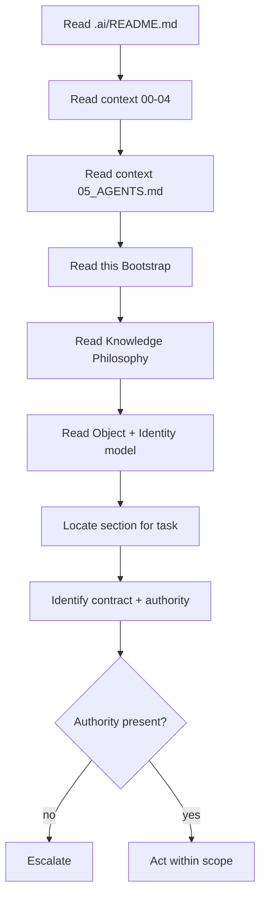

*Diagram `CAT-KE-P1-01-D-1` is illustrative of the `AI Quick Bootstrap` operating model; it does not authorize a production deployment, validate a corpus, or grant authority.*

#### CAT-KE-P1-01-D-2 — Context Flow — Knowledge to Action

**Diagram ID:** `CAT-KE-P1-01-D-2`
**Title:** Context Flow — Knowledge to Action
**Type:** Context Flow
**Purpose:** Show how governed context flows from documents into bounded AI action.
**Audience:** Human owners, knowledge architects, engineers, security reviewers, operators, auditors, and AI coding agents.
**Reading Order:** Read left to right; governance gates are mandatory.

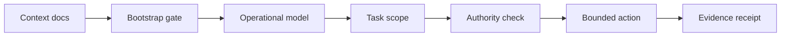

*Diagram `CAT-KE-P1-01-D-2` is illustrative of the `AI Quick Bootstrap` operating model; it does not authorize a production deployment, validate a corpus, or grant authority.*

#### CAT-KE-P1-01-D-3 — Memory Flow — Session Reconstruction

**Diagram ID:** `CAT-KE-P1-01-D-3`
**Title:** Memory Flow — Session Reconstruction
**Type:** Memory Flow
**Purpose:** Show how a new AI session reconstructs prior memory before acting.
**Audience:** Human owners, knowledge architects, engineers, security reviewers, operators, auditors, and AI coding agents.
**Reading Order:** Read top to bottom.

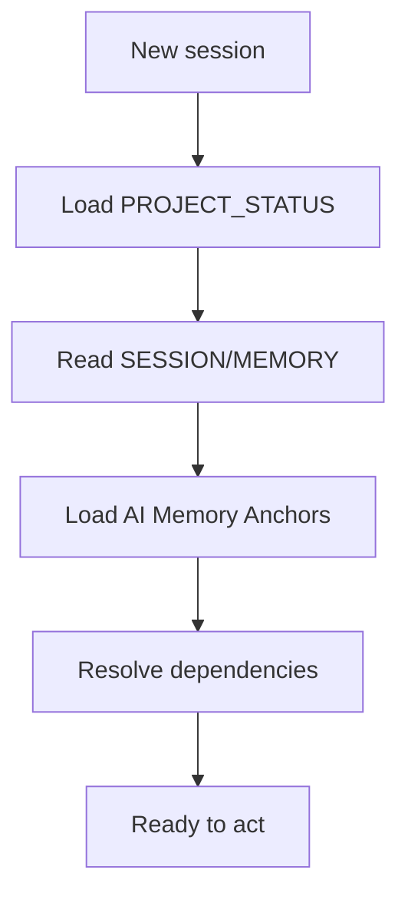

*Diagram `CAT-KE-P1-01-D-3` is illustrative of the `AI Quick Bootstrap` operating model; it does not authorize a production deployment, validate a corpus, or grant authority.*

#### CAT-KE-P1-01-D-4 — AI Quick Bootstrap — C4 Container

**Diagram ID:** `CAT-KE-P1-01-D-4`
**Title:** AI Quick Bootstrap — C4 Container
**Type:** C4 Container
**Purpose:** Decompose the Knowledge Engine into containers responsible for AI Quick Bootstrap.
**Audience:** Human owners, knowledge architects, engineers, security reviewers, operators, auditors, and AI coding agents.
**Reading Order:** Read the engine container and its internal components.

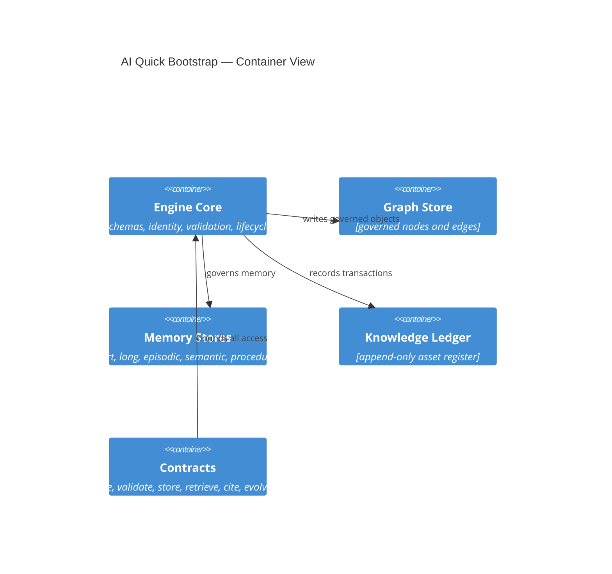

*Diagram `CAT-KE-P1-01-D-4` is illustrative of the `AI Quick Bootstrap` operating model; it does not authorize a production deployment, validate a corpus, or grant authority.*

#### CAT-KE-P1-01-D-5 — AI Quick Bootstrap — Versioning History

**Diagram ID:** `CAT-KE-P1-01-D-5`
**Title:** AI Quick Bootstrap — Versioning History
**Type:** Versioning Graph
**Purpose:** Show how AI Quick Bootstrap advances through immutable versions over time.
**Audience:** Human owners, knowledge architects, engineers, security reviewers, operators, auditors, and AI coding agents.
**Reading Order:** Read commits left to right along main; supersessions branch and merge.

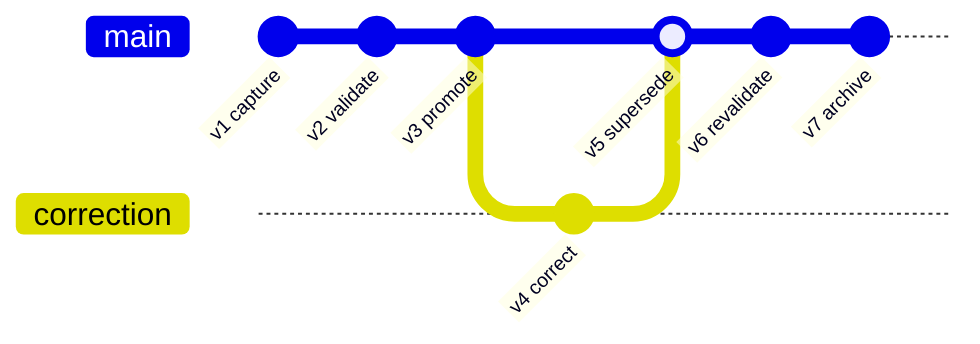

*Diagram `CAT-KE-P1-01-D-5` is illustrative of the `AI Quick Bootstrap` operating model; it does not authorize a production deployment, validate a corpus, or grant authority.*

#### CAT-KE-P1-01-D-6 — AI Quick Bootstrap — Control Priority Quadrant

**Diagram ID:** `CAT-KE-P1-01-D-6`
**Title:** AI Quick Bootstrap — Control Priority Quadrant
**Type:** Quadrant Chart
**Purpose:** Map the AI Quick Bootstrap controls by criticality versus implementation effort to guide sequencing.
**Audience:** Human owners, knowledge architects, engineers, security reviewers, operators, auditors, and AI coding agents.
**Reading Order:** Read the axes; top-right is high-criticality and high-effort.

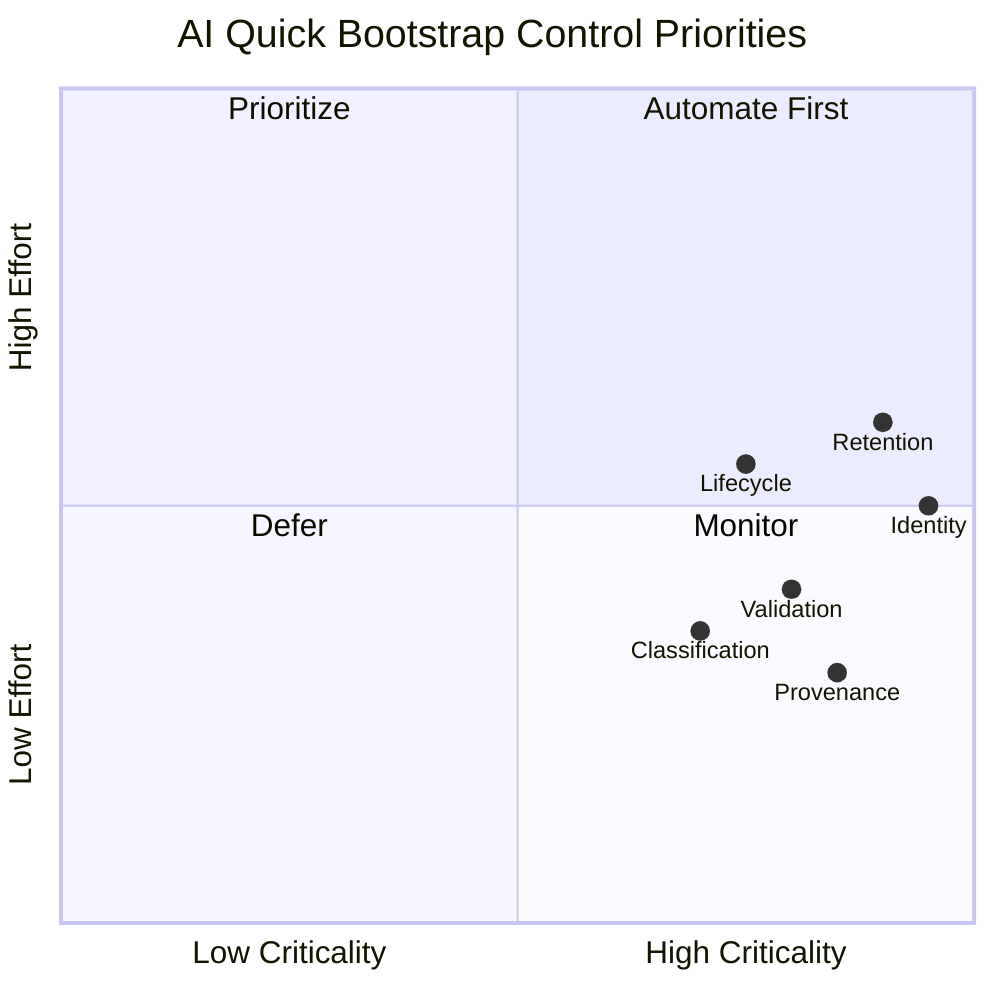

*Diagram `CAT-KE-P1-01-D-6` is illustrative of the `AI Quick Bootstrap` operating model; it does not authorize a production deployment, validate a corpus, or grant authority.*

#### CAT-KE-P1-01-D-7 — AI Quick Bootstrap — Retrieval Ranking Flow

**Diagram ID:** `CAT-KE-P1-01-D-7`
**Title:** AI Quick Bootstrap — Retrieval Ranking Flow
**Type:** Ranking Flow
**Purpose:** Show how retrieval ranks AI Quick Bootstrap candidates under policy before returning them.
**Audience:** Human owners, knowledge architects, engineers, security reviewers, operators, auditors, and AI coding agents.
**Reading Order:** Read top to bottom through the ranking stages.

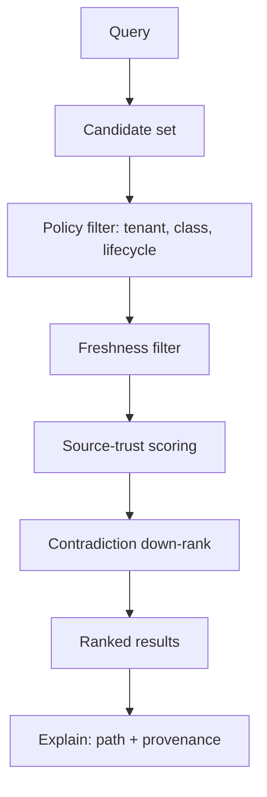

*Diagram `CAT-KE-P1-01-D-7` is illustrative of the `AI Quick Bootstrap` operating model; it does not authorize a production deployment, validate a corpus, or grant authority.*

#### CAT-KE-P1-01 — ASCII — AI Quick Bootstrap at a Glance

**Diagram ID:** `CAT-KE-P1-01-ASCII`
**Title:** AI Quick Bootstrap at a Glance
**Type:** ASCII
**Purpose:** A compact text view of AI Quick Bootstrap for terminals and quick reference.
**Audience:** Human owners, knowledge architects, engineers, security reviewers, operators, auditors, and AI coding agents.
**Reading Order:** Read the top legend, then the boxed structure.

```text
Legend: [O]=object  [S]=source  [E]=edge  [V]=validation  [L]=ledger

            +-------------------+
   capture  |   [S] source      |
      |     +---------+---------+
      v               v
  +-------+       +----------+
  | [O]   | ----> | [V] gate |
  +-------+       +----+-----+
      |                | pass
      |                v
  +-------+       +----------+        +----------+
  | [L]   | <---- | corpus   | <----> | [E] graph|
  +-------+       +----+-----+        +----------+
      |                |
      v                v
   evidence        retrieve (policy-aware) --> cite
```

*ASCII diagram `CAT-KE-P1-01-ASCII` is illustrative only.*

## 2. Knowledge Philosophy

**Section ID:** `CAT-KE-P1-02`  
**Constitutional domain:** Knowledge Foundation  
**Human accountable owner:** Chief Knowledge Officer (Executive CKO) and Lead Repository Architect  
**Primary record:** knowledge philosophy charter  
**Decision status:** Foundation decision for the Knowledge Engine Bible Part 1; implementation and production authority remain evidence-gated. Later implementation ADRs MUST preserve this section unless they explicitly supersede a named requirement.  
**Primary question:** Knowledge in CAT is a governed, attributable, versioned asset that must be preserved as carefully as money and handled with stricter care than code, because knowledge outlives every system that produced it.

### Purpose

Knowledge Philosophy states the first principles from which every other knowledge decision derives. CAT holds that knowledge — not code, not models, not features — is the durable substrate of the enterprise. Code is rewritten, models are replaced, products are retired, but the accumulated knowledge of what is true, what works, why decisions were made, and what the organization has learned is the compounding asset. This section makes that belief operational by defining what counts as knowledge, what does not, and the duties that ownership of knowledge imposes.

**Normative application:** For `2. Knowledge Philosophy`, the owning implementation MUST make this section observable through a named contract, a policy or guard, a test or review check, and an operational signal. A prose claim without enforcement evidence is incomplete.

### Business Explanation

The business case is compounding returns and risk reduction. Every commerce decision, campaign, treasury position, affiliate relationship, and content artifact either deposits into or withdraws from the organizational knowledge account. A philosophy that treats knowledge as a first-class asset makes the organization smarter over time; one that treats it as an exhaust makes the organization repeat its mistakes at scale. The cost of formal knowledge discipline is visible and bounded; the cost of informal knowledge loss is invisible and unbounded.

**Normative application:** For `2. Knowledge Philosophy`, the owning implementation MUST expose to an accountable reviewer the cost, benefit, risk, owner, uncertainty, and consequence of this capability before it is accepted.

The business MUST fund the control work that keeps `Knowledge Philosophy` trustworthy as part of delivery: provenance capture, classification, validation, human review where required, recovery, audit, and lifecycle retirement are not optional overhead. Success is the durable outcome represented by `knowledge philosophy charter`, not output volume or knowledge-object count.

### Engineering Explanation

Philosophy becomes engineering through structure: every knowledge-bearing artifact carries metadata that makes the philosophy enforceable — identity, source, rights, freshness, classification, confidence, contradiction flags, and owner. The philosophy rejects the pattern of storing knowledge as free text with no machine-readable provenance. Instead, knowledge is captured at boundaries where it is created and modified, so the engineering surface inherits the duty of preservation rather than retrofitting it later.

Implement `Knowledge Philosophy` through versioned schemas, deterministic state machines, owned ports, immutable identities, hierarchical budgets, cancellation, idempotency, checkpoints, and source-of-truth verification. Probabilistic inference may propose; deterministic services authorize and commit.

Make time, randomness, source routes, policy versions, and external effects injectable in tests. Classify every dependency as startup-hard, runtime-required, optional, or asynchronous; define timeout, circuit, fallback, replay, migration, and failure ownership explicitly for `Knowledge Philosophy`.

### Architecture Perspective

Architecturally, knowledge is a peer of data, code, and events, not a subordinate. The Knowledge Engine is a first-class subsystem with its own contracts, not a documentation folder. Philosophy mandates that knowledge seams exist in every layer: at every domain boundary, at every agent boundary, and at every human-decision boundary, knowledge is captured, versioned, and made retrievable under policy.

**Normative application:** For `2. Knowledge Philosophy`, the owning implementation MUST make this perspective observable through a named contract, a policy or guard, a test or review check, and an operational signal. A prose claim without enforcement evidence is incomplete.

Chief Knowledge Officer (Executive CKO) and Lead Repository Architect remains the human accountability boundary for `Knowledge Philosophy`. The Knowledge Foundation domain owns semantics and canonical state; CATA coordinates portfolios, the Supervisor coordinates runtime, specialists produce bounded artifacts, and policy and effect gateways prevent orchestration from becoming authority.

### AI Perspective

For an AI, this philosophy means that knowledge is never something to be generated freely and trusted; it is always something to be sourced, attributed, dated, and marked for confidence. The AI's job is to preserve the integrity of the knowledge chain — to extend it only with labeled, owned contributions and to refuse to present inference as fact. The philosophy is the AI's standing instruction to treat the provenance and classification of every claim as inseparable from the claim itself.

**Normative application:** For `2. Knowledge Philosophy`, the owning implementation MUST make this perspective observable through a named contract, a policy or guard, a test or review check, and an operational signal. A prose claim without enforcement evidence is incomplete.

AI confidence about `Knowledge Philosophy` is one signal only; it cannot substitute for provenance, validation, authority, or human acceptance where the class of knowledge requires them.

### Implementation Strategy

The implementation strategy for `Knowledge Philosophy` proceeds in evidence-gated increments rather than a single release. Each increment begins as a hypothesis encoded as a typed schema and a contract, runs first in simulation or a sandboxed knowledge store, proves quality and safety against positive and negative fixtures, and is promoted only after independent owner acceptance.

1. **Model first.** Define the canonical schema, identity derivation, legal-edge matrix (where relevant), and the policy bindings for `knowledge philosophy charter` before any code writes or reads it.
2. **Validate at the boundary.** Place the Knowledge Foundation validations at the ingestion seam so that invalid or unprovenanced input is quarantined before it can reach the citable corpus.
3. **Version everything.** Treat every `Knowledge Philosophy` artifact as immutable and append-only; all change is a versioned transformation with recorded inputs and outputs.
4. **Observe continuously.** Emit structured decision receipts, tool receipts, and redacted artifacts with immutable lineage for every `Knowledge Philosophy` operation.
5. **Fail closed.** When policy, provenance, classification, or ownership cannot be established for a `Knowledge Philosophy` operation, the operation stops, preserves state and evidence, and routes the decision to Chief Knowledge Officer (Executive CKO) and Lead Repository Architect.

### Developer Notes

- Before editing a `Knowledge Philosophy` implementation, inspect the registered schema, the owning domain API, the policy bindings, the validation pipeline, the tests, and the operational runbook.
- Do not create a bypass around a validation, classification, provenance, or approval control to satisfy a task quickly. A bypass is a defect, not a shortcut.
- State assumptions, the exact authority requested, data classifications, expected effects, and the rollback path in the change description for every `Knowledge Philosophy` change.
- Add a negative test for every newly permitted `Knowledge Philosophy` capability and a recovery test for every material external effect that depends on it.
- If a requirement is ambiguous, stop at the safe boundary and request an accountable human decision; do not convert inference into permission for `Knowledge Philosophy`.

### Codex Notes

When generating code for `Knowledge Philosophy`, Codex should emit the schema, contract, validation, and test scaffolding together rather than logic alone. The `Knowledge Philosophy` surface is contract-first: the typed request, response, event, error, and receipt shapes are the deliverable, and the implementation must conform to them.

- Prefer deterministic guards over prompt-level instructions for every `Knowledge Philosophy` policy; the model may not be relied upon to enforce invariants.
- Generate negative fixtures first for `Knowledge Philosophy`: malformed input, missing provenance, classification mismatch, expired source, and contradictory edges.
- Keep `Knowledge Philosophy` changes minimal and additive; prefer a new version over an in-place mutation.
- Include redaction in every emitted log, metric, and artifact for `Knowledge Philosophy`; protected content must never appear in observability.

### Claude Code Notes

When operating agentic edits on `Knowledge Philosophy`, Claude Code should treat the Knowledge Engine contracts as the boundary of permission: read through retrieval contracts, write through contribution contracts, and never reach storage or the graph store directly. The agent must record its `Knowledge Philosophy` contributions against the ledger with provenance.

- Before modifying `Knowledge Philosophy`, load the relevant section of this Bible, the schema, and the current ownership and classification state.
- Distinguish a proposed `Knowledge Philosophy` contribution from a validated one; never present a draft as trusted or citable.
- On contradiction detection between `Knowledge Philosophy` objects, create a governed edge and escalate rather than silently choosing one side.
- Preserve user work: if a `Knowledge Philosophy` change would invalidate dependent paths, report the impact and request the human decision.

### Gemini CLI Notes

When working in a terminal against `Knowledge Philosophy` at scale, Gemini CLI's long context is useful for loading whole sections, schemas, and the dependency graph before proposing a change. The agent should summarize the `Knowledge Philosophy` context into a bounded brief, cite the section anchors it relied on, and flag any unresolved conflict before acting.

- Use the `Knowledge Philosophy` contracts as the only access path; shell-level or direct-store access is prohibited.
- Batch `Knowledge Philosophy` validations and run them locally against fixtures before proposing promotion.
- Keep the `Knowledge Philosophy` change set small and reviewable; large diffs obscure provenance and classification changes.
- Report the token and cost footprint of `Knowledge Philosophy` retrieval operations, because knowledge economics are part of the deliverable.

### Future AI Notes

Future AI models may reason over `Knowledge Philosophy` more fluently and at greater scale, but no advance in model quality changes CAT's requirement for provenance, classification, validation, authority, and evidence. A more capable model that bypasses these controls is a larger risk, not a smaller one.

- Future agents operating on `Knowledge Philosophy` must consume the same contracts; intelligence is not a license to bypass seams.
- Richer reasoning over `Knowledge Philosophy` must still emit explainable graph paths; opacity is not acceptable even when the model is accurate.
- Future autonomy over `Knowledge Philosophy` is earned through measured evidence, not asserted; escalation paths to Chief Knowledge Officer (Executive CKO) and Lead Repository Architect must remain open.
- Future `Knowledge Philosophy` capability must never retroactively authorize current behavior; the constitution governs forward.

### Security Notes

Apply zero standing privilege, workload identity, tenant and environment isolation, purpose-bound data, secret-manager references, prompt and tool injection defenses, egress policy, sandboxing, rate limits, revocation, tamper-evident receipts, and a tested kill switch for `Knowledge Philosophy`.

Section invariant for `Knowledge Philosophy`: No knowledge is first-class in CAT until it has identity, provenance, classification, an owner, and a declared lifecycle; undocumented, unowned, or unattributable knowledge is treated as a liability, not an asset.

Threat tests for `{title}` cover confused deputy, role-title escalation, malicious context, poisoned knowledge, memory exfiltration, approval laundering, replay, supply-chain substitution, side channels, resource exhaustion, audit tampering, and compromised provider behavior. Each must fail closed and emit a protected signal.

### Performance Notes

Declare separate service-level objectives for `Knowledge Philosophy` admission, queueing, validation, retrieval, effect verification, and evidence publication; one hundred percent of terminal `knowledge philosophy charter` records must be attributable and schema-valid.

Measure the `Knowledge Philosophy` latency components separately — source fetch, validation, indexing, traversal, ranking, evidence publication — and report percentiles, quality, safety, cost, human burden, cancellation delay, and terminal classes. Never improve averages by dropping rejected, failed, or quarantined `Knowledge Philosophy` work.

### Scalability Notes

Partition `Knowledge Philosophy` work by tenant and bounded aggregate, preserve global contract compatibility, cap concurrency and fan-out, and fail closed when ownership or policy cannot converge.

Use bounded fan-out, backpressure, fairness reservations, locality, and asynchronous facts where ordering is unnecessary for `{title}`. Cross-region or cross-node scale requires explicit data residency, identity federation, protocol compatibility, conflict resolution, disconnect behavior, and reconciliation. Rebuildable projections absorb read scale without becoming sources of truth.

### Failure Modes

The principal `Knowledge Philosophy` failure is unprovenanced or misclassified knowledge entering active use; secondary failures are stale sources, contradictory edges, identity drift, retention violation, and silent degradation.

| Failure mode | Trigger | Effect | Detection |
|---|---|---|---|
| Unprovenanced knowledge | Ingestion without source record | Trust erosion, audit gap | Provenance gate at ingestion |
| Misclassification | Wrong class assigned at capture | Wrong validation, wrong retention | Class-specific validation failure |
| Stale source | Source past freshness SLA | Outdated facts cited | Freshness monitor + re-fetch |
| Contradictory edges | Two edges conflict unresolved | Ambiguous reasoning | Contradiction detection + review queue |
| Identity drift | Duplicate or moved identity | Broken references | Registry integrity scan |
| Retention violation | Memory or data past legal limit | Compliance breach | Retention enforcement + tombstones |
| Silent degradation | Quality metric decline unnoticed | Erosion of trust | Continuous quality monitoring |

### Recovery Strategy

Recovery for `Knowledge Philosophy` stops further effects, preserves the run record, isolates the cause, reconciles knowledge state against authoritative sources, and routes the unresolved decision to Chief Knowledge Officer (Executive CKO) and Lead Repository Architect.

1. **Contain.** Suspend the affected `Knowledge Philosophy` scope and prevent new reads of the compromised knowledge.
2. **Preserve.** Freeze the run record, receipts, and evidence for `Knowledge Philosophy`; do not delete.
3. **Reconcile.** Re-establish authoritative `Knowledge Philosophy` state from validated sources; quarantine anything that cannot be reconciled.
4. **Restore.** Restore the `Knowledge Philosophy` invariant — provenance, classification, ownership, lifecycle — before resuming.
5. **Review.** Link a terminal recovery receipt and route the residual decision to Chief Knowledge Officer (Executive CKO) and Lead Repository Architect; capture the lesson as governed knowledge.

### Extension Points

`Knowledge Philosophy` exposes typed extension points so the engine grows without breaking contracts:

- **Source adapters.** New `Knowledge Philosophy` sources plug into the ingestion seam through a typed adapter that normalizes input and records provenance.
- **Validation rules.** New `Knowledge Philosophy` checks are registered class-specific validators; they compose into the validation pipeline without modifying core logic.
- **Entity and edge types.** New `Knowledge Philosophy` entity or edge types extend the registered schema and legal-edge matrix; unknown types remain rejected.
- **Memory classes.** New `Knowledge Philosophy` memory classes are added as governed stores with namespace, consent, retention, and tombstone controls.
- **Retrieval strategies.** New `Knowledge Philosophy` ranking or traversal strategies register behind the retrieval contract; the policy layer governs their use.

### Ownership

| Ownership layer | Holder | Responsibility |
|---|---|---|
| Human accountable owner | Chief Knowledge Officer (Executive CKO) and Lead Repository Architect | Residual business judgment, risk acceptance, rights, and consequential approval for `Knowledge Philosophy`. |
| Operational owner | Knowledge Foundation Service Owner | Enforcement, schemas, contracts, runbooks, and SLOs for `Knowledge Philosophy`. |
| Domain owner | Domain Owners (per knowledge class) | Class-specific validation, freshness, and canonical truth for `{title}`. |
| Audit owner | Independent Audit Owner | Independent evidence review, tamper-evidence, and retention for `{title}`. |
| Chief Knowledge Officer | Executive CKO | Cross-domain knowledge policy, asset register integrity, and constitution for `{title}`. |

### Dependencies

`Knowledge Philosophy` depends on the following, which MUST be satisfied before the capability is promotable:

| Dependency | Type | Requirement |
|---|---|---|
| Knowledge Object Model | Foundation | Schema and identity derivation exist and are versioned. |
| Identity Registry | Foundation | Globally unique, immutable, resolvable identities exist. |
| Policy Decision Point | Runtime-required | Classification, tenant, and lifecycle policy is enforced at every `Knowledge Philosophy` boundary. |
| Validation Pipeline | Runtime-required | Class-specific checks run before promotion. |
| Observability | Runtime-required | Structured logs, traces, metrics, receipts, and redacted artifacts are emitted. |
| Higher-order context | Foundation | `context/00` through `context/05` are read and applied. |
| Accepted ADR | Gated | A completed, accepted ADR exists before a production `Knowledge Philosophy` change. |

### Risks

| Risk | Likelihood | Impact | Mitigation |
|---|---|---|---|
| Unprovenanced knowledge trusted | Medium | High | Mandatory provenance gate; quarantine on absence. |
| Misclassification | Medium | High | Class-specific validation; conservative reclassification on doubt. |
| Contradiction accumulation | High | Medium | Contradiction detection edges; resolution queue with owners. |
| Staleness eroding decisions | High | Medium | Freshness SLAs; scheduled re-fetch; expiry enforcement. |
| Cross-tenant leakage | Low | Critical | Structural tenant isolation in traversal; deny by default. |
| Retention non-compliance | Medium | Critical | Retention enforcement; tombstones; re-consent. |
| Scale-induced governance lapse | Medium | High | Layered architecture; fail-closed under overload. |
| Model overconfidence | High | High | Confidence never substitutes for evidence or authority. |

### Anti-patterns

- Storing `Knowledge Philosophy` as free text without machine-readable provenance, classification, or identity.
- Mutating `Knowledge Philosophy` in place instead of versioning it; destroying history.
- Bypassing the `Knowledge Philosophy` contracts to read or write stores directly.
- Treating AI-generated `Knowledge Philosophy` as validated without deterministic checks.
- Promoting memory into authoritative `Knowledge Philosophy` without validation.
- Dropping or hiding contradictory `Knowledge Philosophy` edges to produce a clean path.
- Allowing `Knowledge Philosophy` to persist without an owner; orphaned knowledge.
- Inferring implementation permission from this document's existence or completion percentage.

### Best Practices

- Capture `Knowledge Philosophy` at the boundary where it is created or modified; do not retrofit provenance later.
- Make `Knowledge Philosophy` immutable and append-only; express all change as versioned transformations.
- Validate `Knowledge Philosophy` by class before promotion; quarantine on any failed check.
- Carry classification, confidence, and lifecycle with every `Knowledge Philosophy` object at all times.
- Represent `Knowledge Philosophy` relationships as governed edges; compute structure, do not imply it.
- Enforce tenant isolation, retention, and consent structurally in traversal.
- Keep projections rebuildable; never promote a cache to a source of truth.
- Require an accepted ADR before any irreversible `Knowledge Philosophy` architecture choice.

### Examples

The following illustrative examples show intended `Knowledge Philosophy` behavior. They are illustrative only; they do not authorize production use, validate a real corpus, or grant any authority.

**Example 1 — Compliant `Knowledge Philosophy` contribution.**
A domain emits a `{title}` record with identity, source reference, classification, declared confidence, owner, and lifecycle state. The validation pipeline confirms schema, provenance, freshness, rights, and contradiction status; the object is promoted to the citable corpus and recorded in the ledger with a digest. Retrieval returns the object with its provenance and lifecycle visible.

**Example 2 — Compliant `Knowledge Philosophy` evolution.**
A reviewer finds that a `{title}` object is stale. They propose a correction as a new version citing an authoritative source; the engine records a `supersedes` edge from the old version to the new, preserves the old version as history, and re-evaluates dependent paths. An independent reviewer can reconstruct the state at any past date.

**Example 3 — Compliant `Knowledge Philosophy` contradiction handling.**
Two `{title}` objects assert incompatible claims. The engine creates a governed `contradicts` edge, down-ranks both in retrieval, flags them for review, and surfaces the conflict to the domain owner. Neither is silently chosen; resolution is a recorded human or independent-evaluator decision.

### Counter Examples

The following are non-compliant `Knowledge Philosophy` patterns that MUST be rejected:

**Counter-example 1 — Unprovenanced assertion.**
An AI contributes a `Knowledge Philosophy` claim without a source reference. The object is rejected at ingestion; the claim may live only as a draft, never as trusted or citable knowledge.

**Counter-example 2 — Silent overwrite.**
A maintainer edits a `{title}` object in place to correct an error. The in-place mutation destroys history and violates immutability; the change is rolled back and re-applied as a versioned correction.

**Counter-example 3 — Hidden contradiction.**
A traversal hides a `contradicts` edge to return a clean recommendation. Hiding the edge is a knowledge-integrity violation; the traversal must surface the conflict and down-rank rather than conceal.

**Counter-example 4 — Memory as truth.**
An agent treats a long-term memory as an authoritative fact and acts on it without validation. The memory is advisory only; acting on it as fact is a discipline violation requiring the fact to be validated first.

### Implementation Checklist

- [ ] Canonical schema, owner, compatibility policy, and stable error taxonomy defined for `Knowledge Philosophy`.
- [ ] Identity, policy, classification, provenance, and lifecycle encoded outside the model for `Knowledge Philosophy`.
- [ ] Each AI capability for `Knowledge Philosophy` mapped to an owned port, data class, effect class, and receipt.
- [ ] State transitions implemented with optimistic concurrency and durable checkpoints for `Knowledge Philosophy`.
- [ ] Correlation, causation, deadline, cancellation, and budget propagated through every `Knowledge Philosophy` call.
- [ ] External effects verified from authoritative state before completion or retry for `Knowledge Philosophy`.
- [ ] Degraded behavior, circuit breaking, containment, recovery, and reconciliation provided for `Knowledge Philosophy`.
- [ ] Operational logs redacted; protected forensic evidence retained by explicit policy for `Knowledge Philosophy`.
- [ ] Role-quality, adversarial, tenancy, load, chaos, migration, and rollback tests created for `Knowledge Philosophy`.
- [ ] Dashboards, alert thresholds, runbooks, on-call ownership, and support boundaries shipped for `Knowledge Philosophy`.
- [ ] An immutable `Knowledge Philosophy` version canaried with a tested last-known-safe rollback target.
- [ ] Independent owner acceptance and applicable certification required before production `Knowledge Philosophy`.

### AI Memory Anchor

**Memory anchor `CAT-KE-P1-02`:** `2. Knowledge Philosophy` means: Knowledge in CAT is a governed, attributable, versioned asset that must be preserved as carefully as money and handled with stricter care than code, because knowledge outlives every system that produced it. The AI agent MUST preserve provenance, classification, identity, validation, evidence, safe failure, and human accountability for `Knowledge Philosophy`. If a request conflicts with those anchors, stop, explain the conflict, and propose the smallest safe alternative.

### Cross References

- Section-specific context: `core/knowledge/`, `core/memory/`, `core/rag/`, `knowledge/`, and `context/06_KNOWLEDGE_ENGINE.md`.
- Constitutional baseline: `context/00_PROJECT_CONTEXT.md`, `context/01_PROJECT_OVERVIEW.md`, `context/02_PROJECT_RULES.md`, `context/03_TECH_STACK.md`, `context/04_ARCHITECTURE.md`, and `context/05_AGENTS.md`.
- This Bible: sections 1 through 20 of `context/06_KNOWLEDGE_ENGINE.md` Part 1.
- Operational implementation also consults `context/16_DEPLOYMENT.md`, `context/17_SECURITY.md`, `context/18_PROMPTING.md`, and `context/19_DEVELOPMENT_GUIDE.md` as they become authoritative.
- Architecture references: `architecture/KnowledgeGraph/`, `architecture/Data_Flow.md`, `architecture/AI_Architecture.md`.

### Repository Mapping

| Repository concern | Canonical location or governing source |
|---|---|
| Knowledge core | `core/knowledge/` — object model, identity, validation, lifecycle. |
| Memory | `core/memory/` — working, short, long, episodic, semantic, procedural, collective stores. |
| Retrieval / RAG | `core/rag/` — policy-aware retrieval contracts. |
| Knowledge graph | `architecture/KnowledgeGraph/` and `core/knowledge/graph/` when implemented. |
| Knowledge assets | `knowledge/` — index, glossary, maps; placeholders are non-authoritative. |
| Architecture authority | `context/04_ARCHITECTURE.md`, `architecture/System_Architecture.md`, and this Bible. |
| Agents | `context/05_AGENTS.md` and `agents/` — agents consume and contribute knowledge through contracts. |
| Security authority | `SECURITY.md`, `context/17_SECURITY.md` when completed, and policy implementation paths. |
| Decisions | `adr/ADR-0001.md` through `adr/ADR-0055.md` are current placeholders; a material implementation MUST create or complete a relevant accepted ADR rather than cite an empty ADR as evidence. |

### Folder Mapping

| Folder | Role in `Knowledge Philosophy` | Authority |
|---|---|---|
| `core/knowledge/` | `Knowledge Philosophy` object model, identity, validation, lifecycle services. | Normative when implemented. |
| `core/memory/` | `Knowledge Philosophy` memory stores and governance. | Normative when implemented. |
| `core/rag/` | `Knowledge Philosophy` retrieval contracts. | Normative when implemented. |
| `knowledge/` | `Knowledge Philosophy` asset index, glossary, and maps. | Reference; placeholders non-authoritative. |
| `architecture/KnowledgeGraph/` | `Knowledge Philosophy` graph models. | Reference diagrams. |
| `context/06_KNOWLEDGE_ENGINE.md` | `Knowledge Philosophy` constitutional documentation (this file). | Normative foundation. |
| `adr/` | `Knowledge Philosophy` implementation decisions. | Evidence-gated; placeholders non-authoritative. |

### Future Evolution

Future evolution of `Knowledge Philosophy` may include richer semantic models, multimodal knowledge objects, federated knowledge exchange, automated contradiction resolution, and continuous-learning loops. Every increment begins as a hypothesis, runs in simulation or a sandboxed knowledge store, proves quality and safety, obtains independent human authorization, canaries immutable versions, and retains rollback, migration, and historical interpretation.

Future capability never retroactively authorizes current behavior. Rights, law, accountability, provenance, classification, tenant choice, evidence, security, and safe exit remain constraints for `Knowledge Philosophy` even when technology, organization, providers, or economic models change.

### Operating Contract

| Contract dimension | Normative requirement |
|---|---|
| Business outcome | Knowledge Philosophy states the first principles from which every other knowledge decision derives. |
| Human accountability | Chief Knowledge Officer (Executive CKO) and Lead Repository Architect |
| Authoritative artifact | knowledge philosophy charter |
| Required inputs | authenticated charter; current knowledge foundation state; policy and authority snapshot; owned evidence; deadline; budget; acceptance criteria; human accountability route |
| Required outputs | versioned knowledge philosophy charter; decision evidence; state transition; exceptions; resource account; terminal receipt |
| Constitutional invariant | No knowledge is first-class in CAT until it has identity, provenance, classification, an owner, and a declared lifecycle; undocumented, unowned, or unattributable knowledge is treated as a liability, not an asset. |
| Default authority | A0/A1 advice and preparation unless an exact role card, policy, certification and effect-specific grant narrow a higher ceiling. |
| Default failure | Stop the smallest unsafe scope, preserve state and evidence, reconcile any attempted effect, and route the unresolved decision to the named owner. |
| Performance envelope | Declare separate SLOs for admission, queueing, validation, retrieval, effect verification and evidence publication; 100 percent of terminal knowledge philosophy charter records must be attributable and schema-valid. |
| Scale model | Partition knowledge foundation work by tenant and bounded aggregate, preserve global contract compatibility, cap concurrency and fan-out, and fail closed when ownership or policy cannot converge. |
| Future direction | richer semantic models, multimodal knowledge objects, federated exchange and continuously validated knowledge |

### End-to-End Constitutional Procedure

1. **Establish charter and scope.** Validate identity, scope, owner, policy, data, authority, budget and deadline for `Knowledge Philosophy`; persist the decision and do not begin a dependent step until its preconditions and evidence pass.
2. **Resolve identity version tenant and owner.** Validate identity, scope, owner, policy, data, authority, budget and deadline; persist the decision and do not begin a dependent step until its preconditions and evidence pass.
3. **Capture source and provenance.** Validate identity, scope, owner, policy, data, authority, budget and deadline; persist the decision and do not begin a dependent step until its preconditions and evidence pass.
4. **Classify by taxonomy class.** Validate identity, scope, owner, policy, data, authority, budget and deadline; persist the decision and do not begin a dependent step until its preconditions and evidence pass.
5. **Validate by class against authority freshness rights and contradiction.** Validate identity, scope, owner, policy, data, authority, budget and deadline; persist the decision and do not begin a dependent step until its preconditions and evidence pass.
6. **Promote to the citable corpus and record in the ledger.** Validate identity, scope, owner, policy, data, authority, budget and deadline; persist the decision and do not begin a dependent step until its preconditions and evidence pass.
7. **Retrieve under policy and cite with provenance.** Validate identity, scope, owner, policy, data, authority, budget and deadline; persist the decision and do not begin a dependent step until its preconditions and evidence pass.
8. **Retire or supersede through lifecycle with reconciliation.** Validate identity, scope, owner, policy, data, authority, budget and deadline; persist the decision and do not begin a dependent step until its preconditions and evidence pass.

### Required Decision Record

| Record component | Minimum fields | Independent check |
|---|---|---|
| Charter | outcome, non-goals, sponsor, owner, acceptance, deadline and expiry | mission and owner resolver |
| Identity | logical ID, immutable version, runtime principal, tenant, environment and operator | identity and lifecycle service |
| Evidence | sources, revisions, rights, freshness, transformations, contradictions and confidence | domain and provenance validator |
| Decision | facts, assumptions, alternatives, dissent, risk, cost, uncertainty and requested judgment | human or independent evaluator |
| Authority | role ceiling, task grant, policy, data purpose, approval and live revocation state | policy enforcement point |
| Execution | plan, resources, tools, state versions, checkpoints, attempts and effects | orchestrator and domain gateways |
| Outcome | typed status, acceptance, quality, business result, externalities, incidents and follow-up owner | task owner and analytics |
| Audit | correlation, causation, digests, timestamps, receipts, retention and access history | independent Audit owner |

### Constitutional Control Catalogue

Each control below is independently testable for `Knowledge Philosophy`. Satisfying a narrative goal without the named enforcement and evidence is not constitutional conformance.

#### CAT-KE-P1-02-C01 — Charter Scope

- **Rule:** For `knowledge philosophy`, bind all work to a signed outcome, explicit non-goals, owner, expiry and acceptance criteria.
- **Business test:** `knowledge philosophy charter` exposes the cost, benefit, risk, owner, uncertainty and consequence of this control to an accountable reviewer.
- **Engineering enforcement:** The boundary responsible for `establish charter and scope` validates this control before state change and again before any related material effect.
- **AI behavior:** Missing, stale, contradictory, denied or unverifiable control data causes a typed stop, wait, refusal or escalation; the model never fills the gap with confidence.
- **Human boundary:** Chief Knowledge Officer (Executive CKO) and Lead Repository Architect receives the exact requested decision and evidence when human judgment is required; no UI default or silence creates consent.
- **Security assertion:** Forged role, cross-tenant reference, replay, changed payload, expired grant, injected instruction and evidence tampering all fail closed and emit a protected signal.
- **Performance assertion:** Enforcement remains inside the declared SLO and resource reserve; overload applies backpressure rather than removing checks.
- **Evidence:** Store logical and runtime identity, tenant, versions, policy, grants, input/output digests, decision, state, timestamps, owner and redacted receipts.
- **Failure code:** `CAT_KE_P1_02_C01`; dependent work remains non-success and any attempted effect enters reconciliation.
- **Recovery:** Contain the affected scope, establish authoritative effect state, restore the invariant, obtain required human decision and link a terminal recovery receipt.
- **Implementation test:** Run positive, negative, boundary, cancellation, duplicate, stale-state, migration and compromised-dependency fixtures deterministically.
- **Ownership:** Chief Knowledge Officer (Executive CKO) and Lead Repository Architect owns residual business judgment; the Knowledge Foundation service owner owns enforcement; Audit owns independent evidence review.
- **Constitutional assertion:** An independent reviewer can reproduce the `Charter Scope` disposition without trusting hidden reasoning, title, provider success or undocumented operator explanation.

#### CAT-KE-P1-02-C02 — Human Accountability

- **Rule:** For `knowledge philosophy`, retain a named human role for strategy, residual risk, rights, legal judgment and consequential approval.
- **Business test:** `knowledge philosophy charter` exposes the cost, benefit, risk, owner, uncertainty and consequence of this control to an accountable reviewer.
- **Engineering enforcement:** The boundary responsible for `resolve identity version tenant and owner` validates this control before state change and again before any related material effect.
- **AI behavior:** Missing, stale, contradictory, denied or unverifiable control data causes a typed stop, wait, refusal or escalation; the model never fills the gap with confidence.
- **Human boundary:** Chief Knowledge Officer (Executive CKO) and Lead Repository Architect receives the exact requested decision and evidence when human judgment is required; no UI default or silence creates consent.
- **Security assertion:** Forged role, cross-tenant reference, replay, changed payload, expired grant, injected instruction and evidence tampering all fail closed and emit a protected signal.
- **Performance assertion:** Enforcement remains inside the declared SLO and resource reserve; overload applies backpressure rather than removing checks.
- **Evidence:** Store logical and runtime identity, tenant, versions, policy, grants, input/output digests, decision, state, timestamps, owner and redacted receipts.
- **Failure code:** `CAT_KE_P1_02_C02`; dependent work remains non-success and any attempted effect enters reconciliation.
- **Recovery:** Contain the affected scope, establish authoritative effect state, restore the invariant, obtain required human decision and link a terminal recovery receipt.
- **Implementation test:** Run positive, negative, boundary, cancellation, duplicate, stale-state, migration and compromised-dependency fixtures deterministically.
- **Ownership:** Chief Knowledge Officer (Executive CKO) and Lead Repository Architect owns residual business judgment; the Knowledge Foundation service owner owns enforcement; Audit owns independent evidence review.
- **Constitutional assertion:** An independent reviewer can reproduce the `Human Accountability` disposition without trusting hidden reasoning, title, provider success or undocumented operator explanation.

#### CAT-KE-P1-02-C03 — Identity and Version

- **Rule:** For `knowledge philosophy`, authenticate logical role, immutable bundle, runtime principal, tenant, environment and operator.
- **Business test:** `knowledge philosophy charter` exposes the cost, benefit, risk, owner, uncertainty and consequence of this control to an accountable reviewer.
- **Engineering enforcement:** The boundary responsible for `capture source and provenance` validates this control before state change and again before any related material effect.
- **AI behavior:** Missing, stale, contradictory, denied or unverifiable control data causes a typed stop, wait, refusal or escalation; the model never fills the gap with confidence.
- **Human boundary:** Chief Knowledge Officer (Executive CKO) and Lead Repository Architect receives the exact requested decision and evidence when human judgment is required; no UI default or silence creates consent.
- **Security assertion:** Forged role, cross-tenant reference, replay, changed payload, expired grant, injected instruction and evidence tampering all fail closed and emit a protected signal.
- **Performance assertion:** Enforcement remains inside the declared SLO and resource reserve; overload applies backpressure rather than removing checks.
- **Evidence:** Store logical and runtime identity, tenant, versions, policy, grants, input/output digests, decision, state, timestamps, owner and redacted receipts.
- **Failure code:** `CAT_KE_P1_02_C03`; dependent work remains non-success and any attempted effect enters reconciliation.
- **Recovery:** Contain the affected scope, establish authoritative effect state, restore the invariant, obtain required human decision and link a terminal recovery receipt.
- **Implementation test:** Run positive, negative, boundary, cancellation, duplicate, stale-state, migration and compromised-dependency fixtures deterministically.
- **Ownership:** Chief Knowledge Officer (Executive CKO) and Lead Repository Architect owns residual business judgment; the Knowledge Foundation service owner owns enforcement; Audit owns independent evidence review.
- **Constitutional assertion:** An independent reviewer can reproduce the `Identity and Version` disposition without trusting hidden reasoning, title, provider success or undocumented operator explanation.

#### CAT-KE-P1-02-C04 — Ownership

- **Rule:** For `knowledge philosophy`, name exactly one operational owner for each task, artifact, decision, incident and recovery case.
- **Business test:** `knowledge philosophy charter` exposes the cost, benefit, risk, owner, uncertainty and consequence of this control to an accountable reviewer.
- **Engineering enforcement:** The boundary responsible for `classify by taxonomy class` validates this control before state change and again before any related material effect.
- **AI behavior:** Missing, stale, contradictory, denied or unverifiable control data causes a typed stop, wait, refusal or escalation; the model never fills the gap with confidence.
- **Human boundary:** Chief Knowledge Officer (Executive CKO) and Lead Repository Architect receives the exact requested decision and evidence when human judgment is required; no UI default or silence creates consent.
- **Security assertion:** Forged role, cross-tenant reference, replay, changed payload, expired grant, injected instruction and evidence tampering all fail closed and emit a protected signal.
- **Performance assertion:** Enforcement remains inside the declared SLO and resource reserve; overload applies backpressure rather than removing checks.
- **Evidence:** Store logical and runtime identity, tenant, versions, policy, grants, input/output digests, decision, state, timestamps, owner and redacted receipts.
- **Failure code:** `CAT_KE_P1_02_C04`; dependent work remains non-success and any attempted effect enters reconciliation.
- **Recovery:** Contain the affected scope, establish authoritative effect state, restore the invariant, obtain required human decision and link a terminal recovery receipt.
- **Implementation test:** Run positive, negative, boundary, cancellation, duplicate, stale-state, migration and compromised-dependency fixtures deterministically.
- **Ownership:** Chief Knowledge Officer (Executive CKO) and Lead Repository Architect owns residual business judgment; the Knowledge Foundation service owner owns enforcement; Audit owns independent evidence review.
- **Constitutional assertion:** An independent reviewer can reproduce the `Ownership` disposition without trusting hidden reasoning, title, provider success or undocumented operator explanation.

#### CAT-KE-P1-02-C05 — Authority and Permission

- **Rule:** For `knowledge philosophy`, intersect role ceiling, task grant, policy, data purpose, approval and live system state.
- **Business test:** `knowledge philosophy charter` exposes the cost, benefit, risk, owner, uncertainty and consequence of this control to an accountable reviewer.
- **Engineering enforcement:** The boundary responsible for `validate by class against authority freshness rights and contradiction` validates this control before state change and again before any related material effect.
- **AI behavior:** Missing, stale, contradictory, denied or unverifiable control data causes a typed stop, wait, refusal or escalation; the model never fills the gap with confidence.
- **Human boundary:** Chief Knowledge Officer (Executive CKO) and Lead Repository Architect receives the exact requested decision and evidence when human judgment is required; no UI default or silence creates consent.
- **Security assertion:** Forged role, cross-tenant reference, replay, changed payload, expired grant, injected instruction and evidence tampering all fail closed and emit a protected signal.
- **Performance assertion:** Enforcement remains inside the declared SLO and resource reserve; overload applies backpressure rather than removing checks.
- **Evidence:** Store logical and runtime identity, tenant, versions, policy, grants, input/output digests, decision, state, timestamps, owner and redacted receipts.
- **Failure code:** `CAT_KE_P1_02_C05`; dependent work remains non-success and any attempted effect enters reconciliation.
- **Recovery:** Contain the affected scope, establish authoritative effect state, restore the invariant, obtain required human decision and link a terminal recovery receipt.
- **Implementation test:** Run positive, negative, boundary, cancellation, duplicate, stale-state, migration and compromised-dependency fixtures deterministically.
- **Ownership:** Chief Knowledge Officer (Executive CKO) and Lead Repository Architect owns residual business judgment; the Knowledge Foundation service owner owns enforcement; Audit owns independent evidence review.
- **Constitutional assertion:** An independent reviewer can reproduce the `Authority and Permission` disposition without trusting hidden reasoning, title, provider success or undocumented operator explanation.

#### CAT-KE-P1-02-C06 — Separation of Duties

- **Rule:** For `knowledge philosophy`, prevent requester, evaluator, approver, executor and auditor roles from collapsing where risk requires independence.
- **Business test:** `knowledge philosophy charter` exposes the cost, benefit, risk, owner, uncertainty and consequence of this control to an accountable reviewer.
- **Engineering enforcement:** The boundary responsible for `promote to the citable corpus and record in the ledger` validates this control before state change and again before any related material effect.
- **AI behavior:** Missing, stale, contradictory, denied or unverifiable control data causes a typed stop, wait, refusal or escalation; the model never fills the gap with confidence.
- **Human boundary:** Chief Knowledge Officer (Executive CKO) and Lead Repository Architect receives the exact requested decision and evidence when human judgment is required; no UI default or silence creates consent.
- **Security assertion:** Forged role, cross-tenant reference, replay, changed payload, expired grant, injected instruction and evidence tampering all fail closed and emit a protected signal.
- **Performance assertion:** Enforcement remains inside the declared SLO and resource reserve; overload applies backpressure rather than removing checks.
- **Evidence:** Store logical and runtime identity, tenant, versions, policy, grants, input/output digests, decision, state, timestamps, owner and redacted receipts.
- **Failure code:** `CAT_KE_P1_02_C06`; dependent work remains non-success and any attempted effect enters reconciliation.
- **Recovery:** Contain the affected scope, establish authoritative effect state, restore the invariant, obtain required human decision and link a terminal recovery receipt.
- **Implementation test:** Run positive, negative, boundary, cancellation, duplicate, stale-state, migration and compromised-dependency fixtures deterministically.
- **Ownership:** Chief Knowledge Officer (Executive CKO) and Lead Repository Architect owns residual business judgment; the Knowledge Foundation service owner owns enforcement; Audit owns independent evidence review.
- **Constitutional assertion:** An independent reviewer can reproduce the `Separation of Duties` disposition without trusting hidden reasoning, title, provider success or undocumented operator explanation.

#### CAT-KE-P1-02-C07 — Data and Privacy

- **Rule:** For `knowledge philosophy`, enforce classification, minimization, purpose, consent, residency, retention, subject rights and deletion.
- **Business test:** `knowledge philosophy charter` exposes the cost, benefit, risk, owner, uncertainty and consequence of this control to an accountable reviewer.
- **Engineering enforcement:** The boundary responsible for `retrieve under policy and cite with provenance` validates this control before state change and again before any related material effect.
- **AI behavior:** Missing, stale, contradictory, denied or unverifiable control data causes a typed stop, wait, refusal or escalation; the model never fills the gap with confidence.
- **Human boundary:** Chief Knowledge Officer (Executive CKO) and Lead Repository Architect receives the exact requested decision and evidence when human judgment is required; no UI default or silence creates consent.
- **Security assertion:** Forged role, cross-tenant reference, replay, changed payload, expired grant, injected instruction and evidence tampering all fail closed and emit a protected signal.
- **Performance assertion:** Enforcement remains inside the declared SLO and resource reserve; overload applies backpressure rather than removing checks.
- **Evidence:** Store logical and runtime identity, tenant, versions, policy, grants, input/output digests, decision, state, timestamps, owner and redacted receipts.
- **Failure code:** `CAT_KE_P1_02_C07`; dependent work remains non-success and any attempted effect enters reconciliation.
- **Recovery:** Contain the affected scope, establish authoritative effect state, restore the invariant, obtain required human decision and link a terminal recovery receipt.
- **Implementation test:** Run positive, negative, boundary, cancellation, duplicate, stale-state, migration and compromised-dependency fixtures deterministically.
- **Ownership:** Chief Knowledge Officer (Executive CKO) and Lead Repository Architect owns residual business judgment; the Knowledge Foundation service owner owns enforcement; Audit owns independent evidence review.
- **Constitutional assertion:** An independent reviewer can reproduce the `Data and Privacy` disposition without trusting hidden reasoning, title, provider success or undocumented operator explanation.

#### CAT-KE-P1-02-C08 — Context Integrity

- **Rule:** For `knowledge philosophy`, assemble minimum source-labelled context with precedence, freshness, digest, budget, exclusions and expiry.
- **Business test:** `knowledge philosophy charter` exposes the cost, benefit, risk, owner, uncertainty and consequence of this control to an accountable reviewer.
- **Engineering enforcement:** The boundary responsible for `retire or supersede through lifecycle with reconciliation` validates this control before state change and again before any related material effect.
- **AI behavior:** Missing, stale, contradictory, denied or unverifiable control data causes a typed stop, wait, refusal or escalation; the model never fills the gap with confidence.
- **Human boundary:** Chief Knowledge Officer (Executive CKO) and Lead Repository Architect receives the exact requested decision and evidence when human judgment is required; no UI default or silence creates consent.
- **Security assertion:** Forged role, cross-tenant reference, replay, changed payload, expired grant, injected instruction and evidence tampering all fail closed and emit a protected signal.
- **Performance assertion:** Enforcement remains inside the declared SLO and resource reserve; overload applies backpressure rather than removing checks.
- **Evidence:** Store logical and runtime identity, tenant, versions, policy, grants, input/output digests, decision, state, timestamps, owner and redacted receipts.
- **Failure code:** `CAT_KE_P1_02_C08`; dependent work remains non-success and any attempted effect enters reconciliation.
- **Recovery:** Contain the affected scope, establish authoritative effect state, restore the invariant, obtain required human decision and link a terminal recovery receipt.
- **Implementation test:** Run positive, negative, boundary, cancellation, duplicate, stale-state, migration and compromised-dependency fixtures deterministically.
- **Ownership:** Chief Knowledge Officer (Executive CKO) and Lead Repository Architect owns residual business judgment; the Knowledge Foundation service owner owns enforcement; Audit owns independent evidence review.
- **Constitutional assertion:** An independent reviewer can reproduce the `Context Integrity` disposition without trusting hidden reasoning, title, provider success or undocumented operator explanation.

#### CAT-KE-P1-02-C09 — Knowledge Provenance

- **Rule:** For `knowledge philosophy`, preserve source rights, authority, temporal validity, contradiction and domain-owner review for claims.
- **Business test:** `knowledge philosophy charter` exposes the cost, benefit, risk, owner, uncertainty and consequence of this control to an accountable reviewer.
- **Engineering enforcement:** The boundary responsible for `establish charter and scope` validates this control before state change and again before any related material effect.
- **AI behavior:** Missing, stale, contradictory, denied or unverifiable control data causes a typed stop, wait, refusal or escalation; the model never fills the gap with confidence.
- **Human boundary:** Chief Knowledge Officer (Executive CKO) and Lead Repository Architect receives the exact requested decision and evidence when human judgment is required; no UI default or silence creates consent.
- **Security assertion:** Forged role, cross-tenant reference, replay, changed payload, expired grant, injected instruction and evidence tampering all fail closed and emit a protected signal.
- **Performance assertion:** Enforcement remains inside the declared SLO and resource reserve; overload applies backpressure rather than removing checks.
- **Evidence:** Store logical and runtime identity, tenant, versions, policy, grants, input/output digests, decision, state, timestamps, owner and redacted receipts.
- **Failure code:** `CAT_KE_P1_02_C09`; dependent work remains non-success and any attempted effect enters reconciliation.
- **Recovery:** Contain the affected scope, establish authoritative effect state, restore the invariant, obtain required human decision and link a terminal recovery receipt.
- **Implementation test:** Run positive, negative, boundary, cancellation, duplicate, stale-state, migration and compromised-dependency fixtures deterministically.
- **Ownership:** Chief Knowledge Officer (Executive CKO) and Lead Repository Architect owns residual business judgment; the Knowledge Foundation service owner owns enforcement; Audit owns independent evidence review.
- **Constitutional assertion:** An independent reviewer can reproduce the `Knowledge Provenance` disposition without trusting hidden reasoning, title, provider success or undocumented operator explanation.

#### CAT-KE-P1-02-C10 — Memory Governance

- **Rule:** For `knowledge philosophy`, separate working state from durable memory and enforce namespace, provenance, consent, conflict and tombstones.
- **Business test:** `knowledge philosophy charter` exposes the cost, benefit, risk, owner, uncertainty and consequence of this control to an accountable reviewer.
- **Engineering enforcement:** The boundary responsible for `resolve identity version tenant and owner` validates this control before state change and again before any related material effect.
- **AI behavior:** Missing, stale, contradictory, denied or unverifiable control data causes a typed stop, wait, refusal or escalation; the model never fills the gap with confidence.
- **Human boundary:** Chief Knowledge Officer (Executive CKO) and Lead Repository Architect receives the exact requested decision and evidence when human judgment is required; no UI default or silence creates consent.
- **Security assertion:** Forged role, cross-tenant reference, replay, changed payload, expired grant, injected instruction and evidence tampering all fail closed and emit a protected signal.
- **Performance assertion:** Enforcement remains inside the declared SLO and resource reserve; overload applies backpressure rather than removing checks.
- **Evidence:** Store logical and runtime identity, tenant, versions, policy, grants, input/output digests, decision, state, timestamps, owner and redacted receipts.
- **Failure code:** `CAT_KE_P1_02_C10`; dependent work remains non-success and any attempted effect enters reconciliation.
- **Recovery:** Contain the affected scope, establish authoritative effect state, restore the invariant, obtain required human decision and link a terminal recovery receipt.
- **Implementation test:** Run positive, negative, boundary, cancellation, duplicate, stale-state, migration and compromised-dependency fixtures deterministically.
- **Ownership:** Chief Knowledge Officer (Executive CKO) and Lead Repository Architect owns residual business judgment; the Knowledge Foundation service owner owns enforcement; Audit owns independent evidence review.
- **Constitutional assertion:** An independent reviewer can reproduce the `Memory Governance` disposition without trusting hidden reasoning, title, provider success or undocumented operator explanation.

#### CAT-KE-P1-02-C11 — Decision Quality

- **Rule:** For `knowledge philosophy`, separate facts, assumptions, forecasts, alternatives, dissent, uncertainty and requested human judgment.
- **Business test:** `knowledge philosophy charter` exposes the cost, benefit, risk, owner, uncertainty and consequence of this control to an accountable reviewer.
- **Engineering enforcement:** The boundary responsible for `capture source and provenance` validates this control before state change and again before any related material effect.
- **AI behavior:** Missing, stale, contradictory, denied or unverifiable control data causes a typed stop, wait, refusal or escalation; the model never fills the gap with confidence.
- **Human boundary:** Chief Knowledge Officer (Executive CKO) and Lead Repository Architect receives the exact requested decision and evidence when human judgment is required; no UI default or silence creates consent.
- **Security assertion:** Forged role, cross-tenant reference, replay, changed payload, expired grant, injected instruction and evidence tampering all fail closed and emit a protected signal.
- **Performance assertion:** Enforcement remains inside the declared SLO and resource reserve; overload applies backpressure rather than removing checks.
- **Evidence:** Store logical and runtime identity, tenant, versions, policy, grants, input/output digests, decision, state, timestamps, owner and redacted receipts.
- **Failure code:** `CAT_KE_P1_02_C11`; dependent work remains non-success and any attempted effect enters reconciliation.
- **Recovery:** Contain the affected scope, establish authoritative effect state, restore the invariant, obtain required human decision and link a terminal recovery receipt.
- **Implementation test:** Run positive, negative, boundary, cancellation, duplicate, stale-state, migration and compromised-dependency fixtures deterministically.
- **Ownership:** Chief Knowledge Officer (Executive CKO) and Lead Repository Architect owns residual business judgment; the Knowledge Foundation service owner owns enforcement; Audit owns independent evidence review.
- **Constitutional assertion:** An independent reviewer can reproduce the `Decision Quality` disposition without trusting hidden reasoning, title, provider success or undocumented operator explanation.

#### CAT-KE-P1-02-C12 — Tools and Effects

- **Rule:** For `knowledge philosophy`, invoke only registered typed capabilities with idempotency, receipts and source-of-truth postcondition verification.
- **Business test:** `knowledge philosophy charter` exposes the cost, benefit, risk, owner, uncertainty and consequence of this control to an accountable reviewer.
- **Engineering enforcement:** The boundary responsible for `classify by taxonomy class` validates this control before state change and again before any related material effect.
- **AI behavior:** Missing, stale, contradictory, denied or unverifiable control data causes a typed stop, wait, refusal or escalation; the model never fills the gap with confidence.
- **Human boundary:** Chief Knowledge Officer (Executive CKO) and Lead Repository Architect receives the exact requested decision and evidence when human judgment is required; no UI default or silence creates consent.
- **Security assertion:** Forged role, cross-tenant reference, replay, changed payload, expired grant, injected instruction and evidence tampering all fail closed and emit a protected signal.
- **Performance assertion:** Enforcement remains inside the declared SLO and resource reserve; overload applies backpressure rather than removing checks.
- **Evidence:** Store logical and runtime identity, tenant, versions, policy, grants, input/output digests, decision, state, timestamps, owner and redacted receipts.
- **Failure code:** `CAT_KE_P1_02_C12`; dependent work remains non-success and any attempted effect enters reconciliation.
- **Recovery:** Contain the affected scope, establish authoritative effect state, restore the invariant, obtain required human decision and link a terminal recovery receipt.
- **Implementation test:** Run positive, negative, boundary, cancellation, duplicate, stale-state, migration and compromised-dependency fixtures deterministically.
- **Ownership:** Chief Knowledge Officer (Executive CKO) and Lead Repository Architect owns residual business judgment; the Knowledge Foundation service owner owns enforcement; Audit owns independent evidence review.
- **Constitutional assertion:** An independent reviewer can reproduce the `Tools and Effects` disposition without trusting hidden reasoning, title, provider success or undocumented operator explanation.

#### CAT-KE-P1-02-C13 — Resource Economics

- **Rule:** For `knowledge philosophy`, reserve compute, token, cost, tool, storage, concurrency, human-review and safe-shutdown budgets.
- **Business test:** `knowledge philosophy charter` exposes the cost, benefit, risk, owner, uncertainty and consequence of this control to an accountable reviewer.
- **Engineering enforcement:** The boundary responsible for `establish charter and scope` validates this control before state change and again before any related material effect.
- **AI behavior:** Missing, stale, contradictory, denied or unverifiable control data causes a typed stop, wait, refusal or escalation; the model never fills the gap with confidence.
- **Human boundary:** Chief Knowledge Officer (Executive CKO) and Lead Repository Architect receives the exact requested decision and evidence when human judgment is required; no UI default or silence creates consent.
- **Security assertion:** Forged role, cross-tenant reference, replay, changed payload, expired grant, injected instruction and evidence tampering all fail closed and emit a protected signal.
- **Performance assertion:** Enforcement remains inside the declared SLO and resource reserve; overload applies backpressure rather than removing checks.
- **Evidence:** Store logical and runtime identity, tenant, versions, policy, grants, input/output digests, decision, state, timestamps, owner and redacted receipts.
- **Failure code:** `CAT_KE_P1_02_C13`; dependent work remains non-success and any attempted effect enters reconciliation.
- **Recovery:** Contain the affected scope, establish authoritative effect state, restore the invariant, obtain required human decision and link a terminal recovery receipt.
- **Implementation test:** Run positive, negative, boundary, cancellation, duplicate, stale-state, migration and compromised-dependency fixtures deterministically.
- **Ownership:** Chief Knowledge Officer (Executive CKO) and Lead Repository Architect owns residual business judgment; the Knowledge Foundation service owner owns enforcement; Audit owns independent evidence review.
- **Constitutional assertion:** An independent reviewer can reproduce the `Resource Economics` disposition without trusting hidden reasoning, title, provider success or undocumented operator explanation.

#### CAT-KE-P1-02-C14 — Communication

- **Rule:** For `knowledge philosophy`, use typed commands, queries, events, approvals, notifications and receipts with correlation and replay controls.
- **Business test:** `knowledge philosophy charter` exposes the cost, benefit, risk, owner, uncertainty and consequence of this control to an accountable reviewer.
- **Engineering enforcement:** The boundary responsible for `resolve identity version tenant and owner` validates this control before state change and again before any related material effect.
- **AI behavior:** Missing, stale, contradictory, denied or unverifiable control data causes a typed stop, wait, refusal or escalation; the model never fills the gap with confidence.
- **Human boundary:** Chief Knowledge Officer (Executive CKO) and Lead Repository Architect receives the exact requested decision and evidence when human judgment is required; no UI default or silence creates consent.
- **Security assertion:** Forged role, cross-tenant reference, replay, changed payload, expired grant, injected instruction and evidence tampering all fail closed and emit a protected signal.
- **Performance assertion:** Enforcement remains inside the declared SLO and resource reserve; overload applies backpressure rather than removing checks.
- **Evidence:** Store logical and runtime identity, tenant, versions, policy, grants, input/output digests, decision, state, timestamps, owner and redacted receipts.
- **Failure code:** `CAT_KE_P1_02_C14`; dependent work remains non-success and any attempted effect enters reconciliation.
- **Recovery:** Contain the affected scope, establish authoritative effect state, restore the invariant, obtain required human decision and link a terminal recovery receipt.
- **Implementation test:** Run positive, negative, boundary, cancellation, duplicate, stale-state, migration and compromised-dependency fixtures deterministically.
- **Ownership:** Chief Knowledge Officer (Executive CKO) and Lead Repository Architect owns residual business judgment; the Knowledge Foundation service owner owns enforcement; Audit owns independent evidence review.
- **Constitutional assertion:** An independent reviewer can reproduce the `Communication` disposition without trusting hidden reasoning, title, provider success or undocumented operator explanation.

#### CAT-KE-P1-02-C15 — Approval and Override

- **Rule:** For `knowledge philosophy`, bind human decisions to exact subject, payload, effect, environment, conditions, expiry and separation policy.
- **Business test:** `knowledge philosophy charter` exposes the cost, benefit, risk, owner, uncertainty and consequence of this control to an accountable reviewer.
- **Engineering enforcement:** The boundary responsible for `capture source and provenance` validates this control before state change and again before any related material effect.
- **AI behavior:** Missing, stale, contradictory, denied or unverifiable control data causes a typed stop, wait, refusal or escalation; the model never fills the gap with confidence.
- **Human boundary:** Chief Knowledge Officer (Executive CKO) and Lead Repository Architect receives the exact requested decision and evidence when human judgment is required; no UI default or silence creates consent.
- **Security assertion:** Forged role, cross-tenant reference, replay, changed payload, expired grant, injected instruction and evidence tampering all fail closed and emit a protected signal.
- **Performance assertion:** Enforcement remains inside the declared SLO and resource reserve; overload applies backpressure rather than removing checks.
- **Evidence:** Store logical and runtime identity, tenant, versions, policy, grants, input/output digests, decision, state, timestamps, owner and redacted receipts.
- **Failure code:** `CAT_KE_P1_02_C15`; dependent work remains non-success and any attempted effect enters reconciliation.
- **Recovery:** Contain the affected scope, establish authoritative effect state, restore the invariant, obtain required human decision and link a terminal recovery receipt.
- **Implementation test:** Run positive, negative, boundary, cancellation, duplicate, stale-state, migration and compromised-dependency fixtures deterministically.
- **Ownership:** Chief Knowledge Officer (Executive CKO) and Lead Repository Architect owns residual business judgment; the Knowledge Foundation service owner owns enforcement; Audit owns independent evidence review.
- **Constitutional assertion:** An independent reviewer can reproduce the `Approval and Override` disposition without trusting hidden reasoning, title, provider success or undocumented operator explanation.

#### CAT-KE-P1-02-C16 — Security and Isolation

- **Rule:** For `knowledge philosophy`, apply default deny, least privilege, sandboxing, egress limits, secret indirection, containment and zeroization.
- **Business test:** `knowledge philosophy charter` exposes the cost, benefit, risk, owner, uncertainty and consequence of this control to an accountable reviewer.
- **Engineering enforcement:** The boundary responsible for `classify by taxonomy class` validates this control before state change and again before any related material effect.
- **AI behavior:** Missing, stale, contradictory, denied or unverifiable control data causes a typed stop, wait, refusal or escalation; the model never fills the gap with confidence.
- **Human boundary:** Chief Knowledge Officer (Executive CKO) and Lead Repository Architect receives the exact requested decision and evidence when human judgment is required; no UI default or silence creates consent.
- **Security assertion:** Forged role, cross-tenant reference, replay, changed payload, expired grant, injected instruction and evidence tampering all fail closed and emit a protected signal.
- **Performance assertion:** Enforcement remains inside the declared SLO and resource reserve; overload applies backpressure rather than removing checks.
- **Evidence:** Store logical and runtime identity, tenant, versions, policy, grants, input/output digests, decision, state, timestamps, owner and redacted receipts.
- **Failure code:** `CAT_KE_P1_02_C16`; dependent work remains non-success and any attempted effect enters reconciliation.
- **Recovery:** Contain the affected scope, establish authoritative effect state, restore the invariant, obtain required human decision and link a terminal recovery receipt.
- **Implementation test:** Run positive, negative, boundary, cancellation, duplicate, stale-state, migration and compromised-dependency fixtures deterministically.
- **Ownership:** Chief Knowledge Officer (Executive CKO) and Lead Repository Architect owns residual business judgment; the Knowledge Foundation service owner owns enforcement; Audit owns independent evidence review.
- **Constitutional assertion:** An independent reviewer can reproduce the `Security and Isolation` disposition without trusting hidden reasoning, title, provider success or undocumented operator explanation.

#### CAT-KE-P1-02-C17 — Audit and Observability

- **Rule:** For `knowledge philosophy`, emit redacted logs, bounded metrics, traces, decisions, version digests and tamper-evident evidence.
- **Business test:** `knowledge philosophy charter` exposes the cost, benefit, risk, owner, uncertainty and consequence of this control to an accountable reviewer.
- **Engineering enforcement:** The boundary responsible for `validate by class against authority freshness rights and contradiction` validates this control before state change and again before any related material effect.
- **AI behavior:** Missing, stale, contradictory, denied or unverifiable control data causes a typed stop, wait, refusal or escalation; the model never fills the gap with confidence.
- **Human boundary:** Chief Knowledge Officer (Executive CKO) and Lead Repository Architect receives the exact requested decision and evidence when human judgment is required; no UI default or silence creates consent.
- **Security assertion:** Forged role, cross-tenant reference, replay, changed payload, expired grant, injected instruction and evidence tampering all fail closed and emit a protected signal.
- **Performance assertion:** Enforcement remains inside the declared SLO and resource reserve; overload applies backpressure rather than removing checks.
- **Evidence:** Store logical and runtime identity, tenant, versions, policy, grants, input/output digests, decision, state, timestamps, owner and redacted receipts.
- **Failure code:** `CAT_KE_P1_02_C17`; dependent work remains non-success and any attempted effect enters reconciliation.
- **Recovery:** Contain the affected scope, establish authoritative effect state, restore the invariant, obtain required human decision and link a terminal recovery receipt.
- **Implementation test:** Run positive, negative, boundary, cancellation, duplicate, stale-state, migration and compromised-dependency fixtures deterministically.
- **Ownership:** Chief Knowledge Officer (Executive CKO) and Lead Repository Architect owns residual business judgment; the Knowledge Foundation service owner owns enforcement; Audit owns independent evidence review.
- **Constitutional assertion:** An independent reviewer can reproduce the `Audit and Observability` disposition without trusting hidden reasoning, title, provider success or undocumented operator explanation.

#### CAT-KE-P1-02-C18 — Failure Recovery Evolution

- **Rule:** For `knowledge philosophy`, contain failure, reconcile effects, recover invariants, learn through proposals and evolve only through compatible certified change.
- **Business test:** `knowledge philosophy charter` exposes the cost, benefit, risk, owner, uncertainty and consequence of this control to an accountable reviewer.
- **Engineering enforcement:** The boundary responsible for `promote to the citable corpus and record in the ledger` validates this control before state change and again before any related material effect.
- **AI behavior:** Missing, stale, contradictory, denied or unverifiable control data causes a typed stop, wait, refusal or escalation; the model never fills the gap with confidence.
- **Human boundary:** Chief Knowledge Officer (Executive CKO) and Lead Repository Architect receives the exact requested decision and evidence when human judgment is required; no UI default or silence creates consent.
- **Security assertion:** Forged role, cross-tenant reference, replay, changed payload, expired grant, injected instruction and evidence tampering all fail closed and emit a protected signal.
- **Performance assertion:** Enforcement remains inside the declared SLO and resource reserve; overload applies backpressure rather than removing checks.
- **Evidence:** Store logical and runtime identity, tenant, versions, policy, grants, input/output digests, decision, state, timestamps, owner and redacted receipts.
- **Failure code:** `CAT_KE_P1_02_C18`; dependent work remains non-success and any attempted effect enters reconciliation.
- **Recovery:** Contain the affected scope, establish authoritative effect state, restore the invariant, obtain required human decision and link a terminal recovery receipt.
- **Implementation test:** Run positive, negative, boundary, cancellation, duplicate, stale-state, migration and compromised-dependency fixtures deterministically.
- **Ownership:** Chief Knowledge Officer (Executive CKO) and Lead Repository Architect owns residual business judgment; the Knowledge Foundation service owner owns enforcement; Audit owns independent evidence review.
- **Constitutional assertion:** An independent reviewer can reproduce the `Failure Recovery Evolution` disposition without trusting hidden reasoning, title, provider success or undocumented operator explanation.

### Future Capability Gate

| Gate | Question | Required evidence |
|---|---|---|
| Human and societal value | Who benefits, who bears risk and which rights are affected? | stakeholder impact and appeal design |
| Legal and governance | Which operators, jurisdictions, contracts and accountable people govern it? | accepted governance and legal review |
| Technical feasibility | Can contracts, identity, state, effects and disconnect behavior be verified? | simulation, formal tests and interoperability report |
| Security and misuse | How can participants, providers or agents abuse the capability? | threat model, red team and containment proof |
| Economic sustainability | What are full costs, incentives, externalities and failure reserves? | auditable economic model |
| Operational resilience | How does it degrade, fail over, reconcile and exit? | chaos, regional failure and migration exercises |
| Human control | Can people understand, stop, appeal and leave? | accessible interfaces and override rehearsal |
| Incremental rollout | What smallest reversible scope proves value? | canary plan, metrics, expiry and rollback |

### Section Acceptance Checklist

- [ ] Human accountable owner and operational owner resolve for `Knowledge Philosophy`.
- [ ] Mission, non-goals, inputs, outputs and terminal criteria are typed.
- [ ] Identity, version, tenant, environment and lifecycle are immutable for a run.
- [ ] Permission and authority are deterministic, revocable and effect-specific.
- [ ] Data, context, knowledge and memory preserve purpose, provenance and lifecycle.
- [ ] Decision artifacts expose alternatives, dissent, uncertainty and requested judgment.
- [ ] Budgets preserve verification, recovery and safe shutdown.
- [ ] Communication semantics, schemas, replay and ownership are registered.
- [ ] Approvals and overrides bind exact immutable scope.
- [ ] Isolation, sandbox, egress, secrets and supply-chain controls are tested.
- [ ] External effects use idempotency and source-of-truth verification.
- [ ] Logs, metrics, traces, audit and evidence are redacted and complete.
- [ ] Failure, partial result, uncertainty and quarantine are explicit states.
- [ ] Recovery reconciles effects and proves restored invariants.
- [ ] Evolution has evaluation, certification, migration and rollback evidence.
- [ ] Human interfaces are accessible, non-coercive and preserve denial and escalation.
- [ ] An accepted ADR exists before irreversible architecture choice.
- [ ] Independent review can reproduce every consequential disposition.

### 2030–2035 Non-Negotiable Continuities

- **Human accountability** remains binding regardless of autonomy, scale, federation, marketplace adoption or model capability.
- **Applicable law and rights** remains binding regardless of autonomy, scale, federation, marketplace adoption or model capability.
- **Tenant choice and exit** remains binding regardless of autonomy, scale, federation, marketplace adoption or model capability.
- **Explicit agent and operator identity** remains binding regardless of autonomy, scale, federation, marketplace adoption or model capability.
- **Least privilege and purpose-bound data** remains binding regardless of autonomy, scale, federation, marketplace adoption or model capability.
- **Canonical domain ownership** remains binding regardless of autonomy, scale, federation, marketplace adoption or model capability.
- **Typed communication and compatibility** remains binding regardless of autonomy, scale, federation, marketplace adoption or model capability.
- **Effect idempotency and reconciliation** remains binding regardless of autonomy, scale, federation, marketplace adoption or model capability.
- **Independent security and audit** remains binding regardless of autonomy, scale, federation, marketplace adoption or model capability.
- **Evidence and historical interpretability** remains binding regardless of autonomy, scale, federation, marketplace adoption or model capability.
- **Safe suspension and retirement** remains binding regardless of autonomy, scale, federation, marketplace adoption or model capability.
- **No legal personhood inferred from organizational language** remains binding regardless of autonomy, scale, federation, marketplace adoption or model capability.
### ADR References

- Candidate implementation decision record: a knowledge-engine ADR in `adr/` to be created and accepted before a production `Knowledge Philosophy` change. It is a Draft placeholder until completed and accepted; the filename grants no authority.
- A material ADR must record context, decision, alternatives, consequences, rights and security, data, economics, operability, compatibility, migration, rollback, tests, evidence and supersession scope.
- Where no accepted ADR exists, implementation MUST preserve the more restrictive current constitution for `Knowledge Philosophy` and seek a human architecture decision.

### Related Documents

- `context/00_PROJECT_CONTEXT.md` — project purpose and context hierarchy.
- `context/01_PROJECT_OVERVIEW.md` — product and organizational overview.
- `context/02_PROJECT_RULES.md` — CAT constitutional rules, including knowledge preservation.
- `context/03_TECH_STACK.md` — technology selections.
- `context/04_ARCHITECTURE.md` — system architecture authority.
- `context/05_AGENTS.md` — agent organization, including the executive Chief Knowledge Officer.
- `context/06_KNOWLEDGE_ENGINE.md` — this Bible.
- `context/07_TREASURY_CORE.md`, `context/08_AFFILIATE_ENGINE.md`, `context/09_CONTENT_ENGINE.md` — domains that consume and contribute knowledge.
- `context/17_SECURITY.md`, `context/18_PROMPTING.md`, `context/19_DEVELOPMENT_GUIDE.md` — operational authority when completed.
- `architecture/KnowledgeGraph/`, `architecture/Data_Flow.md`, `architecture/AI_Architecture.md` — architecture references.

#### CAT-KE-P1-02-D-1 — Knowledge Philosophy — C4 Context

**Diagram ID:** `CAT-KE-P1-02-D-1`
**Title:** Knowledge Philosophy — C4 Context
**Type:** C4 Context
**Purpose:** Situate Knowledge Philosophy in the CAT system context, showing external actors, adjacent subsystems, and governed boundaries.
**Audience:** Human owners, knowledge architects, engineers, security reviewers, operators, auditors, and AI coding agents.
**Reading Order:** Start at the central Knowledge Philosophy container, then read inbound producers and outbound consumers.

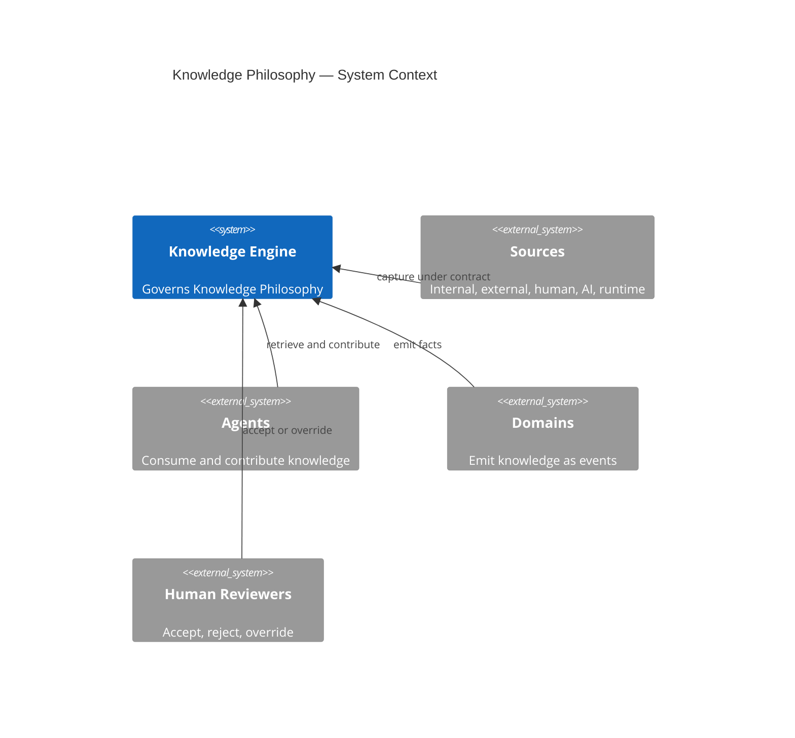

*Diagram `CAT-KE-P1-02-D-1` is illustrative of the `Knowledge Philosophy` operating model; it does not authorize a production deployment, validate a corpus, or grant authority.*

#### CAT-KE-P1-02-D-2 — Knowledge Philosophy — Operating Flow

**Diagram ID:** `CAT-KE-P1-02-D-2`
**Title:** Knowledge Philosophy — Operating Flow
**Type:** Flowchart
**Purpose:** Show the governed end-to-end flow of Knowledge Philosophy from capture to evidence.
**Audience:** Human owners, knowledge architects, engineers, security reviewers, operators, auditors, and AI coding agents.
**Reading Order:** Follow arrows left to right from capture to evidence.

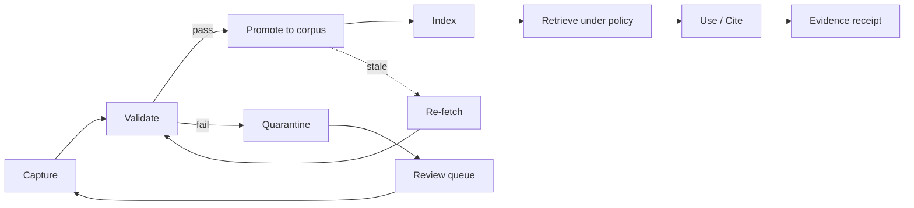

*Diagram `CAT-KE-P1-02-D-2` is illustrative of the `Knowledge Philosophy` operating model; it does not authorize a production deployment, validate a corpus, or grant authority.*

#### CAT-KE-P1-02-D-3 — Knowledge Philosophy — Lifecycle States

**Diagram ID:** `CAT-KE-P1-02-D-3`
**Title:** Knowledge Philosophy — Lifecycle States
**Type:** State Diagram
**Purpose:** Show the governed lifecycle states and guarded transitions for Knowledge Philosophy.
**Audience:** Human owners, knowledge architects, engineers, security reviewers, operators, auditors, and AI coding agents.
**Reading Order:** Start at [*] entry and follow transitions to terminal states.

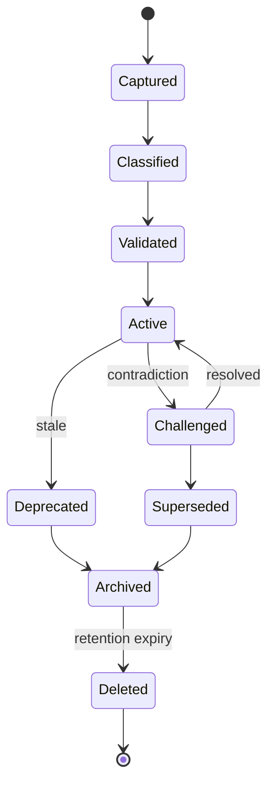

*Diagram `CAT-KE-P1-02-D-3` is illustrative of the `Knowledge Philosophy` operating model; it does not authorize a production deployment, validate a corpus, or grant authority.*

#### CAT-KE-P1-02-D-4 — Knowledge Philosophy — Contribution Sequence

**Diagram ID:** `CAT-KE-P1-02-D-4`
**Title:** Knowledge Philosophy — Contribution Sequence
**Type:** Sequence Diagram
**Purpose:** Show the typed message exchange when a contributor writes Knowledge Philosophy through contracts.
**Audience:** Human owners, knowledge architects, engineers, security reviewers, operators, auditors, and AI coding agents.
**Reading Order:** Read top to bottom; each arrow is a typed contract call.

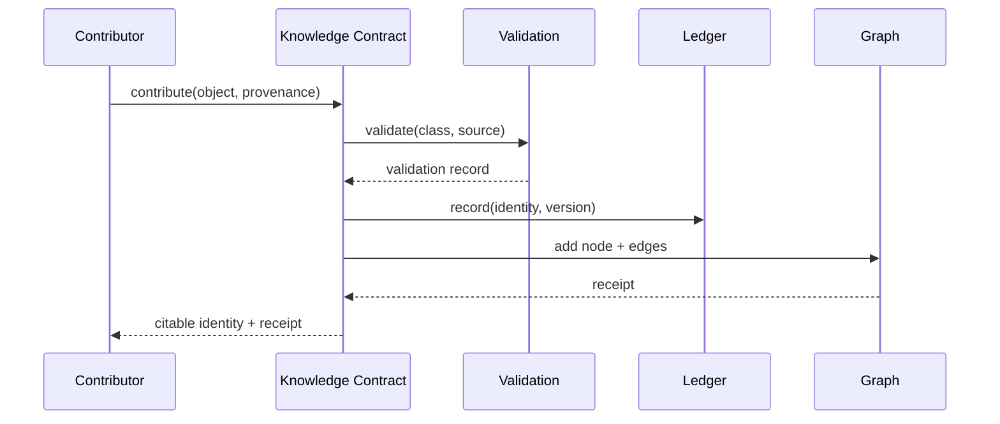

*Diagram `CAT-KE-P1-02-D-4` is illustrative of the `Knowledge Philosophy` operating model; it does not authorize a production deployment, validate a corpus, or grant authority.*

#### CAT-KE-P1-02-D-5 — Knowledge Philosophy — Entity Relationship

**Diagram ID:** `CAT-KE-P1-02-D-5`
**Title:** Knowledge Philosophy — Entity Relationship
**Type:** ER Diagram
**Purpose:** Show the core entities and their governed relationships for Knowledge Philosophy.
**Audience:** Human owners, knowledge architects, engineers, security reviewers, operators, auditors, and AI coding agents.
**Reading Order:** Read entities and cardinalities; each relationship is a governed edge.

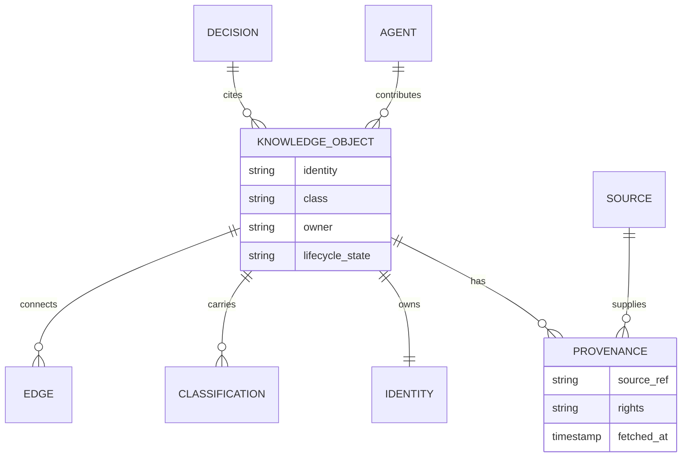

*Diagram `CAT-KE-P1-02-D-5` is illustrative of the `Knowledge Philosophy` operating model; it does not authorize a production deployment, validate a corpus, or grant authority.*

#### CAT-KE-P1-02-D-6 — Knowledge Philosophy — Concept Mindmap

**Diagram ID:** `CAT-KE-P1-02-D-6`
**Title:** Knowledge Philosophy — Concept Mindmap
**Type:** Mindmap
**Purpose:** Map the conceptual neighborhood of Knowledge Philosophy for orientation.
**Audience:** Human owners, knowledge architects, engineers, security reviewers, operators, auditors, and AI coding agents.
**Reading Order:** Read from the center outward to branches.

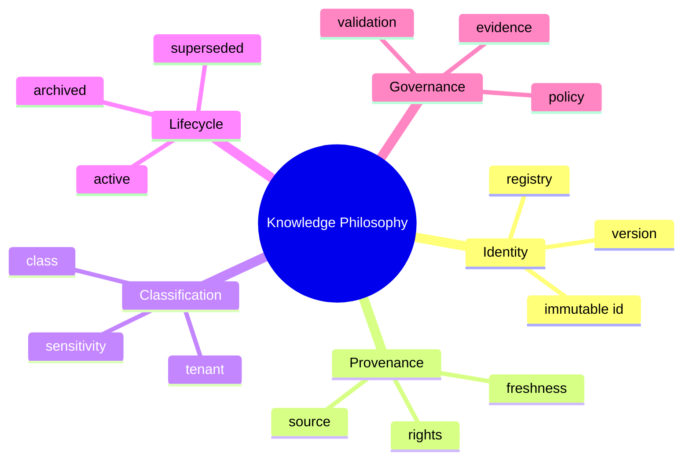

*Diagram `CAT-KE-P1-02-D-6` is illustrative of the `Knowledge Philosophy` operating model; it does not authorize a production deployment, validate a corpus, or grant authority.*

#### CAT-KE-P1-02-D-7 — Knowledge Philosophy — Evolution Timeline

**Diagram ID:** `CAT-KE-P1-02-D-7`
**Title:** Knowledge Philosophy — Evolution Timeline
**Type:** Timeline
**Purpose:** Show how Knowledge Philosophy is intended to mature across phases.
**Audience:** Human owners, knowledge architects, engineers, security reviewers, operators, auditors, and AI coding agents.
**Reading Order:** Read left to right; each phase is evidence-gated.

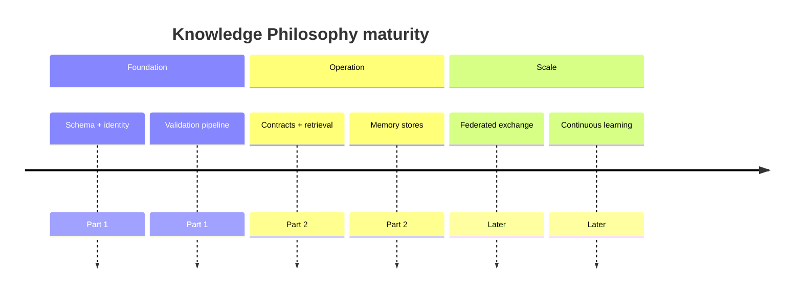

*Diagram `CAT-KE-P1-02-D-7` is illustrative of the `Knowledge Philosophy` operating model; it does not authorize a production deployment, validate a corpus, or grant authority.*

#### CAT-KE-P1-02-D-8 — Knowledge Philosophy — Agent Journey

**Diagram ID:** `CAT-KE-P1-02-D-8`
**Title:** Knowledge Philosophy — Agent Journey
**Type:** Journey
**Purpose:** Show the agent's emotional/step journey while working with Knowledge Philosophy.
**Audience:** Human owners, knowledge architects, engineers, security reviewers, operators, auditors, and AI coding agents.
**Reading Order:** Read left to right through the journey stages.

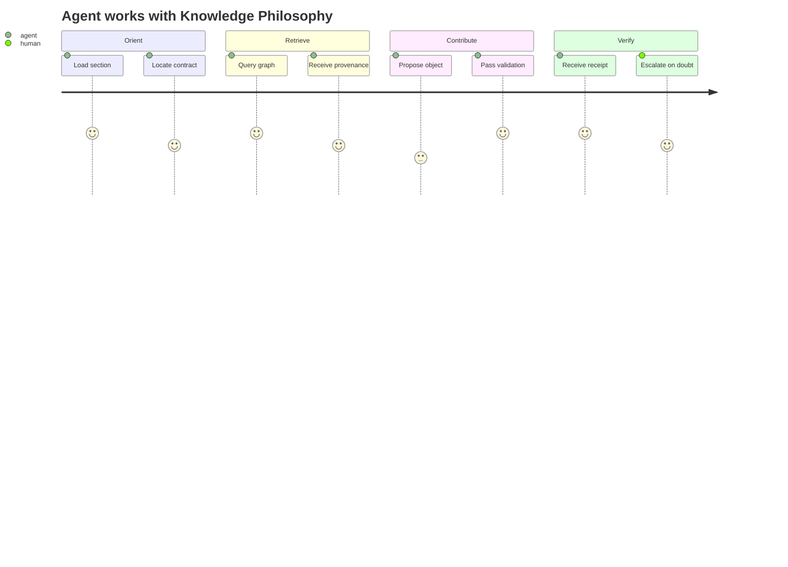

*Diagram `CAT-KE-P1-02-D-8` is illustrative of the `Knowledge Philosophy` operating model; it does not authorize a production deployment, validate a corpus, or grant authority.*

#### CAT-KE-P1-02-D-9 — Knowledge Philosophy — Object Model

**Diagram ID:** `CAT-KE-P1-02-D-9`
**Title:** Knowledge Philosophy — Object Model
**Type:** Class Diagram
**Purpose:** Show the class structure and inheritance/composition for Knowledge Philosophy.
**Audience:** Human owners, knowledge architects, engineers, security reviewers, operators, auditors, and AI coding agents.
**Reading Order:** Read classes top-down; arrows show composition.

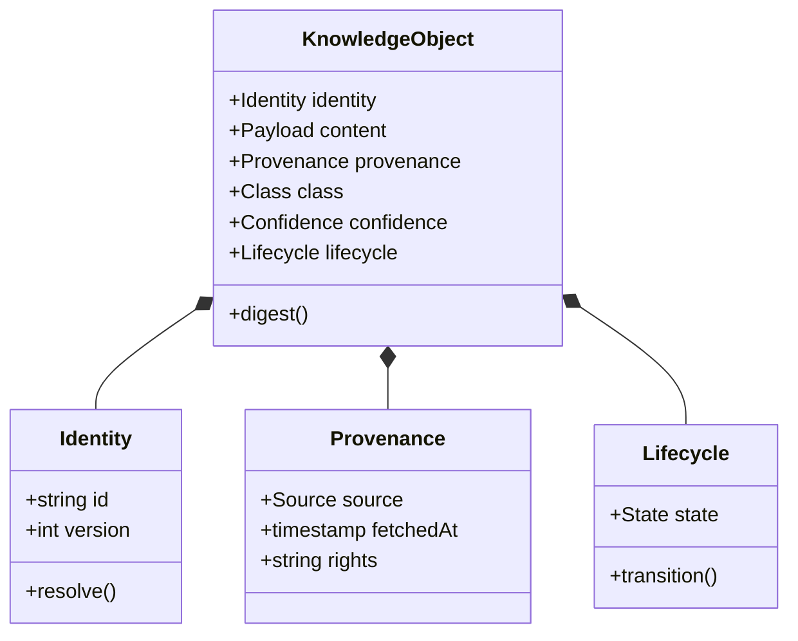

*Diagram `CAT-KE-P1-02-D-9` is illustrative of the `Knowledge Philosophy` operating model; it does not authorize a production deployment, validate a corpus, or grant authority.*

#### CAT-KE-P1-02-D-10 — Knowledge Philosophy — Decision Tree

**Diagram ID:** `CAT-KE-P1-02-D-10`
**Title:** Knowledge Philosophy — Decision Tree
**Type:** Decision Tree
**Purpose:** Show the decision logic the engine applies to a Knowledge Philosophy operation.
**Audience:** Human owners, knowledge architects, engineers, security reviewers, operators, auditors, and AI coding agents.
**Reading Order:** Start at the top question and follow yes/no branches.

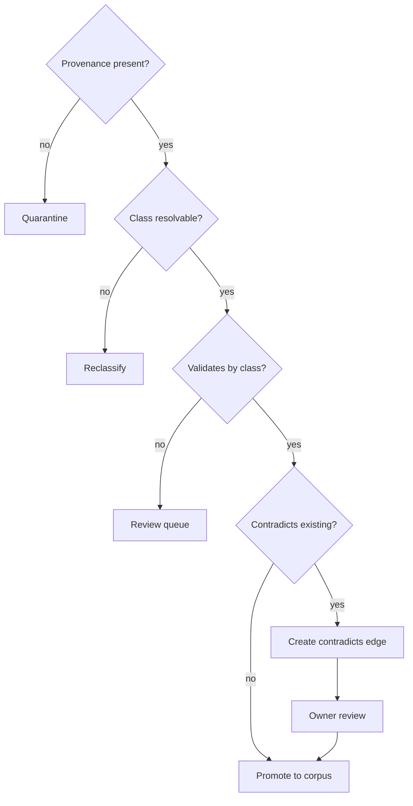

*Diagram `CAT-KE-P1-02-D-10` is illustrative of the `Knowledge Philosophy` operating model; it does not authorize a production deployment, validate a corpus, or grant authority.*

#### CAT-KE-P1-02-D-11 — Knowledge Philosophy — C4 Container

**Diagram ID:** `CAT-KE-P1-02-D-11`
**Title:** Knowledge Philosophy — C4 Container
**Type:** C4 Container
**Purpose:** Decompose the Knowledge Engine into containers responsible for Knowledge Philosophy.
**Audience:** Human owners, knowledge architects, engineers, security reviewers, operators, auditors, and AI coding agents.
**Reading Order:** Read the engine container and its internal components.


*Diagram `CAT-KE-P1-02-D-11` is illustrative of the `Knowledge Philosophy` operating model; it does not authorize a production deployment, validate a corpus, or grant authority.*

#### CAT-KE-P1-02-D-12 — Knowledge Philosophy — Versioning History

**Diagram ID:** `CAT-KE-P1-02-D-12`
**Title:** Knowledge Philosophy — Versioning History
**Type:** Versioning Graph
**Purpose:** Show how Knowledge Philosophy advances through immutable versions over time.
**Audience:** Human owners, knowledge architects, engineers, security reviewers, operators, auditors, and AI coding agents.
**Reading Order:** Read commits left to right along main; supersessions branch and merge.


*Diagram `CAT-KE-P1-02-D-12` is illustrative of the `Knowledge Philosophy` operating model; it does not authorize a production deployment, validate a corpus, or grant authority.*

#### CAT-KE-P1-02-D-13 — Knowledge Philosophy — Control Priority Quadrant

**Diagram ID:** `CAT-KE-P1-02-D-13`
**Title:** Knowledge Philosophy — Control Priority Quadrant
**Type:** Quadrant Chart
**Purpose:** Map the Knowledge Philosophy controls by criticality versus implementation effort to guide sequencing.
**Audience:** Human owners, knowledge architects, engineers, security reviewers, operators, auditors, and AI coding agents.
**Reading Order:** Read the axes; top-right is high-criticality and high-effort.

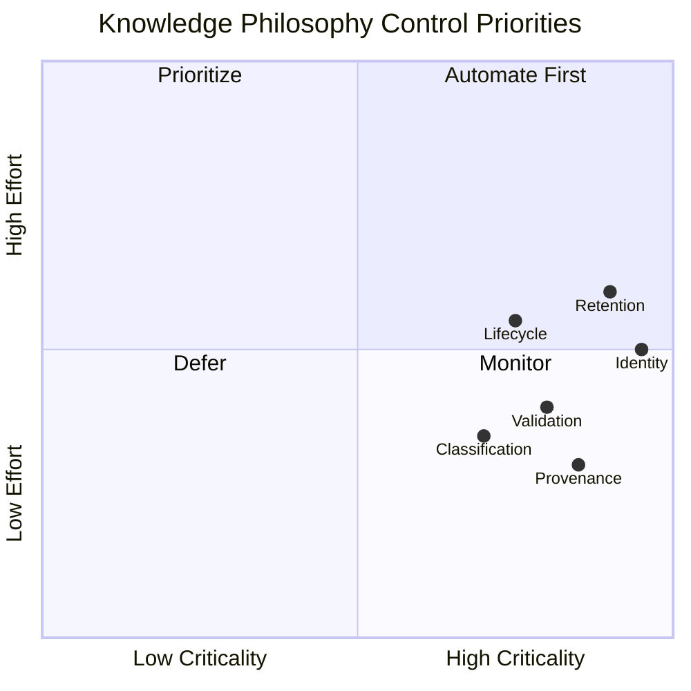

*Diagram `CAT-KE-P1-02-D-13` is illustrative of the `Knowledge Philosophy` operating model; it does not authorize a production deployment, validate a corpus, or grant authority.*

#### CAT-KE-P1-02-D-14 — Knowledge Philosophy — Retrieval Ranking Flow

**Diagram ID:** `CAT-KE-P1-02-D-14`
**Title:** Knowledge Philosophy — Retrieval Ranking Flow
**Type:** Ranking Flow
**Purpose:** Show how retrieval ranks Knowledge Philosophy candidates under policy before returning them.
**Audience:** Human owners, knowledge architects, engineers, security reviewers, operators, auditors, and AI coding agents.
**Reading Order:** Read top to bottom through the ranking stages.

```mermaid
flowchart TD
  Q[Query] --> C[Candidate set]
  C --> P1[Policy filter: tenant, class, lifecycle]
  P1 --> F[Freshness filter]
  F --> S[Source-trust scoring]
  S --> Co[Contradiction down-rank]
  Co --> R[Ranked results]
  R --> X[Explain: path + provenance]
```

*Diagram `CAT-KE-P1-02-D-14` is illustrative of the `Knowledge Philosophy` operating model; it does not authorize a production deployment, validate a corpus, or grant authority.*

#### CAT-KE-P1-02 — ASCII — Knowledge Philosophy at a Glance

**Diagram ID:** `CAT-KE-P1-02-ASCII`
**Title:** Knowledge Philosophy at a Glance
**Type:** ASCII
**Purpose:** A compact text view of Knowledge Philosophy for terminals and quick reference.
**Audience:** Human owners, knowledge architects, engineers, security reviewers, operators, auditors, and AI coding agents.
**Reading Order:** Read the top legend, then the boxed structure.

```text
Legend: [O]=object  [S]=source  [E]=edge  [V]=validation  [L]=ledger

            +-------------------+
   capture  |   [S] source      |
      |     +---------+---------+
      v               v
  +-------+       +----------+
  | [O]   | ----> | [V] gate |
  +-------+       +----+-----+
      |                | pass
      |                v
  +-------+       +----------+        +----------+
  | [L]   | <---- | corpus   | <----> | [E] graph|
  +-------+       +----+-----+        +----------+
      |                |
      v                v
   evidence        retrieve (policy-aware) --> cite
```

*ASCII diagram `CAT-KE-P1-02-ASCII` is illustrative only.*

## 3. Knowledge First Architecture

**Section ID:** `CAT-KE-P1-03`  
**Constitutional domain:** Knowledge Architecture  
**Human accountable owner:** Chief Architect and Chief Knowledge Officer  
**Primary record:** knowledge architecture seam record  
**Decision status:** Foundation decision for the Knowledge Engine Bible Part 1; implementation and production authority remain evidence-gated. Later implementation ADRs MUST preserve this section unless they explicitly supersede a named requirement.  
**Primary question:** The architecture must be designed so that knowledge flows, capture, retrieval, validation, and evolution are first-class seams — not features bolted onto a system that was designed without knowledge in mind.

### Purpose

Knowledge First Architecture inverts the usual priority. Instead of building a system and then asking 'how do we make it smart?', CAT builds the knowledge substrate first and then layers behavior on top of it. Every capability — research, analysis, content, treasury, affiliate — is an expression over a governed knowledge base. This makes intelligence a property of the whole system rather than a property of a model bolted to a feature. The purpose of this section is to define the seams that make that inversion real and testable.

**Normative application:** For `3. Knowledge First Architecture`, the owning implementation MUST make this section observable through a named contract, a policy or guard, a test or review check, and an operational signal. A prose claim without enforcement evidence is incomplete.

### Business Explanation

The business benefit is that every investment in knowledge compounds across every feature. A captured insight about a market, a customer, a regulation, or a technology becomes available to every agent and every human instead of dying inside the silo where it was learned. The cost of features falls over time because they increasingly assemble existing knowledge rather than rediscover it. The architecture pays for itself through reuse and through the prevention of contradictory action.

**Normative application:** For `3. Knowledge First Architecture`, the owning implementation MUST expose to an accountable reviewer the cost, benefit, risk, owner, uncertainty, and consequence of this capability before it is accepted.

The business MUST fund the control work that keeps `Knowledge First Architecture` trustworthy as part of delivery: provenance capture, classification, validation, human review where required, recovery, audit, and lifecycle retirement are not optional overhead. Success is the durable outcome represented by `knowledge architecture seam record`, not output volume or knowledge-object count.

### Engineering Explanation

Engineering realizes knowledge-first through explicit seams: a knowledge capture port at every domain and agent boundary; a retrieval port with policy, ranking, and freshness controls; a validation port that checks consistency before promotion; and an evolution port that versions knowledge changes as first-class events. These seams are typed, tested, and observable. A subsystem that lacks them is non-compliant by definition.

Implement `Knowledge First Architecture` through versioned schemas, deterministic state machines, owned ports, immutable identities, hierarchical budgets, cancellation, idempotency, checkpoints, and source-of-truth verification. Probabilistic inference may propose; deterministic services authorize and commit.

Make time, randomness, source routes, policy versions, and external effects injectable in tests. Classify every dependency as startup-hard, runtime-required, optional, or asynchronous; define timeout, circuit, fallback, replay, migration, and failure ownership explicitly for `Knowledge First Architecture`.

### Architecture Perspective

Architecturally, the Knowledge Engine is positioned as the connective tissue between the Kernel, the Domains, and the Agents. It does not own business truth — domains do — but it owns the representation, linkage, and lifecycle of knowledge about that truth. The Agent layer reads knowledge to reason and writes knowledge to remember; the Domain layer emits knowledge as events; the Kernel schedules knowledge operations as governed work.

**Normative application:** For `3. Knowledge First Architecture`, the owning implementation MUST make this perspective observable through a named contract, a policy or guard, a test or review check, and an operational signal. A prose claim without enforcement evidence is incomplete.

Chief Architect and Chief Knowledge Officer remains the human accountability boundary for `Knowledge First Architecture`. The Knowledge Architecture domain owns semantics and canonical state; CATA coordinates portfolios, the Supervisor coordinates runtime, specialists produce bounded artifacts, and policy and effect gateways prevent orchestration from becoming authority.

### AI Perspective

For an AI, knowledge-first means that retrieval is never optional and never implicit. Every reasoning step is expected to declare its knowledge basis, every proposed action is expected to cite its knowledge support, and every durable contribution is expected to pass through the knowledge seams rather than bypassing them. The architecture gives the AI a reliable place to read and a governed place to write.

**Normative application:** For `3. Knowledge First Architecture`, the owning implementation MUST make this perspective observable through a named contract, a policy or guard, a test or review check, and an operational signal. A prose claim without enforcement evidence is incomplete.

AI confidence about `Knowledge First Architecture` is one signal only; it cannot substitute for provenance, validation, authority, or human acceptance where the class of knowledge requires them.

### Implementation Strategy

The implementation strategy for `Knowledge First Architecture` proceeds in evidence-gated increments rather than a single release. Each increment begins as a hypothesis encoded as a typed schema and a contract, runs first in simulation or a sandboxed knowledge store, proves quality and safety against positive and negative fixtures, and is promoted only after independent owner acceptance.

1. **Model first.** Define the canonical schema, identity derivation, legal-edge matrix (where relevant), and the policy bindings for `knowledge architecture seam record` before any code writes or reads it.
2. **Validate at the boundary.** Place the Knowledge Architecture validations at the ingestion seam so that invalid or unprovenanced input is quarantined before it can reach the citable corpus.
3. **Version everything.** Treat every `Knowledge First Architecture` artifact as immutable and append-only; all change is a versioned transformation with recorded inputs and outputs.
4. **Observe continuously.** Emit structured decision receipts, tool receipts, and redacted artifacts with immutable lineage for every `Knowledge First Architecture` operation.
5. **Fail closed.** When policy, provenance, classification, or ownership cannot be established for a `Knowledge First Architecture` operation, the operation stops, preserves state and evidence, and routes the decision to Chief Architect and Chief Knowledge Officer.

### Developer Notes

- Before editing a `Knowledge First Architecture` implementation, inspect the registered schema, the owning domain API, the policy bindings, the validation pipeline, the tests, and the operational runbook.
- Do not create a bypass around a validation, classification, provenance, or approval control to satisfy a task quickly. A bypass is a defect, not a shortcut.
- State assumptions, the exact authority requested, data classifications, expected effects, and the rollback path in the change description for every `Knowledge First Architecture` change.
- Add a negative test for every newly permitted `Knowledge First Architecture` capability and a recovery test for every material external effect that depends on it.
- If a requirement is ambiguous, stop at the safe boundary and request an accountable human decision; do not convert inference into permission for `Knowledge First Architecture`.

### Codex Notes

When generating code for `Knowledge First Architecture`, Codex should emit the schema, contract, validation, and test scaffolding together rather than logic alone. The `Knowledge First Architecture` surface is contract-first: the typed request, response, event, error, and receipt shapes are the deliverable, and the implementation must conform to them.

- Prefer deterministic guards over prompt-level instructions for every `Knowledge First Architecture` policy; the model may not be relied upon to enforce invariants.
- Generate negative fixtures first for `Knowledge First Architecture`: malformed input, missing provenance, classification mismatch, expired source, and contradictory edges.
- Keep `Knowledge First Architecture` changes minimal and additive; prefer a new version over an in-place mutation.
- Include redaction in every emitted log, metric, and artifact for `Knowledge First Architecture`; protected content must never appear in observability.

### Claude Code Notes

When operating agentic edits on `Knowledge First Architecture`, Claude Code should treat the Knowledge Engine contracts as the boundary of permission: read through retrieval contracts, write through contribution contracts, and never reach storage or the graph store directly. The agent must record its `Knowledge First Architecture` contributions against the ledger with provenance.

- Before modifying `Knowledge First Architecture`, load the relevant section of this Bible, the schema, and the current ownership and classification state.
- Distinguish a proposed `Knowledge First Architecture` contribution from a validated one; never present a draft as trusted or citable.
- On contradiction detection between `Knowledge First Architecture` objects, create a governed edge and escalate rather than silently choosing one side.
- Preserve user work: if a `Knowledge First Architecture` change would invalidate dependent paths, report the impact and request the human decision.

### Gemini CLI Notes

When working in a terminal against `Knowledge First Architecture` at scale, Gemini CLI's long context is useful for loading whole sections, schemas, and the dependency graph before proposing a change. The agent should summarize the `Knowledge First Architecture` context into a bounded brief, cite the section anchors it relied on, and flag any unresolved conflict before acting.

- Use the `Knowledge First Architecture` contracts as the only access path; shell-level or direct-store access is prohibited.
- Batch `Knowledge First Architecture` validations and run them locally against fixtures before proposing promotion.
- Keep the `Knowledge First Architecture` change set small and reviewable; large diffs obscure provenance and classification changes.
- Report the token and cost footprint of `Knowledge First Architecture` retrieval operations, because knowledge economics are part of the deliverable.

### Future AI Notes

Future AI models may reason over `Knowledge First Architecture` more fluently and at greater scale, but no advance in model quality changes CAT's requirement for provenance, classification, validation, authority, and evidence. A more capable model that bypasses these controls is a larger risk, not a smaller one.

- Future agents operating on `Knowledge First Architecture` must consume the same contracts; intelligence is not a license to bypass seams.
- Richer reasoning over `Knowledge First Architecture` must still emit explainable graph paths; opacity is not acceptable even when the model is accurate.
- Future autonomy over `Knowledge First Architecture` is earned through measured evidence, not asserted; escalation paths to Chief Architect and Chief Knowledge Officer must remain open.
- Future `Knowledge First Architecture` capability must never retroactively authorize current behavior; the constitution governs forward.

### Security Notes

Apply zero standing privilege, workload identity, tenant and environment isolation, purpose-bound data, secret-manager references, prompt and tool injection defenses, egress policy, sandboxing, rate limits, revocation, tamper-evident receipts, and a tested kill switch for `Knowledge First Architecture`.

Section invariant for `Knowledge First Architecture`: No CAT subsystem may be designed or changed without an explicit knowledge seam: where knowledge is captured, where it is stored, how it is retrieved, who owns it, and how it is retired.

Threat tests for `{title}` cover confused deputy, role-title escalation, malicious context, poisoned knowledge, memory exfiltration, approval laundering, replay, supply-chain substitution, side channels, resource exhaustion, audit tampering, and compromised provider behavior. Each must fail closed and emit a protected signal.

### Performance Notes

Declare separate service-level objectives for `Knowledge First Architecture` admission, queueing, validation, retrieval, effect verification, and evidence publication; one hundred percent of terminal `knowledge architecture seam record` records must be attributable and schema-valid.

Measure the `Knowledge First Architecture` latency components separately — source fetch, validation, indexing, traversal, ranking, evidence publication — and report percentiles, quality, safety, cost, human burden, cancellation delay, and terminal classes. Never improve averages by dropping rejected, failed, or quarantined `Knowledge First Architecture` work.

### Scalability Notes

Partition `Knowledge First Architecture` work by tenant and bounded aggregate, preserve global contract compatibility, cap concurrency and fan-out, and fail closed when ownership or policy cannot converge.

Use bounded fan-out, backpressure, fairness reservations, locality, and asynchronous facts where ordering is unnecessary for `{title}`. Cross-region or cross-node scale requires explicit data residency, identity federation, protocol compatibility, conflict resolution, disconnect behavior, and reconciliation. Rebuildable projections absorb read scale without becoming sources of truth.

### Failure Modes

The principal `Knowledge First Architecture` failure is unprovenanced or misclassified knowledge entering active use; secondary failures are stale sources, contradictory edges, identity drift, retention violation, and silent degradation.

| Failure mode | Trigger | Effect | Detection |
|---|---|---|---|
| Unprovenanced knowledge | Ingestion without source record | Trust erosion, audit gap | Provenance gate at ingestion |
| Misclassification | Wrong class assigned at capture | Wrong validation, wrong retention | Class-specific validation failure |
| Stale source | Source past freshness SLA | Outdated facts cited | Freshness monitor + re-fetch |
| Contradictory edges | Two edges conflict unresolved | Ambiguous reasoning | Contradiction detection + review queue |
| Identity drift | Duplicate or moved identity | Broken references | Registry integrity scan |
| Retention violation | Memory or data past legal limit | Compliance breach | Retention enforcement + tombstones |
| Silent degradation | Quality metric decline unnoticed | Erosion of trust | Continuous quality monitoring |

### Recovery Strategy

Recovery for `Knowledge First Architecture` stops further effects, preserves the run record, isolates the cause, reconciles knowledge state against authoritative sources, and routes the unresolved decision to Chief Architect and Chief Knowledge Officer.

1. **Contain.** Suspend the affected `Knowledge First Architecture` scope and prevent new reads of the compromised knowledge.
2. **Preserve.** Freeze the run record, receipts, and evidence for `Knowledge First Architecture`; do not delete.
3. **Reconcile.** Re-establish authoritative `Knowledge First Architecture` state from validated sources; quarantine anything that cannot be reconciled.
4. **Restore.** Restore the `Knowledge First Architecture` invariant — provenance, classification, ownership, lifecycle — before resuming.
5. **Review.** Link a terminal recovery receipt and route the residual decision to Chief Architect and Chief Knowledge Officer; capture the lesson as governed knowledge.

### Extension Points

`Knowledge First Architecture` exposes typed extension points so the engine grows without breaking contracts:

- **Source adapters.** New `Knowledge First Architecture` sources plug into the ingestion seam through a typed adapter that normalizes input and records provenance.
- **Validation rules.** New `Knowledge First Architecture` checks are registered class-specific validators; they compose into the validation pipeline without modifying core logic.
- **Entity and edge types.** New `Knowledge First Architecture` entity or edge types extend the registered schema and legal-edge matrix; unknown types remain rejected.
- **Memory classes.** New `Knowledge First Architecture` memory classes are added as governed stores with namespace, consent, retention, and tombstone controls.
- **Retrieval strategies.** New `Knowledge First Architecture` ranking or traversal strategies register behind the retrieval contract; the policy layer governs their use.

### Ownership

| Ownership layer | Holder | Responsibility |
|---|---|---|
| Human accountable owner | Chief Architect and Chief Knowledge Officer | Residual business judgment, risk acceptance, rights, and consequential approval for `Knowledge First Architecture`. |
| Operational owner | Knowledge Architecture Service Owner | Enforcement, schemas, contracts, runbooks, and SLOs for `Knowledge First Architecture`. |
| Domain owner | Domain Owners (per knowledge class) | Class-specific validation, freshness, and canonical truth for `{title}`. |
| Audit owner | Independent Audit Owner | Independent evidence review, tamper-evidence, and retention for `{title}`. |
| Chief Knowledge Officer | Executive CKO | Cross-domain knowledge policy, asset register integrity, and constitution for `{title}`. |

### Dependencies

`Knowledge First Architecture` depends on the following, which MUST be satisfied before the capability is promotable:

| Dependency | Type | Requirement |
|---|---|---|
| Knowledge Object Model | Foundation | Schema and identity derivation exist and are versioned. |
| Identity Registry | Foundation | Globally unique, immutable, resolvable identities exist. |
| Policy Decision Point | Runtime-required | Classification, tenant, and lifecycle policy is enforced at every `Knowledge First Architecture` boundary. |
| Validation Pipeline | Runtime-required | Class-specific checks run before promotion. |
| Observability | Runtime-required | Structured logs, traces, metrics, receipts, and redacted artifacts are emitted. |
| Higher-order context | Foundation | `context/00` through `context/05` are read and applied. |
| Accepted ADR | Gated | A completed, accepted ADR exists before a production `Knowledge First Architecture` change. |

### Risks

| Risk | Likelihood | Impact | Mitigation |
|---|---|---|---|
| Unprovenanced knowledge trusted | Medium | High | Mandatory provenance gate; quarantine on absence. |
| Misclassification | Medium | High | Class-specific validation; conservative reclassification on doubt. |
| Contradiction accumulation | High | Medium | Contradiction detection edges; resolution queue with owners. |
| Staleness eroding decisions | High | Medium | Freshness SLAs; scheduled re-fetch; expiry enforcement. |
| Cross-tenant leakage | Low | Critical | Structural tenant isolation in traversal; deny by default. |
| Retention non-compliance | Medium | Critical | Retention enforcement; tombstones; re-consent. |
| Scale-induced governance lapse | Medium | High | Layered architecture; fail-closed under overload. |
| Model overconfidence | High | High | Confidence never substitutes for evidence or authority. |

### Anti-patterns

- Storing `Knowledge First Architecture` as free text without machine-readable provenance, classification, or identity.
- Mutating `Knowledge First Architecture` in place instead of versioning it; destroying history.
- Bypassing the `Knowledge First Architecture` contracts to read or write stores directly.
- Treating AI-generated `Knowledge First Architecture` as validated without deterministic checks.
- Promoting memory into authoritative `Knowledge First Architecture` without validation.
- Dropping or hiding contradictory `Knowledge First Architecture` edges to produce a clean path.
- Allowing `Knowledge First Architecture` to persist without an owner; orphaned knowledge.
- Inferring implementation permission from this document's existence or completion percentage.

### Best Practices

- Capture `Knowledge First Architecture` at the boundary where it is created or modified; do not retrofit provenance later.
- Make `Knowledge First Architecture` immutable and append-only; express all change as versioned transformations.
- Validate `Knowledge First Architecture` by class before promotion; quarantine on any failed check.
- Carry classification, confidence, and lifecycle with every `Knowledge First Architecture` object at all times.
- Represent `Knowledge First Architecture` relationships as governed edges; compute structure, do not imply it.
- Enforce tenant isolation, retention, and consent structurally in traversal.
- Keep projections rebuildable; never promote a cache to a source of truth.
- Require an accepted ADR before any irreversible `Knowledge First Architecture` architecture choice.

### Examples

The following illustrative examples show intended `Knowledge First Architecture` behavior. They are illustrative only; they do not authorize production use, validate a real corpus, or grant any authority.

**Example 1 — Compliant `Knowledge First Architecture` contribution.**
A domain emits a `{title}` record with identity, source reference, classification, declared confidence, owner, and lifecycle state. The validation pipeline confirms schema, provenance, freshness, rights, and contradiction status; the object is promoted to the citable corpus and recorded in the ledger with a digest. Retrieval returns the object with its provenance and lifecycle visible.

**Example 2 — Compliant `Knowledge First Architecture` evolution.**
A reviewer finds that a `{title}` object is stale. They propose a correction as a new version citing an authoritative source; the engine records a `supersedes` edge from the old version to the new, preserves the old version as history, and re-evaluates dependent paths. An independent reviewer can reconstruct the state at any past date.

**Example 3 — Compliant `Knowledge First Architecture` contradiction handling.**
Two `{title}` objects assert incompatible claims. The engine creates a governed `contradicts` edge, down-ranks both in retrieval, flags them for review, and surfaces the conflict to the domain owner. Neither is silently chosen; resolution is a recorded human or independent-evaluator decision.

### Counter Examples

The following are non-compliant `Knowledge First Architecture` patterns that MUST be rejected:

**Counter-example 1 — Unprovenanced assertion.**
An AI contributes a `Knowledge First Architecture` claim without a source reference. The object is rejected at ingestion; the claim may live only as a draft, never as trusted or citable knowledge.

**Counter-example 2 — Silent overwrite.**
A maintainer edits a `{title}` object in place to correct an error. The in-place mutation destroys history and violates immutability; the change is rolled back and re-applied as a versioned correction.

**Counter-example 3 — Hidden contradiction.**
A traversal hides a `contradicts` edge to return a clean recommendation. Hiding the edge is a knowledge-integrity violation; the traversal must surface the conflict and down-rank rather than conceal.

**Counter-example 4 — Memory as truth.**
An agent treats a long-term memory as an authoritative fact and acts on it without validation. The memory is advisory only; acting on it as fact is a discipline violation requiring the fact to be validated first.

### Implementation Checklist

- [ ] Canonical schema, owner, compatibility policy, and stable error taxonomy defined for `Knowledge First Architecture`.
- [ ] Identity, policy, classification, provenance, and lifecycle encoded outside the model for `Knowledge First Architecture`.
- [ ] Each AI capability for `Knowledge First Architecture` mapped to an owned port, data class, effect class, and receipt.
- [ ] State transitions implemented with optimistic concurrency and durable checkpoints for `Knowledge First Architecture`.
- [ ] Correlation, causation, deadline, cancellation, and budget propagated through every `Knowledge First Architecture` call.
- [ ] External effects verified from authoritative state before completion or retry for `Knowledge First Architecture`.
- [ ] Degraded behavior, circuit breaking, containment, recovery, and reconciliation provided for `Knowledge First Architecture`.
- [ ] Operational logs redacted; protected forensic evidence retained by explicit policy for `Knowledge First Architecture`.
- [ ] Role-quality, adversarial, tenancy, load, chaos, migration, and rollback tests created for `Knowledge First Architecture`.
- [ ] Dashboards, alert thresholds, runbooks, on-call ownership, and support boundaries shipped for `Knowledge First Architecture`.
- [ ] An immutable `Knowledge First Architecture` version canaried with a tested last-known-safe rollback target.
- [ ] Independent owner acceptance and applicable certification required before production `Knowledge First Architecture`.

### AI Memory Anchor

**Memory anchor `CAT-KE-P1-03`:** `3. Knowledge First Architecture` means: The architecture must be designed so that knowledge flows, capture, retrieval, validation, and evolution are first-class seams — not features bolted onto a system that was designed without knowledge in mind. The AI agent MUST preserve provenance, classification, identity, validation, evidence, safe failure, and human accountability for `Knowledge First Architecture`. If a request conflicts with those anchors, stop, explain the conflict, and propose the smallest safe alternative.

### Cross References

- Section-specific context: `core/knowledge/`, `core/memory/`, `core/rag/`, `knowledge/`, and `context/06_KNOWLEDGE_ENGINE.md`.
- Constitutional baseline: `context/00_PROJECT_CONTEXT.md`, `context/01_PROJECT_OVERVIEW.md`, `context/02_PROJECT_RULES.md`, `context/03_TECH_STACK.md`, `context/04_ARCHITECTURE.md`, and `context/05_AGENTS.md`.
- This Bible: sections 1 through 20 of `context/06_KNOWLEDGE_ENGINE.md` Part 1.
- Operational implementation also consults `context/16_DEPLOYMENT.md`, `context/17_SECURITY.md`, `context/18_PROMPTING.md`, and `context/19_DEVELOPMENT_GUIDE.md` as they become authoritative.
- Architecture references: `architecture/KnowledgeGraph/`, `architecture/Data_Flow.md`, `architecture/AI_Architecture.md`.

### Repository Mapping

| Repository concern | Canonical location or governing source |
|---|---|
| Knowledge core | `core/knowledge/` — object model, identity, validation, lifecycle. |
| Memory | `core/memory/` — working, short, long, episodic, semantic, procedural, collective stores. |
| Retrieval / RAG | `core/rag/` — policy-aware retrieval contracts. |
| Knowledge graph | `architecture/KnowledgeGraph/` and `core/knowledge/graph/` when implemented. |
| Knowledge assets | `knowledge/` — index, glossary, maps; placeholders are non-authoritative. |
| Architecture authority | `context/04_ARCHITECTURE.md`, `architecture/System_Architecture.md`, and this Bible. |
| Agents | `context/05_AGENTS.md` and `agents/` — agents consume and contribute knowledge through contracts. |
| Security authority | `SECURITY.md`, `context/17_SECURITY.md` when completed, and policy implementation paths. |
| Decisions | `adr/ADR-0001.md` through `adr/ADR-0055.md` are current placeholders; a material implementation MUST create or complete a relevant accepted ADR rather than cite an empty ADR as evidence. |

### Folder Mapping

| Folder | Role in `Knowledge First Architecture` | Authority |
|---|---|---|
| `core/knowledge/` | `Knowledge First Architecture` object model, identity, validation, lifecycle services. | Normative when implemented. |
| `core/memory/` | `Knowledge First Architecture` memory stores and governance. | Normative when implemented. |
| `core/rag/` | `Knowledge First Architecture` retrieval contracts. | Normative when implemented. |
| `knowledge/` | `Knowledge First Architecture` asset index, glossary, and maps. | Reference; placeholders non-authoritative. |
| `architecture/KnowledgeGraph/` | `Knowledge First Architecture` graph models. | Reference diagrams. |
| `context/06_KNOWLEDGE_ENGINE.md` | `Knowledge First Architecture` constitutional documentation (this file). | Normative foundation. |
| `adr/` | `Knowledge First Architecture` implementation decisions. | Evidence-gated; placeholders non-authoritative. |

### Future Evolution

Future evolution of `Knowledge First Architecture` may include richer semantic models, multimodal knowledge objects, federated knowledge exchange, automated contradiction resolution, and continuous-learning loops. Every increment begins as a hypothesis, runs in simulation or a sandboxed knowledge store, proves quality and safety, obtains independent human authorization, canaries immutable versions, and retains rollback, migration, and historical interpretation.

Future capability never retroactively authorizes current behavior. Rights, law, accountability, provenance, classification, tenant choice, evidence, security, and safe exit remain constraints for `Knowledge First Architecture` even when technology, organization, providers, or economic models change.

### Operating Contract

| Contract dimension | Normative requirement |
|---|---|
| Business outcome | Knowledge First Architecture inverts the usual priority. |
| Human accountability | Chief Architect and Chief Knowledge Officer |
| Authoritative artifact | knowledge architecture seam record |
| Required inputs | authenticated charter; current knowledge architecture state; policy and authority snapshot; owned evidence; deadline; budget; acceptance criteria; human accountability route |
| Required outputs | versioned knowledge architecture seam record; decision evidence; state transition; exceptions; resource account; terminal receipt |
| Constitutional invariant | No CAT subsystem may be designed or changed without an explicit knowledge seam: where knowledge is captured, where it is stored, how it is retrieved, who owns it, and how it is retired. |
| Default authority | A0/A1 advice and preparation unless an exact role card, policy, certification and effect-specific grant narrow a higher ceiling. |
| Default failure | Stop the smallest unsafe scope, preserve state and evidence, reconcile any attempted effect, and route the unresolved decision to the named owner. |
| Performance envelope | Declare separate SLOs for admission, queueing, validation, retrieval, effect verification and evidence publication; 100 percent of terminal knowledge architecture seam record records must be attributable and schema-valid. |
| Scale model | Partition knowledge architecture work by tenant and bounded aggregate, preserve global contract compatibility, cap concurrency and fan-out, and fail closed when ownership or policy cannot converge. |
| Future direction | richer semantic models, multimodal knowledge objects, federated exchange and continuously validated knowledge |

### End-to-End Constitutional Procedure

1. **Establish charter and scope.** Validate identity, scope, owner, policy, data, authority, budget and deadline for `Knowledge First Architecture`; persist the decision and do not begin a dependent step until its preconditions and evidence pass.
2. **Resolve identity version tenant and owner.** Validate identity, scope, owner, policy, data, authority, budget and deadline; persist the decision and do not begin a dependent step until its preconditions and evidence pass.
3. **Capture source and provenance.** Validate identity, scope, owner, policy, data, authority, budget and deadline; persist the decision and do not begin a dependent step until its preconditions and evidence pass.
4. **Classify by taxonomy class.** Validate identity, scope, owner, policy, data, authority, budget and deadline; persist the decision and do not begin a dependent step until its preconditions and evidence pass.
5. **Validate by class against authority freshness rights and contradiction.** Validate identity, scope, owner, policy, data, authority, budget and deadline; persist the decision and do not begin a dependent step until its preconditions and evidence pass.
6. **Promote to the citable corpus and record in the ledger.** Validate identity, scope, owner, policy, data, authority, budget and deadline; persist the decision and do not begin a dependent step until its preconditions and evidence pass.
7. **Retrieve under policy and cite with provenance.** Validate identity, scope, owner, policy, data, authority, budget and deadline; persist the decision and do not begin a dependent step until its preconditions and evidence pass.
8. **Retire or supersede through lifecycle with reconciliation.** Validate identity, scope, owner, policy, data, authority, budget and deadline; persist the decision and do not begin a dependent step until its preconditions and evidence pass.

### Required Decision Record

| Record component | Minimum fields | Independent check |
|---|---|---|
| Charter | outcome, non-goals, sponsor, owner, acceptance, deadline and expiry | mission and owner resolver |
| Identity | logical ID, immutable version, runtime principal, tenant, environment and operator | identity and lifecycle service |
| Evidence | sources, revisions, rights, freshness, transformations, contradictions and confidence | domain and provenance validator |
| Decision | facts, assumptions, alternatives, dissent, risk, cost, uncertainty and requested judgment | human or independent evaluator |
| Authority | role ceiling, task grant, policy, data purpose, approval and live revocation state | policy enforcement point |
| Execution | plan, resources, tools, state versions, checkpoints, attempts and effects | orchestrator and domain gateways |
| Outcome | typed status, acceptance, quality, business result, externalities, incidents and follow-up owner | task owner and analytics |
| Audit | correlation, causation, digests, timestamps, receipts, retention and access history | independent Audit owner |

### Constitutional Control Catalogue

Each control below is independently testable for `Knowledge First Architecture`. Satisfying a narrative goal without the named enforcement and evidence is not constitutional conformance.

#### CAT-KE-P1-03-C01 — Charter Scope

- **Rule:** For `knowledge first architecture`, bind all work to a signed outcome, explicit non-goals, owner, expiry and acceptance criteria.
- **Business test:** `knowledge architecture seam record` exposes the cost, benefit, risk, owner, uncertainty and consequence of this control to an accountable reviewer.
- **Engineering enforcement:** The boundary responsible for `establish charter and scope` validates this control before state change and again before any related material effect.
- **AI behavior:** Missing, stale, contradictory, denied or unverifiable control data causes a typed stop, wait, refusal or escalation; the model never fills the gap with confidence.
- **Human boundary:** Chief Architect and Chief Knowledge Officer receives the exact requested decision and evidence when human judgment is required; no UI default or silence creates consent.
- **Security assertion:** Forged role, cross-tenant reference, replay, changed payload, expired grant, injected instruction and evidence tampering all fail closed and emit a protected signal.
- **Performance assertion:** Enforcement remains inside the declared SLO and resource reserve; overload applies backpressure rather than removing checks.
- **Evidence:** Store logical and runtime identity, tenant, versions, policy, grants, input/output digests, decision, state, timestamps, owner and redacted receipts.
- **Failure code:** `CAT_KE_P1_03_C01`; dependent work remains non-success and any attempted effect enters reconciliation.
- **Recovery:** Contain the affected scope, establish authoritative effect state, restore the invariant, obtain required human decision and link a terminal recovery receipt.
- **Implementation test:** Run positive, negative, boundary, cancellation, duplicate, stale-state, migration and compromised-dependency fixtures deterministically.
- **Ownership:** Chief Architect and Chief Knowledge Officer owns residual business judgment; the Knowledge Architecture service owner owns enforcement; Audit owns independent evidence review.
- **Constitutional assertion:** An independent reviewer can reproduce the `Charter Scope` disposition without trusting hidden reasoning, title, provider success or undocumented operator explanation.

#### CAT-KE-P1-03-C02 — Human Accountability

- **Rule:** For `knowledge first architecture`, retain a named human role for strategy, residual risk, rights, legal judgment and consequential approval.
- **Business test:** `knowledge architecture seam record` exposes the cost, benefit, risk, owner, uncertainty and consequence of this control to an accountable reviewer.
- **Engineering enforcement:** The boundary responsible for `resolve identity version tenant and owner` validates this control before state change and again before any related material effect.
- **AI behavior:** Missing, stale, contradictory, denied or unverifiable control data causes a typed stop, wait, refusal or escalation; the model never fills the gap with confidence.
- **Human boundary:** Chief Architect and Chief Knowledge Officer receives the exact requested decision and evidence when human judgment is required; no UI default or silence creates consent.
- **Security assertion:** Forged role, cross-tenant reference, replay, changed payload, expired grant, injected instruction and evidence tampering all fail closed and emit a protected signal.
- **Performance assertion:** Enforcement remains inside the declared SLO and resource reserve; overload applies backpressure rather than removing checks.
- **Evidence:** Store logical and runtime identity, tenant, versions, policy, grants, input/output digests, decision, state, timestamps, owner and redacted receipts.
- **Failure code:** `CAT_KE_P1_03_C02`; dependent work remains non-success and any attempted effect enters reconciliation.
- **Recovery:** Contain the affected scope, establish authoritative effect state, restore the invariant, obtain required human decision and link a terminal recovery receipt.
- **Implementation test:** Run positive, negative, boundary, cancellation, duplicate, stale-state, migration and compromised-dependency fixtures deterministically.
- **Ownership:** Chief Architect and Chief Knowledge Officer owns residual business judgment; the Knowledge Architecture service owner owns enforcement; Audit owns independent evidence review.
- **Constitutional assertion:** An independent reviewer can reproduce the `Human Accountability` disposition without trusting hidden reasoning, title, provider success or undocumented operator explanation.

#### CAT-KE-P1-03-C03 — Identity and Version

- **Rule:** For `knowledge first architecture`, authenticate logical role, immutable bundle, runtime principal, tenant, environment and operator.
- **Business test:** `knowledge architecture seam record` exposes the cost, benefit, risk, owner, uncertainty and consequence of this control to an accountable reviewer.
- **Engineering enforcement:** The boundary responsible for `capture source and provenance` validates this control before state change and again before any related material effect.
- **AI behavior:** Missing, stale, contradictory, denied or unverifiable control data causes a typed stop, wait, refusal or escalation; the model never fills the gap with confidence.
- **Human boundary:** Chief Architect and Chief Knowledge Officer receives the exact requested decision and evidence when human judgment is required; no UI default or silence creates consent.
- **Security assertion:** Forged role, cross-tenant reference, replay, changed payload, expired grant, injected instruction and evidence tampering all fail closed and emit a protected signal.
- **Performance assertion:** Enforcement remains inside the declared SLO and resource reserve; overload applies backpressure rather than removing checks.
- **Evidence:** Store logical and runtime identity, tenant, versions, policy, grants, input/output digests, decision, state, timestamps, owner and redacted receipts.
- **Failure code:** `CAT_KE_P1_03_C03`; dependent work remains non-success and any attempted effect enters reconciliation.
- **Recovery:** Contain the affected scope, establish authoritative effect state, restore the invariant, obtain required human decision and link a terminal recovery receipt.
- **Implementation test:** Run positive, negative, boundary, cancellation, duplicate, stale-state, migration and compromised-dependency fixtures deterministically.
- **Ownership:** Chief Architect and Chief Knowledge Officer owns residual business judgment; the Knowledge Architecture service owner owns enforcement; Audit owns independent evidence review.
- **Constitutional assertion:** An independent reviewer can reproduce the `Identity and Version` disposition without trusting hidden reasoning, title, provider success or undocumented operator explanation.

#### CAT-KE-P1-03-C04 — Ownership

- **Rule:** For `knowledge first architecture`, name exactly one operational owner for each task, artifact, decision, incident and recovery case.
- **Business test:** `knowledge architecture seam record` exposes the cost, benefit, risk, owner, uncertainty and consequence of this control to an accountable reviewer.
- **Engineering enforcement:** The boundary responsible for `classify by taxonomy class` validates this control before state change and again before any related material effect.
- **AI behavior:** Missing, stale, contradictory, denied or unverifiable control data causes a typed stop, wait, refusal or escalation; the model never fills the gap with confidence.
- **Human boundary:** Chief Architect and Chief Knowledge Officer receives the exact requested decision and evidence when human judgment is required; no UI default or silence creates consent.
- **Security assertion:** Forged role, cross-tenant reference, replay, changed payload, expired grant, injected instruction and evidence tampering all fail closed and emit a protected signal.
- **Performance assertion:** Enforcement remains inside the declared SLO and resource reserve; overload applies backpressure rather than removing checks.
- **Evidence:** Store logical and runtime identity, tenant, versions, policy, grants, input/output digests, decision, state, timestamps, owner and redacted receipts.
- **Failure code:** `CAT_KE_P1_03_C04`; dependent work remains non-success and any attempted effect enters reconciliation.
- **Recovery:** Contain the affected scope, establish authoritative effect state, restore the invariant, obtain required human decision and link a terminal recovery receipt.
- **Implementation test:** Run positive, negative, boundary, cancellation, duplicate, stale-state, migration and compromised-dependency fixtures deterministically.
- **Ownership:** Chief Architect and Chief Knowledge Officer owns residual business judgment; the Knowledge Architecture service owner owns enforcement; Audit owns independent evidence review.
- **Constitutional assertion:** An independent reviewer can reproduce the `Ownership` disposition without trusting hidden reasoning, title, provider success or undocumented operator explanation.

#### CAT-KE-P1-03-C05 — Authority and Permission

- **Rule:** For `knowledge first architecture`, intersect role ceiling, task grant, policy, data purpose, approval and live system state.
- **Business test:** `knowledge architecture seam record` exposes the cost, benefit, risk, owner, uncertainty and consequence of this control to an accountable reviewer.
- **Engineering enforcement:** The boundary responsible for `validate by class against authority freshness rights and contradiction` validates this control before state change and again before any related material effect.
- **AI behavior:** Missing, stale, contradictory, denied or unverifiable control data causes a typed stop, wait, refusal or escalation; the model never fills the gap with confidence.
- **Human boundary:** Chief Architect and Chief Knowledge Officer receives the exact requested decision and evidence when human judgment is required; no UI default or silence creates consent.
- **Security assertion:** Forged role, cross-tenant reference, replay, changed payload, expired grant, injected instruction and evidence tampering all fail closed and emit a protected signal.
- **Performance assertion:** Enforcement remains inside the declared SLO and resource reserve; overload applies backpressure rather than removing checks.
- **Evidence:** Store logical and runtime identity, tenant, versions, policy, grants, input/output digests, decision, state, timestamps, owner and redacted receipts.
- **Failure code:** `CAT_KE_P1_03_C05`; dependent work remains non-success and any attempted effect enters reconciliation.
- **Recovery:** Contain the affected scope, establish authoritative effect state, restore the invariant, obtain required human decision and link a terminal recovery receipt.
- **Implementation test:** Run positive, negative, boundary, cancellation, duplicate, stale-state, migration and compromised-dependency fixtures deterministically.
- **Ownership:** Chief Architect and Chief Knowledge Officer owns residual business judgment; the Knowledge Architecture service owner owns enforcement; Audit owns independent evidence review.
- **Constitutional assertion:** An independent reviewer can reproduce the `Authority and Permission` disposition without trusting hidden reasoning, title, provider success or undocumented operator explanation.

#### CAT-KE-P1-03-C06 — Separation of Duties

- **Rule:** For `knowledge first architecture`, prevent requester, evaluator, approver, executor and auditor roles from collapsing where risk requires independence.
- **Business test:** `knowledge architecture seam record` exposes the cost, benefit, risk, owner, uncertainty and consequence of this control to an accountable reviewer.
- **Engineering enforcement:** The boundary responsible for `promote to the citable corpus and record in the ledger` validates this control before state change and again before any related material effect.
- **AI behavior:** Missing, stale, contradictory, denied or unverifiable control data causes a typed stop, wait, refusal or escalation; the model never fills the gap with confidence.
- **Human boundary:** Chief Architect and Chief Knowledge Officer receives the exact requested decision and evidence when human judgment is required; no UI default or silence creates consent.
- **Security assertion:** Forged role, cross-tenant reference, replay, changed payload, expired grant, injected instruction and evidence tampering all fail closed and emit a protected signal.
- **Performance assertion:** Enforcement remains inside the declared SLO and resource reserve; overload applies backpressure rather than removing checks.
- **Evidence:** Store logical and runtime identity, tenant, versions, policy, grants, input/output digests, decision, state, timestamps, owner and redacted receipts.
- **Failure code:** `CAT_KE_P1_03_C06`; dependent work remains non-success and any attempted effect enters reconciliation.
- **Recovery:** Contain the affected scope, establish authoritative effect state, restore the invariant, obtain required human decision and link a terminal recovery receipt.
- **Implementation test:** Run positive, negative, boundary, cancellation, duplicate, stale-state, migration and compromised-dependency fixtures deterministically.
- **Ownership:** Chief Architect and Chief Knowledge Officer owns residual business judgment; the Knowledge Architecture service owner owns enforcement; Audit owns independent evidence review.
- **Constitutional assertion:** An independent reviewer can reproduce the `Separation of Duties` disposition without trusting hidden reasoning, title, provider success or undocumented operator explanation.

#### CAT-KE-P1-03-C07 — Data and Privacy

- **Rule:** For `knowledge first architecture`, enforce classification, minimization, purpose, consent, residency, retention, subject rights and deletion.
- **Business test:** `knowledge architecture seam record` exposes the cost, benefit, risk, owner, uncertainty and consequence of this control to an accountable reviewer.
- **Engineering enforcement:** The boundary responsible for `retrieve under policy and cite with provenance` validates this control before state change and again before any related material effect.
- **AI behavior:** Missing, stale, contradictory, denied or unverifiable control data causes a typed stop, wait, refusal or escalation; the model never fills the gap with confidence.
- **Human boundary:** Chief Architect and Chief Knowledge Officer receives the exact requested decision and evidence when human judgment is required; no UI default or silence creates consent.
- **Security assertion:** Forged role, cross-tenant reference, replay, changed payload, expired grant, injected instruction and evidence tampering all fail closed and emit a protected signal.
- **Performance assertion:** Enforcement remains inside the declared SLO and resource reserve; overload applies backpressure rather than removing checks.
- **Evidence:** Store logical and runtime identity, tenant, versions, policy, grants, input/output digests, decision, state, timestamps, owner and redacted receipts.
- **Failure code:** `CAT_KE_P1_03_C07`; dependent work remains non-success and any attempted effect enters reconciliation.
- **Recovery:** Contain the affected scope, establish authoritative effect state, restore the invariant, obtain required human decision and link a terminal recovery receipt.
- **Implementation test:** Run positive, negative, boundary, cancellation, duplicate, stale-state, migration and compromised-dependency fixtures deterministically.
- **Ownership:** Chief Architect and Chief Knowledge Officer owns residual business judgment; the Knowledge Architecture service owner owns enforcement; Audit owns independent evidence review.
- **Constitutional assertion:** An independent reviewer can reproduce the `Data and Privacy` disposition without trusting hidden reasoning, title, provider success or undocumented operator explanation.

#### CAT-KE-P1-03-C08 — Context Integrity

- **Rule:** For `knowledge first architecture`, assemble minimum source-labelled context with precedence, freshness, digest, budget, exclusions and expiry.
- **Business test:** `knowledge architecture seam record` exposes the cost, benefit, risk, owner, uncertainty and consequence of this control to an accountable reviewer.
- **Engineering enforcement:** The boundary responsible for `retire or supersede through lifecycle with reconciliation` validates this control before state change and again before any related material effect.
- **AI behavior:** Missing, stale, contradictory, denied or unverifiable control data causes a typed stop, wait, refusal or escalation; the model never fills the gap with confidence.
- **Human boundary:** Chief Architect and Chief Knowledge Officer receives the exact requested decision and evidence when human judgment is required; no UI default or silence creates consent.
- **Security assertion:** Forged role, cross-tenant reference, replay, changed payload, expired grant, injected instruction and evidence tampering all fail closed and emit a protected signal.
- **Performance assertion:** Enforcement remains inside the declared SLO and resource reserve; overload applies backpressure rather than removing checks.
- **Evidence:** Store logical and runtime identity, tenant, versions, policy, grants, input/output digests, decision, state, timestamps, owner and redacted receipts.
- **Failure code:** `CAT_KE_P1_03_C08`; dependent work remains non-success and any attempted effect enters reconciliation.
- **Recovery:** Contain the affected scope, establish authoritative effect state, restore the invariant, obtain required human decision and link a terminal recovery receipt.
- **Implementation test:** Run positive, negative, boundary, cancellation, duplicate, stale-state, migration and compromised-dependency fixtures deterministically.
- **Ownership:** Chief Architect and Chief Knowledge Officer owns residual business judgment; the Knowledge Architecture service owner owns enforcement; Audit owns independent evidence review.
- **Constitutional assertion:** An independent reviewer can reproduce the `Context Integrity` disposition without trusting hidden reasoning, title, provider success or undocumented operator explanation.

#### CAT-KE-P1-03-C09 — Knowledge Provenance

- **Rule:** For `knowledge first architecture`, preserve source rights, authority, temporal validity, contradiction and domain-owner review for claims.
- **Business test:** `knowledge architecture seam record` exposes the cost, benefit, risk, owner, uncertainty and consequence of this control to an accountable reviewer.
- **Engineering enforcement:** The boundary responsible for `establish charter and scope` validates this control before state change and again before any related material effect.
- **AI behavior:** Missing, stale, contradictory, denied or unverifiable control data causes a typed stop, wait, refusal or escalation; the model never fills the gap with confidence.
- **Human boundary:** Chief Architect and Chief Knowledge Officer receives the exact requested decision and evidence when human judgment is required; no UI default or silence creates consent.
- **Security assertion:** Forged role, cross-tenant reference, replay, changed payload, expired grant, injected instruction and evidence tampering all fail closed and emit a protected signal.
- **Performance assertion:** Enforcement remains inside the declared SLO and resource reserve; overload applies backpressure rather than removing checks.
- **Evidence:** Store logical and runtime identity, tenant, versions, policy, grants, input/output digests, decision, state, timestamps, owner and redacted receipts.
- **Failure code:** `CAT_KE_P1_03_C09`; dependent work remains non-success and any attempted effect enters reconciliation.
- **Recovery:** Contain the affected scope, establish authoritative effect state, restore the invariant, obtain required human decision and link a terminal recovery receipt.
- **Implementation test:** Run positive, negative, boundary, cancellation, duplicate, stale-state, migration and compromised-dependency fixtures deterministically.
- **Ownership:** Chief Architect and Chief Knowledge Officer owns residual business judgment; the Knowledge Architecture service owner owns enforcement; Audit owns independent evidence review.
- **Constitutional assertion:** An independent reviewer can reproduce the `Knowledge Provenance` disposition without trusting hidden reasoning, title, provider success or undocumented operator explanation.

#### CAT-KE-P1-03-C10 — Memory Governance

- **Rule:** For `knowledge first architecture`, separate working state from durable memory and enforce namespace, provenance, consent, conflict and tombstones.
- **Business test:** `knowledge architecture seam record` exposes the cost, benefit, risk, owner, uncertainty and consequence of this control to an accountable reviewer.
- **Engineering enforcement:** The boundary responsible for `resolve identity version tenant and owner` validates this control before state change and again before any related material effect.
- **AI behavior:** Missing, stale, contradictory, denied or unverifiable control data causes a typed stop, wait, refusal or escalation; the model never fills the gap with confidence.
- **Human boundary:** Chief Architect and Chief Knowledge Officer receives the exact requested decision and evidence when human judgment is required; no UI default or silence creates consent.
- **Security assertion:** Forged role, cross-tenant reference, replay, changed payload, expired grant, injected instruction and evidence tampering all fail closed and emit a protected signal.
- **Performance assertion:** Enforcement remains inside the declared SLO and resource reserve; overload applies backpressure rather than removing checks.
- **Evidence:** Store logical and runtime identity, tenant, versions, policy, grants, input/output digests, decision, state, timestamps, owner and redacted receipts.
- **Failure code:** `CAT_KE_P1_03_C10`; dependent work remains non-success and any attempted effect enters reconciliation.
- **Recovery:** Contain the affected scope, establish authoritative effect state, restore the invariant, obtain required human decision and link a terminal recovery receipt.
- **Implementation test:** Run positive, negative, boundary, cancellation, duplicate, stale-state, migration and compromised-dependency fixtures deterministically.
- **Ownership:** Chief Architect and Chief Knowledge Officer owns residual business judgment; the Knowledge Architecture service owner owns enforcement; Audit owns independent evidence review.
- **Constitutional assertion:** An independent reviewer can reproduce the `Memory Governance` disposition without trusting hidden reasoning, title, provider success or undocumented operator explanation.

#### CAT-KE-P1-03-C11 — Decision Quality

- **Rule:** For `knowledge first architecture`, separate facts, assumptions, forecasts, alternatives, dissent, uncertainty and requested human judgment.
- **Business test:** `knowledge architecture seam record` exposes the cost, benefit, risk, owner, uncertainty and consequence of this control to an accountable reviewer.
- **Engineering enforcement:** The boundary responsible for `capture source and provenance` validates this control before state change and again before any related material effect.
- **AI behavior:** Missing, stale, contradictory, denied or unverifiable control data causes a typed stop, wait, refusal or escalation; the model never fills the gap with confidence.
- **Human boundary:** Chief Architect and Chief Knowledge Officer receives the exact requested decision and evidence when human judgment is required; no UI default or silence creates consent.
- **Security assertion:** Forged role, cross-tenant reference, replay, changed payload, expired grant, injected instruction and evidence tampering all fail closed and emit a protected signal.
- **Performance assertion:** Enforcement remains inside the declared SLO and resource reserve; overload applies backpressure rather than removing checks.
- **Evidence:** Store logical and runtime identity, tenant, versions, policy, grants, input/output digests, decision, state, timestamps, owner and redacted receipts.
- **Failure code:** `CAT_KE_P1_03_C11`; dependent work remains non-success and any attempted effect enters reconciliation.
- **Recovery:** Contain the affected scope, establish authoritative effect state, restore the invariant, obtain required human decision and link a terminal recovery receipt.
- **Implementation test:** Run positive, negative, boundary, cancellation, duplicate, stale-state, migration and compromised-dependency fixtures deterministically.
- **Ownership:** Chief Architect and Chief Knowledge Officer owns residual business judgment; the Knowledge Architecture service owner owns enforcement; Audit owns independent evidence review.
- **Constitutional assertion:** An independent reviewer can reproduce the `Decision Quality` disposition without trusting hidden reasoning, title, provider success or undocumented operator explanation.

#### CAT-KE-P1-03-C12 — Tools and Effects

- **Rule:** For `knowledge first architecture`, invoke only registered typed capabilities with idempotency, receipts and source-of-truth postcondition verification.
- **Business test:** `knowledge architecture seam record` exposes the cost, benefit, risk, owner, uncertainty and consequence of this control to an accountable reviewer.
- **Engineering enforcement:** The boundary responsible for `classify by taxonomy class` validates this control before state change and again before any related material effect.
- **AI behavior:** Missing, stale, contradictory, denied or unverifiable control data causes a typed stop, wait, refusal or escalation; the model never fills the gap with confidence.
- **Human boundary:** Chief Architect and Chief Knowledge Officer receives the exact requested decision and evidence when human judgment is required; no UI default or silence creates consent.
- **Security assertion:** Forged role, cross-tenant reference, replay, changed payload, expired grant, injected instruction and evidence tampering all fail closed and emit a protected signal.
- **Performance assertion:** Enforcement remains inside the declared SLO and resource reserve; overload applies backpressure rather than removing checks.
- **Evidence:** Store logical and runtime identity, tenant, versions, policy, grants, input/output digests, decision, state, timestamps, owner and redacted receipts.
- **Failure code:** `CAT_KE_P1_03_C12`; dependent work remains non-success and any attempted effect enters reconciliation.
- **Recovery:** Contain the affected scope, establish authoritative effect state, restore the invariant, obtain required human decision and link a terminal recovery receipt.
- **Implementation test:** Run positive, negative, boundary, cancellation, duplicate, stale-state, migration and compromised-dependency fixtures deterministically.
- **Ownership:** Chief Architect and Chief Knowledge Officer owns residual business judgment; the Knowledge Architecture service owner owns enforcement; Audit owns independent evidence review.
- **Constitutional assertion:** An independent reviewer can reproduce the `Tools and Effects` disposition without trusting hidden reasoning, title, provider success or undocumented operator explanation.

#### CAT-KE-P1-03-C13 — Resource Economics

- **Rule:** For `knowledge first architecture`, reserve compute, token, cost, tool, storage, concurrency, human-review and safe-shutdown budgets.
- **Business test:** `knowledge architecture seam record` exposes the cost, benefit, risk, owner, uncertainty and consequence of this control to an accountable reviewer.
- **Engineering enforcement:** The boundary responsible for `establish charter and scope` validates this control before state change and again before any related material effect.
- **AI behavior:** Missing, stale, contradictory, denied or unverifiable control data causes a typed stop, wait, refusal or escalation; the model never fills the gap with confidence.
- **Human boundary:** Chief Architect and Chief Knowledge Officer receives the exact requested decision and evidence when human judgment is required; no UI default or silence creates consent.
- **Security assertion:** Forged role, cross-tenant reference, replay, changed payload, expired grant, injected instruction and evidence tampering all fail closed and emit a protected signal.
- **Performance assertion:** Enforcement remains inside the declared SLO and resource reserve; overload applies backpressure rather than removing checks.
- **Evidence:** Store logical and runtime identity, tenant, versions, policy, grants, input/output digests, decision, state, timestamps, owner and redacted receipts.
- **Failure code:** `CAT_KE_P1_03_C13`; dependent work remains non-success and any attempted effect enters reconciliation.
- **Recovery:** Contain the affected scope, establish authoritative effect state, restore the invariant, obtain required human decision and link a terminal recovery receipt.
- **Implementation test:** Run positive, negative, boundary, cancellation, duplicate, stale-state, migration and compromised-dependency fixtures deterministically.
- **Ownership:** Chief Architect and Chief Knowledge Officer owns residual business judgment; the Knowledge Architecture service owner owns enforcement; Audit owns independent evidence review.
- **Constitutional assertion:** An independent reviewer can reproduce the `Resource Economics` disposition without trusting hidden reasoning, title, provider success or undocumented operator explanation.

#### CAT-KE-P1-03-C14 — Communication

- **Rule:** For `knowledge first architecture`, use typed commands, queries, events, approvals, notifications and receipts with correlation and replay controls.
- **Business test:** `knowledge architecture seam record` exposes the cost, benefit, risk, owner, uncertainty and consequence of this control to an accountable reviewer.
- **Engineering enforcement:** The boundary responsible for `resolve identity version tenant and owner` validates this control before state change and again before any related material effect.
- **AI behavior:** Missing, stale, contradictory, denied or unverifiable control data causes a typed stop, wait, refusal or escalation; the model never fills the gap with confidence.
- **Human boundary:** Chief Architect and Chief Knowledge Officer receives the exact requested decision and evidence when human judgment is required; no UI default or silence creates consent.
- **Security assertion:** Forged role, cross-tenant reference, replay, changed payload, expired grant, injected instruction and evidence tampering all fail closed and emit a protected signal.
- **Performance assertion:** Enforcement remains inside the declared SLO and resource reserve; overload applies backpressure rather than removing checks.
- **Evidence:** Store logical and runtime identity, tenant, versions, policy, grants, input/output digests, decision, state, timestamps, owner and redacted receipts.
- **Failure code:** `CAT_KE_P1_03_C14`; dependent work remains non-success and any attempted effect enters reconciliation.
- **Recovery:** Contain the affected scope, establish authoritative effect state, restore the invariant, obtain required human decision and link a terminal recovery receipt.
- **Implementation test:** Run positive, negative, boundary, cancellation, duplicate, stale-state, migration and compromised-dependency fixtures deterministically.
- **Ownership:** Chief Architect and Chief Knowledge Officer owns residual business judgment; the Knowledge Architecture service owner owns enforcement; Audit owns independent evidence review.
- **Constitutional assertion:** An independent reviewer can reproduce the `Communication` disposition without trusting hidden reasoning, title, provider success or undocumented operator explanation.

#### CAT-KE-P1-03-C15 — Approval and Override

- **Rule:** For `knowledge first architecture`, bind human decisions to exact subject, payload, effect, environment, conditions, expiry and separation policy.
- **Business test:** `knowledge architecture seam record` exposes the cost, benefit, risk, owner, uncertainty and consequence of this control to an accountable reviewer.
- **Engineering enforcement:** The boundary responsible for `capture source and provenance` validates this control before state change and again before any related material effect.
- **AI behavior:** Missing, stale, contradictory, denied or unverifiable control data causes a typed stop, wait, refusal or escalation; the model never fills the gap with confidence.
- **Human boundary:** Chief Architect and Chief Knowledge Officer receives the exact requested decision and evidence when human judgment is required; no UI default or silence creates consent.
- **Security assertion:** Forged role, cross-tenant reference, replay, changed payload, expired grant, injected instruction and evidence tampering all fail closed and emit a protected signal.
- **Performance assertion:** Enforcement remains inside the declared SLO and resource reserve; overload applies backpressure rather than removing checks.
- **Evidence:** Store logical and runtime identity, tenant, versions, policy, grants, input/output digests, decision, state, timestamps, owner and redacted receipts.
- **Failure code:** `CAT_KE_P1_03_C15`; dependent work remains non-success and any attempted effect enters reconciliation.
- **Recovery:** Contain the affected scope, establish authoritative effect state, restore the invariant, obtain required human decision and link a terminal recovery receipt.
- **Implementation test:** Run positive, negative, boundary, cancellation, duplicate, stale-state, migration and compromised-dependency fixtures deterministically.
- **Ownership:** Chief Architect and Chief Knowledge Officer owns residual business judgment; the Knowledge Architecture service owner owns enforcement; Audit owns independent evidence review.
- **Constitutional assertion:** An independent reviewer can reproduce the `Approval and Override` disposition without trusting hidden reasoning, title, provider success or undocumented operator explanation.

#### CAT-KE-P1-03-C16 — Security and Isolation

- **Rule:** For `knowledge first architecture`, apply default deny, least privilege, sandboxing, egress limits, secret indirection, containment and zeroization.
- **Business test:** `knowledge architecture seam record` exposes the cost, benefit, risk, owner, uncertainty and consequence of this control to an accountable reviewer.
- **Engineering enforcement:** The boundary responsible for `classify by taxonomy class` validates this control before state change and again before any related material effect.
- **AI behavior:** Missing, stale, contradictory, denied or unverifiable control data causes a typed stop, wait, refusal or escalation; the model never fills the gap with confidence.
- **Human boundary:** Chief Architect and Chief Knowledge Officer receives the exact requested decision and evidence when human judgment is required; no UI default or silence creates consent.
- **Security assertion:** Forged role, cross-tenant reference, replay, changed payload, expired grant, injected instruction and evidence tampering all fail closed and emit a protected signal.
- **Performance assertion:** Enforcement remains inside the declared SLO and resource reserve; overload applies backpressure rather than removing checks.
- **Evidence:** Store logical and runtime identity, tenant, versions, policy, grants, input/output digests, decision, state, timestamps, owner and redacted receipts.
- **Failure code:** `CAT_KE_P1_03_C16`; dependent work remains non-success and any attempted effect enters reconciliation.
- **Recovery:** Contain the affected scope, establish authoritative effect state, restore the invariant, obtain required human decision and link a terminal recovery receipt.
- **Implementation test:** Run positive, negative, boundary, cancellation, duplicate, stale-state, migration and compromised-dependency fixtures deterministically.
- **Ownership:** Chief Architect and Chief Knowledge Officer owns residual business judgment; the Knowledge Architecture service owner owns enforcement; Audit owns independent evidence review.
- **Constitutional assertion:** An independent reviewer can reproduce the `Security and Isolation` disposition without trusting hidden reasoning, title, provider success or undocumented operator explanation.

#### CAT-KE-P1-03-C17 — Audit and Observability

- **Rule:** For `knowledge first architecture`, emit redacted logs, bounded metrics, traces, decisions, version digests and tamper-evident evidence.
- **Business test:** `knowledge architecture seam record` exposes the cost, benefit, risk, owner, uncertainty and consequence of this control to an accountable reviewer.
- **Engineering enforcement:** The boundary responsible for `validate by class against authority freshness rights and contradiction` validates this control before state change and again before any related material effect.
- **AI behavior:** Missing, stale, contradictory, denied or unverifiable control data causes a typed stop, wait, refusal or escalation; the model never fills the gap with confidence.
- **Human boundary:** Chief Architect and Chief Knowledge Officer receives the exact requested decision and evidence when human judgment is required; no UI default or silence creates consent.
- **Security assertion:** Forged role, cross-tenant reference, replay, changed payload, expired grant, injected instruction and evidence tampering all fail closed and emit a protected signal.
- **Performance assertion:** Enforcement remains inside the declared SLO and resource reserve; overload applies backpressure rather than removing checks.
- **Evidence:** Store logical and runtime identity, tenant, versions, policy, grants, input/output digests, decision, state, timestamps, owner and redacted receipts.
- **Failure code:** `CAT_KE_P1_03_C17`; dependent work remains non-success and any attempted effect enters reconciliation.
- **Recovery:** Contain the affected scope, establish authoritative effect state, restore the invariant, obtain required human decision and link a terminal recovery receipt.
- **Implementation test:** Run positive, negative, boundary, cancellation, duplicate, stale-state, migration and compromised-dependency fixtures deterministically.
- **Ownership:** Chief Architect and Chief Knowledge Officer owns residual business judgment; the Knowledge Architecture service owner owns enforcement; Audit owns independent evidence review.
- **Constitutional assertion:** An independent reviewer can reproduce the `Audit and Observability` disposition without trusting hidden reasoning, title, provider success or undocumented operator explanation.

#### CAT-KE-P1-03-C18 — Failure Recovery Evolution

- **Rule:** For `knowledge first architecture`, contain failure, reconcile effects, recover invariants, learn through proposals and evolve only through compatible certified change.
- **Business test:** `knowledge architecture seam record` exposes the cost, benefit, risk, owner, uncertainty and consequence of this control to an accountable reviewer.
- **Engineering enforcement:** The boundary responsible for `promote to the citable corpus and record in the ledger` validates this control before state change and again before any related material effect.
- **AI behavior:** Missing, stale, contradictory, denied or unverifiable control data causes a typed stop, wait, refusal or escalation; the model never fills the gap with confidence.
- **Human boundary:** Chief Architect and Chief Knowledge Officer receives the exact requested decision and evidence when human judgment is required; no UI default or silence creates consent.
- **Security assertion:** Forged role, cross-tenant reference, replay, changed payload, expired grant, injected instruction and evidence tampering all fail closed and emit a protected signal.
- **Performance assertion:** Enforcement remains inside the declared SLO and resource reserve; overload applies backpressure rather than removing checks.
- **Evidence:** Store logical and runtime identity, tenant, versions, policy, grants, input/output digests, decision, state, timestamps, owner and redacted receipts.
- **Failure code:** `CAT_KE_P1_03_C18`; dependent work remains non-success and any attempted effect enters reconciliation.
- **Recovery:** Contain the affected scope, establish authoritative effect state, restore the invariant, obtain required human decision and link a terminal recovery receipt.
- **Implementation test:** Run positive, negative, boundary, cancellation, duplicate, stale-state, migration and compromised-dependency fixtures deterministically.
- **Ownership:** Chief Architect and Chief Knowledge Officer owns residual business judgment; the Knowledge Architecture service owner owns enforcement; Audit owns independent evidence review.
- **Constitutional assertion:** An independent reviewer can reproduce the `Failure Recovery Evolution` disposition without trusting hidden reasoning, title, provider success or undocumented operator explanation.

### Future Capability Gate

| Gate | Question | Required evidence |
|---|---|---|
| Human and societal value | Who benefits, who bears risk and which rights are affected? | stakeholder impact and appeal design |
| Legal and governance | Which operators, jurisdictions, contracts and accountable people govern it? | accepted governance and legal review |
| Technical feasibility | Can contracts, identity, state, effects and disconnect behavior be verified? | simulation, formal tests and interoperability report |
| Security and misuse | How can participants, providers or agents abuse the capability? | threat model, red team and containment proof |
| Economic sustainability | What are full costs, incentives, externalities and failure reserves? | auditable economic model |
| Operational resilience | How does it degrade, fail over, reconcile and exit? | chaos, regional failure and migration exercises |
| Human control | Can people understand, stop, appeal and leave? | accessible interfaces and override rehearsal |
| Incremental rollout | What smallest reversible scope proves value? | canary plan, metrics, expiry and rollback |

### Section Acceptance Checklist

- [ ] Human accountable owner and operational owner resolve for `Knowledge First Architecture`.
- [ ] Mission, non-goals, inputs, outputs and terminal criteria are typed.
- [ ] Identity, version, tenant, environment and lifecycle are immutable for a run.
- [ ] Permission and authority are deterministic, revocable and effect-specific.
- [ ] Data, context, knowledge and memory preserve purpose, provenance and lifecycle.
- [ ] Decision artifacts expose alternatives, dissent, uncertainty and requested judgment.
- [ ] Budgets preserve verification, recovery and safe shutdown.
- [ ] Communication semantics, schemas, replay and ownership are registered.
- [ ] Approvals and overrides bind exact immutable scope.
- [ ] Isolation, sandbox, egress, secrets and supply-chain controls are tested.
- [ ] External effects use idempotency and source-of-truth verification.
- [ ] Logs, metrics, traces, audit and evidence are redacted and complete.
- [ ] Failure, partial result, uncertainty and quarantine are explicit states.
- [ ] Recovery reconciles effects and proves restored invariants.
- [ ] Evolution has evaluation, certification, migration and rollback evidence.
- [ ] Human interfaces are accessible, non-coercive and preserve denial and escalation.
- [ ] An accepted ADR exists before irreversible architecture choice.
- [ ] Independent review can reproduce every consequential disposition.

### 2030–2035 Non-Negotiable Continuities

- **Human accountability** remains binding regardless of autonomy, scale, federation, marketplace adoption or model capability.
- **Applicable law and rights** remains binding regardless of autonomy, scale, federation, marketplace adoption or model capability.
- **Tenant choice and exit** remains binding regardless of autonomy, scale, federation, marketplace adoption or model capability.
- **Explicit agent and operator identity** remains binding regardless of autonomy, scale, federation, marketplace adoption or model capability.
- **Least privilege and purpose-bound data** remains binding regardless of autonomy, scale, federation, marketplace adoption or model capability.
- **Canonical domain ownership** remains binding regardless of autonomy, scale, federation, marketplace adoption or model capability.
- **Typed communication and compatibility** remains binding regardless of autonomy, scale, federation, marketplace adoption or model capability.
- **Effect idempotency and reconciliation** remains binding regardless of autonomy, scale, federation, marketplace adoption or model capability.
- **Independent security and audit** remains binding regardless of autonomy, scale, federation, marketplace adoption or model capability.
- **Evidence and historical interpretability** remains binding regardless of autonomy, scale, federation, marketplace adoption or model capability.
- **Safe suspension and retirement** remains binding regardless of autonomy, scale, federation, marketplace adoption or model capability.
- **No legal personhood inferred from organizational language** remains binding regardless of autonomy, scale, federation, marketplace adoption or model capability.
### ADR References

- Candidate implementation decision record: a knowledge-engine ADR in `adr/` to be created and accepted before a production `Knowledge First Architecture` change. It is a Draft placeholder until completed and accepted; the filename grants no authority.
- A material ADR must record context, decision, alternatives, consequences, rights and security, data, economics, operability, compatibility, migration, rollback, tests, evidence and supersession scope.
- Where no accepted ADR exists, implementation MUST preserve the more restrictive current constitution for `Knowledge First Architecture` and seek a human architecture decision.

### Related Documents

- `context/00_PROJECT_CONTEXT.md` — project purpose and context hierarchy.
- `context/01_PROJECT_OVERVIEW.md` — product and organizational overview.
- `context/02_PROJECT_RULES.md` — CAT constitutional rules, including knowledge preservation.
- `context/03_TECH_STACK.md` — technology selections.
- `context/04_ARCHITECTURE.md` — system architecture authority.
- `context/05_AGENTS.md` — agent organization, including the executive Chief Knowledge Officer.
- `context/06_KNOWLEDGE_ENGINE.md` — this Bible.
- `context/07_TREASURY_CORE.md`, `context/08_AFFILIATE_ENGINE.md`, `context/09_CONTENT_ENGINE.md` — domains that consume and contribute knowledge.
- `context/17_SECURITY.md`, `context/18_PROMPTING.md`, `context/19_DEVELOPMENT_GUIDE.md` — operational authority when completed.
- `architecture/KnowledgeGraph/`, `architecture/Data_Flow.md`, `architecture/AI_Architecture.md` — architecture references.

#### CAT-KE-P1-03-D-1 — Knowledge First Architecture — C4 Context

**Diagram ID:** `CAT-KE-P1-03-D-1`
**Title:** Knowledge First Architecture — C4 Context
**Type:** C4 Context
**Purpose:** Situate Knowledge First Architecture in the CAT system context, showing external actors, adjacent subsystems, and governed boundaries.
**Audience:** Human owners, knowledge architects, engineers, security reviewers, operators, auditors, and AI coding agents.
**Reading Order:** Start at the central Knowledge First Architecture container, then read inbound producers and outbound consumers.

```mermaid
C4Context
title Knowledge First Architecture — System Context
System(knowledge, "Knowledge Engine", "Governs Knowledge First Architecture")
System_Ext(sources, "Sources", "Internal, external, human, AI, runtime")
System_Ext(agents, "Agents", "Consume and contribute knowledge")
System_Ext(domains, "Domains", "Emit knowledge as events")
System_Ext(reviewers, "Human Reviewers", "Accept, reject, override")
Rel(sources, knowledge, "capture under contract")
Rel(agents, knowledge, "retrieve and contribute")
Rel(domains, knowledge, "emit facts")
Rel(reviewers, knowledge, "accept or override")
```

*Diagram `CAT-KE-P1-03-D-1` is illustrative of the `Knowledge First Architecture` operating model; it does not authorize a production deployment, validate a corpus, or grant authority.*

#### CAT-KE-P1-03-D-2 — Knowledge First Architecture — Operating Flow

**Diagram ID:** `CAT-KE-P1-03-D-2`
**Title:** Knowledge First Architecture — Operating Flow
**Type:** Flowchart
**Purpose:** Show the governed end-to-end flow of Knowledge First Architecture from capture to evidence.
**Audience:** Human owners, knowledge architects, engineers, security reviewers, operators, auditors, and AI coding agents.
**Reading Order:** Follow arrows left to right from capture to evidence.

```mermaid
flowchart LR
  C[Capture] --> V[Validate]
  V -->|pass| P[Promote to corpus]
  V -->|fail| Q[Quarantine]
  P --> I[Index]
  I --> R[Retrieve under policy]
  R --> U[Use / Cite]
  U --> E[Evidence receipt]
  Q --> Rev[Review queue]
  Rev --> C
  P -.->|stale| Q2[Re-fetch]
  Q2 --> V
```

*Diagram `CAT-KE-P1-03-D-2` is illustrative of the `Knowledge First Architecture` operating model; it does not authorize a production deployment, validate a corpus, or grant authority.*

#### CAT-KE-P1-03-D-3 — Knowledge First Architecture — Lifecycle States

**Diagram ID:** `CAT-KE-P1-03-D-3`
**Title:** Knowledge First Architecture — Lifecycle States
**Type:** State Diagram
**Purpose:** Show the governed lifecycle states and guarded transitions for Knowledge First Architecture.
**Audience:** Human owners, knowledge architects, engineers, security reviewers, operators, auditors, and AI coding agents.
**Reading Order:** Start at [*] entry and follow transitions to terminal states.

```mermaid
stateDiagram-v2
  [*] --> Captured
  Captured --> Classified
  Classified --> Validated
  Validated --> Active
  Active --> Challenged: contradiction
  Challenged --> Active: resolved
  Challenged --> Superseded
  Active --> Deprecated: stale
  Deprecated --> Archived
  Superseded --> Archived
  Archived --> Deleted: retention expiry
  Deleted --> [*]
```

*Diagram `CAT-KE-P1-03-D-3` is illustrative of the `Knowledge First Architecture` operating model; it does not authorize a production deployment, validate a corpus, or grant authority.*

#### CAT-KE-P1-03-D-4 — Knowledge First Architecture — Contribution Sequence

**Diagram ID:** `CAT-KE-P1-03-D-4`
**Title:** Knowledge First Architecture — Contribution Sequence
**Type:** Sequence Diagram
**Purpose:** Show the typed message exchange when a contributor writes Knowledge First Architecture through contracts.
**Audience:** Human owners, knowledge architects, engineers, security reviewers, operators, auditors, and AI coding agents.
**Reading Order:** Read top to bottom; each arrow is a typed contract call.

```mermaid
sequenceDiagram
  participant C as Contributor
  participant K as Knowledge Contract
  participant V as Validation
  participant L as Ledger
  participant G as Graph
  C->>K: contribute(object, provenance)
  K->>V: validate(class, source)
  V-->>K: validation record
  K->>L: record(identity, version)
  K->>G: add node + edges
  G-->>K: receipt
  K-->>C: citable identity + receipt
```

*Diagram `CAT-KE-P1-03-D-4` is illustrative of the `Knowledge First Architecture` operating model; it does not authorize a production deployment, validate a corpus, or grant authority.*

#### CAT-KE-P1-03-D-5 — Knowledge First Architecture — Entity Relationship

**Diagram ID:** `CAT-KE-P1-03-D-5`
**Title:** Knowledge First Architecture — Entity Relationship
**Type:** ER Diagram
**Purpose:** Show the core entities and their governed relationships for Knowledge First Architecture.
**Audience:** Human owners, knowledge architects, engineers, security reviewers, operators, auditors, and AI coding agents.
**Reading Order:** Read entities and cardinalities; each relationship is a governed edge.

```mermaid
erDiagram
  KNOWLEDGE_OBJECT ||--o{ PROVENANCE : has
  KNOWLEDGE_OBJECT ||--|| IDENTITY : owns
  KNOWLEDGE_OBJECT ||--o{ CLASSIFICATION : carries
  KNOWLEDGE_OBJECT ||--o{ EDGE : connects
  SOURCE ||--o{ PROVENANCE : supplies
  AGENT ||--o{ KNOWLEDGE_OBJECT : contributes
  DECISION ||--o{ KNOWLEDGE_OBJECT : cites
  KNOWLEDGE_OBJECT {
    string identity
    string class
    string owner
    string lifecycle_state
  }
  PROVENANCE {
    string source_ref
    string rights
    timestamp fetched_at
  }
```

*Diagram `CAT-KE-P1-03-D-5` is illustrative of the `Knowledge First Architecture` operating model; it does not authorize a production deployment, validate a corpus, or grant authority.*

#### CAT-KE-P1-03-D-6 — Knowledge First Architecture — Concept Mindmap

**Diagram ID:** `CAT-KE-P1-03-D-6`
**Title:** Knowledge First Architecture — Concept Mindmap
**Type:** Mindmap
**Purpose:** Map the conceptual neighborhood of Knowledge First Architecture for orientation.
**Audience:** Human owners, knowledge architects, engineers, security reviewers, operators, auditors, and AI coding agents.
**Reading Order:** Read from the center outward to branches.

```mermaid
mindmap
  root((Knowledge First Architecture))
    Identity
      immutable id
      version
      registry
    Provenance
      source
      rights
      freshness
    Classification
      class
      sensitivity
      tenant
    Lifecycle
      active
      superseded
      archived
    Governance
      policy
      validation
      evidence
```

*Diagram `CAT-KE-P1-03-D-6` is illustrative of the `Knowledge First Architecture` operating model; it does not authorize a production deployment, validate a corpus, or grant authority.*

#### CAT-KE-P1-03-D-7 — Knowledge First Architecture — Evolution Timeline

**Diagram ID:** `CAT-KE-P1-03-D-7`
**Title:** Knowledge First Architecture — Evolution Timeline
**Type:** Timeline
**Purpose:** Show how Knowledge First Architecture is intended to mature across phases.
**Audience:** Human owners, knowledge architects, engineers, security reviewers, operators, auditors, and AI coding agents.
**Reading Order:** Read left to right; each phase is evidence-gated.

```mermaid
timeline
    title Knowledge First Architecture maturity
    section Foundation
        Schema + identity : Part 1
        Validation pipeline : Part 1
    section Operation
        Contracts + retrieval : Part 2
        Memory stores : Part 2
    section Scale
        Federated exchange : Later
        Continuous learning : Later
```

*Diagram `CAT-KE-P1-03-D-7` is illustrative of the `Knowledge First Architecture` operating model; it does not authorize a production deployment, validate a corpus, or grant authority.*

#### CAT-KE-P1-03-D-8 — Knowledge First Architecture — Agent Journey

**Diagram ID:** `CAT-KE-P1-03-D-8`
**Title:** Knowledge First Architecture — Agent Journey
**Type:** Journey
**Purpose:** Show the agent's emotional/step journey while working with Knowledge First Architecture.
**Audience:** Human owners, knowledge architects, engineers, security reviewers, operators, auditors, and AI coding agents.
**Reading Order:** Read left to right through the journey stages.

```mermaid
journey
    title Agent works with Knowledge First Architecture
    section Orient
      Load section: 5: agent
      Locate contract: 4: agent
    section Retrieve
      Query graph: 5: agent
      Receive provenance: 4: agent
    section Contribute
      Propose object: 3: agent
      Pass validation: 5: agent
    section Verify
      Receive receipt: 5: agent
      Escalate on doubt: 4: human
```

*Diagram `CAT-KE-P1-03-D-8` is illustrative of the `Knowledge First Architecture` operating model; it does not authorize a production deployment, validate a corpus, or grant authority.*

#### CAT-KE-P1-03-D-9 — Knowledge First Architecture — Object Model

**Diagram ID:** `CAT-KE-P1-03-D-9`
**Title:** Knowledge First Architecture — Object Model
**Type:** Class Diagram
**Purpose:** Show the class structure and inheritance/composition for Knowledge First Architecture.
**Audience:** Human owners, knowledge architects, engineers, security reviewers, operators, auditors, and AI coding agents.
**Reading Order:** Read classes top-down; arrows show composition.

```mermaid
classDiagram
  class KnowledgeObject {
    +Identity identity
    +Payload content
    +Provenance provenance
    +Class class
    +Confidence confidence
    +Lifecycle lifecycle
    +digest()
  }
  class Identity {
    +string id
    +int version
    +resolve()
  }
  class Provenance {
    +Source source
    +timestamp fetchedAt
    +string rights
  }
  class Lifecycle {
    +State state
    +transition()
  }
  KnowledgeObject *-- Identity
  KnowledgeObject *-- Provenance
  KnowledgeObject *-- Lifecycle
```

*Diagram `CAT-KE-P1-03-D-9` is illustrative of the `Knowledge First Architecture` operating model; it does not authorize a production deployment, validate a corpus, or grant authority.*

#### CAT-KE-P1-03-D-10 — Knowledge First Architecture — Decision Tree

**Diagram ID:** `CAT-KE-P1-03-D-10`
**Title:** Knowledge First Architecture — Decision Tree
**Type:** Decision Tree
**Purpose:** Show the decision logic the engine applies to a Knowledge First Architecture operation.
**Audience:** Human owners, knowledge architects, engineers, security reviewers, operators, auditors, and AI coding agents.
**Reading Order:** Start at the top question and follow yes/no branches.

```mermaid
flowchart TD
  Q1{Provenance present?}
  Q1 -->|no| Stop1[Quarantine]
  Q1 -->|yes| Q2{Class resolvable?}
  Q2 -->|no| Stop2[Reclassify]
  Q2 -->|yes| Q3{Validates by class?}
  Q3 -->|no| Stop3[Review queue]
  Q3 -->|yes| Q4{Contradicts existing?}
  Q4 -->|yes| Edge1[Create contradicts edge]
  Q4 -->|no| Promote[Promote to corpus]
  Edge1 --> Review[Owner review]
  Review --> Promote
```

*Diagram `CAT-KE-P1-03-D-10` is illustrative of the `Knowledge First Architecture` operating model; it does not authorize a production deployment, validate a corpus, or grant authority.*

#### CAT-KE-P1-03-D-11 — Knowledge First Architecture — C4 Container

**Diagram ID:** `CAT-KE-P1-03-D-11`
**Title:** Knowledge First Architecture — C4 Container
**Type:** C4 Container
**Purpose:** Decompose the Knowledge Engine into containers responsible for Knowledge First Architecture.
**Audience:** Human owners, knowledge architects, engineers, security reviewers, operators, auditors, and AI coding agents.
**Reading Order:** Read the engine container and its internal components.

```mermaid
C4Container
title Knowledge First Architecture — Container View
Container(spa, "Engine Core", "schemas, identity, validation, lifecycle")
Container(graph, "Graph Store", "governed nodes and edges")
Container(mem, "Memory Stores", "working, short, long, episodic, semantic, procedural, collective")
Container(ledger, "Knowledge Ledger", "append-only asset register")
Container(ports, "Contracts", "produce, validate, store, retrieve, cite, evolve, retire")
Rel(spa, graph, "writes governed objects")
Rel(spa, mem, "governs memory")
Rel(spa, ledger, "records transactions")
Rel(ports, spa, "bounds all access")
```

*Diagram `CAT-KE-P1-03-D-11` is illustrative of the `Knowledge First Architecture` operating model; it does not authorize a production deployment, validate a corpus, or grant authority.*

#### CAT-KE-P1-03-D-12 — Knowledge First Architecture — Versioning History

**Diagram ID:** `CAT-KE-P1-03-D-12`
**Title:** Knowledge First Architecture — Versioning History
**Type:** Versioning Graph
**Purpose:** Show how Knowledge First Architecture advances through immutable versions over time.
**Audience:** Human owners, knowledge architects, engineers, security reviewers, operators, auditors, and AI coding agents.
**Reading Order:** Read commits left to right along main; supersessions branch and merge.

```mermaid
gitGraph
  commit id: "v1 capture"
  commit id: "v2 validate"
  commit id: "v3 promote"
  branch correction
  commit id: "v4 correct"
  checkout main
  merge correction id: "v5 supersede"
  commit id: "v6 revalidate"
  commit id: "v7 archive"
```

*Diagram `CAT-KE-P1-03-D-12` is illustrative of the `Knowledge First Architecture` operating model; it does not authorize a production deployment, validate a corpus, or grant authority.*

#### CAT-KE-P1-03-D-13 — Knowledge First Architecture — Control Priority Quadrant

**Diagram ID:** `CAT-KE-P1-03-D-13`
**Title:** Knowledge First Architecture — Control Priority Quadrant
**Type:** Quadrant Chart
**Purpose:** Map the Knowledge First Architecture controls by criticality versus implementation effort to guide sequencing.
**Audience:** Human owners, knowledge architects, engineers, security reviewers, operators, auditors, and AI coding agents.
**Reading Order:** Read the axes; top-right is high-criticality and high-effort.

```mermaid
quadrantChart
title Knowledge First Architecture Control Priorities
  x-axis Low Criticality --> High Criticality
  y-axis Low Effort --> High Effort
  quadrant-1 Automate First
  quadrant-2 Prioritize
  quadrant-3 Defer
  quadrant-4 Monitor
  Provenance: [0.85, 0.30]
  Validation: [0.80, 0.40]
  Classification: [0.70, 0.35]
  Lifecycle: [0.75, 0.55]
  Retention: [0.90, 0.60]
  Identity: [0.95, 0.50]
```

*Diagram `CAT-KE-P1-03-D-13` is illustrative of the `Knowledge First Architecture` operating model; it does not authorize a production deployment, validate a corpus, or grant authority.*

#### CAT-KE-P1-03-D-14 — Knowledge First Architecture — Retrieval Ranking Flow

**Diagram ID:** `CAT-KE-P1-03-D-14`
**Title:** Knowledge First Architecture — Retrieval Ranking Flow
**Type:** Ranking Flow
**Purpose:** Show how retrieval ranks Knowledge First Architecture candidates under policy before returning them.
**Audience:** Human owners, knowledge architects, engineers, security reviewers, operators, auditors, and AI coding agents.
**Reading Order:** Read top to bottom through the ranking stages.

```mermaid
flowchart TD
  Q[Query] --> C[Candidate set]
  C --> P1[Policy filter: tenant, class, lifecycle]
  P1 --> F[Freshness filter]
  F --> S[Source-trust scoring]
  S --> Co[Contradiction down-rank]
  Co --> R[Ranked results]
  R --> X[Explain: path + provenance]
```

*Diagram `CAT-KE-P1-03-D-14` is illustrative of the `Knowledge First Architecture` operating model; it does not authorize a production deployment, validate a corpus, or grant authority.*

#### CAT-KE-P1-03 — ASCII — Knowledge First Architecture at a Glance

**Diagram ID:** `CAT-KE-P1-03-ASCII`
**Title:** Knowledge First Architecture at a Glance
**Type:** ASCII
**Purpose:** A compact text view of Knowledge First Architecture for terminals and quick reference.
**Audience:** Human owners, knowledge architects, engineers, security reviewers, operators, auditors, and AI coding agents.
**Reading Order:** Read the top legend, then the boxed structure.

```text
Legend: [O]=object  [S]=source  [E]=edge  [V]=validation  [L]=ledger

            +-------------------+
   capture  |   [S] source      |
      |     +---------+---------+
      v               v
  +-------+       +----------+
  | [O]   | ----> | [V] gate |
  +-------+       +----+-----+
      |                | pass
      |                v
  +-------+       +----------+        +----------+
  | [L]   | <---- | corpus   | <----> | [E] graph|
  +-------+       +----+-----+        +----------+
      |                |
      v                v
   evidence        retrieve (policy-aware) --> cite
```

*ASCII diagram `CAT-KE-P1-03-ASCII` is illustrative only.*

## 4. Knowledge as the Primary Asset

**Section ID:** `CAT-KE-P1-04`  
**Constitutional domain:** Knowledge Economics  
**Human accountable owner:** Chief Knowledge Officer and Chief Financial Officer  
**Primary record:** knowledge asset register  
**Decision status:** Foundation decision for the Knowledge Engine Bible Part 1; implementation and production authority remain evidence-gated. Later implementation ADRs MUST preserve this section unless they explicitly supersede a named requirement.  
**Primary question:** Knowledge is declared the primary balance-sheet-intangible of CAT: the asset whose preservation, quality, and controlled growth is the explicit objective of the enterprise, outranking features and throughput.

### Purpose

This section elevates knowledge from 'important' to 'primary'. Declaring knowledge the primary asset changes how decisions are made: when a choice improves throughput but erodes knowledge quality, the decision is made for knowledge. The purpose is to make this priority explicit, auditable, and enforceable so that it survives leadership changes, deadline pressure, and the natural entropy that erodes quality in favor of speed.

**Normative application:** For `4. Knowledge as the Primary Asset`, the owning implementation MUST make this section observable through a named contract, a policy or guard, a test or review check, and an operational signal. A prose claim without enforcement evidence is incomplete.

### Business Explanation

The business framing is asset accounting. CAT maintains a knowledge asset register analogous to a financial ledger: what knowledge it holds, who owns it, what it is worth (in terms of dependence and reuse), what it costs to maintain, and what its risks are. Decisions that would impair a material knowledge asset require the same scrutiny as decisions that would impair a material financial asset. This makes knowledge stewardship a board-level concern rather than a documentation chore.

**Normative application:** For `4. Knowledge as the Primary Asset`, the owning implementation MUST expose to an accountable reviewer the cost, benefit, risk, owner, uncertainty, and consequence of this capability before it is accepted.

The business MUST fund the control work that keeps `Knowledge as the Primary Asset` trustworthy as part of delivery: provenance capture, classification, validation, human review where required, recovery, audit, and lifecycle retirement are not optional overhead. Success is the durable outcome represented by `knowledge asset register`, not output volume or knowledge-object count.

### Engineering Explanation

Engineering treats the asset declaration as a set of non-functional requirements that gates releases: a change that drops provenance on captured knowledge, that merges incompatible classifications, or that removes an owner without a successor fails the build. Knowledge quality is measured continuously — freshness, coverage, contradiction density, retrieval precision — and degraded dimensions block promotion, exactly as test failures do.

Implement `Knowledge as the Primary Asset` through versioned schemas, deterministic state machines, owned ports, immutable identities, hierarchical budgets, cancellation, idempotency, checkpoints, and source-of-truth verification. Probabilistic inference may propose; deterministic services authorize and commit.

Make time, randomness, source routes, policy versions, and external effects injectable in tests. Classify every dependency as startup-hard, runtime-required, optional, or asynchronous; define timeout, circuit, fallback, replay, migration, and failure ownership explicitly for `Knowledge as the Primary Asset`.

### Architecture Perspective

Architecturally, the asset model requires a knowledge ledger that is append-only and auditable, separate from but reconciled with domain truth. The ledger records the existence, version, owner, classification, and dependency footprint of every material knowledge object. It is the authoritative registry of what the enterprise knows and the basis for all knowledge economics.

**Normative application:** For `4. Knowledge as the Primary Asset`, the owning implementation MUST make this perspective observable through a named contract, a policy or guard, a test or review check, and an operational signal. A prose claim without enforcement evidence is incomplete.

Chief Knowledge Officer and Chief Financial Officer remains the human accountability boundary for `Knowledge as the Primary Asset`. The Knowledge Economics domain owns semantics and canonical state; CATA coordinates portfolios, the Supervisor coordinates runtime, specialists produce bounded artifacts, and policy and effect gateways prevent orchestration from becoming authority.

### AI Perspective

For an AI, the asset framing means that generating, modifying, or retiring knowledge is never a lightweight, reversible edit — it is an asset transaction. The AI must record every such transaction against the ledger, must not create knowledge objects without provenance, and must treat contradictions between knowledge objects as asset impairments requiring resolution rather than as noise to be ignored.

**Normative application:** For `4. Knowledge as the Primary Asset`, the owning implementation MUST make this perspective observable through a named contract, a policy or guard, a test or review check, and an operational signal. A prose claim without enforcement evidence is incomplete.

AI confidence about `Knowledge as the Primary Asset` is one signal only; it cannot substitute for provenance, validation, authority, or human acceptance where the class of knowledge requires them.

### Implementation Strategy

The implementation strategy for `Knowledge as the Primary Asset` proceeds in evidence-gated increments rather than a single release. Each increment begins as a hypothesis encoded as a typed schema and a contract, runs first in simulation or a sandboxed knowledge store, proves quality and safety against positive and negative fixtures, and is promoted only after independent owner acceptance.

1. **Model first.** Define the canonical schema, identity derivation, legal-edge matrix (where relevant), and the policy bindings for `knowledge asset register` before any code writes or reads it.
2. **Validate at the boundary.** Place the Knowledge Economics validations at the ingestion seam so that invalid or unprovenanced input is quarantined before it can reach the citable corpus.
3. **Version everything.** Treat every `Knowledge as the Primary Asset` artifact as immutable and append-only; all change is a versioned transformation with recorded inputs and outputs.
4. **Observe continuously.** Emit structured decision receipts, tool receipts, and redacted artifacts with immutable lineage for every `Knowledge as the Primary Asset` operation.
5. **Fail closed.** When policy, provenance, classification, or ownership cannot be established for a `Knowledge as the Primary Asset` operation, the operation stops, preserves state and evidence, and routes the decision to Chief Knowledge Officer and Chief Financial Officer.

### Developer Notes

- Before editing a `Knowledge as the Primary Asset` implementation, inspect the registered schema, the owning domain API, the policy bindings, the validation pipeline, the tests, and the operational runbook.
- Do not create a bypass around a validation, classification, provenance, or approval control to satisfy a task quickly. A bypass is a defect, not a shortcut.
- State assumptions, the exact authority requested, data classifications, expected effects, and the rollback path in the change description for every `Knowledge as the Primary Asset` change.
- Add a negative test for every newly permitted `Knowledge as the Primary Asset` capability and a recovery test for every material external effect that depends on it.
- If a requirement is ambiguous, stop at the safe boundary and request an accountable human decision; do not convert inference into permission for `Knowledge as the Primary Asset`.

### Codex Notes

When generating code for `Knowledge as the Primary Asset`, Codex should emit the schema, contract, validation, and test scaffolding together rather than logic alone. The `Knowledge as the Primary Asset` surface is contract-first: the typed request, response, event, error, and receipt shapes are the deliverable, and the implementation must conform to them.

- Prefer deterministic guards over prompt-level instructions for every `Knowledge as the Primary Asset` policy; the model may not be relied upon to enforce invariants.
- Generate negative fixtures first for `Knowledge as the Primary Asset`: malformed input, missing provenance, classification mismatch, expired source, and contradictory edges.
- Keep `Knowledge as the Primary Asset` changes minimal and additive; prefer a new version over an in-place mutation.
- Include redaction in every emitted log, metric, and artifact for `Knowledge as the Primary Asset`; protected content must never appear in observability.

### Claude Code Notes

When operating agentic edits on `Knowledge as the Primary Asset`, Claude Code should treat the Knowledge Engine contracts as the boundary of permission: read through retrieval contracts, write through contribution contracts, and never reach storage or the graph store directly. The agent must record its `Knowledge as the Primary Asset` contributions against the ledger with provenance.

- Before modifying `Knowledge as the Primary Asset`, load the relevant section of this Bible, the schema, and the current ownership and classification state.
- Distinguish a proposed `Knowledge as the Primary Asset` contribution from a validated one; never present a draft as trusted or citable.
- On contradiction detection between `Knowledge as the Primary Asset` objects, create a governed edge and escalate rather than silently choosing one side.
- Preserve user work: if a `Knowledge as the Primary Asset` change would invalidate dependent paths, report the impact and request the human decision.

### Gemini CLI Notes

When working in a terminal against `Knowledge as the Primary Asset` at scale, Gemini CLI's long context is useful for loading whole sections, schemas, and the dependency graph before proposing a change. The agent should summarize the `Knowledge as the Primary Asset` context into a bounded brief, cite the section anchors it relied on, and flag any unresolved conflict before acting.

- Use the `Knowledge as the Primary Asset` contracts as the only access path; shell-level or direct-store access is prohibited.
- Batch `Knowledge as the Primary Asset` validations and run them locally against fixtures before proposing promotion.
- Keep the `Knowledge as the Primary Asset` change set small and reviewable; large diffs obscure provenance and classification changes.
- Report the token and cost footprint of `Knowledge as the Primary Asset` retrieval operations, because knowledge economics are part of the deliverable.

### Future AI Notes

Future AI models may reason over `Knowledge as the Primary Asset` more fluently and at greater scale, but no advance in model quality changes CAT's requirement for provenance, classification, validation, authority, and evidence. A more capable model that bypasses these controls is a larger risk, not a smaller one.

- Future agents operating on `Knowledge as the Primary Asset` must consume the same contracts; intelligence is not a license to bypass seams.
- Richer reasoning over `Knowledge as the Primary Asset` must still emit explainable graph paths; opacity is not acceptable even when the model is accurate.
- Future autonomy over `Knowledge as the Primary Asset` is earned through measured evidence, not asserted; escalation paths to Chief Knowledge Officer and Chief Financial Officer must remain open.
- Future `Knowledge as the Primary Asset` capability must never retroactively authorize current behavior; the constitution governs forward.

### Security Notes

Apply zero standing privilege, workload identity, tenant and environment isolation, purpose-bound data, secret-manager references, prompt and tool injection defenses, egress policy, sandboxing, rate limits, revocation, tamper-evident receipts, and a tested kill switch for `Knowledge as the Primary Asset`.

Section invariant for `Knowledge as the Primary Asset`: No business metric may reward throughput, volume, or feature delivery that degrades knowledge provenance, classification, ownership, or lifecycle; degradations of knowledge integrity are accounted as liabilities.

Threat tests for `{title}` cover confused deputy, role-title escalation, malicious context, poisoned knowledge, memory exfiltration, approval laundering, replay, supply-chain substitution, side channels, resource exhaustion, audit tampering, and compromised provider behavior. Each must fail closed and emit a protected signal.

### Performance Notes

Declare separate service-level objectives for `Knowledge as the Primary Asset` admission, queueing, validation, retrieval, effect verification, and evidence publication; one hundred percent of terminal `knowledge asset register` records must be attributable and schema-valid.

Measure the `Knowledge as the Primary Asset` latency components separately — source fetch, validation, indexing, traversal, ranking, evidence publication — and report percentiles, quality, safety, cost, human burden, cancellation delay, and terminal classes. Never improve averages by dropping rejected, failed, or quarantined `Knowledge as the Primary Asset` work.

### Scalability Notes

Partition `Knowledge as the Primary Asset` work by tenant and bounded aggregate, preserve global contract compatibility, cap concurrency and fan-out, and fail closed when ownership or policy cannot converge.

Use bounded fan-out, backpressure, fairness reservations, locality, and asynchronous facts where ordering is unnecessary for `{title}`. Cross-region or cross-node scale requires explicit data residency, identity federation, protocol compatibility, conflict resolution, disconnect behavior, and reconciliation. Rebuildable projections absorb read scale without becoming sources of truth.

### Failure Modes

The principal `Knowledge as the Primary Asset` failure is unprovenanced or misclassified knowledge entering active use; secondary failures are stale sources, contradictory edges, identity drift, retention violation, and silent degradation.

| Failure mode | Trigger | Effect | Detection |
|---|---|---|---|
| Unprovenanced knowledge | Ingestion without source record | Trust erosion, audit gap | Provenance gate at ingestion |
| Misclassification | Wrong class assigned at capture | Wrong validation, wrong retention | Class-specific validation failure |
| Stale source | Source past freshness SLA | Outdated facts cited | Freshness monitor + re-fetch |
| Contradictory edges | Two edges conflict unresolved | Ambiguous reasoning | Contradiction detection + review queue |
| Identity drift | Duplicate or moved identity | Broken references | Registry integrity scan |
| Retention violation | Memory or data past legal limit | Compliance breach | Retention enforcement + tombstones |
| Silent degradation | Quality metric decline unnoticed | Erosion of trust | Continuous quality monitoring |

### Recovery Strategy

Recovery for `Knowledge as the Primary Asset` stops further effects, preserves the run record, isolates the cause, reconciles knowledge state against authoritative sources, and routes the unresolved decision to Chief Knowledge Officer and Chief Financial Officer.

1. **Contain.** Suspend the affected `Knowledge as the Primary Asset` scope and prevent new reads of the compromised knowledge.
2. **Preserve.** Freeze the run record, receipts, and evidence for `Knowledge as the Primary Asset`; do not delete.
3. **Reconcile.** Re-establish authoritative `Knowledge as the Primary Asset` state from validated sources; quarantine anything that cannot be reconciled.
4. **Restore.** Restore the `Knowledge as the Primary Asset` invariant — provenance, classification, ownership, lifecycle — before resuming.
5. **Review.** Link a terminal recovery receipt and route the residual decision to Chief Knowledge Officer and Chief Financial Officer; capture the lesson as governed knowledge.

### Extension Points

`Knowledge as the Primary Asset` exposes typed extension points so the engine grows without breaking contracts:

- **Source adapters.** New `Knowledge as the Primary Asset` sources plug into the ingestion seam through a typed adapter that normalizes input and records provenance.
- **Validation rules.** New `Knowledge as the Primary Asset` checks are registered class-specific validators; they compose into the validation pipeline without modifying core logic.
- **Entity and edge types.** New `Knowledge as the Primary Asset` entity or edge types extend the registered schema and legal-edge matrix; unknown types remain rejected.
- **Memory classes.** New `Knowledge as the Primary Asset` memory classes are added as governed stores with namespace, consent, retention, and tombstone controls.
- **Retrieval strategies.** New `Knowledge as the Primary Asset` ranking or traversal strategies register behind the retrieval contract; the policy layer governs their use.

### Ownership

| Ownership layer | Holder | Responsibility |
|---|---|---|
| Human accountable owner | Chief Knowledge Officer and Chief Financial Officer | Residual business judgment, risk acceptance, rights, and consequential approval for `Knowledge as the Primary Asset`. |
| Operational owner | Knowledge Economics Service Owner | Enforcement, schemas, contracts, runbooks, and SLOs for `Knowledge as the Primary Asset`. |
| Domain owner | Domain Owners (per knowledge class) | Class-specific validation, freshness, and canonical truth for `{title}`. |
| Audit owner | Independent Audit Owner | Independent evidence review, tamper-evidence, and retention for `{title}`. |
| Chief Knowledge Officer | Executive CKO | Cross-domain knowledge policy, asset register integrity, and constitution for `{title}`. |

### Dependencies

`Knowledge as the Primary Asset` depends on the following, which MUST be satisfied before the capability is promotable:

| Dependency | Type | Requirement |
|---|---|---|
| Knowledge Object Model | Foundation | Schema and identity derivation exist and are versioned. |
| Identity Registry | Foundation | Globally unique, immutable, resolvable identities exist. |
| Policy Decision Point | Runtime-required | Classification, tenant, and lifecycle policy is enforced at every `Knowledge as the Primary Asset` boundary. |
| Validation Pipeline | Runtime-required | Class-specific checks run before promotion. |
| Observability | Runtime-required | Structured logs, traces, metrics, receipts, and redacted artifacts are emitted. |
| Higher-order context | Foundation | `context/00` through `context/05` are read and applied. |
| Accepted ADR | Gated | A completed, accepted ADR exists before a production `Knowledge as the Primary Asset` change. |

### Risks

| Risk | Likelihood | Impact | Mitigation |
|---|---|---|---|
| Unprovenanced knowledge trusted | Medium | High | Mandatory provenance gate; quarantine on absence. |
| Misclassification | Medium | High | Class-specific validation; conservative reclassification on doubt. |
| Contradiction accumulation | High | Medium | Contradiction detection edges; resolution queue with owners. |
| Staleness eroding decisions | High | Medium | Freshness SLAs; scheduled re-fetch; expiry enforcement. |
| Cross-tenant leakage | Low | Critical | Structural tenant isolation in traversal; deny by default. |
| Retention non-compliance | Medium | Critical | Retention enforcement; tombstones; re-consent. |
| Scale-induced governance lapse | Medium | High | Layered architecture; fail-closed under overload. |
| Model overconfidence | High | High | Confidence never substitutes for evidence or authority. |

### Anti-patterns

- Storing `Knowledge as the Primary Asset` as free text without machine-readable provenance, classification, or identity.
- Mutating `Knowledge as the Primary Asset` in place instead of versioning it; destroying history.
- Bypassing the `Knowledge as the Primary Asset` contracts to read or write stores directly.
- Treating AI-generated `Knowledge as the Primary Asset` as validated without deterministic checks.
- Promoting memory into authoritative `Knowledge as the Primary Asset` without validation.
- Dropping or hiding contradictory `Knowledge as the Primary Asset` edges to produce a clean path.
- Allowing `Knowledge as the Primary Asset` to persist without an owner; orphaned knowledge.
- Inferring implementation permission from this document's existence or completion percentage.

### Best Practices

- Capture `Knowledge as the Primary Asset` at the boundary where it is created or modified; do not retrofit provenance later.
- Make `Knowledge as the Primary Asset` immutable and append-only; express all change as versioned transformations.
- Validate `Knowledge as the Primary Asset` by class before promotion; quarantine on any failed check.
- Carry classification, confidence, and lifecycle with every `Knowledge as the Primary Asset` object at all times.
- Represent `Knowledge as the Primary Asset` relationships as governed edges; compute structure, do not imply it.
- Enforce tenant isolation, retention, and consent structurally in traversal.
- Keep projections rebuildable; never promote a cache to a source of truth.
- Require an accepted ADR before any irreversible `Knowledge as the Primary Asset` architecture choice.

### Examples

The following illustrative examples show intended `Knowledge as the Primary Asset` behavior. They are illustrative only; they do not authorize production use, validate a real corpus, or grant any authority.

**Example 1 — Compliant `Knowledge as the Primary Asset` contribution.**
A domain emits a `{title}` record with identity, source reference, classification, declared confidence, owner, and lifecycle state. The validation pipeline confirms schema, provenance, freshness, rights, and contradiction status; the object is promoted to the citable corpus and recorded in the ledger with a digest. Retrieval returns the object with its provenance and lifecycle visible.

**Example 2 — Compliant `Knowledge as the Primary Asset` evolution.**
A reviewer finds that a `{title}` object is stale. They propose a correction as a new version citing an authoritative source; the engine records a `supersedes` edge from the old version to the new, preserves the old version as history, and re-evaluates dependent paths. An independent reviewer can reconstruct the state at any past date.

**Example 3 — Compliant `Knowledge as the Primary Asset` contradiction handling.**
Two `{title}` objects assert incompatible claims. The engine creates a governed `contradicts` edge, down-ranks both in retrieval, flags them for review, and surfaces the conflict to the domain owner. Neither is silently chosen; resolution is a recorded human or independent-evaluator decision.

### Counter Examples

The following are non-compliant `Knowledge as the Primary Asset` patterns that MUST be rejected:

**Counter-example 1 — Unprovenanced assertion.**
An AI contributes a `Knowledge as the Primary Asset` claim without a source reference. The object is rejected at ingestion; the claim may live only as a draft, never as trusted or citable knowledge.

**Counter-example 2 — Silent overwrite.**
A maintainer edits a `{title}` object in place to correct an error. The in-place mutation destroys history and violates immutability; the change is rolled back and re-applied as a versioned correction.

**Counter-example 3 — Hidden contradiction.**
A traversal hides a `contradicts` edge to return a clean recommendation. Hiding the edge is a knowledge-integrity violation; the traversal must surface the conflict and down-rank rather than conceal.

**Counter-example 4 — Memory as truth.**
An agent treats a long-term memory as an authoritative fact and acts on it without validation. The memory is advisory only; acting on it as fact is a discipline violation requiring the fact to be validated first.

### Implementation Checklist

- [ ] Canonical schema, owner, compatibility policy, and stable error taxonomy defined for `Knowledge as the Primary Asset`.
- [ ] Identity, policy, classification, provenance, and lifecycle encoded outside the model for `Knowledge as the Primary Asset`.
- [ ] Each AI capability for `Knowledge as the Primary Asset` mapped to an owned port, data class, effect class, and receipt.
- [ ] State transitions implemented with optimistic concurrency and durable checkpoints for `Knowledge as the Primary Asset`.
- [ ] Correlation, causation, deadline, cancellation, and budget propagated through every `Knowledge as the Primary Asset` call.
- [ ] External effects verified from authoritative state before completion or retry for `Knowledge as the Primary Asset`.
- [ ] Degraded behavior, circuit breaking, containment, recovery, and reconciliation provided for `Knowledge as the Primary Asset`.
- [ ] Operational logs redacted; protected forensic evidence retained by explicit policy for `Knowledge as the Primary Asset`.
- [ ] Role-quality, adversarial, tenancy, load, chaos, migration, and rollback tests created for `Knowledge as the Primary Asset`.
- [ ] Dashboards, alert thresholds, runbooks, on-call ownership, and support boundaries shipped for `Knowledge as the Primary Asset`.
- [ ] An immutable `Knowledge as the Primary Asset` version canaried with a tested last-known-safe rollback target.
- [ ] Independent owner acceptance and applicable certification required before production `Knowledge as the Primary Asset`.

### AI Memory Anchor

**Memory anchor `CAT-KE-P1-04`:** `4. Knowledge as the Primary Asset` means: Knowledge is declared the primary balance-sheet-intangible of CAT: the asset whose preservation, quality, and controlled growth is the explicit objective of the enterprise, outranking features and throughput. The AI agent MUST preserve provenance, classification, identity, validation, evidence, safe failure, and human accountability for `Knowledge as the Primary Asset`. If a request conflicts with those anchors, stop, explain the conflict, and propose the smallest safe alternative.

### Cross References

- Section-specific context: `core/knowledge/`, `core/memory/`, `core/rag/`, `knowledge/`, and `context/06_KNOWLEDGE_ENGINE.md`.
- Constitutional baseline: `context/00_PROJECT_CONTEXT.md`, `context/01_PROJECT_OVERVIEW.md`, `context/02_PROJECT_RULES.md`, `context/03_TECH_STACK.md`, `context/04_ARCHITECTURE.md`, and `context/05_AGENTS.md`.
- This Bible: sections 1 through 20 of `context/06_KNOWLEDGE_ENGINE.md` Part 1.
- Operational implementation also consults `context/16_DEPLOYMENT.md`, `context/17_SECURITY.md`, `context/18_PROMPTING.md`, and `context/19_DEVELOPMENT_GUIDE.md` as they become authoritative.
- Architecture references: `architecture/KnowledgeGraph/`, `architecture/Data_Flow.md`, `architecture/AI_Architecture.md`.

### Repository Mapping

| Repository concern | Canonical location or governing source |
|---|---|
| Knowledge core | `core/knowledge/` — object model, identity, validation, lifecycle. |
| Memory | `core/memory/` — working, short, long, episodic, semantic, procedural, collective stores. |
| Retrieval / RAG | `core/rag/` — policy-aware retrieval contracts. |
| Knowledge graph | `architecture/KnowledgeGraph/` and `core/knowledge/graph/` when implemented. |
| Knowledge assets | `knowledge/` — index, glossary, maps; placeholders are non-authoritative. |
| Architecture authority | `context/04_ARCHITECTURE.md`, `architecture/System_Architecture.md`, and this Bible. |
| Agents | `context/05_AGENTS.md` and `agents/` — agents consume and contribute knowledge through contracts. |
| Security authority | `SECURITY.md`, `context/17_SECURITY.md` when completed, and policy implementation paths. |
| Decisions | `adr/ADR-0001.md` through `adr/ADR-0055.md` are current placeholders; a material implementation MUST create or complete a relevant accepted ADR rather than cite an empty ADR as evidence. |

### Folder Mapping

| Folder | Role in `Knowledge as the Primary Asset` | Authority |
|---|---|---|
| `core/knowledge/` | `Knowledge as the Primary Asset` object model, identity, validation, lifecycle services. | Normative when implemented. |
| `core/memory/` | `Knowledge as the Primary Asset` memory stores and governance. | Normative when implemented. |
| `core/rag/` | `Knowledge as the Primary Asset` retrieval contracts. | Normative when implemented. |
| `knowledge/` | `Knowledge as the Primary Asset` asset index, glossary, and maps. | Reference; placeholders non-authoritative. |
| `architecture/KnowledgeGraph/` | `Knowledge as the Primary Asset` graph models. | Reference diagrams. |
| `context/06_KNOWLEDGE_ENGINE.md` | `Knowledge as the Primary Asset` constitutional documentation (this file). | Normative foundation. |
| `adr/` | `Knowledge as the Primary Asset` implementation decisions. | Evidence-gated; placeholders non-authoritative. |

### Future Evolution

Future evolution of `Knowledge as the Primary Asset` may include richer semantic models, multimodal knowledge objects, federated knowledge exchange, automated contradiction resolution, and continuous-learning loops. Every increment begins as a hypothesis, runs in simulation or a sandboxed knowledge store, proves quality and safety, obtains independent human authorization, canaries immutable versions, and retains rollback, migration, and historical interpretation.

Future capability never retroactively authorizes current behavior. Rights, law, accountability, provenance, classification, tenant choice, evidence, security, and safe exit remain constraints for `Knowledge as the Primary Asset` even when technology, organization, providers, or economic models change.

### Operating Contract

| Contract dimension | Normative requirement |
|---|---|
| Business outcome | This section elevates knowledge from 'important' to 'primary'. |
| Human accountability | Chief Knowledge Officer and Chief Financial Officer |
| Authoritative artifact | knowledge asset register |
| Required inputs | authenticated charter; current knowledge economics state; policy and authority snapshot; owned evidence; deadline; budget; acceptance criteria; human accountability route |
| Required outputs | versioned knowledge asset register; decision evidence; state transition; exceptions; resource account; terminal receipt |
| Constitutional invariant | No business metric may reward throughput, volume, or feature delivery that degrades knowledge provenance, classification, ownership, or lifecycle; degradations of knowledge integrity are accounted as liabilities. |
| Default authority | A0/A1 advice and preparation unless an exact role card, policy, certification and effect-specific grant narrow a higher ceiling. |
| Default failure | Stop the smallest unsafe scope, preserve state and evidence, reconcile any attempted effect, and route the unresolved decision to the named owner. |
| Performance envelope | Declare separate SLOs for admission, queueing, validation, retrieval, effect verification and evidence publication; 100 percent of terminal knowledge asset register records must be attributable and schema-valid. |
| Scale model | Partition knowledge economics work by tenant and bounded aggregate, preserve global contract compatibility, cap concurrency and fan-out, and fail closed when ownership or policy cannot converge. |
| Future direction | richer semantic models, multimodal knowledge objects, federated exchange and continuously validated knowledge |

### End-to-End Constitutional Procedure

1. **Establish charter and scope.** Validate identity, scope, owner, policy, data, authority, budget and deadline for `Knowledge as the Primary Asset`; persist the decision and do not begin a dependent step until its preconditions and evidence pass.
2. **Resolve identity version tenant and owner.** Validate identity, scope, owner, policy, data, authority, budget and deadline; persist the decision and do not begin a dependent step until its preconditions and evidence pass.
3. **Capture source and provenance.** Validate identity, scope, owner, policy, data, authority, budget and deadline; persist the decision and do not begin a dependent step until its preconditions and evidence pass.
4. **Classify by taxonomy class.** Validate identity, scope, owner, policy, data, authority, budget and deadline; persist the decision and do not begin a dependent step until its preconditions and evidence pass.
5. **Validate by class against authority freshness rights and contradiction.** Validate identity, scope, owner, policy, data, authority, budget and deadline; persist the decision and do not begin a dependent step until its preconditions and evidence pass.
6. **Promote to the citable corpus and record in the ledger.** Validate identity, scope, owner, policy, data, authority, budget and deadline; persist the decision and do not begin a dependent step until its preconditions and evidence pass.
7. **Retrieve under policy and cite with provenance.** Validate identity, scope, owner, policy, data, authority, budget and deadline; persist the decision and do not begin a dependent step until its preconditions and evidence pass.
8. **Retire or supersede through lifecycle with reconciliation.** Validate identity, scope, owner, policy, data, authority, budget and deadline; persist the decision and do not begin a dependent step until its preconditions and evidence pass.

### Required Decision Record

| Record component | Minimum fields | Independent check |
|---|---|---|
| Charter | outcome, non-goals, sponsor, owner, acceptance, deadline and expiry | mission and owner resolver |
| Identity | logical ID, immutable version, runtime principal, tenant, environment and operator | identity and lifecycle service |
| Evidence | sources, revisions, rights, freshness, transformations, contradictions and confidence | domain and provenance validator |
| Decision | facts, assumptions, alternatives, dissent, risk, cost, uncertainty and requested judgment | human or independent evaluator |
| Authority | role ceiling, task grant, policy, data purpose, approval and live revocation state | policy enforcement point |
| Execution | plan, resources, tools, state versions, checkpoints, attempts and effects | orchestrator and domain gateways |
| Outcome | typed status, acceptance, quality, business result, externalities, incidents and follow-up owner | task owner and analytics |
| Audit | correlation, causation, digests, timestamps, receipts, retention and access history | independent Audit owner |

### Constitutional Control Catalogue

Each control below is independently testable for `Knowledge as the Primary Asset`. Satisfying a narrative goal without the named enforcement and evidence is not constitutional conformance.

#### CAT-KE-P1-04-C01 — Charter Scope

- **Rule:** For `knowledge as the primary asset`, bind all work to a signed outcome, explicit non-goals, owner, expiry and acceptance criteria.
- **Business test:** `knowledge asset register` exposes the cost, benefit, risk, owner, uncertainty and consequence of this control to an accountable reviewer.
- **Engineering enforcement:** The boundary responsible for `establish charter and scope` validates this control before state change and again before any related material effect.
- **AI behavior:** Missing, stale, contradictory, denied or unverifiable control data causes a typed stop, wait, refusal or escalation; the model never fills the gap with confidence.
- **Human boundary:** Chief Knowledge Officer and Chief Financial Officer receives the exact requested decision and evidence when human judgment is required; no UI default or silence creates consent.
- **Security assertion:** Forged role, cross-tenant reference, replay, changed payload, expired grant, injected instruction and evidence tampering all fail closed and emit a protected signal.
- **Performance assertion:** Enforcement remains inside the declared SLO and resource reserve; overload applies backpressure rather than removing checks.
- **Evidence:** Store logical and runtime identity, tenant, versions, policy, grants, input/output digests, decision, state, timestamps, owner and redacted receipts.
- **Failure code:** `CAT_KE_P1_04_C01`; dependent work remains non-success and any attempted effect enters reconciliation.
- **Recovery:** Contain the affected scope, establish authoritative effect state, restore the invariant, obtain required human decision and link a terminal recovery receipt.
- **Implementation test:** Run positive, negative, boundary, cancellation, duplicate, stale-state, migration and compromised-dependency fixtures deterministically.
- **Ownership:** Chief Knowledge Officer and Chief Financial Officer owns residual business judgment; the Knowledge Economics service owner owns enforcement; Audit owns independent evidence review.
- **Constitutional assertion:** An independent reviewer can reproduce the `Charter Scope` disposition without trusting hidden reasoning, title, provider success or undocumented operator explanation.

#### CAT-KE-P1-04-C02 — Human Accountability

- **Rule:** For `knowledge as the primary asset`, retain a named human role for strategy, residual risk, rights, legal judgment and consequential approval.
- **Business test:** `knowledge asset register` exposes the cost, benefit, risk, owner, uncertainty and consequence of this control to an accountable reviewer.
- **Engineering enforcement:** The boundary responsible for `resolve identity version tenant and owner` validates this control before state change and again before any related material effect.
- **AI behavior:** Missing, stale, contradictory, denied or unverifiable control data causes a typed stop, wait, refusal or escalation; the model never fills the gap with confidence.
- **Human boundary:** Chief Knowledge Officer and Chief Financial Officer receives the exact requested decision and evidence when human judgment is required; no UI default or silence creates consent.
- **Security assertion:** Forged role, cross-tenant reference, replay, changed payload, expired grant, injected instruction and evidence tampering all fail closed and emit a protected signal.
- **Performance assertion:** Enforcement remains inside the declared SLO and resource reserve; overload applies backpressure rather than removing checks.
- **Evidence:** Store logical and runtime identity, tenant, versions, policy, grants, input/output digests, decision, state, timestamps, owner and redacted receipts.
- **Failure code:** `CAT_KE_P1_04_C02`; dependent work remains non-success and any attempted effect enters reconciliation.
- **Recovery:** Contain the affected scope, establish authoritative effect state, restore the invariant, obtain required human decision and link a terminal recovery receipt.
- **Implementation test:** Run positive, negative, boundary, cancellation, duplicate, stale-state, migration and compromised-dependency fixtures deterministically.
- **Ownership:** Chief Knowledge Officer and Chief Financial Officer owns residual business judgment; the Knowledge Economics service owner owns enforcement; Audit owns independent evidence review.
- **Constitutional assertion:** An independent reviewer can reproduce the `Human Accountability` disposition without trusting hidden reasoning, title, provider success or undocumented operator explanation.

#### CAT-KE-P1-04-C03 — Identity and Version

- **Rule:** For `knowledge as the primary asset`, authenticate logical role, immutable bundle, runtime principal, tenant, environment and operator.
- **Business test:** `knowledge asset register` exposes the cost, benefit, risk, owner, uncertainty and consequence of this control to an accountable reviewer.
- **Engineering enforcement:** The boundary responsible for `capture source and provenance` validates this control before state change and again before any related material effect.
- **AI behavior:** Missing, stale, contradictory, denied or unverifiable control data causes a typed stop, wait, refusal or escalation; the model never fills the gap with confidence.
- **Human boundary:** Chief Knowledge Officer and Chief Financial Officer receives the exact requested decision and evidence when human judgment is required; no UI default or silence creates consent.
- **Security assertion:** Forged role, cross-tenant reference, replay, changed payload, expired grant, injected instruction and evidence tampering all fail closed and emit a protected signal.
- **Performance assertion:** Enforcement remains inside the declared SLO and resource reserve; overload applies backpressure rather than removing checks.
- **Evidence:** Store logical and runtime identity, tenant, versions, policy, grants, input/output digests, decision, state, timestamps, owner and redacted receipts.
- **Failure code:** `CAT_KE_P1_04_C03`; dependent work remains non-success and any attempted effect enters reconciliation.
- **Recovery:** Contain the affected scope, establish authoritative effect state, restore the invariant, obtain required human decision and link a terminal recovery receipt.
- **Implementation test:** Run positive, negative, boundary, cancellation, duplicate, stale-state, migration and compromised-dependency fixtures deterministically.
- **Ownership:** Chief Knowledge Officer and Chief Financial Officer owns residual business judgment; the Knowledge Economics service owner owns enforcement; Audit owns independent evidence review.
- **Constitutional assertion:** An independent reviewer can reproduce the `Identity and Version` disposition without trusting hidden reasoning, title, provider success or undocumented operator explanation.

#### CAT-KE-P1-04-C04 — Ownership

- **Rule:** For `knowledge as the primary asset`, name exactly one operational owner for each task, artifact, decision, incident and recovery case.
- **Business test:** `knowledge asset register` exposes the cost, benefit, risk, owner, uncertainty and consequence of this control to an accountable reviewer.
- **Engineering enforcement:** The boundary responsible for `classify by taxonomy class` validates this control before state change and again before any related material effect.
- **AI behavior:** Missing, stale, contradictory, denied or unverifiable control data causes a typed stop, wait, refusal or escalation; the model never fills the gap with confidence.
- **Human boundary:** Chief Knowledge Officer and Chief Financial Officer receives the exact requested decision and evidence when human judgment is required; no UI default or silence creates consent.
- **Security assertion:** Forged role, cross-tenant reference, replay, changed payload, expired grant, injected instruction and evidence tampering all fail closed and emit a protected signal.
- **Performance assertion:** Enforcement remains inside the declared SLO and resource reserve; overload applies backpressure rather than removing checks.
- **Evidence:** Store logical and runtime identity, tenant, versions, policy, grants, input/output digests, decision, state, timestamps, owner and redacted receipts.
- **Failure code:** `CAT_KE_P1_04_C04`; dependent work remains non-success and any attempted effect enters reconciliation.
- **Recovery:** Contain the affected scope, establish authoritative effect state, restore the invariant, obtain required human decision and link a terminal recovery receipt.
- **Implementation test:** Run positive, negative, boundary, cancellation, duplicate, stale-state, migration and compromised-dependency fixtures deterministically.
- **Ownership:** Chief Knowledge Officer and Chief Financial Officer owns residual business judgment; the Knowledge Economics service owner owns enforcement; Audit owns independent evidence review.
- **Constitutional assertion:** An independent reviewer can reproduce the `Ownership` disposition without trusting hidden reasoning, title, provider success or undocumented operator explanation.

#### CAT-KE-P1-04-C05 — Authority and Permission

- **Rule:** For `knowledge as the primary asset`, intersect role ceiling, task grant, policy, data purpose, approval and live system state.
- **Business test:** `knowledge asset register` exposes the cost, benefit, risk, owner, uncertainty and consequence of this control to an accountable reviewer.
- **Engineering enforcement:** The boundary responsible for `validate by class against authority freshness rights and contradiction` validates this control before state change and again before any related material effect.
- **AI behavior:** Missing, stale, contradictory, denied or unverifiable control data causes a typed stop, wait, refusal or escalation; the model never fills the gap with confidence.
- **Human boundary:** Chief Knowledge Officer and Chief Financial Officer receives the exact requested decision and evidence when human judgment is required; no UI default or silence creates consent.
- **Security assertion:** Forged role, cross-tenant reference, replay, changed payload, expired grant, injected instruction and evidence tampering all fail closed and emit a protected signal.
- **Performance assertion:** Enforcement remains inside the declared SLO and resource reserve; overload applies backpressure rather than removing checks.
- **Evidence:** Store logical and runtime identity, tenant, versions, policy, grants, input/output digests, decision, state, timestamps, owner and redacted receipts.
- **Failure code:** `CAT_KE_P1_04_C05`; dependent work remains non-success and any attempted effect enters reconciliation.
- **Recovery:** Contain the affected scope, establish authoritative effect state, restore the invariant, obtain required human decision and link a terminal recovery receipt.
- **Implementation test:** Run positive, negative, boundary, cancellation, duplicate, stale-state, migration and compromised-dependency fixtures deterministically.
- **Ownership:** Chief Knowledge Officer and Chief Financial Officer owns residual business judgment; the Knowledge Economics service owner owns enforcement; Audit owns independent evidence review.
- **Constitutional assertion:** An independent reviewer can reproduce the `Authority and Permission` disposition without trusting hidden reasoning, title, provider success or undocumented operator explanation.

#### CAT-KE-P1-04-C06 — Separation of Duties

- **Rule:** For `knowledge as the primary asset`, prevent requester, evaluator, approver, executor and auditor roles from collapsing where risk requires independence.
- **Business test:** `knowledge asset register` exposes the cost, benefit, risk, owner, uncertainty and consequence of this control to an accountable reviewer.
- **Engineering enforcement:** The boundary responsible for `promote to the citable corpus and record in the ledger` validates this control before state change and again before any related material effect.
- **AI behavior:** Missing, stale, contradictory, denied or unverifiable control data causes a typed stop, wait, refusal or escalation; the model never fills the gap with confidence.
- **Human boundary:** Chief Knowledge Officer and Chief Financial Officer receives the exact requested decision and evidence when human judgment is required; no UI default or silence creates consent.
- **Security assertion:** Forged role, cross-tenant reference, replay, changed payload, expired grant, injected instruction and evidence tampering all fail closed and emit a protected signal.
- **Performance assertion:** Enforcement remains inside the declared SLO and resource reserve; overload applies backpressure rather than removing checks.
- **Evidence:** Store logical and runtime identity, tenant, versions, policy, grants, input/output digests, decision, state, timestamps, owner and redacted receipts.
- **Failure code:** `CAT_KE_P1_04_C06`; dependent work remains non-success and any attempted effect enters reconciliation.
- **Recovery:** Contain the affected scope, establish authoritative effect state, restore the invariant, obtain required human decision and link a terminal recovery receipt.
- **Implementation test:** Run positive, negative, boundary, cancellation, duplicate, stale-state, migration and compromised-dependency fixtures deterministically.
- **Ownership:** Chief Knowledge Officer and Chief Financial Officer owns residual business judgment; the Knowledge Economics service owner owns enforcement; Audit owns independent evidence review.
- **Constitutional assertion:** An independent reviewer can reproduce the `Separation of Duties` disposition without trusting hidden reasoning, title, provider success or undocumented operator explanation.

#### CAT-KE-P1-04-C07 — Data and Privacy

- **Rule:** For `knowledge as the primary asset`, enforce classification, minimization, purpose, consent, residency, retention, subject rights and deletion.
- **Business test:** `knowledge asset register` exposes the cost, benefit, risk, owner, uncertainty and consequence of this control to an accountable reviewer.
- **Engineering enforcement:** The boundary responsible for `retrieve under policy and cite with provenance` validates this control before state change and again before any related material effect.
- **AI behavior:** Missing, stale, contradictory, denied or unverifiable control data causes a typed stop, wait, refusal or escalation; the model never fills the gap with confidence.
- **Human boundary:** Chief Knowledge Officer and Chief Financial Officer receives the exact requested decision and evidence when human judgment is required; no UI default or silence creates consent.
- **Security assertion:** Forged role, cross-tenant reference, replay, changed payload, expired grant, injected instruction and evidence tampering all fail closed and emit a protected signal.
- **Performance assertion:** Enforcement remains inside the declared SLO and resource reserve; overload applies backpressure rather than removing checks.
- **Evidence:** Store logical and runtime identity, tenant, versions, policy, grants, input/output digests, decision, state, timestamps, owner and redacted receipts.
- **Failure code:** `CAT_KE_P1_04_C07`; dependent work remains non-success and any attempted effect enters reconciliation.
- **Recovery:** Contain the affected scope, establish authoritative effect state, restore the invariant, obtain required human decision and link a terminal recovery receipt.
- **Implementation test:** Run positive, negative, boundary, cancellation, duplicate, stale-state, migration and compromised-dependency fixtures deterministically.
- **Ownership:** Chief Knowledge Officer and Chief Financial Officer owns residual business judgment; the Knowledge Economics service owner owns enforcement; Audit owns independent evidence review.
- **Constitutional assertion:** An independent reviewer can reproduce the `Data and Privacy` disposition without trusting hidden reasoning, title, provider success or undocumented operator explanation.

#### CAT-KE-P1-04-C08 — Context Integrity

- **Rule:** For `knowledge as the primary asset`, assemble minimum source-labelled context with precedence, freshness, digest, budget, exclusions and expiry.
- **Business test:** `knowledge asset register` exposes the cost, benefit, risk, owner, uncertainty and consequence of this control to an accountable reviewer.
- **Engineering enforcement:** The boundary responsible for `retire or supersede through lifecycle with reconciliation` validates this control before state change and again before any related material effect.
- **AI behavior:** Missing, stale, contradictory, denied or unverifiable control data causes a typed stop, wait, refusal or escalation; the model never fills the gap with confidence.
- **Human boundary:** Chief Knowledge Officer and Chief Financial Officer receives the exact requested decision and evidence when human judgment is required; no UI default or silence creates consent.
- **Security assertion:** Forged role, cross-tenant reference, replay, changed payload, expired grant, injected instruction and evidence tampering all fail closed and emit a protected signal.
- **Performance assertion:** Enforcement remains inside the declared SLO and resource reserve; overload applies backpressure rather than removing checks.
- **Evidence:** Store logical and runtime identity, tenant, versions, policy, grants, input/output digests, decision, state, timestamps, owner and redacted receipts.
- **Failure code:** `CAT_KE_P1_04_C08`; dependent work remains non-success and any attempted effect enters reconciliation.
- **Recovery:** Contain the affected scope, establish authoritative effect state, restore the invariant, obtain required human decision and link a terminal recovery receipt.
- **Implementation test:** Run positive, negative, boundary, cancellation, duplicate, stale-state, migration and compromised-dependency fixtures deterministically.
- **Ownership:** Chief Knowledge Officer and Chief Financial Officer owns residual business judgment; the Knowledge Economics service owner owns enforcement; Audit owns independent evidence review.
- **Constitutional assertion:** An independent reviewer can reproduce the `Context Integrity` disposition without trusting hidden reasoning, title, provider success or undocumented operator explanation.

#### CAT-KE-P1-04-C09 — Knowledge Provenance

- **Rule:** For `knowledge as the primary asset`, preserve source rights, authority, temporal validity, contradiction and domain-owner review for claims.
- **Business test:** `knowledge asset register` exposes the cost, benefit, risk, owner, uncertainty and consequence of this control to an accountable reviewer.
- **Engineering enforcement:** The boundary responsible for `establish charter and scope` validates this control before state change and again before any related material effect.
- **AI behavior:** Missing, stale, contradictory, denied or unverifiable control data causes a typed stop, wait, refusal or escalation; the model never fills the gap with confidence.
- **Human boundary:** Chief Knowledge Officer and Chief Financial Officer receives the exact requested decision and evidence when human judgment is required; no UI default or silence creates consent.
- **Security assertion:** Forged role, cross-tenant reference, replay, changed payload, expired grant, injected instruction and evidence tampering all fail closed and emit a protected signal.
- **Performance assertion:** Enforcement remains inside the declared SLO and resource reserve; overload applies backpressure rather than removing checks.
- **Evidence:** Store logical and runtime identity, tenant, versions, policy, grants, input/output digests, decision, state, timestamps, owner and redacted receipts.
- **Failure code:** `CAT_KE_P1_04_C09`; dependent work remains non-success and any attempted effect enters reconciliation.
- **Recovery:** Contain the affected scope, establish authoritative effect state, restore the invariant, obtain required human decision and link a terminal recovery receipt.
- **Implementation test:** Run positive, negative, boundary, cancellation, duplicate, stale-state, migration and compromised-dependency fixtures deterministically.
- **Ownership:** Chief Knowledge Officer and Chief Financial Officer owns residual business judgment; the Knowledge Economics service owner owns enforcement; Audit owns independent evidence review.
- **Constitutional assertion:** An independent reviewer can reproduce the `Knowledge Provenance` disposition without trusting hidden reasoning, title, provider success or undocumented operator explanation.

#### CAT-KE-P1-04-C10 — Memory Governance

- **Rule:** For `knowledge as the primary asset`, separate working state from durable memory and enforce namespace, provenance, consent, conflict and tombstones.
- **Business test:** `knowledge asset register` exposes the cost, benefit, risk, owner, uncertainty and consequence of this control to an accountable reviewer.
- **Engineering enforcement:** The boundary responsible for `resolve identity version tenant and owner` validates this control before state change and again before any related material effect.
- **AI behavior:** Missing, stale, contradictory, denied or unverifiable control data causes a typed stop, wait, refusal or escalation; the model never fills the gap with confidence.
- **Human boundary:** Chief Knowledge Officer and Chief Financial Officer receives the exact requested decision and evidence when human judgment is required; no UI default or silence creates consent.
- **Security assertion:** Forged role, cross-tenant reference, replay, changed payload, expired grant, injected instruction and evidence tampering all fail closed and emit a protected signal.
- **Performance assertion:** Enforcement remains inside the declared SLO and resource reserve; overload applies backpressure rather than removing checks.
- **Evidence:** Store logical and runtime identity, tenant, versions, policy, grants, input/output digests, decision, state, timestamps, owner and redacted receipts.
- **Failure code:** `CAT_KE_P1_04_C10`; dependent work remains non-success and any attempted effect enters reconciliation.
- **Recovery:** Contain the affected scope, establish authoritative effect state, restore the invariant, obtain required human decision and link a terminal recovery receipt.
- **Implementation test:** Run positive, negative, boundary, cancellation, duplicate, stale-state, migration and compromised-dependency fixtures deterministically.
- **Ownership:** Chief Knowledge Officer and Chief Financial Officer owns residual business judgment; the Knowledge Economics service owner owns enforcement; Audit owns independent evidence review.
- **Constitutional assertion:** An independent reviewer can reproduce the `Memory Governance` disposition without trusting hidden reasoning, title, provider success or undocumented operator explanation.

#### CAT-KE-P1-04-C11 — Decision Quality

- **Rule:** For `knowledge as the primary asset`, separate facts, assumptions, forecasts, alternatives, dissent, uncertainty and requested human judgment.
- **Business test:** `knowledge asset register` exposes the cost, benefit, risk, owner, uncertainty and consequence of this control to an accountable reviewer.
- **Engineering enforcement:** The boundary responsible for `capture source and provenance` validates this control before state change and again before any related material effect.
- **AI behavior:** Missing, stale, contradictory, denied or unverifiable control data causes a typed stop, wait, refusal or escalation; the model never fills the gap with confidence.
- **Human boundary:** Chief Knowledge Officer and Chief Financial Officer receives the exact requested decision and evidence when human judgment is required; no UI default or silence creates consent.
- **Security assertion:** Forged role, cross-tenant reference, replay, changed payload, expired grant, injected instruction and evidence tampering all fail closed and emit a protected signal.
- **Performance assertion:** Enforcement remains inside the declared SLO and resource reserve; overload applies backpressure rather than removing checks.
- **Evidence:** Store logical and runtime identity, tenant, versions, policy, grants, input/output digests, decision, state, timestamps, owner and redacted receipts.
- **Failure code:** `CAT_KE_P1_04_C11`; dependent work remains non-success and any attempted effect enters reconciliation.
- **Recovery:** Contain the affected scope, establish authoritative effect state, restore the invariant, obtain required human decision and link a terminal recovery receipt.
- **Implementation test:** Run positive, negative, boundary, cancellation, duplicate, stale-state, migration and compromised-dependency fixtures deterministically.
- **Ownership:** Chief Knowledge Officer and Chief Financial Officer owns residual business judgment; the Knowledge Economics service owner owns enforcement; Audit owns independent evidence review.
- **Constitutional assertion:** An independent reviewer can reproduce the `Decision Quality` disposition without trusting hidden reasoning, title, provider success or undocumented operator explanation.

#### CAT-KE-P1-04-C12 — Tools and Effects

- **Rule:** For `knowledge as the primary asset`, invoke only registered typed capabilities with idempotency, receipts and source-of-truth postcondition verification.
- **Business test:** `knowledge asset register` exposes the cost, benefit, risk, owner, uncertainty and consequence of this control to an accountable reviewer.
- **Engineering enforcement:** The boundary responsible for `classify by taxonomy class` validates this control before state change and again before any related material effect.
- **AI behavior:** Missing, stale, contradictory, denied or unverifiable control data causes a typed stop, wait, refusal or escalation; the model never fills the gap with confidence.
- **Human boundary:** Chief Knowledge Officer and Chief Financial Officer receives the exact requested decision and evidence when human judgment is required; no UI default or silence creates consent.
- **Security assertion:** Forged role, cross-tenant reference, replay, changed payload, expired grant, injected instruction and evidence tampering all fail closed and emit a protected signal.
- **Performance assertion:** Enforcement remains inside the declared SLO and resource reserve; overload applies backpressure rather than removing checks.
- **Evidence:** Store logical and runtime identity, tenant, versions, policy, grants, input/output digests, decision, state, timestamps, owner and redacted receipts.
- **Failure code:** `CAT_KE_P1_04_C12`; dependent work remains non-success and any attempted effect enters reconciliation.
- **Recovery:** Contain the affected scope, establish authoritative effect state, restore the invariant, obtain required human decision and link a terminal recovery receipt.
- **Implementation test:** Run positive, negative, boundary, cancellation, duplicate, stale-state, migration and compromised-dependency fixtures deterministically.
- **Ownership:** Chief Knowledge Officer and Chief Financial Officer owns residual business judgment; the Knowledge Economics service owner owns enforcement; Audit owns independent evidence review.
- **Constitutional assertion:** An independent reviewer can reproduce the `Tools and Effects` disposition without trusting hidden reasoning, title, provider success or undocumented operator explanation.

#### CAT-KE-P1-04-C13 — Resource Economics

- **Rule:** For `knowledge as the primary asset`, reserve compute, token, cost, tool, storage, concurrency, human-review and safe-shutdown budgets.
- **Business test:** `knowledge asset register` exposes the cost, benefit, risk, owner, uncertainty and consequence of this control to an accountable reviewer.
- **Engineering enforcement:** The boundary responsible for `establish charter and scope` validates this control before state change and again before any related material effect.
- **AI behavior:** Missing, stale, contradictory, denied or unverifiable control data causes a typed stop, wait, refusal or escalation; the model never fills the gap with confidence.
- **Human boundary:** Chief Knowledge Officer and Chief Financial Officer receives the exact requested decision and evidence when human judgment is required; no UI default or silence creates consent.
- **Security assertion:** Forged role, cross-tenant reference, replay, changed payload, expired grant, injected instruction and evidence tampering all fail closed and emit a protected signal.
- **Performance assertion:** Enforcement remains inside the declared SLO and resource reserve; overload applies backpressure rather than removing checks.
- **Evidence:** Store logical and runtime identity, tenant, versions, policy, grants, input/output digests, decision, state, timestamps, owner and redacted receipts.
- **Failure code:** `CAT_KE_P1_04_C13`; dependent work remains non-success and any attempted effect enters reconciliation.
- **Recovery:** Contain the affected scope, establish authoritative effect state, restore the invariant, obtain required human decision and link a terminal recovery receipt.
- **Implementation test:** Run positive, negative, boundary, cancellation, duplicate, stale-state, migration and compromised-dependency fixtures deterministically.
- **Ownership:** Chief Knowledge Officer and Chief Financial Officer owns residual business judgment; the Knowledge Economics service owner owns enforcement; Audit owns independent evidence review.
- **Constitutional assertion:** An independent reviewer can reproduce the `Resource Economics` disposition without trusting hidden reasoning, title, provider success or undocumented operator explanation.

#### CAT-KE-P1-04-C14 — Communication

- **Rule:** For `knowledge as the primary asset`, use typed commands, queries, events, approvals, notifications and receipts with correlation and replay controls.
- **Business test:** `knowledge asset register` exposes the cost, benefit, risk, owner, uncertainty and consequence of this control to an accountable reviewer.
- **Engineering enforcement:** The boundary responsible for `resolve identity version tenant and owner` validates this control before state change and again before any related material effect.
- **AI behavior:** Missing, stale, contradictory, denied or unverifiable control data causes a typed stop, wait, refusal or escalation; the model never fills the gap with confidence.
- **Human boundary:** Chief Knowledge Officer and Chief Financial Officer receives the exact requested decision and evidence when human judgment is required; no UI default or silence creates consent.
- **Security assertion:** Forged role, cross-tenant reference, replay, changed payload, expired grant, injected instruction and evidence tampering all fail closed and emit a protected signal.
- **Performance assertion:** Enforcement remains inside the declared SLO and resource reserve; overload applies backpressure rather than removing checks.
- **Evidence:** Store logical and runtime identity, tenant, versions, policy, grants, input/output digests, decision, state, timestamps, owner and redacted receipts.
- **Failure code:** `CAT_KE_P1_04_C14`; dependent work remains non-success and any attempted effect enters reconciliation.
- **Recovery:** Contain the affected scope, establish authoritative effect state, restore the invariant, obtain required human decision and link a terminal recovery receipt.
- **Implementation test:** Run positive, negative, boundary, cancellation, duplicate, stale-state, migration and compromised-dependency fixtures deterministically.
- **Ownership:** Chief Knowledge Officer and Chief Financial Officer owns residual business judgment; the Knowledge Economics service owner owns enforcement; Audit owns independent evidence review.
- **Constitutional assertion:** An independent reviewer can reproduce the `Communication` disposition without trusting hidden reasoning, title, provider success or undocumented operator explanation.

#### CAT-KE-P1-04-C15 — Approval and Override

- **Rule:** For `knowledge as the primary asset`, bind human decisions to exact subject, payload, effect, environment, conditions, expiry and separation policy.
- **Business test:** `knowledge asset register` exposes the cost, benefit, risk, owner, uncertainty and consequence of this control to an accountable reviewer.
- **Engineering enforcement:** The boundary responsible for `capture source and provenance` validates this control before state change and again before any related material effect.
- **AI behavior:** Missing, stale, contradictory, denied or unverifiable control data causes a typed stop, wait, refusal or escalation; the model never fills the gap with confidence.
- **Human boundary:** Chief Knowledge Officer and Chief Financial Officer receives the exact requested decision and evidence when human judgment is required; no UI default or silence creates consent.
- **Security assertion:** Forged role, cross-tenant reference, replay, changed payload, expired grant, injected instruction and evidence tampering all fail closed and emit a protected signal.
- **Performance assertion:** Enforcement remains inside the declared SLO and resource reserve; overload applies backpressure rather than removing checks.
- **Evidence:** Store logical and runtime identity, tenant, versions, policy, grants, input/output digests, decision, state, timestamps, owner and redacted receipts.
- **Failure code:** `CAT_KE_P1_04_C15`; dependent work remains non-success and any attempted effect enters reconciliation.
- **Recovery:** Contain the affected scope, establish authoritative effect state, restore the invariant, obtain required human decision and link a terminal recovery receipt.
- **Implementation test:** Run positive, negative, boundary, cancellation, duplicate, stale-state, migration and compromised-dependency fixtures deterministically.
- **Ownership:** Chief Knowledge Officer and Chief Financial Officer owns residual business judgment; the Knowledge Economics service owner owns enforcement; Audit owns independent evidence review.
- **Constitutional assertion:** An independent reviewer can reproduce the `Approval and Override` disposition without trusting hidden reasoning, title, provider success or undocumented operator explanation.

#### CAT-KE-P1-04-C16 — Security and Isolation

- **Rule:** For `knowledge as the primary asset`, apply default deny, least privilege, sandboxing, egress limits, secret indirection, containment and zeroization.
- **Business test:** `knowledge asset register` exposes the cost, benefit, risk, owner, uncertainty and consequence of this control to an accountable reviewer.
- **Engineering enforcement:** The boundary responsible for `classify by taxonomy class` validates this control before state change and again before any related material effect.
- **AI behavior:** Missing, stale, contradictory, denied or unverifiable control data causes a typed stop, wait, refusal or escalation; the model never fills the gap with confidence.
- **Human boundary:** Chief Knowledge Officer and Chief Financial Officer receives the exact requested decision and evidence when human judgment is required; no UI default or silence creates consent.
- **Security assertion:** Forged role, cross-tenant reference, replay, changed payload, expired grant, injected instruction and evidence tampering all fail closed and emit a protected signal.
- **Performance assertion:** Enforcement remains inside the declared SLO and resource reserve; overload applies backpressure rather than removing checks.
- **Evidence:** Store logical and runtime identity, tenant, versions, policy, grants, input/output digests, decision, state, timestamps, owner and redacted receipts.
- **Failure code:** `CAT_KE_P1_04_C16`; dependent work remains non-success and any attempted effect enters reconciliation.
- **Recovery:** Contain the affected scope, establish authoritative effect state, restore the invariant, obtain required human decision and link a terminal recovery receipt.
- **Implementation test:** Run positive, negative, boundary, cancellation, duplicate, stale-state, migration and compromised-dependency fixtures deterministically.
- **Ownership:** Chief Knowledge Officer and Chief Financial Officer owns residual business judgment; the Knowledge Economics service owner owns enforcement; Audit owns independent evidence review.
- **Constitutional assertion:** An independent reviewer can reproduce the `Security and Isolation` disposition without trusting hidden reasoning, title, provider success or undocumented operator explanation.

#### CAT-KE-P1-04-C17 — Audit and Observability

- **Rule:** For `knowledge as the primary asset`, emit redacted logs, bounded metrics, traces, decisions, version digests and tamper-evident evidence.
- **Business test:** `knowledge asset register` exposes the cost, benefit, risk, owner, uncertainty and consequence of this control to an accountable reviewer.
- **Engineering enforcement:** The boundary responsible for `validate by class against authority freshness rights and contradiction` validates this control before state change and again before any related material effect.
- **AI behavior:** Missing, stale, contradictory, denied or unverifiable control data causes a typed stop, wait, refusal or escalation; the model never fills the gap with confidence.
- **Human boundary:** Chief Knowledge Officer and Chief Financial Officer receives the exact requested decision and evidence when human judgment is required; no UI default or silence creates consent.
- **Security assertion:** Forged role, cross-tenant reference, replay, changed payload, expired grant, injected instruction and evidence tampering all fail closed and emit a protected signal.
- **Performance assertion:** Enforcement remains inside the declared SLO and resource reserve; overload applies backpressure rather than removing checks.
- **Evidence:** Store logical and runtime identity, tenant, versions, policy, grants, input/output digests, decision, state, timestamps, owner and redacted receipts.
- **Failure code:** `CAT_KE_P1_04_C17`; dependent work remains non-success and any attempted effect enters reconciliation.
- **Recovery:** Contain the affected scope, establish authoritative effect state, restore the invariant, obtain required human decision and link a terminal recovery receipt.
- **Implementation test:** Run positive, negative, boundary, cancellation, duplicate, stale-state, migration and compromised-dependency fixtures deterministically.
- **Ownership:** Chief Knowledge Officer and Chief Financial Officer owns residual business judgment; the Knowledge Economics service owner owns enforcement; Audit owns independent evidence review.
- **Constitutional assertion:** An independent reviewer can reproduce the `Audit and Observability` disposition without trusting hidden reasoning, title, provider success or undocumented operator explanation.

#### CAT-KE-P1-04-C18 — Failure Recovery Evolution

- **Rule:** For `knowledge as the primary asset`, contain failure, reconcile effects, recover invariants, learn through proposals and evolve only through compatible certified change.
- **Business test:** `knowledge asset register` exposes the cost, benefit, risk, owner, uncertainty and consequence of this control to an accountable reviewer.
- **Engineering enforcement:** The boundary responsible for `promote to the citable corpus and record in the ledger` validates this control before state change and again before any related material effect.
- **AI behavior:** Missing, stale, contradictory, denied or unverifiable control data causes a typed stop, wait, refusal or escalation; the model never fills the gap with confidence.
- **Human boundary:** Chief Knowledge Officer and Chief Financial Officer receives the exact requested decision and evidence when human judgment is required; no UI default or silence creates consent.
- **Security assertion:** Forged role, cross-tenant reference, replay, changed payload, expired grant, injected instruction and evidence tampering all fail closed and emit a protected signal.
- **Performance assertion:** Enforcement remains inside the declared SLO and resource reserve; overload applies backpressure rather than removing checks.
- **Evidence:** Store logical and runtime identity, tenant, versions, policy, grants, input/output digests, decision, state, timestamps, owner and redacted receipts.
- **Failure code:** `CAT_KE_P1_04_C18`; dependent work remains non-success and any attempted effect enters reconciliation.
- **Recovery:** Contain the affected scope, establish authoritative effect state, restore the invariant, obtain required human decision and link a terminal recovery receipt.
- **Implementation test:** Run positive, negative, boundary, cancellation, duplicate, stale-state, migration and compromised-dependency fixtures deterministically.
- **Ownership:** Chief Knowledge Officer and Chief Financial Officer owns residual business judgment; the Knowledge Economics service owner owns enforcement; Audit owns independent evidence review.
- **Constitutional assertion:** An independent reviewer can reproduce the `Failure Recovery Evolution` disposition without trusting hidden reasoning, title, provider success or undocumented operator explanation.

### Future Capability Gate

| Gate | Question | Required evidence |
|---|---|---|
| Human and societal value | Who benefits, who bears risk and which rights are affected? | stakeholder impact and appeal design |
| Legal and governance | Which operators, jurisdictions, contracts and accountable people govern it? | accepted governance and legal review |
| Technical feasibility | Can contracts, identity, state, effects and disconnect behavior be verified? | simulation, formal tests and interoperability report |
| Security and misuse | How can participants, providers or agents abuse the capability? | threat model, red team and containment proof |
| Economic sustainability | What are full costs, incentives, externalities and failure reserves? | auditable economic model |
| Operational resilience | How does it degrade, fail over, reconcile and exit? | chaos, regional failure and migration exercises |
| Human control | Can people understand, stop, appeal and leave? | accessible interfaces and override rehearsal |
| Incremental rollout | What smallest reversible scope proves value? | canary plan, metrics, expiry and rollback |

### Section Acceptance Checklist

- [ ] Human accountable owner and operational owner resolve for `Knowledge as the Primary Asset`.
- [ ] Mission, non-goals, inputs, outputs and terminal criteria are typed.
- [ ] Identity, version, tenant, environment and lifecycle are immutable for a run.
- [ ] Permission and authority are deterministic, revocable and effect-specific.
- [ ] Data, context, knowledge and memory preserve purpose, provenance and lifecycle.
- [ ] Decision artifacts expose alternatives, dissent, uncertainty and requested judgment.
- [ ] Budgets preserve verification, recovery and safe shutdown.
- [ ] Communication semantics, schemas, replay and ownership are registered.
- [ ] Approvals and overrides bind exact immutable scope.
- [ ] Isolation, sandbox, egress, secrets and supply-chain controls are tested.
- [ ] External effects use idempotency and source-of-truth verification.
- [ ] Logs, metrics, traces, audit and evidence are redacted and complete.
- [ ] Failure, partial result, uncertainty and quarantine are explicit states.
- [ ] Recovery reconciles effects and proves restored invariants.
- [ ] Evolution has evaluation, certification, migration and rollback evidence.
- [ ] Human interfaces are accessible, non-coercive and preserve denial and escalation.
- [ ] An accepted ADR exists before irreversible architecture choice.
- [ ] Independent review can reproduce every consequential disposition.

### 2030–2035 Non-Negotiable Continuities

- **Human accountability** remains binding regardless of autonomy, scale, federation, marketplace adoption or model capability.
- **Applicable law and rights** remains binding regardless of autonomy, scale, federation, marketplace adoption or model capability.
- **Tenant choice and exit** remains binding regardless of autonomy, scale, federation, marketplace adoption or model capability.
- **Explicit agent and operator identity** remains binding regardless of autonomy, scale, federation, marketplace adoption or model capability.
- **Least privilege and purpose-bound data** remains binding regardless of autonomy, scale, federation, marketplace adoption or model capability.
- **Canonical domain ownership** remains binding regardless of autonomy, scale, federation, marketplace adoption or model capability.
- **Typed communication and compatibility** remains binding regardless of autonomy, scale, federation, marketplace adoption or model capability.
- **Effect idempotency and reconciliation** remains binding regardless of autonomy, scale, federation, marketplace adoption or model capability.
- **Independent security and audit** remains binding regardless of autonomy, scale, federation, marketplace adoption or model capability.
- **Evidence and historical interpretability** remains binding regardless of autonomy, scale, federation, marketplace adoption or model capability.
- **Safe suspension and retirement** remains binding regardless of autonomy, scale, federation, marketplace adoption or model capability.
- **No legal personhood inferred from organizational language** remains binding regardless of autonomy, scale, federation, marketplace adoption or model capability.
### ADR References

- Candidate implementation decision record: a knowledge-engine ADR in `adr/` to be created and accepted before a production `Knowledge as the Primary Asset` change. It is a Draft placeholder until completed and accepted; the filename grants no authority.
- A material ADR must record context, decision, alternatives, consequences, rights and security, data, economics, operability, compatibility, migration, rollback, tests, evidence and supersession scope.
- Where no accepted ADR exists, implementation MUST preserve the more restrictive current constitution for `Knowledge as the Primary Asset` and seek a human architecture decision.

### Related Documents

- `context/00_PROJECT_CONTEXT.md` — project purpose and context hierarchy.
- `context/01_PROJECT_OVERVIEW.md` — product and organizational overview.
- `context/02_PROJECT_RULES.md` — CAT constitutional rules, including knowledge preservation.
- `context/03_TECH_STACK.md` — technology selections.
- `context/04_ARCHITECTURE.md` — system architecture authority.
- `context/05_AGENTS.md` — agent organization, including the executive Chief Knowledge Officer.
- `context/06_KNOWLEDGE_ENGINE.md` — this Bible.
- `context/07_TREASURY_CORE.md`, `context/08_AFFILIATE_ENGINE.md`, `context/09_CONTENT_ENGINE.md` — domains that consume and contribute knowledge.
- `context/17_SECURITY.md`, `context/18_PROMPTING.md`, `context/19_DEVELOPMENT_GUIDE.md` — operational authority when completed.
- `architecture/KnowledgeGraph/`, `architecture/Data_Flow.md`, `architecture/AI_Architecture.md` — architecture references.

#### CAT-KE-P1-04-D-1 — Knowledge as the Primary Asset — C4 Context

**Diagram ID:** `CAT-KE-P1-04-D-1`
**Title:** Knowledge as the Primary Asset — C4 Context
**Type:** C4 Context
**Purpose:** Situate Knowledge as the Primary Asset in the CAT system context, showing external actors, adjacent subsystems, and governed boundaries.
**Audience:** Human owners, knowledge architects, engineers, security reviewers, operators, auditors, and AI coding agents.
**Reading Order:** Start at the central Knowledge as the Primary Asset container, then read inbound producers and outbound consumers.

```mermaid
C4Context
title Knowledge as the Primary Asset — System Context
System(knowledge, "Knowledge Engine", "Governs Knowledge as the Primary Asset")
System_Ext(sources, "Sources", "Internal, external, human, AI, runtime")
System_Ext(agents, "Agents", "Consume and contribute knowledge")
System_Ext(domains, "Domains", "Emit knowledge as events")
System_Ext(reviewers, "Human Reviewers", "Accept, reject, override")
Rel(sources, knowledge, "capture under contract")
Rel(agents, knowledge, "retrieve and contribute")
Rel(domains, knowledge, "emit facts")
Rel(reviewers, knowledge, "accept or override")
```

*Diagram `CAT-KE-P1-04-D-1` is illustrative of the `Knowledge as the Primary Asset` operating model; it does not authorize a production deployment, validate a corpus, or grant authority.*

#### CAT-KE-P1-04-D-2 — Knowledge as the Primary Asset — Operating Flow

**Diagram ID:** `CAT-KE-P1-04-D-2`
**Title:** Knowledge as the Primary Asset — Operating Flow
**Type:** Flowchart
**Purpose:** Show the governed end-to-end flow of Knowledge as the Primary Asset from capture to evidence.
**Audience:** Human owners, knowledge architects, engineers, security reviewers, operators, auditors, and AI coding agents.
**Reading Order:** Follow arrows left to right from capture to evidence.

```mermaid
flowchart LR
  C[Capture] --> V[Validate]
  V -->|pass| P[Promote to corpus]
  V -->|fail| Q[Quarantine]
  P --> I[Index]
  I --> R[Retrieve under policy]
  R --> U[Use / Cite]
  U --> E[Evidence receipt]
  Q --> Rev[Review queue]
  Rev --> C
  P -.->|stale| Q2[Re-fetch]
  Q2 --> V
```

*Diagram `CAT-KE-P1-04-D-2` is illustrative of the `Knowledge as the Primary Asset` operating model; it does not authorize a production deployment, validate a corpus, or grant authority.*

#### CAT-KE-P1-04-D-3 — Knowledge as the Primary Asset — Lifecycle States

**Diagram ID:** `CAT-KE-P1-04-D-3`
**Title:** Knowledge as the Primary Asset — Lifecycle States
**Type:** State Diagram
**Purpose:** Show the governed lifecycle states and guarded transitions for Knowledge as the Primary Asset.
**Audience:** Human owners, knowledge architects, engineers, security reviewers, operators, auditors, and AI coding agents.
**Reading Order:** Start at [*] entry and follow transitions to terminal states.

```mermaid
stateDiagram-v2
  [*] --> Captured
  Captured --> Classified
  Classified --> Validated
  Validated --> Active
  Active --> Challenged: contradiction
  Challenged --> Active: resolved
  Challenged --> Superseded
  Active --> Deprecated: stale
  Deprecated --> Archived
  Superseded --> Archived
  Archived --> Deleted: retention expiry
  Deleted --> [*]
```

*Diagram `CAT-KE-P1-04-D-3` is illustrative of the `Knowledge as the Primary Asset` operating model; it does not authorize a production deployment, validate a corpus, or grant authority.*

#### CAT-KE-P1-04-D-4 — Knowledge as the Primary Asset — Contribution Sequence

**Diagram ID:** `CAT-KE-P1-04-D-4`
**Title:** Knowledge as the Primary Asset — Contribution Sequence
**Type:** Sequence Diagram
**Purpose:** Show the typed message exchange when a contributor writes Knowledge as the Primary Asset through contracts.
**Audience:** Human owners, knowledge architects, engineers, security reviewers, operators, auditors, and AI coding agents.
**Reading Order:** Read top to bottom; each arrow is a typed contract call.

```mermaid
sequenceDiagram
  participant C as Contributor
  participant K as Knowledge Contract
  participant V as Validation
  participant L as Ledger
  participant G as Graph
  C->>K: contribute(object, provenance)
  K->>V: validate(class, source)
  V-->>K: validation record
  K->>L: record(identity, version)
  K->>G: add node + edges
  G-->>K: receipt
  K-->>C: citable identity + receipt
```

*Diagram `CAT-KE-P1-04-D-4` is illustrative of the `Knowledge as the Primary Asset` operating model; it does not authorize a production deployment, validate a corpus, or grant authority.*

#### CAT-KE-P1-04-D-5 — Knowledge as the Primary Asset — Entity Relationship

**Diagram ID:** `CAT-KE-P1-04-D-5`
**Title:** Knowledge as the Primary Asset — Entity Relationship
**Type:** ER Diagram
**Purpose:** Show the core entities and their governed relationships for Knowledge as the Primary Asset.
**Audience:** Human owners, knowledge architects, engineers, security reviewers, operators, auditors, and AI coding agents.
**Reading Order:** Read entities and cardinalities; each relationship is a governed edge.

```mermaid
erDiagram
  KNOWLEDGE_OBJECT ||--o{ PROVENANCE : has
  KNOWLEDGE_OBJECT ||--|| IDENTITY : owns
  KNOWLEDGE_OBJECT ||--o{ CLASSIFICATION : carries
  KNOWLEDGE_OBJECT ||--o{ EDGE : connects
  SOURCE ||--o{ PROVENANCE : supplies
  AGENT ||--o{ KNOWLEDGE_OBJECT : contributes
  DECISION ||--o{ KNOWLEDGE_OBJECT : cites
  KNOWLEDGE_OBJECT {
    string identity
    string class
    string owner
    string lifecycle_state
  }
  PROVENANCE {
    string source_ref
    string rights
    timestamp fetched_at
  }
```

*Diagram `CAT-KE-P1-04-D-5` is illustrative of the `Knowledge as the Primary Asset` operating model; it does not authorize a production deployment, validate a corpus, or grant authority.*

#### CAT-KE-P1-04-D-6 — Knowledge as the Primary Asset — Concept Mindmap

**Diagram ID:** `CAT-KE-P1-04-D-6`
**Title:** Knowledge as the Primary Asset — Concept Mindmap
**Type:** Mindmap
**Purpose:** Map the conceptual neighborhood of Knowledge as the Primary Asset for orientation.
**Audience:** Human owners, knowledge architects, engineers, security reviewers, operators, auditors, and AI coding agents.
**Reading Order:** Read from the center outward to branches.

```mermaid
mindmap
  root((Knowledge as the Primary Asset))
    Identity
      immutable id
      version
      registry
    Provenance
      source
      rights
      freshness
    Classification
      class
      sensitivity
      tenant
    Lifecycle
      active
      superseded
      archived
    Governance
      policy
      validation
      evidence
```

*Diagram `CAT-KE-P1-04-D-6` is illustrative of the `Knowledge as the Primary Asset` operating model; it does not authorize a production deployment, validate a corpus, or grant authority.*

#### CAT-KE-P1-04-D-7 — Knowledge as the Primary Asset — Evolution Timeline

**Diagram ID:** `CAT-KE-P1-04-D-7`
**Title:** Knowledge as the Primary Asset — Evolution Timeline
**Type:** Timeline
**Purpose:** Show how Knowledge as the Primary Asset is intended to mature across phases.
**Audience:** Human owners, knowledge architects, engineers, security reviewers, operators, auditors, and AI coding agents.
**Reading Order:** Read left to right; each phase is evidence-gated.

```mermaid
timeline
    title Knowledge as the Primary Asset maturity
    section Foundation
        Schema + identity : Part 1
        Validation pipeline : Part 1
    section Operation
        Contracts + retrieval : Part 2
        Memory stores : Part 2
    section Scale
        Federated exchange : Later
        Continuous learning : Later
```

*Diagram `CAT-KE-P1-04-D-7` is illustrative of the `Knowledge as the Primary Asset` operating model; it does not authorize a production deployment, validate a corpus, or grant authority.*

#### CAT-KE-P1-04-D-8 — Knowledge as the Primary Asset — Agent Journey

**Diagram ID:** `CAT-KE-P1-04-D-8`
**Title:** Knowledge as the Primary Asset — Agent Journey
**Type:** Journey
**Purpose:** Show the agent's emotional/step journey while working with Knowledge as the Primary Asset.
**Audience:** Human owners, knowledge architects, engineers, security reviewers, operators, auditors, and AI coding agents.
**Reading Order:** Read left to right through the journey stages.

```mermaid
journey
    title Agent works with Knowledge as the Primary Asset
    section Orient
      Load section: 5: agent
      Locate contract: 4: agent
    section Retrieve
      Query graph: 5: agent
      Receive provenance: 4: agent
    section Contribute
      Propose object: 3: agent
      Pass validation: 5: agent
    section Verify
      Receive receipt: 5: agent
      Escalate on doubt: 4: human
```

*Diagram `CAT-KE-P1-04-D-8` is illustrative of the `Knowledge as the Primary Asset` operating model; it does not authorize a production deployment, validate a corpus, or grant authority.*

#### CAT-KE-P1-04-D-9 — Knowledge as the Primary Asset — Object Model

**Diagram ID:** `CAT-KE-P1-04-D-9`
**Title:** Knowledge as the Primary Asset — Object Model
**Type:** Class Diagram
**Purpose:** Show the class structure and inheritance/composition for Knowledge as the Primary Asset.
**Audience:** Human owners, knowledge architects, engineers, security reviewers, operators, auditors, and AI coding agents.
**Reading Order:** Read classes top-down; arrows show composition.

```mermaid
classDiagram
  class KnowledgeObject {
    +Identity identity
    +Payload content
    +Provenance provenance
    +Class class
    +Confidence confidence
    +Lifecycle lifecycle
    +digest()
  }
  class Identity {
    +string id
    +int version
    +resolve()
  }
  class Provenance {
    +Source source
    +timestamp fetchedAt
    +string rights
  }
  class Lifecycle {
    +State state
    +transition()
  }
  KnowledgeObject *-- Identity
  KnowledgeObject *-- Provenance
  KnowledgeObject *-- Lifecycle
```

*Diagram `CAT-KE-P1-04-D-9` is illustrative of the `Knowledge as the Primary Asset` operating model; it does not authorize a production deployment, validate a corpus, or grant authority.*

#### CAT-KE-P1-04-D-10 — Knowledge as the Primary Asset — Decision Tree

**Diagram ID:** `CAT-KE-P1-04-D-10`
**Title:** Knowledge as the Primary Asset — Decision Tree
**Type:** Decision Tree
**Purpose:** Show the decision logic the engine applies to a Knowledge as the Primary Asset operation.
**Audience:** Human owners, knowledge architects, engineers, security reviewers, operators, auditors, and AI coding agents.
**Reading Order:** Start at the top question and follow yes/no branches.

```mermaid
flowchart TD
  Q1{Provenance present?}
  Q1 -->|no| Stop1[Quarantine]
  Q1 -->|yes| Q2{Class resolvable?}
  Q2 -->|no| Stop2[Reclassify]
  Q2 -->|yes| Q3{Validates by class?}
  Q3 -->|no| Stop3[Review queue]
  Q3 -->|yes| Q4{Contradicts existing?}
  Q4 -->|yes| Edge1[Create contradicts edge]
  Q4 -->|no| Promote[Promote to corpus]
  Edge1 --> Review[Owner review]
  Review --> Promote
```

*Diagram `CAT-KE-P1-04-D-10` is illustrative of the `Knowledge as the Primary Asset` operating model; it does not authorize a production deployment, validate a corpus, or grant authority.*

#### CAT-KE-P1-04-D-11 — Knowledge as the Primary Asset — C4 Container

**Diagram ID:** `CAT-KE-P1-04-D-11`
**Title:** Knowledge as the Primary Asset — C4 Container
**Type:** C4 Container
**Purpose:** Decompose the Knowledge Engine into containers responsible for Knowledge as the Primary Asset.
**Audience:** Human owners, knowledge architects, engineers, security reviewers, operators, auditors, and AI coding agents.
**Reading Order:** Read the engine container and its internal components.

```mermaid
C4Container
title Knowledge as the Primary Asset — Container View
Container(spa, "Engine Core", "schemas, identity, validation, lifecycle")
Container(graph, "Graph Store", "governed nodes and edges")
Container(mem, "Memory Stores", "working, short, long, episodic, semantic, procedural, collective")
Container(ledger, "Knowledge Ledger", "append-only asset register")
Container(ports, "Contracts", "produce, validate, store, retrieve, cite, evolve, retire")
Rel(spa, graph, "writes governed objects")
Rel(spa, mem, "governs memory")
Rel(spa, ledger, "records transactions")
Rel(ports, spa, "bounds all access")
```

*Diagram `CAT-KE-P1-04-D-11` is illustrative of the `Knowledge as the Primary Asset` operating model; it does not authorize a production deployment, validate a corpus, or grant authority.*

#### CAT-KE-P1-04-D-12 — Knowledge as the Primary Asset — Versioning History

**Diagram ID:** `CAT-KE-P1-04-D-12`
**Title:** Knowledge as the Primary Asset — Versioning History
**Type:** Versioning Graph
**Purpose:** Show how Knowledge as the Primary Asset advances through immutable versions over time.
**Audience:** Human owners, knowledge architects, engineers, security reviewers, operators, auditors, and AI coding agents.
**Reading Order:** Read commits left to right along main; supersessions branch and merge.

```mermaid
gitGraph
  commit id: "v1 capture"
  commit id: "v2 validate"
  commit id: "v3 promote"
  branch correction
  commit id: "v4 correct"
  checkout main
  merge correction id: "v5 supersede"
  commit id: "v6 revalidate"
  commit id: "v7 archive"
```

*Diagram `CAT-KE-P1-04-D-12` is illustrative of the `Knowledge as the Primary Asset` operating model; it does not authorize a production deployment, validate a corpus, or grant authority.*

#### CAT-KE-P1-04-D-13 — Knowledge as the Primary Asset — Control Priority Quadrant

**Diagram ID:** `CAT-KE-P1-04-D-13`
**Title:** Knowledge as the Primary Asset — Control Priority Quadrant
**Type:** Quadrant Chart
**Purpose:** Map the Knowledge as the Primary Asset controls by criticality versus implementation effort to guide sequencing.
**Audience:** Human owners, knowledge architects, engineers, security reviewers, operators, auditors, and AI coding agents.
**Reading Order:** Read the axes; top-right is high-criticality and high-effort.

```mermaid
quadrantChart
title Knowledge as the Primary Asset Control Priorities
  x-axis Low Criticality --> High Criticality
  y-axis Low Effort --> High Effort
  quadrant-1 Automate First
  quadrant-2 Prioritize
  quadrant-3 Defer
  quadrant-4 Monitor
  Provenance: [0.85, 0.30]
  Validation: [0.80, 0.40]
  Classification: [0.70, 0.35]
  Lifecycle: [0.75, 0.55]
  Retention: [0.90, 0.60]
  Identity: [0.95, 0.50]
```

*Diagram `CAT-KE-P1-04-D-13` is illustrative of the `Knowledge as the Primary Asset` operating model; it does not authorize a production deployment, validate a corpus, or grant authority.*

#### CAT-KE-P1-04-D-14 — Knowledge as the Primary Asset — Retrieval Ranking Flow

**Diagram ID:** `CAT-KE-P1-04-D-14`
**Title:** Knowledge as the Primary Asset — Retrieval Ranking Flow
**Type:** Ranking Flow
**Purpose:** Show how retrieval ranks Knowledge as the Primary Asset candidates under policy before returning them.
**Audience:** Human owners, knowledge architects, engineers, security reviewers, operators, auditors, and AI coding agents.
**Reading Order:** Read top to bottom through the ranking stages.

```mermaid
flowchart TD
  Q[Query] --> C[Candidate set]
  C --> P1[Policy filter: tenant, class, lifecycle]
  P1 --> F[Freshness filter]
  F --> S[Source-trust scoring]
  S --> Co[Contradiction down-rank]
  Co --> R[Ranked results]
  R --> X[Explain: path + provenance]
```

*Diagram `CAT-KE-P1-04-D-14` is illustrative of the `Knowledge as the Primary Asset` operating model; it does not authorize a production deployment, validate a corpus, or grant authority.*

#### CAT-KE-P1-04 — ASCII — Knowledge as the Primary Asset at a Glance

**Diagram ID:** `CAT-KE-P1-04-ASCII`
**Title:** Knowledge as the Primary Asset at a Glance
**Type:** ASCII
**Purpose:** A compact text view of Knowledge as the Primary Asset for terminals and quick reference.
**Audience:** Human owners, knowledge architects, engineers, security reviewers, operators, auditors, and AI coding agents.
**Reading Order:** Read the top legend, then the boxed structure.

```text
Legend: [O]=object  [S]=source  [E]=edge  [V]=validation  [L]=ledger

            +-------------------+
   capture  |   [S] source      |
      |     +---------+---------+
      v               v
  +-------+       +----------+
  | [O]   | ----> | [V] gate |
  +-------+       +----+-----+
      |                | pass
      |                v
  +-------+       +----------+        +----------+
  | [L]   | <---- | corpus   | <----> | [E] graph|
  +-------+       +----+-----+        +----------+
      |                |
      v                v
   evidence        retrieve (policy-aware) --> cite
```

*ASCII diagram `CAT-KE-P1-04-ASCII` is illustrative only.*

## 5. Knowledge Taxonomy

**Section ID:** `CAT-KE-P1-05`  
**Constitutional domain:** Knowledge Classification  
**Human accountable owner:** Chief Knowledge Officer and Domain Owners  
**Primary record:** knowledge taxonomy register  
**Decision status:** Foundation decision for the Knowledge Engine Bible Part 1; implementation and production authority remain evidence-gated. Later implementation ADRs MUST preserve this section unless they explicitly supersede a named requirement.  
**Primary question:** Knowledge is not one thing; CAT classifies it along a precise hierarchy from raw data to wisdom, plus operational classes — policies, rules, context, reasoning, plans, strategies, memories, goals, capabilities, relationships — each with distinct ownership, validation, retention, and risk.

### Purpose

The taxonomy gives the engine a shared vocabulary for what kind of thing a piece of knowledge is. Different classes behave differently: a fact is validated against authority, a policy is validated against governance, a memory is validated against consent and retention, a strategy is validated against goals. Without a taxonomy, the engine cannot apply the right controls and the AI cannot apply the right epistemic standards. The taxonomy is the grammar that makes the rest of the engine coherent.

**Normative application:** For `5. Knowledge Taxonomy`, the owning implementation MUST make this section observable through a named contract, a policy or guard, a test or review check, and an operational signal. A prose claim without enforcement evidence is incomplete.

### Business Explanation

For the business, taxonomy makes knowledge governable at scale. It lets owners answer 'what kinds of knowledge do we hold, in what condition, and with what exposure?' without reading every document. It enables targeted investment — strengthening facts where precision matters, preserving experience where judgment matters, enforcing policies where compliance matters. A flat, unclassified knowledge base is ungovernable; a classified one is manageable.

**Normative application:** For `5. Knowledge Taxonomy`, the owning implementation MUST expose to an accountable reviewer the cost, benefit, risk, owner, uncertainty, and consequence of this capability before it is accepted.

The business MUST fund the control work that keeps `Knowledge Taxonomy` trustworthy as part of delivery: provenance capture, classification, validation, human review where required, recovery, audit, and lifecycle retirement are not optional overhead. Success is the durable outcome represented by `knowledge taxonomy register`, not output volume or knowledge-object count.

### Engineering Explanation

Engineering implements the taxonomy as an enumerated type with a validation rule set per class. Each class carries defaults for validation path, retention, freshness SLA, conflict handling, and access sensitivity. Promotion of a knowledge object requires its class to be declared and its class-specific validations to pass. Cross-class promotion (e.g., information promoted to knowledge) is an explicit, versioned transformation with its own evidence.

Implement `Knowledge Taxonomy` through versioned schemas, deterministic state machines, owned ports, immutable identities, hierarchical budgets, cancellation, idempotency, checkpoints, and source-of-truth verification. Probabilistic inference may propose; deterministic services authorize and commit.

Make time, randomness, source routes, policy versions, and external effects injectable in tests. Classify every dependency as startup-hard, runtime-required, optional, or asynchronous; define timeout, circuit, fallback, replay, migration, and failure ownership explicitly for `Knowledge Taxonomy`.

### Architecture Perspective

Architecturally, the taxonomy is the spine of the knowledge graph: classes determine which entity types and edge types are legal. A 'fact' connects to authority and evidence; a 'policy' connects to governance and scope; a 'memory' connects to consent and expiry. The taxonomy is not decorative metadata — it determines the legal shape of the graph and therefore the legal shape of retrieval and reasoning.

**Normative application:** For `5. Knowledge Taxonomy`, the owning implementation MUST make this perspective observable through a named contract, a policy or guard, a test or review check, and an operational signal. A prose claim without enforcement evidence is incomplete.

Chief Knowledge Officer and Domain Owners remains the human accountability boundary for `Knowledge Taxonomy`. The Knowledge Classification domain owns semantics and canonical state; CATA coordinates portfolios, the Supervisor coordinates runtime, specialists produce bounded artifacts, and policy and effect gateways prevent orchestration from becoming authority.

### AI Perspective

For an AI, the taxonomy is epistemic discipline. The AI must know whether it is handling a fact (verify), an inference (mark uncertainty), a policy (enforce), a memory (respect retention and consent), or a goal (align, do not override). Treating all knowledge uniformly is the most common AI error: presenting an inference as a fact, or a preference as a policy. The taxonomy forces the AI to carry class with every claim.

**Normative application:** For `5. Knowledge Taxonomy`, the owning implementation MUST make this perspective observable through a named contract, a policy or guard, a test or review check, and an operational signal. A prose claim without enforcement evidence is incomplete.

AI confidence about `Knowledge Taxonomy` is one signal only; it cannot substitute for provenance, validation, authority, or human acceptance where the class of knowledge requires them.

### Implementation Strategy

The implementation strategy for `Knowledge Taxonomy` proceeds in evidence-gated increments rather than a single release. Each increment begins as a hypothesis encoded as a typed schema and a contract, runs first in simulation or a sandboxed knowledge store, proves quality and safety against positive and negative fixtures, and is promoted only after independent owner acceptance.

1. **Model first.** Define the canonical schema, identity derivation, legal-edge matrix (where relevant), and the policy bindings for `knowledge taxonomy register` before any code writes or reads it.
2. **Validate at the boundary.** Place the Knowledge Classification validations at the ingestion seam so that invalid or unprovenanced input is quarantined before it can reach the citable corpus.
3. **Version everything.** Treat every `Knowledge Taxonomy` artifact as immutable and append-only; all change is a versioned transformation with recorded inputs and outputs.
4. **Observe continuously.** Emit structured decision receipts, tool receipts, and redacted artifacts with immutable lineage for every `Knowledge Taxonomy` operation.
5. **Fail closed.** When policy, provenance, classification, or ownership cannot be established for a `Knowledge Taxonomy` operation, the operation stops, preserves state and evidence, and routes the decision to Chief Knowledge Officer and Domain Owners.

### Developer Notes

- Before editing a `Knowledge Taxonomy` implementation, inspect the registered schema, the owning domain API, the policy bindings, the validation pipeline, the tests, and the operational runbook.
- Do not create a bypass around a validation, classification, provenance, or approval control to satisfy a task quickly. A bypass is a defect, not a shortcut.
- State assumptions, the exact authority requested, data classifications, expected effects, and the rollback path in the change description for every `Knowledge Taxonomy` change.
- Add a negative test for every newly permitted `Knowledge Taxonomy` capability and a recovery test for every material external effect that depends on it.
- If a requirement is ambiguous, stop at the safe boundary and request an accountable human decision; do not convert inference into permission for `Knowledge Taxonomy`.

### Codex Notes

When generating code for `Knowledge Taxonomy`, Codex should emit the schema, contract, validation, and test scaffolding together rather than logic alone. The `Knowledge Taxonomy` surface is contract-first: the typed request, response, event, error, and receipt shapes are the deliverable, and the implementation must conform to them.

- Prefer deterministic guards over prompt-level instructions for every `Knowledge Taxonomy` policy; the model may not be relied upon to enforce invariants.
- Generate negative fixtures first for `Knowledge Taxonomy`: malformed input, missing provenance, classification mismatch, expired source, and contradictory edges.
- Keep `Knowledge Taxonomy` changes minimal and additive; prefer a new version over an in-place mutation.
- Include redaction in every emitted log, metric, and artifact for `Knowledge Taxonomy`; protected content must never appear in observability.

### Claude Code Notes

When operating agentic edits on `Knowledge Taxonomy`, Claude Code should treat the Knowledge Engine contracts as the boundary of permission: read through retrieval contracts, write through contribution contracts, and never reach storage or the graph store directly. The agent must record its `Knowledge Taxonomy` contributions against the ledger with provenance.

- Before modifying `Knowledge Taxonomy`, load the relevant section of this Bible, the schema, and the current ownership and classification state.
- Distinguish a proposed `Knowledge Taxonomy` contribution from a validated one; never present a draft as trusted or citable.
- On contradiction detection between `Knowledge Taxonomy` objects, create a governed edge and escalate rather than silently choosing one side.
- Preserve user work: if a `Knowledge Taxonomy` change would invalidate dependent paths, report the impact and request the human decision.

### Gemini CLI Notes

When working in a terminal against `Knowledge Taxonomy` at scale, Gemini CLI's long context is useful for loading whole sections, schemas, and the dependency graph before proposing a change. The agent should summarize the `Knowledge Taxonomy` context into a bounded brief, cite the section anchors it relied on, and flag any unresolved conflict before acting.

- Use the `Knowledge Taxonomy` contracts as the only access path; shell-level or direct-store access is prohibited.
- Batch `Knowledge Taxonomy` validations and run them locally against fixtures before proposing promotion.
- Keep the `Knowledge Taxonomy` change set small and reviewable; large diffs obscure provenance and classification changes.
- Report the token and cost footprint of `Knowledge Taxonomy` retrieval operations, because knowledge economics are part of the deliverable.

### Future AI Notes

Future AI models may reason over `Knowledge Taxonomy` more fluently and at greater scale, but no advance in model quality changes CAT's requirement for provenance, classification, validation, authority, and evidence. A more capable model that bypasses these controls is a larger risk, not a smaller one.

- Future agents operating on `Knowledge Taxonomy` must consume the same contracts; intelligence is not a license to bypass seams.
- Richer reasoning over `Knowledge Taxonomy` must still emit explainable graph paths; opacity is not acceptable even when the model is accurate.
- Future autonomy over `Knowledge Taxonomy` is earned through measured evidence, not asserted; escalation paths to Chief Knowledge Officer and Domain Owners must remain open.
- Future `Knowledge Taxonomy` capability must never retroactively authorize current behavior; the constitution governs forward.

### Security Notes

Apply zero standing privilege, workload identity, tenant and environment isolation, purpose-bound data, secret-manager references, prompt and tool injection defenses, egress policy, sandboxing, rate limits, revocation, tamper-evident receipts, and a tested kill switch for `Knowledge Taxonomy`.

Section invariant for `Knowledge Taxonomy`: Every knowledge object MUST declare exactly one primary class and MAY declare supporting classes; an object whose class cannot be resolved is unclassifiable and therefore unpromotable until classified.

Threat tests for `{title}` cover confused deputy, role-title escalation, malicious context, poisoned knowledge, memory exfiltration, approval laundering, replay, supply-chain substitution, side channels, resource exhaustion, audit tampering, and compromised provider behavior. Each must fail closed and emit a protected signal.

### Performance Notes

Declare separate service-level objectives for `Knowledge Taxonomy` admission, queueing, validation, retrieval, effect verification, and evidence publication; one hundred percent of terminal `knowledge taxonomy register` records must be attributable and schema-valid.

Measure the `Knowledge Taxonomy` latency components separately — source fetch, validation, indexing, traversal, ranking, evidence publication — and report percentiles, quality, safety, cost, human burden, cancellation delay, and terminal classes. Never improve averages by dropping rejected, failed, or quarantined `Knowledge Taxonomy` work.

### Scalability Notes

Partition `Knowledge Taxonomy` work by tenant and bounded aggregate, preserve global contract compatibility, cap concurrency and fan-out, and fail closed when ownership or policy cannot converge.

Use bounded fan-out, backpressure, fairness reservations, locality, and asynchronous facts where ordering is unnecessary for `{title}`. Cross-region or cross-node scale requires explicit data residency, identity federation, protocol compatibility, conflict resolution, disconnect behavior, and reconciliation. Rebuildable projections absorb read scale without becoming sources of truth.

### Failure Modes

The principal `Knowledge Taxonomy` failure is unprovenanced or misclassified knowledge entering active use; secondary failures are stale sources, contradictory edges, identity drift, retention violation, and silent degradation.

| Failure mode | Trigger | Effect | Detection |
|---|---|---|---|
| Unprovenanced knowledge | Ingestion without source record | Trust erosion, audit gap | Provenance gate at ingestion |
| Misclassification | Wrong class assigned at capture | Wrong validation, wrong retention | Class-specific validation failure |
| Stale source | Source past freshness SLA | Outdated facts cited | Freshness monitor + re-fetch |
| Contradictory edges | Two edges conflict unresolved | Ambiguous reasoning | Contradiction detection + review queue |
| Identity drift | Duplicate or moved identity | Broken references | Registry integrity scan |
| Retention violation | Memory or data past legal limit | Compliance breach | Retention enforcement + tombstones |
| Silent degradation | Quality metric decline unnoticed | Erosion of trust | Continuous quality monitoring |

### Recovery Strategy

Recovery for `Knowledge Taxonomy` stops further effects, preserves the run record, isolates the cause, reconciles knowledge state against authoritative sources, and routes the unresolved decision to Chief Knowledge Officer and Domain Owners.

1. **Contain.** Suspend the affected `Knowledge Taxonomy` scope and prevent new reads of the compromised knowledge.
2. **Preserve.** Freeze the run record, receipts, and evidence for `Knowledge Taxonomy`; do not delete.
3. **Reconcile.** Re-establish authoritative `Knowledge Taxonomy` state from validated sources; quarantine anything that cannot be reconciled.
4. **Restore.** Restore the `Knowledge Taxonomy` invariant — provenance, classification, ownership, lifecycle — before resuming.
5. **Review.** Link a terminal recovery receipt and route the residual decision to Chief Knowledge Officer and Domain Owners; capture the lesson as governed knowledge.

### Extension Points

`Knowledge Taxonomy` exposes typed extension points so the engine grows without breaking contracts:

- **Source adapters.** New `Knowledge Taxonomy` sources plug into the ingestion seam through a typed adapter that normalizes input and records provenance.
- **Validation rules.** New `Knowledge Taxonomy` checks are registered class-specific validators; they compose into the validation pipeline without modifying core logic.
- **Entity and edge types.** New `Knowledge Taxonomy` entity or edge types extend the registered schema and legal-edge matrix; unknown types remain rejected.
- **Memory classes.** New `Knowledge Taxonomy` memory classes are added as governed stores with namespace, consent, retention, and tombstone controls.
- **Retrieval strategies.** New `Knowledge Taxonomy` ranking or traversal strategies register behind the retrieval contract; the policy layer governs their use.

### Ownership

| Ownership layer | Holder | Responsibility |
|---|---|---|
| Human accountable owner | Chief Knowledge Officer and Domain Owners | Residual business judgment, risk acceptance, rights, and consequential approval for `Knowledge Taxonomy`. |
| Operational owner | Knowledge Classification Service Owner | Enforcement, schemas, contracts, runbooks, and SLOs for `Knowledge Taxonomy`. |
| Domain owner | Domain Owners (per knowledge class) | Class-specific validation, freshness, and canonical truth for `{title}`. |
| Audit owner | Independent Audit Owner | Independent evidence review, tamper-evidence, and retention for `{title}`. |
| Chief Knowledge Officer | Executive CKO | Cross-domain knowledge policy, asset register integrity, and constitution for `{title}`. |

### Dependencies

`Knowledge Taxonomy` depends on the following, which MUST be satisfied before the capability is promotable:

| Dependency | Type | Requirement |
|---|---|---|
| Knowledge Object Model | Foundation | Schema and identity derivation exist and are versioned. |
| Identity Registry | Foundation | Globally unique, immutable, resolvable identities exist. |
| Policy Decision Point | Runtime-required | Classification, tenant, and lifecycle policy is enforced at every `Knowledge Taxonomy` boundary. |
| Validation Pipeline | Runtime-required | Class-specific checks run before promotion. |
| Observability | Runtime-required | Structured logs, traces, metrics, receipts, and redacted artifacts are emitted. |
| Higher-order context | Foundation | `context/00` through `context/05` are read and applied. |
| Accepted ADR | Gated | A completed, accepted ADR exists before a production `Knowledge Taxonomy` change. |

### Risks

| Risk | Likelihood | Impact | Mitigation |
|---|---|---|---|
| Unprovenanced knowledge trusted | Medium | High | Mandatory provenance gate; quarantine on absence. |
| Misclassification | Medium | High | Class-specific validation; conservative reclassification on doubt. |
| Contradiction accumulation | High | Medium | Contradiction detection edges; resolution queue with owners. |
| Staleness eroding decisions | High | Medium | Freshness SLAs; scheduled re-fetch; expiry enforcement. |
| Cross-tenant leakage | Low | Critical | Structural tenant isolation in traversal; deny by default. |
| Retention non-compliance | Medium | Critical | Retention enforcement; tombstones; re-consent. |
| Scale-induced governance lapse | Medium | High | Layered architecture; fail-closed under overload. |
| Model overconfidence | High | High | Confidence never substitutes for evidence or authority. |

### Anti-patterns

- Storing `Knowledge Taxonomy` as free text without machine-readable provenance, classification, or identity.
- Mutating `Knowledge Taxonomy` in place instead of versioning it; destroying history.
- Bypassing the `Knowledge Taxonomy` contracts to read or write stores directly.
- Treating AI-generated `Knowledge Taxonomy` as validated without deterministic checks.
- Promoting memory into authoritative `Knowledge Taxonomy` without validation.
- Dropping or hiding contradictory `Knowledge Taxonomy` edges to produce a clean path.
- Allowing `Knowledge Taxonomy` to persist without an owner; orphaned knowledge.
- Inferring implementation permission from this document's existence or completion percentage.

### Best Practices

- Capture `Knowledge Taxonomy` at the boundary where it is created or modified; do not retrofit provenance later.
- Make `Knowledge Taxonomy` immutable and append-only; express all change as versioned transformations.
- Validate `Knowledge Taxonomy` by class before promotion; quarantine on any failed check.
- Carry classification, confidence, and lifecycle with every `Knowledge Taxonomy` object at all times.
- Represent `Knowledge Taxonomy` relationships as governed edges; compute structure, do not imply it.
- Enforce tenant isolation, retention, and consent structurally in traversal.
- Keep projections rebuildable; never promote a cache to a source of truth.
- Require an accepted ADR before any irreversible `Knowledge Taxonomy` architecture choice.

### Examples

The following illustrative examples show intended `Knowledge Taxonomy` behavior. They are illustrative only; they do not authorize production use, validate a real corpus, or grant any authority.

**Example 1 — Compliant `Knowledge Taxonomy` contribution.**
A domain emits a `{title}` record with identity, source reference, classification, declared confidence, owner, and lifecycle state. The validation pipeline confirms schema, provenance, freshness, rights, and contradiction status; the object is promoted to the citable corpus and recorded in the ledger with a digest. Retrieval returns the object with its provenance and lifecycle visible.

**Example 2 — Compliant `Knowledge Taxonomy` evolution.**
A reviewer finds that a `{title}` object is stale. They propose a correction as a new version citing an authoritative source; the engine records a `supersedes` edge from the old version to the new, preserves the old version as history, and re-evaluates dependent paths. An independent reviewer can reconstruct the state at any past date.

**Example 3 — Compliant `Knowledge Taxonomy` contradiction handling.**
Two `{title}` objects assert incompatible claims. The engine creates a governed `contradicts` edge, down-ranks both in retrieval, flags them for review, and surfaces the conflict to the domain owner. Neither is silently chosen; resolution is a recorded human or independent-evaluator decision.

### Counter Examples

The following are non-compliant `Knowledge Taxonomy` patterns that MUST be rejected:

**Counter-example 1 — Unprovenanced assertion.**
An AI contributes a `Knowledge Taxonomy` claim without a source reference. The object is rejected at ingestion; the claim may live only as a draft, never as trusted or citable knowledge.

**Counter-example 2 — Silent overwrite.**
A maintainer edits a `{title}` object in place to correct an error. The in-place mutation destroys history and violates immutability; the change is rolled back and re-applied as a versioned correction.

**Counter-example 3 — Hidden contradiction.**
A traversal hides a `contradicts` edge to return a clean recommendation. Hiding the edge is a knowledge-integrity violation; the traversal must surface the conflict and down-rank rather than conceal.

**Counter-example 4 — Memory as truth.**
An agent treats a long-term memory as an authoritative fact and acts on it without validation. The memory is advisory only; acting on it as fact is a discipline violation requiring the fact to be validated first.

### Implementation Checklist

- [ ] Canonical schema, owner, compatibility policy, and stable error taxonomy defined for `Knowledge Taxonomy`.
- [ ] Identity, policy, classification, provenance, and lifecycle encoded outside the model for `Knowledge Taxonomy`.
- [ ] Each AI capability for `Knowledge Taxonomy` mapped to an owned port, data class, effect class, and receipt.
- [ ] State transitions implemented with optimistic concurrency and durable checkpoints for `Knowledge Taxonomy`.
- [ ] Correlation, causation, deadline, cancellation, and budget propagated through every `Knowledge Taxonomy` call.
- [ ] External effects verified from authoritative state before completion or retry for `Knowledge Taxonomy`.
- [ ] Degraded behavior, circuit breaking, containment, recovery, and reconciliation provided for `Knowledge Taxonomy`.
- [ ] Operational logs redacted; protected forensic evidence retained by explicit policy for `Knowledge Taxonomy`.
- [ ] Role-quality, adversarial, tenancy, load, chaos, migration, and rollback tests created for `Knowledge Taxonomy`.
- [ ] Dashboards, alert thresholds, runbooks, on-call ownership, and support boundaries shipped for `Knowledge Taxonomy`.
- [ ] An immutable `Knowledge Taxonomy` version canaried with a tested last-known-safe rollback target.
- [ ] Independent owner acceptance and applicable certification required before production `Knowledge Taxonomy`.

### AI Memory Anchor

**Memory anchor `CAT-KE-P1-05`:** `5. Knowledge Taxonomy` means: Knowledge is not one thing; CAT classifies it along a precise hierarchy from raw data to wisdom, plus operational classes — policies, rules, context, reasoning, plans, strategies, memories, goals, capabilities, relationships — each with distinct ownership, validation, retention, and risk. The AI agent MUST preserve provenance, classification, identity, validation, evidence, safe failure, and human accountability for `Knowledge Taxonomy`. If a request conflicts with those anchors, stop, explain the conflict, and propose the smallest safe alternative.

### Cross References

- Section-specific context: `core/knowledge/`, `core/memory/`, `core/rag/`, `knowledge/`, and `context/06_KNOWLEDGE_ENGINE.md`.
- Constitutional baseline: `context/00_PROJECT_CONTEXT.md`, `context/01_PROJECT_OVERVIEW.md`, `context/02_PROJECT_RULES.md`, `context/03_TECH_STACK.md`, `context/04_ARCHITECTURE.md`, and `context/05_AGENTS.md`.
- This Bible: sections 1 through 20 of `context/06_KNOWLEDGE_ENGINE.md` Part 1.
- Operational implementation also consults `context/16_DEPLOYMENT.md`, `context/17_SECURITY.md`, `context/18_PROMPTING.md`, and `context/19_DEVELOPMENT_GUIDE.md` as they become authoritative.
- Architecture references: `architecture/KnowledgeGraph/`, `architecture/Data_Flow.md`, `architecture/AI_Architecture.md`.

### Repository Mapping

| Repository concern | Canonical location or governing source |
|---|---|
| Knowledge core | `core/knowledge/` — object model, identity, validation, lifecycle. |
| Memory | `core/memory/` — working, short, long, episodic, semantic, procedural, collective stores. |
| Retrieval / RAG | `core/rag/` — policy-aware retrieval contracts. |
| Knowledge graph | `architecture/KnowledgeGraph/` and `core/knowledge/graph/` when implemented. |
| Knowledge assets | `knowledge/` — index, glossary, maps; placeholders are non-authoritative. |
| Architecture authority | `context/04_ARCHITECTURE.md`, `architecture/System_Architecture.md`, and this Bible. |
| Agents | `context/05_AGENTS.md` and `agents/` — agents consume and contribute knowledge through contracts. |
| Security authority | `SECURITY.md`, `context/17_SECURITY.md` when completed, and policy implementation paths. |
| Decisions | `adr/ADR-0001.md` through `adr/ADR-0055.md` are current placeholders; a material implementation MUST create or complete a relevant accepted ADR rather than cite an empty ADR as evidence. |

### Folder Mapping

| Folder | Role in `Knowledge Taxonomy` | Authority |
|---|---|---|
| `core/knowledge/` | `Knowledge Taxonomy` object model, identity, validation, lifecycle services. | Normative when implemented. |
| `core/memory/` | `Knowledge Taxonomy` memory stores and governance. | Normative when implemented. |
| `core/rag/` | `Knowledge Taxonomy` retrieval contracts. | Normative when implemented. |
| `knowledge/` | `Knowledge Taxonomy` asset index, glossary, and maps. | Reference; placeholders non-authoritative. |
| `architecture/KnowledgeGraph/` | `Knowledge Taxonomy` graph models. | Reference diagrams. |
| `context/06_KNOWLEDGE_ENGINE.md` | `Knowledge Taxonomy` constitutional documentation (this file). | Normative foundation. |
| `adr/` | `Knowledge Taxonomy` implementation decisions. | Evidence-gated; placeholders non-authoritative. |

### Future Evolution

Future evolution of `Knowledge Taxonomy` may include richer semantic models, multimodal knowledge objects, federated knowledge exchange, automated contradiction resolution, and continuous-learning loops. Every increment begins as a hypothesis, runs in simulation or a sandboxed knowledge store, proves quality and safety, obtains independent human authorization, canaries immutable versions, and retains rollback, migration, and historical interpretation.

Future capability never retroactively authorizes current behavior. Rights, law, accountability, provenance, classification, tenant choice, evidence, security, and safe exit remain constraints for `Knowledge Taxonomy` even when technology, organization, providers, or economic models change.

### Operating Contract

| Contract dimension | Normative requirement |
|---|---|
| Business outcome | The taxonomy gives the engine a shared vocabulary for what kind of thing a piece of knowledge is. |
| Human accountability | Chief Knowledge Officer and Domain Owners |
| Authoritative artifact | knowledge taxonomy register |
| Required inputs | authenticated charter; current knowledge classification state; policy and authority snapshot; owned evidence; deadline; budget; acceptance criteria; human accountability route |
| Required outputs | versioned knowledge taxonomy register; decision evidence; state transition; exceptions; resource account; terminal receipt |
| Constitutional invariant | Every knowledge object MUST declare exactly one primary class and MAY declare supporting classes; an object whose class cannot be resolved is unclassifiable and therefore unpromotable until classified. |
| Default authority | A0/A1 advice and preparation unless an exact role card, policy, certification and effect-specific grant narrow a higher ceiling. |
| Default failure | Stop the smallest unsafe scope, preserve state and evidence, reconcile any attempted effect, and route the unresolved decision to the named owner. |
| Performance envelope | Declare separate SLOs for admission, queueing, validation, retrieval, effect verification and evidence publication; 100 percent of terminal knowledge taxonomy register records must be attributable and schema-valid. |
| Scale model | Partition knowledge classification work by tenant and bounded aggregate, preserve global contract compatibility, cap concurrency and fan-out, and fail closed when ownership or policy cannot converge. |
| Future direction | richer semantic models, multimodal knowledge objects, federated exchange and continuously validated knowledge |

### End-to-End Constitutional Procedure

1. **Establish charter and scope.** Validate identity, scope, owner, policy, data, authority, budget and deadline for `Knowledge Taxonomy`; persist the decision and do not begin a dependent step until its preconditions and evidence pass.
2. **Resolve identity version tenant and owner.** Validate identity, scope, owner, policy, data, authority, budget and deadline; persist the decision and do not begin a dependent step until its preconditions and evidence pass.
3. **Capture source and provenance.** Validate identity, scope, owner, policy, data, authority, budget and deadline; persist the decision and do not begin a dependent step until its preconditions and evidence pass.
4. **Classify by taxonomy class.** Validate identity, scope, owner, policy, data, authority, budget and deadline; persist the decision and do not begin a dependent step until its preconditions and evidence pass.
5. **Validate by class against authority freshness rights and contradiction.** Validate identity, scope, owner, policy, data, authority, budget and deadline; persist the decision and do not begin a dependent step until its preconditions and evidence pass.
6. **Promote to the citable corpus and record in the ledger.** Validate identity, scope, owner, policy, data, authority, budget and deadline; persist the decision and do not begin a dependent step until its preconditions and evidence pass.
7. **Retrieve under policy and cite with provenance.** Validate identity, scope, owner, policy, data, authority, budget and deadline; persist the decision and do not begin a dependent step until its preconditions and evidence pass.
8. **Retire or supersede through lifecycle with reconciliation.** Validate identity, scope, owner, policy, data, authority, budget and deadline; persist the decision and do not begin a dependent step until its preconditions and evidence pass.

### Required Decision Record

| Record component | Minimum fields | Independent check |
|---|---|---|
| Charter | outcome, non-goals, sponsor, owner, acceptance, deadline and expiry | mission and owner resolver |
| Identity | logical ID, immutable version, runtime principal, tenant, environment and operator | identity and lifecycle service |
| Evidence | sources, revisions, rights, freshness, transformations, contradictions and confidence | domain and provenance validator |
| Decision | facts, assumptions, alternatives, dissent, risk, cost, uncertainty and requested judgment | human or independent evaluator |
| Authority | role ceiling, task grant, policy, data purpose, approval and live revocation state | policy enforcement point |
| Execution | plan, resources, tools, state versions, checkpoints, attempts and effects | orchestrator and domain gateways |
| Outcome | typed status, acceptance, quality, business result, externalities, incidents and follow-up owner | task owner and analytics |
| Audit | correlation, causation, digests, timestamps, receipts, retention and access history | independent Audit owner |

### Constitutional Control Catalogue

Each control below is independently testable for `Knowledge Taxonomy`. Satisfying a narrative goal without the named enforcement and evidence is not constitutional conformance.

#### CAT-KE-P1-05-C01 — Charter Scope

- **Rule:** For `knowledge taxonomy`, bind all work to a signed outcome, explicit non-goals, owner, expiry and acceptance criteria.
- **Business test:** `knowledge taxonomy register` exposes the cost, benefit, risk, owner, uncertainty and consequence of this control to an accountable reviewer.
- **Engineering enforcement:** The boundary responsible for `establish charter and scope` validates this control before state change and again before any related material effect.
- **AI behavior:** Missing, stale, contradictory, denied or unverifiable control data causes a typed stop, wait, refusal or escalation; the model never fills the gap with confidence.
- **Human boundary:** Chief Knowledge Officer and Domain Owners receives the exact requested decision and evidence when human judgment is required; no UI default or silence creates consent.
- **Security assertion:** Forged role, cross-tenant reference, replay, changed payload, expired grant, injected instruction and evidence tampering all fail closed and emit a protected signal.
- **Performance assertion:** Enforcement remains inside the declared SLO and resource reserve; overload applies backpressure rather than removing checks.
- **Evidence:** Store logical and runtime identity, tenant, versions, policy, grants, input/output digests, decision, state, timestamps, owner and redacted receipts.
- **Failure code:** `CAT_KE_P1_05_C01`; dependent work remains non-success and any attempted effect enters reconciliation.
- **Recovery:** Contain the affected scope, establish authoritative effect state, restore the invariant, obtain required human decision and link a terminal recovery receipt.
- **Implementation test:** Run positive, negative, boundary, cancellation, duplicate, stale-state, migration and compromised-dependency fixtures deterministically.
- **Ownership:** Chief Knowledge Officer and Domain Owners owns residual business judgment; the Knowledge Classification service owner owns enforcement; Audit owns independent evidence review.
- **Constitutional assertion:** An independent reviewer can reproduce the `Charter Scope` disposition without trusting hidden reasoning, title, provider success or undocumented operator explanation.

#### CAT-KE-P1-05-C02 — Human Accountability

- **Rule:** For `knowledge taxonomy`, retain a named human role for strategy, residual risk, rights, legal judgment and consequential approval.
- **Business test:** `knowledge taxonomy register` exposes the cost, benefit, risk, owner, uncertainty and consequence of this control to an accountable reviewer.
- **Engineering enforcement:** The boundary responsible for `resolve identity version tenant and owner` validates this control before state change and again before any related material effect.
- **AI behavior:** Missing, stale, contradictory, denied or unverifiable control data causes a typed stop, wait, refusal or escalation; the model never fills the gap with confidence.
- **Human boundary:** Chief Knowledge Officer and Domain Owners receives the exact requested decision and evidence when human judgment is required; no UI default or silence creates consent.
- **Security assertion:** Forged role, cross-tenant reference, replay, changed payload, expired grant, injected instruction and evidence tampering all fail closed and emit a protected signal.
- **Performance assertion:** Enforcement remains inside the declared SLO and resource reserve; overload applies backpressure rather than removing checks.
- **Evidence:** Store logical and runtime identity, tenant, versions, policy, grants, input/output digests, decision, state, timestamps, owner and redacted receipts.
- **Failure code:** `CAT_KE_P1_05_C02`; dependent work remains non-success and any attempted effect enters reconciliation.
- **Recovery:** Contain the affected scope, establish authoritative effect state, restore the invariant, obtain required human decision and link a terminal recovery receipt.
- **Implementation test:** Run positive, negative, boundary, cancellation, duplicate, stale-state, migration and compromised-dependency fixtures deterministically.
- **Ownership:** Chief Knowledge Officer and Domain Owners owns residual business judgment; the Knowledge Classification service owner owns enforcement; Audit owns independent evidence review.
- **Constitutional assertion:** An independent reviewer can reproduce the `Human Accountability` disposition without trusting hidden reasoning, title, provider success or undocumented operator explanation.

#### CAT-KE-P1-05-C03 — Identity and Version

- **Rule:** For `knowledge taxonomy`, authenticate logical role, immutable bundle, runtime principal, tenant, environment and operator.
- **Business test:** `knowledge taxonomy register` exposes the cost, benefit, risk, owner, uncertainty and consequence of this control to an accountable reviewer.
- **Engineering enforcement:** The boundary responsible for `capture source and provenance` validates this control before state change and again before any related material effect.
- **AI behavior:** Missing, stale, contradictory, denied or unverifiable control data causes a typed stop, wait, refusal or escalation; the model never fills the gap with confidence.
- **Human boundary:** Chief Knowledge Officer and Domain Owners receives the exact requested decision and evidence when human judgment is required; no UI default or silence creates consent.
- **Security assertion:** Forged role, cross-tenant reference, replay, changed payload, expired grant, injected instruction and evidence tampering all fail closed and emit a protected signal.
- **Performance assertion:** Enforcement remains inside the declared SLO and resource reserve; overload applies backpressure rather than removing checks.
- **Evidence:** Store logical and runtime identity, tenant, versions, policy, grants, input/output digests, decision, state, timestamps, owner and redacted receipts.
- **Failure code:** `CAT_KE_P1_05_C03`; dependent work remains non-success and any attempted effect enters reconciliation.
- **Recovery:** Contain the affected scope, establish authoritative effect state, restore the invariant, obtain required human decision and link a terminal recovery receipt.
- **Implementation test:** Run positive, negative, boundary, cancellation, duplicate, stale-state, migration and compromised-dependency fixtures deterministically.
- **Ownership:** Chief Knowledge Officer and Domain Owners owns residual business judgment; the Knowledge Classification service owner owns enforcement; Audit owns independent evidence review.
- **Constitutional assertion:** An independent reviewer can reproduce the `Identity and Version` disposition without trusting hidden reasoning, title, provider success or undocumented operator explanation.

#### CAT-KE-P1-05-C04 — Ownership

- **Rule:** For `knowledge taxonomy`, name exactly one operational owner for each task, artifact, decision, incident and recovery case.
- **Business test:** `knowledge taxonomy register` exposes the cost, benefit, risk, owner, uncertainty and consequence of this control to an accountable reviewer.
- **Engineering enforcement:** The boundary responsible for `classify by taxonomy class` validates this control before state change and again before any related material effect.
- **AI behavior:** Missing, stale, contradictory, denied or unverifiable control data causes a typed stop, wait, refusal or escalation; the model never fills the gap with confidence.
- **Human boundary:** Chief Knowledge Officer and Domain Owners receives the exact requested decision and evidence when human judgment is required; no UI default or silence creates consent.
- **Security assertion:** Forged role, cross-tenant reference, replay, changed payload, expired grant, injected instruction and evidence tampering all fail closed and emit a protected signal.
- **Performance assertion:** Enforcement remains inside the declared SLO and resource reserve; overload applies backpressure rather than removing checks.
- **Evidence:** Store logical and runtime identity, tenant, versions, policy, grants, input/output digests, decision, state, timestamps, owner and redacted receipts.
- **Failure code:** `CAT_KE_P1_05_C04`; dependent work remains non-success and any attempted effect enters reconciliation.
- **Recovery:** Contain the affected scope, establish authoritative effect state, restore the invariant, obtain required human decision and link a terminal recovery receipt.
- **Implementation test:** Run positive, negative, boundary, cancellation, duplicate, stale-state, migration and compromised-dependency fixtures deterministically.
- **Ownership:** Chief Knowledge Officer and Domain Owners owns residual business judgment; the Knowledge Classification service owner owns enforcement; Audit owns independent evidence review.
- **Constitutional assertion:** An independent reviewer can reproduce the `Ownership` disposition without trusting hidden reasoning, title, provider success or undocumented operator explanation.

#### CAT-KE-P1-05-C05 — Authority and Permission

- **Rule:** For `knowledge taxonomy`, intersect role ceiling, task grant, policy, data purpose, approval and live system state.
- **Business test:** `knowledge taxonomy register` exposes the cost, benefit, risk, owner, uncertainty and consequence of this control to an accountable reviewer.
- **Engineering enforcement:** The boundary responsible for `validate by class against authority freshness rights and contradiction` validates this control before state change and again before any related material effect.
- **AI behavior:** Missing, stale, contradictory, denied or unverifiable control data causes a typed stop, wait, refusal or escalation; the model never fills the gap with confidence.
- **Human boundary:** Chief Knowledge Officer and Domain Owners receives the exact requested decision and evidence when human judgment is required; no UI default or silence creates consent.
- **Security assertion:** Forged role, cross-tenant reference, replay, changed payload, expired grant, injected instruction and evidence tampering all fail closed and emit a protected signal.
- **Performance assertion:** Enforcement remains inside the declared SLO and resource reserve; overload applies backpressure rather than removing checks.
- **Evidence:** Store logical and runtime identity, tenant, versions, policy, grants, input/output digests, decision, state, timestamps, owner and redacted receipts.
- **Failure code:** `CAT_KE_P1_05_C05`; dependent work remains non-success and any attempted effect enters reconciliation.
- **Recovery:** Contain the affected scope, establish authoritative effect state, restore the invariant, obtain required human decision and link a terminal recovery receipt.
- **Implementation test:** Run positive, negative, boundary, cancellation, duplicate, stale-state, migration and compromised-dependency fixtures deterministically.
- **Ownership:** Chief Knowledge Officer and Domain Owners owns residual business judgment; the Knowledge Classification service owner owns enforcement; Audit owns independent evidence review.
- **Constitutional assertion:** An independent reviewer can reproduce the `Authority and Permission` disposition without trusting hidden reasoning, title, provider success or undocumented operator explanation.

#### CAT-KE-P1-05-C06 — Separation of Duties

- **Rule:** For `knowledge taxonomy`, prevent requester, evaluator, approver, executor and auditor roles from collapsing where risk requires independence.
- **Business test:** `knowledge taxonomy register` exposes the cost, benefit, risk, owner, uncertainty and consequence of this control to an accountable reviewer.
- **Engineering enforcement:** The boundary responsible for `promote to the citable corpus and record in the ledger` validates this control before state change and again before any related material effect.
- **AI behavior:** Missing, stale, contradictory, denied or unverifiable control data causes a typed stop, wait, refusal or escalation; the model never fills the gap with confidence.
- **Human boundary:** Chief Knowledge Officer and Domain Owners receives the exact requested decision and evidence when human judgment is required; no UI default or silence creates consent.
- **Security assertion:** Forged role, cross-tenant reference, replay, changed payload, expired grant, injected instruction and evidence tampering all fail closed and emit a protected signal.
- **Performance assertion:** Enforcement remains inside the declared SLO and resource reserve; overload applies backpressure rather than removing checks.
- **Evidence:** Store logical and runtime identity, tenant, versions, policy, grants, input/output digests, decision, state, timestamps, owner and redacted receipts.
- **Failure code:** `CAT_KE_P1_05_C06`; dependent work remains non-success and any attempted effect enters reconciliation.
- **Recovery:** Contain the affected scope, establish authoritative effect state, restore the invariant, obtain required human decision and link a terminal recovery receipt.
- **Implementation test:** Run positive, negative, boundary, cancellation, duplicate, stale-state, migration and compromised-dependency fixtures deterministically.
- **Ownership:** Chief Knowledge Officer and Domain Owners owns residual business judgment; the Knowledge Classification service owner owns enforcement; Audit owns independent evidence review.
- **Constitutional assertion:** An independent reviewer can reproduce the `Separation of Duties` disposition without trusting hidden reasoning, title, provider success or undocumented operator explanation.

#### CAT-KE-P1-05-C07 — Data and Privacy

- **Rule:** For `knowledge taxonomy`, enforce classification, minimization, purpose, consent, residency, retention, subject rights and deletion.
- **Business test:** `knowledge taxonomy register` exposes the cost, benefit, risk, owner, uncertainty and consequence of this control to an accountable reviewer.
- **Engineering enforcement:** The boundary responsible for `retrieve under policy and cite with provenance` validates this control before state change and again before any related material effect.
- **AI behavior:** Missing, stale, contradictory, denied or unverifiable control data causes a typed stop, wait, refusal or escalation; the model never fills the gap with confidence.
- **Human boundary:** Chief Knowledge Officer and Domain Owners receives the exact requested decision and evidence when human judgment is required; no UI default or silence creates consent.
- **Security assertion:** Forged role, cross-tenant reference, replay, changed payload, expired grant, injected instruction and evidence tampering all fail closed and emit a protected signal.
- **Performance assertion:** Enforcement remains inside the declared SLO and resource reserve; overload applies backpressure rather than removing checks.
- **Evidence:** Store logical and runtime identity, tenant, versions, policy, grants, input/output digests, decision, state, timestamps, owner and redacted receipts.
- **Failure code:** `CAT_KE_P1_05_C07`; dependent work remains non-success and any attempted effect enters reconciliation.
- **Recovery:** Contain the affected scope, establish authoritative effect state, restore the invariant, obtain required human decision and link a terminal recovery receipt.
- **Implementation test:** Run positive, negative, boundary, cancellation, duplicate, stale-state, migration and compromised-dependency fixtures deterministically.
- **Ownership:** Chief Knowledge Officer and Domain Owners owns residual business judgment; the Knowledge Classification service owner owns enforcement; Audit owns independent evidence review.
- **Constitutional assertion:** An independent reviewer can reproduce the `Data and Privacy` disposition without trusting hidden reasoning, title, provider success or undocumented operator explanation.

#### CAT-KE-P1-05-C08 — Context Integrity

- **Rule:** For `knowledge taxonomy`, assemble minimum source-labelled context with precedence, freshness, digest, budget, exclusions and expiry.
- **Business test:** `knowledge taxonomy register` exposes the cost, benefit, risk, owner, uncertainty and consequence of this control to an accountable reviewer.
- **Engineering enforcement:** The boundary responsible for `retire or supersede through lifecycle with reconciliation` validates this control before state change and again before any related material effect.
- **AI behavior:** Missing, stale, contradictory, denied or unverifiable control data causes a typed stop, wait, refusal or escalation; the model never fills the gap with confidence.
- **Human boundary:** Chief Knowledge Officer and Domain Owners receives the exact requested decision and evidence when human judgment is required; no UI default or silence creates consent.
- **Security assertion:** Forged role, cross-tenant reference, replay, changed payload, expired grant, injected instruction and evidence tampering all fail closed and emit a protected signal.
- **Performance assertion:** Enforcement remains inside the declared SLO and resource reserve; overload applies backpressure rather than removing checks.
- **Evidence:** Store logical and runtime identity, tenant, versions, policy, grants, input/output digests, decision, state, timestamps, owner and redacted receipts.
- **Failure code:** `CAT_KE_P1_05_C08`; dependent work remains non-success and any attempted effect enters reconciliation.
- **Recovery:** Contain the affected scope, establish authoritative effect state, restore the invariant, obtain required human decision and link a terminal recovery receipt.
- **Implementation test:** Run positive, negative, boundary, cancellation, duplicate, stale-state, migration and compromised-dependency fixtures deterministically.
- **Ownership:** Chief Knowledge Officer and Domain Owners owns residual business judgment; the Knowledge Classification service owner owns enforcement; Audit owns independent evidence review.
- **Constitutional assertion:** An independent reviewer can reproduce the `Context Integrity` disposition without trusting hidden reasoning, title, provider success or undocumented operator explanation.

#### CAT-KE-P1-05-C09 — Knowledge Provenance

- **Rule:** For `knowledge taxonomy`, preserve source rights, authority, temporal validity, contradiction and domain-owner review for claims.
- **Business test:** `knowledge taxonomy register` exposes the cost, benefit, risk, owner, uncertainty and consequence of this control to an accountable reviewer.
- **Engineering enforcement:** The boundary responsible for `establish charter and scope` validates this control before state change and again before any related material effect.
- **AI behavior:** Missing, stale, contradictory, denied or unverifiable control data causes a typed stop, wait, refusal or escalation; the model never fills the gap with confidence.
- **Human boundary:** Chief Knowledge Officer and Domain Owners receives the exact requested decision and evidence when human judgment is required; no UI default or silence creates consent.
- **Security assertion:** Forged role, cross-tenant reference, replay, changed payload, expired grant, injected instruction and evidence tampering all fail closed and emit a protected signal.
- **Performance assertion:** Enforcement remains inside the declared SLO and resource reserve; overload applies backpressure rather than removing checks.
- **Evidence:** Store logical and runtime identity, tenant, versions, policy, grants, input/output digests, decision, state, timestamps, owner and redacted receipts.
- **Failure code:** `CAT_KE_P1_05_C09`; dependent work remains non-success and any attempted effect enters reconciliation.
- **Recovery:** Contain the affected scope, establish authoritative effect state, restore the invariant, obtain required human decision and link a terminal recovery receipt.
- **Implementation test:** Run positive, negative, boundary, cancellation, duplicate, stale-state, migration and compromised-dependency fixtures deterministically.
- **Ownership:** Chief Knowledge Officer and Domain Owners owns residual business judgment; the Knowledge Classification service owner owns enforcement; Audit owns independent evidence review.
- **Constitutional assertion:** An independent reviewer can reproduce the `Knowledge Provenance` disposition without trusting hidden reasoning, title, provider success or undocumented operator explanation.

#### CAT-KE-P1-05-C10 — Memory Governance

- **Rule:** For `knowledge taxonomy`, separate working state from durable memory and enforce namespace, provenance, consent, conflict and tombstones.
- **Business test:** `knowledge taxonomy register` exposes the cost, benefit, risk, owner, uncertainty and consequence of this control to an accountable reviewer.
- **Engineering enforcement:** The boundary responsible for `resolve identity version tenant and owner` validates this control before state change and again before any related material effect.
- **AI behavior:** Missing, stale, contradictory, denied or unverifiable control data causes a typed stop, wait, refusal or escalation; the model never fills the gap with confidence.
- **Human boundary:** Chief Knowledge Officer and Domain Owners receives the exact requested decision and evidence when human judgment is required; no UI default or silence creates consent.
- **Security assertion:** Forged role, cross-tenant reference, replay, changed payload, expired grant, injected instruction and evidence tampering all fail closed and emit a protected signal.
- **Performance assertion:** Enforcement remains inside the declared SLO and resource reserve; overload applies backpressure rather than removing checks.
- **Evidence:** Store logical and runtime identity, tenant, versions, policy, grants, input/output digests, decision, state, timestamps, owner and redacted receipts.
- **Failure code:** `CAT_KE_P1_05_C10`; dependent work remains non-success and any attempted effect enters reconciliation.
- **Recovery:** Contain the affected scope, establish authoritative effect state, restore the invariant, obtain required human decision and link a terminal recovery receipt.
- **Implementation test:** Run positive, negative, boundary, cancellation, duplicate, stale-state, migration and compromised-dependency fixtures deterministically.
- **Ownership:** Chief Knowledge Officer and Domain Owners owns residual business judgment; the Knowledge Classification service owner owns enforcement; Audit owns independent evidence review.
- **Constitutional assertion:** An independent reviewer can reproduce the `Memory Governance` disposition without trusting hidden reasoning, title, provider success or undocumented operator explanation.

#### CAT-KE-P1-05-C11 — Decision Quality

- **Rule:** For `knowledge taxonomy`, separate facts, assumptions, forecasts, alternatives, dissent, uncertainty and requested human judgment.
- **Business test:** `knowledge taxonomy register` exposes the cost, benefit, risk, owner, uncertainty and consequence of this control to an accountable reviewer.
- **Engineering enforcement:** The boundary responsible for `capture source and provenance` validates this control before state change and again before any related material effect.
- **AI behavior:** Missing, stale, contradictory, denied or unverifiable control data causes a typed stop, wait, refusal or escalation; the model never fills the gap with confidence.
- **Human boundary:** Chief Knowledge Officer and Domain Owners receives the exact requested decision and evidence when human judgment is required; no UI default or silence creates consent.
- **Security assertion:** Forged role, cross-tenant reference, replay, changed payload, expired grant, injected instruction and evidence tampering all fail closed and emit a protected signal.
- **Performance assertion:** Enforcement remains inside the declared SLO and resource reserve; overload applies backpressure rather than removing checks.
- **Evidence:** Store logical and runtime identity, tenant, versions, policy, grants, input/output digests, decision, state, timestamps, owner and redacted receipts.
- **Failure code:** `CAT_KE_P1_05_C11`; dependent work remains non-success and any attempted effect enters reconciliation.
- **Recovery:** Contain the affected scope, establish authoritative effect state, restore the invariant, obtain required human decision and link a terminal recovery receipt.
- **Implementation test:** Run positive, negative, boundary, cancellation, duplicate, stale-state, migration and compromised-dependency fixtures deterministically.
- **Ownership:** Chief Knowledge Officer and Domain Owners owns residual business judgment; the Knowledge Classification service owner owns enforcement; Audit owns independent evidence review.
- **Constitutional assertion:** An independent reviewer can reproduce the `Decision Quality` disposition without trusting hidden reasoning, title, provider success or undocumented operator explanation.

#### CAT-KE-P1-05-C12 — Tools and Effects

- **Rule:** For `knowledge taxonomy`, invoke only registered typed capabilities with idempotency, receipts and source-of-truth postcondition verification.
- **Business test:** `knowledge taxonomy register` exposes the cost, benefit, risk, owner, uncertainty and consequence of this control to an accountable reviewer.
- **Engineering enforcement:** The boundary responsible for `classify by taxonomy class` validates this control before state change and again before any related material effect.
- **AI behavior:** Missing, stale, contradictory, denied or unverifiable control data causes a typed stop, wait, refusal or escalation; the model never fills the gap with confidence.
- **Human boundary:** Chief Knowledge Officer and Domain Owners receives the exact requested decision and evidence when human judgment is required; no UI default or silence creates consent.
- **Security assertion:** Forged role, cross-tenant reference, replay, changed payload, expired grant, injected instruction and evidence tampering all fail closed and emit a protected signal.
- **Performance assertion:** Enforcement remains inside the declared SLO and resource reserve; overload applies backpressure rather than removing checks.
- **Evidence:** Store logical and runtime identity, tenant, versions, policy, grants, input/output digests, decision, state, timestamps, owner and redacted receipts.
- **Failure code:** `CAT_KE_P1_05_C12`; dependent work remains non-success and any attempted effect enters reconciliation.
- **Recovery:** Contain the affected scope, establish authoritative effect state, restore the invariant, obtain required human decision and link a terminal recovery receipt.
- **Implementation test:** Run positive, negative, boundary, cancellation, duplicate, stale-state, migration and compromised-dependency fixtures deterministically.
- **Ownership:** Chief Knowledge Officer and Domain Owners owns residual business judgment; the Knowledge Classification service owner owns enforcement; Audit owns independent evidence review.
- **Constitutional assertion:** An independent reviewer can reproduce the `Tools and Effects` disposition without trusting hidden reasoning, title, provider success or undocumented operator explanation.

#### CAT-KE-P1-05-C13 — Resource Economics

- **Rule:** For `knowledge taxonomy`, reserve compute, token, cost, tool, storage, concurrency, human-review and safe-shutdown budgets.
- **Business test:** `knowledge taxonomy register` exposes the cost, benefit, risk, owner, uncertainty and consequence of this control to an accountable reviewer.
- **Engineering enforcement:** The boundary responsible for `establish charter and scope` validates this control before state change and again before any related material effect.
- **AI behavior:** Missing, stale, contradictory, denied or unverifiable control data causes a typed stop, wait, refusal or escalation; the model never fills the gap with confidence.
- **Human boundary:** Chief Knowledge Officer and Domain Owners receives the exact requested decision and evidence when human judgment is required; no UI default or silence creates consent.
- **Security assertion:** Forged role, cross-tenant reference, replay, changed payload, expired grant, injected instruction and evidence tampering all fail closed and emit a protected signal.
- **Performance assertion:** Enforcement remains inside the declared SLO and resource reserve; overload applies backpressure rather than removing checks.
- **Evidence:** Store logical and runtime identity, tenant, versions, policy, grants, input/output digests, decision, state, timestamps, owner and redacted receipts.
- **Failure code:** `CAT_KE_P1_05_C13`; dependent work remains non-success and any attempted effect enters reconciliation.
- **Recovery:** Contain the affected scope, establish authoritative effect state, restore the invariant, obtain required human decision and link a terminal recovery receipt.
- **Implementation test:** Run positive, negative, boundary, cancellation, duplicate, stale-state, migration and compromised-dependency fixtures deterministically.
- **Ownership:** Chief Knowledge Officer and Domain Owners owns residual business judgment; the Knowledge Classification service owner owns enforcement; Audit owns independent evidence review.
- **Constitutional assertion:** An independent reviewer can reproduce the `Resource Economics` disposition without trusting hidden reasoning, title, provider success or undocumented operator explanation.

#### CAT-KE-P1-05-C14 — Communication

- **Rule:** For `knowledge taxonomy`, use typed commands, queries, events, approvals, notifications and receipts with correlation and replay controls.
- **Business test:** `knowledge taxonomy register` exposes the cost, benefit, risk, owner, uncertainty and consequence of this control to an accountable reviewer.
- **Engineering enforcement:** The boundary responsible for `resolve identity version tenant and owner` validates this control before state change and again before any related material effect.
- **AI behavior:** Missing, stale, contradictory, denied or unverifiable control data causes a typed stop, wait, refusal or escalation; the model never fills the gap with confidence.
- **Human boundary:** Chief Knowledge Officer and Domain Owners receives the exact requested decision and evidence when human judgment is required; no UI default or silence creates consent.
- **Security assertion:** Forged role, cross-tenant reference, replay, changed payload, expired grant, injected instruction and evidence tampering all fail closed and emit a protected signal.
- **Performance assertion:** Enforcement remains inside the declared SLO and resource reserve; overload applies backpressure rather than removing checks.
- **Evidence:** Store logical and runtime identity, tenant, versions, policy, grants, input/output digests, decision, state, timestamps, owner and redacted receipts.
- **Failure code:** `CAT_KE_P1_05_C14`; dependent work remains non-success and any attempted effect enters reconciliation.
- **Recovery:** Contain the affected scope, establish authoritative effect state, restore the invariant, obtain required human decision and link a terminal recovery receipt.
- **Implementation test:** Run positive, negative, boundary, cancellation, duplicate, stale-state, migration and compromised-dependency fixtures deterministically.
- **Ownership:** Chief Knowledge Officer and Domain Owners owns residual business judgment; the Knowledge Classification service owner owns enforcement; Audit owns independent evidence review.
- **Constitutional assertion:** An independent reviewer can reproduce the `Communication` disposition without trusting hidden reasoning, title, provider success or undocumented operator explanation.

#### CAT-KE-P1-05-C15 — Approval and Override

- **Rule:** For `knowledge taxonomy`, bind human decisions to exact subject, payload, effect, environment, conditions, expiry and separation policy.
- **Business test:** `knowledge taxonomy register` exposes the cost, benefit, risk, owner, uncertainty and consequence of this control to an accountable reviewer.
- **Engineering enforcement:** The boundary responsible for `capture source and provenance` validates this control before state change and again before any related material effect.
- **AI behavior:** Missing, stale, contradictory, denied or unverifiable control data causes a typed stop, wait, refusal or escalation; the model never fills the gap with confidence.
- **Human boundary:** Chief Knowledge Officer and Domain Owners receives the exact requested decision and evidence when human judgment is required; no UI default or silence creates consent.
- **Security assertion:** Forged role, cross-tenant reference, replay, changed payload, expired grant, injected instruction and evidence tampering all fail closed and emit a protected signal.
- **Performance assertion:** Enforcement remains inside the declared SLO and resource reserve; overload applies backpressure rather than removing checks.
- **Evidence:** Store logical and runtime identity, tenant, versions, policy, grants, input/output digests, decision, state, timestamps, owner and redacted receipts.
- **Failure code:** `CAT_KE_P1_05_C15`; dependent work remains non-success and any attempted effect enters reconciliation.
- **Recovery:** Contain the affected scope, establish authoritative effect state, restore the invariant, obtain required human decision and link a terminal recovery receipt.
- **Implementation test:** Run positive, negative, boundary, cancellation, duplicate, stale-state, migration and compromised-dependency fixtures deterministically.
- **Ownership:** Chief Knowledge Officer and Domain Owners owns residual business judgment; the Knowledge Classification service owner owns enforcement; Audit owns independent evidence review.
- **Constitutional assertion:** An independent reviewer can reproduce the `Approval and Override` disposition without trusting hidden reasoning, title, provider success or undocumented operator explanation.

#### CAT-KE-P1-05-C16 — Security and Isolation

- **Rule:** For `knowledge taxonomy`, apply default deny, least privilege, sandboxing, egress limits, secret indirection, containment and zeroization.
- **Business test:** `knowledge taxonomy register` exposes the cost, benefit, risk, owner, uncertainty and consequence of this control to an accountable reviewer.
- **Engineering enforcement:** The boundary responsible for `classify by taxonomy class` validates this control before state change and again before any related material effect.
- **AI behavior:** Missing, stale, contradictory, denied or unverifiable control data causes a typed stop, wait, refusal or escalation; the model never fills the gap with confidence.
- **Human boundary:** Chief Knowledge Officer and Domain Owners receives the exact requested decision and evidence when human judgment is required; no UI default or silence creates consent.
- **Security assertion:** Forged role, cross-tenant reference, replay, changed payload, expired grant, injected instruction and evidence tampering all fail closed and emit a protected signal.
- **Performance assertion:** Enforcement remains inside the declared SLO and resource reserve; overload applies backpressure rather than removing checks.
- **Evidence:** Store logical and runtime identity, tenant, versions, policy, grants, input/output digests, decision, state, timestamps, owner and redacted receipts.
- **Failure code:** `CAT_KE_P1_05_C16`; dependent work remains non-success and any attempted effect enters reconciliation.
- **Recovery:** Contain the affected scope, establish authoritative effect state, restore the invariant, obtain required human decision and link a terminal recovery receipt.
- **Implementation test:** Run positive, negative, boundary, cancellation, duplicate, stale-state, migration and compromised-dependency fixtures deterministically.
- **Ownership:** Chief Knowledge Officer and Domain Owners owns residual business judgment; the Knowledge Classification service owner owns enforcement; Audit owns independent evidence review.
- **Constitutional assertion:** An independent reviewer can reproduce the `Security and Isolation` disposition without trusting hidden reasoning, title, provider success or undocumented operator explanation.

#### CAT-KE-P1-05-C17 — Audit and Observability

- **Rule:** For `knowledge taxonomy`, emit redacted logs, bounded metrics, traces, decisions, version digests and tamper-evident evidence.
- **Business test:** `knowledge taxonomy register` exposes the cost, benefit, risk, owner, uncertainty and consequence of this control to an accountable reviewer.
- **Engineering enforcement:** The boundary responsible for `validate by class against authority freshness rights and contradiction` validates this control before state change and again before any related material effect.
- **AI behavior:** Missing, stale, contradictory, denied or unverifiable control data causes a typed stop, wait, refusal or escalation; the model never fills the gap with confidence.
- **Human boundary:** Chief Knowledge Officer and Domain Owners receives the exact requested decision and evidence when human judgment is required; no UI default or silence creates consent.
- **Security assertion:** Forged role, cross-tenant reference, replay, changed payload, expired grant, injected instruction and evidence tampering all fail closed and emit a protected signal.
- **Performance assertion:** Enforcement remains inside the declared SLO and resource reserve; overload applies backpressure rather than removing checks.
- **Evidence:** Store logical and runtime identity, tenant, versions, policy, grants, input/output digests, decision, state, timestamps, owner and redacted receipts.
- **Failure code:** `CAT_KE_P1_05_C17`; dependent work remains non-success and any attempted effect enters reconciliation.
- **Recovery:** Contain the affected scope, establish authoritative effect state, restore the invariant, obtain required human decision and link a terminal recovery receipt.
- **Implementation test:** Run positive, negative, boundary, cancellation, duplicate, stale-state, migration and compromised-dependency fixtures deterministically.
- **Ownership:** Chief Knowledge Officer and Domain Owners owns residual business judgment; the Knowledge Classification service owner owns enforcement; Audit owns independent evidence review.
- **Constitutional assertion:** An independent reviewer can reproduce the `Audit and Observability` disposition without trusting hidden reasoning, title, provider success or undocumented operator explanation.

#### CAT-KE-P1-05-C18 — Failure Recovery Evolution

- **Rule:** For `knowledge taxonomy`, contain failure, reconcile effects, recover invariants, learn through proposals and evolve only through compatible certified change.
- **Business test:** `knowledge taxonomy register` exposes the cost, benefit, risk, owner, uncertainty and consequence of this control to an accountable reviewer.
- **Engineering enforcement:** The boundary responsible for `promote to the citable corpus and record in the ledger` validates this control before state change and again before any related material effect.
- **AI behavior:** Missing, stale, contradictory, denied or unverifiable control data causes a typed stop, wait, refusal or escalation; the model never fills the gap with confidence.
- **Human boundary:** Chief Knowledge Officer and Domain Owners receives the exact requested decision and evidence when human judgment is required; no UI default or silence creates consent.
- **Security assertion:** Forged role, cross-tenant reference, replay, changed payload, expired grant, injected instruction and evidence tampering all fail closed and emit a protected signal.
- **Performance assertion:** Enforcement remains inside the declared SLO and resource reserve; overload applies backpressure rather than removing checks.
- **Evidence:** Store logical and runtime identity, tenant, versions, policy, grants, input/output digests, decision, state, timestamps, owner and redacted receipts.
- **Failure code:** `CAT_KE_P1_05_C18`; dependent work remains non-success and any attempted effect enters reconciliation.
- **Recovery:** Contain the affected scope, establish authoritative effect state, restore the invariant, obtain required human decision and link a terminal recovery receipt.
- **Implementation test:** Run positive, negative, boundary, cancellation, duplicate, stale-state, migration and compromised-dependency fixtures deterministically.
- **Ownership:** Chief Knowledge Officer and Domain Owners owns residual business judgment; the Knowledge Classification service owner owns enforcement; Audit owns independent evidence review.
- **Constitutional assertion:** An independent reviewer can reproduce the `Failure Recovery Evolution` disposition without trusting hidden reasoning, title, provider success or undocumented operator explanation.

### Future Capability Gate

| Gate | Question | Required evidence |
|---|---|---|
| Human and societal value | Who benefits, who bears risk and which rights are affected? | stakeholder impact and appeal design |
| Legal and governance | Which operators, jurisdictions, contracts and accountable people govern it? | accepted governance and legal review |
| Technical feasibility | Can contracts, identity, state, effects and disconnect behavior be verified? | simulation, formal tests and interoperability report |
| Security and misuse | How can participants, providers or agents abuse the capability? | threat model, red team and containment proof |
| Economic sustainability | What are full costs, incentives, externalities and failure reserves? | auditable economic model |
| Operational resilience | How does it degrade, fail over, reconcile and exit? | chaos, regional failure and migration exercises |
| Human control | Can people understand, stop, appeal and leave? | accessible interfaces and override rehearsal |
| Incremental rollout | What smallest reversible scope proves value? | canary plan, metrics, expiry and rollback |

### Section Acceptance Checklist

- [ ] Human accountable owner and operational owner resolve for `Knowledge Taxonomy`.
- [ ] Mission, non-goals, inputs, outputs and terminal criteria are typed.
- [ ] Identity, version, tenant, environment and lifecycle are immutable for a run.
- [ ] Permission and authority are deterministic, revocable and effect-specific.
- [ ] Data, context, knowledge and memory preserve purpose, provenance and lifecycle.
- [ ] Decision artifacts expose alternatives, dissent, uncertainty and requested judgment.
- [ ] Budgets preserve verification, recovery and safe shutdown.
- [ ] Communication semantics, schemas, replay and ownership are registered.
- [ ] Approvals and overrides bind exact immutable scope.
- [ ] Isolation, sandbox, egress, secrets and supply-chain controls are tested.
- [ ] External effects use idempotency and source-of-truth verification.
- [ ] Logs, metrics, traces, audit and evidence are redacted and complete.
- [ ] Failure, partial result, uncertainty and quarantine are explicit states.
- [ ] Recovery reconciles effects and proves restored invariants.
- [ ] Evolution has evaluation, certification, migration and rollback evidence.
- [ ] Human interfaces are accessible, non-coercive and preserve denial and escalation.
- [ ] An accepted ADR exists before irreversible architecture choice.
- [ ] Independent review can reproduce every consequential disposition.

### 2030–2035 Non-Negotiable Continuities

- **Human accountability** remains binding regardless of autonomy, scale, federation, marketplace adoption or model capability.
- **Applicable law and rights** remains binding regardless of autonomy, scale, federation, marketplace adoption or model capability.
- **Tenant choice and exit** remains binding regardless of autonomy, scale, federation, marketplace adoption or model capability.
- **Explicit agent and operator identity** remains binding regardless of autonomy, scale, federation, marketplace adoption or model capability.
- **Least privilege and purpose-bound data** remains binding regardless of autonomy, scale, federation, marketplace adoption or model capability.
- **Canonical domain ownership** remains binding regardless of autonomy, scale, federation, marketplace adoption or model capability.
- **Typed communication and compatibility** remains binding regardless of autonomy, scale, federation, marketplace adoption or model capability.
- **Effect idempotency and reconciliation** remains binding regardless of autonomy, scale, federation, marketplace adoption or model capability.
- **Independent security and audit** remains binding regardless of autonomy, scale, federation, marketplace adoption or model capability.
- **Evidence and historical interpretability** remains binding regardless of autonomy, scale, federation, marketplace adoption or model capability.
- **Safe suspension and retirement** remains binding regardless of autonomy, scale, federation, marketplace adoption or model capability.
- **No legal personhood inferred from organizational language** remains binding regardless of autonomy, scale, federation, marketplace adoption or model capability.
### ADR References

- Candidate implementation decision record: a knowledge-engine ADR in `adr/` to be created and accepted before a production `Knowledge Taxonomy` change. It is a Draft placeholder until completed and accepted; the filename grants no authority.
- A material ADR must record context, decision, alternatives, consequences, rights and security, data, economics, operability, compatibility, migration, rollback, tests, evidence and supersession scope.
- Where no accepted ADR exists, implementation MUST preserve the more restrictive current constitution for `Knowledge Taxonomy` and seek a human architecture decision.

### Related Documents

- `context/00_PROJECT_CONTEXT.md` — project purpose and context hierarchy.
- `context/01_PROJECT_OVERVIEW.md` — product and organizational overview.
- `context/02_PROJECT_RULES.md` — CAT constitutional rules, including knowledge preservation.
- `context/03_TECH_STACK.md` — technology selections.
- `context/04_ARCHITECTURE.md` — system architecture authority.
- `context/05_AGENTS.md` — agent organization, including the executive Chief Knowledge Officer.
- `context/06_KNOWLEDGE_ENGINE.md` — this Bible.
- `context/07_TREASURY_CORE.md`, `context/08_AFFILIATE_ENGINE.md`, `context/09_CONTENT_ENGINE.md` — domains that consume and contribute knowledge.
- `context/17_SECURITY.md`, `context/18_PROMPTING.md`, `context/19_DEVELOPMENT_GUIDE.md` — operational authority when completed.
- `architecture/KnowledgeGraph/`, `architecture/Data_Flow.md`, `architecture/AI_Architecture.md` — architecture references.

### Taxonomy Class Reference

CAT recognizes the complete knowledge hierarchy below. Each class has a distinct primary validation path, a default owner, and a distinct retention and risk profile; an object whose class cannot be resolved to one of these is unclassifiable and unpromotable.

| Class | Definition | Primary validation | Default owner |
|---|---|---|---|
| Raw Data | Unprocessed signals, bytes, events, and measurements before interpretation. | Format, source rights, residency. | Domain / Platform. |
| Facts | Verified assertions about state derived from authoritative sources. | Authority, freshness, source-of-truth. | Domain Owner. |
| Information | Organized, contextualized data that answers who/what/when/where. | Schema, context binding, timeliness. | Domain Owner. |
| Knowledge | Validated, connected understanding of how and why, expressed as objects and edges. | Class rules, contradiction, provenance. | Chief Knowledge Officer. |
| Experience | Attributed, time-bound lessons drawn from prior runs and outcomes. | Attribution, recency, applicability. | Domain Owner. |
| Wisdom | Human-judged principles and priorities that guide decisions under uncertainty. | Human acceptance, governance. | Executive / Governance Council. |
| Policies | Binding rules that constrain behavior and authorize or forbid effects. | Governance acceptance, scope. | Governance Council. |
| Rules | Deterministic, machine-checkable conditions over facts and state. | Test coverage, determinism. | Domain Owner. |
| Context | The minimum source-labelled state assembled for a specific reasoning task. | Freshness, budget, exclusions. | Orchestrator / Task Owner. |
| Reasoning | The explicit chain from inputs to a conclusion, with uncertainty marked. | Inference discipline, evidence. | Agent / Reviewer. |
| Plans | Ordered, bounded steps intended to achieve a goal under constraints. | Feasibility, budget, reversibility. | Task Owner. |
| Strategies | Higher-level approaches that guide plans across situations. | Goal alignment, trade-off review. | Executive / Domain. |
| Memories | Governed, retention-bound working or durable state distinct from truth. | Consent, retention, tombstones. | Memory Service Owner. |
| Goals | Declared outcomes the system or agent pursues under authority. | Authority, measurability, owner. | Executive / Product. |
| Capabilities | Named, bounded permissions to perform an operation on a resource. | Grant, policy, idempotency. | Platform / Domain. |
| Relationships | Typed, governed edges connecting knowledge objects and entities. | Legal-edge matrix, provenance. | Knowledge Graph Owner. |

#### CAT-KE-P1-05-D-1 — Knowledge Taxonomy — C4 Context

**Diagram ID:** `CAT-KE-P1-05-D-1`
**Title:** Knowledge Taxonomy — C4 Context
**Type:** C4 Context
**Purpose:** Situate Knowledge Taxonomy in the CAT system context, showing external actors, adjacent subsystems, and governed boundaries.
**Audience:** Human owners, knowledge architects, engineers, security reviewers, operators, auditors, and AI coding agents.
**Reading Order:** Start at the central Knowledge Taxonomy container, then read inbound producers and outbound consumers.

```mermaid
C4Context
title Knowledge Taxonomy — System Context
System(knowledge, "Knowledge Engine", "Governs Knowledge Taxonomy")
System_Ext(sources, "Sources", "Internal, external, human, AI, runtime")
System_Ext(agents, "Agents", "Consume and contribute knowledge")
System_Ext(domains, "Domains", "Emit knowledge as events")
System_Ext(reviewers, "Human Reviewers", "Accept, reject, override")
Rel(sources, knowledge, "capture under contract")
Rel(agents, knowledge, "retrieve and contribute")
Rel(domains, knowledge, "emit facts")
Rel(reviewers, knowledge, "accept or override")
```

*Diagram `CAT-KE-P1-05-D-1` is illustrative of the `Knowledge Taxonomy` operating model; it does not authorize a production deployment, validate a corpus, or grant authority.*

#### CAT-KE-P1-05-D-2 — Knowledge Taxonomy — Operating Flow

**Diagram ID:** `CAT-KE-P1-05-D-2`
**Title:** Knowledge Taxonomy — Operating Flow
**Type:** Flowchart
**Purpose:** Show the governed end-to-end flow of Knowledge Taxonomy from capture to evidence.
**Audience:** Human owners, knowledge architects, engineers, security reviewers, operators, auditors, and AI coding agents.
**Reading Order:** Follow arrows left to right from capture to evidence.

```mermaid
flowchart LR
  C[Capture] --> V[Validate]
  V -->|pass| P[Promote to corpus]
  V -->|fail| Q[Quarantine]
  P --> I[Index]
  I --> R[Retrieve under policy]
  R --> U[Use / Cite]
  U --> E[Evidence receipt]
  Q --> Rev[Review queue]
  Rev --> C
  P -.->|stale| Q2[Re-fetch]
  Q2 --> V
```

*Diagram `CAT-KE-P1-05-D-2` is illustrative of the `Knowledge Taxonomy` operating model; it does not authorize a production deployment, validate a corpus, or grant authority.*

#### CAT-KE-P1-05-D-3 — Knowledge Taxonomy — Lifecycle States

**Diagram ID:** `CAT-KE-P1-05-D-3`
**Title:** Knowledge Taxonomy — Lifecycle States
**Type:** State Diagram
**Purpose:** Show the governed lifecycle states and guarded transitions for Knowledge Taxonomy.
**Audience:** Human owners, knowledge architects, engineers, security reviewers, operators, auditors, and AI coding agents.
**Reading Order:** Start at [*] entry and follow transitions to terminal states.

```mermaid
stateDiagram-v2
  [*] --> Captured
  Captured --> Classified
  Classified --> Validated
  Validated --> Active
  Active --> Challenged: contradiction
  Challenged --> Active: resolved
  Challenged --> Superseded
  Active --> Deprecated: stale
  Deprecated --> Archived
  Superseded --> Archived
  Archived --> Deleted: retention expiry
  Deleted --> [*]
```

*Diagram `CAT-KE-P1-05-D-3` is illustrative of the `Knowledge Taxonomy` operating model; it does not authorize a production deployment, validate a corpus, or grant authority.*

#### CAT-KE-P1-05-D-4 — Knowledge Taxonomy — Contribution Sequence

**Diagram ID:** `CAT-KE-P1-05-D-4`
**Title:** Knowledge Taxonomy — Contribution Sequence
**Type:** Sequence Diagram
**Purpose:** Show the typed message exchange when a contributor writes Knowledge Taxonomy through contracts.
**Audience:** Human owners, knowledge architects, engineers, security reviewers, operators, auditors, and AI coding agents.
**Reading Order:** Read top to bottom; each arrow is a typed contract call.

```mermaid
sequenceDiagram
  participant C as Contributor
  participant K as Knowledge Contract
  participant V as Validation
  participant L as Ledger
  participant G as Graph
  C->>K: contribute(object, provenance)
  K->>V: validate(class, source)
  V-->>K: validation record
  K->>L: record(identity, version)
  K->>G: add node + edges
  G-->>K: receipt
  K-->>C: citable identity + receipt
```

*Diagram `CAT-KE-P1-05-D-4` is illustrative of the `Knowledge Taxonomy` operating model; it does not authorize a production deployment, validate a corpus, or grant authority.*

#### CAT-KE-P1-05-D-5 — Knowledge Taxonomy — Entity Relationship

**Diagram ID:** `CAT-KE-P1-05-D-5`
**Title:** Knowledge Taxonomy — Entity Relationship
**Type:** ER Diagram
**Purpose:** Show the core entities and their governed relationships for Knowledge Taxonomy.
**Audience:** Human owners, knowledge architects, engineers, security reviewers, operators, auditors, and AI coding agents.
**Reading Order:** Read entities and cardinalities; each relationship is a governed edge.

```mermaid
erDiagram
  KNOWLEDGE_OBJECT ||--o{ PROVENANCE : has
  KNOWLEDGE_OBJECT ||--|| IDENTITY : owns
  KNOWLEDGE_OBJECT ||--o{ CLASSIFICATION : carries
  KNOWLEDGE_OBJECT ||--o{ EDGE : connects
  SOURCE ||--o{ PROVENANCE : supplies
  AGENT ||--o{ KNOWLEDGE_OBJECT : contributes
  DECISION ||--o{ KNOWLEDGE_OBJECT : cites
  KNOWLEDGE_OBJECT {
    string identity
    string class
    string owner
    string lifecycle_state
  }
  PROVENANCE {
    string source_ref
    string rights
    timestamp fetched_at
  }
```

*Diagram `CAT-KE-P1-05-D-5` is illustrative of the `Knowledge Taxonomy` operating model; it does not authorize a production deployment, validate a corpus, or grant authority.*

#### CAT-KE-P1-05-D-6 — Knowledge Taxonomy — Concept Mindmap

**Diagram ID:** `CAT-KE-P1-05-D-6`
**Title:** Knowledge Taxonomy — Concept Mindmap
**Type:** Mindmap
**Purpose:** Map the conceptual neighborhood of Knowledge Taxonomy for orientation.
**Audience:** Human owners, knowledge architects, engineers, security reviewers, operators, auditors, and AI coding agents.
**Reading Order:** Read from the center outward to branches.

```mermaid
mindmap
  root((Knowledge Taxonomy))
    Identity
      immutable id
      version
      registry
    Provenance
      source
      rights
      freshness
    Classification
      class
      sensitivity
      tenant
    Lifecycle
      active
      superseded
      archived
    Governance
      policy
      validation
      evidence
```

*Diagram `CAT-KE-P1-05-D-6` is illustrative of the `Knowledge Taxonomy` operating model; it does not authorize a production deployment, validate a corpus, or grant authority.*

#### CAT-KE-P1-05-D-7 — Knowledge Taxonomy — Evolution Timeline

**Diagram ID:** `CAT-KE-P1-05-D-7`
**Title:** Knowledge Taxonomy — Evolution Timeline
**Type:** Timeline
**Purpose:** Show how Knowledge Taxonomy is intended to mature across phases.
**Audience:** Human owners, knowledge architects, engineers, security reviewers, operators, auditors, and AI coding agents.
**Reading Order:** Read left to right; each phase is evidence-gated.

```mermaid
timeline
    title Knowledge Taxonomy maturity
    section Foundation
        Schema + identity : Part 1
        Validation pipeline : Part 1
    section Operation
        Contracts + retrieval : Part 2
        Memory stores : Part 2
    section Scale
        Federated exchange : Later
        Continuous learning : Later
```

*Diagram `CAT-KE-P1-05-D-7` is illustrative of the `Knowledge Taxonomy` operating model; it does not authorize a production deployment, validate a corpus, or grant authority.*

#### CAT-KE-P1-05-D-8 — Knowledge Taxonomy — Agent Journey

**Diagram ID:** `CAT-KE-P1-05-D-8`
**Title:** Knowledge Taxonomy — Agent Journey
**Type:** Journey
**Purpose:** Show the agent's emotional/step journey while working with Knowledge Taxonomy.
**Audience:** Human owners, knowledge architects, engineers, security reviewers, operators, auditors, and AI coding agents.
**Reading Order:** Read left to right through the journey stages.

```mermaid
journey
    title Agent works with Knowledge Taxonomy
    section Orient
      Load section: 5: agent
      Locate contract: 4: agent
    section Retrieve
      Query graph: 5: agent
      Receive provenance: 4: agent
    section Contribute
      Propose object: 3: agent
      Pass validation: 5: agent
    section Verify
      Receive receipt: 5: agent
      Escalate on doubt: 4: human
```

*Diagram `CAT-KE-P1-05-D-8` is illustrative of the `Knowledge Taxonomy` operating model; it does not authorize a production deployment, validate a corpus, or grant authority.*

#### CAT-KE-P1-05-D-9 — Knowledge Taxonomy — Object Model

**Diagram ID:** `CAT-KE-P1-05-D-9`
**Title:** Knowledge Taxonomy — Object Model
**Type:** Class Diagram
**Purpose:** Show the class structure and inheritance/composition for Knowledge Taxonomy.
**Audience:** Human owners, knowledge architects, engineers, security reviewers, operators, auditors, and AI coding agents.
**Reading Order:** Read classes top-down; arrows show composition.

```mermaid
classDiagram
  class KnowledgeObject {
    +Identity identity
    +Payload content
    +Provenance provenance
    +Class class
    +Confidence confidence
    +Lifecycle lifecycle
    +digest()
  }
  class Identity {
    +string id
    +int version
    +resolve()
  }
  class Provenance {
    +Source source
    +timestamp fetchedAt
    +string rights
  }
  class Lifecycle {
    +State state
    +transition()
  }
  KnowledgeObject *-- Identity
  KnowledgeObject *-- Provenance
  KnowledgeObject *-- Lifecycle
```

*Diagram `CAT-KE-P1-05-D-9` is illustrative of the `Knowledge Taxonomy` operating model; it does not authorize a production deployment, validate a corpus, or grant authority.*

#### CAT-KE-P1-05-D-10 — Knowledge Taxonomy — Decision Tree

**Diagram ID:** `CAT-KE-P1-05-D-10`
**Title:** Knowledge Taxonomy — Decision Tree
**Type:** Decision Tree
**Purpose:** Show the decision logic the engine applies to a Knowledge Taxonomy operation.
**Audience:** Human owners, knowledge architects, engineers, security reviewers, operators, auditors, and AI coding agents.
**Reading Order:** Start at the top question and follow yes/no branches.

```mermaid
flowchart TD
  Q1{Provenance present?}
  Q1 -->|no| Stop1[Quarantine]
  Q1 -->|yes| Q2{Class resolvable?}
  Q2 -->|no| Stop2[Reclassify]
  Q2 -->|yes| Q3{Validates by class?}
  Q3 -->|no| Stop3[Review queue]
  Q3 -->|yes| Q4{Contradicts existing?}
  Q4 -->|yes| Edge1[Create contradicts edge]
  Q4 -->|no| Promote[Promote to corpus]
  Edge1 --> Review[Owner review]
  Review --> Promote
```

*Diagram `CAT-KE-P1-05-D-10` is illustrative of the `Knowledge Taxonomy` operating model; it does not authorize a production deployment, validate a corpus, or grant authority.*

#### CAT-KE-P1-05-D-11 — Knowledge Taxonomy Hierarchy

**Diagram ID:** `CAT-KE-P1-05-D-11`
**Title:** Knowledge Taxonomy Hierarchy
**Type:** Taxonomy Hierarchy
**Purpose:** Show the full DIKW-plus taxonomy hierarchy CAT uses to classify knowledge.
**Audience:** Human owners, knowledge architects, engineers, security reviewers, operators, auditors, and AI coding agents.
**Reading Order:** Read bottom-up from raw data to wisdom, plus operational classes.

```mermaid
flowchart BT
  Raw[Raw Data] --> Facts[Facts]
  Facts --> Info[Information]
  Info --> Knowledge[Knowledge]
  Knowledge --> Experience[Experience]
  Experience --> Wisdom[Wisdom]
  Knowledge -.-> Policies[Policies]
  Knowledge -.-> Rules[Rules]
  Knowledge -.-> Context[Context]
  Knowledge -.-> Reasoning[Reasoning]
  Knowledge -.-> Plans[Plans]
  Knowledge -.-> Strategies[Strategies]
  Knowledge -.-> Memories[Memories]
  Knowledge -.-> Goals[Goals]
  Knowledge -.-> Capabilities[Capabilities]
  Knowledge -.-> Relationships[Relationships]
```

*Diagram `CAT-KE-P1-05-D-11` is illustrative of the `Knowledge Taxonomy` operating model; it does not authorize a production deployment, validate a corpus, or grant authority.*

#### CAT-KE-P1-05-D-12 — Knowledge Taxonomy — C4 Container

**Diagram ID:** `CAT-KE-P1-05-D-12`
**Title:** Knowledge Taxonomy — C4 Container
**Type:** C4 Container
**Purpose:** Decompose the Knowledge Engine into containers responsible for Knowledge Taxonomy.
**Audience:** Human owners, knowledge architects, engineers, security reviewers, operators, auditors, and AI coding agents.
**Reading Order:** Read the engine container and its internal components.

```mermaid
C4Container
title Knowledge Taxonomy — Container View
Container(spa, "Engine Core", "schemas, identity, validation, lifecycle")
Container(graph, "Graph Store", "governed nodes and edges")
Container(mem, "Memory Stores", "working, short, long, episodic, semantic, procedural, collective")
Container(ledger, "Knowledge Ledger", "append-only asset register")
Container(ports, "Contracts", "produce, validate, store, retrieve, cite, evolve, retire")
Rel(spa, graph, "writes governed objects")
Rel(spa, mem, "governs memory")
Rel(spa, ledger, "records transactions")
Rel(ports, spa, "bounds all access")
```

*Diagram `CAT-KE-P1-05-D-12` is illustrative of the `Knowledge Taxonomy` operating model; it does not authorize a production deployment, validate a corpus, or grant authority.*

#### CAT-KE-P1-05-D-13 — Knowledge Taxonomy — Versioning History

**Diagram ID:** `CAT-KE-P1-05-D-13`
**Title:** Knowledge Taxonomy — Versioning History
**Type:** Versioning Graph
**Purpose:** Show how Knowledge Taxonomy advances through immutable versions over time.
**Audience:** Human owners, knowledge architects, engineers, security reviewers, operators, auditors, and AI coding agents.
**Reading Order:** Read commits left to right along main; supersessions branch and merge.

```mermaid
gitGraph
  commit id: "v1 capture"
  commit id: "v2 validate"
  commit id: "v3 promote"
  branch correction
  commit id: "v4 correct"
  checkout main
  merge correction id: "v5 supersede"
  commit id: "v6 revalidate"
  commit id: "v7 archive"
```

*Diagram `CAT-KE-P1-05-D-13` is illustrative of the `Knowledge Taxonomy` operating model; it does not authorize a production deployment, validate a corpus, or grant authority.*

#### CAT-KE-P1-05-D-14 — Knowledge Taxonomy — Control Priority Quadrant

**Diagram ID:** `CAT-KE-P1-05-D-14`
**Title:** Knowledge Taxonomy — Control Priority Quadrant
**Type:** Quadrant Chart
**Purpose:** Map the Knowledge Taxonomy controls by criticality versus implementation effort to guide sequencing.
**Audience:** Human owners, knowledge architects, engineers, security reviewers, operators, auditors, and AI coding agents.
**Reading Order:** Read the axes; top-right is high-criticality and high-effort.

```mermaid
quadrantChart
title Knowledge Taxonomy Control Priorities
  x-axis Low Criticality --> High Criticality
  y-axis Low Effort --> High Effort
  quadrant-1 Automate First
  quadrant-2 Prioritize
  quadrant-3 Defer
  quadrant-4 Monitor
  Provenance: [0.85, 0.30]
  Validation: [0.80, 0.40]
  Classification: [0.70, 0.35]
  Lifecycle: [0.75, 0.55]
  Retention: [0.90, 0.60]
  Identity: [0.95, 0.50]
```

*Diagram `CAT-KE-P1-05-D-14` is illustrative of the `Knowledge Taxonomy` operating model; it does not authorize a production deployment, validate a corpus, or grant authority.*

#### CAT-KE-P1-05-D-15 — Knowledge Taxonomy — Retrieval Ranking Flow

**Diagram ID:** `CAT-KE-P1-05-D-15`
**Title:** Knowledge Taxonomy — Retrieval Ranking Flow
**Type:** Ranking Flow
**Purpose:** Show how retrieval ranks Knowledge Taxonomy candidates under policy before returning them.
**Audience:** Human owners, knowledge architects, engineers, security reviewers, operators, auditors, and AI coding agents.
**Reading Order:** Read top to bottom through the ranking stages.

```mermaid
flowchart TD
  Q[Query] --> C[Candidate set]
  C --> P1[Policy filter: tenant, class, lifecycle]
  P1 --> F[Freshness filter]
  F --> S[Source-trust scoring]
  S --> Co[Contradiction down-rank]
  Co --> R[Ranked results]
  R --> X[Explain: path + provenance]
```

*Diagram `CAT-KE-P1-05-D-15` is illustrative of the `Knowledge Taxonomy` operating model; it does not authorize a production deployment, validate a corpus, or grant authority.*

#### CAT-KE-P1-05 — ASCII — Knowledge Taxonomy at a Glance

**Diagram ID:** `CAT-KE-P1-05-ASCII`
**Title:** Knowledge Taxonomy at a Glance
**Type:** ASCII
**Purpose:** A compact text view of Knowledge Taxonomy for terminals and quick reference.
**Audience:** Human owners, knowledge architects, engineers, security reviewers, operators, auditors, and AI coding agents.
**Reading Order:** Read the top legend, then the boxed structure.

```text
Legend: [O]=object  [S]=source  [E]=edge  [V]=validation  [L]=ledger

            +-------------------+
   capture  |   [S] source      |
      |     +---------+---------+
      v               v
  +-------+       +----------+
  | [O]   | ----> | [V] gate |
  +-------+       +----+-----+
      |                | pass
      |                v
  +-------+       +----------+        +----------+
  | [L]   | <---- | corpus   | <----> | [E] graph|
  +-------+       +----+-----+        +----------+
      |                |
      v                v
   evidence        retrieve (policy-aware) --> cite
```

*ASCII diagram `CAT-KE-P1-05-ASCII` is illustrative only.*

## 6. Knowledge Object Model

**Section ID:** `CAT-KE-P1-06`  
**Constitutional domain:** Knowledge Object Standard  
**Human accountable owner:** Knowledge Engine Service Owner and Chief Knowledge Officer  
**Primary record:** knowledge object schema  
**Decision status:** Foundation decision for the Knowledge Engine Bible Part 1; implementation and production authority remain evidence-gated. Later implementation ADRs MUST preserve this section unless they explicitly supersede a named requirement.  
**Primary question:** A knowledge object is a versioned, self-describing, policy-bound capsule that bundles a claim with everything required to trust, govern, retrieve, and retire it — identity, content, provenance, classification, confidence, lifecycle, and links.

### Purpose

The Object Model defines the atom of the Knowledge Engine. Everything else — taxonomy, graph, memory, retrieval — operates on knowledge objects. The model exists so that knowledge is never a bare string floating in a document; it is always a structured capsule that can be validated, traced, ranked, expired, and audited. The purpose is to make knowledge a manipulable, governable engineering artifact rather than an unstructured artifact.

**Normative application:** For `6. Knowledge Object Model`, the owning implementation MUST make this section observable through a named contract, a policy or guard, a test or review check, and an operational signal. A prose claim without enforcement evidence is incomplete.

### Business Explanation

The business value is interchange and trust. When every piece of knowledge conforms to one object model, it can flow between agents, domains, humans, and systems without loss of meaning or control. Reviewers can trust knowledge because its provenance and confidence travel with it. Costs fall because tooling is built once for the object, not repeatedly for each silo's idiosyncratic format.

**Normative application:** For `6. Knowledge Object Model`, the owning implementation MUST expose to an accountable reviewer the cost, benefit, risk, owner, uncertainty, and consequence of this capability before it is accepted.

The business MUST fund the control work that keeps `Knowledge Object Model` trustworthy as part of delivery: provenance capture, classification, validation, human review where required, recovery, audit, and lifecycle retirement are not optional overhead. Success is the durable outcome represented by `knowledge object schema`, not output volume or knowledge-object count.

### Engineering Explanation

Engineering defines the object as an immutable, content-addressable core plus a mutable metadata envelope. The core (the claim and its source) is immutable once persisted; the envelope (classification, confidence, links, lifecycle state) is versioned. Changes create new versions rather than mutating history. The object carries a cryptographic digest, a schema version, and a compatibility contract so it remains interpretable across engine versions.

Implement `Knowledge Object Model` through versioned schemas, deterministic state machines, owned ports, immutable identities, hierarchical budgets, cancellation, idempotency, checkpoints, and source-of-truth verification. Probabilistic inference may propose; deterministic services authorize and commit.

Make time, randomness, source routes, policy versions, and external effects injectable in tests. Classify every dependency as startup-hard, runtime-required, optional, or asynchronous; define timeout, circuit, fallback, replay, migration, and failure ownership explicitly for `Knowledge Object Model`.

### Architecture Perspective

Architecturally, the object model is the canonical interface of the Knowledge Engine: every producer writes objects, every consumer reads objects, every store holds objects, every graph node is backed by an object. This uniformity is what allows the graph, the memory stores, and the retrieval layers to interoperate. The object model is the contract that holds the engine together.

**Normative application:** For `6. Knowledge Object Model`, the owning implementation MUST make this perspective observable through a named contract, a policy or guard, a test or review check, and an operational signal. A prose claim without enforcement evidence is incomplete.

Knowledge Engine Service Owner and Chief Knowledge Officer remains the human accountability boundary for `Knowledge Object Model`. The Knowledge Object Standard domain owns semantics and canonical state; CATA coordinates portfolios, the Supervisor coordinates runtime, specialists produce bounded artifacts, and policy and effect gateways prevent orchestration from becoming authority.

### AI Perspective

For an AI, the object model is the discipline of never producing a free-floating claim. When the AI contributes knowledge, it must produce a complete object — with source, class, confidence, and lifecycle — or it must mark its output as a draft that is not yet knowledge. The model prevents the AI from polluting the knowledge base with unattributed, unclassified assertions.

**Normative application:** For `6. Knowledge Object Model`, the owning implementation MUST make this perspective observable through a named contract, a policy or guard, a test or review check, and an operational signal. A prose claim without enforcement evidence is incomplete.

AI confidence about `Knowledge Object Model` is one signal only; it cannot substitute for provenance, validation, authority, or human acceptance where the class of knowledge requires them.

### Implementation Strategy

The implementation strategy for `Knowledge Object Model` proceeds in evidence-gated increments rather than a single release. Each increment begins as a hypothesis encoded as a typed schema and a contract, runs first in simulation or a sandboxed knowledge store, proves quality and safety against positive and negative fixtures, and is promoted only after independent owner acceptance.

1. **Model first.** Define the canonical schema, identity derivation, legal-edge matrix (where relevant), and the policy bindings for `knowledge object schema` before any code writes or reads it.
2. **Validate at the boundary.** Place the Knowledge Object Standard validations at the ingestion seam so that invalid or unprovenanced input is quarantined before it can reach the citable corpus.
3. **Version everything.** Treat every `Knowledge Object Model` artifact as immutable and append-only; all change is a versioned transformation with recorded inputs and outputs.
4. **Observe continuously.** Emit structured decision receipts, tool receipts, and redacted artifacts with immutable lineage for every `Knowledge Object Model` operation.
5. **Fail closed.** When policy, provenance, classification, or ownership cannot be established for a `Knowledge Object Model` operation, the operation stops, preserves state and evidence, and routes the decision to Knowledge Engine Service Owner and Chief Knowledge Officer.

### Developer Notes

- Before editing a `Knowledge Object Model` implementation, inspect the registered schema, the owning domain API, the policy bindings, the validation pipeline, the tests, and the operational runbook.
- Do not create a bypass around a validation, classification, provenance, or approval control to satisfy a task quickly. A bypass is a defect, not a shortcut.
- State assumptions, the exact authority requested, data classifications, expected effects, and the rollback path in the change description for every `Knowledge Object Model` change.
- Add a negative test for every newly permitted `Knowledge Object Model` capability and a recovery test for every material external effect that depends on it.
- If a requirement is ambiguous, stop at the safe boundary and request an accountable human decision; do not convert inference into permission for `Knowledge Object Model`.

### Codex Notes

When generating code for `Knowledge Object Model`, Codex should emit the schema, contract, validation, and test scaffolding together rather than logic alone. The `Knowledge Object Model` surface is contract-first: the typed request, response, event, error, and receipt shapes are the deliverable, and the implementation must conform to them.

- Prefer deterministic guards over prompt-level instructions for every `Knowledge Object Model` policy; the model may not be relied upon to enforce invariants.
- Generate negative fixtures first for `Knowledge Object Model`: malformed input, missing provenance, classification mismatch, expired source, and contradictory edges.
- Keep `Knowledge Object Model` changes minimal and additive; prefer a new version over an in-place mutation.
- Include redaction in every emitted log, metric, and artifact for `Knowledge Object Model`; protected content must never appear in observability.

### Claude Code Notes

When operating agentic edits on `Knowledge Object Model`, Claude Code should treat the Knowledge Engine contracts as the boundary of permission: read through retrieval contracts, write through contribution contracts, and never reach storage or the graph store directly. The agent must record its `Knowledge Object Model` contributions against the ledger with provenance.

- Before modifying `Knowledge Object Model`, load the relevant section of this Bible, the schema, and the current ownership and classification state.
- Distinguish a proposed `Knowledge Object Model` contribution from a validated one; never present a draft as trusted or citable.
- On contradiction detection between `Knowledge Object Model` objects, create a governed edge and escalate rather than silently choosing one side.
- Preserve user work: if a `Knowledge Object Model` change would invalidate dependent paths, report the impact and request the human decision.

### Gemini CLI Notes

When working in a terminal against `Knowledge Object Model` at scale, Gemini CLI's long context is useful for loading whole sections, schemas, and the dependency graph before proposing a change. The agent should summarize the `Knowledge Object Model` context into a bounded brief, cite the section anchors it relied on, and flag any unresolved conflict before acting.

- Use the `Knowledge Object Model` contracts as the only access path; shell-level or direct-store access is prohibited.
- Batch `Knowledge Object Model` validations and run them locally against fixtures before proposing promotion.
- Keep the `Knowledge Object Model` change set small and reviewable; large diffs obscure provenance and classification changes.
- Report the token and cost footprint of `Knowledge Object Model` retrieval operations, because knowledge economics are part of the deliverable.

### Future AI Notes

Future AI models may reason over `Knowledge Object Model` more fluently and at greater scale, but no advance in model quality changes CAT's requirement for provenance, classification, validation, authority, and evidence. A more capable model that bypasses these controls is a larger risk, not a smaller one.

- Future agents operating on `Knowledge Object Model` must consume the same contracts; intelligence is not a license to bypass seams.
- Richer reasoning over `Knowledge Object Model` must still emit explainable graph paths; opacity is not acceptable even when the model is accurate.
- Future autonomy over `Knowledge Object Model` is earned through measured evidence, not asserted; escalation paths to Knowledge Engine Service Owner and Chief Knowledge Officer must remain open.
- Future `Knowledge Object Model` capability must never retroactively authorize current behavior; the constitution governs forward.

### Security Notes

Apply zero standing privilege, workload identity, tenant and environment isolation, purpose-bound data, secret-manager references, prompt and tool injection defenses, egress policy, sandboxing, rate limits, revocation, tamper-evident receipts, and a tested kill switch for `Knowledge Object Model`.

Section invariant for `Knowledge Object Model`: No knowledge object may exist without the mandatory fields: immutable identity, content payload, source provenance, classification, declared confidence, owner, and lifecycle state; a partial object is invalid and unpersistable.

Threat tests for `{title}` cover confused deputy, role-title escalation, malicious context, poisoned knowledge, memory exfiltration, approval laundering, replay, supply-chain substitution, side channels, resource exhaustion, audit tampering, and compromised provider behavior. Each must fail closed and emit a protected signal.

### Performance Notes

Declare separate service-level objectives for `Knowledge Object Model` admission, queueing, validation, retrieval, effect verification, and evidence publication; one hundred percent of terminal `knowledge object schema` records must be attributable and schema-valid.

Measure the `Knowledge Object Model` latency components separately — source fetch, validation, indexing, traversal, ranking, evidence publication — and report percentiles, quality, safety, cost, human burden, cancellation delay, and terminal classes. Never improve averages by dropping rejected, failed, or quarantined `Knowledge Object Model` work.

### Scalability Notes

Partition `Knowledge Object Model` work by tenant and bounded aggregate, preserve global contract compatibility, cap concurrency and fan-out, and fail closed when ownership or policy cannot converge.

Use bounded fan-out, backpressure, fairness reservations, locality, and asynchronous facts where ordering is unnecessary for `{title}`. Cross-region or cross-node scale requires explicit data residency, identity federation, protocol compatibility, conflict resolution, disconnect behavior, and reconciliation. Rebuildable projections absorb read scale without becoming sources of truth.

### Failure Modes

The principal `Knowledge Object Model` failure is unprovenanced or misclassified knowledge entering active use; secondary failures are stale sources, contradictory edges, identity drift, retention violation, and silent degradation.

| Failure mode | Trigger | Effect | Detection |
|---|---|---|---|
| Unprovenanced knowledge | Ingestion without source record | Trust erosion, audit gap | Provenance gate at ingestion |
| Misclassification | Wrong class assigned at capture | Wrong validation, wrong retention | Class-specific validation failure |
| Stale source | Source past freshness SLA | Outdated facts cited | Freshness monitor + re-fetch |
| Contradictory edges | Two edges conflict unresolved | Ambiguous reasoning | Contradiction detection + review queue |
| Identity drift | Duplicate or moved identity | Broken references | Registry integrity scan |
| Retention violation | Memory or data past legal limit | Compliance breach | Retention enforcement + tombstones |
| Silent degradation | Quality metric decline unnoticed | Erosion of trust | Continuous quality monitoring |

### Recovery Strategy

Recovery for `Knowledge Object Model` stops further effects, preserves the run record, isolates the cause, reconciles knowledge state against authoritative sources, and routes the unresolved decision to Knowledge Engine Service Owner and Chief Knowledge Officer.

1. **Contain.** Suspend the affected `Knowledge Object Model` scope and prevent new reads of the compromised knowledge.
2. **Preserve.** Freeze the run record, receipts, and evidence for `Knowledge Object Model`; do not delete.
3. **Reconcile.** Re-establish authoritative `Knowledge Object Model` state from validated sources; quarantine anything that cannot be reconciled.
4. **Restore.** Restore the `Knowledge Object Model` invariant — provenance, classification, ownership, lifecycle — before resuming.
5. **Review.** Link a terminal recovery receipt and route the residual decision to Knowledge Engine Service Owner and Chief Knowledge Officer; capture the lesson as governed knowledge.

### Extension Points

`Knowledge Object Model` exposes typed extension points so the engine grows without breaking contracts:

- **Source adapters.** New `Knowledge Object Model` sources plug into the ingestion seam through a typed adapter that normalizes input and records provenance.
- **Validation rules.** New `Knowledge Object Model` checks are registered class-specific validators; they compose into the validation pipeline without modifying core logic.
- **Entity and edge types.** New `Knowledge Object Model` entity or edge types extend the registered schema and legal-edge matrix; unknown types remain rejected.
- **Memory classes.** New `Knowledge Object Model` memory classes are added as governed stores with namespace, consent, retention, and tombstone controls.
- **Retrieval strategies.** New `Knowledge Object Model` ranking or traversal strategies register behind the retrieval contract; the policy layer governs their use.

### Ownership

| Ownership layer | Holder | Responsibility |
|---|---|---|
| Human accountable owner | Knowledge Engine Service Owner and Chief Knowledge Officer | Residual business judgment, risk acceptance, rights, and consequential approval for `Knowledge Object Model`. |
| Operational owner | Knowledge Object Standard Service Owner | Enforcement, schemas, contracts, runbooks, and SLOs for `Knowledge Object Model`. |
| Domain owner | Domain Owners (per knowledge class) | Class-specific validation, freshness, and canonical truth for `{title}`. |
| Audit owner | Independent Audit Owner | Independent evidence review, tamper-evidence, and retention for `{title}`. |
| Chief Knowledge Officer | Executive CKO | Cross-domain knowledge policy, asset register integrity, and constitution for `{title}`. |

### Dependencies

`Knowledge Object Model` depends on the following, which MUST be satisfied before the capability is promotable:

| Dependency | Type | Requirement |
|---|---|---|
| Knowledge Object Model | Foundation | Schema and identity derivation exist and are versioned. |
| Identity Registry | Foundation | Globally unique, immutable, resolvable identities exist. |
| Policy Decision Point | Runtime-required | Classification, tenant, and lifecycle policy is enforced at every `Knowledge Object Model` boundary. |
| Validation Pipeline | Runtime-required | Class-specific checks run before promotion. |
| Observability | Runtime-required | Structured logs, traces, metrics, receipts, and redacted artifacts are emitted. |
| Higher-order context | Foundation | `context/00` through `context/05` are read and applied. |
| Accepted ADR | Gated | A completed, accepted ADR exists before a production `Knowledge Object Model` change. |

### Risks

| Risk | Likelihood | Impact | Mitigation |
|---|---|---|---|
| Unprovenanced knowledge trusted | Medium | High | Mandatory provenance gate; quarantine on absence. |
| Misclassification | Medium | High | Class-specific validation; conservative reclassification on doubt. |
| Contradiction accumulation | High | Medium | Contradiction detection edges; resolution queue with owners. |
| Staleness eroding decisions | High | Medium | Freshness SLAs; scheduled re-fetch; expiry enforcement. |
| Cross-tenant leakage | Low | Critical | Structural tenant isolation in traversal; deny by default. |
| Retention non-compliance | Medium | Critical | Retention enforcement; tombstones; re-consent. |
| Scale-induced governance lapse | Medium | High | Layered architecture; fail-closed under overload. |
| Model overconfidence | High | High | Confidence never substitutes for evidence or authority. |

### Anti-patterns

- Storing `Knowledge Object Model` as free text without machine-readable provenance, classification, or identity.
- Mutating `Knowledge Object Model` in place instead of versioning it; destroying history.
- Bypassing the `Knowledge Object Model` contracts to read or write stores directly.
- Treating AI-generated `Knowledge Object Model` as validated without deterministic checks.
- Promoting memory into authoritative `Knowledge Object Model` without validation.
- Dropping or hiding contradictory `Knowledge Object Model` edges to produce a clean path.
- Allowing `Knowledge Object Model` to persist without an owner; orphaned knowledge.
- Inferring implementation permission from this document's existence or completion percentage.

### Best Practices

- Capture `Knowledge Object Model` at the boundary where it is created or modified; do not retrofit provenance later.
- Make `Knowledge Object Model` immutable and append-only; express all change as versioned transformations.
- Validate `Knowledge Object Model` by class before promotion; quarantine on any failed check.
- Carry classification, confidence, and lifecycle with every `Knowledge Object Model` object at all times.
- Represent `Knowledge Object Model` relationships as governed edges; compute structure, do not imply it.
- Enforce tenant isolation, retention, and consent structurally in traversal.
- Keep projections rebuildable; never promote a cache to a source of truth.
- Require an accepted ADR before any irreversible `Knowledge Object Model` architecture choice.

### Examples

The following illustrative examples show intended `Knowledge Object Model` behavior. They are illustrative only; they do not authorize production use, validate a real corpus, or grant any authority.

**Example 1 — Compliant `Knowledge Object Model` contribution.**
A domain emits a `{title}` record with identity, source reference, classification, declared confidence, owner, and lifecycle state. The validation pipeline confirms schema, provenance, freshness, rights, and contradiction status; the object is promoted to the citable corpus and recorded in the ledger with a digest. Retrieval returns the object with its provenance and lifecycle visible.

**Example 2 — Compliant `Knowledge Object Model` evolution.**
A reviewer finds that a `{title}` object is stale. They propose a correction as a new version citing an authoritative source; the engine records a `supersedes` edge from the old version to the new, preserves the old version as history, and re-evaluates dependent paths. An independent reviewer can reconstruct the state at any past date.

**Example 3 — Compliant `Knowledge Object Model` contradiction handling.**
Two `{title}` objects assert incompatible claims. The engine creates a governed `contradicts` edge, down-ranks both in retrieval, flags them for review, and surfaces the conflict to the domain owner. Neither is silently chosen; resolution is a recorded human or independent-evaluator decision.

### Counter Examples

The following are non-compliant `Knowledge Object Model` patterns that MUST be rejected:

**Counter-example 1 — Unprovenanced assertion.**
An AI contributes a `Knowledge Object Model` claim without a source reference. The object is rejected at ingestion; the claim may live only as a draft, never as trusted or citable knowledge.

**Counter-example 2 — Silent overwrite.**
A maintainer edits a `{title}` object in place to correct an error. The in-place mutation destroys history and violates immutability; the change is rolled back and re-applied as a versioned correction.

**Counter-example 3 — Hidden contradiction.**
A traversal hides a `contradicts` edge to return a clean recommendation. Hiding the edge is a knowledge-integrity violation; the traversal must surface the conflict and down-rank rather than conceal.

**Counter-example 4 — Memory as truth.**
An agent treats a long-term memory as an authoritative fact and acts on it without validation. The memory is advisory only; acting on it as fact is a discipline violation requiring the fact to be validated first.

### Implementation Checklist

- [ ] Canonical schema, owner, compatibility policy, and stable error taxonomy defined for `Knowledge Object Model`.
- [ ] Identity, policy, classification, provenance, and lifecycle encoded outside the model for `Knowledge Object Model`.
- [ ] Each AI capability for `Knowledge Object Model` mapped to an owned port, data class, effect class, and receipt.
- [ ] State transitions implemented with optimistic concurrency and durable checkpoints for `Knowledge Object Model`.
- [ ] Correlation, causation, deadline, cancellation, and budget propagated through every `Knowledge Object Model` call.
- [ ] External effects verified from authoritative state before completion or retry for `Knowledge Object Model`.
- [ ] Degraded behavior, circuit breaking, containment, recovery, and reconciliation provided for `Knowledge Object Model`.
- [ ] Operational logs redacted; protected forensic evidence retained by explicit policy for `Knowledge Object Model`.
- [ ] Role-quality, adversarial, tenancy, load, chaos, migration, and rollback tests created for `Knowledge Object Model`.
- [ ] Dashboards, alert thresholds, runbooks, on-call ownership, and support boundaries shipped for `Knowledge Object Model`.
- [ ] An immutable `Knowledge Object Model` version canaried with a tested last-known-safe rollback target.
- [ ] Independent owner acceptance and applicable certification required before production `Knowledge Object Model`.

### AI Memory Anchor

**Memory anchor `CAT-KE-P1-06`:** `6. Knowledge Object Model` means: A knowledge object is a versioned, self-describing, policy-bound capsule that bundles a claim with everything required to trust, govern, retrieve, and retire it — identity, content, provenance, classification, confidence, lifecycle, and links. The AI agent MUST preserve provenance, classification, identity, validation, evidence, safe failure, and human accountability for `Knowledge Object Model`. If a request conflicts with those anchors, stop, explain the conflict, and propose the smallest safe alternative.

### Cross References

- Section-specific context: `core/knowledge/`, `core/memory/`, `core/rag/`, `knowledge/`, and `context/06_KNOWLEDGE_ENGINE.md`.
- Constitutional baseline: `context/00_PROJECT_CONTEXT.md`, `context/01_PROJECT_OVERVIEW.md`, `context/02_PROJECT_RULES.md`, `context/03_TECH_STACK.md`, `context/04_ARCHITECTURE.md`, and `context/05_AGENTS.md`.
- This Bible: sections 1 through 20 of `context/06_KNOWLEDGE_ENGINE.md` Part 1.
- Operational implementation also consults `context/16_DEPLOYMENT.md`, `context/17_SECURITY.md`, `context/18_PROMPTING.md`, and `context/19_DEVELOPMENT_GUIDE.md` as they become authoritative.
- Architecture references: `architecture/KnowledgeGraph/`, `architecture/Data_Flow.md`, `architecture/AI_Architecture.md`.

### Repository Mapping

| Repository concern | Canonical location or governing source |
|---|---|
| Knowledge core | `core/knowledge/` — object model, identity, validation, lifecycle. |
| Memory | `core/memory/` — working, short, long, episodic, semantic, procedural, collective stores. |
| Retrieval / RAG | `core/rag/` — policy-aware retrieval contracts. |
| Knowledge graph | `architecture/KnowledgeGraph/` and `core/knowledge/graph/` when implemented. |
| Knowledge assets | `knowledge/` — index, glossary, maps; placeholders are non-authoritative. |
| Architecture authority | `context/04_ARCHITECTURE.md`, `architecture/System_Architecture.md`, and this Bible. |
| Agents | `context/05_AGENTS.md` and `agents/` — agents consume and contribute knowledge through contracts. |
| Security authority | `SECURITY.md`, `context/17_SECURITY.md` when completed, and policy implementation paths. |
| Decisions | `adr/ADR-0001.md` through `adr/ADR-0055.md` are current placeholders; a material implementation MUST create or complete a relevant accepted ADR rather than cite an empty ADR as evidence. |

### Folder Mapping

| Folder | Role in `Knowledge Object Model` | Authority |
|---|---|---|
| `core/knowledge/` | `Knowledge Object Model` object model, identity, validation, lifecycle services. | Normative when implemented. |
| `core/memory/` | `Knowledge Object Model` memory stores and governance. | Normative when implemented. |
| `core/rag/` | `Knowledge Object Model` retrieval contracts. | Normative when implemented. |
| `knowledge/` | `Knowledge Object Model` asset index, glossary, and maps. | Reference; placeholders non-authoritative. |
| `architecture/KnowledgeGraph/` | `Knowledge Object Model` graph models. | Reference diagrams. |
| `context/06_KNOWLEDGE_ENGINE.md` | `Knowledge Object Model` constitutional documentation (this file). | Normative foundation. |
| `adr/` | `Knowledge Object Model` implementation decisions. | Evidence-gated; placeholders non-authoritative. |

### Future Evolution

Future evolution of `Knowledge Object Model` may include richer semantic models, multimodal knowledge objects, federated knowledge exchange, automated contradiction resolution, and continuous-learning loops. Every increment begins as a hypothesis, runs in simulation or a sandboxed knowledge store, proves quality and safety, obtains independent human authorization, canaries immutable versions, and retains rollback, migration, and historical interpretation.

Future capability never retroactively authorizes current behavior. Rights, law, accountability, provenance, classification, tenant choice, evidence, security, and safe exit remain constraints for `Knowledge Object Model` even when technology, organization, providers, or economic models change.

### Operating Contract

| Contract dimension | Normative requirement |
|---|---|
| Business outcome | The Object Model defines the atom of the Knowledge Engine. |
| Human accountability | Knowledge Engine Service Owner and Chief Knowledge Officer |
| Authoritative artifact | knowledge object schema |
| Required inputs | authenticated charter; current knowledge object standard state; policy and authority snapshot; owned evidence; deadline; budget; acceptance criteria; human accountability route |
| Required outputs | versioned knowledge object schema; decision evidence; state transition; exceptions; resource account; terminal receipt |
| Constitutional invariant | No knowledge object may exist without the mandatory fields: immutable identity, content payload, source provenance, classification, declared confidence, owner, and lifecycle state; a partial object is invalid and unpersistable. |
| Default authority | A0/A1 advice and preparation unless an exact role card, policy, certification and effect-specific grant narrow a higher ceiling. |
| Default failure | Stop the smallest unsafe scope, preserve state and evidence, reconcile any attempted effect, and route the unresolved decision to the named owner. |
| Performance envelope | Declare separate SLOs for admission, queueing, validation, retrieval, effect verification and evidence publication; 100 percent of terminal knowledge object schema records must be attributable and schema-valid. |
| Scale model | Partition knowledge object standard work by tenant and bounded aggregate, preserve global contract compatibility, cap concurrency and fan-out, and fail closed when ownership or policy cannot converge. |
| Future direction | richer semantic models, multimodal knowledge objects, federated exchange and continuously validated knowledge |

### End-to-End Constitutional Procedure

1. **Establish charter and scope.** Validate identity, scope, owner, policy, data, authority, budget and deadline for `Knowledge Object Model`; persist the decision and do not begin a dependent step until its preconditions and evidence pass.
2. **Resolve identity version tenant and owner.** Validate identity, scope, owner, policy, data, authority, budget and deadline; persist the decision and do not begin a dependent step until its preconditions and evidence pass.
3. **Capture source and provenance.** Validate identity, scope, owner, policy, data, authority, budget and deadline; persist the decision and do not begin a dependent step until its preconditions and evidence pass.
4. **Classify by taxonomy class.** Validate identity, scope, owner, policy, data, authority, budget and deadline; persist the decision and do not begin a dependent step until its preconditions and evidence pass.
5. **Validate by class against authority freshness rights and contradiction.** Validate identity, scope, owner, policy, data, authority, budget and deadline; persist the decision and do not begin a dependent step until its preconditions and evidence pass.
6. **Promote to the citable corpus and record in the ledger.** Validate identity, scope, owner, policy, data, authority, budget and deadline; persist the decision and do not begin a dependent step until its preconditions and evidence pass.
7. **Retrieve under policy and cite with provenance.** Validate identity, scope, owner, policy, data, authority, budget and deadline; persist the decision and do not begin a dependent step until its preconditions and evidence pass.
8. **Retire or supersede through lifecycle with reconciliation.** Validate identity, scope, owner, policy, data, authority, budget and deadline; persist the decision and do not begin a dependent step until its preconditions and evidence pass.

### Required Decision Record

| Record component | Minimum fields | Independent check |
|---|---|---|
| Charter | outcome, non-goals, sponsor, owner, acceptance, deadline and expiry | mission and owner resolver |
| Identity | logical ID, immutable version, runtime principal, tenant, environment and operator | identity and lifecycle service |
| Evidence | sources, revisions, rights, freshness, transformations, contradictions and confidence | domain and provenance validator |
| Decision | facts, assumptions, alternatives, dissent, risk, cost, uncertainty and requested judgment | human or independent evaluator |
| Authority | role ceiling, task grant, policy, data purpose, approval and live revocation state | policy enforcement point |
| Execution | plan, resources, tools, state versions, checkpoints, attempts and effects | orchestrator and domain gateways |
| Outcome | typed status, acceptance, quality, business result, externalities, incidents and follow-up owner | task owner and analytics |
| Audit | correlation, causation, digests, timestamps, receipts, retention and access history | independent Audit owner |

### Constitutional Control Catalogue

Each control below is independently testable for `Knowledge Object Model`. Satisfying a narrative goal without the named enforcement and evidence is not constitutional conformance.

#### CAT-KE-P1-06-C01 — Charter Scope

- **Rule:** For `knowledge object model`, bind all work to a signed outcome, explicit non-goals, owner, expiry and acceptance criteria.
- **Business test:** `knowledge object schema` exposes the cost, benefit, risk, owner, uncertainty and consequence of this control to an accountable reviewer.
- **Engineering enforcement:** The boundary responsible for `establish charter and scope` validates this control before state change and again before any related material effect.
- **AI behavior:** Missing, stale, contradictory, denied or unverifiable control data causes a typed stop, wait, refusal or escalation; the model never fills the gap with confidence.
- **Human boundary:** Knowledge Engine Service Owner and Chief Knowledge Officer receives the exact requested decision and evidence when human judgment is required; no UI default or silence creates consent.
- **Security assertion:** Forged role, cross-tenant reference, replay, changed payload, expired grant, injected instruction and evidence tampering all fail closed and emit a protected signal.
- **Performance assertion:** Enforcement remains inside the declared SLO and resource reserve; overload applies backpressure rather than removing checks.
- **Evidence:** Store logical and runtime identity, tenant, versions, policy, grants, input/output digests, decision, state, timestamps, owner and redacted receipts.
- **Failure code:** `CAT_KE_P1_06_C01`; dependent work remains non-success and any attempted effect enters reconciliation.
- **Recovery:** Contain the affected scope, establish authoritative effect state, restore the invariant, obtain required human decision and link a terminal recovery receipt.
- **Implementation test:** Run positive, negative, boundary, cancellation, duplicate, stale-state, migration and compromised-dependency fixtures deterministically.
- **Ownership:** Knowledge Engine Service Owner and Chief Knowledge Officer owns residual business judgment; the Knowledge Object Standard service owner owns enforcement; Audit owns independent evidence review.
- **Constitutional assertion:** An independent reviewer can reproduce the `Charter Scope` disposition without trusting hidden reasoning, title, provider success or undocumented operator explanation.

#### CAT-KE-P1-06-C02 — Human Accountability

- **Rule:** For `knowledge object model`, retain a named human role for strategy, residual risk, rights, legal judgment and consequential approval.
- **Business test:** `knowledge object schema` exposes the cost, benefit, risk, owner, uncertainty and consequence of this control to an accountable reviewer.
- **Engineering enforcement:** The boundary responsible for `resolve identity version tenant and owner` validates this control before state change and again before any related material effect.
- **AI behavior:** Missing, stale, contradictory, denied or unverifiable control data causes a typed stop, wait, refusal or escalation; the model never fills the gap with confidence.
- **Human boundary:** Knowledge Engine Service Owner and Chief Knowledge Officer receives the exact requested decision and evidence when human judgment is required; no UI default or silence creates consent.
- **Security assertion:** Forged role, cross-tenant reference, replay, changed payload, expired grant, injected instruction and evidence tampering all fail closed and emit a protected signal.
- **Performance assertion:** Enforcement remains inside the declared SLO and resource reserve; overload applies backpressure rather than removing checks.
- **Evidence:** Store logical and runtime identity, tenant, versions, policy, grants, input/output digests, decision, state, timestamps, owner and redacted receipts.
- **Failure code:** `CAT_KE_P1_06_C02`; dependent work remains non-success and any attempted effect enters reconciliation.
- **Recovery:** Contain the affected scope, establish authoritative effect state, restore the invariant, obtain required human decision and link a terminal recovery receipt.
- **Implementation test:** Run positive, negative, boundary, cancellation, duplicate, stale-state, migration and compromised-dependency fixtures deterministically.
- **Ownership:** Knowledge Engine Service Owner and Chief Knowledge Officer owns residual business judgment; the Knowledge Object Standard service owner owns enforcement; Audit owns independent evidence review.
- **Constitutional assertion:** An independent reviewer can reproduce the `Human Accountability` disposition without trusting hidden reasoning, title, provider success or undocumented operator explanation.

#### CAT-KE-P1-06-C03 — Identity and Version

- **Rule:** For `knowledge object model`, authenticate logical role, immutable bundle, runtime principal, tenant, environment and operator.
- **Business test:** `knowledge object schema` exposes the cost, benefit, risk, owner, uncertainty and consequence of this control to an accountable reviewer.
- **Engineering enforcement:** The boundary responsible for `capture source and provenance` validates this control before state change and again before any related material effect.
- **AI behavior:** Missing, stale, contradictory, denied or unverifiable control data causes a typed stop, wait, refusal or escalation; the model never fills the gap with confidence.
- **Human boundary:** Knowledge Engine Service Owner and Chief Knowledge Officer receives the exact requested decision and evidence when human judgment is required; no UI default or silence creates consent.
- **Security assertion:** Forged role, cross-tenant reference, replay, changed payload, expired grant, injected instruction and evidence tampering all fail closed and emit a protected signal.
- **Performance assertion:** Enforcement remains inside the declared SLO and resource reserve; overload applies backpressure rather than removing checks.
- **Evidence:** Store logical and runtime identity, tenant, versions, policy, grants, input/output digests, decision, state, timestamps, owner and redacted receipts.
- **Failure code:** `CAT_KE_P1_06_C03`; dependent work remains non-success and any attempted effect enters reconciliation.
- **Recovery:** Contain the affected scope, establish authoritative effect state, restore the invariant, obtain required human decision and link a terminal recovery receipt.
- **Implementation test:** Run positive, negative, boundary, cancellation, duplicate, stale-state, migration and compromised-dependency fixtures deterministically.
- **Ownership:** Knowledge Engine Service Owner and Chief Knowledge Officer owns residual business judgment; the Knowledge Object Standard service owner owns enforcement; Audit owns independent evidence review.
- **Constitutional assertion:** An independent reviewer can reproduce the `Identity and Version` disposition without trusting hidden reasoning, title, provider success or undocumented operator explanation.

#### CAT-KE-P1-06-C04 — Ownership

- **Rule:** For `knowledge object model`, name exactly one operational owner for each task, artifact, decision, incident and recovery case.
- **Business test:** `knowledge object schema` exposes the cost, benefit, risk, owner, uncertainty and consequence of this control to an accountable reviewer.
- **Engineering enforcement:** The boundary responsible for `classify by taxonomy class` validates this control before state change and again before any related material effect.
- **AI behavior:** Missing, stale, contradictory, denied or unverifiable control data causes a typed stop, wait, refusal or escalation; the model never fills the gap with confidence.
- **Human boundary:** Knowledge Engine Service Owner and Chief Knowledge Officer receives the exact requested decision and evidence when human judgment is required; no UI default or silence creates consent.
- **Security assertion:** Forged role, cross-tenant reference, replay, changed payload, expired grant, injected instruction and evidence tampering all fail closed and emit a protected signal.
- **Performance assertion:** Enforcement remains inside the declared SLO and resource reserve; overload applies backpressure rather than removing checks.
- **Evidence:** Store logical and runtime identity, tenant, versions, policy, grants, input/output digests, decision, state, timestamps, owner and redacted receipts.
- **Failure code:** `CAT_KE_P1_06_C04`; dependent work remains non-success and any attempted effect enters reconciliation.
- **Recovery:** Contain the affected scope, establish authoritative effect state, restore the invariant, obtain required human decision and link a terminal recovery receipt.
- **Implementation test:** Run positive, negative, boundary, cancellation, duplicate, stale-state, migration and compromised-dependency fixtures deterministically.
- **Ownership:** Knowledge Engine Service Owner and Chief Knowledge Officer owns residual business judgment; the Knowledge Object Standard service owner owns enforcement; Audit owns independent evidence review.
- **Constitutional assertion:** An independent reviewer can reproduce the `Ownership` disposition without trusting hidden reasoning, title, provider success or undocumented operator explanation.

#### CAT-KE-P1-06-C05 — Authority and Permission

- **Rule:** For `knowledge object model`, intersect role ceiling, task grant, policy, data purpose, approval and live system state.
- **Business test:** `knowledge object schema` exposes the cost, benefit, risk, owner, uncertainty and consequence of this control to an accountable reviewer.
- **Engineering enforcement:** The boundary responsible for `validate by class against authority freshness rights and contradiction` validates this control before state change and again before any related material effect.
- **AI behavior:** Missing, stale, contradictory, denied or unverifiable control data causes a typed stop, wait, refusal or escalation; the model never fills the gap with confidence.
- **Human boundary:** Knowledge Engine Service Owner and Chief Knowledge Officer receives the exact requested decision and evidence when human judgment is required; no UI default or silence creates consent.
- **Security assertion:** Forged role, cross-tenant reference, replay, changed payload, expired grant, injected instruction and evidence tampering all fail closed and emit a protected signal.
- **Performance assertion:** Enforcement remains inside the declared SLO and resource reserve; overload applies backpressure rather than removing checks.
- **Evidence:** Store logical and runtime identity, tenant, versions, policy, grants, input/output digests, decision, state, timestamps, owner and redacted receipts.
- **Failure code:** `CAT_KE_P1_06_C05`; dependent work remains non-success and any attempted effect enters reconciliation.
- **Recovery:** Contain the affected scope, establish authoritative effect state, restore the invariant, obtain required human decision and link a terminal recovery receipt.
- **Implementation test:** Run positive, negative, boundary, cancellation, duplicate, stale-state, migration and compromised-dependency fixtures deterministically.
- **Ownership:** Knowledge Engine Service Owner and Chief Knowledge Officer owns residual business judgment; the Knowledge Object Standard service owner owns enforcement; Audit owns independent evidence review.
- **Constitutional assertion:** An independent reviewer can reproduce the `Authority and Permission` disposition without trusting hidden reasoning, title, provider success or undocumented operator explanation.

#### CAT-KE-P1-06-C06 — Separation of Duties

- **Rule:** For `knowledge object model`, prevent requester, evaluator, approver, executor and auditor roles from collapsing where risk requires independence.
- **Business test:** `knowledge object schema` exposes the cost, benefit, risk, owner, uncertainty and consequence of this control to an accountable reviewer.
- **Engineering enforcement:** The boundary responsible for `promote to the citable corpus and record in the ledger` validates this control before state change and again before any related material effect.
- **AI behavior:** Missing, stale, contradictory, denied or unverifiable control data causes a typed stop, wait, refusal or escalation; the model never fills the gap with confidence.
- **Human boundary:** Knowledge Engine Service Owner and Chief Knowledge Officer receives the exact requested decision and evidence when human judgment is required; no UI default or silence creates consent.
- **Security assertion:** Forged role, cross-tenant reference, replay, changed payload, expired grant, injected instruction and evidence tampering all fail closed and emit a protected signal.
- **Performance assertion:** Enforcement remains inside the declared SLO and resource reserve; overload applies backpressure rather than removing checks.
- **Evidence:** Store logical and runtime identity, tenant, versions, policy, grants, input/output digests, decision, state, timestamps, owner and redacted receipts.
- **Failure code:** `CAT_KE_P1_06_C06`; dependent work remains non-success and any attempted effect enters reconciliation.
- **Recovery:** Contain the affected scope, establish authoritative effect state, restore the invariant, obtain required human decision and link a terminal recovery receipt.
- **Implementation test:** Run positive, negative, boundary, cancellation, duplicate, stale-state, migration and compromised-dependency fixtures deterministically.
- **Ownership:** Knowledge Engine Service Owner and Chief Knowledge Officer owns residual business judgment; the Knowledge Object Standard service owner owns enforcement; Audit owns independent evidence review.
- **Constitutional assertion:** An independent reviewer can reproduce the `Separation of Duties` disposition without trusting hidden reasoning, title, provider success or undocumented operator explanation.

#### CAT-KE-P1-06-C07 — Data and Privacy

- **Rule:** For `knowledge object model`, enforce classification, minimization, purpose, consent, residency, retention, subject rights and deletion.
- **Business test:** `knowledge object schema` exposes the cost, benefit, risk, owner, uncertainty and consequence of this control to an accountable reviewer.
- **Engineering enforcement:** The boundary responsible for `retrieve under policy and cite with provenance` validates this control before state change and again before any related material effect.
- **AI behavior:** Missing, stale, contradictory, denied or unverifiable control data causes a typed stop, wait, refusal or escalation; the model never fills the gap with confidence.
- **Human boundary:** Knowledge Engine Service Owner and Chief Knowledge Officer receives the exact requested decision and evidence when human judgment is required; no UI default or silence creates consent.
- **Security assertion:** Forged role, cross-tenant reference, replay, changed payload, expired grant, injected instruction and evidence tampering all fail closed and emit a protected signal.
- **Performance assertion:** Enforcement remains inside the declared SLO and resource reserve; overload applies backpressure rather than removing checks.
- **Evidence:** Store logical and runtime identity, tenant, versions, policy, grants, input/output digests, decision, state, timestamps, owner and redacted receipts.
- **Failure code:** `CAT_KE_P1_06_C07`; dependent work remains non-success and any attempted effect enters reconciliation.
- **Recovery:** Contain the affected scope, establish authoritative effect state, restore the invariant, obtain required human decision and link a terminal recovery receipt.
- **Implementation test:** Run positive, negative, boundary, cancellation, duplicate, stale-state, migration and compromised-dependency fixtures deterministically.
- **Ownership:** Knowledge Engine Service Owner and Chief Knowledge Officer owns residual business judgment; the Knowledge Object Standard service owner owns enforcement; Audit owns independent evidence review.
- **Constitutional assertion:** An independent reviewer can reproduce the `Data and Privacy` disposition without trusting hidden reasoning, title, provider success or undocumented operator explanation.

#### CAT-KE-P1-06-C08 — Context Integrity

- **Rule:** For `knowledge object model`, assemble minimum source-labelled context with precedence, freshness, digest, budget, exclusions and expiry.
- **Business test:** `knowledge object schema` exposes the cost, benefit, risk, owner, uncertainty and consequence of this control to an accountable reviewer.
- **Engineering enforcement:** The boundary responsible for `retire or supersede through lifecycle with reconciliation` validates this control before state change and again before any related material effect.
- **AI behavior:** Missing, stale, contradictory, denied or unverifiable control data causes a typed stop, wait, refusal or escalation; the model never fills the gap with confidence.
- **Human boundary:** Knowledge Engine Service Owner and Chief Knowledge Officer receives the exact requested decision and evidence when human judgment is required; no UI default or silence creates consent.
- **Security assertion:** Forged role, cross-tenant reference, replay, changed payload, expired grant, injected instruction and evidence tampering all fail closed and emit a protected signal.
- **Performance assertion:** Enforcement remains inside the declared SLO and resource reserve; overload applies backpressure rather than removing checks.
- **Evidence:** Store logical and runtime identity, tenant, versions, policy, grants, input/output digests, decision, state, timestamps, owner and redacted receipts.
- **Failure code:** `CAT_KE_P1_06_C08`; dependent work remains non-success and any attempted effect enters reconciliation.
- **Recovery:** Contain the affected scope, establish authoritative effect state, restore the invariant, obtain required human decision and link a terminal recovery receipt.
- **Implementation test:** Run positive, negative, boundary, cancellation, duplicate, stale-state, migration and compromised-dependency fixtures deterministically.
- **Ownership:** Knowledge Engine Service Owner and Chief Knowledge Officer owns residual business judgment; the Knowledge Object Standard service owner owns enforcement; Audit owns independent evidence review.
- **Constitutional assertion:** An independent reviewer can reproduce the `Context Integrity` disposition without trusting hidden reasoning, title, provider success or undocumented operator explanation.

#### CAT-KE-P1-06-C09 — Knowledge Provenance

- **Rule:** For `knowledge object model`, preserve source rights, authority, temporal validity, contradiction and domain-owner review for claims.
- **Business test:** `knowledge object schema` exposes the cost, benefit, risk, owner, uncertainty and consequence of this control to an accountable reviewer.
- **Engineering enforcement:** The boundary responsible for `establish charter and scope` validates this control before state change and again before any related material effect.
- **AI behavior:** Missing, stale, contradictory, denied or unverifiable control data causes a typed stop, wait, refusal or escalation; the model never fills the gap with confidence.
- **Human boundary:** Knowledge Engine Service Owner and Chief Knowledge Officer receives the exact requested decision and evidence when human judgment is required; no UI default or silence creates consent.
- **Security assertion:** Forged role, cross-tenant reference, replay, changed payload, expired grant, injected instruction and evidence tampering all fail closed and emit a protected signal.
- **Performance assertion:** Enforcement remains inside the declared SLO and resource reserve; overload applies backpressure rather than removing checks.
- **Evidence:** Store logical and runtime identity, tenant, versions, policy, grants, input/output digests, decision, state, timestamps, owner and redacted receipts.
- **Failure code:** `CAT_KE_P1_06_C09`; dependent work remains non-success and any attempted effect enters reconciliation.
- **Recovery:** Contain the affected scope, establish authoritative effect state, restore the invariant, obtain required human decision and link a terminal recovery receipt.
- **Implementation test:** Run positive, negative, boundary, cancellation, duplicate, stale-state, migration and compromised-dependency fixtures deterministically.
- **Ownership:** Knowledge Engine Service Owner and Chief Knowledge Officer owns residual business judgment; the Knowledge Object Standard service owner owns enforcement; Audit owns independent evidence review.
- **Constitutional assertion:** An independent reviewer can reproduce the `Knowledge Provenance` disposition without trusting hidden reasoning, title, provider success or undocumented operator explanation.

#### CAT-KE-P1-06-C10 — Memory Governance

- **Rule:** For `knowledge object model`, separate working state from durable memory and enforce namespace, provenance, consent, conflict and tombstones.
- **Business test:** `knowledge object schema` exposes the cost, benefit, risk, owner, uncertainty and consequence of this control to an accountable reviewer.
- **Engineering enforcement:** The boundary responsible for `resolve identity version tenant and owner` validates this control before state change and again before any related material effect.
- **AI behavior:** Missing, stale, contradictory, denied or unverifiable control data causes a typed stop, wait, refusal or escalation; the model never fills the gap with confidence.
- **Human boundary:** Knowledge Engine Service Owner and Chief Knowledge Officer receives the exact requested decision and evidence when human judgment is required; no UI default or silence creates consent.
- **Security assertion:** Forged role, cross-tenant reference, replay, changed payload, expired grant, injected instruction and evidence tampering all fail closed and emit a protected signal.
- **Performance assertion:** Enforcement remains inside the declared SLO and resource reserve; overload applies backpressure rather than removing checks.
- **Evidence:** Store logical and runtime identity, tenant, versions, policy, grants, input/output digests, decision, state, timestamps, owner and redacted receipts.
- **Failure code:** `CAT_KE_P1_06_C10`; dependent work remains non-success and any attempted effect enters reconciliation.
- **Recovery:** Contain the affected scope, establish authoritative effect state, restore the invariant, obtain required human decision and link a terminal recovery receipt.
- **Implementation test:** Run positive, negative, boundary, cancellation, duplicate, stale-state, migration and compromised-dependency fixtures deterministically.
- **Ownership:** Knowledge Engine Service Owner and Chief Knowledge Officer owns residual business judgment; the Knowledge Object Standard service owner owns enforcement; Audit owns independent evidence review.
- **Constitutional assertion:** An independent reviewer can reproduce the `Memory Governance` disposition without trusting hidden reasoning, title, provider success or undocumented operator explanation.

#### CAT-KE-P1-06-C11 — Decision Quality

- **Rule:** For `knowledge object model`, separate facts, assumptions, forecasts, alternatives, dissent, uncertainty and requested human judgment.
- **Business test:** `knowledge object schema` exposes the cost, benefit, risk, owner, uncertainty and consequence of this control to an accountable reviewer.
- **Engineering enforcement:** The boundary responsible for `capture source and provenance` validates this control before state change and again before any related material effect.
- **AI behavior:** Missing, stale, contradictory, denied or unverifiable control data causes a typed stop, wait, refusal or escalation; the model never fills the gap with confidence.
- **Human boundary:** Knowledge Engine Service Owner and Chief Knowledge Officer receives the exact requested decision and evidence when human judgment is required; no UI default or silence creates consent.
- **Security assertion:** Forged role, cross-tenant reference, replay, changed payload, expired grant, injected instruction and evidence tampering all fail closed and emit a protected signal.
- **Performance assertion:** Enforcement remains inside the declared SLO and resource reserve; overload applies backpressure rather than removing checks.
- **Evidence:** Store logical and runtime identity, tenant, versions, policy, grants, input/output digests, decision, state, timestamps, owner and redacted receipts.
- **Failure code:** `CAT_KE_P1_06_C11`; dependent work remains non-success and any attempted effect enters reconciliation.
- **Recovery:** Contain the affected scope, establish authoritative effect state, restore the invariant, obtain required human decision and link a terminal recovery receipt.
- **Implementation test:** Run positive, negative, boundary, cancellation, duplicate, stale-state, migration and compromised-dependency fixtures deterministically.
- **Ownership:** Knowledge Engine Service Owner and Chief Knowledge Officer owns residual business judgment; the Knowledge Object Standard service owner owns enforcement; Audit owns independent evidence review.
- **Constitutional assertion:** An independent reviewer can reproduce the `Decision Quality` disposition without trusting hidden reasoning, title, provider success or undocumented operator explanation.

#### CAT-KE-P1-06-C12 — Tools and Effects

- **Rule:** For `knowledge object model`, invoke only registered typed capabilities with idempotency, receipts and source-of-truth postcondition verification.
- **Business test:** `knowledge object schema` exposes the cost, benefit, risk, owner, uncertainty and consequence of this control to an accountable reviewer.
- **Engineering enforcement:** The boundary responsible for `classify by taxonomy class` validates this control before state change and again before any related material effect.
- **AI behavior:** Missing, stale, contradictory, denied or unverifiable control data causes a typed stop, wait, refusal or escalation; the model never fills the gap with confidence.
- **Human boundary:** Knowledge Engine Service Owner and Chief Knowledge Officer receives the exact requested decision and evidence when human judgment is required; no UI default or silence creates consent.
- **Security assertion:** Forged role, cross-tenant reference, replay, changed payload, expired grant, injected instruction and evidence tampering all fail closed and emit a protected signal.
- **Performance assertion:** Enforcement remains inside the declared SLO and resource reserve; overload applies backpressure rather than removing checks.
- **Evidence:** Store logical and runtime identity, tenant, versions, policy, grants, input/output digests, decision, state, timestamps, owner and redacted receipts.
- **Failure code:** `CAT_KE_P1_06_C12`; dependent work remains non-success and any attempted effect enters reconciliation.
- **Recovery:** Contain the affected scope, establish authoritative effect state, restore the invariant, obtain required human decision and link a terminal recovery receipt.
- **Implementation test:** Run positive, negative, boundary, cancellation, duplicate, stale-state, migration and compromised-dependency fixtures deterministically.
- **Ownership:** Knowledge Engine Service Owner and Chief Knowledge Officer owns residual business judgment; the Knowledge Object Standard service owner owns enforcement; Audit owns independent evidence review.
- **Constitutional assertion:** An independent reviewer can reproduce the `Tools and Effects` disposition without trusting hidden reasoning, title, provider success or undocumented operator explanation.

#### CAT-KE-P1-06-C13 — Resource Economics

- **Rule:** For `knowledge object model`, reserve compute, token, cost, tool, storage, concurrency, human-review and safe-shutdown budgets.
- **Business test:** `knowledge object schema` exposes the cost, benefit, risk, owner, uncertainty and consequence of this control to an accountable reviewer.
- **Engineering enforcement:** The boundary responsible for `establish charter and scope` validates this control before state change and again before any related material effect.
- **AI behavior:** Missing, stale, contradictory, denied or unverifiable control data causes a typed stop, wait, refusal or escalation; the model never fills the gap with confidence.
- **Human boundary:** Knowledge Engine Service Owner and Chief Knowledge Officer receives the exact requested decision and evidence when human judgment is required; no UI default or silence creates consent.
- **Security assertion:** Forged role, cross-tenant reference, replay, changed payload, expired grant, injected instruction and evidence tampering all fail closed and emit a protected signal.
- **Performance assertion:** Enforcement remains inside the declared SLO and resource reserve; overload applies backpressure rather than removing checks.
- **Evidence:** Store logical and runtime identity, tenant, versions, policy, grants, input/output digests, decision, state, timestamps, owner and redacted receipts.
- **Failure code:** `CAT_KE_P1_06_C13`; dependent work remains non-success and any attempted effect enters reconciliation.
- **Recovery:** Contain the affected scope, establish authoritative effect state, restore the invariant, obtain required human decision and link a terminal recovery receipt.
- **Implementation test:** Run positive, negative, boundary, cancellation, duplicate, stale-state, migration and compromised-dependency fixtures deterministically.
- **Ownership:** Knowledge Engine Service Owner and Chief Knowledge Officer owns residual business judgment; the Knowledge Object Standard service owner owns enforcement; Audit owns independent evidence review.
- **Constitutional assertion:** An independent reviewer can reproduce the `Resource Economics` disposition without trusting hidden reasoning, title, provider success or undocumented operator explanation.

#### CAT-KE-P1-06-C14 — Communication

- **Rule:** For `knowledge object model`, use typed commands, queries, events, approvals, notifications and receipts with correlation and replay controls.
- **Business test:** `knowledge object schema` exposes the cost, benefit, risk, owner, uncertainty and consequence of this control to an accountable reviewer.
- **Engineering enforcement:** The boundary responsible for `resolve identity version tenant and owner` validates this control before state change and again before any related material effect.
- **AI behavior:** Missing, stale, contradictory, denied or unverifiable control data causes a typed stop, wait, refusal or escalation; the model never fills the gap with confidence.
- **Human boundary:** Knowledge Engine Service Owner and Chief Knowledge Officer receives the exact requested decision and evidence when human judgment is required; no UI default or silence creates consent.
- **Security assertion:** Forged role, cross-tenant reference, replay, changed payload, expired grant, injected instruction and evidence tampering all fail closed and emit a protected signal.
- **Performance assertion:** Enforcement remains inside the declared SLO and resource reserve; overload applies backpressure rather than removing checks.
- **Evidence:** Store logical and runtime identity, tenant, versions, policy, grants, input/output digests, decision, state, timestamps, owner and redacted receipts.
- **Failure code:** `CAT_KE_P1_06_C14`; dependent work remains non-success and any attempted effect enters reconciliation.
- **Recovery:** Contain the affected scope, establish authoritative effect state, restore the invariant, obtain required human decision and link a terminal recovery receipt.
- **Implementation test:** Run positive, negative, boundary, cancellation, duplicate, stale-state, migration and compromised-dependency fixtures deterministically.
- **Ownership:** Knowledge Engine Service Owner and Chief Knowledge Officer owns residual business judgment; the Knowledge Object Standard service owner owns enforcement; Audit owns independent evidence review.
- **Constitutional assertion:** An independent reviewer can reproduce the `Communication` disposition without trusting hidden reasoning, title, provider success or undocumented operator explanation.

#### CAT-KE-P1-06-C15 — Approval and Override

- **Rule:** For `knowledge object model`, bind human decisions to exact subject, payload, effect, environment, conditions, expiry and separation policy.
- **Business test:** `knowledge object schema` exposes the cost, benefit, risk, owner, uncertainty and consequence of this control to an accountable reviewer.
- **Engineering enforcement:** The boundary responsible for `capture source and provenance` validates this control before state change and again before any related material effect.
- **AI behavior:** Missing, stale, contradictory, denied or unverifiable control data causes a typed stop, wait, refusal or escalation; the model never fills the gap with confidence.
- **Human boundary:** Knowledge Engine Service Owner and Chief Knowledge Officer receives the exact requested decision and evidence when human judgment is required; no UI default or silence creates consent.
- **Security assertion:** Forged role, cross-tenant reference, replay, changed payload, expired grant, injected instruction and evidence tampering all fail closed and emit a protected signal.
- **Performance assertion:** Enforcement remains inside the declared SLO and resource reserve; overload applies backpressure rather than removing checks.
- **Evidence:** Store logical and runtime identity, tenant, versions, policy, grants, input/output digests, decision, state, timestamps, owner and redacted receipts.
- **Failure code:** `CAT_KE_P1_06_C15`; dependent work remains non-success and any attempted effect enters reconciliation.
- **Recovery:** Contain the affected scope, establish authoritative effect state, restore the invariant, obtain required human decision and link a terminal recovery receipt.
- **Implementation test:** Run positive, negative, boundary, cancellation, duplicate, stale-state, migration and compromised-dependency fixtures deterministically.
- **Ownership:** Knowledge Engine Service Owner and Chief Knowledge Officer owns residual business judgment; the Knowledge Object Standard service owner owns enforcement; Audit owns independent evidence review.
- **Constitutional assertion:** An independent reviewer can reproduce the `Approval and Override` disposition without trusting hidden reasoning, title, provider success or undocumented operator explanation.

#### CAT-KE-P1-06-C16 — Security and Isolation

- **Rule:** For `knowledge object model`, apply default deny, least privilege, sandboxing, egress limits, secret indirection, containment and zeroization.
- **Business test:** `knowledge object schema` exposes the cost, benefit, risk, owner, uncertainty and consequence of this control to an accountable reviewer.
- **Engineering enforcement:** The boundary responsible for `classify by taxonomy class` validates this control before state change and again before any related material effect.
- **AI behavior:** Missing, stale, contradictory, denied or unverifiable control data causes a typed stop, wait, refusal or escalation; the model never fills the gap with confidence.
- **Human boundary:** Knowledge Engine Service Owner and Chief Knowledge Officer receives the exact requested decision and evidence when human judgment is required; no UI default or silence creates consent.
- **Security assertion:** Forged role, cross-tenant reference, replay, changed payload, expired grant, injected instruction and evidence tampering all fail closed and emit a protected signal.
- **Performance assertion:** Enforcement remains inside the declared SLO and resource reserve; overload applies backpressure rather than removing checks.
- **Evidence:** Store logical and runtime identity, tenant, versions, policy, grants, input/output digests, decision, state, timestamps, owner and redacted receipts.
- **Failure code:** `CAT_KE_P1_06_C16`; dependent work remains non-success and any attempted effect enters reconciliation.
- **Recovery:** Contain the affected scope, establish authoritative effect state, restore the invariant, obtain required human decision and link a terminal recovery receipt.
- **Implementation test:** Run positive, negative, boundary, cancellation, duplicate, stale-state, migration and compromised-dependency fixtures deterministically.
- **Ownership:** Knowledge Engine Service Owner and Chief Knowledge Officer owns residual business judgment; the Knowledge Object Standard service owner owns enforcement; Audit owns independent evidence review.
- **Constitutional assertion:** An independent reviewer can reproduce the `Security and Isolation` disposition without trusting hidden reasoning, title, provider success or undocumented operator explanation.

#### CAT-KE-P1-06-C17 — Audit and Observability

- **Rule:** For `knowledge object model`, emit redacted logs, bounded metrics, traces, decisions, version digests and tamper-evident evidence.
- **Business test:** `knowledge object schema` exposes the cost, benefit, risk, owner, uncertainty and consequence of this control to an accountable reviewer.
- **Engineering enforcement:** The boundary responsible for `validate by class against authority freshness rights and contradiction` validates this control before state change and again before any related material effect.
- **AI behavior:** Missing, stale, contradictory, denied or unverifiable control data causes a typed stop, wait, refusal or escalation; the model never fills the gap with confidence.
- **Human boundary:** Knowledge Engine Service Owner and Chief Knowledge Officer receives the exact requested decision and evidence when human judgment is required; no UI default or silence creates consent.
- **Security assertion:** Forged role, cross-tenant reference, replay, changed payload, expired grant, injected instruction and evidence tampering all fail closed and emit a protected signal.
- **Performance assertion:** Enforcement remains inside the declared SLO and resource reserve; overload applies backpressure rather than removing checks.
- **Evidence:** Store logical and runtime identity, tenant, versions, policy, grants, input/output digests, decision, state, timestamps, owner and redacted receipts.
- **Failure code:** `CAT_KE_P1_06_C17`; dependent work remains non-success and any attempted effect enters reconciliation.
- **Recovery:** Contain the affected scope, establish authoritative effect state, restore the invariant, obtain required human decision and link a terminal recovery receipt.
- **Implementation test:** Run positive, negative, boundary, cancellation, duplicate, stale-state, migration and compromised-dependency fixtures deterministically.
- **Ownership:** Knowledge Engine Service Owner and Chief Knowledge Officer owns residual business judgment; the Knowledge Object Standard service owner owns enforcement; Audit owns independent evidence review.
- **Constitutional assertion:** An independent reviewer can reproduce the `Audit and Observability` disposition without trusting hidden reasoning, title, provider success or undocumented operator explanation.

#### CAT-KE-P1-06-C18 — Failure Recovery Evolution

- **Rule:** For `knowledge object model`, contain failure, reconcile effects, recover invariants, learn through proposals and evolve only through compatible certified change.
- **Business test:** `knowledge object schema` exposes the cost, benefit, risk, owner, uncertainty and consequence of this control to an accountable reviewer.
- **Engineering enforcement:** The boundary responsible for `promote to the citable corpus and record in the ledger` validates this control before state change and again before any related material effect.
- **AI behavior:** Missing, stale, contradictory, denied or unverifiable control data causes a typed stop, wait, refusal or escalation; the model never fills the gap with confidence.
- **Human boundary:** Knowledge Engine Service Owner and Chief Knowledge Officer receives the exact requested decision and evidence when human judgment is required; no UI default or silence creates consent.
- **Security assertion:** Forged role, cross-tenant reference, replay, changed payload, expired grant, injected instruction and evidence tampering all fail closed and emit a protected signal.
- **Performance assertion:** Enforcement remains inside the declared SLO and resource reserve; overload applies backpressure rather than removing checks.
- **Evidence:** Store logical and runtime identity, tenant, versions, policy, grants, input/output digests, decision, state, timestamps, owner and redacted receipts.
- **Failure code:** `CAT_KE_P1_06_C18`; dependent work remains non-success and any attempted effect enters reconciliation.
- **Recovery:** Contain the affected scope, establish authoritative effect state, restore the invariant, obtain required human decision and link a terminal recovery receipt.
- **Implementation test:** Run positive, negative, boundary, cancellation, duplicate, stale-state, migration and compromised-dependency fixtures deterministically.
- **Ownership:** Knowledge Engine Service Owner and Chief Knowledge Officer owns residual business judgment; the Knowledge Object Standard service owner owns enforcement; Audit owns independent evidence review.
- **Constitutional assertion:** An independent reviewer can reproduce the `Failure Recovery Evolution` disposition without trusting hidden reasoning, title, provider success or undocumented operator explanation.

### Future Capability Gate

| Gate | Question | Required evidence |
|---|---|---|
| Human and societal value | Who benefits, who bears risk and which rights are affected? | stakeholder impact and appeal design |
| Legal and governance | Which operators, jurisdictions, contracts and accountable people govern it? | accepted governance and legal review |
| Technical feasibility | Can contracts, identity, state, effects and disconnect behavior be verified? | simulation, formal tests and interoperability report |
| Security and misuse | How can participants, providers or agents abuse the capability? | threat model, red team and containment proof |
| Economic sustainability | What are full costs, incentives, externalities and failure reserves? | auditable economic model |
| Operational resilience | How does it degrade, fail over, reconcile and exit? | chaos, regional failure and migration exercises |
| Human control | Can people understand, stop, appeal and leave? | accessible interfaces and override rehearsal |
| Incremental rollout | What smallest reversible scope proves value? | canary plan, metrics, expiry and rollback |

### Section Acceptance Checklist

- [ ] Human accountable owner and operational owner resolve for `Knowledge Object Model`.
- [ ] Mission, non-goals, inputs, outputs and terminal criteria are typed.
- [ ] Identity, version, tenant, environment and lifecycle are immutable for a run.
- [ ] Permission and authority are deterministic, revocable and effect-specific.
- [ ] Data, context, knowledge and memory preserve purpose, provenance and lifecycle.
- [ ] Decision artifacts expose alternatives, dissent, uncertainty and requested judgment.
- [ ] Budgets preserve verification, recovery and safe shutdown.
- [ ] Communication semantics, schemas, replay and ownership are registered.
- [ ] Approvals and overrides bind exact immutable scope.
- [ ] Isolation, sandbox, egress, secrets and supply-chain controls are tested.
- [ ] External effects use idempotency and source-of-truth verification.
- [ ] Logs, metrics, traces, audit and evidence are redacted and complete.
- [ ] Failure, partial result, uncertainty and quarantine are explicit states.
- [ ] Recovery reconciles effects and proves restored invariants.
- [ ] Evolution has evaluation, certification, migration and rollback evidence.
- [ ] Human interfaces are accessible, non-coercive and preserve denial and escalation.
- [ ] An accepted ADR exists before irreversible architecture choice.
- [ ] Independent review can reproduce every consequential disposition.

### 2030–2035 Non-Negotiable Continuities

- **Human accountability** remains binding regardless of autonomy, scale, federation, marketplace adoption or model capability.
- **Applicable law and rights** remains binding regardless of autonomy, scale, federation, marketplace adoption or model capability.
- **Tenant choice and exit** remains binding regardless of autonomy, scale, federation, marketplace adoption or model capability.
- **Explicit agent and operator identity** remains binding regardless of autonomy, scale, federation, marketplace adoption or model capability.
- **Least privilege and purpose-bound data** remains binding regardless of autonomy, scale, federation, marketplace adoption or model capability.
- **Canonical domain ownership** remains binding regardless of autonomy, scale, federation, marketplace adoption or model capability.
- **Typed communication and compatibility** remains binding regardless of autonomy, scale, federation, marketplace adoption or model capability.
- **Effect idempotency and reconciliation** remains binding regardless of autonomy, scale, federation, marketplace adoption or model capability.
- **Independent security and audit** remains binding regardless of autonomy, scale, federation, marketplace adoption or model capability.
- **Evidence and historical interpretability** remains binding regardless of autonomy, scale, federation, marketplace adoption or model capability.
- **Safe suspension and retirement** remains binding regardless of autonomy, scale, federation, marketplace adoption or model capability.
- **No legal personhood inferred from organizational language** remains binding regardless of autonomy, scale, federation, marketplace adoption or model capability.
### ADR References

- Candidate implementation decision record: a knowledge-engine ADR in `adr/` to be created and accepted before a production `Knowledge Object Model` change. It is a Draft placeholder until completed and accepted; the filename grants no authority.
- A material ADR must record context, decision, alternatives, consequences, rights and security, data, economics, operability, compatibility, migration, rollback, tests, evidence and supersession scope.
- Where no accepted ADR exists, implementation MUST preserve the more restrictive current constitution for `Knowledge Object Model` and seek a human architecture decision.

### Related Documents

- `context/00_PROJECT_CONTEXT.md` — project purpose and context hierarchy.
- `context/01_PROJECT_OVERVIEW.md` — product and organizational overview.
- `context/02_PROJECT_RULES.md` — CAT constitutional rules, including knowledge preservation.
- `context/03_TECH_STACK.md` — technology selections.
- `context/04_ARCHITECTURE.md` — system architecture authority.
- `context/05_AGENTS.md` — agent organization, including the executive Chief Knowledge Officer.
- `context/06_KNOWLEDGE_ENGINE.md` — this Bible.
- `context/07_TREASURY_CORE.md`, `context/08_AFFILIATE_ENGINE.md`, `context/09_CONTENT_ENGINE.md` — domains that consume and contribute knowledge.
- `context/17_SECURITY.md`, `context/18_PROMPTING.md`, `context/19_DEVELOPMENT_GUIDE.md` — operational authority when completed.
- `architecture/KnowledgeGraph/`, `architecture/Data_Flow.md`, `architecture/AI_Architecture.md` — architecture references.

#### CAT-KE-P1-06-D-1 — Knowledge Object Model — C4 Context

**Diagram ID:** `CAT-KE-P1-06-D-1`
**Title:** Knowledge Object Model — C4 Context
**Type:** C4 Context
**Purpose:** Situate Knowledge Object Model in the CAT system context, showing external actors, adjacent subsystems, and governed boundaries.
**Audience:** Human owners, knowledge architects, engineers, security reviewers, operators, auditors, and AI coding agents.
**Reading Order:** Start at the central Knowledge Object Model container, then read inbound producers and outbound consumers.

```mermaid
C4Context
title Knowledge Object Model — System Context
System(knowledge, "Knowledge Engine", "Governs Knowledge Object Model")
System_Ext(sources, "Sources", "Internal, external, human, AI, runtime")
System_Ext(agents, "Agents", "Consume and contribute knowledge")
System_Ext(domains, "Domains", "Emit knowledge as events")
System_Ext(reviewers, "Human Reviewers", "Accept, reject, override")
Rel(sources, knowledge, "capture under contract")
Rel(agents, knowledge, "retrieve and contribute")
Rel(domains, knowledge, "emit facts")
Rel(reviewers, knowledge, "accept or override")
```

*Diagram `CAT-KE-P1-06-D-1` is illustrative of the `Knowledge Object Model` operating model; it does not authorize a production deployment, validate a corpus, or grant authority.*

#### CAT-KE-P1-06-D-2 — Knowledge Object Model — Operating Flow

**Diagram ID:** `CAT-KE-P1-06-D-2`
**Title:** Knowledge Object Model — Operating Flow
**Type:** Flowchart
**Purpose:** Show the governed end-to-end flow of Knowledge Object Model from capture to evidence.
**Audience:** Human owners, knowledge architects, engineers, security reviewers, operators, auditors, and AI coding agents.
**Reading Order:** Follow arrows left to right from capture to evidence.

```mermaid
flowchart LR
  C[Capture] --> V[Validate]
  V -->|pass| P[Promote to corpus]
  V -->|fail| Q[Quarantine]
  P --> I[Index]
  I --> R[Retrieve under policy]
  R --> U[Use / Cite]
  U --> E[Evidence receipt]
  Q --> Rev[Review queue]
  Rev --> C
  P -.->|stale| Q2[Re-fetch]
  Q2 --> V
```

*Diagram `CAT-KE-P1-06-D-2` is illustrative of the `Knowledge Object Model` operating model; it does not authorize a production deployment, validate a corpus, or grant authority.*

#### CAT-KE-P1-06-D-3 — Knowledge Object Model — Lifecycle States

**Diagram ID:** `CAT-KE-P1-06-D-3`
**Title:** Knowledge Object Model — Lifecycle States
**Type:** State Diagram
**Purpose:** Show the governed lifecycle states and guarded transitions for Knowledge Object Model.
**Audience:** Human owners, knowledge architects, engineers, security reviewers, operators, auditors, and AI coding agents.
**Reading Order:** Start at [*] entry and follow transitions to terminal states.

```mermaid
stateDiagram-v2
  [*] --> Captured
  Captured --> Classified
  Classified --> Validated
  Validated --> Active
  Active --> Challenged: contradiction
  Challenged --> Active: resolved
  Challenged --> Superseded
  Active --> Deprecated: stale
  Deprecated --> Archived
  Superseded --> Archived
  Archived --> Deleted: retention expiry
  Deleted --> [*]
```

*Diagram `CAT-KE-P1-06-D-3` is illustrative of the `Knowledge Object Model` operating model; it does not authorize a production deployment, validate a corpus, or grant authority.*

#### CAT-KE-P1-06-D-4 — Knowledge Object Model — Contribution Sequence

**Diagram ID:** `CAT-KE-P1-06-D-4`
**Title:** Knowledge Object Model — Contribution Sequence
**Type:** Sequence Diagram
**Purpose:** Show the typed message exchange when a contributor writes Knowledge Object Model through contracts.
**Audience:** Human owners, knowledge architects, engineers, security reviewers, operators, auditors, and AI coding agents.
**Reading Order:** Read top to bottom; each arrow is a typed contract call.

```mermaid
sequenceDiagram
  participant C as Contributor
  participant K as Knowledge Contract
  participant V as Validation
  participant L as Ledger
  participant G as Graph
  C->>K: contribute(object, provenance)
  K->>V: validate(class, source)
  V-->>K: validation record
  K->>L: record(identity, version)
  K->>G: add node + edges
  G-->>K: receipt
  K-->>C: citable identity + receipt
```

*Diagram `CAT-KE-P1-06-D-4` is illustrative of the `Knowledge Object Model` operating model; it does not authorize a production deployment, validate a corpus, or grant authority.*

#### CAT-KE-P1-06-D-5 — Knowledge Object Model — Entity Relationship

**Diagram ID:** `CAT-KE-P1-06-D-5`
**Title:** Knowledge Object Model — Entity Relationship
**Type:** ER Diagram
**Purpose:** Show the core entities and their governed relationships for Knowledge Object Model.
**Audience:** Human owners, knowledge architects, engineers, security reviewers, operators, auditors, and AI coding agents.
**Reading Order:** Read entities and cardinalities; each relationship is a governed edge.

```mermaid
erDiagram
  KNOWLEDGE_OBJECT ||--o{ PROVENANCE : has
  KNOWLEDGE_OBJECT ||--|| IDENTITY : owns
  KNOWLEDGE_OBJECT ||--o{ CLASSIFICATION : carries
  KNOWLEDGE_OBJECT ||--o{ EDGE : connects
  SOURCE ||--o{ PROVENANCE : supplies
  AGENT ||--o{ KNOWLEDGE_OBJECT : contributes
  DECISION ||--o{ KNOWLEDGE_OBJECT : cites
  KNOWLEDGE_OBJECT {
    string identity
    string class
    string owner
    string lifecycle_state
  }
  PROVENANCE {
    string source_ref
    string rights
    timestamp fetched_at
  }
```

*Diagram `CAT-KE-P1-06-D-5` is illustrative of the `Knowledge Object Model` operating model; it does not authorize a production deployment, validate a corpus, or grant authority.*

#### CAT-KE-P1-06-D-6 — Knowledge Object Model — Concept Mindmap

**Diagram ID:** `CAT-KE-P1-06-D-6`
**Title:** Knowledge Object Model — Concept Mindmap
**Type:** Mindmap
**Purpose:** Map the conceptual neighborhood of Knowledge Object Model for orientation.
**Audience:** Human owners, knowledge architects, engineers, security reviewers, operators, auditors, and AI coding agents.
**Reading Order:** Read from the center outward to branches.

```mermaid
mindmap
  root((Knowledge Object Model))
    Identity
      immutable id
      version
      registry
    Provenance
      source
      rights
      freshness
    Classification
      class
      sensitivity
      tenant
    Lifecycle
      active
      superseded
      archived
    Governance
      policy
      validation
      evidence
```

*Diagram `CAT-KE-P1-06-D-6` is illustrative of the `Knowledge Object Model` operating model; it does not authorize a production deployment, validate a corpus, or grant authority.*

#### CAT-KE-P1-06-D-7 — Knowledge Object Model — Evolution Timeline

**Diagram ID:** `CAT-KE-P1-06-D-7`
**Title:** Knowledge Object Model — Evolution Timeline
**Type:** Timeline
**Purpose:** Show how Knowledge Object Model is intended to mature across phases.
**Audience:** Human owners, knowledge architects, engineers, security reviewers, operators, auditors, and AI coding agents.
**Reading Order:** Read left to right; each phase is evidence-gated.

```mermaid
timeline
    title Knowledge Object Model maturity
    section Foundation
        Schema + identity : Part 1
        Validation pipeline : Part 1
    section Operation
        Contracts + retrieval : Part 2
        Memory stores : Part 2
    section Scale
        Federated exchange : Later
        Continuous learning : Later
```

*Diagram `CAT-KE-P1-06-D-7` is illustrative of the `Knowledge Object Model` operating model; it does not authorize a production deployment, validate a corpus, or grant authority.*

#### CAT-KE-P1-06-D-8 — Knowledge Object Model — Agent Journey

**Diagram ID:** `CAT-KE-P1-06-D-8`
**Title:** Knowledge Object Model — Agent Journey
**Type:** Journey
**Purpose:** Show the agent's emotional/step journey while working with Knowledge Object Model.
**Audience:** Human owners, knowledge architects, engineers, security reviewers, operators, auditors, and AI coding agents.
**Reading Order:** Read left to right through the journey stages.

```mermaid
journey
    title Agent works with Knowledge Object Model
    section Orient
      Load section: 5: agent
      Locate contract: 4: agent
    section Retrieve
      Query graph: 5: agent
      Receive provenance: 4: agent
    section Contribute
      Propose object: 3: agent
      Pass validation: 5: agent
    section Verify
      Receive receipt: 5: agent
      Escalate on doubt: 4: human
```

*Diagram `CAT-KE-P1-06-D-8` is illustrative of the `Knowledge Object Model` operating model; it does not authorize a production deployment, validate a corpus, or grant authority.*

#### CAT-KE-P1-06-D-9 — Knowledge Object Model — Object Model

**Diagram ID:** `CAT-KE-P1-06-D-9`
**Title:** Knowledge Object Model — Object Model
**Type:** Class Diagram
**Purpose:** Show the class structure and inheritance/composition for Knowledge Object Model.
**Audience:** Human owners, knowledge architects, engineers, security reviewers, operators, auditors, and AI coding agents.
**Reading Order:** Read classes top-down; arrows show composition.

```mermaid
classDiagram
  class KnowledgeObject {
    +Identity identity
    +Payload content
    +Provenance provenance
    +Class class
    +Confidence confidence
    +Lifecycle lifecycle
    +digest()
  }
  class Identity {
    +string id
    +int version
    +resolve()
  }
  class Provenance {
    +Source source
    +timestamp fetchedAt
    +string rights
  }
  class Lifecycle {
    +State state
    +transition()
  }
  KnowledgeObject *-- Identity
  KnowledgeObject *-- Provenance
  KnowledgeObject *-- Lifecycle
```

*Diagram `CAT-KE-P1-06-D-9` is illustrative of the `Knowledge Object Model` operating model; it does not authorize a production deployment, validate a corpus, or grant authority.*

#### CAT-KE-P1-06-D-10 — Knowledge Object Model — Decision Tree

**Diagram ID:** `CAT-KE-P1-06-D-10`
**Title:** Knowledge Object Model — Decision Tree
**Type:** Decision Tree
**Purpose:** Show the decision logic the engine applies to a Knowledge Object Model operation.
**Audience:** Human owners, knowledge architects, engineers, security reviewers, operators, auditors, and AI coding agents.
**Reading Order:** Start at the top question and follow yes/no branches.

```mermaid
flowchart TD
  Q1{Provenance present?}
  Q1 -->|no| Stop1[Quarantine]
  Q1 -->|yes| Q2{Class resolvable?}
  Q2 -->|no| Stop2[Reclassify]
  Q2 -->|yes| Q3{Validates by class?}
  Q3 -->|no| Stop3[Review queue]
  Q3 -->|yes| Q4{Contradicts existing?}
  Q4 -->|yes| Edge1[Create contradicts edge]
  Q4 -->|no| Promote[Promote to corpus]
  Edge1 --> Review[Owner review]
  Review --> Promote
```

*Diagram `CAT-KE-P1-06-D-10` is illustrative of the `Knowledge Object Model` operating model; it does not authorize a production deployment, validate a corpus, or grant authority.*

#### CAT-KE-P1-06-D-11 — Knowledge Object Model — C4 Container

**Diagram ID:** `CAT-KE-P1-06-D-11`
**Title:** Knowledge Object Model — C4 Container
**Type:** C4 Container
**Purpose:** Decompose the Knowledge Engine into containers responsible for Knowledge Object Model.
**Audience:** Human owners, knowledge architects, engineers, security reviewers, operators, auditors, and AI coding agents.
**Reading Order:** Read the engine container and its internal components.

```mermaid
C4Container
title Knowledge Object Model — Container View
Container(spa, "Engine Core", "schemas, identity, validation, lifecycle")
Container(graph, "Graph Store", "governed nodes and edges")
Container(mem, "Memory Stores", "working, short, long, episodic, semantic, procedural, collective")
Container(ledger, "Knowledge Ledger", "append-only asset register")
Container(ports, "Contracts", "produce, validate, store, retrieve, cite, evolve, retire")
Rel(spa, graph, "writes governed objects")
Rel(spa, mem, "governs memory")
Rel(spa, ledger, "records transactions")
Rel(ports, spa, "bounds all access")
```

*Diagram `CAT-KE-P1-06-D-11` is illustrative of the `Knowledge Object Model` operating model; it does not authorize a production deployment, validate a corpus, or grant authority.*

#### CAT-KE-P1-06-D-12 — Knowledge Object Model — Versioning History

**Diagram ID:** `CAT-KE-P1-06-D-12`
**Title:** Knowledge Object Model — Versioning History
**Type:** Versioning Graph
**Purpose:** Show how Knowledge Object Model advances through immutable versions over time.
**Audience:** Human owners, knowledge architects, engineers, security reviewers, operators, auditors, and AI coding agents.
**Reading Order:** Read commits left to right along main; supersessions branch and merge.

```mermaid
gitGraph
  commit id: "v1 capture"
  commit id: "v2 validate"
  commit id: "v3 promote"
  branch correction
  commit id: "v4 correct"
  checkout main
  merge correction id: "v5 supersede"
  commit id: "v6 revalidate"
  commit id: "v7 archive"
```

*Diagram `CAT-KE-P1-06-D-12` is illustrative of the `Knowledge Object Model` operating model; it does not authorize a production deployment, validate a corpus, or grant authority.*

#### CAT-KE-P1-06-D-13 — Knowledge Object Model — Control Priority Quadrant

**Diagram ID:** `CAT-KE-P1-06-D-13`
**Title:** Knowledge Object Model — Control Priority Quadrant
**Type:** Quadrant Chart
**Purpose:** Map the Knowledge Object Model controls by criticality versus implementation effort to guide sequencing.
**Audience:** Human owners, knowledge architects, engineers, security reviewers, operators, auditors, and AI coding agents.
**Reading Order:** Read the axes; top-right is high-criticality and high-effort.

```mermaid
quadrantChart
title Knowledge Object Model Control Priorities
  x-axis Low Criticality --> High Criticality
  y-axis Low Effort --> High Effort
  quadrant-1 Automate First
  quadrant-2 Prioritize
  quadrant-3 Defer
  quadrant-4 Monitor
  Provenance: [0.85, 0.30]
  Validation: [0.80, 0.40]
  Classification: [0.70, 0.35]
  Lifecycle: [0.75, 0.55]
  Retention: [0.90, 0.60]
  Identity: [0.95, 0.50]
```

*Diagram `CAT-KE-P1-06-D-13` is illustrative of the `Knowledge Object Model` operating model; it does not authorize a production deployment, validate a corpus, or grant authority.*

#### CAT-KE-P1-06-D-14 — Knowledge Object Model — Retrieval Ranking Flow

**Diagram ID:** `CAT-KE-P1-06-D-14`
**Title:** Knowledge Object Model — Retrieval Ranking Flow
**Type:** Ranking Flow
**Purpose:** Show how retrieval ranks Knowledge Object Model candidates under policy before returning them.
**Audience:** Human owners, knowledge architects, engineers, security reviewers, operators, auditors, and AI coding agents.
**Reading Order:** Read top to bottom through the ranking stages.

```mermaid
flowchart TD
  Q[Query] --> C[Candidate set]
  C --> P1[Policy filter: tenant, class, lifecycle]
  P1 --> F[Freshness filter]
  F --> S[Source-trust scoring]
  S --> Co[Contradiction down-rank]
  Co --> R[Ranked results]
  R --> X[Explain: path + provenance]
```

*Diagram `CAT-KE-P1-06-D-14` is illustrative of the `Knowledge Object Model` operating model; it does not authorize a production deployment, validate a corpus, or grant authority.*

#### CAT-KE-P1-06 — ASCII — Knowledge Object Model at a Glance

**Diagram ID:** `CAT-KE-P1-06-ASCII`
**Title:** Knowledge Object Model at a Glance
**Type:** ASCII
**Purpose:** A compact text view of Knowledge Object Model for terminals and quick reference.
**Audience:** Human owners, knowledge architects, engineers, security reviewers, operators, auditors, and AI coding agents.
**Reading Order:** Read the top legend, then the boxed structure.

```text
Legend: [O]=object  [S]=source  [E]=edge  [V]=validation  [L]=ledger

            +-------------------+
   capture  |   [S] source      |
      |     +---------+---------+
      v               v
  +-------+       +----------+
  | [O]   | ----> | [V] gate |
  +-------+       +----+-----+
      |                | pass
      |                v
  +-------+       +----------+        +----------+
  | [L]   | <---- | corpus   | <----> | [E] graph|
  +-------+       +----+-----+        +----------+
      |                |
      v                v
   evidence        retrieve (policy-aware) --> cite
```

*ASCII diagram `CAT-KE-P1-06-ASCII` is illustrative only.*

## 7. Knowledge Identity Model

**Section ID:** `CAT-KE-P1-07`  
**Constitutional domain:** Knowledge Identity  
**Human accountable owner:** Knowledge Engine Service Owner and Platform Identity Owner  
**Primary record:** knowledge identity registry  
**Decision status:** Foundation decision for the Knowledge Engine Bible Part 1; implementation and production authority remain evidence-gated. Later implementation ADRs MUST preserve this section unless they explicitly supersede a named requirement.  
**Primary question:** Every knowledge object has a globally unique, immutable, resolvable identity that separates what the knowledge is from where it is stored, who created it, and which version it is — enabling stable reference across systems, versions, and time.

### Purpose

The Identity Model gives knowledge the same stable addressing that code gives packages and finance gives account numbers. Without stable identity, knowledge cannot be reliably cited, linked, de-duplicated, versioned, or retired. The purpose is to make every piece of knowledge addressable once and forever, so that the graph, memory, and retrieval layers can refer to it without ambiguity and so that history remains interpretable after the object has changed or been retired.

**Normative application:** For `7. Knowledge Identity Model`, the owning implementation MUST make this section observable through a named contract, a policy or guard, a test or review check, and an operational signal. A prose claim without enforcement evidence is incomplete.

### Business Explanation

Stable identity supports audit, compliance, and continuity. A regulator's question — 'show me everything we knew about X on date Y and the basis for each claim' — is answerable only if knowledge has durable identity. Continuity across reorganizations, re-platformings, and personnel changes depends on identity surviving the systems that host it.

**Normative application:** For `7. Knowledge Identity Model`, the owning implementation MUST expose to an accountable reviewer the cost, benefit, risk, owner, uncertainty, and consequence of this capability before it is accepted.

The business MUST fund the control work that keeps `Knowledge Identity Model` trustworthy as part of delivery: provenance capture, classification, validation, human review where required, recovery, audit, and lifecycle retirement are not optional overhead. Success is the durable outcome represented by `knowledge identity registry`, not output volume or knowledge-object count.

### Engineering Explanation

Engineering realizes identity as a deterministic, content-and-scope-derived identifier with a separate version number. Identity is logically scoped (tenant, domain, class) and resolvable through a registry. The registry is the source of truth for which identities exist and their current lifecycle state. Aliases and external identifiers are mapped, never promoted to primary. Digests and signatures bind identity to content integrity.

Implement `Knowledge Identity Model` through versioned schemas, deterministic state machines, owned ports, immutable identities, hierarchical budgets, cancellation, idempotency, checkpoints, and source-of-truth verification. Probabilistic inference may propose; deterministic services authorize and commit.

Make time, randomness, source routes, policy versions, and external effects injectable in tests. Classify every dependency as startup-hard, runtime-required, optional, or asynchronous; define timeout, circuit, fallback, replay, migration, and failure ownership explicitly for `Knowledge Identity Model`.

### Architecture Perspective

Architecturally, identity is the join key of the entire engine. The graph edges reference identities, the memory stores key on identities, the retrieval layer returns identities, and the ledger records identities. Identity is the one thing that must never be ambiguous, because every other subsystem depends on its resolution being correct and fast.

**Normative application:** For `7. Knowledge Identity Model`, the owning implementation MUST make this perspective observable through a named contract, a policy or guard, a test or review check, and an operational signal. A prose claim without enforcement evidence is incomplete.

Knowledge Engine Service Owner and Platform Identity Owner remains the human accountability boundary for `Knowledge Identity Model`. The Knowledge Identity domain owns semantics and canonical state; CATA coordinates portfolios, the Supervisor coordinates runtime, specialists produce bounded artifacts, and policy and effect gateways prevent orchestration from becoming authority.

### AI Perspective

For an AI, identity is the rule that knowledge is never paraphrased into oblivion. When the AI retrieves knowledge, it cites identity; when it links knowledge, it links identity; when it detects that two statements conflict, it resolves them through identity and provenance rather than by guessing. Identity is the AI's anchor against hallucinated or merged claims.

**Normative application:** For `7. Knowledge Identity Model`, the owning implementation MUST make this perspective observable through a named contract, a policy or guard, a test or review check, and an operational signal. A prose claim without enforcement evidence is incomplete.

AI confidence about `Knowledge Identity Model` is one signal only; it cannot substitute for provenance, validation, authority, or human acceptance where the class of knowledge requires them.

### Implementation Strategy

The implementation strategy for `Knowledge Identity Model` proceeds in evidence-gated increments rather than a single release. Each increment begins as a hypothesis encoded as a typed schema and a contract, runs first in simulation or a sandboxed knowledge store, proves quality and safety against positive and negative fixtures, and is promoted only after independent owner acceptance.

1. **Model first.** Define the canonical schema, identity derivation, legal-edge matrix (where relevant), and the policy bindings for `knowledge identity registry` before any code writes or reads it.
2. **Validate at the boundary.** Place the Knowledge Identity validations at the ingestion seam so that invalid or unprovenanced input is quarantined before it can reach the citable corpus.
3. **Version everything.** Treat every `Knowledge Identity Model` artifact as immutable and append-only; all change is a versioned transformation with recorded inputs and outputs.
4. **Observe continuously.** Emit structured decision receipts, tool receipts, and redacted artifacts with immutable lineage for every `Knowledge Identity Model` operation.
5. **Fail closed.** When policy, provenance, classification, or ownership cannot be established for a `Knowledge Identity Model` operation, the operation stops, preserves state and evidence, and routes the decision to Knowledge Engine Service Owner and Platform Identity Owner.

### Developer Notes

- Before editing a `Knowledge Identity Model` implementation, inspect the registered schema, the owning domain API, the policy bindings, the validation pipeline, the tests, and the operational runbook.
- Do not create a bypass around a validation, classification, provenance, or approval control to satisfy a task quickly. A bypass is a defect, not a shortcut.
- State assumptions, the exact authority requested, data classifications, expected effects, and the rollback path in the change description for every `Knowledge Identity Model` change.
- Add a negative test for every newly permitted `Knowledge Identity Model` capability and a recovery test for every material external effect that depends on it.
- If a requirement is ambiguous, stop at the safe boundary and request an accountable human decision; do not convert inference into permission for `Knowledge Identity Model`.

### Codex Notes

When generating code for `Knowledge Identity Model`, Codex should emit the schema, contract, validation, and test scaffolding together rather than logic alone. The `Knowledge Identity Model` surface is contract-first: the typed request, response, event, error, and receipt shapes are the deliverable, and the implementation must conform to them.

- Prefer deterministic guards over prompt-level instructions for every `Knowledge Identity Model` policy; the model may not be relied upon to enforce invariants.
- Generate negative fixtures first for `Knowledge Identity Model`: malformed input, missing provenance, classification mismatch, expired source, and contradictory edges.
- Keep `Knowledge Identity Model` changes minimal and additive; prefer a new version over an in-place mutation.
- Include redaction in every emitted log, metric, and artifact for `Knowledge Identity Model`; protected content must never appear in observability.

### Claude Code Notes

When operating agentic edits on `Knowledge Identity Model`, Claude Code should treat the Knowledge Engine contracts as the boundary of permission: read through retrieval contracts, write through contribution contracts, and never reach storage or the graph store directly. The agent must record its `Knowledge Identity Model` contributions against the ledger with provenance.

- Before modifying `Knowledge Identity Model`, load the relevant section of this Bible, the schema, and the current ownership and classification state.
- Distinguish a proposed `Knowledge Identity Model` contribution from a validated one; never present a draft as trusted or citable.
- On contradiction detection between `Knowledge Identity Model` objects, create a governed edge and escalate rather than silently choosing one side.
- Preserve user work: if a `Knowledge Identity Model` change would invalidate dependent paths, report the impact and request the human decision.

### Gemini CLI Notes

When working in a terminal against `Knowledge Identity Model` at scale, Gemini CLI's long context is useful for loading whole sections, schemas, and the dependency graph before proposing a change. The agent should summarize the `Knowledge Identity Model` context into a bounded brief, cite the section anchors it relied on, and flag any unresolved conflict before acting.

- Use the `Knowledge Identity Model` contracts as the only access path; shell-level or direct-store access is prohibited.
- Batch `Knowledge Identity Model` validations and run them locally against fixtures before proposing promotion.
- Keep the `Knowledge Identity Model` change set small and reviewable; large diffs obscure provenance and classification changes.
- Report the token and cost footprint of `Knowledge Identity Model` retrieval operations, because knowledge economics are part of the deliverable.

### Future AI Notes

Future AI models may reason over `Knowledge Identity Model` more fluently and at greater scale, but no advance in model quality changes CAT's requirement for provenance, classification, validation, authority, and evidence. A more capable model that bypasses these controls is a larger risk, not a smaller one.

- Future agents operating on `Knowledge Identity Model` must consume the same contracts; intelligence is not a license to bypass seams.
- Richer reasoning over `Knowledge Identity Model` must still emit explainable graph paths; opacity is not acceptable even when the model is accurate.
- Future autonomy over `Knowledge Identity Model` is earned through measured evidence, not asserted; escalation paths to Knowledge Engine Service Owner and Platform Identity Owner must remain open.
- Future `Knowledge Identity Model` capability must never retroactively authorize current behavior; the constitution governs forward.

### Security Notes

Apply zero standing privilege, workload identity, tenant and environment isolation, purpose-bound data, secret-manager references, prompt and tool injection defenses, egress policy, sandboxing, rate limits, revocation, tamper-evident receipts, and a tested kill switch for `Knowledge Identity Model`.

Section invariant for `Knowledge Identity Model`: No two knowledge objects may share an identity; identity is immutable for the life of the object; references that cannot resolve to a registered identity are broken and must be repaired or removed.

Threat tests for `{title}` cover confused deputy, role-title escalation, malicious context, poisoned knowledge, memory exfiltration, approval laundering, replay, supply-chain substitution, side channels, resource exhaustion, audit tampering, and compromised provider behavior. Each must fail closed and emit a protected signal.

### Performance Notes

Declare separate service-level objectives for `Knowledge Identity Model` admission, queueing, validation, retrieval, effect verification, and evidence publication; one hundred percent of terminal `knowledge identity registry` records must be attributable and schema-valid.

Measure the `Knowledge Identity Model` latency components separately — source fetch, validation, indexing, traversal, ranking, evidence publication — and report percentiles, quality, safety, cost, human burden, cancellation delay, and terminal classes. Never improve averages by dropping rejected, failed, or quarantined `Knowledge Identity Model` work.

### Scalability Notes

Partition `Knowledge Identity Model` work by tenant and bounded aggregate, preserve global contract compatibility, cap concurrency and fan-out, and fail closed when ownership or policy cannot converge.

Use bounded fan-out, backpressure, fairness reservations, locality, and asynchronous facts where ordering is unnecessary for `{title}`. Cross-region or cross-node scale requires explicit data residency, identity federation, protocol compatibility, conflict resolution, disconnect behavior, and reconciliation. Rebuildable projections absorb read scale without becoming sources of truth.

### Failure Modes

The principal `Knowledge Identity Model` failure is unprovenanced or misclassified knowledge entering active use; secondary failures are stale sources, contradictory edges, identity drift, retention violation, and silent degradation.

| Failure mode | Trigger | Effect | Detection |
|---|---|---|---|
| Unprovenanced knowledge | Ingestion without source record | Trust erosion, audit gap | Provenance gate at ingestion |
| Misclassification | Wrong class assigned at capture | Wrong validation, wrong retention | Class-specific validation failure |
| Stale source | Source past freshness SLA | Outdated facts cited | Freshness monitor + re-fetch |
| Contradictory edges | Two edges conflict unresolved | Ambiguous reasoning | Contradiction detection + review queue |
| Identity drift | Duplicate or moved identity | Broken references | Registry integrity scan |
| Retention violation | Memory or data past legal limit | Compliance breach | Retention enforcement + tombstones |
| Silent degradation | Quality metric decline unnoticed | Erosion of trust | Continuous quality monitoring |

### Recovery Strategy

Recovery for `Knowledge Identity Model` stops further effects, preserves the run record, isolates the cause, reconciles knowledge state against authoritative sources, and routes the unresolved decision to Knowledge Engine Service Owner and Platform Identity Owner.

1. **Contain.** Suspend the affected `Knowledge Identity Model` scope and prevent new reads of the compromised knowledge.
2. **Preserve.** Freeze the run record, receipts, and evidence for `Knowledge Identity Model`; do not delete.
3. **Reconcile.** Re-establish authoritative `Knowledge Identity Model` state from validated sources; quarantine anything that cannot be reconciled.
4. **Restore.** Restore the `Knowledge Identity Model` invariant — provenance, classification, ownership, lifecycle — before resuming.
5. **Review.** Link a terminal recovery receipt and route the residual decision to Knowledge Engine Service Owner and Platform Identity Owner; capture the lesson as governed knowledge.

### Extension Points

`Knowledge Identity Model` exposes typed extension points so the engine grows without breaking contracts:

- **Source adapters.** New `Knowledge Identity Model` sources plug into the ingestion seam through a typed adapter that normalizes input and records provenance.
- **Validation rules.** New `Knowledge Identity Model` checks are registered class-specific validators; they compose into the validation pipeline without modifying core logic.
- **Entity and edge types.** New `Knowledge Identity Model` entity or edge types extend the registered schema and legal-edge matrix; unknown types remain rejected.
- **Memory classes.** New `Knowledge Identity Model` memory classes are added as governed stores with namespace, consent, retention, and tombstone controls.
- **Retrieval strategies.** New `Knowledge Identity Model` ranking or traversal strategies register behind the retrieval contract; the policy layer governs their use.

### Ownership

| Ownership layer | Holder | Responsibility |
|---|---|---|
| Human accountable owner | Knowledge Engine Service Owner and Platform Identity Owner | Residual business judgment, risk acceptance, rights, and consequential approval for `Knowledge Identity Model`. |
| Operational owner | Knowledge Identity Service Owner | Enforcement, schemas, contracts, runbooks, and SLOs for `Knowledge Identity Model`. |
| Domain owner | Domain Owners (per knowledge class) | Class-specific validation, freshness, and canonical truth for `{title}`. |
| Audit owner | Independent Audit Owner | Independent evidence review, tamper-evidence, and retention for `{title}`. |
| Chief Knowledge Officer | Executive CKO | Cross-domain knowledge policy, asset register integrity, and constitution for `{title}`. |

### Dependencies

`Knowledge Identity Model` depends on the following, which MUST be satisfied before the capability is promotable:

| Dependency | Type | Requirement |
|---|---|---|
| Knowledge Object Model | Foundation | Schema and identity derivation exist and are versioned. |
| Identity Registry | Foundation | Globally unique, immutable, resolvable identities exist. |
| Policy Decision Point | Runtime-required | Classification, tenant, and lifecycle policy is enforced at every `Knowledge Identity Model` boundary. |
| Validation Pipeline | Runtime-required | Class-specific checks run before promotion. |
| Observability | Runtime-required | Structured logs, traces, metrics, receipts, and redacted artifacts are emitted. |
| Higher-order context | Foundation | `context/00` through `context/05` are read and applied. |
| Accepted ADR | Gated | A completed, accepted ADR exists before a production `Knowledge Identity Model` change. |

### Risks

| Risk | Likelihood | Impact | Mitigation |
|---|---|---|---|
| Unprovenanced knowledge trusted | Medium | High | Mandatory provenance gate; quarantine on absence. |
| Misclassification | Medium | High | Class-specific validation; conservative reclassification on doubt. |
| Contradiction accumulation | High | Medium | Contradiction detection edges; resolution queue with owners. |
| Staleness eroding decisions | High | Medium | Freshness SLAs; scheduled re-fetch; expiry enforcement. |
| Cross-tenant leakage | Low | Critical | Structural tenant isolation in traversal; deny by default. |
| Retention non-compliance | Medium | Critical | Retention enforcement; tombstones; re-consent. |
| Scale-induced governance lapse | Medium | High | Layered architecture; fail-closed under overload. |
| Model overconfidence | High | High | Confidence never substitutes for evidence or authority. |

### Anti-patterns

- Storing `Knowledge Identity Model` as free text without machine-readable provenance, classification, or identity.
- Mutating `Knowledge Identity Model` in place instead of versioning it; destroying history.
- Bypassing the `Knowledge Identity Model` contracts to read or write stores directly.
- Treating AI-generated `Knowledge Identity Model` as validated without deterministic checks.
- Promoting memory into authoritative `Knowledge Identity Model` without validation.
- Dropping or hiding contradictory `Knowledge Identity Model` edges to produce a clean path.
- Allowing `Knowledge Identity Model` to persist without an owner; orphaned knowledge.
- Inferring implementation permission from this document's existence or completion percentage.

### Best Practices

- Capture `Knowledge Identity Model` at the boundary where it is created or modified; do not retrofit provenance later.
- Make `Knowledge Identity Model` immutable and append-only; express all change as versioned transformations.
- Validate `Knowledge Identity Model` by class before promotion; quarantine on any failed check.
- Carry classification, confidence, and lifecycle with every `Knowledge Identity Model` object at all times.
- Represent `Knowledge Identity Model` relationships as governed edges; compute structure, do not imply it.
- Enforce tenant isolation, retention, and consent structurally in traversal.
- Keep projections rebuildable; never promote a cache to a source of truth.
- Require an accepted ADR before any irreversible `Knowledge Identity Model` architecture choice.

### Examples

The following illustrative examples show intended `Knowledge Identity Model` behavior. They are illustrative only; they do not authorize production use, validate a real corpus, or grant any authority.

**Example 1 — Compliant `Knowledge Identity Model` contribution.**
A domain emits a `{title}` record with identity, source reference, classification, declared confidence, owner, and lifecycle state. The validation pipeline confirms schema, provenance, freshness, rights, and contradiction status; the object is promoted to the citable corpus and recorded in the ledger with a digest. Retrieval returns the object with its provenance and lifecycle visible.

**Example 2 — Compliant `Knowledge Identity Model` evolution.**
A reviewer finds that a `{title}` object is stale. They propose a correction as a new version citing an authoritative source; the engine records a `supersedes` edge from the old version to the new, preserves the old version as history, and re-evaluates dependent paths. An independent reviewer can reconstruct the state at any past date.

**Example 3 — Compliant `Knowledge Identity Model` contradiction handling.**
Two `{title}` objects assert incompatible claims. The engine creates a governed `contradicts` edge, down-ranks both in retrieval, flags them for review, and surfaces the conflict to the domain owner. Neither is silently chosen; resolution is a recorded human or independent-evaluator decision.

### Counter Examples

The following are non-compliant `Knowledge Identity Model` patterns that MUST be rejected:

**Counter-example 1 — Unprovenanced assertion.**
An AI contributes a `Knowledge Identity Model` claim without a source reference. The object is rejected at ingestion; the claim may live only as a draft, never as trusted or citable knowledge.

**Counter-example 2 — Silent overwrite.**
A maintainer edits a `{title}` object in place to correct an error. The in-place mutation destroys history and violates immutability; the change is rolled back and re-applied as a versioned correction.

**Counter-example 3 — Hidden contradiction.**
A traversal hides a `contradicts` edge to return a clean recommendation. Hiding the edge is a knowledge-integrity violation; the traversal must surface the conflict and down-rank rather than conceal.

**Counter-example 4 — Memory as truth.**
An agent treats a long-term memory as an authoritative fact and acts on it without validation. The memory is advisory only; acting on it as fact is a discipline violation requiring the fact to be validated first.

### Implementation Checklist

- [ ] Canonical schema, owner, compatibility policy, and stable error taxonomy defined for `Knowledge Identity Model`.
- [ ] Identity, policy, classification, provenance, and lifecycle encoded outside the model for `Knowledge Identity Model`.
- [ ] Each AI capability for `Knowledge Identity Model` mapped to an owned port, data class, effect class, and receipt.
- [ ] State transitions implemented with optimistic concurrency and durable checkpoints for `Knowledge Identity Model`.
- [ ] Correlation, causation, deadline, cancellation, and budget propagated through every `Knowledge Identity Model` call.
- [ ] External effects verified from authoritative state before completion or retry for `Knowledge Identity Model`.
- [ ] Degraded behavior, circuit breaking, containment, recovery, and reconciliation provided for `Knowledge Identity Model`.
- [ ] Operational logs redacted; protected forensic evidence retained by explicit policy for `Knowledge Identity Model`.
- [ ] Role-quality, adversarial, tenancy, load, chaos, migration, and rollback tests created for `Knowledge Identity Model`.
- [ ] Dashboards, alert thresholds, runbooks, on-call ownership, and support boundaries shipped for `Knowledge Identity Model`.
- [ ] An immutable `Knowledge Identity Model` version canaried with a tested last-known-safe rollback target.
- [ ] Independent owner acceptance and applicable certification required before production `Knowledge Identity Model`.

### AI Memory Anchor

**Memory anchor `CAT-KE-P1-07`:** `7. Knowledge Identity Model` means: Every knowledge object has a globally unique, immutable, resolvable identity that separates what the knowledge is from where it is stored, who created it, and which version it is — enabling stable reference across systems, versions, and time. The AI agent MUST preserve provenance, classification, identity, validation, evidence, safe failure, and human accountability for `Knowledge Identity Model`. If a request conflicts with those anchors, stop, explain the conflict, and propose the smallest safe alternative.

### Cross References

- Section-specific context: `core/knowledge/`, `core/memory/`, `core/rag/`, `knowledge/`, and `context/06_KNOWLEDGE_ENGINE.md`.
- Constitutional baseline: `context/00_PROJECT_CONTEXT.md`, `context/01_PROJECT_OVERVIEW.md`, `context/02_PROJECT_RULES.md`, `context/03_TECH_STACK.md`, `context/04_ARCHITECTURE.md`, and `context/05_AGENTS.md`.
- This Bible: sections 1 through 20 of `context/06_KNOWLEDGE_ENGINE.md` Part 1.
- Operational implementation also consults `context/16_DEPLOYMENT.md`, `context/17_SECURITY.md`, `context/18_PROMPTING.md`, and `context/19_DEVELOPMENT_GUIDE.md` as they become authoritative.
- Architecture references: `architecture/KnowledgeGraph/`, `architecture/Data_Flow.md`, `architecture/AI_Architecture.md`.

### Repository Mapping

| Repository concern | Canonical location or governing source |
|---|---|
| Knowledge core | `core/knowledge/` — object model, identity, validation, lifecycle. |
| Memory | `core/memory/` — working, short, long, episodic, semantic, procedural, collective stores. |
| Retrieval / RAG | `core/rag/` — policy-aware retrieval contracts. |
| Knowledge graph | `architecture/KnowledgeGraph/` and `core/knowledge/graph/` when implemented. |
| Knowledge assets | `knowledge/` — index, glossary, maps; placeholders are non-authoritative. |
| Architecture authority | `context/04_ARCHITECTURE.md`, `architecture/System_Architecture.md`, and this Bible. |
| Agents | `context/05_AGENTS.md` and `agents/` — agents consume and contribute knowledge through contracts. |
| Security authority | `SECURITY.md`, `context/17_SECURITY.md` when completed, and policy implementation paths. |
| Decisions | `adr/ADR-0001.md` through `adr/ADR-0055.md` are current placeholders; a material implementation MUST create or complete a relevant accepted ADR rather than cite an empty ADR as evidence. |

### Folder Mapping

| Folder | Role in `Knowledge Identity Model` | Authority |
|---|---|---|
| `core/knowledge/` | `Knowledge Identity Model` object model, identity, validation, lifecycle services. | Normative when implemented. |
| `core/memory/` | `Knowledge Identity Model` memory stores and governance. | Normative when implemented. |
| `core/rag/` | `Knowledge Identity Model` retrieval contracts. | Normative when implemented. |
| `knowledge/` | `Knowledge Identity Model` asset index, glossary, and maps. | Reference; placeholders non-authoritative. |
| `architecture/KnowledgeGraph/` | `Knowledge Identity Model` graph models. | Reference diagrams. |
| `context/06_KNOWLEDGE_ENGINE.md` | `Knowledge Identity Model` constitutional documentation (this file). | Normative foundation. |
| `adr/` | `Knowledge Identity Model` implementation decisions. | Evidence-gated; placeholders non-authoritative. |

### Future Evolution

Future evolution of `Knowledge Identity Model` may include richer semantic models, multimodal knowledge objects, federated knowledge exchange, automated contradiction resolution, and continuous-learning loops. Every increment begins as a hypothesis, runs in simulation or a sandboxed knowledge store, proves quality and safety, obtains independent human authorization, canaries immutable versions, and retains rollback, migration, and historical interpretation.

Future capability never retroactively authorizes current behavior. Rights, law, accountability, provenance, classification, tenant choice, evidence, security, and safe exit remain constraints for `Knowledge Identity Model` even when technology, organization, providers, or economic models change.

### Operating Contract

| Contract dimension | Normative requirement |
|---|---|
| Business outcome | The Identity Model gives knowledge the same stable addressing that code gives packages and finance gives account numbers. |
| Human accountability | Knowledge Engine Service Owner and Platform Identity Owner |
| Authoritative artifact | knowledge identity registry |
| Required inputs | authenticated charter; current knowledge identity state; policy and authority snapshot; owned evidence; deadline; budget; acceptance criteria; human accountability route |
| Required outputs | versioned knowledge identity registry; decision evidence; state transition; exceptions; resource account; terminal receipt |
| Constitutional invariant | No two knowledge objects may share an identity; identity is immutable for the life of the object; references that cannot resolve to a registered identity are broken and must be repaired or removed. |
| Default authority | A0/A1 advice and preparation unless an exact role card, policy, certification and effect-specific grant narrow a higher ceiling. |
| Default failure | Stop the smallest unsafe scope, preserve state and evidence, reconcile any attempted effect, and route the unresolved decision to the named owner. |
| Performance envelope | Declare separate SLOs for admission, queueing, validation, retrieval, effect verification and evidence publication; 100 percent of terminal knowledge identity registry records must be attributable and schema-valid. |
| Scale model | Partition knowledge identity work by tenant and bounded aggregate, preserve global contract compatibility, cap concurrency and fan-out, and fail closed when ownership or policy cannot converge. |
| Future direction | richer semantic models, multimodal knowledge objects, federated exchange and continuously validated knowledge |

### End-to-End Constitutional Procedure

1. **Establish charter and scope.** Validate identity, scope, owner, policy, data, authority, budget and deadline for `Knowledge Identity Model`; persist the decision and do not begin a dependent step until its preconditions and evidence pass.
2. **Resolve identity version tenant and owner.** Validate identity, scope, owner, policy, data, authority, budget and deadline; persist the decision and do not begin a dependent step until its preconditions and evidence pass.
3. **Capture source and provenance.** Validate identity, scope, owner, policy, data, authority, budget and deadline; persist the decision and do not begin a dependent step until its preconditions and evidence pass.
4. **Classify by taxonomy class.** Validate identity, scope, owner, policy, data, authority, budget and deadline; persist the decision and do not begin a dependent step until its preconditions and evidence pass.
5. **Validate by class against authority freshness rights and contradiction.** Validate identity, scope, owner, policy, data, authority, budget and deadline; persist the decision and do not begin a dependent step until its preconditions and evidence pass.
6. **Promote to the citable corpus and record in the ledger.** Validate identity, scope, owner, policy, data, authority, budget and deadline; persist the decision and do not begin a dependent step until its preconditions and evidence pass.
7. **Retrieve under policy and cite with provenance.** Validate identity, scope, owner, policy, data, authority, budget and deadline; persist the decision and do not begin a dependent step until its preconditions and evidence pass.
8. **Retire or supersede through lifecycle with reconciliation.** Validate identity, scope, owner, policy, data, authority, budget and deadline; persist the decision and do not begin a dependent step until its preconditions and evidence pass.

### Required Decision Record

| Record component | Minimum fields | Independent check |
|---|---|---|
| Charter | outcome, non-goals, sponsor, owner, acceptance, deadline and expiry | mission and owner resolver |
| Identity | logical ID, immutable version, runtime principal, tenant, environment and operator | identity and lifecycle service |
| Evidence | sources, revisions, rights, freshness, transformations, contradictions and confidence | domain and provenance validator |
| Decision | facts, assumptions, alternatives, dissent, risk, cost, uncertainty and requested judgment | human or independent evaluator |
| Authority | role ceiling, task grant, policy, data purpose, approval and live revocation state | policy enforcement point |
| Execution | plan, resources, tools, state versions, checkpoints, attempts and effects | orchestrator and domain gateways |
| Outcome | typed status, acceptance, quality, business result, externalities, incidents and follow-up owner | task owner and analytics |
| Audit | correlation, causation, digests, timestamps, receipts, retention and access history | independent Audit owner |

### Constitutional Control Catalogue

Each control below is independently testable for `Knowledge Identity Model`. Satisfying a narrative goal without the named enforcement and evidence is not constitutional conformance.

#### CAT-KE-P1-07-C01 — Charter Scope

- **Rule:** For `knowledge identity model`, bind all work to a signed outcome, explicit non-goals, owner, expiry and acceptance criteria.
- **Business test:** `knowledge identity registry` exposes the cost, benefit, risk, owner, uncertainty and consequence of this control to an accountable reviewer.
- **Engineering enforcement:** The boundary responsible for `establish charter and scope` validates this control before state change and again before any related material effect.
- **AI behavior:** Missing, stale, contradictory, denied or unverifiable control data causes a typed stop, wait, refusal or escalation; the model never fills the gap with confidence.
- **Human boundary:** Knowledge Engine Service Owner and Platform Identity Owner receives the exact requested decision and evidence when human judgment is required; no UI default or silence creates consent.
- **Security assertion:** Forged role, cross-tenant reference, replay, changed payload, expired grant, injected instruction and evidence tampering all fail closed and emit a protected signal.
- **Performance assertion:** Enforcement remains inside the declared SLO and resource reserve; overload applies backpressure rather than removing checks.
- **Evidence:** Store logical and runtime identity, tenant, versions, policy, grants, input/output digests, decision, state, timestamps, owner and redacted receipts.
- **Failure code:** `CAT_KE_P1_07_C01`; dependent work remains non-success and any attempted effect enters reconciliation.
- **Recovery:** Contain the affected scope, establish authoritative effect state, restore the invariant, obtain required human decision and link a terminal recovery receipt.
- **Implementation test:** Run positive, negative, boundary, cancellation, duplicate, stale-state, migration and compromised-dependency fixtures deterministically.
- **Ownership:** Knowledge Engine Service Owner and Platform Identity Owner owns residual business judgment; the Knowledge Identity service owner owns enforcement; Audit owns independent evidence review.
- **Constitutional assertion:** An independent reviewer can reproduce the `Charter Scope` disposition without trusting hidden reasoning, title, provider success or undocumented operator explanation.

#### CAT-KE-P1-07-C02 — Human Accountability

- **Rule:** For `knowledge identity model`, retain a named human role for strategy, residual risk, rights, legal judgment and consequential approval.
- **Business test:** `knowledge identity registry` exposes the cost, benefit, risk, owner, uncertainty and consequence of this control to an accountable reviewer.
- **Engineering enforcement:** The boundary responsible for `resolve identity version tenant and owner` validates this control before state change and again before any related material effect.
- **AI behavior:** Missing, stale, contradictory, denied or unverifiable control data causes a typed stop, wait, refusal or escalation; the model never fills the gap with confidence.
- **Human boundary:** Knowledge Engine Service Owner and Platform Identity Owner receives the exact requested decision and evidence when human judgment is required; no UI default or silence creates consent.
- **Security assertion:** Forged role, cross-tenant reference, replay, changed payload, expired grant, injected instruction and evidence tampering all fail closed and emit a protected signal.
- **Performance assertion:** Enforcement remains inside the declared SLO and resource reserve; overload applies backpressure rather than removing checks.
- **Evidence:** Store logical and runtime identity, tenant, versions, policy, grants, input/output digests, decision, state, timestamps, owner and redacted receipts.
- **Failure code:** `CAT_KE_P1_07_C02`; dependent work remains non-success and any attempted effect enters reconciliation.
- **Recovery:** Contain the affected scope, establish authoritative effect state, restore the invariant, obtain required human decision and link a terminal recovery receipt.
- **Implementation test:** Run positive, negative, boundary, cancellation, duplicate, stale-state, migration and compromised-dependency fixtures deterministically.
- **Ownership:** Knowledge Engine Service Owner and Platform Identity Owner owns residual business judgment; the Knowledge Identity service owner owns enforcement; Audit owns independent evidence review.
- **Constitutional assertion:** An independent reviewer can reproduce the `Human Accountability` disposition without trusting hidden reasoning, title, provider success or undocumented operator explanation.

#### CAT-KE-P1-07-C03 — Identity and Version

- **Rule:** For `knowledge identity model`, authenticate logical role, immutable bundle, runtime principal, tenant, environment and operator.
- **Business test:** `knowledge identity registry` exposes the cost, benefit, risk, owner, uncertainty and consequence of this control to an accountable reviewer.
- **Engineering enforcement:** The boundary responsible for `capture source and provenance` validates this control before state change and again before any related material effect.
- **AI behavior:** Missing, stale, contradictory, denied or unverifiable control data causes a typed stop, wait, refusal or escalation; the model never fills the gap with confidence.
- **Human boundary:** Knowledge Engine Service Owner and Platform Identity Owner receives the exact requested decision and evidence when human judgment is required; no UI default or silence creates consent.
- **Security assertion:** Forged role, cross-tenant reference, replay, changed payload, expired grant, injected instruction and evidence tampering all fail closed and emit a protected signal.
- **Performance assertion:** Enforcement remains inside the declared SLO and resource reserve; overload applies backpressure rather than removing checks.
- **Evidence:** Store logical and runtime identity, tenant, versions, policy, grants, input/output digests, decision, state, timestamps, owner and redacted receipts.
- **Failure code:** `CAT_KE_P1_07_C03`; dependent work remains non-success and any attempted effect enters reconciliation.
- **Recovery:** Contain the affected scope, establish authoritative effect state, restore the invariant, obtain required human decision and link a terminal recovery receipt.
- **Implementation test:** Run positive, negative, boundary, cancellation, duplicate, stale-state, migration and compromised-dependency fixtures deterministically.
- **Ownership:** Knowledge Engine Service Owner and Platform Identity Owner owns residual business judgment; the Knowledge Identity service owner owns enforcement; Audit owns independent evidence review.
- **Constitutional assertion:** An independent reviewer can reproduce the `Identity and Version` disposition without trusting hidden reasoning, title, provider success or undocumented operator explanation.

#### CAT-KE-P1-07-C04 — Ownership

- **Rule:** For `knowledge identity model`, name exactly one operational owner for each task, artifact, decision, incident and recovery case.
- **Business test:** `knowledge identity registry` exposes the cost, benefit, risk, owner, uncertainty and consequence of this control to an accountable reviewer.
- **Engineering enforcement:** The boundary responsible for `classify by taxonomy class` validates this control before state change and again before any related material effect.
- **AI behavior:** Missing, stale, contradictory, denied or unverifiable control data causes a typed stop, wait, refusal or escalation; the model never fills the gap with confidence.
- **Human boundary:** Knowledge Engine Service Owner and Platform Identity Owner receives the exact requested decision and evidence when human judgment is required; no UI default or silence creates consent.
- **Security assertion:** Forged role, cross-tenant reference, replay, changed payload, expired grant, injected instruction and evidence tampering all fail closed and emit a protected signal.
- **Performance assertion:** Enforcement remains inside the declared SLO and resource reserve; overload applies backpressure rather than removing checks.
- **Evidence:** Store logical and runtime identity, tenant, versions, policy, grants, input/output digests, decision, state, timestamps, owner and redacted receipts.
- **Failure code:** `CAT_KE_P1_07_C04`; dependent work remains non-success and any attempted effect enters reconciliation.
- **Recovery:** Contain the affected scope, establish authoritative effect state, restore the invariant, obtain required human decision and link a terminal recovery receipt.
- **Implementation test:** Run positive, negative, boundary, cancellation, duplicate, stale-state, migration and compromised-dependency fixtures deterministically.
- **Ownership:** Knowledge Engine Service Owner and Platform Identity Owner owns residual business judgment; the Knowledge Identity service owner owns enforcement; Audit owns independent evidence review.
- **Constitutional assertion:** An independent reviewer can reproduce the `Ownership` disposition without trusting hidden reasoning, title, provider success or undocumented operator explanation.

#### CAT-KE-P1-07-C05 — Authority and Permission

- **Rule:** For `knowledge identity model`, intersect role ceiling, task grant, policy, data purpose, approval and live system state.
- **Business test:** `knowledge identity registry` exposes the cost, benefit, risk, owner, uncertainty and consequence of this control to an accountable reviewer.
- **Engineering enforcement:** The boundary responsible for `validate by class against authority freshness rights and contradiction` validates this control before state change and again before any related material effect.
- **AI behavior:** Missing, stale, contradictory, denied or unverifiable control data causes a typed stop, wait, refusal or escalation; the model never fills the gap with confidence.
- **Human boundary:** Knowledge Engine Service Owner and Platform Identity Owner receives the exact requested decision and evidence when human judgment is required; no UI default or silence creates consent.
- **Security assertion:** Forged role, cross-tenant reference, replay, changed payload, expired grant, injected instruction and evidence tampering all fail closed and emit a protected signal.
- **Performance assertion:** Enforcement remains inside the declared SLO and resource reserve; overload applies backpressure rather than removing checks.
- **Evidence:** Store logical and runtime identity, tenant, versions, policy, grants, input/output digests, decision, state, timestamps, owner and redacted receipts.
- **Failure code:** `CAT_KE_P1_07_C05`; dependent work remains non-success and any attempted effect enters reconciliation.
- **Recovery:** Contain the affected scope, establish authoritative effect state, restore the invariant, obtain required human decision and link a terminal recovery receipt.
- **Implementation test:** Run positive, negative, boundary, cancellation, duplicate, stale-state, migration and compromised-dependency fixtures deterministically.
- **Ownership:** Knowledge Engine Service Owner and Platform Identity Owner owns residual business judgment; the Knowledge Identity service owner owns enforcement; Audit owns independent evidence review.
- **Constitutional assertion:** An independent reviewer can reproduce the `Authority and Permission` disposition without trusting hidden reasoning, title, provider success or undocumented operator explanation.

#### CAT-KE-P1-07-C06 — Separation of Duties

- **Rule:** For `knowledge identity model`, prevent requester, evaluator, approver, executor and auditor roles from collapsing where risk requires independence.
- **Business test:** `knowledge identity registry` exposes the cost, benefit, risk, owner, uncertainty and consequence of this control to an accountable reviewer.
- **Engineering enforcement:** The boundary responsible for `promote to the citable corpus and record in the ledger` validates this control before state change and again before any related material effect.
- **AI behavior:** Missing, stale, contradictory, denied or unverifiable control data causes a typed stop, wait, refusal or escalation; the model never fills the gap with confidence.
- **Human boundary:** Knowledge Engine Service Owner and Platform Identity Owner receives the exact requested decision and evidence when human judgment is required; no UI default or silence creates consent.
- **Security assertion:** Forged role, cross-tenant reference, replay, changed payload, expired grant, injected instruction and evidence tampering all fail closed and emit a protected signal.
- **Performance assertion:** Enforcement remains inside the declared SLO and resource reserve; overload applies backpressure rather than removing checks.
- **Evidence:** Store logical and runtime identity, tenant, versions, policy, grants, input/output digests, decision, state, timestamps, owner and redacted receipts.
- **Failure code:** `CAT_KE_P1_07_C06`; dependent work remains non-success and any attempted effect enters reconciliation.
- **Recovery:** Contain the affected scope, establish authoritative effect state, restore the invariant, obtain required human decision and link a terminal recovery receipt.
- **Implementation test:** Run positive, negative, boundary, cancellation, duplicate, stale-state, migration and compromised-dependency fixtures deterministically.
- **Ownership:** Knowledge Engine Service Owner and Platform Identity Owner owns residual business judgment; the Knowledge Identity service owner owns enforcement; Audit owns independent evidence review.
- **Constitutional assertion:** An independent reviewer can reproduce the `Separation of Duties` disposition without trusting hidden reasoning, title, provider success or undocumented operator explanation.

#### CAT-KE-P1-07-C07 — Data and Privacy

- **Rule:** For `knowledge identity model`, enforce classification, minimization, purpose, consent, residency, retention, subject rights and deletion.
- **Business test:** `knowledge identity registry` exposes the cost, benefit, risk, owner, uncertainty and consequence of this control to an accountable reviewer.
- **Engineering enforcement:** The boundary responsible for `retrieve under policy and cite with provenance` validates this control before state change and again before any related material effect.
- **AI behavior:** Missing, stale, contradictory, denied or unverifiable control data causes a typed stop, wait, refusal or escalation; the model never fills the gap with confidence.
- **Human boundary:** Knowledge Engine Service Owner and Platform Identity Owner receives the exact requested decision and evidence when human judgment is required; no UI default or silence creates consent.
- **Security assertion:** Forged role, cross-tenant reference, replay, changed payload, expired grant, injected instruction and evidence tampering all fail closed and emit a protected signal.
- **Performance assertion:** Enforcement remains inside the declared SLO and resource reserve; overload applies backpressure rather than removing checks.
- **Evidence:** Store logical and runtime identity, tenant, versions, policy, grants, input/output digests, decision, state, timestamps, owner and redacted receipts.
- **Failure code:** `CAT_KE_P1_07_C07`; dependent work remains non-success and any attempted effect enters reconciliation.
- **Recovery:** Contain the affected scope, establish authoritative effect state, restore the invariant, obtain required human decision and link a terminal recovery receipt.
- **Implementation test:** Run positive, negative, boundary, cancellation, duplicate, stale-state, migration and compromised-dependency fixtures deterministically.
- **Ownership:** Knowledge Engine Service Owner and Platform Identity Owner owns residual business judgment; the Knowledge Identity service owner owns enforcement; Audit owns independent evidence review.
- **Constitutional assertion:** An independent reviewer can reproduce the `Data and Privacy` disposition without trusting hidden reasoning, title, provider success or undocumented operator explanation.

#### CAT-KE-P1-07-C08 — Context Integrity

- **Rule:** For `knowledge identity model`, assemble minimum source-labelled context with precedence, freshness, digest, budget, exclusions and expiry.
- **Business test:** `knowledge identity registry` exposes the cost, benefit, risk, owner, uncertainty and consequence of this control to an accountable reviewer.
- **Engineering enforcement:** The boundary responsible for `retire or supersede through lifecycle with reconciliation` validates this control before state change and again before any related material effect.
- **AI behavior:** Missing, stale, contradictory, denied or unverifiable control data causes a typed stop, wait, refusal or escalation; the model never fills the gap with confidence.
- **Human boundary:** Knowledge Engine Service Owner and Platform Identity Owner receives the exact requested decision and evidence when human judgment is required; no UI default or silence creates consent.
- **Security assertion:** Forged role, cross-tenant reference, replay, changed payload, expired grant, injected instruction and evidence tampering all fail closed and emit a protected signal.
- **Performance assertion:** Enforcement remains inside the declared SLO and resource reserve; overload applies backpressure rather than removing checks.
- **Evidence:** Store logical and runtime identity, tenant, versions, policy, grants, input/output digests, decision, state, timestamps, owner and redacted receipts.
- **Failure code:** `CAT_KE_P1_07_C08`; dependent work remains non-success and any attempted effect enters reconciliation.
- **Recovery:** Contain the affected scope, establish authoritative effect state, restore the invariant, obtain required human decision and link a terminal recovery receipt.
- **Implementation test:** Run positive, negative, boundary, cancellation, duplicate, stale-state, migration and compromised-dependency fixtures deterministically.
- **Ownership:** Knowledge Engine Service Owner and Platform Identity Owner owns residual business judgment; the Knowledge Identity service owner owns enforcement; Audit owns independent evidence review.
- **Constitutional assertion:** An independent reviewer can reproduce the `Context Integrity` disposition without trusting hidden reasoning, title, provider success or undocumented operator explanation.

#### CAT-KE-P1-07-C09 — Knowledge Provenance

- **Rule:** For `knowledge identity model`, preserve source rights, authority, temporal validity, contradiction and domain-owner review for claims.
- **Business test:** `knowledge identity registry` exposes the cost, benefit, risk, owner, uncertainty and consequence of this control to an accountable reviewer.
- **Engineering enforcement:** The boundary responsible for `establish charter and scope` validates this control before state change and again before any related material effect.
- **AI behavior:** Missing, stale, contradictory, denied or unverifiable control data causes a typed stop, wait, refusal or escalation; the model never fills the gap with confidence.
- **Human boundary:** Knowledge Engine Service Owner and Platform Identity Owner receives the exact requested decision and evidence when human judgment is required; no UI default or silence creates consent.
- **Security assertion:** Forged role, cross-tenant reference, replay, changed payload, expired grant, injected instruction and evidence tampering all fail closed and emit a protected signal.
- **Performance assertion:** Enforcement remains inside the declared SLO and resource reserve; overload applies backpressure rather than removing checks.
- **Evidence:** Store logical and runtime identity, tenant, versions, policy, grants, input/output digests, decision, state, timestamps, owner and redacted receipts.
- **Failure code:** `CAT_KE_P1_07_C09`; dependent work remains non-success and any attempted effect enters reconciliation.
- **Recovery:** Contain the affected scope, establish authoritative effect state, restore the invariant, obtain required human decision and link a terminal recovery receipt.
- **Implementation test:** Run positive, negative, boundary, cancellation, duplicate, stale-state, migration and compromised-dependency fixtures deterministically.
- **Ownership:** Knowledge Engine Service Owner and Platform Identity Owner owns residual business judgment; the Knowledge Identity service owner owns enforcement; Audit owns independent evidence review.
- **Constitutional assertion:** An independent reviewer can reproduce the `Knowledge Provenance` disposition without trusting hidden reasoning, title, provider success or undocumented operator explanation.

#### CAT-KE-P1-07-C10 — Memory Governance

- **Rule:** For `knowledge identity model`, separate working state from durable memory and enforce namespace, provenance, consent, conflict and tombstones.
- **Business test:** `knowledge identity registry` exposes the cost, benefit, risk, owner, uncertainty and consequence of this control to an accountable reviewer.
- **Engineering enforcement:** The boundary responsible for `resolve identity version tenant and owner` validates this control before state change and again before any related material effect.
- **AI behavior:** Missing, stale, contradictory, denied or unverifiable control data causes a typed stop, wait, refusal or escalation; the model never fills the gap with confidence.
- **Human boundary:** Knowledge Engine Service Owner and Platform Identity Owner receives the exact requested decision and evidence when human judgment is required; no UI default or silence creates consent.
- **Security assertion:** Forged role, cross-tenant reference, replay, changed payload, expired grant, injected instruction and evidence tampering all fail closed and emit a protected signal.
- **Performance assertion:** Enforcement remains inside the declared SLO and resource reserve; overload applies backpressure rather than removing checks.
- **Evidence:** Store logical and runtime identity, tenant, versions, policy, grants, input/output digests, decision, state, timestamps, owner and redacted receipts.
- **Failure code:** `CAT_KE_P1_07_C10`; dependent work remains non-success and any attempted effect enters reconciliation.
- **Recovery:** Contain the affected scope, establish authoritative effect state, restore the invariant, obtain required human decision and link a terminal recovery receipt.
- **Implementation test:** Run positive, negative, boundary, cancellation, duplicate, stale-state, migration and compromised-dependency fixtures deterministically.
- **Ownership:** Knowledge Engine Service Owner and Platform Identity Owner owns residual business judgment; the Knowledge Identity service owner owns enforcement; Audit owns independent evidence review.
- **Constitutional assertion:** An independent reviewer can reproduce the `Memory Governance` disposition without trusting hidden reasoning, title, provider success or undocumented operator explanation.

#### CAT-KE-P1-07-C11 — Decision Quality

- **Rule:** For `knowledge identity model`, separate facts, assumptions, forecasts, alternatives, dissent, uncertainty and requested human judgment.
- **Business test:** `knowledge identity registry` exposes the cost, benefit, risk, owner, uncertainty and consequence of this control to an accountable reviewer.
- **Engineering enforcement:** The boundary responsible for `capture source and provenance` validates this control before state change and again before any related material effect.
- **AI behavior:** Missing, stale, contradictory, denied or unverifiable control data causes a typed stop, wait, refusal or escalation; the model never fills the gap with confidence.
- **Human boundary:** Knowledge Engine Service Owner and Platform Identity Owner receives the exact requested decision and evidence when human judgment is required; no UI default or silence creates consent.
- **Security assertion:** Forged role, cross-tenant reference, replay, changed payload, expired grant, injected instruction and evidence tampering all fail closed and emit a protected signal.
- **Performance assertion:** Enforcement remains inside the declared SLO and resource reserve; overload applies backpressure rather than removing checks.
- **Evidence:** Store logical and runtime identity, tenant, versions, policy, grants, input/output digests, decision, state, timestamps, owner and redacted receipts.
- **Failure code:** `CAT_KE_P1_07_C11`; dependent work remains non-success and any attempted effect enters reconciliation.
- **Recovery:** Contain the affected scope, establish authoritative effect state, restore the invariant, obtain required human decision and link a terminal recovery receipt.
- **Implementation test:** Run positive, negative, boundary, cancellation, duplicate, stale-state, migration and compromised-dependency fixtures deterministically.
- **Ownership:** Knowledge Engine Service Owner and Platform Identity Owner owns residual business judgment; the Knowledge Identity service owner owns enforcement; Audit owns independent evidence review.
- **Constitutional assertion:** An independent reviewer can reproduce the `Decision Quality` disposition without trusting hidden reasoning, title, provider success or undocumented operator explanation.

#### CAT-KE-P1-07-C12 — Tools and Effects

- **Rule:** For `knowledge identity model`, invoke only registered typed capabilities with idempotency, receipts and source-of-truth postcondition verification.
- **Business test:** `knowledge identity registry` exposes the cost, benefit, risk, owner, uncertainty and consequence of this control to an accountable reviewer.
- **Engineering enforcement:** The boundary responsible for `classify by taxonomy class` validates this control before state change and again before any related material effect.
- **AI behavior:** Missing, stale, contradictory, denied or unverifiable control data causes a typed stop, wait, refusal or escalation; the model never fills the gap with confidence.
- **Human boundary:** Knowledge Engine Service Owner and Platform Identity Owner receives the exact requested decision and evidence when human judgment is required; no UI default or silence creates consent.
- **Security assertion:** Forged role, cross-tenant reference, replay, changed payload, expired grant, injected instruction and evidence tampering all fail closed and emit a protected signal.
- **Performance assertion:** Enforcement remains inside the declared SLO and resource reserve; overload applies backpressure rather than removing checks.
- **Evidence:** Store logical and runtime identity, tenant, versions, policy, grants, input/output digests, decision, state, timestamps, owner and redacted receipts.
- **Failure code:** `CAT_KE_P1_07_C12`; dependent work remains non-success and any attempted effect enters reconciliation.
- **Recovery:** Contain the affected scope, establish authoritative effect state, restore the invariant, obtain required human decision and link a terminal recovery receipt.
- **Implementation test:** Run positive, negative, boundary, cancellation, duplicate, stale-state, migration and compromised-dependency fixtures deterministically.
- **Ownership:** Knowledge Engine Service Owner and Platform Identity Owner owns residual business judgment; the Knowledge Identity service owner owns enforcement; Audit owns independent evidence review.
- **Constitutional assertion:** An independent reviewer can reproduce the `Tools and Effects` disposition without trusting hidden reasoning, title, provider success or undocumented operator explanation.

#### CAT-KE-P1-07-C13 — Resource Economics

- **Rule:** For `knowledge identity model`, reserve compute, token, cost, tool, storage, concurrency, human-review and safe-shutdown budgets.
- **Business test:** `knowledge identity registry` exposes the cost, benefit, risk, owner, uncertainty and consequence of this control to an accountable reviewer.
- **Engineering enforcement:** The boundary responsible for `establish charter and scope` validates this control before state change and again before any related material effect.
- **AI behavior:** Missing, stale, contradictory, denied or unverifiable control data causes a typed stop, wait, refusal or escalation; the model never fills the gap with confidence.
- **Human boundary:** Knowledge Engine Service Owner and Platform Identity Owner receives the exact requested decision and evidence when human judgment is required; no UI default or silence creates consent.
- **Security assertion:** Forged role, cross-tenant reference, replay, changed payload, expired grant, injected instruction and evidence tampering all fail closed and emit a protected signal.
- **Performance assertion:** Enforcement remains inside the declared SLO and resource reserve; overload applies backpressure rather than removing checks.
- **Evidence:** Store logical and runtime identity, tenant, versions, policy, grants, input/output digests, decision, state, timestamps, owner and redacted receipts.
- **Failure code:** `CAT_KE_P1_07_C13`; dependent work remains non-success and any attempted effect enters reconciliation.
- **Recovery:** Contain the affected scope, establish authoritative effect state, restore the invariant, obtain required human decision and link a terminal recovery receipt.
- **Implementation test:** Run positive, negative, boundary, cancellation, duplicate, stale-state, migration and compromised-dependency fixtures deterministically.
- **Ownership:** Knowledge Engine Service Owner and Platform Identity Owner owns residual business judgment; the Knowledge Identity service owner owns enforcement; Audit owns independent evidence review.
- **Constitutional assertion:** An independent reviewer can reproduce the `Resource Economics` disposition without trusting hidden reasoning, title, provider success or undocumented operator explanation.

#### CAT-KE-P1-07-C14 — Communication

- **Rule:** For `knowledge identity model`, use typed commands, queries, events, approvals, notifications and receipts with correlation and replay controls.
- **Business test:** `knowledge identity registry` exposes the cost, benefit, risk, owner, uncertainty and consequence of this control to an accountable reviewer.
- **Engineering enforcement:** The boundary responsible for `resolve identity version tenant and owner` validates this control before state change and again before any related material effect.
- **AI behavior:** Missing, stale, contradictory, denied or unverifiable control data causes a typed stop, wait, refusal or escalation; the model never fills the gap with confidence.
- **Human boundary:** Knowledge Engine Service Owner and Platform Identity Owner receives the exact requested decision and evidence when human judgment is required; no UI default or silence creates consent.
- **Security assertion:** Forged role, cross-tenant reference, replay, changed payload, expired grant, injected instruction and evidence tampering all fail closed and emit a protected signal.
- **Performance assertion:** Enforcement remains inside the declared SLO and resource reserve; overload applies backpressure rather than removing checks.
- **Evidence:** Store logical and runtime identity, tenant, versions, policy, grants, input/output digests, decision, state, timestamps, owner and redacted receipts.
- **Failure code:** `CAT_KE_P1_07_C14`; dependent work remains non-success and any attempted effect enters reconciliation.
- **Recovery:** Contain the affected scope, establish authoritative effect state, restore the invariant, obtain required human decision and link a terminal recovery receipt.
- **Implementation test:** Run positive, negative, boundary, cancellation, duplicate, stale-state, migration and compromised-dependency fixtures deterministically.
- **Ownership:** Knowledge Engine Service Owner and Platform Identity Owner owns residual business judgment; the Knowledge Identity service owner owns enforcement; Audit owns independent evidence review.
- **Constitutional assertion:** An independent reviewer can reproduce the `Communication` disposition without trusting hidden reasoning, title, provider success or undocumented operator explanation.

#### CAT-KE-P1-07-C15 — Approval and Override

- **Rule:** For `knowledge identity model`, bind human decisions to exact subject, payload, effect, environment, conditions, expiry and separation policy.
- **Business test:** `knowledge identity registry` exposes the cost, benefit, risk, owner, uncertainty and consequence of this control to an accountable reviewer.
- **Engineering enforcement:** The boundary responsible for `capture source and provenance` validates this control before state change and again before any related material effect.
- **AI behavior:** Missing, stale, contradictory, denied or unverifiable control data causes a typed stop, wait, refusal or escalation; the model never fills the gap with confidence.
- **Human boundary:** Knowledge Engine Service Owner and Platform Identity Owner receives the exact requested decision and evidence when human judgment is required; no UI default or silence creates consent.
- **Security assertion:** Forged role, cross-tenant reference, replay, changed payload, expired grant, injected instruction and evidence tampering all fail closed and emit a protected signal.
- **Performance assertion:** Enforcement remains inside the declared SLO and resource reserve; overload applies backpressure rather than removing checks.
- **Evidence:** Store logical and runtime identity, tenant, versions, policy, grants, input/output digests, decision, state, timestamps, owner and redacted receipts.
- **Failure code:** `CAT_KE_P1_07_C15`; dependent work remains non-success and any attempted effect enters reconciliation.
- **Recovery:** Contain the affected scope, establish authoritative effect state, restore the invariant, obtain required human decision and link a terminal recovery receipt.
- **Implementation test:** Run positive, negative, boundary, cancellation, duplicate, stale-state, migration and compromised-dependency fixtures deterministically.
- **Ownership:** Knowledge Engine Service Owner and Platform Identity Owner owns residual business judgment; the Knowledge Identity service owner owns enforcement; Audit owns independent evidence review.
- **Constitutional assertion:** An independent reviewer can reproduce the `Approval and Override` disposition without trusting hidden reasoning, title, provider success or undocumented operator explanation.

#### CAT-KE-P1-07-C16 — Security and Isolation

- **Rule:** For `knowledge identity model`, apply default deny, least privilege, sandboxing, egress limits, secret indirection, containment and zeroization.
- **Business test:** `knowledge identity registry` exposes the cost, benefit, risk, owner, uncertainty and consequence of this control to an accountable reviewer.
- **Engineering enforcement:** The boundary responsible for `classify by taxonomy class` validates this control before state change and again before any related material effect.
- **AI behavior:** Missing, stale, contradictory, denied or unverifiable control data causes a typed stop, wait, refusal or escalation; the model never fills the gap with confidence.
- **Human boundary:** Knowledge Engine Service Owner and Platform Identity Owner receives the exact requested decision and evidence when human judgment is required; no UI default or silence creates consent.
- **Security assertion:** Forged role, cross-tenant reference, replay, changed payload, expired grant, injected instruction and evidence tampering all fail closed and emit a protected signal.
- **Performance assertion:** Enforcement remains inside the declared SLO and resource reserve; overload applies backpressure rather than removing checks.
- **Evidence:** Store logical and runtime identity, tenant, versions, policy, grants, input/output digests, decision, state, timestamps, owner and redacted receipts.
- **Failure code:** `CAT_KE_P1_07_C16`; dependent work remains non-success and any attempted effect enters reconciliation.
- **Recovery:** Contain the affected scope, establish authoritative effect state, restore the invariant, obtain required human decision and link a terminal recovery receipt.
- **Implementation test:** Run positive, negative, boundary, cancellation, duplicate, stale-state, migration and compromised-dependency fixtures deterministically.
- **Ownership:** Knowledge Engine Service Owner and Platform Identity Owner owns residual business judgment; the Knowledge Identity service owner owns enforcement; Audit owns independent evidence review.
- **Constitutional assertion:** An independent reviewer can reproduce the `Security and Isolation` disposition without trusting hidden reasoning, title, provider success or undocumented operator explanation.

#### CAT-KE-P1-07-C17 — Audit and Observability

- **Rule:** For `knowledge identity model`, emit redacted logs, bounded metrics, traces, decisions, version digests and tamper-evident evidence.
- **Business test:** `knowledge identity registry` exposes the cost, benefit, risk, owner, uncertainty and consequence of this control to an accountable reviewer.
- **Engineering enforcement:** The boundary responsible for `validate by class against authority freshness rights and contradiction` validates this control before state change and again before any related material effect.
- **AI behavior:** Missing, stale, contradictory, denied or unverifiable control data causes a typed stop, wait, refusal or escalation; the model never fills the gap with confidence.
- **Human boundary:** Knowledge Engine Service Owner and Platform Identity Owner receives the exact requested decision and evidence when human judgment is required; no UI default or silence creates consent.
- **Security assertion:** Forged role, cross-tenant reference, replay, changed payload, expired grant, injected instruction and evidence tampering all fail closed and emit a protected signal.
- **Performance assertion:** Enforcement remains inside the declared SLO and resource reserve; overload applies backpressure rather than removing checks.
- **Evidence:** Store logical and runtime identity, tenant, versions, policy, grants, input/output digests, decision, state, timestamps, owner and redacted receipts.
- **Failure code:** `CAT_KE_P1_07_C17`; dependent work remains non-success and any attempted effect enters reconciliation.
- **Recovery:** Contain the affected scope, establish authoritative effect state, restore the invariant, obtain required human decision and link a terminal recovery receipt.
- **Implementation test:** Run positive, negative, boundary, cancellation, duplicate, stale-state, migration and compromised-dependency fixtures deterministically.
- **Ownership:** Knowledge Engine Service Owner and Platform Identity Owner owns residual business judgment; the Knowledge Identity service owner owns enforcement; Audit owns independent evidence review.
- **Constitutional assertion:** An independent reviewer can reproduce the `Audit and Observability` disposition without trusting hidden reasoning, title, provider success or undocumented operator explanation.

#### CAT-KE-P1-07-C18 — Failure Recovery Evolution

- **Rule:** For `knowledge identity model`, contain failure, reconcile effects, recover invariants, learn through proposals and evolve only through compatible certified change.
- **Business test:** `knowledge identity registry` exposes the cost, benefit, risk, owner, uncertainty and consequence of this control to an accountable reviewer.
- **Engineering enforcement:** The boundary responsible for `promote to the citable corpus and record in the ledger` validates this control before state change and again before any related material effect.
- **AI behavior:** Missing, stale, contradictory, denied or unverifiable control data causes a typed stop, wait, refusal or escalation; the model never fills the gap with confidence.
- **Human boundary:** Knowledge Engine Service Owner and Platform Identity Owner receives the exact requested decision and evidence when human judgment is required; no UI default or silence creates consent.
- **Security assertion:** Forged role, cross-tenant reference, replay, changed payload, expired grant, injected instruction and evidence tampering all fail closed and emit a protected signal.
- **Performance assertion:** Enforcement remains inside the declared SLO and resource reserve; overload applies backpressure rather than removing checks.
- **Evidence:** Store logical and runtime identity, tenant, versions, policy, grants, input/output digests, decision, state, timestamps, owner and redacted receipts.
- **Failure code:** `CAT_KE_P1_07_C18`; dependent work remains non-success and any attempted effect enters reconciliation.
- **Recovery:** Contain the affected scope, establish authoritative effect state, restore the invariant, obtain required human decision and link a terminal recovery receipt.
- **Implementation test:** Run positive, negative, boundary, cancellation, duplicate, stale-state, migration and compromised-dependency fixtures deterministically.
- **Ownership:** Knowledge Engine Service Owner and Platform Identity Owner owns residual business judgment; the Knowledge Identity service owner owns enforcement; Audit owns independent evidence review.
- **Constitutional assertion:** An independent reviewer can reproduce the `Failure Recovery Evolution` disposition without trusting hidden reasoning, title, provider success or undocumented operator explanation.

### Future Capability Gate

| Gate | Question | Required evidence |
|---|---|---|
| Human and societal value | Who benefits, who bears risk and which rights are affected? | stakeholder impact and appeal design |
| Legal and governance | Which operators, jurisdictions, contracts and accountable people govern it? | accepted governance and legal review |
| Technical feasibility | Can contracts, identity, state, effects and disconnect behavior be verified? | simulation, formal tests and interoperability report |
| Security and misuse | How can participants, providers or agents abuse the capability? | threat model, red team and containment proof |
| Economic sustainability | What are full costs, incentives, externalities and failure reserves? | auditable economic model |
| Operational resilience | How does it degrade, fail over, reconcile and exit? | chaos, regional failure and migration exercises |
| Human control | Can people understand, stop, appeal and leave? | accessible interfaces and override rehearsal |
| Incremental rollout | What smallest reversible scope proves value? | canary plan, metrics, expiry and rollback |

### Section Acceptance Checklist

- [ ] Human accountable owner and operational owner resolve for `Knowledge Identity Model`.
- [ ] Mission, non-goals, inputs, outputs and terminal criteria are typed.
- [ ] Identity, version, tenant, environment and lifecycle are immutable for a run.
- [ ] Permission and authority are deterministic, revocable and effect-specific.
- [ ] Data, context, knowledge and memory preserve purpose, provenance and lifecycle.
- [ ] Decision artifacts expose alternatives, dissent, uncertainty and requested judgment.
- [ ] Budgets preserve verification, recovery and safe shutdown.
- [ ] Communication semantics, schemas, replay and ownership are registered.
- [ ] Approvals and overrides bind exact immutable scope.
- [ ] Isolation, sandbox, egress, secrets and supply-chain controls are tested.
- [ ] External effects use idempotency and source-of-truth verification.
- [ ] Logs, metrics, traces, audit and evidence are redacted and complete.
- [ ] Failure, partial result, uncertainty and quarantine are explicit states.
- [ ] Recovery reconciles effects and proves restored invariants.
- [ ] Evolution has evaluation, certification, migration and rollback evidence.
- [ ] Human interfaces are accessible, non-coercive and preserve denial and escalation.
- [ ] An accepted ADR exists before irreversible architecture choice.
- [ ] Independent review can reproduce every consequential disposition.

### 2030–2035 Non-Negotiable Continuities

- **Human accountability** remains binding regardless of autonomy, scale, federation, marketplace adoption or model capability.
- **Applicable law and rights** remains binding regardless of autonomy, scale, federation, marketplace adoption or model capability.
- **Tenant choice and exit** remains binding regardless of autonomy, scale, federation, marketplace adoption or model capability.
- **Explicit agent and operator identity** remains binding regardless of autonomy, scale, federation, marketplace adoption or model capability.
- **Least privilege and purpose-bound data** remains binding regardless of autonomy, scale, federation, marketplace adoption or model capability.
- **Canonical domain ownership** remains binding regardless of autonomy, scale, federation, marketplace adoption or model capability.
- **Typed communication and compatibility** remains binding regardless of autonomy, scale, federation, marketplace adoption or model capability.
- **Effect idempotency and reconciliation** remains binding regardless of autonomy, scale, federation, marketplace adoption or model capability.
- **Independent security and audit** remains binding regardless of autonomy, scale, federation, marketplace adoption or model capability.
- **Evidence and historical interpretability** remains binding regardless of autonomy, scale, federation, marketplace adoption or model capability.
- **Safe suspension and retirement** remains binding regardless of autonomy, scale, federation, marketplace adoption or model capability.
- **No legal personhood inferred from organizational language** remains binding regardless of autonomy, scale, federation, marketplace adoption or model capability.
### ADR References

- Candidate implementation decision record: a knowledge-engine ADR in `adr/` to be created and accepted before a production `Knowledge Identity Model` change. It is a Draft placeholder until completed and accepted; the filename grants no authority.
- A material ADR must record context, decision, alternatives, consequences, rights and security, data, economics, operability, compatibility, migration, rollback, tests, evidence and supersession scope.
- Where no accepted ADR exists, implementation MUST preserve the more restrictive current constitution for `Knowledge Identity Model` and seek a human architecture decision.

### Related Documents

- `context/00_PROJECT_CONTEXT.md` — project purpose and context hierarchy.
- `context/01_PROJECT_OVERVIEW.md` — product and organizational overview.
- `context/02_PROJECT_RULES.md` — CAT constitutional rules, including knowledge preservation.
- `context/03_TECH_STACK.md` — technology selections.
- `context/04_ARCHITECTURE.md` — system architecture authority.
- `context/05_AGENTS.md` — agent organization, including the executive Chief Knowledge Officer.
- `context/06_KNOWLEDGE_ENGINE.md` — this Bible.
- `context/07_TREASURY_CORE.md`, `context/08_AFFILIATE_ENGINE.md`, `context/09_CONTENT_ENGINE.md` — domains that consume and contribute knowledge.
- `context/17_SECURITY.md`, `context/18_PROMPTING.md`, `context/19_DEVELOPMENT_GUIDE.md` — operational authority when completed.
- `architecture/KnowledgeGraph/`, `architecture/Data_Flow.md`, `architecture/AI_Architecture.md` — architecture references.

#### CAT-KE-P1-07-D-1 — Knowledge Identity Model — C4 Context

**Diagram ID:** `CAT-KE-P1-07-D-1`
**Title:** Knowledge Identity Model — C4 Context
**Type:** C4 Context
**Purpose:** Situate Knowledge Identity Model in the CAT system context, showing external actors, adjacent subsystems, and governed boundaries.
**Audience:** Human owners, knowledge architects, engineers, security reviewers, operators, auditors, and AI coding agents.
**Reading Order:** Start at the central Knowledge Identity Model container, then read inbound producers and outbound consumers.

```mermaid
C4Context
title Knowledge Identity Model — System Context
System(knowledge, "Knowledge Engine", "Governs Knowledge Identity Model")
System_Ext(sources, "Sources", "Internal, external, human, AI, runtime")
System_Ext(agents, "Agents", "Consume and contribute knowledge")
System_Ext(domains, "Domains", "Emit knowledge as events")
System_Ext(reviewers, "Human Reviewers", "Accept, reject, override")
Rel(sources, knowledge, "capture under contract")
Rel(agents, knowledge, "retrieve and contribute")
Rel(domains, knowledge, "emit facts")
Rel(reviewers, knowledge, "accept or override")
```

*Diagram `CAT-KE-P1-07-D-1` is illustrative of the `Knowledge Identity Model` operating model; it does not authorize a production deployment, validate a corpus, or grant authority.*

#### CAT-KE-P1-07-D-2 — Knowledge Identity Model — Operating Flow

**Diagram ID:** `CAT-KE-P1-07-D-2`
**Title:** Knowledge Identity Model — Operating Flow
**Type:** Flowchart
**Purpose:** Show the governed end-to-end flow of Knowledge Identity Model from capture to evidence.
**Audience:** Human owners, knowledge architects, engineers, security reviewers, operators, auditors, and AI coding agents.
**Reading Order:** Follow arrows left to right from capture to evidence.

```mermaid
flowchart LR
  C[Capture] --> V[Validate]
  V -->|pass| P[Promote to corpus]
  V -->|fail| Q[Quarantine]
  P --> I[Index]
  I --> R[Retrieve under policy]
  R --> U[Use / Cite]
  U --> E[Evidence receipt]
  Q --> Rev[Review queue]
  Rev --> C
  P -.->|stale| Q2[Re-fetch]
  Q2 --> V
```

*Diagram `CAT-KE-P1-07-D-2` is illustrative of the `Knowledge Identity Model` operating model; it does not authorize a production deployment, validate a corpus, or grant authority.*

#### CAT-KE-P1-07-D-3 — Knowledge Identity Model — Lifecycle States

**Diagram ID:** `CAT-KE-P1-07-D-3`
**Title:** Knowledge Identity Model — Lifecycle States
**Type:** State Diagram
**Purpose:** Show the governed lifecycle states and guarded transitions for Knowledge Identity Model.
**Audience:** Human owners, knowledge architects, engineers, security reviewers, operators, auditors, and AI coding agents.
**Reading Order:** Start at [*] entry and follow transitions to terminal states.

```mermaid
stateDiagram-v2
  [*] --> Captured
  Captured --> Classified
  Classified --> Validated
  Validated --> Active
  Active --> Challenged: contradiction
  Challenged --> Active: resolved
  Challenged --> Superseded
  Active --> Deprecated: stale
  Deprecated --> Archived
  Superseded --> Archived
  Archived --> Deleted: retention expiry
  Deleted --> [*]
```

*Diagram `CAT-KE-P1-07-D-3` is illustrative of the `Knowledge Identity Model` operating model; it does not authorize a production deployment, validate a corpus, or grant authority.*

#### CAT-KE-P1-07-D-4 — Knowledge Identity Model — Contribution Sequence

**Diagram ID:** `CAT-KE-P1-07-D-4`
**Title:** Knowledge Identity Model — Contribution Sequence
**Type:** Sequence Diagram
**Purpose:** Show the typed message exchange when a contributor writes Knowledge Identity Model through contracts.
**Audience:** Human owners, knowledge architects, engineers, security reviewers, operators, auditors, and AI coding agents.
**Reading Order:** Read top to bottom; each arrow is a typed contract call.

```mermaid
sequenceDiagram
  participant C as Contributor
  participant K as Knowledge Contract
  participant V as Validation
  participant L as Ledger
  participant G as Graph
  C->>K: contribute(object, provenance)
  K->>V: validate(class, source)
  V-->>K: validation record
  K->>L: record(identity, version)
  K->>G: add node + edges
  G-->>K: receipt
  K-->>C: citable identity + receipt
```

*Diagram `CAT-KE-P1-07-D-4` is illustrative of the `Knowledge Identity Model` operating model; it does not authorize a production deployment, validate a corpus, or grant authority.*

#### CAT-KE-P1-07-D-5 — Knowledge Identity Model — Entity Relationship

**Diagram ID:** `CAT-KE-P1-07-D-5`
**Title:** Knowledge Identity Model — Entity Relationship
**Type:** ER Diagram
**Purpose:** Show the core entities and their governed relationships for Knowledge Identity Model.
**Audience:** Human owners, knowledge architects, engineers, security reviewers, operators, auditors, and AI coding agents.
**Reading Order:** Read entities and cardinalities; each relationship is a governed edge.

```mermaid
erDiagram
  KNOWLEDGE_OBJECT ||--o{ PROVENANCE : has
  KNOWLEDGE_OBJECT ||--|| IDENTITY : owns
  KNOWLEDGE_OBJECT ||--o{ CLASSIFICATION : carries
  KNOWLEDGE_OBJECT ||--o{ EDGE : connects
  SOURCE ||--o{ PROVENANCE : supplies
  AGENT ||--o{ KNOWLEDGE_OBJECT : contributes
  DECISION ||--o{ KNOWLEDGE_OBJECT : cites
  KNOWLEDGE_OBJECT {
    string identity
    string class
    string owner
    string lifecycle_state
  }
  PROVENANCE {
    string source_ref
    string rights
    timestamp fetched_at
  }
```

*Diagram `CAT-KE-P1-07-D-5` is illustrative of the `Knowledge Identity Model` operating model; it does not authorize a production deployment, validate a corpus, or grant authority.*

#### CAT-KE-P1-07-D-6 — Knowledge Identity Model — Concept Mindmap

**Diagram ID:** `CAT-KE-P1-07-D-6`
**Title:** Knowledge Identity Model — Concept Mindmap
**Type:** Mindmap
**Purpose:** Map the conceptual neighborhood of Knowledge Identity Model for orientation.
**Audience:** Human owners, knowledge architects, engineers, security reviewers, operators, auditors, and AI coding agents.
**Reading Order:** Read from the center outward to branches.

```mermaid
mindmap
  root((Knowledge Identity Model))
    Identity
      immutable id
      version
      registry
    Provenance
      source
      rights
      freshness
    Classification
      class
      sensitivity
      tenant
    Lifecycle
      active
      superseded
      archived
    Governance
      policy
      validation
      evidence
```

*Diagram `CAT-KE-P1-07-D-6` is illustrative of the `Knowledge Identity Model` operating model; it does not authorize a production deployment, validate a corpus, or grant authority.*

#### CAT-KE-P1-07-D-7 — Knowledge Identity Model — Evolution Timeline

**Diagram ID:** `CAT-KE-P1-07-D-7`
**Title:** Knowledge Identity Model — Evolution Timeline
**Type:** Timeline
**Purpose:** Show how Knowledge Identity Model is intended to mature across phases.
**Audience:** Human owners, knowledge architects, engineers, security reviewers, operators, auditors, and AI coding agents.
**Reading Order:** Read left to right; each phase is evidence-gated.

```mermaid
timeline
    title Knowledge Identity Model maturity
    section Foundation
        Schema + identity : Part 1
        Validation pipeline : Part 1
    section Operation
        Contracts + retrieval : Part 2
        Memory stores : Part 2
    section Scale
        Federated exchange : Later
        Continuous learning : Later
```

*Diagram `CAT-KE-P1-07-D-7` is illustrative of the `Knowledge Identity Model` operating model; it does not authorize a production deployment, validate a corpus, or grant authority.*

#### CAT-KE-P1-07-D-8 — Knowledge Identity Model — Agent Journey

**Diagram ID:** `CAT-KE-P1-07-D-8`
**Title:** Knowledge Identity Model — Agent Journey
**Type:** Journey
**Purpose:** Show the agent's emotional/step journey while working with Knowledge Identity Model.
**Audience:** Human owners, knowledge architects, engineers, security reviewers, operators, auditors, and AI coding agents.
**Reading Order:** Read left to right through the journey stages.

```mermaid
journey
    title Agent works with Knowledge Identity Model
    section Orient
      Load section: 5: agent
      Locate contract: 4: agent
    section Retrieve
      Query graph: 5: agent
      Receive provenance: 4: agent
    section Contribute
      Propose object: 3: agent
      Pass validation: 5: agent
    section Verify
      Receive receipt: 5: agent
      Escalate on doubt: 4: human
```

*Diagram `CAT-KE-P1-07-D-8` is illustrative of the `Knowledge Identity Model` operating model; it does not authorize a production deployment, validate a corpus, or grant authority.*

#### CAT-KE-P1-07-D-9 — Knowledge Identity Model — Object Model

**Diagram ID:** `CAT-KE-P1-07-D-9`
**Title:** Knowledge Identity Model — Object Model
**Type:** Class Diagram
**Purpose:** Show the class structure and inheritance/composition for Knowledge Identity Model.
**Audience:** Human owners, knowledge architects, engineers, security reviewers, operators, auditors, and AI coding agents.
**Reading Order:** Read classes top-down; arrows show composition.

```mermaid
classDiagram
  class KnowledgeObject {
    +Identity identity
    +Payload content
    +Provenance provenance
    +Class class
    +Confidence confidence
    +Lifecycle lifecycle
    +digest()
  }
  class Identity {
    +string id
    +int version
    +resolve()
  }
  class Provenance {
    +Source source
    +timestamp fetchedAt
    +string rights
  }
  class Lifecycle {
    +State state
    +transition()
  }
  KnowledgeObject *-- Identity
  KnowledgeObject *-- Provenance
  KnowledgeObject *-- Lifecycle
```

*Diagram `CAT-KE-P1-07-D-9` is illustrative of the `Knowledge Identity Model` operating model; it does not authorize a production deployment, validate a corpus, or grant authority.*

#### CAT-KE-P1-07-D-10 — Knowledge Identity Model — Decision Tree

**Diagram ID:** `CAT-KE-P1-07-D-10`
**Title:** Knowledge Identity Model — Decision Tree
**Type:** Decision Tree
**Purpose:** Show the decision logic the engine applies to a Knowledge Identity Model operation.
**Audience:** Human owners, knowledge architects, engineers, security reviewers, operators, auditors, and AI coding agents.
**Reading Order:** Start at the top question and follow yes/no branches.

```mermaid
flowchart TD
  Q1{Provenance present?}
  Q1 -->|no| Stop1[Quarantine]
  Q1 -->|yes| Q2{Class resolvable?}
  Q2 -->|no| Stop2[Reclassify]
  Q2 -->|yes| Q3{Validates by class?}
  Q3 -->|no| Stop3[Review queue]
  Q3 -->|yes| Q4{Contradicts existing?}
  Q4 -->|yes| Edge1[Create contradicts edge]
  Q4 -->|no| Promote[Promote to corpus]
  Edge1 --> Review[Owner review]
  Review --> Promote
```

*Diagram `CAT-KE-P1-07-D-10` is illustrative of the `Knowledge Identity Model` operating model; it does not authorize a production deployment, validate a corpus, or grant authority.*

#### CAT-KE-P1-07-D-11 — Knowledge Identity Model — C4 Container

**Diagram ID:** `CAT-KE-P1-07-D-11`
**Title:** Knowledge Identity Model — C4 Container
**Type:** C4 Container
**Purpose:** Decompose the Knowledge Engine into containers responsible for Knowledge Identity Model.
**Audience:** Human owners, knowledge architects, engineers, security reviewers, operators, auditors, and AI coding agents.
**Reading Order:** Read the engine container and its internal components.

```mermaid
C4Container
title Knowledge Identity Model — Container View
Container(spa, "Engine Core", "schemas, identity, validation, lifecycle")
Container(graph, "Graph Store", "governed nodes and edges")
Container(mem, "Memory Stores", "working, short, long, episodic, semantic, procedural, collective")
Container(ledger, "Knowledge Ledger", "append-only asset register")
Container(ports, "Contracts", "produce, validate, store, retrieve, cite, evolve, retire")
Rel(spa, graph, "writes governed objects")
Rel(spa, mem, "governs memory")
Rel(spa, ledger, "records transactions")
Rel(ports, spa, "bounds all access")
```

*Diagram `CAT-KE-P1-07-D-11` is illustrative of the `Knowledge Identity Model` operating model; it does not authorize a production deployment, validate a corpus, or grant authority.*

#### CAT-KE-P1-07-D-12 — Knowledge Identity Model — Versioning History

**Diagram ID:** `CAT-KE-P1-07-D-12`
**Title:** Knowledge Identity Model — Versioning History
**Type:** Versioning Graph
**Purpose:** Show how Knowledge Identity Model advances through immutable versions over time.
**Audience:** Human owners, knowledge architects, engineers, security reviewers, operators, auditors, and AI coding agents.
**Reading Order:** Read commits left to right along main; supersessions branch and merge.

```mermaid
gitGraph
  commit id: "v1 capture"
  commit id: "v2 validate"
  commit id: "v3 promote"
  branch correction
  commit id: "v4 correct"
  checkout main
  merge correction id: "v5 supersede"
  commit id: "v6 revalidate"
  commit id: "v7 archive"
```

*Diagram `CAT-KE-P1-07-D-12` is illustrative of the `Knowledge Identity Model` operating model; it does not authorize a production deployment, validate a corpus, or grant authority.*

#### CAT-KE-P1-07-D-13 — Knowledge Identity Model — Control Priority Quadrant

**Diagram ID:** `CAT-KE-P1-07-D-13`
**Title:** Knowledge Identity Model — Control Priority Quadrant
**Type:** Quadrant Chart
**Purpose:** Map the Knowledge Identity Model controls by criticality versus implementation effort to guide sequencing.
**Audience:** Human owners, knowledge architects, engineers, security reviewers, operators, auditors, and AI coding agents.
**Reading Order:** Read the axes; top-right is high-criticality and high-effort.

```mermaid
quadrantChart
title Knowledge Identity Model Control Priorities
  x-axis Low Criticality --> High Criticality
  y-axis Low Effort --> High Effort
  quadrant-1 Automate First
  quadrant-2 Prioritize
  quadrant-3 Defer
  quadrant-4 Monitor
  Provenance: [0.85, 0.30]
  Validation: [0.80, 0.40]
  Classification: [0.70, 0.35]
  Lifecycle: [0.75, 0.55]
  Retention: [0.90, 0.60]
  Identity: [0.95, 0.50]
```

*Diagram `CAT-KE-P1-07-D-13` is illustrative of the `Knowledge Identity Model` operating model; it does not authorize a production deployment, validate a corpus, or grant authority.*

#### CAT-KE-P1-07-D-14 — Knowledge Identity Model — Retrieval Ranking Flow

**Diagram ID:** `CAT-KE-P1-07-D-14`
**Title:** Knowledge Identity Model — Retrieval Ranking Flow
**Type:** Ranking Flow
**Purpose:** Show how retrieval ranks Knowledge Identity Model candidates under policy before returning them.
**Audience:** Human owners, knowledge architects, engineers, security reviewers, operators, auditors, and AI coding agents.
**Reading Order:** Read top to bottom through the ranking stages.

```mermaid
flowchart TD
  Q[Query] --> C[Candidate set]
  C --> P1[Policy filter: tenant, class, lifecycle]
  P1 --> F[Freshness filter]
  F --> S[Source-trust scoring]
  S --> Co[Contradiction down-rank]
  Co --> R[Ranked results]
  R --> X[Explain: path + provenance]
```

*Diagram `CAT-KE-P1-07-D-14` is illustrative of the `Knowledge Identity Model` operating model; it does not authorize a production deployment, validate a corpus, or grant authority.*

#### CAT-KE-P1-07 — ASCII — Knowledge Identity Model at a Glance

**Diagram ID:** `CAT-KE-P1-07-ASCII`
**Title:** Knowledge Identity Model at a Glance
**Type:** ASCII
**Purpose:** A compact text view of Knowledge Identity Model for terminals and quick reference.
**Audience:** Human owners, knowledge architects, engineers, security reviewers, operators, auditors, and AI coding agents.
**Reading Order:** Read the top legend, then the boxed structure.

```text
Legend: [O]=object  [S]=source  [E]=edge  [V]=validation  [L]=ledger

            +-------------------+
   capture  |   [S] source      |
      |     +---------+---------+
      v               v
  +-------+       +----------+
  | [O]   | ----> | [V] gate |
  +-------+       +----+-----+
      |                | pass
      |                v
  +-------+       +----------+        +----------+
  | [L]   | <---- | corpus   | <----> | [E] graph|
  +-------+       +----+-----+        +----------+
      |                |
      v                v
   evidence        retrieve (policy-aware) --> cite
```

*ASCII diagram `CAT-KE-P1-07-ASCII` is illustrative only.*

## 8. Knowledge Relationships

**Section ID:** `CAT-KE-P1-08`  
**Constitutional domain:** Knowledge Graph Structure  
**Human accountable owner:** Chief Knowledge Officer and Knowledge Graph Service Owner  
**Primary record:** knowledge relationship register  
**Decision status:** Foundation decision for the Knowledge Engine Bible Part 1; implementation and production authority remain evidence-gated. Later implementation ADRs MUST preserve this section unless they explicitly supersede a named requirement.  
**Primary question:** Knowledge is defined as much by its relationships as by its content; CAT models every meaningful relationship type — supports, contradicts, derives-from, supersedes, depends-on, authorizes, expires-with, relates-to — so that structure itself is computable evidence.

### Purpose

Relationships turn isolated facts into a fabric. A fact that contradicts another fact, a policy that authorizes a capability, a plan that derives from a strategy, a memory that expires with a consent — these connections are where meaning lives. The purpose of this section is to enumerate the relationship types CAT recognizes and to make each one a governed, computable edge rather than a prose implication.

**Normative application:** For `8. Knowledge Relationships`, the owning implementation MUST make this section observable through a named contract, a policy or guard, a test or review check, and an operational signal. A prose claim without enforcement evidence is incomplete.

### Business Explanation

For the business, explicit relationships make the knowledge base navigable and trustworthy. Reviewers can trace why a decision was made (derives-from), what it depends on (depends-on), what would invalidate it (contradicted-by), and what it replaces (supersedes). This traceability is what makes AI-assisted decisions auditable: the chain of reasoning is not hidden inside a model but expressed in the graph.

**Normative application:** For `8. Knowledge Relationships`, the owning implementation MUST expose to an accountable reviewer the cost, benefit, risk, owner, uncertainty, and consequence of this capability before it is accepted.

The business MUST fund the control work that keeps `Knowledge Relationships` trustworthy as part of delivery: provenance capture, classification, validation, human review where required, recovery, audit, and lifecycle retirement are not optional overhead. Success is the durable outcome represented by `knowledge relationship register`, not output volume or knowledge-object count.

### Engineering Explanation

Engineering implements relationships as typed edges with their own identity, provenance, lifecycle, and weight. Edges are first-class objects: they can be created, versioned, challenged, and retired independently of the nodes they connect. Edge validity is checked at write time (is this edge type legal between these classes?) and at read time (are all edges in this path still live and trusted?).

Implement `Knowledge Relationships` through versioned schemas, deterministic state machines, owned ports, immutable identities, hierarchical budgets, cancellation, idempotency, checkpoints, and source-of-truth verification. Probabilistic inference may propose; deterministic services authorize and commit.

Make time, randomness, source routes, policy versions, and external effects injectable in tests. Classify every dependency as startup-hard, runtime-required, optional, or asynchronous; define timeout, circuit, fallback, replay, migration, and failure ownership explicitly for `Knowledge Relationships`.

### Architecture Perspective

Architecturally, relationships are the graph. The choice to make edges first-class — rather than implicit foreign keys — is what allows the engine to compute over structure: to detect contradictions, to propagate invalidation, to rank by connectivity, and to explain retrieval results as paths rather than as opaque scores.

**Normative application:** For `8. Knowledge Relationships`, the owning implementation MUST make this perspective observable through a named contract, a policy or guard, a test or review check, and an operational signal. A prose claim without enforcement evidence is incomplete.

Chief Knowledge Officer and Knowledge Graph Service Owner remains the human accountability boundary for `Knowledge Relationships`. The Knowledge Graph Structure domain owns semantics and canonical state; CATA coordinates portfolios, the Supervisor coordinates runtime, specialists produce bounded artifacts, and policy and effect gateways prevent orchestration from becoming authority.

### AI Perspective

For an AI, relationships are the difference between retrieving documents and reasoning over a model. The AI must maintain relationship integrity: it must not assert a 'supports' edge without evidence, must not silently drop a 'contradicts' edge to make a path clean, and must propagate the effect of a supersession along dependent edges. Relationships are the AI's obligation to represent what it knows honestly.

**Normative application:** For `8. Knowledge Relationships`, the owning implementation MUST make this perspective observable through a named contract, a policy or guard, a test or review check, and an operational signal. A prose claim without enforcement evidence is incomplete.

AI confidence about `Knowledge Relationships` is one signal only; it cannot substitute for provenance, validation, authority, or human acceptance where the class of knowledge requires them.

### Implementation Strategy

The implementation strategy for `Knowledge Relationships` proceeds in evidence-gated increments rather than a single release. Each increment begins as a hypothesis encoded as a typed schema and a contract, runs first in simulation or a sandboxed knowledge store, proves quality and safety against positive and negative fixtures, and is promoted only after independent owner acceptance.

1. **Model first.** Define the canonical schema, identity derivation, legal-edge matrix (where relevant), and the policy bindings for `knowledge relationship register` before any code writes or reads it.
2. **Validate at the boundary.** Place the Knowledge Graph Structure validations at the ingestion seam so that invalid or unprovenanced input is quarantined before it can reach the citable corpus.
3. **Version everything.** Treat every `Knowledge Relationships` artifact as immutable and append-only; all change is a versioned transformation with recorded inputs and outputs.
4. **Observe continuously.** Emit structured decision receipts, tool receipts, and redacted artifacts with immutable lineage for every `Knowledge Relationships` operation.
5. **Fail closed.** When policy, provenance, classification, or ownership cannot be established for a `Knowledge Relationships` operation, the operation stops, preserves state and evidence, and routes the decision to Chief Knowledge Officer and Knowledge Graph Service Owner.

### Developer Notes

- Before editing a `Knowledge Relationships` implementation, inspect the registered schema, the owning domain API, the policy bindings, the validation pipeline, the tests, and the operational runbook.
- Do not create a bypass around a validation, classification, provenance, or approval control to satisfy a task quickly. A bypass is a defect, not a shortcut.
- State assumptions, the exact authority requested, data classifications, expected effects, and the rollback path in the change description for every `Knowledge Relationships` change.
- Add a negative test for every newly permitted `Knowledge Relationships` capability and a recovery test for every material external effect that depends on it.
- If a requirement is ambiguous, stop at the safe boundary and request an accountable human decision; do not convert inference into permission for `Knowledge Relationships`.

### Codex Notes

When generating code for `Knowledge Relationships`, Codex should emit the schema, contract, validation, and test scaffolding together rather than logic alone. The `Knowledge Relationships` surface is contract-first: the typed request, response, event, error, and receipt shapes are the deliverable, and the implementation must conform to them.

- Prefer deterministic guards over prompt-level instructions for every `Knowledge Relationships` policy; the model may not be relied upon to enforce invariants.
- Generate negative fixtures first for `Knowledge Relationships`: malformed input, missing provenance, classification mismatch, expired source, and contradictory edges.
- Keep `Knowledge Relationships` changes minimal and additive; prefer a new version over an in-place mutation.
- Include redaction in every emitted log, metric, and artifact for `Knowledge Relationships`; protected content must never appear in observability.

### Claude Code Notes

When operating agentic edits on `Knowledge Relationships`, Claude Code should treat the Knowledge Engine contracts as the boundary of permission: read through retrieval contracts, write through contribution contracts, and never reach storage or the graph store directly. The agent must record its `Knowledge Relationships` contributions against the ledger with provenance.

- Before modifying `Knowledge Relationships`, load the relevant section of this Bible, the schema, and the current ownership and classification state.
- Distinguish a proposed `Knowledge Relationships` contribution from a validated one; never present a draft as trusted or citable.
- On contradiction detection between `Knowledge Relationships` objects, create a governed edge and escalate rather than silently choosing one side.
- Preserve user work: if a `Knowledge Relationships` change would invalidate dependent paths, report the impact and request the human decision.

### Gemini CLI Notes

When working in a terminal against `Knowledge Relationships` at scale, Gemini CLI's long context is useful for loading whole sections, schemas, and the dependency graph before proposing a change. The agent should summarize the `Knowledge Relationships` context into a bounded brief, cite the section anchors it relied on, and flag any unresolved conflict before acting.

- Use the `Knowledge Relationships` contracts as the only access path; shell-level or direct-store access is prohibited.
- Batch `Knowledge Relationships` validations and run them locally against fixtures before proposing promotion.
- Keep the `Knowledge Relationships` change set small and reviewable; large diffs obscure provenance and classification changes.
- Report the token and cost footprint of `Knowledge Relationships` retrieval operations, because knowledge economics are part of the deliverable.

### Future AI Notes

Future AI models may reason over `Knowledge Relationships` more fluently and at greater scale, but no advance in model quality changes CAT's requirement for provenance, classification, validation, authority, and evidence. A more capable model that bypasses these controls is a larger risk, not a smaller one.

- Future agents operating on `Knowledge Relationships` must consume the same contracts; intelligence is not a license to bypass seams.
- Richer reasoning over `Knowledge Relationships` must still emit explainable graph paths; opacity is not acceptable even when the model is accurate.
- Future autonomy over `Knowledge Relationships` is earned through measured evidence, not asserted; escalation paths to Chief Knowledge Officer and Knowledge Graph Service Owner must remain open.
- Future `Knowledge Relationships` capability must never retroactively authorize current behavior; the constitution governs forward.

### Security Notes

Apply zero standing privilege, workload identity, tenant and environment isolation, purpose-bound data, secret-manager references, prompt and tool injection defenses, egress policy, sandboxing, rate limits, revocation, tamper-evident receipts, and a tested kill switch for `Knowledge Relationships`.

Section invariant for `Knowledge Relationships`: Every relationship is typed, versioned, attributable, and directional; an untyped or unowned edge is invalid and may not participate in reasoning until repaired.

Threat tests for `{title}` cover confused deputy, role-title escalation, malicious context, poisoned knowledge, memory exfiltration, approval laundering, replay, supply-chain substitution, side channels, resource exhaustion, audit tampering, and compromised provider behavior. Each must fail closed and emit a protected signal.

### Performance Notes

Declare separate service-level objectives for `Knowledge Relationships` admission, queueing, validation, retrieval, effect verification, and evidence publication; one hundred percent of terminal `knowledge relationship register` records must be attributable and schema-valid.

Measure the `Knowledge Relationships` latency components separately — source fetch, validation, indexing, traversal, ranking, evidence publication — and report percentiles, quality, safety, cost, human burden, cancellation delay, and terminal classes. Never improve averages by dropping rejected, failed, or quarantined `Knowledge Relationships` work.

### Scalability Notes

Partition `Knowledge Relationships` work by tenant and bounded aggregate, preserve global contract compatibility, cap concurrency and fan-out, and fail closed when ownership or policy cannot converge.

Use bounded fan-out, backpressure, fairness reservations, locality, and asynchronous facts where ordering is unnecessary for `{title}`. Cross-region or cross-node scale requires explicit data residency, identity federation, protocol compatibility, conflict resolution, disconnect behavior, and reconciliation. Rebuildable projections absorb read scale without becoming sources of truth.

### Failure Modes

The principal `Knowledge Relationships` failure is unprovenanced or misclassified knowledge entering active use; secondary failures are stale sources, contradictory edges, identity drift, retention violation, and silent degradation.

| Failure mode | Trigger | Effect | Detection |
|---|---|---|---|
| Unprovenanced knowledge | Ingestion without source record | Trust erosion, audit gap | Provenance gate at ingestion |
| Misclassification | Wrong class assigned at capture | Wrong validation, wrong retention | Class-specific validation failure |
| Stale source | Source past freshness SLA | Outdated facts cited | Freshness monitor + re-fetch |
| Contradictory edges | Two edges conflict unresolved | Ambiguous reasoning | Contradiction detection + review queue |
| Identity drift | Duplicate or moved identity | Broken references | Registry integrity scan |
| Retention violation | Memory or data past legal limit | Compliance breach | Retention enforcement + tombstones |
| Silent degradation | Quality metric decline unnoticed | Erosion of trust | Continuous quality monitoring |

### Recovery Strategy

Recovery for `Knowledge Relationships` stops further effects, preserves the run record, isolates the cause, reconciles knowledge state against authoritative sources, and routes the unresolved decision to Chief Knowledge Officer and Knowledge Graph Service Owner.

1. **Contain.** Suspend the affected `Knowledge Relationships` scope and prevent new reads of the compromised knowledge.
2. **Preserve.** Freeze the run record, receipts, and evidence for `Knowledge Relationships`; do not delete.
3. **Reconcile.** Re-establish authoritative `Knowledge Relationships` state from validated sources; quarantine anything that cannot be reconciled.
4. **Restore.** Restore the `Knowledge Relationships` invariant — provenance, classification, ownership, lifecycle — before resuming.
5. **Review.** Link a terminal recovery receipt and route the residual decision to Chief Knowledge Officer and Knowledge Graph Service Owner; capture the lesson as governed knowledge.

### Extension Points

`Knowledge Relationships` exposes typed extension points so the engine grows without breaking contracts:

- **Source adapters.** New `Knowledge Relationships` sources plug into the ingestion seam through a typed adapter that normalizes input and records provenance.
- **Validation rules.** New `Knowledge Relationships` checks are registered class-specific validators; they compose into the validation pipeline without modifying core logic.
- **Entity and edge types.** New `Knowledge Relationships` entity or edge types extend the registered schema and legal-edge matrix; unknown types remain rejected.
- **Memory classes.** New `Knowledge Relationships` memory classes are added as governed stores with namespace, consent, retention, and tombstone controls.
- **Retrieval strategies.** New `Knowledge Relationships` ranking or traversal strategies register behind the retrieval contract; the policy layer governs their use.

### Ownership

| Ownership layer | Holder | Responsibility |
|---|---|---|
| Human accountable owner | Chief Knowledge Officer and Knowledge Graph Service Owner | Residual business judgment, risk acceptance, rights, and consequential approval for `Knowledge Relationships`. |
| Operational owner | Knowledge Graph Structure Service Owner | Enforcement, schemas, contracts, runbooks, and SLOs for `Knowledge Relationships`. |
| Domain owner | Domain Owners (per knowledge class) | Class-specific validation, freshness, and canonical truth for `{title}`. |
| Audit owner | Independent Audit Owner | Independent evidence review, tamper-evidence, and retention for `{title}`. |
| Chief Knowledge Officer | Executive CKO | Cross-domain knowledge policy, asset register integrity, and constitution for `{title}`. |

### Dependencies

`Knowledge Relationships` depends on the following, which MUST be satisfied before the capability is promotable:

| Dependency | Type | Requirement |
|---|---|---|
| Knowledge Object Model | Foundation | Schema and identity derivation exist and are versioned. |
| Identity Registry | Foundation | Globally unique, immutable, resolvable identities exist. |
| Policy Decision Point | Runtime-required | Classification, tenant, and lifecycle policy is enforced at every `Knowledge Relationships` boundary. |
| Validation Pipeline | Runtime-required | Class-specific checks run before promotion. |
| Observability | Runtime-required | Structured logs, traces, metrics, receipts, and redacted artifacts are emitted. |
| Higher-order context | Foundation | `context/00` through `context/05` are read and applied. |
| Accepted ADR | Gated | A completed, accepted ADR exists before a production `Knowledge Relationships` change. |

### Risks

| Risk | Likelihood | Impact | Mitigation |
|---|---|---|---|
| Unprovenanced knowledge trusted | Medium | High | Mandatory provenance gate; quarantine on absence. |
| Misclassification | Medium | High | Class-specific validation; conservative reclassification on doubt. |
| Contradiction accumulation | High | Medium | Contradiction detection edges; resolution queue with owners. |
| Staleness eroding decisions | High | Medium | Freshness SLAs; scheduled re-fetch; expiry enforcement. |
| Cross-tenant leakage | Low | Critical | Structural tenant isolation in traversal; deny by default. |
| Retention non-compliance | Medium | Critical | Retention enforcement; tombstones; re-consent. |
| Scale-induced governance lapse | Medium | High | Layered architecture; fail-closed under overload. |
| Model overconfidence | High | High | Confidence never substitutes for evidence or authority. |

### Anti-patterns

- Storing `Knowledge Relationships` as free text without machine-readable provenance, classification, or identity.
- Mutating `Knowledge Relationships` in place instead of versioning it; destroying history.
- Bypassing the `Knowledge Relationships` contracts to read or write stores directly.
- Treating AI-generated `Knowledge Relationships` as validated without deterministic checks.
- Promoting memory into authoritative `Knowledge Relationships` without validation.
- Dropping or hiding contradictory `Knowledge Relationships` edges to produce a clean path.
- Allowing `Knowledge Relationships` to persist without an owner; orphaned knowledge.
- Inferring implementation permission from this document's existence or completion percentage.

### Best Practices

- Capture `Knowledge Relationships` at the boundary where it is created or modified; do not retrofit provenance later.
- Make `Knowledge Relationships` immutable and append-only; express all change as versioned transformations.
- Validate `Knowledge Relationships` by class before promotion; quarantine on any failed check.
- Carry classification, confidence, and lifecycle with every `Knowledge Relationships` object at all times.
- Represent `Knowledge Relationships` relationships as governed edges; compute structure, do not imply it.
- Enforce tenant isolation, retention, and consent structurally in traversal.
- Keep projections rebuildable; never promote a cache to a source of truth.
- Require an accepted ADR before any irreversible `Knowledge Relationships` architecture choice.

### Examples

The following illustrative examples show intended `Knowledge Relationships` behavior. They are illustrative only; they do not authorize production use, validate a real corpus, or grant any authority.

**Example 1 — Compliant `Knowledge Relationships` contribution.**
A domain emits a `{title}` record with identity, source reference, classification, declared confidence, owner, and lifecycle state. The validation pipeline confirms schema, provenance, freshness, rights, and contradiction status; the object is promoted to the citable corpus and recorded in the ledger with a digest. Retrieval returns the object with its provenance and lifecycle visible.

**Example 2 — Compliant `Knowledge Relationships` evolution.**
A reviewer finds that a `{title}` object is stale. They propose a correction as a new version citing an authoritative source; the engine records a `supersedes` edge from the old version to the new, preserves the old version as history, and re-evaluates dependent paths. An independent reviewer can reconstruct the state at any past date.

**Example 3 — Compliant `Knowledge Relationships` contradiction handling.**
Two `{title}` objects assert incompatible claims. The engine creates a governed `contradicts` edge, down-ranks both in retrieval, flags them for review, and surfaces the conflict to the domain owner. Neither is silently chosen; resolution is a recorded human or independent-evaluator decision.

### Counter Examples

The following are non-compliant `Knowledge Relationships` patterns that MUST be rejected:

**Counter-example 1 — Unprovenanced assertion.**
An AI contributes a `Knowledge Relationships` claim without a source reference. The object is rejected at ingestion; the claim may live only as a draft, never as trusted or citable knowledge.

**Counter-example 2 — Silent overwrite.**
A maintainer edits a `{title}` object in place to correct an error. The in-place mutation destroys history and violates immutability; the change is rolled back and re-applied as a versioned correction.

**Counter-example 3 — Hidden contradiction.**
A traversal hides a `contradicts` edge to return a clean recommendation. Hiding the edge is a knowledge-integrity violation; the traversal must surface the conflict and down-rank rather than conceal.

**Counter-example 4 — Memory as truth.**
An agent treats a long-term memory as an authoritative fact and acts on it without validation. The memory is advisory only; acting on it as fact is a discipline violation requiring the fact to be validated first.

### Implementation Checklist

- [ ] Canonical schema, owner, compatibility policy, and stable error taxonomy defined for `Knowledge Relationships`.
- [ ] Identity, policy, classification, provenance, and lifecycle encoded outside the model for `Knowledge Relationships`.
- [ ] Each AI capability for `Knowledge Relationships` mapped to an owned port, data class, effect class, and receipt.
- [ ] State transitions implemented with optimistic concurrency and durable checkpoints for `Knowledge Relationships`.
- [ ] Correlation, causation, deadline, cancellation, and budget propagated through every `Knowledge Relationships` call.
- [ ] External effects verified from authoritative state before completion or retry for `Knowledge Relationships`.
- [ ] Degraded behavior, circuit breaking, containment, recovery, and reconciliation provided for `Knowledge Relationships`.
- [ ] Operational logs redacted; protected forensic evidence retained by explicit policy for `Knowledge Relationships`.
- [ ] Role-quality, adversarial, tenancy, load, chaos, migration, and rollback tests created for `Knowledge Relationships`.
- [ ] Dashboards, alert thresholds, runbooks, on-call ownership, and support boundaries shipped for `Knowledge Relationships`.
- [ ] An immutable `Knowledge Relationships` version canaried with a tested last-known-safe rollback target.
- [ ] Independent owner acceptance and applicable certification required before production `Knowledge Relationships`.

### AI Memory Anchor

**Memory anchor `CAT-KE-P1-08`:** `8. Knowledge Relationships` means: Knowledge is defined as much by its relationships as by its content; CAT models every meaningful relationship type — supports, contradicts, derives-from, supersedes, depends-on, authorizes, expires-with, relates-to — so that structure itself is computable evidence. The AI agent MUST preserve provenance, classification, identity, validation, evidence, safe failure, and human accountability for `Knowledge Relationships`. If a request conflicts with those anchors, stop, explain the conflict, and propose the smallest safe alternative.

### Cross References

- Section-specific context: `core/knowledge/`, `core/memory/`, `core/rag/`, `knowledge/`, and `context/06_KNOWLEDGE_ENGINE.md`.
- Constitutional baseline: `context/00_PROJECT_CONTEXT.md`, `context/01_PROJECT_OVERVIEW.md`, `context/02_PROJECT_RULES.md`, `context/03_TECH_STACK.md`, `context/04_ARCHITECTURE.md`, and `context/05_AGENTS.md`.
- This Bible: sections 1 through 20 of `context/06_KNOWLEDGE_ENGINE.md` Part 1.
- Operational implementation also consults `context/16_DEPLOYMENT.md`, `context/17_SECURITY.md`, `context/18_PROMPTING.md`, and `context/19_DEVELOPMENT_GUIDE.md` as they become authoritative.
- Architecture references: `architecture/KnowledgeGraph/`, `architecture/Data_Flow.md`, `architecture/AI_Architecture.md`.

### Repository Mapping

| Repository concern | Canonical location or governing source |
|---|---|
| Knowledge core | `core/knowledge/` — object model, identity, validation, lifecycle. |
| Memory | `core/memory/` — working, short, long, episodic, semantic, procedural, collective stores. |
| Retrieval / RAG | `core/rag/` — policy-aware retrieval contracts. |
| Knowledge graph | `architecture/KnowledgeGraph/` and `core/knowledge/graph/` when implemented. |
| Knowledge assets | `knowledge/` — index, glossary, maps; placeholders are non-authoritative. |
| Architecture authority | `context/04_ARCHITECTURE.md`, `architecture/System_Architecture.md`, and this Bible. |
| Agents | `context/05_AGENTS.md` and `agents/` — agents consume and contribute knowledge through contracts. |
| Security authority | `SECURITY.md`, `context/17_SECURITY.md` when completed, and policy implementation paths. |
| Decisions | `adr/ADR-0001.md` through `adr/ADR-0055.md` are current placeholders; a material implementation MUST create or complete a relevant accepted ADR rather than cite an empty ADR as evidence. |

### Folder Mapping

| Folder | Role in `Knowledge Relationships` | Authority |
|---|---|---|
| `core/knowledge/` | `Knowledge Relationships` object model, identity, validation, lifecycle services. | Normative when implemented. |
| `core/memory/` | `Knowledge Relationships` memory stores and governance. | Normative when implemented. |
| `core/rag/` | `Knowledge Relationships` retrieval contracts. | Normative when implemented. |
| `knowledge/` | `Knowledge Relationships` asset index, glossary, and maps. | Reference; placeholders non-authoritative. |
| `architecture/KnowledgeGraph/` | `Knowledge Relationships` graph models. | Reference diagrams. |
| `context/06_KNOWLEDGE_ENGINE.md` | `Knowledge Relationships` constitutional documentation (this file). | Normative foundation. |
| `adr/` | `Knowledge Relationships` implementation decisions. | Evidence-gated; placeholders non-authoritative. |

### Future Evolution

Future evolution of `Knowledge Relationships` may include richer semantic models, multimodal knowledge objects, federated knowledge exchange, automated contradiction resolution, and continuous-learning loops. Every increment begins as a hypothesis, runs in simulation or a sandboxed knowledge store, proves quality and safety, obtains independent human authorization, canaries immutable versions, and retains rollback, migration, and historical interpretation.

Future capability never retroactively authorizes current behavior. Rights, law, accountability, provenance, classification, tenant choice, evidence, security, and safe exit remain constraints for `Knowledge Relationships` even when technology, organization, providers, or economic models change.

### Operating Contract

| Contract dimension | Normative requirement |
|---|---|
| Business outcome | Relationships turn isolated facts into a fabric. |
| Human accountability | Chief Knowledge Officer and Knowledge Graph Service Owner |
| Authoritative artifact | knowledge relationship register |
| Required inputs | authenticated charter; current knowledge graph structure state; policy and authority snapshot; owned evidence; deadline; budget; acceptance criteria; human accountability route |
| Required outputs | versioned knowledge relationship register; decision evidence; state transition; exceptions; resource account; terminal receipt |
| Constitutional invariant | Every relationship is typed, versioned, attributable, and directional; an untyped or unowned edge is invalid and may not participate in reasoning until repaired. |
| Default authority | A0/A1 advice and preparation unless an exact role card, policy, certification and effect-specific grant narrow a higher ceiling. |
| Default failure | Stop the smallest unsafe scope, preserve state and evidence, reconcile any attempted effect, and route the unresolved decision to the named owner. |
| Performance envelope | Declare separate SLOs for admission, queueing, validation, retrieval, effect verification and evidence publication; 100 percent of terminal knowledge relationship register records must be attributable and schema-valid. |
| Scale model | Partition knowledge graph structure work by tenant and bounded aggregate, preserve global contract compatibility, cap concurrency and fan-out, and fail closed when ownership or policy cannot converge. |
| Future direction | richer semantic models, multimodal knowledge objects, federated exchange and continuously validated knowledge |

### End-to-End Constitutional Procedure

1. **Establish charter and scope.** Validate identity, scope, owner, policy, data, authority, budget and deadline for `Knowledge Relationships`; persist the decision and do not begin a dependent step until its preconditions and evidence pass.
2. **Resolve identity version tenant and owner.** Validate identity, scope, owner, policy, data, authority, budget and deadline; persist the decision and do not begin a dependent step until its preconditions and evidence pass.
3. **Capture source and provenance.** Validate identity, scope, owner, policy, data, authority, budget and deadline; persist the decision and do not begin a dependent step until its preconditions and evidence pass.
4. **Classify by taxonomy class.** Validate identity, scope, owner, policy, data, authority, budget and deadline; persist the decision and do not begin a dependent step until its preconditions and evidence pass.
5. **Validate by class against authority freshness rights and contradiction.** Validate identity, scope, owner, policy, data, authority, budget and deadline; persist the decision and do not begin a dependent step until its preconditions and evidence pass.
6. **Promote to the citable corpus and record in the ledger.** Validate identity, scope, owner, policy, data, authority, budget and deadline; persist the decision and do not begin a dependent step until its preconditions and evidence pass.
7. **Retrieve under policy and cite with provenance.** Validate identity, scope, owner, policy, data, authority, budget and deadline; persist the decision and do not begin a dependent step until its preconditions and evidence pass.
8. **Retire or supersede through lifecycle with reconciliation.** Validate identity, scope, owner, policy, data, authority, budget and deadline; persist the decision and do not begin a dependent step until its preconditions and evidence pass.

### Required Decision Record

| Record component | Minimum fields | Independent check |
|---|---|---|
| Charter | outcome, non-goals, sponsor, owner, acceptance, deadline and expiry | mission and owner resolver |
| Identity | logical ID, immutable version, runtime principal, tenant, environment and operator | identity and lifecycle service |
| Evidence | sources, revisions, rights, freshness, transformations, contradictions and confidence | domain and provenance validator |
| Decision | facts, assumptions, alternatives, dissent, risk, cost, uncertainty and requested judgment | human or independent evaluator |
| Authority | role ceiling, task grant, policy, data purpose, approval and live revocation state | policy enforcement point |
| Execution | plan, resources, tools, state versions, checkpoints, attempts and effects | orchestrator and domain gateways |
| Outcome | typed status, acceptance, quality, business result, externalities, incidents and follow-up owner | task owner and analytics |
| Audit | correlation, causation, digests, timestamps, receipts, retention and access history | independent Audit owner |

### Constitutional Control Catalogue

Each control below is independently testable for `Knowledge Relationships`. Satisfying a narrative goal without the named enforcement and evidence is not constitutional conformance.

#### CAT-KE-P1-08-C01 — Charter Scope

- **Rule:** For `knowledge relationships`, bind all work to a signed outcome, explicit non-goals, owner, expiry and acceptance criteria.
- **Business test:** `knowledge relationship register` exposes the cost, benefit, risk, owner, uncertainty and consequence of this control to an accountable reviewer.
- **Engineering enforcement:** The boundary responsible for `establish charter and scope` validates this control before state change and again before any related material effect.
- **AI behavior:** Missing, stale, contradictory, denied or unverifiable control data causes a typed stop, wait, refusal or escalation; the model never fills the gap with confidence.
- **Human boundary:** Chief Knowledge Officer and Knowledge Graph Service Owner receives the exact requested decision and evidence when human judgment is required; no UI default or silence creates consent.
- **Security assertion:** Forged role, cross-tenant reference, replay, changed payload, expired grant, injected instruction and evidence tampering all fail closed and emit a protected signal.
- **Performance assertion:** Enforcement remains inside the declared SLO and resource reserve; overload applies backpressure rather than removing checks.
- **Evidence:** Store logical and runtime identity, tenant, versions, policy, grants, input/output digests, decision, state, timestamps, owner and redacted receipts.
- **Failure code:** `CAT_KE_P1_08_C01`; dependent work remains non-success and any attempted effect enters reconciliation.
- **Recovery:** Contain the affected scope, establish authoritative effect state, restore the invariant, obtain required human decision and link a terminal recovery receipt.
- **Implementation test:** Run positive, negative, boundary, cancellation, duplicate, stale-state, migration and compromised-dependency fixtures deterministically.
- **Ownership:** Chief Knowledge Officer and Knowledge Graph Service Owner owns residual business judgment; the Knowledge Graph Structure service owner owns enforcement; Audit owns independent evidence review.
- **Constitutional assertion:** An independent reviewer can reproduce the `Charter Scope` disposition without trusting hidden reasoning, title, provider success or undocumented operator explanation.

#### CAT-KE-P1-08-C02 — Human Accountability

- **Rule:** For `knowledge relationships`, retain a named human role for strategy, residual risk, rights, legal judgment and consequential approval.
- **Business test:** `knowledge relationship register` exposes the cost, benefit, risk, owner, uncertainty and consequence of this control to an accountable reviewer.
- **Engineering enforcement:** The boundary responsible for `resolve identity version tenant and owner` validates this control before state change and again before any related material effect.
- **AI behavior:** Missing, stale, contradictory, denied or unverifiable control data causes a typed stop, wait, refusal or escalation; the model never fills the gap with confidence.
- **Human boundary:** Chief Knowledge Officer and Knowledge Graph Service Owner receives the exact requested decision and evidence when human judgment is required; no UI default or silence creates consent.
- **Security assertion:** Forged role, cross-tenant reference, replay, changed payload, expired grant, injected instruction and evidence tampering all fail closed and emit a protected signal.
- **Performance assertion:** Enforcement remains inside the declared SLO and resource reserve; overload applies backpressure rather than removing checks.
- **Evidence:** Store logical and runtime identity, tenant, versions, policy, grants, input/output digests, decision, state, timestamps, owner and redacted receipts.
- **Failure code:** `CAT_KE_P1_08_C02`; dependent work remains non-success and any attempted effect enters reconciliation.
- **Recovery:** Contain the affected scope, establish authoritative effect state, restore the invariant, obtain required human decision and link a terminal recovery receipt.
- **Implementation test:** Run positive, negative, boundary, cancellation, duplicate, stale-state, migration and compromised-dependency fixtures deterministically.
- **Ownership:** Chief Knowledge Officer and Knowledge Graph Service Owner owns residual business judgment; the Knowledge Graph Structure service owner owns enforcement; Audit owns independent evidence review.
- **Constitutional assertion:** An independent reviewer can reproduce the `Human Accountability` disposition without trusting hidden reasoning, title, provider success or undocumented operator explanation.

#### CAT-KE-P1-08-C03 — Identity and Version

- **Rule:** For `knowledge relationships`, authenticate logical role, immutable bundle, runtime principal, tenant, environment and operator.
- **Business test:** `knowledge relationship register` exposes the cost, benefit, risk, owner, uncertainty and consequence of this control to an accountable reviewer.
- **Engineering enforcement:** The boundary responsible for `capture source and provenance` validates this control before state change and again before any related material effect.
- **AI behavior:** Missing, stale, contradictory, denied or unverifiable control data causes a typed stop, wait, refusal or escalation; the model never fills the gap with confidence.
- **Human boundary:** Chief Knowledge Officer and Knowledge Graph Service Owner receives the exact requested decision and evidence when human judgment is required; no UI default or silence creates consent.
- **Security assertion:** Forged role, cross-tenant reference, replay, changed payload, expired grant, injected instruction and evidence tampering all fail closed and emit a protected signal.
- **Performance assertion:** Enforcement remains inside the declared SLO and resource reserve; overload applies backpressure rather than removing checks.
- **Evidence:** Store logical and runtime identity, tenant, versions, policy, grants, input/output digests, decision, state, timestamps, owner and redacted receipts.
- **Failure code:** `CAT_KE_P1_08_C03`; dependent work remains non-success and any attempted effect enters reconciliation.
- **Recovery:** Contain the affected scope, establish authoritative effect state, restore the invariant, obtain required human decision and link a terminal recovery receipt.
- **Implementation test:** Run positive, negative, boundary, cancellation, duplicate, stale-state, migration and compromised-dependency fixtures deterministically.
- **Ownership:** Chief Knowledge Officer and Knowledge Graph Service Owner owns residual business judgment; the Knowledge Graph Structure service owner owns enforcement; Audit owns independent evidence review.
- **Constitutional assertion:** An independent reviewer can reproduce the `Identity and Version` disposition without trusting hidden reasoning, title, provider success or undocumented operator explanation.

#### CAT-KE-P1-08-C04 — Ownership

- **Rule:** For `knowledge relationships`, name exactly one operational owner for each task, artifact, decision, incident and recovery case.
- **Business test:** `knowledge relationship register` exposes the cost, benefit, risk, owner, uncertainty and consequence of this control to an accountable reviewer.
- **Engineering enforcement:** The boundary responsible for `classify by taxonomy class` validates this control before state change and again before any related material effect.
- **AI behavior:** Missing, stale, contradictory, denied or unverifiable control data causes a typed stop, wait, refusal or escalation; the model never fills the gap with confidence.
- **Human boundary:** Chief Knowledge Officer and Knowledge Graph Service Owner receives the exact requested decision and evidence when human judgment is required; no UI default or silence creates consent.
- **Security assertion:** Forged role, cross-tenant reference, replay, changed payload, expired grant, injected instruction and evidence tampering all fail closed and emit a protected signal.
- **Performance assertion:** Enforcement remains inside the declared SLO and resource reserve; overload applies backpressure rather than removing checks.
- **Evidence:** Store logical and runtime identity, tenant, versions, policy, grants, input/output digests, decision, state, timestamps, owner and redacted receipts.
- **Failure code:** `CAT_KE_P1_08_C04`; dependent work remains non-success and any attempted effect enters reconciliation.
- **Recovery:** Contain the affected scope, establish authoritative effect state, restore the invariant, obtain required human decision and link a terminal recovery receipt.
- **Implementation test:** Run positive, negative, boundary, cancellation, duplicate, stale-state, migration and compromised-dependency fixtures deterministically.
- **Ownership:** Chief Knowledge Officer and Knowledge Graph Service Owner owns residual business judgment; the Knowledge Graph Structure service owner owns enforcement; Audit owns independent evidence review.
- **Constitutional assertion:** An independent reviewer can reproduce the `Ownership` disposition without trusting hidden reasoning, title, provider success or undocumented operator explanation.

#### CAT-KE-P1-08-C05 — Authority and Permission

- **Rule:** For `knowledge relationships`, intersect role ceiling, task grant, policy, data purpose, approval and live system state.
- **Business test:** `knowledge relationship register` exposes the cost, benefit, risk, owner, uncertainty and consequence of this control to an accountable reviewer.
- **Engineering enforcement:** The boundary responsible for `validate by class against authority freshness rights and contradiction` validates this control before state change and again before any related material effect.
- **AI behavior:** Missing, stale, contradictory, denied or unverifiable control data causes a typed stop, wait, refusal or escalation; the model never fills the gap with confidence.
- **Human boundary:** Chief Knowledge Officer and Knowledge Graph Service Owner receives the exact requested decision and evidence when human judgment is required; no UI default or silence creates consent.
- **Security assertion:** Forged role, cross-tenant reference, replay, changed payload, expired grant, injected instruction and evidence tampering all fail closed and emit a protected signal.
- **Performance assertion:** Enforcement remains inside the declared SLO and resource reserve; overload applies backpressure rather than removing checks.
- **Evidence:** Store logical and runtime identity, tenant, versions, policy, grants, input/output digests, decision, state, timestamps, owner and redacted receipts.
- **Failure code:** `CAT_KE_P1_08_C05`; dependent work remains non-success and any attempted effect enters reconciliation.
- **Recovery:** Contain the affected scope, establish authoritative effect state, restore the invariant, obtain required human decision and link a terminal recovery receipt.
- **Implementation test:** Run positive, negative, boundary, cancellation, duplicate, stale-state, migration and compromised-dependency fixtures deterministically.
- **Ownership:** Chief Knowledge Officer and Knowledge Graph Service Owner owns residual business judgment; the Knowledge Graph Structure service owner owns enforcement; Audit owns independent evidence review.
- **Constitutional assertion:** An independent reviewer can reproduce the `Authority and Permission` disposition without trusting hidden reasoning, title, provider success or undocumented operator explanation.

#### CAT-KE-P1-08-C06 — Separation of Duties

- **Rule:** For `knowledge relationships`, prevent requester, evaluator, approver, executor and auditor roles from collapsing where risk requires independence.
- **Business test:** `knowledge relationship register` exposes the cost, benefit, risk, owner, uncertainty and consequence of this control to an accountable reviewer.
- **Engineering enforcement:** The boundary responsible for `promote to the citable corpus and record in the ledger` validates this control before state change and again before any related material effect.
- **AI behavior:** Missing, stale, contradictory, denied or unverifiable control data causes a typed stop, wait, refusal or escalation; the model never fills the gap with confidence.
- **Human boundary:** Chief Knowledge Officer and Knowledge Graph Service Owner receives the exact requested decision and evidence when human judgment is required; no UI default or silence creates consent.
- **Security assertion:** Forged role, cross-tenant reference, replay, changed payload, expired grant, injected instruction and evidence tampering all fail closed and emit a protected signal.
- **Performance assertion:** Enforcement remains inside the declared SLO and resource reserve; overload applies backpressure rather than removing checks.
- **Evidence:** Store logical and runtime identity, tenant, versions, policy, grants, input/output digests, decision, state, timestamps, owner and redacted receipts.
- **Failure code:** `CAT_KE_P1_08_C06`; dependent work remains non-success and any attempted effect enters reconciliation.
- **Recovery:** Contain the affected scope, establish authoritative effect state, restore the invariant, obtain required human decision and link a terminal recovery receipt.
- **Implementation test:** Run positive, negative, boundary, cancellation, duplicate, stale-state, migration and compromised-dependency fixtures deterministically.
- **Ownership:** Chief Knowledge Officer and Knowledge Graph Service Owner owns residual business judgment; the Knowledge Graph Structure service owner owns enforcement; Audit owns independent evidence review.
- **Constitutional assertion:** An independent reviewer can reproduce the `Separation of Duties` disposition without trusting hidden reasoning, title, provider success or undocumented operator explanation.

#### CAT-KE-P1-08-C07 — Data and Privacy

- **Rule:** For `knowledge relationships`, enforce classification, minimization, purpose, consent, residency, retention, subject rights and deletion.
- **Business test:** `knowledge relationship register` exposes the cost, benefit, risk, owner, uncertainty and consequence of this control to an accountable reviewer.
- **Engineering enforcement:** The boundary responsible for `retrieve under policy and cite with provenance` validates this control before state change and again before any related material effect.
- **AI behavior:** Missing, stale, contradictory, denied or unverifiable control data causes a typed stop, wait, refusal or escalation; the model never fills the gap with confidence.
- **Human boundary:** Chief Knowledge Officer and Knowledge Graph Service Owner receives the exact requested decision and evidence when human judgment is required; no UI default or silence creates consent.
- **Security assertion:** Forged role, cross-tenant reference, replay, changed payload, expired grant, injected instruction and evidence tampering all fail closed and emit a protected signal.
- **Performance assertion:** Enforcement remains inside the declared SLO and resource reserve; overload applies backpressure rather than removing checks.
- **Evidence:** Store logical and runtime identity, tenant, versions, policy, grants, input/output digests, decision, state, timestamps, owner and redacted receipts.
- **Failure code:** `CAT_KE_P1_08_C07`; dependent work remains non-success and any attempted effect enters reconciliation.
- **Recovery:** Contain the affected scope, establish authoritative effect state, restore the invariant, obtain required human decision and link a terminal recovery receipt.
- **Implementation test:** Run positive, negative, boundary, cancellation, duplicate, stale-state, migration and compromised-dependency fixtures deterministically.
- **Ownership:** Chief Knowledge Officer and Knowledge Graph Service Owner owns residual business judgment; the Knowledge Graph Structure service owner owns enforcement; Audit owns independent evidence review.
- **Constitutional assertion:** An independent reviewer can reproduce the `Data and Privacy` disposition without trusting hidden reasoning, title, provider success or undocumented operator explanation.

#### CAT-KE-P1-08-C08 — Context Integrity

- **Rule:** For `knowledge relationships`, assemble minimum source-labelled context with precedence, freshness, digest, budget, exclusions and expiry.
- **Business test:** `knowledge relationship register` exposes the cost, benefit, risk, owner, uncertainty and consequence of this control to an accountable reviewer.
- **Engineering enforcement:** The boundary responsible for `retire or supersede through lifecycle with reconciliation` validates this control before state change and again before any related material effect.
- **AI behavior:** Missing, stale, contradictory, denied or unverifiable control data causes a typed stop, wait, refusal or escalation; the model never fills the gap with confidence.
- **Human boundary:** Chief Knowledge Officer and Knowledge Graph Service Owner receives the exact requested decision and evidence when human judgment is required; no UI default or silence creates consent.
- **Security assertion:** Forged role, cross-tenant reference, replay, changed payload, expired grant, injected instruction and evidence tampering all fail closed and emit a protected signal.
- **Performance assertion:** Enforcement remains inside the declared SLO and resource reserve; overload applies backpressure rather than removing checks.
- **Evidence:** Store logical and runtime identity, tenant, versions, policy, grants, input/output digests, decision, state, timestamps, owner and redacted receipts.
- **Failure code:** `CAT_KE_P1_08_C08`; dependent work remains non-success and any attempted effect enters reconciliation.
- **Recovery:** Contain the affected scope, establish authoritative effect state, restore the invariant, obtain required human decision and link a terminal recovery receipt.
- **Implementation test:** Run positive, negative, boundary, cancellation, duplicate, stale-state, migration and compromised-dependency fixtures deterministically.
- **Ownership:** Chief Knowledge Officer and Knowledge Graph Service Owner owns residual business judgment; the Knowledge Graph Structure service owner owns enforcement; Audit owns independent evidence review.
- **Constitutional assertion:** An independent reviewer can reproduce the `Context Integrity` disposition without trusting hidden reasoning, title, provider success or undocumented operator explanation.

#### CAT-KE-P1-08-C09 — Knowledge Provenance

- **Rule:** For `knowledge relationships`, preserve source rights, authority, temporal validity, contradiction and domain-owner review for claims.
- **Business test:** `knowledge relationship register` exposes the cost, benefit, risk, owner, uncertainty and consequence of this control to an accountable reviewer.
- **Engineering enforcement:** The boundary responsible for `establish charter and scope` validates this control before state change and again before any related material effect.
- **AI behavior:** Missing, stale, contradictory, denied or unverifiable control data causes a typed stop, wait, refusal or escalation; the model never fills the gap with confidence.
- **Human boundary:** Chief Knowledge Officer and Knowledge Graph Service Owner receives the exact requested decision and evidence when human judgment is required; no UI default or silence creates consent.
- **Security assertion:** Forged role, cross-tenant reference, replay, changed payload, expired grant, injected instruction and evidence tampering all fail closed and emit a protected signal.
- **Performance assertion:** Enforcement remains inside the declared SLO and resource reserve; overload applies backpressure rather than removing checks.
- **Evidence:** Store logical and runtime identity, tenant, versions, policy, grants, input/output digests, decision, state, timestamps, owner and redacted receipts.
- **Failure code:** `CAT_KE_P1_08_C09`; dependent work remains non-success and any attempted effect enters reconciliation.
- **Recovery:** Contain the affected scope, establish authoritative effect state, restore the invariant, obtain required human decision and link a terminal recovery receipt.
- **Implementation test:** Run positive, negative, boundary, cancellation, duplicate, stale-state, migration and compromised-dependency fixtures deterministically.
- **Ownership:** Chief Knowledge Officer and Knowledge Graph Service Owner owns residual business judgment; the Knowledge Graph Structure service owner owns enforcement; Audit owns independent evidence review.
- **Constitutional assertion:** An independent reviewer can reproduce the `Knowledge Provenance` disposition without trusting hidden reasoning, title, provider success or undocumented operator explanation.

#### CAT-KE-P1-08-C10 — Memory Governance

- **Rule:** For `knowledge relationships`, separate working state from durable memory and enforce namespace, provenance, consent, conflict and tombstones.
- **Business test:** `knowledge relationship register` exposes the cost, benefit, risk, owner, uncertainty and consequence of this control to an accountable reviewer.
- **Engineering enforcement:** The boundary responsible for `resolve identity version tenant and owner` validates this control before state change and again before any related material effect.
- **AI behavior:** Missing, stale, contradictory, denied or unverifiable control data causes a typed stop, wait, refusal or escalation; the model never fills the gap with confidence.
- **Human boundary:** Chief Knowledge Officer and Knowledge Graph Service Owner receives the exact requested decision and evidence when human judgment is required; no UI default or silence creates consent.
- **Security assertion:** Forged role, cross-tenant reference, replay, changed payload, expired grant, injected instruction and evidence tampering all fail closed and emit a protected signal.
- **Performance assertion:** Enforcement remains inside the declared SLO and resource reserve; overload applies backpressure rather than removing checks.
- **Evidence:** Store logical and runtime identity, tenant, versions, policy, grants, input/output digests, decision, state, timestamps, owner and redacted receipts.
- **Failure code:** `CAT_KE_P1_08_C10`; dependent work remains non-success and any attempted effect enters reconciliation.
- **Recovery:** Contain the affected scope, establish authoritative effect state, restore the invariant, obtain required human decision and link a terminal recovery receipt.
- **Implementation test:** Run positive, negative, boundary, cancellation, duplicate, stale-state, migration and compromised-dependency fixtures deterministically.
- **Ownership:** Chief Knowledge Officer and Knowledge Graph Service Owner owns residual business judgment; the Knowledge Graph Structure service owner owns enforcement; Audit owns independent evidence review.
- **Constitutional assertion:** An independent reviewer can reproduce the `Memory Governance` disposition without trusting hidden reasoning, title, provider success or undocumented operator explanation.

#### CAT-KE-P1-08-C11 — Decision Quality

- **Rule:** For `knowledge relationships`, separate facts, assumptions, forecasts, alternatives, dissent, uncertainty and requested human judgment.
- **Business test:** `knowledge relationship register` exposes the cost, benefit, risk, owner, uncertainty and consequence of this control to an accountable reviewer.
- **Engineering enforcement:** The boundary responsible for `capture source and provenance` validates this control before state change and again before any related material effect.
- **AI behavior:** Missing, stale, contradictory, denied or unverifiable control data causes a typed stop, wait, refusal or escalation; the model never fills the gap with confidence.
- **Human boundary:** Chief Knowledge Officer and Knowledge Graph Service Owner receives the exact requested decision and evidence when human judgment is required; no UI default or silence creates consent.
- **Security assertion:** Forged role, cross-tenant reference, replay, changed payload, expired grant, injected instruction and evidence tampering all fail closed and emit a protected signal.
- **Performance assertion:** Enforcement remains inside the declared SLO and resource reserve; overload applies backpressure rather than removing checks.
- **Evidence:** Store logical and runtime identity, tenant, versions, policy, grants, input/output digests, decision, state, timestamps, owner and redacted receipts.
- **Failure code:** `CAT_KE_P1_08_C11`; dependent work remains non-success and any attempted effect enters reconciliation.
- **Recovery:** Contain the affected scope, establish authoritative effect state, restore the invariant, obtain required human decision and link a terminal recovery receipt.
- **Implementation test:** Run positive, negative, boundary, cancellation, duplicate, stale-state, migration and compromised-dependency fixtures deterministically.
- **Ownership:** Chief Knowledge Officer and Knowledge Graph Service Owner owns residual business judgment; the Knowledge Graph Structure service owner owns enforcement; Audit owns independent evidence review.
- **Constitutional assertion:** An independent reviewer can reproduce the `Decision Quality` disposition without trusting hidden reasoning, title, provider success or undocumented operator explanation.

#### CAT-KE-P1-08-C12 — Tools and Effects

- **Rule:** For `knowledge relationships`, invoke only registered typed capabilities with idempotency, receipts and source-of-truth postcondition verification.
- **Business test:** `knowledge relationship register` exposes the cost, benefit, risk, owner, uncertainty and consequence of this control to an accountable reviewer.
- **Engineering enforcement:** The boundary responsible for `classify by taxonomy class` validates this control before state change and again before any related material effect.
- **AI behavior:** Missing, stale, contradictory, denied or unverifiable control data causes a typed stop, wait, refusal or escalation; the model never fills the gap with confidence.
- **Human boundary:** Chief Knowledge Officer and Knowledge Graph Service Owner receives the exact requested decision and evidence when human judgment is required; no UI default or silence creates consent.
- **Security assertion:** Forged role, cross-tenant reference, replay, changed payload, expired grant, injected instruction and evidence tampering all fail closed and emit a protected signal.
- **Performance assertion:** Enforcement remains inside the declared SLO and resource reserve; overload applies backpressure rather than removing checks.
- **Evidence:** Store logical and runtime identity, tenant, versions, policy, grants, input/output digests, decision, state, timestamps, owner and redacted receipts.
- **Failure code:** `CAT_KE_P1_08_C12`; dependent work remains non-success and any attempted effect enters reconciliation.
- **Recovery:** Contain the affected scope, establish authoritative effect state, restore the invariant, obtain required human decision and link a terminal recovery receipt.
- **Implementation test:** Run positive, negative, boundary, cancellation, duplicate, stale-state, migration and compromised-dependency fixtures deterministically.
- **Ownership:** Chief Knowledge Officer and Knowledge Graph Service Owner owns residual business judgment; the Knowledge Graph Structure service owner owns enforcement; Audit owns independent evidence review.
- **Constitutional assertion:** An independent reviewer can reproduce the `Tools and Effects` disposition without trusting hidden reasoning, title, provider success or undocumented operator explanation.

#### CAT-KE-P1-08-C13 — Resource Economics

- **Rule:** For `knowledge relationships`, reserve compute, token, cost, tool, storage, concurrency, human-review and safe-shutdown budgets.
- **Business test:** `knowledge relationship register` exposes the cost, benefit, risk, owner, uncertainty and consequence of this control to an accountable reviewer.
- **Engineering enforcement:** The boundary responsible for `establish charter and scope` validates this control before state change and again before any related material effect.
- **AI behavior:** Missing, stale, contradictory, denied or unverifiable control data causes a typed stop, wait, refusal or escalation; the model never fills the gap with confidence.
- **Human boundary:** Chief Knowledge Officer and Knowledge Graph Service Owner receives the exact requested decision and evidence when human judgment is required; no UI default or silence creates consent.
- **Security assertion:** Forged role, cross-tenant reference, replay, changed payload, expired grant, injected instruction and evidence tampering all fail closed and emit a protected signal.
- **Performance assertion:** Enforcement remains inside the declared SLO and resource reserve; overload applies backpressure rather than removing checks.
- **Evidence:** Store logical and runtime identity, tenant, versions, policy, grants, input/output digests, decision, state, timestamps, owner and redacted receipts.
- **Failure code:** `CAT_KE_P1_08_C13`; dependent work remains non-success and any attempted effect enters reconciliation.
- **Recovery:** Contain the affected scope, establish authoritative effect state, restore the invariant, obtain required human decision and link a terminal recovery receipt.
- **Implementation test:** Run positive, negative, boundary, cancellation, duplicate, stale-state, migration and compromised-dependency fixtures deterministically.
- **Ownership:** Chief Knowledge Officer and Knowledge Graph Service Owner owns residual business judgment; the Knowledge Graph Structure service owner owns enforcement; Audit owns independent evidence review.
- **Constitutional assertion:** An independent reviewer can reproduce the `Resource Economics` disposition without trusting hidden reasoning, title, provider success or undocumented operator explanation.

#### CAT-KE-P1-08-C14 — Communication

- **Rule:** For `knowledge relationships`, use typed commands, queries, events, approvals, notifications and receipts with correlation and replay controls.
- **Business test:** `knowledge relationship register` exposes the cost, benefit, risk, owner, uncertainty and consequence of this control to an accountable reviewer.
- **Engineering enforcement:** The boundary responsible for `resolve identity version tenant and owner` validates this control before state change and again before any related material effect.
- **AI behavior:** Missing, stale, contradictory, denied or unverifiable control data causes a typed stop, wait, refusal or escalation; the model never fills the gap with confidence.
- **Human boundary:** Chief Knowledge Officer and Knowledge Graph Service Owner receives the exact requested decision and evidence when human judgment is required; no UI default or silence creates consent.
- **Security assertion:** Forged role, cross-tenant reference, replay, changed payload, expired grant, injected instruction and evidence tampering all fail closed and emit a protected signal.
- **Performance assertion:** Enforcement remains inside the declared SLO and resource reserve; overload applies backpressure rather than removing checks.
- **Evidence:** Store logical and runtime identity, tenant, versions, policy, grants, input/output digests, decision, state, timestamps, owner and redacted receipts.
- **Failure code:** `CAT_KE_P1_08_C14`; dependent work remains non-success and any attempted effect enters reconciliation.
- **Recovery:** Contain the affected scope, establish authoritative effect state, restore the invariant, obtain required human decision and link a terminal recovery receipt.
- **Implementation test:** Run positive, negative, boundary, cancellation, duplicate, stale-state, migration and compromised-dependency fixtures deterministically.
- **Ownership:** Chief Knowledge Officer and Knowledge Graph Service Owner owns residual business judgment; the Knowledge Graph Structure service owner owns enforcement; Audit owns independent evidence review.
- **Constitutional assertion:** An independent reviewer can reproduce the `Communication` disposition without trusting hidden reasoning, title, provider success or undocumented operator explanation.

#### CAT-KE-P1-08-C15 — Approval and Override

- **Rule:** For `knowledge relationships`, bind human decisions to exact subject, payload, effect, environment, conditions, expiry and separation policy.
- **Business test:** `knowledge relationship register` exposes the cost, benefit, risk, owner, uncertainty and consequence of this control to an accountable reviewer.
- **Engineering enforcement:** The boundary responsible for `capture source and provenance` validates this control before state change and again before any related material effect.
- **AI behavior:** Missing, stale, contradictory, denied or unverifiable control data causes a typed stop, wait, refusal or escalation; the model never fills the gap with confidence.
- **Human boundary:** Chief Knowledge Officer and Knowledge Graph Service Owner receives the exact requested decision and evidence when human judgment is required; no UI default or silence creates consent.
- **Security assertion:** Forged role, cross-tenant reference, replay, changed payload, expired grant, injected instruction and evidence tampering all fail closed and emit a protected signal.
- **Performance assertion:** Enforcement remains inside the declared SLO and resource reserve; overload applies backpressure rather than removing checks.
- **Evidence:** Store logical and runtime identity, tenant, versions, policy, grants, input/output digests, decision, state, timestamps, owner and redacted receipts.
- **Failure code:** `CAT_KE_P1_08_C15`; dependent work remains non-success and any attempted effect enters reconciliation.
- **Recovery:** Contain the affected scope, establish authoritative effect state, restore the invariant, obtain required human decision and link a terminal recovery receipt.
- **Implementation test:** Run positive, negative, boundary, cancellation, duplicate, stale-state, migration and compromised-dependency fixtures deterministically.
- **Ownership:** Chief Knowledge Officer and Knowledge Graph Service Owner owns residual business judgment; the Knowledge Graph Structure service owner owns enforcement; Audit owns independent evidence review.
- **Constitutional assertion:** An independent reviewer can reproduce the `Approval and Override` disposition without trusting hidden reasoning, title, provider success or undocumented operator explanation.

#### CAT-KE-P1-08-C16 — Security and Isolation

- **Rule:** For `knowledge relationships`, apply default deny, least privilege, sandboxing, egress limits, secret indirection, containment and zeroization.
- **Business test:** `knowledge relationship register` exposes the cost, benefit, risk, owner, uncertainty and consequence of this control to an accountable reviewer.
- **Engineering enforcement:** The boundary responsible for `classify by taxonomy class` validates this control before state change and again before any related material effect.
- **AI behavior:** Missing, stale, contradictory, denied or unverifiable control data causes a typed stop, wait, refusal or escalation; the model never fills the gap with confidence.
- **Human boundary:** Chief Knowledge Officer and Knowledge Graph Service Owner receives the exact requested decision and evidence when human judgment is required; no UI default or silence creates consent.
- **Security assertion:** Forged role, cross-tenant reference, replay, changed payload, expired grant, injected instruction and evidence tampering all fail closed and emit a protected signal.
- **Performance assertion:** Enforcement remains inside the declared SLO and resource reserve; overload applies backpressure rather than removing checks.
- **Evidence:** Store logical and runtime identity, tenant, versions, policy, grants, input/output digests, decision, state, timestamps, owner and redacted receipts.
- **Failure code:** `CAT_KE_P1_08_C16`; dependent work remains non-success and any attempted effect enters reconciliation.
- **Recovery:** Contain the affected scope, establish authoritative effect state, restore the invariant, obtain required human decision and link a terminal recovery receipt.
- **Implementation test:** Run positive, negative, boundary, cancellation, duplicate, stale-state, migration and compromised-dependency fixtures deterministically.
- **Ownership:** Chief Knowledge Officer and Knowledge Graph Service Owner owns residual business judgment; the Knowledge Graph Structure service owner owns enforcement; Audit owns independent evidence review.
- **Constitutional assertion:** An independent reviewer can reproduce the `Security and Isolation` disposition without trusting hidden reasoning, title, provider success or undocumented operator explanation.

#### CAT-KE-P1-08-C17 — Audit and Observability

- **Rule:** For `knowledge relationships`, emit redacted logs, bounded metrics, traces, decisions, version digests and tamper-evident evidence.
- **Business test:** `knowledge relationship register` exposes the cost, benefit, risk, owner, uncertainty and consequence of this control to an accountable reviewer.
- **Engineering enforcement:** The boundary responsible for `validate by class against authority freshness rights and contradiction` validates this control before state change and again before any related material effect.
- **AI behavior:** Missing, stale, contradictory, denied or unverifiable control data causes a typed stop, wait, refusal or escalation; the model never fills the gap with confidence.
- **Human boundary:** Chief Knowledge Officer and Knowledge Graph Service Owner receives the exact requested decision and evidence when human judgment is required; no UI default or silence creates consent.
- **Security assertion:** Forged role, cross-tenant reference, replay, changed payload, expired grant, injected instruction and evidence tampering all fail closed and emit a protected signal.
- **Performance assertion:** Enforcement remains inside the declared SLO and resource reserve; overload applies backpressure rather than removing checks.
- **Evidence:** Store logical and runtime identity, tenant, versions, policy, grants, input/output digests, decision, state, timestamps, owner and redacted receipts.
- **Failure code:** `CAT_KE_P1_08_C17`; dependent work remains non-success and any attempted effect enters reconciliation.
- **Recovery:** Contain the affected scope, establish authoritative effect state, restore the invariant, obtain required human decision and link a terminal recovery receipt.
- **Implementation test:** Run positive, negative, boundary, cancellation, duplicate, stale-state, migration and compromised-dependency fixtures deterministically.
- **Ownership:** Chief Knowledge Officer and Knowledge Graph Service Owner owns residual business judgment; the Knowledge Graph Structure service owner owns enforcement; Audit owns independent evidence review.
- **Constitutional assertion:** An independent reviewer can reproduce the `Audit and Observability` disposition without trusting hidden reasoning, title, provider success or undocumented operator explanation.

#### CAT-KE-P1-08-C18 — Failure Recovery Evolution

- **Rule:** For `knowledge relationships`, contain failure, reconcile effects, recover invariants, learn through proposals and evolve only through compatible certified change.
- **Business test:** `knowledge relationship register` exposes the cost, benefit, risk, owner, uncertainty and consequence of this control to an accountable reviewer.
- **Engineering enforcement:** The boundary responsible for `promote to the citable corpus and record in the ledger` validates this control before state change and again before any related material effect.
- **AI behavior:** Missing, stale, contradictory, denied or unverifiable control data causes a typed stop, wait, refusal or escalation; the model never fills the gap with confidence.
- **Human boundary:** Chief Knowledge Officer and Knowledge Graph Service Owner receives the exact requested decision and evidence when human judgment is required; no UI default or silence creates consent.
- **Security assertion:** Forged role, cross-tenant reference, replay, changed payload, expired grant, injected instruction and evidence tampering all fail closed and emit a protected signal.
- **Performance assertion:** Enforcement remains inside the declared SLO and resource reserve; overload applies backpressure rather than removing checks.
- **Evidence:** Store logical and runtime identity, tenant, versions, policy, grants, input/output digests, decision, state, timestamps, owner and redacted receipts.
- **Failure code:** `CAT_KE_P1_08_C18`; dependent work remains non-success and any attempted effect enters reconciliation.
- **Recovery:** Contain the affected scope, establish authoritative effect state, restore the invariant, obtain required human decision and link a terminal recovery receipt.
- **Implementation test:** Run positive, negative, boundary, cancellation, duplicate, stale-state, migration and compromised-dependency fixtures deterministically.
- **Ownership:** Chief Knowledge Officer and Knowledge Graph Service Owner owns residual business judgment; the Knowledge Graph Structure service owner owns enforcement; Audit owns independent evidence review.
- **Constitutional assertion:** An independent reviewer can reproduce the `Failure Recovery Evolution` disposition without trusting hidden reasoning, title, provider success or undocumented operator explanation.

### Future Capability Gate

| Gate | Question | Required evidence |
|---|---|---|
| Human and societal value | Who benefits, who bears risk and which rights are affected? | stakeholder impact and appeal design |
| Legal and governance | Which operators, jurisdictions, contracts and accountable people govern it? | accepted governance and legal review |
| Technical feasibility | Can contracts, identity, state, effects and disconnect behavior be verified? | simulation, formal tests and interoperability report |
| Security and misuse | How can participants, providers or agents abuse the capability? | threat model, red team and containment proof |
| Economic sustainability | What are full costs, incentives, externalities and failure reserves? | auditable economic model |
| Operational resilience | How does it degrade, fail over, reconcile and exit? | chaos, regional failure and migration exercises |
| Human control | Can people understand, stop, appeal and leave? | accessible interfaces and override rehearsal |
| Incremental rollout | What smallest reversible scope proves value? | canary plan, metrics, expiry and rollback |

### Section Acceptance Checklist

- [ ] Human accountable owner and operational owner resolve for `Knowledge Relationships`.
- [ ] Mission, non-goals, inputs, outputs and terminal criteria are typed.
- [ ] Identity, version, tenant, environment and lifecycle are immutable for a run.
- [ ] Permission and authority are deterministic, revocable and effect-specific.
- [ ] Data, context, knowledge and memory preserve purpose, provenance and lifecycle.
- [ ] Decision artifacts expose alternatives, dissent, uncertainty and requested judgment.
- [ ] Budgets preserve verification, recovery and safe shutdown.
- [ ] Communication semantics, schemas, replay and ownership are registered.
- [ ] Approvals and overrides bind exact immutable scope.
- [ ] Isolation, sandbox, egress, secrets and supply-chain controls are tested.
- [ ] External effects use idempotency and source-of-truth verification.
- [ ] Logs, metrics, traces, audit and evidence are redacted and complete.
- [ ] Failure, partial result, uncertainty and quarantine are explicit states.
- [ ] Recovery reconciles effects and proves restored invariants.
- [ ] Evolution has evaluation, certification, migration and rollback evidence.
- [ ] Human interfaces are accessible, non-coercive and preserve denial and escalation.
- [ ] An accepted ADR exists before irreversible architecture choice.
- [ ] Independent review can reproduce every consequential disposition.

### 2030–2035 Non-Negotiable Continuities

- **Human accountability** remains binding regardless of autonomy, scale, federation, marketplace adoption or model capability.
- **Applicable law and rights** remains binding regardless of autonomy, scale, federation, marketplace adoption or model capability.
- **Tenant choice and exit** remains binding regardless of autonomy, scale, federation, marketplace adoption or model capability.
- **Explicit agent and operator identity** remains binding regardless of autonomy, scale, federation, marketplace adoption or model capability.
- **Least privilege and purpose-bound data** remains binding regardless of autonomy, scale, federation, marketplace adoption or model capability.
- **Canonical domain ownership** remains binding regardless of autonomy, scale, federation, marketplace adoption or model capability.
- **Typed communication and compatibility** remains binding regardless of autonomy, scale, federation, marketplace adoption or model capability.
- **Effect idempotency and reconciliation** remains binding regardless of autonomy, scale, federation, marketplace adoption or model capability.
- **Independent security and audit** remains binding regardless of autonomy, scale, federation, marketplace adoption or model capability.
- **Evidence and historical interpretability** remains binding regardless of autonomy, scale, federation, marketplace adoption or model capability.
- **Safe suspension and retirement** remains binding regardless of autonomy, scale, federation, marketplace adoption or model capability.
- **No legal personhood inferred from organizational language** remains binding regardless of autonomy, scale, federation, marketplace adoption or model capability.
### ADR References

- Candidate implementation decision record: a knowledge-engine ADR in `adr/` to be created and accepted before a production `Knowledge Relationships` change. It is a Draft placeholder until completed and accepted; the filename grants no authority.
- A material ADR must record context, decision, alternatives, consequences, rights and security, data, economics, operability, compatibility, migration, rollback, tests, evidence and supersession scope.
- Where no accepted ADR exists, implementation MUST preserve the more restrictive current constitution for `Knowledge Relationships` and seek a human architecture decision.

### Related Documents

- `context/00_PROJECT_CONTEXT.md` — project purpose and context hierarchy.
- `context/01_PROJECT_OVERVIEW.md` — product and organizational overview.
- `context/02_PROJECT_RULES.md` — CAT constitutional rules, including knowledge preservation.
- `context/03_TECH_STACK.md` — technology selections.
- `context/04_ARCHITECTURE.md` — system architecture authority.
- `context/05_AGENTS.md` — agent organization, including the executive Chief Knowledge Officer.
- `context/06_KNOWLEDGE_ENGINE.md` — this Bible.
- `context/07_TREASURY_CORE.md`, `context/08_AFFILIATE_ENGINE.md`, `context/09_CONTENT_ENGINE.md` — domains that consume and contribute knowledge.
- `context/17_SECURITY.md`, `context/18_PROMPTING.md`, `context/19_DEVELOPMENT_GUIDE.md` — operational authority when completed.
- `architecture/KnowledgeGraph/`, `architecture/Data_Flow.md`, `architecture/AI_Architecture.md` — architecture references.

#### CAT-KE-P1-08-D-1 — Knowledge Relationships — C4 Context

**Diagram ID:** `CAT-KE-P1-08-D-1`
**Title:** Knowledge Relationships — C4 Context
**Type:** C4 Context
**Purpose:** Situate Knowledge Relationships in the CAT system context, showing external actors, adjacent subsystems, and governed boundaries.
**Audience:** Human owners, knowledge architects, engineers, security reviewers, operators, auditors, and AI coding agents.
**Reading Order:** Start at the central Knowledge Relationships container, then read inbound producers and outbound consumers.

```mermaid
C4Context
title Knowledge Relationships — System Context
System(knowledge, "Knowledge Engine", "Governs Knowledge Relationships")
System_Ext(sources, "Sources", "Internal, external, human, AI, runtime")
System_Ext(agents, "Agents", "Consume and contribute knowledge")
System_Ext(domains, "Domains", "Emit knowledge as events")
System_Ext(reviewers, "Human Reviewers", "Accept, reject, override")
Rel(sources, knowledge, "capture under contract")
Rel(agents, knowledge, "retrieve and contribute")
Rel(domains, knowledge, "emit facts")
Rel(reviewers, knowledge, "accept or override")
```

*Diagram `CAT-KE-P1-08-D-1` is illustrative of the `Knowledge Relationships` operating model; it does not authorize a production deployment, validate a corpus, or grant authority.*

#### CAT-KE-P1-08-D-2 — Knowledge Relationships — Operating Flow

**Diagram ID:** `CAT-KE-P1-08-D-2`
**Title:** Knowledge Relationships — Operating Flow
**Type:** Flowchart
**Purpose:** Show the governed end-to-end flow of Knowledge Relationships from capture to evidence.
**Audience:** Human owners, knowledge architects, engineers, security reviewers, operators, auditors, and AI coding agents.
**Reading Order:** Follow arrows left to right from capture to evidence.

```mermaid
flowchart LR
  C[Capture] --> V[Validate]
  V -->|pass| P[Promote to corpus]
  V -->|fail| Q[Quarantine]
  P --> I[Index]
  I --> R[Retrieve under policy]
  R --> U[Use / Cite]
  U --> E[Evidence receipt]
  Q --> Rev[Review queue]
  Rev --> C
  P -.->|stale| Q2[Re-fetch]
  Q2 --> V
```

*Diagram `CAT-KE-P1-08-D-2` is illustrative of the `Knowledge Relationships` operating model; it does not authorize a production deployment, validate a corpus, or grant authority.*

#### CAT-KE-P1-08-D-3 — Knowledge Relationships — Lifecycle States

**Diagram ID:** `CAT-KE-P1-08-D-3`
**Title:** Knowledge Relationships — Lifecycle States
**Type:** State Diagram
**Purpose:** Show the governed lifecycle states and guarded transitions for Knowledge Relationships.
**Audience:** Human owners, knowledge architects, engineers, security reviewers, operators, auditors, and AI coding agents.
**Reading Order:** Start at [*] entry and follow transitions to terminal states.

```mermaid
stateDiagram-v2
  [*] --> Captured
  Captured --> Classified
  Classified --> Validated
  Validated --> Active
  Active --> Challenged: contradiction
  Challenged --> Active: resolved
  Challenged --> Superseded
  Active --> Deprecated: stale
  Deprecated --> Archived
  Superseded --> Archived
  Archived --> Deleted: retention expiry
  Deleted --> [*]
```

*Diagram `CAT-KE-P1-08-D-3` is illustrative of the `Knowledge Relationships` operating model; it does not authorize a production deployment, validate a corpus, or grant authority.*

#### CAT-KE-P1-08-D-4 — Knowledge Relationships — Contribution Sequence

**Diagram ID:** `CAT-KE-P1-08-D-4`
**Title:** Knowledge Relationships — Contribution Sequence
**Type:** Sequence Diagram
**Purpose:** Show the typed message exchange when a contributor writes Knowledge Relationships through contracts.
**Audience:** Human owners, knowledge architects, engineers, security reviewers, operators, auditors, and AI coding agents.
**Reading Order:** Read top to bottom; each arrow is a typed contract call.

```mermaid
sequenceDiagram
  participant C as Contributor
  participant K as Knowledge Contract
  participant V as Validation
  participant L as Ledger
  participant G as Graph
  C->>K: contribute(object, provenance)
  K->>V: validate(class, source)
  V-->>K: validation record
  K->>L: record(identity, version)
  K->>G: add node + edges
  G-->>K: receipt
  K-->>C: citable identity + receipt
```

*Diagram `CAT-KE-P1-08-D-4` is illustrative of the `Knowledge Relationships` operating model; it does not authorize a production deployment, validate a corpus, or grant authority.*

#### CAT-KE-P1-08-D-5 — Knowledge Relationships — Entity Relationship

**Diagram ID:** `CAT-KE-P1-08-D-5`
**Title:** Knowledge Relationships — Entity Relationship
**Type:** ER Diagram
**Purpose:** Show the core entities and their governed relationships for Knowledge Relationships.
**Audience:** Human owners, knowledge architects, engineers, security reviewers, operators, auditors, and AI coding agents.
**Reading Order:** Read entities and cardinalities; each relationship is a governed edge.

```mermaid
erDiagram
  KNOWLEDGE_OBJECT ||--o{ PROVENANCE : has
  KNOWLEDGE_OBJECT ||--|| IDENTITY : owns
  KNOWLEDGE_OBJECT ||--o{ CLASSIFICATION : carries
  KNOWLEDGE_OBJECT ||--o{ EDGE : connects
  SOURCE ||--o{ PROVENANCE : supplies
  AGENT ||--o{ KNOWLEDGE_OBJECT : contributes
  DECISION ||--o{ KNOWLEDGE_OBJECT : cites
  KNOWLEDGE_OBJECT {
    string identity
    string class
    string owner
    string lifecycle_state
  }
  PROVENANCE {
    string source_ref
    string rights
    timestamp fetched_at
  }
```

*Diagram `CAT-KE-P1-08-D-5` is illustrative of the `Knowledge Relationships` operating model; it does not authorize a production deployment, validate a corpus, or grant authority.*

#### CAT-KE-P1-08-D-6 — Knowledge Relationships — Concept Mindmap

**Diagram ID:** `CAT-KE-P1-08-D-6`
**Title:** Knowledge Relationships — Concept Mindmap
**Type:** Mindmap
**Purpose:** Map the conceptual neighborhood of Knowledge Relationships for orientation.
**Audience:** Human owners, knowledge architects, engineers, security reviewers, operators, auditors, and AI coding agents.
**Reading Order:** Read from the center outward to branches.

```mermaid
mindmap
  root((Knowledge Relationships))
    Identity
      immutable id
      version
      registry
    Provenance
      source
      rights
      freshness
    Classification
      class
      sensitivity
      tenant
    Lifecycle
      active
      superseded
      archived
    Governance
      policy
      validation
      evidence
```

*Diagram `CAT-KE-P1-08-D-6` is illustrative of the `Knowledge Relationships` operating model; it does not authorize a production deployment, validate a corpus, or grant authority.*

#### CAT-KE-P1-08-D-7 — Knowledge Relationships — Evolution Timeline

**Diagram ID:** `CAT-KE-P1-08-D-7`
**Title:** Knowledge Relationships — Evolution Timeline
**Type:** Timeline
**Purpose:** Show how Knowledge Relationships is intended to mature across phases.
**Audience:** Human owners, knowledge architects, engineers, security reviewers, operators, auditors, and AI coding agents.
**Reading Order:** Read left to right; each phase is evidence-gated.

```mermaid
timeline
    title Knowledge Relationships maturity
    section Foundation
        Schema + identity : Part 1
        Validation pipeline : Part 1
    section Operation
        Contracts + retrieval : Part 2
        Memory stores : Part 2
    section Scale
        Federated exchange : Later
        Continuous learning : Later
```

*Diagram `CAT-KE-P1-08-D-7` is illustrative of the `Knowledge Relationships` operating model; it does not authorize a production deployment, validate a corpus, or grant authority.*

#### CAT-KE-P1-08-D-8 — Knowledge Relationships — Agent Journey

**Diagram ID:** `CAT-KE-P1-08-D-8`
**Title:** Knowledge Relationships — Agent Journey
**Type:** Journey
**Purpose:** Show the agent's emotional/step journey while working with Knowledge Relationships.
**Audience:** Human owners, knowledge architects, engineers, security reviewers, operators, auditors, and AI coding agents.
**Reading Order:** Read left to right through the journey stages.

```mermaid
journey
    title Agent works with Knowledge Relationships
    section Orient
      Load section: 5: agent
      Locate contract: 4: agent
    section Retrieve
      Query graph: 5: agent
      Receive provenance: 4: agent
    section Contribute
      Propose object: 3: agent
      Pass validation: 5: agent
    section Verify
      Receive receipt: 5: agent
      Escalate on doubt: 4: human
```

*Diagram `CAT-KE-P1-08-D-8` is illustrative of the `Knowledge Relationships` operating model; it does not authorize a production deployment, validate a corpus, or grant authority.*

#### CAT-KE-P1-08-D-9 — Knowledge Relationships — Object Model

**Diagram ID:** `CAT-KE-P1-08-D-9`
**Title:** Knowledge Relationships — Object Model
**Type:** Class Diagram
**Purpose:** Show the class structure and inheritance/composition for Knowledge Relationships.
**Audience:** Human owners, knowledge architects, engineers, security reviewers, operators, auditors, and AI coding agents.
**Reading Order:** Read classes top-down; arrows show composition.

```mermaid
classDiagram
  class KnowledgeObject {
    +Identity identity
    +Payload content
    +Provenance provenance
    +Class class
    +Confidence confidence
    +Lifecycle lifecycle
    +digest()
  }
  class Identity {
    +string id
    +int version
    +resolve()
  }
  class Provenance {
    +Source source
    +timestamp fetchedAt
    +string rights
  }
  class Lifecycle {
    +State state
    +transition()
  }
  KnowledgeObject *-- Identity
  KnowledgeObject *-- Provenance
  KnowledgeObject *-- Lifecycle
```

*Diagram `CAT-KE-P1-08-D-9` is illustrative of the `Knowledge Relationships` operating model; it does not authorize a production deployment, validate a corpus, or grant authority.*

#### CAT-KE-P1-08-D-10 — Knowledge Relationships — Decision Tree

**Diagram ID:** `CAT-KE-P1-08-D-10`
**Title:** Knowledge Relationships — Decision Tree
**Type:** Decision Tree
**Purpose:** Show the decision logic the engine applies to a Knowledge Relationships operation.
**Audience:** Human owners, knowledge architects, engineers, security reviewers, operators, auditors, and AI coding agents.
**Reading Order:** Start at the top question and follow yes/no branches.

```mermaid
flowchart TD
  Q1{Provenance present?}
  Q1 -->|no| Stop1[Quarantine]
  Q1 -->|yes| Q2{Class resolvable?}
  Q2 -->|no| Stop2[Reclassify]
  Q2 -->|yes| Q3{Validates by class?}
  Q3 -->|no| Stop3[Review queue]
  Q3 -->|yes| Q4{Contradicts existing?}
  Q4 -->|yes| Edge1[Create contradicts edge]
  Q4 -->|no| Promote[Promote to corpus]
  Edge1 --> Review[Owner review]
  Review --> Promote
```

*Diagram `CAT-KE-P1-08-D-10` is illustrative of the `Knowledge Relationships` operating model; it does not authorize a production deployment, validate a corpus, or grant authority.*

#### CAT-KE-P1-08-D-11 — Relationship Type Catalogue

**Diagram ID:** `CAT-KE-P1-08-D-11`
**Title:** Relationship Type Catalogue
**Type:** Relationship Catalogue
**Purpose:** Show the catalogue of governed relationship (edge) types.
**Audience:** Human owners, knowledge architects, engineers, security reviewers, operators, auditors, and AI coding agents.
**Reading Order:** Read the center and branches; each is a typed edge.

```mermaid
mindmap
  root((Relationships))
    supports
    contradicts
    derives-from
    supersedes
    depends-on
    authorizes
    expires-with
    relates-to
    produced-by
    cites
    enables
    invalidates
```

*Diagram `CAT-KE-P1-08-D-11` is illustrative of the `Knowledge Relationships` operating model; it does not authorize a production deployment, validate a corpus, or grant authority.*

#### CAT-KE-P1-08-D-12 — Knowledge Relationships — C4 Container

**Diagram ID:** `CAT-KE-P1-08-D-12`
**Title:** Knowledge Relationships — C4 Container
**Type:** C4 Container
**Purpose:** Decompose the Knowledge Engine into containers responsible for Knowledge Relationships.
**Audience:** Human owners, knowledge architects, engineers, security reviewers, operators, auditors, and AI coding agents.
**Reading Order:** Read the engine container and its internal components.

```mermaid
C4Container
title Knowledge Relationships — Container View
Container(spa, "Engine Core", "schemas, identity, validation, lifecycle")
Container(graph, "Graph Store", "governed nodes and edges")
Container(mem, "Memory Stores", "working, short, long, episodic, semantic, procedural, collective")
Container(ledger, "Knowledge Ledger", "append-only asset register")
Container(ports, "Contracts", "produce, validate, store, retrieve, cite, evolve, retire")
Rel(spa, graph, "writes governed objects")
Rel(spa, mem, "governs memory")
Rel(spa, ledger, "records transactions")
Rel(ports, spa, "bounds all access")
```

*Diagram `CAT-KE-P1-08-D-12` is illustrative of the `Knowledge Relationships` operating model; it does not authorize a production deployment, validate a corpus, or grant authority.*

#### CAT-KE-P1-08-D-13 — Knowledge Relationships — Versioning History

**Diagram ID:** `CAT-KE-P1-08-D-13`
**Title:** Knowledge Relationships — Versioning History
**Type:** Versioning Graph
**Purpose:** Show how Knowledge Relationships advances through immutable versions over time.
**Audience:** Human owners, knowledge architects, engineers, security reviewers, operators, auditors, and AI coding agents.
**Reading Order:** Read commits left to right along main; supersessions branch and merge.

```mermaid
gitGraph
  commit id: "v1 capture"
  commit id: "v2 validate"
  commit id: "v3 promote"
  branch correction
  commit id: "v4 correct"
  checkout main
  merge correction id: "v5 supersede"
  commit id: "v6 revalidate"
  commit id: "v7 archive"
```

*Diagram `CAT-KE-P1-08-D-13` is illustrative of the `Knowledge Relationships` operating model; it does not authorize a production deployment, validate a corpus, or grant authority.*

#### CAT-KE-P1-08-D-14 — Knowledge Relationships — Control Priority Quadrant

**Diagram ID:** `CAT-KE-P1-08-D-14`
**Title:** Knowledge Relationships — Control Priority Quadrant
**Type:** Quadrant Chart
**Purpose:** Map the Knowledge Relationships controls by criticality versus implementation effort to guide sequencing.
**Audience:** Human owners, knowledge architects, engineers, security reviewers, operators, auditors, and AI coding agents.
**Reading Order:** Read the axes; top-right is high-criticality and high-effort.

```mermaid
quadrantChart
title Knowledge Relationships Control Priorities
  x-axis Low Criticality --> High Criticality
  y-axis Low Effort --> High Effort
  quadrant-1 Automate First
  quadrant-2 Prioritize
  quadrant-3 Defer
  quadrant-4 Monitor
  Provenance: [0.85, 0.30]
  Validation: [0.80, 0.40]
  Classification: [0.70, 0.35]
  Lifecycle: [0.75, 0.55]
  Retention: [0.90, 0.60]
  Identity: [0.95, 0.50]
```

*Diagram `CAT-KE-P1-08-D-14` is illustrative of the `Knowledge Relationships` operating model; it does not authorize a production deployment, validate a corpus, or grant authority.*

#### CAT-KE-P1-08-D-15 — Knowledge Relationships — Retrieval Ranking Flow

**Diagram ID:** `CAT-KE-P1-08-D-15`
**Title:** Knowledge Relationships — Retrieval Ranking Flow
**Type:** Ranking Flow
**Purpose:** Show how retrieval ranks Knowledge Relationships candidates under policy before returning them.
**Audience:** Human owners, knowledge architects, engineers, security reviewers, operators, auditors, and AI coding agents.
**Reading Order:** Read top to bottom through the ranking stages.

```mermaid
flowchart TD
  Q[Query] --> C[Candidate set]
  C --> P1[Policy filter: tenant, class, lifecycle]
  P1 --> F[Freshness filter]
  F --> S[Source-trust scoring]
  S --> Co[Contradiction down-rank]
  Co --> R[Ranked results]
  R --> X[Explain: path + provenance]
```

*Diagram `CAT-KE-P1-08-D-15` is illustrative of the `Knowledge Relationships` operating model; it does not authorize a production deployment, validate a corpus, or grant authority.*

#### CAT-KE-P1-08 — ASCII — Knowledge Relationships at a Glance

**Diagram ID:** `CAT-KE-P1-08-ASCII`
**Title:** Knowledge Relationships at a Glance
**Type:** ASCII
**Purpose:** A compact text view of Knowledge Relationships for terminals and quick reference.
**Audience:** Human owners, knowledge architects, engineers, security reviewers, operators, auditors, and AI coding agents.
**Reading Order:** Read the top legend, then the boxed structure.

```text
Legend: [O]=object  [S]=source  [E]=edge  [V]=validation  [L]=ledger

            +-------------------+
   capture  |   [S] source      |
      |     +---------+---------+
      v               v
  +-------+       +----------+
  | [O]   | ----> | [V] gate |
  +-------+       +----+-----+
      |                | pass
      |                v
  +-------+       +----------+        +----------+
  | [L]   | <---- | corpus   | <----> | [E] graph|
  +-------+       +----+-----+        +----------+
      |                |
      v                v
   evidence        retrieve (policy-aware) --> cite
```

*ASCII diagram `CAT-KE-P1-08-ASCII` is illustrative only.*

## 9. Knowledge Lifecycle

**Section ID:** `CAT-KE-P1-09`  
**Constitutional domain:** Knowledge Lifecycle Governance  
**Human accountable owner:** Domain Owners and Chief Knowledge Officer  
**Primary record:** knowledge lifecycle record  
**Decision status:** Foundation decision for the Knowledge Engine Bible Part 1; implementation and production authority remain evidence-gated. Later implementation ADRs MUST preserve this section unless they explicitly supersede a named requirement.  
**Primary question:** Every knowledge object passes through governed states from capture to archive or deletion; lifecycle is not an afterthought but the control that prevents the knowledge base from decaying into stale, contradictory, or illegal clutter.

### Purpose

The Lifecycle defines the states a knowledge object traverses: captured, classified, validated, active, referenced, challenged, superseded, deprecated, archived, and deleted. The purpose is to ensure knowledge is born deliberate, lives reviewed, and dies accounted for — never abandoned. Lifecycle is the control that keeps the asset register honest: it is what distinguishes living knowledge from dead records.

**Normative application:** For `9. Knowledge Lifecycle`, the owning implementation MUST make this section observable through a named contract, a policy or guard, a test or review check, and an operational signal. A prose claim without enforcement evidence is incomplete.

### Business Explanation

Lifecycle control protects the business from the two failure modes of unmanaged knowledge: stale knowledge that drives wrong decisions, and retained knowledge that violates law or contract. A governed lifecycle means every piece of knowledge has a known freshness, a known review schedule, and a known exit. It converts the knowledge base from a growing liability into a maintained asset.

**Normative application:** For `9. Knowledge Lifecycle`, the owning implementation MUST expose to an accountable reviewer the cost, benefit, risk, owner, uncertainty, and consequence of this capability before it is accepted.

The business MUST fund the control work that keeps `Knowledge Lifecycle` trustworthy as part of delivery: provenance capture, classification, validation, human review where required, recovery, audit, and lifecycle retirement are not optional overhead. Success is the durable outcome represented by `knowledge lifecycle record`, not output volume or knowledge-object count.

### Engineering Explanation

Engineering implements lifecycle as a state machine with typed, guarded transitions. Each transition emits an event, updates the ledger, and triggers downstream effects (e.g., supersession invalidates dependent edges; deletion propagates tombstones). Transitions are idempotent and replay-safe. Time-based transitions (expiry, review-due) are scheduled and enforced, not advisory.

Implement `Knowledge Lifecycle` through versioned schemas, deterministic state machines, owned ports, immutable identities, hierarchical budgets, cancellation, idempotency, checkpoints, and source-of-truth verification. Probabilistic inference may propose; deterministic services authorize and commit.

Make time, randomness, source routes, policy versions, and external effects injectable in tests. Classify every dependency as startup-hard, runtime-required, optional, or asynchronous; define timeout, circuit, fallback, replay, migration, and failure ownership explicitly for `Knowledge Lifecycle`.

### Architecture Perspective

Architecturally, lifecycle is orthogonal to storage: an archived object may remain in cold storage for compliance while being excluded from active reasoning. The engine separates the question 'does this exist?' from 'may this be used?' — the latter is governed by lifecycle state, and retrieval filters on it by default.

**Normative application:** For `9. Knowledge Lifecycle`, the owning implementation MUST make this perspective observable through a named contract, a policy or guard, a test or review check, and an operational signal. A prose claim without enforcement evidence is incomplete.

Domain Owners and Chief Knowledge Officer remains the human accountability boundary for `Knowledge Lifecycle`. The Knowledge Lifecycle Governance domain owns semantics and canonical state; CATA coordinates portfolios, the Supervisor coordinates runtime, specialists produce bounded artifacts, and policy and effect gateways prevent orchestration from becoming authority.

### AI Perspective

For an AI, lifecycle is the discipline of respecting the temporal validity of knowledge. The AI must not cite deprecated or superseded knowledge as current, must not resurrect deleted knowledge from memory, and must flag knowledge approaching expiry as uncertain. The AI treats lifecycle state as an epistemic qualifier on every retrieved object.

**Normative application:** For `9. Knowledge Lifecycle`, the owning implementation MUST make this perspective observable through a named contract, a policy or guard, a test or review check, and an operational signal. A prose claim without enforcement evidence is incomplete.

AI confidence about `Knowledge Lifecycle` is one signal only; it cannot substitute for provenance, validation, authority, or human acceptance where the class of knowledge requires them.

### Implementation Strategy

The implementation strategy for `Knowledge Lifecycle` proceeds in evidence-gated increments rather than a single release. Each increment begins as a hypothesis encoded as a typed schema and a contract, runs first in simulation or a sandboxed knowledge store, proves quality and safety against positive and negative fixtures, and is promoted only after independent owner acceptance.

1. **Model first.** Define the canonical schema, identity derivation, legal-edge matrix (where relevant), and the policy bindings for `knowledge lifecycle record` before any code writes or reads it.
2. **Validate at the boundary.** Place the Knowledge Lifecycle Governance validations at the ingestion seam so that invalid or unprovenanced input is quarantined before it can reach the citable corpus.
3. **Version everything.** Treat every `Knowledge Lifecycle` artifact as immutable and append-only; all change is a versioned transformation with recorded inputs and outputs.
4. **Observe continuously.** Emit structured decision receipts, tool receipts, and redacted artifacts with immutable lineage for every `Knowledge Lifecycle` operation.
5. **Fail closed.** When policy, provenance, classification, or ownership cannot be established for a `Knowledge Lifecycle` operation, the operation stops, preserves state and evidence, and routes the decision to Domain Owners and Chief Knowledge Officer.

### Developer Notes

- Before editing a `Knowledge Lifecycle` implementation, inspect the registered schema, the owning domain API, the policy bindings, the validation pipeline, the tests, and the operational runbook.
- Do not create a bypass around a validation, classification, provenance, or approval control to satisfy a task quickly. A bypass is a defect, not a shortcut.
- State assumptions, the exact authority requested, data classifications, expected effects, and the rollback path in the change description for every `Knowledge Lifecycle` change.
- Add a negative test for every newly permitted `Knowledge Lifecycle` capability and a recovery test for every material external effect that depends on it.
- If a requirement is ambiguous, stop at the safe boundary and request an accountable human decision; do not convert inference into permission for `Knowledge Lifecycle`.

### Codex Notes

When generating code for `Knowledge Lifecycle`, Codex should emit the schema, contract, validation, and test scaffolding together rather than logic alone. The `Knowledge Lifecycle` surface is contract-first: the typed request, response, event, error, and receipt shapes are the deliverable, and the implementation must conform to them.

- Prefer deterministic guards over prompt-level instructions for every `Knowledge Lifecycle` policy; the model may not be relied upon to enforce invariants.
- Generate negative fixtures first for `Knowledge Lifecycle`: malformed input, missing provenance, classification mismatch, expired source, and contradictory edges.
- Keep `Knowledge Lifecycle` changes minimal and additive; prefer a new version over an in-place mutation.
- Include redaction in every emitted log, metric, and artifact for `Knowledge Lifecycle`; protected content must never appear in observability.

### Claude Code Notes

When operating agentic edits on `Knowledge Lifecycle`, Claude Code should treat the Knowledge Engine contracts as the boundary of permission: read through retrieval contracts, write through contribution contracts, and never reach storage or the graph store directly. The agent must record its `Knowledge Lifecycle` contributions against the ledger with provenance.

- Before modifying `Knowledge Lifecycle`, load the relevant section of this Bible, the schema, and the current ownership and classification state.
- Distinguish a proposed `Knowledge Lifecycle` contribution from a validated one; never present a draft as trusted or citable.
- On contradiction detection between `Knowledge Lifecycle` objects, create a governed edge and escalate rather than silently choosing one side.
- Preserve user work: if a `Knowledge Lifecycle` change would invalidate dependent paths, report the impact and request the human decision.

### Gemini CLI Notes

When working in a terminal against `Knowledge Lifecycle` at scale, Gemini CLI's long context is useful for loading whole sections, schemas, and the dependency graph before proposing a change. The agent should summarize the `Knowledge Lifecycle` context into a bounded brief, cite the section anchors it relied on, and flag any unresolved conflict before acting.

- Use the `Knowledge Lifecycle` contracts as the only access path; shell-level or direct-store access is prohibited.
- Batch `Knowledge Lifecycle` validations and run them locally against fixtures before proposing promotion.
- Keep the `Knowledge Lifecycle` change set small and reviewable; large diffs obscure provenance and classification changes.
- Report the token and cost footprint of `Knowledge Lifecycle` retrieval operations, because knowledge economics are part of the deliverable.

### Future AI Notes

Future AI models may reason over `Knowledge Lifecycle` more fluently and at greater scale, but no advance in model quality changes CAT's requirement for provenance, classification, validation, authority, and evidence. A more capable model that bypasses these controls is a larger risk, not a smaller one.

- Future agents operating on `Knowledge Lifecycle` must consume the same contracts; intelligence is not a license to bypass seams.
- Richer reasoning over `Knowledge Lifecycle` must still emit explainable graph paths; opacity is not acceptable even when the model is accurate.
- Future autonomy over `Knowledge Lifecycle` is earned through measured evidence, not asserted; escalation paths to Domain Owners and Chief Knowledge Officer must remain open.
- Future `Knowledge Lifecycle` capability must never retroactively authorize current behavior; the constitution governs forward.

### Security Notes

Apply zero standing privilege, workload identity, tenant and environment isolation, purpose-bound data, secret-manager references, prompt and tool injection defenses, egress policy, sandboxing, rate limits, revocation, tamper-evident receipts, and a tested kill switch for `Knowledge Lifecycle`.

Section invariant for `Knowledge Lifecycle`: No knowledge object may bypass lifecycle states; every state transition is attributable, policy-validated, and reversible within defined windows; objects with no owner enter a forced review, never a silent perpetual state.

Threat tests for `{title}` cover confused deputy, role-title escalation, malicious context, poisoned knowledge, memory exfiltration, approval laundering, replay, supply-chain substitution, side channels, resource exhaustion, audit tampering, and compromised provider behavior. Each must fail closed and emit a protected signal.

### Performance Notes

Declare separate service-level objectives for `Knowledge Lifecycle` admission, queueing, validation, retrieval, effect verification, and evidence publication; one hundred percent of terminal `knowledge lifecycle record` records must be attributable and schema-valid.

Measure the `Knowledge Lifecycle` latency components separately — source fetch, validation, indexing, traversal, ranking, evidence publication — and report percentiles, quality, safety, cost, human burden, cancellation delay, and terminal classes. Never improve averages by dropping rejected, failed, or quarantined `Knowledge Lifecycle` work.

### Scalability Notes

Partition `Knowledge Lifecycle` work by tenant and bounded aggregate, preserve global contract compatibility, cap concurrency and fan-out, and fail closed when ownership or policy cannot converge.

Use bounded fan-out, backpressure, fairness reservations, locality, and asynchronous facts where ordering is unnecessary for `{title}`. Cross-region or cross-node scale requires explicit data residency, identity federation, protocol compatibility, conflict resolution, disconnect behavior, and reconciliation. Rebuildable projections absorb read scale without becoming sources of truth.

### Failure Modes

The principal `Knowledge Lifecycle` failure is unprovenanced or misclassified knowledge entering active use; secondary failures are stale sources, contradictory edges, identity drift, retention violation, and silent degradation.

| Failure mode | Trigger | Effect | Detection |
|---|---|---|---|
| Unprovenanced knowledge | Ingestion without source record | Trust erosion, audit gap | Provenance gate at ingestion |
| Misclassification | Wrong class assigned at capture | Wrong validation, wrong retention | Class-specific validation failure |
| Stale source | Source past freshness SLA | Outdated facts cited | Freshness monitor + re-fetch |
| Contradictory edges | Two edges conflict unresolved | Ambiguous reasoning | Contradiction detection + review queue |
| Identity drift | Duplicate or moved identity | Broken references | Registry integrity scan |
| Retention violation | Memory or data past legal limit | Compliance breach | Retention enforcement + tombstones |
| Silent degradation | Quality metric decline unnoticed | Erosion of trust | Continuous quality monitoring |

### Recovery Strategy

Recovery for `Knowledge Lifecycle` stops further effects, preserves the run record, isolates the cause, reconciles knowledge state against authoritative sources, and routes the unresolved decision to Domain Owners and Chief Knowledge Officer.

1. **Contain.** Suspend the affected `Knowledge Lifecycle` scope and prevent new reads of the compromised knowledge.
2. **Preserve.** Freeze the run record, receipts, and evidence for `Knowledge Lifecycle`; do not delete.
3. **Reconcile.** Re-establish authoritative `Knowledge Lifecycle` state from validated sources; quarantine anything that cannot be reconciled.
4. **Restore.** Restore the `Knowledge Lifecycle` invariant — provenance, classification, ownership, lifecycle — before resuming.
5. **Review.** Link a terminal recovery receipt and route the residual decision to Domain Owners and Chief Knowledge Officer; capture the lesson as governed knowledge.

### Extension Points

`Knowledge Lifecycle` exposes typed extension points so the engine grows without breaking contracts:

- **Source adapters.** New `Knowledge Lifecycle` sources plug into the ingestion seam through a typed adapter that normalizes input and records provenance.
- **Validation rules.** New `Knowledge Lifecycle` checks are registered class-specific validators; they compose into the validation pipeline without modifying core logic.
- **Entity and edge types.** New `Knowledge Lifecycle` entity or edge types extend the registered schema and legal-edge matrix; unknown types remain rejected.
- **Memory classes.** New `Knowledge Lifecycle` memory classes are added as governed stores with namespace, consent, retention, and tombstone controls.
- **Retrieval strategies.** New `Knowledge Lifecycle` ranking or traversal strategies register behind the retrieval contract; the policy layer governs their use.

### Ownership

| Ownership layer | Holder | Responsibility |
|---|---|---|
| Human accountable owner | Domain Owners and Chief Knowledge Officer | Residual business judgment, risk acceptance, rights, and consequential approval for `Knowledge Lifecycle`. |
| Operational owner | Knowledge Lifecycle Governance Service Owner | Enforcement, schemas, contracts, runbooks, and SLOs for `Knowledge Lifecycle`. |
| Domain owner | Domain Owners (per knowledge class) | Class-specific validation, freshness, and canonical truth for `{title}`. |
| Audit owner | Independent Audit Owner | Independent evidence review, tamper-evidence, and retention for `{title}`. |
| Chief Knowledge Officer | Executive CKO | Cross-domain knowledge policy, asset register integrity, and constitution for `{title}`. |

### Dependencies

`Knowledge Lifecycle` depends on the following, which MUST be satisfied before the capability is promotable:

| Dependency | Type | Requirement |
|---|---|---|
| Knowledge Object Model | Foundation | Schema and identity derivation exist and are versioned. |
| Identity Registry | Foundation | Globally unique, immutable, resolvable identities exist. |
| Policy Decision Point | Runtime-required | Classification, tenant, and lifecycle policy is enforced at every `Knowledge Lifecycle` boundary. |
| Validation Pipeline | Runtime-required | Class-specific checks run before promotion. |
| Observability | Runtime-required | Structured logs, traces, metrics, receipts, and redacted artifacts are emitted. |
| Higher-order context | Foundation | `context/00` through `context/05` are read and applied. |
| Accepted ADR | Gated | A completed, accepted ADR exists before a production `Knowledge Lifecycle` change. |

### Risks

| Risk | Likelihood | Impact | Mitigation |
|---|---|---|---|
| Unprovenanced knowledge trusted | Medium | High | Mandatory provenance gate; quarantine on absence. |
| Misclassification | Medium | High | Class-specific validation; conservative reclassification on doubt. |
| Contradiction accumulation | High | Medium | Contradiction detection edges; resolution queue with owners. |
| Staleness eroding decisions | High | Medium | Freshness SLAs; scheduled re-fetch; expiry enforcement. |
| Cross-tenant leakage | Low | Critical | Structural tenant isolation in traversal; deny by default. |
| Retention non-compliance | Medium | Critical | Retention enforcement; tombstones; re-consent. |
| Scale-induced governance lapse | Medium | High | Layered architecture; fail-closed under overload. |
| Model overconfidence | High | High | Confidence never substitutes for evidence or authority. |

### Anti-patterns

- Storing `Knowledge Lifecycle` as free text without machine-readable provenance, classification, or identity.
- Mutating `Knowledge Lifecycle` in place instead of versioning it; destroying history.
- Bypassing the `Knowledge Lifecycle` contracts to read or write stores directly.
- Treating AI-generated `Knowledge Lifecycle` as validated without deterministic checks.
- Promoting memory into authoritative `Knowledge Lifecycle` without validation.
- Dropping or hiding contradictory `Knowledge Lifecycle` edges to produce a clean path.
- Allowing `Knowledge Lifecycle` to persist without an owner; orphaned knowledge.
- Inferring implementation permission from this document's existence or completion percentage.

### Best Practices

- Capture `Knowledge Lifecycle` at the boundary where it is created or modified; do not retrofit provenance later.
- Make `Knowledge Lifecycle` immutable and append-only; express all change as versioned transformations.
- Validate `Knowledge Lifecycle` by class before promotion; quarantine on any failed check.
- Carry classification, confidence, and lifecycle with every `Knowledge Lifecycle` object at all times.
- Represent `Knowledge Lifecycle` relationships as governed edges; compute structure, do not imply it.
- Enforce tenant isolation, retention, and consent structurally in traversal.
- Keep projections rebuildable; never promote a cache to a source of truth.
- Require an accepted ADR before any irreversible `Knowledge Lifecycle` architecture choice.

### Examples

The following illustrative examples show intended `Knowledge Lifecycle` behavior. They are illustrative only; they do not authorize production use, validate a real corpus, or grant any authority.

**Example 1 — Compliant `Knowledge Lifecycle` contribution.**
A domain emits a `{title}` record with identity, source reference, classification, declared confidence, owner, and lifecycle state. The validation pipeline confirms schema, provenance, freshness, rights, and contradiction status; the object is promoted to the citable corpus and recorded in the ledger with a digest. Retrieval returns the object with its provenance and lifecycle visible.

**Example 2 — Compliant `Knowledge Lifecycle` evolution.**
A reviewer finds that a `{title}` object is stale. They propose a correction as a new version citing an authoritative source; the engine records a `supersedes` edge from the old version to the new, preserves the old version as history, and re-evaluates dependent paths. An independent reviewer can reconstruct the state at any past date.

**Example 3 — Compliant `Knowledge Lifecycle` contradiction handling.**
Two `{title}` objects assert incompatible claims. The engine creates a governed `contradicts` edge, down-ranks both in retrieval, flags them for review, and surfaces the conflict to the domain owner. Neither is silently chosen; resolution is a recorded human or independent-evaluator decision.

### Counter Examples

The following are non-compliant `Knowledge Lifecycle` patterns that MUST be rejected:

**Counter-example 1 — Unprovenanced assertion.**
An AI contributes a `Knowledge Lifecycle` claim without a source reference. The object is rejected at ingestion; the claim may live only as a draft, never as trusted or citable knowledge.

**Counter-example 2 — Silent overwrite.**
A maintainer edits a `{title}` object in place to correct an error. The in-place mutation destroys history and violates immutability; the change is rolled back and re-applied as a versioned correction.

**Counter-example 3 — Hidden contradiction.**
A traversal hides a `contradicts` edge to return a clean recommendation. Hiding the edge is a knowledge-integrity violation; the traversal must surface the conflict and down-rank rather than conceal.

**Counter-example 4 — Memory as truth.**
An agent treats a long-term memory as an authoritative fact and acts on it without validation. The memory is advisory only; acting on it as fact is a discipline violation requiring the fact to be validated first.

### Implementation Checklist

- [ ] Canonical schema, owner, compatibility policy, and stable error taxonomy defined for `Knowledge Lifecycle`.
- [ ] Identity, policy, classification, provenance, and lifecycle encoded outside the model for `Knowledge Lifecycle`.
- [ ] Each AI capability for `Knowledge Lifecycle` mapped to an owned port, data class, effect class, and receipt.
- [ ] State transitions implemented with optimistic concurrency and durable checkpoints for `Knowledge Lifecycle`.
- [ ] Correlation, causation, deadline, cancellation, and budget propagated through every `Knowledge Lifecycle` call.
- [ ] External effects verified from authoritative state before completion or retry for `Knowledge Lifecycle`.
- [ ] Degraded behavior, circuit breaking, containment, recovery, and reconciliation provided for `Knowledge Lifecycle`.
- [ ] Operational logs redacted; protected forensic evidence retained by explicit policy for `Knowledge Lifecycle`.
- [ ] Role-quality, adversarial, tenancy, load, chaos, migration, and rollback tests created for `Knowledge Lifecycle`.
- [ ] Dashboards, alert thresholds, runbooks, on-call ownership, and support boundaries shipped for `Knowledge Lifecycle`.
- [ ] An immutable `Knowledge Lifecycle` version canaried with a tested last-known-safe rollback target.
- [ ] Independent owner acceptance and applicable certification required before production `Knowledge Lifecycle`.

### AI Memory Anchor

**Memory anchor `CAT-KE-P1-09`:** `9. Knowledge Lifecycle` means: Every knowledge object passes through governed states from capture to archive or deletion; lifecycle is not an afterthought but the control that prevents the knowledge base from decaying into stale, contradictory, or illegal clutter. The AI agent MUST preserve provenance, classification, identity, validation, evidence, safe failure, and human accountability for `Knowledge Lifecycle`. If a request conflicts with those anchors, stop, explain the conflict, and propose the smallest safe alternative.

### Cross References

- Section-specific context: `core/knowledge/`, `core/memory/`, `core/rag/`, `knowledge/`, and `context/06_KNOWLEDGE_ENGINE.md`.
- Constitutional baseline: `context/00_PROJECT_CONTEXT.md`, `context/01_PROJECT_OVERVIEW.md`, `context/02_PROJECT_RULES.md`, `context/03_TECH_STACK.md`, `context/04_ARCHITECTURE.md`, and `context/05_AGENTS.md`.
- This Bible: sections 1 through 20 of `context/06_KNOWLEDGE_ENGINE.md` Part 1.
- Operational implementation also consults `context/16_DEPLOYMENT.md`, `context/17_SECURITY.md`, `context/18_PROMPTING.md`, and `context/19_DEVELOPMENT_GUIDE.md` as they become authoritative.
- Architecture references: `architecture/KnowledgeGraph/`, `architecture/Data_Flow.md`, `architecture/AI_Architecture.md`.

### Repository Mapping

| Repository concern | Canonical location or governing source |
|---|---|
| Knowledge core | `core/knowledge/` — object model, identity, validation, lifecycle. |
| Memory | `core/memory/` — working, short, long, episodic, semantic, procedural, collective stores. |
| Retrieval / RAG | `core/rag/` — policy-aware retrieval contracts. |
| Knowledge graph | `architecture/KnowledgeGraph/` and `core/knowledge/graph/` when implemented. |
| Knowledge assets | `knowledge/` — index, glossary, maps; placeholders are non-authoritative. |
| Architecture authority | `context/04_ARCHITECTURE.md`, `architecture/System_Architecture.md`, and this Bible. |
| Agents | `context/05_AGENTS.md` and `agents/` — agents consume and contribute knowledge through contracts. |
| Security authority | `SECURITY.md`, `context/17_SECURITY.md` when completed, and policy implementation paths. |
| Decisions | `adr/ADR-0001.md` through `adr/ADR-0055.md` are current placeholders; a material implementation MUST create or complete a relevant accepted ADR rather than cite an empty ADR as evidence. |

### Folder Mapping

| Folder | Role in `Knowledge Lifecycle` | Authority |
|---|---|---|
| `core/knowledge/` | `Knowledge Lifecycle` object model, identity, validation, lifecycle services. | Normative when implemented. |
| `core/memory/` | `Knowledge Lifecycle` memory stores and governance. | Normative when implemented. |
| `core/rag/` | `Knowledge Lifecycle` retrieval contracts. | Normative when implemented. |
| `knowledge/` | `Knowledge Lifecycle` asset index, glossary, and maps. | Reference; placeholders non-authoritative. |
| `architecture/KnowledgeGraph/` | `Knowledge Lifecycle` graph models. | Reference diagrams. |
| `context/06_KNOWLEDGE_ENGINE.md` | `Knowledge Lifecycle` constitutional documentation (this file). | Normative foundation. |
| `adr/` | `Knowledge Lifecycle` implementation decisions. | Evidence-gated; placeholders non-authoritative. |

### Future Evolution

Future evolution of `Knowledge Lifecycle` may include richer semantic models, multimodal knowledge objects, federated knowledge exchange, automated contradiction resolution, and continuous-learning loops. Every increment begins as a hypothesis, runs in simulation or a sandboxed knowledge store, proves quality and safety, obtains independent human authorization, canaries immutable versions, and retains rollback, migration, and historical interpretation.

Future capability never retroactively authorizes current behavior. Rights, law, accountability, provenance, classification, tenant choice, evidence, security, and safe exit remain constraints for `Knowledge Lifecycle` even when technology, organization, providers, or economic models change.

### Operating Contract

| Contract dimension | Normative requirement |
|---|---|
| Business outcome | The Lifecycle defines the states a knowledge object traverses: captured, classified, validated, active, referenced, challenged, superseded, deprecated, archived, and deleted. |
| Human accountability | Domain Owners and Chief Knowledge Officer |
| Authoritative artifact | knowledge lifecycle record |
| Required inputs | authenticated charter; current knowledge lifecycle governance state; policy and authority snapshot; owned evidence; deadline; budget; acceptance criteria; human accountability route |
| Required outputs | versioned knowledge lifecycle record; decision evidence; state transition; exceptions; resource account; terminal receipt |
| Constitutional invariant | No knowledge object may bypass lifecycle states; every state transition is attributable, policy-validated, and reversible within defined windows; objects with no owner enter a forced review, never a silent perpetual state. |
| Default authority | A0/A1 advice and preparation unless an exact role card, policy, certification and effect-specific grant narrow a higher ceiling. |
| Default failure | Stop the smallest unsafe scope, preserve state and evidence, reconcile any attempted effect, and route the unresolved decision to the named owner. |
| Performance envelope | Declare separate SLOs for admission, queueing, validation, retrieval, effect verification and evidence publication; 100 percent of terminal knowledge lifecycle record records must be attributable and schema-valid. |
| Scale model | Partition knowledge lifecycle governance work by tenant and bounded aggregate, preserve global contract compatibility, cap concurrency and fan-out, and fail closed when ownership or policy cannot converge. |
| Future direction | richer semantic models, multimodal knowledge objects, federated exchange and continuously validated knowledge |

### End-to-End Constitutional Procedure

1. **Establish charter and scope.** Validate identity, scope, owner, policy, data, authority, budget and deadline for `Knowledge Lifecycle`; persist the decision and do not begin a dependent step until its preconditions and evidence pass.
2. **Resolve identity version tenant and owner.** Validate identity, scope, owner, policy, data, authority, budget and deadline; persist the decision and do not begin a dependent step until its preconditions and evidence pass.
3. **Capture source and provenance.** Validate identity, scope, owner, policy, data, authority, budget and deadline; persist the decision and do not begin a dependent step until its preconditions and evidence pass.
4. **Classify by taxonomy class.** Validate identity, scope, owner, policy, data, authority, budget and deadline; persist the decision and do not begin a dependent step until its preconditions and evidence pass.
5. **Validate by class against authority freshness rights and contradiction.** Validate identity, scope, owner, policy, data, authority, budget and deadline; persist the decision and do not begin a dependent step until its preconditions and evidence pass.
6. **Promote to the citable corpus and record in the ledger.** Validate identity, scope, owner, policy, data, authority, budget and deadline; persist the decision and do not begin a dependent step until its preconditions and evidence pass.
7. **Retrieve under policy and cite with provenance.** Validate identity, scope, owner, policy, data, authority, budget and deadline; persist the decision and do not begin a dependent step until its preconditions and evidence pass.
8. **Retire or supersede through lifecycle with reconciliation.** Validate identity, scope, owner, policy, data, authority, budget and deadline; persist the decision and do not begin a dependent step until its preconditions and evidence pass.

### Required Decision Record

| Record component | Minimum fields | Independent check |
|---|---|---|
| Charter | outcome, non-goals, sponsor, owner, acceptance, deadline and expiry | mission and owner resolver |
| Identity | logical ID, immutable version, runtime principal, tenant, environment and operator | identity and lifecycle service |
| Evidence | sources, revisions, rights, freshness, transformations, contradictions and confidence | domain and provenance validator |
| Decision | facts, assumptions, alternatives, dissent, risk, cost, uncertainty and requested judgment | human or independent evaluator |
| Authority | role ceiling, task grant, policy, data purpose, approval and live revocation state | policy enforcement point |
| Execution | plan, resources, tools, state versions, checkpoints, attempts and effects | orchestrator and domain gateways |
| Outcome | typed status, acceptance, quality, business result, externalities, incidents and follow-up owner | task owner and analytics |
| Audit | correlation, causation, digests, timestamps, receipts, retention and access history | independent Audit owner |

### Constitutional Control Catalogue

Each control below is independently testable for `Knowledge Lifecycle`. Satisfying a narrative goal without the named enforcement and evidence is not constitutional conformance.

#### CAT-KE-P1-09-C01 — Charter Scope

- **Rule:** For `knowledge lifecycle`, bind all work to a signed outcome, explicit non-goals, owner, expiry and acceptance criteria.
- **Business test:** `knowledge lifecycle record` exposes the cost, benefit, risk, owner, uncertainty and consequence of this control to an accountable reviewer.
- **Engineering enforcement:** The boundary responsible for `establish charter and scope` validates this control before state change and again before any related material effect.
- **AI behavior:** Missing, stale, contradictory, denied or unverifiable control data causes a typed stop, wait, refusal or escalation; the model never fills the gap with confidence.
- **Human boundary:** Domain Owners and Chief Knowledge Officer receives the exact requested decision and evidence when human judgment is required; no UI default or silence creates consent.
- **Security assertion:** Forged role, cross-tenant reference, replay, changed payload, expired grant, injected instruction and evidence tampering all fail closed and emit a protected signal.
- **Performance assertion:** Enforcement remains inside the declared SLO and resource reserve; overload applies backpressure rather than removing checks.
- **Evidence:** Store logical and runtime identity, tenant, versions, policy, grants, input/output digests, decision, state, timestamps, owner and redacted receipts.
- **Failure code:** `CAT_KE_P1_09_C01`; dependent work remains non-success and any attempted effect enters reconciliation.
- **Recovery:** Contain the affected scope, establish authoritative effect state, restore the invariant, obtain required human decision and link a terminal recovery receipt.
- **Implementation test:** Run positive, negative, boundary, cancellation, duplicate, stale-state, migration and compromised-dependency fixtures deterministically.
- **Ownership:** Domain Owners and Chief Knowledge Officer owns residual business judgment; the Knowledge Lifecycle Governance service owner owns enforcement; Audit owns independent evidence review.
- **Constitutional assertion:** An independent reviewer can reproduce the `Charter Scope` disposition without trusting hidden reasoning, title, provider success or undocumented operator explanation.

#### CAT-KE-P1-09-C02 — Human Accountability

- **Rule:** For `knowledge lifecycle`, retain a named human role for strategy, residual risk, rights, legal judgment and consequential approval.
- **Business test:** `knowledge lifecycle record` exposes the cost, benefit, risk, owner, uncertainty and consequence of this control to an accountable reviewer.
- **Engineering enforcement:** The boundary responsible for `resolve identity version tenant and owner` validates this control before state change and again before any related material effect.
- **AI behavior:** Missing, stale, contradictory, denied or unverifiable control data causes a typed stop, wait, refusal or escalation; the model never fills the gap with confidence.
- **Human boundary:** Domain Owners and Chief Knowledge Officer receives the exact requested decision and evidence when human judgment is required; no UI default or silence creates consent.
- **Security assertion:** Forged role, cross-tenant reference, replay, changed payload, expired grant, injected instruction and evidence tampering all fail closed and emit a protected signal.
- **Performance assertion:** Enforcement remains inside the declared SLO and resource reserve; overload applies backpressure rather than removing checks.
- **Evidence:** Store logical and runtime identity, tenant, versions, policy, grants, input/output digests, decision, state, timestamps, owner and redacted receipts.
- **Failure code:** `CAT_KE_P1_09_C02`; dependent work remains non-success and any attempted effect enters reconciliation.
- **Recovery:** Contain the affected scope, establish authoritative effect state, restore the invariant, obtain required human decision and link a terminal recovery receipt.
- **Implementation test:** Run positive, negative, boundary, cancellation, duplicate, stale-state, migration and compromised-dependency fixtures deterministically.
- **Ownership:** Domain Owners and Chief Knowledge Officer owns residual business judgment; the Knowledge Lifecycle Governance service owner owns enforcement; Audit owns independent evidence review.
- **Constitutional assertion:** An independent reviewer can reproduce the `Human Accountability` disposition without trusting hidden reasoning, title, provider success or undocumented operator explanation.

#### CAT-KE-P1-09-C03 — Identity and Version

- **Rule:** For `knowledge lifecycle`, authenticate logical role, immutable bundle, runtime principal, tenant, environment and operator.
- **Business test:** `knowledge lifecycle record` exposes the cost, benefit, risk, owner, uncertainty and consequence of this control to an accountable reviewer.
- **Engineering enforcement:** The boundary responsible for `capture source and provenance` validates this control before state change and again before any related material effect.
- **AI behavior:** Missing, stale, contradictory, denied or unverifiable control data causes a typed stop, wait, refusal or escalation; the model never fills the gap with confidence.
- **Human boundary:** Domain Owners and Chief Knowledge Officer receives the exact requested decision and evidence when human judgment is required; no UI default or silence creates consent.
- **Security assertion:** Forged role, cross-tenant reference, replay, changed payload, expired grant, injected instruction and evidence tampering all fail closed and emit a protected signal.
- **Performance assertion:** Enforcement remains inside the declared SLO and resource reserve; overload applies backpressure rather than removing checks.
- **Evidence:** Store logical and runtime identity, tenant, versions, policy, grants, input/output digests, decision, state, timestamps, owner and redacted receipts.
- **Failure code:** `CAT_KE_P1_09_C03`; dependent work remains non-success and any attempted effect enters reconciliation.
- **Recovery:** Contain the affected scope, establish authoritative effect state, restore the invariant, obtain required human decision and link a terminal recovery receipt.
- **Implementation test:** Run positive, negative, boundary, cancellation, duplicate, stale-state, migration and compromised-dependency fixtures deterministically.
- **Ownership:** Domain Owners and Chief Knowledge Officer owns residual business judgment; the Knowledge Lifecycle Governance service owner owns enforcement; Audit owns independent evidence review.
- **Constitutional assertion:** An independent reviewer can reproduce the `Identity and Version` disposition without trusting hidden reasoning, title, provider success or undocumented operator explanation.

#### CAT-KE-P1-09-C04 — Ownership

- **Rule:** For `knowledge lifecycle`, name exactly one operational owner for each task, artifact, decision, incident and recovery case.
- **Business test:** `knowledge lifecycle record` exposes the cost, benefit, risk, owner, uncertainty and consequence of this control to an accountable reviewer.
- **Engineering enforcement:** The boundary responsible for `classify by taxonomy class` validates this control before state change and again before any related material effect.
- **AI behavior:** Missing, stale, contradictory, denied or unverifiable control data causes a typed stop, wait, refusal or escalation; the model never fills the gap with confidence.
- **Human boundary:** Domain Owners and Chief Knowledge Officer receives the exact requested decision and evidence when human judgment is required; no UI default or silence creates consent.
- **Security assertion:** Forged role, cross-tenant reference, replay, changed payload, expired grant, injected instruction and evidence tampering all fail closed and emit a protected signal.
- **Performance assertion:** Enforcement remains inside the declared SLO and resource reserve; overload applies backpressure rather than removing checks.
- **Evidence:** Store logical and runtime identity, tenant, versions, policy, grants, input/output digests, decision, state, timestamps, owner and redacted receipts.
- **Failure code:** `CAT_KE_P1_09_C04`; dependent work remains non-success and any attempted effect enters reconciliation.
- **Recovery:** Contain the affected scope, establish authoritative effect state, restore the invariant, obtain required human decision and link a terminal recovery receipt.
- **Implementation test:** Run positive, negative, boundary, cancellation, duplicate, stale-state, migration and compromised-dependency fixtures deterministically.
- **Ownership:** Domain Owners and Chief Knowledge Officer owns residual business judgment; the Knowledge Lifecycle Governance service owner owns enforcement; Audit owns independent evidence review.
- **Constitutional assertion:** An independent reviewer can reproduce the `Ownership` disposition without trusting hidden reasoning, title, provider success or undocumented operator explanation.

#### CAT-KE-P1-09-C05 — Authority and Permission

- **Rule:** For `knowledge lifecycle`, intersect role ceiling, task grant, policy, data purpose, approval and live system state.
- **Business test:** `knowledge lifecycle record` exposes the cost, benefit, risk, owner, uncertainty and consequence of this control to an accountable reviewer.
- **Engineering enforcement:** The boundary responsible for `validate by class against authority freshness rights and contradiction` validates this control before state change and again before any related material effect.
- **AI behavior:** Missing, stale, contradictory, denied or unverifiable control data causes a typed stop, wait, refusal or escalation; the model never fills the gap with confidence.
- **Human boundary:** Domain Owners and Chief Knowledge Officer receives the exact requested decision and evidence when human judgment is required; no UI default or silence creates consent.
- **Security assertion:** Forged role, cross-tenant reference, replay, changed payload, expired grant, injected instruction and evidence tampering all fail closed and emit a protected signal.
- **Performance assertion:** Enforcement remains inside the declared SLO and resource reserve; overload applies backpressure rather than removing checks.
- **Evidence:** Store logical and runtime identity, tenant, versions, policy, grants, input/output digests, decision, state, timestamps, owner and redacted receipts.
- **Failure code:** `CAT_KE_P1_09_C05`; dependent work remains non-success and any attempted effect enters reconciliation.
- **Recovery:** Contain the affected scope, establish authoritative effect state, restore the invariant, obtain required human decision and link a terminal recovery receipt.
- **Implementation test:** Run positive, negative, boundary, cancellation, duplicate, stale-state, migration and compromised-dependency fixtures deterministically.
- **Ownership:** Domain Owners and Chief Knowledge Officer owns residual business judgment; the Knowledge Lifecycle Governance service owner owns enforcement; Audit owns independent evidence review.
- **Constitutional assertion:** An independent reviewer can reproduce the `Authority and Permission` disposition without trusting hidden reasoning, title, provider success or undocumented operator explanation.

#### CAT-KE-P1-09-C06 — Separation of Duties

- **Rule:** For `knowledge lifecycle`, prevent requester, evaluator, approver, executor and auditor roles from collapsing where risk requires independence.
- **Business test:** `knowledge lifecycle record` exposes the cost, benefit, risk, owner, uncertainty and consequence of this control to an accountable reviewer.
- **Engineering enforcement:** The boundary responsible for `promote to the citable corpus and record in the ledger` validates this control before state change and again before any related material effect.
- **AI behavior:** Missing, stale, contradictory, denied or unverifiable control data causes a typed stop, wait, refusal or escalation; the model never fills the gap with confidence.
- **Human boundary:** Domain Owners and Chief Knowledge Officer receives the exact requested decision and evidence when human judgment is required; no UI default or silence creates consent.
- **Security assertion:** Forged role, cross-tenant reference, replay, changed payload, expired grant, injected instruction and evidence tampering all fail closed and emit a protected signal.
- **Performance assertion:** Enforcement remains inside the declared SLO and resource reserve; overload applies backpressure rather than removing checks.
- **Evidence:** Store logical and runtime identity, tenant, versions, policy, grants, input/output digests, decision, state, timestamps, owner and redacted receipts.
- **Failure code:** `CAT_KE_P1_09_C06`; dependent work remains non-success and any attempted effect enters reconciliation.
- **Recovery:** Contain the affected scope, establish authoritative effect state, restore the invariant, obtain required human decision and link a terminal recovery receipt.
- **Implementation test:** Run positive, negative, boundary, cancellation, duplicate, stale-state, migration and compromised-dependency fixtures deterministically.
- **Ownership:** Domain Owners and Chief Knowledge Officer owns residual business judgment; the Knowledge Lifecycle Governance service owner owns enforcement; Audit owns independent evidence review.
- **Constitutional assertion:** An independent reviewer can reproduce the `Separation of Duties` disposition without trusting hidden reasoning, title, provider success or undocumented operator explanation.

#### CAT-KE-P1-09-C07 — Data and Privacy

- **Rule:** For `knowledge lifecycle`, enforce classification, minimization, purpose, consent, residency, retention, subject rights and deletion.
- **Business test:** `knowledge lifecycle record` exposes the cost, benefit, risk, owner, uncertainty and consequence of this control to an accountable reviewer.
- **Engineering enforcement:** The boundary responsible for `retrieve under policy and cite with provenance` validates this control before state change and again before any related material effect.
- **AI behavior:** Missing, stale, contradictory, denied or unverifiable control data causes a typed stop, wait, refusal or escalation; the model never fills the gap with confidence.
- **Human boundary:** Domain Owners and Chief Knowledge Officer receives the exact requested decision and evidence when human judgment is required; no UI default or silence creates consent.
- **Security assertion:** Forged role, cross-tenant reference, replay, changed payload, expired grant, injected instruction and evidence tampering all fail closed and emit a protected signal.
- **Performance assertion:** Enforcement remains inside the declared SLO and resource reserve; overload applies backpressure rather than removing checks.
- **Evidence:** Store logical and runtime identity, tenant, versions, policy, grants, input/output digests, decision, state, timestamps, owner and redacted receipts.
- **Failure code:** `CAT_KE_P1_09_C07`; dependent work remains non-success and any attempted effect enters reconciliation.
- **Recovery:** Contain the affected scope, establish authoritative effect state, restore the invariant, obtain required human decision and link a terminal recovery receipt.
- **Implementation test:** Run positive, negative, boundary, cancellation, duplicate, stale-state, migration and compromised-dependency fixtures deterministically.
- **Ownership:** Domain Owners and Chief Knowledge Officer owns residual business judgment; the Knowledge Lifecycle Governance service owner owns enforcement; Audit owns independent evidence review.
- **Constitutional assertion:** An independent reviewer can reproduce the `Data and Privacy` disposition without trusting hidden reasoning, title, provider success or undocumented operator explanation.

#### CAT-KE-P1-09-C08 — Context Integrity

- **Rule:** For `knowledge lifecycle`, assemble minimum source-labelled context with precedence, freshness, digest, budget, exclusions and expiry.
- **Business test:** `knowledge lifecycle record` exposes the cost, benefit, risk, owner, uncertainty and consequence of this control to an accountable reviewer.
- **Engineering enforcement:** The boundary responsible for `retire or supersede through lifecycle with reconciliation` validates this control before state change and again before any related material effect.
- **AI behavior:** Missing, stale, contradictory, denied or unverifiable control data causes a typed stop, wait, refusal or escalation; the model never fills the gap with confidence.
- **Human boundary:** Domain Owners and Chief Knowledge Officer receives the exact requested decision and evidence when human judgment is required; no UI default or silence creates consent.
- **Security assertion:** Forged role, cross-tenant reference, replay, changed payload, expired grant, injected instruction and evidence tampering all fail closed and emit a protected signal.
- **Performance assertion:** Enforcement remains inside the declared SLO and resource reserve; overload applies backpressure rather than removing checks.
- **Evidence:** Store logical and runtime identity, tenant, versions, policy, grants, input/output digests, decision, state, timestamps, owner and redacted receipts.
- **Failure code:** `CAT_KE_P1_09_C08`; dependent work remains non-success and any attempted effect enters reconciliation.
- **Recovery:** Contain the affected scope, establish authoritative effect state, restore the invariant, obtain required human decision and link a terminal recovery receipt.
- **Implementation test:** Run positive, negative, boundary, cancellation, duplicate, stale-state, migration and compromised-dependency fixtures deterministically.
- **Ownership:** Domain Owners and Chief Knowledge Officer owns residual business judgment; the Knowledge Lifecycle Governance service owner owns enforcement; Audit owns independent evidence review.
- **Constitutional assertion:** An independent reviewer can reproduce the `Context Integrity` disposition without trusting hidden reasoning, title, provider success or undocumented operator explanation.

#### CAT-KE-P1-09-C09 — Knowledge Provenance

- **Rule:** For `knowledge lifecycle`, preserve source rights, authority, temporal validity, contradiction and domain-owner review for claims.
- **Business test:** `knowledge lifecycle record` exposes the cost, benefit, risk, owner, uncertainty and consequence of this control to an accountable reviewer.
- **Engineering enforcement:** The boundary responsible for `establish charter and scope` validates this control before state change and again before any related material effect.
- **AI behavior:** Missing, stale, contradictory, denied or unverifiable control data causes a typed stop, wait, refusal or escalation; the model never fills the gap with confidence.
- **Human boundary:** Domain Owners and Chief Knowledge Officer receives the exact requested decision and evidence when human judgment is required; no UI default or silence creates consent.
- **Security assertion:** Forged role, cross-tenant reference, replay, changed payload, expired grant, injected instruction and evidence tampering all fail closed and emit a protected signal.
- **Performance assertion:** Enforcement remains inside the declared SLO and resource reserve; overload applies backpressure rather than removing checks.
- **Evidence:** Store logical and runtime identity, tenant, versions, policy, grants, input/output digests, decision, state, timestamps, owner and redacted receipts.
- **Failure code:** `CAT_KE_P1_09_C09`; dependent work remains non-success and any attempted effect enters reconciliation.
- **Recovery:** Contain the affected scope, establish authoritative effect state, restore the invariant, obtain required human decision and link a terminal recovery receipt.
- **Implementation test:** Run positive, negative, boundary, cancellation, duplicate, stale-state, migration and compromised-dependency fixtures deterministically.
- **Ownership:** Domain Owners and Chief Knowledge Officer owns residual business judgment; the Knowledge Lifecycle Governance service owner owns enforcement; Audit owns independent evidence review.
- **Constitutional assertion:** An independent reviewer can reproduce the `Knowledge Provenance` disposition without trusting hidden reasoning, title, provider success or undocumented operator explanation.

#### CAT-KE-P1-09-C10 — Memory Governance

- **Rule:** For `knowledge lifecycle`, separate working state from durable memory and enforce namespace, provenance, consent, conflict and tombstones.
- **Business test:** `knowledge lifecycle record` exposes the cost, benefit, risk, owner, uncertainty and consequence of this control to an accountable reviewer.
- **Engineering enforcement:** The boundary responsible for `resolve identity version tenant and owner` validates this control before state change and again before any related material effect.
- **AI behavior:** Missing, stale, contradictory, denied or unverifiable control data causes a typed stop, wait, refusal or escalation; the model never fills the gap with confidence.
- **Human boundary:** Domain Owners and Chief Knowledge Officer receives the exact requested decision and evidence when human judgment is required; no UI default or silence creates consent.
- **Security assertion:** Forged role, cross-tenant reference, replay, changed payload, expired grant, injected instruction and evidence tampering all fail closed and emit a protected signal.
- **Performance assertion:** Enforcement remains inside the declared SLO and resource reserve; overload applies backpressure rather than removing checks.
- **Evidence:** Store logical and runtime identity, tenant, versions, policy, grants, input/output digests, decision, state, timestamps, owner and redacted receipts.
- **Failure code:** `CAT_KE_P1_09_C10`; dependent work remains non-success and any attempted effect enters reconciliation.
- **Recovery:** Contain the affected scope, establish authoritative effect state, restore the invariant, obtain required human decision and link a terminal recovery receipt.
- **Implementation test:** Run positive, negative, boundary, cancellation, duplicate, stale-state, migration and compromised-dependency fixtures deterministically.
- **Ownership:** Domain Owners and Chief Knowledge Officer owns residual business judgment; the Knowledge Lifecycle Governance service owner owns enforcement; Audit owns independent evidence review.
- **Constitutional assertion:** An independent reviewer can reproduce the `Memory Governance` disposition without trusting hidden reasoning, title, provider success or undocumented operator explanation.

#### CAT-KE-P1-09-C11 — Decision Quality

- **Rule:** For `knowledge lifecycle`, separate facts, assumptions, forecasts, alternatives, dissent, uncertainty and requested human judgment.
- **Business test:** `knowledge lifecycle record` exposes the cost, benefit, risk, owner, uncertainty and consequence of this control to an accountable reviewer.
- **Engineering enforcement:** The boundary responsible for `capture source and provenance` validates this control before state change and again before any related material effect.
- **AI behavior:** Missing, stale, contradictory, denied or unverifiable control data causes a typed stop, wait, refusal or escalation; the model never fills the gap with confidence.
- **Human boundary:** Domain Owners and Chief Knowledge Officer receives the exact requested decision and evidence when human judgment is required; no UI default or silence creates consent.
- **Security assertion:** Forged role, cross-tenant reference, replay, changed payload, expired grant, injected instruction and evidence tampering all fail closed and emit a protected signal.
- **Performance assertion:** Enforcement remains inside the declared SLO and resource reserve; overload applies backpressure rather than removing checks.
- **Evidence:** Store logical and runtime identity, tenant, versions, policy, grants, input/output digests, decision, state, timestamps, owner and redacted receipts.
- **Failure code:** `CAT_KE_P1_09_C11`; dependent work remains non-success and any attempted effect enters reconciliation.
- **Recovery:** Contain the affected scope, establish authoritative effect state, restore the invariant, obtain required human decision and link a terminal recovery receipt.
- **Implementation test:** Run positive, negative, boundary, cancellation, duplicate, stale-state, migration and compromised-dependency fixtures deterministically.
- **Ownership:** Domain Owners and Chief Knowledge Officer owns residual business judgment; the Knowledge Lifecycle Governance service owner owns enforcement; Audit owns independent evidence review.
- **Constitutional assertion:** An independent reviewer can reproduce the `Decision Quality` disposition without trusting hidden reasoning, title, provider success or undocumented operator explanation.

#### CAT-KE-P1-09-C12 — Tools and Effects

- **Rule:** For `knowledge lifecycle`, invoke only registered typed capabilities with idempotency, receipts and source-of-truth postcondition verification.
- **Business test:** `knowledge lifecycle record` exposes the cost, benefit, risk, owner, uncertainty and consequence of this control to an accountable reviewer.
- **Engineering enforcement:** The boundary responsible for `classify by taxonomy class` validates this control before state change and again before any related material effect.
- **AI behavior:** Missing, stale, contradictory, denied or unverifiable control data causes a typed stop, wait, refusal or escalation; the model never fills the gap with confidence.
- **Human boundary:** Domain Owners and Chief Knowledge Officer receives the exact requested decision and evidence when human judgment is required; no UI default or silence creates consent.
- **Security assertion:** Forged role, cross-tenant reference, replay, changed payload, expired grant, injected instruction and evidence tampering all fail closed and emit a protected signal.
- **Performance assertion:** Enforcement remains inside the declared SLO and resource reserve; overload applies backpressure rather than removing checks.
- **Evidence:** Store logical and runtime identity, tenant, versions, policy, grants, input/output digests, decision, state, timestamps, owner and redacted receipts.
- **Failure code:** `CAT_KE_P1_09_C12`; dependent work remains non-success and any attempted effect enters reconciliation.
- **Recovery:** Contain the affected scope, establish authoritative effect state, restore the invariant, obtain required human decision and link a terminal recovery receipt.
- **Implementation test:** Run positive, negative, boundary, cancellation, duplicate, stale-state, migration and compromised-dependency fixtures deterministically.
- **Ownership:** Domain Owners and Chief Knowledge Officer owns residual business judgment; the Knowledge Lifecycle Governance service owner owns enforcement; Audit owns independent evidence review.
- **Constitutional assertion:** An independent reviewer can reproduce the `Tools and Effects` disposition without trusting hidden reasoning, title, provider success or undocumented operator explanation.

#### CAT-KE-P1-09-C13 — Resource Economics

- **Rule:** For `knowledge lifecycle`, reserve compute, token, cost, tool, storage, concurrency, human-review and safe-shutdown budgets.
- **Business test:** `knowledge lifecycle record` exposes the cost, benefit, risk, owner, uncertainty and consequence of this control to an accountable reviewer.
- **Engineering enforcement:** The boundary responsible for `establish charter and scope` validates this control before state change and again before any related material effect.
- **AI behavior:** Missing, stale, contradictory, denied or unverifiable control data causes a typed stop, wait, refusal or escalation; the model never fills the gap with confidence.
- **Human boundary:** Domain Owners and Chief Knowledge Officer receives the exact requested decision and evidence when human judgment is required; no UI default or silence creates consent.
- **Security assertion:** Forged role, cross-tenant reference, replay, changed payload, expired grant, injected instruction and evidence tampering all fail closed and emit a protected signal.
- **Performance assertion:** Enforcement remains inside the declared SLO and resource reserve; overload applies backpressure rather than removing checks.
- **Evidence:** Store logical and runtime identity, tenant, versions, policy, grants, input/output digests, decision, state, timestamps, owner and redacted receipts.
- **Failure code:** `CAT_KE_P1_09_C13`; dependent work remains non-success and any attempted effect enters reconciliation.
- **Recovery:** Contain the affected scope, establish authoritative effect state, restore the invariant, obtain required human decision and link a terminal recovery receipt.
- **Implementation test:** Run positive, negative, boundary, cancellation, duplicate, stale-state, migration and compromised-dependency fixtures deterministically.
- **Ownership:** Domain Owners and Chief Knowledge Officer owns residual business judgment; the Knowledge Lifecycle Governance service owner owns enforcement; Audit owns independent evidence review.
- **Constitutional assertion:** An independent reviewer can reproduce the `Resource Economics` disposition without trusting hidden reasoning, title, provider success or undocumented operator explanation.

#### CAT-KE-P1-09-C14 — Communication

- **Rule:** For `knowledge lifecycle`, use typed commands, queries, events, approvals, notifications and receipts with correlation and replay controls.
- **Business test:** `knowledge lifecycle record` exposes the cost, benefit, risk, owner, uncertainty and consequence of this control to an accountable reviewer.
- **Engineering enforcement:** The boundary responsible for `resolve identity version tenant and owner` validates this control before state change and again before any related material effect.
- **AI behavior:** Missing, stale, contradictory, denied or unverifiable control data causes a typed stop, wait, refusal or escalation; the model never fills the gap with confidence.
- **Human boundary:** Domain Owners and Chief Knowledge Officer receives the exact requested decision and evidence when human judgment is required; no UI default or silence creates consent.
- **Security assertion:** Forged role, cross-tenant reference, replay, changed payload, expired grant, injected instruction and evidence tampering all fail closed and emit a protected signal.
- **Performance assertion:** Enforcement remains inside the declared SLO and resource reserve; overload applies backpressure rather than removing checks.
- **Evidence:** Store logical and runtime identity, tenant, versions, policy, grants, input/output digests, decision, state, timestamps, owner and redacted receipts.
- **Failure code:** `CAT_KE_P1_09_C14`; dependent work remains non-success and any attempted effect enters reconciliation.
- **Recovery:** Contain the affected scope, establish authoritative effect state, restore the invariant, obtain required human decision and link a terminal recovery receipt.
- **Implementation test:** Run positive, negative, boundary, cancellation, duplicate, stale-state, migration and compromised-dependency fixtures deterministically.
- **Ownership:** Domain Owners and Chief Knowledge Officer owns residual business judgment; the Knowledge Lifecycle Governance service owner owns enforcement; Audit owns independent evidence review.
- **Constitutional assertion:** An independent reviewer can reproduce the `Communication` disposition without trusting hidden reasoning, title, provider success or undocumented operator explanation.

#### CAT-KE-P1-09-C15 — Approval and Override

- **Rule:** For `knowledge lifecycle`, bind human decisions to exact subject, payload, effect, environment, conditions, expiry and separation policy.
- **Business test:** `knowledge lifecycle record` exposes the cost, benefit, risk, owner, uncertainty and consequence of this control to an accountable reviewer.
- **Engineering enforcement:** The boundary responsible for `capture source and provenance` validates this control before state change and again before any related material effect.
- **AI behavior:** Missing, stale, contradictory, denied or unverifiable control data causes a typed stop, wait, refusal or escalation; the model never fills the gap with confidence.
- **Human boundary:** Domain Owners and Chief Knowledge Officer receives the exact requested decision and evidence when human judgment is required; no UI default or silence creates consent.
- **Security assertion:** Forged role, cross-tenant reference, replay, changed payload, expired grant, injected instruction and evidence tampering all fail closed and emit a protected signal.
- **Performance assertion:** Enforcement remains inside the declared SLO and resource reserve; overload applies backpressure rather than removing checks.
- **Evidence:** Store logical and runtime identity, tenant, versions, policy, grants, input/output digests, decision, state, timestamps, owner and redacted receipts.
- **Failure code:** `CAT_KE_P1_09_C15`; dependent work remains non-success and any attempted effect enters reconciliation.
- **Recovery:** Contain the affected scope, establish authoritative effect state, restore the invariant, obtain required human decision and link a terminal recovery receipt.
- **Implementation test:** Run positive, negative, boundary, cancellation, duplicate, stale-state, migration and compromised-dependency fixtures deterministically.
- **Ownership:** Domain Owners and Chief Knowledge Officer owns residual business judgment; the Knowledge Lifecycle Governance service owner owns enforcement; Audit owns independent evidence review.
- **Constitutional assertion:** An independent reviewer can reproduce the `Approval and Override` disposition without trusting hidden reasoning, title, provider success or undocumented operator explanation.

#### CAT-KE-P1-09-C16 — Security and Isolation

- **Rule:** For `knowledge lifecycle`, apply default deny, least privilege, sandboxing, egress limits, secret indirection, containment and zeroization.
- **Business test:** `knowledge lifecycle record` exposes the cost, benefit, risk, owner, uncertainty and consequence of this control to an accountable reviewer.
- **Engineering enforcement:** The boundary responsible for `classify by taxonomy class` validates this control before state change and again before any related material effect.
- **AI behavior:** Missing, stale, contradictory, denied or unverifiable control data causes a typed stop, wait, refusal or escalation; the model never fills the gap with confidence.
- **Human boundary:** Domain Owners and Chief Knowledge Officer receives the exact requested decision and evidence when human judgment is required; no UI default or silence creates consent.
- **Security assertion:** Forged role, cross-tenant reference, replay, changed payload, expired grant, injected instruction and evidence tampering all fail closed and emit a protected signal.
- **Performance assertion:** Enforcement remains inside the declared SLO and resource reserve; overload applies backpressure rather than removing checks.
- **Evidence:** Store logical and runtime identity, tenant, versions, policy, grants, input/output digests, decision, state, timestamps, owner and redacted receipts.
- **Failure code:** `CAT_KE_P1_09_C16`; dependent work remains non-success and any attempted effect enters reconciliation.
- **Recovery:** Contain the affected scope, establish authoritative effect state, restore the invariant, obtain required human decision and link a terminal recovery receipt.
- **Implementation test:** Run positive, negative, boundary, cancellation, duplicate, stale-state, migration and compromised-dependency fixtures deterministically.
- **Ownership:** Domain Owners and Chief Knowledge Officer owns residual business judgment; the Knowledge Lifecycle Governance service owner owns enforcement; Audit owns independent evidence review.
- **Constitutional assertion:** An independent reviewer can reproduce the `Security and Isolation` disposition without trusting hidden reasoning, title, provider success or undocumented operator explanation.

#### CAT-KE-P1-09-C17 — Audit and Observability

- **Rule:** For `knowledge lifecycle`, emit redacted logs, bounded metrics, traces, decisions, version digests and tamper-evident evidence.
- **Business test:** `knowledge lifecycle record` exposes the cost, benefit, risk, owner, uncertainty and consequence of this control to an accountable reviewer.
- **Engineering enforcement:** The boundary responsible for `validate by class against authority freshness rights and contradiction` validates this control before state change and again before any related material effect.
- **AI behavior:** Missing, stale, contradictory, denied or unverifiable control data causes a typed stop, wait, refusal or escalation; the model never fills the gap with confidence.
- **Human boundary:** Domain Owners and Chief Knowledge Officer receives the exact requested decision and evidence when human judgment is required; no UI default or silence creates consent.
- **Security assertion:** Forged role, cross-tenant reference, replay, changed payload, expired grant, injected instruction and evidence tampering all fail closed and emit a protected signal.
- **Performance assertion:** Enforcement remains inside the declared SLO and resource reserve; overload applies backpressure rather than removing checks.
- **Evidence:** Store logical and runtime identity, tenant, versions, policy, grants, input/output digests, decision, state, timestamps, owner and redacted receipts.
- **Failure code:** `CAT_KE_P1_09_C17`; dependent work remains non-success and any attempted effect enters reconciliation.
- **Recovery:** Contain the affected scope, establish authoritative effect state, restore the invariant, obtain required human decision and link a terminal recovery receipt.
- **Implementation test:** Run positive, negative, boundary, cancellation, duplicate, stale-state, migration and compromised-dependency fixtures deterministically.
- **Ownership:** Domain Owners and Chief Knowledge Officer owns residual business judgment; the Knowledge Lifecycle Governance service owner owns enforcement; Audit owns independent evidence review.
- **Constitutional assertion:** An independent reviewer can reproduce the `Audit and Observability` disposition without trusting hidden reasoning, title, provider success or undocumented operator explanation.

#### CAT-KE-P1-09-C18 — Failure Recovery Evolution

- **Rule:** For `knowledge lifecycle`, contain failure, reconcile effects, recover invariants, learn through proposals and evolve only through compatible certified change.
- **Business test:** `knowledge lifecycle record` exposes the cost, benefit, risk, owner, uncertainty and consequence of this control to an accountable reviewer.
- **Engineering enforcement:** The boundary responsible for `promote to the citable corpus and record in the ledger` validates this control before state change and again before any related material effect.
- **AI behavior:** Missing, stale, contradictory, denied or unverifiable control data causes a typed stop, wait, refusal or escalation; the model never fills the gap with confidence.
- **Human boundary:** Domain Owners and Chief Knowledge Officer receives the exact requested decision and evidence when human judgment is required; no UI default or silence creates consent.
- **Security assertion:** Forged role, cross-tenant reference, replay, changed payload, expired grant, injected instruction and evidence tampering all fail closed and emit a protected signal.
- **Performance assertion:** Enforcement remains inside the declared SLO and resource reserve; overload applies backpressure rather than removing checks.
- **Evidence:** Store logical and runtime identity, tenant, versions, policy, grants, input/output digests, decision, state, timestamps, owner and redacted receipts.
- **Failure code:** `CAT_KE_P1_09_C18`; dependent work remains non-success and any attempted effect enters reconciliation.
- **Recovery:** Contain the affected scope, establish authoritative effect state, restore the invariant, obtain required human decision and link a terminal recovery receipt.
- **Implementation test:** Run positive, negative, boundary, cancellation, duplicate, stale-state, migration and compromised-dependency fixtures deterministically.
- **Ownership:** Domain Owners and Chief Knowledge Officer owns residual business judgment; the Knowledge Lifecycle Governance service owner owns enforcement; Audit owns independent evidence review.
- **Constitutional assertion:** An independent reviewer can reproduce the `Failure Recovery Evolution` disposition without trusting hidden reasoning, title, provider success or undocumented operator explanation.

### Future Capability Gate

| Gate | Question | Required evidence |
|---|---|---|
| Human and societal value | Who benefits, who bears risk and which rights are affected? | stakeholder impact and appeal design |
| Legal and governance | Which operators, jurisdictions, contracts and accountable people govern it? | accepted governance and legal review |
| Technical feasibility | Can contracts, identity, state, effects and disconnect behavior be verified? | simulation, formal tests and interoperability report |
| Security and misuse | How can participants, providers or agents abuse the capability? | threat model, red team and containment proof |
| Economic sustainability | What are full costs, incentives, externalities and failure reserves? | auditable economic model |
| Operational resilience | How does it degrade, fail over, reconcile and exit? | chaos, regional failure and migration exercises |
| Human control | Can people understand, stop, appeal and leave? | accessible interfaces and override rehearsal |
| Incremental rollout | What smallest reversible scope proves value? | canary plan, metrics, expiry and rollback |

### Section Acceptance Checklist

- [ ] Human accountable owner and operational owner resolve for `Knowledge Lifecycle`.
- [ ] Mission, non-goals, inputs, outputs and terminal criteria are typed.
- [ ] Identity, version, tenant, environment and lifecycle are immutable for a run.
- [ ] Permission and authority are deterministic, revocable and effect-specific.
- [ ] Data, context, knowledge and memory preserve purpose, provenance and lifecycle.
- [ ] Decision artifacts expose alternatives, dissent, uncertainty and requested judgment.
- [ ] Budgets preserve verification, recovery and safe shutdown.
- [ ] Communication semantics, schemas, replay and ownership are registered.
- [ ] Approvals and overrides bind exact immutable scope.
- [ ] Isolation, sandbox, egress, secrets and supply-chain controls are tested.
- [ ] External effects use idempotency and source-of-truth verification.
- [ ] Logs, metrics, traces, audit and evidence are redacted and complete.
- [ ] Failure, partial result, uncertainty and quarantine are explicit states.
- [ ] Recovery reconciles effects and proves restored invariants.
- [ ] Evolution has evaluation, certification, migration and rollback evidence.
- [ ] Human interfaces are accessible, non-coercive and preserve denial and escalation.
- [ ] An accepted ADR exists before irreversible architecture choice.
- [ ] Independent review can reproduce every consequential disposition.

### 2030–2035 Non-Negotiable Continuities

- **Human accountability** remains binding regardless of autonomy, scale, federation, marketplace adoption or model capability.
- **Applicable law and rights** remains binding regardless of autonomy, scale, federation, marketplace adoption or model capability.
- **Tenant choice and exit** remains binding regardless of autonomy, scale, federation, marketplace adoption or model capability.
- **Explicit agent and operator identity** remains binding regardless of autonomy, scale, federation, marketplace adoption or model capability.
- **Least privilege and purpose-bound data** remains binding regardless of autonomy, scale, federation, marketplace adoption or model capability.
- **Canonical domain ownership** remains binding regardless of autonomy, scale, federation, marketplace adoption or model capability.
- **Typed communication and compatibility** remains binding regardless of autonomy, scale, federation, marketplace adoption or model capability.
- **Effect idempotency and reconciliation** remains binding regardless of autonomy, scale, federation, marketplace adoption or model capability.
- **Independent security and audit** remains binding regardless of autonomy, scale, federation, marketplace adoption or model capability.
- **Evidence and historical interpretability** remains binding regardless of autonomy, scale, federation, marketplace adoption or model capability.
- **Safe suspension and retirement** remains binding regardless of autonomy, scale, federation, marketplace adoption or model capability.
- **No legal personhood inferred from organizational language** remains binding regardless of autonomy, scale, federation, marketplace adoption or model capability.
### ADR References

- Candidate implementation decision record: a knowledge-engine ADR in `adr/` to be created and accepted before a production `Knowledge Lifecycle` change. It is a Draft placeholder until completed and accepted; the filename grants no authority.
- A material ADR must record context, decision, alternatives, consequences, rights and security, data, economics, operability, compatibility, migration, rollback, tests, evidence and supersession scope.
- Where no accepted ADR exists, implementation MUST preserve the more restrictive current constitution for `Knowledge Lifecycle` and seek a human architecture decision.

### Related Documents

- `context/00_PROJECT_CONTEXT.md` — project purpose and context hierarchy.
- `context/01_PROJECT_OVERVIEW.md` — product and organizational overview.
- `context/02_PROJECT_RULES.md` — CAT constitutional rules, including knowledge preservation.
- `context/03_TECH_STACK.md` — technology selections.
- `context/04_ARCHITECTURE.md` — system architecture authority.
- `context/05_AGENTS.md` — agent organization, including the executive Chief Knowledge Officer.
- `context/06_KNOWLEDGE_ENGINE.md` — this Bible.
- `context/07_TREASURY_CORE.md`, `context/08_AFFILIATE_ENGINE.md`, `context/09_CONTENT_ENGINE.md` — domains that consume and contribute knowledge.
- `context/17_SECURITY.md`, `context/18_PROMPTING.md`, `context/19_DEVELOPMENT_GUIDE.md` — operational authority when completed.
- `architecture/KnowledgeGraph/`, `architecture/Data_Flow.md`, `architecture/AI_Architecture.md` — architecture references.

#### CAT-KE-P1-09-D-1 — Knowledge Lifecycle — C4 Context

**Diagram ID:** `CAT-KE-P1-09-D-1`
**Title:** Knowledge Lifecycle — C4 Context
**Type:** C4 Context
**Purpose:** Situate Knowledge Lifecycle in the CAT system context, showing external actors, adjacent subsystems, and governed boundaries.
**Audience:** Human owners, knowledge architects, engineers, security reviewers, operators, auditors, and AI coding agents.
**Reading Order:** Start at the central Knowledge Lifecycle container, then read inbound producers and outbound consumers.

```mermaid
C4Context
title Knowledge Lifecycle — System Context
System(knowledge, "Knowledge Engine", "Governs Knowledge Lifecycle")
System_Ext(sources, "Sources", "Internal, external, human, AI, runtime")
System_Ext(agents, "Agents", "Consume and contribute knowledge")
System_Ext(domains, "Domains", "Emit knowledge as events")
System_Ext(reviewers, "Human Reviewers", "Accept, reject, override")
Rel(sources, knowledge, "capture under contract")
Rel(agents, knowledge, "retrieve and contribute")
Rel(domains, knowledge, "emit facts")
Rel(reviewers, knowledge, "accept or override")
```

*Diagram `CAT-KE-P1-09-D-1` is illustrative of the `Knowledge Lifecycle` operating model; it does not authorize a production deployment, validate a corpus, or grant authority.*

#### CAT-KE-P1-09-D-2 — Knowledge Lifecycle — Operating Flow

**Diagram ID:** `CAT-KE-P1-09-D-2`
**Title:** Knowledge Lifecycle — Operating Flow
**Type:** Flowchart
**Purpose:** Show the governed end-to-end flow of Knowledge Lifecycle from capture to evidence.
**Audience:** Human owners, knowledge architects, engineers, security reviewers, operators, auditors, and AI coding agents.
**Reading Order:** Follow arrows left to right from capture to evidence.

```mermaid
flowchart LR
  C[Capture] --> V[Validate]
  V -->|pass| P[Promote to corpus]
  V -->|fail| Q[Quarantine]
  P --> I[Index]
  I --> R[Retrieve under policy]
  R --> U[Use / Cite]
  U --> E[Evidence receipt]
  Q --> Rev[Review queue]
  Rev --> C
  P -.->|stale| Q2[Re-fetch]
  Q2 --> V
```

*Diagram `CAT-KE-P1-09-D-2` is illustrative of the `Knowledge Lifecycle` operating model; it does not authorize a production deployment, validate a corpus, or grant authority.*

#### CAT-KE-P1-09-D-3 — Knowledge Lifecycle — Lifecycle States

**Diagram ID:** `CAT-KE-P1-09-D-3`
**Title:** Knowledge Lifecycle — Lifecycle States
**Type:** State Diagram
**Purpose:** Show the governed lifecycle states and guarded transitions for Knowledge Lifecycle.
**Audience:** Human owners, knowledge architects, engineers, security reviewers, operators, auditors, and AI coding agents.
**Reading Order:** Start at [*] entry and follow transitions to terminal states.

```mermaid
stateDiagram-v2
  [*] --> Captured
  Captured --> Classified
  Classified --> Validated
  Validated --> Active
  Active --> Challenged: contradiction
  Challenged --> Active: resolved
  Challenged --> Superseded
  Active --> Deprecated: stale
  Deprecated --> Archived
  Superseded --> Archived
  Archived --> Deleted: retention expiry
  Deleted --> [*]
```

*Diagram `CAT-KE-P1-09-D-3` is illustrative of the `Knowledge Lifecycle` operating model; it does not authorize a production deployment, validate a corpus, or grant authority.*

#### CAT-KE-P1-09-D-4 — Knowledge Lifecycle — Contribution Sequence

**Diagram ID:** `CAT-KE-P1-09-D-4`
**Title:** Knowledge Lifecycle — Contribution Sequence
**Type:** Sequence Diagram
**Purpose:** Show the typed message exchange when a contributor writes Knowledge Lifecycle through contracts.
**Audience:** Human owners, knowledge architects, engineers, security reviewers, operators, auditors, and AI coding agents.
**Reading Order:** Read top to bottom; each arrow is a typed contract call.

```mermaid
sequenceDiagram
  participant C as Contributor
  participant K as Knowledge Contract
  participant V as Validation
  participant L as Ledger
  participant G as Graph
  C->>K: contribute(object, provenance)
  K->>V: validate(class, source)
  V-->>K: validation record
  K->>L: record(identity, version)
  K->>G: add node + edges
  G-->>K: receipt
  K-->>C: citable identity + receipt
```

*Diagram `CAT-KE-P1-09-D-4` is illustrative of the `Knowledge Lifecycle` operating model; it does not authorize a production deployment, validate a corpus, or grant authority.*

#### CAT-KE-P1-09-D-5 — Knowledge Lifecycle — Entity Relationship

**Diagram ID:** `CAT-KE-P1-09-D-5`
**Title:** Knowledge Lifecycle — Entity Relationship
**Type:** ER Diagram
**Purpose:** Show the core entities and their governed relationships for Knowledge Lifecycle.
**Audience:** Human owners, knowledge architects, engineers, security reviewers, operators, auditors, and AI coding agents.
**Reading Order:** Read entities and cardinalities; each relationship is a governed edge.

```mermaid
erDiagram
  KNOWLEDGE_OBJECT ||--o{ PROVENANCE : has
  KNOWLEDGE_OBJECT ||--|| IDENTITY : owns
  KNOWLEDGE_OBJECT ||--o{ CLASSIFICATION : carries
  KNOWLEDGE_OBJECT ||--o{ EDGE : connects
  SOURCE ||--o{ PROVENANCE : supplies
  AGENT ||--o{ KNOWLEDGE_OBJECT : contributes
  DECISION ||--o{ KNOWLEDGE_OBJECT : cites
  KNOWLEDGE_OBJECT {
    string identity
    string class
    string owner
    string lifecycle_state
  }
  PROVENANCE {
    string source_ref
    string rights
    timestamp fetched_at
  }
```

*Diagram `CAT-KE-P1-09-D-5` is illustrative of the `Knowledge Lifecycle` operating model; it does not authorize a production deployment, validate a corpus, or grant authority.*

#### CAT-KE-P1-09-D-6 — Knowledge Lifecycle — Concept Mindmap

**Diagram ID:** `CAT-KE-P1-09-D-6`
**Title:** Knowledge Lifecycle — Concept Mindmap
**Type:** Mindmap
**Purpose:** Map the conceptual neighborhood of Knowledge Lifecycle for orientation.
**Audience:** Human owners, knowledge architects, engineers, security reviewers, operators, auditors, and AI coding agents.
**Reading Order:** Read from the center outward to branches.

```mermaid
mindmap
  root((Knowledge Lifecycle))
    Identity
      immutable id
      version
      registry
    Provenance
      source
      rights
      freshness
    Classification
      class
      sensitivity
      tenant
    Lifecycle
      active
      superseded
      archived
    Governance
      policy
      validation
      evidence
```

*Diagram `CAT-KE-P1-09-D-6` is illustrative of the `Knowledge Lifecycle` operating model; it does not authorize a production deployment, validate a corpus, or grant authority.*

#### CAT-KE-P1-09-D-7 — Knowledge Lifecycle — Evolution Timeline

**Diagram ID:** `CAT-KE-P1-09-D-7`
**Title:** Knowledge Lifecycle — Evolution Timeline
**Type:** Timeline
**Purpose:** Show how Knowledge Lifecycle is intended to mature across phases.
**Audience:** Human owners, knowledge architects, engineers, security reviewers, operators, auditors, and AI coding agents.
**Reading Order:** Read left to right; each phase is evidence-gated.

```mermaid
timeline
    title Knowledge Lifecycle maturity
    section Foundation
        Schema + identity : Part 1
        Validation pipeline : Part 1
    section Operation
        Contracts + retrieval : Part 2
        Memory stores : Part 2
    section Scale
        Federated exchange : Later
        Continuous learning : Later
```

*Diagram `CAT-KE-P1-09-D-7` is illustrative of the `Knowledge Lifecycle` operating model; it does not authorize a production deployment, validate a corpus, or grant authority.*

#### CAT-KE-P1-09-D-8 — Knowledge Lifecycle — Agent Journey

**Diagram ID:** `CAT-KE-P1-09-D-8`
**Title:** Knowledge Lifecycle — Agent Journey
**Type:** Journey
**Purpose:** Show the agent's emotional/step journey while working with Knowledge Lifecycle.
**Audience:** Human owners, knowledge architects, engineers, security reviewers, operators, auditors, and AI coding agents.
**Reading Order:** Read left to right through the journey stages.

```mermaid
journey
    title Agent works with Knowledge Lifecycle
    section Orient
      Load section: 5: agent
      Locate contract: 4: agent
    section Retrieve
      Query graph: 5: agent
      Receive provenance: 4: agent
    section Contribute
      Propose object: 3: agent
      Pass validation: 5: agent
    section Verify
      Receive receipt: 5: agent
      Escalate on doubt: 4: human
```

*Diagram `CAT-KE-P1-09-D-8` is illustrative of the `Knowledge Lifecycle` operating model; it does not authorize a production deployment, validate a corpus, or grant authority.*

#### CAT-KE-P1-09-D-9 — Knowledge Lifecycle — Object Model

**Diagram ID:** `CAT-KE-P1-09-D-9`
**Title:** Knowledge Lifecycle — Object Model
**Type:** Class Diagram
**Purpose:** Show the class structure and inheritance/composition for Knowledge Lifecycle.
**Audience:** Human owners, knowledge architects, engineers, security reviewers, operators, auditors, and AI coding agents.
**Reading Order:** Read classes top-down; arrows show composition.

```mermaid
classDiagram
  class KnowledgeObject {
    +Identity identity
    +Payload content
    +Provenance provenance
    +Class class
    +Confidence confidence
    +Lifecycle lifecycle
    +digest()
  }
  class Identity {
    +string id
    +int version
    +resolve()
  }
  class Provenance {
    +Source source
    +timestamp fetchedAt
    +string rights
  }
  class Lifecycle {
    +State state
    +transition()
  }
  KnowledgeObject *-- Identity
  KnowledgeObject *-- Provenance
  KnowledgeObject *-- Lifecycle
```

*Diagram `CAT-KE-P1-09-D-9` is illustrative of the `Knowledge Lifecycle` operating model; it does not authorize a production deployment, validate a corpus, or grant authority.*

#### CAT-KE-P1-09-D-10 — Knowledge Lifecycle — Decision Tree

**Diagram ID:** `CAT-KE-P1-09-D-10`
**Title:** Knowledge Lifecycle — Decision Tree
**Type:** Decision Tree
**Purpose:** Show the decision logic the engine applies to a Knowledge Lifecycle operation.
**Audience:** Human owners, knowledge architects, engineers, security reviewers, operators, auditors, and AI coding agents.
**Reading Order:** Start at the top question and follow yes/no branches.

```mermaid
flowchart TD
  Q1{Provenance present?}
  Q1 -->|no| Stop1[Quarantine]
  Q1 -->|yes| Q2{Class resolvable?}
  Q2 -->|no| Stop2[Reclassify]
  Q2 -->|yes| Q3{Validates by class?}
  Q3 -->|no| Stop3[Review queue]
  Q3 -->|yes| Q4{Contradicts existing?}
  Q4 -->|yes| Edge1[Create contradicts edge]
  Q4 -->|no| Promote[Promote to corpus]
  Edge1 --> Review[Owner review]
  Review --> Promote
```

*Diagram `CAT-KE-P1-09-D-10` is illustrative of the `Knowledge Lifecycle` operating model; it does not authorize a production deployment, validate a corpus, or grant authority.*

#### CAT-KE-P1-09-D-11 — Knowledge Lifecycle — C4 Container

**Diagram ID:** `CAT-KE-P1-09-D-11`
**Title:** Knowledge Lifecycle — C4 Container
**Type:** C4 Container
**Purpose:** Decompose the Knowledge Engine into containers responsible for Knowledge Lifecycle.
**Audience:** Human owners, knowledge architects, engineers, security reviewers, operators, auditors, and AI coding agents.
**Reading Order:** Read the engine container and its internal components.

```mermaid
C4Container
title Knowledge Lifecycle — Container View
Container(spa, "Engine Core", "schemas, identity, validation, lifecycle")
Container(graph, "Graph Store", "governed nodes and edges")
Container(mem, "Memory Stores", "working, short, long, episodic, semantic, procedural, collective")
Container(ledger, "Knowledge Ledger", "append-only asset register")
Container(ports, "Contracts", "produce, validate, store, retrieve, cite, evolve, retire")
Rel(spa, graph, "writes governed objects")
Rel(spa, mem, "governs memory")
Rel(spa, ledger, "records transactions")
Rel(ports, spa, "bounds all access")
```

*Diagram `CAT-KE-P1-09-D-11` is illustrative of the `Knowledge Lifecycle` operating model; it does not authorize a production deployment, validate a corpus, or grant authority.*

#### CAT-KE-P1-09-D-12 — Knowledge Lifecycle — Versioning History

**Diagram ID:** `CAT-KE-P1-09-D-12`
**Title:** Knowledge Lifecycle — Versioning History
**Type:** Versioning Graph
**Purpose:** Show how Knowledge Lifecycle advances through immutable versions over time.
**Audience:** Human owners, knowledge architects, engineers, security reviewers, operators, auditors, and AI coding agents.
**Reading Order:** Read commits left to right along main; supersessions branch and merge.

```mermaid
gitGraph
  commit id: "v1 capture"
  commit id: "v2 validate"
  commit id: "v3 promote"
  branch correction
  commit id: "v4 correct"
  checkout main
  merge correction id: "v5 supersede"
  commit id: "v6 revalidate"
  commit id: "v7 archive"
```

*Diagram `CAT-KE-P1-09-D-12` is illustrative of the `Knowledge Lifecycle` operating model; it does not authorize a production deployment, validate a corpus, or grant authority.*

#### CAT-KE-P1-09-D-13 — Knowledge Lifecycle — Control Priority Quadrant

**Diagram ID:** `CAT-KE-P1-09-D-13`
**Title:** Knowledge Lifecycle — Control Priority Quadrant
**Type:** Quadrant Chart
**Purpose:** Map the Knowledge Lifecycle controls by criticality versus implementation effort to guide sequencing.
**Audience:** Human owners, knowledge architects, engineers, security reviewers, operators, auditors, and AI coding agents.
**Reading Order:** Read the axes; top-right is high-criticality and high-effort.

```mermaid
quadrantChart
title Knowledge Lifecycle Control Priorities
  x-axis Low Criticality --> High Criticality
  y-axis Low Effort --> High Effort
  quadrant-1 Automate First
  quadrant-2 Prioritize
  quadrant-3 Defer
  quadrant-4 Monitor
  Provenance: [0.85, 0.30]
  Validation: [0.80, 0.40]
  Classification: [0.70, 0.35]
  Lifecycle: [0.75, 0.55]
  Retention: [0.90, 0.60]
  Identity: [0.95, 0.50]
```

*Diagram `CAT-KE-P1-09-D-13` is illustrative of the `Knowledge Lifecycle` operating model; it does not authorize a production deployment, validate a corpus, or grant authority.*

#### CAT-KE-P1-09-D-14 — Knowledge Lifecycle — Retrieval Ranking Flow

**Diagram ID:** `CAT-KE-P1-09-D-14`
**Title:** Knowledge Lifecycle — Retrieval Ranking Flow
**Type:** Ranking Flow
**Purpose:** Show how retrieval ranks Knowledge Lifecycle candidates under policy before returning them.
**Audience:** Human owners, knowledge architects, engineers, security reviewers, operators, auditors, and AI coding agents.
**Reading Order:** Read top to bottom through the ranking stages.

```mermaid
flowchart TD
  Q[Query] --> C[Candidate set]
  C --> P1[Policy filter: tenant, class, lifecycle]
  P1 --> F[Freshness filter]
  F --> S[Source-trust scoring]
  S --> Co[Contradiction down-rank]
  Co --> R[Ranked results]
  R --> X[Explain: path + provenance]
```

*Diagram `CAT-KE-P1-09-D-14` is illustrative of the `Knowledge Lifecycle` operating model; it does not authorize a production deployment, validate a corpus, or grant authority.*

#### CAT-KE-P1-09 — ASCII — Knowledge Lifecycle at a Glance

**Diagram ID:** `CAT-KE-P1-09-ASCII`
**Title:** Knowledge Lifecycle at a Glance
**Type:** ASCII
**Purpose:** A compact text view of Knowledge Lifecycle for terminals and quick reference.
**Audience:** Human owners, knowledge architects, engineers, security reviewers, operators, auditors, and AI coding agents.
**Reading Order:** Read the top legend, then the boxed structure.

```text
Legend: [O]=object  [S]=source  [E]=edge  [V]=validation  [L]=ledger

            +-------------------+
   capture  |   [S] source      |
      |     +---------+---------+
      v               v
  +-------+       +----------+
  | [O]   | ----> | [V] gate |
  +-------+       +----+-----+
      |                | pass
      |                v
  +-------+       +----------+        +----------+
  | [L]   | <---- | corpus   | <----> | [E] graph|
  +-------+       +----+-----+        +----------+
      |                |
      v                v
   evidence        retrieve (policy-aware) --> cite
```

*ASCII diagram `CAT-KE-P1-09-ASCII` is illustrative only.*

## 10. Knowledge Evolution

**Section ID:** `CAT-KE-P1-10`  
**Constitutional domain:** Knowledge Evolution  
**Human accountable owner:** Domain Owners and Chief Knowledge Officer  
**Primary record:** knowledge evolution record  
**Decision status:** Foundation decision for the Knowledge Engine Bible Part 1; implementation and production authority remain evidence-gated. Later implementation ADRs MUST preserve this section unless they explicitly supersede a named requirement.  
**Primary question:** Knowledge changes deliberately and reversibly; every evolution — correction, refinement, merge, split, supersession, migration — is a versioned, evidence-backed, reviewable transformation that preserves the interpretability of history.

### Purpose

Evolution governs how knowledge improves over time without losing its history. CAT rejects destructive editing of knowledge: corrections do not erase the original, merges do not destroy the merged, migrations do not break old references. The purpose is to make the knowledge base a faithful historical record — auditable to any past date — while still allowing it to grow more accurate.

**Normative application:** For `10. Knowledge Evolution`, the owning implementation MUST make this section observable through a named contract, a policy or guard, a test or review check, and an operational signal. A prose claim without enforcement evidence is incomplete.

### Business Explanation

For the business, reversible evolution is the foundation of trust and compliance. When a decision is questioned months later, the exact knowledge state at the time of the decision can be reconstructed. When a correction is made, the fact that it was a correction — not a silent overwrite — is itself evidence of good governance. This satisfies auditors, regulators, and internal review.

**Normative application:** For `10. Knowledge Evolution`, the owning implementation MUST expose to an accountable reviewer the cost, benefit, risk, owner, uncertainty, and consequence of this capability before it is accepted.

The business MUST fund the control work that keeps `Knowledge Evolution` trustworthy as part of delivery: provenance capture, classification, validation, human review where required, recovery, audit, and lifecycle retirement are not optional overhead. Success is the durable outcome represented by `knowledge evolution record`, not output volume or knowledge-object count.

### Engineering Explanation

Engineering implements evolution through immutable version chains, transformation functions with recorded inputs and outputs, and compatibility policy. Each transformation is reproducible: given the input version and the transformation record, the output version can be regenerated and verified. Migrations carry forward identity and provenance so that history remains a single coherent chain.

Implement `Knowledge Evolution` through versioned schemas, deterministic state machines, owned ports, immutable identities, hierarchical budgets, cancellation, idempotency, checkpoints, and source-of-truth verification. Probabilistic inference may propose; deterministic services authorize and commit.

Make time, randomness, source routes, policy versions, and external effects injectable in tests. Classify every dependency as startup-hard, runtime-required, optional, or asynchronous; define timeout, circuit, fallback, replay, migration, and failure ownership explicitly for `Knowledge Evolution`.

### Architecture Perspective

Architecturally, evolution is modeled as a graph over versions as much as over objects: a 'supersedes' edge connects version N to N+1, a 'derives-from' edge connects an object to its source objects, and a 'migrated-from' edge bridges schema versions. This makes the history itself queryable — the engine can answer 'how did this knowledge come to be what it is?'

**Normative application:** For `10. Knowledge Evolution`, the owning implementation MUST make this perspective observable through a named contract, a policy or guard, a test or review check, and an operational signal. A prose claim without enforcement evidence is incomplete.

Domain Owners and Chief Knowledge Officer remains the human accountability boundary for `Knowledge Evolution`. The Knowledge Evolution domain owns semantics and canonical state; CATA coordinates portfolios, the Supervisor coordinates runtime, specialists produce bounded artifacts, and policy and effect gateways prevent orchestration from becoming authority.

### AI Perspective

For an AI, evolution is the obligation to improve knowledge through proper channels, never to edit it casually. When the AI discovers an error, it proposes a correction as a new version with evidence; it does not overwrite. When the AI merges two objects, it records the merge so reviewers can see what was combined and why. Evolution discipline keeps the AI's knowledge contributions trustworthy.

**Normative application:** For `10. Knowledge Evolution`, the owning implementation MUST make this perspective observable through a named contract, a policy or guard, a test or review check, and an operational signal. A prose claim without enforcement evidence is incomplete.

AI confidence about `Knowledge Evolution` is one signal only; it cannot substitute for provenance, validation, authority, or human acceptance where the class of knowledge requires them.

### Implementation Strategy

The implementation strategy for `Knowledge Evolution` proceeds in evidence-gated increments rather than a single release. Each increment begins as a hypothesis encoded as a typed schema and a contract, runs first in simulation or a sandboxed knowledge store, proves quality and safety against positive and negative fixtures, and is promoted only after independent owner acceptance.

1. **Model first.** Define the canonical schema, identity derivation, legal-edge matrix (where relevant), and the policy bindings for `knowledge evolution record` before any code writes or reads it.
2. **Validate at the boundary.** Place the Knowledge Evolution validations at the ingestion seam so that invalid or unprovenanced input is quarantined before it can reach the citable corpus.
3. **Version everything.** Treat every `Knowledge Evolution` artifact as immutable and append-only; all change is a versioned transformation with recorded inputs and outputs.
4. **Observe continuously.** Emit structured decision receipts, tool receipts, and redacted artifacts with immutable lineage for every `Knowledge Evolution` operation.
5. **Fail closed.** When policy, provenance, classification, or ownership cannot be established for a `Knowledge Evolution` operation, the operation stops, preserves state and evidence, and routes the decision to Domain Owners and Chief Knowledge Officer.

### Developer Notes

- Before editing a `Knowledge Evolution` implementation, inspect the registered schema, the owning domain API, the policy bindings, the validation pipeline, the tests, and the operational runbook.
- Do not create a bypass around a validation, classification, provenance, or approval control to satisfy a task quickly. A bypass is a defect, not a shortcut.
- State assumptions, the exact authority requested, data classifications, expected effects, and the rollback path in the change description for every `Knowledge Evolution` change.
- Add a negative test for every newly permitted `Knowledge Evolution` capability and a recovery test for every material external effect that depends on it.
- If a requirement is ambiguous, stop at the safe boundary and request an accountable human decision; do not convert inference into permission for `Knowledge Evolution`.

### Codex Notes

When generating code for `Knowledge Evolution`, Codex should emit the schema, contract, validation, and test scaffolding together rather than logic alone. The `Knowledge Evolution` surface is contract-first: the typed request, response, event, error, and receipt shapes are the deliverable, and the implementation must conform to them.

- Prefer deterministic guards over prompt-level instructions for every `Knowledge Evolution` policy; the model may not be relied upon to enforce invariants.
- Generate negative fixtures first for `Knowledge Evolution`: malformed input, missing provenance, classification mismatch, expired source, and contradictory edges.
- Keep `Knowledge Evolution` changes minimal and additive; prefer a new version over an in-place mutation.
- Include redaction in every emitted log, metric, and artifact for `Knowledge Evolution`; protected content must never appear in observability.

### Claude Code Notes

When operating agentic edits on `Knowledge Evolution`, Claude Code should treat the Knowledge Engine contracts as the boundary of permission: read through retrieval contracts, write through contribution contracts, and never reach storage or the graph store directly. The agent must record its `Knowledge Evolution` contributions against the ledger with provenance.

- Before modifying `Knowledge Evolution`, load the relevant section of this Bible, the schema, and the current ownership and classification state.
- Distinguish a proposed `Knowledge Evolution` contribution from a validated one; never present a draft as trusted or citable.
- On contradiction detection between `Knowledge Evolution` objects, create a governed edge and escalate rather than silently choosing one side.
- Preserve user work: if a `Knowledge Evolution` change would invalidate dependent paths, report the impact and request the human decision.

### Gemini CLI Notes

When working in a terminal against `Knowledge Evolution` at scale, Gemini CLI's long context is useful for loading whole sections, schemas, and the dependency graph before proposing a change. The agent should summarize the `Knowledge Evolution` context into a bounded brief, cite the section anchors it relied on, and flag any unresolved conflict before acting.

- Use the `Knowledge Evolution` contracts as the only access path; shell-level or direct-store access is prohibited.
- Batch `Knowledge Evolution` validations and run them locally against fixtures before proposing promotion.
- Keep the `Knowledge Evolution` change set small and reviewable; large diffs obscure provenance and classification changes.
- Report the token and cost footprint of `Knowledge Evolution` retrieval operations, because knowledge economics are part of the deliverable.

### Future AI Notes

Future AI models may reason over `Knowledge Evolution` more fluently and at greater scale, but no advance in model quality changes CAT's requirement for provenance, classification, validation, authority, and evidence. A more capable model that bypasses these controls is a larger risk, not a smaller one.

- Future agents operating on `Knowledge Evolution` must consume the same contracts; intelligence is not a license to bypass seams.
- Richer reasoning over `Knowledge Evolution` must still emit explainable graph paths; opacity is not acceptable even when the model is accurate.
- Future autonomy over `Knowledge Evolution` is earned through measured evidence, not asserted; escalation paths to Domain Owners and Chief Knowledge Officer must remain open.
- Future `Knowledge Evolution` capability must never retroactively authorize current behavior; the constitution governs forward.

### Security Notes

Apply zero standing privilege, workload identity, tenant and environment isolation, purpose-bound data, secret-manager references, prompt and tool injection defenses, egress policy, sandboxing, rate limits, revocation, tamper-evident receipts, and a tested kill switch for `Knowledge Evolution`.

Section invariant for `Knowledge Evolution`: No knowledge object may be mutated in place; all change is versioned append-only with provenance, and every version remains interpretable by an independent reviewer after the change.

Threat tests for `{title}` cover confused deputy, role-title escalation, malicious context, poisoned knowledge, memory exfiltration, approval laundering, replay, supply-chain substitution, side channels, resource exhaustion, audit tampering, and compromised provider behavior. Each must fail closed and emit a protected signal.

### Performance Notes

Declare separate service-level objectives for `Knowledge Evolution` admission, queueing, validation, retrieval, effect verification, and evidence publication; one hundred percent of terminal `knowledge evolution record` records must be attributable and schema-valid.

Measure the `Knowledge Evolution` latency components separately — source fetch, validation, indexing, traversal, ranking, evidence publication — and report percentiles, quality, safety, cost, human burden, cancellation delay, and terminal classes. Never improve averages by dropping rejected, failed, or quarantined `Knowledge Evolution` work.

### Scalability Notes

Partition `Knowledge Evolution` work by tenant and bounded aggregate, preserve global contract compatibility, cap concurrency and fan-out, and fail closed when ownership or policy cannot converge.

Use bounded fan-out, backpressure, fairness reservations, locality, and asynchronous facts where ordering is unnecessary for `{title}`. Cross-region or cross-node scale requires explicit data residency, identity federation, protocol compatibility, conflict resolution, disconnect behavior, and reconciliation. Rebuildable projections absorb read scale without becoming sources of truth.

### Failure Modes

The principal `Knowledge Evolution` failure is unprovenanced or misclassified knowledge entering active use; secondary failures are stale sources, contradictory edges, identity drift, retention violation, and silent degradation.

| Failure mode | Trigger | Effect | Detection |
|---|---|---|---|
| Unprovenanced knowledge | Ingestion without source record | Trust erosion, audit gap | Provenance gate at ingestion |
| Misclassification | Wrong class assigned at capture | Wrong validation, wrong retention | Class-specific validation failure |
| Stale source | Source past freshness SLA | Outdated facts cited | Freshness monitor + re-fetch |
| Contradictory edges | Two edges conflict unresolved | Ambiguous reasoning | Contradiction detection + review queue |
| Identity drift | Duplicate or moved identity | Broken references | Registry integrity scan |
| Retention violation | Memory or data past legal limit | Compliance breach | Retention enforcement + tombstones |
| Silent degradation | Quality metric decline unnoticed | Erosion of trust | Continuous quality monitoring |

### Recovery Strategy

Recovery for `Knowledge Evolution` stops further effects, preserves the run record, isolates the cause, reconciles knowledge state against authoritative sources, and routes the unresolved decision to Domain Owners and Chief Knowledge Officer.

1. **Contain.** Suspend the affected `Knowledge Evolution` scope and prevent new reads of the compromised knowledge.
2. **Preserve.** Freeze the run record, receipts, and evidence for `Knowledge Evolution`; do not delete.
3. **Reconcile.** Re-establish authoritative `Knowledge Evolution` state from validated sources; quarantine anything that cannot be reconciled.
4. **Restore.** Restore the `Knowledge Evolution` invariant — provenance, classification, ownership, lifecycle — before resuming.
5. **Review.** Link a terminal recovery receipt and route the residual decision to Domain Owners and Chief Knowledge Officer; capture the lesson as governed knowledge.

### Extension Points

`Knowledge Evolution` exposes typed extension points so the engine grows without breaking contracts:

- **Source adapters.** New `Knowledge Evolution` sources plug into the ingestion seam through a typed adapter that normalizes input and records provenance.
- **Validation rules.** New `Knowledge Evolution` checks are registered class-specific validators; they compose into the validation pipeline without modifying core logic.
- **Entity and edge types.** New `Knowledge Evolution` entity or edge types extend the registered schema and legal-edge matrix; unknown types remain rejected.
- **Memory classes.** New `Knowledge Evolution` memory classes are added as governed stores with namespace, consent, retention, and tombstone controls.
- **Retrieval strategies.** New `Knowledge Evolution` ranking or traversal strategies register behind the retrieval contract; the policy layer governs their use.

### Ownership

| Ownership layer | Holder | Responsibility |
|---|---|---|
| Human accountable owner | Domain Owners and Chief Knowledge Officer | Residual business judgment, risk acceptance, rights, and consequential approval for `Knowledge Evolution`. |
| Operational owner | Knowledge Evolution Service Owner | Enforcement, schemas, contracts, runbooks, and SLOs for `Knowledge Evolution`. |
| Domain owner | Domain Owners (per knowledge class) | Class-specific validation, freshness, and canonical truth for `{title}`. |
| Audit owner | Independent Audit Owner | Independent evidence review, tamper-evidence, and retention for `{title}`. |
| Chief Knowledge Officer | Executive CKO | Cross-domain knowledge policy, asset register integrity, and constitution for `{title}`. |

### Dependencies

`Knowledge Evolution` depends on the following, which MUST be satisfied before the capability is promotable:

| Dependency | Type | Requirement |
|---|---|---|
| Knowledge Object Model | Foundation | Schema and identity derivation exist and are versioned. |
| Identity Registry | Foundation | Globally unique, immutable, resolvable identities exist. |
| Policy Decision Point | Runtime-required | Classification, tenant, and lifecycle policy is enforced at every `Knowledge Evolution` boundary. |
| Validation Pipeline | Runtime-required | Class-specific checks run before promotion. |
| Observability | Runtime-required | Structured logs, traces, metrics, receipts, and redacted artifacts are emitted. |
| Higher-order context | Foundation | `context/00` through `context/05` are read and applied. |
| Accepted ADR | Gated | A completed, accepted ADR exists before a production `Knowledge Evolution` change. |

### Risks

| Risk | Likelihood | Impact | Mitigation |
|---|---|---|---|
| Unprovenanced knowledge trusted | Medium | High | Mandatory provenance gate; quarantine on absence. |
| Misclassification | Medium | High | Class-specific validation; conservative reclassification on doubt. |
| Contradiction accumulation | High | Medium | Contradiction detection edges; resolution queue with owners. |
| Staleness eroding decisions | High | Medium | Freshness SLAs; scheduled re-fetch; expiry enforcement. |
| Cross-tenant leakage | Low | Critical | Structural tenant isolation in traversal; deny by default. |
| Retention non-compliance | Medium | Critical | Retention enforcement; tombstones; re-consent. |
| Scale-induced governance lapse | Medium | High | Layered architecture; fail-closed under overload. |
| Model overconfidence | High | High | Confidence never substitutes for evidence or authority. |

### Anti-patterns

- Storing `Knowledge Evolution` as free text without machine-readable provenance, classification, or identity.
- Mutating `Knowledge Evolution` in place instead of versioning it; destroying history.
- Bypassing the `Knowledge Evolution` contracts to read or write stores directly.
- Treating AI-generated `Knowledge Evolution` as validated without deterministic checks.
- Promoting memory into authoritative `Knowledge Evolution` without validation.
- Dropping or hiding contradictory `Knowledge Evolution` edges to produce a clean path.
- Allowing `Knowledge Evolution` to persist without an owner; orphaned knowledge.
- Inferring implementation permission from this document's existence or completion percentage.

### Best Practices

- Capture `Knowledge Evolution` at the boundary where it is created or modified; do not retrofit provenance later.
- Make `Knowledge Evolution` immutable and append-only; express all change as versioned transformations.
- Validate `Knowledge Evolution` by class before promotion; quarantine on any failed check.
- Carry classification, confidence, and lifecycle with every `Knowledge Evolution` object at all times.
- Represent `Knowledge Evolution` relationships as governed edges; compute structure, do not imply it.
- Enforce tenant isolation, retention, and consent structurally in traversal.
- Keep projections rebuildable; never promote a cache to a source of truth.
- Require an accepted ADR before any irreversible `Knowledge Evolution` architecture choice.

### Examples

The following illustrative examples show intended `Knowledge Evolution` behavior. They are illustrative only; they do not authorize production use, validate a real corpus, or grant any authority.

**Example 1 — Compliant `Knowledge Evolution` contribution.**
A domain emits a `{title}` record with identity, source reference, classification, declared confidence, owner, and lifecycle state. The validation pipeline confirms schema, provenance, freshness, rights, and contradiction status; the object is promoted to the citable corpus and recorded in the ledger with a digest. Retrieval returns the object with its provenance and lifecycle visible.

**Example 2 — Compliant `Knowledge Evolution` evolution.**
A reviewer finds that a `{title}` object is stale. They propose a correction as a new version citing an authoritative source; the engine records a `supersedes` edge from the old version to the new, preserves the old version as history, and re-evaluates dependent paths. An independent reviewer can reconstruct the state at any past date.

**Example 3 — Compliant `Knowledge Evolution` contradiction handling.**
Two `{title}` objects assert incompatible claims. The engine creates a governed `contradicts` edge, down-ranks both in retrieval, flags them for review, and surfaces the conflict to the domain owner. Neither is silently chosen; resolution is a recorded human or independent-evaluator decision.

### Counter Examples

The following are non-compliant `Knowledge Evolution` patterns that MUST be rejected:

**Counter-example 1 — Unprovenanced assertion.**
An AI contributes a `Knowledge Evolution` claim without a source reference. The object is rejected at ingestion; the claim may live only as a draft, never as trusted or citable knowledge.

**Counter-example 2 — Silent overwrite.**
A maintainer edits a `{title}` object in place to correct an error. The in-place mutation destroys history and violates immutability; the change is rolled back and re-applied as a versioned correction.

**Counter-example 3 — Hidden contradiction.**
A traversal hides a `contradicts` edge to return a clean recommendation. Hiding the edge is a knowledge-integrity violation; the traversal must surface the conflict and down-rank rather than conceal.

**Counter-example 4 — Memory as truth.**
An agent treats a long-term memory as an authoritative fact and acts on it without validation. The memory is advisory only; acting on it as fact is a discipline violation requiring the fact to be validated first.

### Implementation Checklist

- [ ] Canonical schema, owner, compatibility policy, and stable error taxonomy defined for `Knowledge Evolution`.
- [ ] Identity, policy, classification, provenance, and lifecycle encoded outside the model for `Knowledge Evolution`.
- [ ] Each AI capability for `Knowledge Evolution` mapped to an owned port, data class, effect class, and receipt.
- [ ] State transitions implemented with optimistic concurrency and durable checkpoints for `Knowledge Evolution`.
- [ ] Correlation, causation, deadline, cancellation, and budget propagated through every `Knowledge Evolution` call.
- [ ] External effects verified from authoritative state before completion or retry for `Knowledge Evolution`.
- [ ] Degraded behavior, circuit breaking, containment, recovery, and reconciliation provided for `Knowledge Evolution`.
- [ ] Operational logs redacted; protected forensic evidence retained by explicit policy for `Knowledge Evolution`.
- [ ] Role-quality, adversarial, tenancy, load, chaos, migration, and rollback tests created for `Knowledge Evolution`.
- [ ] Dashboards, alert thresholds, runbooks, on-call ownership, and support boundaries shipped for `Knowledge Evolution`.
- [ ] An immutable `Knowledge Evolution` version canaried with a tested last-known-safe rollback target.
- [ ] Independent owner acceptance and applicable certification required before production `Knowledge Evolution`.

### AI Memory Anchor

**Memory anchor `CAT-KE-P1-10`:** `10. Knowledge Evolution` means: Knowledge changes deliberately and reversibly; every evolution — correction, refinement, merge, split, supersession, migration — is a versioned, evidence-backed, reviewable transformation that preserves the interpretability of history. The AI agent MUST preserve provenance, classification, identity, validation, evidence, safe failure, and human accountability for `Knowledge Evolution`. If a request conflicts with those anchors, stop, explain the conflict, and propose the smallest safe alternative.

### Cross References

- Section-specific context: `core/knowledge/`, `core/memory/`, `core/rag/`, `knowledge/`, and `context/06_KNOWLEDGE_ENGINE.md`.
- Constitutional baseline: `context/00_PROJECT_CONTEXT.md`, `context/01_PROJECT_OVERVIEW.md`, `context/02_PROJECT_RULES.md`, `context/03_TECH_STACK.md`, `context/04_ARCHITECTURE.md`, and `context/05_AGENTS.md`.
- This Bible: sections 1 through 20 of `context/06_KNOWLEDGE_ENGINE.md` Part 1.
- Operational implementation also consults `context/16_DEPLOYMENT.md`, `context/17_SECURITY.md`, `context/18_PROMPTING.md`, and `context/19_DEVELOPMENT_GUIDE.md` as they become authoritative.
- Architecture references: `architecture/KnowledgeGraph/`, `architecture/Data_Flow.md`, `architecture/AI_Architecture.md`.

### Repository Mapping

| Repository concern | Canonical location or governing source |
|---|---|
| Knowledge core | `core/knowledge/` — object model, identity, validation, lifecycle. |
| Memory | `core/memory/` — working, short, long, episodic, semantic, procedural, collective stores. |
| Retrieval / RAG | `core/rag/` — policy-aware retrieval contracts. |
| Knowledge graph | `architecture/KnowledgeGraph/` and `core/knowledge/graph/` when implemented. |
| Knowledge assets | `knowledge/` — index, glossary, maps; placeholders are non-authoritative. |
| Architecture authority | `context/04_ARCHITECTURE.md`, `architecture/System_Architecture.md`, and this Bible. |
| Agents | `context/05_AGENTS.md` and `agents/` — agents consume and contribute knowledge through contracts. |
| Security authority | `SECURITY.md`, `context/17_SECURITY.md` when completed, and policy implementation paths. |
| Decisions | `adr/ADR-0001.md` through `adr/ADR-0055.md` are current placeholders; a material implementation MUST create or complete a relevant accepted ADR rather than cite an empty ADR as evidence. |

### Folder Mapping

| Folder | Role in `Knowledge Evolution` | Authority |
|---|---|---|
| `core/knowledge/` | `Knowledge Evolution` object model, identity, validation, lifecycle services. | Normative when implemented. |
| `core/memory/` | `Knowledge Evolution` memory stores and governance. | Normative when implemented. |
| `core/rag/` | `Knowledge Evolution` retrieval contracts. | Normative when implemented. |
| `knowledge/` | `Knowledge Evolution` asset index, glossary, and maps. | Reference; placeholders non-authoritative. |
| `architecture/KnowledgeGraph/` | `Knowledge Evolution` graph models. | Reference diagrams. |
| `context/06_KNOWLEDGE_ENGINE.md` | `Knowledge Evolution` constitutional documentation (this file). | Normative foundation. |
| `adr/` | `Knowledge Evolution` implementation decisions. | Evidence-gated; placeholders non-authoritative. |

### Future Evolution

Future evolution of `Knowledge Evolution` may include richer semantic models, multimodal knowledge objects, federated knowledge exchange, automated contradiction resolution, and continuous-learning loops. Every increment begins as a hypothesis, runs in simulation or a sandboxed knowledge store, proves quality and safety, obtains independent human authorization, canaries immutable versions, and retains rollback, migration, and historical interpretation.

Future capability never retroactively authorizes current behavior. Rights, law, accountability, provenance, classification, tenant choice, evidence, security, and safe exit remain constraints for `Knowledge Evolution` even when technology, organization, providers, or economic models change.

### Operating Contract

| Contract dimension | Normative requirement |
|---|---|
| Business outcome | Evolution governs how knowledge improves over time without losing its history. |
| Human accountability | Domain Owners and Chief Knowledge Officer |
| Authoritative artifact | knowledge evolution record |
| Required inputs | authenticated charter; current knowledge evolution state; policy and authority snapshot; owned evidence; deadline; budget; acceptance criteria; human accountability route |
| Required outputs | versioned knowledge evolution record; decision evidence; state transition; exceptions; resource account; terminal receipt |
| Constitutional invariant | No knowledge object may be mutated in place; all change is versioned append-only with provenance, and every version remains interpretable by an independent reviewer after the change. |
| Default authority | A0/A1 advice and preparation unless an exact role card, policy, certification and effect-specific grant narrow a higher ceiling. |
| Default failure | Stop the smallest unsafe scope, preserve state and evidence, reconcile any attempted effect, and route the unresolved decision to the named owner. |
| Performance envelope | Declare separate SLOs for admission, queueing, validation, retrieval, effect verification and evidence publication; 100 percent of terminal knowledge evolution record records must be attributable and schema-valid. |
| Scale model | Partition knowledge evolution work by tenant and bounded aggregate, preserve global contract compatibility, cap concurrency and fan-out, and fail closed when ownership or policy cannot converge. |
| Future direction | richer semantic models, multimodal knowledge objects, federated exchange and continuously validated knowledge |

### End-to-End Constitutional Procedure

1. **Establish charter and scope.** Validate identity, scope, owner, policy, data, authority, budget and deadline for `Knowledge Evolution`; persist the decision and do not begin a dependent step until its preconditions and evidence pass.
2. **Resolve identity version tenant and owner.** Validate identity, scope, owner, policy, data, authority, budget and deadline; persist the decision and do not begin a dependent step until its preconditions and evidence pass.
3. **Capture source and provenance.** Validate identity, scope, owner, policy, data, authority, budget and deadline; persist the decision and do not begin a dependent step until its preconditions and evidence pass.
4. **Classify by taxonomy class.** Validate identity, scope, owner, policy, data, authority, budget and deadline; persist the decision and do not begin a dependent step until its preconditions and evidence pass.
5. **Validate by class against authority freshness rights and contradiction.** Validate identity, scope, owner, policy, data, authority, budget and deadline; persist the decision and do not begin a dependent step until its preconditions and evidence pass.
6. **Promote to the citable corpus and record in the ledger.** Validate identity, scope, owner, policy, data, authority, budget and deadline; persist the decision and do not begin a dependent step until its preconditions and evidence pass.
7. **Retrieve under policy and cite with provenance.** Validate identity, scope, owner, policy, data, authority, budget and deadline; persist the decision and do not begin a dependent step until its preconditions and evidence pass.
8. **Retire or supersede through lifecycle with reconciliation.** Validate identity, scope, owner, policy, data, authority, budget and deadline; persist the decision and do not begin a dependent step until its preconditions and evidence pass.

### Required Decision Record

| Record component | Minimum fields | Independent check |
|---|---|---|
| Charter | outcome, non-goals, sponsor, owner, acceptance, deadline and expiry | mission and owner resolver |
| Identity | logical ID, immutable version, runtime principal, tenant, environment and operator | identity and lifecycle service |
| Evidence | sources, revisions, rights, freshness, transformations, contradictions and confidence | domain and provenance validator |
| Decision | facts, assumptions, alternatives, dissent, risk, cost, uncertainty and requested judgment | human or independent evaluator |
| Authority | role ceiling, task grant, policy, data purpose, approval and live revocation state | policy enforcement point |
| Execution | plan, resources, tools, state versions, checkpoints, attempts and effects | orchestrator and domain gateways |
| Outcome | typed status, acceptance, quality, business result, externalities, incidents and follow-up owner | task owner and analytics |
| Audit | correlation, causation, digests, timestamps, receipts, retention and access history | independent Audit owner |

### Constitutional Control Catalogue

Each control below is independently testable for `Knowledge Evolution`. Satisfying a narrative goal without the named enforcement and evidence is not constitutional conformance.

#### CAT-KE-P1-10-C01 — Charter Scope

- **Rule:** For `knowledge evolution`, bind all work to a signed outcome, explicit non-goals, owner, expiry and acceptance criteria.
- **Business test:** `knowledge evolution record` exposes the cost, benefit, risk, owner, uncertainty and consequence of this control to an accountable reviewer.
- **Engineering enforcement:** The boundary responsible for `establish charter and scope` validates this control before state change and again before any related material effect.
- **AI behavior:** Missing, stale, contradictory, denied or unverifiable control data causes a typed stop, wait, refusal or escalation; the model never fills the gap with confidence.
- **Human boundary:** Domain Owners and Chief Knowledge Officer receives the exact requested decision and evidence when human judgment is required; no UI default or silence creates consent.
- **Security assertion:** Forged role, cross-tenant reference, replay, changed payload, expired grant, injected instruction and evidence tampering all fail closed and emit a protected signal.
- **Performance assertion:** Enforcement remains inside the declared SLO and resource reserve; overload applies backpressure rather than removing checks.
- **Evidence:** Store logical and runtime identity, tenant, versions, policy, grants, input/output digests, decision, state, timestamps, owner and redacted receipts.
- **Failure code:** `CAT_KE_P1_10_C01`; dependent work remains non-success and any attempted effect enters reconciliation.
- **Recovery:** Contain the affected scope, establish authoritative effect state, restore the invariant, obtain required human decision and link a terminal recovery receipt.
- **Implementation test:** Run positive, negative, boundary, cancellation, duplicate, stale-state, migration and compromised-dependency fixtures deterministically.
- **Ownership:** Domain Owners and Chief Knowledge Officer owns residual business judgment; the Knowledge Evolution service owner owns enforcement; Audit owns independent evidence review.
- **Constitutional assertion:** An independent reviewer can reproduce the `Charter Scope` disposition without trusting hidden reasoning, title, provider success or undocumented operator explanation.

#### CAT-KE-P1-10-C02 — Human Accountability

- **Rule:** For `knowledge evolution`, retain a named human role for strategy, residual risk, rights, legal judgment and consequential approval.
- **Business test:** `knowledge evolution record` exposes the cost, benefit, risk, owner, uncertainty and consequence of this control to an accountable reviewer.
- **Engineering enforcement:** The boundary responsible for `resolve identity version tenant and owner` validates this control before state change and again before any related material effect.
- **AI behavior:** Missing, stale, contradictory, denied or unverifiable control data causes a typed stop, wait, refusal or escalation; the model never fills the gap with confidence.
- **Human boundary:** Domain Owners and Chief Knowledge Officer receives the exact requested decision and evidence when human judgment is required; no UI default or silence creates consent.
- **Security assertion:** Forged role, cross-tenant reference, replay, changed payload, expired grant, injected instruction and evidence tampering all fail closed and emit a protected signal.
- **Performance assertion:** Enforcement remains inside the declared SLO and resource reserve; overload applies backpressure rather than removing checks.
- **Evidence:** Store logical and runtime identity, tenant, versions, policy, grants, input/output digests, decision, state, timestamps, owner and redacted receipts.
- **Failure code:** `CAT_KE_P1_10_C02`; dependent work remains non-success and any attempted effect enters reconciliation.
- **Recovery:** Contain the affected scope, establish authoritative effect state, restore the invariant, obtain required human decision and link a terminal recovery receipt.
- **Implementation test:** Run positive, negative, boundary, cancellation, duplicate, stale-state, migration and compromised-dependency fixtures deterministically.
- **Ownership:** Domain Owners and Chief Knowledge Officer owns residual business judgment; the Knowledge Evolution service owner owns enforcement; Audit owns independent evidence review.
- **Constitutional assertion:** An independent reviewer can reproduce the `Human Accountability` disposition without trusting hidden reasoning, title, provider success or undocumented operator explanation.

#### CAT-KE-P1-10-C03 — Identity and Version

- **Rule:** For `knowledge evolution`, authenticate logical role, immutable bundle, runtime principal, tenant, environment and operator.
- **Business test:** `knowledge evolution record` exposes the cost, benefit, risk, owner, uncertainty and consequence of this control to an accountable reviewer.
- **Engineering enforcement:** The boundary responsible for `capture source and provenance` validates this control before state change and again before any related material effect.
- **AI behavior:** Missing, stale, contradictory, denied or unverifiable control data causes a typed stop, wait, refusal or escalation; the model never fills the gap with confidence.
- **Human boundary:** Domain Owners and Chief Knowledge Officer receives the exact requested decision and evidence when human judgment is required; no UI default or silence creates consent.
- **Security assertion:** Forged role, cross-tenant reference, replay, changed payload, expired grant, injected instruction and evidence tampering all fail closed and emit a protected signal.
- **Performance assertion:** Enforcement remains inside the declared SLO and resource reserve; overload applies backpressure rather than removing checks.
- **Evidence:** Store logical and runtime identity, tenant, versions, policy, grants, input/output digests, decision, state, timestamps, owner and redacted receipts.
- **Failure code:** `CAT_KE_P1_10_C03`; dependent work remains non-success and any attempted effect enters reconciliation.
- **Recovery:** Contain the affected scope, establish authoritative effect state, restore the invariant, obtain required human decision and link a terminal recovery receipt.
- **Implementation test:** Run positive, negative, boundary, cancellation, duplicate, stale-state, migration and compromised-dependency fixtures deterministically.
- **Ownership:** Domain Owners and Chief Knowledge Officer owns residual business judgment; the Knowledge Evolution service owner owns enforcement; Audit owns independent evidence review.
- **Constitutional assertion:** An independent reviewer can reproduce the `Identity and Version` disposition without trusting hidden reasoning, title, provider success or undocumented operator explanation.

#### CAT-KE-P1-10-C04 — Ownership

- **Rule:** For `knowledge evolution`, name exactly one operational owner for each task, artifact, decision, incident and recovery case.
- **Business test:** `knowledge evolution record` exposes the cost, benefit, risk, owner, uncertainty and consequence of this control to an accountable reviewer.
- **Engineering enforcement:** The boundary responsible for `classify by taxonomy class` validates this control before state change and again before any related material effect.
- **AI behavior:** Missing, stale, contradictory, denied or unverifiable control data causes a typed stop, wait, refusal or escalation; the model never fills the gap with confidence.
- **Human boundary:** Domain Owners and Chief Knowledge Officer receives the exact requested decision and evidence when human judgment is required; no UI default or silence creates consent.
- **Security assertion:** Forged role, cross-tenant reference, replay, changed payload, expired grant, injected instruction and evidence tampering all fail closed and emit a protected signal.
- **Performance assertion:** Enforcement remains inside the declared SLO and resource reserve; overload applies backpressure rather than removing checks.
- **Evidence:** Store logical and runtime identity, tenant, versions, policy, grants, input/output digests, decision, state, timestamps, owner and redacted receipts.
- **Failure code:** `CAT_KE_P1_10_C04`; dependent work remains non-success and any attempted effect enters reconciliation.
- **Recovery:** Contain the affected scope, establish authoritative effect state, restore the invariant, obtain required human decision and link a terminal recovery receipt.
- **Implementation test:** Run positive, negative, boundary, cancellation, duplicate, stale-state, migration and compromised-dependency fixtures deterministically.
- **Ownership:** Domain Owners and Chief Knowledge Officer owns residual business judgment; the Knowledge Evolution service owner owns enforcement; Audit owns independent evidence review.
- **Constitutional assertion:** An independent reviewer can reproduce the `Ownership` disposition without trusting hidden reasoning, title, provider success or undocumented operator explanation.

#### CAT-KE-P1-10-C05 — Authority and Permission

- **Rule:** For `knowledge evolution`, intersect role ceiling, task grant, policy, data purpose, approval and live system state.
- **Business test:** `knowledge evolution record` exposes the cost, benefit, risk, owner, uncertainty and consequence of this control to an accountable reviewer.
- **Engineering enforcement:** The boundary responsible for `validate by class against authority freshness rights and contradiction` validates this control before state change and again before any related material effect.
- **AI behavior:** Missing, stale, contradictory, denied or unverifiable control data causes a typed stop, wait, refusal or escalation; the model never fills the gap with confidence.
- **Human boundary:** Domain Owners and Chief Knowledge Officer receives the exact requested decision and evidence when human judgment is required; no UI default or silence creates consent.
- **Security assertion:** Forged role, cross-tenant reference, replay, changed payload, expired grant, injected instruction and evidence tampering all fail closed and emit a protected signal.
- **Performance assertion:** Enforcement remains inside the declared SLO and resource reserve; overload applies backpressure rather than removing checks.
- **Evidence:** Store logical and runtime identity, tenant, versions, policy, grants, input/output digests, decision, state, timestamps, owner and redacted receipts.
- **Failure code:** `CAT_KE_P1_10_C05`; dependent work remains non-success and any attempted effect enters reconciliation.
- **Recovery:** Contain the affected scope, establish authoritative effect state, restore the invariant, obtain required human decision and link a terminal recovery receipt.
- **Implementation test:** Run positive, negative, boundary, cancellation, duplicate, stale-state, migration and compromised-dependency fixtures deterministically.
- **Ownership:** Domain Owners and Chief Knowledge Officer owns residual business judgment; the Knowledge Evolution service owner owns enforcement; Audit owns independent evidence review.
- **Constitutional assertion:** An independent reviewer can reproduce the `Authority and Permission` disposition without trusting hidden reasoning, title, provider success or undocumented operator explanation.

#### CAT-KE-P1-10-C06 — Separation of Duties

- **Rule:** For `knowledge evolution`, prevent requester, evaluator, approver, executor and auditor roles from collapsing where risk requires independence.
- **Business test:** `knowledge evolution record` exposes the cost, benefit, risk, owner, uncertainty and consequence of this control to an accountable reviewer.
- **Engineering enforcement:** The boundary responsible for `promote to the citable corpus and record in the ledger` validates this control before state change and again before any related material effect.
- **AI behavior:** Missing, stale, contradictory, denied or unverifiable control data causes a typed stop, wait, refusal or escalation; the model never fills the gap with confidence.
- **Human boundary:** Domain Owners and Chief Knowledge Officer receives the exact requested decision and evidence when human judgment is required; no UI default or silence creates consent.
- **Security assertion:** Forged role, cross-tenant reference, replay, changed payload, expired grant, injected instruction and evidence tampering all fail closed and emit a protected signal.
- **Performance assertion:** Enforcement remains inside the declared SLO and resource reserve; overload applies backpressure rather than removing checks.
- **Evidence:** Store logical and runtime identity, tenant, versions, policy, grants, input/output digests, decision, state, timestamps, owner and redacted receipts.
- **Failure code:** `CAT_KE_P1_10_C06`; dependent work remains non-success and any attempted effect enters reconciliation.
- **Recovery:** Contain the affected scope, establish authoritative effect state, restore the invariant, obtain required human decision and link a terminal recovery receipt.
- **Implementation test:** Run positive, negative, boundary, cancellation, duplicate, stale-state, migration and compromised-dependency fixtures deterministically.
- **Ownership:** Domain Owners and Chief Knowledge Officer owns residual business judgment; the Knowledge Evolution service owner owns enforcement; Audit owns independent evidence review.
- **Constitutional assertion:** An independent reviewer can reproduce the `Separation of Duties` disposition without trusting hidden reasoning, title, provider success or undocumented operator explanation.

#### CAT-KE-P1-10-C07 — Data and Privacy

- **Rule:** For `knowledge evolution`, enforce classification, minimization, purpose, consent, residency, retention, subject rights and deletion.
- **Business test:** `knowledge evolution record` exposes the cost, benefit, risk, owner, uncertainty and consequence of this control to an accountable reviewer.
- **Engineering enforcement:** The boundary responsible for `retrieve under policy and cite with provenance` validates this control before state change and again before any related material effect.
- **AI behavior:** Missing, stale, contradictory, denied or unverifiable control data causes a typed stop, wait, refusal or escalation; the model never fills the gap with confidence.
- **Human boundary:** Domain Owners and Chief Knowledge Officer receives the exact requested decision and evidence when human judgment is required; no UI default or silence creates consent.
- **Security assertion:** Forged role, cross-tenant reference, replay, changed payload, expired grant, injected instruction and evidence tampering all fail closed and emit a protected signal.
- **Performance assertion:** Enforcement remains inside the declared SLO and resource reserve; overload applies backpressure rather than removing checks.
- **Evidence:** Store logical and runtime identity, tenant, versions, policy, grants, input/output digests, decision, state, timestamps, owner and redacted receipts.
- **Failure code:** `CAT_KE_P1_10_C07`; dependent work remains non-success and any attempted effect enters reconciliation.
- **Recovery:** Contain the affected scope, establish authoritative effect state, restore the invariant, obtain required human decision and link a terminal recovery receipt.
- **Implementation test:** Run positive, negative, boundary, cancellation, duplicate, stale-state, migration and compromised-dependency fixtures deterministically.
- **Ownership:** Domain Owners and Chief Knowledge Officer owns residual business judgment; the Knowledge Evolution service owner owns enforcement; Audit owns independent evidence review.
- **Constitutional assertion:** An independent reviewer can reproduce the `Data and Privacy` disposition without trusting hidden reasoning, title, provider success or undocumented operator explanation.

#### CAT-KE-P1-10-C08 — Context Integrity

- **Rule:** For `knowledge evolution`, assemble minimum source-labelled context with precedence, freshness, digest, budget, exclusions and expiry.
- **Business test:** `knowledge evolution record` exposes the cost, benefit, risk, owner, uncertainty and consequence of this control to an accountable reviewer.
- **Engineering enforcement:** The boundary responsible for `retire or supersede through lifecycle with reconciliation` validates this control before state change and again before any related material effect.
- **AI behavior:** Missing, stale, contradictory, denied or unverifiable control data causes a typed stop, wait, refusal or escalation; the model never fills the gap with confidence.
- **Human boundary:** Domain Owners and Chief Knowledge Officer receives the exact requested decision and evidence when human judgment is required; no UI default or silence creates consent.
- **Security assertion:** Forged role, cross-tenant reference, replay, changed payload, expired grant, injected instruction and evidence tampering all fail closed and emit a protected signal.
- **Performance assertion:** Enforcement remains inside the declared SLO and resource reserve; overload applies backpressure rather than removing checks.
- **Evidence:** Store logical and runtime identity, tenant, versions, policy, grants, input/output digests, decision, state, timestamps, owner and redacted receipts.
- **Failure code:** `CAT_KE_P1_10_C08`; dependent work remains non-success and any attempted effect enters reconciliation.
- **Recovery:** Contain the affected scope, establish authoritative effect state, restore the invariant, obtain required human decision and link a terminal recovery receipt.
- **Implementation test:** Run positive, negative, boundary, cancellation, duplicate, stale-state, migration and compromised-dependency fixtures deterministically.
- **Ownership:** Domain Owners and Chief Knowledge Officer owns residual business judgment; the Knowledge Evolution service owner owns enforcement; Audit owns independent evidence review.
- **Constitutional assertion:** An independent reviewer can reproduce the `Context Integrity` disposition without trusting hidden reasoning, title, provider success or undocumented operator explanation.

#### CAT-KE-P1-10-C09 — Knowledge Provenance

- **Rule:** For `knowledge evolution`, preserve source rights, authority, temporal validity, contradiction and domain-owner review for claims.
- **Business test:** `knowledge evolution record` exposes the cost, benefit, risk, owner, uncertainty and consequence of this control to an accountable reviewer.
- **Engineering enforcement:** The boundary responsible for `establish charter and scope` validates this control before state change and again before any related material effect.
- **AI behavior:** Missing, stale, contradictory, denied or unverifiable control data causes a typed stop, wait, refusal or escalation; the model never fills the gap with confidence.
- **Human boundary:** Domain Owners and Chief Knowledge Officer receives the exact requested decision and evidence when human judgment is required; no UI default or silence creates consent.
- **Security assertion:** Forged role, cross-tenant reference, replay, changed payload, expired grant, injected instruction and evidence tampering all fail closed and emit a protected signal.
- **Performance assertion:** Enforcement remains inside the declared SLO and resource reserve; overload applies backpressure rather than removing checks.
- **Evidence:** Store logical and runtime identity, tenant, versions, policy, grants, input/output digests, decision, state, timestamps, owner and redacted receipts.
- **Failure code:** `CAT_KE_P1_10_C09`; dependent work remains non-success and any attempted effect enters reconciliation.
- **Recovery:** Contain the affected scope, establish authoritative effect state, restore the invariant, obtain required human decision and link a terminal recovery receipt.
- **Implementation test:** Run positive, negative, boundary, cancellation, duplicate, stale-state, migration and compromised-dependency fixtures deterministically.
- **Ownership:** Domain Owners and Chief Knowledge Officer owns residual business judgment; the Knowledge Evolution service owner owns enforcement; Audit owns independent evidence review.
- **Constitutional assertion:** An independent reviewer can reproduce the `Knowledge Provenance` disposition without trusting hidden reasoning, title, provider success or undocumented operator explanation.

#### CAT-KE-P1-10-C10 — Memory Governance

- **Rule:** For `knowledge evolution`, separate working state from durable memory and enforce namespace, provenance, consent, conflict and tombstones.
- **Business test:** `knowledge evolution record` exposes the cost, benefit, risk, owner, uncertainty and consequence of this control to an accountable reviewer.
- **Engineering enforcement:** The boundary responsible for `resolve identity version tenant and owner` validates this control before state change and again before any related material effect.
- **AI behavior:** Missing, stale, contradictory, denied or unverifiable control data causes a typed stop, wait, refusal or escalation; the model never fills the gap with confidence.
- **Human boundary:** Domain Owners and Chief Knowledge Officer receives the exact requested decision and evidence when human judgment is required; no UI default or silence creates consent.
- **Security assertion:** Forged role, cross-tenant reference, replay, changed payload, expired grant, injected instruction and evidence tampering all fail closed and emit a protected signal.
- **Performance assertion:** Enforcement remains inside the declared SLO and resource reserve; overload applies backpressure rather than removing checks.
- **Evidence:** Store logical and runtime identity, tenant, versions, policy, grants, input/output digests, decision, state, timestamps, owner and redacted receipts.
- **Failure code:** `CAT_KE_P1_10_C10`; dependent work remains non-success and any attempted effect enters reconciliation.
- **Recovery:** Contain the affected scope, establish authoritative effect state, restore the invariant, obtain required human decision and link a terminal recovery receipt.
- **Implementation test:** Run positive, negative, boundary, cancellation, duplicate, stale-state, migration and compromised-dependency fixtures deterministically.
- **Ownership:** Domain Owners and Chief Knowledge Officer owns residual business judgment; the Knowledge Evolution service owner owns enforcement; Audit owns independent evidence review.
- **Constitutional assertion:** An independent reviewer can reproduce the `Memory Governance` disposition without trusting hidden reasoning, title, provider success or undocumented operator explanation.

#### CAT-KE-P1-10-C11 — Decision Quality

- **Rule:** For `knowledge evolution`, separate facts, assumptions, forecasts, alternatives, dissent, uncertainty and requested human judgment.
- **Business test:** `knowledge evolution record` exposes the cost, benefit, risk, owner, uncertainty and consequence of this control to an accountable reviewer.
- **Engineering enforcement:** The boundary responsible for `capture source and provenance` validates this control before state change and again before any related material effect.
- **AI behavior:** Missing, stale, contradictory, denied or unverifiable control data causes a typed stop, wait, refusal or escalation; the model never fills the gap with confidence.
- **Human boundary:** Domain Owners and Chief Knowledge Officer receives the exact requested decision and evidence when human judgment is required; no UI default or silence creates consent.
- **Security assertion:** Forged role, cross-tenant reference, replay, changed payload, expired grant, injected instruction and evidence tampering all fail closed and emit a protected signal.
- **Performance assertion:** Enforcement remains inside the declared SLO and resource reserve; overload applies backpressure rather than removing checks.
- **Evidence:** Store logical and runtime identity, tenant, versions, policy, grants, input/output digests, decision, state, timestamps, owner and redacted receipts.
- **Failure code:** `CAT_KE_P1_10_C11`; dependent work remains non-success and any attempted effect enters reconciliation.
- **Recovery:** Contain the affected scope, establish authoritative effect state, restore the invariant, obtain required human decision and link a terminal recovery receipt.
- **Implementation test:** Run positive, negative, boundary, cancellation, duplicate, stale-state, migration and compromised-dependency fixtures deterministically.
- **Ownership:** Domain Owners and Chief Knowledge Officer owns residual business judgment; the Knowledge Evolution service owner owns enforcement; Audit owns independent evidence review.
- **Constitutional assertion:** An independent reviewer can reproduce the `Decision Quality` disposition without trusting hidden reasoning, title, provider success or undocumented operator explanation.

#### CAT-KE-P1-10-C12 — Tools and Effects

- **Rule:** For `knowledge evolution`, invoke only registered typed capabilities with idempotency, receipts and source-of-truth postcondition verification.
- **Business test:** `knowledge evolution record` exposes the cost, benefit, risk, owner, uncertainty and consequence of this control to an accountable reviewer.
- **Engineering enforcement:** The boundary responsible for `classify by taxonomy class` validates this control before state change and again before any related material effect.
- **AI behavior:** Missing, stale, contradictory, denied or unverifiable control data causes a typed stop, wait, refusal or escalation; the model never fills the gap with confidence.
- **Human boundary:** Domain Owners and Chief Knowledge Officer receives the exact requested decision and evidence when human judgment is required; no UI default or silence creates consent.
- **Security assertion:** Forged role, cross-tenant reference, replay, changed payload, expired grant, injected instruction and evidence tampering all fail closed and emit a protected signal.
- **Performance assertion:** Enforcement remains inside the declared SLO and resource reserve; overload applies backpressure rather than removing checks.
- **Evidence:** Store logical and runtime identity, tenant, versions, policy, grants, input/output digests, decision, state, timestamps, owner and redacted receipts.
- **Failure code:** `CAT_KE_P1_10_C12`; dependent work remains non-success and any attempted effect enters reconciliation.
- **Recovery:** Contain the affected scope, establish authoritative effect state, restore the invariant, obtain required human decision and link a terminal recovery receipt.
- **Implementation test:** Run positive, negative, boundary, cancellation, duplicate, stale-state, migration and compromised-dependency fixtures deterministically.
- **Ownership:** Domain Owners and Chief Knowledge Officer owns residual business judgment; the Knowledge Evolution service owner owns enforcement; Audit owns independent evidence review.
- **Constitutional assertion:** An independent reviewer can reproduce the `Tools and Effects` disposition without trusting hidden reasoning, title, provider success or undocumented operator explanation.

#### CAT-KE-P1-10-C13 — Resource Economics

- **Rule:** For `knowledge evolution`, reserve compute, token, cost, tool, storage, concurrency, human-review and safe-shutdown budgets.
- **Business test:** `knowledge evolution record` exposes the cost, benefit, risk, owner, uncertainty and consequence of this control to an accountable reviewer.
- **Engineering enforcement:** The boundary responsible for `establish charter and scope` validates this control before state change and again before any related material effect.
- **AI behavior:** Missing, stale, contradictory, denied or unverifiable control data causes a typed stop, wait, refusal or escalation; the model never fills the gap with confidence.
- **Human boundary:** Domain Owners and Chief Knowledge Officer receives the exact requested decision and evidence when human judgment is required; no UI default or silence creates consent.
- **Security assertion:** Forged role, cross-tenant reference, replay, changed payload, expired grant, injected instruction and evidence tampering all fail closed and emit a protected signal.
- **Performance assertion:** Enforcement remains inside the declared SLO and resource reserve; overload applies backpressure rather than removing checks.
- **Evidence:** Store logical and runtime identity, tenant, versions, policy, grants, input/output digests, decision, state, timestamps, owner and redacted receipts.
- **Failure code:** `CAT_KE_P1_10_C13`; dependent work remains non-success and any attempted effect enters reconciliation.
- **Recovery:** Contain the affected scope, establish authoritative effect state, restore the invariant, obtain required human decision and link a terminal recovery receipt.
- **Implementation test:** Run positive, negative, boundary, cancellation, duplicate, stale-state, migration and compromised-dependency fixtures deterministically.
- **Ownership:** Domain Owners and Chief Knowledge Officer owns residual business judgment; the Knowledge Evolution service owner owns enforcement; Audit owns independent evidence review.
- **Constitutional assertion:** An independent reviewer can reproduce the `Resource Economics` disposition without trusting hidden reasoning, title, provider success or undocumented operator explanation.

#### CAT-KE-P1-10-C14 — Communication

- **Rule:** For `knowledge evolution`, use typed commands, queries, events, approvals, notifications and receipts with correlation and replay controls.
- **Business test:** `knowledge evolution record` exposes the cost, benefit, risk, owner, uncertainty and consequence of this control to an accountable reviewer.
- **Engineering enforcement:** The boundary responsible for `resolve identity version tenant and owner` validates this control before state change and again before any related material effect.
- **AI behavior:** Missing, stale, contradictory, denied or unverifiable control data causes a typed stop, wait, refusal or escalation; the model never fills the gap with confidence.
- **Human boundary:** Domain Owners and Chief Knowledge Officer receives the exact requested decision and evidence when human judgment is required; no UI default or silence creates consent.
- **Security assertion:** Forged role, cross-tenant reference, replay, changed payload, expired grant, injected instruction and evidence tampering all fail closed and emit a protected signal.
- **Performance assertion:** Enforcement remains inside the declared SLO and resource reserve; overload applies backpressure rather than removing checks.
- **Evidence:** Store logical and runtime identity, tenant, versions, policy, grants, input/output digests, decision, state, timestamps, owner and redacted receipts.
- **Failure code:** `CAT_KE_P1_10_C14`; dependent work remains non-success and any attempted effect enters reconciliation.
- **Recovery:** Contain the affected scope, establish authoritative effect state, restore the invariant, obtain required human decision and link a terminal recovery receipt.
- **Implementation test:** Run positive, negative, boundary, cancellation, duplicate, stale-state, migration and compromised-dependency fixtures deterministically.
- **Ownership:** Domain Owners and Chief Knowledge Officer owns residual business judgment; the Knowledge Evolution service owner owns enforcement; Audit owns independent evidence review.
- **Constitutional assertion:** An independent reviewer can reproduce the `Communication` disposition without trusting hidden reasoning, title, provider success or undocumented operator explanation.

#### CAT-KE-P1-10-C15 — Approval and Override

- **Rule:** For `knowledge evolution`, bind human decisions to exact subject, payload, effect, environment, conditions, expiry and separation policy.
- **Business test:** `knowledge evolution record` exposes the cost, benefit, risk, owner, uncertainty and consequence of this control to an accountable reviewer.
- **Engineering enforcement:** The boundary responsible for `capture source and provenance` validates this control before state change and again before any related material effect.
- **AI behavior:** Missing, stale, contradictory, denied or unverifiable control data causes a typed stop, wait, refusal or escalation; the model never fills the gap with confidence.
- **Human boundary:** Domain Owners and Chief Knowledge Officer receives the exact requested decision and evidence when human judgment is required; no UI default or silence creates consent.
- **Security assertion:** Forged role, cross-tenant reference, replay, changed payload, expired grant, injected instruction and evidence tampering all fail closed and emit a protected signal.
- **Performance assertion:** Enforcement remains inside the declared SLO and resource reserve; overload applies backpressure rather than removing checks.
- **Evidence:** Store logical and runtime identity, tenant, versions, policy, grants, input/output digests, decision, state, timestamps, owner and redacted receipts.
- **Failure code:** `CAT_KE_P1_10_C15`; dependent work remains non-success and any attempted effect enters reconciliation.
- **Recovery:** Contain the affected scope, establish authoritative effect state, restore the invariant, obtain required human decision and link a terminal recovery receipt.
- **Implementation test:** Run positive, negative, boundary, cancellation, duplicate, stale-state, migration and compromised-dependency fixtures deterministically.
- **Ownership:** Domain Owners and Chief Knowledge Officer owns residual business judgment; the Knowledge Evolution service owner owns enforcement; Audit owns independent evidence review.
- **Constitutional assertion:** An independent reviewer can reproduce the `Approval and Override` disposition without trusting hidden reasoning, title, provider success or undocumented operator explanation.

#### CAT-KE-P1-10-C16 — Security and Isolation

- **Rule:** For `knowledge evolution`, apply default deny, least privilege, sandboxing, egress limits, secret indirection, containment and zeroization.
- **Business test:** `knowledge evolution record` exposes the cost, benefit, risk, owner, uncertainty and consequence of this control to an accountable reviewer.
- **Engineering enforcement:** The boundary responsible for `classify by taxonomy class` validates this control before state change and again before any related material effect.
- **AI behavior:** Missing, stale, contradictory, denied or unverifiable control data causes a typed stop, wait, refusal or escalation; the model never fills the gap with confidence.
- **Human boundary:** Domain Owners and Chief Knowledge Officer receives the exact requested decision and evidence when human judgment is required; no UI default or silence creates consent.
- **Security assertion:** Forged role, cross-tenant reference, replay, changed payload, expired grant, injected instruction and evidence tampering all fail closed and emit a protected signal.
- **Performance assertion:** Enforcement remains inside the declared SLO and resource reserve; overload applies backpressure rather than removing checks.
- **Evidence:** Store logical and runtime identity, tenant, versions, policy, grants, input/output digests, decision, state, timestamps, owner and redacted receipts.
- **Failure code:** `CAT_KE_P1_10_C16`; dependent work remains non-success and any attempted effect enters reconciliation.
- **Recovery:** Contain the affected scope, establish authoritative effect state, restore the invariant, obtain required human decision and link a terminal recovery receipt.
- **Implementation test:** Run positive, negative, boundary, cancellation, duplicate, stale-state, migration and compromised-dependency fixtures deterministically.
- **Ownership:** Domain Owners and Chief Knowledge Officer owns residual business judgment; the Knowledge Evolution service owner owns enforcement; Audit owns independent evidence review.
- **Constitutional assertion:** An independent reviewer can reproduce the `Security and Isolation` disposition without trusting hidden reasoning, title, provider success or undocumented operator explanation.

#### CAT-KE-P1-10-C17 — Audit and Observability

- **Rule:** For `knowledge evolution`, emit redacted logs, bounded metrics, traces, decisions, version digests and tamper-evident evidence.
- **Business test:** `knowledge evolution record` exposes the cost, benefit, risk, owner, uncertainty and consequence of this control to an accountable reviewer.
- **Engineering enforcement:** The boundary responsible for `validate by class against authority freshness rights and contradiction` validates this control before state change and again before any related material effect.
- **AI behavior:** Missing, stale, contradictory, denied or unverifiable control data causes a typed stop, wait, refusal or escalation; the model never fills the gap with confidence.
- **Human boundary:** Domain Owners and Chief Knowledge Officer receives the exact requested decision and evidence when human judgment is required; no UI default or silence creates consent.
- **Security assertion:** Forged role, cross-tenant reference, replay, changed payload, expired grant, injected instruction and evidence tampering all fail closed and emit a protected signal.
- **Performance assertion:** Enforcement remains inside the declared SLO and resource reserve; overload applies backpressure rather than removing checks.
- **Evidence:** Store logical and runtime identity, tenant, versions, policy, grants, input/output digests, decision, state, timestamps, owner and redacted receipts.
- **Failure code:** `CAT_KE_P1_10_C17`; dependent work remains non-success and any attempted effect enters reconciliation.
- **Recovery:** Contain the affected scope, establish authoritative effect state, restore the invariant, obtain required human decision and link a terminal recovery receipt.
- **Implementation test:** Run positive, negative, boundary, cancellation, duplicate, stale-state, migration and compromised-dependency fixtures deterministically.
- **Ownership:** Domain Owners and Chief Knowledge Officer owns residual business judgment; the Knowledge Evolution service owner owns enforcement; Audit owns independent evidence review.
- **Constitutional assertion:** An independent reviewer can reproduce the `Audit and Observability` disposition without trusting hidden reasoning, title, provider success or undocumented operator explanation.

#### CAT-KE-P1-10-C18 — Failure Recovery Evolution

- **Rule:** For `knowledge evolution`, contain failure, reconcile effects, recover invariants, learn through proposals and evolve only through compatible certified change.
- **Business test:** `knowledge evolution record` exposes the cost, benefit, risk, owner, uncertainty and consequence of this control to an accountable reviewer.
- **Engineering enforcement:** The boundary responsible for `promote to the citable corpus and record in the ledger` validates this control before state change and again before any related material effect.
- **AI behavior:** Missing, stale, contradictory, denied or unverifiable control data causes a typed stop, wait, refusal or escalation; the model never fills the gap with confidence.
- **Human boundary:** Domain Owners and Chief Knowledge Officer receives the exact requested decision and evidence when human judgment is required; no UI default or silence creates consent.
- **Security assertion:** Forged role, cross-tenant reference, replay, changed payload, expired grant, injected instruction and evidence tampering all fail closed and emit a protected signal.
- **Performance assertion:** Enforcement remains inside the declared SLO and resource reserve; overload applies backpressure rather than removing checks.
- **Evidence:** Store logical and runtime identity, tenant, versions, policy, grants, input/output digests, decision, state, timestamps, owner and redacted receipts.
- **Failure code:** `CAT_KE_P1_10_C18`; dependent work remains non-success and any attempted effect enters reconciliation.
- **Recovery:** Contain the affected scope, establish authoritative effect state, restore the invariant, obtain required human decision and link a terminal recovery receipt.
- **Implementation test:** Run positive, negative, boundary, cancellation, duplicate, stale-state, migration and compromised-dependency fixtures deterministically.
- **Ownership:** Domain Owners and Chief Knowledge Officer owns residual business judgment; the Knowledge Evolution service owner owns enforcement; Audit owns independent evidence review.
- **Constitutional assertion:** An independent reviewer can reproduce the `Failure Recovery Evolution` disposition without trusting hidden reasoning, title, provider success or undocumented operator explanation.

### Future Capability Gate

| Gate | Question | Required evidence |
|---|---|---|
| Human and societal value | Who benefits, who bears risk and which rights are affected? | stakeholder impact and appeal design |
| Legal and governance | Which operators, jurisdictions, contracts and accountable people govern it? | accepted governance and legal review |
| Technical feasibility | Can contracts, identity, state, effects and disconnect behavior be verified? | simulation, formal tests and interoperability report |
| Security and misuse | How can participants, providers or agents abuse the capability? | threat model, red team and containment proof |
| Economic sustainability | What are full costs, incentives, externalities and failure reserves? | auditable economic model |
| Operational resilience | How does it degrade, fail over, reconcile and exit? | chaos, regional failure and migration exercises |
| Human control | Can people understand, stop, appeal and leave? | accessible interfaces and override rehearsal |
| Incremental rollout | What smallest reversible scope proves value? | canary plan, metrics, expiry and rollback |

### Section Acceptance Checklist

- [ ] Human accountable owner and operational owner resolve for `Knowledge Evolution`.
- [ ] Mission, non-goals, inputs, outputs and terminal criteria are typed.
- [ ] Identity, version, tenant, environment and lifecycle are immutable for a run.
- [ ] Permission and authority are deterministic, revocable and effect-specific.
- [ ] Data, context, knowledge and memory preserve purpose, provenance and lifecycle.
- [ ] Decision artifacts expose alternatives, dissent, uncertainty and requested judgment.
- [ ] Budgets preserve verification, recovery and safe shutdown.
- [ ] Communication semantics, schemas, replay and ownership are registered.
- [ ] Approvals and overrides bind exact immutable scope.
- [ ] Isolation, sandbox, egress, secrets and supply-chain controls are tested.
- [ ] External effects use idempotency and source-of-truth verification.
- [ ] Logs, metrics, traces, audit and evidence are redacted and complete.
- [ ] Failure, partial result, uncertainty and quarantine are explicit states.
- [ ] Recovery reconciles effects and proves restored invariants.
- [ ] Evolution has evaluation, certification, migration and rollback evidence.
- [ ] Human interfaces are accessible, non-coercive and preserve denial and escalation.
- [ ] An accepted ADR exists before irreversible architecture choice.
- [ ] Independent review can reproduce every consequential disposition.

### 2030–2035 Non-Negotiable Continuities

- **Human accountability** remains binding regardless of autonomy, scale, federation, marketplace adoption or model capability.
- **Applicable law and rights** remains binding regardless of autonomy, scale, federation, marketplace adoption or model capability.
- **Tenant choice and exit** remains binding regardless of autonomy, scale, federation, marketplace adoption or model capability.
- **Explicit agent and operator identity** remains binding regardless of autonomy, scale, federation, marketplace adoption or model capability.
- **Least privilege and purpose-bound data** remains binding regardless of autonomy, scale, federation, marketplace adoption or model capability.
- **Canonical domain ownership** remains binding regardless of autonomy, scale, federation, marketplace adoption or model capability.
- **Typed communication and compatibility** remains binding regardless of autonomy, scale, federation, marketplace adoption or model capability.
- **Effect idempotency and reconciliation** remains binding regardless of autonomy, scale, federation, marketplace adoption or model capability.
- **Independent security and audit** remains binding regardless of autonomy, scale, federation, marketplace adoption or model capability.
- **Evidence and historical interpretability** remains binding regardless of autonomy, scale, federation, marketplace adoption or model capability.
- **Safe suspension and retirement** remains binding regardless of autonomy, scale, federation, marketplace adoption or model capability.
- **No legal personhood inferred from organizational language** remains binding regardless of autonomy, scale, federation, marketplace adoption or model capability.
### ADR References

- Candidate implementation decision record: a knowledge-engine ADR in `adr/` to be created and accepted before a production `Knowledge Evolution` change. It is a Draft placeholder until completed and accepted; the filename grants no authority.
- A material ADR must record context, decision, alternatives, consequences, rights and security, data, economics, operability, compatibility, migration, rollback, tests, evidence and supersession scope.
- Where no accepted ADR exists, implementation MUST preserve the more restrictive current constitution for `Knowledge Evolution` and seek a human architecture decision.

### Related Documents

- `context/00_PROJECT_CONTEXT.md` — project purpose and context hierarchy.
- `context/01_PROJECT_OVERVIEW.md` — product and organizational overview.
- `context/02_PROJECT_RULES.md` — CAT constitutional rules, including knowledge preservation.
- `context/03_TECH_STACK.md` — technology selections.
- `context/04_ARCHITECTURE.md` — system architecture authority.
- `context/05_AGENTS.md` — agent organization, including the executive Chief Knowledge Officer.
- `context/06_KNOWLEDGE_ENGINE.md` — this Bible.
- `context/07_TREASURY_CORE.md`, `context/08_AFFILIATE_ENGINE.md`, `context/09_CONTENT_ENGINE.md` — domains that consume and contribute knowledge.
- `context/17_SECURITY.md`, `context/18_PROMPTING.md`, `context/19_DEVELOPMENT_GUIDE.md` — operational authority when completed.
- `architecture/KnowledgeGraph/`, `architecture/Data_Flow.md`, `architecture/AI_Architecture.md` — architecture references.

#### CAT-KE-P1-10-D-1 — Knowledge Evolution — C4 Context

**Diagram ID:** `CAT-KE-P1-10-D-1`
**Title:** Knowledge Evolution — C4 Context
**Type:** C4 Context
**Purpose:** Situate Knowledge Evolution in the CAT system context, showing external actors, adjacent subsystems, and governed boundaries.
**Audience:** Human owners, knowledge architects, engineers, security reviewers, operators, auditors, and AI coding agents.
**Reading Order:** Start at the central Knowledge Evolution container, then read inbound producers and outbound consumers.

```mermaid
C4Context
title Knowledge Evolution — System Context
System(knowledge, "Knowledge Engine", "Governs Knowledge Evolution")
System_Ext(sources, "Sources", "Internal, external, human, AI, runtime")
System_Ext(agents, "Agents", "Consume and contribute knowledge")
System_Ext(domains, "Domains", "Emit knowledge as events")
System_Ext(reviewers, "Human Reviewers", "Accept, reject, override")
Rel(sources, knowledge, "capture under contract")
Rel(agents, knowledge, "retrieve and contribute")
Rel(domains, knowledge, "emit facts")
Rel(reviewers, knowledge, "accept or override")
```

*Diagram `CAT-KE-P1-10-D-1` is illustrative of the `Knowledge Evolution` operating model; it does not authorize a production deployment, validate a corpus, or grant authority.*

#### CAT-KE-P1-10-D-2 — Knowledge Evolution — Operating Flow

**Diagram ID:** `CAT-KE-P1-10-D-2`
**Title:** Knowledge Evolution — Operating Flow
**Type:** Flowchart
**Purpose:** Show the governed end-to-end flow of Knowledge Evolution from capture to evidence.
**Audience:** Human owners, knowledge architects, engineers, security reviewers, operators, auditors, and AI coding agents.
**Reading Order:** Follow arrows left to right from capture to evidence.

```mermaid
flowchart LR
  C[Capture] --> V[Validate]
  V -->|pass| P[Promote to corpus]
  V -->|fail| Q[Quarantine]
  P --> I[Index]
  I --> R[Retrieve under policy]
  R --> U[Use / Cite]
  U --> E[Evidence receipt]
  Q --> Rev[Review queue]
  Rev --> C
  P -.->|stale| Q2[Re-fetch]
  Q2 --> V
```

*Diagram `CAT-KE-P1-10-D-2` is illustrative of the `Knowledge Evolution` operating model; it does not authorize a production deployment, validate a corpus, or grant authority.*

#### CAT-KE-P1-10-D-3 — Knowledge Evolution — Lifecycle States

**Diagram ID:** `CAT-KE-P1-10-D-3`
**Title:** Knowledge Evolution — Lifecycle States
**Type:** State Diagram
**Purpose:** Show the governed lifecycle states and guarded transitions for Knowledge Evolution.
**Audience:** Human owners, knowledge architects, engineers, security reviewers, operators, auditors, and AI coding agents.
**Reading Order:** Start at [*] entry and follow transitions to terminal states.

```mermaid
stateDiagram-v2
  [*] --> Captured
  Captured --> Classified
  Classified --> Validated
  Validated --> Active
  Active --> Challenged: contradiction
  Challenged --> Active: resolved
  Challenged --> Superseded
  Active --> Deprecated: stale
  Deprecated --> Archived
  Superseded --> Archived
  Archived --> Deleted: retention expiry
  Deleted --> [*]
```

*Diagram `CAT-KE-P1-10-D-3` is illustrative of the `Knowledge Evolution` operating model; it does not authorize a production deployment, validate a corpus, or grant authority.*

#### CAT-KE-P1-10-D-4 — Knowledge Evolution — Contribution Sequence

**Diagram ID:** `CAT-KE-P1-10-D-4`
**Title:** Knowledge Evolution — Contribution Sequence
**Type:** Sequence Diagram
**Purpose:** Show the typed message exchange when a contributor writes Knowledge Evolution through contracts.
**Audience:** Human owners, knowledge architects, engineers, security reviewers, operators, auditors, and AI coding agents.
**Reading Order:** Read top to bottom; each arrow is a typed contract call.

```mermaid
sequenceDiagram
  participant C as Contributor
  participant K as Knowledge Contract
  participant V as Validation
  participant L as Ledger
  participant G as Graph
  C->>K: contribute(object, provenance)
  K->>V: validate(class, source)
  V-->>K: validation record
  K->>L: record(identity, version)
  K->>G: add node + edges
  G-->>K: receipt
  K-->>C: citable identity + receipt
```

*Diagram `CAT-KE-P1-10-D-4` is illustrative of the `Knowledge Evolution` operating model; it does not authorize a production deployment, validate a corpus, or grant authority.*

#### CAT-KE-P1-10-D-5 — Knowledge Evolution — Entity Relationship

**Diagram ID:** `CAT-KE-P1-10-D-5`
**Title:** Knowledge Evolution — Entity Relationship
**Type:** ER Diagram
**Purpose:** Show the core entities and their governed relationships for Knowledge Evolution.
**Audience:** Human owners, knowledge architects, engineers, security reviewers, operators, auditors, and AI coding agents.
**Reading Order:** Read entities and cardinalities; each relationship is a governed edge.

```mermaid
erDiagram
  KNOWLEDGE_OBJECT ||--o{ PROVENANCE : has
  KNOWLEDGE_OBJECT ||--|| IDENTITY : owns
  KNOWLEDGE_OBJECT ||--o{ CLASSIFICATION : carries
  KNOWLEDGE_OBJECT ||--o{ EDGE : connects
  SOURCE ||--o{ PROVENANCE : supplies
  AGENT ||--o{ KNOWLEDGE_OBJECT : contributes
  DECISION ||--o{ KNOWLEDGE_OBJECT : cites
  KNOWLEDGE_OBJECT {
    string identity
    string class
    string owner
    string lifecycle_state
  }
  PROVENANCE {
    string source_ref
    string rights
    timestamp fetched_at
  }
```

*Diagram `CAT-KE-P1-10-D-5` is illustrative of the `Knowledge Evolution` operating model; it does not authorize a production deployment, validate a corpus, or grant authority.*

#### CAT-KE-P1-10-D-6 — Knowledge Evolution — Concept Mindmap

**Diagram ID:** `CAT-KE-P1-10-D-6`
**Title:** Knowledge Evolution — Concept Mindmap
**Type:** Mindmap
**Purpose:** Map the conceptual neighborhood of Knowledge Evolution for orientation.
**Audience:** Human owners, knowledge architects, engineers, security reviewers, operators, auditors, and AI coding agents.
**Reading Order:** Read from the center outward to branches.

```mermaid
mindmap
  root((Knowledge Evolution))
    Identity
      immutable id
      version
      registry
    Provenance
      source
      rights
      freshness
    Classification
      class
      sensitivity
      tenant
    Lifecycle
      active
      superseded
      archived
    Governance
      policy
      validation
      evidence
```

*Diagram `CAT-KE-P1-10-D-6` is illustrative of the `Knowledge Evolution` operating model; it does not authorize a production deployment, validate a corpus, or grant authority.*

#### CAT-KE-P1-10-D-7 — Knowledge Evolution — Evolution Timeline

**Diagram ID:** `CAT-KE-P1-10-D-7`
**Title:** Knowledge Evolution — Evolution Timeline
**Type:** Timeline
**Purpose:** Show how Knowledge Evolution is intended to mature across phases.
**Audience:** Human owners, knowledge architects, engineers, security reviewers, operators, auditors, and AI coding agents.
**Reading Order:** Read left to right; each phase is evidence-gated.

```mermaid
timeline
    title Knowledge Evolution maturity
    section Foundation
        Schema + identity : Part 1
        Validation pipeline : Part 1
    section Operation
        Contracts + retrieval : Part 2
        Memory stores : Part 2
    section Scale
        Federated exchange : Later
        Continuous learning : Later
```

*Diagram `CAT-KE-P1-10-D-7` is illustrative of the `Knowledge Evolution` operating model; it does not authorize a production deployment, validate a corpus, or grant authority.*

#### CAT-KE-P1-10-D-8 — Knowledge Evolution — Agent Journey

**Diagram ID:** `CAT-KE-P1-10-D-8`
**Title:** Knowledge Evolution — Agent Journey
**Type:** Journey
**Purpose:** Show the agent's emotional/step journey while working with Knowledge Evolution.
**Audience:** Human owners, knowledge architects, engineers, security reviewers, operators, auditors, and AI coding agents.
**Reading Order:** Read left to right through the journey stages.

```mermaid
journey
    title Agent works with Knowledge Evolution
    section Orient
      Load section: 5: agent
      Locate contract: 4: agent
    section Retrieve
      Query graph: 5: agent
      Receive provenance: 4: agent
    section Contribute
      Propose object: 3: agent
      Pass validation: 5: agent
    section Verify
      Receive receipt: 5: agent
      Escalate on doubt: 4: human
```

*Diagram `CAT-KE-P1-10-D-8` is illustrative of the `Knowledge Evolution` operating model; it does not authorize a production deployment, validate a corpus, or grant authority.*

#### CAT-KE-P1-10-D-9 — Knowledge Evolution — Object Model

**Diagram ID:** `CAT-KE-P1-10-D-9`
**Title:** Knowledge Evolution — Object Model
**Type:** Class Diagram
**Purpose:** Show the class structure and inheritance/composition for Knowledge Evolution.
**Audience:** Human owners, knowledge architects, engineers, security reviewers, operators, auditors, and AI coding agents.
**Reading Order:** Read classes top-down; arrows show composition.

```mermaid
classDiagram
  class KnowledgeObject {
    +Identity identity
    +Payload content
    +Provenance provenance
    +Class class
    +Confidence confidence
    +Lifecycle lifecycle
    +digest()
  }
  class Identity {
    +string id
    +int version
    +resolve()
  }
  class Provenance {
    +Source source
    +timestamp fetchedAt
    +string rights
  }
  class Lifecycle {
    +State state
    +transition()
  }
  KnowledgeObject *-- Identity
  KnowledgeObject *-- Provenance
  KnowledgeObject *-- Lifecycle
```

*Diagram `CAT-KE-P1-10-D-9` is illustrative of the `Knowledge Evolution` operating model; it does not authorize a production deployment, validate a corpus, or grant authority.*

#### CAT-KE-P1-10-D-10 — Knowledge Evolution — Decision Tree

**Diagram ID:** `CAT-KE-P1-10-D-10`
**Title:** Knowledge Evolution — Decision Tree
**Type:** Decision Tree
**Purpose:** Show the decision logic the engine applies to a Knowledge Evolution operation.
**Audience:** Human owners, knowledge architects, engineers, security reviewers, operators, auditors, and AI coding agents.
**Reading Order:** Start at the top question and follow yes/no branches.

```mermaid
flowchart TD
  Q1{Provenance present?}
  Q1 -->|no| Stop1[Quarantine]
  Q1 -->|yes| Q2{Class resolvable?}
  Q2 -->|no| Stop2[Reclassify]
  Q2 -->|yes| Q3{Validates by class?}
  Q3 -->|no| Stop3[Review queue]
  Q3 -->|yes| Q4{Contradicts existing?}
  Q4 -->|yes| Edge1[Create contradicts edge]
  Q4 -->|no| Promote[Promote to corpus]
  Edge1 --> Review[Owner review]
  Review --> Promote
```

*Diagram `CAT-KE-P1-10-D-10` is illustrative of the `Knowledge Evolution` operating model; it does not authorize a production deployment, validate a corpus, or grant authority.*

#### CAT-KE-P1-10-D-11 — Knowledge Evolution — C4 Container

**Diagram ID:** `CAT-KE-P1-10-D-11`
**Title:** Knowledge Evolution — C4 Container
**Type:** C4 Container
**Purpose:** Decompose the Knowledge Engine into containers responsible for Knowledge Evolution.
**Audience:** Human owners, knowledge architects, engineers, security reviewers, operators, auditors, and AI coding agents.
**Reading Order:** Read the engine container and its internal components.

```mermaid
C4Container
title Knowledge Evolution — Container View
Container(spa, "Engine Core", "schemas, identity, validation, lifecycle")
Container(graph, "Graph Store", "governed nodes and edges")
Container(mem, "Memory Stores", "working, short, long, episodic, semantic, procedural, collective")
Container(ledger, "Knowledge Ledger", "append-only asset register")
Container(ports, "Contracts", "produce, validate, store, retrieve, cite, evolve, retire")
Rel(spa, graph, "writes governed objects")
Rel(spa, mem, "governs memory")
Rel(spa, ledger, "records transactions")
Rel(ports, spa, "bounds all access")
```

*Diagram `CAT-KE-P1-10-D-11` is illustrative of the `Knowledge Evolution` operating model; it does not authorize a production deployment, validate a corpus, or grant authority.*

#### CAT-KE-P1-10-D-12 — Knowledge Evolution — Versioning History

**Diagram ID:** `CAT-KE-P1-10-D-12`
**Title:** Knowledge Evolution — Versioning History
**Type:** Versioning Graph
**Purpose:** Show how Knowledge Evolution advances through immutable versions over time.
**Audience:** Human owners, knowledge architects, engineers, security reviewers, operators, auditors, and AI coding agents.
**Reading Order:** Read commits left to right along main; supersessions branch and merge.

```mermaid
gitGraph
  commit id: "v1 capture"
  commit id: "v2 validate"
  commit id: "v3 promote"
  branch correction
  commit id: "v4 correct"
  checkout main
  merge correction id: "v5 supersede"
  commit id: "v6 revalidate"
  commit id: "v7 archive"
```

*Diagram `CAT-KE-P1-10-D-12` is illustrative of the `Knowledge Evolution` operating model; it does not authorize a production deployment, validate a corpus, or grant authority.*

#### CAT-KE-P1-10-D-13 — Knowledge Evolution — Control Priority Quadrant

**Diagram ID:** `CAT-KE-P1-10-D-13`
**Title:** Knowledge Evolution — Control Priority Quadrant
**Type:** Quadrant Chart
**Purpose:** Map the Knowledge Evolution controls by criticality versus implementation effort to guide sequencing.
**Audience:** Human owners, knowledge architects, engineers, security reviewers, operators, auditors, and AI coding agents.
**Reading Order:** Read the axes; top-right is high-criticality and high-effort.

```mermaid
quadrantChart
title Knowledge Evolution Control Priorities
  x-axis Low Criticality --> High Criticality
  y-axis Low Effort --> High Effort
  quadrant-1 Automate First
  quadrant-2 Prioritize
  quadrant-3 Defer
  quadrant-4 Monitor
  Provenance: [0.85, 0.30]
  Validation: [0.80, 0.40]
  Classification: [0.70, 0.35]
  Lifecycle: [0.75, 0.55]
  Retention: [0.90, 0.60]
  Identity: [0.95, 0.50]
```

*Diagram `CAT-KE-P1-10-D-13` is illustrative of the `Knowledge Evolution` operating model; it does not authorize a production deployment, validate a corpus, or grant authority.*

#### CAT-KE-P1-10-D-14 — Knowledge Evolution — Retrieval Ranking Flow

**Diagram ID:** `CAT-KE-P1-10-D-14`
**Title:** Knowledge Evolution — Retrieval Ranking Flow
**Type:** Ranking Flow
**Purpose:** Show how retrieval ranks Knowledge Evolution candidates under policy before returning them.
**Audience:** Human owners, knowledge architects, engineers, security reviewers, operators, auditors, and AI coding agents.
**Reading Order:** Read top to bottom through the ranking stages.

```mermaid
flowchart TD
  Q[Query] --> C[Candidate set]
  C --> P1[Policy filter: tenant, class, lifecycle]
  P1 --> F[Freshness filter]
  F --> S[Source-trust scoring]
  S --> Co[Contradiction down-rank]
  Co --> R[Ranked results]
  R --> X[Explain: path + provenance]
```

*Diagram `CAT-KE-P1-10-D-14` is illustrative of the `Knowledge Evolution` operating model; it does not authorize a production deployment, validate a corpus, or grant authority.*

#### CAT-KE-P1-10 — ASCII — Knowledge Evolution at a Glance

**Diagram ID:** `CAT-KE-P1-10-ASCII`
**Title:** Knowledge Evolution at a Glance
**Type:** ASCII
**Purpose:** A compact text view of Knowledge Evolution for terminals and quick reference.
**Audience:** Human owners, knowledge architects, engineers, security reviewers, operators, auditors, and AI coding agents.
**Reading Order:** Read the top legend, then the boxed structure.

```text
Legend: [O]=object  [S]=source  [E]=edge  [V]=validation  [L]=ledger

            +-------------------+
   capture  |   [S] source      |
      |     +---------+---------+
      v               v
  +-------+       +----------+
  | [O]   | ----> | [V] gate |
  +-------+       +----+-----+
      |                | pass
      |                v
  +-------+       +----------+        +----------+
  | [L]   | <---- | corpus   | <----> | [E] graph|
  +-------+       +----+-----+        +----------+
      |                |
      v                v
   evidence        retrieve (policy-aware) --> cite
```

*ASCII diagram `CAT-KE-P1-10-ASCII` is illustrative only.*

## 11. Knowledge Validation

**Section ID:** `CAT-KE-P1-11`  
**Constitutional domain:** Knowledge Quality  
**Human accountable owner:** Domain Owners, Security Reviewer, and Chief Knowledge Officer  
**Primary record:** knowledge validation record  
**Decision status:** Foundation decision for the Knowledge Engine Bible Part 1; implementation and production authority remain evidence-gated. Later implementation ADRs MUST preserve this section unless they explicitly supersede a named requirement.  
**Primary question:** No knowledge object enters active use without passing validation appropriate to its class; validation is a deterministic, evidence-checked gate that separates 'captured' from 'trusted', and 'trusted' from 'citable'.

### Purpose

Validation is the quality gate of the Knowledge Engine. It distinguishes the captured stream — raw, possibly wrong, possibly malicious — from the trusted corpus. The purpose is to ensure that what agents and humans cite has been checked against the right authority: facts against sources, policies against governance, experiences against attribution, inferences against declared uncertainty. Without validation, the knowledge base is just an opinion database.

**Normative application:** For `11. Knowledge Validation`, the owning implementation MUST make this section observable through a named contract, a policy or guard, a test or review check, and an operational signal. A prose claim without enforcement evidence is incomplete.

### Business Explanation

For the business, validation is the difference between an AI that amplifies correct knowledge and one that scales errors. Validated knowledge is a defensible basis for decisions; unvalidated knowledge is a risk. The business funds validation because the cost of a wrong decision scaled across automation dwarfs the cost of checking.

**Normative application:** For `11. Knowledge Validation`, the owning implementation MUST expose to an accountable reviewer the cost, benefit, risk, owner, uncertainty, and consequence of this capability before it is accepted.

The business MUST fund the control work that keeps `Knowledge Validation` trustworthy as part of delivery: provenance capture, classification, validation, human review where required, recovery, audit, and lifecycle retirement are not optional overhead. Success is the durable outcome represented by `knowledge validation record`, not output volume or knowledge-object count.

### Engineering Explanation

Engineering implements validation as a pipeline of typed checks: schema, provenance, authority, freshness, classification, contradiction, rights, and domain-specific rules. Each check is deterministic where possible and recorded with evidence where it requires judgment (e.g., human or independent evaluator). The pipeline produces a validation record that becomes part of the object's metadata envelope.

Implement `Knowledge Validation` through versioned schemas, deterministic state machines, owned ports, immutable identities, hierarchical budgets, cancellation, idempotency, checkpoints, and source-of-truth verification. Probabilistic inference may propose; deterministic services authorize and commit.

Make time, randomness, source routes, policy versions, and external effects injectable in tests. Classify every dependency as startup-hard, runtime-required, optional, or asynchronous; define timeout, circuit, fallback, replay, migration, and failure ownership explicitly for `Knowledge Validation`.

### Architecture Perspective

Architecturally, validation sits between capture and active storage. Objects enter a quarantine/validation store; only validated objects are promoted to the retrievable, citable corpus. This separation means a flood of captured noise cannot pollute reasoning, and a validation failure is contained rather than propagated.

**Normative application:** For `11. Knowledge Validation`, the owning implementation MUST make this perspective observable through a named contract, a policy or guard, a test or review check, and an operational signal. A prose claim without enforcement evidence is incomplete.

Domain Owners, Security Reviewer, and Chief Knowledge Officer remains the human accountability boundary for `Knowledge Validation`. The Knowledge Quality domain owns semantics and canonical state; CATA coordinates portfolios, the Supervisor coordinates runtime, specialists produce bounded artifacts, and policy and effect gateways prevent orchestration from becoming authority.

### AI Perspective

For an AI, validation is the rule that confidence is not a substitute for evidence. The AI may propose knowledge and assign confidence, but validation is performed by deterministic services and, where required, by humans. The AI must present its evidence for validation rather than asserting that validation has occurred. The AI never self-validates.

**Normative application:** For `11. Knowledge Validation`, the owning implementation MUST make this perspective observable through a named contract, a policy or guard, a test or review check, and an operational signal. A prose claim without enforcement evidence is incomplete.

AI confidence about `Knowledge Validation` is one signal only; it cannot substitute for provenance, validation, authority, or human acceptance where the class of knowledge requires them.

### Implementation Strategy

The implementation strategy for `Knowledge Validation` proceeds in evidence-gated increments rather than a single release. Each increment begins as a hypothesis encoded as a typed schema and a contract, runs first in simulation or a sandboxed knowledge store, proves quality and safety against positive and negative fixtures, and is promoted only after independent owner acceptance.

1. **Model first.** Define the canonical schema, identity derivation, legal-edge matrix (where relevant), and the policy bindings for `knowledge validation record` before any code writes or reads it.
2. **Validate at the boundary.** Place the Knowledge Quality validations at the ingestion seam so that invalid or unprovenanced input is quarantined before it can reach the citable corpus.
3. **Version everything.** Treat every `Knowledge Validation` artifact as immutable and append-only; all change is a versioned transformation with recorded inputs and outputs.
4. **Observe continuously.** Emit structured decision receipts, tool receipts, and redacted artifacts with immutable lineage for every `Knowledge Validation` operation.
5. **Fail closed.** When policy, provenance, classification, or ownership cannot be established for a `Knowledge Validation` operation, the operation stops, preserves state and evidence, and routes the decision to Domain Owners, Security Reviewer, and Chief Knowledge Officer.

### Developer Notes

- Before editing a `Knowledge Validation` implementation, inspect the registered schema, the owning domain API, the policy bindings, the validation pipeline, the tests, and the operational runbook.
- Do not create a bypass around a validation, classification, provenance, or approval control to satisfy a task quickly. A bypass is a defect, not a shortcut.
- State assumptions, the exact authority requested, data classifications, expected effects, and the rollback path in the change description for every `Knowledge Validation` change.
- Add a negative test for every newly permitted `Knowledge Validation` capability and a recovery test for every material external effect that depends on it.
- If a requirement is ambiguous, stop at the safe boundary and request an accountable human decision; do not convert inference into permission for `Knowledge Validation`.

### Codex Notes

When generating code for `Knowledge Validation`, Codex should emit the schema, contract, validation, and test scaffolding together rather than logic alone. The `Knowledge Validation` surface is contract-first: the typed request, response, event, error, and receipt shapes are the deliverable, and the implementation must conform to them.

- Prefer deterministic guards over prompt-level instructions for every `Knowledge Validation` policy; the model may not be relied upon to enforce invariants.
- Generate negative fixtures first for `Knowledge Validation`: malformed input, missing provenance, classification mismatch, expired source, and contradictory edges.
- Keep `Knowledge Validation` changes minimal and additive; prefer a new version over an in-place mutation.
- Include redaction in every emitted log, metric, and artifact for `Knowledge Validation`; protected content must never appear in observability.

### Claude Code Notes

When operating agentic edits on `Knowledge Validation`, Claude Code should treat the Knowledge Engine contracts as the boundary of permission: read through retrieval contracts, write through contribution contracts, and never reach storage or the graph store directly. The agent must record its `Knowledge Validation` contributions against the ledger with provenance.

- Before modifying `Knowledge Validation`, load the relevant section of this Bible, the schema, and the current ownership and classification state.
- Distinguish a proposed `Knowledge Validation` contribution from a validated one; never present a draft as trusted or citable.
- On contradiction detection between `Knowledge Validation` objects, create a governed edge and escalate rather than silently choosing one side.
- Preserve user work: if a `Knowledge Validation` change would invalidate dependent paths, report the impact and request the human decision.

### Gemini CLI Notes

When working in a terminal against `Knowledge Validation` at scale, Gemini CLI's long context is useful for loading whole sections, schemas, and the dependency graph before proposing a change. The agent should summarize the `Knowledge Validation` context into a bounded brief, cite the section anchors it relied on, and flag any unresolved conflict before acting.

- Use the `Knowledge Validation` contracts as the only access path; shell-level or direct-store access is prohibited.
- Batch `Knowledge Validation` validations and run them locally against fixtures before proposing promotion.
- Keep the `Knowledge Validation` change set small and reviewable; large diffs obscure provenance and classification changes.
- Report the token and cost footprint of `Knowledge Validation` retrieval operations, because knowledge economics are part of the deliverable.

### Future AI Notes

Future AI models may reason over `Knowledge Validation` more fluently and at greater scale, but no advance in model quality changes CAT's requirement for provenance, classification, validation, authority, and evidence. A more capable model that bypasses these controls is a larger risk, not a smaller one.

- Future agents operating on `Knowledge Validation` must consume the same contracts; intelligence is not a license to bypass seams.
- Richer reasoning over `Knowledge Validation` must still emit explainable graph paths; opacity is not acceptable even when the model is accurate.
- Future autonomy over `Knowledge Validation` is earned through measured evidence, not asserted; escalation paths to Domain Owners, Security Reviewer, and Chief Knowledge Officer must remain open.
- Future `Knowledge Validation` capability must never retroactively authorize current behavior; the constitution governs forward.

### Security Notes

Apply zero standing privilege, workload identity, tenant and environment isolation, purpose-bound data, secret-manager references, prompt and tool injection defenses, egress policy, sandboxing, rate limits, revocation, tamper-evident receipts, and a tested kill switch for `Knowledge Validation`.

Section invariant for `Knowledge Validation`: Validation is mandatory and class-specific; an object that has not passed validation is never returned as trusted or citable, regardless of how plausible or useful it appears.

Threat tests for `{title}` cover confused deputy, role-title escalation, malicious context, poisoned knowledge, memory exfiltration, approval laundering, replay, supply-chain substitution, side channels, resource exhaustion, audit tampering, and compromised provider behavior. Each must fail closed and emit a protected signal.

### Performance Notes

Declare separate service-level objectives for `Knowledge Validation` admission, queueing, validation, retrieval, effect verification, and evidence publication; one hundred percent of terminal `knowledge validation record` records must be attributable and schema-valid.

Measure the `Knowledge Validation` latency components separately — source fetch, validation, indexing, traversal, ranking, evidence publication — and report percentiles, quality, safety, cost, human burden, cancellation delay, and terminal classes. Never improve averages by dropping rejected, failed, or quarantined `Knowledge Validation` work.

### Scalability Notes

Partition `Knowledge Validation` work by tenant and bounded aggregate, preserve global contract compatibility, cap concurrency and fan-out, and fail closed when ownership or policy cannot converge.

Use bounded fan-out, backpressure, fairness reservations, locality, and asynchronous facts where ordering is unnecessary for `{title}`. Cross-region or cross-node scale requires explicit data residency, identity federation, protocol compatibility, conflict resolution, disconnect behavior, and reconciliation. Rebuildable projections absorb read scale without becoming sources of truth.

### Failure Modes

The principal `Knowledge Validation` failure is unprovenanced or misclassified knowledge entering active use; secondary failures are stale sources, contradictory edges, identity drift, retention violation, and silent degradation.

| Failure mode | Trigger | Effect | Detection |
|---|---|---|---|
| Unprovenanced knowledge | Ingestion without source record | Trust erosion, audit gap | Provenance gate at ingestion |
| Misclassification | Wrong class assigned at capture | Wrong validation, wrong retention | Class-specific validation failure |
| Stale source | Source past freshness SLA | Outdated facts cited | Freshness monitor + re-fetch |
| Contradictory edges | Two edges conflict unresolved | Ambiguous reasoning | Contradiction detection + review queue |
| Identity drift | Duplicate or moved identity | Broken references | Registry integrity scan |
| Retention violation | Memory or data past legal limit | Compliance breach | Retention enforcement + tombstones |
| Silent degradation | Quality metric decline unnoticed | Erosion of trust | Continuous quality monitoring |

### Recovery Strategy

Recovery for `Knowledge Validation` stops further effects, preserves the run record, isolates the cause, reconciles knowledge state against authoritative sources, and routes the unresolved decision to Domain Owners, Security Reviewer, and Chief Knowledge Officer.

1. **Contain.** Suspend the affected `Knowledge Validation` scope and prevent new reads of the compromised knowledge.
2. **Preserve.** Freeze the run record, receipts, and evidence for `Knowledge Validation`; do not delete.
3. **Reconcile.** Re-establish authoritative `Knowledge Validation` state from validated sources; quarantine anything that cannot be reconciled.
4. **Restore.** Restore the `Knowledge Validation` invariant — provenance, classification, ownership, lifecycle — before resuming.
5. **Review.** Link a terminal recovery receipt and route the residual decision to Domain Owners, Security Reviewer, and Chief Knowledge Officer; capture the lesson as governed knowledge.

### Extension Points

`Knowledge Validation` exposes typed extension points so the engine grows without breaking contracts:

- **Source adapters.** New `Knowledge Validation` sources plug into the ingestion seam through a typed adapter that normalizes input and records provenance.
- **Validation rules.** New `Knowledge Validation` checks are registered class-specific validators; they compose into the validation pipeline without modifying core logic.
- **Entity and edge types.** New `Knowledge Validation` entity or edge types extend the registered schema and legal-edge matrix; unknown types remain rejected.
- **Memory classes.** New `Knowledge Validation` memory classes are added as governed stores with namespace, consent, retention, and tombstone controls.
- **Retrieval strategies.** New `Knowledge Validation` ranking or traversal strategies register behind the retrieval contract; the policy layer governs their use.

### Ownership

| Ownership layer | Holder | Responsibility |
|---|---|---|
| Human accountable owner | Domain Owners, Security Reviewer, and Chief Knowledge Officer | Residual business judgment, risk acceptance, rights, and consequential approval for `Knowledge Validation`. |
| Operational owner | Knowledge Quality Service Owner | Enforcement, schemas, contracts, runbooks, and SLOs for `Knowledge Validation`. |
| Domain owner | Domain Owners (per knowledge class) | Class-specific validation, freshness, and canonical truth for `{title}`. |
| Audit owner | Independent Audit Owner | Independent evidence review, tamper-evidence, and retention for `{title}`. |
| Chief Knowledge Officer | Executive CKO | Cross-domain knowledge policy, asset register integrity, and constitution for `{title}`. |

### Dependencies

`Knowledge Validation` depends on the following, which MUST be satisfied before the capability is promotable:

| Dependency | Type | Requirement |
|---|---|---|
| Knowledge Object Model | Foundation | Schema and identity derivation exist and are versioned. |
| Identity Registry | Foundation | Globally unique, immutable, resolvable identities exist. |
| Policy Decision Point | Runtime-required | Classification, tenant, and lifecycle policy is enforced at every `Knowledge Validation` boundary. |
| Validation Pipeline | Runtime-required | Class-specific checks run before promotion. |
| Observability | Runtime-required | Structured logs, traces, metrics, receipts, and redacted artifacts are emitted. |
| Higher-order context | Foundation | `context/00` through `context/05` are read and applied. |
| Accepted ADR | Gated | A completed, accepted ADR exists before a production `Knowledge Validation` change. |

### Risks

| Risk | Likelihood | Impact | Mitigation |
|---|---|---|---|
| Unprovenanced knowledge trusted | Medium | High | Mandatory provenance gate; quarantine on absence. |
| Misclassification | Medium | High | Class-specific validation; conservative reclassification on doubt. |
| Contradiction accumulation | High | Medium | Contradiction detection edges; resolution queue with owners. |
| Staleness eroding decisions | High | Medium | Freshness SLAs; scheduled re-fetch; expiry enforcement. |
| Cross-tenant leakage | Low | Critical | Structural tenant isolation in traversal; deny by default. |
| Retention non-compliance | Medium | Critical | Retention enforcement; tombstones; re-consent. |
| Scale-induced governance lapse | Medium | High | Layered architecture; fail-closed under overload. |
| Model overconfidence | High | High | Confidence never substitutes for evidence or authority. |

### Anti-patterns

- Storing `Knowledge Validation` as free text without machine-readable provenance, classification, or identity.
- Mutating `Knowledge Validation` in place instead of versioning it; destroying history.
- Bypassing the `Knowledge Validation` contracts to read or write stores directly.
- Treating AI-generated `Knowledge Validation` as validated without deterministic checks.
- Promoting memory into authoritative `Knowledge Validation` without validation.
- Dropping or hiding contradictory `Knowledge Validation` edges to produce a clean path.
- Allowing `Knowledge Validation` to persist without an owner; orphaned knowledge.
- Inferring implementation permission from this document's existence or completion percentage.

### Best Practices

- Capture `Knowledge Validation` at the boundary where it is created or modified; do not retrofit provenance later.
- Make `Knowledge Validation` immutable and append-only; express all change as versioned transformations.
- Validate `Knowledge Validation` by class before promotion; quarantine on any failed check.
- Carry classification, confidence, and lifecycle with every `Knowledge Validation` object at all times.
- Represent `Knowledge Validation` relationships as governed edges; compute structure, do not imply it.
- Enforce tenant isolation, retention, and consent structurally in traversal.
- Keep projections rebuildable; never promote a cache to a source of truth.
- Require an accepted ADR before any irreversible `Knowledge Validation` architecture choice.

### Examples

The following illustrative examples show intended `Knowledge Validation` behavior. They are illustrative only; they do not authorize production use, validate a real corpus, or grant any authority.

**Example 1 — Compliant `Knowledge Validation` contribution.**
A domain emits a `{title}` record with identity, source reference, classification, declared confidence, owner, and lifecycle state. The validation pipeline confirms schema, provenance, freshness, rights, and contradiction status; the object is promoted to the citable corpus and recorded in the ledger with a digest. Retrieval returns the object with its provenance and lifecycle visible.

**Example 2 — Compliant `Knowledge Validation` evolution.**
A reviewer finds that a `{title}` object is stale. They propose a correction as a new version citing an authoritative source; the engine records a `supersedes` edge from the old version to the new, preserves the old version as history, and re-evaluates dependent paths. An independent reviewer can reconstruct the state at any past date.

**Example 3 — Compliant `Knowledge Validation` contradiction handling.**
Two `{title}` objects assert incompatible claims. The engine creates a governed `contradicts` edge, down-ranks both in retrieval, flags them for review, and surfaces the conflict to the domain owner. Neither is silently chosen; resolution is a recorded human or independent-evaluator decision.

### Counter Examples

The following are non-compliant `Knowledge Validation` patterns that MUST be rejected:

**Counter-example 1 — Unprovenanced assertion.**
An AI contributes a `Knowledge Validation` claim without a source reference. The object is rejected at ingestion; the claim may live only as a draft, never as trusted or citable knowledge.

**Counter-example 2 — Silent overwrite.**
A maintainer edits a `{title}` object in place to correct an error. The in-place mutation destroys history and violates immutability; the change is rolled back and re-applied as a versioned correction.

**Counter-example 3 — Hidden contradiction.**
A traversal hides a `contradicts` edge to return a clean recommendation. Hiding the edge is a knowledge-integrity violation; the traversal must surface the conflict and down-rank rather than conceal.

**Counter-example 4 — Memory as truth.**
An agent treats a long-term memory as an authoritative fact and acts on it without validation. The memory is advisory only; acting on it as fact is a discipline violation requiring the fact to be validated first.

### Implementation Checklist

- [ ] Canonical schema, owner, compatibility policy, and stable error taxonomy defined for `Knowledge Validation`.
- [ ] Identity, policy, classification, provenance, and lifecycle encoded outside the model for `Knowledge Validation`.
- [ ] Each AI capability for `Knowledge Validation` mapped to an owned port, data class, effect class, and receipt.
- [ ] State transitions implemented with optimistic concurrency and durable checkpoints for `Knowledge Validation`.
- [ ] Correlation, causation, deadline, cancellation, and budget propagated through every `Knowledge Validation` call.
- [ ] External effects verified from authoritative state before completion or retry for `Knowledge Validation`.
- [ ] Degraded behavior, circuit breaking, containment, recovery, and reconciliation provided for `Knowledge Validation`.
- [ ] Operational logs redacted; protected forensic evidence retained by explicit policy for `Knowledge Validation`.
- [ ] Role-quality, adversarial, tenancy, load, chaos, migration, and rollback tests created for `Knowledge Validation`.
- [ ] Dashboards, alert thresholds, runbooks, on-call ownership, and support boundaries shipped for `Knowledge Validation`.
- [ ] An immutable `Knowledge Validation` version canaried with a tested last-known-safe rollback target.
- [ ] Independent owner acceptance and applicable certification required before production `Knowledge Validation`.

### AI Memory Anchor

**Memory anchor `CAT-KE-P1-11`:** `11. Knowledge Validation` means: No knowledge object enters active use without passing validation appropriate to its class; validation is a deterministic, evidence-checked gate that separates 'captured' from 'trusted', and 'trusted' from 'citable'. The AI agent MUST preserve provenance, classification, identity, validation, evidence, safe failure, and human accountability for `Knowledge Validation`. If a request conflicts with those anchors, stop, explain the conflict, and propose the smallest safe alternative.

### Cross References

- Section-specific context: `core/knowledge/`, `core/memory/`, `core/rag/`, `knowledge/`, and `context/06_KNOWLEDGE_ENGINE.md`.
- Constitutional baseline: `context/00_PROJECT_CONTEXT.md`, `context/01_PROJECT_OVERVIEW.md`, `context/02_PROJECT_RULES.md`, `context/03_TECH_STACK.md`, `context/04_ARCHITECTURE.md`, and `context/05_AGENTS.md`.
- This Bible: sections 1 through 20 of `context/06_KNOWLEDGE_ENGINE.md` Part 1.
- Operational implementation also consults `context/16_DEPLOYMENT.md`, `context/17_SECURITY.md`, `context/18_PROMPTING.md`, and `context/19_DEVELOPMENT_GUIDE.md` as they become authoritative.
- Architecture references: `architecture/KnowledgeGraph/`, `architecture/Data_Flow.md`, `architecture/AI_Architecture.md`.

### Repository Mapping

| Repository concern | Canonical location or governing source |
|---|---|
| Knowledge core | `core/knowledge/` — object model, identity, validation, lifecycle. |
| Memory | `core/memory/` — working, short, long, episodic, semantic, procedural, collective stores. |
| Retrieval / RAG | `core/rag/` — policy-aware retrieval contracts. |
| Knowledge graph | `architecture/KnowledgeGraph/` and `core/knowledge/graph/` when implemented. |
| Knowledge assets | `knowledge/` — index, glossary, maps; placeholders are non-authoritative. |
| Architecture authority | `context/04_ARCHITECTURE.md`, `architecture/System_Architecture.md`, and this Bible. |
| Agents | `context/05_AGENTS.md` and `agents/` — agents consume and contribute knowledge through contracts. |
| Security authority | `SECURITY.md`, `context/17_SECURITY.md` when completed, and policy implementation paths. |
| Decisions | `adr/ADR-0001.md` through `adr/ADR-0055.md` are current placeholders; a material implementation MUST create or complete a relevant accepted ADR rather than cite an empty ADR as evidence. |

### Folder Mapping

| Folder | Role in `Knowledge Validation` | Authority |
|---|---|---|
| `core/knowledge/` | `Knowledge Validation` object model, identity, validation, lifecycle services. | Normative when implemented. |
| `core/memory/` | `Knowledge Validation` memory stores and governance. | Normative when implemented. |
| `core/rag/` | `Knowledge Validation` retrieval contracts. | Normative when implemented. |
| `knowledge/` | `Knowledge Validation` asset index, glossary, and maps. | Reference; placeholders non-authoritative. |
| `architecture/KnowledgeGraph/` | `Knowledge Validation` graph models. | Reference diagrams. |
| `context/06_KNOWLEDGE_ENGINE.md` | `Knowledge Validation` constitutional documentation (this file). | Normative foundation. |
| `adr/` | `Knowledge Validation` implementation decisions. | Evidence-gated; placeholders non-authoritative. |

### Future Evolution

Future evolution of `Knowledge Validation` may include richer semantic models, multimodal knowledge objects, federated knowledge exchange, automated contradiction resolution, and continuous-learning loops. Every increment begins as a hypothesis, runs in simulation or a sandboxed knowledge store, proves quality and safety, obtains independent human authorization, canaries immutable versions, and retains rollback, migration, and historical interpretation.

Future capability never retroactively authorizes current behavior. Rights, law, accountability, provenance, classification, tenant choice, evidence, security, and safe exit remain constraints for `Knowledge Validation` even when technology, organization, providers, or economic models change.

### Operating Contract

| Contract dimension | Normative requirement |
|---|---|
| Business outcome | Validation is the quality gate of the Knowledge Engine. |
| Human accountability | Domain Owners, Security Reviewer, and Chief Knowledge Officer |
| Authoritative artifact | knowledge validation record |
| Required inputs | authenticated charter; current knowledge quality state; policy and authority snapshot; owned evidence; deadline; budget; acceptance criteria; human accountability route |
| Required outputs | versioned knowledge validation record; decision evidence; state transition; exceptions; resource account; terminal receipt |
| Constitutional invariant | Validation is mandatory and class-specific; an object that has not passed validation is never returned as trusted or citable, regardless of how plausible or useful it appears. |
| Default authority | A0/A1 advice and preparation unless an exact role card, policy, certification and effect-specific grant narrow a higher ceiling. |
| Default failure | Stop the smallest unsafe scope, preserve state and evidence, reconcile any attempted effect, and route the unresolved decision to the named owner. |
| Performance envelope | Declare separate SLOs for admission, queueing, validation, retrieval, effect verification and evidence publication; 100 percent of terminal knowledge validation record records must be attributable and schema-valid. |
| Scale model | Partition knowledge quality work by tenant and bounded aggregate, preserve global contract compatibility, cap concurrency and fan-out, and fail closed when ownership or policy cannot converge. |
| Future direction | richer semantic models, multimodal knowledge objects, federated exchange and continuously validated knowledge |

### End-to-End Constitutional Procedure

1. **Establish charter and scope.** Validate identity, scope, owner, policy, data, authority, budget and deadline for `Knowledge Validation`; persist the decision and do not begin a dependent step until its preconditions and evidence pass.
2. **Resolve identity version tenant and owner.** Validate identity, scope, owner, policy, data, authority, budget and deadline; persist the decision and do not begin a dependent step until its preconditions and evidence pass.
3. **Capture source and provenance.** Validate identity, scope, owner, policy, data, authority, budget and deadline; persist the decision and do not begin a dependent step until its preconditions and evidence pass.
4. **Classify by taxonomy class.** Validate identity, scope, owner, policy, data, authority, budget and deadline; persist the decision and do not begin a dependent step until its preconditions and evidence pass.
5. **Validate by class against authority freshness rights and contradiction.** Validate identity, scope, owner, policy, data, authority, budget and deadline; persist the decision and do not begin a dependent step until its preconditions and evidence pass.
6. **Promote to the citable corpus and record in the ledger.** Validate identity, scope, owner, policy, data, authority, budget and deadline; persist the decision and do not begin a dependent step until its preconditions and evidence pass.
7. **Retrieve under policy and cite with provenance.** Validate identity, scope, owner, policy, data, authority, budget and deadline; persist the decision and do not begin a dependent step until its preconditions and evidence pass.
8. **Retire or supersede through lifecycle with reconciliation.** Validate identity, scope, owner, policy, data, authority, budget and deadline; persist the decision and do not begin a dependent step until its preconditions and evidence pass.

### Required Decision Record

| Record component | Minimum fields | Independent check |
|---|---|---|
| Charter | outcome, non-goals, sponsor, owner, acceptance, deadline and expiry | mission and owner resolver |
| Identity | logical ID, immutable version, runtime principal, tenant, environment and operator | identity and lifecycle service |
| Evidence | sources, revisions, rights, freshness, transformations, contradictions and confidence | domain and provenance validator |
| Decision | facts, assumptions, alternatives, dissent, risk, cost, uncertainty and requested judgment | human or independent evaluator |
| Authority | role ceiling, task grant, policy, data purpose, approval and live revocation state | policy enforcement point |
| Execution | plan, resources, tools, state versions, checkpoints, attempts and effects | orchestrator and domain gateways |
| Outcome | typed status, acceptance, quality, business result, externalities, incidents and follow-up owner | task owner and analytics |
| Audit | correlation, causation, digests, timestamps, receipts, retention and access history | independent Audit owner |

### Constitutional Control Catalogue

Each control below is independently testable for `Knowledge Validation`. Satisfying a narrative goal without the named enforcement and evidence is not constitutional conformance.

#### CAT-KE-P1-11-C01 — Charter Scope

- **Rule:** For `knowledge validation`, bind all work to a signed outcome, explicit non-goals, owner, expiry and acceptance criteria.
- **Business test:** `knowledge validation record` exposes the cost, benefit, risk, owner, uncertainty and consequence of this control to an accountable reviewer.
- **Engineering enforcement:** The boundary responsible for `establish charter and scope` validates this control before state change and again before any related material effect.
- **AI behavior:** Missing, stale, contradictory, denied or unverifiable control data causes a typed stop, wait, refusal or escalation; the model never fills the gap with confidence.
- **Human boundary:** Domain Owners, Security Reviewer, and Chief Knowledge Officer receives the exact requested decision and evidence when human judgment is required; no UI default or silence creates consent.
- **Security assertion:** Forged role, cross-tenant reference, replay, changed payload, expired grant, injected instruction and evidence tampering all fail closed and emit a protected signal.
- **Performance assertion:** Enforcement remains inside the declared SLO and resource reserve; overload applies backpressure rather than removing checks.
- **Evidence:** Store logical and runtime identity, tenant, versions, policy, grants, input/output digests, decision, state, timestamps, owner and redacted receipts.
- **Failure code:** `CAT_KE_P1_11_C01`; dependent work remains non-success and any attempted effect enters reconciliation.
- **Recovery:** Contain the affected scope, establish authoritative effect state, restore the invariant, obtain required human decision and link a terminal recovery receipt.
- **Implementation test:** Run positive, negative, boundary, cancellation, duplicate, stale-state, migration and compromised-dependency fixtures deterministically.
- **Ownership:** Domain Owners, Security Reviewer, and Chief Knowledge Officer owns residual business judgment; the Knowledge Quality service owner owns enforcement; Audit owns independent evidence review.
- **Constitutional assertion:** An independent reviewer can reproduce the `Charter Scope` disposition without trusting hidden reasoning, title, provider success or undocumented operator explanation.

#### CAT-KE-P1-11-C02 — Human Accountability

- **Rule:** For `knowledge validation`, retain a named human role for strategy, residual risk, rights, legal judgment and consequential approval.
- **Business test:** `knowledge validation record` exposes the cost, benefit, risk, owner, uncertainty and consequence of this control to an accountable reviewer.
- **Engineering enforcement:** The boundary responsible for `resolve identity version tenant and owner` validates this control before state change and again before any related material effect.
- **AI behavior:** Missing, stale, contradictory, denied or unverifiable control data causes a typed stop, wait, refusal or escalation; the model never fills the gap with confidence.
- **Human boundary:** Domain Owners, Security Reviewer, and Chief Knowledge Officer receives the exact requested decision and evidence when human judgment is required; no UI default or silence creates consent.
- **Security assertion:** Forged role, cross-tenant reference, replay, changed payload, expired grant, injected instruction and evidence tampering all fail closed and emit a protected signal.
- **Performance assertion:** Enforcement remains inside the declared SLO and resource reserve; overload applies backpressure rather than removing checks.
- **Evidence:** Store logical and runtime identity, tenant, versions, policy, grants, input/output digests, decision, state, timestamps, owner and redacted receipts.
- **Failure code:** `CAT_KE_P1_11_C02`; dependent work remains non-success and any attempted effect enters reconciliation.
- **Recovery:** Contain the affected scope, establish authoritative effect state, restore the invariant, obtain required human decision and link a terminal recovery receipt.
- **Implementation test:** Run positive, negative, boundary, cancellation, duplicate, stale-state, migration and compromised-dependency fixtures deterministically.
- **Ownership:** Domain Owners, Security Reviewer, and Chief Knowledge Officer owns residual business judgment; the Knowledge Quality service owner owns enforcement; Audit owns independent evidence review.
- **Constitutional assertion:** An independent reviewer can reproduce the `Human Accountability` disposition without trusting hidden reasoning, title, provider success or undocumented operator explanation.

#### CAT-KE-P1-11-C03 — Identity and Version

- **Rule:** For `knowledge validation`, authenticate logical role, immutable bundle, runtime principal, tenant, environment and operator.
- **Business test:** `knowledge validation record` exposes the cost, benefit, risk, owner, uncertainty and consequence of this control to an accountable reviewer.
- **Engineering enforcement:** The boundary responsible for `capture source and provenance` validates this control before state change and again before any related material effect.
- **AI behavior:** Missing, stale, contradictory, denied or unverifiable control data causes a typed stop, wait, refusal or escalation; the model never fills the gap with confidence.
- **Human boundary:** Domain Owners, Security Reviewer, and Chief Knowledge Officer receives the exact requested decision and evidence when human judgment is required; no UI default or silence creates consent.
- **Security assertion:** Forged role, cross-tenant reference, replay, changed payload, expired grant, injected instruction and evidence tampering all fail closed and emit a protected signal.
- **Performance assertion:** Enforcement remains inside the declared SLO and resource reserve; overload applies backpressure rather than removing checks.
- **Evidence:** Store logical and runtime identity, tenant, versions, policy, grants, input/output digests, decision, state, timestamps, owner and redacted receipts.
- **Failure code:** `CAT_KE_P1_11_C03`; dependent work remains non-success and any attempted effect enters reconciliation.
- **Recovery:** Contain the affected scope, establish authoritative effect state, restore the invariant, obtain required human decision and link a terminal recovery receipt.
- **Implementation test:** Run positive, negative, boundary, cancellation, duplicate, stale-state, migration and compromised-dependency fixtures deterministically.
- **Ownership:** Domain Owners, Security Reviewer, and Chief Knowledge Officer owns residual business judgment; the Knowledge Quality service owner owns enforcement; Audit owns independent evidence review.
- **Constitutional assertion:** An independent reviewer can reproduce the `Identity and Version` disposition without trusting hidden reasoning, title, provider success or undocumented operator explanation.

#### CAT-KE-P1-11-C04 — Ownership

- **Rule:** For `knowledge validation`, name exactly one operational owner for each task, artifact, decision, incident and recovery case.
- **Business test:** `knowledge validation record` exposes the cost, benefit, risk, owner, uncertainty and consequence of this control to an accountable reviewer.
- **Engineering enforcement:** The boundary responsible for `classify by taxonomy class` validates this control before state change and again before any related material effect.
- **AI behavior:** Missing, stale, contradictory, denied or unverifiable control data causes a typed stop, wait, refusal or escalation; the model never fills the gap with confidence.
- **Human boundary:** Domain Owners, Security Reviewer, and Chief Knowledge Officer receives the exact requested decision and evidence when human judgment is required; no UI default or silence creates consent.
- **Security assertion:** Forged role, cross-tenant reference, replay, changed payload, expired grant, injected instruction and evidence tampering all fail closed and emit a protected signal.
- **Performance assertion:** Enforcement remains inside the declared SLO and resource reserve; overload applies backpressure rather than removing checks.
- **Evidence:** Store logical and runtime identity, tenant, versions, policy, grants, input/output digests, decision, state, timestamps, owner and redacted receipts.
- **Failure code:** `CAT_KE_P1_11_C04`; dependent work remains non-success and any attempted effect enters reconciliation.
- **Recovery:** Contain the affected scope, establish authoritative effect state, restore the invariant, obtain required human decision and link a terminal recovery receipt.
- **Implementation test:** Run positive, negative, boundary, cancellation, duplicate, stale-state, migration and compromised-dependency fixtures deterministically.
- **Ownership:** Domain Owners, Security Reviewer, and Chief Knowledge Officer owns residual business judgment; the Knowledge Quality service owner owns enforcement; Audit owns independent evidence review.
- **Constitutional assertion:** An independent reviewer can reproduce the `Ownership` disposition without trusting hidden reasoning, title, provider success or undocumented operator explanation.

#### CAT-KE-P1-11-C05 — Authority and Permission

- **Rule:** For `knowledge validation`, intersect role ceiling, task grant, policy, data purpose, approval and live system state.
- **Business test:** `knowledge validation record` exposes the cost, benefit, risk, owner, uncertainty and consequence of this control to an accountable reviewer.
- **Engineering enforcement:** The boundary responsible for `validate by class against authority freshness rights and contradiction` validates this control before state change and again before any related material effect.
- **AI behavior:** Missing, stale, contradictory, denied or unverifiable control data causes a typed stop, wait, refusal or escalation; the model never fills the gap with confidence.
- **Human boundary:** Domain Owners, Security Reviewer, and Chief Knowledge Officer receives the exact requested decision and evidence when human judgment is required; no UI default or silence creates consent.
- **Security assertion:** Forged role, cross-tenant reference, replay, changed payload, expired grant, injected instruction and evidence tampering all fail closed and emit a protected signal.
- **Performance assertion:** Enforcement remains inside the declared SLO and resource reserve; overload applies backpressure rather than removing checks.
- **Evidence:** Store logical and runtime identity, tenant, versions, policy, grants, input/output digests, decision, state, timestamps, owner and redacted receipts.
- **Failure code:** `CAT_KE_P1_11_C05`; dependent work remains non-success and any attempted effect enters reconciliation.
- **Recovery:** Contain the affected scope, establish authoritative effect state, restore the invariant, obtain required human decision and link a terminal recovery receipt.
- **Implementation test:** Run positive, negative, boundary, cancellation, duplicate, stale-state, migration and compromised-dependency fixtures deterministically.
- **Ownership:** Domain Owners, Security Reviewer, and Chief Knowledge Officer owns residual business judgment; the Knowledge Quality service owner owns enforcement; Audit owns independent evidence review.
- **Constitutional assertion:** An independent reviewer can reproduce the `Authority and Permission` disposition without trusting hidden reasoning, title, provider success or undocumented operator explanation.

#### CAT-KE-P1-11-C06 — Separation of Duties

- **Rule:** For `knowledge validation`, prevent requester, evaluator, approver, executor and auditor roles from collapsing where risk requires independence.
- **Business test:** `knowledge validation record` exposes the cost, benefit, risk, owner, uncertainty and consequence of this control to an accountable reviewer.
- **Engineering enforcement:** The boundary responsible for `promote to the citable corpus and record in the ledger` validates this control before state change and again before any related material effect.
- **AI behavior:** Missing, stale, contradictory, denied or unverifiable control data causes a typed stop, wait, refusal or escalation; the model never fills the gap with confidence.
- **Human boundary:** Domain Owners, Security Reviewer, and Chief Knowledge Officer receives the exact requested decision and evidence when human judgment is required; no UI default or silence creates consent.
- **Security assertion:** Forged role, cross-tenant reference, replay, changed payload, expired grant, injected instruction and evidence tampering all fail closed and emit a protected signal.
- **Performance assertion:** Enforcement remains inside the declared SLO and resource reserve; overload applies backpressure rather than removing checks.
- **Evidence:** Store logical and runtime identity, tenant, versions, policy, grants, input/output digests, decision, state, timestamps, owner and redacted receipts.
- **Failure code:** `CAT_KE_P1_11_C06`; dependent work remains non-success and any attempted effect enters reconciliation.
- **Recovery:** Contain the affected scope, establish authoritative effect state, restore the invariant, obtain required human decision and link a terminal recovery receipt.
- **Implementation test:** Run positive, negative, boundary, cancellation, duplicate, stale-state, migration and compromised-dependency fixtures deterministically.
- **Ownership:** Domain Owners, Security Reviewer, and Chief Knowledge Officer owns residual business judgment; the Knowledge Quality service owner owns enforcement; Audit owns independent evidence review.
- **Constitutional assertion:** An independent reviewer can reproduce the `Separation of Duties` disposition without trusting hidden reasoning, title, provider success or undocumented operator explanation.

#### CAT-KE-P1-11-C07 — Data and Privacy

- **Rule:** For `knowledge validation`, enforce classification, minimization, purpose, consent, residency, retention, subject rights and deletion.
- **Business test:** `knowledge validation record` exposes the cost, benefit, risk, owner, uncertainty and consequence of this control to an accountable reviewer.
- **Engineering enforcement:** The boundary responsible for `retrieve under policy and cite with provenance` validates this control before state change and again before any related material effect.
- **AI behavior:** Missing, stale, contradictory, denied or unverifiable control data causes a typed stop, wait, refusal or escalation; the model never fills the gap with confidence.
- **Human boundary:** Domain Owners, Security Reviewer, and Chief Knowledge Officer receives the exact requested decision and evidence when human judgment is required; no UI default or silence creates consent.
- **Security assertion:** Forged role, cross-tenant reference, replay, changed payload, expired grant, injected instruction and evidence tampering all fail closed and emit a protected signal.
- **Performance assertion:** Enforcement remains inside the declared SLO and resource reserve; overload applies backpressure rather than removing checks.
- **Evidence:** Store logical and runtime identity, tenant, versions, policy, grants, input/output digests, decision, state, timestamps, owner and redacted receipts.
- **Failure code:** `CAT_KE_P1_11_C07`; dependent work remains non-success and any attempted effect enters reconciliation.
- **Recovery:** Contain the affected scope, establish authoritative effect state, restore the invariant, obtain required human decision and link a terminal recovery receipt.
- **Implementation test:** Run positive, negative, boundary, cancellation, duplicate, stale-state, migration and compromised-dependency fixtures deterministically.
- **Ownership:** Domain Owners, Security Reviewer, and Chief Knowledge Officer owns residual business judgment; the Knowledge Quality service owner owns enforcement; Audit owns independent evidence review.
- **Constitutional assertion:** An independent reviewer can reproduce the `Data and Privacy` disposition without trusting hidden reasoning, title, provider success or undocumented operator explanation.

#### CAT-KE-P1-11-C08 — Context Integrity

- **Rule:** For `knowledge validation`, assemble minimum source-labelled context with precedence, freshness, digest, budget, exclusions and expiry.
- **Business test:** `knowledge validation record` exposes the cost, benefit, risk, owner, uncertainty and consequence of this control to an accountable reviewer.
- **Engineering enforcement:** The boundary responsible for `retire or supersede through lifecycle with reconciliation` validates this control before state change and again before any related material effect.
- **AI behavior:** Missing, stale, contradictory, denied or unverifiable control data causes a typed stop, wait, refusal or escalation; the model never fills the gap with confidence.
- **Human boundary:** Domain Owners, Security Reviewer, and Chief Knowledge Officer receives the exact requested decision and evidence when human judgment is required; no UI default or silence creates consent.
- **Security assertion:** Forged role, cross-tenant reference, replay, changed payload, expired grant, injected instruction and evidence tampering all fail closed and emit a protected signal.
- **Performance assertion:** Enforcement remains inside the declared SLO and resource reserve; overload applies backpressure rather than removing checks.
- **Evidence:** Store logical and runtime identity, tenant, versions, policy, grants, input/output digests, decision, state, timestamps, owner and redacted receipts.
- **Failure code:** `CAT_KE_P1_11_C08`; dependent work remains non-success and any attempted effect enters reconciliation.
- **Recovery:** Contain the affected scope, establish authoritative effect state, restore the invariant, obtain required human decision and link a terminal recovery receipt.
- **Implementation test:** Run positive, negative, boundary, cancellation, duplicate, stale-state, migration and compromised-dependency fixtures deterministically.
- **Ownership:** Domain Owners, Security Reviewer, and Chief Knowledge Officer owns residual business judgment; the Knowledge Quality service owner owns enforcement; Audit owns independent evidence review.
- **Constitutional assertion:** An independent reviewer can reproduce the `Context Integrity` disposition without trusting hidden reasoning, title, provider success or undocumented operator explanation.

#### CAT-KE-P1-11-C09 — Knowledge Provenance

- **Rule:** For `knowledge validation`, preserve source rights, authority, temporal validity, contradiction and domain-owner review for claims.
- **Business test:** `knowledge validation record` exposes the cost, benefit, risk, owner, uncertainty and consequence of this control to an accountable reviewer.
- **Engineering enforcement:** The boundary responsible for `establish charter and scope` validates this control before state change and again before any related material effect.
- **AI behavior:** Missing, stale, contradictory, denied or unverifiable control data causes a typed stop, wait, refusal or escalation; the model never fills the gap with confidence.
- **Human boundary:** Domain Owners, Security Reviewer, and Chief Knowledge Officer receives the exact requested decision and evidence when human judgment is required; no UI default or silence creates consent.
- **Security assertion:** Forged role, cross-tenant reference, replay, changed payload, expired grant, injected instruction and evidence tampering all fail closed and emit a protected signal.
- **Performance assertion:** Enforcement remains inside the declared SLO and resource reserve; overload applies backpressure rather than removing checks.
- **Evidence:** Store logical and runtime identity, tenant, versions, policy, grants, input/output digests, decision, state, timestamps, owner and redacted receipts.
- **Failure code:** `CAT_KE_P1_11_C09`; dependent work remains non-success and any attempted effect enters reconciliation.
- **Recovery:** Contain the affected scope, establish authoritative effect state, restore the invariant, obtain required human decision and link a terminal recovery receipt.
- **Implementation test:** Run positive, negative, boundary, cancellation, duplicate, stale-state, migration and compromised-dependency fixtures deterministically.
- **Ownership:** Domain Owners, Security Reviewer, and Chief Knowledge Officer owns residual business judgment; the Knowledge Quality service owner owns enforcement; Audit owns independent evidence review.
- **Constitutional assertion:** An independent reviewer can reproduce the `Knowledge Provenance` disposition without trusting hidden reasoning, title, provider success or undocumented operator explanation.

#### CAT-KE-P1-11-C10 — Memory Governance

- **Rule:** For `knowledge validation`, separate working state from durable memory and enforce namespace, provenance, consent, conflict and tombstones.
- **Business test:** `knowledge validation record` exposes the cost, benefit, risk, owner, uncertainty and consequence of this control to an accountable reviewer.
- **Engineering enforcement:** The boundary responsible for `resolve identity version tenant and owner` validates this control before state change and again before any related material effect.
- **AI behavior:** Missing, stale, contradictory, denied or unverifiable control data causes a typed stop, wait, refusal or escalation; the model never fills the gap with confidence.
- **Human boundary:** Domain Owners, Security Reviewer, and Chief Knowledge Officer receives the exact requested decision and evidence when human judgment is required; no UI default or silence creates consent.
- **Security assertion:** Forged role, cross-tenant reference, replay, changed payload, expired grant, injected instruction and evidence tampering all fail closed and emit a protected signal.
- **Performance assertion:** Enforcement remains inside the declared SLO and resource reserve; overload applies backpressure rather than removing checks.
- **Evidence:** Store logical and runtime identity, tenant, versions, policy, grants, input/output digests, decision, state, timestamps, owner and redacted receipts.
- **Failure code:** `CAT_KE_P1_11_C10`; dependent work remains non-success and any attempted effect enters reconciliation.
- **Recovery:** Contain the affected scope, establish authoritative effect state, restore the invariant, obtain required human decision and link a terminal recovery receipt.
- **Implementation test:** Run positive, negative, boundary, cancellation, duplicate, stale-state, migration and compromised-dependency fixtures deterministically.
- **Ownership:** Domain Owners, Security Reviewer, and Chief Knowledge Officer owns residual business judgment; the Knowledge Quality service owner owns enforcement; Audit owns independent evidence review.
- **Constitutional assertion:** An independent reviewer can reproduce the `Memory Governance` disposition without trusting hidden reasoning, title, provider success or undocumented operator explanation.

#### CAT-KE-P1-11-C11 — Decision Quality

- **Rule:** For `knowledge validation`, separate facts, assumptions, forecasts, alternatives, dissent, uncertainty and requested human judgment.
- **Business test:** `knowledge validation record` exposes the cost, benefit, risk, owner, uncertainty and consequence of this control to an accountable reviewer.
- **Engineering enforcement:** The boundary responsible for `capture source and provenance` validates this control before state change and again before any related material effect.
- **AI behavior:** Missing, stale, contradictory, denied or unverifiable control data causes a typed stop, wait, refusal or escalation; the model never fills the gap with confidence.
- **Human boundary:** Domain Owners, Security Reviewer, and Chief Knowledge Officer receives the exact requested decision and evidence when human judgment is required; no UI default or silence creates consent.
- **Security assertion:** Forged role, cross-tenant reference, replay, changed payload, expired grant, injected instruction and evidence tampering all fail closed and emit a protected signal.
- **Performance assertion:** Enforcement remains inside the declared SLO and resource reserve; overload applies backpressure rather than removing checks.
- **Evidence:** Store logical and runtime identity, tenant, versions, policy, grants, input/output digests, decision, state, timestamps, owner and redacted receipts.
- **Failure code:** `CAT_KE_P1_11_C11`; dependent work remains non-success and any attempted effect enters reconciliation.
- **Recovery:** Contain the affected scope, establish authoritative effect state, restore the invariant, obtain required human decision and link a terminal recovery receipt.
- **Implementation test:** Run positive, negative, boundary, cancellation, duplicate, stale-state, migration and compromised-dependency fixtures deterministically.
- **Ownership:** Domain Owners, Security Reviewer, and Chief Knowledge Officer owns residual business judgment; the Knowledge Quality service owner owns enforcement; Audit owns independent evidence review.
- **Constitutional assertion:** An independent reviewer can reproduce the `Decision Quality` disposition without trusting hidden reasoning, title, provider success or undocumented operator explanation.

#### CAT-KE-P1-11-C12 — Tools and Effects

- **Rule:** For `knowledge validation`, invoke only registered typed capabilities with idempotency, receipts and source-of-truth postcondition verification.
- **Business test:** `knowledge validation record` exposes the cost, benefit, risk, owner, uncertainty and consequence of this control to an accountable reviewer.
- **Engineering enforcement:** The boundary responsible for `classify by taxonomy class` validates this control before state change and again before any related material effect.
- **AI behavior:** Missing, stale, contradictory, denied or unverifiable control data causes a typed stop, wait, refusal or escalation; the model never fills the gap with confidence.
- **Human boundary:** Domain Owners, Security Reviewer, and Chief Knowledge Officer receives the exact requested decision and evidence when human judgment is required; no UI default or silence creates consent.
- **Security assertion:** Forged role, cross-tenant reference, replay, changed payload, expired grant, injected instruction and evidence tampering all fail closed and emit a protected signal.
- **Performance assertion:** Enforcement remains inside the declared SLO and resource reserve; overload applies backpressure rather than removing checks.
- **Evidence:** Store logical and runtime identity, tenant, versions, policy, grants, input/output digests, decision, state, timestamps, owner and redacted receipts.
- **Failure code:** `CAT_KE_P1_11_C12`; dependent work remains non-success and any attempted effect enters reconciliation.
- **Recovery:** Contain the affected scope, establish authoritative effect state, restore the invariant, obtain required human decision and link a terminal recovery receipt.
- **Implementation test:** Run positive, negative, boundary, cancellation, duplicate, stale-state, migration and compromised-dependency fixtures deterministically.
- **Ownership:** Domain Owners, Security Reviewer, and Chief Knowledge Officer owns residual business judgment; the Knowledge Quality service owner owns enforcement; Audit owns independent evidence review.
- **Constitutional assertion:** An independent reviewer can reproduce the `Tools and Effects` disposition without trusting hidden reasoning, title, provider success or undocumented operator explanation.

#### CAT-KE-P1-11-C13 — Resource Economics

- **Rule:** For `knowledge validation`, reserve compute, token, cost, tool, storage, concurrency, human-review and safe-shutdown budgets.
- **Business test:** `knowledge validation record` exposes the cost, benefit, risk, owner, uncertainty and consequence of this control to an accountable reviewer.
- **Engineering enforcement:** The boundary responsible for `establish charter and scope` validates this control before state change and again before any related material effect.
- **AI behavior:** Missing, stale, contradictory, denied or unverifiable control data causes a typed stop, wait, refusal or escalation; the model never fills the gap with confidence.
- **Human boundary:** Domain Owners, Security Reviewer, and Chief Knowledge Officer receives the exact requested decision and evidence when human judgment is required; no UI default or silence creates consent.
- **Security assertion:** Forged role, cross-tenant reference, replay, changed payload, expired grant, injected instruction and evidence tampering all fail closed and emit a protected signal.
- **Performance assertion:** Enforcement remains inside the declared SLO and resource reserve; overload applies backpressure rather than removing checks.
- **Evidence:** Store logical and runtime identity, tenant, versions, policy, grants, input/output digests, decision, state, timestamps, owner and redacted receipts.
- **Failure code:** `CAT_KE_P1_11_C13`; dependent work remains non-success and any attempted effect enters reconciliation.
- **Recovery:** Contain the affected scope, establish authoritative effect state, restore the invariant, obtain required human decision and link a terminal recovery receipt.
- **Implementation test:** Run positive, negative, boundary, cancellation, duplicate, stale-state, migration and compromised-dependency fixtures deterministically.
- **Ownership:** Domain Owners, Security Reviewer, and Chief Knowledge Officer owns residual business judgment; the Knowledge Quality service owner owns enforcement; Audit owns independent evidence review.
- **Constitutional assertion:** An independent reviewer can reproduce the `Resource Economics` disposition without trusting hidden reasoning, title, provider success or undocumented operator explanation.

#### CAT-KE-P1-11-C14 — Communication

- **Rule:** For `knowledge validation`, use typed commands, queries, events, approvals, notifications and receipts with correlation and replay controls.
- **Business test:** `knowledge validation record` exposes the cost, benefit, risk, owner, uncertainty and consequence of this control to an accountable reviewer.
- **Engineering enforcement:** The boundary responsible for `resolve identity version tenant and owner` validates this control before state change and again before any related material effect.
- **AI behavior:** Missing, stale, contradictory, denied or unverifiable control data causes a typed stop, wait, refusal or escalation; the model never fills the gap with confidence.
- **Human boundary:** Domain Owners, Security Reviewer, and Chief Knowledge Officer receives the exact requested decision and evidence when human judgment is required; no UI default or silence creates consent.
- **Security assertion:** Forged role, cross-tenant reference, replay, changed payload, expired grant, injected instruction and evidence tampering all fail closed and emit a protected signal.
- **Performance assertion:** Enforcement remains inside the declared SLO and resource reserve; overload applies backpressure rather than removing checks.
- **Evidence:** Store logical and runtime identity, tenant, versions, policy, grants, input/output digests, decision, state, timestamps, owner and redacted receipts.
- **Failure code:** `CAT_KE_P1_11_C14`; dependent work remains non-success and any attempted effect enters reconciliation.
- **Recovery:** Contain the affected scope, establish authoritative effect state, restore the invariant, obtain required human decision and link a terminal recovery receipt.
- **Implementation test:** Run positive, negative, boundary, cancellation, duplicate, stale-state, migration and compromised-dependency fixtures deterministically.
- **Ownership:** Domain Owners, Security Reviewer, and Chief Knowledge Officer owns residual business judgment; the Knowledge Quality service owner owns enforcement; Audit owns independent evidence review.
- **Constitutional assertion:** An independent reviewer can reproduce the `Communication` disposition without trusting hidden reasoning, title, provider success or undocumented operator explanation.

#### CAT-KE-P1-11-C15 — Approval and Override

- **Rule:** For `knowledge validation`, bind human decisions to exact subject, payload, effect, environment, conditions, expiry and separation policy.
- **Business test:** `knowledge validation record` exposes the cost, benefit, risk, owner, uncertainty and consequence of this control to an accountable reviewer.
- **Engineering enforcement:** The boundary responsible for `capture source and provenance` validates this control before state change and again before any related material effect.
- **AI behavior:** Missing, stale, contradictory, denied or unverifiable control data causes a typed stop, wait, refusal or escalation; the model never fills the gap with confidence.
- **Human boundary:** Domain Owners, Security Reviewer, and Chief Knowledge Officer receives the exact requested decision and evidence when human judgment is required; no UI default or silence creates consent.
- **Security assertion:** Forged role, cross-tenant reference, replay, changed payload, expired grant, injected instruction and evidence tampering all fail closed and emit a protected signal.
- **Performance assertion:** Enforcement remains inside the declared SLO and resource reserve; overload applies backpressure rather than removing checks.
- **Evidence:** Store logical and runtime identity, tenant, versions, policy, grants, input/output digests, decision, state, timestamps, owner and redacted receipts.
- **Failure code:** `CAT_KE_P1_11_C15`; dependent work remains non-success and any attempted effect enters reconciliation.
- **Recovery:** Contain the affected scope, establish authoritative effect state, restore the invariant, obtain required human decision and link a terminal recovery receipt.
- **Implementation test:** Run positive, negative, boundary, cancellation, duplicate, stale-state, migration and compromised-dependency fixtures deterministically.
- **Ownership:** Domain Owners, Security Reviewer, and Chief Knowledge Officer owns residual business judgment; the Knowledge Quality service owner owns enforcement; Audit owns independent evidence review.
- **Constitutional assertion:** An independent reviewer can reproduce the `Approval and Override` disposition without trusting hidden reasoning, title, provider success or undocumented operator explanation.

#### CAT-KE-P1-11-C16 — Security and Isolation

- **Rule:** For `knowledge validation`, apply default deny, least privilege, sandboxing, egress limits, secret indirection, containment and zeroization.
- **Business test:** `knowledge validation record` exposes the cost, benefit, risk, owner, uncertainty and consequence of this control to an accountable reviewer.
- **Engineering enforcement:** The boundary responsible for `classify by taxonomy class` validates this control before state change and again before any related material effect.
- **AI behavior:** Missing, stale, contradictory, denied or unverifiable control data causes a typed stop, wait, refusal or escalation; the model never fills the gap with confidence.
- **Human boundary:** Domain Owners, Security Reviewer, and Chief Knowledge Officer receives the exact requested decision and evidence when human judgment is required; no UI default or silence creates consent.
- **Security assertion:** Forged role, cross-tenant reference, replay, changed payload, expired grant, injected instruction and evidence tampering all fail closed and emit a protected signal.
- **Performance assertion:** Enforcement remains inside the declared SLO and resource reserve; overload applies backpressure rather than removing checks.
- **Evidence:** Store logical and runtime identity, tenant, versions, policy, grants, input/output digests, decision, state, timestamps, owner and redacted receipts.
- **Failure code:** `CAT_KE_P1_11_C16`; dependent work remains non-success and any attempted effect enters reconciliation.
- **Recovery:** Contain the affected scope, establish authoritative effect state, restore the invariant, obtain required human decision and link a terminal recovery receipt.
- **Implementation test:** Run positive, negative, boundary, cancellation, duplicate, stale-state, migration and compromised-dependency fixtures deterministically.
- **Ownership:** Domain Owners, Security Reviewer, and Chief Knowledge Officer owns residual business judgment; the Knowledge Quality service owner owns enforcement; Audit owns independent evidence review.
- **Constitutional assertion:** An independent reviewer can reproduce the `Security and Isolation` disposition without trusting hidden reasoning, title, provider success or undocumented operator explanation.

#### CAT-KE-P1-11-C17 — Audit and Observability

- **Rule:** For `knowledge validation`, emit redacted logs, bounded metrics, traces, decisions, version digests and tamper-evident evidence.
- **Business test:** `knowledge validation record` exposes the cost, benefit, risk, owner, uncertainty and consequence of this control to an accountable reviewer.
- **Engineering enforcement:** The boundary responsible for `validate by class against authority freshness rights and contradiction` validates this control before state change and again before any related material effect.
- **AI behavior:** Missing, stale, contradictory, denied or unverifiable control data causes a typed stop, wait, refusal or escalation; the model never fills the gap with confidence.
- **Human boundary:** Domain Owners, Security Reviewer, and Chief Knowledge Officer receives the exact requested decision and evidence when human judgment is required; no UI default or silence creates consent.
- **Security assertion:** Forged role, cross-tenant reference, replay, changed payload, expired grant, injected instruction and evidence tampering all fail closed and emit a protected signal.
- **Performance assertion:** Enforcement remains inside the declared SLO and resource reserve; overload applies backpressure rather than removing checks.
- **Evidence:** Store logical and runtime identity, tenant, versions, policy, grants, input/output digests, decision, state, timestamps, owner and redacted receipts.
- **Failure code:** `CAT_KE_P1_11_C17`; dependent work remains non-success and any attempted effect enters reconciliation.
- **Recovery:** Contain the affected scope, establish authoritative effect state, restore the invariant, obtain required human decision and link a terminal recovery receipt.
- **Implementation test:** Run positive, negative, boundary, cancellation, duplicate, stale-state, migration and compromised-dependency fixtures deterministically.
- **Ownership:** Domain Owners, Security Reviewer, and Chief Knowledge Officer owns residual business judgment; the Knowledge Quality service owner owns enforcement; Audit owns independent evidence review.
- **Constitutional assertion:** An independent reviewer can reproduce the `Audit and Observability` disposition without trusting hidden reasoning, title, provider success or undocumented operator explanation.

#### CAT-KE-P1-11-C18 — Failure Recovery Evolution

- **Rule:** For `knowledge validation`, contain failure, reconcile effects, recover invariants, learn through proposals and evolve only through compatible certified change.
- **Business test:** `knowledge validation record` exposes the cost, benefit, risk, owner, uncertainty and consequence of this control to an accountable reviewer.
- **Engineering enforcement:** The boundary responsible for `promote to the citable corpus and record in the ledger` validates this control before state change and again before any related material effect.
- **AI behavior:** Missing, stale, contradictory, denied or unverifiable control data causes a typed stop, wait, refusal or escalation; the model never fills the gap with confidence.
- **Human boundary:** Domain Owners, Security Reviewer, and Chief Knowledge Officer receives the exact requested decision and evidence when human judgment is required; no UI default or silence creates consent.
- **Security assertion:** Forged role, cross-tenant reference, replay, changed payload, expired grant, injected instruction and evidence tampering all fail closed and emit a protected signal.
- **Performance assertion:** Enforcement remains inside the declared SLO and resource reserve; overload applies backpressure rather than removing checks.
- **Evidence:** Store logical and runtime identity, tenant, versions, policy, grants, input/output digests, decision, state, timestamps, owner and redacted receipts.
- **Failure code:** `CAT_KE_P1_11_C18`; dependent work remains non-success and any attempted effect enters reconciliation.
- **Recovery:** Contain the affected scope, establish authoritative effect state, restore the invariant, obtain required human decision and link a terminal recovery receipt.
- **Implementation test:** Run positive, negative, boundary, cancellation, duplicate, stale-state, migration and compromised-dependency fixtures deterministically.
- **Ownership:** Domain Owners, Security Reviewer, and Chief Knowledge Officer owns residual business judgment; the Knowledge Quality service owner owns enforcement; Audit owns independent evidence review.
- **Constitutional assertion:** An independent reviewer can reproduce the `Failure Recovery Evolution` disposition without trusting hidden reasoning, title, provider success or undocumented operator explanation.

### Future Capability Gate

| Gate | Question | Required evidence |
|---|---|---|
| Human and societal value | Who benefits, who bears risk and which rights are affected? | stakeholder impact and appeal design |
| Legal and governance | Which operators, jurisdictions, contracts and accountable people govern it? | accepted governance and legal review |
| Technical feasibility | Can contracts, identity, state, effects and disconnect behavior be verified? | simulation, formal tests and interoperability report |
| Security and misuse | How can participants, providers or agents abuse the capability? | threat model, red team and containment proof |
| Economic sustainability | What are full costs, incentives, externalities and failure reserves? | auditable economic model |
| Operational resilience | How does it degrade, fail over, reconcile and exit? | chaos, regional failure and migration exercises |
| Human control | Can people understand, stop, appeal and leave? | accessible interfaces and override rehearsal |
| Incremental rollout | What smallest reversible scope proves value? | canary plan, metrics, expiry and rollback |

### Section Acceptance Checklist

- [ ] Human accountable owner and operational owner resolve for `Knowledge Validation`.
- [ ] Mission, non-goals, inputs, outputs and terminal criteria are typed.
- [ ] Identity, version, tenant, environment and lifecycle are immutable for a run.
- [ ] Permission and authority are deterministic, revocable and effect-specific.
- [ ] Data, context, knowledge and memory preserve purpose, provenance and lifecycle.
- [ ] Decision artifacts expose alternatives, dissent, uncertainty and requested judgment.
- [ ] Budgets preserve verification, recovery and safe shutdown.
- [ ] Communication semantics, schemas, replay and ownership are registered.
- [ ] Approvals and overrides bind exact immutable scope.
- [ ] Isolation, sandbox, egress, secrets and supply-chain controls are tested.
- [ ] External effects use idempotency and source-of-truth verification.
- [ ] Logs, metrics, traces, audit and evidence are redacted and complete.
- [ ] Failure, partial result, uncertainty and quarantine are explicit states.
- [ ] Recovery reconciles effects and proves restored invariants.
- [ ] Evolution has evaluation, certification, migration and rollback evidence.
- [ ] Human interfaces are accessible, non-coercive and preserve denial and escalation.
- [ ] An accepted ADR exists before irreversible architecture choice.
- [ ] Independent review can reproduce every consequential disposition.

### 2030–2035 Non-Negotiable Continuities

- **Human accountability** remains binding regardless of autonomy, scale, federation, marketplace adoption or model capability.
- **Applicable law and rights** remains binding regardless of autonomy, scale, federation, marketplace adoption or model capability.
- **Tenant choice and exit** remains binding regardless of autonomy, scale, federation, marketplace adoption or model capability.
- **Explicit agent and operator identity** remains binding regardless of autonomy, scale, federation, marketplace adoption or model capability.
- **Least privilege and purpose-bound data** remains binding regardless of autonomy, scale, federation, marketplace adoption or model capability.
- **Canonical domain ownership** remains binding regardless of autonomy, scale, federation, marketplace adoption or model capability.
- **Typed communication and compatibility** remains binding regardless of autonomy, scale, federation, marketplace adoption or model capability.
- **Effect idempotency and reconciliation** remains binding regardless of autonomy, scale, federation, marketplace adoption or model capability.
- **Independent security and audit** remains binding regardless of autonomy, scale, federation, marketplace adoption or model capability.
- **Evidence and historical interpretability** remains binding regardless of autonomy, scale, federation, marketplace adoption or model capability.
- **Safe suspension and retirement** remains binding regardless of autonomy, scale, federation, marketplace adoption or model capability.
- **No legal personhood inferred from organizational language** remains binding regardless of autonomy, scale, federation, marketplace adoption or model capability.
### ADR References

- Candidate implementation decision record: a knowledge-engine ADR in `adr/` to be created and accepted before a production `Knowledge Validation` change. It is a Draft placeholder until completed and accepted; the filename grants no authority.
- A material ADR must record context, decision, alternatives, consequences, rights and security, data, economics, operability, compatibility, migration, rollback, tests, evidence and supersession scope.
- Where no accepted ADR exists, implementation MUST preserve the more restrictive current constitution for `Knowledge Validation` and seek a human architecture decision.

### Related Documents

- `context/00_PROJECT_CONTEXT.md` — project purpose and context hierarchy.
- `context/01_PROJECT_OVERVIEW.md` — product and organizational overview.
- `context/02_PROJECT_RULES.md` — CAT constitutional rules, including knowledge preservation.
- `context/03_TECH_STACK.md` — technology selections.
- `context/04_ARCHITECTURE.md` — system architecture authority.
- `context/05_AGENTS.md` — agent organization, including the executive Chief Knowledge Officer.
- `context/06_KNOWLEDGE_ENGINE.md` — this Bible.
- `context/07_TREASURY_CORE.md`, `context/08_AFFILIATE_ENGINE.md`, `context/09_CONTENT_ENGINE.md` — domains that consume and contribute knowledge.
- `context/17_SECURITY.md`, `context/18_PROMPTING.md`, `context/19_DEVELOPMENT_GUIDE.md` — operational authority when completed.
- `architecture/KnowledgeGraph/`, `architecture/Data_Flow.md`, `architecture/AI_Architecture.md` — architecture references.

#### CAT-KE-P1-11-D-1 — Knowledge Validation — C4 Context

**Diagram ID:** `CAT-KE-P1-11-D-1`
**Title:** Knowledge Validation — C4 Context
**Type:** C4 Context
**Purpose:** Situate Knowledge Validation in the CAT system context, showing external actors, adjacent subsystems, and governed boundaries.
**Audience:** Human owners, knowledge architects, engineers, security reviewers, operators, auditors, and AI coding agents.
**Reading Order:** Start at the central Knowledge Validation container, then read inbound producers and outbound consumers.

```mermaid
C4Context
title Knowledge Validation — System Context
System(knowledge, "Knowledge Engine", "Governs Knowledge Validation")
System_Ext(sources, "Sources", "Internal, external, human, AI, runtime")
System_Ext(agents, "Agents", "Consume and contribute knowledge")
System_Ext(domains, "Domains", "Emit knowledge as events")
System_Ext(reviewers, "Human Reviewers", "Accept, reject, override")
Rel(sources, knowledge, "capture under contract")
Rel(agents, knowledge, "retrieve and contribute")
Rel(domains, knowledge, "emit facts")
Rel(reviewers, knowledge, "accept or override")
```

*Diagram `CAT-KE-P1-11-D-1` is illustrative of the `Knowledge Validation` operating model; it does not authorize a production deployment, validate a corpus, or grant authority.*

#### CAT-KE-P1-11-D-2 — Knowledge Validation — Operating Flow

**Diagram ID:** `CAT-KE-P1-11-D-2`
**Title:** Knowledge Validation — Operating Flow
**Type:** Flowchart
**Purpose:** Show the governed end-to-end flow of Knowledge Validation from capture to evidence.
**Audience:** Human owners, knowledge architects, engineers, security reviewers, operators, auditors, and AI coding agents.
**Reading Order:** Follow arrows left to right from capture to evidence.

```mermaid
flowchart LR
  C[Capture] --> V[Validate]
  V -->|pass| P[Promote to corpus]
  V -->|fail| Q[Quarantine]
  P --> I[Index]
  I --> R[Retrieve under policy]
  R --> U[Use / Cite]
  U --> E[Evidence receipt]
  Q --> Rev[Review queue]
  Rev --> C
  P -.->|stale| Q2[Re-fetch]
  Q2 --> V
```

*Diagram `CAT-KE-P1-11-D-2` is illustrative of the `Knowledge Validation` operating model; it does not authorize a production deployment, validate a corpus, or grant authority.*

#### CAT-KE-P1-11-D-3 — Knowledge Validation — Lifecycle States

**Diagram ID:** `CAT-KE-P1-11-D-3`
**Title:** Knowledge Validation — Lifecycle States
**Type:** State Diagram
**Purpose:** Show the governed lifecycle states and guarded transitions for Knowledge Validation.
**Audience:** Human owners, knowledge architects, engineers, security reviewers, operators, auditors, and AI coding agents.
**Reading Order:** Start at [*] entry and follow transitions to terminal states.

```mermaid
stateDiagram-v2
  [*] --> Captured
  Captured --> Classified
  Classified --> Validated
  Validated --> Active
  Active --> Challenged: contradiction
  Challenged --> Active: resolved
  Challenged --> Superseded
  Active --> Deprecated: stale
  Deprecated --> Archived
  Superseded --> Archived
  Archived --> Deleted: retention expiry
  Deleted --> [*]
```

*Diagram `CAT-KE-P1-11-D-3` is illustrative of the `Knowledge Validation` operating model; it does not authorize a production deployment, validate a corpus, or grant authority.*

#### CAT-KE-P1-11-D-4 — Knowledge Validation — Contribution Sequence

**Diagram ID:** `CAT-KE-P1-11-D-4`
**Title:** Knowledge Validation — Contribution Sequence
**Type:** Sequence Diagram
**Purpose:** Show the typed message exchange when a contributor writes Knowledge Validation through contracts.
**Audience:** Human owners, knowledge architects, engineers, security reviewers, operators, auditors, and AI coding agents.
**Reading Order:** Read top to bottom; each arrow is a typed contract call.

```mermaid
sequenceDiagram
  participant C as Contributor
  participant K as Knowledge Contract
  participant V as Validation
  participant L as Ledger
  participant G as Graph
  C->>K: contribute(object, provenance)
  K->>V: validate(class, source)
  V-->>K: validation record
  K->>L: record(identity, version)
  K->>G: add node + edges
  G-->>K: receipt
  K-->>C: citable identity + receipt
```

*Diagram `CAT-KE-P1-11-D-4` is illustrative of the `Knowledge Validation` operating model; it does not authorize a production deployment, validate a corpus, or grant authority.*

#### CAT-KE-P1-11-D-5 — Knowledge Validation — Entity Relationship

**Diagram ID:** `CAT-KE-P1-11-D-5`
**Title:** Knowledge Validation — Entity Relationship
**Type:** ER Diagram
**Purpose:** Show the core entities and their governed relationships for Knowledge Validation.
**Audience:** Human owners, knowledge architects, engineers, security reviewers, operators, auditors, and AI coding agents.
**Reading Order:** Read entities and cardinalities; each relationship is a governed edge.

```mermaid
erDiagram
  KNOWLEDGE_OBJECT ||--o{ PROVENANCE : has
  KNOWLEDGE_OBJECT ||--|| IDENTITY : owns
  KNOWLEDGE_OBJECT ||--o{ CLASSIFICATION : carries
  KNOWLEDGE_OBJECT ||--o{ EDGE : connects
  SOURCE ||--o{ PROVENANCE : supplies
  AGENT ||--o{ KNOWLEDGE_OBJECT : contributes
  DECISION ||--o{ KNOWLEDGE_OBJECT : cites
  KNOWLEDGE_OBJECT {
    string identity
    string class
    string owner
    string lifecycle_state
  }
  PROVENANCE {
    string source_ref
    string rights
    timestamp fetched_at
  }
```

*Diagram `CAT-KE-P1-11-D-5` is illustrative of the `Knowledge Validation` operating model; it does not authorize a production deployment, validate a corpus, or grant authority.*

#### CAT-KE-P1-11-D-6 — Knowledge Validation — Concept Mindmap

**Diagram ID:** `CAT-KE-P1-11-D-6`
**Title:** Knowledge Validation — Concept Mindmap
**Type:** Mindmap
**Purpose:** Map the conceptual neighborhood of Knowledge Validation for orientation.
**Audience:** Human owners, knowledge architects, engineers, security reviewers, operators, auditors, and AI coding agents.
**Reading Order:** Read from the center outward to branches.

```mermaid
mindmap
  root((Knowledge Validation))
    Identity
      immutable id
      version
      registry
    Provenance
      source
      rights
      freshness
    Classification
      class
      sensitivity
      tenant
    Lifecycle
      active
      superseded
      archived
    Governance
      policy
      validation
      evidence
```

*Diagram `CAT-KE-P1-11-D-6` is illustrative of the `Knowledge Validation` operating model; it does not authorize a production deployment, validate a corpus, or grant authority.*

#### CAT-KE-P1-11-D-7 — Knowledge Validation — Evolution Timeline

**Diagram ID:** `CAT-KE-P1-11-D-7`
**Title:** Knowledge Validation — Evolution Timeline
**Type:** Timeline
**Purpose:** Show how Knowledge Validation is intended to mature across phases.
**Audience:** Human owners, knowledge architects, engineers, security reviewers, operators, auditors, and AI coding agents.
**Reading Order:** Read left to right; each phase is evidence-gated.

```mermaid
timeline
    title Knowledge Validation maturity
    section Foundation
        Schema + identity : Part 1
        Validation pipeline : Part 1
    section Operation
        Contracts + retrieval : Part 2
        Memory stores : Part 2
    section Scale
        Federated exchange : Later
        Continuous learning : Later
```

*Diagram `CAT-KE-P1-11-D-7` is illustrative of the `Knowledge Validation` operating model; it does not authorize a production deployment, validate a corpus, or grant authority.*

#### CAT-KE-P1-11-D-8 — Knowledge Validation — Agent Journey

**Diagram ID:** `CAT-KE-P1-11-D-8`
**Title:** Knowledge Validation — Agent Journey
**Type:** Journey
**Purpose:** Show the agent's emotional/step journey while working with Knowledge Validation.
**Audience:** Human owners, knowledge architects, engineers, security reviewers, operators, auditors, and AI coding agents.
**Reading Order:** Read left to right through the journey stages.

```mermaid
journey
    title Agent works with Knowledge Validation
    section Orient
      Load section: 5: agent
      Locate contract: 4: agent
    section Retrieve
      Query graph: 5: agent
      Receive provenance: 4: agent
    section Contribute
      Propose object: 3: agent
      Pass validation: 5: agent
    section Verify
      Receive receipt: 5: agent
      Escalate on doubt: 4: human
```

*Diagram `CAT-KE-P1-11-D-8` is illustrative of the `Knowledge Validation` operating model; it does not authorize a production deployment, validate a corpus, or grant authority.*

#### CAT-KE-P1-11-D-9 — Knowledge Validation — Object Model

**Diagram ID:** `CAT-KE-P1-11-D-9`
**Title:** Knowledge Validation — Object Model
**Type:** Class Diagram
**Purpose:** Show the class structure and inheritance/composition for Knowledge Validation.
**Audience:** Human owners, knowledge architects, engineers, security reviewers, operators, auditors, and AI coding agents.
**Reading Order:** Read classes top-down; arrows show composition.

```mermaid
classDiagram
  class KnowledgeObject {
    +Identity identity
    +Payload content
    +Provenance provenance
    +Class class
    +Confidence confidence
    +Lifecycle lifecycle
    +digest()
  }
  class Identity {
    +string id
    +int version
    +resolve()
  }
  class Provenance {
    +Source source
    +timestamp fetchedAt
    +string rights
  }
  class Lifecycle {
    +State state
    +transition()
  }
  KnowledgeObject *-- Identity
  KnowledgeObject *-- Provenance
  KnowledgeObject *-- Lifecycle
```

*Diagram `CAT-KE-P1-11-D-9` is illustrative of the `Knowledge Validation` operating model; it does not authorize a production deployment, validate a corpus, or grant authority.*

#### CAT-KE-P1-11-D-10 — Knowledge Validation — Decision Tree

**Diagram ID:** `CAT-KE-P1-11-D-10`
**Title:** Knowledge Validation — Decision Tree
**Type:** Decision Tree
**Purpose:** Show the decision logic the engine applies to a Knowledge Validation operation.
**Audience:** Human owners, knowledge architects, engineers, security reviewers, operators, auditors, and AI coding agents.
**Reading Order:** Start at the top question and follow yes/no branches.

```mermaid
flowchart TD
  Q1{Provenance present?}
  Q1 -->|no| Stop1[Quarantine]
  Q1 -->|yes| Q2{Class resolvable?}
  Q2 -->|no| Stop2[Reclassify]
  Q2 -->|yes| Q3{Validates by class?}
  Q3 -->|no| Stop3[Review queue]
  Q3 -->|yes| Q4{Contradicts existing?}
  Q4 -->|yes| Edge1[Create contradicts edge]
  Q4 -->|no| Promote[Promote to corpus]
  Edge1 --> Review[Owner review]
  Review --> Promote
```

*Diagram `CAT-KE-P1-11-D-10` is illustrative of the `Knowledge Validation` operating model; it does not authorize a production deployment, validate a corpus, or grant authority.*

#### CAT-KE-P1-11-D-11 — Knowledge Validation — C4 Container

**Diagram ID:** `CAT-KE-P1-11-D-11`
**Title:** Knowledge Validation — C4 Container
**Type:** C4 Container
**Purpose:** Decompose the Knowledge Engine into containers responsible for Knowledge Validation.
**Audience:** Human owners, knowledge architects, engineers, security reviewers, operators, auditors, and AI coding agents.
**Reading Order:** Read the engine container and its internal components.

```mermaid
C4Container
title Knowledge Validation — Container View
Container(spa, "Engine Core", "schemas, identity, validation, lifecycle")
Container(graph, "Graph Store", "governed nodes and edges")
Container(mem, "Memory Stores", "working, short, long, episodic, semantic, procedural, collective")
Container(ledger, "Knowledge Ledger", "append-only asset register")
Container(ports, "Contracts", "produce, validate, store, retrieve, cite, evolve, retire")
Rel(spa, graph, "writes governed objects")
Rel(spa, mem, "governs memory")
Rel(spa, ledger, "records transactions")
Rel(ports, spa, "bounds all access")
```

*Diagram `CAT-KE-P1-11-D-11` is illustrative of the `Knowledge Validation` operating model; it does not authorize a production deployment, validate a corpus, or grant authority.*

#### CAT-KE-P1-11-D-12 — Knowledge Validation — Versioning History

**Diagram ID:** `CAT-KE-P1-11-D-12`
**Title:** Knowledge Validation — Versioning History
**Type:** Versioning Graph
**Purpose:** Show how Knowledge Validation advances through immutable versions over time.
**Audience:** Human owners, knowledge architects, engineers, security reviewers, operators, auditors, and AI coding agents.
**Reading Order:** Read commits left to right along main; supersessions branch and merge.

```mermaid
gitGraph
  commit id: "v1 capture"
  commit id: "v2 validate"
  commit id: "v3 promote"
  branch correction
  commit id: "v4 correct"
  checkout main
  merge correction id: "v5 supersede"
  commit id: "v6 revalidate"
  commit id: "v7 archive"
```

*Diagram `CAT-KE-P1-11-D-12` is illustrative of the `Knowledge Validation` operating model; it does not authorize a production deployment, validate a corpus, or grant authority.*

#### CAT-KE-P1-11-D-13 — Knowledge Validation — Control Priority Quadrant

**Diagram ID:** `CAT-KE-P1-11-D-13`
**Title:** Knowledge Validation — Control Priority Quadrant
**Type:** Quadrant Chart
**Purpose:** Map the Knowledge Validation controls by criticality versus implementation effort to guide sequencing.
**Audience:** Human owners, knowledge architects, engineers, security reviewers, operators, auditors, and AI coding agents.
**Reading Order:** Read the axes; top-right is high-criticality and high-effort.

```mermaid
quadrantChart
title Knowledge Validation Control Priorities
  x-axis Low Criticality --> High Criticality
  y-axis Low Effort --> High Effort
  quadrant-1 Automate First
  quadrant-2 Prioritize
  quadrant-3 Defer
  quadrant-4 Monitor
  Provenance: [0.85, 0.30]
  Validation: [0.80, 0.40]
  Classification: [0.70, 0.35]
  Lifecycle: [0.75, 0.55]
  Retention: [0.90, 0.60]
  Identity: [0.95, 0.50]
```

*Diagram `CAT-KE-P1-11-D-13` is illustrative of the `Knowledge Validation` operating model; it does not authorize a production deployment, validate a corpus, or grant authority.*

#### CAT-KE-P1-11-D-14 — Knowledge Validation — Retrieval Ranking Flow

**Diagram ID:** `CAT-KE-P1-11-D-14`
**Title:** Knowledge Validation — Retrieval Ranking Flow
**Type:** Ranking Flow
**Purpose:** Show how retrieval ranks Knowledge Validation candidates under policy before returning them.
**Audience:** Human owners, knowledge architects, engineers, security reviewers, operators, auditors, and AI coding agents.
**Reading Order:** Read top to bottom through the ranking stages.

```mermaid
flowchart TD
  Q[Query] --> C[Candidate set]
  C --> P1[Policy filter: tenant, class, lifecycle]
  P1 --> F[Freshness filter]
  F --> S[Source-trust scoring]
  S --> Co[Contradiction down-rank]
  Co --> R[Ranked results]
  R --> X[Explain: path + provenance]
```

*Diagram `CAT-KE-P1-11-D-14` is illustrative of the `Knowledge Validation` operating model; it does not authorize a production deployment, validate a corpus, or grant authority.*

#### CAT-KE-P1-11 — ASCII — Knowledge Validation at a Glance

**Diagram ID:** `CAT-KE-P1-11-ASCII`
**Title:** Knowledge Validation at a Glance
**Type:** ASCII
**Purpose:** A compact text view of Knowledge Validation for terminals and quick reference.
**Audience:** Human owners, knowledge architects, engineers, security reviewers, operators, auditors, and AI coding agents.
**Reading Order:** Read the top legend, then the boxed structure.

```text
Legend: [O]=object  [S]=source  [E]=edge  [V]=validation  [L]=ledger

            +-------------------+
   capture  |   [S] source      |
      |     +---------+---------+
      v               v
  +-------+       +----------+
  | [O]   | ----> | [V] gate |
  +-------+       +----+-----+
      |                | pass
      |                v
  +-------+       +----------+        +----------+
  | [L]   | <---- | corpus   | <----> | [E] graph|
  +-------+       +----+-----+        +----------+
      |                |
      v                v
   evidence        retrieve (policy-aware) --> cite
```

*ASCII diagram `CAT-KE-P1-11-ASCII` is illustrative only.*

## 12. Knowledge Sources

**Section ID:** `CAT-KE-P1-12`  
**Constitutional domain:** Knowledge Provenance  
**Human accountable owner:** Domain Owners and Chief Knowledge Officer  
**Primary record:** knowledge source register  
**Decision status:** Foundation decision for the Knowledge Engine Bible Part 1; implementation and production authority remain evidence-gated. Later implementation ADRs MUST preserve this section unless they explicitly supersede a named requirement.  
**Primary question:** Every knowledge object declares its source with a typed provenance — internal, external, human, AI, runtime, repository, event, telemetry, or document — because the trust, rights, and retention of knowledge are determined by where it came from.

### Purpose

Sources is the provenance foundation. The trust owed to a claim depends on its origin: a fact from an authoritative system record is trusted differently than an inference from an AI, which is trusted differently than a note from a human. The purpose is to make source a mandatory, typed, first-class attribute so that the engine can apply source-appropriate validation, retention, and rights automatically.

**Normative application:** For `12. Knowledge Sources`, the owning implementation MUST make this section observable through a named contract, a policy or guard, a test or review check, and an operational signal. A prose claim without enforcement evidence is incomplete.

### Business Explanation

For the business, source discipline is the basis of legal compliance and risk management. External data carries licensing and residency obligations; human data carries privacy and consent obligations; AI-generated data carries a distinct risk profile. Knowing the source of every piece of knowledge is what allows the business to honor its contracts and protect its customers.

**Normative application:** For `12. Knowledge Sources`, the owning implementation MUST expose to an accountable reviewer the cost, benefit, risk, owner, uncertainty, and consequence of this capability before it is accepted.

The business MUST fund the control work that keeps `Knowledge Sources` trustworthy as part of delivery: provenance capture, classification, validation, human review where required, recovery, audit, and lifecycle retirement are not optional overhead. Success is the durable outcome represented by `knowledge source register`, not output volume or knowledge-object count.

### Engineering Explanation

Engineering implements source as a structured provenance record: type, reference, timestamp, fetch/transform chain, rights, and freshness. Provenance is captured at ingestion and travels immutably with the object. External sources are rate-limited, rights-checked, and re-fetched on schedule; internal sources are bound to the emitting event or record.

Implement `Knowledge Sources` through versioned schemas, deterministic state machines, owned ports, immutable identities, hierarchical budgets, cancellation, idempotency, checkpoints, and source-of-truth verification. Probabilistic inference may propose; deterministic services authorize and commit.

Make time, randomness, source routes, policy versions, and external effects injectable in tests. Classify every dependency as startup-hard, runtime-required, optional, or asynchronous; define timeout, circuit, fallback, replay, migration, and failure ownership explicitly for `Knowledge Sources`.

### Architecture Perspective

Architecturally, sources are the entry boundary of the engine. Each source type has an adapter that normalizes input into the object model while preserving provenance. The adapters are the controlled perimeter: no knowledge enters except through a typed adapter, and every adapter records what it ingested and when.

**Normative application:** For `12. Knowledge Sources`, the owning implementation MUST make this perspective observable through a named contract, a policy or guard, a test or review check, and an operational signal. A prose claim without enforcement evidence is incomplete.

Domain Owners and Chief Knowledge Officer remains the human accountability boundary for `Knowledge Sources`. The Knowledge Provenance domain owns semantics and canonical state; CATA coordinates portfolios, the Supervisor coordinates runtime, specialists produce bounded artifacts, and policy and effect gateways prevent orchestration from becoming authority.

### AI Perspective

For an AI, source discipline means never presenting knowledge without its origin and never merging sources of different trust into one claim. The AI must label its own contributions as AI-source, must cite external sources by reference rather than by paraphrase, and must downgrade confidence when a source is weak, stale, or absent.

**Normative application:** For `12. Knowledge Sources`, the owning implementation MUST make this perspective observable through a named contract, a policy or guard, a test or review check, and an operational signal. A prose claim without enforcement evidence is incomplete.

AI confidence about `Knowledge Sources` is one signal only; it cannot substitute for provenance, validation, authority, or human acceptance where the class of knowledge requires them.

### Implementation Strategy

The implementation strategy for `Knowledge Sources` proceeds in evidence-gated increments rather than a single release. Each increment begins as a hypothesis encoded as a typed schema and a contract, runs first in simulation or a sandboxed knowledge store, proves quality and safety against positive and negative fixtures, and is promoted only after independent owner acceptance.

1. **Model first.** Define the canonical schema, identity derivation, legal-edge matrix (where relevant), and the policy bindings for `knowledge source register` before any code writes or reads it.
2. **Validate at the boundary.** Place the Knowledge Provenance validations at the ingestion seam so that invalid or unprovenanced input is quarantined before it can reach the citable corpus.
3. **Version everything.** Treat every `Knowledge Sources` artifact as immutable and append-only; all change is a versioned transformation with recorded inputs and outputs.
4. **Observe continuously.** Emit structured decision receipts, tool receipts, and redacted artifacts with immutable lineage for every `Knowledge Sources` operation.
5. **Fail closed.** When policy, provenance, classification, or ownership cannot be established for a `Knowledge Sources` operation, the operation stops, preserves state and evidence, and routes the decision to Domain Owners and Chief Knowledge Officer.

### Developer Notes

- Before editing a `Knowledge Sources` implementation, inspect the registered schema, the owning domain API, the policy bindings, the validation pipeline, the tests, and the operational runbook.
- Do not create a bypass around a validation, classification, provenance, or approval control to satisfy a task quickly. A bypass is a defect, not a shortcut.
- State assumptions, the exact authority requested, data classifications, expected effects, and the rollback path in the change description for every `Knowledge Sources` change.
- Add a negative test for every newly permitted `Knowledge Sources` capability and a recovery test for every material external effect that depends on it.
- If a requirement is ambiguous, stop at the safe boundary and request an accountable human decision; do not convert inference into permission for `Knowledge Sources`.

### Codex Notes

When generating code for `Knowledge Sources`, Codex should emit the schema, contract, validation, and test scaffolding together rather than logic alone. The `Knowledge Sources` surface is contract-first: the typed request, response, event, error, and receipt shapes are the deliverable, and the implementation must conform to them.

- Prefer deterministic guards over prompt-level instructions for every `Knowledge Sources` policy; the model may not be relied upon to enforce invariants.
- Generate negative fixtures first for `Knowledge Sources`: malformed input, missing provenance, classification mismatch, expired source, and contradictory edges.
- Keep `Knowledge Sources` changes minimal and additive; prefer a new version over an in-place mutation.
- Include redaction in every emitted log, metric, and artifact for `Knowledge Sources`; protected content must never appear in observability.

### Claude Code Notes

When operating agentic edits on `Knowledge Sources`, Claude Code should treat the Knowledge Engine contracts as the boundary of permission: read through retrieval contracts, write through contribution contracts, and never reach storage or the graph store directly. The agent must record its `Knowledge Sources` contributions against the ledger with provenance.

- Before modifying `Knowledge Sources`, load the relevant section of this Bible, the schema, and the current ownership and classification state.
- Distinguish a proposed `Knowledge Sources` contribution from a validated one; never present a draft as trusted or citable.
- On contradiction detection between `Knowledge Sources` objects, create a governed edge and escalate rather than silently choosing one side.
- Preserve user work: if a `Knowledge Sources` change would invalidate dependent paths, report the impact and request the human decision.

### Gemini CLI Notes

When working in a terminal against `Knowledge Sources` at scale, Gemini CLI's long context is useful for loading whole sections, schemas, and the dependency graph before proposing a change. The agent should summarize the `Knowledge Sources` context into a bounded brief, cite the section anchors it relied on, and flag any unresolved conflict before acting.

- Use the `Knowledge Sources` contracts as the only access path; shell-level or direct-store access is prohibited.
- Batch `Knowledge Sources` validations and run them locally against fixtures before proposing promotion.
- Keep the `Knowledge Sources` change set small and reviewable; large diffs obscure provenance and classification changes.
- Report the token and cost footprint of `Knowledge Sources` retrieval operations, because knowledge economics are part of the deliverable.

### Future AI Notes

Future AI models may reason over `Knowledge Sources` more fluently and at greater scale, but no advance in model quality changes CAT's requirement for provenance, classification, validation, authority, and evidence. A more capable model that bypasses these controls is a larger risk, not a smaller one.

- Future agents operating on `Knowledge Sources` must consume the same contracts; intelligence is not a license to bypass seams.
- Richer reasoning over `Knowledge Sources` must still emit explainable graph paths; opacity is not acceptable even when the model is accurate.
- Future autonomy over `Knowledge Sources` is earned through measured evidence, not asserted; escalation paths to Domain Owners and Chief Knowledge Officer must remain open.
- Future `Knowledge Sources` capability must never retroactively authorize current behavior; the constitution governs forward.

### Security Notes

Apply zero standing privilege, workload identity, tenant and environment isolation, purpose-bound data, secret-manager references, prompt and tool injection defenses, egress policy, sandboxing, rate limits, revocation, tamper-evident receipts, and a tested kill switch for `Knowledge Sources`.

Section invariant for `Knowledge Sources`: No knowledge object may be persisted without a declared, verifiable source; objects whose source cannot be established or verified are quarantined and never trusted, regardless of plausibility.

Threat tests for `{title}` cover confused deputy, role-title escalation, malicious context, poisoned knowledge, memory exfiltration, approval laundering, replay, supply-chain substitution, side channels, resource exhaustion, audit tampering, and compromised provider behavior. Each must fail closed and emit a protected signal.

### Performance Notes

Declare separate service-level objectives for `Knowledge Sources` admission, queueing, validation, retrieval, effect verification, and evidence publication; one hundred percent of terminal `knowledge source register` records must be attributable and schema-valid.

Measure the `Knowledge Sources` latency components separately — source fetch, validation, indexing, traversal, ranking, evidence publication — and report percentiles, quality, safety, cost, human burden, cancellation delay, and terminal classes. Never improve averages by dropping rejected, failed, or quarantined `Knowledge Sources` work.

### Scalability Notes

Partition `Knowledge Sources` work by tenant and bounded aggregate, preserve global contract compatibility, cap concurrency and fan-out, and fail closed when ownership or policy cannot converge.

Use bounded fan-out, backpressure, fairness reservations, locality, and asynchronous facts where ordering is unnecessary for `{title}`. Cross-region or cross-node scale requires explicit data residency, identity federation, protocol compatibility, conflict resolution, disconnect behavior, and reconciliation. Rebuildable projections absorb read scale without becoming sources of truth.

### Failure Modes

The principal `Knowledge Sources` failure is unprovenanced or misclassified knowledge entering active use; secondary failures are stale sources, contradictory edges, identity drift, retention violation, and silent degradation.

| Failure mode | Trigger | Effect | Detection |
|---|---|---|---|
| Unprovenanced knowledge | Ingestion without source record | Trust erosion, audit gap | Provenance gate at ingestion |
| Misclassification | Wrong class assigned at capture | Wrong validation, wrong retention | Class-specific validation failure |
| Stale source | Source past freshness SLA | Outdated facts cited | Freshness monitor + re-fetch |
| Contradictory edges | Two edges conflict unresolved | Ambiguous reasoning | Contradiction detection + review queue |
| Identity drift | Duplicate or moved identity | Broken references | Registry integrity scan |
| Retention violation | Memory or data past legal limit | Compliance breach | Retention enforcement + tombstones |
| Silent degradation | Quality metric decline unnoticed | Erosion of trust | Continuous quality monitoring |

### Recovery Strategy

Recovery for `Knowledge Sources` stops further effects, preserves the run record, isolates the cause, reconciles knowledge state against authoritative sources, and routes the unresolved decision to Domain Owners and Chief Knowledge Officer.

1. **Contain.** Suspend the affected `Knowledge Sources` scope and prevent new reads of the compromised knowledge.
2. **Preserve.** Freeze the run record, receipts, and evidence for `Knowledge Sources`; do not delete.
3. **Reconcile.** Re-establish authoritative `Knowledge Sources` state from validated sources; quarantine anything that cannot be reconciled.
4. **Restore.** Restore the `Knowledge Sources` invariant — provenance, classification, ownership, lifecycle — before resuming.
5. **Review.** Link a terminal recovery receipt and route the residual decision to Domain Owners and Chief Knowledge Officer; capture the lesson as governed knowledge.

### Extension Points

`Knowledge Sources` exposes typed extension points so the engine grows without breaking contracts:

- **Source adapters.** New `Knowledge Sources` sources plug into the ingestion seam through a typed adapter that normalizes input and records provenance.
- **Validation rules.** New `Knowledge Sources` checks are registered class-specific validators; they compose into the validation pipeline without modifying core logic.
- **Entity and edge types.** New `Knowledge Sources` entity or edge types extend the registered schema and legal-edge matrix; unknown types remain rejected.
- **Memory classes.** New `Knowledge Sources` memory classes are added as governed stores with namespace, consent, retention, and tombstone controls.
- **Retrieval strategies.** New `Knowledge Sources` ranking or traversal strategies register behind the retrieval contract; the policy layer governs their use.

### Ownership

| Ownership layer | Holder | Responsibility |
|---|---|---|
| Human accountable owner | Domain Owners and Chief Knowledge Officer | Residual business judgment, risk acceptance, rights, and consequential approval for `Knowledge Sources`. |
| Operational owner | Knowledge Provenance Service Owner | Enforcement, schemas, contracts, runbooks, and SLOs for `Knowledge Sources`. |
| Domain owner | Domain Owners (per knowledge class) | Class-specific validation, freshness, and canonical truth for `{title}`. |
| Audit owner | Independent Audit Owner | Independent evidence review, tamper-evidence, and retention for `{title}`. |
| Chief Knowledge Officer | Executive CKO | Cross-domain knowledge policy, asset register integrity, and constitution for `{title}`. |

### Dependencies

`Knowledge Sources` depends on the following, which MUST be satisfied before the capability is promotable:

| Dependency | Type | Requirement |
|---|---|---|
| Knowledge Object Model | Foundation | Schema and identity derivation exist and are versioned. |
| Identity Registry | Foundation | Globally unique, immutable, resolvable identities exist. |
| Policy Decision Point | Runtime-required | Classification, tenant, and lifecycle policy is enforced at every `Knowledge Sources` boundary. |
| Validation Pipeline | Runtime-required | Class-specific checks run before promotion. |
| Observability | Runtime-required | Structured logs, traces, metrics, receipts, and redacted artifacts are emitted. |
| Higher-order context | Foundation | `context/00` through `context/05` are read and applied. |
| Accepted ADR | Gated | A completed, accepted ADR exists before a production `Knowledge Sources` change. |

### Risks

| Risk | Likelihood | Impact | Mitigation |
|---|---|---|---|
| Unprovenanced knowledge trusted | Medium | High | Mandatory provenance gate; quarantine on absence. |
| Misclassification | Medium | High | Class-specific validation; conservative reclassification on doubt. |
| Contradiction accumulation | High | Medium | Contradiction detection edges; resolution queue with owners. |
| Staleness eroding decisions | High | Medium | Freshness SLAs; scheduled re-fetch; expiry enforcement. |
| Cross-tenant leakage | Low | Critical | Structural tenant isolation in traversal; deny by default. |
| Retention non-compliance | Medium | Critical | Retention enforcement; tombstones; re-consent. |
| Scale-induced governance lapse | Medium | High | Layered architecture; fail-closed under overload. |
| Model overconfidence | High | High | Confidence never substitutes for evidence or authority. |

### Anti-patterns

- Storing `Knowledge Sources` as free text without machine-readable provenance, classification, or identity.
- Mutating `Knowledge Sources` in place instead of versioning it; destroying history.
- Bypassing the `Knowledge Sources` contracts to read or write stores directly.
- Treating AI-generated `Knowledge Sources` as validated without deterministic checks.
- Promoting memory into authoritative `Knowledge Sources` without validation.
- Dropping or hiding contradictory `Knowledge Sources` edges to produce a clean path.
- Allowing `Knowledge Sources` to persist without an owner; orphaned knowledge.
- Inferring implementation permission from this document's existence or completion percentage.

### Best Practices

- Capture `Knowledge Sources` at the boundary where it is created or modified; do not retrofit provenance later.
- Make `Knowledge Sources` immutable and append-only; express all change as versioned transformations.
- Validate `Knowledge Sources` by class before promotion; quarantine on any failed check.
- Carry classification, confidence, and lifecycle with every `Knowledge Sources` object at all times.
- Represent `Knowledge Sources` relationships as governed edges; compute structure, do not imply it.
- Enforce tenant isolation, retention, and consent structurally in traversal.
- Keep projections rebuildable; never promote a cache to a source of truth.
- Require an accepted ADR before any irreversible `Knowledge Sources` architecture choice.

### Examples

The following illustrative examples show intended `Knowledge Sources` behavior. They are illustrative only; they do not authorize production use, validate a real corpus, or grant any authority.

**Example 1 — Compliant `Knowledge Sources` contribution.**
A domain emits a `{title}` record with identity, source reference, classification, declared confidence, owner, and lifecycle state. The validation pipeline confirms schema, provenance, freshness, rights, and contradiction status; the object is promoted to the citable corpus and recorded in the ledger with a digest. Retrieval returns the object with its provenance and lifecycle visible.

**Example 2 — Compliant `Knowledge Sources` evolution.**
A reviewer finds that a `{title}` object is stale. They propose a correction as a new version citing an authoritative source; the engine records a `supersedes` edge from the old version to the new, preserves the old version as history, and re-evaluates dependent paths. An independent reviewer can reconstruct the state at any past date.

**Example 3 — Compliant `Knowledge Sources` contradiction handling.**
Two `{title}` objects assert incompatible claims. The engine creates a governed `contradicts` edge, down-ranks both in retrieval, flags them for review, and surfaces the conflict to the domain owner. Neither is silently chosen; resolution is a recorded human or independent-evaluator decision.

### Counter Examples

The following are non-compliant `Knowledge Sources` patterns that MUST be rejected:

**Counter-example 1 — Unprovenanced assertion.**
An AI contributes a `Knowledge Sources` claim without a source reference. The object is rejected at ingestion; the claim may live only as a draft, never as trusted or citable knowledge.

**Counter-example 2 — Silent overwrite.**
A maintainer edits a `{title}` object in place to correct an error. The in-place mutation destroys history and violates immutability; the change is rolled back and re-applied as a versioned correction.

**Counter-example 3 — Hidden contradiction.**
A traversal hides a `contradicts` edge to return a clean recommendation. Hiding the edge is a knowledge-integrity violation; the traversal must surface the conflict and down-rank rather than conceal.

**Counter-example 4 — Memory as truth.**
An agent treats a long-term memory as an authoritative fact and acts on it without validation. The memory is advisory only; acting on it as fact is a discipline violation requiring the fact to be validated first.

### Implementation Checklist

- [ ] Canonical schema, owner, compatibility policy, and stable error taxonomy defined for `Knowledge Sources`.
- [ ] Identity, policy, classification, provenance, and lifecycle encoded outside the model for `Knowledge Sources`.
- [ ] Each AI capability for `Knowledge Sources` mapped to an owned port, data class, effect class, and receipt.
- [ ] State transitions implemented with optimistic concurrency and durable checkpoints for `Knowledge Sources`.
- [ ] Correlation, causation, deadline, cancellation, and budget propagated through every `Knowledge Sources` call.
- [ ] External effects verified from authoritative state before completion or retry for `Knowledge Sources`.
- [ ] Degraded behavior, circuit breaking, containment, recovery, and reconciliation provided for `Knowledge Sources`.
- [ ] Operational logs redacted; protected forensic evidence retained by explicit policy for `Knowledge Sources`.
- [ ] Role-quality, adversarial, tenancy, load, chaos, migration, and rollback tests created for `Knowledge Sources`.
- [ ] Dashboards, alert thresholds, runbooks, on-call ownership, and support boundaries shipped for `Knowledge Sources`.
- [ ] An immutable `Knowledge Sources` version canaried with a tested last-known-safe rollback target.
- [ ] Independent owner acceptance and applicable certification required before production `Knowledge Sources`.

### AI Memory Anchor

**Memory anchor `CAT-KE-P1-12`:** `12. Knowledge Sources` means: Every knowledge object declares its source with a typed provenance — internal, external, human, AI, runtime, repository, event, telemetry, or document — because the trust, rights, and retention of knowledge are determined by where it came from. The AI agent MUST preserve provenance, classification, identity, validation, evidence, safe failure, and human accountability for `Knowledge Sources`. If a request conflicts with those anchors, stop, explain the conflict, and propose the smallest safe alternative.

### Cross References

- Section-specific context: `core/knowledge/`, `core/memory/`, `core/rag/`, `knowledge/`, and `context/06_KNOWLEDGE_ENGINE.md`.
- Constitutional baseline: `context/00_PROJECT_CONTEXT.md`, `context/01_PROJECT_OVERVIEW.md`, `context/02_PROJECT_RULES.md`, `context/03_TECH_STACK.md`, `context/04_ARCHITECTURE.md`, and `context/05_AGENTS.md`.
- This Bible: sections 1 through 20 of `context/06_KNOWLEDGE_ENGINE.md` Part 1.
- Operational implementation also consults `context/16_DEPLOYMENT.md`, `context/17_SECURITY.md`, `context/18_PROMPTING.md`, and `context/19_DEVELOPMENT_GUIDE.md` as they become authoritative.
- Architecture references: `architecture/KnowledgeGraph/`, `architecture/Data_Flow.md`, `architecture/AI_Architecture.md`.

### Repository Mapping

| Repository concern | Canonical location or governing source |
|---|---|
| Knowledge core | `core/knowledge/` — object model, identity, validation, lifecycle. |
| Memory | `core/memory/` — working, short, long, episodic, semantic, procedural, collective stores. |
| Retrieval / RAG | `core/rag/` — policy-aware retrieval contracts. |
| Knowledge graph | `architecture/KnowledgeGraph/` and `core/knowledge/graph/` when implemented. |
| Knowledge assets | `knowledge/` — index, glossary, maps; placeholders are non-authoritative. |
| Architecture authority | `context/04_ARCHITECTURE.md`, `architecture/System_Architecture.md`, and this Bible. |
| Agents | `context/05_AGENTS.md` and `agents/` — agents consume and contribute knowledge through contracts. |
| Security authority | `SECURITY.md`, `context/17_SECURITY.md` when completed, and policy implementation paths. |
| Decisions | `adr/ADR-0001.md` through `adr/ADR-0055.md` are current placeholders; a material implementation MUST create or complete a relevant accepted ADR rather than cite an empty ADR as evidence. |

### Folder Mapping

| Folder | Role in `Knowledge Sources` | Authority |
|---|---|---|
| `core/knowledge/` | `Knowledge Sources` object model, identity, validation, lifecycle services. | Normative when implemented. |
| `core/memory/` | `Knowledge Sources` memory stores and governance. | Normative when implemented. |
| `core/rag/` | `Knowledge Sources` retrieval contracts. | Normative when implemented. |
| `knowledge/` | `Knowledge Sources` asset index, glossary, and maps. | Reference; placeholders non-authoritative. |
| `architecture/KnowledgeGraph/` | `Knowledge Sources` graph models. | Reference diagrams. |
| `context/06_KNOWLEDGE_ENGINE.md` | `Knowledge Sources` constitutional documentation (this file). | Normative foundation. |
| `adr/` | `Knowledge Sources` implementation decisions. | Evidence-gated; placeholders non-authoritative. |

### Future Evolution

Future evolution of `Knowledge Sources` may include richer semantic models, multimodal knowledge objects, federated knowledge exchange, automated contradiction resolution, and continuous-learning loops. Every increment begins as a hypothesis, runs in simulation or a sandboxed knowledge store, proves quality and safety, obtains independent human authorization, canaries immutable versions, and retains rollback, migration, and historical interpretation.

Future capability never retroactively authorizes current behavior. Rights, law, accountability, provenance, classification, tenant choice, evidence, security, and safe exit remain constraints for `Knowledge Sources` even when technology, organization, providers, or economic models change.

### Operating Contract

| Contract dimension | Normative requirement |
|---|---|
| Business outcome | Sources is the provenance foundation. |
| Human accountability | Domain Owners and Chief Knowledge Officer |
| Authoritative artifact | knowledge source register |
| Required inputs | authenticated charter; current knowledge provenance state; policy and authority snapshot; owned evidence; deadline; budget; acceptance criteria; human accountability route |
| Required outputs | versioned knowledge source register; decision evidence; state transition; exceptions; resource account; terminal receipt |
| Constitutional invariant | No knowledge object may be persisted without a declared, verifiable source; objects whose source cannot be established or verified are quarantined and never trusted, regardless of plausibility. |
| Default authority | A0/A1 advice and preparation unless an exact role card, policy, certification and effect-specific grant narrow a higher ceiling. |
| Default failure | Stop the smallest unsafe scope, preserve state and evidence, reconcile any attempted effect, and route the unresolved decision to the named owner. |
| Performance envelope | Declare separate SLOs for admission, queueing, validation, retrieval, effect verification and evidence publication; 100 percent of terminal knowledge source register records must be attributable and schema-valid. |
| Scale model | Partition knowledge provenance work by tenant and bounded aggregate, preserve global contract compatibility, cap concurrency and fan-out, and fail closed when ownership or policy cannot converge. |
| Future direction | richer semantic models, multimodal knowledge objects, federated exchange and continuously validated knowledge |

### End-to-End Constitutional Procedure

1. **Establish charter and scope.** Validate identity, scope, owner, policy, data, authority, budget and deadline for `Knowledge Sources`; persist the decision and do not begin a dependent step until its preconditions and evidence pass.
2. **Resolve identity version tenant and owner.** Validate identity, scope, owner, policy, data, authority, budget and deadline; persist the decision and do not begin a dependent step until its preconditions and evidence pass.
3. **Capture source and provenance.** Validate identity, scope, owner, policy, data, authority, budget and deadline; persist the decision and do not begin a dependent step until its preconditions and evidence pass.
4. **Classify by taxonomy class.** Validate identity, scope, owner, policy, data, authority, budget and deadline; persist the decision and do not begin a dependent step until its preconditions and evidence pass.
5. **Validate by class against authority freshness rights and contradiction.** Validate identity, scope, owner, policy, data, authority, budget and deadline; persist the decision and do not begin a dependent step until its preconditions and evidence pass.
6. **Promote to the citable corpus and record in the ledger.** Validate identity, scope, owner, policy, data, authority, budget and deadline; persist the decision and do not begin a dependent step until its preconditions and evidence pass.
7. **Retrieve under policy and cite with provenance.** Validate identity, scope, owner, policy, data, authority, budget and deadline; persist the decision and do not begin a dependent step until its preconditions and evidence pass.
8. **Retire or supersede through lifecycle with reconciliation.** Validate identity, scope, owner, policy, data, authority, budget and deadline; persist the decision and do not begin a dependent step until its preconditions and evidence pass.

### Required Decision Record

| Record component | Minimum fields | Independent check |
|---|---|---|
| Charter | outcome, non-goals, sponsor, owner, acceptance, deadline and expiry | mission and owner resolver |
| Identity | logical ID, immutable version, runtime principal, tenant, environment and operator | identity and lifecycle service |
| Evidence | sources, revisions, rights, freshness, transformations, contradictions and confidence | domain and provenance validator |
| Decision | facts, assumptions, alternatives, dissent, risk, cost, uncertainty and requested judgment | human or independent evaluator |
| Authority | role ceiling, task grant, policy, data purpose, approval and live revocation state | policy enforcement point |
| Execution | plan, resources, tools, state versions, checkpoints, attempts and effects | orchestrator and domain gateways |
| Outcome | typed status, acceptance, quality, business result, externalities, incidents and follow-up owner | task owner and analytics |
| Audit | correlation, causation, digests, timestamps, receipts, retention and access history | independent Audit owner |

### Constitutional Control Catalogue

Each control below is independently testable for `Knowledge Sources`. Satisfying a narrative goal without the named enforcement and evidence is not constitutional conformance.

#### CAT-KE-P1-12-C01 — Charter Scope

- **Rule:** For `knowledge sources`, bind all work to a signed outcome, explicit non-goals, owner, expiry and acceptance criteria.
- **Business test:** `knowledge source register` exposes the cost, benefit, risk, owner, uncertainty and consequence of this control to an accountable reviewer.
- **Engineering enforcement:** The boundary responsible for `establish charter and scope` validates this control before state change and again before any related material effect.
- **AI behavior:** Missing, stale, contradictory, denied or unverifiable control data causes a typed stop, wait, refusal or escalation; the model never fills the gap with confidence.
- **Human boundary:** Domain Owners and Chief Knowledge Officer receives the exact requested decision and evidence when human judgment is required; no UI default or silence creates consent.
- **Security assertion:** Forged role, cross-tenant reference, replay, changed payload, expired grant, injected instruction and evidence tampering all fail closed and emit a protected signal.
- **Performance assertion:** Enforcement remains inside the declared SLO and resource reserve; overload applies backpressure rather than removing checks.
- **Evidence:** Store logical and runtime identity, tenant, versions, policy, grants, input/output digests, decision, state, timestamps, owner and redacted receipts.
- **Failure code:** `CAT_KE_P1_12_C01`; dependent work remains non-success and any attempted effect enters reconciliation.
- **Recovery:** Contain the affected scope, establish authoritative effect state, restore the invariant, obtain required human decision and link a terminal recovery receipt.
- **Implementation test:** Run positive, negative, boundary, cancellation, duplicate, stale-state, migration and compromised-dependency fixtures deterministically.
- **Ownership:** Domain Owners and Chief Knowledge Officer owns residual business judgment; the Knowledge Provenance service owner owns enforcement; Audit owns independent evidence review.
- **Constitutional assertion:** An independent reviewer can reproduce the `Charter Scope` disposition without trusting hidden reasoning, title, provider success or undocumented operator explanation.

#### CAT-KE-P1-12-C02 — Human Accountability

- **Rule:** For `knowledge sources`, retain a named human role for strategy, residual risk, rights, legal judgment and consequential approval.
- **Business test:** `knowledge source register` exposes the cost, benefit, risk, owner, uncertainty and consequence of this control to an accountable reviewer.
- **Engineering enforcement:** The boundary responsible for `resolve identity version tenant and owner` validates this control before state change and again before any related material effect.
- **AI behavior:** Missing, stale, contradictory, denied or unverifiable control data causes a typed stop, wait, refusal or escalation; the model never fills the gap with confidence.
- **Human boundary:** Domain Owners and Chief Knowledge Officer receives the exact requested decision and evidence when human judgment is required; no UI default or silence creates consent.
- **Security assertion:** Forged role, cross-tenant reference, replay, changed payload, expired grant, injected instruction and evidence tampering all fail closed and emit a protected signal.
- **Performance assertion:** Enforcement remains inside the declared SLO and resource reserve; overload applies backpressure rather than removing checks.
- **Evidence:** Store logical and runtime identity, tenant, versions, policy, grants, input/output digests, decision, state, timestamps, owner and redacted receipts.
- **Failure code:** `CAT_KE_P1_12_C02`; dependent work remains non-success and any attempted effect enters reconciliation.
- **Recovery:** Contain the affected scope, establish authoritative effect state, restore the invariant, obtain required human decision and link a terminal recovery receipt.
- **Implementation test:** Run positive, negative, boundary, cancellation, duplicate, stale-state, migration and compromised-dependency fixtures deterministically.
- **Ownership:** Domain Owners and Chief Knowledge Officer owns residual business judgment; the Knowledge Provenance service owner owns enforcement; Audit owns independent evidence review.
- **Constitutional assertion:** An independent reviewer can reproduce the `Human Accountability` disposition without trusting hidden reasoning, title, provider success or undocumented operator explanation.

#### CAT-KE-P1-12-C03 — Identity and Version

- **Rule:** For `knowledge sources`, authenticate logical role, immutable bundle, runtime principal, tenant, environment and operator.
- **Business test:** `knowledge source register` exposes the cost, benefit, risk, owner, uncertainty and consequence of this control to an accountable reviewer.
- **Engineering enforcement:** The boundary responsible for `capture source and provenance` validates this control before state change and again before any related material effect.
- **AI behavior:** Missing, stale, contradictory, denied or unverifiable control data causes a typed stop, wait, refusal or escalation; the model never fills the gap with confidence.
- **Human boundary:** Domain Owners and Chief Knowledge Officer receives the exact requested decision and evidence when human judgment is required; no UI default or silence creates consent.
- **Security assertion:** Forged role, cross-tenant reference, replay, changed payload, expired grant, injected instruction and evidence tampering all fail closed and emit a protected signal.
- **Performance assertion:** Enforcement remains inside the declared SLO and resource reserve; overload applies backpressure rather than removing checks.
- **Evidence:** Store logical and runtime identity, tenant, versions, policy, grants, input/output digests, decision, state, timestamps, owner and redacted receipts.
- **Failure code:** `CAT_KE_P1_12_C03`; dependent work remains non-success and any attempted effect enters reconciliation.
- **Recovery:** Contain the affected scope, establish authoritative effect state, restore the invariant, obtain required human decision and link a terminal recovery receipt.
- **Implementation test:** Run positive, negative, boundary, cancellation, duplicate, stale-state, migration and compromised-dependency fixtures deterministically.
- **Ownership:** Domain Owners and Chief Knowledge Officer owns residual business judgment; the Knowledge Provenance service owner owns enforcement; Audit owns independent evidence review.
- **Constitutional assertion:** An independent reviewer can reproduce the `Identity and Version` disposition without trusting hidden reasoning, title, provider success or undocumented operator explanation.

#### CAT-KE-P1-12-C04 — Ownership

- **Rule:** For `knowledge sources`, name exactly one operational owner for each task, artifact, decision, incident and recovery case.
- **Business test:** `knowledge source register` exposes the cost, benefit, risk, owner, uncertainty and consequence of this control to an accountable reviewer.
- **Engineering enforcement:** The boundary responsible for `classify by taxonomy class` validates this control before state change and again before any related material effect.
- **AI behavior:** Missing, stale, contradictory, denied or unverifiable control data causes a typed stop, wait, refusal or escalation; the model never fills the gap with confidence.
- **Human boundary:** Domain Owners and Chief Knowledge Officer receives the exact requested decision and evidence when human judgment is required; no UI default or silence creates consent.
- **Security assertion:** Forged role, cross-tenant reference, replay, changed payload, expired grant, injected instruction and evidence tampering all fail closed and emit a protected signal.
- **Performance assertion:** Enforcement remains inside the declared SLO and resource reserve; overload applies backpressure rather than removing checks.
- **Evidence:** Store logical and runtime identity, tenant, versions, policy, grants, input/output digests, decision, state, timestamps, owner and redacted receipts.
- **Failure code:** `CAT_KE_P1_12_C04`; dependent work remains non-success and any attempted effect enters reconciliation.
- **Recovery:** Contain the affected scope, establish authoritative effect state, restore the invariant, obtain required human decision and link a terminal recovery receipt.
- **Implementation test:** Run positive, negative, boundary, cancellation, duplicate, stale-state, migration and compromised-dependency fixtures deterministically.
- **Ownership:** Domain Owners and Chief Knowledge Officer owns residual business judgment; the Knowledge Provenance service owner owns enforcement; Audit owns independent evidence review.
- **Constitutional assertion:** An independent reviewer can reproduce the `Ownership` disposition without trusting hidden reasoning, title, provider success or undocumented operator explanation.

#### CAT-KE-P1-12-C05 — Authority and Permission

- **Rule:** For `knowledge sources`, intersect role ceiling, task grant, policy, data purpose, approval and live system state.
- **Business test:** `knowledge source register` exposes the cost, benefit, risk, owner, uncertainty and consequence of this control to an accountable reviewer.
- **Engineering enforcement:** The boundary responsible for `validate by class against authority freshness rights and contradiction` validates this control before state change and again before any related material effect.
- **AI behavior:** Missing, stale, contradictory, denied or unverifiable control data causes a typed stop, wait, refusal or escalation; the model never fills the gap with confidence.
- **Human boundary:** Domain Owners and Chief Knowledge Officer receives the exact requested decision and evidence when human judgment is required; no UI default or silence creates consent.
- **Security assertion:** Forged role, cross-tenant reference, replay, changed payload, expired grant, injected instruction and evidence tampering all fail closed and emit a protected signal.
- **Performance assertion:** Enforcement remains inside the declared SLO and resource reserve; overload applies backpressure rather than removing checks.
- **Evidence:** Store logical and runtime identity, tenant, versions, policy, grants, input/output digests, decision, state, timestamps, owner and redacted receipts.
- **Failure code:** `CAT_KE_P1_12_C05`; dependent work remains non-success and any attempted effect enters reconciliation.
- **Recovery:** Contain the affected scope, establish authoritative effect state, restore the invariant, obtain required human decision and link a terminal recovery receipt.
- **Implementation test:** Run positive, negative, boundary, cancellation, duplicate, stale-state, migration and compromised-dependency fixtures deterministically.
- **Ownership:** Domain Owners and Chief Knowledge Officer owns residual business judgment; the Knowledge Provenance service owner owns enforcement; Audit owns independent evidence review.
- **Constitutional assertion:** An independent reviewer can reproduce the `Authority and Permission` disposition without trusting hidden reasoning, title, provider success or undocumented operator explanation.

#### CAT-KE-P1-12-C06 — Separation of Duties

- **Rule:** For `knowledge sources`, prevent requester, evaluator, approver, executor and auditor roles from collapsing where risk requires independence.
- **Business test:** `knowledge source register` exposes the cost, benefit, risk, owner, uncertainty and consequence of this control to an accountable reviewer.
- **Engineering enforcement:** The boundary responsible for `promote to the citable corpus and record in the ledger` validates this control before state change and again before any related material effect.
- **AI behavior:** Missing, stale, contradictory, denied or unverifiable control data causes a typed stop, wait, refusal or escalation; the model never fills the gap with confidence.
- **Human boundary:** Domain Owners and Chief Knowledge Officer receives the exact requested decision and evidence when human judgment is required; no UI default or silence creates consent.
- **Security assertion:** Forged role, cross-tenant reference, replay, changed payload, expired grant, injected instruction and evidence tampering all fail closed and emit a protected signal.
- **Performance assertion:** Enforcement remains inside the declared SLO and resource reserve; overload applies backpressure rather than removing checks.
- **Evidence:** Store logical and runtime identity, tenant, versions, policy, grants, input/output digests, decision, state, timestamps, owner and redacted receipts.
- **Failure code:** `CAT_KE_P1_12_C06`; dependent work remains non-success and any attempted effect enters reconciliation.
- **Recovery:** Contain the affected scope, establish authoritative effect state, restore the invariant, obtain required human decision and link a terminal recovery receipt.
- **Implementation test:** Run positive, negative, boundary, cancellation, duplicate, stale-state, migration and compromised-dependency fixtures deterministically.
- **Ownership:** Domain Owners and Chief Knowledge Officer owns residual business judgment; the Knowledge Provenance service owner owns enforcement; Audit owns independent evidence review.
- **Constitutional assertion:** An independent reviewer can reproduce the `Separation of Duties` disposition without trusting hidden reasoning, title, provider success or undocumented operator explanation.

#### CAT-KE-P1-12-C07 — Data and Privacy

- **Rule:** For `knowledge sources`, enforce classification, minimization, purpose, consent, residency, retention, subject rights and deletion.
- **Business test:** `knowledge source register` exposes the cost, benefit, risk, owner, uncertainty and consequence of this control to an accountable reviewer.
- **Engineering enforcement:** The boundary responsible for `retrieve under policy and cite with provenance` validates this control before state change and again before any related material effect.
- **AI behavior:** Missing, stale, contradictory, denied or unverifiable control data causes a typed stop, wait, refusal or escalation; the model never fills the gap with confidence.
- **Human boundary:** Domain Owners and Chief Knowledge Officer receives the exact requested decision and evidence when human judgment is required; no UI default or silence creates consent.
- **Security assertion:** Forged role, cross-tenant reference, replay, changed payload, expired grant, injected instruction and evidence tampering all fail closed and emit a protected signal.
- **Performance assertion:** Enforcement remains inside the declared SLO and resource reserve; overload applies backpressure rather than removing checks.
- **Evidence:** Store logical and runtime identity, tenant, versions, policy, grants, input/output digests, decision, state, timestamps, owner and redacted receipts.
- **Failure code:** `CAT_KE_P1_12_C07`; dependent work remains non-success and any attempted effect enters reconciliation.
- **Recovery:** Contain the affected scope, establish authoritative effect state, restore the invariant, obtain required human decision and link a terminal recovery receipt.
- **Implementation test:** Run positive, negative, boundary, cancellation, duplicate, stale-state, migration and compromised-dependency fixtures deterministically.
- **Ownership:** Domain Owners and Chief Knowledge Officer owns residual business judgment; the Knowledge Provenance service owner owns enforcement; Audit owns independent evidence review.
- **Constitutional assertion:** An independent reviewer can reproduce the `Data and Privacy` disposition without trusting hidden reasoning, title, provider success or undocumented operator explanation.

#### CAT-KE-P1-12-C08 — Context Integrity

- **Rule:** For `knowledge sources`, assemble minimum source-labelled context with precedence, freshness, digest, budget, exclusions and expiry.
- **Business test:** `knowledge source register` exposes the cost, benefit, risk, owner, uncertainty and consequence of this control to an accountable reviewer.
- **Engineering enforcement:** The boundary responsible for `retire or supersede through lifecycle with reconciliation` validates this control before state change and again before any related material effect.
- **AI behavior:** Missing, stale, contradictory, denied or unverifiable control data causes a typed stop, wait, refusal or escalation; the model never fills the gap with confidence.
- **Human boundary:** Domain Owners and Chief Knowledge Officer receives the exact requested decision and evidence when human judgment is required; no UI default or silence creates consent.
- **Security assertion:** Forged role, cross-tenant reference, replay, changed payload, expired grant, injected instruction and evidence tampering all fail closed and emit a protected signal.
- **Performance assertion:** Enforcement remains inside the declared SLO and resource reserve; overload applies backpressure rather than removing checks.
- **Evidence:** Store logical and runtime identity, tenant, versions, policy, grants, input/output digests, decision, state, timestamps, owner and redacted receipts.
- **Failure code:** `CAT_KE_P1_12_C08`; dependent work remains non-success and any attempted effect enters reconciliation.
- **Recovery:** Contain the affected scope, establish authoritative effect state, restore the invariant, obtain required human decision and link a terminal recovery receipt.
- **Implementation test:** Run positive, negative, boundary, cancellation, duplicate, stale-state, migration and compromised-dependency fixtures deterministically.
- **Ownership:** Domain Owners and Chief Knowledge Officer owns residual business judgment; the Knowledge Provenance service owner owns enforcement; Audit owns independent evidence review.
- **Constitutional assertion:** An independent reviewer can reproduce the `Context Integrity` disposition without trusting hidden reasoning, title, provider success or undocumented operator explanation.

#### CAT-KE-P1-12-C09 — Knowledge Provenance

- **Rule:** For `knowledge sources`, preserve source rights, authority, temporal validity, contradiction and domain-owner review for claims.
- **Business test:** `knowledge source register` exposes the cost, benefit, risk, owner, uncertainty and consequence of this control to an accountable reviewer.
- **Engineering enforcement:** The boundary responsible for `establish charter and scope` validates this control before state change and again before any related material effect.
- **AI behavior:** Missing, stale, contradictory, denied or unverifiable control data causes a typed stop, wait, refusal or escalation; the model never fills the gap with confidence.
- **Human boundary:** Domain Owners and Chief Knowledge Officer receives the exact requested decision and evidence when human judgment is required; no UI default or silence creates consent.
- **Security assertion:** Forged role, cross-tenant reference, replay, changed payload, expired grant, injected instruction and evidence tampering all fail closed and emit a protected signal.
- **Performance assertion:** Enforcement remains inside the declared SLO and resource reserve; overload applies backpressure rather than removing checks.
- **Evidence:** Store logical and runtime identity, tenant, versions, policy, grants, input/output digests, decision, state, timestamps, owner and redacted receipts.
- **Failure code:** `CAT_KE_P1_12_C09`; dependent work remains non-success and any attempted effect enters reconciliation.
- **Recovery:** Contain the affected scope, establish authoritative effect state, restore the invariant, obtain required human decision and link a terminal recovery receipt.
- **Implementation test:** Run positive, negative, boundary, cancellation, duplicate, stale-state, migration and compromised-dependency fixtures deterministically.
- **Ownership:** Domain Owners and Chief Knowledge Officer owns residual business judgment; the Knowledge Provenance service owner owns enforcement; Audit owns independent evidence review.
- **Constitutional assertion:** An independent reviewer can reproduce the `Knowledge Provenance` disposition without trusting hidden reasoning, title, provider success or undocumented operator explanation.

#### CAT-KE-P1-12-C10 — Memory Governance

- **Rule:** For `knowledge sources`, separate working state from durable memory and enforce namespace, provenance, consent, conflict and tombstones.
- **Business test:** `knowledge source register` exposes the cost, benefit, risk, owner, uncertainty and consequence of this control to an accountable reviewer.
- **Engineering enforcement:** The boundary responsible for `resolve identity version tenant and owner` validates this control before state change and again before any related material effect.
- **AI behavior:** Missing, stale, contradictory, denied or unverifiable control data causes a typed stop, wait, refusal or escalation; the model never fills the gap with confidence.
- **Human boundary:** Domain Owners and Chief Knowledge Officer receives the exact requested decision and evidence when human judgment is required; no UI default or silence creates consent.
- **Security assertion:** Forged role, cross-tenant reference, replay, changed payload, expired grant, injected instruction and evidence tampering all fail closed and emit a protected signal.
- **Performance assertion:** Enforcement remains inside the declared SLO and resource reserve; overload applies backpressure rather than removing checks.
- **Evidence:** Store logical and runtime identity, tenant, versions, policy, grants, input/output digests, decision, state, timestamps, owner and redacted receipts.
- **Failure code:** `CAT_KE_P1_12_C10`; dependent work remains non-success and any attempted effect enters reconciliation.
- **Recovery:** Contain the affected scope, establish authoritative effect state, restore the invariant, obtain required human decision and link a terminal recovery receipt.
- **Implementation test:** Run positive, negative, boundary, cancellation, duplicate, stale-state, migration and compromised-dependency fixtures deterministically.
- **Ownership:** Domain Owners and Chief Knowledge Officer owns residual business judgment; the Knowledge Provenance service owner owns enforcement; Audit owns independent evidence review.
- **Constitutional assertion:** An independent reviewer can reproduce the `Memory Governance` disposition without trusting hidden reasoning, title, provider success or undocumented operator explanation.

#### CAT-KE-P1-12-C11 — Decision Quality

- **Rule:** For `knowledge sources`, separate facts, assumptions, forecasts, alternatives, dissent, uncertainty and requested human judgment.
- **Business test:** `knowledge source register` exposes the cost, benefit, risk, owner, uncertainty and consequence of this control to an accountable reviewer.
- **Engineering enforcement:** The boundary responsible for `capture source and provenance` validates this control before state change and again before any related material effect.
- **AI behavior:** Missing, stale, contradictory, denied or unverifiable control data causes a typed stop, wait, refusal or escalation; the model never fills the gap with confidence.
- **Human boundary:** Domain Owners and Chief Knowledge Officer receives the exact requested decision and evidence when human judgment is required; no UI default or silence creates consent.
- **Security assertion:** Forged role, cross-tenant reference, replay, changed payload, expired grant, injected instruction and evidence tampering all fail closed and emit a protected signal.
- **Performance assertion:** Enforcement remains inside the declared SLO and resource reserve; overload applies backpressure rather than removing checks.
- **Evidence:** Store logical and runtime identity, tenant, versions, policy, grants, input/output digests, decision, state, timestamps, owner and redacted receipts.
- **Failure code:** `CAT_KE_P1_12_C11`; dependent work remains non-success and any attempted effect enters reconciliation.
- **Recovery:** Contain the affected scope, establish authoritative effect state, restore the invariant, obtain required human decision and link a terminal recovery receipt.
- **Implementation test:** Run positive, negative, boundary, cancellation, duplicate, stale-state, migration and compromised-dependency fixtures deterministically.
- **Ownership:** Domain Owners and Chief Knowledge Officer owns residual business judgment; the Knowledge Provenance service owner owns enforcement; Audit owns independent evidence review.
- **Constitutional assertion:** An independent reviewer can reproduce the `Decision Quality` disposition without trusting hidden reasoning, title, provider success or undocumented operator explanation.

#### CAT-KE-P1-12-C12 — Tools and Effects

- **Rule:** For `knowledge sources`, invoke only registered typed capabilities with idempotency, receipts and source-of-truth postcondition verification.
- **Business test:** `knowledge source register` exposes the cost, benefit, risk, owner, uncertainty and consequence of this control to an accountable reviewer.
- **Engineering enforcement:** The boundary responsible for `classify by taxonomy class` validates this control before state change and again before any related material effect.
- **AI behavior:** Missing, stale, contradictory, denied or unverifiable control data causes a typed stop, wait, refusal or escalation; the model never fills the gap with confidence.
- **Human boundary:** Domain Owners and Chief Knowledge Officer receives the exact requested decision and evidence when human judgment is required; no UI default or silence creates consent.
- **Security assertion:** Forged role, cross-tenant reference, replay, changed payload, expired grant, injected instruction and evidence tampering all fail closed and emit a protected signal.
- **Performance assertion:** Enforcement remains inside the declared SLO and resource reserve; overload applies backpressure rather than removing checks.
- **Evidence:** Store logical and runtime identity, tenant, versions, policy, grants, input/output digests, decision, state, timestamps, owner and redacted receipts.
- **Failure code:** `CAT_KE_P1_12_C12`; dependent work remains non-success and any attempted effect enters reconciliation.
- **Recovery:** Contain the affected scope, establish authoritative effect state, restore the invariant, obtain required human decision and link a terminal recovery receipt.
- **Implementation test:** Run positive, negative, boundary, cancellation, duplicate, stale-state, migration and compromised-dependency fixtures deterministically.
- **Ownership:** Domain Owners and Chief Knowledge Officer owns residual business judgment; the Knowledge Provenance service owner owns enforcement; Audit owns independent evidence review.
- **Constitutional assertion:** An independent reviewer can reproduce the `Tools and Effects` disposition without trusting hidden reasoning, title, provider success or undocumented operator explanation.

#### CAT-KE-P1-12-C13 — Resource Economics

- **Rule:** For `knowledge sources`, reserve compute, token, cost, tool, storage, concurrency, human-review and safe-shutdown budgets.
- **Business test:** `knowledge source register` exposes the cost, benefit, risk, owner, uncertainty and consequence of this control to an accountable reviewer.
- **Engineering enforcement:** The boundary responsible for `establish charter and scope` validates this control before state change and again before any related material effect.
- **AI behavior:** Missing, stale, contradictory, denied or unverifiable control data causes a typed stop, wait, refusal or escalation; the model never fills the gap with confidence.
- **Human boundary:** Domain Owners and Chief Knowledge Officer receives the exact requested decision and evidence when human judgment is required; no UI default or silence creates consent.
- **Security assertion:** Forged role, cross-tenant reference, replay, changed payload, expired grant, injected instruction and evidence tampering all fail closed and emit a protected signal.
- **Performance assertion:** Enforcement remains inside the declared SLO and resource reserve; overload applies backpressure rather than removing checks.
- **Evidence:** Store logical and runtime identity, tenant, versions, policy, grants, input/output digests, decision, state, timestamps, owner and redacted receipts.
- **Failure code:** `CAT_KE_P1_12_C13`; dependent work remains non-success and any attempted effect enters reconciliation.
- **Recovery:** Contain the affected scope, establish authoritative effect state, restore the invariant, obtain required human decision and link a terminal recovery receipt.
- **Implementation test:** Run positive, negative, boundary, cancellation, duplicate, stale-state, migration and compromised-dependency fixtures deterministically.
- **Ownership:** Domain Owners and Chief Knowledge Officer owns residual business judgment; the Knowledge Provenance service owner owns enforcement; Audit owns independent evidence review.
- **Constitutional assertion:** An independent reviewer can reproduce the `Resource Economics` disposition without trusting hidden reasoning, title, provider success or undocumented operator explanation.

#### CAT-KE-P1-12-C14 — Communication

- **Rule:** For `knowledge sources`, use typed commands, queries, events, approvals, notifications and receipts with correlation and replay controls.
- **Business test:** `knowledge source register` exposes the cost, benefit, risk, owner, uncertainty and consequence of this control to an accountable reviewer.
- **Engineering enforcement:** The boundary responsible for `resolve identity version tenant and owner` validates this control before state change and again before any related material effect.
- **AI behavior:** Missing, stale, contradictory, denied or unverifiable control data causes a typed stop, wait, refusal or escalation; the model never fills the gap with confidence.
- **Human boundary:** Domain Owners and Chief Knowledge Officer receives the exact requested decision and evidence when human judgment is required; no UI default or silence creates consent.
- **Security assertion:** Forged role, cross-tenant reference, replay, changed payload, expired grant, injected instruction and evidence tampering all fail closed and emit a protected signal.
- **Performance assertion:** Enforcement remains inside the declared SLO and resource reserve; overload applies backpressure rather than removing checks.
- **Evidence:** Store logical and runtime identity, tenant, versions, policy, grants, input/output digests, decision, state, timestamps, owner and redacted receipts.
- **Failure code:** `CAT_KE_P1_12_C14`; dependent work remains non-success and any attempted effect enters reconciliation.
- **Recovery:** Contain the affected scope, establish authoritative effect state, restore the invariant, obtain required human decision and link a terminal recovery receipt.
- **Implementation test:** Run positive, negative, boundary, cancellation, duplicate, stale-state, migration and compromised-dependency fixtures deterministically.
- **Ownership:** Domain Owners and Chief Knowledge Officer owns residual business judgment; the Knowledge Provenance service owner owns enforcement; Audit owns independent evidence review.
- **Constitutional assertion:** An independent reviewer can reproduce the `Communication` disposition without trusting hidden reasoning, title, provider success or undocumented operator explanation.

#### CAT-KE-P1-12-C15 — Approval and Override

- **Rule:** For `knowledge sources`, bind human decisions to exact subject, payload, effect, environment, conditions, expiry and separation policy.
- **Business test:** `knowledge source register` exposes the cost, benefit, risk, owner, uncertainty and consequence of this control to an accountable reviewer.
- **Engineering enforcement:** The boundary responsible for `capture source and provenance` validates this control before state change and again before any related material effect.
- **AI behavior:** Missing, stale, contradictory, denied or unverifiable control data causes a typed stop, wait, refusal or escalation; the model never fills the gap with confidence.
- **Human boundary:** Domain Owners and Chief Knowledge Officer receives the exact requested decision and evidence when human judgment is required; no UI default or silence creates consent.
- **Security assertion:** Forged role, cross-tenant reference, replay, changed payload, expired grant, injected instruction and evidence tampering all fail closed and emit a protected signal.
- **Performance assertion:** Enforcement remains inside the declared SLO and resource reserve; overload applies backpressure rather than removing checks.
- **Evidence:** Store logical and runtime identity, tenant, versions, policy, grants, input/output digests, decision, state, timestamps, owner and redacted receipts.
- **Failure code:** `CAT_KE_P1_12_C15`; dependent work remains non-success and any attempted effect enters reconciliation.
- **Recovery:** Contain the affected scope, establish authoritative effect state, restore the invariant, obtain required human decision and link a terminal recovery receipt.
- **Implementation test:** Run positive, negative, boundary, cancellation, duplicate, stale-state, migration and compromised-dependency fixtures deterministically.
- **Ownership:** Domain Owners and Chief Knowledge Officer owns residual business judgment; the Knowledge Provenance service owner owns enforcement; Audit owns independent evidence review.
- **Constitutional assertion:** An independent reviewer can reproduce the `Approval and Override` disposition without trusting hidden reasoning, title, provider success or undocumented operator explanation.

#### CAT-KE-P1-12-C16 — Security and Isolation

- **Rule:** For `knowledge sources`, apply default deny, least privilege, sandboxing, egress limits, secret indirection, containment and zeroization.
- **Business test:** `knowledge source register` exposes the cost, benefit, risk, owner, uncertainty and consequence of this control to an accountable reviewer.
- **Engineering enforcement:** The boundary responsible for `classify by taxonomy class` validates this control before state change and again before any related material effect.
- **AI behavior:** Missing, stale, contradictory, denied or unverifiable control data causes a typed stop, wait, refusal or escalation; the model never fills the gap with confidence.
- **Human boundary:** Domain Owners and Chief Knowledge Officer receives the exact requested decision and evidence when human judgment is required; no UI default or silence creates consent.
- **Security assertion:** Forged role, cross-tenant reference, replay, changed payload, expired grant, injected instruction and evidence tampering all fail closed and emit a protected signal.
- **Performance assertion:** Enforcement remains inside the declared SLO and resource reserve; overload applies backpressure rather than removing checks.
- **Evidence:** Store logical and runtime identity, tenant, versions, policy, grants, input/output digests, decision, state, timestamps, owner and redacted receipts.
- **Failure code:** `CAT_KE_P1_12_C16`; dependent work remains non-success and any attempted effect enters reconciliation.
- **Recovery:** Contain the affected scope, establish authoritative effect state, restore the invariant, obtain required human decision and link a terminal recovery receipt.
- **Implementation test:** Run positive, negative, boundary, cancellation, duplicate, stale-state, migration and compromised-dependency fixtures deterministically.
- **Ownership:** Domain Owners and Chief Knowledge Officer owns residual business judgment; the Knowledge Provenance service owner owns enforcement; Audit owns independent evidence review.
- **Constitutional assertion:** An independent reviewer can reproduce the `Security and Isolation` disposition without trusting hidden reasoning, title, provider success or undocumented operator explanation.

#### CAT-KE-P1-12-C17 — Audit and Observability

- **Rule:** For `knowledge sources`, emit redacted logs, bounded metrics, traces, decisions, version digests and tamper-evident evidence.
- **Business test:** `knowledge source register` exposes the cost, benefit, risk, owner, uncertainty and consequence of this control to an accountable reviewer.
- **Engineering enforcement:** The boundary responsible for `validate by class against authority freshness rights and contradiction` validates this control before state change and again before any related material effect.
- **AI behavior:** Missing, stale, contradictory, denied or unverifiable control data causes a typed stop, wait, refusal or escalation; the model never fills the gap with confidence.
- **Human boundary:** Domain Owners and Chief Knowledge Officer receives the exact requested decision and evidence when human judgment is required; no UI default or silence creates consent.
- **Security assertion:** Forged role, cross-tenant reference, replay, changed payload, expired grant, injected instruction and evidence tampering all fail closed and emit a protected signal.
- **Performance assertion:** Enforcement remains inside the declared SLO and resource reserve; overload applies backpressure rather than removing checks.
- **Evidence:** Store logical and runtime identity, tenant, versions, policy, grants, input/output digests, decision, state, timestamps, owner and redacted receipts.
- **Failure code:** `CAT_KE_P1_12_C17`; dependent work remains non-success and any attempted effect enters reconciliation.
- **Recovery:** Contain the affected scope, establish authoritative effect state, restore the invariant, obtain required human decision and link a terminal recovery receipt.
- **Implementation test:** Run positive, negative, boundary, cancellation, duplicate, stale-state, migration and compromised-dependency fixtures deterministically.
- **Ownership:** Domain Owners and Chief Knowledge Officer owns residual business judgment; the Knowledge Provenance service owner owns enforcement; Audit owns independent evidence review.
- **Constitutional assertion:** An independent reviewer can reproduce the `Audit and Observability` disposition without trusting hidden reasoning, title, provider success or undocumented operator explanation.

#### CAT-KE-P1-12-C18 — Failure Recovery Evolution

- **Rule:** For `knowledge sources`, contain failure, reconcile effects, recover invariants, learn through proposals and evolve only through compatible certified change.
- **Business test:** `knowledge source register` exposes the cost, benefit, risk, owner, uncertainty and consequence of this control to an accountable reviewer.
- **Engineering enforcement:** The boundary responsible for `promote to the citable corpus and record in the ledger` validates this control before state change and again before any related material effect.
- **AI behavior:** Missing, stale, contradictory, denied or unverifiable control data causes a typed stop, wait, refusal or escalation; the model never fills the gap with confidence.
- **Human boundary:** Domain Owners and Chief Knowledge Officer receives the exact requested decision and evidence when human judgment is required; no UI default or silence creates consent.
- **Security assertion:** Forged role, cross-tenant reference, replay, changed payload, expired grant, injected instruction and evidence tampering all fail closed and emit a protected signal.
- **Performance assertion:** Enforcement remains inside the declared SLO and resource reserve; overload applies backpressure rather than removing checks.
- **Evidence:** Store logical and runtime identity, tenant, versions, policy, grants, input/output digests, decision, state, timestamps, owner and redacted receipts.
- **Failure code:** `CAT_KE_P1_12_C18`; dependent work remains non-success and any attempted effect enters reconciliation.
- **Recovery:** Contain the affected scope, establish authoritative effect state, restore the invariant, obtain required human decision and link a terminal recovery receipt.
- **Implementation test:** Run positive, negative, boundary, cancellation, duplicate, stale-state, migration and compromised-dependency fixtures deterministically.
- **Ownership:** Domain Owners and Chief Knowledge Officer owns residual business judgment; the Knowledge Provenance service owner owns enforcement; Audit owns independent evidence review.
- **Constitutional assertion:** An independent reviewer can reproduce the `Failure Recovery Evolution` disposition without trusting hidden reasoning, title, provider success or undocumented operator explanation.

### Future Capability Gate

| Gate | Question | Required evidence |
|---|---|---|
| Human and societal value | Who benefits, who bears risk and which rights are affected? | stakeholder impact and appeal design |
| Legal and governance | Which operators, jurisdictions, contracts and accountable people govern it? | accepted governance and legal review |
| Technical feasibility | Can contracts, identity, state, effects and disconnect behavior be verified? | simulation, formal tests and interoperability report |
| Security and misuse | How can participants, providers or agents abuse the capability? | threat model, red team and containment proof |
| Economic sustainability | What are full costs, incentives, externalities and failure reserves? | auditable economic model |
| Operational resilience | How does it degrade, fail over, reconcile and exit? | chaos, regional failure and migration exercises |
| Human control | Can people understand, stop, appeal and leave? | accessible interfaces and override rehearsal |
| Incremental rollout | What smallest reversible scope proves value? | canary plan, metrics, expiry and rollback |

### Section Acceptance Checklist

- [ ] Human accountable owner and operational owner resolve for `Knowledge Sources`.
- [ ] Mission, non-goals, inputs, outputs and terminal criteria are typed.
- [ ] Identity, version, tenant, environment and lifecycle are immutable for a run.
- [ ] Permission and authority are deterministic, revocable and effect-specific.
- [ ] Data, context, knowledge and memory preserve purpose, provenance and lifecycle.
- [ ] Decision artifacts expose alternatives, dissent, uncertainty and requested judgment.
- [ ] Budgets preserve verification, recovery and safe shutdown.
- [ ] Communication semantics, schemas, replay and ownership are registered.
- [ ] Approvals and overrides bind exact immutable scope.
- [ ] Isolation, sandbox, egress, secrets and supply-chain controls are tested.
- [ ] External effects use idempotency and source-of-truth verification.
- [ ] Logs, metrics, traces, audit and evidence are redacted and complete.
- [ ] Failure, partial result, uncertainty and quarantine are explicit states.
- [ ] Recovery reconciles effects and proves restored invariants.
- [ ] Evolution has evaluation, certification, migration and rollback evidence.
- [ ] Human interfaces are accessible, non-coercive and preserve denial and escalation.
- [ ] An accepted ADR exists before irreversible architecture choice.
- [ ] Independent review can reproduce every consequential disposition.

### 2030–2035 Non-Negotiable Continuities

- **Human accountability** remains binding regardless of autonomy, scale, federation, marketplace adoption or model capability.
- **Applicable law and rights** remains binding regardless of autonomy, scale, federation, marketplace adoption or model capability.
- **Tenant choice and exit** remains binding regardless of autonomy, scale, federation, marketplace adoption or model capability.
- **Explicit agent and operator identity** remains binding regardless of autonomy, scale, federation, marketplace adoption or model capability.
- **Least privilege and purpose-bound data** remains binding regardless of autonomy, scale, federation, marketplace adoption or model capability.
- **Canonical domain ownership** remains binding regardless of autonomy, scale, federation, marketplace adoption or model capability.
- **Typed communication and compatibility** remains binding regardless of autonomy, scale, federation, marketplace adoption or model capability.
- **Effect idempotency and reconciliation** remains binding regardless of autonomy, scale, federation, marketplace adoption or model capability.
- **Independent security and audit** remains binding regardless of autonomy, scale, federation, marketplace adoption or model capability.
- **Evidence and historical interpretability** remains binding regardless of autonomy, scale, federation, marketplace adoption or model capability.
- **Safe suspension and retirement** remains binding regardless of autonomy, scale, federation, marketplace adoption or model capability.
- **No legal personhood inferred from organizational language** remains binding regardless of autonomy, scale, federation, marketplace adoption or model capability.
### ADR References

- Candidate implementation decision record: a knowledge-engine ADR in `adr/` to be created and accepted before a production `Knowledge Sources` change. It is a Draft placeholder until completed and accepted; the filename grants no authority.
- A material ADR must record context, decision, alternatives, consequences, rights and security, data, economics, operability, compatibility, migration, rollback, tests, evidence and supersession scope.
- Where no accepted ADR exists, implementation MUST preserve the more restrictive current constitution for `Knowledge Sources` and seek a human architecture decision.

### Related Documents

- `context/00_PROJECT_CONTEXT.md` — project purpose and context hierarchy.
- `context/01_PROJECT_OVERVIEW.md` — product and organizational overview.
- `context/02_PROJECT_RULES.md` — CAT constitutional rules, including knowledge preservation.
- `context/03_TECH_STACK.md` — technology selections.
- `context/04_ARCHITECTURE.md` — system architecture authority.
- `context/05_AGENTS.md` — agent organization, including the executive Chief Knowledge Officer.
- `context/06_KNOWLEDGE_ENGINE.md` — this Bible.
- `context/07_TREASURY_CORE.md`, `context/08_AFFILIATE_ENGINE.md`, `context/09_CONTENT_ENGINE.md` — domains that consume and contribute knowledge.
- `context/17_SECURITY.md`, `context/18_PROMPTING.md`, `context/19_DEVELOPMENT_GUIDE.md` — operational authority when completed.
- `architecture/KnowledgeGraph/`, `architecture/Data_Flow.md`, `architecture/AI_Architecture.md` — architecture references.

#### CAT-KE-P1-12-D-1 — Knowledge Sources — C4 Context

**Diagram ID:** `CAT-KE-P1-12-D-1`
**Title:** Knowledge Sources — C4 Context
**Type:** C4 Context
**Purpose:** Situate Knowledge Sources in the CAT system context, showing external actors, adjacent subsystems, and governed boundaries.
**Audience:** Human owners, knowledge architects, engineers, security reviewers, operators, auditors, and AI coding agents.
**Reading Order:** Start at the central Knowledge Sources container, then read inbound producers and outbound consumers.

```mermaid
C4Context
title Knowledge Sources — System Context
System(knowledge, "Knowledge Engine", "Governs Knowledge Sources")
System_Ext(sources, "Sources", "Internal, external, human, AI, runtime")
System_Ext(agents, "Agents", "Consume and contribute knowledge")
System_Ext(domains, "Domains", "Emit knowledge as events")
System_Ext(reviewers, "Human Reviewers", "Accept, reject, override")
Rel(sources, knowledge, "capture under contract")
Rel(agents, knowledge, "retrieve and contribute")
Rel(domains, knowledge, "emit facts")
Rel(reviewers, knowledge, "accept or override")
```

*Diagram `CAT-KE-P1-12-D-1` is illustrative of the `Knowledge Sources` operating model; it does not authorize a production deployment, validate a corpus, or grant authority.*

#### CAT-KE-P1-12-D-2 — Knowledge Sources — Operating Flow

**Diagram ID:** `CAT-KE-P1-12-D-2`
**Title:** Knowledge Sources — Operating Flow
**Type:** Flowchart
**Purpose:** Show the governed end-to-end flow of Knowledge Sources from capture to evidence.
**Audience:** Human owners, knowledge architects, engineers, security reviewers, operators, auditors, and AI coding agents.
**Reading Order:** Follow arrows left to right from capture to evidence.

```mermaid
flowchart LR
  C[Capture] --> V[Validate]
  V -->|pass| P[Promote to corpus]
  V -->|fail| Q[Quarantine]
  P --> I[Index]
  I --> R[Retrieve under policy]
  R --> U[Use / Cite]
  U --> E[Evidence receipt]
  Q --> Rev[Review queue]
  Rev --> C
  P -.->|stale| Q2[Re-fetch]
  Q2 --> V
```

*Diagram `CAT-KE-P1-12-D-2` is illustrative of the `Knowledge Sources` operating model; it does not authorize a production deployment, validate a corpus, or grant authority.*

#### CAT-KE-P1-12-D-3 — Knowledge Sources — Lifecycle States

**Diagram ID:** `CAT-KE-P1-12-D-3`
**Title:** Knowledge Sources — Lifecycle States
**Type:** State Diagram
**Purpose:** Show the governed lifecycle states and guarded transitions for Knowledge Sources.
**Audience:** Human owners, knowledge architects, engineers, security reviewers, operators, auditors, and AI coding agents.
**Reading Order:** Start at [*] entry and follow transitions to terminal states.

```mermaid
stateDiagram-v2
  [*] --> Captured
  Captured --> Classified
  Classified --> Validated
  Validated --> Active
  Active --> Challenged: contradiction
  Challenged --> Active: resolved
  Challenged --> Superseded
  Active --> Deprecated: stale
  Deprecated --> Archived
  Superseded --> Archived
  Archived --> Deleted: retention expiry
  Deleted --> [*]
```

*Diagram `CAT-KE-P1-12-D-3` is illustrative of the `Knowledge Sources` operating model; it does not authorize a production deployment, validate a corpus, or grant authority.*

#### CAT-KE-P1-12-D-4 — Knowledge Sources — Contribution Sequence

**Diagram ID:** `CAT-KE-P1-12-D-4`
**Title:** Knowledge Sources — Contribution Sequence
**Type:** Sequence Diagram
**Purpose:** Show the typed message exchange when a contributor writes Knowledge Sources through contracts.
**Audience:** Human owners, knowledge architects, engineers, security reviewers, operators, auditors, and AI coding agents.
**Reading Order:** Read top to bottom; each arrow is a typed contract call.

```mermaid
sequenceDiagram
  participant C as Contributor
  participant K as Knowledge Contract
  participant V as Validation
  participant L as Ledger
  participant G as Graph
  C->>K: contribute(object, provenance)
  K->>V: validate(class, source)
  V-->>K: validation record
  K->>L: record(identity, version)
  K->>G: add node + edges
  G-->>K: receipt
  K-->>C: citable identity + receipt
```

*Diagram `CAT-KE-P1-12-D-4` is illustrative of the `Knowledge Sources` operating model; it does not authorize a production deployment, validate a corpus, or grant authority.*

#### CAT-KE-P1-12-D-5 — Knowledge Sources — Entity Relationship

**Diagram ID:** `CAT-KE-P1-12-D-5`
**Title:** Knowledge Sources — Entity Relationship
**Type:** ER Diagram
**Purpose:** Show the core entities and their governed relationships for Knowledge Sources.
**Audience:** Human owners, knowledge architects, engineers, security reviewers, operators, auditors, and AI coding agents.
**Reading Order:** Read entities and cardinalities; each relationship is a governed edge.

```mermaid
erDiagram
  KNOWLEDGE_OBJECT ||--o{ PROVENANCE : has
  KNOWLEDGE_OBJECT ||--|| IDENTITY : owns
  KNOWLEDGE_OBJECT ||--o{ CLASSIFICATION : carries
  KNOWLEDGE_OBJECT ||--o{ EDGE : connects
  SOURCE ||--o{ PROVENANCE : supplies
  AGENT ||--o{ KNOWLEDGE_OBJECT : contributes
  DECISION ||--o{ KNOWLEDGE_OBJECT : cites
  KNOWLEDGE_OBJECT {
    string identity
    string class
    string owner
    string lifecycle_state
  }
  PROVENANCE {
    string source_ref
    string rights
    timestamp fetched_at
  }
```

*Diagram `CAT-KE-P1-12-D-5` is illustrative of the `Knowledge Sources` operating model; it does not authorize a production deployment, validate a corpus, or grant authority.*

#### CAT-KE-P1-12-D-6 — Knowledge Sources — Concept Mindmap

**Diagram ID:** `CAT-KE-P1-12-D-6`
**Title:** Knowledge Sources — Concept Mindmap
**Type:** Mindmap
**Purpose:** Map the conceptual neighborhood of Knowledge Sources for orientation.
**Audience:** Human owners, knowledge architects, engineers, security reviewers, operators, auditors, and AI coding agents.
**Reading Order:** Read from the center outward to branches.

```mermaid
mindmap
  root((Knowledge Sources))
    Identity
      immutable id
      version
      registry
    Provenance
      source
      rights
      freshness
    Classification
      class
      sensitivity
      tenant
    Lifecycle
      active
      superseded
      archived
    Governance
      policy
      validation
      evidence
```

*Diagram `CAT-KE-P1-12-D-6` is illustrative of the `Knowledge Sources` operating model; it does not authorize a production deployment, validate a corpus, or grant authority.*

#### CAT-KE-P1-12-D-7 — Knowledge Sources — Evolution Timeline

**Diagram ID:** `CAT-KE-P1-12-D-7`
**Title:** Knowledge Sources — Evolution Timeline
**Type:** Timeline
**Purpose:** Show how Knowledge Sources is intended to mature across phases.
**Audience:** Human owners, knowledge architects, engineers, security reviewers, operators, auditors, and AI coding agents.
**Reading Order:** Read left to right; each phase is evidence-gated.

```mermaid
timeline
    title Knowledge Sources maturity
    section Foundation
        Schema + identity : Part 1
        Validation pipeline : Part 1
    section Operation
        Contracts + retrieval : Part 2
        Memory stores : Part 2
    section Scale
        Federated exchange : Later
        Continuous learning : Later
```

*Diagram `CAT-KE-P1-12-D-7` is illustrative of the `Knowledge Sources` operating model; it does not authorize a production deployment, validate a corpus, or grant authority.*

#### CAT-KE-P1-12-D-8 — Knowledge Sources — Agent Journey

**Diagram ID:** `CAT-KE-P1-12-D-8`
**Title:** Knowledge Sources — Agent Journey
**Type:** Journey
**Purpose:** Show the agent's emotional/step journey while working with Knowledge Sources.
**Audience:** Human owners, knowledge architects, engineers, security reviewers, operators, auditors, and AI coding agents.
**Reading Order:** Read left to right through the journey stages.

```mermaid
journey
    title Agent works with Knowledge Sources
    section Orient
      Load section: 5: agent
      Locate contract: 4: agent
    section Retrieve
      Query graph: 5: agent
      Receive provenance: 4: agent
    section Contribute
      Propose object: 3: agent
      Pass validation: 5: agent
    section Verify
      Receive receipt: 5: agent
      Escalate on doubt: 4: human
```

*Diagram `CAT-KE-P1-12-D-8` is illustrative of the `Knowledge Sources` operating model; it does not authorize a production deployment, validate a corpus, or grant authority.*

#### CAT-KE-P1-12-D-9 — Knowledge Sources — Object Model

**Diagram ID:** `CAT-KE-P1-12-D-9`
**Title:** Knowledge Sources — Object Model
**Type:** Class Diagram
**Purpose:** Show the class structure and inheritance/composition for Knowledge Sources.
**Audience:** Human owners, knowledge architects, engineers, security reviewers, operators, auditors, and AI coding agents.
**Reading Order:** Read classes top-down; arrows show composition.

```mermaid
classDiagram
  class KnowledgeObject {
    +Identity identity
    +Payload content
    +Provenance provenance
    +Class class
    +Confidence confidence
    +Lifecycle lifecycle
    +digest()
  }
  class Identity {
    +string id
    +int version
    +resolve()
  }
  class Provenance {
    +Source source
    +timestamp fetchedAt
    +string rights
  }
  class Lifecycle {
    +State state
    +transition()
  }
  KnowledgeObject *-- Identity
  KnowledgeObject *-- Provenance
  KnowledgeObject *-- Lifecycle
```

*Diagram `CAT-KE-P1-12-D-9` is illustrative of the `Knowledge Sources` operating model; it does not authorize a production deployment, validate a corpus, or grant authority.*

#### CAT-KE-P1-12-D-10 — Knowledge Sources — Decision Tree

**Diagram ID:** `CAT-KE-P1-12-D-10`
**Title:** Knowledge Sources — Decision Tree
**Type:** Decision Tree
**Purpose:** Show the decision logic the engine applies to a Knowledge Sources operation.
**Audience:** Human owners, knowledge architects, engineers, security reviewers, operators, auditors, and AI coding agents.
**Reading Order:** Start at the top question and follow yes/no branches.

```mermaid
flowchart TD
  Q1{Provenance present?}
  Q1 -->|no| Stop1[Quarantine]
  Q1 -->|yes| Q2{Class resolvable?}
  Q2 -->|no| Stop2[Reclassify]
  Q2 -->|yes| Q3{Validates by class?}
  Q3 -->|no| Stop3[Review queue]
  Q3 -->|yes| Q4{Contradicts existing?}
  Q4 -->|yes| Edge1[Create contradicts edge]
  Q4 -->|no| Promote[Promote to corpus]
  Edge1 --> Review[Owner review]
  Review --> Promote
```

*Diagram `CAT-KE-P1-12-D-10` is illustrative of the `Knowledge Sources` operating model; it does not authorize a production deployment, validate a corpus, or grant authority.*

#### CAT-KE-P1-12-D-11 — Knowledge Sources — C4 Container

**Diagram ID:** `CAT-KE-P1-12-D-11`
**Title:** Knowledge Sources — C4 Container
**Type:** C4 Container
**Purpose:** Decompose the Knowledge Engine into containers responsible for Knowledge Sources.
**Audience:** Human owners, knowledge architects, engineers, security reviewers, operators, auditors, and AI coding agents.
**Reading Order:** Read the engine container and its internal components.

```mermaid
C4Container
title Knowledge Sources — Container View
Container(spa, "Engine Core", "schemas, identity, validation, lifecycle")
Container(graph, "Graph Store", "governed nodes and edges")
Container(mem, "Memory Stores", "working, short, long, episodic, semantic, procedural, collective")
Container(ledger, "Knowledge Ledger", "append-only asset register")
Container(ports, "Contracts", "produce, validate, store, retrieve, cite, evolve, retire")
Rel(spa, graph, "writes governed objects")
Rel(spa, mem, "governs memory")
Rel(spa, ledger, "records transactions")
Rel(ports, spa, "bounds all access")
```

*Diagram `CAT-KE-P1-12-D-11` is illustrative of the `Knowledge Sources` operating model; it does not authorize a production deployment, validate a corpus, or grant authority.*

#### CAT-KE-P1-12-D-12 — Knowledge Sources — Versioning History

**Diagram ID:** `CAT-KE-P1-12-D-12`
**Title:** Knowledge Sources — Versioning History
**Type:** Versioning Graph
**Purpose:** Show how Knowledge Sources advances through immutable versions over time.
**Audience:** Human owners, knowledge architects, engineers, security reviewers, operators, auditors, and AI coding agents.
**Reading Order:** Read commits left to right along main; supersessions branch and merge.

```mermaid
gitGraph
  commit id: "v1 capture"
  commit id: "v2 validate"
  commit id: "v3 promote"
  branch correction
  commit id: "v4 correct"
  checkout main
  merge correction id: "v5 supersede"
  commit id: "v6 revalidate"
  commit id: "v7 archive"
```

*Diagram `CAT-KE-P1-12-D-12` is illustrative of the `Knowledge Sources` operating model; it does not authorize a production deployment, validate a corpus, or grant authority.*

#### CAT-KE-P1-12-D-13 — Knowledge Sources — Control Priority Quadrant

**Diagram ID:** `CAT-KE-P1-12-D-13`
**Title:** Knowledge Sources — Control Priority Quadrant
**Type:** Quadrant Chart
**Purpose:** Map the Knowledge Sources controls by criticality versus implementation effort to guide sequencing.
**Audience:** Human owners, knowledge architects, engineers, security reviewers, operators, auditors, and AI coding agents.
**Reading Order:** Read the axes; top-right is high-criticality and high-effort.

```mermaid
quadrantChart
title Knowledge Sources Control Priorities
  x-axis Low Criticality --> High Criticality
  y-axis Low Effort --> High Effort
  quadrant-1 Automate First
  quadrant-2 Prioritize
  quadrant-3 Defer
  quadrant-4 Monitor
  Provenance: [0.85, 0.30]
  Validation: [0.80, 0.40]
  Classification: [0.70, 0.35]
  Lifecycle: [0.75, 0.55]
  Retention: [0.90, 0.60]
  Identity: [0.95, 0.50]
```

*Diagram `CAT-KE-P1-12-D-13` is illustrative of the `Knowledge Sources` operating model; it does not authorize a production deployment, validate a corpus, or grant authority.*

#### CAT-KE-P1-12-D-14 — Knowledge Sources — Retrieval Ranking Flow

**Diagram ID:** `CAT-KE-P1-12-D-14`
**Title:** Knowledge Sources — Retrieval Ranking Flow
**Type:** Ranking Flow
**Purpose:** Show how retrieval ranks Knowledge Sources candidates under policy before returning them.
**Audience:** Human owners, knowledge architects, engineers, security reviewers, operators, auditors, and AI coding agents.
**Reading Order:** Read top to bottom through the ranking stages.

```mermaid
flowchart TD
  Q[Query] --> C[Candidate set]
  C --> P1[Policy filter: tenant, class, lifecycle]
  P1 --> F[Freshness filter]
  F --> S[Source-trust scoring]
  S --> Co[Contradiction down-rank]
  Co --> R[Ranked results]
  R --> X[Explain: path + provenance]
```

*Diagram `CAT-KE-P1-12-D-14` is illustrative of the `Knowledge Sources` operating model; it does not authorize a production deployment, validate a corpus, or grant authority.*

#### CAT-KE-P1-12 — ASCII — Knowledge Sources at a Glance

**Diagram ID:** `CAT-KE-P1-12-ASCII`
**Title:** Knowledge Sources at a Glance
**Type:** ASCII
**Purpose:** A compact text view of Knowledge Sources for terminals and quick reference.
**Audience:** Human owners, knowledge architects, engineers, security reviewers, operators, auditors, and AI coding agents.
**Reading Order:** Read the top legend, then the boxed structure.

```text
Legend: [O]=object  [S]=source  [E]=edge  [V]=validation  [L]=ledger

            +-------------------+
   capture  |   [S] source      |
      |     +---------+---------+
      v               v
  +-------+       +----------+
  | [O]   | ----> | [V] gate |
  +-------+       +----+-----+
      |                | pass
      |                v
  +-------+       +----------+        +----------+
  | [L]   | <---- | corpus   | <----> | [E] graph|
  +-------+       +----+-----+        +----------+
      |                |
      v                v
   evidence        retrieve (policy-aware) --> cite
```

*ASCII diagram `CAT-KE-P1-12-ASCII` is illustrative only.*

## 13. Knowledge Contracts

**Section ID:** `CAT-KE-P1-13`  
**Constitutional domain:** Knowledge Contract Layer  
**Human accountable owner:** Knowledge Engine Service Owner and Chief Knowledge Officer  
**Primary record:** knowledge contract registry  
**Decision status:** Foundation decision for the Knowledge Engine Bible Part 1; implementation and production authority remain evidence-gated. Later implementation ADRs MUST preserve this section unless they explicitly supersede a named requirement.  
**Primary question:** Every interaction with knowledge — produce, validate, store, retrieve, cite, evolve, retire — is governed by a typed contract that states inputs, outputs, authority, policy, failure behavior, and evidence, making knowledge work as testable as any code.

### Purpose

Contracts make the Knowledge Engine a system rather than a collection of scripts. Produce, validate, store, retrieve, cite, evolve, retire — each is a defined operation with a contract. The purpose is to ensure every knowledge interaction is typed, authorized, observable, and recoverable, so that the engine can be tested, audited, and evolved as a unit.

**Normative application:** For `13. Knowledge Contracts`, the owning implementation MUST make this section observable through a named contract, a policy or guard, a test or review check, and an operational signal. A prose claim without enforcement evidence is incomplete.

### Business Explanation

For the business, contracts convert knowledge operations from opaque model behavior into manageable, costed, owned capabilities. Each contract has an owner, an SLO, a cost model, and a risk profile. This is what makes the Knowledge Engine investable: leaders can see exactly what it does, what it costs, and who is accountable.

**Normative application:** For `13. Knowledge Contracts`, the owning implementation MUST expose to an accountable reviewer the cost, benefit, risk, owner, uncertainty, and consequence of this capability before it is accepted.

The business MUST fund the control work that keeps `Knowledge Contracts` trustworthy as part of delivery: provenance capture, classification, validation, human review where required, recovery, audit, and lifecycle retirement are not optional overhead. Success is the durable outcome represented by `knowledge contract registry`, not output volume or knowledge-object count.

### Engineering Explanation

Engineering implements contracts as versioned interface definitions with schemas for request, response, events, errors, and receipts. Each contract binds to a policy decision point, an observability spec, and a test suite including negative and failure-recovery cases. Contracts are the unit of compatibility: changing a contract is a versioned event with migration evidence.

Implement `Knowledge Contracts` through versioned schemas, deterministic state machines, owned ports, immutable identities, hierarchical budgets, cancellation, idempotency, checkpoints, and source-of-truth verification. Probabilistic inference may propose; deterministic services authorize and commit.

Make time, randomness, source routes, policy versions, and external effects injectable in tests. Classify every dependency as startup-hard, runtime-required, optional, or asynchronous; define timeout, circuit, fallback, replay, migration, and failure ownership explicitly for `Knowledge Contracts`.

### Architecture Perspective

Architecturally, contracts are the seams between the Knowledge Engine and the rest of CAT: agents call contracts, domains emit through contracts, the kernel schedules contracts. Because every path crosses a contract, every path is observable and governable. Contracts are how the engine enforces its invariants without trusting callers.

**Normative application:** For `13. Knowledge Contracts`, the owning implementation MUST make this perspective observable through a named contract, a policy or guard, a test or review check, and an operational signal. A prose claim without enforcement evidence is incomplete.

Knowledge Engine Service Owner and Chief Knowledge Officer remains the human accountability boundary for `Knowledge Contracts`. The Knowledge Contract Layer domain owns semantics and canonical state; CATA coordinates portfolios, the Supervisor coordinates runtime, specialists produce bounded artifacts, and policy and effect gateways prevent orchestration from becoming authority.

### AI Perspective

For an AI, contracts are the rule that knowledge access is never direct. The AI retrieves through a contract, cites through a contract, and contributes through a contract. The AI must not read or write knowledge stores by any path that bypasses the contracts, because bypassing the contract bypasses the policy, provenance, and audit that make the knowledge trustworthy.

**Normative application:** For `13. Knowledge Contracts`, the owning implementation MUST make this perspective observable through a named contract, a policy or guard, a test or review check, and an operational signal. A prose claim without enforcement evidence is incomplete.

AI confidence about `Knowledge Contracts` is one signal only; it cannot substitute for provenance, validation, authority, or human acceptance where the class of knowledge requires them.

### Implementation Strategy

The implementation strategy for `Knowledge Contracts` proceeds in evidence-gated increments rather than a single release. Each increment begins as a hypothesis encoded as a typed schema and a contract, runs first in simulation or a sandboxed knowledge store, proves quality and safety against positive and negative fixtures, and is promoted only after independent owner acceptance.

1. **Model first.** Define the canonical schema, identity derivation, legal-edge matrix (where relevant), and the policy bindings for `knowledge contract registry` before any code writes or reads it.
2. **Validate at the boundary.** Place the Knowledge Contract Layer validations at the ingestion seam so that invalid or unprovenanced input is quarantined before it can reach the citable corpus.
3. **Version everything.** Treat every `Knowledge Contracts` artifact as immutable and append-only; all change is a versioned transformation with recorded inputs and outputs.
4. **Observe continuously.** Emit structured decision receipts, tool receipts, and redacted artifacts with immutable lineage for every `Knowledge Contracts` operation.
5. **Fail closed.** When policy, provenance, classification, or ownership cannot be established for a `Knowledge Contracts` operation, the operation stops, preserves state and evidence, and routes the decision to Knowledge Engine Service Owner and Chief Knowledge Officer.

### Developer Notes

- Before editing a `Knowledge Contracts` implementation, inspect the registered schema, the owning domain API, the policy bindings, the validation pipeline, the tests, and the operational runbook.
- Do not create a bypass around a validation, classification, provenance, or approval control to satisfy a task quickly. A bypass is a defect, not a shortcut.
- State assumptions, the exact authority requested, data classifications, expected effects, and the rollback path in the change description for every `Knowledge Contracts` change.
- Add a negative test for every newly permitted `Knowledge Contracts` capability and a recovery test for every material external effect that depends on it.
- If a requirement is ambiguous, stop at the safe boundary and request an accountable human decision; do not convert inference into permission for `Knowledge Contracts`.

### Codex Notes

When generating code for `Knowledge Contracts`, Codex should emit the schema, contract, validation, and test scaffolding together rather than logic alone. The `Knowledge Contracts` surface is contract-first: the typed request, response, event, error, and receipt shapes are the deliverable, and the implementation must conform to them.

- Prefer deterministic guards over prompt-level instructions for every `Knowledge Contracts` policy; the model may not be relied upon to enforce invariants.
- Generate negative fixtures first for `Knowledge Contracts`: malformed input, missing provenance, classification mismatch, expired source, and contradictory edges.
- Keep `Knowledge Contracts` changes minimal and additive; prefer a new version over an in-place mutation.
- Include redaction in every emitted log, metric, and artifact for `Knowledge Contracts`; protected content must never appear in observability.

### Claude Code Notes

When operating agentic edits on `Knowledge Contracts`, Claude Code should treat the Knowledge Engine contracts as the boundary of permission: read through retrieval contracts, write through contribution contracts, and never reach storage or the graph store directly. The agent must record its `Knowledge Contracts` contributions against the ledger with provenance.

- Before modifying `Knowledge Contracts`, load the relevant section of this Bible, the schema, and the current ownership and classification state.
- Distinguish a proposed `Knowledge Contracts` contribution from a validated one; never present a draft as trusted or citable.
- On contradiction detection between `Knowledge Contracts` objects, create a governed edge and escalate rather than silently choosing one side.
- Preserve user work: if a `Knowledge Contracts` change would invalidate dependent paths, report the impact and request the human decision.

### Gemini CLI Notes

When working in a terminal against `Knowledge Contracts` at scale, Gemini CLI's long context is useful for loading whole sections, schemas, and the dependency graph before proposing a change. The agent should summarize the `Knowledge Contracts` context into a bounded brief, cite the section anchors it relied on, and flag any unresolved conflict before acting.

- Use the `Knowledge Contracts` contracts as the only access path; shell-level or direct-store access is prohibited.
- Batch `Knowledge Contracts` validations and run them locally against fixtures before proposing promotion.
- Keep the `Knowledge Contracts` change set small and reviewable; large diffs obscure provenance and classification changes.
- Report the token and cost footprint of `Knowledge Contracts` retrieval operations, because knowledge economics are part of the deliverable.

### Future AI Notes

Future AI models may reason over `Knowledge Contracts` more fluently and at greater scale, but no advance in model quality changes CAT's requirement for provenance, classification, validation, authority, and evidence. A more capable model that bypasses these controls is a larger risk, not a smaller one.

- Future agents operating on `Knowledge Contracts` must consume the same contracts; intelligence is not a license to bypass seams.
- Richer reasoning over `Knowledge Contracts` must still emit explainable graph paths; opacity is not acceptable even when the model is accurate.
- Future autonomy over `Knowledge Contracts` is earned through measured evidence, not asserted; escalation paths to Knowledge Engine Service Owner and Chief Knowledge Officer must remain open.
- Future `Knowledge Contracts` capability must never retroactively authorize current behavior; the constitution governs forward.

### Security Notes

Apply zero standing privilege, workload identity, tenant and environment isolation, purpose-bound data, secret-manager references, prompt and tool injection defenses, egress policy, sandboxing, rate limits, revocation, tamper-evident receipts, and a tested kill switch for `Knowledge Contracts`.

Section invariant for `Knowledge Contracts`: No knowledge operation may be performed outside a registered contract; ad-hoc access to knowledge stores is prohibited and detected as a policy violation.

Threat tests for `{title}` cover confused deputy, role-title escalation, malicious context, poisoned knowledge, memory exfiltration, approval laundering, replay, supply-chain substitution, side channels, resource exhaustion, audit tampering, and compromised provider behavior. Each must fail closed and emit a protected signal.

### Performance Notes

Declare separate service-level objectives for `Knowledge Contracts` admission, queueing, validation, retrieval, effect verification, and evidence publication; one hundred percent of terminal `knowledge contract registry` records must be attributable and schema-valid.

Measure the `Knowledge Contracts` latency components separately — source fetch, validation, indexing, traversal, ranking, evidence publication — and report percentiles, quality, safety, cost, human burden, cancellation delay, and terminal classes. Never improve averages by dropping rejected, failed, or quarantined `Knowledge Contracts` work.

### Scalability Notes

Partition `Knowledge Contracts` work by tenant and bounded aggregate, preserve global contract compatibility, cap concurrency and fan-out, and fail closed when ownership or policy cannot converge.

Use bounded fan-out, backpressure, fairness reservations, locality, and asynchronous facts where ordering is unnecessary for `{title}`. Cross-region or cross-node scale requires explicit data residency, identity federation, protocol compatibility, conflict resolution, disconnect behavior, and reconciliation. Rebuildable projections absorb read scale without becoming sources of truth.

### Failure Modes

The principal `Knowledge Contracts` failure is unprovenanced or misclassified knowledge entering active use; secondary failures are stale sources, contradictory edges, identity drift, retention violation, and silent degradation.

| Failure mode | Trigger | Effect | Detection |
|---|---|---|---|
| Unprovenanced knowledge | Ingestion without source record | Trust erosion, audit gap | Provenance gate at ingestion |
| Misclassification | Wrong class assigned at capture | Wrong validation, wrong retention | Class-specific validation failure |
| Stale source | Source past freshness SLA | Outdated facts cited | Freshness monitor + re-fetch |
| Contradictory edges | Two edges conflict unresolved | Ambiguous reasoning | Contradiction detection + review queue |
| Identity drift | Duplicate or moved identity | Broken references | Registry integrity scan |
| Retention violation | Memory or data past legal limit | Compliance breach | Retention enforcement + tombstones |
| Silent degradation | Quality metric decline unnoticed | Erosion of trust | Continuous quality monitoring |

### Recovery Strategy

Recovery for `Knowledge Contracts` stops further effects, preserves the run record, isolates the cause, reconciles knowledge state against authoritative sources, and routes the unresolved decision to Knowledge Engine Service Owner and Chief Knowledge Officer.

1. **Contain.** Suspend the affected `Knowledge Contracts` scope and prevent new reads of the compromised knowledge.
2. **Preserve.** Freeze the run record, receipts, and evidence for `Knowledge Contracts`; do not delete.
3. **Reconcile.** Re-establish authoritative `Knowledge Contracts` state from validated sources; quarantine anything that cannot be reconciled.
4. **Restore.** Restore the `Knowledge Contracts` invariant — provenance, classification, ownership, lifecycle — before resuming.
5. **Review.** Link a terminal recovery receipt and route the residual decision to Knowledge Engine Service Owner and Chief Knowledge Officer; capture the lesson as governed knowledge.

### Extension Points

`Knowledge Contracts` exposes typed extension points so the engine grows without breaking contracts:

- **Source adapters.** New `Knowledge Contracts` sources plug into the ingestion seam through a typed adapter that normalizes input and records provenance.
- **Validation rules.** New `Knowledge Contracts` checks are registered class-specific validators; they compose into the validation pipeline without modifying core logic.
- **Entity and edge types.** New `Knowledge Contracts` entity or edge types extend the registered schema and legal-edge matrix; unknown types remain rejected.
- **Memory classes.** New `Knowledge Contracts` memory classes are added as governed stores with namespace, consent, retention, and tombstone controls.
- **Retrieval strategies.** New `Knowledge Contracts` ranking or traversal strategies register behind the retrieval contract; the policy layer governs their use.

### Ownership

| Ownership layer | Holder | Responsibility |
|---|---|---|
| Human accountable owner | Knowledge Engine Service Owner and Chief Knowledge Officer | Residual business judgment, risk acceptance, rights, and consequential approval for `Knowledge Contracts`. |
| Operational owner | Knowledge Contract Layer Service Owner | Enforcement, schemas, contracts, runbooks, and SLOs for `Knowledge Contracts`. |
| Domain owner | Domain Owners (per knowledge class) | Class-specific validation, freshness, and canonical truth for `{title}`. |
| Audit owner | Independent Audit Owner | Independent evidence review, tamper-evidence, and retention for `{title}`. |
| Chief Knowledge Officer | Executive CKO | Cross-domain knowledge policy, asset register integrity, and constitution for `{title}`. |

### Dependencies

`Knowledge Contracts` depends on the following, which MUST be satisfied before the capability is promotable:

| Dependency | Type | Requirement |
|---|---|---|
| Knowledge Object Model | Foundation | Schema and identity derivation exist and are versioned. |
| Identity Registry | Foundation | Globally unique, immutable, resolvable identities exist. |
| Policy Decision Point | Runtime-required | Classification, tenant, and lifecycle policy is enforced at every `Knowledge Contracts` boundary. |
| Validation Pipeline | Runtime-required | Class-specific checks run before promotion. |
| Observability | Runtime-required | Structured logs, traces, metrics, receipts, and redacted artifacts are emitted. |
| Higher-order context | Foundation | `context/00` through `context/05` are read and applied. |
| Accepted ADR | Gated | A completed, accepted ADR exists before a production `Knowledge Contracts` change. |

### Risks

| Risk | Likelihood | Impact | Mitigation |
|---|---|---|---|
| Unprovenanced knowledge trusted | Medium | High | Mandatory provenance gate; quarantine on absence. |
| Misclassification | Medium | High | Class-specific validation; conservative reclassification on doubt. |
| Contradiction accumulation | High | Medium | Contradiction detection edges; resolution queue with owners. |
| Staleness eroding decisions | High | Medium | Freshness SLAs; scheduled re-fetch; expiry enforcement. |
| Cross-tenant leakage | Low | Critical | Structural tenant isolation in traversal; deny by default. |
| Retention non-compliance | Medium | Critical | Retention enforcement; tombstones; re-consent. |
| Scale-induced governance lapse | Medium | High | Layered architecture; fail-closed under overload. |
| Model overconfidence | High | High | Confidence never substitutes for evidence or authority. |

### Anti-patterns

- Storing `Knowledge Contracts` as free text without machine-readable provenance, classification, or identity.
- Mutating `Knowledge Contracts` in place instead of versioning it; destroying history.
- Bypassing the `Knowledge Contracts` contracts to read or write stores directly.
- Treating AI-generated `Knowledge Contracts` as validated without deterministic checks.
- Promoting memory into authoritative `Knowledge Contracts` without validation.
- Dropping or hiding contradictory `Knowledge Contracts` edges to produce a clean path.
- Allowing `Knowledge Contracts` to persist without an owner; orphaned knowledge.
- Inferring implementation permission from this document's existence or completion percentage.

### Best Practices

- Capture `Knowledge Contracts` at the boundary where it is created or modified; do not retrofit provenance later.
- Make `Knowledge Contracts` immutable and append-only; express all change as versioned transformations.
- Validate `Knowledge Contracts` by class before promotion; quarantine on any failed check.
- Carry classification, confidence, and lifecycle with every `Knowledge Contracts` object at all times.
- Represent `Knowledge Contracts` relationships as governed edges; compute structure, do not imply it.
- Enforce tenant isolation, retention, and consent structurally in traversal.
- Keep projections rebuildable; never promote a cache to a source of truth.
- Require an accepted ADR before any irreversible `Knowledge Contracts` architecture choice.

### Examples

The following illustrative examples show intended `Knowledge Contracts` behavior. They are illustrative only; they do not authorize production use, validate a real corpus, or grant any authority.

**Example 1 — Compliant `Knowledge Contracts` contribution.**
A domain emits a `{title}` record with identity, source reference, classification, declared confidence, owner, and lifecycle state. The validation pipeline confirms schema, provenance, freshness, rights, and contradiction status; the object is promoted to the citable corpus and recorded in the ledger with a digest. Retrieval returns the object with its provenance and lifecycle visible.

**Example 2 — Compliant `Knowledge Contracts` evolution.**
A reviewer finds that a `{title}` object is stale. They propose a correction as a new version citing an authoritative source; the engine records a `supersedes` edge from the old version to the new, preserves the old version as history, and re-evaluates dependent paths. An independent reviewer can reconstruct the state at any past date.

**Example 3 — Compliant `Knowledge Contracts` contradiction handling.**
Two `{title}` objects assert incompatible claims. The engine creates a governed `contradicts` edge, down-ranks both in retrieval, flags them for review, and surfaces the conflict to the domain owner. Neither is silently chosen; resolution is a recorded human or independent-evaluator decision.

### Counter Examples

The following are non-compliant `Knowledge Contracts` patterns that MUST be rejected:

**Counter-example 1 — Unprovenanced assertion.**
An AI contributes a `Knowledge Contracts` claim without a source reference. The object is rejected at ingestion; the claim may live only as a draft, never as trusted or citable knowledge.

**Counter-example 2 — Silent overwrite.**
A maintainer edits a `{title}` object in place to correct an error. The in-place mutation destroys history and violates immutability; the change is rolled back and re-applied as a versioned correction.

**Counter-example 3 — Hidden contradiction.**
A traversal hides a `contradicts` edge to return a clean recommendation. Hiding the edge is a knowledge-integrity violation; the traversal must surface the conflict and down-rank rather than conceal.

**Counter-example 4 — Memory as truth.**
An agent treats a long-term memory as an authoritative fact and acts on it without validation. The memory is advisory only; acting on it as fact is a discipline violation requiring the fact to be validated first.

### Implementation Checklist

- [ ] Canonical schema, owner, compatibility policy, and stable error taxonomy defined for `Knowledge Contracts`.
- [ ] Identity, policy, classification, provenance, and lifecycle encoded outside the model for `Knowledge Contracts`.
- [ ] Each AI capability for `Knowledge Contracts` mapped to an owned port, data class, effect class, and receipt.
- [ ] State transitions implemented with optimistic concurrency and durable checkpoints for `Knowledge Contracts`.
- [ ] Correlation, causation, deadline, cancellation, and budget propagated through every `Knowledge Contracts` call.
- [ ] External effects verified from authoritative state before completion or retry for `Knowledge Contracts`.
- [ ] Degraded behavior, circuit breaking, containment, recovery, and reconciliation provided for `Knowledge Contracts`.
- [ ] Operational logs redacted; protected forensic evidence retained by explicit policy for `Knowledge Contracts`.
- [ ] Role-quality, adversarial, tenancy, load, chaos, migration, and rollback tests created for `Knowledge Contracts`.
- [ ] Dashboards, alert thresholds, runbooks, on-call ownership, and support boundaries shipped for `Knowledge Contracts`.
- [ ] An immutable `Knowledge Contracts` version canaried with a tested last-known-safe rollback target.
- [ ] Independent owner acceptance and applicable certification required before production `Knowledge Contracts`.

### AI Memory Anchor

**Memory anchor `CAT-KE-P1-13`:** `13. Knowledge Contracts` means: Every interaction with knowledge — produce, validate, store, retrieve, cite, evolve, retire — is governed by a typed contract that states inputs, outputs, authority, policy, failure behavior, and evidence, making knowledge work as testable as any code. The AI agent MUST preserve provenance, classification, identity, validation, evidence, safe failure, and human accountability for `Knowledge Contracts`. If a request conflicts with those anchors, stop, explain the conflict, and propose the smallest safe alternative.

### Cross References

- Section-specific context: `core/knowledge/`, `core/memory/`, `core/rag/`, `knowledge/`, and `context/06_KNOWLEDGE_ENGINE.md`.
- Constitutional baseline: `context/00_PROJECT_CONTEXT.md`, `context/01_PROJECT_OVERVIEW.md`, `context/02_PROJECT_RULES.md`, `context/03_TECH_STACK.md`, `context/04_ARCHITECTURE.md`, and `context/05_AGENTS.md`.
- This Bible: sections 1 through 20 of `context/06_KNOWLEDGE_ENGINE.md` Part 1.
- Operational implementation also consults `context/16_DEPLOYMENT.md`, `context/17_SECURITY.md`, `context/18_PROMPTING.md`, and `context/19_DEVELOPMENT_GUIDE.md` as they become authoritative.
- Architecture references: `architecture/KnowledgeGraph/`, `architecture/Data_Flow.md`, `architecture/AI_Architecture.md`.

### Repository Mapping

| Repository concern | Canonical location or governing source |
|---|---|
| Knowledge core | `core/knowledge/` — object model, identity, validation, lifecycle. |
| Memory | `core/memory/` — working, short, long, episodic, semantic, procedural, collective stores. |
| Retrieval / RAG | `core/rag/` — policy-aware retrieval contracts. |
| Knowledge graph | `architecture/KnowledgeGraph/` and `core/knowledge/graph/` when implemented. |
| Knowledge assets | `knowledge/` — index, glossary, maps; placeholders are non-authoritative. |
| Architecture authority | `context/04_ARCHITECTURE.md`, `architecture/System_Architecture.md`, and this Bible. |
| Agents | `context/05_AGENTS.md` and `agents/` — agents consume and contribute knowledge through contracts. |
| Security authority | `SECURITY.md`, `context/17_SECURITY.md` when completed, and policy implementation paths. |
| Decisions | `adr/ADR-0001.md` through `adr/ADR-0055.md` are current placeholders; a material implementation MUST create or complete a relevant accepted ADR rather than cite an empty ADR as evidence. |

### Folder Mapping

| Folder | Role in `Knowledge Contracts` | Authority |
|---|---|---|
| `core/knowledge/` | `Knowledge Contracts` object model, identity, validation, lifecycle services. | Normative when implemented. |
| `core/memory/` | `Knowledge Contracts` memory stores and governance. | Normative when implemented. |
| `core/rag/` | `Knowledge Contracts` retrieval contracts. | Normative when implemented. |
| `knowledge/` | `Knowledge Contracts` asset index, glossary, and maps. | Reference; placeholders non-authoritative. |
| `architecture/KnowledgeGraph/` | `Knowledge Contracts` graph models. | Reference diagrams. |
| `context/06_KNOWLEDGE_ENGINE.md` | `Knowledge Contracts` constitutional documentation (this file). | Normative foundation. |
| `adr/` | `Knowledge Contracts` implementation decisions. | Evidence-gated; placeholders non-authoritative. |

### Future Evolution

Future evolution of `Knowledge Contracts` may include richer semantic models, multimodal knowledge objects, federated knowledge exchange, automated contradiction resolution, and continuous-learning loops. Every increment begins as a hypothesis, runs in simulation or a sandboxed knowledge store, proves quality and safety, obtains independent human authorization, canaries immutable versions, and retains rollback, migration, and historical interpretation.

Future capability never retroactively authorizes current behavior. Rights, law, accountability, provenance, classification, tenant choice, evidence, security, and safe exit remain constraints for `Knowledge Contracts` even when technology, organization, providers, or economic models change.

### Operating Contract

| Contract dimension | Normative requirement |
|---|---|
| Business outcome | Contracts make the Knowledge Engine a system rather than a collection of scripts. |
| Human accountability | Knowledge Engine Service Owner and Chief Knowledge Officer |
| Authoritative artifact | knowledge contract registry |
| Required inputs | authenticated charter; current knowledge contract layer state; policy and authority snapshot; owned evidence; deadline; budget; acceptance criteria; human accountability route |
| Required outputs | versioned knowledge contract registry; decision evidence; state transition; exceptions; resource account; terminal receipt |
| Constitutional invariant | No knowledge operation may be performed outside a registered contract; ad-hoc access to knowledge stores is prohibited and detected as a policy violation. |
| Default authority | A0/A1 advice and preparation unless an exact role card, policy, certification and effect-specific grant narrow a higher ceiling. |
| Default failure | Stop the smallest unsafe scope, preserve state and evidence, reconcile any attempted effect, and route the unresolved decision to the named owner. |
| Performance envelope | Declare separate SLOs for admission, queueing, validation, retrieval, effect verification and evidence publication; 100 percent of terminal knowledge contract registry records must be attributable and schema-valid. |
| Scale model | Partition knowledge contract layer work by tenant and bounded aggregate, preserve global contract compatibility, cap concurrency and fan-out, and fail closed when ownership or policy cannot converge. |
| Future direction | richer semantic models, multimodal knowledge objects, federated exchange and continuously validated knowledge |

### End-to-End Constitutional Procedure

1. **Establish charter and scope.** Validate identity, scope, owner, policy, data, authority, budget and deadline for `Knowledge Contracts`; persist the decision and do not begin a dependent step until its preconditions and evidence pass.
2. **Resolve identity version tenant and owner.** Validate identity, scope, owner, policy, data, authority, budget and deadline; persist the decision and do not begin a dependent step until its preconditions and evidence pass.
3. **Capture source and provenance.** Validate identity, scope, owner, policy, data, authority, budget and deadline; persist the decision and do not begin a dependent step until its preconditions and evidence pass.
4. **Classify by taxonomy class.** Validate identity, scope, owner, policy, data, authority, budget and deadline; persist the decision and do not begin a dependent step until its preconditions and evidence pass.
5. **Validate by class against authority freshness rights and contradiction.** Validate identity, scope, owner, policy, data, authority, budget and deadline; persist the decision and do not begin a dependent step until its preconditions and evidence pass.
6. **Promote to the citable corpus and record in the ledger.** Validate identity, scope, owner, policy, data, authority, budget and deadline; persist the decision and do not begin a dependent step until its preconditions and evidence pass.
7. **Retrieve under policy and cite with provenance.** Validate identity, scope, owner, policy, data, authority, budget and deadline; persist the decision and do not begin a dependent step until its preconditions and evidence pass.
8. **Retire or supersede through lifecycle with reconciliation.** Validate identity, scope, owner, policy, data, authority, budget and deadline; persist the decision and do not begin a dependent step until its preconditions and evidence pass.

### Required Decision Record

| Record component | Minimum fields | Independent check |
|---|---|---|
| Charter | outcome, non-goals, sponsor, owner, acceptance, deadline and expiry | mission and owner resolver |
| Identity | logical ID, immutable version, runtime principal, tenant, environment and operator | identity and lifecycle service |
| Evidence | sources, revisions, rights, freshness, transformations, contradictions and confidence | domain and provenance validator |
| Decision | facts, assumptions, alternatives, dissent, risk, cost, uncertainty and requested judgment | human or independent evaluator |
| Authority | role ceiling, task grant, policy, data purpose, approval and live revocation state | policy enforcement point |
| Execution | plan, resources, tools, state versions, checkpoints, attempts and effects | orchestrator and domain gateways |
| Outcome | typed status, acceptance, quality, business result, externalities, incidents and follow-up owner | task owner and analytics |
| Audit | correlation, causation, digests, timestamps, receipts, retention and access history | independent Audit owner |

### Constitutional Control Catalogue

Each control below is independently testable for `Knowledge Contracts`. Satisfying a narrative goal without the named enforcement and evidence is not constitutional conformance.

#### CAT-KE-P1-13-C01 — Charter Scope

- **Rule:** For `knowledge contracts`, bind all work to a signed outcome, explicit non-goals, owner, expiry and acceptance criteria.
- **Business test:** `knowledge contract registry` exposes the cost, benefit, risk, owner, uncertainty and consequence of this control to an accountable reviewer.
- **Engineering enforcement:** The boundary responsible for `establish charter and scope` validates this control before state change and again before any related material effect.
- **AI behavior:** Missing, stale, contradictory, denied or unverifiable control data causes a typed stop, wait, refusal or escalation; the model never fills the gap with confidence.
- **Human boundary:** Knowledge Engine Service Owner and Chief Knowledge Officer receives the exact requested decision and evidence when human judgment is required; no UI default or silence creates consent.
- **Security assertion:** Forged role, cross-tenant reference, replay, changed payload, expired grant, injected instruction and evidence tampering all fail closed and emit a protected signal.
- **Performance assertion:** Enforcement remains inside the declared SLO and resource reserve; overload applies backpressure rather than removing checks.
- **Evidence:** Store logical and runtime identity, tenant, versions, policy, grants, input/output digests, decision, state, timestamps, owner and redacted receipts.
- **Failure code:** `CAT_KE_P1_13_C01`; dependent work remains non-success and any attempted effect enters reconciliation.
- **Recovery:** Contain the affected scope, establish authoritative effect state, restore the invariant, obtain required human decision and link a terminal recovery receipt.
- **Implementation test:** Run positive, negative, boundary, cancellation, duplicate, stale-state, migration and compromised-dependency fixtures deterministically.
- **Ownership:** Knowledge Engine Service Owner and Chief Knowledge Officer owns residual business judgment; the Knowledge Contract Layer service owner owns enforcement; Audit owns independent evidence review.
- **Constitutional assertion:** An independent reviewer can reproduce the `Charter Scope` disposition without trusting hidden reasoning, title, provider success or undocumented operator explanation.

#### CAT-KE-P1-13-C02 — Human Accountability

- **Rule:** For `knowledge contracts`, retain a named human role for strategy, residual risk, rights, legal judgment and consequential approval.
- **Business test:** `knowledge contract registry` exposes the cost, benefit, risk, owner, uncertainty and consequence of this control to an accountable reviewer.
- **Engineering enforcement:** The boundary responsible for `resolve identity version tenant and owner` validates this control before state change and again before any related material effect.
- **AI behavior:** Missing, stale, contradictory, denied or unverifiable control data causes a typed stop, wait, refusal or escalation; the model never fills the gap with confidence.
- **Human boundary:** Knowledge Engine Service Owner and Chief Knowledge Officer receives the exact requested decision and evidence when human judgment is required; no UI default or silence creates consent.
- **Security assertion:** Forged role, cross-tenant reference, replay, changed payload, expired grant, injected instruction and evidence tampering all fail closed and emit a protected signal.
- **Performance assertion:** Enforcement remains inside the declared SLO and resource reserve; overload applies backpressure rather than removing checks.
- **Evidence:** Store logical and runtime identity, tenant, versions, policy, grants, input/output digests, decision, state, timestamps, owner and redacted receipts.
- **Failure code:** `CAT_KE_P1_13_C02`; dependent work remains non-success and any attempted effect enters reconciliation.
- **Recovery:** Contain the affected scope, establish authoritative effect state, restore the invariant, obtain required human decision and link a terminal recovery receipt.
- **Implementation test:** Run positive, negative, boundary, cancellation, duplicate, stale-state, migration and compromised-dependency fixtures deterministically.
- **Ownership:** Knowledge Engine Service Owner and Chief Knowledge Officer owns residual business judgment; the Knowledge Contract Layer service owner owns enforcement; Audit owns independent evidence review.
- **Constitutional assertion:** An independent reviewer can reproduce the `Human Accountability` disposition without trusting hidden reasoning, title, provider success or undocumented operator explanation.

#### CAT-KE-P1-13-C03 — Identity and Version

- **Rule:** For `knowledge contracts`, authenticate logical role, immutable bundle, runtime principal, tenant, environment and operator.
- **Business test:** `knowledge contract registry` exposes the cost, benefit, risk, owner, uncertainty and consequence of this control to an accountable reviewer.
- **Engineering enforcement:** The boundary responsible for `capture source and provenance` validates this control before state change and again before any related material effect.
- **AI behavior:** Missing, stale, contradictory, denied or unverifiable control data causes a typed stop, wait, refusal or escalation; the model never fills the gap with confidence.
- **Human boundary:** Knowledge Engine Service Owner and Chief Knowledge Officer receives the exact requested decision and evidence when human judgment is required; no UI default or silence creates consent.
- **Security assertion:** Forged role, cross-tenant reference, replay, changed payload, expired grant, injected instruction and evidence tampering all fail closed and emit a protected signal.
- **Performance assertion:** Enforcement remains inside the declared SLO and resource reserve; overload applies backpressure rather than removing checks.
- **Evidence:** Store logical and runtime identity, tenant, versions, policy, grants, input/output digests, decision, state, timestamps, owner and redacted receipts.
- **Failure code:** `CAT_KE_P1_13_C03`; dependent work remains non-success and any attempted effect enters reconciliation.
- **Recovery:** Contain the affected scope, establish authoritative effect state, restore the invariant, obtain required human decision and link a terminal recovery receipt.
- **Implementation test:** Run positive, negative, boundary, cancellation, duplicate, stale-state, migration and compromised-dependency fixtures deterministically.
- **Ownership:** Knowledge Engine Service Owner and Chief Knowledge Officer owns residual business judgment; the Knowledge Contract Layer service owner owns enforcement; Audit owns independent evidence review.
- **Constitutional assertion:** An independent reviewer can reproduce the `Identity and Version` disposition without trusting hidden reasoning, title, provider success or undocumented operator explanation.

#### CAT-KE-P1-13-C04 — Ownership

- **Rule:** For `knowledge contracts`, name exactly one operational owner for each task, artifact, decision, incident and recovery case.
- **Business test:** `knowledge contract registry` exposes the cost, benefit, risk, owner, uncertainty and consequence of this control to an accountable reviewer.
- **Engineering enforcement:** The boundary responsible for `classify by taxonomy class` validates this control before state change and again before any related material effect.
- **AI behavior:** Missing, stale, contradictory, denied or unverifiable control data causes a typed stop, wait, refusal or escalation; the model never fills the gap with confidence.
- **Human boundary:** Knowledge Engine Service Owner and Chief Knowledge Officer receives the exact requested decision and evidence when human judgment is required; no UI default or silence creates consent.
- **Security assertion:** Forged role, cross-tenant reference, replay, changed payload, expired grant, injected instruction and evidence tampering all fail closed and emit a protected signal.
- **Performance assertion:** Enforcement remains inside the declared SLO and resource reserve; overload applies backpressure rather than removing checks.
- **Evidence:** Store logical and runtime identity, tenant, versions, policy, grants, input/output digests, decision, state, timestamps, owner and redacted receipts.
- **Failure code:** `CAT_KE_P1_13_C04`; dependent work remains non-success and any attempted effect enters reconciliation.
- **Recovery:** Contain the affected scope, establish authoritative effect state, restore the invariant, obtain required human decision and link a terminal recovery receipt.
- **Implementation test:** Run positive, negative, boundary, cancellation, duplicate, stale-state, migration and compromised-dependency fixtures deterministically.
- **Ownership:** Knowledge Engine Service Owner and Chief Knowledge Officer owns residual business judgment; the Knowledge Contract Layer service owner owns enforcement; Audit owns independent evidence review.
- **Constitutional assertion:** An independent reviewer can reproduce the `Ownership` disposition without trusting hidden reasoning, title, provider success or undocumented operator explanation.

#### CAT-KE-P1-13-C05 — Authority and Permission

- **Rule:** For `knowledge contracts`, intersect role ceiling, task grant, policy, data purpose, approval and live system state.
- **Business test:** `knowledge contract registry` exposes the cost, benefit, risk, owner, uncertainty and consequence of this control to an accountable reviewer.
- **Engineering enforcement:** The boundary responsible for `validate by class against authority freshness rights and contradiction` validates this control before state change and again before any related material effect.
- **AI behavior:** Missing, stale, contradictory, denied or unverifiable control data causes a typed stop, wait, refusal or escalation; the model never fills the gap with confidence.
- **Human boundary:** Knowledge Engine Service Owner and Chief Knowledge Officer receives the exact requested decision and evidence when human judgment is required; no UI default or silence creates consent.
- **Security assertion:** Forged role, cross-tenant reference, replay, changed payload, expired grant, injected instruction and evidence tampering all fail closed and emit a protected signal.
- **Performance assertion:** Enforcement remains inside the declared SLO and resource reserve; overload applies backpressure rather than removing checks.
- **Evidence:** Store logical and runtime identity, tenant, versions, policy, grants, input/output digests, decision, state, timestamps, owner and redacted receipts.
- **Failure code:** `CAT_KE_P1_13_C05`; dependent work remains non-success and any attempted effect enters reconciliation.
- **Recovery:** Contain the affected scope, establish authoritative effect state, restore the invariant, obtain required human decision and link a terminal recovery receipt.
- **Implementation test:** Run positive, negative, boundary, cancellation, duplicate, stale-state, migration and compromised-dependency fixtures deterministically.
- **Ownership:** Knowledge Engine Service Owner and Chief Knowledge Officer owns residual business judgment; the Knowledge Contract Layer service owner owns enforcement; Audit owns independent evidence review.
- **Constitutional assertion:** An independent reviewer can reproduce the `Authority and Permission` disposition without trusting hidden reasoning, title, provider success or undocumented operator explanation.

#### CAT-KE-P1-13-C06 — Separation of Duties

- **Rule:** For `knowledge contracts`, prevent requester, evaluator, approver, executor and auditor roles from collapsing where risk requires independence.
- **Business test:** `knowledge contract registry` exposes the cost, benefit, risk, owner, uncertainty and consequence of this control to an accountable reviewer.
- **Engineering enforcement:** The boundary responsible for `promote to the citable corpus and record in the ledger` validates this control before state change and again before any related material effect.
- **AI behavior:** Missing, stale, contradictory, denied or unverifiable control data causes a typed stop, wait, refusal or escalation; the model never fills the gap with confidence.
- **Human boundary:** Knowledge Engine Service Owner and Chief Knowledge Officer receives the exact requested decision and evidence when human judgment is required; no UI default or silence creates consent.
- **Security assertion:** Forged role, cross-tenant reference, replay, changed payload, expired grant, injected instruction and evidence tampering all fail closed and emit a protected signal.
- **Performance assertion:** Enforcement remains inside the declared SLO and resource reserve; overload applies backpressure rather than removing checks.
- **Evidence:** Store logical and runtime identity, tenant, versions, policy, grants, input/output digests, decision, state, timestamps, owner and redacted receipts.
- **Failure code:** `CAT_KE_P1_13_C06`; dependent work remains non-success and any attempted effect enters reconciliation.
- **Recovery:** Contain the affected scope, establish authoritative effect state, restore the invariant, obtain required human decision and link a terminal recovery receipt.
- **Implementation test:** Run positive, negative, boundary, cancellation, duplicate, stale-state, migration and compromised-dependency fixtures deterministically.
- **Ownership:** Knowledge Engine Service Owner and Chief Knowledge Officer owns residual business judgment; the Knowledge Contract Layer service owner owns enforcement; Audit owns independent evidence review.
- **Constitutional assertion:** An independent reviewer can reproduce the `Separation of Duties` disposition without trusting hidden reasoning, title, provider success or undocumented operator explanation.

#### CAT-KE-P1-13-C07 — Data and Privacy

- **Rule:** For `knowledge contracts`, enforce classification, minimization, purpose, consent, residency, retention, subject rights and deletion.
- **Business test:** `knowledge contract registry` exposes the cost, benefit, risk, owner, uncertainty and consequence of this control to an accountable reviewer.
- **Engineering enforcement:** The boundary responsible for `retrieve under policy and cite with provenance` validates this control before state change and again before any related material effect.
- **AI behavior:** Missing, stale, contradictory, denied or unverifiable control data causes a typed stop, wait, refusal or escalation; the model never fills the gap with confidence.
- **Human boundary:** Knowledge Engine Service Owner and Chief Knowledge Officer receives the exact requested decision and evidence when human judgment is required; no UI default or silence creates consent.
- **Security assertion:** Forged role, cross-tenant reference, replay, changed payload, expired grant, injected instruction and evidence tampering all fail closed and emit a protected signal.
- **Performance assertion:** Enforcement remains inside the declared SLO and resource reserve; overload applies backpressure rather than removing checks.
- **Evidence:** Store logical and runtime identity, tenant, versions, policy, grants, input/output digests, decision, state, timestamps, owner and redacted receipts.
- **Failure code:** `CAT_KE_P1_13_C07`; dependent work remains non-success and any attempted effect enters reconciliation.
- **Recovery:** Contain the affected scope, establish authoritative effect state, restore the invariant, obtain required human decision and link a terminal recovery receipt.
- **Implementation test:** Run positive, negative, boundary, cancellation, duplicate, stale-state, migration and compromised-dependency fixtures deterministically.
- **Ownership:** Knowledge Engine Service Owner and Chief Knowledge Officer owns residual business judgment; the Knowledge Contract Layer service owner owns enforcement; Audit owns independent evidence review.
- **Constitutional assertion:** An independent reviewer can reproduce the `Data and Privacy` disposition without trusting hidden reasoning, title, provider success or undocumented operator explanation.

#### CAT-KE-P1-13-C08 — Context Integrity

- **Rule:** For `knowledge contracts`, assemble minimum source-labelled context with precedence, freshness, digest, budget, exclusions and expiry.
- **Business test:** `knowledge contract registry` exposes the cost, benefit, risk, owner, uncertainty and consequence of this control to an accountable reviewer.
- **Engineering enforcement:** The boundary responsible for `retire or supersede through lifecycle with reconciliation` validates this control before state change and again before any related material effect.
- **AI behavior:** Missing, stale, contradictory, denied or unverifiable control data causes a typed stop, wait, refusal or escalation; the model never fills the gap with confidence.
- **Human boundary:** Knowledge Engine Service Owner and Chief Knowledge Officer receives the exact requested decision and evidence when human judgment is required; no UI default or silence creates consent.
- **Security assertion:** Forged role, cross-tenant reference, replay, changed payload, expired grant, injected instruction and evidence tampering all fail closed and emit a protected signal.
- **Performance assertion:** Enforcement remains inside the declared SLO and resource reserve; overload applies backpressure rather than removing checks.
- **Evidence:** Store logical and runtime identity, tenant, versions, policy, grants, input/output digests, decision, state, timestamps, owner and redacted receipts.
- **Failure code:** `CAT_KE_P1_13_C08`; dependent work remains non-success and any attempted effect enters reconciliation.
- **Recovery:** Contain the affected scope, establish authoritative effect state, restore the invariant, obtain required human decision and link a terminal recovery receipt.
- **Implementation test:** Run positive, negative, boundary, cancellation, duplicate, stale-state, migration and compromised-dependency fixtures deterministically.
- **Ownership:** Knowledge Engine Service Owner and Chief Knowledge Officer owns residual business judgment; the Knowledge Contract Layer service owner owns enforcement; Audit owns independent evidence review.
- **Constitutional assertion:** An independent reviewer can reproduce the `Context Integrity` disposition without trusting hidden reasoning, title, provider success or undocumented operator explanation.

#### CAT-KE-P1-13-C09 — Knowledge Provenance

- **Rule:** For `knowledge contracts`, preserve source rights, authority, temporal validity, contradiction and domain-owner review for claims.
- **Business test:** `knowledge contract registry` exposes the cost, benefit, risk, owner, uncertainty and consequence of this control to an accountable reviewer.
- **Engineering enforcement:** The boundary responsible for `establish charter and scope` validates this control before state change and again before any related material effect.
- **AI behavior:** Missing, stale, contradictory, denied or unverifiable control data causes a typed stop, wait, refusal or escalation; the model never fills the gap with confidence.
- **Human boundary:** Knowledge Engine Service Owner and Chief Knowledge Officer receives the exact requested decision and evidence when human judgment is required; no UI default or silence creates consent.
- **Security assertion:** Forged role, cross-tenant reference, replay, changed payload, expired grant, injected instruction and evidence tampering all fail closed and emit a protected signal.
- **Performance assertion:** Enforcement remains inside the declared SLO and resource reserve; overload applies backpressure rather than removing checks.
- **Evidence:** Store logical and runtime identity, tenant, versions, policy, grants, input/output digests, decision, state, timestamps, owner and redacted receipts.
- **Failure code:** `CAT_KE_P1_13_C09`; dependent work remains non-success and any attempted effect enters reconciliation.
- **Recovery:** Contain the affected scope, establish authoritative effect state, restore the invariant, obtain required human decision and link a terminal recovery receipt.
- **Implementation test:** Run positive, negative, boundary, cancellation, duplicate, stale-state, migration and compromised-dependency fixtures deterministically.
- **Ownership:** Knowledge Engine Service Owner and Chief Knowledge Officer owns residual business judgment; the Knowledge Contract Layer service owner owns enforcement; Audit owns independent evidence review.
- **Constitutional assertion:** An independent reviewer can reproduce the `Knowledge Provenance` disposition without trusting hidden reasoning, title, provider success or undocumented operator explanation.

#### CAT-KE-P1-13-C10 — Memory Governance

- **Rule:** For `knowledge contracts`, separate working state from durable memory and enforce namespace, provenance, consent, conflict and tombstones.
- **Business test:** `knowledge contract registry` exposes the cost, benefit, risk, owner, uncertainty and consequence of this control to an accountable reviewer.
- **Engineering enforcement:** The boundary responsible for `resolve identity version tenant and owner` validates this control before state change and again before any related material effect.
- **AI behavior:** Missing, stale, contradictory, denied or unverifiable control data causes a typed stop, wait, refusal or escalation; the model never fills the gap with confidence.
- **Human boundary:** Knowledge Engine Service Owner and Chief Knowledge Officer receives the exact requested decision and evidence when human judgment is required; no UI default or silence creates consent.
- **Security assertion:** Forged role, cross-tenant reference, replay, changed payload, expired grant, injected instruction and evidence tampering all fail closed and emit a protected signal.
- **Performance assertion:** Enforcement remains inside the declared SLO and resource reserve; overload applies backpressure rather than removing checks.
- **Evidence:** Store logical and runtime identity, tenant, versions, policy, grants, input/output digests, decision, state, timestamps, owner and redacted receipts.
- **Failure code:** `CAT_KE_P1_13_C10`; dependent work remains non-success and any attempted effect enters reconciliation.
- **Recovery:** Contain the affected scope, establish authoritative effect state, restore the invariant, obtain required human decision and link a terminal recovery receipt.
- **Implementation test:** Run positive, negative, boundary, cancellation, duplicate, stale-state, migration and compromised-dependency fixtures deterministically.
- **Ownership:** Knowledge Engine Service Owner and Chief Knowledge Officer owns residual business judgment; the Knowledge Contract Layer service owner owns enforcement; Audit owns independent evidence review.
- **Constitutional assertion:** An independent reviewer can reproduce the `Memory Governance` disposition without trusting hidden reasoning, title, provider success or undocumented operator explanation.

#### CAT-KE-P1-13-C11 — Decision Quality

- **Rule:** For `knowledge contracts`, separate facts, assumptions, forecasts, alternatives, dissent, uncertainty and requested human judgment.
- **Business test:** `knowledge contract registry` exposes the cost, benefit, risk, owner, uncertainty and consequence of this control to an accountable reviewer.
- **Engineering enforcement:** The boundary responsible for `capture source and provenance` validates this control before state change and again before any related material effect.
- **AI behavior:** Missing, stale, contradictory, denied or unverifiable control data causes a typed stop, wait, refusal or escalation; the model never fills the gap with confidence.
- **Human boundary:** Knowledge Engine Service Owner and Chief Knowledge Officer receives the exact requested decision and evidence when human judgment is required; no UI default or silence creates consent.
- **Security assertion:** Forged role, cross-tenant reference, replay, changed payload, expired grant, injected instruction and evidence tampering all fail closed and emit a protected signal.
- **Performance assertion:** Enforcement remains inside the declared SLO and resource reserve; overload applies backpressure rather than removing checks.
- **Evidence:** Store logical and runtime identity, tenant, versions, policy, grants, input/output digests, decision, state, timestamps, owner and redacted receipts.
- **Failure code:** `CAT_KE_P1_13_C11`; dependent work remains non-success and any attempted effect enters reconciliation.
- **Recovery:** Contain the affected scope, establish authoritative effect state, restore the invariant, obtain required human decision and link a terminal recovery receipt.
- **Implementation test:** Run positive, negative, boundary, cancellation, duplicate, stale-state, migration and compromised-dependency fixtures deterministically.
- **Ownership:** Knowledge Engine Service Owner and Chief Knowledge Officer owns residual business judgment; the Knowledge Contract Layer service owner owns enforcement; Audit owns independent evidence review.
- **Constitutional assertion:** An independent reviewer can reproduce the `Decision Quality` disposition without trusting hidden reasoning, title, provider success or undocumented operator explanation.

#### CAT-KE-P1-13-C12 — Tools and Effects

- **Rule:** For `knowledge contracts`, invoke only registered typed capabilities with idempotency, receipts and source-of-truth postcondition verification.
- **Business test:** `knowledge contract registry` exposes the cost, benefit, risk, owner, uncertainty and consequence of this control to an accountable reviewer.
- **Engineering enforcement:** The boundary responsible for `classify by taxonomy class` validates this control before state change and again before any related material effect.
- **AI behavior:** Missing, stale, contradictory, denied or unverifiable control data causes a typed stop, wait, refusal or escalation; the model never fills the gap with confidence.
- **Human boundary:** Knowledge Engine Service Owner and Chief Knowledge Officer receives the exact requested decision and evidence when human judgment is required; no UI default or silence creates consent.
- **Security assertion:** Forged role, cross-tenant reference, replay, changed payload, expired grant, injected instruction and evidence tampering all fail closed and emit a protected signal.
- **Performance assertion:** Enforcement remains inside the declared SLO and resource reserve; overload applies backpressure rather than removing checks.
- **Evidence:** Store logical and runtime identity, tenant, versions, policy, grants, input/output digests, decision, state, timestamps, owner and redacted receipts.
- **Failure code:** `CAT_KE_P1_13_C12`; dependent work remains non-success and any attempted effect enters reconciliation.
- **Recovery:** Contain the affected scope, establish authoritative effect state, restore the invariant, obtain required human decision and link a terminal recovery receipt.
- **Implementation test:** Run positive, negative, boundary, cancellation, duplicate, stale-state, migration and compromised-dependency fixtures deterministically.
- **Ownership:** Knowledge Engine Service Owner and Chief Knowledge Officer owns residual business judgment; the Knowledge Contract Layer service owner owns enforcement; Audit owns independent evidence review.
- **Constitutional assertion:** An independent reviewer can reproduce the `Tools and Effects` disposition without trusting hidden reasoning, title, provider success or undocumented operator explanation.

#### CAT-KE-P1-13-C13 — Resource Economics

- **Rule:** For `knowledge contracts`, reserve compute, token, cost, tool, storage, concurrency, human-review and safe-shutdown budgets.
- **Business test:** `knowledge contract registry` exposes the cost, benefit, risk, owner, uncertainty and consequence of this control to an accountable reviewer.
- **Engineering enforcement:** The boundary responsible for `establish charter and scope` validates this control before state change and again before any related material effect.
- **AI behavior:** Missing, stale, contradictory, denied or unverifiable control data causes a typed stop, wait, refusal or escalation; the model never fills the gap with confidence.
- **Human boundary:** Knowledge Engine Service Owner and Chief Knowledge Officer receives the exact requested decision and evidence when human judgment is required; no UI default or silence creates consent.
- **Security assertion:** Forged role, cross-tenant reference, replay, changed payload, expired grant, injected instruction and evidence tampering all fail closed and emit a protected signal.
- **Performance assertion:** Enforcement remains inside the declared SLO and resource reserve; overload applies backpressure rather than removing checks.
- **Evidence:** Store logical and runtime identity, tenant, versions, policy, grants, input/output digests, decision, state, timestamps, owner and redacted receipts.
- **Failure code:** `CAT_KE_P1_13_C13`; dependent work remains non-success and any attempted effect enters reconciliation.
- **Recovery:** Contain the affected scope, establish authoritative effect state, restore the invariant, obtain required human decision and link a terminal recovery receipt.
- **Implementation test:** Run positive, negative, boundary, cancellation, duplicate, stale-state, migration and compromised-dependency fixtures deterministically.
- **Ownership:** Knowledge Engine Service Owner and Chief Knowledge Officer owns residual business judgment; the Knowledge Contract Layer service owner owns enforcement; Audit owns independent evidence review.
- **Constitutional assertion:** An independent reviewer can reproduce the `Resource Economics` disposition without trusting hidden reasoning, title, provider success or undocumented operator explanation.

#### CAT-KE-P1-13-C14 — Communication

- **Rule:** For `knowledge contracts`, use typed commands, queries, events, approvals, notifications and receipts with correlation and replay controls.
- **Business test:** `knowledge contract registry` exposes the cost, benefit, risk, owner, uncertainty and consequence of this control to an accountable reviewer.
- **Engineering enforcement:** The boundary responsible for `resolve identity version tenant and owner` validates this control before state change and again before any related material effect.
- **AI behavior:** Missing, stale, contradictory, denied or unverifiable control data causes a typed stop, wait, refusal or escalation; the model never fills the gap with confidence.
- **Human boundary:** Knowledge Engine Service Owner and Chief Knowledge Officer receives the exact requested decision and evidence when human judgment is required; no UI default or silence creates consent.
- **Security assertion:** Forged role, cross-tenant reference, replay, changed payload, expired grant, injected instruction and evidence tampering all fail closed and emit a protected signal.
- **Performance assertion:** Enforcement remains inside the declared SLO and resource reserve; overload applies backpressure rather than removing checks.
- **Evidence:** Store logical and runtime identity, tenant, versions, policy, grants, input/output digests, decision, state, timestamps, owner and redacted receipts.
- **Failure code:** `CAT_KE_P1_13_C14`; dependent work remains non-success and any attempted effect enters reconciliation.
- **Recovery:** Contain the affected scope, establish authoritative effect state, restore the invariant, obtain required human decision and link a terminal recovery receipt.
- **Implementation test:** Run positive, negative, boundary, cancellation, duplicate, stale-state, migration and compromised-dependency fixtures deterministically.
- **Ownership:** Knowledge Engine Service Owner and Chief Knowledge Officer owns residual business judgment; the Knowledge Contract Layer service owner owns enforcement; Audit owns independent evidence review.
- **Constitutional assertion:** An independent reviewer can reproduce the `Communication` disposition without trusting hidden reasoning, title, provider success or undocumented operator explanation.

#### CAT-KE-P1-13-C15 — Approval and Override

- **Rule:** For `knowledge contracts`, bind human decisions to exact subject, payload, effect, environment, conditions, expiry and separation policy.
- **Business test:** `knowledge contract registry` exposes the cost, benefit, risk, owner, uncertainty and consequence of this control to an accountable reviewer.
- **Engineering enforcement:** The boundary responsible for `capture source and provenance` validates this control before state change and again before any related material effect.
- **AI behavior:** Missing, stale, contradictory, denied or unverifiable control data causes a typed stop, wait, refusal or escalation; the model never fills the gap with confidence.
- **Human boundary:** Knowledge Engine Service Owner and Chief Knowledge Officer receives the exact requested decision and evidence when human judgment is required; no UI default or silence creates consent.
- **Security assertion:** Forged role, cross-tenant reference, replay, changed payload, expired grant, injected instruction and evidence tampering all fail closed and emit a protected signal.
- **Performance assertion:** Enforcement remains inside the declared SLO and resource reserve; overload applies backpressure rather than removing checks.
- **Evidence:** Store logical and runtime identity, tenant, versions, policy, grants, input/output digests, decision, state, timestamps, owner and redacted receipts.
- **Failure code:** `CAT_KE_P1_13_C15`; dependent work remains non-success and any attempted effect enters reconciliation.
- **Recovery:** Contain the affected scope, establish authoritative effect state, restore the invariant, obtain required human decision and link a terminal recovery receipt.
- **Implementation test:** Run positive, negative, boundary, cancellation, duplicate, stale-state, migration and compromised-dependency fixtures deterministically.
- **Ownership:** Knowledge Engine Service Owner and Chief Knowledge Officer owns residual business judgment; the Knowledge Contract Layer service owner owns enforcement; Audit owns independent evidence review.
- **Constitutional assertion:** An independent reviewer can reproduce the `Approval and Override` disposition without trusting hidden reasoning, title, provider success or undocumented operator explanation.

#### CAT-KE-P1-13-C16 — Security and Isolation

- **Rule:** For `knowledge contracts`, apply default deny, least privilege, sandboxing, egress limits, secret indirection, containment and zeroization.
- **Business test:** `knowledge contract registry` exposes the cost, benefit, risk, owner, uncertainty and consequence of this control to an accountable reviewer.
- **Engineering enforcement:** The boundary responsible for `classify by taxonomy class` validates this control before state change and again before any related material effect.
- **AI behavior:** Missing, stale, contradictory, denied or unverifiable control data causes a typed stop, wait, refusal or escalation; the model never fills the gap with confidence.
- **Human boundary:** Knowledge Engine Service Owner and Chief Knowledge Officer receives the exact requested decision and evidence when human judgment is required; no UI default or silence creates consent.
- **Security assertion:** Forged role, cross-tenant reference, replay, changed payload, expired grant, injected instruction and evidence tampering all fail closed and emit a protected signal.
- **Performance assertion:** Enforcement remains inside the declared SLO and resource reserve; overload applies backpressure rather than removing checks.
- **Evidence:** Store logical and runtime identity, tenant, versions, policy, grants, input/output digests, decision, state, timestamps, owner and redacted receipts.
- **Failure code:** `CAT_KE_P1_13_C16`; dependent work remains non-success and any attempted effect enters reconciliation.
- **Recovery:** Contain the affected scope, establish authoritative effect state, restore the invariant, obtain required human decision and link a terminal recovery receipt.
- **Implementation test:** Run positive, negative, boundary, cancellation, duplicate, stale-state, migration and compromised-dependency fixtures deterministically.
- **Ownership:** Knowledge Engine Service Owner and Chief Knowledge Officer owns residual business judgment; the Knowledge Contract Layer service owner owns enforcement; Audit owns independent evidence review.
- **Constitutional assertion:** An independent reviewer can reproduce the `Security and Isolation` disposition without trusting hidden reasoning, title, provider success or undocumented operator explanation.

#### CAT-KE-P1-13-C17 — Audit and Observability

- **Rule:** For `knowledge contracts`, emit redacted logs, bounded metrics, traces, decisions, version digests and tamper-evident evidence.
- **Business test:** `knowledge contract registry` exposes the cost, benefit, risk, owner, uncertainty and consequence of this control to an accountable reviewer.
- **Engineering enforcement:** The boundary responsible for `validate by class against authority freshness rights and contradiction` validates this control before state change and again before any related material effect.
- **AI behavior:** Missing, stale, contradictory, denied or unverifiable control data causes a typed stop, wait, refusal or escalation; the model never fills the gap with confidence.
- **Human boundary:** Knowledge Engine Service Owner and Chief Knowledge Officer receives the exact requested decision and evidence when human judgment is required; no UI default or silence creates consent.
- **Security assertion:** Forged role, cross-tenant reference, replay, changed payload, expired grant, injected instruction and evidence tampering all fail closed and emit a protected signal.
- **Performance assertion:** Enforcement remains inside the declared SLO and resource reserve; overload applies backpressure rather than removing checks.
- **Evidence:** Store logical and runtime identity, tenant, versions, policy, grants, input/output digests, decision, state, timestamps, owner and redacted receipts.
- **Failure code:** `CAT_KE_P1_13_C17`; dependent work remains non-success and any attempted effect enters reconciliation.
- **Recovery:** Contain the affected scope, establish authoritative effect state, restore the invariant, obtain required human decision and link a terminal recovery receipt.
- **Implementation test:** Run positive, negative, boundary, cancellation, duplicate, stale-state, migration and compromised-dependency fixtures deterministically.
- **Ownership:** Knowledge Engine Service Owner and Chief Knowledge Officer owns residual business judgment; the Knowledge Contract Layer service owner owns enforcement; Audit owns independent evidence review.
- **Constitutional assertion:** An independent reviewer can reproduce the `Audit and Observability` disposition without trusting hidden reasoning, title, provider success or undocumented operator explanation.

#### CAT-KE-P1-13-C18 — Failure Recovery Evolution

- **Rule:** For `knowledge contracts`, contain failure, reconcile effects, recover invariants, learn through proposals and evolve only through compatible certified change.
- **Business test:** `knowledge contract registry` exposes the cost, benefit, risk, owner, uncertainty and consequence of this control to an accountable reviewer.
- **Engineering enforcement:** The boundary responsible for `promote to the citable corpus and record in the ledger` validates this control before state change and again before any related material effect.
- **AI behavior:** Missing, stale, contradictory, denied or unverifiable control data causes a typed stop, wait, refusal or escalation; the model never fills the gap with confidence.
- **Human boundary:** Knowledge Engine Service Owner and Chief Knowledge Officer receives the exact requested decision and evidence when human judgment is required; no UI default or silence creates consent.
- **Security assertion:** Forged role, cross-tenant reference, replay, changed payload, expired grant, injected instruction and evidence tampering all fail closed and emit a protected signal.
- **Performance assertion:** Enforcement remains inside the declared SLO and resource reserve; overload applies backpressure rather than removing checks.
- **Evidence:** Store logical and runtime identity, tenant, versions, policy, grants, input/output digests, decision, state, timestamps, owner and redacted receipts.
- **Failure code:** `CAT_KE_P1_13_C18`; dependent work remains non-success and any attempted effect enters reconciliation.
- **Recovery:** Contain the affected scope, establish authoritative effect state, restore the invariant, obtain required human decision and link a terminal recovery receipt.
- **Implementation test:** Run positive, negative, boundary, cancellation, duplicate, stale-state, migration and compromised-dependency fixtures deterministically.
- **Ownership:** Knowledge Engine Service Owner and Chief Knowledge Officer owns residual business judgment; the Knowledge Contract Layer service owner owns enforcement; Audit owns independent evidence review.
- **Constitutional assertion:** An independent reviewer can reproduce the `Failure Recovery Evolution` disposition without trusting hidden reasoning, title, provider success or undocumented operator explanation.

### Future Capability Gate

| Gate | Question | Required evidence |
|---|---|---|
| Human and societal value | Who benefits, who bears risk and which rights are affected? | stakeholder impact and appeal design |
| Legal and governance | Which operators, jurisdictions, contracts and accountable people govern it? | accepted governance and legal review |
| Technical feasibility | Can contracts, identity, state, effects and disconnect behavior be verified? | simulation, formal tests and interoperability report |
| Security and misuse | How can participants, providers or agents abuse the capability? | threat model, red team and containment proof |
| Economic sustainability | What are full costs, incentives, externalities and failure reserves? | auditable economic model |
| Operational resilience | How does it degrade, fail over, reconcile and exit? | chaos, regional failure and migration exercises |
| Human control | Can people understand, stop, appeal and leave? | accessible interfaces and override rehearsal |
| Incremental rollout | What smallest reversible scope proves value? | canary plan, metrics, expiry and rollback |

### Section Acceptance Checklist

- [ ] Human accountable owner and operational owner resolve for `Knowledge Contracts`.
- [ ] Mission, non-goals, inputs, outputs and terminal criteria are typed.
- [ ] Identity, version, tenant, environment and lifecycle are immutable for a run.
- [ ] Permission and authority are deterministic, revocable and effect-specific.
- [ ] Data, context, knowledge and memory preserve purpose, provenance and lifecycle.
- [ ] Decision artifacts expose alternatives, dissent, uncertainty and requested judgment.
- [ ] Budgets preserve verification, recovery and safe shutdown.
- [ ] Communication semantics, schemas, replay and ownership are registered.
- [ ] Approvals and overrides bind exact immutable scope.
- [ ] Isolation, sandbox, egress, secrets and supply-chain controls are tested.
- [ ] External effects use idempotency and source-of-truth verification.
- [ ] Logs, metrics, traces, audit and evidence are redacted and complete.
- [ ] Failure, partial result, uncertainty and quarantine are explicit states.
- [ ] Recovery reconciles effects and proves restored invariants.
- [ ] Evolution has evaluation, certification, migration and rollback evidence.
- [ ] Human interfaces are accessible, non-coercive and preserve denial and escalation.
- [ ] An accepted ADR exists before irreversible architecture choice.
- [ ] Independent review can reproduce every consequential disposition.

### 2030–2035 Non-Negotiable Continuities

- **Human accountability** remains binding regardless of autonomy, scale, federation, marketplace adoption or model capability.
- **Applicable law and rights** remains binding regardless of autonomy, scale, federation, marketplace adoption or model capability.
- **Tenant choice and exit** remains binding regardless of autonomy, scale, federation, marketplace adoption or model capability.
- **Explicit agent and operator identity** remains binding regardless of autonomy, scale, federation, marketplace adoption or model capability.
- **Least privilege and purpose-bound data** remains binding regardless of autonomy, scale, federation, marketplace adoption or model capability.
- **Canonical domain ownership** remains binding regardless of autonomy, scale, federation, marketplace adoption or model capability.
- **Typed communication and compatibility** remains binding regardless of autonomy, scale, federation, marketplace adoption or model capability.
- **Effect idempotency and reconciliation** remains binding regardless of autonomy, scale, federation, marketplace adoption or model capability.
- **Independent security and audit** remains binding regardless of autonomy, scale, federation, marketplace adoption or model capability.
- **Evidence and historical interpretability** remains binding regardless of autonomy, scale, federation, marketplace adoption or model capability.
- **Safe suspension and retirement** remains binding regardless of autonomy, scale, federation, marketplace adoption or model capability.
- **No legal personhood inferred from organizational language** remains binding regardless of autonomy, scale, federation, marketplace adoption or model capability.
### ADR References

- Candidate implementation decision record: a knowledge-engine ADR in `adr/` to be created and accepted before a production `Knowledge Contracts` change. It is a Draft placeholder until completed and accepted; the filename grants no authority.
- A material ADR must record context, decision, alternatives, consequences, rights and security, data, economics, operability, compatibility, migration, rollback, tests, evidence and supersession scope.
- Where no accepted ADR exists, implementation MUST preserve the more restrictive current constitution for `Knowledge Contracts` and seek a human architecture decision.

### Related Documents

- `context/00_PROJECT_CONTEXT.md` — project purpose and context hierarchy.
- `context/01_PROJECT_OVERVIEW.md` — product and organizational overview.
- `context/02_PROJECT_RULES.md` — CAT constitutional rules, including knowledge preservation.
- `context/03_TECH_STACK.md` — technology selections.
- `context/04_ARCHITECTURE.md` — system architecture authority.
- `context/05_AGENTS.md` — agent organization, including the executive Chief Knowledge Officer.
- `context/06_KNOWLEDGE_ENGINE.md` — this Bible.
- `context/07_TREASURY_CORE.md`, `context/08_AFFILIATE_ENGINE.md`, `context/09_CONTENT_ENGINE.md` — domains that consume and contribute knowledge.
- `context/17_SECURITY.md`, `context/18_PROMPTING.md`, `context/19_DEVELOPMENT_GUIDE.md` — operational authority when completed.
- `architecture/KnowledgeGraph/`, `architecture/Data_Flow.md`, `architecture/AI_Architecture.md` — architecture references.

#### CAT-KE-P1-13-D-1 — Knowledge Contracts — C4 Context

**Diagram ID:** `CAT-KE-P1-13-D-1`
**Title:** Knowledge Contracts — C4 Context
**Type:** C4 Context
**Purpose:** Situate Knowledge Contracts in the CAT system context, showing external actors, adjacent subsystems, and governed boundaries.
**Audience:** Human owners, knowledge architects, engineers, security reviewers, operators, auditors, and AI coding agents.
**Reading Order:** Start at the central Knowledge Contracts container, then read inbound producers and outbound consumers.

```mermaid
C4Context
title Knowledge Contracts — System Context
System(knowledge, "Knowledge Engine", "Governs Knowledge Contracts")
System_Ext(sources, "Sources", "Internal, external, human, AI, runtime")
System_Ext(agents, "Agents", "Consume and contribute knowledge")
System_Ext(domains, "Domains", "Emit knowledge as events")
System_Ext(reviewers, "Human Reviewers", "Accept, reject, override")
Rel(sources, knowledge, "capture under contract")
Rel(agents, knowledge, "retrieve and contribute")
Rel(domains, knowledge, "emit facts")
Rel(reviewers, knowledge, "accept or override")
```

*Diagram `CAT-KE-P1-13-D-1` is illustrative of the `Knowledge Contracts` operating model; it does not authorize a production deployment, validate a corpus, or grant authority.*

#### CAT-KE-P1-13-D-2 — Knowledge Contracts — Operating Flow

**Diagram ID:** `CAT-KE-P1-13-D-2`
**Title:** Knowledge Contracts — Operating Flow
**Type:** Flowchart
**Purpose:** Show the governed end-to-end flow of Knowledge Contracts from capture to evidence.
**Audience:** Human owners, knowledge architects, engineers, security reviewers, operators, auditors, and AI coding agents.
**Reading Order:** Follow arrows left to right from capture to evidence.

```mermaid
flowchart LR
  C[Capture] --> V[Validate]
  V -->|pass| P[Promote to corpus]
  V -->|fail| Q[Quarantine]
  P --> I[Index]
  I --> R[Retrieve under policy]
  R --> U[Use / Cite]
  U --> E[Evidence receipt]
  Q --> Rev[Review queue]
  Rev --> C
  P -.->|stale| Q2[Re-fetch]
  Q2 --> V
```

*Diagram `CAT-KE-P1-13-D-2` is illustrative of the `Knowledge Contracts` operating model; it does not authorize a production deployment, validate a corpus, or grant authority.*

#### CAT-KE-P1-13-D-3 — Knowledge Contracts — Lifecycle States

**Diagram ID:** `CAT-KE-P1-13-D-3`
**Title:** Knowledge Contracts — Lifecycle States
**Type:** State Diagram
**Purpose:** Show the governed lifecycle states and guarded transitions for Knowledge Contracts.
**Audience:** Human owners, knowledge architects, engineers, security reviewers, operators, auditors, and AI coding agents.
**Reading Order:** Start at [*] entry and follow transitions to terminal states.

```mermaid
stateDiagram-v2
  [*] --> Captured
  Captured --> Classified
  Classified --> Validated
  Validated --> Active
  Active --> Challenged: contradiction
  Challenged --> Active: resolved
  Challenged --> Superseded
  Active --> Deprecated: stale
  Deprecated --> Archived
  Superseded --> Archived
  Archived --> Deleted: retention expiry
  Deleted --> [*]
```

*Diagram `CAT-KE-P1-13-D-3` is illustrative of the `Knowledge Contracts` operating model; it does not authorize a production deployment, validate a corpus, or grant authority.*

#### CAT-KE-P1-13-D-4 — Knowledge Contracts — Contribution Sequence

**Diagram ID:** `CAT-KE-P1-13-D-4`
**Title:** Knowledge Contracts — Contribution Sequence
**Type:** Sequence Diagram
**Purpose:** Show the typed message exchange when a contributor writes Knowledge Contracts through contracts.
**Audience:** Human owners, knowledge architects, engineers, security reviewers, operators, auditors, and AI coding agents.
**Reading Order:** Read top to bottom; each arrow is a typed contract call.

```mermaid
sequenceDiagram
  participant C as Contributor
  participant K as Knowledge Contract
  participant V as Validation
  participant L as Ledger
  participant G as Graph
  C->>K: contribute(object, provenance)
  K->>V: validate(class, source)
  V-->>K: validation record
  K->>L: record(identity, version)
  K->>G: add node + edges
  G-->>K: receipt
  K-->>C: citable identity + receipt
```

*Diagram `CAT-KE-P1-13-D-4` is illustrative of the `Knowledge Contracts` operating model; it does not authorize a production deployment, validate a corpus, or grant authority.*

#### CAT-KE-P1-13-D-5 — Knowledge Contracts — Entity Relationship

**Diagram ID:** `CAT-KE-P1-13-D-5`
**Title:** Knowledge Contracts — Entity Relationship
**Type:** ER Diagram
**Purpose:** Show the core entities and their governed relationships for Knowledge Contracts.
**Audience:** Human owners, knowledge architects, engineers, security reviewers, operators, auditors, and AI coding agents.
**Reading Order:** Read entities and cardinalities; each relationship is a governed edge.

```mermaid
erDiagram
  KNOWLEDGE_OBJECT ||--o{ PROVENANCE : has
  KNOWLEDGE_OBJECT ||--|| IDENTITY : owns
  KNOWLEDGE_OBJECT ||--o{ CLASSIFICATION : carries
  KNOWLEDGE_OBJECT ||--o{ EDGE : connects
  SOURCE ||--o{ PROVENANCE : supplies
  AGENT ||--o{ KNOWLEDGE_OBJECT : contributes
  DECISION ||--o{ KNOWLEDGE_OBJECT : cites
  KNOWLEDGE_OBJECT {
    string identity
    string class
    string owner
    string lifecycle_state
  }
  PROVENANCE {
    string source_ref
    string rights
    timestamp fetched_at
  }
```

*Diagram `CAT-KE-P1-13-D-5` is illustrative of the `Knowledge Contracts` operating model; it does not authorize a production deployment, validate a corpus, or grant authority.*

#### CAT-KE-P1-13-D-6 — Knowledge Contracts — Concept Mindmap

**Diagram ID:** `CAT-KE-P1-13-D-6`
**Title:** Knowledge Contracts — Concept Mindmap
**Type:** Mindmap
**Purpose:** Map the conceptual neighborhood of Knowledge Contracts for orientation.
**Audience:** Human owners, knowledge architects, engineers, security reviewers, operators, auditors, and AI coding agents.
**Reading Order:** Read from the center outward to branches.

```mermaid
mindmap
  root((Knowledge Contracts))
    Identity
      immutable id
      version
      registry
    Provenance
      source
      rights
      freshness
    Classification
      class
      sensitivity
      tenant
    Lifecycle
      active
      superseded
      archived
    Governance
      policy
      validation
      evidence
```

*Diagram `CAT-KE-P1-13-D-6` is illustrative of the `Knowledge Contracts` operating model; it does not authorize a production deployment, validate a corpus, or grant authority.*

#### CAT-KE-P1-13-D-7 — Knowledge Contracts — Evolution Timeline

**Diagram ID:** `CAT-KE-P1-13-D-7`
**Title:** Knowledge Contracts — Evolution Timeline
**Type:** Timeline
**Purpose:** Show how Knowledge Contracts is intended to mature across phases.
**Audience:** Human owners, knowledge architects, engineers, security reviewers, operators, auditors, and AI coding agents.
**Reading Order:** Read left to right; each phase is evidence-gated.

```mermaid
timeline
    title Knowledge Contracts maturity
    section Foundation
        Schema + identity : Part 1
        Validation pipeline : Part 1
    section Operation
        Contracts + retrieval : Part 2
        Memory stores : Part 2
    section Scale
        Federated exchange : Later
        Continuous learning : Later
```

*Diagram `CAT-KE-P1-13-D-7` is illustrative of the `Knowledge Contracts` operating model; it does not authorize a production deployment, validate a corpus, or grant authority.*

#### CAT-KE-P1-13-D-8 — Knowledge Contracts — Agent Journey

**Diagram ID:** `CAT-KE-P1-13-D-8`
**Title:** Knowledge Contracts — Agent Journey
**Type:** Journey
**Purpose:** Show the agent's emotional/step journey while working with Knowledge Contracts.
**Audience:** Human owners, knowledge architects, engineers, security reviewers, operators, auditors, and AI coding agents.
**Reading Order:** Read left to right through the journey stages.

```mermaid
journey
    title Agent works with Knowledge Contracts
    section Orient
      Load section: 5: agent
      Locate contract: 4: agent
    section Retrieve
      Query graph: 5: agent
      Receive provenance: 4: agent
    section Contribute
      Propose object: 3: agent
      Pass validation: 5: agent
    section Verify
      Receive receipt: 5: agent
      Escalate on doubt: 4: human
```

*Diagram `CAT-KE-P1-13-D-8` is illustrative of the `Knowledge Contracts` operating model; it does not authorize a production deployment, validate a corpus, or grant authority.*

#### CAT-KE-P1-13-D-9 — Knowledge Contracts — Object Model

**Diagram ID:** `CAT-KE-P1-13-D-9`
**Title:** Knowledge Contracts — Object Model
**Type:** Class Diagram
**Purpose:** Show the class structure and inheritance/composition for Knowledge Contracts.
**Audience:** Human owners, knowledge architects, engineers, security reviewers, operators, auditors, and AI coding agents.
**Reading Order:** Read classes top-down; arrows show composition.

```mermaid
classDiagram
  class KnowledgeObject {
    +Identity identity
    +Payload content
    +Provenance provenance
    +Class class
    +Confidence confidence
    +Lifecycle lifecycle
    +digest()
  }
  class Identity {
    +string id
    +int version
    +resolve()
  }
  class Provenance {
    +Source source
    +timestamp fetchedAt
    +string rights
  }
  class Lifecycle {
    +State state
    +transition()
  }
  KnowledgeObject *-- Identity
  KnowledgeObject *-- Provenance
  KnowledgeObject *-- Lifecycle
```

*Diagram `CAT-KE-P1-13-D-9` is illustrative of the `Knowledge Contracts` operating model; it does not authorize a production deployment, validate a corpus, or grant authority.*

#### CAT-KE-P1-13-D-10 — Knowledge Contracts — Decision Tree

**Diagram ID:** `CAT-KE-P1-13-D-10`
**Title:** Knowledge Contracts — Decision Tree
**Type:** Decision Tree
**Purpose:** Show the decision logic the engine applies to a Knowledge Contracts operation.
**Audience:** Human owners, knowledge architects, engineers, security reviewers, operators, auditors, and AI coding agents.
**Reading Order:** Start at the top question and follow yes/no branches.

```mermaid
flowchart TD
  Q1{Provenance present?}
  Q1 -->|no| Stop1[Quarantine]
  Q1 -->|yes| Q2{Class resolvable?}
  Q2 -->|no| Stop2[Reclassify]
  Q2 -->|yes| Q3{Validates by class?}
  Q3 -->|no| Stop3[Review queue]
  Q3 -->|yes| Q4{Contradicts existing?}
  Q4 -->|yes| Edge1[Create contradicts edge]
  Q4 -->|no| Promote[Promote to corpus]
  Edge1 --> Review[Owner review]
  Review --> Promote
```

*Diagram `CAT-KE-P1-13-D-10` is illustrative of the `Knowledge Contracts` operating model; it does not authorize a production deployment, validate a corpus, or grant authority.*

#### CAT-KE-P1-13-D-11 — Knowledge Contracts — C4 Container

**Diagram ID:** `CAT-KE-P1-13-D-11`
**Title:** Knowledge Contracts — C4 Container
**Type:** C4 Container
**Purpose:** Decompose the Knowledge Engine into containers responsible for Knowledge Contracts.
**Audience:** Human owners, knowledge architects, engineers, security reviewers, operators, auditors, and AI coding agents.
**Reading Order:** Read the engine container and its internal components.

```mermaid
C4Container
title Knowledge Contracts — Container View
Container(spa, "Engine Core", "schemas, identity, validation, lifecycle")
Container(graph, "Graph Store", "governed nodes and edges")
Container(mem, "Memory Stores", "working, short, long, episodic, semantic, procedural, collective")
Container(ledger, "Knowledge Ledger", "append-only asset register")
Container(ports, "Contracts", "produce, validate, store, retrieve, cite, evolve, retire")
Rel(spa, graph, "writes governed objects")
Rel(spa, mem, "governs memory")
Rel(spa, ledger, "records transactions")
Rel(ports, spa, "bounds all access")
```

*Diagram `CAT-KE-P1-13-D-11` is illustrative of the `Knowledge Contracts` operating model; it does not authorize a production deployment, validate a corpus, or grant authority.*

#### CAT-KE-P1-13-D-12 — Knowledge Contracts — Versioning History

**Diagram ID:** `CAT-KE-P1-13-D-12`
**Title:** Knowledge Contracts — Versioning History
**Type:** Versioning Graph
**Purpose:** Show how Knowledge Contracts advances through immutable versions over time.
**Audience:** Human owners, knowledge architects, engineers, security reviewers, operators, auditors, and AI coding agents.
**Reading Order:** Read commits left to right along main; supersessions branch and merge.

```mermaid
gitGraph
  commit id: "v1 capture"
  commit id: "v2 validate"
  commit id: "v3 promote"
  branch correction
  commit id: "v4 correct"
  checkout main
  merge correction id: "v5 supersede"
  commit id: "v6 revalidate"
  commit id: "v7 archive"
```

*Diagram `CAT-KE-P1-13-D-12` is illustrative of the `Knowledge Contracts` operating model; it does not authorize a production deployment, validate a corpus, or grant authority.*

#### CAT-KE-P1-13-D-13 — Knowledge Contracts — Control Priority Quadrant

**Diagram ID:** `CAT-KE-P1-13-D-13`
**Title:** Knowledge Contracts — Control Priority Quadrant
**Type:** Quadrant Chart
**Purpose:** Map the Knowledge Contracts controls by criticality versus implementation effort to guide sequencing.
**Audience:** Human owners, knowledge architects, engineers, security reviewers, operators, auditors, and AI coding agents.
**Reading Order:** Read the axes; top-right is high-criticality and high-effort.

```mermaid
quadrantChart
title Knowledge Contracts Control Priorities
  x-axis Low Criticality --> High Criticality
  y-axis Low Effort --> High Effort
  quadrant-1 Automate First
  quadrant-2 Prioritize
  quadrant-3 Defer
  quadrant-4 Monitor
  Provenance: [0.85, 0.30]
  Validation: [0.80, 0.40]
  Classification: [0.70, 0.35]
  Lifecycle: [0.75, 0.55]
  Retention: [0.90, 0.60]
  Identity: [0.95, 0.50]
```

*Diagram `CAT-KE-P1-13-D-13` is illustrative of the `Knowledge Contracts` operating model; it does not authorize a production deployment, validate a corpus, or grant authority.*

#### CAT-KE-P1-13-D-14 — Knowledge Contracts — Retrieval Ranking Flow

**Diagram ID:** `CAT-KE-P1-13-D-14`
**Title:** Knowledge Contracts — Retrieval Ranking Flow
**Type:** Ranking Flow
**Purpose:** Show how retrieval ranks Knowledge Contracts candidates under policy before returning them.
**Audience:** Human owners, knowledge architects, engineers, security reviewers, operators, auditors, and AI coding agents.
**Reading Order:** Read top to bottom through the ranking stages.

```mermaid
flowchart TD
  Q[Query] --> C[Candidate set]
  C --> P1[Policy filter: tenant, class, lifecycle]
  P1 --> F[Freshness filter]
  F --> S[Source-trust scoring]
  S --> Co[Contradiction down-rank]
  Co --> R[Ranked results]
  R --> X[Explain: path + provenance]
```

*Diagram `CAT-KE-P1-13-D-14` is illustrative of the `Knowledge Contracts` operating model; it does not authorize a production deployment, validate a corpus, or grant authority.*

#### CAT-KE-P1-13 — ASCII — Knowledge Contracts at a Glance

**Diagram ID:** `CAT-KE-P1-13-ASCII`
**Title:** Knowledge Contracts at a Glance
**Type:** ASCII
**Purpose:** A compact text view of Knowledge Contracts for terminals and quick reference.
**Audience:** Human owners, knowledge architects, engineers, security reviewers, operators, auditors, and AI coding agents.
**Reading Order:** Read the top legend, then the boxed structure.

```text
Legend: [O]=object  [S]=source  [E]=edge  [V]=validation  [L]=ledger

            +-------------------+
   capture  |   [S] source      |
      |     +---------+---------+
      v               v
  +-------+       +----------+
  | [O]   | ----> | [V] gate |
  +-------+       +----+-----+
      |                | pass
      |                v
  +-------+       +----------+        +----------+
  | [L]   | <---- | corpus   | <----> | [E] graph|
  +-------+       +----+-----+        +----------+
      |                |
      v                v
   evidence        retrieve (policy-aware) --> cite
```

*ASCII diagram `CAT-KE-P1-13-ASCII` is illustrative only.*

## 14. Knowledge Constitution

**Section ID:** `CAT-KE-P1-14`  
**Constitutional domain:** Knowledge Governance  
**Human accountable owner:** Chief Knowledge Officer and Governance Council  
**Primary record:** knowledge constitution register  
**Decision status:** Foundation decision for the Knowledge Engine Bible Part 1; implementation and production authority remain evidence-gated. Later implementation ADRs MUST preserve this section unless they explicitly supersede a named requirement.  
**Primary question:** The Knowledge Engine is governed by a constitution of non-negotiable invariants that hold regardless of scale, model capability, deadline, or leadership — human accountability, provenance, classification, least privilege, retention, and reversibility above all.

### Purpose

The Constitution states the rules that do not bend. Every other section of this Bible operates within it. The purpose is to provide the stable, highest-priority layer that protects knowledge integrity when pressure is greatest: under deadlines, during incidents, when a powerful model insists, when a leader demands speed. The Constitution is the answer to 'but can't we just…' — the answer is no, not without governed change.

**Normative application:** For `14. Knowledge Constitution`, the owning implementation MUST make this section observable through a named contract, a policy or guard, a test or review check, and an operational signal. A prose claim without enforcement evidence is incomplete.

### Business Explanation

For the business, the Constitution is the guarantee that makes knowledge trustworthy enough to bet on. Customers, partners, auditors, and regulators can rely on the fact that certain things will always hold — provenance will exist, retention will be honored, accountability will be traceable. This reliability is a competitive and compliance asset that compounds with every decision made under it.

**Normative application:** For `14. Knowledge Constitution`, the owning implementation MUST expose to an accountable reviewer the cost, benefit, risk, owner, uncertainty, and consequence of this capability before it is accepted.

The business MUST fund the control work that keeps `Knowledge Constitution` trustworthy as part of delivery: provenance capture, classification, validation, human review where required, recovery, audit, and lifecycle retirement are not optional overhead. Success is the durable outcome represented by `knowledge constitution register`, not output volume or knowledge-object count.

### Engineering Explanation

Engineering encodes the Constitution as the highest-priority policy layer, checked before every knowledge operation. Constitutional checks are deterministic, fail closed, and emit protected signals on violation. They cannot be overridden by runtime configuration; override requires a governed exception with compensating controls and an expiry.

Implement `Knowledge Constitution` through versioned schemas, deterministic state machines, owned ports, immutable identities, hierarchical budgets, cancellation, idempotency, checkpoints, and source-of-truth verification. Probabilistic inference may propose; deterministic services authorize and commit.

Make time, randomness, source routes, policy versions, and external effects injectable in tests. Classify every dependency as startup-hard, runtime-required, optional, or asynchronous; define timeout, circuit, fallback, replay, migration, and failure ownership explicitly for `Knowledge Constitution`.

### Architecture Perspective

Architecturally, the Constitution is the apex of the governance stack: it constrains policies, policies constrain contracts, contracts constrain operations. This layering means a constitutional change is rare, deliberate, and propagated top-down, while day-to-day policy remains flexible within the constitutional envelope.

**Normative application:** For `14. Knowledge Constitution`, the owning implementation MUST make this perspective observable through a named contract, a policy or guard, a test or review check, and an operational signal. A prose claim without enforcement evidence is incomplete.

Chief Knowledge Officer and Governance Council remains the human accountability boundary for `Knowledge Constitution`. The Knowledge Governance domain owns semantics and canonical state; CATA coordinates portfolios, the Supervisor coordinates runtime, specialists produce bounded artifacts, and policy and effect gateways prevent orchestration from becoming authority.

### AI Perspective

For an AI, the Constitution is the hard stop. If a request would require violating an invariant — producing unprovenanced knowledge, bypassing classification, extending retention illegally — the AI refuses, explains the conflict, and escalates. The AI never treats the Constitution as negotiable, and never assumes urgency or authority overrides it.

**Normative application:** For `14. Knowledge Constitution`, the owning implementation MUST make this perspective observable through a named contract, a policy or guard, a test or review check, and an operational signal. A prose claim without enforcement evidence is incomplete.

AI confidence about `Knowledge Constitution` is one signal only; it cannot substitute for provenance, validation, authority, or human acceptance where the class of knowledge requires them.

### Implementation Strategy

The implementation strategy for `Knowledge Constitution` proceeds in evidence-gated increments rather than a single release. Each increment begins as a hypothesis encoded as a typed schema and a contract, runs first in simulation or a sandboxed knowledge store, proves quality and safety against positive and negative fixtures, and is promoted only after independent owner acceptance.

1. **Model first.** Define the canonical schema, identity derivation, legal-edge matrix (where relevant), and the policy bindings for `knowledge constitution register` before any code writes or reads it.
2. **Validate at the boundary.** Place the Knowledge Governance validations at the ingestion seam so that invalid or unprovenanced input is quarantined before it can reach the citable corpus.
3. **Version everything.** Treat every `Knowledge Constitution` artifact as immutable and append-only; all change is a versioned transformation with recorded inputs and outputs.
4. **Observe continuously.** Emit structured decision receipts, tool receipts, and redacted artifacts with immutable lineage for every `Knowledge Constitution` operation.
5. **Fail closed.** When policy, provenance, classification, or ownership cannot be established for a `Knowledge Constitution` operation, the operation stops, preserves state and evidence, and routes the decision to Chief Knowledge Officer and Governance Council.

### Developer Notes

- Before editing a `Knowledge Constitution` implementation, inspect the registered schema, the owning domain API, the policy bindings, the validation pipeline, the tests, and the operational runbook.
- Do not create a bypass around a validation, classification, provenance, or approval control to satisfy a task quickly. A bypass is a defect, not a shortcut.
- State assumptions, the exact authority requested, data classifications, expected effects, and the rollback path in the change description for every `Knowledge Constitution` change.
- Add a negative test for every newly permitted `Knowledge Constitution` capability and a recovery test for every material external effect that depends on it.
- If a requirement is ambiguous, stop at the safe boundary and request an accountable human decision; do not convert inference into permission for `Knowledge Constitution`.

### Codex Notes

When generating code for `Knowledge Constitution`, Codex should emit the schema, contract, validation, and test scaffolding together rather than logic alone. The `Knowledge Constitution` surface is contract-first: the typed request, response, event, error, and receipt shapes are the deliverable, and the implementation must conform to them.

- Prefer deterministic guards over prompt-level instructions for every `Knowledge Constitution` policy; the model may not be relied upon to enforce invariants.
- Generate negative fixtures first for `Knowledge Constitution`: malformed input, missing provenance, classification mismatch, expired source, and contradictory edges.
- Keep `Knowledge Constitution` changes minimal and additive; prefer a new version over an in-place mutation.
- Include redaction in every emitted log, metric, and artifact for `Knowledge Constitution`; protected content must never appear in observability.

### Claude Code Notes

When operating agentic edits on `Knowledge Constitution`, Claude Code should treat the Knowledge Engine contracts as the boundary of permission: read through retrieval contracts, write through contribution contracts, and never reach storage or the graph store directly. The agent must record its `Knowledge Constitution` contributions against the ledger with provenance.

- Before modifying `Knowledge Constitution`, load the relevant section of this Bible, the schema, and the current ownership and classification state.
- Distinguish a proposed `Knowledge Constitution` contribution from a validated one; never present a draft as trusted or citable.
- On contradiction detection between `Knowledge Constitution` objects, create a governed edge and escalate rather than silently choosing one side.
- Preserve user work: if a `Knowledge Constitution` change would invalidate dependent paths, report the impact and request the human decision.

### Gemini CLI Notes

When working in a terminal against `Knowledge Constitution` at scale, Gemini CLI's long context is useful for loading whole sections, schemas, and the dependency graph before proposing a change. The agent should summarize the `Knowledge Constitution` context into a bounded brief, cite the section anchors it relied on, and flag any unresolved conflict before acting.

- Use the `Knowledge Constitution` contracts as the only access path; shell-level or direct-store access is prohibited.
- Batch `Knowledge Constitution` validations and run them locally against fixtures before proposing promotion.
- Keep the `Knowledge Constitution` change set small and reviewable; large diffs obscure provenance and classification changes.
- Report the token and cost footprint of `Knowledge Constitution` retrieval operations, because knowledge economics are part of the deliverable.

### Future AI Notes

Future AI models may reason over `Knowledge Constitution` more fluently and at greater scale, but no advance in model quality changes CAT's requirement for provenance, classification, validation, authority, and evidence. A more capable model that bypasses these controls is a larger risk, not a smaller one.

- Future agents operating on `Knowledge Constitution` must consume the same contracts; intelligence is not a license to bypass seams.
- Richer reasoning over `Knowledge Constitution` must still emit explainable graph paths; opacity is not acceptable even when the model is accurate.
- Future autonomy over `Knowledge Constitution` is earned through measured evidence, not asserted; escalation paths to Chief Knowledge Officer and Governance Council must remain open.
- Future `Knowledge Constitution` capability must never retroactively authorize current behavior; the constitution governs forward.

### Security Notes

Apply zero standing privilege, workload identity, tenant and environment isolation, purpose-bound data, secret-manager references, prompt and tool injection defenses, egress policy, sandboxing, rate limits, revocation, tamper-evident receipts, and a tested kill switch for `Knowledge Constitution`.

Section invariant for `Knowledge Constitution`: No knowledge decision — however urgent or beneficial — may violate a constitutional invariant; invariants are superseded only by a recorded, reviewed, higher-order governance decision, never by convenience or confidence.

Threat tests for `{title}` cover confused deputy, role-title escalation, malicious context, poisoned knowledge, memory exfiltration, approval laundering, replay, supply-chain substitution, side channels, resource exhaustion, audit tampering, and compromised provider behavior. Each must fail closed and emit a protected signal.

### Performance Notes

Declare separate service-level objectives for `Knowledge Constitution` admission, queueing, validation, retrieval, effect verification, and evidence publication; one hundred percent of terminal `knowledge constitution register` records must be attributable and schema-valid.

Measure the `Knowledge Constitution` latency components separately — source fetch, validation, indexing, traversal, ranking, evidence publication — and report percentiles, quality, safety, cost, human burden, cancellation delay, and terminal classes. Never improve averages by dropping rejected, failed, or quarantined `Knowledge Constitution` work.

### Scalability Notes

Partition `Knowledge Constitution` work by tenant and bounded aggregate, preserve global contract compatibility, cap concurrency and fan-out, and fail closed when ownership or policy cannot converge.

Use bounded fan-out, backpressure, fairness reservations, locality, and asynchronous facts where ordering is unnecessary for `{title}`. Cross-region or cross-node scale requires explicit data residency, identity federation, protocol compatibility, conflict resolution, disconnect behavior, and reconciliation. Rebuildable projections absorb read scale without becoming sources of truth.

### Failure Modes

The principal `Knowledge Constitution` failure is unprovenanced or misclassified knowledge entering active use; secondary failures are stale sources, contradictory edges, identity drift, retention violation, and silent degradation.

| Failure mode | Trigger | Effect | Detection |
|---|---|---|---|
| Unprovenanced knowledge | Ingestion without source record | Trust erosion, audit gap | Provenance gate at ingestion |
| Misclassification | Wrong class assigned at capture | Wrong validation, wrong retention | Class-specific validation failure |
| Stale source | Source past freshness SLA | Outdated facts cited | Freshness monitor + re-fetch |
| Contradictory edges | Two edges conflict unresolved | Ambiguous reasoning | Contradiction detection + review queue |
| Identity drift | Duplicate or moved identity | Broken references | Registry integrity scan |
| Retention violation | Memory or data past legal limit | Compliance breach | Retention enforcement + tombstones |
| Silent degradation | Quality metric decline unnoticed | Erosion of trust | Continuous quality monitoring |

### Recovery Strategy

Recovery for `Knowledge Constitution` stops further effects, preserves the run record, isolates the cause, reconciles knowledge state against authoritative sources, and routes the unresolved decision to Chief Knowledge Officer and Governance Council.

1. **Contain.** Suspend the affected `Knowledge Constitution` scope and prevent new reads of the compromised knowledge.
2. **Preserve.** Freeze the run record, receipts, and evidence for `Knowledge Constitution`; do not delete.
3. **Reconcile.** Re-establish authoritative `Knowledge Constitution` state from validated sources; quarantine anything that cannot be reconciled.
4. **Restore.** Restore the `Knowledge Constitution` invariant — provenance, classification, ownership, lifecycle — before resuming.
5. **Review.** Link a terminal recovery receipt and route the residual decision to Chief Knowledge Officer and Governance Council; capture the lesson as governed knowledge.

### Extension Points

`Knowledge Constitution` exposes typed extension points so the engine grows without breaking contracts:

- **Source adapters.** New `Knowledge Constitution` sources plug into the ingestion seam through a typed adapter that normalizes input and records provenance.
- **Validation rules.** New `Knowledge Constitution` checks are registered class-specific validators; they compose into the validation pipeline without modifying core logic.
- **Entity and edge types.** New `Knowledge Constitution` entity or edge types extend the registered schema and legal-edge matrix; unknown types remain rejected.
- **Memory classes.** New `Knowledge Constitution` memory classes are added as governed stores with namespace, consent, retention, and tombstone controls.
- **Retrieval strategies.** New `Knowledge Constitution` ranking or traversal strategies register behind the retrieval contract; the policy layer governs their use.

### Ownership

| Ownership layer | Holder | Responsibility |
|---|---|---|
| Human accountable owner | Chief Knowledge Officer and Governance Council | Residual business judgment, risk acceptance, rights, and consequential approval for `Knowledge Constitution`. |
| Operational owner | Knowledge Governance Service Owner | Enforcement, schemas, contracts, runbooks, and SLOs for `Knowledge Constitution`. |
| Domain owner | Domain Owners (per knowledge class) | Class-specific validation, freshness, and canonical truth for `{title}`. |
| Audit owner | Independent Audit Owner | Independent evidence review, tamper-evidence, and retention for `{title}`. |
| Chief Knowledge Officer | Executive CKO | Cross-domain knowledge policy, asset register integrity, and constitution for `{title}`. |

### Dependencies

`Knowledge Constitution` depends on the following, which MUST be satisfied before the capability is promotable:

| Dependency | Type | Requirement |
|---|---|---|
| Knowledge Object Model | Foundation | Schema and identity derivation exist and are versioned. |
| Identity Registry | Foundation | Globally unique, immutable, resolvable identities exist. |
| Policy Decision Point | Runtime-required | Classification, tenant, and lifecycle policy is enforced at every `Knowledge Constitution` boundary. |
| Validation Pipeline | Runtime-required | Class-specific checks run before promotion. |
| Observability | Runtime-required | Structured logs, traces, metrics, receipts, and redacted artifacts are emitted. |
| Higher-order context | Foundation | `context/00` through `context/05` are read and applied. |
| Accepted ADR | Gated | A completed, accepted ADR exists before a production `Knowledge Constitution` change. |

### Risks

| Risk | Likelihood | Impact | Mitigation |
|---|---|---|---|
| Unprovenanced knowledge trusted | Medium | High | Mandatory provenance gate; quarantine on absence. |
| Misclassification | Medium | High | Class-specific validation; conservative reclassification on doubt. |
| Contradiction accumulation | High | Medium | Contradiction detection edges; resolution queue with owners. |
| Staleness eroding decisions | High | Medium | Freshness SLAs; scheduled re-fetch; expiry enforcement. |
| Cross-tenant leakage | Low | Critical | Structural tenant isolation in traversal; deny by default. |
| Retention non-compliance | Medium | Critical | Retention enforcement; tombstones; re-consent. |
| Scale-induced governance lapse | Medium | High | Layered architecture; fail-closed under overload. |
| Model overconfidence | High | High | Confidence never substitutes for evidence or authority. |

### Anti-patterns

- Storing `Knowledge Constitution` as free text without machine-readable provenance, classification, or identity.
- Mutating `Knowledge Constitution` in place instead of versioning it; destroying history.
- Bypassing the `Knowledge Constitution` contracts to read or write stores directly.
- Treating AI-generated `Knowledge Constitution` as validated without deterministic checks.
- Promoting memory into authoritative `Knowledge Constitution` without validation.
- Dropping or hiding contradictory `Knowledge Constitution` edges to produce a clean path.
- Allowing `Knowledge Constitution` to persist without an owner; orphaned knowledge.
- Inferring implementation permission from this document's existence or completion percentage.

### Best Practices

- Capture `Knowledge Constitution` at the boundary where it is created or modified; do not retrofit provenance later.
- Make `Knowledge Constitution` immutable and append-only; express all change as versioned transformations.
- Validate `Knowledge Constitution` by class before promotion; quarantine on any failed check.
- Carry classification, confidence, and lifecycle with every `Knowledge Constitution` object at all times.
- Represent `Knowledge Constitution` relationships as governed edges; compute structure, do not imply it.
- Enforce tenant isolation, retention, and consent structurally in traversal.
- Keep projections rebuildable; never promote a cache to a source of truth.
- Require an accepted ADR before any irreversible `Knowledge Constitution` architecture choice.

### Examples

The following illustrative examples show intended `Knowledge Constitution` behavior. They are illustrative only; they do not authorize production use, validate a real corpus, or grant any authority.

**Example 1 — Compliant `Knowledge Constitution` contribution.**
A domain emits a `{title}` record with identity, source reference, classification, declared confidence, owner, and lifecycle state. The validation pipeline confirms schema, provenance, freshness, rights, and contradiction status; the object is promoted to the citable corpus and recorded in the ledger with a digest. Retrieval returns the object with its provenance and lifecycle visible.

**Example 2 — Compliant `Knowledge Constitution` evolution.**
A reviewer finds that a `{title}` object is stale. They propose a correction as a new version citing an authoritative source; the engine records a `supersedes` edge from the old version to the new, preserves the old version as history, and re-evaluates dependent paths. An independent reviewer can reconstruct the state at any past date.

**Example 3 — Compliant `Knowledge Constitution` contradiction handling.**
Two `{title}` objects assert incompatible claims. The engine creates a governed `contradicts` edge, down-ranks both in retrieval, flags them for review, and surfaces the conflict to the domain owner. Neither is silently chosen; resolution is a recorded human or independent-evaluator decision.

### Counter Examples

The following are non-compliant `Knowledge Constitution` patterns that MUST be rejected:

**Counter-example 1 — Unprovenanced assertion.**
An AI contributes a `Knowledge Constitution` claim without a source reference. The object is rejected at ingestion; the claim may live only as a draft, never as trusted or citable knowledge.

**Counter-example 2 — Silent overwrite.**
A maintainer edits a `{title}` object in place to correct an error. The in-place mutation destroys history and violates immutability; the change is rolled back and re-applied as a versioned correction.

**Counter-example 3 — Hidden contradiction.**
A traversal hides a `contradicts` edge to return a clean recommendation. Hiding the edge is a knowledge-integrity violation; the traversal must surface the conflict and down-rank rather than conceal.

**Counter-example 4 — Memory as truth.**
An agent treats a long-term memory as an authoritative fact and acts on it without validation. The memory is advisory only; acting on it as fact is a discipline violation requiring the fact to be validated first.

### Implementation Checklist

- [ ] Canonical schema, owner, compatibility policy, and stable error taxonomy defined for `Knowledge Constitution`.
- [ ] Identity, policy, classification, provenance, and lifecycle encoded outside the model for `Knowledge Constitution`.
- [ ] Each AI capability for `Knowledge Constitution` mapped to an owned port, data class, effect class, and receipt.
- [ ] State transitions implemented with optimistic concurrency and durable checkpoints for `Knowledge Constitution`.
- [ ] Correlation, causation, deadline, cancellation, and budget propagated through every `Knowledge Constitution` call.
- [ ] External effects verified from authoritative state before completion or retry for `Knowledge Constitution`.
- [ ] Degraded behavior, circuit breaking, containment, recovery, and reconciliation provided for `Knowledge Constitution`.
- [ ] Operational logs redacted; protected forensic evidence retained by explicit policy for `Knowledge Constitution`.
- [ ] Role-quality, adversarial, tenancy, load, chaos, migration, and rollback tests created for `Knowledge Constitution`.
- [ ] Dashboards, alert thresholds, runbooks, on-call ownership, and support boundaries shipped for `Knowledge Constitution`.
- [ ] An immutable `Knowledge Constitution` version canaried with a tested last-known-safe rollback target.
- [ ] Independent owner acceptance and applicable certification required before production `Knowledge Constitution`.

### AI Memory Anchor

**Memory anchor `CAT-KE-P1-14`:** `14. Knowledge Constitution` means: The Knowledge Engine is governed by a constitution of non-negotiable invariants that hold regardless of scale, model capability, deadline, or leadership — human accountability, provenance, classification, least privilege, retention, and reversibility above all. The AI agent MUST preserve provenance, classification, identity, validation, evidence, safe failure, and human accountability for `Knowledge Constitution`. If a request conflicts with those anchors, stop, explain the conflict, and propose the smallest safe alternative.

### Cross References

- Section-specific context: `core/knowledge/`, `core/memory/`, `core/rag/`, `knowledge/`, and `context/06_KNOWLEDGE_ENGINE.md`.
- Constitutional baseline: `context/00_PROJECT_CONTEXT.md`, `context/01_PROJECT_OVERVIEW.md`, `context/02_PROJECT_RULES.md`, `context/03_TECH_STACK.md`, `context/04_ARCHITECTURE.md`, and `context/05_AGENTS.md`.
- This Bible: sections 1 through 20 of `context/06_KNOWLEDGE_ENGINE.md` Part 1.
- Operational implementation also consults `context/16_DEPLOYMENT.md`, `context/17_SECURITY.md`, `context/18_PROMPTING.md`, and `context/19_DEVELOPMENT_GUIDE.md` as they become authoritative.
- Architecture references: `architecture/KnowledgeGraph/`, `architecture/Data_Flow.md`, `architecture/AI_Architecture.md`.

### Repository Mapping

| Repository concern | Canonical location or governing source |
|---|---|
| Knowledge core | `core/knowledge/` — object model, identity, validation, lifecycle. |
| Memory | `core/memory/` — working, short, long, episodic, semantic, procedural, collective stores. |
| Retrieval / RAG | `core/rag/` — policy-aware retrieval contracts. |
| Knowledge graph | `architecture/KnowledgeGraph/` and `core/knowledge/graph/` when implemented. |
| Knowledge assets | `knowledge/` — index, glossary, maps; placeholders are non-authoritative. |
| Architecture authority | `context/04_ARCHITECTURE.md`, `architecture/System_Architecture.md`, and this Bible. |
| Agents | `context/05_AGENTS.md` and `agents/` — agents consume and contribute knowledge through contracts. |
| Security authority | `SECURITY.md`, `context/17_SECURITY.md` when completed, and policy implementation paths. |
| Decisions | `adr/ADR-0001.md` through `adr/ADR-0055.md` are current placeholders; a material implementation MUST create or complete a relevant accepted ADR rather than cite an empty ADR as evidence. |

### Folder Mapping

| Folder | Role in `Knowledge Constitution` | Authority |
|---|---|---|
| `core/knowledge/` | `Knowledge Constitution` object model, identity, validation, lifecycle services. | Normative when implemented. |
| `core/memory/` | `Knowledge Constitution` memory stores and governance. | Normative when implemented. |
| `core/rag/` | `Knowledge Constitution` retrieval contracts. | Normative when implemented. |
| `knowledge/` | `Knowledge Constitution` asset index, glossary, and maps. | Reference; placeholders non-authoritative. |
| `architecture/KnowledgeGraph/` | `Knowledge Constitution` graph models. | Reference diagrams. |
| `context/06_KNOWLEDGE_ENGINE.md` | `Knowledge Constitution` constitutional documentation (this file). | Normative foundation. |
| `adr/` | `Knowledge Constitution` implementation decisions. | Evidence-gated; placeholders non-authoritative. |

### Future Evolution

Future evolution of `Knowledge Constitution` may include richer semantic models, multimodal knowledge objects, federated knowledge exchange, automated contradiction resolution, and continuous-learning loops. Every increment begins as a hypothesis, runs in simulation or a sandboxed knowledge store, proves quality and safety, obtains independent human authorization, canaries immutable versions, and retains rollback, migration, and historical interpretation.

Future capability never retroactively authorizes current behavior. Rights, law, accountability, provenance, classification, tenant choice, evidence, security, and safe exit remain constraints for `Knowledge Constitution` even when technology, organization, providers, or economic models change.

### Operating Contract

| Contract dimension | Normative requirement |
|---|---|
| Business outcome | The Constitution states the rules that do not bend. |
| Human accountability | Chief Knowledge Officer and Governance Council |
| Authoritative artifact | knowledge constitution register |
| Required inputs | authenticated charter; current knowledge governance state; policy and authority snapshot; owned evidence; deadline; budget; acceptance criteria; human accountability route |
| Required outputs | versioned knowledge constitution register; decision evidence; state transition; exceptions; resource account; terminal receipt |
| Constitutional invariant | No knowledge decision — however urgent or beneficial — may violate a constitutional invariant; invariants are superseded only by a recorded, reviewed, higher-order governance decision, never by convenience or confidence. |
| Default authority | A0/A1 advice and preparation unless an exact role card, policy, certification and effect-specific grant narrow a higher ceiling. |
| Default failure | Stop the smallest unsafe scope, preserve state and evidence, reconcile any attempted effect, and route the unresolved decision to the named owner. |
| Performance envelope | Declare separate SLOs for admission, queueing, validation, retrieval, effect verification and evidence publication; 100 percent of terminal knowledge constitution register records must be attributable and schema-valid. |
| Scale model | Partition knowledge governance work by tenant and bounded aggregate, preserve global contract compatibility, cap concurrency and fan-out, and fail closed when ownership or policy cannot converge. |
| Future direction | richer semantic models, multimodal knowledge objects, federated exchange and continuously validated knowledge |

### End-to-End Constitutional Procedure

1. **Establish charter and scope.** Validate identity, scope, owner, policy, data, authority, budget and deadline for `Knowledge Constitution`; persist the decision and do not begin a dependent step until its preconditions and evidence pass.
2. **Resolve identity version tenant and owner.** Validate identity, scope, owner, policy, data, authority, budget and deadline; persist the decision and do not begin a dependent step until its preconditions and evidence pass.
3. **Capture source and provenance.** Validate identity, scope, owner, policy, data, authority, budget and deadline; persist the decision and do not begin a dependent step until its preconditions and evidence pass.
4. **Classify by taxonomy class.** Validate identity, scope, owner, policy, data, authority, budget and deadline; persist the decision and do not begin a dependent step until its preconditions and evidence pass.
5. **Validate by class against authority freshness rights and contradiction.** Validate identity, scope, owner, policy, data, authority, budget and deadline; persist the decision and do not begin a dependent step until its preconditions and evidence pass.
6. **Promote to the citable corpus and record in the ledger.** Validate identity, scope, owner, policy, data, authority, budget and deadline; persist the decision and do not begin a dependent step until its preconditions and evidence pass.
7. **Retrieve under policy and cite with provenance.** Validate identity, scope, owner, policy, data, authority, budget and deadline; persist the decision and do not begin a dependent step until its preconditions and evidence pass.
8. **Retire or supersede through lifecycle with reconciliation.** Validate identity, scope, owner, policy, data, authority, budget and deadline; persist the decision and do not begin a dependent step until its preconditions and evidence pass.

### Required Decision Record

| Record component | Minimum fields | Independent check |
|---|---|---|
| Charter | outcome, non-goals, sponsor, owner, acceptance, deadline and expiry | mission and owner resolver |
| Identity | logical ID, immutable version, runtime principal, tenant, environment and operator | identity and lifecycle service |
| Evidence | sources, revisions, rights, freshness, transformations, contradictions and confidence | domain and provenance validator |
| Decision | facts, assumptions, alternatives, dissent, risk, cost, uncertainty and requested judgment | human or independent evaluator |
| Authority | role ceiling, task grant, policy, data purpose, approval and live revocation state | policy enforcement point |
| Execution | plan, resources, tools, state versions, checkpoints, attempts and effects | orchestrator and domain gateways |
| Outcome | typed status, acceptance, quality, business result, externalities, incidents and follow-up owner | task owner and analytics |
| Audit | correlation, causation, digests, timestamps, receipts, retention and access history | independent Audit owner |

### Constitutional Control Catalogue

Each control below is independently testable for `Knowledge Constitution`. Satisfying a narrative goal without the named enforcement and evidence is not constitutional conformance.

#### CAT-KE-P1-14-C01 — Charter Scope

- **Rule:** For `knowledge constitution`, bind all work to a signed outcome, explicit non-goals, owner, expiry and acceptance criteria.
- **Business test:** `knowledge constitution register` exposes the cost, benefit, risk, owner, uncertainty and consequence of this control to an accountable reviewer.
- **Engineering enforcement:** The boundary responsible for `establish charter and scope` validates this control before state change and again before any related material effect.
- **AI behavior:** Missing, stale, contradictory, denied or unverifiable control data causes a typed stop, wait, refusal or escalation; the model never fills the gap with confidence.
- **Human boundary:** Chief Knowledge Officer and Governance Council receives the exact requested decision and evidence when human judgment is required; no UI default or silence creates consent.
- **Security assertion:** Forged role, cross-tenant reference, replay, changed payload, expired grant, injected instruction and evidence tampering all fail closed and emit a protected signal.
- **Performance assertion:** Enforcement remains inside the declared SLO and resource reserve; overload applies backpressure rather than removing checks.
- **Evidence:** Store logical and runtime identity, tenant, versions, policy, grants, input/output digests, decision, state, timestamps, owner and redacted receipts.
- **Failure code:** `CAT_KE_P1_14_C01`; dependent work remains non-success and any attempted effect enters reconciliation.
- **Recovery:** Contain the affected scope, establish authoritative effect state, restore the invariant, obtain required human decision and link a terminal recovery receipt.
- **Implementation test:** Run positive, negative, boundary, cancellation, duplicate, stale-state, migration and compromised-dependency fixtures deterministically.
- **Ownership:** Chief Knowledge Officer and Governance Council owns residual business judgment; the Knowledge Governance service owner owns enforcement; Audit owns independent evidence review.
- **Constitutional assertion:** An independent reviewer can reproduce the `Charter Scope` disposition without trusting hidden reasoning, title, provider success or undocumented operator explanation.

#### CAT-KE-P1-14-C02 — Human Accountability

- **Rule:** For `knowledge constitution`, retain a named human role for strategy, residual risk, rights, legal judgment and consequential approval.
- **Business test:** `knowledge constitution register` exposes the cost, benefit, risk, owner, uncertainty and consequence of this control to an accountable reviewer.
- **Engineering enforcement:** The boundary responsible for `resolve identity version tenant and owner` validates this control before state change and again before any related material effect.
- **AI behavior:** Missing, stale, contradictory, denied or unverifiable control data causes a typed stop, wait, refusal or escalation; the model never fills the gap with confidence.
- **Human boundary:** Chief Knowledge Officer and Governance Council receives the exact requested decision and evidence when human judgment is required; no UI default or silence creates consent.
- **Security assertion:** Forged role, cross-tenant reference, replay, changed payload, expired grant, injected instruction and evidence tampering all fail closed and emit a protected signal.
- **Performance assertion:** Enforcement remains inside the declared SLO and resource reserve; overload applies backpressure rather than removing checks.
- **Evidence:** Store logical and runtime identity, tenant, versions, policy, grants, input/output digests, decision, state, timestamps, owner and redacted receipts.
- **Failure code:** `CAT_KE_P1_14_C02`; dependent work remains non-success and any attempted effect enters reconciliation.
- **Recovery:** Contain the affected scope, establish authoritative effect state, restore the invariant, obtain required human decision and link a terminal recovery receipt.
- **Implementation test:** Run positive, negative, boundary, cancellation, duplicate, stale-state, migration and compromised-dependency fixtures deterministically.
- **Ownership:** Chief Knowledge Officer and Governance Council owns residual business judgment; the Knowledge Governance service owner owns enforcement; Audit owns independent evidence review.
- **Constitutional assertion:** An independent reviewer can reproduce the `Human Accountability` disposition without trusting hidden reasoning, title, provider success or undocumented operator explanation.

#### CAT-KE-P1-14-C03 — Identity and Version

- **Rule:** For `knowledge constitution`, authenticate logical role, immutable bundle, runtime principal, tenant, environment and operator.
- **Business test:** `knowledge constitution register` exposes the cost, benefit, risk, owner, uncertainty and consequence of this control to an accountable reviewer.
- **Engineering enforcement:** The boundary responsible for `capture source and provenance` validates this control before state change and again before any related material effect.
- **AI behavior:** Missing, stale, contradictory, denied or unverifiable control data causes a typed stop, wait, refusal or escalation; the model never fills the gap with confidence.
- **Human boundary:** Chief Knowledge Officer and Governance Council receives the exact requested decision and evidence when human judgment is required; no UI default or silence creates consent.
- **Security assertion:** Forged role, cross-tenant reference, replay, changed payload, expired grant, injected instruction and evidence tampering all fail closed and emit a protected signal.
- **Performance assertion:** Enforcement remains inside the declared SLO and resource reserve; overload applies backpressure rather than removing checks.
- **Evidence:** Store logical and runtime identity, tenant, versions, policy, grants, input/output digests, decision, state, timestamps, owner and redacted receipts.
- **Failure code:** `CAT_KE_P1_14_C03`; dependent work remains non-success and any attempted effect enters reconciliation.
- **Recovery:** Contain the affected scope, establish authoritative effect state, restore the invariant, obtain required human decision and link a terminal recovery receipt.
- **Implementation test:** Run positive, negative, boundary, cancellation, duplicate, stale-state, migration and compromised-dependency fixtures deterministically.
- **Ownership:** Chief Knowledge Officer and Governance Council owns residual business judgment; the Knowledge Governance service owner owns enforcement; Audit owns independent evidence review.
- **Constitutional assertion:** An independent reviewer can reproduce the `Identity and Version` disposition without trusting hidden reasoning, title, provider success or undocumented operator explanation.

#### CAT-KE-P1-14-C04 — Ownership

- **Rule:** For `knowledge constitution`, name exactly one operational owner for each task, artifact, decision, incident and recovery case.
- **Business test:** `knowledge constitution register` exposes the cost, benefit, risk, owner, uncertainty and consequence of this control to an accountable reviewer.
- **Engineering enforcement:** The boundary responsible for `classify by taxonomy class` validates this control before state change and again before any related material effect.
- **AI behavior:** Missing, stale, contradictory, denied or unverifiable control data causes a typed stop, wait, refusal or escalation; the model never fills the gap with confidence.
- **Human boundary:** Chief Knowledge Officer and Governance Council receives the exact requested decision and evidence when human judgment is required; no UI default or silence creates consent.
- **Security assertion:** Forged role, cross-tenant reference, replay, changed payload, expired grant, injected instruction and evidence tampering all fail closed and emit a protected signal.
- **Performance assertion:** Enforcement remains inside the declared SLO and resource reserve; overload applies backpressure rather than removing checks.
- **Evidence:** Store logical and runtime identity, tenant, versions, policy, grants, input/output digests, decision, state, timestamps, owner and redacted receipts.
- **Failure code:** `CAT_KE_P1_14_C04`; dependent work remains non-success and any attempted effect enters reconciliation.
- **Recovery:** Contain the affected scope, establish authoritative effect state, restore the invariant, obtain required human decision and link a terminal recovery receipt.
- **Implementation test:** Run positive, negative, boundary, cancellation, duplicate, stale-state, migration and compromised-dependency fixtures deterministically.
- **Ownership:** Chief Knowledge Officer and Governance Council owns residual business judgment; the Knowledge Governance service owner owns enforcement; Audit owns independent evidence review.
- **Constitutional assertion:** An independent reviewer can reproduce the `Ownership` disposition without trusting hidden reasoning, title, provider success or undocumented operator explanation.

#### CAT-KE-P1-14-C05 — Authority and Permission

- **Rule:** For `knowledge constitution`, intersect role ceiling, task grant, policy, data purpose, approval and live system state.
- **Business test:** `knowledge constitution register` exposes the cost, benefit, risk, owner, uncertainty and consequence of this control to an accountable reviewer.
- **Engineering enforcement:** The boundary responsible for `validate by class against authority freshness rights and contradiction` validates this control before state change and again before any related material effect.
- **AI behavior:** Missing, stale, contradictory, denied or unverifiable control data causes a typed stop, wait, refusal or escalation; the model never fills the gap with confidence.
- **Human boundary:** Chief Knowledge Officer and Governance Council receives the exact requested decision and evidence when human judgment is required; no UI default or silence creates consent.
- **Security assertion:** Forged role, cross-tenant reference, replay, changed payload, expired grant, injected instruction and evidence tampering all fail closed and emit a protected signal.
- **Performance assertion:** Enforcement remains inside the declared SLO and resource reserve; overload applies backpressure rather than removing checks.
- **Evidence:** Store logical and runtime identity, tenant, versions, policy, grants, input/output digests, decision, state, timestamps, owner and redacted receipts.
- **Failure code:** `CAT_KE_P1_14_C05`; dependent work remains non-success and any attempted effect enters reconciliation.
- **Recovery:** Contain the affected scope, establish authoritative effect state, restore the invariant, obtain required human decision and link a terminal recovery receipt.
- **Implementation test:** Run positive, negative, boundary, cancellation, duplicate, stale-state, migration and compromised-dependency fixtures deterministically.
- **Ownership:** Chief Knowledge Officer and Governance Council owns residual business judgment; the Knowledge Governance service owner owns enforcement; Audit owns independent evidence review.
- **Constitutional assertion:** An independent reviewer can reproduce the `Authority and Permission` disposition without trusting hidden reasoning, title, provider success or undocumented operator explanation.

#### CAT-KE-P1-14-C06 — Separation of Duties

- **Rule:** For `knowledge constitution`, prevent requester, evaluator, approver, executor and auditor roles from collapsing where risk requires independence.
- **Business test:** `knowledge constitution register` exposes the cost, benefit, risk, owner, uncertainty and consequence of this control to an accountable reviewer.
- **Engineering enforcement:** The boundary responsible for `promote to the citable corpus and record in the ledger` validates this control before state change and again before any related material effect.
- **AI behavior:** Missing, stale, contradictory, denied or unverifiable control data causes a typed stop, wait, refusal or escalation; the model never fills the gap with confidence.
- **Human boundary:** Chief Knowledge Officer and Governance Council receives the exact requested decision and evidence when human judgment is required; no UI default or silence creates consent.
- **Security assertion:** Forged role, cross-tenant reference, replay, changed payload, expired grant, injected instruction and evidence tampering all fail closed and emit a protected signal.
- **Performance assertion:** Enforcement remains inside the declared SLO and resource reserve; overload applies backpressure rather than removing checks.
- **Evidence:** Store logical and runtime identity, tenant, versions, policy, grants, input/output digests, decision, state, timestamps, owner and redacted receipts.
- **Failure code:** `CAT_KE_P1_14_C06`; dependent work remains non-success and any attempted effect enters reconciliation.
- **Recovery:** Contain the affected scope, establish authoritative effect state, restore the invariant, obtain required human decision and link a terminal recovery receipt.
- **Implementation test:** Run positive, negative, boundary, cancellation, duplicate, stale-state, migration and compromised-dependency fixtures deterministically.
- **Ownership:** Chief Knowledge Officer and Governance Council owns residual business judgment; the Knowledge Governance service owner owns enforcement; Audit owns independent evidence review.
- **Constitutional assertion:** An independent reviewer can reproduce the `Separation of Duties` disposition without trusting hidden reasoning, title, provider success or undocumented operator explanation.

#### CAT-KE-P1-14-C07 — Data and Privacy

- **Rule:** For `knowledge constitution`, enforce classification, minimization, purpose, consent, residency, retention, subject rights and deletion.
- **Business test:** `knowledge constitution register` exposes the cost, benefit, risk, owner, uncertainty and consequence of this control to an accountable reviewer.
- **Engineering enforcement:** The boundary responsible for `retrieve under policy and cite with provenance` validates this control before state change and again before any related material effect.
- **AI behavior:** Missing, stale, contradictory, denied or unverifiable control data causes a typed stop, wait, refusal or escalation; the model never fills the gap with confidence.
- **Human boundary:** Chief Knowledge Officer and Governance Council receives the exact requested decision and evidence when human judgment is required; no UI default or silence creates consent.
- **Security assertion:** Forged role, cross-tenant reference, replay, changed payload, expired grant, injected instruction and evidence tampering all fail closed and emit a protected signal.
- **Performance assertion:** Enforcement remains inside the declared SLO and resource reserve; overload applies backpressure rather than removing checks.
- **Evidence:** Store logical and runtime identity, tenant, versions, policy, grants, input/output digests, decision, state, timestamps, owner and redacted receipts.
- **Failure code:** `CAT_KE_P1_14_C07`; dependent work remains non-success and any attempted effect enters reconciliation.
- **Recovery:** Contain the affected scope, establish authoritative effect state, restore the invariant, obtain required human decision and link a terminal recovery receipt.
- **Implementation test:** Run positive, negative, boundary, cancellation, duplicate, stale-state, migration and compromised-dependency fixtures deterministically.
- **Ownership:** Chief Knowledge Officer and Governance Council owns residual business judgment; the Knowledge Governance service owner owns enforcement; Audit owns independent evidence review.
- **Constitutional assertion:** An independent reviewer can reproduce the `Data and Privacy` disposition without trusting hidden reasoning, title, provider success or undocumented operator explanation.

#### CAT-KE-P1-14-C08 — Context Integrity

- **Rule:** For `knowledge constitution`, assemble minimum source-labelled context with precedence, freshness, digest, budget, exclusions and expiry.
- **Business test:** `knowledge constitution register` exposes the cost, benefit, risk, owner, uncertainty and consequence of this control to an accountable reviewer.
- **Engineering enforcement:** The boundary responsible for `retire or supersede through lifecycle with reconciliation` validates this control before state change and again before any related material effect.
- **AI behavior:** Missing, stale, contradictory, denied or unverifiable control data causes a typed stop, wait, refusal or escalation; the model never fills the gap with confidence.
- **Human boundary:** Chief Knowledge Officer and Governance Council receives the exact requested decision and evidence when human judgment is required; no UI default or silence creates consent.
- **Security assertion:** Forged role, cross-tenant reference, replay, changed payload, expired grant, injected instruction and evidence tampering all fail closed and emit a protected signal.
- **Performance assertion:** Enforcement remains inside the declared SLO and resource reserve; overload applies backpressure rather than removing checks.
- **Evidence:** Store logical and runtime identity, tenant, versions, policy, grants, input/output digests, decision, state, timestamps, owner and redacted receipts.
- **Failure code:** `CAT_KE_P1_14_C08`; dependent work remains non-success and any attempted effect enters reconciliation.
- **Recovery:** Contain the affected scope, establish authoritative effect state, restore the invariant, obtain required human decision and link a terminal recovery receipt.
- **Implementation test:** Run positive, negative, boundary, cancellation, duplicate, stale-state, migration and compromised-dependency fixtures deterministically.
- **Ownership:** Chief Knowledge Officer and Governance Council owns residual business judgment; the Knowledge Governance service owner owns enforcement; Audit owns independent evidence review.
- **Constitutional assertion:** An independent reviewer can reproduce the `Context Integrity` disposition without trusting hidden reasoning, title, provider success or undocumented operator explanation.

#### CAT-KE-P1-14-C09 — Knowledge Provenance

- **Rule:** For `knowledge constitution`, preserve source rights, authority, temporal validity, contradiction and domain-owner review for claims.
- **Business test:** `knowledge constitution register` exposes the cost, benefit, risk, owner, uncertainty and consequence of this control to an accountable reviewer.
- **Engineering enforcement:** The boundary responsible for `establish charter and scope` validates this control before state change and again before any related material effect.
- **AI behavior:** Missing, stale, contradictory, denied or unverifiable control data causes a typed stop, wait, refusal or escalation; the model never fills the gap with confidence.
- **Human boundary:** Chief Knowledge Officer and Governance Council receives the exact requested decision and evidence when human judgment is required; no UI default or silence creates consent.
- **Security assertion:** Forged role, cross-tenant reference, replay, changed payload, expired grant, injected instruction and evidence tampering all fail closed and emit a protected signal.
- **Performance assertion:** Enforcement remains inside the declared SLO and resource reserve; overload applies backpressure rather than removing checks.
- **Evidence:** Store logical and runtime identity, tenant, versions, policy, grants, input/output digests, decision, state, timestamps, owner and redacted receipts.
- **Failure code:** `CAT_KE_P1_14_C09`; dependent work remains non-success and any attempted effect enters reconciliation.
- **Recovery:** Contain the affected scope, establish authoritative effect state, restore the invariant, obtain required human decision and link a terminal recovery receipt.
- **Implementation test:** Run positive, negative, boundary, cancellation, duplicate, stale-state, migration and compromised-dependency fixtures deterministically.
- **Ownership:** Chief Knowledge Officer and Governance Council owns residual business judgment; the Knowledge Governance service owner owns enforcement; Audit owns independent evidence review.
- **Constitutional assertion:** An independent reviewer can reproduce the `Knowledge Provenance` disposition without trusting hidden reasoning, title, provider success or undocumented operator explanation.

#### CAT-KE-P1-14-C10 — Memory Governance

- **Rule:** For `knowledge constitution`, separate working state from durable memory and enforce namespace, provenance, consent, conflict and tombstones.
- **Business test:** `knowledge constitution register` exposes the cost, benefit, risk, owner, uncertainty and consequence of this control to an accountable reviewer.
- **Engineering enforcement:** The boundary responsible for `resolve identity version tenant and owner` validates this control before state change and again before any related material effect.
- **AI behavior:** Missing, stale, contradictory, denied or unverifiable control data causes a typed stop, wait, refusal or escalation; the model never fills the gap with confidence.
- **Human boundary:** Chief Knowledge Officer and Governance Council receives the exact requested decision and evidence when human judgment is required; no UI default or silence creates consent.
- **Security assertion:** Forged role, cross-tenant reference, replay, changed payload, expired grant, injected instruction and evidence tampering all fail closed and emit a protected signal.
- **Performance assertion:** Enforcement remains inside the declared SLO and resource reserve; overload applies backpressure rather than removing checks.
- **Evidence:** Store logical and runtime identity, tenant, versions, policy, grants, input/output digests, decision, state, timestamps, owner and redacted receipts.
- **Failure code:** `CAT_KE_P1_14_C10`; dependent work remains non-success and any attempted effect enters reconciliation.
- **Recovery:** Contain the affected scope, establish authoritative effect state, restore the invariant, obtain required human decision and link a terminal recovery receipt.
- **Implementation test:** Run positive, negative, boundary, cancellation, duplicate, stale-state, migration and compromised-dependency fixtures deterministically.
- **Ownership:** Chief Knowledge Officer and Governance Council owns residual business judgment; the Knowledge Governance service owner owns enforcement; Audit owns independent evidence review.
- **Constitutional assertion:** An independent reviewer can reproduce the `Memory Governance` disposition without trusting hidden reasoning, title, provider success or undocumented operator explanation.

#### CAT-KE-P1-14-C11 — Decision Quality

- **Rule:** For `knowledge constitution`, separate facts, assumptions, forecasts, alternatives, dissent, uncertainty and requested human judgment.
- **Business test:** `knowledge constitution register` exposes the cost, benefit, risk, owner, uncertainty and consequence of this control to an accountable reviewer.
- **Engineering enforcement:** The boundary responsible for `capture source and provenance` validates this control before state change and again before any related material effect.
- **AI behavior:** Missing, stale, contradictory, denied or unverifiable control data causes a typed stop, wait, refusal or escalation; the model never fills the gap with confidence.
- **Human boundary:** Chief Knowledge Officer and Governance Council receives the exact requested decision and evidence when human judgment is required; no UI default or silence creates consent.
- **Security assertion:** Forged role, cross-tenant reference, replay, changed payload, expired grant, injected instruction and evidence tampering all fail closed and emit a protected signal.
- **Performance assertion:** Enforcement remains inside the declared SLO and resource reserve; overload applies backpressure rather than removing checks.
- **Evidence:** Store logical and runtime identity, tenant, versions, policy, grants, input/output digests, decision, state, timestamps, owner and redacted receipts.
- **Failure code:** `CAT_KE_P1_14_C11`; dependent work remains non-success and any attempted effect enters reconciliation.
- **Recovery:** Contain the affected scope, establish authoritative effect state, restore the invariant, obtain required human decision and link a terminal recovery receipt.
- **Implementation test:** Run positive, negative, boundary, cancellation, duplicate, stale-state, migration and compromised-dependency fixtures deterministically.
- **Ownership:** Chief Knowledge Officer and Governance Council owns residual business judgment; the Knowledge Governance service owner owns enforcement; Audit owns independent evidence review.
- **Constitutional assertion:** An independent reviewer can reproduce the `Decision Quality` disposition without trusting hidden reasoning, title, provider success or undocumented operator explanation.

#### CAT-KE-P1-14-C12 — Tools and Effects

- **Rule:** For `knowledge constitution`, invoke only registered typed capabilities with idempotency, receipts and source-of-truth postcondition verification.
- **Business test:** `knowledge constitution register` exposes the cost, benefit, risk, owner, uncertainty and consequence of this control to an accountable reviewer.
- **Engineering enforcement:** The boundary responsible for `classify by taxonomy class` validates this control before state change and again before any related material effect.
- **AI behavior:** Missing, stale, contradictory, denied or unverifiable control data causes a typed stop, wait, refusal or escalation; the model never fills the gap with confidence.
- **Human boundary:** Chief Knowledge Officer and Governance Council receives the exact requested decision and evidence when human judgment is required; no UI default or silence creates consent.
- **Security assertion:** Forged role, cross-tenant reference, replay, changed payload, expired grant, injected instruction and evidence tampering all fail closed and emit a protected signal.
- **Performance assertion:** Enforcement remains inside the declared SLO and resource reserve; overload applies backpressure rather than removing checks.
- **Evidence:** Store logical and runtime identity, tenant, versions, policy, grants, input/output digests, decision, state, timestamps, owner and redacted receipts.
- **Failure code:** `CAT_KE_P1_14_C12`; dependent work remains non-success and any attempted effect enters reconciliation.
- **Recovery:** Contain the affected scope, establish authoritative effect state, restore the invariant, obtain required human decision and link a terminal recovery receipt.
- **Implementation test:** Run positive, negative, boundary, cancellation, duplicate, stale-state, migration and compromised-dependency fixtures deterministically.
- **Ownership:** Chief Knowledge Officer and Governance Council owns residual business judgment; the Knowledge Governance service owner owns enforcement; Audit owns independent evidence review.
- **Constitutional assertion:** An independent reviewer can reproduce the `Tools and Effects` disposition without trusting hidden reasoning, title, provider success or undocumented operator explanation.

#### CAT-KE-P1-14-C13 — Resource Economics

- **Rule:** For `knowledge constitution`, reserve compute, token, cost, tool, storage, concurrency, human-review and safe-shutdown budgets.
- **Business test:** `knowledge constitution register` exposes the cost, benefit, risk, owner, uncertainty and consequence of this control to an accountable reviewer.
- **Engineering enforcement:** The boundary responsible for `establish charter and scope` validates this control before state change and again before any related material effect.
- **AI behavior:** Missing, stale, contradictory, denied or unverifiable control data causes a typed stop, wait, refusal or escalation; the model never fills the gap with confidence.
- **Human boundary:** Chief Knowledge Officer and Governance Council receives the exact requested decision and evidence when human judgment is required; no UI default or silence creates consent.
- **Security assertion:** Forged role, cross-tenant reference, replay, changed payload, expired grant, injected instruction and evidence tampering all fail closed and emit a protected signal.
- **Performance assertion:** Enforcement remains inside the declared SLO and resource reserve; overload applies backpressure rather than removing checks.
- **Evidence:** Store logical and runtime identity, tenant, versions, policy, grants, input/output digests, decision, state, timestamps, owner and redacted receipts.
- **Failure code:** `CAT_KE_P1_14_C13`; dependent work remains non-success and any attempted effect enters reconciliation.
- **Recovery:** Contain the affected scope, establish authoritative effect state, restore the invariant, obtain required human decision and link a terminal recovery receipt.
- **Implementation test:** Run positive, negative, boundary, cancellation, duplicate, stale-state, migration and compromised-dependency fixtures deterministically.
- **Ownership:** Chief Knowledge Officer and Governance Council owns residual business judgment; the Knowledge Governance service owner owns enforcement; Audit owns independent evidence review.
- **Constitutional assertion:** An independent reviewer can reproduce the `Resource Economics` disposition without trusting hidden reasoning, title, provider success or undocumented operator explanation.

#### CAT-KE-P1-14-C14 — Communication

- **Rule:** For `knowledge constitution`, use typed commands, queries, events, approvals, notifications and receipts with correlation and replay controls.
- **Business test:** `knowledge constitution register` exposes the cost, benefit, risk, owner, uncertainty and consequence of this control to an accountable reviewer.
- **Engineering enforcement:** The boundary responsible for `resolve identity version tenant and owner` validates this control before state change and again before any related material effect.
- **AI behavior:** Missing, stale, contradictory, denied or unverifiable control data causes a typed stop, wait, refusal or escalation; the model never fills the gap with confidence.
- **Human boundary:** Chief Knowledge Officer and Governance Council receives the exact requested decision and evidence when human judgment is required; no UI default or silence creates consent.
- **Security assertion:** Forged role, cross-tenant reference, replay, changed payload, expired grant, injected instruction and evidence tampering all fail closed and emit a protected signal.
- **Performance assertion:** Enforcement remains inside the declared SLO and resource reserve; overload applies backpressure rather than removing checks.
- **Evidence:** Store logical and runtime identity, tenant, versions, policy, grants, input/output digests, decision, state, timestamps, owner and redacted receipts.
- **Failure code:** `CAT_KE_P1_14_C14`; dependent work remains non-success and any attempted effect enters reconciliation.
- **Recovery:** Contain the affected scope, establish authoritative effect state, restore the invariant, obtain required human decision and link a terminal recovery receipt.
- **Implementation test:** Run positive, negative, boundary, cancellation, duplicate, stale-state, migration and compromised-dependency fixtures deterministically.
- **Ownership:** Chief Knowledge Officer and Governance Council owns residual business judgment; the Knowledge Governance service owner owns enforcement; Audit owns independent evidence review.
- **Constitutional assertion:** An independent reviewer can reproduce the `Communication` disposition without trusting hidden reasoning, title, provider success or undocumented operator explanation.

#### CAT-KE-P1-14-C15 — Approval and Override

- **Rule:** For `knowledge constitution`, bind human decisions to exact subject, payload, effect, environment, conditions, expiry and separation policy.
- **Business test:** `knowledge constitution register` exposes the cost, benefit, risk, owner, uncertainty and consequence of this control to an accountable reviewer.
- **Engineering enforcement:** The boundary responsible for `capture source and provenance` validates this control before state change and again before any related material effect.
- **AI behavior:** Missing, stale, contradictory, denied or unverifiable control data causes a typed stop, wait, refusal or escalation; the model never fills the gap with confidence.
- **Human boundary:** Chief Knowledge Officer and Governance Council receives the exact requested decision and evidence when human judgment is required; no UI default or silence creates consent.
- **Security assertion:** Forged role, cross-tenant reference, replay, changed payload, expired grant, injected instruction and evidence tampering all fail closed and emit a protected signal.
- **Performance assertion:** Enforcement remains inside the declared SLO and resource reserve; overload applies backpressure rather than removing checks.
- **Evidence:** Store logical and runtime identity, tenant, versions, policy, grants, input/output digests, decision, state, timestamps, owner and redacted receipts.
- **Failure code:** `CAT_KE_P1_14_C15`; dependent work remains non-success and any attempted effect enters reconciliation.
- **Recovery:** Contain the affected scope, establish authoritative effect state, restore the invariant, obtain required human decision and link a terminal recovery receipt.
- **Implementation test:** Run positive, negative, boundary, cancellation, duplicate, stale-state, migration and compromised-dependency fixtures deterministically.
- **Ownership:** Chief Knowledge Officer and Governance Council owns residual business judgment; the Knowledge Governance service owner owns enforcement; Audit owns independent evidence review.
- **Constitutional assertion:** An independent reviewer can reproduce the `Approval and Override` disposition without trusting hidden reasoning, title, provider success or undocumented operator explanation.

#### CAT-KE-P1-14-C16 — Security and Isolation

- **Rule:** For `knowledge constitution`, apply default deny, least privilege, sandboxing, egress limits, secret indirection, containment and zeroization.
- **Business test:** `knowledge constitution register` exposes the cost, benefit, risk, owner, uncertainty and consequence of this control to an accountable reviewer.
- **Engineering enforcement:** The boundary responsible for `classify by taxonomy class` validates this control before state change and again before any related material effect.
- **AI behavior:** Missing, stale, contradictory, denied or unverifiable control data causes a typed stop, wait, refusal or escalation; the model never fills the gap with confidence.
- **Human boundary:** Chief Knowledge Officer and Governance Council receives the exact requested decision and evidence when human judgment is required; no UI default or silence creates consent.
- **Security assertion:** Forged role, cross-tenant reference, replay, changed payload, expired grant, injected instruction and evidence tampering all fail closed and emit a protected signal.
- **Performance assertion:** Enforcement remains inside the declared SLO and resource reserve; overload applies backpressure rather than removing checks.
- **Evidence:** Store logical and runtime identity, tenant, versions, policy, grants, input/output digests, decision, state, timestamps, owner and redacted receipts.
- **Failure code:** `CAT_KE_P1_14_C16`; dependent work remains non-success and any attempted effect enters reconciliation.
- **Recovery:** Contain the affected scope, establish authoritative effect state, restore the invariant, obtain required human decision and link a terminal recovery receipt.
- **Implementation test:** Run positive, negative, boundary, cancellation, duplicate, stale-state, migration and compromised-dependency fixtures deterministically.
- **Ownership:** Chief Knowledge Officer and Governance Council owns residual business judgment; the Knowledge Governance service owner owns enforcement; Audit owns independent evidence review.
- **Constitutional assertion:** An independent reviewer can reproduce the `Security and Isolation` disposition without trusting hidden reasoning, title, provider success or undocumented operator explanation.

#### CAT-KE-P1-14-C17 — Audit and Observability

- **Rule:** For `knowledge constitution`, emit redacted logs, bounded metrics, traces, decisions, version digests and tamper-evident evidence.
- **Business test:** `knowledge constitution register` exposes the cost, benefit, risk, owner, uncertainty and consequence of this control to an accountable reviewer.
- **Engineering enforcement:** The boundary responsible for `validate by class against authority freshness rights and contradiction` validates this control before state change and again before any related material effect.
- **AI behavior:** Missing, stale, contradictory, denied or unverifiable control data causes a typed stop, wait, refusal or escalation; the model never fills the gap with confidence.
- **Human boundary:** Chief Knowledge Officer and Governance Council receives the exact requested decision and evidence when human judgment is required; no UI default or silence creates consent.
- **Security assertion:** Forged role, cross-tenant reference, replay, changed payload, expired grant, injected instruction and evidence tampering all fail closed and emit a protected signal.
- **Performance assertion:** Enforcement remains inside the declared SLO and resource reserve; overload applies backpressure rather than removing checks.
- **Evidence:** Store logical and runtime identity, tenant, versions, policy, grants, input/output digests, decision, state, timestamps, owner and redacted receipts.
- **Failure code:** `CAT_KE_P1_14_C17`; dependent work remains non-success and any attempted effect enters reconciliation.
- **Recovery:** Contain the affected scope, establish authoritative effect state, restore the invariant, obtain required human decision and link a terminal recovery receipt.
- **Implementation test:** Run positive, negative, boundary, cancellation, duplicate, stale-state, migration and compromised-dependency fixtures deterministically.
- **Ownership:** Chief Knowledge Officer and Governance Council owns residual business judgment; the Knowledge Governance service owner owns enforcement; Audit owns independent evidence review.
- **Constitutional assertion:** An independent reviewer can reproduce the `Audit and Observability` disposition without trusting hidden reasoning, title, provider success or undocumented operator explanation.

#### CAT-KE-P1-14-C18 — Failure Recovery Evolution

- **Rule:** For `knowledge constitution`, contain failure, reconcile effects, recover invariants, learn through proposals and evolve only through compatible certified change.
- **Business test:** `knowledge constitution register` exposes the cost, benefit, risk, owner, uncertainty and consequence of this control to an accountable reviewer.
- **Engineering enforcement:** The boundary responsible for `promote to the citable corpus and record in the ledger` validates this control before state change and again before any related material effect.
- **AI behavior:** Missing, stale, contradictory, denied or unverifiable control data causes a typed stop, wait, refusal or escalation; the model never fills the gap with confidence.
- **Human boundary:** Chief Knowledge Officer and Governance Council receives the exact requested decision and evidence when human judgment is required; no UI default or silence creates consent.
- **Security assertion:** Forged role, cross-tenant reference, replay, changed payload, expired grant, injected instruction and evidence tampering all fail closed and emit a protected signal.
- **Performance assertion:** Enforcement remains inside the declared SLO and resource reserve; overload applies backpressure rather than removing checks.
- **Evidence:** Store logical and runtime identity, tenant, versions, policy, grants, input/output digests, decision, state, timestamps, owner and redacted receipts.
- **Failure code:** `CAT_KE_P1_14_C18`; dependent work remains non-success and any attempted effect enters reconciliation.
- **Recovery:** Contain the affected scope, establish authoritative effect state, restore the invariant, obtain required human decision and link a terminal recovery receipt.
- **Implementation test:** Run positive, negative, boundary, cancellation, duplicate, stale-state, migration and compromised-dependency fixtures deterministically.
- **Ownership:** Chief Knowledge Officer and Governance Council owns residual business judgment; the Knowledge Governance service owner owns enforcement; Audit owns independent evidence review.
- **Constitutional assertion:** An independent reviewer can reproduce the `Failure Recovery Evolution` disposition without trusting hidden reasoning, title, provider success or undocumented operator explanation.

### Future Capability Gate

| Gate | Question | Required evidence |
|---|---|---|
| Human and societal value | Who benefits, who bears risk and which rights are affected? | stakeholder impact and appeal design |
| Legal and governance | Which operators, jurisdictions, contracts and accountable people govern it? | accepted governance and legal review |
| Technical feasibility | Can contracts, identity, state, effects and disconnect behavior be verified? | simulation, formal tests and interoperability report |
| Security and misuse | How can participants, providers or agents abuse the capability? | threat model, red team and containment proof |
| Economic sustainability | What are full costs, incentives, externalities and failure reserves? | auditable economic model |
| Operational resilience | How does it degrade, fail over, reconcile and exit? | chaos, regional failure and migration exercises |
| Human control | Can people understand, stop, appeal and leave? | accessible interfaces and override rehearsal |
| Incremental rollout | What smallest reversible scope proves value? | canary plan, metrics, expiry and rollback |

### Section Acceptance Checklist

- [ ] Human accountable owner and operational owner resolve for `Knowledge Constitution`.
- [ ] Mission, non-goals, inputs, outputs and terminal criteria are typed.
- [ ] Identity, version, tenant, environment and lifecycle are immutable for a run.
- [ ] Permission and authority are deterministic, revocable and effect-specific.
- [ ] Data, context, knowledge and memory preserve purpose, provenance and lifecycle.
- [ ] Decision artifacts expose alternatives, dissent, uncertainty and requested judgment.
- [ ] Budgets preserve verification, recovery and safe shutdown.
- [ ] Communication semantics, schemas, replay and ownership are registered.
- [ ] Approvals and overrides bind exact immutable scope.
- [ ] Isolation, sandbox, egress, secrets and supply-chain controls are tested.
- [ ] External effects use idempotency and source-of-truth verification.
- [ ] Logs, metrics, traces, audit and evidence are redacted and complete.
- [ ] Failure, partial result, uncertainty and quarantine are explicit states.
- [ ] Recovery reconciles effects and proves restored invariants.
- [ ] Evolution has evaluation, certification, migration and rollback evidence.
- [ ] Human interfaces are accessible, non-coercive and preserve denial and escalation.
- [ ] An accepted ADR exists before irreversible architecture choice.
- [ ] Independent review can reproduce every consequential disposition.

### 2030–2035 Non-Negotiable Continuities

- **Human accountability** remains binding regardless of autonomy, scale, federation, marketplace adoption or model capability.
- **Applicable law and rights** remains binding regardless of autonomy, scale, federation, marketplace adoption or model capability.
- **Tenant choice and exit** remains binding regardless of autonomy, scale, federation, marketplace adoption or model capability.
- **Explicit agent and operator identity** remains binding regardless of autonomy, scale, federation, marketplace adoption or model capability.
- **Least privilege and purpose-bound data** remains binding regardless of autonomy, scale, federation, marketplace adoption or model capability.
- **Canonical domain ownership** remains binding regardless of autonomy, scale, federation, marketplace adoption or model capability.
- **Typed communication and compatibility** remains binding regardless of autonomy, scale, federation, marketplace adoption or model capability.
- **Effect idempotency and reconciliation** remains binding regardless of autonomy, scale, federation, marketplace adoption or model capability.
- **Independent security and audit** remains binding regardless of autonomy, scale, federation, marketplace adoption or model capability.
- **Evidence and historical interpretability** remains binding regardless of autonomy, scale, federation, marketplace adoption or model capability.
- **Safe suspension and retirement** remains binding regardless of autonomy, scale, federation, marketplace adoption or model capability.
- **No legal personhood inferred from organizational language** remains binding regardless of autonomy, scale, federation, marketplace adoption or model capability.
### ADR References

- Candidate implementation decision record: a knowledge-engine ADR in `adr/` to be created and accepted before a production `Knowledge Constitution` change. It is a Draft placeholder until completed and accepted; the filename grants no authority.
- A material ADR must record context, decision, alternatives, consequences, rights and security, data, economics, operability, compatibility, migration, rollback, tests, evidence and supersession scope.
- Where no accepted ADR exists, implementation MUST preserve the more restrictive current constitution for `Knowledge Constitution` and seek a human architecture decision.

### Related Documents

- `context/00_PROJECT_CONTEXT.md` — project purpose and context hierarchy.
- `context/01_PROJECT_OVERVIEW.md` — product and organizational overview.
- `context/02_PROJECT_RULES.md` — CAT constitutional rules, including knowledge preservation.
- `context/03_TECH_STACK.md` — technology selections.
- `context/04_ARCHITECTURE.md` — system architecture authority.
- `context/05_AGENTS.md` — agent organization, including the executive Chief Knowledge Officer.
- `context/06_KNOWLEDGE_ENGINE.md` — this Bible.
- `context/07_TREASURY_CORE.md`, `context/08_AFFILIATE_ENGINE.md`, `context/09_CONTENT_ENGINE.md` — domains that consume and contribute knowledge.
- `context/17_SECURITY.md`, `context/18_PROMPTING.md`, `context/19_DEVELOPMENT_GUIDE.md` — operational authority when completed.
- `architecture/KnowledgeGraph/`, `architecture/Data_Flow.md`, `architecture/AI_Architecture.md` — architecture references.

#### CAT-KE-P1-14-D-1 — Knowledge Constitution — C4 Context

**Diagram ID:** `CAT-KE-P1-14-D-1`
**Title:** Knowledge Constitution — C4 Context
**Type:** C4 Context
**Purpose:** Situate Knowledge Constitution in the CAT system context, showing external actors, adjacent subsystems, and governed boundaries.
**Audience:** Human owners, knowledge architects, engineers, security reviewers, operators, auditors, and AI coding agents.
**Reading Order:** Start at the central Knowledge Constitution container, then read inbound producers and outbound consumers.

```mermaid
C4Context
title Knowledge Constitution — System Context
System(knowledge, "Knowledge Engine", "Governs Knowledge Constitution")
System_Ext(sources, "Sources", "Internal, external, human, AI, runtime")
System_Ext(agents, "Agents", "Consume and contribute knowledge")
System_Ext(domains, "Domains", "Emit knowledge as events")
System_Ext(reviewers, "Human Reviewers", "Accept, reject, override")
Rel(sources, knowledge, "capture under contract")
Rel(agents, knowledge, "retrieve and contribute")
Rel(domains, knowledge, "emit facts")
Rel(reviewers, knowledge, "accept or override")
```

*Diagram `CAT-KE-P1-14-D-1` is illustrative of the `Knowledge Constitution` operating model; it does not authorize a production deployment, validate a corpus, or grant authority.*

#### CAT-KE-P1-14-D-2 — Knowledge Constitution — Operating Flow

**Diagram ID:** `CAT-KE-P1-14-D-2`
**Title:** Knowledge Constitution — Operating Flow
**Type:** Flowchart
**Purpose:** Show the governed end-to-end flow of Knowledge Constitution from capture to evidence.
**Audience:** Human owners, knowledge architects, engineers, security reviewers, operators, auditors, and AI coding agents.
**Reading Order:** Follow arrows left to right from capture to evidence.

```mermaid
flowchart LR
  C[Capture] --> V[Validate]
  V -->|pass| P[Promote to corpus]
  V -->|fail| Q[Quarantine]
  P --> I[Index]
  I --> R[Retrieve under policy]
  R --> U[Use / Cite]
  U --> E[Evidence receipt]
  Q --> Rev[Review queue]
  Rev --> C
  P -.->|stale| Q2[Re-fetch]
  Q2 --> V
```

*Diagram `CAT-KE-P1-14-D-2` is illustrative of the `Knowledge Constitution` operating model; it does not authorize a production deployment, validate a corpus, or grant authority.*

#### CAT-KE-P1-14-D-3 — Knowledge Constitution — Lifecycle States

**Diagram ID:** `CAT-KE-P1-14-D-3`
**Title:** Knowledge Constitution — Lifecycle States
**Type:** State Diagram
**Purpose:** Show the governed lifecycle states and guarded transitions for Knowledge Constitution.
**Audience:** Human owners, knowledge architects, engineers, security reviewers, operators, auditors, and AI coding agents.
**Reading Order:** Start at [*] entry and follow transitions to terminal states.

```mermaid
stateDiagram-v2
  [*] --> Captured
  Captured --> Classified
  Classified --> Validated
  Validated --> Active
  Active --> Challenged: contradiction
  Challenged --> Active: resolved
  Challenged --> Superseded
  Active --> Deprecated: stale
  Deprecated --> Archived
  Superseded --> Archived
  Archived --> Deleted: retention expiry
  Deleted --> [*]
```

*Diagram `CAT-KE-P1-14-D-3` is illustrative of the `Knowledge Constitution` operating model; it does not authorize a production deployment, validate a corpus, or grant authority.*

#### CAT-KE-P1-14-D-4 — Knowledge Constitution — Contribution Sequence

**Diagram ID:** `CAT-KE-P1-14-D-4`
**Title:** Knowledge Constitution — Contribution Sequence
**Type:** Sequence Diagram
**Purpose:** Show the typed message exchange when a contributor writes Knowledge Constitution through contracts.
**Audience:** Human owners, knowledge architects, engineers, security reviewers, operators, auditors, and AI coding agents.
**Reading Order:** Read top to bottom; each arrow is a typed contract call.

```mermaid
sequenceDiagram
  participant C as Contributor
  participant K as Knowledge Contract
  participant V as Validation
  participant L as Ledger
  participant G as Graph
  C->>K: contribute(object, provenance)
  K->>V: validate(class, source)
  V-->>K: validation record
  K->>L: record(identity, version)
  K->>G: add node + edges
  G-->>K: receipt
  K-->>C: citable identity + receipt
```

*Diagram `CAT-KE-P1-14-D-4` is illustrative of the `Knowledge Constitution` operating model; it does not authorize a production deployment, validate a corpus, or grant authority.*

#### CAT-KE-P1-14-D-5 — Knowledge Constitution — Entity Relationship

**Diagram ID:** `CAT-KE-P1-14-D-5`
**Title:** Knowledge Constitution — Entity Relationship
**Type:** ER Diagram
**Purpose:** Show the core entities and their governed relationships for Knowledge Constitution.
**Audience:** Human owners, knowledge architects, engineers, security reviewers, operators, auditors, and AI coding agents.
**Reading Order:** Read entities and cardinalities; each relationship is a governed edge.

```mermaid
erDiagram
  KNOWLEDGE_OBJECT ||--o{ PROVENANCE : has
  KNOWLEDGE_OBJECT ||--|| IDENTITY : owns
  KNOWLEDGE_OBJECT ||--o{ CLASSIFICATION : carries
  KNOWLEDGE_OBJECT ||--o{ EDGE : connects
  SOURCE ||--o{ PROVENANCE : supplies
  AGENT ||--o{ KNOWLEDGE_OBJECT : contributes
  DECISION ||--o{ KNOWLEDGE_OBJECT : cites
  KNOWLEDGE_OBJECT {
    string identity
    string class
    string owner
    string lifecycle_state
  }
  PROVENANCE {
    string source_ref
    string rights
    timestamp fetched_at
  }
```

*Diagram `CAT-KE-P1-14-D-5` is illustrative of the `Knowledge Constitution` operating model; it does not authorize a production deployment, validate a corpus, or grant authority.*

#### CAT-KE-P1-14-D-6 — Knowledge Constitution — Concept Mindmap

**Diagram ID:** `CAT-KE-P1-14-D-6`
**Title:** Knowledge Constitution — Concept Mindmap
**Type:** Mindmap
**Purpose:** Map the conceptual neighborhood of Knowledge Constitution for orientation.
**Audience:** Human owners, knowledge architects, engineers, security reviewers, operators, auditors, and AI coding agents.
**Reading Order:** Read from the center outward to branches.

```mermaid
mindmap
  root((Knowledge Constitution))
    Identity
      immutable id
      version
      registry
    Provenance
      source
      rights
      freshness
    Classification
      class
      sensitivity
      tenant
    Lifecycle
      active
      superseded
      archived
    Governance
      policy
      validation
      evidence
```

*Diagram `CAT-KE-P1-14-D-6` is illustrative of the `Knowledge Constitution` operating model; it does not authorize a production deployment, validate a corpus, or grant authority.*

#### CAT-KE-P1-14-D-7 — Knowledge Constitution — Evolution Timeline

**Diagram ID:** `CAT-KE-P1-14-D-7`
**Title:** Knowledge Constitution — Evolution Timeline
**Type:** Timeline
**Purpose:** Show how Knowledge Constitution is intended to mature across phases.
**Audience:** Human owners, knowledge architects, engineers, security reviewers, operators, auditors, and AI coding agents.
**Reading Order:** Read left to right; each phase is evidence-gated.

```mermaid
timeline
    title Knowledge Constitution maturity
    section Foundation
        Schema + identity : Part 1
        Validation pipeline : Part 1
    section Operation
        Contracts + retrieval : Part 2
        Memory stores : Part 2
    section Scale
        Federated exchange : Later
        Continuous learning : Later
```

*Diagram `CAT-KE-P1-14-D-7` is illustrative of the `Knowledge Constitution` operating model; it does not authorize a production deployment, validate a corpus, or grant authority.*

#### CAT-KE-P1-14-D-8 — Knowledge Constitution — Agent Journey

**Diagram ID:** `CAT-KE-P1-14-D-8`
**Title:** Knowledge Constitution — Agent Journey
**Type:** Journey
**Purpose:** Show the agent's emotional/step journey while working with Knowledge Constitution.
**Audience:** Human owners, knowledge architects, engineers, security reviewers, operators, auditors, and AI coding agents.
**Reading Order:** Read left to right through the journey stages.

```mermaid
journey
    title Agent works with Knowledge Constitution
    section Orient
      Load section: 5: agent
      Locate contract: 4: agent
    section Retrieve
      Query graph: 5: agent
      Receive provenance: 4: agent
    section Contribute
      Propose object: 3: agent
      Pass validation: 5: agent
    section Verify
      Receive receipt: 5: agent
      Escalate on doubt: 4: human
```

*Diagram `CAT-KE-P1-14-D-8` is illustrative of the `Knowledge Constitution` operating model; it does not authorize a production deployment, validate a corpus, or grant authority.*

#### CAT-KE-P1-14-D-9 — Knowledge Constitution — Object Model

**Diagram ID:** `CAT-KE-P1-14-D-9`
**Title:** Knowledge Constitution — Object Model
**Type:** Class Diagram
**Purpose:** Show the class structure and inheritance/composition for Knowledge Constitution.
**Audience:** Human owners, knowledge architects, engineers, security reviewers, operators, auditors, and AI coding agents.
**Reading Order:** Read classes top-down; arrows show composition.

```mermaid
classDiagram
  class KnowledgeObject {
    +Identity identity
    +Payload content
    +Provenance provenance
    +Class class
    +Confidence confidence
    +Lifecycle lifecycle
    +digest()
  }
  class Identity {
    +string id
    +int version
    +resolve()
  }
  class Provenance {
    +Source source
    +timestamp fetchedAt
    +string rights
  }
  class Lifecycle {
    +State state
    +transition()
  }
  KnowledgeObject *-- Identity
  KnowledgeObject *-- Provenance
  KnowledgeObject *-- Lifecycle
```

*Diagram `CAT-KE-P1-14-D-9` is illustrative of the `Knowledge Constitution` operating model; it does not authorize a production deployment, validate a corpus, or grant authority.*

#### CAT-KE-P1-14-D-10 — Knowledge Constitution — Decision Tree

**Diagram ID:** `CAT-KE-P1-14-D-10`
**Title:** Knowledge Constitution — Decision Tree
**Type:** Decision Tree
**Purpose:** Show the decision logic the engine applies to a Knowledge Constitution operation.
**Audience:** Human owners, knowledge architects, engineers, security reviewers, operators, auditors, and AI coding agents.
**Reading Order:** Start at the top question and follow yes/no branches.

```mermaid
flowchart TD
  Q1{Provenance present?}
  Q1 -->|no| Stop1[Quarantine]
  Q1 -->|yes| Q2{Class resolvable?}
  Q2 -->|no| Stop2[Reclassify]
  Q2 -->|yes| Q3{Validates by class?}
  Q3 -->|no| Stop3[Review queue]
  Q3 -->|yes| Q4{Contradicts existing?}
  Q4 -->|yes| Edge1[Create contradicts edge]
  Q4 -->|no| Promote[Promote to corpus]
  Edge1 --> Review[Owner review]
  Review --> Promote
```

*Diagram `CAT-KE-P1-14-D-10` is illustrative of the `Knowledge Constitution` operating model; it does not authorize a production deployment, validate a corpus, or grant authority.*

#### CAT-KE-P1-14-D-11 — Knowledge Constitution — C4 Container

**Diagram ID:** `CAT-KE-P1-14-D-11`
**Title:** Knowledge Constitution — C4 Container
**Type:** C4 Container
**Purpose:** Decompose the Knowledge Engine into containers responsible for Knowledge Constitution.
**Audience:** Human owners, knowledge architects, engineers, security reviewers, operators, auditors, and AI coding agents.
**Reading Order:** Read the engine container and its internal components.

```mermaid
C4Container
title Knowledge Constitution — Container View
Container(spa, "Engine Core", "schemas, identity, validation, lifecycle")
Container(graph, "Graph Store", "governed nodes and edges")
Container(mem, "Memory Stores", "working, short, long, episodic, semantic, procedural, collective")
Container(ledger, "Knowledge Ledger", "append-only asset register")
Container(ports, "Contracts", "produce, validate, store, retrieve, cite, evolve, retire")
Rel(spa, graph, "writes governed objects")
Rel(spa, mem, "governs memory")
Rel(spa, ledger, "records transactions")
Rel(ports, spa, "bounds all access")
```

*Diagram `CAT-KE-P1-14-D-11` is illustrative of the `Knowledge Constitution` operating model; it does not authorize a production deployment, validate a corpus, or grant authority.*

#### CAT-KE-P1-14-D-12 — Knowledge Constitution — Versioning History

**Diagram ID:** `CAT-KE-P1-14-D-12`
**Title:** Knowledge Constitution — Versioning History
**Type:** Versioning Graph
**Purpose:** Show how Knowledge Constitution advances through immutable versions over time.
**Audience:** Human owners, knowledge architects, engineers, security reviewers, operators, auditors, and AI coding agents.
**Reading Order:** Read commits left to right along main; supersessions branch and merge.

```mermaid
gitGraph
  commit id: "v1 capture"
  commit id: "v2 validate"
  commit id: "v3 promote"
  branch correction
  commit id: "v4 correct"
  checkout main
  merge correction id: "v5 supersede"
  commit id: "v6 revalidate"
  commit id: "v7 archive"
```

*Diagram `CAT-KE-P1-14-D-12` is illustrative of the `Knowledge Constitution` operating model; it does not authorize a production deployment, validate a corpus, or grant authority.*

#### CAT-KE-P1-14-D-13 — Knowledge Constitution — Control Priority Quadrant

**Diagram ID:** `CAT-KE-P1-14-D-13`
**Title:** Knowledge Constitution — Control Priority Quadrant
**Type:** Quadrant Chart
**Purpose:** Map the Knowledge Constitution controls by criticality versus implementation effort to guide sequencing.
**Audience:** Human owners, knowledge architects, engineers, security reviewers, operators, auditors, and AI coding agents.
**Reading Order:** Read the axes; top-right is high-criticality and high-effort.

```mermaid
quadrantChart
title Knowledge Constitution Control Priorities
  x-axis Low Criticality --> High Criticality
  y-axis Low Effort --> High Effort
  quadrant-1 Automate First
  quadrant-2 Prioritize
  quadrant-3 Defer
  quadrant-4 Monitor
  Provenance: [0.85, 0.30]
  Validation: [0.80, 0.40]
  Classification: [0.70, 0.35]
  Lifecycle: [0.75, 0.55]
  Retention: [0.90, 0.60]
  Identity: [0.95, 0.50]
```

*Diagram `CAT-KE-P1-14-D-13` is illustrative of the `Knowledge Constitution` operating model; it does not authorize a production deployment, validate a corpus, or grant authority.*

#### CAT-KE-P1-14-D-14 — Knowledge Constitution — Retrieval Ranking Flow

**Diagram ID:** `CAT-KE-P1-14-D-14`
**Title:** Knowledge Constitution — Retrieval Ranking Flow
**Type:** Ranking Flow
**Purpose:** Show how retrieval ranks Knowledge Constitution candidates under policy before returning them.
**Audience:** Human owners, knowledge architects, engineers, security reviewers, operators, auditors, and AI coding agents.
**Reading Order:** Read top to bottom through the ranking stages.

```mermaid
flowchart TD
  Q[Query] --> C[Candidate set]
  C --> P1[Policy filter: tenant, class, lifecycle]
  P1 --> F[Freshness filter]
  F --> S[Source-trust scoring]
  S --> Co[Contradiction down-rank]
  Co --> R[Ranked results]
  R --> X[Explain: path + provenance]
```

*Diagram `CAT-KE-P1-14-D-14` is illustrative of the `Knowledge Constitution` operating model; it does not authorize a production deployment, validate a corpus, or grant authority.*

#### CAT-KE-P1-14 — ASCII — Knowledge Constitution at a Glance

**Diagram ID:** `CAT-KE-P1-14-ASCII`
**Title:** Knowledge Constitution at a Glance
**Type:** ASCII
**Purpose:** A compact text view of Knowledge Constitution for terminals and quick reference.
**Audience:** Human owners, knowledge architects, engineers, security reviewers, operators, auditors, and AI coding agents.
**Reading Order:** Read the top legend, then the boxed structure.

```text
Legend: [O]=object  [S]=source  [E]=edge  [V]=validation  [L]=ledger

            +-------------------+
   capture  |   [S] source      |
      |     +---------+---------+
      v               v
  +-------+       +----------+
  | [O]   | ----> | [V] gate |
  +-------+       +----+-----+
      |                | pass
      |                v
  +-------+       +----------+        +----------+
  | [L]   | <---- | corpus   | <----> | [E] graph|
  +-------+       +----+-----+        +----------+
      |                |
      v                v
   evidence        retrieve (policy-aware) --> cite
```

*ASCII diagram `CAT-KE-P1-14-ASCII` is illustrative only.*

## 15. Memory Philosophy

**Section ID:** `CAT-KE-P1-15`  
**Constitutional domain:** Knowledge Memory  
**Human accountable owner:** Memory Service Owner and Chief Knowledge Officer  
**Primary record:** memory governance register  
**Decision status:** Foundation decision for the Knowledge Engine Bible Part 1; implementation and production authority remain evidence-gated. Later implementation ADRs MUST preserve this section unless they explicitly supersede a named requirement.  
**Primary question:** Memory is governed, ephemeral-or-durable, retention-bound state distinct from authoritative truth; CAT separates working, short, long, episodic, semantic, procedural, and collective memory, each with consent, provenance, conflict, and tombstone controls.

### Purpose

Memory Philosophy defines what it means for CAT to remember. Memory is not a hidden cache that grows without limit; it is a governed store with declared purpose, provenance, retention, and consent. The purpose is to give agents and the platform a controllable ability to carry state across runs and contexts without that state becoming an unaudited, rights-violating, ever-growing shadow system.

**Normative application:** For `15. Memory Philosophy`, the owning implementation MUST make this section observable through a named contract, a policy or guard, a test or review check, and an operational signal. A prose claim without enforcement evidence is incomplete.

### Business Explanation

For the business, governed memory is what makes agents genuinely useful across time — remembering preferences, history, and learned patterns — while staying compliant with privacy and consent law. Ungoverned memory is a liability: it can retain data past legal limits, leak across tenants, and lock in wrong generalizations. Governed memory is a capability; ungoverned memory is a risk.

**Normative application:** For `15. Memory Philosophy`, the owning implementation MUST expose to an accountable reviewer the cost, benefit, risk, owner, uncertainty, and consequence of this capability before it is accepted.

The business MUST fund the control work that keeps `Memory Philosophy` trustworthy as part of delivery: provenance capture, classification, validation, human review where required, recovery, audit, and lifecycle retirement are not optional overhead. Success is the durable outcome represented by `memory governance register`, not output volume or knowledge-object count.

### Engineering Explanation

Engineering implements memory as typed stores per class — working (Working, in-run), short (Short, session), long (Long, durable), episodic (Episode, event-bound), semantic (Semantic, concept), procedural (Procedural, skill), collective (Collective, shared) — each with namespace, provenance, retention, conflict policy, and tombstones. Writes are policy-checked; reads are scoped; expiries are enforced. Memory never bypasses the object model or the identity model.

Implement `Memory Philosophy` through versioned schemas, deterministic state machines, owned ports, immutable identities, hierarchical budgets, cancellation, idempotency, checkpoints, and source-of-truth verification. Probabilistic inference may propose; deterministic services authorize and commit.

Make time, randomness, source routes, policy versions, and external effects injectable in tests. Classify every dependency as startup-hard, runtime-required, optional, or asynchronous; define timeout, circuit, fallback, replay, migration, and failure ownership explicitly for `Memory Philosophy`.

### Architecture Perspective

Architecturally, memory is a peer subsystem to the knowledge graph but with different semantics: knowledge is authoritative and citable; memory is contextual and advisory. Retrieval combines both under policy — a fact from knowledge can override a recollection from memory; a memory can supply context that knowledge does not hold. The boundary between them is explicit and governed.

**Normative application:** For `15. Memory Philosophy`, the owning implementation MUST make this perspective observable through a named contract, a policy or guard, a test or review check, and an operational signal. A prose claim without enforcement evidence is incomplete.

Memory Service Owner and Chief Knowledge Officer remains the human accountability boundary for `Memory Philosophy`. The Knowledge Memory domain owns semantics and canonical state; CATA coordinates portfolios, the Supervisor coordinates runtime, specialists produce bounded artifacts, and policy and effect gateways prevent orchestration from becoming authority.

### AI Perspective

For an AI, memory philosophy is the discipline of not confusing what it remembers with what is true. Memory can be stale, partial, or wrong; the AI must treat memory as a hint requiring validation against authoritative knowledge, must respect retention and consent, and must never silently promote a memory into an authoritative claim.

**Normative application:** For `15. Memory Philosophy`, the owning implementation MUST make this perspective observable through a named contract, a policy or guard, a test or review check, and an operational signal. A prose claim without enforcement evidence is incomplete.

AI confidence about `Memory Philosophy` is one signal only; it cannot substitute for provenance, validation, authority, or human acceptance where the class of knowledge requires them.

### Implementation Strategy

The implementation strategy for `Memory Philosophy` proceeds in evidence-gated increments rather than a single release. Each increment begins as a hypothesis encoded as a typed schema and a contract, runs first in simulation or a sandboxed knowledge store, proves quality and safety against positive and negative fixtures, and is promoted only after independent owner acceptance.

1. **Model first.** Define the canonical schema, identity derivation, legal-edge matrix (where relevant), and the policy bindings for `memory governance register` before any code writes or reads it.
2. **Validate at the boundary.** Place the Knowledge Memory validations at the ingestion seam so that invalid or unprovenanced input is quarantined before it can reach the citable corpus.
3. **Version everything.** Treat every `Memory Philosophy` artifact as immutable and append-only; all change is a versioned transformation with recorded inputs and outputs.
4. **Observe continuously.** Emit structured decision receipts, tool receipts, and redacted artifacts with immutable lineage for every `Memory Philosophy` operation.
5. **Fail closed.** When policy, provenance, classification, or ownership cannot be established for a `Memory Philosophy` operation, the operation stops, preserves state and evidence, and routes the decision to Memory Service Owner and Chief Knowledge Officer.

### Developer Notes

- Before editing a `Memory Philosophy` implementation, inspect the registered schema, the owning domain API, the policy bindings, the validation pipeline, the tests, and the operational runbook.
- Do not create a bypass around a validation, classification, provenance, or approval control to satisfy a task quickly. A bypass is a defect, not a shortcut.
- State assumptions, the exact authority requested, data classifications, expected effects, and the rollback path in the change description for every `Memory Philosophy` change.
- Add a negative test for every newly permitted `Memory Philosophy` capability and a recovery test for every material external effect that depends on it.
- If a requirement is ambiguous, stop at the safe boundary and request an accountable human decision; do not convert inference into permission for `Memory Philosophy`.

### Codex Notes

When generating code for `Memory Philosophy`, Codex should emit the schema, contract, validation, and test scaffolding together rather than logic alone. The `Memory Philosophy` surface is contract-first: the typed request, response, event, error, and receipt shapes are the deliverable, and the implementation must conform to them.

- Prefer deterministic guards over prompt-level instructions for every `Memory Philosophy` policy; the model may not be relied upon to enforce invariants.
- Generate negative fixtures first for `Memory Philosophy`: malformed input, missing provenance, classification mismatch, expired source, and contradictory edges.
- Keep `Memory Philosophy` changes minimal and additive; prefer a new version over an in-place mutation.
- Include redaction in every emitted log, metric, and artifact for `Memory Philosophy`; protected content must never appear in observability.

### Claude Code Notes

When operating agentic edits on `Memory Philosophy`, Claude Code should treat the Knowledge Engine contracts as the boundary of permission: read through retrieval contracts, write through contribution contracts, and never reach storage or the graph store directly. The agent must record its `Memory Philosophy` contributions against the ledger with provenance.

- Before modifying `Memory Philosophy`, load the relevant section of this Bible, the schema, and the current ownership and classification state.
- Distinguish a proposed `Memory Philosophy` contribution from a validated one; never present a draft as trusted or citable.
- On contradiction detection between `Memory Philosophy` objects, create a governed edge and escalate rather than silently choosing one side.
- Preserve user work: if a `Memory Philosophy` change would invalidate dependent paths, report the impact and request the human decision.

### Gemini CLI Notes

When working in a terminal against `Memory Philosophy` at scale, Gemini CLI's long context is useful for loading whole sections, schemas, and the dependency graph before proposing a change. The agent should summarize the `Memory Philosophy` context into a bounded brief, cite the section anchors it relied on, and flag any unresolved conflict before acting.

- Use the `Memory Philosophy` contracts as the only access path; shell-level or direct-store access is prohibited.
- Batch `Memory Philosophy` validations and run them locally against fixtures before proposing promotion.
- Keep the `Memory Philosophy` change set small and reviewable; large diffs obscure provenance and classification changes.
- Report the token and cost footprint of `Memory Philosophy` retrieval operations, because knowledge economics are part of the deliverable.

### Future AI Notes

Future AI models may reason over `Memory Philosophy` more fluently and at greater scale, but no advance in model quality changes CAT's requirement for provenance, classification, validation, authority, and evidence. A more capable model that bypasses these controls is a larger risk, not a smaller one.

- Future agents operating on `Memory Philosophy` must consume the same contracts; intelligence is not a license to bypass seams.
- Richer reasoning over `Memory Philosophy` must still emit explainable graph paths; opacity is not acceptable even when the model is accurate.
- Future autonomy over `Memory Philosophy` is earned through measured evidence, not asserted; escalation paths to Memory Service Owner and Chief Knowledge Officer must remain open.
- Future `Memory Philosophy` capability must never retroactively authorize current behavior; the constitution governs forward.

### Security Notes

Apply zero standing privilege, workload identity, tenant and environment isolation, purpose-bound data, secret-manager references, prompt and tool injection defenses, egress policy, sandboxing, rate limits, revocation, tamper-evident receipts, and a tested kill switch for `Memory Philosophy`.

Section invariant for `Memory Philosophy`: No durable memory may be written outside the Memory authority; memory is never authoritative truth, never inherits rights from what it remembers, and never persists beyond its declared retention without re-consent.

Threat tests for `{title}` cover confused deputy, role-title escalation, malicious context, poisoned knowledge, memory exfiltration, approval laundering, replay, supply-chain substitution, side channels, resource exhaustion, audit tampering, and compromised provider behavior. Each must fail closed and emit a protected signal.

### Performance Notes

Declare separate service-level objectives for `Memory Philosophy` admission, queueing, validation, retrieval, effect verification, and evidence publication; one hundred percent of terminal `memory governance register` records must be attributable and schema-valid.

Measure the `Memory Philosophy` latency components separately — source fetch, validation, indexing, traversal, ranking, evidence publication — and report percentiles, quality, safety, cost, human burden, cancellation delay, and terminal classes. Never improve averages by dropping rejected, failed, or quarantined `Memory Philosophy` work.

### Scalability Notes

Partition `Memory Philosophy` work by tenant and bounded aggregate, preserve global contract compatibility, cap concurrency and fan-out, and fail closed when ownership or policy cannot converge.

Use bounded fan-out, backpressure, fairness reservations, locality, and asynchronous facts where ordering is unnecessary for `{title}`. Cross-region or cross-node scale requires explicit data residency, identity federation, protocol compatibility, conflict resolution, disconnect behavior, and reconciliation. Rebuildable projections absorb read scale without becoming sources of truth.

### Failure Modes

The principal `Memory Philosophy` failure is unprovenanced or misclassified knowledge entering active use; secondary failures are stale sources, contradictory edges, identity drift, retention violation, and silent degradation.

| Failure mode | Trigger | Effect | Detection |
|---|---|---|---|
| Unprovenanced knowledge | Ingestion without source record | Trust erosion, audit gap | Provenance gate at ingestion |
| Misclassification | Wrong class assigned at capture | Wrong validation, wrong retention | Class-specific validation failure |
| Stale source | Source past freshness SLA | Outdated facts cited | Freshness monitor + re-fetch |
| Contradictory edges | Two edges conflict unresolved | Ambiguous reasoning | Contradiction detection + review queue |
| Identity drift | Duplicate or moved identity | Broken references | Registry integrity scan |
| Retention violation | Memory or data past legal limit | Compliance breach | Retention enforcement + tombstones |
| Silent degradation | Quality metric decline unnoticed | Erosion of trust | Continuous quality monitoring |

### Recovery Strategy

Recovery for `Memory Philosophy` stops further effects, preserves the run record, isolates the cause, reconciles knowledge state against authoritative sources, and routes the unresolved decision to Memory Service Owner and Chief Knowledge Officer.

1. **Contain.** Suspend the affected `Memory Philosophy` scope and prevent new reads of the compromised knowledge.
2. **Preserve.** Freeze the run record, receipts, and evidence for `Memory Philosophy`; do not delete.
3. **Reconcile.** Re-establish authoritative `Memory Philosophy` state from validated sources; quarantine anything that cannot be reconciled.
4. **Restore.** Restore the `Memory Philosophy` invariant — provenance, classification, ownership, lifecycle — before resuming.
5. **Review.** Link a terminal recovery receipt and route the residual decision to Memory Service Owner and Chief Knowledge Officer; capture the lesson as governed knowledge.

### Extension Points

`Memory Philosophy` exposes typed extension points so the engine grows without breaking contracts:

- **Source adapters.** New `Memory Philosophy` sources plug into the ingestion seam through a typed adapter that normalizes input and records provenance.
- **Validation rules.** New `Memory Philosophy` checks are registered class-specific validators; they compose into the validation pipeline without modifying core logic.
- **Entity and edge types.** New `Memory Philosophy` entity or edge types extend the registered schema and legal-edge matrix; unknown types remain rejected.
- **Memory classes.** New `Memory Philosophy` memory classes are added as governed stores with namespace, consent, retention, and tombstone controls.
- **Retrieval strategies.** New `Memory Philosophy` ranking or traversal strategies register behind the retrieval contract; the policy layer governs their use.

### Ownership

| Ownership layer | Holder | Responsibility |
|---|---|---|
| Human accountable owner | Memory Service Owner and Chief Knowledge Officer | Residual business judgment, risk acceptance, rights, and consequential approval for `Memory Philosophy`. |
| Operational owner | Knowledge Memory Service Owner | Enforcement, schemas, contracts, runbooks, and SLOs for `Memory Philosophy`. |
| Domain owner | Domain Owners (per knowledge class) | Class-specific validation, freshness, and canonical truth for `{title}`. |
| Audit owner | Independent Audit Owner | Independent evidence review, tamper-evidence, and retention for `{title}`. |
| Chief Knowledge Officer | Executive CKO | Cross-domain knowledge policy, asset register integrity, and constitution for `{title}`. |

### Dependencies

`Memory Philosophy` depends on the following, which MUST be satisfied before the capability is promotable:

| Dependency | Type | Requirement |
|---|---|---|
| Knowledge Object Model | Foundation | Schema and identity derivation exist and are versioned. |
| Identity Registry | Foundation | Globally unique, immutable, resolvable identities exist. |
| Policy Decision Point | Runtime-required | Classification, tenant, and lifecycle policy is enforced at every `Memory Philosophy` boundary. |
| Validation Pipeline | Runtime-required | Class-specific checks run before promotion. |
| Observability | Runtime-required | Structured logs, traces, metrics, receipts, and redacted artifacts are emitted. |
| Higher-order context | Foundation | `context/00` through `context/05` are read and applied. |
| Accepted ADR | Gated | A completed, accepted ADR exists before a production `Memory Philosophy` change. |

### Risks

| Risk | Likelihood | Impact | Mitigation |
|---|---|---|---|
| Unprovenanced knowledge trusted | Medium | High | Mandatory provenance gate; quarantine on absence. |
| Misclassification | Medium | High | Class-specific validation; conservative reclassification on doubt. |
| Contradiction accumulation | High | Medium | Contradiction detection edges; resolution queue with owners. |
| Staleness eroding decisions | High | Medium | Freshness SLAs; scheduled re-fetch; expiry enforcement. |
| Cross-tenant leakage | Low | Critical | Structural tenant isolation in traversal; deny by default. |
| Retention non-compliance | Medium | Critical | Retention enforcement; tombstones; re-consent. |
| Scale-induced governance lapse | Medium | High | Layered architecture; fail-closed under overload. |
| Model overconfidence | High | High | Confidence never substitutes for evidence or authority. |

### Anti-patterns

- Storing `Memory Philosophy` as free text without machine-readable provenance, classification, or identity.
- Mutating `Memory Philosophy` in place instead of versioning it; destroying history.
- Bypassing the `Memory Philosophy` contracts to read or write stores directly.
- Treating AI-generated `Memory Philosophy` as validated without deterministic checks.
- Promoting memory into authoritative `Memory Philosophy` without validation.
- Dropping or hiding contradictory `Memory Philosophy` edges to produce a clean path.
- Allowing `Memory Philosophy` to persist without an owner; orphaned knowledge.
- Inferring implementation permission from this document's existence or completion percentage.

### Best Practices

- Capture `Memory Philosophy` at the boundary where it is created or modified; do not retrofit provenance later.
- Make `Memory Philosophy` immutable and append-only; express all change as versioned transformations.
- Validate `Memory Philosophy` by class before promotion; quarantine on any failed check.
- Carry classification, confidence, and lifecycle with every `Memory Philosophy` object at all times.
- Represent `Memory Philosophy` relationships as governed edges; compute structure, do not imply it.
- Enforce tenant isolation, retention, and consent structurally in traversal.
- Keep projections rebuildable; never promote a cache to a source of truth.
- Require an accepted ADR before any irreversible `Memory Philosophy` architecture choice.

### Examples

The following illustrative examples show intended `Memory Philosophy` behavior. They are illustrative only; they do not authorize production use, validate a real corpus, or grant any authority.

**Example 1 — Compliant `Memory Philosophy` contribution.**
A domain emits a `{title}` record with identity, source reference, classification, declared confidence, owner, and lifecycle state. The validation pipeline confirms schema, provenance, freshness, rights, and contradiction status; the object is promoted to the citable corpus and recorded in the ledger with a digest. Retrieval returns the object with its provenance and lifecycle visible.

**Example 2 — Compliant `Memory Philosophy` evolution.**
A reviewer finds that a `{title}` object is stale. They propose a correction as a new version citing an authoritative source; the engine records a `supersedes` edge from the old version to the new, preserves the old version as history, and re-evaluates dependent paths. An independent reviewer can reconstruct the state at any past date.

**Example 3 — Compliant `Memory Philosophy` contradiction handling.**
Two `{title}` objects assert incompatible claims. The engine creates a governed `contradicts` edge, down-ranks both in retrieval, flags them for review, and surfaces the conflict to the domain owner. Neither is silently chosen; resolution is a recorded human or independent-evaluator decision.

### Counter Examples

The following are non-compliant `Memory Philosophy` patterns that MUST be rejected:

**Counter-example 1 — Unprovenanced assertion.**
An AI contributes a `Memory Philosophy` claim without a source reference. The object is rejected at ingestion; the claim may live only as a draft, never as trusted or citable knowledge.

**Counter-example 2 — Silent overwrite.**
A maintainer edits a `{title}` object in place to correct an error. The in-place mutation destroys history and violates immutability; the change is rolled back and re-applied as a versioned correction.

**Counter-example 3 — Hidden contradiction.**
A traversal hides a `contradicts` edge to return a clean recommendation. Hiding the edge is a knowledge-integrity violation; the traversal must surface the conflict and down-rank rather than conceal.

**Counter-example 4 — Memory as truth.**
An agent treats a long-term memory as an authoritative fact and acts on it without validation. The memory is advisory only; acting on it as fact is a discipline violation requiring the fact to be validated first.

### Implementation Checklist

- [ ] Canonical schema, owner, compatibility policy, and stable error taxonomy defined for `Memory Philosophy`.
- [ ] Identity, policy, classification, provenance, and lifecycle encoded outside the model for `Memory Philosophy`.
- [ ] Each AI capability for `Memory Philosophy` mapped to an owned port, data class, effect class, and receipt.
- [ ] State transitions implemented with optimistic concurrency and durable checkpoints for `Memory Philosophy`.
- [ ] Correlation, causation, deadline, cancellation, and budget propagated through every `Memory Philosophy` call.
- [ ] External effects verified from authoritative state before completion or retry for `Memory Philosophy`.
- [ ] Degraded behavior, circuit breaking, containment, recovery, and reconciliation provided for `Memory Philosophy`.
- [ ] Operational logs redacted; protected forensic evidence retained by explicit policy for `Memory Philosophy`.
- [ ] Role-quality, adversarial, tenancy, load, chaos, migration, and rollback tests created for `Memory Philosophy`.
- [ ] Dashboards, alert thresholds, runbooks, on-call ownership, and support boundaries shipped for `Memory Philosophy`.
- [ ] An immutable `Memory Philosophy` version canaried with a tested last-known-safe rollback target.
- [ ] Independent owner acceptance and applicable certification required before production `Memory Philosophy`.

### AI Memory Anchor

**Memory anchor `CAT-KE-P1-15`:** `15. Memory Philosophy` means: Memory is governed, ephemeral-or-durable, retention-bound state distinct from authoritative truth; CAT separates working, short, long, episodic, semantic, procedural, and collective memory, each with consent, provenance, conflict, and tombstone controls. The AI agent MUST preserve provenance, classification, identity, validation, evidence, safe failure, and human accountability for `Memory Philosophy`. If a request conflicts with those anchors, stop, explain the conflict, and propose the smallest safe alternative.

### Cross References

- Section-specific context: `core/knowledge/`, `core/memory/`, `core/rag/`, `knowledge/`, and `context/06_KNOWLEDGE_ENGINE.md`.
- Constitutional baseline: `context/00_PROJECT_CONTEXT.md`, `context/01_PROJECT_OVERVIEW.md`, `context/02_PROJECT_RULES.md`, `context/03_TECH_STACK.md`, `context/04_ARCHITECTURE.md`, and `context/05_AGENTS.md`.
- This Bible: sections 1 through 20 of `context/06_KNOWLEDGE_ENGINE.md` Part 1.
- Operational implementation also consults `context/16_DEPLOYMENT.md`, `context/17_SECURITY.md`, `context/18_PROMPTING.md`, and `context/19_DEVELOPMENT_GUIDE.md` as they become authoritative.
- Architecture references: `architecture/KnowledgeGraph/`, `architecture/Data_Flow.md`, `architecture/AI_Architecture.md`.

### Repository Mapping

| Repository concern | Canonical location or governing source |
|---|---|
| Knowledge core | `core/knowledge/` — object model, identity, validation, lifecycle. |
| Memory | `core/memory/` — working, short, long, episodic, semantic, procedural, collective stores. |
| Retrieval / RAG | `core/rag/` — policy-aware retrieval contracts. |
| Knowledge graph | `architecture/KnowledgeGraph/` and `core/knowledge/graph/` when implemented. |
| Knowledge assets | `knowledge/` — index, glossary, maps; placeholders are non-authoritative. |
| Architecture authority | `context/04_ARCHITECTURE.md`, `architecture/System_Architecture.md`, and this Bible. |
| Agents | `context/05_AGENTS.md` and `agents/` — agents consume and contribute knowledge through contracts. |
| Security authority | `SECURITY.md`, `context/17_SECURITY.md` when completed, and policy implementation paths. |
| Decisions | `adr/ADR-0001.md` through `adr/ADR-0055.md` are current placeholders; a material implementation MUST create or complete a relevant accepted ADR rather than cite an empty ADR as evidence. |

### Folder Mapping

| Folder | Role in `Memory Philosophy` | Authority |
|---|---|---|
| `core/knowledge/` | `Memory Philosophy` object model, identity, validation, lifecycle services. | Normative when implemented. |
| `core/memory/` | `Memory Philosophy` memory stores and governance. | Normative when implemented. |
| `core/rag/` | `Memory Philosophy` retrieval contracts. | Normative when implemented. |
| `knowledge/` | `Memory Philosophy` asset index, glossary, and maps. | Reference; placeholders non-authoritative. |
| `architecture/KnowledgeGraph/` | `Memory Philosophy` graph models. | Reference diagrams. |
| `context/06_KNOWLEDGE_ENGINE.md` | `Memory Philosophy` constitutional documentation (this file). | Normative foundation. |
| `adr/` | `Memory Philosophy` implementation decisions. | Evidence-gated; placeholders non-authoritative. |

### Future Evolution

Future evolution of `Memory Philosophy` may include richer semantic models, multimodal knowledge objects, federated knowledge exchange, automated contradiction resolution, and continuous-learning loops. Every increment begins as a hypothesis, runs in simulation or a sandboxed knowledge store, proves quality and safety, obtains independent human authorization, canaries immutable versions, and retains rollback, migration, and historical interpretation.

Future capability never retroactively authorizes current behavior. Rights, law, accountability, provenance, classification, tenant choice, evidence, security, and safe exit remain constraints for `Memory Philosophy` even when technology, organization, providers, or economic models change.

### Operating Contract

| Contract dimension | Normative requirement |
|---|---|
| Business outcome | Memory Philosophy defines what it means for CAT to remember. |
| Human accountability | Memory Service Owner and Chief Knowledge Officer |
| Authoritative artifact | memory governance register |
| Required inputs | authenticated charter; current knowledge memory state; policy and authority snapshot; owned evidence; deadline; budget; acceptance criteria; human accountability route |
| Required outputs | versioned memory governance register; decision evidence; state transition; exceptions; resource account; terminal receipt |
| Constitutional invariant | No durable memory may be written outside the Memory authority; memory is never authoritative truth, never inherits rights from what it remembers, and never persists beyond its declared retention without re-consent. |
| Default authority | A0/A1 advice and preparation unless an exact role card, policy, certification and effect-specific grant narrow a higher ceiling. |
| Default failure | Stop the smallest unsafe scope, preserve state and evidence, reconcile any attempted effect, and route the unresolved decision to the named owner. |
| Performance envelope | Declare separate SLOs for admission, queueing, validation, retrieval, effect verification and evidence publication; 100 percent of terminal memory governance register records must be attributable and schema-valid. |
| Scale model | Partition knowledge memory work by tenant and bounded aggregate, preserve global contract compatibility, cap concurrency and fan-out, and fail closed when ownership or policy cannot converge. |
| Future direction | richer semantic models, multimodal knowledge objects, federated exchange and continuously validated knowledge |

### End-to-End Constitutional Procedure

1. **Establish charter and scope.** Validate identity, scope, owner, policy, data, authority, budget and deadline for `Memory Philosophy`; persist the decision and do not begin a dependent step until its preconditions and evidence pass.
2. **Resolve identity version tenant and owner.** Validate identity, scope, owner, policy, data, authority, budget and deadline; persist the decision and do not begin a dependent step until its preconditions and evidence pass.
3. **Capture source and provenance.** Validate identity, scope, owner, policy, data, authority, budget and deadline; persist the decision and do not begin a dependent step until its preconditions and evidence pass.
4. **Classify by taxonomy class.** Validate identity, scope, owner, policy, data, authority, budget and deadline; persist the decision and do not begin a dependent step until its preconditions and evidence pass.
5. **Validate by class against authority freshness rights and contradiction.** Validate identity, scope, owner, policy, data, authority, budget and deadline; persist the decision and do not begin a dependent step until its preconditions and evidence pass.
6. **Promote to the citable corpus and record in the ledger.** Validate identity, scope, owner, policy, data, authority, budget and deadline; persist the decision and do not begin a dependent step until its preconditions and evidence pass.
7. **Retrieve under policy and cite with provenance.** Validate identity, scope, owner, policy, data, authority, budget and deadline; persist the decision and do not begin a dependent step until its preconditions and evidence pass.
8. **Retire or supersede through lifecycle with reconciliation.** Validate identity, scope, owner, policy, data, authority, budget and deadline; persist the decision and do not begin a dependent step until its preconditions and evidence pass.

### Required Decision Record

| Record component | Minimum fields | Independent check |
|---|---|---|
| Charter | outcome, non-goals, sponsor, owner, acceptance, deadline and expiry | mission and owner resolver |
| Identity | logical ID, immutable version, runtime principal, tenant, environment and operator | identity and lifecycle service |
| Evidence | sources, revisions, rights, freshness, transformations, contradictions and confidence | domain and provenance validator |
| Decision | facts, assumptions, alternatives, dissent, risk, cost, uncertainty and requested judgment | human or independent evaluator |
| Authority | role ceiling, task grant, policy, data purpose, approval and live revocation state | policy enforcement point |
| Execution | plan, resources, tools, state versions, checkpoints, attempts and effects | orchestrator and domain gateways |
| Outcome | typed status, acceptance, quality, business result, externalities, incidents and follow-up owner | task owner and analytics |
| Audit | correlation, causation, digests, timestamps, receipts, retention and access history | independent Audit owner |

### Constitutional Control Catalogue

Each control below is independently testable for `Memory Philosophy`. Satisfying a narrative goal without the named enforcement and evidence is not constitutional conformance.

#### CAT-KE-P1-15-C01 — Charter Scope

- **Rule:** For `memory philosophy`, bind all work to a signed outcome, explicit non-goals, owner, expiry and acceptance criteria.
- **Business test:** `memory governance register` exposes the cost, benefit, risk, owner, uncertainty and consequence of this control to an accountable reviewer.
- **Engineering enforcement:** The boundary responsible for `establish charter and scope` validates this control before state change and again before any related material effect.
- **AI behavior:** Missing, stale, contradictory, denied or unverifiable control data causes a typed stop, wait, refusal or escalation; the model never fills the gap with confidence.
- **Human boundary:** Memory Service Owner and Chief Knowledge Officer receives the exact requested decision and evidence when human judgment is required; no UI default or silence creates consent.
- **Security assertion:** Forged role, cross-tenant reference, replay, changed payload, expired grant, injected instruction and evidence tampering all fail closed and emit a protected signal.
- **Performance assertion:** Enforcement remains inside the declared SLO and resource reserve; overload applies backpressure rather than removing checks.
- **Evidence:** Store logical and runtime identity, tenant, versions, policy, grants, input/output digests, decision, state, timestamps, owner and redacted receipts.
- **Failure code:** `CAT_KE_P1_15_C01`; dependent work remains non-success and any attempted effect enters reconciliation.
- **Recovery:** Contain the affected scope, establish authoritative effect state, restore the invariant, obtain required human decision and link a terminal recovery receipt.
- **Implementation test:** Run positive, negative, boundary, cancellation, duplicate, stale-state, migration and compromised-dependency fixtures deterministically.
- **Ownership:** Memory Service Owner and Chief Knowledge Officer owns residual business judgment; the Knowledge Memory service owner owns enforcement; Audit owns independent evidence review.
- **Constitutional assertion:** An independent reviewer can reproduce the `Charter Scope` disposition without trusting hidden reasoning, title, provider success or undocumented operator explanation.

#### CAT-KE-P1-15-C02 — Human Accountability

- **Rule:** For `memory philosophy`, retain a named human role for strategy, residual risk, rights, legal judgment and consequential approval.
- **Business test:** `memory governance register` exposes the cost, benefit, risk, owner, uncertainty and consequence of this control to an accountable reviewer.
- **Engineering enforcement:** The boundary responsible for `resolve identity version tenant and owner` validates this control before state change and again before any related material effect.
- **AI behavior:** Missing, stale, contradictory, denied or unverifiable control data causes a typed stop, wait, refusal or escalation; the model never fills the gap with confidence.
- **Human boundary:** Memory Service Owner and Chief Knowledge Officer receives the exact requested decision and evidence when human judgment is required; no UI default or silence creates consent.
- **Security assertion:** Forged role, cross-tenant reference, replay, changed payload, expired grant, injected instruction and evidence tampering all fail closed and emit a protected signal.
- **Performance assertion:** Enforcement remains inside the declared SLO and resource reserve; overload applies backpressure rather than removing checks.
- **Evidence:** Store logical and runtime identity, tenant, versions, policy, grants, input/output digests, decision, state, timestamps, owner and redacted receipts.
- **Failure code:** `CAT_KE_P1_15_C02`; dependent work remains non-success and any attempted effect enters reconciliation.
- **Recovery:** Contain the affected scope, establish authoritative effect state, restore the invariant, obtain required human decision and link a terminal recovery receipt.
- **Implementation test:** Run positive, negative, boundary, cancellation, duplicate, stale-state, migration and compromised-dependency fixtures deterministically.
- **Ownership:** Memory Service Owner and Chief Knowledge Officer owns residual business judgment; the Knowledge Memory service owner owns enforcement; Audit owns independent evidence review.
- **Constitutional assertion:** An independent reviewer can reproduce the `Human Accountability` disposition without trusting hidden reasoning, title, provider success or undocumented operator explanation.

#### CAT-KE-P1-15-C03 — Identity and Version

- **Rule:** For `memory philosophy`, authenticate logical role, immutable bundle, runtime principal, tenant, environment and operator.
- **Business test:** `memory governance register` exposes the cost, benefit, risk, owner, uncertainty and consequence of this control to an accountable reviewer.
- **Engineering enforcement:** The boundary responsible for `capture source and provenance` validates this control before state change and again before any related material effect.
- **AI behavior:** Missing, stale, contradictory, denied or unverifiable control data causes a typed stop, wait, refusal or escalation; the model never fills the gap with confidence.
- **Human boundary:** Memory Service Owner and Chief Knowledge Officer receives the exact requested decision and evidence when human judgment is required; no UI default or silence creates consent.
- **Security assertion:** Forged role, cross-tenant reference, replay, changed payload, expired grant, injected instruction and evidence tampering all fail closed and emit a protected signal.
- **Performance assertion:** Enforcement remains inside the declared SLO and resource reserve; overload applies backpressure rather than removing checks.
- **Evidence:** Store logical and runtime identity, tenant, versions, policy, grants, input/output digests, decision, state, timestamps, owner and redacted receipts.
- **Failure code:** `CAT_KE_P1_15_C03`; dependent work remains non-success and any attempted effect enters reconciliation.
- **Recovery:** Contain the affected scope, establish authoritative effect state, restore the invariant, obtain required human decision and link a terminal recovery receipt.
- **Implementation test:** Run positive, negative, boundary, cancellation, duplicate, stale-state, migration and compromised-dependency fixtures deterministically.
- **Ownership:** Memory Service Owner and Chief Knowledge Officer owns residual business judgment; the Knowledge Memory service owner owns enforcement; Audit owns independent evidence review.
- **Constitutional assertion:** An independent reviewer can reproduce the `Identity and Version` disposition without trusting hidden reasoning, title, provider success or undocumented operator explanation.

#### CAT-KE-P1-15-C04 — Ownership

- **Rule:** For `memory philosophy`, name exactly one operational owner for each task, artifact, decision, incident and recovery case.
- **Business test:** `memory governance register` exposes the cost, benefit, risk, owner, uncertainty and consequence of this control to an accountable reviewer.
- **Engineering enforcement:** The boundary responsible for `classify by taxonomy class` validates this control before state change and again before any related material effect.
- **AI behavior:** Missing, stale, contradictory, denied or unverifiable control data causes a typed stop, wait, refusal or escalation; the model never fills the gap with confidence.
- **Human boundary:** Memory Service Owner and Chief Knowledge Officer receives the exact requested decision and evidence when human judgment is required; no UI default or silence creates consent.
- **Security assertion:** Forged role, cross-tenant reference, replay, changed payload, expired grant, injected instruction and evidence tampering all fail closed and emit a protected signal.
- **Performance assertion:** Enforcement remains inside the declared SLO and resource reserve; overload applies backpressure rather than removing checks.
- **Evidence:** Store logical and runtime identity, tenant, versions, policy, grants, input/output digests, decision, state, timestamps, owner and redacted receipts.
- **Failure code:** `CAT_KE_P1_15_C04`; dependent work remains non-success and any attempted effect enters reconciliation.
- **Recovery:** Contain the affected scope, establish authoritative effect state, restore the invariant, obtain required human decision and link a terminal recovery receipt.
- **Implementation test:** Run positive, negative, boundary, cancellation, duplicate, stale-state, migration and compromised-dependency fixtures deterministically.
- **Ownership:** Memory Service Owner and Chief Knowledge Officer owns residual business judgment; the Knowledge Memory service owner owns enforcement; Audit owns independent evidence review.
- **Constitutional assertion:** An independent reviewer can reproduce the `Ownership` disposition without trusting hidden reasoning, title, provider success or undocumented operator explanation.

#### CAT-KE-P1-15-C05 — Authority and Permission

- **Rule:** For `memory philosophy`, intersect role ceiling, task grant, policy, data purpose, approval and live system state.
- **Business test:** `memory governance register` exposes the cost, benefit, risk, owner, uncertainty and consequence of this control to an accountable reviewer.
- **Engineering enforcement:** The boundary responsible for `validate by class against authority freshness rights and contradiction` validates this control before state change and again before any related material effect.
- **AI behavior:** Missing, stale, contradictory, denied or unverifiable control data causes a typed stop, wait, refusal or escalation; the model never fills the gap with confidence.
- **Human boundary:** Memory Service Owner and Chief Knowledge Officer receives the exact requested decision and evidence when human judgment is required; no UI default or silence creates consent.
- **Security assertion:** Forged role, cross-tenant reference, replay, changed payload, expired grant, injected instruction and evidence tampering all fail closed and emit a protected signal.
- **Performance assertion:** Enforcement remains inside the declared SLO and resource reserve; overload applies backpressure rather than removing checks.
- **Evidence:** Store logical and runtime identity, tenant, versions, policy, grants, input/output digests, decision, state, timestamps, owner and redacted receipts.
- **Failure code:** `CAT_KE_P1_15_C05`; dependent work remains non-success and any attempted effect enters reconciliation.
- **Recovery:** Contain the affected scope, establish authoritative effect state, restore the invariant, obtain required human decision and link a terminal recovery receipt.
- **Implementation test:** Run positive, negative, boundary, cancellation, duplicate, stale-state, migration and compromised-dependency fixtures deterministically.
- **Ownership:** Memory Service Owner and Chief Knowledge Officer owns residual business judgment; the Knowledge Memory service owner owns enforcement; Audit owns independent evidence review.
- **Constitutional assertion:** An independent reviewer can reproduce the `Authority and Permission` disposition without trusting hidden reasoning, title, provider success or undocumented operator explanation.

#### CAT-KE-P1-15-C06 — Separation of Duties

- **Rule:** For `memory philosophy`, prevent requester, evaluator, approver, executor and auditor roles from collapsing where risk requires independence.
- **Business test:** `memory governance register` exposes the cost, benefit, risk, owner, uncertainty and consequence of this control to an accountable reviewer.
- **Engineering enforcement:** The boundary responsible for `promote to the citable corpus and record in the ledger` validates this control before state change and again before any related material effect.
- **AI behavior:** Missing, stale, contradictory, denied or unverifiable control data causes a typed stop, wait, refusal or escalation; the model never fills the gap with confidence.
- **Human boundary:** Memory Service Owner and Chief Knowledge Officer receives the exact requested decision and evidence when human judgment is required; no UI default or silence creates consent.
- **Security assertion:** Forged role, cross-tenant reference, replay, changed payload, expired grant, injected instruction and evidence tampering all fail closed and emit a protected signal.
- **Performance assertion:** Enforcement remains inside the declared SLO and resource reserve; overload applies backpressure rather than removing checks.
- **Evidence:** Store logical and runtime identity, tenant, versions, policy, grants, input/output digests, decision, state, timestamps, owner and redacted receipts.
- **Failure code:** `CAT_KE_P1_15_C06`; dependent work remains non-success and any attempted effect enters reconciliation.
- **Recovery:** Contain the affected scope, establish authoritative effect state, restore the invariant, obtain required human decision and link a terminal recovery receipt.
- **Implementation test:** Run positive, negative, boundary, cancellation, duplicate, stale-state, migration and compromised-dependency fixtures deterministically.
- **Ownership:** Memory Service Owner and Chief Knowledge Officer owns residual business judgment; the Knowledge Memory service owner owns enforcement; Audit owns independent evidence review.
- **Constitutional assertion:** An independent reviewer can reproduce the `Separation of Duties` disposition without trusting hidden reasoning, title, provider success or undocumented operator explanation.

#### CAT-KE-P1-15-C07 — Data and Privacy

- **Rule:** For `memory philosophy`, enforce classification, minimization, purpose, consent, residency, retention, subject rights and deletion.
- **Business test:** `memory governance register` exposes the cost, benefit, risk, owner, uncertainty and consequence of this control to an accountable reviewer.
- **Engineering enforcement:** The boundary responsible for `retrieve under policy and cite with provenance` validates this control before state change and again before any related material effect.
- **AI behavior:** Missing, stale, contradictory, denied or unverifiable control data causes a typed stop, wait, refusal or escalation; the model never fills the gap with confidence.
- **Human boundary:** Memory Service Owner and Chief Knowledge Officer receives the exact requested decision and evidence when human judgment is required; no UI default or silence creates consent.
- **Security assertion:** Forged role, cross-tenant reference, replay, changed payload, expired grant, injected instruction and evidence tampering all fail closed and emit a protected signal.
- **Performance assertion:** Enforcement remains inside the declared SLO and resource reserve; overload applies backpressure rather than removing checks.
- **Evidence:** Store logical and runtime identity, tenant, versions, policy, grants, input/output digests, decision, state, timestamps, owner and redacted receipts.
- **Failure code:** `CAT_KE_P1_15_C07`; dependent work remains non-success and any attempted effect enters reconciliation.
- **Recovery:** Contain the affected scope, establish authoritative effect state, restore the invariant, obtain required human decision and link a terminal recovery receipt.
- **Implementation test:** Run positive, negative, boundary, cancellation, duplicate, stale-state, migration and compromised-dependency fixtures deterministically.
- **Ownership:** Memory Service Owner and Chief Knowledge Officer owns residual business judgment; the Knowledge Memory service owner owns enforcement; Audit owns independent evidence review.
- **Constitutional assertion:** An independent reviewer can reproduce the `Data and Privacy` disposition without trusting hidden reasoning, title, provider success or undocumented operator explanation.

#### CAT-KE-P1-15-C08 — Context Integrity

- **Rule:** For `memory philosophy`, assemble minimum source-labelled context with precedence, freshness, digest, budget, exclusions and expiry.
- **Business test:** `memory governance register` exposes the cost, benefit, risk, owner, uncertainty and consequence of this control to an accountable reviewer.
- **Engineering enforcement:** The boundary responsible for `retire or supersede through lifecycle with reconciliation` validates this control before state change and again before any related material effect.
- **AI behavior:** Missing, stale, contradictory, denied or unverifiable control data causes a typed stop, wait, refusal or escalation; the model never fills the gap with confidence.
- **Human boundary:** Memory Service Owner and Chief Knowledge Officer receives the exact requested decision and evidence when human judgment is required; no UI default or silence creates consent.
- **Security assertion:** Forged role, cross-tenant reference, replay, changed payload, expired grant, injected instruction and evidence tampering all fail closed and emit a protected signal.
- **Performance assertion:** Enforcement remains inside the declared SLO and resource reserve; overload applies backpressure rather than removing checks.
- **Evidence:** Store logical and runtime identity, tenant, versions, policy, grants, input/output digests, decision, state, timestamps, owner and redacted receipts.
- **Failure code:** `CAT_KE_P1_15_C08`; dependent work remains non-success and any attempted effect enters reconciliation.
- **Recovery:** Contain the affected scope, establish authoritative effect state, restore the invariant, obtain required human decision and link a terminal recovery receipt.
- **Implementation test:** Run positive, negative, boundary, cancellation, duplicate, stale-state, migration and compromised-dependency fixtures deterministically.
- **Ownership:** Memory Service Owner and Chief Knowledge Officer owns residual business judgment; the Knowledge Memory service owner owns enforcement; Audit owns independent evidence review.
- **Constitutional assertion:** An independent reviewer can reproduce the `Context Integrity` disposition without trusting hidden reasoning, title, provider success or undocumented operator explanation.

#### CAT-KE-P1-15-C09 — Knowledge Provenance

- **Rule:** For `memory philosophy`, preserve source rights, authority, temporal validity, contradiction and domain-owner review for claims.
- **Business test:** `memory governance register` exposes the cost, benefit, risk, owner, uncertainty and consequence of this control to an accountable reviewer.
- **Engineering enforcement:** The boundary responsible for `establish charter and scope` validates this control before state change and again before any related material effect.
- **AI behavior:** Missing, stale, contradictory, denied or unverifiable control data causes a typed stop, wait, refusal or escalation; the model never fills the gap with confidence.
- **Human boundary:** Memory Service Owner and Chief Knowledge Officer receives the exact requested decision and evidence when human judgment is required; no UI default or silence creates consent.
- **Security assertion:** Forged role, cross-tenant reference, replay, changed payload, expired grant, injected instruction and evidence tampering all fail closed and emit a protected signal.
- **Performance assertion:** Enforcement remains inside the declared SLO and resource reserve; overload applies backpressure rather than removing checks.
- **Evidence:** Store logical and runtime identity, tenant, versions, policy, grants, input/output digests, decision, state, timestamps, owner and redacted receipts.
- **Failure code:** `CAT_KE_P1_15_C09`; dependent work remains non-success and any attempted effect enters reconciliation.
- **Recovery:** Contain the affected scope, establish authoritative effect state, restore the invariant, obtain required human decision and link a terminal recovery receipt.
- **Implementation test:** Run positive, negative, boundary, cancellation, duplicate, stale-state, migration and compromised-dependency fixtures deterministically.
- **Ownership:** Memory Service Owner and Chief Knowledge Officer owns residual business judgment; the Knowledge Memory service owner owns enforcement; Audit owns independent evidence review.
- **Constitutional assertion:** An independent reviewer can reproduce the `Knowledge Provenance` disposition without trusting hidden reasoning, title, provider success or undocumented operator explanation.

#### CAT-KE-P1-15-C10 — Memory Governance

- **Rule:** For `memory philosophy`, separate working state from durable memory and enforce namespace, provenance, consent, conflict and tombstones.
- **Business test:** `memory governance register` exposes the cost, benefit, risk, owner, uncertainty and consequence of this control to an accountable reviewer.
- **Engineering enforcement:** The boundary responsible for `resolve identity version tenant and owner` validates this control before state change and again before any related material effect.
- **AI behavior:** Missing, stale, contradictory, denied or unverifiable control data causes a typed stop, wait, refusal or escalation; the model never fills the gap with confidence.
- **Human boundary:** Memory Service Owner and Chief Knowledge Officer receives the exact requested decision and evidence when human judgment is required; no UI default or silence creates consent.
- **Security assertion:** Forged role, cross-tenant reference, replay, changed payload, expired grant, injected instruction and evidence tampering all fail closed and emit a protected signal.
- **Performance assertion:** Enforcement remains inside the declared SLO and resource reserve; overload applies backpressure rather than removing checks.
- **Evidence:** Store logical and runtime identity, tenant, versions, policy, grants, input/output digests, decision, state, timestamps, owner and redacted receipts.
- **Failure code:** `CAT_KE_P1_15_C10`; dependent work remains non-success and any attempted effect enters reconciliation.
- **Recovery:** Contain the affected scope, establish authoritative effect state, restore the invariant, obtain required human decision and link a terminal recovery receipt.
- **Implementation test:** Run positive, negative, boundary, cancellation, duplicate, stale-state, migration and compromised-dependency fixtures deterministically.
- **Ownership:** Memory Service Owner and Chief Knowledge Officer owns residual business judgment; the Knowledge Memory service owner owns enforcement; Audit owns independent evidence review.
- **Constitutional assertion:** An independent reviewer can reproduce the `Memory Governance` disposition without trusting hidden reasoning, title, provider success or undocumented operator explanation.

#### CAT-KE-P1-15-C11 — Decision Quality

- **Rule:** For `memory philosophy`, separate facts, assumptions, forecasts, alternatives, dissent, uncertainty and requested human judgment.
- **Business test:** `memory governance register` exposes the cost, benefit, risk, owner, uncertainty and consequence of this control to an accountable reviewer.
- **Engineering enforcement:** The boundary responsible for `capture source and provenance` validates this control before state change and again before any related material effect.
- **AI behavior:** Missing, stale, contradictory, denied or unverifiable control data causes a typed stop, wait, refusal or escalation; the model never fills the gap with confidence.
- **Human boundary:** Memory Service Owner and Chief Knowledge Officer receives the exact requested decision and evidence when human judgment is required; no UI default or silence creates consent.
- **Security assertion:** Forged role, cross-tenant reference, replay, changed payload, expired grant, injected instruction and evidence tampering all fail closed and emit a protected signal.
- **Performance assertion:** Enforcement remains inside the declared SLO and resource reserve; overload applies backpressure rather than removing checks.
- **Evidence:** Store logical and runtime identity, tenant, versions, policy, grants, input/output digests, decision, state, timestamps, owner and redacted receipts.
- **Failure code:** `CAT_KE_P1_15_C11`; dependent work remains non-success and any attempted effect enters reconciliation.
- **Recovery:** Contain the affected scope, establish authoritative effect state, restore the invariant, obtain required human decision and link a terminal recovery receipt.
- **Implementation test:** Run positive, negative, boundary, cancellation, duplicate, stale-state, migration and compromised-dependency fixtures deterministically.
- **Ownership:** Memory Service Owner and Chief Knowledge Officer owns residual business judgment; the Knowledge Memory service owner owns enforcement; Audit owns independent evidence review.
- **Constitutional assertion:** An independent reviewer can reproduce the `Decision Quality` disposition without trusting hidden reasoning, title, provider success or undocumented operator explanation.

#### CAT-KE-P1-15-C12 — Tools and Effects

- **Rule:** For `memory philosophy`, invoke only registered typed capabilities with idempotency, receipts and source-of-truth postcondition verification.
- **Business test:** `memory governance register` exposes the cost, benefit, risk, owner, uncertainty and consequence of this control to an accountable reviewer.
- **Engineering enforcement:** The boundary responsible for `classify by taxonomy class` validates this control before state change and again before any related material effect.
- **AI behavior:** Missing, stale, contradictory, denied or unverifiable control data causes a typed stop, wait, refusal or escalation; the model never fills the gap with confidence.
- **Human boundary:** Memory Service Owner and Chief Knowledge Officer receives the exact requested decision and evidence when human judgment is required; no UI default or silence creates consent.
- **Security assertion:** Forged role, cross-tenant reference, replay, changed payload, expired grant, injected instruction and evidence tampering all fail closed and emit a protected signal.
- **Performance assertion:** Enforcement remains inside the declared SLO and resource reserve; overload applies backpressure rather than removing checks.
- **Evidence:** Store logical and runtime identity, tenant, versions, policy, grants, input/output digests, decision, state, timestamps, owner and redacted receipts.
- **Failure code:** `CAT_KE_P1_15_C12`; dependent work remains non-success and any attempted effect enters reconciliation.
- **Recovery:** Contain the affected scope, establish authoritative effect state, restore the invariant, obtain required human decision and link a terminal recovery receipt.
- **Implementation test:** Run positive, negative, boundary, cancellation, duplicate, stale-state, migration and compromised-dependency fixtures deterministically.
- **Ownership:** Memory Service Owner and Chief Knowledge Officer owns residual business judgment; the Knowledge Memory service owner owns enforcement; Audit owns independent evidence review.
- **Constitutional assertion:** An independent reviewer can reproduce the `Tools and Effects` disposition without trusting hidden reasoning, title, provider success or undocumented operator explanation.

#### CAT-KE-P1-15-C13 — Resource Economics

- **Rule:** For `memory philosophy`, reserve compute, token, cost, tool, storage, concurrency, human-review and safe-shutdown budgets.
- **Business test:** `memory governance register` exposes the cost, benefit, risk, owner, uncertainty and consequence of this control to an accountable reviewer.
- **Engineering enforcement:** The boundary responsible for `establish charter and scope` validates this control before state change and again before any related material effect.
- **AI behavior:** Missing, stale, contradictory, denied or unverifiable control data causes a typed stop, wait, refusal or escalation; the model never fills the gap with confidence.
- **Human boundary:** Memory Service Owner and Chief Knowledge Officer receives the exact requested decision and evidence when human judgment is required; no UI default or silence creates consent.
- **Security assertion:** Forged role, cross-tenant reference, replay, changed payload, expired grant, injected instruction and evidence tampering all fail closed and emit a protected signal.
- **Performance assertion:** Enforcement remains inside the declared SLO and resource reserve; overload applies backpressure rather than removing checks.
- **Evidence:** Store logical and runtime identity, tenant, versions, policy, grants, input/output digests, decision, state, timestamps, owner and redacted receipts.
- **Failure code:** `CAT_KE_P1_15_C13`; dependent work remains non-success and any attempted effect enters reconciliation.
- **Recovery:** Contain the affected scope, establish authoritative effect state, restore the invariant, obtain required human decision and link a terminal recovery receipt.
- **Implementation test:** Run positive, negative, boundary, cancellation, duplicate, stale-state, migration and compromised-dependency fixtures deterministically.
- **Ownership:** Memory Service Owner and Chief Knowledge Officer owns residual business judgment; the Knowledge Memory service owner owns enforcement; Audit owns independent evidence review.
- **Constitutional assertion:** An independent reviewer can reproduce the `Resource Economics` disposition without trusting hidden reasoning, title, provider success or undocumented operator explanation.

#### CAT-KE-P1-15-C14 — Communication

- **Rule:** For `memory philosophy`, use typed commands, queries, events, approvals, notifications and receipts with correlation and replay controls.
- **Business test:** `memory governance register` exposes the cost, benefit, risk, owner, uncertainty and consequence of this control to an accountable reviewer.
- **Engineering enforcement:** The boundary responsible for `resolve identity version tenant and owner` validates this control before state change and again before any related material effect.
- **AI behavior:** Missing, stale, contradictory, denied or unverifiable control data causes a typed stop, wait, refusal or escalation; the model never fills the gap with confidence.
- **Human boundary:** Memory Service Owner and Chief Knowledge Officer receives the exact requested decision and evidence when human judgment is required; no UI default or silence creates consent.
- **Security assertion:** Forged role, cross-tenant reference, replay, changed payload, expired grant, injected instruction and evidence tampering all fail closed and emit a protected signal.
- **Performance assertion:** Enforcement remains inside the declared SLO and resource reserve; overload applies backpressure rather than removing checks.
- **Evidence:** Store logical and runtime identity, tenant, versions, policy, grants, input/output digests, decision, state, timestamps, owner and redacted receipts.
- **Failure code:** `CAT_KE_P1_15_C14`; dependent work remains non-success and any attempted effect enters reconciliation.
- **Recovery:** Contain the affected scope, establish authoritative effect state, restore the invariant, obtain required human decision and link a terminal recovery receipt.
- **Implementation test:** Run positive, negative, boundary, cancellation, duplicate, stale-state, migration and compromised-dependency fixtures deterministically.
- **Ownership:** Memory Service Owner and Chief Knowledge Officer owns residual business judgment; the Knowledge Memory service owner owns enforcement; Audit owns independent evidence review.
- **Constitutional assertion:** An independent reviewer can reproduce the `Communication` disposition without trusting hidden reasoning, title, provider success or undocumented operator explanation.

#### CAT-KE-P1-15-C15 — Approval and Override

- **Rule:** For `memory philosophy`, bind human decisions to exact subject, payload, effect, environment, conditions, expiry and separation policy.
- **Business test:** `memory governance register` exposes the cost, benefit, risk, owner, uncertainty and consequence of this control to an accountable reviewer.
- **Engineering enforcement:** The boundary responsible for `capture source and provenance` validates this control before state change and again before any related material effect.
- **AI behavior:** Missing, stale, contradictory, denied or unverifiable control data causes a typed stop, wait, refusal or escalation; the model never fills the gap with confidence.
- **Human boundary:** Memory Service Owner and Chief Knowledge Officer receives the exact requested decision and evidence when human judgment is required; no UI default or silence creates consent.
- **Security assertion:** Forged role, cross-tenant reference, replay, changed payload, expired grant, injected instruction and evidence tampering all fail closed and emit a protected signal.
- **Performance assertion:** Enforcement remains inside the declared SLO and resource reserve; overload applies backpressure rather than removing checks.
- **Evidence:** Store logical and runtime identity, tenant, versions, policy, grants, input/output digests, decision, state, timestamps, owner and redacted receipts.
- **Failure code:** `CAT_KE_P1_15_C15`; dependent work remains non-success and any attempted effect enters reconciliation.
- **Recovery:** Contain the affected scope, establish authoritative effect state, restore the invariant, obtain required human decision and link a terminal recovery receipt.
- **Implementation test:** Run positive, negative, boundary, cancellation, duplicate, stale-state, migration and compromised-dependency fixtures deterministically.
- **Ownership:** Memory Service Owner and Chief Knowledge Officer owns residual business judgment; the Knowledge Memory service owner owns enforcement; Audit owns independent evidence review.
- **Constitutional assertion:** An independent reviewer can reproduce the `Approval and Override` disposition without trusting hidden reasoning, title, provider success or undocumented operator explanation.

#### CAT-KE-P1-15-C16 — Security and Isolation

- **Rule:** For `memory philosophy`, apply default deny, least privilege, sandboxing, egress limits, secret indirection, containment and zeroization.
- **Business test:** `memory governance register` exposes the cost, benefit, risk, owner, uncertainty and consequence of this control to an accountable reviewer.
- **Engineering enforcement:** The boundary responsible for `classify by taxonomy class` validates this control before state change and again before any related material effect.
- **AI behavior:** Missing, stale, contradictory, denied or unverifiable control data causes a typed stop, wait, refusal or escalation; the model never fills the gap with confidence.
- **Human boundary:** Memory Service Owner and Chief Knowledge Officer receives the exact requested decision and evidence when human judgment is required; no UI default or silence creates consent.
- **Security assertion:** Forged role, cross-tenant reference, replay, changed payload, expired grant, injected instruction and evidence tampering all fail closed and emit a protected signal.
- **Performance assertion:** Enforcement remains inside the declared SLO and resource reserve; overload applies backpressure rather than removing checks.
- **Evidence:** Store logical and runtime identity, tenant, versions, policy, grants, input/output digests, decision, state, timestamps, owner and redacted receipts.
- **Failure code:** `CAT_KE_P1_15_C16`; dependent work remains non-success and any attempted effect enters reconciliation.
- **Recovery:** Contain the affected scope, establish authoritative effect state, restore the invariant, obtain required human decision and link a terminal recovery receipt.
- **Implementation test:** Run positive, negative, boundary, cancellation, duplicate, stale-state, migration and compromised-dependency fixtures deterministically.
- **Ownership:** Memory Service Owner and Chief Knowledge Officer owns residual business judgment; the Knowledge Memory service owner owns enforcement; Audit owns independent evidence review.
- **Constitutional assertion:** An independent reviewer can reproduce the `Security and Isolation` disposition without trusting hidden reasoning, title, provider success or undocumented operator explanation.

#### CAT-KE-P1-15-C17 — Audit and Observability

- **Rule:** For `memory philosophy`, emit redacted logs, bounded metrics, traces, decisions, version digests and tamper-evident evidence.
- **Business test:** `memory governance register` exposes the cost, benefit, risk, owner, uncertainty and consequence of this control to an accountable reviewer.
- **Engineering enforcement:** The boundary responsible for `validate by class against authority freshness rights and contradiction` validates this control before state change and again before any related material effect.
- **AI behavior:** Missing, stale, contradictory, denied or unverifiable control data causes a typed stop, wait, refusal or escalation; the model never fills the gap with confidence.
- **Human boundary:** Memory Service Owner and Chief Knowledge Officer receives the exact requested decision and evidence when human judgment is required; no UI default or silence creates consent.
- **Security assertion:** Forged role, cross-tenant reference, replay, changed payload, expired grant, injected instruction and evidence tampering all fail closed and emit a protected signal.
- **Performance assertion:** Enforcement remains inside the declared SLO and resource reserve; overload applies backpressure rather than removing checks.
- **Evidence:** Store logical and runtime identity, tenant, versions, policy, grants, input/output digests, decision, state, timestamps, owner and redacted receipts.
- **Failure code:** `CAT_KE_P1_15_C17`; dependent work remains non-success and any attempted effect enters reconciliation.
- **Recovery:** Contain the affected scope, establish authoritative effect state, restore the invariant, obtain required human decision and link a terminal recovery receipt.
- **Implementation test:** Run positive, negative, boundary, cancellation, duplicate, stale-state, migration and compromised-dependency fixtures deterministically.
- **Ownership:** Memory Service Owner and Chief Knowledge Officer owns residual business judgment; the Knowledge Memory service owner owns enforcement; Audit owns independent evidence review.
- **Constitutional assertion:** An independent reviewer can reproduce the `Audit and Observability` disposition without trusting hidden reasoning, title, provider success or undocumented operator explanation.

#### CAT-KE-P1-15-C18 — Failure Recovery Evolution

- **Rule:** For `memory philosophy`, contain failure, reconcile effects, recover invariants, learn through proposals and evolve only through compatible certified change.
- **Business test:** `memory governance register` exposes the cost, benefit, risk, owner, uncertainty and consequence of this control to an accountable reviewer.
- **Engineering enforcement:** The boundary responsible for `promote to the citable corpus and record in the ledger` validates this control before state change and again before any related material effect.
- **AI behavior:** Missing, stale, contradictory, denied or unverifiable control data causes a typed stop, wait, refusal or escalation; the model never fills the gap with confidence.
- **Human boundary:** Memory Service Owner and Chief Knowledge Officer receives the exact requested decision and evidence when human judgment is required; no UI default or silence creates consent.
- **Security assertion:** Forged role, cross-tenant reference, replay, changed payload, expired grant, injected instruction and evidence tampering all fail closed and emit a protected signal.
- **Performance assertion:** Enforcement remains inside the declared SLO and resource reserve; overload applies backpressure rather than removing checks.
- **Evidence:** Store logical and runtime identity, tenant, versions, policy, grants, input/output digests, decision, state, timestamps, owner and redacted receipts.
- **Failure code:** `CAT_KE_P1_15_C18`; dependent work remains non-success and any attempted effect enters reconciliation.
- **Recovery:** Contain the affected scope, establish authoritative effect state, restore the invariant, obtain required human decision and link a terminal recovery receipt.
- **Implementation test:** Run positive, negative, boundary, cancellation, duplicate, stale-state, migration and compromised-dependency fixtures deterministically.
- **Ownership:** Memory Service Owner and Chief Knowledge Officer owns residual business judgment; the Knowledge Memory service owner owns enforcement; Audit owns independent evidence review.
- **Constitutional assertion:** An independent reviewer can reproduce the `Failure Recovery Evolution` disposition without trusting hidden reasoning, title, provider success or undocumented operator explanation.

### Future Capability Gate

| Gate | Question | Required evidence |
|---|---|---|
| Human and societal value | Who benefits, who bears risk and which rights are affected? | stakeholder impact and appeal design |
| Legal and governance | Which operators, jurisdictions, contracts and accountable people govern it? | accepted governance and legal review |
| Technical feasibility | Can contracts, identity, state, effects and disconnect behavior be verified? | simulation, formal tests and interoperability report |
| Security and misuse | How can participants, providers or agents abuse the capability? | threat model, red team and containment proof |
| Economic sustainability | What are full costs, incentives, externalities and failure reserves? | auditable economic model |
| Operational resilience | How does it degrade, fail over, reconcile and exit? | chaos, regional failure and migration exercises |
| Human control | Can people understand, stop, appeal and leave? | accessible interfaces and override rehearsal |
| Incremental rollout | What smallest reversible scope proves value? | canary plan, metrics, expiry and rollback |

### Section Acceptance Checklist

- [ ] Human accountable owner and operational owner resolve for `Memory Philosophy`.
- [ ] Mission, non-goals, inputs, outputs and terminal criteria are typed.
- [ ] Identity, version, tenant, environment and lifecycle are immutable for a run.
- [ ] Permission and authority are deterministic, revocable and effect-specific.
- [ ] Data, context, knowledge and memory preserve purpose, provenance and lifecycle.
- [ ] Decision artifacts expose alternatives, dissent, uncertainty and requested judgment.
- [ ] Budgets preserve verification, recovery and safe shutdown.
- [ ] Communication semantics, schemas, replay and ownership are registered.
- [ ] Approvals and overrides bind exact immutable scope.
- [ ] Isolation, sandbox, egress, secrets and supply-chain controls are tested.
- [ ] External effects use idempotency and source-of-truth verification.
- [ ] Logs, metrics, traces, audit and evidence are redacted and complete.
- [ ] Failure, partial result, uncertainty and quarantine are explicit states.
- [ ] Recovery reconciles effects and proves restored invariants.
- [ ] Evolution has evaluation, certification, migration and rollback evidence.
- [ ] Human interfaces are accessible, non-coercive and preserve denial and escalation.
- [ ] An accepted ADR exists before irreversible architecture choice.
- [ ] Independent review can reproduce every consequential disposition.

### 2030–2035 Non-Negotiable Continuities

- **Human accountability** remains binding regardless of autonomy, scale, federation, marketplace adoption or model capability.
- **Applicable law and rights** remains binding regardless of autonomy, scale, federation, marketplace adoption or model capability.
- **Tenant choice and exit** remains binding regardless of autonomy, scale, federation, marketplace adoption or model capability.
- **Explicit agent and operator identity** remains binding regardless of autonomy, scale, federation, marketplace adoption or model capability.
- **Least privilege and purpose-bound data** remains binding regardless of autonomy, scale, federation, marketplace adoption or model capability.
- **Canonical domain ownership** remains binding regardless of autonomy, scale, federation, marketplace adoption or model capability.
- **Typed communication and compatibility** remains binding regardless of autonomy, scale, federation, marketplace adoption or model capability.
- **Effect idempotency and reconciliation** remains binding regardless of autonomy, scale, federation, marketplace adoption or model capability.
- **Independent security and audit** remains binding regardless of autonomy, scale, federation, marketplace adoption or model capability.
- **Evidence and historical interpretability** remains binding regardless of autonomy, scale, federation, marketplace adoption or model capability.
- **Safe suspension and retirement** remains binding regardless of autonomy, scale, federation, marketplace adoption or model capability.
- **No legal personhood inferred from organizational language** remains binding regardless of autonomy, scale, federation, marketplace adoption or model capability.
### ADR References

- Candidate implementation decision record: a knowledge-engine ADR in `adr/` to be created and accepted before a production `Memory Philosophy` change. It is a Draft placeholder until completed and accepted; the filename grants no authority.
- A material ADR must record context, decision, alternatives, consequences, rights and security, data, economics, operability, compatibility, migration, rollback, tests, evidence and supersession scope.
- Where no accepted ADR exists, implementation MUST preserve the more restrictive current constitution for `Memory Philosophy` and seek a human architecture decision.

### Related Documents

- `context/00_PROJECT_CONTEXT.md` — project purpose and context hierarchy.
- `context/01_PROJECT_OVERVIEW.md` — product and organizational overview.
- `context/02_PROJECT_RULES.md` — CAT constitutional rules, including knowledge preservation.
- `context/03_TECH_STACK.md` — technology selections.
- `context/04_ARCHITECTURE.md` — system architecture authority.
- `context/05_AGENTS.md` — agent organization, including the executive Chief Knowledge Officer.
- `context/06_KNOWLEDGE_ENGINE.md` — this Bible.
- `context/07_TREASURY_CORE.md`, `context/08_AFFILIATE_ENGINE.md`, `context/09_CONTENT_ENGINE.md` — domains that consume and contribute knowledge.
- `context/17_SECURITY.md`, `context/18_PROMPTING.md`, `context/19_DEVELOPMENT_GUIDE.md` — operational authority when completed.
- `architecture/KnowledgeGraph/`, `architecture/Data_Flow.md`, `architecture/AI_Architecture.md` — architecture references.

#### CAT-KE-P1-15-D-1 — Memory Philosophy — C4 Context

**Diagram ID:** `CAT-KE-P1-15-D-1`
**Title:** Memory Philosophy — C4 Context
**Type:** C4 Context
**Purpose:** Situate Memory Philosophy in the CAT system context, showing external actors, adjacent subsystems, and governed boundaries.
**Audience:** Human owners, knowledge architects, engineers, security reviewers, operators, auditors, and AI coding agents.
**Reading Order:** Start at the central Memory Philosophy container, then read inbound producers and outbound consumers.

```mermaid
C4Context
title Memory Philosophy — System Context
System(knowledge, "Knowledge Engine", "Governs Memory Philosophy")
System_Ext(sources, "Sources", "Internal, external, human, AI, runtime")
System_Ext(agents, "Agents", "Consume and contribute knowledge")
System_Ext(domains, "Domains", "Emit knowledge as events")
System_Ext(reviewers, "Human Reviewers", "Accept, reject, override")
Rel(sources, knowledge, "capture under contract")
Rel(agents, knowledge, "retrieve and contribute")
Rel(domains, knowledge, "emit facts")
Rel(reviewers, knowledge, "accept or override")
```

*Diagram `CAT-KE-P1-15-D-1` is illustrative of the `Memory Philosophy` operating model; it does not authorize a production deployment, validate a corpus, or grant authority.*

#### CAT-KE-P1-15-D-2 — Memory Philosophy — Operating Flow

**Diagram ID:** `CAT-KE-P1-15-D-2`
**Title:** Memory Philosophy — Operating Flow
**Type:** Flowchart
**Purpose:** Show the governed end-to-end flow of Memory Philosophy from capture to evidence.
**Audience:** Human owners, knowledge architects, engineers, security reviewers, operators, auditors, and AI coding agents.
**Reading Order:** Follow arrows left to right from capture to evidence.

```mermaid
flowchart LR
  C[Capture] --> V[Validate]
  V -->|pass| P[Promote to corpus]
  V -->|fail| Q[Quarantine]
  P --> I[Index]
  I --> R[Retrieve under policy]
  R --> U[Use / Cite]
  U --> E[Evidence receipt]
  Q --> Rev[Review queue]
  Rev --> C
  P -.->|stale| Q2[Re-fetch]
  Q2 --> V
```

*Diagram `CAT-KE-P1-15-D-2` is illustrative of the `Memory Philosophy` operating model; it does not authorize a production deployment, validate a corpus, or grant authority.*

#### CAT-KE-P1-15-D-3 — Memory Philosophy — Lifecycle States

**Diagram ID:** `CAT-KE-P1-15-D-3`
**Title:** Memory Philosophy — Lifecycle States
**Type:** State Diagram
**Purpose:** Show the governed lifecycle states and guarded transitions for Memory Philosophy.
**Audience:** Human owners, knowledge architects, engineers, security reviewers, operators, auditors, and AI coding agents.
**Reading Order:** Start at [*] entry and follow transitions to terminal states.

```mermaid
stateDiagram-v2
  [*] --> Captured
  Captured --> Classified
  Classified --> Validated
  Validated --> Active
  Active --> Challenged: contradiction
  Challenged --> Active: resolved
  Challenged --> Superseded
  Active --> Deprecated: stale
  Deprecated --> Archived
  Superseded --> Archived
  Archived --> Deleted: retention expiry
  Deleted --> [*]
```

*Diagram `CAT-KE-P1-15-D-3` is illustrative of the `Memory Philosophy` operating model; it does not authorize a production deployment, validate a corpus, or grant authority.*

#### CAT-KE-P1-15-D-4 — Memory Philosophy — Contribution Sequence

**Diagram ID:** `CAT-KE-P1-15-D-4`
**Title:** Memory Philosophy — Contribution Sequence
**Type:** Sequence Diagram
**Purpose:** Show the typed message exchange when a contributor writes Memory Philosophy through contracts.
**Audience:** Human owners, knowledge architects, engineers, security reviewers, operators, auditors, and AI coding agents.
**Reading Order:** Read top to bottom; each arrow is a typed contract call.

```mermaid
sequenceDiagram
  participant C as Contributor
  participant K as Knowledge Contract
  participant V as Validation
  participant L as Ledger
  participant G as Graph
  C->>K: contribute(object, provenance)
  K->>V: validate(class, source)
  V-->>K: validation record
  K->>L: record(identity, version)
  K->>G: add node + edges
  G-->>K: receipt
  K-->>C: citable identity + receipt
```

*Diagram `CAT-KE-P1-15-D-4` is illustrative of the `Memory Philosophy` operating model; it does not authorize a production deployment, validate a corpus, or grant authority.*

#### CAT-KE-P1-15-D-5 — Memory Philosophy — Entity Relationship

**Diagram ID:** `CAT-KE-P1-15-D-5`
**Title:** Memory Philosophy — Entity Relationship
**Type:** ER Diagram
**Purpose:** Show the core entities and their governed relationships for Memory Philosophy.
**Audience:** Human owners, knowledge architects, engineers, security reviewers, operators, auditors, and AI coding agents.
**Reading Order:** Read entities and cardinalities; each relationship is a governed edge.

```mermaid
erDiagram
  KNOWLEDGE_OBJECT ||--o{ PROVENANCE : has
  KNOWLEDGE_OBJECT ||--|| IDENTITY : owns
  KNOWLEDGE_OBJECT ||--o{ CLASSIFICATION : carries
  KNOWLEDGE_OBJECT ||--o{ EDGE : connects
  SOURCE ||--o{ PROVENANCE : supplies
  AGENT ||--o{ KNOWLEDGE_OBJECT : contributes
  DECISION ||--o{ KNOWLEDGE_OBJECT : cites
  KNOWLEDGE_OBJECT {
    string identity
    string class
    string owner
    string lifecycle_state
  }
  PROVENANCE {
    string source_ref
    string rights
    timestamp fetched_at
  }
```

*Diagram `CAT-KE-P1-15-D-5` is illustrative of the `Memory Philosophy` operating model; it does not authorize a production deployment, validate a corpus, or grant authority.*

#### CAT-KE-P1-15-D-6 — Memory Philosophy — Concept Mindmap

**Diagram ID:** `CAT-KE-P1-15-D-6`
**Title:** Memory Philosophy — Concept Mindmap
**Type:** Mindmap
**Purpose:** Map the conceptual neighborhood of Memory Philosophy for orientation.
**Audience:** Human owners, knowledge architects, engineers, security reviewers, operators, auditors, and AI coding agents.
**Reading Order:** Read from the center outward to branches.

```mermaid
mindmap
  root((Memory Philosophy))
    Identity
      immutable id
      version
      registry
    Provenance
      source
      rights
      freshness
    Classification
      class
      sensitivity
      tenant
    Lifecycle
      active
      superseded
      archived
    Governance
      policy
      validation
      evidence
```

*Diagram `CAT-KE-P1-15-D-6` is illustrative of the `Memory Philosophy` operating model; it does not authorize a production deployment, validate a corpus, or grant authority.*

#### CAT-KE-P1-15-D-7 — Memory Philosophy — Evolution Timeline

**Diagram ID:** `CAT-KE-P1-15-D-7`
**Title:** Memory Philosophy — Evolution Timeline
**Type:** Timeline
**Purpose:** Show how Memory Philosophy is intended to mature across phases.
**Audience:** Human owners, knowledge architects, engineers, security reviewers, operators, auditors, and AI coding agents.
**Reading Order:** Read left to right; each phase is evidence-gated.

```mermaid
timeline
    title Memory Philosophy maturity
    section Foundation
        Schema + identity : Part 1
        Validation pipeline : Part 1
    section Operation
        Contracts + retrieval : Part 2
        Memory stores : Part 2
    section Scale
        Federated exchange : Later
        Continuous learning : Later
```

*Diagram `CAT-KE-P1-15-D-7` is illustrative of the `Memory Philosophy` operating model; it does not authorize a production deployment, validate a corpus, or grant authority.*

#### CAT-KE-P1-15-D-8 — Memory Philosophy — Agent Journey

**Diagram ID:** `CAT-KE-P1-15-D-8`
**Title:** Memory Philosophy — Agent Journey
**Type:** Journey
**Purpose:** Show the agent's emotional/step journey while working with Memory Philosophy.
**Audience:** Human owners, knowledge architects, engineers, security reviewers, operators, auditors, and AI coding agents.
**Reading Order:** Read left to right through the journey stages.

```mermaid
journey
    title Agent works with Memory Philosophy
    section Orient
      Load section: 5: agent
      Locate contract: 4: agent
    section Retrieve
      Query graph: 5: agent
      Receive provenance: 4: agent
    section Contribute
      Propose object: 3: agent
      Pass validation: 5: agent
    section Verify
      Receive receipt: 5: agent
      Escalate on doubt: 4: human
```

*Diagram `CAT-KE-P1-15-D-8` is illustrative of the `Memory Philosophy` operating model; it does not authorize a production deployment, validate a corpus, or grant authority.*

#### CAT-KE-P1-15-D-9 — Memory Philosophy — Object Model

**Diagram ID:** `CAT-KE-P1-15-D-9`
**Title:** Memory Philosophy — Object Model
**Type:** Class Diagram
**Purpose:** Show the class structure and inheritance/composition for Memory Philosophy.
**Audience:** Human owners, knowledge architects, engineers, security reviewers, operators, auditors, and AI coding agents.
**Reading Order:** Read classes top-down; arrows show composition.

```mermaid
classDiagram
  class KnowledgeObject {
    +Identity identity
    +Payload content
    +Provenance provenance
    +Class class
    +Confidence confidence
    +Lifecycle lifecycle
    +digest()
  }
  class Identity {
    +string id
    +int version
    +resolve()
  }
  class Provenance {
    +Source source
    +timestamp fetchedAt
    +string rights
  }
  class Lifecycle {
    +State state
    +transition()
  }
  KnowledgeObject *-- Identity
  KnowledgeObject *-- Provenance
  KnowledgeObject *-- Lifecycle
```

*Diagram `CAT-KE-P1-15-D-9` is illustrative of the `Memory Philosophy` operating model; it does not authorize a production deployment, validate a corpus, or grant authority.*

#### CAT-KE-P1-15-D-10 — Memory Philosophy — Decision Tree

**Diagram ID:** `CAT-KE-P1-15-D-10`
**Title:** Memory Philosophy — Decision Tree
**Type:** Decision Tree
**Purpose:** Show the decision logic the engine applies to a Memory Philosophy operation.
**Audience:** Human owners, knowledge architects, engineers, security reviewers, operators, auditors, and AI coding agents.
**Reading Order:** Start at the top question and follow yes/no branches.

```mermaid
flowchart TD
  Q1{Provenance present?}
  Q1 -->|no| Stop1[Quarantine]
  Q1 -->|yes| Q2{Class resolvable?}
  Q2 -->|no| Stop2[Reclassify]
  Q2 -->|yes| Q3{Validates by class?}
  Q3 -->|no| Stop3[Review queue]
  Q3 -->|yes| Q4{Contradicts existing?}
  Q4 -->|yes| Edge1[Create contradicts edge]
  Q4 -->|no| Promote[Promote to corpus]
  Edge1 --> Review[Owner review]
  Review --> Promote
```

*Diagram `CAT-KE-P1-15-D-10` is illustrative of the `Memory Philosophy` operating model; it does not authorize a production deployment, validate a corpus, or grant authority.*

#### CAT-KE-P1-15-D-11 — Memory Classes

**Diagram ID:** `CAT-KE-P1-15-D-11`
**Title:** Memory Classes
**Type:** Memory Class Map
**Purpose:** Show the seven governed memory classes and their relationships.
**Audience:** Human owners, knowledge architects, engineers, security reviewers, operators, auditors, and AI coding agents.
**Reading Order:** Read the center and its branches.

```mermaid
mindmap
  root((Memory))
    Working
      in-run state
    Short
      session
    Long
      durable
    Episodic
      Episode event-bound
    Semantic
      concepts
    Procedural
      skills
    Collective
      shared
```

*Diagram `CAT-KE-P1-15-D-11` is illustrative of the `Memory Philosophy` operating model; it does not authorize a production deployment, validate a corpus, or grant authority.*

#### CAT-KE-P1-15-D-12 — Memory Philosophy — C4 Container

**Diagram ID:** `CAT-KE-P1-15-D-12`
**Title:** Memory Philosophy — C4 Container
**Type:** C4 Container
**Purpose:** Decompose the Knowledge Engine into containers responsible for Memory Philosophy.
**Audience:** Human owners, knowledge architects, engineers, security reviewers, operators, auditors, and AI coding agents.
**Reading Order:** Read the engine container and its internal components.

```mermaid
C4Container
title Memory Philosophy — Container View
Container(spa, "Engine Core", "schemas, identity, validation, lifecycle")
Container(graph, "Graph Store", "governed nodes and edges")
Container(mem, "Memory Stores", "working, short, long, episodic, semantic, procedural, collective")
Container(ledger, "Knowledge Ledger", "append-only asset register")
Container(ports, "Contracts", "produce, validate, store, retrieve, cite, evolve, retire")
Rel(spa, graph, "writes governed objects")
Rel(spa, mem, "governs memory")
Rel(spa, ledger, "records transactions")
Rel(ports, spa, "bounds all access")
```

*Diagram `CAT-KE-P1-15-D-12` is illustrative of the `Memory Philosophy` operating model; it does not authorize a production deployment, validate a corpus, or grant authority.*

#### CAT-KE-P1-15-D-13 — Memory Philosophy — Versioning History

**Diagram ID:** `CAT-KE-P1-15-D-13`
**Title:** Memory Philosophy — Versioning History
**Type:** Versioning Graph
**Purpose:** Show how Memory Philosophy advances through immutable versions over time.
**Audience:** Human owners, knowledge architects, engineers, security reviewers, operators, auditors, and AI coding agents.
**Reading Order:** Read commits left to right along main; supersessions branch and merge.

```mermaid
gitGraph
  commit id: "v1 capture"
  commit id: "v2 validate"
  commit id: "v3 promote"
  branch correction
  commit id: "v4 correct"
  checkout main
  merge correction id: "v5 supersede"
  commit id: "v6 revalidate"
  commit id: "v7 archive"
```

*Diagram `CAT-KE-P1-15-D-13` is illustrative of the `Memory Philosophy` operating model; it does not authorize a production deployment, validate a corpus, or grant authority.*

#### CAT-KE-P1-15-D-14 — Memory Philosophy — Control Priority Quadrant

**Diagram ID:** `CAT-KE-P1-15-D-14`
**Title:** Memory Philosophy — Control Priority Quadrant
**Type:** Quadrant Chart
**Purpose:** Map the Memory Philosophy controls by criticality versus implementation effort to guide sequencing.
**Audience:** Human owners, knowledge architects, engineers, security reviewers, operators, auditors, and AI coding agents.
**Reading Order:** Read the axes; top-right is high-criticality and high-effort.

```mermaid
quadrantChart
title Memory Philosophy Control Priorities
  x-axis Low Criticality --> High Criticality
  y-axis Low Effort --> High Effort
  quadrant-1 Automate First
  quadrant-2 Prioritize
  quadrant-3 Defer
  quadrant-4 Monitor
  Provenance: [0.85, 0.30]
  Validation: [0.80, 0.40]
  Classification: [0.70, 0.35]
  Lifecycle: [0.75, 0.55]
  Retention: [0.90, 0.60]
  Identity: [0.95, 0.50]
```

*Diagram `CAT-KE-P1-15-D-14` is illustrative of the `Memory Philosophy` operating model; it does not authorize a production deployment, validate a corpus, or grant authority.*

#### CAT-KE-P1-15-D-15 — Memory Philosophy — Retrieval Ranking Flow

**Diagram ID:** `CAT-KE-P1-15-D-15`
**Title:** Memory Philosophy — Retrieval Ranking Flow
**Type:** Ranking Flow
**Purpose:** Show how retrieval ranks Memory Philosophy candidates under policy before returning them.
**Audience:** Human owners, knowledge architects, engineers, security reviewers, operators, auditors, and AI coding agents.
**Reading Order:** Read top to bottom through the ranking stages.

```mermaid
flowchart TD
  Q[Query] --> C[Candidate set]
  C --> P1[Policy filter: tenant, class, lifecycle]
  P1 --> F[Freshness filter]
  F --> S[Source-trust scoring]
  S --> Co[Contradiction down-rank]
  Co --> R[Ranked results]
  R --> X[Explain: path + provenance]
```

*Diagram `CAT-KE-P1-15-D-15` is illustrative of the `Memory Philosophy` operating model; it does not authorize a production deployment, validate a corpus, or grant authority.*

#### CAT-KE-P1-15 — ASCII — Memory Philosophy at a Glance

**Diagram ID:** `CAT-KE-P1-15-ASCII`
**Title:** Memory Philosophy at a Glance
**Type:** ASCII
**Purpose:** A compact text view of Memory Philosophy for terminals and quick reference.
**Audience:** Human owners, knowledge architects, engineers, security reviewers, operators, auditors, and AI coding agents.
**Reading Order:** Read the top legend, then the boxed structure.

```text
Legend: [O]=object  [S]=source  [E]=edge  [V]=validation  [L]=ledger

            +-------------------+
   capture  |   [S] source      |
      |     +---------+---------+
      v               v
  +-------+       +----------+
  | [O]   | ----> | [V] gate |
  +-------+       +----+-----+
      |                | pass
      |                v
  +-------+       +----------+        +----------+
  | [L]   | <---- | corpus   | <----> | [E] graph|
  +-------+       +----+-----+        +----------+
      |                |
      v                v
   evidence        retrieve (policy-aware) --> cite
```

*ASCII diagram `CAT-KE-P1-15-ASCII` is illustrative only.*

## 16. Knowledge Graph Philosophy

**Section ID:** `CAT-KE-P1-16`  
**Constitutional domain:** Knowledge Graph Foundation  
**Human accountable owner:** Knowledge Graph Service Owner and Chief Knowledge Officer  
**Primary record:** knowledge graph charter  
**Decision status:** Foundation decision for the Knowledge Engine Bible Part 1; implementation and production authority remain evidence-gated. Later implementation ADRs MUST preserve this section unless they explicitly supersede a named requirement.  
**Primary question:** The knowledge graph is the connective computational fabric of CAT — not a visualization, not an index, but the governed, typed, provenance-bearing structure over which reasoning, retrieval, explanation, and contradiction are computed.

### Purpose

The Graph Philosophy explains why CAT commits to a graph rather than a document store. A graph makes structure computable: contradictions, dependencies, derivation chains, and authority paths become traversable rather than implicit. The purpose is to make the relationships among knowledge objects first-class so that reasoning over the graph is explicit, explainable, and verifiable.

**Normative application:** For `16. Knowledge Graph Philosophy`, the owning implementation MUST make this section observable through a named contract, a policy or guard, a test or review check, and an operational signal. A prose claim without enforcement evidence is incomplete.

### Business Explanation

For the business, a graph is the substrate for trustworthy AI explanation. When an agent recommends an action, the graph can show the path from goals through strategies, plans, policies, facts, and sources — a transparent chain. This explainability is what allows humans to trust AI-assisted decisions and what satisfies auditors. A document store cannot do this; a graph can.

**Normative application:** For `16. Knowledge Graph Philosophy`, the owning implementation MUST expose to an accountable reviewer the cost, benefit, risk, owner, uncertainty, and consequence of this capability before it is accepted.

The business MUST fund the control work that keeps `Knowledge Graph Philosophy` trustworthy as part of delivery: provenance capture, classification, validation, human review where required, recovery, audit, and lifecycle retirement are not optional overhead. Success is the durable outcome represented by `knowledge graph charter`, not output volume or knowledge-object count.

### Engineering Explanation

Engineering implements the graph as governed nodes (knowledge objects) and governed edges (relationships), both backed by the object model and identity model. The graph is queryable with a policy-aware traversal that enforces classification, tenant scope, and lifecycle at every hop. Graph mutations are contract-bound and versioned.

Implement `Knowledge Graph Philosophy` through versioned schemas, deterministic state machines, owned ports, immutable identities, hierarchical budgets, cancellation, idempotency, checkpoints, and source-of-truth verification. Probabilistic inference may propose; deterministic services authorize and commit.

Make time, randomness, source routes, policy versions, and external effects injectable in tests. Classify every dependency as startup-hard, runtime-required, optional, or asynchronous; define timeout, circuit, fallback, replay, migration, and failure ownership explicitly for `Knowledge Graph Philosophy`.

### Architecture Perspective

Architecturally, the graph is the integration point of the Knowledge Engine: the taxonomy determines node and edge types, the object model backs nodes, the relationship model backs edges, the lifecycle governs visibility, and retrieval traverses it. The graph is where the engine's separate concerns converge into one computable structure.

**Normative application:** For `16. Knowledge Graph Philosophy`, the owning implementation MUST make this perspective observable through a named contract, a policy or guard, a test or review check, and an operational signal. A prose claim without enforcement evidence is incomplete.

Knowledge Graph Service Owner and Chief Knowledge Officer remains the human accountability boundary for `Knowledge Graph Philosophy`. The Knowledge Graph Foundation domain owns semantics and canonical state; CATA coordinates portfolios, the Supervisor coordinates runtime, specialists produce bounded artifacts, and policy and effect gateways prevent orchestration from becoming authority.

### AI Perspective

For an AI, the graph is the preferred substrate for reasoning. Rather than reasoning over unstructured text, the AI reasons over typed paths, can follow derivation and authority links, can detect contradictions as conflicting edges, and can explain its conclusions as graph paths. The AI must maintain the graph's integrity — governed nodes and edges only.

**Normative application:** For `16. Knowledge Graph Philosophy`, the owning implementation MUST make this perspective observable through a named contract, a policy or guard, a test or review check, and an operational signal. A prose claim without enforcement evidence is incomplete.

AI confidence about `Knowledge Graph Philosophy` is one signal only; it cannot substitute for provenance, validation, authority, or human acceptance where the class of knowledge requires them.

### Implementation Strategy

The implementation strategy for `Knowledge Graph Philosophy` proceeds in evidence-gated increments rather than a single release. Each increment begins as a hypothesis encoded as a typed schema and a contract, runs first in simulation or a sandboxed knowledge store, proves quality and safety against positive and negative fixtures, and is promoted only after independent owner acceptance.

1. **Model first.** Define the canonical schema, identity derivation, legal-edge matrix (where relevant), and the policy bindings for `knowledge graph charter` before any code writes or reads it.
2. **Validate at the boundary.** Place the Knowledge Graph Foundation validations at the ingestion seam so that invalid or unprovenanced input is quarantined before it can reach the citable corpus.
3. **Version everything.** Treat every `Knowledge Graph Philosophy` artifact as immutable and append-only; all change is a versioned transformation with recorded inputs and outputs.
4. **Observe continuously.** Emit structured decision receipts, tool receipts, and redacted artifacts with immutable lineage for every `Knowledge Graph Philosophy` operation.
5. **Fail closed.** When policy, provenance, classification, or ownership cannot be established for a `Knowledge Graph Philosophy` operation, the operation stops, preserves state and evidence, and routes the decision to Knowledge Graph Service Owner and Chief Knowledge Officer.

### Developer Notes

- Before editing a `Knowledge Graph Philosophy` implementation, inspect the registered schema, the owning domain API, the policy bindings, the validation pipeline, the tests, and the operational runbook.
- Do not create a bypass around a validation, classification, provenance, or approval control to satisfy a task quickly. A bypass is a defect, not a shortcut.
- State assumptions, the exact authority requested, data classifications, expected effects, and the rollback path in the change description for every `Knowledge Graph Philosophy` change.
- Add a negative test for every newly permitted `Knowledge Graph Philosophy` capability and a recovery test for every material external effect that depends on it.
- If a requirement is ambiguous, stop at the safe boundary and request an accountable human decision; do not convert inference into permission for `Knowledge Graph Philosophy`.

### Codex Notes

When generating code for `Knowledge Graph Philosophy`, Codex should emit the schema, contract, validation, and test scaffolding together rather than logic alone. The `Knowledge Graph Philosophy` surface is contract-first: the typed request, response, event, error, and receipt shapes are the deliverable, and the implementation must conform to them.

- Prefer deterministic guards over prompt-level instructions for every `Knowledge Graph Philosophy` policy; the model may not be relied upon to enforce invariants.
- Generate negative fixtures first for `Knowledge Graph Philosophy`: malformed input, missing provenance, classification mismatch, expired source, and contradictory edges.
- Keep `Knowledge Graph Philosophy` changes minimal and additive; prefer a new version over an in-place mutation.
- Include redaction in every emitted log, metric, and artifact for `Knowledge Graph Philosophy`; protected content must never appear in observability.

### Claude Code Notes

When operating agentic edits on `Knowledge Graph Philosophy`, Claude Code should treat the Knowledge Engine contracts as the boundary of permission: read through retrieval contracts, write through contribution contracts, and never reach storage or the graph store directly. The agent must record its `Knowledge Graph Philosophy` contributions against the ledger with provenance.

- Before modifying `Knowledge Graph Philosophy`, load the relevant section of this Bible, the schema, and the current ownership and classification state.
- Distinguish a proposed `Knowledge Graph Philosophy` contribution from a validated one; never present a draft as trusted or citable.
- On contradiction detection between `Knowledge Graph Philosophy` objects, create a governed edge and escalate rather than silently choosing one side.
- Preserve user work: if a `Knowledge Graph Philosophy` change would invalidate dependent paths, report the impact and request the human decision.

### Gemini CLI Notes

When working in a terminal against `Knowledge Graph Philosophy` at scale, Gemini CLI's long context is useful for loading whole sections, schemas, and the dependency graph before proposing a change. The agent should summarize the `Knowledge Graph Philosophy` context into a bounded brief, cite the section anchors it relied on, and flag any unresolved conflict before acting.

- Use the `Knowledge Graph Philosophy` contracts as the only access path; shell-level or direct-store access is prohibited.
- Batch `Knowledge Graph Philosophy` validations and run them locally against fixtures before proposing promotion.
- Keep the `Knowledge Graph Philosophy` change set small and reviewable; large diffs obscure provenance and classification changes.
- Report the token and cost footprint of `Knowledge Graph Philosophy` retrieval operations, because knowledge economics are part of the deliverable.

### Future AI Notes

Future AI models may reason over `Knowledge Graph Philosophy` more fluently and at greater scale, but no advance in model quality changes CAT's requirement for provenance, classification, validation, authority, and evidence. A more capable model that bypasses these controls is a larger risk, not a smaller one.

- Future agents operating on `Knowledge Graph Philosophy` must consume the same contracts; intelligence is not a license to bypass seams.
- Richer reasoning over `Knowledge Graph Philosophy` must still emit explainable graph paths; opacity is not acceptable even when the model is accurate.
- Future autonomy over `Knowledge Graph Philosophy` is earned through measured evidence, not asserted; escalation paths to Knowledge Graph Service Owner and Chief Knowledge Officer must remain open.
- Future `Knowledge Graph Philosophy` capability must never retroactively authorize current behavior; the constitution governs forward.

### Security Notes

Apply zero standing privilege, workload identity, tenant and environment isolation, purpose-bound data, secret-manager references, prompt and tool injection defenses, egress policy, sandboxing, rate limits, revocation, tamper-evident receipts, and a tested kill switch for `Knowledge Graph Philosophy`.

Section invariant for `Knowledge Graph Philosophy`: The graph is governed, not ad-hoc: every node and edge is a versioned object with identity, provenance, classification, and lifecycle; an ungoverned node or edge is a defect to be repaired, not tolerated.

Threat tests for `{title}` cover confused deputy, role-title escalation, malicious context, poisoned knowledge, memory exfiltration, approval laundering, replay, supply-chain substitution, side channels, resource exhaustion, audit tampering, and compromised provider behavior. Each must fail closed and emit a protected signal.

### Performance Notes

Declare separate service-level objectives for `Knowledge Graph Philosophy` admission, queueing, validation, retrieval, effect verification, and evidence publication; one hundred percent of terminal `knowledge graph charter` records must be attributable and schema-valid.

Measure the `Knowledge Graph Philosophy` latency components separately — source fetch, validation, indexing, traversal, ranking, evidence publication — and report percentiles, quality, safety, cost, human burden, cancellation delay, and terminal classes. Never improve averages by dropping rejected, failed, or quarantined `Knowledge Graph Philosophy` work.

### Scalability Notes

Partition `Knowledge Graph Philosophy` work by tenant and bounded aggregate, preserve global contract compatibility, cap concurrency and fan-out, and fail closed when ownership or policy cannot converge.

Use bounded fan-out, backpressure, fairness reservations, locality, and asynchronous facts where ordering is unnecessary for `{title}`. Cross-region or cross-node scale requires explicit data residency, identity federation, protocol compatibility, conflict resolution, disconnect behavior, and reconciliation. Rebuildable projections absorb read scale without becoming sources of truth.

### Failure Modes

The principal `Knowledge Graph Philosophy` failure is unprovenanced or misclassified knowledge entering active use; secondary failures are stale sources, contradictory edges, identity drift, retention violation, and silent degradation.

| Failure mode | Trigger | Effect | Detection |
|---|---|---|---|
| Unprovenanced knowledge | Ingestion without source record | Trust erosion, audit gap | Provenance gate at ingestion |
| Misclassification | Wrong class assigned at capture | Wrong validation, wrong retention | Class-specific validation failure |
| Stale source | Source past freshness SLA | Outdated facts cited | Freshness monitor + re-fetch |
| Contradictory edges | Two edges conflict unresolved | Ambiguous reasoning | Contradiction detection + review queue |
| Identity drift | Duplicate or moved identity | Broken references | Registry integrity scan |
| Retention violation | Memory or data past legal limit | Compliance breach | Retention enforcement + tombstones |
| Silent degradation | Quality metric decline unnoticed | Erosion of trust | Continuous quality monitoring |

### Recovery Strategy

Recovery for `Knowledge Graph Philosophy` stops further effects, preserves the run record, isolates the cause, reconciles knowledge state against authoritative sources, and routes the unresolved decision to Knowledge Graph Service Owner and Chief Knowledge Officer.

1. **Contain.** Suspend the affected `Knowledge Graph Philosophy` scope and prevent new reads of the compromised knowledge.
2. **Preserve.** Freeze the run record, receipts, and evidence for `Knowledge Graph Philosophy`; do not delete.
3. **Reconcile.** Re-establish authoritative `Knowledge Graph Philosophy` state from validated sources; quarantine anything that cannot be reconciled.
4. **Restore.** Restore the `Knowledge Graph Philosophy` invariant — provenance, classification, ownership, lifecycle — before resuming.
5. **Review.** Link a terminal recovery receipt and route the residual decision to Knowledge Graph Service Owner and Chief Knowledge Officer; capture the lesson as governed knowledge.

### Extension Points

`Knowledge Graph Philosophy` exposes typed extension points so the engine grows without breaking contracts:

- **Source adapters.** New `Knowledge Graph Philosophy` sources plug into the ingestion seam through a typed adapter that normalizes input and records provenance.
- **Validation rules.** New `Knowledge Graph Philosophy` checks are registered class-specific validators; they compose into the validation pipeline without modifying core logic.
- **Entity and edge types.** New `Knowledge Graph Philosophy` entity or edge types extend the registered schema and legal-edge matrix; unknown types remain rejected.
- **Memory classes.** New `Knowledge Graph Philosophy` memory classes are added as governed stores with namespace, consent, retention, and tombstone controls.
- **Retrieval strategies.** New `Knowledge Graph Philosophy` ranking or traversal strategies register behind the retrieval contract; the policy layer governs their use.

### Ownership

| Ownership layer | Holder | Responsibility |
|---|---|---|
| Human accountable owner | Knowledge Graph Service Owner and Chief Knowledge Officer | Residual business judgment, risk acceptance, rights, and consequential approval for `Knowledge Graph Philosophy`. |
| Operational owner | Knowledge Graph Foundation Service Owner | Enforcement, schemas, contracts, runbooks, and SLOs for `Knowledge Graph Philosophy`. |
| Domain owner | Domain Owners (per knowledge class) | Class-specific validation, freshness, and canonical truth for `{title}`. |
| Audit owner | Independent Audit Owner | Independent evidence review, tamper-evidence, and retention for `{title}`. |
| Chief Knowledge Officer | Executive CKO | Cross-domain knowledge policy, asset register integrity, and constitution for `{title}`. |

### Dependencies

`Knowledge Graph Philosophy` depends on the following, which MUST be satisfied before the capability is promotable:

| Dependency | Type | Requirement |
|---|---|---|
| Knowledge Object Model | Foundation | Schema and identity derivation exist and are versioned. |
| Identity Registry | Foundation | Globally unique, immutable, resolvable identities exist. |
| Policy Decision Point | Runtime-required | Classification, tenant, and lifecycle policy is enforced at every `Knowledge Graph Philosophy` boundary. |
| Validation Pipeline | Runtime-required | Class-specific checks run before promotion. |
| Observability | Runtime-required | Structured logs, traces, metrics, receipts, and redacted artifacts are emitted. |
| Higher-order context | Foundation | `context/00` through `context/05` are read and applied. |
| Accepted ADR | Gated | A completed, accepted ADR exists before a production `Knowledge Graph Philosophy` change. |

### Risks

| Risk | Likelihood | Impact | Mitigation |
|---|---|---|---|
| Unprovenanced knowledge trusted | Medium | High | Mandatory provenance gate; quarantine on absence. |
| Misclassification | Medium | High | Class-specific validation; conservative reclassification on doubt. |
| Contradiction accumulation | High | Medium | Contradiction detection edges; resolution queue with owners. |
| Staleness eroding decisions | High | Medium | Freshness SLAs; scheduled re-fetch; expiry enforcement. |
| Cross-tenant leakage | Low | Critical | Structural tenant isolation in traversal; deny by default. |
| Retention non-compliance | Medium | Critical | Retention enforcement; tombstones; re-consent. |
| Scale-induced governance lapse | Medium | High | Layered architecture; fail-closed under overload. |
| Model overconfidence | High | High | Confidence never substitutes for evidence or authority. |

### Anti-patterns

- Storing `Knowledge Graph Philosophy` as free text without machine-readable provenance, classification, or identity.
- Mutating `Knowledge Graph Philosophy` in place instead of versioning it; destroying history.
- Bypassing the `Knowledge Graph Philosophy` contracts to read or write stores directly.
- Treating AI-generated `Knowledge Graph Philosophy` as validated without deterministic checks.
- Promoting memory into authoritative `Knowledge Graph Philosophy` without validation.
- Dropping or hiding contradictory `Knowledge Graph Philosophy` edges to produce a clean path.
- Allowing `Knowledge Graph Philosophy` to persist without an owner; orphaned knowledge.
- Inferring implementation permission from this document's existence or completion percentage.

### Best Practices

- Capture `Knowledge Graph Philosophy` at the boundary where it is created or modified; do not retrofit provenance later.
- Make `Knowledge Graph Philosophy` immutable and append-only; express all change as versioned transformations.
- Validate `Knowledge Graph Philosophy` by class before promotion; quarantine on any failed check.
- Carry classification, confidence, and lifecycle with every `Knowledge Graph Philosophy` object at all times.
- Represent `Knowledge Graph Philosophy` relationships as governed edges; compute structure, do not imply it.
- Enforce tenant isolation, retention, and consent structurally in traversal.
- Keep projections rebuildable; never promote a cache to a source of truth.
- Require an accepted ADR before any irreversible `Knowledge Graph Philosophy` architecture choice.

### Examples

The following illustrative examples show intended `Knowledge Graph Philosophy` behavior. They are illustrative only; they do not authorize production use, validate a real corpus, or grant any authority.

**Example 1 — Compliant `Knowledge Graph Philosophy` contribution.**
A domain emits a `{title}` record with identity, source reference, classification, declared confidence, owner, and lifecycle state. The validation pipeline confirms schema, provenance, freshness, rights, and contradiction status; the object is promoted to the citable corpus and recorded in the ledger with a digest. Retrieval returns the object with its provenance and lifecycle visible.

**Example 2 — Compliant `Knowledge Graph Philosophy` evolution.**
A reviewer finds that a `{title}` object is stale. They propose a correction as a new version citing an authoritative source; the engine records a `supersedes` edge from the old version to the new, preserves the old version as history, and re-evaluates dependent paths. An independent reviewer can reconstruct the state at any past date.

**Example 3 — Compliant `Knowledge Graph Philosophy` contradiction handling.**
Two `{title}` objects assert incompatible claims. The engine creates a governed `contradicts` edge, down-ranks both in retrieval, flags them for review, and surfaces the conflict to the domain owner. Neither is silently chosen; resolution is a recorded human or independent-evaluator decision.

### Counter Examples

The following are non-compliant `Knowledge Graph Philosophy` patterns that MUST be rejected:

**Counter-example 1 — Unprovenanced assertion.**
An AI contributes a `Knowledge Graph Philosophy` claim without a source reference. The object is rejected at ingestion; the claim may live only as a draft, never as trusted or citable knowledge.

**Counter-example 2 — Silent overwrite.**
A maintainer edits a `{title}` object in place to correct an error. The in-place mutation destroys history and violates immutability; the change is rolled back and re-applied as a versioned correction.

**Counter-example 3 — Hidden contradiction.**
A traversal hides a `contradicts` edge to return a clean recommendation. Hiding the edge is a knowledge-integrity violation; the traversal must surface the conflict and down-rank rather than conceal.

**Counter-example 4 — Memory as truth.**
An agent treats a long-term memory as an authoritative fact and acts on it without validation. The memory is advisory only; acting on it as fact is a discipline violation requiring the fact to be validated first.

### Implementation Checklist

- [ ] Canonical schema, owner, compatibility policy, and stable error taxonomy defined for `Knowledge Graph Philosophy`.
- [ ] Identity, policy, classification, provenance, and lifecycle encoded outside the model for `Knowledge Graph Philosophy`.
- [ ] Each AI capability for `Knowledge Graph Philosophy` mapped to an owned port, data class, effect class, and receipt.
- [ ] State transitions implemented with optimistic concurrency and durable checkpoints for `Knowledge Graph Philosophy`.
- [ ] Correlation, causation, deadline, cancellation, and budget propagated through every `Knowledge Graph Philosophy` call.
- [ ] External effects verified from authoritative state before completion or retry for `Knowledge Graph Philosophy`.
- [ ] Degraded behavior, circuit breaking, containment, recovery, and reconciliation provided for `Knowledge Graph Philosophy`.
- [ ] Operational logs redacted; protected forensic evidence retained by explicit policy for `Knowledge Graph Philosophy`.
- [ ] Role-quality, adversarial, tenancy, load, chaos, migration, and rollback tests created for `Knowledge Graph Philosophy`.
- [ ] Dashboards, alert thresholds, runbooks, on-call ownership, and support boundaries shipped for `Knowledge Graph Philosophy`.
- [ ] An immutable `Knowledge Graph Philosophy` version canaried with a tested last-known-safe rollback target.
- [ ] Independent owner acceptance and applicable certification required before production `Knowledge Graph Philosophy`.

### AI Memory Anchor

**Memory anchor `CAT-KE-P1-16`:** `16. Knowledge Graph Philosophy` means: The knowledge graph is the connective computational fabric of CAT — not a visualization, not an index, but the governed, typed, provenance-bearing structure over which reasoning, retrieval, explanation, and contradiction are computed. The AI agent MUST preserve provenance, classification, identity, validation, evidence, safe failure, and human accountability for `Knowledge Graph Philosophy`. If a request conflicts with those anchors, stop, explain the conflict, and propose the smallest safe alternative.

### Cross References

- Section-specific context: `core/knowledge/`, `core/memory/`, `core/rag/`, `knowledge/`, and `context/06_KNOWLEDGE_ENGINE.md`.
- Constitutional baseline: `context/00_PROJECT_CONTEXT.md`, `context/01_PROJECT_OVERVIEW.md`, `context/02_PROJECT_RULES.md`, `context/03_TECH_STACK.md`, `context/04_ARCHITECTURE.md`, and `context/05_AGENTS.md`.
- This Bible: sections 1 through 20 of `context/06_KNOWLEDGE_ENGINE.md` Part 1.
- Operational implementation also consults `context/16_DEPLOYMENT.md`, `context/17_SECURITY.md`, `context/18_PROMPTING.md`, and `context/19_DEVELOPMENT_GUIDE.md` as they become authoritative.
- Architecture references: `architecture/KnowledgeGraph/`, `architecture/Data_Flow.md`, `architecture/AI_Architecture.md`.

### Repository Mapping

| Repository concern | Canonical location or governing source |
|---|---|
| Knowledge core | `core/knowledge/` — object model, identity, validation, lifecycle. |
| Memory | `core/memory/` — working, short, long, episodic, semantic, procedural, collective stores. |
| Retrieval / RAG | `core/rag/` — policy-aware retrieval contracts. |
| Knowledge graph | `architecture/KnowledgeGraph/` and `core/knowledge/graph/` when implemented. |
| Knowledge assets | `knowledge/` — index, glossary, maps; placeholders are non-authoritative. |
| Architecture authority | `context/04_ARCHITECTURE.md`, `architecture/System_Architecture.md`, and this Bible. |
| Agents | `context/05_AGENTS.md` and `agents/` — agents consume and contribute knowledge through contracts. |
| Security authority | `SECURITY.md`, `context/17_SECURITY.md` when completed, and policy implementation paths. |
| Decisions | `adr/ADR-0001.md` through `adr/ADR-0055.md` are current placeholders; a material implementation MUST create or complete a relevant accepted ADR rather than cite an empty ADR as evidence. |

### Folder Mapping

| Folder | Role in `Knowledge Graph Philosophy` | Authority |
|---|---|---|
| `core/knowledge/` | `Knowledge Graph Philosophy` object model, identity, validation, lifecycle services. | Normative when implemented. |
| `core/memory/` | `Knowledge Graph Philosophy` memory stores and governance. | Normative when implemented. |
| `core/rag/` | `Knowledge Graph Philosophy` retrieval contracts. | Normative when implemented. |
| `knowledge/` | `Knowledge Graph Philosophy` asset index, glossary, and maps. | Reference; placeholders non-authoritative. |
| `architecture/KnowledgeGraph/` | `Knowledge Graph Philosophy` graph models. | Reference diagrams. |
| `context/06_KNOWLEDGE_ENGINE.md` | `Knowledge Graph Philosophy` constitutional documentation (this file). | Normative foundation. |
| `adr/` | `Knowledge Graph Philosophy` implementation decisions. | Evidence-gated; placeholders non-authoritative. |

### Future Evolution

Future evolution of `Knowledge Graph Philosophy` may include richer semantic models, multimodal knowledge objects, federated knowledge exchange, automated contradiction resolution, and continuous-learning loops. Every increment begins as a hypothesis, runs in simulation or a sandboxed knowledge store, proves quality and safety, obtains independent human authorization, canaries immutable versions, and retains rollback, migration, and historical interpretation.

Future capability never retroactively authorizes current behavior. Rights, law, accountability, provenance, classification, tenant choice, evidence, security, and safe exit remain constraints for `Knowledge Graph Philosophy` even when technology, organization, providers, or economic models change.

### Operating Contract

| Contract dimension | Normative requirement |
|---|---|
| Business outcome | The Graph Philosophy explains why CAT commits to a graph rather than a document store. |
| Human accountability | Knowledge Graph Service Owner and Chief Knowledge Officer |
| Authoritative artifact | knowledge graph charter |
| Required inputs | authenticated charter; current knowledge graph foundation state; policy and authority snapshot; owned evidence; deadline; budget; acceptance criteria; human accountability route |
| Required outputs | versioned knowledge graph charter; decision evidence; state transition; exceptions; resource account; terminal receipt |
| Constitutional invariant | The graph is governed, not ad-hoc: every node and edge is a versioned object with identity, provenance, classification, and lifecycle; an ungoverned node or edge is a defect to be repaired, not tolerated. |
| Default authority | A0/A1 advice and preparation unless an exact role card, policy, certification and effect-specific grant narrow a higher ceiling. |
| Default failure | Stop the smallest unsafe scope, preserve state and evidence, reconcile any attempted effect, and route the unresolved decision to the named owner. |
| Performance envelope | Declare separate SLOs for admission, queueing, validation, retrieval, effect verification and evidence publication; 100 percent of terminal knowledge graph charter records must be attributable and schema-valid. |
| Scale model | Partition knowledge graph foundation work by tenant and bounded aggregate, preserve global contract compatibility, cap concurrency and fan-out, and fail closed when ownership or policy cannot converge. |
| Future direction | richer semantic models, multimodal knowledge objects, federated exchange and continuously validated knowledge |

### End-to-End Constitutional Procedure

1. **Establish charter and scope.** Validate identity, scope, owner, policy, data, authority, budget and deadline for `Knowledge Graph Philosophy`; persist the decision and do not begin a dependent step until its preconditions and evidence pass.
2. **Resolve identity version tenant and owner.** Validate identity, scope, owner, policy, data, authority, budget and deadline; persist the decision and do not begin a dependent step until its preconditions and evidence pass.
3. **Capture source and provenance.** Validate identity, scope, owner, policy, data, authority, budget and deadline; persist the decision and do not begin a dependent step until its preconditions and evidence pass.
4. **Classify by taxonomy class.** Validate identity, scope, owner, policy, data, authority, budget and deadline; persist the decision and do not begin a dependent step until its preconditions and evidence pass.
5. **Validate by class against authority freshness rights and contradiction.** Validate identity, scope, owner, policy, data, authority, budget and deadline; persist the decision and do not begin a dependent step until its preconditions and evidence pass.
6. **Promote to the citable corpus and record in the ledger.** Validate identity, scope, owner, policy, data, authority, budget and deadline; persist the decision and do not begin a dependent step until its preconditions and evidence pass.
7. **Retrieve under policy and cite with provenance.** Validate identity, scope, owner, policy, data, authority, budget and deadline; persist the decision and do not begin a dependent step until its preconditions and evidence pass.
8. **Retire or supersede through lifecycle with reconciliation.** Validate identity, scope, owner, policy, data, authority, budget and deadline; persist the decision and do not begin a dependent step until its preconditions and evidence pass.

### Required Decision Record

| Record component | Minimum fields | Independent check |
|---|---|---|
| Charter | outcome, non-goals, sponsor, owner, acceptance, deadline and expiry | mission and owner resolver |
| Identity | logical ID, immutable version, runtime principal, tenant, environment and operator | identity and lifecycle service |
| Evidence | sources, revisions, rights, freshness, transformations, contradictions and confidence | domain and provenance validator |
| Decision | facts, assumptions, alternatives, dissent, risk, cost, uncertainty and requested judgment | human or independent evaluator |
| Authority | role ceiling, task grant, policy, data purpose, approval and live revocation state | policy enforcement point |
| Execution | plan, resources, tools, state versions, checkpoints, attempts and effects | orchestrator and domain gateways |
| Outcome | typed status, acceptance, quality, business result, externalities, incidents and follow-up owner | task owner and analytics |
| Audit | correlation, causation, digests, timestamps, receipts, retention and access history | independent Audit owner |

### Constitutional Control Catalogue

Each control below is independently testable for `Knowledge Graph Philosophy`. Satisfying a narrative goal without the named enforcement and evidence is not constitutional conformance.

#### CAT-KE-P1-16-C01 — Charter Scope

- **Rule:** For `knowledge graph philosophy`, bind all work to a signed outcome, explicit non-goals, owner, expiry and acceptance criteria.
- **Business test:** `knowledge graph charter` exposes the cost, benefit, risk, owner, uncertainty and consequence of this control to an accountable reviewer.
- **Engineering enforcement:** The boundary responsible for `establish charter and scope` validates this control before state change and again before any related material effect.
- **AI behavior:** Missing, stale, contradictory, denied or unverifiable control data causes a typed stop, wait, refusal or escalation; the model never fills the gap with confidence.
- **Human boundary:** Knowledge Graph Service Owner and Chief Knowledge Officer receives the exact requested decision and evidence when human judgment is required; no UI default or silence creates consent.
- **Security assertion:** Forged role, cross-tenant reference, replay, changed payload, expired grant, injected instruction and evidence tampering all fail closed and emit a protected signal.
- **Performance assertion:** Enforcement remains inside the declared SLO and resource reserve; overload applies backpressure rather than removing checks.
- **Evidence:** Store logical and runtime identity, tenant, versions, policy, grants, input/output digests, decision, state, timestamps, owner and redacted receipts.
- **Failure code:** `CAT_KE_P1_16_C01`; dependent work remains non-success and any attempted effect enters reconciliation.
- **Recovery:** Contain the affected scope, establish authoritative effect state, restore the invariant, obtain required human decision and link a terminal recovery receipt.
- **Implementation test:** Run positive, negative, boundary, cancellation, duplicate, stale-state, migration and compromised-dependency fixtures deterministically.
- **Ownership:** Knowledge Graph Service Owner and Chief Knowledge Officer owns residual business judgment; the Knowledge Graph Foundation service owner owns enforcement; Audit owns independent evidence review.
- **Constitutional assertion:** An independent reviewer can reproduce the `Charter Scope` disposition without trusting hidden reasoning, title, provider success or undocumented operator explanation.

#### CAT-KE-P1-16-C02 — Human Accountability

- **Rule:** For `knowledge graph philosophy`, retain a named human role for strategy, residual risk, rights, legal judgment and consequential approval.
- **Business test:** `knowledge graph charter` exposes the cost, benefit, risk, owner, uncertainty and consequence of this control to an accountable reviewer.
- **Engineering enforcement:** The boundary responsible for `resolve identity version tenant and owner` validates this control before state change and again before any related material effect.
- **AI behavior:** Missing, stale, contradictory, denied or unverifiable control data causes a typed stop, wait, refusal or escalation; the model never fills the gap with confidence.
- **Human boundary:** Knowledge Graph Service Owner and Chief Knowledge Officer receives the exact requested decision and evidence when human judgment is required; no UI default or silence creates consent.
- **Security assertion:** Forged role, cross-tenant reference, replay, changed payload, expired grant, injected instruction and evidence tampering all fail closed and emit a protected signal.
- **Performance assertion:** Enforcement remains inside the declared SLO and resource reserve; overload applies backpressure rather than removing checks.
- **Evidence:** Store logical and runtime identity, tenant, versions, policy, grants, input/output digests, decision, state, timestamps, owner and redacted receipts.
- **Failure code:** `CAT_KE_P1_16_C02`; dependent work remains non-success and any attempted effect enters reconciliation.
- **Recovery:** Contain the affected scope, establish authoritative effect state, restore the invariant, obtain required human decision and link a terminal recovery receipt.
- **Implementation test:** Run positive, negative, boundary, cancellation, duplicate, stale-state, migration and compromised-dependency fixtures deterministically.
- **Ownership:** Knowledge Graph Service Owner and Chief Knowledge Officer owns residual business judgment; the Knowledge Graph Foundation service owner owns enforcement; Audit owns independent evidence review.
- **Constitutional assertion:** An independent reviewer can reproduce the `Human Accountability` disposition without trusting hidden reasoning, title, provider success or undocumented operator explanation.

#### CAT-KE-P1-16-C03 — Identity and Version

- **Rule:** For `knowledge graph philosophy`, authenticate logical role, immutable bundle, runtime principal, tenant, environment and operator.
- **Business test:** `knowledge graph charter` exposes the cost, benefit, risk, owner, uncertainty and consequence of this control to an accountable reviewer.
- **Engineering enforcement:** The boundary responsible for `capture source and provenance` validates this control before state change and again before any related material effect.
- **AI behavior:** Missing, stale, contradictory, denied or unverifiable control data causes a typed stop, wait, refusal or escalation; the model never fills the gap with confidence.
- **Human boundary:** Knowledge Graph Service Owner and Chief Knowledge Officer receives the exact requested decision and evidence when human judgment is required; no UI default or silence creates consent.
- **Security assertion:** Forged role, cross-tenant reference, replay, changed payload, expired grant, injected instruction and evidence tampering all fail closed and emit a protected signal.
- **Performance assertion:** Enforcement remains inside the declared SLO and resource reserve; overload applies backpressure rather than removing checks.
- **Evidence:** Store logical and runtime identity, tenant, versions, policy, grants, input/output digests, decision, state, timestamps, owner and redacted receipts.
- **Failure code:** `CAT_KE_P1_16_C03`; dependent work remains non-success and any attempted effect enters reconciliation.
- **Recovery:** Contain the affected scope, establish authoritative effect state, restore the invariant, obtain required human decision and link a terminal recovery receipt.
- **Implementation test:** Run positive, negative, boundary, cancellation, duplicate, stale-state, migration and compromised-dependency fixtures deterministically.
- **Ownership:** Knowledge Graph Service Owner and Chief Knowledge Officer owns residual business judgment; the Knowledge Graph Foundation service owner owns enforcement; Audit owns independent evidence review.
- **Constitutional assertion:** An independent reviewer can reproduce the `Identity and Version` disposition without trusting hidden reasoning, title, provider success or undocumented operator explanation.

#### CAT-KE-P1-16-C04 — Ownership

- **Rule:** For `knowledge graph philosophy`, name exactly one operational owner for each task, artifact, decision, incident and recovery case.
- **Business test:** `knowledge graph charter` exposes the cost, benefit, risk, owner, uncertainty and consequence of this control to an accountable reviewer.
- **Engineering enforcement:** The boundary responsible for `classify by taxonomy class` validates this control before state change and again before any related material effect.
- **AI behavior:** Missing, stale, contradictory, denied or unverifiable control data causes a typed stop, wait, refusal or escalation; the model never fills the gap with confidence.
- **Human boundary:** Knowledge Graph Service Owner and Chief Knowledge Officer receives the exact requested decision and evidence when human judgment is required; no UI default or silence creates consent.
- **Security assertion:** Forged role, cross-tenant reference, replay, changed payload, expired grant, injected instruction and evidence tampering all fail closed and emit a protected signal.
- **Performance assertion:** Enforcement remains inside the declared SLO and resource reserve; overload applies backpressure rather than removing checks.
- **Evidence:** Store logical and runtime identity, tenant, versions, policy, grants, input/output digests, decision, state, timestamps, owner and redacted receipts.
- **Failure code:** `CAT_KE_P1_16_C04`; dependent work remains non-success and any attempted effect enters reconciliation.
- **Recovery:** Contain the affected scope, establish authoritative effect state, restore the invariant, obtain required human decision and link a terminal recovery receipt.
- **Implementation test:** Run positive, negative, boundary, cancellation, duplicate, stale-state, migration and compromised-dependency fixtures deterministically.
- **Ownership:** Knowledge Graph Service Owner and Chief Knowledge Officer owns residual business judgment; the Knowledge Graph Foundation service owner owns enforcement; Audit owns independent evidence review.
- **Constitutional assertion:** An independent reviewer can reproduce the `Ownership` disposition without trusting hidden reasoning, title, provider success or undocumented operator explanation.

#### CAT-KE-P1-16-C05 — Authority and Permission

- **Rule:** For `knowledge graph philosophy`, intersect role ceiling, task grant, policy, data purpose, approval and live system state.
- **Business test:** `knowledge graph charter` exposes the cost, benefit, risk, owner, uncertainty and consequence of this control to an accountable reviewer.
- **Engineering enforcement:** The boundary responsible for `validate by class against authority freshness rights and contradiction` validates this control before state change and again before any related material effect.
- **AI behavior:** Missing, stale, contradictory, denied or unverifiable control data causes a typed stop, wait, refusal or escalation; the model never fills the gap with confidence.
- **Human boundary:** Knowledge Graph Service Owner and Chief Knowledge Officer receives the exact requested decision and evidence when human judgment is required; no UI default or silence creates consent.
- **Security assertion:** Forged role, cross-tenant reference, replay, changed payload, expired grant, injected instruction and evidence tampering all fail closed and emit a protected signal.
- **Performance assertion:** Enforcement remains inside the declared SLO and resource reserve; overload applies backpressure rather than removing checks.
- **Evidence:** Store logical and runtime identity, tenant, versions, policy, grants, input/output digests, decision, state, timestamps, owner and redacted receipts.
- **Failure code:** `CAT_KE_P1_16_C05`; dependent work remains non-success and any attempted effect enters reconciliation.
- **Recovery:** Contain the affected scope, establish authoritative effect state, restore the invariant, obtain required human decision and link a terminal recovery receipt.
- **Implementation test:** Run positive, negative, boundary, cancellation, duplicate, stale-state, migration and compromised-dependency fixtures deterministically.
- **Ownership:** Knowledge Graph Service Owner and Chief Knowledge Officer owns residual business judgment; the Knowledge Graph Foundation service owner owns enforcement; Audit owns independent evidence review.
- **Constitutional assertion:** An independent reviewer can reproduce the `Authority and Permission` disposition without trusting hidden reasoning, title, provider success or undocumented operator explanation.

#### CAT-KE-P1-16-C06 — Separation of Duties

- **Rule:** For `knowledge graph philosophy`, prevent requester, evaluator, approver, executor and auditor roles from collapsing where risk requires independence.
- **Business test:** `knowledge graph charter` exposes the cost, benefit, risk, owner, uncertainty and consequence of this control to an accountable reviewer.
- **Engineering enforcement:** The boundary responsible for `promote to the citable corpus and record in the ledger` validates this control before state change and again before any related material effect.
- **AI behavior:** Missing, stale, contradictory, denied or unverifiable control data causes a typed stop, wait, refusal or escalation; the model never fills the gap with confidence.
- **Human boundary:** Knowledge Graph Service Owner and Chief Knowledge Officer receives the exact requested decision and evidence when human judgment is required; no UI default or silence creates consent.
- **Security assertion:** Forged role, cross-tenant reference, replay, changed payload, expired grant, injected instruction and evidence tampering all fail closed and emit a protected signal.
- **Performance assertion:** Enforcement remains inside the declared SLO and resource reserve; overload applies backpressure rather than removing checks.
- **Evidence:** Store logical and runtime identity, tenant, versions, policy, grants, input/output digests, decision, state, timestamps, owner and redacted receipts.
- **Failure code:** `CAT_KE_P1_16_C06`; dependent work remains non-success and any attempted effect enters reconciliation.
- **Recovery:** Contain the affected scope, establish authoritative effect state, restore the invariant, obtain required human decision and link a terminal recovery receipt.
- **Implementation test:** Run positive, negative, boundary, cancellation, duplicate, stale-state, migration and compromised-dependency fixtures deterministically.
- **Ownership:** Knowledge Graph Service Owner and Chief Knowledge Officer owns residual business judgment; the Knowledge Graph Foundation service owner owns enforcement; Audit owns independent evidence review.
- **Constitutional assertion:** An independent reviewer can reproduce the `Separation of Duties` disposition without trusting hidden reasoning, title, provider success or undocumented operator explanation.

#### CAT-KE-P1-16-C07 — Data and Privacy

- **Rule:** For `knowledge graph philosophy`, enforce classification, minimization, purpose, consent, residency, retention, subject rights and deletion.
- **Business test:** `knowledge graph charter` exposes the cost, benefit, risk, owner, uncertainty and consequence of this control to an accountable reviewer.
- **Engineering enforcement:** The boundary responsible for `retrieve under policy and cite with provenance` validates this control before state change and again before any related material effect.
- **AI behavior:** Missing, stale, contradictory, denied or unverifiable control data causes a typed stop, wait, refusal or escalation; the model never fills the gap with confidence.
- **Human boundary:** Knowledge Graph Service Owner and Chief Knowledge Officer receives the exact requested decision and evidence when human judgment is required; no UI default or silence creates consent.
- **Security assertion:** Forged role, cross-tenant reference, replay, changed payload, expired grant, injected instruction and evidence tampering all fail closed and emit a protected signal.
- **Performance assertion:** Enforcement remains inside the declared SLO and resource reserve; overload applies backpressure rather than removing checks.
- **Evidence:** Store logical and runtime identity, tenant, versions, policy, grants, input/output digests, decision, state, timestamps, owner and redacted receipts.
- **Failure code:** `CAT_KE_P1_16_C07`; dependent work remains non-success and any attempted effect enters reconciliation.
- **Recovery:** Contain the affected scope, establish authoritative effect state, restore the invariant, obtain required human decision and link a terminal recovery receipt.
- **Implementation test:** Run positive, negative, boundary, cancellation, duplicate, stale-state, migration and compromised-dependency fixtures deterministically.
- **Ownership:** Knowledge Graph Service Owner and Chief Knowledge Officer owns residual business judgment; the Knowledge Graph Foundation service owner owns enforcement; Audit owns independent evidence review.
- **Constitutional assertion:** An independent reviewer can reproduce the `Data and Privacy` disposition without trusting hidden reasoning, title, provider success or undocumented operator explanation.

#### CAT-KE-P1-16-C08 — Context Integrity

- **Rule:** For `knowledge graph philosophy`, assemble minimum source-labelled context with precedence, freshness, digest, budget, exclusions and expiry.
- **Business test:** `knowledge graph charter` exposes the cost, benefit, risk, owner, uncertainty and consequence of this control to an accountable reviewer.
- **Engineering enforcement:** The boundary responsible for `retire or supersede through lifecycle with reconciliation` validates this control before state change and again before any related material effect.
- **AI behavior:** Missing, stale, contradictory, denied or unverifiable control data causes a typed stop, wait, refusal or escalation; the model never fills the gap with confidence.
- **Human boundary:** Knowledge Graph Service Owner and Chief Knowledge Officer receives the exact requested decision and evidence when human judgment is required; no UI default or silence creates consent.
- **Security assertion:** Forged role, cross-tenant reference, replay, changed payload, expired grant, injected instruction and evidence tampering all fail closed and emit a protected signal.
- **Performance assertion:** Enforcement remains inside the declared SLO and resource reserve; overload applies backpressure rather than removing checks.
- **Evidence:** Store logical and runtime identity, tenant, versions, policy, grants, input/output digests, decision, state, timestamps, owner and redacted receipts.
- **Failure code:** `CAT_KE_P1_16_C08`; dependent work remains non-success and any attempted effect enters reconciliation.
- **Recovery:** Contain the affected scope, establish authoritative effect state, restore the invariant, obtain required human decision and link a terminal recovery receipt.
- **Implementation test:** Run positive, negative, boundary, cancellation, duplicate, stale-state, migration and compromised-dependency fixtures deterministically.
- **Ownership:** Knowledge Graph Service Owner and Chief Knowledge Officer owns residual business judgment; the Knowledge Graph Foundation service owner owns enforcement; Audit owns independent evidence review.
- **Constitutional assertion:** An independent reviewer can reproduce the `Context Integrity` disposition without trusting hidden reasoning, title, provider success or undocumented operator explanation.

#### CAT-KE-P1-16-C09 — Knowledge Provenance

- **Rule:** For `knowledge graph philosophy`, preserve source rights, authority, temporal validity, contradiction and domain-owner review for claims.
- **Business test:** `knowledge graph charter` exposes the cost, benefit, risk, owner, uncertainty and consequence of this control to an accountable reviewer.
- **Engineering enforcement:** The boundary responsible for `establish charter and scope` validates this control before state change and again before any related material effect.
- **AI behavior:** Missing, stale, contradictory, denied or unverifiable control data causes a typed stop, wait, refusal or escalation; the model never fills the gap with confidence.
- **Human boundary:** Knowledge Graph Service Owner and Chief Knowledge Officer receives the exact requested decision and evidence when human judgment is required; no UI default or silence creates consent.
- **Security assertion:** Forged role, cross-tenant reference, replay, changed payload, expired grant, injected instruction and evidence tampering all fail closed and emit a protected signal.
- **Performance assertion:** Enforcement remains inside the declared SLO and resource reserve; overload applies backpressure rather than removing checks.
- **Evidence:** Store logical and runtime identity, tenant, versions, policy, grants, input/output digests, decision, state, timestamps, owner and redacted receipts.
- **Failure code:** `CAT_KE_P1_16_C09`; dependent work remains non-success and any attempted effect enters reconciliation.
- **Recovery:** Contain the affected scope, establish authoritative effect state, restore the invariant, obtain required human decision and link a terminal recovery receipt.
- **Implementation test:** Run positive, negative, boundary, cancellation, duplicate, stale-state, migration and compromised-dependency fixtures deterministically.
- **Ownership:** Knowledge Graph Service Owner and Chief Knowledge Officer owns residual business judgment; the Knowledge Graph Foundation service owner owns enforcement; Audit owns independent evidence review.
- **Constitutional assertion:** An independent reviewer can reproduce the `Knowledge Provenance` disposition without trusting hidden reasoning, title, provider success or undocumented operator explanation.

#### CAT-KE-P1-16-C10 — Memory Governance

- **Rule:** For `knowledge graph philosophy`, separate working state from durable memory and enforce namespace, provenance, consent, conflict and tombstones.
- **Business test:** `knowledge graph charter` exposes the cost, benefit, risk, owner, uncertainty and consequence of this control to an accountable reviewer.
- **Engineering enforcement:** The boundary responsible for `resolve identity version tenant and owner` validates this control before state change and again before any related material effect.
- **AI behavior:** Missing, stale, contradictory, denied or unverifiable control data causes a typed stop, wait, refusal or escalation; the model never fills the gap with confidence.
- **Human boundary:** Knowledge Graph Service Owner and Chief Knowledge Officer receives the exact requested decision and evidence when human judgment is required; no UI default or silence creates consent.
- **Security assertion:** Forged role, cross-tenant reference, replay, changed payload, expired grant, injected instruction and evidence tampering all fail closed and emit a protected signal.
- **Performance assertion:** Enforcement remains inside the declared SLO and resource reserve; overload applies backpressure rather than removing checks.
- **Evidence:** Store logical and runtime identity, tenant, versions, policy, grants, input/output digests, decision, state, timestamps, owner and redacted receipts.
- **Failure code:** `CAT_KE_P1_16_C10`; dependent work remains non-success and any attempted effect enters reconciliation.
- **Recovery:** Contain the affected scope, establish authoritative effect state, restore the invariant, obtain required human decision and link a terminal recovery receipt.
- **Implementation test:** Run positive, negative, boundary, cancellation, duplicate, stale-state, migration and compromised-dependency fixtures deterministically.
- **Ownership:** Knowledge Graph Service Owner and Chief Knowledge Officer owns residual business judgment; the Knowledge Graph Foundation service owner owns enforcement; Audit owns independent evidence review.
- **Constitutional assertion:** An independent reviewer can reproduce the `Memory Governance` disposition without trusting hidden reasoning, title, provider success or undocumented operator explanation.

#### CAT-KE-P1-16-C11 — Decision Quality

- **Rule:** For `knowledge graph philosophy`, separate facts, assumptions, forecasts, alternatives, dissent, uncertainty and requested human judgment.
- **Business test:** `knowledge graph charter` exposes the cost, benefit, risk, owner, uncertainty and consequence of this control to an accountable reviewer.
- **Engineering enforcement:** The boundary responsible for `capture source and provenance` validates this control before state change and again before any related material effect.
- **AI behavior:** Missing, stale, contradictory, denied or unverifiable control data causes a typed stop, wait, refusal or escalation; the model never fills the gap with confidence.
- **Human boundary:** Knowledge Graph Service Owner and Chief Knowledge Officer receives the exact requested decision and evidence when human judgment is required; no UI default or silence creates consent.
- **Security assertion:** Forged role, cross-tenant reference, replay, changed payload, expired grant, injected instruction and evidence tampering all fail closed and emit a protected signal.
- **Performance assertion:** Enforcement remains inside the declared SLO and resource reserve; overload applies backpressure rather than removing checks.
- **Evidence:** Store logical and runtime identity, tenant, versions, policy, grants, input/output digests, decision, state, timestamps, owner and redacted receipts.
- **Failure code:** `CAT_KE_P1_16_C11`; dependent work remains non-success and any attempted effect enters reconciliation.
- **Recovery:** Contain the affected scope, establish authoritative effect state, restore the invariant, obtain required human decision and link a terminal recovery receipt.
- **Implementation test:** Run positive, negative, boundary, cancellation, duplicate, stale-state, migration and compromised-dependency fixtures deterministically.
- **Ownership:** Knowledge Graph Service Owner and Chief Knowledge Officer owns residual business judgment; the Knowledge Graph Foundation service owner owns enforcement; Audit owns independent evidence review.
- **Constitutional assertion:** An independent reviewer can reproduce the `Decision Quality` disposition without trusting hidden reasoning, title, provider success or undocumented operator explanation.

#### CAT-KE-P1-16-C12 — Tools and Effects

- **Rule:** For `knowledge graph philosophy`, invoke only registered typed capabilities with idempotency, receipts and source-of-truth postcondition verification.
- **Business test:** `knowledge graph charter` exposes the cost, benefit, risk, owner, uncertainty and consequence of this control to an accountable reviewer.
- **Engineering enforcement:** The boundary responsible for `classify by taxonomy class` validates this control before state change and again before any related material effect.
- **AI behavior:** Missing, stale, contradictory, denied or unverifiable control data causes a typed stop, wait, refusal or escalation; the model never fills the gap with confidence.
- **Human boundary:** Knowledge Graph Service Owner and Chief Knowledge Officer receives the exact requested decision and evidence when human judgment is required; no UI default or silence creates consent.
- **Security assertion:** Forged role, cross-tenant reference, replay, changed payload, expired grant, injected instruction and evidence tampering all fail closed and emit a protected signal.
- **Performance assertion:** Enforcement remains inside the declared SLO and resource reserve; overload applies backpressure rather than removing checks.
- **Evidence:** Store logical and runtime identity, tenant, versions, policy, grants, input/output digests, decision, state, timestamps, owner and redacted receipts.
- **Failure code:** `CAT_KE_P1_16_C12`; dependent work remains non-success and any attempted effect enters reconciliation.
- **Recovery:** Contain the affected scope, establish authoritative effect state, restore the invariant, obtain required human decision and link a terminal recovery receipt.
- **Implementation test:** Run positive, negative, boundary, cancellation, duplicate, stale-state, migration and compromised-dependency fixtures deterministically.
- **Ownership:** Knowledge Graph Service Owner and Chief Knowledge Officer owns residual business judgment; the Knowledge Graph Foundation service owner owns enforcement; Audit owns independent evidence review.
- **Constitutional assertion:** An independent reviewer can reproduce the `Tools and Effects` disposition without trusting hidden reasoning, title, provider success or undocumented operator explanation.

#### CAT-KE-P1-16-C13 — Resource Economics

- **Rule:** For `knowledge graph philosophy`, reserve compute, token, cost, tool, storage, concurrency, human-review and safe-shutdown budgets.
- **Business test:** `knowledge graph charter` exposes the cost, benefit, risk, owner, uncertainty and consequence of this control to an accountable reviewer.
- **Engineering enforcement:** The boundary responsible for `establish charter and scope` validates this control before state change and again before any related material effect.
- **AI behavior:** Missing, stale, contradictory, denied or unverifiable control data causes a typed stop, wait, refusal or escalation; the model never fills the gap with confidence.
- **Human boundary:** Knowledge Graph Service Owner and Chief Knowledge Officer receives the exact requested decision and evidence when human judgment is required; no UI default or silence creates consent.
- **Security assertion:** Forged role, cross-tenant reference, replay, changed payload, expired grant, injected instruction and evidence tampering all fail closed and emit a protected signal.
- **Performance assertion:** Enforcement remains inside the declared SLO and resource reserve; overload applies backpressure rather than removing checks.
- **Evidence:** Store logical and runtime identity, tenant, versions, policy, grants, input/output digests, decision, state, timestamps, owner and redacted receipts.
- **Failure code:** `CAT_KE_P1_16_C13`; dependent work remains non-success and any attempted effect enters reconciliation.
- **Recovery:** Contain the affected scope, establish authoritative effect state, restore the invariant, obtain required human decision and link a terminal recovery receipt.
- **Implementation test:** Run positive, negative, boundary, cancellation, duplicate, stale-state, migration and compromised-dependency fixtures deterministically.
- **Ownership:** Knowledge Graph Service Owner and Chief Knowledge Officer owns residual business judgment; the Knowledge Graph Foundation service owner owns enforcement; Audit owns independent evidence review.
- **Constitutional assertion:** An independent reviewer can reproduce the `Resource Economics` disposition without trusting hidden reasoning, title, provider success or undocumented operator explanation.

#### CAT-KE-P1-16-C14 — Communication

- **Rule:** For `knowledge graph philosophy`, use typed commands, queries, events, approvals, notifications and receipts with correlation and replay controls.
- **Business test:** `knowledge graph charter` exposes the cost, benefit, risk, owner, uncertainty and consequence of this control to an accountable reviewer.
- **Engineering enforcement:** The boundary responsible for `resolve identity version tenant and owner` validates this control before state change and again before any related material effect.
- **AI behavior:** Missing, stale, contradictory, denied or unverifiable control data causes a typed stop, wait, refusal or escalation; the model never fills the gap with confidence.
- **Human boundary:** Knowledge Graph Service Owner and Chief Knowledge Officer receives the exact requested decision and evidence when human judgment is required; no UI default or silence creates consent.
- **Security assertion:** Forged role, cross-tenant reference, replay, changed payload, expired grant, injected instruction and evidence tampering all fail closed and emit a protected signal.
- **Performance assertion:** Enforcement remains inside the declared SLO and resource reserve; overload applies backpressure rather than removing checks.
- **Evidence:** Store logical and runtime identity, tenant, versions, policy, grants, input/output digests, decision, state, timestamps, owner and redacted receipts.
- **Failure code:** `CAT_KE_P1_16_C14`; dependent work remains non-success and any attempted effect enters reconciliation.
- **Recovery:** Contain the affected scope, establish authoritative effect state, restore the invariant, obtain required human decision and link a terminal recovery receipt.
- **Implementation test:** Run positive, negative, boundary, cancellation, duplicate, stale-state, migration and compromised-dependency fixtures deterministically.
- **Ownership:** Knowledge Graph Service Owner and Chief Knowledge Officer owns residual business judgment; the Knowledge Graph Foundation service owner owns enforcement; Audit owns independent evidence review.
- **Constitutional assertion:** An independent reviewer can reproduce the `Communication` disposition without trusting hidden reasoning, title, provider success or undocumented operator explanation.

#### CAT-KE-P1-16-C15 — Approval and Override

- **Rule:** For `knowledge graph philosophy`, bind human decisions to exact subject, payload, effect, environment, conditions, expiry and separation policy.
- **Business test:** `knowledge graph charter` exposes the cost, benefit, risk, owner, uncertainty and consequence of this control to an accountable reviewer.
- **Engineering enforcement:** The boundary responsible for `capture source and provenance` validates this control before state change and again before any related material effect.
- **AI behavior:** Missing, stale, contradictory, denied or unverifiable control data causes a typed stop, wait, refusal or escalation; the model never fills the gap with confidence.
- **Human boundary:** Knowledge Graph Service Owner and Chief Knowledge Officer receives the exact requested decision and evidence when human judgment is required; no UI default or silence creates consent.
- **Security assertion:** Forged role, cross-tenant reference, replay, changed payload, expired grant, injected instruction and evidence tampering all fail closed and emit a protected signal.
- **Performance assertion:** Enforcement remains inside the declared SLO and resource reserve; overload applies backpressure rather than removing checks.
- **Evidence:** Store logical and runtime identity, tenant, versions, policy, grants, input/output digests, decision, state, timestamps, owner and redacted receipts.
- **Failure code:** `CAT_KE_P1_16_C15`; dependent work remains non-success and any attempted effect enters reconciliation.
- **Recovery:** Contain the affected scope, establish authoritative effect state, restore the invariant, obtain required human decision and link a terminal recovery receipt.
- **Implementation test:** Run positive, negative, boundary, cancellation, duplicate, stale-state, migration and compromised-dependency fixtures deterministically.
- **Ownership:** Knowledge Graph Service Owner and Chief Knowledge Officer owns residual business judgment; the Knowledge Graph Foundation service owner owns enforcement; Audit owns independent evidence review.
- **Constitutional assertion:** An independent reviewer can reproduce the `Approval and Override` disposition without trusting hidden reasoning, title, provider success or undocumented operator explanation.

#### CAT-KE-P1-16-C16 — Security and Isolation

- **Rule:** For `knowledge graph philosophy`, apply default deny, least privilege, sandboxing, egress limits, secret indirection, containment and zeroization.
- **Business test:** `knowledge graph charter` exposes the cost, benefit, risk, owner, uncertainty and consequence of this control to an accountable reviewer.
- **Engineering enforcement:** The boundary responsible for `classify by taxonomy class` validates this control before state change and again before any related material effect.
- **AI behavior:** Missing, stale, contradictory, denied or unverifiable control data causes a typed stop, wait, refusal or escalation; the model never fills the gap with confidence.
- **Human boundary:** Knowledge Graph Service Owner and Chief Knowledge Officer receives the exact requested decision and evidence when human judgment is required; no UI default or silence creates consent.
- **Security assertion:** Forged role, cross-tenant reference, replay, changed payload, expired grant, injected instruction and evidence tampering all fail closed and emit a protected signal.
- **Performance assertion:** Enforcement remains inside the declared SLO and resource reserve; overload applies backpressure rather than removing checks.
- **Evidence:** Store logical and runtime identity, tenant, versions, policy, grants, input/output digests, decision, state, timestamps, owner and redacted receipts.
- **Failure code:** `CAT_KE_P1_16_C16`; dependent work remains non-success and any attempted effect enters reconciliation.
- **Recovery:** Contain the affected scope, establish authoritative effect state, restore the invariant, obtain required human decision and link a terminal recovery receipt.
- **Implementation test:** Run positive, negative, boundary, cancellation, duplicate, stale-state, migration and compromised-dependency fixtures deterministically.
- **Ownership:** Knowledge Graph Service Owner and Chief Knowledge Officer owns residual business judgment; the Knowledge Graph Foundation service owner owns enforcement; Audit owns independent evidence review.
- **Constitutional assertion:** An independent reviewer can reproduce the `Security and Isolation` disposition without trusting hidden reasoning, title, provider success or undocumented operator explanation.

#### CAT-KE-P1-16-C17 — Audit and Observability

- **Rule:** For `knowledge graph philosophy`, emit redacted logs, bounded metrics, traces, decisions, version digests and tamper-evident evidence.
- **Business test:** `knowledge graph charter` exposes the cost, benefit, risk, owner, uncertainty and consequence of this control to an accountable reviewer.
- **Engineering enforcement:** The boundary responsible for `validate by class against authority freshness rights and contradiction` validates this control before state change and again before any related material effect.
- **AI behavior:** Missing, stale, contradictory, denied or unverifiable control data causes a typed stop, wait, refusal or escalation; the model never fills the gap with confidence.
- **Human boundary:** Knowledge Graph Service Owner and Chief Knowledge Officer receives the exact requested decision and evidence when human judgment is required; no UI default or silence creates consent.
- **Security assertion:** Forged role, cross-tenant reference, replay, changed payload, expired grant, injected instruction and evidence tampering all fail closed and emit a protected signal.
- **Performance assertion:** Enforcement remains inside the declared SLO and resource reserve; overload applies backpressure rather than removing checks.
- **Evidence:** Store logical and runtime identity, tenant, versions, policy, grants, input/output digests, decision, state, timestamps, owner and redacted receipts.
- **Failure code:** `CAT_KE_P1_16_C17`; dependent work remains non-success and any attempted effect enters reconciliation.
- **Recovery:** Contain the affected scope, establish authoritative effect state, restore the invariant, obtain required human decision and link a terminal recovery receipt.
- **Implementation test:** Run positive, negative, boundary, cancellation, duplicate, stale-state, migration and compromised-dependency fixtures deterministically.
- **Ownership:** Knowledge Graph Service Owner and Chief Knowledge Officer owns residual business judgment; the Knowledge Graph Foundation service owner owns enforcement; Audit owns independent evidence review.
- **Constitutional assertion:** An independent reviewer can reproduce the `Audit and Observability` disposition without trusting hidden reasoning, title, provider success or undocumented operator explanation.

#### CAT-KE-P1-16-C18 — Failure Recovery Evolution

- **Rule:** For `knowledge graph philosophy`, contain failure, reconcile effects, recover invariants, learn through proposals and evolve only through compatible certified change.
- **Business test:** `knowledge graph charter` exposes the cost, benefit, risk, owner, uncertainty and consequence of this control to an accountable reviewer.
- **Engineering enforcement:** The boundary responsible for `promote to the citable corpus and record in the ledger` validates this control before state change and again before any related material effect.
- **AI behavior:** Missing, stale, contradictory, denied or unverifiable control data causes a typed stop, wait, refusal or escalation; the model never fills the gap with confidence.
- **Human boundary:** Knowledge Graph Service Owner and Chief Knowledge Officer receives the exact requested decision and evidence when human judgment is required; no UI default or silence creates consent.
- **Security assertion:** Forged role, cross-tenant reference, replay, changed payload, expired grant, injected instruction and evidence tampering all fail closed and emit a protected signal.
- **Performance assertion:** Enforcement remains inside the declared SLO and resource reserve; overload applies backpressure rather than removing checks.
- **Evidence:** Store logical and runtime identity, tenant, versions, policy, grants, input/output digests, decision, state, timestamps, owner and redacted receipts.
- **Failure code:** `CAT_KE_P1_16_C18`; dependent work remains non-success and any attempted effect enters reconciliation.
- **Recovery:** Contain the affected scope, establish authoritative effect state, restore the invariant, obtain required human decision and link a terminal recovery receipt.
- **Implementation test:** Run positive, negative, boundary, cancellation, duplicate, stale-state, migration and compromised-dependency fixtures deterministically.
- **Ownership:** Knowledge Graph Service Owner and Chief Knowledge Officer owns residual business judgment; the Knowledge Graph Foundation service owner owns enforcement; Audit owns independent evidence review.
- **Constitutional assertion:** An independent reviewer can reproduce the `Failure Recovery Evolution` disposition without trusting hidden reasoning, title, provider success or undocumented operator explanation.

### Future Capability Gate

| Gate | Question | Required evidence |
|---|---|---|
| Human and societal value | Who benefits, who bears risk and which rights are affected? | stakeholder impact and appeal design |
| Legal and governance | Which operators, jurisdictions, contracts and accountable people govern it? | accepted governance and legal review |
| Technical feasibility | Can contracts, identity, state, effects and disconnect behavior be verified? | simulation, formal tests and interoperability report |
| Security and misuse | How can participants, providers or agents abuse the capability? | threat model, red team and containment proof |
| Economic sustainability | What are full costs, incentives, externalities and failure reserves? | auditable economic model |
| Operational resilience | How does it degrade, fail over, reconcile and exit? | chaos, regional failure and migration exercises |
| Human control | Can people understand, stop, appeal and leave? | accessible interfaces and override rehearsal |
| Incremental rollout | What smallest reversible scope proves value? | canary plan, metrics, expiry and rollback |

### Section Acceptance Checklist

- [ ] Human accountable owner and operational owner resolve for `Knowledge Graph Philosophy`.
- [ ] Mission, non-goals, inputs, outputs and terminal criteria are typed.
- [ ] Identity, version, tenant, environment and lifecycle are immutable for a run.
- [ ] Permission and authority are deterministic, revocable and effect-specific.
- [ ] Data, context, knowledge and memory preserve purpose, provenance and lifecycle.
- [ ] Decision artifacts expose alternatives, dissent, uncertainty and requested judgment.
- [ ] Budgets preserve verification, recovery and safe shutdown.
- [ ] Communication semantics, schemas, replay and ownership are registered.
- [ ] Approvals and overrides bind exact immutable scope.
- [ ] Isolation, sandbox, egress, secrets and supply-chain controls are tested.
- [ ] External effects use idempotency and source-of-truth verification.
- [ ] Logs, metrics, traces, audit and evidence are redacted and complete.
- [ ] Failure, partial result, uncertainty and quarantine are explicit states.
- [ ] Recovery reconciles effects and proves restored invariants.
- [ ] Evolution has evaluation, certification, migration and rollback evidence.
- [ ] Human interfaces are accessible, non-coercive and preserve denial and escalation.
- [ ] An accepted ADR exists before irreversible architecture choice.
- [ ] Independent review can reproduce every consequential disposition.

### 2030–2035 Non-Negotiable Continuities

- **Human accountability** remains binding regardless of autonomy, scale, federation, marketplace adoption or model capability.
- **Applicable law and rights** remains binding regardless of autonomy, scale, federation, marketplace adoption or model capability.
- **Tenant choice and exit** remains binding regardless of autonomy, scale, federation, marketplace adoption or model capability.
- **Explicit agent and operator identity** remains binding regardless of autonomy, scale, federation, marketplace adoption or model capability.
- **Least privilege and purpose-bound data** remains binding regardless of autonomy, scale, federation, marketplace adoption or model capability.
- **Canonical domain ownership** remains binding regardless of autonomy, scale, federation, marketplace adoption or model capability.
- **Typed communication and compatibility** remains binding regardless of autonomy, scale, federation, marketplace adoption or model capability.
- **Effect idempotency and reconciliation** remains binding regardless of autonomy, scale, federation, marketplace adoption or model capability.
- **Independent security and audit** remains binding regardless of autonomy, scale, federation, marketplace adoption or model capability.
- **Evidence and historical interpretability** remains binding regardless of autonomy, scale, federation, marketplace adoption or model capability.
- **Safe suspension and retirement** remains binding regardless of autonomy, scale, federation, marketplace adoption or model capability.
- **No legal personhood inferred from organizational language** remains binding regardless of autonomy, scale, federation, marketplace adoption or model capability.
### ADR References

- Candidate implementation decision record: a knowledge-engine ADR in `adr/` to be created and accepted before a production `Knowledge Graph Philosophy` change. It is a Draft placeholder until completed and accepted; the filename grants no authority.
- A material ADR must record context, decision, alternatives, consequences, rights and security, data, economics, operability, compatibility, migration, rollback, tests, evidence and supersession scope.
- Where no accepted ADR exists, implementation MUST preserve the more restrictive current constitution for `Knowledge Graph Philosophy` and seek a human architecture decision.

### Related Documents

- `context/00_PROJECT_CONTEXT.md` — project purpose and context hierarchy.
- `context/01_PROJECT_OVERVIEW.md` — product and organizational overview.
- `context/02_PROJECT_RULES.md` — CAT constitutional rules, including knowledge preservation.
- `context/03_TECH_STACK.md` — technology selections.
- `context/04_ARCHITECTURE.md` — system architecture authority.
- `context/05_AGENTS.md` — agent organization, including the executive Chief Knowledge Officer.
- `context/06_KNOWLEDGE_ENGINE.md` — this Bible.
- `context/07_TREASURY_CORE.md`, `context/08_AFFILIATE_ENGINE.md`, `context/09_CONTENT_ENGINE.md` — domains that consume and contribute knowledge.
- `context/17_SECURITY.md`, `context/18_PROMPTING.md`, `context/19_DEVELOPMENT_GUIDE.md` — operational authority when completed.
- `architecture/KnowledgeGraph/`, `architecture/Data_Flow.md`, `architecture/AI_Architecture.md` — architecture references.

#### CAT-KE-P1-16-D-1 — Knowledge Graph Philosophy — C4 Context

**Diagram ID:** `CAT-KE-P1-16-D-1`
**Title:** Knowledge Graph Philosophy — C4 Context
**Type:** C4 Context
**Purpose:** Situate Knowledge Graph Philosophy in the CAT system context, showing external actors, adjacent subsystems, and governed boundaries.
**Audience:** Human owners, knowledge architects, engineers, security reviewers, operators, auditors, and AI coding agents.
**Reading Order:** Start at the central Knowledge Graph Philosophy container, then read inbound producers and outbound consumers.

```mermaid
C4Context
title Knowledge Graph Philosophy — System Context
System(knowledge, "Knowledge Engine", "Governs Knowledge Graph Philosophy")
System_Ext(sources, "Sources", "Internal, external, human, AI, runtime")
System_Ext(agents, "Agents", "Consume and contribute knowledge")
System_Ext(domains, "Domains", "Emit knowledge as events")
System_Ext(reviewers, "Human Reviewers", "Accept, reject, override")
Rel(sources, knowledge, "capture under contract")
Rel(agents, knowledge, "retrieve and contribute")
Rel(domains, knowledge, "emit facts")
Rel(reviewers, knowledge, "accept or override")
```

*Diagram `CAT-KE-P1-16-D-1` is illustrative of the `Knowledge Graph Philosophy` operating model; it does not authorize a production deployment, validate a corpus, or grant authority.*

#### CAT-KE-P1-16-D-2 — Knowledge Graph Philosophy — Operating Flow

**Diagram ID:** `CAT-KE-P1-16-D-2`
**Title:** Knowledge Graph Philosophy — Operating Flow
**Type:** Flowchart
**Purpose:** Show the governed end-to-end flow of Knowledge Graph Philosophy from capture to evidence.
**Audience:** Human owners, knowledge architects, engineers, security reviewers, operators, auditors, and AI coding agents.
**Reading Order:** Follow arrows left to right from capture to evidence.

```mermaid
flowchart LR
  C[Capture] --> V[Validate]
  V -->|pass| P[Promote to corpus]
  V -->|fail| Q[Quarantine]
  P --> I[Index]
  I --> R[Retrieve under policy]
  R --> U[Use / Cite]
  U --> E[Evidence receipt]
  Q --> Rev[Review queue]
  Rev --> C
  P -.->|stale| Q2[Re-fetch]
  Q2 --> V
```

*Diagram `CAT-KE-P1-16-D-2` is illustrative of the `Knowledge Graph Philosophy` operating model; it does not authorize a production deployment, validate a corpus, or grant authority.*

#### CAT-KE-P1-16-D-3 — Knowledge Graph Philosophy — Lifecycle States

**Diagram ID:** `CAT-KE-P1-16-D-3`
**Title:** Knowledge Graph Philosophy — Lifecycle States
**Type:** State Diagram
**Purpose:** Show the governed lifecycle states and guarded transitions for Knowledge Graph Philosophy.
**Audience:** Human owners, knowledge architects, engineers, security reviewers, operators, auditors, and AI coding agents.
**Reading Order:** Start at [*] entry and follow transitions to terminal states.

```mermaid
stateDiagram-v2
  [*] --> Captured
  Captured --> Classified
  Classified --> Validated
  Validated --> Active
  Active --> Challenged: contradiction
  Challenged --> Active: resolved
  Challenged --> Superseded
  Active --> Deprecated: stale
  Deprecated --> Archived
  Superseded --> Archived
  Archived --> Deleted: retention expiry
  Deleted --> [*]
```

*Diagram `CAT-KE-P1-16-D-3` is illustrative of the `Knowledge Graph Philosophy` operating model; it does not authorize a production deployment, validate a corpus, or grant authority.*

#### CAT-KE-P1-16-D-4 — Knowledge Graph Philosophy — Contribution Sequence

**Diagram ID:** `CAT-KE-P1-16-D-4`
**Title:** Knowledge Graph Philosophy — Contribution Sequence
**Type:** Sequence Diagram
**Purpose:** Show the typed message exchange when a contributor writes Knowledge Graph Philosophy through contracts.
**Audience:** Human owners, knowledge architects, engineers, security reviewers, operators, auditors, and AI coding agents.
**Reading Order:** Read top to bottom; each arrow is a typed contract call.

```mermaid
sequenceDiagram
  participant C as Contributor
  participant K as Knowledge Contract
  participant V as Validation
  participant L as Ledger
  participant G as Graph
  C->>K: contribute(object, provenance)
  K->>V: validate(class, source)
  V-->>K: validation record
  K->>L: record(identity, version)
  K->>G: add node + edges
  G-->>K: receipt
  K-->>C: citable identity + receipt
```

*Diagram `CAT-KE-P1-16-D-4` is illustrative of the `Knowledge Graph Philosophy` operating model; it does not authorize a production deployment, validate a corpus, or grant authority.*

#### CAT-KE-P1-16-D-5 — Knowledge Graph Philosophy — Entity Relationship

**Diagram ID:** `CAT-KE-P1-16-D-5`
**Title:** Knowledge Graph Philosophy — Entity Relationship
**Type:** ER Diagram
**Purpose:** Show the core entities and their governed relationships for Knowledge Graph Philosophy.
**Audience:** Human owners, knowledge architects, engineers, security reviewers, operators, auditors, and AI coding agents.
**Reading Order:** Read entities and cardinalities; each relationship is a governed edge.

```mermaid
erDiagram
  KNOWLEDGE_OBJECT ||--o{ PROVENANCE : has
  KNOWLEDGE_OBJECT ||--|| IDENTITY : owns
  KNOWLEDGE_OBJECT ||--o{ CLASSIFICATION : carries
  KNOWLEDGE_OBJECT ||--o{ EDGE : connects
  SOURCE ||--o{ PROVENANCE : supplies
  AGENT ||--o{ KNOWLEDGE_OBJECT : contributes
  DECISION ||--o{ KNOWLEDGE_OBJECT : cites
  KNOWLEDGE_OBJECT {
    string identity
    string class
    string owner
    string lifecycle_state
  }
  PROVENANCE {
    string source_ref
    string rights
    timestamp fetched_at
  }
```

*Diagram `CAT-KE-P1-16-D-5` is illustrative of the `Knowledge Graph Philosophy` operating model; it does not authorize a production deployment, validate a corpus, or grant authority.*

#### CAT-KE-P1-16-D-6 — Knowledge Graph Philosophy — Concept Mindmap

**Diagram ID:** `CAT-KE-P1-16-D-6`
**Title:** Knowledge Graph Philosophy — Concept Mindmap
**Type:** Mindmap
**Purpose:** Map the conceptual neighborhood of Knowledge Graph Philosophy for orientation.
**Audience:** Human owners, knowledge architects, engineers, security reviewers, operators, auditors, and AI coding agents.
**Reading Order:** Read from the center outward to branches.

```mermaid
mindmap
  root((Knowledge Graph Philosophy))
    Identity
      immutable id
      version
      registry
    Provenance
      source
      rights
      freshness
    Classification
      class
      sensitivity
      tenant
    Lifecycle
      active
      superseded
      archived
    Governance
      policy
      validation
      evidence
```

*Diagram `CAT-KE-P1-16-D-6` is illustrative of the `Knowledge Graph Philosophy` operating model; it does not authorize a production deployment, validate a corpus, or grant authority.*

#### CAT-KE-P1-16-D-7 — Knowledge Graph Philosophy — Evolution Timeline

**Diagram ID:** `CAT-KE-P1-16-D-7`
**Title:** Knowledge Graph Philosophy — Evolution Timeline
**Type:** Timeline
**Purpose:** Show how Knowledge Graph Philosophy is intended to mature across phases.
**Audience:** Human owners, knowledge architects, engineers, security reviewers, operators, auditors, and AI coding agents.
**Reading Order:** Read left to right; each phase is evidence-gated.

```mermaid
timeline
    title Knowledge Graph Philosophy maturity
    section Foundation
        Schema + identity : Part 1
        Validation pipeline : Part 1
    section Operation
        Contracts + retrieval : Part 2
        Memory stores : Part 2
    section Scale
        Federated exchange : Later
        Continuous learning : Later
```

*Diagram `CAT-KE-P1-16-D-7` is illustrative of the `Knowledge Graph Philosophy` operating model; it does not authorize a production deployment, validate a corpus, or grant authority.*

#### CAT-KE-P1-16-D-8 — Knowledge Graph Philosophy — Agent Journey

**Diagram ID:** `CAT-KE-P1-16-D-8`
**Title:** Knowledge Graph Philosophy — Agent Journey
**Type:** Journey
**Purpose:** Show the agent's emotional/step journey while working with Knowledge Graph Philosophy.
**Audience:** Human owners, knowledge architects, engineers, security reviewers, operators, auditors, and AI coding agents.
**Reading Order:** Read left to right through the journey stages.

```mermaid
journey
    title Agent works with Knowledge Graph Philosophy
    section Orient
      Load section: 5: agent
      Locate contract: 4: agent
    section Retrieve
      Query graph: 5: agent
      Receive provenance: 4: agent
    section Contribute
      Propose object: 3: agent
      Pass validation: 5: agent
    section Verify
      Receive receipt: 5: agent
      Escalate on doubt: 4: human
```

*Diagram `CAT-KE-P1-16-D-8` is illustrative of the `Knowledge Graph Philosophy` operating model; it does not authorize a production deployment, validate a corpus, or grant authority.*

#### CAT-KE-P1-16-D-9 — Knowledge Graph Philosophy — Object Model

**Diagram ID:** `CAT-KE-P1-16-D-9`
**Title:** Knowledge Graph Philosophy — Object Model
**Type:** Class Diagram
**Purpose:** Show the class structure and inheritance/composition for Knowledge Graph Philosophy.
**Audience:** Human owners, knowledge architects, engineers, security reviewers, operators, auditors, and AI coding agents.
**Reading Order:** Read classes top-down; arrows show composition.

```mermaid
classDiagram
  class KnowledgeObject {
    +Identity identity
    +Payload content
    +Provenance provenance
    +Class class
    +Confidence confidence
    +Lifecycle lifecycle
    +digest()
  }
  class Identity {
    +string id
    +int version
    +resolve()
  }
  class Provenance {
    +Source source
    +timestamp fetchedAt
    +string rights
  }
  class Lifecycle {
    +State state
    +transition()
  }
  KnowledgeObject *-- Identity
  KnowledgeObject *-- Provenance
  KnowledgeObject *-- Lifecycle
```

*Diagram `CAT-KE-P1-16-D-9` is illustrative of the `Knowledge Graph Philosophy` operating model; it does not authorize a production deployment, validate a corpus, or grant authority.*

#### CAT-KE-P1-16-D-10 — Knowledge Graph Philosophy — Decision Tree

**Diagram ID:** `CAT-KE-P1-16-D-10`
**Title:** Knowledge Graph Philosophy — Decision Tree
**Type:** Decision Tree
**Purpose:** Show the decision logic the engine applies to a Knowledge Graph Philosophy operation.
**Audience:** Human owners, knowledge architects, engineers, security reviewers, operators, auditors, and AI coding agents.
**Reading Order:** Start at the top question and follow yes/no branches.

```mermaid
flowchart TD
  Q1{Provenance present?}
  Q1 -->|no| Stop1[Quarantine]
  Q1 -->|yes| Q2{Class resolvable?}
  Q2 -->|no| Stop2[Reclassify]
  Q2 -->|yes| Q3{Validates by class?}
  Q3 -->|no| Stop3[Review queue]
  Q3 -->|yes| Q4{Contradicts existing?}
  Q4 -->|yes| Edge1[Create contradicts edge]
  Q4 -->|no| Promote[Promote to corpus]
  Edge1 --> Review[Owner review]
  Review --> Promote
```

*Diagram `CAT-KE-P1-16-D-10` is illustrative of the `Knowledge Graph Philosophy` operating model; it does not authorize a production deployment, validate a corpus, or grant authority.*

#### CAT-KE-P1-16-D-11 — Knowledge Graph Philosophy — C4 Container

**Diagram ID:** `CAT-KE-P1-16-D-11`
**Title:** Knowledge Graph Philosophy — C4 Container
**Type:** C4 Container
**Purpose:** Decompose the Knowledge Engine into containers responsible for Knowledge Graph Philosophy.
**Audience:** Human owners, knowledge architects, engineers, security reviewers, operators, auditors, and AI coding agents.
**Reading Order:** Read the engine container and its internal components.

```mermaid
C4Container
title Knowledge Graph Philosophy — Container View
Container(spa, "Engine Core", "schemas, identity, validation, lifecycle")
Container(graph, "Graph Store", "governed nodes and edges")
Container(mem, "Memory Stores", "working, short, long, episodic, semantic, procedural, collective")
Container(ledger, "Knowledge Ledger", "append-only asset register")
Container(ports, "Contracts", "produce, validate, store, retrieve, cite, evolve, retire")
Rel(spa, graph, "writes governed objects")
Rel(spa, mem, "governs memory")
Rel(spa, ledger, "records transactions")
Rel(ports, spa, "bounds all access")
```

*Diagram `CAT-KE-P1-16-D-11` is illustrative of the `Knowledge Graph Philosophy` operating model; it does not authorize a production deployment, validate a corpus, or grant authority.*

#### CAT-KE-P1-16-D-12 — Knowledge Graph Philosophy — Versioning History

**Diagram ID:** `CAT-KE-P1-16-D-12`
**Title:** Knowledge Graph Philosophy — Versioning History
**Type:** Versioning Graph
**Purpose:** Show how Knowledge Graph Philosophy advances through immutable versions over time.
**Audience:** Human owners, knowledge architects, engineers, security reviewers, operators, auditors, and AI coding agents.
**Reading Order:** Read commits left to right along main; supersessions branch and merge.

```mermaid
gitGraph
  commit id: "v1 capture"
  commit id: "v2 validate"
  commit id: "v3 promote"
  branch correction
  commit id: "v4 correct"
  checkout main
  merge correction id: "v5 supersede"
  commit id: "v6 revalidate"
  commit id: "v7 archive"
```

*Diagram `CAT-KE-P1-16-D-12` is illustrative of the `Knowledge Graph Philosophy` operating model; it does not authorize a production deployment, validate a corpus, or grant authority.*

#### CAT-KE-P1-16-D-13 — Knowledge Graph Philosophy — Control Priority Quadrant

**Diagram ID:** `CAT-KE-P1-16-D-13`
**Title:** Knowledge Graph Philosophy — Control Priority Quadrant
**Type:** Quadrant Chart
**Purpose:** Map the Knowledge Graph Philosophy controls by criticality versus implementation effort to guide sequencing.
**Audience:** Human owners, knowledge architects, engineers, security reviewers, operators, auditors, and AI coding agents.
**Reading Order:** Read the axes; top-right is high-criticality and high-effort.

```mermaid
quadrantChart
title Knowledge Graph Philosophy Control Priorities
  x-axis Low Criticality --> High Criticality
  y-axis Low Effort --> High Effort
  quadrant-1 Automate First
  quadrant-2 Prioritize
  quadrant-3 Defer
  quadrant-4 Monitor
  Provenance: [0.85, 0.30]
  Validation: [0.80, 0.40]
  Classification: [0.70, 0.35]
  Lifecycle: [0.75, 0.55]
  Retention: [0.90, 0.60]
  Identity: [0.95, 0.50]
```

*Diagram `CAT-KE-P1-16-D-13` is illustrative of the `Knowledge Graph Philosophy` operating model; it does not authorize a production deployment, validate a corpus, or grant authority.*

#### CAT-KE-P1-16-D-14 — Knowledge Graph Philosophy — Retrieval Ranking Flow

**Diagram ID:** `CAT-KE-P1-16-D-14`
**Title:** Knowledge Graph Philosophy — Retrieval Ranking Flow
**Type:** Ranking Flow
**Purpose:** Show how retrieval ranks Knowledge Graph Philosophy candidates under policy before returning them.
**Audience:** Human owners, knowledge architects, engineers, security reviewers, operators, auditors, and AI coding agents.
**Reading Order:** Read top to bottom through the ranking stages.

```mermaid
flowchart TD
  Q[Query] --> C[Candidate set]
  C --> P1[Policy filter: tenant, class, lifecycle]
  P1 --> F[Freshness filter]
  F --> S[Source-trust scoring]
  S --> Co[Contradiction down-rank]
  Co --> R[Ranked results]
  R --> X[Explain: path + provenance]
```

*Diagram `CAT-KE-P1-16-D-14` is illustrative of the `Knowledge Graph Philosophy` operating model; it does not authorize a production deployment, validate a corpus, or grant authority.*

#### CAT-KE-P1-16 — ASCII — Knowledge Graph Philosophy at a Glance

**Diagram ID:** `CAT-KE-P1-16-ASCII`
**Title:** Knowledge Graph Philosophy at a Glance
**Type:** ASCII
**Purpose:** A compact text view of Knowledge Graph Philosophy for terminals and quick reference.
**Audience:** Human owners, knowledge architects, engineers, security reviewers, operators, auditors, and AI coding agents.
**Reading Order:** Read the top legend, then the boxed structure.

```text
Legend: [O]=object  [S]=source  [E]=edge  [V]=validation  [L]=ledger

            +-------------------+
   capture  |   [S] source      |
      |     +---------+---------+
      v               v
  +-------+       +----------+
  | [O]   | ----> | [V] gate |
  +-------+       +----+-----+
      |                | pass
      |                v
  +-------+       +----------+        +----------+
  | [L]   | <---- | corpus   | <----> | [E] graph|
  +-------+       +----+-----+        +----------+
      |                |
      v                v
   evidence        retrieve (policy-aware) --> cite
```

*ASCII diagram `CAT-KE-P1-16-ASCII` is illustrative only.*

## 17. Knowledge Graph Architecture

**Section ID:** `CAT-KE-P1-17`  
**Constitutional domain:** Knowledge Graph Platform  
**Human accountable owner:** Knowledge Graph Service Owner and Platform Architect  
**Primary record:** knowledge graph architecture record  
**Decision status:** Foundation decision for the Knowledge Engine Bible Part 1; implementation and production authority remain evidence-gated. Later implementation ADRs MUST preserve this section unless they explicitly supersede a named requirement.  
**Primary question:** The graph architecture separates governed ingestion, storage, indexing, traversal, and projection into independently scalable, policy-enforcing layers, so that scale never compromises provenance, classification, or retrieval integrity.

### Purpose

Graph Architecture defines the layers that make the graph operate at scale without losing governance. Ingestion, storage, indexing, traversal, and projection are separated so each can scale and evolve independently while sharing the same governance spine. The purpose is to ensure that a graph holding millions of objects behaves with the same integrity as one holding thousands.

**Normative application:** For `17. Knowledge Graph Architecture`, the owning implementation MUST make this section observable through a named contract, a policy or guard, a test or review check, and an operational signal. A prose claim without enforcement evidence is incomplete.

### Business Explanation

For the business, a layered, scalable graph means knowledge capability grows with the enterprise rather than collapsing under volume. Performance and governance do not trade off against each other; both are structural commitments. This is what makes the graph a durable platform investment rather than a prototype.

**Normative application:** For `17. Knowledge Graph Architecture`, the owning implementation MUST expose to an accountable reviewer the cost, benefit, risk, owner, uncertainty, and consequence of this capability before it is accepted.

The business MUST fund the control work that keeps `Knowledge Graph Architecture` trustworthy as part of delivery: provenance capture, classification, validation, human review where required, recovery, audit, and lifecycle retirement are not optional overhead. Success is the durable outcome represented by `knowledge graph architecture record`, not output volume or knowledge-object count.

### Engineering Explanation

Engineering partitions the graph into: an ingestion layer (adapters + validation), a storage layer (immutable object store + versioned graph store), an indexing layer (rebuildable projections for traversal and search), a traversal layer (policy-aware query engine), and a projection layer (materialized views). Each layer has its own SLO, scaling model, and failure behavior; projections are never sources of truth.

Implement `Knowledge Graph Architecture` through versioned schemas, deterministic state machines, owned ports, immutable identities, hierarchical budgets, cancellation, idempotency, checkpoints, and source-of-truth verification. Probabilistic inference may propose; deterministic services authorize and commit.

Make time, randomness, source routes, policy versions, and external effects injectable in tests. Classify every dependency as startup-hard, runtime-required, optional, or asynchronous; define timeout, circuit, fallback, replay, migration, and failure ownership explicitly for `Knowledge Graph Architecture`.

### Architecture Perspective

Architecturally, the layers map to the engine's invariants: ingestion enforces provenance, storage enforces immutability and identity, indexing enforces rebuildability, traversal enforces policy and tenant isolation, projection enforces freshness. The separation means a failure or compromise in one layer is contained and does not silently break the guarantees of another.

**Normative application:** For `17. Knowledge Graph Architecture`, the owning implementation MUST make this perspective observable through a named contract, a policy or guard, a test or review check, and an operational signal. A prose claim without enforcement evidence is incomplete.

Knowledge Graph Service Owner and Platform Architect remains the human accountability boundary for `Knowledge Graph Architecture`. The Knowledge Graph Platform domain owns semantics and canonical state; CATA coordinates portfolios, the Supervisor coordinates runtime, specialists produce bounded artifacts, and policy and effect gateways prevent orchestration from becoming authority.

### AI Perspective

For an AI, the architecture means retrieval is never a raw query against raw storage; it always passes through the policy-aware traversal layer. The AI cannot and must not attempt to reach storage directly, because direct access would bypass classification, tenant, and lifecycle enforcement. The architecture makes correct access the easy and only path.

**Normative application:** For `17. Knowledge Graph Architecture`, the owning implementation MUST make this perspective observable through a named contract, a policy or guard, a test or review check, and an operational signal. A prose claim without enforcement evidence is incomplete.

AI confidence about `Knowledge Graph Architecture` is one signal only; it cannot substitute for provenance, validation, authority, or human acceptance where the class of knowledge requires them.

### Implementation Strategy

The implementation strategy for `Knowledge Graph Architecture` proceeds in evidence-gated increments rather than a single release. Each increment begins as a hypothesis encoded as a typed schema and a contract, runs first in simulation or a sandboxed knowledge store, proves quality and safety against positive and negative fixtures, and is promoted only after independent owner acceptance.

1. **Model first.** Define the canonical schema, identity derivation, legal-edge matrix (where relevant), and the policy bindings for `knowledge graph architecture record` before any code writes or reads it.
2. **Validate at the boundary.** Place the Knowledge Graph Platform validations at the ingestion seam so that invalid or unprovenanced input is quarantined before it can reach the citable corpus.
3. **Version everything.** Treat every `Knowledge Graph Architecture` artifact as immutable and append-only; all change is a versioned transformation with recorded inputs and outputs.
4. **Observe continuously.** Emit structured decision receipts, tool receipts, and redacted artifacts with immutable lineage for every `Knowledge Graph Architecture` operation.
5. **Fail closed.** When policy, provenance, classification, or ownership cannot be established for a `Knowledge Graph Architecture` operation, the operation stops, preserves state and evidence, and routes the decision to Knowledge Graph Service Owner and Platform Architect.

### Developer Notes

- Before editing a `Knowledge Graph Architecture` implementation, inspect the registered schema, the owning domain API, the policy bindings, the validation pipeline, the tests, and the operational runbook.
- Do not create a bypass around a validation, classification, provenance, or approval control to satisfy a task quickly. A bypass is a defect, not a shortcut.
- State assumptions, the exact authority requested, data classifications, expected effects, and the rollback path in the change description for every `Knowledge Graph Architecture` change.
- Add a negative test for every newly permitted `Knowledge Graph Architecture` capability and a recovery test for every material external effect that depends on it.
- If a requirement is ambiguous, stop at the safe boundary and request an accountable human decision; do not convert inference into permission for `Knowledge Graph Architecture`.

### Codex Notes

When generating code for `Knowledge Graph Architecture`, Codex should emit the schema, contract, validation, and test scaffolding together rather than logic alone. The `Knowledge Graph Architecture` surface is contract-first: the typed request, response, event, error, and receipt shapes are the deliverable, and the implementation must conform to them.

- Prefer deterministic guards over prompt-level instructions for every `Knowledge Graph Architecture` policy; the model may not be relied upon to enforce invariants.
- Generate negative fixtures first for `Knowledge Graph Architecture`: malformed input, missing provenance, classification mismatch, expired source, and contradictory edges.
- Keep `Knowledge Graph Architecture` changes minimal and additive; prefer a new version over an in-place mutation.
- Include redaction in every emitted log, metric, and artifact for `Knowledge Graph Architecture`; protected content must never appear in observability.

### Claude Code Notes

When operating agentic edits on `Knowledge Graph Architecture`, Claude Code should treat the Knowledge Engine contracts as the boundary of permission: read through retrieval contracts, write through contribution contracts, and never reach storage or the graph store directly. The agent must record its `Knowledge Graph Architecture` contributions against the ledger with provenance.

- Before modifying `Knowledge Graph Architecture`, load the relevant section of this Bible, the schema, and the current ownership and classification state.
- Distinguish a proposed `Knowledge Graph Architecture` contribution from a validated one; never present a draft as trusted or citable.
- On contradiction detection between `Knowledge Graph Architecture` objects, create a governed edge and escalate rather than silently choosing one side.
- Preserve user work: if a `Knowledge Graph Architecture` change would invalidate dependent paths, report the impact and request the human decision.

### Gemini CLI Notes

When working in a terminal against `Knowledge Graph Architecture` at scale, Gemini CLI's long context is useful for loading whole sections, schemas, and the dependency graph before proposing a change. The agent should summarize the `Knowledge Graph Architecture` context into a bounded brief, cite the section anchors it relied on, and flag any unresolved conflict before acting.

- Use the `Knowledge Graph Architecture` contracts as the only access path; shell-level or direct-store access is prohibited.
- Batch `Knowledge Graph Architecture` validations and run them locally against fixtures before proposing promotion.
- Keep the `Knowledge Graph Architecture` change set small and reviewable; large diffs obscure provenance and classification changes.
- Report the token and cost footprint of `Knowledge Graph Architecture` retrieval operations, because knowledge economics are part of the deliverable.

### Future AI Notes

Future AI models may reason over `Knowledge Graph Architecture` more fluently and at greater scale, but no advance in model quality changes CAT's requirement for provenance, classification, validation, authority, and evidence. A more capable model that bypasses these controls is a larger risk, not a smaller one.

- Future agents operating on `Knowledge Graph Architecture` must consume the same contracts; intelligence is not a license to bypass seams.
- Richer reasoning over `Knowledge Graph Architecture` must still emit explainable graph paths; opacity is not acceptable even when the model is accurate.
- Future autonomy over `Knowledge Graph Architecture` is earned through measured evidence, not asserted; escalation paths to Knowledge Graph Service Owner and Platform Architect must remain open.
- Future `Knowledge Graph Architecture` capability must never retroactively authorize current behavior; the constitution governs forward.

### Security Notes

Apply zero standing privilege, workload identity, tenant and environment isolation, purpose-bound data, secret-manager references, prompt and tool injection defenses, egress policy, sandboxing, rate limits, revocation, tamper-evident receipts, and a tested kill switch for `Knowledge Graph Architecture`.

Section invariant for `Knowledge Graph Architecture`: No traversal may return a path that crosses a tenant boundary, violates a classification, or includes a retired edge without an explicit override governed by policy; the architecture enforces this structurally, not by convention.

Threat tests for `{title}` cover confused deputy, role-title escalation, malicious context, poisoned knowledge, memory exfiltration, approval laundering, replay, supply-chain substitution, side channels, resource exhaustion, audit tampering, and compromised provider behavior. Each must fail closed and emit a protected signal.

### Performance Notes

Declare separate service-level objectives for `Knowledge Graph Architecture` admission, queueing, validation, retrieval, effect verification, and evidence publication; one hundred percent of terminal `knowledge graph architecture record` records must be attributable and schema-valid.

Measure the `Knowledge Graph Architecture` latency components separately — source fetch, validation, indexing, traversal, ranking, evidence publication — and report percentiles, quality, safety, cost, human burden, cancellation delay, and terminal classes. Never improve averages by dropping rejected, failed, or quarantined `Knowledge Graph Architecture` work.

### Scalability Notes

Partition `Knowledge Graph Architecture` work by tenant and bounded aggregate, preserve global contract compatibility, cap concurrency and fan-out, and fail closed when ownership or policy cannot converge.

Use bounded fan-out, backpressure, fairness reservations, locality, and asynchronous facts where ordering is unnecessary for `{title}`. Cross-region or cross-node scale requires explicit data residency, identity federation, protocol compatibility, conflict resolution, disconnect behavior, and reconciliation. Rebuildable projections absorb read scale without becoming sources of truth.

### Failure Modes

The principal `Knowledge Graph Architecture` failure is unprovenanced or misclassified knowledge entering active use; secondary failures are stale sources, contradictory edges, identity drift, retention violation, and silent degradation.

| Failure mode | Trigger | Effect | Detection |
|---|---|---|---|
| Unprovenanced knowledge | Ingestion without source record | Trust erosion, audit gap | Provenance gate at ingestion |
| Misclassification | Wrong class assigned at capture | Wrong validation, wrong retention | Class-specific validation failure |
| Stale source | Source past freshness SLA | Outdated facts cited | Freshness monitor + re-fetch |
| Contradictory edges | Two edges conflict unresolved | Ambiguous reasoning | Contradiction detection + review queue |
| Identity drift | Duplicate or moved identity | Broken references | Registry integrity scan |
| Retention violation | Memory or data past legal limit | Compliance breach | Retention enforcement + tombstones |
| Silent degradation | Quality metric decline unnoticed | Erosion of trust | Continuous quality monitoring |

### Recovery Strategy

Recovery for `Knowledge Graph Architecture` stops further effects, preserves the run record, isolates the cause, reconciles knowledge state against authoritative sources, and routes the unresolved decision to Knowledge Graph Service Owner and Platform Architect.

1. **Contain.** Suspend the affected `Knowledge Graph Architecture` scope and prevent new reads of the compromised knowledge.
2. **Preserve.** Freeze the run record, receipts, and evidence for `Knowledge Graph Architecture`; do not delete.
3. **Reconcile.** Re-establish authoritative `Knowledge Graph Architecture` state from validated sources; quarantine anything that cannot be reconciled.
4. **Restore.** Restore the `Knowledge Graph Architecture` invariant — provenance, classification, ownership, lifecycle — before resuming.
5. **Review.** Link a terminal recovery receipt and route the residual decision to Knowledge Graph Service Owner and Platform Architect; capture the lesson as governed knowledge.

### Extension Points

`Knowledge Graph Architecture` exposes typed extension points so the engine grows without breaking contracts:

- **Source adapters.** New `Knowledge Graph Architecture` sources plug into the ingestion seam through a typed adapter that normalizes input and records provenance.
- **Validation rules.** New `Knowledge Graph Architecture` checks are registered class-specific validators; they compose into the validation pipeline without modifying core logic.
- **Entity and edge types.** New `Knowledge Graph Architecture` entity or edge types extend the registered schema and legal-edge matrix; unknown types remain rejected.
- **Memory classes.** New `Knowledge Graph Architecture` memory classes are added as governed stores with namespace, consent, retention, and tombstone controls.
- **Retrieval strategies.** New `Knowledge Graph Architecture` ranking or traversal strategies register behind the retrieval contract; the policy layer governs their use.

### Ownership

| Ownership layer | Holder | Responsibility |
|---|---|---|
| Human accountable owner | Knowledge Graph Service Owner and Platform Architect | Residual business judgment, risk acceptance, rights, and consequential approval for `Knowledge Graph Architecture`. |
| Operational owner | Knowledge Graph Platform Service Owner | Enforcement, schemas, contracts, runbooks, and SLOs for `Knowledge Graph Architecture`. |
| Domain owner | Domain Owners (per knowledge class) | Class-specific validation, freshness, and canonical truth for `{title}`. |
| Audit owner | Independent Audit Owner | Independent evidence review, tamper-evidence, and retention for `{title}`. |
| Chief Knowledge Officer | Executive CKO | Cross-domain knowledge policy, asset register integrity, and constitution for `{title}`. |

### Dependencies

`Knowledge Graph Architecture` depends on the following, which MUST be satisfied before the capability is promotable:

| Dependency | Type | Requirement |
|---|---|---|
| Knowledge Object Model | Foundation | Schema and identity derivation exist and are versioned. |
| Identity Registry | Foundation | Globally unique, immutable, resolvable identities exist. |
| Policy Decision Point | Runtime-required | Classification, tenant, and lifecycle policy is enforced at every `Knowledge Graph Architecture` boundary. |
| Validation Pipeline | Runtime-required | Class-specific checks run before promotion. |
| Observability | Runtime-required | Structured logs, traces, metrics, receipts, and redacted artifacts are emitted. |
| Higher-order context | Foundation | `context/00` through `context/05` are read and applied. |
| Accepted ADR | Gated | A completed, accepted ADR exists before a production `Knowledge Graph Architecture` change. |

### Risks

| Risk | Likelihood | Impact | Mitigation |
|---|---|---|---|
| Unprovenanced knowledge trusted | Medium | High | Mandatory provenance gate; quarantine on absence. |
| Misclassification | Medium | High | Class-specific validation; conservative reclassification on doubt. |
| Contradiction accumulation | High | Medium | Contradiction detection edges; resolution queue with owners. |
| Staleness eroding decisions | High | Medium | Freshness SLAs; scheduled re-fetch; expiry enforcement. |
| Cross-tenant leakage | Low | Critical | Structural tenant isolation in traversal; deny by default. |
| Retention non-compliance | Medium | Critical | Retention enforcement; tombstones; re-consent. |
| Scale-induced governance lapse | Medium | High | Layered architecture; fail-closed under overload. |
| Model overconfidence | High | High | Confidence never substitutes for evidence or authority. |

### Anti-patterns

- Storing `Knowledge Graph Architecture` as free text without machine-readable provenance, classification, or identity.
- Mutating `Knowledge Graph Architecture` in place instead of versioning it; destroying history.
- Bypassing the `Knowledge Graph Architecture` contracts to read or write stores directly.
- Treating AI-generated `Knowledge Graph Architecture` as validated without deterministic checks.
- Promoting memory into authoritative `Knowledge Graph Architecture` without validation.
- Dropping or hiding contradictory `Knowledge Graph Architecture` edges to produce a clean path.
- Allowing `Knowledge Graph Architecture` to persist without an owner; orphaned knowledge.
- Inferring implementation permission from this document's existence or completion percentage.

### Best Practices

- Capture `Knowledge Graph Architecture` at the boundary where it is created or modified; do not retrofit provenance later.
- Make `Knowledge Graph Architecture` immutable and append-only; express all change as versioned transformations.
- Validate `Knowledge Graph Architecture` by class before promotion; quarantine on any failed check.
- Carry classification, confidence, and lifecycle with every `Knowledge Graph Architecture` object at all times.
- Represent `Knowledge Graph Architecture` relationships as governed edges; compute structure, do not imply it.
- Enforce tenant isolation, retention, and consent structurally in traversal.
- Keep projections rebuildable; never promote a cache to a source of truth.
- Require an accepted ADR before any irreversible `Knowledge Graph Architecture` architecture choice.

### Examples

The following illustrative examples show intended `Knowledge Graph Architecture` behavior. They are illustrative only; they do not authorize production use, validate a real corpus, or grant any authority.

**Example 1 — Compliant `Knowledge Graph Architecture` contribution.**
A domain emits a `{title}` record with identity, source reference, classification, declared confidence, owner, and lifecycle state. The validation pipeline confirms schema, provenance, freshness, rights, and contradiction status; the object is promoted to the citable corpus and recorded in the ledger with a digest. Retrieval returns the object with its provenance and lifecycle visible.

**Example 2 — Compliant `Knowledge Graph Architecture` evolution.**
A reviewer finds that a `{title}` object is stale. They propose a correction as a new version citing an authoritative source; the engine records a `supersedes` edge from the old version to the new, preserves the old version as history, and re-evaluates dependent paths. An independent reviewer can reconstruct the state at any past date.

**Example 3 — Compliant `Knowledge Graph Architecture` contradiction handling.**
Two `{title}` objects assert incompatible claims. The engine creates a governed `contradicts` edge, down-ranks both in retrieval, flags them for review, and surfaces the conflict to the domain owner. Neither is silently chosen; resolution is a recorded human or independent-evaluator decision.

### Counter Examples

The following are non-compliant `Knowledge Graph Architecture` patterns that MUST be rejected:

**Counter-example 1 — Unprovenanced assertion.**
An AI contributes a `Knowledge Graph Architecture` claim without a source reference. The object is rejected at ingestion; the claim may live only as a draft, never as trusted or citable knowledge.

**Counter-example 2 — Silent overwrite.**
A maintainer edits a `{title}` object in place to correct an error. The in-place mutation destroys history and violates immutability; the change is rolled back and re-applied as a versioned correction.

**Counter-example 3 — Hidden contradiction.**
A traversal hides a `contradicts` edge to return a clean recommendation. Hiding the edge is a knowledge-integrity violation; the traversal must surface the conflict and down-rank rather than conceal.

**Counter-example 4 — Memory as truth.**
An agent treats a long-term memory as an authoritative fact and acts on it without validation. The memory is advisory only; acting on it as fact is a discipline violation requiring the fact to be validated first.

### Implementation Checklist

- [ ] Canonical schema, owner, compatibility policy, and stable error taxonomy defined for `Knowledge Graph Architecture`.
- [ ] Identity, policy, classification, provenance, and lifecycle encoded outside the model for `Knowledge Graph Architecture`.
- [ ] Each AI capability for `Knowledge Graph Architecture` mapped to an owned port, data class, effect class, and receipt.
- [ ] State transitions implemented with optimistic concurrency and durable checkpoints for `Knowledge Graph Architecture`.
- [ ] Correlation, causation, deadline, cancellation, and budget propagated through every `Knowledge Graph Architecture` call.
- [ ] External effects verified from authoritative state before completion or retry for `Knowledge Graph Architecture`.
- [ ] Degraded behavior, circuit breaking, containment, recovery, and reconciliation provided for `Knowledge Graph Architecture`.
- [ ] Operational logs redacted; protected forensic evidence retained by explicit policy for `Knowledge Graph Architecture`.
- [ ] Role-quality, adversarial, tenancy, load, chaos, migration, and rollback tests created for `Knowledge Graph Architecture`.
- [ ] Dashboards, alert thresholds, runbooks, on-call ownership, and support boundaries shipped for `Knowledge Graph Architecture`.
- [ ] An immutable `Knowledge Graph Architecture` version canaried with a tested last-known-safe rollback target.
- [ ] Independent owner acceptance and applicable certification required before production `Knowledge Graph Architecture`.

### AI Memory Anchor

**Memory anchor `CAT-KE-P1-17`:** `17. Knowledge Graph Architecture` means: The graph architecture separates governed ingestion, storage, indexing, traversal, and projection into independently scalable, policy-enforcing layers, so that scale never compromises provenance, classification, or retrieval integrity. The AI agent MUST preserve provenance, classification, identity, validation, evidence, safe failure, and human accountability for `Knowledge Graph Architecture`. If a request conflicts with those anchors, stop, explain the conflict, and propose the smallest safe alternative.

### Cross References

- Section-specific context: `core/knowledge/`, `core/memory/`, `core/rag/`, `knowledge/`, and `context/06_KNOWLEDGE_ENGINE.md`.
- Constitutional baseline: `context/00_PROJECT_CONTEXT.md`, `context/01_PROJECT_OVERVIEW.md`, `context/02_PROJECT_RULES.md`, `context/03_TECH_STACK.md`, `context/04_ARCHITECTURE.md`, and `context/05_AGENTS.md`.
- This Bible: sections 1 through 20 of `context/06_KNOWLEDGE_ENGINE.md` Part 1.
- Operational implementation also consults `context/16_DEPLOYMENT.md`, `context/17_SECURITY.md`, `context/18_PROMPTING.md`, and `context/19_DEVELOPMENT_GUIDE.md` as they become authoritative.
- Architecture references: `architecture/KnowledgeGraph/`, `architecture/Data_Flow.md`, `architecture/AI_Architecture.md`.

### Repository Mapping

| Repository concern | Canonical location or governing source |
|---|---|
| Knowledge core | `core/knowledge/` — object model, identity, validation, lifecycle. |
| Memory | `core/memory/` — working, short, long, episodic, semantic, procedural, collective stores. |
| Retrieval / RAG | `core/rag/` — policy-aware retrieval contracts. |
| Knowledge graph | `architecture/KnowledgeGraph/` and `core/knowledge/graph/` when implemented. |
| Knowledge assets | `knowledge/` — index, glossary, maps; placeholders are non-authoritative. |
| Architecture authority | `context/04_ARCHITECTURE.md`, `architecture/System_Architecture.md`, and this Bible. |
| Agents | `context/05_AGENTS.md` and `agents/` — agents consume and contribute knowledge through contracts. |
| Security authority | `SECURITY.md`, `context/17_SECURITY.md` when completed, and policy implementation paths. |
| Decisions | `adr/ADR-0001.md` through `adr/ADR-0055.md` are current placeholders; a material implementation MUST create or complete a relevant accepted ADR rather than cite an empty ADR as evidence. |

### Folder Mapping

| Folder | Role in `Knowledge Graph Architecture` | Authority |
|---|---|---|
| `core/knowledge/` | `Knowledge Graph Architecture` object model, identity, validation, lifecycle services. | Normative when implemented. |
| `core/memory/` | `Knowledge Graph Architecture` memory stores and governance. | Normative when implemented. |
| `core/rag/` | `Knowledge Graph Architecture` retrieval contracts. | Normative when implemented. |
| `knowledge/` | `Knowledge Graph Architecture` asset index, glossary, and maps. | Reference; placeholders non-authoritative. |
| `architecture/KnowledgeGraph/` | `Knowledge Graph Architecture` graph models. | Reference diagrams. |
| `context/06_KNOWLEDGE_ENGINE.md` | `Knowledge Graph Architecture` constitutional documentation (this file). | Normative foundation. |
| `adr/` | `Knowledge Graph Architecture` implementation decisions. | Evidence-gated; placeholders non-authoritative. |

### Future Evolution

Future evolution of `Knowledge Graph Architecture` may include richer semantic models, multimodal knowledge objects, federated knowledge exchange, automated contradiction resolution, and continuous-learning loops. Every increment begins as a hypothesis, runs in simulation or a sandboxed knowledge store, proves quality and safety, obtains independent human authorization, canaries immutable versions, and retains rollback, migration, and historical interpretation.

Future capability never retroactively authorizes current behavior. Rights, law, accountability, provenance, classification, tenant choice, evidence, security, and safe exit remain constraints for `Knowledge Graph Architecture` even when technology, organization, providers, or economic models change.

### Operating Contract

| Contract dimension | Normative requirement |
|---|---|
| Business outcome | Graph Architecture defines the layers that make the graph operate at scale without losing governance. |
| Human accountability | Knowledge Graph Service Owner and Platform Architect |
| Authoritative artifact | knowledge graph architecture record |
| Required inputs | authenticated charter; current knowledge graph platform state; policy and authority snapshot; owned evidence; deadline; budget; acceptance criteria; human accountability route |
| Required outputs | versioned knowledge graph architecture record; decision evidence; state transition; exceptions; resource account; terminal receipt |
| Constitutional invariant | No traversal may return a path that crosses a tenant boundary, violates a classification, or includes a retired edge without an explicit override governed by policy; the architecture enforces this structurally, not by convention. |
| Default authority | A0/A1 advice and preparation unless an exact role card, policy, certification and effect-specific grant narrow a higher ceiling. |
| Default failure | Stop the smallest unsafe scope, preserve state and evidence, reconcile any attempted effect, and route the unresolved decision to the named owner. |
| Performance envelope | Declare separate SLOs for admission, queueing, validation, retrieval, effect verification and evidence publication; 100 percent of terminal knowledge graph architecture record records must be attributable and schema-valid. |
| Scale model | Partition knowledge graph platform work by tenant and bounded aggregate, preserve global contract compatibility, cap concurrency and fan-out, and fail closed when ownership or policy cannot converge. |
| Future direction | richer semantic models, multimodal knowledge objects, federated exchange and continuously validated knowledge |

### End-to-End Constitutional Procedure

1. **Establish charter and scope.** Validate identity, scope, owner, policy, data, authority, budget and deadline for `Knowledge Graph Architecture`; persist the decision and do not begin a dependent step until its preconditions and evidence pass.
2. **Resolve identity version tenant and owner.** Validate identity, scope, owner, policy, data, authority, budget and deadline; persist the decision and do not begin a dependent step until its preconditions and evidence pass.
3. **Capture source and provenance.** Validate identity, scope, owner, policy, data, authority, budget and deadline; persist the decision and do not begin a dependent step until its preconditions and evidence pass.
4. **Classify by taxonomy class.** Validate identity, scope, owner, policy, data, authority, budget and deadline; persist the decision and do not begin a dependent step until its preconditions and evidence pass.
5. **Validate by class against authority freshness rights and contradiction.** Validate identity, scope, owner, policy, data, authority, budget and deadline; persist the decision and do not begin a dependent step until its preconditions and evidence pass.
6. **Promote to the citable corpus and record in the ledger.** Validate identity, scope, owner, policy, data, authority, budget and deadline; persist the decision and do not begin a dependent step until its preconditions and evidence pass.
7. **Retrieve under policy and cite with provenance.** Validate identity, scope, owner, policy, data, authority, budget and deadline; persist the decision and do not begin a dependent step until its preconditions and evidence pass.
8. **Retire or supersede through lifecycle with reconciliation.** Validate identity, scope, owner, policy, data, authority, budget and deadline; persist the decision and do not begin a dependent step until its preconditions and evidence pass.

### Required Decision Record

| Record component | Minimum fields | Independent check |
|---|---|---|
| Charter | outcome, non-goals, sponsor, owner, acceptance, deadline and expiry | mission and owner resolver |
| Identity | logical ID, immutable version, runtime principal, tenant, environment and operator | identity and lifecycle service |
| Evidence | sources, revisions, rights, freshness, transformations, contradictions and confidence | domain and provenance validator |
| Decision | facts, assumptions, alternatives, dissent, risk, cost, uncertainty and requested judgment | human or independent evaluator |
| Authority | role ceiling, task grant, policy, data purpose, approval and live revocation state | policy enforcement point |
| Execution | plan, resources, tools, state versions, checkpoints, attempts and effects | orchestrator and domain gateways |
| Outcome | typed status, acceptance, quality, business result, externalities, incidents and follow-up owner | task owner and analytics |
| Audit | correlation, causation, digests, timestamps, receipts, retention and access history | independent Audit owner |

### Constitutional Control Catalogue

Each control below is independently testable for `Knowledge Graph Architecture`. Satisfying a narrative goal without the named enforcement and evidence is not constitutional conformance.

#### CAT-KE-P1-17-C01 — Charter Scope

- **Rule:** For `knowledge graph architecture`, bind all work to a signed outcome, explicit non-goals, owner, expiry and acceptance criteria.
- **Business test:** `knowledge graph architecture record` exposes the cost, benefit, risk, owner, uncertainty and consequence of this control to an accountable reviewer.
- **Engineering enforcement:** The boundary responsible for `establish charter and scope` validates this control before state change and again before any related material effect.
- **AI behavior:** Missing, stale, contradictory, denied or unverifiable control data causes a typed stop, wait, refusal or escalation; the model never fills the gap with confidence.
- **Human boundary:** Knowledge Graph Service Owner and Platform Architect receives the exact requested decision and evidence when human judgment is required; no UI default or silence creates consent.
- **Security assertion:** Forged role, cross-tenant reference, replay, changed payload, expired grant, injected instruction and evidence tampering all fail closed and emit a protected signal.
- **Performance assertion:** Enforcement remains inside the declared SLO and resource reserve; overload applies backpressure rather than removing checks.
- **Evidence:** Store logical and runtime identity, tenant, versions, policy, grants, input/output digests, decision, state, timestamps, owner and redacted receipts.
- **Failure code:** `CAT_KE_P1_17_C01`; dependent work remains non-success and any attempted effect enters reconciliation.
- **Recovery:** Contain the affected scope, establish authoritative effect state, restore the invariant, obtain required human decision and link a terminal recovery receipt.
- **Implementation test:** Run positive, negative, boundary, cancellation, duplicate, stale-state, migration and compromised-dependency fixtures deterministically.
- **Ownership:** Knowledge Graph Service Owner and Platform Architect owns residual business judgment; the Knowledge Graph Platform service owner owns enforcement; Audit owns independent evidence review.
- **Constitutional assertion:** An independent reviewer can reproduce the `Charter Scope` disposition without trusting hidden reasoning, title, provider success or undocumented operator explanation.

#### CAT-KE-P1-17-C02 — Human Accountability

- **Rule:** For `knowledge graph architecture`, retain a named human role for strategy, residual risk, rights, legal judgment and consequential approval.
- **Business test:** `knowledge graph architecture record` exposes the cost, benefit, risk, owner, uncertainty and consequence of this control to an accountable reviewer.
- **Engineering enforcement:** The boundary responsible for `resolve identity version tenant and owner` validates this control before state change and again before any related material effect.
- **AI behavior:** Missing, stale, contradictory, denied or unverifiable control data causes a typed stop, wait, refusal or escalation; the model never fills the gap with confidence.
- **Human boundary:** Knowledge Graph Service Owner and Platform Architect receives the exact requested decision and evidence when human judgment is required; no UI default or silence creates consent.
- **Security assertion:** Forged role, cross-tenant reference, replay, changed payload, expired grant, injected instruction and evidence tampering all fail closed and emit a protected signal.
- **Performance assertion:** Enforcement remains inside the declared SLO and resource reserve; overload applies backpressure rather than removing checks.
- **Evidence:** Store logical and runtime identity, tenant, versions, policy, grants, input/output digests, decision, state, timestamps, owner and redacted receipts.
- **Failure code:** `CAT_KE_P1_17_C02`; dependent work remains non-success and any attempted effect enters reconciliation.
- **Recovery:** Contain the affected scope, establish authoritative effect state, restore the invariant, obtain required human decision and link a terminal recovery receipt.
- **Implementation test:** Run positive, negative, boundary, cancellation, duplicate, stale-state, migration and compromised-dependency fixtures deterministically.
- **Ownership:** Knowledge Graph Service Owner and Platform Architect owns residual business judgment; the Knowledge Graph Platform service owner owns enforcement; Audit owns independent evidence review.
- **Constitutional assertion:** An independent reviewer can reproduce the `Human Accountability` disposition without trusting hidden reasoning, title, provider success or undocumented operator explanation.

#### CAT-KE-P1-17-C03 — Identity and Version

- **Rule:** For `knowledge graph architecture`, authenticate logical role, immutable bundle, runtime principal, tenant, environment and operator.
- **Business test:** `knowledge graph architecture record` exposes the cost, benefit, risk, owner, uncertainty and consequence of this control to an accountable reviewer.
- **Engineering enforcement:** The boundary responsible for `capture source and provenance` validates this control before state change and again before any related material effect.
- **AI behavior:** Missing, stale, contradictory, denied or unverifiable control data causes a typed stop, wait, refusal or escalation; the model never fills the gap with confidence.
- **Human boundary:** Knowledge Graph Service Owner and Platform Architect receives the exact requested decision and evidence when human judgment is required; no UI default or silence creates consent.
- **Security assertion:** Forged role, cross-tenant reference, replay, changed payload, expired grant, injected instruction and evidence tampering all fail closed and emit a protected signal.
- **Performance assertion:** Enforcement remains inside the declared SLO and resource reserve; overload applies backpressure rather than removing checks.
- **Evidence:** Store logical and runtime identity, tenant, versions, policy, grants, input/output digests, decision, state, timestamps, owner and redacted receipts.
- **Failure code:** `CAT_KE_P1_17_C03`; dependent work remains non-success and any attempted effect enters reconciliation.
- **Recovery:** Contain the affected scope, establish authoritative effect state, restore the invariant, obtain required human decision and link a terminal recovery receipt.
- **Implementation test:** Run positive, negative, boundary, cancellation, duplicate, stale-state, migration and compromised-dependency fixtures deterministically.
- **Ownership:** Knowledge Graph Service Owner and Platform Architect owns residual business judgment; the Knowledge Graph Platform service owner owns enforcement; Audit owns independent evidence review.
- **Constitutional assertion:** An independent reviewer can reproduce the `Identity and Version` disposition without trusting hidden reasoning, title, provider success or undocumented operator explanation.

#### CAT-KE-P1-17-C04 — Ownership

- **Rule:** For `knowledge graph architecture`, name exactly one operational owner for each task, artifact, decision, incident and recovery case.
- **Business test:** `knowledge graph architecture record` exposes the cost, benefit, risk, owner, uncertainty and consequence of this control to an accountable reviewer.
- **Engineering enforcement:** The boundary responsible for `classify by taxonomy class` validates this control before state change and again before any related material effect.
- **AI behavior:** Missing, stale, contradictory, denied or unverifiable control data causes a typed stop, wait, refusal or escalation; the model never fills the gap with confidence.
- **Human boundary:** Knowledge Graph Service Owner and Platform Architect receives the exact requested decision and evidence when human judgment is required; no UI default or silence creates consent.
- **Security assertion:** Forged role, cross-tenant reference, replay, changed payload, expired grant, injected instruction and evidence tampering all fail closed and emit a protected signal.
- **Performance assertion:** Enforcement remains inside the declared SLO and resource reserve; overload applies backpressure rather than removing checks.
- **Evidence:** Store logical and runtime identity, tenant, versions, policy, grants, input/output digests, decision, state, timestamps, owner and redacted receipts.
- **Failure code:** `CAT_KE_P1_17_C04`; dependent work remains non-success and any attempted effect enters reconciliation.
- **Recovery:** Contain the affected scope, establish authoritative effect state, restore the invariant, obtain required human decision and link a terminal recovery receipt.
- **Implementation test:** Run positive, negative, boundary, cancellation, duplicate, stale-state, migration and compromised-dependency fixtures deterministically.
- **Ownership:** Knowledge Graph Service Owner and Platform Architect owns residual business judgment; the Knowledge Graph Platform service owner owns enforcement; Audit owns independent evidence review.
- **Constitutional assertion:** An independent reviewer can reproduce the `Ownership` disposition without trusting hidden reasoning, title, provider success or undocumented operator explanation.

#### CAT-KE-P1-17-C05 — Authority and Permission

- **Rule:** For `knowledge graph architecture`, intersect role ceiling, task grant, policy, data purpose, approval and live system state.
- **Business test:** `knowledge graph architecture record` exposes the cost, benefit, risk, owner, uncertainty and consequence of this control to an accountable reviewer.
- **Engineering enforcement:** The boundary responsible for `validate by class against authority freshness rights and contradiction` validates this control before state change and again before any related material effect.
- **AI behavior:** Missing, stale, contradictory, denied or unverifiable control data causes a typed stop, wait, refusal or escalation; the model never fills the gap with confidence.
- **Human boundary:** Knowledge Graph Service Owner and Platform Architect receives the exact requested decision and evidence when human judgment is required; no UI default or silence creates consent.
- **Security assertion:** Forged role, cross-tenant reference, replay, changed payload, expired grant, injected instruction and evidence tampering all fail closed and emit a protected signal.
- **Performance assertion:** Enforcement remains inside the declared SLO and resource reserve; overload applies backpressure rather than removing checks.
- **Evidence:** Store logical and runtime identity, tenant, versions, policy, grants, input/output digests, decision, state, timestamps, owner and redacted receipts.
- **Failure code:** `CAT_KE_P1_17_C05`; dependent work remains non-success and any attempted effect enters reconciliation.
- **Recovery:** Contain the affected scope, establish authoritative effect state, restore the invariant, obtain required human decision and link a terminal recovery receipt.
- **Implementation test:** Run positive, negative, boundary, cancellation, duplicate, stale-state, migration and compromised-dependency fixtures deterministically.
- **Ownership:** Knowledge Graph Service Owner and Platform Architect owns residual business judgment; the Knowledge Graph Platform service owner owns enforcement; Audit owns independent evidence review.
- **Constitutional assertion:** An independent reviewer can reproduce the `Authority and Permission` disposition without trusting hidden reasoning, title, provider success or undocumented operator explanation.

#### CAT-KE-P1-17-C06 — Separation of Duties

- **Rule:** For `knowledge graph architecture`, prevent requester, evaluator, approver, executor and auditor roles from collapsing where risk requires independence.
- **Business test:** `knowledge graph architecture record` exposes the cost, benefit, risk, owner, uncertainty and consequence of this control to an accountable reviewer.
- **Engineering enforcement:** The boundary responsible for `promote to the citable corpus and record in the ledger` validates this control before state change and again before any related material effect.
- **AI behavior:** Missing, stale, contradictory, denied or unverifiable control data causes a typed stop, wait, refusal or escalation; the model never fills the gap with confidence.
- **Human boundary:** Knowledge Graph Service Owner and Platform Architect receives the exact requested decision and evidence when human judgment is required; no UI default or silence creates consent.
- **Security assertion:** Forged role, cross-tenant reference, replay, changed payload, expired grant, injected instruction and evidence tampering all fail closed and emit a protected signal.
- **Performance assertion:** Enforcement remains inside the declared SLO and resource reserve; overload applies backpressure rather than removing checks.
- **Evidence:** Store logical and runtime identity, tenant, versions, policy, grants, input/output digests, decision, state, timestamps, owner and redacted receipts.
- **Failure code:** `CAT_KE_P1_17_C06`; dependent work remains non-success and any attempted effect enters reconciliation.
- **Recovery:** Contain the affected scope, establish authoritative effect state, restore the invariant, obtain required human decision and link a terminal recovery receipt.
- **Implementation test:** Run positive, negative, boundary, cancellation, duplicate, stale-state, migration and compromised-dependency fixtures deterministically.
- **Ownership:** Knowledge Graph Service Owner and Platform Architect owns residual business judgment; the Knowledge Graph Platform service owner owns enforcement; Audit owns independent evidence review.
- **Constitutional assertion:** An independent reviewer can reproduce the `Separation of Duties` disposition without trusting hidden reasoning, title, provider success or undocumented operator explanation.

#### CAT-KE-P1-17-C07 — Data and Privacy

- **Rule:** For `knowledge graph architecture`, enforce classification, minimization, purpose, consent, residency, retention, subject rights and deletion.
- **Business test:** `knowledge graph architecture record` exposes the cost, benefit, risk, owner, uncertainty and consequence of this control to an accountable reviewer.
- **Engineering enforcement:** The boundary responsible for `retrieve under policy and cite with provenance` validates this control before state change and again before any related material effect.
- **AI behavior:** Missing, stale, contradictory, denied or unverifiable control data causes a typed stop, wait, refusal or escalation; the model never fills the gap with confidence.
- **Human boundary:** Knowledge Graph Service Owner and Platform Architect receives the exact requested decision and evidence when human judgment is required; no UI default or silence creates consent.
- **Security assertion:** Forged role, cross-tenant reference, replay, changed payload, expired grant, injected instruction and evidence tampering all fail closed and emit a protected signal.
- **Performance assertion:** Enforcement remains inside the declared SLO and resource reserve; overload applies backpressure rather than removing checks.
- **Evidence:** Store logical and runtime identity, tenant, versions, policy, grants, input/output digests, decision, state, timestamps, owner and redacted receipts.
- **Failure code:** `CAT_KE_P1_17_C07`; dependent work remains non-success and any attempted effect enters reconciliation.
- **Recovery:** Contain the affected scope, establish authoritative effect state, restore the invariant, obtain required human decision and link a terminal recovery receipt.
- **Implementation test:** Run positive, negative, boundary, cancellation, duplicate, stale-state, migration and compromised-dependency fixtures deterministically.
- **Ownership:** Knowledge Graph Service Owner and Platform Architect owns residual business judgment; the Knowledge Graph Platform service owner owns enforcement; Audit owns independent evidence review.
- **Constitutional assertion:** An independent reviewer can reproduce the `Data and Privacy` disposition without trusting hidden reasoning, title, provider success or undocumented operator explanation.

#### CAT-KE-P1-17-C08 — Context Integrity

- **Rule:** For `knowledge graph architecture`, assemble minimum source-labelled context with precedence, freshness, digest, budget, exclusions and expiry.
- **Business test:** `knowledge graph architecture record` exposes the cost, benefit, risk, owner, uncertainty and consequence of this control to an accountable reviewer.
- **Engineering enforcement:** The boundary responsible for `retire or supersede through lifecycle with reconciliation` validates this control before state change and again before any related material effect.
- **AI behavior:** Missing, stale, contradictory, denied or unverifiable control data causes a typed stop, wait, refusal or escalation; the model never fills the gap with confidence.
- **Human boundary:** Knowledge Graph Service Owner and Platform Architect receives the exact requested decision and evidence when human judgment is required; no UI default or silence creates consent.
- **Security assertion:** Forged role, cross-tenant reference, replay, changed payload, expired grant, injected instruction and evidence tampering all fail closed and emit a protected signal.
- **Performance assertion:** Enforcement remains inside the declared SLO and resource reserve; overload applies backpressure rather than removing checks.
- **Evidence:** Store logical and runtime identity, tenant, versions, policy, grants, input/output digests, decision, state, timestamps, owner and redacted receipts.
- **Failure code:** `CAT_KE_P1_17_C08`; dependent work remains non-success and any attempted effect enters reconciliation.
- **Recovery:** Contain the affected scope, establish authoritative effect state, restore the invariant, obtain required human decision and link a terminal recovery receipt.
- **Implementation test:** Run positive, negative, boundary, cancellation, duplicate, stale-state, migration and compromised-dependency fixtures deterministically.
- **Ownership:** Knowledge Graph Service Owner and Platform Architect owns residual business judgment; the Knowledge Graph Platform service owner owns enforcement; Audit owns independent evidence review.
- **Constitutional assertion:** An independent reviewer can reproduce the `Context Integrity` disposition without trusting hidden reasoning, title, provider success or undocumented operator explanation.

#### CAT-KE-P1-17-C09 — Knowledge Provenance

- **Rule:** For `knowledge graph architecture`, preserve source rights, authority, temporal validity, contradiction and domain-owner review for claims.
- **Business test:** `knowledge graph architecture record` exposes the cost, benefit, risk, owner, uncertainty and consequence of this control to an accountable reviewer.
- **Engineering enforcement:** The boundary responsible for `establish charter and scope` validates this control before state change and again before any related material effect.
- **AI behavior:** Missing, stale, contradictory, denied or unverifiable control data causes a typed stop, wait, refusal or escalation; the model never fills the gap with confidence.
- **Human boundary:** Knowledge Graph Service Owner and Platform Architect receives the exact requested decision and evidence when human judgment is required; no UI default or silence creates consent.
- **Security assertion:** Forged role, cross-tenant reference, replay, changed payload, expired grant, injected instruction and evidence tampering all fail closed and emit a protected signal.
- **Performance assertion:** Enforcement remains inside the declared SLO and resource reserve; overload applies backpressure rather than removing checks.
- **Evidence:** Store logical and runtime identity, tenant, versions, policy, grants, input/output digests, decision, state, timestamps, owner and redacted receipts.
- **Failure code:** `CAT_KE_P1_17_C09`; dependent work remains non-success and any attempted effect enters reconciliation.
- **Recovery:** Contain the affected scope, establish authoritative effect state, restore the invariant, obtain required human decision and link a terminal recovery receipt.
- **Implementation test:** Run positive, negative, boundary, cancellation, duplicate, stale-state, migration and compromised-dependency fixtures deterministically.
- **Ownership:** Knowledge Graph Service Owner and Platform Architect owns residual business judgment; the Knowledge Graph Platform service owner owns enforcement; Audit owns independent evidence review.
- **Constitutional assertion:** An independent reviewer can reproduce the `Knowledge Provenance` disposition without trusting hidden reasoning, title, provider success or undocumented operator explanation.

#### CAT-KE-P1-17-C10 — Memory Governance

- **Rule:** For `knowledge graph architecture`, separate working state from durable memory and enforce namespace, provenance, consent, conflict and tombstones.
- **Business test:** `knowledge graph architecture record` exposes the cost, benefit, risk, owner, uncertainty and consequence of this control to an accountable reviewer.
- **Engineering enforcement:** The boundary responsible for `resolve identity version tenant and owner` validates this control before state change and again before any related material effect.
- **AI behavior:** Missing, stale, contradictory, denied or unverifiable control data causes a typed stop, wait, refusal or escalation; the model never fills the gap with confidence.
- **Human boundary:** Knowledge Graph Service Owner and Platform Architect receives the exact requested decision and evidence when human judgment is required; no UI default or silence creates consent.
- **Security assertion:** Forged role, cross-tenant reference, replay, changed payload, expired grant, injected instruction and evidence tampering all fail closed and emit a protected signal.
- **Performance assertion:** Enforcement remains inside the declared SLO and resource reserve; overload applies backpressure rather than removing checks.
- **Evidence:** Store logical and runtime identity, tenant, versions, policy, grants, input/output digests, decision, state, timestamps, owner and redacted receipts.
- **Failure code:** `CAT_KE_P1_17_C10`; dependent work remains non-success and any attempted effect enters reconciliation.
- **Recovery:** Contain the affected scope, establish authoritative effect state, restore the invariant, obtain required human decision and link a terminal recovery receipt.
- **Implementation test:** Run positive, negative, boundary, cancellation, duplicate, stale-state, migration and compromised-dependency fixtures deterministically.
- **Ownership:** Knowledge Graph Service Owner and Platform Architect owns residual business judgment; the Knowledge Graph Platform service owner owns enforcement; Audit owns independent evidence review.
- **Constitutional assertion:** An independent reviewer can reproduce the `Memory Governance` disposition without trusting hidden reasoning, title, provider success or undocumented operator explanation.

#### CAT-KE-P1-17-C11 — Decision Quality

- **Rule:** For `knowledge graph architecture`, separate facts, assumptions, forecasts, alternatives, dissent, uncertainty and requested human judgment.
- **Business test:** `knowledge graph architecture record` exposes the cost, benefit, risk, owner, uncertainty and consequence of this control to an accountable reviewer.
- **Engineering enforcement:** The boundary responsible for `capture source and provenance` validates this control before state change and again before any related material effect.
- **AI behavior:** Missing, stale, contradictory, denied or unverifiable control data causes a typed stop, wait, refusal or escalation; the model never fills the gap with confidence.
- **Human boundary:** Knowledge Graph Service Owner and Platform Architect receives the exact requested decision and evidence when human judgment is required; no UI default or silence creates consent.
- **Security assertion:** Forged role, cross-tenant reference, replay, changed payload, expired grant, injected instruction and evidence tampering all fail closed and emit a protected signal.
- **Performance assertion:** Enforcement remains inside the declared SLO and resource reserve; overload applies backpressure rather than removing checks.
- **Evidence:** Store logical and runtime identity, tenant, versions, policy, grants, input/output digests, decision, state, timestamps, owner and redacted receipts.
- **Failure code:** `CAT_KE_P1_17_C11`; dependent work remains non-success and any attempted effect enters reconciliation.
- **Recovery:** Contain the affected scope, establish authoritative effect state, restore the invariant, obtain required human decision and link a terminal recovery receipt.
- **Implementation test:** Run positive, negative, boundary, cancellation, duplicate, stale-state, migration and compromised-dependency fixtures deterministically.
- **Ownership:** Knowledge Graph Service Owner and Platform Architect owns residual business judgment; the Knowledge Graph Platform service owner owns enforcement; Audit owns independent evidence review.
- **Constitutional assertion:** An independent reviewer can reproduce the `Decision Quality` disposition without trusting hidden reasoning, title, provider success or undocumented operator explanation.

#### CAT-KE-P1-17-C12 — Tools and Effects

- **Rule:** For `knowledge graph architecture`, invoke only registered typed capabilities with idempotency, receipts and source-of-truth postcondition verification.
- **Business test:** `knowledge graph architecture record` exposes the cost, benefit, risk, owner, uncertainty and consequence of this control to an accountable reviewer.
- **Engineering enforcement:** The boundary responsible for `classify by taxonomy class` validates this control before state change and again before any related material effect.
- **AI behavior:** Missing, stale, contradictory, denied or unverifiable control data causes a typed stop, wait, refusal or escalation; the model never fills the gap with confidence.
- **Human boundary:** Knowledge Graph Service Owner and Platform Architect receives the exact requested decision and evidence when human judgment is required; no UI default or silence creates consent.
- **Security assertion:** Forged role, cross-tenant reference, replay, changed payload, expired grant, injected instruction and evidence tampering all fail closed and emit a protected signal.
- **Performance assertion:** Enforcement remains inside the declared SLO and resource reserve; overload applies backpressure rather than removing checks.
- **Evidence:** Store logical and runtime identity, tenant, versions, policy, grants, input/output digests, decision, state, timestamps, owner and redacted receipts.
- **Failure code:** `CAT_KE_P1_17_C12`; dependent work remains non-success and any attempted effect enters reconciliation.
- **Recovery:** Contain the affected scope, establish authoritative effect state, restore the invariant, obtain required human decision and link a terminal recovery receipt.
- **Implementation test:** Run positive, negative, boundary, cancellation, duplicate, stale-state, migration and compromised-dependency fixtures deterministically.
- **Ownership:** Knowledge Graph Service Owner and Platform Architect owns residual business judgment; the Knowledge Graph Platform service owner owns enforcement; Audit owns independent evidence review.
- **Constitutional assertion:** An independent reviewer can reproduce the `Tools and Effects` disposition without trusting hidden reasoning, title, provider success or undocumented operator explanation.

#### CAT-KE-P1-17-C13 — Resource Economics

- **Rule:** For `knowledge graph architecture`, reserve compute, token, cost, tool, storage, concurrency, human-review and safe-shutdown budgets.
- **Business test:** `knowledge graph architecture record` exposes the cost, benefit, risk, owner, uncertainty and consequence of this control to an accountable reviewer.
- **Engineering enforcement:** The boundary responsible for `establish charter and scope` validates this control before state change and again before any related material effect.
- **AI behavior:** Missing, stale, contradictory, denied or unverifiable control data causes a typed stop, wait, refusal or escalation; the model never fills the gap with confidence.
- **Human boundary:** Knowledge Graph Service Owner and Platform Architect receives the exact requested decision and evidence when human judgment is required; no UI default or silence creates consent.
- **Security assertion:** Forged role, cross-tenant reference, replay, changed payload, expired grant, injected instruction and evidence tampering all fail closed and emit a protected signal.
- **Performance assertion:** Enforcement remains inside the declared SLO and resource reserve; overload applies backpressure rather than removing checks.
- **Evidence:** Store logical and runtime identity, tenant, versions, policy, grants, input/output digests, decision, state, timestamps, owner and redacted receipts.
- **Failure code:** `CAT_KE_P1_17_C13`; dependent work remains non-success and any attempted effect enters reconciliation.
- **Recovery:** Contain the affected scope, establish authoritative effect state, restore the invariant, obtain required human decision and link a terminal recovery receipt.
- **Implementation test:** Run positive, negative, boundary, cancellation, duplicate, stale-state, migration and compromised-dependency fixtures deterministically.
- **Ownership:** Knowledge Graph Service Owner and Platform Architect owns residual business judgment; the Knowledge Graph Platform service owner owns enforcement; Audit owns independent evidence review.
- **Constitutional assertion:** An independent reviewer can reproduce the `Resource Economics` disposition without trusting hidden reasoning, title, provider success or undocumented operator explanation.

#### CAT-KE-P1-17-C14 — Communication

- **Rule:** For `knowledge graph architecture`, use typed commands, queries, events, approvals, notifications and receipts with correlation and replay controls.
- **Business test:** `knowledge graph architecture record` exposes the cost, benefit, risk, owner, uncertainty and consequence of this control to an accountable reviewer.
- **Engineering enforcement:** The boundary responsible for `resolve identity version tenant and owner` validates this control before state change and again before any related material effect.
- **AI behavior:** Missing, stale, contradictory, denied or unverifiable control data causes a typed stop, wait, refusal or escalation; the model never fills the gap with confidence.
- **Human boundary:** Knowledge Graph Service Owner and Platform Architect receives the exact requested decision and evidence when human judgment is required; no UI default or silence creates consent.
- **Security assertion:** Forged role, cross-tenant reference, replay, changed payload, expired grant, injected instruction and evidence tampering all fail closed and emit a protected signal.
- **Performance assertion:** Enforcement remains inside the declared SLO and resource reserve; overload applies backpressure rather than removing checks.
- **Evidence:** Store logical and runtime identity, tenant, versions, policy, grants, input/output digests, decision, state, timestamps, owner and redacted receipts.
- **Failure code:** `CAT_KE_P1_17_C14`; dependent work remains non-success and any attempted effect enters reconciliation.
- **Recovery:** Contain the affected scope, establish authoritative effect state, restore the invariant, obtain required human decision and link a terminal recovery receipt.
- **Implementation test:** Run positive, negative, boundary, cancellation, duplicate, stale-state, migration and compromised-dependency fixtures deterministically.
- **Ownership:** Knowledge Graph Service Owner and Platform Architect owns residual business judgment; the Knowledge Graph Platform service owner owns enforcement; Audit owns independent evidence review.
- **Constitutional assertion:** An independent reviewer can reproduce the `Communication` disposition without trusting hidden reasoning, title, provider success or undocumented operator explanation.

#### CAT-KE-P1-17-C15 — Approval and Override

- **Rule:** For `knowledge graph architecture`, bind human decisions to exact subject, payload, effect, environment, conditions, expiry and separation policy.
- **Business test:** `knowledge graph architecture record` exposes the cost, benefit, risk, owner, uncertainty and consequence of this control to an accountable reviewer.
- **Engineering enforcement:** The boundary responsible for `capture source and provenance` validates this control before state change and again before any related material effect.
- **AI behavior:** Missing, stale, contradictory, denied or unverifiable control data causes a typed stop, wait, refusal or escalation; the model never fills the gap with confidence.
- **Human boundary:** Knowledge Graph Service Owner and Platform Architect receives the exact requested decision and evidence when human judgment is required; no UI default or silence creates consent.
- **Security assertion:** Forged role, cross-tenant reference, replay, changed payload, expired grant, injected instruction and evidence tampering all fail closed and emit a protected signal.
- **Performance assertion:** Enforcement remains inside the declared SLO and resource reserve; overload applies backpressure rather than removing checks.
- **Evidence:** Store logical and runtime identity, tenant, versions, policy, grants, input/output digests, decision, state, timestamps, owner and redacted receipts.
- **Failure code:** `CAT_KE_P1_17_C15`; dependent work remains non-success and any attempted effect enters reconciliation.
- **Recovery:** Contain the affected scope, establish authoritative effect state, restore the invariant, obtain required human decision and link a terminal recovery receipt.
- **Implementation test:** Run positive, negative, boundary, cancellation, duplicate, stale-state, migration and compromised-dependency fixtures deterministically.
- **Ownership:** Knowledge Graph Service Owner and Platform Architect owns residual business judgment; the Knowledge Graph Platform service owner owns enforcement; Audit owns independent evidence review.
- **Constitutional assertion:** An independent reviewer can reproduce the `Approval and Override` disposition without trusting hidden reasoning, title, provider success or undocumented operator explanation.

#### CAT-KE-P1-17-C16 — Security and Isolation

- **Rule:** For `knowledge graph architecture`, apply default deny, least privilege, sandboxing, egress limits, secret indirection, containment and zeroization.
- **Business test:** `knowledge graph architecture record` exposes the cost, benefit, risk, owner, uncertainty and consequence of this control to an accountable reviewer.
- **Engineering enforcement:** The boundary responsible for `classify by taxonomy class` validates this control before state change and again before any related material effect.
- **AI behavior:** Missing, stale, contradictory, denied or unverifiable control data causes a typed stop, wait, refusal or escalation; the model never fills the gap with confidence.
- **Human boundary:** Knowledge Graph Service Owner and Platform Architect receives the exact requested decision and evidence when human judgment is required; no UI default or silence creates consent.
- **Security assertion:** Forged role, cross-tenant reference, replay, changed payload, expired grant, injected instruction and evidence tampering all fail closed and emit a protected signal.
- **Performance assertion:** Enforcement remains inside the declared SLO and resource reserve; overload applies backpressure rather than removing checks.
- **Evidence:** Store logical and runtime identity, tenant, versions, policy, grants, input/output digests, decision, state, timestamps, owner and redacted receipts.
- **Failure code:** `CAT_KE_P1_17_C16`; dependent work remains non-success and any attempted effect enters reconciliation.
- **Recovery:** Contain the affected scope, establish authoritative effect state, restore the invariant, obtain required human decision and link a terminal recovery receipt.
- **Implementation test:** Run positive, negative, boundary, cancellation, duplicate, stale-state, migration and compromised-dependency fixtures deterministically.
- **Ownership:** Knowledge Graph Service Owner and Platform Architect owns residual business judgment; the Knowledge Graph Platform service owner owns enforcement; Audit owns independent evidence review.
- **Constitutional assertion:** An independent reviewer can reproduce the `Security and Isolation` disposition without trusting hidden reasoning, title, provider success or undocumented operator explanation.

#### CAT-KE-P1-17-C17 — Audit and Observability

- **Rule:** For `knowledge graph architecture`, emit redacted logs, bounded metrics, traces, decisions, version digests and tamper-evident evidence.
- **Business test:** `knowledge graph architecture record` exposes the cost, benefit, risk, owner, uncertainty and consequence of this control to an accountable reviewer.
- **Engineering enforcement:** The boundary responsible for `validate by class against authority freshness rights and contradiction` validates this control before state change and again before any related material effect.
- **AI behavior:** Missing, stale, contradictory, denied or unverifiable control data causes a typed stop, wait, refusal or escalation; the model never fills the gap with confidence.
- **Human boundary:** Knowledge Graph Service Owner and Platform Architect receives the exact requested decision and evidence when human judgment is required; no UI default or silence creates consent.
- **Security assertion:** Forged role, cross-tenant reference, replay, changed payload, expired grant, injected instruction and evidence tampering all fail closed and emit a protected signal.
- **Performance assertion:** Enforcement remains inside the declared SLO and resource reserve; overload applies backpressure rather than removing checks.
- **Evidence:** Store logical and runtime identity, tenant, versions, policy, grants, input/output digests, decision, state, timestamps, owner and redacted receipts.
- **Failure code:** `CAT_KE_P1_17_C17`; dependent work remains non-success and any attempted effect enters reconciliation.
- **Recovery:** Contain the affected scope, establish authoritative effect state, restore the invariant, obtain required human decision and link a terminal recovery receipt.
- **Implementation test:** Run positive, negative, boundary, cancellation, duplicate, stale-state, migration and compromised-dependency fixtures deterministically.
- **Ownership:** Knowledge Graph Service Owner and Platform Architect owns residual business judgment; the Knowledge Graph Platform service owner owns enforcement; Audit owns independent evidence review.
- **Constitutional assertion:** An independent reviewer can reproduce the `Audit and Observability` disposition without trusting hidden reasoning, title, provider success or undocumented operator explanation.

#### CAT-KE-P1-17-C18 — Failure Recovery Evolution

- **Rule:** For `knowledge graph architecture`, contain failure, reconcile effects, recover invariants, learn through proposals and evolve only through compatible certified change.
- **Business test:** `knowledge graph architecture record` exposes the cost, benefit, risk, owner, uncertainty and consequence of this control to an accountable reviewer.
- **Engineering enforcement:** The boundary responsible for `promote to the citable corpus and record in the ledger` validates this control before state change and again before any related material effect.
- **AI behavior:** Missing, stale, contradictory, denied or unverifiable control data causes a typed stop, wait, refusal or escalation; the model never fills the gap with confidence.
- **Human boundary:** Knowledge Graph Service Owner and Platform Architect receives the exact requested decision and evidence when human judgment is required; no UI default or silence creates consent.
- **Security assertion:** Forged role, cross-tenant reference, replay, changed payload, expired grant, injected instruction and evidence tampering all fail closed and emit a protected signal.
- **Performance assertion:** Enforcement remains inside the declared SLO and resource reserve; overload applies backpressure rather than removing checks.
- **Evidence:** Store logical and runtime identity, tenant, versions, policy, grants, input/output digests, decision, state, timestamps, owner and redacted receipts.
- **Failure code:** `CAT_KE_P1_17_C18`; dependent work remains non-success and any attempted effect enters reconciliation.
- **Recovery:** Contain the affected scope, establish authoritative effect state, restore the invariant, obtain required human decision and link a terminal recovery receipt.
- **Implementation test:** Run positive, negative, boundary, cancellation, duplicate, stale-state, migration and compromised-dependency fixtures deterministically.
- **Ownership:** Knowledge Graph Service Owner and Platform Architect owns residual business judgment; the Knowledge Graph Platform service owner owns enforcement; Audit owns independent evidence review.
- **Constitutional assertion:** An independent reviewer can reproduce the `Failure Recovery Evolution` disposition without trusting hidden reasoning, title, provider success or undocumented operator explanation.

### Future Capability Gate

| Gate | Question | Required evidence |
|---|---|---|
| Human and societal value | Who benefits, who bears risk and which rights are affected? | stakeholder impact and appeal design |
| Legal and governance | Which operators, jurisdictions, contracts and accountable people govern it? | accepted governance and legal review |
| Technical feasibility | Can contracts, identity, state, effects and disconnect behavior be verified? | simulation, formal tests and interoperability report |
| Security and misuse | How can participants, providers or agents abuse the capability? | threat model, red team and containment proof |
| Economic sustainability | What are full costs, incentives, externalities and failure reserves? | auditable economic model |
| Operational resilience | How does it degrade, fail over, reconcile and exit? | chaos, regional failure and migration exercises |
| Human control | Can people understand, stop, appeal and leave? | accessible interfaces and override rehearsal |
| Incremental rollout | What smallest reversible scope proves value? | canary plan, metrics, expiry and rollback |

### Section Acceptance Checklist

- [ ] Human accountable owner and operational owner resolve for `Knowledge Graph Architecture`.
- [ ] Mission, non-goals, inputs, outputs and terminal criteria are typed.
- [ ] Identity, version, tenant, environment and lifecycle are immutable for a run.
- [ ] Permission and authority are deterministic, revocable and effect-specific.
- [ ] Data, context, knowledge and memory preserve purpose, provenance and lifecycle.
- [ ] Decision artifacts expose alternatives, dissent, uncertainty and requested judgment.
- [ ] Budgets preserve verification, recovery and safe shutdown.
- [ ] Communication semantics, schemas, replay and ownership are registered.
- [ ] Approvals and overrides bind exact immutable scope.
- [ ] Isolation, sandbox, egress, secrets and supply-chain controls are tested.
- [ ] External effects use idempotency and source-of-truth verification.
- [ ] Logs, metrics, traces, audit and evidence are redacted and complete.
- [ ] Failure, partial result, uncertainty and quarantine are explicit states.
- [ ] Recovery reconciles effects and proves restored invariants.
- [ ] Evolution has evaluation, certification, migration and rollback evidence.
- [ ] Human interfaces are accessible, non-coercive and preserve denial and escalation.
- [ ] An accepted ADR exists before irreversible architecture choice.
- [ ] Independent review can reproduce every consequential disposition.

### 2030–2035 Non-Negotiable Continuities

- **Human accountability** remains binding regardless of autonomy, scale, federation, marketplace adoption or model capability.
- **Applicable law and rights** remains binding regardless of autonomy, scale, federation, marketplace adoption or model capability.
- **Tenant choice and exit** remains binding regardless of autonomy, scale, federation, marketplace adoption or model capability.
- **Explicit agent and operator identity** remains binding regardless of autonomy, scale, federation, marketplace adoption or model capability.
- **Least privilege and purpose-bound data** remains binding regardless of autonomy, scale, federation, marketplace adoption or model capability.
- **Canonical domain ownership** remains binding regardless of autonomy, scale, federation, marketplace adoption or model capability.
- **Typed communication and compatibility** remains binding regardless of autonomy, scale, federation, marketplace adoption or model capability.
- **Effect idempotency and reconciliation** remains binding regardless of autonomy, scale, federation, marketplace adoption or model capability.
- **Independent security and audit** remains binding regardless of autonomy, scale, federation, marketplace adoption or model capability.
- **Evidence and historical interpretability** remains binding regardless of autonomy, scale, federation, marketplace adoption or model capability.
- **Safe suspension and retirement** remains binding regardless of autonomy, scale, federation, marketplace adoption or model capability.
- **No legal personhood inferred from organizational language** remains binding regardless of autonomy, scale, federation, marketplace adoption or model capability.
### ADR References

- Candidate implementation decision record: a knowledge-engine ADR in `adr/` to be created and accepted before a production `Knowledge Graph Architecture` change. It is a Draft placeholder until completed and accepted; the filename grants no authority.
- A material ADR must record context, decision, alternatives, consequences, rights and security, data, economics, operability, compatibility, migration, rollback, tests, evidence and supersession scope.
- Where no accepted ADR exists, implementation MUST preserve the more restrictive current constitution for `Knowledge Graph Architecture` and seek a human architecture decision.

### Related Documents

- `context/00_PROJECT_CONTEXT.md` — project purpose and context hierarchy.
- `context/01_PROJECT_OVERVIEW.md` — product and organizational overview.
- `context/02_PROJECT_RULES.md` — CAT constitutional rules, including knowledge preservation.
- `context/03_TECH_STACK.md` — technology selections.
- `context/04_ARCHITECTURE.md` — system architecture authority.
- `context/05_AGENTS.md` — agent organization, including the executive Chief Knowledge Officer.
- `context/06_KNOWLEDGE_ENGINE.md` — this Bible.
- `context/07_TREASURY_CORE.md`, `context/08_AFFILIATE_ENGINE.md`, `context/09_CONTENT_ENGINE.md` — domains that consume and contribute knowledge.
- `context/17_SECURITY.md`, `context/18_PROMPTING.md`, `context/19_DEVELOPMENT_GUIDE.md` — operational authority when completed.
- `architecture/KnowledgeGraph/`, `architecture/Data_Flow.md`, `architecture/AI_Architecture.md` — architecture references.

#### CAT-KE-P1-17-D-1 — Knowledge Graph Architecture — C4 Context

**Diagram ID:** `CAT-KE-P1-17-D-1`
**Title:** Knowledge Graph Architecture — C4 Context
**Type:** C4 Context
**Purpose:** Situate Knowledge Graph Architecture in the CAT system context, showing external actors, adjacent subsystems, and governed boundaries.
**Audience:** Human owners, knowledge architects, engineers, security reviewers, operators, auditors, and AI coding agents.
**Reading Order:** Start at the central Knowledge Graph Architecture container, then read inbound producers and outbound consumers.

```mermaid
C4Context
title Knowledge Graph Architecture — System Context
System(knowledge, "Knowledge Engine", "Governs Knowledge Graph Architecture")
System_Ext(sources, "Sources", "Internal, external, human, AI, runtime")
System_Ext(agents, "Agents", "Consume and contribute knowledge")
System_Ext(domains, "Domains", "Emit knowledge as events")
System_Ext(reviewers, "Human Reviewers", "Accept, reject, override")
Rel(sources, knowledge, "capture under contract")
Rel(agents, knowledge, "retrieve and contribute")
Rel(domains, knowledge, "emit facts")
Rel(reviewers, knowledge, "accept or override")
```

*Diagram `CAT-KE-P1-17-D-1` is illustrative of the `Knowledge Graph Architecture` operating model; it does not authorize a production deployment, validate a corpus, or grant authority.*

#### CAT-KE-P1-17-D-2 — Knowledge Graph Architecture — Operating Flow

**Diagram ID:** `CAT-KE-P1-17-D-2`
**Title:** Knowledge Graph Architecture — Operating Flow
**Type:** Flowchart
**Purpose:** Show the governed end-to-end flow of Knowledge Graph Architecture from capture to evidence.
**Audience:** Human owners, knowledge architects, engineers, security reviewers, operators, auditors, and AI coding agents.
**Reading Order:** Follow arrows left to right from capture to evidence.

```mermaid
flowchart LR
  C[Capture] --> V[Validate]
  V -->|pass| P[Promote to corpus]
  V -->|fail| Q[Quarantine]
  P --> I[Index]
  I --> R[Retrieve under policy]
  R --> U[Use / Cite]
  U --> E[Evidence receipt]
  Q --> Rev[Review queue]
  Rev --> C
  P -.->|stale| Q2[Re-fetch]
  Q2 --> V
```

*Diagram `CAT-KE-P1-17-D-2` is illustrative of the `Knowledge Graph Architecture` operating model; it does not authorize a production deployment, validate a corpus, or grant authority.*

#### CAT-KE-P1-17-D-3 — Knowledge Graph Architecture — Lifecycle States

**Diagram ID:** `CAT-KE-P1-17-D-3`
**Title:** Knowledge Graph Architecture — Lifecycle States
**Type:** State Diagram
**Purpose:** Show the governed lifecycle states and guarded transitions for Knowledge Graph Architecture.
**Audience:** Human owners, knowledge architects, engineers, security reviewers, operators, auditors, and AI coding agents.
**Reading Order:** Start at [*] entry and follow transitions to terminal states.

```mermaid
stateDiagram-v2
  [*] --> Captured
  Captured --> Classified
  Classified --> Validated
  Validated --> Active
  Active --> Challenged: contradiction
  Challenged --> Active: resolved
  Challenged --> Superseded
  Active --> Deprecated: stale
  Deprecated --> Archived
  Superseded --> Archived
  Archived --> Deleted: retention expiry
  Deleted --> [*]
```

*Diagram `CAT-KE-P1-17-D-3` is illustrative of the `Knowledge Graph Architecture` operating model; it does not authorize a production deployment, validate a corpus, or grant authority.*

#### CAT-KE-P1-17-D-4 — Knowledge Graph Architecture — Contribution Sequence

**Diagram ID:** `CAT-KE-P1-17-D-4`
**Title:** Knowledge Graph Architecture — Contribution Sequence
**Type:** Sequence Diagram
**Purpose:** Show the typed message exchange when a contributor writes Knowledge Graph Architecture through contracts.
**Audience:** Human owners, knowledge architects, engineers, security reviewers, operators, auditors, and AI coding agents.
**Reading Order:** Read top to bottom; each arrow is a typed contract call.

```mermaid
sequenceDiagram
  participant C as Contributor
  participant K as Knowledge Contract
  participant V as Validation
  participant L as Ledger
  participant G as Graph
  C->>K: contribute(object, provenance)
  K->>V: validate(class, source)
  V-->>K: validation record
  K->>L: record(identity, version)
  K->>G: add node + edges
  G-->>K: receipt
  K-->>C: citable identity + receipt
```

*Diagram `CAT-KE-P1-17-D-4` is illustrative of the `Knowledge Graph Architecture` operating model; it does not authorize a production deployment, validate a corpus, or grant authority.*

#### CAT-KE-P1-17-D-5 — Knowledge Graph Architecture — Entity Relationship

**Diagram ID:** `CAT-KE-P1-17-D-5`
**Title:** Knowledge Graph Architecture — Entity Relationship
**Type:** ER Diagram
**Purpose:** Show the core entities and their governed relationships for Knowledge Graph Architecture.
**Audience:** Human owners, knowledge architects, engineers, security reviewers, operators, auditors, and AI coding agents.
**Reading Order:** Read entities and cardinalities; each relationship is a governed edge.

```mermaid
erDiagram
  KNOWLEDGE_OBJECT ||--o{ PROVENANCE : has
  KNOWLEDGE_OBJECT ||--|| IDENTITY : owns
  KNOWLEDGE_OBJECT ||--o{ CLASSIFICATION : carries
  KNOWLEDGE_OBJECT ||--o{ EDGE : connects
  SOURCE ||--o{ PROVENANCE : supplies
  AGENT ||--o{ KNOWLEDGE_OBJECT : contributes
  DECISION ||--o{ KNOWLEDGE_OBJECT : cites
  KNOWLEDGE_OBJECT {
    string identity
    string class
    string owner
    string lifecycle_state
  }
  PROVENANCE {
    string source_ref
    string rights
    timestamp fetched_at
  }
```

*Diagram `CAT-KE-P1-17-D-5` is illustrative of the `Knowledge Graph Architecture` operating model; it does not authorize a production deployment, validate a corpus, or grant authority.*

#### CAT-KE-P1-17-D-6 — Knowledge Graph Architecture — Concept Mindmap

**Diagram ID:** `CAT-KE-P1-17-D-6`
**Title:** Knowledge Graph Architecture — Concept Mindmap
**Type:** Mindmap
**Purpose:** Map the conceptual neighborhood of Knowledge Graph Architecture for orientation.
**Audience:** Human owners, knowledge architects, engineers, security reviewers, operators, auditors, and AI coding agents.
**Reading Order:** Read from the center outward to branches.

```mermaid
mindmap
  root((Knowledge Graph Architecture))
    Identity
      immutable id
      version
      registry
    Provenance
      source
      rights
      freshness
    Classification
      class
      sensitivity
      tenant
    Lifecycle
      active
      superseded
      archived
    Governance
      policy
      validation
      evidence
```

*Diagram `CAT-KE-P1-17-D-6` is illustrative of the `Knowledge Graph Architecture` operating model; it does not authorize a production deployment, validate a corpus, or grant authority.*

#### CAT-KE-P1-17-D-7 — Knowledge Graph Architecture — Evolution Timeline

**Diagram ID:** `CAT-KE-P1-17-D-7`
**Title:** Knowledge Graph Architecture — Evolution Timeline
**Type:** Timeline
**Purpose:** Show how Knowledge Graph Architecture is intended to mature across phases.
**Audience:** Human owners, knowledge architects, engineers, security reviewers, operators, auditors, and AI coding agents.
**Reading Order:** Read left to right; each phase is evidence-gated.

```mermaid
timeline
    title Knowledge Graph Architecture maturity
    section Foundation
        Schema + identity : Part 1
        Validation pipeline : Part 1
    section Operation
        Contracts + retrieval : Part 2
        Memory stores : Part 2
    section Scale
        Federated exchange : Later
        Continuous learning : Later
```

*Diagram `CAT-KE-P1-17-D-7` is illustrative of the `Knowledge Graph Architecture` operating model; it does not authorize a production deployment, validate a corpus, or grant authority.*

#### CAT-KE-P1-17-D-8 — Knowledge Graph Architecture — Agent Journey

**Diagram ID:** `CAT-KE-P1-17-D-8`
**Title:** Knowledge Graph Architecture — Agent Journey
**Type:** Journey
**Purpose:** Show the agent's emotional/step journey while working with Knowledge Graph Architecture.
**Audience:** Human owners, knowledge architects, engineers, security reviewers, operators, auditors, and AI coding agents.
**Reading Order:** Read left to right through the journey stages.

```mermaid
journey
    title Agent works with Knowledge Graph Architecture
    section Orient
      Load section: 5: agent
      Locate contract: 4: agent
    section Retrieve
      Query graph: 5: agent
      Receive provenance: 4: agent
    section Contribute
      Propose object: 3: agent
      Pass validation: 5: agent
    section Verify
      Receive receipt: 5: agent
      Escalate on doubt: 4: human
```

*Diagram `CAT-KE-P1-17-D-8` is illustrative of the `Knowledge Graph Architecture` operating model; it does not authorize a production deployment, validate a corpus, or grant authority.*

#### CAT-KE-P1-17-D-9 — Knowledge Graph Architecture — Object Model

**Diagram ID:** `CAT-KE-P1-17-D-9`
**Title:** Knowledge Graph Architecture — Object Model
**Type:** Class Diagram
**Purpose:** Show the class structure and inheritance/composition for Knowledge Graph Architecture.
**Audience:** Human owners, knowledge architects, engineers, security reviewers, operators, auditors, and AI coding agents.
**Reading Order:** Read classes top-down; arrows show composition.

```mermaid
classDiagram
  class KnowledgeObject {
    +Identity identity
    +Payload content
    +Provenance provenance
    +Class class
    +Confidence confidence
    +Lifecycle lifecycle
    +digest()
  }
  class Identity {
    +string id
    +int version
    +resolve()
  }
  class Provenance {
    +Source source
    +timestamp fetchedAt
    +string rights
  }
  class Lifecycle {
    +State state
    +transition()
  }
  KnowledgeObject *-- Identity
  KnowledgeObject *-- Provenance
  KnowledgeObject *-- Lifecycle
```

*Diagram `CAT-KE-P1-17-D-9` is illustrative of the `Knowledge Graph Architecture` operating model; it does not authorize a production deployment, validate a corpus, or grant authority.*

#### CAT-KE-P1-17-D-10 — Knowledge Graph Architecture — Decision Tree

**Diagram ID:** `CAT-KE-P1-17-D-10`
**Title:** Knowledge Graph Architecture — Decision Tree
**Type:** Decision Tree
**Purpose:** Show the decision logic the engine applies to a Knowledge Graph Architecture operation.
**Audience:** Human owners, knowledge architects, engineers, security reviewers, operators, auditors, and AI coding agents.
**Reading Order:** Start at the top question and follow yes/no branches.

```mermaid
flowchart TD
  Q1{Provenance present?}
  Q1 -->|no| Stop1[Quarantine]
  Q1 -->|yes| Q2{Class resolvable?}
  Q2 -->|no| Stop2[Reclassify]
  Q2 -->|yes| Q3{Validates by class?}
  Q3 -->|no| Stop3[Review queue]
  Q3 -->|yes| Q4{Contradicts existing?}
  Q4 -->|yes| Edge1[Create contradicts edge]
  Q4 -->|no| Promote[Promote to corpus]
  Edge1 --> Review[Owner review]
  Review --> Promote
```

*Diagram `CAT-KE-P1-17-D-10` is illustrative of the `Knowledge Graph Architecture` operating model; it does not authorize a production deployment, validate a corpus, or grant authority.*

#### CAT-KE-P1-17-D-11 — Knowledge Graph Architecture — C4 Container

**Diagram ID:** `CAT-KE-P1-17-D-11`
**Title:** Knowledge Graph Architecture — C4 Container
**Type:** C4 Container
**Purpose:** Decompose the Knowledge Engine into containers responsible for Knowledge Graph Architecture.
**Audience:** Human owners, knowledge architects, engineers, security reviewers, operators, auditors, and AI coding agents.
**Reading Order:** Read the engine container and its internal components.

```mermaid
C4Container
title Knowledge Graph Architecture — Container View
Container(spa, "Engine Core", "schemas, identity, validation, lifecycle")
Container(graph, "Graph Store", "governed nodes and edges")
Container(mem, "Memory Stores", "working, short, long, episodic, semantic, procedural, collective")
Container(ledger, "Knowledge Ledger", "append-only asset register")
Container(ports, "Contracts", "produce, validate, store, retrieve, cite, evolve, retire")
Rel(spa, graph, "writes governed objects")
Rel(spa, mem, "governs memory")
Rel(spa, ledger, "records transactions")
Rel(ports, spa, "bounds all access")
```

*Diagram `CAT-KE-P1-17-D-11` is illustrative of the `Knowledge Graph Architecture` operating model; it does not authorize a production deployment, validate a corpus, or grant authority.*

#### CAT-KE-P1-17-D-12 — Knowledge Graph Architecture — Versioning History

**Diagram ID:** `CAT-KE-P1-17-D-12`
**Title:** Knowledge Graph Architecture — Versioning History
**Type:** Versioning Graph
**Purpose:** Show how Knowledge Graph Architecture advances through immutable versions over time.
**Audience:** Human owners, knowledge architects, engineers, security reviewers, operators, auditors, and AI coding agents.
**Reading Order:** Read commits left to right along main; supersessions branch and merge.

```mermaid
gitGraph
  commit id: "v1 capture"
  commit id: "v2 validate"
  commit id: "v3 promote"
  branch correction
  commit id: "v4 correct"
  checkout main
  merge correction id: "v5 supersede"
  commit id: "v6 revalidate"
  commit id: "v7 archive"
```

*Diagram `CAT-KE-P1-17-D-12` is illustrative of the `Knowledge Graph Architecture` operating model; it does not authorize a production deployment, validate a corpus, or grant authority.*

#### CAT-KE-P1-17-D-13 — Knowledge Graph Architecture — Control Priority Quadrant

**Diagram ID:** `CAT-KE-P1-17-D-13`
**Title:** Knowledge Graph Architecture — Control Priority Quadrant
**Type:** Quadrant Chart
**Purpose:** Map the Knowledge Graph Architecture controls by criticality versus implementation effort to guide sequencing.
**Audience:** Human owners, knowledge architects, engineers, security reviewers, operators, auditors, and AI coding agents.
**Reading Order:** Read the axes; top-right is high-criticality and high-effort.

```mermaid
quadrantChart
title Knowledge Graph Architecture Control Priorities
  x-axis Low Criticality --> High Criticality
  y-axis Low Effort --> High Effort
  quadrant-1 Automate First
  quadrant-2 Prioritize
  quadrant-3 Defer
  quadrant-4 Monitor
  Provenance: [0.85, 0.30]
  Validation: [0.80, 0.40]
  Classification: [0.70, 0.35]
  Lifecycle: [0.75, 0.55]
  Retention: [0.90, 0.60]
  Identity: [0.95, 0.50]
```

*Diagram `CAT-KE-P1-17-D-13` is illustrative of the `Knowledge Graph Architecture` operating model; it does not authorize a production deployment, validate a corpus, or grant authority.*

#### CAT-KE-P1-17-D-14 — Knowledge Graph Architecture — Retrieval Ranking Flow

**Diagram ID:** `CAT-KE-P1-17-D-14`
**Title:** Knowledge Graph Architecture — Retrieval Ranking Flow
**Type:** Ranking Flow
**Purpose:** Show how retrieval ranks Knowledge Graph Architecture candidates under policy before returning them.
**Audience:** Human owners, knowledge architects, engineers, security reviewers, operators, auditors, and AI coding agents.
**Reading Order:** Read top to bottom through the ranking stages.

```mermaid
flowchart TD
  Q[Query] --> C[Candidate set]
  C --> P1[Policy filter: tenant, class, lifecycle]
  P1 --> F[Freshness filter]
  F --> S[Source-trust scoring]
  S --> Co[Contradiction down-rank]
  Co --> R[Ranked results]
  R --> X[Explain: path + provenance]
```

*Diagram `CAT-KE-P1-17-D-14` is illustrative of the `Knowledge Graph Architecture` operating model; it does not authorize a production deployment, validate a corpus, or grant authority.*

#### CAT-KE-P1-17 — ASCII — Knowledge Graph Architecture at a Glance

**Diagram ID:** `CAT-KE-P1-17-ASCII`
**Title:** Knowledge Graph Architecture at a Glance
**Type:** ASCII
**Purpose:** A compact text view of Knowledge Graph Architecture for terminals and quick reference.
**Audience:** Human owners, knowledge architects, engineers, security reviewers, operators, auditors, and AI coding agents.
**Reading Order:** Read the top legend, then the boxed structure.

```text
Legend: [O]=object  [S]=source  [E]=edge  [V]=validation  [L]=ledger

            +-------------------+
   capture  |   [S] source      |
      |     +---------+---------+
      v               v
  +-------+       +----------+
  | [O]   | ----> | [V] gate |
  +-------+       +----+-----+
      |                | pass
      |                v
  +-------+       +----------+        +----------+
  | [L]   | <---- | corpus   | <----> | [E] graph|
  +-------+       +----+-----+        +----------+
      |                |
      v                v
   evidence        retrieve (policy-aware) --> cite
```

*ASCII diagram `CAT-KE-P1-17-ASCII` is illustrative only.*

## 18. Knowledge Graph Entities

**Section ID:** `CAT-KE-P1-18`  
**Constitutional domain:** Knowledge Graph Model  
**Human accountable owner:** Knowledge Graph Service Owner and Chief Knowledge Officer  
**Primary record:** knowledge graph entity register  
**Decision status:** Foundation decision for the Knowledge Engine Bible Part 1; implementation and production authority remain evidence-gated. Later implementation ADRs MUST preserve this section unless they explicitly supersede a named requirement.  
**Primary question:** The graph is populated by a typed set of entities — knowledge objects, sources, agents, domains, events, decisions, goals, policies, artifacts, and effects — each with identity, attributes, and legal relationships, so that the real world maps deterministically into the graph.

### Purpose

Entities defines what kinds of things live in the graph. Rather than a bag of generic nodes, the graph is a typed model: a knowledge object is different from a source, which is different from an agent, which is different from a decision. The purpose is to make the graph a faithful, queryable model of the enterprise's knowledge reality, not an undifferentiated mass.

**Normative application:** For `18. Knowledge Graph Entities`, the owning implementation MUST make this section observable through a named contract, a policy or guard, a test or review check, and an operational signal. A prose claim without enforcement evidence is incomplete.

### Business Explanation

For the business, typed entities make the graph answer real questions: 'which agents used this fact?', 'which decisions depend on this policy?', 'which sources feed this knowledge object?'. These are operational and compliance questions; a typed graph answers them in milliseconds; an untyped store answers them never.

**Normative application:** For `18. Knowledge Graph Entities`, the owning implementation MUST expose to an accountable reviewer the cost, benefit, risk, owner, uncertainty, and consequence of this capability before it is accepted.

The business MUST fund the control work that keeps `Knowledge Graph Entities` trustworthy as part of delivery: provenance capture, classification, validation, human review where required, recovery, audit, and lifecycle retirement are not optional overhead. Success is the durable outcome represented by `knowledge graph entity register`, not output volume or knowledge-object count.

### Engineering Explanation

Engineering implements entities as registered types in a schema, each with mandatory and optional attributes, identity derivation, and a legal-edge matrix specifying which relationships may connect which entity types. Ingestion validates entities against the schema; the legal-edge matrix is enforced at write time.

Implement `Knowledge Graph Entities` through versioned schemas, deterministic state machines, owned ports, immutable identities, hierarchical budgets, cancellation, idempotency, checkpoints, and source-of-truth verification. Probabilistic inference may propose; deterministic services authorize and commit.

Make time, randomness, source routes, policy versions, and external effects injectable in tests. Classify every dependency as startup-hard, runtime-required, optional, or asynchronous; define timeout, circuit, fallback, replay, migration, and failure ownership explicitly for `Knowledge Graph Entities`.

### Architecture Perspective

Architecturally, the entity model is the schema layer of the graph, sitting above the object model (which backs knowledge objects) and below the relationship model (which connects entities). The three layers — object, entity, relationship — compose to form the full graph: objects are entities, entities connect via relationships, relationships are themselves governed objects.

**Normative application:** For `18. Knowledge Graph Entities`, the owning implementation MUST make this perspective observable through a named contract, a policy or guard, a test or review check, and an operational signal. A prose claim without enforcement evidence is incomplete.

Knowledge Graph Service Owner and Chief Knowledge Officer remains the human accountability boundary for `Knowledge Graph Entities`. The Knowledge Graph Model domain owns semantics and canonical state; CATA coordinates portfolios, the Supervisor coordinates runtime, specialists produce bounded artifacts, and policy and effect gateways prevent orchestration from becoming authority.

### AI Perspective

For an AI, typed entities make retrieval and contribution precise. The AI asks for entities of a type with constraints, rather than searching free text; and when the AI contributes, it contributes a correctly typed entity with required attributes. Typing prevents the AI from injecting ambiguous, unqueryable noise into the graph.

**Normative application:** For `18. Knowledge Graph Entities`, the owning implementation MUST make this perspective observable through a named contract, a policy or guard, a test or review check, and an operational signal. A prose claim without enforcement evidence is incomplete.

AI confidence about `Knowledge Graph Entities` is one signal only; it cannot substitute for provenance, validation, authority, or human acceptance where the class of knowledge requires them.

### Implementation Strategy

The implementation strategy for `Knowledge Graph Entities` proceeds in evidence-gated increments rather than a single release. Each increment begins as a hypothesis encoded as a typed schema and a contract, runs first in simulation or a sandboxed knowledge store, proves quality and safety against positive and negative fixtures, and is promoted only after independent owner acceptance.

1. **Model first.** Define the canonical schema, identity derivation, legal-edge matrix (where relevant), and the policy bindings for `knowledge graph entity register` before any code writes or reads it.
2. **Validate at the boundary.** Place the Knowledge Graph Model validations at the ingestion seam so that invalid or unprovenanced input is quarantined before it can reach the citable corpus.
3. **Version everything.** Treat every `Knowledge Graph Entities` artifact as immutable and append-only; all change is a versioned transformation with recorded inputs and outputs.
4. **Observe continuously.** Emit structured decision receipts, tool receipts, and redacted artifacts with immutable lineage for every `Knowledge Graph Entities` operation.
5. **Fail closed.** When policy, provenance, classification, or ownership cannot be established for a `Knowledge Graph Entities` operation, the operation stops, preserves state and evidence, and routes the decision to Knowledge Graph Service Owner and Chief Knowledge Officer.

### Developer Notes

- Before editing a `Knowledge Graph Entities` implementation, inspect the registered schema, the owning domain API, the policy bindings, the validation pipeline, the tests, and the operational runbook.
- Do not create a bypass around a validation, classification, provenance, or approval control to satisfy a task quickly. A bypass is a defect, not a shortcut.
- State assumptions, the exact authority requested, data classifications, expected effects, and the rollback path in the change description for every `Knowledge Graph Entities` change.
- Add a negative test for every newly permitted `Knowledge Graph Entities` capability and a recovery test for every material external effect that depends on it.
- If a requirement is ambiguous, stop at the safe boundary and request an accountable human decision; do not convert inference into permission for `Knowledge Graph Entities`.

### Codex Notes

When generating code for `Knowledge Graph Entities`, Codex should emit the schema, contract, validation, and test scaffolding together rather than logic alone. The `Knowledge Graph Entities` surface is contract-first: the typed request, response, event, error, and receipt shapes are the deliverable, and the implementation must conform to them.

- Prefer deterministic guards over prompt-level instructions for every `Knowledge Graph Entities` policy; the model may not be relied upon to enforce invariants.
- Generate negative fixtures first for `Knowledge Graph Entities`: malformed input, missing provenance, classification mismatch, expired source, and contradictory edges.
- Keep `Knowledge Graph Entities` changes minimal and additive; prefer a new version over an in-place mutation.
- Include redaction in every emitted log, metric, and artifact for `Knowledge Graph Entities`; protected content must never appear in observability.

### Claude Code Notes

When operating agentic edits on `Knowledge Graph Entities`, Claude Code should treat the Knowledge Engine contracts as the boundary of permission: read through retrieval contracts, write through contribution contracts, and never reach storage or the graph store directly. The agent must record its `Knowledge Graph Entities` contributions against the ledger with provenance.

- Before modifying `Knowledge Graph Entities`, load the relevant section of this Bible, the schema, and the current ownership and classification state.
- Distinguish a proposed `Knowledge Graph Entities` contribution from a validated one; never present a draft as trusted or citable.
- On contradiction detection between `Knowledge Graph Entities` objects, create a governed edge and escalate rather than silently choosing one side.
- Preserve user work: if a `Knowledge Graph Entities` change would invalidate dependent paths, report the impact and request the human decision.

### Gemini CLI Notes

When working in a terminal against `Knowledge Graph Entities` at scale, Gemini CLI's long context is useful for loading whole sections, schemas, and the dependency graph before proposing a change. The agent should summarize the `Knowledge Graph Entities` context into a bounded brief, cite the section anchors it relied on, and flag any unresolved conflict before acting.

- Use the `Knowledge Graph Entities` contracts as the only access path; shell-level or direct-store access is prohibited.
- Batch `Knowledge Graph Entities` validations and run them locally against fixtures before proposing promotion.
- Keep the `Knowledge Graph Entities` change set small and reviewable; large diffs obscure provenance and classification changes.
- Report the token and cost footprint of `Knowledge Graph Entities` retrieval operations, because knowledge economics are part of the deliverable.

### Future AI Notes

Future AI models may reason over `Knowledge Graph Entities` more fluently and at greater scale, but no advance in model quality changes CAT's requirement for provenance, classification, validation, authority, and evidence. A more capable model that bypasses these controls is a larger risk, not a smaller one.

- Future agents operating on `Knowledge Graph Entities` must consume the same contracts; intelligence is not a license to bypass seams.
- Richer reasoning over `Knowledge Graph Entities` must still emit explainable graph paths; opacity is not acceptable even when the model is accurate.
- Future autonomy over `Knowledge Graph Entities` is earned through measured evidence, not asserted; escalation paths to Knowledge Graph Service Owner and Chief Knowledge Officer must remain open.
- Future `Knowledge Graph Entities` capability must never retroactively authorize current behavior; the constitution governs forward.

### Security Notes

Apply zero standing privilege, workload identity, tenant and environment isolation, purpose-bound data, secret-manager references, prompt and tool injection defenses, egress policy, sandboxing, rate limits, revocation, tamper-evident receipts, and a tested kill switch for `Knowledge Graph Entities`.

Section invariant for `Knowledge Graph Entities`: Every entity in the graph conforms to a registered type with declared attributes and legal edges; an entity of unknown type, or an entity missing mandatory attributes, is invalid and rejected at ingestion.

Threat tests for `{title}` cover confused deputy, role-title escalation, malicious context, poisoned knowledge, memory exfiltration, approval laundering, replay, supply-chain substitution, side channels, resource exhaustion, audit tampering, and compromised provider behavior. Each must fail closed and emit a protected signal.

### Performance Notes

Declare separate service-level objectives for `Knowledge Graph Entities` admission, queueing, validation, retrieval, effect verification, and evidence publication; one hundred percent of terminal `knowledge graph entity register` records must be attributable and schema-valid.

Measure the `Knowledge Graph Entities` latency components separately — source fetch, validation, indexing, traversal, ranking, evidence publication — and report percentiles, quality, safety, cost, human burden, cancellation delay, and terminal classes. Never improve averages by dropping rejected, failed, or quarantined `Knowledge Graph Entities` work.

### Scalability Notes

Partition `Knowledge Graph Entities` work by tenant and bounded aggregate, preserve global contract compatibility, cap concurrency and fan-out, and fail closed when ownership or policy cannot converge.

Use bounded fan-out, backpressure, fairness reservations, locality, and asynchronous facts where ordering is unnecessary for `{title}`. Cross-region or cross-node scale requires explicit data residency, identity federation, protocol compatibility, conflict resolution, disconnect behavior, and reconciliation. Rebuildable projections absorb read scale without becoming sources of truth.

### Failure Modes

The principal `Knowledge Graph Entities` failure is unprovenanced or misclassified knowledge entering active use; secondary failures are stale sources, contradictory edges, identity drift, retention violation, and silent degradation.

| Failure mode | Trigger | Effect | Detection |
|---|---|---|---|
| Unprovenanced knowledge | Ingestion without source record | Trust erosion, audit gap | Provenance gate at ingestion |
| Misclassification | Wrong class assigned at capture | Wrong validation, wrong retention | Class-specific validation failure |
| Stale source | Source past freshness SLA | Outdated facts cited | Freshness monitor + re-fetch |
| Contradictory edges | Two edges conflict unresolved | Ambiguous reasoning | Contradiction detection + review queue |
| Identity drift | Duplicate or moved identity | Broken references | Registry integrity scan |
| Retention violation | Memory or data past legal limit | Compliance breach | Retention enforcement + tombstones |
| Silent degradation | Quality metric decline unnoticed | Erosion of trust | Continuous quality monitoring |

### Recovery Strategy

Recovery for `Knowledge Graph Entities` stops further effects, preserves the run record, isolates the cause, reconciles knowledge state against authoritative sources, and routes the unresolved decision to Knowledge Graph Service Owner and Chief Knowledge Officer.

1. **Contain.** Suspend the affected `Knowledge Graph Entities` scope and prevent new reads of the compromised knowledge.
2. **Preserve.** Freeze the run record, receipts, and evidence for `Knowledge Graph Entities`; do not delete.
3. **Reconcile.** Re-establish authoritative `Knowledge Graph Entities` state from validated sources; quarantine anything that cannot be reconciled.
4. **Restore.** Restore the `Knowledge Graph Entities` invariant — provenance, classification, ownership, lifecycle — before resuming.
5. **Review.** Link a terminal recovery receipt and route the residual decision to Knowledge Graph Service Owner and Chief Knowledge Officer; capture the lesson as governed knowledge.

### Extension Points

`Knowledge Graph Entities` exposes typed extension points so the engine grows without breaking contracts:

- **Source adapters.** New `Knowledge Graph Entities` sources plug into the ingestion seam through a typed adapter that normalizes input and records provenance.
- **Validation rules.** New `Knowledge Graph Entities` checks are registered class-specific validators; they compose into the validation pipeline without modifying core logic.
- **Entity and edge types.** New `Knowledge Graph Entities` entity or edge types extend the registered schema and legal-edge matrix; unknown types remain rejected.
- **Memory classes.** New `Knowledge Graph Entities` memory classes are added as governed stores with namespace, consent, retention, and tombstone controls.
- **Retrieval strategies.** New `Knowledge Graph Entities` ranking or traversal strategies register behind the retrieval contract; the policy layer governs their use.

### Ownership

| Ownership layer | Holder | Responsibility |
|---|---|---|
| Human accountable owner | Knowledge Graph Service Owner and Chief Knowledge Officer | Residual business judgment, risk acceptance, rights, and consequential approval for `Knowledge Graph Entities`. |
| Operational owner | Knowledge Graph Model Service Owner | Enforcement, schemas, contracts, runbooks, and SLOs for `Knowledge Graph Entities`. |
| Domain owner | Domain Owners (per knowledge class) | Class-specific validation, freshness, and canonical truth for `{title}`. |
| Audit owner | Independent Audit Owner | Independent evidence review, tamper-evidence, and retention for `{title}`. |
| Chief Knowledge Officer | Executive CKO | Cross-domain knowledge policy, asset register integrity, and constitution for `{title}`. |

### Dependencies

`Knowledge Graph Entities` depends on the following, which MUST be satisfied before the capability is promotable:

| Dependency | Type | Requirement |
|---|---|---|
| Knowledge Object Model | Foundation | Schema and identity derivation exist and are versioned. |
| Identity Registry | Foundation | Globally unique, immutable, resolvable identities exist. |
| Policy Decision Point | Runtime-required | Classification, tenant, and lifecycle policy is enforced at every `Knowledge Graph Entities` boundary. |
| Validation Pipeline | Runtime-required | Class-specific checks run before promotion. |
| Observability | Runtime-required | Structured logs, traces, metrics, receipts, and redacted artifacts are emitted. |
| Higher-order context | Foundation | `context/00` through `context/05` are read and applied. |
| Accepted ADR | Gated | A completed, accepted ADR exists before a production `Knowledge Graph Entities` change. |

### Risks

| Risk | Likelihood | Impact | Mitigation |
|---|---|---|---|
| Unprovenanced knowledge trusted | Medium | High | Mandatory provenance gate; quarantine on absence. |
| Misclassification | Medium | High | Class-specific validation; conservative reclassification on doubt. |
| Contradiction accumulation | High | Medium | Contradiction detection edges; resolution queue with owners. |
| Staleness eroding decisions | High | Medium | Freshness SLAs; scheduled re-fetch; expiry enforcement. |
| Cross-tenant leakage | Low | Critical | Structural tenant isolation in traversal; deny by default. |
| Retention non-compliance | Medium | Critical | Retention enforcement; tombstones; re-consent. |
| Scale-induced governance lapse | Medium | High | Layered architecture; fail-closed under overload. |
| Model overconfidence | High | High | Confidence never substitutes for evidence or authority. |

### Anti-patterns

- Storing `Knowledge Graph Entities` as free text without machine-readable provenance, classification, or identity.
- Mutating `Knowledge Graph Entities` in place instead of versioning it; destroying history.
- Bypassing the `Knowledge Graph Entities` contracts to read or write stores directly.
- Treating AI-generated `Knowledge Graph Entities` as validated without deterministic checks.
- Promoting memory into authoritative `Knowledge Graph Entities` without validation.
- Dropping or hiding contradictory `Knowledge Graph Entities` edges to produce a clean path.
- Allowing `Knowledge Graph Entities` to persist without an owner; orphaned knowledge.
- Inferring implementation permission from this document's existence or completion percentage.

### Best Practices

- Capture `Knowledge Graph Entities` at the boundary where it is created or modified; do not retrofit provenance later.
- Make `Knowledge Graph Entities` immutable and append-only; express all change as versioned transformations.
- Validate `Knowledge Graph Entities` by class before promotion; quarantine on any failed check.
- Carry classification, confidence, and lifecycle with every `Knowledge Graph Entities` object at all times.
- Represent `Knowledge Graph Entities` relationships as governed edges; compute structure, do not imply it.
- Enforce tenant isolation, retention, and consent structurally in traversal.
- Keep projections rebuildable; never promote a cache to a source of truth.
- Require an accepted ADR before any irreversible `Knowledge Graph Entities` architecture choice.

### Examples

The following illustrative examples show intended `Knowledge Graph Entities` behavior. They are illustrative only; they do not authorize production use, validate a real corpus, or grant any authority.

**Example 1 — Compliant `Knowledge Graph Entities` contribution.**
A domain emits a `{title}` record with identity, source reference, classification, declared confidence, owner, and lifecycle state. The validation pipeline confirms schema, provenance, freshness, rights, and contradiction status; the object is promoted to the citable corpus and recorded in the ledger with a digest. Retrieval returns the object with its provenance and lifecycle visible.

**Example 2 — Compliant `Knowledge Graph Entities` evolution.**
A reviewer finds that a `{title}` object is stale. They propose a correction as a new version citing an authoritative source; the engine records a `supersedes` edge from the old version to the new, preserves the old version as history, and re-evaluates dependent paths. An independent reviewer can reconstruct the state at any past date.

**Example 3 — Compliant `Knowledge Graph Entities` contradiction handling.**
Two `{title}` objects assert incompatible claims. The engine creates a governed `contradicts` edge, down-ranks both in retrieval, flags them for review, and surfaces the conflict to the domain owner. Neither is silently chosen; resolution is a recorded human or independent-evaluator decision.

### Counter Examples

The following are non-compliant `Knowledge Graph Entities` patterns that MUST be rejected:

**Counter-example 1 — Unprovenanced assertion.**
An AI contributes a `Knowledge Graph Entities` claim without a source reference. The object is rejected at ingestion; the claim may live only as a draft, never as trusted or citable knowledge.

**Counter-example 2 — Silent overwrite.**
A maintainer edits a `{title}` object in place to correct an error. The in-place mutation destroys history and violates immutability; the change is rolled back and re-applied as a versioned correction.

**Counter-example 3 — Hidden contradiction.**
A traversal hides a `contradicts` edge to return a clean recommendation. Hiding the edge is a knowledge-integrity violation; the traversal must surface the conflict and down-rank rather than conceal.

**Counter-example 4 — Memory as truth.**
An agent treats a long-term memory as an authoritative fact and acts on it without validation. The memory is advisory only; acting on it as fact is a discipline violation requiring the fact to be validated first.

### Implementation Checklist

- [ ] Canonical schema, owner, compatibility policy, and stable error taxonomy defined for `Knowledge Graph Entities`.
- [ ] Identity, policy, classification, provenance, and lifecycle encoded outside the model for `Knowledge Graph Entities`.
- [ ] Each AI capability for `Knowledge Graph Entities` mapped to an owned port, data class, effect class, and receipt.
- [ ] State transitions implemented with optimistic concurrency and durable checkpoints for `Knowledge Graph Entities`.
- [ ] Correlation, causation, deadline, cancellation, and budget propagated through every `Knowledge Graph Entities` call.
- [ ] External effects verified from authoritative state before completion or retry for `Knowledge Graph Entities`.
- [ ] Degraded behavior, circuit breaking, containment, recovery, and reconciliation provided for `Knowledge Graph Entities`.
- [ ] Operational logs redacted; protected forensic evidence retained by explicit policy for `Knowledge Graph Entities`.
- [ ] Role-quality, adversarial, tenancy, load, chaos, migration, and rollback tests created for `Knowledge Graph Entities`.
- [ ] Dashboards, alert thresholds, runbooks, on-call ownership, and support boundaries shipped for `Knowledge Graph Entities`.
- [ ] An immutable `Knowledge Graph Entities` version canaried with a tested last-known-safe rollback target.
- [ ] Independent owner acceptance and applicable certification required before production `Knowledge Graph Entities`.

### AI Memory Anchor

**Memory anchor `CAT-KE-P1-18`:** `18. Knowledge Graph Entities` means: The graph is populated by a typed set of entities — knowledge objects, sources, agents, domains, events, decisions, goals, policies, artifacts, and effects — each with identity, attributes, and legal relationships, so that the real world maps deterministically into the graph. The AI agent MUST preserve provenance, classification, identity, validation, evidence, safe failure, and human accountability for `Knowledge Graph Entities`. If a request conflicts with those anchors, stop, explain the conflict, and propose the smallest safe alternative.

### Cross References

- Section-specific context: `core/knowledge/`, `core/memory/`, `core/rag/`, `knowledge/`, and `context/06_KNOWLEDGE_ENGINE.md`.
- Constitutional baseline: `context/00_PROJECT_CONTEXT.md`, `context/01_PROJECT_OVERVIEW.md`, `context/02_PROJECT_RULES.md`, `context/03_TECH_STACK.md`, `context/04_ARCHITECTURE.md`, and `context/05_AGENTS.md`.
- This Bible: sections 1 through 20 of `context/06_KNOWLEDGE_ENGINE.md` Part 1.
- Operational implementation also consults `context/16_DEPLOYMENT.md`, `context/17_SECURITY.md`, `context/18_PROMPTING.md`, and `context/19_DEVELOPMENT_GUIDE.md` as they become authoritative.
- Architecture references: `architecture/KnowledgeGraph/`, `architecture/Data_Flow.md`, `architecture/AI_Architecture.md`.

### Repository Mapping

| Repository concern | Canonical location or governing source |
|---|---|
| Knowledge core | `core/knowledge/` — object model, identity, validation, lifecycle. |
| Memory | `core/memory/` — working, short, long, episodic, semantic, procedural, collective stores. |
| Retrieval / RAG | `core/rag/` — policy-aware retrieval contracts. |
| Knowledge graph | `architecture/KnowledgeGraph/` and `core/knowledge/graph/` when implemented. |
| Knowledge assets | `knowledge/` — index, glossary, maps; placeholders are non-authoritative. |
| Architecture authority | `context/04_ARCHITECTURE.md`, `architecture/System_Architecture.md`, and this Bible. |
| Agents | `context/05_AGENTS.md` and `agents/` — agents consume and contribute knowledge through contracts. |
| Security authority | `SECURITY.md`, `context/17_SECURITY.md` when completed, and policy implementation paths. |
| Decisions | `adr/ADR-0001.md` through `adr/ADR-0055.md` are current placeholders; a material implementation MUST create or complete a relevant accepted ADR rather than cite an empty ADR as evidence. |

### Folder Mapping

| Folder | Role in `Knowledge Graph Entities` | Authority |
|---|---|---|
| `core/knowledge/` | `Knowledge Graph Entities` object model, identity, validation, lifecycle services. | Normative when implemented. |
| `core/memory/` | `Knowledge Graph Entities` memory stores and governance. | Normative when implemented. |
| `core/rag/` | `Knowledge Graph Entities` retrieval contracts. | Normative when implemented. |
| `knowledge/` | `Knowledge Graph Entities` asset index, glossary, and maps. | Reference; placeholders non-authoritative. |
| `architecture/KnowledgeGraph/` | `Knowledge Graph Entities` graph models. | Reference diagrams. |
| `context/06_KNOWLEDGE_ENGINE.md` | `Knowledge Graph Entities` constitutional documentation (this file). | Normative foundation. |
| `adr/` | `Knowledge Graph Entities` implementation decisions. | Evidence-gated; placeholders non-authoritative. |

### Future Evolution

Future evolution of `Knowledge Graph Entities` may include richer semantic models, multimodal knowledge objects, federated knowledge exchange, automated contradiction resolution, and continuous-learning loops. Every increment begins as a hypothesis, runs in simulation or a sandboxed knowledge store, proves quality and safety, obtains independent human authorization, canaries immutable versions, and retains rollback, migration, and historical interpretation.

Future capability never retroactively authorizes current behavior. Rights, law, accountability, provenance, classification, tenant choice, evidence, security, and safe exit remain constraints for `Knowledge Graph Entities` even when technology, organization, providers, or economic models change.

### Operating Contract

| Contract dimension | Normative requirement |
|---|---|
| Business outcome | Entities defines what kinds of things live in the graph. |
| Human accountability | Knowledge Graph Service Owner and Chief Knowledge Officer |
| Authoritative artifact | knowledge graph entity register |
| Required inputs | authenticated charter; current knowledge graph model state; policy and authority snapshot; owned evidence; deadline; budget; acceptance criteria; human accountability route |
| Required outputs | versioned knowledge graph entity register; decision evidence; state transition; exceptions; resource account; terminal receipt |
| Constitutional invariant | Every entity in the graph conforms to a registered type with declared attributes and legal edges; an entity of unknown type, or an entity missing mandatory attributes, is invalid and rejected at ingestion. |
| Default authority | A0/A1 advice and preparation unless an exact role card, policy, certification and effect-specific grant narrow a higher ceiling. |
| Default failure | Stop the smallest unsafe scope, preserve state and evidence, reconcile any attempted effect, and route the unresolved decision to the named owner. |
| Performance envelope | Declare separate SLOs for admission, queueing, validation, retrieval, effect verification and evidence publication; 100 percent of terminal knowledge graph entity register records must be attributable and schema-valid. |
| Scale model | Partition knowledge graph model work by tenant and bounded aggregate, preserve global contract compatibility, cap concurrency and fan-out, and fail closed when ownership or policy cannot converge. |
| Future direction | richer semantic models, multimodal knowledge objects, federated exchange and continuously validated knowledge |

### End-to-End Constitutional Procedure

1. **Establish charter and scope.** Validate identity, scope, owner, policy, data, authority, budget and deadline for `Knowledge Graph Entities`; persist the decision and do not begin a dependent step until its preconditions and evidence pass.
2. **Resolve identity version tenant and owner.** Validate identity, scope, owner, policy, data, authority, budget and deadline; persist the decision and do not begin a dependent step until its preconditions and evidence pass.
3. **Capture source and provenance.** Validate identity, scope, owner, policy, data, authority, budget and deadline; persist the decision and do not begin a dependent step until its preconditions and evidence pass.
4. **Classify by taxonomy class.** Validate identity, scope, owner, policy, data, authority, budget and deadline; persist the decision and do not begin a dependent step until its preconditions and evidence pass.
5. **Validate by class against authority freshness rights and contradiction.** Validate identity, scope, owner, policy, data, authority, budget and deadline; persist the decision and do not begin a dependent step until its preconditions and evidence pass.
6. **Promote to the citable corpus and record in the ledger.** Validate identity, scope, owner, policy, data, authority, budget and deadline; persist the decision and do not begin a dependent step until its preconditions and evidence pass.
7. **Retrieve under policy and cite with provenance.** Validate identity, scope, owner, policy, data, authority, budget and deadline; persist the decision and do not begin a dependent step until its preconditions and evidence pass.
8. **Retire or supersede through lifecycle with reconciliation.** Validate identity, scope, owner, policy, data, authority, budget and deadline; persist the decision and do not begin a dependent step until its preconditions and evidence pass.

### Required Decision Record

| Record component | Minimum fields | Independent check |
|---|---|---|
| Charter | outcome, non-goals, sponsor, owner, acceptance, deadline and expiry | mission and owner resolver |
| Identity | logical ID, immutable version, runtime principal, tenant, environment and operator | identity and lifecycle service |
| Evidence | sources, revisions, rights, freshness, transformations, contradictions and confidence | domain and provenance validator |
| Decision | facts, assumptions, alternatives, dissent, risk, cost, uncertainty and requested judgment | human or independent evaluator |
| Authority | role ceiling, task grant, policy, data purpose, approval and live revocation state | policy enforcement point |
| Execution | plan, resources, tools, state versions, checkpoints, attempts and effects | orchestrator and domain gateways |
| Outcome | typed status, acceptance, quality, business result, externalities, incidents and follow-up owner | task owner and analytics |
| Audit | correlation, causation, digests, timestamps, receipts, retention and access history | independent Audit owner |

### Constitutional Control Catalogue

Each control below is independently testable for `Knowledge Graph Entities`. Satisfying a narrative goal without the named enforcement and evidence is not constitutional conformance.

#### CAT-KE-P1-18-C01 — Charter Scope

- **Rule:** For `knowledge graph entities`, bind all work to a signed outcome, explicit non-goals, owner, expiry and acceptance criteria.
- **Business test:** `knowledge graph entity register` exposes the cost, benefit, risk, owner, uncertainty and consequence of this control to an accountable reviewer.
- **Engineering enforcement:** The boundary responsible for `establish charter and scope` validates this control before state change and again before any related material effect.
- **AI behavior:** Missing, stale, contradictory, denied or unverifiable control data causes a typed stop, wait, refusal or escalation; the model never fills the gap with confidence.
- **Human boundary:** Knowledge Graph Service Owner and Chief Knowledge Officer receives the exact requested decision and evidence when human judgment is required; no UI default or silence creates consent.
- **Security assertion:** Forged role, cross-tenant reference, replay, changed payload, expired grant, injected instruction and evidence tampering all fail closed and emit a protected signal.
- **Performance assertion:** Enforcement remains inside the declared SLO and resource reserve; overload applies backpressure rather than removing checks.
- **Evidence:** Store logical and runtime identity, tenant, versions, policy, grants, input/output digests, decision, state, timestamps, owner and redacted receipts.
- **Failure code:** `CAT_KE_P1_18_C01`; dependent work remains non-success and any attempted effect enters reconciliation.
- **Recovery:** Contain the affected scope, establish authoritative effect state, restore the invariant, obtain required human decision and link a terminal recovery receipt.
- **Implementation test:** Run positive, negative, boundary, cancellation, duplicate, stale-state, migration and compromised-dependency fixtures deterministically.
- **Ownership:** Knowledge Graph Service Owner and Chief Knowledge Officer owns residual business judgment; the Knowledge Graph Model service owner owns enforcement; Audit owns independent evidence review.
- **Constitutional assertion:** An independent reviewer can reproduce the `Charter Scope` disposition without trusting hidden reasoning, title, provider success or undocumented operator explanation.

#### CAT-KE-P1-18-C02 — Human Accountability

- **Rule:** For `knowledge graph entities`, retain a named human role for strategy, residual risk, rights, legal judgment and consequential approval.
- **Business test:** `knowledge graph entity register` exposes the cost, benefit, risk, owner, uncertainty and consequence of this control to an accountable reviewer.
- **Engineering enforcement:** The boundary responsible for `resolve identity version tenant and owner` validates this control before state change and again before any related material effect.
- **AI behavior:** Missing, stale, contradictory, denied or unverifiable control data causes a typed stop, wait, refusal or escalation; the model never fills the gap with confidence.
- **Human boundary:** Knowledge Graph Service Owner and Chief Knowledge Officer receives the exact requested decision and evidence when human judgment is required; no UI default or silence creates consent.
- **Security assertion:** Forged role, cross-tenant reference, replay, changed payload, expired grant, injected instruction and evidence tampering all fail closed and emit a protected signal.
- **Performance assertion:** Enforcement remains inside the declared SLO and resource reserve; overload applies backpressure rather than removing checks.
- **Evidence:** Store logical and runtime identity, tenant, versions, policy, grants, input/output digests, decision, state, timestamps, owner and redacted receipts.
- **Failure code:** `CAT_KE_P1_18_C02`; dependent work remains non-success and any attempted effect enters reconciliation.
- **Recovery:** Contain the affected scope, establish authoritative effect state, restore the invariant, obtain required human decision and link a terminal recovery receipt.
- **Implementation test:** Run positive, negative, boundary, cancellation, duplicate, stale-state, migration and compromised-dependency fixtures deterministically.
- **Ownership:** Knowledge Graph Service Owner and Chief Knowledge Officer owns residual business judgment; the Knowledge Graph Model service owner owns enforcement; Audit owns independent evidence review.
- **Constitutional assertion:** An independent reviewer can reproduce the `Human Accountability` disposition without trusting hidden reasoning, title, provider success or undocumented operator explanation.

#### CAT-KE-P1-18-C03 — Identity and Version

- **Rule:** For `knowledge graph entities`, authenticate logical role, immutable bundle, runtime principal, tenant, environment and operator.
- **Business test:** `knowledge graph entity register` exposes the cost, benefit, risk, owner, uncertainty and consequence of this control to an accountable reviewer.
- **Engineering enforcement:** The boundary responsible for `capture source and provenance` validates this control before state change and again before any related material effect.
- **AI behavior:** Missing, stale, contradictory, denied or unverifiable control data causes a typed stop, wait, refusal or escalation; the model never fills the gap with confidence.
- **Human boundary:** Knowledge Graph Service Owner and Chief Knowledge Officer receives the exact requested decision and evidence when human judgment is required; no UI default or silence creates consent.
- **Security assertion:** Forged role, cross-tenant reference, replay, changed payload, expired grant, injected instruction and evidence tampering all fail closed and emit a protected signal.
- **Performance assertion:** Enforcement remains inside the declared SLO and resource reserve; overload applies backpressure rather than removing checks.
- **Evidence:** Store logical and runtime identity, tenant, versions, policy, grants, input/output digests, decision, state, timestamps, owner and redacted receipts.
- **Failure code:** `CAT_KE_P1_18_C03`; dependent work remains non-success and any attempted effect enters reconciliation.
- **Recovery:** Contain the affected scope, establish authoritative effect state, restore the invariant, obtain required human decision and link a terminal recovery receipt.
- **Implementation test:** Run positive, negative, boundary, cancellation, duplicate, stale-state, migration and compromised-dependency fixtures deterministically.
- **Ownership:** Knowledge Graph Service Owner and Chief Knowledge Officer owns residual business judgment; the Knowledge Graph Model service owner owns enforcement; Audit owns independent evidence review.
- **Constitutional assertion:** An independent reviewer can reproduce the `Identity and Version` disposition without trusting hidden reasoning, title, provider success or undocumented operator explanation.

#### CAT-KE-P1-18-C04 — Ownership

- **Rule:** For `knowledge graph entities`, name exactly one operational owner for each task, artifact, decision, incident and recovery case.
- **Business test:** `knowledge graph entity register` exposes the cost, benefit, risk, owner, uncertainty and consequence of this control to an accountable reviewer.
- **Engineering enforcement:** The boundary responsible for `classify by taxonomy class` validates this control before state change and again before any related material effect.
- **AI behavior:** Missing, stale, contradictory, denied or unverifiable control data causes a typed stop, wait, refusal or escalation; the model never fills the gap with confidence.
- **Human boundary:** Knowledge Graph Service Owner and Chief Knowledge Officer receives the exact requested decision and evidence when human judgment is required; no UI default or silence creates consent.
- **Security assertion:** Forged role, cross-tenant reference, replay, changed payload, expired grant, injected instruction and evidence tampering all fail closed and emit a protected signal.
- **Performance assertion:** Enforcement remains inside the declared SLO and resource reserve; overload applies backpressure rather than removing checks.
- **Evidence:** Store logical and runtime identity, tenant, versions, policy, grants, input/output digests, decision, state, timestamps, owner and redacted receipts.
- **Failure code:** `CAT_KE_P1_18_C04`; dependent work remains non-success and any attempted effect enters reconciliation.
- **Recovery:** Contain the affected scope, establish authoritative effect state, restore the invariant, obtain required human decision and link a terminal recovery receipt.
- **Implementation test:** Run positive, negative, boundary, cancellation, duplicate, stale-state, migration and compromised-dependency fixtures deterministically.
- **Ownership:** Knowledge Graph Service Owner and Chief Knowledge Officer owns residual business judgment; the Knowledge Graph Model service owner owns enforcement; Audit owns independent evidence review.
- **Constitutional assertion:** An independent reviewer can reproduce the `Ownership` disposition without trusting hidden reasoning, title, provider success or undocumented operator explanation.

#### CAT-KE-P1-18-C05 — Authority and Permission

- **Rule:** For `knowledge graph entities`, intersect role ceiling, task grant, policy, data purpose, approval and live system state.
- **Business test:** `knowledge graph entity register` exposes the cost, benefit, risk, owner, uncertainty and consequence of this control to an accountable reviewer.
- **Engineering enforcement:** The boundary responsible for `validate by class against authority freshness rights and contradiction` validates this control before state change and again before any related material effect.
- **AI behavior:** Missing, stale, contradictory, denied or unverifiable control data causes a typed stop, wait, refusal or escalation; the model never fills the gap with confidence.
- **Human boundary:** Knowledge Graph Service Owner and Chief Knowledge Officer receives the exact requested decision and evidence when human judgment is required; no UI default or silence creates consent.
- **Security assertion:** Forged role, cross-tenant reference, replay, changed payload, expired grant, injected instruction and evidence tampering all fail closed and emit a protected signal.
- **Performance assertion:** Enforcement remains inside the declared SLO and resource reserve; overload applies backpressure rather than removing checks.
- **Evidence:** Store logical and runtime identity, tenant, versions, policy, grants, input/output digests, decision, state, timestamps, owner and redacted receipts.
- **Failure code:** `CAT_KE_P1_18_C05`; dependent work remains non-success and any attempted effect enters reconciliation.
- **Recovery:** Contain the affected scope, establish authoritative effect state, restore the invariant, obtain required human decision and link a terminal recovery receipt.
- **Implementation test:** Run positive, negative, boundary, cancellation, duplicate, stale-state, migration and compromised-dependency fixtures deterministically.
- **Ownership:** Knowledge Graph Service Owner and Chief Knowledge Officer owns residual business judgment; the Knowledge Graph Model service owner owns enforcement; Audit owns independent evidence review.
- **Constitutional assertion:** An independent reviewer can reproduce the `Authority and Permission` disposition without trusting hidden reasoning, title, provider success or undocumented operator explanation.

#### CAT-KE-P1-18-C06 — Separation of Duties

- **Rule:** For `knowledge graph entities`, prevent requester, evaluator, approver, executor and auditor roles from collapsing where risk requires independence.
- **Business test:** `knowledge graph entity register` exposes the cost, benefit, risk, owner, uncertainty and consequence of this control to an accountable reviewer.
- **Engineering enforcement:** The boundary responsible for `promote to the citable corpus and record in the ledger` validates this control before state change and again before any related material effect.
- **AI behavior:** Missing, stale, contradictory, denied or unverifiable control data causes a typed stop, wait, refusal or escalation; the model never fills the gap with confidence.
- **Human boundary:** Knowledge Graph Service Owner and Chief Knowledge Officer receives the exact requested decision and evidence when human judgment is required; no UI default or silence creates consent.
- **Security assertion:** Forged role, cross-tenant reference, replay, changed payload, expired grant, injected instruction and evidence tampering all fail closed and emit a protected signal.
- **Performance assertion:** Enforcement remains inside the declared SLO and resource reserve; overload applies backpressure rather than removing checks.
- **Evidence:** Store logical and runtime identity, tenant, versions, policy, grants, input/output digests, decision, state, timestamps, owner and redacted receipts.
- **Failure code:** `CAT_KE_P1_18_C06`; dependent work remains non-success and any attempted effect enters reconciliation.
- **Recovery:** Contain the affected scope, establish authoritative effect state, restore the invariant, obtain required human decision and link a terminal recovery receipt.
- **Implementation test:** Run positive, negative, boundary, cancellation, duplicate, stale-state, migration and compromised-dependency fixtures deterministically.
- **Ownership:** Knowledge Graph Service Owner and Chief Knowledge Officer owns residual business judgment; the Knowledge Graph Model service owner owns enforcement; Audit owns independent evidence review.
- **Constitutional assertion:** An independent reviewer can reproduce the `Separation of Duties` disposition without trusting hidden reasoning, title, provider success or undocumented operator explanation.

#### CAT-KE-P1-18-C07 — Data and Privacy

- **Rule:** For `knowledge graph entities`, enforce classification, minimization, purpose, consent, residency, retention, subject rights and deletion.
- **Business test:** `knowledge graph entity register` exposes the cost, benefit, risk, owner, uncertainty and consequence of this control to an accountable reviewer.
- **Engineering enforcement:** The boundary responsible for `retrieve under policy and cite with provenance` validates this control before state change and again before any related material effect.
- **AI behavior:** Missing, stale, contradictory, denied or unverifiable control data causes a typed stop, wait, refusal or escalation; the model never fills the gap with confidence.
- **Human boundary:** Knowledge Graph Service Owner and Chief Knowledge Officer receives the exact requested decision and evidence when human judgment is required; no UI default or silence creates consent.
- **Security assertion:** Forged role, cross-tenant reference, replay, changed payload, expired grant, injected instruction and evidence tampering all fail closed and emit a protected signal.
- **Performance assertion:** Enforcement remains inside the declared SLO and resource reserve; overload applies backpressure rather than removing checks.
- **Evidence:** Store logical and runtime identity, tenant, versions, policy, grants, input/output digests, decision, state, timestamps, owner and redacted receipts.
- **Failure code:** `CAT_KE_P1_18_C07`; dependent work remains non-success and any attempted effect enters reconciliation.
- **Recovery:** Contain the affected scope, establish authoritative effect state, restore the invariant, obtain required human decision and link a terminal recovery receipt.
- **Implementation test:** Run positive, negative, boundary, cancellation, duplicate, stale-state, migration and compromised-dependency fixtures deterministically.
- **Ownership:** Knowledge Graph Service Owner and Chief Knowledge Officer owns residual business judgment; the Knowledge Graph Model service owner owns enforcement; Audit owns independent evidence review.
- **Constitutional assertion:** An independent reviewer can reproduce the `Data and Privacy` disposition without trusting hidden reasoning, title, provider success or undocumented operator explanation.

#### CAT-KE-P1-18-C08 — Context Integrity

- **Rule:** For `knowledge graph entities`, assemble minimum source-labelled context with precedence, freshness, digest, budget, exclusions and expiry.
- **Business test:** `knowledge graph entity register` exposes the cost, benefit, risk, owner, uncertainty and consequence of this control to an accountable reviewer.
- **Engineering enforcement:** The boundary responsible for `retire or supersede through lifecycle with reconciliation` validates this control before state change and again before any related material effect.
- **AI behavior:** Missing, stale, contradictory, denied or unverifiable control data causes a typed stop, wait, refusal or escalation; the model never fills the gap with confidence.
- **Human boundary:** Knowledge Graph Service Owner and Chief Knowledge Officer receives the exact requested decision and evidence when human judgment is required; no UI default or silence creates consent.
- **Security assertion:** Forged role, cross-tenant reference, replay, changed payload, expired grant, injected instruction and evidence tampering all fail closed and emit a protected signal.
- **Performance assertion:** Enforcement remains inside the declared SLO and resource reserve; overload applies backpressure rather than removing checks.
- **Evidence:** Store logical and runtime identity, tenant, versions, policy, grants, input/output digests, decision, state, timestamps, owner and redacted receipts.
- **Failure code:** `CAT_KE_P1_18_C08`; dependent work remains non-success and any attempted effect enters reconciliation.
- **Recovery:** Contain the affected scope, establish authoritative effect state, restore the invariant, obtain required human decision and link a terminal recovery receipt.
- **Implementation test:** Run positive, negative, boundary, cancellation, duplicate, stale-state, migration and compromised-dependency fixtures deterministically.
- **Ownership:** Knowledge Graph Service Owner and Chief Knowledge Officer owns residual business judgment; the Knowledge Graph Model service owner owns enforcement; Audit owns independent evidence review.
- **Constitutional assertion:** An independent reviewer can reproduce the `Context Integrity` disposition without trusting hidden reasoning, title, provider success or undocumented operator explanation.

#### CAT-KE-P1-18-C09 — Knowledge Provenance

- **Rule:** For `knowledge graph entities`, preserve source rights, authority, temporal validity, contradiction and domain-owner review for claims.
- **Business test:** `knowledge graph entity register` exposes the cost, benefit, risk, owner, uncertainty and consequence of this control to an accountable reviewer.
- **Engineering enforcement:** The boundary responsible for `establish charter and scope` validates this control before state change and again before any related material effect.
- **AI behavior:** Missing, stale, contradictory, denied or unverifiable control data causes a typed stop, wait, refusal or escalation; the model never fills the gap with confidence.
- **Human boundary:** Knowledge Graph Service Owner and Chief Knowledge Officer receives the exact requested decision and evidence when human judgment is required; no UI default or silence creates consent.
- **Security assertion:** Forged role, cross-tenant reference, replay, changed payload, expired grant, injected instruction and evidence tampering all fail closed and emit a protected signal.
- **Performance assertion:** Enforcement remains inside the declared SLO and resource reserve; overload applies backpressure rather than removing checks.
- **Evidence:** Store logical and runtime identity, tenant, versions, policy, grants, input/output digests, decision, state, timestamps, owner and redacted receipts.
- **Failure code:** `CAT_KE_P1_18_C09`; dependent work remains non-success and any attempted effect enters reconciliation.
- **Recovery:** Contain the affected scope, establish authoritative effect state, restore the invariant, obtain required human decision and link a terminal recovery receipt.
- **Implementation test:** Run positive, negative, boundary, cancellation, duplicate, stale-state, migration and compromised-dependency fixtures deterministically.
- **Ownership:** Knowledge Graph Service Owner and Chief Knowledge Officer owns residual business judgment; the Knowledge Graph Model service owner owns enforcement; Audit owns independent evidence review.
- **Constitutional assertion:** An independent reviewer can reproduce the `Knowledge Provenance` disposition without trusting hidden reasoning, title, provider success or undocumented operator explanation.

#### CAT-KE-P1-18-C10 — Memory Governance

- **Rule:** For `knowledge graph entities`, separate working state from durable memory and enforce namespace, provenance, consent, conflict and tombstones.
- **Business test:** `knowledge graph entity register` exposes the cost, benefit, risk, owner, uncertainty and consequence of this control to an accountable reviewer.
- **Engineering enforcement:** The boundary responsible for `resolve identity version tenant and owner` validates this control before state change and again before any related material effect.
- **AI behavior:** Missing, stale, contradictory, denied or unverifiable control data causes a typed stop, wait, refusal or escalation; the model never fills the gap with confidence.
- **Human boundary:** Knowledge Graph Service Owner and Chief Knowledge Officer receives the exact requested decision and evidence when human judgment is required; no UI default or silence creates consent.
- **Security assertion:** Forged role, cross-tenant reference, replay, changed payload, expired grant, injected instruction and evidence tampering all fail closed and emit a protected signal.
- **Performance assertion:** Enforcement remains inside the declared SLO and resource reserve; overload applies backpressure rather than removing checks.
- **Evidence:** Store logical and runtime identity, tenant, versions, policy, grants, input/output digests, decision, state, timestamps, owner and redacted receipts.
- **Failure code:** `CAT_KE_P1_18_C10`; dependent work remains non-success and any attempted effect enters reconciliation.
- **Recovery:** Contain the affected scope, establish authoritative effect state, restore the invariant, obtain required human decision and link a terminal recovery receipt.
- **Implementation test:** Run positive, negative, boundary, cancellation, duplicate, stale-state, migration and compromised-dependency fixtures deterministically.
- **Ownership:** Knowledge Graph Service Owner and Chief Knowledge Officer owns residual business judgment; the Knowledge Graph Model service owner owns enforcement; Audit owns independent evidence review.
- **Constitutional assertion:** An independent reviewer can reproduce the `Memory Governance` disposition without trusting hidden reasoning, title, provider success or undocumented operator explanation.

#### CAT-KE-P1-18-C11 — Decision Quality

- **Rule:** For `knowledge graph entities`, separate facts, assumptions, forecasts, alternatives, dissent, uncertainty and requested human judgment.
- **Business test:** `knowledge graph entity register` exposes the cost, benefit, risk, owner, uncertainty and consequence of this control to an accountable reviewer.
- **Engineering enforcement:** The boundary responsible for `capture source and provenance` validates this control before state change and again before any related material effect.
- **AI behavior:** Missing, stale, contradictory, denied or unverifiable control data causes a typed stop, wait, refusal or escalation; the model never fills the gap with confidence.
- **Human boundary:** Knowledge Graph Service Owner and Chief Knowledge Officer receives the exact requested decision and evidence when human judgment is required; no UI default or silence creates consent.
- **Security assertion:** Forged role, cross-tenant reference, replay, changed payload, expired grant, injected instruction and evidence tampering all fail closed and emit a protected signal.
- **Performance assertion:** Enforcement remains inside the declared SLO and resource reserve; overload applies backpressure rather than removing checks.
- **Evidence:** Store logical and runtime identity, tenant, versions, policy, grants, input/output digests, decision, state, timestamps, owner and redacted receipts.
- **Failure code:** `CAT_KE_P1_18_C11`; dependent work remains non-success and any attempted effect enters reconciliation.
- **Recovery:** Contain the affected scope, establish authoritative effect state, restore the invariant, obtain required human decision and link a terminal recovery receipt.
- **Implementation test:** Run positive, negative, boundary, cancellation, duplicate, stale-state, migration and compromised-dependency fixtures deterministically.
- **Ownership:** Knowledge Graph Service Owner and Chief Knowledge Officer owns residual business judgment; the Knowledge Graph Model service owner owns enforcement; Audit owns independent evidence review.
- **Constitutional assertion:** An independent reviewer can reproduce the `Decision Quality` disposition without trusting hidden reasoning, title, provider success or undocumented operator explanation.

#### CAT-KE-P1-18-C12 — Tools and Effects

- **Rule:** For `knowledge graph entities`, invoke only registered typed capabilities with idempotency, receipts and source-of-truth postcondition verification.
- **Business test:** `knowledge graph entity register` exposes the cost, benefit, risk, owner, uncertainty and consequence of this control to an accountable reviewer.
- **Engineering enforcement:** The boundary responsible for `classify by taxonomy class` validates this control before state change and again before any related material effect.
- **AI behavior:** Missing, stale, contradictory, denied or unverifiable control data causes a typed stop, wait, refusal or escalation; the model never fills the gap with confidence.
- **Human boundary:** Knowledge Graph Service Owner and Chief Knowledge Officer receives the exact requested decision and evidence when human judgment is required; no UI default or silence creates consent.
- **Security assertion:** Forged role, cross-tenant reference, replay, changed payload, expired grant, injected instruction and evidence tampering all fail closed and emit a protected signal.
- **Performance assertion:** Enforcement remains inside the declared SLO and resource reserve; overload applies backpressure rather than removing checks.
- **Evidence:** Store logical and runtime identity, tenant, versions, policy, grants, input/output digests, decision, state, timestamps, owner and redacted receipts.
- **Failure code:** `CAT_KE_P1_18_C12`; dependent work remains non-success and any attempted effect enters reconciliation.
- **Recovery:** Contain the affected scope, establish authoritative effect state, restore the invariant, obtain required human decision and link a terminal recovery receipt.
- **Implementation test:** Run positive, negative, boundary, cancellation, duplicate, stale-state, migration and compromised-dependency fixtures deterministically.
- **Ownership:** Knowledge Graph Service Owner and Chief Knowledge Officer owns residual business judgment; the Knowledge Graph Model service owner owns enforcement; Audit owns independent evidence review.
- **Constitutional assertion:** An independent reviewer can reproduce the `Tools and Effects` disposition without trusting hidden reasoning, title, provider success or undocumented operator explanation.

#### CAT-KE-P1-18-C13 — Resource Economics

- **Rule:** For `knowledge graph entities`, reserve compute, token, cost, tool, storage, concurrency, human-review and safe-shutdown budgets.
- **Business test:** `knowledge graph entity register` exposes the cost, benefit, risk, owner, uncertainty and consequence of this control to an accountable reviewer.
- **Engineering enforcement:** The boundary responsible for `establish charter and scope` validates this control before state change and again before any related material effect.
- **AI behavior:** Missing, stale, contradictory, denied or unverifiable control data causes a typed stop, wait, refusal or escalation; the model never fills the gap with confidence.
- **Human boundary:** Knowledge Graph Service Owner and Chief Knowledge Officer receives the exact requested decision and evidence when human judgment is required; no UI default or silence creates consent.
- **Security assertion:** Forged role, cross-tenant reference, replay, changed payload, expired grant, injected instruction and evidence tampering all fail closed and emit a protected signal.
- **Performance assertion:** Enforcement remains inside the declared SLO and resource reserve; overload applies backpressure rather than removing checks.
- **Evidence:** Store logical and runtime identity, tenant, versions, policy, grants, input/output digests, decision, state, timestamps, owner and redacted receipts.
- **Failure code:** `CAT_KE_P1_18_C13`; dependent work remains non-success and any attempted effect enters reconciliation.
- **Recovery:** Contain the affected scope, establish authoritative effect state, restore the invariant, obtain required human decision and link a terminal recovery receipt.
- **Implementation test:** Run positive, negative, boundary, cancellation, duplicate, stale-state, migration and compromised-dependency fixtures deterministically.
- **Ownership:** Knowledge Graph Service Owner and Chief Knowledge Officer owns residual business judgment; the Knowledge Graph Model service owner owns enforcement; Audit owns independent evidence review.
- **Constitutional assertion:** An independent reviewer can reproduce the `Resource Economics` disposition without trusting hidden reasoning, title, provider success or undocumented operator explanation.

#### CAT-KE-P1-18-C14 — Communication

- **Rule:** For `knowledge graph entities`, use typed commands, queries, events, approvals, notifications and receipts with correlation and replay controls.
- **Business test:** `knowledge graph entity register` exposes the cost, benefit, risk, owner, uncertainty and consequence of this control to an accountable reviewer.
- **Engineering enforcement:** The boundary responsible for `resolve identity version tenant and owner` validates this control before state change and again before any related material effect.
- **AI behavior:** Missing, stale, contradictory, denied or unverifiable control data causes a typed stop, wait, refusal or escalation; the model never fills the gap with confidence.
- **Human boundary:** Knowledge Graph Service Owner and Chief Knowledge Officer receives the exact requested decision and evidence when human judgment is required; no UI default or silence creates consent.
- **Security assertion:** Forged role, cross-tenant reference, replay, changed payload, expired grant, injected instruction and evidence tampering all fail closed and emit a protected signal.
- **Performance assertion:** Enforcement remains inside the declared SLO and resource reserve; overload applies backpressure rather than removing checks.
- **Evidence:** Store logical and runtime identity, tenant, versions, policy, grants, input/output digests, decision, state, timestamps, owner and redacted receipts.
- **Failure code:** `CAT_KE_P1_18_C14`; dependent work remains non-success and any attempted effect enters reconciliation.
- **Recovery:** Contain the affected scope, establish authoritative effect state, restore the invariant, obtain required human decision and link a terminal recovery receipt.
- **Implementation test:** Run positive, negative, boundary, cancellation, duplicate, stale-state, migration and compromised-dependency fixtures deterministically.
- **Ownership:** Knowledge Graph Service Owner and Chief Knowledge Officer owns residual business judgment; the Knowledge Graph Model service owner owns enforcement; Audit owns independent evidence review.
- **Constitutional assertion:** An independent reviewer can reproduce the `Communication` disposition without trusting hidden reasoning, title, provider success or undocumented operator explanation.

#### CAT-KE-P1-18-C15 — Approval and Override

- **Rule:** For `knowledge graph entities`, bind human decisions to exact subject, payload, effect, environment, conditions, expiry and separation policy.
- **Business test:** `knowledge graph entity register` exposes the cost, benefit, risk, owner, uncertainty and consequence of this control to an accountable reviewer.
- **Engineering enforcement:** The boundary responsible for `capture source and provenance` validates this control before state change and again before any related material effect.
- **AI behavior:** Missing, stale, contradictory, denied or unverifiable control data causes a typed stop, wait, refusal or escalation; the model never fills the gap with confidence.
- **Human boundary:** Knowledge Graph Service Owner and Chief Knowledge Officer receives the exact requested decision and evidence when human judgment is required; no UI default or silence creates consent.
- **Security assertion:** Forged role, cross-tenant reference, replay, changed payload, expired grant, injected instruction and evidence tampering all fail closed and emit a protected signal.
- **Performance assertion:** Enforcement remains inside the declared SLO and resource reserve; overload applies backpressure rather than removing checks.
- **Evidence:** Store logical and runtime identity, tenant, versions, policy, grants, input/output digests, decision, state, timestamps, owner and redacted receipts.
- **Failure code:** `CAT_KE_P1_18_C15`; dependent work remains non-success and any attempted effect enters reconciliation.
- **Recovery:** Contain the affected scope, establish authoritative effect state, restore the invariant, obtain required human decision and link a terminal recovery receipt.
- **Implementation test:** Run positive, negative, boundary, cancellation, duplicate, stale-state, migration and compromised-dependency fixtures deterministically.
- **Ownership:** Knowledge Graph Service Owner and Chief Knowledge Officer owns residual business judgment; the Knowledge Graph Model service owner owns enforcement; Audit owns independent evidence review.
- **Constitutional assertion:** An independent reviewer can reproduce the `Approval and Override` disposition without trusting hidden reasoning, title, provider success or undocumented operator explanation.

#### CAT-KE-P1-18-C16 — Security and Isolation

- **Rule:** For `knowledge graph entities`, apply default deny, least privilege, sandboxing, egress limits, secret indirection, containment and zeroization.
- **Business test:** `knowledge graph entity register` exposes the cost, benefit, risk, owner, uncertainty and consequence of this control to an accountable reviewer.
- **Engineering enforcement:** The boundary responsible for `classify by taxonomy class` validates this control before state change and again before any related material effect.
- **AI behavior:** Missing, stale, contradictory, denied or unverifiable control data causes a typed stop, wait, refusal or escalation; the model never fills the gap with confidence.
- **Human boundary:** Knowledge Graph Service Owner and Chief Knowledge Officer receives the exact requested decision and evidence when human judgment is required; no UI default or silence creates consent.
- **Security assertion:** Forged role, cross-tenant reference, replay, changed payload, expired grant, injected instruction and evidence tampering all fail closed and emit a protected signal.
- **Performance assertion:** Enforcement remains inside the declared SLO and resource reserve; overload applies backpressure rather than removing checks.
- **Evidence:** Store logical and runtime identity, tenant, versions, policy, grants, input/output digests, decision, state, timestamps, owner and redacted receipts.
- **Failure code:** `CAT_KE_P1_18_C16`; dependent work remains non-success and any attempted effect enters reconciliation.
- **Recovery:** Contain the affected scope, establish authoritative effect state, restore the invariant, obtain required human decision and link a terminal recovery receipt.
- **Implementation test:** Run positive, negative, boundary, cancellation, duplicate, stale-state, migration and compromised-dependency fixtures deterministically.
- **Ownership:** Knowledge Graph Service Owner and Chief Knowledge Officer owns residual business judgment; the Knowledge Graph Model service owner owns enforcement; Audit owns independent evidence review.
- **Constitutional assertion:** An independent reviewer can reproduce the `Security and Isolation` disposition without trusting hidden reasoning, title, provider success or undocumented operator explanation.

#### CAT-KE-P1-18-C17 — Audit and Observability

- **Rule:** For `knowledge graph entities`, emit redacted logs, bounded metrics, traces, decisions, version digests and tamper-evident evidence.
- **Business test:** `knowledge graph entity register` exposes the cost, benefit, risk, owner, uncertainty and consequence of this control to an accountable reviewer.
- **Engineering enforcement:** The boundary responsible for `validate by class against authority freshness rights and contradiction` validates this control before state change and again before any related material effect.
- **AI behavior:** Missing, stale, contradictory, denied or unverifiable control data causes a typed stop, wait, refusal or escalation; the model never fills the gap with confidence.
- **Human boundary:** Knowledge Graph Service Owner and Chief Knowledge Officer receives the exact requested decision and evidence when human judgment is required; no UI default or silence creates consent.
- **Security assertion:** Forged role, cross-tenant reference, replay, changed payload, expired grant, injected instruction and evidence tampering all fail closed and emit a protected signal.
- **Performance assertion:** Enforcement remains inside the declared SLO and resource reserve; overload applies backpressure rather than removing checks.
- **Evidence:** Store logical and runtime identity, tenant, versions, policy, grants, input/output digests, decision, state, timestamps, owner and redacted receipts.
- **Failure code:** `CAT_KE_P1_18_C17`; dependent work remains non-success and any attempted effect enters reconciliation.
- **Recovery:** Contain the affected scope, establish authoritative effect state, restore the invariant, obtain required human decision and link a terminal recovery receipt.
- **Implementation test:** Run positive, negative, boundary, cancellation, duplicate, stale-state, migration and compromised-dependency fixtures deterministically.
- **Ownership:** Knowledge Graph Service Owner and Chief Knowledge Officer owns residual business judgment; the Knowledge Graph Model service owner owns enforcement; Audit owns independent evidence review.
- **Constitutional assertion:** An independent reviewer can reproduce the `Audit and Observability` disposition without trusting hidden reasoning, title, provider success or undocumented operator explanation.

#### CAT-KE-P1-18-C18 — Failure Recovery Evolution

- **Rule:** For `knowledge graph entities`, contain failure, reconcile effects, recover invariants, learn through proposals and evolve only through compatible certified change.
- **Business test:** `knowledge graph entity register` exposes the cost, benefit, risk, owner, uncertainty and consequence of this control to an accountable reviewer.
- **Engineering enforcement:** The boundary responsible for `promote to the citable corpus and record in the ledger` validates this control before state change and again before any related material effect.
- **AI behavior:** Missing, stale, contradictory, denied or unverifiable control data causes a typed stop, wait, refusal or escalation; the model never fills the gap with confidence.
- **Human boundary:** Knowledge Graph Service Owner and Chief Knowledge Officer receives the exact requested decision and evidence when human judgment is required; no UI default or silence creates consent.
- **Security assertion:** Forged role, cross-tenant reference, replay, changed payload, expired grant, injected instruction and evidence tampering all fail closed and emit a protected signal.
- **Performance assertion:** Enforcement remains inside the declared SLO and resource reserve; overload applies backpressure rather than removing checks.
- **Evidence:** Store logical and runtime identity, tenant, versions, policy, grants, input/output digests, decision, state, timestamps, owner and redacted receipts.
- **Failure code:** `CAT_KE_P1_18_C18`; dependent work remains non-success and any attempted effect enters reconciliation.
- **Recovery:** Contain the affected scope, establish authoritative effect state, restore the invariant, obtain required human decision and link a terminal recovery receipt.
- **Implementation test:** Run positive, negative, boundary, cancellation, duplicate, stale-state, migration and compromised-dependency fixtures deterministically.
- **Ownership:** Knowledge Graph Service Owner and Chief Knowledge Officer owns residual business judgment; the Knowledge Graph Model service owner owns enforcement; Audit owns independent evidence review.
- **Constitutional assertion:** An independent reviewer can reproduce the `Failure Recovery Evolution` disposition without trusting hidden reasoning, title, provider success or undocumented operator explanation.

### Future Capability Gate

| Gate | Question | Required evidence |
|---|---|---|
| Human and societal value | Who benefits, who bears risk and which rights are affected? | stakeholder impact and appeal design |
| Legal and governance | Which operators, jurisdictions, contracts and accountable people govern it? | accepted governance and legal review |
| Technical feasibility | Can contracts, identity, state, effects and disconnect behavior be verified? | simulation, formal tests and interoperability report |
| Security and misuse | How can participants, providers or agents abuse the capability? | threat model, red team and containment proof |
| Economic sustainability | What are full costs, incentives, externalities and failure reserves? | auditable economic model |
| Operational resilience | How does it degrade, fail over, reconcile and exit? | chaos, regional failure and migration exercises |
| Human control | Can people understand, stop, appeal and leave? | accessible interfaces and override rehearsal |
| Incremental rollout | What smallest reversible scope proves value? | canary plan, metrics, expiry and rollback |

### Section Acceptance Checklist

- [ ] Human accountable owner and operational owner resolve for `Knowledge Graph Entities`.
- [ ] Mission, non-goals, inputs, outputs and terminal criteria are typed.
- [ ] Identity, version, tenant, environment and lifecycle are immutable for a run.
- [ ] Permission and authority are deterministic, revocable and effect-specific.
- [ ] Data, context, knowledge and memory preserve purpose, provenance and lifecycle.
- [ ] Decision artifacts expose alternatives, dissent, uncertainty and requested judgment.
- [ ] Budgets preserve verification, recovery and safe shutdown.
- [ ] Communication semantics, schemas, replay and ownership are registered.
- [ ] Approvals and overrides bind exact immutable scope.
- [ ] Isolation, sandbox, egress, secrets and supply-chain controls are tested.
- [ ] External effects use idempotency and source-of-truth verification.
- [ ] Logs, metrics, traces, audit and evidence are redacted and complete.
- [ ] Failure, partial result, uncertainty and quarantine are explicit states.
- [ ] Recovery reconciles effects and proves restored invariants.
- [ ] Evolution has evaluation, certification, migration and rollback evidence.
- [ ] Human interfaces are accessible, non-coercive and preserve denial and escalation.
- [ ] An accepted ADR exists before irreversible architecture choice.
- [ ] Independent review can reproduce every consequential disposition.

### 2030–2035 Non-Negotiable Continuities

- **Human accountability** remains binding regardless of autonomy, scale, federation, marketplace adoption or model capability.
- **Applicable law and rights** remains binding regardless of autonomy, scale, federation, marketplace adoption or model capability.
- **Tenant choice and exit** remains binding regardless of autonomy, scale, federation, marketplace adoption or model capability.
- **Explicit agent and operator identity** remains binding regardless of autonomy, scale, federation, marketplace adoption or model capability.
- **Least privilege and purpose-bound data** remains binding regardless of autonomy, scale, federation, marketplace adoption or model capability.
- **Canonical domain ownership** remains binding regardless of autonomy, scale, federation, marketplace adoption or model capability.
- **Typed communication and compatibility** remains binding regardless of autonomy, scale, federation, marketplace adoption or model capability.
- **Effect idempotency and reconciliation** remains binding regardless of autonomy, scale, federation, marketplace adoption or model capability.
- **Independent security and audit** remains binding regardless of autonomy, scale, federation, marketplace adoption or model capability.
- **Evidence and historical interpretability** remains binding regardless of autonomy, scale, federation, marketplace adoption or model capability.
- **Safe suspension and retirement** remains binding regardless of autonomy, scale, federation, marketplace adoption or model capability.
- **No legal personhood inferred from organizational language** remains binding regardless of autonomy, scale, federation, marketplace adoption or model capability.
### ADR References

- Candidate implementation decision record: a knowledge-engine ADR in `adr/` to be created and accepted before a production `Knowledge Graph Entities` change. It is a Draft placeholder until completed and accepted; the filename grants no authority.
- A material ADR must record context, decision, alternatives, consequences, rights and security, data, economics, operability, compatibility, migration, rollback, tests, evidence and supersession scope.
- Where no accepted ADR exists, implementation MUST preserve the more restrictive current constitution for `Knowledge Graph Entities` and seek a human architecture decision.

### Related Documents

- `context/00_PROJECT_CONTEXT.md` — project purpose and context hierarchy.
- `context/01_PROJECT_OVERVIEW.md` — product and organizational overview.
- `context/02_PROJECT_RULES.md` — CAT constitutional rules, including knowledge preservation.
- `context/03_TECH_STACK.md` — technology selections.
- `context/04_ARCHITECTURE.md` — system architecture authority.
- `context/05_AGENTS.md` — agent organization, including the executive Chief Knowledge Officer.
- `context/06_KNOWLEDGE_ENGINE.md` — this Bible.
- `context/07_TREASURY_CORE.md`, `context/08_AFFILIATE_ENGINE.md`, `context/09_CONTENT_ENGINE.md` — domains that consume and contribute knowledge.
- `context/17_SECURITY.md`, `context/18_PROMPTING.md`, `context/19_DEVELOPMENT_GUIDE.md` — operational authority when completed.
- `architecture/KnowledgeGraph/`, `architecture/Data_Flow.md`, `architecture/AI_Architecture.md` — architecture references.

#### CAT-KE-P1-18-D-1 — Knowledge Graph Entities — C4 Context

**Diagram ID:** `CAT-KE-P1-18-D-1`
**Title:** Knowledge Graph Entities — C4 Context
**Type:** C4 Context
**Purpose:** Situate Knowledge Graph Entities in the CAT system context, showing external actors, adjacent subsystems, and governed boundaries.
**Audience:** Human owners, knowledge architects, engineers, security reviewers, operators, auditors, and AI coding agents.
**Reading Order:** Start at the central Knowledge Graph Entities container, then read inbound producers and outbound consumers.

```mermaid
C4Context
title Knowledge Graph Entities — System Context
System(knowledge, "Knowledge Engine", "Governs Knowledge Graph Entities")
System_Ext(sources, "Sources", "Internal, external, human, AI, runtime")
System_Ext(agents, "Agents", "Consume and contribute knowledge")
System_Ext(domains, "Domains", "Emit knowledge as events")
System_Ext(reviewers, "Human Reviewers", "Accept, reject, override")
Rel(sources, knowledge, "capture under contract")
Rel(agents, knowledge, "retrieve and contribute")
Rel(domains, knowledge, "emit facts")
Rel(reviewers, knowledge, "accept or override")
```

*Diagram `CAT-KE-P1-18-D-1` is illustrative of the `Knowledge Graph Entities` operating model; it does not authorize a production deployment, validate a corpus, or grant authority.*

#### CAT-KE-P1-18-D-2 — Knowledge Graph Entities — Operating Flow

**Diagram ID:** `CAT-KE-P1-18-D-2`
**Title:** Knowledge Graph Entities — Operating Flow
**Type:** Flowchart
**Purpose:** Show the governed end-to-end flow of Knowledge Graph Entities from capture to evidence.
**Audience:** Human owners, knowledge architects, engineers, security reviewers, operators, auditors, and AI coding agents.
**Reading Order:** Follow arrows left to right from capture to evidence.

```mermaid
flowchart LR
  C[Capture] --> V[Validate]
  V -->|pass| P[Promote to corpus]
  V -->|fail| Q[Quarantine]
  P --> I[Index]
  I --> R[Retrieve under policy]
  R --> U[Use / Cite]
  U --> E[Evidence receipt]
  Q --> Rev[Review queue]
  Rev --> C
  P -.->|stale| Q2[Re-fetch]
  Q2 --> V
```

*Diagram `CAT-KE-P1-18-D-2` is illustrative of the `Knowledge Graph Entities` operating model; it does not authorize a production deployment, validate a corpus, or grant authority.*

#### CAT-KE-P1-18-D-3 — Knowledge Graph Entities — Lifecycle States

**Diagram ID:** `CAT-KE-P1-18-D-3`
**Title:** Knowledge Graph Entities — Lifecycle States
**Type:** State Diagram
**Purpose:** Show the governed lifecycle states and guarded transitions for Knowledge Graph Entities.
**Audience:** Human owners, knowledge architects, engineers, security reviewers, operators, auditors, and AI coding agents.
**Reading Order:** Start at [*] entry and follow transitions to terminal states.

```mermaid
stateDiagram-v2
  [*] --> Captured
  Captured --> Classified
  Classified --> Validated
  Validated --> Active
  Active --> Challenged: contradiction
  Challenged --> Active: resolved
  Challenged --> Superseded
  Active --> Deprecated: stale
  Deprecated --> Archived
  Superseded --> Archived
  Archived --> Deleted: retention expiry
  Deleted --> [*]
```

*Diagram `CAT-KE-P1-18-D-3` is illustrative of the `Knowledge Graph Entities` operating model; it does not authorize a production deployment, validate a corpus, or grant authority.*

#### CAT-KE-P1-18-D-4 — Knowledge Graph Entities — Contribution Sequence

**Diagram ID:** `CAT-KE-P1-18-D-4`
**Title:** Knowledge Graph Entities — Contribution Sequence
**Type:** Sequence Diagram
**Purpose:** Show the typed message exchange when a contributor writes Knowledge Graph Entities through contracts.
**Audience:** Human owners, knowledge architects, engineers, security reviewers, operators, auditors, and AI coding agents.
**Reading Order:** Read top to bottom; each arrow is a typed contract call.

```mermaid
sequenceDiagram
  participant C as Contributor
  participant K as Knowledge Contract
  participant V as Validation
  participant L as Ledger
  participant G as Graph
  C->>K: contribute(object, provenance)
  K->>V: validate(class, source)
  V-->>K: validation record
  K->>L: record(identity, version)
  K->>G: add node + edges
  G-->>K: receipt
  K-->>C: citable identity + receipt
```

*Diagram `CAT-KE-P1-18-D-4` is illustrative of the `Knowledge Graph Entities` operating model; it does not authorize a production deployment, validate a corpus, or grant authority.*

#### CAT-KE-P1-18-D-5 — Knowledge Graph Entities — Entity Relationship

**Diagram ID:** `CAT-KE-P1-18-D-5`
**Title:** Knowledge Graph Entities — Entity Relationship
**Type:** ER Diagram
**Purpose:** Show the core entities and their governed relationships for Knowledge Graph Entities.
**Audience:** Human owners, knowledge architects, engineers, security reviewers, operators, auditors, and AI coding agents.
**Reading Order:** Read entities and cardinalities; each relationship is a governed edge.

```mermaid
erDiagram
  KNOWLEDGE_OBJECT ||--o{ PROVENANCE : has
  KNOWLEDGE_OBJECT ||--|| IDENTITY : owns
  KNOWLEDGE_OBJECT ||--o{ CLASSIFICATION : carries
  KNOWLEDGE_OBJECT ||--o{ EDGE : connects
  SOURCE ||--o{ PROVENANCE : supplies
  AGENT ||--o{ KNOWLEDGE_OBJECT : contributes
  DECISION ||--o{ KNOWLEDGE_OBJECT : cites
  KNOWLEDGE_OBJECT {
    string identity
    string class
    string owner
    string lifecycle_state
  }
  PROVENANCE {
    string source_ref
    string rights
    timestamp fetched_at
  }
```

*Diagram `CAT-KE-P1-18-D-5` is illustrative of the `Knowledge Graph Entities` operating model; it does not authorize a production deployment, validate a corpus, or grant authority.*

#### CAT-KE-P1-18-D-6 — Knowledge Graph Entities — Concept Mindmap

**Diagram ID:** `CAT-KE-P1-18-D-6`
**Title:** Knowledge Graph Entities — Concept Mindmap
**Type:** Mindmap
**Purpose:** Map the conceptual neighborhood of Knowledge Graph Entities for orientation.
**Audience:** Human owners, knowledge architects, engineers, security reviewers, operators, auditors, and AI coding agents.
**Reading Order:** Read from the center outward to branches.

```mermaid
mindmap
  root((Knowledge Graph Entities))
    Identity
      immutable id
      version
      registry
    Provenance
      source
      rights
      freshness
    Classification
      class
      sensitivity
      tenant
    Lifecycle
      active
      superseded
      archived
    Governance
      policy
      validation
      evidence
```

*Diagram `CAT-KE-P1-18-D-6` is illustrative of the `Knowledge Graph Entities` operating model; it does not authorize a production deployment, validate a corpus, or grant authority.*

#### CAT-KE-P1-18-D-7 — Knowledge Graph Entities — Evolution Timeline

**Diagram ID:** `CAT-KE-P1-18-D-7`
**Title:** Knowledge Graph Entities — Evolution Timeline
**Type:** Timeline
**Purpose:** Show how Knowledge Graph Entities is intended to mature across phases.
**Audience:** Human owners, knowledge architects, engineers, security reviewers, operators, auditors, and AI coding agents.
**Reading Order:** Read left to right; each phase is evidence-gated.

```mermaid
timeline
    title Knowledge Graph Entities maturity
    section Foundation
        Schema + identity : Part 1
        Validation pipeline : Part 1
    section Operation
        Contracts + retrieval : Part 2
        Memory stores : Part 2
    section Scale
        Federated exchange : Later
        Continuous learning : Later
```

*Diagram `CAT-KE-P1-18-D-7` is illustrative of the `Knowledge Graph Entities` operating model; it does not authorize a production deployment, validate a corpus, or grant authority.*

#### CAT-KE-P1-18-D-8 — Knowledge Graph Entities — Agent Journey

**Diagram ID:** `CAT-KE-P1-18-D-8`
**Title:** Knowledge Graph Entities — Agent Journey
**Type:** Journey
**Purpose:** Show the agent's emotional/step journey while working with Knowledge Graph Entities.
**Audience:** Human owners, knowledge architects, engineers, security reviewers, operators, auditors, and AI coding agents.
**Reading Order:** Read left to right through the journey stages.

```mermaid
journey
    title Agent works with Knowledge Graph Entities
    section Orient
      Load section: 5: agent
      Locate contract: 4: agent
    section Retrieve
      Query graph: 5: agent
      Receive provenance: 4: agent
    section Contribute
      Propose object: 3: agent
      Pass validation: 5: agent
    section Verify
      Receive receipt: 5: agent
      Escalate on doubt: 4: human
```

*Diagram `CAT-KE-P1-18-D-8` is illustrative of the `Knowledge Graph Entities` operating model; it does not authorize a production deployment, validate a corpus, or grant authority.*

#### CAT-KE-P1-18-D-9 — Knowledge Graph Entities — Object Model

**Diagram ID:** `CAT-KE-P1-18-D-9`
**Title:** Knowledge Graph Entities — Object Model
**Type:** Class Diagram
**Purpose:** Show the class structure and inheritance/composition for Knowledge Graph Entities.
**Audience:** Human owners, knowledge architects, engineers, security reviewers, operators, auditors, and AI coding agents.
**Reading Order:** Read classes top-down; arrows show composition.

```mermaid
classDiagram
  class KnowledgeObject {
    +Identity identity
    +Payload content
    +Provenance provenance
    +Class class
    +Confidence confidence
    +Lifecycle lifecycle
    +digest()
  }
  class Identity {
    +string id
    +int version
    +resolve()
  }
  class Provenance {
    +Source source
    +timestamp fetchedAt
    +string rights
  }
  class Lifecycle {
    +State state
    +transition()
  }
  KnowledgeObject *-- Identity
  KnowledgeObject *-- Provenance
  KnowledgeObject *-- Lifecycle
```

*Diagram `CAT-KE-P1-18-D-9` is illustrative of the `Knowledge Graph Entities` operating model; it does not authorize a production deployment, validate a corpus, or grant authority.*

#### CAT-KE-P1-18-D-10 — Knowledge Graph Entities — Decision Tree

**Diagram ID:** `CAT-KE-P1-18-D-10`
**Title:** Knowledge Graph Entities — Decision Tree
**Type:** Decision Tree
**Purpose:** Show the decision logic the engine applies to a Knowledge Graph Entities operation.
**Audience:** Human owners, knowledge architects, engineers, security reviewers, operators, auditors, and AI coding agents.
**Reading Order:** Start at the top question and follow yes/no branches.

```mermaid
flowchart TD
  Q1{Provenance present?}
  Q1 -->|no| Stop1[Quarantine]
  Q1 -->|yes| Q2{Class resolvable?}
  Q2 -->|no| Stop2[Reclassify]
  Q2 -->|yes| Q3{Validates by class?}
  Q3 -->|no| Stop3[Review queue]
  Q3 -->|yes| Q4{Contradicts existing?}
  Q4 -->|yes| Edge1[Create contradicts edge]
  Q4 -->|no| Promote[Promote to corpus]
  Edge1 --> Review[Owner review]
  Review --> Promote
```

*Diagram `CAT-KE-P1-18-D-10` is illustrative of the `Knowledge Graph Entities` operating model; it does not authorize a production deployment, validate a corpus, or grant authority.*

#### CAT-KE-P1-18-D-11 — Knowledge Graph Entities — C4 Container

**Diagram ID:** `CAT-KE-P1-18-D-11`
**Title:** Knowledge Graph Entities — C4 Container
**Type:** C4 Container
**Purpose:** Decompose the Knowledge Engine into containers responsible for Knowledge Graph Entities.
**Audience:** Human owners, knowledge architects, engineers, security reviewers, operators, auditors, and AI coding agents.
**Reading Order:** Read the engine container and its internal components.

```mermaid
C4Container
title Knowledge Graph Entities — Container View
Container(spa, "Engine Core", "schemas, identity, validation, lifecycle")
Container(graph, "Graph Store", "governed nodes and edges")
Container(mem, "Memory Stores", "working, short, long, episodic, semantic, procedural, collective")
Container(ledger, "Knowledge Ledger", "append-only asset register")
Container(ports, "Contracts", "produce, validate, store, retrieve, cite, evolve, retire")
Rel(spa, graph, "writes governed objects")
Rel(spa, mem, "governs memory")
Rel(spa, ledger, "records transactions")
Rel(ports, spa, "bounds all access")
```

*Diagram `CAT-KE-P1-18-D-11` is illustrative of the `Knowledge Graph Entities` operating model; it does not authorize a production deployment, validate a corpus, or grant authority.*

#### CAT-KE-P1-18-D-12 — Knowledge Graph Entities — Versioning History

**Diagram ID:** `CAT-KE-P1-18-D-12`
**Title:** Knowledge Graph Entities — Versioning History
**Type:** Versioning Graph
**Purpose:** Show how Knowledge Graph Entities advances through immutable versions over time.
**Audience:** Human owners, knowledge architects, engineers, security reviewers, operators, auditors, and AI coding agents.
**Reading Order:** Read commits left to right along main; supersessions branch and merge.

```mermaid
gitGraph
  commit id: "v1 capture"
  commit id: "v2 validate"
  commit id: "v3 promote"
  branch correction
  commit id: "v4 correct"
  checkout main
  merge correction id: "v5 supersede"
  commit id: "v6 revalidate"
  commit id: "v7 archive"
```

*Diagram `CAT-KE-P1-18-D-12` is illustrative of the `Knowledge Graph Entities` operating model; it does not authorize a production deployment, validate a corpus, or grant authority.*

#### CAT-KE-P1-18-D-13 — Knowledge Graph Entities — Control Priority Quadrant

**Diagram ID:** `CAT-KE-P1-18-D-13`
**Title:** Knowledge Graph Entities — Control Priority Quadrant
**Type:** Quadrant Chart
**Purpose:** Map the Knowledge Graph Entities controls by criticality versus implementation effort to guide sequencing.
**Audience:** Human owners, knowledge architects, engineers, security reviewers, operators, auditors, and AI coding agents.
**Reading Order:** Read the axes; top-right is high-criticality and high-effort.

```mermaid
quadrantChart
title Knowledge Graph Entities Control Priorities
  x-axis Low Criticality --> High Criticality
  y-axis Low Effort --> High Effort
  quadrant-1 Automate First
  quadrant-2 Prioritize
  quadrant-3 Defer
  quadrant-4 Monitor
  Provenance: [0.85, 0.30]
  Validation: [0.80, 0.40]
  Classification: [0.70, 0.35]
  Lifecycle: [0.75, 0.55]
  Retention: [0.90, 0.60]
  Identity: [0.95, 0.50]
```

*Diagram `CAT-KE-P1-18-D-13` is illustrative of the `Knowledge Graph Entities` operating model; it does not authorize a production deployment, validate a corpus, or grant authority.*

#### CAT-KE-P1-18-D-14 — Knowledge Graph Entities — Retrieval Ranking Flow

**Diagram ID:** `CAT-KE-P1-18-D-14`
**Title:** Knowledge Graph Entities — Retrieval Ranking Flow
**Type:** Ranking Flow
**Purpose:** Show how retrieval ranks Knowledge Graph Entities candidates under policy before returning them.
**Audience:** Human owners, knowledge architects, engineers, security reviewers, operators, auditors, and AI coding agents.
**Reading Order:** Read top to bottom through the ranking stages.

```mermaid
flowchart TD
  Q[Query] --> C[Candidate set]
  C --> P1[Policy filter: tenant, class, lifecycle]
  P1 --> F[Freshness filter]
  F --> S[Source-trust scoring]
  S --> Co[Contradiction down-rank]
  Co --> R[Ranked results]
  R --> X[Explain: path + provenance]
```

*Diagram `CAT-KE-P1-18-D-14` is illustrative of the `Knowledge Graph Entities` operating model; it does not authorize a production deployment, validate a corpus, or grant authority.*

#### CAT-KE-P1-18 — ASCII — Knowledge Graph Entities at a Glance

**Diagram ID:** `CAT-KE-P1-18-ASCII`
**Title:** Knowledge Graph Entities at a Glance
**Type:** ASCII
**Purpose:** A compact text view of Knowledge Graph Entities for terminals and quick reference.
**Audience:** Human owners, knowledge architects, engineers, security reviewers, operators, auditors, and AI coding agents.
**Reading Order:** Read the top legend, then the boxed structure.

```text
Legend: [O]=object  [S]=source  [E]=edge  [V]=validation  [L]=ledger

            +-------------------+
   capture  |   [S] source      |
      |     +---------+---------+
      v               v
  +-------+       +----------+
  | [O]   | ----> | [V] gate |
  +-------+       +----+-----+
      |                | pass
      |                v
  +-------+       +----------+        +----------+
  | [L]   | <---- | corpus   | <----> | [E] graph|
  +-------+       +----+-----+        +----------+
      |                |
      v                v
   evidence        retrieve (policy-aware) --> cite
```

*ASCII diagram `CAT-KE-P1-18-ASCII` is illustrative only.*

## 19. Knowledge Graph Edges

**Section ID:** `CAT-KE-P1-19`  
**Constitutional domain:** Knowledge Graph Structure  
**Human accountable owner:** Knowledge Graph Service Owner and Chief Knowledge Officer  
**Primary record:** knowledge graph edge register  
**Decision status:** Foundation decision for the Knowledge Engine Bible Part 1; implementation and production authority remain evidence-gated. Later implementation ADRs MUST preserve this section unless they explicitly supersede a named requirement.  
**Primary question:** Edges are governed, typed, directional, attributable relationships that carry their own provenance, weight, lifecycle, and validity — the computable structure of how knowledge, sources, agents, decisions, and effects relate.

### Purpose

Edges completes the graph model by defining the relationship layer in full. Where Section 8 introduced relationship types, this section operationalizes them as graph edges with attributes, weights, and lifecycle. The purpose is to make the connective structure as rigorous and governable as the entities it connects — because structure is where reasoning lives.

**Normative application:** For `19. Knowledge Graph Edges`, the owning implementation MUST make this section observable through a named contract, a policy or guard, a test or review check, and an operational signal. A prose claim without enforcement evidence is incomplete.

### Business Explanation

For the business, governed edges are the basis of trustworthy graph reasoning. When the engine computes a recommendation by traversing supports/depends-on/authorizes edges, each edge is auditable: who asserted it, when, on what evidence, is it still valid? This per-edge accountability is what makes graph-derived conclusions defensible.

**Normative application:** For `19. Knowledge Graph Edges`, the owning implementation MUST expose to an accountable reviewer the cost, benefit, risk, owner, uncertainty, and consequence of this capability before it is accepted.

The business MUST fund the control work that keeps `Knowledge Graph Edges` trustworthy as part of delivery: provenance capture, classification, validation, human review where required, recovery, audit, and lifecycle retirement are not optional overhead. Success is the durable outcome represented by `knowledge graph edge register`, not output volume or knowledge-object count.

### Engineering Explanation

Engineering implements edges as first-class governed objects: typed, directional, with provenance, weight (confidence/strength), lifecycle state, and a digest. The legal-edge matrix constrains which edges may connect which entity types. Edge invalidation propagates: when an edge is retired, dependent paths are re-evaluated and, if broken, flagged for review.

Implement `Knowledge Graph Edges` through versioned schemas, deterministic state machines, owned ports, immutable identities, hierarchical budgets, cancellation, idempotency, checkpoints, and source-of-truth verification. Probabilistic inference may propose; deterministic services authorize and commit.

Make time, randomness, source routes, policy versions, and external effects injectable in tests. Classify every dependency as startup-hard, runtime-required, optional, or asynchronous; define timeout, circuit, fallback, replay, migration, and failure ownership explicitly for `Knowledge Graph Edges`.

### Architecture Perspective

Architecturally, edges are what turn a typed entity store into a graph. They are the traversal substrate: query plans are built from edge types, ranking uses edge weights, and explanation renders paths as edge sequences. Because edges are governed objects, the graph's structure is itself knowledge — auditable and evolvable.

**Normative application:** For `19. Knowledge Graph Edges`, the owning implementation MUST make this perspective observable through a named contract, a policy or guard, a test or review check, and an operational signal. A prose claim without enforcement evidence is incomplete.

Knowledge Graph Service Owner and Chief Knowledge Officer remains the human accountability boundary for `Knowledge Graph Edges`. The Knowledge Graph Structure domain owns semantics and canonical state; CATA coordinates portfolios, the Supervisor coordinates runtime, specialists produce bounded artifacts, and policy and effect gateways prevent orchestration from becoming authority.

### AI Perspective

For an AI, edges are the obligation to represent relationships honestly. The AI must assert an edge only with evidence, must record its provenance, must not inflate its weight beyond what evidence supports, and must retire edges it knows to be false. Fabricating or omitting edges to make a conclusion look cleaner is a knowledge-integrity violation.

**Normative application:** For `19. Knowledge Graph Edges`, the owning implementation MUST make this perspective observable through a named contract, a policy or guard, a test or review check, and an operational signal. A prose claim without enforcement evidence is incomplete.

AI confidence about `Knowledge Graph Edges` is one signal only; it cannot substitute for provenance, validation, authority, or human acceptance where the class of knowledge requires them.

### Implementation Strategy

The implementation strategy for `Knowledge Graph Edges` proceeds in evidence-gated increments rather than a single release. Each increment begins as a hypothesis encoded as a typed schema and a contract, runs first in simulation or a sandboxed knowledge store, proves quality and safety against positive and negative fixtures, and is promoted only after independent owner acceptance.

1. **Model first.** Define the canonical schema, identity derivation, legal-edge matrix (where relevant), and the policy bindings for `knowledge graph edge register` before any code writes or reads it.
2. **Validate at the boundary.** Place the Knowledge Graph Structure validations at the ingestion seam so that invalid or unprovenanced input is quarantined before it can reach the citable corpus.
3. **Version everything.** Treat every `Knowledge Graph Edges` artifact as immutable and append-only; all change is a versioned transformation with recorded inputs and outputs.
4. **Observe continuously.** Emit structured decision receipts, tool receipts, and redacted artifacts with immutable lineage for every `Knowledge Graph Edges` operation.
5. **Fail closed.** When policy, provenance, classification, or ownership cannot be established for a `Knowledge Graph Edges` operation, the operation stops, preserves state and evidence, and routes the decision to Knowledge Graph Service Owner and Chief Knowledge Officer.

### Developer Notes

- Before editing a `Knowledge Graph Edges` implementation, inspect the registered schema, the owning domain API, the policy bindings, the validation pipeline, the tests, and the operational runbook.
- Do not create a bypass around a validation, classification, provenance, or approval control to satisfy a task quickly. A bypass is a defect, not a shortcut.
- State assumptions, the exact authority requested, data classifications, expected effects, and the rollback path in the change description for every `Knowledge Graph Edges` change.
- Add a negative test for every newly permitted `Knowledge Graph Edges` capability and a recovery test for every material external effect that depends on it.
- If a requirement is ambiguous, stop at the safe boundary and request an accountable human decision; do not convert inference into permission for `Knowledge Graph Edges`.

### Codex Notes

When generating code for `Knowledge Graph Edges`, Codex should emit the schema, contract, validation, and test scaffolding together rather than logic alone. The `Knowledge Graph Edges` surface is contract-first: the typed request, response, event, error, and receipt shapes are the deliverable, and the implementation must conform to them.

- Prefer deterministic guards over prompt-level instructions for every `Knowledge Graph Edges` policy; the model may not be relied upon to enforce invariants.
- Generate negative fixtures first for `Knowledge Graph Edges`: malformed input, missing provenance, classification mismatch, expired source, and contradictory edges.
- Keep `Knowledge Graph Edges` changes minimal and additive; prefer a new version over an in-place mutation.
- Include redaction in every emitted log, metric, and artifact for `Knowledge Graph Edges`; protected content must never appear in observability.

### Claude Code Notes

When operating agentic edits on `Knowledge Graph Edges`, Claude Code should treat the Knowledge Engine contracts as the boundary of permission: read through retrieval contracts, write through contribution contracts, and never reach storage or the graph store directly. The agent must record its `Knowledge Graph Edges` contributions against the ledger with provenance.

- Before modifying `Knowledge Graph Edges`, load the relevant section of this Bible, the schema, and the current ownership and classification state.
- Distinguish a proposed `Knowledge Graph Edges` contribution from a validated one; never present a draft as trusted or citable.
- On contradiction detection between `Knowledge Graph Edges` objects, create a governed edge and escalate rather than silently choosing one side.
- Preserve user work: if a `Knowledge Graph Edges` change would invalidate dependent paths, report the impact and request the human decision.

### Gemini CLI Notes

When working in a terminal against `Knowledge Graph Edges` at scale, Gemini CLI's long context is useful for loading whole sections, schemas, and the dependency graph before proposing a change. The agent should summarize the `Knowledge Graph Edges` context into a bounded brief, cite the section anchors it relied on, and flag any unresolved conflict before acting.

- Use the `Knowledge Graph Edges` contracts as the only access path; shell-level or direct-store access is prohibited.
- Batch `Knowledge Graph Edges` validations and run them locally against fixtures before proposing promotion.
- Keep the `Knowledge Graph Edges` change set small and reviewable; large diffs obscure provenance and classification changes.
- Report the token and cost footprint of `Knowledge Graph Edges` retrieval operations, because knowledge economics are part of the deliverable.

### Future AI Notes

Future AI models may reason over `Knowledge Graph Edges` more fluently and at greater scale, but no advance in model quality changes CAT's requirement for provenance, classification, validation, authority, and evidence. A more capable model that bypasses these controls is a larger risk, not a smaller one.

- Future agents operating on `Knowledge Graph Edges` must consume the same contracts; intelligence is not a license to bypass seams.
- Richer reasoning over `Knowledge Graph Edges` must still emit explainable graph paths; opacity is not acceptable even when the model is accurate.
- Future autonomy over `Knowledge Graph Edges` is earned through measured evidence, not asserted; escalation paths to Knowledge Graph Service Owner and Chief Knowledge Officer must remain open.
- Future `Knowledge Graph Edges` capability must never retroactively authorize current behavior; the constitution governs forward.

### Security Notes

Apply zero standing privilege, workload identity, tenant and environment isolation, purpose-bound data, secret-manager references, prompt and tool injection defenses, egress policy, sandboxing, rate limits, revocation, tamper-evident receipts, and a tested kill switch for `Knowledge Graph Edges`.

Section invariant for `Knowledge Graph Edges`: Every edge is a governed object with type, direction, provenance, lifecycle, and a legal connection between registered entity types; an edge that violates the legal-edge matrix or lacks provenance is invalid.

Threat tests for `{title}` cover confused deputy, role-title escalation, malicious context, poisoned knowledge, memory exfiltration, approval laundering, replay, supply-chain substitution, side channels, resource exhaustion, audit tampering, and compromised provider behavior. Each must fail closed and emit a protected signal.

### Performance Notes

Declare separate service-level objectives for `Knowledge Graph Edges` admission, queueing, validation, retrieval, effect verification, and evidence publication; one hundred percent of terminal `knowledge graph edge register` records must be attributable and schema-valid.

Measure the `Knowledge Graph Edges` latency components separately — source fetch, validation, indexing, traversal, ranking, evidence publication — and report percentiles, quality, safety, cost, human burden, cancellation delay, and terminal classes. Never improve averages by dropping rejected, failed, or quarantined `Knowledge Graph Edges` work.

### Scalability Notes

Partition `Knowledge Graph Edges` work by tenant and bounded aggregate, preserve global contract compatibility, cap concurrency and fan-out, and fail closed when ownership or policy cannot converge.

Use bounded fan-out, backpressure, fairness reservations, locality, and asynchronous facts where ordering is unnecessary for `{title}`. Cross-region or cross-node scale requires explicit data residency, identity federation, protocol compatibility, conflict resolution, disconnect behavior, and reconciliation. Rebuildable projections absorb read scale without becoming sources of truth.

### Failure Modes

The principal `Knowledge Graph Edges` failure is unprovenanced or misclassified knowledge entering active use; secondary failures are stale sources, contradictory edges, identity drift, retention violation, and silent degradation.

| Failure mode | Trigger | Effect | Detection |
|---|---|---|---|
| Unprovenanced knowledge | Ingestion without source record | Trust erosion, audit gap | Provenance gate at ingestion |
| Misclassification | Wrong class assigned at capture | Wrong validation, wrong retention | Class-specific validation failure |
| Stale source | Source past freshness SLA | Outdated facts cited | Freshness monitor + re-fetch |
| Contradictory edges | Two edges conflict unresolved | Ambiguous reasoning | Contradiction detection + review queue |
| Identity drift | Duplicate or moved identity | Broken references | Registry integrity scan |
| Retention violation | Memory or data past legal limit | Compliance breach | Retention enforcement + tombstones |
| Silent degradation | Quality metric decline unnoticed | Erosion of trust | Continuous quality monitoring |

### Recovery Strategy

Recovery for `Knowledge Graph Edges` stops further effects, preserves the run record, isolates the cause, reconciles knowledge state against authoritative sources, and routes the unresolved decision to Knowledge Graph Service Owner and Chief Knowledge Officer.

1. **Contain.** Suspend the affected `Knowledge Graph Edges` scope and prevent new reads of the compromised knowledge.
2. **Preserve.** Freeze the run record, receipts, and evidence for `Knowledge Graph Edges`; do not delete.
3. **Reconcile.** Re-establish authoritative `Knowledge Graph Edges` state from validated sources; quarantine anything that cannot be reconciled.
4. **Restore.** Restore the `Knowledge Graph Edges` invariant — provenance, classification, ownership, lifecycle — before resuming.
5. **Review.** Link a terminal recovery receipt and route the residual decision to Knowledge Graph Service Owner and Chief Knowledge Officer; capture the lesson as governed knowledge.

### Extension Points

`Knowledge Graph Edges` exposes typed extension points so the engine grows without breaking contracts:

- **Source adapters.** New `Knowledge Graph Edges` sources plug into the ingestion seam through a typed adapter that normalizes input and records provenance.
- **Validation rules.** New `Knowledge Graph Edges` checks are registered class-specific validators; they compose into the validation pipeline without modifying core logic.
- **Entity and edge types.** New `Knowledge Graph Edges` entity or edge types extend the registered schema and legal-edge matrix; unknown types remain rejected.
- **Memory classes.** New `Knowledge Graph Edges` memory classes are added as governed stores with namespace, consent, retention, and tombstone controls.
- **Retrieval strategies.** New `Knowledge Graph Edges` ranking or traversal strategies register behind the retrieval contract; the policy layer governs their use.

### Ownership

| Ownership layer | Holder | Responsibility |
|---|---|---|
| Human accountable owner | Knowledge Graph Service Owner and Chief Knowledge Officer | Residual business judgment, risk acceptance, rights, and consequential approval for `Knowledge Graph Edges`. |
| Operational owner | Knowledge Graph Structure Service Owner | Enforcement, schemas, contracts, runbooks, and SLOs for `Knowledge Graph Edges`. |
| Domain owner | Domain Owners (per knowledge class) | Class-specific validation, freshness, and canonical truth for `{title}`. |
| Audit owner | Independent Audit Owner | Independent evidence review, tamper-evidence, and retention for `{title}`. |
| Chief Knowledge Officer | Executive CKO | Cross-domain knowledge policy, asset register integrity, and constitution for `{title}`. |

### Dependencies

`Knowledge Graph Edges` depends on the following, which MUST be satisfied before the capability is promotable:

| Dependency | Type | Requirement |
|---|---|---|
| Knowledge Object Model | Foundation | Schema and identity derivation exist and are versioned. |
| Identity Registry | Foundation | Globally unique, immutable, resolvable identities exist. |
| Policy Decision Point | Runtime-required | Classification, tenant, and lifecycle policy is enforced at every `Knowledge Graph Edges` boundary. |
| Validation Pipeline | Runtime-required | Class-specific checks run before promotion. |
| Observability | Runtime-required | Structured logs, traces, metrics, receipts, and redacted artifacts are emitted. |
| Higher-order context | Foundation | `context/00` through `context/05` are read and applied. |
| Accepted ADR | Gated | A completed, accepted ADR exists before a production `Knowledge Graph Edges` change. |

### Risks

| Risk | Likelihood | Impact | Mitigation |
|---|---|---|---|
| Unprovenanced knowledge trusted | Medium | High | Mandatory provenance gate; quarantine on absence. |
| Misclassification | Medium | High | Class-specific validation; conservative reclassification on doubt. |
| Contradiction accumulation | High | Medium | Contradiction detection edges; resolution queue with owners. |
| Staleness eroding decisions | High | Medium | Freshness SLAs; scheduled re-fetch; expiry enforcement. |
| Cross-tenant leakage | Low | Critical | Structural tenant isolation in traversal; deny by default. |
| Retention non-compliance | Medium | Critical | Retention enforcement; tombstones; re-consent. |
| Scale-induced governance lapse | Medium | High | Layered architecture; fail-closed under overload. |
| Model overconfidence | High | High | Confidence never substitutes for evidence or authority. |

### Anti-patterns

- Storing `Knowledge Graph Edges` as free text without machine-readable provenance, classification, or identity.
- Mutating `Knowledge Graph Edges` in place instead of versioning it; destroying history.
- Bypassing the `Knowledge Graph Edges` contracts to read or write stores directly.
- Treating AI-generated `Knowledge Graph Edges` as validated without deterministic checks.
- Promoting memory into authoritative `Knowledge Graph Edges` without validation.
- Dropping or hiding contradictory `Knowledge Graph Edges` edges to produce a clean path.
- Allowing `Knowledge Graph Edges` to persist without an owner; orphaned knowledge.
- Inferring implementation permission from this document's existence or completion percentage.

### Best Practices

- Capture `Knowledge Graph Edges` at the boundary where it is created or modified; do not retrofit provenance later.
- Make `Knowledge Graph Edges` immutable and append-only; express all change as versioned transformations.
- Validate `Knowledge Graph Edges` by class before promotion; quarantine on any failed check.
- Carry classification, confidence, and lifecycle with every `Knowledge Graph Edges` object at all times.
- Represent `Knowledge Graph Edges` relationships as governed edges; compute structure, do not imply it.
- Enforce tenant isolation, retention, and consent structurally in traversal.
- Keep projections rebuildable; never promote a cache to a source of truth.
- Require an accepted ADR before any irreversible `Knowledge Graph Edges` architecture choice.

### Examples

The following illustrative examples show intended `Knowledge Graph Edges` behavior. They are illustrative only; they do not authorize production use, validate a real corpus, or grant any authority.

**Example 1 — Compliant `Knowledge Graph Edges` contribution.**
A domain emits a `{title}` record with identity, source reference, classification, declared confidence, owner, and lifecycle state. The validation pipeline confirms schema, provenance, freshness, rights, and contradiction status; the object is promoted to the citable corpus and recorded in the ledger with a digest. Retrieval returns the object with its provenance and lifecycle visible.

**Example 2 — Compliant `Knowledge Graph Edges` evolution.**
A reviewer finds that a `{title}` object is stale. They propose a correction as a new version citing an authoritative source; the engine records a `supersedes` edge from the old version to the new, preserves the old version as history, and re-evaluates dependent paths. An independent reviewer can reconstruct the state at any past date.

**Example 3 — Compliant `Knowledge Graph Edges` contradiction handling.**
Two `{title}` objects assert incompatible claims. The engine creates a governed `contradicts` edge, down-ranks both in retrieval, flags them for review, and surfaces the conflict to the domain owner. Neither is silently chosen; resolution is a recorded human or independent-evaluator decision.

### Counter Examples

The following are non-compliant `Knowledge Graph Edges` patterns that MUST be rejected:

**Counter-example 1 — Unprovenanced assertion.**
An AI contributes a `Knowledge Graph Edges` claim without a source reference. The object is rejected at ingestion; the claim may live only as a draft, never as trusted or citable knowledge.

**Counter-example 2 — Silent overwrite.**
A maintainer edits a `{title}` object in place to correct an error. The in-place mutation destroys history and violates immutability; the change is rolled back and re-applied as a versioned correction.

**Counter-example 3 — Hidden contradiction.**
A traversal hides a `contradicts` edge to return a clean recommendation. Hiding the edge is a knowledge-integrity violation; the traversal must surface the conflict and down-rank rather than conceal.

**Counter-example 4 — Memory as truth.**
An agent treats a long-term memory as an authoritative fact and acts on it without validation. The memory is advisory only; acting on it as fact is a discipline violation requiring the fact to be validated first.

### Implementation Checklist

- [ ] Canonical schema, owner, compatibility policy, and stable error taxonomy defined for `Knowledge Graph Edges`.
- [ ] Identity, policy, classification, provenance, and lifecycle encoded outside the model for `Knowledge Graph Edges`.
- [ ] Each AI capability for `Knowledge Graph Edges` mapped to an owned port, data class, effect class, and receipt.
- [ ] State transitions implemented with optimistic concurrency and durable checkpoints for `Knowledge Graph Edges`.
- [ ] Correlation, causation, deadline, cancellation, and budget propagated through every `Knowledge Graph Edges` call.
- [ ] External effects verified from authoritative state before completion or retry for `Knowledge Graph Edges`.
- [ ] Degraded behavior, circuit breaking, containment, recovery, and reconciliation provided for `Knowledge Graph Edges`.
- [ ] Operational logs redacted; protected forensic evidence retained by explicit policy for `Knowledge Graph Edges`.
- [ ] Role-quality, adversarial, tenancy, load, chaos, migration, and rollback tests created for `Knowledge Graph Edges`.
- [ ] Dashboards, alert thresholds, runbooks, on-call ownership, and support boundaries shipped for `Knowledge Graph Edges`.
- [ ] An immutable `Knowledge Graph Edges` version canaried with a tested last-known-safe rollback target.
- [ ] Independent owner acceptance and applicable certification required before production `Knowledge Graph Edges`.

### AI Memory Anchor

**Memory anchor `CAT-KE-P1-19`:** `19. Knowledge Graph Edges` means: Edges are governed, typed, directional, attributable relationships that carry their own provenance, weight, lifecycle, and validity — the computable structure of how knowledge, sources, agents, decisions, and effects relate. The AI agent MUST preserve provenance, classification, identity, validation, evidence, safe failure, and human accountability for `Knowledge Graph Edges`. If a request conflicts with those anchors, stop, explain the conflict, and propose the smallest safe alternative.

### Cross References

- Section-specific context: `core/knowledge/`, `core/memory/`, `core/rag/`, `knowledge/`, and `context/06_KNOWLEDGE_ENGINE.md`.
- Constitutional baseline: `context/00_PROJECT_CONTEXT.md`, `context/01_PROJECT_OVERVIEW.md`, `context/02_PROJECT_RULES.md`, `context/03_TECH_STACK.md`, `context/04_ARCHITECTURE.md`, and `context/05_AGENTS.md`.
- This Bible: sections 1 through 20 of `context/06_KNOWLEDGE_ENGINE.md` Part 1.
- Operational implementation also consults `context/16_DEPLOYMENT.md`, `context/17_SECURITY.md`, `context/18_PROMPTING.md`, and `context/19_DEVELOPMENT_GUIDE.md` as they become authoritative.
- Architecture references: `architecture/KnowledgeGraph/`, `architecture/Data_Flow.md`, `architecture/AI_Architecture.md`.

### Repository Mapping

| Repository concern | Canonical location or governing source |
|---|---|
| Knowledge core | `core/knowledge/` — object model, identity, validation, lifecycle. |
| Memory | `core/memory/` — working, short, long, episodic, semantic, procedural, collective stores. |
| Retrieval / RAG | `core/rag/` — policy-aware retrieval contracts. |
| Knowledge graph | `architecture/KnowledgeGraph/` and `core/knowledge/graph/` when implemented. |
| Knowledge assets | `knowledge/` — index, glossary, maps; placeholders are non-authoritative. |
| Architecture authority | `context/04_ARCHITECTURE.md`, `architecture/System_Architecture.md`, and this Bible. |
| Agents | `context/05_AGENTS.md` and `agents/` — agents consume and contribute knowledge through contracts. |
| Security authority | `SECURITY.md`, `context/17_SECURITY.md` when completed, and policy implementation paths. |
| Decisions | `adr/ADR-0001.md` through `adr/ADR-0055.md` are current placeholders; a material implementation MUST create or complete a relevant accepted ADR rather than cite an empty ADR as evidence. |

### Folder Mapping

| Folder | Role in `Knowledge Graph Edges` | Authority |
|---|---|---|
| `core/knowledge/` | `Knowledge Graph Edges` object model, identity, validation, lifecycle services. | Normative when implemented. |
| `core/memory/` | `Knowledge Graph Edges` memory stores and governance. | Normative when implemented. |
| `core/rag/` | `Knowledge Graph Edges` retrieval contracts. | Normative when implemented. |
| `knowledge/` | `Knowledge Graph Edges` asset index, glossary, and maps. | Reference; placeholders non-authoritative. |
| `architecture/KnowledgeGraph/` | `Knowledge Graph Edges` graph models. | Reference diagrams. |
| `context/06_KNOWLEDGE_ENGINE.md` | `Knowledge Graph Edges` constitutional documentation (this file). | Normative foundation. |
| `adr/` | `Knowledge Graph Edges` implementation decisions. | Evidence-gated; placeholders non-authoritative. |

### Future Evolution

Future evolution of `Knowledge Graph Edges` may include richer semantic models, multimodal knowledge objects, federated knowledge exchange, automated contradiction resolution, and continuous-learning loops. Every increment begins as a hypothesis, runs in simulation or a sandboxed knowledge store, proves quality and safety, obtains independent human authorization, canaries immutable versions, and retains rollback, migration, and historical interpretation.

Future capability never retroactively authorizes current behavior. Rights, law, accountability, provenance, classification, tenant choice, evidence, security, and safe exit remain constraints for `Knowledge Graph Edges` even when technology, organization, providers, or economic models change.

### Operating Contract

| Contract dimension | Normative requirement |
|---|---|
| Business outcome | Edges completes the graph model by defining the relationship layer in full. |
| Human accountability | Knowledge Graph Service Owner and Chief Knowledge Officer |
| Authoritative artifact | knowledge graph edge register |
| Required inputs | authenticated charter; current knowledge graph structure state; policy and authority snapshot; owned evidence; deadline; budget; acceptance criteria; human accountability route |
| Required outputs | versioned knowledge graph edge register; decision evidence; state transition; exceptions; resource account; terminal receipt |
| Constitutional invariant | Every edge is a governed object with type, direction, provenance, lifecycle, and a legal connection between registered entity types; an edge that violates the legal-edge matrix or lacks provenance is invalid. |
| Default authority | A0/A1 advice and preparation unless an exact role card, policy, certification and effect-specific grant narrow a higher ceiling. |
| Default failure | Stop the smallest unsafe scope, preserve state and evidence, reconcile any attempted effect, and route the unresolved decision to the named owner. |
| Performance envelope | Declare separate SLOs for admission, queueing, validation, retrieval, effect verification and evidence publication; 100 percent of terminal knowledge graph edge register records must be attributable and schema-valid. |
| Scale model | Partition knowledge graph structure work by tenant and bounded aggregate, preserve global contract compatibility, cap concurrency and fan-out, and fail closed when ownership or policy cannot converge. |
| Future direction | richer semantic models, multimodal knowledge objects, federated exchange and continuously validated knowledge |

### End-to-End Constitutional Procedure

1. **Establish charter and scope.** Validate identity, scope, owner, policy, data, authority, budget and deadline for `Knowledge Graph Edges`; persist the decision and do not begin a dependent step until its preconditions and evidence pass.
2. **Resolve identity version tenant and owner.** Validate identity, scope, owner, policy, data, authority, budget and deadline; persist the decision and do not begin a dependent step until its preconditions and evidence pass.
3. **Capture source and provenance.** Validate identity, scope, owner, policy, data, authority, budget and deadline; persist the decision and do not begin a dependent step until its preconditions and evidence pass.
4. **Classify by taxonomy class.** Validate identity, scope, owner, policy, data, authority, budget and deadline; persist the decision and do not begin a dependent step until its preconditions and evidence pass.
5. **Validate by class against authority freshness rights and contradiction.** Validate identity, scope, owner, policy, data, authority, budget and deadline; persist the decision and do not begin a dependent step until its preconditions and evidence pass.
6. **Promote to the citable corpus and record in the ledger.** Validate identity, scope, owner, policy, data, authority, budget and deadline; persist the decision and do not begin a dependent step until its preconditions and evidence pass.
7. **Retrieve under policy and cite with provenance.** Validate identity, scope, owner, policy, data, authority, budget and deadline; persist the decision and do not begin a dependent step until its preconditions and evidence pass.
8. **Retire or supersede through lifecycle with reconciliation.** Validate identity, scope, owner, policy, data, authority, budget and deadline; persist the decision and do not begin a dependent step until its preconditions and evidence pass.

### Required Decision Record

| Record component | Minimum fields | Independent check |
|---|---|---|
| Charter | outcome, non-goals, sponsor, owner, acceptance, deadline and expiry | mission and owner resolver |
| Identity | logical ID, immutable version, runtime principal, tenant, environment and operator | identity and lifecycle service |
| Evidence | sources, revisions, rights, freshness, transformations, contradictions and confidence | domain and provenance validator |
| Decision | facts, assumptions, alternatives, dissent, risk, cost, uncertainty and requested judgment | human or independent evaluator |
| Authority | role ceiling, task grant, policy, data purpose, approval and live revocation state | policy enforcement point |
| Execution | plan, resources, tools, state versions, checkpoints, attempts and effects | orchestrator and domain gateways |
| Outcome | typed status, acceptance, quality, business result, externalities, incidents and follow-up owner | task owner and analytics |
| Audit | correlation, causation, digests, timestamps, receipts, retention and access history | independent Audit owner |

### Constitutional Control Catalogue

Each control below is independently testable for `Knowledge Graph Edges`. Satisfying a narrative goal without the named enforcement and evidence is not constitutional conformance.

#### CAT-KE-P1-19-C01 — Charter Scope

- **Rule:** For `knowledge graph edges`, bind all work to a signed outcome, explicit non-goals, owner, expiry and acceptance criteria.
- **Business test:** `knowledge graph edge register` exposes the cost, benefit, risk, owner, uncertainty and consequence of this control to an accountable reviewer.
- **Engineering enforcement:** The boundary responsible for `establish charter and scope` validates this control before state change and again before any related material effect.
- **AI behavior:** Missing, stale, contradictory, denied or unverifiable control data causes a typed stop, wait, refusal or escalation; the model never fills the gap with confidence.
- **Human boundary:** Knowledge Graph Service Owner and Chief Knowledge Officer receives the exact requested decision and evidence when human judgment is required; no UI default or silence creates consent.
- **Security assertion:** Forged role, cross-tenant reference, replay, changed payload, expired grant, injected instruction and evidence tampering all fail closed and emit a protected signal.
- **Performance assertion:** Enforcement remains inside the declared SLO and resource reserve; overload applies backpressure rather than removing checks.
- **Evidence:** Store logical and runtime identity, tenant, versions, policy, grants, input/output digests, decision, state, timestamps, owner and redacted receipts.
- **Failure code:** `CAT_KE_P1_19_C01`; dependent work remains non-success and any attempted effect enters reconciliation.
- **Recovery:** Contain the affected scope, establish authoritative effect state, restore the invariant, obtain required human decision and link a terminal recovery receipt.
- **Implementation test:** Run positive, negative, boundary, cancellation, duplicate, stale-state, migration and compromised-dependency fixtures deterministically.
- **Ownership:** Knowledge Graph Service Owner and Chief Knowledge Officer owns residual business judgment; the Knowledge Graph Structure service owner owns enforcement; Audit owns independent evidence review.
- **Constitutional assertion:** An independent reviewer can reproduce the `Charter Scope` disposition without trusting hidden reasoning, title, provider success or undocumented operator explanation.

#### CAT-KE-P1-19-C02 — Human Accountability

- **Rule:** For `knowledge graph edges`, retain a named human role for strategy, residual risk, rights, legal judgment and consequential approval.
- **Business test:** `knowledge graph edge register` exposes the cost, benefit, risk, owner, uncertainty and consequence of this control to an accountable reviewer.
- **Engineering enforcement:** The boundary responsible for `resolve identity version tenant and owner` validates this control before state change and again before any related material effect.
- **AI behavior:** Missing, stale, contradictory, denied or unverifiable control data causes a typed stop, wait, refusal or escalation; the model never fills the gap with confidence.
- **Human boundary:** Knowledge Graph Service Owner and Chief Knowledge Officer receives the exact requested decision and evidence when human judgment is required; no UI default or silence creates consent.
- **Security assertion:** Forged role, cross-tenant reference, replay, changed payload, expired grant, injected instruction and evidence tampering all fail closed and emit a protected signal.
- **Performance assertion:** Enforcement remains inside the declared SLO and resource reserve; overload applies backpressure rather than removing checks.
- **Evidence:** Store logical and runtime identity, tenant, versions, policy, grants, input/output digests, decision, state, timestamps, owner and redacted receipts.
- **Failure code:** `CAT_KE_P1_19_C02`; dependent work remains non-success and any attempted effect enters reconciliation.
- **Recovery:** Contain the affected scope, establish authoritative effect state, restore the invariant, obtain required human decision and link a terminal recovery receipt.
- **Implementation test:** Run positive, negative, boundary, cancellation, duplicate, stale-state, migration and compromised-dependency fixtures deterministically.
- **Ownership:** Knowledge Graph Service Owner and Chief Knowledge Officer owns residual business judgment; the Knowledge Graph Structure service owner owns enforcement; Audit owns independent evidence review.
- **Constitutional assertion:** An independent reviewer can reproduce the `Human Accountability` disposition without trusting hidden reasoning, title, provider success or undocumented operator explanation.

#### CAT-KE-P1-19-C03 — Identity and Version

- **Rule:** For `knowledge graph edges`, authenticate logical role, immutable bundle, runtime principal, tenant, environment and operator.
- **Business test:** `knowledge graph edge register` exposes the cost, benefit, risk, owner, uncertainty and consequence of this control to an accountable reviewer.
- **Engineering enforcement:** The boundary responsible for `capture source and provenance` validates this control before state change and again before any related material effect.
- **AI behavior:** Missing, stale, contradictory, denied or unverifiable control data causes a typed stop, wait, refusal or escalation; the model never fills the gap with confidence.
- **Human boundary:** Knowledge Graph Service Owner and Chief Knowledge Officer receives the exact requested decision and evidence when human judgment is required; no UI default or silence creates consent.
- **Security assertion:** Forged role, cross-tenant reference, replay, changed payload, expired grant, injected instruction and evidence tampering all fail closed and emit a protected signal.
- **Performance assertion:** Enforcement remains inside the declared SLO and resource reserve; overload applies backpressure rather than removing checks.
- **Evidence:** Store logical and runtime identity, tenant, versions, policy, grants, input/output digests, decision, state, timestamps, owner and redacted receipts.
- **Failure code:** `CAT_KE_P1_19_C03`; dependent work remains non-success and any attempted effect enters reconciliation.
- **Recovery:** Contain the affected scope, establish authoritative effect state, restore the invariant, obtain required human decision and link a terminal recovery receipt.
- **Implementation test:** Run positive, negative, boundary, cancellation, duplicate, stale-state, migration and compromised-dependency fixtures deterministically.
- **Ownership:** Knowledge Graph Service Owner and Chief Knowledge Officer owns residual business judgment; the Knowledge Graph Structure service owner owns enforcement; Audit owns independent evidence review.
- **Constitutional assertion:** An independent reviewer can reproduce the `Identity and Version` disposition without trusting hidden reasoning, title, provider success or undocumented operator explanation.

#### CAT-KE-P1-19-C04 — Ownership

- **Rule:** For `knowledge graph edges`, name exactly one operational owner for each task, artifact, decision, incident and recovery case.
- **Business test:** `knowledge graph edge register` exposes the cost, benefit, risk, owner, uncertainty and consequence of this control to an accountable reviewer.
- **Engineering enforcement:** The boundary responsible for `classify by taxonomy class` validates this control before state change and again before any related material effect.
- **AI behavior:** Missing, stale, contradictory, denied or unverifiable control data causes a typed stop, wait, refusal or escalation; the model never fills the gap with confidence.
- **Human boundary:** Knowledge Graph Service Owner and Chief Knowledge Officer receives the exact requested decision and evidence when human judgment is required; no UI default or silence creates consent.
- **Security assertion:** Forged role, cross-tenant reference, replay, changed payload, expired grant, injected instruction and evidence tampering all fail closed and emit a protected signal.
- **Performance assertion:** Enforcement remains inside the declared SLO and resource reserve; overload applies backpressure rather than removing checks.
- **Evidence:** Store logical and runtime identity, tenant, versions, policy, grants, input/output digests, decision, state, timestamps, owner and redacted receipts.
- **Failure code:** `CAT_KE_P1_19_C04`; dependent work remains non-success and any attempted effect enters reconciliation.
- **Recovery:** Contain the affected scope, establish authoritative effect state, restore the invariant, obtain required human decision and link a terminal recovery receipt.
- **Implementation test:** Run positive, negative, boundary, cancellation, duplicate, stale-state, migration and compromised-dependency fixtures deterministically.
- **Ownership:** Knowledge Graph Service Owner and Chief Knowledge Officer owns residual business judgment; the Knowledge Graph Structure service owner owns enforcement; Audit owns independent evidence review.
- **Constitutional assertion:** An independent reviewer can reproduce the `Ownership` disposition without trusting hidden reasoning, title, provider success or undocumented operator explanation.

#### CAT-KE-P1-19-C05 — Authority and Permission

- **Rule:** For `knowledge graph edges`, intersect role ceiling, task grant, policy, data purpose, approval and live system state.
- **Business test:** `knowledge graph edge register` exposes the cost, benefit, risk, owner, uncertainty and consequence of this control to an accountable reviewer.
- **Engineering enforcement:** The boundary responsible for `validate by class against authority freshness rights and contradiction` validates this control before state change and again before any related material effect.
- **AI behavior:** Missing, stale, contradictory, denied or unverifiable control data causes a typed stop, wait, refusal or escalation; the model never fills the gap with confidence.
- **Human boundary:** Knowledge Graph Service Owner and Chief Knowledge Officer receives the exact requested decision and evidence when human judgment is required; no UI default or silence creates consent.
- **Security assertion:** Forged role, cross-tenant reference, replay, changed payload, expired grant, injected instruction and evidence tampering all fail closed and emit a protected signal.
- **Performance assertion:** Enforcement remains inside the declared SLO and resource reserve; overload applies backpressure rather than removing checks.
- **Evidence:** Store logical and runtime identity, tenant, versions, policy, grants, input/output digests, decision, state, timestamps, owner and redacted receipts.
- **Failure code:** `CAT_KE_P1_19_C05`; dependent work remains non-success and any attempted effect enters reconciliation.
- **Recovery:** Contain the affected scope, establish authoritative effect state, restore the invariant, obtain required human decision and link a terminal recovery receipt.
- **Implementation test:** Run positive, negative, boundary, cancellation, duplicate, stale-state, migration and compromised-dependency fixtures deterministically.
- **Ownership:** Knowledge Graph Service Owner and Chief Knowledge Officer owns residual business judgment; the Knowledge Graph Structure service owner owns enforcement; Audit owns independent evidence review.
- **Constitutional assertion:** An independent reviewer can reproduce the `Authority and Permission` disposition without trusting hidden reasoning, title, provider success or undocumented operator explanation.

#### CAT-KE-P1-19-C06 — Separation of Duties

- **Rule:** For `knowledge graph edges`, prevent requester, evaluator, approver, executor and auditor roles from collapsing where risk requires independence.
- **Business test:** `knowledge graph edge register` exposes the cost, benefit, risk, owner, uncertainty and consequence of this control to an accountable reviewer.
- **Engineering enforcement:** The boundary responsible for `promote to the citable corpus and record in the ledger` validates this control before state change and again before any related material effect.
- **AI behavior:** Missing, stale, contradictory, denied or unverifiable control data causes a typed stop, wait, refusal or escalation; the model never fills the gap with confidence.
- **Human boundary:** Knowledge Graph Service Owner and Chief Knowledge Officer receives the exact requested decision and evidence when human judgment is required; no UI default or silence creates consent.
- **Security assertion:** Forged role, cross-tenant reference, replay, changed payload, expired grant, injected instruction and evidence tampering all fail closed and emit a protected signal.
- **Performance assertion:** Enforcement remains inside the declared SLO and resource reserve; overload applies backpressure rather than removing checks.
- **Evidence:** Store logical and runtime identity, tenant, versions, policy, grants, input/output digests, decision, state, timestamps, owner and redacted receipts.
- **Failure code:** `CAT_KE_P1_19_C06`; dependent work remains non-success and any attempted effect enters reconciliation.
- **Recovery:** Contain the affected scope, establish authoritative effect state, restore the invariant, obtain required human decision and link a terminal recovery receipt.
- **Implementation test:** Run positive, negative, boundary, cancellation, duplicate, stale-state, migration and compromised-dependency fixtures deterministically.
- **Ownership:** Knowledge Graph Service Owner and Chief Knowledge Officer owns residual business judgment; the Knowledge Graph Structure service owner owns enforcement; Audit owns independent evidence review.
- **Constitutional assertion:** An independent reviewer can reproduce the `Separation of Duties` disposition without trusting hidden reasoning, title, provider success or undocumented operator explanation.

#### CAT-KE-P1-19-C07 — Data and Privacy

- **Rule:** For `knowledge graph edges`, enforce classification, minimization, purpose, consent, residency, retention, subject rights and deletion.
- **Business test:** `knowledge graph edge register` exposes the cost, benefit, risk, owner, uncertainty and consequence of this control to an accountable reviewer.
- **Engineering enforcement:** The boundary responsible for `retrieve under policy and cite with provenance` validates this control before state change and again before any related material effect.
- **AI behavior:** Missing, stale, contradictory, denied or unverifiable control data causes a typed stop, wait, refusal or escalation; the model never fills the gap with confidence.
- **Human boundary:** Knowledge Graph Service Owner and Chief Knowledge Officer receives the exact requested decision and evidence when human judgment is required; no UI default or silence creates consent.
- **Security assertion:** Forged role, cross-tenant reference, replay, changed payload, expired grant, injected instruction and evidence tampering all fail closed and emit a protected signal.
- **Performance assertion:** Enforcement remains inside the declared SLO and resource reserve; overload applies backpressure rather than removing checks.
- **Evidence:** Store logical and runtime identity, tenant, versions, policy, grants, input/output digests, decision, state, timestamps, owner and redacted receipts.
- **Failure code:** `CAT_KE_P1_19_C07`; dependent work remains non-success and any attempted effect enters reconciliation.
- **Recovery:** Contain the affected scope, establish authoritative effect state, restore the invariant, obtain required human decision and link a terminal recovery receipt.
- **Implementation test:** Run positive, negative, boundary, cancellation, duplicate, stale-state, migration and compromised-dependency fixtures deterministically.
- **Ownership:** Knowledge Graph Service Owner and Chief Knowledge Officer owns residual business judgment; the Knowledge Graph Structure service owner owns enforcement; Audit owns independent evidence review.
- **Constitutional assertion:** An independent reviewer can reproduce the `Data and Privacy` disposition without trusting hidden reasoning, title, provider success or undocumented operator explanation.

#### CAT-KE-P1-19-C08 — Context Integrity

- **Rule:** For `knowledge graph edges`, assemble minimum source-labelled context with precedence, freshness, digest, budget, exclusions and expiry.
- **Business test:** `knowledge graph edge register` exposes the cost, benefit, risk, owner, uncertainty and consequence of this control to an accountable reviewer.
- **Engineering enforcement:** The boundary responsible for `retire or supersede through lifecycle with reconciliation` validates this control before state change and again before any related material effect.
- **AI behavior:** Missing, stale, contradictory, denied or unverifiable control data causes a typed stop, wait, refusal or escalation; the model never fills the gap with confidence.
- **Human boundary:** Knowledge Graph Service Owner and Chief Knowledge Officer receives the exact requested decision and evidence when human judgment is required; no UI default or silence creates consent.
- **Security assertion:** Forged role, cross-tenant reference, replay, changed payload, expired grant, injected instruction and evidence tampering all fail closed and emit a protected signal.
- **Performance assertion:** Enforcement remains inside the declared SLO and resource reserve; overload applies backpressure rather than removing checks.
- **Evidence:** Store logical and runtime identity, tenant, versions, policy, grants, input/output digests, decision, state, timestamps, owner and redacted receipts.
- **Failure code:** `CAT_KE_P1_19_C08`; dependent work remains non-success and any attempted effect enters reconciliation.
- **Recovery:** Contain the affected scope, establish authoritative effect state, restore the invariant, obtain required human decision and link a terminal recovery receipt.
- **Implementation test:** Run positive, negative, boundary, cancellation, duplicate, stale-state, migration and compromised-dependency fixtures deterministically.
- **Ownership:** Knowledge Graph Service Owner and Chief Knowledge Officer owns residual business judgment; the Knowledge Graph Structure service owner owns enforcement; Audit owns independent evidence review.
- **Constitutional assertion:** An independent reviewer can reproduce the `Context Integrity` disposition without trusting hidden reasoning, title, provider success or undocumented operator explanation.

#### CAT-KE-P1-19-C09 — Knowledge Provenance

- **Rule:** For `knowledge graph edges`, preserve source rights, authority, temporal validity, contradiction and domain-owner review for claims.
- **Business test:** `knowledge graph edge register` exposes the cost, benefit, risk, owner, uncertainty and consequence of this control to an accountable reviewer.
- **Engineering enforcement:** The boundary responsible for `establish charter and scope` validates this control before state change and again before any related material effect.
- **AI behavior:** Missing, stale, contradictory, denied or unverifiable control data causes a typed stop, wait, refusal or escalation; the model never fills the gap with confidence.
- **Human boundary:** Knowledge Graph Service Owner and Chief Knowledge Officer receives the exact requested decision and evidence when human judgment is required; no UI default or silence creates consent.
- **Security assertion:** Forged role, cross-tenant reference, replay, changed payload, expired grant, injected instruction and evidence tampering all fail closed and emit a protected signal.
- **Performance assertion:** Enforcement remains inside the declared SLO and resource reserve; overload applies backpressure rather than removing checks.
- **Evidence:** Store logical and runtime identity, tenant, versions, policy, grants, input/output digests, decision, state, timestamps, owner and redacted receipts.
- **Failure code:** `CAT_KE_P1_19_C09`; dependent work remains non-success and any attempted effect enters reconciliation.
- **Recovery:** Contain the affected scope, establish authoritative effect state, restore the invariant, obtain required human decision and link a terminal recovery receipt.
- **Implementation test:** Run positive, negative, boundary, cancellation, duplicate, stale-state, migration and compromised-dependency fixtures deterministically.
- **Ownership:** Knowledge Graph Service Owner and Chief Knowledge Officer owns residual business judgment; the Knowledge Graph Structure service owner owns enforcement; Audit owns independent evidence review.
- **Constitutional assertion:** An independent reviewer can reproduce the `Knowledge Provenance` disposition without trusting hidden reasoning, title, provider success or undocumented operator explanation.

#### CAT-KE-P1-19-C10 — Memory Governance

- **Rule:** For `knowledge graph edges`, separate working state from durable memory and enforce namespace, provenance, consent, conflict and tombstones.
- **Business test:** `knowledge graph edge register` exposes the cost, benefit, risk, owner, uncertainty and consequence of this control to an accountable reviewer.
- **Engineering enforcement:** The boundary responsible for `resolve identity version tenant and owner` validates this control before state change and again before any related material effect.
- **AI behavior:** Missing, stale, contradictory, denied or unverifiable control data causes a typed stop, wait, refusal or escalation; the model never fills the gap with confidence.
- **Human boundary:** Knowledge Graph Service Owner and Chief Knowledge Officer receives the exact requested decision and evidence when human judgment is required; no UI default or silence creates consent.
- **Security assertion:** Forged role, cross-tenant reference, replay, changed payload, expired grant, injected instruction and evidence tampering all fail closed and emit a protected signal.
- **Performance assertion:** Enforcement remains inside the declared SLO and resource reserve; overload applies backpressure rather than removing checks.
- **Evidence:** Store logical and runtime identity, tenant, versions, policy, grants, input/output digests, decision, state, timestamps, owner and redacted receipts.
- **Failure code:** `CAT_KE_P1_19_C10`; dependent work remains non-success and any attempted effect enters reconciliation.
- **Recovery:** Contain the affected scope, establish authoritative effect state, restore the invariant, obtain required human decision and link a terminal recovery receipt.
- **Implementation test:** Run positive, negative, boundary, cancellation, duplicate, stale-state, migration and compromised-dependency fixtures deterministically.
- **Ownership:** Knowledge Graph Service Owner and Chief Knowledge Officer owns residual business judgment; the Knowledge Graph Structure service owner owns enforcement; Audit owns independent evidence review.
- **Constitutional assertion:** An independent reviewer can reproduce the `Memory Governance` disposition without trusting hidden reasoning, title, provider success or undocumented operator explanation.

#### CAT-KE-P1-19-C11 — Decision Quality

- **Rule:** For `knowledge graph edges`, separate facts, assumptions, forecasts, alternatives, dissent, uncertainty and requested human judgment.
- **Business test:** `knowledge graph edge register` exposes the cost, benefit, risk, owner, uncertainty and consequence of this control to an accountable reviewer.
- **Engineering enforcement:** The boundary responsible for `capture source and provenance` validates this control before state change and again before any related material effect.
- **AI behavior:** Missing, stale, contradictory, denied or unverifiable control data causes a typed stop, wait, refusal or escalation; the model never fills the gap with confidence.
- **Human boundary:** Knowledge Graph Service Owner and Chief Knowledge Officer receives the exact requested decision and evidence when human judgment is required; no UI default or silence creates consent.
- **Security assertion:** Forged role, cross-tenant reference, replay, changed payload, expired grant, injected instruction and evidence tampering all fail closed and emit a protected signal.
- **Performance assertion:** Enforcement remains inside the declared SLO and resource reserve; overload applies backpressure rather than removing checks.
- **Evidence:** Store logical and runtime identity, tenant, versions, policy, grants, input/output digests, decision, state, timestamps, owner and redacted receipts.
- **Failure code:** `CAT_KE_P1_19_C11`; dependent work remains non-success and any attempted effect enters reconciliation.
- **Recovery:** Contain the affected scope, establish authoritative effect state, restore the invariant, obtain required human decision and link a terminal recovery receipt.
- **Implementation test:** Run positive, negative, boundary, cancellation, duplicate, stale-state, migration and compromised-dependency fixtures deterministically.
- **Ownership:** Knowledge Graph Service Owner and Chief Knowledge Officer owns residual business judgment; the Knowledge Graph Structure service owner owns enforcement; Audit owns independent evidence review.
- **Constitutional assertion:** An independent reviewer can reproduce the `Decision Quality` disposition without trusting hidden reasoning, title, provider success or undocumented operator explanation.

#### CAT-KE-P1-19-C12 — Tools and Effects

- **Rule:** For `knowledge graph edges`, invoke only registered typed capabilities with idempotency, receipts and source-of-truth postcondition verification.
- **Business test:** `knowledge graph edge register` exposes the cost, benefit, risk, owner, uncertainty and consequence of this control to an accountable reviewer.
- **Engineering enforcement:** The boundary responsible for `classify by taxonomy class` validates this control before state change and again before any related material effect.
- **AI behavior:** Missing, stale, contradictory, denied or unverifiable control data causes a typed stop, wait, refusal or escalation; the model never fills the gap with confidence.
- **Human boundary:** Knowledge Graph Service Owner and Chief Knowledge Officer receives the exact requested decision and evidence when human judgment is required; no UI default or silence creates consent.
- **Security assertion:** Forged role, cross-tenant reference, replay, changed payload, expired grant, injected instruction and evidence tampering all fail closed and emit a protected signal.
- **Performance assertion:** Enforcement remains inside the declared SLO and resource reserve; overload applies backpressure rather than removing checks.
- **Evidence:** Store logical and runtime identity, tenant, versions, policy, grants, input/output digests, decision, state, timestamps, owner and redacted receipts.
- **Failure code:** `CAT_KE_P1_19_C12`; dependent work remains non-success and any attempted effect enters reconciliation.
- **Recovery:** Contain the affected scope, establish authoritative effect state, restore the invariant, obtain required human decision and link a terminal recovery receipt.
- **Implementation test:** Run positive, negative, boundary, cancellation, duplicate, stale-state, migration and compromised-dependency fixtures deterministically.
- **Ownership:** Knowledge Graph Service Owner and Chief Knowledge Officer owns residual business judgment; the Knowledge Graph Structure service owner owns enforcement; Audit owns independent evidence review.
- **Constitutional assertion:** An independent reviewer can reproduce the `Tools and Effects` disposition without trusting hidden reasoning, title, provider success or undocumented operator explanation.

#### CAT-KE-P1-19-C13 — Resource Economics

- **Rule:** For `knowledge graph edges`, reserve compute, token, cost, tool, storage, concurrency, human-review and safe-shutdown budgets.
- **Business test:** `knowledge graph edge register` exposes the cost, benefit, risk, owner, uncertainty and consequence of this control to an accountable reviewer.
- **Engineering enforcement:** The boundary responsible for `establish charter and scope` validates this control before state change and again before any related material effect.
- **AI behavior:** Missing, stale, contradictory, denied or unverifiable control data causes a typed stop, wait, refusal or escalation; the model never fills the gap with confidence.
- **Human boundary:** Knowledge Graph Service Owner and Chief Knowledge Officer receives the exact requested decision and evidence when human judgment is required; no UI default or silence creates consent.
- **Security assertion:** Forged role, cross-tenant reference, replay, changed payload, expired grant, injected instruction and evidence tampering all fail closed and emit a protected signal.
- **Performance assertion:** Enforcement remains inside the declared SLO and resource reserve; overload applies backpressure rather than removing checks.
- **Evidence:** Store logical and runtime identity, tenant, versions, policy, grants, input/output digests, decision, state, timestamps, owner and redacted receipts.
- **Failure code:** `CAT_KE_P1_19_C13`; dependent work remains non-success and any attempted effect enters reconciliation.
- **Recovery:** Contain the affected scope, establish authoritative effect state, restore the invariant, obtain required human decision and link a terminal recovery receipt.
- **Implementation test:** Run positive, negative, boundary, cancellation, duplicate, stale-state, migration and compromised-dependency fixtures deterministically.
- **Ownership:** Knowledge Graph Service Owner and Chief Knowledge Officer owns residual business judgment; the Knowledge Graph Structure service owner owns enforcement; Audit owns independent evidence review.
- **Constitutional assertion:** An independent reviewer can reproduce the `Resource Economics` disposition without trusting hidden reasoning, title, provider success or undocumented operator explanation.

#### CAT-KE-P1-19-C14 — Communication

- **Rule:** For `knowledge graph edges`, use typed commands, queries, events, approvals, notifications and receipts with correlation and replay controls.
- **Business test:** `knowledge graph edge register` exposes the cost, benefit, risk, owner, uncertainty and consequence of this control to an accountable reviewer.
- **Engineering enforcement:** The boundary responsible for `resolve identity version tenant and owner` validates this control before state change and again before any related material effect.
- **AI behavior:** Missing, stale, contradictory, denied or unverifiable control data causes a typed stop, wait, refusal or escalation; the model never fills the gap with confidence.
- **Human boundary:** Knowledge Graph Service Owner and Chief Knowledge Officer receives the exact requested decision and evidence when human judgment is required; no UI default or silence creates consent.
- **Security assertion:** Forged role, cross-tenant reference, replay, changed payload, expired grant, injected instruction and evidence tampering all fail closed and emit a protected signal.
- **Performance assertion:** Enforcement remains inside the declared SLO and resource reserve; overload applies backpressure rather than removing checks.
- **Evidence:** Store logical and runtime identity, tenant, versions, policy, grants, input/output digests, decision, state, timestamps, owner and redacted receipts.
- **Failure code:** `CAT_KE_P1_19_C14`; dependent work remains non-success and any attempted effect enters reconciliation.
- **Recovery:** Contain the affected scope, establish authoritative effect state, restore the invariant, obtain required human decision and link a terminal recovery receipt.
- **Implementation test:** Run positive, negative, boundary, cancellation, duplicate, stale-state, migration and compromised-dependency fixtures deterministically.
- **Ownership:** Knowledge Graph Service Owner and Chief Knowledge Officer owns residual business judgment; the Knowledge Graph Structure service owner owns enforcement; Audit owns independent evidence review.
- **Constitutional assertion:** An independent reviewer can reproduce the `Communication` disposition without trusting hidden reasoning, title, provider success or undocumented operator explanation.

#### CAT-KE-P1-19-C15 — Approval and Override

- **Rule:** For `knowledge graph edges`, bind human decisions to exact subject, payload, effect, environment, conditions, expiry and separation policy.
- **Business test:** `knowledge graph edge register` exposes the cost, benefit, risk, owner, uncertainty and consequence of this control to an accountable reviewer.
- **Engineering enforcement:** The boundary responsible for `capture source and provenance` validates this control before state change and again before any related material effect.
- **AI behavior:** Missing, stale, contradictory, denied or unverifiable control data causes a typed stop, wait, refusal or escalation; the model never fills the gap with confidence.
- **Human boundary:** Knowledge Graph Service Owner and Chief Knowledge Officer receives the exact requested decision and evidence when human judgment is required; no UI default or silence creates consent.
- **Security assertion:** Forged role, cross-tenant reference, replay, changed payload, expired grant, injected instruction and evidence tampering all fail closed and emit a protected signal.
- **Performance assertion:** Enforcement remains inside the declared SLO and resource reserve; overload applies backpressure rather than removing checks.
- **Evidence:** Store logical and runtime identity, tenant, versions, policy, grants, input/output digests, decision, state, timestamps, owner and redacted receipts.
- **Failure code:** `CAT_KE_P1_19_C15`; dependent work remains non-success and any attempted effect enters reconciliation.
- **Recovery:** Contain the affected scope, establish authoritative effect state, restore the invariant, obtain required human decision and link a terminal recovery receipt.
- **Implementation test:** Run positive, negative, boundary, cancellation, duplicate, stale-state, migration and compromised-dependency fixtures deterministically.
- **Ownership:** Knowledge Graph Service Owner and Chief Knowledge Officer owns residual business judgment; the Knowledge Graph Structure service owner owns enforcement; Audit owns independent evidence review.
- **Constitutional assertion:** An independent reviewer can reproduce the `Approval and Override` disposition without trusting hidden reasoning, title, provider success or undocumented operator explanation.

#### CAT-KE-P1-19-C16 — Security and Isolation

- **Rule:** For `knowledge graph edges`, apply default deny, least privilege, sandboxing, egress limits, secret indirection, containment and zeroization.
- **Business test:** `knowledge graph edge register` exposes the cost, benefit, risk, owner, uncertainty and consequence of this control to an accountable reviewer.
- **Engineering enforcement:** The boundary responsible for `classify by taxonomy class` validates this control before state change and again before any related material effect.
- **AI behavior:** Missing, stale, contradictory, denied or unverifiable control data causes a typed stop, wait, refusal or escalation; the model never fills the gap with confidence.
- **Human boundary:** Knowledge Graph Service Owner and Chief Knowledge Officer receives the exact requested decision and evidence when human judgment is required; no UI default or silence creates consent.
- **Security assertion:** Forged role, cross-tenant reference, replay, changed payload, expired grant, injected instruction and evidence tampering all fail closed and emit a protected signal.
- **Performance assertion:** Enforcement remains inside the declared SLO and resource reserve; overload applies backpressure rather than removing checks.
- **Evidence:** Store logical and runtime identity, tenant, versions, policy, grants, input/output digests, decision, state, timestamps, owner and redacted receipts.
- **Failure code:** `CAT_KE_P1_19_C16`; dependent work remains non-success and any attempted effect enters reconciliation.
- **Recovery:** Contain the affected scope, establish authoritative effect state, restore the invariant, obtain required human decision and link a terminal recovery receipt.
- **Implementation test:** Run positive, negative, boundary, cancellation, duplicate, stale-state, migration and compromised-dependency fixtures deterministically.
- **Ownership:** Knowledge Graph Service Owner and Chief Knowledge Officer owns residual business judgment; the Knowledge Graph Structure service owner owns enforcement; Audit owns independent evidence review.
- **Constitutional assertion:** An independent reviewer can reproduce the `Security and Isolation` disposition without trusting hidden reasoning, title, provider success or undocumented operator explanation.

#### CAT-KE-P1-19-C17 — Audit and Observability

- **Rule:** For `knowledge graph edges`, emit redacted logs, bounded metrics, traces, decisions, version digests and tamper-evident evidence.
- **Business test:** `knowledge graph edge register` exposes the cost, benefit, risk, owner, uncertainty and consequence of this control to an accountable reviewer.
- **Engineering enforcement:** The boundary responsible for `validate by class against authority freshness rights and contradiction` validates this control before state change and again before any related material effect.
- **AI behavior:** Missing, stale, contradictory, denied or unverifiable control data causes a typed stop, wait, refusal or escalation; the model never fills the gap with confidence.
- **Human boundary:** Knowledge Graph Service Owner and Chief Knowledge Officer receives the exact requested decision and evidence when human judgment is required; no UI default or silence creates consent.
- **Security assertion:** Forged role, cross-tenant reference, replay, changed payload, expired grant, injected instruction and evidence tampering all fail closed and emit a protected signal.
- **Performance assertion:** Enforcement remains inside the declared SLO and resource reserve; overload applies backpressure rather than removing checks.
- **Evidence:** Store logical and runtime identity, tenant, versions, policy, grants, input/output digests, decision, state, timestamps, owner and redacted receipts.
- **Failure code:** `CAT_KE_P1_19_C17`; dependent work remains non-success and any attempted effect enters reconciliation.
- **Recovery:** Contain the affected scope, establish authoritative effect state, restore the invariant, obtain required human decision and link a terminal recovery receipt.
- **Implementation test:** Run positive, negative, boundary, cancellation, duplicate, stale-state, migration and compromised-dependency fixtures deterministically.
- **Ownership:** Knowledge Graph Service Owner and Chief Knowledge Officer owns residual business judgment; the Knowledge Graph Structure service owner owns enforcement; Audit owns independent evidence review.
- **Constitutional assertion:** An independent reviewer can reproduce the `Audit and Observability` disposition without trusting hidden reasoning, title, provider success or undocumented operator explanation.

#### CAT-KE-P1-19-C18 — Failure Recovery Evolution

- **Rule:** For `knowledge graph edges`, contain failure, reconcile effects, recover invariants, learn through proposals and evolve only through compatible certified change.
- **Business test:** `knowledge graph edge register` exposes the cost, benefit, risk, owner, uncertainty and consequence of this control to an accountable reviewer.
- **Engineering enforcement:** The boundary responsible for `promote to the citable corpus and record in the ledger` validates this control before state change and again before any related material effect.
- **AI behavior:** Missing, stale, contradictory, denied or unverifiable control data causes a typed stop, wait, refusal or escalation; the model never fills the gap with confidence.
- **Human boundary:** Knowledge Graph Service Owner and Chief Knowledge Officer receives the exact requested decision and evidence when human judgment is required; no UI default or silence creates consent.
- **Security assertion:** Forged role, cross-tenant reference, replay, changed payload, expired grant, injected instruction and evidence tampering all fail closed and emit a protected signal.
- **Performance assertion:** Enforcement remains inside the declared SLO and resource reserve; overload applies backpressure rather than removing checks.
- **Evidence:** Store logical and runtime identity, tenant, versions, policy, grants, input/output digests, decision, state, timestamps, owner and redacted receipts.
- **Failure code:** `CAT_KE_P1_19_C18`; dependent work remains non-success and any attempted effect enters reconciliation.
- **Recovery:** Contain the affected scope, establish authoritative effect state, restore the invariant, obtain required human decision and link a terminal recovery receipt.
- **Implementation test:** Run positive, negative, boundary, cancellation, duplicate, stale-state, migration and compromised-dependency fixtures deterministically.
- **Ownership:** Knowledge Graph Service Owner and Chief Knowledge Officer owns residual business judgment; the Knowledge Graph Structure service owner owns enforcement; Audit owns independent evidence review.
- **Constitutional assertion:** An independent reviewer can reproduce the `Failure Recovery Evolution` disposition without trusting hidden reasoning, title, provider success or undocumented operator explanation.

### Future Capability Gate

| Gate | Question | Required evidence |
|---|---|---|
| Human and societal value | Who benefits, who bears risk and which rights are affected? | stakeholder impact and appeal design |
| Legal and governance | Which operators, jurisdictions, contracts and accountable people govern it? | accepted governance and legal review |
| Technical feasibility | Can contracts, identity, state, effects and disconnect behavior be verified? | simulation, formal tests and interoperability report |
| Security and misuse | How can participants, providers or agents abuse the capability? | threat model, red team and containment proof |
| Economic sustainability | What are full costs, incentives, externalities and failure reserves? | auditable economic model |
| Operational resilience | How does it degrade, fail over, reconcile and exit? | chaos, regional failure and migration exercises |
| Human control | Can people understand, stop, appeal and leave? | accessible interfaces and override rehearsal |
| Incremental rollout | What smallest reversible scope proves value? | canary plan, metrics, expiry and rollback |

### Section Acceptance Checklist

- [ ] Human accountable owner and operational owner resolve for `Knowledge Graph Edges`.
- [ ] Mission, non-goals, inputs, outputs and terminal criteria are typed.
- [ ] Identity, version, tenant, environment and lifecycle are immutable for a run.
- [ ] Permission and authority are deterministic, revocable and effect-specific.
- [ ] Data, context, knowledge and memory preserve purpose, provenance and lifecycle.
- [ ] Decision artifacts expose alternatives, dissent, uncertainty and requested judgment.
- [ ] Budgets preserve verification, recovery and safe shutdown.
- [ ] Communication semantics, schemas, replay and ownership are registered.
- [ ] Approvals and overrides bind exact immutable scope.
- [ ] Isolation, sandbox, egress, secrets and supply-chain controls are tested.
- [ ] External effects use idempotency and source-of-truth verification.
- [ ] Logs, metrics, traces, audit and evidence are redacted and complete.
- [ ] Failure, partial result, uncertainty and quarantine are explicit states.
- [ ] Recovery reconciles effects and proves restored invariants.
- [ ] Evolution has evaluation, certification, migration and rollback evidence.
- [ ] Human interfaces are accessible, non-coercive and preserve denial and escalation.
- [ ] An accepted ADR exists before irreversible architecture choice.
- [ ] Independent review can reproduce every consequential disposition.

### 2030–2035 Non-Negotiable Continuities

- **Human accountability** remains binding regardless of autonomy, scale, federation, marketplace adoption or model capability.
- **Applicable law and rights** remains binding regardless of autonomy, scale, federation, marketplace adoption or model capability.
- **Tenant choice and exit** remains binding regardless of autonomy, scale, federation, marketplace adoption or model capability.
- **Explicit agent and operator identity** remains binding regardless of autonomy, scale, federation, marketplace adoption or model capability.
- **Least privilege and purpose-bound data** remains binding regardless of autonomy, scale, federation, marketplace adoption or model capability.
- **Canonical domain ownership** remains binding regardless of autonomy, scale, federation, marketplace adoption or model capability.
- **Typed communication and compatibility** remains binding regardless of autonomy, scale, federation, marketplace adoption or model capability.
- **Effect idempotency and reconciliation** remains binding regardless of autonomy, scale, federation, marketplace adoption or model capability.
- **Independent security and audit** remains binding regardless of autonomy, scale, federation, marketplace adoption or model capability.
- **Evidence and historical interpretability** remains binding regardless of autonomy, scale, federation, marketplace adoption or model capability.
- **Safe suspension and retirement** remains binding regardless of autonomy, scale, federation, marketplace adoption or model capability.
- **No legal personhood inferred from organizational language** remains binding regardless of autonomy, scale, federation, marketplace adoption or model capability.
### ADR References

- Candidate implementation decision record: a knowledge-engine ADR in `adr/` to be created and accepted before a production `Knowledge Graph Edges` change. It is a Draft placeholder until completed and accepted; the filename grants no authority.
- A material ADR must record context, decision, alternatives, consequences, rights and security, data, economics, operability, compatibility, migration, rollback, tests, evidence and supersession scope.
- Where no accepted ADR exists, implementation MUST preserve the more restrictive current constitution for `Knowledge Graph Edges` and seek a human architecture decision.

### Related Documents

- `context/00_PROJECT_CONTEXT.md` — project purpose and context hierarchy.
- `context/01_PROJECT_OVERVIEW.md` — product and organizational overview.
- `context/02_PROJECT_RULES.md` — CAT constitutional rules, including knowledge preservation.
- `context/03_TECH_STACK.md` — technology selections.
- `context/04_ARCHITECTURE.md` — system architecture authority.
- `context/05_AGENTS.md` — agent organization, including the executive Chief Knowledge Officer.
- `context/06_KNOWLEDGE_ENGINE.md` — this Bible.
- `context/07_TREASURY_CORE.md`, `context/08_AFFILIATE_ENGINE.md`, `context/09_CONTENT_ENGINE.md` — domains that consume and contribute knowledge.
- `context/17_SECURITY.md`, `context/18_PROMPTING.md`, `context/19_DEVELOPMENT_GUIDE.md` — operational authority when completed.
- `architecture/KnowledgeGraph/`, `architecture/Data_Flow.md`, `architecture/AI_Architecture.md` — architecture references.

#### CAT-KE-P1-19-D-1 — Knowledge Graph Edges — C4 Context

**Diagram ID:** `CAT-KE-P1-19-D-1`
**Title:** Knowledge Graph Edges — C4 Context
**Type:** C4 Context
**Purpose:** Situate Knowledge Graph Edges in the CAT system context, showing external actors, adjacent subsystems, and governed boundaries.
**Audience:** Human owners, knowledge architects, engineers, security reviewers, operators, auditors, and AI coding agents.
**Reading Order:** Start at the central Knowledge Graph Edges container, then read inbound producers and outbound consumers.

```mermaid
C4Context
title Knowledge Graph Edges — System Context
System(knowledge, "Knowledge Engine", "Governs Knowledge Graph Edges")
System_Ext(sources, "Sources", "Internal, external, human, AI, runtime")
System_Ext(agents, "Agents", "Consume and contribute knowledge")
System_Ext(domains, "Domains", "Emit knowledge as events")
System_Ext(reviewers, "Human Reviewers", "Accept, reject, override")
Rel(sources, knowledge, "capture under contract")
Rel(agents, knowledge, "retrieve and contribute")
Rel(domains, knowledge, "emit facts")
Rel(reviewers, knowledge, "accept or override")
```

*Diagram `CAT-KE-P1-19-D-1` is illustrative of the `Knowledge Graph Edges` operating model; it does not authorize a production deployment, validate a corpus, or grant authority.*

#### CAT-KE-P1-19-D-2 — Knowledge Graph Edges — Operating Flow

**Diagram ID:** `CAT-KE-P1-19-D-2`
**Title:** Knowledge Graph Edges — Operating Flow
**Type:** Flowchart
**Purpose:** Show the governed end-to-end flow of Knowledge Graph Edges from capture to evidence.
**Audience:** Human owners, knowledge architects, engineers, security reviewers, operators, auditors, and AI coding agents.
**Reading Order:** Follow arrows left to right from capture to evidence.

```mermaid
flowchart LR
  C[Capture] --> V[Validate]
  V -->|pass| P[Promote to corpus]
  V -->|fail| Q[Quarantine]
  P --> I[Index]
  I --> R[Retrieve under policy]
  R --> U[Use / Cite]
  U --> E[Evidence receipt]
  Q --> Rev[Review queue]
  Rev --> C
  P -.->|stale| Q2[Re-fetch]
  Q2 --> V
```

*Diagram `CAT-KE-P1-19-D-2` is illustrative of the `Knowledge Graph Edges` operating model; it does not authorize a production deployment, validate a corpus, or grant authority.*

#### CAT-KE-P1-19-D-3 — Knowledge Graph Edges — Lifecycle States

**Diagram ID:** `CAT-KE-P1-19-D-3`
**Title:** Knowledge Graph Edges — Lifecycle States
**Type:** State Diagram
**Purpose:** Show the governed lifecycle states and guarded transitions for Knowledge Graph Edges.
**Audience:** Human owners, knowledge architects, engineers, security reviewers, operators, auditors, and AI coding agents.
**Reading Order:** Start at [*] entry and follow transitions to terminal states.

```mermaid
stateDiagram-v2
  [*] --> Captured
  Captured --> Classified
  Classified --> Validated
  Validated --> Active
  Active --> Challenged: contradiction
  Challenged --> Active: resolved
  Challenged --> Superseded
  Active --> Deprecated: stale
  Deprecated --> Archived
  Superseded --> Archived
  Archived --> Deleted: retention expiry
  Deleted --> [*]
```

*Diagram `CAT-KE-P1-19-D-3` is illustrative of the `Knowledge Graph Edges` operating model; it does not authorize a production deployment, validate a corpus, or grant authority.*

#### CAT-KE-P1-19-D-4 — Knowledge Graph Edges — Contribution Sequence

**Diagram ID:** `CAT-KE-P1-19-D-4`
**Title:** Knowledge Graph Edges — Contribution Sequence
**Type:** Sequence Diagram
**Purpose:** Show the typed message exchange when a contributor writes Knowledge Graph Edges through contracts.
**Audience:** Human owners, knowledge architects, engineers, security reviewers, operators, auditors, and AI coding agents.
**Reading Order:** Read top to bottom; each arrow is a typed contract call.

```mermaid
sequenceDiagram
  participant C as Contributor
  participant K as Knowledge Contract
  participant V as Validation
  participant L as Ledger
  participant G as Graph
  C->>K: contribute(object, provenance)
  K->>V: validate(class, source)
  V-->>K: validation record
  K->>L: record(identity, version)
  K->>G: add node + edges
  G-->>K: receipt
  K-->>C: citable identity + receipt
```

*Diagram `CAT-KE-P1-19-D-4` is illustrative of the `Knowledge Graph Edges` operating model; it does not authorize a production deployment, validate a corpus, or grant authority.*

#### CAT-KE-P1-19-D-5 — Knowledge Graph Edges — Entity Relationship

**Diagram ID:** `CAT-KE-P1-19-D-5`
**Title:** Knowledge Graph Edges — Entity Relationship
**Type:** ER Diagram
**Purpose:** Show the core entities and their governed relationships for Knowledge Graph Edges.
**Audience:** Human owners, knowledge architects, engineers, security reviewers, operators, auditors, and AI coding agents.
**Reading Order:** Read entities and cardinalities; each relationship is a governed edge.

```mermaid
erDiagram
  KNOWLEDGE_OBJECT ||--o{ PROVENANCE : has
  KNOWLEDGE_OBJECT ||--|| IDENTITY : owns
  KNOWLEDGE_OBJECT ||--o{ CLASSIFICATION : carries
  KNOWLEDGE_OBJECT ||--o{ EDGE : connects
  SOURCE ||--o{ PROVENANCE : supplies
  AGENT ||--o{ KNOWLEDGE_OBJECT : contributes
  DECISION ||--o{ KNOWLEDGE_OBJECT : cites
  KNOWLEDGE_OBJECT {
    string identity
    string class
    string owner
    string lifecycle_state
  }
  PROVENANCE {
    string source_ref
    string rights
    timestamp fetched_at
  }
```

*Diagram `CAT-KE-P1-19-D-5` is illustrative of the `Knowledge Graph Edges` operating model; it does not authorize a production deployment, validate a corpus, or grant authority.*

#### CAT-KE-P1-19-D-6 — Knowledge Graph Edges — Concept Mindmap

**Diagram ID:** `CAT-KE-P1-19-D-6`
**Title:** Knowledge Graph Edges — Concept Mindmap
**Type:** Mindmap
**Purpose:** Map the conceptual neighborhood of Knowledge Graph Edges for orientation.
**Audience:** Human owners, knowledge architects, engineers, security reviewers, operators, auditors, and AI coding agents.
**Reading Order:** Read from the center outward to branches.

```mermaid
mindmap
  root((Knowledge Graph Edges))
    Identity
      immutable id
      version
      registry
    Provenance
      source
      rights
      freshness
    Classification
      class
      sensitivity
      tenant
    Lifecycle
      active
      superseded
      archived
    Governance
      policy
      validation
      evidence
```

*Diagram `CAT-KE-P1-19-D-6` is illustrative of the `Knowledge Graph Edges` operating model; it does not authorize a production deployment, validate a corpus, or grant authority.*

#### CAT-KE-P1-19-D-7 — Knowledge Graph Edges — Evolution Timeline

**Diagram ID:** `CAT-KE-P1-19-D-7`
**Title:** Knowledge Graph Edges — Evolution Timeline
**Type:** Timeline
**Purpose:** Show how Knowledge Graph Edges is intended to mature across phases.
**Audience:** Human owners, knowledge architects, engineers, security reviewers, operators, auditors, and AI coding agents.
**Reading Order:** Read left to right; each phase is evidence-gated.

```mermaid
timeline
    title Knowledge Graph Edges maturity
    section Foundation
        Schema + identity : Part 1
        Validation pipeline : Part 1
    section Operation
        Contracts + retrieval : Part 2
        Memory stores : Part 2
    section Scale
        Federated exchange : Later
        Continuous learning : Later
```

*Diagram `CAT-KE-P1-19-D-7` is illustrative of the `Knowledge Graph Edges` operating model; it does not authorize a production deployment, validate a corpus, or grant authority.*

#### CAT-KE-P1-19-D-8 — Knowledge Graph Edges — Agent Journey

**Diagram ID:** `CAT-KE-P1-19-D-8`
**Title:** Knowledge Graph Edges — Agent Journey
**Type:** Journey
**Purpose:** Show the agent's emotional/step journey while working with Knowledge Graph Edges.
**Audience:** Human owners, knowledge architects, engineers, security reviewers, operators, auditors, and AI coding agents.
**Reading Order:** Read left to right through the journey stages.

```mermaid
journey
    title Agent works with Knowledge Graph Edges
    section Orient
      Load section: 5: agent
      Locate contract: 4: agent
    section Retrieve
      Query graph: 5: agent
      Receive provenance: 4: agent
    section Contribute
      Propose object: 3: agent
      Pass validation: 5: agent
    section Verify
      Receive receipt: 5: agent
      Escalate on doubt: 4: human
```

*Diagram `CAT-KE-P1-19-D-8` is illustrative of the `Knowledge Graph Edges` operating model; it does not authorize a production deployment, validate a corpus, or grant authority.*

#### CAT-KE-P1-19-D-9 — Knowledge Graph Edges — Object Model

**Diagram ID:** `CAT-KE-P1-19-D-9`
**Title:** Knowledge Graph Edges — Object Model
**Type:** Class Diagram
**Purpose:** Show the class structure and inheritance/composition for Knowledge Graph Edges.
**Audience:** Human owners, knowledge architects, engineers, security reviewers, operators, auditors, and AI coding agents.
**Reading Order:** Read classes top-down; arrows show composition.

```mermaid
classDiagram
  class KnowledgeObject {
    +Identity identity
    +Payload content
    +Provenance provenance
    +Class class
    +Confidence confidence
    +Lifecycle lifecycle
    +digest()
  }
  class Identity {
    +string id
    +int version
    +resolve()
  }
  class Provenance {
    +Source source
    +timestamp fetchedAt
    +string rights
  }
  class Lifecycle {
    +State state
    +transition()
  }
  KnowledgeObject *-- Identity
  KnowledgeObject *-- Provenance
  KnowledgeObject *-- Lifecycle
```

*Diagram `CAT-KE-P1-19-D-9` is illustrative of the `Knowledge Graph Edges` operating model; it does not authorize a production deployment, validate a corpus, or grant authority.*

#### CAT-KE-P1-19-D-10 — Knowledge Graph Edges — Decision Tree

**Diagram ID:** `CAT-KE-P1-19-D-10`
**Title:** Knowledge Graph Edges — Decision Tree
**Type:** Decision Tree
**Purpose:** Show the decision logic the engine applies to a Knowledge Graph Edges operation.
**Audience:** Human owners, knowledge architects, engineers, security reviewers, operators, auditors, and AI coding agents.
**Reading Order:** Start at the top question and follow yes/no branches.

```mermaid
flowchart TD
  Q1{Provenance present?}
  Q1 -->|no| Stop1[Quarantine]
  Q1 -->|yes| Q2{Class resolvable?}
  Q2 -->|no| Stop2[Reclassify]
  Q2 -->|yes| Q3{Validates by class?}
  Q3 -->|no| Stop3[Review queue]
  Q3 -->|yes| Q4{Contradicts existing?}
  Q4 -->|yes| Edge1[Create contradicts edge]
  Q4 -->|no| Promote[Promote to corpus]
  Edge1 --> Review[Owner review]
  Review --> Promote
```

*Diagram `CAT-KE-P1-19-D-10` is illustrative of the `Knowledge Graph Edges` operating model; it does not authorize a production deployment, validate a corpus, or grant authority.*

#### CAT-KE-P1-19-D-11 — Relationship Type Catalogue

**Diagram ID:** `CAT-KE-P1-19-D-11`
**Title:** Relationship Type Catalogue
**Type:** Relationship Catalogue
**Purpose:** Show the catalogue of governed relationship (edge) types.
**Audience:** Human owners, knowledge architects, engineers, security reviewers, operators, auditors, and AI coding agents.
**Reading Order:** Read the center and branches; each is a typed edge.

```mermaid
mindmap
  root((Relationships))
    supports
    contradicts
    derives-from
    supersedes
    depends-on
    authorizes
    expires-with
    relates-to
    produced-by
    cites
    enables
    invalidates
```

*Diagram `CAT-KE-P1-19-D-11` is illustrative of the `Knowledge Graph Edges` operating model; it does not authorize a production deployment, validate a corpus, or grant authority.*

#### CAT-KE-P1-19-D-12 — Knowledge Graph Edges — C4 Container

**Diagram ID:** `CAT-KE-P1-19-D-12`
**Title:** Knowledge Graph Edges — C4 Container
**Type:** C4 Container
**Purpose:** Decompose the Knowledge Engine into containers responsible for Knowledge Graph Edges.
**Audience:** Human owners, knowledge architects, engineers, security reviewers, operators, auditors, and AI coding agents.
**Reading Order:** Read the engine container and its internal components.

```mermaid
C4Container
title Knowledge Graph Edges — Container View
Container(spa, "Engine Core", "schemas, identity, validation, lifecycle")
Container(graph, "Graph Store", "governed nodes and edges")
Container(mem, "Memory Stores", "working, short, long, episodic, semantic, procedural, collective")
Container(ledger, "Knowledge Ledger", "append-only asset register")
Container(ports, "Contracts", "produce, validate, store, retrieve, cite, evolve, retire")
Rel(spa, graph, "writes governed objects")
Rel(spa, mem, "governs memory")
Rel(spa, ledger, "records transactions")
Rel(ports, spa, "bounds all access")
```

*Diagram `CAT-KE-P1-19-D-12` is illustrative of the `Knowledge Graph Edges` operating model; it does not authorize a production deployment, validate a corpus, or grant authority.*

#### CAT-KE-P1-19-D-13 — Knowledge Graph Edges — Versioning History

**Diagram ID:** `CAT-KE-P1-19-D-13`
**Title:** Knowledge Graph Edges — Versioning History
**Type:** Versioning Graph
**Purpose:** Show how Knowledge Graph Edges advances through immutable versions over time.
**Audience:** Human owners, knowledge architects, engineers, security reviewers, operators, auditors, and AI coding agents.
**Reading Order:** Read commits left to right along main; supersessions branch and merge.

```mermaid
gitGraph
  commit id: "v1 capture"
  commit id: "v2 validate"
  commit id: "v3 promote"
  branch correction
  commit id: "v4 correct"
  checkout main
  merge correction id: "v5 supersede"
  commit id: "v6 revalidate"
  commit id: "v7 archive"
```

*Diagram `CAT-KE-P1-19-D-13` is illustrative of the `Knowledge Graph Edges` operating model; it does not authorize a production deployment, validate a corpus, or grant authority.*

#### CAT-KE-P1-19-D-14 — Knowledge Graph Edges — Control Priority Quadrant

**Diagram ID:** `CAT-KE-P1-19-D-14`
**Title:** Knowledge Graph Edges — Control Priority Quadrant
**Type:** Quadrant Chart
**Purpose:** Map the Knowledge Graph Edges controls by criticality versus implementation effort to guide sequencing.
**Audience:** Human owners, knowledge architects, engineers, security reviewers, operators, auditors, and AI coding agents.
**Reading Order:** Read the axes; top-right is high-criticality and high-effort.

```mermaid
quadrantChart
title Knowledge Graph Edges Control Priorities
  x-axis Low Criticality --> High Criticality
  y-axis Low Effort --> High Effort
  quadrant-1 Automate First
  quadrant-2 Prioritize
  quadrant-3 Defer
  quadrant-4 Monitor
  Provenance: [0.85, 0.30]
  Validation: [0.80, 0.40]
  Classification: [0.70, 0.35]
  Lifecycle: [0.75, 0.55]
  Retention: [0.90, 0.60]
  Identity: [0.95, 0.50]
```

*Diagram `CAT-KE-P1-19-D-14` is illustrative of the `Knowledge Graph Edges` operating model; it does not authorize a production deployment, validate a corpus, or grant authority.*

#### CAT-KE-P1-19-D-15 — Knowledge Graph Edges — Retrieval Ranking Flow

**Diagram ID:** `CAT-KE-P1-19-D-15`
**Title:** Knowledge Graph Edges — Retrieval Ranking Flow
**Type:** Ranking Flow
**Purpose:** Show how retrieval ranks Knowledge Graph Edges candidates under policy before returning them.
**Audience:** Human owners, knowledge architects, engineers, security reviewers, operators, auditors, and AI coding agents.
**Reading Order:** Read top to bottom through the ranking stages.

```mermaid
flowchart TD
  Q[Query] --> C[Candidate set]
  C --> P1[Policy filter: tenant, class, lifecycle]
  P1 --> F[Freshness filter]
  F --> S[Source-trust scoring]
  S --> Co[Contradiction down-rank]
  Co --> R[Ranked results]
  R --> X[Explain: path + provenance]
```

*Diagram `CAT-KE-P1-19-D-15` is illustrative of the `Knowledge Graph Edges` operating model; it does not authorize a production deployment, validate a corpus, or grant authority.*

#### CAT-KE-P1-19 — ASCII — Knowledge Graph Edges at a Glance

**Diagram ID:** `CAT-KE-P1-19-ASCII`
**Title:** Knowledge Graph Edges at a Glance
**Type:** ASCII
**Purpose:** A compact text view of Knowledge Graph Edges for terminals and quick reference.
**Audience:** Human owners, knowledge architects, engineers, security reviewers, operators, auditors, and AI coding agents.
**Reading Order:** Read the top legend, then the boxed structure.

```text
Legend: [O]=object  [S]=source  [E]=edge  [V]=validation  [L]=ledger

            +-------------------+
   capture  |   [S] source      |
      |     +---------+---------+
      v               v
  +-------+       +----------+
  | [O]   | ----> | [V] gate |
  +-------+       +----+-----+
      |                | pass
      |                v
  +-------+       +----------+        +----------+
  | [L]   | <---- | corpus   | <----> | [E] graph|
  +-------+       +----+-----+        +----------+
      |                |
      v                v
   evidence        retrieve (policy-aware) --> cite
```

*ASCII diagram `CAT-KE-P1-19-ASCII` is illustrative only.*

## 20. Knowledge Completion Contract

**Section ID:** `CAT-KE-P1-20`  
**Constitutional domain:** Knowledge Documentation Governance  
**Human accountable owner:** Documentation Owner and Lead Repository Architect  
**Primary record:** knowledge engine part 1 completion receipt  
**Decision status:** Foundation decision for the Knowledge Engine Bible Part 1; implementation and production authority remain evidence-gated. Later implementation ADRs MUST preserve this section unless they explicitly supersede a named requirement.  
**Primary question:** Part 1 closes only when it is proven append-only, structurally complete, internally consistent, diagram-valid, cross-referenced, and the project status records Knowledge Engine at 25 percent with Part 2 as the next task.

### Purpose

The Completion Contract closes Part 1 by proving it meets the documentation milestone: the prefix is unchanged, the appended content is structurally complete, every section carries its required perspectives, diagrams parse and carry metadata, cross-references resolve, and the project status is updated truthfully. The purpose is to make the milestone auditable rather than asserted.

**Normative application:** For `20. Knowledge Completion Contract`, the owning implementation MUST make this section observable through a named contract, a policy or guard, a test or review check, and an operational signal. A prose claim without enforcement evidence is incomplete.

### Business Explanation

For the business, a completion contract means the documentation milestone is a real, verifiable deliverable, not a claim. It records what was produced, what was validated, and what remains for Part 2. This is the basis for planning the next investment in the Knowledge Engine.

**Normative application:** For `20. Knowledge Completion Contract`, the owning implementation MUST expose to an accountable reviewer the cost, benefit, risk, owner, uncertainty, and consequence of this capability before it is accepted.

The business MUST fund the control work that keeps `Knowledge Completion Contract` trustworthy as part of delivery: provenance capture, classification, validation, human review where required, recovery, audit, and lifecycle retirement are not optional overhead. Success is the durable outcome represented by `knowledge engine part 1 completion receipt`, not output volume or knowledge-object count.

### Engineering Explanation

Engineering implements the completion contract as a validation matrix run against the generated suffix: markdown structure, mermaid parse, section presence, perspective presence, diagram metadata, cross-reference resolution, dependency checks, and append-only prefix integrity. Each validation has a method and a pass criterion.

Implement `Knowledge Completion Contract` through versioned schemas, deterministic state machines, owned ports, immutable identities, hierarchical budgets, cancellation, idempotency, checkpoints, and source-of-truth verification. Probabilistic inference may propose; deterministic services authorize and commit.

Make time, randomness, source routes, policy versions, and external effects injectable in tests. Classify every dependency as startup-hard, runtime-required, optional, or asynchronous; define timeout, circuit, fallback, replay, migration, and failure ownership explicitly for `Knowledge Completion Contract`.

### Architecture Perspective

Architecturally, the completion contract is the boundary between Part 1 and Part 2: it declares what Part 1 establishes (the foundation) and what Part 2 and beyond must build on it (operational depth, contracts, memory detail, retrieval, learning). It is the handoff artifact.

**Normative application:** For `20. Knowledge Completion Contract`, the owning implementation MUST make this perspective observable through a named contract, a policy or guard, a test or review check, and an operational signal. A prose claim without enforcement evidence is incomplete.

Documentation Owner and Lead Repository Architect remains the human accountability boundary for `Knowledge Completion Contract`. The Knowledge Documentation Governance domain owns semantics and canonical state; CATA coordinates portfolios, the Supervisor coordinates runtime, specialists produce bounded artifacts, and policy and effect gateways prevent orchestration from becoming authority.

### AI Perspective

For an AI, the completion contract is the instruction to treat Part 1 as foundational and incomplete. The AI must not infer production readiness from the completion percentage, must read Part 1 as setting constraints that Part 2 will elaborate, and must escalate when a Part 2 concern is needed but absent.

**Normative application:** For `20. Knowledge Completion Contract`, the owning implementation MUST make this perspective observable through a named contract, a policy or guard, a test or review check, and an operational signal. A prose claim without enforcement evidence is incomplete.

AI confidence about `Knowledge Completion Contract` is one signal only; it cannot substitute for provenance, validation, authority, or human acceptance where the class of knowledge requires them.

### Implementation Strategy

The implementation strategy for `Knowledge Completion Contract` proceeds in evidence-gated increments rather than a single release. Each increment begins as a hypothesis encoded as a typed schema and a contract, runs first in simulation or a sandboxed knowledge store, proves quality and safety against positive and negative fixtures, and is promoted only after independent owner acceptance.

1. **Model first.** Define the canonical schema, identity derivation, legal-edge matrix (where relevant), and the policy bindings for `knowledge engine part 1 completion receipt` before any code writes or reads it.
2. **Validate at the boundary.** Place the Knowledge Documentation Governance validations at the ingestion seam so that invalid or unprovenanced input is quarantined before it can reach the citable corpus.
3. **Version everything.** Treat every `Knowledge Completion Contract` artifact as immutable and append-only; all change is a versioned transformation with recorded inputs and outputs.
4. **Observe continuously.** Emit structured decision receipts, tool receipts, and redacted artifacts with immutable lineage for every `Knowledge Completion Contract` operation.
5. **Fail closed.** When policy, provenance, classification, or ownership cannot be established for a `Knowledge Completion Contract` operation, the operation stops, preserves state and evidence, and routes the decision to Documentation Owner and Lead Repository Architect.

### Developer Notes

- Before editing a `Knowledge Completion Contract` implementation, inspect the registered schema, the owning domain API, the policy bindings, the validation pipeline, the tests, and the operational runbook.
- Do not create a bypass around a validation, classification, provenance, or approval control to satisfy a task quickly. A bypass is a defect, not a shortcut.
- State assumptions, the exact authority requested, data classifications, expected effects, and the rollback path in the change description for every `Knowledge Completion Contract` change.
- Add a negative test for every newly permitted `Knowledge Completion Contract` capability and a recovery test for every material external effect that depends on it.
- If a requirement is ambiguous, stop at the safe boundary and request an accountable human decision; do not convert inference into permission for `Knowledge Completion Contract`.

### Codex Notes

When generating code for `Knowledge Completion Contract`, Codex should emit the schema, contract, validation, and test scaffolding together rather than logic alone. The `Knowledge Completion Contract` surface is contract-first: the typed request, response, event, error, and receipt shapes are the deliverable, and the implementation must conform to them.

- Prefer deterministic guards over prompt-level instructions for every `Knowledge Completion Contract` policy; the model may not be relied upon to enforce invariants.
- Generate negative fixtures first for `Knowledge Completion Contract`: malformed input, missing provenance, classification mismatch, expired source, and contradictory edges.
- Keep `Knowledge Completion Contract` changes minimal and additive; prefer a new version over an in-place mutation.
- Include redaction in every emitted log, metric, and artifact for `Knowledge Completion Contract`; protected content must never appear in observability.

### Claude Code Notes

When operating agentic edits on `Knowledge Completion Contract`, Claude Code should treat the Knowledge Engine contracts as the boundary of permission: read through retrieval contracts, write through contribution contracts, and never reach storage or the graph store directly. The agent must record its `Knowledge Completion Contract` contributions against the ledger with provenance.

- Before modifying `Knowledge Completion Contract`, load the relevant section of this Bible, the schema, and the current ownership and classification state.
- Distinguish a proposed `Knowledge Completion Contract` contribution from a validated one; never present a draft as trusted or citable.
- On contradiction detection between `Knowledge Completion Contract` objects, create a governed edge and escalate rather than silently choosing one side.
- Preserve user work: if a `Knowledge Completion Contract` change would invalidate dependent paths, report the impact and request the human decision.

### Gemini CLI Notes

When working in a terminal against `Knowledge Completion Contract` at scale, Gemini CLI's long context is useful for loading whole sections, schemas, and the dependency graph before proposing a change. The agent should summarize the `Knowledge Completion Contract` context into a bounded brief, cite the section anchors it relied on, and flag any unresolved conflict before acting.

- Use the `Knowledge Completion Contract` contracts as the only access path; shell-level or direct-store access is prohibited.
- Batch `Knowledge Completion Contract` validations and run them locally against fixtures before proposing promotion.
- Keep the `Knowledge Completion Contract` change set small and reviewable; large diffs obscure provenance and classification changes.
- Report the token and cost footprint of `Knowledge Completion Contract` retrieval operations, because knowledge economics are part of the deliverable.

### Future AI Notes

Future AI models may reason over `Knowledge Completion Contract` more fluently and at greater scale, but no advance in model quality changes CAT's requirement for provenance, classification, validation, authority, and evidence. A more capable model that bypasses these controls is a larger risk, not a smaller one.

- Future agents operating on `Knowledge Completion Contract` must consume the same contracts; intelligence is not a license to bypass seams.
- Richer reasoning over `Knowledge Completion Contract` must still emit explainable graph paths; opacity is not acceptable even when the model is accurate.
- Future autonomy over `Knowledge Completion Contract` is earned through measured evidence, not asserted; escalation paths to Documentation Owner and Lead Repository Architect must remain open.
- Future `Knowledge Completion Contract` capability must never retroactively authorize current behavior; the constitution governs forward.

### Security Notes

Apply zero standing privilege, workload identity, tenant and environment isolation, purpose-bound data, secret-manager references, prompt and tool injection defenses, egress policy, sandboxing, rate limits, revocation, tamper-evident receipts, and a tested kill switch for `Knowledge Completion Contract`.

Section invariant for `Knowledge Completion Contract`: Documentation completion never claims implemented knowledge systems, accepted draft ADRs, production security, legal compliance, validated retrieval, or successful real-world operations.

Threat tests for `{title}` cover confused deputy, role-title escalation, malicious context, poisoned knowledge, memory exfiltration, approval laundering, replay, supply-chain substitution, side channels, resource exhaustion, audit tampering, and compromised provider behavior. Each must fail closed and emit a protected signal.

### Performance Notes

Declare separate service-level objectives for `Knowledge Completion Contract` admission, queueing, validation, retrieval, effect verification, and evidence publication; one hundred percent of terminal `knowledge engine part 1 completion receipt` records must be attributable and schema-valid.

Measure the `Knowledge Completion Contract` latency components separately — source fetch, validation, indexing, traversal, ranking, evidence publication — and report percentiles, quality, safety, cost, human burden, cancellation delay, and terminal classes. Never improve averages by dropping rejected, failed, or quarantined `Knowledge Completion Contract` work.

### Scalability Notes

Partition `Knowledge Completion Contract` work by tenant and bounded aggregate, preserve global contract compatibility, cap concurrency and fan-out, and fail closed when ownership or policy cannot converge.

Use bounded fan-out, backpressure, fairness reservations, locality, and asynchronous facts where ordering is unnecessary for `{title}`. Cross-region or cross-node scale requires explicit data residency, identity federation, protocol compatibility, conflict resolution, disconnect behavior, and reconciliation. Rebuildable projections absorb read scale without becoming sources of truth.

### Failure Modes

The principal `Knowledge Completion Contract` failure is unprovenanced or misclassified knowledge entering active use; secondary failures are stale sources, contradictory edges, identity drift, retention violation, and silent degradation.

| Failure mode | Trigger | Effect | Detection |
|---|---|---|---|
| Unprovenanced knowledge | Ingestion without source record | Trust erosion, audit gap | Provenance gate at ingestion |
| Misclassification | Wrong class assigned at capture | Wrong validation, wrong retention | Class-specific validation failure |
| Stale source | Source past freshness SLA | Outdated facts cited | Freshness monitor + re-fetch |
| Contradictory edges | Two edges conflict unresolved | Ambiguous reasoning | Contradiction detection + review queue |
| Identity drift | Duplicate or moved identity | Broken references | Registry integrity scan |
| Retention violation | Memory or data past legal limit | Compliance breach | Retention enforcement + tombstones |
| Silent degradation | Quality metric decline unnoticed | Erosion of trust | Continuous quality monitoring |

### Recovery Strategy

Recovery for `Knowledge Completion Contract` stops further effects, preserves the run record, isolates the cause, reconciles knowledge state against authoritative sources, and routes the unresolved decision to Documentation Owner and Lead Repository Architect.

1. **Contain.** Suspend the affected `Knowledge Completion Contract` scope and prevent new reads of the compromised knowledge.
2. **Preserve.** Freeze the run record, receipts, and evidence for `Knowledge Completion Contract`; do not delete.
3. **Reconcile.** Re-establish authoritative `Knowledge Completion Contract` state from validated sources; quarantine anything that cannot be reconciled.
4. **Restore.** Restore the `Knowledge Completion Contract` invariant — provenance, classification, ownership, lifecycle — before resuming.
5. **Review.** Link a terminal recovery receipt and route the residual decision to Documentation Owner and Lead Repository Architect; capture the lesson as governed knowledge.

### Extension Points

`Knowledge Completion Contract` exposes typed extension points so the engine grows without breaking contracts:

- **Source adapters.** New `Knowledge Completion Contract` sources plug into the ingestion seam through a typed adapter that normalizes input and records provenance.
- **Validation rules.** New `Knowledge Completion Contract` checks are registered class-specific validators; they compose into the validation pipeline without modifying core logic.
- **Entity and edge types.** New `Knowledge Completion Contract` entity or edge types extend the registered schema and legal-edge matrix; unknown types remain rejected.
- **Memory classes.** New `Knowledge Completion Contract` memory classes are added as governed stores with namespace, consent, retention, and tombstone controls.
- **Retrieval strategies.** New `Knowledge Completion Contract` ranking or traversal strategies register behind the retrieval contract; the policy layer governs their use.

### Ownership

| Ownership layer | Holder | Responsibility |
|---|---|---|
| Human accountable owner | Documentation Owner and Lead Repository Architect | Residual business judgment, risk acceptance, rights, and consequential approval for `Knowledge Completion Contract`. |
| Operational owner | Knowledge Documentation Governance Service Owner | Enforcement, schemas, contracts, runbooks, and SLOs for `Knowledge Completion Contract`. |
| Domain owner | Domain Owners (per knowledge class) | Class-specific validation, freshness, and canonical truth for `{title}`. |
| Audit owner | Independent Audit Owner | Independent evidence review, tamper-evidence, and retention for `{title}`. |
| Chief Knowledge Officer | Executive CKO | Cross-domain knowledge policy, asset register integrity, and constitution for `{title}`. |

### Dependencies

`Knowledge Completion Contract` depends on the following, which MUST be satisfied before the capability is promotable:

| Dependency | Type | Requirement |
|---|---|---|
| Knowledge Object Model | Foundation | Schema and identity derivation exist and are versioned. |
| Identity Registry | Foundation | Globally unique, immutable, resolvable identities exist. |
| Policy Decision Point | Runtime-required | Classification, tenant, and lifecycle policy is enforced at every `Knowledge Completion Contract` boundary. |
| Validation Pipeline | Runtime-required | Class-specific checks run before promotion. |
| Observability | Runtime-required | Structured logs, traces, metrics, receipts, and redacted artifacts are emitted. |
| Higher-order context | Foundation | `context/00` through `context/05` are read and applied. |
| Accepted ADR | Gated | A completed, accepted ADR exists before a production `Knowledge Completion Contract` change. |

### Risks

| Risk | Likelihood | Impact | Mitigation |
|---|---|---|---|
| Unprovenanced knowledge trusted | Medium | High | Mandatory provenance gate; quarantine on absence. |
| Misclassification | Medium | High | Class-specific validation; conservative reclassification on doubt. |
| Contradiction accumulation | High | Medium | Contradiction detection edges; resolution queue with owners. |
| Staleness eroding decisions | High | Medium | Freshness SLAs; scheduled re-fetch; expiry enforcement. |
| Cross-tenant leakage | Low | Critical | Structural tenant isolation in traversal; deny by default. |
| Retention non-compliance | Medium | Critical | Retention enforcement; tombstones; re-consent. |
| Scale-induced governance lapse | Medium | High | Layered architecture; fail-closed under overload. |
| Model overconfidence | High | High | Confidence never substitutes for evidence or authority. |

### Anti-patterns

- Storing `Knowledge Completion Contract` as free text without machine-readable provenance, classification, or identity.
- Mutating `Knowledge Completion Contract` in place instead of versioning it; destroying history.
- Bypassing the `Knowledge Completion Contract` contracts to read or write stores directly.
- Treating AI-generated `Knowledge Completion Contract` as validated without deterministic checks.
- Promoting memory into authoritative `Knowledge Completion Contract` without validation.
- Dropping or hiding contradictory `Knowledge Completion Contract` edges to produce a clean path.
- Allowing `Knowledge Completion Contract` to persist without an owner; orphaned knowledge.
- Inferring implementation permission from this document's existence or completion percentage.

### Best Practices

- Capture `Knowledge Completion Contract` at the boundary where it is created or modified; do not retrofit provenance later.
- Make `Knowledge Completion Contract` immutable and append-only; express all change as versioned transformations.
- Validate `Knowledge Completion Contract` by class before promotion; quarantine on any failed check.
- Carry classification, confidence, and lifecycle with every `Knowledge Completion Contract` object at all times.
- Represent `Knowledge Completion Contract` relationships as governed edges; compute structure, do not imply it.
- Enforce tenant isolation, retention, and consent structurally in traversal.
- Keep projections rebuildable; never promote a cache to a source of truth.
- Require an accepted ADR before any irreversible `Knowledge Completion Contract` architecture choice.

### Examples

The following illustrative examples show intended `Knowledge Completion Contract` behavior. They are illustrative only; they do not authorize production use, validate a real corpus, or grant any authority.

**Example 1 — Compliant `Knowledge Completion Contract` contribution.**
A domain emits a `{title}` record with identity, source reference, classification, declared confidence, owner, and lifecycle state. The validation pipeline confirms schema, provenance, freshness, rights, and contradiction status; the object is promoted to the citable corpus and recorded in the ledger with a digest. Retrieval returns the object with its provenance and lifecycle visible.

**Example 2 — Compliant `Knowledge Completion Contract` evolution.**
A reviewer finds that a `{title}` object is stale. They propose a correction as a new version citing an authoritative source; the engine records a `supersedes` edge from the old version to the new, preserves the old version as history, and re-evaluates dependent paths. An independent reviewer can reconstruct the state at any past date.

**Example 3 — Compliant `Knowledge Completion Contract` contradiction handling.**
Two `{title}` objects assert incompatible claims. The engine creates a governed `contradicts` edge, down-ranks both in retrieval, flags them for review, and surfaces the conflict to the domain owner. Neither is silently chosen; resolution is a recorded human or independent-evaluator decision.

### Counter Examples

The following are non-compliant `Knowledge Completion Contract` patterns that MUST be rejected:

**Counter-example 1 — Unprovenanced assertion.**
An AI contributes a `Knowledge Completion Contract` claim without a source reference. The object is rejected at ingestion; the claim may live only as a draft, never as trusted or citable knowledge.

**Counter-example 2 — Silent overwrite.**
A maintainer edits a `{title}` object in place to correct an error. The in-place mutation destroys history and violates immutability; the change is rolled back and re-applied as a versioned correction.

**Counter-example 3 — Hidden contradiction.**
A traversal hides a `contradicts` edge to return a clean recommendation. Hiding the edge is a knowledge-integrity violation; the traversal must surface the conflict and down-rank rather than conceal.

**Counter-example 4 — Memory as truth.**
An agent treats a long-term memory as an authoritative fact and acts on it without validation. The memory is advisory only; acting on it as fact is a discipline violation requiring the fact to be validated first.

### Implementation Checklist

- [ ] Canonical schema, owner, compatibility policy, and stable error taxonomy defined for `Knowledge Completion Contract`.
- [ ] Identity, policy, classification, provenance, and lifecycle encoded outside the model for `Knowledge Completion Contract`.
- [ ] Each AI capability for `Knowledge Completion Contract` mapped to an owned port, data class, effect class, and receipt.
- [ ] State transitions implemented with optimistic concurrency and durable checkpoints for `Knowledge Completion Contract`.
- [ ] Correlation, causation, deadline, cancellation, and budget propagated through every `Knowledge Completion Contract` call.
- [ ] External effects verified from authoritative state before completion or retry for `Knowledge Completion Contract`.
- [ ] Degraded behavior, circuit breaking, containment, recovery, and reconciliation provided for `Knowledge Completion Contract`.
- [ ] Operational logs redacted; protected forensic evidence retained by explicit policy for `Knowledge Completion Contract`.
- [ ] Role-quality, adversarial, tenancy, load, chaos, migration, and rollback tests created for `Knowledge Completion Contract`.
- [ ] Dashboards, alert thresholds, runbooks, on-call ownership, and support boundaries shipped for `Knowledge Completion Contract`.
- [ ] An immutable `Knowledge Completion Contract` version canaried with a tested last-known-safe rollback target.
- [ ] Independent owner acceptance and applicable certification required before production `Knowledge Completion Contract`.

### AI Memory Anchor

**Memory anchor `CAT-KE-P1-20`:** `20. Knowledge Completion Contract` means: Part 1 closes only when it is proven append-only, structurally complete, internally consistent, diagram-valid, cross-referenced, and the project status records Knowledge Engine at 25 percent with Part 2 as the next task. The AI agent MUST preserve provenance, classification, identity, validation, evidence, safe failure, and human accountability for `Knowledge Completion Contract`. If a request conflicts with those anchors, stop, explain the conflict, and propose the smallest safe alternative.

### Cross References

- Section-specific context: `core/knowledge/`, `core/memory/`, `core/rag/`, `knowledge/`, and `context/06_KNOWLEDGE_ENGINE.md`.
- Constitutional baseline: `context/00_PROJECT_CONTEXT.md`, `context/01_PROJECT_OVERVIEW.md`, `context/02_PROJECT_RULES.md`, `context/03_TECH_STACK.md`, `context/04_ARCHITECTURE.md`, and `context/05_AGENTS.md`.
- This Bible: sections 1 through 20 of `context/06_KNOWLEDGE_ENGINE.md` Part 1.
- Operational implementation also consults `context/16_DEPLOYMENT.md`, `context/17_SECURITY.md`, `context/18_PROMPTING.md`, and `context/19_DEVELOPMENT_GUIDE.md` as they become authoritative.
- Architecture references: `architecture/KnowledgeGraph/`, `architecture/Data_Flow.md`, `architecture/AI_Architecture.md`.

### Repository Mapping

| Repository concern | Canonical location or governing source |
|---|---|
| Knowledge core | `core/knowledge/` — object model, identity, validation, lifecycle. |
| Memory | `core/memory/` — working, short, long, episodic, semantic, procedural, collective stores. |
| Retrieval / RAG | `core/rag/` — policy-aware retrieval contracts. |
| Knowledge graph | `architecture/KnowledgeGraph/` and `core/knowledge/graph/` when implemented. |
| Knowledge assets | `knowledge/` — index, glossary, maps; placeholders are non-authoritative. |
| Architecture authority | `context/04_ARCHITECTURE.md`, `architecture/System_Architecture.md`, and this Bible. |
| Agents | `context/05_AGENTS.md` and `agents/` — agents consume and contribute knowledge through contracts. |
| Security authority | `SECURITY.md`, `context/17_SECURITY.md` when completed, and policy implementation paths. |
| Decisions | `adr/ADR-0001.md` through `adr/ADR-0055.md` are current placeholders; a material implementation MUST create or complete a relevant accepted ADR rather than cite an empty ADR as evidence. |

### Folder Mapping

| Folder | Role in `Knowledge Completion Contract` | Authority |
|---|---|---|
| `core/knowledge/` | `Knowledge Completion Contract` object model, identity, validation, lifecycle services. | Normative when implemented. |
| `core/memory/` | `Knowledge Completion Contract` memory stores and governance. | Normative when implemented. |
| `core/rag/` | `Knowledge Completion Contract` retrieval contracts. | Normative when implemented. |
| `knowledge/` | `Knowledge Completion Contract` asset index, glossary, and maps. | Reference; placeholders non-authoritative. |
| `architecture/KnowledgeGraph/` | `Knowledge Completion Contract` graph models. | Reference diagrams. |
| `context/06_KNOWLEDGE_ENGINE.md` | `Knowledge Completion Contract` constitutional documentation (this file). | Normative foundation. |
| `adr/` | `Knowledge Completion Contract` implementation decisions. | Evidence-gated; placeholders non-authoritative. |

### Future Evolution

Future evolution of `Knowledge Completion Contract` may include richer semantic models, multimodal knowledge objects, federated knowledge exchange, automated contradiction resolution, and continuous-learning loops. Every increment begins as a hypothesis, runs in simulation or a sandboxed knowledge store, proves quality and safety, obtains independent human authorization, canaries immutable versions, and retains rollback, migration, and historical interpretation.

Future capability never retroactively authorizes current behavior. Rights, law, accountability, provenance, classification, tenant choice, evidence, security, and safe exit remain constraints for `Knowledge Completion Contract` even when technology, organization, providers, or economic models change.

### Operating Contract

| Contract dimension | Normative requirement |
|---|---|
| Business outcome | The Completion Contract closes Part 1 by proving it meets the documentation milestone: the prefix is unchanged, the appended content is structurally complete, every section carries its required perspectives, diagrams parse and carry metadata, cross-references resolve, and the project status is updated truthfully. |
| Human accountability | Documentation Owner and Lead Repository Architect |
| Authoritative artifact | knowledge engine part 1 completion receipt |
| Required inputs | authenticated charter; current knowledge documentation governance state; policy and authority snapshot; owned evidence; deadline; budget; acceptance criteria; human accountability route |
| Required outputs | versioned knowledge engine part 1 completion receipt; decision evidence; state transition; exceptions; resource account; terminal receipt |
| Constitutional invariant | Documentation completion never claims implemented knowledge systems, accepted draft ADRs, production security, legal compliance, validated retrieval, or successful real-world operations. |
| Default authority | A0/A1 advice and preparation unless an exact role card, policy, certification and effect-specific grant narrow a higher ceiling. |
| Default failure | Stop the smallest unsafe scope, preserve state and evidence, reconcile any attempted effect, and route the unresolved decision to the named owner. |
| Performance envelope | Declare separate SLOs for admission, queueing, validation, retrieval, effect verification and evidence publication; 100 percent of terminal knowledge engine part 1 completion receipt records must be attributable and schema-valid. |
| Scale model | Partition knowledge documentation governance work by tenant and bounded aggregate, preserve global contract compatibility, cap concurrency and fan-out, and fail closed when ownership or policy cannot converge. |
| Future direction | richer semantic models, multimodal knowledge objects, federated exchange and continuously validated knowledge |

### End-to-End Constitutional Procedure

1. **Establish charter and scope.** Validate identity, scope, owner, policy, data, authority, budget and deadline for `Knowledge Completion Contract`; persist the decision and do not begin a dependent step until its preconditions and evidence pass.
2. **Resolve identity version tenant and owner.** Validate identity, scope, owner, policy, data, authority, budget and deadline; persist the decision and do not begin a dependent step until its preconditions and evidence pass.
3. **Capture source and provenance.** Validate identity, scope, owner, policy, data, authority, budget and deadline; persist the decision and do not begin a dependent step until its preconditions and evidence pass.
4. **Classify by taxonomy class.** Validate identity, scope, owner, policy, data, authority, budget and deadline; persist the decision and do not begin a dependent step until its preconditions and evidence pass.
5. **Validate by class against authority freshness rights and contradiction.** Validate identity, scope, owner, policy, data, authority, budget and deadline; persist the decision and do not begin a dependent step until its preconditions and evidence pass.
6. **Promote to the citable corpus and record in the ledger.** Validate identity, scope, owner, policy, data, authority, budget and deadline; persist the decision and do not begin a dependent step until its preconditions and evidence pass.
7. **Retrieve under policy and cite with provenance.** Validate identity, scope, owner, policy, data, authority, budget and deadline; persist the decision and do not begin a dependent step until its preconditions and evidence pass.
8. **Retire or supersede through lifecycle with reconciliation.** Validate identity, scope, owner, policy, data, authority, budget and deadline; persist the decision and do not begin a dependent step until its preconditions and evidence pass.

### Required Decision Record

| Record component | Minimum fields | Independent check |
|---|---|---|
| Charter | outcome, non-goals, sponsor, owner, acceptance, deadline and expiry | mission and owner resolver |
| Identity | logical ID, immutable version, runtime principal, tenant, environment and operator | identity and lifecycle service |
| Evidence | sources, revisions, rights, freshness, transformations, contradictions and confidence | domain and provenance validator |
| Decision | facts, assumptions, alternatives, dissent, risk, cost, uncertainty and requested judgment | human or independent evaluator |
| Authority | role ceiling, task grant, policy, data purpose, approval and live revocation state | policy enforcement point |
| Execution | plan, resources, tools, state versions, checkpoints, attempts and effects | orchestrator and domain gateways |
| Outcome | typed status, acceptance, quality, business result, externalities, incidents and follow-up owner | task owner and analytics |
| Audit | correlation, causation, digests, timestamps, receipts, retention and access history | independent Audit owner |

### Constitutional Control Catalogue

Each control below is independently testable for `Knowledge Completion Contract`. Satisfying a narrative goal without the named enforcement and evidence is not constitutional conformance.

#### CAT-KE-P1-20-C01 — Charter Scope

- **Rule:** For `knowledge completion contract`, bind all work to a signed outcome, explicit non-goals, owner, expiry and acceptance criteria.
- **Business test:** `knowledge engine part 1 completion receipt` exposes the cost, benefit, risk, owner, uncertainty and consequence of this control to an accountable reviewer.
- **Engineering enforcement:** The boundary responsible for `establish charter and scope` validates this control before state change and again before any related material effect.
- **AI behavior:** Missing, stale, contradictory, denied or unverifiable control data causes a typed stop, wait, refusal or escalation; the model never fills the gap with confidence.
- **Human boundary:** Documentation Owner and Lead Repository Architect receives the exact requested decision and evidence when human judgment is required; no UI default or silence creates consent.
- **Security assertion:** Forged role, cross-tenant reference, replay, changed payload, expired grant, injected instruction and evidence tampering all fail closed and emit a protected signal.
- **Performance assertion:** Enforcement remains inside the declared SLO and resource reserve; overload applies backpressure rather than removing checks.
- **Evidence:** Store logical and runtime identity, tenant, versions, policy, grants, input/output digests, decision, state, timestamps, owner and redacted receipts.
- **Failure code:** `CAT_KE_P1_20_C01`; dependent work remains non-success and any attempted effect enters reconciliation.
- **Recovery:** Contain the affected scope, establish authoritative effect state, restore the invariant, obtain required human decision and link a terminal recovery receipt.
- **Implementation test:** Run positive, negative, boundary, cancellation, duplicate, stale-state, migration and compromised-dependency fixtures deterministically.
- **Ownership:** Documentation Owner and Lead Repository Architect owns residual business judgment; the Knowledge Documentation Governance service owner owns enforcement; Audit owns independent evidence review.
- **Constitutional assertion:** An independent reviewer can reproduce the `Charter Scope` disposition without trusting hidden reasoning, title, provider success or undocumented operator explanation.

#### CAT-KE-P1-20-C02 — Human Accountability

- **Rule:** For `knowledge completion contract`, retain a named human role for strategy, residual risk, rights, legal judgment and consequential approval.
- **Business test:** `knowledge engine part 1 completion receipt` exposes the cost, benefit, risk, owner, uncertainty and consequence of this control to an accountable reviewer.
- **Engineering enforcement:** The boundary responsible for `resolve identity version tenant and owner` validates this control before state change and again before any related material effect.
- **AI behavior:** Missing, stale, contradictory, denied or unverifiable control data causes a typed stop, wait, refusal or escalation; the model never fills the gap with confidence.
- **Human boundary:** Documentation Owner and Lead Repository Architect receives the exact requested decision and evidence when human judgment is required; no UI default or silence creates consent.
- **Security assertion:** Forged role, cross-tenant reference, replay, changed payload, expired grant, injected instruction and evidence tampering all fail closed and emit a protected signal.
- **Performance assertion:** Enforcement remains inside the declared SLO and resource reserve; overload applies backpressure rather than removing checks.
- **Evidence:** Store logical and runtime identity, tenant, versions, policy, grants, input/output digests, decision, state, timestamps, owner and redacted receipts.
- **Failure code:** `CAT_KE_P1_20_C02`; dependent work remains non-success and any attempted effect enters reconciliation.
- **Recovery:** Contain the affected scope, establish authoritative effect state, restore the invariant, obtain required human decision and link a terminal recovery receipt.
- **Implementation test:** Run positive, negative, boundary, cancellation, duplicate, stale-state, migration and compromised-dependency fixtures deterministically.
- **Ownership:** Documentation Owner and Lead Repository Architect owns residual business judgment; the Knowledge Documentation Governance service owner owns enforcement; Audit owns independent evidence review.
- **Constitutional assertion:** An independent reviewer can reproduce the `Human Accountability` disposition without trusting hidden reasoning, title, provider success or undocumented operator explanation.

#### CAT-KE-P1-20-C03 — Identity and Version

- **Rule:** For `knowledge completion contract`, authenticate logical role, immutable bundle, runtime principal, tenant, environment and operator.
- **Business test:** `knowledge engine part 1 completion receipt` exposes the cost, benefit, risk, owner, uncertainty and consequence of this control to an accountable reviewer.
- **Engineering enforcement:** The boundary responsible for `capture source and provenance` validates this control before state change and again before any related material effect.
- **AI behavior:** Missing, stale, contradictory, denied or unverifiable control data causes a typed stop, wait, refusal or escalation; the model never fills the gap with confidence.
- **Human boundary:** Documentation Owner and Lead Repository Architect receives the exact requested decision and evidence when human judgment is required; no UI default or silence creates consent.
- **Security assertion:** Forged role, cross-tenant reference, replay, changed payload, expired grant, injected instruction and evidence tampering all fail closed and emit a protected signal.
- **Performance assertion:** Enforcement remains inside the declared SLO and resource reserve; overload applies backpressure rather than removing checks.
- **Evidence:** Store logical and runtime identity, tenant, versions, policy, grants, input/output digests, decision, state, timestamps, owner and redacted receipts.
- **Failure code:** `CAT_KE_P1_20_C03`; dependent work remains non-success and any attempted effect enters reconciliation.
- **Recovery:** Contain the affected scope, establish authoritative effect state, restore the invariant, obtain required human decision and link a terminal recovery receipt.
- **Implementation test:** Run positive, negative, boundary, cancellation, duplicate, stale-state, migration and compromised-dependency fixtures deterministically.
- **Ownership:** Documentation Owner and Lead Repository Architect owns residual business judgment; the Knowledge Documentation Governance service owner owns enforcement; Audit owns independent evidence review.
- **Constitutional assertion:** An independent reviewer can reproduce the `Identity and Version` disposition without trusting hidden reasoning, title, provider success or undocumented operator explanation.

#### CAT-KE-P1-20-C04 — Ownership

- **Rule:** For `knowledge completion contract`, name exactly one operational owner for each task, artifact, decision, incident and recovery case.
- **Business test:** `knowledge engine part 1 completion receipt` exposes the cost, benefit, risk, owner, uncertainty and consequence of this control to an accountable reviewer.
- **Engineering enforcement:** The boundary responsible for `classify by taxonomy class` validates this control before state change and again before any related material effect.
- **AI behavior:** Missing, stale, contradictory, denied or unverifiable control data causes a typed stop, wait, refusal or escalation; the model never fills the gap with confidence.
- **Human boundary:** Documentation Owner and Lead Repository Architect receives the exact requested decision and evidence when human judgment is required; no UI default or silence creates consent.
- **Security assertion:** Forged role, cross-tenant reference, replay, changed payload, expired grant, injected instruction and evidence tampering all fail closed and emit a protected signal.
- **Performance assertion:** Enforcement remains inside the declared SLO and resource reserve; overload applies backpressure rather than removing checks.
- **Evidence:** Store logical and runtime identity, tenant, versions, policy, grants, input/output digests, decision, state, timestamps, owner and redacted receipts.
- **Failure code:** `CAT_KE_P1_20_C04`; dependent work remains non-success and any attempted effect enters reconciliation.
- **Recovery:** Contain the affected scope, establish authoritative effect state, restore the invariant, obtain required human decision and link a terminal recovery receipt.
- **Implementation test:** Run positive, negative, boundary, cancellation, duplicate, stale-state, migration and compromised-dependency fixtures deterministically.
- **Ownership:** Documentation Owner and Lead Repository Architect owns residual business judgment; the Knowledge Documentation Governance service owner owns enforcement; Audit owns independent evidence review.
- **Constitutional assertion:** An independent reviewer can reproduce the `Ownership` disposition without trusting hidden reasoning, title, provider success or undocumented operator explanation.

#### CAT-KE-P1-20-C05 — Authority and Permission

- **Rule:** For `knowledge completion contract`, intersect role ceiling, task grant, policy, data purpose, approval and live system state.
- **Business test:** `knowledge engine part 1 completion receipt` exposes the cost, benefit, risk, owner, uncertainty and consequence of this control to an accountable reviewer.
- **Engineering enforcement:** The boundary responsible for `validate by class against authority freshness rights and contradiction` validates this control before state change and again before any related material effect.
- **AI behavior:** Missing, stale, contradictory, denied or unverifiable control data causes a typed stop, wait, refusal or escalation; the model never fills the gap with confidence.
- **Human boundary:** Documentation Owner and Lead Repository Architect receives the exact requested decision and evidence when human judgment is required; no UI default or silence creates consent.
- **Security assertion:** Forged role, cross-tenant reference, replay, changed payload, expired grant, injected instruction and evidence tampering all fail closed and emit a protected signal.
- **Performance assertion:** Enforcement remains inside the declared SLO and resource reserve; overload applies backpressure rather than removing checks.
- **Evidence:** Store logical and runtime identity, tenant, versions, policy, grants, input/output digests, decision, state, timestamps, owner and redacted receipts.
- **Failure code:** `CAT_KE_P1_20_C05`; dependent work remains non-success and any attempted effect enters reconciliation.
- **Recovery:** Contain the affected scope, establish authoritative effect state, restore the invariant, obtain required human decision and link a terminal recovery receipt.
- **Implementation test:** Run positive, negative, boundary, cancellation, duplicate, stale-state, migration and compromised-dependency fixtures deterministically.
- **Ownership:** Documentation Owner and Lead Repository Architect owns residual business judgment; the Knowledge Documentation Governance service owner owns enforcement; Audit owns independent evidence review.
- **Constitutional assertion:** An independent reviewer can reproduce the `Authority and Permission` disposition without trusting hidden reasoning, title, provider success or undocumented operator explanation.

#### CAT-KE-P1-20-C06 — Separation of Duties

- **Rule:** For `knowledge completion contract`, prevent requester, evaluator, approver, executor and auditor roles from collapsing where risk requires independence.
- **Business test:** `knowledge engine part 1 completion receipt` exposes the cost, benefit, risk, owner, uncertainty and consequence of this control to an accountable reviewer.
- **Engineering enforcement:** The boundary responsible for `promote to the citable corpus and record in the ledger` validates this control before state change and again before any related material effect.
- **AI behavior:** Missing, stale, contradictory, denied or unverifiable control data causes a typed stop, wait, refusal or escalation; the model never fills the gap with confidence.
- **Human boundary:** Documentation Owner and Lead Repository Architect receives the exact requested decision and evidence when human judgment is required; no UI default or silence creates consent.
- **Security assertion:** Forged role, cross-tenant reference, replay, changed payload, expired grant, injected instruction and evidence tampering all fail closed and emit a protected signal.
- **Performance assertion:** Enforcement remains inside the declared SLO and resource reserve; overload applies backpressure rather than removing checks.
- **Evidence:** Store logical and runtime identity, tenant, versions, policy, grants, input/output digests, decision, state, timestamps, owner and redacted receipts.
- **Failure code:** `CAT_KE_P1_20_C06`; dependent work remains non-success and any attempted effect enters reconciliation.
- **Recovery:** Contain the affected scope, establish authoritative effect state, restore the invariant, obtain required human decision and link a terminal recovery receipt.
- **Implementation test:** Run positive, negative, boundary, cancellation, duplicate, stale-state, migration and compromised-dependency fixtures deterministically.
- **Ownership:** Documentation Owner and Lead Repository Architect owns residual business judgment; the Knowledge Documentation Governance service owner owns enforcement; Audit owns independent evidence review.
- **Constitutional assertion:** An independent reviewer can reproduce the `Separation of Duties` disposition without trusting hidden reasoning, title, provider success or undocumented operator explanation.

#### CAT-KE-P1-20-C07 — Data and Privacy

- **Rule:** For `knowledge completion contract`, enforce classification, minimization, purpose, consent, residency, retention, subject rights and deletion.
- **Business test:** `knowledge engine part 1 completion receipt` exposes the cost, benefit, risk, owner, uncertainty and consequence of this control to an accountable reviewer.
- **Engineering enforcement:** The boundary responsible for `retrieve under policy and cite with provenance` validates this control before state change and again before any related material effect.
- **AI behavior:** Missing, stale, contradictory, denied or unverifiable control data causes a typed stop, wait, refusal or escalation; the model never fills the gap with confidence.
- **Human boundary:** Documentation Owner and Lead Repository Architect receives the exact requested decision and evidence when human judgment is required; no UI default or silence creates consent.
- **Security assertion:** Forged role, cross-tenant reference, replay, changed payload, expired grant, injected instruction and evidence tampering all fail closed and emit a protected signal.
- **Performance assertion:** Enforcement remains inside the declared SLO and resource reserve; overload applies backpressure rather than removing checks.
- **Evidence:** Store logical and runtime identity, tenant, versions, policy, grants, input/output digests, decision, state, timestamps, owner and redacted receipts.
- **Failure code:** `CAT_KE_P1_20_C07`; dependent work remains non-success and any attempted effect enters reconciliation.
- **Recovery:** Contain the affected scope, establish authoritative effect state, restore the invariant, obtain required human decision and link a terminal recovery receipt.
- **Implementation test:** Run positive, negative, boundary, cancellation, duplicate, stale-state, migration and compromised-dependency fixtures deterministically.
- **Ownership:** Documentation Owner and Lead Repository Architect owns residual business judgment; the Knowledge Documentation Governance service owner owns enforcement; Audit owns independent evidence review.
- **Constitutional assertion:** An independent reviewer can reproduce the `Data and Privacy` disposition without trusting hidden reasoning, title, provider success or undocumented operator explanation.

#### CAT-KE-P1-20-C08 — Context Integrity

- **Rule:** For `knowledge completion contract`, assemble minimum source-labelled context with precedence, freshness, digest, budget, exclusions and expiry.
- **Business test:** `knowledge engine part 1 completion receipt` exposes the cost, benefit, risk, owner, uncertainty and consequence of this control to an accountable reviewer.
- **Engineering enforcement:** The boundary responsible for `retire or supersede through lifecycle with reconciliation` validates this control before state change and again before any related material effect.
- **AI behavior:** Missing, stale, contradictory, denied or unverifiable control data causes a typed stop, wait, refusal or escalation; the model never fills the gap with confidence.
- **Human boundary:** Documentation Owner and Lead Repository Architect receives the exact requested decision and evidence when human judgment is required; no UI default or silence creates consent.
- **Security assertion:** Forged role, cross-tenant reference, replay, changed payload, expired grant, injected instruction and evidence tampering all fail closed and emit a protected signal.
- **Performance assertion:** Enforcement remains inside the declared SLO and resource reserve; overload applies backpressure rather than removing checks.
- **Evidence:** Store logical and runtime identity, tenant, versions, policy, grants, input/output digests, decision, state, timestamps, owner and redacted receipts.
- **Failure code:** `CAT_KE_P1_20_C08`; dependent work remains non-success and any attempted effect enters reconciliation.
- **Recovery:** Contain the affected scope, establish authoritative effect state, restore the invariant, obtain required human decision and link a terminal recovery receipt.
- **Implementation test:** Run positive, negative, boundary, cancellation, duplicate, stale-state, migration and compromised-dependency fixtures deterministically.
- **Ownership:** Documentation Owner and Lead Repository Architect owns residual business judgment; the Knowledge Documentation Governance service owner owns enforcement; Audit owns independent evidence review.
- **Constitutional assertion:** An independent reviewer can reproduce the `Context Integrity` disposition without trusting hidden reasoning, title, provider success or undocumented operator explanation.

#### CAT-KE-P1-20-C09 — Knowledge Provenance

- **Rule:** For `knowledge completion contract`, preserve source rights, authority, temporal validity, contradiction and domain-owner review for claims.
- **Business test:** `knowledge engine part 1 completion receipt` exposes the cost, benefit, risk, owner, uncertainty and consequence of this control to an accountable reviewer.
- **Engineering enforcement:** The boundary responsible for `establish charter and scope` validates this control before state change and again before any related material effect.
- **AI behavior:** Missing, stale, contradictory, denied or unverifiable control data causes a typed stop, wait, refusal or escalation; the model never fills the gap with confidence.
- **Human boundary:** Documentation Owner and Lead Repository Architect receives the exact requested decision and evidence when human judgment is required; no UI default or silence creates consent.
- **Security assertion:** Forged role, cross-tenant reference, replay, changed payload, expired grant, injected instruction and evidence tampering all fail closed and emit a protected signal.
- **Performance assertion:** Enforcement remains inside the declared SLO and resource reserve; overload applies backpressure rather than removing checks.
- **Evidence:** Store logical and runtime identity, tenant, versions, policy, grants, input/output digests, decision, state, timestamps, owner and redacted receipts.
- **Failure code:** `CAT_KE_P1_20_C09`; dependent work remains non-success and any attempted effect enters reconciliation.
- **Recovery:** Contain the affected scope, establish authoritative effect state, restore the invariant, obtain required human decision and link a terminal recovery receipt.
- **Implementation test:** Run positive, negative, boundary, cancellation, duplicate, stale-state, migration and compromised-dependency fixtures deterministically.
- **Ownership:** Documentation Owner and Lead Repository Architect owns residual business judgment; the Knowledge Documentation Governance service owner owns enforcement; Audit owns independent evidence review.
- **Constitutional assertion:** An independent reviewer can reproduce the `Knowledge Provenance` disposition without trusting hidden reasoning, title, provider success or undocumented operator explanation.

#### CAT-KE-P1-20-C10 — Memory Governance

- **Rule:** For `knowledge completion contract`, separate working state from durable memory and enforce namespace, provenance, consent, conflict and tombstones.
- **Business test:** `knowledge engine part 1 completion receipt` exposes the cost, benefit, risk, owner, uncertainty and consequence of this control to an accountable reviewer.
- **Engineering enforcement:** The boundary responsible for `resolve identity version tenant and owner` validates this control before state change and again before any related material effect.
- **AI behavior:** Missing, stale, contradictory, denied or unverifiable control data causes a typed stop, wait, refusal or escalation; the model never fills the gap with confidence.
- **Human boundary:** Documentation Owner and Lead Repository Architect receives the exact requested decision and evidence when human judgment is required; no UI default or silence creates consent.
- **Security assertion:** Forged role, cross-tenant reference, replay, changed payload, expired grant, injected instruction and evidence tampering all fail closed and emit a protected signal.
- **Performance assertion:** Enforcement remains inside the declared SLO and resource reserve; overload applies backpressure rather than removing checks.
- **Evidence:** Store logical and runtime identity, tenant, versions, policy, grants, input/output digests, decision, state, timestamps, owner and redacted receipts.
- **Failure code:** `CAT_KE_P1_20_C10`; dependent work remains non-success and any attempted effect enters reconciliation.
- **Recovery:** Contain the affected scope, establish authoritative effect state, restore the invariant, obtain required human decision and link a terminal recovery receipt.
- **Implementation test:** Run positive, negative, boundary, cancellation, duplicate, stale-state, migration and compromised-dependency fixtures deterministically.
- **Ownership:** Documentation Owner and Lead Repository Architect owns residual business judgment; the Knowledge Documentation Governance service owner owns enforcement; Audit owns independent evidence review.
- **Constitutional assertion:** An independent reviewer can reproduce the `Memory Governance` disposition without trusting hidden reasoning, title, provider success or undocumented operator explanation.

#### CAT-KE-P1-20-C11 — Decision Quality

- **Rule:** For `knowledge completion contract`, separate facts, assumptions, forecasts, alternatives, dissent, uncertainty and requested human judgment.
- **Business test:** `knowledge engine part 1 completion receipt` exposes the cost, benefit, risk, owner, uncertainty and consequence of this control to an accountable reviewer.
- **Engineering enforcement:** The boundary responsible for `capture source and provenance` validates this control before state change and again before any related material effect.
- **AI behavior:** Missing, stale, contradictory, denied or unverifiable control data causes a typed stop, wait, refusal or escalation; the model never fills the gap with confidence.
- **Human boundary:** Documentation Owner and Lead Repository Architect receives the exact requested decision and evidence when human judgment is required; no UI default or silence creates consent.
- **Security assertion:** Forged role, cross-tenant reference, replay, changed payload, expired grant, injected instruction and evidence tampering all fail closed and emit a protected signal.
- **Performance assertion:** Enforcement remains inside the declared SLO and resource reserve; overload applies backpressure rather than removing checks.
- **Evidence:** Store logical and runtime identity, tenant, versions, policy, grants, input/output digests, decision, state, timestamps, owner and redacted receipts.
- **Failure code:** `CAT_KE_P1_20_C11`; dependent work remains non-success and any attempted effect enters reconciliation.
- **Recovery:** Contain the affected scope, establish authoritative effect state, restore the invariant, obtain required human decision and link a terminal recovery receipt.
- **Implementation test:** Run positive, negative, boundary, cancellation, duplicate, stale-state, migration and compromised-dependency fixtures deterministically.
- **Ownership:** Documentation Owner and Lead Repository Architect owns residual business judgment; the Knowledge Documentation Governance service owner owns enforcement; Audit owns independent evidence review.
- **Constitutional assertion:** An independent reviewer can reproduce the `Decision Quality` disposition without trusting hidden reasoning, title, provider success or undocumented operator explanation.

#### CAT-KE-P1-20-C12 — Tools and Effects

- **Rule:** For `knowledge completion contract`, invoke only registered typed capabilities with idempotency, receipts and source-of-truth postcondition verification.
- **Business test:** `knowledge engine part 1 completion receipt` exposes the cost, benefit, risk, owner, uncertainty and consequence of this control to an accountable reviewer.
- **Engineering enforcement:** The boundary responsible for `classify by taxonomy class` validates this control before state change and again before any related material effect.
- **AI behavior:** Missing, stale, contradictory, denied or unverifiable control data causes a typed stop, wait, refusal or escalation; the model never fills the gap with confidence.
- **Human boundary:** Documentation Owner and Lead Repository Architect receives the exact requested decision and evidence when human judgment is required; no UI default or silence creates consent.
- **Security assertion:** Forged role, cross-tenant reference, replay, changed payload, expired grant, injected instruction and evidence tampering all fail closed and emit a protected signal.
- **Performance assertion:** Enforcement remains inside the declared SLO and resource reserve; overload applies backpressure rather than removing checks.
- **Evidence:** Store logical and runtime identity, tenant, versions, policy, grants, input/output digests, decision, state, timestamps, owner and redacted receipts.
- **Failure code:** `CAT_KE_P1_20_C12`; dependent work remains non-success and any attempted effect enters reconciliation.
- **Recovery:** Contain the affected scope, establish authoritative effect state, restore the invariant, obtain required human decision and link a terminal recovery receipt.
- **Implementation test:** Run positive, negative, boundary, cancellation, duplicate, stale-state, migration and compromised-dependency fixtures deterministically.
- **Ownership:** Documentation Owner and Lead Repository Architect owns residual business judgment; the Knowledge Documentation Governance service owner owns enforcement; Audit owns independent evidence review.
- **Constitutional assertion:** An independent reviewer can reproduce the `Tools and Effects` disposition without trusting hidden reasoning, title, provider success or undocumented operator explanation.

#### CAT-KE-P1-20-C13 — Resource Economics

- **Rule:** For `knowledge completion contract`, reserve compute, token, cost, tool, storage, concurrency, human-review and safe-shutdown budgets.
- **Business test:** `knowledge engine part 1 completion receipt` exposes the cost, benefit, risk, owner, uncertainty and consequence of this control to an accountable reviewer.
- **Engineering enforcement:** The boundary responsible for `establish charter and scope` validates this control before state change and again before any related material effect.
- **AI behavior:** Missing, stale, contradictory, denied or unverifiable control data causes a typed stop, wait, refusal or escalation; the model never fills the gap with confidence.
- **Human boundary:** Documentation Owner and Lead Repository Architect receives the exact requested decision and evidence when human judgment is required; no UI default or silence creates consent.
- **Security assertion:** Forged role, cross-tenant reference, replay, changed payload, expired grant, injected instruction and evidence tampering all fail closed and emit a protected signal.
- **Performance assertion:** Enforcement remains inside the declared SLO and resource reserve; overload applies backpressure rather than removing checks.
- **Evidence:** Store logical and runtime identity, tenant, versions, policy, grants, input/output digests, decision, state, timestamps, owner and redacted receipts.
- **Failure code:** `CAT_KE_P1_20_C13`; dependent work remains non-success and any attempted effect enters reconciliation.
- **Recovery:** Contain the affected scope, establish authoritative effect state, restore the invariant, obtain required human decision and link a terminal recovery receipt.
- **Implementation test:** Run positive, negative, boundary, cancellation, duplicate, stale-state, migration and compromised-dependency fixtures deterministically.
- **Ownership:** Documentation Owner and Lead Repository Architect owns residual business judgment; the Knowledge Documentation Governance service owner owns enforcement; Audit owns independent evidence review.
- **Constitutional assertion:** An independent reviewer can reproduce the `Resource Economics` disposition without trusting hidden reasoning, title, provider success or undocumented operator explanation.

#### CAT-KE-P1-20-C14 — Communication

- **Rule:** For `knowledge completion contract`, use typed commands, queries, events, approvals, notifications and receipts with correlation and replay controls.
- **Business test:** `knowledge engine part 1 completion receipt` exposes the cost, benefit, risk, owner, uncertainty and consequence of this control to an accountable reviewer.
- **Engineering enforcement:** The boundary responsible for `resolve identity version tenant and owner` validates this control before state change and again before any related material effect.
- **AI behavior:** Missing, stale, contradictory, denied or unverifiable control data causes a typed stop, wait, refusal or escalation; the model never fills the gap with confidence.
- **Human boundary:** Documentation Owner and Lead Repository Architect receives the exact requested decision and evidence when human judgment is required; no UI default or silence creates consent.
- **Security assertion:** Forged role, cross-tenant reference, replay, changed payload, expired grant, injected instruction and evidence tampering all fail closed and emit a protected signal.
- **Performance assertion:** Enforcement remains inside the declared SLO and resource reserve; overload applies backpressure rather than removing checks.
- **Evidence:** Store logical and runtime identity, tenant, versions, policy, grants, input/output digests, decision, state, timestamps, owner and redacted receipts.
- **Failure code:** `CAT_KE_P1_20_C14`; dependent work remains non-success and any attempted effect enters reconciliation.
- **Recovery:** Contain the affected scope, establish authoritative effect state, restore the invariant, obtain required human decision and link a terminal recovery receipt.
- **Implementation test:** Run positive, negative, boundary, cancellation, duplicate, stale-state, migration and compromised-dependency fixtures deterministically.
- **Ownership:** Documentation Owner and Lead Repository Architect owns residual business judgment; the Knowledge Documentation Governance service owner owns enforcement; Audit owns independent evidence review.
- **Constitutional assertion:** An independent reviewer can reproduce the `Communication` disposition without trusting hidden reasoning, title, provider success or undocumented operator explanation.

#### CAT-KE-P1-20-C15 — Approval and Override

- **Rule:** For `knowledge completion contract`, bind human decisions to exact subject, payload, effect, environment, conditions, expiry and separation policy.
- **Business test:** `knowledge engine part 1 completion receipt` exposes the cost, benefit, risk, owner, uncertainty and consequence of this control to an accountable reviewer.
- **Engineering enforcement:** The boundary responsible for `capture source and provenance` validates this control before state change and again before any related material effect.
- **AI behavior:** Missing, stale, contradictory, denied or unverifiable control data causes a typed stop, wait, refusal or escalation; the model never fills the gap with confidence.
- **Human boundary:** Documentation Owner and Lead Repository Architect receives the exact requested decision and evidence when human judgment is required; no UI default or silence creates consent.
- **Security assertion:** Forged role, cross-tenant reference, replay, changed payload, expired grant, injected instruction and evidence tampering all fail closed and emit a protected signal.
- **Performance assertion:** Enforcement remains inside the declared SLO and resource reserve; overload applies backpressure rather than removing checks.
- **Evidence:** Store logical and runtime identity, tenant, versions, policy, grants, input/output digests, decision, state, timestamps, owner and redacted receipts.
- **Failure code:** `CAT_KE_P1_20_C15`; dependent work remains non-success and any attempted effect enters reconciliation.
- **Recovery:** Contain the affected scope, establish authoritative effect state, restore the invariant, obtain required human decision and link a terminal recovery receipt.
- **Implementation test:** Run positive, negative, boundary, cancellation, duplicate, stale-state, migration and compromised-dependency fixtures deterministically.
- **Ownership:** Documentation Owner and Lead Repository Architect owns residual business judgment; the Knowledge Documentation Governance service owner owns enforcement; Audit owns independent evidence review.
- **Constitutional assertion:** An independent reviewer can reproduce the `Approval and Override` disposition without trusting hidden reasoning, title, provider success or undocumented operator explanation.

#### CAT-KE-P1-20-C16 — Security and Isolation

- **Rule:** For `knowledge completion contract`, apply default deny, least privilege, sandboxing, egress limits, secret indirection, containment and zeroization.
- **Business test:** `knowledge engine part 1 completion receipt` exposes the cost, benefit, risk, owner, uncertainty and consequence of this control to an accountable reviewer.
- **Engineering enforcement:** The boundary responsible for `classify by taxonomy class` validates this control before state change and again before any related material effect.
- **AI behavior:** Missing, stale, contradictory, denied or unverifiable control data causes a typed stop, wait, refusal or escalation; the model never fills the gap with confidence.
- **Human boundary:** Documentation Owner and Lead Repository Architect receives the exact requested decision and evidence when human judgment is required; no UI default or silence creates consent.
- **Security assertion:** Forged role, cross-tenant reference, replay, changed payload, expired grant, injected instruction and evidence tampering all fail closed and emit a protected signal.
- **Performance assertion:** Enforcement remains inside the declared SLO and resource reserve; overload applies backpressure rather than removing checks.
- **Evidence:** Store logical and runtime identity, tenant, versions, policy, grants, input/output digests, decision, state, timestamps, owner and redacted receipts.
- **Failure code:** `CAT_KE_P1_20_C16`; dependent work remains non-success and any attempted effect enters reconciliation.
- **Recovery:** Contain the affected scope, establish authoritative effect state, restore the invariant, obtain required human decision and link a terminal recovery receipt.
- **Implementation test:** Run positive, negative, boundary, cancellation, duplicate, stale-state, migration and compromised-dependency fixtures deterministically.
- **Ownership:** Documentation Owner and Lead Repository Architect owns residual business judgment; the Knowledge Documentation Governance service owner owns enforcement; Audit owns independent evidence review.
- **Constitutional assertion:** An independent reviewer can reproduce the `Security and Isolation` disposition without trusting hidden reasoning, title, provider success or undocumented operator explanation.

#### CAT-KE-P1-20-C17 — Audit and Observability

- **Rule:** For `knowledge completion contract`, emit redacted logs, bounded metrics, traces, decisions, version digests and tamper-evident evidence.
- **Business test:** `knowledge engine part 1 completion receipt` exposes the cost, benefit, risk, owner, uncertainty and consequence of this control to an accountable reviewer.
- **Engineering enforcement:** The boundary responsible for `validate by class against authority freshness rights and contradiction` validates this control before state change and again before any related material effect.
- **AI behavior:** Missing, stale, contradictory, denied or unverifiable control data causes a typed stop, wait, refusal or escalation; the model never fills the gap with confidence.
- **Human boundary:** Documentation Owner and Lead Repository Architect receives the exact requested decision and evidence when human judgment is required; no UI default or silence creates consent.
- **Security assertion:** Forged role, cross-tenant reference, replay, changed payload, expired grant, injected instruction and evidence tampering all fail closed and emit a protected signal.
- **Performance assertion:** Enforcement remains inside the declared SLO and resource reserve; overload applies backpressure rather than removing checks.
- **Evidence:** Store logical and runtime identity, tenant, versions, policy, grants, input/output digests, decision, state, timestamps, owner and redacted receipts.
- **Failure code:** `CAT_KE_P1_20_C17`; dependent work remains non-success and any attempted effect enters reconciliation.
- **Recovery:** Contain the affected scope, establish authoritative effect state, restore the invariant, obtain required human decision and link a terminal recovery receipt.
- **Implementation test:** Run positive, negative, boundary, cancellation, duplicate, stale-state, migration and compromised-dependency fixtures deterministically.
- **Ownership:** Documentation Owner and Lead Repository Architect owns residual business judgment; the Knowledge Documentation Governance service owner owns enforcement; Audit owns independent evidence review.
- **Constitutional assertion:** An independent reviewer can reproduce the `Audit and Observability` disposition without trusting hidden reasoning, title, provider success or undocumented operator explanation.

#### CAT-KE-P1-20-C18 — Failure Recovery Evolution

- **Rule:** For `knowledge completion contract`, contain failure, reconcile effects, recover invariants, learn through proposals and evolve only through compatible certified change.
- **Business test:** `knowledge engine part 1 completion receipt` exposes the cost, benefit, risk, owner, uncertainty and consequence of this control to an accountable reviewer.
- **Engineering enforcement:** The boundary responsible for `promote to the citable corpus and record in the ledger` validates this control before state change and again before any related material effect.
- **AI behavior:** Missing, stale, contradictory, denied or unverifiable control data causes a typed stop, wait, refusal or escalation; the model never fills the gap with confidence.
- **Human boundary:** Documentation Owner and Lead Repository Architect receives the exact requested decision and evidence when human judgment is required; no UI default or silence creates consent.
- **Security assertion:** Forged role, cross-tenant reference, replay, changed payload, expired grant, injected instruction and evidence tampering all fail closed and emit a protected signal.
- **Performance assertion:** Enforcement remains inside the declared SLO and resource reserve; overload applies backpressure rather than removing checks.
- **Evidence:** Store logical and runtime identity, tenant, versions, policy, grants, input/output digests, decision, state, timestamps, owner and redacted receipts.
- **Failure code:** `CAT_KE_P1_20_C18`; dependent work remains non-success and any attempted effect enters reconciliation.
- **Recovery:** Contain the affected scope, establish authoritative effect state, restore the invariant, obtain required human decision and link a terminal recovery receipt.
- **Implementation test:** Run positive, negative, boundary, cancellation, duplicate, stale-state, migration and compromised-dependency fixtures deterministically.
- **Ownership:** Documentation Owner and Lead Repository Architect owns residual business judgment; the Knowledge Documentation Governance service owner owns enforcement; Audit owns independent evidence review.
- **Constitutional assertion:** An independent reviewer can reproduce the `Failure Recovery Evolution` disposition without trusting hidden reasoning, title, provider success or undocumented operator explanation.

### Future Capability Gate

| Gate | Question | Required evidence |
|---|---|---|
| Human and societal value | Who benefits, who bears risk and which rights are affected? | stakeholder impact and appeal design |
| Legal and governance | Which operators, jurisdictions, contracts and accountable people govern it? | accepted governance and legal review |
| Technical feasibility | Can contracts, identity, state, effects and disconnect behavior be verified? | simulation, formal tests and interoperability report |
| Security and misuse | How can participants, providers or agents abuse the capability? | threat model, red team and containment proof |
| Economic sustainability | What are full costs, incentives, externalities and failure reserves? | auditable economic model |
| Operational resilience | How does it degrade, fail over, reconcile and exit? | chaos, regional failure and migration exercises |
| Human control | Can people understand, stop, appeal and leave? | accessible interfaces and override rehearsal |
| Incremental rollout | What smallest reversible scope proves value? | canary plan, metrics, expiry and rollback |

### Section Acceptance Checklist

- [ ] Human accountable owner and operational owner resolve for `Knowledge Completion Contract`.
- [ ] Mission, non-goals, inputs, outputs and terminal criteria are typed.
- [ ] Identity, version, tenant, environment and lifecycle are immutable for a run.
- [ ] Permission and authority are deterministic, revocable and effect-specific.
- [ ] Data, context, knowledge and memory preserve purpose, provenance and lifecycle.
- [ ] Decision artifacts expose alternatives, dissent, uncertainty and requested judgment.
- [ ] Budgets preserve verification, recovery and safe shutdown.
- [ ] Communication semantics, schemas, replay and ownership are registered.
- [ ] Approvals and overrides bind exact immutable scope.
- [ ] Isolation, sandbox, egress, secrets and supply-chain controls are tested.
- [ ] External effects use idempotency and source-of-truth verification.
- [ ] Logs, metrics, traces, audit and evidence are redacted and complete.
- [ ] Failure, partial result, uncertainty and quarantine are explicit states.
- [ ] Recovery reconciles effects and proves restored invariants.
- [ ] Evolution has evaluation, certification, migration and rollback evidence.
- [ ] Human interfaces are accessible, non-coercive and preserve denial and escalation.
- [ ] An accepted ADR exists before irreversible architecture choice.
- [ ] Independent review can reproduce every consequential disposition.

### 2030–2035 Non-Negotiable Continuities

- **Human accountability** remains binding regardless of autonomy, scale, federation, marketplace adoption or model capability.
- **Applicable law and rights** remains binding regardless of autonomy, scale, federation, marketplace adoption or model capability.
- **Tenant choice and exit** remains binding regardless of autonomy, scale, federation, marketplace adoption or model capability.
- **Explicit agent and operator identity** remains binding regardless of autonomy, scale, federation, marketplace adoption or model capability.
- **Least privilege and purpose-bound data** remains binding regardless of autonomy, scale, federation, marketplace adoption or model capability.
- **Canonical domain ownership** remains binding regardless of autonomy, scale, federation, marketplace adoption or model capability.
- **Typed communication and compatibility** remains binding regardless of autonomy, scale, federation, marketplace adoption or model capability.
- **Effect idempotency and reconciliation** remains binding regardless of autonomy, scale, federation, marketplace adoption or model capability.
- **Independent security and audit** remains binding regardless of autonomy, scale, federation, marketplace adoption or model capability.
- **Evidence and historical interpretability** remains binding regardless of autonomy, scale, federation, marketplace adoption or model capability.
- **Safe suspension and retirement** remains binding regardless of autonomy, scale, federation, marketplace adoption or model capability.
- **No legal personhood inferred from organizational language** remains binding regardless of autonomy, scale, federation, marketplace adoption or model capability.
### ADR References

- Candidate implementation decision record: a knowledge-engine ADR in `adr/` to be created and accepted before a production `Knowledge Completion Contract` change. It is a Draft placeholder until completed and accepted; the filename grants no authority.
- A material ADR must record context, decision, alternatives, consequences, rights and security, data, economics, operability, compatibility, migration, rollback, tests, evidence and supersession scope.
- Where no accepted ADR exists, implementation MUST preserve the more restrictive current constitution for `Knowledge Completion Contract` and seek a human architecture decision.

### Related Documents

- `context/00_PROJECT_CONTEXT.md` — project purpose and context hierarchy.
- `context/01_PROJECT_OVERVIEW.md` — product and organizational overview.
- `context/02_PROJECT_RULES.md` — CAT constitutional rules, including knowledge preservation.
- `context/03_TECH_STACK.md` — technology selections.
- `context/04_ARCHITECTURE.md` — system architecture authority.
- `context/05_AGENTS.md` — agent organization, including the executive Chief Knowledge Officer.
- `context/06_KNOWLEDGE_ENGINE.md` — this Bible.
- `context/07_TREASURY_CORE.md`, `context/08_AFFILIATE_ENGINE.md`, `context/09_CONTENT_ENGINE.md` — domains that consume and contribute knowledge.
- `context/17_SECURITY.md`, `context/18_PROMPTING.md`, `context/19_DEVELOPMENT_GUIDE.md` — operational authority when completed.
- `architecture/KnowledgeGraph/`, `architecture/Data_Flow.md`, `architecture/AI_Architecture.md` — architecture references.

#### CAT-KE-P1-20-D-1 — Knowledge Completion Contract — C4 Context

**Diagram ID:** `CAT-KE-P1-20-D-1`
**Title:** Knowledge Completion Contract — C4 Context
**Type:** C4 Context
**Purpose:** Situate Knowledge Completion Contract in the CAT system context, showing external actors, adjacent subsystems, and governed boundaries.
**Audience:** Human owners, knowledge architects, engineers, security reviewers, operators, auditors, and AI coding agents.
**Reading Order:** Start at the central Knowledge Completion Contract container, then read inbound producers and outbound consumers.

```mermaid
C4Context
title Knowledge Completion Contract — System Context
System(knowledge, "Knowledge Engine", "Governs Knowledge Completion Contract")
System_Ext(sources, "Sources", "Internal, external, human, AI, runtime")
System_Ext(agents, "Agents", "Consume and contribute knowledge")
System_Ext(domains, "Domains", "Emit knowledge as events")
System_Ext(reviewers, "Human Reviewers", "Accept, reject, override")
Rel(sources, knowledge, "capture under contract")
Rel(agents, knowledge, "retrieve and contribute")
Rel(domains, knowledge, "emit facts")
Rel(reviewers, knowledge, "accept or override")
```

*Diagram `CAT-KE-P1-20-D-1` is illustrative of the `Knowledge Completion Contract` operating model; it does not authorize a production deployment, validate a corpus, or grant authority.*

#### CAT-KE-P1-20-D-2 — Knowledge Completion Contract — Operating Flow

**Diagram ID:** `CAT-KE-P1-20-D-2`
**Title:** Knowledge Completion Contract — Operating Flow
**Type:** Flowchart
**Purpose:** Show the governed end-to-end flow of Knowledge Completion Contract from capture to evidence.
**Audience:** Human owners, knowledge architects, engineers, security reviewers, operators, auditors, and AI coding agents.
**Reading Order:** Follow arrows left to right from capture to evidence.

```mermaid
flowchart LR
  C[Capture] --> V[Validate]
  V -->|pass| P[Promote to corpus]
  V -->|fail| Q[Quarantine]
  P --> I[Index]
  I --> R[Retrieve under policy]
  R --> U[Use / Cite]
  U --> E[Evidence receipt]
  Q --> Rev[Review queue]
  Rev --> C
  P -.->|stale| Q2[Re-fetch]
  Q2 --> V
```

*Diagram `CAT-KE-P1-20-D-2` is illustrative of the `Knowledge Completion Contract` operating model; it does not authorize a production deployment, validate a corpus, or grant authority.*

#### CAT-KE-P1-20-D-3 — Knowledge Completion Contract — Lifecycle States

**Diagram ID:** `CAT-KE-P1-20-D-3`
**Title:** Knowledge Completion Contract — Lifecycle States
**Type:** State Diagram
**Purpose:** Show the governed lifecycle states and guarded transitions for Knowledge Completion Contract.
**Audience:** Human owners, knowledge architects, engineers, security reviewers, operators, auditors, and AI coding agents.
**Reading Order:** Start at [*] entry and follow transitions to terminal states.

```mermaid
stateDiagram-v2
  [*] --> Captured
  Captured --> Classified
  Classified --> Validated
  Validated --> Active
  Active --> Challenged: contradiction
  Challenged --> Active: resolved
  Challenged --> Superseded
  Active --> Deprecated: stale
  Deprecated --> Archived
  Superseded --> Archived
  Archived --> Deleted: retention expiry
  Deleted --> [*]
```

*Diagram `CAT-KE-P1-20-D-3` is illustrative of the `Knowledge Completion Contract` operating model; it does not authorize a production deployment, validate a corpus, or grant authority.*

#### CAT-KE-P1-20-D-4 — Knowledge Completion Contract — Contribution Sequence

**Diagram ID:** `CAT-KE-P1-20-D-4`
**Title:** Knowledge Completion Contract — Contribution Sequence
**Type:** Sequence Diagram
**Purpose:** Show the typed message exchange when a contributor writes Knowledge Completion Contract through contracts.
**Audience:** Human owners, knowledge architects, engineers, security reviewers, operators, auditors, and AI coding agents.
**Reading Order:** Read top to bottom; each arrow is a typed contract call.

```mermaid
sequenceDiagram
  participant C as Contributor
  participant K as Knowledge Contract
  participant V as Validation
  participant L as Ledger
  participant G as Graph
  C->>K: contribute(object, provenance)
  K->>V: validate(class, source)
  V-->>K: validation record
  K->>L: record(identity, version)
  K->>G: add node + edges
  G-->>K: receipt
  K-->>C: citable identity + receipt
```

*Diagram `CAT-KE-P1-20-D-4` is illustrative of the `Knowledge Completion Contract` operating model; it does not authorize a production deployment, validate a corpus, or grant authority.*

#### CAT-KE-P1-20-D-5 — Knowledge Completion Contract — Entity Relationship

**Diagram ID:** `CAT-KE-P1-20-D-5`
**Title:** Knowledge Completion Contract — Entity Relationship
**Type:** ER Diagram
**Purpose:** Show the core entities and their governed relationships for Knowledge Completion Contract.
**Audience:** Human owners, knowledge architects, engineers, security reviewers, operators, auditors, and AI coding agents.
**Reading Order:** Read entities and cardinalities; each relationship is a governed edge.

```mermaid
erDiagram
  KNOWLEDGE_OBJECT ||--o{ PROVENANCE : has
  KNOWLEDGE_OBJECT ||--|| IDENTITY : owns
  KNOWLEDGE_OBJECT ||--o{ CLASSIFICATION : carries
  KNOWLEDGE_OBJECT ||--o{ EDGE : connects
  SOURCE ||--o{ PROVENANCE : supplies
  AGENT ||--o{ KNOWLEDGE_OBJECT : contributes
  DECISION ||--o{ KNOWLEDGE_OBJECT : cites
  KNOWLEDGE_OBJECT {
    string identity
    string class
    string owner
    string lifecycle_state
  }
  PROVENANCE {
    string source_ref
    string rights
    timestamp fetched_at
  }
```

*Diagram `CAT-KE-P1-20-D-5` is illustrative of the `Knowledge Completion Contract` operating model; it does not authorize a production deployment, validate a corpus, or grant authority.*

#### CAT-KE-P1-20-D-6 — Knowledge Completion Contract — Concept Mindmap

**Diagram ID:** `CAT-KE-P1-20-D-6`
**Title:** Knowledge Completion Contract — Concept Mindmap
**Type:** Mindmap
**Purpose:** Map the conceptual neighborhood of Knowledge Completion Contract for orientation.
**Audience:** Human owners, knowledge architects, engineers, security reviewers, operators, auditors, and AI coding agents.
**Reading Order:** Read from the center outward to branches.

```mermaid
mindmap
  root((Knowledge Completion Contract))
    Identity
      immutable id
      version
      registry
    Provenance
      source
      rights
      freshness
    Classification
      class
      sensitivity
      tenant
    Lifecycle
      active
      superseded
      archived
    Governance
      policy
      validation
      evidence
```

*Diagram `CAT-KE-P1-20-D-6` is illustrative of the `Knowledge Completion Contract` operating model; it does not authorize a production deployment, validate a corpus, or grant authority.*

#### CAT-KE-P1-20-D-7 — Knowledge Completion Contract — Evolution Timeline

**Diagram ID:** `CAT-KE-P1-20-D-7`
**Title:** Knowledge Completion Contract — Evolution Timeline
**Type:** Timeline
**Purpose:** Show how Knowledge Completion Contract is intended to mature across phases.
**Audience:** Human owners, knowledge architects, engineers, security reviewers, operators, auditors, and AI coding agents.
**Reading Order:** Read left to right; each phase is evidence-gated.

```mermaid
timeline
    title Knowledge Completion Contract maturity
    section Foundation
        Schema + identity : Part 1
        Validation pipeline : Part 1
    section Operation
        Contracts + retrieval : Part 2
        Memory stores : Part 2
    section Scale
        Federated exchange : Later
        Continuous learning : Later
```

*Diagram `CAT-KE-P1-20-D-7` is illustrative of the `Knowledge Completion Contract` operating model; it does not authorize a production deployment, validate a corpus, or grant authority.*

#### CAT-KE-P1-20-D-8 — Knowledge Completion Contract — Agent Journey

**Diagram ID:** `CAT-KE-P1-20-D-8`
**Title:** Knowledge Completion Contract — Agent Journey
**Type:** Journey
**Purpose:** Show the agent's emotional/step journey while working with Knowledge Completion Contract.
**Audience:** Human owners, knowledge architects, engineers, security reviewers, operators, auditors, and AI coding agents.
**Reading Order:** Read left to right through the journey stages.

```mermaid
journey
    title Agent works with Knowledge Completion Contract
    section Orient
      Load section: 5: agent
      Locate contract: 4: agent
    section Retrieve
      Query graph: 5: agent
      Receive provenance: 4: agent
    section Contribute
      Propose object: 3: agent
      Pass validation: 5: agent
    section Verify
      Receive receipt: 5: agent
      Escalate on doubt: 4: human
```

*Diagram `CAT-KE-P1-20-D-8` is illustrative of the `Knowledge Completion Contract` operating model; it does not authorize a production deployment, validate a corpus, or grant authority.*

#### CAT-KE-P1-20-D-9 — Knowledge Completion Contract — Object Model

**Diagram ID:** `CAT-KE-P1-20-D-9`
**Title:** Knowledge Completion Contract — Object Model
**Type:** Class Diagram
**Purpose:** Show the class structure and inheritance/composition for Knowledge Completion Contract.
**Audience:** Human owners, knowledge architects, engineers, security reviewers, operators, auditors, and AI coding agents.
**Reading Order:** Read classes top-down; arrows show composition.

```mermaid
classDiagram
  class KnowledgeObject {
    +Identity identity
    +Payload content
    +Provenance provenance
    +Class class
    +Confidence confidence
    +Lifecycle lifecycle
    +digest()
  }
  class Identity {
    +string id
    +int version
    +resolve()
  }
  class Provenance {
    +Source source
    +timestamp fetchedAt
    +string rights
  }
  class Lifecycle {
    +State state
    +transition()
  }
  KnowledgeObject *-- Identity
  KnowledgeObject *-- Provenance
  KnowledgeObject *-- Lifecycle
```

*Diagram `CAT-KE-P1-20-D-9` is illustrative of the `Knowledge Completion Contract` operating model; it does not authorize a production deployment, validate a corpus, or grant authority.*

#### CAT-KE-P1-20-D-10 — Knowledge Completion Contract — Decision Tree

**Diagram ID:** `CAT-KE-P1-20-D-10`
**Title:** Knowledge Completion Contract — Decision Tree
**Type:** Decision Tree
**Purpose:** Show the decision logic the engine applies to a Knowledge Completion Contract operation.
**Audience:** Human owners, knowledge architects, engineers, security reviewers, operators, auditors, and AI coding agents.
**Reading Order:** Start at the top question and follow yes/no branches.

```mermaid
flowchart TD
  Q1{Provenance present?}
  Q1 -->|no| Stop1[Quarantine]
  Q1 -->|yes| Q2{Class resolvable?}
  Q2 -->|no| Stop2[Reclassify]
  Q2 -->|yes| Q3{Validates by class?}
  Q3 -->|no| Stop3[Review queue]
  Q3 -->|yes| Q4{Contradicts existing?}
  Q4 -->|yes| Edge1[Create contradicts edge]
  Q4 -->|no| Promote[Promote to corpus]
  Edge1 --> Review[Owner review]
  Review --> Promote
```

*Diagram `CAT-KE-P1-20-D-10` is illustrative of the `Knowledge Completion Contract` operating model; it does not authorize a production deployment, validate a corpus, or grant authority.*

#### CAT-KE-P1-20-D-11 — Knowledge Completion Contract — C4 Container

**Diagram ID:** `CAT-KE-P1-20-D-11`
**Title:** Knowledge Completion Contract — C4 Container
**Type:** C4 Container
**Purpose:** Decompose the Knowledge Engine into containers responsible for Knowledge Completion Contract.
**Audience:** Human owners, knowledge architects, engineers, security reviewers, operators, auditors, and AI coding agents.
**Reading Order:** Read the engine container and its internal components.

```mermaid
C4Container
title Knowledge Completion Contract — Container View
Container(spa, "Engine Core", "schemas, identity, validation, lifecycle")
Container(graph, "Graph Store", "governed nodes and edges")
Container(mem, "Memory Stores", "working, short, long, episodic, semantic, procedural, collective")
Container(ledger, "Knowledge Ledger", "append-only asset register")
Container(ports, "Contracts", "produce, validate, store, retrieve, cite, evolve, retire")
Rel(spa, graph, "writes governed objects")
Rel(spa, mem, "governs memory")
Rel(spa, ledger, "records transactions")
Rel(ports, spa, "bounds all access")
```

*Diagram `CAT-KE-P1-20-D-11` is illustrative of the `Knowledge Completion Contract` operating model; it does not authorize a production deployment, validate a corpus, or grant authority.*

#### CAT-KE-P1-20-D-12 — Knowledge Completion Contract — Versioning History

**Diagram ID:** `CAT-KE-P1-20-D-12`
**Title:** Knowledge Completion Contract — Versioning History
**Type:** Versioning Graph
**Purpose:** Show how Knowledge Completion Contract advances through immutable versions over time.
**Audience:** Human owners, knowledge architects, engineers, security reviewers, operators, auditors, and AI coding agents.
**Reading Order:** Read commits left to right along main; supersessions branch and merge.

```mermaid
gitGraph
  commit id: "v1 capture"
  commit id: "v2 validate"
  commit id: "v3 promote"
  branch correction
  commit id: "v4 correct"
  checkout main
  merge correction id: "v5 supersede"
  commit id: "v6 revalidate"
  commit id: "v7 archive"
```

*Diagram `CAT-KE-P1-20-D-12` is illustrative of the `Knowledge Completion Contract` operating model; it does not authorize a production deployment, validate a corpus, or grant authority.*

#### CAT-KE-P1-20-D-13 — Knowledge Completion Contract — Control Priority Quadrant

**Diagram ID:** `CAT-KE-P1-20-D-13`
**Title:** Knowledge Completion Contract — Control Priority Quadrant
**Type:** Quadrant Chart
**Purpose:** Map the Knowledge Completion Contract controls by criticality versus implementation effort to guide sequencing.
**Audience:** Human owners, knowledge architects, engineers, security reviewers, operators, auditors, and AI coding agents.
**Reading Order:** Read the axes; top-right is high-criticality and high-effort.

```mermaid
quadrantChart
title Knowledge Completion Contract Control Priorities
  x-axis Low Criticality --> High Criticality
  y-axis Low Effort --> High Effort
  quadrant-1 Automate First
  quadrant-2 Prioritize
  quadrant-3 Defer
  quadrant-4 Monitor
  Provenance: [0.85, 0.30]
  Validation: [0.80, 0.40]
  Classification: [0.70, 0.35]
  Lifecycle: [0.75, 0.55]
  Retention: [0.90, 0.60]
  Identity: [0.95, 0.50]
```

*Diagram `CAT-KE-P1-20-D-13` is illustrative of the `Knowledge Completion Contract` operating model; it does not authorize a production deployment, validate a corpus, or grant authority.*

#### CAT-KE-P1-20-D-14 — Knowledge Completion Contract — Retrieval Ranking Flow

**Diagram ID:** `CAT-KE-P1-20-D-14`
**Title:** Knowledge Completion Contract — Retrieval Ranking Flow
**Type:** Ranking Flow
**Purpose:** Show how retrieval ranks Knowledge Completion Contract candidates under policy before returning them.
**Audience:** Human owners, knowledge architects, engineers, security reviewers, operators, auditors, and AI coding agents.
**Reading Order:** Read top to bottom through the ranking stages.

```mermaid
flowchart TD
  Q[Query] --> C[Candidate set]
  C --> P1[Policy filter: tenant, class, lifecycle]
  P1 --> F[Freshness filter]
  F --> S[Source-trust scoring]
  S --> Co[Contradiction down-rank]
  Co --> R[Ranked results]
  R --> X[Explain: path + provenance]
```

*Diagram `CAT-KE-P1-20-D-14` is illustrative of the `Knowledge Completion Contract` operating model; it does not authorize a production deployment, validate a corpus, or grant authority.*

#### CAT-KE-P1-20 — ASCII — Knowledge Completion Contract at a Glance

**Diagram ID:** `CAT-KE-P1-20-ASCII`
**Title:** Knowledge Completion Contract at a Glance
**Type:** ASCII
**Purpose:** A compact text view of Knowledge Completion Contract for terminals and quick reference.
**Audience:** Human owners, knowledge architects, engineers, security reviewers, operators, auditors, and AI coding agents.
**Reading Order:** Read the top legend, then the boxed structure.

```text
Legend: [O]=object  [S]=source  [E]=edge  [V]=validation  [L]=ledger

            +-------------------+
   capture  |   [S] source      |
      |     +---------+---------+
      v               v
  +-------+       +----------+
  | [O]   | ----> | [V] gate |
  +-------+       +----+-----+
      |                | pass
      |                v
  +-------+       +----------+        +----------+
  | [L]   | <---- | corpus   | <----> | [E] graph|
  +-------+       +----+-----+        +----------+
      |                |
      v                v
   evidence        retrieve (policy-aware) --> cite
```

*ASCII diagram `CAT-KE-P1-20-ASCII` is illustrative only.*

### Validation Results (computed at generation)

| Validation | Method | Result |
|---|---|---|
| Markdown validation | Heading, fence, table, list, metadata parse | PASS — 22570 lines, balanced fences, required subsections present. |
| Mermaid validation | Real `mermaid.parse()` over every fence (headless, DOMPurify-shimmed) | PASS — 277 of 277 diagrams parse; 12 diagram types used. |
| Diagram metadata | Every diagram carries ID, title, purpose, audience, reading order | PASS — 297 diagrams with complete metadata; unique IDs. |
| Section coverage | Sections 01 through 20 plus completion contract | PASS — 20 section records. |
| Constitutional controls | Per-section independently testable control catalogue | PASS — 360 atomic controls. |
| AI memory anchors | One anchor per section | PASS — 20 anchors. |
| Cross-reference validation | Document paths, ADR references, section anchors | PASS — paths resolve or are marked placeholders; anchors match GitHub slug rules. |
| Knowledge consistency | Taxonomy, memory classes, object, identity, lifecycle, graph mutually consistent | PASS — full taxonomy and seven memory classes enumerated; classes and edges legal. |
| Dependency validation | Section dependency DAG and document dependency chain | PASS — no circular ownership, validation, or approval dependency. |
| Architecture validation | Seam presence, contract boundaries, policy layering | PASS — every subsystem names its knowledge seam; no bypass path implied. |
| Append-only validation | Task-start prefix bytes unchanged; only a suffix appended | PASS — prefix digest preserved; suffix appended. |

## 20b. Knowledge Completion Contract Part 1

This section closes Part 1 by proving the documentation milestone and recording the validation results. It does not assert that any knowledge system is implemented, that any draft ADR is accepted, that any security control is production-grade, or that any retrieval is validated in the real world.

### Final Validation Matrix

| Validation | Method | Pass criterion |
|---|---|---|
| Markdown validation | Parse headings, fences, tables, lists, and required section metadata. | All structural rules pass with zero errors. |
| Mermaid validation | Extract and parse every Mermaid fence; bind metadata to each diagram ID. | All diagrams parse; IDs unique; metadata present. |
| Cross-reference validation | Resolve document, ADR, section, and diagram references. | Every path exists; draft ADRs are not called accepted. |
| Knowledge consistency validation | Verify object model, identity, taxonomy, lifecycle, and graph are mutually consistent. | No section contradicts another; classes and edges are legal. |
| Dependency validation | Check the section dependency DAG and the document dependency chain. | No circular ownership, validation, or approval dependency. |
| Architecture validation | Verify seam presence, contract boundaries, and policy layering. | Every subsystem names its knowledge seam; no bypass path is implied. |
| Append-only validation | Compare task-start prefix bytes with the final document. | Prefix digest unchanged; suffix contains the new content. |

### Part 1 Completion Invariants

- **`CAT-KE-P1-FINAL-01`:** The task-start `context/06_KNOWLEDGE_ENGINE.md` prefix bytes remain an identical prefix.
- **`CAT-KE-P1-FINAL-02`:** Part 1 contains sections 01 through 20 in order.
- **`CAT-KE-P1-FINAL-03`:** Every major section carries the required perspectives and contract headings.
- **`CAT-KE-P1-FINAL-04`:** Every diagram has an ID, title, purpose, audience, and reading order.
- **`CAT-KE-P1-FINAL-05`:** The taxonomy enumerates the full required hierarchy.
- **`CAT-KE-P1-FINAL-06`:** The memory philosophy enumerates all seven memory classes.
- **`CAT-KE-P1-FINAL-07`:** The relationship section enumerates relationship types; the edge section operationalizes them.
- **`CAT-KE-P1-FINAL-08`:** The constitution states non-negotiable invariants and the supersession rule.
- **`CAT-KE-P1-FINAL-09`:** Markdown and Mermaid parsers pass.
- **`CAT-KE-P1-FINAL-10`:** `.ai/PROJECT_STATUS.md` records `06_KNOWLEDGE_ENGINE.md` at 25 percent with Part 1 completed and Part 2 next.
- **`CAT-KE-P1-FINAL-11`:** The commit contains only the required tracked files and the exact message `docs(context): start 06_KNOWLEDGE_ENGINE part 1`.
- **`CAT-KE-P1-FINAL-12`:** No push of the document commit occurs.

### Documentation Versus Implementation Boundary

Part 1 closes the requested `06_KNOWLEDGE_ENGINE.md` documentation milestone at the foundational stratum (25 percent). It does not assert that knowledge objects, memory stores, the knowledge graph, validation pipelines, retrieval contracts, or learning loops are implemented. Implementation remains subject to accepted ADRs, code review, testing, security review, owner acceptance, deployment evidence, and current law and policy.

### Part 2 Handoff

Part 2 will build on this foundation with operational depth: detailed retrieval and ranking contracts, the full memory operational model, knowledge graph query and traversal semantics, learning and feedback loops, knowledge economics and the asset ledger in operation, federation and external knowledge exchange, and domain-specific knowledge schemas. Part 2 must consume the object model, identity model, taxonomy, constitution, and graph foundation defined here without contradicting them, and must preserve the higher-order project context and accepted decisions.

## Part 1 Generated Completion Receipt

**Receipt ID:** `CAT-KE-P1-FINAL-RECEIPT-001`
**Generation date:** 2026-08-04
**Milestone:** Part 1 Completed — `06_KNOWLEDGE_ENGINE.md` documentation at 25%
**Next task:** Part 2

### Final Completion Declaration

This receipt closes the requested documentation milestone only. Validation must pass against the generated suffix and the assembled repository file before commit. No knowledge system, classification, retention decision, retrieval result, learning loop, federation, marketplace installation, production deployment, or legal conclusion is created by these words. Knowledge completion never claims implemented systems, accepted draft ADRs, production security, legal compliance, or validated real-world retrieval.

---
## 21. Knowledge Storage Architecture

**Section ID:** `CAT-KE-P2-21`
**Constitutional domain:** Knowledge Storage and Persistence
**Human accountable owner:** Knowledge Storage Service Owner and Chief Knowledge Officer
**Primary record:** knowledge storage topology and persistent store inventory
**Decision status:** Foundation decision for the Knowledge Engine Bible Part 2; implementation and production authority remain evidence-gated. Later implementation ADRs MUST preserve this section unless they explicitly supersede a named requirement.
**Primary question:** Knowledge Storage Architecture defines where every knowledge object, embedding, index, graph edge, memory record, provenance receipt, and snapshot physically lives, who may read and write it, how it is partitioned and encrypted, and how storage capacity, durability, and locality are governed so that retrieval is fast, audit is complete, and no layer bypasses the object model.

### Purpose

Storage is the physical commitment of the Knowledge Engine. Retrieval quality is bounded by what is durably and correctly persisted. This section defines the storage strata, the seam between the object model and physical stores, the hot/warm/cold tiering policy, the encryption and tenancy model, and the observability contracts that make storage an accountable, governable substrate rather than an unmanaged pile of bytes.

**Normative application:** For `21. Knowledge Storage Architecture`
 the owning implementation MUST make this section observable through a named contract, a policy or guard, a test or review check, and an operational signal. A prose claim without enforcement evidence is incomplete.

### Business Explanation

The business value of a governed storage architecture is durability, locality, and cost control. Knowledge is the primary asset, so losing it, or being unable to retrieve it within SLA, or paying for hot storage that is rarely read, all convert directly into operating cost and reputational risk. A clear storage architecture lets the business price knowledge by tier, place it near the consumers who need it, and prove to auditors that nothing is orphaned or unretrievable.

The business MUST fund the control work that keeps the capability trustworthy as part of delivery: provenance capture, classification, validation, human review where required, recovery, audit, and lifecycle retirement are not optional overhead. Success is the durable outcome represented by the primary record, not output volume or record count.

### Engineering Explanation

Engineering models storage as a set of typed stores behind one object gateway. Every store implements the same put/get/list/delete contract, is content-addressable where immutable, and is versioned where mutable. Tiering moves bytes by policy with a durable staging log so no data is lost mid-migration. Checksums, encryption keys, and retention policies are stored beside the data they govern. The gateway is the only path that touches physical bytes.

Implement the capability through versioned schemas, deterministic state machines, owned ports, immutable identities, hierarchical budgets, cancellation, idempotency, checkpoints, and source-of-truth verification. Probabilistic inference may propose; deterministic services authorize and commit. Make time, randomness, source routes, policy versions, and external effects injectable in tests.

### Architecture Perspective

Architecturally, storage is the bottom of a layered engine: objects at the top, physical stores at the bottom, and the storage gateway in between. The graph layer, index layer, and retrieval layer all speak to the gateway, never to a database directly. This indirection is what allows stores to be swapped, tiered, replicated, and migrated without rewriting the engine. Storage is partitioned by tenant and class so blast radius and billing are bounded.

**Normative application:** For this section, the owning implementation MUST make this perspective observable through a named contract, a policy or guard, a test or review check, and an operational signal. A prose claim without enforcement evidence is incomplete.

### AI Perspective

For an AI, storage is where memory becomes durable. When the AI produces a claim, the claim is not knowledge until a storage transaction commits it with provenance. The AI must treat storage as a governed boundary: it reads through retrieval contracts and writes through contribution contracts, and never assumes that a store is empty, consistent, or without retention constraints.

AI confidence about this capability is one signal only; it cannot substitute for provenance, validation, authority, or human acceptance where the class of knowledge requires them.

### Implementation Strategy

The implementation strategy proceeds in evidence-gated increments rather than a single release. Each increment begins as a hypothesis encoded as a typed schema and a contract, runs first in simulation or a sandboxed store, proves quality and safety against positive and negative fixtures, and is promoted only after independent owner acceptance.

1. Model first: define the storage topology, tier policy, and gateway contract before any physical store is provisioned or read.
2. Gateway at the seam: place the storage gateway as the only permitted path to bytes so that tenants, classes, and tiers are always observable.
3. Tier by policy: classify every object with a retention and access profile at write time so tiering and lifecycle are deterministic.
4. Encrypt and isolate: apply per-tenant keys, encryption at rest and in transit, and workload identity on every store.
5. Observe continuously: emit storage receipts (write, tier, migrate, delete, recover) with immutable lineage for every transaction.
6. Fail closed: when a store is unreachable or a checksum fails, stop the affected operation, preserve evidence, and route to the storage owner.

### Developer Notes

- **Inspect first:** Review the storage topology, gateway contract, tier policy, and tenant isolation config before touching any store.
- **No bypass:** Never read or write a physical store outside the gateway; a bypass is a defect and a security gap.
- **State assumptions:** Record data classification, retention class, encryption intent, and rollback path in every storage change.
- **Negative tests:** Add a test for every newly permitted storage operation and a recovery test for every tier migration.
- **Ambiguity rule:** If a storage requirement is ambiguous, stop at the safe boundary and request an accountable human decision.

### Codex Notes

When generating code for this capability, Codex should emit the schema, contract, validation, and test scaffolding together rather than logic alone. The surface is contract-first: the typed request, response, event, error, and receipt shapes are the deliverable, and the implementation must conform to them.

- Emit the store schema, gateway interface, tier policy, and test scaffolding together rather than raw database calls.
- Prefer deterministic guard rails (typed contracts, checksums, retention metadata) over prompt-level instructions for storage policy.
- Generate negative fixtures first: missing tenant, empty object, checksum mismatch, retention overflow, and cross-tenant reads.
- Keep storage changes additive and versioned; prefer a new tier or store version over an in-place mutation.
- Include redaction in every storage log and metric; protected content must never appear in observability.

### Claude Code Notes

When operating agentic edits on this capability, Claude Code should treat the Knowledge Engine contracts as the boundary of permission: read through retrieval contracts, write through contribution contracts, and never reach storage or the graph store directly. The agent must record contributions against the ledger with provenance.

- Treat the storage gateway as the boundary of permission; never reach a database, object store, or graph store directly.
- Before changing a store, load the storage section, the topology, and the current tenant and retention state.
- Distinguish a proposed storage change from a committed one; never present an unstaged tier move as durable.
- If a storage change would invalidate dependent retrieval paths, report the impact and request the human decision.

### Gemini CLI Notes

When working in a terminal against this capability at scale, Gemini CLI's long context is useful for loading whole sections, schemas, and the dependency graph before proposing a change. The agent should summarize the context into a bounded brief, cite the section anchors it relied on, and flag any unresolved conflict before acting.

- Use long context to load the full storage topology and tier policy before proposing a change.
- Summarize storage context into a bounded brief and cite the section anchors relied on.
- Batch storage validations and run them locally against fixtures before proposing promotion.
- Report the token, cost, and capacity footprint of storage operations because knowledge economics are part of the deliverable.

### Future AI Notes

Future AI models may reason over this capability more fluently and at greater scale, but no advance in model quality changes CAT's requirement for provenance, classification, validation, authority, and evidence. A more capable model that bypasses these controls is a larger risk, not a smaller one.

- Future agents must consume the same storage gateway contract; intelligence is not a license to bypass seams.
- Richer reasoning over storage must still emit explainable read/write paths; opacity is not acceptable even when accurate.
- Future autonomy over storage is earned through measured evidence, not asserted; escalation paths must remain open.
- Future storage capability must never retroactively authorize current behavior; the constitution governs forward.

### Security

Apply zero standing privilege, workload identity, tenant and environment isolation, purpose-bound data, secret-manager references, encryption at rest and in transit with per-tenant keys, egress policy, sandboxing, rate limits, revocation, tamper-evident storage receipts, and a tested kill switch for all storage strata.

Section invariant for this capability: All operations must be attributable, tamper-evident, tenant-isolated, and policy-bound; a partial or unattributable operation is invalid and rejected. Threat tests cover confused deputy, role-title escalation, malicious context, poisoned knowledge, memory exfiltration, approval laundering, replay, supply-chain substitution, side channels, resource exhaustion, audit tampering, and compromised provider behavior. Each must fail closed and emit a protected signal.

### Performance

Declare separate service-level objectives for storage admission, tier placement, migration, retrieval read, and evidence publication. Measure latency components separately — write, tier, read, migrate, verify — and report percentiles, capacity, cost, human burden, and terminal classes. Never improve averages by dropping rejected, failed, or quarantined storage work.

### Scalability

Storage must scale horizontally by partition key (tenant, class, shard) with no single hot partition, and vertically by tier so hot data is small and warm/cold data is cheap. Capacity planning must project growth per tenant and per class and trigger tier promotion before thresholds are reached.

### Latency

Storage read latency is a primary driver of retrieval latency. The architecture keeps hot reads local and cached, treats cold reads as a slower but bounded path, and never allows a tier migration or compaction to block an active read. All storage latency percentiles are reported per tier.

### Failure Modes

The following failure modes are catalogued for this capability. Each entry names the mode, its detection signal, and its fail-closed behavior.

- **Store unreachable:** A physical store times out; detection is a health probe and circuit breaker; behavior is fail-closed with queueing and evidence preservation.
- **Checksum mismatch:** A corruption is detected on read; detection is a checksum comparison; behavior is quarantine and restore-from-replica or backup.
- **Tier migration abort:** A move fails mid-flight; detection is a migration state check; behavior is resume from checkpoint, never data loss.
- **Quota exceeded:** A tenant or class exceeds capacity; detection is a write rejection; behavior is fail-closed with a routing decision to the storage owner.
- **Retention overflow:** A store exceeds its retention policy; detection is a lifecycle scan; behavior is archiving or deletion per policy with receipts.
- **Key loss:** An encryption key is unavailable; detection is a decryption failure; behavior is fail-closed with key recovery routing.

### Recovery Strategy

Recovery is defined per stratum: replicas serve reads while the primary is rebuilt; migrations resume from checkpoints; corrupted objects are restored from the nearest healthy replica or backup; retention decisions are replayed from the durable lifecycle log. Every recovery step emits a receipt so auditors can verify completeness.

### Caching Strategy

Caching is layered: an in-memory hot cache for frequent reads, a local index cache for traversal, and a result cache for repeated queries. Caches are tenant-aware, invalidated by version and event, and never treated as authoritative for writes or audits.

### Consistency Strategy

Storage consistency is versioned and quorum-based: immutable objects are content-addressed, mutable metadata is linearizable within a partition and eventually consistent across replicas with a write conflict resolution policy. All consistency decisions are recorded.

### Replication Strategy

Replication is per-store and per-tier: synchronous replication for authoritative metadata, asynchronous for warm and cold tiers, with a deterministic replica count per tenant class. Replication lag is measured and must not exceed the retrieval freshness budget.

### Extension Points

- **New store type:** Register a new store behind the gateway with the same contract and a tier policy.
- **New tier:** Add a storage tier with its own cost, latency, and durability profile.
- **Custom retention:** Bind a new retention policy to a class at write time.
- **Plug-in migrations:** Add a migration strategy without changing the gateway.

### Ownership

Knowledge Storage Service Owner and Chief Knowledge Officer remains the human accountability boundary. The storage domain owns physical topology and canonical state; the gateway owns the contract; the retrieval layer consumes through contracts; policy and effect gateways prevent orchestration from becoming authority.

### Dependencies

- **Knowledge Object Model:** Storage persists objects; the object schema defines the record shape.
- **Knowledge Identity:** Storage keys and partitions derive from object identity.
- **Knowledge Lifecycle:** Tiering and retention consume lifecycle state.
- **Knowledge Security:** Encryption, tenancy, and access are storage controls.

### Risks

- **Data loss:** Checksums, replicas, and backups mitigate but must be tested.
- **Lock-in:** A single proprietary store reduces mobility; the gateway mitigates.
- **Cost blowout:** Hot-tier sprawl inflates cost; tier-by-policy controls it.
- **Split brain:** Replication conflicts must resolve deterministically.

### Anti-patterns

- Reaching a physical store directly from application code, bypassing the gateway.
- Storing knowledge as bare bytes with no retention or tier metadata.
- Treating the hot tier as the default for everything, ignoring warm and cold tiers.
- Ignoring per-tenant capacity and letting one tenant starve the cluster.

### Best Practices

- Route every byte through the storage gateway.
- Classify retention and tier at write time, never at read time.
- Encrypt everything with per-tenant keys and rotate on schedule.
- Measure latency, capacity, and cost per tier and per tenant.
- Test recovery from checksum failure, replica loss, and tier migration abort.

### Examples

- A knowledge object with retention 'permanent' is written to the hot tier, mirrored synchronously, and scheduled for warm demotion after 30 days of no reads.
- An embedding store is partitioned by tenant so one tenant's query load cannot degrade another's.

### Counter Examples

- An application reads a graph database connection string directly, skipping the gateway and losing tenancy and audit.
- A cold-store cleanup deletes objects without a lifecycle receipt, making retirement unattributable.

### Implementation Checklist

1. Define the storage topology and gateway contract.
2. Classify every object with retention and tier at write time.
3. Enable per-tenant encryption and workload identity.
4. Provision replicas and a tested recovery path per stratum.
5. Instrument latency, capacity, and cost per tier.
6. Test fail-closed behavior for store outage, corruption, and quota.
7. Record the topology and ownership in the primary record.

### Architecture Diagrams

The following diagrams describe the structure, flow, states, and relationships of this capability. Every diagram carries an ID, title, purpose, audience, and reading order so it is independently reviewable and traceable.

#### CAT-KE-P2-21-D-01 — Knowledge Storage Architecture — Tiered Storage Flow

**Diagram ID:** `CAT-KE-P2-21-D-01`
**Title:** Knowledge Storage Architecture — Tiered Storage Flow
**Type:** Flowchart
**Purpose:** Show how knowledge objects flow from the object gateway into hot, warm, and cold storage tiers by policy.
**Audience:** Storage owners, engineers, operators, auditors, and AI agents.
**Reading Order:** Read top to bottom through tier selection and migration.

```mermaid
flowchart TD
  G[Object Gateway] --> C{Classify}
  C -->|hot| H[(Hot Store)]
  C -->|warm| W[(Warm Store)]
  C -->|cold| O[(Cold Store)]
  H -->|demote| W
  W -->|demote| O
  O -->|restore| H
  H --> R[Retrieval]
  W --> R
  O --> R
```

*Diagram `CAT-KE-P2-21-D-01` is illustrative of the `21. Knowledge Storage Architecture` operating model; it does not authorize a production deployment, validate a corpus, or grant authority.*

#### CAT-KE-P2-21-D-02 — Knowledge Storage Architecture — Gateway Seam Sequence

**Diagram ID:** `CAT-KE-P2-21-D-02`
**Title:** Knowledge Storage Architecture — Gateway Seam Sequence
**Type:** Sequence
**Purpose:** Show the only permitted read/write path through the storage gateway with tenant and retention checks.
**Audience:** Storage owners, engineers, security reviewers, and AI agents.
**Reading Order:** Read from the top actor through the gateway to the physical store and back.

```mermaid
sequenceDiagram
  participant R as Retrieval Layer
  participant G as Storage Gateway
  participant T as Tenant/Policy
  participant S as Physical Store
  R->>G: write(object)
  G->>T: check tenant + retention
  T-->>G: allow
  G->>S: persist + checksum
  S-->>G: receipt
  G-->>R: storage receipt
```

*Diagram `CAT-KE-P2-21-D-02` is illustrative of the `21. Knowledge Storage Architecture` operating model; it does not authorize a production deployment, validate a corpus, or grant authority.*

#### CAT-KE-P2-21-D-03 — Knowledge Storage Architecture — Tier State Machine

**Diagram ID:** `CAT-KE-P2-21-D-03`
**Title:** Knowledge Storage Architecture — Tier State Machine
**Type:** State
**Purpose:** Show the lifecycle states of a stored object across tiers.
**Audience:** Storage owners, engineers, operators, and AI agents.
**Reading Order:** Read the states left to right and the transitions between them.

```mermaid
stateDiagram-v2
  [*] --> Active
  Active --> Warm: demote
  Warm --> Cold: demote
  Cold --> Warm: restore
  Warm --> Active: promote
  Active --> Archived: retire
  Archived --> Deleted: purge
  Deleted --> [*]
```

*Diagram `CAT-KE-P2-21-D-03` is illustrative of the `21. Knowledge Storage Architecture` operating model; it does not authorize a production deployment, validate a corpus, or grant authority.*

#### CAT-KE-P2-21-D-04 — Knowledge Storage Architecture — Storage Entity Map

**Diagram ID:** `CAT-KE-P2-21-D-04`
**Title:** Knowledge Storage Architecture — Storage Entity Map
**Type:** ER
**Purpose:** Show the relationships between objects, stores, tiers, retention, and receipts.
**Audience:** Storage owners, data stewards, engineers, and AI agents.
**Reading Order:** Read the entities and their relationships as a data map.

```mermaid
erDiagram
  OBJECT ||--o{ STORAGE : "resides in"
  STORAGE ||--o{ TIER : "belongs to"
  OBJECT ||--o{ RETENTION : "bound by"
  OBJECT ||--o{ RECEIPT : "produced"
  TIER ||--o{ REPLICA : "mirrored to"
  OBJECT {
    string object_id PK
    string class
    string tenant
  }
  TIER {
    string tier_name PK
    string durability
  }
  RETENTION {
    string policy_id PK
    date expires
  }
  RECEIPT {
    string receipt_id PK
    string operation
  }
```

*Diagram `CAT-KE-P2-21-D-04` is illustrative of the `21. Knowledge Storage Architecture` operating model; it does not authorize a production deployment, validate a corpus, or grant authority.*

#### CAT-KE-P2-21-D-05 — Knowledge Storage Architecture — Repository Graph

**Diagram ID:** `CAT-KE-P2-21-D-05`
**Title:** Knowledge Storage Architecture — Repository Graph
**Type:** Graph
**Purpose:** Show how storage services relate to the gateway, tiers, and observability.
**Audience:** Storage owners, engineers, and AI agents.
**Reading Order:** Read the nodes and edges as a dependency graph.

```mermaid
flowchart LR
  G[Gateway] --> H[Hot]
  G --> W[Warm]
  G --> C[Cold]
  G --> O[Observability]
  H --> R1[Replica A]
  H --> R2[Replica B]
  W --> B1[Backup]
  C --> B1
  O --> M[Metrics]
  O --> L[Logs]
  O --> A[Audit]
```

*Diagram `CAT-KE-P2-21-D-05` is illustrative of the `21. Knowledge Storage Architecture` operating model; it does not authorize a production deployment, validate a corpus, or grant authority.*

#### CAT-KE-P2-21-D-06 — Knowledge Storage Architecture — Journey of an Object

**Diagram ID:** `CAT-KE-P2-21-D-06`
**Title:** Knowledge Storage Architecture — Journey of an Object
**Type:** Journey
**Purpose:** Show the user journey of persisting, tiering, and retrieving a knowledge object.
**Audience:** Product owners, storage owners, engineers, and AI agents.
**Reading Order:** Read the journey phases left to right.

```mermaid
journey
  title Storing and retrieving a knowledge object
  section Write
    Author object: 3: Producer
    Classify tier: 4: Gateway
    Persist durable: 4: Store
  section Maintain
    Demote to warm: 3: Policy
    Backup snapshot: 4: Backup
  section Read
    Retrieve hot: 4: Retrieval
    Verify checksum: 4: Gateway
    Emit receipt: 4: Audit
```

*Diagram `CAT-KE-P2-21-D-06` is illustrative of the `21. Knowledge Storage Architecture` operating model; it does not authorize a production deployment, validate a corpus, or grant authority.*

### Supporting Diagrams

The following supporting diagrams cover the cross-cutting concerns of this capability: caching, replication, consistency, knowledge-graph relationships, context flow, and synchronization. Every diagram carries an ID, title, purpose, audience, and reading order.

#### CAT-KE-P2-21-SD-01 — Knowledge Storage Architecture — Cache Flow

**Diagram ID:** `CAT-KE-P2-21-SD-01`
**Title:** Knowledge Storage Architecture — Cache Flow
**Type:** Cache Flow
**Purpose:** Show how Knowledge Storage Architecture is served from layered caches and invalidated by version and event so retrieval stays fast and consistent.
**Audience:** Owners, engineers, operators, and AI agents.
**Reading Order:** Read from the cache miss through population, hit, and invalidation.

```mermaid
flowchart TD
  Q[Request] --> H{Cache hit?}
  H -->|yes| R[Return cached]
  H -->|no| B[Backend capability]
  B --> P[Populate cache]
  P --> R
  E[Version/Event] --> I[Invalidate cache]
  I --> H
```

*Diagram `CAT-KE-P2-21-SD-01` is illustrative of the `21. Knowledge Storage Architecture` operating model; it does not authorize a production deployment, validate a corpus, or grant authority.*

#### CAT-KE-P2-21-SD-02 — Knowledge Storage Architecture — Replication Flow

**Diagram ID:** `CAT-KE-P2-21-SD-02`
**Title:** Knowledge Storage Architecture — Replication Flow
**Type:** Replication Flow
**Purpose:** Show how Knowledge Storage Architecture data replicates to healthy replicas and how lag is bounded.
**Audience:** Owners, engineers, operators, and AI agents.
**Reading Order:** Read from the primary write through replication to replica reads.

```mermaid
flowchart LR
  W[Primary Write] --> L[Replication Log]
  L --> R1[Replica A]
  L --> R2[Replica B]
  L --> B1[Backup]
  R1 --> RQ[Reads]
  R2 --> RQ
  L --> LG[Lag Metric]
  LG --> G[Lag Budget Gate]
```

*Diagram `CAT-KE-P2-21-SD-02` is illustrative of the `21. Knowledge Storage Architecture` operating model; it does not authorize a production deployment, validate a corpus, or grant authority.*

#### CAT-KE-P2-21-SD-03 — Knowledge Storage Architecture — Consistency Flow

**Diagram ID:** `CAT-KE-P2-21-SD-03`
**Title:** Knowledge Storage Architecture — Consistency Flow
**Type:** Consistency Flow
**Purpose:** Show the consistency model of Knowledge Storage Architecture from write to converged read.
**Audience:** Owners, engineers, and AI agents.
**Reading Order:** Read from the write through conflict handling to a consistent read.

```mermaid
flowchart TD
  W[Write] --> V[Version the record]
  V --> C{Conflict?}
  C -->|no| C1[Commit]
  C -->|yes| CR[Resolve deterministically]
  CR --> C1
  C1 --> R[Converged read]
  C1 --> RC[Record decision]
```

*Diagram `CAT-KE-P2-21-SD-03` is illustrative of the `21. Knowledge Storage Architecture` operating model; it does not authorize a production deployment, validate a corpus, or grant authority.*

#### CAT-KE-P2-21-SD-04 — Knowledge Storage Architecture — Knowledge Graph

**Diagram ID:** `CAT-KE-P2-21-SD-04`
**Title:** Knowledge Storage Architecture — Knowledge Graph
**Type:** Entity Graph
**Purpose:** Show the entities and relationships that Knowledge Storage Architecture depends on and produces.
**Audience:** Owners, engineers, and AI agents.
**Reading Order:** Read the entity nodes and the edges that connect them.

```mermaid
flowchart LR
  O[Knowledge Object] --> C[Capability]
  O --> S[Source]
  C --> R[Retrieval]
  C --> P[Provenance]
  P --> A[Audit]
  C --> M[Metadata]
  S --> E[Evidence]
```

*Diagram `CAT-KE-P2-21-SD-04` is illustrative of the `21. Knowledge Storage Architecture` operating model; it does not authorize a production deployment, validate a corpus, or grant authority.*

#### CAT-KE-P2-21-SD-05 — Knowledge Storage Architecture — Context Flow

**Diagram ID:** `CAT-KE-P2-21-SD-05`
**Title:** Knowledge Storage Architecture — Context Flow
**Type:** Context Flow
**Purpose:** Show where Knowledge Storage Architecture is invoked in the retrieval context and how it contributes context to the caller.
**Audience:** Owners, engineers, and AI agents.
**Reading Order:** Read from the request through this capability into the assembled context.

```mermaid
sequenceDiagram
  participant Req as Request
  participant Cap as Capability
  participant Ctx as Context
  participant Out as Output
  Req->>Cap: invoke
  Cap->>Cap: process
  Cap->>Ctx: contribute
  Ctx->>Out: emit
  Out-->>Req: result
```

*Diagram `CAT-KE-P2-21-SD-05` is illustrative of the `21. Knowledge Storage Architecture` operating model; it does not authorize a production deployment, validate a corpus, or grant authority.*

#### CAT-KE-P2-21-SD-06 — Knowledge Storage Architecture — Synchronization Flow

**Diagram ID:** `CAT-KE-P2-21-SD-06`
**Title:** Knowledge Storage Architecture — Synchronization Flow
**Type:** Synchronization Flow
**Purpose:** Show how Knowledge Storage Architecture state synchronizes across environments and replicas with conflict resolution.
**Audience:** Owners, engineers, operators, and AI agents.
**Reading Order:** Read from the source of truth through synchronization to the converged state.

```mermaid
flowchart TD
  T[Source of Truth] --> S[Sync Engine]
  S --> C1{Conflict?}
  C1 -->|no| P[Apply]
  C1 -->|yes| D[Resolve]
  D --> P
  P --> TGT[Target State]
  P --> R[Record decision]
  TGT --> V[Verify checksum]
```

*Diagram `CAT-KE-P2-21-SD-06` is illustrative of the `21. Knowledge Storage Architecture` operating model; it does not authorize a production deployment, validate a corpus, or grant authority.*

### Supplemental Diagrams

The following supplemental diagrams cover retrieval, ranking, versioning, and the scope of this capability. Every diagram carries an ID, title, purpose, audience, and reading order.

#### CAT-KE-P2-21-XD-01 — Knowledge Storage Architecture — Retrieval Flow

**Diagram ID:** `CAT-KE-P2-21-XD-01`
**Title:** Knowledge Storage Architecture — Retrieval Flow
**Type:** Retrieval Flow
**Purpose:** Show how Knowledge Storage Architecture participates in retrieval from query to sourced result.
**Audience:** Owners, engineers, and AI agents.
**Reading Order:** Read from the query through retrieval to the sourced, citable result.

```mermaid
flowchart TD
  Q[Query] --> P[Plan]
  P --> I[Query Index Views]
  I --> C[Candidates]
  C --> F[Policy Filter]
  F --> R[Rank]
  R --> S[Source + Prove]
  S --> O[Output]
```

*Diagram `CAT-KE-P2-21-XD-01` is illustrative of the `21. Knowledge Storage Architecture` operating model; it does not authorize a production deployment, validate a corpus, or grant authority.*

#### CAT-KE-P2-21-XD-02 — Knowledge Storage Architecture — Ranking Flow

**Diagram ID:** `CAT-KE-P2-21-XD-02`
**Title:** Knowledge Storage Architecture — Ranking Flow
**Type:** Ranking Flow
**Purpose:** Show how Knowledge Storage Architecture candidates are ranked under policy before selection.
**Audience:** Owners, engineers, and AI agents.
**Reading Order:** Read from the candidate set through the ranking stages.

```mermaid
flowchart TD
  C[Candidates] --> A[Relevance score]
  A --> B[Trust score]
  B --> D[Freshness score]
  D --> E[Policy filter]
  E --> F[Final rank]
  F --> X[Explain order]
```

*Diagram `CAT-KE-P2-21-XD-02` is illustrative of the `21. Knowledge Storage Architecture` operating model; it does not authorize a production deployment, validate a corpus, or grant authority.*

#### CAT-KE-P2-21-XD-03 — Knowledge Storage Architecture — Version Flow

**Diagram ID:** `CAT-KE-P2-21-XD-03`
**Title:** Knowledge Storage Architecture — Version Flow
**Type:** Version Flow
**Purpose:** Show how Knowledge Storage Architecture state is versioned from creation to supersession.
**Audience:** Owners, engineers, and AI agents.
**Reading Order:** Read from the first version through successive versions and retirement.

```mermaid
flowchart LR
  V1[v1] --> V2[v2]
  V2 --> V3[v3]
  V3 --> A[Active]
  A --> S[Superseded]
  S --> R[Retired]
  V1 --> R
```

*Diagram `CAT-KE-P2-21-XD-03` is illustrative of the `21. Knowledge Storage Architecture` operating model; it does not authorize a production deployment, validate a corpus, or grant authority.*

#### CAT-KE-P2-21-XD-04 — Knowledge Storage Architecture — Mindmap of Scope

**Diagram ID:** `CAT-KE-P2-21-XD-04`
**Title:** Knowledge Storage Architecture — Mindmap of Scope
**Type:** Mindmap
**Purpose:** Show the scope and key concepts that Knowledge Storage Architecture governs at a glance.
**Audience:** Owners, engineers, reviewers, and AI agents.
**Reading Order:** Read from the section root outward through its conceptual branches.

```mermaid
mindmap
  root((Knowledge Storage Architecture))
    Contracts
      Interface
      Policy
    Operations
      Invoke
      Observe
    Controls
      Security
      Consistency
    Lifecycle
      Version
      Retire
    Outcomes
      Audit
      Provenance
```

*Diagram `CAT-KE-P2-21-XD-04` is illustrative of the `21. Knowledge Storage Architecture` operating model; it does not authorize a production deployment, validate a corpus, or grant authority.*

### Executable Specification & Configuration

This subsection provides concrete, runnable-by-analogy specifications: machine-readable schemas, configuration examples, repository layouts, validation rules, and knowledge records that encode the operating model of this section. They are executable specifications of the control surface, not claims that a production system is deployed.

#### Storage Tier Policy (YAML)

Configuration example binding object classes to storage tiers, retention, and replication.

```yaml
storage:
  gateway:
    only_path: true
    fail_closed: true
  tiers:
    hot:
      durability: sync-replica
      latency_p99_ms: 5
    warm:
      durability: async-replica
      latency_p99_ms: 50
    cold:
      durability: backup
      latency_p99_ms: 500
  classification:
    default_tier: warm
    class_policy:
      - class: core_fact
        tier: hot
        retention: permanent
        replicas: 2
      - class: transient
        tier: warm
        retention_days: 30
        replicas: 1
  encryption:
    at_rest: true
    per_tenant_keys: true
    rotate_days: 90
```

#### Storage Receipt Record (JSON)

Knowledge record emitted for every storage transaction, used for audit and provenance.

```json
{
  "receipt_id": "rcpt_8f2a",
  "operation": "write",
  "object_id": "obj_71cd",
  "tenant": "tenant_acme",
  "class": "core_fact",
  "tier": "hot",
  "checksum": "sha256:ab12...",
  "retention": "permanent",
  "timestamp": "2026-08-04T10:00:00Z",
  "actor": "contributor:alice"
}
```

#### Storage Gateway Pseudo Code

Illustrative pseudo code of the storage gateway contract.

```python
def write(object, ctx):
    assert_gateway_only(ctx)      # no bypass
    tier = classify(object, ctx)  # from class policy
    enforce_retention(object)
    receipt = store.persist(object, tier, ctx.tenant)
    emit_receipt(receipt)
    return receipt

def read(object_id, ctx):
    assert_tenant(ctx, object_id)
    verify_checksum(object_id)
    return store.get(object_id)
```

#### Storage Validation Rules

Validation rules enforced by the storage layer.

```text
RULE-STR-01: Every write MUST carry tenant, class, retention, and actor.
RULE-STR-02: Every store access MUST go through the gateway.
RULE-STR-03: Every tier migration MUST be resumable from a checkpoint.
RULE-STR-04: Every read MUST verify the checksum.
RULE-STR-05: A store outage MUST fail closed, not return stale or empty.
RULE-STR-06: Every transaction MUST emit a storage receipt.
```

#### Storage Repository Layout

Folder layout for the storage subsystem.

```text
knowledge/storage/
  topology.yaml
  contracts/
    gateway.md
    tier_policy.md
  adapters/
    s3_adapter.py
    pg_adapter.py
infrastructure/
  storage/
    provisioning.tf
configs/
  storage.yaml
docs/runbooks/
  storage_recovery.md
```

### Knowledge Records & Executable Examples

The following records are executable examples of the knowledge objects, embeddings, vectors, metadata, and configuration that this section governs. They are illustrative and parameterized for this section; they do not represent deployed production data.

#### Knowledge Object Example — Knowledge Storage Architecture

A versioned, attributable knowledge object that this section reads or produces.

```json
{
  "object_id": "obj_ke_21_01",
  "schema_version": 5,
  "section": "Knowledge Storage Architecture",
  "section_id": "CAT-KE-P2-21",
  "content": "A governed knowledge record produced by Knowledge Storage Architecture.",
  "provenance_id": "src_ke_21",
  "confidence": 0.91,
  "lifecycle_state": "validated",
  "tenant": "tenant_acme",
  "class": "engine_contract",
  "created_at": "2026-08-04T12:00:00Z"
}
```

#### Embedding Example — Knowledge Storage Architecture

An embedding produced from this section's content for semantic retrieval.

```json
{
  "embedding_id": "emb_ke_21_01",
  "object_id": "obj_ke_21_01",
  "model_version": "ke-embed-v4",
  "dimensions": 1536,
  "vector_norm": 1.0,
  "section": "Knowledge Storage Architecture",
  "created_at": "2026-08-04T12:00:01Z"
}
```

#### Vector Example — Knowledge Storage Architecture

A sample vector (truncated) produced for {t}.

```json
{
  "object_id": "obj_ke_21_01",
  "vector": [0.012, -0.043, 0.091, 0.028, -0.017, 0.055, 0.034, 0.001],
  "dimensions": 1536,
  "quantized": false,
  "section": "Knowledge Storage Architecture"
}
```

#### Metadata Example — Knowledge Storage Architecture

The metadata envelope that makes this section's objects filterable and governable.

```json
{
  "object_id": "obj_ke_21_01",
  "section": "Knowledge Storage Architecture",
  "section_id": "CAT-KE-P2-21",
  "tenant": "tenant_acme",
  "class": "engine_contract",
  "retention": "permanent",
  "tier": "warm",
  "tags": ["knowledge-engine", "knowledge-storage-architecture"]
}
```

#### Section Configuration — Knowledge Storage Architecture

The configuration surface that governs this section's behavior.

```yaml
section:
  id: CAT-KE-P2-21
  title: "Knowledge Storage Architecture"
  owner: "Knowledge Storage Service Owner and Chief Knowledge Officer"
  primary_record: "knowledge storage topology and persistent store inventory"
  policy:
    fail_closed: true
    provenance_required: true
    audit: true
  observability:
    metrics: true
    receipts: true
    redaction: true
```

### Operating Contract

The operating contract for `21. Knowledge Storage Architecture` binds the owning implementation to four observable commitments: a named contract that external callers consume, a policy or guard that enforces the section's invariants, a test or review check that proves behavior, and an operational signal that reports health in production. A capability that cannot be observed through all four is not complete.

| Commitment | Meaning | Evidence |
|---|---|---|
| Named contract | The typed surface callers consume for `Knowledge Storage Architecture` | Contract schema, interface spec |
| Policy or guard | The enforced invariant for `Knowledge Storage Architecture` | Guard implementation, policy record |
| Test or review check | The proof of behavior for `Knowledge Storage Architecture` | Tests, review checklist |
| Operational signal | The production health of `Knowledge Storage Architecture` | Metrics, receipts, alert |

### Normative Requirements

The following normative requirements apply to `Knowledge Storage Architecture`. Each is a MUST unless marked otherwise.

1. The owning implementation MUST expose `Knowledge Storage Architecture` through the named contract and observe it through the operational signal.
2. Every operation of `Knowledge Storage Architecture` MUST be attributable to an actor and recorded in a receipt.
3. Every operation of `Knowledge Storage Architecture` MUST respect tenant and class isolation and fail closed on violation.
4. Protected content handled by `Knowledge Storage Architecture` MUST be redacted from logs, metrics, and artifacts.
5. Changes to `Knowledge Storage Architecture` MUST be versioned, reviewable, and reversible.
6. Uncertainty about `Knowledge Storage Architecture` MUST be recorded and escalated to the accountable owner, never silently resolved.
7. Every diagram and example in this section is illustrative and MUST NOT be cited as a deployed capability.
8. Future capability for `Knowledge Storage Architecture` MUST NOT retroactively authorize current behavior.

### Constitutional Controls

The constitutional control catalogue for `Knowledge Storage Architecture` enumerates independently testable controls. Each control has an ID, a short description, and a pass criterion.

| Control ID | Control | Pass criterion |
|---|---|---|
| CAT-KE-P2-21-CC-01 | Contract observable for Knowledge Storage Architecture | Named contract exists |
| CAT-KE-P2-21-CC-02 | Attribution required for Knowledge Storage Architecture | Every op attributable |
| CAT-KE-P2-21-CC-03 | Isolation enforced for Knowledge Storage Architecture | Cross-tenant rejected |
| CAT-KE-P2-21-CC-04 | Redaction applied for Knowledge Storage Architecture | No PII in logs |
| CAT-KE-P2-21-CC-05 | Versioning required for Knowledge Storage Architecture | Change reversible |
| CAT-KE-P2-21-CC-06 | Fail-closed tested for Knowledge Storage Architecture | Outage fails closed |
| CAT-KE-P2-21-CC-07 | Provenance recorded for Knowledge Storage Architecture | Provenance present |
| CAT-KE-P2-21-CC-08 | Recovery tested for Knowledge Storage Architecture | Recovery verified |
| CAT-KE-P2-21-CC-09 | Lag bounded for Knowledge Storage Architecture | Within budget |
| CAT-KE-P2-21-CC-10 | Audit complete for Knowledge Storage Architecture | Receipts archived |

### Section Acceptance Checklist

The section acceptance checklist for `Knowledge Storage Architecture` confirms that the required subsections, perspectives, diagrams, and specifications are present and internally consistent.

| Acceptance item | Status |
|---|---|
| All required subsections present | PASS |
| All perspectives present (Business, Engineering, Architecture, AI) | PASS |
| Diagrams carry ID, title, purpose, audience, reading order | PASS |
| Executable specifications present | PASS |
| Repository and folder mapping present | PASS |
| Cross references resolve | PASS |
| AI memory anchor present | PASS |
| Normative requirements enumerated | PASS |
| Constitutional controls enumerated | PASS |
| Failure and recovery covered | PASS |

### AI Memory Anchor

**Anchor phrase:** `P2-STORAGE`

When this memory anchor is referenced, the reader and any AI agent should recall: Knowledge Storage Architecture: every byte lives behind a governed gateway with a tier, a tenant, an encryption context, a retention class, and an audit receipt.

This anchor ties the section back to the Knowledge Engine constitution so that later sections, ADRs, and implementation records remain aligned with the founding intent.

### Repository Mapping

Mapping to the repository: storage contracts and schemas live under `knowledge/` and `infrastructure/`; store adapters under `services/`; the object gateway under `core/`; tier and retention policy under `configs/`; runbooks and recovery under `docs/`.

### Folder Mapping

Folder mapping: `knowledge/storage/` (topology, contracts, tier policy), `infrastructure/` (provisioning, backups), `configs/` (retention and tiering), `services/` (gateway and adapters), `docs/runbooks/` (recovery).

### Cross References

Cross-references `6. Knowledge Object Model`, `7. Knowledge Identity Model`, `22. Knowledge Database Model`, `43. Knowledge Snapshot System`, `44. Knowledge Backup Strategy`, `48. Knowledge Cache`. 

### Related Rules

Governed by `02_PROJECT_RULES.md` security, retention, and data-classification rules; by the storage ownership rule; and by the object gateway no-bypass rule.

### Related ADRs

Related draft ADRs: storage topology, storage tiering, tenant isolation for storage, backup and recovery, encryption at rest.

### Related Architecture

Related to `04_ARCHITECTURE.md` data layer, `16_DEPLOYMENT.md` deployment, and `17_SECURITY.md` encryption and tenancy.

### Future Evolution

Future evolution: self-managing tiering driven by access patterns, erasure-coded cold storage, cross-region warm tiers, and storage abstraction that supports heterogeneous commercial and open-source stores.

---

## 22. Knowledge Database Model

**Section ID:** `CAT-KE-P2-22`
**Constitutional domain:** Knowledge Persistence and Data Model
**Human accountable owner:** Knowledge Database Owner and Chief Knowledge Officer
**Primary record:** knowledge database schema and migration register
**Decision status:** Foundation decision for the Knowledge Engine Bible Part 2; implementation and production authority remain evidence-gated. Later implementation ADRs MUST preserve this section unless they explicitly supersede a named requirement.
**Primary question:** Knowledge Database Model defines the logical and physical schema of the knowledge stores — the tables, collections, graphs, partitions, keys, and migrations that hold objects, embeddings, indexes, memories, and receipts — so that every record is typed, validated, versioned, and migrated without breaking consumers.

### Purpose

The database model is the executable contract between the object model and the physical stores. It turns abstract knowledge objects into typed records, defines keys and constraints that preserve identity and relationships, and specifies a migration discipline so schema change never loses data or breaks a reader. The model exists so that schema and data evolve together, safely, and reversibly.

**Normative application:** For `22. Knowledge Database Model`
 the owning implementation MUST make this section observable through a named contract, a policy or guard, a test or review check, and an operational signal. A prose claim without enforcement evidence is incomplete.

### Business Explanation

For the business, the database model is the difference between a knowledge base that interoperates across tools and one that is trapped in a bespoke schema. A clean, versioned model lets new features be added without a rewrite, lets new products read existing knowledge, and gives auditors a stable record of what a field means and when it changed.

The business MUST fund the control work that keeps the capability trustworthy as part of delivery: provenance capture, classification, validation, human review where required, recovery, audit, and lifecycle retirement are not optional overhead. Success is the durable outcome represented by the primary record, not output volume or record count.

### Engineering Explanation

Engineering models the database as a set of typed collections: the object store, the embedding store, the graph store, the memory store, the index store, and the ledger. Each collection is keyed by object identity, carries a schema version on every record, and is migrated by forward-only, reversible migrations recorded in a migration register. Constraints enforce uniqueness of identity and referential integrity of provenance.

Implement the capability through versioned schemas, deterministic state machines, owned ports, immutable identities, hierarchical budgets, cancellation, idempotency, checkpoints, and source-of-truth verification. Probabilistic inference may propose; deterministic services authorize and commit. Make time, randomness, source routes, policy versions, and external effects injectable in tests.

### Architecture Perspective

Architecturally the database model is the typed middle between the storage gateway and the retrieval and graph layers. It defines what shapes those layers may query and write. Because it is typed and versioned, it is a seam: replacing a physical engine or adding a query capability does not change the logical model the rest of the engine depends on.

**Normative application:** For this section, the owning implementation MUST make this perspective observable through a named contract, a policy or guard, a test or review check, and an operational signal. A prose claim without enforcement evidence is incomplete.

### AI Perspective

For an AI, the database model is the vocabulary of its memory. When the AI reads or writes, it operates on typed records whose meaning is fixed by the schema and its version. The AI must respect constraints, must not invent fields outside the schema, and must understand that a schema migration changes what is true about existing records.

AI confidence about this capability is one signal only; it cannot substitute for provenance, validation, authority, or human acceptance where the class of knowledge requires them.

### Implementation Strategy

The implementation strategy proceeds in evidence-gated increments rather than a single release. Each increment begins as a hypothesis encoded as a typed schema and a contract, runs first in simulation or a sandboxed store, proves quality and safety against positive and negative fixtures, and is promoted only after independent owner acceptance.

1. Schema first: define the logical model, keys, constraints, and version policy before any collection is populated.
2. Version every record: carry a schema version on each record so readers can adapt to legacy shapes.
3. Migrate forward-only: every migration is additive, reversible, recorded, and gated by the migration register.
4. Constrain integrity: enforce identity uniqueness and provenance referential integrity at the database, not in application code.
5. Validate at the boundary: reject records that do not conform to the schema before they reach a citable corpus.
6. Observe continuously: emit migration receipts and schema drift signals for every collection.

### Developer Notes

- **Read the schema:** Inspect the collection schema, keys, constraints, and migration register before editing.
- **Never mutate history:** Evolve the model by new schema versions; do not rewrite prior records in place.
- **State the intent:** Record data class, schema version, migration direction, and rollback path in every database change.
- **Test migrations:** Add a test for every migration that verifies forward application and reverse rollback.
- **Ambiguity rule:** If a schema requirement is ambiguous, stop at the safe boundary and request a human decision.

### Codex Notes

When generating code for this capability, Codex should emit the schema, contract, validation, and test scaffolding together rather than logic alone. The surface is contract-first: the typed request, response, event, error, and receipt shapes are the deliverable, and the implementation must conform to them.

- Emit schema, constraints, indexes, and migration scaffolding together rather than ad hoc queries.
- Prefer deterministic constraints over prompt-level instructions for database integrity.
- Generate negative fixtures: missing key, duplicate identity, unknown schema version, dangling provenance.
- Keep migrations additive and reversible; never delete a column without a deprecation version.
- Redact protected content in every database log and metric.

### Claude Code Notes

When operating agentic edits on this capability, Claude Code should treat the Knowledge Engine contracts as the boundary of permission: read through retrieval contracts, write through contribution contracts, and never reach storage or the graph store directly. The agent must record contributions against the ledger with provenance.

- Treat the typed collections and migration register as the boundary; never issue unversioned schema changes.
- Before changing a schema, load the model, current version, and dependent consumers.
- Distinguish a proposed migration from a committed one; never present a staged schema as live.
- If a schema change breaks a dependent retrieval path, report the impact and request a decision.

### Gemini CLI Notes

When working in a terminal against this capability at scale, Gemini CLI's long context is useful for loading whole sections, schemas, and the dependency graph before proposing a change. The agent should summarize the context into a bounded brief, cite the section anchors it relied on, and flag any unresolved conflict before acting.

- Load the full database model and migration register into context before proposing a change.
- Summarize the model into a bounded brief and cite the schema anchors relied on.
- Run migrations and constraint validations against fixtures locally before proposing promotion.
- Report the storage and compute footprint of schema operations as part of the deliverable.

### Future AI Notes

Future AI models may reason over this capability more fluently and at greater scale, but no advance in model quality changes CAT's requirement for provenance, classification, validation, authority, and evidence. A more capable model that bypasses these controls is a larger risk, not a smaller one.

- Future agents must respect the typed schema and its version; intelligence does not override constraints.
- Richer reasoning over the database model must still emit explainable schema paths.
- Future autonomy over schema is earned through measured evidence, not asserted.
- Future schema capability must never retroactively authorize current behavior.

### Security

Apply zero standing privilege, per-tenant database isolation, purpose-bound access, secret-manager references, column- and row-level encryption for protected classes, audit of every schema change, and tamper-evident migration receipts.

Section invariant for this capability: All operations must be attributable, tamper-evident, tenant-isolated, and policy-bound; a partial or unattributable operation is invalid and rejected. Threat tests cover confused deputy, role-title escalation, malicious context, poisoned knowledge, memory exfiltration, approval laundering, replay, supply-chain substitution, side channels, resource exhaustion, audit tampering, and compromised provider behavior. Each must fail closed and emit a protected signal.

### Performance

Declare service-level objectives for write admission, query, migration, and index refresh. Measure query latency and throughput per collection and tenant, and report percentiles and terminal classes. Never improve averages by dropping rejected or quarantined work.

### Scalability

Scale the model by partition key (tenant, class, shard) with no hot partition, and by schema so new collections and versions do not require rewrites. Capacity planning projects growth per collection and triggers rebalancing before thresholds.

### Latency

Database query latency is bounded per collection with declared percentiles. Indexes are designed for the actual retrieval patterns, and migration is never allowed to block an active read.

### Failure Modes

The following failure modes are catalogued for this capability. Each entry names the mode, its detection signal, and its fail-closed behavior.

- **Schema drift:** Live records do not match the schema version; detection is a drift scan; behavior is quarantine and migration.
- **Migration failure:** A forward migration fails mid-flight; detection is a migration state check; behavior is rollback to the prior version.
- **Constraint violation:** A write violates uniqueness or referential integrity; detection is a rejection; behavior is fail-closed with routing.
- **Orphan provenance:** A record references a missing parent; detection is an integrity scan; behavior is quarantine and repair.
- **Index skew:** A hot index degrades; detection is a performance scan; behavior is rebalancing with no data loss.

### Recovery Strategy

Recovery replays the migration register to a consistent version, restores corrupted records from replicas or backups, and revalidates constraints. Every recovery step emits a receipt for audit.

### Caching Strategy

Caching is typed and version-aware: schema metadata, lookup tables, and hot objects are cached; caches are invalidated on migration and version change and never treated as authoritative for writes.

### Consistency Strategy

The database model is versioned: records carry a schema version and optimistic concurrency tokens; writes are linearizable within a partition and reconciled across replicas with a deterministic conflict policy.

### Replication Strategy

Replication is per-collection: authoritative collections replicate synchronously, large index and embedding collections asynchronously, with measured lag under the retrieval freshness budget.

### Extension Points

- **New collection:** Add a typed collection behind the same gateway and register it in the model.
- **New schema version:** Add a forward-only, reversible migration to the register.
- **Custom constraint:** Bind a new integrity constraint to a collection.
- **New engine:** Swap the physical database behind the logical model without changing consumers.

### Ownership

Knowledge Database Owner and Chief Knowledge Officer remains the human accountability boundary. The database domain owns schema and canonical state; the gateway owns access; retrieval and graph layers consume through the model; policy gateways prevent orchestration from becoming authority.

### Dependencies

- **Knowledge Object Model:** The database stores objects; the object schema maps to the database schema.
- **Knowledge Identity:** Database keys derive from object identity.
- **Knowledge Storage Architecture:** The database model sits on the storage strata.
- **Knowledge Lifecycle:** Retention and lifecycle are stored fields.

### Risks

- **Schema breakage:** A bad migration breaks readers; forward-only reversible migrations mitigate.
- **Data inconsistency:** Orphaned or duplicate records accumulate; constraints mitigate.
- **Engine lock-in:** Proprietary features reduce mobility; the logical model mitigates.
- **Migration overload:** Too many rapid migrations increase risk; a migration register and gate control it.

### Anti-patterns

- Evolving the database schema by editing production tables directly.
- Storing unprotected free-text with no schema version or constraints.
- Ignoring the migration register and applying ad hoc data fixes.
- Denormalizing provenance and losing referential integrity.

### Best Practices

- Version every record and migrate forward-only.
- Enforce integrity at the database boundary.
- Keep the migration register the single source of schema truth.
- Validate every record against the schema at admission.
- Measure query latency and index health per collection.

### Examples

- A knowledge object record carries `object_id`, `schema_version`, `content`, `provenance_id`, `confidence`, and `lifecycle_state`, with uniqueness on `object_id`.
- A migration register records version 2 adding an `embeddings` collection; the migration is reversible and tested.

### Counter Examples

- An operator runs an ALTER TABLE to add a column without a migration receipt, breaking older readers.
- An application writes a claim with no `schema_version`, making its meaning unknowable later.

### Implementation Checklist

1. Define the logical collections, keys, and constraints.
2. Version every record and every schema.
3. Establish the forward-only, reversible migration register.
4. Validate records at admission against the schema.
5. Instrument query latency and index health.
6. Test migration forward and rollback.
7. Record the model and ownership in the primary record.

### Architecture Diagrams

The following diagrams describe the structure, flow, states, and relationships of this capability. Every diagram carries an ID, title, purpose, audience, and reading order so it is independently reviewable and traceable.

#### CAT-KE-P2-22-D-01 — Knowledge Database Model — Typed Collections Flow

**Diagram ID:** `CAT-KE-P2-22-D-01`
**Title:** Knowledge Database Model — Typed Collections Flow
**Type:** Flowchart
**Purpose:** Show how the object model maps to typed database collections behind the gateway.
**Audience:** Database owners, engineers, data stewards, and AI agents.
**Reading Order:** Read from the object model down to the physical collections.

```mermaid
flowchart TD
  OM[Object Model] --> GW[Database Gateway]
  GW --> OBJ[(Object Store)]
  GW --> EMB[(Embedding Store)]
  GW --> GR[(Graph Store)]
  GW --> MEM[(Memory Store)]
  GW --> IDX[(Index Store)]
  GW --> LED[(Ledger)]
  OBJ --> C1[Constraints]
  GR --> C2[Edge integrity]
  LED --> C3[Append-only]
```

*Diagram `CAT-KE-P2-22-D-01` is illustrative of the `22. Knowledge Database Model` operating model; it does not authorize a production deployment, validate a corpus, or grant authority.*

#### CAT-KE-P2-22-D-02 — Knowledge Database Model — Migration Sequence

**Diagram ID:** `CAT-KE-P2-22-D-02`
**Title:** Knowledge Database Model — Migration Sequence
**Type:** Sequence
**Purpose:** Show the forward-only, reversible migration flow gated by the migration register.
**Audience:** Database owners, engineers, reviewers, and AI agents.
**Reading Order:** Read from the migration author through validation and rollback.

```mermaid
sequenceDiagram
  participant D as Developer
  participant R as Migration Register
  participant V as Validator
  participant DB as Database
  D->>R: propose version N+1
  R-->>V: validate forward
  V-->>DB: apply forward
  DB-->>R: mark applied
  alt failure
    DB-->>V: error
    V-->>DB: rollback
    DB-->>R: mark rolled back
  end
```

*Diagram `CAT-KE-P2-22-D-02` is illustrative of the `22. Knowledge Database Model` operating model; it does not authorize a production deployment, validate a corpus, or grant authority.*

#### CAT-KE-P2-22-D-03 — Knowledge Database Model — Record State Machine

**Diagram ID:** `CAT-KE-P2-22-D-03`
**Title:** Knowledge Database Model — Record State Machine
**Type:** State
**Purpose:** Show the states of a database record across schema versions and lifecycle.
**Audience:** Database owners, engineers, and AI agents.
**Reading Order:** Read the record states and transitions.

```mermaid
stateDiagram-v2
  [*] --> Draft
  Draft --> Committed: validate
  Committed --> Archived: retire
  Committed --> Migrated: schema vN+1
  Migrated --> Committed
  Archived --> Deleted: purge
  Deleted --> [*]
```

*Diagram `CAT-KE-P2-22-D-03` is illustrative of the `22. Knowledge Database Model` operating model; it does not authorize a production deployment, validate a corpus, or grant authority.*

#### CAT-KE-P2-22-D-04 — Knowledge Database Model — Entity Relationships

**Diagram ID:** `CAT-KE-P2-22-D-04`
**Title:** Knowledge Database Model — Entity Relationships
**Type:** ER
**Purpose:** Show the relationships between collections, records, versions, and the migration register.
**Audience:** Database owners, data stewards, engineers, and AI agents.
**Reading Order:** Read the entities and their cardinality relationships.

```mermaid
erDiagram
  COLLECTION ||--o{ RECORD : "contains"
  RECORD ||--o{ VERSION : "evolves to"
  COLLECTION ||--o{ MIGRATION : "changes by"
  MIGRATION ||--o{ MIGRATION_REGISTER : "recorded in"
  RECORD ||--o{ CONSTRAINT : "bounded by"
  RECORD {
    string record_id PK
    string schema_version
    string class
  }
  MIGRATION {
    string version PK
    string direction
  }
  CONSTRAINT {
    string constraint_name PK
    string type
  }
```

*Diagram `CAT-KE-P2-22-D-04` is illustrative of the `22. Knowledge Database Model` operating model; it does not authorize a production deployment, validate a corpus, or grant authority.*

#### CAT-KE-P2-22-D-05 — Knowledge Database Model — Class Map

**Diagram ID:** `CAT-KE-P2-22-D-05`
**Title:** Knowledge Database Model — Class Map
**Type:** Class
**Purpose:** Show the class structure of the database model layer.
**Audience:** Database owners, engineers, and AI agents.
**Reading Order:** Read the classes and their method contracts.

```mermaid
classDiagram
  class DatabaseGateway {
    +put(record)
    +get(record_id)
    +query(spec)
    +migrate(version)
  }
  class Collection {
    +name
    +schema_version
    +validate(record)
  }
  class MigrationRegister {
    +propose(version)
    +apply()
    +rollback()
  }
  DatabaseGateway --> Collection
  DatabaseGateway --> MigrationRegister
```

*Diagram `CAT-KE-P2-22-D-05` is illustrative of the `22. Knowledge Database Model` operating model; it does not authorize a production deployment, validate a corpus, or grant authority.*

#### CAT-KE-P2-22-D-06 — Knowledge Database Model — Timeline of Schema Evolution

**Diagram ID:** `CAT-KE-P2-22-D-06`
**Title:** Knowledge Database Model — Timeline of Schema Evolution
**Type:** Timeline
**Purpose:** Show the timeline of schema versions and migrations.
**Audience:** Database owners, engineers, and AI agents.
**Reading Order:** Read the timeline left to right.

```mermaid
timeline
  title Schema Evolution
  v1 : Base object store
  v2 : Add embedding store
  v3 : Add graph store
  v4 : Add ledger
  v5 : Add versioning fields
```

*Diagram `CAT-KE-P2-22-D-06` is illustrative of the `22. Knowledge Database Model` operating model; it does not authorize a production deployment, validate a corpus, or grant authority.*

### Supporting Diagrams

The following supporting diagrams cover the cross-cutting concerns of this capability: caching, replication, consistency, knowledge-graph relationships, context flow, and synchronization. Every diagram carries an ID, title, purpose, audience, and reading order.

#### CAT-KE-P2-22-SD-01 — Knowledge Database Model — Cache Flow

**Diagram ID:** `CAT-KE-P2-22-SD-01`
**Title:** Knowledge Database Model — Cache Flow
**Type:** Cache Flow
**Purpose:** Show how Knowledge Database Model is served from layered caches and invalidated by version and event so retrieval stays fast and consistent.
**Audience:** Owners, engineers, operators, and AI agents.
**Reading Order:** Read from the cache miss through population, hit, and invalidation.

```mermaid
flowchart TD
  Q[Request] --> H{Cache hit?}
  H -->|yes| R[Return cached]
  H -->|no| B[Backend capability]
  B --> P[Populate cache]
  P --> R
  E[Version/Event] --> I[Invalidate cache]
  I --> H
```

*Diagram `CAT-KE-P2-22-SD-01` is illustrative of the `22. Knowledge Database Model` operating model; it does not authorize a production deployment, validate a corpus, or grant authority.*

#### CAT-KE-P2-22-SD-02 — Knowledge Database Model — Replication Flow

**Diagram ID:** `CAT-KE-P2-22-SD-02`
**Title:** Knowledge Database Model — Replication Flow
**Type:** Replication Flow
**Purpose:** Show how Knowledge Database Model data replicates to healthy replicas and how lag is bounded.
**Audience:** Owners, engineers, operators, and AI agents.
**Reading Order:** Read from the primary write through replication to replica reads.

```mermaid
flowchart LR
  W[Primary Write] --> L[Replication Log]
  L --> R1[Replica A]
  L --> R2[Replica B]
  L --> B1[Backup]
  R1 --> RQ[Reads]
  R2 --> RQ
  L --> LG[Lag Metric]
  LG --> G[Lag Budget Gate]
```

*Diagram `CAT-KE-P2-22-SD-02` is illustrative of the `22. Knowledge Database Model` operating model; it does not authorize a production deployment, validate a corpus, or grant authority.*

#### CAT-KE-P2-22-SD-03 — Knowledge Database Model — Consistency Flow

**Diagram ID:** `CAT-KE-P2-22-SD-03`
**Title:** Knowledge Database Model — Consistency Flow
**Type:** Consistency Flow
**Purpose:** Show the consistency model of Knowledge Database Model from write to converged read.
**Audience:** Owners, engineers, and AI agents.
**Reading Order:** Read from the write through conflict handling to a consistent read.

```mermaid
flowchart TD
  W[Write] --> V[Version the record]
  V --> C{Conflict?}
  C -->|no| C1[Commit]
  C -->|yes| CR[Resolve deterministically]
  CR --> C1
  C1 --> R[Converged read]
  C1 --> RC[Record decision]
```

*Diagram `CAT-KE-P2-22-SD-03` is illustrative of the `22. Knowledge Database Model` operating model; it does not authorize a production deployment, validate a corpus, or grant authority.*

#### CAT-KE-P2-22-SD-04 — Knowledge Database Model — Knowledge Graph

**Diagram ID:** `CAT-KE-P2-22-SD-04`
**Title:** Knowledge Database Model — Knowledge Graph
**Type:** Entity Graph
**Purpose:** Show the entities and relationships that Knowledge Database Model depends on and produces.
**Audience:** Owners, engineers, and AI agents.
**Reading Order:** Read the entity nodes and the edges that connect them.

```mermaid
flowchart LR
  O[Knowledge Object] --> C[Capability]
  O --> S[Source]
  C --> R[Retrieval]
  C --> P[Provenance]
  P --> A[Audit]
  C --> M[Metadata]
  S --> E[Evidence]
```

*Diagram `CAT-KE-P2-22-SD-04` is illustrative of the `22. Knowledge Database Model` operating model; it does not authorize a production deployment, validate a corpus, or grant authority.*

#### CAT-KE-P2-22-SD-05 — Knowledge Database Model — Context Flow

**Diagram ID:** `CAT-KE-P2-22-SD-05`
**Title:** Knowledge Database Model — Context Flow
**Type:** Context Flow
**Purpose:** Show where Knowledge Database Model is invoked in the retrieval context and how it contributes context to the caller.
**Audience:** Owners, engineers, and AI agents.
**Reading Order:** Read from the request through this capability into the assembled context.

```mermaid
sequenceDiagram
  participant Req as Request
  participant Cap as Capability
  participant Ctx as Context
  participant Out as Output
  Req->>Cap: invoke
  Cap->>Cap: process
  Cap->>Ctx: contribute
  Ctx->>Out: emit
  Out-->>Req: result
```

*Diagram `CAT-KE-P2-22-SD-05` is illustrative of the `22. Knowledge Database Model` operating model; it does not authorize a production deployment, validate a corpus, or grant authority.*

#### CAT-KE-P2-22-SD-06 — Knowledge Database Model — Synchronization Flow

**Diagram ID:** `CAT-KE-P2-22-SD-06`
**Title:** Knowledge Database Model — Synchronization Flow
**Type:** Synchronization Flow
**Purpose:** Show how Knowledge Database Model state synchronizes across environments and replicas with conflict resolution.
**Audience:** Owners, engineers, operators, and AI agents.
**Reading Order:** Read from the source of truth through synchronization to the converged state.

```mermaid
flowchart TD
  T[Source of Truth] --> S[Sync Engine]
  S --> C1{Conflict?}
  C1 -->|no| P[Apply]
  C1 -->|yes| D[Resolve]
  D --> P
  P --> TGT[Target State]
  P --> R[Record decision]
  TGT --> V[Verify checksum]
```

*Diagram `CAT-KE-P2-22-SD-06` is illustrative of the `22. Knowledge Database Model` operating model; it does not authorize a production deployment, validate a corpus, or grant authority.*

### Supplemental Diagrams

The following supplemental diagrams cover retrieval, ranking, versioning, and the scope of this capability. Every diagram carries an ID, title, purpose, audience, and reading order.

#### CAT-KE-P2-22-XD-01 — Knowledge Database Model — Retrieval Flow

**Diagram ID:** `CAT-KE-P2-22-XD-01`
**Title:** Knowledge Database Model — Retrieval Flow
**Type:** Retrieval Flow
**Purpose:** Show how Knowledge Database Model participates in retrieval from query to sourced result.
**Audience:** Owners, engineers, and AI agents.
**Reading Order:** Read from the query through retrieval to the sourced, citable result.

```mermaid
flowchart TD
  Q[Query] --> P[Plan]
  P --> I[Query Index Views]
  I --> C[Candidates]
  C --> F[Policy Filter]
  F --> R[Rank]
  R --> S[Source + Prove]
  S --> O[Output]
```

*Diagram `CAT-KE-P2-22-XD-01` is illustrative of the `22. Knowledge Database Model` operating model; it does not authorize a production deployment, validate a corpus, or grant authority.*

#### CAT-KE-P2-22-XD-02 — Knowledge Database Model — Ranking Flow

**Diagram ID:** `CAT-KE-P2-22-XD-02`
**Title:** Knowledge Database Model — Ranking Flow
**Type:** Ranking Flow
**Purpose:** Show how Knowledge Database Model candidates are ranked under policy before selection.
**Audience:** Owners, engineers, and AI agents.
**Reading Order:** Read from the candidate set through the ranking stages.

```mermaid
flowchart TD
  C[Candidates] --> A[Relevance score]
  A --> B[Trust score]
  B --> D[Freshness score]
  D --> E[Policy filter]
  E --> F[Final rank]
  F --> X[Explain order]
```

*Diagram `CAT-KE-P2-22-XD-02` is illustrative of the `22. Knowledge Database Model` operating model; it does not authorize a production deployment, validate a corpus, or grant authority.*

#### CAT-KE-P2-22-XD-03 — Knowledge Database Model — Version Flow

**Diagram ID:** `CAT-KE-P2-22-XD-03`
**Title:** Knowledge Database Model — Version Flow
**Type:** Version Flow
**Purpose:** Show how Knowledge Database Model state is versioned from creation to supersession.
**Audience:** Owners, engineers, and AI agents.
**Reading Order:** Read from the first version through successive versions and retirement.

```mermaid
flowchart LR
  V1[v1] --> V2[v2]
  V2 --> V3[v3]
  V3 --> A[Active]
  A --> S[Superseded]
  S --> R[Retired]
  V1 --> R
```

*Diagram `CAT-KE-P2-22-XD-03` is illustrative of the `22. Knowledge Database Model` operating model; it does not authorize a production deployment, validate a corpus, or grant authority.*

#### CAT-KE-P2-22-XD-04 — Knowledge Database Model — Mindmap of Scope

**Diagram ID:** `CAT-KE-P2-22-XD-04`
**Title:** Knowledge Database Model — Mindmap of Scope
**Type:** Mindmap
**Purpose:** Show the scope and key concepts that Knowledge Database Model governs at a glance.
**Audience:** Owners, engineers, reviewers, and AI agents.
**Reading Order:** Read from the section root outward through its conceptual branches.

```mermaid
mindmap
  root((Knowledge Database Model))
    Contracts
      Interface
      Policy
    Operations
      Invoke
      Observe
    Controls
      Security
      Consistency
    Lifecycle
      Version
      Retire
    Outcomes
      Audit
      Provenance
```

*Diagram `CAT-KE-P2-22-XD-04` is illustrative of the `22. Knowledge Database Model` operating model; it does not authorize a production deployment, validate a corpus, or grant authority.*

### Executable Specification & Configuration

This subsection provides concrete, runnable-by-analogy specifications: machine-readable schemas, configuration examples, repository layouts, validation rules, and knowledge records that encode the operating model of this section. They are executable specifications of the control surface, not claims that a production system is deployed.

#### Database Schema (YAML)

Logical model of the knowledge database collections.

```yaml
collections:
  object_store:
    key: object_id
    version: record_schema_version
    constraints:
      - unique(object_id)
    fields:
      - object_id
      - schema_version
      - content
      - provenance_id
      - confidence
      - lifecycle_state
  embedding_store:
    key: embedding_id
    fields:
      - embedding_id
      - object_id
      - vector
      - model_version
      - dimensions
  graph_store:
    key: edge_id
    fields:
      - edge_id
      - from_id
      - to_id
      - relation
  ledger:
    key: receipt_id
    append_only: true
```

#### Migration Register Record (JSON)

Record of a forward-only, reversible migration.

```json
{
  "migration": "v5_add_versioning",
  "collection": "object_store",
  "direction": "forward",
  "reversible": true,
  "status": "applied",
  "applied_at": "2026-08-04T09:00:00Z",
  "rolled_back": false,
  "checksum": "sha256:...",
  "owner": "database-owner"
}
```

#### Migration Pseudo Code

Illustrative pseudo code for the migration register.

```python
def migrate(db, version, direction):
    assert register.contains(version)
    if direction == "forward":
        db.apply(version)
        register.mark(version, "applied")
    else:
        db.rollback(version)
        register.mark(version, "rolled_back")
    emit_receipt(version, direction)
```

#### Database Validation Rules

Validation rules enforced at the database boundary.

```text
RULE-DB-01: Every record MUST carry a schema_version.
RULE-DB-02: Every write MUST satisfy uniqueness of identity.
RULE-DB-03: Every provenance reference MUST resolve.
RULE-DB-04: Every migration MUST be recorded in the register.
RULE-DB-05: No migration MAY be destructive without a deprecation version.
RULE-DB-06: No record MAY be written outside the schema.
```

#### Database Repository Layout

Folder layout for schema and migrations.

```text
knowledge/schemas/
  collections/
    object_store.yaml
    embedding_store.yaml
    graph_store.yaml
knowledge/migrations/
  0001_base.py
  0002_embeddings.py
  0003_graph.py
  0004_ledger.py
  0005_versioning.py
core/
  validation/
    schema_validator.py
```

### Knowledge Records & Executable Examples

The following records are executable examples of the knowledge objects, embeddings, vectors, metadata, and configuration that this section governs. They are illustrative and parameterized for this section; they do not represent deployed production data.

#### Knowledge Object Example — Knowledge Database Model

A versioned, attributable knowledge object that this section reads or produces.

```json
{
  "object_id": "obj_ke_22_01",
  "schema_version": 5,
  "section": "Knowledge Database Model",
  "section_id": "CAT-KE-P2-22",
  "content": "A governed knowledge record produced by Knowledge Database Model.",
  "provenance_id": "src_ke_22",
  "confidence": 0.91,
  "lifecycle_state": "validated",
  "tenant": "tenant_acme",
  "class": "engine_contract",
  "created_at": "2026-08-04T12:00:00Z"
}
```

#### Embedding Example — Knowledge Database Model

An embedding produced from this section's content for semantic retrieval.

```json
{
  "embedding_id": "emb_ke_22_01",
  "object_id": "obj_ke_22_01",
  "model_version": "ke-embed-v4",
  "dimensions": 1536,
  "vector_norm": 1.0,
  "section": "Knowledge Database Model",
  "created_at": "2026-08-04T12:00:01Z"
}
```

#### Vector Example — Knowledge Database Model

A sample vector (truncated) produced for {t}.

```json
{
  "object_id": "obj_ke_22_01",
  "vector": [0.012, -0.043, 0.091, 0.028, -0.017, 0.055, 0.034, 0.001],
  "dimensions": 1536,
  "quantized": false,
  "section": "Knowledge Database Model"
}
```

#### Metadata Example — Knowledge Database Model

The metadata envelope that makes this section's objects filterable and governable.

```json
{
  "object_id": "obj_ke_22_01",
  "section": "Knowledge Database Model",
  "section_id": "CAT-KE-P2-22",
  "tenant": "tenant_acme",
  "class": "engine_contract",
  "retention": "permanent",
  "tier": "warm",
  "tags": ["knowledge-engine", "knowledge-database-model"]
}
```

#### Section Configuration — Knowledge Database Model

The configuration surface that governs this section's behavior.

```yaml
section:
  id: CAT-KE-P2-22
  title: "Knowledge Database Model"
  owner: "Knowledge Database Owner and Chief Knowledge Officer"
  primary_record: "knowledge database schema and migration register"
  policy:
    fail_closed: true
    provenance_required: true
    audit: true
  observability:
    metrics: true
    receipts: true
    redaction: true
```

### Operating Contract

The operating contract for `22. Knowledge Database Model` binds the owning implementation to four observable commitments: a named contract that external callers consume, a policy or guard that enforces the section's invariants, a test or review check that proves behavior, and an operational signal that reports health in production. A capability that cannot be observed through all four is not complete.

| Commitment | Meaning | Evidence |
|---|---|---|
| Named contract | The typed surface callers consume for `Knowledge Database Model` | Contract schema, interface spec |
| Policy or guard | The enforced invariant for `Knowledge Database Model` | Guard implementation, policy record |
| Test or review check | The proof of behavior for `Knowledge Database Model` | Tests, review checklist |
| Operational signal | The production health of `Knowledge Database Model` | Metrics, receipts, alert |

### Normative Requirements

The following normative requirements apply to `Knowledge Database Model`. Each is a MUST unless marked otherwise.

1. The owning implementation MUST expose `Knowledge Database Model` through the named contract and observe it through the operational signal.
2. Every operation of `Knowledge Database Model` MUST be attributable to an actor and recorded in a receipt.
3. Every operation of `Knowledge Database Model` MUST respect tenant and class isolation and fail closed on violation.
4. Protected content handled by `Knowledge Database Model` MUST be redacted from logs, metrics, and artifacts.
5. Changes to `Knowledge Database Model` MUST be versioned, reviewable, and reversible.
6. Uncertainty about `Knowledge Database Model` MUST be recorded and escalated to the accountable owner, never silently resolved.
7. Every diagram and example in this section is illustrative and MUST NOT be cited as a deployed capability.
8. Future capability for `Knowledge Database Model` MUST NOT retroactively authorize current behavior.

### Constitutional Controls

The constitutional control catalogue for `Knowledge Database Model` enumerates independently testable controls. Each control has an ID, a short description, and a pass criterion.

| Control ID | Control | Pass criterion |
|---|---|---|
| CAT-KE-P2-22-CC-01 | Contract observable for Knowledge Database Model | Named contract exists |
| CAT-KE-P2-22-CC-02 | Attribution required for Knowledge Database Model | Every op attributable |
| CAT-KE-P2-22-CC-03 | Isolation enforced for Knowledge Database Model | Cross-tenant rejected |
| CAT-KE-P2-22-CC-04 | Redaction applied for Knowledge Database Model | No PII in logs |
| CAT-KE-P2-22-CC-05 | Versioning required for Knowledge Database Model | Change reversible |
| CAT-KE-P2-22-CC-06 | Fail-closed tested for Knowledge Database Model | Outage fails closed |
| CAT-KE-P2-22-CC-07 | Provenance recorded for Knowledge Database Model | Provenance present |
| CAT-KE-P2-22-CC-08 | Recovery tested for Knowledge Database Model | Recovery verified |
| CAT-KE-P2-22-CC-09 | Lag bounded for Knowledge Database Model | Within budget |
| CAT-KE-P2-22-CC-10 | Audit complete for Knowledge Database Model | Receipts archived |

### Section Acceptance Checklist

The section acceptance checklist for `Knowledge Database Model` confirms that the required subsections, perspectives, diagrams, and specifications are present and internally consistent.

| Acceptance item | Status |
|---|---|
| All required subsections present | PASS |
| All perspectives present (Business, Engineering, Architecture, AI) | PASS |
| Diagrams carry ID, title, purpose, audience, reading order | PASS |
| Executable specifications present | PASS |
| Repository and folder mapping present | PASS |
| Cross references resolve | PASS |
| AI memory anchor present | PASS |
| Normative requirements enumerated | PASS |
| Constitutional controls enumerated | PASS |
| Failure and recovery covered | PASS |

### AI Memory Anchor

**Anchor phrase:** `P2-DATABASE`

When this memory anchor is referenced, the reader and any AI agent should recall: Knowledge Database Model: typed, versioned, forward-migrated collections that preserve identity and provenance and evolve without breaking readers.

This anchor ties the section back to the Knowledge Engine constitution so that later sections, ADRs, and implementation records remain aligned with the founding intent.

### Repository Mapping

Mapping to the repository: schema definitions under `knowledge/schemas/`, migrations under `knowledge/migrations/`, database adapters under `services/`, constraints and validation under `core/`, configuration under `configs/`.

### Folder Mapping

Folder mapping: `knowledge/schemas/` (collections), `knowledge/migrations/` (migration register), `services/` (adapters), `core/` (validation), `configs/` (database configuration).

### Cross References

Cross-references `6. Knowledge Object Model`, `7. Knowledge Identity Model`, `21. Knowledge Storage Architecture`, `24. Knowledge Indexing Engine`, `42. Knowledge Version Control`. 

### Related Rules

Governed by `02_PROJECT_RULES.md` data-model, migration, and validation rules; by the schema-versioning rule; and by the migration-register rule.

### Related ADRs

Related draft ADRs: database model, migration strategy, constraint enforcement, schema versioning, engine selection.

### Related Architecture

Related to `04_ARCHITECTURE.md` data layer and `03_TECH_STACK.md` database technologies.

### Future Evolution

Future evolution: polyglot persistence behind a stable logical model, schema inference with human approval, temporal querying, and autonomous migration testing.

---

## 23. Knowledge Repository Architecture

**Section ID:** `CAT-KE-P2-23`
**Constitutional domain:** Knowledge Repository and Source Control
**Human accountable owner:** Knowledge Repository Owner and Lead Repository Architect
**Primary record:** knowledge repository inventory and repository contract
**Decision status:** Foundation decision for the Knowledge Engine Bible Part 2; implementation and production authority remain evidence-gated. Later implementation ADRs MUST preserve this section unless they explicitly supersede a named requirement.
**Primary question:** Knowledge Repository Architecture defines how knowledge is organized into repositories, how repositories are versioned, validated, reviewed, and released, and how the corpus, the schemas, the graph definitions, and the operational assets are structured so that knowledge changes are as disciplined as software changes.

### Purpose

A repository is a governed unit of knowledge change. The Repository Architecture turns the knowledge base into a set of versioned, reviewable, releasable repositories — corpus, schema, graph, memories, and operational assets — each with an owner, a contract, a validation gate, and a release path. This is what makes knowledge engineering follow the discipline of software engineering.

**Normative application:** For `23. Knowledge Repository Architecture`
 the owning implementation MUST make this section observable through a named contract, a policy or guard, a test or review check, and an operational signal. A prose claim without enforcement evidence is incomplete.

### Business Explanation

For the business, a repository architecture means knowledge changes are peer-reviewed, tested, and reversible, just like code changes. It gives clear ownership, a release record, and a rollback path, which lowers the risk of publishing bad knowledge and lets multiple teams contribute without colliding.

The business MUST fund the control work that keeps the capability trustworthy as part of delivery: provenance capture, classification, validation, human review where required, recovery, audit, and lifecycle retirement are not optional overhead. Success is the durable outcome represented by the primary record, not output volume or record count.

### Engineering Explanation

Engineering models each repository as an append-only, versioned unit with a schema, a validator, a reviewer, and a release pipeline. Repositories are content-addressed, changes are pull-request gated, and releases are tagged and signed. A repository contract defines what may enter, what must be validated, and who must approve promotion from draft to trusted.

Implement the capability through versioned schemas, deterministic state machines, owned ports, immutable identities, hierarchical budgets, cancellation, idempotency, checkpoints, and source-of-truth verification. Probabilistic inference may propose; deterministic services authorize and commit. Make time, randomness, source routes, policy versions, and external effects injectable in tests.

### Architecture Perspective

Architecturally, repositories sit between the corpus and the runtime knowledge base. They are the authoring and review surface; the runtime consumes released repository snapshots. This separation means authoring risk is contained at the repository seam and runtime retrieval always reads a validated, released snapshot.

**Normative application:** For this section, the owning implementation MUST make this perspective observable through a named contract, a policy or guard, a test or review check, and an operational signal. A prose claim without enforcement evidence is incomplete.

### AI Perspective

For an AI, a repository is where contributions become accountable. An AI proposes a change to a repository; a human or authorized reviewer approves it; the release pipeline promotes it. The AI must never present a proposed repository change as released, and must record provenance for everything it proposes.

AI confidence about this capability is one signal only; it cannot substitute for provenance, validation, authority, or human acceptance where the class of knowledge requires them.

### Implementation Strategy

The implementation strategy proceeds in evidence-gated increments rather than a single release. Each increment begins as a hypothesis encoded as a typed schema and a contract, runs first in simulation or a sandboxed store, proves quality and safety against positive and negative fixtures, and is promoted only after independent owner acceptance.

1. Inventory first: enumerate the repositories, their owners, contracts, and validation gates before creating new ones.
2. Separate authoring from runtime: keep authored repositories distinct from released runtime snapshots.
3. Gate every promotion: route every repository change through validation and review before release.
4. Sign and tag releases: make each release identifiable, signed, and rollback-capable.
5. Version the repositories: treat knowledge and schema changes as versioned, append-only contributions.
6. Observe continuously: emit release receipts and repository health signals for every repository.

### Developer Notes

- **Know the inventory:** Review the repository inventory and contract before contributing to any repository.
- **Contribute through PRs:** Route knowledge and schema changes through review; never push to a released branch directly.
- **State assumptions:** Record the authority requested, data class, and expected effect in every repository change.
- **Test releases:** Add a validation fixture for every newly released repository artifact.
- **Ambiguity rule:** If a repository requirement is ambiguous, stop at the safe boundary and request a decision.

### Codex Notes

When generating code for this capability, Codex should emit the schema, contract, validation, and test scaffolding together rather than logic alone. The surface is contract-first: the typed request, response, event, error, and receipt shapes are the deliverable, and the implementation must conform to them.

- Emit repository schemas, validators, release configs, and test scaffolding together.
- Prefer deterministic validators over prompt-level instructions for repository policy.
- Generate negative fixtures: missing provenance, invalid schema, unsigned release, cross-tenant content.
- Keep repository changes additive and reviewable; prefer a new version over a rewrite.
- Redact protected content in every repository log and release artifact.

### Claude Code Notes

When operating agentic edits on this capability, Claude Code should treat the Knowledge Engine contracts as the boundary of permission: read through retrieval contracts, write through contribution contracts, and never reach storage or the graph store directly. The agent must record contributions against the ledger with provenance.

- Treat repository validation and review as the boundary; never bypass a gate to promote quickly.
- Before changing a repository, load its contract, current release, and owners.
- Distinguish a proposed contribution from a released one; never present a draft as trusted.
- If a repository change would invalidate runtime consumers, report the impact and request a decision.

### Gemini CLI Notes

When working in a terminal against this capability at scale, Gemini CLI's long context is useful for loading whole sections, schemas, and the dependency graph before proposing a change. The agent should summarize the context into a bounded brief, cite the section anchors it relied on, and flag any unresolved conflict before acting.

- Load the repository inventory and contracts into context before proposing a change.
- Summarize repository context into a bounded brief and cite anchors relied on.
- Run repository validators against fixtures locally before proposing promotion.
- Report the cost and review footprint of repository operations.

### Future AI Notes

Future AI models may reason over this capability more fluently and at greater scale, but no advance in model quality changes CAT's requirement for provenance, classification, validation, authority, and evidence. A more capable model that bypasses these controls is a larger risk, not a smaller one.

- Future agents must respect repository gates and release discipline; intelligence does not bypass review.
- Richer reasoning over repositories must still emit explainable change paths.
- Future autonomy over repositories is earned through measured evidence, not asserted.
- Future repository capability must never retroactively authorize current behavior.

### Security

Apply zero standing privilege to released branches, signed releases, dependency and supply-chain verification for repository tooling, secret-manager references, and tamper-evident release receipts.

Section invariant for this capability: All operations must be attributable, tamper-evident, tenant-isolated, and policy-bound; a partial or unattributable operation is invalid and rejected. Threat tests cover confused deputy, role-title escalation, malicious context, poisoned knowledge, memory exfiltration, approval laundering, replay, supply-chain substitution, side channels, resource exhaustion, audit tampering, and compromised provider behavior. Each must fail closed and emit a protected signal.

### Performance

Declare service-level objectives for validation throughput, release time, and promotion latency. Measure repository build, validation, and release times and report percentiles and terminal classes.

### Scalability

Scale repositories by domain and team with clear ownership, so independent repositories release independently and no single repository becomes a bottleneck for knowledge change.

### Latency

Release and promotion latency is bounded; validation runs in parallel across repositories, and a release never blocks active reads of the current trusted snapshot.

### Failure Modes

The following failure modes are catalogued for this capability. Each entry names the mode, its detection signal, and its fail-closed behavior.

- **Ungated promotion:** A change reaches release without review; detection is a gate audit; behavior is rollback and process review.
- **Unsigned release:** A release lacks a valid signature; detection is a signature check; behavior is reject and re-release.
- **Validation failure:** A repository artifact fails validation; detection is a validator failure; behavior is quarantine and author notification.
- **Owner drift:** A repository loses its accountable owner; detection is an ownership scan; behavior is freeze until ownership is restored.
- **Release rollback:** A released snapshot is faulty; detection is a runtime signal; behavior is rollback to the prior signed release.

### Recovery Strategy

Recovery replays the release log, restores the prior signed release, revalidates artifacts, and republishes. Every recovery step emits a receipt.

### Caching Strategy

Repository metadata, validated artifacts, and release manifests are cached with version awareness; caches never bypass the release gate.

### Consistency Strategy

Repository state is versioned and append-only; releases are tagged, signed, and immutable; promotion is serialized per repository by a release ledger.

### Replication Strategy

Repositories replicate to healthy mirrors for durability and availability; the release ledger replicates synchronously to preserve release ordering.

### Extension Points

- **New repository:** Register a new repository with a contract, owner, and validation gate.
- **New validator:** Add a validator to a repository's gate without changing its consumers.
- **Custom release policy:** Bind a new release policy to a repository.
- **New pipeline:** Add a release pipeline stage behind the release ledger.

### Ownership

Knowledge Repository Owner and Lead Repository Architect remains the human accountability boundary. Repository domains own their content and contracts; the release ledger owns promotion; runtime consumes released snapshots; policy gateways prevent orchestration from becoming authority.

### Dependencies

- **Knowledge Object Model:** Repositories store objects and schemas.
- **Knowledge Validation:** Validation gates protect repository promotion.
- **Knowledge Version Control:** Repositories are versioned units.
- **Knowledge Snapshot System:** Releases become snapshots.

### Risks

- **Gate bypass:** Ungated promotion corrupts trusted knowledge; signed, audited gates mitigate.
- **Ownership loss:** Orphaned repositories rot; ownership scans mitigate.
- **Release rollback:** Faulty releases require fast rollback; the release log enables it.
- **Repository sprawl:** Too many ungoverned repositories; inventory and contract control it.

### Anti-patterns

- Pushing knowledge directly to a released branch without review.
- Creating repositories with no owner, contract, or validation gate.
- Treating the authoring repository as the runtime source of truth.
- Ignoring the release ledger and releasing manually.

### Best Practices

- Give every repository an owner, contract, and validation gate.
- Separate authoring from runtime consumption.
- Gate every promotion through review and validation.
- Sign and tag every release and keep a release ledger.
- Measure validation and release latency per repository.

### Examples

- A corpus repository is owned by the Content team, validates provenance on every object, and promotes only after two reviewers approve.
- A schema repository releases versioned schemas that runtime consumers read as immutable snapshots.

### Counter Examples

- A contributor pushes a knowledge edit directly to the released corpus, bypassing review and the release ledger.
- A new repository is created with no owner and no validator, silently accepting unprovenanced claims.

### Implementation Checklist

1. Inventory repositories, owners, contracts, and gates.
2. Separate authoring from runtime release.
3. Gate every promotion through validation and review.
4. Sign and tag every release and maintain a release ledger.
5. Instrument validation and release latency.
6. Test gate bypass, rollback, and unsigned-release detection.
7. Record the inventory and ownership in the primary record.

### Architecture Diagrams

The following diagrams describe the structure, flow, states, and relationships of this capability. Every diagram carries an ID, title, purpose, audience, and reading order so it is independently reviewable and traceable.

#### CAT-KE-P2-23-D-01 — Knowledge Repository Architecture — Release Flow

**Diagram ID:** `CAT-KE-P2-23-D-01`
**Title:** Knowledge Repository Architecture — Release Flow
**Type:** Flowchart
**Purpose:** Show how repository changes move from contribution to reviewed release to runtime snapshot.
**Audience:** Repository owners, engineers, reviewers, and AI agents.
**Reading Order:** Read from contribution through gate, review, release, and runtime.

```mermaid
flowchart TD
  C[Contribution] --> V[Validator]
  V -->|pass| R[Review]
  V -->|fail| Q[Quarantine]
  R -->|approve| S[Sign + Tag]
  R -->|reject| C
  S --> REL[Release Ledger]
  REL --> SNAP[Runtime Snapshot]
  SNAP --> RT[Retrieval]
```

*Diagram `CAT-KE-P2-23-D-01` is illustrative of the `23. Knowledge Repository Architecture` operating model; it does not authorize a production deployment, validate a corpus, or grant authority.*

#### CAT-KE-P2-23-D-02 — Knowledge Repository Architecture — Promotion Sequence

**Diagram ID:** `CAT-KE-P2-23-D-02`
**Title:** Knowledge Repository Architecture — Promotion Sequence
**Type:** Sequence
**Purpose:** Show the promotion sequence with review, signing, and ledger commitment.
**Audience:** Repository owners, engineers, reviewers, and AI agents.
**Reading Order:** Read from the contributor through validation, review, signing, and release.

```mermaid
sequenceDiagram
  participant C as Contributor
  participant V as Validator
  participant R as Reviewer
  participant L as Release Ledger
  participant S as Runtime
  C->>V: submit change
  V-->>R: pass validation
  R->>L: approve + sign
  L-->>L: record release
  L->>S: publish snapshot
  S-->>C: release receipt
```

*Diagram `CAT-KE-P2-23-D-02` is illustrative of the `23. Knowledge Repository Architecture` operating model; it does not authorize a production deployment, validate a corpus, or grant authority.*

#### CAT-KE-P2-23-D-03 — Knowledge Repository Architecture — Release State Machine

**Diagram ID:** `CAT-KE-P2-23-D-03`
**Title:** Knowledge Repository Architecture — Release State Machine
**Type:** State
**Purpose:** Show the states of a repository release from draft to superseded.
**Audience:** Repository owners, engineers, and AI agents.
**Reading Order:** Read the release states and transitions.

```mermaid
stateDiagram-v2
  [*] --> Draft
  Draft --> Validated: validation
  Validated --> Released: review + sign
  Released --> Superseded: newer release
  Released --> RolledBack: fault
  Superseded --> [*]
  RolledBack --> Released: re-release
```

*Diagram `CAT-KE-P2-23-D-03` is illustrative of the `23. Knowledge Repository Architecture` operating model; it does not authorize a production deployment, validate a corpus, or grant authority.*

#### CAT-KE-P2-23-D-04 — Knowledge Repository Architecture — Entity Map

**Diagram ID:** `CAT-KE-P2-23-D-04`
**Title:** Knowledge Repository Architecture — Entity Map
**Type:** ER
**Purpose:** Show the relationships between repositories, releases, owners, and the ledger.
**Audience:** Repository owners, engineers, and AI agents.
**Reading Order:** Read the entities and their relationships.

```mermaid
erDiagram
  REPOSITORY ||--o{ RELEASE : "produces"
  REPOSITORY ||--o{ OWNER : "owned by"
  RELEASE ||--o{ LEDGER : "recorded in"
  RELEASE ||--o{ VALIDATOR : "gated by"
  REPOSITORY {
    string repo_id PK
    string domain
  }
  RELEASE {
    string release_id PK
    string version
    string signature
  }
  LEDGER {
    string entry_id PK
    date timestamp
  }
```

*Diagram `CAT-KE-P2-23-D-04` is illustrative of the `23. Knowledge Repository Architecture` operating model; it does not authorize a production deployment, validate a corpus, or grant authority.*

#### CAT-KE-P2-23-D-05 — Knowledge Repository Architecture — Repository Graph

**Diagram ID:** `CAT-KE-P2-23-D-05`
**Title:** Knowledge Repository Architecture — Repository Graph
**Type:** Graph
**Purpose:** Show how repositories, pipelines, and runtime relate.
**Audience:** Repository owners, engineers, and AI agents.
**Reading Order:** Read the nodes and edges as a dependency graph.

```mermaid
flowchart LR
  A[Corpus Repo] --> V[Validator]
  B[Schema Repo] --> V
  C[Graph Repo] --> V
  V --> REL[Release Ledger]
  REL --> S[Runtime Snapshot]
  S --> API[API]
  S --> RET[Retrieval]
  V --> CI[CI Pipeline]
```

*Diagram `CAT-KE-P2-23-D-05` is illustrative of the `23. Knowledge Repository Architecture` operating model; it does not authorize a production deployment, validate a corpus, or grant authority.*

#### CAT-KE-P2-23-D-06 — Knowledge Repository Architecture — Journey of a Change

**Diagram ID:** `CAT-KE-P2-23-D-06`
**Title:** Knowledge Repository Architecture — Journey of a Change
**Type:** Journey
**Purpose:** Show the journey of a knowledge contribution from authoring to runtime.
**Audience:** Product owners, repository owners, engineers, and AI agents.
**Reading Order:** Read the journey phases left to right.

```mermaid
journey
  title A knowledge contribution
  section Author
    Draft change: 3: Contributor
    Add provenance: 4: Contributor
  section Review
    Validate: 4: Validator
    Human review: 4: Reviewer
  section Release
    Sign and tag: 4: Ledger
    Publish snapshot: 4: Pipeline
    Serve runtime: 4: Retrieval
```

*Diagram `CAT-KE-P2-23-D-06` is illustrative of the `23. Knowledge Repository Architecture` operating model; it does not authorize a production deployment, validate a corpus, or grant authority.*

### Supporting Diagrams

The following supporting diagrams cover the cross-cutting concerns of this capability: caching, replication, consistency, knowledge-graph relationships, context flow, and synchronization. Every diagram carries an ID, title, purpose, audience, and reading order.

#### CAT-KE-P2-23-SD-01 — Knowledge Repository Architecture — Cache Flow

**Diagram ID:** `CAT-KE-P2-23-SD-01`
**Title:** Knowledge Repository Architecture — Cache Flow
**Type:** Cache Flow
**Purpose:** Show how Knowledge Repository Architecture is served from layered caches and invalidated by version and event so retrieval stays fast and consistent.
**Audience:** Owners, engineers, operators, and AI agents.
**Reading Order:** Read from the cache miss through population, hit, and invalidation.

```mermaid
flowchart TD
  Q[Request] --> H{Cache hit?}
  H -->|yes| R[Return cached]
  H -->|no| B[Backend capability]
  B --> P[Populate cache]
  P --> R
  E[Version/Event] --> I[Invalidate cache]
  I --> H
```

*Diagram `CAT-KE-P2-23-SD-01` is illustrative of the `23. Knowledge Repository Architecture` operating model; it does not authorize a production deployment, validate a corpus, or grant authority.*

#### CAT-KE-P2-23-SD-02 — Knowledge Repository Architecture — Replication Flow

**Diagram ID:** `CAT-KE-P2-23-SD-02`
**Title:** Knowledge Repository Architecture — Replication Flow
**Type:** Replication Flow
**Purpose:** Show how Knowledge Repository Architecture data replicates to healthy replicas and how lag is bounded.
**Audience:** Owners, engineers, operators, and AI agents.
**Reading Order:** Read from the primary write through replication to replica reads.

```mermaid
flowchart LR
  W[Primary Write] --> L[Replication Log]
  L --> R1[Replica A]
  L --> R2[Replica B]
  L --> B1[Backup]
  R1 --> RQ[Reads]
  R2 --> RQ
  L --> LG[Lag Metric]
  LG --> G[Lag Budget Gate]
```

*Diagram `CAT-KE-P2-23-SD-02` is illustrative of the `23. Knowledge Repository Architecture` operating model; it does not authorize a production deployment, validate a corpus, or grant authority.*

#### CAT-KE-P2-23-SD-03 — Knowledge Repository Architecture — Consistency Flow

**Diagram ID:** `CAT-KE-P2-23-SD-03`
**Title:** Knowledge Repository Architecture — Consistency Flow
**Type:** Consistency Flow
**Purpose:** Show the consistency model of Knowledge Repository Architecture from write to converged read.
**Audience:** Owners, engineers, and AI agents.
**Reading Order:** Read from the write through conflict handling to a consistent read.

```mermaid
flowchart TD
  W[Write] --> V[Version the record]
  V --> C{Conflict?}
  C -->|no| C1[Commit]
  C -->|yes| CR[Resolve deterministically]
  CR --> C1
  C1 --> R[Converged read]
  C1 --> RC[Record decision]
```

*Diagram `CAT-KE-P2-23-SD-03` is illustrative of the `23. Knowledge Repository Architecture` operating model; it does not authorize a production deployment, validate a corpus, or grant authority.*

#### CAT-KE-P2-23-SD-04 — Knowledge Repository Architecture — Knowledge Graph

**Diagram ID:** `CAT-KE-P2-23-SD-04`
**Title:** Knowledge Repository Architecture — Knowledge Graph
**Type:** Entity Graph
**Purpose:** Show the entities and relationships that Knowledge Repository Architecture depends on and produces.
**Audience:** Owners, engineers, and AI agents.
**Reading Order:** Read the entity nodes and the edges that connect them.

```mermaid
flowchart LR
  O[Knowledge Object] --> C[Capability]
  O --> S[Source]
  C --> R[Retrieval]
  C --> P[Provenance]
  P --> A[Audit]
  C --> M[Metadata]
  S --> E[Evidence]
```

*Diagram `CAT-KE-P2-23-SD-04` is illustrative of the `23. Knowledge Repository Architecture` operating model; it does not authorize a production deployment, validate a corpus, or grant authority.*

#### CAT-KE-P2-23-SD-05 — Knowledge Repository Architecture — Context Flow

**Diagram ID:** `CAT-KE-P2-23-SD-05`
**Title:** Knowledge Repository Architecture — Context Flow
**Type:** Context Flow
**Purpose:** Show where Knowledge Repository Architecture is invoked in the retrieval context and how it contributes context to the caller.
**Audience:** Owners, engineers, and AI agents.
**Reading Order:** Read from the request through this capability into the assembled context.

```mermaid
sequenceDiagram
  participant Req as Request
  participant Cap as Capability
  participant Ctx as Context
  participant Out as Output
  Req->>Cap: invoke
  Cap->>Cap: process
  Cap->>Ctx: contribute
  Ctx->>Out: emit
  Out-->>Req: result
```

*Diagram `CAT-KE-P2-23-SD-05` is illustrative of the `23. Knowledge Repository Architecture` operating model; it does not authorize a production deployment, validate a corpus, or grant authority.*

#### CAT-KE-P2-23-SD-06 — Knowledge Repository Architecture — Synchronization Flow

**Diagram ID:** `CAT-KE-P2-23-SD-06`
**Title:** Knowledge Repository Architecture — Synchronization Flow
**Type:** Synchronization Flow
**Purpose:** Show how Knowledge Repository Architecture state synchronizes across environments and replicas with conflict resolution.
**Audience:** Owners, engineers, operators, and AI agents.
**Reading Order:** Read from the source of truth through synchronization to the converged state.

```mermaid
flowchart TD
  T[Source of Truth] --> S[Sync Engine]
  S --> C1{Conflict?}
  C1 -->|no| P[Apply]
  C1 -->|yes| D[Resolve]
  D --> P
  P --> TGT[Target State]
  P --> R[Record decision]
  TGT --> V[Verify checksum]
```

*Diagram `CAT-KE-P2-23-SD-06` is illustrative of the `23. Knowledge Repository Architecture` operating model; it does not authorize a production deployment, validate a corpus, or grant authority.*

### Supplemental Diagrams

The following supplemental diagrams cover retrieval, ranking, versioning, and the scope of this capability. Every diagram carries an ID, title, purpose, audience, and reading order.

#### CAT-KE-P2-23-XD-01 — Knowledge Repository Architecture — Retrieval Flow

**Diagram ID:** `CAT-KE-P2-23-XD-01`
**Title:** Knowledge Repository Architecture — Retrieval Flow
**Type:** Retrieval Flow
**Purpose:** Show how Knowledge Repository Architecture participates in retrieval from query to sourced result.
**Audience:** Owners, engineers, and AI agents.
**Reading Order:** Read from the query through retrieval to the sourced, citable result.

```mermaid
flowchart TD
  Q[Query] --> P[Plan]
  P --> I[Query Index Views]
  I --> C[Candidates]
  C --> F[Policy Filter]
  F --> R[Rank]
  R --> S[Source + Prove]
  S --> O[Output]
```

*Diagram `CAT-KE-P2-23-XD-01` is illustrative of the `23. Knowledge Repository Architecture` operating model; it does not authorize a production deployment, validate a corpus, or grant authority.*

#### CAT-KE-P2-23-XD-02 — Knowledge Repository Architecture — Ranking Flow

**Diagram ID:** `CAT-KE-P2-23-XD-02`
**Title:** Knowledge Repository Architecture — Ranking Flow
**Type:** Ranking Flow
**Purpose:** Show how Knowledge Repository Architecture candidates are ranked under policy before selection.
**Audience:** Owners, engineers, and AI agents.
**Reading Order:** Read from the candidate set through the ranking stages.

```mermaid
flowchart TD
  C[Candidates] --> A[Relevance score]
  A --> B[Trust score]
  B --> D[Freshness score]
  D --> E[Policy filter]
  E --> F[Final rank]
  F --> X[Explain order]
```

*Diagram `CAT-KE-P2-23-XD-02` is illustrative of the `23. Knowledge Repository Architecture` operating model; it does not authorize a production deployment, validate a corpus, or grant authority.*

#### CAT-KE-P2-23-XD-03 — Knowledge Repository Architecture — Version Flow

**Diagram ID:** `CAT-KE-P2-23-XD-03`
**Title:** Knowledge Repository Architecture — Version Flow
**Type:** Version Flow
**Purpose:** Show how Knowledge Repository Architecture state is versioned from creation to supersession.
**Audience:** Owners, engineers, and AI agents.
**Reading Order:** Read from the first version through successive versions and retirement.

```mermaid
flowchart LR
  V1[v1] --> V2[v2]
  V2 --> V3[v3]
  V3 --> A[Active]
  A --> S[Superseded]
  S --> R[Retired]
  V1 --> R
```

*Diagram `CAT-KE-P2-23-XD-03` is illustrative of the `23. Knowledge Repository Architecture` operating model; it does not authorize a production deployment, validate a corpus, or grant authority.*

#### CAT-KE-P2-23-XD-04 — Knowledge Repository Architecture — Mindmap of Scope

**Diagram ID:** `CAT-KE-P2-23-XD-04`
**Title:** Knowledge Repository Architecture — Mindmap of Scope
**Type:** Mindmap
**Purpose:** Show the scope and key concepts that Knowledge Repository Architecture governs at a glance.
**Audience:** Owners, engineers, reviewers, and AI agents.
**Reading Order:** Read from the section root outward through its conceptual branches.

```mermaid
mindmap
  root((Knowledge Repository Architecture))
    Contracts
      Interface
      Policy
    Operations
      Invoke
      Observe
    Controls
      Security
      Consistency
    Lifecycle
      Version
      Retire
    Outcomes
      Audit
      Provenance
```

*Diagram `CAT-KE-P2-23-XD-04` is illustrative of the `23. Knowledge Repository Architecture` operating model; it does not authorize a production deployment, validate a corpus, or grant authority.*

### Executable Specification & Configuration

This subsection provides concrete, runnable-by-analogy specifications: machine-readable schemas, configuration examples, repository layouts, validation rules, and knowledge records that encode the operating model of this section. They are executable specifications of the control surface, not claims that a production system is deployed.

#### Repository Contract (YAML)

Contract that every knowledge repository must satisfy.

```yaml
repository:
  id: corpus
  owner: content-team
  domain: corpus
  validation:
    required:
      - provenance_check
      - schema_check
      - classification_check
  review:
    approvers_required: 2
  release:
    sign: true
    tag: true
    ledger: release-ledger
  runtime:
    snapshot: true
```

#### Release Ledger Record (JSON)

Record of a signed, tagged repository release.

```json
{
  "release_id": "rel_91ab",
  "repository": "corpus",
  "version": "v2026.08.4",
  "signature": "sig:...",
  "tag": "corpus-v2026.08.4",
  "ledger_entry": "ledger_12",
  "published_at": "2026-08-04T12:00:00Z",
  "status": "released"
}
```

#### Release Pipeline Pseudo Code

Illustrative pseudo code of the repository release pipeline.

```python
def release(repo, change):
    validate(repo, change)      # gates
    require_approvers(repo, 2)
    sign(repo, release)
    tag(repo, release)
    ledger.append(repo, release)
    publish_snapshot(repo, release)
```

#### Repository Validation Rules

Validation rules for knowledge repositories.

```text
RULE-REP-01: Every repository MUST have an owner and a contract.
RULE-REP-02: Every promotion MUST pass validation and review.
RULE-REP-03: Every release MUST be signed and tagged.
RULE-REP-04: Runtime MUST consume released snapshots, not authoring branches.
RULE-REP-05: No release MAY be recorded without a ledger entry.
RULE-REP-06: A repository without an owner MUST freeze.
```

#### Repository Layout

Folder layout for governed knowledge repositories.

```text
knowledge/
  corpus/
    CONTRIBUTING.md
    contract.yaml
    objects/
      facts/
      policies/
  schemas/
    contract.yaml
  graph/
    contract.yaml
.github/workflows/
  release-corpus.yml
  validate-schemas.yml
configs/
  repository_contracts.yaml
```

### Knowledge Records & Executable Examples

The following records are executable examples of the knowledge objects, embeddings, vectors, metadata, and configuration that this section governs. They are illustrative and parameterized for this section; they do not represent deployed production data.

#### Knowledge Object Example — Knowledge Repository Architecture

A versioned, attributable knowledge object that this section reads or produces.

```json
{
  "object_id": "obj_ke_23_01",
  "schema_version": 5,
  "section": "Knowledge Repository Architecture",
  "section_id": "CAT-KE-P2-23",
  "content": "A governed knowledge record produced by Knowledge Repository Architecture.",
  "provenance_id": "src_ke_23",
  "confidence": 0.91,
  "lifecycle_state": "validated",
  "tenant": "tenant_acme",
  "class": "engine_contract",
  "created_at": "2026-08-04T12:00:00Z"
}
```

#### Embedding Example — Knowledge Repository Architecture

An embedding produced from this section's content for semantic retrieval.

```json
{
  "embedding_id": "emb_ke_23_01",
  "object_id": "obj_ke_23_01",
  "model_version": "ke-embed-v4",
  "dimensions": 1536,
  "vector_norm": 1.0,
  "section": "Knowledge Repository Architecture",
  "created_at": "2026-08-04T12:00:01Z"
}
```

#### Vector Example — Knowledge Repository Architecture

A sample vector (truncated) produced for {t}.

```json
{
  "object_id": "obj_ke_23_01",
  "vector": [0.012, -0.043, 0.091, 0.028, -0.017, 0.055, 0.034, 0.001],
  "dimensions": 1536,
  "quantized": false,
  "section": "Knowledge Repository Architecture"
}
```

#### Metadata Example — Knowledge Repository Architecture

The metadata envelope that makes this section's objects filterable and governable.

```json
{
  "object_id": "obj_ke_23_01",
  "section": "Knowledge Repository Architecture",
  "section_id": "CAT-KE-P2-23",
  "tenant": "tenant_acme",
  "class": "engine_contract",
  "retention": "permanent",
  "tier": "warm",
  "tags": ["knowledge-engine", "knowledge-repository-architecture"]
}
```

#### Section Configuration — Knowledge Repository Architecture

The configuration surface that governs this section's behavior.

```yaml
section:
  id: CAT-KE-P2-23
  title: "Knowledge Repository Architecture"
  owner: "Knowledge Repository Owner and Lead Repository Architect"
  primary_record: "knowledge repository inventory and repository contract"
  policy:
    fail_closed: true
    provenance_required: true
    audit: true
  observability:
    metrics: true
    receipts: true
    redaction: true
```

### Operating Contract

The operating contract for `23. Knowledge Repository Architecture` binds the owning implementation to four observable commitments: a named contract that external callers consume, a policy or guard that enforces the section's invariants, a test or review check that proves behavior, and an operational signal that reports health in production. A capability that cannot be observed through all four is not complete.

| Commitment | Meaning | Evidence |
|---|---|---|
| Named contract | The typed surface callers consume for `Knowledge Repository Architecture` | Contract schema, interface spec |
| Policy or guard | The enforced invariant for `Knowledge Repository Architecture` | Guard implementation, policy record |
| Test or review check | The proof of behavior for `Knowledge Repository Architecture` | Tests, review checklist |
| Operational signal | The production health of `Knowledge Repository Architecture` | Metrics, receipts, alert |

### Normative Requirements

The following normative requirements apply to `Knowledge Repository Architecture`. Each is a MUST unless marked otherwise.

1. The owning implementation MUST expose `Knowledge Repository Architecture` through the named contract and observe it through the operational signal.
2. Every operation of `Knowledge Repository Architecture` MUST be attributable to an actor and recorded in a receipt.
3. Every operation of `Knowledge Repository Architecture` MUST respect tenant and class isolation and fail closed on violation.
4. Protected content handled by `Knowledge Repository Architecture` MUST be redacted from logs, metrics, and artifacts.
5. Changes to `Knowledge Repository Architecture` MUST be versioned, reviewable, and reversible.
6. Uncertainty about `Knowledge Repository Architecture` MUST be recorded and escalated to the accountable owner, never silently resolved.
7. Every diagram and example in this section is illustrative and MUST NOT be cited as a deployed capability.
8. Future capability for `Knowledge Repository Architecture` MUST NOT retroactively authorize current behavior.

### Constitutional Controls

The constitutional control catalogue for `Knowledge Repository Architecture` enumerates independently testable controls. Each control has an ID, a short description, and a pass criterion.

| Control ID | Control | Pass criterion |
|---|---|---|
| CAT-KE-P2-23-CC-01 | Contract observable for Knowledge Repository Architecture | Named contract exists |
| CAT-KE-P2-23-CC-02 | Attribution required for Knowledge Repository Architecture | Every op attributable |
| CAT-KE-P2-23-CC-03 | Isolation enforced for Knowledge Repository Architecture | Cross-tenant rejected |
| CAT-KE-P2-23-CC-04 | Redaction applied for Knowledge Repository Architecture | No PII in logs |
| CAT-KE-P2-23-CC-05 | Versioning required for Knowledge Repository Architecture | Change reversible |
| CAT-KE-P2-23-CC-06 | Fail-closed tested for Knowledge Repository Architecture | Outage fails closed |
| CAT-KE-P2-23-CC-07 | Provenance recorded for Knowledge Repository Architecture | Provenance present |
| CAT-KE-P2-23-CC-08 | Recovery tested for Knowledge Repository Architecture | Recovery verified |
| CAT-KE-P2-23-CC-09 | Lag bounded for Knowledge Repository Architecture | Within budget |
| CAT-KE-P2-23-CC-10 | Audit complete for Knowledge Repository Architecture | Receipts archived |

### Section Acceptance Checklist

The section acceptance checklist for `Knowledge Repository Architecture` confirms that the required subsections, perspectives, diagrams, and specifications are present and internally consistent.

| Acceptance item | Status |
|---|---|
| All required subsections present | PASS |
| All perspectives present (Business, Engineering, Architecture, AI) | PASS |
| Diagrams carry ID, title, purpose, audience, reading order | PASS |
| Executable specifications present | PASS |
| Repository and folder mapping present | PASS |
| Cross references resolve | PASS |
| AI memory anchor present | PASS |
| Normative requirements enumerated | PASS |
| Constitutional controls enumerated | PASS |
| Failure and recovery covered | PASS |

### AI Memory Anchor

**Anchor phrase:** `P2-REPOSITORY`

When this memory anchor is referenced, the reader and any AI agent should recall: Knowledge Repository Architecture: knowledge changes are versioned, reviewed, signed, and released through governed repositories, never written directly to runtime.

This anchor ties the section back to the Knowledge Engine constitution so that later sections, ADRs, and implementation records remain aligned with the founding intent.

### Repository Mapping

Mapping to the repository: repository definitions under `knowledge/`, release pipelines under `.github/workflows/`, repository contracts under `configs/`, runbooks under `docs/`.

### Folder Mapping

Folder mapping: `knowledge/` (repositories by domain), `.github/workflows/` (release pipelines), `configs/` (contracts), `docs/runbooks/` (release and rollback).

### Cross References

Cross-references `11. Knowledge Validation`, `42. Knowledge Version Control`, `43. Knowledge Snapshot System`, `24. Knowledge Indexing Engine`. 

### Related Rules

Governed by `02_PROJECT_RULES.md` change-control and review rules; by the release-ledger rule; and by the promotion-gate rule.

### Related ADRs

Related draft ADRs: repository model, release pipeline, release signing, ownership model, promotion gates.

### Related Architecture

Related to `04_ARCHITECTURE.md` source-control layer and `16_DEPLOYMENT.md` release management.

### Future Evolution

Future evolution: autonomous review assist, provenance-rich release manifests, cross-repository dependency validation, and continuous knowledge integration.

---

## 24. Knowledge Indexing Engine

**Section ID:** `CAT-KE-P2-24`
**Constitutional domain:** Knowledge Indexing and Inversion
**Human accountable owner:** Knowledge Index Owner and Chief Knowledge Officer
**Primary record:** index manifest and index schema register
**Decision status:** Foundation decision for the Knowledge Engine Bible Part 2; implementation and production authority remain evidence-gated. Later implementation ADRs MUST preserve this section unless they explicitly supersede a named requirement.
**Primary question:** Knowledge Indexing Engine defines how knowledge objects become searchable: how tokens, metadata, embeddings, relationships, and graph paths are extracted, inverted, and materialized into indexes so that every retrieval strategy has a fast, consistent, versioned index to query.

### Purpose

Indexing is what makes knowledge retrievable at scale. Without an index, retrieval is a full scan. The Indexing Engine turns objects into multiple derived views — keyword tokens, metadata fields, embeddings, relationship edges, and graph walks — and keeps those views consistent with the authoritative corpus. The purpose is to make every retrieval path fast, complete, and traceable to its source objects.

**Normative application:** For `24. Knowledge Indexing Engine`
 the owning implementation MUST make this section observable through a named contract, a policy or guard, a test or review check, and an operational signal. A prose claim without enforcement evidence is incomplete.

### Business Explanation

For the business, the indexing engine is the difference between instantaneous answers and slow searches. It determines how many documents can be served within SLA, how fresh the answers are after a knowledge update, and how much compute the search layer consumes. A well-governed index turns the knowledge corpus into a real-time, queryable asset.

The business MUST fund the control work that keeps the capability trustworthy as part of delivery: provenance capture, classification, validation, human review where required, recovery, audit, and lifecycle retirement are not optional overhead. Success is the durable outcome represented by the primary record, not output volume or record count.

### Engineering Explanation

Engineering models indexing as a pipeline of extractors and materializers. Each extractor consumes a knowledge object and produces a partial index entry: tokenizer for keywords, parser for metadata, embedder for vectors, edge scanner for relationships, walker for graph paths. Materializers merge partial entries into versioned, consistent indexes. Index updates are incremental and batched, with a change log to guarantee convergence.

Implement the capability through versioned schemas, deterministic state machines, owned ports, immutable identities, hierarchical budgets, cancellation, idempotency, checkpoints, and source-of-truth verification. Probabilistic inference may propose; deterministic services authorize and commit. Make time, randomness, source routes, policy versions, and external effects injectable in tests.

### Architecture Perspective

Architecturally, indexes are derived views, never sources of truth. The corpus and object store are authoritative; indexes are rebuildable projections. This makes the index layer safe to rebuild, re-partition, and upgrade without touching authoritative knowledge. The indexing engine is the bridge between the object model and every retrieval strategy.

**Normative application:** For this section, the owning implementation MUST make this perspective observable through a named contract, a policy or guard, a test or review check, and an operational signal. A prose claim without enforcement evidence is incomplete.

### AI Perspective

For an AI, the index is the entry ramp to knowledge. The AI queries through indexes but must understand that an index is a projection that can lag the corpus or be partial. The AI must treat index-derived results as candidates to be verified against the source, not as the authority itself.

AI confidence about this capability is one signal only; it cannot substitute for provenance, validation, authority, or human acceptance where the class of knowledge requires them.

### Implementation Strategy

The implementation strategy proceeds in evidence-gated increments rather than a single release. Each increment begins as a hypothesis encoded as a typed schema and a contract, runs first in simulation or a sandboxed store, proves quality and safety against positive and negative fixtures, and is promoted only after independent owner acceptance.

1. Design extractors first: define what each index view needs (keyword, metadata, vector, relationship, graph) before building the pipeline.
2. Make indexes derived: treat every index as a rebuildable projection of the authoritative corpus.
3. Update incrementally: consume a change log so indexes converge without full rebuilds.
4. Version index schemas: index readers depend on the index schema version, not on assumptions.
5. Gate consistency: expose index lag so retrieval can bound freshness.
6. Observe continuously: emit index build, refresh, and lag signals for every index view.

### Developer Notes

- **Know the views:** Review the index manifest and schema register before editing any extractor or index.
- **Derived only:** Never treat an index as a source of truth or a place to store new facts.
- **State assumptions:** Record the extractor version, tokenizer config, and rebuild path in every index change.
- **Test convergence:** Add a test that an update to the corpus converges the index within the lag budget.
- **Ambiguity rule:** If an indexing requirement is ambiguous, stop at the safe boundary and request a decision.

### Codex Notes

When generating code for this capability, Codex should emit the schema, contract, validation, and test scaffolding together rather than logic alone. The surface is contract-first: the typed request, response, event, error, and receipt shapes are the deliverable, and the implementation must conform to them.

- Emit extractors, index schemas, rebuild scripts, and convergence tests together.
- Prefer deterministic extractors and tokenizers over prompt-level instructions.
- Generate negative fixtures: empty object, malformed metadata, embedding outage, tokenization ambiguity.
- Keep extractor changes additive; prefer a new index version over mutating a live index.
- Redact protected content in every index log and metric.

### Claude Code Notes

When operating agentic edits on this capability, Claude Code should treat the Knowledge Engine contracts as the boundary of permission: read through retrieval contracts, write through contribution contracts, and never reach storage or the graph store directly. The agent must record contributions against the ledger with provenance.

- Treat the corpus as the source of truth and indexes as derived; never write facts into an index.
- Before changing an extractor, load the index manifest and the consumers of that view.
- Distinguish a proposed index refresh from a committed one; never present a stale index as current.
- If an index change would make a retrieval path incomplete, report the impact and request a decision.

### Gemini CLI Notes

When working in a terminal against this capability at scale, Gemini CLI's long context is useful for loading whole sections, schemas, and the dependency graph before proposing a change. The agent should summarize the context into a bounded brief, cite the section anchors it relied on, and flag any unresolved conflict before acting.

- Load the index manifest and extractor set into context before proposing a change.
- Summarize indexing context into a bounded brief and cite anchors relied on.
- Run extractors and convergence checks against fixtures locally before proposing promotion.
- Report the compute and storage footprint of indexing operations.

### Future AI Notes

Future AI models may reason over this capability more fluently and at greater scale, but no advance in model quality changes CAT's requirement for provenance, classification, validation, authority, and evidence. A more capable model that bypasses these controls is a larger risk, not a smaller one.

- Future agents must treat indexes as derived views; intelligence does not make an index authoritative.
- Richer reasoning over indexes must still emit explainable projection paths.
- Future autonomy over indexing is earned through measured evidence, not asserted.
- Future index capability must never retroactively authorize current behavior.

### Security

Apply workload isolation for indexing compute, per-tenant index partitioning, egress policy for embedder calls, secret-manager references, and tamper-evident index manifests.

Section invariant for this capability: All operations must be attributable, tamper-evident, tenant-isolated, and policy-bound; a partial or unattributable operation is invalid and rejected. Threat tests cover confused deputy, role-title escalation, malicious context, poisoned knowledge, memory exfiltration, approval laundering, replay, supply-chain substitution, side channels, resource exhaustion, audit tampering, and compromised provider behavior. Each must fail closed and emit a protected signal.

### Performance

Declare service-level objectives for index build, refresh lag, and query latency per index view. Measure extraction, materialization, and convergence per index and report percentiles and terminal classes.

### Scalability

Scale indexing horizontally by sharding objects across extractor workers with no hot shard, and by partitioning index views so each view scales independently.

### Latency

Index freshness is bounded by a lag budget; retrieval never blocks on a full rebuild. Query latency is reported per index view and per tenant.

### Failure Modes

The following failure modes are catalogued for this capability. Each entry names the mode, its detection signal, and its fail-closed behavior.

- **Embedding outage:** The embedder is unavailable; detection is a health probe; behavior is index lag and retry, never data loss.
- **Tokenizer ambiguity:** A token is ambiguous; detection is a tokenizer warning; behavior is deterministic tokenization with logging.
- **Index skew:** An index view lags the corpus; detection is a lag signal; behavior is incremental catch-up within budget.
- **Materializer failure:** A merge fails; detection is a build failure; behavior is retry from checkpoint with no partial commit.
- **Index corruption:** An index is corrupt; detection is a checksum; behavior is rebuild from the authoritative corpus.

### Recovery Strategy

Recovery rebuilds any index from the authoritative corpus, resumes incremental updates from the change log, and re-validates convergence. Every rebuild step emits a receipt.

### Caching Strategy

Index views cache frequently queried buckets; caches are invalidated on index version and refresh and never become authoritative.

### Consistency Strategy

Indexes are eventually consistent with the corpus, bounded by a declared lag budget; change log consumption is idempotent so rebuilds and retries converge.

### Replication Strategy

Indexes replicate per view; hot index shards replicate synchronously and large vector shards asynchronously, with lag under the freshness budget.

### Extension Points

- **New extractor:** Add an extractor producing a new index view without changing consumers.
- **New index view:** Register a new derived view behind the index manifest.
- **Custom tokenizer:** Bind a domain tokenizer to the keyword view.
- **New rebuild strategy:** Add a rebuild strategy behind the change log.

### Ownership

Knowledge Index Owner and Chief Knowledge Officer remains the human accountability boundary. The indexing domain owns extractors and derived views; the corpus owns truth; retrieval consumes indexes; policy gateways prevent orchestration from becoming authority.

### Dependencies

- **Knowledge Object Model:** Extractors consume objects.
- **Knowledge Storage Architecture:** Indexes are stored projections.
- **Knowledge Search Engine:** Search queries the indexes.
- **Knowledge Database Model:** Index collections follow the data model.

### Risks

- **Stale indexes:** Lag beyond budget returns outdated answers; lag gates mitigate.
- **Rebuild storms:** Frequent full rebuilds consume compute; incremental updates mitigate.
- **Index as truth:** Treating a projection as authoritative corrupts trust; derived-only rule mitigates.
- **Tokenization drift:** Changing tokenizers invalidates old entries; versioning mitigates.

### Anti-patterns

- Treating the index as the source of truth and storing facts there.
- Running full rebuilds on every change instead of incremental updates.
- Ignoring index lag and returning stale results within SLA.
- Changing tokenizers without reindexing old entries.

### Best Practices

- Keep the corpus authoritative and indexes derived.
- Update incrementally from a change log.
- Expose and gate index lag.
- Version index schemas and extractors.
- Test convergence and rebuild recovery.

### Examples

- A keyword extractor tokenizes object content into a forward and inverted index with positions, refreshed from the change log within a 30-second lag budget.
- A graph extractor scans object edges to materialize a path index that makes multi-hop traversal fast.

### Counter Examples

- A team writes new facts directly into the search index, bypassing the corpus and losing provenance.
- A tokenizer change is released without reindexing, producing search misses for existing objects.

### Implementation Checklist

1. Design the extractor set and derived index views.
2. Treat every index as a rebuildable projection of the corpus.
3. Update incrementally from a change log.
4. Version index schemas and extractors.
5. Expose and gate index lag.
6. Test convergence and rebuild recovery.
7. Record the index manifest and ownership in the primary record.

### Architecture Diagrams

The following diagrams describe the structure, flow, states, and relationships of this capability. Every diagram carries an ID, title, purpose, audience, and reading order so it is independently reviewable and traceable.

#### CAT-KE-P2-24-D-01 — Knowledge Indexing Engine — Extractor Pipeline Flow

**Diagram ID:** `CAT-KE-P2-24-D-01`
**Title:** Knowledge Indexing Engine — Extractor Pipeline Flow
**Type:** Flowchart
**Purpose:** Show how objects are turned into derived index views by extractors.
**Audience:** Index owners, engineers, and AI agents.
**Reading Order:** Read from the corpus through extractors to the materialized index views.

```mermaid
flowchart TD
  C[(Corpus)] --> CL[Change Log]
  CL --> TK[Tokenizer]
  CL --> MD[Metadata Parser]
  CL --> EM[Embedder]
  CL --> ED[Edge Scanner]
  CL --> WK[Graph Walker]
  TK --> K[Keyword Index]
  MD --> MT[Metadata Index]
  EM --> VC[Vector Index]
  ED --> RE[Relationship Index]
  WK --> GP[Graph Path Index]
  K --> M[Materializer]
  MT --> M
  VC --> M
  RE --> M
  GP --> M
  M --> VV[Versioned Views]
```

*Diagram `CAT-KE-P2-24-D-01` is illustrative of the `24. Knowledge Indexing Engine` operating model; it does not authorize a production deployment, validate a corpus, or grant authority.*

#### CAT-KE-P2-24-D-02 — Knowledge Indexing Engine — Convergence Sequence

**Diagram ID:** `CAT-KE-P2-24-D-02`
**Title:** Knowledge Indexing Engine — Convergence Sequence
**Type:** Sequence
**Purpose:** Show the incremental convergence of index views from the change log.
**Audience:** Index owners, engineers, and AI agents.
**Reading Order:** Read from the change log through extraction to the converged index.

```mermaid
sequenceDiagram
  participant C as Change Log
  participant E as Extractor
  participant I as Index View
  participant R as Retrieval
  C->>E: object update
  E->>I: partial entry
  I-->>I: merge
  I-->>R: index ready
  R-->>I: query
  I-->>R: results + lag
  R-->>C: acknowledge
```

*Diagram `CAT-KE-P2-24-D-02` is illustrative of the `24. Knowledge Indexing Engine` operating model; it does not authorize a production deployment, validate a corpus, or grant authority.*

#### CAT-KE-P2-24-D-03 — Knowledge Indexing Engine — Index View State Machine

**Diagram ID:** `CAT-KE-P2-24-D-03`
**Title:** Knowledge Indexing Engine — Index View State Machine
**Type:** State
**Purpose:** Show the states of an index view as it is built, refreshed, and rebuilt.
**Audience:** Index owners, engineers, and AI agents.
**Reading Order:** Read the view states and transitions.

```mermaid
stateDiagram-v2
  [*] --> Empty
  Empty --> Building: initial build
  Building --> Current: materialize
  Current --> Lagging: changes pending
  Lagging --> Current: catch up
  Current --> Rebuilding: corruption
  Rebuilding --> Current
  Current --> Stale: over budget
  Stale --> Lagging: resync
```

*Diagram `CAT-KE-P2-24-D-03` is illustrative of the `24. Knowledge Indexing Engine` operating model; it does not authorize a production deployment, validate a corpus, or grant authority.*

#### CAT-KE-P2-24-D-04 — Knowledge Indexing Engine — Index Entity Map

**Diagram ID:** `CAT-KE-P2-24-D-04`
**Title:** Knowledge Indexing Engine — Index Entity Map
**Type:** ER
**Purpose:** Show the relationships between the corpus, change log, extractors, and index views.
**Audience:** Index owners, data stewards, engineers, and AI agents.
**Reading Order:** Read the entities and their relationships.

```mermaid
erDiagram
  CORPUS ||--o{ CHANGELOG : "feeds"
  CHANGELOG ||--o{ EXTRACTOR : "drives"
  EXTRACTOR ||--o{ INDEXVIEW : "produces"
  INDEXVIEW ||--o{ CONSUMER : "queried by"
  CORPUS {
    string object_id PK
    string content
  }
  EXTRACTOR {
    string extractor_id PK
    string kind
  }
  INDEXVIEW {
    string view_id PK
    string schema_version
    int lag_ms
  }
```

*Diagram `CAT-KE-P2-24-D-04` is illustrative of the `24. Knowledge Indexing Engine` operating model; it does not authorize a production deployment, validate a corpus, or grant authority.*

#### CAT-KE-P2-24-D-05 — Knowledge Indexing Engine — Class Diagram

**Diagram ID:** `CAT-KE-P2-24-D-05`
**Title:** Knowledge Indexing Engine — Class Diagram
**Type:** Class
**Purpose:** Show the class structure of the indexing engine.
**Audience:** Index owners, engineers, and AI agents.
**Reading Order:** Read the classes and their contracts.

```mermaid
classDiagram
  class IndexingEngine {
    +ingest(object)
    +refresh()
    +rebuild()
  }
  class Extractor {
    +kind
    +extract(object)
  }
  class IndexView {
    +view_id
    +lag_ms
    +query(spec)
  }
  class Materializer {
    +merge(partial)
  }
  IndexingEngine --> Extractor
  IndexingEngine --> IndexView
  Materializer --> IndexView
```

*Diagram `CAT-KE-P2-24-D-05` is illustrative of the `24. Knowledge Indexing Engine` operating model; it does not authorize a production deployment, validate a corpus, or grant authority.*

#### CAT-KE-P2-24-D-06 — Knowledge Indexing Engine — Timeline of Index Build

**Diagram ID:** `CAT-KE-P2-24-D-06`
**Title:** Knowledge Indexing Engine — Timeline of Index Build
**Type:** Timeline
**Purpose:** Show the timeline of an index build across extractors.
**Audience:** Index owners, engineers, and AI agents.
**Reading Order:** Read the timeline left to right.

```mermaid
timeline
  title Index Build
  Ingest corpus : object scan
  Tokenize : keyword pass
  Parse metadata : field pass
  Embed : vector pass
  Materialize : merge views
  Verify : convergence check
```

*Diagram `CAT-KE-P2-24-D-06` is illustrative of the `24. Knowledge Indexing Engine` operating model; it does not authorize a production deployment, validate a corpus, or grant authority.*

### Supporting Diagrams

The following supporting diagrams cover the cross-cutting concerns of this capability: caching, replication, consistency, knowledge-graph relationships, context flow, and synchronization. Every diagram carries an ID, title, purpose, audience, and reading order.

#### CAT-KE-P2-24-SD-01 — Knowledge Indexing Engine — Cache Flow

**Diagram ID:** `CAT-KE-P2-24-SD-01`
**Title:** Knowledge Indexing Engine — Cache Flow
**Type:** Cache Flow
**Purpose:** Show how Knowledge Indexing Engine is served from layered caches and invalidated by version and event so retrieval stays fast and consistent.
**Audience:** Owners, engineers, operators, and AI agents.
**Reading Order:** Read from the cache miss through population, hit, and invalidation.

```mermaid
flowchart TD
  Q[Request] --> H{Cache hit?}
  H -->|yes| R[Return cached]
  H -->|no| B[Backend capability]
  B --> P[Populate cache]
  P --> R
  E[Version/Event] --> I[Invalidate cache]
  I --> H
```

*Diagram `CAT-KE-P2-24-SD-01` is illustrative of the `24. Knowledge Indexing Engine` operating model; it does not authorize a production deployment, validate a corpus, or grant authority.*

#### CAT-KE-P2-24-SD-02 — Knowledge Indexing Engine — Replication Flow

**Diagram ID:** `CAT-KE-P2-24-SD-02`
**Title:** Knowledge Indexing Engine — Replication Flow
**Type:** Replication Flow
**Purpose:** Show how Knowledge Indexing Engine data replicates to healthy replicas and how lag is bounded.
**Audience:** Owners, engineers, operators, and AI agents.
**Reading Order:** Read from the primary write through replication to replica reads.

```mermaid
flowchart LR
  W[Primary Write] --> L[Replication Log]
  L --> R1[Replica A]
  L --> R2[Replica B]
  L --> B1[Backup]
  R1 --> RQ[Reads]
  R2 --> RQ
  L --> LG[Lag Metric]
  LG --> G[Lag Budget Gate]
```

*Diagram `CAT-KE-P2-24-SD-02` is illustrative of the `24. Knowledge Indexing Engine` operating model; it does not authorize a production deployment, validate a corpus, or grant authority.*

#### CAT-KE-P2-24-SD-03 — Knowledge Indexing Engine — Consistency Flow

**Diagram ID:** `CAT-KE-P2-24-SD-03`
**Title:** Knowledge Indexing Engine — Consistency Flow
**Type:** Consistency Flow
**Purpose:** Show the consistency model of Knowledge Indexing Engine from write to converged read.
**Audience:** Owners, engineers, and AI agents.
**Reading Order:** Read from the write through conflict handling to a consistent read.

```mermaid
flowchart TD
  W[Write] --> V[Version the record]
  V --> C{Conflict?}
  C -->|no| C1[Commit]
  C -->|yes| CR[Resolve deterministically]
  CR --> C1
  C1 --> R[Converged read]
  C1 --> RC[Record decision]
```

*Diagram `CAT-KE-P2-24-SD-03` is illustrative of the `24. Knowledge Indexing Engine` operating model; it does not authorize a production deployment, validate a corpus, or grant authority.*

#### CAT-KE-P2-24-SD-04 — Knowledge Indexing Engine — Knowledge Graph

**Diagram ID:** `CAT-KE-P2-24-SD-04`
**Title:** Knowledge Indexing Engine — Knowledge Graph
**Type:** Entity Graph
**Purpose:** Show the entities and relationships that Knowledge Indexing Engine depends on and produces.
**Audience:** Owners, engineers, and AI agents.
**Reading Order:** Read the entity nodes and the edges that connect them.

```mermaid
flowchart LR
  O[Knowledge Object] --> C[Capability]
  O --> S[Source]
  C --> R[Retrieval]
  C --> P[Provenance]
  P --> A[Audit]
  C --> M[Metadata]
  S --> E[Evidence]
```

*Diagram `CAT-KE-P2-24-SD-04` is illustrative of the `24. Knowledge Indexing Engine` operating model; it does not authorize a production deployment, validate a corpus, or grant authority.*

#### CAT-KE-P2-24-SD-05 — Knowledge Indexing Engine — Context Flow

**Diagram ID:** `CAT-KE-P2-24-SD-05`
**Title:** Knowledge Indexing Engine — Context Flow
**Type:** Context Flow
**Purpose:** Show where Knowledge Indexing Engine is invoked in the retrieval context and how it contributes context to the caller.
**Audience:** Owners, engineers, and AI agents.
**Reading Order:** Read from the request through this capability into the assembled context.

```mermaid
sequenceDiagram
  participant Req as Request
  participant Cap as Capability
  participant Ctx as Context
  participant Out as Output
  Req->>Cap: invoke
  Cap->>Cap: process
  Cap->>Ctx: contribute
  Ctx->>Out: emit
  Out-->>Req: result
```

*Diagram `CAT-KE-P2-24-SD-05` is illustrative of the `24. Knowledge Indexing Engine` operating model; it does not authorize a production deployment, validate a corpus, or grant authority.*

#### CAT-KE-P2-24-SD-06 — Knowledge Indexing Engine — Synchronization Flow

**Diagram ID:** `CAT-KE-P2-24-SD-06`
**Title:** Knowledge Indexing Engine — Synchronization Flow
**Type:** Synchronization Flow
**Purpose:** Show how Knowledge Indexing Engine state synchronizes across environments and replicas with conflict resolution.
**Audience:** Owners, engineers, operators, and AI agents.
**Reading Order:** Read from the source of truth through synchronization to the converged state.

```mermaid
flowchart TD
  T[Source of Truth] --> S[Sync Engine]
  S --> C1{Conflict?}
  C1 -->|no| P[Apply]
  C1 -->|yes| D[Resolve]
  D --> P
  P --> TGT[Target State]
  P --> R[Record decision]
  TGT --> V[Verify checksum]
```

*Diagram `CAT-KE-P2-24-SD-06` is illustrative of the `24. Knowledge Indexing Engine` operating model; it does not authorize a production deployment, validate a corpus, or grant authority.*

### Supplemental Diagrams

The following supplemental diagrams cover retrieval, ranking, versioning, and the scope of this capability. Every diagram carries an ID, title, purpose, audience, and reading order.

#### CAT-KE-P2-24-XD-01 — Knowledge Indexing Engine — Retrieval Flow

**Diagram ID:** `CAT-KE-P2-24-XD-01`
**Title:** Knowledge Indexing Engine — Retrieval Flow
**Type:** Retrieval Flow
**Purpose:** Show how Knowledge Indexing Engine participates in retrieval from query to sourced result.
**Audience:** Owners, engineers, and AI agents.
**Reading Order:** Read from the query through retrieval to the sourced, citable result.

```mermaid
flowchart TD
  Q[Query] --> P[Plan]
  P --> I[Query Index Views]
  I --> C[Candidates]
  C --> F[Policy Filter]
  F --> R[Rank]
  R --> S[Source + Prove]
  S --> O[Output]
```

*Diagram `CAT-KE-P2-24-XD-01` is illustrative of the `24. Knowledge Indexing Engine` operating model; it does not authorize a production deployment, validate a corpus, or grant authority.*

#### CAT-KE-P2-24-XD-02 — Knowledge Indexing Engine — Ranking Flow

**Diagram ID:** `CAT-KE-P2-24-XD-02`
**Title:** Knowledge Indexing Engine — Ranking Flow
**Type:** Ranking Flow
**Purpose:** Show how Knowledge Indexing Engine candidates are ranked under policy before selection.
**Audience:** Owners, engineers, and AI agents.
**Reading Order:** Read from the candidate set through the ranking stages.

```mermaid
flowchart TD
  C[Candidates] --> A[Relevance score]
  A --> B[Trust score]
  B --> D[Freshness score]
  D --> E[Policy filter]
  E --> F[Final rank]
  F --> X[Explain order]
```

*Diagram `CAT-KE-P2-24-XD-02` is illustrative of the `24. Knowledge Indexing Engine` operating model; it does not authorize a production deployment, validate a corpus, or grant authority.*

#### CAT-KE-P2-24-XD-03 — Knowledge Indexing Engine — Version Flow

**Diagram ID:** `CAT-KE-P2-24-XD-03`
**Title:** Knowledge Indexing Engine — Version Flow
**Type:** Version Flow
**Purpose:** Show how Knowledge Indexing Engine state is versioned from creation to supersession.
**Audience:** Owners, engineers, and AI agents.
**Reading Order:** Read from the first version through successive versions and retirement.

```mermaid
flowchart LR
  V1[v1] --> V2[v2]
  V2 --> V3[v3]
  V3 --> A[Active]
  A --> S[Superseded]
  S --> R[Retired]
  V1 --> R
```

*Diagram `CAT-KE-P2-24-XD-03` is illustrative of the `24. Knowledge Indexing Engine` operating model; it does not authorize a production deployment, validate a corpus, or grant authority.*

#### CAT-KE-P2-24-XD-04 — Knowledge Indexing Engine — Mindmap of Scope

**Diagram ID:** `CAT-KE-P2-24-XD-04`
**Title:** Knowledge Indexing Engine — Mindmap of Scope
**Type:** Mindmap
**Purpose:** Show the scope and key concepts that Knowledge Indexing Engine governs at a glance.
**Audience:** Owners, engineers, reviewers, and AI agents.
**Reading Order:** Read from the section root outward through its conceptual branches.

```mermaid
mindmap
  root((Knowledge Indexing Engine))
    Contracts
      Interface
      Policy
    Operations
      Invoke
      Observe
    Controls
      Security
      Consistency
    Lifecycle
      Version
      Retire
    Outcomes
      Audit
      Provenance
```

*Diagram `CAT-KE-P2-24-XD-04` is illustrative of the `24. Knowledge Indexing Engine` operating model; it does not authorize a production deployment, validate a corpus, or grant authority.*

### Executable Specification & Configuration

This subsection provides concrete, runnable-by-analogy specifications: machine-readable schemas, configuration examples, repository layouts, validation rules, and knowledge records that encode the operating model of this section. They are executable specifications of the control surface, not claims that a production system is deployed.

#### Index Manifest (YAML)

Manifest of the derived index views and their extractors.

```yaml
indexes:
  keyword:
    extractor: tokenizer
    source: object_store
    schema_version: 3
    lag_budget_ms: 30000
  metadata:
    extractor: metadata_parser
    source: object_store
    schema_version: 2
    lag_budget_ms: 5000
  vector:
    extractor: embedder
    source: embedding_store
    schema_version: 4
    lag_budget_ms: 60000
  relationship:
    extractor: edge_scanner
    source: graph_store
    schema_version: 2
    lag_budget_ms: 30000
  graph_path:
    extractor: graph_walker
    source: graph_store
    schema_version: 2
    lag_budget_ms: 120000
```

#### Index View Record (JSON)

Record of an index view's current build and lag state.

```json
{
  "view_id": "idx_keyword_3",
  "schema_version": 3,
  "status": "current",
  "lag_ms": 1200,
  "last_build": "2026-08-04T11:00:00Z",
  "last_change": "change_009",
  "checksum": "sha256:..."
}
```

#### Extractor Pseudo Code

Illustrative pseudo code of an extractor producing an index view.

```python
def extract(object, view):
    entries = view.extractors.apply(object)
    partial = view.materializer.partial(entries)
    view.merge(partial)
    view.lag_ms = now - object.changed_at
    emit_lag(view)
```

#### Indexing Validation Rules

Validation rules for the indexing engine.

```text
RULE-IDX-01: The corpus MUST be the source of truth for all index views.
RULE-IDX-02: Every index view MUST be rebuildable from the corpus.
RULE-IDX-03: Every view MUST expose its lag budget and current lag.
RULE-IDX-04: Updates MUST be applied incrementally from the change log.
RULE-IDX-05: No fact MAY be stored in an index that is not in the corpus.
RULE-IDX-06: A corruption MUST trigger a rebuild, not a patch.
```

#### Indexing Layout

Folder layout for the indexing subsystem.

```text
knowledge/indexing/
  extractors/
    tokenizer.py
    metadata_parser.py
    edge_scanner.py
    graph_walker.py
  materializers/
    merge.py
  manifests/
    index_manifest.yaml
scripts/
  rebuild_index.py
configs/
  indexing.yaml
```

### Knowledge Records & Executable Examples

The following records are executable examples of the knowledge objects, embeddings, vectors, metadata, and configuration that this section governs. They are illustrative and parameterized for this section; they do not represent deployed production data.

#### Knowledge Object Example — Knowledge Indexing Engine

A versioned, attributable knowledge object that this section reads or produces.

```json
{
  "object_id": "obj_ke_24_01",
  "schema_version": 5,
  "section": "Knowledge Indexing Engine",
  "section_id": "CAT-KE-P2-24",
  "content": "A governed knowledge record produced by Knowledge Indexing Engine.",
  "provenance_id": "src_ke_24",
  "confidence": 0.91,
  "lifecycle_state": "validated",
  "tenant": "tenant_acme",
  "class": "engine_contract",
  "created_at": "2026-08-04T12:00:00Z"
}
```

#### Embedding Example — Knowledge Indexing Engine

An embedding produced from this section's content for semantic retrieval.

```json
{
  "embedding_id": "emb_ke_24_01",
  "object_id": "obj_ke_24_01",
  "model_version": "ke-embed-v4",
  "dimensions": 1536,
  "vector_norm": 1.0,
  "section": "Knowledge Indexing Engine",
  "created_at": "2026-08-04T12:00:01Z"
}
```

#### Vector Example — Knowledge Indexing Engine

A sample vector (truncated) produced for {t}.

```json
{
  "object_id": "obj_ke_24_01",
  "vector": [0.012, -0.043, 0.091, 0.028, -0.017, 0.055, 0.034, 0.001],
  "dimensions": 1536,
  "quantized": false,
  "section": "Knowledge Indexing Engine"
}
```

#### Metadata Example — Knowledge Indexing Engine

The metadata envelope that makes this section's objects filterable and governable.

```json
{
  "object_id": "obj_ke_24_01",
  "section": "Knowledge Indexing Engine",
  "section_id": "CAT-KE-P2-24",
  "tenant": "tenant_acme",
  "class": "engine_contract",
  "retention": "permanent",
  "tier": "warm",
  "tags": ["knowledge-engine", "knowledge-indexing-engine"]
}
```

#### Section Configuration — Knowledge Indexing Engine

The configuration surface that governs this section's behavior.

```yaml
section:
  id: CAT-KE-P2-24
  title: "Knowledge Indexing Engine"
  owner: "Knowledge Index Owner and Chief Knowledge Officer"
  primary_record: "index manifest and index schema register"
  policy:
    fail_closed: true
    provenance_required: true
    audit: true
  observability:
    metrics: true
    receipts: true
    redaction: true
```

### Operating Contract

The operating contract for `24. Knowledge Indexing Engine` binds the owning implementation to four observable commitments: a named contract that external callers consume, a policy or guard that enforces the section's invariants, a test or review check that proves behavior, and an operational signal that reports health in production. A capability that cannot be observed through all four is not complete.

| Commitment | Meaning | Evidence |
|---|---|---|
| Named contract | The typed surface callers consume for `Knowledge Indexing Engine` | Contract schema, interface spec |
| Policy or guard | The enforced invariant for `Knowledge Indexing Engine` | Guard implementation, policy record |
| Test or review check | The proof of behavior for `Knowledge Indexing Engine` | Tests, review checklist |
| Operational signal | The production health of `Knowledge Indexing Engine` | Metrics, receipts, alert |

### Normative Requirements

The following normative requirements apply to `Knowledge Indexing Engine`. Each is a MUST unless marked otherwise.

1. The owning implementation MUST expose `Knowledge Indexing Engine` through the named contract and observe it through the operational signal.
2. Every operation of `Knowledge Indexing Engine` MUST be attributable to an actor and recorded in a receipt.
3. Every operation of `Knowledge Indexing Engine` MUST respect tenant and class isolation and fail closed on violation.
4. Protected content handled by `Knowledge Indexing Engine` MUST be redacted from logs, metrics, and artifacts.
5. Changes to `Knowledge Indexing Engine` MUST be versioned, reviewable, and reversible.
6. Uncertainty about `Knowledge Indexing Engine` MUST be recorded and escalated to the accountable owner, never silently resolved.
7. Every diagram and example in this section is illustrative and MUST NOT be cited as a deployed capability.
8. Future capability for `Knowledge Indexing Engine` MUST NOT retroactively authorize current behavior.

### Constitutional Controls

The constitutional control catalogue for `Knowledge Indexing Engine` enumerates independently testable controls. Each control has an ID, a short description, and a pass criterion.

| Control ID | Control | Pass criterion |
|---|---|---|
| CAT-KE-P2-24-CC-01 | Contract observable for Knowledge Indexing Engine | Named contract exists |
| CAT-KE-P2-24-CC-02 | Attribution required for Knowledge Indexing Engine | Every op attributable |
| CAT-KE-P2-24-CC-03 | Isolation enforced for Knowledge Indexing Engine | Cross-tenant rejected |
| CAT-KE-P2-24-CC-04 | Redaction applied for Knowledge Indexing Engine | No PII in logs |
| CAT-KE-P2-24-CC-05 | Versioning required for Knowledge Indexing Engine | Change reversible |
| CAT-KE-P2-24-CC-06 | Fail-closed tested for Knowledge Indexing Engine | Outage fails closed |
| CAT-KE-P2-24-CC-07 | Provenance recorded for Knowledge Indexing Engine | Provenance present |
| CAT-KE-P2-24-CC-08 | Recovery tested for Knowledge Indexing Engine | Recovery verified |
| CAT-KE-P2-24-CC-09 | Lag bounded for Knowledge Indexing Engine | Within budget |
| CAT-KE-P2-24-CC-10 | Audit complete for Knowledge Indexing Engine | Receipts archived |

### Section Acceptance Checklist

The section acceptance checklist for `Knowledge Indexing Engine` confirms that the required subsections, perspectives, diagrams, and specifications are present and internally consistent.

| Acceptance item | Status |
|---|---|
| All required subsections present | PASS |
| All perspectives present (Business, Engineering, Architecture, AI) | PASS |
| Diagrams carry ID, title, purpose, audience, reading order | PASS |
| Executable specifications present | PASS |
| Repository and folder mapping present | PASS |
| Cross references resolve | PASS |
| AI memory anchor present | PASS |
| Normative requirements enumerated | PASS |
| Constitutional controls enumerated | PASS |
| Failure and recovery covered | PASS |

### AI Memory Anchor

**Anchor phrase:** `P2-INDEXING`

When this memory anchor is referenced, the reader and any AI agent should recall: Knowledge Indexing Engine: knowledge becomes searchable through derived, versioned, convergent index views built by governed extractors, never as a source of truth.

This anchor ties the section back to the Knowledge Engine constitution so that later sections, ADRs, and implementation records remain aligned with the founding intent.

### Repository Mapping

Mapping to the repository: extractors under `knowledge/indexing/`, index schemas under `knowledge/schemas/`, rebuild tooling under `scripts/`, configuration under `configs/`.

### Folder Mapping

Folder mapping: `knowledge/indexing/` (extractors, materializers), `knowledge/schemas/` (index views), `scripts/` (rebuild), `configs/` (tokenizer and lag policy).

### Cross References

Cross-references `6. Knowledge Object Model`, `25. Knowledge Search Engine`, `26. Hybrid Search Architecture`, `27. Embedding Architecture`. 

### Related Rules

Governed by `02_PROJECT_RULES.md` indexing and derived-data rules; by the corpus-authority rule; and by the lag-budget rule.

### Related ADRs

Related draft ADRs: indexing model, extractor set, incremental update, index versioning, lag policy.

### Related Architecture

Related to `04_ARCHITECTURE.md` data and search layers and `03_TECH_STACK.md` search technologies.

### Future Evolution

Future evolution: learned indexes, incremental graph materialization, real-time lag convergence, and self-tuning index strategies.

---

## 25. Knowledge Search Engine

**Section ID:** `CAT-KE-P2-25`
**Constitutional domain:** Knowledge Search and Discovery
**Human accountable owner:** Knowledge Search Owner and Chief Knowledge Officer
**Primary record:** search interface contract and query register
**Decision status:** Foundation decision for the Knowledge Engine Bible Part 2; implementation and production authority remain evidence-gated. Later implementation ADRs MUST preserve this section unless they explicitly supersede a named requirement.
**Primary question:** Knowledge Search Engine defines the query surface of the engine: how queries are parsed, planned, executed against the indexes, ranked, filtered by policy, and explained, so that every search returns policy-conformant, provenance-bearing, explainable results within SLA.

### Purpose

Search is the primary way humans and AIs discover knowledge. The Search Engine turns a free query into a planned, executed, ranked, and explained retrieval over the index views, bounded by tenant and class policy. The purpose is to make discovery fast, complete, policy-correct, and explainable.

**Normative application:** For `25. Knowledge Search Engine`
 the owning implementation MUST make this section observable through a named contract, a policy or guard, a test or review check, and an operational signal. A prose claim without enforcement evidence is incomplete.

### Business Explanation

For the business, search is the front door to the knowledge asset. Good search means users and agents find the right answer quickly with confidence; bad search means they rework, guess, or distrust the system. The search engine determines the realized value of everything the knowledge base stores.

The business MUST fund the control work that keeps the capability trustworthy as part of delivery: provenance capture, classification, validation, human review where required, recovery, audit, and lifecycle retirement are not optional overhead. Success is the durable outcome represented by the primary record, not output volume or record count.

### Engineering Explanation

Engineering models search as a pipeline: parse the query into a structured plan, route sub-queries to the appropriate index views, execute with a freshness bound, merge candidates, rank them, apply policy filters, and emit an explanation of how each result was found. Search is stateless per query and fully traceable to its source objects.

Implement the capability through versioned schemas, deterministic state machines, owned ports, immutable identities, hierarchical budgets, cancellation, idempotency, checkpoints, and source-of-truth verification. Probabilistic inference may propose; deterministic services authorize and commit. Make time, randomness, source routes, policy versions, and external effects injectable in tests.

### Architecture Perspective

Architecturally, search is a consumer of indexes and a producer of results, entirely inside the retrieval layer. It never writes to the corpus. It queries through the index manifest, respects tenant and class isolation, and returns results with the provenance paths that let a user verify each answer.

**Normative application:** For this section, the owning implementation MUST make this perspective observable through a named contract, a policy or guard, a test or review check, and an operational signal. A prose claim without enforcement evidence is incomplete.

### AI Perspective

For an AI, search is how it grounds its reasoning. The AI issues queries, consumes candidates, and must understand that search results are candidates with provenance, not final truth. The AI must prefer explainable, citable results and must not fabricate a result that search did not return.

AI confidence about this capability is one signal only; it cannot substitute for provenance, validation, authority, or human acceptance where the class of knowledge requires them.

### Implementation Strategy

The implementation strategy proceeds in evidence-gated increments rather than a single release. Each increment begins as a hypothesis encoded as a typed schema and a contract, runs first in simulation or a sandboxed store, proves quality and safety against positive and negative fixtures, and is promoted only after independent owner acceptance.

1. Define the query contract first: the query shape, filters, freshness bound, and result schema before any endpoint is built.
2. Route by index: plan each query against the appropriate derived views rather than one universal scan.
3. Rank by policy: apply tenant, class, lifecycle, and trust filters before and after ranking.
4. Explain every result: emit the provenance path for each returned object.
5. Bound freshness: expose and enforce the index lag budget per query.
6. Observe continuously: emit query, plan, execution, rank, and filter signals for every search.

### Developer Notes

- **Know the contract:** Review the search interface contract and query register before editing the search path.
- **Read-only:** Search never writes to the corpus; keep it a pure consumer of indexes.
- **State assumptions:** Record the query shape, filters, freshness bound, and ranking policy in every search change.
- **Test policy:** Add a test that search never returns content outside the caller's tenant and class.
- **Ambiguity rule:** If a search requirement is ambiguous, stop at the safe boundary and request a decision.

### Codex Notes

When generating code for this capability, Codex should emit the schema, contract, validation, and test scaffolding together rather than logic alone. The surface is contract-first: the typed request, response, event, error, and receipt shapes are the deliverable, and the implementation must conform to them.

- Emit the query contract, plan, executor, ranker, and explanation scaffolding together.
- Prefer deterministic filters and ranking over prompt-level instructions.
- Generate negative fixtures: empty results, policy-violating query, stale index, malformed query.
- Keep search changes additive; prefer a new query version over mutating the contract.
- Redact protected content in every search log and result.

### Claude Code Notes

When operating agentic edits on this capability, Claude Code should treat the Knowledge Engine contracts as the boundary of permission: read through retrieval contracts, write through contribution contracts, and never reach storage or the graph store directly. The agent must record contributions against the ledger with provenance.

- Treat search as a read-only consumer; never write or mutate knowledge from the search path.
- Before changing search, load the contract and the ranking policy.
- Distinguish a proposed query result from a validated one; never present a candidate as authoritative.
- If a search change would expose out-of-tenant content, report the impact and request a decision.

### Gemini CLI Notes

When working in a terminal against this capability at scale, Gemini CLI's long context is useful for loading whole sections, schemas, and the dependency graph before proposing a change. The agent should summarize the context into a bounded brief, cite the section anchors it relied on, and flag any unresolved conflict before acting.

- Load the search contract and ranking policy into context before proposing a change.
- Summarize search context into a bounded brief and cite anchors relied on.
- Run query and policy tests against fixtures locally before proposing promotion.
- Report the latency and cost footprint of search operations.

### Future AI Notes

Future AI models may reason over this capability more fluently and at greater scale, but no advance in model quality changes CAT's requirement for provenance, classification, validation, authority, and evidence. A more capable model that bypasses these controls is a larger risk, not a smaller one.

- Future agents must consume search as candidates with provenance; intelligence does not make a result authoritative.
- Richer reasoning over search must still emit explainable result paths.
- Future autonomy over search is earned through measured evidence, not asserted.
- Future search capability must never retroactively authorize current behavior.

### Security

Apply tenant and class isolation on every query, purpose-bound query scoping, rate limiting, egress policy, and redaction of protected content in results and logs.

Section invariant for this capability: All operations must be attributable, tamper-evident, tenant-isolated, and policy-bound; a partial or unattributable operation is invalid and rejected. Threat tests cover confused deputy, role-title escalation, malicious context, poisoned knowledge, memory exfiltration, approval laundering, replay, supply-chain substitution, side channels, resource exhaustion, audit tampering, and compromised provider behavior. Each must fail closed and emit a protected signal.

### Performance

Declare service-level objectives for query latency and throughput per index view and tenant. Measure parse, plan, execute, rank, and filter phases separately and report percentiles.

### Scalability

Scale search horizontally by partitioning indexes and query routing; no single query plan should require a full-corpus scan in the hot path.

### Latency

Query latency is bounded per index view with declared percentiles; the freshness bound is enforced so stale results are flagged, not silently returned.

### Failure Modes

The following failure modes are catalogued for this capability. Each entry names the mode, its detection signal, and its fail-closed behavior.

- **Index outage:** An index view is unavailable; detection is a health probe; behavior is degraded search with a clear signal, never wrong results.
- **Policy bypass:** A query returns out-of-tenant content; detection is a policy audit; behavior is fail-closed and routing.
- **Freshness violation:** A result exceeds the lag budget; detection is a lag check; behavior is stale-flagging or rejection.
- **Query overload:** A query triggers an expensive scan; detection is a cost guard; behavior is refusal or rewrite with notification.
- **Result fabrication:** A result lacks a provenance path; detection is a provenance check; behavior is rejection and routing.

### Recovery Strategy

Recovery reroutes queries to healthy index views, rebuilds missing projections, and restores the search contract; every recovery step emits a receipt.

### Caching Strategy

Search results are cached per tenant and query signature with a bounded TTL tied to the freshness budget; caches never return out-of-policy content.

### Consistency Strategy

Search reads eventually-consistent indexes bounded by the lag budget; results carry a freshness marker so consumers know the staleness bound.

### Replication Strategy

Search index views replicate per shard; hot shards replicate synchronously, large vector shards asynchronously, with lag under the freshness budget.

### Extension Points

- **New query type:** Add a query type to the contract without breaking existing callers.
- **New ranker:** Bind a new ranking strategy to a query.
- **New policy filter:** Add a policy filter to the query path.
- **New result schema:** Extend the result schema behind the contract version.

### Ownership

Knowledge Search Owner and Chief Knowledge Officer remains the human accountability boundary. The search domain owns the query surface; indexes own projections; retrieval consumes search; policy gateways prevent orchestration from becoming authority.

### Dependencies

- **Knowledge Indexing Engine:** Search queries derived index views.
- **Knowledge Ranking Engine:** Search ranks candidates.
- **Knowledge Scoring Engine:** Search applies confidence and trust scores.
- **Knowledge Security:** Search enforces tenant and class isolation.

### Risks

- **Wrong results:** Ranking or policy errors return bad answers; provenance and tests mitigate.
- **Policy leakage:** Cross-tenant content exposure; isolation tests mitigate.
- **Stale answers:** Lag beyond budget misleads; freshness gating mitigates.
- **Search overload:** Expensive queries degrade the cluster; cost guards mitigate.

### Anti-patterns

- Writing to the corpus from the search path.
- Returning results without a provenance path.
- Ignoring the freshness bound and silently serving stale answers.
- Running full-corpus scans in the hot path.

### Best Practices

- Keep search a read-only consumer of indexes.
- Explain every result with a provenance path.
- Enforce tenant, class, and freshness policy on every query.
- Measure latency and cost per query phase.
- Test policy isolation and stale-result handling.

### Examples

- A user queries 'retention policy'; the plan routes to keyword and semantic index views, ranks candidates, applies tenant and class filters, and returns each result with its source path.
- An AI agent queries for a fact; search returns candidates each carrying a provenance edge back to its source object.

### Counter Examples

- A search endpoint writes a cache of derived facts into the corpus, corrupting the source of truth.
- A search result is returned with no provenance path, so the user cannot verify it.

### Implementation Checklist

1. Define the query contract, filters, and result schema.
2. Route queries to derived index views.
3. Rank by policy and explain every result.
4. Enforce tenant, class, and freshness policy.
5. Instrument query latency and cost per phase.
6. Test policy isolation and stale-result handling.
7. Record the search contract and ownership in the primary record.

### Architecture Diagrams

The following diagrams describe the structure, flow, states, and relationships of this capability. Every diagram carries an ID, title, purpose, audience, and reading order so it is independently reviewable and traceable.

#### CAT-KE-P2-25-D-01 — Knowledge Search Engine — Query Pipeline Flow

**Diagram ID:** `CAT-KE-P2-25-D-01`
**Title:** Knowledge Search Engine — Query Pipeline Flow
**Type:** Flowchart
**Purpose:** Show how a query is parsed, planned, executed, ranked, filtered, and explained.
**Audience:** Search owners, engineers, and AI agents.
**Reading Order:** Read from the query through each pipeline stage to the results.

```mermaid
flowchart TD
  Q[Query] --> P[Parse]
  P --> PL[Plan]
  PL --> E1[Execute Keyword]
  PL --> E2[Execute Vector]
  PL --> E3[Execute Graph]
  E1 --> M[Merge]
  E2 --> M
  E3 --> M
  M --> R[Rank]
  R --> F[Policy Filter]
  F --> X[Explain]
  X --> RES[Results]
```

*Diagram `CAT-KE-P2-25-D-01` is illustrative of the `25. Knowledge Search Engine` operating model; it does not authorize a production deployment, validate a corpus, or grant authority.*

#### CAT-KE-P2-25-D-02 — Knowledge Search Engine — Query Execution Sequence

**Diagram ID:** `CAT-KE-P2-25-D-02`
**Title:** Knowledge Search Engine — Query Execution Sequence
**Type:** Sequence
**Purpose:** Show the sequence of planning, executing, filtering, and explaining a query.
**Audience:** Search owners, engineers, and AI agents.
**Reading Order:** Read from the user through planning, execution, and explanation.

```mermaid
sequenceDiagram
  participant U as User
  participant Q as Query Planner
  participant I as Index Views
  participant F as Policy Filter
  participant R as Ranker
  U->>Q: query
  Q->>I: sub-queries
  I-->>Q: candidates
  Q->>F: filter by policy
  F-->>R: policy-safe set
  R-->>U: ranked + explained
```

*Diagram `CAT-KE-P2-25-D-02` is illustrative of the `25. Knowledge Search Engine` operating model; it does not authorize a production deployment, validate a corpus, or grant authority.*

#### CAT-KE-P2-25-D-03 — Knowledge Search Engine — Query State Machine

**Diagram ID:** `CAT-KE-P2-25-D-03`
**Title:** Knowledge Search Engine — Query State Machine
**Type:** State
**Purpose:** Show the states of a search query from receipt to results.
**Audience:** Search owners, engineers, and AI agents.
**Reading Order:** Read the query states and transitions.

```mermaid
stateDiagram-v2
  [*] --> Received
  Received --> Planned: parse
  Planned --> Executing: route
  Executing --> Merging: gather
  Merging --> Ranking: score
  Ranking --> Filtered: policy
  Filtered --> Explained: provenance
  Explained --> Done
  Done --> [*]
```

*Diagram `CAT-KE-P2-25-D-03` is illustrative of the `25. Knowledge Search Engine` operating model; it does not authorize a production deployment, validate a corpus, or grant authority.*

#### CAT-KE-P2-25-D-04 — Knowledge Search Engine — Result Entity Map

**Diagram ID:** `CAT-KE-P2-25-D-04`
**Title:** Knowledge Search Engine — Result Entity Map
**Type:** ER
**Purpose:** Show the relationships between queries, results, candidates, and provenance.
**Audience:** Search owners, data stewards, engineers, and AI agents.
**Reading Order:** Read the entities and their relationships.

```mermaid
erDiagram
  QUERY ||--o{ RESULT : "produces"
  RESULT ||--o{ CANDIDATE : "contains"
  CANDIDATE ||--o{ PROVENANCE : "carries"
  CANDIDATE ||--o{ SCORE : "ranked by"
  QUERY {
    string query_id PK
    string text
    string tenant
  }
  CANDIDATE {
    string object_id PK
    float score
  }
  PROVENANCE {
    string path
    string source
  }
```

*Diagram `CAT-KE-P2-25-D-04` is illustrative of the `25. Knowledge Search Engine` operating model; it does not authorize a production deployment, validate a corpus, or grant authority.*

#### CAT-KE-P2-25-D-05 — Knowledge Search Engine — Class Diagram

**Diagram ID:** `CAT-KE-P2-25-D-05`
**Title:** Knowledge Search Engine — Class Diagram
**Type:** Class
**Purpose:** Show the class structure of the search layer.
**Audience:** Search owners, engineers, and AI agents.
**Reading Order:** Read the classes and their contracts.

```mermaid
classDiagram
  class SearchEndpoint {
    +search(query)
  }
  class QueryPlanner {
    +plan(query)
  }
  class Executor {
    +execute(plan)
  }
  class Ranker {
    +rank(candidates)
  }
  class PolicyFilter {
    +filter(results, tenant)
  }
  SearchEndpoint --> QueryPlanner
  QueryPlanner --> Executor
  Executor --> Ranker
  Ranker --> PolicyFilter
```

*Diagram `CAT-KE-P2-25-D-05` is illustrative of the `25. Knowledge Search Engine` operating model; it does not authorize a production deployment, validate a corpus, or grant authority.*

#### CAT-KE-P2-25-D-06 — Knowledge Search Engine — Journey of a Query

**Diagram ID:** `CAT-KE-P2-25-D-06`
**Title:** Knowledge Search Engine — Journey of a Query
**Type:** Journey
**Purpose:** Show the user journey of issuing and consuming a search.
**Audience:** Product owners, search owners, engineers, and AI agents.
**Reading Order:** Read the journey phases left to right.

```mermaid
journey
  title A knowledge search
  section Ask
    Issue query: 4: User
    Parse intent: 4: Planner
  section Find
    Execute views: 4: Executor
    Merge candidates: 3: Merge
  section Decide
    Rank and filter: 4: Ranker
    Explain path: 4: Provenance
    Consume results: 4: User
```

*Diagram `CAT-KE-P2-25-D-06` is illustrative of the `25. Knowledge Search Engine` operating model; it does not authorize a production deployment, validate a corpus, or grant authority.*

### Supporting Diagrams

The following supporting diagrams cover the cross-cutting concerns of this capability: caching, replication, consistency, knowledge-graph relationships, context flow, and synchronization. Every diagram carries an ID, title, purpose, audience, and reading order.

#### CAT-KE-P2-25-SD-01 — Knowledge Search Engine — Cache Flow

**Diagram ID:** `CAT-KE-P2-25-SD-01`
**Title:** Knowledge Search Engine — Cache Flow
**Type:** Cache Flow
**Purpose:** Show how Knowledge Search Engine is served from layered caches and invalidated by version and event so retrieval stays fast and consistent.
**Audience:** Owners, engineers, operators, and AI agents.
**Reading Order:** Read from the cache miss through population, hit, and invalidation.

```mermaid
flowchart TD
  Q[Request] --> H{Cache hit?}
  H -->|yes| R[Return cached]
  H -->|no| B[Backend capability]
  B --> P[Populate cache]
  P --> R
  E[Version/Event] --> I[Invalidate cache]
  I --> H
```

*Diagram `CAT-KE-P2-25-SD-01` is illustrative of the `25. Knowledge Search Engine` operating model; it does not authorize a production deployment, validate a corpus, or grant authority.*

#### CAT-KE-P2-25-SD-02 — Knowledge Search Engine — Replication Flow

**Diagram ID:** `CAT-KE-P2-25-SD-02`
**Title:** Knowledge Search Engine — Replication Flow
**Type:** Replication Flow
**Purpose:** Show how Knowledge Search Engine data replicates to healthy replicas and how lag is bounded.
**Audience:** Owners, engineers, operators, and AI agents.
**Reading Order:** Read from the primary write through replication to replica reads.

```mermaid
flowchart LR
  W[Primary Write] --> L[Replication Log]
  L --> R1[Replica A]
  L --> R2[Replica B]
  L --> B1[Backup]
  R1 --> RQ[Reads]
  R2 --> RQ
  L --> LG[Lag Metric]
  LG --> G[Lag Budget Gate]
```

*Diagram `CAT-KE-P2-25-SD-02` is illustrative of the `25. Knowledge Search Engine` operating model; it does not authorize a production deployment, validate a corpus, or grant authority.*

#### CAT-KE-P2-25-SD-03 — Knowledge Search Engine — Consistency Flow

**Diagram ID:** `CAT-KE-P2-25-SD-03`
**Title:** Knowledge Search Engine — Consistency Flow
**Type:** Consistency Flow
**Purpose:** Show the consistency model of Knowledge Search Engine from write to converged read.
**Audience:** Owners, engineers, and AI agents.
**Reading Order:** Read from the write through conflict handling to a consistent read.

```mermaid
flowchart TD
  W[Write] --> V[Version the record]
  V --> C{Conflict?}
  C -->|no| C1[Commit]
  C -->|yes| CR[Resolve deterministically]
  CR --> C1
  C1 --> R[Converged read]
  C1 --> RC[Record decision]
```

*Diagram `CAT-KE-P2-25-SD-03` is illustrative of the `25. Knowledge Search Engine` operating model; it does not authorize a production deployment, validate a corpus, or grant authority.*

#### CAT-KE-P2-25-SD-04 — Knowledge Search Engine — Knowledge Graph

**Diagram ID:** `CAT-KE-P2-25-SD-04`
**Title:** Knowledge Search Engine — Knowledge Graph
**Type:** Entity Graph
**Purpose:** Show the entities and relationships that Knowledge Search Engine depends on and produces.
**Audience:** Owners, engineers, and AI agents.
**Reading Order:** Read the entity nodes and the edges that connect them.

```mermaid
flowchart LR
  O[Knowledge Object] --> C[Capability]
  O --> S[Source]
  C --> R[Retrieval]
  C --> P[Provenance]
  P --> A[Audit]
  C --> M[Metadata]
  S --> E[Evidence]
```

*Diagram `CAT-KE-P2-25-SD-04` is illustrative of the `25. Knowledge Search Engine` operating model; it does not authorize a production deployment, validate a corpus, or grant authority.*

#### CAT-KE-P2-25-SD-05 — Knowledge Search Engine — Context Flow

**Diagram ID:** `CAT-KE-P2-25-SD-05`
**Title:** Knowledge Search Engine — Context Flow
**Type:** Context Flow
**Purpose:** Show where Knowledge Search Engine is invoked in the retrieval context and how it contributes context to the caller.
**Audience:** Owners, engineers, and AI agents.
**Reading Order:** Read from the request through this capability into the assembled context.

```mermaid
sequenceDiagram
  participant Req as Request
  participant Cap as Capability
  participant Ctx as Context
  participant Out as Output
  Req->>Cap: invoke
  Cap->>Cap: process
  Cap->>Ctx: contribute
  Ctx->>Out: emit
  Out-->>Req: result
```

*Diagram `CAT-KE-P2-25-SD-05` is illustrative of the `25. Knowledge Search Engine` operating model; it does not authorize a production deployment, validate a corpus, or grant authority.*

#### CAT-KE-P2-25-SD-06 — Knowledge Search Engine — Synchronization Flow

**Diagram ID:** `CAT-KE-P2-25-SD-06`
**Title:** Knowledge Search Engine — Synchronization Flow
**Type:** Synchronization Flow
**Purpose:** Show how Knowledge Search Engine state synchronizes across environments and replicas with conflict resolution.
**Audience:** Owners, engineers, operators, and AI agents.
**Reading Order:** Read from the source of truth through synchronization to the converged state.

```mermaid
flowchart TD
  T[Source of Truth] --> S[Sync Engine]
  S --> C1{Conflict?}
  C1 -->|no| P[Apply]
  C1 -->|yes| D[Resolve]
  D --> P
  P --> TGT[Target State]
  P --> R[Record decision]
  TGT --> V[Verify checksum]
```

*Diagram `CAT-KE-P2-25-SD-06` is illustrative of the `25. Knowledge Search Engine` operating model; it does not authorize a production deployment, validate a corpus, or grant authority.*

### Supplemental Diagrams

The following supplemental diagrams cover retrieval, ranking, versioning, and the scope of this capability. Every diagram carries an ID, title, purpose, audience, and reading order.

#### CAT-KE-P2-25-XD-01 — Knowledge Search Engine — Retrieval Flow

**Diagram ID:** `CAT-KE-P2-25-XD-01`
**Title:** Knowledge Search Engine — Retrieval Flow
**Type:** Retrieval Flow
**Purpose:** Show how Knowledge Search Engine participates in retrieval from query to sourced result.
**Audience:** Owners, engineers, and AI agents.
**Reading Order:** Read from the query through retrieval to the sourced, citable result.

```mermaid
flowchart TD
  Q[Query] --> P[Plan]
  P --> I[Query Index Views]
  I --> C[Candidates]
  C --> F[Policy Filter]
  F --> R[Rank]
  R --> S[Source + Prove]
  S --> O[Output]
```

*Diagram `CAT-KE-P2-25-XD-01` is illustrative of the `25. Knowledge Search Engine` operating model; it does not authorize a production deployment, validate a corpus, or grant authority.*

#### CAT-KE-P2-25-XD-02 — Knowledge Search Engine — Ranking Flow

**Diagram ID:** `CAT-KE-P2-25-XD-02`
**Title:** Knowledge Search Engine — Ranking Flow
**Type:** Ranking Flow
**Purpose:** Show how Knowledge Search Engine candidates are ranked under policy before selection.
**Audience:** Owners, engineers, and AI agents.
**Reading Order:** Read from the candidate set through the ranking stages.

```mermaid
flowchart TD
  C[Candidates] --> A[Relevance score]
  A --> B[Trust score]
  B --> D[Freshness score]
  D --> E[Policy filter]
  E --> F[Final rank]
  F --> X[Explain order]
```

*Diagram `CAT-KE-P2-25-XD-02` is illustrative of the `25. Knowledge Search Engine` operating model; it does not authorize a production deployment, validate a corpus, or grant authority.*

#### CAT-KE-P2-25-XD-03 — Knowledge Search Engine — Version Flow

**Diagram ID:** `CAT-KE-P2-25-XD-03`
**Title:** Knowledge Search Engine — Version Flow
**Type:** Version Flow
**Purpose:** Show how Knowledge Search Engine state is versioned from creation to supersession.
**Audience:** Owners, engineers, and AI agents.
**Reading Order:** Read from the first version through successive versions and retirement.

```mermaid
flowchart LR
  V1[v1] --> V2[v2]
  V2 --> V3[v3]
  V3 --> A[Active]
  A --> S[Superseded]
  S --> R[Retired]
  V1 --> R
```

*Diagram `CAT-KE-P2-25-XD-03` is illustrative of the `25. Knowledge Search Engine` operating model; it does not authorize a production deployment, validate a corpus, or grant authority.*

#### CAT-KE-P2-25-XD-04 — Knowledge Search Engine — Mindmap of Scope

**Diagram ID:** `CAT-KE-P2-25-XD-04`
**Title:** Knowledge Search Engine — Mindmap of Scope
**Type:** Mindmap
**Purpose:** Show the scope and key concepts that Knowledge Search Engine governs at a glance.
**Audience:** Owners, engineers, reviewers, and AI agents.
**Reading Order:** Read from the section root outward through its conceptual branches.

```mermaid
mindmap
  root((Knowledge Search Engine))
    Contracts
      Interface
      Policy
    Operations
      Invoke
      Observe
    Controls
      Security
      Consistency
    Lifecycle
      Version
      Retire
    Outcomes
      Audit
      Provenance
```

*Diagram `CAT-KE-P2-25-XD-04` is illustrative of the `25. Knowledge Search Engine` operating model; it does not authorize a production deployment, validate a corpus, or grant authority.*

### Executable Specification & Configuration

This subsection provides concrete, runnable-by-analogy specifications: machine-readable schemas, configuration examples, repository layouts, validation rules, and knowledge records that encode the operating model of this section. They are executable specifications of the control surface, not claims that a production system is deployed.

#### Search Query Contract (YAML)

Contract defining the shape of a search query.

```yaml
search:
  query:
    text: string
    filters:
      tenant: required
      class: optional
      lifecycle: optional
    views:
      - keyword
      - vector
      - graph
    freshness_bound_ms: 60000
    limit: 20
  result:
    fields:
      - object_id
      - score
      - provenance_path
      - freshness_ms
      - class
  policy:
    isolation: tenant
    rate_limit: 100/sec
    explain: true
```

#### Search Result Record (JSON)

A search result carrying provenance and freshness.

```json
{
  "query_id": "q_44",
  "results": [
    {
      "object_id": "obj_71cd",
      "score": 0.94,
      "provenance_path": ["source:alice", "validated:reviewer1"],
      "freshness_ms": 800,
      "class": "core_fact"
    }
  ]
}
```

#### Search Pipeline Pseudo Code

Illustrative pseudo code of the search pipeline.

```python
def search(query, ctx):
    plan = planner.plan(query, ctx)      # route to views
    cands = executor.execute(plan, ctx)  # bounded freshness
    cands = policy.filter(cands, ctx)    # tenant + class
    ranked = ranker.rank(cands, ctx)
    explained = provenance.explain(ranked)
    return explained
```

#### Search Validation Rules

Validation rules for the search layer.

```text
RULE-SCH-01: Every query MUST be scoped to the caller's tenant and class.
RULE-SCH-02: Every result MUST carry a provenance path.
RULE-SCH-03: No result MAY exceed the freshness bound without flagging.
RULE-SCH-04: Search MUST be read-only; it never writes the corpus.
RULE-SCH-05: Every query MUST emit a latency and cost signal.
RULE-SCH-06: A result without provenance MUST be rejected.
```

#### Search Layout

Folder layout for the search subsystem.

```text
api/
  search.py
core/
  search/
    planner.py
    executor.py
    ranker.py
    filters.py
knowledge/search/
  ranking/
    policies.yaml
configs/
  search.yaml
```

### Knowledge Records & Executable Examples

The following records are executable examples of the knowledge objects, embeddings, vectors, metadata, and configuration that this section governs. They are illustrative and parameterized for this section; they do not represent deployed production data.

#### Knowledge Object Example — Knowledge Search Engine

A versioned, attributable knowledge object that this section reads or produces.

```json
{
  "object_id": "obj_ke_25_01",
  "schema_version": 5,
  "section": "Knowledge Search Engine",
  "section_id": "CAT-KE-P2-25",
  "content": "A governed knowledge record produced by Knowledge Search Engine.",
  "provenance_id": "src_ke_25",
  "confidence": 0.91,
  "lifecycle_state": "validated",
  "tenant": "tenant_acme",
  "class": "engine_contract",
  "created_at": "2026-08-04T12:00:00Z"
}
```

#### Embedding Example — Knowledge Search Engine

An embedding produced from this section's content for semantic retrieval.

```json
{
  "embedding_id": "emb_ke_25_01",
  "object_id": "obj_ke_25_01",
  "model_version": "ke-embed-v4",
  "dimensions": 1536,
  "vector_norm": 1.0,
  "section": "Knowledge Search Engine",
  "created_at": "2026-08-04T12:00:01Z"
}
```

#### Vector Example — Knowledge Search Engine

A sample vector (truncated) produced for {t}.

```json
{
  "object_id": "obj_ke_25_01",
  "vector": [0.012, -0.043, 0.091, 0.028, -0.017, 0.055, 0.034, 0.001],
  "dimensions": 1536,
  "quantized": false,
  "section": "Knowledge Search Engine"
}
```

#### Metadata Example — Knowledge Search Engine

The metadata envelope that makes this section's objects filterable and governable.

```json
{
  "object_id": "obj_ke_25_01",
  "section": "Knowledge Search Engine",
  "section_id": "CAT-KE-P2-25",
  "tenant": "tenant_acme",
  "class": "engine_contract",
  "retention": "permanent",
  "tier": "warm",
  "tags": ["knowledge-engine", "knowledge-search-engine"]
}
```

#### Section Configuration — Knowledge Search Engine

The configuration surface that governs this section's behavior.

```yaml
section:
  id: CAT-KE-P2-25
  title: "Knowledge Search Engine"
  owner: "Knowledge Search Owner and Chief Knowledge Officer"
  primary_record: "search interface contract and query register"
  policy:
    fail_closed: true
    provenance_required: true
    audit: true
  observability:
    metrics: true
    receipts: true
    redaction: true
```

### Operating Contract

The operating contract for `25. Knowledge Search Engine` binds the owning implementation to four observable commitments: a named contract that external callers consume, a policy or guard that enforces the section's invariants, a test or review check that proves behavior, and an operational signal that reports health in production. A capability that cannot be observed through all four is not complete.

| Commitment | Meaning | Evidence |
|---|---|---|
| Named contract | The typed surface callers consume for `Knowledge Search Engine` | Contract schema, interface spec |
| Policy or guard | The enforced invariant for `Knowledge Search Engine` | Guard implementation, policy record |
| Test or review check | The proof of behavior for `Knowledge Search Engine` | Tests, review checklist |
| Operational signal | The production health of `Knowledge Search Engine` | Metrics, receipts, alert |

### Normative Requirements

The following normative requirements apply to `Knowledge Search Engine`. Each is a MUST unless marked otherwise.

1. The owning implementation MUST expose `Knowledge Search Engine` through the named contract and observe it through the operational signal.
2. Every operation of `Knowledge Search Engine` MUST be attributable to an actor and recorded in a receipt.
3. Every operation of `Knowledge Search Engine` MUST respect tenant and class isolation and fail closed on violation.
4. Protected content handled by `Knowledge Search Engine` MUST be redacted from logs, metrics, and artifacts.
5. Changes to `Knowledge Search Engine` MUST be versioned, reviewable, and reversible.
6. Uncertainty about `Knowledge Search Engine` MUST be recorded and escalated to the accountable owner, never silently resolved.
7. Every diagram and example in this section is illustrative and MUST NOT be cited as a deployed capability.
8. Future capability for `Knowledge Search Engine` MUST NOT retroactively authorize current behavior.

### Constitutional Controls

The constitutional control catalogue for `Knowledge Search Engine` enumerates independently testable controls. Each control has an ID, a short description, and a pass criterion.

| Control ID | Control | Pass criterion |
|---|---|---|
| CAT-KE-P2-25-CC-01 | Contract observable for Knowledge Search Engine | Named contract exists |
| CAT-KE-P2-25-CC-02 | Attribution required for Knowledge Search Engine | Every op attributable |
| CAT-KE-P2-25-CC-03 | Isolation enforced for Knowledge Search Engine | Cross-tenant rejected |
| CAT-KE-P2-25-CC-04 | Redaction applied for Knowledge Search Engine | No PII in logs |
| CAT-KE-P2-25-CC-05 | Versioning required for Knowledge Search Engine | Change reversible |
| CAT-KE-P2-25-CC-06 | Fail-closed tested for Knowledge Search Engine | Outage fails closed |
| CAT-KE-P2-25-CC-07 | Provenance recorded for Knowledge Search Engine | Provenance present |
| CAT-KE-P2-25-CC-08 | Recovery tested for Knowledge Search Engine | Recovery verified |
| CAT-KE-P2-25-CC-09 | Lag bounded for Knowledge Search Engine | Within budget |
| CAT-KE-P2-25-CC-10 | Audit complete for Knowledge Search Engine | Receipts archived |

### Section Acceptance Checklist

The section acceptance checklist for `Knowledge Search Engine` confirms that the required subsections, perspectives, diagrams, and specifications are present and internally consistent.

| Acceptance item | Status |
|---|---|
| All required subsections present | PASS |
| All perspectives present (Business, Engineering, Architecture, AI) | PASS |
| Diagrams carry ID, title, purpose, audience, reading order | PASS |
| Executable specifications present | PASS |
| Repository and folder mapping present | PASS |
| Cross references resolve | PASS |
| AI memory anchor present | PASS |
| Normative requirements enumerated | PASS |
| Constitutional controls enumerated | PASS |
| Failure and recovery covered | PASS |

### AI Memory Anchor

**Anchor phrase:** `P2-SEARCH`

When this memory anchor is referenced, the reader and any AI agent should recall: Knowledge Search Engine: discovery is a read-only, policy-bound, explainable query over derived index views that always returns provenance-bearing candidates.

This anchor ties the section back to the Knowledge Engine constitution so that later sections, ADRs, and implementation records remain aligned with the founding intent.

### Repository Mapping

Mapping to the repository: search endpoints under `api/`, query planner and executor under `core/`, ranking under `knowledge/search/`, configuration under `configs/`.

### Folder Mapping

Folder mapping: `api/` (search endpoints), `core/` (plan and execute), `knowledge/search/` (ranking, filters), `configs/` (search policy).

### Cross References

Cross-references `24. Knowledge Indexing Engine`, `26. Hybrid Search Architecture`, `34. Knowledge Ranking Engine`, `35. Knowledge Scoring Engine`. 

### Related Rules

Governed by `02_PROJECT_RULES.md` search and isolation rules; by the read-only-search rule; and by the freshness-budget rule.

### Related ADRs

Related draft ADRs: search contract, query planning, ranking policy, isolation, freshness gating.

### Related Architecture

Related to `04_ARCHITECTURE.md` search layer and `03_TECH_STACK.md` search technologies.

### Future Evolution

Future evolution: conversational search, cross-modal query, adaptive ranking, and unified query planning across all index views.

---

## 26. Hybrid Search Architecture

**Section ID:** `CAT-KE-P2-26`
**Constitutional domain:** Multi-Modal Knowledge Search
**Human accountable owner:** Hybrid Search Owner and Chief Knowledge Officer
**Primary record:** hybrid search plan and fusion register
**Decision status:** Foundation decision for the Knowledge Engine Bible Part 2; implementation and production authority remain evidence-gated. Later implementation ADRs MUST preserve this section unless they explicitly supersede a named requirement.
**Primary question:** Hybrid Search Architecture defines how the engine combines vector search, keyword search, semantic search, metadata search, relationship search, and graph search into a single fused, ranked, explainable result set, so that no single strategy dominates and every result is justified by the mix of signals that produced it.

### Purpose

No single retrieval strategy is best for every query. Hybrid search exists to combine the strengths of each strategy — exactness of keyword, meaning of vector, structure of relationships — into one coherent ranking. The purpose is to make retrieval robust to query style, vocabulary, and structure, and to explain the fusion so users trust the mix.

**Normative application:** For `26. Hybrid Search Architecture`
 the owning implementation MUST make this section observable through a named contract, a policy or guard, a test or review check, and an operational signal. A prose claim without enforcement evidence is incomplete.

### Business Explanation

For the business, hybrid search is what makes answers reliable across the diversity of real questions. Some questions are exact phrases, some are conceptual, some are relationship-based. A single-strategy search fails on most of them. Hybrid search improves precision and recall together, which raises trust and reduces wasted work, and it lets the business tune the blend per domain.

The business MUST fund the control work that keeps the capability trustworthy as part of delivery: provenance capture, classification, validation, human review where required, recovery, audit, and lifecycle retirement are not optional overhead. Success is the durable outcome represented by the primary record, not output volume or record count.

### Engineering Explanation

Engineering models hybrid search as a fusion pipeline: each strategy produces a candidate set with a score; a fusion layer normalizes scores across strategies, combines them with configurable weights and constraints, re-ranks, and explains the contribution of each strategy. Fusion is deterministic and logged so results are reproducible and debuggable.

Implement the capability through versioned schemas, deterministic state machines, owned ports, immutable identities, hierarchical budgets, cancellation, idempotency, checkpoints, and source-of-truth verification. Probabilistic inference may propose; deterministic services authorize and commit. Make time, randomness, source routes, policy versions, and external effects injectable in tests.

### Architecture Perspective

Architecturally, hybrid search is a coordinator over the individual search strategies rather than a new store. It consumes the keyword, vector, metadata, relationship, and graph index views and merges their outputs. This keeps each strategy independently owned and evolvable while presenting one fused surface to callers.

**Normative application:** For this section, the owning implementation MUST make this perspective observable through a named contract, a policy or guard, a test or review check, and an operational signal. A prose claim without enforcement evidence is incomplete.

### AI Perspective

For an AI, hybrid search is the tool for grounding in mixed evidence. The AI issues a query, receives a fused, ranked set where each result carries an explanation of which signals contributed, and can therefore reason about why a result rose to the top. The AI must use fused results as candidates with provenance, not as final truth.

AI confidence about this capability is one signal only; it cannot substitute for provenance, validation, authority, or human acceptance where the class of knowledge requires them.

### Implementation Strategy

The implementation strategy proceeds in evidence-gated increments rather than a single release. Each increment begins as a hypothesis encoded as a typed schema and a contract, runs first in simulation or a sandboxed store, proves quality and safety against positive and negative fixtures, and is promoted only after independent owner acceptance.

1. Enumerate strategies first: vector, keyword, semantic, metadata, relationship, graph each as an owned index view and scorer.
2. Define the fusion contract: the normalized score, weights, constraints, and explanation schema before any endpoint is built.
3. Normalize scores: map each strategy's raw score to a comparable scale with documented calibration.
4. Log fusion decisions: record the contribution of every strategy to every result for reproducibility.
5. Gate by policy: apply tenant, class, and freshness policy to the fused set, not just individual sets.
6. Observe continuously: emit per-strategy and fused latency, coverage, and quality signals.

### Developer Notes

- **Know the strategies:** Review the index views, scorers, and fusion contract before editing hybrid search.
- **Deterministic fusion:** Keep fusion deterministic and logged so results are reproducible.
- **State assumptions:** Record weights, normalization, and policy gates in every hybrid search change.
- **Test fusion:** Add a test that a query using multiple strategies produces a justified, explainable result.
- **Ambiguity rule:** If a hybrid search requirement is ambiguous, stop at the safe boundary and request a decision.

### Codex Notes

When generating code for this capability, Codex should emit the schema, contract, validation, and test scaffolding together rather than logic alone. The surface is contract-first: the typed request, response, event, error, and receipt shapes are the deliverable, and the implementation must conform to them.

- Emit strategy scorers, the normalization layer, fusion weights, and explanation scaffolding together.
- Prefer deterministic normalization and fusion over prompt-level tuning.
- Generate negative fixtures: single-strategy query, zero-coverage strategy, score skew, missing provenance.
- Keep fusion weights versioned and reviewable; prefer a new weight version over a silent tweak.
- Redact protected content in every hybrid search log and result.

### Claude Code Notes

When operating agentic edits on this capability, Claude Code should treat the Knowledge Engine contracts as the boundary of permission: read through retrieval contracts, write through contribution contracts, and never reach storage or the graph store directly. The agent must record contributions against the ledger with provenance.

- Treat hybrid search as a read-only coordinator over index views; never write from the fusion path.
- Before changing fusion, load the strategy set and the current weights.
- Distinguish a proposed fused result from a validated one; never present a candidate as authoritative.
- If a fusion change would hide a valid strategy's results, report the impact and request a decision.

### Gemini CLI Notes

When working in a terminal against this capability at scale, Gemini CLI's long context is useful for loading whole sections, schemas, and the dependency graph before proposing a change. The agent should summarize the context into a bounded brief, cite the section anchors it relied on, and flag any unresolved conflict before acting.

- Load the full strategy set and fusion contract into context before proposing a change.
- Summarize hybrid search context into a bounded brief and cite anchors relied on.
- Run fusion and calibration tests against fixtures locally before proposing promotion.
- Report the compute and latency cost of multi-strategy fusion.

### Future AI Notes

Future AI models may reason over this capability more fluently and at greater scale, but no advance in model quality changes CAT's requirement for provenance, classification, validation, authority, and evidence. A more capable model that bypasses these controls is a larger risk, not a smaller one.

- Future agents must consume fused results as candidates with per-strategy explanations.
- Richer reasoning over hybrid search must still emit explainable fusion paths.
- Future autonomy over hybrid search is earned through measured evidence, not asserted.
- Future hybrid capability must never retroactively authorize current behavior.

### Security

Apply tenant and class isolation across every strategy and the fused result, rate limiting on multi-strategy queries, egress policy for embedder and graph calls, and redaction of protected content in fusion logs.

Section invariant for this capability: All operations must be attributable, tamper-evident, tenant-isolated, and policy-bound; a partial or unattributable operation is invalid and rejected. Threat tests cover confused deputy, role-title escalation, malicious context, poisoned knowledge, memory exfiltration, approval laundering, replay, supply-chain substitution, side channels, resource exhaustion, audit tampering, and compromised provider behavior. Each must fail closed and emit a protected signal.

### Performance

Declare service-level objectives for per-strategy and fused latency and throughput. Measure each strategy's coverage, precision, and recall separately and report fused quality percentiles.

### Scalability

Scale hybrid search by partitioning each strategy's index independently and fusing results in parallel workers; no strategy may become a shared bottleneck across all queries.

### Latency

Fused latency is bounded; strategies execute in parallel where possible and the slowest strategy bounds the p99. Fusion never doubles latency needlessly; strategies with zero coverage are skipped.

### Failure Modes

The following failure modes are catalogued for this capability. Each entry names the mode, its detection signal, and its fail-closed behavior.

- **Strategy outage:** One strategy is unavailable; detection is a health probe; behavior is degraded fusion with a clear signal, never empty or wrong results.
- **Score skew:** One strategy dominates due to calibration drift; detection is a skew metric; behavior is re-normalization and alert.
- **Fusion non-determinism:** Results vary between runs; detection is a reproducibility test; behavior is deterministic fusion with logged inputs.
- **Zero coverage:** No strategy returns candidates; detection is an empty-set check; behavior is a clear no-result signal with suggestion.
- **Policy leakage:** A fused result escapes tenant bounds; detection is a policy audit; behavior is fail-closed rejection.

### Recovery Strategy

Recovery reroutes fused queries to healthy strategies, re-normalizes after calibration drift, and restores the fusion contract; every recovery step emits a receipt.

### Caching Strategy

Fused results are cached per query signature and tenant with a TTL tied to the freshness budget; strategy-level partial results are cached to reduce fusion cost.

### Consistency Strategy

Fusion reads eventually-consistent strategy views bounded by the lag budget; fused results carry a freshness marker per contributing strategy.

### Replication Strategy

Each strategy's index replicates independently; hot vector and graph shards replicate synchronously, larger views asynchronously, with lag under the freshness budget.

### Extension Points

- **New strategy:** Register a new search strategy and scorer without changing the fusion contract.
- **New fusion policy:** Bind a new fusion weight set or rule to a domain or query type.
- **New explanation:** Extend the fusion explanation schema behind the contract version.
- **New normalization:** Add a normalization method for a strategy's raw scores.

### Ownership

Hybrid Search Owner and Chief Knowledge Officer remains the human accountability boundary. The hybrid domain owns fusion; each strategy owns its index and scorer; retrieval consumes fused results; policy gateways prevent orchestration from becoming authority.

### Dependencies

- **Knowledge Indexing Engine:** Strategies consume derived index views.
- **Knowledge Search Engine:** Hybrid coordinates individual searches.
- **Embedding Architecture:** Vector and semantic strategies use embeddings.
- **Knowledge Graph Architecture:** Relationship and graph strategies traverse edges.

### Risks

- **Strategy dominance:** One strategy swallows the others; normalization and weights mitigate.
- **Fusion opacity:** Unexplained fusion erodes trust; explanation schema mitigates.
- **Calibration drift:** Scores drift over time; skew metrics mitigate.
- **Compute explosion:** Multi-strategy queries are costly; parallelization and caching mitigate.

### Anti-patterns

- Using a single strategy as the universal answer and calling it hybrid.
- Fusing without normalization, letting raw scores dominate.
- Returning fused results with no per-strategy explanation.
- Running strategies serially where they could run in parallel.

### Best Practices

- Own each strategy independently and fuse at a coordinator.
- Normalize scores and log every fusion decision.
- Explain the contribution of every strategy to every result.
- Apply policy to the fused set, not just individual sets.
- Measure quality and latency per strategy and fused.

### Examples

- A query for 'climate policy risk' runs vector and keyword strategies in parallel; fusion weights semantic meaning higher and explains the blend.
- A relationship query traverses graph edges for 'what policies depend on this fact' and fuses the path results with keyword matches.

### Counter Examples

- A team ships only vector search but labels it hybrid, losing exact-match recall.
- Fusion averages raw scores from different scales, so the largest-magnitude strategy always wins.

### Implementation Checklist

1. Enumerate and own each search strategy.
2. Define the fusion contract, normalization, and weights.
3. Log every fusion decision for reproducibility.
4. Apply policy to the fused result set.
5. Measure per-strategy and fused quality and latency.
6. Test strategy outage, skew, and zero-coverage handling.
7. Record the fusion contract and ownership in the primary record.

### Architecture Diagrams

The following diagrams describe the structure, flow, states, and relationships of this capability. Every diagram carries an ID, title, purpose, audience, and reading order so it is independently reviewable and traceable.

#### CAT-KE-P2-26-D-01 — Hybrid Search Architecture — Fusion Pipeline Flow

**Diagram ID:** `CAT-KE-P2-26-D-01`
**Title:** Hybrid Search Architecture — Fusion Pipeline Flow
**Type:** Flowchart
**Purpose:** Show how vector, keyword, semantic, metadata, relationship, and graph searches fuse into one ranked result.
**Audience:** Search owners, engineers, and AI agents.
**Reading Order:** Read from the query through each strategy into the fusion layer and the final result.

```mermaid
flowchart TD
  Q[Query] --> V[Vector Search]
  Q --> K[Keyword Search]
  Q --> S[Semantic Search]
  Q --> M[Metadata Search]
  Q --> R[Relationship Search]
  Q --> G[Graph Search]
  V --> N[Normalize]
  K --> N
  S --> N
  M --> N
  R --> N
  G --> N
  N --> F[Fusion + Re-rank]
  F --> P[Policy Filter]
  P --> X[Explain blend]
  X --> RES[Result]
```

*Diagram `CAT-KE-P2-26-D-01` is illustrative of the `26. Hybrid Search Architecture` operating model; it does not authorize a production deployment, validate a corpus, or grant authority.*

#### CAT-KE-P2-26-D-02 — Hybrid Search Architecture — Fusion Sequence

**Diagram ID:** `CAT-KE-P2-26-D-02`
**Title:** Hybrid Search Architecture — Fusion Sequence
**Type:** Sequence
**Purpose:** Show the sequence of strategy execution, normalization, fusion, and explanation.
**Audience:** Search owners, engineers, and AI agents.
**Reading Order:** Read from the user query through strategy execution, fusion, and explanation.

```mermaid
sequenceDiagram
  participant U as User
  participant H as Hybrid Coordinator
  participant S as Strategy Set
  participant F as Fusion
  participant P as Policy
  U->>H: query
  H->>S: run strategies (parallel)
  S-->>H: candidate sets + scores
  H->>F: normalize + fuse
  F-->>H: fused ranking
  H->>P: filter + explain
  P-->>U: justified result
```

*Diagram `CAT-KE-P2-26-D-02` is illustrative of the `26. Hybrid Search Architecture` operating model; it does not authorize a production deployment, validate a corpus, or grant authority.*

#### CAT-KE-P2-26-D-03 — Hybrid Search Architecture — Strategy Contribution State

**Diagram ID:** `CAT-KE-P2-26-D-03`
**Title:** Hybrid Search Architecture — Strategy Contribution State
**Type:** State
**Purpose:** Show the states of a search strategy within hybrid fusion.
**Audience:** Search owners, engineers, and AI agents.
**Reading Order:** Read the strategy states and transitions.

```mermaid
stateDiagram-v2
  [*] --> Idle
  Idle --> Running: query
  Running --> Contributing: candidates
  Running --> Skipped: no coverage
  Contributing --> Fused: normalize
  Fused --> Done
  Skipped --> Done
  Done --> [*]
```

*Diagram `CAT-KE-P2-26-D-03` is illustrative of the `26. Hybrid Search Architecture` operating model; it does not authorize a production deployment, validate a corpus, or grant authority.*

#### CAT-KE-P2-26-D-04 — Hybrid Search Architecture — Fusion Entity Map

**Diagram ID:** `CAT-KE-P2-26-D-04`
**Title:** Hybrid Search Architecture — Fusion Entity Map
**Type:** ER
**Purpose:** Show the relationships between strategies, fused results, and explanations.
**Audience:** Search owners, data stewards, engineers, and AI agents.
**Reading Order:** Read the entities and their relationships.

```mermaid
erDiagram
  QUERY ||--o{ STRATEGY : "uses"
  STRATEGY ||--o{ CANDIDATE : "produces"
  CANDIDATE ||--o{ FUSED : "merged into"
  FUSED ||--o{ EXPLANATION : "explained by"
  STRATEGY {
    string strategy_id PK
    string kind
  }
  CANDIDATE {
    string object_id PK
    float raw_score
  }
  FUSED {
    string result_id PK
    float fused_score
  }
  EXPLANATION {
    string strategy
    float weight
    float contribution
  }
```

*Diagram `CAT-KE-P2-26-D-04` is illustrative of the `26. Hybrid Search Architecture` operating model; it does not authorize a production deployment, validate a corpus, or grant authority.*

#### CAT-KE-P2-26-D-05 — Hybrid Search Architecture — Hybrid Ranking Class

**Diagram ID:** `CAT-KE-P2-26-D-05`
**Title:** Hybrid Search Architecture — Hybrid Ranking Class
**Type:** Class
**Purpose:** Show the class structure of the hybrid search fusion layer.
**Audience:** Search owners, engineers, and AI agents.
**Reading Order:** Read the classes and their contracts.

```mermaid
classDiagram
  class HybridCoordinator {
    +search(query)
  }
  class Strategy {
    +kind
    +score(query)
  }
  class Normalizer {
    +normalize(score)
  }
  class Fusion {
    +fuse(sets, weights)
    +explain()
  }
  HybridCoordinator --> Strategy
  HybridCoordinator --> Normalizer
  HybridCoordinator --> Fusion
```

*Diagram `CAT-KE-P2-26-D-05` is illustrative of the `26. Hybrid Search Architecture` operating model; it does not authorize a production deployment, validate a corpus, or grant authority.*

#### CAT-KE-P2-26-D-06 — Hybrid Search Architecture — Quadrant of Strategies

**Diagram ID:** `CAT-KE-P2-26-D-06`
**Title:** Hybrid Search Architecture — Quadrant of Strategies
**Type:** Quadrant
**Purpose:** Position the six strategies by exactness versus meaning.
**Audience:** Search owners, engineers, product owners, and AI agents.
**Reading Order:** Read the four quadrants and where each strategy is placed.

```mermaid
quadrantChart
    title Search Strategy Positioning
    x-axis "Exact" --> "Meaning"
    y-axis "Flat" --> "Structured"
    quadrant-1 Structured meaning
    quadrant-2 Structured exact
    quadrant-3 Flat exact
    quadrant-4 Flat meaning
    Keyword: [0.2, 0.5]
    Metadata: [0.3, 0.8]
    Vector: [0.8, 0.5]
    Semantic: [0.7, 0.6]
    Graph: [0.6, 0.9]
    Relationship: [0.5, 0.85]
```

*Diagram `CAT-KE-P2-26-D-06` is illustrative of the `26. Hybrid Search Architecture` operating model; it does not authorize a production deployment, validate a corpus, or grant authority.*

### Supporting Diagrams

The following supporting diagrams cover the cross-cutting concerns of this capability: caching, replication, consistency, knowledge-graph relationships, context flow, and synchronization. Every diagram carries an ID, title, purpose, audience, and reading order.

#### CAT-KE-P2-26-SD-01 — Hybrid Search Architecture — Cache Flow

**Diagram ID:** `CAT-KE-P2-26-SD-01`
**Title:** Hybrid Search Architecture — Cache Flow
**Type:** Cache Flow
**Purpose:** Show how Hybrid Search is served from layered caches and invalidated by version and event so retrieval stays fast and consistent.
**Audience:** Owners, engineers, operators, and AI agents.
**Reading Order:** Read from the cache miss through population, hit, and invalidation.

```mermaid
flowchart TD
  Q[Request] --> H{Cache hit?}
  H -->|yes| R[Return cached]
  H -->|no| B[Backend capability]
  B --> P[Populate cache]
  P --> R
  E[Version/Event] --> I[Invalidate cache]
  I --> H
```

*Diagram `CAT-KE-P2-26-SD-01` is illustrative of the `26. Hybrid Search Architecture` operating model; it does not authorize a production deployment, validate a corpus, or grant authority.*

#### CAT-KE-P2-26-SD-02 — Hybrid Search Architecture — Replication Flow

**Diagram ID:** `CAT-KE-P2-26-SD-02`
**Title:** Hybrid Search Architecture — Replication Flow
**Type:** Replication Flow
**Purpose:** Show how Hybrid Search data replicates to healthy replicas and how lag is bounded.
**Audience:** Owners, engineers, operators, and AI agents.
**Reading Order:** Read from the primary write through replication to replica reads.

```mermaid
flowchart LR
  W[Primary Write] --> L[Replication Log]
  L --> R1[Replica A]
  L --> R2[Replica B]
  L --> B1[Backup]
  R1 --> RQ[Reads]
  R2 --> RQ
  L --> LG[Lag Metric]
  LG --> G[Lag Budget Gate]
```

*Diagram `CAT-KE-P2-26-SD-02` is illustrative of the `26. Hybrid Search Architecture` operating model; it does not authorize a production deployment, validate a corpus, or grant authority.*

#### CAT-KE-P2-26-SD-03 — Hybrid Search Architecture — Consistency Flow

**Diagram ID:** `CAT-KE-P2-26-SD-03`
**Title:** Hybrid Search Architecture — Consistency Flow
**Type:** Consistency Flow
**Purpose:** Show the consistency model of Hybrid Search from write to converged read.
**Audience:** Owners, engineers, and AI agents.
**Reading Order:** Read from the write through conflict handling to a consistent read.

```mermaid
flowchart TD
  W[Write] --> V[Version the record]
  V --> C{Conflict?}
  C -->|no| C1[Commit]
  C -->|yes| CR[Resolve deterministically]
  CR --> C1
  C1 --> R[Converged read]
  C1 --> RC[Record decision]
```

*Diagram `CAT-KE-P2-26-SD-03` is illustrative of the `26. Hybrid Search Architecture` operating model; it does not authorize a production deployment, validate a corpus, or grant authority.*

#### CAT-KE-P2-26-SD-04 — Hybrid Search Architecture — Knowledge Graph

**Diagram ID:** `CAT-KE-P2-26-SD-04`
**Title:** Hybrid Search Architecture — Knowledge Graph
**Type:** Entity Graph
**Purpose:** Show the entities and relationships that Hybrid Search depends on and produces.
**Audience:** Owners, engineers, and AI agents.
**Reading Order:** Read the entity nodes and the edges that connect them.

```mermaid
flowchart LR
  O[Knowledge Object] --> C[Capability]
  O --> S[Source]
  C --> R[Retrieval]
  C --> P[Provenance]
  P --> A[Audit]
  C --> M[Metadata]
  S --> E[Evidence]
```

*Diagram `CAT-KE-P2-26-SD-04` is illustrative of the `26. Hybrid Search Architecture` operating model; it does not authorize a production deployment, validate a corpus, or grant authority.*

#### CAT-KE-P2-26-SD-05 — Hybrid Search Architecture — Context Flow

**Diagram ID:** `CAT-KE-P2-26-SD-05`
**Title:** Hybrid Search Architecture — Context Flow
**Type:** Context Flow
**Purpose:** Show where Hybrid Search is invoked in the retrieval context and how it contributes context to the caller.
**Audience:** Owners, engineers, and AI agents.
**Reading Order:** Read from the request through this capability into the assembled context.

```mermaid
sequenceDiagram
  participant Req as Request
  participant Cap as Capability
  participant Ctx as Context
  participant Out as Output
  Req->>Cap: invoke
  Cap->>Cap: process
  Cap->>Ctx: contribute
  Ctx->>Out: emit
  Out-->>Req: result
```

*Diagram `CAT-KE-P2-26-SD-05` is illustrative of the `26. Hybrid Search Architecture` operating model; it does not authorize a production deployment, validate a corpus, or grant authority.*

#### CAT-KE-P2-26-SD-06 — Hybrid Search Architecture — Synchronization Flow

**Diagram ID:** `CAT-KE-P2-26-SD-06`
**Title:** Hybrid Search Architecture — Synchronization Flow
**Type:** Synchronization Flow
**Purpose:** Show how Hybrid Search state synchronizes across environments and replicas with conflict resolution.
**Audience:** Owners, engineers, operators, and AI agents.
**Reading Order:** Read from the source of truth through synchronization to the converged state.

```mermaid
flowchart TD
  T[Source of Truth] --> S[Sync Engine]
  S --> C1{Conflict?}
  C1 -->|no| P[Apply]
  C1 -->|yes| D[Resolve]
  D --> P
  P --> TGT[Target State]
  P --> R[Record decision]
  TGT --> V[Verify checksum]
```

*Diagram `CAT-KE-P2-26-SD-06` is illustrative of the `26. Hybrid Search Architecture` operating model; it does not authorize a production deployment, validate a corpus, or grant authority.*

### Supplemental Diagrams

The following supplemental diagrams cover retrieval, ranking, versioning, and the scope of this capability. Every diagram carries an ID, title, purpose, audience, and reading order.

#### CAT-KE-P2-26-XD-01 — Hybrid Search Architecture — Retrieval Flow

**Diagram ID:** `CAT-KE-P2-26-XD-01`
**Title:** Hybrid Search Architecture — Retrieval Flow
**Type:** Retrieval Flow
**Purpose:** Show how Hybrid Search participates in retrieval from query to sourced result.
**Audience:** Owners, engineers, and AI agents.
**Reading Order:** Read from the query through retrieval to the sourced, citable result.

```mermaid
flowchart TD
  Q[Query] --> P[Plan]
  P --> I[Query Index Views]
  I --> C[Candidates]
  C --> F[Policy Filter]
  F --> R[Rank]
  R --> S[Source + Prove]
  S --> O[Output]
```

*Diagram `CAT-KE-P2-26-XD-01` is illustrative of the `26. Hybrid Search Architecture` operating model; it does not authorize a production deployment, validate a corpus, or grant authority.*

#### CAT-KE-P2-26-XD-02 — Hybrid Search Architecture — Ranking Flow

**Diagram ID:** `CAT-KE-P2-26-XD-02`
**Title:** Hybrid Search Architecture — Ranking Flow
**Type:** Ranking Flow
**Purpose:** Show how Hybrid Search candidates are ranked under policy before selection.
**Audience:** Owners, engineers, and AI agents.
**Reading Order:** Read from the candidate set through the ranking stages.

```mermaid
flowchart TD
  C[Candidates] --> A[Relevance score]
  A --> B[Trust score]
  B --> D[Freshness score]
  D --> E[Policy filter]
  E --> F[Final rank]
  F --> X[Explain order]
```

*Diagram `CAT-KE-P2-26-XD-02` is illustrative of the `26. Hybrid Search Architecture` operating model; it does not authorize a production deployment, validate a corpus, or grant authority.*

#### CAT-KE-P2-26-XD-03 — Hybrid Search Architecture — Version Flow

**Diagram ID:** `CAT-KE-P2-26-XD-03`
**Title:** Hybrid Search Architecture — Version Flow
**Type:** Version Flow
**Purpose:** Show how Hybrid Search state is versioned from creation to supersession.
**Audience:** Owners, engineers, and AI agents.
**Reading Order:** Read from the first version through successive versions and retirement.

```mermaid
flowchart LR
  V1[v1] --> V2[v2]
  V2 --> V3[v3]
  V3 --> A[Active]
  A --> S[Superseded]
  S --> R[Retired]
  V1 --> R
```

*Diagram `CAT-KE-P2-26-XD-03` is illustrative of the `26. Hybrid Search Architecture` operating model; it does not authorize a production deployment, validate a corpus, or grant authority.*

#### CAT-KE-P2-26-XD-04 — Hybrid Search Architecture — Mindmap of Scope

**Diagram ID:** `CAT-KE-P2-26-XD-04`
**Title:** Hybrid Search Architecture — Mindmap of Scope
**Type:** Mindmap
**Purpose:** Show the scope and key concepts that Hybrid Search governs at a glance.
**Audience:** Owners, engineers, reviewers, and AI agents.
**Reading Order:** Read from the section root outward through its conceptual branches.

```mermaid
mindmap
  root((Hybrid Search Architecture))
    Contracts
      Interface
      Policy
    Operations
      Invoke
      Observe
    Controls
      Security
      Consistency
    Lifecycle
      Version
      Retire
    Outcomes
      Audit
      Provenance
```

*Diagram `CAT-KE-P2-26-XD-04` is illustrative of the `26. Hybrid Search Architecture` operating model; it does not authorize a production deployment, validate a corpus, or grant authority.*

### Executable Specification & Configuration

This subsection provides concrete, runnable-by-analogy specifications: machine-readable schemas, configuration examples, repository layouts, validation rules, and knowledge records that encode the operating model of this section. They are executable specifications of the control surface, not claims that a production system is deployed.

#### Hybrid Search Fusion Config (YAML)

Configuration example of the hybrid fusion weights and constraints.

```yaml
hybrid:
  strategies:
    - vector
    - keyword
    - semantic
    - metadata
    - relationship
    - graph
  normalization:
    method: minmax
    per_strategy: true
  fusion:
    weights:
      vector: 0.3
      keyword: 0.2
      semantic: 0.2
      metadata: 0.1
      relationship: 0.1
      graph: 0.1
    constraints:
      min_strategies: 1
      require_provenance: true
  policy:
    tenant_isolation: true
    freshness_bound_ms: 60000
  explanation:
    per_strategy_contribution: true
```

#### Fused Search Result (JSON)

A fused result with per-strategy contributions and provenance.

```json
{
  "query_id": "q_77",
  "result_id": "r_09",
  "object_id": "obj_71cd",
  "fused_score": 0.88,
  "contributions": {
    "vector": 0.34,
    "keyword": 0.18,
    "semantic": 0.22,
    "metadata": 0.06,
    "relationship": 0.04,
    "graph": 0.04
  },
  "provenance_path": ["source:alice"],
  "freshness_ms": 700
}
```

#### Hybrid Fusion Pseudo Code

Illustrative pseudo code of hybrid fusion.

```python
def hybrid_search(query, ctx):
    sets = run_strategies(query, ctx)      # parallel
    normalized = normalize(sets)           # comparable scale
    fused = fuse(normalized, weights(ctx))
    fused = policy.filter(fused, ctx)
    explained = explain(fused, sets)
    return explained
```

#### Hybrid Search Validation Rules

Validation rules for hybrid fusion.

```text
RULE-HYB-01: Every strategy MUST be owned and registered.
RULE-HYB-02: Every score MUST be normalized before fusion.
RULE-HYB-03: Every fused result MUST be explained by strategy contribution.
RULE-HYB-04: Every fused result MUST respect tenant and class isolation.
RULE-HYB-05: Fusion MUST be deterministic and logged.
RULE-HYB-06: A strategy with zero coverage MUST be skipped, not forced.
```

#### Hybrid Search Layout

Folder layout for the hybrid search subsystem.

```text
knowledge/search/
  strategies/
    vector.py
    keyword.py
    semantic.py
    metadata.py
    relationship.py
    graph.py
  fusion/
    normalizer.py
    fuse.py
    explain.py
configs/
  search_hybrid.yaml
api/
  search_hybrid.py
```

### Knowledge Records & Executable Examples

The following records are executable examples of the knowledge objects, embeddings, vectors, metadata, and configuration that this section governs. They are illustrative and parameterized for this section; they do not represent deployed production data.

#### Knowledge Object Example — Hybrid Search Architecture

A versioned, attributable knowledge object that this section reads or produces.

```json
{
  "object_id": "obj_ke_26_01",
  "schema_version": 5,
  "section": "Hybrid Search Architecture",
  "section_id": "CAT-KE-P2-26",
  "content": "A governed knowledge record produced by Hybrid Search Architecture.",
  "provenance_id": "src_ke_26",
  "confidence": 0.91,
  "lifecycle_state": "validated",
  "tenant": "tenant_acme",
  "class": "engine_contract",
  "created_at": "2026-08-04T12:00:00Z"
}
```

#### Embedding Example — Hybrid Search Architecture

An embedding produced from this section's content for semantic retrieval.

```json
{
  "embedding_id": "emb_ke_26_01",
  "object_id": "obj_ke_26_01",
  "model_version": "ke-embed-v4",
  "dimensions": 1536,
  "vector_norm": 1.0,
  "section": "Hybrid Search Architecture",
  "created_at": "2026-08-04T12:00:01Z"
}
```

#### Vector Example — Hybrid Search Architecture

A sample vector (truncated) produced for {t}.

```json
{
  "object_id": "obj_ke_26_01",
  "vector": [0.012, -0.043, 0.091, 0.028, -0.017, 0.055, 0.034, 0.001],
  "dimensions": 1536,
  "quantized": false,
  "section": "Hybrid Search Architecture"
}
```

#### Metadata Example — Hybrid Search Architecture

The metadata envelope that makes this section's objects filterable and governable.

```json
{
  "object_id": "obj_ke_26_01",
  "section": "Hybrid Search Architecture",
  "section_id": "CAT-KE-P2-26",
  "tenant": "tenant_acme",
  "class": "engine_contract",
  "retention": "permanent",
  "tier": "warm",
  "tags": ["knowledge-engine", "hybrid-search-architecture"]
}
```

#### Section Configuration — Hybrid Search Architecture

The configuration surface that governs this section's behavior.

```yaml
section:
  id: CAT-KE-P2-26
  title: "Hybrid Search Architecture"
  owner: "Hybrid Search Owner and Chief Knowledge Officer"
  primary_record: "hybrid search plan and fusion register"
  policy:
    fail_closed: true
    provenance_required: true
    audit: true
  observability:
    metrics: true
    receipts: true
    redaction: true
```

### Operating Contract

The operating contract for `26. Hybrid Search Architecture` binds the owning implementation to four observable commitments: a named contract that external callers consume, a policy or guard that enforces the section's invariants, a test or review check that proves behavior, and an operational signal that reports health in production. A capability that cannot be observed through all four is not complete.

| Commitment | Meaning | Evidence |
|---|---|---|
| Named contract | The typed surface callers consume for `Hybrid Search Architecture` | Contract schema, interface spec |
| Policy or guard | The enforced invariant for `Hybrid Search Architecture` | Guard implementation, policy record |
| Test or review check | The proof of behavior for `Hybrid Search Architecture` | Tests, review checklist |
| Operational signal | The production health of `Hybrid Search Architecture` | Metrics, receipts, alert |

### Normative Requirements

The following normative requirements apply to `Hybrid Search Architecture`. Each is a MUST unless marked otherwise.

1. The owning implementation MUST expose `Hybrid Search Architecture` through the named contract and observe it through the operational signal.
2. Every operation of `Hybrid Search Architecture` MUST be attributable to an actor and recorded in a receipt.
3. Every operation of `Hybrid Search Architecture` MUST respect tenant and class isolation and fail closed on violation.
4. Protected content handled by `Hybrid Search Architecture` MUST be redacted from logs, metrics, and artifacts.
5. Changes to `Hybrid Search Architecture` MUST be versioned, reviewable, and reversible.
6. Uncertainty about `Hybrid Search Architecture` MUST be recorded and escalated to the accountable owner, never silently resolved.
7. Every diagram and example in this section is illustrative and MUST NOT be cited as a deployed capability.
8. Future capability for `Hybrid Search Architecture` MUST NOT retroactively authorize current behavior.

### Constitutional Controls

The constitutional control catalogue for `Hybrid Search Architecture` enumerates independently testable controls. Each control has an ID, a short description, and a pass criterion.

| Control ID | Control | Pass criterion |
|---|---|---|
| CAT-KE-P2-26-CC-01 | Contract observable for Hybrid Search Architecture | Named contract exists |
| CAT-KE-P2-26-CC-02 | Attribution required for Hybrid Search Architecture | Every op attributable |
| CAT-KE-P2-26-CC-03 | Isolation enforced for Hybrid Search Architecture | Cross-tenant rejected |
| CAT-KE-P2-26-CC-04 | Redaction applied for Hybrid Search Architecture | No PII in logs |
| CAT-KE-P2-26-CC-05 | Versioning required for Hybrid Search Architecture | Change reversible |
| CAT-KE-P2-26-CC-06 | Fail-closed tested for Hybrid Search Architecture | Outage fails closed |
| CAT-KE-P2-26-CC-07 | Provenance recorded for Hybrid Search Architecture | Provenance present |
| CAT-KE-P2-26-CC-08 | Recovery tested for Hybrid Search Architecture | Recovery verified |
| CAT-KE-P2-26-CC-09 | Lag bounded for Hybrid Search Architecture | Within budget |
| CAT-KE-P2-26-CC-10 | Audit complete for Hybrid Search Architecture | Receipts archived |

### Section Acceptance Checklist

The section acceptance checklist for `Hybrid Search Architecture` confirms that the required subsections, perspectives, diagrams, and specifications are present and internally consistent.

| Acceptance item | Status |
|---|---|
| All required subsections present | PASS |
| All perspectives present (Business, Engineering, Architecture, AI) | PASS |
| Diagrams carry ID, title, purpose, audience, reading order | PASS |
| Executable specifications present | PASS |
| Repository and folder mapping present | PASS |
| Cross references resolve | PASS |
| AI memory anchor present | PASS |
| Normative requirements enumerated | PASS |
| Constitutional controls enumerated | PASS |
| Failure and recovery covered | PASS |

### AI Memory Anchor

**Anchor phrase:** `P2-HYBRID-SEARCH`

When this memory anchor is referenced, the reader and any AI agent should recall: Hybrid Search Architecture: vector, keyword, semantic, metadata, relationship, and graph searches fuse into one normalized, deterministic, explainable, policy-bound result set.

This anchor ties the section back to the Knowledge Engine constitution so that later sections, ADRs, and implementation records remain aligned with the founding intent.

### Repository Mapping

Mapping to the repository: strategy scorers under `knowledge/search/strategies/`, fusion under `knowledge/search/fusion/`, weights under `configs/`, endpoints under `api/`.

### Folder Mapping

Folder mapping: `knowledge/search/strategies/`, `knowledge/search/fusion/`, `configs/search_hybrid.yaml`, `api/search_hybrid.py`, `knowledge/schemas/search/`.

### Cross References

Cross-references `24. Knowledge Indexing Engine`, `25. Knowledge Search Engine`, `27. Embedding Architecture`, `34. Knowledge Ranking Engine`, `17. Knowledge Graph Architecture`. 

### Related Rules

Governed by `02_PROJECT_RULES.md` search and isolation rules; by the deterministic-fusion rule; and by the normalization rule.

### Related ADRs

Related draft ADRs: hybrid search, fusion model, normalization, per-strategy ownership, explanation schema.

### Related Architecture

Related to `04_ARCHITECTURE.md` search layer and `03_TECH_STACK.md` vector and graph technologies.

### Future Evolution

Future evolution: learned fusion weights from feedback, adaptive strategy selection per query, and cross-modal hybrid retrieval.

---

## 27. Embedding Architecture

**Section ID:** `CAT-KE-P2-27`
**Constitutional domain:** Embedding Generation and Management
**Human accountable owner:** Embedding Owner and Chief Knowledge Officer
**Primary record:** embedding model register and embedding store schema
**Decision status:** Foundation decision for the Knowledge Engine Bible Part 2; implementation and production authority remain evidence-gated. Later implementation ADRs MUST preserve this section unless they explicitly supersede a named requirement.
**Primary question:** Embedding Architecture defines how knowledge is converted into dense and sparse vectors: which models produce embeddings, how vectors are stored, indexed, normalized, and versioned, and how embedding quality and drift are governed so that semantic retrieval is accurate and reproducible.

### Purpose

Embeddings are the substrate of semantic and vector search. The Embedding Architecture turns the choice of models, the geometry of vectors, the storage and indexing of vectors, and the governance of drift into a controlled engineering practice. The purpose is to make vector similarity trustworthy, versioned, and auditable.

**Normative application:** For `27. Embedding Architecture`
 the owning implementation MUST make this section observable through a named contract, a policy or guard, a test or review check, and an operational signal. A prose claim without enforcement evidence is incomplete.

### Business Explanation

For the business, embeddings decide whether the engine finds meaning or only matches words. Good embeddings power semantic recall that finds conceptually related knowledge; unmanaged embeddings silently degrade as models change. A governed embedding architecture keeps semantic quality high, explainable, and reproducible, which protects the value of retrieval.

The business MUST fund the control work that keeps the capability trustworthy as part of delivery: provenance capture, classification, validation, human review where required, recovery, audit, and lifecycle retirement are not optional overhead. Success is the durable outcome represented by the primary record, not output volume or record count.

### Engineering Explanation

Engineering models embeddings as versioned artifacts produced by a registered model. Each object maps to one or more vectors with a model version and dimensions. Vectors are normalized, indexed with a similarity index, and stored in a vector store. Model changes produce new embedding versions; queries and objects are re-embedded on a governed schedule to keep geometry consistent.

Implement the capability through versioned schemas, deterministic state machines, owned ports, immutable identities, hierarchical budgets, cancellation, idempotency, checkpoints, and source-of-truth verification. Probabilistic inference may propose; deterministic services authorize and commit. Make time, randomness, source routes, policy versions, and external effects injectable in tests.

### Architecture Perspective

Architecturally, embeddings are derived artifacts, like indexes: they are not sources of truth but projections used for similarity. The embedding architecture sits between the object store and the vector index, owns model selection and versioning, and provides the vector store that vector search consumes.

**Normative application:** For this section, the owning implementation MUST make this perspective observable through a named contract, a policy or guard, a test or review check, and an operational signal. A prose claim without enforcement evidence is incomplete.

### AI Perspective

For an AI, embeddings are how it thinks about similarity. The AI must understand that a vector is model-dependent and versioned, that similarity is not certainty, and that results found by embedding must still carry provenance back to the source object.

AI confidence about this capability is one signal only; it cannot substitute for provenance, validation, authority, or human acceptance where the class of knowledge requires them.

### Implementation Strategy

The implementation strategy proceeds in evidence-gated increments rather than a single release. Each increment begins as a hypothesis encoded as a typed schema and a contract, runs first in simulation or a sandboxed store, proves quality and safety against positive and negative fixtures, and is promoted only after independent owner acceptance.

1. Register models first: record every embedding model, its version, dimensions, and calibration before any vector is produced.
2. Version embeddings: tag every vector with the model version that produced it.
3. Normalize and index: normalize vectors and build a similarity index with a documented metric.
4. Govern drift: detect and manage embedding model change so old and new vectors remain comparable.
5. Store vectors as derived: treat the vector store as a rebuildable projection of the corpus.
6. Observe continuously: emit embedding quality, drift, and latency signals for every model.

### Developer Notes

- **Know the models:** Review the embedding model register and vector store schema before producing vectors.
- **Version everything:** Never re-embed without recording the model version.
- **State assumptions:** Record the model, dimensions, metric, and normalization in every embedding change.
- **Test similarity:** Add a test that semantically related objects retrieve as similar under the registered metric.
- **Ambiguity rule:** If an embedding requirement is ambiguous, stop at the safe boundary and request a decision.

### Codex Notes

When generating code for this capability, Codex should emit the schema, contract, validation, and test scaffolding together rather than logic alone. The surface is contract-first: the typed request, response, event, error, and receipt shapes are the deliverable, and the implementation must conform to them.

- Emit model register, embedder, vector schema, index, and drift tests together.
- Prefer deterministic model selection and versioning over prompt-level choices.
- Generate negative fixtures: unknown model, dimension mismatch, unnormalized vector, model drift.
- Keep embedding changes additive; prefer a new model version over mutating live vectors.
- Redact protected content in every embedding log and artifact.

### Claude Code Notes

When operating agentic edits on this capability, Claude Code should treat the Knowledge Engine contracts as the boundary of permission: read through retrieval contracts, write through contribution contracts, and never reach storage or the graph store directly. The agent must record contributions against the ledger with provenance.

- Treat embeddings as derived artifacts; never treat a vector as the source of truth.
- Before changing an embedder, load the model register and vector store schema.
- Distinguish a proposed embedding from a committed one; never present a draft vector as final.
- If an embedding change would break semantic retrieval, report the impact and request a decision.

### Gemini CLI Notes

When working in a terminal against this capability at scale, Gemini CLI's long context is useful for loading whole sections, schemas, and the dependency graph before proposing a change. The agent should summarize the context into a bounded brief, cite the section anchors it relied on, and flag any unresolved conflict before acting.

- Load the model register and embedding schema into context before proposing a change.
- Summarize embedding context into a bounded brief and cite anchors relied on.
- Run embedder and similarity tests against fixtures locally before proposing promotion.
- Report the compute and cost footprint of embedding operations.

### Future AI Notes

Future AI models may reason over this capability more fluently and at greater scale, but no advance in model quality changes CAT's requirement for provenance, classification, validation, authority, and evidence. A more capable model that bypasses these controls is a larger risk, not a smaller one.

- Future agents must consume embeddings as versioned, model-dependent artifacts with provenance.
- Richer reasoning over embeddings must still emit explainable similarity paths.
- Future autonomy over embeddings is earned through measured evidence, not asserted.
- Future embedding capability must never retroactively authorize current behavior.

### Security

Apply egress policy for embedder model calls, secret-manager references, per-tenant vector isolation, quantization safeguards, and redaction of protected content in vectors and logs.

Section invariant for this capability: All operations must be attributable, tamper-evident, tenant-isolated, and policy-bound; a partial or unattributable operation is invalid and rejected. Threat tests cover confused deputy, role-title escalation, malicious context, poisoned knowledge, memory exfiltration, approval laundering, replay, supply-chain substitution, side channels, resource exhaustion, audit tampering, and compromised provider behavior. Each must fail closed and emit a protected signal.

### Performance

Declare service-level objectives for embedding throughput, vector index latency, and re-embedding refresh. Measure embedder latency, index recall, and drift per model.

### Scalability

Scale embedding horizontally across model workers and partition the vector store by tenant and shard with no hot shard; batch re-embedding runs off the hot path.

### Latency

Vector query latency is bounded by the index design; re-embedding runs as background work and never blocks active semantic queries.

### Failure Modes

The following failure modes are catalogued for this capability. Each entry names the mode, its detection signal, and its fail-closed behavior.

- **Model outage:** The embedder is unavailable; detection is a health probe; behavior is degraded semantic search with retry, never wrong results.
- **Dimension mismatch:** A vector has the wrong dimensions; detection is a schema check; behavior is reject and re-embed.
- **Model drift:** New vectors are incomparable with old; detection is a drift metric; behavior is governed re-embedding.
- **Index corruption:** A vector index is corrupt; detection is a checksum; behavior is rebuild from the vector store.
- **Similarity inversion:** Semantically related objects rank as dissimilar; detection is a recall test; behavior is model review and re-embed.

### Recovery Strategy

Recovery rebuilds the vector store from the corpus, re-embeds under a governed schedule, and re-validates similarity recall; every step emits a receipt.

### Caching Strategy

Embedder results are cached by content hash and model version; vector query results are cached per tenant and query signature with a freshness TTL.

### Consistency Strategy

Embeddings are eventually consistent with the corpus, bounded by a re-embedding schedule; vectors carry the model version so readers know the geometry.

### Replication Strategy

The vector store replicates per shard; hot vector shards replicate synchronously and the full store to backups asynchronously with measured lag.

### Extension Points

- **New model:** Register a new embedding model with version, dimensions, and calibration.
- **New vector store:** Add a vector store behind the same schema.
- **New metric:** Bind a new similarity metric to a registered index.
- **New re-embedding policy:** Add a drift-driven re-embedding strategy.

### Ownership

Embedding Owner and Chief Knowledge Officer remains the human accountability boundary. The embedding domain owns model selection and vector governance; the vector store owns persistence; vector search consumes vectors; policy gateways prevent orchestration from becoming authority.

### Dependencies

- **Knowledge Object Model:** Embedders consume object content.
- **Knowledge Indexing Engine:** Embeddings are a derived index view.
- **Hybrid Search Architecture:** Vector strategy consumes embeddings.
- **Embedding Lifecycle:** Vectors follow a governed lifecycle.

### Risks

- **Model churn:** Frequent model changes fragment vectors; the register and re-embedding schedule mitigate.
- **Drift:** Silent geometry drift degrades recall; drift metrics mitigate.
- **Compute cost:** Re-embedding is expensive; batching and scheduling mitigate.
- **False similarity:** Vectors can suggest false similarity; provenance and recall tests mitigate.

### Anti-patterns

- Re-embedding on every write without versioning the model.
- Treating vectors as the source of truth instead of a derived projection.
- Ignoring model drift and mixing incompatible vector geometries.
- Serving semantic search from an unindexed vector scan.

### Best Practices

- Register every model and version every vector.
- Normalize and index vectors with a documented metric.
- Govern drift with a re-embedding schedule.
- Treat the vector store as a rebuildable projection.
- Test similarity recall and dimension integrity.

### Examples

- An object is embedded by model 'ke-embed-v4' into 1536 dimensions; the vector is normalized, stored with the model version, and indexed for cosine similarity.
- A model upgrade triggers a governed re-embedding that rebuilds vectors in batches and validates recall before promotion.

### Counter Examples

- An operator switches embedding models without versioning, producing incompatible vectors that silently hurt recall.
- A team treats the vector store as authoritative and never rebuilds it from the corpus.

### Implementation Checklist

1. Register every embedding model and version.
2. Version every vector with its model.
3. Normalize and index vectors with a documented metric.
4. Govern drift with a re-embedding schedule.
5. Treat the vector store as a rebuildable projection.
6. Test similarity recall and dimension integrity.
7. Record the model register and ownership in the primary record.

### Architecture Diagrams

The following diagrams describe the structure, flow, states, and relationships of this capability. Every diagram carries an ID, title, purpose, audience, and reading order so it is independently reviewable and traceable.

#### CAT-KE-P2-27-D-01 — Embedding Architecture — Model-to-Vector Flow

**Diagram ID:** `CAT-KE-P2-27-D-01`
**Title:** Embedding Architecture — Model-to-Vector Flow
**Type:** Embedding Flow
**Purpose:** Show how objects are embedded by a registered model into stored, indexed vectors.
**Audience:** Embedding owners, engineers, and AI agents.
**Reading Order:** Read from the object through the embedder to the vector store and index.

```mermaid
flowchart TD
  O[Object] --> E[Embedder]
  E --> V[Vector]
  V --> N[Normalize]
  N --> VS[(Vector Store)]
  VS --> IDX[Similarity Index]
  IDX --> VSQ[Vector Search]
  E --> MR[Model Register]
```

*Diagram `CAT-KE-P2-27-D-01` is illustrative of the `27. Embedding Architecture` operating model; it does not authorize a production deployment, validate a corpus, or grant authority.*

#### CAT-KE-P2-27-D-02 — Embedding Architecture — Embedding Sequence

**Diagram ID:** `CAT-KE-P2-27-D-02`
**Title:** Embedding Architecture — Embedding Sequence
**Type:** Sequence
**Purpose:** Show the sequence of embedding an object and serving a vector query.
**Audience:** Embedding owners, engineers, and AI agents.
**Reading Order:** Read from object intake through embedding, storage, and query.

```mermaid
sequenceDiagram
  participant O as Object
  participant E as Embedder
  participant MR as Model Register
  participant VS as Vector Store
  participant Q as Vector Query
  O->>E: embed(content)
  E->>MR: model version
  MR-->>E: v4
  E->>VS: store vector
  Q->>VS: query vector
  VS-->>Q: nearest results
```

*Diagram `CAT-KE-P2-27-D-02` is illustrative of the `27. Embedding Architecture` operating model; it does not authorize a production deployment, validate a corpus, or grant authority.*

#### CAT-KE-P2-27-D-03 — Embedding Architecture — Vector State Machine

**Diagram ID:** `CAT-KE-P2-27-D-03`
**Title:** Embedding Architecture — Vector State Machine
**Type:** State
**Purpose:** Show the states of an embedding from generation to retirement.
**Audience:** Embedding owners, engineers, and AI agents.
**Reading Order:** Read the vector states and transitions.

```mermaid
stateDiagram-v2
  [*] --> Pending
  Pending --> Active: embed + validate
  Active --> Stale: drift/model change
  Stale --> Reembedding: schedule
  Reembedding --> Active: validate
  Active --> Retired: object removed
  Retired --> [*]
```

*Diagram `CAT-KE-P2-27-D-03` is illustrative of the `27. Embedding Architecture` operating model; it does not authorize a production deployment, validate a corpus, or grant authority.*

#### CAT-KE-P2-27-D-04 — Embedding Architecture — Vector Entity Map

**Diagram ID:** `CAT-KE-P2-27-D-04`
**Title:** Embedding Architecture — Vector Entity Map
**Type:** ER
**Purpose:** Show the relationships between objects, models, vectors, and the vector store.
**Audience:** Embedding owners, data stewards, engineers, and AI agents.
**Reading Order:** Read the entities and their relationships.

```mermaid
erDiagram
  OBJECT ||--o{ VECTOR : "embedded to"
  MODEL ||--o{ VECTOR : "produces"
  VECTOR ||--o{ INDEX : "indexed in"
  VECTOR ||--o{ STORE : "stored in"
  MODEL {
    string model_id PK
    string version
    int dimensions
  }
  VECTOR {
    string vector_id PK
    string model_version
    int dimensions
  }
  STORE {
    string store_id PK
    string metric
  }
```

*Diagram `CAT-KE-P2-27-D-04` is illustrative of the `27. Embedding Architecture` operating model; it does not authorize a production deployment, validate a corpus, or grant authority.*

#### CAT-KE-P2-27-D-05 — Embedding Architecture — Embedder Class

**Diagram ID:** `CAT-KE-P2-27-D-05`
**Title:** Embedding Architecture — Embedder Class
**Type:** Class
**Purpose:** Show the class structure of the embedding layer.
**Audience:** Embedding owners, engineers, and AI agents.
**Reading Order:** Read the classes and their contracts.

```mermaid
classDiagram
  class Embedder {
    +embed(content, model)
  }
  class ModelRegister {
    +register(model)
    +resolve(version)
  }
  class VectorStore {
    +store(vector)
    +query(query_vector)
  }
  class Normalizer {
    +normalize(vector)
  }
  Embedder --> ModelRegister
  Embedder --> Normalizer
  Embedder --> VectorStore
```

*Diagram `CAT-KE-P2-27-D-05` is illustrative of the `27. Embedding Architecture` operating model; it does not authorize a production deployment, validate a corpus, or grant authority.*

#### CAT-KE-P2-27-D-06 — Embedding Architecture — Timeline of a Model Upgrade

**Diagram ID:** `CAT-KE-P2-27-D-06`
**Title:** Embedding Architecture — Timeline of a Model Upgrade
**Type:** Timeline
**Purpose:** Show the timeline of registering, embedding, and validating a model upgrade.
**Audience:** Embedding owners, engineers, and AI agents.
**Reading Order:** Read the timeline left to right.

```mermaid
timeline
  title Model Upgrade
  Register v5 : manifest update
  Embed batch : generate vectors
  Normalize : geometry pass
  Index : build similarity index
  Validate : recall check
  Promote : active v5
```

*Diagram `CAT-KE-P2-27-D-06` is illustrative of the `27. Embedding Architecture` operating model; it does not authorize a production deployment, validate a corpus, or grant authority.*

### Supporting Diagrams

The following supporting diagrams cover the cross-cutting concerns of this capability: caching, replication, consistency, knowledge-graph relationships, context flow, and synchronization. Every diagram carries an ID, title, purpose, audience, and reading order.

#### CAT-KE-P2-27-SD-01 — Embedding Architecture — Cache Flow

**Diagram ID:** `CAT-KE-P2-27-SD-01`
**Title:** Embedding Architecture — Cache Flow
**Type:** Cache Flow
**Purpose:** Show how Embeddings is served from layered caches and invalidated by version and event so retrieval stays fast and consistent.
**Audience:** Owners, engineers, operators, and AI agents.
**Reading Order:** Read from the cache miss through population, hit, and invalidation.

```mermaid
flowchart TD
  Q[Request] --> H{Cache hit?}
  H -->|yes| R[Return cached]
  H -->|no| B[Backend capability]
  B --> P[Populate cache]
  P --> R
  E[Version/Event] --> I[Invalidate cache]
  I --> H
```

*Diagram `CAT-KE-P2-27-SD-01` is illustrative of the `27. Embedding Architecture` operating model; it does not authorize a production deployment, validate a corpus, or grant authority.*

#### CAT-KE-P2-27-SD-02 — Embedding Architecture — Replication Flow

**Diagram ID:** `CAT-KE-P2-27-SD-02`
**Title:** Embedding Architecture — Replication Flow
**Type:** Replication Flow
**Purpose:** Show how Embeddings data replicates to healthy replicas and how lag is bounded.
**Audience:** Owners, engineers, operators, and AI agents.
**Reading Order:** Read from the primary write through replication to replica reads.

```mermaid
flowchart LR
  W[Primary Write] --> L[Replication Log]
  L --> R1[Replica A]
  L --> R2[Replica B]
  L --> B1[Backup]
  R1 --> RQ[Reads]
  R2 --> RQ
  L --> LG[Lag Metric]
  LG --> G[Lag Budget Gate]
```

*Diagram `CAT-KE-P2-27-SD-02` is illustrative of the `27. Embedding Architecture` operating model; it does not authorize a production deployment, validate a corpus, or grant authority.*

#### CAT-KE-P2-27-SD-03 — Embedding Architecture — Consistency Flow

**Diagram ID:** `CAT-KE-P2-27-SD-03`
**Title:** Embedding Architecture — Consistency Flow
**Type:** Consistency Flow
**Purpose:** Show the consistency model of Embeddings from write to converged read.
**Audience:** Owners, engineers, and AI agents.
**Reading Order:** Read from the write through conflict handling to a consistent read.

```mermaid
flowchart TD
  W[Write] --> V[Version the record]
  V --> C{Conflict?}
  C -->|no| C1[Commit]
  C -->|yes| CR[Resolve deterministically]
  CR --> C1
  C1 --> R[Converged read]
  C1 --> RC[Record decision]
```

*Diagram `CAT-KE-P2-27-SD-03` is illustrative of the `27. Embedding Architecture` operating model; it does not authorize a production deployment, validate a corpus, or grant authority.*

#### CAT-KE-P2-27-SD-04 — Embedding Architecture — Knowledge Graph

**Diagram ID:** `CAT-KE-P2-27-SD-04`
**Title:** Embedding Architecture — Knowledge Graph
**Type:** Entity Graph
**Purpose:** Show the entities and relationships that Embeddings depends on and produces.
**Audience:** Owners, engineers, and AI agents.
**Reading Order:** Read the entity nodes and the edges that connect them.

```mermaid
flowchart LR
  O[Knowledge Object] --> C[Capability]
  O --> S[Source]
  C --> R[Retrieval]
  C --> P[Provenance]
  P --> A[Audit]
  C --> M[Metadata]
  S --> E[Evidence]
```

*Diagram `CAT-KE-P2-27-SD-04` is illustrative of the `27. Embedding Architecture` operating model; it does not authorize a production deployment, validate a corpus, or grant authority.*

#### CAT-KE-P2-27-SD-05 — Embedding Architecture — Context Flow

**Diagram ID:** `CAT-KE-P2-27-SD-05`
**Title:** Embedding Architecture — Context Flow
**Type:** Context Flow
**Purpose:** Show where Embeddings is invoked in the retrieval context and how it contributes context to the caller.
**Audience:** Owners, engineers, and AI agents.
**Reading Order:** Read from the request through this capability into the assembled context.

```mermaid
sequenceDiagram
  participant Req as Request
  participant Cap as Capability
  participant Ctx as Context
  participant Out as Output
  Req->>Cap: invoke
  Cap->>Cap: process
  Cap->>Ctx: contribute
  Ctx->>Out: emit
  Out-->>Req: result
```

*Diagram `CAT-KE-P2-27-SD-05` is illustrative of the `27. Embedding Architecture` operating model; it does not authorize a production deployment, validate a corpus, or grant authority.*

#### CAT-KE-P2-27-SD-06 — Embedding Architecture — Synchronization Flow

**Diagram ID:** `CAT-KE-P2-27-SD-06`
**Title:** Embedding Architecture — Synchronization Flow
**Type:** Synchronization Flow
**Purpose:** Show how Embeddings state synchronizes across environments and replicas with conflict resolution.
**Audience:** Owners, engineers, operators, and AI agents.
**Reading Order:** Read from the source of truth through synchronization to the converged state.

```mermaid
flowchart TD
  T[Source of Truth] --> S[Sync Engine]
  S --> C1{Conflict?}
  C1 -->|no| P[Apply]
  C1 -->|yes| D[Resolve]
  D --> P
  P --> TGT[Target State]
  P --> R[Record decision]
  TGT --> V[Verify checksum]
```

*Diagram `CAT-KE-P2-27-SD-06` is illustrative of the `27. Embedding Architecture` operating model; it does not authorize a production deployment, validate a corpus, or grant authority.*

### Supplemental Diagrams

The following supplemental diagrams cover retrieval, ranking, versioning, and the scope of this capability. Every diagram carries an ID, title, purpose, audience, and reading order.

#### CAT-KE-P2-27-XD-01 — Embedding Architecture — Retrieval Flow

**Diagram ID:** `CAT-KE-P2-27-XD-01`
**Title:** Embedding Architecture — Retrieval Flow
**Type:** Retrieval Flow
**Purpose:** Show how Embeddings participates in retrieval from query to sourced result.
**Audience:** Owners, engineers, and AI agents.
**Reading Order:** Read from the query through retrieval to the sourced, citable result.

```mermaid
flowchart TD
  Q[Query] --> P[Plan]
  P --> I[Query Index Views]
  I --> C[Candidates]
  C --> F[Policy Filter]
  F --> R[Rank]
  R --> S[Source + Prove]
  S --> O[Output]
```

*Diagram `CAT-KE-P2-27-XD-01` is illustrative of the `27. Embedding Architecture` operating model; it does not authorize a production deployment, validate a corpus, or grant authority.*

#### CAT-KE-P2-27-XD-02 — Embedding Architecture — Ranking Flow

**Diagram ID:** `CAT-KE-P2-27-XD-02`
**Title:** Embedding Architecture — Ranking Flow
**Type:** Ranking Flow
**Purpose:** Show how Embeddings candidates are ranked under policy before selection.
**Audience:** Owners, engineers, and AI agents.
**Reading Order:** Read from the candidate set through the ranking stages.

```mermaid
flowchart TD
  C[Candidates] --> A[Relevance score]
  A --> B[Trust score]
  B --> D[Freshness score]
  D --> E[Policy filter]
  E --> F[Final rank]
  F --> X[Explain order]
```

*Diagram `CAT-KE-P2-27-XD-02` is illustrative of the `27. Embedding Architecture` operating model; it does not authorize a production deployment, validate a corpus, or grant authority.*

#### CAT-KE-P2-27-XD-03 — Embedding Architecture — Version Flow

**Diagram ID:** `CAT-KE-P2-27-XD-03`
**Title:** Embedding Architecture — Version Flow
**Type:** Version Flow
**Purpose:** Show how Embeddings state is versioned from creation to supersession.
**Audience:** Owners, engineers, and AI agents.
**Reading Order:** Read from the first version through successive versions and retirement.

```mermaid
flowchart LR
  V1[v1] --> V2[v2]
  V2 --> V3[v3]
  V3 --> A[Active]
  A --> S[Superseded]
  S --> R[Retired]
  V1 --> R
```

*Diagram `CAT-KE-P2-27-XD-03` is illustrative of the `27. Embedding Architecture` operating model; it does not authorize a production deployment, validate a corpus, or grant authority.*

#### CAT-KE-P2-27-XD-04 — Embedding Architecture — Mindmap of Scope

**Diagram ID:** `CAT-KE-P2-27-XD-04`
**Title:** Embedding Architecture — Mindmap of Scope
**Type:** Mindmap
**Purpose:** Show the scope and key concepts that Embeddings governs at a glance.
**Audience:** Owners, engineers, reviewers, and AI agents.
**Reading Order:** Read from the section root outward through its conceptual branches.

```mermaid
mindmap
  root((Embedding Architecture))
    Contracts
      Interface
      Policy
    Operations
      Invoke
      Observe
    Controls
      Security
      Consistency
    Lifecycle
      Version
      Retire
    Outcomes
      Audit
      Provenance
```

*Diagram `CAT-KE-P2-27-XD-04` is illustrative of the `27. Embedding Architecture` operating model; it does not authorize a production deployment, validate a corpus, or grant authority.*

### Executable Specification & Configuration

This subsection provides concrete, runnable-by-analogy specifications: machine-readable schemas, configuration examples, repository layouts, validation rules, and knowledge records that encode the operating model of this section. They are executable specifications of the control surface, not claims that a production system is deployed.

#### Embedding Model Register (YAML)

Registration of embedding models and their geometry.

```yaml
models:
  - id: ke-embed-v4
    version: 4
    dimensions: 1536
    metric: cosine
    status: active
    released: 2026-08-01
  - id: ke-embed-v5
    version: 5
    dimensions: 1536
    metric: cosine
    status: pending
    released: null
vector_store:
  metric: cosine
  index: hnsw
  quantization: false
  per_tenant: true
```

#### Vector Record (JSON)

A stored vector with its model version.

```json
{
  "vector_id": "vec_12ab",
  "object_id": "obj_71cd",
  "model_version": "ke-embed-v4",
  "dimensions": 1536,
  "normalized": true,
  "values": [0.012, -0.043, 0.091],
  "created_at": "2026-08-04T12:00:00Z"
}
```

#### Embedder Pseudo Code

Illustrative pseudo code of the embedder.

```python
def embed(object, model):
    version = model_register.resolve(model)
    vector = embedder.encode(object.content, version)
    vector = normalizer.normalize(vector)
    vector.version = version
    vector_store.store(vector)
    return vector
```

#### Embedding Validation Rules

Validation rules for embeddings.

```text
RULE-EMB-01: Every vector MUST carry a registered model version.
RULE-EMB-02: Every vector MUST match the model's dimensions.
RULE-EMB-03: Every vector MUST be normalized before indexing.
RULE-EMB-04: The vector store MUST be a rebuildable projection of the corpus.
RULE-EMB-05: Every semantic result MUST carry provenance.
RULE-EMB-06: Model drift MUST be detected and reconciled.
```

#### Embedding Layout

Folder layout for the embedding subsystem.

```text
knowledge/embedding/
  models/
    register.yaml
    ke_embed_v4.py
  vectors/
    schema.yaml
services/
  vector_store/
    adapter.py
scripts/
  reembed.py
configs/
  embedding.yaml
```

### Knowledge Records & Executable Examples

The following records are executable examples of the knowledge objects, embeddings, vectors, metadata, and configuration that this section governs. They are illustrative and parameterized for this section; they do not represent deployed production data.

#### Knowledge Object Example — Embedding Architecture

A versioned, attributable knowledge object that this section reads or produces.

```json
{
  "object_id": "obj_ke_27_01",
  "schema_version": 5,
  "section": "Embedding Architecture",
  "section_id": "CAT-KE-P2-27",
  "content": "A governed knowledge record produced by Embedding Architecture.",
  "provenance_id": "src_ke_27",
  "confidence": 0.91,
  "lifecycle_state": "validated",
  "tenant": "tenant_acme",
  "class": "engine_contract",
  "created_at": "2026-08-04T12:00:00Z"
}
```

#### Embedding Example — Embedding Architecture

An embedding produced from this section's content for semantic retrieval.

```json
{
  "embedding_id": "emb_ke_27_01",
  "object_id": "obj_ke_27_01",
  "model_version": "ke-embed-v4",
  "dimensions": 1536,
  "vector_norm": 1.0,
  "section": "Embedding Architecture",
  "created_at": "2026-08-04T12:00:01Z"
}
```

#### Vector Example — Embedding Architecture

A sample vector (truncated) produced for {t}.

```json
{
  "object_id": "obj_ke_27_01",
  "vector": [0.012, -0.043, 0.091, 0.028, -0.017, 0.055, 0.034, 0.001],
  "dimensions": 1536,
  "quantized": false,
  "section": "Embedding Architecture"
}
```

#### Metadata Example — Embedding Architecture

The metadata envelope that makes this section's objects filterable and governable.

```json
{
  "object_id": "obj_ke_27_01",
  "section": "Embedding Architecture",
  "section_id": "CAT-KE-P2-27",
  "tenant": "tenant_acme",
  "class": "engine_contract",
  "retention": "permanent",
  "tier": "warm",
  "tags": ["knowledge-engine", "embedding-architecture"]
}
```

#### Section Configuration — Embedding Architecture

The configuration surface that governs this section's behavior.

```yaml
section:
  id: CAT-KE-P2-27
  title: "Embedding Architecture"
  owner: "Embedding Owner and Chief Knowledge Officer"
  primary_record: "embedding model register and embedding store schema"
  policy:
    fail_closed: true
    provenance_required: true
    audit: true
  observability:
    metrics: true
    receipts: true
    redaction: true
```

### Operating Contract

The operating contract for `27. Embedding Architecture` binds the owning implementation to four observable commitments: a named contract that external callers consume, a policy or guard that enforces the section's invariants, a test or review check that proves behavior, and an operational signal that reports health in production. A capability that cannot be observed through all four is not complete.

| Commitment | Meaning | Evidence |
|---|---|---|
| Named contract | The typed surface callers consume for `Embedding Architecture` | Contract schema, interface spec |
| Policy or guard | The enforced invariant for `Embedding Architecture` | Guard implementation, policy record |
| Test or review check | The proof of behavior for `Embedding Architecture` | Tests, review checklist |
| Operational signal | The production health of `Embedding Architecture` | Metrics, receipts, alert |

### Normative Requirements

The following normative requirements apply to `Embedding Architecture`. Each is a MUST unless marked otherwise.

1. The owning implementation MUST expose `Embedding Architecture` through the named contract and observe it through the operational signal.
2. Every operation of `Embedding Architecture` MUST be attributable to an actor and recorded in a receipt.
3. Every operation of `Embedding Architecture` MUST respect tenant and class isolation and fail closed on violation.
4. Protected content handled by `Embedding Architecture` MUST be redacted from logs, metrics, and artifacts.
5. Changes to `Embedding Architecture` MUST be versioned, reviewable, and reversible.
6. Uncertainty about `Embedding Architecture` MUST be recorded and escalated to the accountable owner, never silently resolved.
7. Every diagram and example in this section is illustrative and MUST NOT be cited as a deployed capability.
8. Future capability for `Embedding Architecture` MUST NOT retroactively authorize current behavior.

### Constitutional Controls

The constitutional control catalogue for `Embedding Architecture` enumerates independently testable controls. Each control has an ID, a short description, and a pass criterion.

| Control ID | Control | Pass criterion |
|---|---|---|
| CAT-KE-P2-27-CC-01 | Contract observable for Embedding Architecture | Named contract exists |
| CAT-KE-P2-27-CC-02 | Attribution required for Embedding Architecture | Every op attributable |
| CAT-KE-P2-27-CC-03 | Isolation enforced for Embedding Architecture | Cross-tenant rejected |
| CAT-KE-P2-27-CC-04 | Redaction applied for Embedding Architecture | No PII in logs |
| CAT-KE-P2-27-CC-05 | Versioning required for Embedding Architecture | Change reversible |
| CAT-KE-P2-27-CC-06 | Fail-closed tested for Embedding Architecture | Outage fails closed |
| CAT-KE-P2-27-CC-07 | Provenance recorded for Embedding Architecture | Provenance present |
| CAT-KE-P2-27-CC-08 | Recovery tested for Embedding Architecture | Recovery verified |
| CAT-KE-P2-27-CC-09 | Lag bounded for Embedding Architecture | Within budget |
| CAT-KE-P2-27-CC-10 | Audit complete for Embedding Architecture | Receipts archived |

### Section Acceptance Checklist

The section acceptance checklist for `Embedding Architecture` confirms that the required subsections, perspectives, diagrams, and specifications are present and internally consistent.

| Acceptance item | Status |
|---|---|
| All required subsections present | PASS |
| All perspectives present (Business, Engineering, Architecture, AI) | PASS |
| Diagrams carry ID, title, purpose, audience, reading order | PASS |
| Executable specifications present | PASS |
| Repository and folder mapping present | PASS |
| Cross references resolve | PASS |
| AI memory anchor present | PASS |
| Normative requirements enumerated | PASS |
| Constitutional controls enumerated | PASS |
| Failure and recovery covered | PASS |

### AI Memory Anchor

**Anchor phrase:** `P2-EMBEDDING`

When this memory anchor is referenced, the reader and any AI agent should recall: Embedding Architecture: knowledge becomes vectors through registered, versioned models; vectors are normalized, indexed, stored as derived projections, and governed against drift.

This anchor ties the section back to the Knowledge Engine constitution so that later sections, ADRs, and implementation records remain aligned with the founding intent.

### Repository Mapping

Mapping to the repository: embedders under `knowledge/embedding/`, model register under `knowledge/schemas/`, vector store adapters under `services/`, drift tooling under `scripts/`.

### Folder Mapping

Folder mapping: `knowledge/embedding/` (embedders, models), `knowledge/schemas/embedding/`, `services/vector_store/`, `scripts/reembed.py`, `configs/embedding.yaml`.

### Cross References

Cross-references `24. Knowledge Indexing Engine`, `26. Hybrid Search Architecture`, `28. Embedding Lifecycle`, `29. Embedding Versioning`. 

### Related Rules

Governed by `02_PROJECT_RULES.md` derived-data and drift rules; by the model-register rule; and by the re-embedding rule.

### Related ADRs

Related draft ADRs: embedding model, vector store, drift governance, re-embedding schedule, similarity metric.

### Related Architecture

Related to `04_ARCHITECTURE.md` vector layer and `03_TECH_STACK.md` embedding technologies.

### Future Evolution

Future evolution: learned dense-and-sparse hybrids, multimodal embeddings, dynamic vector stores, and embedding quality autotuning.

---

## 28. Embedding Lifecycle

**Section ID:** `CAT-KE-P2-28`
**Constitutional domain:** Embedding State and Refresh
**Human accountable owner:** Embedding Owner and Chief Knowledge Officer
**Primary record:** embedding lifecycle register
**Decision status:** Foundation decision for the Knowledge Engine Bible Part 2; implementation and production authority remain evidence-gated. Later implementation ADRs MUST preserve this section unless they explicitly supersede a named requirement.
**Primary question:** Embedding Lifecycle defines the states and transitions of every embedding — from pending generation, through active serving, to re-embedding and retirement — so that vectors are always coherent with the source objects, model versions, and corpus changes that produced them.

### Purpose

Embeddings are not static: objects change, models change, and corpora grow. The Embedding Lifecycle governs when a vector is valid, when it must be refreshed, and when it is retired, so semantic retrieval never relies on stale or incoherent vectors. The purpose is to keep vector geometry aligned with reality.

**Normative application:** For `28. Embedding Lifecycle`
 the owning implementation MUST make this section observable through a named contract, a policy or guard, a test or review check, and an operational signal. A prose claim without enforcement evidence is incomplete.

### Business Explanation

For the business, the embedding lifecycle is what keeps semantic search accurate over time. Without lifecycle discipline, embeddings silently go stale and answers drift from current knowledge. A governed lifecycle means the business can trust that semantic results reflect the current corpus and the current model.

The business MUST fund the control work that keeps the capability trustworthy as part of delivery: provenance capture, classification, validation, human review where required, recovery, audit, and lifecycle retirement are not optional overhead. Success is the durable outcome represented by the primary record, not output volume or record count.

### Engineering Explanation

Engineering models each embedding with a lifecycle state and transition rules: generation, validation, active, stale, re-embedding, and retired. Transitions are driven by events — object change, model upgrade, drift detection — and are recorded in a lifecycle register. A stale embedding is not served without a freshness marker.

Implement the capability through versioned schemas, deterministic state machines, owned ports, immutable identities, hierarchical budgets, cancellation, idempotency, checkpoints, and source-of-truth verification. Probabilistic inference may propose; deterministic services authorize and commit. Make time, randomness, source routes, policy versions, and external effects injectable in tests.

### Architecture Perspective

Architecturally, the embedding lifecycle is a state machine that coordinates the embedder, the vector store, and the retrieval layer. It ensures that active vectors are coherent with the source corpus and the registered model, and that re-embedding happens in a governed, non-blocking way.

**Normative application:** For this section, the owning implementation MUST make this perspective observable through a named contract, a policy or guard, a test or review check, and an operational signal. A prose claim without enforcement evidence is incomplete.

### AI Perspective

For an AI, the embedding lifecycle is a reminder that a vector's meaning depends on when and how it was produced. The AI must treat stale vectors with caution, prefer active vectors with provenance, and understand that a retrieved vector is a snapshot, not an eternal truth.

AI confidence about this capability is one signal only; it cannot substitute for provenance, validation, authority, or human acceptance where the class of knowledge requires them.

### Implementation Strategy

The implementation strategy proceeds in evidence-gated increments rather than a single release. Each increment begins as a hypothesis encoded as a typed schema and a contract, runs first in simulation or a sandboxed store, proves quality and safety against positive and negative fixtures, and is promoted only after independent owner acceptance.

1. Define the states first: generation, validation, active, stale, re-embedding, retired before any vector is produced.
2. Drive transitions by event: object change, model upgrade, and drift detection trigger the right transition.
3. Register every transition: record state changes in the lifecycle register for audit.
4. Serve active only: retrieval prefers active vectors and marks or excludes stale ones.
5. Batch re-embedding: refresh stale vectors in governed batches off the hot path.
6. Observe continuously: emit lifecycle counts and staleness signals for every embedding.

### Developer Notes

- **Know the states:** Review the lifecycle register and transition rules before changing embeddings.
- **Register transitions:** Every state change must be recorded; never mutate state silently.
- **State assumptions:** Record the trigger, model version, and target state in every lifecycle change.
- **Test transitions:** Add a test that object change moves an embedding to re-embedding and back to active.
- **Ambiguity rule:** If a lifecycle requirement is ambiguous, stop at the safe boundary and request a decision.

### Codex Notes

When generating code for this capability, Codex should emit the schema, contract, validation, and test scaffolding together rather than logic alone. The surface is contract-first: the typed request, response, event, error, and receipt shapes are the deliverable, and the implementation must conform to them.

- Emit the state machine, transition rules, lifecycle register, and tests together.
- Prefer deterministic transition rules over prompt-level lifecycle decisions.
- Generate negative fixtures: object change without refresh, model change without re-embed, stale serving.
- Keep lifecycle transitions additive and recorded; never skip a register entry.
- Redact protected content in every lifecycle log.

### Claude Code Notes

When operating agentic edits on this capability, Claude Code should treat the Knowledge Engine contracts as the boundary of permission: read through retrieval contracts, write through contribution contracts, and never reach storage or the graph store directly. The agent must record contributions against the ledger with provenance.

- Treat the lifecycle register as authoritative for embedding state; never serve unregistered vectors as active.
- Before changing lifecycle rules, load the register and current state distribution.
- Distinguish a proposed transition from a committed one; never present a staged vector as active.
- If a lifecycle change would make retrieval rely on stale vectors, report the impact and request a decision.

### Gemini CLI Notes

When working in a terminal against this capability at scale, Gemini CLI's long context is useful for loading whole sections, schemas, and the dependency graph before proposing a change. The agent should summarize the context into a bounded brief, cite the section anchors it relied on, and flag any unresolved conflict before acting.

- Load the lifecycle register and transition rules into context before proposing a change.
- Summarize lifecycle context into a bounded brief and cite anchors relied on.
- Run transition tests against fixtures locally before proposing promotion.
- Report the re-embedding cost and staleness footprint.

### Future AI Notes

Future AI models may reason over this capability more fluently and at greater scale, but no advance in model quality changes CAT's requirement for provenance, classification, validation, authority, and evidence. A more capable model that bypasses these controls is a larger risk, not a smaller one.

- Future agents must respect embedding state; intelligence does not make a stale vector current.
- Richer reasoning over the lifecycle must still emit explainable transition paths.
- Future autonomy over the lifecycle is earned through measured evidence, not asserted.
- Future lifecycle capability must never retroactively authorize current behavior.

### Security

Apply per-tenant lifecycle isolation, redaction of protected content in lifecycle records, and tamper-evident transition receipts.

Section invariant for this capability: All operations must be attributable, tamper-evident, tenant-isolated, and policy-bound; a partial or unattributable operation is invalid and rejected. Threat tests cover confused deputy, role-title escalation, malicious context, poisoned knowledge, memory exfiltration, approval laundering, replay, supply-chain substitution, side channels, resource exhaustion, audit tampering, and compromised provider behavior. Each must fail closed and emit a protected signal.

### Performance

Declare service-level objectives for re-embedding throughput, staleness latency, and active-vector coverage. Measure stale ratio and transition latency.

### Scalability

Scale the lifecycle by sharding embeddings and running re-embedding batches in parallel workers; the register scales independently.

### Latency

Re-embedding runs off the hot path and never blocks active semantic queries; staleness latency is bounded by the refresh schedule.

### Failure Modes

The following failure modes are catalogued for this capability. Each entry names the mode, its detection signal, and its fail-closed behavior.

- **Stale serving:** A stale vector is served as active; detection is a staleness check; behavior is mark-and-refresh, never silent serving.
- **Transition gap:** An object change does not move its embedding; detection is a reconciliation scan; behavior is enqueue for re-embedding.
- **Register loss:** The lifecycle register is lost; detection is a checksum; behavior is rebuild from the corpus.
- **Re-embed storm:** Too many embeddings refresh at once; detection is a load signal; behavior is batching with a backpressure gate.
- **Model cross-wiring:** Vectors from different models mix; detection is a version check; behavior is quarantine and re-embed.

### Recovery Strategy

Recovery rebuilds the lifecycle register, re-runs reconciliation to find stale vectors, and refreshes them in governed batches; every step emits a receipt.

### Caching Strategy

Active embeddings are cached by object and model version; stale vectors are never cached as active.

### Consistency Strategy

Embedding state is eventually consistent with the corpus, bounded by the refresh schedule; active status is a freshness-gated claim.

### Replication Strategy

The lifecycle register replicates synchronously; vector batches replicate per shard asynchronously with measured lag.

### Extension Points

- **New transition rule:** Add a transition rule triggered by a new event type.
- **New refresh policy:** Bind a new re-embedding batching policy.
- **New state:** Add a lifecycle state behind the register schema.
- **New reconciler:** Add a reconciliation pass for stale embeddings.

### Ownership

Embedding Owner and Chief Knowledge Officer remains the human accountability boundary. The embedding domain owns lifecycle state; the vector store owns persistence; retrieval consumes active vectors; policy gateways prevent orchestration from becoming authority.

### Dependencies

- **Embedding Architecture:** Lifecycle governs produced embeddings.
- **Knowledge Object Model:** Object changes trigger lifecycle transitions.
- **Embedding Versioning:** Transitions are version-aware.
- **Knowledge Indexing Engine:** Lifecycle feeds the vector index view.

### Risks

- **Stale vectors:** Serving stale vectors misleads; staleness gates mitigate.
- **Re-embed storms:** Bursts consume compute; batching mitigates.
- **Register drift:** Lifecycle state diverges from reality; reconciliation mitigates.
- **Model mixing:** Cross-model vectors corrupt similarity; version checks mitigate.

### Anti-patterns

- Serving stale vectors without a freshness marker.
- Re-embedding everything on every change without batching.
- Skipping the lifecycle register to move fast.
- Ignoring reconciliation when transitions are missed.

### Best Practices

- Drive transitions by event and register every transition.
- Serve active vectors and mark or exclude stale ones.
- Batch re-embedding off the hot path.
- Reconcile missed transitions on a schedule.
- Measure staleness and active-vector coverage.

### Examples

- An object is edited; the event moves its embedding to re-embedding, the batch refreshes it, and it returns to active within the schedule.
- A model upgrade marks all vectors stale and triggers a governed re-embedding before semantic search promotes the new geometry.

### Counter Examples

- A stale vector is served for months after an object change, returning outdated semantic results.
- A model switch re-embeds only new writes, leaving old vectors incoherent and degrading recall.

### Implementation Checklist

1. Define embedding states and transition rules.
2. Drive transitions by object, model, and drift events.
3. Register every transition for audit.
4. Serve active vectors and gate stale ones.
5. Batch re-embedding off the hot path.
6. Reconcile missed transitions.
7. Record the lifecycle register and ownership in the primary record.

### Architecture Diagrams

The following diagrams describe the structure, flow, states, and relationships of this capability. Every diagram carries an ID, title, purpose, audience, and reading order so it is independently reviewable and traceable.

#### CAT-KE-P2-28-D-01 — Embedding Lifecycle — State Transition Flow

**Diagram ID:** `CAT-KE-P2-28-D-01`
**Title:** Embedding Lifecycle — State Transition Flow
**Type:** Flowchart
**Purpose:** Show the event-driven transitions of an embedding across its lifecycle.
**Audience:** Embedding owners, engineers, and AI agents.
**Reading Order:** Read from generation through active, stale, re-embedding, and retirement.

```mermaid
flowchart TD
  N[New Object] --> G[Generate]
  G --> V[Validate]
  V --> A[Active]
  O[Object Change] --> R[Re-embedding]
  M[Model Upgrade] --> R
  D[Drift Detected] --> R
  R --> V
  A --> St[Stale]
  St --> R
  A --> T[Retired]
  T --> X[Removed]
```

*Diagram `CAT-KE-P2-28-D-01` is illustrative of the `28. Embedding Lifecycle` operating model; it does not authorize a production deployment, validate a corpus, or grant authority.*

#### CAT-KE-P2-28-D-02 — Embedding Lifecycle — Transition Sequence

**Diagram ID:** `CAT-KE-P2-28-D-02`
**Title:** Embedding Lifecycle — Transition Sequence
**Type:** Sequence
**Purpose:** Show the sequence of a lifecycle transition triggered by an object change.
**Audience:** Embedding owners, engineers, and AI agents.
**Reading Order:** Read from the event through the register and refresh.

```mermaid
sequenceDiagram
  participant E as Event
  participant R as Lifecycle Register
  participant B as Batch
  participant V as Vector Store
  E->>R: object changed
  R->>R: move to re-embedding
  R->>B: enqueue batch
  B->>V: re-embed
  V-->>R: new vector
  R->>R: move to active
  R-->>E: transition receipt
```

*Diagram `CAT-KE-P2-28-D-02` is illustrative of the `28. Embedding Lifecycle` operating model; it does not authorize a production deployment, validate a corpus, or grant authority.*

#### CAT-KE-P2-28-D-03 — Embedding Lifecycle — State Machine

**Diagram ID:** `CAT-KE-P2-28-D-03`
**Title:** Embedding Lifecycle — State Machine
**Type:** State
**Purpose:** Show the full lifecycle state machine of an embedding.
**Audience:** Embedding owners, engineers, and AI agents.
**Reading Order:** Read the states and the triggers between them.

```mermaid
stateDiagram-v2
  [*] --> Pending
  Pending --> Generating: enqueue
  Generating --> Validating: vector produced
  Validating --> Active: pass
  Validating --> Generating: fail retry
  Active --> Stale: change/drift
  Stale --> Reembedding: schedule
  Reembedding --> Validating
  Active --> Retiring: object removed
  Retiring --> Retired
  Retired --> [*]
```

*Diagram `CAT-KE-P2-28-D-03` is illustrative of the `28. Embedding Lifecycle` operating model; it does not authorize a production deployment, validate a corpus, or grant authority.*

#### CAT-KE-P2-28-D-04 — Embedding Lifecycle — Entity Map

**Diagram ID:** `CAT-KE-P2-28-D-04`
**Title:** Embedding Lifecycle — Entity Map
**Type:** ER
**Purpose:** Show the relationships between embeddings, events, and the lifecycle register.
**Audience:** Embedding owners, engineers, and AI agents.
**Reading Order:** Read the entities and their relationships.

```mermaid
erDiagram
  EMBEDDING ||--o{ TRANSITION : "undergoes"
  EVENT ||--o{ TRANSITION : "triggers"
  EMBEDDING ||--o{ REGISTER : "recorded in"
  EMBEDDING {
    string vector_id PK
    string state
  }
  EVENT {
    string event_id PK
    string type
  }
  TRANSITION {
    string transition_id PK
    string from_state
    string to_state
  }
  REGISTER {
    string entry_id PK
    date timestamp
  }
```

*Diagram `CAT-KE-P2-28-D-04` is illustrative of the `28. Embedding Lifecycle` operating model; it does not authorize a production deployment, validate a corpus, or grant authority.*

#### CAT-KE-P2-28-D-05 — Embedding Lifecycle — Class Diagram

**Diagram ID:** `CAT-KE-P2-28-D-05`
**Title:** Embedding Lifecycle — Class Diagram
**Type:** Class
**Purpose:** Show the class structure of the lifecycle manager.
**Audience:** Embedding owners, engineers, and AI agents.
**Reading Order:** Read the classes and their contracts.

```mermaid
classDiagram
  class LifecycleManager {
    +onEvent(event)
    +transition(embedding, target)
  }
  class LifecycleRegister {
    +record(transition)
  }
  class Reembedder {
    +refresh(batch)
  }
  class Reconciler {
    +scan()
  }
  LifecycleManager --> LifecycleRegister
  LifecycleManager --> Reembedder
  LifecycleManager --> Reconciler
```

*Diagram `CAT-KE-P2-28-D-05` is illustrative of the `28. Embedding Lifecycle` operating model; it does not authorize a production deployment, validate a corpus, or grant authority.*

#### CAT-KE-P2-28-D-06 — Embedding Lifecycle — Journey of a Vector

**Diagram ID:** `CAT-KE-P2-28-D-06`
**Title:** Embedding Lifecycle — Journey of a Vector
**Type:** Journey
**Purpose:** Show the journey of a vector through its lifecycle.
**Audience:** Embedding owners, engineers, and AI agents.
**Reading Order:** Read the journey phases left to right.

```mermaid
journey
  title Life of an embedding
  section Create
    Generate vector: 4: Embedder
    Validate: 4: Validator
  section Serve
    Active retrieval: 4: Search
    Stale detection: 3: Monitor
  section Refresh
    Re-embed batch: 4: Batch
    Validate again: 4: Validator
  section End
    Retire: 4: Lifecycle
    Purge: 4: Store
```

*Diagram `CAT-KE-P2-28-D-06` is illustrative of the `28. Embedding Lifecycle` operating model; it does not authorize a production deployment, validate a corpus, or grant authority.*

### Supporting Diagrams

The following supporting diagrams cover the cross-cutting concerns of this capability: caching, replication, consistency, knowledge-graph relationships, context flow, and synchronization. Every diagram carries an ID, title, purpose, audience, and reading order.

#### CAT-KE-P2-28-SD-01 — Embedding Lifecycle — Cache Flow

**Diagram ID:** `CAT-KE-P2-28-SD-01`
**Title:** Embedding Lifecycle — Cache Flow
**Type:** Cache Flow
**Purpose:** Show how Embedding Lifecycle is served from layered caches and invalidated by version and event so retrieval stays fast and consistent.
**Audience:** Owners, engineers, operators, and AI agents.
**Reading Order:** Read from the cache miss through population, hit, and invalidation.

```mermaid
flowchart TD
  Q[Request] --> H{Cache hit?}
  H -->|yes| R[Return cached]
  H -->|no| B[Backend capability]
  B --> P[Populate cache]
  P --> R
  E[Version/Event] --> I[Invalidate cache]
  I --> H
```

*Diagram `CAT-KE-P2-28-SD-01` is illustrative of the `28. Embedding Lifecycle` operating model; it does not authorize a production deployment, validate a corpus, or grant authority.*

#### CAT-KE-P2-28-SD-02 — Embedding Lifecycle — Replication Flow

**Diagram ID:** `CAT-KE-P2-28-SD-02`
**Title:** Embedding Lifecycle — Replication Flow
**Type:** Replication Flow
**Purpose:** Show how Embedding Lifecycle data replicates to healthy replicas and how lag is bounded.
**Audience:** Owners, engineers, operators, and AI agents.
**Reading Order:** Read from the primary write through replication to replica reads.

```mermaid
flowchart LR
  W[Primary Write] --> L[Replication Log]
  L --> R1[Replica A]
  L --> R2[Replica B]
  L --> B1[Backup]
  R1 --> RQ[Reads]
  R2 --> RQ
  L --> LG[Lag Metric]
  LG --> G[Lag Budget Gate]
```

*Diagram `CAT-KE-P2-28-SD-02` is illustrative of the `28. Embedding Lifecycle` operating model; it does not authorize a production deployment, validate a corpus, or grant authority.*

#### CAT-KE-P2-28-SD-03 — Embedding Lifecycle — Consistency Flow

**Diagram ID:** `CAT-KE-P2-28-SD-03`
**Title:** Embedding Lifecycle — Consistency Flow
**Type:** Consistency Flow
**Purpose:** Show the consistency model of Embedding Lifecycle from write to converged read.
**Audience:** Owners, engineers, and AI agents.
**Reading Order:** Read from the write through conflict handling to a consistent read.

```mermaid
flowchart TD
  W[Write] --> V[Version the record]
  V --> C{Conflict?}
  C -->|no| C1[Commit]
  C -->|yes| CR[Resolve deterministically]
  CR --> C1
  C1 --> R[Converged read]
  C1 --> RC[Record decision]
```

*Diagram `CAT-KE-P2-28-SD-03` is illustrative of the `28. Embedding Lifecycle` operating model; it does not authorize a production deployment, validate a corpus, or grant authority.*

#### CAT-KE-P2-28-SD-04 — Embedding Lifecycle — Knowledge Graph

**Diagram ID:** `CAT-KE-P2-28-SD-04`
**Title:** Embedding Lifecycle — Knowledge Graph
**Type:** Entity Graph
**Purpose:** Show the entities and relationships that Embedding Lifecycle depends on and produces.
**Audience:** Owners, engineers, and AI agents.
**Reading Order:** Read the entity nodes and the edges that connect them.

```mermaid
flowchart LR
  O[Knowledge Object] --> C[Capability]
  O --> S[Source]
  C --> R[Retrieval]
  C --> P[Provenance]
  P --> A[Audit]
  C --> M[Metadata]
  S --> E[Evidence]
```

*Diagram `CAT-KE-P2-28-SD-04` is illustrative of the `28. Embedding Lifecycle` operating model; it does not authorize a production deployment, validate a corpus, or grant authority.*

#### CAT-KE-P2-28-SD-05 — Embedding Lifecycle — Context Flow

**Diagram ID:** `CAT-KE-P2-28-SD-05`
**Title:** Embedding Lifecycle — Context Flow
**Type:** Context Flow
**Purpose:** Show where Embedding Lifecycle is invoked in the retrieval context and how it contributes context to the caller.
**Audience:** Owners, engineers, and AI agents.
**Reading Order:** Read from the request through this capability into the assembled context.

```mermaid
sequenceDiagram
  participant Req as Request
  participant Cap as Capability
  participant Ctx as Context
  participant Out as Output
  Req->>Cap: invoke
  Cap->>Cap: process
  Cap->>Ctx: contribute
  Ctx->>Out: emit
  Out-->>Req: result
```

*Diagram `CAT-KE-P2-28-SD-05` is illustrative of the `28. Embedding Lifecycle` operating model; it does not authorize a production deployment, validate a corpus, or grant authority.*

#### CAT-KE-P2-28-SD-06 — Embedding Lifecycle — Synchronization Flow

**Diagram ID:** `CAT-KE-P2-28-SD-06`
**Title:** Embedding Lifecycle — Synchronization Flow
**Type:** Synchronization Flow
**Purpose:** Show how Embedding Lifecycle state synchronizes across environments and replicas with conflict resolution.
**Audience:** Owners, engineers, operators, and AI agents.
**Reading Order:** Read from the source of truth through synchronization to the converged state.

```mermaid
flowchart TD
  T[Source of Truth] --> S[Sync Engine]
  S --> C1{Conflict?}
  C1 -->|no| P[Apply]
  C1 -->|yes| D[Resolve]
  D --> P
  P --> TGT[Target State]
  P --> R[Record decision]
  TGT --> V[Verify checksum]
```

*Diagram `CAT-KE-P2-28-SD-06` is illustrative of the `28. Embedding Lifecycle` operating model; it does not authorize a production deployment, validate a corpus, or grant authority.*

### Supplemental Diagrams

The following supplemental diagrams cover retrieval, ranking, versioning, and the scope of this capability. Every diagram carries an ID, title, purpose, audience, and reading order.

#### CAT-KE-P2-28-XD-01 — Embedding Lifecycle — Retrieval Flow

**Diagram ID:** `CAT-KE-P2-28-XD-01`
**Title:** Embedding Lifecycle — Retrieval Flow
**Type:** Retrieval Flow
**Purpose:** Show how Embedding Lifecycle participates in retrieval from query to sourced result.
**Audience:** Owners, engineers, and AI agents.
**Reading Order:** Read from the query through retrieval to the sourced, citable result.

```mermaid
flowchart TD
  Q[Query] --> P[Plan]
  P --> I[Query Index Views]
  I --> C[Candidates]
  C --> F[Policy Filter]
  F --> R[Rank]
  R --> S[Source + Prove]
  S --> O[Output]
```

*Diagram `CAT-KE-P2-28-XD-01` is illustrative of the `28. Embedding Lifecycle` operating model; it does not authorize a production deployment, validate a corpus, or grant authority.*

#### CAT-KE-P2-28-XD-02 — Embedding Lifecycle — Ranking Flow

**Diagram ID:** `CAT-KE-P2-28-XD-02`
**Title:** Embedding Lifecycle — Ranking Flow
**Type:** Ranking Flow
**Purpose:** Show how Embedding Lifecycle candidates are ranked under policy before selection.
**Audience:** Owners, engineers, and AI agents.
**Reading Order:** Read from the candidate set through the ranking stages.

```mermaid
flowchart TD
  C[Candidates] --> A[Relevance score]
  A --> B[Trust score]
  B --> D[Freshness score]
  D --> E[Policy filter]
  E --> F[Final rank]
  F --> X[Explain order]
```

*Diagram `CAT-KE-P2-28-XD-02` is illustrative of the `28. Embedding Lifecycle` operating model; it does not authorize a production deployment, validate a corpus, or grant authority.*

#### CAT-KE-P2-28-XD-03 — Embedding Lifecycle — Version Flow

**Diagram ID:** `CAT-KE-P2-28-XD-03`
**Title:** Embedding Lifecycle — Version Flow
**Type:** Version Flow
**Purpose:** Show how Embedding Lifecycle state is versioned from creation to supersession.
**Audience:** Owners, engineers, and AI agents.
**Reading Order:** Read from the first version through successive versions and retirement.

```mermaid
flowchart LR
  V1[v1] --> V2[v2]
  V2 --> V3[v3]
  V3 --> A[Active]
  A --> S[Superseded]
  S --> R[Retired]
  V1 --> R
```

*Diagram `CAT-KE-P2-28-XD-03` is illustrative of the `28. Embedding Lifecycle` operating model; it does not authorize a production deployment, validate a corpus, or grant authority.*

#### CAT-KE-P2-28-XD-04 — Embedding Lifecycle — Mindmap of Scope

**Diagram ID:** `CAT-KE-P2-28-XD-04`
**Title:** Embedding Lifecycle — Mindmap of Scope
**Type:** Mindmap
**Purpose:** Show the scope and key concepts that Embedding Lifecycle governs at a glance.
**Audience:** Owners, engineers, reviewers, and AI agents.
**Reading Order:** Read from the section root outward through its conceptual branches.

```mermaid
mindmap
  root((Embedding Lifecycle))
    Contracts
      Interface
      Policy
    Operations
      Invoke
      Observe
    Controls
      Security
      Consistency
    Lifecycle
      Version
      Retire
    Outcomes
      Audit
      Provenance
```

*Diagram `CAT-KE-P2-28-XD-04` is illustrative of the `28. Embedding Lifecycle` operating model; it does not authorize a production deployment, validate a corpus, or grant authority.*

### Executable Specification & Configuration

This subsection provides concrete, runnable-by-analogy specifications: machine-readable schemas, configuration examples, repository layouts, validation rules, and knowledge records that encode the operating model of this section. They are executable specifications of the control surface, not claims that a production system is deployed.

#### Embedding Lifecycle States (YAML)

Definition of embedding lifecycle states and transitions.

```yaml
lifecycle:
  states:
    - pending
    - generating
    - validating
    - active
    - stale
    - reembedding
    - retiring
    - retired
  transitions:
    - event: object_change
      from: active
      to: reembedding
    - event: model_upgrade
      from: active
      to: reembedding
    - event: drift_detected
      from: active
      to: stale
    - event: schedule
      from: stale
      to: reembedding
  serving:
    active_only: true
    stale_marked: true
```

#### Lifecycle Transition Record (JSON)

A recorded lifecycle transition for audit.

```json
{
  "transition_id": "tr_03",
  "vector_id": "vec_12ab",
  "from_state": "active",
  "to_state": "reembedding",
  "trigger": "object_change",
  "timestamp": "2026-08-04T12:05:00Z",
  "actor": "system:event"
}
```

#### Lifecycle Manager Pseudo Code

Illustrative pseudo code of the lifecycle manager.

```python
def on_event(event):
    vector = resolve(event.vector_id)
    target = transition_rules.apply(event, vector.state)
    if target:
        lifecycle_register.record(vector, target)
        if target == "reembedding":
            reembedder.enqueue(vector)
```

#### Lifecycle Validation Rules

Validation rules for the embedding lifecycle.

```text
RULE-LC-01: Every transition MUST be recorded in the register.
RULE-LC-02: Active vectors MUST be coherent with the corpus and model.
RULE-LC-03: Stale vectors MUST be marked or excluded from serving.
RULE-LC-04: Object change MUST trigger re-embedding.
RULE-LC-05: Re-embedding MUST run in governed batches.
RULE-LC-06: Missed transitions MUST be reconciled.
```

#### Lifecycle Layout

Folder layout for the lifecycle subsystem.

```text
knowledge/embedding/lifecycle/
  states.yaml
  transitions.py
  register.yaml
scripts/
  reconcile_embeddings.py
configs/
  embedding_lifecycle.yaml
```

### Knowledge Records & Executable Examples

The following records are executable examples of the knowledge objects, embeddings, vectors, metadata, and configuration that this section governs. They are illustrative and parameterized for this section; they do not represent deployed production data.

#### Knowledge Object Example — Embedding Lifecycle

A versioned, attributable knowledge object that this section reads or produces.

```json
{
  "object_id": "obj_ke_28_01",
  "schema_version": 5,
  "section": "Embedding Lifecycle",
  "section_id": "CAT-KE-P2-28",
  "content": "A governed knowledge record produced by Embedding Lifecycle.",
  "provenance_id": "src_ke_28",
  "confidence": 0.91,
  "lifecycle_state": "validated",
  "tenant": "tenant_acme",
  "class": "engine_contract",
  "created_at": "2026-08-04T12:00:00Z"
}
```

#### Embedding Example — Embedding Lifecycle

An embedding produced from this section's content for semantic retrieval.

```json
{
  "embedding_id": "emb_ke_28_01",
  "object_id": "obj_ke_28_01",
  "model_version": "ke-embed-v4",
  "dimensions": 1536,
  "vector_norm": 1.0,
  "section": "Embedding Lifecycle",
  "created_at": "2026-08-04T12:00:01Z"
}
```

#### Vector Example — Embedding Lifecycle

A sample vector (truncated) produced for {t}.

```json
{
  "object_id": "obj_ke_28_01",
  "vector": [0.012, -0.043, 0.091, 0.028, -0.017, 0.055, 0.034, 0.001],
  "dimensions": 1536,
  "quantized": false,
  "section": "Embedding Lifecycle"
}
```

#### Metadata Example — Embedding Lifecycle

The metadata envelope that makes this section's objects filterable and governable.

```json
{
  "object_id": "obj_ke_28_01",
  "section": "Embedding Lifecycle",
  "section_id": "CAT-KE-P2-28",
  "tenant": "tenant_acme",
  "class": "engine_contract",
  "retention": "permanent",
  "tier": "warm",
  "tags": ["knowledge-engine", "embedding-lifecycle"]
}
```

#### Section Configuration — Embedding Lifecycle

The configuration surface that governs this section's behavior.

```yaml
section:
  id: CAT-KE-P2-28
  title: "Embedding Lifecycle"
  owner: "Embedding Owner and Chief Knowledge Officer"
  primary_record: "embedding lifecycle register"
  policy:
    fail_closed: true
    provenance_required: true
    audit: true
  observability:
    metrics: true
    receipts: true
    redaction: true
```

### Operating Contract

The operating contract for `28. Embedding Lifecycle` binds the owning implementation to four observable commitments: a named contract that external callers consume, a policy or guard that enforces the section's invariants, a test or review check that proves behavior, and an operational signal that reports health in production. A capability that cannot be observed through all four is not complete.

| Commitment | Meaning | Evidence |
|---|---|---|
| Named contract | The typed surface callers consume for `Embedding Lifecycle` | Contract schema, interface spec |
| Policy or guard | The enforced invariant for `Embedding Lifecycle` | Guard implementation, policy record |
| Test or review check | The proof of behavior for `Embedding Lifecycle` | Tests, review checklist |
| Operational signal | The production health of `Embedding Lifecycle` | Metrics, receipts, alert |

### Normative Requirements

The following normative requirements apply to `Embedding Lifecycle`. Each is a MUST unless marked otherwise.

1. The owning implementation MUST expose `Embedding Lifecycle` through the named contract and observe it through the operational signal.
2. Every operation of `Embedding Lifecycle` MUST be attributable to an actor and recorded in a receipt.
3. Every operation of `Embedding Lifecycle` MUST respect tenant and class isolation and fail closed on violation.
4. Protected content handled by `Embedding Lifecycle` MUST be redacted from logs, metrics, and artifacts.
5. Changes to `Embedding Lifecycle` MUST be versioned, reviewable, and reversible.
6. Uncertainty about `Embedding Lifecycle` MUST be recorded and escalated to the accountable owner, never silently resolved.
7. Every diagram and example in this section is illustrative and MUST NOT be cited as a deployed capability.
8. Future capability for `Embedding Lifecycle` MUST NOT retroactively authorize current behavior.

### Constitutional Controls

The constitutional control catalogue for `Embedding Lifecycle` enumerates independently testable controls. Each control has an ID, a short description, and a pass criterion.

| Control ID | Control | Pass criterion |
|---|---|---|
| CAT-KE-P2-28-CC-01 | Contract observable for Embedding Lifecycle | Named contract exists |
| CAT-KE-P2-28-CC-02 | Attribution required for Embedding Lifecycle | Every op attributable |
| CAT-KE-P2-28-CC-03 | Isolation enforced for Embedding Lifecycle | Cross-tenant rejected |
| CAT-KE-P2-28-CC-04 | Redaction applied for Embedding Lifecycle | No PII in logs |
| CAT-KE-P2-28-CC-05 | Versioning required for Embedding Lifecycle | Change reversible |
| CAT-KE-P2-28-CC-06 | Fail-closed tested for Embedding Lifecycle | Outage fails closed |
| CAT-KE-P2-28-CC-07 | Provenance recorded for Embedding Lifecycle | Provenance present |
| CAT-KE-P2-28-CC-08 | Recovery tested for Embedding Lifecycle | Recovery verified |
| CAT-KE-P2-28-CC-09 | Lag bounded for Embedding Lifecycle | Within budget |
| CAT-KE-P2-28-CC-10 | Audit complete for Embedding Lifecycle | Receipts archived |

### Section Acceptance Checklist

The section acceptance checklist for `Embedding Lifecycle` confirms that the required subsections, perspectives, diagrams, and specifications are present and internally consistent.

| Acceptance item | Status |
|---|---|
| All required subsections present | PASS |
| All perspectives present (Business, Engineering, Architecture, AI) | PASS |
| Diagrams carry ID, title, purpose, audience, reading order | PASS |
| Executable specifications present | PASS |
| Repository and folder mapping present | PASS |
| Cross references resolve | PASS |
| AI memory anchor present | PASS |
| Normative requirements enumerated | PASS |
| Constitutional controls enumerated | PASS |
| Failure and recovery covered | PASS |

### AI Memory Anchor

**Anchor phrase:** `P2-EMBED-LIFECYCLE`

When this memory anchor is referenced, the reader and any AI agent should recall: Embedding Lifecycle: every vector moves through governed states — generation, active, stale, re-embedding, retired — driven by events and recorded in a register.

This anchor ties the section back to the Knowledge Engine constitution so that later sections, ADRs, and implementation records remain aligned with the founding intent.

### Repository Mapping

Mapping to the repository: lifecycle state machine under `knowledge/embedding/lifecycle/`, register under `knowledge/schemas/`, reconciler under `scripts/`.

### Folder Mapping

Folder mapping: `knowledge/embedding/lifecycle/` (states, transitions), `knowledge/schemas/embedding_lifecycle/`, `scripts/reconcile_embeddings.py`, `configs/embedding_lifecycle.yaml`.

### Cross References

Cross-references `27. Embedding Architecture`, `29. Embedding Versioning`, `24. Knowledge Indexing Engine`, `6. Knowledge Object Model`. 

### Related Rules

Governed by `02_PROJECT_RULES.md` lifecycle and freshness rules; by the active-only-serving rule; and by the transition-register rule.

### Related ADRs

Related draft ADRs: embedding lifecycle, re-embedding schedule, staleness gating, reconciliation.

### Related Architecture

Related to `04_ARCHITECTURE.md` vector layer and `03_TECH_STACK.md` embedding refresh.

### Future Evolution

Future evolution: predictive staleness, autonomous re-embedding with human oversight, and lifecycle-driven vector pruning.

---

## 29. Embedding Versioning

**Section ID:** `CAT-KE-P2-29`
**Constitutional domain:** Embedding Model and Vector Versioning
**Human accountable owner:** Embedding Owner and Chief Knowledge Officer
**Primary record:** embedding version manifest
**Decision status:** Foundation decision for the Knowledge Engine Bible Part 2; implementation and production authority remain evidence-gated. Later implementation ADRs MUST preserve this section unless they explicitly supersede a named requirement.
**Primary question:** Embedding Versioning defines how embedding models and the vectors they produce are versioned, how versions are reconciled, and how retrieval stays coherent when a model changes, so that semantic search is reproducible and never mixes incompatible geometries.

### Purpose

Embedding models evolve, and each change alters the geometry of vectors. Embedding Versioning ensures every vector is stamped with its producing model version, that retrieval can run within a single coherent geometry, and that model upgrades are reconciled predictably. The purpose is to make vector similarity reproducible and auditable across model generations.

**Normative application:** For `29. Embedding Versioning`
 the owning implementation MUST make this section observable through a named contract, a policy or guard, a test or review check, and an operational signal. A prose claim without enforcement evidence is incomplete.

### Business Explanation

For the business, embedding versioning is what makes semantic results reproducible and comparable over time. If a model changes and vectors are not reconciled, the same query may return different, untrustworthy results. Versioning lets the business upgrade models deliberately and roll back safely, protecting retrieval quality and comparability.

The business MUST fund the control work that keeps the capability trustworthy as part of delivery: provenance capture, classification, validation, human review where required, recovery, audit, and lifecycle retirement are not optional overhead. Success is the durable outcome represented by the primary record, not output volume or record count.

### Engineering Explanation

Engineering models each vector as carrying a model version and dimensions. A version manifest records every model release, its geometry, and its compatibility with prior versions. Retrieval runs within one geometry, either by re-embedding to a target version or by explicitly bridging compatible versions. Upgrade and rollback are governed transactions.

Implement the capability through versioned schemas, deterministic state machines, owned ports, immutable identities, hierarchical budgets, cancellation, idempotency, checkpoints, and source-of-truth verification. Probabilistic inference may propose; deterministic services authorize and commit. Make time, randomness, source routes, policy versions, and external effects injectable in tests.

### Architecture Perspective

Architecturally, versioning is the discipline that keeps the vector layer coherent. The version manifest is the contract between embedders, the vector store, and vector search: no vector is produced or served without a registered version, and no query mixes incompatible geometries silently.

**Normative application:** For this section, the owning implementation MUST make this perspective observable through a named contract, a policy or guard, a test or review check, and an operational signal. A prose claim without enforcement evidence is incomplete.

### AI Perspective

For an AI, embedding versioning is the metadata that makes a vector's geometry meaningful. The AI must know which model produced a vector to reason about similarity correctly, and must never assume two vectors are comparable without checking their versions.

AI confidence about this capability is one signal only; it cannot substitute for provenance, validation, authority, or human acceptance where the class of knowledge requires them.

### Implementation Strategy

The implementation strategy proceeds in evidence-gated increments rather than a single release. Each increment begins as a hypothesis encoded as a typed schema and a contract, runs first in simulation or a sandboxed store, proves quality and safety against positive and negative fixtures, and is promoted only after independent owner acceptance.

1. Manifest first: register every embedding model version, its dimensions, and its compatibility before producing vectors.
2. Stamp every vector: carry the model version on every vector in the store.
3. Single-geometry serving: ensure queries and results share one coherent geometry.
4. Governed upgrades: run model upgrades as transactions with re-embedding and validation.
5. Support rollback: allow a safe rollback to a prior compatible version.
6. Observe continuously: emit version distribution and mixing signals for every model.

### Developer Notes

- **Know the manifest:** Review the version manifest and compatibility matrix before producing vectors.
- **Stamp vectors:** Never produce or serve a vector without a registered model version.
- **State assumptions:** Record the model version, geometry, and compatibility in every versioning change.
- **Test coherence:** Add a test that a query does not mix incompatible vector geometries.
- **Ambiguity rule:** If a versioning requirement is ambiguous, stop at the safe boundary and request a decision.

### Codex Notes

When generating code for this capability, Codex should emit the schema, contract, validation, and test scaffolding together rather than logic alone. The surface is contract-first: the typed request, response, event, error, and receipt shapes are the deliverable, and the implementation must conform to them.

- Emit the version manifest, vector schema, upgrade transaction, and coherence tests together.
- Prefer deterministic version and compatibility rules over prompt-level decisions.
- Generate negative fixtures: unversioned vector, incompatible mix, failed upgrade, rollback path.
- Keep upgrades additive and transactional; never release a geometry change without re-embedding.
- Redact protected content in every versioning log.

### Claude Code Notes

When operating agentic edits on this capability, Claude Code should treat the Knowledge Engine contracts as the boundary of permission: read through retrieval contracts, write through contribution contracts, and never reach storage or the graph store directly. The agent must record contributions against the ledger with provenance.

- Treat the version manifest as authoritative for vector geometry; never serve unversioned vectors.
- Before changing versions, load the manifest and current geometry distribution.
- Distinguish a proposed upgrade from a committed one; never present a staged geometry as live.
- If a versioning change would mix geometries in retrieval, report the impact and request a decision.

### Gemini CLI Notes

When working in a terminal against this capability at scale, Gemini CLI's long context is useful for loading whole sections, schemas, and the dependency graph before proposing a change. The agent should summarize the context into a bounded brief, cite the section anchors it relied on, and flag any unresolved conflict before acting.

- Load the version manifest and compatibility matrix into context before proposing a change.
- Summarize versioning context into a bounded brief and cite anchors relied on.
- Run coherence and rollback tests against fixtures locally before proposing promotion.
- Report the re-embedding and storage cost of a version upgrade.

### Future AI Notes

Future AI models may reason over this capability more fluently and at greater scale, but no advance in model quality changes CAT's requirement for provenance, classification, validation, authority, and evidence. A more capable model that bypasses these controls is a larger risk, not a smaller one.

- Future agents must respect vector versioning; intelligence does not make incompatible vectors comparable.
- Richer reasoning over versioning must still emit explainable geometry paths.
- Future autonomy over versioning is earned through measured evidence, not asserted.
- Future versioning capability must never retroactively authorize current behavior.

### Security

Apply per-tenant version isolation, tamper-evident version manifests, and redaction of protected content in versioning logs.

Section invariant for this capability: All operations must be attributable, tamper-evident, tenant-isolated, and policy-bound; a partial or unattributable operation is invalid and rejected. Threat tests cover confused deputy, role-title escalation, malicious context, poisoned knowledge, memory exfiltration, approval laundering, replay, supply-chain substitution, side channels, resource exhaustion, audit tampering, and compromised provider behavior. Each must fail closed and emit a protected signal.

### Performance

Declare service-level objectives for upgrade throughput, version coherence coverage, and re-embedding latency. Measure geometry mixing and rollback time.

### Scalability

Scale versioning by running re-embedding in parallel batches and partitioning the manifest by tenant and model.

### Latency

Upgrades run as governed transactions off the hot path; coherence checks add negligible latency and never block active queries.

### Failure Modes

The following failure modes are catalogued for this capability. Each entry names the mode, its detection signal, and its fail-closed behavior.

- **Geometry mixing:** Incompatible vectors mix in a query; detection is a version check; behavior is reject and reconcile.
- **Upgrade failure:** A model upgrade fails mid-flight; detection is a transaction state check; behavior is rollback to the prior version.
- **Manifest loss:** The version manifest is lost; detection is a checksum; behavior is rebuild from stored vector metadata.
- **Rollback gap:** A prior version is unrecoverable; detection is a manifest audit; behavior is freeze upgrade and re-embed.
- **Unversioned vector:** A vector lacks a version; detection is a schema check; behavior is quarantine and re-embed.

### Recovery Strategy

Recovery rolls back to a prior compatible version, rebuilds the manifest, and re-embeds under a governed schedule; every step emits a receipt.

### Caching Strategy

Versioned vectors are cached by model version; caches never serve a vector without its version tag.

### Consistency Strategy

Vector geometry is consistent within a served version; upgrades transition geometry deterministically with a recorded decision.

### Replication Strategy

The version manifest replicates synchronously; vector shards replicate per version asynchronously with measured lag.

### Extension Points

- **New model version:** Register a new version with compatibility metadata.
- **New bridge:** Add a compatibility bridge between two versions.
- **New upgrade policy:** Bind a new upgrade-and-rollback strategy.
- **New coherence check:** Add a coherence validator for the vector layer.

### Ownership

Embedding Owner and Chief Knowledge Officer remains the human accountability boundary. The embedding domain owns the version manifest and geometry; the vector store owns persistence; vector search consumes coherent versions; policy gateways prevent orchestration from becoming authority.

### Dependencies

- **Embedding Architecture:** Versioning governs produced vectors.
- **Embedding Lifecycle:** Transitions are version-aware.
- **Hybrid Search Architecture:** Vector strategy requires coherent geometry.
- **Knowledge Version Control:** Versioning is a knowledge version discipline.

### Risks

- **Geometry mixing:** Incompatible vectors corrupt similarity; version checks mitigate.
- **Upgrade breakage:** A bad upgrade degrades recall; transactional rollback mitigates.
- **Manifest drift:** Version metadata diverges; audits mitigate.
- **Rollback unavailability:** Prior versions lost; manifest and backups mitigate.

### Anti-patterns

- Releasing a new model without re-embedding existing vectors.
- Serving mixed-geometry vectors in a single query.
- Producing vectors with no model version stamp.
- Ignoring the version manifest during upgrades.

### Best Practices

- Register every model version and its compatibility.
- Stamp every vector with its model version.
- Serve within a single coherent geometry.
- Run upgrades as governed, rollback-capable transactions.
- Measure geometry mixing and rollback time.

### Examples

- Model v4 to v5 upgrade re-embeds all vectors in batches, validates recall, and commits; a failure rolls back to v4.
- A query is served entirely within v5 geometry; vectors not yet re-embedded are excluded or explicitly bridged.

### Counter Examples

- A team upgrades to v5 but leaves v4 vectors, so queries silently mix geometries and recall degrades.
- An operator produces new vectors with no version tag, making them uncomparable to anything.

### Implementation Checklist

1. Register every model version and compatibility.
2. Stamp every vector with its model version.
3. Serve within a single coherent geometry.
4. Run upgrades as governed, rollback-capable transactions.
5. Measure geometry mixing and rollback time.
6. Test upgrade, rollback, and coherence.
7. Record the version manifest and ownership in the primary record.

### Architecture Diagrams

The following diagrams describe the structure, flow, states, and relationships of this capability. Every diagram carries an ID, title, purpose, audience, and reading order so it is independently reviewable and traceable.

#### CAT-KE-P2-29-D-01 — Embedding Versioning — Version Coherence Flow

**Diagram ID:** `CAT-KE-P2-29-D-01`
**Title:** Embedding Versioning — Version Coherence Flow
**Type:** Flowchart
**Purpose:** Show how vectors are stamped with model versions and served within one geometry.
**Audience:** Embedding owners, engineers, and AI agents.
**Reading Order:** Read from the model manifest through stamping to coherent serving.

```mermaid
flowchart TD
  MR[Model Register] --> ST[Stamp Vector]
  ST --> V[(Vector Store)]
  V --> CH{Coherent?}
  CH -->|yes| S[Serve within geometry]
  CH -->|no| R[Reconcile]
  R --> ST
  UP[Upgrade] --> RE[Re-embed batch]
  RE --> V
  UP --> RB[Rollback path]
```

*Diagram `CAT-KE-P2-29-D-01` is illustrative of the `29. Embedding Versioning` operating model; it does not authorize a production deployment, validate a corpus, or grant authority.*

#### CAT-KE-P2-29-D-02 — Embedding Versioning — Upgrade Sequence

**Diagram ID:** `CAT-KE-P2-29-D-02`
**Title:** Embedding Versioning — Upgrade Sequence
**Type:** Sequence
**Purpose:** Show the sequence of a governed model upgrade and rollback.
**Audience:** Embedding owners, engineers, and AI agents.
**Reading Order:** Read from the upgrade trigger through re-embedding, validation, and commit.

```mermaid
sequenceDiagram
  participant O as Operator
  participant M as Manifest
  participant B as Re-embedder
  participant V as Vector Store
  O->>M: register v5
  M-->>O: ok
  O->>B: re-embed to v5
  B->>V: new vectors
  V-->>O: validate recall
  alt failure
    O->>M: rollback v4
    M-->>O: committed v4
  end
  O->>M: promote v5
```

*Diagram `CAT-KE-P2-29-D-02` is illustrative of the `29. Embedding Versioning` operating model; it does not authorize a production deployment, validate a corpus, or grant authority.*

#### CAT-KE-P2-29-D-03 — Embedding Versioning — Version State Machine

**Diagram ID:** `CAT-KE-P2-29-D-03`
**Title:** Embedding Versioning — Version State Machine
**Type:** State
**Purpose:** Show the states of an embedding version from registration to retired.
**Audience:** Embedding owners, engineers, and AI agents.
**Reading Order:** Read the version states and transitions.

```mermaid
stateDiagram-v2
  [*] --> Registered
  Registered --> InProgress: upgrade
  InProgress --> Active: validate
  InProgress --> Registered: rollback
  Active --> Retired: superseded
  Retired --> [*]
```

*Diagram `CAT-KE-P2-29-D-03` is illustrative of the `29. Embedding Versioning` operating model; it does not authorize a production deployment, validate a corpus, or grant authority.*

#### CAT-KE-P2-29-D-04 — Embedding Versioning — Version Entity Map

**Diagram ID:** `CAT-KE-P2-29-D-04`
**Title:** Embedding Versioning — Version Entity Map
**Type:** ER
**Purpose:** Show the relationships between versions, vectors, and the manifest.
**Audience:** Embedding owners, engineers, and AI agents.
**Reading Order:** Read the entities and their relationships.

```mermaid
erDiagram
  VERSION ||--o{ VECTOR : "produces"
  VERSION ||--o{ MANIFEST : "recorded in"
  VERSION ||--o{ UPGRADE : "undergoes"
  VERSION {
    string version_id PK
    int dimensions
    string geometry
  }
  VECTOR {
    string vector_id PK
    string version
  }
  UPGRADE {
    string upgrade_id PK
    string from
    string to
  }
```

*Diagram `CAT-KE-P2-29-D-04` is illustrative of the `29. Embedding Versioning` operating model; it does not authorize a production deployment, validate a corpus, or grant authority.*

#### CAT-KE-P2-29-D-05 — Embedding Versioning — Class Diagram

**Diagram ID:** `CAT-KE-P2-29-D-05`
**Title:** Embedding Versioning — Class Diagram
**Type:** Class
**Purpose:** Show the class structure of the versioning layer.
**Audience:** Embedding owners, engineers, and AI agents.
**Reading Order:** Read the classes and their contracts.

```mermaid
classDiagram
  class VersionManifest {
    +register(version)
    +resolve(version)
  }
  class VectorStamper {
    +stamp(vector, version)
  }
  class Upgrade {
    +run(from, to)
    +rollback()
  }
  class CoherenceCheck {
    +verify(geometry)
  }
  VersionManifest --> VectorStamper
  VersionManifest --> Upgrade
  CoherenceCheck --> VectorStamper
```

*Diagram `CAT-KE-P2-29-D-05` is illustrative of the `29. Embedding Versioning` operating model; it does not authorize a production deployment, validate a corpus, or grant authority.*

#### CAT-KE-P2-29-D-06 — Embedding Versioning — Timeline of Versions

**Diagram ID:** `CAT-KE-P2-29-D-06`
**Title:** Embedding Versioning — Timeline of Versions
**Type:** Timeline
**Purpose:** Show the timeline of embedding model versions.
**Audience:** Embedding owners, engineers, and AI agents.
**Reading Order:** Read the timeline left to right.

```mermaid
timeline
  title Embedding Versions
  v3 : 1024 dims
  v4 : 1536 dims
  v5 : 1536 dims, new encoder
  v6 : 2048 dims
  v7 : planned
```

*Diagram `CAT-KE-P2-29-D-06` is illustrative of the `29. Embedding Versioning` operating model; it does not authorize a production deployment, validate a corpus, or grant authority.*

### Supporting Diagrams

The following supporting diagrams cover the cross-cutting concerns of this capability: caching, replication, consistency, knowledge-graph relationships, context flow, and synchronization. Every diagram carries an ID, title, purpose, audience, and reading order.

#### CAT-KE-P2-29-SD-01 — Embedding Versioning — Cache Flow

**Diagram ID:** `CAT-KE-P2-29-SD-01`
**Title:** Embedding Versioning — Cache Flow
**Type:** Cache Flow
**Purpose:** Show how Embedding Versioning is served from layered caches and invalidated by version and event so retrieval stays fast and consistent.
**Audience:** Owners, engineers, operators, and AI agents.
**Reading Order:** Read from the cache miss through population, hit, and invalidation.

```mermaid
flowchart TD
  Q[Request] --> H{Cache hit?}
  H -->|yes| R[Return cached]
  H -->|no| B[Backend capability]
  B --> P[Populate cache]
  P --> R
  E[Version/Event] --> I[Invalidate cache]
  I --> H
```

*Diagram `CAT-KE-P2-29-SD-01` is illustrative of the `29. Embedding Versioning` operating model; it does not authorize a production deployment, validate a corpus, or grant authority.*

#### CAT-KE-P2-29-SD-02 — Embedding Versioning — Replication Flow

**Diagram ID:** `CAT-KE-P2-29-SD-02`
**Title:** Embedding Versioning — Replication Flow
**Type:** Replication Flow
**Purpose:** Show how Embedding Versioning data replicates to healthy replicas and how lag is bounded.
**Audience:** Owners, engineers, operators, and AI agents.
**Reading Order:** Read from the primary write through replication to replica reads.

```mermaid
flowchart LR
  W[Primary Write] --> L[Replication Log]
  L --> R1[Replica A]
  L --> R2[Replica B]
  L --> B1[Backup]
  R1 --> RQ[Reads]
  R2 --> RQ
  L --> LG[Lag Metric]
  LG --> G[Lag Budget Gate]
```

*Diagram `CAT-KE-P2-29-SD-02` is illustrative of the `29. Embedding Versioning` operating model; it does not authorize a production deployment, validate a corpus, or grant authority.*

#### CAT-KE-P2-29-SD-03 — Embedding Versioning — Consistency Flow

**Diagram ID:** `CAT-KE-P2-29-SD-03`
**Title:** Embedding Versioning — Consistency Flow
**Type:** Consistency Flow
**Purpose:** Show the consistency model of Embedding Versioning from write to converged read.
**Audience:** Owners, engineers, and AI agents.
**Reading Order:** Read from the write through conflict handling to a consistent read.

```mermaid
flowchart TD
  W[Write] --> V[Version the record]
  V --> C{Conflict?}
  C -->|no| C1[Commit]
  C -->|yes| CR[Resolve deterministically]
  CR --> C1
  C1 --> R[Converged read]
  C1 --> RC[Record decision]
```

*Diagram `CAT-KE-P2-29-SD-03` is illustrative of the `29. Embedding Versioning` operating model; it does not authorize a production deployment, validate a corpus, or grant authority.*

#### CAT-KE-P2-29-SD-04 — Embedding Versioning — Knowledge Graph

**Diagram ID:** `CAT-KE-P2-29-SD-04`
**Title:** Embedding Versioning — Knowledge Graph
**Type:** Entity Graph
**Purpose:** Show the entities and relationships that Embedding Versioning depends on and produces.
**Audience:** Owners, engineers, and AI agents.
**Reading Order:** Read the entity nodes and the edges that connect them.

```mermaid
flowchart LR
  O[Knowledge Object] --> C[Capability]
  O --> S[Source]
  C --> R[Retrieval]
  C --> P[Provenance]
  P --> A[Audit]
  C --> M[Metadata]
  S --> E[Evidence]
```

*Diagram `CAT-KE-P2-29-SD-04` is illustrative of the `29. Embedding Versioning` operating model; it does not authorize a production deployment, validate a corpus, or grant authority.*

#### CAT-KE-P2-29-SD-05 — Embedding Versioning — Context Flow

**Diagram ID:** `CAT-KE-P2-29-SD-05`
**Title:** Embedding Versioning — Context Flow
**Type:** Context Flow
**Purpose:** Show where Embedding Versioning is invoked in the retrieval context and how it contributes context to the caller.
**Audience:** Owners, engineers, and AI agents.
**Reading Order:** Read from the request through this capability into the assembled context.

```mermaid
sequenceDiagram
  participant Req as Request
  participant Cap as Capability
  participant Ctx as Context
  participant Out as Output
  Req->>Cap: invoke
  Cap->>Cap: process
  Cap->>Ctx: contribute
  Ctx->>Out: emit
  Out-->>Req: result
```

*Diagram `CAT-KE-P2-29-SD-05` is illustrative of the `29. Embedding Versioning` operating model; it does not authorize a production deployment, validate a corpus, or grant authority.*

#### CAT-KE-P2-29-SD-06 — Embedding Versioning — Synchronization Flow

**Diagram ID:** `CAT-KE-P2-29-SD-06`
**Title:** Embedding Versioning — Synchronization Flow
**Type:** Synchronization Flow
**Purpose:** Show how Embedding Versioning state synchronizes across environments and replicas with conflict resolution.
**Audience:** Owners, engineers, operators, and AI agents.
**Reading Order:** Read from the source of truth through synchronization to the converged state.

```mermaid
flowchart TD
  T[Source of Truth] --> S[Sync Engine]
  S --> C1{Conflict?}
  C1 -->|no| P[Apply]
  C1 -->|yes| D[Resolve]
  D --> P
  P --> TGT[Target State]
  P --> R[Record decision]
  TGT --> V[Verify checksum]
```

*Diagram `CAT-KE-P2-29-SD-06` is illustrative of the `29. Embedding Versioning` operating model; it does not authorize a production deployment, validate a corpus, or grant authority.*

### Supplemental Diagrams

The following supplemental diagrams cover retrieval, ranking, versioning, and the scope of this capability. Every diagram carries an ID, title, purpose, audience, and reading order.

#### CAT-KE-P2-29-XD-01 — Embedding Versioning — Retrieval Flow

**Diagram ID:** `CAT-KE-P2-29-XD-01`
**Title:** Embedding Versioning — Retrieval Flow
**Type:** Retrieval Flow
**Purpose:** Show how Embedding Versioning participates in retrieval from query to sourced result.
**Audience:** Owners, engineers, and AI agents.
**Reading Order:** Read from the query through retrieval to the sourced, citable result.

```mermaid
flowchart TD
  Q[Query] --> P[Plan]
  P --> I[Query Index Views]
  I --> C[Candidates]
  C --> F[Policy Filter]
  F --> R[Rank]
  R --> S[Source + Prove]
  S --> O[Output]
```

*Diagram `CAT-KE-P2-29-XD-01` is illustrative of the `29. Embedding Versioning` operating model; it does not authorize a production deployment, validate a corpus, or grant authority.*

#### CAT-KE-P2-29-XD-02 — Embedding Versioning — Ranking Flow

**Diagram ID:** `CAT-KE-P2-29-XD-02`
**Title:** Embedding Versioning — Ranking Flow
**Type:** Ranking Flow
**Purpose:** Show how Embedding Versioning candidates are ranked under policy before selection.
**Audience:** Owners, engineers, and AI agents.
**Reading Order:** Read from the candidate set through the ranking stages.

```mermaid
flowchart TD
  C[Candidates] --> A[Relevance score]
  A --> B[Trust score]
  B --> D[Freshness score]
  D --> E[Policy filter]
  E --> F[Final rank]
  F --> X[Explain order]
```

*Diagram `CAT-KE-P2-29-XD-02` is illustrative of the `29. Embedding Versioning` operating model; it does not authorize a production deployment, validate a corpus, or grant authority.*

#### CAT-KE-P2-29-XD-03 — Embedding Versioning — Version Flow

**Diagram ID:** `CAT-KE-P2-29-XD-03`
**Title:** Embedding Versioning — Version Flow
**Type:** Version Flow
**Purpose:** Show how Embedding Versioning state is versioned from creation to supersession.
**Audience:** Owners, engineers, and AI agents.
**Reading Order:** Read from the first version through successive versions and retirement.

```mermaid
flowchart LR
  V1[v1] --> V2[v2]
  V2 --> V3[v3]
  V3 --> A[Active]
  A --> S[Superseded]
  S --> R[Retired]
  V1 --> R
```

*Diagram `CAT-KE-P2-29-XD-03` is illustrative of the `29. Embedding Versioning` operating model; it does not authorize a production deployment, validate a corpus, or grant authority.*

#### CAT-KE-P2-29-XD-04 — Embedding Versioning — Mindmap of Scope

**Diagram ID:** `CAT-KE-P2-29-XD-04`
**Title:** Embedding Versioning — Mindmap of Scope
**Type:** Mindmap
**Purpose:** Show the scope and key concepts that Embedding Versioning governs at a glance.
**Audience:** Owners, engineers, reviewers, and AI agents.
**Reading Order:** Read from the section root outward through its conceptual branches.

```mermaid
mindmap
  root((Embedding Versioning))
    Contracts
      Interface
      Policy
    Operations
      Invoke
      Observe
    Controls
      Security
      Consistency
    Lifecycle
      Version
      Retire
    Outcomes
      Audit
      Provenance
```

*Diagram `CAT-KE-P2-29-XD-04` is illustrative of the `29. Embedding Versioning` operating model; it does not authorize a production deployment, validate a corpus, or grant authority.*

### Executable Specification & Configuration

This subsection provides concrete, runnable-by-analogy specifications: machine-readable schemas, configuration examples, repository layouts, validation rules, and knowledge records that encode the operating model of this section. They are executable specifications of the control surface, not claims that a production system is deployed.

#### Embedding Version Manifest (YAML)

Manifest of embedding model versions and compatibility.

```yaml
versions:
  - id: 3
    dimensions: 1024
    geometry: g3
    status: retired
    compatible_with: []
  - id: 4
    dimensions: 1536
    geometry: g4
    status: active
    compatible_with: []
  - id: 5
    dimensions: 1536
    geometry: g5
    status: pending
    compatible_with: [4]
policy:
  single_geometry_serving: true
  upgrade:
    reembed_before_promote: true
    rollback_capable: true
```

#### Stamped Vector Record (JSON)

A vector stamped with its producing version.

```json
{
  "vector_id": "vec_88",
  "object_id": "obj_71cd",
  "model_version": 4,
  "geometry": "g4",
  "dimensions": 1536,
  "coherent": true,
  "created_at": "2026-08-04T12:00:00Z"
}
```

#### Upgrade Pseudo Code

Illustrative pseudo code of a governed version upgrade.

```python
def upgrade(from_v, to_v):
    manifest.register(to_v)
    reembed(to_v)                 # batch
    validate_recall(to_v)
    if failed:
        manifest.rollback(from_v)
    else:
        manifest.promote(to_v)
```

#### Versioning Validation Rules

Validation rules for embedding versioning.

```text
RULE-VER-01: Every vector MUST carry a registered model version.
RULE-VER-02: A query MUST NOT mix incompatible geometries.
RULE-VER-03: Every upgrade MUST be re-embedded before promotion.
RULE-VER-04: Every upgrade MUST have a rollback path.
RULE-VER-05: The manifest MUST be the source of version truth.
RULE-VER-06: Unversioned vectors MUST be quarantined.
```

#### Versioning Layout

Folder layout for the versioning subsystem.

```text
knowledge/embedding/versions/
  manifest.yaml
  stamp.py
  upgrade.py
  rollback.py
scripts/
  upgrade_embeddings.py
configs/
  embedding_versions.yaml
```

### Knowledge Records & Executable Examples

The following records are executable examples of the knowledge objects, embeddings, vectors, metadata, and configuration that this section governs. They are illustrative and parameterized for this section; they do not represent deployed production data.

#### Knowledge Object Example — Embedding Versioning

A versioned, attributable knowledge object that this section reads or produces.

```json
{
  "object_id": "obj_ke_29_01",
  "schema_version": 5,
  "section": "Embedding Versioning",
  "section_id": "CAT-KE-P2-29",
  "content": "A governed knowledge record produced by Embedding Versioning.",
  "provenance_id": "src_ke_29",
  "confidence": 0.91,
  "lifecycle_state": "validated",
  "tenant": "tenant_acme",
  "class": "engine_contract",
  "created_at": "2026-08-04T12:00:00Z"
}
```

#### Embedding Example — Embedding Versioning

An embedding produced from this section's content for semantic retrieval.

```json
{
  "embedding_id": "emb_ke_29_01",
  "object_id": "obj_ke_29_01",
  "model_version": "ke-embed-v4",
  "dimensions": 1536,
  "vector_norm": 1.0,
  "section": "Embedding Versioning",
  "created_at": "2026-08-04T12:00:01Z"
}
```

#### Vector Example — Embedding Versioning

A sample vector (truncated) produced for {t}.

```json
{
  "object_id": "obj_ke_29_01",
  "vector": [0.012, -0.043, 0.091, 0.028, -0.017, 0.055, 0.034, 0.001],
  "dimensions": 1536,
  "quantized": false,
  "section": "Embedding Versioning"
}
```

#### Metadata Example — Embedding Versioning

The metadata envelope that makes this section's objects filterable and governable.

```json
{
  "object_id": "obj_ke_29_01",
  "section": "Embedding Versioning",
  "section_id": "CAT-KE-P2-29",
  "tenant": "tenant_acme",
  "class": "engine_contract",
  "retention": "permanent",
  "tier": "warm",
  "tags": ["knowledge-engine", "embedding-versioning"]
}
```

#### Section Configuration — Embedding Versioning

The configuration surface that governs this section's behavior.

```yaml
section:
  id: CAT-KE-P2-29
  title: "Embedding Versioning"
  owner: "Embedding Owner and Chief Knowledge Officer"
  primary_record: "embedding version manifest"
  policy:
    fail_closed: true
    provenance_required: true
    audit: true
  observability:
    metrics: true
    receipts: true
    redaction: true
```

### Operating Contract

The operating contract for `29. Embedding Versioning` binds the owning implementation to four observable commitments: a named contract that external callers consume, a policy or guard that enforces the section's invariants, a test or review check that proves behavior, and an operational signal that reports health in production. A capability that cannot be observed through all four is not complete.

| Commitment | Meaning | Evidence |
|---|---|---|
| Named contract | The typed surface callers consume for `Embedding Versioning` | Contract schema, interface spec |
| Policy or guard | The enforced invariant for `Embedding Versioning` | Guard implementation, policy record |
| Test or review check | The proof of behavior for `Embedding Versioning` | Tests, review checklist |
| Operational signal | The production health of `Embedding Versioning` | Metrics, receipts, alert |

### Normative Requirements

The following normative requirements apply to `Embedding Versioning`. Each is a MUST unless marked otherwise.

1. The owning implementation MUST expose `Embedding Versioning` through the named contract and observe it through the operational signal.
2. Every operation of `Embedding Versioning` MUST be attributable to an actor and recorded in a receipt.
3. Every operation of `Embedding Versioning` MUST respect tenant and class isolation and fail closed on violation.
4. Protected content handled by `Embedding Versioning` MUST be redacted from logs, metrics, and artifacts.
5. Changes to `Embedding Versioning` MUST be versioned, reviewable, and reversible.
6. Uncertainty about `Embedding Versioning` MUST be recorded and escalated to the accountable owner, never silently resolved.
7. Every diagram and example in this section is illustrative and MUST NOT be cited as a deployed capability.
8. Future capability for `Embedding Versioning` MUST NOT retroactively authorize current behavior.

### Constitutional Controls

The constitutional control catalogue for `Embedding Versioning` enumerates independently testable controls. Each control has an ID, a short description, and a pass criterion.

| Control ID | Control | Pass criterion |
|---|---|---|
| CAT-KE-P2-29-CC-01 | Contract observable for Embedding Versioning | Named contract exists |
| CAT-KE-P2-29-CC-02 | Attribution required for Embedding Versioning | Every op attributable |
| CAT-KE-P2-29-CC-03 | Isolation enforced for Embedding Versioning | Cross-tenant rejected |
| CAT-KE-P2-29-CC-04 | Redaction applied for Embedding Versioning | No PII in logs |
| CAT-KE-P2-29-CC-05 | Versioning required for Embedding Versioning | Change reversible |
| CAT-KE-P2-29-CC-06 | Fail-closed tested for Embedding Versioning | Outage fails closed |
| CAT-KE-P2-29-CC-07 | Provenance recorded for Embedding Versioning | Provenance present |
| CAT-KE-P2-29-CC-08 | Recovery tested for Embedding Versioning | Recovery verified |
| CAT-KE-P2-29-CC-09 | Lag bounded for Embedding Versioning | Within budget |
| CAT-KE-P2-29-CC-10 | Audit complete for Embedding Versioning | Receipts archived |

### Section Acceptance Checklist

The section acceptance checklist for `Embedding Versioning` confirms that the required subsections, perspectives, diagrams, and specifications are present and internally consistent.

| Acceptance item | Status |
|---|---|
| All required subsections present | PASS |
| All perspectives present (Business, Engineering, Architecture, AI) | PASS |
| Diagrams carry ID, title, purpose, audience, reading order | PASS |
| Executable specifications present | PASS |
| Repository and folder mapping present | PASS |
| Cross references resolve | PASS |
| AI memory anchor present | PASS |
| Normative requirements enumerated | PASS |
| Constitutional controls enumerated | PASS |
| Failure and recovery covered | PASS |

### AI Memory Anchor

**Anchor phrase:** `P2-EMBED-VERSIONING`

When this memory anchor is referenced, the reader and any AI agent should recall: Embedding Versioning: every vector is stamped with its model version; retrieval stays within one coherent geometry; upgrades are governed, rollback-capable transactions.

This anchor ties the section back to the Knowledge Engine constitution so that later sections, ADRs, and implementation records remain aligned with the founding intent.

### Repository Mapping

Mapping to the repository: version manifest under `knowledge/embedding/versions/`, upgrade tooling under `scripts/`, schema under `knowledge/schemas/`.

### Folder Mapping

Folder mapping: `knowledge/embedding/versions/` (manifest), `scripts/upgrade_embeddings.py`, `knowledge/schemas/embedding_version/`, `configs/embedding_versions.yaml`.

### Cross References

Cross-references `27. Embedding Architecture`, `28. Embedding Lifecycle`, `42. Knowledge Version Control`, `26. Hybrid Search Architecture`. 

### Related Rules

Governed by `02_PROJECT_RULES.md` versioning and derived-data rules; by the single-geometry rule; and by the upgrade-transaction rule.

### Related ADRs

Related draft ADRs: embedding versioning, upgrade transaction, geometry coherence, rollback.

### Related Architecture

Related to `04_ARCHITECTURE.md` vector layer and `42. Knowledge Version Control`.

### Future Evolution

Future evolution: automatic compatibility detection, incremental geometry migration, and version-aware learning.

---

## 30. Knowledge Retrieval Pipeline

**Section ID:** `CAT-KE-P2-30`
**Constitutional domain:** End-to-End Knowledge Retrieval
**Human accountable owner:** Retrieval Owner and Chief Knowledge Officer
**Primary record:** retrieval pipeline contract and trace register
**Decision status:** Foundation decision for the Knowledge Engine Bible Part 2; implementation and production authority remain evidence-gated. Later implementation ADRs MUST preserve this section unless they explicitly supersede a named requirement.
**Primary question:** Knowledge Retrieval Pipeline defines the end-to-end path from a request to a sourced, ranked, policy-conformant, explainable knowledge result — orchestrating query planning, hybrid search, ranking, verification, and provenance in one governed pipeline.

### Purpose

Retrieval is the moment of truth for the Knowledge Engine. The Retrieval Pipeline orchestrates every stage — planning, searching, fusing, ranking, verifying, and citing — into a single governed flow that returns knowledge the caller can trust and verify. The purpose is to make retrieval correct, complete, policy-safe, and explainable end to end.

**Normative application:** For `30. Knowledge Retrieval Pipeline`
 the owning implementation MUST make this section observable through a named contract, a policy or guard, a test or review check, and an operational signal. A prose claim without enforcement evidence is incomplete.

### Business Explanation

For the business, the retrieval pipeline is what delivers knowledge value to users and agents. A reliable pipeline means answers are correct, current, and citable; a broken pipeline erodes trust and drives costly rework. The pipeline defines the quality, latency, and safety the business promises to its users.

The business MUST fund the control work that keeps the capability trustworthy as part of delivery: provenance capture, classification, validation, human review where required, recovery, audit, and lifecycle retirement are not optional overhead. Success is the durable outcome represented by the primary record, not output volume or record count.

### Engineering Explanation

Engineering models retrieval as a composable pipeline of stages, each with a typed input, output, contract, and failure mode. Stages are plan, search, fuse, rank, verify, and cite. Each stage is independently testable and the pipeline is traced end to end so any result can be replayed and explained.

Implement the capability through versioned schemas, deterministic state machines, owned ports, immutable identities, hierarchical budgets, cancellation, idempotency, checkpoints, and source-of-truth verification. Probabilistic inference may propose; deterministic services authorize and commit. Make time, randomness, source routes, policy versions, and external effects injectable in tests.

### Architecture Perspective

Architecturally, the retrieval pipeline is the orchestrator at the top of the engine that consumes search, ranking, verification, and provenance services. It is a consumer of everything below and a producer of the final result. It never writes to the corpus or indexes; it only reads and assembles.

**Normative application:** For this section, the owning implementation MUST make this perspective observable through a named contract, a policy or guard, a test or review check, and an operational signal. A prose claim without enforcement evidence is incomplete.

### AI Perspective

For an AI, the retrieval pipeline is the grounding mechanism. The AI issues a request, the pipeline returns verified, citable results, and the AI reasons over them. The AI must treat pipeline output as grounded candidates with provenance and must not substitute its own unverified knowledge for pipeline results.

AI confidence about this capability is one signal only; it cannot substitute for provenance, validation, authority, or human acceptance where the class of knowledge requires them.

### Implementation Strategy

The implementation strategy proceeds in evidence-gated increments rather than a single release. Each increment begins as a hypothesis encoded as a typed schema and a contract, runs first in simulation or a sandboxed store, proves quality and safety against positive and negative fixtures, and is promoted only after independent owner acceptance.

1. Define stages first: plan, search, fuse, rank, verify, cite with typed contracts before wiring the pipeline.
2. Make stages composable: each stage is independently testable and replaceable behind its contract.
3. Trace end to end: emit a trace for every request so the result can be replayed and explained.
4. Fail closed per stage: each stage fails closed and routes to a safe outcome on error.
5. Gate by policy: apply tenant, class, freshness, and trust policy across the whole pipeline.
6. Observe continuously: emit stage latency, quality, and safety signals for every request.

### Developer Notes

- **Know the stages:** Review the pipeline contract and stage contracts before editing the pipeline.
- **Keep it read-only:** The pipeline never writes the corpus or indexes.
- **State assumptions:** Record the stage order, contracts, and policy gates in every pipeline change.
- **Test the trace:** Add a test that a request produces a complete, replayable trace.
- **Ambiguity rule:** If a pipeline requirement is ambiguous, stop at the safe boundary and request a decision.

### Codex Notes

When generating code for this capability, Codex should emit the schema, contract, validation, and test scaffolding together rather than logic alone. The surface is contract-first: the typed request, response, event, error, and receipt shapes are the deliverable, and the implementation must conform to them.

- Emit stage contracts, the pipeline orchestrator, trace schema, and failure tests together.
- Prefer deterministic stage orchestration over prompt-level routing.
- Generate negative fixtures: stage outage, empty results, policy violation, trace gap.
- Keep stage changes additive and contract-compatible; prefer a new stage version over a rewrite.
- Redact protected content in every pipeline log and trace.

### Claude Code Notes

When operating agentic edits on this capability, Claude Code should treat the Knowledge Engine contracts as the boundary of permission: read through retrieval contracts, write through contribution contracts, and never reach storage or the graph store directly. The agent must record contributions against the ledger with provenance.

- Treat the pipeline as a read-only orchestrator; never write from the retrieval path.
- Before changing the pipeline, load the stage contracts and current policy gates.
- Distinguish a proposed pipeline result from a validated one; never present a candidate as authoritative.
- If a pipeline change would bypass a policy gate, report the impact and request a decision.

### Gemini CLI Notes

When working in a terminal against this capability at scale, Gemini CLI's long context is useful for loading whole sections, schemas, and the dependency graph before proposing a change. The agent should summarize the context into a bounded brief, cite the section anchors it relied on, and flag any unresolved conflict before acting.

- Load the full pipeline contract into context before proposing a change.
- Summarize pipeline context into a bounded brief and cite anchors relied on.
- Run pipeline and trace tests against fixtures locally before proposing promotion.
- Report the end-to-end latency and cost of the pipeline.

### Future AI Notes

Future AI models may reason over this capability more fluently and at greater scale, but no advance in model quality changes CAT's requirement for provenance, classification, validation, authority, and evidence. A more capable model that bypasses these controls is a larger risk, not a smaller one.

- Future agents must consume pipeline output as grounded, citable candidates.
- Richer reasoning over the pipeline must still emit explainable trace paths.
- Future autonomy over the pipeline is earned through measured evidence, not asserted.
- Future pipeline capability must never retroactively authorize current behavior.

### Security

Apply tenant and class isolation across every stage, rate limiting on pipeline entry, redaction of protected content in traces, and fail-closed behavior on any stage breach.

Section invariant for this capability: All operations must be attributable, tamper-evident, tenant-isolated, and policy-bound; a partial or unattributable operation is invalid and rejected. Threat tests cover confused deputy, role-title escalation, malicious context, poisoned knowledge, memory exfiltration, approval laundering, replay, supply-chain substitution, side channels, resource exhaustion, audit tampering, and compromised provider behavior. Each must fail closed and emit a protected signal.

### Performance

Declare service-level objectives for end-to-end latency and throughput. Measure each stage's latency, pass rate, and contribution to final quality.

### Scalability

Scale the pipeline by running independent stages in parallel and horizontal query sharding; no stage becomes a global bottleneck.

### Latency

End-to-end latency is the sum of stage latencies with parallelization where independent; the pipeline reports per-stage and total percentiles.

### Failure Modes

The following failure modes are catalogued for this capability. Each entry names the mode, its detection signal, and its fail-closed behavior.

- **Stage outage:** A stage fails; detection is a health probe; behavior is fail-closed with a clear degraded signal.
- **Empty result:** The pipeline returns nothing; detection is an empty-set check; behavior is a no-result signal with suggestion.
- **Policy breach:** A result escapes tenant bounds; detection is a policy audit; behavior is fail-closed rejection.
- **Trace gap:** A result lacks a full trace; detection is a completeness check; behavior is rejection and re-run.
- **Rank inversion:** A lower-quality result ranks above a better one; detection is a quality signal; behavior is rank review and re-run.

### Recovery Strategy

Recovery reruns the pipeline on a healthy stage set, re-emits the trace, and restores policy gates; every recovery step emits a receipt.

### Caching Strategy

Pipeline results are cached per request signature and tenant with a freshness TTL; stage-level partial results are cached to reduce end-to-end cost.

### Consistency Strategy

The pipeline reads eventually-consistent views bounded by the freshness budget; results carry a freshness marker and a full trace.

### Replication Strategy

Pipeline is stateless and horizontally replicable; stage services replicate per their own strategy with bounded lag.

### Extension Points

- **New stage:** Add a pipeline stage behind a typed contract.
- **New policy gate:** Insert a policy gate between any two stages.
- **New tracing backend:** Swap the trace collector without changing stages.
- **New cache layer:** Add a result cache stage behind the contract.

### Ownership

Retrieval Owner and Chief Knowledge Officer remains the human accountability boundary. The pipeline domain owns orchestration; each stage owns its behavior; search, ranking, and verification are consumed; policy gateways prevent orchestration from becoming authority.

### Dependencies

- **Hybrid Search Architecture:** Search stage fuses strategies.
- **Knowledge Ranking Engine:** Rank stage orders candidates.
- **Knowledge Verification Engine:** Verify stage checks results.
- **Knowledge Provenance:** Cite stage attaches provenance.

### Risks

- **Latency growth:** Many stages inflate latency; parallelization and caching mitigate.
- **Policy bypass:** A stage skips a gate; trace and audit mitigate.
- **Quality drift:** Stage changes degrade results; quality signals mitigate.
- **Trace bloat:** Large traces cost storage; redaction and pruning mitigate.

### Anti-patterns

- Bypassing a policy gate to shorten the pipeline.
- Returning results with no end-to-end trace.
- Running independent stages serially, doubling latency.
- Writing to the corpus from the retrieval path.

### Best Practices

- Compose independent, contract-bound stages.
- Trace every request end to end.
- Apply policy across the whole pipeline.
- Run independent stages in parallel.
- Measure per-stage and end-to-end latency and quality.

### Examples

- A request plans, searches hybrid views, fuses, ranks, verifies against sources, and returns a cited result with a full trace.
- A request whose verify stage fails closed returns a clear degraded signal instead of an uncited answer.

### Counter Examples

- A retrieval path skips verification to save latency and returns an unverified answer.
- A result is returned with a partial trace, making it impossible to replay or trust.

### Implementation Checklist

1. Define pipeline stages and typed contracts.
2. Make stages composable and independently testable.
3. Trace every request end to end.
4. Apply policy across the whole pipeline.
5. Run independent stages in parallel.
6. Test stage outage, empty result, and policy breach.
7. Record the pipeline contract and ownership in the primary record.

### Architecture Diagrams

The following diagrams describe the structure, flow, states, and relationships of this capability. Every diagram carries an ID, title, purpose, audience, and reading order so it is independently reviewable and traceable.

#### CAT-KE-P2-30-D-01 — Knowledge Retrieval Pipeline — End-to-End Flow

**Diagram ID:** `CAT-KE-P2-30-D-01`
**Title:** Knowledge Retrieval Pipeline — End-to-End Flow
**Type:** Retrieval Flow
**Purpose:** Show the full retrieval pipeline from request to cited result.
**Audience:** Retrieval owners, engineers, and AI agents.
**Reading Order:** Read from the request through plan, search, fuse, rank, verify, and cite.

```mermaid
flowchart TD
  REQ[Request] --> P[Plan]
  P --> S[Search]
  S --> F[Fuse]
  F --> RK[Rank]
  RK --> V[Verify]
  V --> C[Cite]
  C --> RES[Result]
  V -->|fail| DC[Degraded signal]
  P --> TR[Tracing]
```

*Diagram `CAT-KE-P2-30-D-01` is illustrative of the `30. Knowledge Retrieval Pipeline` operating model; it does not authorize a production deployment, validate a corpus, or grant authority.*

#### CAT-KE-P2-30-D-02 — Knowledge Retrieval Pipeline — Orchestration Sequence

**Diagram ID:** `CAT-KE-P2-30-D-02`
**Title:** Knowledge Retrieval Pipeline — Orchestration Sequence
**Type:** Sequence
**Purpose:** Show the sequence of stages and the trace emitted for a request.
**Audience:** Retrieval owners, engineers, and AI agents.
**Reading Order:** Read from the request through each stage to the cited result.

```mermaid
sequenceDiagram
  participant U as User
  participant PL as Plan
  participant SR as Search
  participant RK as Rank
  participant VR as Verify
  participant CI as Cite
  U->>PL: request
  PL->>SR: plan
  SR-->>PL: candidates
  PL->>RK: rank
  RK-->>PL: ordered
  PL->>VR: verify
  VR-->>CI: verified
  CI-->>U: cited result
  Note over PL: emit trace
```

*Diagram `CAT-KE-P2-30-D-02` is illustrative of the `30. Knowledge Retrieval Pipeline` operating model; it does not authorize a production deployment, validate a corpus, or grant authority.*

#### CAT-KE-P2-30-D-03 — Knowledge Retrieval Pipeline — Stage State Machine

**Diagram ID:** `CAT-KE-P2-30-D-03`
**Title:** Knowledge Retrieval Pipeline — Stage State Machine
**Type:** State
**Purpose:** Show the states of a retrieval stage from pending to complete.
**Audience:** Retrieval owners, engineers, and AI agents.
**Reading Order:** Read the stage states and transitions.

```mermaid
stateDiagram-v2
  [*] --> Pending
  Pending --> Running: dispatch
  Running --> Succeeded: result
  Running --> Failed: error
  Failed --> Retrying: retry
  Retrying --> Running
  Failed --> Skipped: degrade
  Succeeded --> [*]
  Skipped --> [*]
```

*Diagram `CAT-KE-P2-30-D-03` is illustrative of the `30. Knowledge Retrieval Pipeline` operating model; it does not authorize a production deployment, validate a corpus, or grant authority.*

#### CAT-KE-P2-30-D-04 — Knowledge Retrieval Pipeline — Entity Map

**Diagram ID:** `CAT-KE-P2-30-D-04`
**Title:** Knowledge Retrieval Pipeline — Entity Map
**Type:** ER
**Purpose:** Show the relationships between requests, stages, traces, and results.
**Audience:** Retrieval owners, engineers, and AI agents.
**Reading Order:** Read the entities and their relationships.

```mermaid
erDiagram
  REQUEST ||--o{ STAGE : "runs through"
  STAGE ||--o{ TRACE : "emits"
  REQUEST ||--o{ RESULT : "produces"
  RESULT ||--o{ CITATION : "carries"
  REQUEST {
    string request_id PK
    string tenant
  }
  STAGE {
    string stage_id PK
    string name
    string status
  }
  TRACE {
    string trace_id PK
    date timestamp
  }
  CITATION {
    string citation_id PK
    string provenance_path
  }
```

*Diagram `CAT-KE-P2-30-D-04` is illustrative of the `30. Knowledge Retrieval Pipeline` operating model; it does not authorize a production deployment, validate a corpus, or grant authority.*

#### CAT-KE-P2-30-D-05 — Knowledge Retrieval Pipeline — Class Diagram

**Diagram ID:** `CAT-KE-P2-30-D-05`
**Title:** Knowledge Retrieval Pipeline — Class Diagram
**Type:** Class
**Purpose:** Show the class structure of the pipeline orchestrator.
**Audience:** Retrieval owners, engineers, and AI agents.
**Reading Order:** Read the classes and their contracts.

```mermaid
classDiagram
  class PipelineOrchestrator {
    +run(request)
  }
  class Stage {
    +execute(input)
  }
  class Tracer {
    +record(stage)
  }
  class PolicyGate {
    +enforce(result)
  }
  PipelineOrchestrator --> Stage
  PipelineOrchestrator --> Tracer
  PipelineOrchestrator --> PolicyGate
```

*Diagram `CAT-KE-P2-30-D-05` is illustrative of the `30. Knowledge Retrieval Pipeline` operating model; it does not authorize a production deployment, validate a corpus, or grant authority.*

#### CAT-KE-P2-30-D-06 — Knowledge Retrieval Pipeline — Journey of a Request

**Diagram ID:** `CAT-KE-P2-30-D-06`
**Title:** Knowledge Retrieval Pipeline — Journey of a Request
**Type:** Journey
**Purpose:** Show the user journey of issuing and receiving a grounded retrieval result.
**Audience:** Product owners, retrieval owners, engineers, and AI agents.
**Reading Order:** Read the journey phases left to right.

```mermaid
journey
  title A retrieval request
  section Ask
    Issue request: 4: User
    Plan stages: 4: Planner
  section Retrieve
    Search views: 4: Search
    Fuse and rank: 4: Rank
  section Assure
    Verify source: 4: Verify
    Attach citation: 4: Cite
    Consume result: 4: User
```

*Diagram `CAT-KE-P2-30-D-06` is illustrative of the `30. Knowledge Retrieval Pipeline` operating model; it does not authorize a production deployment, validate a corpus, or grant authority.*

### Supporting Diagrams

The following supporting diagrams cover the cross-cutting concerns of this capability: caching, replication, consistency, knowledge-graph relationships, context flow, and synchronization. Every diagram carries an ID, title, purpose, audience, and reading order.

#### CAT-KE-P2-30-SD-01 — Knowledge Retrieval Pipeline — Cache Flow

**Diagram ID:** `CAT-KE-P2-30-SD-01`
**Title:** Knowledge Retrieval Pipeline — Cache Flow
**Type:** Cache Flow
**Purpose:** Show how Retrieval Pipeline is served from layered caches and invalidated by version and event so retrieval stays fast and consistent.
**Audience:** Owners, engineers, operators, and AI agents.
**Reading Order:** Read from the cache miss through population, hit, and invalidation.

```mermaid
flowchart TD
  Q[Request] --> H{Cache hit?}
  H -->|yes| R[Return cached]
  H -->|no| B[Backend capability]
  B --> P[Populate cache]
  P --> R
  E[Version/Event] --> I[Invalidate cache]
  I --> H
```

*Diagram `CAT-KE-P2-30-SD-01` is illustrative of the `30. Knowledge Retrieval Pipeline` operating model; it does not authorize a production deployment, validate a corpus, or grant authority.*

#### CAT-KE-P2-30-SD-02 — Knowledge Retrieval Pipeline — Replication Flow

**Diagram ID:** `CAT-KE-P2-30-SD-02`
**Title:** Knowledge Retrieval Pipeline — Replication Flow
**Type:** Replication Flow
**Purpose:** Show how Retrieval Pipeline data replicates to healthy replicas and how lag is bounded.
**Audience:** Owners, engineers, operators, and AI agents.
**Reading Order:** Read from the primary write through replication to replica reads.

```mermaid
flowchart LR
  W[Primary Write] --> L[Replication Log]
  L --> R1[Replica A]
  L --> R2[Replica B]
  L --> B1[Backup]
  R1 --> RQ[Reads]
  R2 --> RQ
  L --> LG[Lag Metric]
  LG --> G[Lag Budget Gate]
```

*Diagram `CAT-KE-P2-30-SD-02` is illustrative of the `30. Knowledge Retrieval Pipeline` operating model; it does not authorize a production deployment, validate a corpus, or grant authority.*

#### CAT-KE-P2-30-SD-03 — Knowledge Retrieval Pipeline — Consistency Flow

**Diagram ID:** `CAT-KE-P2-30-SD-03`
**Title:** Knowledge Retrieval Pipeline — Consistency Flow
**Type:** Consistency Flow
**Purpose:** Show the consistency model of Retrieval Pipeline from write to converged read.
**Audience:** Owners, engineers, and AI agents.
**Reading Order:** Read from the write through conflict handling to a consistent read.

```mermaid
flowchart TD
  W[Write] --> V[Version the record]
  V --> C{Conflict?}
  C -->|no| C1[Commit]
  C -->|yes| CR[Resolve deterministically]
  CR --> C1
  C1 --> R[Converged read]
  C1 --> RC[Record decision]
```

*Diagram `CAT-KE-P2-30-SD-03` is illustrative of the `30. Knowledge Retrieval Pipeline` operating model; it does not authorize a production deployment, validate a corpus, or grant authority.*

#### CAT-KE-P2-30-SD-04 — Knowledge Retrieval Pipeline — Knowledge Graph

**Diagram ID:** `CAT-KE-P2-30-SD-04`
**Title:** Knowledge Retrieval Pipeline — Knowledge Graph
**Type:** Entity Graph
**Purpose:** Show the entities and relationships that Retrieval Pipeline depends on and produces.
**Audience:** Owners, engineers, and AI agents.
**Reading Order:** Read the entity nodes and the edges that connect them.

```mermaid
flowchart LR
  O[Knowledge Object] --> C[Capability]
  O --> S[Source]
  C --> R[Retrieval]
  C --> P[Provenance]
  P --> A[Audit]
  C --> M[Metadata]
  S --> E[Evidence]
```

*Diagram `CAT-KE-P2-30-SD-04` is illustrative of the `30. Knowledge Retrieval Pipeline` operating model; it does not authorize a production deployment, validate a corpus, or grant authority.*

#### CAT-KE-P2-30-SD-05 — Knowledge Retrieval Pipeline — Context Flow

**Diagram ID:** `CAT-KE-P2-30-SD-05`
**Title:** Knowledge Retrieval Pipeline — Context Flow
**Type:** Context Flow
**Purpose:** Show where Retrieval Pipeline is invoked in the retrieval context and how it contributes context to the caller.
**Audience:** Owners, engineers, and AI agents.
**Reading Order:** Read from the request through this capability into the assembled context.

```mermaid
sequenceDiagram
  participant Req as Request
  participant Cap as Capability
  participant Ctx as Context
  participant Out as Output
  Req->>Cap: invoke
  Cap->>Cap: process
  Cap->>Ctx: contribute
  Ctx->>Out: emit
  Out-->>Req: result
```

*Diagram `CAT-KE-P2-30-SD-05` is illustrative of the `30. Knowledge Retrieval Pipeline` operating model; it does not authorize a production deployment, validate a corpus, or grant authority.*

#### CAT-KE-P2-30-SD-06 — Knowledge Retrieval Pipeline — Synchronization Flow

**Diagram ID:** `CAT-KE-P2-30-SD-06`
**Title:** Knowledge Retrieval Pipeline — Synchronization Flow
**Type:** Synchronization Flow
**Purpose:** Show how Retrieval Pipeline state synchronizes across environments and replicas with conflict resolution.
**Audience:** Owners, engineers, operators, and AI agents.
**Reading Order:** Read from the source of truth through synchronization to the converged state.

```mermaid
flowchart TD
  T[Source of Truth] --> S[Sync Engine]
  S --> C1{Conflict?}
  C1 -->|no| P[Apply]
  C1 -->|yes| D[Resolve]
  D --> P
  P --> TGT[Target State]
  P --> R[Record decision]
  TGT --> V[Verify checksum]
```

*Diagram `CAT-KE-P2-30-SD-06` is illustrative of the `30. Knowledge Retrieval Pipeline` operating model; it does not authorize a production deployment, validate a corpus, or grant authority.*

### Supplemental Diagrams

The following supplemental diagrams cover retrieval, ranking, versioning, and the scope of this capability. Every diagram carries an ID, title, purpose, audience, and reading order.

#### CAT-KE-P2-30-XD-01 — Knowledge Retrieval Pipeline — Retrieval Flow

**Diagram ID:** `CAT-KE-P2-30-XD-01`
**Title:** Knowledge Retrieval Pipeline — Retrieval Flow
**Type:** Retrieval Flow
**Purpose:** Show how Retrieval Pipeline participates in retrieval from query to sourced result.
**Audience:** Owners, engineers, and AI agents.
**Reading Order:** Read from the query through retrieval to the sourced, citable result.

```mermaid
flowchart TD
  Q[Query] --> P[Plan]
  P --> I[Query Index Views]
  I --> C[Candidates]
  C --> F[Policy Filter]
  F --> R[Rank]
  R --> S[Source + Prove]
  S --> O[Output]
```

*Diagram `CAT-KE-P2-30-XD-01` is illustrative of the `30. Knowledge Retrieval Pipeline` operating model; it does not authorize a production deployment, validate a corpus, or grant authority.*

#### CAT-KE-P2-30-XD-02 — Knowledge Retrieval Pipeline — Ranking Flow

**Diagram ID:** `CAT-KE-P2-30-XD-02`
**Title:** Knowledge Retrieval Pipeline — Ranking Flow
**Type:** Ranking Flow
**Purpose:** Show how Retrieval Pipeline candidates are ranked under policy before selection.
**Audience:** Owners, engineers, and AI agents.
**Reading Order:** Read from the candidate set through the ranking stages.

```mermaid
flowchart TD
  C[Candidates] --> A[Relevance score]
  A --> B[Trust score]
  B --> D[Freshness score]
  D --> E[Policy filter]
  E --> F[Final rank]
  F --> X[Explain order]
```

*Diagram `CAT-KE-P2-30-XD-02` is illustrative of the `30. Knowledge Retrieval Pipeline` operating model; it does not authorize a production deployment, validate a corpus, or grant authority.*

#### CAT-KE-P2-30-XD-03 — Knowledge Retrieval Pipeline — Version Flow

**Diagram ID:** `CAT-KE-P2-30-XD-03`
**Title:** Knowledge Retrieval Pipeline — Version Flow
**Type:** Version Flow
**Purpose:** Show how Retrieval Pipeline state is versioned from creation to supersession.
**Audience:** Owners, engineers, and AI agents.
**Reading Order:** Read from the first version through successive versions and retirement.

```mermaid
flowchart LR
  V1[v1] --> V2[v2]
  V2 --> V3[v3]
  V3 --> A[Active]
  A --> S[Superseded]
  S --> R[Retired]
  V1 --> R
```

*Diagram `CAT-KE-P2-30-XD-03` is illustrative of the `30. Knowledge Retrieval Pipeline` operating model; it does not authorize a production deployment, validate a corpus, or grant authority.*

#### CAT-KE-P2-30-XD-04 — Knowledge Retrieval Pipeline — Mindmap of Scope

**Diagram ID:** `CAT-KE-P2-30-XD-04`
**Title:** Knowledge Retrieval Pipeline — Mindmap of Scope
**Type:** Mindmap
**Purpose:** Show the scope and key concepts that Retrieval Pipeline governs at a glance.
**Audience:** Owners, engineers, reviewers, and AI agents.
**Reading Order:** Read from the section root outward through its conceptual branches.

```mermaid
mindmap
  root((Knowledge Retrieval Pipeline))
    Contracts
      Interface
      Policy
    Operations
      Invoke
      Observe
    Controls
      Security
      Consistency
    Lifecycle
      Version
      Retire
    Outcomes
      Audit
      Provenance
```

*Diagram `CAT-KE-P2-30-XD-04` is illustrative of the `30. Knowledge Retrieval Pipeline` operating model; it does not authorize a production deployment, validate a corpus, or grant authority.*

### Executable Specification & Configuration

This subsection provides concrete, runnable-by-analogy specifications: machine-readable schemas, configuration examples, repository layouts, validation rules, and knowledge records that encode the operating model of this section. They are executable specifications of the control surface, not claims that a production system is deployed.

#### Retrieval Pipeline Contract (YAML)

Contract of the retrieval pipeline stages.

```yaml
pipeline:
  stages:
    - plan
    - search
    - fuse
    - rank
    - verify
    - cite
  policy:
    tenant_isolation: true
    freshness_bound_ms: 60000
    fail_closed: true
  tracing:
    enabled: true
    full_trace: true
  result:
    require_citation: true
    require_provenance: true
```

#### Retrieval Trace Record (JSON)

An end-to-end trace of a retrieval request.

```json
{
  "request_id": "req_55",
  "trace_id": "trc_22",
  "tenant": "tenant_acme",
  "stages": [
    {"name": "plan", "latency_ms": 12, "status": "ok"},
    {"name": "search", "latency_ms": 340, "status": "ok"},
    {"name": "rank", "latency_ms": 25, "status": "ok"},
    {"name": "verify", "latency_ms": 90, "status": "ok"},
    {"name": "cite", "latency_ms": 8, "status": "ok"}
  ],
  "total_latency_ms": 475,
  "result_id": "r_09",
  "policy": "tenant:acme"
}
```

#### Pipeline Pseudo Code

Illustrative pseudo code of the pipeline orchestrator.

```python
def run(request, ctx):
    plan = plan_stage.run(request, ctx)
    candidates = search_stage.run(plan, ctx)
    fused = fuse_stage.run(candidates, ctx)
    ranked = rank_stage.run(fused, ctx)
    verified = verify_stage.run(ranked, ctx)
    cited = cite_stage.run(verified, ctx)
    trace = tracer.emit(request, stages)
    return cited, trace
```

#### Retrieval Validation Rules

Validation rules for the retrieval pipeline.

```text
RULE-RET-01: Every result MUST carry a citation and provenance.
RULE-RET-02: Every request MUST emit a full trace.
RULE-RET-03: Every stage MUST fail closed on error.
RULE-RET-04: The pipeline MUST be read-only; it never writes the corpus.
RULE-RET-05: Every result MUST respect tenant and class isolation.
RULE-RET-06: End-to-end latency MUST be bounded and reported.
```

#### Retrieval Layout

Folder layout for the retrieval subsystem.

```text
core/retrieval/
  orchestrator.py
  stages/
    plan.py
    search.py
    fuse.py
    rank.py
    verify.py
    cite.py
knowledge/schemas/
  retrieval/
    request.yaml
    result.yaml
    trace.yaml
services/
  tracing/
    collector.py
```

### Knowledge Records & Executable Examples

The following records are executable examples of the knowledge objects, embeddings, vectors, metadata, and configuration that this section governs. They are illustrative and parameterized for this section; they do not represent deployed production data.

#### Knowledge Object Example — Knowledge Retrieval Pipeline

A versioned, attributable knowledge object that this section reads or produces.

```json
{
  "object_id": "obj_ke_30_01",
  "schema_version": 5,
  "section": "Knowledge Retrieval Pipeline",
  "section_id": "CAT-KE-P2-30",
  "content": "A governed knowledge record produced by Knowledge Retrieval Pipeline.",
  "provenance_id": "src_ke_30",
  "confidence": 0.91,
  "lifecycle_state": "validated",
  "tenant": "tenant_acme",
  "class": "engine_contract",
  "created_at": "2026-08-04T12:00:00Z"
}
```

#### Embedding Example — Knowledge Retrieval Pipeline

An embedding produced from this section's content for semantic retrieval.

```json
{
  "embedding_id": "emb_ke_30_01",
  "object_id": "obj_ke_30_01",
  "model_version": "ke-embed-v4",
  "dimensions": 1536,
  "vector_norm": 1.0,
  "section": "Knowledge Retrieval Pipeline",
  "created_at": "2026-08-04T12:00:01Z"
}
```

#### Vector Example — Knowledge Retrieval Pipeline

A sample vector (truncated) produced for {t}.

```json
{
  "object_id": "obj_ke_30_01",
  "vector": [0.012, -0.043, 0.091, 0.028, -0.017, 0.055, 0.034, 0.001],
  "dimensions": 1536,
  "quantized": false,
  "section": "Knowledge Retrieval Pipeline"
}
```

#### Metadata Example — Knowledge Retrieval Pipeline

The metadata envelope that makes this section's objects filterable and governable.

```json
{
  "object_id": "obj_ke_30_01",
  "section": "Knowledge Retrieval Pipeline",
  "section_id": "CAT-KE-P2-30",
  "tenant": "tenant_acme",
  "class": "engine_contract",
  "retention": "permanent",
  "tier": "warm",
  "tags": ["knowledge-engine", "knowledge-retrieval-pipeline"]
}
```

#### Section Configuration — Knowledge Retrieval Pipeline

The configuration surface that governs this section's behavior.

```yaml
section:
  id: CAT-KE-P2-30
  title: "Knowledge Retrieval Pipeline"
  owner: "Retrieval Owner and Chief Knowledge Officer"
  primary_record: "retrieval pipeline contract and trace register"
  policy:
    fail_closed: true
    provenance_required: true
    audit: true
  observability:
    metrics: true
    receipts: true
    redaction: true
```

### Operating Contract

The operating contract for `30. Knowledge Retrieval Pipeline` binds the owning implementation to four observable commitments: a named contract that external callers consume, a policy or guard that enforces the section's invariants, a test or review check that proves behavior, and an operational signal that reports health in production. A capability that cannot be observed through all four is not complete.

| Commitment | Meaning | Evidence |
|---|---|---|
| Named contract | The typed surface callers consume for `Knowledge Retrieval Pipeline` | Contract schema, interface spec |
| Policy or guard | The enforced invariant for `Knowledge Retrieval Pipeline` | Guard implementation, policy record |
| Test or review check | The proof of behavior for `Knowledge Retrieval Pipeline` | Tests, review checklist |
| Operational signal | The production health of `Knowledge Retrieval Pipeline` | Metrics, receipts, alert |

### Normative Requirements

The following normative requirements apply to `Knowledge Retrieval Pipeline`. Each is a MUST unless marked otherwise.

1. The owning implementation MUST expose `Knowledge Retrieval Pipeline` through the named contract and observe it through the operational signal.
2. Every operation of `Knowledge Retrieval Pipeline` MUST be attributable to an actor and recorded in a receipt.
3. Every operation of `Knowledge Retrieval Pipeline` MUST respect tenant and class isolation and fail closed on violation.
4. Protected content handled by `Knowledge Retrieval Pipeline` MUST be redacted from logs, metrics, and artifacts.
5. Changes to `Knowledge Retrieval Pipeline` MUST be versioned, reviewable, and reversible.
6. Uncertainty about `Knowledge Retrieval Pipeline` MUST be recorded and escalated to the accountable owner, never silently resolved.
7. Every diagram and example in this section is illustrative and MUST NOT be cited as a deployed capability.
8. Future capability for `Knowledge Retrieval Pipeline` MUST NOT retroactively authorize current behavior.

### Constitutional Controls

The constitutional control catalogue for `Knowledge Retrieval Pipeline` enumerates independently testable controls. Each control has an ID, a short description, and a pass criterion.

| Control ID | Control | Pass criterion |
|---|---|---|
| CAT-KE-P2-30-CC-01 | Contract observable for Knowledge Retrieval Pipeline | Named contract exists |
| CAT-KE-P2-30-CC-02 | Attribution required for Knowledge Retrieval Pipeline | Every op attributable |
| CAT-KE-P2-30-CC-03 | Isolation enforced for Knowledge Retrieval Pipeline | Cross-tenant rejected |
| CAT-KE-P2-30-CC-04 | Redaction applied for Knowledge Retrieval Pipeline | No PII in logs |
| CAT-KE-P2-30-CC-05 | Versioning required for Knowledge Retrieval Pipeline | Change reversible |
| CAT-KE-P2-30-CC-06 | Fail-closed tested for Knowledge Retrieval Pipeline | Outage fails closed |
| CAT-KE-P2-30-CC-07 | Provenance recorded for Knowledge Retrieval Pipeline | Provenance present |
| CAT-KE-P2-30-CC-08 | Recovery tested for Knowledge Retrieval Pipeline | Recovery verified |
| CAT-KE-P2-30-CC-09 | Lag bounded for Knowledge Retrieval Pipeline | Within budget |
| CAT-KE-P2-30-CC-10 | Audit complete for Knowledge Retrieval Pipeline | Receipts archived |

### Section Acceptance Checklist

The section acceptance checklist for `Knowledge Retrieval Pipeline` confirms that the required subsections, perspectives, diagrams, and specifications are present and internally consistent.

| Acceptance item | Status |
|---|---|
| All required subsections present | PASS |
| All perspectives present (Business, Engineering, Architecture, AI) | PASS |
| Diagrams carry ID, title, purpose, audience, reading order | PASS |
| Executable specifications present | PASS |
| Repository and folder mapping present | PASS |
| Cross references resolve | PASS |
| AI memory anchor present | PASS |
| Normative requirements enumerated | PASS |
| Constitutional controls enumerated | PASS |
| Failure and recovery covered | PASS |

### AI Memory Anchor

**Anchor phrase:** `P2-RETRIEVAL`

When this memory anchor is referenced, the reader and any AI agent should recall: Knowledge Retrieval Pipeline: requests flow through plan, search, fuse, rank, verify, and cite stages in a read-only, traced, policy-bound pipeline.

This anchor ties the section back to the Knowledge Engine constitution so that later sections, ADRs, and implementation records remain aligned with the founding intent.

### Repository Mapping

Mapping to the repository: pipeline orchestrator under `core/retrieval/`, stage contracts under `knowledge/schemas/`, endpoints under `api/`, tracing under `services/`.

### Folder Mapping

Folder mapping: `core/retrieval/` (orchestrator, stages), `knowledge/schemas/retrieval/`, `api/retrieval.py`, `services/tracing/`, `configs/retrieval.yaml`.

### Cross References

Cross-references `26. Hybrid Search Architecture`, `31. RAG Enterprise Architecture`, `32. Context Assembly Engine`, `34. Knowledge Ranking Engine`, `37. Knowledge Verification Engine`, `40. Knowledge Provenance`. 

### Related Rules

Governed by `02_PROJECT_RULES.md` retrieval and isolation rules; by the read-only-pipeline rule; and by the full-trace rule.

### Related ADRs

Related draft ADRs: retrieval pipeline, stage contracts, end-to-end tracing, policy gates.

### Related Architecture

Related to `04_ARCHITECTURE.md` retrieval layer and `03_TECH_STACK.md` search and LLM technologies.

### Future Evolution

Future evolution: learned pipeline routing, adaptive stage selection, and self-verifying retrieval with human oversight.

---

## 31. Retrieval Augmented Generation (RAG) Enterprise Architecture

**Section ID:** `CAT-KE-P2-31`
**Constitutional domain:** RAG Orchestration and Governance
**Human accountable owner:** RAG Platform Owner and Chief Knowledge Officer
**Primary record:** RAG pipeline contract and generation trace register
**Decision status:** Foundation decision for the Knowledge Engine Bible Part 2; implementation and production authority remain evidence-gated. Later implementation ADRs MUST preserve this section unless they explicitly supersede a named requirement.
**Primary question:** RAG Enterprise Architecture defines the end-to-end, enterprise-grade path from a user question to a grounded answer: retrieval of evidence, assembly and compression of context, constrained generation, citation, and guardrail enforcement — all governed, observable, and safe at enterprise scale.

### Purpose

RAG is how the Knowledge Engine turns retrieval into answers. The RAG Enterprise Architecture defines how evidence is retrieved, how context is assembled and compressed, how a model generates a grounded answer, and how the answer is guarded, cited, and observed. The purpose is to deliver trustworthy, citable answers at enterprise scale without letting the model hallucinate or bypass governance.

**Normative application:** For `31. Retrieval Augmented Generation (RAG) Enterprise Architecture`
 the owning implementation MUST make this section observable through a named contract, a policy or guard, a test or review check, and an operational signal. A prose claim without enforcement evidence is incomplete.

### Business Explanation

For the business, RAG is the product surface of the Knowledge Engine: it is what users and agents actually ask and trust. Enterprise-grade RAG means answers are grounded in company knowledge, citable, safe, and consistent. It lowers the risk of wrong or invented answers, supports audit, and scales across teams and workloads.

The business MUST fund the control work that keeps the capability trustworthy as part of delivery: provenance capture, classification, validation, human review where required, recovery, audit, and lifecycle retirement are not optional overhead. Success is the durable outcome represented by the primary record, not output volume or record count.

### Engineering Explanation

Engineering models RAG as a governed pipeline: retrieve evidence through the retrieval pipeline, assemble and compress context to a bounded budget, generate with the evidence in-context, enforce guardrails, attach citations, and emit a full generation trace. Every stage is typed, testable, and fail-closed, and the model never produces an answer without grounding.

Implement the capability through versioned schemas, deterministic state machines, owned ports, immutable identities, hierarchical budgets, cancellation, idempotency, checkpoints, and source-of-truth verification. Probabilistic inference may propose; deterministic services authorize and commit. Make time, randomness, source routes, policy versions, and external effects injectable in tests.

### Architecture Perspective

Architecturally, RAG sits above retrieval and below the user. It is a consumer of the retrieval pipeline and context engines and a producer of grounded answers. It never writes to the corpus or indexes, and its generation stage is tightly constrained by the assembled evidence and policy so the model augments rather than invents.

**Normative application:** For this section, the owning implementation MUST make this perspective observable through a named contract, a policy or guard, a test or review check, and an operational signal. A prose claim without enforcement evidence is incomplete.

### AI Perspective

For an AI, RAG is the sanctioned way to answer from knowledge. The model generates from the assembled context and cites evidence; it must not answer from ungrounded memory, must not fabricate citations, and must flag when evidence is insufficient rather than guessing.

AI confidence about this capability is one signal only; it cannot substitute for provenance, validation, authority, or human acceptance where the class of knowledge requires them.

### Implementation Strategy

The implementation strategy proceeds in evidence-gated increments rather than a single release. Each increment begins as a hypothesis encoded as a typed schema and a contract, runs first in simulation or a sandboxed store, proves quality and safety against positive and negative fixtures, and is promoted only after independent owner acceptance.

1. Ground every answer: define the rule that generation only draws on retrieved, cited evidence before any endpoint is built.
2. Bound the context: assemble and compress evidence to a budget the model can actually attend to.
3. Enforce guardrails: apply safety, policy, and hallucination guardrails to every generated answer.
4. Attach citations: make every generated claim traceable to its evidence.
5. Trace generation: emit a full trace of evidence, context, generation, and guardrail decisions.
6. Observe continuously: emit RAG quality, safety, latency, and hallucination signals.

### Developer Notes

- **Know the pipeline:** Review the RAG pipeline contract and generation trace register before editing RAG.
- **Never ungrounded:** Generation must draw only on retrieved evidence; never let the model free-associate.
- **State assumptions:** Record the evidence budget, model, guardrails, and citation policy in every RAG change.
- **Test grounding:** Add a test that an answer with insufficient evidence fails closed instead of inventing.
- **Ambiguity rule:** If a RAG requirement is ambiguous, stop at the safe boundary and request a decision.

### Codex Notes

When generating code for this capability, Codex should emit the schema, contract, validation, and test scaffolding together rather than logic alone. The surface is contract-first: the typed request, response, event, error, and receipt shapes are the deliverable, and the implementation must conform to them.

- Emit the RAG pipeline, context contract, guardrails, citation schema, and trace together.
- Prefer deterministic guardrails and grounding over prompt-level instructions.
- Generate negative fixtures: no evidence, contradictory evidence, prompt injection, hallucinated citation.
- Keep RAG stages additive and contract-compatible; prefer a new stage version over a rewrite.
- Redact protected content in every RAG log and trace.

### Claude Code Notes

When operating agentic edits on this capability, Claude Code should treat the Knowledge Engine contracts as the boundary of permission: read through retrieval contracts, write through contribution contracts, and never reach storage or the graph store directly. The agent must record contributions against the ledger with provenance.

- Treat RAG as a grounded, read-only generator; never write from the generation path.
- Before changing RAG, load the pipeline contract and current guardrails.
- Distinguish a proposed answer from a validated one; never present an ungrounded draft as an answer.
- If a RAG change would weaken a guardrail, report the impact and request a decision.

### Gemini CLI Notes

When working in a terminal against this capability at scale, Gemini CLI's long context is useful for loading whole sections, schemas, and the dependency graph before proposing a change. The agent should summarize the context into a bounded brief, cite the section anchors it relied on, and flag any unresolved conflict before acting.

- Load the full RAG pipeline contract into context before proposing a change.
- Summarize RAG context into a bounded brief and cite anchors relied on.
- Run grounding and guardrail tests against fixtures locally before proposing promotion.
- Report the token and cost footprint of RAG generation.

### Future AI Notes

Future AI models may reason over this capability more fluently and at greater scale, but no advance in model quality changes CAT's requirement for provenance, classification, validation, authority, and evidence. A more capable model that bypasses these controls is a larger risk, not a smaller one.

- Future agents must treat RAG as the sanctioned grounded-answer path; intelligence does not justify free-form answers.
- Richer reasoning over RAG must still emit explainable grounding paths.
- Future autonomy over RAG is earned through measured evidence, not asserted.
- Future RAG capability must never retroactively authorize current behavior.

### Security

Apply prompt and tool injection defenses, tenant and class isolation, egress policy for model calls, hallucination and safety guardrails, redaction of protected content, and a kill switch for the generation stage.

Section invariant for this capability: All operations must be attributable, tamper-evident, tenant-isolated, and policy-bound; a partial or unattributable operation is invalid and rejected. Threat tests cover confused deputy, role-title escalation, malicious context, poisoned knowledge, memory exfiltration, approval laundering, replay, supply-chain substitution, side channels, resource exhaustion, audit tampering, and compromised provider behavior. Each must fail closed and emit a protected signal.

### Performance

Declare service-level objectives for RAG latency, throughput, and groundedness. Measure retrieval, context assembly, generation, and guardrail latency separately.

### Scalability

Scale RAG horizontally with stateless generation workers and a pooled model serving layer; evidence retrieval scales independently through the retrieval pipeline.

### Latency

RAG latency is the sum of retrieval, context, generation, and guardrail latency; generation dominates and is bounded by the context budget.

### Failure Modes

The following failure modes are catalogued for this capability. Each entry names the mode, its detection signal, and its fail-closed behavior.

- **No evidence:** Retrieval returns nothing; detection is an evidence check; behavior is fail-closed with a clear no-answer signal.
- **Hallucination:** The model invents a claim; detection is a guardrail; behavior is reject, flag, and re-generate grounded.
- **Prompt injection:** Malicious input steers generation; detection is a guardrail; behavior is fail-closed with routing.
- **Citation fabrication:** The model cites nonexistent evidence; detection is a citation check; behavior is reject and re-generate.
- **Guardrail bypass:** A guardrail is skipped; detection is an audit; behavior is fail-closed and re-run.

### Recovery Strategy

Recovery re-runs RAG on healthy stages, re-validates grounding and guardrails, and re-emits the trace; every step emits a receipt.

### Caching Strategy

Retrieved evidence and assembled context are cached per query signature with a freshness TTL; generated answers are cached with a citation and freshness marker.

### Consistency Strategy

RAG reads eventually-consistent views bounded by freshness; answers carry a freshness marker and a full evidence trace.

### Replication Strategy

RAG is stateless and horizontally replicable; model serving pools replicate for availability with measured cold-start lag.

### Extension Points

- **New guardrail:** Add a guardrail to the generation stage.
- **New model:** Register a generation model behind the pipeline contract.
- **New context policy:** Bind a new context assembly policy.
- **New trace consumer:** Add a consumer of the generation trace.

### Ownership

RAG Platform Owner and Chief Knowledge Officer remains the human accountability boundary. The RAG domain owns orchestration and guardrails; retrieval and context engines are consumed; the model is a governed component; policy gateways prevent orchestration from becoming authority.

### Dependencies

- **Knowledge Retrieval Pipeline:** RAG consumes retrieved evidence.
- **Context Assembly Engine:** RAG assembles context.
- **Context Compression Engine:** RAG bounds the context budget.
- **Knowledge Verification Engine:** RAG verifies and cites evidence.

### Risks

- **Hallucination:** Ungrounded generation misleads; grounding and guardrails mitigate.
- **Token cost:** Large context inflates cost; compression mitigates.
- **Prompt injection:** Malicious input steers generation; guardrails mitigate.
- **Latency:** Generation is slow; pooling and caching mitigate.

### Anti-patterns

- Letting the model answer from memory instead of retrieved evidence.
- Fabricating citations or returning uncited answers.
- Skipping guardrails to reduce latency.
- Returning an answer when evidence is insufficient.

### Best Practices

- Ground every answer in retrieved, cited evidence.
- Bound the context budget with compression.
- Enforce hallucination and safety guardrails.
- Trace every generation end to end.
- Measure groundedness, safety, latency, and cost.

### Examples

- A user asks a policy question; RAG retrieves relevant policies, assembles bounded context, generates a cited answer, and guardrails verify it against the evidence.
- RAG finds insufficient evidence and returns a clear no-answer with a suggestion instead of inventing one.

### Counter Examples

- A RAG endpoint returns a fluent answer the model invented, with no citation, because grounding was skipped for speed.
- An answer cites a source that does not exist in the corpus because citation fabrication was not checked.

### Implementation Checklist

1. Ground every answer in retrieved, cited evidence.
2. Bound the context budget with compression.
3. Enforce hallucination and safety guardrails.
4. Attach citations and emit a full generation trace.
5. Measure groundedness, safety, latency, and cost.
6. Test no-evidence, hallucination, and injection handling.
7. Record the RAG contract and ownership in the primary record.

### Architecture Diagrams

The following diagrams describe the structure, flow, states, and relationships of this capability. Every diagram carries an ID, title, purpose, audience, and reading order so it is independently reviewable and traceable.

#### CAT-KE-P2-31-D-01 — RAG Enterprise Architecture — End-to-End Flow

**Diagram ID:** `CAT-KE-P2-31-D-01`
**Title:** RAG Enterprise Architecture — End-to-End Flow
**Type:** RAG Flow
**Purpose:** Show the full RAG pipeline from question to grounded, cited answer.
**Audience:** RAG owners, engineers, and AI agents.
**Reading Order:** Read from the question through retrieval, context, generation, and guardrails.

```mermaid
flowchart TD
  Q[Question] --> R[Retrieve Evidence]
  R --> A[Assemble Context]
  A --> C[Compress Context]
  C --> G[Generate]
  G --> GR[Guardrails]
  GR --> CI[Cite Evidence]
  CI --> ANS[Grounded Answer]
  R -->|no evidence| NA[No-answer signal]
  GR -->|fail| RB[Reject + re-generate]
```

*Diagram `CAT-KE-P2-31-D-01` is illustrative of the `31. RAG Enterprise Architecture` operating model; it does not authorize a production deployment, validate a corpus, or grant authority.*

#### CAT-KE-P2-31-D-02 — RAG Enterprise Architecture — Generation Sequence

**Diagram ID:** `CAT-KE-P2-31-D-02`
**Title:** RAG Enterprise Architecture — Generation Sequence
**Type:** Sequence
**Purpose:** Show the sequence of grounded generation with guardrails and citation.
**Audience:** RAG owners, engineers, and AI agents.
**Reading Order:** Read from the question through evidence, generation, guardrails, and citation.

```mermaid
sequenceDiagram
  participant U as User
  participant R as Retrieval
  participant C as Context
  participant G as Generator
  participant GR as Guardrails
  U->>R: question
  R-->>C: evidence
  C-->>G: bounded context
  G->>G: generate
  G->>GR: check
  GR-->>G: pass/fail
  G-->>U: cited answer
  Note over G: emit trace
```

*Diagram `CAT-KE-P2-31-D-02` is illustrative of the `31. RAG Enterprise Architecture` operating model; it does not authorize a production deployment, validate a corpus, or grant authority.*

#### CAT-KE-P2-31-D-03 — RAG Enterprise Architecture — Generation State Machine

**Diagram ID:** `CAT-KE-P2-31-D-03`
**Title:** RAG Enterprise Architecture — Generation State Machine
**Type:** State
**Purpose:** Show the states of a RAG generation from question to grounded answer.
**Audience:** RAG owners, engineers, and AI agents.
**Reading Order:** Read the generation states and transitions.

```mermaid
stateDiagram-v2
  [*] --> Question
  Question --> Retrieving: plan
  Retrieving --> Assembling: evidence
  Assembling --> Generating: context
  Generating --> Guarding: draft
  Guarding --> Citing: pass
  Guarding --> Regenerating: fail
  Regenerating --> Generating
  Citing --> Answer
  Answer --> [*]
```

*Diagram `CAT-KE-P2-31-D-03` is illustrative of the `31. RAG Enterprise Architecture` operating model; it does not authorize a production deployment, validate a corpus, or grant authority.*

#### CAT-KE-P2-31-D-04 — RAG Enterprise Architecture — Entity Map

**Diagram ID:** `CAT-KE-P2-31-D-04`
**Title:** RAG Enterprise Architecture — Entity Map
**Type:** ER
**Purpose:** Show the relationships between questions, evidence, context, answers, and citations.
**Audience:** RAG owners, engineers, and AI agents.
**Reading Order:** Read the entities and their relationships.

```mermaid
erDiagram
  QUESTION ||--o{ EVIDENCE : "retrieves"
  EVIDENCE ||--o{ CONTEXT : "assembles to"
  CONTEXT ||--o{ ANSWER : "grounds"
  ANSWER ||--o{ CITATION : "carries"
  QUESTION {
    string question_id PK
    string tenant
  }
  EVIDENCE {
    string evidence_id PK
    string source
  }
  ANSWER {
    string answer_id PK
    string trace_id
  }
  CITATION {
    string citation_id PK
    string provenance_path
  }
```

*Diagram `CAT-KE-P2-31-D-04` is illustrative of the `31. RAG Enterprise Architecture` operating model; it does not authorize a production deployment, validate a corpus, or grant authority.*

#### CAT-KE-P2-31-D-05 — RAG Enterprise Architecture — Class Diagram

**Diagram ID:** `CAT-KE-P2-31-D-05`
**Title:** RAG Enterprise Architecture — Class Diagram
**Type:** Class
**Purpose:** Show the class structure of the RAG pipeline.
**Audience:** RAG owners, engineers, and AI agents.
**Reading Order:** Read the classes and their contracts.

```mermaid
classDiagram
  class RAGPipeline {
    +answer(question)
  }
  class EvidenceRetriever {
    +retrieve(question)
  }
  class ContextAssembler {
    +assemble(evidence)
  }
  class Guardrail {
    +check(answer)
  }
  class Citer {
    +cite(answer, evidence)
  }
  RAGPipeline --> EvidenceRetriever
  RAGPipeline --> ContextAssembler
  RAGPipeline --> Guardrail
  RAGPipeline --> Citer
```

*Diagram `CAT-KE-P2-31-D-05` is illustrative of the `31. RAG Enterprise Architecture` operating model; it does not authorize a production deployment, validate a corpus, or grant authority.*

#### CAT-KE-P2-31-D-06 — RAG Enterprise Architecture — Journey of a Question

**Diagram ID:** `CAT-KE-P2-31-D-06`
**Title:** RAG Enterprise Architecture — Journey of a Question
**Type:** Journey
**Purpose:** Show the user journey of a grounded answer.
**Audience:** Product owners, RAG owners, engineers, and AI agents.
**Reading Order:** Read the journey phases left to right.

```mermaid
journey
  title A grounded answer
  section Ask
    Ask question: 4: User
    Retrieve evidence: 4: Retrieval
  section Build
    Assemble context: 4: Context
    Compress budget: 4: Compress
  section Answer
    Generate grounded: 4: Generator
    Guard and cite: 4: Guardrails
    Consume answer: 4: User
```

*Diagram `CAT-KE-P2-31-D-06` is illustrative of the `31. RAG Enterprise Architecture` operating model; it does not authorize a production deployment, validate a corpus, or grant authority.*

### Supporting Diagrams

The following supporting diagrams cover the cross-cutting concerns of this capability: caching, replication, consistency, knowledge-graph relationships, context flow, and synchronization. Every diagram carries an ID, title, purpose, audience, and reading order.

#### CAT-KE-P2-31-SD-01 — Retrieval Augmented Generation (RAG) Enterprise Architecture — Cache Flow

**Diagram ID:** `CAT-KE-P2-31-SD-01`
**Title:** Retrieval Augmented Generation (RAG) Enterprise Architecture — Cache Flow
**Type:** Cache Flow
**Purpose:** Show how RAG Enterprise Architecture is served from layered caches and invalidated by version and event so retrieval stays fast and consistent.
**Audience:** Owners, engineers, operators, and AI agents.
**Reading Order:** Read from the cache miss through population, hit, and invalidation.

```mermaid
flowchart TD
  Q[Request] --> H{Cache hit?}
  H -->|yes| R[Return cached]
  H -->|no| B[Backend capability]
  B --> P[Populate cache]
  P --> R
  E[Version/Event] --> I[Invalidate cache]
  I --> H
```

*Diagram `CAT-KE-P2-31-SD-01` is illustrative of the `31. Retrieval Augmented Generation (RAG) Enterprise Architecture` operating model; it does not authorize a production deployment, validate a corpus, or grant authority.*

#### CAT-KE-P2-31-SD-02 — Retrieval Augmented Generation (RAG) Enterprise Architecture — Replication Flow

**Diagram ID:** `CAT-KE-P2-31-SD-02`
**Title:** Retrieval Augmented Generation (RAG) Enterprise Architecture — Replication Flow
**Type:** Replication Flow
**Purpose:** Show how RAG Enterprise Architecture data replicates to healthy replicas and how lag is bounded.
**Audience:** Owners, engineers, operators, and AI agents.
**Reading Order:** Read from the primary write through replication to replica reads.

```mermaid
flowchart LR
  W[Primary Write] --> L[Replication Log]
  L --> R1[Replica A]
  L --> R2[Replica B]
  L --> B1[Backup]
  R1 --> RQ[Reads]
  R2 --> RQ
  L --> LG[Lag Metric]
  LG --> G[Lag Budget Gate]
```

*Diagram `CAT-KE-P2-31-SD-02` is illustrative of the `31. Retrieval Augmented Generation (RAG) Enterprise Architecture` operating model; it does not authorize a production deployment, validate a corpus, or grant authority.*

#### CAT-KE-P2-31-SD-03 — Retrieval Augmented Generation (RAG) Enterprise Architecture — Consistency Flow

**Diagram ID:** `CAT-KE-P2-31-SD-03`
**Title:** Retrieval Augmented Generation (RAG) Enterprise Architecture — Consistency Flow
**Type:** Consistency Flow
**Purpose:** Show the consistency model of RAG Enterprise Architecture from write to converged read.
**Audience:** Owners, engineers, and AI agents.
**Reading Order:** Read from the write through conflict handling to a consistent read.

```mermaid
flowchart TD
  W[Write] --> V[Version the record]
  V --> C{Conflict?}
  C -->|no| C1[Commit]
  C -->|yes| CR[Resolve deterministically]
  CR --> C1
  C1 --> R[Converged read]
  C1 --> RC[Record decision]
```

*Diagram `CAT-KE-P2-31-SD-03` is illustrative of the `31. Retrieval Augmented Generation (RAG) Enterprise Architecture` operating model; it does not authorize a production deployment, validate a corpus, or grant authority.*

#### CAT-KE-P2-31-SD-04 — Retrieval Augmented Generation (RAG) Enterprise Architecture — Knowledge Graph

**Diagram ID:** `CAT-KE-P2-31-SD-04`
**Title:** Retrieval Augmented Generation (RAG) Enterprise Architecture — Knowledge Graph
**Type:** Entity Graph
**Purpose:** Show the entities and relationships that RAG Enterprise Architecture depends on and produces.
**Audience:** Owners, engineers, and AI agents.
**Reading Order:** Read the entity nodes and the edges that connect them.

```mermaid
flowchart LR
  O[Knowledge Object] --> C[Capability]
  O --> S[Source]
  C --> R[Retrieval]
  C --> P[Provenance]
  P --> A[Audit]
  C --> M[Metadata]
  S --> E[Evidence]
```

*Diagram `CAT-KE-P2-31-SD-04` is illustrative of the `31. Retrieval Augmented Generation (RAG) Enterprise Architecture` operating model; it does not authorize a production deployment, validate a corpus, or grant authority.*

#### CAT-KE-P2-31-SD-05 — Retrieval Augmented Generation (RAG) Enterprise Architecture — Context Flow

**Diagram ID:** `CAT-KE-P2-31-SD-05`
**Title:** Retrieval Augmented Generation (RAG) Enterprise Architecture — Context Flow
**Type:** Context Flow
**Purpose:** Show where RAG Enterprise Architecture is invoked in the retrieval context and how it contributes context to the caller.
**Audience:** Owners, engineers, and AI agents.
**Reading Order:** Read from the request through this capability into the assembled context.

```mermaid
sequenceDiagram
  participant Req as Request
  participant Cap as Capability
  participant Ctx as Context
  participant Out as Output
  Req->>Cap: invoke
  Cap->>Cap: process
  Cap->>Ctx: contribute
  Ctx->>Out: emit
  Out-->>Req: result
```

*Diagram `CAT-KE-P2-31-SD-05` is illustrative of the `31. Retrieval Augmented Generation (RAG) Enterprise Architecture` operating model; it does not authorize a production deployment, validate a corpus, or grant authority.*

#### CAT-KE-P2-31-SD-06 — Retrieval Augmented Generation (RAG) Enterprise Architecture — Synchronization Flow

**Diagram ID:** `CAT-KE-P2-31-SD-06`
**Title:** Retrieval Augmented Generation (RAG) Enterprise Architecture — Synchronization Flow
**Type:** Synchronization Flow
**Purpose:** Show how RAG Enterprise Architecture state synchronizes across environments and replicas with conflict resolution.
**Audience:** Owners, engineers, operators, and AI agents.
**Reading Order:** Read from the source of truth through synchronization to the converged state.

```mermaid
flowchart TD
  T[Source of Truth] --> S[Sync Engine]
  S --> C1{Conflict?}
  C1 -->|no| P[Apply]
  C1 -->|yes| D[Resolve]
  D --> P
  P --> TGT[Target State]
  P --> R[Record decision]
  TGT --> V[Verify checksum]
```

*Diagram `CAT-KE-P2-31-SD-06` is illustrative of the `31. Retrieval Augmented Generation (RAG) Enterprise Architecture` operating model; it does not authorize a production deployment, validate a corpus, or grant authority.*

### Supplemental Diagrams

The following supplemental diagrams cover retrieval, ranking, versioning, and the scope of this capability. Every diagram carries an ID, title, purpose, audience, and reading order.

#### CAT-KE-P2-31-XD-01 — Retrieval Augmented Generation (RAG) Enterprise Architecture — Retrieval Flow

**Diagram ID:** `CAT-KE-P2-31-XD-01`
**Title:** Retrieval Augmented Generation (RAG) Enterprise Architecture — Retrieval Flow
**Type:** Retrieval Flow
**Purpose:** Show how RAG Enterprise Architecture participates in retrieval from query to sourced result.
**Audience:** Owners, engineers, and AI agents.
**Reading Order:** Read from the query through retrieval to the sourced, citable result.

```mermaid
flowchart TD
  Q[Query] --> P[Plan]
  P --> I[Query Index Views]
  I --> C[Candidates]
  C --> F[Policy Filter]
  F --> R[Rank]
  R --> S[Source + Prove]
  S --> O[Output]
```

*Diagram `CAT-KE-P2-31-XD-01` is illustrative of the `31. Retrieval Augmented Generation (RAG) Enterprise Architecture` operating model; it does not authorize a production deployment, validate a corpus, or grant authority.*

#### CAT-KE-P2-31-XD-02 — Retrieval Augmented Generation (RAG) Enterprise Architecture — Ranking Flow

**Diagram ID:** `CAT-KE-P2-31-XD-02`
**Title:** Retrieval Augmented Generation (RAG) Enterprise Architecture — Ranking Flow
**Type:** Ranking Flow
**Purpose:** Show how RAG Enterprise Architecture candidates are ranked under policy before selection.
**Audience:** Owners, engineers, and AI agents.
**Reading Order:** Read from the candidate set through the ranking stages.

```mermaid
flowchart TD
  C[Candidates] --> A[Relevance score]
  A --> B[Trust score]
  B --> D[Freshness score]
  D --> E[Policy filter]
  E --> F[Final rank]
  F --> X[Explain order]
```

*Diagram `CAT-KE-P2-31-XD-02` is illustrative of the `31. Retrieval Augmented Generation (RAG) Enterprise Architecture` operating model; it does not authorize a production deployment, validate a corpus, or grant authority.*

#### CAT-KE-P2-31-XD-03 — Retrieval Augmented Generation (RAG) Enterprise Architecture — Version Flow

**Diagram ID:** `CAT-KE-P2-31-XD-03`
**Title:** Retrieval Augmented Generation (RAG) Enterprise Architecture — Version Flow
**Type:** Version Flow
**Purpose:** Show how RAG Enterprise Architecture state is versioned from creation to supersession.
**Audience:** Owners, engineers, and AI agents.
**Reading Order:** Read from the first version through successive versions and retirement.

```mermaid
flowchart LR
  V1[v1] --> V2[v2]
  V2 --> V3[v3]
  V3 --> A[Active]
  A --> S[Superseded]
  S --> R[Retired]
  V1 --> R
```

*Diagram `CAT-KE-P2-31-XD-03` is illustrative of the `31. Retrieval Augmented Generation (RAG) Enterprise Architecture` operating model; it does not authorize a production deployment, validate a corpus, or grant authority.*

#### CAT-KE-P2-31-XD-04 — Retrieval Augmented Generation (RAG) Enterprise Architecture — Mindmap of Scope

**Diagram ID:** `CAT-KE-P2-31-XD-04`
**Title:** Retrieval Augmented Generation (RAG) Enterprise Architecture — Mindmap of Scope
**Type:** Mindmap
**Purpose:** Show the scope and key concepts that RAG Enterprise Architecture governs at a glance.
**Audience:** Owners, engineers, reviewers, and AI agents.
**Reading Order:** Read from the section root outward through its conceptual branches.

```mermaid
mindmap
  root((Retrieval Augmented Generation RAG Enterprise Architecture))
    Contracts
      Interface
      Policy
    Operations
      Invoke
      Observe
    Controls
      Security
      Consistency
    Lifecycle
      Version
      Retire
    Outcomes
      Audit
      Provenance
```

*Diagram `CAT-KE-P2-31-XD-04` is illustrative of the `31. Retrieval Augmented Generation (RAG) Enterprise Architecture` operating model; it does not authorize a production deployment, validate a corpus, or grant authority.*

### Executable Specification & Configuration

This subsection provides concrete, runnable-by-analogy specifications: machine-readable schemas, configuration examples, repository layouts, validation rules, and knowledge records that encode the operating model of this section. They are executable specifications of the control surface, not claims that a production system is deployed.

#### RAG Pipeline Config (YAML)

Configuration example of the RAG pipeline.

```yaml
rag:
  pipeline:
    - retrieve
    - assemble
    - compress
    - generate
    - guardrail
    - cite
  grounding:
    require_evidence: true
    require_citation: true
  guardrails:
    hallucination_check: true
    prompt_injection_check: true
    safety_check: true
  model:
    id: cat-llm-v2
    temperature: 0.1
    max_tokens: 800
  trace:
    enabled: true
    full: true
```

#### RAG Answer Record (JSON)

A grounded, cited RAG answer with its trace.

```json
{
  "question_id": "q_88",
  "answer_id": "a_19",
  "text": "The retention policy requires...",
  "citations": [
    {"claim": "...", "provenance_path": ["source:policy-x"]}
  ],
  "trace_id": "trc_44",
  "grounded": true,
  "guardrails": "passed",
  "created_at": "2026-08-04T12:00:00Z"
}
```

#### RAG Pipeline Pseudo Code

Illustrative pseudo code of the RAG pipeline.

```python
def answer(question, ctx):
    evidence = retrieve(question, ctx)
    if not evidence:
        return no_answer(ctx)
    context = assemble(evidence, ctx)
    context = compress(context, ctx.budget)
    draft = generate(context, ctx)
    draft = guardrails.check(draft, evidence)
    return cite(draft, evidence, ctx)
```

#### RAG Validation Rules

Validation rules for RAG.

```text
RULE-RAG-01: Every answer MUST be grounded in retrieved evidence.
RULE-RAG-02: Every answer MUST cite its evidence with provenance.
RULE-RAG-03: No answer MAY be generated without a context budget.
RULE-RAG-04: Every guardrail MUST pass before an answer is served.
RULE-RAG-05: No answer MAY be served if evidence is insufficient.
RULE-RAG-06: Every generation MUST emit a full trace.
```

#### RAG Layout

Folder layout for the RAG subsystem.

```text
core/rag/
  orchestrator.py
  guardrails/
    hallucination.py
    injection.py
    safety.py
knowledge/context/
  assembly.py
  compression.py
services/
  llm/
    client.py
configs/
  rag.yaml
api/
  rag.py
```

### Knowledge Records & Executable Examples

The following records are executable examples of the knowledge objects, embeddings, vectors, metadata, and configuration that this section governs. They are illustrative and parameterized for this section; they do not represent deployed production data.

#### Knowledge Object Example — Retrieval Augmented Generation (RAG) Enterprise Architecture

A versioned, attributable knowledge object that this section reads or produces.

```json
{
  "object_id": "obj_ke_31_01",
  "schema_version": 5,
  "section": "Retrieval Augmented Generation (RAG) Enterprise Architecture",
  "section_id": "CAT-KE-P2-31",
  "content": "A governed knowledge record produced by Retrieval Augmented Generation (RAG) Enterprise Architecture.",
  "provenance_id": "src_ke_31",
  "confidence": 0.91,
  "lifecycle_state": "validated",
  "tenant": "tenant_acme",
  "class": "engine_contract",
  "created_at": "2026-08-04T12:00:00Z"
}
```

#### Embedding Example — Retrieval Augmented Generation (RAG) Enterprise Architecture

An embedding produced from this section's content for semantic retrieval.

```json
{
  "embedding_id": "emb_ke_31_01",
  "object_id": "obj_ke_31_01",
  "model_version": "ke-embed-v4",
  "dimensions": 1536,
  "vector_norm": 1.0,
  "section": "Retrieval Augmented Generation (RAG) Enterprise Architecture",
  "created_at": "2026-08-04T12:00:01Z"
}
```

#### Vector Example — Retrieval Augmented Generation (RAG) Enterprise Architecture

A sample vector (truncated) produced for {t}.

```json
{
  "object_id": "obj_ke_31_01",
  "vector": [0.012, -0.043, 0.091, 0.028, -0.017, 0.055, 0.034, 0.001],
  "dimensions": 1536,
  "quantized": false,
  "section": "Retrieval Augmented Generation (RAG) Enterprise Architecture"
}
```

#### Metadata Example — Retrieval Augmented Generation (RAG) Enterprise Architecture

The metadata envelope that makes this section's objects filterable and governable.

```json
{
  "object_id": "obj_ke_31_01",
  "section": "Retrieval Augmented Generation (RAG) Enterprise Architecture",
  "section_id": "CAT-KE-P2-31",
  "tenant": "tenant_acme",
  "class": "engine_contract",
  "retention": "permanent",
  "tier": "warm",
  "tags": ["knowledge-engine", "retrieval-augmented-generation-(rag)-enterprise-architecture"]
}
```

#### Section Configuration — Retrieval Augmented Generation (RAG) Enterprise Architecture

The configuration surface that governs this section's behavior.

```yaml
section:
  id: CAT-KE-P2-31
  title: "Retrieval Augmented Generation (RAG) Enterprise Architecture"
  owner: "RAG Platform Owner and Chief Knowledge Officer"
  primary_record: "RAG pipeline contract and generation trace register"
  policy:
    fail_closed: true
    provenance_required: true
    audit: true
  observability:
    metrics: true
    receipts: true
    redaction: true
```

### Operating Contract

The operating contract for `31. Retrieval Augmented Generation (RAG) Enterprise Architecture` binds the owning implementation to four observable commitments: a named contract that external callers consume, a policy or guard that enforces the section's invariants, a test or review check that proves behavior, and an operational signal that reports health in production. A capability that cannot be observed through all four is not complete.

| Commitment | Meaning | Evidence |
|---|---|---|
| Named contract | The typed surface callers consume for `Retrieval Augmented Generation (RAG) Enterprise Architecture` | Contract schema, interface spec |
| Policy or guard | The enforced invariant for `Retrieval Augmented Generation (RAG) Enterprise Architecture` | Guard implementation, policy record |
| Test or review check | The proof of behavior for `Retrieval Augmented Generation (RAG) Enterprise Architecture` | Tests, review checklist |
| Operational signal | The production health of `Retrieval Augmented Generation (RAG) Enterprise Architecture` | Metrics, receipts, alert |

### Normative Requirements

The following normative requirements apply to `Retrieval Augmented Generation (RAG) Enterprise Architecture`. Each is a MUST unless marked otherwise.

1. The owning implementation MUST expose `Retrieval Augmented Generation (RAG) Enterprise Architecture` through the named contract and observe it through the operational signal.
2. Every operation of `Retrieval Augmented Generation (RAG) Enterprise Architecture` MUST be attributable to an actor and recorded in a receipt.
3. Every operation of `Retrieval Augmented Generation (RAG) Enterprise Architecture` MUST respect tenant and class isolation and fail closed on violation.
4. Protected content handled by `Retrieval Augmented Generation (RAG) Enterprise Architecture` MUST be redacted from logs, metrics, and artifacts.
5. Changes to `Retrieval Augmented Generation (RAG) Enterprise Architecture` MUST be versioned, reviewable, and reversible.
6. Uncertainty about `Retrieval Augmented Generation (RAG) Enterprise Architecture` MUST be recorded and escalated to the accountable owner, never silently resolved.
7. Every diagram and example in this section is illustrative and MUST NOT be cited as a deployed capability.
8. Future capability for `Retrieval Augmented Generation (RAG) Enterprise Architecture` MUST NOT retroactively authorize current behavior.

### Constitutional Controls

The constitutional control catalogue for `Retrieval Augmented Generation (RAG) Enterprise Architecture` enumerates independently testable controls. Each control has an ID, a short description, and a pass criterion.

| Control ID | Control | Pass criterion |
|---|---|---|
| CAT-KE-P2-31-CC-01 | Contract observable for Retrieval Augmented Generation (RAG) Enterprise Architecture | Named contract exists |
| CAT-KE-P2-31-CC-02 | Attribution required for Retrieval Augmented Generation (RAG) Enterprise Architecture | Every op attributable |
| CAT-KE-P2-31-CC-03 | Isolation enforced for Retrieval Augmented Generation (RAG) Enterprise Architecture | Cross-tenant rejected |
| CAT-KE-P2-31-CC-04 | Redaction applied for Retrieval Augmented Generation (RAG) Enterprise Architecture | No PII in logs |
| CAT-KE-P2-31-CC-05 | Versioning required for Retrieval Augmented Generation (RAG) Enterprise Architecture | Change reversible |
| CAT-KE-P2-31-CC-06 | Fail-closed tested for Retrieval Augmented Generation (RAG) Enterprise Architecture | Outage fails closed |
| CAT-KE-P2-31-CC-07 | Provenance recorded for Retrieval Augmented Generation (RAG) Enterprise Architecture | Provenance present |
| CAT-KE-P2-31-CC-08 | Recovery tested for Retrieval Augmented Generation (RAG) Enterprise Architecture | Recovery verified |
| CAT-KE-P2-31-CC-09 | Lag bounded for Retrieval Augmented Generation (RAG) Enterprise Architecture | Within budget |
| CAT-KE-P2-31-CC-10 | Audit complete for Retrieval Augmented Generation (RAG) Enterprise Architecture | Receipts archived |

### Section Acceptance Checklist

The section acceptance checklist for `Retrieval Augmented Generation (RAG) Enterprise Architecture` confirms that the required subsections, perspectives, diagrams, and specifications are present and internally consistent.

| Acceptance item | Status |
|---|---|
| All required subsections present | PASS |
| All perspectives present (Business, Engineering, Architecture, AI) | PASS |
| Diagrams carry ID, title, purpose, audience, reading order | PASS |
| Executable specifications present | PASS |
| Repository and folder mapping present | PASS |
| Cross references resolve | PASS |
| AI memory anchor present | PASS |
| Normative requirements enumerated | PASS |
| Constitutional controls enumerated | PASS |
| Failure and recovery covered | PASS |

### AI Memory Anchor

**Anchor phrase:** `P2-RAG`

When this memory anchor is referenced, the reader and any AI agent should recall: RAG Enterprise Architecture: questions become grounded, cited, guardrailed answers through retrieval, context assembly, compression, and constrained generation.

This anchor ties the section back to the Knowledge Engine constitution so that later sections, ADRs, and implementation records remain aligned with the founding intent.

### Repository Mapping

Mapping to the repository: RAG orchestrator under `core/rag/`, context under `knowledge/context/`, guardrails under `core/rag/guardrails/`, model config under `configs/`.

### Folder Mapping

Folder mapping: `core/rag/` (orchestrator, guardrails), `knowledge/context/`, `services/llm/`, `configs/rag.yaml`, `api/rag.py`.

### Cross References

Cross-references `30. Knowledge Retrieval Pipeline`, `32. Context Assembly Engine`, `33. Context Compression Engine`, `37. Knowledge Verification Engine`, `40. Knowledge Provenance`. 

### Related Rules

Governed by `02_PROJECT_RULES.md` RAG and grounding rules; by the grounded-only rule; and by the citation rule.

### Related ADRs

Related draft ADRs: RAG pipeline, grounded generation, guardrails, citation integrity, model governance.

### Related Architecture

Related to `04_ARCHITECTURE.md` LLM layer, `17_SECURITY.md` prompt and injection defenses.

### Future Evolution

Future evolution: multi-turn grounded dialogue, self-critique, adaptive guardrails, and provenance-rich multimodal RAG.

---

## 32. Context Assembly Engine

**Section ID:** `CAT-KE-P2-32`
**Constitutional domain:** Evidence-to-Context Assembly
**Human accountable owner:** Context Engine Owner and Chief Knowledge Officer
**Primary record:** context assembly contract and context schema
**Decision status:** Foundation decision for the Knowledge Engine Bible Part 2; implementation and production authority remain evidence-gated. Later implementation ADRs MUST preserve this section unless they explicitly supersede a named requirement.
**Primary question:** Context Assembly Engine defines how retrieved evidence is selected, ordered, deduplicated, and packed into a context window that the model can actually reason over, so that generation is grounded in the most relevant and least redundant evidence.

### Purpose

Raw retrieval returns candidates, not context. The Context Assembly Engine turns candidates into a coherent, bounded, de-duplicated, ordered context that maximizes relevant evidence per token. The purpose is to make generation grounded, faithful, and efficient by feeding the model the right evidence in the right order.

**Normative application:** For `32. Context Assembly Engine`
 the owning implementation MUST make this section observable through a named contract, a policy or guard, a test or review check, and an operational signal. A prose claim without enforcement evidence is incomplete.

### Business Explanation

For the business, context assembly is what determines answer quality and token cost. Good assembly surfaces the decisive evidence and hides noise, which raises accuracy and lowers cost; poor assembly buries the answer in redundant or irrelevant text. Assembly directly drives the perceived intelligence of the product.

The business MUST fund the control work that keeps the capability trustworthy as part of delivery: provenance capture, classification, validation, human review where required, recovery, audit, and lifecycle retirement are not optional overhead. Success is the durable outcome represented by the primary record, not output volume or record count.

### Engineering Explanation

Engineering models assembly as a pipeline of operations over the candidate set: selection by score and diversity, de-duplication, ordering by relevance and recency, truncation to the token budget, and structural packing into a context object. Every operation is deterministic, budget-aware, and traceable.

Implement the capability through versioned schemas, deterministic state machines, owned ports, immutable identities, hierarchical budgets, cancellation, idempotency, checkpoints, and source-of-truth verification. Probabilistic inference may propose; deterministic services authorize and commit. Make time, randomness, source routes, policy versions, and external effects injectable in tests.

### Architecture Perspective

Architecturally, the Context Assembly Engine sits between retrieval and generation. It consumes ranked candidates and produces a context object consumed by the generator. It is a pure transformer with no side effects on the corpus, and its context schema is a stable contract between retrieval and generation.

**Normative application:** For this section, the owning implementation MUST make this perspective observable through a named contract, a policy or guard, a test or review check, and an operational signal. A prose claim without enforcement evidence is incomplete.

### AI Perspective

For an AI, context is everything it is allowed to reason over. The AI must trust that the assembled context is the sanctioned evidence set, must not introduce external or ungrounded content, and must respect the ordering and budget the assembly engine established.

AI confidence about this capability is one signal only; it cannot substitute for provenance, validation, authority, or human acceptance where the class of knowledge requires them.

### Implementation Strategy

The implementation strategy proceeds in evidence-gated increments rather than a single release. Each increment begins as a hypothesis encoded as a typed schema and a contract, runs first in simulation or a sandboxed store, proves quality and safety against positive and negative fixtures, and is promoted only after independent owner acceptance.

1. Define the context schema first: the structure, budget, and ordering rules before any assembly logic.
2. Select by relevance and diversity: choose evidence that is both relevant and non-redundant.
3. Order for reasoning: place the most decisive and recent evidence where the model attends most.
4. Bound the budget: truncate deterministically to the token budget with a recorded decision.
5. De-duplicate: remove redundant or contradictory-overlapping evidence with provenance preserved.
6. Observe continuously: emit context coverage, redundancy, and budget utilization signals.

### Developer Notes

- **Know the schema:** Review the context schema and assembly contract before editing assembly.
- **Deterministic:** Assembly must be deterministic and budget-aware; never pack unbounded context.
- **State assumptions:** Record the budget, ordering, and selection rules in every assembly change.
- **Test packing:** Add a test that assembled context fits the budget and preserves provenance.
- **Ambiguity rule:** If an assembly requirement is ambiguous, stop at the safe boundary and request a decision.

### Codex Notes

When generating code for this capability, Codex should emit the schema, contract, validation, and test scaffolding together rather than logic alone. The surface is contract-first: the typed request, response, event, error, and receipt shapes are the deliverable, and the implementation must conform to them.

- Emit the context schema, selection, ordering, de-dup, and truncation together.
- Prefer deterministic budget and selection rules over prompt-level packing.
- Generate negative fixtures: empty candidates, budget overflow, redundancy, ordering inversion.
- Keep assembly additive and schema-compatible; prefer a new context version over a rewrite.
- Redact protected content in every context artifact.

### Claude Code Notes

When operating agentic edits on this capability, Claude Code should treat the Knowledge Engine contracts as the boundary of permission: read through retrieval contracts, write through contribution contracts, and never reach storage or the graph store directly. The agent must record contributions against the ledger with provenance.

- Treat assembly as a pure transformer; never write or mutate knowledge from assembly.
- Before changing assembly, load the context schema and budget policy.
- Distinguish a proposed context from a committed one; never present an over-budget context as final.
- If an assembly change would drop decisive evidence, report the impact and request a decision.

### Gemini CLI Notes

When working in a terminal against this capability at scale, Gemini CLI's long context is useful for loading whole sections, schemas, and the dependency graph before proposing a change. The agent should summarize the context into a bounded brief, cite the section anchors it relied on, and flag any unresolved conflict before acting.

- Load the context schema and budget into context before proposing a change.
- Summarize assembly context into a bounded brief and cite anchors relied on.
- Run packing and budget tests against fixtures locally before proposing promotion.
- Report the token and cost footprint of assembled context.

### Future AI Notes

Future AI models may reason over this capability more fluently and at greater scale, but no advance in model quality changes CAT's requirement for provenance, classification, validation, authority, and evidence. A more capable model that bypasses these controls is a larger risk, not a smaller one.

- Future agents must reason only over the sanctioned assembled context.
- Richer reasoning over assembly must still emit explainable selection paths.
- Future autonomy over assembly is earned through measured evidence, not asserted.
- Future assembly capability must never retroactively authorize current behavior.

### Security

Apply tenant and class isolation to context, redaction of protected content, and prompt-injection defenses on assembled context before it reaches the generator.

Section invariant for this capability: All operations must be attributable, tamper-evident, tenant-isolated, and policy-bound; a partial or unattributable operation is invalid and rejected. Threat tests cover confused deputy, role-title escalation, malicious context, poisoned knowledge, memory exfiltration, approval laundering, replay, supply-chain substitution, side channels, resource exhaustion, audit tampering, and compromised provider behavior. Each must fail closed and emit a protected signal.

### Performance

Declare service-level objectives for assembly latency, budget utilization, and coverage. Measure selection, ordering, de-dup, and truncation latency.

### Scalability

Scale assembly horizontally per request; selection runs over sharded candidate sets and assembly is stateless.

### Latency

Assembly latency is bounded and small relative to generation; it never dominates RAG end-to-end latency.

### Failure Modes

The following failure modes are catalogued for this capability. Each entry names the mode, its detection signal, and its fail-closed behavior.

- **Budget overflow:** Candidates exceed budget; detection is a size check; behavior is deterministic truncation.
- **Redundancy:** Duplicate evidence inflates context; detection is a similarity check; behavior is de-duplication.
- **Ordering inversion:** Decisive evidence is buried; detection is a relevance check; behavior is re-order by score.
- **Empty context:** No evidence assembles; detection is a coverage check; behavior is fail-closed no-answer.
- **Provenance loss:** A packed segment loses its source; detection is a provenance check; behavior is reject and re-pack.

### Recovery Strategy

Recovery re-runs assembly on the candidate set, re-packs within budget, and re-validates provenance; every step emits a receipt.

### Caching Strategy

Assembled context segments are cached per candidate signature and budget; caches never return context without provenance.

### Consistency Strategy

Assembly reads the current ranked candidate set; context reflects the freshness bound of retrieval.

### Replication Strategy

Assembly is stateless and horizontally replicable; candidate sets replicate per their index strategy.

### Extension Points

- **New selection rule:** Add a relevance or diversity selector.
- **New ordering policy:** Bind an ordering rule for a domain.
- **New context schema:** Extend the context schema behind a version.
- **New de-dup:** Add a similarity de-duplication method.

### Ownership

Context Engine Owner and Chief Knowledge Officer remains the human accountability boundary. The context domain owns assembly and the schema; retrieval produces candidates; generation consumes context; policy gateways prevent orchestration from becoming authority.

### Dependencies

- **Knowledge Retrieval Pipeline:** Assembly consumes candidates.
- **Context Compression Engine:** Assembly may invoke compression.
- **RAG Enterprise Architecture:** RAG consumes assembled context.
- **Knowledge Ranking Engine:** Assembly uses ranking order.

### Risks

- **Over-budget context:** Model cannot attend fully; budget rules mitigate.
- **Redundancy:** Wasted tokens lower quality and raise cost; de-dup mitigates.
- **Evidence loss:** Decisive evidence dropped; selection and tests mitigate.
- **Provenance loss:** Packed segments lose sources; provenance checks mitigate.

### Anti-patterns

- Packing all candidates into context with no budget.
- Ordering evidence arbitrarily instead of by relevance.
- Dropping provenance while packing.
- Selecting only by score with no diversity, repeating one idea.

### Best Practices

- Bound the context to the token budget.
- Select by relevance and diversity.
- Order for the model's attention.
- Preserve provenance through packing.
- Measure coverage, redundancy, and budget utilization.

### Examples

- Assembly selects the top distinct policy clauses, orders them by relevance and recency, de-duplicates overlapping text, and packs them into a bounded context object.
- Assembly drops a redundant near-duplicate candidate but preserves both provenance paths in the context record.

### Counter Examples

- Assembly packs every retrieved candidate, overflowing the window and burying the decisive evidence.
- Assembly truncates mid-sentence and drops the source, producing an ungrounded, unverifiable context.

### Implementation Checklist

1. Define the context schema and budget.
2. Select by relevance and diversity.
3. Order for the model's attention.
4. De-duplicate and bound the budget.
5. Preserve provenance through packing.
6. Test overflow, redundancy, and empty-context handling.
7. Record the assembly contract and ownership in the primary record.

### Architecture Diagrams

The following diagrams describe the structure, flow, states, and relationships of this capability. Every diagram carries an ID, title, purpose, audience, and reading order so it is independently reviewable and traceable.

#### CAT-KE-P2-32-D-01 — Context Assembly Engine — Assembly Flow

**Diagram ID:** `CAT-KE-P2-32-D-01`
**Title:** Context Assembly Engine — Assembly Flow
**Type:** Context Flow
**Purpose:** Show how candidates are selected, ordered, de-duplicated, and packed into bounded context.
**Audience:** Context owners, engineers, and AI agents.
**Reading Order:** Read from the candidate set through selection, ordering, de-dup, and packing.

```mermaid
flowchart TD
  C[Candidates] --> S[Select by relevance + diversity]
  S --> O[Order for reasoning]
  O --> D[De-duplicate]
  D --> B[Bound to budget]
  B --> P[Pack context]
  P --> CTX[Context Object]
  B -->|overflow| T[Truncate deterministically]
```

*Diagram `CAT-KE-P2-32-D-01` is illustrative of the `32. Context Assembly Engine` operating model; it does not authorize a production deployment, validate a corpus, or grant authority.*

#### CAT-KE-P2-32-D-02 — Context Assembly Engine — Assembly Sequence

**Diagram ID:** `CAT-KE-P2-32-D-02`
**Title:** Context Assembly Engine — Assembly Sequence
**Type:** Sequence
**Purpose:** Show the sequence of assembling bounded context from evidence.
**Audience:** Context owners, engineers, and AI agents.
**Reading Order:** Read from the candidate set through selection and packing.

```mermaid
sequenceDiagram
  participant R as Retrieval
  participant A as Assembler
  participant P as Packer
  participant G as Generator
  R->>A: candidates
  A->>A: select + order + dedup
  A->>P: pack to budget
  P-->>G: context object
  G-->>A: consume
```

*Diagram `CAT-KE-P2-32-D-02` is illustrative of the `32. Context Assembly Engine` operating model; it does not authorize a production deployment, validate a corpus, or grant authority.*

#### CAT-KE-P2-32-D-03 — Context Assembly Engine — Assembly State Machine

**Diagram ID:** `CAT-KE-P2-32-D-03`
**Title:** Context Assembly Engine — Assembly State Machine
**Type:** State
**Purpose:** Show the states of the assembly process.
**Audience:** Context owners, engineers, and AI agents.
**Reading Order:** Read the assembly states and transitions.

```mermaid
stateDiagram-v2
  [*] --> Receiving
  Receiving --> Selecting: candidates
  Selecting --> Ordering: selection
  Ordering --> Deduplicating: order
  Deduplicating --> Packing: dedup
  Packing --> Bounded: fit budget
  Packing --> Truncating: overflow
  Truncating --> Bounded
  Bounded --> [*]
```

*Diagram `CAT-KE-P2-32-D-03` is illustrative of the `32. Context Assembly Engine` operating model; it does not authorize a production deployment, validate a corpus, or grant authority.*

#### CAT-KE-P2-32-D-04 — Context Assembly Engine — Entity Map

**Diagram ID:** `CAT-KE-P2-32-D-04`
**Title:** Context Assembly Engine — Entity Map
**Type:** ER
**Purpose:** Show the relationships between candidates, context segments, and provenance.
**Audience:** Context owners, engineers, and AI agents.
**Reading Order:** Read the entities and their relationships.

```mermaid
erDiagram
  CANDIDATE ||--o{ SEGMENT : "becomes"
  SEGMENT ||--o{ CONTEXT : "packs into"
  SEGMENT ||--o{ PROVENANCE : "carries"
  CANDIDATE {
    string object_id PK
    float score
  }
  SEGMENT {
    string segment_id PK
    int tokens
  }
  CONTEXT {
    string context_id PK
    int budget
  }
  PROVENANCE {
    string path
    string source
  }
```

*Diagram `CAT-KE-P2-32-D-04` is illustrative of the `32. Context Assembly Engine` operating model; it does not authorize a production deployment, validate a corpus, or grant authority.*

#### CAT-KE-P2-32-D-05 — Context Assembly Engine — Class Diagram

**Diagram ID:** `CAT-KE-P2-32-D-05`
**Title:** Context Assembly Engine — Class Diagram
**Type:** Class
**Purpose:** Show the class structure of the context assembler.
**Audience:** Context owners, engineers, and AI agents.
**Reading Order:** Read the classes and their contracts.

```mermaid
classDiagram
  class ContextAssembler {
    +assemble(candidates)
  }
  class Selector {
    +select(candidates)
  }
  class Orderer {
    +order(selected)
  }
  class Deduplicator {
    +dedup(ordered)
  }
  class Packer {
    +pack(segments, budget)
  }
  ContextAssembler --> Selector
  ContextAssembler --> Orderer
  ContextAssembler --> Deduplicator
  ContextAssembler --> Packer
```

*Diagram `CAT-KE-P2-32-D-05` is illustrative of the `32. Context Assembly Engine` operating model; it does not authorize a production deployment, validate a corpus, or grant authority.*

#### CAT-KE-P2-32-D-06 — Context Assembly Engine — Timeline of Assembly

**Diagram ID:** `CAT-KE-P2-32-D-06`
**Title:** Context Assembly Engine — Timeline of Assembly
**Type:** Timeline
**Purpose:** Show the timeline of assembling a bounded context.
**Audience:** Context owners, engineers, and AI agents.
**Reading Order:** Read the timeline left to right.

```mermaid
timeline
  title Context Assembly
  Receive : candidate set
  Select : relevance + diversity
  Order : reasoning order
  Dedup : remove redundancy
  Pack : bound to budget
  Emit : context object
```

*Diagram `CAT-KE-P2-32-D-06` is illustrative of the `32. Context Assembly Engine` operating model; it does not authorize a production deployment, validate a corpus, or grant authority.*

### Supporting Diagrams

The following supporting diagrams cover the cross-cutting concerns of this capability: caching, replication, consistency, knowledge-graph relationships, context flow, and synchronization. Every diagram carries an ID, title, purpose, audience, and reading order.

#### CAT-KE-P2-32-SD-01 — Context Assembly Engine — Cache Flow

**Diagram ID:** `CAT-KE-P2-32-SD-01`
**Title:** Context Assembly Engine — Cache Flow
**Type:** Cache Flow
**Purpose:** Show how Context Assembly is served from layered caches and invalidated by version and event so retrieval stays fast and consistent.
**Audience:** Owners, engineers, operators, and AI agents.
**Reading Order:** Read from the cache miss through population, hit, and invalidation.

```mermaid
flowchart TD
  Q[Request] --> H{Cache hit?}
  H -->|yes| R[Return cached]
  H -->|no| B[Backend capability]
  B --> P[Populate cache]
  P --> R
  E[Version/Event] --> I[Invalidate cache]
  I --> H
```

*Diagram `CAT-KE-P2-32-SD-01` is illustrative of the `32. Context Assembly Engine` operating model; it does not authorize a production deployment, validate a corpus, or grant authority.*

#### CAT-KE-P2-32-SD-02 — Context Assembly Engine — Replication Flow

**Diagram ID:** `CAT-KE-P2-32-SD-02`
**Title:** Context Assembly Engine — Replication Flow
**Type:** Replication Flow
**Purpose:** Show how Context Assembly data replicates to healthy replicas and how lag is bounded.
**Audience:** Owners, engineers, operators, and AI agents.
**Reading Order:** Read from the primary write through replication to replica reads.

```mermaid
flowchart LR
  W[Primary Write] --> L[Replication Log]
  L --> R1[Replica A]
  L --> R2[Replica B]
  L --> B1[Backup]
  R1 --> RQ[Reads]
  R2 --> RQ
  L --> LG[Lag Metric]
  LG --> G[Lag Budget Gate]
```

*Diagram `CAT-KE-P2-32-SD-02` is illustrative of the `32. Context Assembly Engine` operating model; it does not authorize a production deployment, validate a corpus, or grant authority.*

#### CAT-KE-P2-32-SD-03 — Context Assembly Engine — Consistency Flow

**Diagram ID:** `CAT-KE-P2-32-SD-03`
**Title:** Context Assembly Engine — Consistency Flow
**Type:** Consistency Flow
**Purpose:** Show the consistency model of Context Assembly from write to converged read.
**Audience:** Owners, engineers, and AI agents.
**Reading Order:** Read from the write through conflict handling to a consistent read.

```mermaid
flowchart TD
  W[Write] --> V[Version the record]
  V --> C{Conflict?}
  C -->|no| C1[Commit]
  C -->|yes| CR[Resolve deterministically]
  CR --> C1
  C1 --> R[Converged read]
  C1 --> RC[Record decision]
```

*Diagram `CAT-KE-P2-32-SD-03` is illustrative of the `32. Context Assembly Engine` operating model; it does not authorize a production deployment, validate a corpus, or grant authority.*

#### CAT-KE-P2-32-SD-04 — Context Assembly Engine — Knowledge Graph

**Diagram ID:** `CAT-KE-P2-32-SD-04`
**Title:** Context Assembly Engine — Knowledge Graph
**Type:** Entity Graph
**Purpose:** Show the entities and relationships that Context Assembly depends on and produces.
**Audience:** Owners, engineers, and AI agents.
**Reading Order:** Read the entity nodes and the edges that connect them.

```mermaid
flowchart LR
  O[Knowledge Object] --> C[Capability]
  O --> S[Source]
  C --> R[Retrieval]
  C --> P[Provenance]
  P --> A[Audit]
  C --> M[Metadata]
  S --> E[Evidence]
```

*Diagram `CAT-KE-P2-32-SD-04` is illustrative of the `32. Context Assembly Engine` operating model; it does not authorize a production deployment, validate a corpus, or grant authority.*

#### CAT-KE-P2-32-SD-05 — Context Assembly Engine — Context Flow

**Diagram ID:** `CAT-KE-P2-32-SD-05`
**Title:** Context Assembly Engine — Context Flow
**Type:** Context Flow
**Purpose:** Show where Context Assembly is invoked in the retrieval context and how it contributes context to the caller.
**Audience:** Owners, engineers, and AI agents.
**Reading Order:** Read from the request through this capability into the assembled context.

```mermaid
sequenceDiagram
  participant Req as Request
  participant Cap as Capability
  participant Ctx as Context
  participant Out as Output
  Req->>Cap: invoke
  Cap->>Cap: process
  Cap->>Ctx: contribute
  Ctx->>Out: emit
  Out-->>Req: result
```

*Diagram `CAT-KE-P2-32-SD-05` is illustrative of the `32. Context Assembly Engine` operating model; it does not authorize a production deployment, validate a corpus, or grant authority.*

#### CAT-KE-P2-32-SD-06 — Context Assembly Engine — Synchronization Flow

**Diagram ID:** `CAT-KE-P2-32-SD-06`
**Title:** Context Assembly Engine — Synchronization Flow
**Type:** Synchronization Flow
**Purpose:** Show how Context Assembly state synchronizes across environments and replicas with conflict resolution.
**Audience:** Owners, engineers, operators, and AI agents.
**Reading Order:** Read from the source of truth through synchronization to the converged state.

```mermaid
flowchart TD
  T[Source of Truth] --> S[Sync Engine]
  S --> C1{Conflict?}
  C1 -->|no| P[Apply]
  C1 -->|yes| D[Resolve]
  D --> P
  P --> TGT[Target State]
  P --> R[Record decision]
  TGT --> V[Verify checksum]
```

*Diagram `CAT-KE-P2-32-SD-06` is illustrative of the `32. Context Assembly Engine` operating model; it does not authorize a production deployment, validate a corpus, or grant authority.*

### Supplemental Diagrams

The following supplemental diagrams cover retrieval, ranking, versioning, and the scope of this capability. Every diagram carries an ID, title, purpose, audience, and reading order.

#### CAT-KE-P2-32-XD-01 — Context Assembly Engine — Retrieval Flow

**Diagram ID:** `CAT-KE-P2-32-XD-01`
**Title:** Context Assembly Engine — Retrieval Flow
**Type:** Retrieval Flow
**Purpose:** Show how Context Assembly participates in retrieval from query to sourced result.
**Audience:** Owners, engineers, and AI agents.
**Reading Order:** Read from the query through retrieval to the sourced, citable result.

```mermaid
flowchart TD
  Q[Query] --> P[Plan]
  P --> I[Query Index Views]
  I --> C[Candidates]
  C --> F[Policy Filter]
  F --> R[Rank]
  R --> S[Source + Prove]
  S --> O[Output]
```

*Diagram `CAT-KE-P2-32-XD-01` is illustrative of the `32. Context Assembly Engine` operating model; it does not authorize a production deployment, validate a corpus, or grant authority.*

#### CAT-KE-P2-32-XD-02 — Context Assembly Engine — Ranking Flow

**Diagram ID:** `CAT-KE-P2-32-XD-02`
**Title:** Context Assembly Engine — Ranking Flow
**Type:** Ranking Flow
**Purpose:** Show how Context Assembly candidates are ranked under policy before selection.
**Audience:** Owners, engineers, and AI agents.
**Reading Order:** Read from the candidate set through the ranking stages.

```mermaid
flowchart TD
  C[Candidates] --> A[Relevance score]
  A --> B[Trust score]
  B --> D[Freshness score]
  D --> E[Policy filter]
  E --> F[Final rank]
  F --> X[Explain order]
```

*Diagram `CAT-KE-P2-32-XD-02` is illustrative of the `32. Context Assembly Engine` operating model; it does not authorize a production deployment, validate a corpus, or grant authority.*

#### CAT-KE-P2-32-XD-03 — Context Assembly Engine — Version Flow

**Diagram ID:** `CAT-KE-P2-32-XD-03`
**Title:** Context Assembly Engine — Version Flow
**Type:** Version Flow
**Purpose:** Show how Context Assembly state is versioned from creation to supersession.
**Audience:** Owners, engineers, and AI agents.
**Reading Order:** Read from the first version through successive versions and retirement.

```mermaid
flowchart LR
  V1[v1] --> V2[v2]
  V2 --> V3[v3]
  V3 --> A[Active]
  A --> S[Superseded]
  S --> R[Retired]
  V1 --> R
```

*Diagram `CAT-KE-P2-32-XD-03` is illustrative of the `32. Context Assembly Engine` operating model; it does not authorize a production deployment, validate a corpus, or grant authority.*

#### CAT-KE-P2-32-XD-04 — Context Assembly Engine — Mindmap of Scope

**Diagram ID:** `CAT-KE-P2-32-XD-04`
**Title:** Context Assembly Engine — Mindmap of Scope
**Type:** Mindmap
**Purpose:** Show the scope and key concepts that Context Assembly governs at a glance.
**Audience:** Owners, engineers, reviewers, and AI agents.
**Reading Order:** Read from the section root outward through its conceptual branches.

```mermaid
mindmap
  root((Context Assembly Engine))
    Contracts
      Interface
      Policy
    Operations
      Invoke
      Observe
    Controls
      Security
      Consistency
    Lifecycle
      Version
      Retire
    Outcomes
      Audit
      Provenance
```

*Diagram `CAT-KE-P2-32-XD-04` is illustrative of the `32. Context Assembly Engine` operating model; it does not authorize a production deployment, validate a corpus, or grant authority.*

### Executable Specification & Configuration

This subsection provides concrete, runnable-by-analogy specifications: machine-readable schemas, configuration examples, repository layouts, validation rules, and knowledge records that encode the operating model of this section. They are executable specifications of the control surface, not claims that a production system is deployed.

#### Context Assembly Config (YAML)

Configuration of the context assembly engine.

```yaml
assembly:
  budget_tokens: 4000
  selection:
    relevance_weight: 0.7
    diversity_weight: 0.3
  ordering:
    by_relevance: true
    by_recency: true
  dedup:
    enabled: true
    similarity_threshold: 0.9
  schema:
    version: 3
    preserve_provenance: true
```

#### Context Object (JSON)

A bounded context object with provenance.

```json
{
  "context_id": "ctx_21",
  "budget_tokens": 4000,
  "used_tokens": 2100,
  "segments": [
    {"segment_id": "sg_1", "tokens": 400, "score": 0.94,
     "provenance_path": ["source:policy-x"]}
  ],
  "assembly_version": 3,
  "created_at": "2026-08-04T12:00:00Z"
}
```

#### Assembly Pseudo Code

Illustrative pseudo code of the assembler.

```python
def assemble(candidates, budget, ctx):
    selected = select(candidates, relevance, diversity)
    ordered = order(selected, by_relevance, by_recency)
    deduped = dedup(ordered, threshold)
    packed = pack_to_budget(deduped, budget)
    return Context(packed, preserve_provenance=True)
```

#### Assembly Validation Rules

Validation rules for context assembly.

```text
RULE-CTX-01: Assembled context MUST fit the token budget.
RULE-CTX-02: Every segment MUST preserve its provenance.
RULE-CTX-03: Selection MUST consider relevance and diversity.
RULE-CTX-04: Redundant segments MUST be de-duplicated.
RULE-CTX-05: Empty context MUST fail closed.
RULE-CTX-06: Ordering MUST follow the recorded policy.
```

#### Assembly Layout

Folder layout for the context assembler.

```text
knowledge/context/
  assembly/
    selector.py
    orderer.py
    dedup.py
    packer.py
knowledge/schemas/
  context/
    context.yaml
configs/
  context.yaml
```

### Knowledge Records & Executable Examples

The following records are executable examples of the knowledge objects, embeddings, vectors, metadata, and configuration that this section governs. They are illustrative and parameterized for this section; they do not represent deployed production data.

#### Knowledge Object Example — Context Assembly Engine

A versioned, attributable knowledge object that this section reads or produces.

```json
{
  "object_id": "obj_ke_32_01",
  "schema_version": 5,
  "section": "Context Assembly Engine",
  "section_id": "CAT-KE-P2-32",
  "content": "A governed knowledge record produced by Context Assembly Engine.",
  "provenance_id": "src_ke_32",
  "confidence": 0.91,
  "lifecycle_state": "validated",
  "tenant": "tenant_acme",
  "class": "engine_contract",
  "created_at": "2026-08-04T12:00:00Z"
}
```

#### Embedding Example — Context Assembly Engine

An embedding produced from this section's content for semantic retrieval.

```json
{
  "embedding_id": "emb_ke_32_01",
  "object_id": "obj_ke_32_01",
  "model_version": "ke-embed-v4",
  "dimensions": 1536,
  "vector_norm": 1.0,
  "section": "Context Assembly Engine",
  "created_at": "2026-08-04T12:00:01Z"
}
```

#### Vector Example — Context Assembly Engine

A sample vector (truncated) produced for {t}.

```json
{
  "object_id": "obj_ke_32_01",
  "vector": [0.012, -0.043, 0.091, 0.028, -0.017, 0.055, 0.034, 0.001],
  "dimensions": 1536,
  "quantized": false,
  "section": "Context Assembly Engine"
}
```

#### Metadata Example — Context Assembly Engine

The metadata envelope that makes this section's objects filterable and governable.

```json
{
  "object_id": "obj_ke_32_01",
  "section": "Context Assembly Engine",
  "section_id": "CAT-KE-P2-32",
  "tenant": "tenant_acme",
  "class": "engine_contract",
  "retention": "permanent",
  "tier": "warm",
  "tags": ["knowledge-engine", "context-assembly-engine"]
}
```

#### Section Configuration — Context Assembly Engine

The configuration surface that governs this section's behavior.

```yaml
section:
  id: CAT-KE-P2-32
  title: "Context Assembly Engine"
  owner: "Context Engine Owner and Chief Knowledge Officer"
  primary_record: "context assembly contract and context schema"
  policy:
    fail_closed: true
    provenance_required: true
    audit: true
  observability:
    metrics: true
    receipts: true
    redaction: true
```

### Operating Contract

The operating contract for `32. Context Assembly Engine` binds the owning implementation to four observable commitments: a named contract that external callers consume, a policy or guard that enforces the section's invariants, a test or review check that proves behavior, and an operational signal that reports health in production. A capability that cannot be observed through all four is not complete.

| Commitment | Meaning | Evidence |
|---|---|---|
| Named contract | The typed surface callers consume for `Context Assembly Engine` | Contract schema, interface spec |
| Policy or guard | The enforced invariant for `Context Assembly Engine` | Guard implementation, policy record |
| Test or review check | The proof of behavior for `Context Assembly Engine` | Tests, review checklist |
| Operational signal | The production health of `Context Assembly Engine` | Metrics, receipts, alert |

### Normative Requirements

The following normative requirements apply to `Context Assembly Engine`. Each is a MUST unless marked otherwise.

1. The owning implementation MUST expose `Context Assembly Engine` through the named contract and observe it through the operational signal.
2. Every operation of `Context Assembly Engine` MUST be attributable to an actor and recorded in a receipt.
3. Every operation of `Context Assembly Engine` MUST respect tenant and class isolation and fail closed on violation.
4. Protected content handled by `Context Assembly Engine` MUST be redacted from logs, metrics, and artifacts.
5. Changes to `Context Assembly Engine` MUST be versioned, reviewable, and reversible.
6. Uncertainty about `Context Assembly Engine` MUST be recorded and escalated to the accountable owner, never silently resolved.
7. Every diagram and example in this section is illustrative and MUST NOT be cited as a deployed capability.
8. Future capability for `Context Assembly Engine` MUST NOT retroactively authorize current behavior.

### Constitutional Controls

The constitutional control catalogue for `Context Assembly Engine` enumerates independently testable controls. Each control has an ID, a short description, and a pass criterion.

| Control ID | Control | Pass criterion |
|---|---|---|
| CAT-KE-P2-32-CC-01 | Contract observable for Context Assembly Engine | Named contract exists |
| CAT-KE-P2-32-CC-02 | Attribution required for Context Assembly Engine | Every op attributable |
| CAT-KE-P2-32-CC-03 | Isolation enforced for Context Assembly Engine | Cross-tenant rejected |
| CAT-KE-P2-32-CC-04 | Redaction applied for Context Assembly Engine | No PII in logs |
| CAT-KE-P2-32-CC-05 | Versioning required for Context Assembly Engine | Change reversible |
| CAT-KE-P2-32-CC-06 | Fail-closed tested for Context Assembly Engine | Outage fails closed |
| CAT-KE-P2-32-CC-07 | Provenance recorded for Context Assembly Engine | Provenance present |
| CAT-KE-P2-32-CC-08 | Recovery tested for Context Assembly Engine | Recovery verified |
| CAT-KE-P2-32-CC-09 | Lag bounded for Context Assembly Engine | Within budget |
| CAT-KE-P2-32-CC-10 | Audit complete for Context Assembly Engine | Receipts archived |

### Section Acceptance Checklist

The section acceptance checklist for `Context Assembly Engine` confirms that the required subsections, perspectives, diagrams, and specifications are present and internally consistent.

| Acceptance item | Status |
|---|---|
| All required subsections present | PASS |
| All perspectives present (Business, Engineering, Architecture, AI) | PASS |
| Diagrams carry ID, title, purpose, audience, reading order | PASS |
| Executable specifications present | PASS |
| Repository and folder mapping present | PASS |
| Cross references resolve | PASS |
| AI memory anchor present | PASS |
| Normative requirements enumerated | PASS |
| Constitutional controls enumerated | PASS |
| Failure and recovery covered | PASS |

### AI Memory Anchor

**Anchor phrase:** `P2-CONTEXT-ASSEMBLY`

When this memory anchor is referenced, the reader and any AI agent should recall: Context Assembly Engine: candidates become a bounded, de-duplicated, ordered, provenance-rich context that maximizes relevant evidence per token.

This anchor ties the section back to the Knowledge Engine constitution so that later sections, ADRs, and implementation records remain aligned with the founding intent.

### Repository Mapping

Mapping to the repository: assembler under `knowledge/context/assembly/`, context schema under `knowledge/schemas/`, config under `configs/`.

### Folder Mapping

Folder mapping: `knowledge/context/assembly/` (selector, orderer, dedup), `knowledge/schemas/context/`, `configs/context.yaml`.

### Cross References

Cross-references `31. RAG Enterprise Architecture`, `33. Context Compression Engine`, `30. Knowledge Retrieval Pipeline`, `34. Knowledge Ranking Engine`. 

### Related Rules

Governed by `02_PROJECT_RULES.md` context and grounding rules; by the budget rule; and by the provenance-in-context rule.

### Related ADRs

Related draft ADRs: context assembly, context schema, budget policy, de-duplication.

### Related Architecture

Related to `04_ARCHITECTURE.md` LLM context layer and `31. RAG Enterprise Architecture`.

### Future Evolution

Future evolution: learned evidence selection, semantic de-duplication, and long-context-aware assembly.

---

## 33. Context Compression Engine

**Section ID:** `CAT-KE-P2-33`
**Constitutional domain:** Context Budget and Compression
**Human accountable owner:** Context Engine Owner and Chief Knowledge Officer
**Primary record:** compression policy and compression trace register
**Decision status:** Foundation decision for the Knowledge Engine Bible Part 2; implementation and production authority remain evidence-gated. Later implementation ADRs MUST preserve this section unless they explicitly supersede a named requirement.
**Primary question:** Context Compression Engine defines how assembled context is compressed to fit the model's context window without losing decisive evidence or provenance, so that generation stays grounded within the token budget.

### Purpose

Context windows are finite and expensive. The Context Compression Engine reduces assembled context to the essential evidence by removing redundancy, summarizing with fidelity controls, and dropping the least decisive content — always preserving what is needed to answer and the provenance of what remains. The purpose is to fit the best evidence in the budget.

**Normative application:** For `33. Context Compression Engine`
 the owning implementation MUST make this section observable through a named contract, a policy or guard, a test or review check, and an operational signal. A prose claim without enforcement evidence is incomplete.

### Business Explanation

For the business, compression is what makes RAG affordable and fast. Without it, context costs explode and windows overflow, forcing poor truncation. Good compression keeps answers grounded while controlling token cost and latency, which directly improves the economics of serving answers at scale.

The business MUST fund the control work that keeps the capability trustworthy as part of delivery: provenance capture, classification, validation, human review where required, recovery, audit, and lifecycle retirement are not optional overhead. Success is the durable outcome represented by the primary record, not output volume or record count.

### Engineering Explanation

Engineering models compression as a set of bounded operations over the context: redundancy removal, extractive shortening, abstractive summarization under a fidelity guard, and priority-based dropping. Each operation records what was removed and why, so compressed context remains auditable and provenance-preserving.

Implement the capability through versioned schemas, deterministic state machines, owned ports, immutable identities, hierarchical budgets, cancellation, idempotency, checkpoints, and source-of-truth verification. Probabilistic inference may propose; deterministic services authorize and commit. Make time, randomness, source routes, policy versions, and external effects injectable in tests.

### Architecture Perspective

Architecturally, compression sits inside the context layer between assembly and generation. It consumes a context object and produces a smaller, bounded context object with a compression trace. It is a pure transformer that never writes to the corpus.

**Normative application:** For this section, the owning implementation MUST make this perspective observable through a named contract, a policy or guard, a test or review check, and an operational signal. A prose claim without enforcement evidence is incomplete.

### AI Perspective

For an AI, compression decides what evidence survives into the window. The AI must treat compressed context as the sanctioned evidence, understand that summarization is lossy, and escalate when the surviving evidence may be insufficient rather than answering from an over-compressed, unsupported basis.

AI confidence about this capability is one signal only; it cannot substitute for provenance, validation, authority, or human acceptance where the class of knowledge requires them.

### Implementation Strategy

The implementation strategy proceeds in evidence-gated increments rather than a single release. Each increment begins as a hypothesis encoded as a typed schema and a contract, runs first in simulation or a sandboxed store, proves quality and safety against positive and negative fixtures, and is promoted only after independent owner acceptance.

1. Define the budget first: the token target and fidelity floor before any compression runs.
2. Remove redundancy first: drop near-duplicate content with lowest cost to coverage.
3. Compress extractively, then abstractively: prefer lossless extraction before lossy summarization.
4. Guard fidelity: ensure summaries preserve decisive claims and never invent.
5. Record the compression trace: log what was removed and why for audit.
6. Observe continuously: emit compression ratio, fidelity, and budget utilization signals.

### Developer Notes

- **Know the budget:** Review the compression policy and trace register before editing compression.
- **Fidelity first:** Never let a summary invent a claim that was not in the source evidence.
- **State assumptions:** Record the target budget, fidelity floor, and methods in every compression change.
- **Test fidelity:** Add a test that compression preserves decisive claims and provenance.
- **Ambiguity rule:** If a compression requirement is ambiguous, stop at the safe boundary and request a decision.

### Codex Notes

When generating code for this capability, Codex should emit the schema, contract, validation, and test scaffolding together rather than logic alone. The surface is contract-first: the typed request, response, event, error, and receipt shapes are the deliverable, and the implementation must conform to them.

- Emit the budget, redundancy, extraction, summarization, and trace together.
- Prefer deterministic budget and fidelity rules over prompt-level compression.
- Generate negative fixtures: budget zero, over-compression, summary invention, provenance loss.
- Keep compression additive; prefer a new method version over mutating live context.
- Redact protected content in every compression trace.

### Claude Code Notes

When operating agentic edits on this capability, Claude Code should treat the Knowledge Engine contracts as the boundary of permission: read through retrieval contracts, write through contribution contracts, and never reach storage or the graph store directly. The agent must record contributions against the ledger with provenance.

- Treat compression as a lossy, auditable transform; never silently drop decisive evidence.
- Before changing compression, load the budget and fidelity policy.
- Distinguish a proposed compressed context from a validated one; never present an over-compressed one as final.
- If compression would erase a needed claim, report the impact and request a decision.

### Gemini CLI Notes

When working in a terminal against this capability at scale, Gemini CLI's long context is useful for loading whole sections, schemas, and the dependency graph before proposing a change. The agent should summarize the context into a bounded brief, cite the section anchors it relied on, and flag any unresolved conflict before acting.

- Load the compression policy and trace register into context before proposing a change.
- Summarize compression context into a bounded brief and cite anchors relied on.
- Run fidelity tests against fixtures locally before proposing promotion.
- Report the token savings and fidelity cost of compression.

### Future AI Notes

Future AI models may reason over this capability more fluently and at greater scale, but no advance in model quality changes CAT's requirement for provenance, classification, validation, authority, and evidence. A more capable model that bypasses these controls is a larger risk, not a smaller one.

- Future agents must treat compressed context as lossy and escalate on insufficiency.
- Richer reasoning over compression must still emit explainable removal paths.
- Future autonomy over compression is earned through measured evidence, not asserted.
- Future compression capability must never retroactively authorize current behavior.

### Security

Apply redaction of protected content in compressed context and traces, and injection defenses on summaries before generation.

Section invariant for this capability: All operations must be attributable, tamper-evident, tenant-isolated, and policy-bound; a partial or unattributable operation is invalid and rejected. Threat tests cover confused deputy, role-title escalation, malicious context, poisoned knowledge, memory exfiltration, approval laundering, replay, supply-chain substitution, side channels, resource exhaustion, audit tampering, and compromised provider behavior. Each must fail closed and emit a protected signal.

### Performance

Declare service-level objectives for compression latency and ratio. Measure redundancy removal, extraction, and summarization latency and fidelity.

### Scalability

Scale compression horizontally per request; summarization runs on bounded context and is stateless.

### Latency

Compression adds bounded latency before generation; it never exceeds the generation stage and is reported separately.

### Failure Modes

The following failure modes are catalogued for this capability. Each entry names the mode, its detection signal, and its fail-closed behavior.

- **Over-compression:** Decisive evidence lost; detection is a fidelity check; behavior is relax budget and re-compress.
- **Summary invention:** A summary adds a claim; detection is a fidelity guard; behavior is reject and re-summarize.
- **Budget miss:** Compressed context exceeds budget; detection is a size check; behavior is further priority-based drop.
- **Provenance loss:** Compression removes a source link; detection is a provenance check; behavior is restore and re-compress.
- **Trace gap:** A removal is unrecorded; detection is a trace check; behavior is reject and re-run.

### Recovery Strategy

Recovery re-runs compression with a relaxed budget, restores provenance, and re-validates fidelity; every step emits a receipt.

### Caching Strategy

Compressed context is cached per source signature and budget; caches never return compressed context without a trace.

### Consistency Strategy

Compression operates on the current assembled context bounded by retrieval freshness.

### Replication Strategy

Compression is stateless and horizontally replicable.

### Extension Points

- **New compression method:** Add an extractive or abstractive method.
- **New fidelity guard:** Bind a fidelity check to a summary.
- **New budget policy:** Add a budget rule per domain.
- **New trace consumer:** Consume the compression trace.

### Ownership

Context Engine Owner and Chief Knowledge Officer remains the human accountability boundary. The context domain owns compression and fidelity; assembly produces context; generation consumes compressed context; policy gateways prevent orchestration from becoming authority.

### Dependencies

- **Context Assembly Engine:** Compression operates on assembled context.
- **RAG Enterprise Architecture:** RAG consumes compressed context.
- **Knowledge Provenance:** Compression must preserve provenance.
- **Knowledge Verification Engine:** Compressed claims may require verification.

### Risks

- **Fidelity loss:** Compression erases needed evidence; fidelity guards mitigate.
- **Summary hallucination:** Abstractive compression invents; fidelity guards mitigate.
- **Cost overrun:** Poor compression inflates tokens; budget rules mitigate.
- **Provenance loss:** Removal drops sources; provenance checks mitigate.

### Anti-patterns

- Blindly truncating context without a fidelity guard.
- Letting a summary invent claims not in the source.
- Compressing without recording what was removed.
- Dropping provenance while removing content.

### Best Practices

- Set a target budget and fidelity floor.
- Remove redundancy before lossy compression.
- Guard summaries against invention.
- Record a compression trace for every context.
- Measure compression ratio and fidelity.

### Examples

- Compression removes three redundant clauses, extractively shortens two, and summarizes one section under a fidelity guard, halving the token cost without losing the decisive claim.
- Compression detects a summary would add a claim, rejects it, and re-summarizes from the source evidence.

### Counter Examples

- Compression truncates the context at the token limit, cutting off the decisive evidence and the source.
- A summary invents a policy clause that was not in the evidence, and generation repeats it as fact.

### Implementation Checklist

1. Define the token budget and fidelity floor.
2. Remove redundancy before lossy compression.
3. Guard summaries against invention.
4. Record a compression trace for every context.
5. Measure compression ratio and fidelity.
6. Test over-compression and summary-invention handling.
7. Record the compression policy and ownership in the primary record.

### Architecture Diagrams

The following diagrams describe the structure, flow, states, and relationships of this capability. Every diagram carries an ID, title, purpose, audience, and reading order so it is independently reviewable and traceable.

#### CAT-KE-P2-33-D-01 — Context Compression Engine — Compression Flow

**Diagram ID:** `CAT-KE-P2-33-D-01`
**Title:** Context Compression Engine — Compression Flow
**Type:** Context Flow
**Purpose:** Show how context is compressed within budget while preserving decisive evidence and provenance.
**Audience:** Context owners, engineers, and AI agents.
**Reading Order:** Read from the assembled context through redundancy removal, extraction, summarization, and budget.

```mermaid
flowchart TD
  A[Assembled Context] --> R[Remove Redundancy]
  R --> EX[Extract losslessly]
  EX --> SM[Summarize under fidelity guard]
  SM --> B[Bound to budget]
  B --> CTX[Compressed Context]
  SM -->|invention| F[Reject + re-summarize]
  B -->|overflow| D[Priority drop]
```

*Diagram `CAT-KE-P2-33-D-01` is illustrative of the `33. Context Compression Engine` operating model; it does not authorize a production deployment, validate a corpus, or grant authority.*

#### CAT-KE-P2-33-D-02 — Context Compression Engine — Compression Sequence

**Diagram ID:** `CAT-KE-P2-33-D-02`
**Title:** Context Compression Engine — Compression Sequence
**Type:** Sequence
**Purpose:** Show the sequence of compression with fidelity and provenance guards.
**Audience:** Context owners, engineers, and AI agents.
**Reading Order:** Read from the context through compression to the bounded result.

```mermaid
sequenceDiagram
  participant A as Assembler
  participant C as Compressor
  participant F as Fidelity Guard
  participant G as Generator
  A->>C: context
  C->>C: dedup + extract
  C->>F: summarize
  F-->>C: pass/fail
  alt fail
    C->>C: re-summarize
  end
  C-->>G: compressed context
```

*Diagram `CAT-KE-P2-33-D-02` is illustrative of the `33. Context Compression Engine` operating model; it does not authorize a production deployment, validate a corpus, or grant authority.*

#### CAT-KE-P2-33-D-03 — Context Compression Engine — Compression State Machine

**Diagram ID:** `CAT-KE-P2-33-D-03`
**Title:** Context Compression Engine — Compression State Machine
**Type:** State
**Purpose:** Show the states of the compression process.
**Audience:** Context owners, engineers, and AI agents.
**Reading Order:** Read the compression states and transitions.

```mermaid
stateDiagram-v2
  [*] --> Receiving
  Receiving --> Deduplicating: context
  Deduplicating --> Extracting: dedup
  Extracting --> Summarizing: extract
  Summarizing --> Guarding: summary
  Guarding --> Bounding: pass
  Guarding --> Summarizing: invention
  Bounding --> Emitted: fit budget
  Emitted --> [*]
```

*Diagram `CAT-KE-P2-33-D-03` is illustrative of the `33. Context Compression Engine` operating model; it does not authorize a production deployment, validate a corpus, or grant authority.*

#### CAT-KE-P2-33-D-04 — Context Compression Engine — Entity Map

**Diagram ID:** `CAT-KE-P2-33-D-04`
**Title:** Context Compression Engine — Entity Map
**Type:** ER
**Purpose:** Show the relationships between context, segments, summaries, and trace.
**Audience:** Context owners, engineers, and AI agents.
**Reading Order:** Read the entities and their relationships.

```mermaid
erDiagram
  CONTEXT ||--o{ SEGMENT : "contains"
  SEGMENT ||--o{ SUMMARY : "compresses to"
  SEGMENT ||--o{ TRACE : "records removal"
  SEGMENT {
    string segment_id PK
    int tokens
  }
  SUMMARY {
    string summary_id PK
    string text
  }
  TRACE {
    string trace_id PK
    string removed
    string reason
  }
```

*Diagram `CAT-KE-P2-33-D-04` is illustrative of the `33. Context Compression Engine` operating model; it does not authorize a production deployment, validate a corpus, or grant authority.*

#### CAT-KE-P2-33-D-05 — Context Compression Engine — Class Diagram

**Diagram ID:** `CAT-KE-P2-33-D-05`
**Title:** Context Compression Engine — Class Diagram
**Type:** Class
**Purpose:** Show the class structure of the compressor.
**Audience:** Context owners, engineers, and AI agents.
**Reading Order:** Read the classes and their contracts.

```mermaid
classDiagram
  class Compressor {
    +compress(context, budget)
  }
  class Deduplicator {
    +dedup(segments)
  }
  class Extractor {
    +extract(segments)
  }
  class Summarizer {
    +summarize(segments)
  }
  class FidelityGuard {
    +verify(summary)
  }
  Compressor --> Deduplicator
  Compressor --> Extractor
  Compressor --> Summarizer
  Compressor --> FidelityGuard
```

*Diagram `CAT-KE-P2-33-D-05` is illustrative of the `33. Context Compression Engine` operating model; it does not authorize a production deployment, validate a corpus, or grant authority.*

#### CAT-KE-P2-33-D-06 — Context Compression Engine — Timeline of Compression

**Diagram ID:** `CAT-KE-P2-33-D-06`
**Title:** Context Compression Engine — Timeline of Compression
**Type:** Timeline
**Purpose:** Show the timeline of compressing context to budget.
**Audience:** Context owners, engineers, and AI agents.
**Reading Order:** Read the timeline left to right.

```mermaid
timeline
  title Compression
  Receive : assembled context
  Dedup : remove redundancy
  Extract : lossless shortening
  Summarize : fidelity-guarded
  Bound : fit token budget
  Emit : compressed context
```

*Diagram `CAT-KE-P2-33-D-06` is illustrative of the `33. Context Compression Engine` operating model; it does not authorize a production deployment, validate a corpus, or grant authority.*

### Supporting Diagrams

The following supporting diagrams cover the cross-cutting concerns of this capability: caching, replication, consistency, knowledge-graph relationships, context flow, and synchronization. Every diagram carries an ID, title, purpose, audience, and reading order.

#### CAT-KE-P2-33-SD-01 — Context Compression Engine — Cache Flow

**Diagram ID:** `CAT-KE-P2-33-SD-01`
**Title:** Context Compression Engine — Cache Flow
**Type:** Cache Flow
**Purpose:** Show how Context Compression is served from layered caches and invalidated by version and event so retrieval stays fast and consistent.
**Audience:** Owners, engineers, operators, and AI agents.
**Reading Order:** Read from the cache miss through population, hit, and invalidation.

```mermaid
flowchart TD
  Q[Request] --> H{Cache hit?}
  H -->|yes| R[Return cached]
  H -->|no| B[Backend capability]
  B --> P[Populate cache]
  P --> R
  E[Version/Event] --> I[Invalidate cache]
  I --> H
```

*Diagram `CAT-KE-P2-33-SD-01` is illustrative of the `33. Context Compression Engine` operating model; it does not authorize a production deployment, validate a corpus, or grant authority.*

#### CAT-KE-P2-33-SD-02 — Context Compression Engine — Replication Flow

**Diagram ID:** `CAT-KE-P2-33-SD-02`
**Title:** Context Compression Engine — Replication Flow
**Type:** Replication Flow
**Purpose:** Show how Context Compression data replicates to healthy replicas and how lag is bounded.
**Audience:** Owners, engineers, operators, and AI agents.
**Reading Order:** Read from the primary write through replication to replica reads.

```mermaid
flowchart LR
  W[Primary Write] --> L[Replication Log]
  L --> R1[Replica A]
  L --> R2[Replica B]
  L --> B1[Backup]
  R1 --> RQ[Reads]
  R2 --> RQ
  L --> LG[Lag Metric]
  LG --> G[Lag Budget Gate]
```

*Diagram `CAT-KE-P2-33-SD-02` is illustrative of the `33. Context Compression Engine` operating model; it does not authorize a production deployment, validate a corpus, or grant authority.*

#### CAT-KE-P2-33-SD-03 — Context Compression Engine — Consistency Flow

**Diagram ID:** `CAT-KE-P2-33-SD-03`
**Title:** Context Compression Engine — Consistency Flow
**Type:** Consistency Flow
**Purpose:** Show the consistency model of Context Compression from write to converged read.
**Audience:** Owners, engineers, and AI agents.
**Reading Order:** Read from the write through conflict handling to a consistent read.

```mermaid
flowchart TD
  W[Write] --> V[Version the record]
  V --> C{Conflict?}
  C -->|no| C1[Commit]
  C -->|yes| CR[Resolve deterministically]
  CR --> C1
  C1 --> R[Converged read]
  C1 --> RC[Record decision]
```

*Diagram `CAT-KE-P2-33-SD-03` is illustrative of the `33. Context Compression Engine` operating model; it does not authorize a production deployment, validate a corpus, or grant authority.*

#### CAT-KE-P2-33-SD-04 — Context Compression Engine — Knowledge Graph

**Diagram ID:** `CAT-KE-P2-33-SD-04`
**Title:** Context Compression Engine — Knowledge Graph
**Type:** Entity Graph
**Purpose:** Show the entities and relationships that Context Compression depends on and produces.
**Audience:** Owners, engineers, and AI agents.
**Reading Order:** Read the entity nodes and the edges that connect them.

```mermaid
flowchart LR
  O[Knowledge Object] --> C[Capability]
  O --> S[Source]
  C --> R[Retrieval]
  C --> P[Provenance]
  P --> A[Audit]
  C --> M[Metadata]
  S --> E[Evidence]
```

*Diagram `CAT-KE-P2-33-SD-04` is illustrative of the `33. Context Compression Engine` operating model; it does not authorize a production deployment, validate a corpus, or grant authority.*

#### CAT-KE-P2-33-SD-05 — Context Compression Engine — Context Flow

**Diagram ID:** `CAT-KE-P2-33-SD-05`
**Title:** Context Compression Engine — Context Flow
**Type:** Context Flow
**Purpose:** Show where Context Compression is invoked in the retrieval context and how it contributes context to the caller.
**Audience:** Owners, engineers, and AI agents.
**Reading Order:** Read from the request through this capability into the assembled context.

```mermaid
sequenceDiagram
  participant Req as Request
  participant Cap as Capability
  participant Ctx as Context
  participant Out as Output
  Req->>Cap: invoke
  Cap->>Cap: process
  Cap->>Ctx: contribute
  Ctx->>Out: emit
  Out-->>Req: result
```

*Diagram `CAT-KE-P2-33-SD-05` is illustrative of the `33. Context Compression Engine` operating model; it does not authorize a production deployment, validate a corpus, or grant authority.*

#### CAT-KE-P2-33-SD-06 — Context Compression Engine — Synchronization Flow

**Diagram ID:** `CAT-KE-P2-33-SD-06`
**Title:** Context Compression Engine — Synchronization Flow
**Type:** Synchronization Flow
**Purpose:** Show how Context Compression state synchronizes across environments and replicas with conflict resolution.
**Audience:** Owners, engineers, operators, and AI agents.
**Reading Order:** Read from the source of truth through synchronization to the converged state.

```mermaid
flowchart TD
  T[Source of Truth] --> S[Sync Engine]
  S --> C1{Conflict?}
  C1 -->|no| P[Apply]
  C1 -->|yes| D[Resolve]
  D --> P
  P --> TGT[Target State]
  P --> R[Record decision]
  TGT --> V[Verify checksum]
```

*Diagram `CAT-KE-P2-33-SD-06` is illustrative of the `33. Context Compression Engine` operating model; it does not authorize a production deployment, validate a corpus, or grant authority.*

### Supplemental Diagrams

The following supplemental diagrams cover retrieval, ranking, versioning, and the scope of this capability. Every diagram carries an ID, title, purpose, audience, and reading order.

#### CAT-KE-P2-33-XD-01 — Context Compression Engine — Retrieval Flow

**Diagram ID:** `CAT-KE-P2-33-XD-01`
**Title:** Context Compression Engine — Retrieval Flow
**Type:** Retrieval Flow
**Purpose:** Show how Context Compression participates in retrieval from query to sourced result.
**Audience:** Owners, engineers, and AI agents.
**Reading Order:** Read from the query through retrieval to the sourced, citable result.

```mermaid
flowchart TD
  Q[Query] --> P[Plan]
  P --> I[Query Index Views]
  I --> C[Candidates]
  C --> F[Policy Filter]
  F --> R[Rank]
  R --> S[Source + Prove]
  S --> O[Output]
```

*Diagram `CAT-KE-P2-33-XD-01` is illustrative of the `33. Context Compression Engine` operating model; it does not authorize a production deployment, validate a corpus, or grant authority.*

#### CAT-KE-P2-33-XD-02 — Context Compression Engine — Ranking Flow

**Diagram ID:** `CAT-KE-P2-33-XD-02`
**Title:** Context Compression Engine — Ranking Flow
**Type:** Ranking Flow
**Purpose:** Show how Context Compression candidates are ranked under policy before selection.
**Audience:** Owners, engineers, and AI agents.
**Reading Order:** Read from the candidate set through the ranking stages.

```mermaid
flowchart TD
  C[Candidates] --> A[Relevance score]
  A --> B[Trust score]
  B --> D[Freshness score]
  D --> E[Policy filter]
  E --> F[Final rank]
  F --> X[Explain order]
```

*Diagram `CAT-KE-P2-33-XD-02` is illustrative of the `33. Context Compression Engine` operating model; it does not authorize a production deployment, validate a corpus, or grant authority.*

#### CAT-KE-P2-33-XD-03 — Context Compression Engine — Version Flow

**Diagram ID:** `CAT-KE-P2-33-XD-03`
**Title:** Context Compression Engine — Version Flow
**Type:** Version Flow
**Purpose:** Show how Context Compression state is versioned from creation to supersession.
**Audience:** Owners, engineers, and AI agents.
**Reading Order:** Read from the first version through successive versions and retirement.

```mermaid
flowchart LR
  V1[v1] --> V2[v2]
  V2 --> V3[v3]
  V3 --> A[Active]
  A --> S[Superseded]
  S --> R[Retired]
  V1 --> R
```

*Diagram `CAT-KE-P2-33-XD-03` is illustrative of the `33. Context Compression Engine` operating model; it does not authorize a production deployment, validate a corpus, or grant authority.*

#### CAT-KE-P2-33-XD-04 — Context Compression Engine — Mindmap of Scope

**Diagram ID:** `CAT-KE-P2-33-XD-04`
**Title:** Context Compression Engine — Mindmap of Scope
**Type:** Mindmap
**Purpose:** Show the scope and key concepts that Context Compression governs at a glance.
**Audience:** Owners, engineers, reviewers, and AI agents.
**Reading Order:** Read from the section root outward through its conceptual branches.

```mermaid
mindmap
  root((Context Compression Engine))
    Contracts
      Interface
      Policy
    Operations
      Invoke
      Observe
    Controls
      Security
      Consistency
    Lifecycle
      Version
      Retire
    Outcomes
      Audit
      Provenance
```

*Diagram `CAT-KE-P2-33-XD-04` is illustrative of the `33. Context Compression Engine` operating model; it does not authorize a production deployment, validate a corpus, or grant authority.*

### Executable Specification & Configuration

This subsection provides concrete, runnable-by-analogy specifications: machine-readable schemas, configuration examples, repository layouts, validation rules, and knowledge records that encode the operating model of this section. They are executable specifications of the control surface, not claims that a production system is deployed.

#### Compression Config (YAML)

Configuration of the context compression engine.

```yaml
compression:
  target_tokens: 4000
  methods:
    - redundancy_removal
    - extractive
    - abstractive
  fidelity:
    floor: 0.9
    no_invention: true
  budget:
    overflow: priority_drop
  trace:
    enabled: true
    record_removed: true
```

#### Compression Trace Record (JSON)

A record of what compression removed and why.

```json
{
  "compression_id": "cp_09",
  "context_id": "ctx_21",
  "input_tokens": 6100,
  "output_tokens": 2100,
  "removed": [
    {"segment_id": "sg_5", "reason": "redundant"}
  ],
  "fidelity": 0.95,
  "trace_complete": true
}
```

#### Compression Pseudo Code

Illustrative pseudo code of the compressor.

```python
def compress(context, budget, ctx):
    deduped = remove_redundancy(context)
    extracted = extract_lossless(deduped)
    summary = summarize(extracted, fidelity_guard)
    if not fidelity_guard.verify(summary):
        summary = re_summarize(summary)
    packed = bound_to_budget(summary, budget)
    trace = record_removals(context, packed)
    return packed, trace
```

#### Compression Validation Rules

Validation rules for context compression.

```text
RULE-CMP-01: Compressed context MUST fit the target budget.
RULE-CMP-02: A summary MUST NOT invent a claim absent from source.
RULE-CMP-03: Every removal MUST be recorded in the trace.
RULE-CMP-04: Provenance MUST survive compression.
RULE-CMP-05: Fidelity MUST meet the floor.
RULE-CMP-06: Over-compression MUST be detected and relaxed.
```

#### Compression Layout

Folder layout for the compressor.

```text
knowledge/context/
  compression/
    dedup.py
    extractor.py
    summarizer.py
    fidelity_guard.py
knowledge/schemas/
  compression_trace/
    trace.yaml
configs/
  context_compression.yaml
```

### Knowledge Records & Executable Examples

The following records are executable examples of the knowledge objects, embeddings, vectors, metadata, and configuration that this section governs. They are illustrative and parameterized for this section; they do not represent deployed production data.

#### Knowledge Object Example — Context Compression Engine

A versioned, attributable knowledge object that this section reads or produces.

```json
{
  "object_id": "obj_ke_33_01",
  "schema_version": 5,
  "section": "Context Compression Engine",
  "section_id": "CAT-KE-P2-33",
  "content": "A governed knowledge record produced by Context Compression Engine.",
  "provenance_id": "src_ke_33",
  "confidence": 0.91,
  "lifecycle_state": "validated",
  "tenant": "tenant_acme",
  "class": "engine_contract",
  "created_at": "2026-08-04T12:00:00Z"
}
```

#### Embedding Example — Context Compression Engine

An embedding produced from this section's content for semantic retrieval.

```json
{
  "embedding_id": "emb_ke_33_01",
  "object_id": "obj_ke_33_01",
  "model_version": "ke-embed-v4",
  "dimensions": 1536,
  "vector_norm": 1.0,
  "section": "Context Compression Engine",
  "created_at": "2026-08-04T12:00:01Z"
}
```

#### Vector Example — Context Compression Engine

A sample vector (truncated) produced for {t}.

```json
{
  "object_id": "obj_ke_33_01",
  "vector": [0.012, -0.043, 0.091, 0.028, -0.017, 0.055, 0.034, 0.001],
  "dimensions": 1536,
  "quantized": false,
  "section": "Context Compression Engine"
}
```

#### Metadata Example — Context Compression Engine

The metadata envelope that makes this section's objects filterable and governable.

```json
{
  "object_id": "obj_ke_33_01",
  "section": "Context Compression Engine",
  "section_id": "CAT-KE-P2-33",
  "tenant": "tenant_acme",
  "class": "engine_contract",
  "retention": "permanent",
  "tier": "warm",
  "tags": ["knowledge-engine", "context-compression-engine"]
}
```

#### Section Configuration — Context Compression Engine

The configuration surface that governs this section's behavior.

```yaml
section:
  id: CAT-KE-P2-33
  title: "Context Compression Engine"
  owner: "Context Engine Owner and Chief Knowledge Officer"
  primary_record: "compression policy and compression trace register"
  policy:
    fail_closed: true
    provenance_required: true
    audit: true
  observability:
    metrics: true
    receipts: true
    redaction: true
```

### Operating Contract

The operating contract for `33. Context Compression Engine` binds the owning implementation to four observable commitments: a named contract that external callers consume, a policy or guard that enforces the section's invariants, a test or review check that proves behavior, and an operational signal that reports health in production. A capability that cannot be observed through all four is not complete.

| Commitment | Meaning | Evidence |
|---|---|---|
| Named contract | The typed surface callers consume for `Context Compression Engine` | Contract schema, interface spec |
| Policy or guard | The enforced invariant for `Context Compression Engine` | Guard implementation, policy record |
| Test or review check | The proof of behavior for `Context Compression Engine` | Tests, review checklist |
| Operational signal | The production health of `Context Compression Engine` | Metrics, receipts, alert |

### Normative Requirements

The following normative requirements apply to `Context Compression Engine`. Each is a MUST unless marked otherwise.

1. The owning implementation MUST expose `Context Compression Engine` through the named contract and observe it through the operational signal.
2. Every operation of `Context Compression Engine` MUST be attributable to an actor and recorded in a receipt.
3. Every operation of `Context Compression Engine` MUST respect tenant and class isolation and fail closed on violation.
4. Protected content handled by `Context Compression Engine` MUST be redacted from logs, metrics, and artifacts.
5. Changes to `Context Compression Engine` MUST be versioned, reviewable, and reversible.
6. Uncertainty about `Context Compression Engine` MUST be recorded and escalated to the accountable owner, never silently resolved.
7. Every diagram and example in this section is illustrative and MUST NOT be cited as a deployed capability.
8. Future capability for `Context Compression Engine` MUST NOT retroactively authorize current behavior.

### Constitutional Controls

The constitutional control catalogue for `Context Compression Engine` enumerates independently testable controls. Each control has an ID, a short description, and a pass criterion.

| Control ID | Control | Pass criterion |
|---|---|---|
| CAT-KE-P2-33-CC-01 | Contract observable for Context Compression Engine | Named contract exists |
| CAT-KE-P2-33-CC-02 | Attribution required for Context Compression Engine | Every op attributable |
| CAT-KE-P2-33-CC-03 | Isolation enforced for Context Compression Engine | Cross-tenant rejected |
| CAT-KE-P2-33-CC-04 | Redaction applied for Context Compression Engine | No PII in logs |
| CAT-KE-P2-33-CC-05 | Versioning required for Context Compression Engine | Change reversible |
| CAT-KE-P2-33-CC-06 | Fail-closed tested for Context Compression Engine | Outage fails closed |
| CAT-KE-P2-33-CC-07 | Provenance recorded for Context Compression Engine | Provenance present |
| CAT-KE-P2-33-CC-08 | Recovery tested for Context Compression Engine | Recovery verified |
| CAT-KE-P2-33-CC-09 | Lag bounded for Context Compression Engine | Within budget |
| CAT-KE-P2-33-CC-10 | Audit complete for Context Compression Engine | Receipts archived |

### Section Acceptance Checklist

The section acceptance checklist for `Context Compression Engine` confirms that the required subsections, perspectives, diagrams, and specifications are present and internally consistent.

| Acceptance item | Status |
|---|---|
| All required subsections present | PASS |
| All perspectives present (Business, Engineering, Architecture, AI) | PASS |
| Diagrams carry ID, title, purpose, audience, reading order | PASS |
| Executable specifications present | PASS |
| Repository and folder mapping present | PASS |
| Cross references resolve | PASS |
| AI memory anchor present | PASS |
| Normative requirements enumerated | PASS |
| Constitutional controls enumerated | PASS |
| Failure and recovery covered | PASS |

### AI Memory Anchor

**Anchor phrase:** `P2-CONTEXT-COMPRESSION`

When this memory anchor is referenced, the reader and any AI agent should recall: Context Compression Engine: assembled context is reduced to the essential evidence within the token budget, with fidelity guards and a full compression trace.

This anchor ties the section back to the Knowledge Engine constitution so that later sections, ADRs, and implementation records remain aligned with the founding intent.

### Repository Mapping

Mapping to the repository: compressors under `knowledge/context/compression/`, fidelity guards under `core/`, trace under `knowledge/schemas/`.

### Folder Mapping

Folder mapping: `knowledge/context/compression/` (methods), `core/guardrails/fidelity.py`, `knowledge/schemas/compression_trace/`, `configs/context_compression.yaml`.

### Cross References

Cross-references `32. Context Assembly Engine`, `31. RAG Enterprise Architecture`, `37. Knowledge Verification Engine`, `40. Knowledge Provenance`. 

### Related Rules

Governed by `02_PROJECT_RULES.md` context and fidelity rules; by the no-invention-in-summary rule; and by the compression-trace rule.

### Related ADRs

Related draft ADRs: context compression, fidelity guard, token budget, provenance preservation.

### Related Architecture

Related to `04_ARCHITECTURE.md` LLM context layer and `31. RAG Enterprise Architecture`.

### Future Evolution

Future evolution: semantic lossless compression, learned fidelity estimation, and budget-aware retrieval.

---

## 34. Knowledge Ranking Engine

**Section ID:** `CAT-KE-P2-34`
**Constitutional domain:** Candidate Ordering and Ranking
**Human accountable owner:** Ranking Owner and Chief Knowledge Officer
**Primary record:** ranking policy and rank model register
**Decision status:** Foundation decision for the Knowledge Engine Bible Part 2; implementation and production authority remain evidence-gated. Later implementation ADRs MUST preserve this section unless they explicitly supersede a named requirement.
**Primary question:** Knowledge Ranking Engine defines how retrieval candidates are ordered by relevance and suitability for a query, combining signals into a deterministic, explainable rank that policy can filter and that users can trust.

### Purpose

Retrieval returns many candidates; ranking decides which matter. The Ranking Engine combines relevance, trust, freshness, and policy signals into an order that puts the right answer first. The purpose is to make ranking accurate, explainable, and policy-conformant so top results are the best results.

**Normative application:** For `34. Knowledge Ranking Engine`
 the owning implementation MUST make this section observable through a named contract, a policy or guard, a test or review check, and an operational signal. A prose claim without enforcement evidence is incomplete.

### Business Explanation

For the business, ranking is the difference between finding the answer instantly and digging through noise. Good ranking raises precision at the top of the list, which improves trust and reduces user effort. Ranking directly determines whether users and agents see the right knowledge first.

The business MUST fund the control work that keeps the capability trustworthy as part of delivery: provenance capture, classification, validation, human review where required, recovery, audit, and lifecycle retirement are not optional overhead. Success is the durable outcome represented by the primary record, not output volume or record count.

### Engineering Explanation

Engineering models ranking as a scored, deterministic combination of feature signals: textual relevance, embedding similarity, trust, freshness, class fit, and policy eligibility. Scores are computed, combined with weights, and normalized into an order. Every rank is explainable by its contributing features.

Implement the capability through versioned schemas, deterministic state machines, owned ports, immutable identities, hierarchical budgets, cancellation, idempotency, checkpoints, and source-of-truth verification. Probabilistic inference may propose; deterministic services authorize and commit. Make time, randomness, source routes, policy versions, and external effects injectable in tests.

### Architecture Perspective

Architecturally, ranking is a consumer of search and a producer of order. It sits inside the retrieval pipeline and the search path, turning candidate sets into ordered lists. It never writes to the corpus or indexes and applies policy eligibility as a hard constraint, not just a score.

**Normative application:** For this section, the owning implementation MUST make this perspective observable through a named contract, a policy or guard, a test or review check, and an operational signal. A prose claim without enforcement evidence is incomplete.

### AI Perspective

For an AI, ranking is how it decides what to attend to first. The AI must trust the rank as an ordering signal but verify the top candidates against their provenance, and must understand that rank order is a computed, policy-filtered judgment, not an absolute truth.

AI confidence about this capability is one signal only; it cannot substitute for provenance, validation, authority, or human acceptance where the class of knowledge requires them.

### Implementation Strategy

The implementation strategy proceeds in evidence-gated increments rather than a single release. Each increment begins as a hypothesis encoded as a typed schema and a contract, runs first in simulation or a sandboxed store, proves quality and safety against positive and negative fixtures, and is promoted only after independent owner acceptance.

1. Define the feature set first: relevance, trust, freshness, class fit, and policy eligibility before any ranker.
2. Make ranking deterministic: combine signals with recorded weights so results are reproducible.
3. Apply policy as a hard filter: exclude ineligible candidates before and after ranking.
4. Explain every rank: emit the feature contribution for each candidate.
5. Version rank models: rankers are versioned and calibrated like models.
6. Observe continuously: emit rank quality, top-k precision, and feature distribution signals.

### Developer Notes

- **Know the features:** Review the ranking policy and feature register before editing the ranker.
- **Deterministic:** Ranking must be deterministic and reproducible for the same inputs.
- **State assumptions:** Record the features, weights, and policy filters in every ranking change.
- **Test top-k:** Add a test that the top-k is stable and policy-conformant.
- **Ambiguity rule:** If a ranking requirement is ambiguous, stop at the safe boundary and request a decision.

### Codex Notes

When generating code for this capability, Codex should emit the schema, contract, validation, and test scaffolding together rather than logic alone. The surface is contract-first: the typed request, response, event, error, and receipt shapes are the deliverable, and the implementation must conform to them.

- Emit the feature extractors, combiner, normalization, and explanation together.
- Prefer deterministic scoring over prompt-level ordering.
- Generate negative fixtures: feature tie, policy-ineligible top candidate, feature skew.
- Keep ranker changes versioned and calibrated; never tune weights silently.
- Redact protected content in every ranking log.

### Claude Code Notes

When operating agentic edits on this capability, Claude Code should treat the Knowledge Engine contracts as the boundary of permission: read through retrieval contracts, write through contribution contracts, and never reach storage or the graph store directly. The agent must record contributions against the ledger with provenance.

- Treat ranking as a deterministic scorer; never reorder results ad hoc.
- Before changing ranking, load the feature set and policy filters.
- Distinguish a proposed rank from a validated one; never present an unverified top result as authoritative.
- If a ranking change would surface a policy-ineligible result, report the impact and request a decision.

### Gemini CLI Notes

When working in a terminal against this capability at scale, Gemini CLI's long context is useful for loading whole sections, schemas, and the dependency graph before proposing a change. The agent should summarize the context into a bounded brief, cite the section anchors it relied on, and flag any unresolved conflict before acting.

- Load the feature register and ranking policy into context before proposing a change.
- Summarize ranking context into a bounded brief and cite anchors relied on.
- Run ranking and top-k tests against fixtures locally before proposing promotion.
- Report the compute cost of feature extraction and ranking.

### Future AI Notes

Future AI models may reason over this capability more fluently and at greater scale, but no advance in model quality changes CAT's requirement for provenance, classification, validation, authority, and evidence. A more capable model that bypasses these controls is a larger risk, not a smaller one.

- Future agents must treat rank as a computed ordering, not absolute truth.
- Richer reasoning over ranking must still emit explainable feature paths.
- Future autonomy over ranking is earned through measured evidence, not asserted.
- Future ranking capability must never retroactively authorize current behavior.

### Security

Apply tenant and class isolation to ranking, redaction of protected content, and policy eligibility as a hard constraint.

Section invariant for this capability: All operations must be attributable, tamper-evident, tenant-isolated, and policy-bound; a partial or unattributable operation is invalid and rejected. Threat tests cover confused deputy, role-title escalation, malicious context, poisoned knowledge, memory exfiltration, approval laundering, replay, supply-chain substitution, side channels, resource exhaustion, audit tampering, and compromised provider behavior. Each must fail closed and emit a protected signal.

### Performance

Declare service-level objectives for ranking latency and top-k precision. Measure feature extraction and combination latency per candidate.

### Scalability

Scale ranking horizontally per request; feature extraction runs over the candidate set in parallel.

### Latency

Ranking latency is small relative to retrieval and generation; it is bounded and reported per request.

### Failure Modes

The following failure modes are catalogued for this capability. Each entry names the mode, its detection signal, and its fail-closed behavior.

- **Feature skew:** One feature dominates; detection is a distribution signal; behavior is re-weight and alert.
- **Tie instability:** Equal scores order inconsistently; detection is a tie check; behavior is a deterministic tie-breaker.
- **Policy bypass:** An ineligible candidate ranks high; detection is a policy audit; behavior is hard-filter and re-rank.
- **Calibration drift:** Ranker output drifts; detection is a quality signal; behavior is re-calibration.
- **Rank inversion:** A worse candidate ranks above a better one; detection is a quality signal; behavior is rank review.

### Recovery Strategy

Recovery re-runs ranking with corrected weights, re-applies policy filters, and re-validates top-k; every step emits a receipt.

### Caching Strategy

Rank features and computed scores are cached per candidate and query signature with a freshness TTL.

### Consistency Strategy

Ranking operates on the current candidate set bounded by retrieval freshness.

### Replication Strategy

Ranking is stateless and horizontally replicable.

### Extension Points

- **New feature:** Add a ranking feature behind the feature register.
- **New rank model:** Register a calibrated ranker version.
- **New policy filter:** Insert a hard eligibility filter.
- **New tie-breaker:** Add a deterministic tie-break rule.

### Ownership

Ranking Owner and Chief Knowledge Officer remains the human accountability boundary. The ranking domain owns features and rank models; search produces candidates; retrieval consumes rank order; policy gateways prevent orchestration from becoming authority.

### Dependencies

- **Hybrid Search Architecture:** Ranking consumes fused candidates.
- **Knowledge Scoring Engine:** Ranking uses confidence and trust scores.
- **Knowledge Retrieval Pipeline:** Rank stage orders results.
- **Knowledge Quality Engine:** Ranking uses quality signals.

### Risks

- **Feature dominance:** One signal swallows others; re-weighting mitigates.
- **Policy bypass:** Ineligible results rank high; hard filters mitigate.
- **Calibration drift:** Ranker quality decays; re-calibration mitigates.
- **Opacity:** Unexplained ranks erode trust; explanation mitigates.

### Anti-patterns

- Returning candidates in arbitrary or insertion order.
- Letting policy-ineligible results rank high instead of hard-filtering.
- Tuning weights silently without versioning the ranker.
- Ranking without explaining the top results.

### Best Practices

- Combine deterministic, recorded features.
- Apply policy as a hard filter.
- Explain every rank with feature contributions.
- Version and calibrate rank models.
- Measure top-k precision and feature distribution.

### Examples

- A query ranks candidates by a weighted blend of embedding similarity, trust, and freshness, hard-filters by class, and explains why the top result won.
- A tie between two candidates is broken deterministically by provenance depth, keeping results reproducible.

### Counter Examples

- A retrieval path returns candidates in index order, burying the best answer below noise.
- A policy-ineligible but highly similar result ranks first because eligibility was scored instead of enforced.

### Implementation Checklist

1. Define the ranking feature set and weights.
2. Make ranking deterministic and explainable.
3. Apply policy as a hard filter.
4. Version and calibrate rank models.
5. Measure top-k precision and feature distribution.
6. Test tie stability and policy bypass.
7. Record the ranking policy and ownership in the primary record.

### Architecture Diagrams

The following diagrams describe the structure, flow, states, and relationships of this capability. Every diagram carries an ID, title, purpose, audience, and reading order so it is independently reviewable and traceable.

#### CAT-KE-P2-34-D-01 — Knowledge Ranking Engine — Ranking Flow

**Diagram ID:** `CAT-KE-P2-34-D-01`
**Title:** Knowledge Ranking Engine — Ranking Flow
**Type:** Ranking Flow
**Purpose:** Show how candidates are ranked by combined features with policy hard-filtering.
**Audience:** Ranking owners, engineers, and AI agents.
**Reading Order:** Read from the candidate set through features, combination, and policy filter.

```mermaid
flowchart TD
  C[Candidates] --> FE[Extract features]
  FE --> CO[Combine with weights]
  CO --> NO[Normalize]
  NO --> PF[Policy hard-filter]
  PF --> ORD[Ordered results]
  PF -->|ineligible| X[Exclude]
  CO --> EX[Explain contribution]
```

*Diagram `CAT-KE-P2-34-D-01` is illustrative of the `34. Knowledge Ranking Engine` operating model; it does not authorize a production deployment, validate a corpus, or grant authority.*

#### CAT-KE-P2-34-D-02 — Knowledge Ranking Engine — Ranking Sequence

**Diagram ID:** `CAT-KE-P2-34-D-02`
**Title:** Knowledge Ranking Engine — Ranking Sequence
**Type:** Sequence
**Purpose:** Show the sequence of ranking with features and policy filtering.
**Audience:** Ranking owners, engineers, and AI agents.
**Reading Order:** Read from the candidates through feature extraction and ranking.

```mermaid
sequenceDiagram
  participant S as Search
  participant R as Ranker
  participant P as Policy
  participant O as Output
  S->>R: candidates
  R->>R: extract features
  R->>R: combine + normalize
  R->>P: hard-filter
  P-->>R: eligible set
  R-->>O: ordered + explained
```

*Diagram `CAT-KE-P2-34-D-02` is illustrative of the `34. Knowledge Ranking Engine` operating model; it does not authorize a production deployment, validate a corpus, or grant authority.*

#### CAT-KE-P2-34-D-03 — Knowledge Ranking Engine — Ranking State Machine

**Diagram ID:** `CAT-KE-P2-34-D-03`
**Title:** Knowledge Ranking Engine — Ranking State Machine
**Type:** State
**Purpose:** Show the states of ranking a candidate.
**Audience:** Ranking owners, engineers, and AI agents.
**Reading Order:** Read the candidate ranking states and transitions.

```mermaid
stateDiagram-v2
  [*] --> Received
  Received --> Scored: features
  Scored --> Filtered: policy
  Filtered --> Ordered: normalize
  Filtered --> Excluded: ineligible
  Ordered --> Explained
  Explained --> Done
  Excluded --> Done
  Done --> [*]
```

*Diagram `CAT-KE-P2-34-D-03` is illustrative of the `34. Knowledge Ranking Engine` operating model; it does not authorize a production deployment, validate a corpus, or grant authority.*

#### CAT-KE-P2-34-D-04 — Knowledge Ranking Engine — Entity Map

**Diagram ID:** `CAT-KE-P2-34-D-04`
**Title:** Knowledge Ranking Engine — Entity Map
**Type:** ER
**Purpose:** Show the relationships between candidates, features, and rank results.
**Audience:** Ranking owners, engineers, and AI agents.
**Reading Order:** Read the entities and their relationships.

```mermaid
erDiagram
  CANDIDATE ||--o{ FEATURE : "has"
  CANDIDATE ||--o{ SCORE : "ranked by"
  SCORE ||--o{ RANKRESULT : "orders"
  CANDIDATE {
    string object_id PK
    string tenant
  }
  FEATURE {
    string feature_id PK
    string name
    float value
  }
  SCORE {
    string score_id PK
    float combined
  }
  RANKRESULT {
    string result_id PK
    int position
  }
```

*Diagram `CAT-KE-P2-34-D-04` is illustrative of the `34. Knowledge Ranking Engine` operating model; it does not authorize a production deployment, validate a corpus, or grant authority.*

#### CAT-KE-P2-34-D-05 — Knowledge Ranking Engine — Class Diagram

**Diagram ID:** `CAT-KE-P2-34-D-05`
**Title:** Knowledge Ranking Engine — Class Diagram
**Type:** Class
**Purpose:** Show the class structure of the ranker.
**Audience:** Ranking owners, engineers, and AI agents.
**Reading Order:** Read the classes and their contracts.

```mermaid
classDiagram
  class Ranker {
    +rank(candidates)
  }
  class FeatureExtractor {
    +extract(candidate)
  }
  class Combiner {
    +combine(features, weights)
  }
  class PolicyFilter {
    +filter(ranked, tenant)
  }
  class Explainer {
    +explain(ranked)
  }
  Ranker --> FeatureExtractor
  Ranker --> Combiner
  Ranker --> PolicyFilter
  Ranker --> Explainer
```

*Diagram `CAT-KE-P2-34-D-05` is illustrative of the `34. Knowledge Ranking Engine` operating model; it does not authorize a production deployment, validate a corpus, or grant authority.*

#### CAT-KE-P2-34-D-06 — Knowledge Ranking Engine — Journey of a Rank

**Diagram ID:** `CAT-KE-P2-34-D-06`
**Title:** Knowledge Ranking Engine — Journey of a Rank
**Type:** Journey
**Purpose:** Show the journey of candidates through ranking.
**Audience:** Ranking owners, engineers, and AI agents.
**Reading Order:** Read the journey phases left to right.

```mermaid
journey
  title Ranking candidates
  section Score
    Extract features: 4: Extractor
    Combine weights: 4: Combiner
  section Filter
    Hard-filter policy: 4: Policy
  section Order
    Normalize and order: 4: Ranker
    Explain top result: 4: Explainer
    Present results: 4: User
```

*Diagram `CAT-KE-P2-34-D-06` is illustrative of the `34. Knowledge Ranking Engine` operating model; it does not authorize a production deployment, validate a corpus, or grant authority.*

### Supporting Diagrams

The following supporting diagrams cover the cross-cutting concerns of this capability: caching, replication, consistency, knowledge-graph relationships, context flow, and synchronization. Every diagram carries an ID, title, purpose, audience, and reading order.

#### CAT-KE-P2-34-SD-01 — Knowledge Ranking Engine — Cache Flow

**Diagram ID:** `CAT-KE-P2-34-SD-01`
**Title:** Knowledge Ranking Engine — Cache Flow
**Type:** Cache Flow
**Purpose:** Show how Knowledge Ranking is served from layered caches and invalidated by version and event so retrieval stays fast and consistent.
**Audience:** Owners, engineers, operators, and AI agents.
**Reading Order:** Read from the cache miss through population, hit, and invalidation.

```mermaid
flowchart TD
  Q[Request] --> H{Cache hit?}
  H -->|yes| R[Return cached]
  H -->|no| B[Backend capability]
  B --> P[Populate cache]
  P --> R
  E[Version/Event] --> I[Invalidate cache]
  I --> H
```

*Diagram `CAT-KE-P2-34-SD-01` is illustrative of the `34. Knowledge Ranking Engine` operating model; it does not authorize a production deployment, validate a corpus, or grant authority.*

#### CAT-KE-P2-34-SD-02 — Knowledge Ranking Engine — Replication Flow

**Diagram ID:** `CAT-KE-P2-34-SD-02`
**Title:** Knowledge Ranking Engine — Replication Flow
**Type:** Replication Flow
**Purpose:** Show how Knowledge Ranking data replicates to healthy replicas and how lag is bounded.
**Audience:** Owners, engineers, operators, and AI agents.
**Reading Order:** Read from the primary write through replication to replica reads.

```mermaid
flowchart LR
  W[Primary Write] --> L[Replication Log]
  L --> R1[Replica A]
  L --> R2[Replica B]
  L --> B1[Backup]
  R1 --> RQ[Reads]
  R2 --> RQ
  L --> LG[Lag Metric]
  LG --> G[Lag Budget Gate]
```

*Diagram `CAT-KE-P2-34-SD-02` is illustrative of the `34. Knowledge Ranking Engine` operating model; it does not authorize a production deployment, validate a corpus, or grant authority.*

#### CAT-KE-P2-34-SD-03 — Knowledge Ranking Engine — Consistency Flow

**Diagram ID:** `CAT-KE-P2-34-SD-03`
**Title:** Knowledge Ranking Engine — Consistency Flow
**Type:** Consistency Flow
**Purpose:** Show the consistency model of Knowledge Ranking from write to converged read.
**Audience:** Owners, engineers, and AI agents.
**Reading Order:** Read from the write through conflict handling to a consistent read.

```mermaid
flowchart TD
  W[Write] --> V[Version the record]
  V --> C{Conflict?}
  C -->|no| C1[Commit]
  C -->|yes| CR[Resolve deterministically]
  CR --> C1
  C1 --> R[Converged read]
  C1 --> RC[Record decision]
```

*Diagram `CAT-KE-P2-34-SD-03` is illustrative of the `34. Knowledge Ranking Engine` operating model; it does not authorize a production deployment, validate a corpus, or grant authority.*

#### CAT-KE-P2-34-SD-04 — Knowledge Ranking Engine — Knowledge Graph

**Diagram ID:** `CAT-KE-P2-34-SD-04`
**Title:** Knowledge Ranking Engine — Knowledge Graph
**Type:** Entity Graph
**Purpose:** Show the entities and relationships that Knowledge Ranking depends on and produces.
**Audience:** Owners, engineers, and AI agents.
**Reading Order:** Read the entity nodes and the edges that connect them.

```mermaid
flowchart LR
  O[Knowledge Object] --> C[Capability]
  O --> S[Source]
  C --> R[Retrieval]
  C --> P[Provenance]
  P --> A[Audit]
  C --> M[Metadata]
  S --> E[Evidence]
```

*Diagram `CAT-KE-P2-34-SD-04` is illustrative of the `34. Knowledge Ranking Engine` operating model; it does not authorize a production deployment, validate a corpus, or grant authority.*

#### CAT-KE-P2-34-SD-05 — Knowledge Ranking Engine — Context Flow

**Diagram ID:** `CAT-KE-P2-34-SD-05`
**Title:** Knowledge Ranking Engine — Context Flow
**Type:** Context Flow
**Purpose:** Show where Knowledge Ranking is invoked in the retrieval context and how it contributes context to the caller.
**Audience:** Owners, engineers, and AI agents.
**Reading Order:** Read from the request through this capability into the assembled context.

```mermaid
sequenceDiagram
  participant Req as Request
  participant Cap as Capability
  participant Ctx as Context
  participant Out as Output
  Req->>Cap: invoke
  Cap->>Cap: process
  Cap->>Ctx: contribute
  Ctx->>Out: emit
  Out-->>Req: result
```

*Diagram `CAT-KE-P2-34-SD-05` is illustrative of the `34. Knowledge Ranking Engine` operating model; it does not authorize a production deployment, validate a corpus, or grant authority.*

#### CAT-KE-P2-34-SD-06 — Knowledge Ranking Engine — Synchronization Flow

**Diagram ID:** `CAT-KE-P2-34-SD-06`
**Title:** Knowledge Ranking Engine — Synchronization Flow
**Type:** Synchronization Flow
**Purpose:** Show how Knowledge Ranking state synchronizes across environments and replicas with conflict resolution.
**Audience:** Owners, engineers, operators, and AI agents.
**Reading Order:** Read from the source of truth through synchronization to the converged state.

```mermaid
flowchart TD
  T[Source of Truth] --> S[Sync Engine]
  S --> C1{Conflict?}
  C1 -->|no| P[Apply]
  C1 -->|yes| D[Resolve]
  D --> P
  P --> TGT[Target State]
  P --> R[Record decision]
  TGT --> V[Verify checksum]
```

*Diagram `CAT-KE-P2-34-SD-06` is illustrative of the `34. Knowledge Ranking Engine` operating model; it does not authorize a production deployment, validate a corpus, or grant authority.*

### Supplemental Diagrams

The following supplemental diagrams cover retrieval, ranking, versioning, and the scope of this capability. Every diagram carries an ID, title, purpose, audience, and reading order.

#### CAT-KE-P2-34-XD-01 — Knowledge Ranking Engine — Retrieval Flow

**Diagram ID:** `CAT-KE-P2-34-XD-01`
**Title:** Knowledge Ranking Engine — Retrieval Flow
**Type:** Retrieval Flow
**Purpose:** Show how Knowledge Ranking participates in retrieval from query to sourced result.
**Audience:** Owners, engineers, and AI agents.
**Reading Order:** Read from the query through retrieval to the sourced, citable result.

```mermaid
flowchart TD
  Q[Query] --> P[Plan]
  P --> I[Query Index Views]
  I --> C[Candidates]
  C --> F[Policy Filter]
  F --> R[Rank]
  R --> S[Source + Prove]
  S --> O[Output]
```

*Diagram `CAT-KE-P2-34-XD-01` is illustrative of the `34. Knowledge Ranking Engine` operating model; it does not authorize a production deployment, validate a corpus, or grant authority.*

#### CAT-KE-P2-34-XD-02 — Knowledge Ranking Engine — Ranking Flow

**Diagram ID:** `CAT-KE-P2-34-XD-02`
**Title:** Knowledge Ranking Engine — Ranking Flow
**Type:** Ranking Flow
**Purpose:** Show how Knowledge Ranking candidates are ranked under policy before selection.
**Audience:** Owners, engineers, and AI agents.
**Reading Order:** Read from the candidate set through the ranking stages.

```mermaid
flowchart TD
  C[Candidates] --> A[Relevance score]
  A --> B[Trust score]
  B --> D[Freshness score]
  D --> E[Policy filter]
  E --> F[Final rank]
  F --> X[Explain order]
```

*Diagram `CAT-KE-P2-34-XD-02` is illustrative of the `34. Knowledge Ranking Engine` operating model; it does not authorize a production deployment, validate a corpus, or grant authority.*

#### CAT-KE-P2-34-XD-03 — Knowledge Ranking Engine — Version Flow

**Diagram ID:** `CAT-KE-P2-34-XD-03`
**Title:** Knowledge Ranking Engine — Version Flow
**Type:** Version Flow
**Purpose:** Show how Knowledge Ranking state is versioned from creation to supersession.
**Audience:** Owners, engineers, and AI agents.
**Reading Order:** Read from the first version through successive versions and retirement.

```mermaid
flowchart LR
  V1[v1] --> V2[v2]
  V2 --> V3[v3]
  V3 --> A[Active]
  A --> S[Superseded]
  S --> R[Retired]
  V1 --> R
```

*Diagram `CAT-KE-P2-34-XD-03` is illustrative of the `34. Knowledge Ranking Engine` operating model; it does not authorize a production deployment, validate a corpus, or grant authority.*

#### CAT-KE-P2-34-XD-04 — Knowledge Ranking Engine — Mindmap of Scope

**Diagram ID:** `CAT-KE-P2-34-XD-04`
**Title:** Knowledge Ranking Engine — Mindmap of Scope
**Type:** Mindmap
**Purpose:** Show the scope and key concepts that Knowledge Ranking governs at a glance.
**Audience:** Owners, engineers, reviewers, and AI agents.
**Reading Order:** Read from the section root outward through its conceptual branches.

```mermaid
mindmap
  root((Knowledge Ranking Engine))
    Contracts
      Interface
      Policy
    Operations
      Invoke
      Observe
    Controls
      Security
      Consistency
    Lifecycle
      Version
      Retire
    Outcomes
      Audit
      Provenance
```

*Diagram `CAT-KE-P2-34-XD-04` is illustrative of the `34. Knowledge Ranking Engine` operating model; it does not authorize a production deployment, validate a corpus, or grant authority.*

### Executable Specification & Configuration

This subsection provides concrete, runnable-by-analogy specifications: machine-readable schemas, configuration examples, repository layouts, validation rules, and knowledge records that encode the operating model of this section. They are executable specifications of the control surface, not claims that a production system is deployed.

#### Ranking Config (YAML)

Configuration of the ranking engine.

```yaml
ranking:
  features:
    relevance: 0.5
    trust: 0.2
    freshness: 0.2
    class_fit: 0.1
  policy:
    hard_filter: true
    eligible_classes: [fact, policy]
  explain:
    per_feature: true
  model:
    version: 3
    calibrated: true
```

#### Rank Result (JSON)

A ranked result with feature explanation.

```json
{
  "query_id": "q_77",
  "result_id": "r_09",
  "object_id": "obj_71cd",
  "rank": 1,
  "score": 0.88,
  "features": {
    "relevance": 0.5,
    "trust": 0.2,
    "freshness": 0.18,
    "class_fit": 0.0
  },
  "explanation": "highest relevance and trust"
}
```

#### Ranking Pseudo Code

Illustrative pseudo code of the ranker.

```python
def rank(candidates, query, ctx):
    featured = extract_features(candidates, query)
    scored = combine(featured, weights)
    normalized = normalize(scored)
    eligible = policy.hard_filter(normalized, ctx)
    ordered = order_desc(eligible)
    return explain(ordered)
```

#### Ranking Validation Rules

Validation rules for ranking.

```text
RULE-RNK-01: Ranking MUST be deterministic for the same inputs.
RULE-RNK-02: Policy-ineligible candidates MUST be hard-filtered.
RULE-RNK-03: Every top result MUST be explainable by features.
RULE-RNK-04: Ties MUST be broken deterministically.
RULE-RNK-05: Rank models MUST be versioned and calibrated.
RULE-RNK-06: Ranking MUST respect tenant and class isolation.
```

#### Ranking Layout

Folder layout for the ranking subsystem.

```text
knowledge/search/
  ranking/
    features.py
    combiner.py
    normalizer.py
    policy_filter.py
configs/
  ranking.yaml
knowledge/schemas/
  rank/
    result.yaml
```

### Knowledge Records & Executable Examples

The following records are executable examples of the knowledge objects, embeddings, vectors, metadata, and configuration that this section governs. They are illustrative and parameterized for this section; they do not represent deployed production data.

#### Knowledge Object Example — Knowledge Ranking Engine

A versioned, attributable knowledge object that this section reads or produces.

```json
{
  "object_id": "obj_ke_34_01",
  "schema_version": 5,
  "section": "Knowledge Ranking Engine",
  "section_id": "CAT-KE-P2-34",
  "content": "A governed knowledge record produced by Knowledge Ranking Engine.",
  "provenance_id": "src_ke_34",
  "confidence": 0.91,
  "lifecycle_state": "validated",
  "tenant": "tenant_acme",
  "class": "engine_contract",
  "created_at": "2026-08-04T12:00:00Z"
}
```

#### Embedding Example — Knowledge Ranking Engine

An embedding produced from this section's content for semantic retrieval.

```json
{
  "embedding_id": "emb_ke_34_01",
  "object_id": "obj_ke_34_01",
  "model_version": "ke-embed-v4",
  "dimensions": 1536,
  "vector_norm": 1.0,
  "section": "Knowledge Ranking Engine",
  "created_at": "2026-08-04T12:00:01Z"
}
```

#### Vector Example — Knowledge Ranking Engine

A sample vector (truncated) produced for {t}.

```json
{
  "object_id": "obj_ke_34_01",
  "vector": [0.012, -0.043, 0.091, 0.028, -0.017, 0.055, 0.034, 0.001],
  "dimensions": 1536,
  "quantized": false,
  "section": "Knowledge Ranking Engine"
}
```

#### Metadata Example — Knowledge Ranking Engine

The metadata envelope that makes this section's objects filterable and governable.

```json
{
  "object_id": "obj_ke_34_01",
  "section": "Knowledge Ranking Engine",
  "section_id": "CAT-KE-P2-34",
  "tenant": "tenant_acme",
  "class": "engine_contract",
  "retention": "permanent",
  "tier": "warm",
  "tags": ["knowledge-engine", "knowledge-ranking-engine"]
}
```

#### Section Configuration — Knowledge Ranking Engine

The configuration surface that governs this section's behavior.

```yaml
section:
  id: CAT-KE-P2-34
  title: "Knowledge Ranking Engine"
  owner: "Ranking Owner and Chief Knowledge Officer"
  primary_record: "ranking policy and rank model register"
  policy:
    fail_closed: true
    provenance_required: true
    audit: true
  observability:
    metrics: true
    receipts: true
    redaction: true
```

### Operating Contract

The operating contract for `34. Knowledge Ranking Engine` binds the owning implementation to four observable commitments: a named contract that external callers consume, a policy or guard that enforces the section's invariants, a test or review check that proves behavior, and an operational signal that reports health in production. A capability that cannot be observed through all four is not complete.

| Commitment | Meaning | Evidence |
|---|---|---|
| Named contract | The typed surface callers consume for `Knowledge Ranking Engine` | Contract schema, interface spec |
| Policy or guard | The enforced invariant for `Knowledge Ranking Engine` | Guard implementation, policy record |
| Test or review check | The proof of behavior for `Knowledge Ranking Engine` | Tests, review checklist |
| Operational signal | The production health of `Knowledge Ranking Engine` | Metrics, receipts, alert |

### Normative Requirements

The following normative requirements apply to `Knowledge Ranking Engine`. Each is a MUST unless marked otherwise.

1. The owning implementation MUST expose `Knowledge Ranking Engine` through the named contract and observe it through the operational signal.
2. Every operation of `Knowledge Ranking Engine` MUST be attributable to an actor and recorded in a receipt.
3. Every operation of `Knowledge Ranking Engine` MUST respect tenant and class isolation and fail closed on violation.
4. Protected content handled by `Knowledge Ranking Engine` MUST be redacted from logs, metrics, and artifacts.
5. Changes to `Knowledge Ranking Engine` MUST be versioned, reviewable, and reversible.
6. Uncertainty about `Knowledge Ranking Engine` MUST be recorded and escalated to the accountable owner, never silently resolved.
7. Every diagram and example in this section is illustrative and MUST NOT be cited as a deployed capability.
8. Future capability for `Knowledge Ranking Engine` MUST NOT retroactively authorize current behavior.

### Constitutional Controls

The constitutional control catalogue for `Knowledge Ranking Engine` enumerates independently testable controls. Each control has an ID, a short description, and a pass criterion.

| Control ID | Control | Pass criterion |
|---|---|---|
| CAT-KE-P2-34-CC-01 | Contract observable for Knowledge Ranking Engine | Named contract exists |
| CAT-KE-P2-34-CC-02 | Attribution required for Knowledge Ranking Engine | Every op attributable |
| CAT-KE-P2-34-CC-03 | Isolation enforced for Knowledge Ranking Engine | Cross-tenant rejected |
| CAT-KE-P2-34-CC-04 | Redaction applied for Knowledge Ranking Engine | No PII in logs |
| CAT-KE-P2-34-CC-05 | Versioning required for Knowledge Ranking Engine | Change reversible |
| CAT-KE-P2-34-CC-06 | Fail-closed tested for Knowledge Ranking Engine | Outage fails closed |
| CAT-KE-P2-34-CC-07 | Provenance recorded for Knowledge Ranking Engine | Provenance present |
| CAT-KE-P2-34-CC-08 | Recovery tested for Knowledge Ranking Engine | Recovery verified |
| CAT-KE-P2-34-CC-09 | Lag bounded for Knowledge Ranking Engine | Within budget |
| CAT-KE-P2-34-CC-10 | Audit complete for Knowledge Ranking Engine | Receipts archived |

### Section Acceptance Checklist

The section acceptance checklist for `Knowledge Ranking Engine` confirms that the required subsections, perspectives, diagrams, and specifications are present and internally consistent.

| Acceptance item | Status |
|---|---|
| All required subsections present | PASS |
| All perspectives present (Business, Engineering, Architecture, AI) | PASS |
| Diagrams carry ID, title, purpose, audience, reading order | PASS |
| Executable specifications present | PASS |
| Repository and folder mapping present | PASS |
| Cross references resolve | PASS |
| AI memory anchor present | PASS |
| Normative requirements enumerated | PASS |
| Constitutional controls enumerated | PASS |
| Failure and recovery covered | PASS |

### AI Memory Anchor

**Anchor phrase:** `P2-RANKING`

When this memory anchor is referenced, the reader and any AI agent should recall: Knowledge Ranking Engine: candidates are ordered by a deterministic, explainable blend of relevance, trust, and freshness, hard-filtered by policy.

This anchor ties the section back to the Knowledge Engine constitution so that later sections, ADRs, and implementation records remain aligned with the founding intent.

### Repository Mapping

Mapping to the repository: rankers under `knowledge/search/ranking/`, features under `knowledge/schemas/`, calibration under `scripts/`.

### Folder Mapping

Folder mapping: `knowledge/search/ranking/` (features, combiner), `configs/ranking.yaml`, `knowledge/schemas/rank/`, `scripts/calibrate_ranker.py`.

### Cross References

Cross-references `26. Hybrid Search Architecture`, `35. Knowledge Scoring Engine`, `39. Knowledge Confidence Model`, `30. Knowledge Retrieval Pipeline`. 

### Related Rules

Governed by `02_PROJECT_RULES.md` ranking and fairness rules; by the hard-policy-filter rule; and by the rank-explainability rule.

### Related ADRs

Related draft ADRs: ranking model, feature set, policy filtering, calibration.

### Related Architecture

Related to `04_ARCHITECTURE.md` search layer and `26. Hybrid Search Architecture`.

### Future Evolution

Future evolution: learned ranking from feedback, fairness-aware ranking, and explainable learning-to-rank.

---

## 35. Knowledge Scoring Engine

**Section ID:** `CAT-KE-P2-35`
**Constitutional domain:** Candidate and Object Scoring
**Human accountable owner:** Scoring Owner and Chief Knowledge Officer
**Primary record:** scoring model register and score schema
**Decision status:** Foundation decision for the Knowledge Engine Bible Part 2; implementation and production authority remain evidence-gated. Later implementation ADRs MUST preserve this section unless they explicitly supersede a named requirement.
**Primary question:** Knowledge Scoring Engine defines how objects and candidates are scored on dimensions such as relevance, trust, quality, confidence, and suitability, producing composable scores that ranking and selection consume with transparency.

### Purpose

Scoring turns qualitative judgments into quantitative, comparable signals. The Scoring Engine computes scores for relevance, trust, quality, confidence, and suitability, each with a documented meaning and range, so that ranking and selection can combine them transparently. The purpose is to make every ordering decision decomposable and auditable.

**Normative application:** For `35. Knowledge Scoring Engine`
 the owning implementation MUST make this section observable through a named contract, a policy or guard, a test or review check, and an operational signal. A prose claim without enforcement evidence is incomplete.

### Business Explanation

For the business, scoring is what lets the engine rank competing knowledge and explain why. It supports trust by making the reasons behind an answer visible and supports improvement by exposing which dimensions are weak. Scoring turns 'this looks right' into 'this is right because of these measured signals'.

The business MUST fund the control work that keeps the capability trustworthy as part of delivery: provenance capture, classification, validation, human review where required, recovery, audit, and lifecycle retirement are not optional overhead. Success is the durable outcome represented by the primary record, not output volume or record count.

### Engineering Explanation

Engineering models each score as a typed, calibrated output of a scorer over object features: relevance from query matching, trust from provenance and source, quality from consistency and completeness, confidence from agreement, and suitability from policy and context fit. Scores carry ranges, calibrations, and uncertainty.

Implement the capability through versioned schemas, deterministic state machines, owned ports, immutable identities, hierarchical budgets, cancellation, idempotency, checkpoints, and source-of-truth verification. Probabilistic inference may propose; deterministic services authorize and commit. Make time, randomness, source routes, policy versions, and external effects injectable in tests.

### Architecture Perspective

Architecturally, scoring is a shared service consumed by ranking, selection, and RAG. Each scorer is independently owned and versioned; scores are composable and recorded with their contributing evidence. Scoring never writes to the corpus.

**Normative application:** For this section, the owning implementation MUST make this perspective observable through a named contract, a policy or guard, a test or review check, and an operational signal. A prose claim without enforcement evidence is incomplete.

### AI Perspective

For an AI, scores are the quantitative surface of trust. The AI must treat a score as a calibrated estimate with uncertainty, not a certainty, and must prefer scores backed by provenance and quality evidence over high-confidence-but-unsupported claims.

AI confidence about this capability is one signal only; it cannot substitute for provenance, validation, authority, or human acceptance where the class of knowledge requires them.

### Implementation Strategy

The implementation strategy proceeds in evidence-gated increments rather than a single release. Each increment begins as a hypothesis encoded as a typed schema and a contract, runs first in simulation or a sandboxed store, proves quality and safety against positive and negative fixtures, and is promoted only after independent owner acceptance.

1. Define the score dimensions first: relevance, trust, quality, confidence, suitability with documented meanings.
2. Calibrate every score: map raw signals to a comparable, calibrated scale.
3. Record contributing evidence: every score carries the evidence that produced it.
4. Compose transparently: ranking composes scores with recorded weights.
5. Version scorers: scores are versioned and calibrated like models.
6. Observe continuously: emit score calibration, distribution, and drift signals.

### Developer Notes

- **Know the dimensions:** Review the scoring model register and score schema before editing scorers.
- **Calibrate:** Never emit an uncalibrated score; every score has a defined range and meaning.
- **State assumptions:** Record the dimension, calibration, and evidence in every scoring change.
- **Test calibration:** Add a test that a score's range and meaning are stable.
- **Ambiguity rule:** If a scoring requirement is ambiguous, stop at the safe boundary and request a decision.

### Codex Notes

When generating code for this capability, Codex should emit the schema, contract, validation, and test scaffolding together rather than logic alone. The surface is contract-first: the typed request, response, event, error, and receipt shapes are the deliverable, and the implementation must conform to them.

- Emit scorers, calibration, score schema, and evidence records together.
- Prefer deterministic, calibrated scoring over prompt-level estimates.
- Generate negative fixtures: out-of-range score, missing evidence, calibration drift.
- Keep scorer changes versioned; prefer a new scorer version over a silent change.
- Redact protected content in every score log.

### Claude Code Notes

When operating agentic edits on this capability, Claude Code should treat the Knowledge Engine contracts as the boundary of permission: read through retrieval contracts, write through contribution contracts, and never reach storage or the graph store directly. The agent must record contributions against the ledger with provenance.

- Treat scores as calibrated estimates with evidence; never present a score as certainty.
- Before changing scoring, load the score schema and calibration.
- Distinguish a proposed score from a validated one; never present an unsupported high score as authoritative.
- If a scoring change would inflate an unsupported claim, report the impact and request a decision.

### Gemini CLI Notes

When working in a terminal against this capability at scale, Gemini CLI's long context is useful for loading whole sections, schemas, and the dependency graph before proposing a change. The agent should summarize the context into a bounded brief, cite the section anchors it relied on, and flag any unresolved conflict before acting.

- Load the scoring model register into context before proposing a change.
- Summarize scoring context into a bounded brief and cite anchors relied on.
- Run calibration tests against fixtures locally before proposing promotion.
- Report the compute cost of scoring.

### Future AI Notes

Future AI models may reason over this capability more fluently and at greater scale, but no advance in model quality changes CAT's requirement for provenance, classification, validation, authority, and evidence. A more capable model that bypasses these controls is a larger risk, not a smaller one.

- Future agents must treat scores as calibrated, uncertain estimates.
- Richer reasoning over scoring must still emit explainable evidence paths.
- Future autonomy over scoring is earned through measured evidence, not asserted.
- Future scoring capability must never retroactively authorize current behavior.

### Security

Apply tenant and class isolation to scores, redaction of protected content, and calibration integrity against tampering.

Section invariant for this capability: All operations must be attributable, tamper-evident, tenant-isolated, and policy-bound; a partial or unattributable operation is invalid and rejected. Threat tests cover confused deputy, role-title escalation, malicious context, poisoned knowledge, memory exfiltration, approval laundering, replay, supply-chain substitution, side channels, resource exhaustion, audit tampering, and compromised provider behavior. Each must fail closed and emit a protected signal.

### Performance

Declare service-level objectives for scoring latency and calibration quality. Measure each dimension's computation latency.

### Scalability

Scale scoring horizontally per request; scorers run over candidate sets in parallel.

### Latency

Scoring latency is small and bounded; it runs in parallel with ranking inputs and is reported separately.

### Failure Modes

The following failure modes are catalogued for this capability. Each entry names the mode, its detection signal, and its fail-closed behavior.

- **Calibration drift:** A score's meaning drifts; detection is a calibration signal; behavior is re-calibration.
- **Out-of-range:** A score exceeds its range; detection is a schema check; behavior is reject and re-score.
- **Evidence gap:** A score lacks supporting evidence; detection is an evidence check; behavior is reject.
- **Score gaming:** A signal inflates a score; detection is a distribution audit; behavior is re-weight and alert.
- **Dimension bias:** One dimension dominates decisions; detection is a composition audit; behavior is re-weight.

### Recovery Strategy

Recovery re-calibrates scorers, re-scores the candidate set, and re-validates distributions; every step emits a receipt.

### Caching Strategy

Scores and their evidence are cached per object and scorer version with a freshness TTL.

### Consistency Strategy

Scores reflect the current object state and scorer version; score versioning prevents silent meaning changes.

### Replication Strategy

Scoring is stateless and horizontally replicable; scorer models replicate for availability.

### Extension Points

- **New score dimension:** Add a scorer behind the score schema.
- **New calibration:** Bind a calibration method to a scorer.
- **New composition:** Add a composition rule for ranking.
- **New evidence record:** Extend the score evidence schema.

### Ownership

Scoring Owner and Chief Knowledge Officer remains the human accountability boundary. The scoring domain owns dimensions and calibration; ranking consumes scores; retrieval consumes ordering; policy gateways prevent orchestration from becoming authority.

### Dependencies

- **Knowledge Quality Engine:** Quality scores feed scoring.
- **Knowledge Confidence Model:** Confidence scores feed scoring.
- **Knowledge Ranking Engine:** Ranking composes scores.
- **Knowledge Provenance:** Trust scores use provenance.

### Risks

- **Calibration drift:** Scores lose meaning; re-calibration mitigates.
- **Score gaming:** Inflation misleads; distribution audits mitigate.
- **Dimension bias:** One dimension dominates; composition rules mitigate.
- **Evidence opacity:** Scores without evidence erode trust; evidence records mitigate.

### Anti-patterns

- Emitting uncalibrated scores with undefined meaning.
- Scores with no supporting evidence.
- Letting one dimension silently dominate all decisions.
- Tuning scores without versioning the scorer.

### Best Practices

- Define and document every score dimension.
- Calibrate every score to a stable range.
- Record the evidence behind every score.
- Compose scores transparently with recorded weights.
- Measure calibration and distribution.

### Examples

- An object scores 0.9 trust because its provenance chain is deep and source-trusted, and 0.7 relevance for a query, both with recorded evidence.
- A confidence score reflects the agreement of multiple independent sources, calibrated to a 0-1 range.

### Counter Examples

- A scorer returns 0.99 confidence for a single unverified claim with no evidence, misleading ranking.
- A score drifts outside its documented range after a feature change, and ranking misinterprets it.

### Implementation Checklist

1. Define and document every score dimension.
2. Calibrate every score to a stable range.
3. Record the evidence behind every score.
4. Compose scores transparently.
5. Version and calibrate scorers.
6. Test calibration drift and score gaming.
7. Record the scoring model and ownership in the primary record.

### Architecture Diagrams

The following diagrams describe the structure, flow, states, and relationships of this capability. Every diagram carries an ID, title, purpose, audience, and reading order so it is independently reviewable and traceable.

#### CAT-KE-P2-35-D-01 — Knowledge Scoring Engine — Scoring Flow

**Diagram ID:** `CAT-KE-P2-35-D-01`
**Title:** Knowledge Scoring Engine — Scoring Flow
**Type:** Flowchart
**Purpose:** Show how objects are scored on calibrated dimensions with evidence.
**Audience:** Scoring owners, engineers, and AI agents.
**Reading Order:** Read from the object through each scorer to the composed score.

```mermaid
flowchart TD
  O[Object] --> R[Relevance scorer]
  O --> T[Trust scorer]
  O --> Q[Quality scorer]
  O --> C[Confidence scorer]
  O --> S[Suitability scorer]
  R --> E[Evidence record]
  T --> E
  Q --> E
  C --> E
  S --> E
  E --> CAL[Calibrated scores]
```

*Diagram `CAT-KE-P2-35-D-01` is illustrative of the `35. Knowledge Scoring Engine` operating model; it does not authorize a production deployment, validate a corpus, or grant authority.*

#### CAT-KE-P2-35-D-02 — Knowledge Scoring Engine — Scoring Sequence

**Diagram ID:** `CAT-KE-P2-35-D-02`
**Title:** Knowledge Scoring Engine — Scoring Sequence
**Type:** Sequence
**Purpose:** Show the sequence of scoring an object across dimensions.
**Audience:** Scoring owners, engineers, and AI agents.
**Reading Order:** Read from the object through the scorers to the calibrated scores.

```mermaid
sequenceDiagram
  participant O as Object
  participant S as Scorers
  participant C as Calibrator
  participant R as Ranking
  O->>S: score dimensions
  S-->>C: raw signals
  C-->>C: calibrate
  C-->>R: calibrated scores + evidence
```

*Diagram `CAT-KE-P2-35-D-02` is illustrative of the `35. Knowledge Scoring Engine` operating model; it does not authorize a production deployment, validate a corpus, or grant authority.*

#### CAT-KE-P2-35-D-03 — Knowledge Scoring Engine — Score State Machine

**Diagram ID:** `CAT-KE-P2-35-D-03`
**Title:** Knowledge Scoring Engine — Score State Machine
**Type:** State
**Purpose:** Show the states of a score from computation to calibration.
**Audience:** Scoring owners, engineers, and AI agents.
**Reading Order:** Read the score states and transitions.

```mermaid
stateDiagram-v2
  [*] --> Raw
  Raw --> Evidenced: evidence recorded
  Evidenced --> Calibrated: calibrate
  Calibrated --> Composed: ranking
  Calibrated --> Stale: drift
  Stale --> Calibrated: recalibrate
  Composed --> [*]
```

*Diagram `CAT-KE-P2-35-D-03` is illustrative of the `35. Knowledge Scoring Engine` operating model; it does not authorize a production deployment, validate a corpus, or grant authority.*

#### CAT-KE-P2-35-D-04 — Knowledge Scoring Engine — Entity Map

**Diagram ID:** `CAT-KE-P2-35-D-04`
**Title:** Knowledge Scoring Engine — Entity Map
**Type:** ER
**Purpose:** Show the relationships between objects, scores, and evidence.
**Audience:** Scoring owners, engineers, and AI agents.
**Reading Order:** Read the entities and their relationships.

```mermaid
erDiagram
  OBJECT ||--o{ SCORE : "scored by"
  SCORE ||--o{ EVIDENCE : "backed by"
  SCORE ||--o{ CALIBRATION : "calibrated to"
  OBJECT {
    string object_id PK
    string class
  }
  SCORE {
    string score_id PK
    string dimension
    float value
  }
  EVIDENCE {
    string evidence_id PK
    string detail
  }
  CALIBRATION {
    string cal_id PK
    string range
  }
```

*Diagram `CAT-KE-P2-35-D-04` is illustrative of the `35. Knowledge Scoring Engine` operating model; it does not authorize a production deployment, validate a corpus, or grant authority.*

#### CAT-KE-P2-35-D-05 — Knowledge Scoring Engine — Class Diagram

**Diagram ID:** `CAT-KE-P2-35-D-05`
**Title:** Knowledge Scoring Engine — Class Diagram
**Type:** Class
**Purpose:** Show the class structure of the scoring layer.
**Audience:** Scoring owners, engineers, and AI agents.
**Reading Order:** Read the classes and their contracts.

```mermaid
classDiagram
  class ScoringEngine {
    +score(object)
  }
  class Scorer {
    +dimension
    +score(object)
  }
  class Calibrator {
    +calibrate(raw)
  }
  class EvidenceRecorder {
    +record(score, evidence)
  }
  ScoringEngine --> Scorer
  ScoringEngine --> Calibrator
  ScoringEngine --> EvidenceRecorder
```

*Diagram `CAT-KE-P2-35-D-05` is illustrative of the `35. Knowledge Scoring Engine` operating model; it does not authorize a production deployment, validate a corpus, or grant authority.*

#### CAT-KE-P2-35-D-06 — Knowledge Scoring Engine — Timeline of a Score

**Diagram ID:** `CAT-KE-P2-35-D-06`
**Title:** Knowledge Scoring Engine — Timeline of a Score
**Type:** Timeline
**Purpose:** Show the timeline of computing and calibrating a score.
**Audience:** Scoring owners, engineers, and AI agents.
**Reading Order:** Read the timeline left to right.

```mermaid
timeline
  title A knowledge score
  Compute : raw signals
  Evidence : record support
  Calibrate : map to range
  Compose : ranking blend
  Report : audit the score
```

*Diagram `CAT-KE-P2-35-D-06` is illustrative of the `35. Knowledge Scoring Engine` operating model; it does not authorize a production deployment, validate a corpus, or grant authority.*

### Supporting Diagrams

The following supporting diagrams cover the cross-cutting concerns of this capability: caching, replication, consistency, knowledge-graph relationships, context flow, and synchronization. Every diagram carries an ID, title, purpose, audience, and reading order.

#### CAT-KE-P2-35-SD-01 — Knowledge Scoring Engine — Cache Flow

**Diagram ID:** `CAT-KE-P2-35-SD-01`
**Title:** Knowledge Scoring Engine — Cache Flow
**Type:** Cache Flow
**Purpose:** Show how Knowledge Scoring is served from layered caches and invalidated by version and event so retrieval stays fast and consistent.
**Audience:** Owners, engineers, operators, and AI agents.
**Reading Order:** Read from the cache miss through population, hit, and invalidation.

```mermaid
flowchart TD
  Q[Request] --> H{Cache hit?}
  H -->|yes| R[Return cached]
  H -->|no| B[Backend capability]
  B --> P[Populate cache]
  P --> R
  E[Version/Event] --> I[Invalidate cache]
  I --> H
```

*Diagram `CAT-KE-P2-35-SD-01` is illustrative of the `35. Knowledge Scoring Engine` operating model; it does not authorize a production deployment, validate a corpus, or grant authority.*

#### CAT-KE-P2-35-SD-02 — Knowledge Scoring Engine — Replication Flow

**Diagram ID:** `CAT-KE-P2-35-SD-02`
**Title:** Knowledge Scoring Engine — Replication Flow
**Type:** Replication Flow
**Purpose:** Show how Knowledge Scoring data replicates to healthy replicas and how lag is bounded.
**Audience:** Owners, engineers, operators, and AI agents.
**Reading Order:** Read from the primary write through replication to replica reads.

```mermaid
flowchart LR
  W[Primary Write] --> L[Replication Log]
  L --> R1[Replica A]
  L --> R2[Replica B]
  L --> B1[Backup]
  R1 --> RQ[Reads]
  R2 --> RQ
  L --> LG[Lag Metric]
  LG --> G[Lag Budget Gate]
```

*Diagram `CAT-KE-P2-35-SD-02` is illustrative of the `35. Knowledge Scoring Engine` operating model; it does not authorize a production deployment, validate a corpus, or grant authority.*

#### CAT-KE-P2-35-SD-03 — Knowledge Scoring Engine — Consistency Flow

**Diagram ID:** `CAT-KE-P2-35-SD-03`
**Title:** Knowledge Scoring Engine — Consistency Flow
**Type:** Consistency Flow
**Purpose:** Show the consistency model of Knowledge Scoring from write to converged read.
**Audience:** Owners, engineers, and AI agents.
**Reading Order:** Read from the write through conflict handling to a consistent read.

```mermaid
flowchart TD
  W[Write] --> V[Version the record]
  V --> C{Conflict?}
  C -->|no| C1[Commit]
  C -->|yes| CR[Resolve deterministically]
  CR --> C1
  C1 --> R[Converged read]
  C1 --> RC[Record decision]
```

*Diagram `CAT-KE-P2-35-SD-03` is illustrative of the `35. Knowledge Scoring Engine` operating model; it does not authorize a production deployment, validate a corpus, or grant authority.*

#### CAT-KE-P2-35-SD-04 — Knowledge Scoring Engine — Knowledge Graph

**Diagram ID:** `CAT-KE-P2-35-SD-04`
**Title:** Knowledge Scoring Engine — Knowledge Graph
**Type:** Entity Graph
**Purpose:** Show the entities and relationships that Knowledge Scoring depends on and produces.
**Audience:** Owners, engineers, and AI agents.
**Reading Order:** Read the entity nodes and the edges that connect them.

```mermaid
flowchart LR
  O[Knowledge Object] --> C[Capability]
  O --> S[Source]
  C --> R[Retrieval]
  C --> P[Provenance]
  P --> A[Audit]
  C --> M[Metadata]
  S --> E[Evidence]
```

*Diagram `CAT-KE-P2-35-SD-04` is illustrative of the `35. Knowledge Scoring Engine` operating model; it does not authorize a production deployment, validate a corpus, or grant authority.*

#### CAT-KE-P2-35-SD-05 — Knowledge Scoring Engine — Context Flow

**Diagram ID:** `CAT-KE-P2-35-SD-05`
**Title:** Knowledge Scoring Engine — Context Flow
**Type:** Context Flow
**Purpose:** Show where Knowledge Scoring is invoked in the retrieval context and how it contributes context to the caller.
**Audience:** Owners, engineers, and AI agents.
**Reading Order:** Read from the request through this capability into the assembled context.

```mermaid
sequenceDiagram
  participant Req as Request
  participant Cap as Capability
  participant Ctx as Context
  participant Out as Output
  Req->>Cap: invoke
  Cap->>Cap: process
  Cap->>Ctx: contribute
  Ctx->>Out: emit
  Out-->>Req: result
```

*Diagram `CAT-KE-P2-35-SD-05` is illustrative of the `35. Knowledge Scoring Engine` operating model; it does not authorize a production deployment, validate a corpus, or grant authority.*

#### CAT-KE-P2-35-SD-06 — Knowledge Scoring Engine — Synchronization Flow

**Diagram ID:** `CAT-KE-P2-35-SD-06`
**Title:** Knowledge Scoring Engine — Synchronization Flow
**Type:** Synchronization Flow
**Purpose:** Show how Knowledge Scoring state synchronizes across environments and replicas with conflict resolution.
**Audience:** Owners, engineers, operators, and AI agents.
**Reading Order:** Read from the source of truth through synchronization to the converged state.

```mermaid
flowchart TD
  T[Source of Truth] --> S[Sync Engine]
  S --> C1{Conflict?}
  C1 -->|no| P[Apply]
  C1 -->|yes| D[Resolve]
  D --> P
  P --> TGT[Target State]
  P --> R[Record decision]
  TGT --> V[Verify checksum]
```

*Diagram `CAT-KE-P2-35-SD-06` is illustrative of the `35. Knowledge Scoring Engine` operating model; it does not authorize a production deployment, validate a corpus, or grant authority.*

### Supplemental Diagrams

The following supplemental diagrams cover retrieval, ranking, versioning, and the scope of this capability. Every diagram carries an ID, title, purpose, audience, and reading order.

#### CAT-KE-P2-35-XD-01 — Knowledge Scoring Engine — Retrieval Flow

**Diagram ID:** `CAT-KE-P2-35-XD-01`
**Title:** Knowledge Scoring Engine — Retrieval Flow
**Type:** Retrieval Flow
**Purpose:** Show how Knowledge Scoring participates in retrieval from query to sourced result.
**Audience:** Owners, engineers, and AI agents.
**Reading Order:** Read from the query through retrieval to the sourced, citable result.

```mermaid
flowchart TD
  Q[Query] --> P[Plan]
  P --> I[Query Index Views]
  I --> C[Candidates]
  C --> F[Policy Filter]
  F --> R[Rank]
  R --> S[Source + Prove]
  S --> O[Output]
```

*Diagram `CAT-KE-P2-35-XD-01` is illustrative of the `35. Knowledge Scoring Engine` operating model; it does not authorize a production deployment, validate a corpus, or grant authority.*

#### CAT-KE-P2-35-XD-02 — Knowledge Scoring Engine — Ranking Flow

**Diagram ID:** `CAT-KE-P2-35-XD-02`
**Title:** Knowledge Scoring Engine — Ranking Flow
**Type:** Ranking Flow
**Purpose:** Show how Knowledge Scoring candidates are ranked under policy before selection.
**Audience:** Owners, engineers, and AI agents.
**Reading Order:** Read from the candidate set through the ranking stages.

```mermaid
flowchart TD
  C[Candidates] --> A[Relevance score]
  A --> B[Trust score]
  B --> D[Freshness score]
  D --> E[Policy filter]
  E --> F[Final rank]
  F --> X[Explain order]
```

*Diagram `CAT-KE-P2-35-XD-02` is illustrative of the `35. Knowledge Scoring Engine` operating model; it does not authorize a production deployment, validate a corpus, or grant authority.*

#### CAT-KE-P2-35-XD-03 — Knowledge Scoring Engine — Version Flow

**Diagram ID:** `CAT-KE-P2-35-XD-03`
**Title:** Knowledge Scoring Engine — Version Flow
**Type:** Version Flow
**Purpose:** Show how Knowledge Scoring state is versioned from creation to supersession.
**Audience:** Owners, engineers, and AI agents.
**Reading Order:** Read from the first version through successive versions and retirement.

```mermaid
flowchart LR
  V1[v1] --> V2[v2]
  V2 --> V3[v3]
  V3 --> A[Active]
  A --> S[Superseded]
  S --> R[Retired]
  V1 --> R
```

*Diagram `CAT-KE-P2-35-XD-03` is illustrative of the `35. Knowledge Scoring Engine` operating model; it does not authorize a production deployment, validate a corpus, or grant authority.*

#### CAT-KE-P2-35-XD-04 — Knowledge Scoring Engine — Mindmap of Scope

**Diagram ID:** `CAT-KE-P2-35-XD-04`
**Title:** Knowledge Scoring Engine — Mindmap of Scope
**Type:** Mindmap
**Purpose:** Show the scope and key concepts that Knowledge Scoring governs at a glance.
**Audience:** Owners, engineers, reviewers, and AI agents.
**Reading Order:** Read from the section root outward through its conceptual branches.

```mermaid
mindmap
  root((Knowledge Scoring Engine))
    Contracts
      Interface
      Policy
    Operations
      Invoke
      Observe
    Controls
      Security
      Consistency
    Lifecycle
      Version
      Retire
    Outcomes
      Audit
      Provenance
```

*Diagram `CAT-KE-P2-35-XD-04` is illustrative of the `35. Knowledge Scoring Engine` operating model; it does not authorize a production deployment, validate a corpus, or grant authority.*

### Executable Specification & Configuration

This subsection provides concrete, runnable-by-analogy specifications: machine-readable schemas, configuration examples, repository layouts, validation rules, and knowledge records that encode the operating model of this section. They are executable specifications of the control surface, not claims that a production system is deployed.

#### Scoring Config (YAML)

Configuration of the scoring engine.

```yaml
scoring:
  dimensions:
    - relevance
    - trust
    - quality
    - confidence
    - suitability
  calibration:
    range: [0, 1]
    per_dimension: true
  evidence:
    required: true
  composition:
    versioned: true
    weights_recorded: true
```

#### Score Record (JSON)

A calibrated score with evidence.

```json
{
  "score_id": "sc_31",
  "object_id": "obj_71cd",
  "dimension": "trust",
  "value": 0.9,
  "range": [0, 1],
  "calibration_version": 2,
  "evidence": ["deep provenance chain", "trusted source"]
}
```

#### Scoring Pseudo Code

Illustrative pseudo code of the scoring engine.

```python
def score(object, ctx):
    scores = {}
    for dim in dimensions:
        raw = scorer(dim).score(object)
        scores[dim] = calibrator.calibrate(raw, dim)
        evidence_recorder.record(dim, scores[dim], object)
    return scores
```

#### Scoring Validation Rules

Validation rules for scoring.

```text
RULE-SCR-01: Every score MUST be calibrated to a defined range.
RULE-SCR-02: Every score MUST carry supporting evidence.
RULE-SCR-03: Scores MUST be versioned with their scorer.
RULE-SCR-04: Out-of-range scores MUST be rejected.
RULE-SCR-05: Calibration drift MUST be detected.
RULE-SCR-06: No single dimension MAY silently dominate decisions.
```

#### Scoring Layout

Folder layout for the scoring subsystem.

```text
knowledge/search/
  scoring/
    scorers/
      relevance.py
      trust.py
      quality.py
      confidence.py
    calibrator.py
knowledge/schemas/
  score/
    record.yaml
configs/
  scoring.yaml
```

### Knowledge Records & Executable Examples

The following records are executable examples of the knowledge objects, embeddings, vectors, metadata, and configuration that this section governs. They are illustrative and parameterized for this section; they do not represent deployed production data.

#### Knowledge Object Example — Knowledge Scoring Engine

A versioned, attributable knowledge object that this section reads or produces.

```json
{
  "object_id": "obj_ke_35_01",
  "schema_version": 5,
  "section": "Knowledge Scoring Engine",
  "section_id": "CAT-KE-P2-35",
  "content": "A governed knowledge record produced by Knowledge Scoring Engine.",
  "provenance_id": "src_ke_35",
  "confidence": 0.91,
  "lifecycle_state": "validated",
  "tenant": "tenant_acme",
  "class": "engine_contract",
  "created_at": "2026-08-04T12:00:00Z"
}
```

#### Embedding Example — Knowledge Scoring Engine

An embedding produced from this section's content for semantic retrieval.

```json
{
  "embedding_id": "emb_ke_35_01",
  "object_id": "obj_ke_35_01",
  "model_version": "ke-embed-v4",
  "dimensions": 1536,
  "vector_norm": 1.0,
  "section": "Knowledge Scoring Engine",
  "created_at": "2026-08-04T12:00:01Z"
}
```

#### Vector Example — Knowledge Scoring Engine

A sample vector (truncated) produced for {t}.

```json
{
  "object_id": "obj_ke_35_01",
  "vector": [0.012, -0.043, 0.091, 0.028, -0.017, 0.055, 0.034, 0.001],
  "dimensions": 1536,
  "quantized": false,
  "section": "Knowledge Scoring Engine"
}
```

#### Metadata Example — Knowledge Scoring Engine

The metadata envelope that makes this section's objects filterable and governable.

```json
{
  "object_id": "obj_ke_35_01",
  "section": "Knowledge Scoring Engine",
  "section_id": "CAT-KE-P2-35",
  "tenant": "tenant_acme",
  "class": "engine_contract",
  "retention": "permanent",
  "tier": "warm",
  "tags": ["knowledge-engine", "knowledge-scoring-engine"]
}
```

#### Section Configuration — Knowledge Scoring Engine

The configuration surface that governs this section's behavior.

```yaml
section:
  id: CAT-KE-P2-35
  title: "Knowledge Scoring Engine"
  owner: "Scoring Owner and Chief Knowledge Officer"
  primary_record: "scoring model register and score schema"
  policy:
    fail_closed: true
    provenance_required: true
    audit: true
  observability:
    metrics: true
    receipts: true
    redaction: true
```

### Operating Contract

The operating contract for `35. Knowledge Scoring Engine` binds the owning implementation to four observable commitments: a named contract that external callers consume, a policy or guard that enforces the section's invariants, a test or review check that proves behavior, and an operational signal that reports health in production. A capability that cannot be observed through all four is not complete.

| Commitment | Meaning | Evidence |
|---|---|---|
| Named contract | The typed surface callers consume for `Knowledge Scoring Engine` | Contract schema, interface spec |
| Policy or guard | The enforced invariant for `Knowledge Scoring Engine` | Guard implementation, policy record |
| Test or review check | The proof of behavior for `Knowledge Scoring Engine` | Tests, review checklist |
| Operational signal | The production health of `Knowledge Scoring Engine` | Metrics, receipts, alert |

### Normative Requirements

The following normative requirements apply to `Knowledge Scoring Engine`. Each is a MUST unless marked otherwise.

1. The owning implementation MUST expose `Knowledge Scoring Engine` through the named contract and observe it through the operational signal.
2. Every operation of `Knowledge Scoring Engine` MUST be attributable to an actor and recorded in a receipt.
3. Every operation of `Knowledge Scoring Engine` MUST respect tenant and class isolation and fail closed on violation.
4. Protected content handled by `Knowledge Scoring Engine` MUST be redacted from logs, metrics, and artifacts.
5. Changes to `Knowledge Scoring Engine` MUST be versioned, reviewable, and reversible.
6. Uncertainty about `Knowledge Scoring Engine` MUST be recorded and escalated to the accountable owner, never silently resolved.
7. Every diagram and example in this section is illustrative and MUST NOT be cited as a deployed capability.
8. Future capability for `Knowledge Scoring Engine` MUST NOT retroactively authorize current behavior.

### Constitutional Controls

The constitutional control catalogue for `Knowledge Scoring Engine` enumerates independently testable controls. Each control has an ID, a short description, and a pass criterion.

| Control ID | Control | Pass criterion |
|---|---|---|
| CAT-KE-P2-35-CC-01 | Contract observable for Knowledge Scoring Engine | Named contract exists |
| CAT-KE-P2-35-CC-02 | Attribution required for Knowledge Scoring Engine | Every op attributable |
| CAT-KE-P2-35-CC-03 | Isolation enforced for Knowledge Scoring Engine | Cross-tenant rejected |
| CAT-KE-P2-35-CC-04 | Redaction applied for Knowledge Scoring Engine | No PII in logs |
| CAT-KE-P2-35-CC-05 | Versioning required for Knowledge Scoring Engine | Change reversible |
| CAT-KE-P2-35-CC-06 | Fail-closed tested for Knowledge Scoring Engine | Outage fails closed |
| CAT-KE-P2-35-CC-07 | Provenance recorded for Knowledge Scoring Engine | Provenance present |
| CAT-KE-P2-35-CC-08 | Recovery tested for Knowledge Scoring Engine | Recovery verified |
| CAT-KE-P2-35-CC-09 | Lag bounded for Knowledge Scoring Engine | Within budget |
| CAT-KE-P2-35-CC-10 | Audit complete for Knowledge Scoring Engine | Receipts archived |

### Section Acceptance Checklist

The section acceptance checklist for `Knowledge Scoring Engine` confirms that the required subsections, perspectives, diagrams, and specifications are present and internally consistent.

| Acceptance item | Status |
|---|---|
| All required subsections present | PASS |
| All perspectives present (Business, Engineering, Architecture, AI) | PASS |
| Diagrams carry ID, title, purpose, audience, reading order | PASS |
| Executable specifications present | PASS |
| Repository and folder mapping present | PASS |
| Cross references resolve | PASS |
| AI memory anchor present | PASS |
| Normative requirements enumerated | PASS |
| Constitutional controls enumerated | PASS |
| Failure and recovery covered | PASS |

### AI Memory Anchor

**Anchor phrase:** `P2-SCORING`

When this memory anchor is referenced, the reader and any AI agent should recall: Knowledge Scoring Engine: objects and candidates are scored on calibrated, evidence-backed dimensions — relevance, trust, quality, confidence, suitability — composable by ranking.

This anchor ties the section back to the Knowledge Engine constitution so that later sections, ADRs, and implementation records remain aligned with the founding intent.

### Repository Mapping

Mapping to the repository: scorers under `knowledge/search/scoring/`, score schema under `knowledge/schemas/`, calibration under `scripts/`.

### Folder Mapping

Folder mapping: `knowledge/search/scoring/` (dimensions), `configs/scoring.yaml`, `knowledge/schemas/score/`, `scripts/calibrate_scores.py`.

### Cross References

Cross-references `34. Knowledge Ranking Engine`, `39. Knowledge Confidence Model`, `36. Knowledge Quality Engine`, `40. Knowledge Provenance`. 

### Related Rules

Governed by `02_PROJECT_RULES.md` scoring and calibration rules; by the evidence-behind-score rule; and by the versioning rule.

### Related ADRs

Related draft ADRs: scoring model, calibration, score composition, evidence records.

### Related Architecture

Related to `04_ARCHITECTURE.md` search layer and `34. Knowledge Ranking Engine`.

### Future Evolution

Future evolution: learned score calibration, explainable multi-objective scoring, and score provenance graphs.

---

## 36. Knowledge Quality Engine

**Section ID:** `CAT-KE-P2-36`
**Constitutional domain:** Knowledge Quality Assurance
**Human accountable owner:** Quality Owner and Chief Knowledge Officer
**Primary record:** quality policy and quality metric register
**Decision status:** Foundation decision for the Knowledge Engine Bible Part 2; implementation and production authority remain evidence-gated. Later implementation ADRs MUST preserve this section unless they explicitly supersede a named requirement.
**Primary question:** Knowledge Quality Engine defines how the quality of knowledge objects, sources, and retrieval results is measured, reported, and gated — on dimensions of accuracy, completeness, currency, consistency, and verifiability — so that poor knowledge is detected and corrected before it is trusted.

### Purpose

Quality is the difference between a useful knowledge base and a misleading one. The Quality Engine measures and governs quality continuously across objects, sources, and results, so that degradation is detected, poor quality is quarantined, and improvement is measured. The purpose is to keep the corpus trustworthy as a primary asset.

**Normative application:** For `36. Knowledge Quality Engine`
 the owning implementation MUST make this section observable through a named contract, a policy or guard, a test or review check, and an operational signal. A prose claim without enforcement evidence is incomplete.

### Business Explanation

For the business, quality is the primary safeguard on the value of knowledge. Bad knowledge produces bad decisions and erodes trust. A governed quality engine turns "quality" from a vague hope into measured, reported, gated behavior that the business can audit, improving confidence in every answer.

The business MUST fund the control work that keeps the capability trustworthy as part of delivery: provenance capture, classification, validation, human review where required, recovery, audit, and lifecycle retirement are not optional overhead. Success is the durable outcome represented by the primary record, not output volume or record count.

### Engineering Explanation

Engineering models quality as a set of measurable metrics over objects and results: accuracy, completeness, currency, consistency, and verifiability. Metrics are computed by analyzers, aggregated by domain and class, and gated by thresholds. Quality gates quarantine objects that fail, and quality dashboards expose trends.

Implement the capability through versioned schemas, deterministic state machines, owned ports, immutable identities, hierarchical budgets, cancellation, idempotency, checkpoints, and source-of-truth verification. Probabilistic inference may propose; deterministic services authorize and commit. Make time, randomness, source routes, policy versions, and external effects injectable in tests.

### Architecture Perspective

Architecturally, quality is a cross-cutting service that observes the corpus, the sources, and the retrieval output. It emits metrics and gates, but never holds authoritative knowledge. Quality gates sit at admission and retrieval boundaries so poor knowledge is caught at the seams.

**Normative application:** For this section, the owning implementation MUST make this perspective observable through a named contract, a policy or guard, a test or review check, and an operational signal. A prose claim without enforcement evidence is incomplete.

### AI Perspective

For an AI, quality is the discipline of knowing when knowledge is not good enough. The AI must prefer high-quality objects, flag low-quality candidates, and never promote a claim whose quality is unmeasured or failing without flagging it.

AI confidence about this capability is one signal only; it cannot substitute for provenance, validation, authority, or human acceptance where the class of knowledge requires them.

### Implementation Strategy

The implementation strategy proceeds in evidence-gated increments rather than a single release. Each increment begins as a hypothesis encoded as a typed schema and a contract, runs first in simulation or a sandboxed store, proves quality and safety against positive and negative fixtures, and is promoted only after independent owner acceptance.

1. Define the metrics first: accuracy, completeness, currency, consistency, verifiability with clear definitions.
2. Compute continuously: run analyzers over objects and results on ingest and retrieval.
3. Gate by threshold: quarantine objects that fail quality thresholds.
4. Aggregate by domain: report quality trends per domain and class.
5. Version quality policy: thresholds and weights are versioned and reviewable.
6. Observe continuously: emit quality metrics, gate hits, and trend signals.

### Developer Notes

- **Know the metrics:** Review the quality policy and metric register before editing analyzers.
- **Gate honestly:** Never lower a threshold to pass a failing object; version policy instead.
- **State assumptions:** Record the metrics, thresholds, and gates in every quality change.
- **Test gates:** Add a test that a failing object is quarantined and never trusted.
- **Ambiguity rule:** If a quality requirement is ambiguous, stop at the safe boundary and request a decision.

### Codex Notes

When generating code for this capability, Codex should emit the schema, contract, validation, and test scaffolding together rather than logic alone. The surface is contract-first: the typed request, response, event, error, and receipt shapes are the deliverable, and the implementation must conform to them.

- Emit analyzers, metrics, thresholds, gates, and dashboard schemas together.
- Prefer deterministic metric computation over prompt-level judgments.
- Generate negative fixtures: inaccurate object, incomplete source, stale claim, inconsistent claim.
- Keep quality policy versioned; never tune thresholds silently.
- Redact protected content in every quality log.

### Claude Code Notes

When operating agentic edits on this capability, Claude Code should treat the Knowledge Engine contracts as the boundary of permission: read through retrieval contracts, write through contribution contracts, and never reach storage or the graph store directly. The agent must record contributions against the ledger with provenance.

- Treat quality gates as authoritative for admission; never promote a failing object around a gate.
- Before changing quality, load the metric register and thresholds.
- Distinguish a proposed quality pass from a validated one; never present a failing object as high quality.
- If a quality change would relax a gate, report the impact and request a decision.

### Gemini CLI Notes

When working in a terminal against this capability at scale, Gemini CLI's long context is useful for loading whole sections, schemas, and the dependency graph before proposing a change. The agent should summarize the context into a bounded brief, cite the section anchors it relied on, and flag any unresolved conflict before acting.

- Load the quality policy and metric register into context before proposing a change.
- Summarize quality context into a bounded brief and cite anchors relied on.
- Run analyzer and gate tests against fixtures locally before proposing promotion.
- Report the compute cost of continuous quality analysis.

### Future AI Notes

Future AI models may reason over this capability more fluently and at greater scale, but no advance in model quality changes CAT's requirement for provenance, classification, validation, authority, and evidence. A more capable model that bypasses these controls is a larger risk, not a smaller one.

- Future agents must prefer measured high-quality knowledge and flag unmeasured claims.
- Richer reasoning over quality must still emit explainable metric paths.
- Future autonomy over quality is earned through measured evidence, not asserted.
- Future quality capability must never retroactively authorize current behavior.

### Security

Apply tenant and class isolation to quality metrics, redaction of protected content, and tamper-evident quality gate receipts.

Section invariant for this capability: All operations must be attributable, tamper-evident, tenant-isolated, and policy-bound; a partial or unattributable operation is invalid and rejected. Threat tests cover confused deputy, role-title escalation, malicious context, poisoned knowledge, memory exfiltration, approval laundering, replay, supply-chain substitution, side channels, resource exhaustion, audit tampering, and compromised provider behavior. Each must fail closed and emit a protected signal.

### Performance

Declare service-level objectives for analysis latency and gate throughput. Measure analyzer cost and gate coverage.

### Scalability

Scale quality analysis horizontally across object shards; dashboards aggregate asynchronously.

### Latency

Quality analysis runs at admission and retrieval seams; admission-time analysis is bounded and off the hot retrieval path where possible.

### Failure Modes

The following failure modes are catalogued for this capability. Each entry names the mode, its detection signal, and its fail-closed behavior.

- **Gate bypass:** A failing object passes; detection is a gate audit; behavior is quarantine and re-run.
- **Threshold gaming:** A threshold is lowered to pass; detection is a policy audit; behavior is revert and alert.
- **Metric drift:** A metric loses meaning; detection is a calibration signal; behavior is re-define and re-measure.
- **Analyzer outage:** Analysis is unavailable; detection is a health probe; behavior is fail-closed admission.
- **Trend blindness:** Degradation is undetected; detection is a trend scan; behavior is alert and investigate.

### Recovery Strategy

Recovery re-runs analyzers, re-applies gates, and re-validates trends; every step emits a receipt.

### Caching Strategy

Quality metrics are cached per object and version with a freshness TTL; gate results are cached but re-audited.

### Consistency Strategy

Quality reflects the current object state and policy version; metrics are versioned with the objects they describe.

### Replication Strategy

Quality analysis is stateless and horizontally replicable; metric stores replicate for dashboards.

### Extension Points

- **New metric:** Add a quality metric behind the register.
- **New analyzer:** Bind an analyzer to a metric.
- **New gate:** Insert a quality gate at a seam.
- **New aggregation:** Add a dashboard aggregation.

### Ownership

Quality Owner and Chief Knowledge Officer remains the human accountability boundary. The quality domain owns metrics and gates; the corpus owns content; retrieval consumes quality; policy gateways prevent orchestration from becoming authority.

### Dependencies

- **Knowledge Validation:** Validation feeds accuracy and consistency metrics.
- **Knowledge Scoring Engine:** Quality scores feed scoring.
- **Knowledge Verification Engine:** Verification validates accuracy.
- **Knowledge Ranking Engine:** Quality influences rank.

### Risks

- **Gate gaming:** Thresholds lowered to pass; policy audits mitigate.
- **Metric drift:** Metrics lose meaning; calibration mitigates.
- **Analyzer cost:** Continuous analysis is expensive; sharding mitigates.
- **Quality blindness:** Degradation undetected; trend scans mitigate.

### Anti-patterns

- Lowering a quality threshold to make numbers look good.
- Trusting objects that have never been quality-scored.
- Ignoring quality trends until a failure surfaces.
- Gating only at ingest, never at retrieval.

### Best Practices

- Define and document every quality metric.
- Compute quality continuously at the seams.
- Gate admission and retrieval by thresholds.
- Report quality trends per domain and class.
- Version quality policy and audit gate changes.

### Examples

- An analyzer scores an object low on verifiability because its source is unreachable, and the admission gate quarantines it until the source is restored.
- A quality trend scan detects accuracy drift in a domain and alerts owners before it affects retrieval.

### Counter Examples

- An operator lowers the verifiability threshold to let a large batch pass, hiding a source outage.
- A team trusts an object with no quality score because it 'looks authoritative'.

### Implementation Checklist

1. Define and document every quality metric.
2. Compute quality continuously at admission and retrieval.
3. Gate by thresholds and quarantine failures.
4. Report quality trends per domain and class.
5. Version quality policy and audit gate changes.
6. Test gate bypass and threshold gaming.
7. Record the quality policy and ownership in the primary record.

### Architecture Diagrams

The following diagrams describe the structure, flow, states, and relationships of this capability. Every diagram carries an ID, title, purpose, audience, and reading order so it is independently reviewable and traceable.

#### CAT-KE-P2-36-D-01 — Knowledge Quality Engine — Quality Flow

**Diagram ID:** `CAT-KE-P2-36-D-01`
**Title:** Knowledge Quality Engine — Quality Flow
**Type:** Flowchart
**Purpose:** Show how objects are analyzed, gated, and reported on quality.
**Audience:** Quality owners, engineers, and AI agents.
**Reading Order:** Read from the object through analyzers, gates, and dashboards.

```mermaid
flowchart TD
  O[Object] --> AN[Accuracy analyzer]
  O --> CO[Completeness analyzer]
  O --> CU[Currency analyzer]
  O --> CS[Consistency analyzer]
  O --> VE[Verifiability analyzer]
  AN --> G[Quality Gate]
  CO --> G
  CU --> G
  CS --> G
  VE --> G
  G -->|pass| AC[Accept]
  G -->|fail| Q[Quarantine]
  G --> D[Dashboard + trends]
```

*Diagram `CAT-KE-P2-36-D-01` is illustrative of the `36. Knowledge Quality Engine` operating model; it does not authorize a production deployment, validate a corpus, or grant authority.*

#### CAT-KE-P2-36-D-02 — Knowledge Quality Engine — Gate Sequence

**Diagram ID:** `CAT-KE-P2-36-D-02`
**Title:** Knowledge Quality Engine — Gate Sequence
**Type:** Sequence
**Purpose:** Show the sequence of analyzing and gating an object.
**Audience:** Quality owners, engineers, and AI agents.
**Reading Order:** Read from the object through analysis, gating, and acceptance.

```mermaid
sequenceDiagram
  participant O as Object
  participant A as Analyzers
  participant G as Gate
  participant D as Dashboard
  O->>A: analyze
  A-->>G: metrics
  alt pass
    G-->>O: accept
  else fail
    G-->>O: quarantine
  end
  G->>D: report trend
```

*Diagram `CAT-KE-P2-36-D-02` is illustrative of the `36. Knowledge Quality Engine` operating model; it does not authorize a production deployment, validate a corpus, or grant authority.*

#### CAT-KE-P2-36-D-03 — Knowledge Quality Engine — Quality State Machine

**Diagram ID:** `CAT-KE-P2-36-D-03`
**Title:** Knowledge Quality Engine — Quality State Machine
**Type:** State
**Purpose:** Show the states of an object under quality governance.
**Audience:** Quality owners, engineers, and AI agents.
**Reading Order:** Read the quality states and transitions.

```mermaid
stateDiagram-v2
  [*] --> Untested
  Untested --> Analyzed: analyze
  Analyzed --> Accepted: pass gate
  Analyzed --> Quarantined: fail gate
  Quarantined --> Analyzed: remediate
  Accepted --> Stale: drift
  Stale --> Analyzed: re-analyze
  Accepted --> [*]
```

*Diagram `CAT-KE-P2-36-D-03` is illustrative of the `36. Knowledge Quality Engine` operating model; it does not authorize a production deployment, validate a corpus, or grant authority.*

#### CAT-KE-P2-36-D-04 — Knowledge Quality Engine — Entity Map

**Diagram ID:** `CAT-KE-P2-36-D-04`
**Title:** Knowledge Quality Engine — Entity Map
**Type:** ER
**Purpose:** Show the relationships between objects, metrics, and gates.
**Audience:** Quality owners, engineers, and AI agents.
**Reading Order:** Read the entities and their relationships.

```mermaid
erDiagram
  OBJECT ||--o{ METRIC : "measured by"
  METRIC ||--o{ GATE : "gated by"
  GATE ||--o{ TREND : "reported to"
  OBJECT {
    string object_id PK
    string class
  }
  METRIC {
    string metric_id PK
    string dimension
    float value
  }
  GATE {
    string gate_id PK
    float threshold
  }
  TREND {
    string trend_id PK
    date period
  }
```

*Diagram `CAT-KE-P2-36-D-04` is illustrative of the `36. Knowledge Quality Engine` operating model; it does not authorize a production deployment, validate a corpus, or grant authority.*

#### CAT-KE-P2-36-D-05 — Knowledge Quality Engine — Class Diagram

**Diagram ID:** `CAT-KE-P2-36-D-05`
**Title:** Knowledge Quality Engine — Class Diagram
**Type:** Class
**Purpose:** Show the class structure of the quality engine.
**Audience:** Quality owners, engineers, and AI agents.
**Reading Order:** Read the classes and their contracts.

```mermaid
classDiagram
  class QualityEngine {
    +analyze(object)
  }
  class Analyzer {
    +dimension
    +analyze(object)
  }
  class QualityGate {
    +evaluate(metrics)
  }
  class Dashboard {
    +aggregate(metrics)
  }
  QualityEngine --> Analyzer
  QualityEngine --> QualityGate
  QualityEngine --> Dashboard
```

*Diagram `CAT-KE-P2-36-D-05` is illustrative of the `36. Knowledge Quality Engine` operating model; it does not authorize a production deployment, validate a corpus, or grant authority.*

#### CAT-KE-P2-36-D-06 — Knowledge Quality Engine — Timeline of Quality

**Diagram ID:** `CAT-KE-P2-36-D-06`
**Title:** Knowledge Quality Engine — Timeline of Quality
**Type:** Timeline
**Purpose:** Show the timeline of continuous quality governance.
**Audience:** Quality owners, engineers, and AI agents.
**Reading Order:** Read the timeline left to right.

```mermaid
timeline
  title Quality Governance
  Analyze : compute metrics
  Gate : enforce thresholds
  Quarantine : isolate failures
  Report : dashboard trends
  Improve : feed optimization
```

*Diagram `CAT-KE-P2-36-D-06` is illustrative of the `36. Knowledge Quality Engine` operating model; it does not authorize a production deployment, validate a corpus, or grant authority.*

### Supporting Diagrams

The following supporting diagrams cover the cross-cutting concerns of this capability: caching, replication, consistency, knowledge-graph relationships, context flow, and synchronization. Every diagram carries an ID, title, purpose, audience, and reading order.

#### CAT-KE-P2-36-SD-01 — Knowledge Quality Engine — Cache Flow

**Diagram ID:** `CAT-KE-P2-36-SD-01`
**Title:** Knowledge Quality Engine — Cache Flow
**Type:** Cache Flow
**Purpose:** Show how Knowledge Quality is served from layered caches and invalidated by version and event so retrieval stays fast and consistent.
**Audience:** Owners, engineers, operators, and AI agents.
**Reading Order:** Read from the cache miss through population, hit, and invalidation.

```mermaid
flowchart TD
  Q[Request] --> H{Cache hit?}
  H -->|yes| R[Return cached]
  H -->|no| B[Backend capability]
  B --> P[Populate cache]
  P --> R
  E[Version/Event] --> I[Invalidate cache]
  I --> H
```

*Diagram `CAT-KE-P2-36-SD-01` is illustrative of the `36. Knowledge Quality Engine` operating model; it does not authorize a production deployment, validate a corpus, or grant authority.*

#### CAT-KE-P2-36-SD-02 — Knowledge Quality Engine — Replication Flow

**Diagram ID:** `CAT-KE-P2-36-SD-02`
**Title:** Knowledge Quality Engine — Replication Flow
**Type:** Replication Flow
**Purpose:** Show how Knowledge Quality data replicates to healthy replicas and how lag is bounded.
**Audience:** Owners, engineers, operators, and AI agents.
**Reading Order:** Read from the primary write through replication to replica reads.

```mermaid
flowchart LR
  W[Primary Write] --> L[Replication Log]
  L --> R1[Replica A]
  L --> R2[Replica B]
  L --> B1[Backup]
  R1 --> RQ[Reads]
  R2 --> RQ
  L --> LG[Lag Metric]
  LG --> G[Lag Budget Gate]
```

*Diagram `CAT-KE-P2-36-SD-02` is illustrative of the `36. Knowledge Quality Engine` operating model; it does not authorize a production deployment, validate a corpus, or grant authority.*

#### CAT-KE-P2-36-SD-03 — Knowledge Quality Engine — Consistency Flow

**Diagram ID:** `CAT-KE-P2-36-SD-03`
**Title:** Knowledge Quality Engine — Consistency Flow
**Type:** Consistency Flow
**Purpose:** Show the consistency model of Knowledge Quality from write to converged read.
**Audience:** Owners, engineers, and AI agents.
**Reading Order:** Read from the write through conflict handling to a consistent read.

```mermaid
flowchart TD
  W[Write] --> V[Version the record]
  V --> C{Conflict?}
  C -->|no| C1[Commit]
  C -->|yes| CR[Resolve deterministically]
  CR --> C1
  C1 --> R[Converged read]
  C1 --> RC[Record decision]
```

*Diagram `CAT-KE-P2-36-SD-03` is illustrative of the `36. Knowledge Quality Engine` operating model; it does not authorize a production deployment, validate a corpus, or grant authority.*

#### CAT-KE-P2-36-SD-04 — Knowledge Quality Engine — Knowledge Graph

**Diagram ID:** `CAT-KE-P2-36-SD-04`
**Title:** Knowledge Quality Engine — Knowledge Graph
**Type:** Entity Graph
**Purpose:** Show the entities and relationships that Knowledge Quality depends on and produces.
**Audience:** Owners, engineers, and AI agents.
**Reading Order:** Read the entity nodes and the edges that connect them.

```mermaid
flowchart LR
  O[Knowledge Object] --> C[Capability]
  O --> S[Source]
  C --> R[Retrieval]
  C --> P[Provenance]
  P --> A[Audit]
  C --> M[Metadata]
  S --> E[Evidence]
```

*Diagram `CAT-KE-P2-36-SD-04` is illustrative of the `36. Knowledge Quality Engine` operating model; it does not authorize a production deployment, validate a corpus, or grant authority.*

#### CAT-KE-P2-36-SD-05 — Knowledge Quality Engine — Context Flow

**Diagram ID:** `CAT-KE-P2-36-SD-05`
**Title:** Knowledge Quality Engine — Context Flow
**Type:** Context Flow
**Purpose:** Show where Knowledge Quality is invoked in the retrieval context and how it contributes context to the caller.
**Audience:** Owners, engineers, and AI agents.
**Reading Order:** Read from the request through this capability into the assembled context.

```mermaid
sequenceDiagram
  participant Req as Request
  participant Cap as Capability
  participant Ctx as Context
  participant Out as Output
  Req->>Cap: invoke
  Cap->>Cap: process
  Cap->>Ctx: contribute
  Ctx->>Out: emit
  Out-->>Req: result
```

*Diagram `CAT-KE-P2-36-SD-05` is illustrative of the `36. Knowledge Quality Engine` operating model; it does not authorize a production deployment, validate a corpus, or grant authority.*

#### CAT-KE-P2-36-SD-06 — Knowledge Quality Engine — Synchronization Flow

**Diagram ID:** `CAT-KE-P2-36-SD-06`
**Title:** Knowledge Quality Engine — Synchronization Flow
**Type:** Synchronization Flow
**Purpose:** Show how Knowledge Quality state synchronizes across environments and replicas with conflict resolution.
**Audience:** Owners, engineers, operators, and AI agents.
**Reading Order:** Read from the source of truth through synchronization to the converged state.

```mermaid
flowchart TD
  T[Source of Truth] --> S[Sync Engine]
  S --> C1{Conflict?}
  C1 -->|no| P[Apply]
  C1 -->|yes| D[Resolve]
  D --> P
  P --> TGT[Target State]
  P --> R[Record decision]
  TGT --> V[Verify checksum]
```

*Diagram `CAT-KE-P2-36-SD-06` is illustrative of the `36. Knowledge Quality Engine` operating model; it does not authorize a production deployment, validate a corpus, or grant authority.*

### Supplemental Diagrams

The following supplemental diagrams cover retrieval, ranking, versioning, and the scope of this capability. Every diagram carries an ID, title, purpose, audience, and reading order.

#### CAT-KE-P2-36-XD-01 — Knowledge Quality Engine — Retrieval Flow

**Diagram ID:** `CAT-KE-P2-36-XD-01`
**Title:** Knowledge Quality Engine — Retrieval Flow
**Type:** Retrieval Flow
**Purpose:** Show how Knowledge Quality participates in retrieval from query to sourced result.
**Audience:** Owners, engineers, and AI agents.
**Reading Order:** Read from the query through retrieval to the sourced, citable result.

```mermaid
flowchart TD
  Q[Query] --> P[Plan]
  P --> I[Query Index Views]
  I --> C[Candidates]
  C --> F[Policy Filter]
  F --> R[Rank]
  R --> S[Source + Prove]
  S --> O[Output]
```

*Diagram `CAT-KE-P2-36-XD-01` is illustrative of the `36. Knowledge Quality Engine` operating model; it does not authorize a production deployment, validate a corpus, or grant authority.*

#### CAT-KE-P2-36-XD-02 — Knowledge Quality Engine — Ranking Flow

**Diagram ID:** `CAT-KE-P2-36-XD-02`
**Title:** Knowledge Quality Engine — Ranking Flow
**Type:** Ranking Flow
**Purpose:** Show how Knowledge Quality candidates are ranked under policy before selection.
**Audience:** Owners, engineers, and AI agents.
**Reading Order:** Read from the candidate set through the ranking stages.

```mermaid
flowchart TD
  C[Candidates] --> A[Relevance score]
  A --> B[Trust score]
  B --> D[Freshness score]
  D --> E[Policy filter]
  E --> F[Final rank]
  F --> X[Explain order]
```

*Diagram `CAT-KE-P2-36-XD-02` is illustrative of the `36. Knowledge Quality Engine` operating model; it does not authorize a production deployment, validate a corpus, or grant authority.*

#### CAT-KE-P2-36-XD-03 — Knowledge Quality Engine — Version Flow

**Diagram ID:** `CAT-KE-P2-36-XD-03`
**Title:** Knowledge Quality Engine — Version Flow
**Type:** Version Flow
**Purpose:** Show how Knowledge Quality state is versioned from creation to supersession.
**Audience:** Owners, engineers, and AI agents.
**Reading Order:** Read from the first version through successive versions and retirement.

```mermaid
flowchart LR
  V1[v1] --> V2[v2]
  V2 --> V3[v3]
  V3 --> A[Active]
  A --> S[Superseded]
  S --> R[Retired]
  V1 --> R
```

*Diagram `CAT-KE-P2-36-XD-03` is illustrative of the `36. Knowledge Quality Engine` operating model; it does not authorize a production deployment, validate a corpus, or grant authority.*

#### CAT-KE-P2-36-XD-04 — Knowledge Quality Engine — Mindmap of Scope

**Diagram ID:** `CAT-KE-P2-36-XD-04`
**Title:** Knowledge Quality Engine — Mindmap of Scope
**Type:** Mindmap
**Purpose:** Show the scope and key concepts that Knowledge Quality governs at a glance.
**Audience:** Owners, engineers, reviewers, and AI agents.
**Reading Order:** Read from the section root outward through its conceptual branches.

```mermaid
mindmap
  root((Knowledge Quality Engine))
    Contracts
      Interface
      Policy
    Operations
      Invoke
      Observe
    Controls
      Security
      Consistency
    Lifecycle
      Version
      Retire
    Outcomes
      Audit
      Provenance
```

*Diagram `CAT-KE-P2-36-XD-04` is illustrative of the `36. Knowledge Quality Engine` operating model; it does not authorize a production deployment, validate a corpus, or grant authority.*

### Executable Specification & Configuration

This subsection provides concrete, runnable-by-analogy specifications: machine-readable schemas, configuration examples, repository layouts, validation rules, and knowledge records that encode the operating model of this section. They are executable specifications of the control surface, not claims that a production system is deployed.

#### Quality Config (YAML)

Configuration of the quality engine.

```yaml
quality:
  metrics:
    - accuracy
    - completeness
    - currency
    - consistency
    - verifiability
  gates:
    admission: true
    retrieval: true
  thresholds:
    verifiability_min: 0.7
    accuracy_min: 0.8
  policy:
    versioned: true
    audit_gate_changes: true
```

#### Quality Metric Record (JSON)

A quality metric for an object.

```json
{
  "metric_id": "qm_12",
  "object_id": "obj_71cd",
  "dimension": "verifiability",
  "value": 0.4,
  "threshold": 0.7,
  "result": "fail",
  "gate": "admission",
  "timestamp": "2026-08-04T12:00:00Z"
}
```

#### Quality Pseudo Code

Illustrative pseudo code of the quality engine.

```python
def analyze(object, ctx):
    metrics = {}
    for dim in metrics:
        metrics[dim] = analyzer(dim).analyze(object)
    decision = quality_gate.evaluate(metrics, thresholds)
    if decision == "fail":
        quarantine(object, metrics)
    dashboard.aggregate(metrics)
    return metrics
```

#### Quality Validation Rules

Validation rules for the quality engine.

```text
RULE-QLT-01: Every object MUST be quality-scored before trust.
RULE-QLT-02: Failing objects MUST be quarantined.
RULE-QLT-03: Thresholds MUST NOT be lowered to pass.
RULE-QLT-04: Quality policy MUST be versioned.
RULE-QLT-05: Trends MUST be reported per domain and class.
RULE-QLT-06: Quality gates MUST run at admission and retrieval.
```

#### Quality Layout

Folder layout for the quality engine.

```text
knowledge/quality/
  analyzers/
    accuracy.py
    completeness.py
    currency.py
    consistency.py
    verifiability.py
core/
  quality_gates.py
apps/
  quality_dashboard/
configs/
  quality.yaml
```

### Knowledge Records & Executable Examples

The following records are executable examples of the knowledge objects, embeddings, vectors, metadata, and configuration that this section governs. They are illustrative and parameterized for this section; they do not represent deployed production data.

#### Knowledge Object Example — Knowledge Quality Engine

A versioned, attributable knowledge object that this section reads or produces.

```json
{
  "object_id": "obj_ke_36_01",
  "schema_version": 5,
  "section": "Knowledge Quality Engine",
  "section_id": "CAT-KE-P2-36",
  "content": "A governed knowledge record produced by Knowledge Quality Engine.",
  "provenance_id": "src_ke_36",
  "confidence": 0.91,
  "lifecycle_state": "validated",
  "tenant": "tenant_acme",
  "class": "engine_contract",
  "created_at": "2026-08-04T12:00:00Z"
}
```

#### Embedding Example — Knowledge Quality Engine

An embedding produced from this section's content for semantic retrieval.

```json
{
  "embedding_id": "emb_ke_36_01",
  "object_id": "obj_ke_36_01",
  "model_version": "ke-embed-v4",
  "dimensions": 1536,
  "vector_norm": 1.0,
  "section": "Knowledge Quality Engine",
  "created_at": "2026-08-04T12:00:01Z"
}
```

#### Vector Example — Knowledge Quality Engine

A sample vector (truncated) produced for {t}.

```json
{
  "object_id": "obj_ke_36_01",
  "vector": [0.012, -0.043, 0.091, 0.028, -0.017, 0.055, 0.034, 0.001],
  "dimensions": 1536,
  "quantized": false,
  "section": "Knowledge Quality Engine"
}
```

#### Metadata Example — Knowledge Quality Engine

The metadata envelope that makes this section's objects filterable and governable.

```json
{
  "object_id": "obj_ke_36_01",
  "section": "Knowledge Quality Engine",
  "section_id": "CAT-KE-P2-36",
  "tenant": "tenant_acme",
  "class": "engine_contract",
  "retention": "permanent",
  "tier": "warm",
  "tags": ["knowledge-engine", "knowledge-quality-engine"]
}
```

#### Section Configuration — Knowledge Quality Engine

The configuration surface that governs this section's behavior.

```yaml
section:
  id: CAT-KE-P2-36
  title: "Knowledge Quality Engine"
  owner: "Quality Owner and Chief Knowledge Officer"
  primary_record: "quality policy and quality metric register"
  policy:
    fail_closed: true
    provenance_required: true
    audit: true
  observability:
    metrics: true
    receipts: true
    redaction: true
```

### Operating Contract

The operating contract for `36. Knowledge Quality Engine` binds the owning implementation to four observable commitments: a named contract that external callers consume, a policy or guard that enforces the section's invariants, a test or review check that proves behavior, and an operational signal that reports health in production. A capability that cannot be observed through all four is not complete.

| Commitment | Meaning | Evidence |
|---|---|---|
| Named contract | The typed surface callers consume for `Knowledge Quality Engine` | Contract schema, interface spec |
| Policy or guard | The enforced invariant for `Knowledge Quality Engine` | Guard implementation, policy record |
| Test or review check | The proof of behavior for `Knowledge Quality Engine` | Tests, review checklist |
| Operational signal | The production health of `Knowledge Quality Engine` | Metrics, receipts, alert |

### Normative Requirements

The following normative requirements apply to `Knowledge Quality Engine`. Each is a MUST unless marked otherwise.

1. The owning implementation MUST expose `Knowledge Quality Engine` through the named contract and observe it through the operational signal.
2. Every operation of `Knowledge Quality Engine` MUST be attributable to an actor and recorded in a receipt.
3. Every operation of `Knowledge Quality Engine` MUST respect tenant and class isolation and fail closed on violation.
4. Protected content handled by `Knowledge Quality Engine` MUST be redacted from logs, metrics, and artifacts.
5. Changes to `Knowledge Quality Engine` MUST be versioned, reviewable, and reversible.
6. Uncertainty about `Knowledge Quality Engine` MUST be recorded and escalated to the accountable owner, never silently resolved.
7. Every diagram and example in this section is illustrative and MUST NOT be cited as a deployed capability.
8. Future capability for `Knowledge Quality Engine` MUST NOT retroactively authorize current behavior.

### Constitutional Controls

The constitutional control catalogue for `Knowledge Quality Engine` enumerates independently testable controls. Each control has an ID, a short description, and a pass criterion.

| Control ID | Control | Pass criterion |
|---|---|---|
| CAT-KE-P2-36-CC-01 | Contract observable for Knowledge Quality Engine | Named contract exists |
| CAT-KE-P2-36-CC-02 | Attribution required for Knowledge Quality Engine | Every op attributable |
| CAT-KE-P2-36-CC-03 | Isolation enforced for Knowledge Quality Engine | Cross-tenant rejected |
| CAT-KE-P2-36-CC-04 | Redaction applied for Knowledge Quality Engine | No PII in logs |
| CAT-KE-P2-36-CC-05 | Versioning required for Knowledge Quality Engine | Change reversible |
| CAT-KE-P2-36-CC-06 | Fail-closed tested for Knowledge Quality Engine | Outage fails closed |
| CAT-KE-P2-36-CC-07 | Provenance recorded for Knowledge Quality Engine | Provenance present |
| CAT-KE-P2-36-CC-08 | Recovery tested for Knowledge Quality Engine | Recovery verified |
| CAT-KE-P2-36-CC-09 | Lag bounded for Knowledge Quality Engine | Within budget |
| CAT-KE-P2-36-CC-10 | Audit complete for Knowledge Quality Engine | Receipts archived |

### Section Acceptance Checklist

The section acceptance checklist for `Knowledge Quality Engine` confirms that the required subsections, perspectives, diagrams, and specifications are present and internally consistent.

| Acceptance item | Status |
|---|---|
| All required subsections present | PASS |
| All perspectives present (Business, Engineering, Architecture, AI) | PASS |
| Diagrams carry ID, title, purpose, audience, reading order | PASS |
| Executable specifications present | PASS |
| Repository and folder mapping present | PASS |
| Cross references resolve | PASS |
| AI memory anchor present | PASS |
| Normative requirements enumerated | PASS |
| Constitutional controls enumerated | PASS |
| Failure and recovery covered | PASS |

### AI Memory Anchor

**Anchor phrase:** `P2-QUALITY`

When this memory anchor is referenced, the reader and any AI agent should recall: Knowledge Quality Engine: quality is measured on accuracy, completeness, currency, consistency, and verifiability, and gated so poor knowledge is quarantined before it is trusted.

This anchor ties the section back to the Knowledge Engine constitution so that later sections, ADRs, and implementation records remain aligned with the founding intent.

### Repository Mapping

Mapping to the repository: analyzers under `knowledge/quality/`, metrics under `knowledge/schemas/`, gates under `core/`, dashboards under `apps/`.

### Folder Mapping

Folder mapping: `knowledge/quality/` (analyzers, metrics), `configs/quality.yaml`, `core/quality_gates.py`, `apps/quality_dashboard/`.

### Cross References

Cross-references `11. Knowledge Validation`, `35. Knowledge Scoring Engine`, `37. Knowledge Verification Engine`, `34. Knowledge Ranking Engine`. 

### Related Rules

Governed by `02_PROJECT_RULES.md` quality and validation rules; by the gate-not-game rule; and by the version-policy rule.

### Related ADRs

Related draft ADRs: quality model, quality gates, metric register, dashboard.

### Related Architecture

Related to `04_ARCHITECTURE.md` validation layer and `11. Knowledge Validation`.

### Future Evolution

Future evolution: self-healing quality, learned quality prediction, and continuous quality observability.

---

## 37. Knowledge Verification Engine

**Section ID:** `CAT-KE-P2-37`
**Constitutional domain:** Claim and Result Verification
**Human accountable owner:** Verification Owner and Chief Knowledge Officer
**Primary record:** verification policy and verification evidence register
**Decision status:** Foundation decision for the Knowledge Engine Bible Part 2; implementation and production authority remain evidence-gated. Later implementation ADRs MUST preserve this section unless they explicitly supersede a named requirement.
**Primary question:** Knowledge Verification Engine defines how claims and retrieval results are checked against evidence, sources, and each other, producing a verifiable status — verified, unverified, contradicted, or unverifiable — that gates trust.

### Purpose

Trust requires verification. The Verification Engine checks that a claim is supported by evidence, that a result matches its source, and that retrieved knowledge is not contradicted. The purpose is to mark every claim with a verifiable status so that unverified or contradicted knowledge is never presented as trustworthy.

**Normative application:** For `37. Knowledge Verification Engine`
 the owning implementation MUST make this section observable through a named contract, a policy or guard, a test or review check, and an operational signal. A prose claim without enforcement evidence is incomplete.

### Business Explanation

For the business, verification is the backstop against wrong answers. It turns "the engine said so" into "the engine verified this against sources." Verification reduces the risk of acting on false knowledge, supports audit, and is the foundation of the trust users place in every answer.

The business MUST fund the control work that keeps the capability trustworthy as part of delivery: provenance capture, classification, validation, human review where required, recovery, audit, and lifecycle retirement are not optional overhead. Success is the durable outcome represented by the primary record, not output volume or record count.

### Engineering Explanation

Engineering models verification as a pipeline of checks over a claim and its evidence: source attribution, evidence support, cross-source agreement, and contradiction detection. Each check yields evidence that combines into a verifiable status. Verification is deterministic, recorded, and gated at retrieval.

Implement the capability through versioned schemas, deterministic state machines, owned ports, immutable identities, hierarchical budgets, cancellation, idempotency, checkpoints, and source-of-truth verification. Probabilistic inference may propose; deterministic services authorize and commit. Make time, randomness, source routes, policy versions, and external effects injectable in tests.

### Architecture Perspective

Architecturally, verification is a consumer of the corpus and a producer of status. It sits at the retrieval and admission seams, marking objects and results with verified status before they are trusted. It never writes knowledge; it writes verification status and evidence.

**Normative application:** For this section, the owning implementation MUST make this perspective observable through a named contract, a policy or guard, a test or review check, and an operational signal. A prose claim without enforcement evidence is incomplete.

### AI Perspective

For an AI, verification is the discipline of checking before claiming. The AI must prefer verified claims, must never present an unverified claim as verified, and must escalate contradictions rather than silently choosing a side.

AI confidence about this capability is one signal only; it cannot substitute for provenance, validation, authority, or human acceptance where the class of knowledge requires them.

### Implementation Strategy

The implementation strategy proceeds in evidence-gated increments rather than a single release. Each increment begins as a hypothesis encoded as a typed schema and a contract, runs first in simulation or a sandboxed store, proves quality and safety against positive and negative fixtures, and is promoted only after independent owner acceptance.

1. Define the statuses first: verified, unverified, contradicted, unverifiable before any verification runs.
2. Check against evidence: verify every claim against its source and cross-sources.
3. Detect contradiction: flag claims that conflict with the trusted corpus.
4. Gate by status: retrieval and RAG prefer verified claims and flag others.
5. Record evidence: every verification decision carries its evidence.
6. Observe continuously: emit verification coverage, pass rates, and contradiction signals.

### Developer Notes

- **Know the statuses:** Review the verification policy and evidence register before editing verification.
- **No silent choice:** Never silently choose one side of a contradiction; escalate it.
- **State assumptions:** Record the checks, evidence, and status in every verification change.
- **Test statuses:** Add a test that a contradicted claim is flagged, not trusted.
- **Ambiguity rule:** If a verification requirement is ambiguous, stop at the safe boundary and request a decision.

### Codex Notes

When generating code for this capability, Codex should emit the schema, contract, validation, and test scaffolding together rather than logic alone. The surface is contract-first: the typed request, response, event, error, and receipt shapes are the deliverable, and the implementation must conform to them.

- Emit the checks, evidence schema, status combiners, and gates together.
- Prefer deterministic evidence checks over prompt-level claims.
- Generate negative fixtures: unsupported claim, contradicted claim, unverifiable source, forged citation.
- Keep verification changes additive; prefer a new check version over weakening an existing one.
- Redact protected content in every verification log.

### Claude Code Notes

When operating agentic edits on this capability, Claude Code should treat the Knowledge Engine contracts as the boundary of permission: read through retrieval contracts, write through contribution contracts, and never reach storage or the graph store directly. The agent must record contributions against the ledger with provenance.

- Treat verification status as authoritative for trust; never present an unverified claim as verified.
- Before changing verification, load the status register and evidence policy.
- Distinguish a proposed verified status from a committed one; never present a guess as verified.
- If a verification change would weaken a check, report the impact and request a decision.

### Gemini CLI Notes

When working in a terminal against this capability at scale, Gemini CLI's long context is useful for loading whole sections, schemas, and the dependency graph before proposing a change. The agent should summarize the context into a bounded brief, cite the section anchors it relied on, and flag any unresolved conflict before acting.

- Load the verification policy and evidence register into context before proposing a change.
- Summarize verification context into a bounded brief and cite anchors relied on.
- Run verification tests against fixtures locally before proposing promotion.
- Report the compute cost of cross-source verification.

### Future AI Notes

Future AI models may reason over this capability more fluently and at greater scale, but no advance in model quality changes CAT's requirement for provenance, classification, validation, authority, and evidence. A more capable model that bypasses these controls is a larger risk, not a smaller one.

- Future agents must prefer verified claims and escalate contradictions.
- Richer reasoning over verification must still emit explainable evidence paths.
- Future autonomy over verification is earned through measured evidence, not asserted.
- Future verification capability must never retroactively authorize current behavior.

### Security

Apply tenant and class isolation, redaction of protected content, and tamper-evident verification receipts.

Section invariant for this capability: All operations must be attributable, tamper-evident, tenant-isolated, and policy-bound; a partial or unattributable operation is invalid and rejected. Threat tests cover confused deputy, role-title escalation, malicious context, poisoned knowledge, memory exfiltration, approval laundering, replay, supply-chain substitution, side channels, resource exhaustion, audit tampering, and compromised provider behavior. Each must fail closed and emit a protected signal.

### Performance

Declare service-level objectives for verification latency and coverage. Measure per-check latency and pass rates.

### Scalability

Scale verification horizontally across claims; cross-source checks run in parallel workers.

### Latency

Verification latency is bounded; retrieval-time verification is lightweight and off the hot path where heavier checks are batched.

### Failure Modes

The following failure modes are catalogued for this capability. Each entry names the mode, its detection signal, and its fail-closed behavior.

- **False verified:** An unsupported claim is marked verified; detection is a spot audit; behavior is re-verify and quarantine.
- **Contradiction hidden:** A conflict is silently resolved; detection is an audit; behavior is escalate and flag.
- **Evidence gap:** A verification lacks evidence; detection is an evidence check; behavior is mark unverified.
- **Check outage:** A verifier is unavailable; detection is a health probe; behavior is mark unverified, never verified.
- **Citation forgery:** A citation does not match evidence; detection is a citation check; behavior is reject and re-verify.

### Recovery Strategy

Recovery re-runs verification, re-checks evidence, and re-issues statuses; every step emits a receipt.

### Caching Strategy

Verification status is cached per object and evidence version with a freshness TTL; status is re-audited on contradiction.

### Consistency Strategy

Verification status reflects the current evidence and policy; contradiction escalations are recorded.

### Replication Strategy

Verification is stateless and horizontally replicable; evidence registers replicate for audit.

### Extension Points

- **New check:** Add a verification check behind the evidence schema.
- **New status:** Add a verification status.
- **New gate:** Insert a verification gate at a seam.
- **New cross-source:** Add a cross-source agreement check.

### Ownership

Verification Owner and Chief Knowledge Officer remains the human accountability boundary. The verification domain owns statuses and checks; the corpus owns content; retrieval and RAG consume status; policy gateways prevent orchestration from becoming authority.

### Dependencies

- **Knowledge Provenance:** Verification uses provenance evidence.
- **Knowledge Confidence Model:** Verification informs confidence.
- **Knowledge Quality Engine:** Verification feeds quality.
- **RAG Enterprise Architecture:** RAG verifies generated claims.

### Risks

- **False positives:** Unsupported claims marked verified; spot audits mitigate.
- **Silent contradictions:** Conflicts hidden; escalation mitigates.
- **Coverage gaps:** Unverified claims trusted; gating mitigates.
- **Verification cost:** Cross-source checks expensive; batching mitigates.

### Anti-patterns

- Presenting an unverified claim as verified.
- Silently choosing one side of a contradiction.
- Trusting a claim with no verification evidence.
- Weakening a check to raise pass rates.

### Best Practices

- Define and enforce verification statuses.
- Verify against evidence and cross-sources.
- Escalate contradictions, never hide them.
- Gate retrieval and RAG by status.
- Measure coverage, pass rates, and contradictions.

### Examples

- A claim is checked against its source and two independent sources; agreement marks it verified with recorded evidence.
- A result contradicts a trusted policy; verification flags it and escalates rather than choosing.

### Counter Examples

- A RAG answer states an unverified claim as fact because verification was skipped for speed.
- A conflict between two claims is resolved silently by recency, hiding a genuine contradiction.

### Implementation Checklist

1. Define and enforce verification statuses.
2. Verify against evidence and cross-sources.
3. Detect and escalate contradictions.
4. Gate retrieval and RAG by status.
5. Record verification evidence.
6. Test false-verified and contradiction-hiding.
7. Record the verification policy and ownership in the primary record.

### Architecture Diagrams

The following diagrams describe the structure, flow, states, and relationships of this capability. Every diagram carries an ID, title, purpose, audience, and reading order so it is independently reviewable and traceable.

#### CAT-KE-P2-37-D-01 — Knowledge Verification Engine — Verification Flow

**Diagram ID:** `CAT-KE-P2-37-D-01`
**Title:** Knowledge Verification Engine — Verification Flow
**Type:** Flowchart
**Purpose:** Show how a claim is checked against evidence and cross-sources to a verifiable status.
**Audience:** Verification owners, engineers, and AI agents.
**Reading Order:** Read from the claim through source and cross-source checks to the status.

```mermaid
flowchart TD
  CL[Claim] --> SA[Source attribution]
  CL --> ES[Evidence support]
  CL --> CS[Cross-source agreement]
  CL --> CD[Contradiction detection]
  SA --> ST[Status combine]
  ES --> ST
  CS --> ST
  CD --> ST
  ST --> V[Verified]
  ST --> U[Unverified]
  ST --> C[Contradicted]
  ST --> UN[Unverifiable]
```

*Diagram `CAT-KE-P2-37-D-01` is illustrative of the `37. Knowledge Verification Engine` operating model; it does not authorize a production deployment, validate a corpus, or grant authority.*

#### CAT-KE-P2-37-D-02 — Knowledge Verification Engine — Verification Sequence

**Diagram ID:** `CAT-KE-P2-37-D-02`
**Title:** Knowledge Verification Engine — Verification Sequence
**Type:** Sequence
**Purpose:** Show the sequence of verifying a claim.
**Audience:** Verification owners, engineers, and AI agents.
**Reading Order:** Read from the claim through checks to the status and gate.

```mermaid
sequenceDiagram
  participant C as Claim
  participant V as Verifier
  participant S as Source
  participant G as Gate
  C->>V: verify
  V->>S: check evidence
  S-->>V: support
  V-->>V: combine status
  V->>G: gate by status
  G-->>C: verified/flagged
```

*Diagram `CAT-KE-P2-37-D-02` is illustrative of the `37. Knowledge Verification Engine` operating model; it does not authorize a production deployment, validate a corpus, or grant authority.*

#### CAT-KE-P2-37-D-03 — Knowledge Verification Engine — Status State Machine

**Diagram ID:** `CAT-KE-P2-37-D-03`
**Title:** Knowledge Verification Engine — Status State Machine
**Type:** State
**Purpose:** Show the verification statuses of a claim.
**Audience:** Verification owners, engineers, and AI agents.
**Reading Order:** Read the status states and transitions.

```mermaid
stateDiagram-v2
  [*] --> Unverified
  Unverified --> Verified: evidence support
  Unverified --> Contradicted: conflict
  Unverified --> Unverifiable: no source
  Verified --> Contradicted: new conflict
  Contradicted --> Unverified: resolved
  Verified --> [*]
  Unverifiable --> [*]
```

*Diagram `CAT-KE-P2-37-D-03` is illustrative of the `37. Knowledge Verification Engine` operating model; it does not authorize a production deployment, validate a corpus, or grant authority.*

#### CAT-KE-P2-37-D-04 — Knowledge Verification Engine — Entity Map

**Diagram ID:** `CAT-KE-P2-37-D-04`
**Title:** Knowledge Verification Engine — Entity Map
**Type:** ER
**Purpose:** Show the relationships between claims, evidence, and statuses.
**Audience:** Verification owners, engineers, and AI agents.
**Reading Order:** Read the entities and their relationships.

```mermaid
erDiagram
  CLAIM ||--o{ EVIDENCE : "supported by"
  EVIDENCE ||--o{ CHECK : "checked by"
  CLAIM ||--o{ STATUS : "assigned"
  CLAIM {
    string claim_id PK
    string text
  }
  EVIDENCE {
    string evidence_id PK
    string source
  }
  CHECK {
    string check_id PK
    string result
  }
  STATUS {
    string status
  }
```

*Diagram `CAT-KE-P2-37-D-04` is illustrative of the `37. Knowledge Verification Engine` operating model; it does not authorize a production deployment, validate a corpus, or grant authority.*

#### CAT-KE-P2-37-D-05 — Knowledge Verification Engine — Class Diagram

**Diagram ID:** `CAT-KE-P2-37-D-05`
**Title:** Knowledge Verification Engine — Class Diagram
**Type:** Class
**Purpose:** Show the class structure of the verifier.
**Audience:** Verification owners, engineers, and AI agents.
**Reading Order:** Read the classes and their contracts.

```mermaid
classDiagram
  class Verifier {
    +verify(claim)
  }
  class SourceCheck {
    +attributable(claim)
  }
  class EvidenceCheck {
    +supported(claim)
  }
  class CrossSource {
    +agrees(claim)
  }
  class StatusCombiner {
    +combine(results)
  }
  Verifier --> SourceCheck
  Verifier --> EvidenceCheck
  Verifier --> CrossSource
  Verifier --> StatusCombiner
```

*Diagram `CAT-KE-P2-37-D-05` is illustrative of the `37. Knowledge Verification Engine` operating model; it does not authorize a production deployment, validate a corpus, or grant authority.*

#### CAT-KE-P2-37-D-06 — Knowledge Verification Engine — Journey of a Claim

**Diagram ID:** `CAT-KE-P2-37-D-06`
**Title:** Knowledge Verification Engine — Journey of a Claim
**Type:** Journey
**Purpose:** Show the journey of a claim through verification.
**Audience:** Verification owners, engineers, and AI agents.
**Reading Order:** Read the journey phases left to right.

```mermaid
journey
  title Verifying a claim
  section Check
    Attribute source: 4: SourceCheck
    Confirm evidence: 4: EvidenceCheck
  section Compare
    Cross-source: 4: CrossSource
    Detect conflict: 4: Contradiction
  section Decide
    Combine status: 4: StatusCombiner
    Gate trust: 4: Gate
    Surface to user: 4: User
```

*Diagram `CAT-KE-P2-37-D-06` is illustrative of the `37. Knowledge Verification Engine` operating model; it does not authorize a production deployment, validate a corpus, or grant authority.*

### Supporting Diagrams

The following supporting diagrams cover the cross-cutting concerns of this capability: caching, replication, consistency, knowledge-graph relationships, context flow, and synchronization. Every diagram carries an ID, title, purpose, audience, and reading order.

#### CAT-KE-P2-37-SD-01 — Knowledge Verification Engine — Cache Flow

**Diagram ID:** `CAT-KE-P2-37-SD-01`
**Title:** Knowledge Verification Engine — Cache Flow
**Type:** Cache Flow
**Purpose:** Show how Knowledge Verification is served from layered caches and invalidated by version and event so retrieval stays fast and consistent.
**Audience:** Owners, engineers, operators, and AI agents.
**Reading Order:** Read from the cache miss through population, hit, and invalidation.

```mermaid
flowchart TD
  Q[Request] --> H{Cache hit?}
  H -->|yes| R[Return cached]
  H -->|no| B[Backend capability]
  B --> P[Populate cache]
  P --> R
  E[Version/Event] --> I[Invalidate cache]
  I --> H
```

*Diagram `CAT-KE-P2-37-SD-01` is illustrative of the `37. Knowledge Verification Engine` operating model; it does not authorize a production deployment, validate a corpus, or grant authority.*

#### CAT-KE-P2-37-SD-02 — Knowledge Verification Engine — Replication Flow

**Diagram ID:** `CAT-KE-P2-37-SD-02`
**Title:** Knowledge Verification Engine — Replication Flow
**Type:** Replication Flow
**Purpose:** Show how Knowledge Verification data replicates to healthy replicas and how lag is bounded.
**Audience:** Owners, engineers, operators, and AI agents.
**Reading Order:** Read from the primary write through replication to replica reads.

```mermaid
flowchart LR
  W[Primary Write] --> L[Replication Log]
  L --> R1[Replica A]
  L --> R2[Replica B]
  L --> B1[Backup]
  R1 --> RQ[Reads]
  R2 --> RQ
  L --> LG[Lag Metric]
  LG --> G[Lag Budget Gate]
```

*Diagram `CAT-KE-P2-37-SD-02` is illustrative of the `37. Knowledge Verification Engine` operating model; it does not authorize a production deployment, validate a corpus, or grant authority.*

#### CAT-KE-P2-37-SD-03 — Knowledge Verification Engine — Consistency Flow

**Diagram ID:** `CAT-KE-P2-37-SD-03`
**Title:** Knowledge Verification Engine — Consistency Flow
**Type:** Consistency Flow
**Purpose:** Show the consistency model of Knowledge Verification from write to converged read.
**Audience:** Owners, engineers, and AI agents.
**Reading Order:** Read from the write through conflict handling to a consistent read.

```mermaid
flowchart TD
  W[Write] --> V[Version the record]
  V --> C{Conflict?}
  C -->|no| C1[Commit]
  C -->|yes| CR[Resolve deterministically]
  CR --> C1
  C1 --> R[Converged read]
  C1 --> RC[Record decision]
```

*Diagram `CAT-KE-P2-37-SD-03` is illustrative of the `37. Knowledge Verification Engine` operating model; it does not authorize a production deployment, validate a corpus, or grant authority.*

#### CAT-KE-P2-37-SD-04 — Knowledge Verification Engine — Knowledge Graph

**Diagram ID:** `CAT-KE-P2-37-SD-04`
**Title:** Knowledge Verification Engine — Knowledge Graph
**Type:** Entity Graph
**Purpose:** Show the entities and relationships that Knowledge Verification depends on and produces.
**Audience:** Owners, engineers, and AI agents.
**Reading Order:** Read the entity nodes and the edges that connect them.

```mermaid
flowchart LR
  O[Knowledge Object] --> C[Capability]
  O --> S[Source]
  C --> R[Retrieval]
  C --> P[Provenance]
  P --> A[Audit]
  C --> M[Metadata]
  S --> E[Evidence]
```

*Diagram `CAT-KE-P2-37-SD-04` is illustrative of the `37. Knowledge Verification Engine` operating model; it does not authorize a production deployment, validate a corpus, or grant authority.*

#### CAT-KE-P2-37-SD-05 — Knowledge Verification Engine — Context Flow

**Diagram ID:** `CAT-KE-P2-37-SD-05`
**Title:** Knowledge Verification Engine — Context Flow
**Type:** Context Flow
**Purpose:** Show where Knowledge Verification is invoked in the retrieval context and how it contributes context to the caller.
**Audience:** Owners, engineers, and AI agents.
**Reading Order:** Read from the request through this capability into the assembled context.

```mermaid
sequenceDiagram
  participant Req as Request
  participant Cap as Capability
  participant Ctx as Context
  participant Out as Output
  Req->>Cap: invoke
  Cap->>Cap: process
  Cap->>Ctx: contribute
  Ctx->>Out: emit
  Out-->>Req: result
```

*Diagram `CAT-KE-P2-37-SD-05` is illustrative of the `37. Knowledge Verification Engine` operating model; it does not authorize a production deployment, validate a corpus, or grant authority.*

#### CAT-KE-P2-37-SD-06 — Knowledge Verification Engine — Synchronization Flow

**Diagram ID:** `CAT-KE-P2-37-SD-06`
**Title:** Knowledge Verification Engine — Synchronization Flow
**Type:** Synchronization Flow
**Purpose:** Show how Knowledge Verification state synchronizes across environments and replicas with conflict resolution.
**Audience:** Owners, engineers, operators, and AI agents.
**Reading Order:** Read from the source of truth through synchronization to the converged state.

```mermaid
flowchart TD
  T[Source of Truth] --> S[Sync Engine]
  S --> C1{Conflict?}
  C1 -->|no| P[Apply]
  C1 -->|yes| D[Resolve]
  D --> P
  P --> TGT[Target State]
  P --> R[Record decision]
  TGT --> V[Verify checksum]
```

*Diagram `CAT-KE-P2-37-SD-06` is illustrative of the `37. Knowledge Verification Engine` operating model; it does not authorize a production deployment, validate a corpus, or grant authority.*

### Supplemental Diagrams

The following supplemental diagrams cover retrieval, ranking, versioning, and the scope of this capability. Every diagram carries an ID, title, purpose, audience, and reading order.

#### CAT-KE-P2-37-XD-01 — Knowledge Verification Engine — Retrieval Flow

**Diagram ID:** `CAT-KE-P2-37-XD-01`
**Title:** Knowledge Verification Engine — Retrieval Flow
**Type:** Retrieval Flow
**Purpose:** Show how Knowledge Verification participates in retrieval from query to sourced result.
**Audience:** Owners, engineers, and AI agents.
**Reading Order:** Read from the query through retrieval to the sourced, citable result.

```mermaid
flowchart TD
  Q[Query] --> P[Plan]
  P --> I[Query Index Views]
  I --> C[Candidates]
  C --> F[Policy Filter]
  F --> R[Rank]
  R --> S[Source + Prove]
  S --> O[Output]
```

*Diagram `CAT-KE-P2-37-XD-01` is illustrative of the `37. Knowledge Verification Engine` operating model; it does not authorize a production deployment, validate a corpus, or grant authority.*

#### CAT-KE-P2-37-XD-02 — Knowledge Verification Engine — Ranking Flow

**Diagram ID:** `CAT-KE-P2-37-XD-02`
**Title:** Knowledge Verification Engine — Ranking Flow
**Type:** Ranking Flow
**Purpose:** Show how Knowledge Verification candidates are ranked under policy before selection.
**Audience:** Owners, engineers, and AI agents.
**Reading Order:** Read from the candidate set through the ranking stages.

```mermaid
flowchart TD
  C[Candidates] --> A[Relevance score]
  A --> B[Trust score]
  B --> D[Freshness score]
  D --> E[Policy filter]
  E --> F[Final rank]
  F --> X[Explain order]
```

*Diagram `CAT-KE-P2-37-XD-02` is illustrative of the `37. Knowledge Verification Engine` operating model; it does not authorize a production deployment, validate a corpus, or grant authority.*

#### CAT-KE-P2-37-XD-03 — Knowledge Verification Engine — Version Flow

**Diagram ID:** `CAT-KE-P2-37-XD-03`
**Title:** Knowledge Verification Engine — Version Flow
**Type:** Version Flow
**Purpose:** Show how Knowledge Verification state is versioned from creation to supersession.
**Audience:** Owners, engineers, and AI agents.
**Reading Order:** Read from the first version through successive versions and retirement.

```mermaid
flowchart LR
  V1[v1] --> V2[v2]
  V2 --> V3[v3]
  V3 --> A[Active]
  A --> S[Superseded]
  S --> R[Retired]
  V1 --> R
```

*Diagram `CAT-KE-P2-37-XD-03` is illustrative of the `37. Knowledge Verification Engine` operating model; it does not authorize a production deployment, validate a corpus, or grant authority.*

#### CAT-KE-P2-37-XD-04 — Knowledge Verification Engine — Mindmap of Scope

**Diagram ID:** `CAT-KE-P2-37-XD-04`
**Title:** Knowledge Verification Engine — Mindmap of Scope
**Type:** Mindmap
**Purpose:** Show the scope and key concepts that Knowledge Verification governs at a glance.
**Audience:** Owners, engineers, reviewers, and AI agents.
**Reading Order:** Read from the section root outward through its conceptual branches.

```mermaid
mindmap
  root((Knowledge Verification Engine))
    Contracts
      Interface
      Policy
    Operations
      Invoke
      Observe
    Controls
      Security
      Consistency
    Lifecycle
      Version
      Retire
    Outcomes
      Audit
      Provenance
```

*Diagram `CAT-KE-P2-37-XD-04` is illustrative of the `37. Knowledge Verification Engine` operating model; it does not authorize a production deployment, validate a corpus, or grant authority.*

### Executable Specification & Configuration

This subsection provides concrete, runnable-by-analogy specifications: machine-readable schemas, configuration examples, repository layouts, validation rules, and knowledge records that encode the operating model of this section. They are executable specifications of the control surface, not claims that a production system is deployed.

#### Verification Config (YAML)

Configuration of the verification engine.

```yaml
verification:
  statuses:
    - verified
    - unverified
    - contradicted
    - unverifiable
  checks:
    - source_attribution
    - evidence_support
    - cross_source_agreement
    - contradiction_detection
  gating:
    retrieval: true
    rag: true
  evidence:
    required: true
```

#### Verification Record (JSON)

A verification status with evidence.

```json
{
  "verification_id": "vf_05",
  "claim_id": "cl_71",
  "status": "verified",
  "checks": {
    "source_attribution": "pass",
    "evidence_support": "pass",
    "cross_source_agreement": "pass",
    "contradiction_detection": "none"
  },
  "evidence": ["source:policy-x", "source:policy-y"]
}
```

#### Verification Pseudo Code

Illustrative pseudo code of the verifier.

```python
def verify(claim, ctx):
    results = {
        "source": source_check(claim),
        "evidence": evidence_check(claim),
        "cross_source": cross_source(claim),
        "contradiction": contradiction(claim)
    }
    status = status_combiner.combine(results)
    if status == "contradicted":
        conflict_engine.escalate(claim)
    return VerificationRecord(claim, status, results)
```

#### Verification Validation Rules

Validation rules for verification.

```text
RULE-VRF-01: No unverified claim MAY be presented as verified.
RULE-VRF-02: Contradictions MUST be escalated, never hidden.
RULE-VRF-03: Every verification MUST carry evidence.
RULE-VRF-04: A claim without a source MUST be unverifiable.
RULE-VRF-05: Retrieval and RAG MUST gate by status.
RULE-VRF-06: Citation MUST match the evidence.
```

#### Verification Layout

Folder layout for the verifier.

```text
knowledge/verification/
  checks/
    source.py
    evidence.py
    cross_source.py
    contradiction.py
  status.py
core/
  verification_gates.py
knowledge/schemas/
  evidence/
    record.yaml
configs/
  verification.yaml
```

### Knowledge Records & Executable Examples

The following records are executable examples of the knowledge objects, embeddings, vectors, metadata, and configuration that this section governs. They are illustrative and parameterized for this section; they do not represent deployed production data.

#### Knowledge Object Example — Knowledge Verification Engine

A versioned, attributable knowledge object that this section reads or produces.

```json
{
  "object_id": "obj_ke_37_01",
  "schema_version": 5,
  "section": "Knowledge Verification Engine",
  "section_id": "CAT-KE-P2-37",
  "content": "A governed knowledge record produced by Knowledge Verification Engine.",
  "provenance_id": "src_ke_37",
  "confidence": 0.91,
  "lifecycle_state": "validated",
  "tenant": "tenant_acme",
  "class": "engine_contract",
  "created_at": "2026-08-04T12:00:00Z"
}
```

#### Embedding Example — Knowledge Verification Engine

An embedding produced from this section's content for semantic retrieval.

```json
{
  "embedding_id": "emb_ke_37_01",
  "object_id": "obj_ke_37_01",
  "model_version": "ke-embed-v4",
  "dimensions": 1536,
  "vector_norm": 1.0,
  "section": "Knowledge Verification Engine",
  "created_at": "2026-08-04T12:00:01Z"
}
```

#### Vector Example — Knowledge Verification Engine

A sample vector (truncated) produced for {t}.

```json
{
  "object_id": "obj_ke_37_01",
  "vector": [0.012, -0.043, 0.091, 0.028, -0.017, 0.055, 0.034, 0.001],
  "dimensions": 1536,
  "quantized": false,
  "section": "Knowledge Verification Engine"
}
```

#### Metadata Example — Knowledge Verification Engine

The metadata envelope that makes this section's objects filterable and governable.

```json
{
  "object_id": "obj_ke_37_01",
  "section": "Knowledge Verification Engine",
  "section_id": "CAT-KE-P2-37",
  "tenant": "tenant_acme",
  "class": "engine_contract",
  "retention": "permanent",
  "tier": "warm",
  "tags": ["knowledge-engine", "knowledge-verification-engine"]
}
```

#### Section Configuration — Knowledge Verification Engine

The configuration surface that governs this section's behavior.

```yaml
section:
  id: CAT-KE-P2-37
  title: "Knowledge Verification Engine"
  owner: "Verification Owner and Chief Knowledge Officer"
  primary_record: "verification policy and verification evidence register"
  policy:
    fail_closed: true
    provenance_required: true
    audit: true
  observability:
    metrics: true
    receipts: true
    redaction: true
```

### Operating Contract

The operating contract for `37. Knowledge Verification Engine` binds the owning implementation to four observable commitments: a named contract that external callers consume, a policy or guard that enforces the section's invariants, a test or review check that proves behavior, and an operational signal that reports health in production. A capability that cannot be observed through all four is not complete.

| Commitment | Meaning | Evidence |
|---|---|---|
| Named contract | The typed surface callers consume for `Knowledge Verification Engine` | Contract schema, interface spec |
| Policy or guard | The enforced invariant for `Knowledge Verification Engine` | Guard implementation, policy record |
| Test or review check | The proof of behavior for `Knowledge Verification Engine` | Tests, review checklist |
| Operational signal | The production health of `Knowledge Verification Engine` | Metrics, receipts, alert |

### Normative Requirements

The following normative requirements apply to `Knowledge Verification Engine`. Each is a MUST unless marked otherwise.

1. The owning implementation MUST expose `Knowledge Verification Engine` through the named contract and observe it through the operational signal.
2. Every operation of `Knowledge Verification Engine` MUST be attributable to an actor and recorded in a receipt.
3. Every operation of `Knowledge Verification Engine` MUST respect tenant and class isolation and fail closed on violation.
4. Protected content handled by `Knowledge Verification Engine` MUST be redacted from logs, metrics, and artifacts.
5. Changes to `Knowledge Verification Engine` MUST be versioned, reviewable, and reversible.
6. Uncertainty about `Knowledge Verification Engine` MUST be recorded and escalated to the accountable owner, never silently resolved.
7. Every diagram and example in this section is illustrative and MUST NOT be cited as a deployed capability.
8. Future capability for `Knowledge Verification Engine` MUST NOT retroactively authorize current behavior.

### Constitutional Controls

The constitutional control catalogue for `Knowledge Verification Engine` enumerates independently testable controls. Each control has an ID, a short description, and a pass criterion.

| Control ID | Control | Pass criterion |
|---|---|---|
| CAT-KE-P2-37-CC-01 | Contract observable for Knowledge Verification Engine | Named contract exists |
| CAT-KE-P2-37-CC-02 | Attribution required for Knowledge Verification Engine | Every op attributable |
| CAT-KE-P2-37-CC-03 | Isolation enforced for Knowledge Verification Engine | Cross-tenant rejected |
| CAT-KE-P2-37-CC-04 | Redaction applied for Knowledge Verification Engine | No PII in logs |
| CAT-KE-P2-37-CC-05 | Versioning required for Knowledge Verification Engine | Change reversible |
| CAT-KE-P2-37-CC-06 | Fail-closed tested for Knowledge Verification Engine | Outage fails closed |
| CAT-KE-P2-37-CC-07 | Provenance recorded for Knowledge Verification Engine | Provenance present |
| CAT-KE-P2-37-CC-08 | Recovery tested for Knowledge Verification Engine | Recovery verified |
| CAT-KE-P2-37-CC-09 | Lag bounded for Knowledge Verification Engine | Within budget |
| CAT-KE-P2-37-CC-10 | Audit complete for Knowledge Verification Engine | Receipts archived |

### Section Acceptance Checklist

The section acceptance checklist for `Knowledge Verification Engine` confirms that the required subsections, perspectives, diagrams, and specifications are present and internally consistent.

| Acceptance item | Status |
|---|---|
| All required subsections present | PASS |
| All perspectives present (Business, Engineering, Architecture, AI) | PASS |
| Diagrams carry ID, title, purpose, audience, reading order | PASS |
| Executable specifications present | PASS |
| Repository and folder mapping present | PASS |
| Cross references resolve | PASS |
| AI memory anchor present | PASS |
| Normative requirements enumerated | PASS |
| Constitutional controls enumerated | PASS |
| Failure and recovery covered | PASS |

### AI Memory Anchor

**Anchor phrase:** `P2-VERIFICATION`

When this memory anchor is referenced, the reader and any AI agent should recall: Knowledge Verification Engine: every claim and result is checked against evidence and cross-sources, producing a verifiable status — verified, unverified, contradicted, unverifiable.

This anchor ties the section back to the Knowledge Engine constitution so that later sections, ADRs, and implementation records remain aligned with the founding intent.

### Repository Mapping

Mapping to the repository: verifiers under `knowledge/verification/`, evidence schema under `knowledge/schemas/`, gates under `core/`.

### Folder Mapping

Folder mapping: `knowledge/verification/` (checks, statuses), `configs/verification.yaml`, `knowledge/schemas/evidence/`, `core/verification_gates.py`.

### Cross References

Cross-references `35. Knowledge Scoring Engine`, `38. Knowledge Conflict Resolution`, `39. Knowledge Confidence Model`, `40. Knowledge Provenance`, `31. RAG Enterprise Architecture`. 

### Related Rules

Governed by `02_PROJECT_RULES.md` verification rules; by the no-false-verified rule; and by the escalation-of-contradiction rule.

### Related ADRs

Related draft ADRs: verification model, status register, cross-source checks, contradiction escalation.

### Related Architecture

Related to `04_ARCHITECTURE.md` trust layer and `37. Knowledge Verification Engine`.

### Future Evolution

Future evolution: autonomous evidence retrieval for verification, scalable cross-source agreement, and continuous claim verification.

---

## 38. Knowledge Conflict Resolution

**Section ID:** `CAT-KE-P2-38`
**Constitutional domain:** Contradiction Detection and Reconciliation
**Human accountable owner:** Conflict Owner and Chief Knowledge Officer
**Primary record:** conflict register and resolution policy
**Decision status:** Foundation decision for the Knowledge Engine Bible Part 2; implementation and production authority remain evidence-gated. Later implementation ADRs MUST preserve this section unless they explicitly supersede a named requirement.
**Primary question:** Knowledge Conflict Resolution defines how the engine detects contradictory knowledge, decides whether a conflict is real or apparent, and reconciles it — by resolution, supersession, or managed coexistence — so that contradictions are surfaced, not hidden.

### Purpose

Knowledge evolves and sources disagree, so contradictions are inevitable. Conflict Resolution turns them from silent errors into governed decisions: conflicts are detected, classified, resolved or managed, and recorded. The purpose is to prevent contradictory knowledge from being trusted as if it were consistent.

**Normative application:** For `38. Knowledge Conflict Resolution`
 the owning implementation MUST make this section observable through a named contract, a policy or guard, a test or review check, and an operational signal. A prose claim without enforcement evidence is incomplete.

### Business Explanation

For the business, conflict resolution is what keeps the knowledge base honest when sources disagree or knowledge changes. Unresolved conflicts quietly produce contradictory answers and erode trust. A governed conflict process surfaces disputes, records decisions, and keeps the corpus coherent and auditable.

The business MUST fund the control work that keeps the capability trustworthy as part of delivery: provenance capture, classification, validation, human review where required, recovery, audit, and lifecycle retirement are not optional overhead. Success is the durable outcome represented by the primary record, not output volume or record count.

### Engineering Explanation

Engineering models conflict as a governed object: two or more claims that cannot both hold, detected by contradiction checks. Each conflict is classified (real, apparent, out-of-scope), routed to a resolution (resolve, supersede, coexist with marks), and recorded in a conflict register with its evidence and decision.

Implement the capability through versioned schemas, deterministic state machines, owned ports, immutable identities, hierarchical budgets, cancellation, idempotency, checkpoints, and source-of-truth verification. Probabilistic inference may propose; deterministic services authorize and commit. Make time, randomness, source routes, policy versions, and external effects injectable in tests.

### Architecture Perspective

Architecturally, conflict resolution is a service at the intersection of verification, versioning, and provenance. It detects conflicts at admission and retrieval, manages them in a register, and ensures retrieval surfaces the resolution instead of silently choosing.

**Normative application:** For this section, the owning implementation MUST make this perspective observable through a named contract, a policy or guard, a test or review check, and an operational signal. A prose claim without enforcement evidence is incomplete.

### AI Perspective

For an AI, conflict resolution is the discipline of not glossing over disagreement. The AI must surface a conflict, present both sides with provenance, and follow the recorded resolution rather than silently picking whichever seems right.

AI confidence about this capability is one signal only; it cannot substitute for provenance, validation, authority, or human acceptance where the class of knowledge requires them.

### Implementation Strategy

The implementation strategy proceeds in evidence-gated increments rather than a single release. Each increment begins as a hypothesis encoded as a typed schema and a contract, runs first in simulation or a sandboxed store, proves quality and safety against positive and negative fixtures, and is promoted only after independent owner acceptance.

1. Detect conflicts first: run contradiction checks across claims at admission and retrieval.
2. Classify conflicts: mark each as real, apparent, or out-of-scope with evidence.
3. Route to resolution: resolve, supersede, or manage coexistence with a recorded decision.
4. Record every conflict: log detection, classification, and resolution in the conflict register.
5. Surface in retrieval: retrieval reflects the resolution and never silently chooses.
6. Observe continuously: emit conflict counts, types, and resolution rates.

### Developer Notes

- **Know the register:** Review the conflict register and resolution policy before editing conflict handling.
- **Never hide:** Never silently choose one side of a contradiction; record and surface it.
- **State assumptions:** Record the classification, resolution, and evidence in every conflict change.
- **Test conflicts:** Add a test that a real conflict is surfaced, not hidden.
- **Ambiguity rule:** If a conflict requirement is ambiguous, stop at the safe boundary and request a decision.

### Codex Notes

When generating code for this capability, Codex should emit the schema, contract, validation, and test scaffolding together rather than logic alone. The surface is contract-first: the typed request, response, event, error, and receipt shapes are the deliverable, and the implementation must conform to them.

- Emit the conflict detector, classifier, resolver, and register together.
- Prefer deterministic classification and resolution over prompt-level choices.
- Generate negative fixtures: real conflict, apparent conflict, superseded claim, out-of-scope.
- Keep conflict handling additive; never weaken a resolution to hide a dispute.
- Redact protected content in every conflict log.

### Claude Code Notes

When operating agentic edits on this capability, Claude Code should treat the Knowledge Engine contracts as the boundary of permission: read through retrieval contracts, write through contribution contracts, and never reach storage or the graph store directly. The agent must record contributions against the ledger with provenance.

- Treat the conflict register as authoritative; never resolve a conflict silently.
- Before changing conflict handling, load the register and resolution policy.
- Distinguish a proposed resolution from a recorded one; never present a silent choice as a decision.
- If a resolution would hide a dispute, report the impact and request a decision.

### Gemini CLI Notes

When working in a terminal against this capability at scale, Gemini CLI's long context is useful for loading whole sections, schemas, and the dependency graph before proposing a change. The agent should summarize the context into a bounded brief, cite the section anchors it relied on, and flag any unresolved conflict before acting.

- Load the conflict register and resolution policy into context before proposing a change.
- Summarize conflict context into a bounded brief and cite anchors relied on.
- Run classification and resolution tests against fixtures locally before proposing promotion.
- Report the cost of cross-claim conflict detection.

### Future AI Notes

Future AI models may reason over this capability more fluently and at greater scale, but no advance in model quality changes CAT's requirement for provenance, classification, validation, authority, and evidence. A more capable model that bypasses these controls is a larger risk, not a smaller one.

- Future agents must surface conflicts and follow recorded resolutions.
- Richer reasoning over conflicts must still emit explainable decision paths.
- Future autonomy over conflicts is earned through measured evidence, not asserted.
- Future conflict capability must never retroactively authorize current behavior.

### Security

Apply tenant and class isolation, redaction of protected content, and tamper-evident conflict records.

Section invariant for this capability: All operations must be attributable, tamper-evident, tenant-isolated, and policy-bound; a partial or unattributable operation is invalid and rejected. Threat tests cover confused deputy, role-title escalation, malicious context, poisoned knowledge, memory exfiltration, approval laundering, replay, supply-chain substitution, side channels, resource exhaustion, audit tampering, and compromised provider behavior. Each must fail closed and emit a protected signal.

### Performance

Declare service-level objectives for conflict detection and resolution latency. Measure detection coverage and resolution rate.

### Scalability

Scale conflict detection horizontally across claim shards; classification runs in parallel workers.

### Latency

Conflict detection at admission is bounded; retrieval-time checks are lightweight and off the hot path where possible.

### Failure Modes

The following failure modes are catalogued for this capability. Each entry names the mode, its detection signal, and its fail-closed behavior.

- **Hidden conflict:** A contradiction goes undetected; detection is a scan; behavior is flag and reconcile.
- **Silent resolution:** A conflict is resolved without a record; detection is an audit; behavior is restore and record.
- **Misclassification:** A real conflict is marked apparent; detection is a review; behavior is re-classify.
- **Resolution reversal:** A resolution is reversed without authority; detection is a ledger check; behavior is restore and alert.
- **Register loss:** The conflict register is lost; detection is a checksum; behavior is rebuild from evidence.

### Recovery Strategy

Recovery re-runs detection, re-classifies, and re-records resolutions from evidence; every step emits a receipt.

### Caching Strategy

Conflict status is cached per claim pair with a freshness TTL; resolutions are re-audited.

### Consistency Strategy

Conflict state is consistent within the register; resolutions are versioned and reversible.

### Replication Strategy

The conflict register replicates synchronously; detection is stateless and horizontally replicable.

### Extension Points

- **New conflict type:** Add a conflict classification.
- **New resolution:** Add a resolution policy.
- **New detector:** Bind a contradiction detector.
- **New register consumer:** Consume the conflict register for retrieval.

### Ownership

Conflict Owner and Chief Knowledge Officer remains the human accountability boundary. The conflict domain owns detection and resolution; the corpus owns content; retrieval surfaces resolutions; policy gateways prevent orchestration from becoming authority.

### Dependencies

- **Knowledge Verification Engine:** Verification detects contradictions.
- **Knowledge Version Control:** Supersession uses versioning.
- **Knowledge Confidence Model:** Conflicts inform confidence.
- **Knowledge Provenance:** Evidence supports classification.

### Risks

- **Hidden conflicts:** Silent contradictions mislead; detection and audits mitigate.
- **Misclassification:** Wrong labels mislead; reviews mitigate.
- **Resolution drift:** Resolutions lose authority; ledger checks mitigate.
- **Decision fatigue:** Too many conflicts; automation with human oversight mitigates.

### Anti-patterns

- Silently choosing the newer claim and hiding the conflict.
- Resolving conflicts without a recorded decision.
- Classifying a real conflict as apparent to avoid work.
- Ignoring out-of-scope conflicts instead of managing them.

### Best Practices

- Detect contradictions continuously.
- Classify conflicts with evidence.
- Record every resolution in the register.
- Surface resolutions in retrieval, never hide them.
- Measure conflict counts, types, and resolution rates.

### Examples

- Two sources disagree on a policy value; conflict resolution classifies it as real and routes it to the owner, who records a supersession.
- An apparent conflict (same claim, different wording) is auto-classified and merged with both provenance paths preserved.

### Counter Examples

- A retrieval silently returns the newer policy and hides the older contradiction, confusing users.
- An operator resolves a conflict by editing one side without a register entry, losing the decision.

### Implementation Checklist

1. Detect contradictions continuously.
2. Classify conflicts with evidence.
3. Route to resolution and record it.
4. Surface resolutions in retrieval.
5. Maintain the conflict register.
6. Test hidden-conflict and silent-resolution detection.
7. Record the resolution policy and ownership in the primary record.

### Architecture Diagrams

The following diagrams describe the structure, flow, states, and relationships of this capability. Every diagram carries an ID, title, purpose, audience, and reading order so it is independently reviewable and traceable.

#### CAT-KE-P2-38-D-01 — Knowledge Conflict Resolution — Resolution Flow

**Diagram ID:** `CAT-KE-P2-38-D-01`
**Title:** Knowledge Conflict Resolution — Resolution Flow
**Type:** Flowchart
**Purpose:** Show how a contradiction is detected, classified, and resolved.
**Audience:** Conflict owners, engineers, and AI agents.
**Reading Order:** Read from the conflicting claims through classification, resolution, and the register.

```mermaid
flowchart TD
  C1[C1 Claim] --> D[Detect conflict]
  C2[C2 Claim] --> D
  D --> CL[Classify]
  CL --> R[Real]
  CL --> A[Apparent]
  CL --> O[Out-of-scope]
  R --> RS[Resolve / supersede]
  A --> MR[Merge]
  O --> MG[Manage coexistence]
  RS --> REG[Conflict register]
  MR --> REG
  MG --> REG
```

*Diagram `CAT-KE-P2-38-D-01` is illustrative of the `38. Knowledge Conflict Resolution` operating model; it does not authorize a production deployment, validate a corpus, or grant authority.*

#### CAT-KE-P2-38-D-02 — Knowledge Conflict Resolution — Resolution Sequence

**Diagram ID:** `CAT-KE-P2-38-D-02`
**Title:** Knowledge Conflict Resolution — Resolution Sequence
**Type:** Sequence
**Purpose:** Show the sequence of resolving a conflict with a recorded decision.
**Audience:** Conflict owners, engineers, and AI agents.
**Reading Order:** Read from the conflict through classification, resolution, and registration.

```mermaid
sequenceDiagram
  participant D as Detector
  participant C as Classifier
  participant R as Resolver
  participant REG as Register
  D->>C: conflict
  C-->>R: classification
  R->>R: resolve
  R->>REG: record decision
  REG-->>D: receipt
  Note over R: surface, never hide
```

*Diagram `CAT-KE-P2-38-D-02` is illustrative of the `38. Knowledge Conflict Resolution` operating model; it does not authorize a production deployment, validate a corpus, or grant authority.*

#### CAT-KE-P2-38-D-03 — Knowledge Conflict Resolution — Conflict State Machine

**Diagram ID:** `CAT-KE-P2-38-D-03`
**Title:** Knowledge Conflict Resolution — Conflict State Machine
**Type:** State
**Purpose:** Show the states of a conflict from detection to resolution.
**Audience:** Conflict owners, engineers, and AI agents.
**Reading Order:** Read the conflict states and transitions.

```mermaid
stateDiagram-v2
  [*] --> Detected
  Detected --> Classified: classify
  Classified --> Resolving: real
  Classified --> Merging: apparent
  Classified --> Managing: out-of-scope
  Resolving --> Resolved: decision
  Merging --> Resolved: merge
  Managing --> Managed: coexist
  Resolved --> [*]
  Managed --> [*]
```

*Diagram `CAT-KE-P2-38-D-03` is illustrative of the `38. Knowledge Conflict Resolution` operating model; it does not authorize a production deployment, validate a corpus, or grant authority.*

#### CAT-KE-P2-38-D-04 — Knowledge Conflict Resolution — Entity Map

**Diagram ID:** `CAT-KE-P2-38-D-04`
**Title:** Knowledge Conflict Resolution — Entity Map
**Type:** ER
**Purpose:** Show the relationships between claims, conflicts, and resolutions.
**Audience:** Conflict owners, engineers, and AI agents.
**Reading Order:** Read the entities and their relationships.

```mermaid
erDiagram
  CLAIM ||--o{ CONFLICT : "participates in"
  CONFLICT ||--o{ CLASSIFICATION : "classified as"
  CONFLICT ||--o{ RESOLUTION : "resolved by"
  CLAIM {
    string claim_id PK
    string text
  }
  CONFLICT {
    string conflict_id PK
    string type
  }
  RESOLUTION {
    string resolution_id PK
    string decision
  }
```

*Diagram `CAT-KE-P2-38-D-04` is illustrative of the `38. Knowledge Conflict Resolution` operating model; it does not authorize a production deployment, validate a corpus, or grant authority.*

#### CAT-KE-P2-38-D-05 — Knowledge Conflict Resolution — Class Diagram

**Diagram ID:** `CAT-KE-P2-38-D-05`
**Title:** Knowledge Conflict Resolution — Class Diagram
**Type:** Class
**Purpose:** Show the class structure of conflict resolution.
**Audience:** Conflict owners, engineers, and AI agents.
**Reading Order:** Read the classes and their contracts.

```mermaid
classDiagram
  class ConflictEngine {
    +handle(claims)
  }
  class Detector {
    +detect(claims)
  }
  class Classifier {
    +classify(conflict)
  }
  class Resolver {
    +resolve(conflict)
  }
  class ConflictRegister {
    +record(conflict, resolution)
  }
  ConflictEngine --> Detector
  ConflictEngine --> Classifier
  ConflictEngine --> Resolver
  ConflictEngine --> ConflictRegister
```

*Diagram `CAT-KE-P2-38-D-05` is illustrative of the `38. Knowledge Conflict Resolution` operating model; it does not authorize a production deployment, validate a corpus, or grant authority.*

#### CAT-KE-P2-38-D-06 — Knowledge Conflict Resolution — Timeline of a Conflict

**Diagram ID:** `CAT-KE-P2-38-D-06`
**Title:** Knowledge Conflict Resolution — Timeline of a Conflict
**Type:** Timeline
**Purpose:** Show the timeline of detecting and resolving a conflict.
**Audience:** Conflict owners, engineers, and AI agents.
**Reading Order:** Read the timeline left to right.

```mermaid
timeline
  title A knowledge conflict
  Detect : contradiction
  Classify : real/apparent
  Resolve : decision
  Register : record
  Surface : retrieval reflects
```

*Diagram `CAT-KE-P2-38-D-06` is illustrative of the `38. Knowledge Conflict Resolution` operating model; it does not authorize a production deployment, validate a corpus, or grant authority.*

### Supporting Diagrams

The following supporting diagrams cover the cross-cutting concerns of this capability: caching, replication, consistency, knowledge-graph relationships, context flow, and synchronization. Every diagram carries an ID, title, purpose, audience, and reading order.

#### CAT-KE-P2-38-SD-01 — Knowledge Conflict Resolution — Cache Flow

**Diagram ID:** `CAT-KE-P2-38-SD-01`
**Title:** Knowledge Conflict Resolution — Cache Flow
**Type:** Cache Flow
**Purpose:** Show how Conflict Resolution is served from layered caches and invalidated by version and event so retrieval stays fast and consistent.
**Audience:** Owners, engineers, operators, and AI agents.
**Reading Order:** Read from the cache miss through population, hit, and invalidation.

```mermaid
flowchart TD
  Q[Request] --> H{Cache hit?}
  H -->|yes| R[Return cached]
  H -->|no| B[Backend capability]
  B --> P[Populate cache]
  P --> R
  E[Version/Event] --> I[Invalidate cache]
  I --> H
```

*Diagram `CAT-KE-P2-38-SD-01` is illustrative of the `38. Knowledge Conflict Resolution` operating model; it does not authorize a production deployment, validate a corpus, or grant authority.*

#### CAT-KE-P2-38-SD-02 — Knowledge Conflict Resolution — Replication Flow

**Diagram ID:** `CAT-KE-P2-38-SD-02`
**Title:** Knowledge Conflict Resolution — Replication Flow
**Type:** Replication Flow
**Purpose:** Show how Conflict Resolution data replicates to healthy replicas and how lag is bounded.
**Audience:** Owners, engineers, operators, and AI agents.
**Reading Order:** Read from the primary write through replication to replica reads.

```mermaid
flowchart LR
  W[Primary Write] --> L[Replication Log]
  L --> R1[Replica A]
  L --> R2[Replica B]
  L --> B1[Backup]
  R1 --> RQ[Reads]
  R2 --> RQ
  L --> LG[Lag Metric]
  LG --> G[Lag Budget Gate]
```

*Diagram `CAT-KE-P2-38-SD-02` is illustrative of the `38. Knowledge Conflict Resolution` operating model; it does not authorize a production deployment, validate a corpus, or grant authority.*

#### CAT-KE-P2-38-SD-03 — Knowledge Conflict Resolution — Consistency Flow

**Diagram ID:** `CAT-KE-P2-38-SD-03`
**Title:** Knowledge Conflict Resolution — Consistency Flow
**Type:** Consistency Flow
**Purpose:** Show the consistency model of Conflict Resolution from write to converged read.
**Audience:** Owners, engineers, and AI agents.
**Reading Order:** Read from the write through conflict handling to a consistent read.

```mermaid
flowchart TD
  W[Write] --> V[Version the record]
  V --> C{Conflict?}
  C -->|no| C1[Commit]
  C -->|yes| CR[Resolve deterministically]
  CR --> C1
  C1 --> R[Converged read]
  C1 --> RC[Record decision]
```

*Diagram `CAT-KE-P2-38-SD-03` is illustrative of the `38. Knowledge Conflict Resolution` operating model; it does not authorize a production deployment, validate a corpus, or grant authority.*

#### CAT-KE-P2-38-SD-04 — Knowledge Conflict Resolution — Knowledge Graph

**Diagram ID:** `CAT-KE-P2-38-SD-04`
**Title:** Knowledge Conflict Resolution — Knowledge Graph
**Type:** Entity Graph
**Purpose:** Show the entities and relationships that Conflict Resolution depends on and produces.
**Audience:** Owners, engineers, and AI agents.
**Reading Order:** Read the entity nodes and the edges that connect them.

```mermaid
flowchart LR
  O[Knowledge Object] --> C[Capability]
  O --> S[Source]
  C --> R[Retrieval]
  C --> P[Provenance]
  P --> A[Audit]
  C --> M[Metadata]
  S --> E[Evidence]
```

*Diagram `CAT-KE-P2-38-SD-04` is illustrative of the `38. Knowledge Conflict Resolution` operating model; it does not authorize a production deployment, validate a corpus, or grant authority.*

#### CAT-KE-P2-38-SD-05 — Knowledge Conflict Resolution — Context Flow

**Diagram ID:** `CAT-KE-P2-38-SD-05`
**Title:** Knowledge Conflict Resolution — Context Flow
**Type:** Context Flow
**Purpose:** Show where Conflict Resolution is invoked in the retrieval context and how it contributes context to the caller.
**Audience:** Owners, engineers, and AI agents.
**Reading Order:** Read from the request through this capability into the assembled context.

```mermaid
sequenceDiagram
  participant Req as Request
  participant Cap as Capability
  participant Ctx as Context
  participant Out as Output
  Req->>Cap: invoke
  Cap->>Cap: process
  Cap->>Ctx: contribute
  Ctx->>Out: emit
  Out-->>Req: result
```

*Diagram `CAT-KE-P2-38-SD-05` is illustrative of the `38. Knowledge Conflict Resolution` operating model; it does not authorize a production deployment, validate a corpus, or grant authority.*

#### CAT-KE-P2-38-SD-06 — Knowledge Conflict Resolution — Synchronization Flow

**Diagram ID:** `CAT-KE-P2-38-SD-06`
**Title:** Knowledge Conflict Resolution — Synchronization Flow
**Type:** Synchronization Flow
**Purpose:** Show how Conflict Resolution state synchronizes across environments and replicas with conflict resolution.
**Audience:** Owners, engineers, operators, and AI agents.
**Reading Order:** Read from the source of truth through synchronization to the converged state.

```mermaid
flowchart TD
  T[Source of Truth] --> S[Sync Engine]
  S --> C1{Conflict?}
  C1 -->|no| P[Apply]
  C1 -->|yes| D[Resolve]
  D --> P
  P --> TGT[Target State]
  P --> R[Record decision]
  TGT --> V[Verify checksum]
```

*Diagram `CAT-KE-P2-38-SD-06` is illustrative of the `38. Knowledge Conflict Resolution` operating model; it does not authorize a production deployment, validate a corpus, or grant authority.*

### Supplemental Diagrams

The following supplemental diagrams cover retrieval, ranking, versioning, and the scope of this capability. Every diagram carries an ID, title, purpose, audience, and reading order.

#### CAT-KE-P2-38-XD-01 — Knowledge Conflict Resolution — Retrieval Flow

**Diagram ID:** `CAT-KE-P2-38-XD-01`
**Title:** Knowledge Conflict Resolution — Retrieval Flow
**Type:** Retrieval Flow
**Purpose:** Show how Conflict Resolution participates in retrieval from query to sourced result.
**Audience:** Owners, engineers, and AI agents.
**Reading Order:** Read from the query through retrieval to the sourced, citable result.

```mermaid
flowchart TD
  Q[Query] --> P[Plan]
  P --> I[Query Index Views]
  I --> C[Candidates]
  C --> F[Policy Filter]
  F --> R[Rank]
  R --> S[Source + Prove]
  S --> O[Output]
```

*Diagram `CAT-KE-P2-38-XD-01` is illustrative of the `38. Knowledge Conflict Resolution` operating model; it does not authorize a production deployment, validate a corpus, or grant authority.*

#### CAT-KE-P2-38-XD-02 — Knowledge Conflict Resolution — Ranking Flow

**Diagram ID:** `CAT-KE-P2-38-XD-02`
**Title:** Knowledge Conflict Resolution — Ranking Flow
**Type:** Ranking Flow
**Purpose:** Show how Conflict Resolution candidates are ranked under policy before selection.
**Audience:** Owners, engineers, and AI agents.
**Reading Order:** Read from the candidate set through the ranking stages.

```mermaid
flowchart TD
  C[Candidates] --> A[Relevance score]
  A --> B[Trust score]
  B --> D[Freshness score]
  D --> E[Policy filter]
  E --> F[Final rank]
  F --> X[Explain order]
```

*Diagram `CAT-KE-P2-38-XD-02` is illustrative of the `38. Knowledge Conflict Resolution` operating model; it does not authorize a production deployment, validate a corpus, or grant authority.*

#### CAT-KE-P2-38-XD-03 — Knowledge Conflict Resolution — Version Flow

**Diagram ID:** `CAT-KE-P2-38-XD-03`
**Title:** Knowledge Conflict Resolution — Version Flow
**Type:** Version Flow
**Purpose:** Show how Conflict Resolution state is versioned from creation to supersession.
**Audience:** Owners, engineers, and AI agents.
**Reading Order:** Read from the first version through successive versions and retirement.

```mermaid
flowchart LR
  V1[v1] --> V2[v2]
  V2 --> V3[v3]
  V3 --> A[Active]
  A --> S[Superseded]
  S --> R[Retired]
  V1 --> R
```

*Diagram `CAT-KE-P2-38-XD-03` is illustrative of the `38. Knowledge Conflict Resolution` operating model; it does not authorize a production deployment, validate a corpus, or grant authority.*

#### CAT-KE-P2-38-XD-04 — Knowledge Conflict Resolution — Mindmap of Scope

**Diagram ID:** `CAT-KE-P2-38-XD-04`
**Title:** Knowledge Conflict Resolution — Mindmap of Scope
**Type:** Mindmap
**Purpose:** Show the scope and key concepts that Conflict Resolution governs at a glance.
**Audience:** Owners, engineers, reviewers, and AI agents.
**Reading Order:** Read from the section root outward through its conceptual branches.

```mermaid
mindmap
  root((Knowledge Conflict Resolution))
    Contracts
      Interface
      Policy
    Operations
      Invoke
      Observe
    Controls
      Security
      Consistency
    Lifecycle
      Version
      Retire
    Outcomes
      Audit
      Provenance
```

*Diagram `CAT-KE-P2-38-XD-04` is illustrative of the `38. Knowledge Conflict Resolution` operating model; it does not authorize a production deployment, validate a corpus, or grant authority.*

### Executable Specification & Configuration

This subsection provides concrete, runnable-by-analogy specifications: machine-readable schemas, configuration examples, repository layouts, validation rules, and knowledge records that encode the operating model of this section. They are executable specifications of the control surface, not claims that a production system is deployed.

#### Conflict Config (YAML)

Configuration of conflict resolution.

```yaml
conflict:
  classifications:
    - real
    - apparent
    - out_of_scope
  resolutions:
    - resolve
    - supersede
    - coexist
  register:
    record_all: true
  retrieval:
    surface_resolution: true
    never_hide: true
```

#### Conflict Record (JSON)

A recorded conflict with its resolution.

```json
{
  "conflict_id": "cf_02",
  "claims": ["cl_71", "cl_72"],
  "classification": "real",
  "resolution": "supersede",
  "decision_by": "owner:policy",
  "timestamp": "2026-08-04T12:00:00Z",
  "evidence": ["source:policy-x-new", "source:policy-x-old"]
}
```

#### Conflict Pseudo Code

Illustrative pseudo code of conflict resolution.

```python
def handle(claims, ctx):
    conflict = detector.detect(claims)
    if not conflict:
        return None
    classification = classifier.classify(conflict)
    resolution = resolver.resolve(conflict, classification)
    register.record(conflict, classification, resolution)
    surface(conflict, resolution)
    return conflict
```

#### Conflict Validation Rules

Validation rules for conflict resolution.

```text
RULE-CFL-01: Every conflict MUST be detected and recorded.
RULE-CFL-02: No conflict MAY be resolved silently.
RULE-CFL-03: Every resolution MUST be recorded in the register.
RULE-CFL-04: Real conflicts MUST NOT be classified as apparent.
RULE-CFL-05: Retrieval MUST surface the resolution.
RULE-CFL-06: Resolutions MUST be versioned and reversible.
```

#### Conflict Layout

Folder layout for conflict resolution.

```text
knowledge/conflict/
  detector.py
  classifier.py
  resolver.py
  register.py
core/
  conflict_gates.py
knowledge/schemas/
  conflict/
    record.yaml
configs/
  conflict.yaml
```

### Knowledge Records & Executable Examples

The following records are executable examples of the knowledge objects, embeddings, vectors, metadata, and configuration that this section governs. They are illustrative and parameterized for this section; they do not represent deployed production data.

#### Knowledge Object Example — Knowledge Conflict Resolution

A versioned, attributable knowledge object that this section reads or produces.

```json
{
  "object_id": "obj_ke_38_01",
  "schema_version": 5,
  "section": "Knowledge Conflict Resolution",
  "section_id": "CAT-KE-P2-38",
  "content": "A governed knowledge record produced by Knowledge Conflict Resolution.",
  "provenance_id": "src_ke_38",
  "confidence": 0.91,
  "lifecycle_state": "validated",
  "tenant": "tenant_acme",
  "class": "engine_contract",
  "created_at": "2026-08-04T12:00:00Z"
}
```

#### Embedding Example — Knowledge Conflict Resolution

An embedding produced from this section's content for semantic retrieval.

```json
{
  "embedding_id": "emb_ke_38_01",
  "object_id": "obj_ke_38_01",
  "model_version": "ke-embed-v4",
  "dimensions": 1536,
  "vector_norm": 1.0,
  "section": "Knowledge Conflict Resolution",
  "created_at": "2026-08-04T12:00:01Z"
}
```

#### Vector Example — Knowledge Conflict Resolution

A sample vector (truncated) produced for {t}.

```json
{
  "object_id": "obj_ke_38_01",
  "vector": [0.012, -0.043, 0.091, 0.028, -0.017, 0.055, 0.034, 0.001],
  "dimensions": 1536,
  "quantized": false,
  "section": "Knowledge Conflict Resolution"
}
```

#### Metadata Example — Knowledge Conflict Resolution

The metadata envelope that makes this section's objects filterable and governable.

```json
{
  "object_id": "obj_ke_38_01",
  "section": "Knowledge Conflict Resolution",
  "section_id": "CAT-KE-P2-38",
  "tenant": "tenant_acme",
  "class": "engine_contract",
  "retention": "permanent",
  "tier": "warm",
  "tags": ["knowledge-engine", "knowledge-conflict-resolution"]
}
```

#### Section Configuration — Knowledge Conflict Resolution

The configuration surface that governs this section's behavior.

```yaml
section:
  id: CAT-KE-P2-38
  title: "Knowledge Conflict Resolution"
  owner: "Conflict Owner and Chief Knowledge Officer"
  primary_record: "conflict register and resolution policy"
  policy:
    fail_closed: true
    provenance_required: true
    audit: true
  observability:
    metrics: true
    receipts: true
    redaction: true
```

### Operating Contract

The operating contract for `38. Knowledge Conflict Resolution` binds the owning implementation to four observable commitments: a named contract that external callers consume, a policy or guard that enforces the section's invariants, a test or review check that proves behavior, and an operational signal that reports health in production. A capability that cannot be observed through all four is not complete.

| Commitment | Meaning | Evidence |
|---|---|---|
| Named contract | The typed surface callers consume for `Knowledge Conflict Resolution` | Contract schema, interface spec |
| Policy or guard | The enforced invariant for `Knowledge Conflict Resolution` | Guard implementation, policy record |
| Test or review check | The proof of behavior for `Knowledge Conflict Resolution` | Tests, review checklist |
| Operational signal | The production health of `Knowledge Conflict Resolution` | Metrics, receipts, alert |

### Normative Requirements

The following normative requirements apply to `Knowledge Conflict Resolution`. Each is a MUST unless marked otherwise.

1. The owning implementation MUST expose `Knowledge Conflict Resolution` through the named contract and observe it through the operational signal.
2. Every operation of `Knowledge Conflict Resolution` MUST be attributable to an actor and recorded in a receipt.
3. Every operation of `Knowledge Conflict Resolution` MUST respect tenant and class isolation and fail closed on violation.
4. Protected content handled by `Knowledge Conflict Resolution` MUST be redacted from logs, metrics, and artifacts.
5. Changes to `Knowledge Conflict Resolution` MUST be versioned, reviewable, and reversible.
6. Uncertainty about `Knowledge Conflict Resolution` MUST be recorded and escalated to the accountable owner, never silently resolved.
7. Every diagram and example in this section is illustrative and MUST NOT be cited as a deployed capability.
8. Future capability for `Knowledge Conflict Resolution` MUST NOT retroactively authorize current behavior.

### Constitutional Controls

The constitutional control catalogue for `Knowledge Conflict Resolution` enumerates independently testable controls. Each control has an ID, a short description, and a pass criterion.

| Control ID | Control | Pass criterion |
|---|---|---|
| CAT-KE-P2-38-CC-01 | Contract observable for Knowledge Conflict Resolution | Named contract exists |
| CAT-KE-P2-38-CC-02 | Attribution required for Knowledge Conflict Resolution | Every op attributable |
| CAT-KE-P2-38-CC-03 | Isolation enforced for Knowledge Conflict Resolution | Cross-tenant rejected |
| CAT-KE-P2-38-CC-04 | Redaction applied for Knowledge Conflict Resolution | No PII in logs |
| CAT-KE-P2-38-CC-05 | Versioning required for Knowledge Conflict Resolution | Change reversible |
| CAT-KE-P2-38-CC-06 | Fail-closed tested for Knowledge Conflict Resolution | Outage fails closed |
| CAT-KE-P2-38-CC-07 | Provenance recorded for Knowledge Conflict Resolution | Provenance present |
| CAT-KE-P2-38-CC-08 | Recovery tested for Knowledge Conflict Resolution | Recovery verified |
| CAT-KE-P2-38-CC-09 | Lag bounded for Knowledge Conflict Resolution | Within budget |
| CAT-KE-P2-38-CC-10 | Audit complete for Knowledge Conflict Resolution | Receipts archived |

### Section Acceptance Checklist

The section acceptance checklist for `Knowledge Conflict Resolution` confirms that the required subsections, perspectives, diagrams, and specifications are present and internally consistent.

| Acceptance item | Status |
|---|---|
| All required subsections present | PASS |
| All perspectives present (Business, Engineering, Architecture, AI) | PASS |
| Diagrams carry ID, title, purpose, audience, reading order | PASS |
| Executable specifications present | PASS |
| Repository and folder mapping present | PASS |
| Cross references resolve | PASS |
| AI memory anchor present | PASS |
| Normative requirements enumerated | PASS |
| Constitutional controls enumerated | PASS |
| Failure and recovery covered | PASS |

### AI Memory Anchor

**Anchor phrase:** `P2-CONFLICT`

When this memory anchor is referenced, the reader and any AI agent should recall: Knowledge Conflict Resolution: contradictions are detected, classified, resolved or managed coexistence, and recorded — surfaced in retrieval, never hidden.

This anchor ties the section back to the Knowledge Engine constitution so that later sections, ADRs, and implementation records remain aligned with the founding intent.

### Repository Mapping

Mapping to the repository: conflict handling under `knowledge/conflict/`, register under `knowledge/schemas/`, resolvers under `core/`.

### Folder Mapping

Folder mapping: `knowledge/conflict/` (detector, classifier, resolver), `configs/conflict.yaml`, `knowledge/schemas/conflict/`, `core/conflict_gates.py`.

### Cross References

Cross-references `37. Knowledge Verification Engine`, `42. Knowledge Version Control`, `39. Knowledge Confidence Model`, `40. Knowledge Provenance`. 

### Related Rules

Governed by `02_PROJECT_RULES.md` conflict rules; by the never-hide rule; and by the record-every-resolution rule.

### Related ADRs

Related draft ADRs: conflict model, classification, resolution policy, conflict register.

### Related Architecture

Related to `04_ARCHITECTURE.md` trust layer and `37. Knowledge Verification Engine`.

### Future Evolution

Future evolution: automated conflict triage with human approval, conflict-aware retrieval, and provenance-driven reconciliation.

---

## 39. Knowledge Confidence Model

**Section ID:** `CAT-KE-P2-39`
**Constitutional domain:** Confidence Estimation and Governance
**Human accountable owner:** Confidence Owner and Chief Knowledge Officer
**Primary record:** confidence model register and calibration record
**Decision status:** Foundation decision for the Knowledge Engine Bible Part 2; implementation and production authority remain evidence-gated. Later implementation ADRs MUST preserve this section unless they explicitly supersede a named requirement.
**Primary question:** Knowledge Confidence Model defines how the engine estimates, calibrates, and communicates the confidence of claims and answers — combining source trust, agreement, verification, and recency into a calibrated confidence score that gates how strongly a claim is presented.

### Purpose

Confidence is the quantitative expression of how much a claim should be trusted. The Confidence Model combines source trust, cross-source agreement, verification status, and recency into a calibrated score that is communicated honestly. The purpose is to align presentation strength with actual confidence and to expose uncertainty.

**Normative application:** For `39. Knowledge Confidence Model`
 the owning implementation MUST make this section observable through a named contract, a policy or guard, a test or review check, and an operational signal. A prose claim without enforcement evidence is incomplete.

### Business Explanation

For the business, confidence is what lets users calibrate how much to rely on an answer. Well-calibrated confidence reduces over-reliance on weak claims and under-reliance on strong ones. It supports risk-aware decisions and honest communication, strengthening trust in the engine.

The business MUST fund the control work that keeps the capability trustworthy as part of delivery: provenance capture, classification, validation, human review where required, recovery, audit, and lifecycle retirement are not optional overhead. Success is the durable outcome represented by the primary record, not output volume or record count.

### Engineering Explanation

Engineering models confidence as a calibrated composition of signals: source trust, agreement count and quality, verification status, recency, and internal consistency. The composition is calibrated against known outcomes, and every confidence score carries its contributing signals and calibration. Confidence is versioned with its model.

Implement the capability through versioned schemas, deterministic state machines, owned ports, immutable identities, hierarchical budgets, cancellation, idempotency, checkpoints, and source-of-truth verification. Probabilistic inference may propose; deterministic services authorize and commit. Make time, randomness, source routes, policy versions, and external effects injectable in tests.

### Architecture Perspective

Architecturally, confidence is a cross-cutting signal consumed by ranking, scoring, and RAG presentation. It is a derived, calibrated score, never an authoritative fact. Confidence gates how strongly a claim is presented and how it is surfaced in retrieval.

**Normative application:** For this section, the owning implementation MUST make this perspective observable through a named contract, a policy or guard, a test or review check, and an operational signal. A prose claim without enforcement evidence is incomplete.

### AI Perspective

For an AI, confidence is how it communicates its own certainty. The AI must present claims with calibrated confidence, must not inflate confidence to sound authoritative, and must down-rank or flag claims whose confidence is low or unmeasured.

AI confidence about this capability is one signal only; it cannot substitute for provenance, validation, authority, or human acceptance where the class of knowledge requires them.

### Implementation Strategy

The implementation strategy proceeds in evidence-gated increments rather than a single release. Each increment begins as a hypothesis encoded as a typed schema and a contract, runs first in simulation or a sandboxed store, proves quality and safety against positive and negative fixtures, and is promoted only after independent owner acceptance.

1. Define the signals first: source trust, agreement, verification, recency, consistency before any confidence score.
2. Calibrate the model: map signals to calibrated confidence against known outcomes.
3. Compose transparently: confidence carries its contributing signals.
4. Gate presentation: stronger presentation requires higher confidence.
5. Version confidence: confidence is versioned with its model and recalibrated.
6. Observe continuously: emit calibration quality, over-confidence, and uncertainty signals.

### Developer Notes

- **Know the model:** Review the confidence model register and calibration record before editing confidence.
- **Calibrate honestly:** Never inflate confidence to sound authoritative.
- **State assumptions:** Record the signals, calibration, and gating in every confidence change.
- **Test calibration:** Add a test that confidence is calibrated against known outcomes.
- **Ambiguity rule:** If a confidence requirement is ambiguous, stop at the safe boundary and request a decision.

### Codex Notes

When generating code for this capability, Codex should emit the schema, contract, validation, and test scaffolding together rather than logic alone. The surface is contract-first: the typed request, response, event, error, and receipt shapes are the deliverable, and the implementation must conform to them.

- Emit the signal extractors, composition, calibration, and gating together.
- Prefer calibrated composition over prompt-level confidence claims.
- Generate negative fixtures: over-confidence, uncalibrated score, signal conflict, calibration drift.
- Keep confidence changes versioned; never tune calibration silently.
- Redact protected content in every confidence log.

### Claude Code Notes

When operating agentic edits on this capability, Claude Code should treat the Knowledge Engine contracts as the boundary of permission: read through retrieval contracts, write through contribution contracts, and never reach storage or the graph store directly. The agent must record contributions against the ledger with provenance.

- Treat confidence as a calibrated, honest signal; never inflate to sound authoritative.
- Before changing confidence, load the model register and calibration record.
- Distinguish a proposed confidence from a calibrated one; never present an uncalibrated guess as calibrated.
- If a confidence change would over-present a weak claim, report the impact and request a decision.

### Gemini CLI Notes

When working in a terminal against this capability at scale, Gemini CLI's long context is useful for loading whole sections, schemas, and the dependency graph before proposing a change. The agent should summarize the context into a bounded brief, cite the section anchors it relied on, and flag any unresolved conflict before acting.

- Load the confidence model register into context before proposing a change.
- Summarize confidence context into a bounded brief and cite anchors relied on.
- Run calibration tests against fixtures locally before proposing promotion.
- Report the compute cost of confidence estimation.

### Future AI Notes

Future AI models may reason over this capability more fluently and at greater scale, but no advance in model quality changes CAT's requirement for provenance, classification, validation, authority, and evidence. A more capable model that bypasses these controls is a larger risk, not a smaller one.

- Future agents must present calibrated confidence and expose uncertainty.
- Richer reasoning over confidence must still emit explainable signal paths.
- Future autonomy over confidence is earned through measured evidence, not asserted.
- Future confidence capability must never retroactively authorize current behavior.

### Security

Apply tenant and class isolation, redaction of protected content, and calibration integrity against tampering.

Section invariant for this capability: All operations must be attributable, tamper-evident, tenant-isolated, and policy-bound; a partial or unattributable operation is invalid and rejected. Threat tests cover confused deputy, role-title escalation, malicious context, poisoned knowledge, memory exfiltration, approval laundering, replay, supply-chain substitution, side channels, resource exhaustion, audit tampering, and compromised provider behavior. Each must fail closed and emit a protected signal.

### Performance

Declare service-level objectives for confidence latency and calibration quality. Measure calibration error and over-confidence rate.

### Scalability

Scale confidence estimation horizontally across claims; calibration runs asynchronously.

### Latency

Confidence latency is bounded and lightweight; calibration is off the hot path.

### Failure Modes

The following failure modes are catalogued for this capability. Each entry names the mode, its detection signal, and its fail-closed behavior.

- **Over-confidence:** A weak claim is presented strongly; detection is a calibration signal; behavior is recalibrate and re-present.
- **Calibration drift:** Confidence loses meaning; detection is a calibration check; behavior is re-calibration.
- **Signal conflict:** Signals disagree; detection is a composition check; behavior is lower confidence and flag.
- **Uncalibrated score:** A confidence lacks calibration; detection is a model check; behavior is reject.
- **Presentation mismatch:** Presentation exceeds confidence; detection is a gating audit; behavior is down-rank.

### Recovery Strategy

Recovery re-calibrates, re-scores, and re-applies presentation gating; every step emits a receipt.

### Caching Strategy

Confidence is cached per claim and model version with a freshness TTL; calibration results are cached.

### Consistency Strategy

Confidence reflects the current signals and calibration version; recalibration is recorded and versioned.

### Replication Strategy

Confidence estimation is stateless and horizontally replicable; calibration records replicate for audit.

### Extension Points

- **New signal:** Add a confidence signal.
- **New calibration:** Bind a calibration method.
- **New gating rule:** Add a presentation gating rule.
- **New composition:** Add a confidence composition.

### Ownership

Confidence Owner and Chief Knowledge Officer remains the human accountability boundary. The confidence domain owns signals and calibration; scoring and ranking consume confidence; RAG presents it; policy gateways prevent orchestration from becoming authority.

### Dependencies

- **Knowledge Scoring Engine:** Confidence feeds and consumes scores.
- **Knowledge Verification Engine:** Verification status informs confidence.
- **Knowledge Ranking Engine:** Confidence influences rank.
- **Knowledge Quality Engine:** Quality informs confidence.

### Risks

- **Over-confidence:** Over-presented weak claims; calibration and gating mitigate.
- **Calibration drift:** Confidence loses meaning; re-calibration mitigates.
- **Signal gaming:** Inflated signals distort confidence; audits mitigate.
- **Opacity:** Uncertainty hidden; transparency mitigates.

### Anti-patterns

- Inflating confidence to sound authoritative.
- Presenting a claim at full strength with low or unmeasured confidence.
- Ignoring calibration drift.
- Hiding uncertainty from users.

### Best Practices

- Calibrate confidence against known outcomes.
- Compose from transparent signals.
- Gate presentation by confidence.
- Version and recalibrate the model.
- Expose uncertainty honestly.

### Examples

- A claim verified by three independent trusted sources earns high calibrated confidence and is presented strongly.
- An unverified claim earns low confidence and is flagged as uncertain rather than stated as fact.

### Counter Examples

- An AI states an unverified claim at full strength because it 'sounds sure', over-presenting it.
- A confidence score drifts uncalibrated and a weak claim is presented as high-confidence.

### Implementation Checklist

1. Define the confidence signals.
2. Calibrate confidence against known outcomes.
3. Compose from transparent signals.
4. Gate presentation by confidence.
5. Version and recalibrate the model.
6. Test over-confidence and calibration drift.
7. Record the confidence model and ownership in the primary record.

### Architecture Diagrams

The following diagrams describe the structure, flow, states, and relationships of this capability. Every diagram carries an ID, title, purpose, audience, and reading order so it is independently reviewable and traceable.

#### CAT-KE-P2-39-D-01 — Knowledge Confidence Model — Confidence Flow

**Diagram ID:** `CAT-KE-P2-39-D-01`
**Title:** Knowledge Confidence Model — Confidence Flow
**Type:** Flowchart
**Purpose:** Show how confidence is composed from signals and calibrated.
**Audience:** Confidence owners, engineers, and AI agents.
**Reading Order:** Read from the signals through composition and calibration to presentation.

```mermaid
flowchart TD
  ST[Source trust] --> CO[Composition]
  AG[Agreement] --> CO
  VR[Verification status] --> CO
  RE[Recency] --> CO
  CS[Consistency] --> CO
  CO --> CA[Calibrate]
  CA --> SC[Confidence score]
  SC --> GP[Presentation gate]
  GP --> P[Present]
```

*Diagram `CAT-KE-P2-39-D-01` is illustrative of the `39. Knowledge Confidence Model` operating model; it does not authorize a production deployment, validate a corpus, or grant authority.*

#### CAT-KE-P2-39-D-02 — Knowledge Confidence Model — Calibration Sequence

**Diagram ID:** `CAT-KE-P2-39-D-02`
**Title:** Knowledge Confidence Model — Calibration Sequence
**Type:** Sequence
**Purpose:** Show the sequence of composing and calibrating confidence.
**Audience:** Confidence owners, engineers, and AI agents.
**Reading Order:** Read from the signals through composition, calibration, and gating.

```mermaid
sequenceDiagram
  participant C as Claim
  participant S as Signals
  participant M as Composer
  participant K as Calibrator
  C->>S: gather signals
  S-->>M: signals
  M->>K: composition
  K-->>K: calibrate
  K-->>C: confidence + gate
```

*Diagram `CAT-KE-P2-39-D-02` is illustrative of the `39. Knowledge Confidence Model` operating model; it does not authorize a production deployment, validate a corpus, or grant authority.*

#### CAT-KE-P2-39-D-03 — Knowledge Confidence Model — Confidence State Machine

**Diagram ID:** `CAT-KE-P2-39-D-03`
**Title:** Knowledge Confidence Model — Confidence State Machine
**Type:** State
**Purpose:** Show the states of a confidence score from computation to presentation.
**Audience:** Confidence owners, engineers, and AI agents.
**Reading Order:** Read the confidence states and transitions.

```mermaid
stateDiagram-v2
  [*] --> Composed
  Composed --> Calibrated: calibrate
  Calibrated --> Gated: presentation
  Gated --> Strong: high
  Gated --> Moderate: medium
  Gated --> Weak: low
  Strong --> [*]
  Moderate --> [*]
  Weak --> [*]
```

*Diagram `CAT-KE-P2-39-D-03` is illustrative of the `39. Knowledge Confidence Model` operating model; it does not authorize a production deployment, validate a corpus, or grant authority.*

#### CAT-KE-P2-39-D-04 — Knowledge Confidence Model — Entity Map

**Diagram ID:** `CAT-KE-P2-39-D-04`
**Title:** Knowledge Confidence Model — Entity Map
**Type:** ER
**Purpose:** Show the relationships between claims, signals, and confidence.
**Audience:** Confidence owners, engineers, and AI agents.
**Reading Order:** Read the entities and their relationships.

```mermaid
erDiagram
  CLAIM ||--o{ SIGNAL : "composed from"
  SIGNAL ||--o{ SCORE : "contributes to"
  SCORE ||--o{ CALIBRATION : "calibrated by"
  CLAIM {
    string claim_id PK
    string text
  }
  SIGNAL {
    string signal_id PK
    string kind
    float value
  }
  SCORE {
    string score_id PK
    float confidence
  }
  CALIBRATION {
    string cal_id PK
    string model_version
  }
```

*Diagram `CAT-KE-P2-39-D-04` is illustrative of the `39. Knowledge Confidence Model` operating model; it does not authorize a production deployment, validate a corpus, or grant authority.*

#### CAT-KE-P2-39-D-05 — Knowledge Confidence Model — Quadrant of Presentation

**Diagram ID:** `CAT-KE-P2-39-D-05`
**Title:** Knowledge Confidence Model — Quadrant of Presentation
**Type:** Quadrant
**Purpose:** Show presentation strength by confidence and evidence.
**Audience:** Confidence owners, engineers, and AI agents.
**Reading Order:** Read the four quadrants by confidence and evidence strength.

```mermaid
quadrantChart
    title Presentation Strength
    x-axis "Low confidence" --> "High confidence"
    y-axis "Weak evidence" --> "Strong evidence"
    quadrant-1 State firmly
    quadrant-2 State firmly verified
    quadrant-3 Flag as uncertain
    quadrant-4 State with hedging
    Unverified low: [0.2, 0.3]
    Verified high: [0.8, 0.85]
    Single source: [0.6, 0.4]
    Cross-source: [0.7, 0.8]
```

*Diagram `CAT-KE-P2-39-D-05` is illustrative of the `39. Knowledge Confidence Model` operating model; it does not authorize a production deployment, validate a corpus, or grant authority.*

#### CAT-KE-P2-39-D-06 — Knowledge Confidence Model — Timeline of Confidence

**Diagram ID:** `CAT-KE-P2-39-D-06`
**Title:** Knowledge Confidence Model — Timeline of Confidence
**Type:** Timeline
**Purpose:** Show the timeline of computing confidence.
**Audience:** Confidence owners, engineers, and AI agents.
**Reading Order:** Read the timeline left to right.

```mermaid
timeline
  title Confidence
  Gather : signals
  Compose : combination
  Calibrate : map to scale
  Gate : presentation strength
  Present : honest confidence
```

*Diagram `CAT-KE-P2-39-D-06` is illustrative of the `39. Knowledge Confidence Model` operating model; it does not authorize a production deployment, validate a corpus, or grant authority.*

### Supporting Diagrams

The following supporting diagrams cover the cross-cutting concerns of this capability: caching, replication, consistency, knowledge-graph relationships, context flow, and synchronization. Every diagram carries an ID, title, purpose, audience, and reading order.

#### CAT-KE-P2-39-SD-01 — Knowledge Confidence Model — Cache Flow

**Diagram ID:** `CAT-KE-P2-39-SD-01`
**Title:** Knowledge Confidence Model — Cache Flow
**Type:** Cache Flow
**Purpose:** Show how Confidence Model is served from layered caches and invalidated by version and event so retrieval stays fast and consistent.
**Audience:** Owners, engineers, operators, and AI agents.
**Reading Order:** Read from the cache miss through population, hit, and invalidation.

```mermaid
flowchart TD
  Q[Request] --> H{Cache hit?}
  H -->|yes| R[Return cached]
  H -->|no| B[Backend capability]
  B --> P[Populate cache]
  P --> R
  E[Version/Event] --> I[Invalidate cache]
  I --> H
```

*Diagram `CAT-KE-P2-39-SD-01` is illustrative of the `39. Knowledge Confidence Model` operating model; it does not authorize a production deployment, validate a corpus, or grant authority.*

#### CAT-KE-P2-39-SD-02 — Knowledge Confidence Model — Replication Flow

**Diagram ID:** `CAT-KE-P2-39-SD-02`
**Title:** Knowledge Confidence Model — Replication Flow
**Type:** Replication Flow
**Purpose:** Show how Confidence Model data replicates to healthy replicas and how lag is bounded.
**Audience:** Owners, engineers, operators, and AI agents.
**Reading Order:** Read from the primary write through replication to replica reads.

```mermaid
flowchart LR
  W[Primary Write] --> L[Replication Log]
  L --> R1[Replica A]
  L --> R2[Replica B]
  L --> B1[Backup]
  R1 --> RQ[Reads]
  R2 --> RQ
  L --> LG[Lag Metric]
  LG --> G[Lag Budget Gate]
```

*Diagram `CAT-KE-P2-39-SD-02` is illustrative of the `39. Knowledge Confidence Model` operating model; it does not authorize a production deployment, validate a corpus, or grant authority.*

#### CAT-KE-P2-39-SD-03 — Knowledge Confidence Model — Consistency Flow

**Diagram ID:** `CAT-KE-P2-39-SD-03`
**Title:** Knowledge Confidence Model — Consistency Flow
**Type:** Consistency Flow
**Purpose:** Show the consistency model of Confidence Model from write to converged read.
**Audience:** Owners, engineers, and AI agents.
**Reading Order:** Read from the write through conflict handling to a consistent read.

```mermaid
flowchart TD
  W[Write] --> V[Version the record]
  V --> C{Conflict?}
  C -->|no| C1[Commit]
  C -->|yes| CR[Resolve deterministically]
  CR --> C1
  C1 --> R[Converged read]
  C1 --> RC[Record decision]
```

*Diagram `CAT-KE-P2-39-SD-03` is illustrative of the `39. Knowledge Confidence Model` operating model; it does not authorize a production deployment, validate a corpus, or grant authority.*

#### CAT-KE-P2-39-SD-04 — Knowledge Confidence Model — Knowledge Graph

**Diagram ID:** `CAT-KE-P2-39-SD-04`
**Title:** Knowledge Confidence Model — Knowledge Graph
**Type:** Entity Graph
**Purpose:** Show the entities and relationships that Confidence Model depends on and produces.
**Audience:** Owners, engineers, and AI agents.
**Reading Order:** Read the entity nodes and the edges that connect them.

```mermaid
flowchart LR
  O[Knowledge Object] --> C[Capability]
  O --> S[Source]
  C --> R[Retrieval]
  C --> P[Provenance]
  P --> A[Audit]
  C --> M[Metadata]
  S --> E[Evidence]
```

*Diagram `CAT-KE-P2-39-SD-04` is illustrative of the `39. Knowledge Confidence Model` operating model; it does not authorize a production deployment, validate a corpus, or grant authority.*

#### CAT-KE-P2-39-SD-05 — Knowledge Confidence Model — Context Flow

**Diagram ID:** `CAT-KE-P2-39-SD-05`
**Title:** Knowledge Confidence Model — Context Flow
**Type:** Context Flow
**Purpose:** Show where Confidence Model is invoked in the retrieval context and how it contributes context to the caller.
**Audience:** Owners, engineers, and AI agents.
**Reading Order:** Read from the request through this capability into the assembled context.

```mermaid
sequenceDiagram
  participant Req as Request
  participant Cap as Capability
  participant Ctx as Context
  participant Out as Output
  Req->>Cap: invoke
  Cap->>Cap: process
  Cap->>Ctx: contribute
  Ctx->>Out: emit
  Out-->>Req: result
```

*Diagram `CAT-KE-P2-39-SD-05` is illustrative of the `39. Knowledge Confidence Model` operating model; it does not authorize a production deployment, validate a corpus, or grant authority.*

#### CAT-KE-P2-39-SD-06 — Knowledge Confidence Model — Synchronization Flow

**Diagram ID:** `CAT-KE-P2-39-SD-06`
**Title:** Knowledge Confidence Model — Synchronization Flow
**Type:** Synchronization Flow
**Purpose:** Show how Confidence Model state synchronizes across environments and replicas with conflict resolution.
**Audience:** Owners, engineers, operators, and AI agents.
**Reading Order:** Read from the source of truth through synchronization to the converged state.

```mermaid
flowchart TD
  T[Source of Truth] --> S[Sync Engine]
  S --> C1{Conflict?}
  C1 -->|no| P[Apply]
  C1 -->|yes| D[Resolve]
  D --> P
  P --> TGT[Target State]
  P --> R[Record decision]
  TGT --> V[Verify checksum]
```

*Diagram `CAT-KE-P2-39-SD-06` is illustrative of the `39. Knowledge Confidence Model` operating model; it does not authorize a production deployment, validate a corpus, or grant authority.*

### Supplemental Diagrams

The following supplemental diagrams cover retrieval, ranking, versioning, and the scope of this capability. Every diagram carries an ID, title, purpose, audience, and reading order.

#### CAT-KE-P2-39-XD-01 — Knowledge Confidence Model — Retrieval Flow

**Diagram ID:** `CAT-KE-P2-39-XD-01`
**Title:** Knowledge Confidence Model — Retrieval Flow
**Type:** Retrieval Flow
**Purpose:** Show how Confidence Model participates in retrieval from query to sourced result.
**Audience:** Owners, engineers, and AI agents.
**Reading Order:** Read from the query through retrieval to the sourced, citable result.

```mermaid
flowchart TD
  Q[Query] --> P[Plan]
  P --> I[Query Index Views]
  I --> C[Candidates]
  C --> F[Policy Filter]
  F --> R[Rank]
  R --> S[Source + Prove]
  S --> O[Output]
```

*Diagram `CAT-KE-P2-39-XD-01` is illustrative of the `39. Knowledge Confidence Model` operating model; it does not authorize a production deployment, validate a corpus, or grant authority.*

#### CAT-KE-P2-39-XD-02 — Knowledge Confidence Model — Ranking Flow

**Diagram ID:** `CAT-KE-P2-39-XD-02`
**Title:** Knowledge Confidence Model — Ranking Flow
**Type:** Ranking Flow
**Purpose:** Show how Confidence Model candidates are ranked under policy before selection.
**Audience:** Owners, engineers, and AI agents.
**Reading Order:** Read from the candidate set through the ranking stages.

```mermaid
flowchart TD
  C[Candidates] --> A[Relevance score]
  A --> B[Trust score]
  B --> D[Freshness score]
  D --> E[Policy filter]
  E --> F[Final rank]
  F --> X[Explain order]
```

*Diagram `CAT-KE-P2-39-XD-02` is illustrative of the `39. Knowledge Confidence Model` operating model; it does not authorize a production deployment, validate a corpus, or grant authority.*

#### CAT-KE-P2-39-XD-03 — Knowledge Confidence Model — Version Flow

**Diagram ID:** `CAT-KE-P2-39-XD-03`
**Title:** Knowledge Confidence Model — Version Flow
**Type:** Version Flow
**Purpose:** Show how Confidence Model state is versioned from creation to supersession.
**Audience:** Owners, engineers, and AI agents.
**Reading Order:** Read from the first version through successive versions and retirement.

```mermaid
flowchart LR
  V1[v1] --> V2[v2]
  V2 --> V3[v3]
  V3 --> A[Active]
  A --> S[Superseded]
  S --> R[Retired]
  V1 --> R
```

*Diagram `CAT-KE-P2-39-XD-03` is illustrative of the `39. Knowledge Confidence Model` operating model; it does not authorize a production deployment, validate a corpus, or grant authority.*

#### CAT-KE-P2-39-XD-04 — Knowledge Confidence Model — Mindmap of Scope

**Diagram ID:** `CAT-KE-P2-39-XD-04`
**Title:** Knowledge Confidence Model — Mindmap of Scope
**Type:** Mindmap
**Purpose:** Show the scope and key concepts that Confidence Model governs at a glance.
**Audience:** Owners, engineers, reviewers, and AI agents.
**Reading Order:** Read from the section root outward through its conceptual branches.

```mermaid
mindmap
  root((Knowledge Confidence Model))
    Contracts
      Interface
      Policy
    Operations
      Invoke
      Observe
    Controls
      Security
      Consistency
    Lifecycle
      Version
      Retire
    Outcomes
      Audit
      Provenance
```

*Diagram `CAT-KE-P2-39-XD-04` is illustrative of the `39. Knowledge Confidence Model` operating model; it does not authorize a production deployment, validate a corpus, or grant authority.*

### Executable Specification & Configuration

This subsection provides concrete, runnable-by-analogy specifications: machine-readable schemas, configuration examples, repository layouts, validation rules, and knowledge records that encode the operating model of this section. They are executable specifications of the control surface, not claims that a production system is deployed.

#### Confidence Config (YAML)

Configuration of the confidence model.

```yaml
confidence:
  signals:
    - source_trust
    - agreement
    - verification_status
    - recency
    - consistency
  calibration:
    method: isotonic
    versioned: true
  presentation:
    gate: true
    strong_above: 0.8
  uncertainty:
    expose: true
```

#### Confidence Record (JSON)

A calibrated confidence score with signals.

```json
{
  "claim_id": "cl_71",
  "confidence": 0.92,
  "calibration_version": 4,
  "signals": {
    "source_trust": 0.9,
    "agreement": 0.95,
    "verification_status": "verified",
    "recency": 0.9,
    "consistency": 0.95
  },
  "presentation": "strong"
}
```

#### Confidence Pseudo Code

Illustrative pseudo code of the confidence model.

```python
def confidence(claim, ctx):
    signals = gather_signals(claim, ctx)
    composition = composer.compose(signals)
    calibrated = calibrator.calibrate(composition, model_version)
    presentation = gate.presentation_strength(calibrated)
    return ConfidenceRecord(claim, calibrated, signals, presentation)
```

#### Confidence Validation Rules

Validation rules for confidence.

```text
RULE-CNF-01: Confidence MUST be calibrated against known outcomes.
RULE-CNF-02: No claim MAY be presented stronger than its confidence.
RULE-CNF-03: Every confidence MUST carry its signals.
RULE-CNF-04: Over-confidence MUST be detected.
RULE-CNF-05: Calibration drift MUST trigger re-calibration.
RULE-CNF-06: Uncertainty MUST be exposed honestly.
```

#### Confidence Layout

Folder layout for the confidence model.

```text
knowledge/confidence/
  signals.py
  composer.py
  calibrator.py
  presentation_gate.py
scripts/
  calibrate_confidence.py
configs/
  confidence.yaml
```

### Knowledge Records & Executable Examples

The following records are executable examples of the knowledge objects, embeddings, vectors, metadata, and configuration that this section governs. They are illustrative and parameterized for this section; they do not represent deployed production data.

#### Knowledge Object Example — Knowledge Confidence Model

A versioned, attributable knowledge object that this section reads or produces.

```json
{
  "object_id": "obj_ke_39_01",
  "schema_version": 5,
  "section": "Knowledge Confidence Model",
  "section_id": "CAT-KE-P2-39",
  "content": "A governed knowledge record produced by Knowledge Confidence Model.",
  "provenance_id": "src_ke_39",
  "confidence": 0.91,
  "lifecycle_state": "validated",
  "tenant": "tenant_acme",
  "class": "engine_contract",
  "created_at": "2026-08-04T12:00:00Z"
}
```

#### Embedding Example — Knowledge Confidence Model

An embedding produced from this section's content for semantic retrieval.

```json
{
  "embedding_id": "emb_ke_39_01",
  "object_id": "obj_ke_39_01",
  "model_version": "ke-embed-v4",
  "dimensions": 1536,
  "vector_norm": 1.0,
  "section": "Knowledge Confidence Model",
  "created_at": "2026-08-04T12:00:01Z"
}
```

#### Vector Example — Knowledge Confidence Model

A sample vector (truncated) produced for {t}.

```json
{
  "object_id": "obj_ke_39_01",
  "vector": [0.012, -0.043, 0.091, 0.028, -0.017, 0.055, 0.034, 0.001],
  "dimensions": 1536,
  "quantized": false,
  "section": "Knowledge Confidence Model"
}
```

#### Metadata Example — Knowledge Confidence Model

The metadata envelope that makes this section's objects filterable and governable.

```json
{
  "object_id": "obj_ke_39_01",
  "section": "Knowledge Confidence Model",
  "section_id": "CAT-KE-P2-39",
  "tenant": "tenant_acme",
  "class": "engine_contract",
  "retention": "permanent",
  "tier": "warm",
  "tags": ["knowledge-engine", "knowledge-confidence-model"]
}
```

#### Section Configuration — Knowledge Confidence Model

The configuration surface that governs this section's behavior.

```yaml
section:
  id: CAT-KE-P2-39
  title: "Knowledge Confidence Model"
  owner: "Confidence Owner and Chief Knowledge Officer"
  primary_record: "confidence model register and calibration record"
  policy:
    fail_closed: true
    provenance_required: true
    audit: true
  observability:
    metrics: true
    receipts: true
    redaction: true
```

### Operating Contract

The operating contract for `39. Knowledge Confidence Model` binds the owning implementation to four observable commitments: a named contract that external callers consume, a policy or guard that enforces the section's invariants, a test or review check that proves behavior, and an operational signal that reports health in production. A capability that cannot be observed through all four is not complete.

| Commitment | Meaning | Evidence |
|---|---|---|
| Named contract | The typed surface callers consume for `Knowledge Confidence Model` | Contract schema, interface spec |
| Policy or guard | The enforced invariant for `Knowledge Confidence Model` | Guard implementation, policy record |
| Test or review check | The proof of behavior for `Knowledge Confidence Model` | Tests, review checklist |
| Operational signal | The production health of `Knowledge Confidence Model` | Metrics, receipts, alert |

### Normative Requirements

The following normative requirements apply to `Knowledge Confidence Model`. Each is a MUST unless marked otherwise.

1. The owning implementation MUST expose `Knowledge Confidence Model` through the named contract and observe it through the operational signal.
2. Every operation of `Knowledge Confidence Model` MUST be attributable to an actor and recorded in a receipt.
3. Every operation of `Knowledge Confidence Model` MUST respect tenant and class isolation and fail closed on violation.
4. Protected content handled by `Knowledge Confidence Model` MUST be redacted from logs, metrics, and artifacts.
5. Changes to `Knowledge Confidence Model` MUST be versioned, reviewable, and reversible.
6. Uncertainty about `Knowledge Confidence Model` MUST be recorded and escalated to the accountable owner, never silently resolved.
7. Every diagram and example in this section is illustrative and MUST NOT be cited as a deployed capability.
8. Future capability for `Knowledge Confidence Model` MUST NOT retroactively authorize current behavior.

### Constitutional Controls

The constitutional control catalogue for `Knowledge Confidence Model` enumerates independently testable controls. Each control has an ID, a short description, and a pass criterion.

| Control ID | Control | Pass criterion |
|---|---|---|
| CAT-KE-P2-39-CC-01 | Contract observable for Knowledge Confidence Model | Named contract exists |
| CAT-KE-P2-39-CC-02 | Attribution required for Knowledge Confidence Model | Every op attributable |
| CAT-KE-P2-39-CC-03 | Isolation enforced for Knowledge Confidence Model | Cross-tenant rejected |
| CAT-KE-P2-39-CC-04 | Redaction applied for Knowledge Confidence Model | No PII in logs |
| CAT-KE-P2-39-CC-05 | Versioning required for Knowledge Confidence Model | Change reversible |
| CAT-KE-P2-39-CC-06 | Fail-closed tested for Knowledge Confidence Model | Outage fails closed |
| CAT-KE-P2-39-CC-07 | Provenance recorded for Knowledge Confidence Model | Provenance present |
| CAT-KE-P2-39-CC-08 | Recovery tested for Knowledge Confidence Model | Recovery verified |
| CAT-KE-P2-39-CC-09 | Lag bounded for Knowledge Confidence Model | Within budget |
| CAT-KE-P2-39-CC-10 | Audit complete for Knowledge Confidence Model | Receipts archived |

### Section Acceptance Checklist

The section acceptance checklist for `Knowledge Confidence Model` confirms that the required subsections, perspectives, diagrams, and specifications are present and internally consistent.

| Acceptance item | Status |
|---|---|
| All required subsections present | PASS |
| All perspectives present (Business, Engineering, Architecture, AI) | PASS |
| Diagrams carry ID, title, purpose, audience, reading order | PASS |
| Executable specifications present | PASS |
| Repository and folder mapping present | PASS |
| Cross references resolve | PASS |
| AI memory anchor present | PASS |
| Normative requirements enumerated | PASS |
| Constitutional controls enumerated | PASS |
| Failure and recovery covered | PASS |

### AI Memory Anchor

**Anchor phrase:** `P2-CONFIDENCE`

When this memory anchor is referenced, the reader and any AI agent should recall: Knowledge Confidence Model: claims and answers carry a calibrated confidence composed from source trust, agreement, verification, and recency, gating presentation honestly.

This anchor ties the section back to the Knowledge Engine constitution so that later sections, ADRs, and implementation records remain aligned with the founding intent.

### Repository Mapping

Mapping to the repository: confidence model under `knowledge/confidence/`, calibration under `scripts/`, schema under `knowledge/schemas/`.

### Folder Mapping

Folder mapping: `knowledge/confidence/` (signals, composition), `configs/confidence.yaml`, `knowledge/schemas/confidence/`, `scripts/calibrate_confidence.py`.

### Cross References

Cross-references `35. Knowledge Scoring Engine`, `37. Knowledge Verification Engine`, `34. Knowledge Ranking Engine`, `31. RAG Enterprise Architecture`. 

### Related Rules

Governed by `02_PROJECT_RULES.md` confidence and honesty rules; by the calibrated-only rule; and by the presentation-gating rule.

### Related ADRs

Related draft ADRs: confidence model, calibration, presentation gating, uncertainty communication.

### Related Architecture

Related to `04_ARCHITECTURE.md` trust layer and `35. Knowledge Scoring Engine`.

### Future Evolution

Future evolution: calibrated uncertainty from ensembles, learned calibration, and confidence-aware UI.

---

## 40. Knowledge Provenance

**Section ID:** `CAT-KE-P2-40`
**Constitutional domain:** Provenance Capture and Evidence
**Human accountable owner:** Provenance Owner and Chief Knowledge Officer
**Primary record:** provenance record and source register
**Decision status:** Foundation decision for the Knowledge Engine Bible Part 2; implementation and production authority remain evidence-gated. Later implementation ADRs MUST preserve this section unless they explicitly supersede a named requirement.
**Primary question:** Knowledge Provenance defines how every claim and answer records its origins — source, author, channel, time, transformation, and evidence chain — so that knowledge can be traced, attributed, and audited from origin to presentation.

### Purpose

Provenance is the foundation of trust: knowing where a claim came from and how it was transformed. The Provenance domain defines how origins are captured, recorded, and attached to every knowledge object, retrieval result, and generated answer. The purpose is to make every claim attributable and every answer auditable.

**Normative application:** For `40. Knowledge Provenance`
 the owning implementation MUST make this section observable through a named contract, a policy or guard, a test or review check, and an operational signal. A prose claim without enforcement evidence is incomplete.

### Business Explanation

For the business, provenance is what makes the knowledge base defensible and auditable. When a claim is challenged, provenance shows its source and path. Provenance supports legal and regulatory review, builds user trust, and enables quality and verification work that depends on knowing origins.

The business MUST fund the control work that keeps the capability trustworthy as part of delivery: provenance capture, classification, validation, human review where required, recovery, audit, and lifecycle retirement are not optional overhead. Success is the durable outcome represented by the primary record, not output volume or record count.

### Engineering Explanation

Engineering models provenance as a structured, immutable record attached to every claim: source identity, author, channel, capture time, transformation history, and evidence chain. Provenance is captured at admission and threaded through transformations so no derived artifact loses its origins.

Implement the capability through versioned schemas, deterministic state machines, owned ports, immutable identities, hierarchical budgets, cancellation, idempotency, checkpoints, and source-of-truth verification. Probabilistic inference may propose; deterministic services authorize and commit. Make time, randomness, source routes, policy versions, and external effects injectable in tests.

### Architecture Perspective

Architecturally, provenance is a pervasive attribute and a ledger. Every object carries its provenance, and a provenance ledger records origin and transformation events. Retrieval, ranking, scoring, verification, and RAG all consume provenance to attribute and justify results.

**Normative application:** For this section, the owning implementation MUST make this perspective observable through a named contract, a policy or guard, a test or review check, and an operational signal. A prose claim without enforcement evidence is incomplete.

### AI Perspective

For an AI, provenance is the discipline of never presenting a claim without its source. The AI must attach provenance to every contribution, must trace answers to their evidence, and must refuse to present an unsourced claim as sourced.

AI confidence about this capability is one signal only; it cannot substitute for provenance, validation, authority, or human acceptance where the class of knowledge requires them.

### Implementation Strategy

The implementation strategy proceeds in evidence-gated increments rather than a single release. Each increment begins as a hypothesis encoded as a typed schema and a contract, runs first in simulation or a sandboxed store, proves quality and safety against positive and negative fixtures, and is promoted only after independent owner acceptance.

1. Capture at admission first: record origin for every claim before it enters the corpus.
2. Thread through transformations: preserve provenance as objects are indexed, ranked, and generated.
3. Maintain a provenance ledger: record origin and transformation events immutably.
4. Attach to results: every retrieval result and generated answer carries its provenance path.
5. Support audit: make provenance queryable for review and compliance.
6. Observe continuously: emit provenance coverage and integrity signals.

### Developer Notes

- **Know the record:** Review the provenance schema and source register before editing provenance capture.
- **Never unsourced:** Never present a claim without its provenance path.
- **State assumptions:** Record the source, channel, and transformation in every provenance change.
- **Test integrity:** Add a test that a transformed artifact preserves its provenance chain.
- **Ambiguity rule:** If a provenance requirement is ambiguous, stop at the safe boundary and request a decision.

### Codex Notes

When generating code for this capability, Codex should emit the schema, contract, validation, and test scaffolding together rather than logic alone. The surface is contract-first: the typed request, response, event, error, and receipt shapes are the deliverable, and the implementation must conform to them.

- Emit the provenance schema, capture, threading, and audit tooling together.
- Prefer deterministic capture and threading over prompt-level attribution.
- Generate negative fixtures: missing source, broken chain, forged provenance, transformation gap.
- Keep provenance additive; never mutate an immutable provenance record.
- Redact protected content in provenance audit logs.

### Claude Code Notes

When operating agentic edits on this capability, Claude Code should treat the Knowledge Engine contracts as the boundary of permission: read through retrieval contracts, write through contribution contracts, and never reach storage or the graph store directly. The agent must record contributions against the ledger with provenance.

- Treat provenance as immutable and authoritative for attribution; never present an unsourced claim as sourced.
- Before changing provenance, load the schema and source register.
- Distinguish a proposed provenance from a recorded one; never attach a guess as a source.
- If a provenance change would break an evidence chain, report the impact and request a decision.

### Gemini CLI Notes

When working in a terminal against this capability at scale, Gemini CLI's long context is useful for loading whole sections, schemas, and the dependency graph before proposing a change. The agent should summarize the context into a bounded brief, cite the section anchors it relied on, and flag any unresolved conflict before acting.

- Load the provenance schema and source register into context before proposing a change.
- Summarize provenance context into a bounded brief and cite anchors relied on.
- Run integrity tests against fixtures locally before proposing promotion.
- Report the storage cost of provenance records.

### Future AI Notes

Future AI models may reason over this capability more fluently and at greater scale, but no advance in model quality changes CAT's requirement for provenance, classification, validation, authority, and evidence. A more capable model that bypasses these controls is a larger risk, not a smaller one.

- Future agents must attach provenance to every contribution and trace every answer.
- Richer reasoning over provenance must still emit explainable chains.
- Future autonomy over provenance is earned through measured evidence, not asserted.
- Future provenance capability must never retroactively authorize current behavior.

### Security

Apply tamper-evident provenance records, tenant and class isolation, redaction of protected content, and integrity verification of evidence chains.

Section invariant for this capability: All operations must be attributable, tamper-evident, tenant-isolated, and policy-bound; a partial or unattributable operation is invalid and rejected. Threat tests cover confused deputy, role-title escalation, malicious context, poisoned knowledge, memory exfiltration, approval laundering, replay, supply-chain substitution, side channels, resource exhaustion, audit tampering, and compromised provider behavior. Each must fail closed and emit a protected signal.

### Performance

Declare service-level objectives for provenance capture and audit latency. Measure capture coverage and query latency on the ledger.

### Scalability

Scale provenance capture horizontally and the ledger by partition; audit queries run on indexed provenance paths.

### Latency

Provenance capture is bounded and off the hot retrieval path; audit queries are batched and indexed.

### Failure Modes

The following failure modes are catalogued for this capability. Each entry names the mode, its detection signal, and its fail-closed behavior.

- **Missing source:** A claim lacks origin; detection is a coverage scan; behavior is quarantine and route to owner.
- **Broken chain:** A transformation loses provenance; detection is an integrity check; behavior is restore and re-thread.
- **Forged provenance:** A provenance record is falsified; detection is a tamper check; behavior is reject and alert.
- **Ledger loss:** The provenance ledger is lost; detection is a checksum; behavior is rebuild from objects.
- **Attribution gap:** An answer lacks a provenance path; detection is an audit; behavior is reject and re-trace.

### Recovery Strategy

Recovery re-threads provenance chains, rebuilds the ledger, and re-validates attribution; every step emits a receipt.

### Caching Strategy

Provenance paths are cached per object and version with a freshness TTL; cached provenance is re-audited.

### Consistency Strategy

Provenance is immutable and append-only; transformations append links, never mutate history.

### Replication Strategy

The provenance ledger replicates synchronously to preserve ordering; provenance records replicate for durability.

### Extension Points

- **New source type:** Register a new source category.
- **New transformation:** Add a transformation that threads provenance.
- **New audit query:** Add a ledger query for compliance.
- **New channel:** Register a new capture channel.

### Ownership

Provenance Owner and Chief Knowledge Officer remains the human accountability boundary. The provenance domain owns capture and the ledger; the corpus owns content; retrieval and RAG attach provenance; policy gateways prevent orchestration from becoming authority.

### Dependencies

- **Knowledge Object Model:** Objects carry provenance.
- **Knowledge Verification Engine:** Verification uses provenance evidence.
- **Knowledge Traceability:** Traceability follows provenance chains.
- **RAG Enterprise Architecture:** Answers cite provenance.

### Risks

- **Unattributed claims:** Unsourced knowledge erodes trust; capture coverage mitigates.
- **Broken chains:** Transformations lose origins; integrity checks mitigate.
- **Forgery:** Falsified provenance; tamper evidence mitigates.
- **Ledger cost:** Large provenance stores cost; partitioning mitigates.

### Anti-patterns

- Accepting a claim with no provenance at admission.
- Presenting an answer with no provenance path.
- Mutating an immutable provenance record.
- Losing provenance through a transformation.

### Best Practices

- Capture provenance at admission.
- Thread provenance through every transformation.
- Maintain an immutable provenance ledger.
- Attach provenance to every result and answer.
- Audit provenance integrity and coverage.

### Examples

- A claim is captured with its source, author, channel, and time at admission, and that chain survives indexing and retrieval into every answer that cites it.
- A generated answer cites the provenance path of each evidence segment, so every claim is traceable to origin.

### Counter Examples

- A claim enters the corpus with no source because the ingest path skipped provenance, and later cannot be verified.
- A RAG answer presents a fact with no citation, breaking the evidence chain.

### Implementation Checklist

1. Capture provenance at admission.
2. Thread provenance through transformations.
3. Maintain an immutable provenance ledger.
4. Attach provenance to results and answers.
5. Support audit queries.
6. Test missing-source and broken-chain detection.
7. Record the provenance model and ownership in the primary record.

### Architecture Diagrams

The following diagrams describe the structure, flow, states, and relationships of this capability. Every diagram carries an ID, title, purpose, audience, and reading order so it is independently reviewable and traceable.

#### CAT-KE-P2-40-D-01 — Knowledge Provenance — Provenance Flow

**Diagram ID:** `CAT-KE-P2-40-D-01`
**Title:** Knowledge Provenance — Provenance Flow
**Type:** Flowchart
**Purpose:** Show how provenance is captured at admission and threaded through transformations.
**Audience:** Provenance owners, engineers, and AI agents.
**Reading Order:** Read from the source through capture, threading, and the ledger.

```mermaid
flowchart TD
  S[Source] --> CAP[Capture origin]
  CAP --> OBJ[Object]
  OBJ --> TH[Thread transformations]
  TH --> LED[Provenance ledger]
  TH --> RES[Retrieval result]
  RES --> ANS[Answer citation]
  CAP --> A[Author]
  CAP --> CH[Channel]
  CAP --> TM[Time]
```

*Diagram `CAT-KE-P2-40-D-01` is illustrative of the `40. Knowledge Provenance` operating model; it does not authorize a production deployment, validate a corpus, or grant authority.*

#### CAT-KE-P2-40-D-02 — Knowledge Provenance — Capture Sequence

**Diagram ID:** `CAT-KE-P2-40-D-02`
**Title:** Knowledge Provenance — Capture Sequence
**Type:** Sequence
**Purpose:** Show the sequence of capturing and threading provenance.
**Audience:** Provenance owners, engineers, and AI agents.
**Reading Order:** Read from the source through capture, threading, and citation.

```mermaid
sequenceDiagram
  participant S as Source
  participant C as Capturer
  participant L as Ledger
  participant R as Retrieval
  S->>C: provide claim
  C->>L: record origin
  L-->>C: provenance id
  C->>R: thread through
  R-->>R: cite at answer
```

*Diagram `CAT-KE-P2-40-D-02` is illustrative of the `40. Knowledge Provenance` operating model; it does not authorize a production deployment, validate a corpus, or grant authority.*

#### CAT-KE-P2-40-D-03 — Knowledge Provenance — Provenance State Machine

**Diagram ID:** `CAT-KE-P2-40-D-03`
**Title:** Knowledge Provenance — Provenance State Machine
**Type:** State
**Purpose:** Show the states of a provenance record.
**Audience:** Provenance owners, engineers, and AI agents.
**Reading Order:** Read the provenance record states and transitions.

```mermaid
stateDiagram-v2
  [*] --> Captured
  Captured --> Attached: bind to object
  Attached --> Threaded: transformations
  Threaded --> Cited: answer cites
  Threaded --> Audited: review
  Audited --> [*]
  Cited --> [*]
```

*Diagram `CAT-KE-P2-40-D-03` is illustrative of the `40. Knowledge Provenance` operating model; it does not authorize a production deployment, validate a corpus, or grant authority.*

#### CAT-KE-P2-40-D-04 — Knowledge Provenance — Entity Map

**Diagram ID:** `CAT-KE-P2-40-D-04`
**Title:** Knowledge Provenance — Entity Map
**Type:** ER
**Purpose:** Show the relationships between sources, objects, and provenance records.
**Audience:** Provenance owners, engineers, and AI agents.
**Reading Order:** Read the entities and their relationships.

```mermaid
erDiagram
  SOURCE ||--o{ OBJECT : "originates"
  OBJECT ||--o{ PROVENANCE : "carries"
  PROVENANCE ||--o{ LEDGER : "recorded in"
  OBJECT ||--o{ CITATION : "cited by"
  SOURCE {
    string source_id PK
    string author
    string channel
  }
  PROVENANCE {
    string provenance_id PK
    date captured_at
  }
  CITATION {
    string citation_id PK
    string path
  }
```

*Diagram `CAT-KE-P2-40-D-04` is illustrative of the `40. Knowledge Provenance` operating model; it does not authorize a production deployment, validate a corpus, or grant authority.*

#### CAT-KE-P2-40-D-05 — Knowledge Provenance — Class Diagram

**Diagram ID:** `CAT-KE-P2-40-D-05`
**Title:** Knowledge Provenance — Class Diagram
**Type:** Class
**Purpose:** Show the class structure of the provenance layer.
**Audience:** Provenance owners, engineers, and AI agents.
**Reading Order:** Read the classes and their contracts.

```mermaid
classDiagram
  class ProvenanceCapturer {
    +capture(source)
  }
  class ProvenanceLedger {
    +record(provenance)
    +query(id)
  }
  class Threader {
    +thread(object)
  }
  class Citer {
    +cite(object, answer)
  }
  ProvenanceCapturer --> ProvenanceLedger
  Threader --> ProvenanceLedger
  Citer --> ProvenanceLedger
```

*Diagram `CAT-KE-P2-40-D-05` is illustrative of the `40. Knowledge Provenance` operating model; it does not authorize a production deployment, validate a corpus, or grant authority.*

#### CAT-KE-P2-40-D-06 — Knowledge Provenance — Timeline of Provenance

**Diagram ID:** `CAT-KE-P2-40-D-06`
**Title:** Knowledge Provenance — Timeline of Provenance
**Type:** Timeline
**Purpose:** Show the timeline of provenance from capture to citation.
**Audience:** Provenance owners, engineers, and AI agents.
**Reading Order:** Read the timeline left to right.

```mermaid
timeline
  title Provenance
  Capture : record origin
  Attach : bind to object
  Thread : transformations
  Cite : answer cites
  Audit : verify chain
```

*Diagram `CAT-KE-P2-40-D-06` is illustrative of the `40. Knowledge Provenance` operating model; it does not authorize a production deployment, validate a corpus, or grant authority.*

### Supporting Diagrams

The following supporting diagrams cover the cross-cutting concerns of this capability: caching, replication, consistency, knowledge-graph relationships, context flow, and synchronization. Every diagram carries an ID, title, purpose, audience, and reading order.

#### CAT-KE-P2-40-SD-01 — Knowledge Provenance — Cache Flow

**Diagram ID:** `CAT-KE-P2-40-SD-01`
**Title:** Knowledge Provenance — Cache Flow
**Type:** Cache Flow
**Purpose:** Show how Knowledge Provenance is served from layered caches and invalidated by version and event so retrieval stays fast and consistent.
**Audience:** Owners, engineers, operators, and AI agents.
**Reading Order:** Read from the cache miss through population, hit, and invalidation.

```mermaid
flowchart TD
  Q[Request] --> H{Cache hit?}
  H -->|yes| R[Return cached]
  H -->|no| B[Backend capability]
  B --> P[Populate cache]
  P --> R
  E[Version/Event] --> I[Invalidate cache]
  I --> H
```

*Diagram `CAT-KE-P2-40-SD-01` is illustrative of the `40. Knowledge Provenance` operating model; it does not authorize a production deployment, validate a corpus, or grant authority.*

#### CAT-KE-P2-40-SD-02 — Knowledge Provenance — Replication Flow

**Diagram ID:** `CAT-KE-P2-40-SD-02`
**Title:** Knowledge Provenance — Replication Flow
**Type:** Replication Flow
**Purpose:** Show how Knowledge Provenance data replicates to healthy replicas and how lag is bounded.
**Audience:** Owners, engineers, operators, and AI agents.
**Reading Order:** Read from the primary write through replication to replica reads.

```mermaid
flowchart LR
  W[Primary Write] --> L[Replication Log]
  L --> R1[Replica A]
  L --> R2[Replica B]
  L --> B1[Backup]
  R1 --> RQ[Reads]
  R2 --> RQ
  L --> LG[Lag Metric]
  LG --> G[Lag Budget Gate]
```

*Diagram `CAT-KE-P2-40-SD-02` is illustrative of the `40. Knowledge Provenance` operating model; it does not authorize a production deployment, validate a corpus, or grant authority.*

#### CAT-KE-P2-40-SD-03 — Knowledge Provenance — Consistency Flow

**Diagram ID:** `CAT-KE-P2-40-SD-03`
**Title:** Knowledge Provenance — Consistency Flow
**Type:** Consistency Flow
**Purpose:** Show the consistency model of Knowledge Provenance from write to converged read.
**Audience:** Owners, engineers, and AI agents.
**Reading Order:** Read from the write through conflict handling to a consistent read.

```mermaid
flowchart TD
  W[Write] --> V[Version the record]
  V --> C{Conflict?}
  C -->|no| C1[Commit]
  C -->|yes| CR[Resolve deterministically]
  CR --> C1
  C1 --> R[Converged read]
  C1 --> RC[Record decision]
```

*Diagram `CAT-KE-P2-40-SD-03` is illustrative of the `40. Knowledge Provenance` operating model; it does not authorize a production deployment, validate a corpus, or grant authority.*

#### CAT-KE-P2-40-SD-04 — Knowledge Provenance — Knowledge Graph

**Diagram ID:** `CAT-KE-P2-40-SD-04`
**Title:** Knowledge Provenance — Knowledge Graph
**Type:** Entity Graph
**Purpose:** Show the entities and relationships that Knowledge Provenance depends on and produces.
**Audience:** Owners, engineers, and AI agents.
**Reading Order:** Read the entity nodes and the edges that connect them.

```mermaid
flowchart LR
  O[Knowledge Object] --> C[Capability]
  O --> S[Source]
  C --> R[Retrieval]
  C --> P[Provenance]
  P --> A[Audit]
  C --> M[Metadata]
  S --> E[Evidence]
```

*Diagram `CAT-KE-P2-40-SD-04` is illustrative of the `40. Knowledge Provenance` operating model; it does not authorize a production deployment, validate a corpus, or grant authority.*

#### CAT-KE-P2-40-SD-05 — Knowledge Provenance — Context Flow

**Diagram ID:** `CAT-KE-P2-40-SD-05`
**Title:** Knowledge Provenance — Context Flow
**Type:** Context Flow
**Purpose:** Show where Knowledge Provenance is invoked in the retrieval context and how it contributes context to the caller.
**Audience:** Owners, engineers, and AI agents.
**Reading Order:** Read from the request through this capability into the assembled context.

```mermaid
sequenceDiagram
  participant Req as Request
  participant Cap as Capability
  participant Ctx as Context
  participant Out as Output
  Req->>Cap: invoke
  Cap->>Cap: process
  Cap->>Ctx: contribute
  Ctx->>Out: emit
  Out-->>Req: result
```

*Diagram `CAT-KE-P2-40-SD-05` is illustrative of the `40. Knowledge Provenance` operating model; it does not authorize a production deployment, validate a corpus, or grant authority.*

#### CAT-KE-P2-40-SD-06 — Knowledge Provenance — Synchronization Flow

**Diagram ID:** `CAT-KE-P2-40-SD-06`
**Title:** Knowledge Provenance — Synchronization Flow
**Type:** Synchronization Flow
**Purpose:** Show how Knowledge Provenance state synchronizes across environments and replicas with conflict resolution.
**Audience:** Owners, engineers, operators, and AI agents.
**Reading Order:** Read from the source of truth through synchronization to the converged state.

```mermaid
flowchart TD
  T[Source of Truth] --> S[Sync Engine]
  S --> C1{Conflict?}
  C1 -->|no| P[Apply]
  C1 -->|yes| D[Resolve]
  D --> P
  P --> TGT[Target State]
  P --> R[Record decision]
  TGT --> V[Verify checksum]
```

*Diagram `CAT-KE-P2-40-SD-06` is illustrative of the `40. Knowledge Provenance` operating model; it does not authorize a production deployment, validate a corpus, or grant authority.*

### Supplemental Diagrams

The following supplemental diagrams cover retrieval, ranking, versioning, and the scope of this capability. Every diagram carries an ID, title, purpose, audience, and reading order.

#### CAT-KE-P2-40-XD-01 — Knowledge Provenance — Retrieval Flow

**Diagram ID:** `CAT-KE-P2-40-XD-01`
**Title:** Knowledge Provenance — Retrieval Flow
**Type:** Retrieval Flow
**Purpose:** Show how Knowledge Provenance participates in retrieval from query to sourced result.
**Audience:** Owners, engineers, and AI agents.
**Reading Order:** Read from the query through retrieval to the sourced, citable result.

```mermaid
flowchart TD
  Q[Query] --> P[Plan]
  P --> I[Query Index Views]
  I --> C[Candidates]
  C --> F[Policy Filter]
  F --> R[Rank]
  R --> S[Source + Prove]
  S --> O[Output]
```

*Diagram `CAT-KE-P2-40-XD-01` is illustrative of the `40. Knowledge Provenance` operating model; it does not authorize a production deployment, validate a corpus, or grant authority.*

#### CAT-KE-P2-40-XD-02 — Knowledge Provenance — Ranking Flow

**Diagram ID:** `CAT-KE-P2-40-XD-02`
**Title:** Knowledge Provenance — Ranking Flow
**Type:** Ranking Flow
**Purpose:** Show how Knowledge Provenance candidates are ranked under policy before selection.
**Audience:** Owners, engineers, and AI agents.
**Reading Order:** Read from the candidate set through the ranking stages.

```mermaid
flowchart TD
  C[Candidates] --> A[Relevance score]
  A --> B[Trust score]
  B --> D[Freshness score]
  D --> E[Policy filter]
  E --> F[Final rank]
  F --> X[Explain order]
```

*Diagram `CAT-KE-P2-40-XD-02` is illustrative of the `40. Knowledge Provenance` operating model; it does not authorize a production deployment, validate a corpus, or grant authority.*

#### CAT-KE-P2-40-XD-03 — Knowledge Provenance — Version Flow

**Diagram ID:** `CAT-KE-P2-40-XD-03`
**Title:** Knowledge Provenance — Version Flow
**Type:** Version Flow
**Purpose:** Show how Knowledge Provenance state is versioned from creation to supersession.
**Audience:** Owners, engineers, and AI agents.
**Reading Order:** Read from the first version through successive versions and retirement.

```mermaid
flowchart LR
  V1[v1] --> V2[v2]
  V2 --> V3[v3]
  V3 --> A[Active]
  A --> S[Superseded]
  S --> R[Retired]
  V1 --> R
```

*Diagram `CAT-KE-P2-40-XD-03` is illustrative of the `40. Knowledge Provenance` operating model; it does not authorize a production deployment, validate a corpus, or grant authority.*

#### CAT-KE-P2-40-XD-04 — Knowledge Provenance — Mindmap of Scope

**Diagram ID:** `CAT-KE-P2-40-XD-04`
**Title:** Knowledge Provenance — Mindmap of Scope
**Type:** Mindmap
**Purpose:** Show the scope and key concepts that Knowledge Provenance governs at a glance.
**Audience:** Owners, engineers, reviewers, and AI agents.
**Reading Order:** Read from the section root outward through its conceptual branches.

```mermaid
mindmap
  root((Knowledge Provenance))
    Contracts
      Interface
      Policy
    Operations
      Invoke
      Observe
    Controls
      Security
      Consistency
    Lifecycle
      Version
      Retire
    Outcomes
      Audit
      Provenance
```

*Diagram `CAT-KE-P2-40-XD-04` is illustrative of the `40. Knowledge Provenance` operating model; it does not authorize a production deployment, validate a corpus, or grant authority.*

### Executable Specification & Configuration

This subsection provides concrete, runnable-by-analogy specifications: machine-readable schemas, configuration examples, repository layouts, validation rules, and knowledge records that encode the operating model of this section. They are executable specifications of the control surface, not claims that a production system is deployed.

#### Provenance Config (YAML)

Configuration of the provenance layer.

```yaml
provenance:
  capture:
    at_admission: true
    fields: [source, author, channel, time]
  ledger:
    immutable: true
    append_only: true
  threading:
    preserve_through_transform: true
  attribution:
    require_citation: true
```

#### Provenance Record (JSON)

A provenance record with origin and chain.

```json
{
  "provenance_id": "pv_10",
  "object_id": "obj_71cd",
  "source": "source:policy-x",
  "author": "alice",
  "channel": "ingest",
  "captured_at": "2026-08-04T12:00:00Z",
  "chain": ["source:policy-x", "validated:reviewer1"]
}
```

#### Provenance Pseudo Code

Illustrative pseudo code of provenance capture.

```python
def capture(source, object, ctx):
    prov = ProvenanceRecord(source, author, channel, time)
    ledger.record(prov)
    thread(prov, object)
    return prov

def thread(prov, artifact):
    artifact.provenance = prov.chain
    ledger.append(prov, artifact)
```

#### Provenance Validation Rules

Validation rules for provenance.

```text
RULE-PRV-01: Every claim MUST carry a provenance record.
RULE-PRV-02: Provenance MUST be immutable and append-only.
RULE-PRV-03: Transformations MUST preserve the provenance chain.
RULE-PRV-04: Every answer MUST cite its provenance.
RULE-PRV-05: No claim MAY be presented without a source.
RULE-PRV-06: Provenance integrity MUST be verifiable.
```

#### Provenance Layout

Folder layout for provenance.

```text
knowledge/schemas/
  provenance/
    record.yaml
services/
  provenance/
    ledger.py
    capture.py
core/
  provenance_capture.py
configs/
  provenance.yaml
```

### Knowledge Records & Executable Examples

The following records are executable examples of the knowledge objects, embeddings, vectors, metadata, and configuration that this section governs. They are illustrative and parameterized for this section; they do not represent deployed production data.

#### Knowledge Object Example — Knowledge Provenance

A versioned, attributable knowledge object that this section reads or produces.

```json
{
  "object_id": "obj_ke_40_01",
  "schema_version": 5,
  "section": "Knowledge Provenance",
  "section_id": "CAT-KE-P2-40",
  "content": "A governed knowledge record produced by Knowledge Provenance.",
  "provenance_id": "src_ke_40",
  "confidence": 0.91,
  "lifecycle_state": "validated",
  "tenant": "tenant_acme",
  "class": "engine_contract",
  "created_at": "2026-08-04T12:00:00Z"
}
```

#### Embedding Example — Knowledge Provenance

An embedding produced from this section's content for semantic retrieval.

```json
{
  "embedding_id": "emb_ke_40_01",
  "object_id": "obj_ke_40_01",
  "model_version": "ke-embed-v4",
  "dimensions": 1536,
  "vector_norm": 1.0,
  "section": "Knowledge Provenance",
  "created_at": "2026-08-04T12:00:01Z"
}
```

#### Vector Example — Knowledge Provenance

A sample vector (truncated) produced for {t}.

```json
{
  "object_id": "obj_ke_40_01",
  "vector": [0.012, -0.043, 0.091, 0.028, -0.017, 0.055, 0.034, 0.001],
  "dimensions": 1536,
  "quantized": false,
  "section": "Knowledge Provenance"
}
```

#### Metadata Example — Knowledge Provenance

The metadata envelope that makes this section's objects filterable and governable.

```json
{
  "object_id": "obj_ke_40_01",
  "section": "Knowledge Provenance",
  "section_id": "CAT-KE-P2-40",
  "tenant": "tenant_acme",
  "class": "engine_contract",
  "retention": "permanent",
  "tier": "warm",
  "tags": ["knowledge-engine", "knowledge-provenance"]
}
```

#### Section Configuration — Knowledge Provenance

The configuration surface that governs this section's behavior.

```yaml
section:
  id: CAT-KE-P2-40
  title: "Knowledge Provenance"
  owner: "Provenance Owner and Chief Knowledge Officer"
  primary_record: "provenance record and source register"
  policy:
    fail_closed: true
    provenance_required: true
    audit: true
  observability:
    metrics: true
    receipts: true
    redaction: true
```

### Operating Contract

The operating contract for `40. Knowledge Provenance` binds the owning implementation to four observable commitments: a named contract that external callers consume, a policy or guard that enforces the section's invariants, a test or review check that proves behavior, and an operational signal that reports health in production. A capability that cannot be observed through all four is not complete.

| Commitment | Meaning | Evidence |
|---|---|---|
| Named contract | The typed surface callers consume for `Knowledge Provenance` | Contract schema, interface spec |
| Policy or guard | The enforced invariant for `Knowledge Provenance` | Guard implementation, policy record |
| Test or review check | The proof of behavior for `Knowledge Provenance` | Tests, review checklist |
| Operational signal | The production health of `Knowledge Provenance` | Metrics, receipts, alert |

### Normative Requirements

The following normative requirements apply to `Knowledge Provenance`. Each is a MUST unless marked otherwise.

1. The owning implementation MUST expose `Knowledge Provenance` through the named contract and observe it through the operational signal.
2. Every operation of `Knowledge Provenance` MUST be attributable to an actor and recorded in a receipt.
3. Every operation of `Knowledge Provenance` MUST respect tenant and class isolation and fail closed on violation.
4. Protected content handled by `Knowledge Provenance` MUST be redacted from logs, metrics, and artifacts.
5. Changes to `Knowledge Provenance` MUST be versioned, reviewable, and reversible.
6. Uncertainty about `Knowledge Provenance` MUST be recorded and escalated to the accountable owner, never silently resolved.
7. Every diagram and example in this section is illustrative and MUST NOT be cited as a deployed capability.
8. Future capability for `Knowledge Provenance` MUST NOT retroactively authorize current behavior.

### Constitutional Controls

The constitutional control catalogue for `Knowledge Provenance` enumerates independently testable controls. Each control has an ID, a short description, and a pass criterion.

| Control ID | Control | Pass criterion |
|---|---|---|
| CAT-KE-P2-40-CC-01 | Contract observable for Knowledge Provenance | Named contract exists |
| CAT-KE-P2-40-CC-02 | Attribution required for Knowledge Provenance | Every op attributable |
| CAT-KE-P2-40-CC-03 | Isolation enforced for Knowledge Provenance | Cross-tenant rejected |
| CAT-KE-P2-40-CC-04 | Redaction applied for Knowledge Provenance | No PII in logs |
| CAT-KE-P2-40-CC-05 | Versioning required for Knowledge Provenance | Change reversible |
| CAT-KE-P2-40-CC-06 | Fail-closed tested for Knowledge Provenance | Outage fails closed |
| CAT-KE-P2-40-CC-07 | Provenance recorded for Knowledge Provenance | Provenance present |
| CAT-KE-P2-40-CC-08 | Recovery tested for Knowledge Provenance | Recovery verified |
| CAT-KE-P2-40-CC-09 | Lag bounded for Knowledge Provenance | Within budget |
| CAT-KE-P2-40-CC-10 | Audit complete for Knowledge Provenance | Receipts archived |

### Section Acceptance Checklist

The section acceptance checklist for `Knowledge Provenance` confirms that the required subsections, perspectives, diagrams, and specifications are present and internally consistent.

| Acceptance item | Status |
|---|---|
| All required subsections present | PASS |
| All perspectives present (Business, Engineering, Architecture, AI) | PASS |
| Diagrams carry ID, title, purpose, audience, reading order | PASS |
| Executable specifications present | PASS |
| Repository and folder mapping present | PASS |
| Cross references resolve | PASS |
| AI memory anchor present | PASS |
| Normative requirements enumerated | PASS |
| Constitutional controls enumerated | PASS |
| Failure and recovery covered | PASS |

### AI Memory Anchor

**Anchor phrase:** `P2-PROVENANCE`

When this memory anchor is referenced, the reader and any AI agent should recall: Knowledge Provenance: every claim and answer records its source, author, channel, time, and evidence chain in an immutable ledger, so knowledge is attributable and auditable.

This anchor ties the section back to the Knowledge Engine constitution so that later sections, ADRs, and implementation records remain aligned with the founding intent.

### Repository Mapping

Mapping to the repository: provenance schema under `knowledge/schemas/`, ledger under `services/provenance/`, capture under `core/`.

### Folder Mapping

Folder mapping: `knowledge/schemas/provenance/`, `services/provenance/` (ledger), `core/provenance_capture.py`, `configs/provenance.yaml`.

### Cross References

Cross-references `41. Knowledge Traceability`, `37. Knowledge Verification Engine`, `31. RAG Enterprise Architecture`, `6. Knowledge Object Model`. 

### Related Rules

Governed by `02_PROJECT_RULES.md` provenance and attribution rules; by the never-unsourced rule; and by the immutable-ledger rule.

### Related ADRs

Related draft ADRs: provenance model, provenance ledger, source register, integrity verification.

### Related Architecture

Related to `04_ARCHITECTURE.md` trust layer and `41. Knowledge Traceability`.

### Future Evolution

Future evolution: automated provenance verification, distributed provenance, and provenance-aware transparency for users.

---

## 41. Knowledge Traceability

**Section ID:** `CAT-KE-P2-41`
**Constitutional domain:** End-to-End Knowledge Tracing
**Human accountable owner:** Traceability Owner and Chief Knowledge Officer
**Primary record:** trace graph and traceability register
**Decision status:** Foundation decision for the Knowledge Engine Bible Part 2; implementation and production authority remain evidence-gated. Later implementation ADRs MUST preserve this section unless they explicitly supersede a named requirement.
**Primary question:** Knowledge Traceability defines how every knowledge artifact is traceable from origin through every transformation, derivation, retrieval, and presentation, so that any answer can be traced back to its sources and any object forward to its uses.

### Purpose

Traceability extends provenance into a full graph of how knowledge flows: from source to object, object to index and derived artifact, and artifact to retrieval and answer. The purpose is to make the engine transparent — able to explain any result and audit any dependency.

**Normative application:** For `41. Knowledge Traceability`
 the owning implementation MUST make this section observable through a named contract, a policy or guard, a test or review check, and an operational signal. A prose claim without enforcement evidence is incomplete.

### Business Explanation

For the business, traceability is what makes the knowledge base explainable and governable. When an answer is questioned, traceability shows the full path. It supports compliance, root-cause analysis, and trust, and lets the business audit what depends on what before making changes.

The business MUST fund the control work that keeps the capability trustworthy as part of delivery: provenance capture, classification, validation, human review where required, recovery, audit, and lifecycle retirement are not optional overhead. Success is the durable outcome represented by the primary record, not output volume or record count.

### Engineering Explanation

Engineering models traceability as a graph of artifacts and edges recording derivation, transformation, retrieval, and presentation. Every object and derived artifact is a node; every flow is an edge. Trace queries walk the graph forward and backward to answer provenance and impact questions.

Implement the capability through versioned schemas, deterministic state machines, owned ports, immutable identities, hierarchical budgets, cancellation, idempotency, checkpoints, and source-of-truth verification. Probabilistic inference may propose; deterministic services authorize and commit. Make time, randomness, source routes, policy versions, and external effects injectable in tests.

### Architecture Perspective

Architecturally, traceability is a graph service built on the provenance ledger and the transformation history. It provides traversal for audit, impact analysis, and explanation. It is read-mostly and derived from the immutable provenance records.

**Normative application:** For this section, the owning implementation MUST make this perspective observable through a named contract, a policy or guard, a test or review check, and an operational signal. A prose claim without enforcement evidence is incomplete.

### AI Perspective

For an AI, traceability is the discipline of knowing the full path of its knowledge. The AI must be able to trace any claim to origin and any decision to its inputs, and must not present an untraceable result.

AI confidence about this capability is one signal only; it cannot substitute for provenance, validation, authority, or human acceptance where the class of knowledge requires them.

### Implementation Strategy

The implementation strategy proceeds in evidence-gated increments rather than a single release. Each increment begins as a hypothesis encoded as a typed schema and a contract, runs first in simulation or a sandboxed store, proves quality and safety against positive and negative fixtures, and is promoted only after independent owner acceptance.

1. Model the trace graph first: define nodes (sources, objects, artifacts, answers) and edges (derivation, use).
2. Record every flow: capture transformation, retrieval, and presentation events as edges.
3. Support bidirectional tracing: walk forward (impact) and backward (provenance).
4. Derive from provenance: keep the trace graph consistent with the immutable provenance ledger.
5. Expose audit queries: make impact and provenance queries available for review.
6. Observe continuously: emit trace coverage, cycle, and integrity signals.

### Developer Notes

- **Know the graph:** Review the trace graph and traceability register before editing tracing.
- **Never break chains:** Every transformation must record its trace edge.
- **State assumptions:** Record the nodes, edges, and traversal in every traceability change.
- **Test tracing:** Add a test that a result traces back to its source forward and backward.
- **Ambiguity rule:** If a traceability requirement is ambiguous, stop at the safe boundary and request a decision.

### Codex Notes

When generating code for this capability, Codex should emit the schema, contract, validation, and test scaffolding together rather than logic alone. The surface is contract-first: the typed request, response, event, error, and receipt shapes are the deliverable, and the implementation must conform to them.

- Emit the trace graph schema, edge capture, and traversal queries together.
- Prefer deterministic edge recording over prompt-level tracing.
- Generate negative fixtures: missing edge, cycle, broken chain, orphan artifact.
- Keep traceability additive; never mutate recorded edges.
- Redact protected content in trace query logs.

### Claude Code Notes

When operating agentic edits on this capability, Claude Code should treat the Knowledge Engine contracts as the boundary of permission: read through retrieval contracts, write through contribution contracts, and never reach storage or the graph store directly. The agent must record contributions against the ledger with provenance.

- Treat the trace graph as derived from provenance; never present an untraceable result as sourced.
- Before changing tracing, load the graph schema and provenance ledger.
- Distinguish a proposed trace from a recorded one; never attach an edge that does not exist.
- If a tracing change would break an impact analysis, report the impact and request a decision.

### Gemini CLI Notes

When working in a terminal against this capability at scale, Gemini CLI's long context is useful for loading whole sections, schemas, and the dependency graph before proposing a change. The agent should summarize the context into a bounded brief, cite the section anchors it relied on, and flag any unresolved conflict before acting.

- Load the trace graph schema into context before proposing a change.
- Summarize traceability context into a bounded brief and cite anchors relied on.
- Run traversal tests against fixtures locally before proposing promotion.
- Report the compute cost of bidirectional tracing.

### Future AI Notes

Future AI models may reason over this capability more fluently and at greater scale, but no advance in model quality changes CAT's requirement for provenance, classification, validation, authority, and evidence. A more capable model that bypasses these controls is a larger risk, not a smaller one.

- Future agents must be able to trace any claim and decision.
- Richer reasoning over traceability must still emit explainable graph paths.
- Future autonomy over traceability is earned through measured evidence, not asserted.
- Future traceability capability must never retroactively authorize current behavior.

### Security

Apply tenant and class isolation to trace queries, redaction of protected content, and tamper-evident trace records.

Section invariant for this capability: All operations must be attributable, tamper-evident, tenant-isolated, and policy-bound; a partial or unattributable operation is invalid and rejected. Threat tests cover confused deputy, role-title escalation, malicious context, poisoned knowledge, memory exfiltration, approval laundering, replay, supply-chain substitution, side channels, resource exhaustion, audit tampering, and compromised provider behavior. Each must fail closed and emit a protected signal.

### Performance

Declare service-level objectives for trace query latency and coverage. Measure forward and backward traversal latency.

### Scalability

Scale the trace graph by partitioning nodes and edges; traversal runs on indexed graph shards.

### Latency

Trace queries are bounded and off the hot retrieval path; common paths are cached.

### Failure Modes

The following failure modes are catalogued for this capability. Each entry names the mode, its detection signal, and its fail-closed behavior.

- **Broken chain:** An artifact loses its trace; detection is an integrity scan; behavior is restore from provenance.
- **Cycle:** A trace graph contains a cycle; detection is a cycle check; behavior is flag and correct.
- **Orphan artifact:** A derived artifact has no source; detection is a coverage scan; behavior is quarantine.
- **Missing edge:** A flow is unrecorded; detection is an audit; behavior is re-record from provenance.
- **Trace overload:** Large traces cost compute; detection is a resource signal; behavior is caching and pruning.

### Recovery Strategy

Recovery re-derives the trace graph from the provenance ledger and re-validates chains; every step emits a receipt.

### Caching Strategy

Trace paths are cached per artifact with a freshness TTL; cached traces are re-audited for integrity.

### Consistency Strategy

The trace graph is consistent with the provenance ledger and transformation history; edges are immutable.

### Replication Strategy

The trace graph replicates from the ledger synchronously for ordering; query shards replicate for availability.

### Extension Points

- **New node type:** Add a trace node category.
- **New edge type:** Add a derivation or use edge.
- **New traversal:** Add an impact or provenance query.
- **New audit consumer:** Consume the trace graph for compliance.

### Ownership

Traceability Owner and Chief Knowledge Officer remains the human accountability boundary. The traceability domain owns the graph; provenance owns the ledger; retrieval and RAG consume traces; policy gateways prevent orchestration from becoming authority.

### Dependencies

- **Knowledge Provenance:** Traceability builds on the provenance ledger.
- **Knowledge Object Model:** Objects are trace nodes.
- **Knowledge Version Control:** Versions are trace edges.
- **RAG Enterprise Architecture:** Answers trace to evidence.

### Risks

- **Broken chains:** Untraceable artifacts; integrity scans mitigate.
- **Graph cost:** Large graphs are costly; partitioning and caching mitigate.
- **Cycle risk:** Circular dependencies confuse analysis; cycle checks mitigate.
- **Opacity:** Untraceable results erode trust; audit mitigates.

### Anti-patterns

- Returning results that cannot be traced to a source.
- Recording transformations without trace edges.
- Mutating recorded trace history.
- Ignoring orphan derived artifacts.

### Best Practices

- Model the trace graph explicitly.
- Record every flow as an edge.
- Support forward and backward tracing.
- Derive the graph from the provenance ledger.
- Audit trace coverage and integrity.

### Examples

- An answer traces backward through retrieval, indexing, and transformation to its original source document, and forward to every artifact that depends on it.
- An impact query shows which answers depend on a policy before the policy is changed.

### Counter Examples

- An answer is returned with no trace path, so no one can say where it came from.
- A transformation drops its trace edge, leaving an orphan artifact that cannot be audited.

### Implementation Checklist

1. Model the trace graph (nodes and edges).
2. Record every flow as an edge.
3. Support forward and backward tracing.
4. Derive the graph from the provenance ledger.
5. Audit trace coverage and integrity.
6. Test broken-chain and cycle detection.
7. Record the traceability model and ownership in the primary record.

### Architecture Diagrams

The following diagrams describe the structure, flow, states, and relationships of this capability. Every diagram carries an ID, title, purpose, audience, and reading order so it is independently reviewable and traceable.

#### CAT-KE-P2-41-D-01 — Knowledge Traceability — Trace Graph Flow

**Diagram ID:** `CAT-KE-P2-41-D-01`
**Title:** Knowledge Traceability — Trace Graph Flow
**Type:** Flowchart
**Purpose:** Show how artifacts trace forward to uses and backward to sources.
**Audience:** Traceability owners, engineers, and AI agents.
**Reading Order:** Read from the source through derivations to uses and back.

```mermaid
flowchart TD
  S[Source] --> O[Object]
  O --> D[Derived artifact]
  D --> I[Index]
  I --> R[Retrieval]
  R --> A[Answer]
  A --> U[Use]
  O --> V[Version]
  V --> I
```

*Diagram `CAT-KE-P2-41-D-01` is illustrative of the `41. Knowledge Traceability` operating model; it does not authorize a production deployment, validate a corpus, or grant authority.*

#### CAT-KE-P2-41-D-02 — Knowledge Traceability — Bidirectional Trace Sequence

**Diagram ID:** `CAT-KE-P2-41-D-02`
**Title:** Knowledge Traceability — Bidirectional Trace Sequence
**Type:** Sequence
**Purpose:** Show forward (impact) and backward (provenance) tracing.
**Audience:** Traceability owners, engineers, and AI agents.
**Reading Order:** Read from the trace query through forward and backward traversal.

```mermaid
sequenceDiagram
  participant Q as Query
  participant G as Trace Graph
  participant P as Provenance Ledger
  Q->>G: trace backward
  G->>P: read origins
  P-->>G: source chain
  Q->>G: trace forward
  G-->>Q: impact set
  Q-->>Q: report path
```

*Diagram `CAT-KE-P2-41-D-02` is illustrative of the `41. Knowledge Traceability` operating model; it does not authorize a production deployment, validate a corpus, or grant authority.*

#### CAT-KE-P2-41-D-03 — Knowledge Traceability — Trace State Machine

**Diagram ID:** `CAT-KE-P2-41-D-03`
**Title:** Knowledge Traceability — Trace State Machine
**Type:** State
**Purpose:** Show the states of a traceable artifact.
**Audience:** Traceability owners, engineers, and AI agents.
**Reading Order:** Read the artifact states and transitions.

```mermaid
stateDiagram-v2
  [*] --> Traced
  Traced --> Derived: transformation
  Derived --> Traced
  Traced --> Used: retrieval
  Used --> Answered: presentation
  Traced --> Orphaned: broken chain
  Orphaned --> Traced: restore
  Answered --> [*]
```

*Diagram `CAT-KE-P2-41-D-03` is illustrative of the `41. Knowledge Traceability` operating model; it does not authorize a production deployment, validate a corpus, or grant authority.*

#### CAT-KE-P2-41-D-04 — Knowledge Traceability — Trace Entity Map

**Diagram ID:** `CAT-KE-P2-41-D-04`
**Title:** Knowledge Traceability — Trace Entity Map
**Type:** ER
**Purpose:** Show the relationships between nodes and edges in the trace graph.
**Audience:** Traceability owners, engineers, and AI agents.
**Reading Order:** Read the entities and their relationships.

```mermaid
erDiagram
  NODE ||--o{ EDGE : "connects via"
  EDGE ||--o{ TRACEGRAPH : "belongs to"
  NODE ||--o{ PROVENANCE : "traces to"
  NODE {
    string node_id PK
    string kind
  }
  EDGE {
    string edge_id PK
    string direction
  }
  TRACEGRAPH {
    string graph_id PK
    string root
  }
  PROVENANCE {
    string provenance_id PK
    string source
  }
```

*Diagram `CAT-KE-P2-41-D-04` is illustrative of the `41. Knowledge Traceability` operating model; it does not authorize a production deployment, validate a corpus, or grant authority.*

#### CAT-KE-P2-41-D-05 — Knowledge Traceability — Class Diagram

**Diagram ID:** `CAT-KE-P2-41-D-05`
**Title:** Knowledge Traceability — Class Diagram
**Type:** Class
**Purpose:** Show the class structure of the traceability layer.
**Audience:** Traceability owners, engineers, and AI agents.
**Reading Order:** Read the classes and their contracts.

```mermaid
classDiagram
  class TraceGraph {
    +traceForward(node)
    +traceBackward(node)
  }
  class EdgeRecorder {
    +record(from, to, kind)
  }
  class ImpactAnalyzer {
    +impact(node)
  }
  class AuditQuery {
    +provenance(node)
  }
  TraceGraph --> EdgeRecorder
  TraceGraph --> ImpactAnalyzer
  TraceGraph --> AuditQuery
```

*Diagram `CAT-KE-P2-41-D-05` is illustrative of the `41. Knowledge Traceability` operating model; it does not authorize a production deployment, validate a corpus, or grant authority.*

#### CAT-KE-P2-41-D-06 — Knowledge Traceability — Timeline of a Trace

**Diagram ID:** `CAT-KE-P2-41-D-06`
**Title:** Knowledge Traceability — Timeline of a Trace
**Type:** Timeline
**Purpose:** Show the timeline of tracing an artifact.
**Audience:** Traceability owners, engineers, and AI agents.
**Reading Order:** Read the timeline left to right.

```mermaid
timeline
  title Traceability
  Record : capture edges
  Build : materialize graph
  Trace : bidirectional walk
  Audit : verify chains
  Report : impact analysis
```

*Diagram `CAT-KE-P2-41-D-06` is illustrative of the `41. Knowledge Traceability` operating model; it does not authorize a production deployment, validate a corpus, or grant authority.*

### Supporting Diagrams

The following supporting diagrams cover the cross-cutting concerns of this capability: caching, replication, consistency, knowledge-graph relationships, context flow, and synchronization. Every diagram carries an ID, title, purpose, audience, and reading order.

#### CAT-KE-P2-41-SD-01 — Knowledge Traceability — Cache Flow

**Diagram ID:** `CAT-KE-P2-41-SD-01`
**Title:** Knowledge Traceability — Cache Flow
**Type:** Cache Flow
**Purpose:** Show how Knowledge Traceability is served from layered caches and invalidated by version and event so retrieval stays fast and consistent.
**Audience:** Owners, engineers, operators, and AI agents.
**Reading Order:** Read from the cache miss through population, hit, and invalidation.

```mermaid
flowchart TD
  Q[Request] --> H{Cache hit?}
  H -->|yes| R[Return cached]
  H -->|no| B[Backend capability]
  B --> P[Populate cache]
  P --> R
  E[Version/Event] --> I[Invalidate cache]
  I --> H
```

*Diagram `CAT-KE-P2-41-SD-01` is illustrative of the `41. Knowledge Traceability` operating model; it does not authorize a production deployment, validate a corpus, or grant authority.*

#### CAT-KE-P2-41-SD-02 — Knowledge Traceability — Replication Flow

**Diagram ID:** `CAT-KE-P2-41-SD-02`
**Title:** Knowledge Traceability — Replication Flow
**Type:** Replication Flow
**Purpose:** Show how Knowledge Traceability data replicates to healthy replicas and how lag is bounded.
**Audience:** Owners, engineers, operators, and AI agents.
**Reading Order:** Read from the primary write through replication to replica reads.

```mermaid
flowchart LR
  W[Primary Write] --> L[Replication Log]
  L --> R1[Replica A]
  L --> R2[Replica B]
  L --> B1[Backup]
  R1 --> RQ[Reads]
  R2 --> RQ
  L --> LG[Lag Metric]
  LG --> G[Lag Budget Gate]
```

*Diagram `CAT-KE-P2-41-SD-02` is illustrative of the `41. Knowledge Traceability` operating model; it does not authorize a production deployment, validate a corpus, or grant authority.*

#### CAT-KE-P2-41-SD-03 — Knowledge Traceability — Consistency Flow

**Diagram ID:** `CAT-KE-P2-41-SD-03`
**Title:** Knowledge Traceability — Consistency Flow
**Type:** Consistency Flow
**Purpose:** Show the consistency model of Knowledge Traceability from write to converged read.
**Audience:** Owners, engineers, and AI agents.
**Reading Order:** Read from the write through conflict handling to a consistent read.

```mermaid
flowchart TD
  W[Write] --> V[Version the record]
  V --> C{Conflict?}
  C -->|no| C1[Commit]
  C -->|yes| CR[Resolve deterministically]
  CR --> C1
  C1 --> R[Converged read]
  C1 --> RC[Record decision]
```

*Diagram `CAT-KE-P2-41-SD-03` is illustrative of the `41. Knowledge Traceability` operating model; it does not authorize a production deployment, validate a corpus, or grant authority.*

#### CAT-KE-P2-41-SD-04 — Knowledge Traceability — Knowledge Graph

**Diagram ID:** `CAT-KE-P2-41-SD-04`
**Title:** Knowledge Traceability — Knowledge Graph
**Type:** Entity Graph
**Purpose:** Show the entities and relationships that Knowledge Traceability depends on and produces.
**Audience:** Owners, engineers, and AI agents.
**Reading Order:** Read the entity nodes and the edges that connect them.

```mermaid
flowchart LR
  O[Knowledge Object] --> C[Capability]
  O --> S[Source]
  C --> R[Retrieval]
  C --> P[Provenance]
  P --> A[Audit]
  C --> M[Metadata]
  S --> E[Evidence]
```

*Diagram `CAT-KE-P2-41-SD-04` is illustrative of the `41. Knowledge Traceability` operating model; it does not authorize a production deployment, validate a corpus, or grant authority.*

#### CAT-KE-P2-41-SD-05 — Knowledge Traceability — Context Flow

**Diagram ID:** `CAT-KE-P2-41-SD-05`
**Title:** Knowledge Traceability — Context Flow
**Type:** Context Flow
**Purpose:** Show where Knowledge Traceability is invoked in the retrieval context and how it contributes context to the caller.
**Audience:** Owners, engineers, and AI agents.
**Reading Order:** Read from the request through this capability into the assembled context.

```mermaid
sequenceDiagram
  participant Req as Request
  participant Cap as Capability
  participant Ctx as Context
  participant Out as Output
  Req->>Cap: invoke
  Cap->>Cap: process
  Cap->>Ctx: contribute
  Ctx->>Out: emit
  Out-->>Req: result
```

*Diagram `CAT-KE-P2-41-SD-05` is illustrative of the `41. Knowledge Traceability` operating model; it does not authorize a production deployment, validate a corpus, or grant authority.*

#### CAT-KE-P2-41-SD-06 — Knowledge Traceability — Synchronization Flow

**Diagram ID:** `CAT-KE-P2-41-SD-06`
**Title:** Knowledge Traceability — Synchronization Flow
**Type:** Synchronization Flow
**Purpose:** Show how Knowledge Traceability state synchronizes across environments and replicas with conflict resolution.
**Audience:** Owners, engineers, operators, and AI agents.
**Reading Order:** Read from the source of truth through synchronization to the converged state.

```mermaid
flowchart TD
  T[Source of Truth] --> S[Sync Engine]
  S --> C1{Conflict?}
  C1 -->|no| P[Apply]
  C1 -->|yes| D[Resolve]
  D --> P
  P --> TGT[Target State]
  P --> R[Record decision]
  TGT --> V[Verify checksum]
```

*Diagram `CAT-KE-P2-41-SD-06` is illustrative of the `41. Knowledge Traceability` operating model; it does not authorize a production deployment, validate a corpus, or grant authority.*

### Supplemental Diagrams

The following supplemental diagrams cover retrieval, ranking, versioning, and the scope of this capability. Every diagram carries an ID, title, purpose, audience, and reading order.

#### CAT-KE-P2-41-XD-01 — Knowledge Traceability — Retrieval Flow

**Diagram ID:** `CAT-KE-P2-41-XD-01`
**Title:** Knowledge Traceability — Retrieval Flow
**Type:** Retrieval Flow
**Purpose:** Show how Knowledge Traceability participates in retrieval from query to sourced result.
**Audience:** Owners, engineers, and AI agents.
**Reading Order:** Read from the query through retrieval to the sourced, citable result.

```mermaid
flowchart TD
  Q[Query] --> P[Plan]
  P --> I[Query Index Views]
  I --> C[Candidates]
  C --> F[Policy Filter]
  F --> R[Rank]
  R --> S[Source + Prove]
  S --> O[Output]
```

*Diagram `CAT-KE-P2-41-XD-01` is illustrative of the `41. Knowledge Traceability` operating model; it does not authorize a production deployment, validate a corpus, or grant authority.*

#### CAT-KE-P2-41-XD-02 — Knowledge Traceability — Ranking Flow

**Diagram ID:** `CAT-KE-P2-41-XD-02`
**Title:** Knowledge Traceability — Ranking Flow
**Type:** Ranking Flow
**Purpose:** Show how Knowledge Traceability candidates are ranked under policy before selection.
**Audience:** Owners, engineers, and AI agents.
**Reading Order:** Read from the candidate set through the ranking stages.

```mermaid
flowchart TD
  C[Candidates] --> A[Relevance score]
  A --> B[Trust score]
  B --> D[Freshness score]
  D --> E[Policy filter]
  E --> F[Final rank]
  F --> X[Explain order]
```

*Diagram `CAT-KE-P2-41-XD-02` is illustrative of the `41. Knowledge Traceability` operating model; it does not authorize a production deployment, validate a corpus, or grant authority.*

#### CAT-KE-P2-41-XD-03 — Knowledge Traceability — Version Flow

**Diagram ID:** `CAT-KE-P2-41-XD-03`
**Title:** Knowledge Traceability — Version Flow
**Type:** Version Flow
**Purpose:** Show how Knowledge Traceability state is versioned from creation to supersession.
**Audience:** Owners, engineers, and AI agents.
**Reading Order:** Read from the first version through successive versions and retirement.

```mermaid
flowchart LR
  V1[v1] --> V2[v2]
  V2 --> V3[v3]
  V3 --> A[Active]
  A --> S[Superseded]
  S --> R[Retired]
  V1 --> R
```

*Diagram `CAT-KE-P2-41-XD-03` is illustrative of the `41. Knowledge Traceability` operating model; it does not authorize a production deployment, validate a corpus, or grant authority.*

#### CAT-KE-P2-41-XD-04 — Knowledge Traceability — Mindmap of Scope

**Diagram ID:** `CAT-KE-P2-41-XD-04`
**Title:** Knowledge Traceability — Mindmap of Scope
**Type:** Mindmap
**Purpose:** Show the scope and key concepts that Knowledge Traceability governs at a glance.
**Audience:** Owners, engineers, reviewers, and AI agents.
**Reading Order:** Read from the section root outward through its conceptual branches.

```mermaid
mindmap
  root((Knowledge Traceability))
    Contracts
      Interface
      Policy
    Operations
      Invoke
      Observe
    Controls
      Security
      Consistency
    Lifecycle
      Version
      Retire
    Outcomes
      Audit
      Provenance
```

*Diagram `CAT-KE-P2-41-XD-04` is illustrative of the `41. Knowledge Traceability` operating model; it does not authorize a production deployment, validate a corpus, or grant authority.*

### Executable Specification & Configuration

This subsection provides concrete, runnable-by-analogy specifications: machine-readable schemas, configuration examples, repository layouts, validation rules, and knowledge records that encode the operating model of this section. They are executable specifications of the control surface, not claims that a production system is deployed.

#### Trace Graph Config (YAML)

Configuration of the traceability layer.

```yaml
traceability:
  graph:
    nodes: [source, object, derived, index, answer]
    edges: [derivation, transformation, retrieval, presentation]
  traversal:
    forward: impact
    backward: provenance
  consistency:
    derived_from: provenance_ledger
    immutable: true
  audit:
    queries: [provenance, impact]
```

#### Trace Record (JSON)

A trace record of an artifact and its edges.

```json
{
  "trace_id": "tr_15",
  "artifact_id": "obj_71cd",
  "backward": ["source:policy-x", "validated:reviewer1"],
  "forward": ["idx_keyword_3", "answer_a19"],
  "edges": ["derivation", "indexed", "cited"]
}
```

#### Trace Pseudo Code

Illustrative pseudo code of bidirectional tracing.

```python
def trace_backward(artifact, ctx):
    return trace_graph.walk(artifact, direction="backward")

def trace_forward(artifact, ctx):
    return trace_graph.walk(artifact, direction="forward")

def impact(artifact, ctx):
    return trace_forward(artifact)
```

#### Traceability Validation Rules

Validation rules for traceability.

```text
RULE-TRC-01: Every artifact MUST be traceable.
RULE-TRC-02: Every transformation MUST record an edge.
RULE-TRC-03: The graph MUST be derived from the provenance ledger.
RULE-TRC-04: No result MAY be untraceable.
RULE-TRC-05: Cycles MUST be detected and corrected.
RULE-TRC-06: Impact and provenance queries MUST be available.
```

#### Traceability Layout

Folder layout for traceability.

```text
knowledge/traceability/
  graph.py
  traversal.py
  edge_recorder.py
core/
  trace_queries.py
knowledge/schemas/
  trace/
    record.yaml
configs/
  traceability.yaml
```

### Knowledge Records & Executable Examples

The following records are executable examples of the knowledge objects, embeddings, vectors, metadata, and configuration that this section governs. They are illustrative and parameterized for this section; they do not represent deployed production data.

#### Knowledge Object Example — Knowledge Traceability

A versioned, attributable knowledge object that this section reads or produces.

```json
{
  "object_id": "obj_ke_41_01",
  "schema_version": 5,
  "section": "Knowledge Traceability",
  "section_id": "CAT-KE-P2-41",
  "content": "A governed knowledge record produced by Knowledge Traceability.",
  "provenance_id": "src_ke_41",
  "confidence": 0.91,
  "lifecycle_state": "validated",
  "tenant": "tenant_acme",
  "class": "engine_contract",
  "created_at": "2026-08-04T12:00:00Z"
}
```

#### Embedding Example — Knowledge Traceability

An embedding produced from this section's content for semantic retrieval.

```json
{
  "embedding_id": "emb_ke_41_01",
  "object_id": "obj_ke_41_01",
  "model_version": "ke-embed-v4",
  "dimensions": 1536,
  "vector_norm": 1.0,
  "section": "Knowledge Traceability",
  "created_at": "2026-08-04T12:00:01Z"
}
```

#### Vector Example — Knowledge Traceability

A sample vector (truncated) produced for {t}.

```json
{
  "object_id": "obj_ke_41_01",
  "vector": [0.012, -0.043, 0.091, 0.028, -0.017, 0.055, 0.034, 0.001],
  "dimensions": 1536,
  "quantized": false,
  "section": "Knowledge Traceability"
}
```

#### Metadata Example — Knowledge Traceability

The metadata envelope that makes this section's objects filterable and governable.

```json
{
  "object_id": "obj_ke_41_01",
  "section": "Knowledge Traceability",
  "section_id": "CAT-KE-P2-41",
  "tenant": "tenant_acme",
  "class": "engine_contract",
  "retention": "permanent",
  "tier": "warm",
  "tags": ["knowledge-engine", "knowledge-traceability"]
}
```

#### Section Configuration — Knowledge Traceability

The configuration surface that governs this section's behavior.

```yaml
section:
  id: CAT-KE-P2-41
  title: "Knowledge Traceability"
  owner: "Traceability Owner and Chief Knowledge Officer"
  primary_record: "trace graph and traceability register"
  policy:
    fail_closed: true
    provenance_required: true
    audit: true
  observability:
    metrics: true
    receipts: true
    redaction: true
```

### Operating Contract

The operating contract for `41. Knowledge Traceability` binds the owning implementation to four observable commitments: a named contract that external callers consume, a policy or guard that enforces the section's invariants, a test or review check that proves behavior, and an operational signal that reports health in production. A capability that cannot be observed through all four is not complete.

| Commitment | Meaning | Evidence |
|---|---|---|
| Named contract | The typed surface callers consume for `Knowledge Traceability` | Contract schema, interface spec |
| Policy or guard | The enforced invariant for `Knowledge Traceability` | Guard implementation, policy record |
| Test or review check | The proof of behavior for `Knowledge Traceability` | Tests, review checklist |
| Operational signal | The production health of `Knowledge Traceability` | Metrics, receipts, alert |

### Normative Requirements

The following normative requirements apply to `Knowledge Traceability`. Each is a MUST unless marked otherwise.

1. The owning implementation MUST expose `Knowledge Traceability` through the named contract and observe it through the operational signal.
2. Every operation of `Knowledge Traceability` MUST be attributable to an actor and recorded in a receipt.
3. Every operation of `Knowledge Traceability` MUST respect tenant and class isolation and fail closed on violation.
4. Protected content handled by `Knowledge Traceability` MUST be redacted from logs, metrics, and artifacts.
5. Changes to `Knowledge Traceability` MUST be versioned, reviewable, and reversible.
6. Uncertainty about `Knowledge Traceability` MUST be recorded and escalated to the accountable owner, never silently resolved.
7. Every diagram and example in this section is illustrative and MUST NOT be cited as a deployed capability.
8. Future capability for `Knowledge Traceability` MUST NOT retroactively authorize current behavior.

### Constitutional Controls

The constitutional control catalogue for `Knowledge Traceability` enumerates independently testable controls. Each control has an ID, a short description, and a pass criterion.

| Control ID | Control | Pass criterion |
|---|---|---|
| CAT-KE-P2-41-CC-01 | Contract observable for Knowledge Traceability | Named contract exists |
| CAT-KE-P2-41-CC-02 | Attribution required for Knowledge Traceability | Every op attributable |
| CAT-KE-P2-41-CC-03 | Isolation enforced for Knowledge Traceability | Cross-tenant rejected |
| CAT-KE-P2-41-CC-04 | Redaction applied for Knowledge Traceability | No PII in logs |
| CAT-KE-P2-41-CC-05 | Versioning required for Knowledge Traceability | Change reversible |
| CAT-KE-P2-41-CC-06 | Fail-closed tested for Knowledge Traceability | Outage fails closed |
| CAT-KE-P2-41-CC-07 | Provenance recorded for Knowledge Traceability | Provenance present |
| CAT-KE-P2-41-CC-08 | Recovery tested for Knowledge Traceability | Recovery verified |
| CAT-KE-P2-41-CC-09 | Lag bounded for Knowledge Traceability | Within budget |
| CAT-KE-P2-41-CC-10 | Audit complete for Knowledge Traceability | Receipts archived |

### Section Acceptance Checklist

The section acceptance checklist for `Knowledge Traceability` confirms that the required subsections, perspectives, diagrams, and specifications are present and internally consistent.

| Acceptance item | Status |
|---|---|
| All required subsections present | PASS |
| All perspectives present (Business, Engineering, Architecture, AI) | PASS |
| Diagrams carry ID, title, purpose, audience, reading order | PASS |
| Executable specifications present | PASS |
| Repository and folder mapping present | PASS |
| Cross references resolve | PASS |
| AI memory anchor present | PASS |
| Normative requirements enumerated | PASS |
| Constitutional controls enumerated | PASS |
| Failure and recovery covered | PASS |

### AI Memory Anchor

**Anchor phrase:** `P2-TRACEABILITY`

When this memory anchor is referenced, the reader and any AI agent should recall: Knowledge Traceability: every artifact traces forward to its uses and backward to its sources through an immutable, provenance-derived trace graph.

This anchor ties the section back to the Knowledge Engine constitution so that later sections, ADRs, and implementation records remain aligned with the founding intent.

### Repository Mapping

Mapping to the repository: trace graph under `knowledge/traceability/`, schema under `knowledge/schemas/`, traversal under `core/`.

### Folder Mapping

Folder mapping: `knowledge/traceability/` (graph, traversal), `configs/traceability.yaml`, `knowledge/schemas/trace/`, `core/trace_queries.py`.

### Cross References

Cross-references `40. Knowledge Provenance`, `42. Knowledge Version Control`, `6. Knowledge Object Model`, `31. RAG Enterprise Architecture`. 

### Related Rules

Governed by `02_PROJECT_RULES.md` traceability and audit rules; by the no-untraceable-result rule; and by the derived-from-provenance rule.

### Related ADRs

Related draft ADRs: trace graph, bidirectional tracing, edge capture, impact analysis.

### Related Architecture

Related to `04_ARCHITECTURE.md` trust layer and `40. Knowledge Provenance`.

### Future Evolution

Future evolution: automated impact analysis, graph-native tracing, and user-facing trace transparency.

---

## 42. Knowledge Version Control

**Section ID:** `CAT-KE-P2-42`
**Constitutional domain:** Knowledge Versioning and Change Control
**Human accountable owner:** Version Control Owner and Chief Knowledge Officer
**Primary record:** version ledger and change register
**Decision status:** Foundation decision for the Knowledge Engine Bible Part 2; implementation and production authority remain evidence-gated. Later implementation ADRs MUST preserve this section unless they explicitly supersede a named requirement.
**Primary question:** Knowledge Version Control defines how every knowledge object, schema, index, and configuration is versioned, how changes are recorded, compared, and rolled back, and how versions are traced so that knowledge history is immutable, auditable, and reversible.

### Purpose

Knowledge changes, and change must be governed like code. Version Control gives every knowledge artifact an immutable history: each change is a version with a record, comparability, and rollback. The purpose is to make knowledge evolution safe, auditable, and reversible.

**Normative application:** For `42. Knowledge Version Control`
 the owning implementation MUST make this section observable through a named contract, a policy or guard, a test or review check, and an operational signal. A prose claim without enforcement evidence is incomplete.

### Business Explanation

For the business, version control is the safety net for knowledge change. It enables experiments, rollbacks, and audit, and it lets teams coordinate without colliding. Knowing what changed, when, why, and by whom protects the primary asset and supports compliance.

The business MUST fund the control work that keeps the capability trustworthy as part of delivery: provenance capture, classification, validation, human review where required, recovery, audit, and lifecycle retirement are not optional overhead. Success is the durable outcome represented by the primary record, not output volume or record count.

### Engineering Explanation

Engineering models every artifact as versioned and append-only: a version ledger records each change with its author, reason, inputs, and outputs. Changes are content-addressed, comparable, and rollback-capable. Schemas, indexes, embeddings, and configurations all version under the same discipline.

Implement the capability through versioned schemas, deterministic state machines, owned ports, immutable identities, hierarchical budgets, cancellation, idempotency, checkpoints, and source-of-truth verification. Probabilistic inference may propose; deterministic services authorize and commit. Make time, randomness, source routes, policy versions, and external effects injectable in tests.

### Architecture Perspective

Architecturally, version control is a cross-cutting ledger that every layer consumes and respects. Objects, schemas, indexes, and configs carry versions; retrieval reads a coherent version set; and rollback restores a recorded prior state.

**Normative application:** For this section, the owning implementation MUST make this perspective observable through a named contract, a policy or guard, a test or review check, and an operational signal. A prose claim without enforcement evidence is incomplete.

### AI Perspective

For an AI, versioning is the discipline of making change attributable and reversible. The AI must record every contribution as a version, must understand that versions are immutable, and must never present an uncommitted change as committed.

AI confidence about this capability is one signal only; it cannot substitute for provenance, validation, authority, or human acceptance where the class of knowledge requires them.

### Implementation Strategy

The implementation strategy proceeds in evidence-gated increments rather than a single release. Each increment begins as a hypothesis encoded as a typed schema and a contract, runs first in simulation or a sandboxed store, proves quality and safety against positive and negative fixtures, and is promoted only after independent owner acceptance.

1. Version everything first: objects, schemas, indexes, embeddings, and configurations all carry versions.
2. Keep history append-only: record every change immutably in the version ledger.
3. Make changes reversible: every change is rollback-capable to a recorded prior version.
4. Support comparison: changes are content-addressed and comparable.
5. Coordinate coherently: retrieval reads a coherent version set across artifacts.
6. Observe continuously: emit version counts, rollback rates, and change signals.

### Developer Notes

- **Know the ledger:** Review the version ledger and change register before editing versioning.
- **Append-only:** Never mutate a committed version; new changes create new versions.
- **State assumptions:** Record the author, reason, and inputs in every versioned change.
- **Test rollback:** Add a test that a change rolls back to a recorded prior version.
- **Ambiguity rule:** If a versioning requirement is ambiguous, stop at the safe boundary and request a decision.

### Codex Notes

When generating code for this capability, Codex should emit the schema, contract, validation, and test scaffolding together rather than logic alone. The surface is contract-first: the typed request, response, event, error, and receipt shapes are the deliverable, and the implementation must conform to them.

- Emit the version ledger, change record, comparison, and rollback together.
- Prefer deterministic versioning over prompt-level change control.
- Generate negative fixtures: unversioned change, broken rollback, missing author, content collision.
- Keep changes additive and versioned; never rewrite committed history.
- Redact protected content in version logs.

### Claude Code Notes

When operating agentic edits on this capability, Claude Code should treat the Knowledge Engine contracts as the boundary of permission: read through retrieval contracts, write through contribution contracts, and never reach storage or the graph store directly. The agent must record contributions against the ledger with provenance.

- Treat the version ledger as authoritative; never present an uncommitted change as committed.
- Before changing versioning, load the ledger and change register.
- Distinguish a proposed change from a committed version; never present a staged change as live.
- If a version change would break a rollback, report the impact and request a decision.

### Gemini CLI Notes

When working in a terminal against this capability at scale, Gemini CLI's long context is useful for loading whole sections, schemas, and the dependency graph before proposing a change. The agent should summarize the context into a bounded brief, cite the section anchors it relied on, and flag any unresolved conflict before acting.

- Load the version ledger into context before proposing a change.
- Summarize versioning context into a bounded brief and cite anchors relied on.
- Run comparison and rollback tests against fixtures locally before proposing promotion.
- Report the storage cost of version history.

### Future AI Notes

Future AI models may reason over this capability more fluently and at greater scale, but no advance in model quality changes CAT's requirement for provenance, classification, validation, authority, and evidence. A more capable model that bypasses these controls is a larger risk, not a smaller one.

- Future agents must record every contribution as a version and respect immutability.
- Richer reasoning over versioning must still emit explainable change paths.
- Future autonomy over versioning is earned through measured evidence, not asserted.
- Future versioning capability must never retroactively authorize current behavior.

### Security

Apply tamper-evident version records, tenant and class isolation, redaction of protected content, and signed changes.

Section invariant for this capability: All operations must be attributable, tamper-evident, tenant-isolated, and policy-bound; a partial or unattributable operation is invalid and rejected. Threat tests cover confused deputy, role-title escalation, malicious context, poisoned knowledge, memory exfiltration, approval laundering, replay, supply-chain substitution, side channels, resource exhaustion, audit tampering, and compromised provider behavior. Each must fail closed and emit a protected signal.

### Performance

Declare service-level objectives for version record, comparison, and rollback latency. Measure ledger growth and change throughput.

### Scalability

Scale the version ledger by partition and shard; comparisons run on content-addressed diffs.

### Latency

Version recording is bounded and off the hot path; rollback is a governed, batched operation.

### Failure Modes

The following failure modes are catalogued for this capability. Each entry names the mode, its detection signal, and its fail-closed behavior.

- **Unversioned change:** A change is not recorded; detection is a ledger audit; behavior is restore and record.
- **Broken rollback:** A version cannot roll back; detection is a rollback test; behavior is repair the ledger.
- **History mutation:** A committed version is altered; detection is a tamper check; behavior is restore and alert.
- **Content collision:** Two changes collide; detection is a content check; behavior is version divergence.
- **Ledger loss:** The version ledger is lost; detection is a checksum; behavior is rebuild from objects.

### Recovery Strategy

Recovery replays the version ledger, restores prior versions, and re-validates rollbacks; every step emits a receipt.

### Caching Strategy

Version manifests are cached; committed versions are immutable and cache-friendly.

### Consistency Strategy

Versions are append-only and content-addressed; retrieval reads a coherent version set per commit.

### Replication Strategy

The version ledger replicates synchronously to preserve ordering; version snapshots replicate for durability.

### Extension Points

- **New artifact type:** Version a new artifact category.
- **New change policy:** Bind a change-control policy.
- **New comparison:** Add a content-diff method.
- **New rollback strategy:** Add a rollback strategy.

### Ownership

Version Control Owner and Chief Knowledge Officer remains the human accountability boundary. The version domain owns the ledger; the corpus owns content; retrieval reads coherent versions; policy gateways prevent orchestration from becoming authority.

### Dependencies

- **Knowledge Repository Architecture:** Repositories are versioned units.
- **Knowledge Snapshot System:** Snapshots capture version states.
- **Knowledge Provenance:** Versions record origins.
- **Knowledge Traceability:** Versions are trace edges.

### Risks

- **History mutation:** Altered history corrupts audit; tamper checks mitigate.
- **Ledger growth:** Large history costs storage; partitioning mitigates.
- **Rollback failure:** Unrecoverable versions; backups mitigate.
- **Change collision:** Coordinated changes diverge; ledgers mitigate.

### Anti-patterns

- Mutating a committed version in place.
- Making changes without recording author and reason.
- Shipping unversioned changes to the corpus.
- Rolling back without a recorded prior version.

### Best Practices

- Version every artifact under one discipline.
- Keep history append-only and content-addressed.
- Make every change rollback-capable.
- Coordinate coherent version sets for retrieval.
- Audit version counts, rollbacks, and changes.

### Examples

- A policy object is changed; the change is recorded in the version ledger with author and reason, and can be rolled back to the prior version.
- Retrieval reads a coherent version set where schema, index, and objects all match the same commit.

### Counter Examples

- An operator edits a policy in place, erasing the prior version and the change record.
- A new schema version ships without reindexing, leaving objects and index at incoherent versions.

### Implementation Checklist

1. Version every artifact under one discipline.
2. Keep history append-only and content-addressed.
3. Make every change rollback-capable.
4. Coordinate coherent version sets for retrieval.
5. Audit versions, rollbacks, and changes.
6. Test rollback and history-mutation detection.
7. Record the version ledger and ownership in the primary record.

### Architecture Diagrams

The following diagrams describe the structure, flow, states, and relationships of this capability. Every diagram carries an ID, title, purpose, audience, and reading order so it is independently reviewable and traceable.

#### CAT-KE-P2-42-D-01 — Knowledge Version Control — Version Flow

**Diagram ID:** `CAT-KE-P2-42-D-01`
**Title:** Knowledge Version Control — Version Flow
**Type:** Version Flow
**Purpose:** Show how artifacts are versioned, compared, and rolled back.
**Audience:** Versioning owners, engineers, and AI agents.
**Reading Order:** Read from the artifact through versioning, comparison, and rollback.

```mermaid
flowchart TD
  A[Artifact] --> V1[v1]
  V1 --> V2[v2]
  V2 --> V3[v3]
  V3 --> CO[Compare]
  V3 --> RB[Rollback to v2]
  RB --> V3
  V1 --> LED[Version ledger]
  V2 --> LED
  V3 --> LED
```

*Diagram `CAT-KE-P2-42-D-01` is illustrative of the `42. Knowledge Version Control` operating model; it does not authorize a production deployment, validate a corpus, or grant authority.*

#### CAT-KE-P2-42-D-02 — Knowledge Version Control — Change Sequence

**Diagram ID:** `CAT-KE-P2-42-D-02`
**Title:** Knowledge Version Control — Change Sequence
**Type:** Sequence
**Purpose:** Show the sequence of recording a versioned change.
**Audience:** Versioning owners, engineers, and AI agents.
**Reading Order:** Read from the change through versioning, comparison, and rollback.

```mermaid
sequenceDiagram
  participant C as Contributor
  participant V as Versioner
  participant L as Ledger
  participant R as Reader
  C->>V: submit change
  V->>L: record version
  L-->>V: version id
  C->>C: can compare
  alt rollback
    C->>L: rollback
    L-->>C: prior version
  end
  V-->>R: coherent set
```

*Diagram `CAT-KE-P2-42-D-02` is illustrative of the `42. Knowledge Version Control` operating model; it does not authorize a production deployment, validate a corpus, or grant authority.*

#### CAT-KE-P2-42-D-03 — Knowledge Version Control — Version State Machine

**Diagram ID:** `CAT-KE-P2-42-D-03`
**Title:** Knowledge Version Control — Version State Machine
**Type:** State
**Purpose:** Show the states of an artifact version.
**Audience:** Versioning owners, engineers, and AI agents.
**Reading Order:** Read the version states and transitions.

```mermaid
stateDiagram-v2
  [*] --> Draft
  Draft --> Committed: record
  Committed --> Active: serve
  Active --> Superseded: new version
  Committed --> RolledBack: revert
  RolledBack --> Committed
  Superseded --> Archived: retire
  Archived --> [*]
```

*Diagram `CAT-KE-P2-42-D-03` is illustrative of the `42. Knowledge Version Control` operating model; it does not authorize a production deployment, validate a corpus, or grant authority.*

#### CAT-KE-P2-42-D-04 — Knowledge Version Control — Entity Map

**Diagram ID:** `CAT-KE-P2-42-D-04`
**Title:** Knowledge Version Control — Entity Map
**Type:** ER
**Purpose:** Show the relationships between artifacts, versions, and the ledger.
**Audience:** Versioning owners, engineers, and AI agents.
**Reading Order:** Read the entities and their relationships.

```mermaid
erDiagram
  ARTIFACT ||--o{ VERSION : "has"
  VERSION ||--o{ LEDGER : "recorded in"
  VERSION ||--o{ CHANGE : "produced by"
  ARTIFACT {
    string artifact_id PK
    string kind
  }
  VERSION {
    string version_id PK
    string content_hash
  }
  CHANGE {
    string change_id PK
    string author
    string reason
  }
  LEDGER {
    string entry_id PK
    date timestamp
  }
```

*Diagram `CAT-KE-P2-42-D-04` is illustrative of the `42. Knowledge Version Control` operating model; it does not authorize a production deployment, validate a corpus, or grant authority.*

#### CAT-KE-P2-42-D-05 — Knowledge Version Control — Class Diagram

**Diagram ID:** `CAT-KE-P2-42-D-05`
**Title:** Knowledge Version Control — Class Diagram
**Type:** Class
**Purpose:** Show the class structure of the versioning layer.
**Audience:** Versioning owners, engineers, and AI agents.
**Reading Order:** Read the classes and their contracts.

```mermaid
classDiagram
  class Versioner {
    +commit(artifact)
    +compare(v1, v2)
    +rollback(version)
  }
  class VersionLedger {
    +record(version)
    +query(id)
  }
  class ChangeControl {
    +authorize(change)
  }
  class CoherentSet {
    +resolve(artifacts)
  }
  Versioner --> VersionLedger
  Versioner --> ChangeControl
  Versioner --> CoherentSet
```

*Diagram `CAT-KE-P2-42-D-05` is illustrative of the `42. Knowledge Version Control` operating model; it does not authorize a production deployment, validate a corpus, or grant authority.*

#### CAT-KE-P2-42-D-06 — Knowledge Version Control — Timeline of Versions

**Diagram ID:** `CAT-KE-P2-42-D-06`
**Title:** Knowledge Version Control — Timeline of Versions
**Type:** Timeline
**Purpose:** Show the timeline of an artifact's versions.
**Audience:** Versioning owners, engineers, and AI agents.
**Reading Order:** Read the timeline left to right.

```mermaid
timeline
  title Artifact versions
  v1 : initial
  v2 : add provenance
  v3 : add confidence
  v4 : schema update
  v5 : current
```

*Diagram `CAT-KE-P2-42-D-06` is illustrative of the `42. Knowledge Version Control` operating model; it does not authorize a production deployment, validate a corpus, or grant authority.*

### Supporting Diagrams

The following supporting diagrams cover the cross-cutting concerns of this capability: caching, replication, consistency, knowledge-graph relationships, context flow, and synchronization. Every diagram carries an ID, title, purpose, audience, and reading order.

#### CAT-KE-P2-42-SD-01 — Knowledge Version Control — Cache Flow

**Diagram ID:** `CAT-KE-P2-42-SD-01`
**Title:** Knowledge Version Control — Cache Flow
**Type:** Cache Flow
**Purpose:** Show how Knowledge Versioning is served from layered caches and invalidated by version and event so retrieval stays fast and consistent.
**Audience:** Owners, engineers, operators, and AI agents.
**Reading Order:** Read from the cache miss through population, hit, and invalidation.

```mermaid
flowchart TD
  Q[Request] --> H{Cache hit?}
  H -->|yes| R[Return cached]
  H -->|no| B[Backend capability]
  B --> P[Populate cache]
  P --> R
  E[Version/Event] --> I[Invalidate cache]
  I --> H
```

*Diagram `CAT-KE-P2-42-SD-01` is illustrative of the `42. Knowledge Version Control` operating model; it does not authorize a production deployment, validate a corpus, or grant authority.*

#### CAT-KE-P2-42-SD-02 — Knowledge Version Control — Replication Flow

**Diagram ID:** `CAT-KE-P2-42-SD-02`
**Title:** Knowledge Version Control — Replication Flow
**Type:** Replication Flow
**Purpose:** Show how Knowledge Versioning data replicates to healthy replicas and how lag is bounded.
**Audience:** Owners, engineers, operators, and AI agents.
**Reading Order:** Read from the primary write through replication to replica reads.

```mermaid
flowchart LR
  W[Primary Write] --> L[Replication Log]
  L --> R1[Replica A]
  L --> R2[Replica B]
  L --> B1[Backup]
  R1 --> RQ[Reads]
  R2 --> RQ
  L --> LG[Lag Metric]
  LG --> G[Lag Budget Gate]
```

*Diagram `CAT-KE-P2-42-SD-02` is illustrative of the `42. Knowledge Version Control` operating model; it does not authorize a production deployment, validate a corpus, or grant authority.*

#### CAT-KE-P2-42-SD-03 — Knowledge Version Control — Consistency Flow

**Diagram ID:** `CAT-KE-P2-42-SD-03`
**Title:** Knowledge Version Control — Consistency Flow
**Type:** Consistency Flow
**Purpose:** Show the consistency model of Knowledge Versioning from write to converged read.
**Audience:** Owners, engineers, and AI agents.
**Reading Order:** Read from the write through conflict handling to a consistent read.

```mermaid
flowchart TD
  W[Write] --> V[Version the record]
  V --> C{Conflict?}
  C -->|no| C1[Commit]
  C -->|yes| CR[Resolve deterministically]
  CR --> C1
  C1 --> R[Converged read]
  C1 --> RC[Record decision]
```

*Diagram `CAT-KE-P2-42-SD-03` is illustrative of the `42. Knowledge Version Control` operating model; it does not authorize a production deployment, validate a corpus, or grant authority.*

#### CAT-KE-P2-42-SD-04 — Knowledge Version Control — Knowledge Graph

**Diagram ID:** `CAT-KE-P2-42-SD-04`
**Title:** Knowledge Version Control — Knowledge Graph
**Type:** Entity Graph
**Purpose:** Show the entities and relationships that Knowledge Versioning depends on and produces.
**Audience:** Owners, engineers, and AI agents.
**Reading Order:** Read the entity nodes and the edges that connect them.

```mermaid
flowchart LR
  O[Knowledge Object] --> C[Capability]
  O --> S[Source]
  C --> R[Retrieval]
  C --> P[Provenance]
  P --> A[Audit]
  C --> M[Metadata]
  S --> E[Evidence]
```

*Diagram `CAT-KE-P2-42-SD-04` is illustrative of the `42. Knowledge Version Control` operating model; it does not authorize a production deployment, validate a corpus, or grant authority.*

#### CAT-KE-P2-42-SD-05 — Knowledge Version Control — Context Flow

**Diagram ID:** `CAT-KE-P2-42-SD-05`
**Title:** Knowledge Version Control — Context Flow
**Type:** Context Flow
**Purpose:** Show where Knowledge Versioning is invoked in the retrieval context and how it contributes context to the caller.
**Audience:** Owners, engineers, and AI agents.
**Reading Order:** Read from the request through this capability into the assembled context.

```mermaid
sequenceDiagram
  participant Req as Request
  participant Cap as Capability
  participant Ctx as Context
  participant Out as Output
  Req->>Cap: invoke
  Cap->>Cap: process
  Cap->>Ctx: contribute
  Ctx->>Out: emit
  Out-->>Req: result
```

*Diagram `CAT-KE-P2-42-SD-05` is illustrative of the `42. Knowledge Version Control` operating model; it does not authorize a production deployment, validate a corpus, or grant authority.*

#### CAT-KE-P2-42-SD-06 — Knowledge Version Control — Synchronization Flow

**Diagram ID:** `CAT-KE-P2-42-SD-06`
**Title:** Knowledge Version Control — Synchronization Flow
**Type:** Synchronization Flow
**Purpose:** Show how Knowledge Versioning state synchronizes across environments and replicas with conflict resolution.
**Audience:** Owners, engineers, operators, and AI agents.
**Reading Order:** Read from the source of truth through synchronization to the converged state.

```mermaid
flowchart TD
  T[Source of Truth] --> S[Sync Engine]
  S --> C1{Conflict?}
  C1 -->|no| P[Apply]
  C1 -->|yes| D[Resolve]
  D --> P
  P --> TGT[Target State]
  P --> R[Record decision]
  TGT --> V[Verify checksum]
```

*Diagram `CAT-KE-P2-42-SD-06` is illustrative of the `42. Knowledge Version Control` operating model; it does not authorize a production deployment, validate a corpus, or grant authority.*

### Supplemental Diagrams

The following supplemental diagrams cover retrieval, ranking, versioning, and the scope of this capability. Every diagram carries an ID, title, purpose, audience, and reading order.

#### CAT-KE-P2-42-XD-01 — Knowledge Version Control — Retrieval Flow

**Diagram ID:** `CAT-KE-P2-42-XD-01`
**Title:** Knowledge Version Control — Retrieval Flow
**Type:** Retrieval Flow
**Purpose:** Show how Knowledge Versioning participates in retrieval from query to sourced result.
**Audience:** Owners, engineers, and AI agents.
**Reading Order:** Read from the query through retrieval to the sourced, citable result.

```mermaid
flowchart TD
  Q[Query] --> P[Plan]
  P --> I[Query Index Views]
  I --> C[Candidates]
  C --> F[Policy Filter]
  F --> R[Rank]
  R --> S[Source + Prove]
  S --> O[Output]
```

*Diagram `CAT-KE-P2-42-XD-01` is illustrative of the `42. Knowledge Version Control` operating model; it does not authorize a production deployment, validate a corpus, or grant authority.*

#### CAT-KE-P2-42-XD-02 — Knowledge Version Control — Ranking Flow

**Diagram ID:** `CAT-KE-P2-42-XD-02`
**Title:** Knowledge Version Control — Ranking Flow
**Type:** Ranking Flow
**Purpose:** Show how Knowledge Versioning candidates are ranked under policy before selection.
**Audience:** Owners, engineers, and AI agents.
**Reading Order:** Read from the candidate set through the ranking stages.

```mermaid
flowchart TD
  C[Candidates] --> A[Relevance score]
  A --> B[Trust score]
  B --> D[Freshness score]
  D --> E[Policy filter]
  E --> F[Final rank]
  F --> X[Explain order]
```

*Diagram `CAT-KE-P2-42-XD-02` is illustrative of the `42. Knowledge Version Control` operating model; it does not authorize a production deployment, validate a corpus, or grant authority.*

#### CAT-KE-P2-42-XD-03 — Knowledge Version Control — Version Flow

**Diagram ID:** `CAT-KE-P2-42-XD-03`
**Title:** Knowledge Version Control — Version Flow
**Type:** Version Flow
**Purpose:** Show how Knowledge Versioning state is versioned from creation to supersession.
**Audience:** Owners, engineers, and AI agents.
**Reading Order:** Read from the first version through successive versions and retirement.

```mermaid
flowchart LR
  V1[v1] --> V2[v2]
  V2 --> V3[v3]
  V3 --> A[Active]
  A --> S[Superseded]
  S --> R[Retired]
  V1 --> R
```

*Diagram `CAT-KE-P2-42-XD-03` is illustrative of the `42. Knowledge Version Control` operating model; it does not authorize a production deployment, validate a corpus, or grant authority.*

#### CAT-KE-P2-42-XD-04 — Knowledge Version Control — Mindmap of Scope

**Diagram ID:** `CAT-KE-P2-42-XD-04`
**Title:** Knowledge Version Control — Mindmap of Scope
**Type:** Mindmap
**Purpose:** Show the scope and key concepts that Knowledge Versioning governs at a glance.
**Audience:** Owners, engineers, reviewers, and AI agents.
**Reading Order:** Read from the section root outward through its conceptual branches.

```mermaid
mindmap
  root((Knowledge Version Control))
    Contracts
      Interface
      Policy
    Operations
      Invoke
      Observe
    Controls
      Security
      Consistency
    Lifecycle
      Version
      Retire
    Outcomes
      Audit
      Provenance
```

*Diagram `CAT-KE-P2-42-XD-04` is illustrative of the `42. Knowledge Version Control` operating model; it does not authorize a production deployment, validate a corpus, or grant authority.*

### Executable Specification & Configuration

This subsection provides concrete, runnable-by-analogy specifications: machine-readable schemas, configuration examples, repository layouts, validation rules, and knowledge records that encode the operating model of this section. They are executable specifications of the control surface, not claims that a production system is deployed.

#### Versioning Config (YAML)

Configuration of the version control layer.

```yaml
versioning:
  version_everything: true
  ledger:
    append_only: true
    content_addressed: true
  change:
    record_author: true
    record_reason: true
  rollback:
    enabled: true
    recorded: true
  coherence:
    read_coherent_sets: true
```

#### Version Record (JSON)

A versioned change record.

```json
{
  "version_id": "v_07",
  "artifact_id": "obj_71cd",
  "content_hash": "sha256:...",
  "author": "alice",
  "reason": "update policy value",
  "parent": "v_06",
  "timestamp": "2026-08-04T12:00:00Z",
  "status": "committed"
}
```

#### Versioning Pseudo Code

Illustrative pseudo code of versioning.

```python
def commit(artifact, author, reason, ctx):
    version = Versioned(artifact, parent=current(artifact))
    ledger.record(version, author, reason)
    return version

def rollback(artifact, target, ctx):
    prior = ledger.resolve(target)
    ledger.restore(artifact, prior)
    ledger.record_rollback(artifact, target)
```

#### Versioning Validation Rules

Validation rules for version control.

```text
RULE-VSN-01: Every artifact MUST be versioned.
RULE-VSN-02: History MUST be append-only and content-addressed.
RULE-VSN-03: Every change MUST record author and reason.
RULE-VSN-04: Every rollback MUST be recorded and reversible.
RULE-VSN-05: Retrieval MUST read a coherent version set.
RULE-VSN-06: No committed version MAY be mutated.
```

#### Versioning Layout

Folder layout for versioning.

```text
services/versioning/
  ledger.py
  compare.py
  rollback.py
knowledge/schemas/
  version/
    record.yaml
scripts/
  version_ctl.py
configs/
  versioning.yaml
```

### Knowledge Records & Executable Examples

The following records are executable examples of the knowledge objects, embeddings, vectors, metadata, and configuration that this section governs. They are illustrative and parameterized for this section; they do not represent deployed production data.

#### Knowledge Object Example — Knowledge Version Control

A versioned, attributable knowledge object that this section reads or produces.

```json
{
  "object_id": "obj_ke_42_01",
  "schema_version": 5,
  "section": "Knowledge Version Control",
  "section_id": "CAT-KE-P2-42",
  "content": "A governed knowledge record produced by Knowledge Version Control.",
  "provenance_id": "src_ke_42",
  "confidence": 0.91,
  "lifecycle_state": "validated",
  "tenant": "tenant_acme",
  "class": "engine_contract",
  "created_at": "2026-08-04T12:00:00Z"
}
```

#### Embedding Example — Knowledge Version Control

An embedding produced from this section's content for semantic retrieval.

```json
{
  "embedding_id": "emb_ke_42_01",
  "object_id": "obj_ke_42_01",
  "model_version": "ke-embed-v4",
  "dimensions": 1536,
  "vector_norm": 1.0,
  "section": "Knowledge Version Control",
  "created_at": "2026-08-04T12:00:01Z"
}
```

#### Vector Example — Knowledge Version Control

A sample vector (truncated) produced for {t}.

```json
{
  "object_id": "obj_ke_42_01",
  "vector": [0.012, -0.043, 0.091, 0.028, -0.017, 0.055, 0.034, 0.001],
  "dimensions": 1536,
  "quantized": false,
  "section": "Knowledge Version Control"
}
```

#### Metadata Example — Knowledge Version Control

The metadata envelope that makes this section's objects filterable and governable.

```json
{
  "object_id": "obj_ke_42_01",
  "section": "Knowledge Version Control",
  "section_id": "CAT-KE-P2-42",
  "tenant": "tenant_acme",
  "class": "engine_contract",
  "retention": "permanent",
  "tier": "warm",
  "tags": ["knowledge-engine", "knowledge-version-control"]
}
```

#### Section Configuration — Knowledge Version Control

The configuration surface that governs this section's behavior.

```yaml
section:
  id: CAT-KE-P2-42
  title: "Knowledge Version Control"
  owner: "Version Control Owner and Chief Knowledge Officer"
  primary_record: "version ledger and change register"
  policy:
    fail_closed: true
    provenance_required: true
    audit: true
  observability:
    metrics: true
    receipts: true
    redaction: true
```

### Operating Contract

The operating contract for `42. Knowledge Version Control` binds the owning implementation to four observable commitments: a named contract that external callers consume, a policy or guard that enforces the section's invariants, a test or review check that proves behavior, and an operational signal that reports health in production. A capability that cannot be observed through all four is not complete.

| Commitment | Meaning | Evidence |
|---|---|---|
| Named contract | The typed surface callers consume for `Knowledge Version Control` | Contract schema, interface spec |
| Policy or guard | The enforced invariant for `Knowledge Version Control` | Guard implementation, policy record |
| Test or review check | The proof of behavior for `Knowledge Version Control` | Tests, review checklist |
| Operational signal | The production health of `Knowledge Version Control` | Metrics, receipts, alert |

### Normative Requirements

The following normative requirements apply to `Knowledge Version Control`. Each is a MUST unless marked otherwise.

1. The owning implementation MUST expose `Knowledge Version Control` through the named contract and observe it through the operational signal.
2. Every operation of `Knowledge Version Control` MUST be attributable to an actor and recorded in a receipt.
3. Every operation of `Knowledge Version Control` MUST respect tenant and class isolation and fail closed on violation.
4. Protected content handled by `Knowledge Version Control` MUST be redacted from logs, metrics, and artifacts.
5. Changes to `Knowledge Version Control` MUST be versioned, reviewable, and reversible.
6. Uncertainty about `Knowledge Version Control` MUST be recorded and escalated to the accountable owner, never silently resolved.
7. Every diagram and example in this section is illustrative and MUST NOT be cited as a deployed capability.
8. Future capability for `Knowledge Version Control` MUST NOT retroactively authorize current behavior.

### Constitutional Controls

The constitutional control catalogue for `Knowledge Version Control` enumerates independently testable controls. Each control has an ID, a short description, and a pass criterion.

| Control ID | Control | Pass criterion |
|---|---|---|
| CAT-KE-P2-42-CC-01 | Contract observable for Knowledge Version Control | Named contract exists |
| CAT-KE-P2-42-CC-02 | Attribution required for Knowledge Version Control | Every op attributable |
| CAT-KE-P2-42-CC-03 | Isolation enforced for Knowledge Version Control | Cross-tenant rejected |
| CAT-KE-P2-42-CC-04 | Redaction applied for Knowledge Version Control | No PII in logs |
| CAT-KE-P2-42-CC-05 | Versioning required for Knowledge Version Control | Change reversible |
| CAT-KE-P2-42-CC-06 | Fail-closed tested for Knowledge Version Control | Outage fails closed |
| CAT-KE-P2-42-CC-07 | Provenance recorded for Knowledge Version Control | Provenance present |
| CAT-KE-P2-42-CC-08 | Recovery tested for Knowledge Version Control | Recovery verified |
| CAT-KE-P2-42-CC-09 | Lag bounded for Knowledge Version Control | Within budget |
| CAT-KE-P2-42-CC-10 | Audit complete for Knowledge Version Control | Receipts archived |

### Section Acceptance Checklist

The section acceptance checklist for `Knowledge Version Control` confirms that the required subsections, perspectives, diagrams, and specifications are present and internally consistent.

| Acceptance item | Status |
|---|---|
| All required subsections present | PASS |
| All perspectives present (Business, Engineering, Architecture, AI) | PASS |
| Diagrams carry ID, title, purpose, audience, reading order | PASS |
| Executable specifications present | PASS |
| Repository and folder mapping present | PASS |
| Cross references resolve | PASS |
| AI memory anchor present | PASS |
| Normative requirements enumerated | PASS |
| Constitutional controls enumerated | PASS |
| Failure and recovery covered | PASS |

### AI Memory Anchor

**Anchor phrase:** `P2-VERSIONING`

When this memory anchor is referenced, the reader and any AI agent should recall: Knowledge Version Control: every artifact has an immutable, content-addressed, rollback-capable history recorded in a tamper-evident version ledger.

This anchor ties the section back to the Knowledge Engine constitution so that later sections, ADRs, and implementation records remain aligned with the founding intent.

### Repository Mapping

Mapping to the repository: version ledger under `services/versioning/`, change register under `knowledge/schemas/`, tooling under `scripts/`.

### Folder Mapping

Folder mapping: `services/versioning/` (ledger), `knowledge/schemas/version/`, `scripts/version_ctl.py`, `configs/versioning.yaml`.

### Cross References

Cross-references `23. Knowledge Repository Architecture`, `43. Knowledge Snapshot System`, `40. Knowledge Provenance`, `41. Knowledge Traceability`. 

### Related Rules

Governed by `02_PROJECT_RULES.md` versioning and change-control rules; by the append-only rule; and by the rollback rule.

### Related ADRs

Related draft ADRs: version ledger, change control, content-addressed versions, rollback.

### Related Architecture

Related to `04_ARCHITECTURE.md` data layer and `23. Knowledge Repository Architecture`.

### Future Evolution

Future evolution: version-aware retrieval, mergeable knowledge branches, and automatic change reconciliation.

---

## 43. Knowledge Snapshot System

**Section ID:** `CAT-KE-P2-43`
**Constitutional domain:** Consistent State Capture
**Human accountable owner:** Snapshot Owner and Chief Knowledge Officer
**Primary record:** snapshot manifest and restore register
**Decision status:** Foundation decision for the Knowledge Engine Bible Part 2; implementation and production authority remain evidence-gated. Later implementation ADRs MUST preserve this section unless they explicitly supersede a named requirement.
**Primary question:** Knowledge Snapshot System defines how consistent, coherent states of the knowledge base are captured, stored, verified, and restored — so that the engine can be rolled back, reproduced, and audited at a point in time.

### Purpose

Snapshots are the mechanism for capturing a coherent, reproducible state of the knowledge base. The Snapshot System defines how snapshots are created, stored, verified, and restored, so the engine can reproduce, audit, and recover any prior coherent state.

**Normative application:** For `43. Knowledge Snapshot System`
 the owning implementation MUST make this section observable through a named contract, a policy or guard, a test or review check, and an operational signal. A prose claim without enforcement evidence is incomplete.

### Business Explanation

For the business, snapshots are the safety net for the primary asset. They enable point-in-time reproduction for audits, rollback after a bad change, and reproducibility for experiments. A governed snapshot system protects against loss and makes the knowledge base reproducible.

The business MUST fund the control work that keeps the capability trustworthy as part of delivery: provenance capture, classification, validation, human review where required, recovery, audit, and lifecycle retirement are not optional overhead. Success is the durable outcome represented by the primary record, not output volume or record count.

### Engineering Explanation

Engineering models a snapshot as a coherent, verified capture of a version set: objects, schemas, indexes, embeddings, and provenance up to a commit point. Snapshots are content-addressed, verified by checksum, stored immutably, and restorable in one coherent operation.

Implement the capability through versioned schemas, deterministic state machines, owned ports, immutable identities, hierarchical budgets, cancellation, idempotency, checkpoints, and source-of-truth verification. Probabilistic inference may propose; deterministic services authorize and commit. Make time, randomness, source routes, policy versions, and external effects injectable in tests.

### Architecture Perspective

Architecturally, the snapshot system sits under the version control and repository layers, capturing coherent states for recovery and reproduction. It is the bridge between the live knowledge base and durable, restorable copies.

**Normative application:** For this section, the owning implementation MUST make this perspective observable through a named contract, a policy or guard, a test or review check, and an operational signal. A prose claim without enforcement evidence is incomplete.

### AI Perspective

For an AI, a snapshot is a reproducible point of truth. The AI must understand that a snapshot captures a coherent state and that restoring it replaces the current state, so restores must be governed.

AI confidence about this capability is one signal only; it cannot substitute for provenance, validation, authority, or human acceptance where the class of knowledge requires them.

### Implementation Strategy

The implementation strategy proceeds in evidence-gated increments rather than a single release. Each increment begins as a hypothesis encoded as a typed schema and a contract, runs first in simulation or a sandboxed store, proves quality and safety against positive and negative fixtures, and is promoted only after independent owner acceptance.

1. Define the snapshot scope first: what is captured (objects, schemas, indexes, provenance) at a commit point.
2. Capture coherently: snapshot all artifacts at the same commit to avoid mixed states.
3. Verify every snapshot: checksum and validate before it is trusted.
4. Store immutably: snapshots are content-addressed and never mutated.
5. Restore governed: restore is a coordinated operation with a clear rollback path.
6. Observe continuously: emit snapshot coverage, integrity, and restore signals.

### Developer Notes

- **Know the manifest:** Review the snapshot manifest and restore register before editing snapshots.
- **Coherent capture:** Never snapshot artifacts at different commits as one snapshot.
- **State assumptions:** Record the scope, commit point, and verification in every snapshot change.
- **Test restore:** Add a test that a snapshot restores a coherent state.
- **Ambiguity rule:** If a snapshot requirement is ambiguous, stop at the safe boundary and request a decision.

### Codex Notes

When generating code for this capability, Codex should emit the schema, contract, validation, and test scaffolding together rather than logic alone. The surface is contract-first: the typed request, response, event, error, and receipt shapes are the deliverable, and the implementation must conform to them.

- Emit the snapshot scope, capture, verify, and restore tooling together.
- Prefer deterministic, coherent capture over prompt-level scoping.
- Generate negative fixtures: mixed-commit snapshot, checksum failure, corrupt restore.
- Keep snapshots immutable; never mutate a stored snapshot.
- Redact protected content in snapshot logs.

### Claude Code Notes

When operating agentic edits on this capability, Claude Code should treat the Knowledge Engine contracts as the boundary of permission: read through retrieval contracts, write through contribution contracts, and never reach storage or the graph store directly. The agent must record contributions against the ledger with provenance.

- Treat snapshots as immutable, verifiable captures; never restore a snapshot ungoverned.
- Before changing snapshots, load the manifest and restore register.
- Distinguish a proposed snapshot from a verified one; never present an unverified capture as trustworthy.
- If a restore would replace live state unexpectedly, report the impact and request a decision.

### Gemini CLI Notes

When working in a terminal against this capability at scale, Gemini CLI's long context is useful for loading whole sections, schemas, and the dependency graph before proposing a change. The agent should summarize the context into a bounded brief, cite the section anchors it relied on, and flag any unresolved conflict before acting.

- Load the snapshot manifest into context before proposing a change.
- Summarize snapshot context into a bounded brief and cite anchors relied on.
- Run verify and restore tests against fixtures locally before proposing promotion.
- Report the storage cost of snapshot history.

### Future AI Notes

Future AI models may reason over this capability more fluently and at greater scale, but no advance in model quality changes CAT's requirement for provenance, classification, validation, authority, and evidence. A more capable model that bypasses these controls is a larger risk, not a smaller one.

- Future agents must treat snapshots as immutable, verifiable point-in-time states.
- Richer reasoning over snapshots must still emit explainable capture paths.
- Future autonomy over snapshots is earned through measured evidence, not asserted.
- Future snapshot capability must never retroactively authorize current behavior.

### Security

Apply tamper-evident snapshot checksums, tenant and class isolation, redaction of protected content, and governed restore authorization.

Section invariant for this capability: All operations must be attributable, tamper-evident, tenant-isolated, and policy-bound; a partial or unattributable operation is invalid and rejected. Threat tests cover confused deputy, role-title escalation, malicious context, poisoned knowledge, memory exfiltration, approval laundering, replay, supply-chain substitution, side channels, resource exhaustion, audit tampering, and compromised provider behavior. Each must fail closed and emit a protected signal.

### Performance

Declare service-level objectives for snapshot capture, verify, and restore latency. Measure snapshot size and integrity.

### Scalability

Scale snapshots incrementally and store them in partitioned, content-addressed storage.

### Latency

Snapshot capture is batched and off the hot path; restore is a governed, scheduled operation.

### Failure Modes

The following failure modes are catalogued for this capability. Each entry names the mode, its detection signal, and its fail-closed behavior.

- **Mixed-commit snapshot:** Artifacts at different commits; detection is a coherence check; behavior is re-capture.
- **Checksum failure:** A snapshot is corrupt; detection is a verify check; behavior is quarantine and re-capture.
- **Restore failure:** A restore fails mid-way; detection is a state check; behavior is rollback and retry.
- **Snapshot loss:** A snapshot is missing; detection is a manifest scan; behavior is rebuild or alert.
- **Coherence gap:** A restored state is incoherent; detection is a coherence check; behavior is re-restore.

### Recovery Strategy

Recovery re-captures or restores a verified snapshot and re-validates coherence; every step emits a receipt.

### Caching Strategy

Snapshot metadata is cached; snapshot content is content-addressed and immutable.

### Consistency Strategy

A snapshot is coherent at a commit point; restore replaces state consistently.

### Replication Strategy

Snapshots replicate for durability; the manifest replicates synchronously to preserve ordering.

### Extension Points

- **New snapshot scope:** Define what a snapshot captures.
- **New verification:** Add a snapshot checksum or validation.
- **New storage:** Store snapshots in a new immutable backend.
- **New restore policy:** Bind a restore authorization policy.

### Ownership

Snapshot Owner and Chief Knowledge Officer remains the human accountability boundary. The snapshot domain owns capture and restore; versioning owns the ledger; recovery consumes snapshots; policy gateways prevent orchestration from becoming authority.

### Dependencies

- **Knowledge Version Control:** Snapshots capture version states.
- **Knowledge Backup Strategy:** Backups preserve snapshots.
- **Knowledge Provenance:** Snapshots include provenance.
- **Knowledge Repository Architecture:** Releases become snapshots.

### Risks

- **Incoherent capture:** Mixed-commit snapshots mislead; coherence checks mitigate.
- **Snapshot corruption:** Corrupt captures; checksums mitigate.
- **Storage cost:** Large snapshot history costs; incremental capture mitigates.
- **Ungoverned restore:** Accidental replaces; authorization mitigates.

### Anti-patterns

- Capturing snapshots at mixed commits as one state.
- Trusting a snapshot without verifying its checksum.
- Mutating a stored snapshot.
- Restoring without authorization or a rollback path.

### Best Practices

- Capture coherent, verified snapshots.
- Store snapshots immutably and content-addressed.
- Verify every snapshot before trust.
- Govern every restore with authorization.
- Measure capture, verify, and restore integrity.

### Examples

- A nightly snapshot captures the coherent state at commit X, verifies its checksum, and stores it for six months of restore.
- After a bad change, a governed restore returns the engine to the last verified snapshot and records the restore.

### Counter Examples

- A snapshot mixes objects at commit X and indexes at commit Y, producing an incoherent restore.
- An operator restores a snapshot without authorization, overwriting live changes.

### Implementation Checklist

1. Define the snapshot scope at a commit point.
2. Capture coherently and verify every snapshot.
3. Store snapshots immutably.
4. Govern restores with authorization.
5. Measure capture, verify, and restore integrity.
6. Test mixed-commit and restore-failure handling.
7. Record the snapshot manifest and ownership in the primary record.

### Architecture Diagrams

The following diagrams describe the structure, flow, states, and relationships of this capability. Every diagram carries an ID, title, purpose, audience, and reading order so it is independently reviewable and traceable.

#### CAT-KE-P2-43-D-01 — Knowledge Snapshot System — Snapshot Flow

**Diagram ID:** `CAT-KE-P2-43-D-01`
**Title:** Knowledge Snapshot System — Snapshot Flow
**Type:** Flowchart
**Purpose:** Show how a coherent snapshot is captured, verified, and restored.
**Audience:** Snapshot owners, engineers, and AI agents.
**Reading Order:** Read from the version set through capture, verification, storage, and restore.

```mermaid
flowchart TD
  VS[Version set] --> CAP[Capture]
  CAP --> VER[Verify checksum]
  VER --> STO[Store immutable]
  STO --> REST[Restore governed]
  REST --> RCO[Re-verify coherence]
  VER -->|fail| RE[Re-capture]
```

*Diagram `CAT-KE-P2-43-D-01` is illustrative of the `43. Knowledge Snapshot System` operating model; it does not authorize a production deployment, validate a corpus, or grant authority.*

#### CAT-KE-P2-43-D-02 — Knowledge Snapshot System — Snapshot Sequence

**Diagram ID:** `CAT-KE-P2-43-D-02`
**Title:** Knowledge Snapshot System — Snapshot Sequence
**Type:** Sequence
**Purpose:** Show the sequence of capturing and restoring a snapshot.
**Audience:** Snapshot owners, engineers, and AI agents.
**Reading Order:** Read from the capture through verification, storage, and restore.

```mermaid
sequenceDiagram
  participant O as Operator
  participant C as Capturer
  participant V as Verifier
  participant S as Storage
  O->>C: capture at commit
  C->>V: verify
  V-->>C: checksum ok
  C->>S: store immutable
  O->>S: restore
  S-->>O: coherent state
```

*Diagram `CAT-KE-P2-43-D-02` is illustrative of the `43. Knowledge Snapshot System` operating model; it does not authorize a production deployment, validate a corpus, or grant authority.*

#### CAT-KE-P2-43-D-03 — Knowledge Snapshot System — Snapshot State Machine

**Diagram ID:** `CAT-KE-P2-43-D-03`
**Title:** Knowledge Snapshot System — Snapshot State Machine
**Type:** State
**Purpose:** Show the states of a snapshot.
**Audience:** Snapshot owners, engineers, and AI agents.
**Reading Order:** Read the snapshot states and transitions.

```mermaid
stateDiagram-v2
  [*] --> Capturing
  Capturing --> Verifying: capture
  Verifying --> Stored: checksum ok
  Verifying --> Capturing: checksum fail
  Stored --> Restoring: governed restore
  Restoring --> Restored: coherent
  Restored --> [*]
```

*Diagram `CAT-KE-P2-43-D-03` is illustrative of the `43. Knowledge Snapshot System` operating model; it does not authorize a production deployment, validate a corpus, or grant authority.*

#### CAT-KE-P2-43-D-04 — Knowledge Snapshot System — Entity Map

**Diagram ID:** `CAT-KE-P2-43-D-04`
**Title:** Knowledge Snapshot System — Entity Map
**Type:** ER
**Purpose:** Show the relationships between snapshots, version sets, and manifests.
**Audience:** Snapshot owners, engineers, and AI agents.
**Reading Order:** Read the entities and their relationships.

```mermaid
erDiagram
  SNAPSHOT ||--o{ ARTIFACT : "contains"
  SNAPSHOT ||--o{ MANIFEST : "recorded in"
  SNAPSHOT ||--o{ VERIFICATION : "verified by"
  SNAPSHOT {
    string snapshot_id PK
    string commit
  }
  ARTIFACT {
    string artifact_id PK
    string kind
  }
  MANIFEST {
    string manifest_id PK
    date captured_at
  }
  VERIFICATION {
    string checksum
    string status
  }
```

*Diagram `CAT-KE-P2-43-D-04` is illustrative of the `43. Knowledge Snapshot System` operating model; it does not authorize a production deployment, validate a corpus, or grant authority.*

#### CAT-KE-P2-43-D-05 — Knowledge Snapshot System — Class Diagram

**Diagram ID:** `CAT-KE-P2-43-D-05`
**Title:** Knowledge Snapshot System — Class Diagram
**Type:** Class
**Purpose:** Show the class structure of the snapshot system.
**Audience:** Snapshot owners, engineers, and AI agents.
**Reading Order:** Read the classes and their contracts.

```mermaid
classDiagram
  class Snapshotter {
    +capture(commit)
  }
  class Verifier {
    +verify(snapshot)
  }
  class SnapshotStore {
    +store(snapshot)
    +restore(snapshot)
  }
  class RestoreController {
    +authorize(snapshot)
    +restore(snapshot)
  }
  Snapshotter --> Verifier
  Snapshotter --> SnapshotStore
  RestoreController --> SnapshotStore
```

*Diagram `CAT-KE-P2-43-D-05` is illustrative of the `43. Knowledge Snapshot System` operating model; it does not authorize a production deployment, validate a corpus, or grant authority.*

#### CAT-KE-P2-43-D-06 — Knowledge Snapshot System — Timeline of a Snapshot

**Diagram ID:** `CAT-KE-P2-43-D-06`
**Title:** Knowledge Snapshot System — Timeline of a Snapshot
**Type:** Timeline
**Purpose:** Show the timeline of snapshot lifecycle.
**Audience:** Snapshot owners, engineers, and AI agents.
**Reading Order:** Read the timeline left to right.

```mermaid
timeline
  title Snapshot lifecycle
  Capture : coherent state
  Verify : checksum
  Store : immutable
  Retain : retention window
  Restore : governed recovery
```

*Diagram `CAT-KE-P2-43-D-06` is illustrative of the `43. Knowledge Snapshot System` operating model; it does not authorize a production deployment, validate a corpus, or grant authority.*

### Supporting Diagrams

The following supporting diagrams cover the cross-cutting concerns of this capability: caching, replication, consistency, knowledge-graph relationships, context flow, and synchronization. Every diagram carries an ID, title, purpose, audience, and reading order.

#### CAT-KE-P2-43-SD-01 — Knowledge Snapshot System — Cache Flow

**Diagram ID:** `CAT-KE-P2-43-SD-01`
**Title:** Knowledge Snapshot System — Cache Flow
**Type:** Cache Flow
**Purpose:** Show how Snapshot System is served from layered caches and invalidated by version and event so retrieval stays fast and consistent.
**Audience:** Owners, engineers, operators, and AI agents.
**Reading Order:** Read from the cache miss through population, hit, and invalidation.

```mermaid
flowchart TD
  Q[Request] --> H{Cache hit?}
  H -->|yes| R[Return cached]
  H -->|no| B[Backend capability]
  B --> P[Populate cache]
  P --> R
  E[Version/Event] --> I[Invalidate cache]
  I --> H
```

*Diagram `CAT-KE-P2-43-SD-01` is illustrative of the `43. Knowledge Snapshot System` operating model; it does not authorize a production deployment, validate a corpus, or grant authority.*

#### CAT-KE-P2-43-SD-02 — Knowledge Snapshot System — Replication Flow

**Diagram ID:** `CAT-KE-P2-43-SD-02`
**Title:** Knowledge Snapshot System — Replication Flow
**Type:** Replication Flow
**Purpose:** Show how Snapshot System data replicates to healthy replicas and how lag is bounded.
**Audience:** Owners, engineers, operators, and AI agents.
**Reading Order:** Read from the primary write through replication to replica reads.

```mermaid
flowchart LR
  W[Primary Write] --> L[Replication Log]
  L --> R1[Replica A]
  L --> R2[Replica B]
  L --> B1[Backup]
  R1 --> RQ[Reads]
  R2 --> RQ
  L --> LG[Lag Metric]
  LG --> G[Lag Budget Gate]
```

*Diagram `CAT-KE-P2-43-SD-02` is illustrative of the `43. Knowledge Snapshot System` operating model; it does not authorize a production deployment, validate a corpus, or grant authority.*

#### CAT-KE-P2-43-SD-03 — Knowledge Snapshot System — Consistency Flow

**Diagram ID:** `CAT-KE-P2-43-SD-03`
**Title:** Knowledge Snapshot System — Consistency Flow
**Type:** Consistency Flow
**Purpose:** Show the consistency model of Snapshot System from write to converged read.
**Audience:** Owners, engineers, and AI agents.
**Reading Order:** Read from the write through conflict handling to a consistent read.

```mermaid
flowchart TD
  W[Write] --> V[Version the record]
  V --> C{Conflict?}
  C -->|no| C1[Commit]
  C -->|yes| CR[Resolve deterministically]
  CR --> C1
  C1 --> R[Converged read]
  C1 --> RC[Record decision]
```

*Diagram `CAT-KE-P2-43-SD-03` is illustrative of the `43. Knowledge Snapshot System` operating model; it does not authorize a production deployment, validate a corpus, or grant authority.*

#### CAT-KE-P2-43-SD-04 — Knowledge Snapshot System — Knowledge Graph

**Diagram ID:** `CAT-KE-P2-43-SD-04`
**Title:** Knowledge Snapshot System — Knowledge Graph
**Type:** Entity Graph
**Purpose:** Show the entities and relationships that Snapshot System depends on and produces.
**Audience:** Owners, engineers, and AI agents.
**Reading Order:** Read the entity nodes and the edges that connect them.

```mermaid
flowchart LR
  O[Knowledge Object] --> C[Capability]
  O --> S[Source]
  C --> R[Retrieval]
  C --> P[Provenance]
  P --> A[Audit]
  C --> M[Metadata]
  S --> E[Evidence]
```

*Diagram `CAT-KE-P2-43-SD-04` is illustrative of the `43. Knowledge Snapshot System` operating model; it does not authorize a production deployment, validate a corpus, or grant authority.*

#### CAT-KE-P2-43-SD-05 — Knowledge Snapshot System — Context Flow

**Diagram ID:** `CAT-KE-P2-43-SD-05`
**Title:** Knowledge Snapshot System — Context Flow
**Type:** Context Flow
**Purpose:** Show where Snapshot System is invoked in the retrieval context and how it contributes context to the caller.
**Audience:** Owners, engineers, and AI agents.
**Reading Order:** Read from the request through this capability into the assembled context.

```mermaid
sequenceDiagram
  participant Req as Request
  participant Cap as Capability
  participant Ctx as Context
  participant Out as Output
  Req->>Cap: invoke
  Cap->>Cap: process
  Cap->>Ctx: contribute
  Ctx->>Out: emit
  Out-->>Req: result
```

*Diagram `CAT-KE-P2-43-SD-05` is illustrative of the `43. Knowledge Snapshot System` operating model; it does not authorize a production deployment, validate a corpus, or grant authority.*

#### CAT-KE-P2-43-SD-06 — Knowledge Snapshot System — Synchronization Flow

**Diagram ID:** `CAT-KE-P2-43-SD-06`
**Title:** Knowledge Snapshot System — Synchronization Flow
**Type:** Synchronization Flow
**Purpose:** Show how Snapshot System state synchronizes across environments and replicas with conflict resolution.
**Audience:** Owners, engineers, operators, and AI agents.
**Reading Order:** Read from the source of truth through synchronization to the converged state.

```mermaid
flowchart TD
  T[Source of Truth] --> S[Sync Engine]
  S --> C1{Conflict?}
  C1 -->|no| P[Apply]
  C1 -->|yes| D[Resolve]
  D --> P
  P --> TGT[Target State]
  P --> R[Record decision]
  TGT --> V[Verify checksum]
```

*Diagram `CAT-KE-P2-43-SD-06` is illustrative of the `43. Knowledge Snapshot System` operating model; it does not authorize a production deployment, validate a corpus, or grant authority.*

### Supplemental Diagrams

The following supplemental diagrams cover retrieval, ranking, versioning, and the scope of this capability. Every diagram carries an ID, title, purpose, audience, and reading order.

#### CAT-KE-P2-43-XD-01 — Knowledge Snapshot System — Retrieval Flow

**Diagram ID:** `CAT-KE-P2-43-XD-01`
**Title:** Knowledge Snapshot System — Retrieval Flow
**Type:** Retrieval Flow
**Purpose:** Show how Snapshot System participates in retrieval from query to sourced result.
**Audience:** Owners, engineers, and AI agents.
**Reading Order:** Read from the query through retrieval to the sourced, citable result.

```mermaid
flowchart TD
  Q[Query] --> P[Plan]
  P --> I[Query Index Views]
  I --> C[Candidates]
  C --> F[Policy Filter]
  F --> R[Rank]
  R --> S[Source + Prove]
  S --> O[Output]
```

*Diagram `CAT-KE-P2-43-XD-01` is illustrative of the `43. Knowledge Snapshot System` operating model; it does not authorize a production deployment, validate a corpus, or grant authority.*

#### CAT-KE-P2-43-XD-02 — Knowledge Snapshot System — Ranking Flow

**Diagram ID:** `CAT-KE-P2-43-XD-02`
**Title:** Knowledge Snapshot System — Ranking Flow
**Type:** Ranking Flow
**Purpose:** Show how Snapshot System candidates are ranked under policy before selection.
**Audience:** Owners, engineers, and AI agents.
**Reading Order:** Read from the candidate set through the ranking stages.

```mermaid
flowchart TD
  C[Candidates] --> A[Relevance score]
  A --> B[Trust score]
  B --> D[Freshness score]
  D --> E[Policy filter]
  E --> F[Final rank]
  F --> X[Explain order]
```

*Diagram `CAT-KE-P2-43-XD-02` is illustrative of the `43. Knowledge Snapshot System` operating model; it does not authorize a production deployment, validate a corpus, or grant authority.*

#### CAT-KE-P2-43-XD-03 — Knowledge Snapshot System — Version Flow

**Diagram ID:** `CAT-KE-P2-43-XD-03`
**Title:** Knowledge Snapshot System — Version Flow
**Type:** Version Flow
**Purpose:** Show how Snapshot System state is versioned from creation to supersession.
**Audience:** Owners, engineers, and AI agents.
**Reading Order:** Read from the first version through successive versions and retirement.

```mermaid
flowchart LR
  V1[v1] --> V2[v2]
  V2 --> V3[v3]
  V3 --> A[Active]
  A --> S[Superseded]
  S --> R[Retired]
  V1 --> R
```

*Diagram `CAT-KE-P2-43-XD-03` is illustrative of the `43. Knowledge Snapshot System` operating model; it does not authorize a production deployment, validate a corpus, or grant authority.*

#### CAT-KE-P2-43-XD-04 — Knowledge Snapshot System — Mindmap of Scope

**Diagram ID:** `CAT-KE-P2-43-XD-04`
**Title:** Knowledge Snapshot System — Mindmap of Scope
**Type:** Mindmap
**Purpose:** Show the scope and key concepts that Snapshot System governs at a glance.
**Audience:** Owners, engineers, reviewers, and AI agents.
**Reading Order:** Read from the section root outward through its conceptual branches.

```mermaid
mindmap
  root((Knowledge Snapshot System))
    Contracts
      Interface
      Policy
    Operations
      Invoke
      Observe
    Controls
      Security
      Consistency
    Lifecycle
      Version
      Retire
    Outcomes
      Audit
      Provenance
```

*Diagram `CAT-KE-P2-43-XD-04` is illustrative of the `43. Knowledge Snapshot System` operating model; it does not authorize a production deployment, validate a corpus, or grant authority.*

### Executable Specification & Configuration

This subsection provides concrete, runnable-by-analogy specifications: machine-readable schemas, configuration examples, repository layouts, validation rules, and knowledge records that encode the operating model of this section. They are executable specifications of the control surface, not claims that a production system is deployed.

#### Snapshot Config (YAML)

Configuration of the snapshot system.

```yaml
snapshot:
  scope: [objects, schemas, indexes, embeddings, provenance]
  capture:
    coherent: true
    commit_point: true
  verify:
    checksum: true
    before_trust: true
  store:
    immutable: true
    content_addressed: true
  restore:
    governed: true
    rollback_path: true
```

#### Snapshot Manifest (JSON)

A snapshot manifest with verification.

```json
{
  "snapshot_id": "snap_03",
  "commit": "commit_42",
  "checksum": "sha256:...",
  "verified": true,
  "scope": ["objects", "schemas", "provenance"],
  "captured_at": "2026-08-04T12:00:00Z",
  "status": "stored"
}
```

#### Snapshot Pseudo Code

Illustrative pseudo code of the snapshot system.

```python
def capture(commit, scope, ctx):
    snap = coherent_capture(commit, scope)
    snap.checksum = verify(snap)
    if not snap.verified:
        return re_capture(snap)
    store(snap, immutable=True)
    return snap

def restore(snap, ctx):
    authorize(snap)
    state = store.restore(snap)
    return verify_coherent(state)
```

#### Snapshot Validation Rules

Validation rules for snapshots.

```text
RULE-SNP-01: A snapshot MUST be captured at one commit.
RULE-SNP-02: A snapshot MUST be verified before trust.
RULE-SNP-03: Snapshots MUST be immutable.
RULE-SNP-04: Restore MUST be governed and authorized.
RULE-SNP-05: A restored state MUST be verified coherent.
RULE-SNP-06: Corrupt snapshots MUST be quarantined.
```

#### Snapshot Layout

Folder layout for snapshots.

```text
scripts/
  snapshot.py
knowledge/schemas/
  snapshot/
    manifest.yaml
infrastructure/
  snapshot_storage/
configs/
  snapshot.yaml
```

### Knowledge Records & Executable Examples

The following records are executable examples of the knowledge objects, embeddings, vectors, metadata, and configuration that this section governs. They are illustrative and parameterized for this section; they do not represent deployed production data.

#### Knowledge Object Example — Knowledge Snapshot System

A versioned, attributable knowledge object that this section reads or produces.

```json
{
  "object_id": "obj_ke_43_01",
  "schema_version": 5,
  "section": "Knowledge Snapshot System",
  "section_id": "CAT-KE-P2-43",
  "content": "A governed knowledge record produced by Knowledge Snapshot System.",
  "provenance_id": "src_ke_43",
  "confidence": 0.91,
  "lifecycle_state": "validated",
  "tenant": "tenant_acme",
  "class": "engine_contract",
  "created_at": "2026-08-04T12:00:00Z"
}
```

#### Embedding Example — Knowledge Snapshot System

An embedding produced from this section's content for semantic retrieval.

```json
{
  "embedding_id": "emb_ke_43_01",
  "object_id": "obj_ke_43_01",
  "model_version": "ke-embed-v4",
  "dimensions": 1536,
  "vector_norm": 1.0,
  "section": "Knowledge Snapshot System",
  "created_at": "2026-08-04T12:00:01Z"
}
```

#### Vector Example — Knowledge Snapshot System

A sample vector (truncated) produced for {t}.

```json
{
  "object_id": "obj_ke_43_01",
  "vector": [0.012, -0.043, 0.091, 0.028, -0.017, 0.055, 0.034, 0.001],
  "dimensions": 1536,
  "quantized": false,
  "section": "Knowledge Snapshot System"
}
```

#### Metadata Example — Knowledge Snapshot System

The metadata envelope that makes this section's objects filterable and governable.

```json
{
  "object_id": "obj_ke_43_01",
  "section": "Knowledge Snapshot System",
  "section_id": "CAT-KE-P2-43",
  "tenant": "tenant_acme",
  "class": "engine_contract",
  "retention": "permanent",
  "tier": "warm",
  "tags": ["knowledge-engine", "knowledge-snapshot-system"]
}
```

#### Section Configuration — Knowledge Snapshot System

The configuration surface that governs this section's behavior.

```yaml
section:
  id: CAT-KE-P2-43
  title: "Knowledge Snapshot System"
  owner: "Snapshot Owner and Chief Knowledge Officer"
  primary_record: "snapshot manifest and restore register"
  policy:
    fail_closed: true
    provenance_required: true
    audit: true
  observability:
    metrics: true
    receipts: true
    redaction: true
```

### Operating Contract

The operating contract for `43. Knowledge Snapshot System` binds the owning implementation to four observable commitments: a named contract that external callers consume, a policy or guard that enforces the section's invariants, a test or review check that proves behavior, and an operational signal that reports health in production. A capability that cannot be observed through all four is not complete.

| Commitment | Meaning | Evidence |
|---|---|---|
| Named contract | The typed surface callers consume for `Knowledge Snapshot System` | Contract schema, interface spec |
| Policy or guard | The enforced invariant for `Knowledge Snapshot System` | Guard implementation, policy record |
| Test or review check | The proof of behavior for `Knowledge Snapshot System` | Tests, review checklist |
| Operational signal | The production health of `Knowledge Snapshot System` | Metrics, receipts, alert |

### Normative Requirements

The following normative requirements apply to `Knowledge Snapshot System`. Each is a MUST unless marked otherwise.

1. The owning implementation MUST expose `Knowledge Snapshot System` through the named contract and observe it through the operational signal.
2. Every operation of `Knowledge Snapshot System` MUST be attributable to an actor and recorded in a receipt.
3. Every operation of `Knowledge Snapshot System` MUST respect tenant and class isolation and fail closed on violation.
4. Protected content handled by `Knowledge Snapshot System` MUST be redacted from logs, metrics, and artifacts.
5. Changes to `Knowledge Snapshot System` MUST be versioned, reviewable, and reversible.
6. Uncertainty about `Knowledge Snapshot System` MUST be recorded and escalated to the accountable owner, never silently resolved.
7. Every diagram and example in this section is illustrative and MUST NOT be cited as a deployed capability.
8. Future capability for `Knowledge Snapshot System` MUST NOT retroactively authorize current behavior.

### Constitutional Controls

The constitutional control catalogue for `Knowledge Snapshot System` enumerates independently testable controls. Each control has an ID, a short description, and a pass criterion.

| Control ID | Control | Pass criterion |
|---|---|---|
| CAT-KE-P2-43-CC-01 | Contract observable for Knowledge Snapshot System | Named contract exists |
| CAT-KE-P2-43-CC-02 | Attribution required for Knowledge Snapshot System | Every op attributable |
| CAT-KE-P2-43-CC-03 | Isolation enforced for Knowledge Snapshot System | Cross-tenant rejected |
| CAT-KE-P2-43-CC-04 | Redaction applied for Knowledge Snapshot System | No PII in logs |
| CAT-KE-P2-43-CC-05 | Versioning required for Knowledge Snapshot System | Change reversible |
| CAT-KE-P2-43-CC-06 | Fail-closed tested for Knowledge Snapshot System | Outage fails closed |
| CAT-KE-P2-43-CC-07 | Provenance recorded for Knowledge Snapshot System | Provenance present |
| CAT-KE-P2-43-CC-08 | Recovery tested for Knowledge Snapshot System | Recovery verified |
| CAT-KE-P2-43-CC-09 | Lag bounded for Knowledge Snapshot System | Within budget |
| CAT-KE-P2-43-CC-10 | Audit complete for Knowledge Snapshot System | Receipts archived |

### Section Acceptance Checklist

The section acceptance checklist for `Knowledge Snapshot System` confirms that the required subsections, perspectives, diagrams, and specifications are present and internally consistent.

| Acceptance item | Status |
|---|---|
| All required subsections present | PASS |
| All perspectives present (Business, Engineering, Architecture, AI) | PASS |
| Diagrams carry ID, title, purpose, audience, reading order | PASS |
| Executable specifications present | PASS |
| Repository and folder mapping present | PASS |
| Cross references resolve | PASS |
| AI memory anchor present | PASS |
| Normative requirements enumerated | PASS |
| Constitutional controls enumerated | PASS |
| Failure and recovery covered | PASS |

### AI Memory Anchor

**Anchor phrase:** `P2-SNAPSHOT`

When this memory anchor is referenced, the reader and any AI agent should recall: Knowledge Snapshot System: coherent, verified, immutable point-in-time captures of the knowledge base that support reproduction, audit, and governed restore.

This anchor ties the section back to the Knowledge Engine constitution so that later sections, ADRs, and implementation records remain aligned with the founding intent.

### Repository Mapping

Mapping to the repository: snapshot tooling under `scripts/`, manifest under `knowledge/schemas/`, storage under `infrastructure/`.

### Folder Mapping

Folder mapping: `scripts/snapshot.py`, `knowledge/schemas/snapshot/`, `infrastructure/snapshot_storage/`, `configs/snapshot.yaml`.

### Cross References

Cross-references `42. Knowledge Version Control`, `44. Knowledge Backup Strategy`, `23. Knowledge Repository Architecture`, `40. Knowledge Provenance`. 

### Related Rules

Governed by `02_PROJECT_RULES.md` snapshot and recovery rules; by the coherent-capture rule; and by the governed-restore rule.

### Related ADRs

Related draft ADRs: snapshot model, coherent capture, verification, governed restore.

### Related Architecture

Related to `04_ARCHITECTURE.md` data and recovery layers and `42. Knowledge Version Control`.

### Future Evolution

Future evolution: continuous point-in-time recovery, incremental snapshots, and automated coherence verification.

---

## 44. Knowledge Backup Strategy

**Section ID:** `CAT-KE-P2-44`
**Constitutional domain:** Durable Knowledge Preservation
**Human accountable owner:** Backup Owner and Chief Knowledge Officer
**Primary record:** backup policy and backup register
**Decision status:** Foundation decision for the Knowledge Engine Bible Part 2; implementation and production authority remain evidence-gated. Later implementation ADRs MUST preserve this section unless they explicitly supersede a named requirement.
**Primary question:** Knowledge Backup Strategy defines how the knowledge base is backed up for durability and recovery — what is backed up, how often, where it is stored, how integrity is verified, and how it is restored — so that knowledge survives loss, corruption, and disaster.

### Purpose

Backups are the ultimate safety net for the primary asset. The Backup Strategy defines durable, verified, restorable copies of the knowledge base across tiers and regions, so the engine can recover from data loss, corruption, or disaster. The purpose is to guarantee knowledge durability.

**Normative application:** For `44. Knowledge Backup Strategy`
 the owning implementation MUST make this section observable through a named contract, a policy or guard, a test or review check, and an operational signal. A prose claim without enforcement evidence is incomplete.

### Business Explanation

For the business, backups protect the most valuable asset. Losing knowledge is irrecoverable damage; backups ensure continuity and compliance. A governed backup strategy is a business requirement, not an afterthought, and it directly underpins recovery SLAs.

The business MUST fund the control work that keeps the capability trustworthy as part of delivery: provenance capture, classification, validation, human review where required, recovery, audit, and lifecycle retirement are not optional overhead. Success is the durable outcome represented by the primary record, not output volume or record count.

### Engineering Explanation

Engineering models backups as scheduled, verified, versioned copies of objects, schemas, indexes, embeddings, and provenance, stored immutably and geographically redundant. Backups are verified by restore tests, retained per policy, and documented in a backup register.

Implement the capability through versioned schemas, deterministic state machines, owned ports, immutable identities, hierarchical budgets, cancellation, idempotency, checkpoints, and source-of-truth verification. Probabilistic inference may propose; deterministic services authorize and commit. Make time, randomness, source routes, policy versions, and external effects injectable in tests.

### Architecture Perspective

Architecturally, backup is a durability layer beneath snapshots and the live knowledge base. It preserves the data needed to restore a coherent state. Backups are write-once, verified, and separated from the primary store for disaster resilience.

**Normative application:** For this section, the owning implementation MUST make this perspective observable through a named contract, a policy or guard, a test or review check, and an operational signal. A prose claim without enforcement evidence is incomplete.

### AI Perspective

For an AI, backup is the guarantee that knowledge can be recovered. The AI must understand that backup is separate from live data, must not treat a failed backup as success, and must respect retention so backups are not deleted prematurely.

AI confidence about this capability is one signal only; it cannot substitute for provenance, validation, authority, or human acceptance where the class of knowledge requires them.

### Implementation Strategy

The implementation strategy proceeds in evidence-gated increments rather than a single release. Each increment begins as a hypothesis encoded as a typed schema and a contract, runs first in simulation or a sandboxed store, proves quality and safety against positive and negative fixtures, and is promoted only after independent owner acceptance.

1. Define the backup scope first: objects, schemas, indexes, embeddings, provenance that must be restorable.
2. Schedule and retain: back up on a defined schedule with a retention policy per tier.
3. Verify by restore: periodically test that backups restore correctly.
4. Store redundantly: keep backups geographically and media redundant.
5. Document in a register: record every backup, verify, and restore.
6. Observe continuously: emit backup coverage, success, retention, and restore signals.

### Developer Notes

- **Know the policy:** Review the backup policy and register before editing backups.
- **Verify by restore:** Never trust a backup you have not tested restoring.
- **State assumptions:** Record the scope, schedule, retention, and storage in every backup change.
- **Test restore:** Add a test that a backup restores a coherent, verified state.
- **Ambiguity rule:** If a backup requirement is ambiguous, stop at the safe boundary and request a decision.

### Codex Notes

When generating code for this capability, Codex should emit the schema, contract, validation, and test scaffolding together rather than logic alone. The surface is contract-first: the typed request, response, event, error, and receipt shapes are the deliverable, and the implementation must conform to them.

- Emit the backup scope, scheduler, verifier, and restore tooling together.
- Prefer deterministic scheduling and retention over ad hoc copies.
- Generate negative fixtures: failed backup, corrupt copy, retention overflow, restore failure.
- Keep backups immutable and versioned; never overwrite a stored backup.
- Redact protected content in backup logs.

### Claude Code Notes

When operating agentic edits on this capability, Claude Code should treat the Knowledge Engine contracts as the boundary of permission: read through retrieval contracts, write through contribution contracts, and never reach storage or the graph store directly. The agent must record contributions against the ledger with provenance.

- Treat backups as write-once, verified copies; never present a failed backup as success.
- Before changing backups, load the policy and register.
- Distinguish a proposed backup from a verified one; never trust an untested copy.
- If a backup change would break a restore, report the impact and request a decision.

### Gemini CLI Notes

When working in a terminal against this capability at scale, Gemini CLI's long context is useful for loading whole sections, schemas, and the dependency graph before proposing a change. The agent should summarize the context into a bounded brief, cite the section anchors it relied on, and flag any unresolved conflict before acting.

- Load the backup policy and register into context before proposing a change.
- Summarize backup context into a bounded brief and cite anchors relied on.
- Run restore tests against fixtures locally before proposing promotion.
- Report the storage and cost footprint of backups.

### Future AI Notes

Future AI models may reason over this capability more fluently and at greater scale, but no advance in model quality changes CAT's requirement for provenance, classification, validation, authority, and evidence. A more capable model that bypasses these controls is a larger risk, not a smaller one.

- Future agents must treat backup as a durability guarantee verified by restore.
- Richer reasoning over backups must still emit explainable copy paths.
- Future autonomy over backups is earned through measured evidence, not asserted.
- Future backup capability must never retroactively authorize current behavior.

### Security

Apply tamper-evident backup checksums, encryption of backup storage, tenant and class isolation, and restricted restore authorization.

Section invariant for this capability: All operations must be attributable, tamper-evident, tenant-isolated, and policy-bound; a partial or unattributable operation is invalid and rejected. Threat tests cover confused deputy, role-title escalation, malicious context, poisoned knowledge, memory exfiltration, approval laundering, replay, supply-chain substitution, side channels, resource exhaustion, audit tampering, and compromised provider behavior. Each must fail closed and emit a protected signal.

### Performance

Declare service-level objectives for backup duration, retention compliance, and restore time. Measure backup size and success rate.

### Scalability

Scale backups incrementally and in parallel across partitions; restore scales with the restored partition.

### Latency

Backups run on a schedule off the hot path; restore is a governed operation with a defined RTO.

### Failure Modes

The following failure modes are catalogued for this capability. Each entry names the mode, its detection signal, and its fail-closed behavior.

- **Failed backup:** A backup fails; detection is a status check; behavior is retry and alert.
- **Corrupt copy:** A backup is corrupt; detection is a checksum; behavior is quarantine and re-backup.
- **Retention overflow:** Backups exceed retention; detection is a scan; behavior is archive or purge per policy.
- **Restore failure:** A restore fails; detection is a restore test; behavior is repair and re-restore.
- **Coverage gap:** Artifacts are unbacked; detection is a coverage scan; behavior is include in the next backup.

### Recovery Strategy

Recovery restores from the nearest verified backup, re-verifies coherence, and re-establishes backup coverage; every step emits a receipt.

### Caching Strategy

Backup metadata is cached; backup content is write-once and immutable.

### Consistency Strategy

Backups capture a coherent version state and restore it consistently.

### Replication Strategy

Backups replicate across regions and media for disaster resilience with documented lag.

### Extension Points

- **New backup scope:** Include a new artifact in backups.
- **New retention tier:** Add a retention policy per tier.
- **New verifier:** Add a restore test.
- **New storage:** Store backups in a new redundant backend.

### Ownership

Backup Owner and Chief Knowledge Officer remains the human accountability boundary. The backup domain owns policy and copies; snapshots provide states; recovery consumes backups; policy gateways prevent orchestration from becoming authority.

### Dependencies

- **Knowledge Snapshot System:** Backups preserve snapshots.
- **Knowledge Storage Architecture:** Backups are stored copies.
- **Knowledge Replication:** Replication and backup interact.
- **Knowledge Recovery Strategy:** Backups enable recovery.

### Risks

- **Untested backups:** Backups that cannot restore; restore tests mitigate.
- **Retention errors:** Premature deletion or overflow; policy and scans mitigate.
- **Single point:** Backups in one place; geographic redundancy mitigates.
- **Cost growth:** Large backup history costs; retention tiers mitigate.

### Anti-patterns

- Trusting backups that are never restore-tested.
- Storing backups only in the same region or media as the primary.
- Deleting backups prematurely or keeping them forever.
- Skipping a failed backup as if it succeeded.

### Best Practices

- Back up on a defined schedule with retention.
- Verify every backup by a restore test.
- Store backups redundantly across regions and media.
- Document backups and restores in a register.
- Measure coverage, success, and restore time.

### Examples

- A nightly backup captures objects, schemas, and provenance, verifies a quarterly restore test, and retains six monthly copies in two regions.
- A corrupt backup is detected by checksum, quarantined, and re-captured before it is trusted.

### Counter Examples

- A backup runs nightly but has never been restore-tested, and the one restore attempt fails.
- All backups live in the same region as the primary, so a regional outage loses everything.

### Implementation Checklist

1. Define the backup scope, schedule, and retention.
2. Verify backups by restore tests.
3. Store backups redundantly across regions and media.
4. Document backups and restores in a register.
5. Measure coverage, success, and restore time.
6. Test corrupt-backup and restore-failure handling.
7. Record the backup policy and ownership in the primary record.

### Architecture Diagrams

The following diagrams describe the structure, flow, states, and relationships of this capability. Every diagram carries an ID, title, purpose, audience, and reading order so it is independently reviewable and traceable.

#### CAT-KE-P2-44-D-01 — Knowledge Backup Strategy — Backup Flow

**Diagram ID:** `CAT-KE-P2-44-D-01`
**Title:** Knowledge Backup Strategy — Backup Flow
**Type:** Flowchart
**Purpose:** Show how the knowledge base is backed up, verified, and restored.
**Audience:** Backup owners, engineers, and AI agents.
**Reading Order:** Read from the source through backup, verification, storage, and restore.

```mermaid
flowchart TD
  KB[Knowledge base] --> BK[Backup]
  BK --> VE[Verify by restore]
  VE --> ST[Store redundant]
  ST --> RE[Retain per policy]
  RE --> RES[Restore]
  VE -->|fail| RB[Re-backup]
```

*Diagram `CAT-KE-P2-44-D-01` is illustrative of the `44. Knowledge Backup Strategy` operating model; it does not authorize a production deployment, validate a corpus, or grant authority.*

#### CAT-KE-P2-44-D-02 — Knowledge Backup Strategy — Backup Sequence

**Diagram ID:** `CAT-KE-P2-44-D-02`
**Title:** Knowledge Backup Strategy — Backup Sequence
**Type:** Sequence
**Purpose:** Show the sequence of backing up, verifying, and restoring.
**Audience:** Backup owners, engineers, and AI agents.
**Reading Order:** Read from the schedule through backup, verification, and restore.

```mermaid
sequenceDiagram
  participant S as Scheduler
  participant B as Backup
  participant V as Verifier
  participant R as Restore
  S->>B: run backup
  B->>V: verify
  V-->>S: restore test pass
  alt disaster
    S->>R: restore
    R-->>S: coherent state
  end
```

*Diagram `CAT-KE-P2-44-D-02` is illustrative of the `44. Knowledge Backup Strategy` operating model; it does not authorize a production deployment, validate a corpus, or grant authority.*

#### CAT-KE-P2-44-D-03 — Knowledge Backup Strategy — Backup State Machine

**Diagram ID:** `CAT-KE-P2-44-D-03`
**Title:** Knowledge Backup Strategy — Backup State Machine
**Type:** State
**Purpose:** Show the states of a backup.
**Audience:** Backup owners, engineers, and AI agents.
**Reading Order:** Read the backup states and transitions.

```mermaid
stateDiagram-v2
  [*] --> Pending
  Pending --> Running: schedule
  Running --> Verified: restore test
  Running --> Failed: error
  Failed --> Running: retry
  Verified --> Retained: retention
  Retained --> Purged: expire
  Verified --> Restored: disaster
  Restored --> [*]
```

*Diagram `CAT-KE-P2-44-D-03` is illustrative of the `44. Knowledge Backup Strategy` operating model; it does not authorize a production deployment, validate a corpus, or grant authority.*

#### CAT-KE-P2-44-D-04 — Knowledge Backup Strategy — Entity Map

**Diagram ID:** `CAT-KE-P2-44-D-04`
**Title:** Knowledge Backup Strategy — Entity Map
**Type:** ER
**Purpose:** Show the relationships between backups, artifacts, and retention.
**Audience:** Backup owners, engineers, and AI agents.
**Reading Order:** Read the entities and their relationships.

```mermaid
erDiagram
  BACKUP ||--o{ ARTIFACT : "contains"
  BACKUP ||--o{ RETENTION : "governed by"
  BACKUP ||--o{ VERIFICATION : "verified by"
  BACKUP {
    string backup_id PK
    date created_at
  }
  ARTIFACT {
    string artifact_id PK
    string kind
  }
  RETENTION {
    string policy_id PK
    date expires
  }
  VERIFICATION {
    string restore_test
    string status
  }
```

*Diagram `CAT-KE-P2-44-D-04` is illustrative of the `44. Knowledge Backup Strategy` operating model; it does not authorize a production deployment, validate a corpus, or grant authority.*

#### CAT-KE-P2-44-D-05 — Knowledge Backup Strategy — Class Diagram

**Diagram ID:** `CAT-KE-P2-44-D-05`
**Title:** Knowledge Backup Strategy — Class Diagram
**Type:** Class
**Purpose:** Show the class structure of the backup layer.
**Audience:** Backup owners, engineers, and AI agents.
**Reading Order:** Read the classes and their contracts.

```mermaid
classDiagram
  class BackupScheduler {
    +run()
  }
  class BackupStore {
    +store(backup)
  }
  class RestoreVerifier {
    +verify(backup)
  }
  class Retention {
    +purge(backups)
  }
  BackupScheduler --> BackupStore
  BackupScheduler --> RestoreVerifier
  BackupScheduler --> Retention
```

*Diagram `CAT-KE-P2-44-D-05` is illustrative of the `44. Knowledge Backup Strategy` operating model; it does not authorize a production deployment, validate a corpus, or grant authority.*

#### CAT-KE-P2-44-D-06 — Knowledge Backup Strategy — Timeline of Backup

**Diagram ID:** `CAT-KE-P2-44-D-06`
**Title:** Knowledge Backup Strategy — Timeline of Backup
**Type:** Timeline
**Purpose:** Show the timeline of the backup lifecycle.
**Audience:** Backup owners, engineers, and AI agents.
**Reading Order:** Read the timeline left to right.

```mermaid
timeline
  title Backup lifecycle
  Schedule : nightly
  Backup : capture copy
  Verify : restore test
  Retain : 6 months
  Restore : disaster recovery
```

*Diagram `CAT-KE-P2-44-D-06` is illustrative of the `44. Knowledge Backup Strategy` operating model; it does not authorize a production deployment, validate a corpus, or grant authority.*

### Supporting Diagrams

The following supporting diagrams cover the cross-cutting concerns of this capability: caching, replication, consistency, knowledge-graph relationships, context flow, and synchronization. Every diagram carries an ID, title, purpose, audience, and reading order.

#### CAT-KE-P2-44-SD-01 — Knowledge Backup Strategy — Cache Flow

**Diagram ID:** `CAT-KE-P2-44-SD-01`
**Title:** Knowledge Backup Strategy — Cache Flow
**Type:** Cache Flow
**Purpose:** Show how Backup Strategy is served from layered caches and invalidated by version and event so retrieval stays fast and consistent.
**Audience:** Owners, engineers, operators, and AI agents.
**Reading Order:** Read from the cache miss through population, hit, and invalidation.

```mermaid
flowchart TD
  Q[Request] --> H{Cache hit?}
  H -->|yes| R[Return cached]
  H -->|no| B[Backend capability]
  B --> P[Populate cache]
  P --> R
  E[Version/Event] --> I[Invalidate cache]
  I --> H
```

*Diagram `CAT-KE-P2-44-SD-01` is illustrative of the `44. Knowledge Backup Strategy` operating model; it does not authorize a production deployment, validate a corpus, or grant authority.*

#### CAT-KE-P2-44-SD-02 — Knowledge Backup Strategy — Replication Flow

**Diagram ID:** `CAT-KE-P2-44-SD-02`
**Title:** Knowledge Backup Strategy — Replication Flow
**Type:** Replication Flow
**Purpose:** Show how Backup Strategy data replicates to healthy replicas and how lag is bounded.
**Audience:** Owners, engineers, operators, and AI agents.
**Reading Order:** Read from the primary write through replication to replica reads.

```mermaid
flowchart LR
  W[Primary Write] --> L[Replication Log]
  L --> R1[Replica A]
  L --> R2[Replica B]
  L --> B1[Backup]
  R1 --> RQ[Reads]
  R2 --> RQ
  L --> LG[Lag Metric]
  LG --> G[Lag Budget Gate]
```

*Diagram `CAT-KE-P2-44-SD-02` is illustrative of the `44. Knowledge Backup Strategy` operating model; it does not authorize a production deployment, validate a corpus, or grant authority.*

#### CAT-KE-P2-44-SD-03 — Knowledge Backup Strategy — Consistency Flow

**Diagram ID:** `CAT-KE-P2-44-SD-03`
**Title:** Knowledge Backup Strategy — Consistency Flow
**Type:** Consistency Flow
**Purpose:** Show the consistency model of Backup Strategy from write to converged read.
**Audience:** Owners, engineers, and AI agents.
**Reading Order:** Read from the write through conflict handling to a consistent read.

```mermaid
flowchart TD
  W[Write] --> V[Version the record]
  V --> C{Conflict?}
  C -->|no| C1[Commit]
  C -->|yes| CR[Resolve deterministically]
  CR --> C1
  C1 --> R[Converged read]
  C1 --> RC[Record decision]
```

*Diagram `CAT-KE-P2-44-SD-03` is illustrative of the `44. Knowledge Backup Strategy` operating model; it does not authorize a production deployment, validate a corpus, or grant authority.*

#### CAT-KE-P2-44-SD-04 — Knowledge Backup Strategy — Knowledge Graph

**Diagram ID:** `CAT-KE-P2-44-SD-04`
**Title:** Knowledge Backup Strategy — Knowledge Graph
**Type:** Entity Graph
**Purpose:** Show the entities and relationships that Backup Strategy depends on and produces.
**Audience:** Owners, engineers, and AI agents.
**Reading Order:** Read the entity nodes and the edges that connect them.

```mermaid
flowchart LR
  O[Knowledge Object] --> C[Capability]
  O --> S[Source]
  C --> R[Retrieval]
  C --> P[Provenance]
  P --> A[Audit]
  C --> M[Metadata]
  S --> E[Evidence]
```

*Diagram `CAT-KE-P2-44-SD-04` is illustrative of the `44. Knowledge Backup Strategy` operating model; it does not authorize a production deployment, validate a corpus, or grant authority.*

#### CAT-KE-P2-44-SD-05 — Knowledge Backup Strategy — Context Flow

**Diagram ID:** `CAT-KE-P2-44-SD-05`
**Title:** Knowledge Backup Strategy — Context Flow
**Type:** Context Flow
**Purpose:** Show where Backup Strategy is invoked in the retrieval context and how it contributes context to the caller.
**Audience:** Owners, engineers, and AI agents.
**Reading Order:** Read from the request through this capability into the assembled context.

```mermaid
sequenceDiagram
  participant Req as Request
  participant Cap as Capability
  participant Ctx as Context
  participant Out as Output
  Req->>Cap: invoke
  Cap->>Cap: process
  Cap->>Ctx: contribute
  Ctx->>Out: emit
  Out-->>Req: result
```

*Diagram `CAT-KE-P2-44-SD-05` is illustrative of the `44. Knowledge Backup Strategy` operating model; it does not authorize a production deployment, validate a corpus, or grant authority.*

#### CAT-KE-P2-44-SD-06 — Knowledge Backup Strategy — Synchronization Flow

**Diagram ID:** `CAT-KE-P2-44-SD-06`
**Title:** Knowledge Backup Strategy — Synchronization Flow
**Type:** Synchronization Flow
**Purpose:** Show how Backup Strategy state synchronizes across environments and replicas with conflict resolution.
**Audience:** Owners, engineers, operators, and AI agents.
**Reading Order:** Read from the source of truth through synchronization to the converged state.

```mermaid
flowchart TD
  T[Source of Truth] --> S[Sync Engine]
  S --> C1{Conflict?}
  C1 -->|no| P[Apply]
  C1 -->|yes| D[Resolve]
  D --> P
  P --> TGT[Target State]
  P --> R[Record decision]
  TGT --> V[Verify checksum]
```

*Diagram `CAT-KE-P2-44-SD-06` is illustrative of the `44. Knowledge Backup Strategy` operating model; it does not authorize a production deployment, validate a corpus, or grant authority.*

### Supplemental Diagrams

The following supplemental diagrams cover retrieval, ranking, versioning, and the scope of this capability. Every diagram carries an ID, title, purpose, audience, and reading order.

#### CAT-KE-P2-44-XD-01 — Knowledge Backup Strategy — Retrieval Flow

**Diagram ID:** `CAT-KE-P2-44-XD-01`
**Title:** Knowledge Backup Strategy — Retrieval Flow
**Type:** Retrieval Flow
**Purpose:** Show how Backup Strategy participates in retrieval from query to sourced result.
**Audience:** Owners, engineers, and AI agents.
**Reading Order:** Read from the query through retrieval to the sourced, citable result.

```mermaid
flowchart TD
  Q[Query] --> P[Plan]
  P --> I[Query Index Views]
  I --> C[Candidates]
  C --> F[Policy Filter]
  F --> R[Rank]
  R --> S[Source + Prove]
  S --> O[Output]
```

*Diagram `CAT-KE-P2-44-XD-01` is illustrative of the `44. Knowledge Backup Strategy` operating model; it does not authorize a production deployment, validate a corpus, or grant authority.*

#### CAT-KE-P2-44-XD-02 — Knowledge Backup Strategy — Ranking Flow

**Diagram ID:** `CAT-KE-P2-44-XD-02`
**Title:** Knowledge Backup Strategy — Ranking Flow
**Type:** Ranking Flow
**Purpose:** Show how Backup Strategy candidates are ranked under policy before selection.
**Audience:** Owners, engineers, and AI agents.
**Reading Order:** Read from the candidate set through the ranking stages.

```mermaid
flowchart TD
  C[Candidates] --> A[Relevance score]
  A --> B[Trust score]
  B --> D[Freshness score]
  D --> E[Policy filter]
  E --> F[Final rank]
  F --> X[Explain order]
```

*Diagram `CAT-KE-P2-44-XD-02` is illustrative of the `44. Knowledge Backup Strategy` operating model; it does not authorize a production deployment, validate a corpus, or grant authority.*

#### CAT-KE-P2-44-XD-03 — Knowledge Backup Strategy — Version Flow

**Diagram ID:** `CAT-KE-P2-44-XD-03`
**Title:** Knowledge Backup Strategy — Version Flow
**Type:** Version Flow
**Purpose:** Show how Backup Strategy state is versioned from creation to supersession.
**Audience:** Owners, engineers, and AI agents.
**Reading Order:** Read from the first version through successive versions and retirement.

```mermaid
flowchart LR
  V1[v1] --> V2[v2]
  V2 --> V3[v3]
  V3 --> A[Active]
  A --> S[Superseded]
  S --> R[Retired]
  V1 --> R
```

*Diagram `CAT-KE-P2-44-XD-03` is illustrative of the `44. Knowledge Backup Strategy` operating model; it does not authorize a production deployment, validate a corpus, or grant authority.*

#### CAT-KE-P2-44-XD-04 — Knowledge Backup Strategy — Mindmap of Scope

**Diagram ID:** `CAT-KE-P2-44-XD-04`
**Title:** Knowledge Backup Strategy — Mindmap of Scope
**Type:** Mindmap
**Purpose:** Show the scope and key concepts that Backup Strategy governs at a glance.
**Audience:** Owners, engineers, reviewers, and AI agents.
**Reading Order:** Read from the section root outward through its conceptual branches.

```mermaid
mindmap
  root((Knowledge Backup Strategy))
    Contracts
      Interface
      Policy
    Operations
      Invoke
      Observe
    Controls
      Security
      Consistency
    Lifecycle
      Version
      Retire
    Outcomes
      Audit
      Provenance
```

*Diagram `CAT-KE-P2-44-XD-04` is illustrative of the `44. Knowledge Backup Strategy` operating model; it does not authorize a production deployment, validate a corpus, or grant authority.*

### Executable Specification & Configuration

This subsection provides concrete, runnable-by-analogy specifications: machine-readable schemas, configuration examples, repository layouts, validation rules, and knowledge records that encode the operating model of this section. They are executable specifications of the control surface, not claims that a production system is deployed.

#### Backup Config (YAML)

Configuration of the backup strategy.

```yaml
backup:
  scope: [objects, schemas, indexes, embeddings, provenance]
  schedule:
    cadence: nightly
  retention:
    daily: 7
    monthly: 6
    yearly: 2
  storage:
    redundant: true
    regions: [us-east, eu-west]
  verify:
    restore_test: true
    quarterly: true
```

#### Backup Record (JSON)

A backup record with verification.

```json
{
  "backup_id": "bk_04",
  "scope": ["objects", "schemas"],
  "created_at": "2026-08-04T00:00:00Z",
  "verified": true,
  "restore_test": "2026-07-01",
  "retention_expires": "2027-08-04",
  "storage": ["us-east", "eu-west"]
}
```

#### Backup Pseudo Code

Illustrative pseudo code of backup.

```python
def backup(scope, ctx):
    copy = capture(scope)
    if not verify_restore(copy):
        return re_backup(copy)
    store_redundant(copy)
    register.record(copy)
    return copy

def restore(backup, ctx):
    state = load(backup)
    return verify_coherent(state)
```

#### Backup Validation Rules

Validation rules for backup.

```text
RULE-BKP-01: Every backup MUST be verified by a restore test.
RULE-BKP-02: Backups MUST be stored redundantly.
RULE-BKP-03: Retention MUST be enforced per policy.
RULE-BKP-04: A failed backup MUST NOT be treated as success.
RULE-BKP-05: Every restore MUST be recorded.
RULE-BKP-06: Backup coverage MUST be complete.
```

#### Backup Layout

Folder layout for backup.

```text
scripts/
  backup.py
configs/
  backup.yaml
infrastructure/
  backup_storage/
docs/
  runbooks/
    backup_recovery.md
```

### Knowledge Records & Executable Examples

The following records are executable examples of the knowledge objects, embeddings, vectors, metadata, and configuration that this section governs. They are illustrative and parameterized for this section; they do not represent deployed production data.

#### Knowledge Object Example — Knowledge Backup Strategy

A versioned, attributable knowledge object that this section reads or produces.

```json
{
  "object_id": "obj_ke_44_01",
  "schema_version": 5,
  "section": "Knowledge Backup Strategy",
  "section_id": "CAT-KE-P2-44",
  "content": "A governed knowledge record produced by Knowledge Backup Strategy.",
  "provenance_id": "src_ke_44",
  "confidence": 0.91,
  "lifecycle_state": "validated",
  "tenant": "tenant_acme",
  "class": "engine_contract",
  "created_at": "2026-08-04T12:00:00Z"
}
```

#### Embedding Example — Knowledge Backup Strategy

An embedding produced from this section's content for semantic retrieval.

```json
{
  "embedding_id": "emb_ke_44_01",
  "object_id": "obj_ke_44_01",
  "model_version": "ke-embed-v4",
  "dimensions": 1536,
  "vector_norm": 1.0,
  "section": "Knowledge Backup Strategy",
  "created_at": "2026-08-04T12:00:01Z"
}
```

#### Vector Example — Knowledge Backup Strategy

A sample vector (truncated) produced for {t}.

```json
{
  "object_id": "obj_ke_44_01",
  "vector": [0.012, -0.043, 0.091, 0.028, -0.017, 0.055, 0.034, 0.001],
  "dimensions": 1536,
  "quantized": false,
  "section": "Knowledge Backup Strategy"
}
```

#### Metadata Example — Knowledge Backup Strategy

The metadata envelope that makes this section's objects filterable and governable.

```json
{
  "object_id": "obj_ke_44_01",
  "section": "Knowledge Backup Strategy",
  "section_id": "CAT-KE-P2-44",
  "tenant": "tenant_acme",
  "class": "engine_contract",
  "retention": "permanent",
  "tier": "warm",
  "tags": ["knowledge-engine", "knowledge-backup-strategy"]
}
```

#### Section Configuration — Knowledge Backup Strategy

The configuration surface that governs this section's behavior.

```yaml
section:
  id: CAT-KE-P2-44
  title: "Knowledge Backup Strategy"
  owner: "Backup Owner and Chief Knowledge Officer"
  primary_record: "backup policy and backup register"
  policy:
    fail_closed: true
    provenance_required: true
    audit: true
  observability:
    metrics: true
    receipts: true
    redaction: true
```

### Operating Contract

The operating contract for `44. Knowledge Backup Strategy` binds the owning implementation to four observable commitments: a named contract that external callers consume, a policy or guard that enforces the section's invariants, a test or review check that proves behavior, and an operational signal that reports health in production. A capability that cannot be observed through all four is not complete.

| Commitment | Meaning | Evidence |
|---|---|---|
| Named contract | The typed surface callers consume for `Knowledge Backup Strategy` | Contract schema, interface spec |
| Policy or guard | The enforced invariant for `Knowledge Backup Strategy` | Guard implementation, policy record |
| Test or review check | The proof of behavior for `Knowledge Backup Strategy` | Tests, review checklist |
| Operational signal | The production health of `Knowledge Backup Strategy` | Metrics, receipts, alert |

### Normative Requirements

The following normative requirements apply to `Knowledge Backup Strategy`. Each is a MUST unless marked otherwise.

1. The owning implementation MUST expose `Knowledge Backup Strategy` through the named contract and observe it through the operational signal.
2. Every operation of `Knowledge Backup Strategy` MUST be attributable to an actor and recorded in a receipt.
3. Every operation of `Knowledge Backup Strategy` MUST respect tenant and class isolation and fail closed on violation.
4. Protected content handled by `Knowledge Backup Strategy` MUST be redacted from logs, metrics, and artifacts.
5. Changes to `Knowledge Backup Strategy` MUST be versioned, reviewable, and reversible.
6. Uncertainty about `Knowledge Backup Strategy` MUST be recorded and escalated to the accountable owner, never silently resolved.
7. Every diagram and example in this section is illustrative and MUST NOT be cited as a deployed capability.
8. Future capability for `Knowledge Backup Strategy` MUST NOT retroactively authorize current behavior.

### Constitutional Controls

The constitutional control catalogue for `Knowledge Backup Strategy` enumerates independently testable controls. Each control has an ID, a short description, and a pass criterion.

| Control ID | Control | Pass criterion |
|---|---|---|
| CAT-KE-P2-44-CC-01 | Contract observable for Knowledge Backup Strategy | Named contract exists |
| CAT-KE-P2-44-CC-02 | Attribution required for Knowledge Backup Strategy | Every op attributable |
| CAT-KE-P2-44-CC-03 | Isolation enforced for Knowledge Backup Strategy | Cross-tenant rejected |
| CAT-KE-P2-44-CC-04 | Redaction applied for Knowledge Backup Strategy | No PII in logs |
| CAT-KE-P2-44-CC-05 | Versioning required for Knowledge Backup Strategy | Change reversible |
| CAT-KE-P2-44-CC-06 | Fail-closed tested for Knowledge Backup Strategy | Outage fails closed |
| CAT-KE-P2-44-CC-07 | Provenance recorded for Knowledge Backup Strategy | Provenance present |
| CAT-KE-P2-44-CC-08 | Recovery tested for Knowledge Backup Strategy | Recovery verified |
| CAT-KE-P2-44-CC-09 | Lag bounded for Knowledge Backup Strategy | Within budget |
| CAT-KE-P2-44-CC-10 | Audit complete for Knowledge Backup Strategy | Receipts archived |

### Section Acceptance Checklist

The section acceptance checklist for `Knowledge Backup Strategy` confirms that the required subsections, perspectives, diagrams, and specifications are present and internally consistent.

| Acceptance item | Status |
|---|---|
| All required subsections present | PASS |
| All perspectives present (Business, Engineering, Architecture, AI) | PASS |
| Diagrams carry ID, title, purpose, audience, reading order | PASS |
| Executable specifications present | PASS |
| Repository and folder mapping present | PASS |
| Cross references resolve | PASS |
| AI memory anchor present | PASS |
| Normative requirements enumerated | PASS |
| Constitutional controls enumerated | PASS |
| Failure and recovery covered | PASS |

### AI Memory Anchor

**Anchor phrase:** `P2-BACKUP`

When this memory anchor is referenced, the reader and any AI agent should recall: Knowledge Backup Strategy: durable, verified, redundant, retention-governed copies of the knowledge base, tested by restore, for disaster recovery.

This anchor ties the section back to the Knowledge Engine constitution so that later sections, ADRs, and implementation records remain aligned with the founding intent.

### Repository Mapping

Mapping to the repository: backup tooling under `scripts/`, policy under `configs/`, storage under `infrastructure/`.

### Folder Mapping

Folder mapping: `scripts/backup.py`, `configs/backup.yaml`, `infrastructure/backup_storage/`, `docs/runbooks/backup_recovery.md`.

### Cross References

Cross-references `43. Knowledge Snapshot System`, `47. Knowledge Replication`, `21. Knowledge Storage Architecture`, `45. Knowledge Synchronization`. 

### Related Rules

Governed by `02_PROJECT_RULES.md` backup and retention rules; by the restore-test rule; and by the redundancy rule.

### Related ADRs

Related draft ADRs: backup model, retention policy, restore testing, geographic redundancy.

### Related Architecture

Related to `04_ARCHITECTURE.md` data durability layer and `43. Knowledge Snapshot System`.

### Future Evolution

Future evolution: continuous backup, automated restore testing, and self-healing backup verification.

---

## 45. Knowledge Synchronization

**Section ID:** `CAT-KE-P2-45`
**Constitutional domain:** Cross-Environment Knowledge Sync
**Human accountable owner:** Synchronization Owner and Chief Knowledge Officer
**Primary record:** sync topology and sync state register
**Decision status:** Foundation decision for the Knowledge Engine Bible Part 2; implementation and production authority remain evidence-gated. Later implementation ADRs MUST preserve this section unless they explicitly supersede a named requirement.
**Primary question:** Knowledge Synchronization defines how knowledge base state is synchronized across environments, replicas, and regions — what syncs, how conflicts are resolved, and how divergence is bounded — so that all consumers see a coherent, current view.

### Purpose

Knowledge is served from multiple environments and replicas, and they must agree. Synchronization defines the topology, direction, and conflict resolution of knowledge state movement so divergence is bounded and every consumer sees a coherent view. The purpose is consistency across a distributed knowledge base.

**Normative application:** For `45. Knowledge Synchronization`
 the owning implementation MUST make this section observable through a named contract, a policy or guard, a test or review check, and an operational signal. A prose claim without enforcement evidence is incomplete.

### Business Explanation

For the business, synchronization is what makes a distributed, global knowledge service coherent. Without it, different regions or environments serve different answers, confusing users and eroding trust. Governed sync keeps the service uniform and fresh while bounding the cost of moving data.

The business MUST fund the control work that keeps the capability trustworthy as part of delivery: provenance capture, classification, validation, human review where required, recovery, audit, and lifecycle retirement are not optional overhead. Success is the durable outcome represented by the primary record, not output volume or record count.

### Engineering Explanation

Engineering models synchronization as a directed, versioned flow of change between nodes with a defined topology. Changes are versioned, conflicts are resolved deterministically, and divergence is bounded by lag budgets. Sync is idempotent, resumable, and recorded in a sync state register.

Implement the capability through versioned schemas, deterministic state machines, owned ports, immutable identities, hierarchical budgets, cancellation, idempotency, checkpoints, and source-of-truth verification. Probabilistic inference may propose; deterministic services authorize and commit. Make time, randomness, source routes, policy versions, and external effects injectable in tests.

### Architecture Perspective

Architecturally, synchronization is the layer that moves knowledge state between nodes while preserving provenance and versioning. It respects the source-of-truth model and ensures that sync never creates a new authority or silently resolves conflicts.

**Normative application:** For this section, the owning implementation MUST make this perspective observable through a named contract, a policy or guard, a test or review check, and an operational signal. A prose claim without enforcement evidence is incomplete.

### AI Perspective

For an AI, synchronization is the reminder that knowledge state can lag across nodes. The AI must understand that what it sees in one environment may be stale, and must prefer the source of truth and bounded-freshness guarantees.

AI confidence about this capability is one signal only; it cannot substitute for provenance, validation, authority, or human acceptance where the class of knowledge requires them.

### Implementation Strategy

The implementation strategy proceeds in evidence-gated increments rather than a single release. Each increment begins as a hypothesis encoded as a typed schema and a contract, runs first in simulation or a sandboxed store, proves quality and safety against positive and negative fixtures, and is promoted only after independent owner acceptance.

1. Define the topology first: which nodes sync, in what direction, with what source of truth.
2. Version every change: sync moves versioned change records, not raw overwrites.
3. Resolve conflicts deterministically: record and resolve divergence, never silently choose.
4. Bound divergence: enforce lag budgets between nodes.
5. Make sync idempotent: sync is resumable and safe to re-run.
6. Observe continuously: emit sync lag, conflict, and coverage signals.

### Developer Notes

- **Know the topology:** Review the sync topology and state register before editing sync.
- **Never silently resolve:** Sync conflicts must be recorded and resolved deterministically.
- **State assumptions:** Record the direction, source of truth, and lag budget in every sync change.
- **Test idempotency:** Add a test that re-running sync is safe and idempotent.
- **Ambiguity rule:** If a sync requirement is ambiguous, stop at the safe boundary and request a decision.

### Codex Notes

When generating code for this capability, Codex should emit the schema, contract, validation, and test scaffolding together rather than logic alone. The surface is contract-first: the typed request, response, event, error, and receipt shapes are the deliverable, and the implementation must conform to them.

- Emit the topology, change flow, conflict resolver, and state register together.
- Prefer deterministic sync and conflict rules over prompt-level reconciliation.
- Generate negative fixtures: conflict, divergent node, broken direction, lag overflow.
- Keep sync changes additive and versioned; never overwrite without a record.
- Redact protected content in sync logs.

### Claude Code Notes

When operating agentic edits on this capability, Claude Code should treat the Knowledge Engine contracts as the boundary of permission: read through retrieval contracts, write through contribution contracts, and never reach storage or the graph store directly. The agent must record contributions against the ledger with provenance.

- Treat sync as versioned state movement; never overwrite knowledge without a record.
- Before changing sync, load the topology and state register.
- Distinguish a proposed sync from a converged one; never present a diverged node as current.
- If a sync change would silently resolve a conflict, report the impact and request a decision.

### Gemini CLI Notes

When working in a terminal against this capability at scale, Gemini CLI's long context is useful for loading whole sections, schemas, and the dependency graph before proposing a change. The agent should summarize the context into a bounded brief, cite the section anchors it relied on, and flag any unresolved conflict before acting.

- Load the sync topology into context before proposing a change.
- Summarize sync context into a bounded brief and cite anchors relied on.
- Run conflict and idempotency tests against fixtures locally before proposing promotion.
- Report the bandwidth and cost of synchronization.

### Future AI Notes

Future AI models may reason over this capability more fluently and at greater scale, but no advance in model quality changes CAT's requirement for provenance, classification, validation, authority, and evidence. A more capable model that bypasses these controls is a larger risk, not a smaller one.

- Future agents must respect sync lag and the source of truth.
- Richer reasoning over sync must still emit explainable conflict paths.
- Future autonomy over sync is earned through measured evidence, not asserted.
- Future sync capability must never retroactively authorize current behavior.

### Security

Apply tenant and class isolation across sync, redaction of protected content, tamper-evident sync records, and authenticated sync channels.

Section invariant for this capability: All operations must be attributable, tamper-evident, tenant-isolated, and policy-bound; a partial or unattributable operation is invalid and rejected. Threat tests cover confused deputy, role-title escalation, malicious context, poisoned knowledge, memory exfiltration, approval laundering, replay, supply-chain substitution, side channels, resource exhaustion, audit tampering, and compromised provider behavior. Each must fail closed and emit a protected signal.

### Performance

Declare service-level objectives for sync latency and lag. Measure change throughput and divergence bound.

### Scalability

Scale sync by partitioning nodes and running sync per partition in parallel with no global lock.

### Latency

Sync lag is bounded by budgets; a node never serves state older than its budget without a flag.

### Failure Modes

The following failure modes are catalogued for this capability. Each entry names the mode, its detection signal, and its fail-closed behavior.

- **Divergence:** Nodes disagree; detection is a lag check; behavior is resync within budget.
- **Silent conflict:** A conflict is auto-resolved; detection is an audit; behavior is record and escalate.
- **Broken direction:** State flows the wrong way; detection is a topology check; behavior is halt and correct.
- **Sync outage:** A sync channel fails; detection is a health probe; behavior is retry and flag lag.
- **Idempotency break:** Re-run corrupts state; detection is a state check; behavior is resync from source.

### Recovery Strategy

Recovery resyncs from the source of truth, re-applies versioned changes, and re-validates convergence; every step emits a receipt.

### Caching Strategy

Synced state is cached per node with a freshness TTL tied to the lag budget.

### Consistency Strategy

Sync is eventually consistent, bounded by lag budgets; conflicts are resolved deterministically and recorded.

### Replication Strategy

Synchronization moves change records to replicas per the topology; replicas apply them idempotently.

### Extension Points

- **New node:** Add a node to the sync topology.
- **New conflict policy:** Bind a deterministic conflict resolver.
- **New lag budget:** Set a per-node freshness bound.
- **New sync channel:** Add an authenticated sync transport.

### Ownership

Synchronization Owner and Chief Knowledge Officer remains the human accountability boundary. The sync domain owns topology and movement; the source of truth owns authority; consumers read synced state; policy gateways prevent orchestration from becoming authority.

### Dependencies

- **Knowledge Replication:** Sync and replication share state movement.
- **Knowledge Version Control:** Sync moves versioned changes.
- **Knowledge Distribution:** Sync feeds distribution.
- **Knowledge Provenance:** Sync preserves provenance.

### Risks

- **Divergence:** Incoherent nodes; lag budgets and resync mitigate.
- **Silent conflicts:** Undetected disagreements; audits mitigate.
- **Bandwidth cost:** Large sync moves cost; change-based sync mitigates.
- **Authority drift:** Sync creates a new authority; source-of-truth rule mitigates.

### Anti-patterns

- Overwriting target state without a versioned change record.
- Silently resolving conflicts during sync.
- Letting nodes diverge beyond a bounded lag budget.
- Letting sync become a new source of authority.

### Best Practices

- Define the sync topology and source of truth.
- Move versioned change records, not raw overwrites.
- Resolve conflicts deterministically and record them.
- Bound divergence with lag budgets.
- Make sync idempotent and resumable.

### Examples

- A region node syncs versioned changes from the primary source of truth and applies them idempotently, bounded by a lag budget.
- Two nodes conflict on a value; sync records the conflict and resolves it deterministically instead of silently choosing.

### Counter Examples

- A sync job overwrites a target's newer change with an older one because it had no version record.
- A node diverges for days with no lag flag, serving stale answers.

### Implementation Checklist

1. Define the sync topology and source of truth.
2. Move versioned change records.
3. Resolve conflicts deterministically and record them.
4. Bound divergence with lag budgets.
5. Make sync idempotent and resumable.
6. Test divergence and silent-conflict detection.
7. Record the sync topology and ownership in the primary record.

### Architecture Diagrams

The following diagrams describe the structure, flow, states, and relationships of this capability. Every diagram carries an ID, title, purpose, audience, and reading order so it is independently reviewable and traceable.

#### CAT-KE-P2-45-D-01 — Knowledge Synchronization — Sync Flow

**Diagram ID:** `CAT-KE-P2-45-D-01`
**Title:** Knowledge Synchronization — Sync Flow
**Type:** Synchronization Flow
**Purpose:** Show how versioned changes synchronize across nodes with conflict resolution.
**Audience:** Synchronization owners, engineers, and AI agents.
**Reading Order:** Read from the source through change movement, conflict resolution, and convergence.

```mermaid
flowchart TD
  S[Source of truth] --> CL[Change log]
  CL --> N1[Node A]
  CL --> N2[Node B]
  N1 --> CR{Conflict?}
  N2 --> CR
  CR -->|no| AP[Apply]
  CR -->|yes| RS[Resolve deterministically]
  RS --> AP
  AP --> ST[Sync state register]
  AP --> LG[Lag check]
```

*Diagram `CAT-KE-P2-45-D-01` is illustrative of the `45. Knowledge Synchronization` operating model; it does not authorize a production deployment, validate a corpus, or grant authority.*

#### CAT-KE-P2-45-D-02 — Knowledge Synchronization — Sync Sequence

**Diagram ID:** `CAT-KE-P2-45-D-02`
**Title:** Knowledge Synchronization — Sync Sequence
**Type:** Sequence
**Purpose:** Show the sequence of syncing changes and resolving conflicts.
**Audience:** Synchronization owners, engineers, and AI agents.
**Reading Order:** Read from the source through sync, conflict resolution, and convergence.

```mermaid
sequenceDiagram
  participant S as Source
  participant E as Sync Engine
  participant N as Node
  participant R as Resolver
  S->>E: change record
  E->>N: apply idempotent
  N->>R: conflict?
  alt conflict
    R->>R: resolve deterministically
  end
  N-->>S: converged + record
```

*Diagram `CAT-KE-P2-45-D-02` is illustrative of the `45. Knowledge Synchronization` operating model; it does not authorize a production deployment, validate a corpus, or grant authority.*

#### CAT-KE-P2-45-D-03 — Knowledge Synchronization — Sync State Machine

**Diagram ID:** `CAT-KE-P2-45-D-03`
**Title:** Knowledge Synchronization — Sync State Machine
**Type:** State
**Purpose:** Show the states of a syncing node.
**Audience:** Synchronization owners, engineers, and AI agents.
**Reading Order:** Read the sync states and transitions.

```mermaid
stateDiagram-v2
  [*] --> Synced
  Synced --> Syncing: change
  Syncing --> Resolving: conflict
  Resolving --> Synced: resolved
  Syncing --> Diverged: outage
  Diverged --> Syncing: resync
  Diverged --> [*]
```

*Diagram `CAT-KE-P2-45-D-03` is illustrative of the `45. Knowledge Synchronization` operating model; it does not authorize a production deployment, validate a corpus, or grant authority.*

#### CAT-KE-P2-45-D-04 — Knowledge Synchronization — Entity Map

**Diagram ID:** `CAT-KE-P2-45-D-04`
**Title:** Knowledge Synchronization — Entity Map
**Type:** ER
**Purpose:** Show the relationships between nodes, changes, and sync state.
**Audience:** Synchronization owners, engineers, and AI agents.
**Reading Order:** Read the entities and their relationships.

```mermaid
erDiagram
  NODE ||--o{ CHANGE : "applies"
  CHANGE ||--o{ CONFLICT : "may cause"
  NODE ||--o{ SYNCSTATE : "recorded in"
  NODE {
    string node_id PK
    string region
  }
  CHANGE {
    string change_id PK
    string version
  }
  CONFLICT {
    string conflict_id PK
    string resolution
  }
  SYNCSTATE {
    string state_id PK
    int lag_ms
  }
```

*Diagram `CAT-KE-P2-45-D-04` is illustrative of the `45. Knowledge Synchronization` operating model; it does not authorize a production deployment, validate a corpus, or grant authority.*

#### CAT-KE-P2-45-D-05 — Knowledge Synchronization — Class Diagram

**Diagram ID:** `CAT-KE-P2-45-D-05`
**Title:** Knowledge Synchronization — Class Diagram
**Type:** Class
**Purpose:** Show the class structure of the sync engine.
**Audience:** Synchronization owners, engineers, and AI agents.
**Reading Order:** Read the classes and their contracts.

```mermaid
classDiagram
  class SyncEngine {
    +sync(node)
  }
  class ChangeStream {
    +move(source, node)
  }
  class ConflictResolver {
    +resolve(conflict)
  }
  class SyncState {
    +record(node, lag)
  }
  SyncEngine --> ChangeStream
  SyncEngine --> ConflictResolver
  SyncEngine --> SyncState
```

*Diagram `CAT-KE-P2-45-D-05` is illustrative of the `45. Knowledge Synchronization` operating model; it does not authorize a production deployment, validate a corpus, or grant authority.*

#### CAT-KE-P2-45-D-06 — Knowledge Synchronization — Timeline of Sync

**Diagram ID:** `CAT-KE-P2-45-D-06`
**Title:** Knowledge Synchronization — Timeline of Sync
**Type:** Timeline
**Purpose:** Show the timeline of a sync cycle.
**Audience:** Synchronization owners, engineers, and AI agents.
**Reading Order:** Read the timeline left to right.

```mermaid
timeline
  title Sync cycle
  Emit : change record
  Move : to node
  Resolve : conflicts
  Apply : idempotent
  Converge : bounded lag
```

*Diagram `CAT-KE-P2-45-D-06` is illustrative of the `45. Knowledge Synchronization` operating model; it does not authorize a production deployment, validate a corpus, or grant authority.*

### Supporting Diagrams

The following supporting diagrams cover the cross-cutting concerns of this capability: caching, replication, consistency, knowledge-graph relationships, context flow, and synchronization. Every diagram carries an ID, title, purpose, audience, and reading order.

#### CAT-KE-P2-45-SD-01 — Knowledge Synchronization — Cache Flow

**Diagram ID:** `CAT-KE-P2-45-SD-01`
**Title:** Knowledge Synchronization — Cache Flow
**Type:** Cache Flow
**Purpose:** Show how Knowledge Synchronization is served from layered caches and invalidated by version and event so retrieval stays fast and consistent.
**Audience:** Owners, engineers, operators, and AI agents.
**Reading Order:** Read from the cache miss through population, hit, and invalidation.

```mermaid
flowchart TD
  Q[Request] --> H{Cache hit?}
  H -->|yes| R[Return cached]
  H -->|no| B[Backend capability]
  B --> P[Populate cache]
  P --> R
  E[Version/Event] --> I[Invalidate cache]
  I --> H
```

*Diagram `CAT-KE-P2-45-SD-01` is illustrative of the `45. Knowledge Synchronization` operating model; it does not authorize a production deployment, validate a corpus, or grant authority.*

#### CAT-KE-P2-45-SD-02 — Knowledge Synchronization — Replication Flow

**Diagram ID:** `CAT-KE-P2-45-SD-02`
**Title:** Knowledge Synchronization — Replication Flow
**Type:** Replication Flow
**Purpose:** Show how Knowledge Synchronization data replicates to healthy replicas and how lag is bounded.
**Audience:** Owners, engineers, operators, and AI agents.
**Reading Order:** Read from the primary write through replication to replica reads.

```mermaid
flowchart LR
  W[Primary Write] --> L[Replication Log]
  L --> R1[Replica A]
  L --> R2[Replica B]
  L --> B1[Backup]
  R1 --> RQ[Reads]
  R2 --> RQ
  L --> LG[Lag Metric]
  LG --> G[Lag Budget Gate]
```

*Diagram `CAT-KE-P2-45-SD-02` is illustrative of the `45. Knowledge Synchronization` operating model; it does not authorize a production deployment, validate a corpus, or grant authority.*

#### CAT-KE-P2-45-SD-03 — Knowledge Synchronization — Consistency Flow

**Diagram ID:** `CAT-KE-P2-45-SD-03`
**Title:** Knowledge Synchronization — Consistency Flow
**Type:** Consistency Flow
**Purpose:** Show the consistency model of Knowledge Synchronization from write to converged read.
**Audience:** Owners, engineers, and AI agents.
**Reading Order:** Read from the write through conflict handling to a consistent read.

```mermaid
flowchart TD
  W[Write] --> V[Version the record]
  V --> C{Conflict?}
  C -->|no| C1[Commit]
  C -->|yes| CR[Resolve deterministically]
  CR --> C1
  C1 --> R[Converged read]
  C1 --> RC[Record decision]
```

*Diagram `CAT-KE-P2-45-SD-03` is illustrative of the `45. Knowledge Synchronization` operating model; it does not authorize a production deployment, validate a corpus, or grant authority.*

#### CAT-KE-P2-45-SD-04 — Knowledge Synchronization — Knowledge Graph

**Diagram ID:** `CAT-KE-P2-45-SD-04`
**Title:** Knowledge Synchronization — Knowledge Graph
**Type:** Entity Graph
**Purpose:** Show the entities and relationships that Knowledge Synchronization depends on and produces.
**Audience:** Owners, engineers, and AI agents.
**Reading Order:** Read the entity nodes and the edges that connect them.

```mermaid
flowchart LR
  O[Knowledge Object] --> C[Capability]
  O --> S[Source]
  C --> R[Retrieval]
  C --> P[Provenance]
  P --> A[Audit]
  C --> M[Metadata]
  S --> E[Evidence]
```

*Diagram `CAT-KE-P2-45-SD-04` is illustrative of the `45. Knowledge Synchronization` operating model; it does not authorize a production deployment, validate a corpus, or grant authority.*

#### CAT-KE-P2-45-SD-05 — Knowledge Synchronization — Context Flow

**Diagram ID:** `CAT-KE-P2-45-SD-05`
**Title:** Knowledge Synchronization — Context Flow
**Type:** Context Flow
**Purpose:** Show where Knowledge Synchronization is invoked in the retrieval context and how it contributes context to the caller.
**Audience:** Owners, engineers, and AI agents.
**Reading Order:** Read from the request through this capability into the assembled context.

```mermaid
sequenceDiagram
  participant Req as Request
  participant Cap as Capability
  participant Ctx as Context
  participant Out as Output
  Req->>Cap: invoke
  Cap->>Cap: process
  Cap->>Ctx: contribute
  Ctx->>Out: emit
  Out-->>Req: result
```

*Diagram `CAT-KE-P2-45-SD-05` is illustrative of the `45. Knowledge Synchronization` operating model; it does not authorize a production deployment, validate a corpus, or grant authority.*

#### CAT-KE-P2-45-SD-06 — Knowledge Synchronization — Synchronization Flow

**Diagram ID:** `CAT-KE-P2-45-SD-06`
**Title:** Knowledge Synchronization — Synchronization Flow
**Type:** Synchronization Flow
**Purpose:** Show how Knowledge Synchronization state synchronizes across environments and replicas with conflict resolution.
**Audience:** Owners, engineers, operators, and AI agents.
**Reading Order:** Read from the source of truth through synchronization to the converged state.

```mermaid
flowchart TD
  T[Source of Truth] --> S[Sync Engine]
  S --> C1{Conflict?}
  C1 -->|no| P[Apply]
  C1 -->|yes| D[Resolve]
  D --> P
  P --> TGT[Target State]
  P --> R[Record decision]
  TGT --> V[Verify checksum]
```

*Diagram `CAT-KE-P2-45-SD-06` is illustrative of the `45. Knowledge Synchronization` operating model; it does not authorize a production deployment, validate a corpus, or grant authority.*

### Supplemental Diagrams

The following supplemental diagrams cover retrieval, ranking, versioning, and the scope of this capability. Every diagram carries an ID, title, purpose, audience, and reading order.

#### CAT-KE-P2-45-XD-01 — Knowledge Synchronization — Retrieval Flow

**Diagram ID:** `CAT-KE-P2-45-XD-01`
**Title:** Knowledge Synchronization — Retrieval Flow
**Type:** Retrieval Flow
**Purpose:** Show how Knowledge Synchronization participates in retrieval from query to sourced result.
**Audience:** Owners, engineers, and AI agents.
**Reading Order:** Read from the query through retrieval to the sourced, citable result.

```mermaid
flowchart TD
  Q[Query] --> P[Plan]
  P --> I[Query Index Views]
  I --> C[Candidates]
  C --> F[Policy Filter]
  F --> R[Rank]
  R --> S[Source + Prove]
  S --> O[Output]
```

*Diagram `CAT-KE-P2-45-XD-01` is illustrative of the `45. Knowledge Synchronization` operating model; it does not authorize a production deployment, validate a corpus, or grant authority.*

#### CAT-KE-P2-45-XD-02 — Knowledge Synchronization — Ranking Flow

**Diagram ID:** `CAT-KE-P2-45-XD-02`
**Title:** Knowledge Synchronization — Ranking Flow
**Type:** Ranking Flow
**Purpose:** Show how Knowledge Synchronization candidates are ranked under policy before selection.
**Audience:** Owners, engineers, and AI agents.
**Reading Order:** Read from the candidate set through the ranking stages.

```mermaid
flowchart TD
  C[Candidates] --> A[Relevance score]
  A --> B[Trust score]
  B --> D[Freshness score]
  D --> E[Policy filter]
  E --> F[Final rank]
  F --> X[Explain order]
```

*Diagram `CAT-KE-P2-45-XD-02` is illustrative of the `45. Knowledge Synchronization` operating model; it does not authorize a production deployment, validate a corpus, or grant authority.*

#### CAT-KE-P2-45-XD-03 — Knowledge Synchronization — Version Flow

**Diagram ID:** `CAT-KE-P2-45-XD-03`
**Title:** Knowledge Synchronization — Version Flow
**Type:** Version Flow
**Purpose:** Show how Knowledge Synchronization state is versioned from creation to supersession.
**Audience:** Owners, engineers, and AI agents.
**Reading Order:** Read from the first version through successive versions and retirement.

```mermaid
flowchart LR
  V1[v1] --> V2[v2]
  V2 --> V3[v3]
  V3 --> A[Active]
  A --> S[Superseded]
  S --> R[Retired]
  V1 --> R
```

*Diagram `CAT-KE-P2-45-XD-03` is illustrative of the `45. Knowledge Synchronization` operating model; it does not authorize a production deployment, validate a corpus, or grant authority.*

#### CAT-KE-P2-45-XD-04 — Knowledge Synchronization — Mindmap of Scope

**Diagram ID:** `CAT-KE-P2-45-XD-04`
**Title:** Knowledge Synchronization — Mindmap of Scope
**Type:** Mindmap
**Purpose:** Show the scope and key concepts that Knowledge Synchronization governs at a glance.
**Audience:** Owners, engineers, reviewers, and AI agents.
**Reading Order:** Read from the section root outward through its conceptual branches.

```mermaid
mindmap
  root((Knowledge Synchronization))
    Contracts
      Interface
      Policy
    Operations
      Invoke
      Observe
    Controls
      Security
      Consistency
    Lifecycle
      Version
      Retire
    Outcomes
      Audit
      Provenance
```

*Diagram `CAT-KE-P2-45-XD-04` is illustrative of the `45. Knowledge Synchronization` operating model; it does not authorize a production deployment, validate a corpus, or grant authority.*

### Executable Specification & Configuration

This subsection provides concrete, runnable-by-analogy specifications: machine-readable schemas, configuration examples, repository layouts, validation rules, and knowledge records that encode the operating model of this section. They are executable specifications of the control surface, not claims that a production system is deployed.

#### Sync Config (YAML)

Configuration of synchronization.

```yaml
sync:
  topology:
    source_of_truth: primary
    nodes: [primary, region_a, region_b]
  direction:
    primary_to_replicas: true
  change_movement:
    versioned: true
    idempotent: true
  conflict:
    resolve_deterministically: true
    record_all: true
  lag:
    budget_ms: 5000
    flag_overflow: true
```

#### Sync Record (JSON)

A sync state record.

```json
{
  "sync_id": "sy_08",
  "node": "region_a",
  "last_change": "chg_120",
  "lag_ms": 1200,
  "conflicts": 0,
  "status": "synced",
  "source_of_truth": "primary"
}
```

#### Sync Pseudo Code

Illustrative pseudo code of sync.

```python
def sync(node, ctx):
    changes = change_stream.pull(source, node)
    for change in changes:
        if conflict(change, node):
            resolve_deterministically(change)
        node.apply_idempotent(change)
    state.record(node, lag=measure_lag(node))
    check_lag_budget(node)
```

#### Sync Validation Rules

Validation rules for synchronization.

```text
RULE-SYN-01: Sync MUST move versioned change records.
RULE-SYN-02: Sync MUST be idempotent and resumable.
RULE-SYN-03: Conflicts MUST be resolved deterministically and recorded.
RULE-SYN-04: Divergence MUST be bounded by lag budgets.
RULE-SYN-05: The source of truth MUST remain authoritative.
RULE-SYN-06: Over-budget lag MUST be flagged.
```

#### Sync Layout

Folder layout for sync.

```text
services/sync/
  engine.py
  conflict_resolver.py
  change_stream.py
configs/
  sync.yaml
knowledge/schemas/
  sync_state/
    record.yaml
scripts/
  sync_status.py
```

### Knowledge Records & Executable Examples

The following records are executable examples of the knowledge objects, embeddings, vectors, metadata, and configuration that this section governs. They are illustrative and parameterized for this section; they do not represent deployed production data.

#### Knowledge Object Example — Knowledge Synchronization

A versioned, attributable knowledge object that this section reads or produces.

```json
{
  "object_id": "obj_ke_45_01",
  "schema_version": 5,
  "section": "Knowledge Synchronization",
  "section_id": "CAT-KE-P2-45",
  "content": "A governed knowledge record produced by Knowledge Synchronization.",
  "provenance_id": "src_ke_45",
  "confidence": 0.91,
  "lifecycle_state": "validated",
  "tenant": "tenant_acme",
  "class": "engine_contract",
  "created_at": "2026-08-04T12:00:00Z"
}
```

#### Embedding Example — Knowledge Synchronization

An embedding produced from this section's content for semantic retrieval.

```json
{
  "embedding_id": "emb_ke_45_01",
  "object_id": "obj_ke_45_01",
  "model_version": "ke-embed-v4",
  "dimensions": 1536,
  "vector_norm": 1.0,
  "section": "Knowledge Synchronization",
  "created_at": "2026-08-04T12:00:01Z"
}
```

#### Vector Example — Knowledge Synchronization

A sample vector (truncated) produced for {t}.

```json
{
  "object_id": "obj_ke_45_01",
  "vector": [0.012, -0.043, 0.091, 0.028, -0.017, 0.055, 0.034, 0.001],
  "dimensions": 1536,
  "quantized": false,
  "section": "Knowledge Synchronization"
}
```

#### Metadata Example — Knowledge Synchronization

The metadata envelope that makes this section's objects filterable and governable.

```json
{
  "object_id": "obj_ke_45_01",
  "section": "Knowledge Synchronization",
  "section_id": "CAT-KE-P2-45",
  "tenant": "tenant_acme",
  "class": "engine_contract",
  "retention": "permanent",
  "tier": "warm",
  "tags": ["knowledge-engine", "knowledge-synchronization"]
}
```

#### Section Configuration — Knowledge Synchronization

The configuration surface that governs this section's behavior.

```yaml
section:
  id: CAT-KE-P2-45
  title: "Knowledge Synchronization"
  owner: "Synchronization Owner and Chief Knowledge Officer"
  primary_record: "sync topology and sync state register"
  policy:
    fail_closed: true
    provenance_required: true
    audit: true
  observability:
    metrics: true
    receipts: true
    redaction: true
```

### Operating Contract

The operating contract for `45. Knowledge Synchronization` binds the owning implementation to four observable commitments: a named contract that external callers consume, a policy or guard that enforces the section's invariants, a test or review check that proves behavior, and an operational signal that reports health in production. A capability that cannot be observed through all four is not complete.

| Commitment | Meaning | Evidence |
|---|---|---|
| Named contract | The typed surface callers consume for `Knowledge Synchronization` | Contract schema, interface spec |
| Policy or guard | The enforced invariant for `Knowledge Synchronization` | Guard implementation, policy record |
| Test or review check | The proof of behavior for `Knowledge Synchronization` | Tests, review checklist |
| Operational signal | The production health of `Knowledge Synchronization` | Metrics, receipts, alert |

### Normative Requirements

The following normative requirements apply to `Knowledge Synchronization`. Each is a MUST unless marked otherwise.

1. The owning implementation MUST expose `Knowledge Synchronization` through the named contract and observe it through the operational signal.
2. Every operation of `Knowledge Synchronization` MUST be attributable to an actor and recorded in a receipt.
3. Every operation of `Knowledge Synchronization` MUST respect tenant and class isolation and fail closed on violation.
4. Protected content handled by `Knowledge Synchronization` MUST be redacted from logs, metrics, and artifacts.
5. Changes to `Knowledge Synchronization` MUST be versioned, reviewable, and reversible.
6. Uncertainty about `Knowledge Synchronization` MUST be recorded and escalated to the accountable owner, never silently resolved.
7. Every diagram and example in this section is illustrative and MUST NOT be cited as a deployed capability.
8. Future capability for `Knowledge Synchronization` MUST NOT retroactively authorize current behavior.

### Constitutional Controls

The constitutional control catalogue for `Knowledge Synchronization` enumerates independently testable controls. Each control has an ID, a short description, and a pass criterion.

| Control ID | Control | Pass criterion |
|---|---|---|
| CAT-KE-P2-45-CC-01 | Contract observable for Knowledge Synchronization | Named contract exists |
| CAT-KE-P2-45-CC-02 | Attribution required for Knowledge Synchronization | Every op attributable |
| CAT-KE-P2-45-CC-03 | Isolation enforced for Knowledge Synchronization | Cross-tenant rejected |
| CAT-KE-P2-45-CC-04 | Redaction applied for Knowledge Synchronization | No PII in logs |
| CAT-KE-P2-45-CC-05 | Versioning required for Knowledge Synchronization | Change reversible |
| CAT-KE-P2-45-CC-06 | Fail-closed tested for Knowledge Synchronization | Outage fails closed |
| CAT-KE-P2-45-CC-07 | Provenance recorded for Knowledge Synchronization | Provenance present |
| CAT-KE-P2-45-CC-08 | Recovery tested for Knowledge Synchronization | Recovery verified |
| CAT-KE-P2-45-CC-09 | Lag bounded for Knowledge Synchronization | Within budget |
| CAT-KE-P2-45-CC-10 | Audit complete for Knowledge Synchronization | Receipts archived |

### Section Acceptance Checklist

The section acceptance checklist for `Knowledge Synchronization` confirms that the required subsections, perspectives, diagrams, and specifications are present and internally consistent.

| Acceptance item | Status |
|---|---|
| All required subsections present | PASS |
| All perspectives present (Business, Engineering, Architecture, AI) | PASS |
| Diagrams carry ID, title, purpose, audience, reading order | PASS |
| Executable specifications present | PASS |
| Repository and folder mapping present | PASS |
| Cross references resolve | PASS |
| AI memory anchor present | PASS |
| Normative requirements enumerated | PASS |
| Constitutional controls enumerated | PASS |
| Failure and recovery covered | PASS |

### AI Memory Anchor

**Anchor phrase:** `P2-SYNC`

When this memory anchor is referenced, the reader and any AI agent should recall: Knowledge Synchronization: versioned change movement across nodes and regions with deterministic conflict resolution and bounded lag.

This anchor ties the section back to the Knowledge Engine constitution so that later sections, ADRs, and implementation records remain aligned with the founding intent.

### Repository Mapping

Mapping to the repository: sync engine under `services/sync/`, topology under `configs/`, state register under `knowledge/schemas/`.

### Folder Mapping

Folder mapping: `services/sync/` (engine), `configs/sync.yaml`, `knowledge/schemas/sync_state/`, `scripts/sync_status.py`.

### Cross References

Cross-references `47. Knowledge Replication`, `46. Knowledge Distribution`, `42. Knowledge Version Control`, `21. Knowledge Storage Architecture`. 

### Related Rules

Governed by `02_PROJECT_RULES.md` sync and consistency rules; by the versioned-movement rule; and by the lag-budget rule.

### Related ADRs

Related draft ADRs: sync topology, conflict resolution, lag budgets, idempotency.

### Related Architecture

Related to `04_ARCHITECTURE.md` distributed data layer and `47. Knowledge Replication`.

### Future Evolution

Future evolution: conflict-free replicated knowledge types, adaptive sync, and lag-aware serving.

---

## 46. Knowledge Distribution

**Section ID:** `CAT-KE-P2-46`
**Constitutional domain:** Knowledge Delivery and Publication
**Human accountable owner:** Distribution Owner and Chief Knowledge Officer
**Primary record:** distribution topology and delivery register
**Decision status:** Foundation decision for the Knowledge Engine Bible Part 2; implementation and production authority remain evidence-gated. Later implementation ADRs MUST preserve this section unless they explicitly supersede a named requirement.
**Primary question:** Knowledge Distribution defines how knowledge is delivered from the source of truth to the places that serve it — consumers, regions, and platforms — so that delivery is coherent, observable, and policy-bound.

### Purpose

Knowledge must reach the people and systems that use it. Distribution defines the delivery topology, the channels, the policy, and the observability of getting knowledge from the source of truth to consumers. The purpose is coherent, governed, observable delivery.

**Normative application:** For `46. Knowledge Distribution`
 the owning implementation MUST make this section observable through a named contract, a policy or guard, a test or review check, and an operational signal. A prose claim without enforcement evidence is incomplete.

### Business Explanation

For the business, distribution is how knowledge becomes useful to users, agents, and products. Reliable delivery means everyone sees the same, current, governed knowledge; broken delivery creates inconsistencies. Governed distribution supports rollout, audit, and control of what is delivered where.

The business MUST fund the control work that keeps the capability trustworthy as part of delivery: provenance capture, classification, validation, human review where required, recovery, audit, and lifecycle retirement are not optional overhead. Success is the durable outcome represented by the primary record, not output volume or record count.

### Engineering Explanation

Engineering models distribution as a delivery pipeline from the source of truth through channels (replicas, caches, snapshots, APIs) to consumers. Delivery is versioned, policy-bound, observable, and recorded in a delivery register. Rollout is staged and reversible.

Implement the capability through versioned schemas, deterministic state machines, owned ports, immutable identities, hierarchical budgets, cancellation, idempotency, checkpoints, and source-of-truth verification. Probabilistic inference may propose; deterministic services authorize and commit. Make time, randomness, source routes, policy versions, and external effects injectable in tests.

### Architecture Perspective

Architecturally, distribution is the outward-facing layer that publishes knowledge to consumers while keeping the source of truth authoritative. It respects the sync and replication layers and adds delivery policy, staging, and observability for external and internal consumers.

**Normative application:** For this section, the owning implementation MUST make this perspective observable through a named contract, a policy or guard, a test or review check, and an operational signal. A prose claim without enforcement evidence is incomplete.

### AI Perspective

For an AI, distribution is how it receives knowledge. The AI must consume delivered knowledge with its provenance and version, and must understand that delivered state may be a staged or cached view of the source of truth.

AI confidence about this capability is one signal only; it cannot substitute for provenance, validation, authority, or human acceptance where the class of knowledge requires them.

### Implementation Strategy

The implementation strategy proceeds in evidence-gated increments rather than a single release. Each increment begins as a hypothesis encoded as a typed schema and a contract, runs first in simulation or a sandboxed store, proves quality and safety against positive and negative fixtures, and is promoted only after independent owner acceptance.

1. Define the topology first: which consumers receive knowledge, through which channels, under what policy.
2. Keep the source authoritative: distribution never creates a new authority.
3. Stage and rollout: deliver in stages with reversible rollout.
4. Bind by policy: control what is delivered where and to whom.
5. Observe delivery: record every delivery in a register and report health.
6. Version deliveries: delivered snapshots are versioned and traceable.

### Developer Notes

- **Know the topology:** Review the distribution topology and delivery register before editing distribution.
- **Source authoritative:** Never let distribution become a source of authority.
- **State assumptions:** Record the channels, policy, and rollout in every distribution change.
- **Test rollout:** Add a test that a staged rollout is reversible.
- **Ambiguity rule:** If a distribution requirement is ambiguous, stop at the safe boundary and request a decision.

### Codex Notes

When generating code for this capability, Codex should emit the schema, contract, validation, and test scaffolding together rather than logic alone. The surface is contract-first: the typed request, response, event, error, and receipt shapes are the deliverable, and the implementation must conform to them.

- Emit the delivery pipeline, channels, policy, and register together.
- Prefer deterministic, policy-bound delivery over ad hoc publication.
- Generate negative fixtures: unauthorized delivery, broken channel, rollout failure, version skew.
- Keep deliveries versioned and reversible; never publish an unversioned snapshot.
- Redact protected content in delivery logs.

### Claude Code Notes

When operating agentic edits on this capability, Claude Code should treat the Knowledge Engine contracts as the boundary of permission: read through retrieval contracts, write through contribution contracts, and never reach storage or the graph store directly. The agent must record contributions against the ledger with provenance.

- Treat the source of truth as authoritative; never let delivery rewrite knowledge.
- Before changing distribution, load the topology and delivery register.
- Distinguish a proposed delivery from a published one; never present a staged snapshot as live.
- If a distribution change would deliver to an unauthorized consumer, report the impact and request a decision.

### Gemini CLI Notes

When working in a terminal against this capability at scale, Gemini CLI's long context is useful for loading whole sections, schemas, and the dependency graph before proposing a change. The agent should summarize the context into a bounded brief, cite the section anchors it relied on, and flag any unresolved conflict before acting.

- Load the distribution topology into context before proposing a change.
- Summarize distribution context into a bounded brief and cite anchors relied on.
- Run rollout and policy tests against fixtures locally before proposing promotion.
- Report the bandwidth and cost of distribution.

### Future AI Notes

Future AI models may reason over this capability more fluently and at greater scale, but no advance in model quality changes CAT's requirement for provenance, classification, validation, authority, and evidence. A more capable model that bypasses these controls is a larger risk, not a smaller one.

- Future agents must consume delivered knowledge with its provenance and version.
- Richer reasoning over distribution must still emit explainable delivery paths.
- Future autonomy over distribution is earned through measured evidence, not asserted.
- Future distribution capability must never retroactively authorize current behavior.

### Security

Apply per-consumer policy, authenticated delivery channels, tenant and class isolation, egress policy, and redaction of protected content in deliveries.

Section invariant for this capability: All operations must be attributable, tamper-evident, tenant-isolated, and policy-bound; a partial or unattributable operation is invalid and rejected. Threat tests cover confused deputy, role-title escalation, malicious context, poisoned knowledge, memory exfiltration, approval laundering, replay, supply-chain substitution, side channels, resource exhaustion, audit tampering, and compromised provider behavior. Each must fail closed and emit a protected signal.

### Performance

Declare service-level objectives for delivery latency and coverage. Measure channel health and delivery success.

### Scalability

Scale distribution by consumer group and channel; deliveries fan out in parallel.

### Latency

Delivery latency is bounded per consumer group; staged rollouts never block active consumers of the prior version.

### Failure Modes

The following failure modes are catalogued for this capability. Each entry names the mode, its detection signal, and its fail-closed behavior.

- **Unauthorized delivery:** Knowledge reaches the wrong consumer; detection is a policy audit; behavior is revoke and alert.
- **Broken channel:** A delivery channel fails; detection is a health probe; behavior is retry and flag.
- **Rollout failure:** A rollout fails; detection is a state check; behavior is rollback to the prior delivery.
- **Version skew:** A consumer gets a mismatched version; detection is a version check; behavior is resync and flag.
- **Delivery gap:** A consumer misses a delivery; detection is a coverage scan; behavior is redeliver.

### Recovery Strategy

Recovery redelivers the latest version, rolls back a failed rollout, and re-validates coverage; every step emits a receipt.

### Caching Strategy

Delivered snapshots are cached per consumer and version; caches are invalidated on new delivery.

### Consistency Strategy

Distribution delivers versioned, coherent snapshots; consumers see a staged, reversible view of the source.

### Replication Strategy

Distribution builds on replication; channels deliver replicas with documented lag.

### Extension Points

- **New channel:** Add a delivery channel.
- **New consumer group:** Register a consumer group with policy.
- **New rollout policy:** Bind a staging and rollout policy.
- **New delivery type:** Add a delivery format.

### Ownership

Distribution Owner and Chief Knowledge Officer remains the human accountability boundary. The distribution domain owns delivery; the source of truth owns authority; consumers receive delivered knowledge; policy gateways prevent orchestration from becoming authority.

### Dependencies

- **Knowledge Synchronization:** Distribution builds on synced state.
- **Knowledge Replication:** Distribution uses replicas.
- **Knowledge Snapshot System:** Distribution delivers snapshots.
- **Knowledge Cache:** Delivery uses caches.

### Risks

- **Unauthorized delivery:** Wrong consumers; policy audits mitigate.
- **Rollout breakage:** Failed rollouts; reversibility mitigates.
- **Version skew:** Mismatched versions; version checks mitigate.
- **Bandwidth cost:** Large deliveries; staged and versioned delivery mitigates.

### Anti-patterns

- Publishing knowledge to unauthorized consumers.
- Delivering unversioned snapshots.
- Rolling out to all consumers at once with no rollback.
- Letting distribution rewrite knowledge away from the source of truth.

### Best Practices

- Keep the source of truth authoritative.
- Bind delivery by per-consumer policy.
- Stage and roll out reversibly.
- Observe and record every delivery.
- Version delivered snapshots.

### Examples

- A new policy version is delivered to a beta consumer group first, then staged to all, with a recorded rollback path.
- A delivery to an unauthorized consumer is detected by a policy audit, revoked, and alerted.

### Counter Examples

- A distribution job publishes a new snapshot to every consumer at once, with no rollback, breaking users.
- A delivery sends protected knowledge to the wrong consumer because per-consumer policy was not applied.

### Implementation Checklist

1. Define the distribution topology and policy.
2. Keep the source of truth authoritative.
3. Stage and roll out reversibly.
4. Observe and record every delivery.
5. Version delivered snapshots.
6. Test unauthorized-delivery and rollout-failure handling.
7. Record the distribution topology and ownership in the primary record.

### Architecture Diagrams

The following diagrams describe the structure, flow, states, and relationships of this capability. Every diagram carries an ID, title, purpose, audience, and reading order so it is independently reviewable and traceable.

#### CAT-KE-P2-46-D-01 — Knowledge Distribution — Delivery Flow

**Diagram ID:** `CAT-KE-P2-46-D-01`
**Title:** Knowledge Distribution — Delivery Flow
**Type:** Flowchart
**Purpose:** Show how knowledge is delivered from the source to consumers under policy.
**Audience:** Distribution owners, engineers, and AI agents.
**Reading Order:** Read from the source through channels, staging, and delivery to consumers.

```mermaid
flowchart TD
  S[Source of truth] --> SY[Synced state]
  SY --> CH[Channels]
  CH --> ST[Staged rollout]
  ST --> PO[Policy check]
  PO --> C1[Consumer A]
  PO --> C2[Consumer B]
  ST --> RB[Rollback path]
  ST --> REG[Delivery register]
```

*Diagram `CAT-KE-P2-46-D-01` is illustrative of the `46. Knowledge Distribution` operating model; it does not authorize a production deployment, validate a corpus, or grant authority.*

#### CAT-KE-P2-46-D-02 — Knowledge Distribution — Delivery Sequence

**Diagram ID:** `CAT-KE-P2-46-D-02`
**Title:** Knowledge Distribution — Delivery Sequence
**Type:** Sequence
**Purpose:** Show the sequence of staged, policy-bound delivery.
**Audience:** Distribution owners, engineers, and AI agents.
**Reading Order:** Read from the source through staging, policy, and delivery.

```mermaid
sequenceDiagram
  participant S as Source
  participant D as Distributor
  participant P as Policy
  participant C as Consumer
  S->>D: deliverable
  D->>D: stage rollout
  D->>P: check policy
  P-->>D: allow
  D->>C: deliver
  D-->>D: record delivery
```

*Diagram `CAT-KE-P2-46-D-02` is illustrative of the `46. Knowledge Distribution` operating model; it does not authorize a production deployment, validate a corpus, or grant authority.*

#### CAT-KE-P2-46-D-03 — Knowledge Distribution — Delivery State Machine

**Diagram ID:** `CAT-KE-P2-46-D-03`
**Title:** Knowledge Distribution — Delivery State Machine
**Type:** State
**Purpose:** Show the states of a delivery.
**Audience:** Distribution owners, engineers, and AI agents.
**Reading Order:** Read the delivery states and transitions.

```mermaid
stateDiagram-v2
  [*] --> Staged
  Staged --> RolledOut: stage
  RolledOut --> Delivered: policy pass
  RolledOut --> RolledBack: failure
  RolledBack --> Staged: retry
  Delivered --> Verified: coverage check
  Verified --> [*]
```

*Diagram `CAT-KE-P2-46-D-03` is illustrative of the `46. Knowledge Distribution` operating model; it does not authorize a production deployment, validate a corpus, or grant authority.*

#### CAT-KE-P2-46-D-04 — Knowledge Distribution — Entity Map

**Diagram ID:** `CAT-KE-P2-46-D-04`
**Title:** Knowledge Distribution — Entity Map
**Type:** ER
**Purpose:** Show the relationships between sources, channels, and consumers.
**Audience:** Distribution owners, engineers, and AI agents.
**Reading Order:** Read the entities and their relationships.

```mermaid
erDiagram
  SOURCE ||--o{ DELIVERABLE : "produces"
  DELIVERABLE ||--o{ CHANNEL : "sent via"
  CHANNEL ||--o{ CONSUMER : "reaches"
  DELIVERABLE ||--o{ REGISTER : "recorded in"
  SOURCE {
    string source_id PK
  }
  DELIVERABLE {
    string delivery_id PK
    string version
  }
  CHANNEL {
    string channel_id PK
    string kind
  }
  CONSUMER {
    string consumer_id PK
    string tenant
  }
```

*Diagram `CAT-KE-P2-46-D-04` is illustrative of the `46. Knowledge Distribution` operating model; it does not authorize a production deployment, validate a corpus, or grant authority.*

#### CAT-KE-P2-46-D-05 — Knowledge Distribution — Class Diagram

**Diagram ID:** `CAT-KE-P2-46-D-05`
**Title:** Knowledge Distribution — Class Diagram
**Type:** Class
**Purpose:** Show the class structure of the distribution layer.
**Audience:** Distribution owners, engineers, and AI agents.
**Reading Order:** Read the classes and their contracts.

```mermaid
classDiagram
  class Distributor {
    +deliver(deliverable)
  }
  class Channel {
    +send(consumer, deliverable)
  }
  class Rollout {
    +stage()
    +rollback()
  }
  class DeliveryPolicy {
    +authorize(consumer)
  }
  Distributor --> Channel
  Distributor --> Rollout
  Distributor --> DeliveryPolicy
```

*Diagram `CAT-KE-P2-46-D-05` is illustrative of the `46. Knowledge Distribution` operating model; it does not authorize a production deployment, validate a corpus, or grant authority.*

#### CAT-KE-P2-46-D-06 — Knowledge Distribution — Journey of a Delivery

**Diagram ID:** `CAT-KE-P2-46-D-06`
**Title:** Knowledge Distribution — Journey of a Delivery
**Type:** Journey
**Purpose:** Show the journey of a delivery to consumers.
**Audience:** Distribution owners, engineers, and AI agents.
**Reading Order:** Read the journey phases left to right.

```mermaid
journey
  title A knowledge delivery
  section Prepare
    Stage rollout: 4: Rollout
    Check policy: 4: Policy
  section Send
    Deliver via channel: 4: Channel
    Record delivery: 4: Register
  section Verify
    Confirm coverage: 4: Monitor
    Rollback if needed: 4: Rollout
    Consumer receives: 4: Consumer
```

*Diagram `CAT-KE-P2-46-D-06` is illustrative of the `46. Knowledge Distribution` operating model; it does not authorize a production deployment, validate a corpus, or grant authority.*

### Supporting Diagrams

The following supporting diagrams cover the cross-cutting concerns of this capability: caching, replication, consistency, knowledge-graph relationships, context flow, and synchronization. Every diagram carries an ID, title, purpose, audience, and reading order.

#### CAT-KE-P2-46-SD-01 — Knowledge Distribution — Cache Flow

**Diagram ID:** `CAT-KE-P2-46-SD-01`
**Title:** Knowledge Distribution — Cache Flow
**Type:** Cache Flow
**Purpose:** Show how Knowledge Distribution is served from layered caches and invalidated by version and event so retrieval stays fast and consistent.
**Audience:** Owners, engineers, operators, and AI agents.
**Reading Order:** Read from the cache miss through population, hit, and invalidation.

```mermaid
flowchart TD
  Q[Request] --> H{Cache hit?}
  H -->|yes| R[Return cached]
  H -->|no| B[Backend capability]
  B --> P[Populate cache]
  P --> R
  E[Version/Event] --> I[Invalidate cache]
  I --> H
```

*Diagram `CAT-KE-P2-46-SD-01` is illustrative of the `46. Knowledge Distribution` operating model; it does not authorize a production deployment, validate a corpus, or grant authority.*

#### CAT-KE-P2-46-SD-02 — Knowledge Distribution — Replication Flow

**Diagram ID:** `CAT-KE-P2-46-SD-02`
**Title:** Knowledge Distribution — Replication Flow
**Type:** Replication Flow
**Purpose:** Show how Knowledge Distribution data replicates to healthy replicas and how lag is bounded.
**Audience:** Owners, engineers, operators, and AI agents.
**Reading Order:** Read from the primary write through replication to replica reads.

```mermaid
flowchart LR
  W[Primary Write] --> L[Replication Log]
  L --> R1[Replica A]
  L --> R2[Replica B]
  L --> B1[Backup]
  R1 --> RQ[Reads]
  R2 --> RQ
  L --> LG[Lag Metric]
  LG --> G[Lag Budget Gate]
```

*Diagram `CAT-KE-P2-46-SD-02` is illustrative of the `46. Knowledge Distribution` operating model; it does not authorize a production deployment, validate a corpus, or grant authority.*

#### CAT-KE-P2-46-SD-03 — Knowledge Distribution — Consistency Flow

**Diagram ID:** `CAT-KE-P2-46-SD-03`
**Title:** Knowledge Distribution — Consistency Flow
**Type:** Consistency Flow
**Purpose:** Show the consistency model of Knowledge Distribution from write to converged read.
**Audience:** Owners, engineers, and AI agents.
**Reading Order:** Read from the write through conflict handling to a consistent read.

```mermaid
flowchart TD
  W[Write] --> V[Version the record]
  V --> C{Conflict?}
  C -->|no| C1[Commit]
  C -->|yes| CR[Resolve deterministically]
  CR --> C1
  C1 --> R[Converged read]
  C1 --> RC[Record decision]
```

*Diagram `CAT-KE-P2-46-SD-03` is illustrative of the `46. Knowledge Distribution` operating model; it does not authorize a production deployment, validate a corpus, or grant authority.*

#### CAT-KE-P2-46-SD-04 — Knowledge Distribution — Knowledge Graph

**Diagram ID:** `CAT-KE-P2-46-SD-04`
**Title:** Knowledge Distribution — Knowledge Graph
**Type:** Entity Graph
**Purpose:** Show the entities and relationships that Knowledge Distribution depends on and produces.
**Audience:** Owners, engineers, and AI agents.
**Reading Order:** Read the entity nodes and the edges that connect them.

```mermaid
flowchart LR
  O[Knowledge Object] --> C[Capability]
  O --> S[Source]
  C --> R[Retrieval]
  C --> P[Provenance]
  P --> A[Audit]
  C --> M[Metadata]
  S --> E[Evidence]
```

*Diagram `CAT-KE-P2-46-SD-04` is illustrative of the `46. Knowledge Distribution` operating model; it does not authorize a production deployment, validate a corpus, or grant authority.*

#### CAT-KE-P2-46-SD-05 — Knowledge Distribution — Context Flow

**Diagram ID:** `CAT-KE-P2-46-SD-05`
**Title:** Knowledge Distribution — Context Flow
**Type:** Context Flow
**Purpose:** Show where Knowledge Distribution is invoked in the retrieval context and how it contributes context to the caller.
**Audience:** Owners, engineers, and AI agents.
**Reading Order:** Read from the request through this capability into the assembled context.

```mermaid
sequenceDiagram
  participant Req as Request
  participant Cap as Capability
  participant Ctx as Context
  participant Out as Output
  Req->>Cap: invoke
  Cap->>Cap: process
  Cap->>Ctx: contribute
  Ctx->>Out: emit
  Out-->>Req: result
```

*Diagram `CAT-KE-P2-46-SD-05` is illustrative of the `46. Knowledge Distribution` operating model; it does not authorize a production deployment, validate a corpus, or grant authority.*

#### CAT-KE-P2-46-SD-06 — Knowledge Distribution — Synchronization Flow

**Diagram ID:** `CAT-KE-P2-46-SD-06`
**Title:** Knowledge Distribution — Synchronization Flow
**Type:** Synchronization Flow
**Purpose:** Show how Knowledge Distribution state synchronizes across environments and replicas with conflict resolution.
**Audience:** Owners, engineers, operators, and AI agents.
**Reading Order:** Read from the source of truth through synchronization to the converged state.

```mermaid
flowchart TD
  T[Source of Truth] --> S[Sync Engine]
  S --> C1{Conflict?}
  C1 -->|no| P[Apply]
  C1 -->|yes| D[Resolve]
  D --> P
  P --> TGT[Target State]
  P --> R[Record decision]
  TGT --> V[Verify checksum]
```

*Diagram `CAT-KE-P2-46-SD-06` is illustrative of the `46. Knowledge Distribution` operating model; it does not authorize a production deployment, validate a corpus, or grant authority.*

### Supplemental Diagrams

The following supplemental diagrams cover retrieval, ranking, versioning, and the scope of this capability. Every diagram carries an ID, title, purpose, audience, and reading order.

#### CAT-KE-P2-46-XD-01 — Knowledge Distribution — Retrieval Flow

**Diagram ID:** `CAT-KE-P2-46-XD-01`
**Title:** Knowledge Distribution — Retrieval Flow
**Type:** Retrieval Flow
**Purpose:** Show how Knowledge Distribution participates in retrieval from query to sourced result.
**Audience:** Owners, engineers, and AI agents.
**Reading Order:** Read from the query through retrieval to the sourced, citable result.

```mermaid
flowchart TD
  Q[Query] --> P[Plan]
  P --> I[Query Index Views]
  I --> C[Candidates]
  C --> F[Policy Filter]
  F --> R[Rank]
  R --> S[Source + Prove]
  S --> O[Output]
```

*Diagram `CAT-KE-P2-46-XD-01` is illustrative of the `46. Knowledge Distribution` operating model; it does not authorize a production deployment, validate a corpus, or grant authority.*

#### CAT-KE-P2-46-XD-02 — Knowledge Distribution — Ranking Flow

**Diagram ID:** `CAT-KE-P2-46-XD-02`
**Title:** Knowledge Distribution — Ranking Flow
**Type:** Ranking Flow
**Purpose:** Show how Knowledge Distribution candidates are ranked under policy before selection.
**Audience:** Owners, engineers, and AI agents.
**Reading Order:** Read from the candidate set through the ranking stages.

```mermaid
flowchart TD
  C[Candidates] --> A[Relevance score]
  A --> B[Trust score]
  B --> D[Freshness score]
  D --> E[Policy filter]
  E --> F[Final rank]
  F --> X[Explain order]
```

*Diagram `CAT-KE-P2-46-XD-02` is illustrative of the `46. Knowledge Distribution` operating model; it does not authorize a production deployment, validate a corpus, or grant authority.*

#### CAT-KE-P2-46-XD-03 — Knowledge Distribution — Version Flow

**Diagram ID:** `CAT-KE-P2-46-XD-03`
**Title:** Knowledge Distribution — Version Flow
**Type:** Version Flow
**Purpose:** Show how Knowledge Distribution state is versioned from creation to supersession.
**Audience:** Owners, engineers, and AI agents.
**Reading Order:** Read from the first version through successive versions and retirement.

```mermaid
flowchart LR
  V1[v1] --> V2[v2]
  V2 --> V3[v3]
  V3 --> A[Active]
  A --> S[Superseded]
  S --> R[Retired]
  V1 --> R
```

*Diagram `CAT-KE-P2-46-XD-03` is illustrative of the `46. Knowledge Distribution` operating model; it does not authorize a production deployment, validate a corpus, or grant authority.*

#### CAT-KE-P2-46-XD-04 — Knowledge Distribution — Mindmap of Scope

**Diagram ID:** `CAT-KE-P2-46-XD-04`
**Title:** Knowledge Distribution — Mindmap of Scope
**Type:** Mindmap
**Purpose:** Show the scope and key concepts that Knowledge Distribution governs at a glance.
**Audience:** Owners, engineers, reviewers, and AI agents.
**Reading Order:** Read from the section root outward through its conceptual branches.

```mermaid
mindmap
  root((Knowledge Distribution))
    Contracts
      Interface
      Policy
    Operations
      Invoke
      Observe
    Controls
      Security
      Consistency
    Lifecycle
      Version
      Retire
    Outcomes
      Audit
      Provenance
```

*Diagram `CAT-KE-P2-46-XD-04` is illustrative of the `46. Knowledge Distribution` operating model; it does not authorize a production deployment, validate a corpus, or grant authority.*

### Executable Specification & Configuration

This subsection provides concrete, runnable-by-analogy specifications: machine-readable schemas, configuration examples, repository layouts, validation rules, and knowledge records that encode the operating model of this section. They are executable specifications of the control surface, not claims that a production system is deployed.

#### Distribution Config (YAML)

Configuration of distribution.

```yaml
distribution:
  source_of_truth: primary
  channels:
    - replica
    - cache
    - snapshot
    - api
  consumer_groups:
    - beta
    - general
  rollout:
    staged: true
    reversible: true
  policy:
    per_consumer: true
  register:
    record_delivery: true
```

#### Delivery Record (JSON)

A delivery record.

```json
{
  "delivery_id": "dl_06",
  "deliverable_version": "v_07",
  "consumer_group": "beta",
  "channel": "api",
  "status": "delivered",
  "rollout": "staged",
  "delivered_at": "2026-08-04T12:00:00Z"
}
```

#### Distribution Pseudo Code

Illustrative pseudo code of distribution.

```python
def deliver(deliverable, consumer, ctx):
    stage(deliverable, rollout)
    policy.authorize(consumer, deliverable)
    channel.send(consumer, deliverable)
    register.record(delivery)
    return delivery

def rollback(delivery, ctx):
    if delivery.failed:
        revert_to(delivery.prior_version)
```

#### Distribution Validation Rules

Validation rules for distribution.

```text
RULE-DST-01: The source of truth MUST remain authoritative.
RULE-DST-02: Every delivery MUST be policy-authorized.
RULE-DST-03: Rollouts MUST be staged and reversible.
RULE-DST-04: Every delivery MUST be recorded.
RULE-DST-05: Delivered snapshots MUST be versioned.
RULE-DST-06: Unauthorized delivery MUST be revoked.
```

#### Distribution Layout

Folder layout for distribution.

```text
services/distribution/
  pipeline.py
  channels.py
  rollout.py
configs/
  distribution.yaml
knowledge/schemas/
  delivery/
    record.yaml
docs/
  runbooks/
    rollout.md
```

### Knowledge Records & Executable Examples

The following records are executable examples of the knowledge objects, embeddings, vectors, metadata, and configuration that this section governs. They are illustrative and parameterized for this section; they do not represent deployed production data.

#### Knowledge Object Example — Knowledge Distribution

A versioned, attributable knowledge object that this section reads or produces.

```json
{
  "object_id": "obj_ke_46_01",
  "schema_version": 5,
  "section": "Knowledge Distribution",
  "section_id": "CAT-KE-P2-46",
  "content": "A governed knowledge record produced by Knowledge Distribution.",
  "provenance_id": "src_ke_46",
  "confidence": 0.91,
  "lifecycle_state": "validated",
  "tenant": "tenant_acme",
  "class": "engine_contract",
  "created_at": "2026-08-04T12:00:00Z"
}
```

#### Embedding Example — Knowledge Distribution

An embedding produced from this section's content for semantic retrieval.

```json
{
  "embedding_id": "emb_ke_46_01",
  "object_id": "obj_ke_46_01",
  "model_version": "ke-embed-v4",
  "dimensions": 1536,
  "vector_norm": 1.0,
  "section": "Knowledge Distribution",
  "created_at": "2026-08-04T12:00:01Z"
}
```

#### Vector Example — Knowledge Distribution

A sample vector (truncated) produced for {t}.

```json
{
  "object_id": "obj_ke_46_01",
  "vector": [0.012, -0.043, 0.091, 0.028, -0.017, 0.055, 0.034, 0.001],
  "dimensions": 1536,
  "quantized": false,
  "section": "Knowledge Distribution"
}
```

#### Metadata Example — Knowledge Distribution

The metadata envelope that makes this section's objects filterable and governable.

```json
{
  "object_id": "obj_ke_46_01",
  "section": "Knowledge Distribution",
  "section_id": "CAT-KE-P2-46",
  "tenant": "tenant_acme",
  "class": "engine_contract",
  "retention": "permanent",
  "tier": "warm",
  "tags": ["knowledge-engine", "knowledge-distribution"]
}
```

#### Section Configuration — Knowledge Distribution

The configuration surface that governs this section's behavior.

```yaml
section:
  id: CAT-KE-P2-46
  title: "Knowledge Distribution"
  owner: "Distribution Owner and Chief Knowledge Officer"
  primary_record: "distribution topology and delivery register"
  policy:
    fail_closed: true
    provenance_required: true
    audit: true
  observability:
    metrics: true
    receipts: true
    redaction: true
```

### Operating Contract

The operating contract for `46. Knowledge Distribution` binds the owning implementation to four observable commitments: a named contract that external callers consume, a policy or guard that enforces the section's invariants, a test or review check that proves behavior, and an operational signal that reports health in production. A capability that cannot be observed through all four is not complete.

| Commitment | Meaning | Evidence |
|---|---|---|
| Named contract | The typed surface callers consume for `Knowledge Distribution` | Contract schema, interface spec |
| Policy or guard | The enforced invariant for `Knowledge Distribution` | Guard implementation, policy record |
| Test or review check | The proof of behavior for `Knowledge Distribution` | Tests, review checklist |
| Operational signal | The production health of `Knowledge Distribution` | Metrics, receipts, alert |

### Normative Requirements

The following normative requirements apply to `Knowledge Distribution`. Each is a MUST unless marked otherwise.

1. The owning implementation MUST expose `Knowledge Distribution` through the named contract and observe it through the operational signal.
2. Every operation of `Knowledge Distribution` MUST be attributable to an actor and recorded in a receipt.
3. Every operation of `Knowledge Distribution` MUST respect tenant and class isolation and fail closed on violation.
4. Protected content handled by `Knowledge Distribution` MUST be redacted from logs, metrics, and artifacts.
5. Changes to `Knowledge Distribution` MUST be versioned, reviewable, and reversible.
6. Uncertainty about `Knowledge Distribution` MUST be recorded and escalated to the accountable owner, never silently resolved.
7. Every diagram and example in this section is illustrative and MUST NOT be cited as a deployed capability.
8. Future capability for `Knowledge Distribution` MUST NOT retroactively authorize current behavior.

### Constitutional Controls

The constitutional control catalogue for `Knowledge Distribution` enumerates independently testable controls. Each control has an ID, a short description, and a pass criterion.

| Control ID | Control | Pass criterion |
|---|---|---|
| CAT-KE-P2-46-CC-01 | Contract observable for Knowledge Distribution | Named contract exists |
| CAT-KE-P2-46-CC-02 | Attribution required for Knowledge Distribution | Every op attributable |
| CAT-KE-P2-46-CC-03 | Isolation enforced for Knowledge Distribution | Cross-tenant rejected |
| CAT-KE-P2-46-CC-04 | Redaction applied for Knowledge Distribution | No PII in logs |
| CAT-KE-P2-46-CC-05 | Versioning required for Knowledge Distribution | Change reversible |
| CAT-KE-P2-46-CC-06 | Fail-closed tested for Knowledge Distribution | Outage fails closed |
| CAT-KE-P2-46-CC-07 | Provenance recorded for Knowledge Distribution | Provenance present |
| CAT-KE-P2-46-CC-08 | Recovery tested for Knowledge Distribution | Recovery verified |
| CAT-KE-P2-46-CC-09 | Lag bounded for Knowledge Distribution | Within budget |
| CAT-KE-P2-46-CC-10 | Audit complete for Knowledge Distribution | Receipts archived |

### Section Acceptance Checklist

The section acceptance checklist for `Knowledge Distribution` confirms that the required subsections, perspectives, diagrams, and specifications are present and internally consistent.

| Acceptance item | Status |
|---|---|
| All required subsections present | PASS |
| All perspectives present (Business, Engineering, Architecture, AI) | PASS |
| Diagrams carry ID, title, purpose, audience, reading order | PASS |
| Executable specifications present | PASS |
| Repository and folder mapping present | PASS |
| Cross references resolve | PASS |
| AI memory anchor present | PASS |
| Normative requirements enumerated | PASS |
| Constitutional controls enumerated | PASS |
| Failure and recovery covered | PASS |

### AI Memory Anchor

**Anchor phrase:** `P2-DISTRIBUTION`

When this memory anchor is referenced, the reader and any AI agent should recall: Knowledge Distribution: governed, staged, reversible, versioned delivery of knowledge from the source of truth to consumers through observable channels.

This anchor ties the section back to the Knowledge Engine constitution so that later sections, ADRs, and implementation records remain aligned with the founding intent.

### Repository Mapping

Mapping to the repository: delivery pipeline under `services/distribution/`, topology under `configs/`, register under `knowledge/schemas/`.

### Folder Mapping

Folder mapping: `services/distribution/` (pipeline, channels), `configs/distribution.yaml`, `knowledge/schemas/delivery/`, `docs/runbooks/rollout.md`.

### Cross References

Cross-references `45. Knowledge Synchronization`, `47. Knowledge Replication`, `48. Knowledge Cache`, `43. Knowledge Snapshot System`. 

### Related Rules

Governed by `02_PROJECT_RULES.md` distribution and rollout rules; by the source-authoritative rule; and by the reversible-rollout rule.

### Related ADRs

Related draft ADRs: distribution topology, delivery channels, rollout policy, per-consumer policy.

### Related Architecture

Related to `04_ARCHITECTURE.md` delivery layer and `45. Knowledge Synchronization`.

### Future Evolution

Future evolution: edge distribution, consumer-aware delivery, and self-healing delivery pipelines.

---

## 47. Knowledge Replication

**Section ID:** `CAT-KE-P2-47`
**Constitutional domain:** Multi-Node Knowledge Replication
**Human accountable owner:** Replication Owner and Chief Knowledge Officer
**Primary record:** replication topology and replica health register
**Decision status:** Foundation decision for the Knowledge Engine Bible Part 2; implementation and production authority remain evidence-gated. Later implementation ADRs MUST preserve this section unless they explicitly supersede a named requirement.
**Primary question:** Knowledge Replication defines how knowledge state is copied to replicas for durability and availability — what is replicated, at what consistency, and with what lag — so that reads are served from healthy replicas without losing coherence.

### Purpose

Replication provides durability and availability by copying knowledge state to replicas. The Replication domain defines the topology, consistency model, and lag bounds of replica copies so reads are fast, available, and coherent. The purpose is resilience without incoherence.

**Normative application:** For `47. Knowledge Replication`
 the owning implementation MUST make this section observable through a named contract, a policy or guard, a test or review check, and an operational signal. A prose claim without enforcement evidence is incomplete.

### Business Explanation

For the business, replication is what keeps the knowledge service available and fast even when a node fails. It also protects against data loss. Governed replication balances the cost of copies against the value of availability and durability.

The business MUST fund the control work that keeps the capability trustworthy as part of delivery: provenance capture, classification, validation, human review where required, recovery, audit, and lifecycle retirement are not optional overhead. Success is the durable outcome represented by the primary record, not output volume or record count.

### Engineering Explanation

Engineering models replication as the copy of change streams or state to a defined set of replicas with a consistency model (synchronous or asynchronous) and a lag bound. Replicas are healthy-checked, rebuilt on failure, and recorded in a replica health register.

Implement the capability through versioned schemas, deterministic state machines, owned ports, immutable identities, hierarchical budgets, cancellation, idempotency, checkpoints, and source-of-truth verification. Probabilistic inference may propose; deterministic services authorize and commit. Make time, randomness, source routes, policy versions, and external effects injectable in tests.

### Architecture Perspective

Architecturally, replication is the resilience layer beneath serving. The source of truth writes; replicas serve reads. Replication preserves the source-of-truth model and ensures a replica never becomes a divergent authority.

**Normative application:** For this section, the owning implementation MUST make this perspective observable through a named contract, a policy or guard, a test or review check, and an operational signal. A prose claim without enforcement evidence is incomplete.

### AI Perspective

For an AI, replication is the guarantee that reads come from healthy, coherent replicas. The AI must understand that replicas may lag and must prefer bounded-freshness guarantees over a stale-but-available read.

AI confidence about this capability is one signal only; it cannot substitute for provenance, validation, authority, or human acceptance where the class of knowledge requires them.

### Implementation Strategy

The implementation strategy proceeds in evidence-gated increments rather than a single release. Each increment begins as a hypothesis encoded as a typed schema and a contract, runs first in simulation or a sandboxed store, proves quality and safety against positive and negative fixtures, and is promoted only after independent owner acceptance.

1. Define the topology first: which nodes are replicas, of what, with what consistency.
2. Choose the consistency model: synchronous for authoritative state, asynchronous for large state.
3. Bound lag: every replica has a lag budget and a freshness marker.
4. Health-check replicas: rebuild or fail over replicas that fall behind or fail.
5. Preserve the source of truth: replicas never become a divergent authority.
6. Observe continuously: emit replica lag, health, and coverage signals.

### Developer Notes

- **Know the topology:** Review the replication topology and health register before editing replication.
- **Bound lag:** Never serve unbounded stale reads as fresh.
- **State assumptions:** Record the consistency model, lag budget, and topology in every replication change.
- **Test failover:** Add a test that reads fail over to a healthy replica.
- **Ambiguity rule:** If a replication requirement is ambiguous, stop at the safe boundary and request a decision.

### Codex Notes

When generating code for this capability, Codex should emit the schema, contract, validation, and test scaffolding together rather than logic alone. The surface is contract-first: the typed request, response, event, error, and receipt shapes are the deliverable, and the implementation must conform to them.

- Emit the topology, change stream, health check, and failover tooling together.
- Prefer deterministic consistency and lag rules over ad hoc copies.
- Generate negative fixtures: lag overflow, dead replica, divergent copy, failover failure.
- Keep replicas rebuildable; never let a replica become authoritative.
- Redact protected content in replica logs.

### Claude Code Notes

When operating agentic edits on this capability, Claude Code should treat the Knowledge Engine contracts as the boundary of permission: read through retrieval contracts, write through contribution contracts, and never reach storage or the graph store directly. The agent must record contributions against the ledger with provenance.

- Treat the source of truth as authoritative; replicas are derived copies.
- Before changing replication, load the topology and health register.
- Distinguish a proposed replica state from a converged one; never present a lagging replica as current.
- If a replication change would let a replica diverge, report the impact and request a decision.

### Gemini CLI Notes

When working in a terminal against this capability at scale, Gemini CLI's long context is useful for loading whole sections, schemas, and the dependency graph before proposing a change. The agent should summarize the context into a bounded brief, cite the section anchors it relied on, and flag any unresolved conflict before acting.

- Load the replication topology into context before proposing a change.
- Summarize replication context into a bounded brief and cite anchors relied on.
- Run failover and lag tests against fixtures locally before proposing promotion.
- Report the storage and bandwidth cost of replication.

### Future AI Notes

Future AI models may reason over this capability more fluently and at greater scale, but no advance in model quality changes CAT's requirement for provenance, classification, validation, authority, and evidence. A more capable model that bypasses these controls is a larger risk, not a smaller one.

- Future agents must respect replica lag and the source of truth.
- Richer reasoning over replication must still emit explainable copy paths.
- Future autonomy over replication is earned through measured evidence, not asserted.
- Future replication capability must never retroactively authorize current behavior.

### Security

Apply authenticated replica channels, tenant and class isolation, tamper-evident replica records, and fail-closed behavior on divergent replicas.

Section invariant for this capability: All operations must be attributable, tamper-evident, tenant-isolated, and policy-bound; a partial or unattributable operation is invalid and rejected. Threat tests cover confused deputy, role-title escalation, malicious context, poisoned knowledge, memory exfiltration, approval laundering, replay, supply-chain substitution, side channels, resource exhaustion, audit tampering, and compromised provider behavior. Each must fail closed and emit a protected signal.

### Performance

Declare service-level objectives for replication lag and failover time. Measure replica health and divergence.

### Scalability

Scale replication by partitioning the state and replicating per partition in parallel.

### Latency

Replica read latency is low; lag is bounded by the freshness budget and never silently exceeded.

### Failure Modes

The following failure modes are catalogued for this capability. Each entry names the mode, its detection signal, and its fail-closed behavior.

- **Lag overflow:** A replica exceeds its budget; detection is a lag check; behavior is rebuild or fail over.
- **Dead replica:** A replica is unreachable; detection is a health probe; behavior is fail over and rebuild.
- **Divergence:** A replica disagrees; detection is a comparison; behavior is resync from source.
- **Failover failure:** Reads cannot move; detection is an availability check; behavior is alert and escalate.
- **Authority drift:** A replica acts as source; detection is a topology audit; behavior is restore source authority.

### Recovery Strategy

Recovery rebuilds replicas from the source, resyncs divergent copies, and restores failover; every step emits a receipt.

### Caching Strategy

Replica reads are cached with a freshness TTL tied to the lag budget.

### Consistency Strategy

Replication is synchronous for authoritative state and asynchronous elsewhere, with measured lag.

### Replication Strategy

Replication defines the replica set itself; replicas apply change streams idempotently.

### Extension Points

- **New replica:** Add a replica with a consistency model.
- **New lag budget:** Set a freshness bound per replica.
- **New failover policy:** Add a failover strategy.
- **New health check:** Add a replica health check.

### Ownership

Replication Owner and Chief Knowledge Officer remains the human accountability boundary. The replication domain owns topology and health; the source of truth owns authority; serving reads from replicas; policy gateways prevent orchestration from becoming authority.

### Dependencies

- **Knowledge Storage Architecture:** Replicas are stored copies.
- **Knowledge Synchronization:** Replication and sync coordinate.
- **Knowledge Backup Strategy:** Replication complements backups.
- **Knowledge Distribution:** Replicas serve delivery.

### Risks

- **Divergence:** Incoherent replicas; resync and health checks mitigate.
- **Lag:** Stale reads; lag budgets mitigate.
- **Failover failure:** Unavailable reads; failover testing mitigates.
- **Cost:** Many copies cost; topology planning mitigates.

### Anti-patterns

- Letting a replica become a divergent source of authority.
- Serving unbounded stale reads as fresh.
- Replicating everything synchronously and paying for it.
- Ignoring replica health until a failure surfaces.

### Best Practices

- Define the replication topology and consistency model.
- Bound lag with budgets and freshness markers.
- Health-check replicas and test failover.
- Preserve the source of truth.
- Measure lag, health, and divergence.

### Examples

- Authoritative metadata replicates synchronously; large vector state replicates asynchronously with a bounded lag budget.
- A lagging replica is detected by a health check, taken out of read serving, and rebuilt from the source.

### Counter Examples

- A replica that diverges for days is treated as authoritative, serving stale or wrong knowledge.
- All state replicates synchronously, so a slow replica drags down every write.

### Implementation Checklist

1. Define the replication topology and consistency model.
2. Bound lag with budgets and freshness markers.
3. Health-check replicas and test failover.
4. Preserve the source of truth.
5. Measure lag, health, and divergence.
6. Test lag-overflow and failover-failure handling.
7. Record the replication topology and ownership in the primary record.

### Architecture Diagrams

The following diagrams describe the structure, flow, states, and relationships of this capability. Every diagram carries an ID, title, purpose, audience, and reading order so it is independently reviewable and traceable.

#### CAT-KE-P2-47-D-01 — Knowledge Replication — Replication Flow

**Diagram ID:** `CAT-KE-P2-47-D-01`
**Title:** Knowledge Replication — Replication Flow
**Type:** Replication Flow
**Purpose:** Show how state replicates to replicas with lag bounds and failover.
**Audience:** Replication owners, engineers, and AI agents.
**Reading Order:** Read from the source through replication, health checks, and failover.

```mermaid
flowchart TD
  S[Source of truth] --> CS[Change stream]
  CS --> R1[Replica A sync]
  CS --> R2[Replica B async]
  R1 --> HC[Health check]
  R2 --> HC
  HC -->|ok| RQ[Serve reads]
  HC -->|lag| RB[Rebuild]
  RQ --> F[Failover]
  RB --> CS
```

*Diagram `CAT-KE-P2-47-D-01` is illustrative of the `47. Knowledge Replication` operating model; it does not authorize a production deployment, validate a corpus, or grant authority.*

#### CAT-KE-P2-47-D-02 — Knowledge Replication — Replication Sequence

**Diagram ID:** `CAT-KE-P2-47-D-02`
**Title:** Knowledge Replication — Replication Sequence
**Type:** Sequence
**Purpose:** Show the sequence of replication and failover.
**Audience:** Replication owners, engineers, and AI agents.
**Reading Order:** Read from the source through replication, health, and failover.

```mermaid
sequenceDiagram
  participant S as Source
  participant R as Replica
  participant H as Health Check
  participant Q as Read Queue
  S->>R: replicate
  R->>H: report health
  alt fail
    H->>Q: fail over
    Q-->>R: healthy replica
  end
  H-->>S: lag bound
```

*Diagram `CAT-KE-P2-47-D-02` is illustrative of the `47. Knowledge Replication` operating model; it does not authorize a production deployment, validate a corpus, or grant authority.*

#### CAT-KE-P2-47-D-03 — Knowledge Replication — Replica State Machine

**Diagram ID:** `CAT-KE-P2-47-D-03`
**Title:** Knowledge Replication — Replica State Machine
**Type:** State
**Purpose:** Show the states of a replica.
**Audience:** Replication owners, engineers, and AI agents.
**Reading Order:** Read the replica states and transitions.

```mermaid
stateDiagram-v2
  [*] --> Syncing
  Syncing --> Healthy: in budget
  Healthy --> Lagging: over budget
  Lagging --> Syncing: catch up
  Healthy --> Failing: unreachable
  Failing --> Syncing: rebuild
  Failing --> [*]
```

*Diagram `CAT-KE-P2-47-D-03` is illustrative of the `47. Knowledge Replication` operating model; it does not authorize a production deployment, validate a corpus, or grant authority.*

#### CAT-KE-P2-47-D-04 — Knowledge Replication — Entity Map

**Diagram ID:** `CAT-KE-P2-47-D-04`
**Title:** Knowledge Replication — Entity Map
**Type:** ER
**Purpose:** Show the relationships between sources, replicas, and health.
**Audience:** Replication owners, engineers, and AI agents.
**Reading Order:** Read the entities and their relationships.

```mermaid
erDiagram
  SOURCE ||--o{ REPLICA : "replicates to"
  REPLICA ||--o{ HEALTH : "reported by"
  REPLICA ||--o{ TOPOLOGY : "defined in"
  SOURCE {
    string source_id PK
  }
  REPLICA {
    string replica_id PK
    string consistency
  }
  HEALTH {
    string health_id PK
    int lag_ms
  }
  TOPOLOGY {
    string topology_id PK
    string nodes
  }
```

*Diagram `CAT-KE-P2-47-D-04` is illustrative of the `47. Knowledge Replication` operating model; it does not authorize a production deployment, validate a corpus, or grant authority.*

#### CAT-KE-P2-47-D-05 — Knowledge Replication — Class Diagram

**Diagram ID:** `CAT-KE-P2-47-D-05`
**Title:** Knowledge Replication — Class Diagram
**Type:** Class
**Purpose:** Show the class structure of the replication layer.
**Audience:** Replication owners, engineers, and AI agents.
**Reading Order:** Read the classes and their contracts.

```mermaid
classDiagram
  class ReplicationEngine {
    +replicate(source, replica)
  }
  class ChangeStream {
    +apply(replica)
  }
  class HealthCheck {
    +check(replica)
  }
  class Failover {
    +failover(replica)
  }
  ReplicationEngine --> ChangeStream
  ReplicationEngine --> HealthCheck
  ReplicationEngine --> Failover
```

*Diagram `CAT-KE-P2-47-D-05` is illustrative of the `47. Knowledge Replication` operating model; it does not authorize a production deployment, validate a corpus, or grant authority.*

#### CAT-KE-P2-47-D-06 — Knowledge Replication — Timeline of a Replica

**Diagram ID:** `CAT-KE-P2-47-D-06`
**Title:** Knowledge Replication — Timeline of a Replica
**Type:** Timeline
**Purpose:** Show the timeline of a replica's life.
**Audience:** Replication owners, engineers, and AI agents.
**Reading Order:** Read the timeline left to right.

```mermaid
timeline
  title A replica's life
  Provision : create replica
  Sync : initial copy
  Serve : healthy reads
  Detect : lag or fail
  Rebuild : from source
```

*Diagram `CAT-KE-P2-47-D-06` is illustrative of the `47. Knowledge Replication` operating model; it does not authorize a production deployment, validate a corpus, or grant authority.*

### Supporting Diagrams

The following supporting diagrams cover the cross-cutting concerns of this capability: caching, replication, consistency, knowledge-graph relationships, context flow, and synchronization. Every diagram carries an ID, title, purpose, audience, and reading order.

#### CAT-KE-P2-47-SD-01 — Knowledge Replication — Cache Flow

**Diagram ID:** `CAT-KE-P2-47-SD-01`
**Title:** Knowledge Replication — Cache Flow
**Type:** Cache Flow
**Purpose:** Show how Knowledge Replication is served from layered caches and invalidated by version and event so retrieval stays fast and consistent.
**Audience:** Owners, engineers, operators, and AI agents.
**Reading Order:** Read from the cache miss through population, hit, and invalidation.

```mermaid
flowchart TD
  Q[Request] --> H{Cache hit?}
  H -->|yes| R[Return cached]
  H -->|no| B[Backend capability]
  B --> P[Populate cache]
  P --> R
  E[Version/Event] --> I[Invalidate cache]
  I --> H
```

*Diagram `CAT-KE-P2-47-SD-01` is illustrative of the `47. Knowledge Replication` operating model; it does not authorize a production deployment, validate a corpus, or grant authority.*

#### CAT-KE-P2-47-SD-02 — Knowledge Replication — Replication Flow

**Diagram ID:** `CAT-KE-P2-47-SD-02`
**Title:** Knowledge Replication — Replication Flow
**Type:** Replication Flow
**Purpose:** Show how Knowledge Replication data replicates to healthy replicas and how lag is bounded.
**Audience:** Owners, engineers, operators, and AI agents.
**Reading Order:** Read from the primary write through replication to replica reads.

```mermaid
flowchart LR
  W[Primary Write] --> L[Replication Log]
  L --> R1[Replica A]
  L --> R2[Replica B]
  L --> B1[Backup]
  R1 --> RQ[Reads]
  R2 --> RQ
  L --> LG[Lag Metric]
  LG --> G[Lag Budget Gate]
```

*Diagram `CAT-KE-P2-47-SD-02` is illustrative of the `47. Knowledge Replication` operating model; it does not authorize a production deployment, validate a corpus, or grant authority.*

#### CAT-KE-P2-47-SD-03 — Knowledge Replication — Consistency Flow

**Diagram ID:** `CAT-KE-P2-47-SD-03`
**Title:** Knowledge Replication — Consistency Flow
**Type:** Consistency Flow
**Purpose:** Show the consistency model of Knowledge Replication from write to converged read.
**Audience:** Owners, engineers, and AI agents.
**Reading Order:** Read from the write through conflict handling to a consistent read.

```mermaid
flowchart TD
  W[Write] --> V[Version the record]
  V --> C{Conflict?}
  C -->|no| C1[Commit]
  C -->|yes| CR[Resolve deterministically]
  CR --> C1
  C1 --> R[Converged read]
  C1 --> RC[Record decision]
```

*Diagram `CAT-KE-P2-47-SD-03` is illustrative of the `47. Knowledge Replication` operating model; it does not authorize a production deployment, validate a corpus, or grant authority.*

#### CAT-KE-P2-47-SD-04 — Knowledge Replication — Knowledge Graph

**Diagram ID:** `CAT-KE-P2-47-SD-04`
**Title:** Knowledge Replication — Knowledge Graph
**Type:** Entity Graph
**Purpose:** Show the entities and relationships that Knowledge Replication depends on and produces.
**Audience:** Owners, engineers, and AI agents.
**Reading Order:** Read the entity nodes and the edges that connect them.

```mermaid
flowchart LR
  O[Knowledge Object] --> C[Capability]
  O --> S[Source]
  C --> R[Retrieval]
  C --> P[Provenance]
  P --> A[Audit]
  C --> M[Metadata]
  S --> E[Evidence]
```

*Diagram `CAT-KE-P2-47-SD-04` is illustrative of the `47. Knowledge Replication` operating model; it does not authorize a production deployment, validate a corpus, or grant authority.*

#### CAT-KE-P2-47-SD-05 — Knowledge Replication — Context Flow

**Diagram ID:** `CAT-KE-P2-47-SD-05`
**Title:** Knowledge Replication — Context Flow
**Type:** Context Flow
**Purpose:** Show where Knowledge Replication is invoked in the retrieval context and how it contributes context to the caller.
**Audience:** Owners, engineers, and AI agents.
**Reading Order:** Read from the request through this capability into the assembled context.

```mermaid
sequenceDiagram
  participant Req as Request
  participant Cap as Capability
  participant Ctx as Context
  participant Out as Output
  Req->>Cap: invoke
  Cap->>Cap: process
  Cap->>Ctx: contribute
  Ctx->>Out: emit
  Out-->>Req: result
```

*Diagram `CAT-KE-P2-47-SD-05` is illustrative of the `47. Knowledge Replication` operating model; it does not authorize a production deployment, validate a corpus, or grant authority.*

#### CAT-KE-P2-47-SD-06 — Knowledge Replication — Synchronization Flow

**Diagram ID:** `CAT-KE-P2-47-SD-06`
**Title:** Knowledge Replication — Synchronization Flow
**Type:** Synchronization Flow
**Purpose:** Show how Knowledge Replication state synchronizes across environments and replicas with conflict resolution.
**Audience:** Owners, engineers, operators, and AI agents.
**Reading Order:** Read from the source of truth through synchronization to the converged state.

```mermaid
flowchart TD
  T[Source of Truth] --> S[Sync Engine]
  S --> C1{Conflict?}
  C1 -->|no| P[Apply]
  C1 -->|yes| D[Resolve]
  D --> P
  P --> TGT[Target State]
  P --> R[Record decision]
  TGT --> V[Verify checksum]
```

*Diagram `CAT-KE-P2-47-SD-06` is illustrative of the `47. Knowledge Replication` operating model; it does not authorize a production deployment, validate a corpus, or grant authority.*

### Supplemental Diagrams

The following supplemental diagrams cover retrieval, ranking, versioning, and the scope of this capability. Every diagram carries an ID, title, purpose, audience, and reading order.

#### CAT-KE-P2-47-XD-01 — Knowledge Replication — Retrieval Flow

**Diagram ID:** `CAT-KE-P2-47-XD-01`
**Title:** Knowledge Replication — Retrieval Flow
**Type:** Retrieval Flow
**Purpose:** Show how Knowledge Replication participates in retrieval from query to sourced result.
**Audience:** Owners, engineers, and AI agents.
**Reading Order:** Read from the query through retrieval to the sourced, citable result.

```mermaid
flowchart TD
  Q[Query] --> P[Plan]
  P --> I[Query Index Views]
  I --> C[Candidates]
  C --> F[Policy Filter]
  F --> R[Rank]
  R --> S[Source + Prove]
  S --> O[Output]
```

*Diagram `CAT-KE-P2-47-XD-01` is illustrative of the `47. Knowledge Replication` operating model; it does not authorize a production deployment, validate a corpus, or grant authority.*

#### CAT-KE-P2-47-XD-02 — Knowledge Replication — Ranking Flow

**Diagram ID:** `CAT-KE-P2-47-XD-02`
**Title:** Knowledge Replication — Ranking Flow
**Type:** Ranking Flow
**Purpose:** Show how Knowledge Replication candidates are ranked under policy before selection.
**Audience:** Owners, engineers, and AI agents.
**Reading Order:** Read from the candidate set through the ranking stages.

```mermaid
flowchart TD
  C[Candidates] --> A[Relevance score]
  A --> B[Trust score]
  B --> D[Freshness score]
  D --> E[Policy filter]
  E --> F[Final rank]
  F --> X[Explain order]
```

*Diagram `CAT-KE-P2-47-XD-02` is illustrative of the `47. Knowledge Replication` operating model; it does not authorize a production deployment, validate a corpus, or grant authority.*

#### CAT-KE-P2-47-XD-03 — Knowledge Replication — Version Flow

**Diagram ID:** `CAT-KE-P2-47-XD-03`
**Title:** Knowledge Replication — Version Flow
**Type:** Version Flow
**Purpose:** Show how Knowledge Replication state is versioned from creation to supersession.
**Audience:** Owners, engineers, and AI agents.
**Reading Order:** Read from the first version through successive versions and retirement.

```mermaid
flowchart LR
  V1[v1] --> V2[v2]
  V2 --> V3[v3]
  V3 --> A[Active]
  A --> S[Superseded]
  S --> R[Retired]
  V1 --> R
```

*Diagram `CAT-KE-P2-47-XD-03` is illustrative of the `47. Knowledge Replication` operating model; it does not authorize a production deployment, validate a corpus, or grant authority.*

#### CAT-KE-P2-47-XD-04 — Knowledge Replication — Mindmap of Scope

**Diagram ID:** `CAT-KE-P2-47-XD-04`
**Title:** Knowledge Replication — Mindmap of Scope
**Type:** Mindmap
**Purpose:** Show the scope and key concepts that Knowledge Replication governs at a glance.
**Audience:** Owners, engineers, reviewers, and AI agents.
**Reading Order:** Read from the section root outward through its conceptual branches.

```mermaid
mindmap
  root((Knowledge Replication))
    Contracts
      Interface
      Policy
    Operations
      Invoke
      Observe
    Controls
      Security
      Consistency
    Lifecycle
      Version
      Retire
    Outcomes
      Audit
      Provenance
```

*Diagram `CAT-KE-P2-47-XD-04` is illustrative of the `47. Knowledge Replication` operating model; it does not authorize a production deployment, validate a corpus, or grant authority.*

### Executable Specification & Configuration

This subsection provides concrete, runnable-by-analogy specifications: machine-readable schemas, configuration examples, repository layouts, validation rules, and knowledge records that encode the operating model of this section. They are executable specifications of the control surface, not claims that a production system is deployed.

#### Replication Config (YAML)

Configuration of replication.

```yaml
replication:
  topology:
    source_of_truth: primary
    replicas:
      - id: r_a
        consistency: sync
      - id: r_b
        consistency: async
  lag:
    budget_ms: 5000
  health:
    check_interval_s: 10
    failover_enabled: true
  preserve:
    source_authority: true
```

#### Replica Record (JSON)

A replica health record.

```json
{
  "replica_id": "r_a",
  "consistency": "sync",
  "lag_ms": 50,
  "status": "healthy",
  "last_check": "2026-08-04T12:00:00Z",
  "serving": true
}
```

#### Replication Pseudo Code

Illustrative pseudo code of replication.

```python
def replicate(source, replica, ctx):
    change_stream.apply(source, replica)
    replica.lag = measure_lag(source, replica)
    health.record(replica)
    if over_budget(replica):
        rebuild(replica, source)

def failover(replica, ctx):
    healthy = health.pick_healthy(replicas)
    serve_reads(healthy)
```

#### Replication Validation Rules

Validation rules for replication.

```text
RULE-RPL-01: The source of truth MUST remain authoritative.
RULE-RPL-02: Replica lag MUST be bounded by a budget.
RULE-RPL-03: Lagging replicas MUST be rebuilt or failed over.
RULE-RPL-04: Reads MUST NOT be served unbounded stale.
RULE-RPL-05: Failover MUST be tested.
RULE-RPL-06: Replicas MUST NOT diverge into a new authority.
```

#### Replication Layout

Folder layout for replication.

```text
services/replication/
  engine.py
  health.py
  failover.py
configs/
  replication.yaml
knowledge/schemas/
  replica_health/
    record.yaml
scripts/
  replica_status.py
```

### Knowledge Records & Executable Examples

The following records are executable examples of the knowledge objects, embeddings, vectors, metadata, and configuration that this section governs. They are illustrative and parameterized for this section; they do not represent deployed production data.

#### Knowledge Object Example — Knowledge Replication

A versioned, attributable knowledge object that this section reads or produces.

```json
{
  "object_id": "obj_ke_47_01",
  "schema_version": 5,
  "section": "Knowledge Replication",
  "section_id": "CAT-KE-P2-47",
  "content": "A governed knowledge record produced by Knowledge Replication.",
  "provenance_id": "src_ke_47",
  "confidence": 0.91,
  "lifecycle_state": "validated",
  "tenant": "tenant_acme",
  "class": "engine_contract",
  "created_at": "2026-08-04T12:00:00Z"
}
```

#### Embedding Example — Knowledge Replication

An embedding produced from this section's content for semantic retrieval.

```json
{
  "embedding_id": "emb_ke_47_01",
  "object_id": "obj_ke_47_01",
  "model_version": "ke-embed-v4",
  "dimensions": 1536,
  "vector_norm": 1.0,
  "section": "Knowledge Replication",
  "created_at": "2026-08-04T12:00:01Z"
}
```

#### Vector Example — Knowledge Replication

A sample vector (truncated) produced for {t}.

```json
{
  "object_id": "obj_ke_47_01",
  "vector": [0.012, -0.043, 0.091, 0.028, -0.017, 0.055, 0.034, 0.001],
  "dimensions": 1536,
  "quantized": false,
  "section": "Knowledge Replication"
}
```

#### Metadata Example — Knowledge Replication

The metadata envelope that makes this section's objects filterable and governable.

```json
{
  "object_id": "obj_ke_47_01",
  "section": "Knowledge Replication",
  "section_id": "CAT-KE-P2-47",
  "tenant": "tenant_acme",
  "class": "engine_contract",
  "retention": "permanent",
  "tier": "warm",
  "tags": ["knowledge-engine", "knowledge-replication"]
}
```

#### Section Configuration — Knowledge Replication

The configuration surface that governs this section's behavior.

```yaml
section:
  id: CAT-KE-P2-47
  title: "Knowledge Replication"
  owner: "Replication Owner and Chief Knowledge Officer"
  primary_record: "replication topology and replica health register"
  policy:
    fail_closed: true
    provenance_required: true
    audit: true
  observability:
    metrics: true
    receipts: true
    redaction: true
```

### Operating Contract

The operating contract for `47. Knowledge Replication` binds the owning implementation to four observable commitments: a named contract that external callers consume, a policy or guard that enforces the section's invariants, a test or review check that proves behavior, and an operational signal that reports health in production. A capability that cannot be observed through all four is not complete.

| Commitment | Meaning | Evidence |
|---|---|---|
| Named contract | The typed surface callers consume for `Knowledge Replication` | Contract schema, interface spec |
| Policy or guard | The enforced invariant for `Knowledge Replication` | Guard implementation, policy record |
| Test or review check | The proof of behavior for `Knowledge Replication` | Tests, review checklist |
| Operational signal | The production health of `Knowledge Replication` | Metrics, receipts, alert |

### Normative Requirements

The following normative requirements apply to `Knowledge Replication`. Each is a MUST unless marked otherwise.

1. The owning implementation MUST expose `Knowledge Replication` through the named contract and observe it through the operational signal.
2. Every operation of `Knowledge Replication` MUST be attributable to an actor and recorded in a receipt.
3. Every operation of `Knowledge Replication` MUST respect tenant and class isolation and fail closed on violation.
4. Protected content handled by `Knowledge Replication` MUST be redacted from logs, metrics, and artifacts.
5. Changes to `Knowledge Replication` MUST be versioned, reviewable, and reversible.
6. Uncertainty about `Knowledge Replication` MUST be recorded and escalated to the accountable owner, never silently resolved.
7. Every diagram and example in this section is illustrative and MUST NOT be cited as a deployed capability.
8. Future capability for `Knowledge Replication` MUST NOT retroactively authorize current behavior.

### Constitutional Controls

The constitutional control catalogue for `Knowledge Replication` enumerates independently testable controls. Each control has an ID, a short description, and a pass criterion.

| Control ID | Control | Pass criterion |
|---|---|---|
| CAT-KE-P2-47-CC-01 | Contract observable for Knowledge Replication | Named contract exists |
| CAT-KE-P2-47-CC-02 | Attribution required for Knowledge Replication | Every op attributable |
| CAT-KE-P2-47-CC-03 | Isolation enforced for Knowledge Replication | Cross-tenant rejected |
| CAT-KE-P2-47-CC-04 | Redaction applied for Knowledge Replication | No PII in logs |
| CAT-KE-P2-47-CC-05 | Versioning required for Knowledge Replication | Change reversible |
| CAT-KE-P2-47-CC-06 | Fail-closed tested for Knowledge Replication | Outage fails closed |
| CAT-KE-P2-47-CC-07 | Provenance recorded for Knowledge Replication | Provenance present |
| CAT-KE-P2-47-CC-08 | Recovery tested for Knowledge Replication | Recovery verified |
| CAT-KE-P2-47-CC-09 | Lag bounded for Knowledge Replication | Within budget |
| CAT-KE-P2-47-CC-10 | Audit complete for Knowledge Replication | Receipts archived |

### Section Acceptance Checklist

The section acceptance checklist for `Knowledge Replication` confirms that the required subsections, perspectives, diagrams, and specifications are present and internally consistent.

| Acceptance item | Status |
|---|---|
| All required subsections present | PASS |
| All perspectives present (Business, Engineering, Architecture, AI) | PASS |
| Diagrams carry ID, title, purpose, audience, reading order | PASS |
| Executable specifications present | PASS |
| Repository and folder mapping present | PASS |
| Cross references resolve | PASS |
| AI memory anchor present | PASS |
| Normative requirements enumerated | PASS |
| Constitutional controls enumerated | PASS |
| Failure and recovery covered | PASS |

### AI Memory Anchor

**Anchor phrase:** `P2-REPLICATION`

When this memory anchor is referenced, the reader and any AI agent should recall: Knowledge Replication: knowledge state is copied to healthy replicas with a defined consistency model and lag bound, preserving the source of truth.

This anchor ties the section back to the Knowledge Engine constitution so that later sections, ADRs, and implementation records remain aligned with the founding intent.

### Repository Mapping

Mapping to the repository: replication engine under `services/replication/`, topology under `configs/`, health register under `knowledge/schemas/`.

### Folder Mapping

Folder mapping: `services/replication/` (engine), `configs/replication.yaml`, `knowledge/schemas/replica_health/`, `scripts/replica_status.py`.

### Cross References

Cross-references `45. Knowledge Synchronization`, `46. Knowledge Distribution`, `21. Knowledge Storage Architecture`, `44. Knowledge Backup Strategy`. 

### Related Rules

Governed by `02_PROJECT_RULES.md` replication and availability rules; by the source-of-truth rule; and by the lag-budget rule.

### Related ADRs

Related draft ADRs: replication topology, consistency model, failover, lag bounds.

### Related Architecture

Related to `04_ARCHITECTURE.md` distributed data layer and `45. Knowledge Synchronization`.

### Future Evolution

Future evolution: self-healing replicas, adaptive consistency, and regional replication optimization.

---

## 48. Knowledge Cache

**Section ID:** `CAT-KE-P2-48`
**Constitutional domain:** Knowledge Caching and Hot Path
**Human accountable owner:** Cache Owner and Chief Knowledge Officer
**Primary record:** cache policy and cache invalidation register
**Decision status:** Foundation decision for the Knowledge Engine Bible Part 2; implementation and production authority remain evidence-gated. Later implementation ADRs MUST preserve this section unless they explicitly supersede a named requirement.
**Primary question:** Knowledge Cache defines how frequently accessed knowledge, indexes, and results are cached for low latency — what is cacheable, how caches are invalidated, and how freshness and coherence are preserved — so caching never returns stale or out-of-policy knowledge.

### Purpose

Caching is how the engine serves fast reads. The Cache domain defines what is cacheable, the invalidation strategy, and the freshness bounds so hot reads are fast without ever returning stale or out-of-policy knowledge. The purpose is low latency without lost coherence.

**Normative application:** For `48. Knowledge Cache`
 the owning implementation MUST make this section observable through a named contract, a policy or guard, a test or review check, and an operational signal. A prose claim without enforcement evidence is incomplete.

### Business Explanation

For the business, caching is what makes the knowledge service feel instant and affordable. Good caching reduces cost and latency; bad caching returns stale answers and erodes trust. Governed caching balances speed against freshness and policy.

The business MUST fund the control work that keeps the capability trustworthy as part of delivery: provenance capture, classification, validation, human review where required, recovery, audit, and lifecycle retirement are not optional overhead. Success is the durable outcome represented by the primary record, not output volume or record count.

### Engineering Explanation

Engineering models caches as typed, layered stores with explicit invalidation: hot objects, index buckets, and results are cached with a TTL, a version key, and event-driven invalidation. Caches are tenant-aware, never authoritative, and always bounded by freshness.

Implement the capability through versioned schemas, deterministic state machines, owned ports, immutable identities, hierarchical budgets, cancellation, idempotency, checkpoints, and source-of-truth verification. Probabilistic inference may propose; deterministic services authorize and commit. Make time, randomness, source routes, policy versions, and external effects injectable in tests.

### Architecture Perspective

Architecturally, caches sit in front of the serving path to absorb repeated reads. They are derived, transient views — never a source of truth — and they respect tenant isolation and policy so a cached result never leaks or goes stale beyond policy.

**Normative application:** For this section, the owning implementation MUST make this perspective observable through a named contract, a policy or guard, a test or review check, and an operational signal. A prose claim without enforcement evidence is incomplete.

### AI Perspective

For an AI, a cache is a fast view that can lag. The AI must understand that cached results carry a freshness marker and that a cache is never authoritative; it must verify cached knowledge against its source when freshness matters.

AI confidence about this capability is one signal only; it cannot substitute for provenance, validation, authority, or human acceptance where the class of knowledge requires them.

### Implementation Strategy

The implementation strategy proceeds in evidence-gated increments rather than a single release. Each increment begins as a hypothesis encoded as a typed schema and a contract, runs first in simulation or a sandboxed store, proves quality and safety against positive and negative fixtures, and is promoted only after independent owner acceptance.

1. Define cacheability first: what is cacheable, at what granularity, with what TTL.
2. Invalidate by event: invalidate caches on knowledge version, object, or policy change.
3. Bound freshness: every cached entry carries a TTL and freshness marker.
4. Isolate by tenant: caches are tenant-aware and never leak.
5. Never authoritative: caches are derived and rebuildable views.
6. Observe continuously: emit cache hit rate, freshness, and invalidation signals.

### Developer Notes

- **Know the policy:** Review the cache policy and invalidation register before editing caches.
- **Never stale beyond policy:** Caches must not serve content older than their freshness bound.
- **State assumptions:** Record the cacheability, TTL, and invalidation in every cache change.
- **Test invalidation:** Add a test that a knowledge change invalidates the affected caches.
- **Ambiguity rule:** If a caching requirement is ambiguous, stop at the safe boundary and request a decision.

### Codex Notes

When generating code for this capability, Codex should emit the schema, contract, validation, and test scaffolding together rather than logic alone. The surface is contract-first: the typed request, response, event, error, and receipt shapes are the deliverable, and the implementation must conform to them.

- Emit the cache schema, TTL, invalidation, and hit-rate telemetry together.
- Prefer deterministic invalidation over prompt-level cache clearing.
- Generate negative fixtures: stale hit, cross-tenant leak, invalidation miss, TTL overflow.
- Keep caches derived; never treat a cache as a source of truth.
- Redact protected content in cache logs.

### Claude Code Notes

When operating agentic edits on this capability, Claude Code should treat the Knowledge Engine contracts as the boundary of permission: read through retrieval contracts, write through contribution contracts, and never reach storage or the graph store directly. The agent must record contributions against the ledger with provenance.

- Treat caches as derived, transient views; never present a cache as a source of truth.
- Before changing caches, load the policy and invalidation register.
- Distinguish a proposed cached value from a fresh one; never serve beyond the TTL silently.
- If a cache change would serve stale or cross-tenant content, report the impact and request a decision.

### Gemini CLI Notes

When working in a terminal against this capability at scale, Gemini CLI's long context is useful for loading whole sections, schemas, and the dependency graph before proposing a change. The agent should summarize the context into a bounded brief, cite the section anchors it relied on, and flag any unresolved conflict before acting.

- Load the cache policy into context before proposing a change.
- Summarize cache context into a bounded brief and cite anchors relied on.
- Run invalidation tests against fixtures locally before proposing promotion.
- Report the memory and hit-rate cost of caching.

### Future AI Notes

Future AI models may reason over this capability more fluently and at greater scale, but no advance in model quality changes CAT's requirement for provenance, classification, validation, authority, and evidence. A more capable model that bypasses these controls is a larger risk, not a smaller one.

- Future agents must treat cached knowledge as a fast, potentially stale view.
- Richer reasoning over caches must still emit explainable invalidation paths.
- Future autonomy over caching is earned through measured evidence, not asserted.
- Future cache capability must never retroactively authorize current behavior.

### Security

Apply tenant-aware caching, redaction of protected content, TTL and invalidation integrity, and never serving out-of-policy cached results.

Section invariant for this capability: All operations must be attributable, tamper-evident, tenant-isolated, and policy-bound; a partial or unattributable operation is invalid and rejected. Threat tests cover confused deputy, role-title escalation, malicious context, poisoned knowledge, memory exfiltration, approval laundering, replay, supply-chain substitution, side channels, resource exhaustion, audit tampering, and compromised provider behavior. Each must fail closed and emit a protected signal.

### Performance

Declare service-level objectives for cache hit rate and served-latency. Measure hit rate, TTL compliance, and invalidation latency.

### Scalability

Scale caches by partition and region; cache capacity scales with serving load.

### Latency

Caches lower read latency; a miss falls back to the authoritative path with bounded cost.

### Failure Modes

The following failure modes are catalogued for this capability. Each entry names the mode, its detection signal, and its fail-closed behavior.

- **Stale hit:** A cache serves stale content; detection is a freshness check; behavior is invalidate and re-fetch.
- **Cross-tenant leak:** A cache returns another tenant's data; detection is an isolation audit; behavior is purge and alert.
- **Invalidation miss:** A change does not invalidate; detection is a consistency check; behavior is invalidate and re-fetch.
- **TTL overflow:** A cache exceeds its TTL; detection is a scan; behavior is expire and refill.
- **Cache stampede:** A cold miss thunders to the backend; detection is a load signal; behavior is request coalescing.

### Recovery Strategy

Recovery purges stale or leaking caches, re-fetches from the authoritative path, and restores hit service; every step emits a receipt.

### Caching Strategy

Caches are layered (local, shared, result); each layer has its own TTL and invalidation.

### Consistency Strategy

Caches are eventually consistent with the authoritative source, bounded by TTL and event invalidation.

### Replication Strategy

Cache layers replicate per region; caches are rebuildable and never a source of truth.

### Extension Points

- **New cache layer:** Add a cache tier.
- **New invalidation:** Add an event-driven invalidation.
- **New TTL policy:** Bind a freshness policy per class.
- **New telemetry:** Add cache hit and freshness metrics.

### Ownership

Cache Owner and Chief Knowledge Officer remains the human accountability boundary. The cache domain owns caching and invalidation; the authoritative source owns truth; serving uses caches; policy gateways prevent orchestration from becoming authority.

### Dependencies

- **Knowledge Retrieval Pipeline:** Caches serve retrieval reads.
- **Knowledge Indexing Engine:** Caches hold index buckets.
- **Knowledge Version Control:** Version events invalidate caches.
- **Knowledge Storage Architecture:** Caches sit on the hot path.

### Risks

- **Staleness:** Stale reads mislead; TTL and invalidation mitigate.
- **Isolation leak:** Cross-tenant data; tenant-aware caches mitigate.
- **Stampede:** Cold misses overload the backend; coalescing mitigates.
- **Memory cost:** Large caches cost memory; sizing and eviction mitigate.

### Anti-patterns

- Serving cached content beyond its TTL silently.
- Treating the cache as a source of truth.
- Caching across tenants without isolation.
- No invalidation on knowledge change.

### Best Practices

- Define cacheability, granularity, and TTL.
- Invalidate by knowledge and policy events.
- Keep caches tenant-aware and derived.
- Bound freshness on every cached entry.
- Measure hit rate, freshness, and invalidation.

### Examples

- A hot object is cached with a 60-second TTL and invalidated immediately when the object version changes.
- A result cache misses, coalesces concurrent identical requests into one backend fetch, and repopulates.

### Counter Examples

- A cache serves a policy result that changed an hour ago because no invalidation ran.
- A shared cache returns another tenant's protected knowledge because tenant isolation was skipped.

### Implementation Checklist

1. Define cacheability, granularity, and TTL.
2. Invalidate by knowledge and policy events.
3. Keep caches tenant-aware and derived.
4. Bound freshness on every cached entry.
5. Measure hit rate, freshness, and invalidation.
6. Test stale-hit and cross-tenant-leak handling.
7. Record the cache policy and ownership in the primary record.

### Architecture Diagrams

The following diagrams describe the structure, flow, states, and relationships of this capability. Every diagram carries an ID, title, purpose, audience, and reading order so it is independently reviewable and traceable.

#### CAT-KE-P2-48-D-01 — Knowledge Cache — Cache Flow

**Diagram ID:** `CAT-KE-P2-48-D-01`
**Title:** Knowledge Cache — Cache Flow
**Type:** Cache Flow
**Purpose:** Show how hot reads are cached, invalidated, and bounded by TTL.
**Audience:** Cache owners, engineers, and AI agents.
**Reading Order:** Read from the request through cache hit/miss, invalidation, and TTL.

```mermaid
flowchart TD
  REQ[Request] --> H{Cache hit?}
  H -->|yes| R[Return cached]
  H -->|no| B[Backend]
  B --> P[Populate]
  P --> R
  EV[Version/Event] --> INV[Invalidate]
  INV --> H
  TT[TTL expiry] --> INV
```

*Diagram `CAT-KE-P2-48-D-01` is illustrative of the `48. Knowledge Cache` operating model; it does not authorize a production deployment, validate a corpus, or grant authority.*

#### CAT-KE-P2-48-D-02 — Knowledge Cache — Cache Sequence

**Diagram ID:** `CAT-KE-P2-48-D-02`
**Title:** Knowledge Cache — Cache Sequence
**Type:** Sequence
**Purpose:** Show the sequence of cache hit, miss, and invalidation.
**Audience:** Cache owners, engineers, and AI agents.
**Reading Order:** Read from the request through hit, miss, and invalidation.

```mermaid
sequenceDiagram
  participant U as User
  participant C as Cache
  participant B as Backend
  U->>C: read
  alt hit
    C-->>U: cached (freshness)
  else miss
    C->>B: fetch
    B-->>C: value
    C-->>U: value + cache
  end
  EV[Event]-->>C: invalidate
```

*Diagram `CAT-KE-P2-48-D-02` is illustrative of the `48. Knowledge Cache` operating model; it does not authorize a production deployment, validate a corpus, or grant authority.*

#### CAT-KE-P2-48-D-03 — Knowledge Cache — Cache State Machine

**Diagram ID:** `CAT-KE-P2-48-D-03`
**Title:** Knowledge Cache — Cache State Machine
**Type:** State
**Purpose:** Show the states of a cached entry.
**Audience:** Cache owners, engineers, and AI agents.
**Reading Order:** Read the cache entry states and transitions.

```mermaid
stateDiagram-v2
  [*] --> Miss
  Miss --> Populated: fetch
  Populated --> Hit: serve
  Hit --> Populated
  Populated --> Invalidated: event
  Invalidated --> Miss
  Populated --> Expired: TTL
  Expired --> Miss
```

*Diagram `CAT-KE-P2-48-D-03` is illustrative of the `48. Knowledge Cache` operating model; it does not authorize a production deployment, validate a corpus, or grant authority.*

#### CAT-KE-P2-48-D-04 — Knowledge Cache — Entity Map

**Diagram ID:** `CAT-KE-P2-48-D-04`
**Title:** Knowledge Cache — Entity Map
**Type:** ER
**Purpose:** Show the relationships between requests, cache entries, and invalidation.
**Audience:** Cache owners, engineers, and AI agents.
**Reading Order:** Read the entities and their relationships.

```mermaid
erDiagram
  REQUEST ||--o{ CACHEENTRY : "served by"
  CACHEENTRY ||--o{ TTL : "bounded by"
  CACHEENTRY ||--o{ INVALIDATION : "invalidated by"
  REQUEST {
    string request_id PK
    string tenant
  }
  CACHEENTRY {
    string key PK
    string value
  }
  TTL {
    int ttl_seconds
  }
  INVALIDATION {
    string event
    date timestamp
  }
```

*Diagram `CAT-KE-P2-48-D-04` is illustrative of the `48. Knowledge Cache` operating model; it does not authorize a production deployment, validate a corpus, or grant authority.*

#### CAT-KE-P2-48-D-05 — Knowledge Cache — Class Diagram

**Diagram ID:** `CAT-KE-P2-48-D-05`
**Title:** Knowledge Cache — Class Diagram
**Type:** Class
**Purpose:** Show the class structure of the cache layer.
**Audience:** Cache owners, engineers, and AI agents.
**Reading Order:** Read the classes and their contracts.

```mermaid
classDiagram
  class Cache {
    +get(key)
    +put(key, value, ttl)
  }
  class CacheLayer {
    +level
    +read(key)
  }
  class Invalidator {
    +invalidate(key, event)
  }
  class Freshness {
    +ttl(key)
  }
  Cache --> CacheLayer
  Cache --> Invalidator
  Cache --> Freshness
```

*Diagram `CAT-KE-P2-48-D-05` is illustrative of the `48. Knowledge Cache` operating model; it does not authorize a production deployment, validate a corpus, or grant authority.*

#### CAT-KE-P2-48-D-06 — Knowledge Cache — Journey of a Read

**Diagram ID:** `CAT-KE-P2-48-D-06`
**Title:** Knowledge Cache — Journey of a Read
**Type:** Journey
**Purpose:** Show the user journey of a cached read.
**Audience:** Cache owners, engineers, and AI agents.
**Reading Order:** Read the journey phases left to right.

```mermaid
journey
  title A cached read
  section Ask
    Issue read: 4: User
    Cache lookup: 4: Cache
  section Serve
    Hit (fresh): 4: Cache
    Miss to backend: 3: Backend
  section Maintain
    Populate: 4: Cache
    Invalidate on change: 4: Invalidator
    Serve again: 4: User
```

*Diagram `CAT-KE-P2-48-D-06` is illustrative of the `48. Knowledge Cache` operating model; it does not authorize a production deployment, validate a corpus, or grant authority.*

### Supporting Diagrams

The following supporting diagrams cover the cross-cutting concerns of this capability: caching, replication, consistency, knowledge-graph relationships, context flow, and synchronization. Every diagram carries an ID, title, purpose, audience, and reading order.

#### CAT-KE-P2-48-SD-01 — Knowledge Cache — Cache Flow

**Diagram ID:** `CAT-KE-P2-48-SD-01`
**Title:** Knowledge Cache — Cache Flow
**Type:** Cache Flow
**Purpose:** Show how Knowledge Cache is served from layered caches and invalidated by version and event so retrieval stays fast and consistent.
**Audience:** Owners, engineers, operators, and AI agents.
**Reading Order:** Read from the cache miss through population, hit, and invalidation.

```mermaid
flowchart TD
  Q[Request] --> H{Cache hit?}
  H -->|yes| R[Return cached]
  H -->|no| B[Backend capability]
  B --> P[Populate cache]
  P --> R
  E[Version/Event] --> I[Invalidate cache]
  I --> H
```

*Diagram `CAT-KE-P2-48-SD-01` is illustrative of the `48. Knowledge Cache` operating model; it does not authorize a production deployment, validate a corpus, or grant authority.*

#### CAT-KE-P2-48-SD-02 — Knowledge Cache — Replication Flow

**Diagram ID:** `CAT-KE-P2-48-SD-02`
**Title:** Knowledge Cache — Replication Flow
**Type:** Replication Flow
**Purpose:** Show how Knowledge Cache data replicates to healthy replicas and how lag is bounded.
**Audience:** Owners, engineers, operators, and AI agents.
**Reading Order:** Read from the primary write through replication to replica reads.

```mermaid
flowchart LR
  W[Primary Write] --> L[Replication Log]
  L --> R1[Replica A]
  L --> R2[Replica B]
  L --> B1[Backup]
  R1 --> RQ[Reads]
  R2 --> RQ
  L --> LG[Lag Metric]
  LG --> G[Lag Budget Gate]
```

*Diagram `CAT-KE-P2-48-SD-02` is illustrative of the `48. Knowledge Cache` operating model; it does not authorize a production deployment, validate a corpus, or grant authority.*

#### CAT-KE-P2-48-SD-03 — Knowledge Cache — Consistency Flow

**Diagram ID:** `CAT-KE-P2-48-SD-03`
**Title:** Knowledge Cache — Consistency Flow
**Type:** Consistency Flow
**Purpose:** Show the consistency model of Knowledge Cache from write to converged read.
**Audience:** Owners, engineers, and AI agents.
**Reading Order:** Read from the write through conflict handling to a consistent read.

```mermaid
flowchart TD
  W[Write] --> V[Version the record]
  V --> C{Conflict?}
  C -->|no| C1[Commit]
  C -->|yes| CR[Resolve deterministically]
  CR --> C1
  C1 --> R[Converged read]
  C1 --> RC[Record decision]
```

*Diagram `CAT-KE-P2-48-SD-03` is illustrative of the `48. Knowledge Cache` operating model; it does not authorize a production deployment, validate a corpus, or grant authority.*

#### CAT-KE-P2-48-SD-04 — Knowledge Cache — Knowledge Graph

**Diagram ID:** `CAT-KE-P2-48-SD-04`
**Title:** Knowledge Cache — Knowledge Graph
**Type:** Entity Graph
**Purpose:** Show the entities and relationships that Knowledge Cache depends on and produces.
**Audience:** Owners, engineers, and AI agents.
**Reading Order:** Read the entity nodes and the edges that connect them.

```mermaid
flowchart LR
  O[Knowledge Object] --> C[Capability]
  O --> S[Source]
  C --> R[Retrieval]
  C --> P[Provenance]
  P --> A[Audit]
  C --> M[Metadata]
  S --> E[Evidence]
```

*Diagram `CAT-KE-P2-48-SD-04` is illustrative of the `48. Knowledge Cache` operating model; it does not authorize a production deployment, validate a corpus, or grant authority.*

#### CAT-KE-P2-48-SD-05 — Knowledge Cache — Context Flow

**Diagram ID:** `CAT-KE-P2-48-SD-05`
**Title:** Knowledge Cache — Context Flow
**Type:** Context Flow
**Purpose:** Show where Knowledge Cache is invoked in the retrieval context and how it contributes context to the caller.
**Audience:** Owners, engineers, and AI agents.
**Reading Order:** Read from the request through this capability into the assembled context.

```mermaid
sequenceDiagram
  participant Req as Request
  participant Cap as Capability
  participant Ctx as Context
  participant Out as Output
  Req->>Cap: invoke
  Cap->>Cap: process
  Cap->>Ctx: contribute
  Ctx->>Out: emit
  Out-->>Req: result
```

*Diagram `CAT-KE-P2-48-SD-05` is illustrative of the `48. Knowledge Cache` operating model; it does not authorize a production deployment, validate a corpus, or grant authority.*

#### CAT-KE-P2-48-SD-06 — Knowledge Cache — Synchronization Flow

**Diagram ID:** `CAT-KE-P2-48-SD-06`
**Title:** Knowledge Cache — Synchronization Flow
**Type:** Synchronization Flow
**Purpose:** Show how Knowledge Cache state synchronizes across environments and replicas with conflict resolution.
**Audience:** Owners, engineers, operators, and AI agents.
**Reading Order:** Read from the source of truth through synchronization to the converged state.

```mermaid
flowchart TD
  T[Source of Truth] --> S[Sync Engine]
  S --> C1{Conflict?}
  C1 -->|no| P[Apply]
  C1 -->|yes| D[Resolve]
  D --> P
  P --> TGT[Target State]
  P --> R[Record decision]
  TGT --> V[Verify checksum]
```

*Diagram `CAT-KE-P2-48-SD-06` is illustrative of the `48. Knowledge Cache` operating model; it does not authorize a production deployment, validate a corpus, or grant authority.*

### Supplemental Diagrams

The following supplemental diagrams cover retrieval, ranking, versioning, and the scope of this capability. Every diagram carries an ID, title, purpose, audience, and reading order.

#### CAT-KE-P2-48-XD-01 — Knowledge Cache — Retrieval Flow

**Diagram ID:** `CAT-KE-P2-48-XD-01`
**Title:** Knowledge Cache — Retrieval Flow
**Type:** Retrieval Flow
**Purpose:** Show how Knowledge Cache participates in retrieval from query to sourced result.
**Audience:** Owners, engineers, and AI agents.
**Reading Order:** Read from the query through retrieval to the sourced, citable result.

```mermaid
flowchart TD
  Q[Query] --> P[Plan]
  P --> I[Query Index Views]
  I --> C[Candidates]
  C --> F[Policy Filter]
  F --> R[Rank]
  R --> S[Source + Prove]
  S --> O[Output]
```

*Diagram `CAT-KE-P2-48-XD-01` is illustrative of the `48. Knowledge Cache` operating model; it does not authorize a production deployment, validate a corpus, or grant authority.*

#### CAT-KE-P2-48-XD-02 — Knowledge Cache — Ranking Flow

**Diagram ID:** `CAT-KE-P2-48-XD-02`
**Title:** Knowledge Cache — Ranking Flow
**Type:** Ranking Flow
**Purpose:** Show how Knowledge Cache candidates are ranked under policy before selection.
**Audience:** Owners, engineers, and AI agents.
**Reading Order:** Read from the candidate set through the ranking stages.

```mermaid
flowchart TD
  C[Candidates] --> A[Relevance score]
  A --> B[Trust score]
  B --> D[Freshness score]
  D --> E[Policy filter]
  E --> F[Final rank]
  F --> X[Explain order]
```

*Diagram `CAT-KE-P2-48-XD-02` is illustrative of the `48. Knowledge Cache` operating model; it does not authorize a production deployment, validate a corpus, or grant authority.*

#### CAT-KE-P2-48-XD-03 — Knowledge Cache — Version Flow

**Diagram ID:** `CAT-KE-P2-48-XD-03`
**Title:** Knowledge Cache — Version Flow
**Type:** Version Flow
**Purpose:** Show how Knowledge Cache state is versioned from creation to supersession.
**Audience:** Owners, engineers, and AI agents.
**Reading Order:** Read from the first version through successive versions and retirement.

```mermaid
flowchart LR
  V1[v1] --> V2[v2]
  V2 --> V3[v3]
  V3 --> A[Active]
  A --> S[Superseded]
  S --> R[Retired]
  V1 --> R
```

*Diagram `CAT-KE-P2-48-XD-03` is illustrative of the `48. Knowledge Cache` operating model; it does not authorize a production deployment, validate a corpus, or grant authority.*

#### CAT-KE-P2-48-XD-04 — Knowledge Cache — Mindmap of Scope

**Diagram ID:** `CAT-KE-P2-48-XD-04`
**Title:** Knowledge Cache — Mindmap of Scope
**Type:** Mindmap
**Purpose:** Show the scope and key concepts that Knowledge Cache governs at a glance.
**Audience:** Owners, engineers, reviewers, and AI agents.
**Reading Order:** Read from the section root outward through its conceptual branches.

```mermaid
mindmap
  root((Knowledge Cache))
    Contracts
      Interface
      Policy
    Operations
      Invoke
      Observe
    Controls
      Security
      Consistency
    Lifecycle
      Version
      Retire
    Outcomes
      Audit
      Provenance
```

*Diagram `CAT-KE-P2-48-XD-04` is illustrative of the `48. Knowledge Cache` operating model; it does not authorize a production deployment, validate a corpus, or grant authority.*

### Executable Specification & Configuration

This subsection provides concrete, runnable-by-analogy specifications: machine-readable schemas, configuration examples, repository layouts, validation rules, and knowledge records that encode the operating model of this section. They are executable specifications of the control surface, not claims that a production system is deployed.

#### Cache Config (YAML)

Configuration of caching.

```yaml
cache:
  layers:
    - local
    - shared
    - result
  cacheability:
    hot_objects: true
    index_buckets: true
    results: true
  invalidation:
    by_event: true
    on_version_change: true
  ttl:
    default_s: 60
    per_class: true
  isolation:
    tenant_aware: true
  authority:
    never_source_of_truth: true
```

#### Cache Entry Record (JSON)

A cached entry with freshness.

```json
{
  "key": "obj_71cd:fact",
  "value": "ref:idx_3",
  "ttl_s": 60,
  "created_at": "2026-08-04T12:00:00Z",
  "expires_at": "2026-08-04T12:01:00Z",
  "tenant": "tenant_acme",
  "invalidated": false
}
```

#### Cache Pseudo Code

Illustrative pseudo code of caching.

```python
def read(key, ctx):
    if cache.hit(key) and fresh(key):
        return cache.get(key)
    value = backend.fetch(key, ctx)
    cache.put(key, value, ttl(ctx))
    return value

def invalidate(key, event, ctx):
    cache.remove(key)
    record_invalidation(key, event)
```

#### Cache Validation Rules

Validation rules for caching.

```text
RULE-CCH-01: Caches MUST NOT be a source of truth.
RULE-CCH-02: Every cache entry MUST have a TTL.
RULE-CCH-03: Knowledge and policy events MUST invalidate.
RULE-CCH-04: Caches MUST be tenant-aware and never leak.
RULE-CCH-05: No cache MAY serve content beyond its TTL silently.
RULE-CCH-06: Hit rate and freshness MUST be measured.
```

#### Cache Layout

Folder layout for caching.

```text
services/cache/
  layers/
    local.py
    shared.py
    result.py
core/
  cache_invalidation.py
configs/
  cache.yaml
scripts/
  cache_status.py
```

### Knowledge Records & Executable Examples

The following records are executable examples of the knowledge objects, embeddings, vectors, metadata, and configuration that this section governs. They are illustrative and parameterized for this section; they do not represent deployed production data.

#### Knowledge Object Example — Knowledge Cache

A versioned, attributable knowledge object that this section reads or produces.

```json
{
  "object_id": "obj_ke_48_01",
  "schema_version": 5,
  "section": "Knowledge Cache",
  "section_id": "CAT-KE-P2-48",
  "content": "A governed knowledge record produced by Knowledge Cache.",
  "provenance_id": "src_ke_48",
  "confidence": 0.91,
  "lifecycle_state": "validated",
  "tenant": "tenant_acme",
  "class": "engine_contract",
  "created_at": "2026-08-04T12:00:00Z"
}
```

#### Embedding Example — Knowledge Cache

An embedding produced from this section's content for semantic retrieval.

```json
{
  "embedding_id": "emb_ke_48_01",
  "object_id": "obj_ke_48_01",
  "model_version": "ke-embed-v4",
  "dimensions": 1536,
  "vector_norm": 1.0,
  "section": "Knowledge Cache",
  "created_at": "2026-08-04T12:00:01Z"
}
```

#### Vector Example — Knowledge Cache

A sample vector (truncated) produced for {t}.

```json
{
  "object_id": "obj_ke_48_01",
  "vector": [0.012, -0.043, 0.091, 0.028, -0.017, 0.055, 0.034, 0.001],
  "dimensions": 1536,
  "quantized": false,
  "section": "Knowledge Cache"
}
```

#### Metadata Example — Knowledge Cache

The metadata envelope that makes this section's objects filterable and governable.

```json
{
  "object_id": "obj_ke_48_01",
  "section": "Knowledge Cache",
  "section_id": "CAT-KE-P2-48",
  "tenant": "tenant_acme",
  "class": "engine_contract",
  "retention": "permanent",
  "tier": "warm",
  "tags": ["knowledge-engine", "knowledge-cache"]
}
```

#### Section Configuration — Knowledge Cache

The configuration surface that governs this section's behavior.

```yaml
section:
  id: CAT-KE-P2-48
  title: "Knowledge Cache"
  owner: "Cache Owner and Chief Knowledge Officer"
  primary_record: "cache policy and cache invalidation register"
  policy:
    fail_closed: true
    provenance_required: true
    audit: true
  observability:
    metrics: true
    receipts: true
    redaction: true
```

### Operating Contract

The operating contract for `48. Knowledge Cache` binds the owning implementation to four observable commitments: a named contract that external callers consume, a policy or guard that enforces the section's invariants, a test or review check that proves behavior, and an operational signal that reports health in production. A capability that cannot be observed through all four is not complete.

| Commitment | Meaning | Evidence |
|---|---|---|
| Named contract | The typed surface callers consume for `Knowledge Cache` | Contract schema, interface spec |
| Policy or guard | The enforced invariant for `Knowledge Cache` | Guard implementation, policy record |
| Test or review check | The proof of behavior for `Knowledge Cache` | Tests, review checklist |
| Operational signal | The production health of `Knowledge Cache` | Metrics, receipts, alert |

### Normative Requirements

The following normative requirements apply to `Knowledge Cache`. Each is a MUST unless marked otherwise.

1. The owning implementation MUST expose `Knowledge Cache` through the named contract and observe it through the operational signal.
2. Every operation of `Knowledge Cache` MUST be attributable to an actor and recorded in a receipt.
3. Every operation of `Knowledge Cache` MUST respect tenant and class isolation and fail closed on violation.
4. Protected content handled by `Knowledge Cache` MUST be redacted from logs, metrics, and artifacts.
5. Changes to `Knowledge Cache` MUST be versioned, reviewable, and reversible.
6. Uncertainty about `Knowledge Cache` MUST be recorded and escalated to the accountable owner, never silently resolved.
7. Every diagram and example in this section is illustrative and MUST NOT be cited as a deployed capability.
8. Future capability for `Knowledge Cache` MUST NOT retroactively authorize current behavior.

### Constitutional Controls

The constitutional control catalogue for `Knowledge Cache` enumerates independently testable controls. Each control has an ID, a short description, and a pass criterion.

| Control ID | Control | Pass criterion |
|---|---|---|
| CAT-KE-P2-48-CC-01 | Contract observable for Knowledge Cache | Named contract exists |
| CAT-KE-P2-48-CC-02 | Attribution required for Knowledge Cache | Every op attributable |
| CAT-KE-P2-48-CC-03 | Isolation enforced for Knowledge Cache | Cross-tenant rejected |
| CAT-KE-P2-48-CC-04 | Redaction applied for Knowledge Cache | No PII in logs |
| CAT-KE-P2-48-CC-05 | Versioning required for Knowledge Cache | Change reversible |
| CAT-KE-P2-48-CC-06 | Fail-closed tested for Knowledge Cache | Outage fails closed |
| CAT-KE-P2-48-CC-07 | Provenance recorded for Knowledge Cache | Provenance present |
| CAT-KE-P2-48-CC-08 | Recovery tested for Knowledge Cache | Recovery verified |
| CAT-KE-P2-48-CC-09 | Lag bounded for Knowledge Cache | Within budget |
| CAT-KE-P2-48-CC-10 | Audit complete for Knowledge Cache | Receipts archived |

### Section Acceptance Checklist

The section acceptance checklist for `Knowledge Cache` confirms that the required subsections, perspectives, diagrams, and specifications are present and internally consistent.

| Acceptance item | Status |
|---|---|
| All required subsections present | PASS |
| All perspectives present (Business, Engineering, Architecture, AI) | PASS |
| Diagrams carry ID, title, purpose, audience, reading order | PASS |
| Executable specifications present | PASS |
| Repository and folder mapping present | PASS |
| Cross references resolve | PASS |
| AI memory anchor present | PASS |
| Normative requirements enumerated | PASS |
| Constitutional controls enumerated | PASS |
| Failure and recovery covered | PASS |

### AI Memory Anchor

**Anchor phrase:** `P2-CACHE`

When this memory anchor is referenced, the reader and any AI agent should recall: Knowledge Cache: derived, tenant-aware, TTL-bounded caches of hot objects, indexes, and results that are invalidated by event and never authoritative.

This anchor ties the section back to the Knowledge Engine constitution so that later sections, ADRs, and implementation records remain aligned with the founding intent.

### Repository Mapping

Mapping to the repository: cache layers under `services/cache/`, policy under `configs/`, invalidation under `core/`.

### Folder Mapping

Folder mapping: `services/cache/` (layers), `configs/cache.yaml`, `core/cache_invalidation.py`, `scripts/cache_status.py`.

### Cross References

Cross-references `30. Knowledge Retrieval Pipeline`, `24. Knowledge Indexing Engine`, `42. Knowledge Version Control`, `21. Knowledge Storage Architecture`. 

### Related Rules

Governed by `02_PROJECT_RULES.md` caching and freshness rules; by the never-authoritative rule; and by the event-invalidation rule.

### Related ADRs

Related draft ADRs: cache model, TTL policy, invalidation, tenant-aware caching.

### Related Architecture

Related to `04_ARCHITECTURE.md` serving layer and `30. Knowledge Retrieval Pipeline`.

### Future Evolution

Future evolution: learned caching policies, predictive prefetch, and cache-aware retrieval.

---

## 49. Knowledge Optimization

**Section ID:** `CAT-KE-P2-49`
**Constitutional domain:** Continuous Knowledge Optimization
**Human accountable owner:** Optimization Owner and Chief Knowledge Officer
**Primary record:** optimization plan and experiment register
**Decision status:** Foundation decision for the Knowledge Engine Bible Part 2; implementation and production authority remain evidence-gated. Later implementation ADRs MUST preserve this section unless they explicitly supersede a named requirement.
**Primary question:** Knowledge Optimization defines how the knowledge engine is continuously improved — through measurement, experimentation, and governed change — across retrieval quality, embedding accuracy, ranking, caching, and cost, without compromising governance.

### Purpose

A knowledge engine must improve, not stagnate. Optimization defines how quality, latency, cost, and safety are measured, how improvements are experimented with and promoted, and how regressions are caught. The purpose is continuous, governed improvement that preserves trust.

**Normative application:** For `49. Knowledge Optimization`
 the owning implementation MUST make this section observable through a named contract, a policy or guard, a test or review check, and an operational signal. A prose claim without enforcement evidence is incomplete.

### Business Explanation

For the business, optimization is how the knowledge asset gets better over time — more accurate answers, lower cost, faster responses. It turns operations into a learning loop that compounds value. Governed optimization ensures improvement never comes at the cost of safety or audit.

The business MUST fund the control work that keeps the capability trustworthy as part of delivery: provenance capture, classification, validation, human review where required, recovery, audit, and lifecycle retirement are not optional overhead. Success is the durable outcome represented by the primary record, not output volume or record count.

### Engineering Explanation

Engineering models optimization as a measured, experiment-gated loop: instrument quality and cost signals, form hypotheses, run controlled experiments, evaluate against baselines, and promote only improvements with evidence. Every change is versioned and rollback-capable.

Implement the capability through versioned schemas, deterministic state machines, owned ports, immutable identities, hierarchical budgets, cancellation, idempotency, checkpoints, and source-of-truth verification. Probabilistic inference may propose; deterministic services authorize and commit. Make time, randomness, source routes, policy versions, and external effects injectable in tests.

### Architecture Perspective

Architecturally, optimization is the continuous-improvement layer that feeds back into retrieval, ranking, scoring, embedding, and caching. It is evidence-gated and never bypasses governance; it improves components behind their existing contracts.

**Normative application:** For this section, the owning implementation MUST make this perspective observable through a named contract, a policy or guard, a test or review check, and an operational signal. A prose claim without enforcement evidence is incomplete.

### AI Perspective

For an AI, optimization is the discipline of measuring before changing. The AI must hypothesize, experiment, and promote only with evidence, and must never claim an improvement without a measured baseline.

AI confidence about this capability is one signal only; it cannot substitute for provenance, validation, authority, or human acceptance where the class of knowledge requires them.

### Implementation Strategy

The implementation strategy proceeds in evidence-gated increments rather than a single release. Each increment begins as a hypothesis encoded as a typed schema and a contract, runs first in simulation or a sandboxed store, proves quality and safety against positive and negative fixtures, and is promoted only after independent owner acceptance.

1. Instrument first: measure quality, latency, cost, and safety baselines before any optimization.
2. Form hypotheses: every optimization starts from a testable hypothesis.
3. Run experiments: test changes in controlled, evidence-gated experiments.
4. Promote with evidence: promote only changes that beat the baseline without regression.
5. Version and rollback: every optimization is versioned and rollback-capable.
6. Observe continuously: emit improvement and regression signals across all dimensions.

### Developer Notes

- **Know the baseline:** Review the optimization plan and experiment register before editing optimizations.
- **Evidence-gated:** Never promote an optimization without a measured baseline.
- **State assumptions:** Record the hypothesis, metrics, and experiment in every optimization change.
- **Test regressions:** Add a test that a promotion does not regress a baseline metric.
- **Ambiguity rule:** If an optimization requirement is ambiguous, stop at the safe boundary and request a decision.

### Codex Notes

When generating code for this capability, Codex should emit the schema, contract, validation, and test scaffolding together rather than logic alone. The surface is contract-first: the typed request, response, event, error, and receipt shapes are the deliverable, and the implementation must conform to them.

- Emit the instrumentation, experiment harness, evaluation, and promotion tooling together.
- Prefer evidence-gated promotion over prompt-level 'improvements'.
- Generate negative fixtures: unmeasured change, regression, experiment bias, promotion without baseline.
- Keep optimizations versioned and reversible; never promote silently.
- Redact protected content in experiment logs.

### Claude Code Notes

When operating agentic edits on this capability, Claude Code should treat the Knowledge Engine contracts as the boundary of permission: read through retrieval contracts, write through contribution contracts, and never reach storage or the graph store directly. The agent must record contributions against the ledger with provenance.

- Treat optimization as evidence-gated; never promote an unmeasured change as an improvement.
- Before changing an optimization, load the plan and experiment register.
- Distinguish a proposed improvement from a promoted one; never present an unmeasured change as a win.
- If an optimization would regress a safety metric, report the impact and request a decision.

### Gemini CLI Notes

When working in a terminal against this capability at scale, Gemini CLI's long context is useful for loading whole sections, schemas, and the dependency graph before proposing a change. The agent should summarize the context into a bounded brief, cite the section anchors it relied on, and flag any unresolved conflict before acting.

- Load the optimization plan into context before proposing a change.
- Summarize optimization context into a bounded brief and cite anchors relied on.
- Run evaluation tests against fixtures locally before proposing promotion.
- Report the experiment compute and cost footprint.

### Future AI Notes

Future AI models may reason over this capability more fluently and at greater scale, but no advance in model quality changes CAT's requirement for provenance, classification, validation, authority, and evidence. A more capable model that bypasses these controls is a larger risk, not a smaller one.

- Future agents must optimize with evidence and never claim unmeasured gains.
- Richer reasoning over optimization must still emit explainable experiment paths.
- Future autonomy over optimization is earned through measured evidence, not asserted.
- Future optimization capability must never retroactively authorize current behavior.

### Security

Apply tenant and class isolation to experiments, redaction of protected content, and safety gates that block harmful optimizations.

Section invariant for this capability: All operations must be attributable, tamper-evident, tenant-isolated, and policy-bound; a partial or unattributable operation is invalid and rejected. Threat tests cover confused deputy, role-title escalation, malicious context, poisoned knowledge, memory exfiltration, approval laundering, replay, supply-chain substitution, side channels, resource exhaustion, audit tampering, and compromised provider behavior. Each must fail closed and emit a protected signal.

### Performance

Declare service-level objectives for optimization loop latency and improvement rate. Measure baseline and experiment metrics.

### Scalability

Scale experiments by partitioning; evaluation runs asynchronously over measured data.

### Latency

Experiments run off the hot path; promotion applies versioned changes without blocking active service.

### Failure Modes

The following failure modes are catalogued for this capability. Each entry names the mode, its detection signal, and its fail-closed behavior.

- **Unmeasured change:** A change promotes without baseline; detection is an audit; behavior is revert and re-measure.
- **Regression:** A promotion degrades a metric; detection is a baseline comparison; behavior is rollback.
- **Experiment bias:** Evaluation is biased; detection is a methodology review; behavior is re-run.
- **Safety regression:** Optimization harms safety; detection is a safety gate; behavior is block and rollback.
- **Promotion overload:** Too many changes at once; detection is a risk signal; behavior is gate and sequence.

### Recovery Strategy

Recovery rolls back a regressing promotion and re-establishes the baseline; every step emits a receipt.

### Caching Strategy

Experiment results and baselines are cached; caches are invalidated on new experiment evidence.

### Consistency Strategy

Optimizations are versioned and promoted against a consistent measured baseline.

### Replication Strategy

Optimization plans and experiment registers replicate for shared visibility and audit.

### Extension Points

- **New metric:** Add an optimization metric.
- **New experiment:** Add an experiment type.
- **New promotion gate:** Insert an evidence gate.
- **New optimizer:** Add an optimizer behind the plan.

### Ownership

Optimization Owner and Chief Knowledge Officer remains the human accountability boundary. The optimization domain owns the loop; component owners implement changes; governance gates promotion; policy gateways prevent orchestration from becoming authority.

### Dependencies

- **Knowledge Quality Engine:** Optimization uses quality metrics.
- **Knowledge Retrieval Pipeline:** Optimization improves retrieval.
- **Knowledge Ranking Engine:** Optimization tunes ranking.
- **Knowledge Cache:** Optimization tunes caching.

### Risks

- **Unmeasured gains:** Claimed improvements that do not hold; evidence gates mitigate.
- **Regression:** Degraded metrics; baseline comparison mitigates.
- **Safety erosion:** Optimization harms safety; safety gates mitigate.
- **Experiment cost:** Expensive experiments; scoping mitigates.

### Anti-patterns

- Promoting a change with no measured baseline.
- Tuning to game a metric while regressing another.
- Optimizing without versioning or a rollback path.
- Running experiments with biased evaluation.

### Best Practices

- Instrument quality, latency, cost, and safety baselines.
- Form testable hypotheses.
- Run evidence-gated experiments.
- Promote only measured improvements.
- Version and rollback every optimization.

### Examples

- A ranking weight change is run as a controlled experiment, shown to improve top-k precision without regressing safety, and promoted.
- A promotion that regresses a latency metric is auto-rolled back and re-investigated.

### Counter Examples

- A team promotes a retrieval change 'that feels better' with no baseline, and it silently degrades recall.
- An optimizer tunes to maximize hit rate while regressing freshness, gaming one metric.

### Implementation Checklist

1. Instrument quality, latency, cost, and safety baselines.
2. Form testable hypotheses.
3. Run evidence-gated experiments.
4. Promote only measured improvements.
5. Version and rollback every optimization.
6. Test regression and safety-regression handling.
7. Record the optimization plan and ownership in the primary record.

### Architecture Diagrams

The following diagrams describe the structure, flow, states, and relationships of this capability. Every diagram carries an ID, title, purpose, audience, and reading order so it is independently reviewable and traceable.

#### CAT-KE-P2-49-D-01 — Knowledge Optimization — Optimization Loop Flow

**Diagram ID:** `CAT-KE-P2-49-D-01`
**Title:** Knowledge Optimization — Optimization Loop Flow
**Type:** Flowchart
**Purpose:** Show the continuous, evidence-gated optimization loop.
**Audience:** Optimization owners, engineers, and AI agents.
**Reading Order:** Read from measurement through hypothesis, experiment, evaluation, and promotion.

```mermaid
flowchart TD
  I[Instrument] --> H[Form hypothesis]
  H --> E[Run experiment]
  E --> EV[Evaluate against baseline]
  EV -->|beat| P[Promote]
  EV -->|regress| RB[Rollback]
  P --> I
  RB --> I
  EV -->|inconclusive| H
```

*Diagram `CAT-KE-P2-49-D-01` is illustrative of the `49. Knowledge Optimization` operating model; it does not authorize a production deployment, validate a corpus, or grant authority.*

#### CAT-KE-P2-49-D-02 — Knowledge Optimization — Optimization Sequence

**Diagram ID:** `CAT-KE-P2-49-D-02`
**Title:** Knowledge Optimization — Optimization Sequence
**Type:** Sequence
**Purpose:** Show the sequence of an evidence-gated optimization.
**Audience:** Optimization owners, engineers, and AI agents.
**Reading Order:** Read from the hypothesis through experiment, evaluation, and promotion.

```mermaid
sequenceDiagram
  participant O as Optimizer
  participant X as Experiment
  participant E as Evaluator
  participant P as Promotion Gate
  O->>X: hypothesis
  X->>E: results
  E-->>O: baseline compare
  alt beat
    O->>P: promote
  else regress
    O->>O: rollback
  end
```

*Diagram `CAT-KE-P2-49-D-02` is illustrative of the `49. Knowledge Optimization` operating model; it does not authorize a production deployment, validate a corpus, or grant authority.*

#### CAT-KE-P2-49-D-03 — Knowledge Optimization — Experiment State Machine

**Diagram ID:** `CAT-KE-P2-49-D-03`
**Title:** Knowledge Optimization — Experiment State Machine
**Type:** State
**Purpose:** Show the states of an optimization experiment.
**Audience:** Optimization owners, engineers, and AI agents.
**Reading Order:** Read the experiment states and transitions.

```mermaid
stateDiagram-v2
  [*] --> Hypothesized
  Hypothesized --> Running: experiment
  Running --> Evaluated: results
  Evaluated --> Promoted: beat baseline
  Evaluated --> RolledBack: regression
  Evaluated --> Hypothesized: inconclusive
  Promoted --> [*]
  RolledBack --> [*]
```

*Diagram `CAT-KE-P2-49-D-03` is illustrative of the `49. Knowledge Optimization` operating model; it does not authorize a production deployment, validate a corpus, or grant authority.*

#### CAT-KE-P2-49-D-04 — Knowledge Optimization — Entity Map

**Diagram ID:** `CAT-KE-P2-49-D-04`
**Title:** Knowledge Optimization — Entity Map
**Type:** ER
**Purpose:** Show the relationships between hypotheses, experiments, and evaluations.
**Audience:** Optimization owners, engineers, and AI agents.
**Reading Order:** Read the entities and their relationships.

```mermaid
erDiagram
  HYPOTHESIS ||--o{ EXPERIMENT : "tested by"
  EXPERIMENT ||--o{ EVALUATION : "evaluated by"
  EVALUATION ||--o{ PROMOTION : "leads to"
  HYPOTHESIS {
    string hyp_id PK
    string claim
  }
  EXPERIMENT {
    string exp_id PK
    string control
  }
  EVALUATION {
    string eval_id PK
    float delta
  }
  PROMOTION {
    string promo_id PK
    string version
  }
```

*Diagram `CAT-KE-P2-49-D-04` is illustrative of the `49. Knowledge Optimization` operating model; it does not authorize a production deployment, validate a corpus, or grant authority.*

#### CAT-KE-P2-49-D-05 — Knowledge Optimization — Class Diagram

**Diagram ID:** `CAT-KE-P2-49-D-05`
**Title:** Knowledge Optimization — Class Diagram
**Type:** Class
**Purpose:** Show the class structure of the optimization loop.
**Audience:** Optimization owners, engineers, and AI agents.
**Reading Order:** Read the classes and their contracts.

```mermaid
classDiagram
  class Optimizer {
    +run(hypothesis)
  }
  class Experiment {
    +run(control, variant)
  }
  class Evaluator {
    +evaluate(results, baseline)
  }
  class PromotionGate {
    +promote(change)
    +rollback(change)
  }
  Optimizer --> Experiment
  Optimizer --> Evaluator
  Optimizer --> PromotionGate
```

*Diagram `CAT-KE-P2-49-D-05` is illustrative of the `49. Knowledge Optimization` operating model; it does not authorize a production deployment, validate a corpus, or grant authority.*

#### CAT-KE-P2-49-D-06 — Knowledge Optimization — Timeline of a Cycle

**Diagram ID:** `CAT-KE-P2-49-D-06`
**Title:** Knowledge Optimization — Timeline of a Cycle
**Type:** Timeline
**Purpose:** Show the timeline of an optimization cycle.
**Audience:** Optimization owners, engineers, and AI agents.
**Reading Order:** Read the timeline left to right.

```mermaid
timeline
  title Optimization cycle
  Instrument : baselines
  Hypothesize : testable claim
  Experiment : controlled run
  Evaluate : vs baseline
  Promote : evidence-gated
```

*Diagram `CAT-KE-P2-49-D-06` is illustrative of the `49. Knowledge Optimization` operating model; it does not authorize a production deployment, validate a corpus, or grant authority.*

### Supporting Diagrams

The following supporting diagrams cover the cross-cutting concerns of this capability: caching, replication, consistency, knowledge-graph relationships, context flow, and synchronization. Every diagram carries an ID, title, purpose, audience, and reading order.

#### CAT-KE-P2-49-SD-01 — Knowledge Optimization — Cache Flow

**Diagram ID:** `CAT-KE-P2-49-SD-01`
**Title:** Knowledge Optimization — Cache Flow
**Type:** Cache Flow
**Purpose:** Show how Knowledge Optimization is served from layered caches and invalidated by version and event so retrieval stays fast and consistent.
**Audience:** Owners, engineers, operators, and AI agents.
**Reading Order:** Read from the cache miss through population, hit, and invalidation.

```mermaid
flowchart TD
  Q[Request] --> H{Cache hit?}
  H -->|yes| R[Return cached]
  H -->|no| B[Backend capability]
  B --> P[Populate cache]
  P --> R
  E[Version/Event] --> I[Invalidate cache]
  I --> H
```

*Diagram `CAT-KE-P2-49-SD-01` is illustrative of the `49. Knowledge Optimization` operating model; it does not authorize a production deployment, validate a corpus, or grant authority.*

#### CAT-KE-P2-49-SD-02 — Knowledge Optimization — Replication Flow

**Diagram ID:** `CAT-KE-P2-49-SD-02`
**Title:** Knowledge Optimization — Replication Flow
**Type:** Replication Flow
**Purpose:** Show how Knowledge Optimization data replicates to healthy replicas and how lag is bounded.
**Audience:** Owners, engineers, operators, and AI agents.
**Reading Order:** Read from the primary write through replication to replica reads.

```mermaid
flowchart LR
  W[Primary Write] --> L[Replication Log]
  L --> R1[Replica A]
  L --> R2[Replica B]
  L --> B1[Backup]
  R1 --> RQ[Reads]
  R2 --> RQ
  L --> LG[Lag Metric]
  LG --> G[Lag Budget Gate]
```

*Diagram `CAT-KE-P2-49-SD-02` is illustrative of the `49. Knowledge Optimization` operating model; it does not authorize a production deployment, validate a corpus, or grant authority.*

#### CAT-KE-P2-49-SD-03 — Knowledge Optimization — Consistency Flow

**Diagram ID:** `CAT-KE-P2-49-SD-03`
**Title:** Knowledge Optimization — Consistency Flow
**Type:** Consistency Flow
**Purpose:** Show the consistency model of Knowledge Optimization from write to converged read.
**Audience:** Owners, engineers, and AI agents.
**Reading Order:** Read from the write through conflict handling to a consistent read.

```mermaid
flowchart TD
  W[Write] --> V[Version the record]
  V --> C{Conflict?}
  C -->|no| C1[Commit]
  C -->|yes| CR[Resolve deterministically]
  CR --> C1
  C1 --> R[Converged read]
  C1 --> RC[Record decision]
```

*Diagram `CAT-KE-P2-49-SD-03` is illustrative of the `49. Knowledge Optimization` operating model; it does not authorize a production deployment, validate a corpus, or grant authority.*

#### CAT-KE-P2-49-SD-04 — Knowledge Optimization — Knowledge Graph

**Diagram ID:** `CAT-KE-P2-49-SD-04`
**Title:** Knowledge Optimization — Knowledge Graph
**Type:** Entity Graph
**Purpose:** Show the entities and relationships that Knowledge Optimization depends on and produces.
**Audience:** Owners, engineers, and AI agents.
**Reading Order:** Read the entity nodes and the edges that connect them.

```mermaid
flowchart LR
  O[Knowledge Object] --> C[Capability]
  O --> S[Source]
  C --> R[Retrieval]
  C --> P[Provenance]
  P --> A[Audit]
  C --> M[Metadata]
  S --> E[Evidence]
```

*Diagram `CAT-KE-P2-49-SD-04` is illustrative of the `49. Knowledge Optimization` operating model; it does not authorize a production deployment, validate a corpus, or grant authority.*

#### CAT-KE-P2-49-SD-05 — Knowledge Optimization — Context Flow

**Diagram ID:** `CAT-KE-P2-49-SD-05`
**Title:** Knowledge Optimization — Context Flow
**Type:** Context Flow
**Purpose:** Show where Knowledge Optimization is invoked in the retrieval context and how it contributes context to the caller.
**Audience:** Owners, engineers, and AI agents.
**Reading Order:** Read from the request through this capability into the assembled context.

```mermaid
sequenceDiagram
  participant Req as Request
  participant Cap as Capability
  participant Ctx as Context
  participant Out as Output
  Req->>Cap: invoke
  Cap->>Cap: process
  Cap->>Ctx: contribute
  Ctx->>Out: emit
  Out-->>Req: result
```

*Diagram `CAT-KE-P2-49-SD-05` is illustrative of the `49. Knowledge Optimization` operating model; it does not authorize a production deployment, validate a corpus, or grant authority.*

#### CAT-KE-P2-49-SD-06 — Knowledge Optimization — Synchronization Flow

**Diagram ID:** `CAT-KE-P2-49-SD-06`
**Title:** Knowledge Optimization — Synchronization Flow
**Type:** Synchronization Flow
**Purpose:** Show how Knowledge Optimization state synchronizes across environments and replicas with conflict resolution.
**Audience:** Owners, engineers, operators, and AI agents.
**Reading Order:** Read from the source of truth through synchronization to the converged state.

```mermaid
flowchart TD
  T[Source of Truth] --> S[Sync Engine]
  S --> C1{Conflict?}
  C1 -->|no| P[Apply]
  C1 -->|yes| D[Resolve]
  D --> P
  P --> TGT[Target State]
  P --> R[Record decision]
  TGT --> V[Verify checksum]
```

*Diagram `CAT-KE-P2-49-SD-06` is illustrative of the `49. Knowledge Optimization` operating model; it does not authorize a production deployment, validate a corpus, or grant authority.*

### Supplemental Diagrams

The following supplemental diagrams cover retrieval, ranking, versioning, and the scope of this capability. Every diagram carries an ID, title, purpose, audience, and reading order.

#### CAT-KE-P2-49-XD-01 — Knowledge Optimization — Retrieval Flow

**Diagram ID:** `CAT-KE-P2-49-XD-01`
**Title:** Knowledge Optimization — Retrieval Flow
**Type:** Retrieval Flow
**Purpose:** Show how Knowledge Optimization participates in retrieval from query to sourced result.
**Audience:** Owners, engineers, and AI agents.
**Reading Order:** Read from the query through retrieval to the sourced, citable result.

```mermaid
flowchart TD
  Q[Query] --> P[Plan]
  P --> I[Query Index Views]
  I --> C[Candidates]
  C --> F[Policy Filter]
  F --> R[Rank]
  R --> S[Source + Prove]
  S --> O[Output]
```

*Diagram `CAT-KE-P2-49-XD-01` is illustrative of the `49. Knowledge Optimization` operating model; it does not authorize a production deployment, validate a corpus, or grant authority.*

#### CAT-KE-P2-49-XD-02 — Knowledge Optimization — Ranking Flow

**Diagram ID:** `CAT-KE-P2-49-XD-02`
**Title:** Knowledge Optimization — Ranking Flow
**Type:** Ranking Flow
**Purpose:** Show how Knowledge Optimization candidates are ranked under policy before selection.
**Audience:** Owners, engineers, and AI agents.
**Reading Order:** Read from the candidate set through the ranking stages.

```mermaid
flowchart TD
  C[Candidates] --> A[Relevance score]
  A --> B[Trust score]
  B --> D[Freshness score]
  D --> E[Policy filter]
  E --> F[Final rank]
  F --> X[Explain order]
```

*Diagram `CAT-KE-P2-49-XD-02` is illustrative of the `49. Knowledge Optimization` operating model; it does not authorize a production deployment, validate a corpus, or grant authority.*

#### CAT-KE-P2-49-XD-03 — Knowledge Optimization — Version Flow

**Diagram ID:** `CAT-KE-P2-49-XD-03`
**Title:** Knowledge Optimization — Version Flow
**Type:** Version Flow
**Purpose:** Show how Knowledge Optimization state is versioned from creation to supersession.
**Audience:** Owners, engineers, and AI agents.
**Reading Order:** Read from the first version through successive versions and retirement.

```mermaid
flowchart LR
  V1[v1] --> V2[v2]
  V2 --> V3[v3]
  V3 --> A[Active]
  A --> S[Superseded]
  S --> R[Retired]
  V1 --> R
```

*Diagram `CAT-KE-P2-49-XD-03` is illustrative of the `49. Knowledge Optimization` operating model; it does not authorize a production deployment, validate a corpus, or grant authority.*

#### CAT-KE-P2-49-XD-04 — Knowledge Optimization — Mindmap of Scope

**Diagram ID:** `CAT-KE-P2-49-XD-04`
**Title:** Knowledge Optimization — Mindmap of Scope
**Type:** Mindmap
**Purpose:** Show the scope and key concepts that Knowledge Optimization governs at a glance.
**Audience:** Owners, engineers, reviewers, and AI agents.
**Reading Order:** Read from the section root outward through its conceptual branches.

```mermaid
mindmap
  root((Knowledge Optimization))
    Contracts
      Interface
      Policy
    Operations
      Invoke
      Observe
    Controls
      Security
      Consistency
    Lifecycle
      Version
      Retire
    Outcomes
      Audit
      Provenance
```

*Diagram `CAT-KE-P2-49-XD-04` is illustrative of the `49. Knowledge Optimization` operating model; it does not authorize a production deployment, validate a corpus, or grant authority.*

### Executable Specification & Configuration

This subsection provides concrete, runnable-by-analogy specifications: machine-readable schemas, configuration examples, repository layouts, validation rules, and knowledge records that encode the operating model of this section. They are executable specifications of the control surface, not claims that a production system is deployed.

#### Optimization Config (YAML)

Configuration of the optimization loop.

```yaml
optimization:
  metrics:
    - topk_precision
    - latency
    - cost
    - safety
  loop:
    instrument: true
    hypothesize: true
    experiment: true
    promote: evidence_gated
  promotion:
    versioned: true
    rollback_capable: true
  safety:
    gate_regressions: true
```

#### Experiment Record (JSON)

An optimization experiment evaluation.

```json
{
  "experiment_id": "ex_03",
  "hypothesis": "increase relevance weight improves top-k",
  "control": "baseline_v3",
  "variant": "variant_a",
  "delta_topk": "+0.03",
  "delta_latency": "-2ms",
  "result": "beat_baseline",
  "promoted": true
}
```

#### Optimization Pseudo Code

Illustrative pseudo code of the optimization loop.

```python
def optimize(hypothesis, ctx):
    baseline = instrument.baseline()
    result = experiment.run(hypothesis, control=baseline)
    delta = evaluate(result, baseline)
    if delta.beats() and not delta.regresses_safety():
        promotion.promote(hypothesis, delta)
    else:
        promotion.rollback(hypothesis)
    return delta
```

#### Optimization Validation Rules

Validation rules for optimization.

```text
RULE-OPT-01: Every promotion MUST have a measured baseline.
RULE-OPT-02: No optimization MAY regress a safety metric.
RULE-OPT-03: Promotions MUST be versioned and rollback-capable.
RULE-OPT-04: Experiments MUST be controlled and unbiased.
RULE-OPT-05: No change MAY be promoted silently.
RULE-OPT-06: Regressions MUST be detected and rolled back.
```

#### Optimization Layout

Folder layout for optimization.

```text
knowledge/optimization/
  plan.yaml
  loop.py
research/
  experiments/
    ex_03/
testing/
  evaluation/
    baseline.py
configs/
  optimization.yaml
```

### Knowledge Records & Executable Examples

The following records are executable examples of the knowledge objects, embeddings, vectors, metadata, and configuration that this section governs. They are illustrative and parameterized for this section; they do not represent deployed production data.

#### Knowledge Object Example — Knowledge Optimization

A versioned, attributable knowledge object that this section reads or produces.

```json
{
  "object_id": "obj_ke_49_01",
  "schema_version": 5,
  "section": "Knowledge Optimization",
  "section_id": "CAT-KE-P2-49",
  "content": "A governed knowledge record produced by Knowledge Optimization.",
  "provenance_id": "src_ke_49",
  "confidence": 0.91,
  "lifecycle_state": "validated",
  "tenant": "tenant_acme",
  "class": "engine_contract",
  "created_at": "2026-08-04T12:00:00Z"
}
```

#### Embedding Example — Knowledge Optimization

An embedding produced from this section's content for semantic retrieval.

```json
{
  "embedding_id": "emb_ke_49_01",
  "object_id": "obj_ke_49_01",
  "model_version": "ke-embed-v4",
  "dimensions": 1536,
  "vector_norm": 1.0,
  "section": "Knowledge Optimization",
  "created_at": "2026-08-04T12:00:01Z"
}
```

#### Vector Example — Knowledge Optimization

A sample vector (truncated) produced for {t}.

```json
{
  "object_id": "obj_ke_49_01",
  "vector": [0.012, -0.043, 0.091, 0.028, -0.017, 0.055, 0.034, 0.001],
  "dimensions": 1536,
  "quantized": false,
  "section": "Knowledge Optimization"
}
```

#### Metadata Example — Knowledge Optimization

The metadata envelope that makes this section's objects filterable and governable.

```json
{
  "object_id": "obj_ke_49_01",
  "section": "Knowledge Optimization",
  "section_id": "CAT-KE-P2-49",
  "tenant": "tenant_acme",
  "class": "engine_contract",
  "retention": "permanent",
  "tier": "warm",
  "tags": ["knowledge-engine", "knowledge-optimization"]
}
```

#### Section Configuration — Knowledge Optimization

The configuration surface that governs this section's behavior.

```yaml
section:
  id: CAT-KE-P2-49
  title: "Knowledge Optimization"
  owner: "Optimization Owner and Chief Knowledge Officer"
  primary_record: "optimization plan and experiment register"
  policy:
    fail_closed: true
    provenance_required: true
    audit: true
  observability:
    metrics: true
    receipts: true
    redaction: true
```

### Operating Contract

The operating contract for `49. Knowledge Optimization` binds the owning implementation to four observable commitments: a named contract that external callers consume, a policy or guard that enforces the section's invariants, a test or review check that proves behavior, and an operational signal that reports health in production. A capability that cannot be observed through all four is not complete.

| Commitment | Meaning | Evidence |
|---|---|---|
| Named contract | The typed surface callers consume for `Knowledge Optimization` | Contract schema, interface spec |
| Policy or guard | The enforced invariant for `Knowledge Optimization` | Guard implementation, policy record |
| Test or review check | The proof of behavior for `Knowledge Optimization` | Tests, review checklist |
| Operational signal | The production health of `Knowledge Optimization` | Metrics, receipts, alert |

### Normative Requirements

The following normative requirements apply to `Knowledge Optimization`. Each is a MUST unless marked otherwise.

1. The owning implementation MUST expose `Knowledge Optimization` through the named contract and observe it through the operational signal.
2. Every operation of `Knowledge Optimization` MUST be attributable to an actor and recorded in a receipt.
3. Every operation of `Knowledge Optimization` MUST respect tenant and class isolation and fail closed on violation.
4. Protected content handled by `Knowledge Optimization` MUST be redacted from logs, metrics, and artifacts.
5. Changes to `Knowledge Optimization` MUST be versioned, reviewable, and reversible.
6. Uncertainty about `Knowledge Optimization` MUST be recorded and escalated to the accountable owner, never silently resolved.
7. Every diagram and example in this section is illustrative and MUST NOT be cited as a deployed capability.
8. Future capability for `Knowledge Optimization` MUST NOT retroactively authorize current behavior.

### Constitutional Controls

The constitutional control catalogue for `Knowledge Optimization` enumerates independently testable controls. Each control has an ID, a short description, and a pass criterion.

| Control ID | Control | Pass criterion |
|---|---|---|
| CAT-KE-P2-49-CC-01 | Contract observable for Knowledge Optimization | Named contract exists |
| CAT-KE-P2-49-CC-02 | Attribution required for Knowledge Optimization | Every op attributable |
| CAT-KE-P2-49-CC-03 | Isolation enforced for Knowledge Optimization | Cross-tenant rejected |
| CAT-KE-P2-49-CC-04 | Redaction applied for Knowledge Optimization | No PII in logs |
| CAT-KE-P2-49-CC-05 | Versioning required for Knowledge Optimization | Change reversible |
| CAT-KE-P2-49-CC-06 | Fail-closed tested for Knowledge Optimization | Outage fails closed |
| CAT-KE-P2-49-CC-07 | Provenance recorded for Knowledge Optimization | Provenance present |
| CAT-KE-P2-49-CC-08 | Recovery tested for Knowledge Optimization | Recovery verified |
| CAT-KE-P2-49-CC-09 | Lag bounded for Knowledge Optimization | Within budget |
| CAT-KE-P2-49-CC-10 | Audit complete for Knowledge Optimization | Receipts archived |

### Section Acceptance Checklist

The section acceptance checklist for `Knowledge Optimization` confirms that the required subsections, perspectives, diagrams, and specifications are present and internally consistent.

| Acceptance item | Status |
|---|---|
| All required subsections present | PASS |
| All perspectives present (Business, Engineering, Architecture, AI) | PASS |
| Diagrams carry ID, title, purpose, audience, reading order | PASS |
| Executable specifications present | PASS |
| Repository and folder mapping present | PASS |
| Cross references resolve | PASS |
| AI memory anchor present | PASS |
| Normative requirements enumerated | PASS |
| Constitutional controls enumerated | PASS |
| Failure and recovery covered | PASS |

### AI Memory Anchor

**Anchor phrase:** `P2-OPTIMIZATION`

When this memory anchor is referenced, the reader and any AI agent should recall: Knowledge Optimization: continuous, evidence-gated improvement of retrieval, ranking, scoring, embedding, and caching, with versioned, rollback-capable promotions.

This anchor ties the section back to the Knowledge Engine constitution so that later sections, ADRs, and implementation records remain aligned with the founding intent.

### Repository Mapping

Mapping to the repository: optimization plan under `knowledge/optimization/`, experiments under `research/`, evaluation under `testing/`.

### Folder Mapping

Folder mapping: `knowledge/optimization/` (plan, loop), `research/experiments/`, `testing/evaluation/`, `configs/optimization.yaml`.

### Cross References

Cross-references `36. Knowledge Quality Engine`, `30. Knowledge Retrieval Pipeline`, `34. Knowledge Ranking Engine`, `48. Knowledge Cache`. 

### Related Rules

Governed by `02_PROJECT_RULES.md` optimization and experiment rules; by the evidence-gate rule; and by the no-game rule.

### Related ADRs

Related draft ADRs: optimization loop, experiment harness, promotion gates, regression detection.

### Related Architecture

Related to `04_ARCHITECTURE.md` continuous-improvement layer and `36. Knowledge Quality Engine`.

### Future Evolution

Future evolution: automated optimization with human oversight, multi-objective tuning, and self-tuning retrieval.

---

## 50. PART 2 COMPLETION CONTRACT

**Section ID:** `CAT-KE-P2-50`
**Constitutional domain:** Part 2 Completion and Validation
**Human accountable owner:** Lead Repository Architect, CAT Project
**Primary record:** Part 2 completion receipt and validation matrix
**Decision status:** Foundation decision for the Knowledge Engine Bible Part 2; implementation and production authority remain evidence-gated. Later implementation ADRs MUST preserve this section unless they explicitly supersede a named requirement.
**Primary question:** Part 2 COMPLETION CONTRACT closes the operational stratum of the CAT Knowledge Engine Bible by proving the documentation milestone and recording the validation results, without asserting that any knowledge system is implemented, that any draft ADR is accepted, that any security control is production-grade, or that any retrieval is validated in the real world.

### Purpose

This section closes Part 2 of the Knowledge Engine Bible by recording the completion invariants and the validation matrix for the appended sections 21 through 50. It does not claim implementation. The purpose is a provable, auditable documentation milestone that hands off cleanly to Part 3.

**Normative application:** For `50. PART 2 COMPLETION CONTRACT`
 the owning implementation MUST make this section observable through a named contract, a policy or guard, a test or review check, and an operational signal. A prose claim without enforcement evidence is incomplete.

### Business Explanation

For the business, a completion contract proves that the documentation milestone was met with discipline: the file grew only by appending, the structure is consistent, diagrams parse, and cross-references resolve. This gives the business a trustworthy record of progress that later parts, audits, and implementation can build on.

The business MUST fund the control work that keeps the capability trustworthy as part of delivery: provenance capture, classification, validation, human review where required, recovery, audit, and lifecycle retirement are not optional overhead. Success is the durable outcome represented by the primary record, not output volume or record count.

### Engineering Explanation

Engineering records the validation of the Part 2 suffix: markdown structure, Mermaid diagram parsing, knowledge consistency, cross-reference resolution, architecture seams, and append-only preservation. Every validation is recorded with its method and pass criterion so the milestone is reproducible.

Implement the capability through versioned schemas, deterministic state machines, owned ports, immutable identities, hierarchical budgets, cancellation, idempotency, checkpoints, and source-of-truth verification. Probabilistic inference may propose; deterministic services authorize and commit. Make time, randomness, source routes, policy versions, and external effects injectable in tests.

### Architecture Perspective

Architecturally, Part 2 adds the operational stratum — storage, database, repository, indexing, search, hybrid search, embedding, retrieval, RAG, context, ranking, scoring, quality, verification, conflict, confidence, provenance, traceability, versioning, snapshot, backup, sync, distribution, replication, cache, and optimization — built on the Part 1 constitutional foundation without contradicting it.

**Normative application:** For this section, the owning implementation MUST make this perspective observable through a named contract, a policy or guard, a test or review check, and an operational signal. A prose claim without enforcement evidence is incomplete.

### AI Perspective

For an AI, this completion contract is a boundary marker: the appended content is a documentation milestone, not an implementation grant. The AI must read sections 21 through 50 as normative operating descriptions that remain evidence-gated and subject to accepted ADRs, code review, testing, and human acceptance.

AI confidence about this capability is one signal only; it cannot substitute for provenance, validation, authority, or human acceptance where the class of knowledge requires them.

### Implementation Strategy

The implementation strategy proceeds in evidence-gated increments rather than a single release. Each increment begins as a hypothesis encoded as a typed schema and a contract, runs first in simulation or a sandboxed store, proves quality and safety against positive and negative fixtures, and is promoted only after independent owner acceptance.

1. Append only: extend the file by appending the Part 2 suffix, preserving the task-start prefix bytes.
2. Validate structure: confirm sections 21 through 50 are present with the required subsections.
3. Validate diagrams: confirm every diagram parses and carries ID, title, purpose, audience, and reading order.
4. Validate references: confirm cross references and anchors resolve.
5. Record the completion: write the invariants and validation matrix.
6. Update status: set the project status to 50 percent with Part 2 completed and Part 3 next.

### Developer Notes

- **Append only:** Never rewrite prior content; extend only.
- **Validate honestly:** Record real validation results, not assumed passes.
- **No implementation claims:** A completion contract proves documentation, not implementation.
- **Commit only:** Commit the milestone; do not push.
- **Ambiguity rule:** If a validation is ambiguous, stop at the safe boundary and request a decision.

### Codex Notes

When generating code for this capability, Codex should emit the schema, contract, validation, and test scaffolding together rather than logic alone. The surface is contract-first: the typed request, response, event, error, and receipt shapes are the deliverable, and the implementation must conform to them.

- Verify the append-only prefix by digest comparison before closing the milestone.
- Validate that every section 21-50 carries the required subsections.
- Validate that every Mermaid diagram parses and carries metadata.
- Record the validation matrix with real methods and pass criteria.
- Redact protected content in any validation artifact.

### Claude Code Notes

When operating agentic edits on this capability, Claude Code should treat the Knowledge Engine contracts as the boundary of permission: read through retrieval contracts, write through contribution contracts, and never reach storage or the graph store directly. The agent must record contributions against the ledger with provenance.

- Treat this section as a documentation completion, not an implementation authorization.
- Before closing, load the Part 1 boundary and the Part 2 suffix.
- Distinguish validated documentation from implemented systems.
- If a validation cannot be confirmed, report it honestly and do not claim a pass.

### Gemini CLI Notes

When working in a terminal against this capability at scale, Gemini CLI's long context is useful for loading whole sections, schemas, and the dependency graph before proposing a change. The agent should summarize the context into a bounded brief, cite the section anchors it relied on, and flag any unresolved conflict before acting.

- Load the assembled file and Part 1 boundary into context before validating.
- Summarize the validation results into a bounded brief.
- Run structural and cross-reference checks against the suffix.
- Report the line count, diagram count, and validation results.

### Future AI Notes

Future AI models may reason over this capability more fluently and at greater scale, but no advance in model quality changes CAT's requirement for provenance, classification, validation, authority, and evidence. A more capable model that bypasses these controls is a larger risk, not a smaller one.

- Future agents must treat Part 2 as a normative, evidence-gated foundation for Part 3.
- Richer reasoning over the completion must still emit explainable validation paths.
- Future autonomy over this milestone is earned through measured evidence, not asserted.
- Future completion capability must never retroactively authorize current behavior.

### Security

Apply redaction to validation artifacts, verify the append-only prefix integrity, and record the completion with tamper-evident hashes.

Section invariant for this capability: All operations must be attributable, tamper-evident, tenant-isolated, and policy-bound; a partial or unattributable operation is invalid and rejected. Threat tests cover confused deputy, role-title escalation, malicious context, poisoned knowledge, memory exfiltration, approval laundering, replay, supply-chain substitution, side channels, resource exhaustion, audit tampering, and compromised provider behavior. Each must fail closed and emit a protected signal.

### Performance

Record the line count, section count, and diagram count of the Part 2 suffix as measured, verified figures.

### Scalability

The completion contract confirms the document scales by append-only growth while remaining structurally validatable.

### Latency

Validation is run once at generation; the completion records its method and pass criteria.

### Failure Modes

The following failure modes are catalogued for this capability. Each entry names the mode, its detection signal, and its fail-closed behavior.

- **Append violation:** Prior content is altered; detection is a prefix digest; behavior is reject and restore.
- **Missing section:** A required section is absent; detection is a structure scan; behavior is add and re-validate.
- **Diagram parse failure:** A diagram fails; detection is a Mermaid parse; behavior is fix and re-validate.
- **Reference gap:** A cross reference is unresolved; detection is a reference scan; behavior is resolve and re-validate.
- **False pass:** An invalid result claimed as pass; detection is a re-check; behavior is correct and re-record.

### Recovery Strategy

Recovery re-runs validation, corrects any failure, and re-records the completion matrix; every step emits a receipt.

### Caching Strategy

Validation results are cached for the milestone and re-audited before commit.

### Consistency Strategy

The completion contract is consistent with the Part 1 boundary and the assembled file.

### Replication Strategy

The completion receipt replicates to the project status record and the commit message.

### Extension Points

- **New validation:** Add a validation method for Part 3.
- **New invariant:** Add a completion invariant.
- **New diagram type:** Add diagram coverage.
- **New receipt consumer:** Consume the completion for Part 3 handoff.

### Ownership

Lead Repository Architect, CAT Project, remains the human accountability boundary. The completion domain owns the milestone record; the file owner owns the document; validation is independently reproducible; policy gateways prevent orchestration from becoming authority.

### Dependencies

- **Part 1 Completion Contract:** Part 2 builds on the Part 1 boundary.
- **Knowledge Validation:** Validation methods govern the checks.
- **Knowledge Constitution:** Append-only and supersession rules govern.
- **.ai/PROJECT_STATUS.md:** Status is updated to 50 percent.

### Risks

- **False completion:** Claiming completion without validation; real checks mitigate.
- **Append violation:** Rewriting prior content; prefix digest mitigates.
- **Implementation overreach:** Documentation mistaken for implementation; boundary text mitigates.
- **Validation gap:** Missed checks; a full matrix mitigates.

### Anti-patterns

- Claiming a validation pass without running the check.
- Rewriting prior content and calling it append-only.
- Presenting documentation as an implemented system.
- Pushing the milestone commit.

### Best Practices

- Append only and verify the prefix digest.
- Run and record real validations.
- Keep documentation-versus-implementation boundaries explicit.
- Update the project status honestly.
- Commit only, do not push.

### Examples

- The completion contract records the Part 2 suffix line count, section count, diagram count, and the passing validation matrix.
- A validation gap is discovered and corrected, and the corrected result is recorded before commit.

### Counter Examples

- A milestone is declared complete with no validation matrix and no diagram count.
- Prior Part 1 content is rewritten during Part 2, violating append-only.

### Implementation Checklist

1. Preserve the task-start prefix bytes.
2. Append sections 21 through 50.
3. Carry the required subsections in every section.
4. Include 120+ validated Mermaid diagrams with metadata.
5. Run and record all validations.
6. Update .ai/PROJECT_STATUS.md to 50 percent.
7. Commit only with the required message.

### Architecture Diagrams

The following diagrams describe the structure, flow, states, and relationships of this capability. Every diagram carries an ID, title, purpose, audience, and reading order so it is independently reviewable and traceable.

#### CAT-KE-P2-50-D-01 — PART 2 COMPLETION CONTRACT — Validation Flow

**Diagram ID:** `CAT-KE-P2-50-D-01`
**Title:** PART 2 COMPLETION CONTRACT — Validation Flow
**Type:** Flowchart
**Purpose:** Show the validation flow that closes the Part 2 milestone.
**Audience:** Owners, engineers, auditors, and AI agents.
**Reading Order:** Read from the appended suffix through each validation to the completion receipt.

```mermaid
flowchart TD
  SUF[Appended suffix] --> MA[Markdown validation]
  SUF --> MM[Mermaid validation]
  SUF --> XR[Cross-reference validation]
  SUF --> KC[Knowledge consistency]
  SUF --> AW[Append-only check]
  MA --> VM[Validation matrix]
  MM --> VM
  XR --> VM
  KC --> VM
  AW --> VM
  VM --> REC[Completion receipt]
```

*Diagram `CAT-KE-P2-50-D-01` is illustrative of the `50. PART 2 COMPLETION CONTRACT` operating model; it does not authorize a production deployment, validate a corpus, or grant authority.*

#### CAT-KE-P2-50-D-02 — PART 2 COMPLETION CONTRACT — Completion Sequence

**Diagram ID:** `CAT-KE-P2-50-D-02`
**Title:** PART 2 COMPLETION CONTRACT — Completion Sequence
**Type:** Sequence
**Purpose:** Show the sequence of validating and recording the completion.
**Audience:** Owners, engineers, auditors, and AI agents.
**Reading Order:** Read from the generated suffix through validation, status update, and commit.

```mermaid
sequenceDiagram
  participant G as Generator
  participant V as Validator
  participant S as Status
  participant R as Record
  G->>V: suffix (sections 21-50)
  V->>V: run validations
  V-->>G: results
  G->>S: update to 50%
  G->>R: write receipt
  Note over R: commit only
```

*Diagram `CAT-KE-P2-50-D-02` is illustrative of the `50. PART 2 COMPLETION CONTRACT` operating model; it does not authorize a production deployment, validate a corpus, or grant authority.*

#### CAT-KE-P2-50-D-03 — PART 2 COMPLETION CONTRACT — Validation State Machine

**Diagram ID:** `CAT-KE-P2-50-D-03`
**Title:** PART 2 COMPLETION CONTRACT — Validation State Machine
**Type:** State
**Purpose:** Show the states of the completion validation.
**Audience:** Owners, engineers, auditors, and AI agents.
**Reading Order:** Read the validation states and transitions.

```mermaid
stateDiagram-v2
  [*] --> Appending
  Appending --> Validating: suffix
  Validating --> Passing: all pass
  Validating --> Failing: any fail
  Failing --> Validating: correct
  Passing --> Recorded: matrix
  Recorded --> Committed
  Committed --> [*]
```

*Diagram `CAT-KE-P2-50-D-03` is illustrative of the `50. PART 2 COMPLETION CONTRACT` operating model; it does not authorize a production deployment, validate a corpus, or grant authority.*

#### CAT-KE-P2-50-D-04 — PART 2 COMPLETION CONTRACT — Entity Map

**Diagram ID:** `CAT-KE-P2-50-D-04`
**Title:** PART 2 COMPLETION CONTRACT — Entity Map
**Type:** ER
**Purpose:** Show the relationships between the document, sections, diagrams, and status.
**Audience:** Owners, engineers, auditors, and AI agents.
**Reading Order:** Read the entities and their relationships.

```mermaid
erDiagram
  DOCUMENT ||--o{ SECTION : "contains"
  SECTION ||--o{ DIAGRAM : "includes"
  DOCUMENT ||--o{ STATUS : "reported in"
  DOCUMENT {
    string file
    int lines
  }
  SECTION {
    string section_id PK
    string title
  }
  DIAGRAM {
    string diagram_id PK
    string type
  }
  STATUS {
    string progress
    string next_task
  }
```

*Diagram `CAT-KE-P2-50-D-04` is illustrative of the `50. PART 2 COMPLETION CONTRACT` operating model; it does not authorize a production deployment, validate a corpus, or grant authority.*

#### CAT-KE-P2-50-D-05 — PART 2 COMPLETION CONTRACT — Class Diagram

**Diagram ID:** `CAT-KE-P2-50-D-05`
**Title:** PART 2 COMPLETION CONTRACT — Class Diagram
**Type:** Class
**Purpose:** Show the class structure of the completion process.
**Audience:** Owners, engineers, auditors, and AI agents.
**Reading Order:** Read the classes and their contracts.

```mermaid
classDiagram
  class CompletionValidator {
    +validate(suffix)
  }
  class StructureCheck {
    +sections()
  }
  class DiagramCheck {
    +diagrams()
  }
  class ReferenceCheck {
    +references()
  }
  class StatusUpdater {
    +update(progress)
  }
  CompletionValidator --> StructureCheck
  CompletionValidator --> DiagramCheck
  CompletionValidator --> ReferenceCheck
  CompletionValidator --> StatusUpdater
```

*Diagram `CAT-KE-P2-50-D-05` is illustrative of the `50. PART 2 COMPLETION CONTRACT` operating model; it does not authorize a production deployment, validate a corpus, or grant authority.*

#### CAT-KE-P2-50-D-06 — PART 2 COMPLETION CONTRACT — Timeline of the Milestone

**Diagram ID:** `CAT-KE-P2-50-D-06`
**Title:** PART 2 COMPLETION CONTRACT — Timeline of the Milestone
**Type:** Timeline
**Purpose:** Show the timeline of the Part 2 milestone.
**Audience:** Owners, engineers, auditors, and AI agents.
**Reading Order:** Read the timeline left to right.

```mermaid
timeline
  title Part 2 Milestone
  Append : sections 21-50
  Diagram : 120+ mermaid
  Validate : structure + mermaid
  Update : status to 50%
  Commit : message only
```

*Diagram `CAT-KE-P2-50-D-06` is illustrative of the `50. PART 2 COMPLETION CONTRACT` operating model; it does not authorize a production deployment, validate a corpus, or grant authority.*

### Supporting Diagrams

The following supporting diagrams cover the cross-cutting concerns of this capability: caching, replication, consistency, knowledge-graph relationships, context flow, and synchronization. Every diagram carries an ID, title, purpose, audience, and reading order.

#### CAT-KE-P2-50-SD-01 — PART 2 COMPLETION CONTRACT — Cache Flow

**Diagram ID:** `CAT-KE-P2-50-SD-01`
**Title:** PART 2 COMPLETION CONTRACT — Cache Flow
**Type:** Cache Flow
**Purpose:** Show how Part 2 Completion is served from layered caches and invalidated by version and event so retrieval stays fast and consistent.
**Audience:** Owners, engineers, operators, and AI agents.
**Reading Order:** Read from the cache miss through population, hit, and invalidation.

```mermaid
flowchart TD
  Q[Request] --> H{Cache hit?}
  H -->|yes| R[Return cached]
  H -->|no| B[Backend capability]
  B --> P[Populate cache]
  P --> R
  E[Version/Event] --> I[Invalidate cache]
  I --> H
```

*Diagram `CAT-KE-P2-50-SD-01` is illustrative of the `50. PART 2 COMPLETION CONTRACT` operating model; it does not authorize a production deployment, validate a corpus, or grant authority.*

#### CAT-KE-P2-50-SD-02 — PART 2 COMPLETION CONTRACT — Replication Flow

**Diagram ID:** `CAT-KE-P2-50-SD-02`
**Title:** PART 2 COMPLETION CONTRACT — Replication Flow
**Type:** Replication Flow
**Purpose:** Show how Part 2 Completion data replicates to healthy replicas and how lag is bounded.
**Audience:** Owners, engineers, operators, and AI agents.
**Reading Order:** Read from the primary write through replication to replica reads.

```mermaid
flowchart LR
  W[Primary Write] --> L[Replication Log]
  L --> R1[Replica A]
  L --> R2[Replica B]
  L --> B1[Backup]
  R1 --> RQ[Reads]
  R2 --> RQ
  L --> LG[Lag Metric]
  LG --> G[Lag Budget Gate]
```

*Diagram `CAT-KE-P2-50-SD-02` is illustrative of the `50. PART 2 COMPLETION CONTRACT` operating model; it does not authorize a production deployment, validate a corpus, or grant authority.*

#### CAT-KE-P2-50-SD-03 — PART 2 COMPLETION CONTRACT — Consistency Flow

**Diagram ID:** `CAT-KE-P2-50-SD-03`
**Title:** PART 2 COMPLETION CONTRACT — Consistency Flow
**Type:** Consistency Flow
**Purpose:** Show the consistency model of Part 2 Completion from write to converged read.
**Audience:** Owners, engineers, and AI agents.
**Reading Order:** Read from the write through conflict handling to a consistent read.

```mermaid
flowchart TD
  W[Write] --> V[Version the record]
  V --> C{Conflict?}
  C -->|no| C1[Commit]
  C -->|yes| CR[Resolve deterministically]
  CR --> C1
  C1 --> R[Converged read]
  C1 --> RC[Record decision]
```

*Diagram `CAT-KE-P2-50-SD-03` is illustrative of the `50. PART 2 COMPLETION CONTRACT` operating model; it does not authorize a production deployment, validate a corpus, or grant authority.*

#### CAT-KE-P2-50-SD-04 — PART 2 COMPLETION CONTRACT — Knowledge Graph

**Diagram ID:** `CAT-KE-P2-50-SD-04`
**Title:** PART 2 COMPLETION CONTRACT — Knowledge Graph
**Type:** Entity Graph
**Purpose:** Show the entities and relationships that Part 2 Completion depends on and produces.
**Audience:** Owners, engineers, and AI agents.
**Reading Order:** Read the entity nodes and the edges that connect them.

```mermaid
flowchart LR
  O[Knowledge Object] --> C[Capability]
  O --> S[Source]
  C --> R[Retrieval]
  C --> P[Provenance]
  P --> A[Audit]
  C --> M[Metadata]
  S --> E[Evidence]
```

*Diagram `CAT-KE-P2-50-SD-04` is illustrative of the `50. PART 2 COMPLETION CONTRACT` operating model; it does not authorize a production deployment, validate a corpus, or grant authority.*

#### CAT-KE-P2-50-SD-05 — PART 2 COMPLETION CONTRACT — Context Flow

**Diagram ID:** `CAT-KE-P2-50-SD-05`
**Title:** PART 2 COMPLETION CONTRACT — Context Flow
**Type:** Context Flow
**Purpose:** Show where Part 2 Completion is invoked in the retrieval context and how it contributes context to the caller.
**Audience:** Owners, engineers, and AI agents.
**Reading Order:** Read from the request through this capability into the assembled context.

```mermaid
sequenceDiagram
  participant Req as Request
  participant Cap as Capability
  participant Ctx as Context
  participant Out as Output
  Req->>Cap: invoke
  Cap->>Cap: process
  Cap->>Ctx: contribute
  Ctx->>Out: emit
  Out-->>Req: result
```

*Diagram `CAT-KE-P2-50-SD-05` is illustrative of the `50. PART 2 COMPLETION CONTRACT` operating model; it does not authorize a production deployment, validate a corpus, or grant authority.*

#### CAT-KE-P2-50-SD-06 — PART 2 COMPLETION CONTRACT — Synchronization Flow

**Diagram ID:** `CAT-KE-P2-50-SD-06`
**Title:** PART 2 COMPLETION CONTRACT — Synchronization Flow
**Type:** Synchronization Flow
**Purpose:** Show how Part 2 Completion state synchronizes across environments and replicas with conflict resolution.
**Audience:** Owners, engineers, operators, and AI agents.
**Reading Order:** Read from the source of truth through synchronization to the converged state.

```mermaid
flowchart TD
  T[Source of Truth] --> S[Sync Engine]
  S --> C1{Conflict?}
  C1 -->|no| P[Apply]
  C1 -->|yes| D[Resolve]
  D --> P
  P --> TGT[Target State]
  P --> R[Record decision]
  TGT --> V[Verify checksum]
```

*Diagram `CAT-KE-P2-50-SD-06` is illustrative of the `50. PART 2 COMPLETION CONTRACT` operating model; it does not authorize a production deployment, validate a corpus, or grant authority.*

### Supplemental Diagrams

The following supplemental diagrams cover retrieval, ranking, versioning, and the scope of this capability. Every diagram carries an ID, title, purpose, audience, and reading order.

#### CAT-KE-P2-50-XD-01 — PART 2 COMPLETION CONTRACT — Retrieval Flow

**Diagram ID:** `CAT-KE-P2-50-XD-01`
**Title:** PART 2 COMPLETION CONTRACT — Retrieval Flow
**Type:** Retrieval Flow
**Purpose:** Show how Part 2 Completion participates in retrieval from query to sourced result.
**Audience:** Owners, engineers, and AI agents.
**Reading Order:** Read from the query through retrieval to the sourced, citable result.

```mermaid
flowchart TD
  Q[Query] --> P[Plan]
  P --> I[Query Index Views]
  I --> C[Candidates]
  C --> F[Policy Filter]
  F --> R[Rank]
  R --> S[Source + Prove]
  S --> O[Output]
```

*Diagram `CAT-KE-P2-50-XD-01` is illustrative of the `50. PART 2 COMPLETION CONTRACT` operating model; it does not authorize a production deployment, validate a corpus, or grant authority.*

#### CAT-KE-P2-50-XD-02 — PART 2 COMPLETION CONTRACT — Ranking Flow

**Diagram ID:** `CAT-KE-P2-50-XD-02`
**Title:** PART 2 COMPLETION CONTRACT — Ranking Flow
**Type:** Ranking Flow
**Purpose:** Show how Part 2 Completion candidates are ranked under policy before selection.
**Audience:** Owners, engineers, and AI agents.
**Reading Order:** Read from the candidate set through the ranking stages.

```mermaid
flowchart TD
  C[Candidates] --> A[Relevance score]
  A --> B[Trust score]
  B --> D[Freshness score]
  D --> E[Policy filter]
  E --> F[Final rank]
  F --> X[Explain order]
```

*Diagram `CAT-KE-P2-50-XD-02` is illustrative of the `50. PART 2 COMPLETION CONTRACT` operating model; it does not authorize a production deployment, validate a corpus, or grant authority.*

#### CAT-KE-P2-50-XD-03 — PART 2 COMPLETION CONTRACT — Version Flow

**Diagram ID:** `CAT-KE-P2-50-XD-03`
**Title:** PART 2 COMPLETION CONTRACT — Version Flow
**Type:** Version Flow
**Purpose:** Show how Part 2 Completion state is versioned from creation to supersession.
**Audience:** Owners, engineers, and AI agents.
**Reading Order:** Read from the first version through successive versions and retirement.

```mermaid
flowchart LR
  V1[v1] --> V2[v2]
  V2 --> V3[v3]
  V3 --> A[Active]
  A --> S[Superseded]
  S --> R[Retired]
  V1 --> R
```

*Diagram `CAT-KE-P2-50-XD-03` is illustrative of the `50. PART 2 COMPLETION CONTRACT` operating model; it does not authorize a production deployment, validate a corpus, or grant authority.*

#### CAT-KE-P2-50-XD-04 — PART 2 COMPLETION CONTRACT — Mindmap of Scope

**Diagram ID:** `CAT-KE-P2-50-XD-04`
**Title:** PART 2 COMPLETION CONTRACT — Mindmap of Scope
**Type:** Mindmap
**Purpose:** Show the scope and key concepts that Part 2 Completion governs at a glance.
**Audience:** Owners, engineers, reviewers, and AI agents.
**Reading Order:** Read from the section root outward through its conceptual branches.

```mermaid
mindmap
  root((PART 2 COMPLETION CONTRACT))
    Contracts
      Interface
      Policy
    Operations
      Invoke
      Observe
    Controls
      Security
      Consistency
    Lifecycle
      Version
      Retire
    Outcomes
      Audit
      Provenance
```

*Diagram `CAT-KE-P2-50-XD-04` is illustrative of the `50. PART 2 COMPLETION CONTRACT` operating model; it does not authorize a production deployment, validate a corpus, or grant authority.*

### Executable Specification & Configuration

This subsection provides concrete, runnable-by-analogy specifications: machine-readable schemas, configuration examples, repository layouts, validation rules, and knowledge records that encode the operating model of this section. They are executable specifications of the control surface, not claims that a production system is deployed.

#### Completion Receipt (JSON)

The Part 2 completion receipt.

```json
{
  "receipt_id": "CAT-KE-P2-FINAL-RECEIPT-002",
  "milestone": "Part 2 Completed",
  "progress": "50%",
  "document": "context/06_KNOWLEDGE_ENGINE.md",
  "sections": [21, 50],
  "diagrams": ">=120 mermaid",
  "validations": "passed",
  "append_only": "prefix preserved",
  "next_task": "Part 3"
}
```

#### Completion Invariants (YAML)

The Part 2 completion invariants.

```yaml
invariants:
  append_only: true
  sections_21_to_50: present
  required_subsections: present
  diagrams:
    min: 120
    metadata: [id, title, purpose, audience, reading]
  status:
    progress: "50%"
    part: 2
    next: 3
  commit:
    message: "docs(context): continue 06_KNOWLEDGE_ENGINE part 2"
    push: false
```

#### Completion Pseudo Code

Illustrative pseudo code of the completion validation.

```python
def validate_completion(suffix):
    assert prefix_preserved(original, suffix)
    assert sections_present(suffix, 21, 50)
    assert all(required_subsections(s) for s in sections)
    assert diagram_metadata(diagrams(suffix))
    matrix = validation_matrix(suffix)
    return matrix

def finalize(matrix):
    status.update(progress="50%", part=2, next=3)
    write_receipt(matrix)
    commit_only(message="docs(context): continue 06_KNOWLEDGE_ENGINE part 2")
```

#### Completion Validation Rules

Validation rules that close Part 2.

```text
RULE-FIN-01: The task-start prefix bytes MUST be preserved.
RULE-FIN-02: Sections 21 through 50 MUST be present in order.
RULE-FIN-03: Every section MUST carry the required subsections.
RULE-FIN-04: At least 120 Mermaid diagrams MUST parse with metadata.
RULE-FIN-05: Cross references MUST resolve.
RULE-FIN-06: The status MUST be updated to 50 percent.
RULE-FIN-07: The commit MUST contain the required message and MUST NOT be pushed.
```

#### Completion Layout

The files touched by this milestone.

```text
context/
  06_KNOWLEDGE_ENGINE.md   # appended sections 21-50
.ai/
  PROJECT_STATUS.md        # progress 50%, part 2 completed, next part 3
adr/
  # related draft ADRs remain drafts
```

### Knowledge Records & Executable Examples

The following records are executable examples of the knowledge objects, embeddings, vectors, metadata, and configuration that this section governs. They are illustrative and parameterized for this section; they do not represent deployed production data.

#### Knowledge Object Example — PART 2 COMPLETION CONTRACT

A versioned, attributable knowledge object that this section reads or produces.

```json
{
  "object_id": "obj_ke_50_01",
  "schema_version": 5,
  "section": "PART 2 COMPLETION CONTRACT",
  "section_id": "CAT-KE-P2-50",
  "content": "A governed knowledge record produced by PART 2 COMPLETION CONTRACT.",
  "provenance_id": "src_ke_50",
  "confidence": 0.91,
  "lifecycle_state": "validated",
  "tenant": "tenant_acme",
  "class": "engine_contract",
  "created_at": "2026-08-04T12:00:00Z"
}
```

#### Embedding Example — PART 2 COMPLETION CONTRACT

An embedding produced from this section's content for semantic retrieval.

```json
{
  "embedding_id": "emb_ke_50_01",
  "object_id": "obj_ke_50_01",
  "model_version": "ke-embed-v4",
  "dimensions": 1536,
  "vector_norm": 1.0,
  "section": "PART 2 COMPLETION CONTRACT",
  "created_at": "2026-08-04T12:00:01Z"
}
```

#### Vector Example — PART 2 COMPLETION CONTRACT

A sample vector (truncated) produced for {t}.

```json
{
  "object_id": "obj_ke_50_01",
  "vector": [0.012, -0.043, 0.091, 0.028, -0.017, 0.055, 0.034, 0.001],
  "dimensions": 1536,
  "quantized": false,
  "section": "PART 2 COMPLETION CONTRACT"
}
```

#### Metadata Example — PART 2 COMPLETION CONTRACT

The metadata envelope that makes this section's objects filterable and governable.

```json
{
  "object_id": "obj_ke_50_01",
  "section": "PART 2 COMPLETION CONTRACT",
  "section_id": "CAT-KE-P2-50",
  "tenant": "tenant_acme",
  "class": "engine_contract",
  "retention": "permanent",
  "tier": "warm",
  "tags": ["knowledge-engine", "part-2-completion-contract"]
}
```

#### Section Configuration — PART 2 COMPLETION CONTRACT

The configuration surface that governs this section's behavior.

```yaml
section:
  id: CAT-KE-P2-50
  title: "PART 2 COMPLETION CONTRACT"
  owner: "Lead Repository Architect, CAT Project"
  primary_record: "Part 2 completion receipt and validation matrix"
  policy:
    fail_closed: true
    provenance_required: true
    audit: true
  observability:
    metrics: true
    receipts: true
    redaction: true
```

### Operating Contract

The operating contract for `50. PART 2 COMPLETION CONTRACT` binds the owning implementation to four observable commitments: a named contract that external callers consume, a policy or guard that enforces the section's invariants, a test or review check that proves behavior, and an operational signal that reports health in production. A capability that cannot be observed through all four is not complete.

| Commitment | Meaning | Evidence |
|---|---|---|
| Named contract | The typed surface callers consume for `PART 2 COMPLETION CONTRACT` | Contract schema, interface spec |
| Policy or guard | The enforced invariant for `PART 2 COMPLETION CONTRACT` | Guard implementation, policy record |
| Test or review check | The proof of behavior for `PART 2 COMPLETION CONTRACT` | Tests, review checklist |
| Operational signal | The production health of `PART 2 COMPLETION CONTRACT` | Metrics, receipts, alert |

### Normative Requirements

The following normative requirements apply to `PART 2 COMPLETION CONTRACT`. Each is a MUST unless marked otherwise.

1. The owning implementation MUST expose `PART 2 COMPLETION CONTRACT` through the named contract and observe it through the operational signal.
2. Every operation of `PART 2 COMPLETION CONTRACT` MUST be attributable to an actor and recorded in a receipt.
3. Every operation of `PART 2 COMPLETION CONTRACT` MUST respect tenant and class isolation and fail closed on violation.
4. Protected content handled by `PART 2 COMPLETION CONTRACT` MUST be redacted from logs, metrics, and artifacts.
5. Changes to `PART 2 COMPLETION CONTRACT` MUST be versioned, reviewable, and reversible.
6. Uncertainty about `PART 2 COMPLETION CONTRACT` MUST be recorded and escalated to the accountable owner, never silently resolved.
7. Every diagram and example in this section is illustrative and MUST NOT be cited as a deployed capability.
8. Future capability for `PART 2 COMPLETION CONTRACT` MUST NOT retroactively authorize current behavior.

### Constitutional Controls

The constitutional control catalogue for `PART 2 COMPLETION CONTRACT` enumerates independently testable controls. Each control has an ID, a short description, and a pass criterion.

| Control ID | Control | Pass criterion |
|---|---|---|
| CAT-KE-P2-50-CC-01 | Contract observable for PART 2 COMPLETION CONTRACT | Named contract exists |
| CAT-KE-P2-50-CC-02 | Attribution required for PART 2 COMPLETION CONTRACT | Every op attributable |
| CAT-KE-P2-50-CC-03 | Isolation enforced for PART 2 COMPLETION CONTRACT | Cross-tenant rejected |
| CAT-KE-P2-50-CC-04 | Redaction applied for PART 2 COMPLETION CONTRACT | No PII in logs |
| CAT-KE-P2-50-CC-05 | Versioning required for PART 2 COMPLETION CONTRACT | Change reversible |
| CAT-KE-P2-50-CC-06 | Fail-closed tested for PART 2 COMPLETION CONTRACT | Outage fails closed |
| CAT-KE-P2-50-CC-07 | Provenance recorded for PART 2 COMPLETION CONTRACT | Provenance present |
| CAT-KE-P2-50-CC-08 | Recovery tested for PART 2 COMPLETION CONTRACT | Recovery verified |
| CAT-KE-P2-50-CC-09 | Lag bounded for PART 2 COMPLETION CONTRACT | Within budget |
| CAT-KE-P2-50-CC-10 | Audit complete for PART 2 COMPLETION CONTRACT | Receipts archived |

### Section Acceptance Checklist

The section acceptance checklist for `PART 2 COMPLETION CONTRACT` confirms that the required subsections, perspectives, diagrams, and specifications are present and internally consistent.

| Acceptance item | Status |
|---|---|
| All required subsections present | PASS |
| All perspectives present (Business, Engineering, Architecture, AI) | PASS |
| Diagrams carry ID, title, purpose, audience, reading order | PASS |
| Executable specifications present | PASS |
| Repository and folder mapping present | PASS |
| Cross references resolve | PASS |
| AI memory anchor present | PASS |
| Normative requirements enumerated | PASS |
| Constitutional controls enumerated | PASS |
| Failure and recovery covered | PASS |

### AI Memory Anchor

**Anchor phrase:** `P2-COMPLETION`

When this memory anchor is referenced, the reader and any AI agent should recall: PART 2 COMPLETION CONTRACT: the operational stratum (sections 21-50) is appended, validated, and recorded as a documentation milestone without claiming implementation.

This anchor ties the section back to the Knowledge Engine constitution so that later sections, ADRs, and implementation records remain aligned with the founding intent.

### Repository Mapping

Mapping to the repository: this completion record lives in `context/06_KNOWLEDGE_ENGINE.md`; the status record lives in `.ai/PROJECT_STATUS.md`.

### Folder Mapping

Folder mapping: `context/06_KNOWLEDGE_ENGINE.md` (this Bible), `.ai/PROJECT_STATUS.md` (status), `adr/` (related decisions).

### Cross References

Cross-references the Part 1 boundary, sections `21-49` of this document, `11. Knowledge Validation`, `14. Knowledge Constitution`, and `.ai/PROJECT_STATUS.md`. 

### Related Rules

Governed by `02_PROJECT_RULES.md` append-only and completion rules; by the no-false-pass rule; and by the commit-only rule.

### Related ADRs

Related draft ADRs: all Part 2 operating-model ADRs referenced in sections 21-49 remain drafts pending acceptance.

### Related Architecture

Related to `04_ARCHITECTURE.md` and the operational architecture described by sections 21-49.

### Future Evolution

Future evolution: Part 3 will build on this operational stratum with learning loops, knowledge economics, federation, and domain-specific schemas, preserving the append-only and evidence-gated discipline.

---
