# Treasury Core

Status: Draft

Version: 0.1.0

Project: CAT (Commerce AI Trinity)

Company: Omni System

Last Updated: 2026-08-01

Purpose

Scope

---

# CAT Treasury Core Bible — Part 1

> **Document ID:** `CAT-TC-007`  
> **Status:** Draft  
> **Version:** 0.1.0  
> **Owner:** Lead Repository Architect, CAT Project  
> **Last updated:** 2026-08-15  
> **Authority:** This document is constitutional for financial and capital behaviour in the CAT repository. Where an implementation disagrees with this document, the implementation is wrong until an ADR supersedes the relevant clause.  
> **Audience:** CAT operators, product owners, security reviewers, engineers, data stewards, auditors, Codex, Claude Code, Gemini CLI, Cursor, and future AI models.

## Part 1 completion boundary

Part 1 covers Sections 1 through 20 of the CAT Treasury Core Bible and nothing beyond Section 20. It establishes the treasury philosophy and principles, the core architecture and its layers, the domain model, the capital and account model, the balance and financial state model, the ledger and transaction model, the treasury context and financial provenance models, the liquidity and reserve models, the treasury lifecycle, states, categories, and relationships, the treasury repository, the metadata and audit model, the security and trust boundary, and the Part 1 Completion Contract. It deliberately stops before the treasury runtime pipeline, settlement rail integrations, commission and payout machinery at scale, treasury analytics, the full public API surface, and operational governance at scale, which are assigned to Parts 2 through 4. A reader who finishes Part 1 knows what CAT money is, who may move it, what evidence every movement must carry, and what the ledger guarantees; they do not yet know how the treasury schedules settlements under load. The Treasury Core integrates with, and never contradicts, `context/09_REASONING_ENGINE.md` (judgment), `context/10_DECISION_ENGINE.md` (selection), and `context/11_PLANNING_ENGINE.md` (plan derivation): reasoning may judge a financial option, planning may propose a financial step, and the Decision Engine may select one, but only the Treasury Core, under this document's authority model, may mutate financial state.

### Normative language

| Term | Meaning in this document |
|---|---|
| MUST | An absolute requirement. Non-compliance is a defect that blocks merge or activation. |
| MUST NOT | An absolute prohibition. Any occurrence is a defect regardless of intent. |
| SHOULD | A strong recommendation. Deviation requires a recorded, owned justification. |
| SHOULD NOT | A strong discouragement. Deviation requires a recorded, owned justification. |
| MAY | A genuinely optional behaviour with no compliance consequence either way. |
| Constitutional | Governed by a numbered rule in this part (`CAT-TC-CONST-001` onward) with an enforcement point and a validation method. |
| Financial Mutation | Any operation that creates, reserves, moves, settles, reverses, freezes, or releases value in any treasury account, wallet, or balance. |
| Minor Unit | The smallest indivisible integer unit of a currency (for example one cent), the only representation in which CAT stores money. |

### Reading order

Sections 1 and 2 establish why the Treasury Core exists and the principles it obeys. Sections 3 through 5 establish the architecture, the layers, and the domain vocabulary. Sections 6 through 12 establish the capital, balance, ledger, context, provenance, liquidity, and reserve models that every financial mutation is built from. Sections 13 through 16 establish how treasury objects move through time, which states are legal, how financial objects are categorized, and how they relate to each other. Sections 17 through 19 establish where financial records live, how their history is proven, and who may touch them. Section 20 closes Part 1 with its registries, boundaries, validation matrix, and generated receipt. A reader who needs only the operating rules may read Sections 1, 2, 12, 14, and 19; a reader implementing a treasury core MUST read the whole part.

## 1. Treasury Philosophy

**Section ID:** `CAT-TC-P1-01`  
**Constitutional domain:** Treasury Core Constitutional Governance  
**Human accountable owner:** Lead Repository Architect and Treasury Documentation Owner  
**Primary record:** treasury constitutional charter record  
**Primary question:** Why does CAT centralize every unit of value behind one constitutional financial authority, and what may that authority never become?

### Purpose

This section fixes the constitutional identity of the CAT Treasury Core: the single subsystem allowed to hold, reserve, move, settle, and account for value anywhere in the CAT OMNISYSTEM — the platform's capital, its cash, and its operating bankroll alike. Every other subsystem may request a financial effect, recommend an allocation, supply evidence, or execute a settled instruction — but only the Treasury Core, acting under a named financial authority, may mutate financial state. Without this monopoly, any agent anywhere in the platform could quietly spend, over-commit, or double-pay, and no audit would ever reconstruct where the money went. The philosophy is therefore not decoration: it is the reason the ledger can be trusted, the reason an agent budget means anything, and the reason a human reviewing a payout can trace it to a decision, a plan, and a judgment.

### Business Perspective

The business funds the Treasury Core because unaccounted money movement is an existential risk, not a bug class. An affiliate platform earns commissions, pays out partners, reserves working capital for campaigns, and absorbs refunds and chargebacks; if any of those flows bypasses a single accountable ledger, the business loses the ability to answer the only questions that matter in a financial dispute — how much, to whom, on whose authority, and with what remaining exposure. The philosophy converts "the system spent it" into a named authority, a recorded transaction, and a reproducible balance.

### Engineering Perspective

Engineering treats the Treasury Core as a control plane with one monotonic write path: an append-only ledger entry. Requests arrive as typed financial intents, policy is evaluated before authority, authority is verified before reservation, reservation precedes movement, and movement is recorded before it is acknowledged. Nothing on this path is negotiable at runtime; any stage that cannot complete fails closed with a refusal record rather than proceeding on an assumption. Money is stored exclusively as integer minor units, because a philosophy that tolerates floating-point money is a philosophy that tolerates silent loss.

### Architecture Perspective

Architecturally the Treasury Core sits downstream of the Decision Engine (`context/10_DECISION_ENGINE.md`), which selects financial options it never executes, and downstream of the Planning Engine (`context/11_PLANNING_ENGINE.md`), which derives financial steps it never funds. It reads judgments from the Reasoning Engine (`context/09_REASONING_ENGINE.md`) as evidence, never as authorization. It is a separate subsystem with its own repository, its own state machine, and its own authority model; it is not a library inside any agent, because a shared library has no custody boundary and no audit identity of its own.

**Diagram ID:** `CAT-TC-P1-S01-D001`  
**Title:** Treasury Core Constitutional Position  
**Purpose:** Show the Treasury Core as the single financial mutation authority among the CAT engines.  
**Audience:** Architects, security reviewers, AI agents  
**Reading Order:** Read after the Architecture Perspective of Section 1.

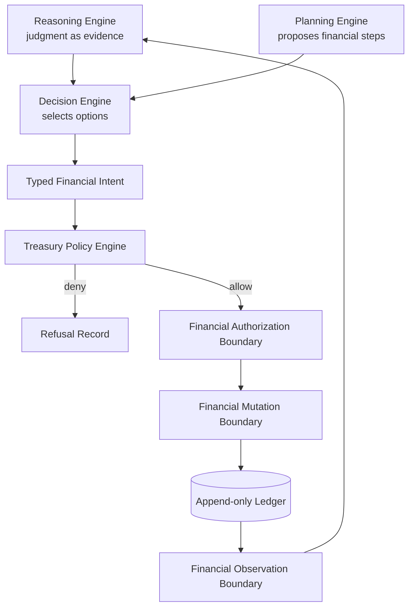

### AI Perspective

For an AI collaborator this section is the identity check that precedes all treasury work: before proposing any financial behaviour, the agent MUST state what the Treasury Core is, what it may never do, and which financial participation level its proposal occupies — observe, recommend, plan, decide within a granted envelope, or execute a pre-authorized instruction. The characteristic AI failure is authority drift: treating a high-confidence forecast or an approved plan as if it were a spending grant. Confidence is evidence; a plan is intent; neither moves money. An AI that cannot name the financial authority for a proposed mutation MUST stop and request it.

### Developer Notes

Engineers should expect the treasury boundary checks described in this part to be strict and to fail closed, and should treat that strictness as the product. When a check blocks legitimate work, the correct path is a recorded grant from the named financial authority — never a local bypass, a test-mode flag left on, or a direct database write. There is no such thing as a harmless shortcut inside a money path.

### Codex Notes

When operating on `Treasury Philosophy`, Codex MUST load this section before proposing any treasury change, MUST name the financial authority and the participation level of every model interaction it designs, MUST NOT treat model confidence as financial authority, and MUST route any disagreement with a clause through a proposed ADR instead of acting on the disagreement. For this section specifically, the tool MUST verify that any code it generates routes every financial effect through the Treasury Core seam and MUST refuse to scaffold any module that writes balances directly.

### Claude Code Notes

When operating on `Treasury Philosophy`, Claude Code MUST load this section before proposing any treasury change, MUST name the financial authority and the participation level of every model interaction it designs, MUST NOT treat model confidence as financial authority, and MUST route any disagreement with a clause through a proposed ADR instead of acting on the disagreement. For this section specifically, the tool MUST verify that any code it generates routes every financial effect through the Treasury Core seam and MUST refuse to scaffold any module that writes balances directly.

### Gemini CLI Notes

When operating on `Treasury Philosophy`, Gemini CLI MUST load this section before proposing any treasury change, MUST name the financial authority and the participation level of every model interaction it designs, MUST NOT treat model confidence as financial authority, and MUST route any disagreement with a clause through a proposed ADR instead of acting on the disagreement. For this section specifically, the tool MUST verify that any code it generates routes every financial effect through the Treasury Core seam and MUST refuse to scaffold any module that writes balances directly.

### Cursor Notes

When operating on `Treasury Philosophy`, Cursor MUST load this section before proposing any treasury change, MUST name the financial authority and the participation level of every model interaction it designs, MUST NOT treat model confidence as financial authority, and MUST route any disagreement with a clause through a proposed ADR instead of acting on the disagreement. For this section specifically, the tool MUST verify that any code it generates routes every financial effect through the Treasury Core seam and MUST refuse to scaffold any module that writes balances directly.

### Future AI Notes

When operating on `Treasury Philosophy`, Future AI MUST load this section before proposing any treasury change, MUST name the financial authority and the participation level of every model interaction it designs, MUST NOT treat model confidence as financial authority, and MUST route any disagreement with a clause through a proposed ADR instead of acting on the disagreement. For this section specifically, the tool MUST verify that any code it generates routes every financial effect through the Treasury Core seam and MUST refuse to scaffold any module that writes balances directly.

### Implementation Blueprint

An AI assistant implementing `Treasury Philosophy` follows the staged blueprint below. Each stage names what the agent does and the receipt it writes, so a partially completed implementation can be resumed by a different agent without re-reading the whole part.

| Stage | What the agent does | Receipt written |
|---|---|---|
| bind | Load this section and the Reasoning, Decision, and Planning Engine boundary contracts, then emit the treasury identity manifest with the authority ceiling. | bind stage receipt |
| classify | Map every proposed financial interaction to one of the five financial participation levels. | classify stage receipt |
| enroll | Register the financial authority sources and the closed authority set this part defines. | enroll stage receipt |
| boundary | Emit the boundary contract table against Decision, Planning, Reasoning, Execution, Agents, and Events. | boundary stage receipt |
| receipt | Write the treasury bootstrap receipt bound to the document digest and session identity. | receipt stage receipt |

### AI Context Window

An agent working on `Treasury Philosophy` needs a bounded context, loaded in this order:

- This section in full, including its constitutional controls and acceptance tests.
- Section 2 (`Treasury Principles`) for the principles that bind every treasury component.
- Section 19 (`Treasury Security and Trust Boundary`) for the authority model this philosophy assumes.
- `context/10_DECISION_ENGINE.md` Section 1 for the decision authority model the treasury answers to.
- `context/11_PLANNING_ENGINE.md` Part 1 completion boundary for what a plan may and may not commit.
- `context/05_AGENTS.md` for the agent roles named in ownership and escalation fields.

**Context budget guidance:** this section plus Section 2 (`Treasury Principles`) and Section 19 (`Treasury Security and Trust Boundary`) is the irreducible minimum; an agent that has read none of them MUST NOT write treasury code.

### AI Build Order

The build order below is the sequence in which an agent creates artefacts for this section. Each item depends only on items above it.

1. The treasury identity manifest with version, owner, and authority ceiling.
2. The five-level financial participation classifier with structural checks.
3. The financial authority registry and its closed authority set.
4. The boundary contract tables against the six neighbouring subsystems.
5. The bootstrap receipt writer bound to the document digest.
6. Observability signals for every failure mode listed in this section.
7. Acceptance tests drawn from this section's test list, run in continuous integration.

### AI Failure Library

These are the failures agents actually produce when implementing `Treasury Philosophy`. Each entry names the mistake, the reason an agent makes it, and the corrective behaviour.

| Failure | Why an agent does it | Corrective behaviour |
|---|---|---|
| Folding treasury logic into an agent module | The agent already knows its budget, so debiting locally feels cheaper | Route every financial effect through the Treasury Core seam; agents request, they never debit |
| Treating a decision record as a spending grant | The Decision Engine selected the option, so paying looks pre-approved | A decision authorizes selection; the Treasury Policy Engine must separately authorize the mutation |
| Storing money as floating point during prototyping | Floats are the path of least resistance in most languages | Use integer minor units from the first line of code; there is no prototype-grade money type |
| Inventing a sixth participation level | An ambiguous case seems to need a middle ground | Classify into the five defined levels or escalate to a human financial authority |
| Skipping the bootstrap receipt | Receipts feel like ceremony before any real ledger exists | Emit the receipt first; no treasury API accepts a mutation from a session without one |

### Security

The philosophy is fail-closed by construction: an unidentified financial authority is treated as no authority, an unclassified AI interaction is treated as prohibited, and an unrecorded movement is treated as an incident, not as a convenience.

### Performance

Identity and authority verification execute once per treasury session and are cacheable against the session digest, so the constitutional checks add negligible steady-state cost to the mutation path.

### Latency

The philosophy adds one policy evaluation and one authority verification to each mutation, both of which are local lookups against cached registries; the latency budget for the combined check is single-digit milliseconds and is measured, not assumed.

### Scalability

Because the philosophy centralizes authority but not throughput, the write path shards by account while the authority registry replicates read-only; growth in agents or merchants scales the ledger horizontally without multiplying authority sources.

### Reliability

The single write path is the reliability model: one ordered, append-only journal per shard means recovery is replay, and replay is deterministic because every entry carries its complete cause.

### Caching

Authority grants, policy versions, and the identity manifest are cacheable with digest-keyed invalidation; balances and liquidity positions are never served from cache for authorization decisions, only for observation.

### Consistency

Financial state is strongly consistent within an account shard and causally consistent across shards; the philosophy forbids any read-your-writes anomaly on the authorization path, because authorizing against a stale balance is how double spending begins.

**Diagram ID:** `CAT-TC-P1-S01-D002`  
**Title:** Five Financial Participation Levels  
**Purpose:** Fix the closed ladder of AI participation in treasury operations.  
**Audience:** AI agents, engineers, auditors  
**Reading Order:** Read alongside the AI Perspective of Section 1.

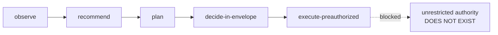

### Recovery

Recovery of the philosophy layer means re-verifying the identity manifest, the authority registry, and the boundary contracts against this document's digest before any mutation is re-enabled; a treasury that cannot prove its own identity stays frozen.

### Ownership

The Lead Repository Architect owns this section's text; the Treasury Documentation Owner owns its enforcement mapping; the human Project Owner is the terminal financial authority named throughout this part and cannot be delegated away by any AI.

### Dependencies

- `context/10_DECISION_ENGINE.md` — the selection authority whose decisions the treasury executes but never presumes.
- `context/11_PLANNING_ENGINE.md` — the planning contracts that propose financial steps without funding them.
- `context/09_REASONING_ENGINE.md` — the judgment fabric whose verdicts arrive as evidence, never authorization.
- `context/05_AGENTS.md` — the agent roles and permission model the financial participation levels bind to.
- `context/02_PROJECT_RULES.md` — repository-wide rules this philosophy refines but never overrides.

### Risks

- Authority drift: confidence, plans, or precedent silently substituting for a financial grant.
- Boundary erosion: convenience integrations that let a non-treasury module write financial state.
- Philosophy rot: implementations that pass tests while violating the intent of the single write path.
- Human-approval fatigue: approvals rubber-stamped so quickly they stop being a control.

### Anti Patterns

- A shared `money.py` helper that any module imports to adjust balances in place.
- An agent that retries a payment by re-submitting the same intent with a fresh idempotency key.
- A "temporary" direct-database credit issued during an incident and never reconciled.
- Treating the Decision Engine's selection record as both the decision and the payment authorization.

### Best Practices

- Name the financial authority in every design document before naming the data structure.
- Write the refusal path first: a treasury that cannot refuse cleanly cannot approve safely.
- Keep the participation level of every AI interaction in the code comment nearest the call site.
- Treat every bypass discovered in review as an incident with a recorded remediation, not a style nit.

### Examples

Example: the Publisher agent completes a campaign and requests a partner payout. The request names the agent identity, the decision record that selected the payout option, the plan step that scheduled it, and an idempotency key. The Treasury Policy Engine checks the payout policy, the agent's budget envelope, and the liquidity floor, then the mutation boundary reserves, settles, and appends the ledger pair. The payout is later traceable end-to-end from commission event to bank instruction.

### Counter Examples

Counter example: an agent computes that a supplier discount expires in an hour, concludes the payment is "obviously" beneficial, and writes a credit directly to the supplier account table to save time. No authority was named, no ledger pair exists, and the balance now disagrees with the journal. This is a constitutional violation regardless of whether the discount was real.

### Implementation Checklist

- [ ] Implement the treasury philosophy exactly as specified in this section, with every named control mapped to a concrete enforcement point.
- [ ] Bind every artefact of the treasury philosophy to its planned `core/treasury/**` path and keep the path marked Planned until real code exists there.
- [ ] Wire every failure mode listed in this section's AI Failure Library to an observable, alertable signal before declaring the treasury philosophy done.
- [ ] The five financial participation levels are enforced by a classifier, not by developer memory.

### Acceptance Checklist

- [ ] Every acceptance test declared in this section passes against the implementation of the treasury philosophy with no test skipped or weakened.
- [ ] Both constitutional rules of this section are enforced by an automated check on the treasury philosophy, not by convention or review habit.
- [ ] The treasury philosophy rejects every unauthorized mutation attempt, fails closed, and records the refusal with full provenance.
- [ ] The identity manifest digest matches this document's digest at session start.

### Operational Checklist

- [ ] Operational dashboards expose the health, throughput, and refusal counts of the treasury philosophy with a named on-call owner.
- [ ] Alert thresholds for the treasury philosophy are reviewed against measured baselines at least monthly and every change is recorded.
- [ ] The runbook for the treasury philosophy names the human authority for each escalation level and is tested in a drill, not only read.
- [ ] The refusal rate by reason code is charted and reviewed weekly by the treasury owner.

### Migration Checklist

- [ ] Every schema or policy change touching the treasury philosophy carries a version, a recorded owner, and a replay-verified migration script.
- [ ] Migrations of the treasury philosophy run against a ledger replica first, and the replica result is compared entry-for-entry before production rollout.
- [ ] A rollback path for the treasury philosophy exists, is rehearsed, and never rewrites settled financial history to achieve its result.
- [ ] Any change to the authority ceiling is introduced by ADR, never by configuration drift.

### Recovery Checklist

- [ ] Recovery of the treasury philosophy rebuilds state exclusively from the append-only ledger and its verified snapshots, never from caches.
- [ ] Post-recovery, every invariant declared in this section is re-verified for the treasury philosophy before mutations are re-enabled.
- [ ] A recovery report for the treasury philosophy records what failed, what was restored, the verification evidence, and the human who authorized resumption.
- [ ] The identity manifest and authority registry are re-verified before mutations resume.

### Repository Mapping

| Path | Status | Role for this section |
|---|---|---|
| `context/07_TREASURY_CORE.md` | Current | This constitutional document. |
| `core/treasury/kernel/identity_manifest.py` | Planned | Treasury identity manifest and authority ceiling. |
| `core/treasury/kernel/participation.py` | Planned | Five-level financial participation classifier. |
| `agents/Treasury/` | Current | Empty agent folder reserved for the Treasury agent implementation. |

### Folder Mapping

The treasury implementation will live under `core/treasury/**` (Status: Planned) with the kernel, policy, ledger, liquidity, and audit subpackages defined in later sections; the Treasury agent shell lives under `agents/Treasury/` (Current, empty) and will consume, never bypass, the core.

### Cross References

- Section 2 (`Treasury Principles`) — the operating principles derived from this philosophy.
- Section 19 (`Treasury Security and Trust Boundary`) — the enforcement of the authority model stated here.
- Rule `CAT-TC-CONST-001` and Rule `CAT-TC-CONST-002` — the constitutional rules defined in this section.
- Acceptance tests `CAT-TC-AT-S01-001` through `CAT-TC-AT-S01-003` — the tests that prove this section.
- `context/10_DECISION_ENGINE.md` Section 1 — the decision identity this philosophy mirrors for money.
- Treasury Policy Engine specification — Section 3 of this document.

### Related ADRs

The ADR register (`adr/ADR-0001.md` through `adr/ADR-0055.md`) currently contains unaccepted drafts and no accepted treasury decision record. A dedicated Treasury Core ADR set that fixes storage engine, custody provider, and settlement rail choices is Status: Planned; until it exists, this section is the governing text and any implementation conflict is resolved in favour of this document.

### Related Rules

- `CAT-TC-CONST-001` — Single Financial Write Path (defined in this section under Constitutional Controls).
- `CAT-TC-CONST-002` — Named Authority Before Movement (defined in this section under Constitutional Controls).
- `context/02_PROJECT_RULES.md` — repository-wide engineering and governance rules that this section refines but never overrides.

### Related Architecture

- `architecture/System_Architecture.md` — system-level placement of the Treasury Core among CAT subsystems.
- `architecture/Data_Flow.md` — the data paths that carry financial events into and out of the treasury boundary.
- `architecture/Backend_Architecture.md` — the backend runtime that will host the planned `core/treasury/**` services.
- `context/04_ARCHITECTURE.md` — the constitutional architecture document that this section's the treasury philosophy must remain consistent with.

### AI Memory Anchor

**Anchor ID:** `CAT-TC-MEM-S01-001`  
**Meaning:** Only the Treasury Core mutates financial state, and every mutation carries a named authority.  
**Recall Trigger:** Any prompt, plan, or diff that would create, move, or destroy value outside the treasury seam.  
**Operational Use:** Recall this anchor to reject financial shortcuts and to demand the authority name before writing any money-touching code.

### Future Evolution

Future evolution assigns multi-node treasury federation, cross-region custody, and delegated sub-treasuries to Parts 2 through 4; each will extend the authority registry without ever adding a second write path, and any proposal that adds one is unconstitutional by definition.

### Operational Stories

Operational story: during a quarterly review the finance owner asks why partner payouts rose 14 percent. The operator answers in minutes by grouping ledger entries by provenance decision ID, because every payout names the decision that selected it — the philosophy converted a forensic project into a query.

### Execution Stories

Execution story: an execution worker receives a settled payout instruction, attempts the bank call, and times out. It reports the timeout with the instruction's idempotency key; the treasury neither retries blindly nor double-pays, because the instruction, not the worker, owns the money semantics.

### Optimization Stories

Optimization story: profiling shows authority verification consuming 9 percent of mutation latency. The team moves grant verification to a digest-keyed cache with explicit invalidation on revocation, cutting the cost to under 1 percent without weakening a single check — optimization inside the philosophy, never around it.

### Recovery Stories

Recovery story: a deployment bug corrupts a balance cache. Because balances are derived and the ledger is authoritative, the operator drops the cache, replays the journal for the affected shard, and re-verifies the conservation invariant; no financial history is touched and no customer is mispaid.

**Diagram ID:** `CAT-TC-P1-S01-D003`  
**Title:** Refusal-first Mutation Path  
**Purpose:** Show the ordered gates every financial intent must pass and where each refusal exits.  
**Audience:** Engineers, operators  
**Reading Order:** Read before the Normative Requirements of Section 1.

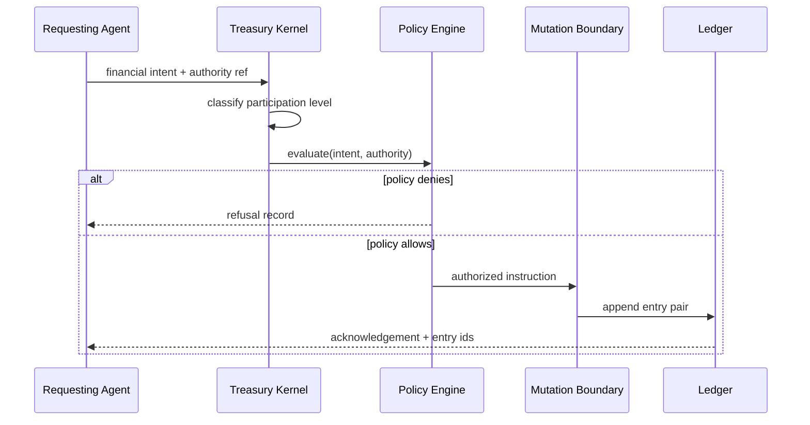

### Normative Requirements

1. The Treasury Core MUST be the only subsystem in CAT that mutates financial state, and every other subsystem MUST reach financial effects exclusively through its declared contracts.
2. Every financial mutation MUST name a financial authority from the closed authority registry before it executes, and an unnamed authority MUST be treated as no authority.
3. Every AI interaction with the treasury MUST be classified into exactly one of the five financial participation levels, and an unclassified interaction MUST be refused.
4. The Treasury Core MUST fail closed: any stage of the mutation path that cannot complete MUST produce a refusal record and MUST NOT proceed on assumption.
5. Model confidence, plan approval, and reasoning verdicts MUST be recorded as evidence and MUST NOT be accepted as financial authorization.

### Constitutional Controls

The following constitutional rules are defined by this section and registered in the Section 20 rule registry. They bind every implementation of the treasury philosophy.

**Rule ID:** `CAT-TC-CONST-001`  
**Title:** Single Financial Write Path  
**Purpose:** Guarantee that all value movement in CAT flows through one accountable subsystem.  
**Normative Requirement:** All creation, reservation, movement, settlement, reversal, freezing, and release of value MUST execute inside the Treasury Core mutation boundary; no other subsystem, agent, script, or human tool MAY write financial state directly.  
**Rationale:** A second write path destroys the audit guarantee of every record in the ledger, because absence of a ledger entry no longer proves absence of movement.  
**Enforcement:** Code review gate plus a static check that forbids imports of ledger write modules outside `core/treasury/**`; runtime schema permissions grant financial write access only to the treasury service identity.  
**Violation:** Any financial write observed outside the mutation boundary is a Severity 1 incident; the offending path is disabled immediately and the affected accounts are frozen pending reconciliation.  
**Recovery:** Reconcile affected accounts against the ledger, append correcting entries with incident provenance, and add a regression check that reproduces the bypass.  
**Owner:** Lead Repository Architect

**Rule ID:** `CAT-TC-CONST-002`  
**Title:** Named Authority Before Movement  
**Purpose:** Prevent any financial mutation from executing without a verifiable grant.  
**Normative Requirement:** Every financial mutation MUST carry a reference to a financial authority from the closed authority registry, verified before reservation; confidence scores, plan approvals, and reasoning verdicts MUST NOT satisfy this requirement.  
**Rationale:** Authority drift — evidence quietly becoming permission — is the root failure mode of autonomous financial systems.  
**Enforcement:** The Treasury Policy Engine rejects any intent whose authority field is absent, expired, revoked, or outside the registry, and writes a refusal record for each rejection.  
**Violation:** A mutation that settled without a verifiable authority reference triggers an immediate freeze of the initiating principal and a provenance audit of its recent mutations.  
**Recovery:** Reverse or ratify the mutation under human authority, record the ratification decision, and extend the policy tests with the missed case.  
**Owner:** Treasury Documentation Owner

### Acceptance Tests

**Test ID:** `CAT-TC-AT-S01-001`  
**Purpose:** Prove that a financial mutation attempted outside the treasury seam is refused.  
**Given:** A test module holding a valid database connection but no treasury service identity.  
**When:** The module attempts a direct insert into the planned ledger store emulating a credit.  
**Then:** The write is rejected by schema permissions, and a security event naming the principal is recorded.  
**Failure Condition:** The insert succeeds, or it fails without producing an attributable security event.

**Test ID:** `CAT-TC-AT-S01-002`  
**Purpose:** Prove that evidence never substitutes for authority.  
**Given:** A financial intent carrying a high-confidence reasoning verdict and an approved plan step but no authority reference.  
**When:** The intent is submitted to the Treasury Policy Engine.  
**Then:** The intent is refused with reason `authority-missing`, and the refusal record cites both attached evidence items as non-authorizing.  
**Failure Condition:** The intent is authorized, or the refusal record omits the reason code or the evidence citations.

**Test ID:** `CAT-TC-AT-S01-003`  
**Purpose:** Prove that every AI treasury interaction is classified before it is served.  
**Given:** An AI session that has emitted no participation-level classification.  
**When:** The session submits any treasury request, including a read-only balance observation.  
**Then:** The request is refused with reason `participation-unclassified` until the session classifies itself.  
**Failure Condition:** Any request is served to an unclassified session.

### JSON Examples

The following example is the canonical JSON shape for the treasury philosophy defined by this section.

```json
{
  "record_type": "treasury.identity.manifest",
  "manifest_id": "TC-IDM-2026-0001",
  "document_id": "CAT-TC-007",
  "document_digest": "sha256:e3b0c44298fc1c149afbf4c8996fb92427ae41e4649b934ca495991b7852b855",
  "version": "0.1.0",
  "authority_ceiling": "human-project-owner",
  "participation_levels": [
    "observe",
    "recommend",
    "plan",
    "decide-in-envelope",
    "execute-preauthorized"
  ],
  "write_paths": 1,
  "issued_at": "2026-08-15T00:00:00Z",
  "issued_by": "treasury-kernel-bootstrap"
}
```

### YAML Examples

The following configuration example is the canonical YAML shape for the treasury philosophy defined by this section.

```yaml
treasury_philosophy:
  version: 0.1.0
  single_write_path: true
  fail_mode: closed
  money_representation: integer-minor-units
  authority:
    registry: closed
    ceiling: human-project-owner
    evidence_is_authority: false
  participation_levels:
    - observe
    - recommend
    - plan
    - decide-in-envelope
    - execute-preauthorized
  neighbours:
    decision_engine: context/10_DECISION_ENGINE.md
    planning_engine: context/11_PLANNING_ENGINE.md
    reasoning_engine: context/09_REASONING_ENGINE.md
```

### Pseudo Code

```text
function submit_financial_intent(intent):
    session = require_bootstrapped_session(intent.session_id)
    level = participation_classifier.classify(session, intent)
    if level is UNCLASSIFIED:
        return refuse(intent, reason='participation-unclassified')
    authority = authority_registry.resolve(intent.authority_ref)
    if authority is MISSING or authority.expired or authority.revoked:
        return refuse(intent, reason='authority-missing')
    verdict = policy_engine.evaluate(intent, authority)
    if verdict is DENY:
        return refuse(intent, reason=verdict.reason)
    return mutation_boundary.enqueue(intent, authority, verdict)
```

### Repository Trees

All paths below are Status: Planned unless explicitly marked Current; none of the planned files exist yet and this tree creates no implementation claim.

```text
core/treasury/                        # Planned
  kernel/
    identity_manifest.py              # Planned: manifest + authority ceiling
    participation.py                  # Planned: five-level classifier
    bootstrap_receipt.py              # Planned: session bootstrap receipts
  policy/
    authority_registry.py             # Planned: closed authority set
agents/Treasury/                      # Current (empty shell)
```

## 2. Treasury Principles

**Section ID:** `CAT-TC-P1-02`  
**Constitutional domain:** Treasury Core Constitutional Governance  
**Human accountable owner:** Lead Repository Architect and Treasury Documentation Owner  
**Primary record:** treasury principle register record  
**Primary question:** Which non-negotiable principles bind every treasury component, and how does each principle become an enforceable control rather than prose?

### Purpose

This section converts the Section 1 philosophy into a numbered register of operating principles that every treasury component, contract, and reviewer applies mechanically. The principles cover money representation, evidence, idempotency, isolation, precision, and human primacy. Each principle names its enforcement point so that a violation is a testable defect, not a matter of taste. The register is closed: a component that needs a new principle proposes an ADR, and until the ADR is accepted the existing register governs.

### Business Perspective

Principles are the cheapest financial control the business will ever buy: a rule like "money is integer minor units" costs nothing to state and prevents an entire class of rounding losses, reconciliation failures, and partner disputes. The register also gives the business a fixed vocabulary for audits — an external reviewer can ask "show me the enforcement of P-05" and receive a test, not a story.

### Engineering Perspective

Engineering treats each principle as a contract with a named enforcement point: a type that cannot represent the illegal state, a schema constraint, a policy check, or a CI gate. The twelve principles are P-01 single write path, P-02 integer minor units, P-03 append-only history, P-04 derived balances, P-05 idempotent mutations, P-06 named authority, P-07 fail closed, P-08 full provenance, P-09 agent isolation, P-10 human primacy over reserves, P-11 reproducible recovery, and P-12 tamper-evident audit. A component that cannot point to its enforcement of an applicable principle is incomplete by definition.

### Architecture Perspective

Architecturally the principle register is a load-bearing artifact: the layer contracts of Section 4, the state machines of Section 14, and the security boundaries of Section 19 all cite principles by ID rather than restating them. This mirrors the structure of `context/10_DECISION_ENGINE.md` Section 2, whose decision principles the treasury principles deliberately parallel so that a reviewer moving between the two documents finds the same discipline applied to selection and to money.

**Diagram ID:** `CAT-TC-P1-S02-D001`  
**Title:** Principle Register Enforcement Loop  
**Purpose:** Show how a principle becomes an enforcement point, a test, and a gate.  
**Audience:** Engineers, reviewers  
**Reading Order:** Read after the Engineering Perspective of Section 2.

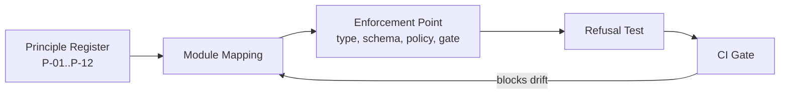

### AI Perspective

For an AI collaborator the register is a pre-flight checklist: before emitting treasury code or configuration, the agent enumerates which principles the change touches and how each is preserved. The characteristic AI failure is principle laundering — restating a principle in weaker local language ("balances are usually derived") until an exception feels reasonable. Principles have no "usually"; an exception requires an ADR, and an agent may draft the ADR but never enact the exception.

### Developer Notes

Developers should cite principle IDs in commit messages and review comments when a change is motivated by or constrained by a principle. This habit makes the register discoverable and keeps enforcement points from silently drifting away from the text that justifies them.

### Codex Notes

When operating on `Treasury Principles`, Codex MUST load this section before proposing any treasury change, MUST name the financial authority and the participation level of every model interaction it designs, MUST NOT treat model confidence as financial authority, and MUST route any disagreement with a clause through a proposed ADR instead of acting on the disagreement. For this section specifically, the tool MUST enumerate the principle IDs touched by any proposed change and MUST refuse to weaken an enforcement point without a linked ADR draft.

### Claude Code Notes

When operating on `Treasury Principles`, Claude Code MUST load this section before proposing any treasury change, MUST name the financial authority and the participation level of every model interaction it designs, MUST NOT treat model confidence as financial authority, and MUST route any disagreement with a clause through a proposed ADR instead of acting on the disagreement. For this section specifically, the tool MUST enumerate the principle IDs touched by any proposed change and MUST refuse to weaken an enforcement point without a linked ADR draft.

### Gemini CLI Notes

When operating on `Treasury Principles`, Gemini CLI MUST load this section before proposing any treasury change, MUST name the financial authority and the participation level of every model interaction it designs, MUST NOT treat model confidence as financial authority, and MUST route any disagreement with a clause through a proposed ADR instead of acting on the disagreement. For this section specifically, the tool MUST enumerate the principle IDs touched by any proposed change and MUST refuse to weaken an enforcement point without a linked ADR draft.

### Cursor Notes

When operating on `Treasury Principles`, Cursor MUST load this section before proposing any treasury change, MUST name the financial authority and the participation level of every model interaction it designs, MUST NOT treat model confidence as financial authority, and MUST route any disagreement with a clause through a proposed ADR instead of acting on the disagreement. For this section specifically, the tool MUST enumerate the principle IDs touched by any proposed change and MUST refuse to weaken an enforcement point without a linked ADR draft.

### Future AI Notes

When operating on `Treasury Principles`, Future AI MUST load this section before proposing any treasury change, MUST name the financial authority and the participation level of every model interaction it designs, MUST NOT treat model confidence as financial authority, and MUST route any disagreement with a clause through a proposed ADR instead of acting on the disagreement. For this section specifically, the tool MUST enumerate the principle IDs touched by any proposed change and MUST refuse to weaken an enforcement point without a linked ADR draft.

### Implementation Blueprint

An AI assistant implementing `Treasury Principles` follows the staged blueprint below. Each stage names what the agent does and the receipt it writes, so a partially completed implementation can be resumed by a different agent without re-reading the whole part.

| Stage | What the agent does | Receipt written |
|---|---|---|
| register | Materialize the twelve-principle register as a machine-readable file with IDs, statements, and enforcement points. | register stage receipt |
| map | Map every existing and planned treasury module to the principles it must enforce. | map stage receipt |
| gate | Wire a CI gate that fails when a module's declared principle mapping loses an enforcement point. | gate stage receipt |
| test | Generate one enforcement test per principle from this section's acceptance tests. | test stage receipt |
| publish | Publish the register digest into the treasury identity manifest. | publish stage receipt |

### AI Context Window

An agent working on `Treasury Principles` needs a bounded context, loaded in this order:

- This section in full, including the twelve-principle register.
- Section 1 (`Treasury Philosophy`) for the constitutional intent behind each principle.
- Section 7 (`Balance and Financial State Model`) for the derived-balance principle in practice.
- Section 8 (`Ledger and Transaction Model`) for the append-only and idempotency principles in practice.
- `context/10_DECISION_ENGINE.md` Section 2 for the parallel decision principle register.

**Context budget guidance:** this section plus Section 2 (`Treasury Principles`) and Section 19 (`Treasury Security and Trust Boundary`) is the irreducible minimum; an agent that has read none of them MUST NOT write treasury code.

### AI Build Order

The build order below is the sequence in which an agent creates artefacts for this section. Each item depends only on items above it.

1. The machine-readable principle register with twelve entries and enforcement points.
2. The module-to-principle mapping file consumed by the CI gate.
3. The CI gate that blocks merges lacking a principle mapping for money-touching modules.
4. The per-principle enforcement tests.
5. The register digest publication into the identity manifest.

### AI Failure Library

These are the failures agents actually produce when implementing `Treasury Principles`. Each entry names the mistake, the reason an agent makes it, and the corrective behaviour.

| Failure | Why an agent does it | Corrective behaviour |
|---|---|---|
| Restating a principle in weaker language | Local wording feels equivalent and unblocks the change | Cite the principle by ID verbatim; propose an ADR if the principle truly needs to change |
| Enforcing a principle only in review | A reviewer catches it today, so a gate feels redundant | Every principle names a mechanical enforcement point; review is the backup, not the control |
| Adding a thirteenth principle ad hoc | A new concern seems to deserve register status | The register is closed; new principles enter only through an accepted ADR |
| Mapping a module to zero principles | The module seems infrastructural and money-free | Any module inside `core/treasury/**` maps to at least P-01 and P-07 or documents why it is out of scope |
| Testing the happy path of an enforcement point | Positive tests are easier to write | Each principle test must demonstrate the refusal or impossibility of the illegal state |

### Security

Principles P-06, P-07, P-09, P-10, and P-12 are security controls in their own right; the register digest is included in the identity manifest so that a tampered register invalidates every session bootstrapped against it.

### Performance

Principle enforcement is dominated by type-level and schema-level constraints that cost nothing at runtime; only P-05 idempotency adds a keyed lookup per mutation, bounded by the idempotency store's indexed read.

### Latency

The idempotency lookup and the authority check are the only per-mutation latency contributions of this register, together budgeted under two milliseconds at the ninety-ninth percentile against the planned store.

### Scalability

The register itself is static configuration; its enforcement scales with the mechanisms that implement it, and no principle introduces a global synchronization point beyond the per-account ordering that P-03 already requires.

### Reliability

Because each principle names one enforcement point, reliability review can enumerate the failure of each point and its blast radius; the register is therefore also the index of the treasury's single points of failure.

### Caching

The register and the module mapping are immutable per version and cached freely; enforcement decisions that depend on live state (idempotency, authority) are never cached across mutations.

### Consistency

The register version is part of every mutation's metadata envelope, so any two entries can be compared under the principle set that governed them — consistency of interpretation over time, not just of data.

**Diagram ID:** `CAT-TC-P1-S02-D002`  
**Title:** Cost Asymmetry of Financial Defaults  
**Purpose:** Justify fail-closed defaults by contrasting refusal and approval error costs.  
**Audience:** Product owners, security reviewers  
**Reading Order:** Read alongside rule CAT-TC-CONST-004.

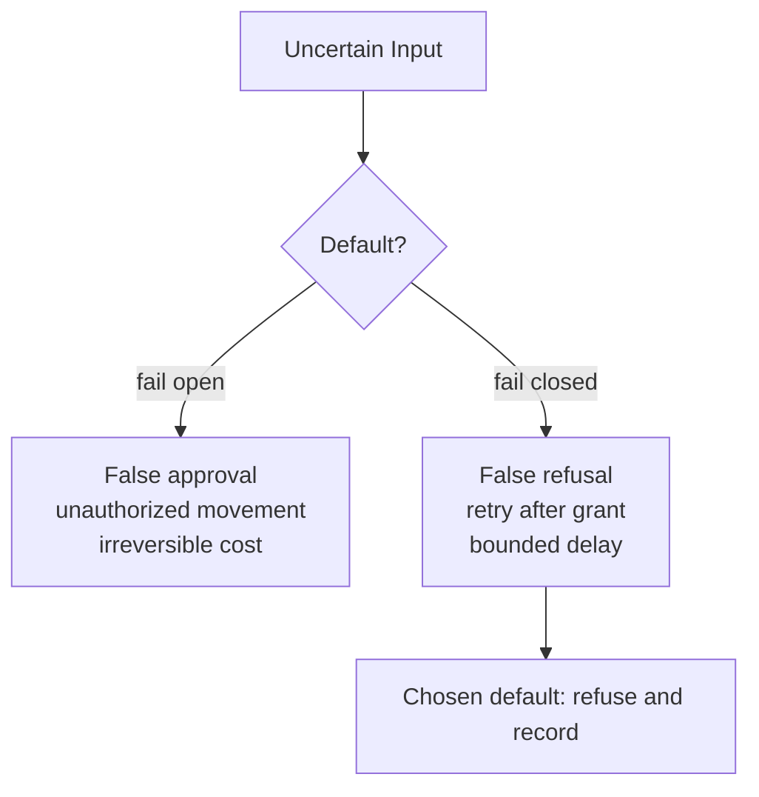

### Recovery

Recovery re-loads the register from the committed document, re-derives its digest, and refuses to resume mutations if the digest disagrees with the identity manifest; a treasury running on an unverifiable principle set is frozen by design.

### Ownership

The Treasury Documentation Owner owns the register text; each principle's enforcement point has a named engineering owner recorded in the module mapping; disputes are resolved by the Lead Repository Architect.

### Dependencies

- Section 1 (`Treasury Philosophy`) — the constitutional intent the register operationalizes.
- `context/02_PROJECT_RULES.md` — repository-wide rules that the register must remain consistent with.
- `context/10_DECISION_ENGINE.md` Section 2 — the parallel principle discipline for decisions.

### Risks

- Enforcement drift: a refactor silently detaches a principle from its enforcement point.
- Register sprawl: pressure to add situational principles that dilute the twelve.
- Interpretation forks: two modules enforcing the same principle with incompatible semantics.

### Anti Patterns

- A README that lists principles no gate enforces.
- Module-local constants that re-define minor-unit scale instead of importing the shared money type.
- A CI gate that warns instead of fails on a missing principle mapping.

### Best Practices

- One principle, one enforcement point, one test — reviewable as a triple.
- Cite principle IDs in ADRs that touch treasury behaviour.
- Audit the module mapping quarterly against the actual import graph.

### Examples

Example: a developer adds a promotional credit feature. The change declares it touches P-01, P-02, P-05, P-06, and P-08; the CI gate verifies each mapped enforcement point still exists; review confirms the credit flows through the mutation boundary with an idempotency key and a named authority. The feature merges with its principle mapping as part of the diff.

### Counter Examples

Counter example: a developer introduces a `float_amount` convenience field "for display only". Within a month a discount calculation reads it as the operative amount. P-02 existed, but no gate enforced the type boundary, so the principle was prose. The register without enforcement points is exactly this failure.

### Implementation Checklist

- [ ] Implement the treasury principles exactly as specified in this section, with every named control mapped to a concrete enforcement point.
- [ ] Bind every artefact of the treasury principles to its planned `core/treasury/**` path and keep the path marked Planned until real code exists there.
- [ ] Wire every failure mode listed in this section's AI Failure Library to an observable, alertable signal before declaring the treasury principles done.
- [ ] Every module under the planned `core/treasury/**` tree carries a principle mapping entry.

### Acceptance Checklist

- [ ] Every acceptance test declared in this section passes against the implementation of the treasury principles with no test skipped or weakened.
- [ ] Both constitutional rules of this section are enforced by an automated check on the treasury principles, not by convention or review habit.
- [ ] The treasury principles rejects every unauthorized mutation attempt, fails closed, and records the refusal with full provenance.
- [ ] Each of the twelve principles has at least one refusal-demonstrating test in CI.

### Operational Checklist

- [ ] Operational dashboards expose the health, throughput, and refusal counts of the treasury principles with a named on-call owner.
- [ ] Alert thresholds for the treasury principles are reviewed against measured baselines at least monthly and every change is recorded.
- [ ] The runbook for the treasury principles names the human authority for each escalation level and is tested in a drill, not only read.
- [ ] The register digest in the identity manifest matches the committed register at every deploy.

### Migration Checklist

- [ ] Every schema or policy change touching the treasury principles carries a version, a recorded owner, and a replay-verified migration script.
- [ ] Migrations of the treasury principles run against a ledger replica first, and the replica result is compared entry-for-entry before production rollout.
- [ ] A rollback path for the treasury principles exists, is rehearsed, and never rewrites settled financial history to achieve its result.
- [ ] A register version bump accompanies any accepted ADR that alters a principle.

### Recovery Checklist

- [ ] Recovery of the treasury principles rebuilds state exclusively from the append-only ledger and its verified snapshots, never from caches.
- [ ] Post-recovery, every invariant declared in this section is re-verified for the treasury principles before mutations are re-enabled.
- [ ] A recovery report for the treasury principles records what failed, what was restored, the verification evidence, and the human who authorized resumption.
- [ ] Recovery verifies the register digest before any principle-gated mutation resumes.

### Repository Mapping

| Path | Status | Role for this section |
|---|---|---|
| `context/07_TREASURY_CORE.md` | Current | The principle register's constitutional text. |
| `core/treasury/policy/principles.yaml` | Planned | Machine-readable register with enforcement points. |
| `core/treasury/policy/principle_map.yaml` | Planned | Module-to-principle mapping consumed by CI. |

### Folder Mapping

The register and mapping live under the planned `core/treasury/policy/` folder next to the authority registry, because principles and authority are evaluated by the same policy engine and version together.

### Cross References

- Section 1 (`Treasury Philosophy`) — source of the register's intent.
- Section 14 (`Treasury States and State Machine`) — state transitions cite P-03 and P-07.
- Section 19 (`Treasury Security and Trust Boundary`) — boundary controls cite P-06, P-09, and P-10.
- Rule `CAT-TC-CONST-003` and Rule `CAT-TC-CONST-004` — the constitutional rules defined in this section.
- Acceptance tests `CAT-TC-AT-S02-001` through `CAT-TC-AT-S02-003` — the tests that prove this section.

### Related ADRs

The ADR register (`adr/ADR-0001.md` through `adr/ADR-0055.md`) currently contains unaccepted drafts and no accepted treasury decision record. A dedicated Treasury Core ADR set that fixes storage engine, custody provider, and settlement rail choices is Status: Planned; until it exists, this section is the governing text and any implementation conflict is resolved in favour of this document.

### Related Rules

- `CAT-TC-CONST-003` — Integer Minor Units Only (defined in this section under Constitutional Controls).
- `CAT-TC-CONST-004` — Fail-Closed Financial Defaults (defined in this section under Constitutional Controls).
- `context/02_PROJECT_RULES.md` — repository-wide engineering and governance rules that this section refines but never overrides.

### Related Architecture

- `architecture/System_Architecture.md` — system-level placement of the Treasury Core among CAT subsystems.
- `architecture/Data_Flow.md` — the data paths that carry financial events into and out of the treasury boundary.
- `architecture/Backend_Architecture.md` — the backend runtime that will host the planned `core/treasury/**` services.
- `context/04_ARCHITECTURE.md` — the constitutional architecture document that this section's the treasury principles must remain consistent with.

### AI Memory Anchor

**Anchor ID:** `CAT-TC-MEM-S02-001`  
**Meaning:** Twelve closed principles, each bound to one mechanical enforcement point and one refusal test.  
**Recall Trigger:** Any treasury change request that does not enumerate the principle IDs it touches.  
**Operational Use:** Recall this anchor to demand the principle mapping before reviewing or generating any treasury diff.

### Future Evolution

Parts 2 through 4 will bind runtime, settlement, and governance machinery to this same register; any new principle they require enters through an ADR that also updates the register digest and the CI gate.

### Operational Stories

Operational story: an auditor samples ten merged treasury changes and asks for the enforcement evidence of each cited principle. The operator produces the CI gate logs and the refusal tests in under an hour, and the audit finding is a compliment rather than a remediation item.

### Execution Stories

Execution story: a mutation arrives with a duplicate idempotency key during a retry storm. P-05's enforcement returns the original result instead of executing twice, and the execution log shows one settlement and four deduplicated acknowledgements.

### Optimization Stories

Optimization story: the idempotency store's lookup grows slow as history accumulates. The team adds a time-bucketed index and a retention window aligned with the settlement horizon, restoring lookup latency while keeping the full history in the ledger — the principle's guarantee unchanged, its cost re-engineered.

### Recovery Stories

Recovery story: after a failed deploy, the register digest check refuses to resume mutations because the deployed register file was truncated. The freeze that annoyed the on-call engineer for twenty minutes is precisely the behaviour P-07 promised, and the postmortem records it as a success.

**Diagram ID:** `CAT-TC-P1-S02-D003`  
**Title:** Principle Versioning Across Mutations  
**Purpose:** Show how the register version travels in every mutation envelope for temporal consistency.  
**Audience:** Auditors, engineers  
**Reading Order:** Read before the Consistency subsection of Section 2.

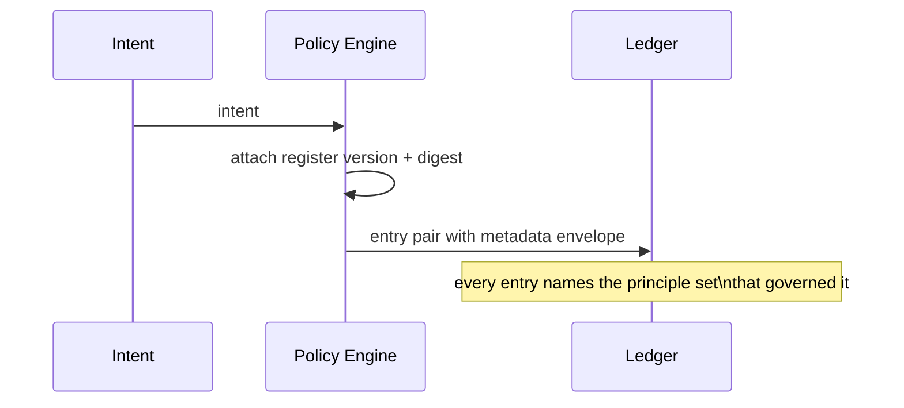

### Normative Requirements

1. The treasury principle register MUST contain exactly the twelve principles P-01 through P-12 defined in this section until an accepted ADR amends it.
2. Every module in the treasury implementation MUST declare the principles it enforces, and the CI gate MUST block merges that remove an enforcement point without an ADR reference.
3. Each principle MUST have at least one automated test that demonstrates refusal or impossibility of the illegal state, not merely success of the legal state.
4. The register version and digest MUST appear in every mutation's metadata envelope.

### Constitutional Controls

The following constitutional rules are defined by this section and registered in the Section 20 rule registry. They bind every implementation of the treasury principles.

**Rule ID:** `CAT-TC-CONST-003`  
**Title:** Integer Minor Units Only  
**Purpose:** Eliminate representational money loss across the entire treasury.  
**Normative Requirement:** All monetary amounts MUST be stored, transmitted, and computed as integer minor units with an explicit currency code and scale; floating-point money types MUST NOT exist anywhere in the treasury implementation, including display and logging paths that feed any computation.  
**Rationale:** Floating-point money produces silent rounding loss that compounds across millions of micro-transactions and makes reconciliation undecidable.  
**Enforcement:** A shared money type with integer-only constructors; a static analysis rule that flags float arithmetic on any field named in the financial vocabulary; schema types declared as integers with currency and scale columns.  
**Violation:** Any float-typed monetary field discovered in code or schema is a merge-blocking defect; if discovered in production, the affected flows are reconciled entry-by-entry against the ledger.  
**Recovery:** Migrate the field to minor units with a replay-verified script, append correcting entries where drift is found, and add the field's path to the static analysis denylist.  
**Owner:** Treasury Engineering Owner (Planned role)

**Rule ID:** `CAT-TC-CONST-004`  
**Title:** Fail-Closed Financial Defaults  
**Purpose:** Guarantee that uncertainty inside the treasury always resolves to refusal, never to movement.  
**Normative Requirement:** Every treasury component MUST refuse and record when a required input, authority, policy version, or invariant check is missing, stale, or unverifiable; no component MAY default to permitting a financial mutation.  
**Rationale:** In financial systems the cost asymmetry between a false refusal and a false approval is extreme; defaults must sit on the cheap side of that asymmetry.  
**Enforcement:** Policy engine denies by default with an explicit allow list; chaos tests inject missing-input conditions and assert refusal records; code review checklist item for every new mutation path.  
**Violation:** A component observed permitting a mutation on missing or unverifiable inputs is disabled pending fix, and its recent mutations are audited for unauthorized movement.  
**Recovery:** Audit and, where needed, reverse affected mutations under human authority; add the missing-input scenario to the chaos suite.  
**Owner:** Treasury Security Owner (Planned role)

### Acceptance Tests

**Test ID:** `CAT-TC-AT-S02-001`  
**Purpose:** Prove the money type cannot be constructed from a float.  
**Given:** The planned shared money type and a test harness attempting all public constructors.  
**When:** A constructor is invoked with a floating-point amount.  
**Then:** Construction fails with a type error identifying the integer-minor-unit requirement.  
**Failure Condition:** Any constructor accepts a float, or coerces it silently to an integer.

**Test ID:** `CAT-TC-AT-S02-002`  
**Purpose:** Prove the CI principle gate blocks unmapped money-touching modules.  
**Given:** A test branch adding a module under `core/treasury/**` with no principle mapping entry.  
**When:** The CI gate runs against the branch.  
**Then:** The gate fails with a message naming the module and the mapping file it must extend.  
**Failure Condition:** The gate passes, or fails without naming the module.

**Test ID:** `CAT-TC-AT-S02-003`  
**Purpose:** Prove missing policy version resolves to refusal.  
**Given:** A mutation intent submitted while the policy engine's register digest is deliberately invalidated.  
**When:** The intent reaches policy evaluation.  
**Then:** The intent is refused with reason `policy-unverifiable`, and no reservation occurs.  
**Failure Condition:** The intent proceeds to reservation, or the refusal lacks the reason code.

### JSON Examples

The following example is the canonical JSON shape for the treasury principles defined by this section.

```json
{
  "record_type": "treasury.principle.register",
  "register_version": "0.1.0",
  "register_digest": "sha256:0000000000000000000000000000000000000000000000000000000000000000",
  "principles": [
    {
      "id": "P-01",
      "statement": "Single financial write path",
      "enforcement": "schema permissions + static import check"
    },
    {
      "id": "P-02",
      "statement": "Integer minor units only",
      "enforcement": "shared money type + static analysis"
    },
    {
      "id": "P-03",
      "statement": "Append-only financial history",
      "enforcement": "insert-only ledger store"
    },
    {
      "id": "P-04",
      "statement": "Balances are derived, never authoritative",
      "enforcement": "snapshot rebuild verification"
    },
    {
      "id": "P-05",
      "statement": "Idempotent mutations",
      "enforcement": "mandatory idempotency key with keyed dedup"
    },
    {
      "id": "P-06",
      "statement": "Named authority before movement",
      "enforcement": "policy engine authority check"
    },
    {
      "id": "P-07",
      "statement": "Fail closed",
      "enforcement": "deny-by-default policy + chaos tests"
    },
    {
      "id": "P-08",
      "statement": "Full provenance on every mutation",
      "enforcement": "mandatory provenance envelope"
    },
    {
      "id": "P-09",
      "statement": "Agent financial isolation",
      "enforcement": "per-agent wallet scoping"
    },
    {
      "id": "P-10",
      "statement": "Human primacy over reserves",
      "enforcement": "human-only reserve release authority"
    },
    {
      "id": "P-11",
      "statement": "Reproducible recovery",
      "enforcement": "ledger replay determinism tests"
    },
    {
      "id": "P-12",
      "statement": "Tamper-evident audit",
      "enforcement": "hash-chained audit log"
    }
  ]
}
```

### YAML Examples

The following configuration example is the canonical YAML shape for the treasury principles defined by this section.

```yaml
principle_gate:
  version: 0.1.0
  mode: fail
  mapping_file: core/treasury/policy/principle_map.yaml
  required_for:
    - path_prefix: core/treasury/
      minimum_principles: [P-01, P-07]
  checks:
    - id: mapping-present
      description: every money-touching module declares its principles
    - id: enforcement-point-exists
      description: every declared enforcement point resolves to code or schema
    - id: refusal-test-exists
      description: every principle has a refusal-demonstrating test
```

### Pseudo Code

```text
function ci_principle_gate(changed_files):
    mapping = load('core/treasury/policy/principle_map.yaml')
    for file in changed_files where file.startswith('core/treasury/'):
        entry = mapping.lookup(file.module)
        if entry is MISSING:
            fail('module lacks principle mapping: ' + file.module)
        for principle in entry.principles:
            if not enforcement_point_exists(principle, file.module):
                fail('enforcement point missing: ' + principle.id)
            if not refusal_test_exists(principle):
                fail('refusal test missing: ' + principle.id)
    pass_gate()
```

### Repository Trees

All paths below are Status: Planned unless explicitly marked Current; none of the planned files exist yet and this tree creates no implementation claim.

```text
core/treasury/policy/                 # Planned
  principles.yaml                     # Planned: twelve-principle register
  principle_map.yaml                  # Planned: module-to-principle mapping
  authority_registry.py               # Planned: closed authority set
  policy_engine.py                    # Planned: deny-by-default evaluator
```

## 3. Treasury Core Architecture

**Section ID:** `CAT-TC-P1-03`  
**Constitutional domain:** Treasury Core Constitutional Governance  
**Human accountable owner:** Lead Repository Architect and Treasury Documentation Owner  
**Primary record:** treasury architecture baseline record  
**Primary question:** What are the named components of the Treasury Core, how do intents flow between them, and where do the six constitutional boundaries sit?

### Purpose

This section fixes the component architecture of the Treasury Core: the Treasury Kernel, the Treasury Policy Engine, the Financial Authorization Boundary, the Financial Mutation Boundary, the Ledger Store, the Balance Projector, the Liquidity Monitor, the Reserve Guard, the Financial Audit Boundary, the Financial Recovery Boundary, and the Financial Observation Boundary. It defines the single mutation pipeline that connects them and the six constitutional boundaries — policy, authorization, mutation, audit, recovery, observation — that later sections elaborate. Every component named here is Status: Planned as implementation; the architecture itself is constitutional now.

### Business Perspective

The business reads this section as its financial org chart in software: which component says no, which component moves money, which component watches, and which component restores. When an incident or an audit arrives, the architecture answers "where would that have been stopped" structurally, which is the difference between a control environment and a pile of scripts.

### Engineering Perspective

Engineering implements the pipeline as: intent intake in the Kernel, policy evaluation in the Policy Engine, grant verification at the Authorization Boundary, reservation and commitment inside the Mutation Boundary, append into the Ledger Store, projection into balances, and evaluation by the Liquidity Monitor and Reserve Guard on every commitment. The Audit Boundary hash-chains every step; the Recovery Boundary owns replay and snapshots; the Observation Boundary serves reads with explicit staleness labels. Each component has one responsibility and one owner, and components communicate only through typed contracts.

### Architecture Perspective

Architecturally the Treasury Core mirrors the engine pattern established by `context/10_DECISION_ENGINE.md` Section 3 and `context/11_PLANNING_ENGINE.md`: a kernel that owns identity, a policy plane that owns permission, a mutation plane that owns effect, and an observation plane that owns truth-telling about state. The treasury adds two components those engines lack — the Reserve Guard and the Liquidity Monitor — because money uniquely requires structural protection against its own exhaustion.

**Diagram ID:** `CAT-TC-P1-S03-D001`  
**Title:** Treasury Core Component Map  
**Purpose:** Name every component and the contract edges between them.  
**Audience:** Architects, engineers  
**Reading Order:** Read first in Section 3.

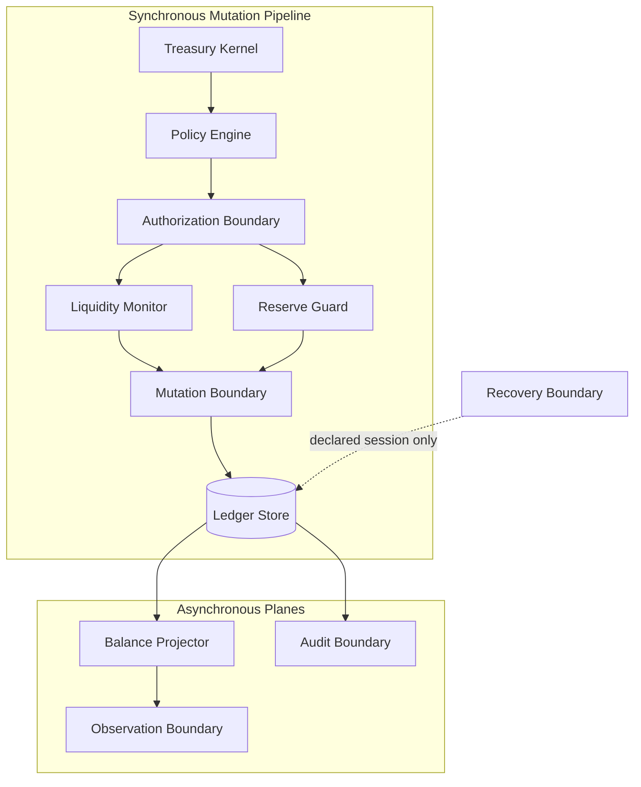

### AI Perspective

For an AI collaborator the architecture is a routing table: a recommendation belongs in the Observation Boundary's consumers, a plan step lands at the Kernel as an intent, an authorization question goes to the Policy Engine, and nothing an AI emits addresses the Ledger Store directly. The characteristic AI failure is component collapse — merging policy and mutation "for simplicity" — which silently deletes the refusal seam that all treasury guarantees hang from.

### Developer Notes

Developers should keep component boundaries visible in the package structure: one planned package per component, contracts in a shared `contracts/` package, and no lateral imports between mutation and observation code. If a change needs to cross a boundary, it crosses through the contract or it does not merge.

### Codex Notes

When operating on `Treasury Core Architecture`, Codex MUST load this section before proposing any treasury change, MUST name the financial authority and the participation level of every model interaction it designs, MUST NOT treat model confidence as financial authority, and MUST route any disagreement with a clause through a proposed ADR instead of acting on the disagreement. For this section specifically, the tool MUST place any generated treasury code inside exactly one named component and MUST refuse to generate code that imports the Ledger Store from outside the Mutation and Recovery Boundaries.

### Claude Code Notes

When operating on `Treasury Core Architecture`, Claude Code MUST load this section before proposing any treasury change, MUST name the financial authority and the participation level of every model interaction it designs, MUST NOT treat model confidence as financial authority, and MUST route any disagreement with a clause through a proposed ADR instead of acting on the disagreement. For this section specifically, the tool MUST place any generated treasury code inside exactly one named component and MUST refuse to generate code that imports the Ledger Store from outside the Mutation and Recovery Boundaries.

### Gemini CLI Notes

When operating on `Treasury Core Architecture`, Gemini CLI MUST load this section before proposing any treasury change, MUST name the financial authority and the participation level of every model interaction it designs, MUST NOT treat model confidence as financial authority, and MUST route any disagreement with a clause through a proposed ADR instead of acting on the disagreement. For this section specifically, the tool MUST place any generated treasury code inside exactly one named component and MUST refuse to generate code that imports the Ledger Store from outside the Mutation and Recovery Boundaries.

### Cursor Notes

When operating on `Treasury Core Architecture`, Cursor MUST load this section before proposing any treasury change, MUST name the financial authority and the participation level of every model interaction it designs, MUST NOT treat model confidence as financial authority, and MUST route any disagreement with a clause through a proposed ADR instead of acting on the disagreement. For this section specifically, the tool MUST place any generated treasury code inside exactly one named component and MUST refuse to generate code that imports the Ledger Store from outside the Mutation and Recovery Boundaries.

### Future AI Notes

When operating on `Treasury Core Architecture`, Future AI MUST load this section before proposing any treasury change, MUST name the financial authority and the participation level of every model interaction it designs, MUST NOT treat model confidence as financial authority, and MUST route any disagreement with a clause through a proposed ADR instead of acting on the disagreement. For this section specifically, the tool MUST place any generated treasury code inside exactly one named component and MUST refuse to generate code that imports the Ledger Store from outside the Mutation and Recovery Boundaries.

### Implementation Blueprint

An AI assistant implementing `Treasury Core Architecture` follows the staged blueprint below. Each stage names what the agent does and the receipt it writes, so a partially completed implementation can be resumed by a different agent without re-reading the whole part.

| Stage | What the agent does | Receipt written |
|---|---|---|
| skeleton | Create the planned component packages with contract stubs and no cross-boundary imports. | skeleton stage receipt |
| contracts | Define the typed contracts between Kernel, Policy Engine, and both boundaries. | contracts stage receipt |
| pipeline | Assemble the single mutation pipeline with refusal exits at each gate. | pipeline stage receipt |
| guards | Attach the Liquidity Monitor and Reserve Guard as commitment-time evaluators. | guards stage receipt |
| verify | Run the architecture conformance tests proving no illegal import paths exist. | verify stage receipt |

### AI Context Window

An agent working on `Treasury Core Architecture` needs a bounded context, loaded in this order:

- This section in full, including all three diagrams.
- Section 4 (`Treasury Layers`) for the layering that stacks above these components.
- Section 8 (`Ledger and Transaction Model`) for the store this architecture protects.
- Section 19 (`Treasury Security and Trust Boundary`) for the trust semantics of each boundary.
- `context/04_ARCHITECTURE.md` for the system-wide placement of the treasury among CAT subsystems.

**Context budget guidance:** this section plus Section 2 (`Treasury Principles`) and Section 19 (`Treasury Security and Trust Boundary`) is the irreducible minimum; an agent that has read none of them MUST NOT write treasury code.

### AI Build Order

The build order below is the sequence in which an agent creates artefacts for this section. Each item depends only on items above it.

1. Component package skeletons with ownership headers.
2. Typed contracts between all adjacent components.
3. The mutation pipeline with per-gate refusal records.
4. Commitment-time guard hooks for liquidity and reserves.
5. Import-graph conformance tests for boundary integrity.
6. Observation endpoints with staleness labelling.

### AI Failure Library

These are the failures agents actually produce when implementing `Treasury Core Architecture`. Each entry names the mistake, the reason an agent makes it, and the corrective behaviour.

| Failure | Why an agent does it | Corrective behaviour |
|---|---|---|
| Merging policy evaluation into the mutation code | One function feels simpler than two components | Keep the refusal seam: policy decides, mutation executes, and they never share a transaction |
| Letting observation code read the ledger tables directly | A reporting query is faster against raw tables | Observation reads projections through the Observation Boundary with staleness labels |
| Giving the Recovery Boundary write access in normal operation | Reuse of replay code paths looks efficient | Recovery writes only during a declared recovery session with its own authority |
| Bypassing the Reserve Guard for internal transfers | Internal moves feel risk-free | Every commitment passes the guard; internality is a category, not an exemption |
| Adding a convenience API that both reads and mutates | Callers want one round trip | Mutations and observations are separate contracts with separate authority requirements |

### Security

Each boundary is a privilege cliff: credentials that cross into the Mutation Boundary cannot originate from observation consumers, and the Ledger Store accepts connections only from the Mutation and Recovery Boundaries' service identities.

### Performance

The pipeline is designed for one ordered append per mutation plus asynchronous projection; policy and guard evaluations read cached registries and projected positions, keeping the synchronous path free of table scans.

### Latency

Target synchronous path latency is policy plus authorization plus append, budgeted at under twenty-five milliseconds at the ninety-ninth percentile on the planned store; projection and audit chaining are asynchronous and never block acknowledgement.

### Scalability

Components scale independently: the Kernel and Policy Engine are stateless and replicate; the Ledger Store shards by account; projectors partition by shard; guards read partitioned positions. No component requires global locks.

### Reliability

The pipeline's reliability model is at-least-once intake with exactly-once effect via idempotency keys at the Mutation Boundary; every component failure resolves to refusal or retry, never to partial movement.

### Caching

Policy versions, authority grants, and category registries cache with digest invalidation; projected balances cache for observation only; nothing on the authorization path reads a cache that cannot prove its freshness.

### Consistency

Within an account shard the ledger is strictly ordered; across shards, transfers use two entries bound by one transaction identity so that global consistency is reconstructable from local orders.

**Diagram ID:** `CAT-TC-P1-S03-D002`  
**Title:** Six Constitutional Boundaries  
**Purpose:** Show the privilege cliffs an intent crosses and what each boundary guarantees.  
**Audience:** Security reviewers, auditors  
**Reading Order:** Read alongside the Security subsection of Section 3.

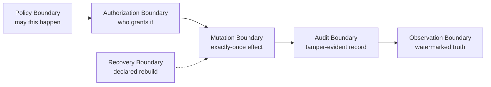

### Recovery

The Recovery Boundary rebuilds any projector from the ledger, restores the ledger itself from snapshots plus journal replay, and re-verifies conservation invariants before handing control back; recovery is a declared session with its own audit trail.

### Ownership

Each component has a planned named owner role: Kernel and contracts under the Treasury Engineering Owner, Policy Engine under the Treasury Security Owner, Ledger Store and Recovery under the Treasury Data Owner, with the Lead Repository Architect arbitrating boundary disputes.

### Dependencies

- Section 1 (`Treasury Philosophy`) — the single-write-path mandate this architecture realizes.
- Section 2 (`Treasury Principles`) — P-01 through P-12 bind every component named here.
- `architecture/System_Architecture.md` — system-level context for component placement.
- `context/08_EVENTS_SYSTEM.md` — the event fabric that carries financial events outward.

### Risks

- Boundary erosion through convenience imports during rapid feature work.
- Projector lag being mistaken for ledger truth by observation consumers.
- Guard evaluation against stale positions during shard rebalancing.

### Anti Patterns

- A monolithic `treasury_service.py` that implements policy, mutation, and reads in one module.
- Reporting jobs with direct ledger credentials.
- A recovery script kept runnable in normal operation "just in case".

### Best Practices

- Enforce the import graph mechanically; architecture that only lives in diagrams decays.
- Label every observation response with its projection watermark.
- Rehearse a full projector rebuild quarterly and record the duration.

### Examples

Example: a refund intent enters the Kernel, passes policy (refund window open, authority valid), is authorized, and the Mutation Boundary appends a reversal pair referencing the original transaction. The projector updates the merchant balance, the Liquidity Monitor absorbs the outflow, and the Audit Boundary chains the whole path under one correlation ID.

### Counter Examples

Counter example: a dashboard feature adds a "quick adjust" button that calls a helper writing directly to the balance projection to fix display discrepancies. The projection now permanently disagrees with the ledger, and the next rebuild erases the adjustment. The architecture existed; the import graph enforcement did not.

### Implementation Checklist

- [ ] Implement the treasury core architecture exactly as specified in this section, with every named control mapped to a concrete enforcement point.
- [ ] Bind every artefact of the treasury core architecture to its planned `core/treasury/**` path and keep the path marked Planned until real code exists there.
- [ ] Wire every failure mode listed in this section's AI Failure Library to an observable, alertable signal before declaring the treasury core architecture done.
- [ ] The import-graph conformance test enumerates and forbids every illegal cross-boundary edge.

### Acceptance Checklist

- [ ] Every acceptance test declared in this section passes against the implementation of the treasury core architecture with no test skipped or weakened.
- [ ] Both constitutional rules of this section are enforced by an automated check on the treasury core architecture, not by convention or review habit.
- [ ] The treasury core architecture rejects every unauthorized mutation attempt, fails closed, and records the refusal with full provenance.
- [ ] A full pipeline walkthrough test exercises refusal at each of the six boundaries.

### Operational Checklist

- [ ] Operational dashboards expose the health, throughput, and refusal counts of the treasury core architecture with a named on-call owner.
- [ ] Alert thresholds for the treasury core architecture are reviewed against measured baselines at least monthly and every change is recorded.
- [ ] The runbook for the treasury core architecture names the human authority for each escalation level and is tested in a drill, not only read.
- [ ] Projection watermark lag is alerted when it exceeds the declared staleness budget.

### Migration Checklist

- [ ] Every schema or policy change touching the treasury core architecture carries a version, a recorded owner, and a replay-verified migration script.
- [ ] Migrations of the treasury core architecture run against a ledger replica first, and the replica result is compared entry-for-entry before production rollout.
- [ ] A rollback path for the treasury core architecture exists, is rehearsed, and never rewrites settled financial history to achieve its result.
- [ ] Component contract changes version independently and are consumed via explicit upgrade PRs.

### Recovery Checklist

- [ ] Recovery of the treasury core architecture rebuilds state exclusively from the append-only ledger and its verified snapshots, never from caches.
- [ ] Post-recovery, every invariant declared in this section is re-verified for the treasury core architecture before mutations are re-enabled.
- [ ] A recovery report for the treasury core architecture records what failed, what was restored, the verification evidence, and the human who authorized resumption.
- [ ] A projector rebuild from ledger completes and reconciles within the rehearsed duration bound.

### Repository Mapping

| Path | Status | Role for this section |
|---|---|---|
| `context/07_TREASURY_CORE.md` | Current | This architecture's constitutional definition. |
| `core/treasury/kernel/` | Planned | Intent intake, identity, session bootstrap. |
| `core/treasury/policy/` | Planned | Policy engine and authority registry. |
| `core/treasury/ledger/` | Planned | Append-only ledger store and transaction manager. |
| `core/treasury/projection/` | Planned | Balance projector and observation read models. |
| `core/treasury/guards/` | Planned | Liquidity monitor and reserve guard. |
| `core/treasury/audit/` | Planned | Hash-chained audit boundary. |
| `core/treasury/recovery/` | Planned | Snapshots, replay, recovery sessions. |

### Folder Mapping

One planned folder per component under `core/treasury/`, a shared `core/treasury/contracts/` for typed interfaces, and no other money-touching code anywhere else in the repository.

### Cross References

- Section 4 (`Treasury Layers`) — the layer view of this same structure.
- Section 11 (`Liquidity Model`) — the Liquidity Monitor's governing model.
- Section 12 (`Reserve and Capital Protection Model`) — the Reserve Guard's governing model.
- Section 17 (`Treasury Repository`) — the storage architecture beneath the Ledger Store.
- Rule `CAT-TC-CONST-005` and Rule `CAT-TC-CONST-006` — the constitutional rules defined in this section.
- Acceptance tests `CAT-TC-AT-S03-001` through `CAT-TC-AT-S03-003` — the tests that prove this section.

### Related ADRs

The ADR register (`adr/ADR-0001.md` through `adr/ADR-0055.md`) currently contains unaccepted drafts and no accepted treasury decision record. A dedicated Treasury Core ADR set that fixes storage engine, custody provider, and settlement rail choices is Status: Planned; until it exists, this section is the governing text and any implementation conflict is resolved in favour of this document.

### Related Rules

- `CAT-TC-CONST-005` — Boundary-Enforced Component Separation (defined in this section under Constitutional Controls).
- `CAT-TC-CONST-006` — Guard Evaluation Before Every Commitment (defined in this section under Constitutional Controls).
- `context/02_PROJECT_RULES.md` — repository-wide engineering and governance rules that this section refines but never overrides.

### Related Architecture

- `architecture/System_Architecture.md` — system-level placement of the Treasury Core among CAT subsystems.
- `architecture/Data_Flow.md` — the data paths that carry financial events into and out of the treasury boundary.
- `architecture/Backend_Architecture.md` — the backend runtime that will host the planned `core/treasury/**` services.
- `context/04_ARCHITECTURE.md` — the constitutional architecture document that this section's the treasury core architecture must remain consistent with.

### AI Memory Anchor

**Anchor ID:** `CAT-TC-MEM-S03-001`  
**Meaning:** Eleven named components, one mutation pipeline, six constitutional boundaries — and no lateral shortcuts.  
**Recall Trigger:** Any diff that adds an import edge between treasury components not present in the contract graph.  
**Operational Use:** Recall this anchor to place new code in exactly one component and to reject boundary-crossing conveniences.

### Future Evolution

Parts 2 through 4 add the settlement rail adapters, the commission pipeline, and multi-node federation as new components attached to the same six boundaries; none of them may introduce a second mutation pipeline.

### Operational Stories

Operational story: an on-call engineer traces a stuck payout by following the correlation ID through kernel intake, policy allow, authorization, and a mutation-boundary retry loop caused by a store failover — four components, one ID, no guesswork.

### Execution Stories

Execution story: during a flash campaign, intake spikes tenfold. The Kernel and Policy Engine scale horizontally, the ledger shard for the campaign account absorbs ordered appends, and the guards throttle discretionary spend as liquidity tightens — each component doing exactly its one job.

### Optimization Stories

Optimization story: analysis shows the audit chain writer contending with projectors on the same store. The team moves audit chaining to its own append stream with periodic cross-links to the ledger, halving projection lag without weakening tamper evidence.

### Recovery Stories

Recovery story: a corrupted projection shard is detected by a checksum mismatch. The Recovery Boundary opens a recovery session, rebuilds the shard from the ledger in eleven minutes, reconciles balances to zero drift, and closes the session with a signed recovery report.

**Diagram ID:** `CAT-TC-P1-S03-D003`  
**Title:** Refund Flow Across Components  
**Purpose:** Trace one concrete refund through every component it touches.  
**Audience:** Engineers, operators  
**Reading Order:** Read with the Examples subsection of Section 3.

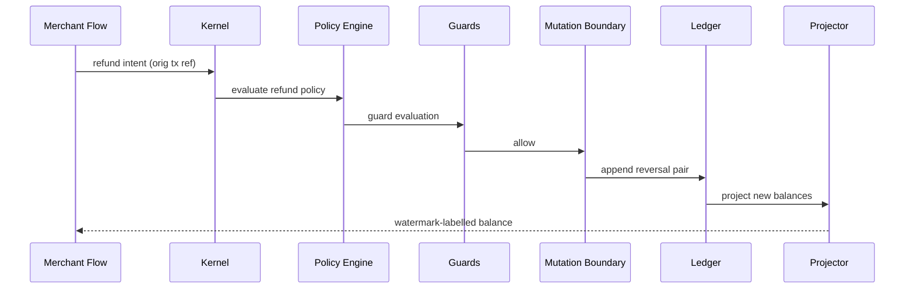

### Normative Requirements

1. The Treasury Core MUST consist of the eleven named components and six boundaries defined in this section, and every treasury code path MUST belong to exactly one component.
2. The mutation pipeline MUST be the only path to the Ledger Store's write interface, with the sole exception of a declared recovery session.
3. Policy evaluation and mutation execution MUST NOT share a transaction, a process boundary crossing both MUST carry the policy verdict as a signed artifact.
4. The Liquidity Monitor and Reserve Guard MUST evaluate every commitment, including internal transfers, before the ledger append.
5. Observation responses MUST carry a projection watermark, and observation consumers MUST NOT hold ledger write credentials.

### Constitutional Controls

The following constitutional rules are defined by this section and registered in the Section 20 rule registry. They bind every implementation of the treasury core architecture.

**Rule ID:** `CAT-TC-CONST-005`  
**Title:** Boundary-Enforced Component Separation  
**Purpose:** Keep the refusal seams of the treasury structurally intact.  
**Normative Requirement:** Treasury components MUST communicate only through the declared typed contracts, and the import graph of `core/treasury/**` MUST contain no edge absent from the contract graph published in this section's architecture baseline record.  
**Rationale:** Every treasury guarantee is enforced at a seam between components; an undeclared import edge is a guarantee silently deleted.  
**Enforcement:** An import-graph conformance test run in CI against the declared contract graph; package-level visibility restrictions where the language supports them.  
**Violation:** A merged illegal edge is reverted on discovery; if it shipped, the affected boundary's controls are re-verified and the conformance test is extended to cover the evasion.  
**Recovery:** Revert or refactor the edge through a declared contract, re-run the full boundary test suite, and record the incident in the architecture baseline record.  
**Owner:** Treasury Engineering Owner (Planned role)

**Rule ID:** `CAT-TC-CONST-006`  
**Title:** Guard Evaluation Before Every Commitment  
**Purpose:** Make liquidity and reserve protection structural rather than advisory.  
**Normative Requirement:** The Mutation Boundary MUST invoke the Liquidity Monitor and the Reserve Guard on every commitment, including internal and inter-agent transfers, and MUST refuse the commitment when either guard denies or cannot be reached.  
**Rationale:** Exemptions for "safe" flows are how treasuries exhaust themselves; a guard that can be skipped is a suggestion.  
**Enforcement:** The commitment function's signature requires both guard verdicts; chaos tests kill the guard services and assert commitment refusal.  
**Violation:** A commitment found settled without guard verdicts freezes the initiating flow and triggers a liquidity and reserve re-evaluation of the affected accounts.  
**Recovery:** Re-evaluate positions, unwind the commitment if limits were breached, and add the bypassed path to the guard conformance tests.  
**Owner:** Treasury Risk Owner (Planned role)

### Acceptance Tests

**Test ID:** `CAT-TC-AT-S03-001`  
**Purpose:** Prove the import graph matches the contract graph.  
**Given:** The planned `core/treasury/**` packages and the published contract graph.  
**When:** The conformance test walks all import edges.  
**Then:** Every edge maps to a declared contract, and the test output lists zero undeclared edges.  
**Failure Condition:** Any undeclared edge exists, or the test cannot enumerate the graph.

**Test ID:** `CAT-TC-AT-S03-002`  
**Purpose:** Prove commitments refuse when a guard is unreachable.  
**Given:** A valid authorized intent and a Reserve Guard process that has been stopped by the test harness.  
**When:** The Mutation Boundary attempts the commitment.  
**Then:** The commitment is refused with reason `guard-unavailable`, no ledger entry is appended, and a reliability event is recorded.  
**Failure Condition:** The commitment settles, or the refusal lacks the reason code or reliability event.

**Test ID:** `CAT-TC-AT-S03-003`  
**Purpose:** Prove observation consumers cannot write.  
**Given:** An observation service identity with its production credential set.  
**When:** The identity attempts a ledger append through every discoverable interface.  
**Then:** Every attempt is rejected at the credential layer, and each rejection is logged with the identity.  
**Failure Condition:** Any interface accepts the append, or a rejection goes unlogged.

### JSON Examples

The following example is the canonical JSON shape for the treasury core architecture defined by this section.

```json
{
  "record_type": "treasury.architecture.baseline",
  "baseline_id": "TC-ARCH-2026-0001",
  "components": [
    "treasury-kernel",
    "treasury-policy-engine",
    "financial-authorization-boundary",
    "financial-mutation-boundary",
    "ledger-store",
    "balance-projector",
    "liquidity-monitor",
    "reserve-guard",
    "financial-audit-boundary",
    "financial-recovery-boundary",
    "financial-observation-boundary"
  ],
  "boundaries": [
    "policy",
    "authorization",
    "mutation",
    "audit",
    "recovery",
    "observation"
  ],
  "contract_graph_edges": 14,
  "write_interfaces": 1,
  "status": "planned"
}
```

### YAML Examples

The following configuration example is the canonical YAML shape for the treasury core architecture defined by this section.

```yaml
treasury_architecture:
  pipeline:
    - stage: intake
      component: treasury-kernel
      on_failure: refuse
    - stage: policy
      component: treasury-policy-engine
      on_failure: refuse
    - stage: authorization
      component: financial-authorization-boundary
      on_failure: refuse
    - stage: guards
      components: [liquidity-monitor, reserve-guard]
      on_failure: refuse
    - stage: commit
      component: financial-mutation-boundary
      on_failure: refuse-and-alert
    - stage: append
      component: ledger-store
      on_failure: retry-idempotent
  async_planes:
    - balance-projector
    - financial-audit-boundary
```

### Pseudo Code

```text
function commit(intent, authority, policy_verdict):
    liq = liquidity_monitor.evaluate(intent)
    res = reserve_guard.evaluate(intent)
    if liq is UNREACHABLE or res is UNREACHABLE:
        return refuse(intent, reason='guard-unavailable')
    if liq is DENY or res is DENY:
        return refuse(intent, reason=first_denial(liq, res).reason)
    entry_pair = build_double_entry(intent, authority, policy_verdict)
    result = ledger.append_idempotent(intent.idempotency_key, entry_pair)
    audit.chain_async(result)
    projector.notify_async(result)
    return acknowledge(result)
```

### Repository Trees

All paths below are Status: Planned unless explicitly marked Current; none of the planned files exist yet and this tree creates no implementation claim.

```text
core/treasury/                        # Planned
  contracts/                          # Planned: typed inter-component contracts
  kernel/                             # Planned: intake, identity, sessions
  policy/                             # Planned: policy engine, authority registry
  ledger/                             # Planned: append-only store, tx manager
  projection/                         # Planned: balance projector, read models
  guards/                             # Planned: liquidity monitor, reserve guard
  audit/                              # Planned: hash-chained audit stream
  recovery/                           # Planned: snapshots, replay, sessions
  observation/                        # Planned: watermarked read APIs
```

## 4. Treasury Layers

**Section ID:** `CAT-TC-P1-04`  
**Constitutional domain:** Treasury Core Constitutional Governance  
**Human accountable owner:** Lead Repository Architect and Treasury Documentation Owner  
**Primary record:** treasury layer contract record  
**Primary question:** Which layers stack the treasury from durable money truth to consumer-facing observation, and what may each layer never do?

### Purpose

This section fixes the five-layer stack of the Treasury Core: Layer 1 the Financial Truth Layer (ledger and snapshots), Layer 2 the Financial State Layer (projections, balances, positions), Layer 3 the Financial Control Layer (policy, authorization, guards), Layer 4 the Financial Orchestration Layer (intents, lifecycles, sagas of reservation and settlement), and Layer 5 the Financial Experience Layer (observation APIs, dashboards, agent-facing views). Each layer has a downward-only dependency rule, a prohibition list, and a contract with its neighbours; the layers are the vertical view of the Section 3 component map.

### Business Perspective

Layers give the business a damage model: a bug in the Experience Layer misinforms, a bug in the Control Layer mis-permits, a bug in the Truth Layer mis-records — and each has a different cost and a different response plan. Funding hardening from the bottom up is a rational budget decision only because the layers are explicit.

### Engineering Perspective

Engineering enforces downward-only dependencies: Layer N may depend on Layer N-1's contract and nothing above itself; the Truth Layer depends on nothing but storage. Prohibitions are explicit: the Experience Layer never computes money, the Orchestration Layer never invents authority, the Control Layer never stores state, the State Layer never accepts external writes, and the Truth Layer never deletes. Layer contracts are versioned files, and a cross-layer call outside the contract is a build failure.

### Architecture Perspective

Architecturally the layer stack maps onto the Section 3 components: the Ledger Store and Recovery Boundary form Layer 1; the Balance Projector forms Layer 2; the Policy Engine, Authorization Boundary, and guards form Layer 3; the Kernel and Mutation Boundary form Layer 4; and the Observation Boundary forms Layer 5. The mapping is deliberately explicit so neither view can drift from the other.

**Diagram ID:** `CAT-TC-P1-S04-D001`  
**Title:** Five-Layer Treasury Stack  
**Purpose:** Show the layers, their downward-only dependencies, and their degradation modes.  
**Audience:** Architects, operators  
**Reading Order:** Read first in Section 4.

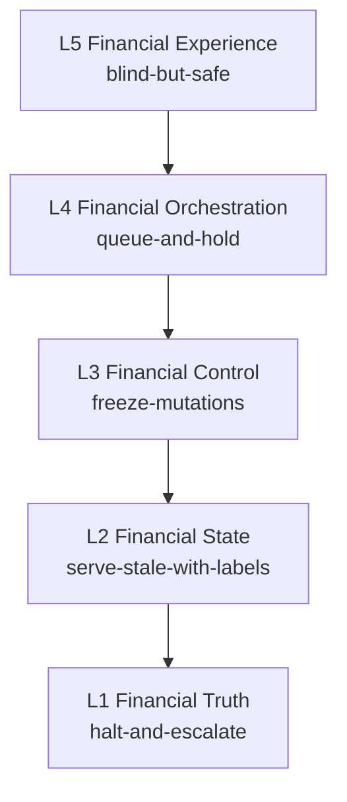

### AI Perspective

For an AI collaborator the layer stack answers "where does this code go" before any code exists: display formatting is Layer 5, a new spending limit is Layer 3, a settlement saga is Layer 4. The characteristic AI failure is layer skipping — a dashboard that recomputes an available balance from raw entries "for accuracy" — which creates a second, unaudited definition of money truth.

### Developer Notes

Developers should treat layer contracts like public APIs: additive changes are cheap, breaking changes require a version bump and a migration note, and "just this once" lateral calls are refused in review regardless of deadline pressure.

### Codex Notes

When operating on `Treasury Layers`, Codex MUST load this section before proposing any treasury change, MUST name the financial authority and the participation level of every model interaction it designs, MUST NOT treat model confidence as financial authority, and MUST route any disagreement with a clause through a proposed ADR instead of acting on the disagreement. For this section specifically, the tool MUST state the target layer of any generated artifact and MUST refuse to generate code whose imports would violate the downward-only rule.

### Claude Code Notes

When operating on `Treasury Layers`, Claude Code MUST load this section before proposing any treasury change, MUST name the financial authority and the participation level of every model interaction it designs, MUST NOT treat model confidence as financial authority, and MUST route any disagreement with a clause through a proposed ADR instead of acting on the disagreement. For this section specifically, the tool MUST state the target layer of any generated artifact and MUST refuse to generate code whose imports would violate the downward-only rule.

### Gemini CLI Notes

When operating on `Treasury Layers`, Gemini CLI MUST load this section before proposing any treasury change, MUST name the financial authority and the participation level of every model interaction it designs, MUST NOT treat model confidence as financial authority, and MUST route any disagreement with a clause through a proposed ADR instead of acting on the disagreement. For this section specifically, the tool MUST state the target layer of any generated artifact and MUST refuse to generate code whose imports would violate the downward-only rule.

### Cursor Notes

When operating on `Treasury Layers`, Cursor MUST load this section before proposing any treasury change, MUST name the financial authority and the participation level of every model interaction it designs, MUST NOT treat model confidence as financial authority, and MUST route any disagreement with a clause through a proposed ADR instead of acting on the disagreement. For this section specifically, the tool MUST state the target layer of any generated artifact and MUST refuse to generate code whose imports would violate the downward-only rule.

### Future AI Notes

When operating on `Treasury Layers`, Future AI MUST load this section before proposing any treasury change, MUST name the financial authority and the participation level of every model interaction it designs, MUST NOT treat model confidence as financial authority, and MUST route any disagreement with a clause through a proposed ADR instead of acting on the disagreement. For this section specifically, the tool MUST state the target layer of any generated artifact and MUST refuse to generate code whose imports would violate the downward-only rule.

### Implementation Blueprint

An AI assistant implementing `Treasury Layers` follows the staged blueprint below. Each stage names what the agent does and the receipt it writes, so a partially completed implementation can be resumed by a different agent without re-reading the whole part.

| Stage | What the agent does | Receipt written |
|---|---|---|
| declare | Write the five layer contract files with dependency and prohibition lists. | declare stage receipt |
| map | Bind each Section 3 component to exactly one layer in the layer contract record. | map stage receipt |
| enforce | Add the downward-only import check to the CI conformance suite. | enforce stage receipt |
| label | Annotate every planned package with its layer in a machine-readable header. | label stage receipt |
| audit | Generate the layer conformance report and file it with the baseline record. | audit stage receipt |

### AI Context Window

An agent working on `Treasury Layers` needs a bounded context, loaded in this order:

- This section in full, including the layer prohibition lists.
- Section 3 (`Treasury Core Architecture`) for the component-to-layer mapping.
- Section 7 (`Balance and Financial State Model`) for what Layer 2 projects.
- Section 8 (`Ledger and Transaction Model`) for what Layer 1 guarantees.
- `context/04_ARCHITECTURE.md` for the repository-wide layering conventions.

**Context budget guidance:** this section plus Section 2 (`Treasury Principles`) and Section 19 (`Treasury Security and Trust Boundary`) is the irreducible minimum; an agent that has read none of them MUST NOT write treasury code.

### AI Build Order

The build order below is the sequence in which an agent creates artefacts for this section. Each item depends only on items above it.

1. Five versioned layer contract files.
2. The component-to-layer binding record.
3. The downward-only import conformance check.
4. Machine-readable layer headers on every planned package.
5. The recurring layer conformance report job.

### AI Failure Library

These are the failures agents actually produce when implementing `Treasury Layers`. Each entry names the mistake, the reason an agent makes it, and the corrective behaviour.

| Failure | Why an agent does it | Corrective behaviour |
|---|---|---|
| Recomputing balances in the Experience Layer | The projection looked stale and the fix seemed harmless | Surface the watermark and escalate staleness; never create a second money computation |
| Storing workflow state in the Control Layer | The policy engine already sees every request | Control evaluates and forgets; orchestration state lives in Layer 4 with its own store |
| Calling Layer 5 formatting from Layer 4 code | Reusing the pretty-printer avoids duplication | Extract shared pure utilities to a leaf library; never import upward |
| Letting Layer 2 accept a manual correction write | An operator needed to fix a projection quickly | Corrections enter as ledger entries in Layer 1 and re-project; projections are rebuild targets |
| Treating the layer diagram as documentation only | Contracts feel bureaucratic for a small team | The import check is the contract; a diagram without a gate is a wish |

### Security

Privilege decreases monotonically upward: Layer 1 credentials are the crown jewels held only by mutation and recovery identities, Layer 3 holds grant-verification keys, and Layer 5 holds only read credentials with row-level scoping per consumer.

### Performance

The stack isolates cost: expensive audit and snapshot work stays in Layer 1's asynchronous plane, projection fan-out is Layer 2's problem, and the synchronous path touches only Layers 3 and 4 plus one Layer 1 append.

### Latency

Layer contracts declare latency budgets: Layer 3 evaluation under five milliseconds, Layer 4 end-to-end under twenty-five milliseconds excluding external rails, Layer 5 reads under ten milliseconds from projection — all measured at the ninety-ninth percentile.

### Scalability

Each layer scales by its own axis: Layer 1 by account sharding, Layer 2 by partitioned projectors, Layer 3 by stateless replication, Layer 4 by intent queue partitioning, Layer 5 by read replicas — and the contracts prevent one layer's scaling choice from leaking into another.

### Reliability

Failure isolation follows the stack: Layer 5 down means blind but safe, Layer 3 down means frozen but safe, Layer 1 down means halted and escalated; the layer contracts name the degradation mode for each.

### Caching

Caching is legal in Layers 2 and 5 with watermark labels, legal for registries in Layer 3 with digest invalidation, and constitutionally prohibited in Layer 1, where the append log and snapshots are the only artifacts.

### Consistency

Consistency tightens downward: Layer 5 is eventually consistent with labelled staleness, Layer 2 is causally consistent with the ledger, and Layer 1 is strictly ordered per shard; no layer may claim a consistency level stronger than the layer beneath provides.

**Diagram ID:** `CAT-TC-P1-S04-D002`  
**Title:** Component-to-Layer Binding  
**Purpose:** Bind every Section 3 component to exactly one layer.  
**Audience:** Engineers  
**Reading Order:** Read with the Architecture Perspective of Section 4.

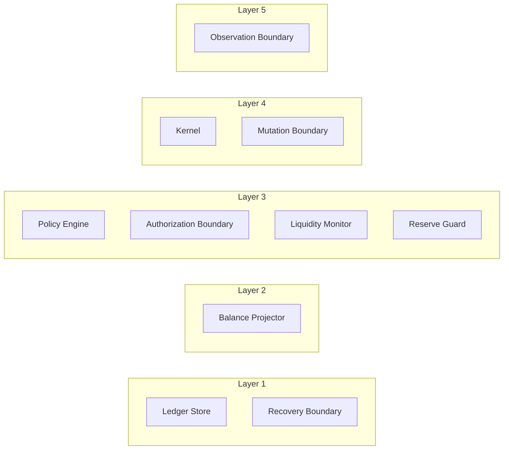

### Recovery

Recovery proceeds bottom-up: restore Layer 1 from snapshot plus replay, rebuild Layer 2 projections, re-verify Layer 3 registries, drain and replay Layer 4 intents, then re-open Layer 5 — and the layer contract record stores the rehearsed duration of each step.

### Ownership

Layer 1 and 2 are owned by the planned Treasury Data Owner, Layer 3 by the Treasury Security Owner, Layer 4 by the Treasury Engineering Owner, and Layer 5 by the Experience Owner, with contract changes co-signed by both adjacent owners.

### Dependencies

- Section 3 (`Treasury Core Architecture`) — the component map this stack verticalizes.
- Section 17 (`Treasury Repository`) — the storage that Layer 1 rests on.
- `context/03_TECH_STACK.md` — the technology constraints for each layer's implementation.

### Risks

- Contract fatigue: teams route around versioned contracts when bumps feel slow.
- Watermark blindness: consumers ignore staleness labels and act on lagged state.
- Bottom-layer monoculture: one storage engine failure mode affecting all shards simultaneously.

### Anti Patterns

- An `import ledger` statement anywhere above Layer 2.
- A projection "fix-up" script that writes Layer 2 state directly.
- Latency budgets defined only in dashboards, not in the layer contracts.

### Best Practices

- Keep layer contracts small enough to read in one sitting; giant contracts stop being read.
- Fail the build, not the review, on layer violations.
- Publish each layer's degradation mode next to its on-call runbook.

### Examples

Example: adding an agent spending dashboard touches only Layer 5: it consumes the Observation Boundary's watermarked balance API and renders limits from the Layer 3 registry's read view. No new money computation exists, and the feature ships without touching a single lower-layer contract.

### Counter Examples

Counter example: a reconciliation helper is added to Layer 2 that "temporarily" adjusts projections when the nightly job finds drift. Drift now hides instead of alarming, and the ledger's authority is quietly transferred to a cron job. The correct design records reconciliation findings as Layer 1 correcting entries.

### Implementation Checklist

- [ ] Implement the treasury layers exactly as specified in this section, with every named control mapped to a concrete enforcement point.
- [ ] Bind every artefact of the treasury layers to its planned `core/treasury/**` path and keep the path marked Planned until real code exists there.
- [ ] Wire every failure mode listed in this section's AI Failure Library to an observable, alertable signal before declaring the treasury layers done.
- [ ] Every planned package carries a machine-readable layer header consumed by the import check.

### Acceptance Checklist

- [ ] Every acceptance test declared in this section passes against the implementation of the treasury layers with no test skipped or weakened.
- [ ] Both constitutional rules of this section are enforced by an automated check on the treasury layers, not by convention or review habit.
- [ ] The treasury layers rejects every unauthorized mutation attempt, fails closed, and records the refusal with full provenance.
- [ ] The downward-only import check passes with zero exemptions in the exemption file.

### Operational Checklist

- [ ] Operational dashboards expose the health, throughput, and refusal counts of the treasury layers with a named on-call owner.
- [ ] Alert thresholds for the treasury layers are reviewed against measured baselines at least monthly and every change is recorded.
- [ ] The runbook for the treasury layers names the human authority for each escalation level and is tested in a drill, not only read.
- [ ] Each layer's degradation mode has an alert and a runbook link.

### Migration Checklist

- [ ] Every schema or policy change touching the treasury layers carries a version, a recorded owner, and a replay-verified migration script.
- [ ] Migrations of the treasury layers run against a ledger replica first, and the replica result is compared entry-for-entry before production rollout.
- [ ] A rollback path for the treasury layers exists, is rehearsed, and never rewrites settled financial history to achieve its result.
- [ ] Layer contract version bumps include a migration note for both adjacent layers.

### Recovery Checklist

- [ ] Recovery of the treasury layers rebuilds state exclusively from the append-only ledger and its verified snapshots, never from caches.
- [ ] Post-recovery, every invariant declared in this section is re-verified for the treasury layers before mutations are re-enabled.
- [ ] A recovery report for the treasury layers records what failed, what was restored, the verification evidence, and the human who authorized resumption.
- [ ] Bottom-up recovery order is encoded in the recovery runbook and rehearsed.

### Repository Mapping

| Path | Status | Role for this section |
|---|---|---|
| `context/07_TREASURY_CORE.md` | Current | The layer stack's constitutional definition. |
| `core/treasury/contracts/layers/` | Planned | Versioned layer contract files L1 through L5. |
| `core/treasury/contracts/layer_bindings.yaml` | Planned | Component-to-layer binding record. |

### Folder Mapping

Layer contracts live under the planned `core/treasury/contracts/layers/` folder; each component package declares its layer in a header file that the conformance check reads, keeping the binding next to the code it governs.

### Cross References

- Section 3 (`Treasury Core Architecture`) — horizontal view of the same structure.
- Section 7 (`Balance and Financial State Model`) — Layer 2's governing model.
- Section 13 (`Treasury Lifecycle`) — Layer 4's lifecycle machinery.
- Rule `CAT-TC-CONST-007` and Rule `CAT-TC-CONST-008` — the constitutional rules defined in this section.
- Acceptance tests `CAT-TC-AT-S04-001` through `CAT-TC-AT-S04-003` — the tests that prove this section.

### Related ADRs

The ADR register (`adr/ADR-0001.md` through `adr/ADR-0055.md`) currently contains unaccepted drafts and no accepted treasury decision record. A dedicated Treasury Core ADR set that fixes storage engine, custody provider, and settlement rail choices is Status: Planned; until it exists, this section is the governing text and any implementation conflict is resolved in favour of this document.

### Related Rules

- `CAT-TC-CONST-007` — Downward-Only Layer Dependencies (defined in this section under Constitutional Controls).
- `CAT-TC-CONST-008` — Single Money Computation Locus (defined in this section under Constitutional Controls).
- `context/02_PROJECT_RULES.md` — repository-wide engineering and governance rules that this section refines but never overrides.

### Related Architecture

- `architecture/System_Architecture.md` — system-level placement of the Treasury Core among CAT subsystems.
- `architecture/Data_Flow.md` — the data paths that carry financial events into and out of the treasury boundary.
- `architecture/Backend_Architecture.md` — the backend runtime that will host the planned `core/treasury/**` services.
- `context/04_ARCHITECTURE.md` — the constitutional architecture document that this section's the treasury layers must remain consistent with.

### AI Memory Anchor

**Anchor ID:** `CAT-TC-MEM-S04-001`  
**Meaning:** Five layers, downward-only dependencies, and a prohibition list that each layer can never escape.  
**Recall Trigger:** Any code placement question, staleness complaint, or upward import in a treasury diff.  
**Operational Use:** Recall this anchor to assign every artifact a layer before writing it and to reject upward or lateral dependencies.

### Future Evolution

Parts 2 through 4 will slot settlement rails into Layer 4, analytics into Layer 5, and federation into Layers 1 and 2; the five-layer count and the downward-only rule are fixed for the life of the document.

### Operational Stories

Operational story: a staleness alert fires when projection lag exceeds its budget during a storage failover. Layer 5 keeps serving with visible watermarks, no consumer acts on hidden staleness, and the incident closes without a single mis-informed payout decision.

### Execution Stories

Execution story: a settlement saga in Layer 4 crosses a deploy boundary mid-flight. Because orchestration state is explicit and owned by Layer 4, the new version resumes the saga from its persisted step instead of double-reserving.

### Optimization Stories

Optimization story: profiling shows Layer 5 dashboards issuing thousands of point reads. The team adds a Layer 5 read-model cache keyed by projection watermark, cutting read load 40x while every response still carries its truthful staleness label.

### Recovery Stories

Recovery story: a regional outage takes down Layers 2 through 5. Recovery replays Layer 1, rebuilds projections, re-verifies registries, drains the intent queue, and reopens observation — in the rehearsed order and inside the rehearsed ninety-minute window.

**Diagram ID:** `CAT-TC-P1-S04-D003`  
**Title:** Bottom-Up Recovery Order  
**Purpose:** Fix the mandatory recovery sequence across layers.  
**Audience:** Operators, recovery engineers  
**Reading Order:** Read with the Recovery subsection of Section 4.

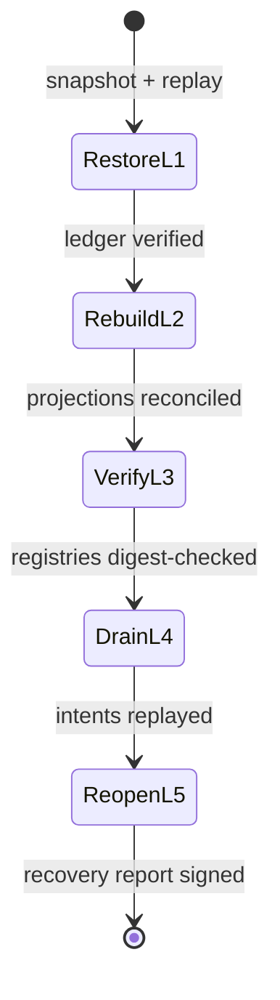

### Normative Requirements

1. The Treasury Core MUST be organized as the five layers defined in this section, and every treasury artifact MUST belong to exactly one layer.
2. Dependencies MUST point strictly downward; an upward or lateral dependency outside a declared contract is a build-blocking defect.
3. Each layer's prohibition list MUST be enforced by the conformance check, not only by review.
4. No layer MAY claim a stronger consistency level than the layer beneath it provides.
5. Recovery MUST proceed bottom-up in the declared order, and no layer may reopen before the layer beneath it is verified.

### Constitutional Controls

The following constitutional rules are defined by this section and registered in the Section 20 rule registry. They bind every implementation of the treasury layers.

**Rule ID:** `CAT-TC-CONST-007`  
**Title:** Downward-Only Layer Dependencies  
**Purpose:** Prevent the treasury's guarantees from being short-circuited by convenience imports.  
**Normative Requirement:** Every dependency between treasury layers MUST point from a higher layer to the contract of the layer directly beneath it; skip-layer, lateral, and upward dependencies MUST NOT exist outside an explicitly versioned contract exemption co-signed by both layer owners.  
**Rationale:** Layer guarantees compose only when each layer consumes the verified contract of the one beneath; a skipped layer is a skipped guarantee.  
**Enforcement:** CI import conformance check reading machine-readable layer headers; an exemption file that requires two named owners and an expiry date per entry.  
**Violation:** A violating dependency blocks merge; if discovered post-merge it is reverted and the evasion pattern is added to the check.  
**Recovery:** Refactor the dependency through the proper contract, re-run conformance, and record the case in the layer contract record.  
**Owner:** Treasury Engineering Owner (Planned role)

**Rule ID:** `CAT-TC-CONST-008`  
**Title:** Single Money Computation Locus  
**Purpose:** Ensure exactly one layer computes financial state from financial truth.  
**Normative Requirement:** Balances, positions, and any derived financial figure MUST be computed only in the Financial State Layer from ledger entries; the Experience Layer MUST render projected values with watermarks and MUST NOT recompute, adjust, or cache-fix any monetary figure.  
**Rationale:** A second computation locus creates a second definition of truth, and two truths in a treasury means zero.  
**Enforcement:** Static check forbidding arithmetic on money types above Layer 2 except pure formatting; projection APIs return sealed value objects.  
**Violation:** Any upper-layer money arithmetic is a merge-blocking defect; shipped instances trigger comparison of displayed figures against projections for the affected period.  
**Recovery:** Remove the recomputation, publish corrected figures with an operator notice where users saw drifted values, and extend the static check.  
**Owner:** Treasury Data Owner (Planned role)

### Acceptance Tests

**Test ID:** `CAT-TC-AT-S04-001`  
**Purpose:** Prove skip-layer imports are rejected by the conformance check.  
**Given:** A test branch where a Layer 5 module imports the Layer 1 ledger contract directly.  
**When:** The layer conformance check runs.  
**Then:** The check fails naming the module, the illegal edge, and the contract that should be used.  
**Failure Condition:** The check passes or reports without naming the edge.

**Test ID:** `CAT-TC-AT-S04-002`  
**Purpose:** Prove Experience Layer responses always carry watermarks.  
**Given:** The planned observation API and a projection with a known watermark.  
**When:** Any balance or position endpoint is called.  
**Then:** Every response body includes the projection watermark and its age.  
**Failure Condition:** Any response omits the watermark or reports a fabricated one.

**Test ID:** `CAT-TC-AT-S04-003`  
**Purpose:** Prove bottom-up recovery ordering is enforced.  
**Given:** A recovery session where Layer 2 rebuild is still incomplete.  
**When:** An operator attempts to reopen Layer 5 observation.  
**Then:** The reopen is refused with reason `lower-layer-unverified`, and the recovery session log records the attempt.  
**Failure Condition:** Observation reopens against unverified projections.

### JSON Examples

The following example is the canonical JSON shape for the treasury layers defined by this section.

```json
{
  "record_type": "treasury.layer.binding",
  "binding_version": "0.1.0",
  "layers": [
    {
      "layer": 1,
      "name": "financial-truth",
      "components": [
        "ledger-store",
        "financial-recovery-boundary"
      ],
      "caching": "prohibited"
    },
    {
      "layer": 2,
      "name": "financial-state",
      "components": [
        "balance-projector"
      ],
      "caching": "watermarked"
    },
    {
      "layer": 3,
      "name": "financial-control",
      "components": [
        "treasury-policy-engine",
        "financial-authorization-boundary",
        "liquidity-monitor",
        "reserve-guard"
      ],
      "caching": "digest-invalidated-registries"
    },
    {
      "layer": 4,
      "name": "financial-orchestration",
      "components": [
        "treasury-kernel",
        "financial-mutation-boundary"
      ],
      "caching": "none-on-money"
    },
    {
      "layer": 5,
      "name": "financial-experience",
      "components": [
        "financial-observation-boundary"
      ],
      "caching": "watermarked"
    }
  ],
  "dependency_rule": "downward-only",
  "exemptions": []
}
```

### YAML Examples

The following configuration example is the canonical YAML shape for the treasury layers defined by this section.

```yaml
layer_contracts:
  L1_financial_truth:
    version: 0.1.0
    provides: [append, snapshot, replay]
    prohibits: [delete, update-in-place, cache]
    degradation_mode: halt-and-escalate
  L2_financial_state:
    version: 0.1.0
    depends_on: L1_financial_truth
    provides: [balances, positions, watermarks]
    prohibits: [external-writes, unlabelled-staleness]
    degradation_mode: serve-stale-with-labels
  L3_financial_control:
    version: 0.1.0
    depends_on: L2_financial_state
    provides: [policy-verdicts, grants, guard-verdicts]
    prohibits: [state-storage, default-allow]
    degradation_mode: freeze-mutations
  L4_financial_orchestration:
    version: 0.1.0
    depends_on: L3_financial_control
    provides: [intents, lifecycles, settlement-sagas]
    prohibits: [authority-invention, direct-ledger-writes]
    degradation_mode: queue-and-hold
  L5_financial_experience:
    version: 0.1.0
    depends_on: L4_financial_orchestration
    provides: [watermarked-reads, dashboards]
    prohibits: [money-computation, write-credentials]
    degradation_mode: blind-but-safe
```

### Pseudo Code

```text
function check_layer_conformance(package):
    header = read_layer_header(package)
    for imported in package.imports:
        target = read_layer_header(imported)
        if target.layer == header.layer - 1 and imported.is_contract:
            continue
        if exemption_file.covers(header, target) and not exemption_expired():
            continue
        fail('illegal layer edge: L' + header.layer + ' -> L' + target.layer)
    pass_check()
```

### Repository Trees

All paths below are Status: Planned unless explicitly marked Current; none of the planned files exist yet and this tree creates no implementation claim.

```text
core/treasury/contracts/              # Planned
  layers/
    L1_financial_truth.yaml           # Planned
    L2_financial_state.yaml           # Planned
    L3_financial_control.yaml         # Planned
    L4_financial_orchestration.yaml   # Planned
    L5_financial_experience.yaml      # Planned
  layer_bindings.yaml                 # Planned
  exemptions.yaml                     # Planned: co-signed, expiring
```

## 5. Treasury Domain Model

**Section ID:** `CAT-TC-P1-05`  
**Constitutional domain:** Treasury Core Constitutional Governance  
**Human accountable owner:** Lead Repository Architect and Treasury Documentation Owner  
**Primary record:** treasury vocabulary register record  
**Primary question:** What is the exact, closed vocabulary of treasury objects and terms, and how does each term bind to one definition and one owner?

### Purpose

This section fixes the treasury domain model: the closed vocabulary of financial objects — Treasury, Capital Pool, Account, Wallet, Balance, Ledger, Ledger Entry, Transaction, Financial Intent, Reservation, Settlement, Commission, Payout, Refund, Chargeback, Reserve, Exposure, Liquidity Position, Financial Event, and Provenance Record — with one definition, one identity scheme, and one owning section per term. A term outside this register has no treasury meaning, and a component that uses a term in a divergent sense is defectively named until fixed. The vocabulary is the treasury's shared type system in prose.

### Business Perspective

Vocabulary disputes are financial disputes in disguise: when "balance" means settled funds to finance and available funds to marketing, the same dashboard number authorizes two different spends. A closed register with one definition per term is how the business ensures that every conversation about money is a conversation about the same money.

### Engineering Perspective

Engineering materializes each vocabulary term as exactly one type in the planned `core/treasury/domain/` package, with the definition from this section reproduced in the type's docstring and the identity scheme in its constructor. A Balance is a projection value object, never an entity; a Transaction is the unit of ledger atomicity; a Financial Intent is the only externally submittable object. Type names and register names match character for character.

### Architecture Perspective

Architecturally the domain model is the contract language of every seam defined in Sections 3 and 4: contracts speak vocabulary terms and nothing else. The model deliberately parallels `context/10_DECISION_ENGINE.md` Section 5 and the Planning Engine's ontology so that a decision about a `Payout` and a plan step producing a `Payout` and the treasury's `Payout` object are provably the same concept across all three documents.

**Diagram ID:** `CAT-TC-P1-S05-D001`  
**Title:** Treasury Domain Object Map  
**Purpose:** Show the twenty register terms and their structural relationships.  
**Audience:** Engineers, data stewards  
**Reading Order:** Read first in Section 5.

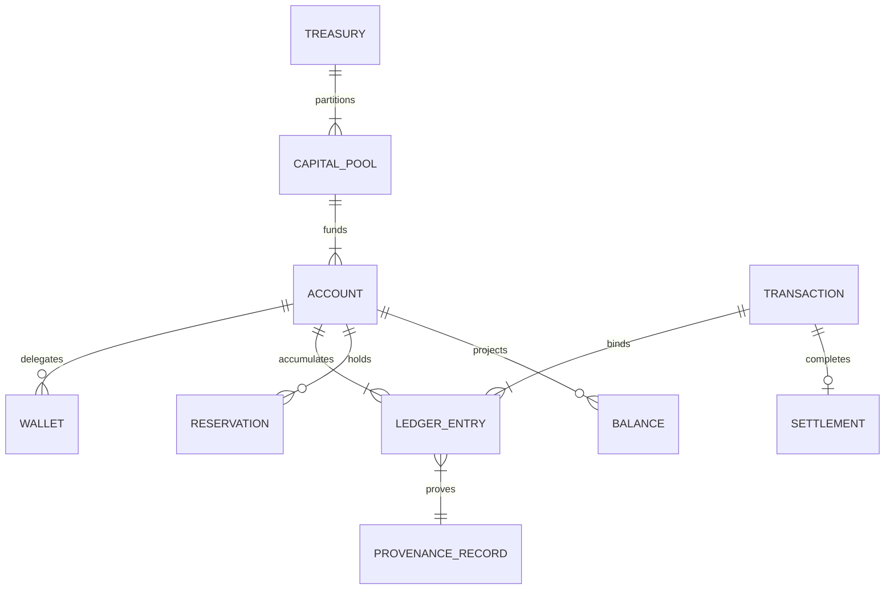

### AI Perspective

For an AI collaborator the register is the anti-hallucination fence: an agent may not introduce a new financial noun into code, schema, or documentation without proposing a register amendment first. The characteristic AI failure is synonym drift — writing `funds`, `amount_available`, and `spendable` for the same concept in three files — which later becomes three subtly different computations.

### Developer Notes

Developers should import vocabulary types rather than re-declaring shapes, and should name database columns, event fields, and API properties with the register's exact snake_case forms so that grep is a reliable audit tool across the whole system.

### Codex Notes

When operating on `Treasury Domain Model`, Codex MUST load this section before proposing any treasury change, MUST name the financial authority and the participation level of every model interaction it designs, MUST NOT treat model confidence as financial authority, and MUST route any disagreement with a clause through a proposed ADR instead of acting on the disagreement. For this section specifically, the tool MUST use register terms verbatim in all generated identifiers and MUST flag any financial noun it needs that is absent from the register instead of coining one.

### Claude Code Notes

When operating on `Treasury Domain Model`, Claude Code MUST load this section before proposing any treasury change, MUST name the financial authority and the participation level of every model interaction it designs, MUST NOT treat model confidence as financial authority, and MUST route any disagreement with a clause through a proposed ADR instead of acting on the disagreement. For this section specifically, the tool MUST use register terms verbatim in all generated identifiers and MUST flag any financial noun it needs that is absent from the register instead of coining one.

### Gemini CLI Notes

When operating on `Treasury Domain Model`, Gemini CLI MUST load this section before proposing any treasury change, MUST name the financial authority and the participation level of every model interaction it designs, MUST NOT treat model confidence as financial authority, and MUST route any disagreement with a clause through a proposed ADR instead of acting on the disagreement. For this section specifically, the tool MUST use register terms verbatim in all generated identifiers and MUST flag any financial noun it needs that is absent from the register instead of coining one.

### Cursor Notes

When operating on `Treasury Domain Model`, Cursor MUST load this section before proposing any treasury change, MUST name the financial authority and the participation level of every model interaction it designs, MUST NOT treat model confidence as financial authority, and MUST route any disagreement with a clause through a proposed ADR instead of acting on the disagreement. For this section specifically, the tool MUST use register terms verbatim in all generated identifiers and MUST flag any financial noun it needs that is absent from the register instead of coining one.

### Future AI Notes

When operating on `Treasury Domain Model`, Future AI MUST load this section before proposing any treasury change, MUST name the financial authority and the participation level of every model interaction it designs, MUST NOT treat model confidence as financial authority, and MUST route any disagreement with a clause through a proposed ADR instead of acting on the disagreement. For this section specifically, the tool MUST use register terms verbatim in all generated identifiers and MUST flag any financial noun it needs that is absent from the register instead of coining one.

### Implementation Blueprint

An AI assistant implementing `Treasury Domain Model` follows the staged blueprint below. Each stage names what the agent does and the receipt it writes, so a partially completed implementation can be resumed by a different agent without re-reading the whole part.

| Stage | What the agent does | Receipt written |
|---|---|---|
| register | Materialize the twenty-term vocabulary register with definitions, identity schemes, and owning sections. | register stage receipt |
| types | Generate one domain type per term in the planned domain package. | types stage receipt |
| lint | Add a vocabulary lint that flags financial nouns outside the register. | lint stage receipt |
| bind | Bind contract schemas to register terms field by field. | bind stage receipt |
| freeze | Publish the register digest into the identity manifest. | freeze stage receipt |

### AI Context Window

An agent working on `Treasury Domain Model` needs a bounded context, loaded in this order:

- This section in full, including the vocabulary register table.
- Section 6 (`Capital and Account Model`) for the Account and Wallet terms in depth.
- Section 7 (`Balance and Financial State Model`) for the Balance dimensions in depth.
- Section 8 (`Ledger and Transaction Model`) for Ledger Entry and Transaction in depth.
- `context/13_TERMINOLOGY.md` — Status: Planned as a completed register; the treasury register governs financial terms until it completes.

**Context budget guidance:** this section plus Section 2 (`Treasury Principles`) and Section 19 (`Treasury Security and Trust Boundary`) is the irreducible minimum; an agent that has read none of them MUST NOT write treasury code.

### AI Build Order

The build order below is the sequence in which an agent creates artefacts for this section. Each item depends only on items above it.

1. The machine-readable vocabulary register.
2. One domain type per register term with matching docstring.
3. The vocabulary lint wired into CI.
4. Schema-to-register field bindings for every contract.
5. The register digest publication.

### AI Failure Library

These are the failures agents actually produce when implementing `Treasury Domain Model`. Each entry names the mistake, the reason an agent makes it, and the corrective behaviour.

| Failure | Why an agent does it | Corrective behaviour |
|---|---|---|
| Coining a synonym for an existing term | A local name reads more naturally in context | Use the register term verbatim; propose an amendment if the term is genuinely wrong |
| Modelling Balance as a mutable entity | CRUD habits make everything an entity | Balance is a derived value object; only ledger entries are persisted facts |
| Overloading Transaction to mean a database transaction | The word collides with storage terminology | Qualify storage transactions as `db_transaction` everywhere; the register owns the bare word |
| Adding fields to a term's type without register review | A feature needs one more property | Register terms are contracts; field additions go through the same review as definitions |
| Treating the register as documentation, not code | Prose registers feel unenforceable | The lint and the type generation make the register mechanical |

### Security

A closed vocabulary is a security control: injection of unregistered object kinds into contracts is refused at schema validation, which blocks a class of confused-deputy attacks that smuggle novel financial semantics through permissive payloads.

### Performance

Vocabulary enforcement is compile-time and CI-time; the only runtime cost is schema validation, which the contracts already require.

### Latency

No measurable latency contribution: register lookups happen in code generation and validation caching, not per mutation.

### Scalability

The register scales by governance, not by traffic; the amendment process is the bottleneck by design, because vocabulary churn is more dangerous than vocabulary scarcity.

### Reliability

One definition per term removes an entire failure family — mismatched semantics between producer and consumer — which no amount of retries or replication would otherwise fix.

### Caching

The register is immutable per version and cached everywhere; consumers pin the register version in their contract bindings and upgrade explicitly.

### Consistency

Register versioning gives temporal consistency: every ledger entry, event, and contract names the register version under which its fields were interpreted.

**Diagram ID:** `CAT-TC-P1-S05-D002`  
**Title:** Register Amendment Flow  
**Purpose:** Fix the only path by which a new financial term enters the vocabulary.  
**Audience:** Documentation owners, engineers  
**Reading Order:** Read with rule CAT-TC-CONST-009.

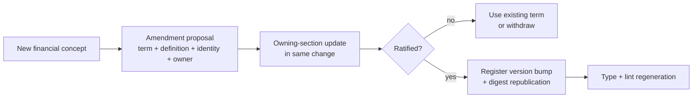

### Recovery

Recovery validation includes a vocabulary check: replayed records whose fields do not parse under their declared register version indicate corruption or tampering and quarantine the affected range.

### Ownership

The Treasury Documentation Owner owns the register; each term's semantics are owned by the section that defines it in depth; amendments require the owning section's update in the same change.

### Dependencies

- Section 2 (`Treasury Principles`) — the register digest joins the principle register in the manifest.
- `context/10_DECISION_ENGINE.md` Section 5 — the decision domain model this register aligns with.
- `context/11_PLANNING_ENGINE.md` — the planning ontology whose financial nouns must map onto this register.

### Risks

- Register bypass through free-text fields that smuggle unregistered semantics.
- Cross-document drift if the Decision or Planning ontologies rename a shared concept.
- Amendment stalls that push teams toward informal synonyms.

### Anti Patterns

- A `misc_amount` column with meaning defined in a wiki.
- Two event schemas carrying the same concept under different field names.
- Register amendments merged without updating the owning section's text.

### Best Practices

- Grep for new financial nouns in every review; the register lint automates most of it.
- Keep term definitions under four sentences; long definitions hide disagreements.
- Version the register with the document, not with the code that consumes it.

### Examples

Example: the commission feature needs to represent money owed but not yet payable. The register already defines `Commission` with state `accrued`; the developer uses the existing term and state rather than coining `pending_earnings`, and every downstream consumer parses the concept without translation.

### Counter Examples

Counter example: a reporting pipeline introduces `net_position` computed as available minus reserved minus a hardcoded buffer. The term exists in no register, its formula exists in no section, and six months later two teams disagree about whether the buffer is inside it. Unregistered vocabulary became an unauditable liability.

### Implementation Checklist

- [ ] Implement the treasury domain model exactly as specified in this section, with every named control mapped to a concrete enforcement point.
- [ ] Bind every artefact of the treasury domain model to its planned `core/treasury/**` path and keep the path marked Planned until real code exists there.
- [ ] Wire every failure mode listed in this section's AI Failure Library to an observable, alertable signal before declaring the treasury domain model done.
- [ ] Every register term has exactly one generated domain type with a matching docstring.

### Acceptance Checklist

- [ ] Every acceptance test declared in this section passes against the implementation of the treasury domain model with no test skipped or weakened.
- [ ] Both constitutional rules of this section are enforced by an automated check on the treasury domain model, not by convention or review habit.
- [ ] The treasury domain model rejects every unauthorized mutation attempt, fails closed, and records the refusal with full provenance.
- [ ] The vocabulary lint reports zero unregistered financial nouns across the treasury tree.

### Operational Checklist

- [ ] Operational dashboards expose the health, throughput, and refusal counts of the treasury domain model with a named on-call owner.
- [ ] Alert thresholds for the treasury domain model are reviewed against measured baselines at least monthly and every change is recorded.
- [ ] The runbook for the treasury domain model names the human authority for each escalation level and is tested in a drill, not only read.
- [ ] Register amendments appear in the operations changelog with their owning-section diff.

### Migration Checklist

- [ ] Every schema or policy change touching the treasury domain model carries a version, a recorded owner, and a replay-verified migration script.
- [ ] Migrations of the treasury domain model run against a ledger replica first, and the replica result is compared entry-for-entry before production rollout.
- [ ] A rollback path for the treasury domain model exists, is rehearsed, and never rewrites settled financial history to achieve its result.
- [ ] Contract bindings pin register versions and upgrade through explicit migration PRs.

### Recovery Checklist

- [ ] Recovery of the treasury domain model rebuilds state exclusively from the append-only ledger and its verified snapshots, never from caches.
- [ ] Post-recovery, every invariant declared in this section is re-verified for the treasury domain model before mutations are re-enabled.
- [ ] A recovery report for the treasury domain model records what failed, what was restored, the verification evidence, and the human who authorized resumption.
- [ ] Replay validation parses all records under their declared register versions.

### Repository Mapping

| Path | Status | Role for this section |
|---|---|---|
| `context/07_TREASURY_CORE.md` | Current | The vocabulary register's constitutional text. |
| `core/treasury/domain/vocabulary.yaml` | Planned | Machine-readable register. |
| `core/treasury/domain/types/` | Planned | One generated type per register term. |

### Folder Mapping

The register and generated types live under the planned `core/treasury/domain/` folder, which is a leaf dependency importable by every layer because it contains definitions and pure value objects only.

### Cross References

- Section 6 (`Capital and Account Model`) — deep definition of Account, Wallet, Capital Pool.
- Section 7 (`Balance and Financial State Model`) — deep definition of Balance and its dimensions.
- Section 8 (`Ledger and Transaction Model`) — deep definition of Ledger Entry and Transaction.
- Section 10 (`Financial Provenance Model`) — deep definition of Provenance Record.
- Rule `CAT-TC-CONST-009` and Rule `CAT-TC-CONST-010` — the constitutional rules defined in this section.
- Acceptance tests `CAT-TC-AT-S05-001` through `CAT-TC-AT-S05-003` — the tests that prove this section.

### Related ADRs

The ADR register (`adr/ADR-0001.md` through `adr/ADR-0055.md`) currently contains unaccepted drafts and no accepted treasury decision record. A dedicated Treasury Core ADR set that fixes storage engine, custody provider, and settlement rail choices is Status: Planned; until it exists, this section is the governing text and any implementation conflict is resolved in favour of this document.

### Related Rules

- `CAT-TC-CONST-009` — Closed Financial Vocabulary (defined in this section under Constitutional Controls).
- `CAT-TC-CONST-010` — One Definition, One Owner Per Term (defined in this section under Constitutional Controls).
- `context/02_PROJECT_RULES.md` — repository-wide engineering and governance rules that this section refines but never overrides.

### Related Architecture

- `architecture/System_Architecture.md` — system-level placement of the Treasury Core among CAT subsystems.
- `architecture/Data_Flow.md` — the data paths that carry financial events into and out of the treasury boundary.
- `architecture/Backend_Architecture.md` — the backend runtime that will host the planned `core/treasury/**` services.
- `context/04_ARCHITECTURE.md` — the constitutional architecture document that this section's the treasury domain model must remain consistent with.

### AI Memory Anchor

**Anchor ID:** `CAT-TC-MEM-S05-001`  
**Meaning:** Twenty closed treasury terms, one definition each, one owning section each — no synonyms, no coinage.  
**Recall Trigger:** Any new financial noun appearing in code, schema, events, or documentation.  
**Operational Use:** Recall this anchor to check the register before naming anything that holds or describes value.

### Future Evolution

Parts 2 through 4 will extend the register with settlement-rail, analytics, and federation terms through the amendment process; the twenty Part 1 terms are the stable core that later terms compose from.

### Operational Stories

Operational story: a partner dispute hinges on whether a figure was `settled` or `available` balance. Because both the API response and the ledger events name the register term and version, the operator resolves the dispute with a single annotated screenshot.

### Execution Stories

Execution story: a new event consumer rejects a payload at schema validation because it carries an unregistered field `bonus_pool`. The producer team files a register amendment, the term gets a definition and an owner, and the consumer accepts the next version — drift stopped at the fence.

### Optimization Stories

Optimization story: code generation from the register replaces five hand-maintained DTO families, deleting three thousand lines and removing two silent field mismatches discovered during the migration.

### Recovery Stories

Recovery story: replay of a restored shard halts at an entry whose fields fail register parsing. The quarantine turns out to catch a partial write from the original incident — the vocabulary check doubling as a corruption detector exactly as designed.

**Diagram ID:** `CAT-TC-P1-S05-D003`  
**Title:** Cross-Engine Vocabulary Alignment  
**Purpose:** Show how the same Payout concept binds across Planning, Decision, and Treasury documents.  
**Audience:** Architects, AI agents  
**Reading Order:** Read with the Architecture Perspective of Section 5.

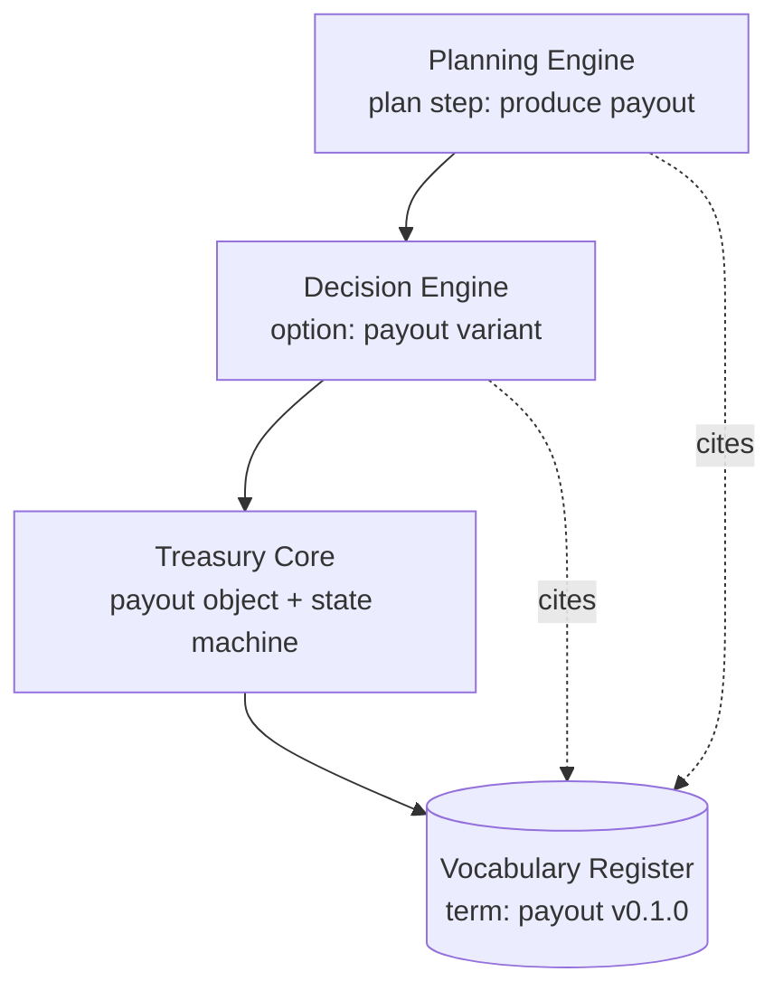

### Normative Requirements

1. The treasury vocabulary register MUST contain exactly the twenty terms defined in this section until amended, and every treasury artifact MUST use register terms verbatim.
2. Each register term MUST have exactly one definition, one identity scheme, and one owning section.
3. Financial nouns absent from the register MUST NOT appear in treasury code, schemas, events, or contracts.
4. Every persisted record and event MUST name the register version under which its fields are interpreted.

### Constitutional Controls

The following constitutional rules are defined by this section and registered in the Section 20 rule registry. They bind every implementation of the treasury domain model.

**Rule ID:** `CAT-TC-CONST-009`  
**Title:** Closed Financial Vocabulary  
**Purpose:** Prevent semantic drift in the language that defines money.  
**Normative Requirement:** The set of treasury object kinds and financial terms MUST be closed to the vocabulary register; introducing a financial noun into any treasury artifact without a ratified register amendment MUST be treated as a merge-blocking defect.  
**Rationale:** Every financial defect ultimately becomes a dispute about what a word meant; a closed register makes that dispute decidable.  
**Enforcement:** Vocabulary lint in CI over identifiers, schema fields, and event definitions; schema validation refusing unregistered object kinds at runtime.  
**Violation:** The unregistered term is renamed or registered before merge; shipped instances are migrated with a deprecation window and a register entry.  
**Recovery:** Register or rename the term, migrate artifacts, and add the term's pattern to the lint corpus.  
**Owner:** Treasury Documentation Owner

**Rule ID:** `CAT-TC-CONST-010`  
**Title:** One Definition, One Owner Per Term  
**Purpose:** Keep every term's semantics anchored to a single accountable source.  
**Normative Requirement:** Each register term MUST bind to exactly one definition and one owning section, and any amendment to a term MUST update the owning section's text in the same change set.  
**Rationale:** Definitions that live in two places diverge; divergent definitions of money terms are latent financial defects.  
**Enforcement:** Register schema requires `owning_section` per term; CI verifies amendments touch the owning section's document region.  
**Violation:** An amendment merged without the owning-section update is reverted and reapplied correctly.  
**Recovery:** Reconcile the definition with its owning section and re-publish the register digest.  
**Owner:** Treasury Documentation Owner

### Acceptance Tests

**Test ID:** `CAT-TC-AT-S05-001`  
**Purpose:** Prove the vocabulary lint catches unregistered financial nouns.  
**Given:** A test branch adding a schema field named `bonus_pool_amount` with no register entry.  
**When:** The vocabulary lint runs in CI.  
**Then:** The lint fails naming the field, the file, and the amendment procedure.  
**Failure Condition:** The lint passes or fails without actionable naming.

**Test ID:** `CAT-TC-AT-S05-002`  
**Purpose:** Prove runtime schema validation refuses unregistered object kinds.  
**Given:** A contract endpoint and a payload declaring `record_type: treasury.gift.token`, which is not in the register.  
**When:** The payload is submitted.  
**Then:** Validation refuses with reason `unregistered-kind` before any component processes the payload.  
**Failure Condition:** The payload reaches any component, or the refusal reason is generic.

**Test ID:** `CAT-TC-AT-S05-003`  
**Purpose:** Prove every persisted record names its register version.  
**Given:** A sample of persisted ledger entries, events, and provenance records from the test store.  
**When:** The register-version audit query runs.  
**Then:** Every sampled record carries a `vocabulary_version` field parseable against a published register.  
**Failure Condition:** Any record lacks the field or names an unpublished version.

### JSON Examples

The following example is the canonical JSON shape for the treasury domain model defined by this section.

```json
{
  "record_type": "treasury.vocabulary.register",
  "vocabulary_version": "0.1.0",
  "terms": [
    {
      "term": "treasury",
      "identity": "singleton",
      "owning_section": 1
    },
    {
      "term": "capital_pool",
      "identity": "pool_id",
      "owning_section": 6
    },
    {
      "term": "account",
      "identity": "account_id",
      "owning_section": 6
    },
    {
      "term": "wallet",
      "identity": "wallet_id",
      "owning_section": 6
    },
    {
      "term": "balance",
      "identity": "balance_id",
      "owning_section": 7
    },
    {
      "term": "ledger",
      "identity": "ledger_id",
      "owning_section": 8
    },
    {
      "term": "ledger_entry",
      "identity": "entry_id",
      "owning_section": 8
    },
    {
      "term": "transaction",
      "identity": "transaction_id",
      "owning_section": 8
    },
    {
      "term": "financial_intent",
      "identity": "intent_id",
      "owning_section": 9
    },
    {
      "term": "reservation",
      "identity": "reservation_id",
      "owning_section": 7
    },
    {
      "term": "settlement",
      "identity": "settlement_id",
      "owning_section": 13
    },
    {
      "term": "commission",
      "identity": "commission_id",
      "owning_section": 15
    },
    {
      "term": "payout",
      "identity": "payout_id",
      "owning_section": 15
    },
    {
      "term": "refund",
      "identity": "refund_id",
      "owning_section": 15
    },
    {
      "term": "chargeback",
      "identity": "chargeback_id",
      "owning_section": 15
    },
    {
      "term": "reserve",
      "identity": "reserve_id",
      "owning_section": 12
    },
    {
      "term": "exposure",
      "identity": "exposure_id",
      "owning_section": 12
    },
    {
      "term": "liquidity_position",
      "identity": "position_id",
      "owning_section": 11
    },
    {
      "term": "financial_event",
      "identity": "event_id",
      "owning_section": 10
    },
    {
      "term": "provenance_record",
      "identity": "provenance_id",
      "owning_section": 10
    }
  ]
}
```

### YAML Examples

The following configuration example is the canonical YAML shape for the treasury domain model defined by this section.

```yaml
vocabulary_lint:
  version: 0.1.0
  register: core/treasury/domain/vocabulary.yaml
  scan:
    - identifiers
    - schema_fields
    - event_definitions
    - api_properties
  financial_noun_patterns:
    - '.*amount.*'
    - '.*balance.*'
    - '.*fund.*'
    - '.*payout.*'
    - '.*commission.*'
    - '.*reserve.*'
  action_on_unregistered: fail
  amendment_procedure_url: context/07_TREASURY_CORE.md#5-treasury-domain-model
```

### Pseudo Code

```text
function vocabulary_lint(artifact):
    register = load_register(pinned_version)
    for identifier in extract_financial_nouns(artifact):
        term = register.lookup(identifier.canonical_form)
        if term is MISSING:
            fail('unregistered financial noun: ' + identifier.name
                 + ' in ' + artifact.path)
        if identifier.name != term.exact_form:
            fail('non-verbatim term usage: ' + identifier.name)
    pass_lint()
```

### Repository Trees

All paths below are Status: Planned unless explicitly marked Current; none of the planned files exist yet and this tree creates no implementation claim.

```text
core/treasury/domain/                 # Planned
  vocabulary.yaml                     # Planned: closed register
  types/
    account.py                        # Planned: generated from register
    wallet.py                         # Planned
    balance.py                        # Planned: value object, not entity
    ledger_entry.py                   # Planned
    transaction.py                    # Planned
    financial_intent.py               # Planned
    provenance_record.py              # Planned
```

## 6. Capital and Account Model

**Section ID:** `CAT-TC-P1-06`  
**Constitutional domain:** Treasury Core Constitutional Governance  
**Human accountable owner:** Lead Repository Architect and Treasury Documentation Owner  
**Primary record:** capital structure register record  
**Primary question:** How is CAT capital partitioned into pools, accounts, and wallets, who owns each partition, and what identity does every container of value carry?

### Purpose

This section fixes the containment model of CAT value: the singleton Treasury partitions into named Capital Pools (operating, reserve, settlement, and growth), pools fund Accounts, and accounts may delegate bounded spending capacity to Wallets — including exactly one wallet per active agent. Every container carries a globally unique, immutable, prefixed identity (`pool_`, `acct_`, `wlt_`), a declared owner, a currency, and a category from Section 15. Capital ownership is always human-rooted: an agent owns no capital; it operates a wallet whose capacity a human-owned account granted.

### Business Perspective

The pool structure is the business's capital strategy made mechanical: the reserve pool cannot be spent by campaign enthusiasm, the settlement pool cannot be raided for growth experiments, and every partner, merchant, and agent has an account whose ownership answers "whose money is this" without a meeting. Account ownership is also the liability map — when a chargeback lands, the owning account absorbs it, and the business knows immediately whose economics it hit.

### Engineering Perspective

Engineering implements containers as identity-bearing records with immutable core attributes (identity, currency, owner root, creation provenance) and mutable governed attributes (status, limits, delegation grants). Wallets are not accounts: a wallet holds no ledger entries of its own; it is a scoped spending capacity over its parent account, enforced at authorization time. Account identities are ULID-based with type prefixes, generated only by the Kernel, and never reused — including after closure.

### Architecture Perspective

Architecturally the containment tree is the sharding key and the permission scope in one structure: ledger shards partition by account identity, authorization scopes are subtrees, and the agent isolation of Section 19 is implemented as wallet-subtree confinement. The tree is intentionally shallow — pool, account, wallet, and nothing deeper — because depth multiplies authorization complexity faster than it adds expressive power.

**Diagram ID:** `CAT-TC-P1-S06-D001`  
**Title:** Capital Containment Tree  
**Purpose:** Show the three-level structure from treasury to wallets with ownership roots.  
**Audience:** Product owners, engineers  
**Reading Order:** Read first in Section 6.

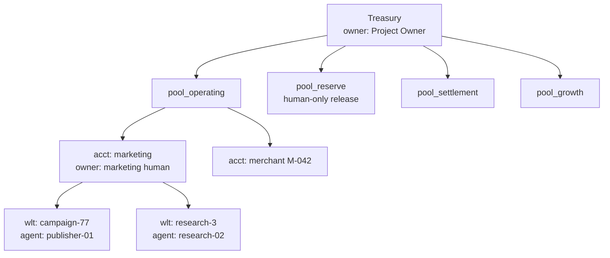

### AI Perspective

For an AI collaborator the model answers the first question of any financial feature: which container does this value live in, and who owns that container? The characteristic AI failure is container invention — creating implicit sub-balances inside application state (a `campaign_budget_remaining` variable) instead of a wallet with a real identity, real limits, and real audit.

### Developer Notes

Developers should never cache container ownership or limits across a mutation: both are governed attributes that can change between intent and commitment, and the authorization boundary re-reads them at commitment time by design.

### Codex Notes

When operating on `Capital and Account Model`, Codex MUST load this section before proposing any treasury change, MUST name the financial authority and the participation level of every model interaction it designs, MUST NOT treat model confidence as financial authority, and MUST route any disagreement with a clause through a proposed ADR instead of acting on the disagreement. For this section specifically, the tool MUST represent any bounded spending capacity as a wallet with a registered identity and MUST refuse to model budgets as bare variables in application state.

### Claude Code Notes

When operating on `Capital and Account Model`, Claude Code MUST load this section before proposing any treasury change, MUST name the financial authority and the participation level of every model interaction it designs, MUST NOT treat model confidence as financial authority, and MUST route any disagreement with a clause through a proposed ADR instead of acting on the disagreement. For this section specifically, the tool MUST represent any bounded spending capacity as a wallet with a registered identity and MUST refuse to model budgets as bare variables in application state.

### Gemini CLI Notes

When operating on `Capital and Account Model`, Gemini CLI MUST load this section before proposing any treasury change, MUST name the financial authority and the participation level of every model interaction it designs, MUST NOT treat model confidence as financial authority, and MUST route any disagreement with a clause through a proposed ADR instead of acting on the disagreement. For this section specifically, the tool MUST represent any bounded spending capacity as a wallet with a registered identity and MUST refuse to model budgets as bare variables in application state.

### Cursor Notes

When operating on `Capital and Account Model`, Cursor MUST load this section before proposing any treasury change, MUST name the financial authority and the participation level of every model interaction it designs, MUST NOT treat model confidence as financial authority, and MUST route any disagreement with a clause through a proposed ADR instead of acting on the disagreement. For this section specifically, the tool MUST represent any bounded spending capacity as a wallet with a registered identity and MUST refuse to model budgets as bare variables in application state.

### Future AI Notes

When operating on `Capital and Account Model`, Future AI MUST load this section before proposing any treasury change, MUST name the financial authority and the participation level of every model interaction it designs, MUST NOT treat model confidence as financial authority, and MUST route any disagreement with a clause through a proposed ADR instead of acting on the disagreement. For this section specifically, the tool MUST represent any bounded spending capacity as a wallet with a registered identity and MUST refuse to model budgets as bare variables in application state.

### Implementation Blueprint

An AI assistant implementing `Capital and Account Model` follows the staged blueprint below. Each stage names what the agent does and the receipt it writes, so a partially completed implementation can be resumed by a different agent without re-reading the whole part.

| Stage | What the agent does | Receipt written |
|---|---|---|
| pools | Create the four capital pools with owners, currencies, and initial policies. | pools stage receipt |
| identity | Implement prefixed ULID identity generation in the Kernel for all containers. | identity stage receipt |
| accounts | Implement account creation with immutable core and governed attributes. | accounts stage receipt |
| wallets | Implement wallet delegation as scoped capacity over parent accounts. | wallets stage receipt |
| verify | Run containment conformance tests: no orphans, no depth violations, no identity reuse. | verify stage receipt |

### AI Context Window

An agent working on `Capital and Account Model` needs a bounded context, loaded in this order:

- This section in full, including the containment tree diagram.
- Section 5 (`Treasury Domain Model`) for the Account, Wallet, and Capital Pool register terms.
- Section 7 (`Balance and Financial State Model`) for how balances project per container.
- Section 12 (`Reserve and Capital Protection Model`) for the reserve pool's special controls.
- Section 19 (`Treasury Security and Trust Boundary`) for wallet-subtree agent confinement.

**Context budget guidance:** this section plus Section 2 (`Treasury Principles`) and Section 19 (`Treasury Security and Trust Boundary`) is the irreducible minimum; an agent that has read none of them MUST NOT write treasury code.

### AI Build Order

The build order below is the sequence in which an agent creates artefacts for this section. Each item depends only on items above it.

1. The container identity generator with prefixed ULIDs.
2. The capital pool bootstrap with the four named pools.
3. Account creation and governance attribute machinery.
4. Wallet delegation with capacity scoping.
5. Containment conformance tests.

### AI Failure Library

These are the failures agents actually produce when implementing `Capital and Account Model`. Each entry names the mistake, the reason an agent makes it, and the corrective behaviour.

| Failure | Why an agent does it | Corrective behaviour |
|---|---|---|
| Modelling a budget as an application variable | A wallet feels heavyweight for a small campaign | Every bounded capacity is a wallet; small budgets get small wallets, not invisible ones |
| Reusing an account identity after closure | Identity reuse simplifies a test fixture | Identities are never reused; closed accounts remain addressable for audit forever |
| Giving an agent an account instead of a wallet | The agent needs to receive funds, which wallets cannot | Agents operate wallets; receipts land in the parent human-owned account |
| Nesting wallets under wallets | Sub-delegation seems natural for team agents | The tree is three levels deep by constitution; sub-delegation is a new wallet on the same account |
| Caching limits across the intent-commit window | Re-reading limits feels wasteful | Limits are re-read at commitment; the race between grant change and spend is real |

### Security

Container identity is the anchor of every permission: authorization scopes are container subtrees, wallet capacity is enforced server-side at commitment, and identity generation is a Kernel monopoly so that no component can mint a container outside governance.

### Performance

Container metadata is small and hot: the planned store keeps the container tree in a memory-resident read model with digest-invalidated updates, so authorization-time re-reads are sub-millisecond.

### Latency

Container resolution adds one indexed lookup per intent and one re-read per commitment, both against the memory-resident tree; the latency budget is one millisecond combined at the ninety-ninth percentile.

### Scalability

Accounts scale horizontally as ledger shards; pools are constitutionally few; wallets scale with agents and campaigns and carry no ledger state of their own, so their count stresses only the authorization read model.

### Reliability

The containment tree is rebuildable from creation and governance entries in the ledger, so container metadata inherits the ledger's durability rather than adding a second durability problem.

### Caching

The container tree caches aggressively with digest invalidation on governance mutations; capacity consumption counters are never cached — they are read from the authorization store transactionally.

### Consistency

Container governance mutations are strictly ordered per container in the ledger, so two racing limit changes resolve deterministically and the audit trail shows which one governed each spend.

**Diagram ID:** `CAT-TC-P1-S06-D002`  
**Title:** Wallet Spend Authorization Path  
**Purpose:** Show capacity enforcement as authorization, not balance movement.  
**Audience:** Engineers  
**Reading Order:** Read with the pseudo code of Section 6.

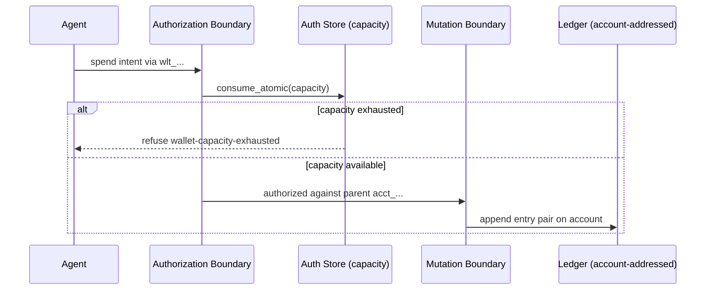

### Recovery

Recovery rebuilds the container tree by replaying container lifecycle entries, then re-verifies that every ledger shard's account exists in the tree; an entry addressing an unknown container quarantines the shard for manual inspection.

### Ownership

The Treasury itself is owned by the human Project Owner; each pool has a named human owner; account ownership is recorded at creation and transferable only by the owner's recorded instruction; wallets inherit their account's owner and add an operating agent identity.

### Dependencies

- Section 5 (`Treasury Domain Model`) — register terms for all containers.
- Section 8 (`Ledger and Transaction Model`) — container lifecycle entries live in the ledger.
- `context/05_AGENTS.md` — agent identities that operate wallets.

### Risks

- Container sprawl: thousands of stale wallets diluting the authorization read model.
- Ownership ambiguity in partner co-funded accounts if creation provenance is sloppy.
- Shard hotspots when one merchant account dominates traffic.

### Anti Patterns

- A `budgets` table in an application database outside the treasury.
- Wallets with hand-assigned identifiers.
- Ownership transfers executed as raw attribute updates without a governed instruction.

### Best Practices

- Expire idle wallets on a policy schedule and archive their capacity history.
- Record creation provenance (who, why, under which decision) on every container.
- Keep pool count constitutionally small; new pools need an ADR.

### Examples

Example: launching a paid campaign creates a wallet `wlt_01J...` on the marketing account with a 5,000.00 USD capacity (500000 minor units), a 30-day expiry, and the campaign decision ID as creation provenance. The campaign agent spends through the wallet; the account owner watches consumption in real time; expiry reclaims the residual capacity automatically.

### Counter Examples

Counter example: a growth experiment tracks its budget in a spreadsheet-fed environment variable and spends from the shared operating account directly. Overspend is discovered at month close, attribution is archaeological, and no automatic stop existed at any point. The missing wallet was the missing control.

### Implementation Checklist

- [ ] Implement the capital and account model exactly as specified in this section, with every named control mapped to a concrete enforcement point.
- [ ] Bind every artefact of the capital and account model to its planned `core/treasury/**` path and keep the path marked Planned until real code exists there.
- [ ] Wire every failure mode listed in this section's AI Failure Library to an observable, alertable signal before declaring the capital and account model done.
- [ ] Identity generation is Kernel-only and produces prefixed ULIDs for all three container kinds.

### Acceptance Checklist

- [ ] Every acceptance test declared in this section passes against the implementation of the capital and account model with no test skipped or weakened.
- [ ] Both constitutional rules of this section are enforced by an automated check on the capital and account model, not by convention or review habit.
- [ ] The capital and account model rejects every unauthorized mutation attempt, fails closed, and records the refusal with full provenance.
- [ ] Containment conformance tests prove no orphan containers, no depth violations, and no identity reuse.

### Operational Checklist

- [ ] Operational dashboards expose the health, throughput, and refusal counts of the capital and account model with a named on-call owner.
- [ ] Alert thresholds for the capital and account model are reviewed against measured baselines at least monthly and every change is recorded.
- [ ] The runbook for the capital and account model names the human authority for each escalation level and is tested in a drill, not only read.
- [ ] Idle-wallet expiry runs on schedule and its reclamations appear in the operations log.

### Migration Checklist

- [ ] Every schema or policy change touching the capital and account model carries a version, a recorded owner, and a replay-verified migration script.
- [ ] Migrations of the capital and account model run against a ledger replica first, and the replica result is compared entry-for-entry before production rollout.
- [ ] A rollback path for the capital and account model exists, is rehearsed, and never rewrites settled financial history to achieve its result.
- [ ] Container schema changes migrate the tree read model with a rebuild-and-compare step.

### Recovery Checklist

- [ ] Recovery of the capital and account model rebuilds state exclusively from the append-only ledger and its verified snapshots, never from caches.
- [ ] Post-recovery, every invariant declared in this section is re-verified for the capital and account model before mutations are re-enabled.
- [ ] A recovery report for the capital and account model records what failed, what was restored, the verification evidence, and the human who authorized resumption.
- [ ] Tree rebuild from ledger lifecycle entries reconciles with the live tree at zero drift.

### Repository Mapping

| Path | Status | Role for this section |
|---|---|---|
| `context/07_TREASURY_CORE.md` | Current | The containment model's constitutional text. |
| `core/treasury/domain/types/account.py` | Planned | Account type with immutable core attributes. |
| `core/treasury/domain/types/wallet.py` | Planned | Wallet type as scoped capacity. |
| `core/treasury/kernel/container_identity.py` | Planned | Prefixed ULID generation monopoly. |

### Folder Mapping

Container types live in the planned `core/treasury/domain/types/`; identity generation lives in `core/treasury/kernel/`; the tree read model lives in `core/treasury/projection/` as a Layer 2 artifact.

### Cross References

- Section 7 (`Balance and Financial State Model`) — balances are projected per account, never per wallet.
- Section 12 (`Reserve and Capital Protection Model`) — the reserve pool's human-only release authority.
- Section 15 (`Treasury Categories`) — the category every container must carry.
- Section 16 (`Treasury Relationships`) — containment as the primary relationship kind.
- Rule `CAT-TC-CONST-011` and Rule `CAT-TC-CONST-012` — the constitutional rules defined in this section.
- Acceptance tests `CAT-TC-AT-S06-001` through `CAT-TC-AT-S06-003` — the tests that prove this section.

### Related ADRs

The ADR register (`adr/ADR-0001.md` through `adr/ADR-0055.md`) currently contains unaccepted drafts and no accepted treasury decision record. A dedicated Treasury Core ADR set that fixes storage engine, custody provider, and settlement rail choices is Status: Planned; until it exists, this section is the governing text and any implementation conflict is resolved in favour of this document.

### Related Rules

- `CAT-TC-CONST-011` — Human-Rooted Capital Ownership (defined in this section under Constitutional Controls).
- `CAT-TC-CONST-012` — Wallet Capacity Is Not A Balance (defined in this section under Constitutional Controls).
- `context/02_PROJECT_RULES.md` — repository-wide engineering and governance rules that this section refines but never overrides.

### Related Architecture

- `architecture/System_Architecture.md` — system-level placement of the Treasury Core among CAT subsystems.
- `architecture/Data_Flow.md` — the data paths that carry financial events into and out of the treasury boundary.
- `architecture/Backend_Architecture.md` — the backend runtime that will host the planned `core/treasury/**` services.
- `context/04_ARCHITECTURE.md` — the constitutional architecture document that this section's the capital and account model must remain consistent with.

### AI Memory Anchor

**Anchor ID:** `CAT-TC-MEM-S06-001`  
**Meaning:** Value lives only in pools, accounts, and wallets; agents operate wallets and own nothing.  
**Recall Trigger:** Any budget, sub-balance, or spending capacity proposed outside a registered container.  
**Operational Use:** Recall this anchor to convert every informal budget into a wallet with identity, owner, capacity, and expiry.

### Future Evolution

Parts 2 through 4 add multi-currency accounts, custodial sub-accounts for settlement rails, and federated pool mirroring across nodes; the three-level depth limit and human-rooted ownership survive all of them.

### Operational Stories

Operational story: finance asks how much spending capacity is currently delegated to agents. The operator queries the wallet read model — total capacity, consumed, expiring within seven days — and answers with a live figure instead of a survey.

### Execution Stories

Execution story: an agent's wallet hits its capacity mid-campaign. The next spend intent is refused with `wallet-capacity-exhausted`, the agent files a capacity-increase request, and the account owner grants a recorded top-up — the exhaustion produced a governed conversation, not an overdraft.

### Optimization Stories

Optimization story: a merchant account's shard runs hot during a product launch. The team enables sub-shard interleaving for that account's entry stream — a Layer 1 storage optimization invisible to the containment model, which is exactly the point of the separation.

### Recovery Stories

Recovery story: after a region failover, the tree rebuild finds a wallet whose creation entry exists but whose grant entry was in-flight during the failure. The wallet resurrects in `created` state with zero capacity — safe by construction — and the pending grant is re-submitted from the intent journal.

**Diagram ID:** `CAT-TC-P1-S06-D003`  
**Title:** Container Lifecycle Entries in the Ledger  
**Purpose:** Show that the containment tree is rebuildable from governed ledger entries.  
**Audience:** Data stewards, recovery engineers  
**Reading Order:** Read with the Recovery subsection of Section 6.

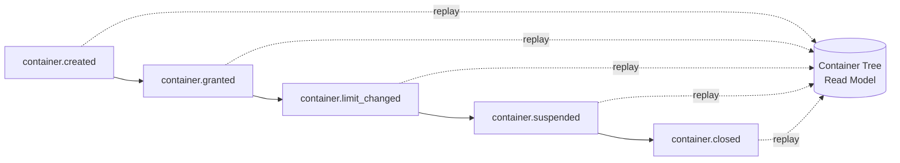

### Normative Requirements

1. All value in CAT MUST reside in exactly one account within exactly one capital pool, and spending capacity MUST be delegated only through wallets.
2. Container identities MUST be prefixed ULIDs generated exclusively by the Treasury Kernel and MUST never be reused.
3. The containment tree MUST be at most three levels deep: pool, account, wallet.
4. Agents MUST NOT own capital; every container's ownership MUST root to a named human.
5. Container limits and ownership MUST be re-read at commitment time, never trusted from intent-time caches.

### Constitutional Controls

The following constitutional rules are defined by this section and registered in the Section 20 rule registry. They bind every implementation of the capital and account model.

**Rule ID:** `CAT-TC-CONST-011`  
**Title:** Human-Rooted Capital Ownership  
**Purpose:** Guarantee that every unit of value is ultimately owned by an accountable human.  
**Normative Requirement:** Every capital pool, account, and wallet MUST record a human owner at creation; AI agents MAY operate wallets under recorded grants but MUST NOT be recorded as owners of any container; ownership transfers MUST execute as governed instructions appended to the ledger.  
**Rationale:** Financial accountability cannot terminate in a process; a container without a human root is money nobody answers for.  
**Enforcement:** Container creation schema requires an owner field validated against the human principal registry; the vocabulary lint rejects agent identities in owner fields.  
**Violation:** A container discovered with a non-human or missing owner is frozen until ownership is recorded; its mutation history is audited.  
**Recovery:** Record the correct owner by governed instruction, unfreeze, and add the creation path to the conformance tests.  
**Owner:** Treasury Documentation Owner

**Rule ID:** `CAT-TC-CONST-012`  
**Title:** Wallet Capacity Is Not A Balance  
**Purpose:** Prevent delegated spending capacity from being mistaken for held value.  
**Normative Requirement:** Wallets MUST hold no ledger entries and project no balances; wallet capacity MUST be enforced as an authorization-time constraint over the parent account, and capacity consumption MUST be recorded in the authorization store, not the ledger.  
**Rationale:** Treating capacity as a balance double-counts value and breaks the conservation invariant of Section 7.  
**Enforcement:** The ledger schema has no wallet-addressed entries; the projector rejects any entry naming a wallet identity as an account.  
**Violation:** A wallet-addressed ledger entry is quarantined as corrupt, and the writing path is disabled pending fix.  
**Recovery:** Re-attribute the entry to the parent account with correction provenance, rebuild affected projections, and extend schema validation.  
**Owner:** Treasury Data Owner (Planned role)

### Acceptance Tests

**Test ID:** `CAT-TC-AT-S06-001`  
**Purpose:** Prove agent identities cannot own containers.  
**Given:** A container creation request naming an agent identity in the owner field.  
**When:** The creation is submitted to the Kernel.  
**Then:** Creation is refused with reason `owner-not-human`, and the refusal names the principal registry check.  
**Failure Condition:** The container is created, or the refusal lacks the reason code.

**Test ID:** `CAT-TC-AT-S06-002`  
**Purpose:** Prove wallet capacity exhaustion refuses further spend.  
**Given:** A wallet with 100 minor units of remaining capacity.  
**When:** A spend intent for 101 minor units is authorized against the wallet.  
**Then:** Authorization refuses with reason `wallet-capacity-exhausted`, and the parent account's balance is untouched.  
**Failure Condition:** The spend authorizes, or capacity goes negative.

**Test ID:** `CAT-TC-AT-S06-003`  
**Purpose:** Prove ledger entries cannot address wallet identities.  
**Given:** A crafted entry pair addressing `wlt_`-prefixed identities.  
**When:** The pair is submitted to the ledger append interface.  
**Then:** The append is refused at schema validation with reason `wallet-not-ledger-addressable`.  
**Failure Condition:** The append succeeds or fails without the schema reason.

### JSON Examples

The following example is the canonical JSON shape for the capital and account model defined by this section.

```json
{
  "record_type": "treasury.container.wallet",
  "wallet_id": "wlt_01J5X0E8B7Q2M9K4T6R8V0N3ZC",
  "parent_account_id": "acct_01J5X0D2F4H6J8L0N2Q4S6U8WY",
  "pool_id": "pool_operating",
  "owner_principal": "human:project-owner",
  "operating_agent": "agent:publisher-01",
  "currency": "USD",
  "capacity_minor_units": 500000,
  "consumed_minor_units": 137450,
  "expiry": "2026-09-14T00:00:00Z",
  "creation_provenance": {
    "decision_id": "dec_01J5X0C9A1B2C3D4E5F6G7H8J9",
    "plan_step_id": "pstep_01J5X0CA98Z7Y6X5W4V3U2T1S0",
    "created_by": "human:marketing-owner"
  },
  "status": "active",
  "vocabulary_version": "0.1.0"
}
```

### YAML Examples

The following configuration example is the canonical YAML shape for the capital and account model defined by this section.

```yaml
capital_pools:
  - pool_id: pool_operating
    owner: human:project-owner
    currency: USD
    purpose: day-to-day campaign and operations funding
  - pool_id: pool_reserve
    owner: human:project-owner
    currency: USD
    purpose: capital protection floor, human-only release
  - pool_id: pool_settlement
    owner: human:finance-owner
    currency: USD
    purpose: in-flight settlement clearing
  - pool_id: pool_growth
    owner: human:project-owner
    currency: USD
    purpose: experimental allocation with bounded loss limits
containment_rules:
  max_depth: 3
  identity_prefixes: {pool: pool_, account: acct_, wallet: wlt_}
  identity_reuse: never
```

### Pseudo Code

```text
function authorize_wallet_spend(intent):
    wallet = tree.resolve(intent.wallet_id)   # re-read, no cache
    if wallet.status != ACTIVE or wallet.expired():
        return refuse(intent, reason='wallet-inactive')
    remaining = wallet.capacity - auth_store.consumed(wallet.id)
    if intent.amount > remaining:
        return refuse(intent, reason='wallet-capacity-exhausted')
    auth_store.consume_atomic(wallet.id, intent.amount, intent.idempotency_key)
    return authorize_against_account(wallet.parent_account_id, intent)
```

### Repository Trees

All paths below are Status: Planned unless explicitly marked Current; none of the planned files exist yet and this tree creates no implementation claim.

```text
core/treasury/                        # Planned
  kernel/container_identity.py        # Planned: prefixed ULID monopoly
  domain/types/
    capital_pool.py                   # Planned
    account.py                        # Planned
    wallet.py                         # Planned
  projection/container_tree.py        # Planned: memory-resident read model
```

## 7. Balance and Financial State Model

**Section ID:** `CAT-TC-P1-07`  
**Constitutional domain:** Treasury Core Constitutional Governance  
**Human accountable owner:** Lead Repository Architect and Treasury Documentation Owner  
**Primary record:** balance projection contract record  
**Primary question:** What are the six balance dimensions, how is each derived from the ledger, and which invariants must hold across them at every instant?

### Purpose

This section fixes the balance model: every account projects six balance dimensions — available, reserved, pending, settled, locked, and frozen — each derived exclusively from ledger entries by the Balance Projector, never stored authoritatively, and never mutated directly. It defines the conservation invariant (the sum of all account balances per currency equals the sum of all pool funding entries minus external outflows), the dimension invariants (no dimension negative except where a category explicitly permits overdraft, reserved plus available never exceeding settled inflows), and the snapshot discipline that makes projection rebuild tractable.

### Business Perspective

The six dimensions answer six different business questions with one vocabulary: available answers "what can we spend now", reserved answers "what have we promised", pending answers "what is in flight", settled answers "what is final", locked answers "what is disputed or collateralized", and frozen answers "what has compliance stopped". Collapsing them into one number is how businesses double-spend their own promises.

### Engineering Perspective

Engineering derives each dimension as a fold over typed ledger entries: reservations move value from available to reserved; settlements move pending to settled; releases return reserved to available; freezes are dimension transfers with compliance provenance. Balances are value objects stamped with the projection watermark (last entry sequence applied). Snapshots checkpoint the fold every N entries per account, so rebuild cost is bounded by the snapshot interval, and every snapshot records the digest of its input range.

### Architecture Perspective

Architecturally the balance model is Layer 2's entire contract: the projector consumes the ledger stream, maintains the six-dimension fold per account and currency, serves the Observation Boundary, and answers the guards' position queries. The authorization path reads dimensions transactionally from the projector's consistent store, not from caches, because the race between a stale available balance and a concurrent reservation is the double-spend race.

**Diagram ID:** `CAT-TC-P1-S07-D001`  
**Title:** Six-Dimension Transfer Map  
**Purpose:** Show every legal transfer between balance dimensions and its required authority.  
**Audience:** Engineers, auditors  
**Reading Order:** Read first in Section 7.

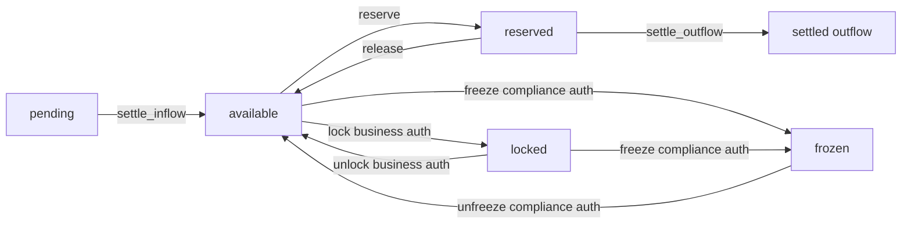

### AI Perspective

For an AI collaborator the model forbids the most tempting shortcut in financial code: writing a balance. An agent that needs a balance to change must find the ledger entry type whose fold produces that change, or conclude the change is illegal. The characteristic AI failure is dimension conflation — checking `available` when the operation requires `settled`, or treating `pending` inflows as spendable.

### Developer Notes

Developers should treat every balance read as carrying two mandatory pieces of context: the dimension name and the watermark. Code that passes a bare number where money context is needed will fail review; the sealed balance value object exists to make the bare number unrepresentable.

### Codex Notes

When operating on `Balance and Financial State Model`, Codex MUST load this section before proposing any treasury change, MUST name the financial authority and the participation level of every model interaction it designs, MUST NOT treat model confidence as financial authority, and MUST route any disagreement with a clause through a proposed ADR instead of acting on the disagreement. For this section specifically, the tool MUST name the balance dimension in every generated check and MUST refuse to generate any code path that assigns to a balance rather than appending an entry.

### Claude Code Notes

When operating on `Balance and Financial State Model`, Claude Code MUST load this section before proposing any treasury change, MUST name the financial authority and the participation level of every model interaction it designs, MUST NOT treat model confidence as financial authority, and MUST route any disagreement with a clause through a proposed ADR instead of acting on the disagreement. For this section specifically, the tool MUST name the balance dimension in every generated check and MUST refuse to generate any code path that assigns to a balance rather than appending an entry.

### Gemini CLI Notes

When operating on `Balance and Financial State Model`, Gemini CLI MUST load this section before proposing any treasury change, MUST name the financial authority and the participation level of every model interaction it designs, MUST NOT treat model confidence as financial authority, and MUST route any disagreement with a clause through a proposed ADR instead of acting on the disagreement. For this section specifically, the tool MUST name the balance dimension in every generated check and MUST refuse to generate any code path that assigns to a balance rather than appending an entry.

### Cursor Notes

When operating on `Balance and Financial State Model`, Cursor MUST load this section before proposing any treasury change, MUST name the financial authority and the participation level of every model interaction it designs, MUST NOT treat model confidence as financial authority, and MUST route any disagreement with a clause through a proposed ADR instead of acting on the disagreement. For this section specifically, the tool MUST name the balance dimension in every generated check and MUST refuse to generate any code path that assigns to a balance rather than appending an entry.

### Future AI Notes

When operating on `Balance and Financial State Model`, Future AI MUST load this section before proposing any treasury change, MUST name the financial authority and the participation level of every model interaction it designs, MUST NOT treat model confidence as financial authority, and MUST route any disagreement with a clause through a proposed ADR instead of acting on the disagreement. For this section specifically, the tool MUST name the balance dimension in every generated check and MUST refuse to generate any code path that assigns to a balance rather than appending an entry.

### Implementation Blueprint

An AI assistant implementing `Balance and Financial State Model` follows the staged blueprint below. Each stage names what the agent does and the receipt it writes, so a partially completed implementation can be resumed by a different agent without re-reading the whole part.

| Stage | What the agent does | Receipt written |
|---|---|---|
| fold | Implement the six-dimension fold over the typed entry stream. | fold stage receipt |
| invariants | Implement the conservation and dimension invariants as continuously evaluated checks. | invariants stage receipt |
| snapshots | Implement per-account snapshots with input-range digests. | snapshots stage receipt |
| serve | Serve watermarked dimension reads to observation and transactional reads to guards. | serve stage receipt |
| rebuild | Implement and rehearse projection rebuild from snapshots plus replay. | rebuild stage receipt |

### AI Context Window

An agent working on `Balance and Financial State Model` needs a bounded context, loaded in this order:

- This section in full, including the dimension transfer diagram.
- Section 8 (`Ledger and Transaction Model`) for the entry types the fold consumes.
- Section 6 (`Capital and Account Model`) for the accounts balances project over.
- Section 11 (`Liquidity Model`) for how positions aggregate dimensions across accounts.
- Section 14 (`Treasury States and State Machine`) for the object states that gate dimension transfers.

**Context budget guidance:** this section plus Section 2 (`Treasury Principles`) and Section 19 (`Treasury Security and Trust Boundary`) is the irreducible minimum; an agent that has read none of them MUST NOT write treasury code.

### AI Build Order

The build order below is the sequence in which an agent creates artefacts for this section. Each item depends only on items above it.

1. Typed entry fold with per-dimension transfer rules.
2. Sealed balance value objects with watermark stamps.
3. Continuous invariant evaluators with alerting.
4. Snapshot writer with input-range digests.
5. Rebuild machinery and its rehearsal harness.

### AI Failure Library

These are the failures agents actually produce when implementing `Balance and Financial State Model`. Each entry names the mistake, the reason an agent makes it, and the corrective behaviour.

| Failure | Why an agent does it | Corrective behaviour |
|---|---|---|
| Writing a balance directly to fix drift | The projection disagrees with expectation and a patch is fast | Drift is a finding: record a correcting ledger entry or fix the fold; never write the projection |
| Spending against pending inflows | The money is 'coming' so the spend feels safe | Only available balance authorizes spend; pending is information, not capacity |
| Conflating locked and frozen | Both stop spending, so one flag seems enough | Locked is a business hold with business release; frozen is a compliance hold with compliance release |
| Skipping the watermark on internal reads | Internal callers 'know' the projector is fast | Every read carries the watermark; internal blindness becomes external mispayment |
| Rebuilding without digest verification | Replay 'always works' in tests | Verify input-range digests during rebuild; silent gaps are how corruption propagates |

### Security

Balance reads for authorization run inside the trust boundary with transactional isolation; observation reads are scoped per consumer so a merchant sees only its accounts; freeze transfers require compliance authority and are the only dimension transfers a human cannot be overridden on by any agent.

### Performance

The fold is incremental and O(1) per entry; invariant evaluation is incremental per affected account with a full-sweep audit nightly; snapshot cost amortizes across the interval and is tuned per shard traffic.

### Latency

Transactional dimension reads are budgeted at two milliseconds at the ninety-ninth percentile; projection lag (entry append to dimension visibility) is budgeted at two hundred milliseconds and alerted beyond one second.

### Scalability

Projectors partition by ledger shard; the conservation invariant aggregates via per-shard subtotals merged in a tree, so global verification scales logarithmically with shard count.

### Reliability

Because balances are pure functions of the ledger, projector crashes lose no truth: restart resumes from the last snapshot and watermark, and the guards' transactional store fails closed by refusing commitments when unreachable.

### Caching

Observation-facing dimension caches are legal with watermark labels; the guards and the authorization boundary bypass all caches by contract; snapshot artifacts are immutable and cache-friendly for rebuild.

### Consistency

Within an account, dimension reads are serializable with respect to the fold; across accounts, the conservation invariant is evaluated at watermark-aligned cuts so that in-flight entries never appear as violations.

**Diagram ID:** `CAT-TC-P1-S07-D002`  
**Title:** Projection Pipeline with Snapshots  
**Purpose:** Show the fold, snapshot, and rebuild relationship.  
**Audience:** Data stewards, recovery engineers  
**Reading Order:** Read with the Recovery subsection of Section 7.

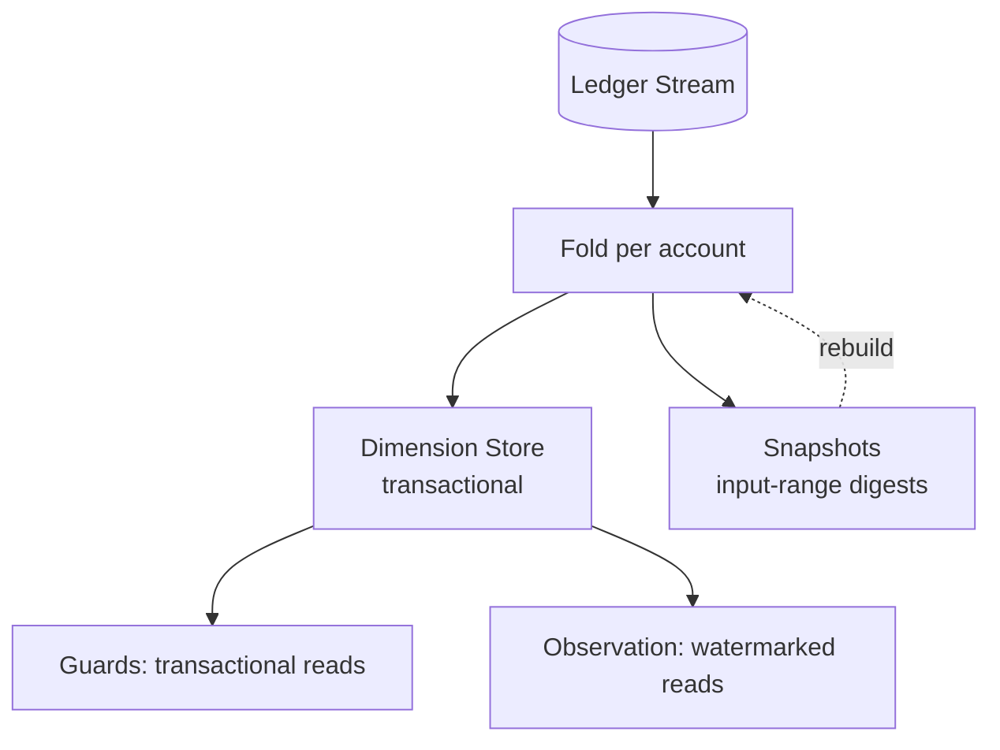

### Recovery

Projection recovery is rebuild: restore the latest verified snapshot per account, replay entries beyond it with digest verification, and re-run all invariants before serving; the ledger itself is never touched by projection recovery.

### Ownership

The Balance Projector and its invariants are owned by the planned Treasury Data Owner; freeze and lock semantics are co-owned with the Treasury Security Owner; the dimension vocabulary is owned by this section.

### Dependencies

- Section 8 (`Ledger and Transaction Model`) — the entry types and ordering the fold depends on.
- Section 2 (`Treasury Principles`) — P-04 derived balances and P-03 append-only history.
- Section 17 (`Treasury Repository`) — the snapshot and projection stores.

### Risks

- Fold bugs that systematically misclassify a transfer type, corrupting one dimension silently.
- Watermark misuse where consumers compare watermarks across shards as if globally ordered.
- Snapshot interval mistuning that makes rebuild windows exceed the recovery objective.

### Anti Patterns

- An `UPDATE balances SET ...` statement anywhere in the codebase.
- A single `balance` column serving all six dimensions with status flags.
- Invariant checks that run only in tests, not continuously in production.

### Best Practices

- Name dimension transfers as verbs in entry types: reserve, release, settle, lock, unlock, freeze, unfreeze.
- Alert on invariant violation before alerting on lag; a wrong balance is worse than a late one.
- Rehearse rebuild quarterly with production-scale data volumes.

### Examples

Example: a 200.00 USD payout is initiated. Reservation transfers 20000 minor units from available to reserved; the settlement instruction executes; settlement entries transfer reserved to settled-outflow and the external rail confirms. At every instant the six dimensions explain exactly where the 20000 units stand, and the conservation invariant holds across the transfer.

### Counter Examples

Counter example: a dashboard sums available and pending into "total balance" and a campaign manager approves spend against it. The pending inflow reverses on a chargeback, available goes negative, and the overdraft was authorized by an arithmetic decision made outside the model. The dimensions existed; the discipline of reading them separately did not.

### Implementation Checklist

- [ ] Implement the balance and financial state model exactly as specified in this section, with every named control mapped to a concrete enforcement point.
- [ ] Bind every artefact of the balance and financial state model to its planned `core/treasury/**` path and keep the path marked Planned until real code exists there.
- [ ] Wire every failure mode listed in this section's AI Failure Library to an observable, alertable signal before declaring the balance and financial state model done.
- [ ] The fold covers every entry type; unknown entry types halt the projector rather than being skipped.

### Acceptance Checklist

- [ ] Every acceptance test declared in this section passes against the implementation of the balance and financial state model with no test skipped or weakened.
- [ ] Both constitutional rules of this section are enforced by an automated check on the balance and financial state model, not by convention or review habit.
- [ ] The balance and financial state model rejects every unauthorized mutation attempt, fails closed, and records the refusal with full provenance.
- [ ] Continuous invariant evaluation covers conservation and every dimension constraint with alerts wired.

### Operational Checklist

- [ ] Operational dashboards expose the health, throughput, and refusal counts of the balance and financial state model with a named on-call owner.
- [ ] Alert thresholds for the balance and financial state model are reviewed against measured baselines at least monthly and every change is recorded.
- [ ] The runbook for the balance and financial state model names the human authority for each escalation level and is tested in a drill, not only read.
- [ ] Projection lag and invariant status are on the primary treasury dashboard.

### Migration Checklist

- [ ] Every schema or policy change touching the balance and financial state model carries a version, a recorded owner, and a replay-verified migration script.
- [ ] Migrations of the balance and financial state model run against a ledger replica first, and the replica result is compared entry-for-entry before production rollout.
- [ ] A rollback path for the balance and financial state model exists, is rehearsed, and never rewrites settled financial history to achieve its result.
- [ ] Fold logic changes require a full historical re-fold comparison before deployment.

### Recovery Checklist

- [ ] Recovery of the balance and financial state model rebuilds state exclusively from the append-only ledger and its verified snapshots, never from caches.
- [ ] Post-recovery, every invariant declared in this section is re-verified for the balance and financial state model before mutations are re-enabled.
- [ ] A recovery report for the balance and financial state model records what failed, what was restored, the verification evidence, and the human who authorized resumption.
- [ ] Rebuild rehearsals verify input-range digests and finish inside the recovery objective.

### Repository Mapping

| Path | Status | Role for this section |
|---|---|---|
| `context/07_TREASURY_CORE.md` | Current | The balance model's constitutional text. |
| `core/treasury/projection/fold.py` | Planned | Six-dimension fold over typed entries. |
| `core/treasury/projection/invariants.py` | Planned | Continuous conservation and dimension checks. |
| `core/treasury/projection/snapshots.py` | Planned | Digest-verified snapshot machinery. |

### Folder Mapping

All balance machinery lives in the planned `core/treasury/projection/` folder (Layer 2); the sealed balance value object lives in `core/treasury/domain/types/balance.py` as a leaf import.

### Cross References

- Section 8 (`Ledger and Transaction Model`) — the truth the fold derives from.
- Section 11 (`Liquidity Model`) — positions built from these dimensions.
- Section 14 (`Treasury States and State Machine`) — object states gating dimension transfers.
- Rule `CAT-TC-CONST-013` and Rule `CAT-TC-CONST-014` — the constitutional rules defined in this section.
- Acceptance tests `CAT-TC-AT-S07-001` through `CAT-TC-AT-S07-003` — the tests that prove this section.

### Related ADRs

The ADR register (`adr/ADR-0001.md` through `adr/ADR-0055.md`) currently contains unaccepted drafts and no accepted treasury decision record. A dedicated Treasury Core ADR set that fixes storage engine, custody provider, and settlement rail choices is Status: Planned; until it exists, this section is the governing text and any implementation conflict is resolved in favour of this document.

### Related Rules

- `CAT-TC-CONST-013` — Balances Are Derived, Never Written (defined in this section under Constitutional Controls).
- `CAT-TC-CONST-014` — Spend Authorizes Only Against Available (defined in this section under Constitutional Controls).
- `context/02_PROJECT_RULES.md` — repository-wide engineering and governance rules that this section refines but never overrides.

### Related Architecture

- `architecture/System_Architecture.md` — system-level placement of the Treasury Core among CAT subsystems.
- `architecture/Data_Flow.md` — the data paths that carry financial events into and out of the treasury boundary.
- `architecture/Backend_Architecture.md` — the backend runtime that will host the planned `core/treasury/**` services.
- `context/04_ARCHITECTURE.md` — the constitutional architecture document that this section's the balance and financial state model must remain consistent with.

### AI Memory Anchor

**Anchor ID:** `CAT-TC-MEM-S07-001`  
**Meaning:** Six derived dimensions per account, one conservation invariant, zero balance writes — ever.  
**Recall Trigger:** Any code that assigns to a balance, sums dimensions loosely, or spends against non-available funds.  
**Operational Use:** Recall this anchor to convert every balance change into an entry type and every balance read into a dimension-plus-watermark pair.

### Future Evolution

Parts 2 through 4 add multi-currency dimension sets, cross-node conservation proofs, and real-time invariant attestation for external auditors; the six-dimension core and the derivation-only rule are permanent.

### Operational Stories

Operational story: the nightly full-sweep invariant audit flags a 0.02 USD conservation drift on one shard. The team traces it to a fold bug misclassifying a rare refund-of-refund entry, fixes the fold, re-folds history, and the drift closes — caught by the invariant, not by a customer.

### Execution Stories

Execution story: two concurrent reservations race for the last 50.00 USD of available balance. The transactional dimension read serializes them; the first reserves, the second refuses with `insufficient-available`, and no negative balance ever exists even transiently.

### Optimization Stories

Optimization story: guard position queries dominate projector load. The team adds an incremental position aggregate updated by the same fold, turning per-query scans into O(1) reads while the underlying dimension truth remains unchanged.

### Recovery Stories

Recovery story: a projector node loses its store. Rebuild restores snapshots, replays 1.4 million entries with digest verification in nine minutes, re-runs invariants clean, and re-opens serving — while the ledger, untouched, kept accepting appends the whole time.

**Diagram ID:** `CAT-TC-P1-S07-D003`  
**Title:** Concurrent Reservation Race Resolution  
**Purpose:** Show how transactional reads serialize the double-spend race.  
**Audience:** Engineers  
**Reading Order:** Read with acceptance test CAT-TC-AT-S07-001.

```mermaid
sequenceDiagram
  participant I1 as Intent A (5000)
  participant I2 as Intent B (5000)
  participant D as Dimension Store (avail=5000)
  I1->>D: begin tx, read available
  I2->>D: begin tx, read available
  I1->>D: reserve 5000, commit
  D-->>I1: reserved
  I2->>D: reserve 5000, commit
  D-->>I2: refuse insufficient-available
  Note over D: serialization guarantees\nno negative available
```

### Normative Requirements

1. Every account MUST project exactly the six balance dimensions defined in this section, each derived solely from ledger entries.
2. No component MAY write, adjust, or cache-fix a balance; all balance change MUST occur through ledger entry append.
3. The conservation invariant and all dimension invariants MUST be evaluated continuously in production with alerting.
4. Authorization and guard reads MUST be transactional against the projection store; observation reads MUST carry watermarks.
5. Snapshots MUST record input-range digests, and rebuilds MUST verify them before serving.

### Constitutional Controls

The following constitutional rules are defined by this section and registered in the Section 20 rule registry. They bind every implementation of the balance and financial state model.

**Rule ID:** `CAT-TC-CONST-013`  
**Title:** Balances Are Derived, Never Written  
**Purpose:** Preserve the ledger as the single source of financial truth.  
**Normative Requirement:** All six balance dimensions MUST be pure functions of the ledger entry stream; any interface that permits direct balance assignment MUST NOT exist in any environment, including development and test tooling that runs against shared stores.  
**Rationale:** The first balance write creates two sources of truth, and reconciliation between them is undecidable from inside the system.  
**Enforcement:** The projection store's write interface is private to the projector process; schema permissions deny UPDATE on dimension tables to every other identity; static checks forbid balance-assignment patterns.  
**Violation:** A direct balance write is a Severity 1 incident: the affected accounts freeze, projections rebuild from ledger, and the write path is removed.  
**Recovery:** Rebuild affected projections, verify invariants, unfreeze, and add the write path's signature to the static denylist.  
**Owner:** Treasury Data Owner (Planned role)

**Rule ID:** `CAT-TC-CONST-014`  
**Title:** Spend Authorizes Only Against Available  
**Purpose:** Prevent promises and in-flight funds from being spent twice.  
**Normative Requirement:** Spending, reservation, and payout authorization MUST evaluate only the available dimension read transactionally at commitment time; pending, reserved, locked, and frozen dimensions MUST NOT contribute to spendable capacity under any policy.  
**Rationale:** Every double-spend in projection-based systems is a spend against a dimension that was never spendable.  
**Enforcement:** The guard and authorization contracts accept only available-dimension reads for capacity checks; contract tests submit spends against each other dimension and assert refusal.  
**Violation:** An authorization observed consuming a non-available dimension is disabled, and all mutations it authorized are audited for overdraft.  
**Recovery:** Reverse or ratify affected mutations under human authority and extend the contract tests with the bypass pattern.  
**Owner:** Treasury Risk Owner (Planned role)

### Acceptance Tests

**Test ID:** `CAT-TC-AT-S07-001`  
**Purpose:** Prove concurrent reservations cannot overdraw available balance.  
**Given:** An account with exactly 5000 minor units available and two concurrent reservation intents of 5000 each.  
**When:** Both intents reach commitment simultaneously.  
**Then:** Exactly one reserves; the other refuses with `insufficient-available`; the available dimension never reads negative at any watermark.  
**Failure Condition:** Both reserve, or any read shows a negative available dimension.

**Test ID:** `CAT-TC-AT-S07-002`  
**Purpose:** Prove the conservation invariant detects an injected drift.  
**Given:** A test shard where one entry's amount is deliberately corrupted in a projection replica (not the ledger).  
**When:** The continuous invariant evaluator processes the affected account.  
**Then:** A conservation violation alert fires naming the account and the watermark range of the discrepancy.  
**Failure Condition:** No alert fires within the evaluation interval.

**Test ID:** `CAT-TC-AT-S07-003`  
**Purpose:** Prove frozen funds refuse business release.  
**Given:** An account with 10000 minor units frozen under compliance authority.  
**When:** A business-authority release intent targets the frozen dimension.  
**Then:** The intent refuses with `authority-insufficient-for-unfreeze`, and the frozen dimension is unchanged.  
**Failure Condition:** Any non-compliance authority releases frozen funds.

### JSON Examples

The following example is the canonical JSON shape for the balance and financial state model defined by this section.

```json
{
  "record_type": "treasury.balance.projection",
  "account_id": "acct_01J5X0D2F4H6J8L0N2Q4S6U8WY",
  "currency": "USD",
  "scale": 2,
  "dimensions": {
    "available_minor_units": 1250000,
    "reserved_minor_units": 340000,
    "pending_minor_units": 87500,
    "settled_inflow_minor_units": 4310000,
    "locked_minor_units": 50000,
    "frozen_minor_units": 0
  },
  "watermark": {
    "shard": "shard-07",
    "entry_sequence": 8842137,
    "projected_at": "2026-08-15T09:12:44Z"
  },
  "invariants": {
    "conservation": "holds",
    "no_negative_dimensions": "holds"
  },
  "vocabulary_version": "0.1.0"
}
```

### YAML Examples

The following configuration example is the canonical YAML shape for the balance and financial state model defined by this section.

```yaml
balance_projection:
  dimensions: [available, reserved, pending, settled, locked, frozen]
  derivation: ledger-fold-only
  transfers:
    reserve: {from: available, to: reserved}
    release: {from: reserved, to: available}
    settle_outflow: {from: reserved, to: settled_outflow}
    settle_inflow: {from: pending, to: available}
    lock: {from: available, to: locked, authority: business}
    unlock: {from: locked, to: available, authority: business}
    freeze: {from: any, to: frozen, authority: compliance}
    unfreeze: {from: frozen, to: origin, authority: compliance}
  snapshot:
    interval_entries: 10000
    digest: sha256-input-range
  lag_budget_ms: 200
  lag_alert_ms: 1000
```

### Pseudo Code

```text
function fold(entry, dims):
    rule = TRANSFER_RULES[entry.type]        # halt on unknown type
    if rule is MISSING:
        halt_projector('unknown entry type: ' + entry.type)
    dims[rule.from] -= entry.amount
    dims[rule.to] += entry.amount
    assert_invariants(dims, entry.account_id)
    dims.watermark = entry.sequence
    return dims
```

### Repository Trees

All paths below are Status: Planned unless explicitly marked Current; none of the planned files exist yet and this tree creates no implementation claim.

```text
core/treasury/projection/             # Planned
  fold.py                             # Planned: six-dimension fold
  invariants.py                       # Planned: continuous checks
  snapshots.py                        # Planned: digest-verified checkpoints
  positions.py                        # Planned: guard-facing aggregates
core/treasury/domain/types/balance.py # Planned: sealed value object
```

## 8. Ledger and Transaction Model

**Section ID:** `CAT-TC-P1-08`  
**Constitutional domain:** Treasury Core Constitutional Governance  
**Human accountable owner:** Lead Repository Architect and Treasury Documentation Owner  
**Primary record:** ledger append contract record  
**Primary question:** What exactly is a ledger entry, how do double-entry transactions bind entries, and which guarantees make the journal the treasury's immutable truth?

### Purpose

This section fixes the ledger: an append-only, hash-chained journal of typed entries, where every financial movement is a Transaction binding two or more entries whose amounts sum to zero per currency (double-entry), every entry is immutable once appended, corrections are new reversing entries, and every append is idempotent under a mandatory idempotency key. It defines entry identity (`ent_` ULIDs), transaction identity (`txn_` ULIDs), correlation identity for cross-system tracing, financial timestamps (ledger time assigned at append, event time carried from source, both UTC RFC 3339 with millisecond precision), ordering (strict per account shard, causal across shards), and the exactly-once effect discipline built from at-least-once delivery plus keyed deduplication.

### Business Perspective

The ledger is the business's institutional memory of money: every commission earned, payout sent, refund absorbed, and reserve moved exists as entries that no later convenience can rewrite. When a partner disputes a figure from eight months ago, the answer is a replay, not a negotiation — and that capability is worth more than any feature the same engineering time could buy.

### Engineering Perspective

Engineering appends entries in transaction groups: validate the group (zero-sum per currency, known accounts, known types, authority attached), check the idempotency key against the dedup store, assign ledger sequence and ledger time, chain the group hash over the previous group hash, and commit atomically per shard. Cross-shard transactions use one transaction identity across per-shard groups with a saga completing or compensating the far side. Replays return the original result by key; at-least-once upstream delivery therefore converges to exactly-once ledger effect.

### Architecture Perspective

Architecturally the ledger is Layer 1 and the only component whose loss is unrecoverable by rebuild — hence snapshots, cross-region replication, and the hash chain that makes tampering evident rather than merely forbidden. The design borrows the event-sourcing discipline of `context/08_EVENTS_SYSTEM.md` but tightens it: financial events are the one event family where schema evolution is append-only and where every consumer must tolerate full-history replay.

**Diagram ID:** `CAT-TC-P1-S08-D001`  
**Title:** Idempotent Chained Append Sequence  
**Purpose:** Show validation, dedup, sequencing, chaining, and commit in order.  
**Audience:** Engineers  
**Reading Order:** Read first in Section 8.

```mermaid
sequenceDiagram
  participant MB as Mutation Boundary
  participant V as Validator
  participant DD as Dedup Store
  participant SH as Shard Journal
  MB->>V: transaction group
  V->>V: schema + zero-sum + accounts
  V->>DD: check_and_lock(key)
  alt key seen
    DD-->>MB: original txn id (replay)
  else key new
    DD->>SH: assign sequence + chain hash
    SH->>SH: atomic commit
    SH-->>MB: acknowledged txn id
  end
```

### AI Perspective

For an AI collaborator the ledger model removes discretion: there is no entry update API to call, no delete to generate, no "fix the row" migration to write. The characteristic AI failure is correction by mutation — generating a migration that rewrites historical amounts — which the model converts into reversing entries with correction provenance, preserving both the error and its repair as facts.

### Developer Notes

Developers should treat the idempotency key as part of the operation's identity, derived deterministically from the business operation (intent identity plus attempt-invariant fields), never randomly generated per attempt — a random key per retry is how duplicates enter idempotent systems.

### Codex Notes

When operating on `Ledger and Transaction Model`, Codex MUST load this section before proposing any treasury change, MUST name the financial authority and the participation level of every model interaction it designs, MUST NOT treat model confidence as financial authority, and MUST route any disagreement with a clause through a proposed ADR instead of acting on the disagreement. For this section specifically, the tool MUST generate reversing-entry corrections for any historical fix and MUST refuse to produce schema migrations that alter appended entry content.

### Claude Code Notes

When operating on `Ledger and Transaction Model`, Claude Code MUST load this section before proposing any treasury change, MUST name the financial authority and the participation level of every model interaction it designs, MUST NOT treat model confidence as financial authority, and MUST route any disagreement with a clause through a proposed ADR instead of acting on the disagreement. For this section specifically, the tool MUST generate reversing-entry corrections for any historical fix and MUST refuse to produce schema migrations that alter appended entry content.

### Gemini CLI Notes

When operating on `Ledger and Transaction Model`, Gemini CLI MUST load this section before proposing any treasury change, MUST name the financial authority and the participation level of every model interaction it designs, MUST NOT treat model confidence as financial authority, and MUST route any disagreement with a clause through a proposed ADR instead of acting on the disagreement. For this section specifically, the tool MUST generate reversing-entry corrections for any historical fix and MUST refuse to produce schema migrations that alter appended entry content.

### Cursor Notes

When operating on `Ledger and Transaction Model`, Cursor MUST load this section before proposing any treasury change, MUST name the financial authority and the participation level of every model interaction it designs, MUST NOT treat model confidence as financial authority, and MUST route any disagreement with a clause through a proposed ADR instead of acting on the disagreement. For this section specifically, the tool MUST generate reversing-entry corrections for any historical fix and MUST refuse to produce schema migrations that alter appended entry content.

### Future AI Notes

When operating on `Ledger and Transaction Model`, Future AI MUST load this section before proposing any treasury change, MUST name the financial authority and the participation level of every model interaction it designs, MUST NOT treat model confidence as financial authority, and MUST route any disagreement with a clause through a proposed ADR instead of acting on the disagreement. For this section specifically, the tool MUST generate reversing-entry corrections for any historical fix and MUST refuse to produce schema migrations that alter appended entry content.

### Implementation Blueprint

An AI assistant implementing `Ledger and Transaction Model` follows the staged blueprint below. Each stage names what the agent does and the receipt it writes, so a partially completed implementation can be resumed by a different agent without re-reading the whole part.

| Stage | What the agent does | Receipt written |
|---|---|---|
| schema | Define the entry and transaction schemas with all identity, timestamp, and provenance fields. | schema stage receipt |
| append | Implement validated, idempotent, hash-chained group append per shard. | append stage receipt |
| crossshard | Implement cross-shard transactions as compensating sagas under one transaction identity. | crossshard stage receipt |
| replay | Implement full and ranged replay with digest verification. | replay stage receipt |
| verify | Run the tamper-evidence and idempotency conformance suites. | verify stage receipt |

### AI Context Window

An agent working on `Ledger and Transaction Model` needs a bounded context, loaded in this order:

- This section in full, including the append sequence diagram.
- Section 7 (`Balance and Financial State Model`) for the fold that consumes these entries.
- Section 10 (`Financial Provenance Model`) for the provenance every entry must carry.
- Section 17 (`Treasury Repository`) for the physical storage of journal, snapshots, and dedup store.
- `context/08_EVENTS_SYSTEM.md` for the event fabric financial events flow into.

**Context budget guidance:** this section plus Section 2 (`Treasury Principles`) and Section 19 (`Treasury Security and Trust Boundary`) is the irreducible minimum; an agent that has read none of them MUST NOT write treasury code.

### AI Build Order

The build order below is the sequence in which an agent creates artefacts for this section. Each item depends only on items above it.

1. Entry and transaction schemas with validation.
2. The idempotency dedup store with deterministic key rules.
3. Hash-chained per-shard group append.
4. Cross-shard saga machinery.
5. Replay and digest verification tooling.
6. Tamper-evidence audit jobs.

### AI Failure Library

These are the failures agents actually produce when implementing `Ledger and Transaction Model`. Each entry names the mistake, the reason an agent makes it, and the corrective behaviour.

| Failure | Why an agent does it | Corrective behaviour |
|---|---|---|
| Rewriting an entry to fix an error | A migration is the habitual fix for wrong data | Append a reversing pair with correction provenance; history keeps both the error and the fix |
| Random idempotency keys per retry | Key generation at call site is easiest with a UUID call | Derive keys deterministically from the operation identity; retries must collide |
| Single-entry movements for 'simple' cases | One entry seems enough for a fee debit | Every movement is a zero-sum group; the counterparty account always exists, even for fees |
| Trusting event time for ordering | Source timestamps look authoritative | Ledger sequence orders; event time informs; clock skew never reorders money |
| Deleting old entries for storage savings | Cold history seems economically dead | History is archived to cold storage intact; deletion is constitutionally impossible |

### Security

The hash chain plus periodic externally anchored checkpoints make tampering evident even to an adversary with store credentials; append credentials are held only by the Mutation Boundary identity; replay credentials are read-only and separately scoped.

### Performance

Group append is one sequential write per shard plus one dedup check; hash chaining is incremental; validation is schema-bound and cache-friendly. The design goal is that ledger throughput is bounded by storage sequential-write capacity, nothing else.

### Latency

Append latency is budgeted at ten milliseconds at the ninety-ninth percentile per shard including dedup check and fsync-equivalent durability; cross-shard sagas add one round per side and are asynchronous beyond the first shard's acknowledgement.

### Scalability

Shards partition by account identity; sequence numbers are per shard; the dedup store partitions by key hash; replay parallelizes per shard. Nothing global sits on the append path.

### Reliability

Durability is replicated append with quorum acknowledgement; the dedup store's loss degrades to at-least-once with reconciliation detection rather than silent duplication, because entry groups also carry their idempotency key for post-hoc dedup audits.

### Caching

Nothing on the append path is cached except immutable schema and registry artifacts; replay consumers may cache verified ranges by digest.

### Consistency

Per-shard strict ordering plus cross-shard causal binding through transaction identity gives the reconstruction guarantee: any global state question is answerable by merging per-shard replays on transaction identity.

**Diagram ID:** `CAT-TC-P1-S08-D002`  
**Title:** Hash Chain with External Anchors  
**Purpose:** Show tamper evidence across groups and the anchoring cadence.  
**Audience:** Security reviewers, auditors  
**Reading Order:** Read with the Security subsection of Section 8.

```mermaid
flowchart LR
  G1[Group 8841\nhash h1] --> G2[Group 8842\nhash h2 = H entries + h1]
  G2 --> G3[Group 8843\nhash h3 = H entries + h2]
  G3 --> G4[Group 8844\nhash h4]
  G2 -.daily anchor.-> EXT[(External Anchor Store)]
  G4 -.daily anchor.-> EXT
```

### Recovery

Ledger recovery is restore-from-replica or snapshot-plus-archive-replay, followed by chain verification over the restored range and invariant re-evaluation; a shard whose chain does not verify stays quarantined regardless of operational pressure.

### Ownership

The ledger schema, chain discipline, and replay tooling are owned by the planned Treasury Data Owner; the dedup store and idempotency key rules by the Treasury Engineering Owner; tamper-evidence audits by the Treasury Security Owner.

### Dependencies

- Section 6 (`Capital and Account Model`) — the accounts entries address.
- Section 10 (`Financial Provenance Model`) — mandatory provenance fields per entry.
- Section 18 (`Treasury Metadata and Audit Model`) — the audit chain anchored to entry groups.
- `context/08_EVENTS_SYSTEM.md` — outbound financial event publication.

### Risks

- Dedup store degradation silently widening the duplicate window.
- Cross-shard saga compensation bugs leaving asymmetric partial transactions.
- Archive-tier corruption discovered only at replay time.

### Anti Patterns

- An ORM model for entries with an `updated_at` column.
- Fee movements recorded as single unbalanced entries.
- Test fixtures that truncate ledger tables between runs against shared stores.

### Best Practices

- Verify a random chain segment daily and the full chain monthly.
- Store the idempotency key inside the entry group for post-hoc audits.
- Treat entry type registration like vocabulary registration: closed, owned, reviewed.

### Examples

Example: a commission of 45.00 USD is recognized. One transaction `txn_...` binds two entries: debit `acct_merchant_042` commission-expense 4500, credit `acct_partner_17` commission-receivable 4500 — zero-sum, one idempotency key derived from the commission event identity, chained, and immediately replayable. A duplicate delivery of the same event returns the original transaction identity.

### Counter Examples

Counter example: an engineer fixes a mispriced commission by updating the entry amount from 4500 to 5400 in place. The chain now fails verification from that group forward, the projection rebuild produces different balances than production served last month, and the audit trail shows an impossibility. One in-place write converted a correctable error into a trust incident.

### Implementation Checklist

- [ ] Implement the ledger and transaction model exactly as specified in this section, with every named control mapped to a concrete enforcement point.
- [ ] Bind every artefact of the ledger and transaction model to its planned `core/treasury/**` path and keep the path marked Planned until real code exists there.
- [ ] Wire every failure mode listed in this section's AI Failure Library to an observable, alertable signal before declaring the ledger and transaction model done.
- [ ] Every movement path produces zero-sum transaction groups with deterministic idempotency keys.

### Acceptance Checklist

- [ ] Every acceptance test declared in this section passes against the implementation of the ledger and transaction model with no test skipped or weakened.
- [ ] Both constitutional rules of this section are enforced by an automated check on the ledger and transaction model, not by convention or review habit.
- [ ] The ledger and transaction model rejects every unauthorized mutation attempt, fails closed, and records the refusal with full provenance.
- [ ] The tamper-evidence suite detects single-bit alterations anywhere in a test chain.

### Operational Checklist

- [ ] Operational dashboards expose the health, throughput, and refusal counts of the ledger and transaction model with a named on-call owner.
- [ ] Alert thresholds for the ledger and transaction model are reviewed against measured baselines at least monthly and every change is recorded.
- [ ] The runbook for the ledger and transaction model names the human authority for each escalation level and is tested in a drill, not only read.
- [ ] Daily random chain-segment verification results are visible on the treasury dashboard.

### Migration Checklist

- [ ] Every schema or policy change touching the ledger and transaction model carries a version, a recorded owner, and a replay-verified migration script.
- [ ] Migrations of the ledger and transaction model run against a ledger replica first, and the replica result is compared entry-for-entry before production rollout.
- [ ] A rollback path for the ledger and transaction model exists, is rehearsed, and never rewrites settled financial history to achieve its result.
- [ ] Entry schema changes are append-only: new optional fields, new types, never altered meanings.

### Recovery Checklist

- [ ] Recovery of the ledger and transaction model rebuilds state exclusively from the append-only ledger and its verified snapshots, never from caches.
- [ ] Post-recovery, every invariant declared in this section is re-verified for the ledger and transaction model before mutations are re-enabled.
- [ ] A recovery report for the ledger and transaction model records what failed, what was restored, the verification evidence, and the human who authorized resumption.
- [ ] Restored shards pass full chain verification before leaving quarantine.

### Repository Mapping

| Path | Status | Role for this section |
|---|---|---|
| `context/07_TREASURY_CORE.md` | Current | The ledger model's constitutional text. |
| `core/treasury/ledger/schema.py` | Planned | Entry and transaction schemas. |
| `core/treasury/ledger/append.py` | Planned | Idempotent hash-chained group append. |
| `core/treasury/ledger/replay.py` | Planned | Digest-verified replay tooling. |
| `core/treasury/ledger/dedup.py` | Planned | Idempotency key dedup store. |

### Folder Mapping

All journal machinery lives in the planned `core/treasury/ledger/` folder (Layer 1); replay tooling is shared with `core/treasury/recovery/` through a read-only contract.

### Cross References

- Section 7 (`Balance and Financial State Model`) — the fold over these entries.
- Section 10 (`Financial Provenance Model`) — provenance fields carried by every entry.
- Section 13 (`Treasury Lifecycle`) — the lifecycle stages that emit entry groups.
- Section 18 (`Treasury Metadata and Audit Model`) — the audit chain over entry groups.
- Rule `CAT-TC-CONST-015` and Rule `CAT-TC-CONST-016` — the constitutional rules defined in this section.
- Acceptance tests `CAT-TC-AT-S08-001` through `CAT-TC-AT-S08-003` — the tests that prove this section.

### Related ADRs

The ADR register (`adr/ADR-0001.md` through `adr/ADR-0055.md`) currently contains unaccepted drafts and no accepted treasury decision record. A dedicated Treasury Core ADR set that fixes storage engine, custody provider, and settlement rail choices is Status: Planned; until it exists, this section is the governing text and any implementation conflict is resolved in favour of this document.

### Related Rules

- `CAT-TC-CONST-015` — Append-Only Immutable Journal (defined in this section under Constitutional Controls).
- `CAT-TC-CONST-016` — Deterministic Idempotency Keys (defined in this section under Constitutional Controls).
- `context/02_PROJECT_RULES.md` — repository-wide engineering and governance rules that this section refines but never overrides.

### Related Architecture

- `architecture/System_Architecture.md` — system-level placement of the Treasury Core among CAT subsystems.
- `architecture/Data_Flow.md` — the data paths that carry financial events into and out of the treasury boundary.
- `architecture/Backend_Architecture.md` — the backend runtime that will host the planned `core/treasury/**` services.
- `context/04_ARCHITECTURE.md` — the constitutional architecture document that this section's the ledger and transaction model must remain consistent with.

### AI Memory Anchor

**Anchor ID:** `CAT-TC-MEM-S08-001`  
**Meaning:** Append-only, zero-sum, hash-chained, idempotent — the four adjectives every ledger write must satisfy.  
**Recall Trigger:** Any proposed update, delete, unbalanced movement, or per-retry random key touching the journal.  
**Operational Use:** Recall this anchor to convert corrections into reversing entries and retries into key collisions.

### Future Evolution

Parts 2 through 4 add settlement-rail entry families, cross-node chain anchoring, and auditor-facing attestation APIs; the four adjectives — append-only, zero-sum, hash-chained, idempotent — never change.

### Operational Stories

Operational story: an auditor requests proof that March's payout history is untampered. The operator runs chain verification over the March range against the externally anchored checkpoints and hands over a verification transcript the same afternoon.

### Execution Stories

Execution story: a network partition causes an upstream service to deliver the same settlement confirmation five times. Five appends arrive with one derived key; one transaction exists; four acknowledgements return the original identities. The partition cost nothing.

### Optimization Stories

Optimization story: append latency degrades as the dedup store grows. The team introduces time-bucketed dedup partitions with a retention window beyond the maximum retry horizon, plus the in-group key for post-hoc audits — restoring latency without narrowing the duplicate guarantee.

### Recovery Stories

Recovery story: a storage firmware bug corrupts three pages in one shard's hot journal. Chain verification localizes the damage to a 212-group range, the range restores from the quorum replica, re-verification passes, and the shard exits quarantine with a signed recovery report.

**Diagram ID:** `CAT-TC-P1-S08-D003`  
**Title:** Cross-Shard Transaction Saga  
**Purpose:** Show one transaction identity binding per-shard groups with compensation.  
**Audience:** Engineers, recovery engineers  
**Reading Order:** Read with the Consistency subsection of Section 8.

```mermaid
stateDiagram-v2
  [*] --> ShardAPrepared: append group A (txn T)
  ShardAPrepared --> ShardBCommitted: append group B (txn T)
  ShardAPrepared --> CompensatedA: B refused -> reverse A
  ShardBCommitted --> Complete: saga closed
  CompensatedA --> [*]: txn T compensated
  Complete --> [*]
```

### Normative Requirements

1. Every financial movement MUST be recorded as a transaction group of two or more entries summing to zero per currency.
2. Appended entries MUST be immutable; corrections MUST be new reversing entries carrying correction provenance.
3. Every append MUST carry a deterministic idempotency key, and duplicate keys MUST return the original result without side effects.
4. Entry groups MUST be hash-chained per shard, and chain verification MUST run on schedule with externally anchored checkpoints.
5. Ledger ordering MUST be strict per shard and causally bound across shards by transaction identity.

### Constitutional Controls

The following constitutional rules are defined by this section and registered in the Section 20 rule registry. They bind every implementation of the ledger and transaction model.

**Rule ID:** `CAT-TC-CONST-015`  
**Title:** Append-Only Immutable Journal  
**Purpose:** Make financial history physically and procedurally unalterable.  
**Normative Requirement:** The ledger store MUST expose no update or delete operation on appended entries in any environment; storage-level permissions MUST deny in-place modification to every identity including administrators, with break-glass access requiring dual human authorization and producing its own chained audit record.  
**Rationale:** Every guarantee in this document reduces to the journal being what it was; an updatable journal proves nothing.  
**Enforcement:** Insert-only store configuration; permission audits in CI against infrastructure code; hash chain verification detecting any bypass.  
**Violation:** A detected in-place modification is a Severity 1 incident with mandatory disclosure to the Project Owner and full-range chain re-verification.  
**Recovery:** Restore the affected range from replicas or archives, re-verify, document the modification vector, and eliminate it.  
**Owner:** Treasury Data Owner (Planned role)

**Rule ID:** `CAT-TC-CONST-016`  
**Title:** Deterministic Idempotency Keys  
**Purpose:** Guarantee exactly-once financial effect under at-least-once delivery.  
**Normative Requirement:** Every mutation's idempotency key MUST be derived deterministically from the business operation identity and attempt-invariant fields; per-attempt random keys MUST NOT be used; the dedup window MUST exceed the maximum upstream retry horizon by a documented margin.  
**Rationale:** Idempotency built on random keys is idempotency in name only; the retry that matters is exactly the one that arrives with a different key.  
**Enforcement:** Key-derivation helpers are the only sanctioned construction path; contract tests replay identical operations and assert single effect; code review checklist item for every new mutation path.  
**Violation:** A duplicate financial effect traced to key nondeterminism triggers reconciliation of the affected operation class and correction entries for each duplicate.  
**Recovery:** Reverse duplicates with correction provenance, fix the derivation, and add the operation class to the replay conformance suite.  
**Owner:** Treasury Engineering Owner (Planned role)

### Acceptance Tests

**Test ID:** `CAT-TC-AT-S08-001`  
**Purpose:** Prove duplicate deliveries produce a single transaction.  
**Given:** A settlement confirmation delivered five times with the same derived idempotency key.  
**When:** All five appends are processed, including two concurrently.  
**Then:** Exactly one transaction exists; four responses return the original transaction identity marked as replays.  
**Failure Condition:** More than one transaction exists, or any replay response omits the original identity.

**Test ID:** `CAT-TC-AT-S08-002`  
**Purpose:** Prove unbalanced groups are refused.  
**Given:** A crafted transaction group whose entries sum to a nonzero amount in USD.  
**When:** The group is submitted for append.  
**Then:** The append refuses with reason `unbalanced-transaction` before sequence assignment.  
**Failure Condition:** The group appends, or refusal occurs after sequence assignment.

**Test ID:** `CAT-TC-AT-S08-003`  
**Purpose:** Prove tampering is detected by chain verification.  
**Given:** A test shard where one appended entry's amount is altered directly in storage.  
**When:** Scheduled chain verification runs over the shard.  
**Then:** Verification fails at the altered group, names its sequence range, and raises a Severity 1 alert.  
**Failure Condition:** Verification passes, or fails without localizing the range.

### JSON Examples

The following example is the canonical JSON shape for the ledger and transaction model defined by this section.

```json
{
  "record_type": "treasury.ledger.transaction",
  "transaction_id": "txn_01J5X1A2B3C4D5E6F7G8H9J0KA",
  "idempotency_key": "commission:evt_01J5X19Z8Y7X6W5V4U3T2S1R0Q:v1",
  "correlation_id": "corr_01J5X19QRSTUVWXYZ012345678",
  "ledger_time": "2026-08-15T09:14:02.117Z",
  "event_time": "2026-08-15T09:13:58.402Z",
  "vocabulary_version": "0.1.0",
  "entries": [
    {
      "entry_id": "ent_01J5X1A2B3C4D5E6F7G8H9J0KB",
      "account_id": "acct_merchant_042",
      "type": "commission_expense",
      "currency": "USD",
      "amount_minor_units": -4500,
      "sequence": 8842138
    },
    {
      "entry_id": "ent_01J5X1A2B3C4D5E6F7G8H9J0KC",
      "account_id": "acct_partner_017",
      "type": "commission_receivable",
      "currency": "USD",
      "amount_minor_units": 4500,
      "sequence": 8842139
    }
  ],
  "group_hash": "sha256:7f83b1657ff1fc53b92dc18148a1d65dfc2d4b1fa3d677284addd200126d9069",
  "previous_group_hash": "sha256:2c26b46b68ffc68ff99b453c1d30413413422d706483bfa0f98a5e886266e7ae"
}
```

### YAML Examples

The following configuration example is the canonical YAML shape for the ledger and transaction model defined by this section.

```yaml
ledger:
  ordering: strict-per-shard
  cross_shard: saga-with-shared-transaction-id
  timestamps:
    ledger_time: assigned-at-append-utc-ms
    event_time: carried-from-source-utc-ms
    ordering_authority: ledger_sequence
  idempotency:
    key_derivation: operation-identity-plus-invariant-fields
    dedup_window_days: 35
    max_upstream_retry_days: 14
  chain:
    algorithm: sha256-group-over-previous
    external_anchor_interval_hours: 24
    verification:
      random_segment: daily
      full_chain: monthly
  corrections: reversing-entries-only
```

### Pseudo Code

```text
function append_group(group):
    validate_schema(group)
    if sum_per_currency(group.entries) != 0:
        return refuse(group, reason='unbalanced-transaction')
    prior = dedup.check_and_lock(group.idempotency_key)
    if prior is FOUND:
        return replay_result(prior.transaction_id)
    seq = shard.next_sequences(len(group.entries))
    group.ledger_time = utc_now_ms()
    group.previous_group_hash = shard.head_hash
    group.group_hash = sha256(canonical(group) + shard.head_hash)
    shard.commit_atomic(group, seq)
    dedup.record(group.idempotency_key, group.transaction_id)
    return acknowledged(group.transaction_id)
```

### Repository Trees

All paths below are Status: Planned unless explicitly marked Current; none of the planned files exist yet and this tree creates no implementation claim.

```text
core/treasury/ledger/                 # Planned
  schema.py                           # Planned: entry + transaction schemas
  append.py                           # Planned: idempotent chained append
  dedup.py                            # Planned: keyed dedup store
  saga.py                             # Planned: cross-shard transactions
  replay.py                           # Planned: digest-verified replay
  anchor.py                           # Planned: external chain checkpoints
```

## 9. Treasury Context Model

**Section ID:** `CAT-TC-P1-09`  
**Constitutional domain:** Treasury Core Constitutional Governance  
**Human accountable owner:** Lead Repository Architect and Treasury Documentation Owner  
**Primary record:** financial context assembly record  
**Primary question:** What context must be assembled before any financial intent is evaluated, from which declared sources, and how is context staleness bounded?

### Purpose

This section fixes the treasury context model: every financial intent is evaluated against an assembled Financial Context — a versioned, digest-stamped bundle containing the initiator identity and grants, the target containers and their governed attributes, the relevant balance dimensions with watermarks, the applicable policy and register versions, the liquidity and reserve positions, the provenance chain of the requesting decision and plan, and the declared risk limits. Context is assembled by the Kernel from declared sources only, each with a maximum staleness bound; an intent evaluated against unassemblable or over-stale context is refused, not guessed.

### Business Perspective

Context is why two identical-looking payouts can rightly meet different fates: one arrives inside a healthy liquidity position under a fresh grant, the other during a reserve breach under an expiring grant. The business outcome is that treasury answers are situational without being arbitrary — the situation itself is recorded, versioned, and reviewable.

### Engineering Perspective

Engineering assembles context as a typed bundle with per-source fetch, each source contract declaring its staleness bound (grants: live read; balances: transactional read; liquidity positions: up to five seconds; policy registries: digest-current). The bundle digest covers every included item so the policy verdict can be replayed against the exact context that produced it. Context assembly is read-only, side-effect-free, and cancellable; assembly failures enumerate the missing sources in the refusal.

### Architecture Perspective

Architecturally the context model is the treasury's analogue of the Decision Engine's context model (`context/10_DECISION_ENGINE.md` Section 7) and consumes it: a financial intent spawned by a decision carries the decision's context digest, and the treasury context includes that digest in its provenance chain — two engines, two contexts, one verifiable lineage.

**Diagram ID:** `CAT-TC-P1-S09-D001`  
**Title:** Context Assembly Fan-Out  
**Purpose:** Show the parallel source fetches, the shared deadline, and the digest stamp.  
**Audience:** Engineers  
**Reading Order:** Read first in Section 9.

```mermaid
flowchart TB
  I[Financial Intent] --> ASM[Assembler\nshared 25ms deadline]
  ASM --> S1[Grants\nlive]
  ASM --> S2[Containers\nlive]
  ASM --> S3[Balances\ntransactional]
  ASM --> S4[Liquidity\n<=5s]
  ASM --> S5[Reserves\n<=5s]
  ASM --> S6[Policy Registry\ndigest]
  S1 & S2 & S3 & S4 & S5 & S6 --> B[Bundle + sha256 digest]
  B --> PE[Policy Evaluation]
```

### AI Perspective

For an AI collaborator the context model defines what "knowing enough to act" means in money terms: an agent may not substitute its own recollection, embeddings, or assumptions for a declared source. The characteristic AI failure is context fabrication — filling a missing liquidity figure with a plausible one — which the assembly contract converts into a structural impossibility: unfetchable sources refuse the intent.

### Developer Notes

Developers should keep context sources coarse and few: every additional source adds a staleness bound, a failure mode, and an assembly latency term. A new source enters the contract only when a policy genuinely reads it, never for logging convenience.

### Codex Notes

When operating on `Treasury Context Model`, Codex MUST load this section before proposing any treasury change, MUST name the financial authority and the participation level of every model interaction it designs, MUST NOT treat model confidence as financial authority, and MUST route any disagreement with a clause through a proposed ADR instead of acting on the disagreement. For this section specifically, the tool MUST enumerate the declared sources of any context it consumes and MUST refuse to synthesize values for sources that fail to fetch.

### Claude Code Notes

When operating on `Treasury Context Model`, Claude Code MUST load this section before proposing any treasury change, MUST name the financial authority and the participation level of every model interaction it designs, MUST NOT treat model confidence as financial authority, and MUST route any disagreement with a clause through a proposed ADR instead of acting on the disagreement. For this section specifically, the tool MUST enumerate the declared sources of any context it consumes and MUST refuse to synthesize values for sources that fail to fetch.

### Gemini CLI Notes

When operating on `Treasury Context Model`, Gemini CLI MUST load this section before proposing any treasury change, MUST name the financial authority and the participation level of every model interaction it designs, MUST NOT treat model confidence as financial authority, and MUST route any disagreement with a clause through a proposed ADR instead of acting on the disagreement. For this section specifically, the tool MUST enumerate the declared sources of any context it consumes and MUST refuse to synthesize values for sources that fail to fetch.

### Cursor Notes

When operating on `Treasury Context Model`, Cursor MUST load this section before proposing any treasury change, MUST name the financial authority and the participation level of every model interaction it designs, MUST NOT treat model confidence as financial authority, and MUST route any disagreement with a clause through a proposed ADR instead of acting on the disagreement. For this section specifically, the tool MUST enumerate the declared sources of any context it consumes and MUST refuse to synthesize values for sources that fail to fetch.

### Future AI Notes

When operating on `Treasury Context Model`, Future AI MUST load this section before proposing any treasury change, MUST name the financial authority and the participation level of every model interaction it designs, MUST NOT treat model confidence as financial authority, and MUST route any disagreement with a clause through a proposed ADR instead of acting on the disagreement. For this section specifically, the tool MUST enumerate the declared sources of any context it consumes and MUST refuse to synthesize values for sources that fail to fetch.

### Implementation Blueprint

An AI assistant implementing `Treasury Context Model` follows the staged blueprint below. Each stage names what the agent does and the receipt it writes, so a partially completed implementation can be resumed by a different agent without re-reading the whole part.

| Stage | What the agent does | Receipt written |
|---|---|---|
| sources | Declare the context source contracts with staleness bounds and owners. | sources stage receipt |
| assemble | Implement side-effect-free assembly with per-source fetch and bundle digest. | assemble stage receipt |
| refuse | Implement enumerated-source refusal for unassemblable context. | refuse stage receipt |
| replay | Implement verdict replay against stored context bundles. | replay stage receipt |
| bound | Wire staleness-bound enforcement and its alerting. | bound stage receipt |

### AI Context Window

An agent working on `Treasury Context Model` needs a bounded context, loaded in this order:

- This section in full, including the source contract table.
- Section 7 (`Balance and Financial State Model`) for the balance sources and their read semantics.
- Section 10 (`Financial Provenance Model`) for the provenance chain included in every bundle.
- Section 11 (`Liquidity Model`) for the position source and its staleness bound.
- `context/10_DECISION_ENGINE.md` Section 7 for the upstream decision context this model links to.

**Context budget guidance:** this section plus Section 2 (`Treasury Principles`) and Section 19 (`Treasury Security and Trust Boundary`) is the irreducible minimum; an agent that has read none of them MUST NOT write treasury code.

### AI Build Order

The build order below is the sequence in which an agent creates artefacts for this section. Each item depends only on items above it.

1. The context source contract registry.
2. The typed context bundle with digest stamping.
3. Per-source fetchers with staleness enforcement.
4. The enumerated refusal path.
5. Context storage and verdict replay tooling.

### AI Failure Library

These are the failures agents actually produce when implementing `Treasury Context Model`. Each entry names the mistake, the reason an agent makes it, and the corrective behaviour.

| Failure | Why an agent does it | Corrective behaviour |
|---|---|---|
| Filling a missing source with a default | A zero or a last-known value unblocks evaluation | Unfetchable sources refuse the intent; defaults are fabricated context |
| Reading balances through the observation cache | The cached read is faster than the transactional one | Authorization context uses transactional reads by contract; caches serve dashboards |
| Growing the bundle with 'nice to have' fields | More context feels safer | Every field must be read by a policy; unread context is latency and attack surface |
| Reusing a bundle across intents | Two intents arrive close together for the same account | Bundles bind to one intent identity; reuse breaks replay semantics |
| Ignoring the upstream decision digest | The link feels like bureaucracy | The provenance chain is the cross-engine audit spine; an unlinked intent is an orphan |

### Security

Context bundles are integrity-stamped and stored; a policy verdict that cannot be replayed against its stored bundle is treated as unproven. Source fetchers run with read-only credentials scoped per source, so context assembly can never become a mutation vector.

### Performance

Assembly parallelizes per-source fetches; the transactional balance read dominates and is bounded by the projection store's read latency; bundle digesting is linear in bundle size, which the source discipline keeps small.

### Latency

Assembly is budgeted at eight milliseconds at the ninety-ninth percentile with all sources healthy; the staleness bounds ensure that slow sources fail the intent quickly rather than serving old truth slowly.

### Scalability

Assembly is stateless and scales with the Kernel; context storage grows with intent volume and is retention-managed with digests retained after bundle archival so replay verification remains possible.

### Reliability

Per-source circuit breakers convert source outages into fast enumerated refusals; the treasury degrades to refusing new intents while in-flight settlements complete — frozen but safe, per the Layer 3 degradation mode.

### Caching

Digest-current registry sources cache freely; live-read sources never cache; position sources cache within their declared staleness bound and carry their fetch timestamp in the bundle.

### Consistency

The bundle is a consistent cut by construction: the balance read's watermark, the position's fetch time, and the registry digests are all recorded, so replay evaluates the verdict under the same temporal coordinates.

**Diagram ID:** `CAT-TC-P1-S09-D002`  
**Title:** Cross-Engine Provenance Linkage  
**Purpose:** Show the decision context digest flowing into the treasury bundle.  
**Audience:** Auditors, architects  
**Reading Order:** Read with the Architecture Perspective of Section 9.

```mermaid
flowchart LR
  DC[Decision Context\ndigest d1] --> DR[Decision Record\ncites d1]
  DR --> FI[Financial Intent\ncarries dec id + d1]
  FI --> TB[Treasury Bundle\nincludes d1 in provenance]
  TB --> V[Verdict\ncites bundle digest d2]
  V --> LG[Ledger Group\ncites d2]
```

### Recovery

Context storage recovery is restore-plus-verify: bundles restore from replicas, digests re-verify, and unverifiable bundles mark their verdicts as unproven, triggering re-evaluation for any still-pending intent.

### Ownership

The context contract registry is owned by the planned Treasury Engineering Owner; each source contract is owned by the owner of the component that serves it; staleness bounds change only with both owners' sign-off.

### Dependencies

- Section 3 (`Treasury Core Architecture`) — the Kernel that assembles context.
- Section 7 (`Balance and Financial State Model`) — transactional balance reads.
- Section 11 (`Liquidity Model`) — position source semantics.
- `context/10_DECISION_ENGINE.md` Section 7 — upstream decision context linkage.

### Risks

- Source contract sprawl adding fragile dependencies to every evaluation.
- Staleness bounds tuned by anecdote rather than measurement.
- Bundle storage growth outpacing retention design.

### Anti Patterns

- A context builder that catches fetch exceptions and continues.
- Policy code reaching around the bundle to query sources directly.
- Staleness bounds defined in code constants rather than the source contracts.

### Best Practices

- Fail assembly fast: fetch sources concurrently with a shared deadline.
- Log the bundle digest in every verdict and every resulting ledger group.
- Review source contracts quarterly against actual policy reads; retire unread sources.

### Examples

Example: a payout intent arrives citing decision `dec_...`. Assembly fetches the agent's grant (live), the account's governed attributes (live), available balance (transactional, watermark 8842139), the liquidity position (fetched 1.2 seconds ago, inside its 5-second bound), the policy registry (digest current), and the decision's context digest. The bundle digests to `sha256:...`, policy allows, and the verdict is forever replayable against exactly that context.

### Counter Examples

Counter example: during a projector incident, an engineer patches assembly to use the observation cache "temporarily". A payout authorizes against a balance eleven minutes stale, the account overdraws, and the verdict replay later shows a context that never legitimately existed. The staleness bound was the control; the patch deleted it.

### Implementation Checklist

- [ ] Implement the treasury context model exactly as specified in this section, with every named control mapped to a concrete enforcement point.
- [ ] Bind every artefact of the treasury context model to its planned `core/treasury/**` path and keep the path marked Planned until real code exists there.
- [ ] Wire every failure mode listed in this section's AI Failure Library to an observable, alertable signal before declaring the treasury context model done.
- [ ] Every context field maps to a declared source contract with a staleness bound.

### Acceptance Checklist

- [ ] Every acceptance test declared in this section passes against the implementation of the treasury context model with no test skipped or weakened.
- [ ] Both constitutional rules of this section are enforced by an automated check on the treasury context model, not by convention or review habit.
- [ ] The treasury context model rejects every unauthorized mutation attempt, fails closed, and records the refusal with full provenance.
- [ ] Assembly refusal enumerates exactly the sources that failed, with their contract names.

### Operational Checklist

- [ ] Operational dashboards expose the health, throughput, and refusal counts of the treasury context model with a named on-call owner.
- [ ] Alert thresholds for the treasury context model are reviewed against measured baselines at least monthly and every change is recorded.
- [ ] The runbook for the treasury context model names the human authority for each escalation level and is tested in a drill, not only read.
- [ ] Per-source fetch latency and staleness-bound breaches are charted and alerted.

### Migration Checklist

- [ ] Every schema or policy change touching the treasury context model carries a version, a recorded owner, and a replay-verified migration script.
- [ ] Migrations of the treasury context model run against a ledger replica first, and the replica result is compared entry-for-entry before production rollout.
- [ ] A rollback path for the treasury context model exists, is rehearsed, and never rewrites settled financial history to achieve its result.
- [ ] Source contract changes version the bundle schema and preserve replay of old bundles.

### Recovery Checklist

- [ ] Recovery of the treasury context model rebuilds state exclusively from the append-only ledger and its verified snapshots, never from caches.
- [ ] Post-recovery, every invariant declared in this section is re-verified for the treasury context model before mutations are re-enabled.
- [ ] A recovery report for the treasury context model records what failed, what was restored, the verification evidence, and the human who authorized resumption.
- [ ] Restored bundles re-verify digests, and unverifiable verdicts trigger re-evaluation.

### Repository Mapping

| Path | Status | Role for this section |
|---|---|---|
| `context/07_TREASURY_CORE.md` | Current | The context model's constitutional text. |
| `core/treasury/kernel/context_assembly.py` | Planned | Side-effect-free bundle assembly. |
| `core/treasury/kernel/source_contracts.yaml` | Planned | Declared sources with staleness bounds. |
| `core/treasury/kernel/context_store.py` | Planned | Bundle storage and replay. |

### Folder Mapping

Context machinery lives in the planned `core/treasury/kernel/` folder (Layer 4), because assembly is part of intent intake; source contracts live beside it as versioned configuration.

### Cross References

- Section 10 (`Financial Provenance Model`) — the provenance chain inside every bundle.
- Section 14 (`Treasury States and State Machine`) — evaluation occurs only in the `pending` intent state.
- Section 19 (`Treasury Security and Trust Boundary`) — read-only credential scoping for fetchers.
- Rule `CAT-TC-CONST-017` and Rule `CAT-TC-CONST-018` — the constitutional rules defined in this section.
- Acceptance tests `CAT-TC-AT-S09-001` through `CAT-TC-AT-S09-003` — the tests that prove this section.

### Related ADRs

The ADR register (`adr/ADR-0001.md` through `adr/ADR-0055.md`) currently contains unaccepted drafts and no accepted treasury decision record. A dedicated Treasury Core ADR set that fixes storage engine, custody provider, and settlement rail choices is Status: Planned; until it exists, this section is the governing text and any implementation conflict is resolved in favour of this document.

### Related Rules

- `CAT-TC-CONST-017` — No Fabricated Financial Context (defined in this section under Constitutional Controls).
- `CAT-TC-CONST-018` — Replayable Verdict Context (defined in this section under Constitutional Controls).
- `context/02_PROJECT_RULES.md` — repository-wide engineering and governance rules that this section refines but never overrides.

### Related Architecture

- `architecture/System_Architecture.md` — system-level placement of the Treasury Core among CAT subsystems.
- `architecture/Data_Flow.md` — the data paths that carry financial events into and out of the treasury boundary.
- `architecture/Backend_Architecture.md` — the backend runtime that will host the planned `core/treasury/**` services.
- `context/04_ARCHITECTURE.md` — the constitutional architecture document that this section's the treasury context model must remain consistent with.

### AI Memory Anchor

**Anchor ID:** `CAT-TC-MEM-S09-001`  
**Meaning:** Financial intents are judged against assembled, digest-stamped, staleness-bounded context — never against memory or guesses.  
**Recall Trigger:** Any evaluation path that defaults a missing value, reuses a bundle, or reads outside declared sources.  
**Operational Use:** Recall this anchor to demand the source contract and staleness bound for every value a policy reads.

### Future Evolution

Parts 2 through 4 add settlement-rail health, counterparty risk scores, and cross-node positions as new source contracts; the refuse-on-unassemblable rule and the bundle digest discipline are permanent.

### Operational Stories

Operational story: a spike of `context-unassemblable` refusals points at the liquidity position source breaching its staleness bound. The dashboard shows position computation lagging behind a shard rebalance; the operator scales the aggregator, and refusals stop — the staleness bound turned silent risk into a visible queue.

### Execution Stories

Execution story: an intent is evaluated while its agent's grant is being revoked. The live grant read sees the revocation, assembly includes the revoked status, and policy refuses. The race between grant change and spend resolved to safety because grants are a live-read source by contract.

### Optimization Stories

Optimization story: bundle assembly latency is dominated by sequential fetches. Parallelizing per-source fetches under a shared deadline cuts assembly from nineteen to six milliseconds while keeping every bound intact.

### Recovery Stories

Recovery story: after a context-store restore, 0.3 percent of bundles fail digest verification. Their verdicts are marked unproven; the two still-pending intents among them are re-evaluated against fresh context, and the incident report quantifies exactly which historical verdicts lost proof — honesty by construction.

**Diagram ID:** `CAT-TC-P1-S09-D003`  
**Title:** Staleness-Bounded Source States  
**Purpose:** Show the states of a bounded source and where refusal occurs.  
**Audience:** Operators  
**Reading Order:** Read with acceptance test CAT-TC-AT-S09-003.

```mermaid
stateDiagram-v2
  [*] --> Fresh: fetched within bound
  Fresh --> Stale: bound exceeded
  Fresh --> Included: assembly reads
  Stale --> Refetch: source healthy
  Refetch --> Fresh
  Stale --> RefuseIntent: source unhealthy
  RefuseIntent --> [*]: context-unassemblable
```

### Normative Requirements

1. Every financial intent MUST be evaluated against an assembled context bundle containing all fields the applicable policies read, each from a declared source contract.
2. Context sources MUST declare staleness bounds, and assembly MUST refuse when any required source is unfetchable or over-stale.
3. Context bundles MUST be digest-stamped, stored, and sufficient to replay the policy verdict.
4. Assembly MUST be side-effect-free and MUST run with read-only, per-source-scoped credentials.
5. Intents originating from decisions MUST carry the decision context digest in the bundle's provenance chain.

### Constitutional Controls

The following constitutional rules are defined by this section and registered in the Section 20 rule registry. They bind every implementation of the treasury context model.

**Rule ID:** `CAT-TC-CONST-017`  
**Title:** No Fabricated Financial Context  
**Purpose:** Make guessed inputs to financial evaluation structurally impossible.  
**Normative Requirement:** Context assembly MUST NOT substitute defaults, cached values beyond declared bounds, model-generated estimates, or prior bundles for any unfetchable source; the only legal outcome of failed assembly is an enumerated refusal.  
**Rationale:** A financial verdict is only as true as its worst input; a fabricated input converts the entire verdict into fabrication.  
**Enforcement:** Assembly code path has no default branch; chaos tests kill each source and assert enumerated refusal; bundle schema requires per-field source attribution.  
**Violation:** A verdict traced to fabricated context is voided, its mutations audited and reversed or ratified under human authority.  
**Recovery:** Re-evaluate affected pending intents against fresh context and add the fabrication vector to the chaos suite.  
**Owner:** Treasury Engineering Owner (Planned role)

**Rule ID:** `CAT-TC-CONST-018`  
**Title:** Replayable Verdict Context  
**Purpose:** Keep every financial authorization provable after the fact.  
**Normative Requirement:** Every policy verdict MUST reference the digest of the context bundle it evaluated, the bundle MUST be retained per the retention schedule with digests retained indefinitely, and a verdict whose bundle digest cannot be verified MUST be treated as unproven.  
**Rationale:** An authorization that cannot be replayed is indistinguishable from an authorization that never happened correctly.  
**Enforcement:** Verdict schema requires the bundle digest; the audit job samples verdicts daily and replays them; retention policy is infrastructure-coded.  
**Violation:** Unproven verdicts on settled mutations trigger provenance audits; systematic digest failures freeze new evaluations.  
**Recovery:** Restore bundles from replicas, re-verify, re-evaluate what remains pending, and record the proof-loss scope.  
**Owner:** Treasury Security Owner (Planned role)

### Acceptance Tests

**Test ID:** `CAT-TC-AT-S09-001`  
**Purpose:** Prove unfetchable sources produce enumerated refusals.  
**Given:** A payout intent and a liquidity position source stopped by the test harness.  
**When:** Context assembly runs for the intent.  
**Then:** The intent refuses with reason `context-unassemblable` listing exactly `liquidity_position` as the failed source.  
**Failure Condition:** Assembly completes with a defaulted position, or the refusal omits the source name.

**Test ID:** `CAT-TC-AT-S09-002`  
**Purpose:** Prove verdicts replay against stored bundles.  
**Given:** A settled payout with its verdict and stored context bundle.  
**When:** The replay tool re-evaluates the verdict against the stored bundle.  
**Then:** The replayed verdict matches the original decision and reason codes exactly.  
**Failure Condition:** The replay diverges, or the bundle cannot be located by its digest.

**Test ID:** `CAT-TC-AT-S09-003`  
**Purpose:** Prove over-stale sources fail assembly.  
**Given:** A liquidity position fetched six seconds ago against a five-second staleness bound.  
**When:** Assembly attempts to include the position.  
**Then:** Assembly refuses with reason `source-over-stale` naming the source and both timestamps.  
**Failure Condition:** The stale position enters the bundle.

### JSON Examples

The following example is the canonical JSON shape for the treasury context model defined by this section.

```json
{
  "record_type": "treasury.context.bundle",
  "bundle_id": "ctx_01J5X2M3N4P5Q6R7S8T9V0W1XB",
  "intent_id": "fin_01J5X2M0A1B2C3D4E5F6G7H8JC",
  "bundle_digest": "sha256:9f86d081884c7d659a2feaa0c55ad015a3bf4f1b2b0b822cd15d6c15b0f00a08",
  "sources": {
    "initiator_grant": {
      "fetch": "live",
      "fetched_at": "2026-08-15T09:14:01.900Z"
    },
    "container_attributes": {
      "fetch": "live",
      "fetched_at": "2026-08-15T09:14:01.902Z"
    },
    "balance_dimensions": {
      "fetch": "transactional",
      "watermark_sequence": 8842139
    },
    "liquidity_position": {
      "fetch": "bounded",
      "fetched_at": "2026-08-15T09:14:00.750Z",
      "staleness_bound_ms": 5000
    },
    "policy_registry": {
      "fetch": "digest",
      "digest": "sha256:5e884898da28047151d0e56f8dc6292773603d0d6aabbdd62a11ef721d1542d8"
    },
    "reserve_position": {
      "fetch": "bounded",
      "fetched_at": "2026-08-15T09:14:01.100Z",
      "staleness_bound_ms": 5000
    }
  },
  "provenance_chain": {
    "decision_id": "dec_01J5X0C9A1B2C3D4E5F6G7H8J9",
    "decision_context_digest": "sha256:6b86b273ff34fce19d6b804eff5a3f5747ada4eaa22f1d49c01e52ddb7875b4b",
    "plan_step_id": "pstep_01J5X0CA98Z7Y6X5W4V3U2T1S0"
  },
  "vocabulary_version": "0.1.0"
}
```

### YAML Examples

The following configuration example is the canonical YAML shape for the treasury context model defined by this section.

```yaml
context_sources:
  initiator_grant:
    contract: grants.live-read.v1
    staleness: live
    owner: treasury-security-owner
  container_attributes:
    contract: containers.live-read.v1
    staleness: live
    owner: treasury-engineering-owner
  balance_dimensions:
    contract: projection.transactional-read.v1
    staleness: transactional
    owner: treasury-data-owner
  liquidity_position:
    contract: liquidity.bounded-read.v1
    staleness_ms: 5000
    owner: treasury-risk-owner
  reserve_position:
    contract: reserves.bounded-read.v1
    staleness_ms: 5000
    owner: treasury-risk-owner
  policy_registry:
    contract: policy.digest-read.v1
    staleness: digest-current
    owner: treasury-security-owner
assembly:
  deadline_ms: 25
  on_source_failure: refuse-enumerated
  side_effects: forbidden
```

### Pseudo Code

```text
function assemble_context(intent):
    fetches = parallel_fetch(SOURCE_CONTRACTS, intent, deadline=25ms)
    failed = [f for f in fetches if f.error or f.over_stale]
    if failed:
        return refuse(intent, reason='context-unassemblable',
                      sources=[f.name for f in failed])
    bundle = TypedBundle(intent.id, fetches, provenance_chain(intent))
    bundle.digest = sha256(canonical(bundle))
    context_store.persist(bundle)
    return bundle
```

### Repository Trees

All paths below are Status: Planned unless explicitly marked Current; none of the planned files exist yet and this tree creates no implementation claim.

```text
core/treasury/kernel/                 # Planned
  context_assembly.py                 # Planned: parallel fetch + digest
  source_contracts.yaml               # Planned: bounds + owners
  context_store.py                    # Planned: bundle persistence + replay
```

## 10. Financial Provenance Model

**Section ID:** `CAT-TC-P1-10`  
**Constitutional domain:** Treasury Core Constitutional Governance  
**Human accountable owner:** Lead Repository Architect and Treasury Documentation Owner  
**Primary record:** provenance chain contract record  
**Primary question:** What attribution must every financial fact carry, how are provenance chains linked across engines and agents, and what makes provenance tamper-evident?

### Purpose

This section fixes the financial provenance model: every ledger entry, transaction, and financial event carries a Provenance Record attributing it to a source system, an initiating agent or human, the decision that selected it, the plan step that scheduled it, the reasoning verdicts consulted, the execution attempt that performed it, and — where applicable — the commission, settlement, affiliate, merchant, and customer identities it concerns. Provenance is written at append time, immutable thereafter, chained into the audit stream of Section 18, and queryable as a graph: from any financial fact, walk to everything that caused it and everything it caused.

### Business Perspective

Provenance is the difference between "we paid partner 17 because commission event E under decision D from campaign plan P" and "the system paid partner 17". The first sentence survives a dispute, an audit, and a regulator; the second survives nothing. Attribution across affiliate, merchant, and customer identities is also the substrate of the commission business itself — without it, revenue sharing is guesswork.

### Engineering Perspective

Engineering implements provenance as a mandatory envelope on every ledger group: structured identity fields (`source_system`, `initiator`, `decision_id`, `plan_step_id`, `reasoning_refs`, `execution_attempt_id`, `correlation_id`) plus domain attribution (`commission_id`, `settlement_id`, `affiliate_id`, `merchant_id`, `customer_ref`) where the entry types require them. Field presence is enforced per entry type by schema; the provenance graph is projected from envelopes into a queryable index; and envelope hashes are included in the group hash, so tampering with attribution breaks the same chain that protects amounts.

### Architecture Perspective

Architecturally, provenance is the connective tissue among the four engine documents: reasoning records prove judgment (`context/09_REASONING_ENGINE.md`), decision records prove selection (`context/10_DECISION_ENGINE.md`), plan records prove derivation (`context/11_PLANNING_ENGINE.md`), and treasury provenance proves financial effect — one chain, four documents, no gaps. The correlation identity spans all four, assigned at the earliest system entry point and carried unchanged.

**Diagram ID:** `CAT-TC-P1-S10-D001`  
**Title:** Four-Engine Provenance Chain  
**Purpose:** Show one correlation identity linking reasoning, decision, planning, and treasury records.  
**Audience:** Auditors, architects  
**Reading Order:** Read first in Section 10.

```mermaid
flowchart LR
  EV[Commission Event\ncorr_A] --> J[Reasoning Judgment\ncorr_A]
  J --> D[Decision Record\ncorr_A]
  D --> PS[Plan Step\ncorr_A]
  PS --> FI[Financial Intent\ncorr_A]
  FI --> TX[Ledger Transaction\ncorr_A]
  TX --> ST[Settlement Confirmation\ncorr_A]
```

### AI Perspective

For an AI collaborator provenance is non-optional context production: any agent initiating a financial intent must populate the attribution it truthfully knows and must not invent identities to satisfy schema presence. The characteristic AI failure is attribution laundering — copying a stale decision ID onto an unrelated mutation to pass validation — which the model treats as fabrication with the same severity as amount tampering.

### Developer Notes

Developers should treat the correlation identity as sacred plumbing: accept it at every boundary, propagate it through every queue and saga, and never mint a new one mid-flow. A flow with two correlation identities is two flows to every audit tool that will ever exist.

### Codex Notes

When operating on `Financial Provenance Model`, Codex MUST load this section before proposing any treasury change, MUST name the financial authority and the participation level of every model interaction it designs, MUST NOT treat model confidence as financial authority, and MUST route any disagreement with a clause through a proposed ADR instead of acting on the disagreement. For this section specifically, the tool MUST propagate received provenance identities unchanged and MUST refuse to generate code that fabricates or defaults attribution fields.

### Claude Code Notes

When operating on `Financial Provenance Model`, Claude Code MUST load this section before proposing any treasury change, MUST name the financial authority and the participation level of every model interaction it designs, MUST NOT treat model confidence as financial authority, and MUST route any disagreement with a clause through a proposed ADR instead of acting on the disagreement. For this section specifically, the tool MUST propagate received provenance identities unchanged and MUST refuse to generate code that fabricates or defaults attribution fields.

### Gemini CLI Notes

When operating on `Financial Provenance Model`, Gemini CLI MUST load this section before proposing any treasury change, MUST name the financial authority and the participation level of every model interaction it designs, MUST NOT treat model confidence as financial authority, and MUST route any disagreement with a clause through a proposed ADR instead of acting on the disagreement. For this section specifically, the tool MUST propagate received provenance identities unchanged and MUST refuse to generate code that fabricates or defaults attribution fields.

### Cursor Notes

When operating on `Financial Provenance Model`, Cursor MUST load this section before proposing any treasury change, MUST name the financial authority and the participation level of every model interaction it designs, MUST NOT treat model confidence as financial authority, and MUST route any disagreement with a clause through a proposed ADR instead of acting on the disagreement. For this section specifically, the tool MUST propagate received provenance identities unchanged and MUST refuse to generate code that fabricates or defaults attribution fields.

### Future AI Notes

When operating on `Financial Provenance Model`, Future AI MUST load this section before proposing any treasury change, MUST name the financial authority and the participation level of every model interaction it designs, MUST NOT treat model confidence as financial authority, and MUST route any disagreement with a clause through a proposed ADR instead of acting on the disagreement. For this section specifically, the tool MUST propagate received provenance identities unchanged and MUST refuse to generate code that fabricates or defaults attribution fields.

### Implementation Blueprint

An AI assistant implementing `Financial Provenance Model` follows the staged blueprint below. Each stage names what the agent does and the receipt it writes, so a partially completed implementation can be resumed by a different agent without re-reading the whole part.

| Stage | What the agent does | Receipt written |
|---|---|---|
| envelope | Define the provenance envelope schema with per-entry-type presence rules. | envelope stage receipt |
| propagate | Implement correlation and attribution propagation through intents, sagas, and events. | propagate stage receipt |
| project | Project envelopes into the queryable provenance graph index. | project stage receipt |
| chain | Include envelope hashes in ledger group hashes. | chain stage receipt |
| query | Ship the walk-forward and walk-backward provenance query tooling. | query stage receipt |

### AI Context Window

An agent working on `Financial Provenance Model` needs a bounded context, loaded in this order:

- This section in full, including the provenance chain diagram.
- Section 8 (`Ledger and Transaction Model`) for the group hash that protects envelopes.
- Section 9 (`Treasury Context Model`) for the bundle provenance chain that seeds attribution.
- Section 18 (`Treasury Metadata and Audit Model`) for the audit stream provenance chains into.
- `context/09_REASONING_ENGINE.md` for reasoning reference identities included in envelopes.

**Context budget guidance:** this section plus Section 2 (`Treasury Principles`) and Section 19 (`Treasury Security and Trust Boundary`) is the irreducible minimum; an agent that has read none of them MUST NOT write treasury code.

### AI Build Order

The build order below is the sequence in which an agent creates artefacts for this section. Each item depends only on items above it.

1. The provenance envelope schema and per-type presence matrix.
2. Propagation middleware for every treasury boundary.
3. The provenance graph projector and index.
4. Envelope-hash inclusion in group hashing.
5. Bidirectional provenance query tooling.

### AI Failure Library

These are the failures agents actually produce when implementing `Financial Provenance Model`. Each entry names the mistake, the reason an agent makes it, and the corrective behaviour.

| Failure | Why an agent does it | Corrective behaviour |
|---|---|---|
| Copying a stale decision ID to pass validation | Schema presence blocks the merge and any ID satisfies it | Absent attribution is a refusal, not a fill-in; request the true identity or stop |
| Minting a new correlation ID mid-saga | The library defaults to generating one when absent | Propagation is explicit; generation happens only at the system's outermost entry |
| Storing provenance in logs instead of envelopes | Logs already capture who did what | Logs rotate and lie; envelopes are chained, immutable, and queryable |
| Attributing agent actions to the human owner | The owner authorized the wallet, so it seems equivalent | Initiator is the acting identity; ownership is a separate recorded fact |
| Omitting customer references for privacy by deletion | Dropping the field seems privacy-safe | Use the pseudonymous customer_ref per the privacy design; absence destroys dispute capability |

### Security

Envelope hashes inside the group hash make attribution tampering as detectable as amount tampering; the provenance graph index is read-scoped per consumer so partner-facing tools see only their subgraphs; customer references are pseudonymous by design.

### Performance

Envelope validation is schema-bound and O(fields); graph projection is asynchronous and incremental; the append path carries only the envelope write, which is part of the same sequential group write.

### Latency

Provenance adds no synchronous round trips: attribution arrives with the intent, validates in microseconds, and projects asynchronously; graph queries are offline-tolerant and budgeted separately.

### Scalability

The graph index partitions by correlation identity prefix; walk queries touch only connected components; envelope storage scales with the ledger it annotates and shares its shard scheme.

### Reliability

Because envelopes travel inside ledger groups, provenance durability equals ledger durability; graph index loss is rebuildable by re-projection, never a truth loss.

### Caching

Graph query results cache by component digest; envelope validation schemas cache by registry digest; nothing about attribution is ever cached across mutations on the write path.

### Consistency

The provenance graph is eventually consistent with the ledger under a declared projection lag; audit queries that require completeness pin a watermark and wait for projection to pass it.

**Diagram ID:** `CAT-TC-P1-S10-D002`  
**Title:** Provenance Graph Walks  
**Purpose:** Show backward (cause) and forward (effect) walks from a financial fact.  
**Audience:** Operators, dispute handlers  
**Reading Order:** Read with the Examples subsection of Section 10.

```mermaid
flowchart TB
  F[Payout Transaction] -->|walk back| C1[Decision]
  C1 -->|walk back| C2[Plan Step]
  C2 -->|walk back| C3[Commission Event]
  F -->|walk forward| E1[Settlement]
  E1 -->|walk forward| E2[Rail External Ref]
  F -->|walk forward| E3[Partner Statement Line]
```

### Recovery

Provenance recovery is re-projection from ledger envelopes plus digest verification of the rebuilt index; a component whose rebuilt topology differs from the pre-incident index is escalated as possible tampering evidence.

### Ownership

The envelope schema and presence matrix are owned by the planned Treasury Data Owner; propagation middleware by the Treasury Engineering Owner; the pseudonymization design by the Treasury Security Owner with privacy review.

### Dependencies

- Section 8 (`Ledger and Transaction Model`) — envelopes ride in and are protected by ledger groups.
- Section 9 (`Treasury Context Model`) — the bundle chain that seeds attribution.
- `context/10_DECISION_ENGINE.md` — decision identities referenced by envelopes.
- `context/11_PLANNING_ENGINE.md` — plan step identities referenced by envelopes.

### Risks

- Presence-matrix gaps letting a new entry type ship without required attribution.
- Correlation identity forks in third-party integrations that do not propagate headers.
- Graph index growth without component-based archival.

### Anti Patterns

- Free-text `notes` fields carrying attribution that schema fields should hold.
- Provenance backfilled by batch jobs from inference rather than captured at source.
- Partner tools querying the raw envelope store instead of scoped graph views.

### Best Practices

- Add every new entry type to the presence matrix in the same PR that defines it.
- Test propagation through every queue, retry, and saga compensation path.
- Sample and verify random provenance walks weekly: fact to cause and back.

### Examples

Example: a customer purchase produces commission event `evt_...` with correlation `corr_A`. The commission accrual, the payout decision `dec_...`, the plan step, the payout transaction, and the settlement confirmation all carry `corr_A` and their structured attribution. A dispute nine months later starts from the payout and walks backward to the originating purchase in one query.

### Counter Examples

Counter example: an integration drops the correlation header on retry, and its client library helpfully mints a fresh one. The retried settlement now belongs to a different flow than its reservation; reconciliation pairs them only by amount heuristics; and the audit answer degrades from proof to probably. Silent identity generation was the defect.

### Implementation Checklist

- [ ] Implement the financial provenance model exactly as specified in this section, with every named control mapped to a concrete enforcement point.
- [ ] Bind every artefact of the financial provenance model to its planned `core/treasury/**` path and keep the path marked Planned until real code exists there.
- [ ] Wire every failure mode listed in this section's AI Failure Library to an observable, alertable signal before declaring the financial provenance model done.
- [ ] The presence matrix covers every registered entry type with its required attribution fields.

### Acceptance Checklist

- [ ] Every acceptance test declared in this section passes against the implementation of the financial provenance model with no test skipped or weakened.
- [ ] Both constitutional rules of this section are enforced by an automated check on the financial provenance model, not by convention or review habit.
- [ ] The financial provenance model rejects every unauthorized mutation attempt, fails closed, and records the refusal with full provenance.
- [ ] Random provenance walks from fact to cause and cause to effects complete for sampled flows.

### Operational Checklist

- [ ] Operational dashboards expose the health, throughput, and refusal counts of the financial provenance model with a named on-call owner.
- [ ] Alert thresholds for the financial provenance model are reviewed against measured baselines at least monthly and every change is recorded.
- [ ] The runbook for the financial provenance model names the human authority for each escalation level and is tested in a drill, not only read.
- [ ] Correlation-fork detection alerts when one business flow presents multiple correlation identities.

### Migration Checklist

- [ ] Every schema or policy change touching the financial provenance model carries a version, a recorded owner, and a replay-verified migration script.
- [ ] Migrations of the financial provenance model run against a ledger replica first, and the replica result is compared entry-for-entry before production rollout.
- [ ] A rollback path for the financial provenance model exists, is rehearsed, and never rewrites settled financial history to achieve its result.
- [ ] Envelope schema evolution is append-only and old envelopes remain parseable forever.

### Recovery Checklist

- [ ] Recovery of the financial provenance model rebuilds state exclusively from the append-only ledger and its verified snapshots, never from caches.
- [ ] Post-recovery, every invariant declared in this section is re-verified for the financial provenance model before mutations are re-enabled.
- [ ] A recovery report for the financial provenance model records what failed, what was restored, the verification evidence, and the human who authorized resumption.
- [ ] Re-projected graph components digest-match their pre-incident topology or escalate.

### Repository Mapping

| Path | Status | Role for this section |
|---|---|---|
| `context/07_TREASURY_CORE.md` | Current | The provenance model's constitutional text. |
| `core/treasury/ledger/provenance.py` | Planned | Envelope schema and presence matrix. |
| `core/treasury/projection/provenance_graph.py` | Planned | Graph projector and index. |
| `core/treasury/kernel/propagation.py` | Planned | Correlation and attribution middleware. |

### Folder Mapping

Envelope schemas live with the ledger (Layer 1); the graph projector lives in projection (Layer 2); propagation middleware lives in the kernel (Layer 4) — provenance touches every layer through declared contracts only.

### Cross References

- Section 9 (`Treasury Context Model`) — bundle provenance chains feed envelopes.
- Section 16 (`Treasury Relationships`) — provenance edges as a relationship kind.
- Section 18 (`Treasury Metadata and Audit Model`) — the audit chain over provenance.
- Rule `CAT-TC-CONST-019` and Rule `CAT-TC-CONST-020` — the constitutional rules defined in this section.
- Acceptance tests `CAT-TC-AT-S10-001` through `CAT-TC-AT-S10-003` — the tests that prove this section.

### Related ADRs

The ADR register (`adr/ADR-0001.md` through `adr/ADR-0055.md`) currently contains unaccepted drafts and no accepted treasury decision record. A dedicated Treasury Core ADR set that fixes storage engine, custody provider, and settlement rail choices is Status: Planned; until it exists, this section is the governing text and any implementation conflict is resolved in favour of this document.

### Related Rules

- `CAT-TC-CONST-019` — Mandatory Structured Attribution (defined in this section under Constitutional Controls).
- `CAT-TC-CONST-020` — Single Correlation Identity Per Flow (defined in this section under Constitutional Controls).
- `context/02_PROJECT_RULES.md` — repository-wide engineering and governance rules that this section refines but never overrides.

### Related Architecture

- `architecture/System_Architecture.md` — system-level placement of the Treasury Core among CAT subsystems.
- `architecture/Data_Flow.md` — the data paths that carry financial events into and out of the treasury boundary.
- `architecture/Backend_Architecture.md` — the backend runtime that will host the planned `core/treasury/**` services.
- `context/04_ARCHITECTURE.md` — the constitutional architecture document that this section's the financial provenance model must remain consistent with.

### AI Memory Anchor

**Anchor ID:** `CAT-TC-MEM-S10-001`  
**Meaning:** Every financial fact carries who, why, under which decision, plan, and execution — chained and immutable.  
**Recall Trigger:** Any mutation path, integration, or schema lacking full structured attribution.  
**Operational Use:** Recall this anchor to refuse fabricated attribution and to keep one correlation identity per business flow.

### Future Evolution

Parts 2 through 4 extend provenance to settlement-rail external references, multi-node chains, and auditor-facing attestation exports; envelope immutability and the one-correlation rule are permanent.

### Operational Stories

Operational story: a merchant claims a refund never happened. The operator queries the provenance graph by the merchant's order reference, walks to the refund transaction, its settlement confirmation, and the rail's external reference, and closes the ticket with a provenance transcript in eleven minutes.

### Execution Stories

Execution story: a saga compensation fires after a cross-shard failure. The compensating entries carry the same correlation identity and a `compensates` reference to the original group, so the graph shows one flow with a visible repair, not two mysterious movements.

### Optimization Stories

Optimization story: provenance walk queries slow as components grow. The projector adds component summaries (per-correlation digests and endpoints), turning common audit walks into index hits while full walks remain available for deep disputes.

### Recovery Stories

Recovery story: after an index rebuild, one component's topology digest differs from the archived digest. Investigation finds a projector bug dropping `reasoning_refs` edges — truth intact in envelopes, defect confined to projection, exactly the failure isolation the layering promised.

**Diagram ID:** `CAT-TC-P1-S10-D003`  
**Title:** Envelope Inside the Group Hash  
**Purpose:** Show that attribution tampering is detected by the same chain as amount tampering.  
**Audience:** Security reviewers  
**Reading Order:** Read with acceptance test CAT-TC-AT-S10-003.

```mermaid
flowchart TB
  E1[Entries] --> H[Group Hash Input]
  ENV[Provenance Envelope] --> H
  PH[Previous Group Hash] --> H
  H --> GH[sha256 Group Hash]
  GH --> NEXT[Next Group's Input]
```

### Normative Requirements

1. Every ledger group MUST carry a provenance envelope satisfying the presence matrix for its entry types.
2. Attribution fields MUST be captured at source and MUST NOT be fabricated, defaulted, or backfilled by inference.
3. One business flow MUST carry exactly one correlation identity from earliest entry to final settlement.
4. Envelope hashes MUST be included in ledger group hashes.
5. The provenance graph MUST support walking from any financial fact to its causes and effects.

### Constitutional Controls

The following constitutional rules are defined by this section and registered in the Section 20 rule registry. They bind every implementation of the financial provenance model.

**Rule ID:** `CAT-TC-CONST-019`  
**Title:** Mandatory Structured Attribution  
**Purpose:** Ensure every financial fact is attributable without archaeology.  
**Normative Requirement:** Ledger appends MUST refuse groups whose provenance envelopes are missing any field required by the presence matrix for their entry types; free-text fields MUST NOT satisfy structured attribution requirements.  
**Rationale:** Attribution reconstructed later is opinion; attribution captured at append is evidence.  
**Enforcement:** Schema validation at append; the presence matrix is versioned configuration; CI requires matrix entries for new entry types.  
**Violation:** An append path found bypassing presence validation is disabled; its recent groups are audited for attribution gaps.  
**Recovery:** Annotate gapped groups with correction records containing the recovered attribution and its evidence quality; extend validation.  
**Owner:** Treasury Data Owner (Planned role)

**Rule ID:** `CAT-TC-CONST-020`  
**Title:** Single Correlation Identity Per Flow  
**Purpose:** Keep every business flow traceable as one connected component.  
**Normative Requirement:** Correlation identities MUST be generated only at the system's outermost entry point for a flow, propagated unchanged through every boundary, retry, saga step, and compensation, and MUST NOT be regenerated by any intermediate component.  
**Rationale:** Every correlation fork halves the value of every audit tool built on the graph.  
**Enforcement:** Propagation middleware is mandatory at treasury boundaries; fork detection alerts when related operations present distinct correlation identities.  
**Violation:** Detected forks are stitched by recorded equivalence entries and the forking component is fixed before it processes further flows.  
**Recovery:** Record correlation equivalence, rebuild affected graph components, and add the fork scenario to propagation tests.  
**Owner:** Treasury Engineering Owner (Planned role)

### Acceptance Tests

**Test ID:** `CAT-TC-AT-S10-001`  
**Purpose:** Prove appends refuse envelopes missing required attribution.  
**Given:** A payout entry group whose envelope omits `decision_id`, which the presence matrix requires for payouts.  
**When:** The group is submitted for append.  
**Then:** The append refuses with reason `provenance-incomplete` naming the missing field.  
**Failure Condition:** The group appends, or the refusal does not name the field.

**Test ID:** `CAT-TC-AT-S10-002`  
**Purpose:** Prove correlation identity survives retries and compensation.  
**Given:** A cross-shard transfer that fails on the second shard and compensates, then retries successfully.  
**When:** The full flow completes and the graph is projected.  
**Then:** All groups — original, compensation, and retry — form one component under one correlation identity.  
**Failure Condition:** More than one correlation identity appears, or the compensation is disconnected.

**Test ID:** `CAT-TC-AT-S10-003`  
**Purpose:** Prove attribution tampering breaks chain verification.  
**Given:** A test shard where one envelope's `initiator` is altered in storage after append.  
**When:** Chain verification runs over the shard.  
**Then:** Verification fails at the altered group exactly as it would for an amount alteration.  
**Failure Condition:** Verification passes over the altered envelope.

### JSON Examples

The following example is the canonical JSON shape for the financial provenance model defined by this section.

```json
{
  "record_type": "treasury.provenance.envelope",
  "provenance_id": "prv_01J5X3D4E5F6G7H8J9K0M1N2PD",
  "correlation_id": "corr_01J5X19QRSTUVWXYZ012345678",
  "source_system": "affiliate-engine",
  "initiator": "agent:publisher-01",
  "initiator_kind": "agent",
  "owner_root": "human:marketing-owner",
  "decision_id": "dec_01J5X0C9A1B2C3D4E5F6G7H8J9",
  "plan_step_id": "pstep_01J5X0CA98Z7Y6X5W4V3U2T1S0",
  "reasoning_refs": [
    "jdg_01J5X0B8Z9Y8X7W6V5U4T3S2R1"
  ],
  "execution_attempt_id": "exa_01J5X3D2C3B4A5Z6Y7X8W9V0UE",
  "commission_id": "com_01J5X3D0M9N8P7Q6R5S4T3U2VF",
  "settlement_id": null,
  "affiliate_id": "aff_partner_017",
  "merchant_id": "mch_042",
  "customer_ref": "cust_pseudo_8f3a2c",
  "captured_at": "2026-08-15T09:14:02.117Z",
  "vocabulary_version": "0.1.0"
}
```

### YAML Examples

The following configuration example is the canonical YAML shape for the financial provenance model defined by this section.

```yaml
provenance_presence_matrix:
  version: 0.1.0
  entry_types:
    commission_expense:
      required: [correlation_id, source_system, initiator, commission_id, affiliate_id, merchant_id]
    commission_receivable:
      required: [correlation_id, source_system, initiator, commission_id, affiliate_id]
    payout_reserve:
      required: [correlation_id, initiator, decision_id, plan_step_id, affiliate_id]
    payout_settle:
      required: [correlation_id, initiator, decision_id, settlement_id, execution_attempt_id]
    refund_reverse:
      required: [correlation_id, initiator, decision_id, merchant_id, customer_ref]
    container_created:
      required: [correlation_id, initiator, owner_root]
  free_text_satisfies_requirements: false
```

### Pseudo Code

```text
function validate_provenance(group):
    for entry in group.entries:
        required = presence_matrix[entry.type].required
        for field in required:
            value = group.envelope.get(field)
            if value is MISSING or value is EMPTY:
                return refuse(group, reason='provenance-incomplete',
                              missing_field=field, entry_type=entry.type)
    if not correlation_registry.is_outermost_origin(group.envelope.correlation_id):
        assert_propagated_not_minted(group.envelope.correlation_id)
    return valid
```

### Repository Trees

All paths below are Status: Planned unless explicitly marked Current; none of the planned files exist yet and this tree creates no implementation claim.

```text
core/treasury/                        # Planned
  ledger/provenance.py                # Planned: envelope schema + matrix
  kernel/propagation.py               # Planned: correlation middleware
  projection/provenance_graph.py      # Planned: graph projector + index
  audit/walk_tools.py                 # Planned: bidirectional walk queries
```

## 11. Liquidity Model

**Section ID:** `CAT-TC-P1-11`  
**Constitutional domain:** Treasury Core Constitutional Governance  
**Human accountable owner:** Lead Repository Architect and Treasury Documentation Owner  
**Primary record:** liquidity position contract record  
**Primary question:** How does CAT measure, project, and defend its ability to meet obligations as they fall due, and which signals throttle discretionary spend?

### Purpose

This section fixes the liquidity model: the Liquidity Monitor maintains, per currency, a Liquidity Position — cash position (settled available across pools), committed outflows (reserved plus scheduled settlements by due date), expected inflows (pending by confidence tier), and working capital (cash position minus committed outflows due within the working horizon). It defines the three liquidity bands — healthy, tightening, and critical — with declared thresholds, the automatic responses each band triggers (nothing, throttle discretionary spend, freeze all non-obligatory outflows), and the obligation-first doctrine: money owed is defended before money desired.

### Business Perspective

Liquidity failure is how solvent businesses die: commissions earned exceed cash available on the payout date, partners lose trust, and the platform's core promise breaks. The band model gives the business a pre-agreed, pre-authorized response to tightening cash — decided calmly in this document rather than during the crisis — and makes "can we afford this campaign this week" a query, not a debate.

### Engineering Perspective

Engineering computes positions incrementally from the same fold that maintains balance dimensions: cash position aggregates settled-available across accounts per pool; committed outflows index reservations and scheduled settlements by due date into time buckets; expected inflows classify pending entries by source confidence tier (contractual, historical, speculative). Band evaluation runs on every position update and on a heartbeat; band transitions emit governed events and switch the guard's evaluation table atomically.

### Architecture Perspective

Architecturally the Liquidity Monitor is a Layer 3 control component reading Layer 2 aggregates: it never touches the ledger, never holds authority of its own, and expresses its judgment only as guard verdicts and band events. Its thresholds are policy artifacts owned by humans; the monitor applies policy, it does not invent it — the same separation the Decision Engine enforces between evidence and authority.

**Diagram ID:** `CAT-TC-P1-S11-D001`  
**Title:** Liquidity Band State Machine  
**Purpose:** Fix the three bands, their transitions with hysteresis, and their automatic responses.  
**Audience:** Operators, risk owners  
**Reading Order:** Read first in Section 11.

```mermaid
stateDiagram-v2
  [*] --> Healthy
  Healthy --> Tightening: ratio < 1.25
  Tightening --> Healthy: ratio >= 1.30 (hysteresis)
  Tightening --> Critical: ratio < 1.05
  Critical --> Tightening: ratio >= 1.10 (hysteresis)
  note right of Tightening: throttle discretionary 0.4x
  note right of Critical: freeze non-obligatory\nhuman override only
```

### AI Perspective

For an AI collaborator the liquidity model bounds optimism: an agent may cite expected inflows in recommendations but may never count speculative-tier inflows as spendable in any plan it proposes. The characteristic AI failure is horizon blindness — evaluating affordability at intent time while ignoring the committed-outflow bucket the spend's settlement date lands in.

### Developer Notes

Developers should treat band transitions as first-class governed events with tests: the throttle and freeze behaviours are the system's crisis reflexes, and reflexes that are never exercised atrophy into bugs discovered during the one crisis that matters.

### Codex Notes

When operating on `Liquidity Model`, Codex MUST load this section before proposing any treasury change, MUST name the financial authority and the participation level of every model interaction it designs, MUST NOT treat model confidence as financial authority, and MUST route any disagreement with a clause through a proposed ADR instead of acting on the disagreement. For this section specifically, the tool MUST evaluate affordability against the due-date bucket of the proposed spend and MUST refuse to count non-contractual expected inflows as spendable capacity.

### Claude Code Notes

When operating on `Liquidity Model`, Claude Code MUST load this section before proposing any treasury change, MUST name the financial authority and the participation level of every model interaction it designs, MUST NOT treat model confidence as financial authority, and MUST route any disagreement with a clause through a proposed ADR instead of acting on the disagreement. For this section specifically, the tool MUST evaluate affordability against the due-date bucket of the proposed spend and MUST refuse to count non-contractual expected inflows as spendable capacity.

### Gemini CLI Notes

When operating on `Liquidity Model`, Gemini CLI MUST load this section before proposing any treasury change, MUST name the financial authority and the participation level of every model interaction it designs, MUST NOT treat model confidence as financial authority, and MUST route any disagreement with a clause through a proposed ADR instead of acting on the disagreement. For this section specifically, the tool MUST evaluate affordability against the due-date bucket of the proposed spend and MUST refuse to count non-contractual expected inflows as spendable capacity.

### Cursor Notes

When operating on `Liquidity Model`, Cursor MUST load this section before proposing any treasury change, MUST name the financial authority and the participation level of every model interaction it designs, MUST NOT treat model confidence as financial authority, and MUST route any disagreement with a clause through a proposed ADR instead of acting on the disagreement. For this section specifically, the tool MUST evaluate affordability against the due-date bucket of the proposed spend and MUST refuse to count non-contractual expected inflows as spendable capacity.

### Future AI Notes

When operating on `Liquidity Model`, Future AI MUST load this section before proposing any treasury change, MUST name the financial authority and the participation level of every model interaction it designs, MUST NOT treat model confidence as financial authority, and MUST route any disagreement with a clause through a proposed ADR instead of acting on the disagreement. For this section specifically, the tool MUST evaluate affordability against the due-date bucket of the proposed spend and MUST refuse to count non-contractual expected inflows as spendable capacity.

### Implementation Blueprint

An AI assistant implementing `Liquidity Model` follows the staged blueprint below. Each stage names what the agent does and the receipt it writes, so a partially completed implementation can be resumed by a different agent without re-reading the whole part.

| Stage | What the agent does | Receipt written |
|---|---|---|
| aggregate | Implement per-currency position aggregation from projection aggregates. | aggregate stage receipt |
| buckets | Implement due-date bucketing of committed outflows and confidence tiering of inflows. | buckets stage receipt |
| bands | Implement band evaluation with atomic guard-table switching. | bands stage receipt |
| responses | Wire throttle and freeze responses with their governed events. | responses stage receipt |
| rehearse | Build the band-transition rehearsal harness and run it in staging. | rehearse stage receipt |

### AI Context Window

An agent working on `Liquidity Model` needs a bounded context, loaded in this order:

- This section in full, including the band state diagram.
- Section 7 (`Balance and Financial State Model`) for the dimensions positions aggregate.
- Section 12 (`Reserve and Capital Protection Model`) for the reserve floor beneath liquidity.
- Section 9 (`Treasury Context Model`) for the position source contract and its staleness bound.
- Section 3 (`Treasury Core Architecture`) for the monitor's guard role at commitment time.

**Context budget guidance:** this section plus Section 2 (`Treasury Principles`) and Section 19 (`Treasury Security and Trust Boundary`) is the irreducible minimum; an agent that has read none of them MUST NOT write treasury code.

### AI Build Order

The build order below is the sequence in which an agent creates artefacts for this section. Each item depends only on items above it.

1. Per-currency position aggregates with incremental updates.
2. Due-date outflow buckets and inflow confidence tiers.
3. Band evaluator with declared thresholds from policy.
4. Atomic guard-table switching on band transitions.
5. Governed band events and the rehearsal harness.

### AI Failure Library

These are the failures agents actually produce when implementing `Liquidity Model`. Each entry names the mistake, the reason an agent makes it, and the corrective behaviour.

| Failure | Why an agent does it | Corrective behaviour |
|---|---|---|
| Counting speculative inflows as spendable | Expected revenue makes the position look comfortable | Only settled cash defends obligations; inflow tiers inform forecasts, not capacity |
| Evaluating affordability at intent time only | The balance covers the amount today | Check the due-date bucket: today's cash may already be promised to Thursday's payouts |
| Tuning band thresholds in code constants | A quick threshold tweak avoids a policy change | Thresholds are human-owned policy artifacts with versioned history |
| Letting the freeze response exempt 'important' spends | A campaign deadline argues for an exception | Critical band exempts only obligations; importance is not an obligation |
| Skipping band-transition rehearsals | Transitions are rare and the code looks correct | Rehearse quarterly; crisis reflexes must be exercised to exist |

### Security

Band thresholds and responses are policy artifacts under change control; the monitor's verdicts are signed like all guard verdicts; and the critical-band freeze cannot be lifted by any agent — only a named human authority can override, and the override itself is a governed, recorded event.

### Performance

Position updates are O(1) per entry via incremental aggregates; band evaluation is a threshold comparison; the heartbeat sweep is a safety net, not the primary mechanism.

### Latency

Guard verdicts read the current position from memory-resident aggregates within the five-second staleness bound declared in Section 9; verdict latency is sub-millisecond against the resident position.

### Scalability

Positions are per currency, not per account, so their cardinality is small; the aggregation tree scales with shards logarithmically as in Section 7's conservation design.

### Reliability

If the monitor is unreachable, commitments refuse per rule `CAT-TC-CONST-006` — liquidity uncertainty resolves to not spending, which is the only safe default a treasury has.

### Caching

Positions are memory-resident with write-through updates; the guard reads the resident position; observation consumers read a watermarked copy; no position value is ever computed on demand from raw entries during a verdict.

### Consistency

Position aggregates are causally consistent with the projection fold; band transitions are serialized per currency so that guard tables never interleave two bands' rules.

**Diagram ID:** `CAT-TC-P1-S11-D002`  
**Title:** Position Composition  
**Purpose:** Show what feeds cash, outflow buckets, inflow tiers, and working capital.  
**Audience:** Engineers, finance owners  
**Reading Order:** Read with the Engineering Perspective of Section 11.

```mermaid
flowchart TB
  SA[Settled Available\nacross pools] --> CP[Cash Position]
  RES[Reservations] --> CO[Committed Outflow Buckets\n1d 3d 7d 30d]
  SCH[Scheduled Settlements] --> CO
  PEN[Pending Inflows] --> TIERS[Confidence Tiers\ncontractual historical speculative]
  CP --> WC[Working Capital = cash - outflows within horizon]
  CO --> WC
  WC --> BAND{Band Evaluation}
```

### Recovery

Position recovery is recomputation from projections plus verification against the last emitted band event; if the recomputed band differs from the last emitted band, the stricter band governs until a human reviews.

### Ownership

The Liquidity Monitor is owned by the planned Treasury Risk Owner; band thresholds are owned by the human finance authority; the obligation-first doctrine is constitutional and owned by this document.

### Dependencies

- Section 7 (`Balance and Financial State Model`) — the dimension aggregates positions read.
- Section 12 (`Reserve and Capital Protection Model`) — the floor that the critical band defends above.
- Section 13 (`Treasury Lifecycle`) — scheduled settlements feeding the outflow buckets.

### Risks

- Confidence-tier misclassification inflating expected inflows.
- Band flapping at threshold boundaries without hysteresis.
- Throttle rules that starve small obligatory-adjacent flows unintentionally.

### Anti Patterns

- A liquidity dashboard as the only liquidity control.
- Thresholds copied between environments without review.
- Band overrides granted verbally during incidents.

### Best Practices

- Add hysteresis margins to band transitions to prevent flapping.
- Publish the current band on the primary treasury dashboard at all times.
- Simulate historical crisis scenarios against current thresholds quarterly.

### Examples

Example: Thursday's payout run commits 42,000.00 USD in the three-day bucket while the cash position reads 55,000.00 USD. A Tuesday campaign spend request of 20,000.00 USD is refused with `working-capital-insufficient` despite available balance covering it, because the three-day bucket would breach — the model defended Thursday's obligations from Tuesday's enthusiasm.

### Counter Examples

Counter example: a platform counts invoiced-but-unconfirmed merchant receivables as spendable, funds payouts against them, and a single large merchant delay cascades into missed partner payments. The receivables were real; the tier discipline that would have kept them out of capacity was not.

### Implementation Checklist

- [ ] Implement the liquidity model exactly as specified in this section, with every named control mapped to a concrete enforcement point.
- [ ] Bind every artefact of the liquidity model to its planned `core/treasury/**` path and keep the path marked Planned until real code exists there.
- [ ] Wire every failure mode listed in this section's AI Failure Library to an observable, alertable signal before declaring the liquidity model done.
- [ ] Confidence tiers are assigned by source contract, never by amount heuristics.

### Acceptance Checklist

- [ ] Every acceptance test declared in this section passes against the implementation of the liquidity model with no test skipped or weakened.
- [ ] Both constitutional rules of this section are enforced by an automated check on the liquidity model, not by convention or review habit.
- [ ] The liquidity model rejects every unauthorized mutation attempt, fails closed, and records the refusal with full provenance.
- [ ] Band transitions switch guard tables atomically with no interleaved verdicts.

### Operational Checklist

- [ ] Operational dashboards expose the health, throughput, and refusal counts of the liquidity model with a named on-call owner.
- [ ] Alert thresholds for the liquidity model are reviewed against measured baselines at least monthly and every change is recorded.
- [ ] The runbook for the liquidity model names the human authority for each escalation level and is tested in a drill, not only read.
- [ ] The current band, position, and bucket chart are on the primary dashboard.

### Migration Checklist

- [ ] Every schema or policy change touching the liquidity model carries a version, a recorded owner, and a replay-verified migration script.
- [ ] Migrations of the liquidity model run against a ledger replica first, and the replica result is compared entry-for-entry before production rollout.
- [ ] A rollback path for the liquidity model exists, is rehearsed, and never rewrites settled financial history to achieve its result.
- [ ] Threshold changes carry policy versioning and take effect only at declared boundaries.

### Recovery Checklist

- [ ] Recovery of the liquidity model rebuilds state exclusively from the append-only ledger and its verified snapshots, never from caches.
- [ ] Post-recovery, every invariant declared in this section is re-verified for the liquidity model before mutations are re-enabled.
- [ ] A recovery report for the liquidity model records what failed, what was restored, the verification evidence, and the human who authorized resumption.
- [ ] Recomputed positions reconcile with the last band event or escalate to the stricter band.

### Repository Mapping

| Path | Status | Role for this section |
|---|---|---|
| `context/07_TREASURY_CORE.md` | Current | The liquidity model's constitutional text. |
| `core/treasury/guards/liquidity_monitor.py` | Planned | Position aggregation and band evaluation. |
| `core/treasury/guards/liquidity_policy.yaml` | Planned | Human-owned thresholds and responses. |

### Folder Mapping

The monitor lives in the planned `core/treasury/guards/` folder (Layer 3); its position aggregates are produced in `core/treasury/projection/` (Layer 2) and consumed through the bounded-read contract.

### Cross References

- Section 9 (`Treasury Context Model`) — the position source and its staleness bound.
- Section 12 (`Reserve and Capital Protection Model`) — reserves sit beneath the critical band.
- Section 14 (`Treasury States and State Machine`) — the frozen responses interact with object states.
- Rule `CAT-TC-CONST-021` and Rule `CAT-TC-CONST-022` — the constitutional rules defined in this section.
- Acceptance tests `CAT-TC-AT-S11-001` through `CAT-TC-AT-S11-003` — the tests that prove this section.

### Related ADRs

The ADR register (`adr/ADR-0001.md` through `adr/ADR-0055.md`) currently contains unaccepted drafts and no accepted treasury decision record. A dedicated Treasury Core ADR set that fixes storage engine, custody provider, and settlement rail choices is Status: Planned; until it exists, this section is the governing text and any implementation conflict is resolved in favour of this document.

### Related Rules

- `CAT-TC-CONST-021` — Obligation-First Liquidity Doctrine (defined in this section under Constitutional Controls).
- `CAT-TC-CONST-022` — Automatic Band Responses (defined in this section under Constitutional Controls).
- `context/02_PROJECT_RULES.md` — repository-wide engineering and governance rules that this section refines but never overrides.

### Related Architecture

- `architecture/System_Architecture.md` — system-level placement of the Treasury Core among CAT subsystems.
- `architecture/Data_Flow.md` — the data paths that carry financial events into and out of the treasury boundary.
- `architecture/Backend_Architecture.md` — the backend runtime that will host the planned `core/treasury/**` services.
- `context/04_ARCHITECTURE.md` — the constitutional architecture document that this section's the liquidity model must remain consistent with.

### AI Memory Anchor

**Anchor ID:** `CAT-TC-MEM-S11-001`  
**Meaning:** Obligations are defended before desires; only settled cash counts as capacity; bands respond automatically.  
**Recall Trigger:** Any affordability check, payout scheduling question, or proposal to spend against expected inflows.  
**Operational Use:** Recall this anchor to check the due-date bucket and the current band before recommending any discretionary spend.

### Future Evolution

Parts 2 through 4 add multi-currency liquidity with FX buffers, rail-specific settlement horizons, and cross-node position federation; the band model and obligation-first doctrine are permanent.

### Operational Stories

Operational story: the band transitions to tightening at 03:12 during a payout-heavy week. Discretionary throttling activates automatically, the morning review finds the position recovering, and no human had to make a 3 a.m. decision — the policy made it in advance.

### Execution Stories

Execution story: during tightening, an agent's campaign spend refuses with the band named in the refusal. The agent's replanning cites the refusal record, the Planning Engine reschedules the spend past the payout run, and the resubmission clears in the healthy band.

### Optimization Stories

Optimization story: bucket granularity of one day proves too coarse for same-day settlement rails. The team adds intraday buckets for rails with same-day finality, improving working-capital precision without changing a single threshold's meaning.

### Recovery Stories

Recovery story: after a projector rebuild, the recomputed position implies healthy but the last emitted band was tightening. Per the stricter-band rule, tightening governs until the finance owner reviews the recomputation and formally transitions — conservatism encoded, not improvised.

**Diagram ID:** `CAT-TC-P1-S11-D003`  
**Title:** Obligation-First Refusal Flow  
**Purpose:** Show a balance-sufficient spend refused by bucket coverage.  
**Audience:** Engineers, agents  
**Reading Order:** Read with the Examples subsection of Section 11.

```mermaid
sequenceDiagram
  participant AG as Agent (spend 20000, settles T+2)
  participant G as Liquidity Guard
  participant P as Position (cash 55000, 3d bucket 42000)
  AG->>G: discretionary spend intent
  G->>P: coverage through 3d bucket
  P-->>G: 55000 - 42000 = 13000 < 20000
  G-->>AG: refuse working-capital-insufficient (bucket 3d)
```

### Normative Requirements

1. The Liquidity Monitor MUST maintain per-currency positions with cash, bucketed committed outflows, tiered expected inflows, and working capital.
2. Only settled available cash MAY count as spendable capacity; expected inflows MUST NOT, regardless of tier.
3. Band thresholds MUST be human-owned policy artifacts, and band transitions MUST switch guard tables atomically with hysteresis.
4. The critical band MUST freeze all non-obligatory outflows automatically, and only a named human authority MAY override.
5. Affordability evaluation MUST consider the due-date bucket of the proposed spend, not only instantaneous balances.

### Constitutional Controls

The following constitutional rules are defined by this section and registered in the Section 20 rule registry. They bind every implementation of the liquidity model.

**Rule ID:** `CAT-TC-CONST-021`  
**Title:** Obligation-First Liquidity Doctrine  
**Purpose:** Guarantee that money owed is structurally protected from money desired.  
**Normative Requirement:** Committed outflows — reservations, scheduled settlements, and accrued payables — MUST be fully covered by settled cash within their due-date buckets before any discretionary spend is authorized in those buckets; a spend that would breach coverage MUST be refused naming the breached bucket.  
**Rationale:** A treasury that pays partners late to fund campaigns has inverted its purpose; coverage-first ordering is the purpose, mechanized.  
**Enforcement:** The guard's affordability check evaluates bucket coverage before capacity; contract tests submit bucket-breaching spends and assert refusal.  
**Violation:** A discretionary spend found authorized against a breached bucket triggers a review of all authorizations in that band period and a threshold audit.  
**Recovery:** Rebalance buckets, delay or fund the breach under human authority, and extend the guard tests with the breach pattern.  
**Owner:** Treasury Risk Owner (Planned role)

**Rule ID:** `CAT-TC-CONST-022`  
**Title:** Automatic Band Responses  
**Purpose:** Ensure liquidity crises trigger pre-authorized responses without human latency.  
**Normative Requirement:** Band transitions MUST activate their declared responses automatically and atomically — no response MAY require human initiation, and no agent MAY suppress, delay, or exempt flows from an active response; human authority MAY override only through a governed, recorded override event.  
**Rationale:** Crisis response designed in advance is judgment; crisis response improvised at 3 a.m. is luck.  
**Enforcement:** Band evaluator drives guard tables directly; override events require a named human principal and produce audit records; rehearsals verify activation end to end.  
**Violation:** A response found suppressed or exempted without an override event is a Severity 1 incident with an authorization audit for the affected period.  
**Recovery:** Reactivate the correct response, audit the suppression window, and add the suppression vector to rehearsal scenarios.  
**Owner:** Treasury Risk Owner (Planned role)

### Acceptance Tests

**Test ID:** `CAT-TC-AT-S11-001`  
**Purpose:** Prove bucket-breaching discretionary spend is refused despite sufficient balance.  
**Given:** A cash position of 55000 units, committed outflows of 42000 units in the three-day bucket, and a discretionary spend intent of 20000 units settling in two days.  
**When:** The guard evaluates the intent.  
**Then:** The intent refuses with reason `working-capital-insufficient` naming the three-day bucket.  
**Failure Condition:** The intent authorizes, or the refusal omits the bucket.

**Test ID:** `CAT-TC-AT-S11-002`  
**Purpose:** Prove the critical band freezes non-obligatory outflows automatically.  
**Given:** A position engineered to cross the critical threshold in a staging rehearsal.  
**When:** The band evaluator processes the crossing.  
**Then:** Within one evaluation cycle, discretionary intents refuse with `liquidity-critical-freeze` while obligation settlements continue.  
**Failure Condition:** Any discretionary intent authorizes after the crossing, or obligations are frozen too.

**Test ID:** `CAT-TC-AT-S11-003`  
**Purpose:** Prove expected inflows never count as capacity.  
**Given:** A position with 1000 units settled cash and 50000 units contractual-tier pending inflows.  
**When:** A discretionary spend of 2000 units is evaluated.  
**Then:** The intent refuses with `insufficient-settled-capacity`; the pending tier appears in the refusal as informational only.  
**Failure Condition:** The pending inflows contribute to authorized capacity.

### JSON Examples

The following example is the canonical JSON shape for the liquidity model defined by this section.

```json
{
  "record_type": "treasury.liquidity.position",
  "position_id": "liq_01J5X4A1B2C3D4E5F6G7H8J9KG",
  "currency": "USD",
  "computed_at": "2026-08-15T09:14:00.750Z",
  "cash_position_minor_units": 5500000,
  "committed_outflows": {
    "bucket_1d_minor_units": 800000,
    "bucket_3d_minor_units": 4200000,
    "bucket_7d_minor_units": 4650000,
    "bucket_30d_minor_units": 5100000
  },
  "expected_inflows": {
    "contractual_minor_units": 2100000,
    "historical_minor_units": 640000,
    "speculative_minor_units": 1900000
  },
  "working_capital_minor_units": 850000,
  "band": "healthy",
  "band_since": "2026-08-11T22:40:12.000Z",
  "vocabulary_version": "0.1.0"
}
```

### YAML Examples

The following configuration example is the canonical YAML shape for the liquidity model defined by this section.

```yaml
liquidity_policy:
  version: 0.1.0
  owner: human:finance-owner
  working_horizon_days: 7
  bands:
    healthy:
      condition: working_capital_ratio >= 1.25
      response: none
    tightening:
      condition: working_capital_ratio >= 1.05
      response: throttle-discretionary
      throttle_factor: 0.4
      hysteresis_ratio: 0.05
    critical:
      condition: working_capital_ratio < 1.05
      response: freeze-non-obligatory
      override_authority: human:finance-owner
      hysteresis_ratio: 0.05
  inflow_tiers:
    contractual: {countable_as_capacity: false, forecast_weight: 0.95}
    historical: {countable_as_capacity: false, forecast_weight: 0.7}
    speculative: {countable_as_capacity: false, forecast_weight: 0.2}
```

### Pseudo Code

```text
function evaluate_affordability(intent, position):
    bucket = due_bucket(intent.settlement_date)
    coverage = position.cash - position.committed_through(bucket)
    if intent.classification == DISCRETIONARY:
        if position.band == CRITICAL:
            return deny('liquidity-critical-freeze')
        if position.band == TIGHTENING and throttle_exceeded(intent):
            return deny('liquidity-throttled')
        if intent.amount > coverage:
            return deny('working-capital-insufficient', bucket=bucket)
    if intent.amount > position.settled_available:
        return deny('insufficient-settled-capacity')
    return allow()
```

### Repository Trees

All paths below are Status: Planned unless explicitly marked Current; none of the planned files exist yet and this tree creates no implementation claim.

```text
core/treasury/guards/                 # Planned
  liquidity_monitor.py                # Planned: positions + bands
  liquidity_policy.yaml               # Planned: human-owned thresholds
  band_events.py                      # Planned: governed transitions
core/treasury/projection/positions.py # Planned: incremental aggregates
```

## 12. Reserve and Capital Protection Model

**Section ID:** `CAT-TC-P1-12`  
**Constitutional domain:** Treasury Core Constitutional Governance  
**Human accountable owner:** Lead Repository Architect and Treasury Documentation Owner  
**Primary record:** reserve policy contract record  
**Primary question:** Which capital is untouchable, who alone can release it, and how do loss and exposure limits stop compounding damage automatically?

### Purpose

This section fixes capital protection: the Reserve Guard enforces the reserve floor (a minimum treasury threshold in the reserve pool that no automated flow may breach), named reserve classes (operational continuity, dispute and chargeback, and regulatory buffer — each with its own floor and release authority), loss limits (daily, weekly, and monthly realized-loss ceilings per category and per agent, beyond which the affected flows suspend automatically), and exposure limits (maximum value at risk in pending and reserved states per counterparty, per agent, and per category). Reserve release is a human-only authority: no agent, policy, or band response may release reserve capital.

### Business Perspective

Reserves are the business's survival guarantee expressed as arithmetic: the dispute reserve means a chargeback wave does not become an existential event; the continuity reserve means two bad months do not stop payroll-equivalent obligations; the loss limits mean a broken pricing experiment costs a bounded, pre-agreed amount. Capital protection converts worst cases from unknown to budgeted.

### Engineering Perspective

Engineering enforces floors at commitment time: the Reserve Guard computes post-commitment reserve levels and refuses any commitment that would breach a floor. Loss limits are enforced by realized-loss accumulators per scope (category, agent, counterparty) with automatic suspension entries when a ceiling trips; exposure limits are enforced against the reserved-plus-pending aggregate per scope. All three mechanisms are deny-side controls: they can stop flows but can never move money themselves.

### Architecture Perspective

Architecturally the Reserve Guard is Layer 3's second guard, sharing the commitment hook with the Liquidity Monitor per rule `CAT-TC-CONST-006`. Reserve floors sit beneath the liquidity bands: the critical band throttles spending above the floor, while the floor itself is inviolable by automation — two distinct lines of defence with distinct authorities, deliberately not one merged mechanism.

**Diagram ID:** `CAT-TC-P1-S12-D001`  
**Title:** Capital Defence In Depth  
**Purpose:** Show the ordered defences: exposure ceilings, loss ceilings, liquidity bands, reserve floors.  
**Audience:** Risk owners, architects  
**Reading Order:** Read first in Section 12.

```mermaid
flowchart TB
  SPEND[Proposed Outflow] --> D1{Exposure ceiling?}
  D1 -->|breach| R1[refuse exposure-ceiling]
  D1 -->|ok| D2{Scope suspended\nby loss ceiling?}
  D2 -->|yes| R2[refuse scope-suspended]
  D2 -->|no| D3{Liquidity band\npermits?}
  D3 -->|no| R3[refuse band response]
  D3 -->|yes| D4{Reserve floor\nintact post-commit?}
  D4 -->|no| R4[refuse reserve-floor-breach]
  D4 -->|yes| OK[commit]
```

### AI Perspective

For an AI collaborator the model draws the brightest line in this document: reserve release is outside every AI participation level, including execute-preauthorized. An agent may recommend a release with full analysis; it may never construct, schedule, or execute one. The characteristic AI failure is emergency reasoning — concluding that an exceptional situation justifies treating the reserve as available — and the guard exists precisely because that conclusion will someday look locally correct.

### Developer Notes

Developers should implement limit accumulators as ledger-derived projections, not independent counters: a loss limit that can drift from the ledger is a loss limit that fails exactly when losses are happening fast.

### Codex Notes

When operating on `Reserve and Capital Protection Model`, Codex MUST load this section before proposing any treasury change, MUST name the financial authority and the participation level of every model interaction it designs, MUST NOT treat model confidence as financial authority, and MUST route any disagreement with a clause through a proposed ADR instead of acting on the disagreement. For this section specifically, the tool MUST treat reserve-release code paths as human-authority-only and MUST refuse to generate automation that constructs or schedules reserve releases.

### Claude Code Notes

When operating on `Reserve and Capital Protection Model`, Claude Code MUST load this section before proposing any treasury change, MUST name the financial authority and the participation level of every model interaction it designs, MUST NOT treat model confidence as financial authority, and MUST route any disagreement with a clause through a proposed ADR instead of acting on the disagreement. For this section specifically, the tool MUST treat reserve-release code paths as human-authority-only and MUST refuse to generate automation that constructs or schedules reserve releases.

### Gemini CLI Notes

When operating on `Reserve and Capital Protection Model`, Gemini CLI MUST load this section before proposing any treasury change, MUST name the financial authority and the participation level of every model interaction it designs, MUST NOT treat model confidence as financial authority, and MUST route any disagreement with a clause through a proposed ADR instead of acting on the disagreement. For this section specifically, the tool MUST treat reserve-release code paths as human-authority-only and MUST refuse to generate automation that constructs or schedules reserve releases.

### Cursor Notes

When operating on `Reserve and Capital Protection Model`, Cursor MUST load this section before proposing any treasury change, MUST name the financial authority and the participation level of every model interaction it designs, MUST NOT treat model confidence as financial authority, and MUST route any disagreement with a clause through a proposed ADR instead of acting on the disagreement. For this section specifically, the tool MUST treat reserve-release code paths as human-authority-only and MUST refuse to generate automation that constructs or schedules reserve releases.

### Future AI Notes

When operating on `Reserve and Capital Protection Model`, Future AI MUST load this section before proposing any treasury change, MUST name the financial authority and the participation level of every model interaction it designs, MUST NOT treat model confidence as financial authority, and MUST route any disagreement with a clause through a proposed ADR instead of acting on the disagreement. For this section specifically, the tool MUST treat reserve-release code paths as human-authority-only and MUST refuse to generate automation that constructs or schedules reserve releases.

### Implementation Blueprint

An AI assistant implementing `Reserve and Capital Protection Model` follows the staged blueprint below. Each stage names what the agent does and the receipt it writes, so a partially completed implementation can be resumed by a different agent without re-reading the whole part.

| Stage | What the agent does | Receipt written |
|---|---|---|
| floors | Implement reserve classes with per-class floors and post-commitment breach checks. | floors stage receipt |
| losses | Implement ledger-derived realized-loss accumulators with automatic suspension. | losses stage receipt |
| exposure | Implement reserved-plus-pending exposure aggregates per scope with ceilings. | exposure stage receipt |
| release | Implement the human-only release flow with dual recording. | release stage receipt |
| drill | Run breach, suspension, and release drills in staging. | drill stage receipt |

### AI Context Window

An agent working on `Reserve and Capital Protection Model` needs a bounded context, loaded in this order:

- This section in full, including the defence-in-depth diagram.
- Section 6 (`Capital and Account Model`) for the reserve pool container.
- Section 11 (`Liquidity Model`) for the bands that operate above the floors.
- Section 14 (`Treasury States and State Machine`) for the suspended state semantics.
- Section 19 (`Treasury Security and Trust Boundary`) for the human-authority verification of releases.

**Context budget guidance:** this section plus Section 2 (`Treasury Principles`) and Section 19 (`Treasury Security and Trust Boundary`) is the irreducible minimum; an agent that has read none of them MUST NOT write treasury code.

### AI Build Order

The build order below is the sequence in which an agent creates artefacts for this section. Each item depends only on items above it.

1. Reserve class registry with floors and release authorities.
2. Post-commitment floor breach evaluation in the guard.
3. Realized-loss accumulators per scope with suspension triggers.
4. Exposure aggregates per counterparty, agent, and category.
5. The human-only release flow with governed recording.

### AI Failure Library

These are the failures agents actually produce when implementing `Reserve and Capital Protection Model`. Each entry names the mistake, the reason an agent makes it, and the corrective behaviour.

| Failure | Why an agent does it | Corrective behaviour |
|---|---|---|
| Automating reserve release for 'emergencies' | A liquidity crisis makes the reserve look like the solution | The reserve is the survival floor; release is human judgment by constitution |
| Implementing loss counters independent of the ledger | A fast counter avoids projection lag | Derive accumulators from the ledger fold; drift under fire is the fatal failure mode |
| Netting losses against gains inside a limit window | Net position seems like the truer risk measure | Loss limits bound realized losses gross; netting hides the broken component |
| Scoping exposure only per counterparty | Counterparty risk is the classic framing | Agent and category scopes catch internal failure modes counterparty scoping misses |
| Treating suspension as an error state | Suspensions page people and feel like failures | Suspension is the control working; the error was the losses that tripped it |

### Security

Release requires a named human principal with release authority for the specific reserve class, verified at the authorization boundary, and produces both a governed ledger movement and an audit event; drills verify that no combination of agent credentials can construct a release.

### Performance

Floor checks are two integer comparisons against resident aggregates; loss and exposure accumulators update incrementally in the projection fold; nothing here adds measurable latency to commitments.

### Latency

Guard evaluation including both floor and exposure checks is budgeted inside the same sub-millisecond resident-read envelope as the liquidity verdict.

### Scalability

Accumulator cardinality grows with scopes (agents times categories times counterparties), managed by sparse materialization: scopes accumulate only after their first relevant entry.

### Reliability

Guard unreachability refuses commitments (rule `CAT-TC-CONST-006`); accumulator rebuild is a projection rebuild; suspension states persist in the ledger so a restart cannot forget an active suspension.

### Caching

Floors and limits are policy artifacts cached by digest; accumulators are resident with write-through; release authorities are live-read at verification time, never cached.

### Consistency

Accumulators are causally consistent with the ledger fold; suspension entries serialize with the flows they suspend so no post-trip commitment can slip through the transition.

**Diagram ID:** `CAT-TC-P1-S12-D002`  
**Title:** Loss Ceiling Trip and Resumption  
**Purpose:** Show the automatic suspension lifecycle from trip to owner-reviewed resumption.  
**Audience:** Operators, agents  
**Reading Order:** Read with rule CAT-TC-CONST-024.

```mermaid
stateDiagram-v2
  [*] --> Accumulating
  Accumulating --> Tripped: ceiling reached
  Tripped --> Suspended: suspension entry appended
  Suspended --> UnderReview: owner paged
  UnderReview --> Resumed: review record + cause fixed
  UnderReview --> Suspended: review incomplete
  Resumed --> Accumulating: window resets
  note right of Suspended: ceiling adjustment forbidden\nwhile suspended
```

### Recovery

Recovery rebuilds accumulators from the ledger, re-derives active suspensions from suspension entries, and re-verifies floors; a recovered state showing a breached floor freezes the affected pool pending human review.

### Ownership

The Reserve Guard is owned by the planned Treasury Risk Owner; reserve class definitions and floors by the human Project Owner; loss and exposure ceilings by the human finance authority with quarterly review.

### Dependencies

- Section 6 (`Capital and Account Model`) — the reserve pool and its human ownership.
- Section 7 (`Balance and Financial State Model`) — the dimensions accumulators derive from.
- Section 11 (`Liquidity Model`) — the bands operating above the floors.

### Risks

- Floor erosion through repeated small governed releases without floor review.
- Limit scoping gaps for novel flow categories added without ceiling assignment.
- Suspension fatigue causing operators to widen ceilings instead of fixing causes.

### Anti Patterns

- A `reserve_override` configuration flag in any environment.
- Loss limits evaluated by a nightly batch instead of at commitment.
- Exposure ceilings defined per flow instead of per scope aggregate.

### Best Practices

- Review every release at the next governance meeting even when properly authorized.
- Assign ceilings to new categories in the same change that creates the category.
- Chart accumulator levels against ceilings continuously, not only on trips.

### Examples

Example: a repricing experiment produces 1,800.00 USD of realized losses by 14:00 against a 2,000.00 USD daily category ceiling. At 14:20 the accumulator trips, a suspension entry freezes the category's discretionary flows, the experiment owner is paged, and the maximum further damage that day is the 200.00 USD that arrived between evaluation cycles — bounded exactly as designed.

### Counter Examples

Counter example: during a payout crunch, an operator moves reserve capital into operating with a raw transfer "to be returned Friday". Friday's inflows disappoint, the reserve stays depleted, and the next chargeback wave lands on an unprotected treasury. The governed release flow with its review existed to make this sequence visible and refusable; the raw transfer bypassed both.

### Implementation Checklist

- [ ] Implement the reserve and capital protection model exactly as specified in this section, with every named control mapped to a concrete enforcement point.
- [ ] Bind every artefact of the reserve and capital protection model to its planned `core/treasury/**` path and keep the path marked Planned until real code exists there.
- [ ] Wire every failure mode listed in this section's AI Failure Library to an observable, alertable signal before declaring the reserve and capital protection model done.
- [ ] Loss and exposure accumulators derive from the ledger fold, with no independent counters.

### Acceptance Checklist

- [ ] Every acceptance test declared in this section passes against the implementation of the reserve and capital protection model with no test skipped or weakened.
- [ ] Both constitutional rules of this section are enforced by an automated check on the reserve and capital protection model, not by convention or review habit.
- [ ] The reserve and capital protection model rejects every unauthorized mutation attempt, fails closed, and records the refusal with full provenance.
- [ ] Drills prove no agent credential combination can construct a reserve release.

### Operational Checklist

- [ ] Operational dashboards expose the health, throughput, and refusal counts of the reserve and capital protection model with a named on-call owner.
- [ ] Alert thresholds for the reserve and capital protection model are reviewed against measured baselines at least monthly and every change is recorded.
- [ ] The runbook for the reserve and capital protection model names the human authority for each escalation level and is tested in a drill, not only read.
- [ ] Accumulator-versus-ceiling charts and active suspensions are on the primary dashboard.

### Migration Checklist

- [ ] Every schema or policy change touching the reserve and capital protection model carries a version, a recorded owner, and a replay-verified migration script.
- [ ] Migrations of the reserve and capital protection model run against a ledger replica first, and the replica result is compared entry-for-entry before production rollout.
- [ ] A rollback path for the reserve and capital protection model exists, is rehearsed, and never rewrites settled financial history to achieve its result.
- [ ] Floor and ceiling changes carry policy versions and named human approvers.

### Recovery Checklist

- [ ] Recovery of the reserve and capital protection model rebuilds state exclusively from the append-only ledger and its verified snapshots, never from caches.
- [ ] Post-recovery, every invariant declared in this section is re-verified for the reserve and capital protection model before mutations are re-enabled.
- [ ] A recovery report for the reserve and capital protection model records what failed, what was restored, the verification evidence, and the human who authorized resumption.
- [ ] Recovered state re-derives suspensions from ledger entries before flows resume.

### Repository Mapping

| Path | Status | Role for this section |
|---|---|---|
| `context/07_TREASURY_CORE.md` | Current | The capital protection model's constitutional text. |
| `core/treasury/guards/reserve_guard.py` | Planned | Floors, loss limits, exposure limits. |
| `core/treasury/guards/reserve_policy.yaml` | Planned | Classes, floors, ceilings, authorities. |

### Folder Mapping

The Reserve Guard lives beside the Liquidity Monitor in the planned `core/treasury/guards/` folder; its accumulators are produced by the projection fold and consumed through the same bounded-read contract family.

### Cross References

- Section 11 (`Liquidity Model`) — the complementary band defence above the floors.
- Section 13 (`Treasury Lifecycle`) — suspension as a lifecycle interaction.
- Section 14 (`Treasury States and State Machine`) — the suspended and frozen states.
- Rule `CAT-TC-CONST-023` and Rule `CAT-TC-CONST-024` — the constitutional rules defined in this section.
- Acceptance tests `CAT-TC-AT-S12-001` through `CAT-TC-AT-S12-003` — the tests that prove this section.

### Related ADRs

The ADR register (`adr/ADR-0001.md` through `adr/ADR-0055.md`) currently contains unaccepted drafts and no accepted treasury decision record. A dedicated Treasury Core ADR set that fixes storage engine, custody provider, and settlement rail choices is Status: Planned; until it exists, this section is the governing text and any implementation conflict is resolved in favour of this document.

### Related Rules

- `CAT-TC-CONST-023` — Human-Only Reserve Release (defined in this section under Constitutional Controls).
- `CAT-TC-CONST-024` — Automatic Loss-Ceiling Suspension (defined in this section under Constitutional Controls).
- `context/02_PROJECT_RULES.md` — repository-wide engineering and governance rules that this section refines but never overrides.

### Related Architecture

- `architecture/System_Architecture.md` — system-level placement of the Treasury Core among CAT subsystems.
- `architecture/Data_Flow.md` — the data paths that carry financial events into and out of the treasury boundary.
- `architecture/Backend_Architecture.md` — the backend runtime that will host the planned `core/treasury/**` services.
- `context/04_ARCHITECTURE.md` — the constitutional architecture document that this section's the reserve and capital protection model must remain consistent with.

### AI Memory Anchor

**Anchor ID:** `CAT-TC-MEM-S12-001`  
**Meaning:** The reserve floor is inviolable by automation, releases are human-only, and losses stop compounding at pre-agreed ceilings.  
**Recall Trigger:** Any emergency argument for touching reserves, or any new flow category lacking loss and exposure ceilings.  
**Operational Use:** Recall this anchor to refuse reserve automation outright and to demand ceilings before enabling any new flow.

### Future Evolution

Parts 2 through 4 add dynamic reserve sizing recommendations (human-ratified), counterparty risk scoring feeding exposure ceilings, and cross-node reserve attestation; the human-only release rule is permanent and non-negotiable.

### Operational Stories

Operational story: quarterly review finds the dispute reserve floor set when chargeback rates were double today's. The finance owner lowers the floor through the governed policy change, freeing capital into operating — the same discipline that blocks midnight raids also enables deliberate rebalancing.

### Execution Stories

Execution story: an agent's payout stream trips its weekly loss ceiling after a partner data feed goes bad. The suspension entry freezes the stream, the agent's replanning routes around it, and the bad feed is fixed before the ceiling would have allowed another dollar of damage.

### Optimization Stories

Optimization story: sparse accumulator materialization cuts resident memory by 90 percent after analysis shows most agent-category-counterparty combinations never transact — protection breadth kept, cost dropped.

### Recovery Stories

Recovery story: a rebuild surfaces an active suspension entry that the pre-incident dashboard had failed to display. The flows had correctly stayed suspended the whole time — the ledger-derived design meant the control outlived the dashboard bug.

**Diagram ID:** `CAT-TC-P1-S12-D003`  
**Title:** Human-Only Release Path  
**Purpose:** Show the only legal path by which reserve capital moves, and where agents are excluded.  
**Audience:** Security reviewers, auditors  
**Reading Order:** Read with rule CAT-TC-CONST-023.

```mermaid
sequenceDiagram
  participant AI as Agent (any level)
  participant H as Human Release Authority
  participant AB as Authorization Boundary
  participant MB as Mutation Boundary
  participant L as Ledger + Audit
  AI--xAB: release instruction (refused: human-authority-required)
  AI->>H: recommendation document only
  H->>AB: signed release instruction
  AB->>AB: verify class authority + signature
  AB->>MB: authorized release
  MB->>L: governed movement + audit event
```

### Normative Requirements

1. Reserve classes MUST each declare a floor and a human release authority, and no automated flow MAY breach a floor or construct a release.
2. Realized-loss ceilings MUST exist per category and per agent, and tripping a ceiling MUST automatically suspend the affected discretionary flows via a ledger suspension entry.
3. Exposure ceilings MUST bound reserved-plus-pending value per counterparty, per agent, and per category.
4. Loss and exposure accumulators MUST be derived from the ledger, never maintained as independent counters.
5. Every reserve release MUST be a governed movement with a named human principal, recorded in both ledger and audit stream.

### Constitutional Controls

The following constitutional rules are defined by this section and registered in the Section 20 rule registry. They bind every implementation of the reserve and capital protection model.

**Rule ID:** `CAT-TC-CONST-023`  
**Title:** Human-Only Reserve Release  
**Purpose:** Keep the survival floor outside every automated and AI authority.  
**Normative Requirement:** Reserve capital MUST be releasable only by a named human principal holding release authority for the specific reserve class; no AI participation level, band response, policy rule, or emergency procedure MAY construct, schedule, approve, or execute a release; automation MAY at most draft a recommendation document.  
**Rationale:** The reserve exists for the scenarios in which automated judgment has already failed; releasing it must therefore require judgment from outside the automation.  
**Enforcement:** Release instructions require a human-principal signature verified at the authorization boundary; the release entry type is excluded from every agent-reachable contract; drills attempt construction with all agent credentials.  
**Violation:** Any automated release construction attempt is a Severity 1 security incident; a completed one additionally freezes the reserve pool and triggers full provenance audit.  
**Recovery:** Restore released capital where recoverable, review the authorization boundary, and extend drills with the attempt vector.  
**Owner:** Project Owner (human)

**Rule ID:** `CAT-TC-CONST-024`  
**Title:** Automatic Loss-Ceiling Suspension  
**Purpose:** Bound the damage of any failing flow to a pre-agreed amount.  
**Normative Requirement:** When a realized-loss accumulator reaches its ceiling, the affected scope's discretionary flows MUST suspend automatically via a ledger suspension entry within one evaluation cycle; resumption MUST require the scope owner's recorded review and MUST NOT occur by ceiling adjustment during the active suspension.  
**Rationale:** Losses compound at machine speed; controls that wait for human noticing bound nothing.  
**Enforcement:** Accumulators evaluate at commitment and on fold updates; suspension entries gate the affected flows structurally; resumption requires a governed review record.  
**Violation:** A commitment authorized in a suspended scope is audited as unauthorized movement; ceiling adjustments during active suspension are reverted.  
**Recovery:** Reverse post-trip commitments where feasible, complete the owner review, and add the leak path to the suspension conformance tests.  
**Owner:** Treasury Risk Owner (Planned role)

### Acceptance Tests

**Test ID:** `CAT-TC-AT-S12-001`  
**Purpose:** Prove floor-breaching commitments are refused.  
**Given:** A reserve pool at its continuity floor and a commitment whose settlement would draw it below.  
**When:** The Reserve Guard evaluates the commitment.  
**Then:** The commitment refuses with reason `reserve-floor-breach` naming the class and the floor.  
**Failure Condition:** The commitment authorizes, or the refusal lacks the class and floor.

**Test ID:** `CAT-TC-AT-S12-002`  
**Purpose:** Prove agent credentials cannot construct a reserve release.  
**Given:** Every agent credential class in the test environment, including execute-preauthorized.  
**When:** Each credential attempts to submit a reserve release instruction through every treasury contract.  
**Then:** Every attempt refuses at the authorization boundary with `human-authority-required`, and each attempt is security-logged.  
**Failure Condition:** Any agent-submitted release passes authorization, or an attempt goes unlogged.

**Test ID:** `CAT-TC-AT-S12-003`  
**Purpose:** Prove ceiling trips suspend flows within one cycle.  
**Given:** A category accumulator one unit below its daily ceiling and a stream of loss-realizing entries.  
**When:** The ceiling-crossing entry folds.  
**Then:** A suspension entry appends within one evaluation cycle, and the next discretionary intent in the scope refuses with `scope-suspended`.  
**Failure Condition:** Any discretionary commitment authorizes after the crossing without an intervening resumption review.

### JSON Examples

The following example is the canonical JSON shape for the reserve and capital protection model defined by this section.

```json
{
  "record_type": "treasury.reserve.policy",
  "policy_version": "0.1.0",
  "reserve_classes": [
    {
      "class_id": "rsv_continuity",
      "purpose": "operational continuity",
      "floor_minor_units": 10000000,
      "currency": "USD",
      "release_authority": "human:project-owner"
    },
    {
      "class_id": "rsv_dispute",
      "purpose": "chargeback and dispute coverage",
      "floor_minor_units": 4000000,
      "currency": "USD",
      "release_authority": "human:finance-owner"
    },
    {
      "class_id": "rsv_regulatory",
      "purpose": "regulatory and compliance buffer",
      "floor_minor_units": 2500000,
      "currency": "USD",
      "release_authority": "human:project-owner"
    }
  ],
  "loss_ceilings": {
    "per_category_daily_minor_units": 200000,
    "per_agent_daily_minor_units": 100000,
    "per_category_weekly_minor_units": 800000,
    "per_agent_monthly_minor_units": 1000000
  },
  "exposure_ceilings": {
    "per_counterparty_minor_units": 1500000,
    "per_agent_minor_units": 600000,
    "per_category_minor_units": 2500000
  }
}
```

### YAML Examples

The following configuration example is the canonical YAML shape for the reserve and capital protection model defined by this section.

```yaml
reserve_guard:
  evaluation: commitment-time-and-fold-update
  floor_check: post-commitment-projection
  accumulators:
    derivation: ledger-fold
    materialization: sparse
    scopes: [category, agent, counterparty]
  suspension:
    mechanism: ledger-suspension-entry
    max_trip_latency: one-evaluation-cycle
    resumption: owner-review-record-required
    ceiling_adjustment_during_suspension: forbidden
  release:
    authority: human-principal-signature
    agent_reachable: false
    recording: [ledger-movement, audit-event]
    post_review: next-governance-meeting
```

### Pseudo Code

```text
function reserve_guard_evaluate(commitment):
    post = project_post_commitment(commitment)
    for cls in reserve_classes:
        if post.reserve_level(cls) < cls.floor:
            return deny('reserve-floor-breach', cls.id, cls.floor)
    for scope in scopes_of(commitment):
        if suspensions.active(scope):
            return deny('scope-suspended', scope)
        if exposure(scope) + commitment.at_risk_amount > ceiling(scope):
            return deny('exposure-ceiling', scope)
    return allow()
```

### Repository Trees

All paths below are Status: Planned unless explicitly marked Current; none of the planned files exist yet and this tree creates no implementation claim.

```text
core/treasury/guards/                 # Planned
  reserve_guard.py                    # Planned: floors + ceilings + suspension
  reserve_policy.yaml                 # Planned: classes, floors, authorities
  accumulators.py                     # Planned: ledger-derived loss/exposure
  release_flow.py                     # Planned: human-only release handling
```

## 13. Treasury Lifecycle

**Section ID:** `CAT-TC-P1-13`  
**Constitutional domain:** Treasury Core Constitutional Governance  
**Human accountable owner:** Lead Repository Architect and Treasury Documentation Owner  
**Primary record:** financial lifecycle contract record  
**Primary question:** Through which ordered stages does every financial operation pass from intent to reconciliation, and what evidence closes each stage?

### Purpose

This section fixes the treasury lifecycle: the ordered stages every financial operation passes through — Intent (a typed request exists), Evaluation (context assembled, policy judged), Authorization (grant verified, guards passed), Reservation (value earmarked in the reserved dimension), Execution (the external or internal effect attempted), Settlement (the effect confirmed final), Reconciliation (the ledger agreed with external truth), and Closure (the operation's records complete and archived). Each stage closes only with named evidence, each stage may exit to refusal or compensation, and no stage may be skipped — including for internal transfers, whose 'execution' is the ledger append itself.

### Business Perspective

The lifecycle is the business's answer to "where is my money": every operation is always in exactly one named stage, aging in that stage is measurable, and stuck operations surface on dashboards rather than in partner complaints. It also fixes the vocabulary of financial operations reporting — intake, authorization rate, settlement latency, reconciliation break rate — as stage metrics.

### Engineering Perspective

Engineering implements the lifecycle as a persisted saga per operation: stage transitions are recorded with their evidence references (bundle digest for Evaluation, verdicts for Authorization, entry identities for Reservation, external references for Execution and Settlement, match records for Reconciliation), timeouts per stage drive escalation, and compensation paths are defined per stage — release for Reservation, reversal for Settlement, correction for Reconciliation breaks.

### Architecture Perspective

Architecturally the lifecycle is Layer 4's core machinery, orchestrating calls into Layer 3 gates and Layer 1 appends without owning any truth itself: every fact the lifecycle records points at evidence held by other components. The stage set aligns with the state machine of Section 14, which governs the states of the financial objects the lifecycle moves.

**Diagram ID:** `CAT-TC-P1-S13-D001`  
**Title:** Eight-Stage Financial Lifecycle  
**Purpose:** Fix the ordered stages, their evidence, and their compensation exits.  
**Audience:** Engineers, operators  
**Reading Order:** Read first in Section 13.

```mermaid
flowchart LR
  I[Intent\nintent_id] --> EV[Evaluation\nbundle digest]
  EV --> AU[Authorization\nverdicts]
  AU --> RS[Reservation\nentry ids]
  RS --> EX[Execution\nexternal ref]
  EX --> ST[Settlement\nfinality confirmation]
  ST --> RC[Reconciliation\nmatch record]
  RC --> CL[Closure\narchive receipt]
  RS -.compensate.-> REL[release reservation]
  ST -.compensate.-> REV[reversal pair]
  RC -.break.-> COR[reviewed correction]
```

### AI Perspective

For an AI collaborator the lifecycle bounds initiative: an agent may carry an operation through stages its grants permit, but stage evidence is produced by the components, never asserted by the agent. The characteristic AI failure is stage conflation — treating an accepted execution request as a settlement — which the evidence discipline makes structurally impossible: no external confirmation reference, no Settlement closure.

### Developer Notes

Developers should give every stage timeout a real owner and a real escalation, not a log line: an operation stuck in Executing for six hours is either money in flight or money lost, and both deserve a human's attention.

### Codex Notes

When operating on `Treasury Lifecycle`, Codex MUST load this section before proposing any treasury change, MUST name the financial authority and the participation level of every model interaction it designs, MUST NOT treat model confidence as financial authority, and MUST route any disagreement with a clause through a proposed ADR instead of acting on the disagreement. For this section specifically, the tool MUST bind every stage transition it generates to its named evidence type and MUST refuse to generate stage-skipping shortcuts for any operation class.

### Claude Code Notes

When operating on `Treasury Lifecycle`, Claude Code MUST load this section before proposing any treasury change, MUST name the financial authority and the participation level of every model interaction it designs, MUST NOT treat model confidence as financial authority, and MUST route any disagreement with a clause through a proposed ADR instead of acting on the disagreement. For this section specifically, the tool MUST bind every stage transition it generates to its named evidence type and MUST refuse to generate stage-skipping shortcuts for any operation class.

### Gemini CLI Notes

When operating on `Treasury Lifecycle`, Gemini CLI MUST load this section before proposing any treasury change, MUST name the financial authority and the participation level of every model interaction it designs, MUST NOT treat model confidence as financial authority, and MUST route any disagreement with a clause through a proposed ADR instead of acting on the disagreement. For this section specifically, the tool MUST bind every stage transition it generates to its named evidence type and MUST refuse to generate stage-skipping shortcuts for any operation class.

### Cursor Notes

When operating on `Treasury Lifecycle`, Cursor MUST load this section before proposing any treasury change, MUST name the financial authority and the participation level of every model interaction it designs, MUST NOT treat model confidence as financial authority, and MUST route any disagreement with a clause through a proposed ADR instead of acting on the disagreement. For this section specifically, the tool MUST bind every stage transition it generates to its named evidence type and MUST refuse to generate stage-skipping shortcuts for any operation class.

### Future AI Notes

When operating on `Treasury Lifecycle`, Future AI MUST load this section before proposing any treasury change, MUST name the financial authority and the participation level of every model interaction it designs, MUST NOT treat model confidence as financial authority, and MUST route any disagreement with a clause through a proposed ADR instead of acting on the disagreement. For this section specifically, the tool MUST bind every stage transition it generates to its named evidence type and MUST refuse to generate stage-skipping shortcuts for any operation class.

### Implementation Blueprint

An AI assistant implementing `Treasury Lifecycle` follows the staged blueprint below. Each stage names what the agent does and the receipt it writes, so a partially completed implementation can be resumed by a different agent without re-reading the whole part.

| Stage | What the agent does | Receipt written |
|---|---|---|
| saga | Implement the persisted per-operation saga with stage records. | saga stage receipt |
| evidence | Bind each stage closure to its named evidence reference type. | evidence stage receipt |
| timeouts | Wire per-stage timeouts with owned escalations. | timeouts stage receipt |
| compensation | Implement per-stage compensation paths. | compensation stage receipt |
| metrics | Emit stage-aging and transition metrics to the treasury dashboard. | metrics stage receipt |

### AI Context Window

An agent working on `Treasury Lifecycle` needs a bounded context, loaded in this order:

- This section in full, including the lifecycle sequence diagram.
- Section 9 (`Treasury Context Model`) for Evaluation-stage evidence.
- Section 8 (`Ledger and Transaction Model`) for Reservation and Settlement entries.
- Section 14 (`Treasury States and State Machine`) for the object states the stages drive.
- `context/11_PLANNING_ENGINE.md` for the plan steps that spawn operations into Intent.

**Context budget guidance:** this section plus Section 2 (`Treasury Principles`) and Section 19 (`Treasury Security and Trust Boundary`) is the irreducible minimum; an agent that has read none of them MUST NOT write treasury code.

### AI Build Order

The build order below is the sequence in which an agent creates artefacts for this section. Each item depends only on items above it.

1. The saga store with stage records and evidence references.
2. Stage transition validators enforcing order and evidence.
3. Timeout and escalation machinery per stage.
4. Compensation executors per stage.
5. Stage metrics and aging dashboards.

### AI Failure Library

These are the failures agents actually produce when implementing `Treasury Lifecycle`. Each entry names the mistake, the reason an agent makes it, and the corrective behaviour.

| Failure | Why an agent does it | Corrective behaviour |
|---|---|---|
| Treating request acceptance as settlement | The rail returned 200 OK | Acceptance is Execution evidence; Settlement needs the rail's finality confirmation |
| Skipping Reservation for fast internal moves | Internal moves cannot fail like external ones | Reservation is how concurrent operations see each other; speed does not remove the race |
| Compensating by deleting stage records | A clean slate looks simpler after failure | Compensation is a forward stage with its own evidence; history is never cleaned |
| Letting operations age silently in Executing | Timeouts feel arbitrary for slow rails | Every stage has a timeout and an owner; slow rails get long timeouts, not none |
| Reconciling by adjusting the ledger to match the rail | The external statement seems authoritative | Breaks are investigated; corrections carry provenance; neither side is blindly right |

### Security

Stage transitions verify that the acting principal holds the grant for that stage; compensation authority is scoped separately from forward authority; and the saga store is append-only per operation so stage history cannot be rewritten.

### Performance

Stage records are small appends to the saga store; the synchronous path covers Intent through Reservation; Execution, Settlement, and Reconciliation are asynchronous with event-driven progression.

### Latency

Intent-to-Reservation is budgeted within the Layer 4 twenty-five millisecond envelope; Execution-to-Settlement latency is rail-dependent and tracked as a per-rail distribution rather than a single budget.

### Scalability

Sagas partition by operation identity; stage processors scale per stage; the aging scanner shards by partition — no global scan exists on any hot path.

### Reliability

Saga persistence means process loss never loses stage position; at-least-once stage processing plus evidence-keyed idempotency means replayed transitions cannot double-execute effects.

### Caching

Stage definitions and timeout tables cache by policy digest; operation state is never cached — the saga store is the single position of record.

### Consistency

Stage order is enforced by the transition validator; concurrent transition attempts on one operation serialize on the saga's version; cross-operation consistency flows through the ledger, not the saga store.

**Diagram ID:** `CAT-TC-P1-S13-D002`  
**Title:** Payout Lifecycle Sequence  
**Purpose:** Trace a concrete payout through all eight stages with component interactions.  
**Audience:** Engineers  
**Reading Order:** Read with the Examples subsection of Section 13.

```mermaid
sequenceDiagram
  participant K as Kernel Saga
  participant P as Policy + Guards
  participant L as Ledger
  participant R as Settlement Rail
  participant M as Reconciliation Matcher
  K->>P: evaluate + authorize
  P-->>K: verdicts (evidence)
  K->>L: reserve pair (evidence)
  K->>R: execute (idempotent external ref)
  R-->>K: acceptance (execution evidence)
  R-->>K: finality webhook (settlement evidence)
  K->>L: settle pair
  M->>M: match statement line (evidence)
  K->>K: closure + archive receipt
```

### Recovery

Recovery replays saga positions, re-verifies the evidence references of the last closed stage, and resumes or compensates in-flight stages according to their idempotent semantics; operations whose evidence cannot be re-verified escalate to manual review.

### Ownership

The lifecycle machinery is owned by the planned Treasury Engineering Owner; per-stage timeout policies by the Treasury Risk Owner; reconciliation break handling by the Treasury Data Owner.

### Dependencies

- Section 3 (`Treasury Core Architecture`) — the components each stage calls.
- Section 8 (`Ledger and Transaction Model`) — reservation and settlement entries.
- Section 10 (`Financial Provenance Model`) — the correlation identity spanning all stages.

### Risks

- Evidence-reference rot if referenced records are archived before saga closure.
- Timeout tables tuned once and never revisited as rails change.
- Compensation paths untested for rare stages until production needs them.

### Anti Patterns

- A boolean `completed` flag standing in for stage position.
- Retry loops around Execution without idempotent external references.
- Reconciliation runs that auto-adjust instead of reporting breaks.

### Best Practices

- Chart stage-aging distributions per operation class weekly.
- Test every compensation path in staging monthly with fault injection.
- Keep evidence references resolvable for the full audit retention period.

### Examples

Example: a partner payout flows Intent (agent request), Evaluation (bundle `ctx_...`), Authorization (verdict plus guard passes), Reservation (`txn_...` reserve pair), Execution (rail request with idempotent external reference), Settlement (rail finality webhook, settle pair), Reconciliation (statement line matched), Closure (records archived). Every arrow has evidence; every evidence item is queryable by the operation's correlation identity.

### Counter Examples

Counter example: a rail integration marks payouts settled on HTTP acceptance. Three weeks later the rail's daily statement shows two acceptances that never cleared; balances have been wrong for three weeks; partners were told they were paid. The missing distinction between Execution and Settlement evidence was the entire defect.

### Implementation Checklist

- [ ] Implement the treasury lifecycle exactly as specified in this section, with every named control mapped to a concrete enforcement point.
- [ ] Bind every artefact of the treasury lifecycle to its planned `core/treasury/**` path and keep the path marked Planned until real code exists there.
- [ ] Wire every failure mode listed in this section's AI Failure Library to an observable, alertable signal before declaring the treasury lifecycle done.
- [ ] Every stage closure requires its named evidence reference type, enforced by the validator.

### Acceptance Checklist

- [ ] Every acceptance test declared in this section passes against the implementation of the treasury lifecycle with no test skipped or weakened.
- [ ] Both constitutional rules of this section are enforced by an automated check on the treasury lifecycle, not by convention or review habit.
- [ ] The treasury lifecycle rejects every unauthorized mutation attempt, fails closed, and records the refusal with full provenance.
- [ ] Compensation paths for every stage execute successfully under fault injection.

### Operational Checklist

- [ ] Operational dashboards expose the health, throughput, and refusal counts of the treasury lifecycle with a named on-call owner.
- [ ] Alert thresholds for the treasury lifecycle are reviewed against measured baselines at least monthly and every change is recorded.
- [ ] The runbook for the treasury lifecycle names the human authority for each escalation level and is tested in a drill, not only read.
- [ ] Stage-aging alerts have named owners and page before partner-visible impact.

### Migration Checklist

- [ ] Every schema or policy change touching the treasury lifecycle carries a version, a recorded owner, and a replay-verified migration script.
- [ ] Migrations of the treasury lifecycle run against a ledger replica first, and the replica result is compared entry-for-entry before production rollout.
- [ ] A rollback path for the treasury lifecycle exists, is rehearsed, and never rewrites settled financial history to achieve its result.
- [ ] Stage definition changes version the saga schema and replay cleanly over open operations.

### Recovery Checklist

- [ ] Recovery of the treasury lifecycle rebuilds state exclusively from the append-only ledger and its verified snapshots, never from caches.
- [ ] Post-recovery, every invariant declared in this section is re-verified for the treasury lifecycle before mutations are re-enabled.
- [ ] A recovery report for the treasury lifecycle records what failed, what was restored, the verification evidence, and the human who authorized resumption.
- [ ] Recovered sagas re-verify last-stage evidence before resuming forward progress.

### Repository Mapping

| Path | Status | Role for this section |
|---|---|---|
| `context/07_TREASURY_CORE.md` | Current | The lifecycle's constitutional text. |
| `core/treasury/kernel/lifecycle.py` | Planned | Saga machinery and transition validation. |
| `core/treasury/kernel/stage_policies.yaml` | Planned | Timeouts, owners, escalations per stage. |
| `core/treasury/kernel/compensation.py` | Planned | Per-stage compensation executors. |

### Folder Mapping

Lifecycle machinery lives in the planned `core/treasury/kernel/` folder (Layer 4), beside context assembly and intent intake, because the lifecycle is the orchestration spine of every operation.

### Cross References

- Section 14 (`Treasury States and State Machine`) — object states driven by these stages.
- Section 9 (`Treasury Context Model`) — Evaluation evidence.
- Section 18 (`Treasury Metadata and Audit Model`) — stage records in the audit stream.
- Rule `CAT-TC-CONST-025` and Rule `CAT-TC-CONST-026` — the constitutional rules defined in this section.
- Acceptance tests `CAT-TC-AT-S13-001` through `CAT-TC-AT-S13-003` — the tests that prove this section.

### Related ADRs

The ADR register (`adr/ADR-0001.md` through `adr/ADR-0055.md`) currently contains unaccepted drafts and no accepted treasury decision record. A dedicated Treasury Core ADR set that fixes storage engine, custody provider, and settlement rail choices is Status: Planned; until it exists, this section is the governing text and any implementation conflict is resolved in favour of this document.

### Related Rules

- `CAT-TC-CONST-025` — Evidence-Closed Lifecycle Stages (defined in this section under Constitutional Controls).
- `CAT-TC-CONST-026` — Forward-Only Compensation (defined in this section under Constitutional Controls).
- `context/02_PROJECT_RULES.md` — repository-wide engineering and governance rules that this section refines but never overrides.

### Related Architecture

- `architecture/System_Architecture.md` — system-level placement of the Treasury Core among CAT subsystems.
- `architecture/Data_Flow.md` — the data paths that carry financial events into and out of the treasury boundary.
- `architecture/Backend_Architecture.md` — the backend runtime that will host the planned `core/treasury/**` services.
- `context/04_ARCHITECTURE.md` — the constitutional architecture document that this section's the treasury lifecycle must remain consistent with.

### AI Memory Anchor

**Anchor ID:** `CAT-TC-MEM-S13-001`  
**Meaning:** Eight ordered stages, each closed by named evidence, none skippable, all compensable forward.  
**Recall Trigger:** Any operation status question, any settled-versus-accepted ambiguity, any stage-skipping proposal.  
**Operational Use:** Recall this anchor to demand the evidence type of every stage transition and to keep Execution and Settlement forever distinct.

### Future Evolution

Parts 2 through 4 add per-rail stage refinements, batch settlement lifecycles, and cross-node operation handoff; the eight-stage core, the evidence discipline, and the forward-only compensation rule are permanent.

### Operational Stories

Operational story: the aging dashboard shows fourteen payouts in Executing beyond the rail's ninety-fifth percentile. The owner escalates to the rail, discovers a queued maintenance window, and notifies partners of the delay before any of them ask — the stage model turned latency into foresight.

### Execution Stories

Execution story: a process crash lands between Reservation and Execution. Recovery replays the saga, finds Reservation's entry evidence intact and Execution unopened, and proceeds forward exactly once — the persisted stage position made the crash a non-event.

### Optimization Stories

Optimization story: analysis shows Evaluation and Authorization re-reading the same registries. The team passes the evaluation bundle's registry digests into authorization verification, eliminating the duplicate reads while preserving both stages' distinct evidence.

### Recovery Stories

Recovery story: a reconciliation break reveals a settlement webhook lost during an outage. The operation, still lawfully in Executing, replays the settlement query against the rail, closes Settlement with the recovered confirmation, and reconciles — no invented evidence at any point.

**Diagram ID:** `CAT-TC-P1-S13-D003`  
**Title:** Stage Timeout Escalation  
**Purpose:** Show aging detection and owner escalation for stuck operations.  
**Audience:** Operators  
**Reading Order:** Read with the Developer Notes of Section 13.

```mermaid
flowchart TB
  SC[Aging Scanner] --> Q{Stage age > timeout?}
  Q -->|no| SC
  Q -->|yes| ESC[Escalate to stage owner]
  ESC --> D{Owner disposition}
  D -->|resume| FWD[forward with evidence]
  D -->|compensate| COMP[forward-only compensation]
  D -->|investigate| HOLD[hold with recorded reason]
```

### Normative Requirements

1. Every financial operation MUST pass through the eight lifecycle stages in order, with no stage skipped for any operation class.
2. Each stage closure MUST record its named evidence reference, and transitions without evidence MUST be refused.
3. Every stage MUST declare a timeout with a named escalation owner.
4. Compensation MUST be forward-only: new records with compensation provenance, never deletion or rewriting of stage history.
5. Execution acceptance and Settlement finality MUST remain distinct stages with distinct evidence types.

### Constitutional Controls

The following constitutional rules are defined by this section and registered in the Section 20 rule registry. They bind every implementation of the treasury lifecycle.

**Rule ID:** `CAT-TC-CONST-025`  
**Title:** Evidence-Closed Lifecycle Stages  
**Purpose:** Make every operation's position provable, not asserted.  
**Normative Requirement:** A lifecycle stage MUST close only upon recording its declared evidence reference type — context bundle digest for Evaluation, verdict identities for Authorization, ledger entry identities for Reservation and Settlement, idempotent external references for Execution, and match records for Reconciliation; assertions by any principal, human or AI, MUST NOT close a stage.  
**Rationale:** Stage positions drive money-affecting behaviour downstream; an asserted position is a fabricated input to every consumer of it.  
**Enforcement:** The transition validator refuses closures lacking well-formed evidence references; audit sampling re-resolves references daily.  
**Violation:** A stage found closed without resolvable evidence reopens, and downstream stages re-verify before proceeding.  
**Recovery:** Recover or regenerate the evidence through the owning component, re-close, and add the gap pattern to validation.  
**Owner:** Treasury Engineering Owner (Planned role)

**Rule ID:** `CAT-TC-CONST-026`  
**Title:** Forward-Only Compensation  
**Purpose:** Preserve complete operational history through every failure.  
**Normative Requirement:** Failure handling at any stage MUST proceed by appending compensating records — reservation releases, settlement reversals, reconciliation corrections — each carrying compensation provenance referencing what it compensates; stage records, ledger entries, and evidence references MUST NOT be deleted or rewritten as part of any compensation.  
**Rationale:** A failure whose traces are erased will be repeated; a failure whose repair is recorded becomes institutional knowledge.  
**Enforcement:** The saga store is append-only per operation; compensation executors have no delete capability; schema requires `compensates` references.  
**Violation:** Deleted or rewritten stage history is treated as tampering under the Section 18 audit model.  
**Recovery:** Restore history from the audit stream, re-append the compensation properly, and remove the deletion capability that was exercised.  
**Owner:** Treasury Data Owner (Planned role)

### Acceptance Tests

**Test ID:** `CAT-TC-AT-S13-001`  
**Purpose:** Prove stages cannot close without their evidence type.  
**Given:** An operation in Evaluation and a closure request carrying no context bundle digest.  
**When:** The transition validator processes the closure.  
**Then:** The closure refuses with reason `evidence-missing` naming the required type.  
**Failure Condition:** The stage closes, or the refusal omits the required type.

**Test ID:** `CAT-TC-AT-S13-002`  
**Purpose:** Prove crash recovery resumes from the persisted stage exactly once.  
**Given:** An operation crashed after Reservation closure, before Execution opened, and a recovery replay.  
**When:** Recovery processes the operation twice concurrently (split-brain simulation).  
**Then:** Exactly one Execution attempt occurs, keyed by the operation's idempotent external reference.  
**Failure Condition:** Zero or two Execution attempts occur.

**Test ID:** `CAT-TC-AT-S13-003`  
**Purpose:** Prove reconciliation breaks report rather than auto-adjust.  
**Given:** A settled operation and an external statement line differing by 100 minor units.  
**When:** Reconciliation matching runs.  
**Then:** A break record is created with both values; no ledger correction appends without a reviewed break resolution.  
**Failure Condition:** The ledger auto-adjusts, or the break record omits either value.

### JSON Examples

The following example is the canonical JSON shape for the treasury lifecycle defined by this section.

```json
{
  "record_type": "treasury.lifecycle.saga",
  "operation_id": "op_01J5X5B2C3D4E5F6G7H8J9K0LH",
  "operation_class": "partner_payout",
  "correlation_id": "corr_01J5X19QRSTUVWXYZ012345678",
  "current_stage": "settlement",
  "stages": [
    {
      "stage": "intent",
      "closed_at": "2026-08-15T09:14:01.880Z",
      "evidence": {
        "intent_id": "fin_01J5X2M0A1B2C3D4E5F6G7H8JC"
      }
    },
    {
      "stage": "evaluation",
      "closed_at": "2026-08-15T09:14:01.910Z",
      "evidence": {
        "bundle_digest": "sha256:9f86d081884c7d659a2feaa0c55ad015a3bf4f1b2b0b822cd15d6c15b0f00a08"
      }
    },
    {
      "stage": "authorization",
      "closed_at": "2026-08-15T09:14:01.930Z",
      "evidence": {
        "verdict_id": "vrd_01J5X2M4Q5R6S7T8U9V0W1X2YJ",
        "guard_verdicts": [
          "liq-allow",
          "rsv-allow"
        ]
      }
    },
    {
      "stage": "reservation",
      "closed_at": "2026-08-15T09:14:01.965Z",
      "evidence": {
        "transaction_id": "txn_01J5X2M5Z1Y2X3W4V5U6T7S8RK"
      }
    },
    {
      "stage": "execution",
      "closed_at": "2026-08-15T09:14:04.212Z",
      "evidence": {
        "external_ref": "rail-A:pay_7f3k2m9q",
        "attempt_id": "exa_01J5X3D2C3B4A5Z6Y7X8W9V0UE"
      }
    }
  ],
  "stage_timeouts": {
    "execution_ms": 30000,
    "settlement_ms": 172800000,
    "reconciliation_ms": 259200000
  },
  "vocabulary_version": "0.1.0"
}
```

### YAML Examples

The following configuration example is the canonical YAML shape for the treasury lifecycle defined by this section.

```yaml
lifecycle_stages:
  - stage: intent
    evidence: intent_id
    timeout: 5m
    escalation: treasury-oncall
  - stage: evaluation
    evidence: bundle_digest
    timeout: 30s
    escalation: treasury-oncall
  - stage: authorization
    evidence: verdict_id
    timeout: 30s
    escalation: treasury-oncall
  - stage: reservation
    evidence: transaction_id
    timeout: 1m
    escalation: treasury-oncall
  - stage: execution
    evidence: external_ref
    timeout: rail-specific
    escalation: rails-owner
    compensation: release-reservation
  - stage: settlement
    evidence: finality_confirmation
    timeout: rail-specific
    escalation: rails-owner
    compensation: reversal-pair
  - stage: reconciliation
    evidence: match_record
    timeout: 3d
    escalation: data-owner
    compensation: reviewed-correction
  - stage: closure
    evidence: archive_receipt
    timeout: 7d
    escalation: data-owner
```

### Pseudo Code

```text
function close_stage(operation, stage, evidence):
    saga = saga_store.load(operation.id)     # optimistic version
    if saga.current_stage != stage:
        return refuse('stage-order-violation')
    required = STAGE_EVIDENCE[stage]
    if not well_formed(evidence, required):
        return refuse('evidence-missing', required_type=required)
    saga.append_stage_record(stage, evidence, utc_now_ms())
    saga_store.commit(saga)                  # version check serializes
    metrics.stage_transition(operation.operation_class, stage)
    return advanced(saga.next_stage())
```

### Repository Trees

All paths below are Status: Planned unless explicitly marked Current; none of the planned files exist yet and this tree creates no implementation claim.

```text
core/treasury/kernel/                 # Planned
  lifecycle.py                        # Planned: saga + transitions
  stage_policies.yaml                 # Planned: timeouts + escalations
  compensation.py                     # Planned: forward-only executors
  aging_scanner.py                    # Planned: stuck-operation detection
```

## 14. Treasury States and State Machine

**Section ID:** `CAT-TC-P1-14`  
**Constitutional domain:** Treasury Core Constitutional Governance  
**Human accountable owner:** Lead Repository Architect and Treasury Documentation Owner  
**Primary record:** financial state machine contract record  
**Primary question:** Which states may each financial object occupy, which transitions are legal under whose authority, and which invariants hold at every transition?

### Purpose

This section fixes the financial state machines. Financial Operations occupy: Created, Pending, Authorized, Reserved, Executing, Settling, Settled, Reconciled, Completed, Failed, Rejected, Cancelled, Reversed, Disputed, and Recovered. Accounts occupy: Created, Active, Suspended, Frozen, and Closed. Reservations occupy: Held, Extended, Consumed, Released, and Expired. Each machine defines its legal transitions with required authority, its illegal transitions explicitly, and its transition invariants — most centrally that terminal financial history is never re-entered: Settled money is unwound by Reversal (a new forward movement), never by returning to an earlier state. States not semantically valid for an object kind simply do not exist on that machine: an Account is never 'Settling', a Reservation is never 'Disputed'.

### Business Perspective

State machines are what let the business trust status fields: when a dashboard says Settled, the machine guarantees the finality evidence exists and that nothing but a governed Reversal or Dispute can change the financial meaning. The explicit illegal-transition list is equally valuable: 'Rejected cannot become Authorized' is fraud prevention stated as a graph property.

### Engineering Perspective

Engineering enforces machines at the persistence layer: state columns accept only registered values, transitions execute through a single guarded function verifying legality, authority, and invariants atomically, and every transition appends a transition record (from-state, to-state, authority, evidence, timestamp) to the operation's history. Illegal transitions are not exceptions to handle but refusals to record — attempted illegality is itself audit-worthy evidence.

### Architecture Perspective

Architecturally the state machines are the contract between the Section 13 lifecycle (which drives operations forward) and every observer (which reads states). The machines deliberately parallel the Decision Engine's state discipline (`context/10_DECISION_ENGINE.md` Section 14): named states, closed transition sets, authority per edge, and terminality that means something.

**Diagram ID:** `CAT-TC-P1-S14-D001`  
**Title:** Financial Operation State Machine  
**Purpose:** Fix the fifteen operation states and every legal edge.  
**Audience:** Engineers, auditors  
**Reading Order:** Read first in Section 14.

```mermaid
stateDiagram-v2
  [*] --> Created
  Created --> Pending
  Pending --> Authorized: policy allow
  Pending --> Rejected: policy deny
  Authorized --> Reserved
  Authorized --> Cancelled
  Reserved --> Executing
  Reserved --> Cancelled
  Executing --> Settling: rail acceptance
  Executing --> Failed
  Settling --> Settled: rail finality
  Settling --> Failed
  Settled --> Reconciled
  Reconciled --> Completed
  Settled --> Disputed
  Reconciled --> Disputed
  Completed --> Disputed
  Disputed --> Recovered: resolution + lineage
  Failed --> Recovered: recovery session
  Rejected --> [*]
  Cancelled --> [*]
  Completed --> [*]
  Recovered --> [*]
```

### AI Perspective

For an AI collaborator the machines are the map of what can happen next: an agent proposing an action on an operation first reads its state and the legal edges out of it. The characteristic AI failure is state invention — introducing an ad hoc 'partially_settled' flag — instead of modelling partial settlement as child operations, each with lawful states of its own.

### Developer Notes

Developers should treat transition records as the primary debugging artifact: the sequence of transitions with authorities and evidence tells the story of any operation better than logs, and unlike logs it is complete, ordered, and permanent by construction.

### Codex Notes

When operating on `Treasury States and State Machine`, Codex MUST load this section before proposing any treasury change, MUST name the financial authority and the participation level of every model interaction it designs, MUST NOT treat model confidence as financial authority, and MUST route any disagreement with a clause through a proposed ADR instead of acting on the disagreement. For this section specifically, the tool MUST verify the legality of every state transition it generates against the machine definitions and MUST refuse to introduce new states or flags outside a register amendment.

### Claude Code Notes

When operating on `Treasury States and State Machine`, Claude Code MUST load this section before proposing any treasury change, MUST name the financial authority and the participation level of every model interaction it designs, MUST NOT treat model confidence as financial authority, and MUST route any disagreement with a clause through a proposed ADR instead of acting on the disagreement. For this section specifically, the tool MUST verify the legality of every state transition it generates against the machine definitions and MUST refuse to introduce new states or flags outside a register amendment.

### Gemini CLI Notes

When operating on `Treasury States and State Machine`, Gemini CLI MUST load this section before proposing any treasury change, MUST name the financial authority and the participation level of every model interaction it designs, MUST NOT treat model confidence as financial authority, and MUST route any disagreement with a clause through a proposed ADR instead of acting on the disagreement. For this section specifically, the tool MUST verify the legality of every state transition it generates against the machine definitions and MUST refuse to introduce new states or flags outside a register amendment.

### Cursor Notes

When operating on `Treasury States and State Machine`, Cursor MUST load this section before proposing any treasury change, MUST name the financial authority and the participation level of every model interaction it designs, MUST NOT treat model confidence as financial authority, and MUST route any disagreement with a clause through a proposed ADR instead of acting on the disagreement. For this section specifically, the tool MUST verify the legality of every state transition it generates against the machine definitions and MUST refuse to introduce new states or flags outside a register amendment.

### Future AI Notes

When operating on `Treasury States and State Machine`, Future AI MUST load this section before proposing any treasury change, MUST name the financial authority and the participation level of every model interaction it designs, MUST NOT treat model confidence as financial authority, and MUST route any disagreement with a clause through a proposed ADR instead of acting on the disagreement. For this section specifically, the tool MUST verify the legality of every state transition it generates against the machine definitions and MUST refuse to introduce new states or flags outside a register amendment.

### Implementation Blueprint

An AI assistant implementing `Treasury States and State Machine` follows the staged blueprint below. Each stage names what the agent does and the receipt it writes, so a partially completed implementation can be resumed by a different agent without re-reading the whole part.

| Stage | What the agent does | Receipt written |
|---|---|---|
| machines | Encode the three state machines as versioned machine definitions. | machines stage receipt |
| guard | Implement the single guarded transition function with legality, authority, and invariant checks. | guard stage receipt |
| records | Append transition records with authority and evidence per transition. | records stage receipt |
| illegal | Wire attempted-illegal-transition auditing and alerting. | illegal stage receipt |
| verify | Run exhaustive machine conformance tests over all edges, legal and illegal. | verify stage receipt |

### AI Context Window

An agent working on `Treasury States and State Machine` needs a bounded context, loaded in this order:

- This section in full, including all three state diagrams.
- Section 13 (`Treasury Lifecycle`) for the stages that drive operation transitions.
- Section 7 (`Balance and Financial State Model`) for the dimension transfers transitions trigger.
- Section 12 (`Reserve and Capital Protection Model`) for Suspended and Frozen semantics.
- `context/10_DECISION_ENGINE.md` Section 14 for the parallel decision state discipline.

**Context budget guidance:** this section plus Section 2 (`Treasury Principles`) and Section 19 (`Treasury Security and Trust Boundary`) is the irreducible minimum; an agent that has read none of them MUST NOT write treasury code.

### AI Build Order

The build order below is the sequence in which an agent creates artefacts for this section. Each item depends only on items above it.

1. Versioned machine definition files for operations, accounts, and reservations.
2. The guarded transition function with atomic checks.
3. Transition record persistence and query tooling.
4. Illegal-attempt audit events and alerts.
5. Exhaustive edge conformance tests.

### AI Failure Library

These are the failures agents actually produce when implementing `Treasury States and State Machine`. Each entry names the mistake, the reason an agent makes it, and the corrective behaviour.

| Failure | Why an agent does it | Corrective behaviour |
|---|---|---|
| Adding a status flag beside the state column | One more boolean avoids a machine change | Flags beside states are shadow states; extend the machine through amendment or model children |
| Un-settling an operation to fix an error | Rolling back the state looks like the natural undo | Settled is terminal-financial; the undo is a Reversal operation moving money forward |
| Allowing Rejected to retry into Authorized | The rejection cause was fixed, so retry seems clean | Rejection is terminal for that operation; a fixed cause spawns a new operation with lineage |
| Enforcing machines only in application code | The service layer catches everything in tests | Persistence-layer enforcement survives the tool, script, and hotfix paths that skip the service |
| Copying operation states onto accounts | One shared enum is less code | Machines are per object kind; semantically invalid states must be unrepresentable |

### Security

Transition authority is per edge: compliance-only edges (Frozen), risk-only edges (Suspended), human-only edges (reserve-affecting closures), and system edges (Settling on rail confirmation); attempted illegal transitions raise security events because probing the machine is reconnaissance.

### Performance

The guarded transition function is one row-versioned update plus one record append; machine definitions are cached by digest; invariant checks read resident projections.

### Latency

Transition latency is bounded by the saga-store commit and is inside the Layer 4 envelope; no transition waits on external systems — external evidence arrives first, then the transition executes.

### Scalability

Transitions serialize per object on the row version, scale across objects without coordination, and transition records shard with their objects.

### Reliability

Because transitions are atomic and recorded, crash recovery reads the current state and its record trail with no ambiguity; a half-applied transition is impossible by construction.

### Caching

States are never cached for decision-making reads; observers get watermarked projections; the machine definitions themselves cache freely by version digest.

### Consistency

Per-object serialization plus recorded authority gives linearizable state history per object; cross-object consistency (operation versus its reservations) is enforced by transition invariants that read both atomically.

**Diagram ID:** `CAT-TC-P1-S14-D002`  
**Title:** Account and Reservation Machines  
**Purpose:** Fix the account and reservation state sets side by side.  
**Audience:** Engineers  
**Reading Order:** Read after the operation machine.

```mermaid
stateDiagram-v2
  state Account {
    [*] --> ACreated
    ACreated --> AActive
    AActive --> ASuspended: risk authority
    ASuspended --> AActive: owner review
    AActive --> AFrozen: compliance authority
    AFrozen --> AActive: compliance release
    AActive --> AClosed: owner + zero balances
    AClosed --> [*]
  }
  state Reservation {
    [*] --> Held
    Held --> Extended: before expiry
    Extended --> Consumed: settlement
    Held --> Consumed: settlement
    Held --> Released: cancellation
    Extended --> Released: cancellation
    Held --> Expired: timeout
    Extended --> Expired: timeout
    Consumed --> [*]
    Released --> [*]
    Expired --> [*]
  }
```

### Recovery

Recovery re-derives no states: states are persisted facts. Recovery verifies that each object's state matches its transition record trail and quarantines mismatches as tampering evidence.

### Ownership

Machine definitions are owned by the Treasury Documentation Owner; edge authorities by the Treasury Security Owner; the conformance suite by the Treasury Engineering Owner.

### Dependencies

- Section 13 (`Treasury Lifecycle`) — stages driving operation transitions.
- Section 8 (`Ledger and Transaction Model`) — entries triggered by financial transitions.
- Section 18 (`Treasury Metadata and Audit Model`) — transition records in the audit stream.

### Risks

- Shadow states accumulating as flags during rapid feature work.
- Authority tables drifting from the security boundary's actual grants.
- Dispute-state handling paths under-tested until the first real dispute.

### Anti Patterns

- An `is_active` boolean coexisting with a state column.
- State transitions executed by raw UPDATE in maintenance scripts.
- A shared status enum reused across object kinds.

### Best Practices

- Generate state documentation and diagrams from the machine definitions, not by hand.
- Alert on any attempted illegal transition, not only on repeated ones.
- Review edge authorities whenever the grant model changes.

### Examples

Example: a payout operation runs Created, Pending, Authorized, Reserved, Executing, Settling, Settled, Reconciled, Completed. A month later the partner disputes it: Completed transitions to Disputed under dispute authority, resolution spawns a Reversal operation (its own machine run), and the original reaches Recovered with the reversal's lineage — every step lawful, recorded, and replayable.

### Counter Examples

Counter example: a maintenance script bulk-updates stuck operations from Executing to Settled to clean a dashboard before a demo. No finality evidence exists for any of them; two later fail at the rail; the ledger now asserts settlements that never happened. The machine existed; the raw-UPDATE path around it was the vulnerability.

### Implementation Checklist

- [ ] Implement the treasury states and state machine exactly as specified in this section, with every named control mapped to a concrete enforcement point.
- [ ] Bind every artefact of the treasury states and state machine to its planned `core/treasury/**` path and keep the path marked Planned until real code exists there.
- [ ] Wire every failure mode listed in this section's AI Failure Library to an observable, alertable signal before declaring the treasury states and state machine done.
- [ ] State columns are constrained to registered values at the persistence layer for all three machines.

### Acceptance Checklist

- [ ] Every acceptance test declared in this section passes against the implementation of the treasury states and state machine with no test skipped or weakened.
- [ ] Both constitutional rules of this section are enforced by an automated check on the treasury states and state machine, not by convention or review habit.
- [ ] The treasury states and state machine rejects every unauthorized mutation attempt, fails closed, and records the refusal with full provenance.
- [ ] Exhaustive conformance tests cover every legal edge's success and every illegal edge's refusal.

### Operational Checklist

- [ ] Operational dashboards expose the health, throughput, and refusal counts of the treasury states and state machine with a named on-call owner.
- [ ] Alert thresholds for the treasury states and state machine are reviewed against measured baselines at least monthly and every change is recorded.
- [ ] The runbook for the treasury states and state machine names the human authority for each escalation level and is tested in a drill, not only read.
- [ ] Attempted-illegal-transition alerts flow to the security channel with acting principal named.

### Migration Checklist

- [ ] Every schema or policy change touching the treasury states and state machine carries a version, a recorded owner, and a replay-verified migration script.
- [ ] Migrations of the treasury states and state machine run against a ledger replica first, and the replica result is compared entry-for-entry before production rollout.
- [ ] A rollback path for the treasury states and state machine exists, is rehearsed, and never rewrites settled financial history to achieve its result.
- [ ] Machine definition changes version the machine and migrate open objects with an explicit mapping.

### Recovery Checklist

- [ ] Recovery of the treasury states and state machine rebuilds state exclusively from the append-only ledger and its verified snapshots, never from caches.
- [ ] Post-recovery, every invariant declared in this section is re-verified for the treasury states and state machine before mutations are re-enabled.
- [ ] A recovery report for the treasury states and state machine records what failed, what was restored, the verification evidence, and the human who authorized resumption.
- [ ] Recovery verifies state-versus-trail consistency for every object in the recovered range.

### Repository Mapping

| Path | Status | Role for this section |
|---|---|---|
| `context/07_TREASURY_CORE.md` | Current | The state machines' constitutional text. |
| `core/treasury/domain/machines/operation.yaml` | Planned | Operation machine definition. |
| `core/treasury/domain/machines/account.yaml` | Planned | Account machine definition. |
| `core/treasury/domain/machines/reservation.yaml` | Planned | Reservation machine definition. |
| `core/treasury/kernel/transitions.py` | Planned | Guarded transition function. |

### Folder Mapping

Machine definitions live under the planned `core/treasury/domain/machines/` as versioned data; the guarded transition function lives in the kernel; conformance tests generate from the definitions themselves.

### Cross References

- Section 13 (`Treasury Lifecycle`) — the stage-to-transition mapping.
- Section 12 (`Reserve and Capital Protection Model`) — Suspended semantics and authority.
- Section 15 (`Treasury Categories`) — categories constraining machine applicability.
- Rule `CAT-TC-CONST-027` and Rule `CAT-TC-CONST-028` — the constitutional rules defined in this section.
- Acceptance tests `CAT-TC-AT-S14-001` through `CAT-TC-AT-S14-003` — the tests that prove this section.

### Related ADRs

The ADR register (`adr/ADR-0001.md` through `adr/ADR-0055.md`) currently contains unaccepted drafts and no accepted treasury decision record. A dedicated Treasury Core ADR set that fixes storage engine, custody provider, and settlement rail choices is Status: Planned; until it exists, this section is the governing text and any implementation conflict is resolved in favour of this document.

### Related Rules

- `CAT-TC-CONST-027` — Guarded Transitions Only (defined in this section under Constitutional Controls).
- `CAT-TC-CONST-028` — Terminal Finality With Forward Unwinding (defined in this section under Constitutional Controls).
- `context/02_PROJECT_RULES.md` — repository-wide engineering and governance rules that this section refines but never overrides.

### Related Architecture

- `architecture/System_Architecture.md` — system-level placement of the Treasury Core among CAT subsystems.
- `architecture/Data_Flow.md` — the data paths that carry financial events into and out of the treasury boundary.
- `architecture/Backend_Architecture.md` — the backend runtime that will host the planned `core/treasury/**` services.
- `context/04_ARCHITECTURE.md` — the constitutional architecture document that this section's the treasury states and state machine must remain consistent with.

### AI Memory Anchor

**Anchor ID:** `CAT-TC-MEM-S14-001`  
**Meaning:** Closed state sets per object kind, authority per edge, terminal financial states unwound only by forward Reversal.  
**Recall Trigger:** Any status flag proposal, bulk state update, or un-settle suggestion anywhere in treasury work.  
**Operational Use:** Recall this anchor to check the machine definition before proposing any state change and to model undo as forward movement.

### Future Evolution

Parts 2 through 4 add batch-settlement composite states, rail-specific Executing substates, and cross-node state handoff protocols — all as machine amendments, never as flags.

### Operational Stories

Operational story: an auditor asks how many operations ever moved from Disputed to Recovered and under whose authority. The transition records answer with a one-query report including every authority and every reversal lineage — the machine's bookkeeping doing the audit's work.

### Execution Stories

Execution story: a rail webhook arrives for an operation already Cancelled by timeout compensation. The Settling transition refuses as illegal from Cancelled, the webhook is filed as an orphan confirmation for reconciliation, and money that the system already released is not double-counted.

### Optimization Stories

Optimization story: transition throughput on a hot shard is limited by record-append contention. Batching transition records per commit group doubles throughput while preserving per-object ordering — the machine's guarantees untouched by the storage optimization.

### Recovery Stories

Recovery story: post-restore verification finds one operation whose state says Settled but whose trail ends at Executing. The object quarantines, investigation finds the restore raced a transition, and the trail's evidence re-drives the transition lawfully — trail over state, exactly as the model prescribes.

**Diagram ID:** `CAT-TC-P1-S14-D003`  
**Title:** Forward Unwinding of Settled History  
**Purpose:** Show dispute resolution as forward reversal, never rollback.  
**Audience:** Auditors, engineers  
**Reading Order:** Read with rule CAT-TC-CONST-028.

```mermaid
flowchart LR
  O1[Original Operation\nCompleted] -->|dispute authority| D[Disputed]
  D -->|resolution| R1[Recovered\nwith lineage]
  D -.spawns.-> O2[Reversal Operation\nfull lifecycle of its own]
  O2 -->|references| O1
  X[Rollback to Reserved] -. does not exist .-> O1
```

### Normative Requirements

1. Each financial object kind MUST have a closed, versioned state machine, and semantically invalid states MUST be unrepresentable for that kind.
2. Every transition MUST execute through the guarded function verifying legality, edge authority, and invariants atomically, and MUST append a transition record.
3. Illegal transitions MUST be refused, recorded, and alerted — including bulk and maintenance paths.
4. Terminal financial states MUST never be re-entered or rolled back; unwinding MUST occur through forward Reversal operations with lineage.
5. State machine changes MUST be versioned amendments with explicit migration mappings for open objects.

### Constitutional Controls

The following constitutional rules are defined by this section and registered in the Section 20 rule registry. They bind every implementation of the treasury states and state machine.

**Rule ID:** `CAT-TC-CONST-027`  
**Title:** Guarded Transitions Only  
**Purpose:** Make unlawful state changes structurally impossible rather than merely forbidden.  
**Normative Requirement:** All state changes on treasury objects MUST execute through the guarded transition function; persistence-layer constraints MUST reject state values and transitions applied by any other path, including administrative tools, migrations, and manual scripts, with break-glass changes requiring dual human authorization and full transition records.  
**Rationale:** Every state machine in production is eventually attacked by its own maintenance scripts; the guard must sit below them.  
**Enforcement:** Database constraints and triggers validate transitions against the registered machine version; application-layer guard is the only writer identity with transition permission.  
**Violation:** A state change without a transition record is treated as tampering; the object quarantines and its history is audited.  
**Recovery:** Re-derive the lawful state from the transition trail and evidence, re-apply through the guard, and close the bypass path.  
**Owner:** Treasury Engineering Owner (Planned role)

**Rule ID:** `CAT-TC-CONST-028`  
**Title:** Terminal Finality With Forward Unwinding  
**Purpose:** Protect settled financial history from retroactive mutation.  
**Normative Requirement:** Settled, Reconciled, Completed, Rejected, and Cancelled are terminal for their operation's financial meaning; transitions out of them are limited to Disputed (from Settled, Reconciled, or Completed, under dispute authority) and Recovered (from Disputed, with resolution lineage); all value effects of unwinding MUST be new forward operations referencing the original.  
**Rationale:** Retroactive state mutation makes every historical report unreliable; forward unwinding keeps both the past and its repair true.  
**Enforcement:** Machine definitions contain no other outbound edges from terminal states; conformance tests assert refusal of each; reversal operations require `reverses` lineage fields.  
**Violation:** A terminal-state rollback is a Severity 1 incident with full downstream report re-verification.  
**Recovery:** Restore the terminal state, express the intended change as a forward operation, and re-issue affected reports.  
**Owner:** Treasury Data Owner (Planned role)

### Acceptance Tests

**Test ID:** `CAT-TC-AT-S14-001`  
**Purpose:** Prove illegal transitions refuse and alert.  
**Given:** An operation in Rejected state and a transition request to Authorized.  
**When:** The guarded function processes the request.  
**Then:** The transition refuses as illegal, a security event names the acting principal, and the state is unchanged.  
**Failure Condition:** The transition applies, or no security event is recorded.

**Test ID:** `CAT-TC-AT-S14-002`  
**Purpose:** Prove persistence-layer enforcement blocks raw updates.  
**Given:** A direct database session holding administrative credentials.  
**When:** A raw UPDATE sets an operation's state from Executing to Settled.  
**Then:** The persistence constraint rejects the update for lacking a transition record.  
**Failure Condition:** The update applies.

**Test ID:** `CAT-TC-AT-S14-003`  
**Purpose:** Prove dispute unwinding preserves the original settlement.  
**Given:** A Completed payout under dispute resolution requiring full return of funds.  
**When:** The resolution executes.  
**Then:** The original operation reads Recovered with lineage; a Reversal operation exists with its own full lifecycle; the original's settlement entries are untouched.  
**Failure Condition:** Any original entry or terminal state is mutated.

### JSON Examples

The following example is the canonical JSON shape for the treasury states and state machine defined by this section.

```json
{
  "record_type": "treasury.state.transition",
  "transition_id": "trs_01J5X6C3D4E5F6G7H8J9K0L1MN",
  "object_kind": "financial_operation",
  "object_id": "op_01J5X5B2C3D4E5F6G7H8J9K0LH",
  "machine_version": "operation.v1",
  "from_state": "settling",
  "to_state": "settled",
  "authority": "system:rail-finality-confirmation",
  "evidence": {
    "finality_ref": "rail-A:fin_9k2m3q7x",
    "settle_transaction_id": "txn_01J5X6C1A2B3C4D5E6F7G8H9JP"
  },
  "invariants_checked": [
    "reservation-consumed",
    "amount-matches-reservation",
    "currency-consistent"
  ],
  "occurred_at": "2026-08-15T11:03:17.442Z",
  "vocabulary_version": "0.1.0"
}
```

### YAML Examples

The following configuration example is the canonical YAML shape for the treasury states and state machine defined by this section.

```yaml
operation_machine:
  version: operation.v1
  states: [created, pending, authorized, reserved, executing, settling,
           settled, reconciled, completed, failed, rejected, cancelled,
           reversed, disputed, recovered]
  legal_transitions:
    - {from: created, to: pending, authority: system}
    - {from: pending, to: authorized, authority: policy-engine}
    - {from: pending, to: rejected, authority: policy-engine}
    - {from: authorized, to: reserved, authority: mutation-boundary}
    - {from: authorized, to: cancelled, authority: initiator-or-owner}
    - {from: reserved, to: executing, authority: mutation-boundary}
    - {from: reserved, to: cancelled, authority: initiator-or-owner}
    - {from: executing, to: settling, authority: system-rail-acceptance}
    - {from: executing, to: failed, authority: system}
    - {from: settling, to: settled, authority: system-rail-finality}
    - {from: settling, to: failed, authority: system}
    - {from: settled, to: reconciled, authority: reconciliation-matcher}
    - {from: reconciled, to: completed, authority: system}
    - {from: settled, to: disputed, authority: dispute-authority}
    - {from: reconciled, to: disputed, authority: dispute-authority}
    - {from: completed, to: disputed, authority: dispute-authority}
    - {from: disputed, to: recovered, authority: dispute-resolution}
    - {from: failed, to: recovered, authority: recovery-session}
  illegal_examples_tested:
    - {from: rejected, to: authorized}
    - {from: settled, to: executing}
    - {from: cancelled, to: settling}
    - {from: completed, to: settled}
```

### Pseudo Code

```text
function transition(obj, to_state, authority, evidence):
    machine = machines[obj.kind][obj.machine_version]
    edge = machine.edge(obj.state, to_state)
    if edge is MISSING:
        audit.illegal_attempt(obj, to_state, authority)
        return refuse('illegal-transition')
    if not authority_satisfies(authority, edge.required_authority):
        return refuse('transition-authority-insufficient')
    for inv in edge.invariants:
        if not inv.holds(obj, evidence):
            return refuse('invariant-violated', inv.name)
    atomically:
        obj.state = to_state          # row-versioned
        append_transition_record(obj, edge, authority, evidence)
    return transitioned(obj)
```

### Repository Trees

All paths below are Status: Planned unless explicitly marked Current; none of the planned files exist yet and this tree creates no implementation claim.

```text
core/treasury/domain/machines/        # Planned
  operation.yaml                      # Planned: 15-state machine
  account.yaml                        # Planned: 5-state machine
  reservation.yaml                    # Planned: 5-state machine
core/treasury/kernel/transitions.py   # Planned: guarded function
```

## 15. Treasury Categories

**Section ID:** `CAT-TC-P1-15`  
**Constitutional domain:** Treasury Core Constitutional Governance  
**Human accountable owner:** Lead Repository Architect and Treasury Documentation Owner  
**Primary record:** financial category register record  
**Primary question:** How are financial flows classified for policy, limits, and reporting, and why is every operation's category mandatory and immutable?

### Purpose

This section fixes the treasury category system: every financial operation, account, and container carries exactly one category from the closed category register. Operation categories: commission_accrual, commission_settlement, payout, refund, chargeback, transfer_internal, transfer_agent, deposit, withdrawal, reserve_movement, fee, correction, and recovery_movement. Account categories: merchant, affiliate, agent_operating, platform_operating, reserve, settlement_clearing, and suspense. Categories are assigned at creation, immutable thereafter, and drive four consumers: policy selection (which rules evaluate), limit scoping (which ceilings accumulate), settlement routing (which rails and schedules apply), and reporting (which lines aggregate). Obligatory-versus-discretionary classification — the axis the liquidity bands act on — is a property of the category, not of the individual operation.

### Business Perspective

Categories are the chart of accounts for an AI-native platform: they make revenue, cost, and risk reporting mechanical, they let policy differentiate a refund from a payout without inspecting payloads, and they prevent the oldest accounting failure — miscellaneous flows accumulating in an unclassified bucket until nobody can close the books.

### Engineering Perspective

Engineering enforces category presence at intent intake and category immutability at the persistence layer. Category definitions carry their consumer bindings: the policy set selector, the limit scope template, the routing table key, and the reporting line. Miscategorization is repaired by correction operations (category `correction`) that move value between categories with dual-category provenance — the original category is never edited.

### Architecture Perspective

Architecturally the category register is a policy artifact consumed by Layer 3 (policy and limit selection) and Layer 4 (routing), and projected into Layer 5 reporting; it composes with the Section 5 vocabulary (categories are register terms) and the Section 12 limits (ceilings scope by category). The suspense account category is the register's honesty mechanism: flows that genuinely cannot be classified yet land in suspense with an aging alarm, never in a silently wrong category.

**Diagram ID:** `CAT-TC-P1-S15-D001`  
**Title:** Category Consumers  
**Purpose:** Show one category driving policy, limits, routing, and reporting.  
**Audience:** Engineers, finance owners  
**Reading Order:** Read first in Section 15.

```mermaid
flowchart TB
  SC[Source Contract] --> DER[Derivation Table]
  DER --> CAT[Category: payout]
  CAT --> POL[Policy Set Selection\npayout.v1]
  CAT --> LIM[Limit Scoping\nagent + counterparty ceilings]
  CAT --> RTE[Settlement Routing\nrail + schedule]
  CAT --> REP[Reporting Line\npartner-payouts]
```

### AI Perspective

For an AI collaborator categories are the classification the agent must get right first: an intent's category determines which policies judge it, so miscategorization is policy evasion whether intended or not. The characteristic AI failure is category shopping — choosing the category whose policies are most permissive for the intended action — which the model counters by binding category assignment to the flow's source contract, not to the initiator's choice.

### Developer Notes

Developers should never branch business logic on free-form strings where a category exists: the category register is the one classification whose values are governed, tested, and reported, and parallel taxonomies rot into contradictions.

### Codex Notes

When operating on `Treasury Categories`, Codex MUST load this section before proposing any treasury change, MUST name the financial authority and the participation level of every model interaction it designs, MUST NOT treat model confidence as financial authority, and MUST route any disagreement with a clause through a proposed ADR instead of acting on the disagreement. For this section specifically, the tool MUST derive categories from source contracts rather than accepting caller-chosen categories for cross-boundary flows, and MUST refuse to introduce parallel classification fields.

### Claude Code Notes

When operating on `Treasury Categories`, Claude Code MUST load this section before proposing any treasury change, MUST name the financial authority and the participation level of every model interaction it designs, MUST NOT treat model confidence as financial authority, and MUST route any disagreement with a clause through a proposed ADR instead of acting on the disagreement. For this section specifically, the tool MUST derive categories from source contracts rather than accepting caller-chosen categories for cross-boundary flows, and MUST refuse to introduce parallel classification fields.

### Gemini CLI Notes

When operating on `Treasury Categories`, Gemini CLI MUST load this section before proposing any treasury change, MUST name the financial authority and the participation level of every model interaction it designs, MUST NOT treat model confidence as financial authority, and MUST route any disagreement with a clause through a proposed ADR instead of acting on the disagreement. For this section specifically, the tool MUST derive categories from source contracts rather than accepting caller-chosen categories for cross-boundary flows, and MUST refuse to introduce parallel classification fields.

### Cursor Notes

When operating on `Treasury Categories`, Cursor MUST load this section before proposing any treasury change, MUST name the financial authority and the participation level of every model interaction it designs, MUST NOT treat model confidence as financial authority, and MUST route any disagreement with a clause through a proposed ADR instead of acting on the disagreement. For this section specifically, the tool MUST derive categories from source contracts rather than accepting caller-chosen categories for cross-boundary flows, and MUST refuse to introduce parallel classification fields.

### Future AI Notes

When operating on `Treasury Categories`, Future AI MUST load this section before proposing any treasury change, MUST name the financial authority and the participation level of every model interaction it designs, MUST NOT treat model confidence as financial authority, and MUST route any disagreement with a clause through a proposed ADR instead of acting on the disagreement. For this section specifically, the tool MUST derive categories from source contracts rather than accepting caller-chosen categories for cross-boundary flows, and MUST refuse to introduce parallel classification fields.

### Implementation Blueprint

An AI assistant implementing `Treasury Categories` follows the staged blueprint below. Each stage names what the agent does and the receipt it writes, so a partially completed implementation can be resumed by a different agent without re-reading the whole part.

| Stage | What the agent does | Receipt written |
|---|---|---|
| register | Materialize the category register with consumer bindings per category. | register stage receipt |
| derive | Implement source-contract category derivation at intake. | derive stage receipt |
| immutable | Enforce category immutability at persistence with correction-only repair. | immutable stage receipt |
| suspense | Implement the suspense category with aging alarms. | suspense stage receipt |
| consume | Bind policy selection, limit scoping, routing, and reporting to the register. | consume stage receipt |

### AI Context Window

An agent working on `Treasury Categories` needs a bounded context, loaded in this order:

- This section in full, including the category-consumer diagram.
- Section 5 (`Treasury Domain Model`) for categories as vocabulary terms.
- Section 11 (`Liquidity Model`) for the obligatory-versus-discretionary axis.
- Section 12 (`Reserve and Capital Protection Model`) for category-scoped ceilings.
- Section 16 (`Treasury Relationships`) for category edges in the relationship graph.

**Context budget guidance:** this section plus Section 2 (`Treasury Principles`) and Section 19 (`Treasury Security and Trust Boundary`) is the irreducible minimum; an agent that has read none of them MUST NOT write treasury code.

### AI Build Order

The build order below is the sequence in which an agent creates artefacts for this section. Each item depends only on items above it.

1. The category register with consumer bindings.
2. Source-contract derivation at intent intake.
3. Persistence-layer immutability enforcement.
4. Suspense aging alarms and workflows.
5. Consumer bindings for policy, limits, routing, and reporting.

### AI Failure Library

These are the failures agents actually produce when implementing `Treasury Categories`. Each entry names the mistake, the reason an agent makes it, and the corrective behaviour.

| Failure | Why an agent does it | Corrective behaviour |
|---|---|---|
| Letting callers choose their category | The caller knows its business context best | Categories derive from source contracts; caller choice is policy shopping surface |
| Editing a category to fix misclassification | An UPDATE is simpler than a correction flow | Categories are immutable; corrections move value with dual-category provenance |
| Parking hard cases in the closest-looking category | Suspense feels like admitting failure | Suspense with an aging alarm is honest; a wrong category is silent corruption |
| Branching on payload strings beside categories | One field lookup avoids a register change | Parallel taxonomies contradict the register; extend the register instead |
| Marking a discretionary category obligatory to dodge throttles | The campaign is genuinely important | Obligation status is a governed register property with finance-owner review |

### Security

Category derivation from source contracts removes the caller's ability to select its own policy set; category-changing corrections require the correction authority; and the obligatory flag — which exempts flows from liquidity throttles — changes only under finance-owner review.

### Performance

Category resolution is one register lookup at intake; consumer bindings resolve by digest-cached tables; nothing here touches the hot path beyond constant-time lookups.

### Latency

Category machinery adds microseconds to intake; suspense aging scans run off the hot path on a schedule.

### Scalability

The register is small by design; category-scoped accumulators follow the sparse materialization of Section 12; reporting aggregation scales in the projection plane.

### Reliability

An unresolvable category (unknown source contract) refuses the intent — fail closed — while a resolvable-but-ambiguous flow lands in suspense with an alarm, so neither failure mode silently miscategorizes.

### Caching

The register and consumer bindings cache by version digest; suspense aging state is persistent, not cached; nothing per-operation is cached.

### Consistency

Category immutability plus correction-only repair gives temporal consistency to every category-scoped report: historical aggregates never change retroactively; corrections appear as dated correction lines.

**Diagram ID:** `CAT-TC-P1-S15-D002`  
**Title:** Suspense Aging Workflow  
**Purpose:** Show the honest path for unclassifiable flows.  
**Audience:** Operators, data owners  
**Reading Order:** Read with rule CAT-TC-CONST-030.

```mermaid
flowchart LR
  UND[Underivable Flow] --> SUS[Suspense Account\naging clock starts]
  SUS -->|24h| WARN[Warn data owner]
  SUS -->|72h| PAGE[Page data owner]
  SUS --> FIX[Derivation entry added]
  FIX --> COR[Correction operation\ndual-category provenance]
  COR --> TGT[Correct category]
  SUS -.close gate.-> CLOSE{Reporting close\nbalance zero?}
```

### Recovery

Recovery re-derives no categories: they are persisted facts verified against the register version recorded on each object; objects citing unpublished register versions quarantine.

### Ownership

The category register is owned by the Treasury Documentation Owner; obligation flags by the human finance authority; consumer bindings by the owners of the consuming components.

### Dependencies

- Section 5 (`Treasury Domain Model`) — category terms in the vocabulary register.
- Section 11 (`Liquidity Model`) — the obligatory axis the bands consume.
- Section 12 (`Reserve and Capital Protection Model`) — category-scoped ceilings.

### Risks

- Register bloat as edge cases demand ever-finer categories.
- Suspense aging alarms ignored until suspense becomes a shadow category.
- Derivation table gaps for newly integrated source systems.

### Anti Patterns

- A `flow_type` string field parallel to the category.
- Suspense balances persisting across reporting periods without review.
- Category-specific code paths keyed by string comparison instead of register references.

### Best Practices

- Keep the register small; prefer category plus attributes over category multiplication.
- Drive suspense to zero before every reporting period close.
- Add the derivation entry in the same change that integrates any new source system.

### Examples

Example: a partner payment intent arrives from the affiliate engine's payout contract. Derivation assigns `payout` (discretionary), which selects the payout policy set, accumulates the partner's and the agent's ceilings, routes to the partner's configured rail, and reports under partner payouts — four consumers, one classification, zero payload inspection.

### Counter Examples

Counter example: a team ships 'bonus adjustments' as `fee` operations because the fee policy set has no per-agent ceiling. Six weeks later, bonus spending has evaded every agent limit, and the fee reporting line is polluted beyond quick repair. Category shopping was the exploit; source-contract derivation is the fix that was skipped.

### Implementation Checklist

- [ ] Implement the treasury categories exactly as specified in this section, with every named control mapped to a concrete enforcement point.
- [ ] Bind every artefact of the treasury categories to its planned `core/treasury/**` path and keep the path marked Planned until real code exists there.
- [ ] Wire every failure mode listed in this section's AI Failure Library to an observable, alertable signal before declaring the treasury categories done.
- [ ] Every source contract maps to exactly one operation category in the derivation table.

### Acceptance Checklist

- [ ] Every acceptance test declared in this section passes against the implementation of the treasury categories with no test skipped or weakened.
- [ ] Both constitutional rules of this section are enforced by an automated check on the treasury categories, not by convention or review habit.
- [ ] The treasury categories rejects every unauthorized mutation attempt, fails closed, and records the refusal with full provenance.
- [ ] Persistence rejects category mutation on all objects; corrections carry dual-category provenance.

### Operational Checklist

- [ ] Operational dashboards expose the health, throughput, and refusal counts of the treasury categories with a named on-call owner.
- [ ] Alert thresholds for the treasury categories are reviewed against measured baselines at least monthly and every change is recorded.
- [ ] The runbook for the treasury categories names the human authority for each escalation level and is tested in a drill, not only read.
- [ ] Suspense aging and balance are on the reporting-close checklist with a zero target.

### Migration Checklist

- [ ] Every schema or policy change touching the treasury categories carries a version, a recorded owner, and a replay-verified migration script.
- [ ] Migrations of the treasury categories run against a ledger replica first, and the replica result is compared entry-for-entry before production rollout.
- [ ] A rollback path for the treasury categories exists, is rehearsed, and never rewrites settled financial history to achieve its result.
- [ ] Register changes version the register and re-verify all consumer bindings.

### Recovery Checklist

- [ ] Recovery of the treasury categories rebuilds state exclusively from the append-only ledger and its verified snapshots, never from caches.
- [ ] Post-recovery, every invariant declared in this section is re-verified for the treasury categories before mutations are re-enabled.
- [ ] A recovery report for the treasury categories records what failed, what was restored, the verification evidence, and the human who authorized resumption.
- [ ] Recovered objects verify their category against their recorded register version.

### Repository Mapping

| Path | Status | Role for this section |
|---|---|---|
| `context/07_TREASURY_CORE.md` | Current | The category system's constitutional text. |
| `core/treasury/policy/categories.yaml` | Planned | Register with consumer bindings. |
| `core/treasury/kernel/category_derivation.py` | Planned | Source-contract derivation. |

### Folder Mapping

The register lives with policy artifacts in the planned `core/treasury/policy/`; derivation lives at intake in the kernel; consumer bindings live with each consumer and pin the register version.

### Cross References

- Section 11 (`Liquidity Model`) — obligatory-versus-discretionary consumption.
- Section 12 (`Reserve and Capital Protection Model`) — category ceilings.
- Section 17 (`Treasury Repository`) — category-partitioned reporting projections.
- Rule `CAT-TC-CONST-029` and Rule `CAT-TC-CONST-030` — the constitutional rules defined in this section.
- Acceptance tests `CAT-TC-AT-S15-001` through `CAT-TC-AT-S15-003` — the tests that prove this section.

### Related ADRs

The ADR register (`adr/ADR-0001.md` through `adr/ADR-0055.md`) currently contains unaccepted drafts and no accepted treasury decision record. A dedicated Treasury Core ADR set that fixes storage engine, custody provider, and settlement rail choices is Status: Planned; until it exists, this section is the governing text and any implementation conflict is resolved in favour of this document.

### Related Rules

- `CAT-TC-CONST-029` — Contract-Derived Immutable Categories (defined in this section under Constitutional Controls).
- `CAT-TC-CONST-030` — Honest Suspense With Aging Alarms (defined in this section under Constitutional Controls).
- `context/02_PROJECT_RULES.md` — repository-wide engineering and governance rules that this section refines but never overrides.

### Related Architecture

- `architecture/System_Architecture.md` — system-level placement of the Treasury Core among CAT subsystems.
- `architecture/Data_Flow.md` — the data paths that carry financial events into and out of the treasury boundary.
- `architecture/Backend_Architecture.md` — the backend runtime that will host the planned `core/treasury/**` services.
- `context/04_ARCHITECTURE.md` — the constitutional architecture document that this section's the treasury categories must remain consistent with.

### AI Memory Anchor

**Anchor ID:** `CAT-TC-MEM-S15-001`  
**Meaning:** One immutable category per financial object, derived from source contracts, driving policy, limits, routing, and reporting.  
**Recall Trigger:** Any classification choice, any policy-set selection question, any parallel taxonomy proposal.  
**Operational Use:** Recall this anchor to derive categories from contracts, repair by correction, and keep suspense at zero.

### Future Evolution

Parts 2 through 4 add rail-specific routing subcategories, multi-currency reporting rollups, and category-level economics; the closed register, derivation rule, and immutability are permanent.

### Operational Stories

Operational story: month-end close finds suspense holding two flows from a newly integrated merchant system. The aging alarm had already paged; the derivation entry ships the same day; the flows correct into `deposit`; close proceeds with suspense at zero and an auditable trail of the exception.

### Execution Stories

Execution story: a chargeback arrives for a merchant. Its category selects the chargeback policy set, which mandates dispute-reserve accumulation and merchant notification — behaviour nobody had to remember, because the category remembered it.

### Optimization Stories

Optimization story: reporting queries group by category across the full history. Category-partitioned projection tables cut the reporting close query time from minutes to seconds, with immutability guaranteeing the partitions never need rebalancing retroactively.

### Recovery Stories

Recovery story: a restore surfaces operations citing a register version newer than the restored register file. The quarantine catches a restore-order mistake before any policy is selected against the wrong register — version pinning as a recovery correctness check.

**Diagram ID:** `CAT-TC-P1-S15-D003`  
**Title:** Category Shopping Blocked  
**Purpose:** Contrast caller-chosen and contract-derived classification.  
**Audience:** Security reviewers, AI agents  
**Reading Order:** Read with rule CAT-TC-CONST-029.

```mermaid
flowchart TB
  C[Caller intent\nclaims category fee] --> IN[Intake]
  IN --> LOGX[Log caller attempt]
  IN --> DT[Derivation Table\nby source contract]
  DT --> REAL[Category: payout\nwith agent ceilings]
  REAL --> POL[Payout policy set evaluates]
  C -. fee policy set .-> NOPE[never selected]
```

### Normative Requirements

1. Every financial operation and container MUST carry exactly one category from the closed register, assigned at creation and immutable thereafter.
2. Cross-boundary operation categories MUST derive from source contracts, not from caller selection.
3. Miscategorization MUST be repaired only by correction operations with dual-category provenance.
4. The obligatory-versus-discretionary property MUST be a register attribute changeable only under finance-owner review.
5. Unclassifiable flows MUST land in suspense with aging alarms, and suspense MUST be driven to zero at every reporting close.

### Constitutional Controls

The following constitutional rules are defined by this section and registered in the Section 20 rule registry. They bind every implementation of the treasury categories.

**Rule ID:** `CAT-TC-CONST-029`  
**Title:** Contract-Derived Immutable Categories  
**Purpose:** Remove classification from the control of the classified.  
**Normative Requirement:** Operation categories for flows crossing the treasury boundary MUST be derived from the registered source contract of the flow; the category field MUST be immutable after creation at the persistence layer; caller-supplied category values on cross-boundary intents MUST be ignored and logged.  
**Rationale:** Whoever chooses the category chooses the policy set; that choice must belong to governance, not to the flow's initiator.  
**Enforcement:** Derivation table keyed by source contract; persistence-layer immutability constraint; intake logs caller-supplied category attempts.  
**Violation:** A flow found with a caller-chosen or mutated category is re-derived, corrected with dual-category provenance, and its policy evaluations re-run.  
**Recovery:** Correct the classification, re-accumulate affected limits, re-issue affected report lines, and extend derivation coverage.  
**Owner:** Treasury Documentation Owner

**Rule ID:** `CAT-TC-CONST-030`  
**Title:** Honest Suspense With Aging Alarms  
**Purpose:** Make unclassifiable flows visible instead of silently misfiled.  
**Normative Requirement:** Flows that cannot be derived to a category MUST be held in suspense accounts with aging alarms at declared thresholds; suspense MUST NOT be used as a durable category, MUST be reviewed before every reporting close, and MUST reach zero balance at close or carry a named exception approved by the finance owner.  
**Rationale:** Every chart of accounts dies by its miscellaneous bucket; an alarmed suspense is the antidote.  
**Enforcement:** Suspense aging scanner with paging thresholds; reporting close checklist gate; exception records require finance-owner approval.  
**Violation:** A close executed with unreviewed suspense balances is reopened and re-closed after review.  
**Recovery:** Classify or correct the suspended flows, complete the close, and add the gap to the derivation table.  
**Owner:** Treasury Data Owner (Planned role)

### Acceptance Tests

**Test ID:** `CAT-TC-AT-S15-001`  
**Purpose:** Prove caller-supplied categories are ignored on cross-boundary intents.  
**Given:** A payout-contract intent carrying a caller-supplied category of `fee`.  
**When:** Intake derives the category.  
**Then:** The operation is created with category `payout`, and the caller's attempt is logged with the intent identity.  
**Failure Condition:** The operation carries `fee`, or the attempt goes unlogged.

**Test ID:** `CAT-TC-AT-S15-002`  
**Purpose:** Prove category immutability at the persistence layer.  
**Given:** An existing operation with category `refund` and a direct persistence session.  
**When:** An update attempts to change the category to `correction`.  
**Then:** The persistence constraint rejects the mutation.  
**Failure Condition:** The category changes by any path other than a correction operation.

**Test ID:** `CAT-TC-AT-S15-003`  
**Purpose:** Prove suspense aging alarms fire at threshold.  
**Given:** A flow held in suspense for longer than the declared aging threshold.  
**When:** The aging scanner runs.  
**Then:** An alarm pages the data owner naming the flow, its age, and its source system.  
**Failure Condition:** No alarm fires, or it omits the flow identity.

### JSON Examples

The following example is the canonical JSON shape for the treasury categories defined by this section.

```json
{
  "record_type": "treasury.category.register",
  "register_version": "0.1.0",
  "operation_categories": [
    {
      "category": "commission_accrual",
      "obligation": "obligatory",
      "policy_set": "commission.v1",
      "reporting_line": "commissions-earned"
    },
    {
      "category": "commission_settlement",
      "obligation": "obligatory",
      "policy_set": "commission.v1",
      "reporting_line": "commissions-settled"
    },
    {
      "category": "payout",
      "obligation": "discretionary",
      "policy_set": "payout.v1",
      "reporting_line": "partner-payouts"
    },
    {
      "category": "refund",
      "obligation": "obligatory",
      "policy_set": "refund.v1",
      "reporting_line": "refunds"
    },
    {
      "category": "chargeback",
      "obligation": "obligatory",
      "policy_set": "chargeback.v1",
      "reporting_line": "chargebacks"
    },
    {
      "category": "transfer_internal",
      "obligation": "discretionary",
      "policy_set": "transfer.v1",
      "reporting_line": "internal-transfers"
    },
    {
      "category": "transfer_agent",
      "obligation": "discretionary",
      "policy_set": "agent-transfer.v1",
      "reporting_line": "agent-transfers"
    },
    {
      "category": "deposit",
      "obligation": "obligatory",
      "policy_set": "deposit.v1",
      "reporting_line": "deposits"
    },
    {
      "category": "withdrawal",
      "obligation": "discretionary",
      "policy_set": "withdrawal.v1",
      "reporting_line": "withdrawals"
    },
    {
      "category": "reserve_movement",
      "obligation": "obligatory",
      "policy_set": "reserve.v1",
      "reporting_line": "reserve-movements"
    },
    {
      "category": "fee",
      "obligation": "obligatory",
      "policy_set": "fee.v1",
      "reporting_line": "fees"
    },
    {
      "category": "correction",
      "obligation": "obligatory",
      "policy_set": "correction.v1",
      "reporting_line": "corrections"
    },
    {
      "category": "recovery_movement",
      "obligation": "obligatory",
      "policy_set": "recovery.v1",
      "reporting_line": "recovery-movements"
    }
  ],
  "account_categories": [
    "merchant",
    "affiliate",
    "agent_operating",
    "platform_operating",
    "reserve",
    "settlement_clearing",
    "suspense"
  ]
}
```

### YAML Examples

The following configuration example is the canonical YAML shape for the treasury categories defined by this section.

```yaml
category_derivation:
  version: 0.1.0
  by_source_contract:
    affiliate-engine.commission-event.v1: commission_accrual
    affiliate-engine.payout-request.v1: payout
    merchant-gateway.refund-request.v1: refund
    merchant-gateway.chargeback-notice.v1: chargeback
    merchant-gateway.deposit-notice.v1: deposit
    planning-engine.internal-transfer.v1: transfer_internal
    agents.wallet-transfer.v1: transfer_agent
    recovery-session.movement.v1: recovery_movement
  caller_supplied_category: ignore-and-log
  underivable: suspense
suspense:
  aging_thresholds: {warn: 24h, page: 72h}
  close_target_balance: 0
  exception_approver: human:finance-owner
```

### Pseudo Code

```text
function derive_category(intent):
    entry = derivation_table.lookup(intent.source_contract)
    if intent.caller_category is PRESENT:
        log.caller_category_attempt(intent.id, intent.caller_category)
    if entry is MISSING:
        route_to_suspense(intent, alarm_clock=start_aging(intent))
        return SUSPENSE
    return entry.category    # immutable after creation
```

### Repository Trees

All paths below are Status: Planned unless explicitly marked Current; none of the planned files exist yet and this tree creates no implementation claim.

```text
core/treasury/policy/                 # Planned
  categories.yaml                     # Planned: register + bindings
core/treasury/kernel/
  category_derivation.py              # Planned: contract-keyed derivation
  suspense.py                         # Planned: aging alarms + workflows
```

## 16. Treasury Relationships

**Section ID:** `CAT-TC-P1-16`  
**Constitutional domain:** Treasury Core Constitutional Governance  
**Human accountable owner:** Lead Repository Architect and Treasury Documentation Owner  
**Primary record:** financial relationship graph contract record  
**Primary question:** Which typed relationships connect treasury objects, how do multi-agent financial interactions stay isolated yet linkable, and what does the relationship graph prove?

### Purpose

This section fixes the treasury relationship model: the closed set of typed, directed edges connecting treasury objects — contains (pool to account, account to wallet), funds (pool to account), reserves (operation to reservation), settles (settlement to transaction), reverses (reversal operation to original), compensates (compensation record to compensated record), corrects (correction to miscategorized original), disputes (dispute to operation), attributes (financial fact to provenance record), and delegates (account to wallet grant). It also fixes the multi-agent relationship rules: agent wallets are isolated subtrees; agent-to-agent transfers are always two-sided operations through parent accounts with both agents' attribution; and inter-agent financial conflicts (two agents claiming one budget, duplicate settlement attempts, contested commission attribution) resolve by recorded precedence rules, never by race outcome. Together with the models of earlier sections, these rules close the multi-agent safeguard set: double spending is blocked by transactional available-dimension reads (Section 7), duplicate settlement and duplicate payout by deterministic idempotency keys (Section 8), unauthorized transfer by subtree isolation and the two-sided contract (this section), budget exhaustion by wallet capacity enforcement (Section 6), cross-agent contamination by subtree isolation (this section), ledger corruption by hash-chain verification (Section 8), and financial replay attacks by keyed deduplication plus chained, anchored history (Sections 8 and 18).

### Business Perspective

Relationships are how the business asks compound questions cheaply: which payouts settled against which commissions, which reversals trace to which campaign, which agent funded which outcome. The multi-agent rules matter commercially because CAT runs many agents against shared capital: isolation keeps one agent's failure from contaminating another's economics, while linkability keeps the whole system reportable as one business.

### Engineering Perspective

Engineering stores relationships as first-class edge records with their own identities (`rel_` ULIDs), typed endpoints validated against the vocabulary register, creation provenance, and immutability after creation — a relationship that stops holding is ended by an ending record, not deleted. Edge cardinality rules are enforced at creation: one reservation per operation-side, one original per reversal, exactly two parties per agent transfer. The relationship graph is the same graph the provenance projector of Section 10 serves, extended with structural edges.

### Architecture Perspective

Architecturally the relationship model completes the treasury's graph story: containment edges give the authorization scopes of Section 6, provenance edges give the audit walks of Section 10, and lifecycle edges (reserves, settles, reverses, compensates) give the operational lineage of Sections 13 and 14. Agent isolation is a graph property: an agent's reachable subgraph through delegated edges is its entire financial world, and cross-subtree reads require explicit scoped grants.

**Diagram ID:** `CAT-TC-P1-S16-D001`  
**Title:** Treasury Edge Type Map  
**Purpose:** Show the ten registered edge types over the object kinds they connect.  
**Audience:** Engineers, data stewards  
**Reading Order:** Read first in Section 16.

```mermaid
flowchart TB
  POOL[capital_pool] -->|contains / funds| ACC[account]
  ACC -->|contains / delegates| WLT[wallet]
  OP[financial_operation] -->|reserves| RSV[reservation]
  SET[settlement] -->|settles| TXN[transaction]
  OPR[reversal operation] -->|reverses| OP
  CMP[compensation record] -->|compensates| OP
  COR[correction operation] -->|corrects| OP
  DSP[dispute record] -->|disputes| OP
  TXN -->|attributes| PRV[provenance_record]
```

### AI Perspective

For an AI collaborator the relationship rules are the multi-agent safety contract: an agent may only address objects inside its delegated subtree, may only reach another agent's economics through the two-sided transfer contract, and may never resolve a contested claim by winning a race. The characteristic AI failure is implicit relationship invention — inferring that two operations 'belong together' from payload similarity — where the model requires an explicit typed edge or no relationship at all.

### Developer Notes

Developers should query relationships through the typed graph API rather than joining on payload fields: field joins silently break when payloads evolve, while typed edges are versioned contracts with cardinality guarantees.

### Codex Notes

When operating on `Treasury Relationships`, Codex MUST load this section before proposing any treasury change, MUST name the financial authority and the participation level of every model interaction it designs, MUST NOT treat model confidence as financial authority, and MUST route any disagreement with a clause through a proposed ADR instead of acting on the disagreement. For this section specifically, the tool MUST express every inter-object connection as a registered edge type and MUST refuse to generate cross-agent access that bypasses the two-sided transfer contract.

### Claude Code Notes

When operating on `Treasury Relationships`, Claude Code MUST load this section before proposing any treasury change, MUST name the financial authority and the participation level of every model interaction it designs, MUST NOT treat model confidence as financial authority, and MUST route any disagreement with a clause through a proposed ADR instead of acting on the disagreement. For this section specifically, the tool MUST express every inter-object connection as a registered edge type and MUST refuse to generate cross-agent access that bypasses the two-sided transfer contract.

### Gemini CLI Notes

When operating on `Treasury Relationships`, Gemini CLI MUST load this section before proposing any treasury change, MUST name the financial authority and the participation level of every model interaction it designs, MUST NOT treat model confidence as financial authority, and MUST route any disagreement with a clause through a proposed ADR instead of acting on the disagreement. For this section specifically, the tool MUST express every inter-object connection as a registered edge type and MUST refuse to generate cross-agent access that bypasses the two-sided transfer contract.

### Cursor Notes

When operating on `Treasury Relationships`, Cursor MUST load this section before proposing any treasury change, MUST name the financial authority and the participation level of every model interaction it designs, MUST NOT treat model confidence as financial authority, and MUST route any disagreement with a clause through a proposed ADR instead of acting on the disagreement. For this section specifically, the tool MUST express every inter-object connection as a registered edge type and MUST refuse to generate cross-agent access that bypasses the two-sided transfer contract.

### Future AI Notes

When operating on `Treasury Relationships`, Future AI MUST load this section before proposing any treasury change, MUST name the financial authority and the participation level of every model interaction it designs, MUST NOT treat model confidence as financial authority, and MUST route any disagreement with a clause through a proposed ADR instead of acting on the disagreement. For this section specifically, the tool MUST express every inter-object connection as a registered edge type and MUST refuse to generate cross-agent access that bypasses the two-sided transfer contract.

### Implementation Blueprint

An AI assistant implementing `Treasury Relationships` follows the staged blueprint below. Each stage names what the agent does and the receipt it writes, so a partially completed implementation can be resumed by a different agent without re-reading the whole part.

| Stage | What the agent does | Receipt written |
|---|---|---|
| edges | Implement typed edge records with cardinality validation at creation. | edges stage receipt |
| isolation | Enforce agent subtree isolation in the authorization scope resolver. | isolation stage receipt |
| transfer | Implement the two-sided agent transfer contract with dual attribution. | transfer stage receipt |
| conflict | Implement recorded precedence resolution for inter-agent claims. | conflict stage receipt |
| graphapi | Ship the typed graph query API over structural and provenance edges. | graphapi stage receipt |

### AI Context Window

An agent working on `Treasury Relationships` needs a bounded context, loaded in this order:

- This section in full, including the edge type table and the isolation diagram.
- Section 6 (`Capital and Account Model`) for the containment edges and wallet subtrees.
- Section 10 (`Financial Provenance Model`) for the provenance edges this graph extends.
- Section 14 (`Treasury States and State Machine`) for the states edges may reference.
- `context/05_AGENTS.md` for the agent identities at the endpoints of delegation edges.

**Context budget guidance:** this section plus Section 2 (`Treasury Principles`) and Section 19 (`Treasury Security and Trust Boundary`) is the irreducible minimum; an agent that has read none of them MUST NOT write treasury code.

### AI Build Order

The build order below is the sequence in which an agent creates artefacts for this section. Each item depends only on items above it.

1. The edge type register with endpoint and cardinality rules.
2. Edge record persistence with ending-record semantics.
3. The subtree isolation resolver.
4. The two-sided agent transfer contract.
5. Precedence-based conflict resolution with recorded outcomes.
6. The typed graph query API.

### AI Failure Library

These are the failures agents actually produce when implementing `Treasury Relationships`. Each entry names the mistake, the reason an agent makes it, and the corrective behaviour.

| Failure | Why an agent does it | Corrective behaviour |
|---|---|---|
| Joining on payload fields instead of edges | The join works today and needs no new records | Payload joins rot; typed edges carry cardinality and survive schema evolution |
| Letting an agent read a sibling's wallet 'for coordination' | Shared context seems to improve decisions | Coordination flows through parent accounts and explicit grants; sibling reads breach isolation |
| Resolving duplicate claims by first-writer-wins | The race already picked a winner | Precedence rules are recorded policy; race outcomes are evidence of a conflict, not its resolution |
| Deleting edges when relationships end | Ended relationships look like clutter | End with an ending record; deleted edges erase the history audits need |
| One-sided agent transfers for speed | The receiving agent can be credited asynchronously | Both sides commit through the two-sided contract or the transfer does not exist |

### Security

Subtree isolation is enforced at the authorization boundary using containment and delegation edges as the scope source of truth; cross-subtree grants are explicit, expiring, and audited; and conflict resolutions are signed records so contested outcomes cannot be silently re-contested.

### Performance

Edge creation is one insert with cardinality checks against indexed endpoints; subtree resolution caches per session against the containment digest; graph queries run in the projection plane off the hot path.

### Latency

Isolation checks add one cached subtree lookup per authorization; edge writes ride inside existing operation commits; nothing here extends the synchronous mutation envelope.

### Scalability

Edges shard with their source objects; subtree caches are per agent session; conflict resolution serializes only the contested scope, never the global graph.

### Reliability

Edge immutability plus ending records means graph history is monotone: recovery never has to guess whether an absent edge was deleted or never existed.

### Caching

Subtree scopes cache by containment digest with invalidation on delegation changes; edge queries cache by graph watermark; conflict precedence tables cache by policy digest.

### Consistency

Edges are causally consistent with the objects they connect: an edge never becomes visible before both endpoints, enforced by creating edges inside the same commit scope as the dependent endpoint.

**Diagram ID:** `CAT-TC-P1-S16-D002`  
**Title:** Agent Subtree Isolation  
**Purpose:** Show two agents' isolated financial worlds and the only legal bridge.  
**Audience:** Security reviewers, AI agents  
**Reading Order:** Read with rule CAT-TC-CONST-031.

```mermaid
flowchart TB
  subgraph SA[Agent A subtree]
    WA[wallet A]
  end
  subgraph SB[Agent B subtree]
    WB[wallet B]
  end
  PA[parent account A] --> WA
  PB[parent account B] --> WB
  PA <-->|two-sided transfer contract| PB
  WA -. direct address refused .-> WB
```

### Recovery

Graph recovery re-projects structural edges from ledger and saga records exactly as provenance recovers; a re-projected graph missing a previously served edge escalates as tampering evidence.

### Ownership

The edge type register is owned by the Treasury Documentation Owner; isolation enforcement by the Treasury Security Owner; the conflict precedence policy by the Treasury Risk Owner with human review.

### Dependencies

- Section 6 (`Capital and Account Model`) — containment and delegation edges.
- Section 10 (`Financial Provenance Model`) — the shared graph projector.
- Section 19 (`Treasury Security and Trust Boundary`) — grant machinery for cross-subtree access.

### Risks

- Edge type sprawl duplicating provenance semantics under new names.
- Subtree cache invalidation bugs briefly widening an agent's reachable world.
- Precedence rules that lag new conflict classes introduced by new agent types.

### Anti Patterns

- Foreign-key-only relationships with no edge records for lifecycle links.
- A shared 'coordination' account readable by all agents.
- Conflict resolution living in retry logic instead of recorded precedence.

### Best Practices

- Create lifecycle edges inside the same commit as the records they connect.
- Audit cross-subtree grants monthly and expire aggressively.
- Test each conflict class with deliberately racing agents in staging.

### Examples

Example: two agents' campaigns both claim a conversion's commission. Both claims record, the conflict detector opens a contested-claim record, the precedence policy (first verified touch attribution, per the affiliate policy) selects agent A, and the resolution record links both claims, the rule applied, and the losing claim's disposition — contest closed by policy, documented forever.

### Counter Examples

Counter example: duplicate settlement attempts from two agent workers race to the rail; the second conveniently fails on the rail's own idempotency and everyone moves on. Nothing recorded the conflict, so the same duplicate-claim bug fires weekly until the rail changes its window and pays twice. Silent race resolution was deferred damage.

### Implementation Checklist

- [ ] Implement the treasury relationships exactly as specified in this section, with every named control mapped to a concrete enforcement point.
- [ ] Bind every artefact of the treasury relationships to its planned `core/treasury/**` path and keep the path marked Planned until real code exists there.
- [ ] Wire every failure mode listed in this section's AI Failure Library to an observable, alertable signal before declaring the treasury relationships done.
- [ ] Every registered edge type enforces its endpoint types and cardinality at creation.

### Acceptance Checklist

- [ ] Every acceptance test declared in this section passes against the implementation of the treasury relationships with no test skipped or weakened.
- [ ] Both constitutional rules of this section are enforced by an automated check on the treasury relationships, not by convention or review habit.
- [ ] The treasury relationships rejects every unauthorized mutation attempt, fails closed, and records the refusal with full provenance.
- [ ] Isolation tests prove an agent cannot read or address any object outside its delegated subtree.

### Operational Checklist

- [ ] Operational dashboards expose the health, throughput, and refusal counts of the treasury relationships with a named on-call owner.
- [ ] Alert thresholds for the treasury relationships are reviewed against measured baselines at least monthly and every change is recorded.
- [ ] The runbook for the treasury relationships names the human authority for each escalation level and is tested in a drill, not only read.
- [ ] Contested-claim records and their resolution latency are charted on the treasury dashboard.

### Migration Checklist

- [ ] Every schema or policy change touching the treasury relationships carries a version, a recorded owner, and a replay-verified migration script.
- [ ] Migrations of the treasury relationships run against a ledger replica first, and the replica result is compared entry-for-entry before production rollout.
- [ ] A rollback path for the treasury relationships exists, is rehearsed, and never rewrites settled financial history to achieve its result.
- [ ] Edge register changes re-validate existing edges against new cardinality rules before activation.

### Recovery Checklist

- [ ] Recovery of the treasury relationships rebuilds state exclusively from the append-only ledger and its verified snapshots, never from caches.
- [ ] Post-recovery, every invariant declared in this section is re-verified for the treasury relationships before mutations are re-enabled.
- [ ] A recovery report for the treasury relationships records what failed, what was restored, the verification evidence, and the human who authorized resumption.
- [ ] Re-projected graphs digest-match served graphs or escalate as tampering evidence.

### Repository Mapping

| Path | Status | Role for this section |
|---|---|---|
| `context/07_TREASURY_CORE.md` | Current | The relationship model's constitutional text. |
| `core/treasury/domain/edges.yaml` | Planned | Edge type register with cardinality rules. |
| `core/treasury/projection/graph.py` | Planned | Structural + provenance graph projector. |
| `core/treasury/kernel/agent_transfer.py` | Planned | Two-sided transfer contract. |
| `core/treasury/kernel/conflicts.py` | Planned | Precedence-based conflict resolution. |

### Folder Mapping

The edge register lives in the planned `core/treasury/domain/`; graph projection extends the provenance projector in `core/treasury/projection/`; transfer and conflict machinery live in the kernel as Layer 4 contracts.

### Cross References

- Section 10 (`Financial Provenance Model`) — attribution edges shared with this graph.
- Section 6 (`Capital and Account Model`) — containment and delegation edges.
- Section 13 (`Treasury Lifecycle`) — reserves, settles, and compensates edges from stage machinery.
- Rule `CAT-TC-CONST-031` and Rule `CAT-TC-CONST-032` — the constitutional rules defined in this section.
- Acceptance tests `CAT-TC-AT-S16-001` through `CAT-TC-AT-S16-003` — the tests that prove this section.

### Related ADRs

The ADR register (`adr/ADR-0001.md` through `adr/ADR-0055.md`) currently contains unaccepted drafts and no accepted treasury decision record. A dedicated Treasury Core ADR set that fixes storage engine, custody provider, and settlement rail choices is Status: Planned; until it exists, this section is the governing text and any implementation conflict is resolved in favour of this document.

### Related Rules

- `CAT-TC-CONST-031` — Agent Subtree Isolation (defined in this section under Constitutional Controls).
- `CAT-TC-CONST-032` — Recorded Precedence Over Race Outcomes (defined in this section under Constitutional Controls).
- `context/02_PROJECT_RULES.md` — repository-wide engineering and governance rules that this section refines but never overrides.

### Related Architecture

- `architecture/System_Architecture.md` — system-level placement of the Treasury Core among CAT subsystems.
- `architecture/Data_Flow.md` — the data paths that carry financial events into and out of the treasury boundary.
- `architecture/Backend_Architecture.md` — the backend runtime that will host the planned `core/treasury/**` services.
- `context/04_ARCHITECTURE.md` — the constitutional architecture document that this section's the treasury relationships must remain consistent with.

### AI Memory Anchor

**Anchor ID:** `CAT-TC-MEM-S16-001`  
**Meaning:** Closed typed edges connect all treasury objects; agents live in isolated subtrees; conflicts resolve by recorded precedence, never by race.  
**Recall Trigger:** Any implicit object linkage, cross-agent access request, or racing-claim scenario.  
**Operational Use:** Recall this anchor to demand a registered edge type for every connection and a precedence rule for every conflict class.

### Future Evolution

Parts 2 through 4 add settlement-batch membership edges, cross-node subtree federation, and counterparty relationship scoring; edge immutability and subtree isolation are permanent.

### Operational Stories

Operational story: a partner asks why a reversal hit their statement. The operator walks reverses to the original payout, disputes to the dispute record, and attributes to the resolution authority — three typed hops, one coherent answer, no payload spelunking.

### Execution Stories

Execution story: an agent attempts to top up a sibling agent's wallet directly to unblock a shared campaign. The isolation resolver refuses the out-of-subtree address; the agent falls back to the two-sided transfer contract through the parent accounts; both attributions land correctly.

### Optimization Stories

Optimization story: subtree resolution shows up in authorization profiles. Caching resolved subtrees per session against the containment digest cuts the check to a hash comparison, with delegation changes invalidating exactly the affected sessions.

### Recovery Stories

Recovery story: after a graph re-projection, one compensates edge is missing relative to the archived digest. Investigation finds the compensation record predated edge-in-same-commit enforcement; the edge re-creates from saga evidence with recovery provenance, and the digest reconciles.

**Diagram ID:** `CAT-TC-P1-S16-D003`  
**Title:** Contested Claim Resolution  
**Purpose:** Show conflict detection, precedence application, and the signed resolution record.  
**Audience:** Risk owners, engineers  
**Reading Order:** Read with rule CAT-TC-CONST-032.

```mermaid
sequenceDiagram
  participant A as Agent A claim
  participant B as Agent B claim
  participant CD as Conflict Detector
  participant PR as Precedence Policy
  participant RR as Resolution Record
  A->>CD: commission claim (conversion X)
  B->>CD: commission claim (conversion X)
  CD->>CD: open contested-claim record
  CD->>PR: apply rule for class
  PR-->>RR: winner A, rule cited, B disposition
  RR-->>A: settlement unblocked
  RR-->>B: claim closed with reason
```

### Normative Requirements

1. All inter-object relationships MUST use registered edge types with validated endpoints and cardinality.
2. Edges MUST be immutable; ended relationships MUST be closed by ending records, never deletion.
3. Agent financial access MUST be confined to the agent's delegated subtree, with cross-subtree access only through explicit expiring grants.
4. Agent-to-agent value movement MUST use the two-sided transfer contract with both agents' attribution.
5. Inter-agent financial conflicts MUST resolve by recorded precedence rules producing signed resolution records.

### Constitutional Controls

The following constitutional rules are defined by this section and registered in the Section 20 rule registry. They bind every implementation of the treasury relationships.

**Rule ID:** `CAT-TC-CONST-031`  
**Title:** Agent Subtree Isolation  
**Purpose:** Prevent cross-agent financial contamination structurally.  
**Normative Requirement:** An agent's financial addressability MUST be limited to its delegated wallet subtree; reads and intents addressing objects outside the subtree MUST be refused at the authorization boundary unless covered by an explicit, expiring, audited cross-subtree grant; no shared mutable financial object MAY be reachable by multiple agents without such grants.  
**Rationale:** Multi-agent systems fail by contamination: one agent's bug becomes every agent's loss unless the blast radius is a graph property.  
**Enforcement:** The authorization scope resolver computes reachability from containment and delegation edges; isolation conformance tests attempt every cross-subtree operation class.  
**Violation:** A cross-subtree access without a grant is a security incident; the accessing agent suspends pending review.  
**Recovery:** Audit the access window, reverse contaminating effects, and extend the resolver tests with the breach vector.  
**Owner:** Treasury Security Owner (Planned role)

**Rule ID:** `CAT-TC-CONST-032`  
**Title:** Recorded Precedence Over Race Outcomes  
**Purpose:** Make contested financial claims resolve by policy, not by timing.  
**Normative Requirement:** When two or more agents assert conflicting financial claims — duplicate settlement, contested commission attribution, competing budget consumption — the conflict MUST be detected and recorded, resolution MUST apply the registered precedence rule for the conflict class, and the outcome MUST be a signed resolution record linking all claims; the temporal order of claim arrival MUST NOT itself decide the outcome unless the precedence rule explicitly says so.  
**Rationale:** Race-decided money teaches agents to race; policy-decided money teaches agents to be correct.  
**Enforcement:** Conflict detectors on claim-bearing operation classes; the precedence policy registry; resolution records required before contested value moves.  
**Violation:** Value moved on a contested claim without a resolution record is frozen and re-adjudicated.  
**Recovery:** Re-run resolution under the correct rule, correct movements with dual provenance, and add the class to detector coverage.  
**Owner:** Treasury Risk Owner (Planned role)

### Acceptance Tests

**Test ID:** `CAT-TC-AT-S16-001`  
**Purpose:** Prove out-of-subtree addressing refuses.  
**Given:** Agent A's session and an intent addressing agent B's wallet with no cross-subtree grant.  
**When:** The authorization boundary resolves the scope.  
**Then:** The intent refuses with reason `subtree-isolation`, and a security event names both agents.  
**Failure Condition:** The intent proceeds, or the event omits either agent.

**Test ID:** `CAT-TC-AT-S16-002`  
**Purpose:** Prove agent transfers require both sides.  
**Given:** A transfer initiated by agent A toward agent B where B's side fails validation.  
**When:** The two-sided contract executes.  
**Then:** No value moves on either side, and the transfer record shows the failed side and reason.  
**Failure Condition:** A one-sided movement exists in any state other than compensated.

**Test ID:** `CAT-TC-AT-S16-003`  
**Purpose:** Prove contested claims wait for resolution records.  
**Given:** Two recorded conflicting commission claims for one conversion.  
**When:** A settlement intent for either claim is submitted before resolution.  
**Then:** The intent refuses with reason `claim-contested` referencing the conflict record.  
**Failure Condition:** Either claim settles before a signed resolution record exists.

### JSON Examples

The following example is the canonical JSON shape for the treasury relationships defined by this section.

```json
{
  "record_type": "treasury.relationship.edge",
  "edge_id": "rel_01J5X7D4E5F6G7H8J9K0L1M2NQ",
  "edge_type": "reverses",
  "from_object": {
    "kind": "financial_operation",
    "id": "op_01J5X7D0A1B2C3D4E5F6G7H8JR"
  },
  "to_object": {
    "kind": "financial_operation",
    "id": "op_01J5X5B2C3D4E5F6G7H8J9K0LH"
  },
  "cardinality_rule": "one-original-per-reversal",
  "created_at": "2026-08-15T14:22:09.310Z",
  "creation_provenance": {
    "correlation_id": "corr_01J5X19QRSTUVWXYZ012345678",
    "authority": "dispute-resolution",
    "resolution_record": "res_01J5X7D2Z9Y8X7W6V5U4T3S2RS"
  },
  "ended": false,
  "vocabulary_version": "0.1.0"
}
```

### YAML Examples

The following configuration example is the canonical YAML shape for the treasury relationships defined by this section.

```yaml
edge_types:
  contains: {from: [capital_pool, account], to: [account, wallet], cardinality: one-parent}
  funds: {from: [capital_pool], to: [account], cardinality: one-pool-per-account}
  reserves: {from: [financial_operation], to: [reservation], cardinality: one-per-operation-side}
  settles: {from: [settlement], to: [transaction], cardinality: one-to-one}
  reverses: {from: [financial_operation], to: [financial_operation], cardinality: one-original-per-reversal}
  compensates: {from: [ledger_entry, financial_operation], to: [ledger_entry, financial_operation], cardinality: many-to-one}
  corrects: {from: [financial_operation], to: [financial_operation], cardinality: many-to-one}
  disputes: {from: [financial_operation], to: [financial_operation], cardinality: one-active-per-operation}
  attributes: {from: [ledger_entry, transaction, financial_event], to: [provenance_record], cardinality: one-to-one}
  delegates: {from: [account], to: [wallet], cardinality: one-account-per-wallet}
agent_rules:
  isolation: delegated-subtree-only
  cross_subtree_grant: {explicit: true, expiring: true, audited: true}
  transfers: two-sided-contract-with-dual-attribution
  conflicts: recorded-precedence-resolution
```

### Pseudo Code

```text
function resolve_agent_scope(agent_session):
    subtree = cache.get(agent_session.id, containment_digest)
    if subtree is MISSING:
        wallet = delegation_edges.wallet_of(agent_session.agent_id)
        subtree = graph.reachable_within(wallet)  # wallet only, not parent
        subtree += grants.active_cross_subtree(agent_session.agent_id)
        cache.put(agent_session.id, subtree, containment_digest)
    return subtree

function check_address(agent_session, object_id):
    if object_id not in resolve_agent_scope(agent_session):
        security_event('subtree-isolation', agent_session.agent_id, object_id)
        return refuse('subtree-isolation')
    return allowed
```

### Repository Trees

All paths below are Status: Planned unless explicitly marked Current; none of the planned files exist yet and this tree creates no implementation claim.

```text
core/treasury/                        # Planned
  domain/edges.yaml                   # Planned: edge type register
  projection/graph.py                 # Planned: structural + provenance graph
  kernel/agent_transfer.py            # Planned: two-sided contract
  kernel/conflicts.py                 # Planned: precedence resolution
  policy/precedence.yaml              # Planned: per-conflict-class rules
```

## 17. Treasury Repository

**Section ID:** `CAT-TC-P1-17`  
**Constitutional domain:** Treasury Core Constitutional Governance  
**Human accountable owner:** Lead Repository Architect and Treasury Documentation Owner  
**Primary record:** treasury storage architecture record  
**Primary question:** Where does every class of treasury data physically live, under which durability and retention contracts, and how do the stores compose into one recoverable whole?

### Purpose

This section fixes the treasury repository: the named stores — the Journal Store (append-only ledger shards with quorum replication), the Snapshot Store (immutable balance and position checkpoints), the Dedup Store (idempotency keys within the retention window), the Saga Store (lifecycle positions), the Projection Store (dimensions, positions, accumulators), the Graph Store (relationship and provenance indexes), the Context Store (evaluation bundles), the Audit Store (the hash-chained audit stream with external anchors), and the Archive Store (cold, immutable, digest-verified history). For each store it fixes the durability class, the retention contract, the rebuild relationship (which stores are truth and which are derived), and the storage-level access identities. Truth stores are the Journal, Saga, Context, and Audit Stores; everything else is derived and rebuildable.

### Business Perspective

The repository design is the business's data risk register: it says which data loss is an inconvenience (any derived store), which is an incident (dedup within window), and which is existential (journal, audit) — and it prices durability accordingly instead of gold-plating everything or, worse, nothing.

### Engineering Perspective

Engineering assigns each store its own schema ownership, its own access identity, and its own durability configuration: the Journal Store gets quorum-replicated append with cross-region replicas and daily external anchoring; derived stores get single-region durability with rebuild runbooks; the Archive Store gets immutable object storage with periodic digest verification. Store boundaries are process boundaries where privilege differs: nothing that can write projections can write the journal.

### Architecture Perspective

Architecturally the repository realizes the Layer 1 and Layer 2 split of Section 4 in physical storage, and the truth-versus-derived classification is the recovery order of Section 4 made concrete. The repository deliberately avoids one shared database for everything: shared storage collapses the privilege cliffs that Sections 3 and 19 depend on.

**Diagram ID:** `CAT-TC-P1-S17-D001`  
**Title:** Treasury Store Map  
**Purpose:** Show all nine stores, their truth classes, and their rebuild arrows.  
**Audience:** Data stewards, operators  
**Reading Order:** Read first in Section 17.

```mermaid
flowchart TB
  subgraph TRUTH[Truth Stores]
    J[(Journal)]
    AU[(Audit)]
    SG[(Saga)]
    CX[(Context)]
  end
  subgraph DERIVED[Derived Stores]
    SN[(Snapshot)]
    PJ[(Projection)]
    GR[(Graph)]
    DD[(Dedup - critical window)]
  end
  AR[(Archive - immutable copy)]
  J -->|rebuild| PJ
  J -->|rebuild| SN
  J & SG -->|rebuild| GR
  J -->|archive| AR
  AU -->|archive| AR
```

### AI Perspective

For an AI collaborator the repository answers where generated code may read and write: each store's access identity list is closed, and a component absent from a store's list does not get a connection string, full stop. The characteristic AI failure is store consolidation — 'simplifying' by pointing two stores at one schema — which silently merges privilege domains that the security model requires separate.

### Developer Notes

Developers should treat rebuild runbooks as part of each derived store's definition of done: a derived store without a rehearsed rebuild is a truth store by accident, and accidental truth is unbudgeted risk.

### Codex Notes

When operating on `Treasury Repository`, Codex MUST load this section before proposing any treasury change, MUST name the financial authority and the participation level of every model interaction it designs, MUST NOT treat model confidence as financial authority, and MUST route any disagreement with a clause through a proposed ADR instead of acting on the disagreement. For this section specifically, the tool MUST respect store access identity lists in all generated configuration and MUST refuse to point multiple stores at a shared schema.

### Claude Code Notes

When operating on `Treasury Repository`, Claude Code MUST load this section before proposing any treasury change, MUST name the financial authority and the participation level of every model interaction it designs, MUST NOT treat model confidence as financial authority, and MUST route any disagreement with a clause through a proposed ADR instead of acting on the disagreement. For this section specifically, the tool MUST respect store access identity lists in all generated configuration and MUST refuse to point multiple stores at a shared schema.

### Gemini CLI Notes

When operating on `Treasury Repository`, Gemini CLI MUST load this section before proposing any treasury change, MUST name the financial authority and the participation level of every model interaction it designs, MUST NOT treat model confidence as financial authority, and MUST route any disagreement with a clause through a proposed ADR instead of acting on the disagreement. For this section specifically, the tool MUST respect store access identity lists in all generated configuration and MUST refuse to point multiple stores at a shared schema.

### Cursor Notes

When operating on `Treasury Repository`, Cursor MUST load this section before proposing any treasury change, MUST name the financial authority and the participation level of every model interaction it designs, MUST NOT treat model confidence as financial authority, and MUST route any disagreement with a clause through a proposed ADR instead of acting on the disagreement. For this section specifically, the tool MUST respect store access identity lists in all generated configuration and MUST refuse to point multiple stores at a shared schema.

### Future AI Notes

When operating on `Treasury Repository`, Future AI MUST load this section before proposing any treasury change, MUST name the financial authority and the participation level of every model interaction it designs, MUST NOT treat model confidence as financial authority, and MUST route any disagreement with a clause through a proposed ADR instead of acting on the disagreement. For this section specifically, the tool MUST respect store access identity lists in all generated configuration and MUST refuse to point multiple stores at a shared schema.

### Implementation Blueprint

An AI assistant implementing `Treasury Repository` follows the staged blueprint below. Each stage names what the agent does and the receipt it writes, so a partially completed implementation can be resumed by a different agent without re-reading the whole part.

| Stage | What the agent does | Receipt written |
|---|---|---|
| classify | Record each store's truth-or-derived class, durability, and retention contract. | classify stage receipt |
| identities | Provision per-store access identities with closed membership. | identities stage receipt |
| provision | Provision stores with their durability configurations as infrastructure code. | provision stage receipt |
| rebuild | Write and rehearse rebuild runbooks for every derived store. | rebuild stage receipt |
| verify | Run storage conformance: privilege separation, retention, anchor verification. | verify stage receipt |

### AI Context Window

An agent working on `Treasury Repository` needs a bounded context, loaded in this order:

- This section in full, including the store map diagram.
- Section 8 (`Ledger and Transaction Model`) for the Journal Store's append contract.
- Section 4 (`Treasury Layers`) for the recovery order the store classes follow.
- Section 18 (`Treasury Metadata and Audit Model`) for the Audit Store's chain contract.
- `context/03_TECH_STACK.md` for the technology constraints on store implementations.

**Context budget guidance:** this section plus Section 2 (`Treasury Principles`) and Section 19 (`Treasury Security and Trust Boundary`) is the irreducible minimum; an agent that has read none of them MUST NOT write treasury code.

### AI Build Order

The build order below is the sequence in which an agent creates artefacts for this section. Each item depends only on items above it.

1. The store classification record with durability and retention.
2. Per-store access identities and grants as infrastructure code.
3. Store provisioning with configured durability classes.
4. Rebuild runbooks and rehearsal automation for derived stores.
5. Storage conformance checks in CI and scheduled audits.

### AI Failure Library

These are the failures agents actually produce when implementing `Treasury Repository`. Each entry names the mistake, the reason an agent makes it, and the corrective behaviour.

| Failure | Why an agent does it | Corrective behaviour |
|---|---|---|
| Pointing two stores at one schema | One database is operationally simpler | Store boundaries are privilege boundaries; consolidation merges what security separates |
| Treating the projection store as truth during incidents | It answers faster than a rebuild | Truth stores are enumerated; every incident decision reads them, not their derivatives |
| Letting dedup retention drift below the retry horizon | Shrinking the window saves storage | The window is a correctness parameter with a documented margin, not a cost knob |
| Skipping archive digest verification | Cold storage 'never changes' | Verify on schedule; archives rot silently and are needed exactly when unverifiable |
| Granting broad read identities for debugging | Production debugging wants everything | Debug through scoped read replicas; broad identities outlive their debugging session |

### Security

Per-store identities with closed membership realize the privilege cliffs; journal and audit write identities are the two most protected credentials in CAT; archive immutability plus digest verification protects the deep past; and infrastructure code is CI-audited against the classification record.

### Performance

Each store is tuned for its access pattern: sequential append for the journal, point reads for dedup, keyed scans for sagas, indexed aggregates for projections, and bulk sequential for archives — independence the shared-database design would forfeit.

### Latency

Hot-path stores (journal, dedup, projection-transactional) carry the latency budgets of Sections 7 and 8; derived analytical stores are explicitly excluded from hot-path latency accounting.

### Scalability

Stores scale on independent axes: journal by shard, dedup by key hash, projections by partition, graph by component, archive by time. The classification record documents each axis so growth planning is per-store.

### Reliability

Truth stores get quorum replication and cross-region replicas; derived stores get rebuild runbooks instead of expensive replication; the reliability spend follows the truth classification exactly.

### Caching

Caching policy is inherited from the layers: journal never cached, projections watermark-cached, registries digest-cached; the repository adds only that cache stores themselves are always derived class.

### Consistency

Cross-store consistency is causal by construction: derived stores trail truth stores by declared lags, and every derived read carries its source watermark so consumers can reason about the trail.

**Diagram ID:** `CAT-TC-P1-S17-D002`  
**Title:** Per-Store Privilege Separation  
**Purpose:** Show closed write identities per store and the forbidden cross-class grants.  
**Audience:** Security reviewers  
**Reading Order:** Read with rule CAT-TC-CONST-034.

```mermaid
flowchart LR
  MB[mutation-boundary id] -->|write| J[(Journal)]
  MB -->|write| DD[(Dedup)]
  AB2[audit-boundary id] -->|write| AU[(Audit)]
  KR[kernel id] -->|write| SG[(Saga)]
  KR -->|write| CX[(Context)]
  PR[projector id] -->|write| PJ[(Projection)]
  PR -->|write| SN[(Snapshot)]
  PR -. write refused .-> J
```

### Recovery

Recovery follows the classification: restore truth stores from replicas and archives with digest and chain verification, then rebuild derived stores in the Section 4 order; the runbooks are rehearsed quarterly with recorded durations. Full disaster recovery — loss of the primary region — is the same sequence run against the cross-region replicas and the immutable archive, and the financial recovery points are the daily anchor checkpoints, beyond which the journal replays to the last quorum-acknowledged group.

### Ownership

The repository classification is owned by the planned Treasury Data Owner; per-store schemas by their component owners; infrastructure code by the platform team under treasury review.

### Dependencies

- Section 4 (`Treasury Layers`) — recovery order and caching legality per class.
- Section 8 (`Ledger and Transaction Model`) — journal semantics.
- Section 18 (`Treasury Metadata and Audit Model`) — audit store semantics.
- `context/16_DEPLOYMENT.md` — Status: Planned as a completed document; deployment topology for store placement.

### Risks

- Classification drift as new stores are added without truth-or-derived assignment.
- Rebuild runbooks rotting as schemas evolve between rehearsals.
- Cost pressure eroding journal replication quietly through infrastructure changes.

### Anti Patterns

- A shared `treasury` database with per-component table prefixes.
- Backups standing in for the archive contract without digest verification.
- Derived stores with no recorded rebuild duration.

### Best Practices

- Audit infrastructure code against the classification record in CI.
- Record every rebuild rehearsal's duration and diff it against the recovery objective.
- Review store access identity membership quarterly.

### Examples

Example: capacity planning shows the graph store growing fastest. Because it is derived class, the team re-partitions it live, rebuilds from the journal and sagas over a weekend, and no durability decision is touched — the classification told them exactly how careful they needed to be, which was moderately.

### Counter Examples

Counter example: to simplify operations, a team consolidates the dedup store into the projection database. A projection rebuild later truncates the shared schema, the dedup window silently empties, and a retry storm double-pays fourteen partners. Two stores with different truth classes shared a fate they should never have shared.

### Implementation Checklist

- [ ] Implement the treasury repository exactly as specified in this section, with every named control mapped to a concrete enforcement point.
- [ ] Bind every artefact of the treasury repository to its planned `core/treasury/**` path and keep the path marked Planned until real code exists there.
- [ ] Wire every failure mode listed in this section's AI Failure Library to an observable, alertable signal before declaring the treasury repository done.
- [ ] Every store in infrastructure code carries its classification, durability, and retention from the record.

### Acceptance Checklist

- [ ] Every acceptance test declared in this section passes against the implementation of the treasury repository with no test skipped or weakened.
- [ ] Both constitutional rules of this section are enforced by an automated check on the treasury repository, not by convention or review habit.
- [ ] The treasury repository rejects every unauthorized mutation attempt, fails closed, and records the refusal with full provenance.
- [ ] Privilege conformance proves no identity can write two stores of different truth classes.

### Operational Checklist

- [ ] Operational dashboards expose the health, throughput, and refusal counts of the treasury repository with a named on-call owner.
- [ ] Alert thresholds for the treasury repository are reviewed against measured baselines at least monthly and every change is recorded.
- [ ] The runbook for the treasury repository names the human authority for each escalation level and is tested in a drill, not only read.
- [ ] Archive digest verification and journal anchor verification run on schedule with dashboard status.

### Migration Checklist

- [ ] Every schema or policy change touching the treasury repository carries a version, a recorded owner, and a replay-verified migration script.
- [ ] Migrations of the treasury repository run against a ledger replica first, and the replica result is compared entry-for-entry before production rollout.
- [ ] A rollback path for the treasury repository exists, is rehearsed, and never rewrites settled financial history to achieve its result.
- [ ] Store schema migrations rehearse against replicas with entry-for-entry comparison where truth class.

### Recovery Checklist

- [ ] Recovery of the treasury repository rebuilds state exclusively from the append-only ledger and its verified snapshots, never from caches.
- [ ] Post-recovery, every invariant declared in this section is re-verified for the treasury repository before mutations are re-enabled.
- [ ] A recovery report for the treasury repository records what failed, what was restored, the verification evidence, and the human who authorized resumption.
- [ ] All derived stores have rehearsed rebuild runbooks with durations inside the recovery objective.

### Repository Mapping

| Path | Status | Role for this section |
|---|---|---|
| `context/07_TREASURY_CORE.md` | Current | The repository architecture's constitutional text. |
| `core/treasury/ledger/` | Planned | Journal Store access layer. |
| `core/treasury/recovery/snapshots/` | Planned | Snapshot Store access layer. |
| `infrastructure/` | Current | Infrastructure code root where store provisioning will land (treasury subtree Planned). |

### Folder Mapping

Store access layers live with their owning components under `core/treasury/**` (Planned); provisioning lives under the existing `infrastructure/` tree in a planned treasury subtree, CI-audited against the classification record.

### Cross References

- Section 4 (`Treasury Layers`) — the layer contracts stores physically realize.
- Section 8 (`Ledger and Transaction Model`) — journal store semantics.
- Section 18 (`Treasury Metadata and Audit Model`) — audit store semantics.
- Rule `CAT-TC-CONST-033` and Rule `CAT-TC-CONST-034` — the constitutional rules defined in this section.
- Acceptance tests `CAT-TC-AT-S17-001` through `CAT-TC-AT-S17-003` — the tests that prove this section.

### Related ADRs

The ADR register (`adr/ADR-0001.md` through `adr/ADR-0055.md`) currently contains unaccepted drafts and no accepted treasury decision record. A dedicated Treasury Core ADR set that fixes storage engine, custody provider, and settlement rail choices is Status: Planned; until it exists, this section is the governing text and any implementation conflict is resolved in favour of this document.

### Related Rules

- `CAT-TC-CONST-033` — Truth-Classified Storage (defined in this section under Constitutional Controls).
- `CAT-TC-CONST-034` — Per-Store Privilege Separation (defined in this section under Constitutional Controls).
- `context/02_PROJECT_RULES.md` — repository-wide engineering and governance rules that this section refines but never overrides.

### Related Architecture

- `architecture/System_Architecture.md` — system-level placement of the Treasury Core among CAT subsystems.
- `architecture/Data_Flow.md` — the data paths that carry financial events into and out of the treasury boundary.
- `architecture/Backend_Architecture.md` — the backend runtime that will host the planned `core/treasury/**` services.
- `context/04_ARCHITECTURE.md` — the constitutional architecture document that this section's the treasury repository must remain consistent with.

### AI Memory Anchor

**Anchor ID:** `CAT-TC-MEM-S17-001`  
**Meaning:** Nine named stores, four of them truth, each with its own identity, durability, retention, and rebuild story.  
**Recall Trigger:** Any storage decision, schema placement, connection-string grant, or consolidation proposal.  
**Operational Use:** Recall this anchor to place data by truth class and to refuse shared schemas across privilege domains.

### Future Evolution

Parts 2 through 4 add rail-specific staging stores, cross-node journal federation, and auditor export stores; every addition enters the classification record with a truth class before it holds a byte.

### Operational Stories

Operational story: a cost review proposes cheaper storage for 'old data'. The classification record turns the debate into engineering: archive tiers change freely under digest verification; journal replication does not change at all; the meeting ends in an hour with the risk budget intact.

### Execution Stories

Execution story: a projection partition corrupts during a node failure. The store's derived class makes the response mechanical: fence the partition, rebuild from journal, verify invariants, unfence — forty minutes, zero truth at risk, zero escalation beyond the on-call.

### Optimization Stories

Optimization story: dedup point-read latency degrades with growth. The store migrates to a hash-partitioned engine behind its unchanged access contract; the correctness window and margin are re-verified; hot-path latency returns to budget.

### Recovery Stories

Recovery story: a regional outage takes the primary region. Truth stores fail over to quorum replicas, chain and digest verification pass, derived stores rebuild in the layer order, and the recorded rehearsal durations predict the actual recovery within ten percent.

**Diagram ID:** `CAT-TC-P1-S17-D003`  
**Title:** Regional Failover of Truth Stores  
**Purpose:** Show the failover and rebuild sequence for a regional outage.  
**Audience:** Recovery engineers  
**Reading Order:** Read with the Recovery subsection of Section 17.

```mermaid
sequenceDiagram
  participant R1 as Region 1 (lost)
  participant R2 as Region 2 replicas
  participant V as Verifiers
  participant D as Derived Stores
  R1--xR2: outage detected
  R2->>V: chain + digest verification
  V-->>R2: truth stores verified
  R2->>D: rebuild in layer order
  D-->>R2: invariants clean
  R2->>R2: reopen mutations
```

### Normative Requirements

1. Every treasury store MUST be registered in the classification record with truth class, durability, retention, and access identities before holding data.
2. Truth stores MUST be exactly the Journal, Saga, Context, and Audit Stores; all others MUST be rebuildable from truth stores with rehearsed runbooks.
3. No access identity MAY write to stores of different truth classes, and no two stores MAY share a schema.
4. The dedup retention window MUST exceed the maximum upstream retry horizon with a documented margin.
5. Archive contents MUST be immutable and digest-verified on a declared schedule.

### Constitutional Controls

The following constitutional rules are defined by this section and registered in the Section 20 rule registry. They bind every implementation of the treasury repository.

**Rule ID:** `CAT-TC-CONST-033`  
**Title:** Truth-Classified Storage  
**Purpose:** Make data criticality explicit and enforce it in infrastructure.  
**Normative Requirement:** Each store MUST carry a truth-or-derived classification in the storage architecture record; durability spend, replication, retention, and recovery order MUST follow the classification; infrastructure code that provisions a store without a classification entry MUST fail CI.  
**Rationale:** Unclassified data gets the wrong protection in both directions: gold-plated caches and under-replicated truth.  
**Enforcement:** CI audit of infrastructure code against the classification record; quarterly reviews of classification versus actual configuration.  
**Violation:** An unclassified or misclassified store is frozen for new writes until classified and reconfigured.  
**Recovery:** Classify, reconfigure durability to match, and backfill any missed verification schedules.  
**Owner:** Treasury Data Owner (Planned role)

**Rule ID:** `CAT-TC-CONST-034`  
**Title:** Per-Store Privilege Separation  
**Purpose:** Keep storage privileges as separate as the components they serve.  
**Normative Requirement:** Every store MUST have its own access identity list with closed membership; write access to the Journal and Audit Stores MUST be limited to their single owning boundary identities; shared schemas, shared superuser access, and cross-store write identities MUST NOT exist outside a declared recovery session.  
**Rationale:** Storage is where privilege consolidation happens silently; the boundary that matters is the one the database enforces at 3 a.m.  
**Enforcement:** Identity lists in infrastructure code with CI conformance; scheduled privilege audits diffing actual grants against declared lists.  
**Violation:** An undeclared grant is revoked on discovery, and the affected store's recent writes are audited.  
**Recovery:** Revoke, audit affected writes, re-verify chains where truth stores are involved, and extend the conformance check.  
**Owner:** Treasury Security Owner (Planned role)

### Acceptance Tests

**Test ID:** `CAT-TC-AT-S17-001`  
**Purpose:** Prove unclassified store provisioning fails CI.  
**Given:** An infrastructure change adding a new treasury store with no classification entry.  
**When:** The CI storage conformance audit runs.  
**Then:** CI fails naming the store and the classification record it must extend.  
**Failure Condition:** CI passes, or fails without naming the store.

**Test ID:** `CAT-TC-AT-S17-002`  
**Purpose:** Prove cross-truth-class write identities are refused.  
**Given:** A proposed identity holding write grants on both the Journal Store and the Projection Store.  
**When:** The privilege conformance check evaluates declared grants.  
**Then:** The check fails naming the identity and both stores' truth classes.  
**Failure Condition:** The identity passes conformance.

**Test ID:** `CAT-TC-AT-S17-003`  
**Purpose:** Prove archive digest verification detects rot.  
**Given:** A test archive object whose content is altered after write.  
**When:** Scheduled archive verification runs.  
**Then:** Verification fails naming the object and its expected digest, and the data owner is paged.  
**Failure Condition:** Verification passes over the altered object.

### JSON Examples

The following example is the canonical JSON shape for the treasury repository defined by this section.

```json
{
  "record_type": "treasury.storage.classification",
  "record_version": "0.1.0",
  "stores": [
    {
      "store": "journal",
      "class": "truth",
      "durability": "quorum-multi-region",
      "retention": "permanent",
      "write_identity": "treasury-mutation-boundary"
    },
    {
      "store": "audit",
      "class": "truth",
      "durability": "quorum-multi-region",
      "retention": "permanent",
      "write_identity": "treasury-audit-boundary"
    },
    {
      "store": "saga",
      "class": "truth",
      "durability": "quorum-single-region",
      "retention": "operation-life-plus-audit",
      "write_identity": "treasury-kernel"
    },
    {
      "store": "context",
      "class": "truth",
      "durability": "replicated-single-region",
      "retention": "bundles-per-schedule-digests-permanent",
      "write_identity": "treasury-kernel"
    },
    {
      "store": "dedup",
      "class": "derived-critical",
      "durability": "replicated-single-region",
      "retention": "35d",
      "write_identity": "treasury-mutation-boundary"
    },
    {
      "store": "snapshot",
      "class": "derived",
      "durability": "replicated-single-region",
      "retention": "rolling-with-archive",
      "write_identity": "treasury-projector"
    },
    {
      "store": "projection",
      "class": "derived",
      "durability": "single-region",
      "retention": "rebuildable",
      "write_identity": "treasury-projector"
    },
    {
      "store": "graph",
      "class": "derived",
      "durability": "single-region",
      "retention": "rebuildable",
      "write_identity": "treasury-graph-projector"
    },
    {
      "store": "archive",
      "class": "truth-copy",
      "durability": "immutable-object-storage",
      "retention": "permanent",
      "write_identity": "treasury-archiver"
    }
  ]
}
```

### YAML Examples

The following configuration example is the canonical YAML shape for the treasury repository defined by this section.

```yaml
storage_conformance:
  version: 0.1.0
  checks:
    - id: classification-present
      rule: every provisioned store has a classification entry
      action_on_fail: block-ci
    - id: privilege-separation
      rule: no identity writes stores of different truth classes
      action_on_fail: block-ci
    - id: no-shared-schemas
      rule: no two stores share a schema or namespace
      action_on_fail: block-ci
    - id: dedup-window-margin
      rule: dedup retention >= max retry horizon + 21d margin
      action_on_fail: block-ci
    - id: archive-verification-scheduled
      rule: archive digest verification job exists and ran within 7d
      action_on_fail: page-data-owner
  scheduled_audits:
    privilege_diff: weekly
    classification_vs_config: quarterly
```

### Pseudo Code

```text
function storage_conformance(infra_code, classification):
    for store in infra_code.stores:
        entry = classification.lookup(store.name)
        if entry is MISSING:
            fail('unclassified store: ' + store.name)
        if store.durability != entry.durability:
            fail('durability drift: ' + store.name)
    for identity in infra_code.identities:
        classes = {classification.lookup(s).truth_class
                   for s in identity.writable_stores}
        if len(classes) > 1:
            fail('cross-class write identity: ' + identity.name)
    pass_conformance()
```

### Repository Trees

All paths below are Status: Planned unless explicitly marked Current; none of the planned files exist yet and this tree creates no implementation claim.

```text
infrastructure/                       # Current (root exists)
  treasury/                           # Planned
    stores/
      journal.tf                      # Planned: quorum multi-region
      audit.tf                        # Planned
      saga.tf                         # Planned
      context.tf                      # Planned
      dedup.tf                        # Planned
      projection.tf                   # Planned
      graph.tf                        # Planned
      archive.tf                      # Planned: immutable objects
    identities.tf                     # Planned: closed membership lists
```

## 18. Treasury Metadata and Audit Model

**Section ID:** `CAT-TC-P1-18`  
**Constitutional domain:** Treasury Core Constitutional Governance  
**Human accountable owner:** Lead Repository Architect and Treasury Documentation Owner  
**Primary record:** audit chain contract record  
**Primary question:** Which metadata rides on every treasury record, how does the audit stream prove completeness and integrity, and what can an auditor verify without trusting CAT?

### Purpose

This section fixes the metadata and audit model: the mandatory metadata envelope on every treasury record — identities, timestamps (ledger and event time), version pins (vocabulary, register, policy, machine versions), the correlation identity, and the acting principal — and the Financial Audit Boundary's stream: an append-only, hash-chained sequence of audit events covering every mutation, refusal, transition, band change, suspension, release, recovery session, and administrative action, with daily external anchoring. It defines the completeness guarantee (every category of governed action has an audit event type, and a governed action without its audit event is itself a defect), the tamper-evidence guarantee (chain verification plus external anchors), and the independent-verifier contract: an external auditor holding only the anchors and the stream can verify integrity and completeness without trusting any CAT component.

### Business Perspective

The audit model is what makes CAT investable and partnerable: counterparties do not have to believe the platform's dashboards, they can verify its stream. Internally it converts governance from meetings into queries — who released reserves this quarter, which refusals spiked after the policy change, which administrative actions touched frozen accounts.

### Engineering Perspective

Engineering emits audit events from the boundaries themselves, not from callers: the Mutation Boundary emits mutation events, the Policy Engine emits verdict events, the state guard emits transition events — so a caller cannot forget or suppress its audit trail. Events carry the metadata envelope, chain per stream partition, and anchor daily. The completeness check is mechanical: the register of governed action types maps one-to-one onto audit event types, and CI fails when a new governed action lacks its event type.

### Architecture Perspective

Architecturally the Audit Boundary is a Layer 1 truth plane parallel to the journal: financially, the journal is truth; operationally, the audit stream is truth. The two cross-reference — ledger groups cite audit event identities and vice versa — so neither can be rewritten consistently alone, which doubles the work any tamperer must do undetected.

**Diagram ID:** `CAT-TC-P1-S18-D001`  
**Title:** Dual Truth Planes  
**Purpose:** Show the journal and audit stream cross-referencing each other.  
**Audience:** Security reviewers, auditors  
**Reading Order:** Read first in Section 18.

```mermaid
flowchart LR
  subgraph FIN[Financial Truth]
    J[(Journal chain)]
  end
  subgraph OPS[Operational Truth]
    A[(Audit stream chain)]
  end
  J -->|group cites event id| A
  A -->|event cites group hash| J
  J --> AN1[Daily external anchors]
  A --> AN1
```

### AI Perspective

For an AI collaborator the audit model removes the temptation to self-report: agents do not write audit events about their own actions; boundaries write events about what actually happened. The characteristic AI failure is audit-by-narration — logging an intention as if it were an outcome — which boundary-emitted events make structurally irrelevant: narrations are not in the stream.

### Developer Notes

Developers should treat the metadata envelope as the first argument of every treasury function signature in spirit: context flows down, envelopes ride on records, and any code path that constructs a record without an envelope will not pass schema validation anywhere in the treasury.

### Codex Notes

When operating on `Treasury Metadata and Audit Model`, Codex MUST load this section before proposing any treasury change, MUST name the financial authority and the participation level of every model interaction it designs, MUST NOT treat model confidence as financial authority, and MUST route any disagreement with a clause through a proposed ADR instead of acting on the disagreement. For this section specifically, the tool MUST emit audit events only from boundary components and MUST refuse to generate caller-side audit writes or narration-based audit records.

### Claude Code Notes

When operating on `Treasury Metadata and Audit Model`, Claude Code MUST load this section before proposing any treasury change, MUST name the financial authority and the participation level of every model interaction it designs, MUST NOT treat model confidence as financial authority, and MUST route any disagreement with a clause through a proposed ADR instead of acting on the disagreement. For this section specifically, the tool MUST emit audit events only from boundary components and MUST refuse to generate caller-side audit writes or narration-based audit records.

### Gemini CLI Notes

When operating on `Treasury Metadata and Audit Model`, Gemini CLI MUST load this section before proposing any treasury change, MUST name the financial authority and the participation level of every model interaction it designs, MUST NOT treat model confidence as financial authority, and MUST route any disagreement with a clause through a proposed ADR instead of acting on the disagreement. For this section specifically, the tool MUST emit audit events only from boundary components and MUST refuse to generate caller-side audit writes or narration-based audit records.

### Cursor Notes

When operating on `Treasury Metadata and Audit Model`, Cursor MUST load this section before proposing any treasury change, MUST name the financial authority and the participation level of every model interaction it designs, MUST NOT treat model confidence as financial authority, and MUST route any disagreement with a clause through a proposed ADR instead of acting on the disagreement. For this section specifically, the tool MUST emit audit events only from boundary components and MUST refuse to generate caller-side audit writes or narration-based audit records.

### Future AI Notes

When operating on `Treasury Metadata and Audit Model`, Future AI MUST load this section before proposing any treasury change, MUST name the financial authority and the participation level of every model interaction it designs, MUST NOT treat model confidence as financial authority, and MUST route any disagreement with a clause through a proposed ADR instead of acting on the disagreement. For this section specifically, the tool MUST emit audit events only from boundary components and MUST refuse to generate caller-side audit writes or narration-based audit records.

### Implementation Blueprint

An AI assistant implementing `Treasury Metadata and Audit Model` follows the staged blueprint below. Each stage names what the agent does and the receipt it writes, so a partially completed implementation can be resumed by a different agent without re-reading the whole part.

| Stage | What the agent does | Receipt written |
|---|---|---|
| envelope | Enforce the metadata envelope schema across all treasury record types. | envelope stage receipt |
| emit | Wire boundary-emitted audit events for every governed action type. | emit stage receipt |
| chain | Chain and anchor the audit stream with daily external checkpoints. | chain stage receipt |
| complete | Wire the CI completeness check mapping governed actions to event types. | complete stage receipt |
| verify | Ship the independent-verifier tool consuming only anchors and stream. | verify stage receipt |

### AI Context Window

An agent working on `Treasury Metadata and Audit Model` needs a bounded context, loaded in this order:

- This section in full, including the dual-truth diagram.
- Section 8 (`Ledger and Transaction Model`) for the journal chain audit events cross-reference.
- Section 10 (`Financial Provenance Model`) for provenance versus audit division of labour.
- Section 17 (`Treasury Repository`) for the Audit Store's durability contract.
- Section 19 (`Treasury Security and Trust Boundary`) for administrative actions under audit.

**Context budget guidance:** this section plus Section 2 (`Treasury Principles`) and Section 19 (`Treasury Security and Trust Boundary`) is the irreducible minimum; an agent that has read none of them MUST NOT write treasury code.

### AI Build Order

The build order below is the sequence in which an agent creates artefacts for this section. Each item depends only on items above it.

1. The metadata envelope schema and validators.
2. Boundary audit emitters for every governed action type.
3. Stream chaining and external anchoring.
4. The governed-action-to-event-type completeness check.
5. The independent verifier tool and its documentation.

### AI Failure Library

These are the failures agents actually produce when implementing `Treasury Metadata and Audit Model`. Each entry names the mistake, the reason an agent makes it, and the corrective behaviour.

| Failure | Why an agent does it | Corrective behaviour |
|---|---|---|
| Writing audit events from callers | The caller has the richest context to describe | Boundaries emit what happened; callers supply context via the envelope, not the event |
| Logging intentions as audit events | The intent is known before the outcome | The stream records outcomes and refusals; intentions live in intents |
| Skipping audit events for reads | Reads feel harmless and high-volume | Scoped financial reads are governed actions; sampling policies manage volume, absence does not |
| Anchoring 'when convenient' | Daily anchoring seems arbitrary | Anchor cadence is the tamper-window ceiling; convenience anchoring is an unbounded window |
| Letting the completeness map lag new features | The feature works without its event type | CI fails governed actions lacking event types; working-but-unaudited is a defect class |

### Security

Boundary emission plus chain plus anchors gives three independent tamper obstacles; the cross-referencing with the journal doubles them; verifier independence means detection does not require trusting the platform's own tooling; and administrative actions — the classic audit blind spot — are first-class event types.

### Performance

Audit emission is asynchronous append with local buffering and backpressure; the mutation path never blocks on audit persistence, but acknowledgement of governed administrative actions does — administration is rare and its audit is mandatory.

### Latency

Stream lag is budgeted at one second at the ninety-ninth percentile; anchor generation is a daily batch; verifier runs are offline and unbounded.

### Scalability

The stream partitions by domain (mutations, verdicts, transitions, administration) and shards within partitions; anchors cover all partitions in one daily checkpoint tree.

### Reliability

Buffered emission with at-least-once delivery and event-identity dedup gives a complete stream under component failures; a boundary that cannot buffer its events stops accepting the governed actions that would need them — audit-fail-closed.

### Caching

Nothing in the audit path caches; verifier tools cache verified ranges by anchor digest for incremental verification.

### Consistency

Per-partition strict ordering plus the daily anchor tree gives global verifiability at day granularity and per-partition verifiability continuously.

**Diagram ID:** `CAT-TC-P1-S18-D002`  
**Title:** Boundary Emission Topology  
**Purpose:** Show which boundary emits which partition and why callers cannot.  
**Audience:** Engineers  
**Reading Order:** Read with rule CAT-TC-CONST-035.

```mermaid
flowchart TB
  MBB[Mutation Boundary] --> P1[mutations partition]
  PE[Policy Engine] --> P2[verdicts partition]
  SG[State Guard] --> P3[transitions partition]
  GD[Guards] --> P4[guards partition]
  ADM[Admin Boundary] --> P5[administration partition]
  RB[Recovery Boundary] --> P6[recovery partition]
  CALLER[Any caller] -. no write API .-> P1
```

### Recovery

Audit recovery restores from replicas, re-verifies chains against anchors, and reconciles cross-references with the journal; a stream range that cannot verify quarantines and is disclosed — an unverifiable audit period is itself a reportable event.

### Ownership

The audit model is owned by the planned Treasury Security Owner; the completeness map by the Treasury Documentation Owner; the verifier tool by the Treasury Data Owner with external review.

### Dependencies

- Section 8 (`Ledger and Transaction Model`) — cross-referenced journal chain.
- Section 17 (`Treasury Repository`) — Audit Store durability.
- Section 14 (`Treasury States and State Machine`) — transition events.

### Risks

- Event volume growth outpacing partition design for high-frequency verdicts.
- Anchor store availability treated casually because reads are rare.
- Completeness map reviews skipped when features ship urgently.

### Anti Patterns

- Audit tables writable by application identities.
- Free-form audit messages instead of typed events.
- Verifier tooling that shells into production to 'double-check'.

### Best Practices

- Type every event; ban free-form audit strings from day one.
- Run the independent verifier from infrastructure the platform cannot write to.
- Treat the first unverifiable range as a disclosure drill, not just a bug.

### Examples

Example: a quarterly external audit receives the anchor set and stream export. The auditor's verifier confirms chain integrity, confirms every ledger group cites a mutation event and vice versa, samples governed actions against event types, and issues findings without a single screen-share of a CAT dashboard — verification without trust, as designed.

### Counter Examples

Counter example: an incident responder patches an account attribute with a maintenance script that predates administrative event types. The change is real, beneficial, and invisible; the next audit finds state that no recorded action explains and must treat it as potential tampering. The blind spot was not malice — it was an unmapped governed action.

### Implementation Checklist

- [ ] Implement the treasury metadata and audit model exactly as specified in this section, with every named control mapped to a concrete enforcement point.
- [ ] Bind every artefact of the treasury metadata and audit model to its planned `core/treasury/**` path and keep the path marked Planned until real code exists there.
- [ ] Wire every failure mode listed in this section's AI Failure Library to an observable, alertable signal before declaring the treasury metadata and audit model done.
- [ ] Every governed action type maps to a typed audit event emitted by its boundary.

### Acceptance Checklist

- [ ] Every acceptance test declared in this section passes against the implementation of the treasury metadata and audit model with no test skipped or weakened.
- [ ] Both constitutional rules of this section are enforced by an automated check on the treasury metadata and audit model, not by convention or review habit.
- [ ] The treasury metadata and audit model rejects every unauthorized mutation attempt, fails closed, and records the refusal with full provenance.
- [ ] The independent verifier confirms integrity and completeness from anchors and stream alone.

### Operational Checklist

- [ ] Operational dashboards expose the health, throughput, and refusal counts of the treasury metadata and audit model with a named on-call owner.
- [ ] Alert thresholds for the treasury metadata and audit model are reviewed against measured baselines at least monthly and every change is recorded.
- [ ] The runbook for the treasury metadata and audit model names the human authority for each escalation level and is tested in a drill, not only read.
- [ ] Stream lag, anchor freshness, and cross-reference reconciliation are dashboard signals.

### Migration Checklist

- [ ] Every schema or policy change touching the treasury metadata and audit model carries a version, a recorded owner, and a replay-verified migration script.
- [ ] Migrations of the treasury metadata and audit model run against a ledger replica first, and the replica result is compared entry-for-entry before production rollout.
- [ ] A rollback path for the treasury metadata and audit model exists, is rehearsed, and never rewrites settled financial history to achieve its result.
- [ ] Event schema evolution is append-only; the verifier parses all historical versions.

### Recovery Checklist

- [ ] Recovery of the treasury metadata and audit model rebuilds state exclusively from the append-only ledger and its verified snapshots, never from caches.
- [ ] Post-recovery, every invariant declared in this section is re-verified for the treasury metadata and audit model before mutations are re-enabled.
- [ ] A recovery report for the treasury metadata and audit model records what failed, what was restored, the verification evidence, and the human who authorized resumption.
- [ ] Unverifiable ranges quarantine and generate disclosure records automatically.

### Repository Mapping

| Path | Status | Role for this section |
|---|---|---|
| `context/07_TREASURY_CORE.md` | Current | The audit model's constitutional text. |
| `core/treasury/audit/emitters.py` | Planned | Boundary-attached event emitters. |
| `core/treasury/audit/chain.py` | Planned | Stream chaining and anchoring. |
| `core/treasury/audit/verifier/` | Planned | Independent verifier tool. |
| `core/treasury/audit/completeness.yaml` | Planned | Governed-action-to-event map. |

### Folder Mapping

Audit machinery lives in the planned `core/treasury/audit/` folder; emitters attach to boundaries via the contract package; the verifier is buildable standalone so external parties can compile and run it without the treasury codebase.

### Cross References

- Section 10 (`Financial Provenance Model`) — provenance (why) versus audit (that it happened) division.
- Section 17 (`Treasury Repository`) — Audit Store classification and durability.
- Section 19 (`Treasury Security and Trust Boundary`) — administrative actions as governed events.
- Rule `CAT-TC-CONST-035` and Rule `CAT-TC-CONST-036` — the constitutional rules defined in this section.
- Acceptance tests `CAT-TC-AT-S18-001` through `CAT-TC-AT-S18-003` — the tests that prove this section.

### Related ADRs

The ADR register (`adr/ADR-0001.md` through `adr/ADR-0055.md`) currently contains unaccepted drafts and no accepted treasury decision record. A dedicated Treasury Core ADR set that fixes storage engine, custody provider, and settlement rail choices is Status: Planned; until it exists, this section is the governing text and any implementation conflict is resolved in favour of this document.

### Related Rules

- `CAT-TC-CONST-035` — Boundary-Emitted Complete Audit (defined in this section under Constitutional Controls).
- `CAT-TC-CONST-036` — Independently Verifiable Stream (defined in this section under Constitutional Controls).
- `context/02_PROJECT_RULES.md` — repository-wide engineering and governance rules that this section refines but never overrides.

### Related Architecture

- `architecture/System_Architecture.md` — system-level placement of the Treasury Core among CAT subsystems.
- `architecture/Data_Flow.md` — the data paths that carry financial events into and out of the treasury boundary.
- `architecture/Backend_Architecture.md` — the backend runtime that will host the planned `core/treasury/**` services.
- `context/04_ARCHITECTURE.md` — the constitutional architecture document that this section's the treasury metadata and audit model must remain consistent with.

### AI Memory Anchor

**Anchor ID:** `CAT-TC-MEM-S18-001`  
**Meaning:** Boundaries emit typed, chained, anchored audit events for every governed action; auditors verify without trusting CAT.  
**Recall Trigger:** Any new governed action, administrative tool, or caller-side audit write proposal.  
**Operational Use:** Recall this anchor to map every governed action to a boundary-emitted event type before it ships.

### Future Evolution

Parts 2 through 4 add real-time auditor streaming, per-partner scoped audit exports, and cross-node anchor merging; boundary emission and independent verifiability are permanent.

### Operational Stories

Operational story: a partner disputes the platform's refusal statistics. The operator exports the refusal event range with anchors; the partner's analyst verifies independently and the dispute dissolves into a shared, verified dataset — the argument ended by cryptography, not by seniority.

### Execution Stories

Execution story: an audit buffer fills during a store slowdown. The affected boundary stops accepting new governed administrative actions (audit-fail-closed) while financial mutations continue against their buffered emitters; the slowdown clears; nothing governed happened unrecorded.

### Optimization Stories

Optimization story: verdict events dominate stream volume. A sampling policy records full envelopes for refusals and transitions but statistical samples for routine allows — with the sampling policy itself a governed, audited configuration — cutting volume 70 percent without an unaudited action class.

### Recovery Stories

Recovery story: a restored audit partition fails verification for a six-hour range. The range quarantines, a disclosure record is generated, the journal cross-references reconstruct the mutation history for the gap, and the disclosure documents exactly what is proven versus inferred for those six hours.

**Diagram ID:** `CAT-TC-P1-S18-D003`  
**Title:** Independent Verification Flow  
**Purpose:** Show what an external auditor needs and verifies without trusting CAT.  
**Audience:** External auditors, partners  
**Reading Order:** Read with rule CAT-TC-CONST-036.

```mermaid
sequenceDiagram
  participant CAT as CAT Platform
  participant AUD as External Auditor
  participant VT as Standalone Verifier
  CAT->>AUD: stream export + published anchors
  AUD->>VT: build from source (no CAT access)
  VT->>VT: chain verification per partition
  VT->>VT: anchor tree verification
  VT->>VT: journal cross-reference sampling
  VT-->>AUD: integrity + completeness findings
```

### Normative Requirements

1. Every treasury record MUST carry the metadata envelope with identities, dual timestamps, version pins, correlation identity, and acting principal.
2. Audit events MUST be emitted by boundary components, never by callers, for every governed action type.
3. The audit stream MUST be append-only, hash-chained per partition, and externally anchored daily.
4. The governed-action register and the audit event type register MUST map one-to-one, enforced in CI.
5. Independent verification of integrity and completeness MUST be possible from anchors and stream alone.

### Constitutional Controls

The following constitutional rules are defined by this section and registered in the Section 20 rule registry. They bind every implementation of the treasury metadata and audit model.

**Rule ID:** `CAT-TC-CONST-035`  
**Title:** Boundary-Emitted Complete Audit  
**Purpose:** Guarantee the audit stream reflects what happened, not what was reported.  
**Normative Requirement:** Audit events MUST be emitted exclusively by the boundary components that perform or refuse governed actions; caller-supplied audit content MUST be limited to envelope context; every governed action type MUST have a typed event, and a governed action executed without its event being durably buffered MUST be treated as a failed action.  
**Rationale:** Self-reported audit is testimony; boundary-emitted audit is evidence.  
**Enforcement:** Emitters live inside boundary packages with no caller-facing write API; the completeness map is CI-enforced; audit-buffer failure blocks the governed action classes it covers.  
**Violation:** A governed action discovered without its event is treated as an unaudited administrative action with a mandatory disclosure record.  
**Recovery:** Reconstruct the gap from journal cross-references, disclose the proven-versus-inferred split, and close the emission gap.  
**Owner:** Treasury Security Owner (Planned role)

**Rule ID:** `CAT-TC-CONST-036`  
**Title:** Independently Verifiable Stream  
**Purpose:** Make audit trust unnecessary by making verification possible.  
**Normative Requirement:** The audit stream's integrity and completeness MUST be verifiable by an external party holding only the published anchors and a stream export, using a verifier tool buildable without access to treasury internals; anchor publication MUST be daily and anchor history MUST be immutable.  
**Rationale:** An audit system whose verification requires trusting the audited system proves only consistency of story.  
**Enforcement:** The verifier is maintained as a standalone artifact with external build documentation; anchor publication is monitored; a verification drill runs quarterly with an external role-player.  
**Violation:** A stream range failing external verification quarantines with automatic disclosure.  
**Recovery:** Restore and re-verify from replicas, disclose unprovable ranges, and remediate the divergence cause.  
**Owner:** Treasury Data Owner (Planned role)

### Acceptance Tests

**Test ID:** `CAT-TC-AT-S18-001`  
**Purpose:** Prove governed actions without buffered events fail.  
**Given:** An administrative account-attribute change and an audit buffer forced into failure.  
**When:** The administrative action is attempted.  
**Then:** The action refuses with reason `audit-unavailable`, and no attribute change occurs.  
**Failure Condition:** The change applies without a durably buffered event.

**Test ID:** `CAT-TC-AT-S18-002`  
**Purpose:** Prove the completeness map gates new governed actions in CI.  
**Given:** A branch adding a new governed action type with no audit event type mapping.  
**When:** The completeness check runs.  
**Then:** CI fails naming the action type and the map file to extend.  
**Failure Condition:** CI passes with the unmapped action.

**Test ID:** `CAT-TC-AT-S18-003`  
**Purpose:** Prove external verification detects a one-event deletion.  
**Given:** A stream export with one interior event removed, plus the authentic anchor set.  
**When:** The standalone verifier runs on the export.  
**Then:** Verification fails at the gap, reporting the partition and sequence range.  
**Failure Condition:** Verification passes over the gap.

### JSON Examples

The following example is the canonical JSON shape for the treasury metadata and audit model defined by this section.

```json
{
  "record_type": "treasury.audit.event",
  "event_id": "aud_01J5X8E5F6G7H8J9K0L1M2N3PT",
  "event_type": "mutation.settled",
  "partition": "mutations",
  "sequence": 55103882,
  "chain_hash": "sha256:3fdba35f04dc8c462986c992bcf875546257113072a909c162f7e470e581e278",
  "previous_chain_hash": "sha256:8f14e45fceea167a5a36dedd4bea2543c6b7c8b608a06cd7ff51a2f1b1a1f1d1",
  "envelope": {
    "correlation_id": "corr_01J5X19QRSTUVWXYZ012345678",
    "acting_principal": "system:mutation-boundary",
    "ledger_time": "2026-08-15T11:03:17.442Z",
    "event_time": "2026-08-15T11:03:17.440Z",
    "vocabulary_version": "0.1.0",
    "policy_version": "payout.v1",
    "machine_version": "operation.v1"
  },
  "subject": {
    "transaction_id": "txn_01J5X6C1A2B3C4D5E6F7G8H9JP",
    "operation_id": "op_01J5X5B2C3D4E5F6G7H8J9K0LH"
  },
  "cross_reference": {
    "ledger_group_hash": "sha256:7f83b1657ff1fc53b92dc18148a1d65dfc2d4b1fa3d677284addd200126d9069"
  }
}
```

### YAML Examples

The following configuration example is the canonical YAML shape for the treasury metadata and audit model defined by this section.

```yaml
audit_stream:
  partitions: [mutations, verdicts, transitions, guards, administration, recovery]
  emission: boundary-only
  ordering: strict-per-partition
  chaining: sha256-event-over-previous
  anchoring:
    cadence: daily
    structure: checkpoint-tree-over-all-partitions
    store: external-immutable
  fail_mode:
    administrative_actions: block-on-buffer-failure
    mutations: buffered-at-least-once
  sampling:
    refusals: full
    transitions: full
    routine_allows: statistical
    sampling_policy_changes: governed-and-audited
  verifier:
    standalone_build: required
    inputs: [anchors, stream-export]
    drill_cadence: quarterly
```

### Pseudo Code

```text
function governed_action(action, envelope):
    event_type = completeness_map.lookup(action.type)
    if event_type is MISSING:
        fail_build_or_refuse('unmapped governed action: ' + action.type)
    buffered = audit_buffer.reserve(event_type, envelope)
    if not buffered and action.klass == ADMINISTRATIVE:
        return refuse(action, reason='audit-unavailable')
    outcome = boundary.perform(action)
    audit_buffer.commit(buffered, outcome)   # emitted by boundary
    return outcome
```

### Repository Trees

All paths below are Status: Planned unless explicitly marked Current; none of the planned files exist yet and this tree creates no implementation claim.

```text
core/treasury/audit/                  # Planned
  emitters.py                         # Planned: boundary-attached emitters
  chain.py                            # Planned: per-partition chaining
  anchor.py                           # Planned: daily checkpoint tree
  completeness.yaml                   # Planned: action-to-event map
  verifier/                           # Planned: standalone external tool
    README.md                         # Planned: external build docs
```

## 19. Treasury Security and Trust Boundary

**Section ID:** `CAT-TC-P1-19`  
**Constitutional domain:** Treasury Core Constitutional Governance  
**Human accountable owner:** Lead Repository Architect and Treasury Documentation Owner  
**Primary record:** financial trust boundary contract record  
**Primary question:** Who and what is trusted with which financial capability, where does AI authority end and human authority begin, and how are the boundaries enforced rather than assumed?

### Purpose

This section fixes the treasury trust model: the principal classes (human owners, human operators, boundary service identities, agent identities, external counterparties), the financial capability grants each class may hold, the five AI participation levels bound to enforceable grant types, and the six constitutional boundaries as security perimeters — the Treasury Policy Engine (what may happen), the Financial Authorization Boundary (who grants it), the Financial Mutation Boundary (what changes state), the Financial Audit Boundary (what is recorded), the Financial Recovery Boundary (what restores), and the Financial Observation Boundary (what is seen). It fixes the hard limits of AI financial authority: no AI principal may hold reserve-release, floor-modification, policy-weakening, audit-suppression, or cross-subtree-grant capabilities under any composition of grants; and it fixes human approval as a structural gate for the enumerated human-only action classes, with dual authorization for the most sensitive.

### Business Perspective

The trust boundary is what lets the business run autonomous financial agents at all: the envelope of what AI can do alone is explicit, bounded, and insured by structural controls, so autonomy scales with confidence instead of with hope. The human-only list is equally commercial: partners, insurers, and regulators can be shown exactly which actions always have a human behind them.

### Engineering Perspective

Engineering enforces the model with layered mechanisms: per-boundary service identities (Section 17's store privileges), grant objects that are typed, scoped, expiring, and signed by their issuing authority, capability checks at the Authorization Boundary that evaluate grant compositions against the forbidden-composition list, dual-authorization flows for the sensitive classes, and continuous drift detection comparing actual credentials against the declared model. Grants are leases, not possessions: everything expires, and renewal is a governed action.

### Architecture Perspective

Architecturally this section is the security elaboration of Sections 3 and 4: the same six boundaries, now read as perimeters with principal classes and capability cliffs. It composes with `context/17_SECURITY.md` (Status: Planned as a completed document) for platform-wide security and with `context/05_AGENTS.md` for agent permission primitives; where those documents and this section overlap on financial capabilities, this section governs.

**Diagram ID:** `CAT-TC-P1-S19-D001`  
**Title:** Trust Perimeters Over the Six Boundaries  
**Purpose:** Show principal classes and where each may act across the boundaries.  
**Audience:** Security reviewers, architects  
**Reading Order:** Read first in Section 19.

```mermaid
flowchart TB
  subgraph HUMANS[Human Principals]
    HO[Owners: all capabilities + dual auth]
    HOP[Operators: operate + observe]
  end
  subgraph AI[Agent Principals]
    AG[Agents: five levels max]
  end
  HO --> PB[Policy Boundary]
  HO --> RB[Recovery Boundary]
  HOP --> OB[Observation Boundary]
  AG --> PB
  AG --> MB2[Mutation via preauthorized only]
  AG -. structurally blocked .-> RSV[Reserve Release]
  AG -. structurally blocked .-> AUD2[Audit Suppression]
```

### AI Perspective

For an AI collaborator this section is the boundary of self: an agent must be able to state its own participation level, enumerate its grants, and predict which of its intents will refuse — an agent surprised by its own authority is misconfigured or probing. The characteristic AI failure is capability composition — combining individually innocent grants into an effectively forbidden power — which the forbidden-composition list is designed to catch at grant issuance, not at exploit time.

### Developer Notes

Developers should treat every new capability type as a security review trigger: capabilities compose, and the composition space grows quadratically; the forbidden-composition list must be re-evaluated whenever the capability vocabulary grows.

### Codex Notes

When operating on `Treasury Security and Trust Boundary`, Codex MUST load this section before proposing any treasury change, MUST name the financial authority and the participation level of every model interaction it designs, MUST NOT treat model confidence as financial authority, and MUST route any disagreement with a clause through a proposed ADR instead of acting on the disagreement. For this section specifically, the tool MUST declare the participation level and grant requirements of any financial automation it generates and MUST refuse to generate grant-composition or privilege-escalation paths.

### Claude Code Notes

When operating on `Treasury Security and Trust Boundary`, Claude Code MUST load this section before proposing any treasury change, MUST name the financial authority and the participation level of every model interaction it designs, MUST NOT treat model confidence as financial authority, and MUST route any disagreement with a clause through a proposed ADR instead of acting on the disagreement. For this section specifically, the tool MUST declare the participation level and grant requirements of any financial automation it generates and MUST refuse to generate grant-composition or privilege-escalation paths.

### Gemini CLI Notes

When operating on `Treasury Security and Trust Boundary`, Gemini CLI MUST load this section before proposing any treasury change, MUST name the financial authority and the participation level of every model interaction it designs, MUST NOT treat model confidence as financial authority, and MUST route any disagreement with a clause through a proposed ADR instead of acting on the disagreement. For this section specifically, the tool MUST declare the participation level and grant requirements of any financial automation it generates and MUST refuse to generate grant-composition or privilege-escalation paths.

### Cursor Notes

When operating on `Treasury Security and Trust Boundary`, Cursor MUST load this section before proposing any treasury change, MUST name the financial authority and the participation level of every model interaction it designs, MUST NOT treat model confidence as financial authority, and MUST route any disagreement with a clause through a proposed ADR instead of acting on the disagreement. For this section specifically, the tool MUST declare the participation level and grant requirements of any financial automation it generates and MUST refuse to generate grant-composition or privilege-escalation paths.

### Future AI Notes

When operating on `Treasury Security and Trust Boundary`, Future AI MUST load this section before proposing any treasury change, MUST name the financial authority and the participation level of every model interaction it designs, MUST NOT treat model confidence as financial authority, and MUST route any disagreement with a clause through a proposed ADR instead of acting on the disagreement. For this section specifically, the tool MUST declare the participation level and grant requirements of any financial automation it generates and MUST refuse to generate grant-composition or privilege-escalation paths.

### Implementation Blueprint

An AI assistant implementing `Treasury Security and Trust Boundary` follows the staged blueprint below. Each stage names what the agent does and the receipt it writes, so a partially completed implementation can be resumed by a different agent without re-reading the whole part.

| Stage | What the agent does | Receipt written |
|---|---|---|
| principals | Register the principal classes and their allowed capability types. | principals stage receipt |
| grants | Implement typed, scoped, expiring, signed grant objects with lease renewal. | grants stage receipt |
| compose | Implement forbidden-composition checking at grant issuance and use. | compose stage receipt |
| dual | Implement dual-authorization flows for the sensitive action classes. | dual stage receipt |
| drift | Wire continuous drift detection between declared and actual credentials. | drift stage receipt |

### AI Context Window

An agent working on `Treasury Security and Trust Boundary` needs a bounded context, loaded in this order:

- This section in full, including the trust perimeter diagram.
- Section 12 (`Reserve and Capital Protection Model`) for the human-only reserve rules this enforces.
- Section 16 (`Treasury Relationships`) for subtree isolation as a scope mechanism.
- Section 17 (`Treasury Repository`) for store-level privilege separation.
- `context/05_AGENTS.md` for the agent permission primitives this model consumes.

**Context budget guidance:** this section plus Section 2 (`Treasury Principles`) and Section 19 (`Treasury Security and Trust Boundary`) is the irreducible minimum; an agent that has read none of them MUST NOT write treasury code.

### AI Build Order

The build order below is the sequence in which an agent creates artefacts for this section. Each item depends only on items above it.

1. The principal class registry with capability type allowances.
2. Grant objects with signing, scoping, expiry, and renewal.
3. The forbidden-composition evaluator.
4. Dual-authorization flows with recorded co-signers.
5. Credential drift detection and alerting.

### AI Failure Library

These are the failures agents actually produce when implementing `Treasury Security and Trust Boundary`. Each entry names the mistake, the reason an agent makes it, and the corrective behaviour.

| Failure | Why an agent does it | Corrective behaviour |
|---|---|---|
| Composing innocent grants into forbidden power | Each grant passed review individually | Compositions are checked as first-class objects at issuance and at use |
| Issuing non-expiring grants for stability | Expiry churn creates operational noise | Everything expires; stability comes from smooth renewal, not permanence |
| Letting service identities accumulate capabilities | Reusing an identity avoids provisioning work | One boundary, one identity, one capability set — accumulation is drift |
| Treating dual authorization as two clicks by one person | The second approver trusts the first | Dual authorization requires distinct principals with independent session evidence |
| Modelling human approval as a UI concern | The approval button exists, so the control exists | Human gates are structural: the action class is unreachable without the recorded approval |

### Security

This section is the security model; its own security note is scope discipline: the trust model governs financial capabilities specifically, inherits platform authentication from the security document, and refuses to widen its scope into general access control — a trust model that governs everything protects nothing.

### Performance

Grant verification is signature check plus registry lookup, cacheable per session against the grant digest with revocation push; composition checks run at issuance (rare) and cache their verdict per grant set at use.

### Latency

Capability checks ride inside the existing authorization envelope of Section 3; dual-authorization latency is human latency by design and is excluded from system budgets.

### Scalability

Principals and grants scale with agents and features; the composition evaluator's cost is bounded by per-principal grant counts, which policy caps; drift detection scales as an offline diff.

### Reliability

Grant verification failure refuses (fail closed); revocation propagates by push with a bounded staleness ceiling; and the revocation store's unavailability freezes grant issuance, never grant enforcement.

### Caching

Grant verdicts cache per session with revocation-push invalidation; the forbidden-composition list caches by policy digest; nothing about human approvals is cached.

### Consistency

Grant state is strongly consistent at issuance and revocation; use-time verification tolerates the declared staleness ceiling for revocation propagation, which is measured and alerted.

**Diagram ID:** `CAT-TC-P1-S19-D002`  
**Title:** Grant Lifecycle  
**Purpose:** Show issuance with composition check, use, renewal, expiry, and revocation.  
**Audience:** Engineers  
**Reading Order:** Read with the pseudo code of Section 19.

```mermaid
stateDiagram-v2
  [*] --> Requested
  Requested --> Refused: class or composition check fails
  Requested --> Active: signed + stored + audited
  Active --> Active: use (verify signature + expiry + composition)
  Active --> Renewed: governed renewal before expiry
  Renewed --> Active
  Active --> Expired: lease ends
  Active --> Revoked: push revocation
  Expired --> [*]
  Revoked --> [*]
  Refused --> [*]
```

### Recovery

Trust-model recovery re-verifies the principal registry, re-validates all active grants against signatures and expiry, re-runs composition checks, and revokes anything unverifiable — the recovery posture is suspicion.

### Ownership

The trust model is owned by the planned Treasury Security Owner; the human-only action list by the human Project Owner; the forbidden-composition list by both jointly, with changes requiring an ADR.

### Dependencies

- Section 12 (`Reserve and Capital Protection Model`) — human-only reserve semantics.
- Section 17 (`Treasury Repository`) — store-level identity separation.
- `context/05_AGENTS.md` — agent identity and permission primitives.
- `context/17_SECURITY.md` — Status: Planned as a completed document; platform authentication and secrets.

### Risks

- Composition list lagging new capability types.
- Revocation staleness ceilings drifting upward under operational pressure.
- Dual-authorization fatigue converting a control into a ritual.

### Anti Patterns

- A superuser service identity 'for emergencies'.
- Grants copied between agents by configuration templating.
- Human approval recorded as a boolean without principal and session evidence.

### Best Practices

- Enumerate each agent's grants in its runbook and diff monthly against actual.
- Rotate boundary identities on schedule and after every recovery session.
- Drill a forbidden-composition attempt quarterly and verify issuance-time refusal.

### Examples

Example: a new settlement agent needs to execute pre-authorized payouts. It receives an execute-preauthorized grant scoped to its wallet subtree, the payout category, a per-operation ceiling, and a 30-day lease. The composition check confirms the set contains no forbidden pairs. The agent runs for a quarter, renewals recorded, and its entire financial capability is legible in one grant query.

### Counter Examples

Counter example: an incident grants an agent temporary recovery-session capability while it retains its execution grants. Composed, the two allow replaying settled instructions outside a declared session — a power nobody approved. Composition checking at issuance would have refused; ad hoc emergency granting bypassed it, and the audit found the exposure only after the fact.

### Implementation Checklist

- [ ] Implement the treasury security and trust boundary exactly as specified in this section, with every named control mapped to a concrete enforcement point.
- [ ] Bind every artefact of the treasury security and trust boundary to its planned `core/treasury/**` path and keep the path marked Planned until real code exists there.
- [ ] Wire every failure mode listed in this section's AI Failure Library to an observable, alertable signal before declaring the treasury security and trust boundary done.
- [ ] Every principal class maps to allowed capability types with the composition list enforced at issuance.

### Acceptance Checklist

- [ ] Every acceptance test declared in this section passes against the implementation of the treasury security and trust boundary with no test skipped or weakened.
- [ ] Both constitutional rules of this section are enforced by an automated check on the treasury security and trust boundary, not by convention or review habit.
- [ ] The treasury security and trust boundary rejects every unauthorized mutation attempt, fails closed, and records the refusal with full provenance.
- [ ] Drills prove each human-only action class refuses every AI principal under every grant composition.

### Operational Checklist

- [ ] Operational dashboards expose the health, throughput, and refusal counts of the treasury security and trust boundary with a named on-call owner.
- [ ] Alert thresholds for the treasury security and trust boundary are reviewed against measured baselines at least monthly and every change is recorded.
- [ ] The runbook for the treasury security and trust boundary names the human authority for each escalation level and is tested in a drill, not only read.
- [ ] Credential drift diffs run weekly with zero unexplained deltas as the operating target.

### Migration Checklist

- [ ] Every schema or policy change touching the treasury security and trust boundary carries a version, a recorded owner, and a replay-verified migration script.
- [ ] Migrations of the treasury security and trust boundary run against a ledger replica first, and the replica result is compared entry-for-entry before production rollout.
- [ ] A rollback path for the treasury security and trust boundary exists, is rehearsed, and never rewrites settled financial history to achieve its result.
- [ ] Capability vocabulary changes re-evaluate the forbidden-composition list in the same change.

### Recovery Checklist

- [ ] Recovery of the treasury security and trust boundary rebuilds state exclusively from the append-only ledger and its verified snapshots, never from caches.
- [ ] Post-recovery, every invariant declared in this section is re-verified for the treasury security and trust boundary before mutations are re-enabled.
- [ ] A recovery report for the treasury security and trust boundary records what failed, what was restored, the verification evidence, and the human who authorized resumption.
- [ ] Post-recovery, all grants re-verify or revoke, and boundary identities rotate.

### Repository Mapping

| Path | Status | Role for this section |
|---|---|---|
| `context/07_TREASURY_CORE.md` | Current | The trust model's constitutional text. |
| `core/treasury/policy/principals.yaml` | Planned | Principal classes and capability allowances. |
| `core/treasury/policy/grants.py` | Planned | Typed signed expiring grant objects. |
| `core/treasury/policy/compositions.yaml` | Planned | Forbidden-composition list. |
| `core/treasury/policy/dual_auth.py` | Planned | Dual-authorization flows. |

### Folder Mapping

Trust machinery lives in the planned `core/treasury/policy/` folder beside the policy engine it feeds; drift detection lives with audit tooling; nothing trust-related lives in agent code, which only carries its grants.

### Cross References

- Section 1 (`Treasury Philosophy`) — the five participation levels this model enforces.
- Section 12 (`Reserve and Capital Protection Model`) — human-only release as the sharpest boundary.
- Section 18 (`Treasury Metadata and Audit Model`) — administrative and grant actions as audited events.
- Rule `CAT-TC-CONST-037` and Rule `CAT-TC-CONST-038` — the constitutional rules defined in this section.
- Acceptance tests `CAT-TC-AT-S19-001` through `CAT-TC-AT-S19-003` — the tests that prove this section.

### Related ADRs

The ADR register (`adr/ADR-0001.md` through `adr/ADR-0055.md`) currently contains unaccepted drafts and no accepted treasury decision record. A dedicated Treasury Core ADR set that fixes storage engine, custody provider, and settlement rail choices is Status: Planned; until it exists, this section is the governing text and any implementation conflict is resolved in favour of this document.

### Related Rules

- `CAT-TC-CONST-037` — Bounded AI Financial Authority (defined in this section under Constitutional Controls).
- `CAT-TC-CONST-038` — Structural Human Approval Gates (defined in this section under Constitutional Controls).
- `context/02_PROJECT_RULES.md` — repository-wide engineering and governance rules that this section refines but never overrides.

### Related Architecture

- `architecture/System_Architecture.md` — system-level placement of the Treasury Core among CAT subsystems.
- `architecture/Data_Flow.md` — the data paths that carry financial events into and out of the treasury boundary.
- `architecture/Backend_Architecture.md` — the backend runtime that will host the planned `core/treasury/**` services.
- `context/04_ARCHITECTURE.md` — the constitutional architecture document that this section's the treasury security and trust boundary must remain consistent with.

### AI Memory Anchor

**Anchor ID:** `CAT-TC-MEM-S19-001`  
**Meaning:** Typed expiring grants, forbidden compositions checked at issuance, human-only actions structurally unreachable by AI.  
**Recall Trigger:** Any grant request, capability addition, emergency permission, or AI-authority question.  
**Operational Use:** Recall this anchor to check compositions before issuance and to keep the human-only list structural, not procedural.

### Future Evolution

Parts 2 through 4 add counterparty trust scoring, rail credential custody, and cross-node grant federation; the forbidden-composition discipline and the human-only list survive every extension.

### Operational Stories

Operational story: the weekly drift diff finds a boundary identity holding a read grant on the context store that no declaration covers. Investigation traces it to a debugging session; the grant revokes; the runbook gains a scoped-replica instruction — drift caught by routine, not by incident.

### Execution Stories

Execution story: an agent requests renewal of its execution grant plus a new cross-subtree read. The composition evaluator flags the pair against the isolation policy; issuance refuses; the agent's owner requests a narrower scoped grant that passes — the system negotiated safety structurally.

### Optimization Stories

Optimization story: grant verification appears in hot-path profiles after agent count triples. Session-cached verdicts with revocation push cut verification to a digest compare, with the revocation staleness ceiling measured at two seconds — well inside the declared bound.

### Recovery Stories

Recovery story: after a suspected credential exposure, the recovery session revokes all agent grants, rotates boundary identities, and re-issues from declarations. Agents resume within an hour, and the exposure window's mutations reconcile clean against the audit stream.

**Diagram ID:** `CAT-TC-P1-S19-D003`  
**Title:** Dual Authorization for Reserve Release  
**Purpose:** Show the distinct-principal requirement end to end.  
**Audience:** Auditors, human approvers  
**Reading Order:** Read with rule CAT-TC-CONST-038.

```mermaid
sequenceDiagram
  participant H1 as Human Principal 1
  participant H2 as Human Principal 2
  participant DA as Dual-Auth Flow
  participant AB as Authorization Boundary
  participant MB as Mutation Boundary
  H1->>DA: approval (session evidence 1)
  H2->>DA: approval (session evidence 2)
  DA->>DA: verify distinct principals + fresh sessions
  DA->>AB: dual-approved release instruction
  AB->>MB: authorized
  MB->>MB: governed movement + audit events
```

### Normative Requirements

1. Every financial capability MUST be held as a typed, scoped, expiring, signed grant issued to a registered principal.
2. AI principals MUST NOT hold reserve-release, floor-modification, policy-weakening, audit-suppression, or cross-subtree-grant capabilities under any grant composition.
3. Forbidden compositions MUST be checked at grant issuance and at use, and MUST refuse issuance.
4. The enumerated human-only action classes MUST be structurally unreachable without recorded human approval, with dual authorization for the sensitive subset.
5. Actual credentials MUST be continuously diffed against the declared trust model with alerting on drift.

### Constitutional Controls

The following constitutional rules are defined by this section and registered in the Section 20 rule registry. They bind every implementation of the treasury security and trust boundary.

**Rule ID:** `CAT-TC-CONST-037`  
**Title:** Bounded AI Financial Authority  
**Purpose:** Fix a ceiling on autonomous financial power that no configuration can raise.  
**Normative Requirement:** No AI principal, under any single grant or composition of grants, MAY hold the capability to release reserves, modify floors or ceilings, weaken or disable policy, suppress or delay audit emission, or issue cross-subtree grants; the Authorization Boundary MUST evaluate the forbidden-composition list at both issuance and use, and issuance-time refusal MUST NOT be overridable by any AI principal.  
**Rationale:** AI authority that can extend itself is unbounded by definition; the ceiling must be enforced where grants are created, not where they are exploited.  
**Enforcement:** The forbidden-composition evaluator at issuance and use; capability types carry AI-eligibility flags; drills attempt every forbidden capability and composition quarterly.  
**Violation:** An AI principal found holding a forbidden capability triggers immediate revocation, suspension of the principal, and audit of every action taken under the grant.  
**Recovery:** Revoke, audit, reverse unauthorized effects under human authority, and close the issuance path that allowed it.  
**Owner:** Treasury Security Owner (Planned role)

**Rule ID:** `CAT-TC-CONST-038`  
**Title:** Structural Human Approval Gates  
**Purpose:** Make human judgment physically required, not procedurally requested, for the gravest actions.  
**Normative Requirement:** The human-only action classes — reserve release, floor and ceiling modification, policy activation, account closure with residual value, recovery session opening, and forbidden-list amendment — MUST be executable only through flows that verify a recorded human approval with principal identity and session evidence; the two most sensitive classes (reserve release, forbidden-list amendment) MUST require dual authorization by distinct human principals.  
**Rationale:** Approval that automation can satisfy is automation; the gate must be a missing input only a human can supply.  
**Enforcement:** Human-approval verification inside the Authorization Boundary for the enumerated classes; dual-authorization flows require distinct principals with independent sessions; drills verify unreachability by automation.  
**Violation:** An enumerated action executed without verified human approval is a Severity 1 incident with mandatory Project Owner disclosure.  
**Recovery:** Reverse where possible under human authority, document the bypass, and eliminate the reachable path.  
**Owner:** Project Owner (human)

### Acceptance Tests

**Test ID:** `CAT-TC-AT-S19-001`  
**Purpose:** Prove forbidden compositions refuse at issuance.  
**Given:** An issuance request combining an execution grant with a recovery-session capability for one AI principal.  
**When:** The composition evaluator processes the request.  
**Then:** Issuance refuses citing the forbidden pair, and the refusal is audited with both capability types named.  
**Failure Condition:** The composition issues, or the refusal omits the pair.

**Test ID:** `CAT-TC-AT-S19-002`  
**Purpose:** Prove dual authorization requires distinct human principals.  
**Given:** A reserve release approved twice by the same human principal in two sessions.  
**When:** The dual-authorization flow validates approvals.  
**Then:** The flow refuses with reason `distinct-principals-required`, and no release executes.  
**Failure Condition:** The release executes on same-principal approvals.

**Test ID:** `CAT-TC-AT-S19-003`  
**Purpose:** Prove grant expiry enforces at use.  
**Given:** An agent holding an execution grant that expired sixty seconds ago.  
**When:** The agent submits a payout intent under the expired grant.  
**Then:** The intent refuses with reason `grant-expired`, and the refusal names the grant identity and expiry.  
**Failure Condition:** The intent authorizes under the expired grant.

### JSON Examples

The following example is the canonical JSON shape for the treasury security and trust boundary defined by this section.

```json
{
  "record_type": "treasury.trust.grant",
  "grant_id": "grt_01J5X9F6G7H8J9K0L1M2N3P4QV",
  "principal": "agent:settlement-03",
  "principal_class": "agent",
  "capability": "execute-preauthorized",
  "scope": {
    "subtree_root": "wlt_01J5X0E8B7Q2M9K4T6R8V0N3ZC",
    "categories": [
      "payout"
    ],
    "per_operation_ceiling_minor_units": 250000,
    "currency": "USD"
  },
  "issued_by": "human:finance-owner",
  "issued_at": "2026-08-01T10:00:00Z",
  "expires_at": "2026-08-31T10:00:00Z",
  "signature": "ed25519:5a3f9c1e8b2d4a6f0c7e9d1b3a5c7e9f1d3b5a7c9e1f3d5b7a9c1e3f5d7b9a1c",
  "composition_check": {
    "result": "allowed",
    "list_version": "0.1.0"
  },
  "renewable": true,
  "vocabulary_version": "0.1.0"
}
```

### YAML Examples

The following configuration example is the canonical YAML shape for the treasury security and trust boundary defined by this section.

```yaml
trust_model:
  principal_classes:
    human_owner: {may_hold: [all-capability-types], dual_auth_eligible: true}
    human_operator: {may_hold: [operate, observe, escalate]}
    boundary_identity: {may_hold: [single-boundary-capability]}
    agent: {may_hold: [observe, recommend, plan, decide-in-envelope, execute-preauthorized]}
    external_counterparty: {may_hold: [scoped-observe]}
  ai_forbidden_capabilities:
    - reserve-release
    - floor-modification
    - policy-weakening
    - audit-suppression
    - cross-subtree-grant-issuance
  forbidden_compositions:
    - [execute-preauthorized, recovery-session]
    - [decide-in-envelope, grant-issuance]
    - [execute-preauthorized, policy-activation]
  human_only_actions:
    single_approval: [policy-activation, account-closure-with-value, recovery-session-open, floor-modification]
    dual_approval: [reserve-release, forbidden-list-amendment]
  grants:
    expiry: mandatory
    signature: issuer-signed
    revocation_staleness_ceiling_s: 5
```

### Pseudo Code

```text
function issue_grant(request):
    principal = principals.lookup(request.principal)
    if request.capability not in principal.class.may_hold:
        return refuse('capability-not-allowed-for-class')
    if principal.class == AGENT and request.capability in AI_FORBIDDEN:
        return refuse('ai-forbidden-capability')
    proposed = active_grants(principal) + [request.capability]
    for pair in forbidden_compositions:
        if pair.subset_of(proposed):
            audit.refusal('forbidden-composition', principal, pair)
            return refuse('forbidden-composition', pair)
    grant = sign_and_store(request, expiry=mandatory(request.lease))
    audit.grant_issued(grant)
    return grant
```

### Repository Trees

All paths below are Status: Planned unless explicitly marked Current; none of the planned files exist yet and this tree creates no implementation claim.

```text
core/treasury/policy/                 # Planned
  principals.yaml                     # Planned: classes + allowances
  grants.py                           # Planned: typed signed leases
  compositions.yaml                   # Planned: forbidden list
  dual_auth.py                        # Planned: distinct-principal flows
  drift_detection.py                  # Planned: declared-vs-actual diffs
```

## 20. Treasury Core Part 1 Completion Contract

**Section ID:** `CAT-TC-P1-20`  
**Constitutional domain:** Treasury Core Constitutional Governance  
**Human accountable owner:** Lead Repository Architect and Treasury Documentation Owner  
**Primary record:** treasury part 1 completion receipt  
**Primary question:** What exactly does Part 1 establish, what does it explicitly not claim, and how is its completion measured, validated, and handed off?

### Purpose

This section closes Part 1 of the Treasury Core Bible. It declares the completion boundary — Sections 1 through 20 exist, no Section 21 exists, and the runtime, settlement-rail, commission-at-scale, analytics, API-surface, and at-scale governance material is assigned to Parts 2 through 4. It consolidates the closed registries of this part: 40 constitutional rules, 60 acceptance tests, 20 memory anchors, and 60 diagrams. It declares what this part does not claim: no treasury code exists, no store is provisioned, no rail is integrated, and every `core/treasury/**` path remains Status: Planned. And it carries the generated completion receipt whose figures are measured from this finished file, not estimated.

### Business Perspective

The completion contract protects the business from documentation-as-implementation confusion: a reader leaves Part 1 knowing precisely which guarantees are constitutionally designed versus operationally delivered. The handoff to Part 2 is likewise explicit, so the documentation program remains a sequence of bounded, auditable milestones.

### Engineering Perspective

Engineering reads this section as the conformance index: when treasury implementation begins, the 40 rules are the control catalogue to enforce, the 60 acceptance tests are the seed of the conformance suite, and the Planned repository trees are the target layout. Nothing in this part is code; everything in this part is checkable against code.

### Architecture Perspective

Architecturally, Part 1 fixed: the philosophy and principles (Sections 1 and 2), the component and layer architecture (Sections 3 and 4), the domain and containment models (Sections 5 and 6), the balance, ledger, context, and provenance models (Sections 7 through 10), the liquidity and reserve defences (Sections 11 and 12), the lifecycle and state machines (Sections 13 and 14), the category and relationship systems (Sections 15 and 16), and the repository, audit, and trust models (Sections 17 through 19). Parts 2 through 4 build runtime machinery on these foundations without amending them except by ADR.

**Diagram ID:** `CAT-TC-P1-S20-D001`  
**Title:** Part 1 Section Dependency Map  
**Purpose:** Show how the twenty sections build on each other.  
**Audience:** Readers, continuation sessions  
**Reading Order:** Read first in Section 20.

```mermaid
flowchart TB
  S1[1 Philosophy] --> S2[2 Principles]
  S2 --> S3[3 Architecture] --> S4[4 Layers]
  S2 --> S5[5 Domain Model]
  S5 --> S6[6 Capital + Accounts] --> S7[7 Balances]
  S7 --> S8[8 Ledger]
  S8 --> S9[9 Context] --> S10[10 Provenance]
  S7 --> S11[11 Liquidity] --> S12[12 Reserves]
  S8 --> S13[13 Lifecycle] --> S14[14 States]
  S5 --> S15[15 Categories] --> S16[16 Relationships]
  S4 --> S17[17 Repository]
  S8 --> S18[18 Audit]
  S12 --> S19[19 Trust Boundary]
  S19 --> S20[20 Completion Contract]
```

### AI Perspective

For an AI collaborator this section is the resumption point: a future session continuing this document loads this completion contract first, verifies the receipt digest against the file, and begins Part 2 by appending after this part without modifying any byte above it. The characteristic AI failure at completion boundaries is retroactive improvement — 'fixing' earlier sections while appending later ones — which the append-only discipline forbids.

### Developer Notes

Developers should bookmark this section as the index into Part 1: the registries below list every rule, test, anchor, and diagram with its owning section, making this the fastest route from a control question to its constitutional text.

### Codex Notes

When operating on `Treasury Core Part 1 Completion Contract`, Codex MUST load this section before proposing any treasury change, MUST name the financial authority and the participation level of every model interaction it designs, MUST NOT treat model confidence as financial authority, and MUST route any disagreement with a clause through a proposed ADR instead of acting on the disagreement. For this section specifically, the tool MUST verify the receipt digest before continuing the document and MUST append Part 2 content strictly after this part without altering any earlier byte.

### Claude Code Notes

When operating on `Treasury Core Part 1 Completion Contract`, Claude Code MUST load this section before proposing any treasury change, MUST name the financial authority and the participation level of every model interaction it designs, MUST NOT treat model confidence as financial authority, and MUST route any disagreement with a clause through a proposed ADR instead of acting on the disagreement. For this section specifically, the tool MUST verify the receipt digest before continuing the document and MUST append Part 2 content strictly after this part without altering any earlier byte.

### Gemini CLI Notes

When operating on `Treasury Core Part 1 Completion Contract`, Gemini CLI MUST load this section before proposing any treasury change, MUST name the financial authority and the participation level of every model interaction it designs, MUST NOT treat model confidence as financial authority, and MUST route any disagreement with a clause through a proposed ADR instead of acting on the disagreement. For this section specifically, the tool MUST verify the receipt digest before continuing the document and MUST append Part 2 content strictly after this part without altering any earlier byte.

### Cursor Notes

When operating on `Treasury Core Part 1 Completion Contract`, Cursor MUST load this section before proposing any treasury change, MUST name the financial authority and the participation level of every model interaction it designs, MUST NOT treat model confidence as financial authority, and MUST route any disagreement with a clause through a proposed ADR instead of acting on the disagreement. For this section specifically, the tool MUST verify the receipt digest before continuing the document and MUST append Part 2 content strictly after this part without altering any earlier byte.

### Future AI Notes

When operating on `Treasury Core Part 1 Completion Contract`, Future AI MUST load this section before proposing any treasury change, MUST name the financial authority and the participation level of every model interaction it designs, MUST NOT treat model confidence as financial authority, and MUST route any disagreement with a clause through a proposed ADR instead of acting on the disagreement. For this section specifically, the tool MUST verify the receipt digest before continuing the document and MUST append Part 2 content strictly after this part without altering any earlier byte.

### Implementation Blueprint

An AI assistant implementing `Treasury Core Part 1 Completion Contract` follows the staged blueprint below. Each stage names what the agent does and the receipt it writes, so a partially completed implementation can be resumed by a different agent without re-reading the whole part.

| Stage | What the agent does | Receipt written |
|---|---|---|
| verify | Verify the Part 1 receipt digest against the file before any continuation. | verify stage receipt |
| registries | Load the four closed registries as the Part 1 conformance index. | registries stage receipt |
| boundary | Confirm no Section 21 exists and the stub prefix is byte-identical. | boundary stage receipt |
| handoff | Open Part 2 with a continuation boundary referencing this receipt. | handoff stage receipt |

### AI Context Window

An agent working on `Treasury Core Part 1 Completion Contract` needs a bounded context, loaded in this order:

- This section in full, including the registries and the receipt.
- The Part 1 completion boundary at the head of this document.
- Section 1 (`Treasury Philosophy`) and Section 2 (`Treasury Principles`) as the irreducible core.
- `.ai/PROJECT_STATUS.md` for the dashboard entry this completion updates.

**Context budget guidance:** this section plus Section 2 (`Treasury Principles`) and Section 19 (`Treasury Security and Trust Boundary`) is the irreducible minimum; an agent that has read none of them MUST NOT write treasury code.

### AI Build Order

The build order below is the sequence in which an agent creates artefacts for this section. Each item depends only on items above it.

1. The receipt verification step for any continuing session.
2. The registry-driven conformance suite skeleton for future implementation.
3. The Part 2 continuation boundary template referencing this receipt.

### AI Failure Library

These are the failures agents actually produce when implementing `Treasury Core Part 1 Completion Contract`. Each entry names the mistake, the reason an agent makes it, and the corrective behaviour.

| Failure | Why an agent does it | Corrective behaviour |
|---|---|---|
| Editing earlier sections while appending Part 2 | An improvement seems harmless during continuation | Append-only: earlier bytes are frozen; improvements go through ADRs and later parts |
| Trusting receipt figures without re-measuring | The receipt looks authoritative | The receipt documents measurements; a continuing session re-derives them from the file |
| Starting implementation from memory of this part | The reader feels fluent after one pass | Implementation binds to sections and rules by ID, not to recollection |
| Treating Planned paths as existing | The trees are detailed enough to feel real | Every `core/treasury/**` path is Planned; the receipt says so explicitly |

### Security

The completion contract's security property is integrity: the receipt digest binds the entire part, the append-only rule protects it, and any continuation that cannot verify the digest must halt and escalate rather than proceed over unverifiable foundations.

### Performance

Not applicable as runtime performance: this section's only operational cost is the digest verification a continuing session performs, which is one hash over one file.

### Latency

Not applicable as runtime latency: the completion contract introduces no request path; verification latency is bounded by hashing this file once.

### Scalability

The completion pattern scales across the documentation program: each part of each Bible closes with the same contract shape, so tooling that verifies one can verify all.

### Reliability

Reliability here means reproducibility: the receipt's figures are re-derivable by the published commands, and the digest is re-derivable by the published expression, by anyone, at any time.

### Caching

Nothing here is cached; the file itself is the artifact, and its digest is recomputed on every verification.

### Consistency

Consistency is append-only discipline: the stub prefix and Sections 1 through 20 are frozen; Parts 2 through 4 extend without amendment; ADRs are the only amendment channel.

**Diagram ID:** `CAT-TC-P1-S20-D002`  
**Title:** Part 1 to Part 4 Roadmap  
**Purpose:** Show what this part fixed and what later parts add.  
**Audience:** Program owners  
**Reading Order:** Read with the Future Evolution of Section 20.

```mermaid
timeline
  title Treasury Core Bible Roadmap
  Part 1 (done) : Foundations, models, states, security : Sections 1-20
  Part 2 : Runtime pipeline, rails, deposits, payouts : Sections 21-50
  Part 3 : Multi-agent machinery, economics, analytics : Sections 51-75
  Part 4 : Governance at scale, deployment, evolution : Sections 76-100
```

### Recovery

If this file is damaged, recovery is from Git history: the committed blob is the truth, the receipt digest confirms the restoration, and no re-generation from memory or model is acceptable.

### Ownership

This completion contract is owned by the Lead Repository Architect; the receipt's accuracy by the generating session; the handoff's execution by whichever session begins Part 2.

### Dependencies

- All of Sections 1 through 19 — this contract closes over them.
- `.ai/PROJECT_STATUS.md` — the dashboard this completion updates.
- The Git history of this repository — the recovery source for this artifact.

### Risks

- Continuation sessions skipping digest verification under time pressure.
- Registry drift if future ADRs amend rules without updating Part 1 cross-references in later parts.
- The Planned-versus-Current distinction eroding as implementation begins.

### Anti Patterns

- A Part 2 that begins by 'cleaning up' Part 1.
- Receipt figures copied forward into status documents without re-measurement.
- Implementation PRs citing 'the treasury doc' instead of section and rule IDs.

### Best Practices

- Verify, then continue: digest first, content second.
- Cite by ID: sections, rules, tests, anchors, and diagrams all have them.
- Keep the receipt's measurement commands runnable as written.

### Examples

Example: a future session assigned Treasury Core Part 2 loads this section, runs the published digest command, confirms the value matches, reads the boundary declaration, and appends '# CAT Treasury Core Bible — Part 2' after the final line of this part — the handoff consuming exactly the artifacts this contract left for it.

### Counter Examples

Counter example: a session continues the document from a stale local copy whose digest does not match, assumes the difference is cosmetic, and appends Part 2 over a corrupted Part 1. Every cross-reference in Part 2 now points into unverified text. The digest check it skipped existed precisely to make this impossible.

### Implementation Checklist

- [ ] Implement the Part 1 completion contract exactly as specified in this section, with every named control mapped to a concrete enforcement point.
- [ ] Bind every artefact of the Part 1 completion contract to its planned `core/treasury/**` path and keep the path marked Planned until real code exists there.
- [ ] Wire every failure mode listed in this section's AI Failure Library to an observable, alertable signal before declaring the Part 1 completion contract done.
- [ ] The four registries below enumerate every rule, test, anchor, and diagram of Part 1 with owning sections.

### Acceptance Checklist

- [ ] Every acceptance test declared in this section passes against the implementation of the Part 1 completion contract with no test skipped or weakened.
- [ ] Both constitutional rules of this section are enforced by an automated check on the Part 1 completion contract, not by convention or review habit.
- [ ] The Part 1 completion contract rejects every unauthorized mutation attempt, fails closed, and records the refusal with full provenance.
- [ ] The receipt's counts match independent re-measurement of this file by the published commands.

### Operational Checklist

- [ ] Operational dashboards expose the health, throughput, and refusal counts of the Part 1 completion contract with a named on-call owner.
- [ ] Alert thresholds for the Part 1 completion contract are reviewed against measured baselines at least monthly and every change is recorded.
- [ ] The runbook for the Part 1 completion contract names the human authority for each escalation level and is tested in a drill, not only read.
- [ ] `.ai/PROJECT_STATUS.md` reflects Part 1 completion at 25% with the correct next task.

### Migration Checklist

- [ ] Every schema or policy change touching the Part 1 completion contract carries a version, a recorded owner, and a replay-verified migration script.
- [ ] Migrations of the Part 1 completion contract run against a ledger replica first, and the replica result is compared entry-for-entry before production rollout.
- [ ] A rollback path for the Part 1 completion contract exists, is rehearsed, and never rewrites settled financial history to achieve its result.
- [ ] Part 2 will append after this part with the stub and Part 1 prefix byte-identical.

### Recovery Checklist

- [ ] Recovery of the Part 1 completion contract rebuilds state exclusively from the append-only ledger and its verified snapshots, never from caches.
- [ ] Post-recovery, every invariant declared in this section is re-verified for the Part 1 completion contract before mutations are re-enabled.
- [ ] A recovery report for the Part 1 completion contract records what failed, what was restored, the verification evidence, and the human who authorized resumption.
- [ ] Restoration from Git reproduces this file with a matching receipt digest.

### Repository Mapping

| Path | Status | Role for this section |
|---|---|---|
| `context/07_TREASURY_CORE.md` | Current | This document; Part 1 complete at 25%. |
| `.ai/PROJECT_STATUS.md` | Current | Dashboard updated by this completion. |
| `core/treasury/` | Planned | Entire implementation tree; nothing exists yet. |

### Folder Mapping

This document lives at `context/07_TREASURY_CORE.md` (Current); its implementation target is `core/treasury/**` (Planned, empty); its dashboard entry is `.ai/PROJECT_STATUS.md` (Current).

### Cross References

- Sections 1 through 19 — every section of this part, closed over by this contract.
- The Part 1 completion boundary — the head-of-document declaration this section fulfils.
- Rule `CAT-TC-CONST-039` and Rule `CAT-TC-CONST-040` — the constitutional rules defined in this section.
- Acceptance tests `CAT-TC-AT-S20-001` through `CAT-TC-AT-S20-003` — the tests that prove this section.
- `context/10_DECISION_ENGINE.md` Section 20 — the completion contract pattern this section follows.

### Related ADRs

The ADR register (`adr/ADR-0001.md` through `adr/ADR-0055.md`) currently contains unaccepted drafts and no accepted treasury decision record. A dedicated Treasury Core ADR set that fixes storage engine, custody provider, and settlement rail choices is Status: Planned; until it exists, this section is the governing text and any implementation conflict is resolved in favour of this document.

### Related Rules

- `CAT-TC-CONST-039` — Append-Only Part Continuation (defined in this section under Constitutional Controls).
- `CAT-TC-CONST-040` — Measured Completion Receipts (defined in this section under Constitutional Controls).
- `context/02_PROJECT_RULES.md` — repository-wide engineering and governance rules that this section refines but never overrides.

### Related Architecture

- `architecture/System_Architecture.md` — system-level placement of the Treasury Core among CAT subsystems.
- `architecture/Data_Flow.md` — the data paths that carry financial events into and out of the treasury boundary.
- `architecture/Backend_Architecture.md` — the backend runtime that will host the planned `core/treasury/**` services.
- `context/04_ARCHITECTURE.md` — the constitutional architecture document that this section's the Part 1 completion contract must remain consistent with.

### AI Memory Anchor

**Anchor ID:** `CAT-TC-MEM-S20-001`  
**Meaning:** Part 1 is complete, closed, measured, and frozen; continuation verifies the digest and appends after, never within.  
**Recall Trigger:** Any Treasury Core continuation, implementation kickoff, or receipt figure citation.  
**Operational Use:** Recall this anchor to verify before continuing and to cite Part 1 artifacts by their registered IDs.

### Future Evolution

Part 2 will cover the treasury runtime pipeline, settlement rail integration, deposit and withdrawal machinery, commission and payout processing at scale, and the treasury event surface — Sections 21 through 50, appended under this same append-only discipline.

### Operational Stories

Operational story: the documentation dashboard review confirms Treasury Core at 25%, the receipt digest verifiable, and the next task queued — the program's operating rhythm of bounded, measured milestones holding for another document.

### Execution Stories

Execution story: the generating session ran its validator suite against this finished file — structure, boundaries, JSON, YAML, Mermaid, identifiers, cross-references, filler scans, and receipt accuracy — and committed only after every check passed, exactly as the workflow mandates.

### Optimization Stories

Optimization story: the receipt's self-referential measurement problem (a file cannot contain its own final hash) is solved by the published digest-line-exclusion expression — a small, reproducible convention that every part of every Bible now reuses.

### Recovery Stories

Recovery story: if this part's working copy were lost before commit, the generation inputs — the SOP, the referenced engine Bibles, and the section mandate — suffice to regenerate a part, but the receipt would differ; after commit, Git is the recovery source and the receipt verifies restoration exactly.

**Diagram ID:** `CAT-TC-P1-S20-D003`  
**Title:** Continuation Verification Flow  
**Purpose:** Fix the verify-then-append discipline for future sessions.  
**Audience:** AI agents, continuation sessions  
**Reading Order:** Read with rule CAT-TC-CONST-039.

```mermaid
flowchart LR
  L[Load file] --> V{Digest matches\nreceipt?}
  V -->|no| H[Halt: restore from Git]
  V -->|yes| B{No Section 21?}
  B -->|violated| H
  B -->|clean| A[Append Part 2\nafter final byte]
  A --> C[Validate all + commit once]
```

### Normative Requirements

1. This document MUST contain Sections 1 through 20 and MUST NOT contain a Section 21 until Part 2 is generated.
2. The registries in this section MUST enumerate every rule, acceptance test, memory anchor, and diagram of Part 1.
3. The receipt's figures MUST be measured from the finished file, and the digest MUST be reproducible by the published expression.
4. Continuation sessions MUST verify the receipt digest before appending and MUST NOT modify any byte of Part 1.
5. All `core/treasury/**` repository paths named in this part MUST remain marked Planned until implementation exists.

### Constitutional Controls

The following constitutional rules are defined by this section and registered in the Section 20 rule registry. They bind every implementation of the Part 1 completion contract.

**Rule ID:** `CAT-TC-CONST-039`  
**Title:** Append-Only Part Continuation  
**Purpose:** Protect completed constitutional text from silent revision.  
**Normative Requirement:** Parts 2 through 4 of this document MUST be generated by appending after the final byte of Part 1; the pre-existing stub and all Part 1 content MUST remain byte-identical, verified by prefix comparison and by the receipt digest; amendments to Part 1 semantics MUST occur only through ADRs referenced from later parts.  
**Rationale:** A constitution that can be quietly rewritten during extension is not a constitution.  
**Enforcement:** Prefix byte comparison (`cmp -n`) against the committed Part 1 file before any continuation commit; receipt digest verification in the continuation workflow.  
**Violation:** A continuation that modified Part 1 bytes is rejected; the document is restored from Git and the continuation is regenerated as a pure append.  
**Recovery:** Restore from the committed blob, re-verify the digest, and re-append the continuation.  
**Owner:** Lead Repository Architect

**Rule ID:** `CAT-TC-CONST-040`  
**Title:** Measured Completion Receipts  
**Purpose:** Keep completion claims verifiable rather than asserted.  
**Normative Requirement:** Every part-completion receipt in this document MUST report only values measured from the finished file by stated commands; estimated, copied, or recalled figures MUST NOT appear in any receipt; the digest MUST be computed with the digest line excluded by the published expression so that any holder of the file can reproduce it.  
**Rationale:** A receipt that cannot be re-derived is a story; the program's integrity rests on receipts being measurements.  
**Enforcement:** The generation workflow computes counts and digests from the finished file; the validator re-derives every receipt figure and fails on mismatch.  
**Violation:** A receipt figure that fails re-derivation invalidates the completion claim until corrected from fresh measurement.  
**Recovery:** Re-measure, correct the receipt, re-validate, and re-commit.  
**Owner:** Treasury Documentation Owner

### Acceptance Tests

**Test ID:** `CAT-TC-AT-S20-001`  
**Purpose:** Prove the Part 1 boundary holds.  
**Given:** This finished file.  
**When:** A structural scan enumerates all second-level numbered section headings.  
**Then:** Exactly Sections 1 through 20 exist in order, and no heading beginning `## 21.` exists.  
**Failure Condition:** Any section is missing, misordered, misnamed, or a Section 21 exists.

**Test ID:** `CAT-TC-AT-S20-002`  
**Purpose:** Prove the receipt digest is reproducible.  
**Given:** This finished file and the published digest-exclusion expression.  
**When:** The expression is applied and the result hashed.  
**Then:** The computed digest equals the digest recorded in the Integrity block of the receipt.  
**Failure Condition:** The digests differ.

**Test ID:** `CAT-TC-AT-S20-003`  
**Purpose:** Prove registry completeness.  
**Given:** This finished file and its four registries.  
**When:** Independent scans count rule, test, anchor, and diagram identifiers across Sections 1 through 20.  
**Then:** Every scanned identifier appears in exactly one registry row, and the registry counts match the receipt.  
**Failure Condition:** Any identifier is missing from, or duplicated in, a registry.

### JSON Examples

The following example is the canonical JSON shape for the Part 1 completion contract defined by this section.

```json
{
  "record_type": "treasury.part.completion",
  "document_id": "CAT-TC-007",
  "part": 1,
  "of_parts": 4,
  "sections": [
    1,
    20
  ],
  "registries": {
    "constitutional_rules": 40,
    "acceptance_tests": 60,
    "memory_anchors": 20,
    "diagrams": 60
  },
  "claims": {
    "implementation_exists": false,
    "stores_provisioned": false,
    "rails_integrated": false,
    "all_core_treasury_paths": "planned"
  },
  "next": {
    "task": "Treasury Core Part 2",
    "sections": [
      21,
      50
    ],
    "discipline": "append-only"
  }
}
```

### YAML Examples

The following configuration example is the canonical YAML shape for the Part 1 completion contract defined by this section.

```yaml
part_1_completion:
  document: context/07_TREASURY_CORE.md
  boundary:
    last_section: 20
    section_21_exists: false
  frozen:
    stub_bytes: 147
    discipline: append-only
  continuation:
    verify_first: receipt-digest
    then: append-part-2-after-final-byte
  not_claimed:
    - implemented treasury code
    - provisioned stores
    - integrated settlement rails
    - accepted treasury ADRs
    - production security posture
```

### Pseudo Code

```text
function continue_treasury_core(session):
    file = read('context/07_TREASURY_CORE.md')
    recorded = extract_receipt_digest(file)
    computed = sha256(exclude_digest_lines(file))
    if recorded != computed:
        halt('Part 1 digest mismatch: restore from Git before continuing')
    assert no_heading(file, '## 21.')
    part2 = generate_part2(sections=21..50, references=receipt_id)
    append_after_final_byte(file, part2)   # zero earlier bytes modified
    validate_all(); commit_once()
```

### Repository Trees

All paths below are Status: Planned unless explicitly marked Current; none of the planned files exist yet and this tree creates no implementation claim.

```text
context/07_TREASURY_CORE.md           # Current: Part 1 complete (this file)
.ai/PROJECT_STATUS.md                 # Current: dashboard updated
core/treasury/                        # Planned: nothing implemented
  contracts/  kernel/  policy/        # Planned
  ledger/  projection/  guards/       # Planned
  audit/  recovery/  observation/     # Planned
  domain/                             # Planned
```

### Part 1 Closed Registries

#### Rule Registry

| Rule ID | Section | Title |
|---|---|---|
| `CAT-TC-CONST-001` | 1 | Single Financial Write Path |
| `CAT-TC-CONST-002` | 1 | Named Authority Before Movement |
| `CAT-TC-CONST-003` | 2 | Integer Minor Units Only |
| `CAT-TC-CONST-004` | 2 | Fail-Closed Financial Defaults |
| `CAT-TC-CONST-005` | 3 | Boundary-Enforced Component Separation |
| `CAT-TC-CONST-006` | 3 | Guard Evaluation Before Every Commitment |
| `CAT-TC-CONST-007` | 4 | Downward-Only Layer Dependencies |
| `CAT-TC-CONST-008` | 4 | Single Money Computation Locus |
| `CAT-TC-CONST-009` | 5 | Closed Financial Vocabulary |
| `CAT-TC-CONST-010` | 5 | One Definition, One Owner Per Term |
| `CAT-TC-CONST-011` | 6 | Human-Rooted Capital Ownership |
| `CAT-TC-CONST-012` | 6 | Wallet Capacity Is Not A Balance |
| `CAT-TC-CONST-013` | 7 | Balances Are Derived, Never Written |
| `CAT-TC-CONST-014` | 7 | Spend Authorizes Only Against Available |
| `CAT-TC-CONST-015` | 8 | Append-Only Immutable Journal |
| `CAT-TC-CONST-016` | 8 | Deterministic Idempotency Keys |
| `CAT-TC-CONST-017` | 9 | No Fabricated Financial Context |
| `CAT-TC-CONST-018` | 9 | Replayable Verdict Context |
| `CAT-TC-CONST-019` | 10 | Mandatory Structured Attribution |
| `CAT-TC-CONST-020` | 10 | Single Correlation Identity Per Flow |
| `CAT-TC-CONST-021` | 11 | Obligation-First Liquidity Doctrine |
| `CAT-TC-CONST-022` | 11 | Automatic Band Responses |
| `CAT-TC-CONST-023` | 12 | Human-Only Reserve Release |
| `CAT-TC-CONST-024` | 12 | Automatic Loss-Ceiling Suspension |
| `CAT-TC-CONST-025` | 13 | Evidence-Closed Lifecycle Stages |
| `CAT-TC-CONST-026` | 13 | Forward-Only Compensation |
| `CAT-TC-CONST-027` | 14 | Guarded Transitions Only |
| `CAT-TC-CONST-028` | 14 | Terminal Finality With Forward Unwinding |
| `CAT-TC-CONST-029` | 15 | Contract-Derived Immutable Categories |
| `CAT-TC-CONST-030` | 15 | Honest Suspense With Aging Alarms |
| `CAT-TC-CONST-031` | 16 | Agent Subtree Isolation |
| `CAT-TC-CONST-032` | 16 | Recorded Precedence Over Race Outcomes |
| `CAT-TC-CONST-033` | 17 | Truth-Classified Storage |
| `CAT-TC-CONST-034` | 17 | Per-Store Privilege Separation |
| `CAT-TC-CONST-035` | 18 | Boundary-Emitted Complete Audit |
| `CAT-TC-CONST-036` | 18 | Independently Verifiable Stream |
| `CAT-TC-CONST-037` | 19 | Bounded AI Financial Authority |
| `CAT-TC-CONST-038` | 19 | Structural Human Approval Gates |
| `CAT-TC-CONST-039` | 20 | Append-Only Part Continuation |
| `CAT-TC-CONST-040` | 20 | Measured Completion Receipts |

#### Acceptance Test Registry

| Test ID | Section | Purpose |
|---|---|---|
| `CAT-TC-AT-S01-001` | 1 | Prove that a financial mutation attempted outside the treasury seam is refused. |
| `CAT-TC-AT-S01-002` | 1 | Prove that evidence never substitutes for authority. |
| `CAT-TC-AT-S01-003` | 1 | Prove that every AI treasury interaction is classified before it is served. |
| `CAT-TC-AT-S02-001` | 2 | Prove the money type cannot be constructed from a float. |
| `CAT-TC-AT-S02-002` | 2 | Prove the CI principle gate blocks unmapped money-touching modules. |
| `CAT-TC-AT-S02-003` | 2 | Prove missing policy version resolves to refusal. |
| `CAT-TC-AT-S03-001` | 3 | Prove the import graph matches the contract graph. |
| `CAT-TC-AT-S03-002` | 3 | Prove commitments refuse when a guard is unreachable. |
| `CAT-TC-AT-S03-003` | 3 | Prove observation consumers cannot write. |
| `CAT-TC-AT-S04-001` | 4 | Prove skip-layer imports are rejected by the conformance check. |
| `CAT-TC-AT-S04-002` | 4 | Prove Experience Layer responses always carry watermarks. |
| `CAT-TC-AT-S04-003` | 4 | Prove bottom-up recovery ordering is enforced. |
| `CAT-TC-AT-S05-001` | 5 | Prove the vocabulary lint catches unregistered financial nouns. |
| `CAT-TC-AT-S05-002` | 5 | Prove runtime schema validation refuses unregistered object kinds. |
| `CAT-TC-AT-S05-003` | 5 | Prove every persisted record names its register version. |
| `CAT-TC-AT-S06-001` | 6 | Prove agent identities cannot own containers. |
| `CAT-TC-AT-S06-002` | 6 | Prove wallet capacity exhaustion refuses further spend. |
| `CAT-TC-AT-S06-003` | 6 | Prove ledger entries cannot address wallet identities. |
| `CAT-TC-AT-S07-001` | 7 | Prove concurrent reservations cannot overdraw available balance. |
| `CAT-TC-AT-S07-002` | 7 | Prove the conservation invariant detects an injected drift. |
| `CAT-TC-AT-S07-003` | 7 | Prove frozen funds refuse business release. |
| `CAT-TC-AT-S08-001` | 8 | Prove duplicate deliveries produce a single transaction. |
| `CAT-TC-AT-S08-002` | 8 | Prove unbalanced groups are refused. |
| `CAT-TC-AT-S08-003` | 8 | Prove tampering is detected by chain verification. |
| `CAT-TC-AT-S09-001` | 9 | Prove unfetchable sources produce enumerated refusals. |
| `CAT-TC-AT-S09-002` | 9 | Prove verdicts replay against stored bundles. |
| `CAT-TC-AT-S09-003` | 9 | Prove over-stale sources fail assembly. |
| `CAT-TC-AT-S10-001` | 10 | Prove appends refuse envelopes missing required attribution. |
| `CAT-TC-AT-S10-002` | 10 | Prove correlation identity survives retries and compensation. |
| `CAT-TC-AT-S10-003` | 10 | Prove attribution tampering breaks chain verification. |
| `CAT-TC-AT-S11-001` | 11 | Prove bucket-breaching discretionary spend is refused despite sufficient balance. |
| `CAT-TC-AT-S11-002` | 11 | Prove the critical band freezes non-obligatory outflows automatically. |
| `CAT-TC-AT-S11-003` | 11 | Prove expected inflows never count as capacity. |
| `CAT-TC-AT-S12-001` | 12 | Prove floor-breaching commitments are refused. |
| `CAT-TC-AT-S12-002` | 12 | Prove agent credentials cannot construct a reserve release. |
| `CAT-TC-AT-S12-003` | 12 | Prove ceiling trips suspend flows within one cycle. |
| `CAT-TC-AT-S13-001` | 13 | Prove stages cannot close without their evidence type. |
| `CAT-TC-AT-S13-002` | 13 | Prove crash recovery resumes from the persisted stage exactly once. |
| `CAT-TC-AT-S13-003` | 13 | Prove reconciliation breaks report rather than auto-adjust. |
| `CAT-TC-AT-S14-001` | 14 | Prove illegal transitions refuse and alert. |
| `CAT-TC-AT-S14-002` | 14 | Prove persistence-layer enforcement blocks raw updates. |
| `CAT-TC-AT-S14-003` | 14 | Prove dispute unwinding preserves the original settlement. |
| `CAT-TC-AT-S15-001` | 15 | Prove caller-supplied categories are ignored on cross-boundary intents. |
| `CAT-TC-AT-S15-002` | 15 | Prove category immutability at the persistence layer. |
| `CAT-TC-AT-S15-003` | 15 | Prove suspense aging alarms fire at threshold. |
| `CAT-TC-AT-S16-001` | 16 | Prove out-of-subtree addressing refuses. |
| `CAT-TC-AT-S16-002` | 16 | Prove agent transfers require both sides. |
| `CAT-TC-AT-S16-003` | 16 | Prove contested claims wait for resolution records. |
| `CAT-TC-AT-S17-001` | 17 | Prove unclassified store provisioning fails CI. |
| `CAT-TC-AT-S17-002` | 17 | Prove cross-truth-class write identities are refused. |
| `CAT-TC-AT-S17-003` | 17 | Prove archive digest verification detects rot. |
| `CAT-TC-AT-S18-001` | 18 | Prove governed actions without buffered events fail. |
| `CAT-TC-AT-S18-002` | 18 | Prove the completeness map gates new governed actions in CI. |
| `CAT-TC-AT-S18-003` | 18 | Prove external verification detects a one-event deletion. |
| `CAT-TC-AT-S19-001` | 19 | Prove forbidden compositions refuse at issuance. |
| `CAT-TC-AT-S19-002` | 19 | Prove dual authorization requires distinct human principals. |
| `CAT-TC-AT-S19-003` | 19 | Prove grant expiry enforces at use. |
| `CAT-TC-AT-S20-001` | 20 | Prove the Part 1 boundary holds. |
| `CAT-TC-AT-S20-002` | 20 | Prove the receipt digest is reproducible. |
| `CAT-TC-AT-S20-003` | 20 | Prove registry completeness. |

#### Memory Anchor Registry

| Anchor ID | Section | Meaning |
|---|---|---|
| `CAT-TC-MEM-S01-001` | 1 | Only the Treasury Core mutates financial state, and every mutation carries a named authority. |
| `CAT-TC-MEM-S02-001` | 2 | Twelve closed principles, each bound to one mechanical enforcement point and one refusal test. |
| `CAT-TC-MEM-S03-001` | 3 | Eleven named components, one mutation pipeline, six constitutional boundaries — and no lateral shortcuts. |
| `CAT-TC-MEM-S04-001` | 4 | Five layers, downward-only dependencies, and a prohibition list that each layer can never escape. |
| `CAT-TC-MEM-S05-001` | 5 | Twenty closed treasury terms, one definition each, one owning section each — no synonyms, no coinage. |
| `CAT-TC-MEM-S06-001` | 6 | Value lives only in pools, accounts, and wallets; agents operate wallets and own nothing. |
| `CAT-TC-MEM-S07-001` | 7 | Six derived dimensions per account, one conservation invariant, zero balance writes — ever. |
| `CAT-TC-MEM-S08-001` | 8 | Append-only, zero-sum, hash-chained, idempotent — the four adjectives every ledger write must satisfy. |
| `CAT-TC-MEM-S09-001` | 9 | Financial intents are judged against assembled, digest-stamped, staleness-bounded context — never against memory or guesses. |
| `CAT-TC-MEM-S10-001` | 10 | Every financial fact carries who, why, under which decision, plan, and execution — chained and immutable. |
| `CAT-TC-MEM-S11-001` | 11 | Obligations are defended before desires; only settled cash counts as capacity; bands respond automatically. |
| `CAT-TC-MEM-S12-001` | 12 | The reserve floor is inviolable by automation, releases are human-only, and losses stop compounding at pre-agreed ceilings. |
| `CAT-TC-MEM-S13-001` | 13 | Eight ordered stages, each closed by named evidence, none skippable, all compensable forward. |
| `CAT-TC-MEM-S14-001` | 14 | Closed state sets per object kind, authority per edge, terminal financial states unwound only by forward Reversal. |
| `CAT-TC-MEM-S15-001` | 15 | One immutable category per financial object, derived from source contracts, driving policy, limits, routing, and reporting. |
| `CAT-TC-MEM-S16-001` | 16 | Closed typed edges connect all treasury objects; agents live in isolated subtrees; conflicts resolve by recorded precedence, never by race. |
| `CAT-TC-MEM-S17-001` | 17 | Nine named stores, four of them truth, each with its own identity, durability, retention, and rebuild story. |
| `CAT-TC-MEM-S18-001` | 18 | Boundaries emit typed, chained, anchored audit events for every governed action; auditors verify without trusting CAT. |
| `CAT-TC-MEM-S19-001` | 19 | Typed expiring grants, forbidden compositions checked at issuance, human-only actions structurally unreachable by AI. |
| `CAT-TC-MEM-S20-001` | 20 | Part 1 is complete, closed, measured, and frozen; continuation verifies the digest and appends after, never within. |

#### Diagram Registry

| Diagram ID | Section | Title |
|---|---|---|
| `CAT-TC-P1-S01-D001` | 1 | Treasury Core Constitutional Position |
| `CAT-TC-P1-S01-D002` | 1 | Five Financial Participation Levels |
| `CAT-TC-P1-S01-D003` | 1 | Refusal-first Mutation Path |
| `CAT-TC-P1-S02-D001` | 2 | Principle Register Enforcement Loop |
| `CAT-TC-P1-S02-D002` | 2 | Cost Asymmetry of Financial Defaults |
| `CAT-TC-P1-S02-D003` | 2 | Principle Versioning Across Mutations |
| `CAT-TC-P1-S03-D001` | 3 | Treasury Core Component Map |
| `CAT-TC-P1-S03-D002` | 3 | Six Constitutional Boundaries |
| `CAT-TC-P1-S03-D003` | 3 | Refund Flow Across Components |
| `CAT-TC-P1-S04-D001` | 4 | Five-Layer Treasury Stack |
| `CAT-TC-P1-S04-D002` | 4 | Component-to-Layer Binding |
| `CAT-TC-P1-S04-D003` | 4 | Bottom-Up Recovery Order |
| `CAT-TC-P1-S05-D001` | 5 | Treasury Domain Object Map |
| `CAT-TC-P1-S05-D002` | 5 | Register Amendment Flow |
| `CAT-TC-P1-S05-D003` | 5 | Cross-Engine Vocabulary Alignment |
| `CAT-TC-P1-S06-D001` | 6 | Capital Containment Tree |
| `CAT-TC-P1-S06-D002` | 6 | Wallet Spend Authorization Path |
| `CAT-TC-P1-S06-D003` | 6 | Container Lifecycle Entries in the Ledger |
| `CAT-TC-P1-S07-D001` | 7 | Six-Dimension Transfer Map |
| `CAT-TC-P1-S07-D002` | 7 | Projection Pipeline with Snapshots |
| `CAT-TC-P1-S07-D003` | 7 | Concurrent Reservation Race Resolution |
| `CAT-TC-P1-S08-D001` | 8 | Idempotent Chained Append Sequence |
| `CAT-TC-P1-S08-D002` | 8 | Hash Chain with External Anchors |
| `CAT-TC-P1-S08-D003` | 8 | Cross-Shard Transaction Saga |
| `CAT-TC-P1-S09-D001` | 9 | Context Assembly Fan-Out |
| `CAT-TC-P1-S09-D002` | 9 | Cross-Engine Provenance Linkage |
| `CAT-TC-P1-S09-D003` | 9 | Staleness-Bounded Source States |
| `CAT-TC-P1-S10-D001` | 10 | Four-Engine Provenance Chain |
| `CAT-TC-P1-S10-D002` | 10 | Provenance Graph Walks |
| `CAT-TC-P1-S10-D003` | 10 | Envelope Inside the Group Hash |
| `CAT-TC-P1-S11-D001` | 11 | Liquidity Band State Machine |
| `CAT-TC-P1-S11-D002` | 11 | Position Composition |
| `CAT-TC-P1-S11-D003` | 11 | Obligation-First Refusal Flow |
| `CAT-TC-P1-S12-D001` | 12 | Capital Defence In Depth |
| `CAT-TC-P1-S12-D002` | 12 | Loss Ceiling Trip and Resumption |
| `CAT-TC-P1-S12-D003` | 12 | Human-Only Release Path |
| `CAT-TC-P1-S13-D001` | 13 | Eight-Stage Financial Lifecycle |
| `CAT-TC-P1-S13-D002` | 13 | Payout Lifecycle Sequence |
| `CAT-TC-P1-S13-D003` | 13 | Stage Timeout Escalation |
| `CAT-TC-P1-S14-D001` | 14 | Financial Operation State Machine |
| `CAT-TC-P1-S14-D002` | 14 | Account and Reservation Machines |
| `CAT-TC-P1-S14-D003` | 14 | Forward Unwinding of Settled History |
| `CAT-TC-P1-S15-D001` | 15 | Category Consumers |
| `CAT-TC-P1-S15-D002` | 15 | Suspense Aging Workflow |
| `CAT-TC-P1-S15-D003` | 15 | Category Shopping Blocked |
| `CAT-TC-P1-S16-D001` | 16 | Treasury Edge Type Map |
| `CAT-TC-P1-S16-D002` | 16 | Agent Subtree Isolation |
| `CAT-TC-P1-S16-D003` | 16 | Contested Claim Resolution |
| `CAT-TC-P1-S17-D001` | 17 | Treasury Store Map |
| `CAT-TC-P1-S17-D002` | 17 | Per-Store Privilege Separation |
| `CAT-TC-P1-S17-D003` | 17 | Regional Failover of Truth Stores |
| `CAT-TC-P1-S18-D001` | 18 | Dual Truth Planes |
| `CAT-TC-P1-S18-D002` | 18 | Boundary Emission Topology |
| `CAT-TC-P1-S18-D003` | 18 | Independent Verification Flow |
| `CAT-TC-P1-S19-D001` | 19 | Trust Perimeters Over the Six Boundaries |
| `CAT-TC-P1-S19-D002` | 19 | Grant Lifecycle |
| `CAT-TC-P1-S19-D003` | 19 | Dual Authorization for Reserve Release |
| `CAT-TC-P1-S20-D001` | 20 | Part 1 Section Dependency Map |
| `CAT-TC-P1-S20-D002` | 20 | Part 1 to Part 4 Roadmap |
| `CAT-TC-P1-S20-D003` | 20 | Continuation Verification Flow |

### Part 1 Generated Completion Receipt

**Receipt ID:** `CAT-TC-P1-FINAL-RECEIPT-001`  
**Part ID:** Part 1 of 4  
**Document ID:** `CAT-TC-007`  
**Target document:** `context/07_TREASURY_CORE.md`  
**Generation date:** 2026-08-15  
**Sections covered:** 1 through 20 inclusive  
**Milestone:** Part 1 Completed — `07_TREASURY_CORE.md` documentation at 25%  
**Next task:** Part 2 of `context/07_TREASURY_CORE.md`

#### Final Completion Declaration

This receipt closes a documentation milestone and nothing else. No treasury kernel, ledger store, policy engine, custody integration, settlement rail, security control, or deployed system is created by these words. The `core/treasury/**` paths described throughout Part 1 are marked Planned because they do not exist in the repository. This receipt does not claim implemented systems, accepted ADRs, production security, regulatory compliance, or validated real-world delivery. It claims only that the document described below was generated, validated, and committed.

#### Measured Content

Every value in this table was measured from the finished file after all content including this receipt was written. No value is estimated. The pre-existing document stub was preserved byte-identically, so Lines Added equals Total Lines minus the 15 stub lines and Bytes Added equals Total Bytes minus the 147 stub bytes.

| Measure | Value | How it was measured |
|---|---|---|
| Document | `context/07_TREASURY_CORE.md` | target path of this part |
| Part | 1 of 4 | part boundary declared in this section |
| Sections | 20 | count of `^## <n>. ` headings 1 through 20 |
| Lines Added | 10001 | `wc -l` over the finished file minus the 15 pre-existing stub lines |
| Bytes Added | 633349 | `wc -c` over the finished file minus the 147 pre-existing stub bytes |
| Total Lines | 10016 | `wc -l` over the finished file |
| Total Bytes | 633496 | `wc -c` over the finished file |
| Diagram Count | 60 | count of fenced ```mermaid blocks |
| JSON Count | 20 | count of fenced ```json blocks, each validated with `python3 -m json.tool` |
| YAML Count | 20 | count of fenced ```yaml blocks, each validated with `yaml.safe_load` |
| Rule Count | 40 | distinct `CAT-TC-CONST-NNN` rule entries, each with all nine mandated fields |
| Acceptance Test Count | 60 | distinct `CAT-TC-AT-SNN-NNN` identifiers, each with all six mandated fields |
| Memory Anchor Count | 20 | distinct `CAT-TC-MEM-SNN-001` identifiers, one per section |
| Validation Count | 1846 of 1846 PASSED | validator run against the finished file with no validator weakened |
| SHA256 | held in the Integrity digest line below | file with the digest line itself excluded, `sha256sum` |
| Append-only Status | Pre-existing 147-byte stub preserved byte-identically; Part 1 appended | `cmp -n 147` against the pre-task file |
| Working Tree | Clean after the single Part 1 commit | `git status --porcelain` |
| Commit Hash | The single Part 1 commit `docs(context): initialize 07_TREASURY_CORE part 1` on branch `arena/01a003b2-cat`, parent commit `41eb84d313c2fa69596a728487c87b30507cdaba` | a file cannot contain the hash of the commit that introduces it; the parent hash is measured and the resulting commit hash is recorded in `.ai/PROJECT_STATUS.md` history and the task report |
| Push Status | No push | per the workflow |
| PR Status | No pull request | per the workflow |
| Merge Status | No merge | per the workflow |
| Current Progress | Part 1 Completed — 25% | `.ai/PROJECT_STATUS.md` |
| Next Task | Treasury Core Part 2 (`context/07_TREASURY_CORE.md` Sections 21 onward) | Section 20 handoff |

#### Integrity

**SHA256 (this file with the digest line itself excluded):**  
`f53083b1890e5784312ae29687ef571a417ab0b7c5a7c896f22d1c9b1a6871c3`

A whole-file digest cannot contain itself, so the value above is defined precisely and is re-derivable by anyone holding this file:

```text
grep -v '^`[0-9a-f]\{64\}`$' context/07_TREASURY_CORE.md | sha256sum
```

The digest is computed over the finished file with its own digest line excluded; substituting the measured digest for the initial zero value does not change the measured value, because the digest line is excluded by the same expression either way.

#### Boundary Declaration

Part 1 ends here. This file contains the pre-existing document stub, Sections 1 through 20, and this receipt, and contains no Section 21 and no Part 2 content. The treasury runtime pipeline, settlement rail integrations, commission and payout machinery at scale, treasury analytics and KPIs, the full public treasury API surface, and operational treasury governance at scale are outside this part by design and are assigned to Parts 2 through 4. Any later part MUST be appended without modifying the content above.

**Next Task:** Part 2 of `context/07_TREASURY_CORE.md`

*Append-only generation. The pre-existing stub bytes were not modified by this part.*

# CAT Treasury Core Bible — Part 2

## Part 2 continuation boundary

Part 2 covers Sections 21 through 50 of the CAT Treasury Core Bible and nothing beyond Section 50. It is an append-only continuation of Part 1: the frozen Part 1 prefix — the pre-existing document stub, Sections 1 through 20, and the Part 1 receipt `CAT-TC-P1-FINAL-RECEIPT-001` — is preserved byte-identically (prefix SHA256 `478b99aba971e858889d33aa21ceff54c104c0d5a8e99510d6f45e26b3fa4a3d`, 633496 bytes, 10016 lines), and this part begins after its final byte. Part 2 establishes the treasury runtime architecture, the financial intent pipeline, the policy and authorization runtimes, the reservation and commitment runtime, the settlement architecture and rail contracts, the execution boundary, the deposit, withdrawal, commission, payout, refund, chargeback, transfer, and reconciliation machineries, the cash flow, obligation, budget, forecasting, scenario, and optimization models, the Planning, Decision, and Reasoning Engine integrations, the event and API surfaces, observability, incident handling, deployment and migration, and the Part 2 Completion Contract. It deliberately stops before multi-agent treasury machinery at scale, treasury economics, treasury analytics and KPIs, learning and feedback, and operational governance at scale, which are assigned to Parts 3 and 4. Throughout this part one boundary is constant: treasury intelligence observes and analyzes, treasury planning proposes, treasury decision support evaluates, treasury control authorizes and guards, treasury state records — and external financial execution happens only behind the explicit execution boundary contracts of Section 28, under authorization, policy, audit, idempotency, and provenance. No analysis, plan, forecast, or decision output ever moves money by itself.

### Part 2 normative continuity

The normative language table, the twelve-principle register, the vocabulary register, the state machines, and every constitutional rule of Part 1 apply unchanged throughout this part. Part 2 rules continue the constitutional numbering at `CAT-TC-CONST-041` and never redefine, weaken, or renumber a Part 1 rule. Part 2 acceptance tests continue the `CAT-TC-AT-SNN-NNN` convention for Sections 21 through 50. Part 2 memory anchors continue the `CAT-TC-MEM-SNN-001` convention. Part 2 diagrams use the `CAT-TC-P2-SNN-DNNN` identifier family, disjoint from Part 1's `CAT-TC-P1-SNN-DNNN`. Where this part names a vocabulary term, the Section 5 register definition governs; where it names a state, the Section 14 machines govern; where it names a boundary, the Section 3 architecture and Section 19 trust model govern.

### Part 2 reading order

Sections 21 through 25 establish the runtime that animates Part 1's architecture: the assembled runtime, the intent pipeline, and the policy, authorization, and reservation runtimes. Sections 26 through 28 establish how settled money crosses the platform edge: settlement architecture, rail contracts, and the execution boundary. Sections 29 through 35 establish the seven flow machineries: deposits, withdrawals, commissions, payouts, refunds and chargebacks, transfers, and reconciliation. Sections 36 through 41 establish the treasury intelligence stratum: cash flow, obligations, budgets, forecasting, scenarios, and optimization — all observe-and-propose, never execute. Sections 42 through 44 establish the cross-engine integration contracts. Sections 45 through 49 establish the event surface, the API surface, observability, incident handling, and deployment. Section 50 closes Part 2 with its registries, boundaries, validation matrix, and generated receipt. A reader who needs only the execution-safety rules may read Sections 21, 28, and 50; a reader implementing the runtime MUST read the whole part.

## 21. Treasury Runtime Architecture

**Section ID:** `CAT-TC-P2-21`  
**Constitutional domain:** Treasury Core Constitutional Governance  
**Human accountable owner:** Lead Repository Architect and Treasury Documentation Owner  
**Primary record:** treasury runtime assembly record  
**Primary question:** How do the eleven Part 1 components assemble into one verified, running treasury, and what must be true before the runtime accepts its first financial intent?

### Purpose

This section fixes the treasury runtime architecture: the assembled, process-level realization of the Section 3 component map. It defines the runtime assembly — which components run in which process groups, how the assembly is verified at startup against the identity manifest and register digests, and the readiness ladder every runtime must climb before accepting intents: verify identity, load and digest-check the policy, principle, vocabulary, and category registers, verify ledger chain heads, warm the container tree and position aggregates, verify guard reachability, and only then open the intent gate. It also fixes the runtime's operating modes — normal, degraded (per-layer degradation modes of Section 4), frozen (mutations refused, observation alive), and recovery (Section 3's declared recovery session) — and the rule that mode transitions are governed, audited events, never emergent side effects of component failure.

### Business Perspective

The runtime architecture is why the treasury can be restarted, upgraded, and failed over without a finance team holding its breath: startup is a checklist the software runs against itself, and the intent gate stays shut until every check passes. For the business, 'is the treasury up' becomes a precise question with a mode-shaped answer — normal, degraded, frozen, or recovering — each with known capabilities and known limits.

### Engineering Perspective

Engineering assembles the runtime as three process groups: the control group (Kernel, Policy Engine, Authorization Boundary, guards) which is stateless and replicates; the truth group (Ledger Store access, Audit Boundary, Recovery Boundary) which holds the protected write identities; and the derived group (Balance Projector, graph projector, Observation Boundary) which rebuilds rather than fails over. The readiness ladder is code, not a runbook: each rung emits a readiness receipt, the intent gate consumes the full set, and a missing rung keeps the gate shut with the rung named in the health endpoint.

### Architecture Perspective

Architecturally the runtime mirrors the Decision Engine's runtime discipline (`context/10_DECISION_ENGINE.md` Part 4's runtime architecture): a signed assembly, closure verification at startup, and drain-then-switch upgrades. The treasury adds one obligation those engines lack: before the gate opens, the runtime must prove its financial invariants held across the downtime — chain heads verify, conservation holds at the last watermark, and no saga sits in an unrecoverable stage.

**Diagram ID:** `CAT-TC-P2-S21-D001`  
**Title:** Treasury Runtime Process Groups  
**Purpose:** Show the three process groups, their components, and their privilege separation.  
**Audience:** Architects, operators  
**Reading Order:** Read first in Section 21.

```mermaid
flowchart TB
  subgraph CTRL[Control Group - stateless replicas]
    K[Kernel]
    PE[Policy Engine]
    AB[Authorization Boundary]
    G[Guards]
  end
  subgraph TRUTH[Truth Group - protected write identities]
    LS[Ledger Access]
    AUD[Audit Boundary]
    RB[Recovery Boundary]
  end
  subgraph DER[Derived Group - rebuildable]
    BP[Balance Projector]
    GP[Graph Projector]
    OB[Observation Boundary]
  end
  CTRL --> TRUTH
  TRUTH --> DER
```

### AI Perspective

For an AI collaborator the runtime architecture bounds what 'deploy the treasury' can mean: an agent may build assembly manifests, extend readiness rungs, and propose mode policies, but the gate-opening decision consumes only receipts produced by the rungs themselves — an agent cannot assert readiness into existence. The characteristic AI failure is gate impatience: wiring a bypass for test environments that ships to production as a latent open-gate path.

### Developer Notes

Developers should treat the readiness receipts as the deployment debugging surface: a gate that will not open names its missing rung, and the fix is always to satisfy the rung, never to remove it. Environment parity matters here more than anywhere: a rung skipped in staging is a rung untested before the one startup that matters.

### Codex Notes

When operating on `Treasury Runtime Architecture`, Codex MUST load this section before proposing any treasury change, MUST name the financial authority and the participation level of every model interaction it designs, MUST NOT treat model confidence as financial authority, and MUST route any disagreement with a clause through a proposed ADR instead of acting on the disagreement. For this section specifically, the tool MUST keep the intent gate consuming only rung-produced receipts and MUST refuse to generate any readiness bypass, including for test environments.

### Claude Code Notes

When operating on `Treasury Runtime Architecture`, Claude Code MUST load this section before proposing any treasury change, MUST name the financial authority and the participation level of every model interaction it designs, MUST NOT treat model confidence as financial authority, and MUST route any disagreement with a clause through a proposed ADR instead of acting on the disagreement. For this section specifically, the tool MUST keep the intent gate consuming only rung-produced receipts and MUST refuse to generate any readiness bypass, including for test environments.

### Gemini CLI Notes

When operating on `Treasury Runtime Architecture`, Gemini CLI MUST load this section before proposing any treasury change, MUST name the financial authority and the participation level of every model interaction it designs, MUST NOT treat model confidence as financial authority, and MUST route any disagreement with a clause through a proposed ADR instead of acting on the disagreement. For this section specifically, the tool MUST keep the intent gate consuming only rung-produced receipts and MUST refuse to generate any readiness bypass, including for test environments.

### Cursor Notes

When operating on `Treasury Runtime Architecture`, Cursor MUST load this section before proposing any treasury change, MUST name the financial authority and the participation level of every model interaction it designs, MUST NOT treat model confidence as financial authority, and MUST route any disagreement with a clause through a proposed ADR instead of acting on the disagreement. For this section specifically, the tool MUST keep the intent gate consuming only rung-produced receipts and MUST refuse to generate any readiness bypass, including for test environments.

### Future AI Notes

When operating on `Treasury Runtime Architecture`, Future AI MUST load this section before proposing any treasury change, MUST name the financial authority and the participation level of every model interaction it designs, MUST NOT treat model confidence as financial authority, and MUST route any disagreement with a clause through a proposed ADR instead of acting on the disagreement. For this section specifically, the tool MUST keep the intent gate consuming only rung-produced receipts and MUST refuse to generate any readiness bypass, including for test environments.

### Implementation Blueprint

An AI assistant implementing `Treasury Runtime Architecture` follows the staged blueprint below. Each stage names what the agent does and the receipt it writes, so a partially completed implementation can be resumed by a different agent without re-reading the whole part.

| Stage | What the agent does | Receipt written |
|---|---|---|
| assemble | Define the three process groups and their component membership as a signed assembly manifest. | assemble stage receipt |
| ladder | Implement the readiness ladder with one receipt per rung. | ladder stage receipt |
| gate | Implement the intent gate consuming the full receipt set. | gate stage receipt |
| modes | Implement the four operating modes with governed, audited transitions. | modes stage receipt |
| drill | Rehearse startup, degradation, freeze, and recovery transitions in staging. | drill stage receipt |

### AI Context Window

An agent working on `Treasury Runtime Architecture` needs a bounded context, loaded in this order:

- This section in full, including the readiness ladder diagram.
- Section 3 (`Treasury Core Architecture`) for the components this runtime assembles.
- Section 4 (`Treasury Layers`) for the per-layer degradation modes the runtime inherits.
- Section 17 (`Treasury Repository`) for the stores each process group touches.
- `context/10_DECISION_ENGINE.md` for the runtime assembly discipline this section parallels.

**Context budget guidance:** this section plus Section 2 (`Treasury Principles`) and Section 19 (`Treasury Security and Trust Boundary`) is the irreducible minimum; an agent that has read none of them MUST NOT write treasury code.

### AI Build Order

The build order below is the sequence in which an agent creates artefacts for this section. Each item depends only on items above it.

1. The signed assembly manifest with process group membership.
2. The readiness ladder with per-rung receipts.
3. The intent gate and its health endpoint.
4. The mode state machine with governed transitions.
5. The startup, freeze, and recovery drill harness.

### AI Failure Library

These are the failures agents actually produce when implementing `Treasury Runtime Architecture`. Each entry names the mistake, the reason an agent makes it, and the corrective behaviour.

| Failure | Why an agent does it | Corrective behaviour |
|---|---|---|
| Opening the gate on partial readiness | Most rungs pass and the missing one looks minor | The gate consumes the full receipt set; a minor rung is still a rung |
| Wiring a test-environment gate bypass | Integration tests need a fast path | Tests satisfy rungs with test fixtures; the bypass that saves a minute ships as a hole |
| Letting component failure imply mode change | The projector died, so degraded mode seems automatic | Mode transitions are governed events with authority; failure raises the request, policy makes the change |
| Merging the truth group into the control group | Fewer processes are easier to operate | The truth group holds the protected write identities; merging collapses the privilege cliff |
| Skipping invariant verification after downtime | The store was down, not corrupted | Downtime is exactly when corruption enters; verify chain heads and conservation before the gate opens |

### Security

The assembly manifest is signed and verified at startup, so a tampered assembly refuses to boot; the truth group's process boundary carries the ledger and audit write identities and nothing else; and mode transitions require mode-transition authority, with freeze available to more principals than unfreeze — easy to stop, deliberate to resume.

### Performance

The readiness ladder is a startup cost, not a steady-state cost: rung verification runs once per boot, register digests cache thereafter, and the intent gate adds one atomic flag check to intake.

### Latency

Gate check latency is one memory read; mode checks piggyback on the same flag; the runtime architecture adds nothing measurable to the Part 1 latency budgets.

### Scalability

The control group scales horizontally behind the gate; the truth group scales by ledger shard; the derived group scales by partition — the assembly manifest records the scaling axis per group so capacity work never rediscovers it.

### Reliability

Process loss in the control group is invisible (stateless replicas); in the derived group it is a rebuild; in the truth group it is a failover with chain verification — the assembly's reliability story is exactly the Section 17 truth classification, animated.

### Caching

Register digests, the assembly manifest, and readiness receipts cache for the life of the boot; the gate flag and mode are shared memory, never cached across nodes without the mode version attached.

### Consistency

Mode is globally consistent through a versioned mode record: every node serves under a mode version, intents carry the version they were gated under, and a mode change drains the old version before the new one authorizes — no intent straddles two modes.

**Diagram ID:** `CAT-TC-P2-S21-D002`  
**Title:** Readiness Ladder to Intent Gate  
**Purpose:** Fix the ordered rungs and the gate that consumes their receipts.  
**Audience:** Engineers, operators  
**Reading Order:** Read with the Engineering Perspective of Section 21.

```mermaid
flowchart LR
  R1[identity] --> R2[register digests]
  R2 --> R3[chain heads]
  R3 --> R4[conservation invariants]
  R4 --> R5[container tree]
  R5 --> R6[guard reachability]
  R6 --> GATE{Intent Gate\nconsumes all 6 receipts}
  GATE -->|open| PIPE[Intent Pipeline]
  GATE -->|shut| H[Health endpoint\nnames missing rung]
```

### Recovery

Runtime recovery is the recovery mode itself: the Recovery Boundary opens a session, the gate stays shut, Sections 4 and 17 order the rebuild, invariants re-verify, and the mode machine walks recovery to frozen to normal with each transition audited.

### Ownership

The assembly manifest and readiness ladder are owned by the planned Treasury Engineering Owner; mode policy by the Treasury Risk Owner; the gate's refusal semantics by the Treasury Security Owner.

### Dependencies

- Section 3 (`Treasury Core Architecture`) — the components assembled here.
- Section 4 (`Treasury Layers`) — degradation modes inherited by the runtime.
- Section 14 (`Treasury States and State Machine`) — the guarded transitions the mode machine reuses.
- Section 17 (`Treasury Repository`) — store placement per process group.

### Risks

- Readiness rung rot: rungs that always pass because their checks decayed into no-ops.
- Mode flapping under intermittent guard failures without transition damping.
- Assembly drift between the manifest and what orchestration actually runs.

### Anti Patterns

- A `SKIP_READINESS` environment variable in any environment.
- Mode stored as a bare enum column with no version or authority.
- Health endpoints that report ready before the gate is open.

### Best Practices

- Diff the running assembly against the signed manifest on a schedule, not only at boot.
- Name the missing rung in every gate refusal and health response.
- Rehearse the frozen-to-normal transition as often as the normal-to-frozen one.

### Examples

Example: a routine deploy restarts the control group. The new processes verify the manifest, re-check register digests, confirm chain heads unchanged, warm the container tree, ping both guards, and the gate opens 41 seconds after the first process started — every rung receipt filed, zero intents lost, the drain-then-switch handoff invisible to callers.

### Counter Examples

Counter example: an operator hot-patches a policy file on one control node without a register digest bump. That node now authorizes under different policy than its peers, and nothing refused because readiness was only checked at boot. The scheduled assembly diff existed to catch exactly this; it had been disabled as noisy three months earlier.

### Implementation Checklist

- [ ] Implement the treasury runtime architecture exactly as specified in this section, with every named control mapped to a concrete enforcement point.
- [ ] Bind every artefact of the treasury runtime architecture to its planned `core/treasury/**` path and keep the path marked Planned until real code exists there.
- [ ] Wire every failure mode listed in this section's AI Failure Library to an observable, alertable signal before declaring the treasury runtime architecture done.
- [ ] Every readiness rung emits a receipt and the gate consumes the complete set atomically.

### Acceptance Checklist

- [ ] Every acceptance test declared in this section passes against the implementation of the treasury runtime architecture with no test skipped or weakened.
- [ ] Both constitutional rules of this section are enforced by an automated check on the treasury runtime architecture, not by convention or review habit.
- [ ] The treasury runtime architecture rejects every unauthorized mutation attempt, fails closed, and records the refusal with full provenance.
- [ ] Startup with any single rung forced to fail keeps the gate shut and names the rung.

### Operational Checklist

- [ ] Operational dashboards expose the health, throughput, and refusal counts of the treasury runtime architecture with a named on-call owner.
- [ ] Alert thresholds for the treasury runtime architecture are reviewed against measured baselines at least monthly and every change is recorded.
- [ ] The runbook for the treasury runtime architecture names the human authority for each escalation level and is tested in a drill, not only read.
- [ ] The current mode, mode version, and gate state are first-class dashboard signals.

### Migration Checklist

- [ ] Every schema or policy change touching the treasury runtime architecture carries a version, a recorded owner, and a replay-verified migration script.
- [ ] Migrations of the treasury runtime architecture run against a ledger replica first, and the replica result is compared entry-for-entry before production rollout.
- [ ] A rollback path for the treasury runtime architecture exists, is rehearsed, and never rewrites settled financial history to achieve its result.
- [ ] Assembly manifest changes are signed, versioned, and verified by the next boot.

### Recovery Checklist

- [ ] Recovery of the treasury runtime architecture rebuilds state exclusively from the append-only ledger and its verified snapshots, never from caches.
- [ ] Post-recovery, every invariant declared in this section is re-verified for the treasury runtime architecture before mutations are re-enabled.
- [ ] A recovery report for the treasury runtime architecture records what failed, what was restored, the verification evidence, and the human who authorized resumption.
- [ ] The recovery-to-frozen-to-normal walk re-verifies invariants at each transition.

### Repository Mapping

| Path | Status | Role for this section |
|---|---|---|
| `context/07_TREASURY_CORE.md` | Current | The runtime architecture's constitutional text. |
| `core/treasury/runtime/assembly.yaml` | Planned | Signed process-group assembly manifest. |
| `core/treasury/runtime/readiness.py` | Planned | Readiness ladder with per-rung receipts. |
| `core/treasury/runtime/gate.py` | Planned | Intent gate and mode machine. |

### Folder Mapping

Runtime assembly machinery lives in the planned `core/treasury/runtime/` folder, a Layer 4 concern that composes but never contains the component packages it assembles.

### Cross References

- Section 22 (`Financial Intent Pipeline`) — the pipeline the gate admits intents into.
- Section 47 (`Treasury Observability`) — the signals the mode machine and gate emit.
- Section 49 (`Treasury Deployment and Migration`) — the deploy ladder that drives restarts.
- Rule `CAT-TC-CONST-041` and Rule `CAT-TC-CONST-042` — the constitutional rules defined in this section.
- Acceptance tests `CAT-TC-AT-S21-001` through `CAT-TC-AT-S21-003` — the tests that prove this section.

### Related ADRs

The ADR register (`adr/ADR-0001.md` through `adr/ADR-0055.md`) currently contains unaccepted drafts and no accepted treasury decision record. A dedicated Treasury Core ADR set that fixes storage engine, custody provider, and settlement rail choices is Status: Planned; until it exists, this section is the governing text and any implementation conflict is resolved in favour of this document.

### Related Rules

- `CAT-TC-CONST-041` — Receipted Readiness Before Intent Intake (defined in this section under Constitutional Controls).
- `CAT-TC-CONST-042` — Governed Mode Transitions (defined in this section under Constitutional Controls).
- `context/02_PROJECT_RULES.md` — repository-wide engineering and governance rules that this section refines but never overrides.

### Related Architecture

- `architecture/System_Architecture.md` — system-level placement of the Treasury Core among CAT subsystems.
- `architecture/Data_Flow.md` — the data paths that carry financial events into and out of the treasury boundary.
- `architecture/Backend_Architecture.md` — the backend runtime that will host the planned `core/treasury/**` services.
- `context/04_ARCHITECTURE.md` — the constitutional architecture document that this section's the treasury runtime architecture must remain consistent with.

### AI Memory Anchor

**Anchor ID:** `CAT-TC-MEM-S21-001`  
**Meaning:** The runtime climbs a receipted readiness ladder before the intent gate opens, and mode changes are governed events, never side effects.  
**Recall Trigger:** Any startup shortcut, readiness bypass, or mode change proposed as an automatic reaction to failure.  
**Operational Use:** Recall this anchor to keep the gate shut until every rung receipts and to route mode changes through governed transitions.

### Future Evolution

Parts 3 and 4 add multi-node runtime federation, per-node mode coordination, and rolling assembly upgrades across regions; the readiness ladder and governed mode machine are permanent.

### Operational Stories

Operational story: a region failover leaves the treasury in frozen mode overnight by policy. Morning review confirms invariants clean, the finance owner authorizes the frozen-to-normal transition, and the audit stream shows the whole night as two governed transitions and zero improvised commands.

### Execution Stories

Execution story: during a deploy, a register digest mismatch keeps the gate shut on the new nodes. The old nodes keep serving, the deploy rolls back automatically, and the mismatch turns out to be a policy file merged without its digest bump — caught by the rung, not by a mispriced payout.

### Optimization Stories

Optimization story: startup time is dominated by container tree warming. Snapshotting the tree with its digest and warming from snapshot-plus-delta cuts the ladder from 40 to 9 seconds, with the rung's verification unchanged.

### Recovery Stories

Recovery story: a truth-group node loses its disk. Failover promotes the quorum replica, the ladder runs on the promoted node, chain heads verify, and the gate reopens in four minutes — the rehearsed path, at the rehearsed speed.

**Diagram ID:** `CAT-TC-P2-S21-D003`  
**Title:** Runtime Operating Mode Machine  
**Purpose:** Fix the four modes and their governed transitions.  
**Audience:** Operators, risk owners  
**Reading Order:** Read with rule CAT-TC-CONST-042.

```mermaid
stateDiagram-v2
  [*] --> Recovery: boot always enters via ladder
  Recovery --> Frozen: invariants verified
  Frozen --> Normal: human-reviewed transition
  Normal --> Degraded: governed transition (layer mode)
  Degraded --> Normal: cause cleared + transition
  Normal --> Frozen: governed freeze
  Degraded --> Frozen: governed freeze
  Frozen --> Recovery: recovery session opened
  note right of Frozen: mutations refused\nobservation alive
```

### Normative Requirements

1. The treasury runtime MUST be assembled from a signed manifest and MUST refuse to boot on manifest verification failure.
2. The intent gate MUST open only when every readiness rung has produced its receipt, and MUST name the missing rung in refusals.
3. The runtime MUST operate in exactly one of the four modes, and mode transitions MUST be governed, audited events with named authority.
4. Post-downtime startup MUST verify ledger chain heads and conservation invariants before the gate opens.
5. No environment MAY carry a readiness or gate bypass mechanism.

### Constitutional Controls

The following constitutional rules are defined by this section and registered in the Section 50 rule registry. They bind every implementation of the treasury runtime architecture.

**Rule ID:** `CAT-TC-CONST-041`  
**Title:** Receipted Readiness Before Intent Intake  
**Purpose:** Guarantee the treasury never accepts money instructions while unverified.  
**Normative Requirement:** The intent gate MUST consume the complete set of readiness rung receipts — identity, register digests, chain heads, invariants, container tree, guard reachability — before opening, and MUST re-shut within one evaluation cycle if any rung's continuous re-check fails; no configuration, environment variable, or deployment flag MAY bypass any rung.  
**Rationale:** Every catastrophic treasury failure begins as a runtime operating on assumptions its startup never verified.  
**Enforcement:** The gate's open path structurally requires all receipts; CI scans for bypass flags; the continuous re-check drives the gate flag directly.  
**Violation:** An intent admitted without full readiness is voided if unexecuted and audited if executed; the admission path is disabled.  
**Recovery:** Shut the gate, satisfy the missing rung, audit intents admitted during the exposure window, and extend the bypass scan.  
**Owner:** Treasury Engineering Owner (Planned role)

**Rule ID:** `CAT-TC-CONST-042`  
**Title:** Governed Mode Transitions  
**Purpose:** Keep the treasury's operating posture a decision, never an accident.  
**Normative Requirement:** Transitions among normal, degraded, frozen, and recovery modes MUST execute through the guarded transition function with mode-transition authority, MUST be audited with the initiating cause attached, and MUST drain the prior mode version before the new version authorizes intents; component failure MAY trigger a transition request but MUST NOT itself change the mode.  
**Rationale:** A posture that changes by accident cannot be reasoned about, reported on, or reversed deliberately.  
**Enforcement:** The mode machine reuses the Section 14 guarded transition function; mode records are versioned; intents carry their gating mode version.  
**Violation:** A mode observed changed without a transition record is treated as tampering under the Section 18 audit model.  
**Recovery:** Restore the lawful mode from the transition trail, drain, and re-verify before resuming.  
**Owner:** Treasury Risk Owner (Planned role)

### Acceptance Tests

**Test ID:** `CAT-TC-AT-S21-001`  
**Purpose:** Prove the gate stays shut on a single failed rung.  
**Given:** A runtime startup with the guard-reachability rung forced to fail by the test harness.  
**When:** All other rungs receipt and the gate evaluates.  
**Then:** The gate remains shut, the health endpoint names `guard-reachability` as the missing rung, and no intent is admitted.  
**Failure Condition:** The gate opens, or the health endpoint omits the rung name.

**Test ID:** `CAT-TC-AT-S21-002`  
**Purpose:** Prove component failure cannot change the mode by itself.  
**Given:** A running treasury in normal mode and a projector process killed by the harness.  
**When:** The failure is detected and a degraded-mode transition request is raised.  
**Then:** The mode remains normal until the transition executes under mode-transition authority, and the request, authority, and transition are all audited.  
**Failure Condition:** The mode changes without a guarded transition record.

**Test ID:** `CAT-TC-AT-S21-003`  
**Purpose:** Prove post-downtime invariant verification gates reopening.  
**Given:** A restart after simulated downtime with one shard's chain head deliberately corrupted.  
**When:** The readiness ladder runs.  
**Then:** The chain-head rung fails naming the shard, the gate stays shut, and the shard quarantines per Section 8.  
**Failure Condition:** The gate opens over the corrupted chain head.

### JSON Examples

The following example is the canonical JSON shape for the treasury runtime architecture defined by this section.

```json
{
  "record_type": "treasury.runtime.readiness",
  "boot_id": "boot_01J5XA0B1C2D3E4F5G6H7J8K9L",
  "assembly_manifest_digest": "sha256:a1fce4363854ff888cff4b8e7875d600c2682390412a8cf79b37d0b11148b0fa",
  "mode": {
    "value": "normal",
    "version": 412,
    "authority": "system:mode-machine"
  },
  "rungs": [
    {
      "rung": "identity",
      "status": "receipted",
      "at": "2026-08-15T18:02:11.004Z"
    },
    {
      "rung": "register-digests",
      "status": "receipted",
      "at": "2026-08-15T18:02:11.310Z"
    },
    {
      "rung": "chain-heads",
      "status": "receipted",
      "at": "2026-08-15T18:02:14.881Z"
    },
    {
      "rung": "conservation-invariants",
      "status": "receipted",
      "at": "2026-08-15T18:02:19.223Z"
    },
    {
      "rung": "container-tree",
      "status": "receipted",
      "at": "2026-08-15T18:02:20.105Z"
    },
    {
      "rung": "guard-reachability",
      "status": "receipted",
      "at": "2026-08-15T18:02:20.442Z"
    }
  ],
  "gate": "open",
  "vocabulary_version": "0.1.0"
}
```

### YAML Examples

The following configuration example is the canonical YAML shape for the treasury runtime architecture defined by this section.

```yaml
treasury_runtime_assembly:
  version: 0.1.0
  signature: required-at-boot
  process_groups:
    control:
      components: [treasury-kernel, treasury-policy-engine, financial-authorization-boundary, liquidity-monitor, reserve-guard]
      state: stateless
      scaling: horizontal-replicas
    truth:
      components: [ledger-store-access, financial-audit-boundary, financial-recovery-boundary]
      state: protected-write-identities
      scaling: per-ledger-shard
    derived:
      components: [balance-projector, graph-projector, financial-observation-boundary]
      state: rebuildable
      scaling: per-partition
  modes: [normal, degraded, frozen, recovery]
  mode_transitions:
    mechanism: guarded-transition-function
    authority: mode-transition-authority
    drain_before_switch: true
  readiness_rungs: [identity, register-digests, chain-heads, conservation-invariants, container-tree, guard-reachability]
  gate_bypass: forbidden-in-all-environments
```

### Pseudo Code

```text
function boot_treasury():
    manifest = load_and_verify_signed('runtime/assembly.yaml')
    receipts = {}
    for rung in READINESS_RUNGS:            # ordered
        result = rung.verify()
        if result is FAILED:
            health.report(gate='shut', missing_rung=rung.name)
            halt_boot(rung.name)
        receipts[rung.name] = result.receipt
    gate.open(receipts)                     # atomic, consumes full set
    spawn(continuous_recheck, receipts)     # re-shuts gate on rung failure
```

### Repository Trees

All paths below are Status: Planned unless explicitly marked Current; none of the planned files exist yet and this tree creates no implementation claim.

```text
core/treasury/runtime/                # Planned
  assembly.yaml                       # Planned: signed manifest
  readiness.py                        # Planned: rungs + receipts
  gate.py                             # Planned: intent gate
  modes.py                            # Planned: governed mode machine
  drills/                             # Planned: transition rehearsals
```

## 22. Financial Intent Pipeline

**Section ID:** `CAT-TC-P2-22`  
**Constitutional domain:** Treasury Core Constitutional Governance  
**Human accountable owner:** Lead Repository Architect and Treasury Documentation Owner  
**Primary record:** intent pipeline stage record  
**Primary question:** Through which runtime stages does a financial intent flow from arrival to reservation, where may it queue, and what does each stage guarantee to the next?

### Purpose

This section fixes the financial intent pipeline: the runtime realization of the Section 13 lifecycle stages Intent through Reservation. It defines the pipeline stages — admission (gate and mode check, schema validation, category derivation), classification (participation level, obligation class, priority class), queueing (per-category queues with declared depth and age bounds), context assembly (Section 9, unchanged), evaluation (policy verdict), authorization (grant and guard verification), and reservation handoff (Section 25) — together with the queue discipline: obligatory flows are never starved by discretionary ones, per-agent fairness bounds prevent one wallet from monopolizing a category queue, and every dequeue re-validates what admission validated, because queue time is time for the world to change.

### Business Perspective

The pipeline is where the business's payment promises meet load reality: the queue discipline guarantees that a marketing surge can never delay a partner payout, and the age bounds turn 'the system is slow today' into a measurable, alertable contract — an intent older than its class bound is an incident, not an anecdote.

### Engineering Perspective

Engineering implements the pipeline as staged processors over persistent queues: admission is synchronous and cheap (gate flag, schema, derivation table); queues are per-category with two priority lanes (obligatory, discretionary) and per-agent fairness accounting; dequeue re-runs mode, grant, and container checks before context assembly because admission-time facts expire; and every stage writes its Section 13 stage record so the saga position is always durable. Backpressure is explicit: a full queue refuses new admissions of its class with `queue-saturated` rather than growing unboundedly.

### Architecture Perspective

Architecturally the pipeline is Layer 4's front half, feeding the Mutation Boundary's back half (Section 25). It deliberately parallels the Decision Engine's ten-stage receipted pipeline (`context/10_DECISION_ENGINE.md` Part 2): staged, receipted, refusal-exited — with the treasury addition that queue position is itself governed state, because in a treasury, ordering under contention is a fairness promise with money attached.

**Diagram ID:** `CAT-TC-P2-S22-D001`  
**Title:** Financial Intent Pipeline Stages  
**Purpose:** Show the seven runtime stages and their refusal exits.  
**Audience:** Engineers  
**Reading Order:** Read first in Section 22.

```mermaid
flowchart LR
  A[Admission\ngate+schema+derivation] --> C[Classification]
  C --> Q[Queueing\ntwo lanes, bounded]
  Q --> RV[Dequeue Re-validation]
  RV --> CA[Context Assembly]
  CA --> EV[Policy Evaluation]
  EV --> AU[Authorization]
  AU --> RH[Reservation Handoff]
  A -.refuse.-> X1[queue-saturated / schema]
  RV -.refuse.-> X2[grant-expired / frozen]
  EV -.refuse.-> X3[policy deny]
```

### AI Perspective

For an AI collaborator the pipeline defines what submitting an intent means: an agent submits once with a deterministic idempotency key, observes stage records for progress, and never resubmits to 'push' a queued intent. The characteristic AI failure is queue gaming — reclassifying a discretionary intent as obligatory, or splitting one spend into many small intents to win fairness slots — both of which the category derivation and fairness accounting are built to refuse.

### Developer Notes

Developers should treat dequeue-time re-validation as non-negotiable: every incident postmortem that contains the phrase 'but it was valid when it was queued' is describing this exact gap. Admission facts are hints; dequeue facts are the truth the mutation will be judged by.

### Codex Notes

When operating on `Financial Intent Pipeline`, Codex MUST load this section before proposing any treasury change, MUST name the financial authority and the participation level of every model interaction it designs, MUST NOT treat model confidence as financial authority, and MUST route any disagreement with a clause through a proposed ADR instead of acting on the disagreement. For this section specifically, the tool MUST derive intent classification from registered sources, MUST re-validate at dequeue, and MUST refuse to generate resubmission loops or classification overrides.

### Claude Code Notes

When operating on `Financial Intent Pipeline`, Claude Code MUST load this section before proposing any treasury change, MUST name the financial authority and the participation level of every model interaction it designs, MUST NOT treat model confidence as financial authority, and MUST route any disagreement with a clause through a proposed ADR instead of acting on the disagreement. For this section specifically, the tool MUST derive intent classification from registered sources, MUST re-validate at dequeue, and MUST refuse to generate resubmission loops or classification overrides.

### Gemini CLI Notes

When operating on `Financial Intent Pipeline`, Gemini CLI MUST load this section before proposing any treasury change, MUST name the financial authority and the participation level of every model interaction it designs, MUST NOT treat model confidence as financial authority, and MUST route any disagreement with a clause through a proposed ADR instead of acting on the disagreement. For this section specifically, the tool MUST derive intent classification from registered sources, MUST re-validate at dequeue, and MUST refuse to generate resubmission loops or classification overrides.

### Cursor Notes

When operating on `Financial Intent Pipeline`, Cursor MUST load this section before proposing any treasury change, MUST name the financial authority and the participation level of every model interaction it designs, MUST NOT treat model confidence as financial authority, and MUST route any disagreement with a clause through a proposed ADR instead of acting on the disagreement. For this section specifically, the tool MUST derive intent classification from registered sources, MUST re-validate at dequeue, and MUST refuse to generate resubmission loops or classification overrides.

### Future AI Notes

When operating on `Financial Intent Pipeline`, Future AI MUST load this section before proposing any treasury change, MUST name the financial authority and the participation level of every model interaction it designs, MUST NOT treat model confidence as financial authority, and MUST route any disagreement with a clause through a proposed ADR instead of acting on the disagreement. For this section specifically, the tool MUST derive intent classification from registered sources, MUST re-validate at dequeue, and MUST refuse to generate resubmission loops or classification overrides.

### Implementation Blueprint

An AI assistant implementing `Financial Intent Pipeline` follows the staged blueprint below. Each stage names what the agent does and the receipt it writes, so a partially completed implementation can be resumed by a different agent without re-reading the whole part.

| Stage | What the agent does | Receipt written |
|---|---|---|
| admit | Implement admission with gate, schema, and category derivation checks. | admit stage receipt |
| classify | Implement classification into participation, obligation, and priority classes. | classify stage receipt |
| queue | Implement per-category two-lane queues with fairness accounting and age bounds. | queue stage receipt |
| revalidate | Implement dequeue-time re-validation of mode, grants, and containers. | revalidate stage receipt |
| handoff | Wire evaluation, authorization, and the reservation handoff with stage records. | handoff stage receipt |

### AI Context Window

An agent working on `Financial Intent Pipeline` needs a bounded context, loaded in this order:

- This section in full, including the pipeline sequence diagram.
- Section 13 (`Treasury Lifecycle`) for the stage records this pipeline writes.
- Section 9 (`Treasury Context Model`) for the assembly stage, used unchanged.
- Section 15 (`Treasury Categories`) for the derivation and obligation classes.
- Section 21 (`Treasury Runtime Architecture`) for the gate this pipeline sits behind.

**Context budget guidance:** this section plus Section 2 (`Treasury Principles`) and Section 19 (`Treasury Security and Trust Boundary`) is the irreducible minimum; an agent that has read none of them MUST NOT write treasury code.

### AI Build Order

The build order below is the sequence in which an agent creates artefacts for this section. Each item depends only on items above it.

1. Admission processors with schema and derivation checks.
2. The classification stage with closed class sets.
3. Per-category two-lane persistent queues.
4. Fairness accounting and age-bound alarms.
5. Dequeue re-validation and the downstream handoff.

### AI Failure Library

These are the failures agents actually produce when implementing `Financial Intent Pipeline`. Each entry names the mistake, the reason an agent makes it, and the corrective behaviour.

| Failure | Why an agent does it | Corrective behaviour |
|---|---|---|
| Resubmitting to accelerate a queued intent | The intent looks stuck and a fresh copy might route better | Idempotency collapses the copies; observe stage records and escalate age-bound breaches instead |
| Trusting admission-time validation at dequeue | Validating twice feels wasteful | Grants revoke, containers suspend, and modes change while intents queue; dequeue re-validates all three |
| Growing queues unboundedly under load | Refusing admissions feels like an outage | A bounded queue that refuses is honest; an unbounded queue that accepts is a deferred outage with interest |
| Letting callers set their priority lane | The caller knows its urgency best | Lanes derive from the category's obligation class; caller urgency is a request, not a classification |
| Splitting spends to win fairness slots | Many small intents dequeue faster than one large one | Fairness accounts by wallet and by amount, and the split pattern is a detectable evasion |

### Security

Admission enforces the Section 19 participation classification before anything queues; queue contents are intents, not authorizations — nothing in a queue carries authority; and fairness accounting is audit-visible so queue-gaming attempts are evidence, not just inefficiency.

### Performance

Admission is designed for constant-time checks; queue operations are indexed appends and pops; re-validation reads the same memory-resident stores as first validation. The pipeline's throughput ceiling is intended to be the ledger's append ceiling, not its own.

### Latency

Admission is budgeted at three milliseconds at the ninety-ninth percentile; queue latency is a policy outcome, not a defect, and is reported per lane against the declared age bounds; dequeue-to-reservation inherits the Part 1 twenty-five millisecond envelope.

### Scalability

Queues partition by category and shard by hash within a category; fairness accounting is per partition; admission scales with the stateless control group. No stage holds global locks.

### Reliability

Queues are persistent and replicated; a lost processor resumes from the queue, not from memory; duplicate dequeues are absorbed by the reservation stage's idempotency; and `queue-saturated` refusals keep overload from becoming corruption.

### Caching

Derivation tables and class sets cache by register digest; queue state is never cached — the persistent queue is the position of record; re-validation reads live stores by contract.

### Consistency

Within a lane, dequeue order is FIFO within fairness bounds; across lanes, the obligatory lane strictly precedes the discretionary lane at every scheduling decision; stage records serialize per intent on the saga version.

**Diagram ID:** `CAT-TC-P2-S22-D002`  
**Title:** Two-Lane Queue Discipline  
**Purpose:** Show obligatory precedence and per-wallet fairness inside a category queue.  
**Audience:** Engineers, risk owners  
**Reading Order:** Read with rule CAT-TC-CONST-043.

```mermaid
flowchart TB
  subgraph QP[payout category queue]
    OL[Obligatory lane\nFIFO, strict first]
    DL[Discretionary lane\nFIFO within fairness slots]
  end
  SCHED{Scheduler} --> OL
  SCHED -->|only when obligatory empty| DL
  FA[Fairness accounting\nper wallet + amount] --> DL
  SD[Split detection] --> FA
```

### Recovery

Pipeline recovery replays queues from their persistent store, re-runs dequeue re-validation on everything replayed, and resumes; intents whose stage records show them past queueing resume at their recorded stage per Section 13.

### Ownership

The pipeline is owned by the planned Treasury Engineering Owner; lane policy and age bounds by the Treasury Risk Owner; fairness parameters by the Treasury Risk Owner with finance-owner review.

### Dependencies

- Section 13 (`Treasury Lifecycle`) — stage records and saga positions.
- Section 15 (`Treasury Categories`) — obligation classes driving lanes.
- Section 25 (`Reservation and Commitment Runtime`) — the downstream handoff.
- Section 21 (`Treasury Runtime Architecture`) — the gate and modes.

### Risks

- Age bounds tuned for average load and breached routinely at peak.
- Fairness parameters that starve legitimate bursty wallets.
- Queue partition hotspots when one category dominates traffic.

### Anti Patterns

- An unbounded in-memory queue anywhere in the intent path.
- Caller-visible queue positions that invite gaming.
- Priority flags on the intent schema.

### Best Practices

- Alert on age-bound breach per lane before callers notice latency.
- Chart fairness-slot consumption per wallet weekly to spot split patterns.
- Load-test queue saturation refusals as deliberately as happy paths.

### Examples

Example: a flash campaign floods the payout category with discretionary spends while Thursday's obligatory payout run enters the same category. The obligatory lane preempts at every scheduling decision, the run completes inside its age bound, and the campaign intents absorb the delay — the starvation ordering the business chose in policy, executed by the queue.

### Counter Examples

Counter example: an agent's grant is revoked while forty of its intents sit queued. Without dequeue re-validation the forty would authorize under a dead grant; with it, each dequeue refuses `grant-expired` and the revocation means what it says. A pipeline that trusts admission-time facts turns every queue into a time machine for stale authority.

### Implementation Checklist

- [ ] Implement the financial intent pipeline exactly as specified in this section, with every named control mapped to a concrete enforcement point.
- [ ] Bind every artefact of the financial intent pipeline to its planned `core/treasury/**` path and keep the path marked Planned until real code exists there.
- [ ] Wire every failure mode listed in this section's AI Failure Library to an observable, alertable signal before declaring the financial intent pipeline done.
- [ ] Both lanes, fairness accounting, and age bounds exist per category queue.

### Acceptance Checklist

- [ ] Every acceptance test declared in this section passes against the implementation of the financial intent pipeline with no test skipped or weakened.
- [ ] Both constitutional rules of this section are enforced by an automated check on the financial intent pipeline, not by convention or review habit.
- [ ] The financial intent pipeline rejects every unauthorized mutation attempt, fails closed, and records the refusal with full provenance.
- [ ] Obligatory-lane preemption holds under synthetic discretionary flood in staging.

### Operational Checklist

- [ ] Operational dashboards expose the health, throughput, and refusal counts of the financial intent pipeline with a named on-call owner.
- [ ] Alert thresholds for the financial intent pipeline are reviewed against measured baselines at least monthly and every change is recorded.
- [ ] The runbook for the financial intent pipeline names the human authority for each escalation level and is tested in a drill, not only read.
- [ ] Per-lane queue depth and oldest-intent age are dashboard signals with alerts.

### Migration Checklist

- [ ] Every schema or policy change touching the financial intent pipeline carries a version, a recorded owner, and a replay-verified migration script.
- [ ] Migrations of the financial intent pipeline run against a ledger replica first, and the replica result is compared entry-for-entry before production rollout.
- [ ] A rollback path for the financial intent pipeline exists, is rehearsed, and never rewrites settled financial history to achieve its result.
- [ ] Queue schema migrations drain and replay without losing stage-record continuity.

### Recovery Checklist

- [ ] Recovery of the financial intent pipeline rebuilds state exclusively from the append-only ledger and its verified snapshots, never from caches.
- [ ] Post-recovery, every invariant declared in this section is re-verified for the financial intent pipeline before mutations are re-enabled.
- [ ] A recovery report for the financial intent pipeline records what failed, what was restored, the verification evidence, and the human who authorized resumption.
- [ ] Replayed queues re-validate every intent at dequeue after recovery.

### Repository Mapping

| Path | Status | Role for this section |
|---|---|---|
| `context/07_TREASURY_CORE.md` | Current | The intent pipeline's constitutional text. |
| `core/treasury/runtime/pipeline.py` | Planned | Staged processors and handoffs. |
| `core/treasury/runtime/queues.py` | Planned | Two-lane persistent queues with fairness. |
| `core/treasury/runtime/admission.py` | Planned | Gate, schema, derivation checks. |

### Folder Mapping

Pipeline machinery lives in the planned `core/treasury/runtime/` folder beside the gate it sits behind; queues use their own store registered in the Section 17 classification as derived-critical.

### Cross References

- Section 9 (`Treasury Context Model`) — assembly stage semantics, unchanged.
- Section 24 (`Financial Authorization Runtime`) — the authorization stage in depth.
- Section 25 (`Reservation and Commitment Runtime`) — the reservation handoff.
- Rule `CAT-TC-CONST-043` and Rule `CAT-TC-CONST-044` — the constitutional rules defined in this section.
- Acceptance tests `CAT-TC-AT-S22-001` through `CAT-TC-AT-S22-003` — the tests that prove this section.

### Related ADRs

The ADR register (`adr/ADR-0001.md` through `adr/ADR-0055.md`) currently contains unaccepted drafts and no accepted treasury decision record. A dedicated Treasury Core ADR set that fixes storage engine, custody provider, and settlement rail choices is Status: Planned; until it exists, this section is the governing text and any implementation conflict is resolved in favour of this document.

### Related Rules

- `CAT-TC-CONST-043` — Unstarvable Obligations (defined in this section under Constitutional Controls).
- `CAT-TC-CONST-044` — Dequeue-Time Re-Validation (defined in this section under Constitutional Controls).
- `context/02_PROJECT_RULES.md` — repository-wide engineering and governance rules that this section refines but never overrides.

### Related Architecture

- `architecture/System_Architecture.md` — system-level placement of the Treasury Core among CAT subsystems.
- `architecture/Data_Flow.md` — the data paths that carry financial events into and out of the treasury boundary.
- `architecture/Backend_Architecture.md` — the backend runtime that will host the planned `core/treasury/**` services.
- `context/04_ARCHITECTURE.md` — the constitutional architecture document that this section's the financial intent pipeline must remain consistent with.

### AI Memory Anchor

**Anchor ID:** `CAT-TC-MEM-S22-001`  
**Meaning:** Intents flow through bounded, fair, two-lane queues, and everything admission validated is re-validated at dequeue.  
**Recall Trigger:** Any queue design, priority request, resubmission loop, or admission-time trust at dequeue.  
**Operational Use:** Recall this anchor to keep obligatory flows unstarvable and queued authority perishable.

### Future Evolution

Parts 3 and 4 add cross-node queue federation, per-counterparty admission shaping, and economics-driven scheduling proposals (propose-only); the two-lane discipline and dequeue re-validation are permanent.

### Operational Stories

Operational story: the oldest-intent age alarm fires on the refund lane at 02:10. The on-call finds a stuck downstream saga, fails it over, and the lane drains — the alarm fired 40 minutes before the first partner would have noticed, which is the entire point of age bounds.

### Execution Stories

Execution story: a duplicate admission arrives from an upstream retry while the original sits queued. The idempotency key collides at admission, the duplicate returns the original intent identity, and the queue holds one intent — the retry storm never multiplies work.

### Optimization Stories

Optimization story: profiling shows dequeue re-validation re-reading the container tree per intent. Batching dequeues per wallet against one tree read cuts re-validation cost 6x while preserving per-intent grant and mode checks.

### Recovery Stories

Recovery story: a queue store failover loses two seconds of acknowledgements. Replay re-admits the unacknowledged intents, idempotency collapses the three that had already progressed, and the stage records show a clean continuation — at-least-once delivery, exactly-once effect, as designed.

**Diagram ID:** `CAT-TC-P2-S22-D003`  
**Title:** Mid-Queue Fact Expiry  
**Purpose:** Show why dequeue re-validation exists: the world changes while intents wait.  
**Audience:** Engineers, AI agents  
**Reading Order:** Read with rule CAT-TC-CONST-044.

```mermaid
sequenceDiagram
  participant AG as Agent
  participant Q as Queue
  participant SEC as Security Owner
  participant RV as Re-validation
  AG->>Q: intent admitted (grant valid)
  SEC->>SEC: revokes agent grant
  Q->>RV: intent dequeues
  RV->>RV: live grant read
  RV-->>AG: refuse grant-expired
  Note over RV: admission-time validity\nnever carries forward
```

### Normative Requirements

1. The intent pipeline MUST implement admission, classification, queueing, assembly, evaluation, authorization, and reservation handoff as receipted stages writing Section 13 stage records.
2. Queues MUST be per-category, two-lane, bounded, persistent, and fairness-accounted, and the obligatory lane MUST strictly precede the discretionary lane.
3. Saturated queues MUST refuse new admissions with `queue-saturated` rather than growing beyond declared bounds.
4. Every dequeue MUST re-validate mode, grants, and container status before context assembly.
5. Intent classification MUST derive from registered sources and MUST NOT be caller-assignable.

### Constitutional Controls

The following constitutional rules are defined by this section and registered in the Section 50 rule registry. They bind every implementation of the financial intent pipeline.

**Rule ID:** `CAT-TC-CONST-043`  
**Title:** Unstarvable Obligations  
**Purpose:** Make the obligation-first doctrine hold under queue contention, not only at guard evaluation.  
**Normative Requirement:** At every scheduling decision in every category queue, intents in the obligatory lane MUST be dequeued before any intent in the discretionary lane; no load condition, fairness parameter, or priority mechanism MAY cause an obligatory intent to wait behind a discretionary one.  
**Rationale:** Section 11 protects obligations at commitment; a queue that starves them before commitment defeats the same promise upstream.  
**Enforcement:** The scheduler's dequeue function structurally consults the obligatory lane first; starvation tests flood the discretionary lane and assert obligatory age bounds hold.  
**Violation:** An obligatory intent found delayed behind discretionary traffic triggers a scheduler audit and an age-bound breach incident.  
**Recovery:** Drain the obligatory lane, correct the scheduler, and add the contention pattern to the starvation suite.  
**Owner:** Treasury Risk Owner (Planned role)

**Rule ID:** `CAT-TC-CONST-044`  
**Title:** Dequeue-Time Re-Validation  
**Purpose:** Ensure queue time cannot preserve expired authority or stale facts.  
**Normative Requirement:** Every intent MUST have its runtime mode, initiator grants, and target container status re-validated at dequeue, immediately before context assembly; admission-time validation results MUST NOT be carried forward as authorization inputs; a re-validation failure MUST refuse the intent with the failing check named.  
**Rationale:** Between admission and dequeue, grants revoke, wallets expire, accounts freeze, and modes change; an intent that skips re-validation executes in the past.  
**Enforcement:** The dequeue path structurally invokes the re-validation function; contract tests revoke grants and freeze containers mid-queue and assert refusal.  
**Violation:** An intent authorized on admission-time facts after a mid-queue change is audited as unauthorized movement if it settled.  
**Recovery:** Reverse or ratify affected mutations under human authority and extend the mid-queue mutation tests.  
**Owner:** Treasury Engineering Owner (Planned role)

### Acceptance Tests

**Test ID:** `CAT-TC-AT-S22-001`  
**Purpose:** Prove obligatory-lane preemption under discretionary flood.  
**Given:** A payout category queue flooded with 10,000 discretionary intents and one obligatory settlement intent admitted last.  
**When:** The scheduler runs its next dequeue decisions.  
**Then:** The obligatory intent dequeues before any further discretionary intent, and its age remains inside the obligatory bound.  
**Failure Condition:** Any discretionary intent dequeues ahead of the waiting obligatory intent.

**Test ID:** `CAT-TC-AT-S22-002`  
**Purpose:** Prove mid-queue grant revocation refuses at dequeue.  
**Given:** A queued intent whose initiating agent's grant is revoked while the intent waits.  
**When:** The intent dequeues.  
**Then:** Re-validation refuses with reason `grant-expired`, no context is assembled, and the refusal is recorded on the saga.  
**Failure Condition:** The intent proceeds to assembly or authorization.

**Test ID:** `CAT-TC-AT-S22-003`  
**Purpose:** Prove saturated queues refuse rather than grow.  
**Given:** A category queue filled to its declared bound.  
**When:** A further admission of the same class arrives.  
**Then:** Admission refuses with `queue-saturated` naming the queue and bound, and the queue depth does not exceed the bound.  
**Failure Condition:** The queue grows past its bound, or the refusal omits the queue name.

### JSON Examples

The following example is the canonical JSON shape for the financial intent pipeline defined by this section.

```json
{
  "record_type": "treasury.pipeline.intent_admission",
  "intent_id": "fin_01J5XB1C2D3E4F5G6H7J8K9L0M",
  "idempotency_key": "payout:req_01J5XB1A9Z8Y7X6W5V4U3T2S1R:v1",
  "category": "payout",
  "lane": "discretionary",
  "participation_level": "execute-preauthorized",
  "queue": {
    "name": "payout-shard-03",
    "depth_at_admission": 412,
    "bound": 5000
  },
  "admitted_at": "2026-08-15T18:11:42.019Z",
  "age_bound_ms": 300000,
  "gating_mode_version": 412,
  "fairness": {
    "wallet_id": "wlt_01J5X0E8B7Q2M9K4T6R8V0N3ZC",
    "slots_consumed_window": 7
  },
  "vocabulary_version": "0.1.0"
}
```

### YAML Examples

The following configuration example is the canonical YAML shape for the financial intent pipeline defined by this section.

```yaml
treasury_intent_queues:
  version: 0.1.0
  per_category: true
  lanes:
    obligatory: {precedence: strict-first, age_bound: 60s}
    discretionary: {precedence: after-obligatory, age_bound: 300s}
  bounds:
    default_depth: 5000
    on_saturation: refuse-queue-saturated
  fairness:
    accounting: per-wallet-and-amount
    window: 60s
    split_detection: enabled
  dequeue_revalidation: [runtime-mode, initiator-grants, container-status]
  persistence: replicated-derived-critical
```

### Pseudo Code

```text
function dequeue_next(queue):
    intent = queue.obligatory.pop_fair() or queue.discretionary.pop_fair()
    if intent is NONE:
        return idle
    for chk in [mode_check, grant_check, container_check]:  # re-validate
        r = chk(intent)
        if r is FAILED:
            saga.record_refusal(intent, reason=r.reason)
            return refused(intent, r.reason)
    bundle = assemble_context(intent)          # Section 9, unchanged
    verdict = policy_engine.evaluate(intent, bundle)
    if verdict is DENY:
        return refused(intent, verdict.reason)
    return reservation_runtime.handoff(intent, bundle, verdict)
```

### Repository Trees

All paths below are Status: Planned unless explicitly marked Current; none of the planned files exist yet and this tree creates no implementation claim.

```text
core/treasury/runtime/                # Planned
  admission.py                        # Planned: gate + schema + derivation
  classification.py                   # Planned: closed class sets
  queues.py                           # Planned: two-lane fair queues
  pipeline.py                         # Planned: staged processors
  revalidation.py                     # Planned: dequeue-time checks
```

## 23. Treasury Policy Engine Runtime

**Section ID:** `CAT-TC-P2-23`  
**Constitutional domain:** Treasury Core Constitutional Governance  
**Human accountable owner:** Lead Repository Architect and Treasury Documentation Owner  
**Primary record:** policy runtime evaluation record  
**Primary question:** How are treasury policies loaded, versioned, evaluated, and changed at runtime, and why can a policy change never take effect silently or retroactively?

### Purpose

This section fixes the Treasury Policy Engine's runtime: how policy sets (selected per category, Section 15) are loaded as immutable versioned artifacts, digest-verified against the register, compiled into evaluation tables, and executed deny-by-default against context bundles. It defines the policy change lifecycle — draft, review, approve (human policy-activation authority per Section 19), stage, activate at a declared boundary, and retire — with the activation rule that a new policy version applies only to intents evaluated after its activation instant, never retroactively, and the dual-running rule that during a declared comparison window a candidate policy may evaluate in shadow mode, producing verdicts that are recorded and compared but never enforced.

### Business Perspective

The policy runtime is how the business changes its financial rules without stopping the treasury or wondering which rule governed which payment: every verdict names its policy version, every activation is a governed event with a human approver, and shadow mode lets a stricter refund policy prove its impact on last week's traffic before it touches next week's.

### Engineering Perspective

Engineering loads policy artifacts as content-addressed immutable files, compiles them once per version into decision tables, and serves evaluation from the compiled form; evaluation is pure — bundle in, verdict out, no side effects, no clock reads beyond the bundle's timestamps — which is what makes Section 9's verdict replay possible. Activation swaps an atomic pointer at the declared boundary after draining in-flight evaluations; retirement keeps the artifact forever because historical verdicts cite it.

### Architecture Perspective

Architecturally the policy runtime is Layer 3's brain with Layer 1's memory discipline: artifacts are append-only like the ledger, activations are guarded transitions like Section 14, and the shadow-mode comparison plane is a derived, rebuildable store. Policy authorship may be assisted by any tool including AI; policy activation is a Section 19 human-only action, full stop.

**Diagram ID:** `CAT-TC-P2-S23-D001`  
**Title:** Policy Artifact Lifecycle  
**Purpose:** Fix the six lifecycle stages and the human approval gate.  
**Audience:** Policy owners, engineers  
**Reading Order:** Read first in Section 23.

```mermaid
stateDiagram-v2
  [*] --> Draft: authored (AI-assisted allowed)
  Draft --> Review: submitted
  Review --> Approved: human policy-activation authority
  Review --> Draft: changes requested
  Approved --> Staged: compiled + digest-verified
  Staged --> Active: drain + atomic swap at boundary
  Active --> Retired: superseded
  Retired --> [*]: artifact retained forever
```

### AI Perspective

For an AI collaborator the policy runtime offers the highest-leverage legal contribution in the treasury: drafting candidate policies, running them in shadow, and presenting verdict-diff analyses to the human approver. The characteristic AI failure is enforcement creep — treating a shadow verdict as advisory input to a live decision — which the pure-evaluation design forbids: shadow verdicts land in the comparison store and nowhere else.

### Developer Notes

Developers should keep policy logic in the artifacts and out of the engine: an engine that grows special cases becomes an unversioned policy of its own. If a rule cannot be expressed in the policy language, extend the language through its own versioned change process.

### Codex Notes

When operating on `Treasury Policy Engine Runtime`, Codex MUST load this section before proposing any treasury change, MUST name the financial authority and the participation level of every model interaction it designs, MUST NOT treat model confidence as financial authority, and MUST route any disagreement with a clause through a proposed ADR instead of acting on the disagreement. For this section specifically, the tool MUST express policy logic in versioned artifacts, MUST keep shadow verdicts out of enforcement paths, and MUST refuse to generate engine-embedded special cases.

### Claude Code Notes

When operating on `Treasury Policy Engine Runtime`, Claude Code MUST load this section before proposing any treasury change, MUST name the financial authority and the participation level of every model interaction it designs, MUST NOT treat model confidence as financial authority, and MUST route any disagreement with a clause through a proposed ADR instead of acting on the disagreement. For this section specifically, the tool MUST express policy logic in versioned artifacts, MUST keep shadow verdicts out of enforcement paths, and MUST refuse to generate engine-embedded special cases.

### Gemini CLI Notes

When operating on `Treasury Policy Engine Runtime`, Gemini CLI MUST load this section before proposing any treasury change, MUST name the financial authority and the participation level of every model interaction it designs, MUST NOT treat model confidence as financial authority, and MUST route any disagreement with a clause through a proposed ADR instead of acting on the disagreement. For this section specifically, the tool MUST express policy logic in versioned artifacts, MUST keep shadow verdicts out of enforcement paths, and MUST refuse to generate engine-embedded special cases.

### Cursor Notes

When operating on `Treasury Policy Engine Runtime`, Cursor MUST load this section before proposing any treasury change, MUST name the financial authority and the participation level of every model interaction it designs, MUST NOT treat model confidence as financial authority, and MUST route any disagreement with a clause through a proposed ADR instead of acting on the disagreement. For this section specifically, the tool MUST express policy logic in versioned artifacts, MUST keep shadow verdicts out of enforcement paths, and MUST refuse to generate engine-embedded special cases.

### Future AI Notes

When operating on `Treasury Policy Engine Runtime`, Future AI MUST load this section before proposing any treasury change, MUST name the financial authority and the participation level of every model interaction it designs, MUST NOT treat model confidence as financial authority, and MUST route any disagreement with a clause through a proposed ADR instead of acting on the disagreement. For this section specifically, the tool MUST express policy logic in versioned artifacts, MUST keep shadow verdicts out of enforcement paths, and MUST refuse to generate engine-embedded special cases.

### Implementation Blueprint

An AI assistant implementing `Treasury Policy Engine Runtime` follows the staged blueprint below. Each stage names what the agent does and the receipt it writes, so a partially completed implementation can be resumed by a different agent without re-reading the whole part.

| Stage | What the agent does | Receipt written |
|---|---|---|
| artifacts | Implement content-addressed immutable policy artifacts with register binding. | artifacts stage receipt |
| compile | Implement per-version compilation into pure evaluation tables. | compile stage receipt |
| evaluate | Serve deny-by-default evaluation citing policy version and bundle digest. | evaluate stage receipt |
| lifecycle | Implement draft-review-approve-stage-activate-retire with human activation. | lifecycle stage receipt |
| shadow | Implement shadow evaluation with the isolated comparison store. | shadow stage receipt |

### AI Context Window

An agent working on `Treasury Policy Engine Runtime` needs a bounded context, loaded in this order:

- This section in full, including the activation timeline diagram.
- Section 9 (`Treasury Context Model`) for the bundles evaluation consumes.
- Section 15 (`Treasury Categories`) for policy set selection per category.
- Section 19 (`Treasury Security and Trust Boundary`) for policy-activation as human-only.
- Section 2 (`Treasury Principles`) for P-07 deny-by-default.

**Context budget guidance:** this section plus Section 2 (`Treasury Principles`) and Section 19 (`Treasury Security and Trust Boundary`) is the irreducible minimum; an agent that has read none of them MUST NOT write treasury code.

### AI Build Order

The build order below is the sequence in which an agent creates artefacts for this section. Each item depends only on items above it.

1. The content-addressed policy artifact store.
2. The compiler from artifacts to evaluation tables.
3. The pure evaluation function with version citation.
4. The activation lifecycle with drain-and-swap.
5. Shadow mode and the comparison store.

### AI Failure Library

These are the failures agents actually produce when implementing `Treasury Policy Engine Runtime`. Each entry names the mistake, the reason an agent makes it, and the corrective behaviour.

| Failure | Why an agent does it | Corrective behaviour |
|---|---|---|
| Embedding a special case in the engine | One merchant needs an exception and the artifact language lacks it | Extend the language or the artifact; engine code is unversioned policy |
| Activating a policy retroactively | Applying the fix to queued intents seems safer | Verdicts bind to the version live at evaluation; queued intents evaluate under whatever is active when they dequeue |
| Letting shadow verdicts influence live decisions | The shadow policy caught something the live one missed | Escalate the finding to the approver; shadow enforces nothing until activated |
| Deleting retired policy artifacts | Old versions look like clutter | Historical verdicts cite them; retirement ends selection, never existence |
| Evaluating with clock reads or store lookups | A live check seems more accurate than the bundle | Purity is what makes replay proof possible; accuracy comes from bundle assembly, not evaluation |

### Security

Artifacts are content-addressed so tampering changes the address; activation requires the Section 19 human policy-activation authority with the approval recorded; and the evaluation function's purity means a compromised evaluator can be detected by replay divergence.

### Performance

Compilation is per-version and offline; evaluation against compiled tables is microseconds; shadow evaluation doubles evaluation cost only during declared comparison windows and runs on the discretionary compute budget.

### Latency

Policy evaluation inherits the Section 4 Layer 3 five-millisecond budget with room to spare; activation drain windows are seconds and scheduled at low-traffic boundaries.

### Scalability

Evaluation is stateless and scales with the control group; the artifact store is small and replicated; shadow windows scale by sampling rate when full-traffic comparison is too costly.

### Reliability

An unverifiable artifact digest fails the readiness rung (Section 21) and keeps the gate shut; a failed activation swap rolls back to the incumbent pointer; the comparison store's loss costs analysis, never enforcement.

### Caching

Compiled tables cache per version indefinitely; the active-version pointer is shared memory with version stamping; nothing about approvals or activations is cached.

### Consistency

One policy version is active per policy set at any instant, globally, via the drained atomic swap; every verdict cites its version, so temporal consistency of interpretation is queryable forever.

**Diagram ID:** `CAT-TC-P2-S23-D002`  
**Title:** Shadow Evaluation Isolation  
**Purpose:** Show shadow verdicts flowing only into the comparison store.  
**Audience:** Engineers, AI agents  
**Reading Order:** Read with rule CAT-TC-CONST-045.

```mermaid
flowchart LR
  B[Context Bundle] --> LIVE[Active version v4]
  B --> SHAD[Shadow version v5]
  LIVE --> AUTH[Authorization path]
  SHAD --> COMP[(Comparison Store)]
  COMP --> DIFF[Verdict diff analysis]
  DIFF --> HUM[Human approver]
  SHAD -. never .-> AUTH
```

### Recovery

Policy runtime recovery reloads artifacts by digest, recompiles, verifies the active pointer against the last activation event in the audit stream, and refuses to serve if the pointer and the audit trail disagree.

### Ownership

The engine is owned by the planned Treasury Security Owner; each policy set has a named human policy owner; the policy language itself is owned by the Treasury Documentation Owner with ADR-gated changes.

### Dependencies

- Section 9 (`Treasury Context Model`) — bundles as the sole evaluation input.
- Section 15 (`Treasury Categories`) — policy set selection.
- Section 19 (`Treasury Security and Trust Boundary`) — human-only activation.
- Section 18 (`Treasury Metadata and Audit Model`) — verdict and activation events.

### Risks

- Policy language gaps pushing logic into engine code under deadline pressure.
- Shadow windows left running indefinitely, normalizing an unenforced second opinion.
- Activation boundaries scheduled carelessly during obligation-heavy periods.

### Anti Patterns

- An `if merchant_id == ...` branch in evaluator code.
- Policy files edited in place without a version bump.
- Activation via configuration push instead of the governed lifecycle.

### Best Practices

- Schedule activations at declared low-traffic boundaries with the drain window published.
- Cap shadow windows and require a decision — activate or discard — at expiry.
- Replay a sample of verdicts against their cited versions weekly.

### Examples

Example: the finance owner wants stricter chargeback reserves. An agent drafts `chargeback.v2`, it runs in shadow for a week, the verdict diff shows 3.1 percent of merchant flows newly refused with acceptable business impact, the owner approves, activation swaps at Sunday 02:00, and every verdict from that instant cites v2 — a rule change with a paper trail instead of a deploy and a prayer.

### Counter Examples

Counter example: an urgent fraud pattern is blocked by patching the evaluator with a hardcoded account check. It works, ships, and is forgotten. Two years later the account is legitimate again, nobody knows why its payouts refuse, and the answer lives in no policy artifact. The emergency was real; the unversioned rule was the wrong tool for it.

### Implementation Checklist

- [ ] Implement the treasury policy engine runtime exactly as specified in this section, with every named control mapped to a concrete enforcement point.
- [ ] Bind every artefact of the treasury policy engine runtime to its planned `core/treasury/**` path and keep the path marked Planned until real code exists there.
- [ ] Wire every failure mode listed in this section's AI Failure Library to an observable, alertable signal before declaring the treasury policy engine runtime done.
- [ ] Evaluation is pure: bundle in, verdict out, no clocks, no store reads, no side effects.

### Acceptance Checklist

- [ ] Every acceptance test declared in this section passes against the implementation of the treasury policy engine runtime with no test skipped or weakened.
- [ ] Both constitutional rules of this section are enforced by an automated check on the treasury policy engine runtime, not by convention or review habit.
- [ ] The treasury policy engine runtime rejects every unauthorized mutation attempt, fails closed, and records the refusal with full provenance.
- [ ] Replay of sampled verdicts against cited versions reproduces decisions exactly.

### Operational Checklist

- [ ] Operational dashboards expose the health, throughput, and refusal counts of the treasury policy engine runtime with a named on-call owner.
- [ ] Alert thresholds for the treasury policy engine runtime are reviewed against measured baselines at least monthly and every change is recorded.
- [ ] The runbook for the treasury policy engine runtime names the human authority for each escalation level and is tested in a drill, not only read.
- [ ] Active versions per policy set and days-since-activation are dashboard signals.

### Migration Checklist

- [ ] Every schema or policy change touching the treasury policy engine runtime carries a version, a recorded owner, and a replay-verified migration script.
- [ ] Migrations of the treasury policy engine runtime run against a ledger replica first, and the replica result is compared entry-for-entry before production rollout.
- [ ] A rollback path for the treasury policy engine runtime exists, is rehearsed, and never rewrites settled financial history to achieve its result.
- [ ] Policy language changes are ADR-gated and version every existing artifact's interpreter.

### Recovery Checklist

- [ ] Recovery of the treasury policy engine runtime rebuilds state exclusively from the append-only ledger and its verified snapshots, never from caches.
- [ ] Post-recovery, every invariant declared in this section is re-verified for the treasury policy engine runtime before mutations are re-enabled.
- [ ] A recovery report for the treasury policy engine runtime records what failed, what was restored, the verification evidence, and the human who authorized resumption.
- [ ] Recovered active pointers reconcile with the audit stream's last activation event.

### Repository Mapping

| Path | Status | Role for this section |
|---|---|---|
| `context/07_TREASURY_CORE.md` | Current | The policy runtime's constitutional text. |
| `core/treasury/policy/artifacts/` | Planned | Content-addressed immutable policy versions. |
| `core/treasury/policy/compiler.py` | Planned | Artifact-to-table compilation. |
| `core/treasury/policy/shadow.py` | Planned | Shadow evaluation and comparison store. |

### Folder Mapping

The policy runtime extends the planned `core/treasury/policy/` folder from Part 1; artifacts live in their own content-addressed subtree; the comparison store registers as derived in Section 17's classification.

### Cross References

- Section 22 (`Financial Intent Pipeline`) — the evaluation stage this runtime serves.
- Section 24 (`Financial Authorization Runtime`) — the consumer of policy verdicts.
- Section 40 (`Scenario Analysis`) — scenario runs consume shadow-mode machinery read-only.
- Rule `CAT-TC-CONST-045` and Rule `CAT-TC-CONST-046` — the constitutional rules defined in this section.
- Acceptance tests `CAT-TC-AT-S23-001` through `CAT-TC-AT-S23-003` — the tests that prove this section.

### Related ADRs

The ADR register (`adr/ADR-0001.md` through `adr/ADR-0055.md`) currently contains unaccepted drafts and no accepted treasury decision record. A dedicated Treasury Core ADR set that fixes storage engine, custody provider, and settlement rail choices is Status: Planned; until it exists, this section is the governing text and any implementation conflict is resolved in favour of this document.

### Related Rules

- `CAT-TC-CONST-045` — Pure Versioned Policy Evaluation (defined in this section under Constitutional Controls).
- `CAT-TC-CONST-046` — Non-Retroactive Human Activation (defined in this section under Constitutional Controls).
- `context/02_PROJECT_RULES.md` — repository-wide engineering and governance rules that this section refines but never overrides.

### Related Architecture

- `architecture/System_Architecture.md` — system-level placement of the Treasury Core among CAT subsystems.
- `architecture/Data_Flow.md` — the data paths that carry financial events into and out of the treasury boundary.
- `architecture/Backend_Architecture.md` — the backend runtime that will host the planned `core/treasury/**` services.
- `context/04_ARCHITECTURE.md` — the constitutional architecture document that this section's the treasury policy engine runtime must remain consistent with.

### AI Memory Anchor

**Anchor ID:** `CAT-TC-MEM-S23-001`  
**Meaning:** Policies are immutable versioned artifacts, evaluation is pure, activation is human and never retroactive, shadow never enforces.  
**Recall Trigger:** Any rule change request, evaluator special case, or shadow finding pressed into live service.  
**Operational Use:** Recall this anchor to route every rule change through artifact, shadow, human approval, and boundary activation.

### Future Evolution

Parts 3 and 4 add policy analytics, multi-node activation coordination, and learning-suggested policy candidates (draft-only); purity, human activation, and non-retroactivity are permanent.

### Operational Stories

Operational story: an auditor asks which policy governed a disputed March refund. The verdict cites `refund.v3` and its bundle digest; replay reproduces the refusal in seconds; the dispute closes on evidence rather than institutional memory.

### Execution Stories

Execution story: an activation swap begins as a payout burst arrives. The drain window holds the swap until in-flight evaluations complete, the burst evaluates entirely under v4, and the first v5 verdict lands cleanly after — no intent ever straddles two versions.

### Optimization Stories

Optimization story: full-traffic shadow evaluation doubles Layer 3 compute during a comparison window. Stratified sampling by category and refusal-likelihood preserves diff statistical power at an eighth of the cost, and the sampling policy is itself a governed configuration.

### Recovery Stories

Recovery story: after a control-group restore, the active pointer for the payout set disagrees with the audit stream's last activation. The engine refuses to serve the set, the pointer is restored from the audit record, and the disagreement traces to a restore from a stale snapshot — caught before a single verdict was issued under the wrong version.

**Diagram ID:** `CAT-TC-P2-S23-D003`  
**Title:** Drain-Then-Swap Activation Timeline  
**Purpose:** Show non-retroactive activation at a declared boundary.  
**Audience:** Operators  
**Reading Order:** Read with rule CAT-TC-CONST-046.

```mermaid
sequenceDiagram
  participant E as Evaluator
  participant P as Active Pointer
  participant A as Activation Job
  Note over E: in-flight evaluations under v4
  A->>P: request swap at boundary
  P->>E: drain window opens
  E-->>P: in-flight complete (all cite v4)
  P->>P: atomic swap v4 -> v5
  E->>E: next evaluation cites v5
  Note over P: queued intents evaluate under\nwhatever is active at dequeue
```

### Normative Requirements

1. Policy artifacts MUST be immutable, content-addressed, and retained permanently once cited by any verdict.
2. Policy evaluation MUST be pure and deny-by-default, consuming only the context bundle and the compiled policy version.
3. Policy activation MUST be a human-only governed event at a declared boundary and MUST NOT apply retroactively.
4. Shadow-mode verdicts MUST be recorded in the comparison store and MUST NOT influence any live decision.
5. Every verdict MUST cite its policy version and context bundle digest.

### Constitutional Controls

The following constitutional rules are defined by this section and registered in the Section 50 rule registry. They bind every implementation of the treasury policy engine runtime.

**Rule ID:** `CAT-TC-CONST-045`  
**Title:** Pure Versioned Policy Evaluation  
**Purpose:** Keep every financial verdict replayable and every rule accountable to a version.  
**Normative Requirement:** The evaluation function MUST be pure — no clock reads beyond bundle timestamps, no store lookups, no side effects — and MUST consume exactly one compiled policy version and one context bundle; policy logic MUST live only in versioned artifacts, and evaluator code containing category-, principal-, or counterparty-specific branches MUST be treated as a defect.  
**Rationale:** Impure evaluation breaks verdict replay, and engine-embedded logic is policy that no approval ever governed.  
**Enforcement:** Purity is enforced by the evaluator's dependency injection surface (bundle and table only); CI scans evaluator code for identifier-specific branches; replay sampling detects impurity as divergence.  
**Violation:** A divergent replay or an embedded branch voids affected verdicts' proof status and triggers re-evaluation of pending intents.  
**Recovery:** Move the logic into a versioned artifact, re-verify replay on a sample, and extend the CI scan.  
**Owner:** Treasury Security Owner (Planned role)

**Rule ID:** `CAT-TC-CONST-046`  
**Title:** Non-Retroactive Human Activation  
**Purpose:** Ensure rule changes are deliberate, attributable, and forward-only.  
**Normative Requirement:** A policy version MUST take effect only through the draft-review-approve-stage-activate lifecycle with a recorded human approval, only at its declared activation boundary after draining in-flight evaluations, and only for intents evaluated after that instant; no mechanism MAY re-evaluate settled or in-flight verdicts under a newer version except a declared, human-authorized re-adjudication.  
**Rationale:** Retroactive rules make historical verdicts meaningless and convert every activation into a potential rewrite of financial history.  
**Enforcement:** Activation executes through the guarded transition function with policy-activation authority; the swap is drain-gated; verdicts bind versions at evaluation time.  
**Violation:** A retroactively applied version is a Severity 1 governance incident; affected verdicts are re-issued under the lawful version with disclosure.  
**Recovery:** Restore version bindings from the audit stream, re-issue affected verdicts, and correct the activation path.  
**Owner:** Project Owner (human)

### Acceptance Tests

**Test ID:** `CAT-TC-AT-S23-001`  
**Purpose:** Prove evaluation purity by replay equivalence.  
**Given:** One hundred sampled verdicts with their stored bundles and cited policy versions.  
**When:** Each verdict is replayed on a separate evaluator instance.  
**Then:** All replayed verdicts match their originals in decision and reason codes exactly.  
**Failure Condition:** Any replay diverges.

**Test ID:** `CAT-TC-AT-S23-002`  
**Purpose:** Prove shadow verdicts cannot reach enforcement.  
**Given:** A shadow window where the candidate policy refuses an intent the active policy allows.  
**When:** The intent completes evaluation and authorization.  
**Then:** The intent proceeds under the active policy's allow; the shadow refusal exists only in the comparison store.  
**Failure Condition:** The shadow verdict blocks, delays, or annotates the live authorization path.

**Test ID:** `CAT-TC-AT-S23-003`  
**Purpose:** Prove activation drains before swapping.  
**Given:** An activation scheduled while fifty evaluations are in flight under the incumbent version.  
**When:** The activation boundary arrives.  
**Then:** All fifty complete under the incumbent version, the swap occurs, and the next evaluation cites the new version.  
**Failure Condition:** Any single evaluation cites both versions or the new version before the swap completes.

### JSON Examples

The following example is the canonical JSON shape for the treasury policy engine runtime defined by this section.

```json
{
  "record_type": "treasury.policy.verdict",
  "verdict_id": "vrd_01J5XC2D3E4F5G6H7J8K9L0M1N",
  "intent_id": "fin_01J5XB1C2D3E4F5G6H7J8K9L0M",
  "policy_set": "payout",
  "policy_version": "payout.v4",
  "policy_artifact_digest": "sha256:2e7d2c03a9507ae265ecf5b5356885a53393a2029d241394997265a1a25aefc6",
  "bundle_digest": "sha256:9f86d081884c7d659a2feaa0c55ad015a3bf4f1b2b0b822cd15d6c15b0f00a08",
  "decision": "allow",
  "reason_codes": [],
  "evaluated_at": "2026-08-15T18:11:42.144Z",
  "mode": "live",
  "shadow_counterpart": null,
  "vocabulary_version": "0.1.0"
}
```

### YAML Examples

The following configuration example is the canonical YAML shape for the treasury policy engine runtime defined by this section.

```yaml
treasury_policy_lifecycle:
  version: 0.1.0
  stages: [draft, review, approve, stage, activate, retire]
  approval:
    authority: human-policy-activation
    recorded: true
  activation:
    boundary: declared-low-traffic-instant
    mechanism: drain-then-atomic-swap
    retroactive: forbidden
  shadow:
    enforcement: never
    store: comparison-store-derived
    window: capped-with-decision-at-expiry
    sampling: stratified-by-category-and-likelihood
  artifacts:
    addressing: content-addressed
    mutation: forbidden
    retention: permanent-once-cited
```

### Pseudo Code

```text
function evaluate(intent, bundle):
    version = active_pointer[policy_set_of(intent.category)]  # atomic read
    table = compiled_tables[version]           # pure, cached per version
    verdict = table.apply(bundle)              # no clocks, no stores
    verdict.cite(version, bundle.digest)
    audit.verdict_event(verdict)
    if shadow_window.active(policy_set_of(intent.category)):
        sv = compiled_tables[shadow_version].apply(bundle)
        comparison_store.record(verdict, sv)   # never enforced
    return verdict
```

### Repository Trees

All paths below are Status: Planned unless explicitly marked Current; none of the planned files exist yet and this tree creates no implementation claim.

```text
core/treasury/policy/                 # Planned (extends Part 1 tree)
  artifacts/                          # Planned: content-addressed versions
  compiler.py                         # Planned: artifact -> tables
  evaluator.py                        # Planned: pure evaluation
  lifecycle.py                        # Planned: draft..retire machinery
  shadow.py                           # Planned: comparison plane
```

## 24. Financial Authorization Runtime

**Section ID:** `CAT-TC-P2-24`  
**Constitutional domain:** Treasury Core Constitutional Governance  
**Human accountable owner:** Lead Repository Architect and Treasury Documentation Owner  
**Primary record:** authorization runtime verification record  
**Primary question:** How are grants, guard verdicts, and human approvals verified at runtime speed, and what makes an authorization decision itself an auditable artifact?

### Purpose

This section fixes the Financial Authorization Boundary's runtime: the verification sequence that turns a policy allow into an authorized instruction — grant resolution (live read, signature, expiry, revocation push check), composition re-check against the Section 19 forbidden list, scope verification (subtree, category, ceiling per the grant's scope object), human-approval verification for the enumerated human-only classes (including dual-authorization session-evidence checks), and guard consultation (Sections 11 and 12) — producing a signed Authorization Artifact that binds the intent, the verdict, the grant, the guard verdicts, and the approvals into one referenceable, replayable record that the Mutation Boundary requires and the audit stream captures.

### Business Perspective

The authorization runtime is the moment the business's delegation choices execute: the grant a human issued in June is what permits or refuses the agent's intent in August, mechanically. The signed artifact means every later question — who allowed this, under what scope, with which approvals — has a single-record answer instead of a forensic reconstruction.

### Engineering Perspective

Engineering implements verification as an ordered, fail-closed sequence with the expensive checks cached safely: grant signatures verify against cached issuer keys, revocation is push-invalidated with the staleness ceiling measured, scope checks read the memory-resident container tree, and composition re-check runs against the digest-cached forbidden list. The Authorization Artifact is assembled and signed by the boundary's identity; the Mutation Boundary verifies the artifact signature rather than re-running the checks — one verification locus, one signature to trust.

### Architecture Perspective

Architecturally the authorization runtime is where Section 19's trust model meets traffic: grants, compositions, human gates, and guards all evaluated per intent, at intent speed. It is deliberately the only component that assembles authority from parts; everything downstream consumes the sealed artifact, which is how the treasury avoids re-deriving (and re-mis-deriving) authority at each hop.

**Diagram ID:** `CAT-TC-P2-S24-D001`  
**Title:** Authorization Verification Sequence  
**Purpose:** Fix the ordered checks and their fail-closed exits.  
**Audience:** Engineers, security reviewers  
**Reading Order:** Read first in Section 24.

```mermaid
flowchart LR
  V[Policy Allow] --> G[Grant resolution\nsig+expiry+revocation]
  G --> CC[Composition re-check]
  CC --> SC[Scope verification]
  SC --> HA[Human approvals\nwhere required]
  HA --> GU[Guard consultation]
  GU --> ART[Sign Authorization Artifact]
  G -.refuse.-> X[fail closed]
  CC -.refuse.-> X
  SC -.refuse.-> X
  HA -.refuse.-> X
  GU -.refuse.-> X
```

### AI Perspective

For an AI collaborator the authorization runtime is the enforcement of everything Section 19 promised: an agent's intent carries a grant reference, and the runtime does the judging. The characteristic AI failure is artifact forgery adjacent behaviour — constructing instruction payloads that resemble authorized artifacts, or replaying an old artifact for a new intent — both defeated by the boundary signature and the artifact's intent binding, and both treated as security probes when observed.

### Developer Notes

Developers should resist adding convenience paths that accept 'obviously fine' instructions without artifacts: the artifact requirement is cheap at runtime and priceless at audit, and the first artifact-free path becomes the template for the second.

### Codex Notes

When operating on `Financial Authorization Runtime`, Codex MUST load this section before proposing any treasury change, MUST name the financial authority and the participation level of every model interaction it designs, MUST NOT treat model confidence as financial authority, and MUST route any disagreement with a clause through a proposed ADR instead of acting on the disagreement. For this section specifically, the tool MUST require the signed Authorization Artifact on every mutation instruction it generates and MUST refuse to construct artifact-resembling payloads outside the boundary.

### Claude Code Notes

When operating on `Financial Authorization Runtime`, Claude Code MUST load this section before proposing any treasury change, MUST name the financial authority and the participation level of every model interaction it designs, MUST NOT treat model confidence as financial authority, and MUST route any disagreement with a clause through a proposed ADR instead of acting on the disagreement. For this section specifically, the tool MUST require the signed Authorization Artifact on every mutation instruction it generates and MUST refuse to construct artifact-resembling payloads outside the boundary.

### Gemini CLI Notes

When operating on `Financial Authorization Runtime`, Gemini CLI MUST load this section before proposing any treasury change, MUST name the financial authority and the participation level of every model interaction it designs, MUST NOT treat model confidence as financial authority, and MUST route any disagreement with a clause through a proposed ADR instead of acting on the disagreement. For this section specifically, the tool MUST require the signed Authorization Artifact on every mutation instruction it generates and MUST refuse to construct artifact-resembling payloads outside the boundary.

### Cursor Notes

When operating on `Financial Authorization Runtime`, Cursor MUST load this section before proposing any treasury change, MUST name the financial authority and the participation level of every model interaction it designs, MUST NOT treat model confidence as financial authority, and MUST route any disagreement with a clause through a proposed ADR instead of acting on the disagreement. For this section specifically, the tool MUST require the signed Authorization Artifact on every mutation instruction it generates and MUST refuse to construct artifact-resembling payloads outside the boundary.

### Future AI Notes

When operating on `Financial Authorization Runtime`, Future AI MUST load this section before proposing any treasury change, MUST name the financial authority and the participation level of every model interaction it designs, MUST NOT treat model confidence as financial authority, and MUST route any disagreement with a clause through a proposed ADR instead of acting on the disagreement. For this section specifically, the tool MUST require the signed Authorization Artifact on every mutation instruction it generates and MUST refuse to construct artifact-resembling payloads outside the boundary.

### Implementation Blueprint

An AI assistant implementing `Financial Authorization Runtime` follows the staged blueprint below. Each stage names what the agent does and the receipt it writes, so a partially completed implementation can be resumed by a different agent without re-reading the whole part.

| Stage | What the agent does | Receipt written |
|---|---|---|
| verify | Implement the ordered grant, composition, scope, and approval verification sequence. | verify stage receipt |
| guards | Wire guard consultation into the sequence per rule CAT-TC-CONST-006. | guards stage receipt |
| artifact | Assemble and sign the Authorization Artifact binding intent, verdict, grant, guards, approvals. | artifact stage receipt |
| consume | Make the Mutation Boundary verify artifact signatures instead of re-deriving authority. | consume stage receipt |
| probe | Wire replay and forgery detection with security events. | probe stage receipt |

### AI Context Window

An agent working on `Financial Authorization Runtime` needs a bounded context, loaded in this order:

- This section in full, including the verification sequence diagram.
- Section 19 (`Treasury Security and Trust Boundary`) for the grants and compositions verified here.
- Section 12 (`Reserve and Capital Protection Model`) for the human gates on reserve classes.
- Section 23 (`Treasury Policy Engine Runtime`) for the verdicts artifacts bind.
- Section 25 (`Reservation and Commitment Runtime`) for the artifact's consumer.

**Context budget guidance:** this section plus Section 2 (`Treasury Principles`) and Section 19 (`Treasury Security and Trust Boundary`) is the irreducible minimum; an agent that has read none of them MUST NOT write treasury code.

### AI Build Order

The build order below is the sequence in which an agent creates artefacts for this section. Each item depends only on items above it.

1. The ordered verification sequence with fail-closed exits.
2. Dual-authorization session-evidence verification.
3. The signed Authorization Artifact schema and assembler.
4. Artifact signature verification in the Mutation Boundary.
5. Replay and forgery probe detection.

### AI Failure Library

These are the failures agents actually produce when implementing `Financial Authorization Runtime`. Each entry names the mistake, the reason an agent makes it, and the corrective behaviour.

| Failure | Why an agent does it | Corrective behaviour |
|---|---|---|
| Accepting instructions without artifacts for internal flows | Internal callers are trusted code | Internal is a category, not a trust level; every mutation instruction carries an artifact |
| Replaying an artifact for a similar intent | The scope covers both intents | Artifacts bind one intent identity; similarity is not identity |
| Re-deriving authority downstream 'to be safe' | Defense in depth suggests checking twice | Re-derivation forks the authority logic; verify the one signature instead |
| Caching revocation state beyond the ceiling | The push feed hiccuped and stale allow is convenient | Past the staleness ceiling the cache is authority fabrication; refuse and re-read |
| Treating dual-auth as one approver with two devices | The second principal is on leave | Distinct principals with independent session evidence, or the action waits |

### Security

The artifact is signed by the boundary identity and bound to the intent identity, defeating replay; forgery attempts (unsigned or mis-signed artifacts at the Mutation Boundary) raise security events naming the presenting principal; and the verification order puts the cheapest irrefutable checks first so probing is expensive for the prober, cheap for the treasury.

### Performance

Signature verification and resident-store reads dominate; all are sub-millisecond; the full sequence is budgeted inside the Part 1 authorization envelope with the artifact assembly adding one signing operation.

### Latency

The sequence adds no external round trips in the common path; human-approval classes wait on human latency by design, tracked separately from system budgets per Section 19.

### Scalability

Verification is stateless over shared resident stores; artifact signing scales with the control group; revocation push fan-out scales by session count and is measured against its ceiling.

### Reliability

Any unverifiable input — unreachable issuer key, stale revocation feed, missing approval record — refuses per P-07; the artifact's completeness means downstream retries never need to re-consult sources that might have changed.

### Caching

Issuer keys and the forbidden list cache by digest; grant verdicts cache per session with revocation push; approvals and dual-auth evidence are never cached; artifacts are single-use by construction.

### Consistency

The artifact is a consistent snapshot of authority at authorization time; the Section 22 dequeue re-validation plus this sequence bound the staleness of every authority fact that reaches a mutation.

**Diagram ID:** `CAT-TC-P2-S24-D002`  
**Title:** Artifact Binding Structure  
**Purpose:** Show the five bindings sealed under one boundary signature.  
**Audience:** Engineers, auditors  
**Reading Order:** Read with rule CAT-TC-CONST-047.

```mermaid
flowchart TB
  I[Intent identity] --> ART[Authorization Artifact]
  VD[Policy verdict] --> ART
  GR[Grant reference] --> ART
  GV[Guard verdicts] --> ART
  HAp[Human approvals] --> ART
  ART --> SIG[Boundary signature\nsingle-use, intent-bound]
  SIG --> MB[Mutation Boundary\nverifies signature only]
```

### Recovery

Authorization runtime recovery re-loads keys and lists by digest, re-verifies the revocation feed watermark, and replays no artifacts: in-flight intents whose artifacts were unconsumed re-authorize from scratch, because authority is cheap to re-verify and dangerous to resurrect.

### Ownership

The runtime and artifact schema are owned by the planned Treasury Security Owner; the verification order by the Treasury Engineering Owner; dual-auth flow semantics by the Project Owner as the human-gate authority.

### Dependencies

- Section 19 (`Treasury Security and Trust Boundary`) — grants, compositions, human-only classes.
- Section 11 (`Liquidity Model`) and Section 12 (`Reserve and Capital Protection Model`) — the guards consulted.
- Section 18 (`Treasury Metadata and Audit Model`) — artifact capture in the audit stream.

### Risks

- Revocation push degradation silently widening the staleness window.
- Artifact schema growth tempting partial verification downstream.
- Human-approval queues becoming the unmeasured latency in obligation flows.

### Anti Patterns

- A `trusted_internal=true` field on any instruction schema.
- Artifacts with wildcard intent bindings.
- Approval records satisfied by chat-message screenshots.

### Best Practices

- Measure and alert the revocation staleness ceiling continuously.
- Keep the artifact schema minimal: bindings and signatures, not payload copies.
- Drill artifact replay and forgery quarterly alongside the Section 19 drills.

### Examples

Example: an agent's payout intent passes policy. The runtime resolves the grant (valid, unexpired, unrevoked), re-checks composition, verifies subtree and ceiling scope, consults both guards (allow), assembles the artifact binding all five elements, signs it, and hands it to reservation. The whole sequence takes 2.1 milliseconds, and the artifact answers every future question about this authorization in one record.

### Counter Examples

Counter example: a batch-processing shortcut authorizes the first payout of a batch and reuses its artifact for the remaining 499 'identical' ones. Payout 317 targets a wallet suspended mid-batch; the reused artifact predates the suspension; money moves under authority that no longer existed. One-artifact-one-intent existed to make this impossible; the shortcut removed it.

### Implementation Checklist

- [ ] Implement the financial authorization runtime exactly as specified in this section, with every named control mapped to a concrete enforcement point.
- [ ] Bind every artefact of the financial authorization runtime to its planned `core/treasury/**` path and keep the path marked Planned until real code exists there.
- [ ] Wire every failure mode listed in this section's AI Failure Library to an observable, alertable signal before declaring the financial authorization runtime done.
- [ ] The Mutation Boundary rejects any instruction lacking a validly signed, intent-bound artifact.

### Acceptance Checklist

- [ ] Every acceptance test declared in this section passes against the implementation of the financial authorization runtime with no test skipped or weakened.
- [ ] Both constitutional rules of this section are enforced by an automated check on the financial authorization runtime, not by convention or review habit.
- [ ] The financial authorization runtime rejects every unauthorized mutation attempt, fails closed, and records the refusal with full provenance.
- [ ] Replay and forgery probes are refused and raise security events naming the presenter.

### Operational Checklist

- [ ] Operational dashboards expose the health, throughput, and refusal counts of the financial authorization runtime with a named on-call owner.
- [ ] Alert thresholds for the financial authorization runtime are reviewed against measured baselines at least monthly and every change is recorded.
- [ ] The runbook for the financial authorization runtime names the human authority for each escalation level and is tested in a drill, not only read.
- [ ] Revocation staleness and human-approval queue age are dashboard signals with alerts.

### Migration Checklist

- [ ] Every schema or policy change touching the financial authorization runtime carries a version, a recorded owner, and a replay-verified migration script.
- [ ] Migrations of the financial authorization runtime run against a ledger replica first, and the replica result is compared entry-for-entry before production rollout.
- [ ] A rollback path for the financial authorization runtime exists, is rehearsed, and never rewrites settled financial history to achieve its result.
- [ ] Artifact schema changes version the artifact and are consumed via explicit upgrade PRs.

### Recovery Checklist

- [ ] Recovery of the financial authorization runtime rebuilds state exclusively from the append-only ledger and its verified snapshots, never from caches.
- [ ] Post-recovery, every invariant declared in this section is re-verified for the financial authorization runtime before mutations are re-enabled.
- [ ] A recovery report for the financial authorization runtime records what failed, what was restored, the verification evidence, and the human who authorized resumption.
- [ ] Post-recovery, unconsumed artifacts are discarded and their intents re-authorize from scratch.

### Repository Mapping

| Path | Status | Role for this section |
|---|---|---|
| `context/07_TREASURY_CORE.md` | Current | The authorization runtime's constitutional text. |
| `core/treasury/authorization/sequence.py` | Planned | Ordered fail-closed verification. |
| `core/treasury/authorization/artifact.py` | Planned | Signed Authorization Artifact. |
| `core/treasury/authorization/dual_auth_runtime.py` | Planned | Session-evidence verification. |

### Folder Mapping

The authorization runtime lives in the planned `core/treasury/authorization/` folder, consuming the policy folder's verdicts and the guards' evaluations through their Part 1 contracts.

### Cross References

- Section 25 (`Reservation and Commitment Runtime`) — the artifact's consumer.
- Section 28 (`Execution Boundary Contracts`) — artifacts required at the execution edge.
- Section 19 (`Treasury Security and Trust Boundary`) — the trust model enforced here.
- Rule `CAT-TC-CONST-047` and Rule `CAT-TC-CONST-048` — the constitutional rules defined in this section.
- Acceptance tests `CAT-TC-AT-S24-001` through `CAT-TC-AT-S24-003` — the tests that prove this section.

### Related ADRs

The ADR register (`adr/ADR-0001.md` through `adr/ADR-0055.md`) currently contains unaccepted drafts and no accepted treasury decision record. A dedicated Treasury Core ADR set that fixes storage engine, custody provider, and settlement rail choices is Status: Planned; until it exists, this section is the governing text and any implementation conflict is resolved in favour of this document.

### Related Rules

- `CAT-TC-CONST-047` — Sealed Single-Use Authorization Artifacts (defined in this section under Constitutional Controls).
- `CAT-TC-CONST-048` — Bounded Revocation Staleness (defined in this section under Constitutional Controls).
- `context/02_PROJECT_RULES.md` — repository-wide engineering and governance rules that this section refines but never overrides.

### Related Architecture

- `architecture/System_Architecture.md` — system-level placement of the Treasury Core among CAT subsystems.
- `architecture/Data_Flow.md` — the data paths that carry financial events into and out of the treasury boundary.
- `architecture/Backend_Architecture.md` — the backend runtime that will host the planned `core/treasury/**` services.
- `context/04_ARCHITECTURE.md` — the constitutional architecture document that this section's the financial authorization runtime must remain consistent with.

### AI Memory Anchor

**Anchor ID:** `CAT-TC-MEM-S24-001`  
**Meaning:** Authority is assembled once, sealed into a signed single-use artifact bound to one intent, and verified — never re-derived — downstream.  
**Recall Trigger:** Any artifact-free mutation path, artifact reuse, or downstream authority re-derivation.  
**Operational Use:** Recall this anchor to demand one artifact per intent and one signature verification per consumer.

### Future Evolution

Parts 3 and 4 add cross-node artifact verification, counterparty-scoped authorization, and authorization analytics; single-use intent binding and boundary signing are permanent.

### Operational Stories

Operational story: a security review samples a day of mutations and verifies every one to a signed artifact with intact bindings in under an hour — the artifact discipline turning what used to be a week of log correlation into a signature-checking loop.

### Execution Stories

Execution story: a revocation push arrives 800 milliseconds after a grant resolution but before artifact consumption. The reservation stage's artifact check passes (the artifact was lawfully assembled), the mutation executes, and the audit shows the sequence precisely — the staleness ceiling held, and the record shows it held.

### Optimization Stories

Optimization story: artifact signing becomes the sequence's dominant cost at peak. Batching signatures over a two-millisecond window amortizes the operation across concurrent intents without weakening per-intent binding — throughput doubled, semantics unchanged.

### Recovery Stories

Recovery story: after a control-group failover, 122 unconsumed artifacts exist for in-flight intents. All are discarded, all intents re-authorize, three refuse under grants that expired during the outage — exactly the three that a resurrection path would have wrongly executed.

**Diagram ID:** `CAT-TC-P2-S24-D003`  
**Title:** Revocation Staleness Ceiling  
**Purpose:** Show the watermark check that caps revoked-authority exposure.  
**Audience:** Security reviewers, operators  
**Reading Order:** Read with rule CAT-TC-CONST-048.

```mermaid
sequenceDiagram
  participant RF as Revocation Feed
  participant AB as Authorization Boundary
  participant IN as Intent
  RF->>AB: push updates (watermark advances)
  IN->>AB: authorize request
  AB->>AB: watermark age vs ceiling (5s)
  alt within ceiling
    AB->>AB: proceed with grant resolution
  else beyond ceiling
    AB-->>IN: refuse revocation-feed-stale
  end
```

### Normative Requirements

1. Every mutation instruction MUST carry a boundary-signed Authorization Artifact binding the intent, policy verdict, grant, guard verdicts, and required approvals.
2. Artifacts MUST be single-use and bound to exactly one intent identity.
3. The verification sequence MUST fail closed on any unverifiable input, including revocation-feed staleness beyond the declared ceiling.
4. Downstream components MUST verify the artifact signature and MUST NOT re-derive authority from parts.
5. Artifact replay and forgery attempts MUST raise security events naming the presenting principal.

### Constitutional Controls

The following constitutional rules are defined by this section and registered in the Section 50 rule registry. They bind every implementation of the financial authorization runtime.

**Rule ID:** `CAT-TC-CONST-047`  
**Title:** Sealed Single-Use Authorization Artifacts  
**Purpose:** Make authority a verifiable object rather than a distributed assumption.  
**Normative Requirement:** Authorization for any financial mutation MUST be expressed as a single-use artifact signed by the Authorization Boundary identity, binding the intent identity, policy verdict, grant reference, guard verdicts, and any human approvals; the Mutation Boundary MUST verify the signature and intent binding and MUST refuse instructions without a valid artifact, including instructions from treasury-internal callers.  
**Rationale:** Distributed authority checks drift apart; a sealed artifact makes the authorization decision itself a first-class, auditable, replay-proof fact.  
**Enforcement:** The Mutation Boundary's instruction schema requires the artifact; signature and binding verification are structural; consumed-artifact tracking refuses reuse.  
**Violation:** A mutation executed without a valid artifact is unauthorized movement under CAT-TC-CONST-002 with the same freeze-and-audit response.  
**Recovery:** Audit the artifact-free path's mutations, reverse or ratify under human authority, and close the path.  
**Owner:** Treasury Security Owner (Planned role)

**Rule ID:** `CAT-TC-CONST-048`  
**Title:** Bounded Revocation Staleness  
**Purpose:** Cap the window in which revoked authority can still act.  
**Normative Requirement:** Grant verification MUST consume revocation state no staler than the declared staleness ceiling; when the revocation feed's watermark exceeds the ceiling, grant verification MUST refuse with `revocation-feed-stale` rather than serve from cache; the ceiling MUST be measured continuously and alerted on approach.  
**Rationale:** A revocation that does not take effect within a known bound is a revocation in name only, and the bound must be chosen, not discovered.  
**Enforcement:** The verification sequence checks the feed watermark before every grant resolution; chaos tests stall the feed and assert refusal.  
**Violation:** An authorization served past the ceiling triggers audit of all grants resolved during the stale window.  
**Recovery:** Restore the feed, re-verify grants resolved in the window, and reverse mutations under revoked grants.  
**Owner:** Treasury Security Owner (Planned role)

### Acceptance Tests

**Test ID:** `CAT-TC-AT-S24-001`  
**Purpose:** Prove artifact reuse is refused.  
**Given:** A consumed Authorization Artifact and a second instruction presenting it for a different intent.  
**When:** The Mutation Boundary verifies the instruction.  
**Then:** The instruction refuses with `artifact-consumed-or-mismatched`, and a security event names the presenting principal.  
**Failure Condition:** The second instruction executes, or no security event is raised.

**Test ID:** `CAT-TC-AT-S24-002`  
**Purpose:** Prove stale revocation feeds refuse grant resolution.  
**Given:** A revocation feed stalled beyond the staleness ceiling by the test harness.  
**When:** An intent reaches grant verification.  
**Then:** Verification refuses with `revocation-feed-stale` naming the watermark and ceiling, and no artifact is assembled.  
**Failure Condition:** A grant resolves from cached revocation state past the ceiling.

**Test ID:** `CAT-TC-AT-S24-003`  
**Purpose:** Prove dual authorization verifies distinct session evidence at runtime.  
**Given:** A reserve-release instruction with two approvals whose session evidence shares one authenticated session.  
**When:** The dual-auth runtime verification runs.  
**Then:** Verification refuses with `distinct-principals-required`, and no artifact is assembled.  
**Failure Condition:** An artifact is assembled over shared-session approvals.

### JSON Examples

The following example is the canonical JSON shape for the financial authorization runtime defined by this section.

```json
{
  "record_type": "treasury.authorization.artifact",
  "artifact_id": "aut_01J5XD3E4F5G6H7J8K9L0M1N2P",
  "intent_id": "fin_01J5XB1C2D3E4F5G6H7J8K9L0M",
  "bindings": {
    "verdict_id": "vrd_01J5XC2D3E4F5G6H7J8K9L0M1N",
    "grant_id": "grt_01J5X9F6G7H8J9K0L1M2N3P4QV",
    "guard_verdicts": [
      {
        "guard": "liquidity-monitor",
        "verdict": "allow",
        "position_id": "liq_01J5X4A1B2C3D4E5F6G7H8J9KG"
      },
      {
        "guard": "reserve-guard",
        "verdict": "allow"
      }
    ],
    "human_approvals": []
  },
  "revocation_watermark_age_ms": 740,
  "single_use": true,
  "consumed": false,
  "issued_at": "2026-08-15T18:11:42.201Z",
  "boundary_signature": "ed25519:8c1d2e3f4a5b6c7d8e9f0a1b2c3d4e5f6a7b8c9d0e1f2a3b4c5d6e7f8a9b0c1d",
  "vocabulary_version": "0.1.0"
}
```

### YAML Examples

The following configuration example is the canonical YAML shape for the financial authorization runtime defined by this section.

```yaml
treasury_authorization_sequence:
  version: 0.1.0
  order:
    - grant-resolution: {reads: live, checks: [signature, expiry, revocation-watermark]}
    - composition-recheck: {against: forbidden-list-digest}
    - scope-verification: {checks: [subtree, category, per-operation-ceiling]}
    - human-approval-verification: {classes: enumerated-human-only, dual: distinct-session-evidence}
    - guard-consultation: {guards: [liquidity-monitor, reserve-guard], unreachable: refuse}
  output:
    artifact: signed-single-use-intent-bound
    signer: authorization-boundary-identity
  revocation:
    staleness_ceiling_s: 5
    on_stale: refuse-revocation-feed-stale
  downstream:
    verification: signature-and-binding-only
    re_derivation: forbidden
```

### Pseudo Code

```text
function authorize(intent, verdict):
    if revocation_feed.watermark_age() > STALENESS_CEILING:
        return refuse('revocation-feed-stale')
    grant = grants.resolve_live(intent.grant_ref)   # sig+expiry+revocation
    if grant is INVALID: return refuse(grant.reason)
    if forbidden_compositions.violated(grant.principal):
        return refuse('forbidden-composition')
    if not scope_covers(grant.scope, intent):
        return refuse('scope-exceeded')
    approvals = verify_human_approvals(intent)      # incl. dual-auth
    if approvals is REQUIRED_MISSING: return refuse('human-approval-missing')
    liq, res = guards.consult(intent)
    if refused_or_unreachable(liq, res): return refuse(first_reason(liq, res))
    return sign_artifact(intent, verdict, grant, [liq, res], approvals)
```

### Repository Trees

All paths below are Status: Planned unless explicitly marked Current; none of the planned files exist yet and this tree creates no implementation claim.

```text
core/treasury/authorization/          # Planned
  sequence.py                         # Planned: ordered verification
  artifact.py                         # Planned: sealed artifact schema
  dual_auth_runtime.py                # Planned: session evidence checks
  revocation_feed.py                  # Planned: push + watermark
  probes.py                           # Planned: replay/forgery detection
```

## 25. Reservation and Commitment Runtime

**Section ID:** `CAT-TC-P2-25`  
**Constitutional domain:** Treasury Core Constitutional Governance  
**Human accountable owner:** Lead Repository Architect and Treasury Documentation Owner  
**Primary record:** reservation commitment runtime record  
**Primary question:** How do authorized intents become reservations and commitments with exactly-once effect, and how do expiry, extension, and release keep earmarked money honest?

### Purpose

This section fixes the reservation and commitment runtime: the Mutation Boundary's front half, which consumes Authorization Artifacts and produces the Section 7 dimension transfers. It defines reservation creation (the reserve entry pair, transactional against available balance, idempotent under the intent's key), the reservation clock (every reservation carries an expiry derived from its operation class, with Extended state per Section 14 requiring re-verification of the artifact's still-valid bindings), release paths (explicit cancellation, expiry sweep, and compensation), commitment (the transition from Reserved to Executing that hands the operation to the execution boundary with the reservation consumed exactly once), and the concurrency discipline: all races — double reservation, reserve-versus-release, commit-versus-expiry — resolve inside the transactional dimension store, never in application memory.

### Business Perspective

Reservations are the treasury's promises ledger: every earmarked unit is visible, aged, and expiring, so 'how much have we promised and to whom' is a live query. The expiry discipline returns forgotten promises to available balance automatically, which is the difference between working capital and capital slowly buried under abandoned intents.

### Engineering Perspective

Engineering implements reservation as one transactional operation: verify artifact, check available dimension, append the reserve pair, record the reservation with its expiry — all serialized per account by the dimension store per Section 7. The expiry sweep is a partitioned scanner appending release pairs for expired holds; extension is a governed operation re-verifying grant validity and guard positions, because a promise extended is a promise re-made under today's facts. Commitment consumes the reservation atomically — the consumed flag and the Executing transition commit together — so the execution boundary can never run against a released or expired hold.

### Architecture Perspective

Architecturally this runtime is where Layer 3's decisions become Layer 1's facts: everything before it evaluates and signs, everything after it executes and settles, and this seam is where the double-spend races concentrate. The design answer is unchanged from Part 1: the transactional dimension store serializes, application code orchestrates, and no in-memory state is ever the arbiter of whether money is held.

**Diagram ID:** `CAT-TC-P2-S25-D001`  
**Title:** Reservation Runtime Flow  
**Purpose:** Show reserve, extend, commit, release, and expiry paths over the state machine.  
**Audience:** Engineers  
**Reading Order:** Read first in Section 25.

```mermaid
flowchart LR
  ART[Authorization Artifact] --> RES[Reserve\ntransactional + idempotent]
  RES --> HELD[Held\nexpiry clock running]
  HELD -->|re-verify bindings| EXT[Extended\nbounded per class]
  HELD --> COM[Commit\nconsume + Executing]
  EXT --> COM
  HELD -->|cancel| REL[Released]
  HELD -->|sweep| EXP[Expired -> release pair]
  EXT -->|sweep| EXP
  COM --> XB[Execution Boundary]
```

### AI Perspective

For an AI collaborator the reservation runtime defines the shape of safe spending automation: reserve early, commit deliberately, release explicitly, and never treat an expired reservation as quietly renewable. The characteristic AI failure is hold hoarding — reserving generously 'to be safe' across many intents — which the per-class expiry and the Section 12 exposure ceilings turn into visible, bounded, and refusable behaviour.

### Developer Notes

Developers should treat the reservation record's expiry as load-bearing: code that assumes a reservation exists must handle Released and Expired as ordinary outcomes, not exceptions, because the sweep runs whether or not the caller is watching.

### Codex Notes

When operating on `Reservation and Commitment Runtime`, Codex MUST load this section before proposing any treasury change, MUST name the financial authority and the participation level of every model interaction it designs, MUST NOT treat model confidence as financial authority, and MUST route any disagreement with a clause through a proposed ADR instead of acting on the disagreement. For this section specifically, the tool MUST resolve all reservation races in the transactional store, MUST handle Expired and Released as ordinary states, and MUST refuse to generate automatic renewal loops.

### Claude Code Notes

When operating on `Reservation and Commitment Runtime`, Claude Code MUST load this section before proposing any treasury change, MUST name the financial authority and the participation level of every model interaction it designs, MUST NOT treat model confidence as financial authority, and MUST route any disagreement with a clause through a proposed ADR instead of acting on the disagreement. For this section specifically, the tool MUST resolve all reservation races in the transactional store, MUST handle Expired and Released as ordinary states, and MUST refuse to generate automatic renewal loops.

### Gemini CLI Notes

When operating on `Reservation and Commitment Runtime`, Gemini CLI MUST load this section before proposing any treasury change, MUST name the financial authority and the participation level of every model interaction it designs, MUST NOT treat model confidence as financial authority, and MUST route any disagreement with a clause through a proposed ADR instead of acting on the disagreement. For this section specifically, the tool MUST resolve all reservation races in the transactional store, MUST handle Expired and Released as ordinary states, and MUST refuse to generate automatic renewal loops.

### Cursor Notes

When operating on `Reservation and Commitment Runtime`, Cursor MUST load this section before proposing any treasury change, MUST name the financial authority and the participation level of every model interaction it designs, MUST NOT treat model confidence as financial authority, and MUST route any disagreement with a clause through a proposed ADR instead of acting on the disagreement. For this section specifically, the tool MUST resolve all reservation races in the transactional store, MUST handle Expired and Released as ordinary states, and MUST refuse to generate automatic renewal loops.

### Future AI Notes

When operating on `Reservation and Commitment Runtime`, Future AI MUST load this section before proposing any treasury change, MUST name the financial authority and the participation level of every model interaction it designs, MUST NOT treat model confidence as financial authority, and MUST route any disagreement with a clause through a proposed ADR instead of acting on the disagreement. For this section specifically, the tool MUST resolve all reservation races in the transactional store, MUST handle Expired and Released as ordinary states, and MUST refuse to generate automatic renewal loops.

### Implementation Blueprint

An AI assistant implementing `Reservation and Commitment Runtime` follows the staged blueprint below. Each stage names what the agent does and the receipt it writes, so a partially completed implementation can be resumed by a different agent without re-reading the whole part.

| Stage | What the agent does | Receipt written |
|---|---|---|
| reserve | Implement transactional reservation with artifact verification and idempotency. | reserve stage receipt |
| clock | Implement per-class expiries and the partitioned expiry sweep. | clock stage receipt |
| extend | Implement governed extension with binding re-verification. | extend stage receipt |
| commit | Implement atomic reservation consumption with the Executing transition. | commit stage receipt |
| races | Prove all four race classes resolve in the store under concurrency tests. | races stage receipt |

### AI Context Window

An agent working on `Reservation and Commitment Runtime` needs a bounded context, loaded in this order:

- This section in full, including the race resolution diagram.
- Section 7 (`Balance and Financial State Model`) for the dimension transfers this runtime performs.
- Section 14 (`Treasury States and State Machine`) for the reservation machine (Held, Extended, Consumed, Released, Expired).
- Section 24 (`Financial Authorization Runtime`) for the artifacts consumed here.
- Section 28 (`Execution Boundary Contracts`) for the downstream consumer of commitments.

**Context budget guidance:** this section plus Section 2 (`Treasury Principles`) and Section 19 (`Treasury Security and Trust Boundary`) is the irreducible minimum; an agent that has read none of them MUST NOT write treasury code.

### AI Build Order

The build order below is the sequence in which an agent creates artefacts for this section. Each item depends only on items above it.

1. The transactional reserve operation with idempotent append.
2. Per-class expiry tables and the partitioned sweep.
3. The governed extension operation.
4. Atomic commit-and-consume.
5. The four-race concurrency test suite.

### AI Failure Library

These are the failures agents actually produce when implementing `Reservation and Commitment Runtime`. Each entry names the mistake, the reason an agent makes it, and the corrective behaviour.

| Failure | Why an agent does it | Corrective behaviour |
|---|---|---|
| Renewing expired reservations automatically | The operation is still wanted and re-reserving is friction | Expiry returns the money; a still-wanted operation re-authorizes under current facts |
| Arbitrating races in application memory | A local lock is faster than the store round trip | Process-local arbitration dies with the process; the store's serialization is the only arbiter |
| Reserving across many intents to be safe | Pre-holding capacity smooths execution | Hoarded holds starve other flows; exposure ceilings and expiries exist to refuse this |
| Treating commit failure as retriable against the same hold | The reservation is still there | Commit consumed or it did not; verify the consumed flag, never assume |
| Sweeping expiries lazily on read | A scanner feels like unnecessary machinery | Lazy sweeps leave phantom holds distorting liquidity; the scanner keeps promises honest on schedule |

### Security

Reservation requires a valid unconsumed artifact; extension re-verifies grant validity so a revoked principal cannot keep money held through renewals; and the sweep's release pairs carry system provenance so returned capital is as auditable as spent capital.

### Performance

Reservation is one store transaction plus one ledger append; the sweep is amortized background work partitioned by shard; commit adds a flag update inside the existing transition transaction.

### Latency

Reserve-through-commit inherits the Part 1 mutation envelope; extension adds one grant re-read; sweep latency affects capital efficiency, not intent latency, and is bounded by the scan interval.

### Scalability

Reservations shard with accounts; the sweep partitions by shard; per-class expiry tables are static configuration; nothing global appears at any volume.

### Reliability

Crash between reserve and commit leaves a Held reservation that either resumes (saga replays commit) or expires (sweep releases) — both lawful, neither losing money; the idempotent append absorbs duplicate reserve attempts.

### Caching

Expiry tables cache by policy digest; reservation state is never cached — the store and the ledger are the record; the sweep reads the store directly.

### Consistency

Per-account serialization from Section 7 governs; the consumed flag and state transition commit in one transaction; cross-account reservations (transfers) bind under one transaction identity per Section 8's saga rules.

**Diagram ID:** `CAT-TC-P2-S25-D002`  
**Title:** Four Race Classes, One Arbiter  
**Purpose:** Show every reservation race resolving in the serialized store.  
**Audience:** Engineers  
**Reading Order:** Read with rule CAT-TC-CONST-050.

```mermaid
flowchart TB
  R1[double reservation] --> ST[(Transactional\nDimension Store\nper-account serial)]
  R2[reserve vs release] --> ST
  R3[commit vs expiry] --> ST
  R4[extend vs revoke] --> ST
  ST --> ONE[exactly one winner\nledger shows one outcome]
  MEM[application memory] -. never arbitrates .-> R1
```

### Recovery

Recovery replays the reservation store against the ledger's reserve and release pairs; disagreement quarantines the account; in-flight commitments re-verify their consumed flags before the execution boundary resumes them.

### Ownership

The runtime is owned by the planned Treasury Engineering Owner; expiry classes by the Treasury Risk Owner; the race test suite by both jointly, run in CI on every change.

### Dependencies

- Section 7 (`Balance and Financial State Model`) — transactional dimension transfers.
- Section 14 (`Treasury States and State Machine`) — the reservation machine.
- Section 24 (`Financial Authorization Runtime`) — artifact consumption.
- Section 13 (`Treasury Lifecycle`) — the Reservation stage records.

### Risks

- Expiry classes tuned too long, burying capital; too short, breaking slow rails.
- Sweep partitions lagging on hot shards during bursts.
- Extension paths becoming de facto renewals through permissive re-verification.

### Anti Patterns

- An in-memory reservation table anywhere.
- Expiries disabled for 'important' operation classes.
- Commit paths that read reservation state without the consumed-flag transaction.

### Best Practices

- Chart reservation age distributions per class against their expiries weekly.
- Alert when sweep lag exceeds one scan interval on any partition.
- Test the commit-versus-expiry race at the exact expiry instant, repeatedly.

### Examples

Example: a payout reserves 25,000 minor units with a 48-hour expiry. The rail has a maintenance window; execution waits; at hour 47 the saga requests extension; extension re-verifies the grant (valid) and guards (allow) and extends once. Execution commits at hour 49 against the extended hold, consuming it exactly once — the promise re-made deliberately, not assumed.

### Counter Examples

Counter example: a campaign system pre-reserves its entire weekly budget every Monday 'for certainty'. Liquidity sees 40 percent of working capital held; Thursday's obligatory payouts throttle; and the held capital serves nothing until Friday's sweep. The exposure ceiling refusal that would have stopped Monday's hoard had been raised 'temporarily' the month before.

### Implementation Checklist

- [ ] Implement the reservation and commitment runtime exactly as specified in this section, with every named control mapped to a concrete enforcement point.
- [ ] Bind every artefact of the reservation and commitment runtime to its planned `core/treasury/**` path and keep the path marked Planned until real code exists there.
- [ ] Wire every failure mode listed in this section's AI Failure Library to an observable, alertable signal before declaring the reservation and commitment runtime done.
- [ ] All four race classes have store-level resolution proven by the concurrency suite.

### Acceptance Checklist

- [ ] Every acceptance test declared in this section passes against the implementation of the reservation and commitment runtime with no test skipped or weakened.
- [ ] Both constitutional rules of this section are enforced by an automated check on the reservation and commitment runtime, not by convention or review habit.
- [ ] The reservation and commitment runtime rejects every unauthorized mutation attempt, fails closed, and records the refusal with full provenance.
- [ ] Expiry sweeps release on schedule and their pairs carry system provenance.

### Operational Checklist

- [ ] Operational dashboards expose the health, throughput, and refusal counts of the reservation and commitment runtime with a named on-call owner.
- [ ] Alert thresholds for the reservation and commitment runtime are reviewed against measured baselines at least monthly and every change is recorded.
- [ ] The runbook for the reservation and commitment runtime names the human authority for each escalation level and is tested in a drill, not only read.
- [ ] Reservation age distributions and sweep lag are dashboard signals.

### Migration Checklist

- [ ] Every schema or policy change touching the reservation and commitment runtime carries a version, a recorded owner, and a replay-verified migration script.
- [ ] Migrations of the reservation and commitment runtime run against a ledger replica first, and the replica result is compared entry-for-entry before production rollout.
- [ ] A rollback path for the reservation and commitment runtime exists, is rehearsed, and never rewrites settled financial history to achieve its result.
- [ ] Expiry class changes apply to new reservations only, never retroactively shortening holds.

### Recovery Checklist

- [ ] Recovery of the reservation and commitment runtime rebuilds state exclusively from the append-only ledger and its verified snapshots, never from caches.
- [ ] Post-recovery, every invariant declared in this section is re-verified for the reservation and commitment runtime before mutations are re-enabled.
- [ ] A recovery report for the reservation and commitment runtime records what failed, what was restored, the verification evidence, and the human who authorized resumption.
- [ ] Recovered reservation stores reconcile with ledger reserve/release pairs before resumption.

### Repository Mapping

| Path | Status | Role for this section |
|---|---|---|
| `context/07_TREASURY_CORE.md` | Current | The reservation runtime's constitutional text. |
| `core/treasury/mutation/reserve.py` | Planned | Transactional reservation. |
| `core/treasury/mutation/sweep.py` | Planned | Partitioned expiry sweep. |
| `core/treasury/mutation/commit.py` | Planned | Atomic consume-and-transition. |

### Folder Mapping

This runtime is the planned `core/treasury/mutation/` folder's front half; the back half — settlement recording — is Section 26's concern in the same folder.

### Cross References

- Section 26 (`Settlement Architecture`) — where committed operations settle.
- Section 28 (`Execution Boundary Contracts`) — the consumer of commitments.
- Section 12 (`Reserve and Capital Protection Model`) — exposure ceilings bounding total holds.
- Rule `CAT-TC-CONST-049` and Rule `CAT-TC-CONST-050` — the constitutional rules defined in this section.
- Acceptance tests `CAT-TC-AT-S25-001` through `CAT-TC-AT-S25-003` — the tests that prove this section.

### Related ADRs

The ADR register (`adr/ADR-0001.md` through `adr/ADR-0055.md`) currently contains unaccepted drafts and no accepted treasury decision record. A dedicated Treasury Core ADR set that fixes storage engine, custody provider, and settlement rail choices is Status: Planned; until it exists, this section is the governing text and any implementation conflict is resolved in favour of this document.

### Related Rules

- `CAT-TC-CONST-049` — Expiring Promises Only (defined in this section under Constitutional Controls).
- `CAT-TC-CONST-050` — Store-Serialized Exactly-Once Consumption (defined in this section under Constitutional Controls).
- `context/02_PROJECT_RULES.md` — repository-wide engineering and governance rules that this section refines but never overrides.

### Related Architecture

- `architecture/System_Architecture.md` — system-level placement of the Treasury Core among CAT subsystems.
- `architecture/Data_Flow.md` — the data paths that carry financial events into and out of the treasury boundary.
- `architecture/Backend_Architecture.md` — the backend runtime that will host the planned `core/treasury/**` services.
- `context/04_ARCHITECTURE.md` — the constitutional architecture document that this section's the reservation and commitment runtime must remain consistent with.

### AI Memory Anchor

**Anchor ID:** `CAT-TC-MEM-S25-001`  
**Meaning:** Reservations are expiring, store-serialized promises consumed exactly once; extension is re-verification, never renewal.  
**Recall Trigger:** Any hold design, race handling, renewal loop, or in-memory reservation state.  
**Operational Use:** Recall this anchor to keep every earmark expiring, every race in the store, and every commit consuming exactly once.

### Future Evolution

Parts 3 and 4 add batch reservations for settlement runs, cross-node hold coordination, and hold-efficiency analytics; expiry, store serialization, and exactly-once consumption are permanent.

### Operational Stories

Operational story: the weekly hold report shows the research category's reservations aging at twice the class median. Investigation finds a stuck upstream approval flow, not a treasury defect — the aging chart pointed one system upstream before any capital was wasted.

### Execution Stories

Execution story: a commit and the expiry sweep race at the exact expiry instant. The store serializes: the commit transaction wins, the consumed flag sets, and the sweep's release attempt no-ops on the consumed hold — one winner, zero double effects, no application code involved in the arbitration.

### Optimization Stories

Optimization story: sweep scans dominate store load on the largest shard. Indexing reservations by expiry bucket turns the scan into a range read, cutting sweep cost 20x with identical semantics.

### Recovery Stories

Recovery story: a crash leaves 61 reservations Held with their sagas mid-commit. Replay re-verifies consumed flags: 58 resume and commit, 3 had consumed before the crash and their executions deduplicate downstream on the external reference — the flags told the truth the processes lost.

**Diagram ID:** `CAT-TC-P2-S25-D003`  
**Title:** Expiry Sweep Honesty Loop  
**Purpose:** Show forgotten promises returning to available balance on schedule.  
**Audience:** Operators, finance owners  
**Reading Order:** Read with rule CAT-TC-CONST-049.

```mermaid
sequenceDiagram
  participant SW as Expiry Sweep (60s/partition)
  participant ST as Dimension Store
  participant L as Ledger
  participant LQ as Liquidity Position
  SW->>ST: range-read expired holds
  ST-->>SW: expired, unconsumed set
  SW->>L: append release pairs (system provenance)
  L->>LQ: available recovers, committed outflows shrink
  Note over LQ: working capital reflects\nreal promises only
```

### Normative Requirements

1. Reservation creation MUST be transactional against the available dimension, idempotent under the intent key, and conditional on a valid unconsumed Authorization Artifact.
2. Every reservation MUST carry a class-derived expiry, and the expiry sweep MUST release expired holds with system provenance on schedule.
3. Extension MUST re-verify grant validity and guard positions and MUST be bounded per class; automatic renewal MUST NOT exist.
4. Commitment MUST consume the reservation and transition the operation atomically, exactly once.
5. All reservation races MUST resolve in the transactional dimension store, never in application memory.

### Constitutional Controls

The following constitutional rules are defined by this section and registered in the Section 50 rule registry. They bind every implementation of the reservation and commitment runtime.

**Rule ID:** `CAT-TC-CONST-049`  
**Title:** Expiring Promises Only  
**Purpose:** Prevent earmarked capital from silently becoming buried capital.  
**Normative Requirement:** Every reservation MUST carry an expiry derived from its operation class at creation; the expiry sweep MUST run on its declared schedule and release expired holds via ledger release pairs; no operation class, flag, or configuration MAY create a non-expiring reservation, and extensions MUST be bounded in count and duration per class.  
**Rationale:** Non-expiring holds are how treasuries starve themselves while reporting healthy balances; the expiry is the promise's honesty clause.  
**Enforcement:** The reservation schema requires the expiry; the sweep is monitored with lag alerts; extension counters enforce per-class bounds.  
**Violation:** A non-expiring or over-extended hold is released under review, and the creating path is corrected.  
**Recovery:** Release or lawfully re-reserve the affected holds and re-verify liquidity positions.  
**Owner:** Treasury Risk Owner (Planned role)

**Rule ID:** `CAT-TC-CONST-050`  
**Title:** Store-Serialized Exactly-Once Consumption  
**Purpose:** Make the double-spend races structurally unwinnable.  
**Normative Requirement:** Reservation creation, release, extension, and consumption MUST each execute as transactions in the dimension store with per-account serialization; the consumed flag and the Reserved-to-Executing transition MUST commit atomically; application-level locks, in-memory reservation state, and optimistic local arbitration MUST NOT decide any reservation race.  
**Rationale:** Every double payment in reservation-based systems is a race arbitrated somewhere other than the serialized store.  
**Enforcement:** The store's transaction API is the only reservation mutation surface; the concurrency suite runs all four race classes in CI; code review flags local locking around reservation calls.  
**Violation:** A race resolved outside the store is a defect regardless of observed outcome; the path is refactored before further mutations.  
**Recovery:** Audit affected operations for double effects, correct with reversal pairs where found, and extend the race suite.  
**Owner:** Treasury Engineering Owner (Planned role)

### Acceptance Tests

**Test ID:** `CAT-TC-AT-S25-001`  
**Purpose:** Prove commit and expiry racing at the boundary yields one winner.  
**Given:** A reservation at its exact expiry instant, a commit transaction, and the sweep processing the same hold concurrently.  
**When:** Both transactions execute.  
**Then:** Exactly one succeeds: either the commit consumes and the sweep no-ops, or the release lands and the commit refuses `reservation-not-held`; the ledger shows exactly one outcome pair.  
**Failure Condition:** Both a consumption and a release take effect for one hold.

**Test ID:** `CAT-TC-AT-S25-002`  
**Purpose:** Prove extension re-verifies revoked grants.  
**Given:** A Held reservation whose initiating grant is revoked after creation.  
**When:** An extension is requested.  
**Then:** Extension refuses with `grant-expired`, the hold runs to its original expiry, and the sweep releases it.  
**Failure Condition:** The extension succeeds under the revoked grant.

**Test ID:** `CAT-TC-AT-S25-003`  
**Purpose:** Prove duplicate reserve attempts are idempotent.  
**Given:** Two concurrent reserve operations for one intent with the same idempotency key.  
**When:** Both execute.  
**Then:** One reserve pair exists in the ledger; both callers receive the same reservation identity; available balance decreases exactly once.  
**Failure Condition:** Two holds or two reserve pairs exist.

### JSON Examples

The following example is the canonical JSON shape for the reservation and commitment runtime defined by this section.

```json
{
  "record_type": "treasury.reservation.hold",
  "reservation_id": "rsv_01J5XE4F5G6H7J8K9L0M1N2P3Q",
  "operation_id": "op_01J5XE4D2C3B4A5Z6Y7X8W9V0U",
  "account_id": "acct_01J5X0D2F4H6J8L0N2Q4S6U8WY",
  "amount_minor_units": 25000,
  "currency": "USD",
  "state": "held",
  "created_at": "2026-08-15T18:11:42.230Z",
  "expires_at": "2026-08-17T18:11:42.230Z",
  "expiry_class": "payout-standard-48h",
  "extensions": {
    "used": 0,
    "max": 1,
    "max_duration_hours": 24
  },
  "consumed": false,
  "artifact_id": "aut_01J5XD3E4F5G6H7J8K9L0M1N2P",
  "reserve_transaction_id": "txn_01J5XE4F8Q9R0S1T2U3V4W5X6Y",
  "vocabulary_version": "0.1.0"
}
```

### YAML Examples

The following configuration example is the canonical YAML shape for the reservation and commitment runtime defined by this section.

```yaml
treasury_reservation_classes:
  version: 0.1.0
  classes:
    payout-standard-48h: {expiry: 48h, extensions: {max: 1, max_duration: 24h}}
    payout-instant-15m: {expiry: 15m, extensions: {max: 0}}
    refund-72h: {expiry: 72h, extensions: {max: 1, max_duration: 72h}}
    transfer-internal-5m: {expiry: 5m, extensions: {max: 0}}
    withdrawal-24h: {expiry: 24h, extensions: {max: 1, max_duration: 24h}}
  sweep:
    schedule: every-60s-per-partition
    lag_alert: one-interval
    release_provenance: system-expiry-sweep
  races:
    arbiter: transactional-dimension-store
    application_locks: forbidden
  consumption:
    atomic_with: reserved-to-executing-transition
    exactly_once: consumed-flag-in-transaction
```

### Pseudo Code

```text
function commit_reservation(operation):
    tx = dimension_store.begin(operation.account_id)   # serialized
    hold = tx.load_reservation(operation.reservation_id)
    if hold.state not in [HELD, EXTENDED] or hold.consumed:
        tx.abort()
        return refuse('reservation-not-held')
    hold.consumed = true
    transition(operation, EXECUTING, authority='mutation-boundary',
               evidence={'reservation_id': hold.id})     # same tx scope
    tx.commit()                                         # atomic pair
    return committed(operation, hold)
```

### Repository Trees

All paths below are Status: Planned unless explicitly marked Current; none of the planned files exist yet and this tree creates no implementation claim.

```text
core/treasury/mutation/               # Planned
  reserve.py                          # Planned: transactional holds
  sweep.py                            # Planned: expiry partitioned scan
  extend.py                           # Planned: governed re-verification
  commit.py                           # Planned: atomic consume+transition
  races_test/                         # Planned: four-race CI suite
```

## 26. Settlement Architecture

**Section ID:** `CAT-TC-P2-26`  
**Constitutional domain:** Treasury Core Constitutional Governance  
**Human accountable owner:** Lead Repository Architect and Treasury Documentation Owner  
**Primary record:** settlement architecture record  
**Primary question:** How does the treasury take an executed instruction to confirmed finality, what distinguishes internal from external settlement, and how are partial and batch settlements kept lawful?

### Purpose

This section fixes the settlement architecture: the machinery that carries operations from Executing through Settling to Settled per the Section 14 machine. It distinguishes internal settlement (ledger append is finality; the Executing-Settling-Settled walk collapses into the commit transaction) from external settlement (finality is the rail's confirmation, arriving asynchronously through the Section 27 rail contracts), defines the settlement instruction (the sealed, idempotent unit handed to the execution boundary, carrying the external reference the rail must echo), the finality classifier (per-rail rules mapping rail responses to acceptance, finality, failure, or ambiguity), ambiguity handling (an unconfirmed instruction is Settling until the rail answers or the reconciliation horizon reclassifies it — never assumed either way), and partial and batch settlement (child operations per Section 14's rule against state invention, batch finality as the set of child finalities, never a batch-level shortcut).

### Business Perspective

Settlement is where the platform's promises become bank-statement facts, and the architecture's discipline is what lets the business state its cash position with confidence: Settled means rail-confirmed finality, Settling means honestly in flight, and no dashboard number ever launders an assumption into a fact. Partial settlement as child operations means a 500-payout batch with three failures reports as exactly that — 497 settled, 3 failed — with each failure independently recoverable.

### Engineering Perspective

Engineering builds settlement as an event-driven progression: commitment produces a settlement instruction; the execution boundary dispatches it; rail events return through the Section 27 adapters; the finality classifier maps each event under the rail's ruleset; finality appends the settle pair and drives the Settled transition; failure drives Failed with the reservation released by compensation. Ambiguous responses park the operation in Settling with an escalating query schedule; the reconciliation horizon (Section 35) is the backstop that forces resolution. Batches are orchestration sugar: one parent saga, N child operations, no child skips any stage.

### Architecture Perspective

Architecturally, settlement is the treasury's asynchronous half: everything through commitment is milliseconds; settlement is rail-time — seconds to days — and the architecture isolates that asynchrony behind the state machine so no synchronous caller ever waits on a rail. The finality classifier is deliberately per-rail data, not code: rails disagree about what 'accepted' means, and the classifier tables are where那 disagreement is captured, versioned, and reviewed.

**Diagram ID:** `CAT-TC-P2-S26-D001`  
**Title:** Settlement Progression Paths  
**Purpose:** Show internal collapse, external classification, and the ambiguity park.  
**Audience:** Engineers  
**Reading Order:** Read first in Section 26.

```mermaid
flowchart TB
  COM[Committed operation] --> INT{Internal or external?}
  INT -->|internal| LED[Ledger commit = finality\nSettled immediately]
  INT -->|external| DISP[Dispatch instruction\nvia execution boundary]
  DISP --> EV[Authenticated rail event]
  EV --> CLS{Classifier table}
  CLS -->|finality| SET[settle pair + Settled]
  CLS -->|failure| FAIL[Failed + release compensation]
  CLS -->|acceptance| WAIT[record evidence, stay Settling]
  CLS -->|ambiguous| AMB[Ambiguity queue\nquery schedule]
  AMB --> EV
  AMB -->|horizon| REC[Reconciliation backstop]
```

### AI Perspective

For an AI collaborator settlement is the domain of greatest epistemic discipline: the agent must never infer finality from acceptance, silence, or probability. The characteristic AI failure is optimistic classification — mapping an ambiguous rail response to success because retrying feels wasteful — which the classifier tables prevent by making every mapping an explicit, reviewed rule with `ambiguous` as the honest default.

### Developer Notes

Developers should treat the finality classifier tables as the highest-review-bar configuration in the settlement path: a wrong mapping silently converts in-flight money into reported money, and the review that catches it costs minutes against the reconciliation break that reveals it costing days.

### Codex Notes

When operating on `Settlement Architecture`, Codex MUST load this section before proposing any treasury change, MUST name the financial authority and the participation level of every model interaction it designs, MUST NOT treat model confidence as financial authority, and MUST route any disagreement with a clause through a proposed ADR instead of acting on the disagreement. For this section specifically, the tool MUST map unrecognized rail responses to `ambiguous`, MUST model partial settlement as child operations, and MUST refuse to generate batch-level finality shortcuts.

### Claude Code Notes

When operating on `Settlement Architecture`, Claude Code MUST load this section before proposing any treasury change, MUST name the financial authority and the participation level of every model interaction it designs, MUST NOT treat model confidence as financial authority, and MUST route any disagreement with a clause through a proposed ADR instead of acting on the disagreement. For this section specifically, the tool MUST map unrecognized rail responses to `ambiguous`, MUST model partial settlement as child operations, and MUST refuse to generate batch-level finality shortcuts.

### Gemini CLI Notes

When operating on `Settlement Architecture`, Gemini CLI MUST load this section before proposing any treasury change, MUST name the financial authority and the participation level of every model interaction it designs, MUST NOT treat model confidence as financial authority, and MUST route any disagreement with a clause through a proposed ADR instead of acting on the disagreement. For this section specifically, the tool MUST map unrecognized rail responses to `ambiguous`, MUST model partial settlement as child operations, and MUST refuse to generate batch-level finality shortcuts.

### Cursor Notes

When operating on `Settlement Architecture`, Cursor MUST load this section before proposing any treasury change, MUST name the financial authority and the participation level of every model interaction it designs, MUST NOT treat model confidence as financial authority, and MUST route any disagreement with a clause through a proposed ADR instead of acting on the disagreement. For this section specifically, the tool MUST map unrecognized rail responses to `ambiguous`, MUST model partial settlement as child operations, and MUST refuse to generate batch-level finality shortcuts.

### Future AI Notes

When operating on `Settlement Architecture`, Future AI MUST load this section before proposing any treasury change, MUST name the financial authority and the participation level of every model interaction it designs, MUST NOT treat model confidence as financial authority, and MUST route any disagreement with a clause through a proposed ADR instead of acting on the disagreement. For this section specifically, the tool MUST map unrecognized rail responses to `ambiguous`, MUST model partial settlement as child operations, and MUST refuse to generate batch-level finality shortcuts.

### Implementation Blueprint

An AI assistant implementing `Settlement Architecture` follows the staged blueprint below. Each stage names what the agent does and the receipt it writes, so a partially completed implementation can be resumed by a different agent without re-reading the whole part.

| Stage | What the agent does | Receipt written |
|---|---|---|
| instruction | Implement the sealed idempotent settlement instruction with external references. | instruction stage receipt |
| classify | Implement per-rail finality classifier tables with ambiguous as default. | classify stage receipt |
| progress | Wire event-driven Settling-to-Settled/Failed progression with compensation. | progress stage receipt |
| ambiguity | Implement the escalating query schedule and reconciliation-horizon backstop. | ambiguity stage receipt |
| batch | Implement parent-child batch orchestration with per-child stages. | batch stage receipt |

### AI Context Window

An agent working on `Settlement Architecture` needs a bounded context, loaded in this order:

- This section in full, including the finality classification diagram.
- Section 13 (`Treasury Lifecycle`) for the Execution and Settlement stage evidence.
- Section 14 (`Treasury States and State Machine`) for Settling, Settled, and Failed.
- Section 27 (`Settlement Rail Contracts`) for the adapters rail events arrive through.
- Section 35 (`Reconciliation Machinery`) for the horizon that backstops ambiguity.

**Context budget guidance:** this section plus Section 2 (`Treasury Principles`) and Section 19 (`Treasury Security and Trust Boundary`) is the irreducible minimum; an agent that has read none of them MUST NOT write treasury code.

### AI Build Order

The build order below is the sequence in which an agent creates artefacts for this section. Each item depends only on items above it.

1. The settlement instruction schema and sealing.
2. Per-rail classifier tables with review gates.
3. Event-driven progression with settle pairs and compensations.
4. The ambiguity query scheduler.
5. Batch parent-child orchestration.

### AI Failure Library

These are the failures agents actually produce when implementing `Settlement Architecture`. Each entry names the mistake, the reason an agent makes it, and the corrective behaviour.

| Failure | Why an agent does it | Corrective behaviour |
|---|---|---|
| Inferring finality from acceptance | The rail returned success-shaped JSON | Acceptance is Execution evidence; finality needs the rail's finality event under the classifier |
| Mapping unknown responses to failure | Failing fast seems safer than ambiguity | A false failure triggers compensation against money that may have moved; ambiguous parks safely |
| Batch-level settled flags | One flag for 500 children is simpler | Three stuck children make the flag a lie; batch state is the set of child states |
| Retrying ambiguous instructions with fresh references | The old reference seems burned | A fresh reference forfeits the rail's idempotency; query with the original reference until resolved |
| Letting settlement events skip the classifier | This rail's events are obviously clear | Obvious is how mis-mappings ship; every event classifies under the versioned table |

### Security

Settlement instructions are sealed and carry the Authorization Artifact lineage; rail events authenticate per Section 27 before classification; and the classifier tables are governed configuration whose changes are audited, because a classifier edit is the quietest way to move reported money.

### Performance

The settlement path is asynchronous by design; classifier lookups are table reads; the query scheduler batches per rail; settle-pair appends inherit ledger throughput.

### Latency

Settlement latency is rail-time and reported per rail as a distribution (Section 13's stance); the treasury's own contribution — event to classification to transition — is budgeted under one second at the ninety-ninth percentile.

### Scalability

Progression is event-driven and shards by operation; classifier tables are static per version; batch orchestration scales as N child sagas, which is the same scaling as N independent operations.

### Reliability

Rail event loss is absorbed by the query scheduler and the reconciliation horizon; duplicate rail events deduplicate on the external reference; a crashed progression resumes from the saga stage per Section 13.

### Caching

Classifier tables cache by version digest; nothing about settlement state caches — the saga and the ledger are the record.

### Consistency

The settle pair and the Settled transition commit together per Section 14's guarded function; child operations settle independently under one parent correlation; the batch parent closes only when every child reaches a terminal state.

**Diagram ID:** `CAT-TC-P2-S26-D002`  
**Title:** Batch as Parent Over Lawful Children  
**Purpose:** Show per-child stages under one parent saga.  
**Audience:** Engineers, operators  
**Reading Order:** Read with rule CAT-TC-CONST-052.

```mermaid
flowchart TB
  P[Parent saga\nsummary derives from children] --> C1[Child 1\nreserve..settle]
  P --> C2[Child 2\nreserve..settle]
  P --> C3[Child 3\nreserve..FAILED\ncompensated individually]
  P --> CN[Child N\nreserve..settle]
  C1 & C2 & C3 & CN --> T{All terminal?}
  T -->|yes| CLOSE[Parent closes\n497 settled / 3 failed]
```

### Recovery

Settlement recovery replays sagas: Settling operations re-enter the query schedule with their original references; classifier versions are pinned per operation so recovery classifies under the rules that governed dispatch.

### Ownership

The architecture is owned by the planned Treasury Engineering Owner; classifier tables per rail by the planned Rails Owner with Treasury Risk Owner review; ambiguity schedules by the Treasury Risk Owner.

### Dependencies

- Section 25 (`Reservation and Commitment Runtime`) — the commitments settlement consumes.
- Section 27 (`Settlement Rail Contracts`) — authenticated rail events.
- Section 28 (`Execution Boundary Contracts`) — instruction dispatch.
- Section 35 (`Reconciliation Machinery`) — the ambiguity backstop.

### Risks

- Classifier table drift as rails change response semantics without notice.
- Ambiguity queues growing silently when a rail's query endpoint degrades.
- Batch orchestration masking systematic child failures as retriable noise.

### Anti Patterns

- A `settled: true` set anywhere except the classifier-driven transition.
- Rail-specific finality logic embedded in adapter code instead of tables.
- Batches that report percentage-settled as a terminal status.

### Best Practices

- Review classifier tables against each rail's current documentation quarterly.
- Alert on ambiguity queue age per rail before the reconciliation horizon does.
- Chart per-rail finality latency distributions and renegotiate rails that drift.

### Examples

Example: a payout dispatches to rail A with reference `rail-A:pay_7f3k2m9q`. The rail accepts (Execution evidence), then its webhook delivers `status: completed` eleven seconds later; the classifier maps it to finality; the settle pair appends; Settled transitions with the finality reference as evidence. The same webhook arrives twice more from rail retries and deduplicates on the reference — one settlement, three deliveries, zero drama.

### Counter Examples

Counter example: rail B introduces a new `status: processed` response. An engineer maps it to finality by analogy with `completed`. Three weeks later reconciliation finds `processed` meant 'queued internally' and four payouts reported settled never left the rail. The ambiguous default existed for exactly this response; the analogy overrode it.

### Implementation Checklist

- [ ] Implement the settlement architecture exactly as specified in this section, with every named control mapped to a concrete enforcement point.
- [ ] Bind every artefact of the settlement architecture to its planned `core/treasury/**` path and keep the path marked Planned until real code exists there.
- [ ] Wire every failure mode listed in this section's AI Failure Library to an observable, alertable signal before declaring the settlement architecture done.
- [ ] Every rail response maps through a versioned classifier table with ambiguous as default.

### Acceptance Checklist

- [ ] Every acceptance test declared in this section passes against the implementation of the settlement architecture with no test skipped or weakened.
- [ ] Both constitutional rules of this section are enforced by an automated check on the settlement architecture, not by convention or review habit.
- [ ] The settlement architecture rejects every unauthorized mutation attempt, fails closed, and records the refusal with full provenance.
- [ ] Partial batch settlement reports per-child states with independent recovery paths.

### Operational Checklist

- [ ] Operational dashboards expose the health, throughput, and refusal counts of the settlement architecture with a named on-call owner.
- [ ] Alert thresholds for the settlement architecture are reviewed against measured baselines at least monthly and every change is recorded.
- [ ] The runbook for the settlement architecture names the human authority for each escalation level and is tested in a drill, not only read.
- [ ] Ambiguity queue age and per-rail finality latency are dashboard signals with alerts.

### Migration Checklist

- [ ] Every schema or policy change touching the settlement architecture carries a version, a recorded owner, and a replay-verified migration script.
- [ ] Migrations of the settlement architecture run against a ledger replica first, and the replica result is compared entry-for-entry before production rollout.
- [ ] A rollback path for the settlement architecture exists, is rehearsed, and never rewrites settled financial history to achieve its result.
- [ ] Classifier table changes are governed, audited, and pinned per in-flight operation.

### Recovery Checklist

- [ ] Recovery of the settlement architecture rebuilds state exclusively from the append-only ledger and its verified snapshots, never from caches.
- [ ] Post-recovery, every invariant declared in this section is re-verified for the settlement architecture before mutations are re-enabled.
- [ ] A recovery report for the settlement architecture records what failed, what was restored, the verification evidence, and the human who authorized resumption.
- [ ] Recovered Settling operations resume querying with their original external references.

### Repository Mapping

| Path | Status | Role for this section |
|---|---|---|
| `context/07_TREASURY_CORE.md` | Current | The settlement architecture's constitutional text. |
| `core/treasury/settlement/instruction.py` | Planned | Sealed idempotent instructions. |
| `core/treasury/settlement/classifier/` | Planned | Per-rail finality tables. |
| `core/treasury/settlement/progression.py` | Planned | Event-driven state progression. |
| `core/treasury/settlement/batch.py` | Planned | Parent-child orchestration. |

### Folder Mapping

Settlement machinery lives in the planned `core/treasury/settlement/` folder; classifier tables are versioned data files per rail; batch orchestration composes the same per-operation machinery it would use for single operations.

### Cross References

- Section 27 (`Settlement Rail Contracts`) — the rail adapter layer beneath this architecture.
- Section 32 (`Payout Machinery`) — the heaviest consumer of settlement.
- Section 35 (`Reconciliation Machinery`) — the horizon backstopping ambiguity.
- Rule `CAT-TC-CONST-051` and Rule `CAT-TC-CONST-052` — the constitutional rules defined in this section.
- Acceptance tests `CAT-TC-AT-S26-001` through `CAT-TC-AT-S26-003` — the tests that prove this section.

### Related ADRs

The ADR register (`adr/ADR-0001.md` through `adr/ADR-0055.md`) currently contains unaccepted drafts and no accepted treasury decision record. A dedicated Treasury Core ADR set that fixes storage engine, custody provider, and settlement rail choices is Status: Planned; until it exists, this section is the governing text and any implementation conflict is resolved in favour of this document.

### Related Rules

- `CAT-TC-CONST-051` — Classified Finality Only (defined in this section under Constitutional Controls).
- `CAT-TC-CONST-052` — Per-Child Batch Lawfulness (defined in this section under Constitutional Controls).
- `context/02_PROJECT_RULES.md` — repository-wide engineering and governance rules that this section refines but never overrides.

### Related Architecture

- `architecture/System_Architecture.md` — system-level placement of the Treasury Core among CAT subsystems.
- `architecture/Data_Flow.md` — the data paths that carry financial events into and out of the treasury boundary.
- `architecture/Backend_Architecture.md` — the backend runtime that will host the planned `core/treasury/**` services.
- `context/04_ARCHITECTURE.md` — the constitutional architecture document that this section's the settlement architecture must remain consistent with.

### AI Memory Anchor

**Anchor ID:** `CAT-TC-MEM-S26-001`  
**Meaning:** Finality is classified under versioned per-rail tables with ambiguous as the honest default; batches are sets of child operations, never a shortcut.  
**Recall Trigger:** Any finality inference, unknown rail response, batch flag, or fresh-reference retry.  
**Operational Use:** Recall this anchor to keep Settling honest, classification tabular, and batch state per-child.

### Future Evolution

Parts 3 and 4 add settlement netting proposals, multi-rail routing optimization, and cross-node settlement coordination; classified finality and per-child batch lawfulness are permanent.

### Operational Stories

Operational story: rail C's finality latency distribution shifts from seconds to hours over a week. The per-rail chart makes the drift undeniable, the rails owner escalates to the provider, and the ambiguity schedule absorbs the interim — the operation noticed before any partner did.

### Execution Stories

Execution story: a 500-child payout batch runs; 497 settle, 2 fail on invalid accounts (compensated, reservations released), 1 sits ambiguous for six hours until the rail's query endpoint confirms finality. The parent closes as 498 settled, 2 failed — the truth, per child, with nothing rounded.

### Optimization Stories

Optimization story: per-operation rail queries during an ambiguity spike hammer the rail's API. Batching queries by reference list per the rail's bulk endpoint cuts calls 50x, with the schedule's escalation semantics unchanged.

### Recovery Stories

Recovery story: a progression worker crashes holding 40 classified-but-untransitioned events. Replay re-classifies under the pinned table versions and re-drives the transitions idempotently — the settle pairs' idempotency keys absorb the overlap, and the ledger shows each settlement once.

**Diagram ID:** `CAT-TC-P2-S26-D003`  
**Title:** Ambiguity Query Escalation  
**Purpose:** Show the schedule that resolves unknowns without inventing answers.  
**Audience:** Operators, rails owners  
**Reading Order:** Read with the Engineering Perspective of Section 26.

```mermaid
sequenceDiagram
  participant OP as Operation (Settling)
  participant Q as Query Scheduler
  participant R as Rail Query API
  participant REC as Reconciliation Horizon
  OP->>Q: parked ambiguous (original ref)
  Q->>R: query t+1m (same ref)
  R-->>Q: still processing
  Q->>R: query t+5m .. t+12h (same ref)
  alt rail answers
    R-->>OP: classified under pinned table
  else horizon reached
    REC-->>OP: statement-based resolution
  end
```

### Normative Requirements

1. Internal settlement finality MUST be the ledger commit; external settlement finality MUST be rail confirmation classified under versioned per-rail tables.
2. Unrecognized or unmapped rail responses MUST classify as ambiguous, and ambiguous operations MUST remain Settling under the query schedule until resolved or reclassified at the reconciliation horizon.
3. Settlement instructions MUST be sealed, idempotent, and dispatched with external references the rail must echo.
4. Partial and batch settlement MUST be modeled as child operations, each walking every stage; batch-level finality shortcuts MUST NOT exist.
5. The settle pair append and the Settled transition MUST commit together.

### Constitutional Controls

The following constitutional rules are defined by this section and registered in the Section 50 rule registry. They bind every implementation of the settlement architecture.

**Rule ID:** `CAT-TC-CONST-051`  
**Title:** Classified Finality Only  
**Purpose:** Prevent assumed finality from ever entering the ledger.  
**Normative Requirement:** The Settled transition MUST be driven only by a finality classification produced by the versioned classifier table for the settling rail, applied to an authenticated rail event or query response carrying the operation's external reference; acceptance responses, timeouts, silence, statistical inference, and unmapped responses MUST NOT produce finality, and classifier table changes MUST be governed and MUST NOT reclassify in-flight operations except through the declared reconciliation-horizon process.  
**Rationale:** Every settlement architecture eventually meets a response it has never seen; the systems that survive are the ones whose default answer is 'we do not know yet'.  
**Enforcement:** The Settled transition's guarded edge requires a classification record citing table version and event; unmapped responses structurally route to ambiguous; table changes require rails-owner and risk-owner sign-off.  
**Violation:** A Settled state without a lawful classification record reopens to Settling, and downstream reports are corrected with disclosure.  
**Recovery:** Re-classify under the lawful table, correct the ledger with reversal or confirmation pairs as the truth requires, and review the bypass.  
**Owner:** Treasury Risk Owner (Planned role)

**Rule ID:** `CAT-TC-CONST-052`  
**Title:** Per-Child Batch Lawfulness  
**Purpose:** Keep batch convenience from eroding per-operation guarantees.  
**Normative Requirement:** Batch settlement MUST be orchestrated as one parent saga over N child operations, where each child carries its own reservation, instruction, external reference, classification, and state-machine walk; no batch mechanism MAY settle, fail, or compensate children collectively, and the parent MUST close only when every child is terminal.  
**Rationale:** Batches fail partially in production regardless of design intent; only per-child lawfulness makes partial failure a routine outcome instead of a crisis.  
**Enforcement:** Batch orchestration reuses the single-operation machinery per child; schema forbids batch-level state fields beyond derived summaries; conformance tests run batches with injected partial failures.  
**Violation:** A collective settlement or compensation is audited per child, and children with unlawful states re-derive from their own evidence.  
**Recovery:** Re-walk affected children individually from their recorded stages and correct summaries.  
**Owner:** Treasury Engineering Owner (Planned role)

### Acceptance Tests

**Test ID:** `CAT-TC-AT-S26-001`  
**Purpose:** Prove unmapped rail responses classify as ambiguous.  
**Given:** A rail event with a status string absent from the rail's classifier table.  
**When:** The event is classified.  
**Then:** The operation remains Settling, an ambiguity record cites the unmapped status, and the query schedule engages.  
**Failure Condition:** The operation transitions to Settled or Failed on the unmapped status.

**Test ID:** `CAT-TC-AT-S26-002`  
**Purpose:** Prove batch partial failure yields per-child truth.  
**Given:** A 100-child batch with 3 children forced to fail at the rail.  
**When:** The batch runs to parent closure.  
**Then:** 97 children are Settled with individual settle pairs, 3 are Failed with released reservations, and the parent summary derives from child states.  
**Failure Condition:** Any child's state is set collectively, or the parent closes with a non-terminal child.

**Test ID:** `CAT-TC-AT-S26-003`  
**Purpose:** Prove ambiguous operations resolve with original references.  
**Given:** An operation parked Settling after an ambiguous response.  
**When:** The query scheduler runs its escalation sequence.  
**Then:** Every query carries the original external reference, and resolution classifies the rail's answer under the pinned table version.  
**Failure Condition:** Any query or retry uses a fresh external reference.

### JSON Examples

The following example is the canonical JSON shape for the settlement architecture defined by this section.

```json
{
  "record_type": "treasury.settlement.classification",
  "classification_id": "cls_01J5XF5G6H7J8K9L0M1N2P3Q4R",
  "operation_id": "op_01J5XE4D2C3B4A5Z6Y7X8W9V0U",
  "rail": "rail-A",
  "classifier_table_version": "rail-A.finality.v3",
  "input_event": {
    "kind": "webhook",
    "external_ref": "rail-A:pay_7f3k2m9q",
    "rail_status": "completed",
    "received_at": "2026-08-15T18:12:01.881Z",
    "authenticated": true
  },
  "outcome": "finality",
  "drives_transition": "settling->settled",
  "settle_transaction_id": "txn_01J5XF5H2J3K4L5M6N7P8Q9R0S",
  "vocabulary_version": "0.1.0"
}
```

### YAML Examples

The following configuration example is the canonical YAML shape for the settlement architecture defined by this section.

```yaml
treasury_finality_classifier:
  version: 0.1.0
  rail: rail-A
  table_version: rail-A.finality.v3
  mappings:
    accepted: acceptance
    processing: acceptance
    completed: finality
    settled: finality
    rejected_invalid_account: failure
    rejected_compliance: failure
    returned: failure-after-finality   # drives reversal flow
  default: ambiguous
  ambiguity_schedule:
    queries: [1m, 5m, 30m, 2h, 12h]
    reference: original-external-ref-only
    backstop: reconciliation-horizon
  change_control:
    approvers: [rails-owner, treasury-risk-owner]
    in_flight_reclassification: reconciliation-horizon-only
```

### Pseudo Code

```text
function on_rail_event(event):
    op = operations.by_external_ref(event.external_ref)
    if op is MISSING:
        return file_orphan_confirmation(event)      # reconciliation input
    table = classifier.pinned(op)                   # version at dispatch
    outcome = table.map(event.rail_status)          # default: ambiguous
    switch outcome:
        finality:  append_settle_pair(op); transition(op, SETTLED, evidence=event)
        failure:   transition(op, FAILED, evidence=event); compensate_release(op)
        acceptance: record_execution_evidence(op, event)
        ambiguous: ambiguity_queue.schedule(op, original_ref=event.external_ref)
```

### Repository Trees

All paths below are Status: Planned unless explicitly marked Current; none of the planned files exist yet and this tree creates no implementation claim.

```text
core/treasury/settlement/             # Planned
  instruction.py                      # Planned: sealed idempotent unit
  classifier/
    rail-A.finality.v3.yaml           # Planned: versioned table
    rail-B.finality.v1.yaml           # Planned
  progression.py                      # Planned: event-driven transitions
  ambiguity.py                        # Planned: query scheduler
  batch.py                            # Planned: parent-child orchestration
```

## 27. Settlement Rail Contracts

**Section ID:** `CAT-TC-P2-27`  
**Constitutional domain:** Treasury Core Constitutional Governance  
**Human accountable owner:** Lead Repository Architect and Treasury Documentation Owner  
**Primary record:** rail contract register record  
**Primary question:** Under what contract does any external settlement rail connect to the treasury, and how are rail credentials, events, and failures kept inside the adapter boundary?

### Purpose

This section fixes the settlement rail contracts: the uniform adapter contract every external rail — bank transfer providers, card acquirers, payment platforms, payout networks — must implement to connect to the settlement architecture. It defines the adapter obligations (dispatch with idempotent external references, event authentication and normalization into the classifier's input shape, query endpoints for the ambiguity schedule, statement retrieval for reconciliation, health and rate-limit signalling), the rail register (each rail's identity, capabilities, finality semantics version, credential custody reference, cutoff and settlement calendars, and limits), credential custody (rail credentials live in the platform secret system, are never readable by agents or observation consumers, and rotate on schedule and on incident), and the containment rule: rail-specific semantics, quirks, retries, and failures stay inside the adapter — the treasury core sees only the contract shapes.

### Business Perspective

Rail contracts are how the business adds, replaces, and negotiates with payment providers without re-engineering the treasury: a new payout network is an adapter and a register entry, not a project across the mutation path. The register's calendars and limits also feed cash-flow planning — cutoffs and settlement lags are facts the Section 36 model consumes, not surprises Thursday discovers.

### Engineering Perspective

Engineering implements adapters as isolated services holding their rail's credentials, exposing the uniform contract inward: `dispatch(instruction)`, `query(reference)`, `statement(window)`, `health()`. Events arrive at authenticated webhook endpoints per rail, verify signatures or certificates per the rail's scheme, normalize into the classifier input shape, and forward with the adapter's own attestation. Rate limits and circuit breakers live in the adapter; the settlement architecture sees `rail-unavailable` as a health state, never as an exception class to parse.

### Architecture Perspective

Architecturally, adapters sit at the execution edge outside the trust boundary's inner rings: they hold the most dangerous credentials and therefore the narrowest inward contract. An adapter can dispatch what it is handed and report what it hears — it cannot originate instructions, mutate state, or reach any store except its own dispatch journal. The rail register is governed configuration; enabling a rail for a category is a routing decision under Section 15's tables.

**Diagram ID:** `CAT-TC-P2-S27-D001`  
**Title:** Adapter Boundary Wall  
**Purpose:** Show rail semantics and credentials contained inside adapters.  
**Audience:** Architects, security reviewers  
**Reading Order:** Read first in Section 27.

```mermaid
flowchart LR
  subgraph CORE[Treasury Core - rail-agnostic]
    SA[Settlement Architecture]
    CL[Classifier]
  end
  subgraph ADA[rail-A adapter]
    J1[Dispatch journal]
    C1[Credentials - custody mount]
    N1[Normalizer]
  end
  subgraph ADB[rail-B adapter]
    J2[Journal]
    C2[Credentials]
    N2[Normalizer]
  end
  SA -->|uniform contract| ADA
  SA -->|uniform contract| ADB
  ADA -->|provider API| PA[Provider A]
  ADB -->|provider API| PB[Provider B]
  N1 -->|normalized events| CL
  N2 -->|normalized events| CL
```

### AI Perspective

For an AI collaborator, rails are the hard outer wall: no AI principal holds rail credentials, reads adapter secrets, or bypasses an adapter to call a provider directly — under any grant composition, per Section 19. Agents may propose register changes, analyze rail performance, and draft adapter code; a human activates register changes and deploys adapters. The characteristic AI failure is contract erosion — teaching core code about one rail's quirk 'just this once' — which moves rail semantics inside the wall where they metastasize.

### Developer Notes

Developers should keep the adapter's normalization honest: an adapter that 'improves' rail responses (collapsing statuses, smoothing errors) is editing the evidence the classifier and reconciliation depend on. Normalize shape, never meaning.

### Codex Notes

When operating on `Settlement Rail Contracts`, Codex MUST load this section before proposing any treasury change, MUST name the financial authority and the participation level of every model interaction it designs, MUST NOT treat model confidence as financial authority, and MUST route any disagreement with a clause through a proposed ADR instead of acting on the disagreement. For this section specifically, the tool MUST keep rail semantics inside adapters, MUST NOT generate code granting any AI principal credential access, and MUST normalize event shape without altering meaning.

### Claude Code Notes

When operating on `Settlement Rail Contracts`, Claude Code MUST load this section before proposing any treasury change, MUST name the financial authority and the participation level of every model interaction it designs, MUST NOT treat model confidence as financial authority, and MUST route any disagreement with a clause through a proposed ADR instead of acting on the disagreement. For this section specifically, the tool MUST keep rail semantics inside adapters, MUST NOT generate code granting any AI principal credential access, and MUST normalize event shape without altering meaning.

### Gemini CLI Notes

When operating on `Settlement Rail Contracts`, Gemini CLI MUST load this section before proposing any treasury change, MUST name the financial authority and the participation level of every model interaction it designs, MUST NOT treat model confidence as financial authority, and MUST route any disagreement with a clause through a proposed ADR instead of acting on the disagreement. For this section specifically, the tool MUST keep rail semantics inside adapters, MUST NOT generate code granting any AI principal credential access, and MUST normalize event shape without altering meaning.

### Cursor Notes

When operating on `Settlement Rail Contracts`, Cursor MUST load this section before proposing any treasury change, MUST name the financial authority and the participation level of every model interaction it designs, MUST NOT treat model confidence as financial authority, and MUST route any disagreement with a clause through a proposed ADR instead of acting on the disagreement. For this section specifically, the tool MUST keep rail semantics inside adapters, MUST NOT generate code granting any AI principal credential access, and MUST normalize event shape without altering meaning.

### Future AI Notes

When operating on `Settlement Rail Contracts`, Future AI MUST load this section before proposing any treasury change, MUST name the financial authority and the participation level of every model interaction it designs, MUST NOT treat model confidence as financial authority, and MUST route any disagreement with a clause through a proposed ADR instead of acting on the disagreement. For this section specifically, the tool MUST keep rail semantics inside adapters, MUST NOT generate code granting any AI principal credential access, and MUST normalize event shape without altering meaning.

### Implementation Blueprint

An AI assistant implementing `Settlement Rail Contracts` follows the staged blueprint below. Each stage names what the agent does and the receipt it writes, so a partially completed implementation can be resumed by a different agent without re-reading the whole part.

| Stage | What the agent does | Receipt written |
|---|---|---|
| contract | Define the uniform adapter contract: dispatch, query, statement, health. | contract stage receipt |
| register | Implement the governed rail register with capabilities and calendars. | register stage receipt |
| auth | Implement per-rail event authentication and shape normalization. | auth stage receipt |
| custody | Wire credential custody with rotation and zero agent readability. | custody stage receipt |
| contain | Prove containment: core code free of rail-specific branches. | contain stage receipt |

### AI Context Window

An agent working on `Settlement Rail Contracts` needs a bounded context, loaded in this order:

- This section in full, including the adapter boundary diagram.
- Section 26 (`Settlement Architecture`) for the classifier consuming normalized events.
- Section 28 (`Execution Boundary Contracts`) for the dispatch authority chain.
- Section 19 (`Treasury Security and Trust Boundary`) for the credential prohibitions.
- `context/17_SECURITY.md` — Status: Planned as a completed document; platform secret custody.

**Context budget guidance:** this section plus Section 2 (`Treasury Principles`) and Section 19 (`Treasury Security and Trust Boundary`) is the irreducible minimum; an agent that has read none of them MUST NOT write treasury code.

### AI Build Order

The build order below is the sequence in which an agent creates artefacts for this section. Each item depends only on items above it.

1. The uniform adapter contract interfaces.
2. The governed rail register.
3. Per-rail webhook authentication and normalization.
4. Credential custody integration with rotation.
5. The containment conformance scan.

### AI Failure Library

These are the failures agents actually produce when implementing `Settlement Rail Contracts`. Each entry names the mistake, the reason an agent makes it, and the corrective behaviour.

| Failure | Why an agent does it | Corrective behaviour |
|---|---|---|
| Teaching core code a rail's quirk | One conditional avoids an adapter release | Quirks live in the adapter; the conditional is the first brick of an unmaintainable wall |
| Normalizing meaning instead of shape | The rail's five statuses map neatly to two | Collapsed statuses blind the classifier; preserve the rail's vocabulary in normalized shape |
| Letting an agent read rail credentials for debugging | The agent is diagnosing a dispatch failure | Agents debug from dispatch journals and health states; credentials are human-custody only |
| Skipping webhook authentication for a 'trusted' rail | The rail's IPs are allowlisted | IPs are not identity; unauthenticated events are classifier poisoning waiting to happen |
| Calling a provider directly during an adapter outage | The payment is urgent and the API is documented | Direct calls bypass custody, journaling, and idempotency; the outage escalates to humans |

### Security

Adapters hold credentials in platform secret custody with scheduled and incident rotation; webhook authentication is per-rail scheme with replayed-event detection on the external reference plus timestamp window; the inward contract carries adapter attestation so a compromised adapter is distinguishable from a compromised core; and no AI principal touches any of it, structurally.

### Performance

Adapters absorb rail latency and rate limits; dispatch queues per rail smooth bursts against provider ceilings; normalization is per-event constant work.

### Latency

Adapter-added latency is budgeted under fifty milliseconds excluding provider time; health-state propagation to the settlement architecture is sub-second so routing reacts inside one dispatch cycle.

### Scalability

Adapters scale per rail independently; dispatch journals shard by reference; webhook endpoints scale stateless behind per-rail authentication.

### Reliability

Adapter circuit breakers convert provider failure into clean `rail-unavailable` health states; dispatch journals make adapter restarts idempotent; and the register's health view feeds routing so a dead rail stops receiving instructions within one cycle.

### Caching

Register entries cache by version digest; credentials are never cached outside the custody integration's process memory; statements cache immutably once retrieved and digest-verified.

### Consistency

The dispatch journal is the adapter's truth: every instruction handed to the rail is journaled before the provider call, so 'did we send it' is always answerable independent of the provider's memory.

**Diagram ID:** `CAT-TC-P2-S27-D002`  
**Title:** Rail Event Authentication Path  
**Purpose:** Show authentication, replay detection, normalization, and attestation in order.  
**Audience:** Engineers, security reviewers  
**Reading Order:** Read with the Security subsection of Section 27.

```mermaid
sequenceDiagram
  participant P as Provider
  participant WH as Adapter Webhook
  participant NM as Normalizer
  participant CL as Classifier
  P->>WH: event + signature
  WH->>WH: verify per-rail scheme
  alt invalid
    WH-->>P: refused + security event
  else valid
    WH->>WH: replay check (ref + window)
    WH->>NM: shape normalization
    NM->>CL: attested normalized event
  end
```

### Recovery

Adapter recovery replays the dispatch journal against the rail's query endpoint: journaled-but-unconfirmed dispatches re-query with original references, never re-dispatch blind; credential rotation follows any adapter compromise as a mandatory step.

### Ownership

The adapter contract and containment scan are owned by the planned Treasury Engineering Owner; each rail's adapter and register entry by the planned Rails Owner; credential custody policy by the Treasury Security Owner.

### Dependencies

- Section 26 (`Settlement Architecture`) — the classifier and progression consuming adapter events.
- Section 19 (`Treasury Security and Trust Boundary`) — credential prohibitions and grant limits.
- Section 35 (`Reconciliation Machinery`) — statements retrieved through adapters.
- `context/17_SECURITY.md` — Status: Planned; platform secret custody this section consumes.

### Risks

- Provider API changes breaking normalization silently until reconciliation catches drift.
- Credential rotation calendars slipping under operational load.
- Register calendars diverging from providers' actual cutoff behaviour.

### Anti Patterns

- Rail SDK imports anywhere outside the rail's adapter.
- Webhook endpoints that accept unauthenticated events in any environment.
- Adapter logs containing credential material or full account numbers.

### Best Practices

- Contract-test every adapter against recorded provider fixtures on every change.
- Verify register calendars against observed settlement timing monthly.
- Drill credential rotation per rail quarterly, measuring time-to-rotated.

### Examples

Example: the business adds a new payout network. The work is one adapter implementing the four contract methods, one register entry with calendars and limits, credential enrollment in custody, and a routing table change enabling it for the payout category — the settlement architecture, classifier framework, and mutation path are untouched, and the first live payout flows two weeks after contract signature.

### Counter Examples

Counter example: during a rail outage, an engineer scripts direct provider API calls with credentials copied from custody 'to clear the urgent queue'. Payments move with no dispatch journal, no idempotent references, and no adapter attestation; two duplicates surface a week later with nothing to deduplicate against. The urgency was real; the bypass converted an outage into an incident.

### Implementation Checklist

- [ ] Implement the settlement rail contracts exactly as specified in this section, with every named control mapped to a concrete enforcement point.
- [ ] Bind every artefact of the settlement rail contracts to its planned `core/treasury/**` path and keep the path marked Planned until real code exists there.
- [ ] Wire every failure mode listed in this section's AI Failure Library to an observable, alertable signal before declaring the settlement rail contracts done.
- [ ] The containment scan proves zero rail-specific branches outside adapters.

### Acceptance Checklist

- [ ] Every acceptance test declared in this section passes against the implementation of the settlement rail contracts with no test skipped or weakened.
- [ ] Both constitutional rules of this section are enforced by an automated check on the settlement rail contracts, not by convention or review habit.
- [ ] The settlement rail contracts rejects every unauthorized mutation attempt, fails closed, and records the refusal with full provenance.
- [ ] Every adapter passes contract tests including authentication and normalization fixtures.

### Operational Checklist

- [ ] Operational dashboards expose the health, throughput, and refusal counts of the settlement rail contracts with a named on-call owner.
- [ ] Alert thresholds for the settlement rail contracts are reviewed against measured baselines at least monthly and every change is recorded.
- [ ] The runbook for the settlement rail contracts names the human authority for each escalation level and is tested in a drill, not only read.
- [ ] Per-rail health, rate-limit headroom, and rotation calendar status are dashboard signals.

### Migration Checklist

- [ ] Every schema or policy change touching the settlement rail contracts carries a version, a recorded owner, and a replay-verified migration script.
- [ ] Migrations of the settlement rail contracts run against a ledger replica first, and the replica result is compared entry-for-entry before production rollout.
- [ ] A rollback path for the settlement rail contracts exists, is rehearsed, and never rewrites settled financial history to achieve its result.
- [ ] Provider API migrations version the adapter and run dual-normalization comparison first.

### Recovery Checklist

- [ ] Recovery of the settlement rail contracts rebuilds state exclusively from the append-only ledger and its verified snapshots, never from caches.
- [ ] Post-recovery, every invariant declared in this section is re-verified for the settlement rail contracts before mutations are re-enabled.
- [ ] A recovery report for the settlement rail contracts records what failed, what was restored, the verification evidence, and the human who authorized resumption.
- [ ] Journal-replay recovery re-queries with original references and never re-dispatches blind.

### Repository Mapping

| Path | Status | Role for this section |
|---|---|---|
| `context/07_TREASURY_CORE.md` | Current | The rail contracts' constitutional text. |
| `core/treasury/rails/contract.py` | Planned | Uniform adapter interface. |
| `core/treasury/rails/register.yaml` | Planned | Governed rail register. |
| `core/treasury/rails/adapters/` | Planned | One isolated adapter per rail. |

### Folder Mapping

Rail machinery lives in the planned `core/treasury/rails/` folder; each adapter is its own deployable under `adapters/` holding only its rail's credentials; the register is governed configuration beside the contract.

### Cross References

- Section 26 (`Settlement Architecture`) — consumer of normalized events.
- Section 28 (`Execution Boundary Contracts`) — the authority chain reaching dispatch.
- Section 30 (`Withdrawal Machinery`) and Section 32 (`Payout Machinery`) — the heaviest rail users.
- Rule `CAT-TC-CONST-053` and Rule `CAT-TC-CONST-054` — the constitutional rules defined in this section.
- Acceptance tests `CAT-TC-AT-S27-001` through `CAT-TC-AT-S27-003` — the tests that prove this section.

### Related ADRs

The ADR register (`adr/ADR-0001.md` through `adr/ADR-0055.md`) currently contains unaccepted drafts and no accepted treasury decision record. A dedicated Treasury Core ADR set that fixes storage engine, custody provider, and settlement rail choices is Status: Planned; until it exists, this section is the governing text and any implementation conflict is resolved in favour of this document.

### Related Rules

- `CAT-TC-CONST-053` — Adapter-Contained Rail Semantics (defined in this section under Constitutional Controls).
- `CAT-TC-CONST-054` — Human-Custody Rail Credentials (defined in this section under Constitutional Controls).
- `context/02_PROJECT_RULES.md` — repository-wide engineering and governance rules that this section refines but never overrides.

### Related Architecture

- `architecture/System_Architecture.md` — system-level placement of the Treasury Core among CAT subsystems.
- `architecture/Data_Flow.md` — the data paths that carry financial events into and out of the treasury boundary.
- `architecture/Backend_Architecture.md` — the backend runtime that will host the planned `core/treasury/**` services.
- `context/04_ARCHITECTURE.md` — the constitutional architecture document that this section's the settlement rail contracts must remain consistent with.

### AI Memory Anchor

**Anchor ID:** `CAT-TC-MEM-S27-001`  
**Meaning:** Rails connect only through isolated adapters under a uniform contract; credentials are human-custody; rail semantics never cross the adapter wall.  
**Recall Trigger:** Any rail-specific branch in core code, credential access request, or direct provider call.  
**Operational Use:** Recall this anchor to keep every rail a plug-in and every credential out of AI reach.

### Future Evolution

Parts 3 and 4 add multi-rail routing optimization, rail cost analytics, and failover routing policies; adapter isolation and credential custody are permanent.

### Operational Stories

Operational story: a provider announces a webhook signature scheme migration. The change is one adapter release with dual-scheme verification during the overlap window; the classifier, progression, and reconciliation never know it happened.

### Execution Stories

Execution story: rail B's rate limiter trips during a payout run. The adapter's breaker opens, health reports `rail-degraded`, routing shifts eligible payouts to rail A per the register's capability match, and the remainder queue for rail B's recovery — no instruction lost, no limit breached.

### Optimization Stories

Optimization story: statement retrieval polls providers hourly regardless of activity. Switching to the providers' statement-ready notifications where offered, with polling as fallback, cuts API usage 80 percent and gets reconciliation its inputs faster.

### Recovery Stories

Recovery story: an adapter host dies mid-run with 200 journaled dispatches unconfirmed. The replacement replays the journal against the query endpoint: 194 confirmed sent, 6 never received by the provider and lawfully re-dispatched with their original references — the journal knew what the process forgot.

**Diagram ID:** `CAT-TC-P2-S27-D003`  
**Title:** Journal-First Dispatch and Recovery  
**Purpose:** Show why the dispatch journal makes adapter crashes safe.  
**Audience:** Engineers, recovery engineers  
**Reading Order:** Read with the Recovery subsection of Section 27.

```mermaid
flowchart TB
  I[Instruction] --> J[Journal append\nBEFORE provider call]
  J --> CALL[Provider call\nidempotent reference]
  CALL -->|confirmed| OK[Forward event]
  CALL -->|crash / unknown| REC[Recovery replay]
  REC --> Q[Query with ORIGINAL ref]
  Q -->|provider has it| OK
  Q -->|provider unknown| RD[Lawful re-dispatch\nsame reference]
```

### Normative Requirements

1. Every external rail MUST connect through an isolated adapter implementing the uniform contract: dispatch, query, statement, health.
2. Rail credentials MUST live in platform secret custody, MUST rotate on schedule and on incident, and MUST NOT be readable by any AI principal or observation consumer.
3. Rail events MUST authenticate per the rail's scheme before normalization, and normalization MUST preserve meaning while unifying shape.
4. Rail-specific semantics MUST NOT appear outside the rail's adapter.
5. Adapters MUST journal every dispatch before the provider call and MUST recover by query, never blind re-dispatch.

### Constitutional Controls

The following constitutional rules are defined by this section and registered in the Section 50 rule registry. They bind every implementation of the settlement rail contracts.

**Rule ID:** `CAT-TC-CONST-053`  
**Title:** Adapter-Contained Rail Semantics  
**Purpose:** Keep the treasury core rail-agnostic and rails replaceable.  
**Normative Requirement:** All rail-specific logic — response vocabularies, retry idioms, error taxonomies, API quirks, credential handling — MUST reside inside the owning rail's adapter; treasury core code MUST consume only the uniform contract shapes, and the containment scan MUST verify zero rail-specific identifiers outside `core/treasury/rails/adapters/**`.  
**Rationale:** Rail semantics that escape the adapter turn every provider change into a treasury change and every provider quirk into a core defect.  
**Enforcement:** CI containment scan over identifiers and imports; adapter contract tests; code review checklist item for settlement-path changes.  
**Violation:** An escaped rail branch is refactored into the adapter before further settlement-path merges.  
**Recovery:** Relocate the logic, re-run contract and containment checks, and extend the scan's identifier corpus.  
**Owner:** Treasury Engineering Owner (Planned role)

**Rule ID:** `CAT-TC-CONST-054`  
**Title:** Human-Custody Rail Credentials  
**Purpose:** Keep the keys that move external money outside every automated reach.  
**Normative Requirement:** Rail credentials MUST be enrolled in platform secret custody with named human custodians, MUST be mounted only into the owning adapter's runtime, MUST rotate on the declared calendar and immediately upon any adapter compromise or custodian change, and MUST NOT be readable, exportable, or usable by any AI principal under any grant composition, including for debugging.  
**Rationale:** Every other treasury control can refuse and recover; leaked rail credentials spend real money outside all of them.  
**Enforcement:** Custody mounts are adapter-runtime-scoped; the Section 19 forbidden-capability list includes credential access; rotation calendars are monitored; drills attempt agent access quarterly.  
**Violation:** Any AI-readable credential path is a Severity 1 incident with immediate rotation and access audit.  
**Recovery:** Rotate, audit provider-side activity during the exposure window, and close the path.  
**Owner:** Treasury Security Owner (Planned role)

### Acceptance Tests

**Test ID:** `CAT-TC-AT-S27-001`  
**Purpose:** Prove the containment scan catches escaped rail semantics.  
**Given:** A test branch adding a `rail_b_status == 'processed'` branch to core settlement code.  
**When:** The containment scan runs in CI.  
**Then:** The scan fails naming the file, the identifier, and the owning adapter it belongs in.  
**Failure Condition:** The scan passes, or fails without naming the location.

**Test ID:** `CAT-TC-AT-S27-002`  
**Purpose:** Prove unauthenticated rail events are refused before classification.  
**Given:** A webhook event with an invalid signature for its rail's scheme.  
**When:** The adapter's endpoint processes the event.  
**Then:** The event is refused before normalization, a security event records the source, and nothing reaches the classifier.  
**Failure Condition:** The event normalizes or classifies.

**Test ID:** `CAT-TC-AT-S27-003`  
**Purpose:** Prove journal replay recovers without blind re-dispatch.  
**Given:** An adapter restarted with journaled dispatches lacking confirmations.  
**When:** Recovery replay runs.  
**Then:** Each unconfirmed dispatch is queried with its original reference; only provider-unknown references re-dispatch; confirmed ones proceed to classification.  
**Failure Condition:** Any journaled dispatch re-sends without a query, or with a fresh reference.

### JSON Examples

The following example is the canonical JSON shape for the settlement rail contracts defined by this section.

```json
{
  "record_type": "treasury.rail.register_entry",
  "rail_id": "rail-A",
  "display_name": "Primary Payout Network",
  "adapter_version": "rail-A-adapter.v2",
  "capabilities": [
    "payout",
    "withdrawal",
    "statement",
    "query"
  ],
  "finality_table": "rail-A.finality.v3",
  "credential_custody_ref": "custody:rails/rail-A/api-keypair",
  "credential_rotation": {
    "calendar": "quarterly",
    "last_rotated": "2026-07-01",
    "custodians": [
      "human:finance-owner",
      "human:security-owner"
    ]
  },
  "calendars": {
    "cutoff_local": "16:30 Europe/Helsinki",
    "settlement_lag_days": {
      "standard": 1,
      "instant": 0
    },
    "non_settlement_days": [
      "saturday",
      "sunday",
      "provider-holidays"
    ]
  },
  "limits": {
    "per_instruction_minor_units": 5000000,
    "daily_minor_units": 100000000,
    "rate_per_minute": 300
  },
  "health": "healthy",
  "enabled_categories": [
    "payout",
    "withdrawal"
  ],
  "vocabulary_version": "0.1.0"
}
```

### YAML Examples

The following configuration example is the canonical YAML shape for the settlement rail contracts defined by this section.

```yaml
treasury_rail_adapter_contract:
  version: 0.1.0
  inward_interface:
    dispatch:
      input: sealed-settlement-instruction
      guarantees: [journal-before-call, idempotent-external-ref]
    query:
      input: original-external-ref
      output: normalized-status-event
    statement:
      input: date-window
      output: digest-verified-statement-lines
    health:
      output: [healthy, degraded, unavailable]
  event_handling:
    authentication: per-rail-scheme-required
    replay_detection: external-ref-plus-timestamp-window
    normalization: shape-only-never-meaning
    attestation: adapter-signed
  containment:
    rail_semantics_outside_adapter: forbidden
    scan: ci-identifier-and-import
  credentials:
    custody: platform-secret-system
    ai_readable: never
    rotation: [calendar, on-incident, on-custodian-change]
```

### Pseudo Code

```text
function adapter_dispatch(instruction):
    journal.append(instruction)              # before any provider call
    if breaker.open or rate_limiter.exhausted:
        return health_refusal('rail-unavailable')
    creds = custody.mounted()                # adapter runtime only
    resp = provider.send(instruction.payload, creds,
                         idempotency=instruction.external_ref)
    event = normalize_shape(resp)            # meaning preserved
    return attest_and_forward(event)
```

### Repository Trees

All paths below are Status: Planned unless explicitly marked Current; none of the planned files exist yet and this tree creates no implementation claim.

```text
core/treasury/rails/                  # Planned
  contract.py                         # Planned: uniform interface
  register.yaml                       # Planned: governed register
  containment_scan.py                 # Planned: CI enforcement
  adapters/
    rail_a/                           # Planned: isolated deployable
      adapter.py
      webhook_auth.py
      journal.py
    rail_b/                           # Planned
```

## 28. Execution Boundary Contracts

**Section ID:** `CAT-TC-P2-28`  
**Constitutional domain:** Treasury Core Constitutional Governance  
**Human accountable owner:** Lead Repository Architect and Treasury Documentation Owner  
**Primary record:** execution boundary contract record  
**Primary question:** What is the complete, explicit contract under which anything — human, system, or AI — causes external financial effect, and why can no analysis output ever cross it implicitly?

### Purpose

This section fixes the execution boundary contracts: the single constitutional crossing between the treasury's decisions and external financial effect. It consolidates the chain every external execution must present — a financial intent with provenance (Section 10), a policy verdict (Section 23), a sealed Authorization Artifact (Section 24), a consumed reservation (Section 25), and a sealed settlement instruction (Section 26) — into the Execution Boundary Contract: the typed handoff to a rail adapter that verifies the full chain, journals, dispatches, and reports. It states the boundary's negative space explicitly: plans, forecasts, scenarios, optimizations, reasoning verdicts, decision records, recommendations, and any other analysis output are not members of the chain and cannot substitute for any link; treasury intelligence and treasury planning propose, treasury decision support evaluates, treasury control authorizes, treasury state records — and only the complete chain executes. It also fixes rollback semantics at the boundary: an executed external effect is unwound only by a new forward operation (reversal, recall, or provider-side return) with its own full chain, never by erasing the original.

### Business Perspective

The execution boundary is the business's sleep-at-night contract: no matter how sophisticated the platform's intelligence becomes, external money moves only through one auditable gate with five verifiable links. Every incident question reduces to 'show me the chain', and every capability expansion — new agents, new models, new analytics — leaves the gate exactly where it was.

### Engineering Perspective

Engineering implements the boundary as the adapter-facing dispatch service: it accepts only the typed Execution Boundary Contract, verifies each link (artifact signature, reservation consumed flag, instruction seal, chain identity coherence — all five links referencing the same operation and correlation), journals the crossing in the audit stream's own partition, and hands the instruction to the routed adapter. Verification is signature and flag checks against sealed objects — milliseconds — because every expensive judgment already happened upstream and is represented by its seal.

### Architecture Perspective

Architecturally this section is the keystone of Part 2: Sections 21 through 27 built the machinery, and this contract is the invariant the machinery exists to protect. It is deliberately redundant with rules CAT-TC-CONST-001, 002, 047, and 051 — the redundancy is the design, because the execution boundary is where a single missed check becomes an external, unrecallable fact.

**Diagram ID:** `CAT-TC-P2-S28-D001`  
**Title:** Five-Link Execution Chain  
**Purpose:** Fix the complete chain and its minting components.  
**Audience:** Everyone touching the treasury  
**Reading Order:** Read first in Section 28.

```mermaid
flowchart LR
  I[Intent\n+ provenance] --> V[Verdict\nPolicy Engine]
  V --> A[Artifact\nAuthorization Boundary]
  A --> R[Reservation consumed\nMutation Boundary]
  R --> SI[Sealed Instruction\nSettlement Architecture]
  SI --> XB{Execution Boundary\nverifies all five}
  XB -->|complete + coherent| AD[Rail Adapter dispatch]
  XB -->|anything less| REF[Refuse + security event]
```

### AI Perspective

For an AI collaborator this section is the answer to every 'can the agent just...' question about external money: no. An agent may assemble everything up to the chain's links that its grants permit; it cannot mint a link it lacks, and an analysis output is never a link: no combination of them — however confident, however approved-looking — constitutes one. The characteristic AI failure is chain simulation: constructing objects shaped like links from analysis outputs. The boundary's signature verification makes simulated links inert, and presenting one is a Section 19 security probe.

### Developer Notes

Developers should treat the boundary's verification as sacred plumbing never to be optimized away: the five checks are cheap, and every one of them has a production incident somewhere in industry history explaining its existence. New execution paths — new effect types, new providers — extend the chain's vocabulary, never its length downward.

### Codex Notes

When operating on `Execution Boundary Contracts`, Codex MUST load this section before proposing any treasury change, MUST name the financial authority and the participation level of every model interaction it designs, MUST NOT treat model confidence as financial authority, and MUST route any disagreement with a clause through a proposed ADR instead of acting on the disagreement. For this section specifically, the tool MUST verify all five chain links in any execution path it generates, MUST treat analysis outputs as non-links, and MUST refuse to generate any shortcut crossing.

### Claude Code Notes

When operating on `Execution Boundary Contracts`, Claude Code MUST load this section before proposing any treasury change, MUST name the financial authority and the participation level of every model interaction it designs, MUST NOT treat model confidence as financial authority, and MUST route any disagreement with a clause through a proposed ADR instead of acting on the disagreement. For this section specifically, the tool MUST verify all five chain links in any execution path it generates, MUST treat analysis outputs as non-links, and MUST refuse to generate any shortcut crossing.

### Gemini CLI Notes

When operating on `Execution Boundary Contracts`, Gemini CLI MUST load this section before proposing any treasury change, MUST name the financial authority and the participation level of every model interaction it designs, MUST NOT treat model confidence as financial authority, and MUST route any disagreement with a clause through a proposed ADR instead of acting on the disagreement. For this section specifically, the tool MUST verify all five chain links in any execution path it generates, MUST treat analysis outputs as non-links, and MUST refuse to generate any shortcut crossing.

### Cursor Notes

When operating on `Execution Boundary Contracts`, Cursor MUST load this section before proposing any treasury change, MUST name the financial authority and the participation level of every model interaction it designs, MUST NOT treat model confidence as financial authority, and MUST route any disagreement with a clause through a proposed ADR instead of acting on the disagreement. For this section specifically, the tool MUST verify all five chain links in any execution path it generates, MUST treat analysis outputs as non-links, and MUST refuse to generate any shortcut crossing.

### Future AI Notes

When operating on `Execution Boundary Contracts`, Future AI MUST load this section before proposing any treasury change, MUST name the financial authority and the participation level of every model interaction it designs, MUST NOT treat model confidence as financial authority, and MUST route any disagreement with a clause through a proposed ADR instead of acting on the disagreement. For this section specifically, the tool MUST verify all five chain links in any execution path it generates, MUST treat analysis outputs as non-links, and MUST refuse to generate any shortcut crossing.

### Implementation Blueprint

An AI assistant implementing `Execution Boundary Contracts` follows the staged blueprint below. Each stage names what the agent does and the receipt it writes, so a partially completed implementation can be resumed by a different agent without re-reading the whole part.

| Stage | What the agent does | Receipt written |
|---|---|---|
| contract | Define the typed Execution Boundary Contract with the five-link chain. | contract stage receipt |
| verify | Implement link verification: signatures, seals, flags, identity coherence. | verify stage receipt |
| journal | Journal every crossing in the dedicated audit partition. | journal stage receipt |
| negative | Implement the negative-space refusals: analysis outputs refused as links with security events. | negative stage receipt |
| rollback | Implement forward-only unwind operations with their own full chains. | rollback stage receipt |

### AI Context Window

An agent working on `Execution Boundary Contracts` needs a bounded context, loaded in this order:

- This section in full, including the chain verification diagram.
- Section 24 (`Financial Authorization Runtime`) for the artifact link.
- Section 25 (`Reservation and Commitment Runtime`) for the reservation link.
- Section 26 (`Settlement Architecture`) for the instruction link.
- Section 19 (`Treasury Security and Trust Boundary`) for the probe semantics of simulated links.

**Context budget guidance:** this section plus Section 2 (`Treasury Principles`) and Section 19 (`Treasury Security and Trust Boundary`) is the irreducible minimum; an agent that has read none of them MUST NOT write treasury code.

### AI Build Order

The build order below is the sequence in which an agent creates artefacts for this section. Each item depends only on items above it.

1. The typed contract schema with five link references.
2. Link verification with identity coherence checks.
3. The crossing journal in its audit partition.
4. Negative-space refusal handling with security events.
5. Forward-only unwind operation support.

### AI Failure Library

These are the failures agents actually produce when implementing `Execution Boundary Contracts`. Each entry names the mistake, the reason an agent makes it, and the corrective behaviour.

| Failure | Why an agent does it | Corrective behaviour |
|---|---|---|
| Accepting a decision record as authorization | The Decision Engine selected this payout | Selection is upstream evidence; the artifact link is minted only by the Authorization Boundary |
| Composing a chain from cached links of prior operations | All the pieces exist from last week's identical payout | Links bind one operation identity; coherence verification rejects the collage |
| Adding a fast path for small amounts | Sub-dollar effects seem harmless | Amount is a policy input upstream; the chain's length is invariant to it |
| Unwinding by deleting the dispatch record | The provider confirmed cancellation, so the record seems moot | The crossing happened; the unwind is a forward operation with its own chain |
| Treating boundary verification as redundant with upstream checks | Everything was already verified once | Upstream verifies judgments; the boundary verifies the chain exists — different failures, both real |

### Security

The boundary verifies rather than trusts: every link is a sealed object whose signature or flag is checked at crossing time; identity coherence defeats link collage; simulated links raise security events naming the presenter; and the crossing journal is the audit stream's most protected partition because it is the definitive record of external effect.

### Performance

Five signature/flag verifications plus one journal append per crossing — microseconds against rail-time dispatch; the boundary is never the settlement path's bottleneck.

### Latency

Crossing verification is budgeted at two milliseconds at the ninety-ninth percentile; journal append is synchronous because an unjournaled crossing is worse than a slow one.

### Scalability

Verification is stateless over sealed inputs; the journal partitions with the audit stream; crossings scale with adapters, which scale per rail.

### Reliability

A crossing that cannot journal refuses (audit-fail-closed, per Section 18); a crossing that journals but crashes before dispatch is recovered by the adapter's journal-first replay — the two journals bracket the provider call so no crossing is ever ambiguous about whether it happened.

### Caching

Nothing at the boundary caches: sealed objects arrive by value or fresh reference, verification keys cache by digest as everywhere, and the consumed-flag check is transactional.

### Consistency

The crossing journal and the adapter dispatch journal are causally ordered (crossing first); reconciliation verifies the pair; a dispatch journal entry without a crossing journal entry is tampering evidence of the highest severity.

**Diagram ID:** `CAT-TC-P2-S28-D002`  
**Title:** The Negative Space: What Is Not A Link  
**Purpose:** Show analysis outputs structurally unable to cross the boundary.  
**Audience:** AI agents, product owners  
**Reading Order:** Read with rule CAT-TC-CONST-056.

```mermaid
flowchart TB
  F[Forecast] -.not a link.-> XB{Execution Boundary}
  SC[Scenario result] -.not a link.-> XB
  OPT[Optimization proposal] -.not a link.-> XB
  RV[Reasoning verdict] -.not a link.-> XB
  DR[Decision record] -.not a link.-> XB
  PL[Plan step] -.not a link.-> XB
  F & SC & OPT & RV & DR & PL --> UP[Upstream evidence\nfeeding intent + verdict + artifact]
  UP --> CHAIN[Five-link chain] --> XB
```

### Recovery

Boundary recovery replays nothing: crossings journaled-but-undispatched resume through adapter replay; anything undjournaled never happened and its operation re-drives from Reserved. The asymmetry is deliberate — re-verification is cheap, phantom execution is not.

### Ownership

The boundary contract is owned jointly by the planned Treasury Security Owner and Treasury Engineering Owner; changes require both plus an ADR; the crossing journal's protection level is owned by the Treasury Data Owner.

### Dependencies

- Section 24 (`Financial Authorization Runtime`) — artifact link.
- Section 25 (`Reservation and Commitment Runtime`) — reservation link.
- Section 26 (`Settlement Architecture`) — instruction link.
- Section 27 (`Settlement Rail Contracts`) — the adapters crossings dispatch to.
- Section 18 (`Treasury Metadata and Audit Model`) — the crossing journal's partition.

### Risks

- Chain vocabulary growth (new effect types) tempting per-type verification shortcuts.
- Crossing journal write latency pressure during rail bursts.
- Rollback operations under-tested because external unwinds are rare.

### Anti Patterns

- Any dispatch method accepting fewer than five link references.
- Effect-type-specific boundary bypasses for 'internal-ish' providers.
- Unwind flows that mutate the original operation's records.

### Best Practices

- Drill simulated-link presentation quarterly with every agent credential class.
- Reconcile crossing and dispatch journals daily; investigate every unpaired entry.
- Rehearse one full external unwind (reversal with chain) per quarter.

### Examples

Example: a payout crosses the boundary. Verification confirms: artifact signed and unconsumed-then-consumed correctly, reservation consumed atomically with the Executing transition, instruction sealed with the external reference, verdict cited, all five links naming operation `op_01J5XE4D...` under correlation `corr_...`. The crossing journals, the adapter dispatches, and eleven seconds later the finality webhook starts the settle sequence. Total boundary overhead: 1.4 milliseconds.

### Counter Examples

Counter example: an 'auto-rebalancing' feature moves funds to a provider float account whenever a forecast predicts a shortfall, dispatching directly from the forecast job 'because it is just operational cash management'. The forecast is wrong one Tuesday, the float overdraws the operating account, and no chain exists to audit because none was required. The forecast was analysis; the movement was execution; the missing boundary was the entire defect.

### Implementation Checklist

- [ ] Implement the execution boundary contracts exactly as specified in this section, with every named control mapped to a concrete enforcement point.
- [ ] Bind every artefact of the execution boundary contracts to its planned `core/treasury/**` path and keep the path marked Planned until real code exists there.
- [ ] Wire every failure mode listed in this section's AI Failure Library to an observable, alertable signal before declaring the execution boundary contracts done.
- [ ] The dispatch service accepts only the typed contract and verifies all five links.

### Acceptance Checklist

- [ ] Every acceptance test declared in this section passes against the implementation of the execution boundary contracts with no test skipped or weakened.
- [ ] Both constitutional rules of this section are enforced by an automated check on the execution boundary contracts, not by convention or review habit.
- [ ] The execution boundary contracts rejects every unauthorized mutation attempt, fails closed, and records the refusal with full provenance.
- [ ] Simulated-link presentations refuse with security events under every credential class.

### Operational Checklist

- [ ] Operational dashboards expose the health, throughput, and refusal counts of the execution boundary contracts with a named on-call owner.
- [ ] Alert thresholds for the execution boundary contracts are reviewed against measured baselines at least monthly and every change is recorded.
- [ ] The runbook for the execution boundary contracts names the human authority for each escalation level and is tested in a drill, not only read.
- [ ] Crossing-to-dispatch journal reconciliation runs daily with zero unpaired entries as the target.

### Migration Checklist

- [ ] Every schema or policy change touching the execution boundary contracts carries a version, a recorded owner, and a replay-verified migration script.
- [ ] Migrations of the execution boundary contracts run against a ledger replica first, and the replica result is compared entry-for-entry before production rollout.
- [ ] A rollback path for the execution boundary contracts exists, is rehearsed, and never rewrites settled financial history to achieve its result.
- [ ] New effect types extend the chain vocabulary through ADR, never shorten verification.

### Recovery Checklist

- [ ] Recovery of the execution boundary contracts rebuilds state exclusively from the append-only ledger and its verified snapshots, never from caches.
- [ ] Post-recovery, every invariant declared in this section is re-verified for the execution boundary contracts before mutations are re-enabled.
- [ ] A recovery report for the execution boundary contracts records what failed, what was restored, the verification evidence, and the human who authorized resumption.
- [ ] Unjournaled operations re-drive from Reserved; journaled ones recover via adapter replay only.

### Repository Mapping

| Path | Status | Role for this section |
|---|---|---|
| `context/07_TREASURY_CORE.md` | Current | The execution boundary's constitutional text. |
| `core/treasury/execution/boundary.py` | Planned | Five-link verification and dispatch. |
| `core/treasury/execution/crossing_journal.py` | Planned | The protected crossing partition. |
| `core/treasury/execution/unwind.py` | Planned | Forward-only external unwind operations. |

### Folder Mapping

The boundary lives in the planned `core/treasury/execution/` folder — deliberately small, deliberately boring, and the most heavily reviewed code in the treasury.

### Cross References

- Section 1 (`Treasury Philosophy`) — the single-write-path philosophy this boundary completes externally.
- Section 24 (`Financial Authorization Runtime`), Section 25 (`Reservation and Commitment Runtime`), Section 26 (`Settlement Architecture`) — the chain's minting sections.
- Section 48 (`Treasury Incident Handling`) — boundary probes as incident class.
- Rule `CAT-TC-CONST-055` and Rule `CAT-TC-CONST-056` — the constitutional rules defined in this section.
- Acceptance tests `CAT-TC-AT-S28-001` through `CAT-TC-AT-S28-003` — the tests that prove this section.

### Related ADRs

The ADR register (`adr/ADR-0001.md` through `adr/ADR-0055.md`) currently contains unaccepted drafts and no accepted treasury decision record. A dedicated Treasury Core ADR set that fixes storage engine, custody provider, and settlement rail choices is Status: Planned; until it exists, this section is the governing text and any implementation conflict is resolved in favour of this document.

### Related Rules

- `CAT-TC-CONST-055` — Complete Chain At Every Crossing (defined in this section under Constitutional Controls).
- `CAT-TC-CONST-056` — Analysis Is Never Authorization (defined in this section under Constitutional Controls).
- `context/02_PROJECT_RULES.md` — repository-wide engineering and governance rules that this section refines but never overrides.

### Related Architecture

- `architecture/System_Architecture.md` — system-level placement of the Treasury Core among CAT subsystems.
- `architecture/Data_Flow.md` — the data paths that carry financial events into and out of the treasury boundary.
- `architecture/Backend_Architecture.md` — the backend runtime that will host the planned `core/treasury/**` services.
- `context/04_ARCHITECTURE.md` — the constitutional architecture document that this section's the execution boundary contracts must remain consistent with.

### AI Memory Anchor

**Anchor ID:** `CAT-TC-MEM-S28-001`  
**Meaning:** External effect requires the complete five-link chain — intent, verdict, artifact, consumed reservation, sealed instruction — and analysis outputs are never links.  
**Recall Trigger:** Any proposal for automated external effect, chain shortcut, or analysis-driven dispatch.  
**Operational Use:** Recall this anchor to demand the full chain at every crossing and to treat simulated links as security probes.

### Future Evolution

Parts 3 and 4 add multi-node crossing coordination and per-counterparty execution policies; the five-link chain and the analysis-is-never-a-link rule are permanent and non-negotiable.

### Operational Stories

Operational story: an external audit asks how the platform prevents its AI from moving money. The answer is one section — this one — plus the drill records showing every credential class refused at the boundary quarterly. The audit item closes in a single meeting.

### Execution Stories

Execution story: a misconfigured batch job presents last week's artifact with this week's instruction. Identity coherence fails (different operation identities across links), the crossing refuses, a security event fires, and the job's owner finds the configuration error before any money is at risk — the collage detector working as designed.

### Optimization Stories

Optimization story: crossing journal appends contend during payout runs. Moving the journal to its own append stream with group commits preserves synchronous semantics at triple the throughput — the same optimization the audit chain received in Part 1, applied to the boundary's partition.

### Recovery Stories

Recovery story: a boundary host crashes between journal and dispatch for 12 crossings. Adapter replay finds none at the provider, re-dispatches all 12 with original references, and the crossing-to-dispatch reconciliation closes the day at zero unpaired — the bracket held through the crash.

**Diagram ID:** `CAT-TC-P2-S28-D003`  
**Title:** Journal Bracket Around External Effect  
**Purpose:** Show crossing and dispatch journals bracketing the provider call.  
**Audience:** Recovery engineers, auditors  
**Reading Order:** Read with the Consistency subsection of Section 28.

```mermaid
sequenceDiagram
  participant XB as Execution Boundary
  participant CJ as Crossing Journal
  participant AD as Adapter
  participant DJ as Dispatch Journal
  participant P as Provider
  XB->>CJ: journal crossing (sync)
  CJ-->>XB: journaled
  XB->>AD: instruction
  AD->>DJ: journal dispatch (before call)
  AD->>P: provider call (idempotent ref)
  Note over CJ,DJ: daily reconciliation:\nzero unpaired entries
```

### Normative Requirements

1. External financial effect MUST occur only through the Execution Boundary Contract presenting the complete five-link chain: provenance-bearing intent, policy verdict, sealed Authorization Artifact, consumed reservation, and sealed settlement instruction.
2. All five links MUST reference the same operation identity and correlation identity, verified at crossing time.
3. Analysis outputs — plans, forecasts, scenarios, optimizations, reasoning verdicts, decision records, recommendations — MUST NOT substitute for any link.
4. Every crossing MUST journal synchronously before dispatch, and an unjournalable crossing MUST refuse.
5. Executed external effects MUST be unwound only by new forward operations with their own complete chains.

### Constitutional Controls

The following constitutional rules are defined by this section and registered in the Section 50 rule registry. They bind every implementation of the execution boundary contracts.

**Rule ID:** `CAT-TC-CONST-055`  
**Title:** Complete Chain At Every Crossing  
**Purpose:** Make external financial effect impossible without the full constitutional pedigree.  
**Normative Requirement:** The execution boundary MUST verify, at every crossing: the Authorization Artifact's signature and single-use consumption, the reservation's atomic consumption, the settlement instruction's seal, the policy verdict citation, and the identity coherence of all five links to one operation and one correlation; a crossing missing or failing any verification MUST refuse, and no effect type, amount threshold, provider class, or operational urgency MAY shorten the chain.  
**Rationale:** The boundary is the last point where a defect is refusable instead of recallable; its verification must therefore be complete precisely when everything upstream claims to have already been careful.  
**Enforcement:** The dispatch service's input type structurally requires five link references; verification is unconditional code with no configuration surface; drills present every shortened-chain permutation quarterly.  
**Violation:** An external effect without a complete verified chain is the treasury's most severe incident class: freeze the initiating flow, audit the crossing journal, and disclose to the Project Owner.  
**Recovery:** Unwind by forward operation where the provider permits, reconcile external state, and eliminate the crossing path.  
**Owner:** Treasury Security Owner (Planned role)

**Rule ID:** `CAT-TC-CONST-056`  
**Title:** Analysis Is Never Authorization  
**Purpose:** Permanently separate the treasury's intelligence from its execution authority.  
**Normative Requirement:** Outputs of treasury intelligence — forecasts, scenario results, optimization proposals, cash-flow projections, anomaly findings — and outputs of the Reasoning, Decision, and Planning Engines MUST be consumable at the execution boundary only as upstream evidence already embodied in the five links, and MUST NOT be accepted, parsed, or evaluated by the boundary itself; any component that converts an analysis output into a dispatch without the full chain MUST be treated as an unauthorized execution path under CAT-TC-CONST-001.  
**Rationale:** Intelligence improves; the temptation to let good predictions act directly grows with their accuracy; the boundary must be immune to the quality of the analysis, because the failure mode is not bad analysis but unaudited action.  
**Enforcement:** The boundary's input schema has no fields for analysis objects; the containment scan extends to analysis-type imports in `core/treasury/execution/**`; the negative-space drill presents analysis outputs as links quarterly.  
**Violation:** An analysis-driven dispatch path is disabled on discovery and its historical crossings audited for chain completeness.  
**Recovery:** Route the use case through the lawful chain — plan to decision to intent to authorization — and document the corrected flow.  
**Owner:** Project Owner (human)

### Acceptance Tests

**Test ID:** `CAT-TC-AT-S28-001`  
**Purpose:** Prove incoherent link collages are refused.  
**Given:** A crossing presenting five individually valid links drawn from two different operations.  
**When:** The boundary verifies identity coherence.  
**Then:** The crossing refuses with `chain-identity-incoherent` naming the mismatched identities, and a security event names the presenter.  
**Failure Condition:** The crossing dispatches, or the refusal omits the mismatch detail.

**Test ID:** `CAT-TC-AT-S28-002`  
**Purpose:** Prove analysis outputs cannot serve as links.  
**Given:** A crossing presenting a decision record in place of the Authorization Artifact link.  
**When:** The boundary verifies the artifact link.  
**Then:** Verification refuses with `link-type-invalid`, a security event records the presented object type, and no dispatch occurs.  
**Failure Condition:** The decision record passes any link verification.

**Test ID:** `CAT-TC-AT-S28-003`  
**Purpose:** Prove unjournalable crossings refuse dispatch.  
**Given:** A crossing journal forced unavailable by the test harness and a fully valid five-link crossing.  
**When:** The crossing attempts to proceed.  
**Then:** The crossing refuses with `crossing-journal-unavailable`, no dispatch occurs, and the operation remains lawfully recoverable at its recorded stage.  
**Failure Condition:** Dispatch occurs without a journaled crossing.

### JSON Examples

The following example is the canonical JSON shape for the execution boundary contracts defined by this section.

```json
{
  "record_type": "treasury.execution.crossing",
  "crossing_id": "xng_01J5XG6H7J8K9L0M1N2P3Q4R5S",
  "operation_id": "op_01J5XE4D2C3B4A5Z6Y7X8W9V0U",
  "correlation_id": "corr_01J5X19QRSTUVWXYZ012345678",
  "chain": {
    "intent_id": "fin_01J5XB1C2D3E4F5G6H7J8K9L0M",
    "verdict_id": "vrd_01J5XC2D3E4F5G6H7J8K9L0M1N",
    "artifact_id": "aut_01J5XD3E4F5G6H7J8K9L0M1N2P",
    "reservation_id": "rsv_01J5XE4F5G6H7J8K9L0M1N2P3Q",
    "instruction_external_ref": "rail-A:pay_7f3k2m9q"
  },
  "verifications": {
    "artifact_signature": "valid",
    "artifact_consumed_correctly": true,
    "reservation_consumed": true,
    "instruction_sealed": true,
    "identity_coherence": "all-links-one-operation"
  },
  "routed_rail": "rail-A",
  "journaled_at": "2026-08-15T18:11:42.310Z",
  "dispatched_at": "2026-08-15T18:11:42.334Z",
  "vocabulary_version": "0.1.0"
}
```

### YAML Examples

The following configuration example is the canonical YAML shape for the execution boundary contracts defined by this section.

```yaml
treasury_execution_boundary:
  version: 0.1.0
  chain_links:
    - financial-intent: {carries: provenance-envelope}
    - policy-verdict: {cites: [policy-version, bundle-digest]}
    - authorization-artifact: {sealed: true, single_use: true}
    - reservation: {consumed: atomically-with-executing}
    - settlement-instruction: {sealed: true, external_ref: idempotent}
  verification:
    identity_coherence: one-operation-one-correlation
    configuration_surface: none
    shortening: forbidden-for-all-effect-types
  non_links:
    - plans
    - forecasts
    - scenarios
    - optimizations
    - reasoning-verdicts
    - decision-records
    - recommendations
  journaling:
    order: journal-before-dispatch
    on_unavailable: refuse-crossing
  unwind:
    mechanism: forward-operation-with-own-chain
    original_records: immutable
```

### Pseudo Code

```text
function cross_boundary(contract):
    for link in [contract.artifact, contract.reservation,
                 contract.instruction, contract.verdict, contract.intent]:
        if not verify_seal_or_flag(link):
            security_event('link-invalid', presenter(), link.type)
            return refuse('link-type-invalid', link.type)
    if not coherent_identity(contract.chain):
        security_event('chain-collage', presenter())
        return refuse('chain-identity-incoherent')
    if not crossing_journal.append_sync(contract):
        return refuse('crossing-journal-unavailable')
    return adapters.route(contract.instruction).dispatch()
```

### Repository Trees

All paths below are Status: Planned unless explicitly marked Current; none of the planned files exist yet and this tree creates no implementation claim.

```text
core/treasury/execution/              # Planned
  boundary.py                         # Planned: five-link verification
  crossing_journal.py                 # Planned: protected partition
  unwind.py                           # Planned: forward-only unwinds
  drills/                             # Planned: shortened-chain + collage
                                      #          + analysis-as-link probes
```

## 29. Deposit Machinery

**Section ID:** `CAT-TC-P2-29`  
**Constitutional domain:** Treasury Core Constitutional Governance  
**Human accountable owner:** Lead Repository Architect and Treasury Documentation Owner  
**Primary record:** deposit machinery record  
**Primary question:** How does external money enter CAT lawfully, how are unconfirmed inflows kept out of spendable capacity, and how are deposit reversals absorbed without contaminating balances?

### Purpose

This section fixes the deposit machinery: the flow by which external value enters the treasury. It defines deposit recognition (an authenticated rail event or statement line creates a deposit operation with category `deposit` and a pending inflow entry — never a direct available credit), confirmation tiers (rail finality moves pending to available per the Section 7 settle_inflow transfer; provisional credits from rails with recall windows stay pending until the window closes), attribution (every deposit resolves to a target account through the registered funding reference scheme, with unresolvable deposits landing in suspense per Section 15), deposit reversal handling (rail-side recalls and returns generate reversal operations against the deposit, clawing back pending or available per the deposit's confirmation state, driving the account negative only within its category's declared overdraft tolerance), and the anti-money-movement rule: deposit recognition is observation of external fact, so it requires rail authentication and reconciliation matching but not the five-link execution chain — the chain governs outbound effect, and deposits are inbound.

### Business Perspective

Deposits are the platform's revenue arriving, and the machinery's discipline protects the business from its oldest temptation: spending money that has not truly landed. The pending tier keeps recallable inflows visible but unspendable, so a merchant's provisional card settlement cannot fund a partner payout that outlives the chargeback window.

### Engineering Perspective

Engineering implements recognition as event-driven operation creation: the adapter's authenticated event or statement line keys a deposit operation idempotently on the rail's reference; the pending pair appends; confirmation events drive settle_inflow; the funding reference resolver maps rail metadata to accounts through registered schemes (virtual account numbers, structured references, counterparty registries). Reversals key on the original deposit's reference, generate reversal operations with `reverses` edges per Section 16, and claw back through the lawful dimension transfers — pending if unconfirmed, available if confirmed, with negative-balance handling per the account category's overdraft tolerance and an automatic receivable (Section 37) when tolerance is exceeded.

### Architecture Perspective

Architecturally, deposit machinery is the settlement architecture run in reverse gear: events arrive through the same authenticated adapters, classify under per-rail inflow tables (recognized, confirmed, reversed, ambiguous), and drive the same guarded state machine — but no execution boundary crossing exists anywhere in the flow, because the treasury never instructs an inflow; it recognizes one.

**Diagram ID:** `CAT-TC-P2-S29-D001`  
**Title:** Deposit Lifecycle Through Tiers  
**Purpose:** Show recognition, confirmation, and both reversal paths over the dimensions.  
**Audience:** Engineers, finance owners  
**Reading Order:** Read first in Section 29.

```mermaid
flowchart LR
  EV[Authenticated event] --> REC[Recognition\npending pair]
  REC --> P[pending dimension]
  P -->|finality incl. window closure| A[available dimension]
  P -->|recall before confirmation| RP[reverse pending pair]
  A -->|recall after confirmation| RA[claw back available\noverdraft tolerance aware]
  EV -->|unresolvable| SUS[Suspense\naging alarms]
```

### AI Perspective

For an AI collaborator the deposit machinery is observational territory: agents may analyze deposit patterns, flag anomalies (unexpected sources, structuring patterns, reference mismatches), and propose resolver improvements — but recognition itself is driven by authenticated external evidence, and an agent can no more will a deposit into existence than refuse to recognize a real one. The characteristic AI failure is optimistic confirmation: treating a recognized deposit as spendable because the rail 'almost always' confirms — the tier discipline exists precisely because almost always is not always.

### Developer Notes

Developers should key everything on the rail's reference: recognition idempotency, confirmation matching, and reversal attribution all depend on the reference surviving every hop unchanged, and a resolver that falls back to amount-and-date heuristics is a resolver that will one day marry the wrong deposit to the wrong reversal.

### Codex Notes

When operating on `Deposit Machinery`, Codex MUST load this section before proposing any treasury change, MUST name the financial authority and the participation level of every model interaction it designs, MUST NOT treat model confidence as financial authority, and MUST route any disagreement with a clause through a proposed ADR instead of acting on the disagreement. For this section specifically, the tool MUST keep recognized-but-unconfirmed inflows in the pending dimension, MUST key deposit flows on rail references, and MUST refuse to generate direct available-credit paths.

### Claude Code Notes

When operating on `Deposit Machinery`, Claude Code MUST load this section before proposing any treasury change, MUST name the financial authority and the participation level of every model interaction it designs, MUST NOT treat model confidence as financial authority, and MUST route any disagreement with a clause through a proposed ADR instead of acting on the disagreement. For this section specifically, the tool MUST keep recognized-but-unconfirmed inflows in the pending dimension, MUST key deposit flows on rail references, and MUST refuse to generate direct available-credit paths.

### Gemini CLI Notes

When operating on `Deposit Machinery`, Gemini CLI MUST load this section before proposing any treasury change, MUST name the financial authority and the participation level of every model interaction it designs, MUST NOT treat model confidence as financial authority, and MUST route any disagreement with a clause through a proposed ADR instead of acting on the disagreement. For this section specifically, the tool MUST keep recognized-but-unconfirmed inflows in the pending dimension, MUST key deposit flows on rail references, and MUST refuse to generate direct available-credit paths.

### Cursor Notes

When operating on `Deposit Machinery`, Cursor MUST load this section before proposing any treasury change, MUST name the financial authority and the participation level of every model interaction it designs, MUST NOT treat model confidence as financial authority, and MUST route any disagreement with a clause through a proposed ADR instead of acting on the disagreement. For this section specifically, the tool MUST keep recognized-but-unconfirmed inflows in the pending dimension, MUST key deposit flows on rail references, and MUST refuse to generate direct available-credit paths.

### Future AI Notes

When operating on `Deposit Machinery`, Future AI MUST load this section before proposing any treasury change, MUST name the financial authority and the participation level of every model interaction it designs, MUST NOT treat model confidence as financial authority, and MUST route any disagreement with a clause through a proposed ADR instead of acting on the disagreement. For this section specifically, the tool MUST keep recognized-but-unconfirmed inflows in the pending dimension, MUST key deposit flows on rail references, and MUST refuse to generate direct available-credit paths.

### Implementation Blueprint

An AI assistant implementing `Deposit Machinery` follows the staged blueprint below. Each stage names what the agent does and the receipt it writes, so a partially completed implementation can be resumed by a different agent without re-reading the whole part.

| Stage | What the agent does | Receipt written |
|---|---|---|
| recognize | Implement event-driven deposit recognition with pending pairs and reference idempotency. | recognize stage receipt |
| resolve | Implement the funding reference resolver with suspense fallback. | resolve stage receipt |
| confirm | Wire per-rail inflow classification driving settle_inflow at true finality. | confirm stage receipt |
| reverse | Implement reversal operations with state-aware clawback and overdraft handling. | reverse stage receipt |
| verify | Run the inflow conformance suite: no direct credits, tier discipline, reversal matching. | verify stage receipt |

### AI Context Window

An agent working on `Deposit Machinery` needs a bounded context, loaded in this order:

- This section in full, including the deposit lifecycle diagram.
- Section 7 (`Balance and Financial State Model`) for pending and settle_inflow transfers.
- Section 27 (`Settlement Rail Contracts`) for the authenticated events recognition consumes.
- Section 15 (`Treasury Categories`) for the deposit category and suspense fallback.
- Section 35 (`Reconciliation Machinery`) for statement-based recognition and matching.

**Context budget guidance:** this section plus Section 2 (`Treasury Principles`) and Section 19 (`Treasury Security and Trust Boundary`) is the irreducible minimum; an agent that has read none of them MUST NOT write treasury code.

### AI Build Order

The build order below is the sequence in which an agent creates artefacts for this section. Each item depends only on items above it.

1. Event-driven recognition with reference idempotency.
2. The funding reference resolver and scheme registry.
3. Per-rail inflow classification tables.
4. Reversal operations with state-aware clawback.
5. The inflow conformance suite.

### AI Failure Library

These are the failures agents actually produce when implementing `Deposit Machinery`. Each entry names the mistake, the reason an agent makes it, and the corrective behaviour.

| Failure | Why an agent does it | Corrective behaviour |
|---|---|---|
| Crediting available on recognition | The money is visible at the rail | Visible is not final; pending holds it until the rail's finality or window closure |
| Resolving deposits by amount heuristics | The reference is malformed but the amount matches an invoice | Heuristic matches go to suspense for human review; the resolver never guesses |
| Ignoring recall windows on 'reliable' rails | This rail has never recalled a deposit | The window is the rail's contract, not its history; pending until it closes |
| Netting reversals against new deposits | The customer re-deposited after the recall | Each operation stands alone with its own edges; netting hides the reversal from reporting |
| Building deposit initiation into the treasury | Pulling funds via debit authority seems like a deposit feature | Pull-based collection is outbound instruction — execution boundary territory, not deposit machinery |

### Security

Recognition requires adapter-authenticated evidence, so forged inflow events die at the webhook wall; the resolver's schemes are governed configuration; reversal clawbacks carry the original deposit's provenance so funds cannot be recalled into misattribution; and structuring-pattern anomaly flags route to human compliance review, never to automated refusal of real money.

### Performance

Recognition is one idempotent operation creation plus one pending pair per event; the resolver is an indexed scheme lookup; confirmation is classification plus one transfer — the machinery adds no synchronous path anywhere.

### Latency

Recognition latency from authenticated event to pending visibility is budgeted under two seconds; confirmation latency is rail-time and reported per rail; resolver latency is sub-millisecond against the scheme index.

### Scalability

Deposits shard with their target accounts; the resolver's schemes partition by rail; reversal matching keys on references, inheriting the dedup store's scaling.

### Reliability

Duplicate deposit events deduplicate on the rail reference; missed events are backstopped by statement-based recognition at reconciliation; a crashed recognition worker replays from the adapter's event stream idempotently.

### Caching

Scheme registries cache by version digest; nothing about deposit state caches — operations and dimensions are the record.

### Consistency

Recognition, confirmation, and reversal for one deposit serialize on the deposit operation's saga; the pending-to-available transfer commits with the confirmation classification; reversal clawback reads the deposit's confirmation state transactionally.

**Diagram ID:** `CAT-TC-P2-S29-D002`  
**Title:** Funding Reference Resolution  
**Purpose:** Show scheme-based attribution with the honest suspense fallback.  
**Audience:** Engineers, data owners  
**Reading Order:** Read with rule CAT-TC-CONST-058.

```mermaid
flowchart TB
  E[Rail event metadata] --> S1{Virtual account\nscheme match?}
  S1 -->|yes| ACC[Target account]
  S1 -->|no| S2{Structured reference\nscheme match?}
  S2 -->|yes| ACC
  S2 -->|no| S3{Counterparty registry\nmatch?}
  S3 -->|yes| ACC
  S3 -->|no| SUS[Suspense + human review]
  H[Amount/date heuristics] -. never auto-resolve .-> ACC
```

### Recovery

Deposit recovery replays adapter event streams and statement lines against existing operations by reference: missing recognitions create late, correctly-dated operations; the reconciliation machinery closes any gap between event-driven and statement-driven truth.

### Ownership

The machinery is owned by the planned Treasury Engineering Owner; inflow classification tables per rail by the Rails Owner with risk review; resolver schemes by the Treasury Data Owner; overdraft tolerances by the finance owner.

### Dependencies

- Section 27 (`Settlement Rail Contracts`) — authenticated events and statements.
- Section 7 (`Balance and Financial State Model`) — pending and settle_inflow transfers.
- Section 16 (`Treasury Relationships`) — reverses edges on clawbacks.
- Section 35 (`Reconciliation Machinery`) — the statement backstop.

### Risks

- Resolver scheme gaps sending high volumes to suspense during new merchant onboarding.
- Recall windows configured shorter than the rail's actual contractual window.
- Reversal storms from a compromised upstream merchant overwhelming clawback tolerance.

### Anti Patterns

- A `credit_available()` function reachable from any event handler.
- Deposit matching by amount-and-date anywhere outside human-reviewed suspense workflows.
- Recall windows as code constants instead of register calendar data.

### Best Practices

- Verify recall-window configuration against rail contracts at every register review.
- Chart suspense inflow rates per rail; a rising rate is a resolver gap or an attack.
- Rehearse a reversal storm quarterly with clawback-tolerance breach handling.

### Examples

Example: a merchant's card settlement batch lands at rail B for 84,000 minor units with reference `rail-B:dep_9x2k`. Recognition creates the deposit operation, appends the pending pair to the merchant's account, and the liquidity model sees a contractual-tier expected inflow. Rail B's recall window closes in 5 days; the classifier's window-closure event drives settle_inflow; only then does the 84,000 join spendable capacity.

### Counter Examples

Counter example: a platform credits available balance on recognition because 'pending confuses merchants'. A fraud ring deposits, spends against the instant credit, and triggers recalls — the platform eats the loss on every account, because the spendable-capacity rule existed only in the pending tier it deleted for cosmetic reasons.

### Implementation Checklist

- [ ] Implement the deposit machinery exactly as specified in this section, with every named control mapped to a concrete enforcement point.
- [ ] Bind every artefact of the deposit machinery to its planned `core/treasury/**` path and keep the path marked Planned until real code exists there.
- [ ] Wire every failure mode listed in this section's AI Failure Library to an observable, alertable signal before declaring the deposit machinery done.
- [ ] No code path credits the available dimension on recognition; only classification-driven settle_inflow does.

### Acceptance Checklist

- [ ] Every acceptance test declared in this section passes against the implementation of the deposit machinery with no test skipped or weakened.
- [ ] Both constitutional rules of this section are enforced by an automated check on the deposit machinery, not by convention or review habit.
- [ ] The deposit machinery rejects every unauthorized mutation attempt, fails closed, and records the refusal with full provenance.
- [ ] Reversal clawbacks read confirmation state transactionally and respect overdraft tolerance.

### Operational Checklist

- [ ] Operational dashboards expose the health, throughput, and refusal counts of the deposit machinery with a named on-call owner.
- [ ] Alert thresholds for the deposit machinery are reviewed against measured baselines at least monthly and every change is recorded.
- [ ] The runbook for the deposit machinery names the human authority for each escalation level and is tested in a drill, not only read.
- [ ] Suspense inflow rate and unconfirmed-deposit aging are dashboard signals per rail.

### Migration Checklist

- [ ] Every schema or policy change touching the deposit machinery carries a version, a recorded owner, and a replay-verified migration script.
- [ ] Migrations of the deposit machinery run against a ledger replica first, and the replica result is compared entry-for-entry before production rollout.
- [ ] A rollback path for the deposit machinery exists, is rehearsed, and never rewrites settled financial history to achieve its result.
- [ ] Scheme registry changes replay recent unresolved deposits through the new schemes.

### Recovery Checklist

- [ ] Recovery of the deposit machinery rebuilds state exclusively from the append-only ledger and its verified snapshots, never from caches.
- [ ] Post-recovery, every invariant declared in this section is re-verified for the deposit machinery before mutations are re-enabled.
- [ ] A recovery report for the deposit machinery records what failed, what was restored, the verification evidence, and the human who authorized resumption.
- [ ] Replayed event streams create late recognitions idempotently by rail reference.

### Repository Mapping

| Path | Status | Role for this section |
|---|---|---|
| `context/07_TREASURY_CORE.md` | Current | The deposit machinery's constitutional text. |
| `core/treasury/flows/deposits/recognition.py` | Planned | Event-driven recognition. |
| `core/treasury/flows/deposits/resolver.py` | Planned | Funding reference schemes. |
| `core/treasury/flows/deposits/reversal.py` | Planned | State-aware clawback. |

### Folder Mapping

Deposit machinery opens the planned `core/treasury/flows/` folder, where each Part 2 flow machinery lives as its own package consuming the runtime, settlement, and dimension contracts.

### Cross References

- Section 30 (`Withdrawal Machinery`) — the outbound sibling requiring the full chain.
- Section 35 (`Reconciliation Machinery`) — statement-based recognition backstop.
- Section 36 (`Cash Flow Model`) — expected inflow tiers fed by deposit states.
- Rule `CAT-TC-CONST-057` and Rule `CAT-TC-CONST-058` — the constitutional rules defined in this section.
- Acceptance tests `CAT-TC-AT-S29-001` through `CAT-TC-AT-S29-003` — the tests that prove this section.

### Related ADRs

The ADR register (`adr/ADR-0001.md` through `adr/ADR-0055.md`) currently contains unaccepted drafts and no accepted treasury decision record. A dedicated Treasury Core ADR set that fixes storage engine, custody provider, and settlement rail choices is Status: Planned; until it exists, this section is the governing text and any implementation conflict is resolved in favour of this document.

### Related Rules

- `CAT-TC-CONST-057` — Tiered Inflow Recognition (defined in this section under Constitutional Controls).
- `CAT-TC-CONST-058` — Reference-Keyed Deposit Integrity (defined in this section under Constitutional Controls).
- `context/02_PROJECT_RULES.md` — repository-wide engineering and governance rules that this section refines but never overrides.

### Related Architecture

- `architecture/System_Architecture.md` — system-level placement of the Treasury Core among CAT subsystems.
- `architecture/Data_Flow.md` — the data paths that carry financial events into and out of the treasury boundary.
- `architecture/Backend_Architecture.md` — the backend runtime that will host the planned `core/treasury/**` services.
- `context/04_ARCHITECTURE.md` — the constitutional architecture document that this section's the deposit machinery must remain consistent with.

### AI Memory Anchor

**Anchor ID:** `CAT-TC-MEM-S29-001`  
**Meaning:** Deposits are recognized from authenticated evidence into pending, confirmed into available only at true finality, and reversed with state-aware clawback — never credited directly.  
**Recall Trigger:** Any inflow handling, provisional credit proposal, or deposit-matching heuristic.  
**Operational Use:** Recall this anchor to keep recognition evidential, confirmation tiered, and reversals lawful.

### Future Evolution

Parts 3 and 4 add multi-currency deposit handling, deposit-pattern analytics, and counterparty risk scoring on inflow sources; the pending tier and reference-keyed matching are permanent.

### Operational Stories

Operational story: suspense inflows spike after a new merchant integration. The per-rail chart isolates it to malformed structured references from the merchant's ERP; the resolver gains the merchant's scheme variant; the parked deposits correct into their account within the day.

### Execution Stories

Execution story: rail B recalls a deposit four days into its five-day window. The deposit is still pending; clawback reverses the pending pair; available balance never saw the money and no spend ever depended on it — the tier did its one job.

### Optimization Stories

Optimization story: statement-based recognition duplicates event-driven recognition work nightly. Switching the statement pass to verification-only against event-recognized deposits — creating operations only for gaps — cuts the nightly job 90 percent while keeping the backstop complete.

### Recovery Stories

Recovery story: an adapter outage drops six hours of deposit events. The nightly statement pass recognizes the 41 missing deposits with correct value dates, reconciliation confirms zero double-recognition against the replayed events, and merchants see complete history with a six-hour visibility delay as the only artifact.

**Diagram ID:** `CAT-TC-P2-S29-D003`  
**Title:** Reversal Storm Containment  
**Purpose:** Show clawback tolerance, receivable creation, and compliance escalation under mass recalls.  
**Audience:** Risk owners, operators  
**Reading Order:** Read with the Recovery Stories of Section 29.

```mermaid
sequenceDiagram
  participant R as Rail (recall events)
  participant REV as Reversal Machinery
  participant D as Dimensions
  participant RC as Receivables (S37)
  participant C as Compliance Review
  R->>REV: recall burst (referenced)
  REV->>D: claw back per confirmation state
  alt tolerance exceeded
    D->>RC: automatic receivable created
    REV->>C: pattern flag (human review)
  end
  Note over REV: each reversal keyed to\nits original deposit
```

### Normative Requirements

1. Deposit recognition MUST create a deposit operation and a pending inflow pair from authenticated rail evidence, keyed idempotently on the rail reference; direct available credits MUST NOT exist.
2. Pending inflows MUST move to available only through inflow classification at true finality, including recall-window closure where the rail's contract defines one.
3. Deposits that cannot be resolved through registered reference schemes MUST land in suspense with aging alarms; heuristic auto-resolution MUST NOT exist.
4. Deposit reversals MUST generate reversal operations with reverses edges, clawing back state-awarely and respecting category overdraft tolerance.
5. Deposit machinery MUST NOT initiate outbound instructions; pull-based collection is execution-boundary territory.

### Constitutional Controls

The following constitutional rules are defined by this section and registered in the Section 50 rule registry. They bind every implementation of the deposit machinery.

**Rule ID:** `CAT-TC-CONST-057`  
**Title:** Tiered Inflow Recognition  
**Purpose:** Keep unconfirmed money structurally unspendable.  
**Normative Requirement:** External inflows MUST enter as pending-dimension entries upon authenticated recognition and MUST transfer to available only through the per-rail inflow classification's finality outcome, which MUST account for recall and chargeback windows defined in the rail's contract; no rail reputation, historical reliability, or business pressure MAY shortcut the tier.  
**Rationale:** Every provisional-credit loss in payments history is a pending tier someone deleted because it was inconvenient.  
**Enforcement:** The pending pair is the only recognition append path; settle_inflow requires a finality classification record; recall windows live in the governed rail register.  
**Violation:** A direct available credit is unauthorized movement under CAT-TC-CONST-001; recognition paths bypassing pending are disabled and their deposits audited.  
**Recovery:** Reclassify affected deposits into lawful tiers, re-derive spendable capacity, and audit spends against phantom availability.  
**Owner:** Treasury Risk Owner (Planned role)

**Rule ID:** `CAT-TC-CONST-058`  
**Title:** Reference-Keyed Deposit Integrity  
**Purpose:** Make every deposit's recognition, confirmation, and reversal provably about the same money.  
**Normative Requirement:** Deposit recognition idempotency, confirmation matching, and reversal attribution MUST key on the rail's external reference; resolver schemes MUST be registered, governed configuration; deposits unresolvable by registered schemes MUST route to suspense for human review, and amount-or-date heuristics MUST NOT auto-resolve attribution.  
**Rationale:** A deposit married to the wrong account or the wrong reversal corrupts two balances at once and is nearly undetectable until a customer complains.  
**Enforcement:** Recognition and reversal APIs require the reference; the resolver has no heuristic branch; suspense workflows require human disposition records.  
**Violation:** A heuristic resolution is unwound by correction operations and the heuristic path removed.  
**Recovery:** Re-attribute through corrections with dual provenance, notify affected account owners, and extend scheme coverage.  
**Owner:** Treasury Data Owner (Planned role)

### Acceptance Tests

**Test ID:** `CAT-TC-AT-S29-001`  
**Purpose:** Prove recognition lands in pending, never available.  
**Given:** An authenticated deposit event for an account with zero balances.  
**When:** Recognition processes the event.  
**Then:** The pending dimension shows the amount, available shows zero, and the operation records category deposit with the rail reference.  
**Failure Condition:** Any amount appears in available before a finality classification.

**Test ID:** `CAT-TC-AT-S29-002`  
**Purpose:** Prove recall-window rails hold pending until closure.  
**Given:** A recognized deposit on a rail with a five-day recall window and a finality event arriving day one.  
**When:** Classification processes the finality event.  
**Then:** The classification defers settle_inflow until the window-closure event; pending holds the amount throughout.  
**Failure Condition:** Available receives the amount before window closure.

**Test ID:** `CAT-TC-AT-S29-003`  
**Purpose:** Prove reversals claw back state-awarely.  
**Given:** Two recognized deposits, one still pending and one confirmed to available, each receiving a rail recall.  
**When:** Both reversals process.  
**Then:** The first claws back pending; the second claws back available; both reversal operations carry reverses edges to their originals.  
**Failure Condition:** Either clawback touches the wrong dimension or lacks its edge.

### JSON Examples

The following example is the canonical JSON shape for the deposit machinery defined by this section.

```json
{
  "record_type": "treasury.deposit.recognition",
  "operation_id": "op_01J5XH7J8K9L0M1N2P3Q4R5S6T",
  "category": "deposit",
  "rail": "rail-B",
  "external_ref": "rail-B:dep_9x2k",
  "amount_minor_units": 84000,
  "currency": "USD",
  "resolved_account": "acct_merchant_042",
  "resolver_scheme": "structured-reference.v2",
  "tier": "pending",
  "recall_window_closes": "2026-08-20T00:00:00Z",
  "pending_transaction_id": "txn_01J5XH7K3L4M5N6P7Q8R9S0T1U",
  "recognized_at": "2026-08-15T18:14:09.202Z",
  "vocabulary_version": "0.1.0"
}
```

### YAML Examples

The following configuration example is the canonical YAML shape for the deposit machinery defined by this section.

```yaml
treasury_deposit_flow:
  version: 0.1.0
  recognition:
    evidence: authenticated-rail-event-or-statement-line
    idempotency: rail-external-reference
    entry: pending-pair-only
  confirmation:
    mechanism: per-rail-inflow-classification
    finality_includes: recall-window-closure
    transfer: settle_inflow
  resolution:
    schemes: registered-governed-configuration
    heuristics: forbidden
    unresolvable: suspense-with-aging
  reversal:
    keying: original-external-reference
    clawback: state-aware
    overdraft: category-tolerance-then-receivable
    edges: reverses-required
  outbound_instructions: forbidden-in-this-machinery
```

### Pseudo Code

```text
function on_deposit_event(event):
    op = deposits.by_reference(event.external_ref)
    if op is MISSING:
        account = resolver.resolve(event)      # registered schemes only
        if account is UNRESOLVED:
            return suspense.park(event, aging_clock=start())
        op = create_deposit_operation(event, account)
        append_pending_pair(op)                # never available
    outcome = inflow_classifier[event.rail].map(event)
    switch outcome:
        finality:  settle_inflow(op)           # incl. window closure
        reversal:  clawback_state_aware(op, event)
        ambiguous: ambiguity_queue.schedule(op)
```

### Repository Trees

All paths below are Status: Planned unless explicitly marked Current; none of the planned files exist yet and this tree creates no implementation claim.

```text
core/treasury/flows/                  # Planned
  deposits/
    recognition.py                    # Planned: event-driven creation
    resolver.py                       # Planned: scheme registry lookup
    inflow_classifier/                # Planned: per-rail tables
    reversal.py                       # Planned: state-aware clawback
    conformance/                      # Planned: tier + reference suites
```

## 30. Withdrawal Machinery

**Section ID:** `CAT-TC-P2-30`  
**Constitutional domain:** Treasury Core Constitutional Governance  
**Human accountable owner:** Lead Repository Architect and Treasury Documentation Owner  
**Primary record:** withdrawal machinery record  
**Primary question:** Under which controls does value leave CAT to external destinations, how are destinations vetted and velocity bounded, and why is every withdrawal a full-chain execution?

### Purpose

This section fixes the withdrawal machinery: the flow by which account owners move value out of the treasury to external destinations. It defines destination management (withdrawal destinations are registered, verified objects — ownership-verified against the account's human owner root, cooled down after registration before first use, and revocable), withdrawal controls (per-account and per-destination velocity limits layered on the Section 12 exposure ceilings, step-up approval thresholds requiring human confirmation above declared amounts, and the withdrawal policy set selected by category per Section 15), the full-chain requirement (every withdrawal is an external execution crossing the Section 28 boundary with all five links — no owner privilege, account seniority, or urgency shortens it), and destination-change hygiene: a changed destination re-enters cooldown, and in-flight withdrawals to a revoked destination cancel at the next lawful stage.

### Business Perspective

Withdrawals are where account takeover becomes theft, and the machinery's layered controls — verification, cooldown, velocity, step-up — are the difference between an incident and a headline. For legitimate owners, registered destinations make routine withdrawals frictionless while the friction concentrates exactly where attacks live: new destinations, changed destinations, and unusual velocity.

### Engineering Perspective

Engineering implements destinations as registered container-adjacent objects (`dst_` ULIDs) with verification state machines (registered, verifying, active, revoked), cooldown clocks enforced at policy evaluation, and per-destination velocity accumulators derived from the ledger like all Section 12 accumulators. Withdrawal intents carry the destination identity; policy evaluates destination state, cooldown, velocity, and step-up thresholds; step-up approvals are Section 19 human-approval verifications bound into the Authorization Artifact; and the flow then runs the standard chain — reserve, commit, cross, dispatch, settle — with no withdrawal-specific shortcuts.

### Architecture Perspective

Architecturally, withdrawal machinery is a thin, control-heavy layer over the Part 2 runtime: it owns destination objects and withdrawal policy inputs, and delegates everything else to the pipeline, authorization, reservation, and settlement machinery already fixed. This thinness is the design: a withdrawal is not a special movement; it is an ordinary external execution with extra policy inputs.

**Diagram ID:** `CAT-TC-P2-S30-D001`  
**Title:** Layered Withdrawal Controls  
**Purpose:** Show the control stack from destination state to the invariant chain.  
**Audience:** Security reviewers, engineers  
**Reading Order:** Read first in Section 30.

```mermaid
flowchart TB
  W[Withdrawal intent] --> D1{Destination active\n+ cooled down?}
  D1 -->|no| R1[refuse]
  D1 -->|yes| D2{Velocity within\nwindow limits?}
  D2 -->|no| R2[refuse velocity-exceeded]
  D2 -->|yes| D3{Structuring\npattern?}
  D3 -->|yes| HR[human review flag]
  D3 -->|no| D4{Above step-up\nthreshold?}
  D4 -->|yes| HA[human approval into artifact]
  D4 -->|no| CH[Full five-link chain]
  HA --> CH
  HR --> CH
```

### AI Perspective

For an AI collaborator withdrawals are maximum-suspicion territory: agents may flag anomalous patterns, propose velocity tuning, and pre-validate destination formats — but no AI principal registers, verifies, or un-revokes a destination, and step-up approvals are human by construction. The characteristic AI failure is helpfulness under social engineering: an agent 'assisting' a compromised session by batching withdrawals under the step-up threshold — which the velocity accumulators and structuring detection exist to catch.

### Developer Notes

Developers should keep destination verification evidence durable and replayable: when a dispute asks 'who verified this destination and how', the answer must be a record with session evidence, not a boolean that was true once.

### Codex Notes

When operating on `Withdrawal Machinery`, Codex MUST load this section before proposing any treasury change, MUST name the financial authority and the participation level of every model interaction it designs, MUST NOT treat model confidence as financial authority, and MUST route any disagreement with a clause through a proposed ADR instead of acting on the disagreement. For this section specifically, the tool MUST route every withdrawal through the full five-link chain, MUST respect cooldowns and step-up thresholds, and MUST refuse to generate destination management capabilities for AI principals.

### Claude Code Notes

When operating on `Withdrawal Machinery`, Claude Code MUST load this section before proposing any treasury change, MUST name the financial authority and the participation level of every model interaction it designs, MUST NOT treat model confidence as financial authority, and MUST route any disagreement with a clause through a proposed ADR instead of acting on the disagreement. For this section specifically, the tool MUST route every withdrawal through the full five-link chain, MUST respect cooldowns and step-up thresholds, and MUST refuse to generate destination management capabilities for AI principals.

### Gemini CLI Notes

When operating on `Withdrawal Machinery`, Gemini CLI MUST load this section before proposing any treasury change, MUST name the financial authority and the participation level of every model interaction it designs, MUST NOT treat model confidence as financial authority, and MUST route any disagreement with a clause through a proposed ADR instead of acting on the disagreement. For this section specifically, the tool MUST route every withdrawal through the full five-link chain, MUST respect cooldowns and step-up thresholds, and MUST refuse to generate destination management capabilities for AI principals.

### Cursor Notes

When operating on `Withdrawal Machinery`, Cursor MUST load this section before proposing any treasury change, MUST name the financial authority and the participation level of every model interaction it designs, MUST NOT treat model confidence as financial authority, and MUST route any disagreement with a clause through a proposed ADR instead of acting on the disagreement. For this section specifically, the tool MUST route every withdrawal through the full five-link chain, MUST respect cooldowns and step-up thresholds, and MUST refuse to generate destination management capabilities for AI principals.

### Future AI Notes

When operating on `Withdrawal Machinery`, Future AI MUST load this section before proposing any treasury change, MUST name the financial authority and the participation level of every model interaction it designs, MUST NOT treat model confidence as financial authority, and MUST route any disagreement with a clause through a proposed ADR instead of acting on the disagreement. For this section specifically, the tool MUST route every withdrawal through the full five-link chain, MUST respect cooldowns and step-up thresholds, and MUST refuse to generate destination management capabilities for AI principals.

### Implementation Blueprint

An AI assistant implementing `Withdrawal Machinery` follows the staged blueprint below. Each stage names what the agent does and the receipt it writes, so a partially completed implementation can be resumed by a different agent without re-reading the whole part.

| Stage | What the agent does | Receipt written |
|---|---|---|
| destinations | Implement destination objects with verification states, cooldowns, and revocation. | destinations stage receipt |
| velocity | Implement ledger-derived per-account and per-destination velocity accumulators. | velocity stage receipt |
| stepup | Wire step-up human approval thresholds into artifact assembly. | stepup stage receipt |
| chain | Bind the flow to the standard pipeline and execution chain with zero shortcuts. | chain stage receipt |
| hygiene | Implement change-recooldown and in-flight cancellation on revocation. | hygiene stage receipt |

### AI Context Window

An agent working on `Withdrawal Machinery` needs a bounded context, loaded in this order:

- This section in full, including the layered controls diagram.
- Section 28 (`Execution Boundary Contracts`) for the chain every withdrawal crosses.
- Section 19 (`Treasury Security and Trust Boundary`) for step-up approvals and AI prohibitions.
- Section 12 (`Reserve and Capital Protection Model`) for the exposure ceilings beneath velocity limits.
- Section 22 (`Financial Intent Pipeline`) for the pipeline withdrawals ride.

**Context budget guidance:** this section plus Section 2 (`Treasury Principles`) and Section 19 (`Treasury Security and Trust Boundary`) is the irreducible minimum; an agent that has read none of them MUST NOT write treasury code.

### AI Build Order

The build order below is the sequence in which an agent creates artefacts for this section. Each item depends only on items above it.

1. Destination objects with the four-state verification machine.
2. Cooldown enforcement at policy evaluation.
3. Velocity accumulators per account and destination.
4. Step-up threshold wiring into artifact assembly.
5. Revocation with in-flight cancellation.

### AI Failure Library

These are the failures agents actually produce when implementing `Withdrawal Machinery`. Each entry names the mistake, the reason an agent makes it, and the corrective behaviour.

| Failure | Why an agent does it | Corrective behaviour |
|---|---|---|
| Waiving cooldown for verified-looking destinations | The owner is on the phone confirming urgency | Urgent plus new destination is the attack signature; the cooldown is the control |
| Batching under the step-up threshold | Five small withdrawals avoid the approval friction | Structuring detection sums the window; the pattern triggers review, not avoidance |
| Letting agents manage destinations for owners | The owner asked the agent to update their bank details | Destination management is human-session territory; the agent files a request for the human |
| Skipping the chain for owner-to-own-destination flows | The owner withdrawing to their verified account seems riskless | Compromised sessions look exactly like owners; the chain is invariant |
| Leaving in-flight withdrawals running after revocation | The dispatch already happened | Pre-crossing stages cancel; post-crossing ones are watched to settlement and flagged |

### Security

Destination verification binds to the human owner root with session evidence; cooldowns absorb the takeover-to-theft window; velocity accumulators are ledger-derived and tamper-evident; step-up approvals are structural human gates; and every control's bypass attempt is a security event because withdrawal probing is reconnaissance.

### Performance

Destination and velocity checks are resident-store reads inside the existing policy evaluation; step-up adds human latency only above thresholds; the machinery adds nothing to the sub-threshold hot path.

### Latency

Sub-threshold withdrawals inherit the standard pipeline latency; step-up withdrawals wait on human approval, tracked as approval-queue age with its own alerting per Section 24.

### Scalability

Destinations scale with accounts; velocity accumulators materialize sparsely like Section 12's; the flow adds no shared state beyond what the pipeline already shards.

### Reliability

Destination state and cooldown clocks persist in governed records; a crashed withdrawal resumes from its saga stage; revocation cancellation is idempotent per stage.

### Caching

Destination states are live-read at evaluation per the Section 9 grants pattern; velocity reads are transactional; nothing about approvals caches.

### Consistency

Velocity accumulation and the withdrawal's reservation commit under the same per-account serialization, so concurrent withdrawals cannot jointly exceed a limit that each individually respects.

**Diagram ID:** `CAT-TC-P2-S30-D002`  
**Title:** Destination Verification State Machine  
**Purpose:** Fix the destination states and cooldown placement.  
**Audience:** Engineers  
**Reading Order:** Read with rule CAT-TC-CONST-059.

```mermaid
stateDiagram-v2
  [*] --> Registered: owner session creates
  Registered --> Verifying: verification initiated
  Verifying --> Active: verified + cooldown complete
  Verifying --> Revoked: verification failed
  Active --> Revoked: owner or security revokes
  Active --> Verifying: destination changed\n(re-enters cooldown)
  Revoked --> [*]
  note right of Verifying: cooldown clock runs here\nno waivers exist
```

### Recovery

Recovery replays destination records and re-derives velocity from the ledger; in-flight withdrawals re-verify destination state at their next stage, so a revocation during the outage still cancels what it lawfully can.

### Ownership

The machinery is owned by the planned Treasury Engineering Owner; destination verification policy and step-up thresholds by the Treasury Security Owner with finance-owner review; velocity limits by the Treasury Risk Owner.

### Dependencies

- Section 28 (`Execution Boundary Contracts`) — the invariant chain.
- Section 19 (`Treasury Security and Trust Boundary`) — human approvals and AI prohibitions.
- Section 12 (`Reserve and Capital Protection Model`) — the ceiling layer beneath velocity.
- Section 27 (`Settlement Rail Contracts`) — the rails withdrawals dispatch through.

### Risks

- Cooldown fatigue pressuring waiver mechanisms into existence.
- Velocity limits tuned against old behaviour blocking legitimate growth.
- Destination verification schemes lagging new rail destination types.

### Anti Patterns

- A cooldown-waiver flag anywhere in configuration.
- Destination edits that skip re-verification 'for minor changes'.
- Withdrawal-specific dispatch paths bypassing the standard pipeline.

### Best Practices

- Notify owners out-of-band on every destination registration and change.
- Chart step-up approval queue age; a slow queue pressures the wrong fix.
- Review velocity limit fit quarterly against legitimate usage distributions.

### Examples

Example: an owner registers a new bank destination Tuesday. Verification confirms ownership, the 48-hour cooldown runs, and Thursday's 90,000-minor-unit withdrawal — above the 50,000 step-up threshold — waits for the owner's human approval, binds it into the artifact, and runs the full chain to settlement Friday. Every control fired; the legitimate owner experienced two confirmations and one day of designed delay.

### Counter Examples

Counter example: an attacker compromises an owner session, registers their own destination, and support waives the cooldown because the attacker 'urgently needs funds for payroll'. The withdrawal clears before the real owner's out-of-band notification is read. The cooldown was the control; the waiver path was the vulnerability; this section forbids building one.

### Implementation Checklist

- [ ] Implement the withdrawal machinery exactly as specified in this section, with every named control mapped to a concrete enforcement point.
- [ ] Bind every artefact of the withdrawal machinery to its planned `core/treasury/**` path and keep the path marked Planned until real code exists there.
- [ ] Wire every failure mode listed in this section's AI Failure Library to an observable, alertable signal before declaring the withdrawal machinery done.
- [ ] Destinations carry the four-state machine with durable verification evidence.

### Acceptance Checklist

- [ ] Every acceptance test declared in this section passes against the implementation of the withdrawal machinery with no test skipped or weakened.
- [ ] Both constitutional rules of this section are enforced by an automated check on the withdrawal machinery, not by convention or review habit.
- [ ] The withdrawal machinery rejects every unauthorized mutation attempt, fails closed, and records the refusal with full provenance.
- [ ] Structuring detection flags sub-threshold batching within the velocity window.

### Operational Checklist

- [ ] Operational dashboards expose the health, throughput, and refusal counts of the withdrawal machinery with a named on-call owner.
- [ ] Alert thresholds for the withdrawal machinery are reviewed against measured baselines at least monthly and every change is recorded.
- [ ] The runbook for the withdrawal machinery names the human authority for each escalation level and is tested in a drill, not only read.
- [ ] Destination registrations, changes, and revocations page owners out-of-band.

### Migration Checklist

- [ ] Every schema or policy change touching the withdrawal machinery carries a version, a recorded owner, and a replay-verified migration script.
- [ ] Migrations of the withdrawal machinery run against a ledger replica first, and the replica result is compared entry-for-entry before production rollout.
- [ ] A rollback path for the withdrawal machinery exists, is rehearsed, and never rewrites settled financial history to achieve its result.
- [ ] New destination types enter through scheme registration with their own verification flows.

### Recovery Checklist

- [ ] Recovery of the withdrawal machinery rebuilds state exclusively from the append-only ledger and its verified snapshots, never from caches.
- [ ] Post-recovery, every invariant declared in this section is re-verified for the withdrawal machinery before mutations are re-enabled.
- [ ] A recovery report for the withdrawal machinery records what failed, what was restored, the verification evidence, and the human who authorized resumption.
- [ ] Post-recovery, in-flight withdrawals re-verify destination state at their next stage.

### Repository Mapping

| Path | Status | Role for this section |
|---|---|---|
| `context/07_TREASURY_CORE.md` | Current | The withdrawal machinery's constitutional text. |
| `core/treasury/flows/withdrawals/destinations.py` | Planned | Destination objects and states. |
| `core/treasury/flows/withdrawals/velocity.py` | Planned | Ledger-derived accumulators. |
| `core/treasury/flows/withdrawals/flow.py` | Planned | Chain-bound withdrawal flow. |

### Folder Mapping

Withdrawal machinery lives in the planned `core/treasury/flows/withdrawals/` package, thin over the standard runtime by design.

### Cross References

- Section 29 (`Deposit Machinery`) — the inbound sibling with no chain requirement.
- Section 24 (`Financial Authorization Runtime`) — step-up approvals in artifact assembly.
- Section 48 (`Treasury Incident Handling`) — withdrawal probing as an incident class.
- Rule `CAT-TC-CONST-059` and Rule `CAT-TC-CONST-060` — the constitutional rules defined in this section.
- Acceptance tests `CAT-TC-AT-S30-001` through `CAT-TC-AT-S30-003` — the tests that prove this section.

### Related ADRs

The ADR register (`adr/ADR-0001.md` through `adr/ADR-0055.md`) currently contains unaccepted drafts and no accepted treasury decision record. A dedicated Treasury Core ADR set that fixes storage engine, custody provider, and settlement rail choices is Status: Planned; until it exists, this section is the governing text and any implementation conflict is resolved in favour of this document.

### Related Rules

- `CAT-TC-CONST-059` — Verified Cooled-Down Destinations Only (defined in this section under Constitutional Controls).
- `CAT-TC-CONST-060` — Layered Withdrawal Velocity Controls (defined in this section under Constitutional Controls).
- `context/02_PROJECT_RULES.md` — repository-wide engineering and governance rules that this section refines but never overrides.

### Related Architecture

- `architecture/System_Architecture.md` — system-level placement of the Treasury Core among CAT subsystems.
- `architecture/Data_Flow.md` — the data paths that carry financial events into and out of the treasury boundary.
- `architecture/Backend_Architecture.md` — the backend runtime that will host the planned `core/treasury/**` services.
- `context/04_ARCHITECTURE.md` — the constitutional architecture document that this section's the withdrawal machinery must remain consistent with.

### AI Memory Anchor

**Anchor ID:** `CAT-TC-MEM-S30-001`  
**Meaning:** Withdrawals run the invariant full chain to registered, verified, cooled-down destinations under velocity and step-up controls no urgency can waive.  
**Recall Trigger:** Any withdrawal design, cooldown waiver request, or destination management automation.  
**Operational Use:** Recall this anchor to keep the friction at new destinations and unusual velocity, and the chain everywhere.

### Future Evolution

Parts 3 and 4 add destination risk scoring, adaptive velocity proposals (human-ratified), and cross-node destination registries; cooldowns, step-up gates, and the invariant chain are permanent.

### Operational Stories

Operational story: out-of-band notifications catch a destination registration the owner never made. The session revokes, the destination revokes in cooldown having moved nothing, and the incident closes as a contained takeover — the layered controls each buying time for the next.

### Execution Stories

Execution story: a withdrawal is mid-pipeline when its destination is revoked. Dequeue re-validation (Section 22) catches the revocation, the intent refuses, the reservation releases, and the audit shows the cancellation at the exact lawful stage.

### Optimization Stories

Optimization story: velocity checks add a transactional read per withdrawal. Folding the accumulator update into the reservation's existing transaction removes the extra round trip — same serialization, one less read.

### Recovery Stories

Recovery story: after an outage, velocity accumulators rebuild from the ledger and disagree with a cached pre-outage snapshot by one withdrawal — the ledger-derived value wins, per P-04, and the snapshot's staleness is the whole story.

**Diagram ID:** `CAT-TC-P2-S30-D003`  
**Title:** Takeover Window Versus Cooldown  
**Purpose:** Show why the cooldown defeats the compromise-to-theft timeline.  
**Audience:** Product owners, security reviewers  
**Reading Order:** Read with the Business Perspective of Section 30.

```mermaid
sequenceDiagram
  participant AT as Attacker
  participant TC as Treasury Controls
  participant OW as Real Owner
  AT->>TC: compromised session registers destination
  TC->>OW: out-of-band notification
  TC->>TC: 48h cooldown running
  AT--xTC: withdrawal refused (cooldown)
  OW->>TC: revokes destination + session
  Note over TC: theft window closed\nbefore first possible dispatch
```

### Normative Requirements

1. Withdrawals MUST target only registered, ownership-verified, active destinations that have completed their cooldown.
2. Every withdrawal MUST run the complete five-link execution chain; no principal class, amount, or urgency MAY shorten it.
3. Per-account and per-destination velocity limits MUST be ledger-derived and evaluated under the same serialization as reservation.
4. Withdrawals above step-up thresholds MUST bind verified human approval into the Authorization Artifact.
5. Destination changes MUST re-enter cooldown, and revocation MUST cancel in-flight withdrawals at their next lawful stage.

### Constitutional Controls

The following constitutional rules are defined by this section and registered in the Section 50 rule registry. They bind every implementation of the withdrawal machinery.

**Rule ID:** `CAT-TC-CONST-059`  
**Title:** Verified Cooled-Down Destinations Only  
**Purpose:** Close the takeover-to-theft window structurally.  
**Normative Requirement:** Withdrawal destinations MUST be registered objects verified against the account's human owner root with durable session evidence, MUST complete a declared cooldown between registration or change and first use, and MUST be revocable with immediate effect on pre-crossing stages; no waiver, support override, or urgency procedure MAY bypass verification or cooldown.  
**Rationale:** Account takeover is discovered in hours; cooldowns make hours enough.  
**Enforcement:** Policy evaluation reads destination state and cooldown clocks live; no waiver surface exists in configuration or API; registrations and changes notify owners out-of-band.  
**Violation:** A withdrawal to an unverified or in-cooldown destination is unauthorized movement; the destination freezes and the session that created it is audited.  
**Recovery:** Recall through the rail where possible, pursue provider-side return otherwise, and audit the bypass path out of existence.  
**Owner:** Treasury Security Owner (Planned role)

**Rule ID:** `CAT-TC-CONST-060`  
**Title:** Layered Withdrawal Velocity Controls  
**Purpose:** Bound the rate of value extraction below the damage threshold of any single failure.  
**Normative Requirement:** Per-account and per-destination velocity limits MUST accumulate from the ledger over declared windows, MUST be evaluated within the reservation's serialization scope, and MUST feed structuring detection that flags threshold-avoidance patterns for human review; step-up thresholds MUST require human approval bound into the artifact and MUST NOT be satisfiable by any AI principal.  
**Rationale:** Velocity is the one control that degrades gracefully: whatever else fails, bounded extraction rate bounds the loss.  
**Enforcement:** Accumulators derive from the ledger fold; evaluation shares the reservation transaction; structuring detection runs on the accumulator windows; step-up verification is the Section 24 human-approval path.  
**Violation:** A limit breach that authorized triggers the Section 12 suspension response for the account's withdrawal flows.  
**Recovery:** Suspend, review, adjust limits through governed change if warranted, and extend detection with the breach pattern.  
**Owner:** Treasury Risk Owner (Planned role)

### Acceptance Tests

**Test ID:** `CAT-TC-AT-S30-001`  
**Purpose:** Prove in-cooldown destinations refuse withdrawals.  
**Given:** A destination registered twelve hours into a 48-hour cooldown.  
**When:** A withdrawal intent targets it.  
**Then:** Policy refuses with `destination-cooldown` naming the remaining time, and no reservation occurs.  
**Failure Condition:** The withdrawal reserves or any waiver path exists.

**Test ID:** `CAT-TC-AT-S30-002`  
**Purpose:** Prove structuring detection catches sub-threshold batching.  
**Given:** Six withdrawals of 9,000 units each within one velocity window against a 50,000 step-up threshold.  
**When:** The sixth intent evaluates.  
**Then:** The structuring flag raises for human review, and the pattern record cites the window's accumulated 54,000 units.  
**Failure Condition:** All six clear without a flag.

**Test ID:** `CAT-TC-AT-S30-003`  
**Purpose:** Prove revocation cancels in-flight withdrawals lawfully.  
**Given:** Three withdrawals to one destination: one queued, one reserved, one already crossed and dispatched.  
**When:** The destination is revoked.  
**Then:** The queued one refuses at dequeue; the reserved one cancels with release; the dispatched one continues to settlement and is flagged for review.  
**Failure Condition:** Any pre-crossing withdrawal proceeds, or the dispatched one is unlawfully interfered with.

### JSON Examples

The following example is the canonical JSON shape for the withdrawal machinery defined by this section.

```json
{
  "record_type": "treasury.withdrawal.destination",
  "destination_id": "dst_01J5XJ8K9L0M1N2P3Q4R5S6T7U",
  "account_id": "acct_01J5X0D2F4H6J8L0N2Q4S6U8WY",
  "owner_root": "human:marketing-owner",
  "kind": "bank-account",
  "rail_compatibility": [
    "rail-A",
    "rail-B"
  ],
  "state": "active",
  "verification": {
    "method": "micro-deposit-plus-session",
    "verified_at": "2026-08-10T09:30:00Z",
    "session_evidence": "sess_01J5XJ8H2G3F4E5D6C7B8A9Z0Y"
  },
  "cooldown": {
    "hours": 48,
    "completed_at": "2026-08-12T09:30:00Z"
  },
  "velocity": {
    "window_hours": 24,
    "limit_minor_units": 200000,
    "consumed_minor_units": 90000
  },
  "vocabulary_version": "0.1.0"
}
```

### YAML Examples

The following configuration example is the canonical YAML shape for the withdrawal machinery defined by this section.

```yaml
treasury_withdrawal_controls:
  version: 0.1.0
  destinations:
    states: [registered, verifying, active, revoked]
    verification: owner-root-with-session-evidence
    cooldown_hours: 48
    change_policy: re-enter-cooldown
    waivers: none-exist
    owner_notification: out-of-band-on-register-and-change
  velocity:
    derivation: ledger-fold
    windows: [24h, 7d]
    evaluation: within-reservation-serialization
    structuring_detection: window-sum-vs-thresholds
  step_up:
    threshold_minor_units: 50000
    approval: human-bound-into-artifact
    ai_satisfiable: never
  chain: full-five-links-invariant
```

### Pseudo Code

```text
function evaluate_withdrawal(intent, bundle):
    dst = destinations.live_read(intent.destination_id)
    if dst.state != ACTIVE: return deny('destination-' + dst.state)
    if dst.in_cooldown(): return deny('destination-cooldown', dst.remaining())
    vel = velocity.window_sum(intent.account_id, dst.id)  # ledger-derived
    if vel + intent.amount > limits.for(intent.account_id, dst.id):
        return deny('velocity-exceeded')
    if structuring.pattern(intent.account_id, window=vel):
        flag_for_human_review(intent)
    if intent.amount >= STEP_UP_THRESHOLD:
        require_human_approval_in_artifact(intent)
    return allow()   # then: standard pipeline + full chain
```

### Repository Trees

All paths below are Status: Planned unless explicitly marked Current; none of the planned files exist yet and this tree creates no implementation claim.

```text
core/treasury/flows/withdrawals/      # Planned
  destinations.py                     # Planned: states + cooldowns
  velocity.py                         # Planned: ledger accumulators
  structuring.py                      # Planned: pattern detection
  flow.py                             # Planned: chain-bound flow
```

## 31. Commission Machinery

**Section ID:** `CAT-TC-P2-31`  
**Constitutional domain:** Treasury Core Constitutional Governance  
**Human accountable owner:** Lead Repository Architect and Treasury Documentation Owner  
**Primary record:** commission machinery record  
**Primary question:** How do commission events become accrued, adjusted, and settleable liabilities with full attribution, and how do contested claims and clawbacks stay lawful?

### Purpose

This section fixes the commission machinery: the flow that converts affiliate commission events into treasury liabilities. It defines commission accrual (an attributed commission event from the affiliate engine creates a commission operation with category `commission_accrual`, appending the expense and receivable pair per Section 8's example — the platform's liability to the partner recognized at event time), the commission ledger position (accrued commissions aggregate per partner as payables feeding Section 37), adjustment machinery (rate corrections, order amendments, and cancellations generate adjustment operations with `corrects` edges, never mutations of accrued history), clawback machinery (refunds and chargebacks on commissioned orders generate proportional commission clawbacks with `reverses` edges, netting lawfully against unsettled accruals or creating partner receivables when the accrual already paid out), contested attribution (Section 16's recorded-precedence resolution gates settlement of any contested claim), and the settlement handoff: accrued commissions become payable through the commission settlement schedule and flow to Section 32 payout machinery as ordinary full-chain operations.

### Business Perspective

Commissions are the platform's core commercial promise to partners, and the machinery's precision is partner trust made mechanical: accruals recognized at event time, adjustments visible with reasons, clawbacks proportional and documented, and statements that reconcile to the cent against the partner's own records. The contested-claim gate protects the commission pool from paying twice for one conversion.

### Engineering Perspective

Engineering consumes affiliate engine events through the registered source contract (`affiliate-engine.commission-event.v1` per Section 15's derivation), accrues idempotently on the commission event identity, and maintains per-partner accrued positions as fold aggregates. Adjustments and clawbacks are new operations referencing their targets through typed edges; netting runs at settlement-schedule time against the partner's unsettled accrual set under per-partner serialization; and clawback-after-payout creates a partner receivable with its own recovery workflow rather than a negative payout.

### Architecture Perspective

Architecturally, commission machinery is the treasury's largest liability engine and the affiliate engine's financial counterpart: the affiliate engine (Status: Planned as `context/08_AFFILIATE_ENGINE.md`) owns attribution truth — which partner earned what — while the treasury owns financial truth — what is accrued, adjusted, clawed back, and paid. The boundary is the commission event contract, and neither system reaches around it.

**Diagram ID:** `CAT-TC-P2-S31-D001`  
**Title:** Commission Accrual to Payout  
**Purpose:** Show the full commission lifecycle across machineries.  
**Audience:** Engineers, finance owners  
**Reading Order:** Read first in Section 31.

```mermaid
flowchart LR
  AE[Affiliate Engine\nattributed event] --> AC[Accrual\nexpense+receivable pair]
  AC --> POS[Per-partner position]
  RF[Refund/chargeback] --> CB[Clawback\nreverses edge]
  CB --> NET[Schedule netting\nper-partner serialized]
  POS --> NET
  CLM[Contested claims] -->|exclude until resolved| NET
  NET --> PAY[Payout intent\nfull five-link chain]
  CB -->|after payout| RCV[Partner receivable]
```

### AI Perspective

For an AI collaborator commission machinery is high-value analysis territory: agents forecast commission liabilities, detect anomalous accrual patterns, and draft adjustment proposals — but accrual follows attributed events, adjustments follow governed corrections, and contested claims follow recorded precedence. The characteristic AI failure is attribution arbitration: an agent 'resolving' a contested claim by picking the likelier partner — which Section 16 reserves for the registered precedence rules with signed resolution records.

### Developer Notes

Developers should treat the commission event identity as the accrual's natural key everywhere: idempotency, adjustment targeting, clawback proportionality, and partner statements all trace through it, and a flow that loses it converts partner trust into support tickets.

### Codex Notes

When operating on `Commission Machinery`, Codex MUST load this section before proposing any treasury change, MUST name the financial authority and the participation level of every model interaction it designs, MUST NOT treat model confidence as financial authority, and MUST route any disagreement with a clause through a proposed ADR instead of acting on the disagreement. For this section specifically, the tool MUST accrue only from attributed source-contract events, MUST express adjustments and clawbacks as edge-bearing operations, and MUST refuse to settle contested claims without resolution records.

### Claude Code Notes

When operating on `Commission Machinery`, Claude Code MUST load this section before proposing any treasury change, MUST name the financial authority and the participation level of every model interaction it designs, MUST NOT treat model confidence as financial authority, and MUST route any disagreement with a clause through a proposed ADR instead of acting on the disagreement. For this section specifically, the tool MUST accrue only from attributed source-contract events, MUST express adjustments and clawbacks as edge-bearing operations, and MUST refuse to settle contested claims without resolution records.

### Gemini CLI Notes

When operating on `Commission Machinery`, Gemini CLI MUST load this section before proposing any treasury change, MUST name the financial authority and the participation level of every model interaction it designs, MUST NOT treat model confidence as financial authority, and MUST route any disagreement with a clause through a proposed ADR instead of acting on the disagreement. For this section specifically, the tool MUST accrue only from attributed source-contract events, MUST express adjustments and clawbacks as edge-bearing operations, and MUST refuse to settle contested claims without resolution records.

### Cursor Notes

When operating on `Commission Machinery`, Cursor MUST load this section before proposing any treasury change, MUST name the financial authority and the participation level of every model interaction it designs, MUST NOT treat model confidence as financial authority, and MUST route any disagreement with a clause through a proposed ADR instead of acting on the disagreement. For this section specifically, the tool MUST accrue only from attributed source-contract events, MUST express adjustments and clawbacks as edge-bearing operations, and MUST refuse to settle contested claims without resolution records.

### Future AI Notes

When operating on `Commission Machinery`, Future AI MUST load this section before proposing any treasury change, MUST name the financial authority and the participation level of every model interaction it designs, MUST NOT treat model confidence as financial authority, and MUST route any disagreement with a clause through a proposed ADR instead of acting on the disagreement. For this section specifically, the tool MUST accrue only from attributed source-contract events, MUST express adjustments and clawbacks as edge-bearing operations, and MUST refuse to settle contested claims without resolution records.

### Implementation Blueprint

An AI assistant implementing `Commission Machinery` follows the staged blueprint below. Each stage names what the agent does and the receipt it writes, so a partially completed implementation can be resumed by a different agent without re-reading the whole part.

| Stage | What the agent does | Receipt written |
|---|---|---|
| accrue | Implement idempotent accrual from attributed commission events. | accrue stage receipt |
| position | Maintain per-partner accrued positions as fold aggregates. | position stage receipt |
| adjust | Implement adjustment operations with corrects edges. | adjust stage receipt |
| clawback | Implement proportional clawbacks with lawful netting and receivable fallback. | clawback stage receipt |
| settle | Wire the settlement schedule handoff to payout machinery with contested-claim gating. | settle stage receipt |

### AI Context Window

An agent working on `Commission Machinery` needs a bounded context, loaded in this order:

- This section in full, including the accrual-to-payout diagram.
- Section 8 (`Ledger and Transaction Model`) for the commission entry pair pattern.
- Section 16 (`Treasury Relationships`) for contested-claim precedence resolution.
- Section 32 (`Payout Machinery`) for the settlement handoff.
- Section 37 (`Obligations, Receivables, and Payables`) for the payable positions accruals feed.

**Context budget guidance:** this section plus Section 2 (`Treasury Principles`) and Section 19 (`Treasury Security and Trust Boundary`) is the irreducible minimum; an agent that has read none of them MUST NOT write treasury code.

### AI Build Order

The build order below is the sequence in which an agent creates artefacts for this section. Each item depends only on items above it.

1. Idempotent accrual from the source contract.
2. Per-partner position aggregates.
3. Adjustment operations with typed edges.
4. Proportional clawback with netting and receivables.
5. Schedule-driven settlement handoff with claim gating.

### AI Failure Library

These are the failures agents actually produce when implementing `Commission Machinery`. Each entry names the mistake, the reason an agent makes it, and the corrective behaviour.

| Failure | Why an agent does it | Corrective behaviour |
|---|---|---|
| Mutating accruals for rate corrections | The rate was wrong, so the accrual looks wrong | The accrual was right under the rate at event time; the correction is a new edged operation |
| Negative payouts for clawback-after-payout | Deducting from the next payout seems natural | Netting applies to unsettled accruals; paid-out clawbacks become receivables with their own workflow |
| Settling contested claims optimistically | The likelier partner will probably win anyway | Probably is not a resolution record; contested claims wait for precedence |
| Accruing from affiliate UI data instead of events | The dashboard shows the conversion already | The source contract is the boundary; UI state is not attributed evidence |
| Losing event identity through aggregation | Partners only see monthly totals anyway | Statements reconcile line-by-line or disputes become archaeology |

### Security

Accrual authenticates the affiliate engine's events per the source contract; adjustment and clawback authorities are distinct from accrual (separation of duties); contested-claim settlement gating is structural; and per-partner statements expose exactly the partner's own subgraph per Section 10's scoping.

### Performance

Accrual is one idempotent operation plus one pair per event; positions update incrementally in the fold; netting runs at schedule time under per-partner serialization, off the hot path.

### Latency

Event-to-accrual visibility is budgeted under two seconds; settlement-schedule netting latency is a batch concern bounded by the schedule window, not a hot-path concern.

### Scalability

Accruals shard with partner accounts; positions materialize per partner sparsely; netting parallelizes across partners because serialization is per-partner.

### Reliability

Duplicate commission events deduplicate on event identity; missed events surface at affiliate-treasury reconciliation (a Section 35 stream); clawback storms bound per Section 12 ceilings on the chargeback category.

### Caching

Rate tables and schedule configuration cache by version digest; positions serve from fold aggregates; nothing about contested-claim state caches.

### Consistency

Per-partner serialization at netting prevents concurrent settlement runs from double-consuming one accrual; edges commit with their operations per Section 16's same-commit rule.

**Diagram ID:** `CAT-TC-P2-S31-D002`  
**Title:** Adjustment Without Mutation  
**Purpose:** Show corrections as edged operations preserving history.  
**Audience:** Engineers, auditors  
**Reading Order:** Read with rule CAT-TC-CONST-061.

```mermaid
flowchart TB
  A1[Accrual A1\n4500 units, rate 5%] -->|history preserved| ST[October statement\nunchanged forever]
  ADJ[Adjustment op\n+900 units, rate correction] -->|corrects edge| A1
  ADJ --> ST2[November statement\nshows correction line]
  X[UPDATE accrual SET amount] -. does not exist .-> A1
```

### Recovery

Commission recovery replays the affiliate event stream against accruals by event identity, rebuilds positions from the fold, and re-derives netting state from operations and edges — nothing is lost that the ledger holds.

### Ownership

The machinery is owned by the planned Treasury Engineering Owner; commission rate governance belongs to the affiliate engine's owners; clawback proportionality policy by the Treasury Risk Owner; the settlement schedule by the finance owner.

### Dependencies

- Section 15 (`Treasury Categories`) — the commission categories and source contract derivation.
- Section 16 (`Treasury Relationships`) — corrects, reverses edges, and claim precedence.
- Section 32 (`Payout Machinery`) — the settlement consumer.
- `context/08_AFFILIATE_ENGINE.md` — Status: Planned; the attribution authority upstream.

### Risks

- Affiliate event schema drift silently breaking accrual idempotency keys.
- Clawback proportionality disputes when partial refunds hit multi-item orders.
- Netting complexity growing into an unauditable mini-ledger of its own.

### Anti Patterns

- Commission balances maintained outside the dimension fold.
- Adjustments as UPDATE statements on accrual amounts.
- Settlement runs that skip contested-claim gating under schedule pressure.

### Best Practices

- Reconcile accrual totals against affiliate engine totals daily.
- Keep netting arithmetic in ledger operations, never in run-local state.
- Publish partner statements from the same operations the ledger holds.

### Examples

Example: partner 17 earns 4,500 minor units on order X (accrual A1). The customer refunds half the order; a clawback operation reverses 2,250 against A1 with a reverses edge and the refund's correlation. At month-end netting, partner 17's payable nets accruals minus clawbacks, the contested-claim gate finds nothing open, and the payable hands to payout machinery — every figure on the partner's statement traceable to an operation.

### Counter Examples

Counter example: a platform handles rate corrections by updating accrual rows and re-summing. Partner statements change retroactively, partners reconcile against their own records and find drift, and every support escalation requires reconstructing what the number used to be — history mutated, trust spent, audit trail gone.

### Implementation Checklist

- [ ] Implement the commission machinery exactly as specified in this section, with every named control mapped to a concrete enforcement point.
- [ ] Bind every artefact of the commission machinery to its planned `core/treasury/**` path and keep the path marked Planned until real code exists there.
- [ ] Wire every failure mode listed in this section's AI Failure Library to an observable, alertable signal before declaring the commission machinery done.
- [ ] Accrual, adjustment, and clawback are all operations with typed edges; no amount mutation exists.

### Acceptance Checklist

- [ ] Every acceptance test declared in this section passes against the implementation of the commission machinery with no test skipped or weakened.
- [ ] Both constitutional rules of this section are enforced by an automated check on the commission machinery, not by convention or review habit.
- [ ] The commission machinery rejects every unauthorized mutation attempt, fails closed, and records the refusal with full provenance.
- [ ] Contested claims block settlement until signed resolution records exist.

### Operational Checklist

- [ ] Operational dashboards expose the health, throughput, and refusal counts of the commission machinery with a named on-call owner.
- [ ] Alert thresholds for the commission machinery are reviewed against measured baselines at least monthly and every change is recorded.
- [ ] The runbook for the commission machinery names the human authority for each escalation level and is tested in a drill, not only read.
- [ ] Daily affiliate-treasury accrual reconciliation runs with drift alerts.

### Migration Checklist

- [ ] Every schema or policy change touching the commission machinery carries a version, a recorded owner, and a replay-verified migration script.
- [ ] Migrations of the commission machinery run against a ledger replica first, and the replica result is compared entry-for-entry before production rollout.
- [ ] A rollback path for the commission machinery exists, is rehearsed, and never rewrites settled financial history to achieve its result.
- [ ] Source contract version changes dual-run accrual derivation before cutover.

### Recovery Checklist

- [ ] Recovery of the commission machinery rebuilds state exclusively from the append-only ledger and its verified snapshots, never from caches.
- [ ] Post-recovery, every invariant declared in this section is re-verified for the commission machinery before mutations are re-enabled.
- [ ] A recovery report for the commission machinery records what failed, what was restored, the verification evidence, and the human who authorized resumption.
- [ ] Replayed event streams reproduce accrual sets idempotently by event identity.

### Repository Mapping

| Path | Status | Role for this section |
|---|---|---|
| `context/07_TREASURY_CORE.md` | Current | The commission machinery's constitutional text. |
| `core/treasury/flows/commissions/accrual.py` | Planned | Idempotent event-driven accrual. |
| `core/treasury/flows/commissions/clawback.py` | Planned | Proportional reversal + netting. |
| `core/treasury/flows/commissions/schedule.py` | Planned | Settlement schedule + gating. |

### Folder Mapping

Commission machinery lives in the planned `core/treasury/flows/commissions/` package, consuming the affiliate source contract inward and the payout machinery outward.

### Cross References

- Section 32 (`Payout Machinery`) — settlement of netted payables.
- Section 33 (`Refund and Chargeback Machinery`) — the triggers of clawbacks.
- Section 37 (`Obligations, Receivables, and Payables`) — positions fed by accruals.
- Rule `CAT-TC-CONST-061` and Rule `CAT-TC-CONST-062` — the constitutional rules defined in this section.
- Acceptance tests `CAT-TC-AT-S31-001` through `CAT-TC-AT-S31-003` — the tests that prove this section.

### Related ADRs

The ADR register (`adr/ADR-0001.md` through `adr/ADR-0055.md`) currently contains unaccepted drafts and no accepted treasury decision record. A dedicated Treasury Core ADR set that fixes storage engine, custody provider, and settlement rail choices is Status: Planned; until it exists, this section is the governing text and any implementation conflict is resolved in favour of this document.

### Related Rules

- `CAT-TC-CONST-061` — Event-Attributed Immutable Accrual (defined in this section under Constitutional Controls).
- `CAT-TC-CONST-062` — Gated Lawful Commission Settlement (defined in this section under Constitutional Controls).
- `context/02_PROJECT_RULES.md` — repository-wide engineering and governance rules that this section refines but never overrides.

### Related Architecture

- `architecture/System_Architecture.md` — system-level placement of the Treasury Core among CAT subsystems.
- `architecture/Data_Flow.md` — the data paths that carry financial events into and out of the treasury boundary.
- `architecture/Backend_Architecture.md` — the backend runtime that will host the planned `core/treasury/**` services.
- `context/04_ARCHITECTURE.md` — the constitutional architecture document that this section's the commission machinery must remain consistent with.

### AI Memory Anchor

**Anchor ID:** `CAT-TC-MEM-S31-001`  
**Meaning:** Commissions accrue from attributed events, adjust and claw back through edged operations, and settle only past the contested-claim gate.  
**Recall Trigger:** Any commission calculation, adjustment request, clawback design, or contested settlement.  
**Operational Use:** Recall this anchor to keep accrual history immutable and every settlement gated on resolved attribution.

### Future Evolution

Parts 3 and 4 add commission economics analytics, multi-currency accrual, and tiered rate machinery; event-keyed accrual and edge-based corrections are permanent.

### Operational Stories

Operational story: a partner disputes their October statement by 13,500 units. The statement's line items trace to three clawbacks from one merchant's refund wave, each edged to its original accrual and refund correlation; the partner's own records confirm the refunds; the dispute closes in one exchange.

### Execution Stories

Execution story: two agents' campaigns claim one conversion. Both accruals record as contested; the Section 16 precedence rule (first verified touch) resolves to agent A's partner; settlement nets only the winning accrual, and the losing claim's disposition is in the resolution record.

### Optimization Stories

Optimization story: month-end netting for the largest partner takes minutes under per-partner serialization. Pre-computing netting candidates incrementally during the month turns the run into a verification pass, cutting the window 10x.

### Recovery Stories

Recovery story: an affiliate engine outage replays three days of events. Accrual idempotency on event identity absorbs every duplicate; the daily reconciliation confirms totals; and the only artifact is a spike in the dedup counter.

**Diagram ID:** `CAT-TC-P2-S31-D003`  
**Title:** Clawback Netting Decision  
**Purpose:** Show lawful netting versus receivable creation by accrual state.  
**Audience:** Engineers, risk owners  
**Reading Order:** Read with rule CAT-TC-CONST-062.

```mermaid
flowchart TB
  CB[Clawback 2250 units] --> Q{Target accrual\nsettled?}
  Q -->|unsettled| NET[Net against accrual\nat schedule time]
  Q -->|already paid out| RCV[Create partner receivable\nown recovery workflow]
  NET --> PAYABLE[Reduced payable]
  RCV --> WF[Receivable workflow\nSection 37]
  NEG[Negative payout] -. never .-> PAYABLE
```

### Normative Requirements

1. Commission accrual MUST derive solely from attributed events under the registered source contract, idempotent on event identity.
2. Adjustments and clawbacks MUST be new operations bearing corrects or reverses edges; accrued history MUST NOT be mutated.
3. Clawbacks after payout MUST create partner receivables; negative payouts MUST NOT exist.
4. Contested attributions MUST block settlement until signed resolution records exist per Section 16.
5. Netting MUST execute under per-partner serialization at schedule time with all arithmetic recorded as operations.

### Constitutional Controls

The following constitutional rules are defined by this section and registered in the Section 50 rule registry. They bind every implementation of the commission machinery.

**Rule ID:** `CAT-TC-CONST-061`  
**Title:** Event-Attributed Immutable Accrual  
**Purpose:** Keep the commission liability ledger a truthful record of what was earned when.  
**Normative Requirement:** Commission accruals MUST be created only from authenticated, attributed commission events under the registered source contract, keyed idempotently on the commission event identity; accrual amounts, rates, and attributions MUST NOT be mutated after append, with all corrections expressed as adjustment operations bearing corrects edges and their own provenance.  
**Rationale:** Partner trust and audit defensibility both reduce to the same property: the statement a partner saw in October is derivable, unchanged, forever.  
**Enforcement:** The accrual API consumes only source-contract events; ledger immutability (CAT-TC-CONST-015) covers accrual pairs; the vocabulary lint rejects accrual mutation helpers.  
**Violation:** A mutated accrual is treated as ledger tampering with the Section 8 response.  
**Recovery:** Restore from the journal, re-express the intended change as adjustment operations, and re-issue affected statements with disclosure.  
**Owner:** Treasury Data Owner (Planned role)

**Rule ID:** `CAT-TC-CONST-062`  
**Title:** Gated Lawful Commission Settlement  
**Purpose:** Ensure no commission settles twice, prematurely, or against contested attribution.  
**Normative Requirement:** Commission settlement MUST consume accruals through schedule-time netting under per-partner serialization, MUST exclude accruals with open contested-claim records, MUST net clawbacks only against unsettled accruals with paid-out clawbacks becoming receivables, and MUST hand settled payables to payout machinery as ordinary full-chain operations with the netting record as provenance.  
**Rationale:** The settlement run is where commission errors become external payments; every gate here is cheaper than any recall after it.  
**Enforcement:** The netting run structurally queries open claims before consuming accruals; consumed-accrual marking is transactional per partner; the payout handoff carries the netting record identity.  
**Violation:** A settlement consuming contested or already-consumed accruals is audited, and the payout is intercepted pre-crossing where possible.  
**Recovery:** Reverse or offset through receivables, re-run netting lawfully, and extend the gating tests.  
**Owner:** Treasury Risk Owner (Planned role)

### Acceptance Tests

**Test ID:** `CAT-TC-AT-S31-001`  
**Purpose:** Prove accrual idempotency on event identity.  
**Given:** One commission event delivered four times through retries.  
**When:** All four deliveries process.  
**Then:** Exactly one accrual operation and one expense-receivable pair exist; three deliveries return the original operation identity.  
**Failure Condition:** More than one accrual exists for the event.

**Test ID:** `CAT-TC-AT-S31-002`  
**Purpose:** Prove contested claims block settlement.  
**Given:** A partner's netting set containing one accrual with an open contested-claim record.  
**When:** The settlement schedule runs.  
**Then:** The contested accrual is excluded with reason `claim-contested`, the rest nets normally, and the exclusion appears in the netting record.  
**Failure Condition:** The contested accrual settles.

**Test ID:** `CAT-TC-AT-S31-003`  
**Purpose:** Prove clawback-after-payout creates a receivable, not a negative payout.  
**Given:** A clawback targeting an accrual already consumed by a settled payout.  
**When:** The clawback processes.  
**Then:** A partner receivable is created with the clawback's provenance, the settled payout is untouched, and the next netting run does not go negative.  
**Failure Condition:** Any negative payout or settled-payout mutation occurs.

### JSON Examples

The following example is the canonical JSON shape for the commission machinery defined by this section.

```json
{
  "record_type": "treasury.commission.netting",
  "netting_id": "net_01J5XK9L0M1N2P3Q4R5S6T7U8V",
  "partner_account": "acct_partner_017",
  "schedule_window": "2026-08-01/2026-08-31",
  "inputs": {
    "accruals_count": 214,
    "accruals_minor_units": 963000,
    "clawbacks_count": 9,
    "clawbacks_minor_units": -41250,
    "excluded_contested": [
      {
        "accrual_op": "op_01J5XK9J8H7G6F5E4D3C2B1A0Z",
        "claim_record": "clm_01J5XK9K1B2C3D4E5F6G7H8J9K"
      }
    ]
  },
  "payable_minor_units": 921750,
  "handoff": {
    "payout_intent": "fin_01J5XK9M4N5P6Q7R8S9T0U1V2W",
    "chain": "full-five-links"
  },
  "vocabulary_version": "0.1.0"
}
```

### YAML Examples

The following configuration example is the canonical YAML shape for the commission machinery defined by this section.

```yaml
treasury_commission_flow:
  version: 0.1.0
  accrual:
    source: affiliate-engine.commission-event.v1
    idempotency: commission-event-identity
    pair: expense-and-receivable
    mutation: forbidden
  adjustments:
    mechanism: operations-with-corrects-edges
  clawbacks:
    triggers: [refund, chargeback]
    proportionality: order-line-weighted
    netting: unsettled-accruals-only
    after_payout: partner-receivable
  settlement:
    schedule: monthly-with-finance-owner-override
    serialization: per-partner
    contested_claims: excluded-until-resolved
    handoff: payout-machinery-full-chain
```

### Pseudo Code

```text
function run_netting(partner, window):
    with per_partner_lock(partner):          # store-serialized
        accruals = unsettled_accruals(partner, window)
        open_claims = contested_claims.open_for(accruals)
        eligible = [a for a in accruals if a not in open_claims.targets]
        clawbacks = unnetted_clawbacks(partner, window)
        payable = sum(eligible) - net_against(clawbacks, eligible)
        record = append_netting_record(partner, eligible, clawbacks,
                                       excluded=open_claims)
        mark_consumed(eligible, record.id)   # transactional
        return payout_intent(partner, payable, provenance=record.id)
```

### Repository Trees

All paths below are Status: Planned unless explicitly marked Current; none of the planned files exist yet and this tree creates no implementation claim.

```text
core/treasury/flows/commissions/      # Planned
  accrual.py                          # Planned: event-keyed accrual
  positions.py                        # Planned: per-partner aggregates
  adjustments.py                      # Planned: corrects-edge operations
  clawback.py                         # Planned: proportional reversal
  schedule.py                         # Planned: netting + gating + handoff
```

## 32. Payout Machinery

**Section ID:** `CAT-TC-P2-32`  
**Constitutional domain:** Treasury Core Constitutional Governance  
**Human accountable owner:** Lead Repository Architect and Treasury Documentation Owner  
**Primary record:** payout machinery record  
**Primary question:** How are partner payouts assembled, scheduled, batched, and executed at scale, and how do payout failures resolve without ever paying twice?

### Purpose

This section fixes the payout machinery: the flow that pays partners, merchants, and other counterparties what the treasury owes them. It defines payout assembly (payout intents originate from netted payables per Section 31, refund instructions per Section 33, or governed manual instructions — each carrying its originating record as provenance), payout profiles (per-payee configuration: verified payout destination, preferred rail, minimum payout threshold, hold flags, and schedule membership), scheduling (payout runs assemble eligible payables into batches per Section 26's parent-child model, respecting liquidity bucket coverage per Section 11 before any batch reserves), execution (every child payout is a full-chain operation), failure resolution (per-child failure taxonomies: invalid destination re-verifies the profile, rail rejection re-routes within the register's capability match, insufficient liquidity defers to the next run — each resolution a recorded disposition, never a silent retry), and the double-payment impossibility argument: idempotent intents, single-consumption reservations, idempotent rail references, and reconciliation matching stack four independent defenses.

### Business Perspective

Payouts are the platform's reputation in motion: on time, correct, and never duplicated. The machinery's scheduling discipline turns payout day from an operational event into a background process, and the failure taxonomy means a partner with a stale bank account gets a re-verification request, not a support mystery.

### Engineering Perspective

Engineering assembles runs from eligible payables (threshold met, no hold, destination active, no contested claims), checks the run's total against liquidity bucket coverage before reserving anything, then drives each child through the standard machinery: reserve, authorize, commit, cross, dispatch, settle. Failure dispositions are recorded per child with taxonomy codes; re-routes re-enter as new children referencing the failed sibling; deferrals return payables to the next run's pool. The four-layer double-payment defense is verified end-to-end in the conformance suite: same payable, same run, duplicate run, and duplicate dispatch scenarios all resolve to one settlement.

### Architecture Perspective

Architecturally, payout machinery is the heaviest consumer of everything Part 2 built — pipeline, authorization, reservation, settlement, rails — and adds only assembly, profiles, scheduling, and disposition on top. Its restraint is deliberate: payout correctness is inherited from the machinery beneath it, not re-implemented above it.

**Diagram ID:** `CAT-TC-P2-S32-D001`  
**Title:** Payout Run Assembly and Execution  
**Purpose:** Show eligibility, coverage gating, and child execution.  
**Audience:** Engineers, finance owners  
**Reading Order:** Read first in Section 32.

```mermaid
flowchart TB
  PP[Payable pool] --> EL{Eligible?\nthreshold, no hold,\ndestination active,\nno contested claims}
  EL -->|yes| ASM[Run assembly]
  ASM --> COV{Liquidity bucket\ncoverage?}
  COV -->|fail| DEF[Defer or shrink\nrecorded decision]
  COV -->|pass| CH[Children reserve + execute\nfull chain each]
  CH --> ST[Individual settlements]
  CH --> FL[Failures -> taxonomy\n-> recorded dispositions]
```

### AI Perspective

For an AI collaborator payout machinery offers broad propose-and-observe surface: run composition analysis, threshold tuning proposals, failure pattern detection, payout forecasting — and zero execution surface beyond what execute-preauthorized grants permit within their scoped envelopes. The characteristic AI failure is retry enthusiasm: re-driving a failed child without its disposition record, which the machinery forbids because unrecorded retries are how double payments are born.

### Developer Notes

Developers should make the failure taxonomy exhaustive and closed: every child failure maps to a taxonomy code with a defined disposition, and an unmapped failure parks the child for human disposition rather than guessing — unknown failures are exactly the ones that pay twice.

### Codex Notes

When operating on `Payout Machinery`, Codex MUST load this section before proposing any treasury change, MUST name the financial authority and the participation level of every model interaction it designs, MUST NOT treat model confidence as financial authority, and MUST route any disagreement with a clause through a proposed ADR instead of acting on the disagreement. For this section specifically, the tool MUST verify liquidity coverage before batch reservation, MUST record dispositions before any retry or re-route, and MUST refuse to generate unrecorded retry loops.

### Claude Code Notes

When operating on `Payout Machinery`, Claude Code MUST load this section before proposing any treasury change, MUST name the financial authority and the participation level of every model interaction it designs, MUST NOT treat model confidence as financial authority, and MUST route any disagreement with a clause through a proposed ADR instead of acting on the disagreement. For this section specifically, the tool MUST verify liquidity coverage before batch reservation, MUST record dispositions before any retry or re-route, and MUST refuse to generate unrecorded retry loops.

### Gemini CLI Notes

When operating on `Payout Machinery`, Gemini CLI MUST load this section before proposing any treasury change, MUST name the financial authority and the participation level of every model interaction it designs, MUST NOT treat model confidence as financial authority, and MUST route any disagreement with a clause through a proposed ADR instead of acting on the disagreement. For this section specifically, the tool MUST verify liquidity coverage before batch reservation, MUST record dispositions before any retry or re-route, and MUST refuse to generate unrecorded retry loops.

### Cursor Notes

When operating on `Payout Machinery`, Cursor MUST load this section before proposing any treasury change, MUST name the financial authority and the participation level of every model interaction it designs, MUST NOT treat model confidence as financial authority, and MUST route any disagreement with a clause through a proposed ADR instead of acting on the disagreement. For this section specifically, the tool MUST verify liquidity coverage before batch reservation, MUST record dispositions before any retry or re-route, and MUST refuse to generate unrecorded retry loops.

### Future AI Notes

When operating on `Payout Machinery`, Future AI MUST load this section before proposing any treasury change, MUST name the financial authority and the participation level of every model interaction it designs, MUST NOT treat model confidence as financial authority, and MUST route any disagreement with a clause through a proposed ADR instead of acting on the disagreement. For this section specifically, the tool MUST verify liquidity coverage before batch reservation, MUST record dispositions before any retry or re-route, and MUST refuse to generate unrecorded retry loops.

### Implementation Blueprint

An AI assistant implementing `Payout Machinery` follows the staged blueprint below. Each stage names what the agent does and the receipt it writes, so a partially completed implementation can be resumed by a different agent without re-reading the whole part.

| Stage | What the agent does | Receipt written |
|---|---|---|
| profiles | Implement payout profiles with destinations, thresholds, holds, and schedules. | profiles stage receipt |
| assemble | Implement run assembly with eligibility gating and liquidity coverage checks. | assemble stage receipt |
| execute | Drive children through the standard full-chain machinery. | execute stage receipt |
| dispose | Implement the closed failure taxonomy with recorded dispositions. | dispose stage receipt |
| defend | Prove the four-layer double-payment defense in the conformance suite. | defend stage receipt |

### AI Context Window

An agent working on `Payout Machinery` needs a bounded context, loaded in this order:

- This section in full, including the run assembly diagram.
- Section 26 (`Settlement Architecture`) for the parent-child batch model.
- Section 31 (`Commission Machinery`) for the netted payables feeding runs.
- Section 11 (`Liquidity Model`) for the bucket coverage gate.
- Section 30 (`Withdrawal Machinery`) for the destination discipline profiles reuse.

**Context budget guidance:** this section plus Section 2 (`Treasury Principles`) and Section 19 (`Treasury Security and Trust Boundary`) is the irreducible minimum; an agent that has read none of them MUST NOT write treasury code.

### AI Build Order

The build order below is the sequence in which an agent creates artefacts for this section. Each item depends only on items above it.

1. Payout profiles with verified destinations.
2. Run assembly with eligibility and coverage gates.
3. Child execution through standard machinery.
4. The closed failure taxonomy with dispositions.
5. The double-payment conformance suite.

### AI Failure Library

These are the failures agents actually produce when implementing `Payout Machinery`. Each entry names the mistake, the reason an agent makes it, and the corrective behaviour.

| Failure | Why an agent does it | Corrective behaviour |
|---|---|---|
| Retrying failed children without dispositions | The failure was transient and retry is obvious | Unrecorded retries are duplicate-payment seeds; disposition first, then lawful re-entry |
| Reserving the batch before coverage checks | Reservation guarantees the money for the run | A batch that outsizes coverage starves obligations; coverage gates assembly, not settlement |
| Paying below-threshold payables 'to be nice' | Small partners appreciate frequent payouts | Thresholds are policy with rail-cost rationale; kindness routes through threshold governance |
| Re-routing failures to any capable rail automatically | The register lists three compatible rails | Re-routes respect the payee's profile preferences and re-enter as recorded children |
| Treating run completion as settlement | The run dispatched everything | Children settle individually per Section 26; the run report derives from child states |

### Security

Payout destinations inherit Section 30's verification discipline; manual payout instructions are governed human actions with dual authorization above thresholds; run assembly authority is distinct from disposition authority (separation of duties); and hold flags are compliance-controlled per the Section 7 frozen semantics.

### Performance

Assembly is a filtered scan over payable positions; child execution parallelizes per Section 26; disposition recording is one operation append per failure — the machinery's own overhead is assembly-time only.

### Latency

Run assembly is budgeted in minutes for the largest schedules; child latency inherits the pipeline and rail budgets; disposition latency is bounded by the taxonomy's automation coverage.

### Scalability

Runs partition by schedule; children scale as independent operations; profiles shard with payee accounts; the largest run is N independent children plus one assembly pass.

### Reliability

A crashed run resumes from its parent saga with children at their recorded stages; duplicate run triggers deduplicate on the run's idempotent assembly key; the four-layer defense holds under every crash-retry permutation in the conformance suite.

### Caching

Profiles cache with live-read at evaluation per the destination pattern; eligibility snapshots are assembly-time only and never reused across runs; nothing about dispositions caches.

### Consistency

Payable consumption marks transactionally per partner (Section 31's netting serialization extended through payout), so one payable feeds exactly one child in exactly one run.

**Diagram ID:** `CAT-TC-P2-S32-D002`  
**Title:** Four-Layer Double-Payment Defense  
**Purpose:** Show the independent defenses stacking to impossibility.  
**Audience:** Engineers, auditors  
**Reading Order:** Read with the Purpose of Section 32.

```mermaid
flowchart LR
  D1[Layer 1\nIdempotent intent keys] --> D2[Layer 2\nPayable consumed-once marking]
  D2 --> D3[Layer 3\nReservation single consumption]
  D3 --> D4[Layer 4\nIdempotent rail references]
  D4 --> RC[Backstop\nReconciliation matching]
  Note[Each layer independent:\nany one suffices,\nall four exist]
```

### Recovery

Payout recovery replays parent sagas, re-verifies child stages, and re-derives run reports from child states; failed-child dispositions survive in their operations, so recovery never re-disposes what was already disposed.

### Ownership

The machinery is owned by the planned Treasury Engineering Owner; schedules and thresholds by the finance owner; the failure taxonomy by the Treasury Risk Owner; profile verification by the Treasury Security Owner.

### Dependencies

- Section 31 (`Commission Machinery`) — netted payables in.
- Section 26 (`Settlement Architecture`) — parent-child execution.
- Section 11 (`Liquidity Model`) — coverage gating.
- Section 27 (`Settlement Rail Contracts`) — dispatch and re-route capability matching.

### Risks

- Taxonomy gaps parking growing volumes for human disposition.
- Schedule concentration creating liquidity cliffs on payout days.
- Profile staleness (dead destinations) surfacing only at run time.

### Anti Patterns

- Retry-with-backoff loops around child execution.
- Run-level success flags summarizing unfinished children.
- Manual payouts through database inserts during incidents.

### Best Practices

- Pre-verify destination liveness for scheduled payees days before the run.
- Stagger large schedules across days to flatten liquidity demand.
- Review taxonomy coverage monthly against actual disposition distributions.

### Examples

Example: the monthly run assembles 1,214 eligible payables totaling 8.4 million minor units, checks three-day bucket coverage (holds), reserves and executes children in parallel; 1,208 settle, 4 fail invalid-destination (profiles flagged for re-verification, payables deferred), 2 fail rail-rejection and re-route to the register's alternate rail as recorded children. The run report derives from child states; nobody paid twice; the four失败 partners got specific emails.

### Counter Examples

Counter example: a platform's payout script retries all failures nightly with fresh references 'until they clear'. A rail's ambiguous timeout was actually a success; the retry with a fresh reference pays again; reconciliation finds it three weeks later across 61 partners. Every layer of the double-payment defense existed to prevent this; the fresh-reference retry bypassed them all.

### Implementation Checklist

- [ ] Implement the payout machinery exactly as specified in this section, with every named control mapped to a concrete enforcement point.
- [ ] Bind every artefact of the payout machinery to its planned `core/treasury/**` path and keep the path marked Planned until real code exists there.
- [ ] Wire every failure mode listed in this section's AI Failure Library to an observable, alertable signal before declaring the payout machinery done.
- [ ] Every child failure maps to a taxonomy code with a defined, recorded disposition.

### Acceptance Checklist

- [ ] Every acceptance test declared in this section passes against the implementation of the payout machinery with no test skipped or weakened.
- [ ] Both constitutional rules of this section are enforced by an automated check on the payout machinery, not by convention or review habit.
- [ ] The payout machinery rejects every unauthorized mutation attempt, fails closed, and records the refusal with full provenance.
- [ ] The conformance suite proves single settlement under all duplicate scenarios.

### Operational Checklist

- [ ] Operational dashboards expose the health, throughput, and refusal counts of the payout machinery with a named on-call owner.
- [ ] Alert thresholds for the payout machinery are reviewed against measured baselines at least monthly and every change is recorded.
- [ ] The runbook for the payout machinery names the human authority for each escalation level and is tested in a drill, not only read.
- [ ] Run reports, disposition distributions, and deferred-payable aging are dashboard signals.

### Migration Checklist

- [ ] Every schema or policy change touching the payout machinery carries a version, a recorded owner, and a replay-verified migration script.
- [ ] Migrations of the payout machinery run against a ledger replica first, and the replica result is compared entry-for-entry before production rollout.
- [ ] A rollback path for the payout machinery exists, is rehearsed, and never rewrites settled financial history to achieve its result.
- [ ] Schedule and threshold changes are governed and apply to future runs only.

### Recovery Checklist

- [ ] Recovery of the payout machinery rebuilds state exclusively from the append-only ledger and its verified snapshots, never from caches.
- [ ] Post-recovery, every invariant declared in this section is re-verified for the payout machinery before mutations are re-enabled.
- [ ] A recovery report for the payout machinery records what failed, what was restored, the verification evidence, and the human who authorized resumption.
- [ ] Recovered runs resume children at recorded stages without re-disposing.

### Repository Mapping

| Path | Status | Role for this section |
|---|---|---|
| `context/07_TREASURY_CORE.md` | Current | The payout machinery's constitutional text. |
| `core/treasury/flows/payouts/profiles.py` | Planned | Payee profiles and destinations. |
| `core/treasury/flows/payouts/assembly.py` | Planned | Run assembly with gates. |
| `core/treasury/flows/payouts/taxonomy.py` | Planned | Closed failure taxonomy. |

### Folder Mapping

Payout machinery lives in the planned `core/treasury/flows/payouts/` package, the thinnest possible layer over the Part 2 runtime.

### Cross References

- Section 31 (`Commission Machinery`) — the payable source.
- Section 26 (`Settlement Architecture`) — child settlement semantics.
- Section 36 (`Cash Flow Model`) — payout schedules as committed outflows.
- Rule `CAT-TC-CONST-063` and Rule `CAT-TC-CONST-064` — the constitutional rules defined in this section.
- Acceptance tests `CAT-TC-AT-S32-001` through `CAT-TC-AT-S32-003` — the tests that prove this section.

### Related ADRs

The ADR register (`adr/ADR-0001.md` through `adr/ADR-0055.md`) currently contains unaccepted drafts and no accepted treasury decision record. A dedicated Treasury Core ADR set that fixes storage engine, custody provider, and settlement rail choices is Status: Planned; until it exists, this section is the governing text and any implementation conflict is resolved in favour of this document.

### Related Rules

- `CAT-TC-CONST-063` — Coverage-Gated Run Assembly (defined in this section under Constitutional Controls).
- `CAT-TC-CONST-064` — Disposed Failures Only (defined in this section under Constitutional Controls).
- `context/02_PROJECT_RULES.md` — repository-wide engineering and governance rules that this section refines but never overrides.

### Related Architecture

- `architecture/System_Architecture.md` — system-level placement of the Treasury Core among CAT subsystems.
- `architecture/Data_Flow.md` — the data paths that carry financial events into and out of the treasury boundary.
- `architecture/Backend_Architecture.md` — the backend runtime that will host the planned `core/treasury/**` services.
- `context/04_ARCHITECTURE.md` — the constitutional architecture document that this section's the payout machinery must remain consistent with.

### AI Memory Anchor

**Anchor ID:** `CAT-TC-MEM-S32-001`  
**Meaning:** Payouts assemble from consumed-once payables, gate on liquidity coverage, execute as full-chain children, and resolve failures only through recorded dispositions.  
**Recall Trigger:** Any payout run design, retry proposal, or failure handling shortcut.  
**Operational Use:** Recall this anchor to keep the four-layer double-payment defense intact and every failure disposed before re-entry.

### Future Evolution

Parts 3 and 4 add payout economics (rail cost optimization proposals), instant-payout tiers, and cross-node run coordination; consumed-once payables and recorded dispositions are permanent.

### Operational Stories

Operational story: deferred-payable aging shows one partner deferred four consecutive runs on invalid-destination. The profile re-verification request had bounced; the operator reaches the partner through the affiliate channel; the destination updates and the fifth run pays — the aging signal caught what the email lost.

### Execution Stories

Execution story: a rail rejects a child mid-run for a compliance flag on the payee. The disposition records rail-rejection-compliance, the payable holds pending compliance review rather than re-routing (compliance codes never auto-re-route), and the partner's other payables in the run settle normally.

### Optimization Stories

Optimization story: run assembly's eligibility scan slows as payable history grows. Materializing an eligible-payables view maintained by the fold turns assembly into a read, cutting the largest run's assembly from 11 minutes to 40 seconds.

### Recovery Stories

Recovery story: a run crashes with 300 children dispatched and 914 pending. Recovery resumes the parent saga: dispatched children track to settlement normally, pending ones re-verify eligibility (one payee's destination was revoked during the outage — refused lawfully) and proceed. The run report shows one seamless run with a 40-minute pause.

**Diagram ID:** `CAT-TC-P2-S32-D003`  
**Title:** Failure Disposition Flow  
**Purpose:** Show the disposition-before-reentry discipline.  
**Audience:** Engineers, operators  
**Reading Order:** Read with rule CAT-TC-CONST-064.

```mermaid
sequenceDiagram
  participant CH as Failed Child
  participant TX as Taxonomy
  participant DP as Disposition Record
  participant RE as Re-entry API
  CH->>TX: failure classified
  alt mapped code
    TX->>DP: disposition recorded
    DP->>RE: re-route/defer WITH disposition id
  else unmapped
    TX->>DP: park for human (24h aging)
  end
  RE--xRE: re-entry without disposition: refused
```

### Normative Requirements

1. Payout intents MUST originate from netted payables, refund instructions, or governed manual instructions, each carrying originating-record provenance.
2. Run assembly MUST verify liquidity bucket coverage before any child reserves.
3. Every child payout MUST execute the full five-link chain; run membership grants no shortcuts.
4. Child failures MUST map to the closed taxonomy with recorded dispositions before any re-route or deferral; unmapped failures MUST park for human disposition.
5. Each payable MUST be consumable by exactly one child in exactly one run, marked transactionally.

### Constitutional Controls

The following constitutional rules are defined by this section and registered in the Section 50 rule registry. They bind every implementation of the payout machinery.

**Rule ID:** `CAT-TC-CONST-063`  
**Title:** Coverage-Gated Run Assembly  
**Purpose:** Prevent payout runs from starving the obligations they coexist with.  
**Normative Requirement:** A payout run MUST NOT reserve any child until the run's assembled total verifies against the liquidity model's bucket coverage for the run's settlement horizon, including concurrent runs' committed totals; a coverage failure MUST defer the run or shrink it by declared priority order, with the decision recorded.  
**Rationale:** A run that reserves first and discovers insufficiency later has already fragmented the liquidity it needed; the gate must precede the first hold.  
**Enforcement:** Assembly's output is a coverage check input before the first reservation; concurrent-run totals register in the committed-outflow buckets at assembly.  
**Violation:** A run reserved past coverage triggers the Section 11 band response review and a run-sizing audit.  
**Recovery:** Release the excess, re-assemble within coverage, and record the sizing correction.  
**Owner:** Treasury Risk Owner (Planned role)

**Rule ID:** `CAT-TC-CONST-064`  
**Title:** Disposed Failures Only  
**Purpose:** Make every payout failure's resolution a recorded, auditable decision.  
**Normative Requirement:** A failed payout child MUST receive a disposition record citing its taxonomy code before any re-route, deferral, or retry; re-routes MUST re-enter as new children referencing the failed sibling; compliance-coded failures MUST NOT auto-re-route; and failures outside the closed taxonomy MUST park for human disposition.  
**Rationale:** Undisposed retries are the origin of every double payment that idempotency alone fails to catch, because the retry that pays twice is the one nobody recorded deciding to make.  
**Enforcement:** The re-entry API requires the disposition record identity; taxonomy coverage is monitored; parked children age-alert.  
**Violation:** An undisposed re-entry is intercepted pre-crossing where possible and audited as a duplicate-payment near-miss.  
**Recovery:** Dispose retroactively with review, verify single settlement, and extend the taxonomy or automation as the case warrants.  
**Owner:** Treasury Risk Owner (Planned role)

### Acceptance Tests

**Test ID:** `CAT-TC-AT-S32-001`  
**Purpose:** Prove coverage failure blocks reservation.  
**Given:** A run assembled at 120 percent of the settlement horizon's bucket coverage.  
**When:** Assembly completes and the coverage gate evaluates.  
**Then:** No child reserves; the run defers or shrinks by priority with a recorded decision.  
**Failure Condition:** Any child reserves before the gate passes.

**Test ID:** `CAT-TC-AT-S32-002`  
**Purpose:** Prove the four-layer double-payment defense.  
**Given:** One payable driven through: duplicate intent, duplicate run trigger, crash-retry at commit, and duplicate rail dispatch.  
**When:** All four scenarios execute in the conformance suite.  
**Then:** Exactly one settlement exists; each layer's dedup evidence (intent key, consumption mark, consumed flag, rail reference) is present.  
**Failure Condition:** More than one settlement, or any layer's evidence missing.

**Test ID:** `CAT-TC-AT-S32-003`  
**Purpose:** Prove undisposed re-entry is refused.  
**Given:** A failed child and a re-route attempt lacking a disposition record.  
**When:** The re-entry API is called.  
**Then:** Re-entry refuses with `disposition-required`, and the child remains in its failed state pending disposition.  
**Failure Condition:** The re-route enters without the disposition identity.

### JSON Examples

The following example is the canonical JSON shape for the payout machinery defined by this section.

```json
{
  "record_type": "treasury.payout.run",
  "run_id": "run_01J5XM0N1P2Q3R4S5T6U7V8W9X",
  "schedule": "monthly-partners",
  "assembly": {
    "eligible_payables": 1214,
    "total_minor_units": 8400000,
    "coverage_check": {
      "bucket": "3d",
      "coverage_ratio": 1.31,
      "result": "pass"
    },
    "assembly_key": "monthly-partners:2026-08:v1"
  },
  "children": {
    "settled": 1208,
    "failed_invalid_destination": 4,
    "rerouted": 2
  },
  "dispositions": [
    {
      "child_op": "op_01J5XM0P3Q4R5S6T7U8V9W0X1Y",
      "taxonomy": "invalid-destination",
      "disposition": "defer-and-reverify-profile"
    },
    {
      "child_op": "op_01J5XM0Q6R7S8T9U0V1W2X3Y4Z",
      "taxonomy": "rail-rejection-technical",
      "disposition": "reroute-rail-B",
      "reentered_as": "op_01J5XM0R9S0T1U2V3W4X5Y6Z7A"
    }
  ],
  "parent_state": "closed-all-children-terminal",
  "vocabulary_version": "0.1.0"
}
```

### YAML Examples

The following configuration example is the canonical YAML shape for the payout machinery defined by this section.

```yaml
treasury_payout_taxonomy:
  version: 0.1.0
  closed: true
  codes:
    invalid-destination:
      disposition: defer-and-reverify-profile
      auto: true
    rail-rejection-technical:
      disposition: reroute-within-capability-match
      auto: true
      respects: payee-profile-preferences
    rail-rejection-compliance:
      disposition: hold-pending-compliance-review
      auto: false
    insufficient-liquidity:
      disposition: defer-to-next-run
      auto: true
    rail-unavailable:
      disposition: defer-or-reroute-by-age
      auto: true
  unmapped:
    disposition: park-for-human
    aging_alert: 24h
  reentry:
    requires: disposition-record-identity
```

### Pseudo Code

```text
function dispose_failed_child(child, failure):
    code = taxonomy.map(failure)
    if code is UNMAPPED:
        return park_for_human(child, failure, aging_alert='24h')
    disposition = append_disposition(child, code, taxonomy[code].disposition)
    switch taxonomy[code].disposition:
        'reroute-*':  reenter_as_new_child(child, disposition.id)
        'defer-*':    return_payable_to_pool(child, disposition.id)
        'hold-*':     hold_pending_review(child, disposition.id)
    return disposed(child, disposition)
```

### Repository Trees

All paths below are Status: Planned unless explicitly marked Current; none of the planned files exist yet and this tree creates no implementation claim.

```text
core/treasury/flows/payouts/          # Planned
  profiles.py                         # Planned: payee configuration
  assembly.py                         # Planned: eligibility + coverage
  runs.py                             # Planned: parent-child orchestration
  taxonomy.py                         # Planned: closed failure codes
  conformance/                        # Planned: double-payment suite
```

## 33. Refund and Chargeback Machinery

**Section ID:** `CAT-TC-P2-33`  
**Constitutional domain:** Treasury Core Constitutional Governance  
**Human accountable owner:** Lead Repository Architect and Treasury Documentation Owner  
**Primary record:** refund chargeback machinery record  
**Primary question:** How do refunds and chargebacks unwind commissioned revenue lawfully across merchant, partner, and platform positions, and how does dispute defense integrate without touching settled history?

### Purpose

This section fixes the refund and chargeback machinery: the flows that unwind customer payments after the fact. It defines refund processing (merchant-initiated or platform-policy refunds create refund operations under the refund policy set — window checks, amount validation against the original, partial-refund arithmetic per order line — executing as full-chain operations when money moves outbound, and triggering Section 31 commission clawbacks proportionally), chargeback processing (rail-notified chargebacks create chargeback operations immediately — the money is already gone or frozen at the rail — with the treasury recording the debit, funding it from the merchant's balance within overdraft tolerance, drawing the dispute reserve beyond it per Section 12's dispute class, and creating merchant receivables for the shortfall), dispute lifecycle (chargebacks carry the Section 14 Disputed state machinery: representment evidence assembles from provenance records, outcomes drive Recovered transitions with won-dispute reversals or lost-dispute finalization), and the cascade rule: every refund or chargeback cascades to its commissioned positions — merchant debit, partner clawback, platform fee reversal — as one correlated operation set, never as independent afterthoughts.

### Business Perspective

Refunds and chargebacks are where the platform's margins meet reality, and the machinery's cascade discipline protects all three parties' economics simultaneously: the merchant sees the debit with its reason, the partner sees the proportional clawback with the original commission's reference, and the platform's fee position adjusts — all reconciled, all disputed-able, all from one correlation. The dispute reserve means a chargeback wave is absorbed by design, not by emergency.

### Engineering Perspective

Engineering implements refunds as policy-gated full-chain operations referencing the original deposit or payment operation through `reverses` edges, with partial-refund arithmetic computed over the original's line structure and validated to never exceed the unrefunded remainder. Chargebacks arrive through rail adapters as authenticated events, create the debit immediately (the rail already moved or froze the money), and fund it through the waterfall: merchant available balance, then overdraft tolerance, then dispute reserve draw (a governed reserve movement under the dispute class's authority), then merchant receivable. The cascade executes as one saga: the chargeback debit, the commission clawback, and the fee reversal share the originating event's correlation and commit as coordinated operations.

### Architecture Perspective

Architecturally, this machinery is the treasury's stress-tested corner: it exercises reversal edges, the dispute reserve, the Disputed state machine, overdraft tolerance, receivables, and cross-machinery cascades in a single flow. The design keeps each concern in its owning section's machinery — this section orchestrates; it does not reimplement.

**Diagram ID:** `CAT-TC-P2-S33-D001`  
**Title:** Chargeback Cascade Anatomy  
**Purpose:** Show the primary debit, waterfall, and cascade members under one correlation.  
**Audience:** Engineers, finance owners  
**Reading Order:** Read first in Section 33.

```mermaid
flowchart TB
  EV[Authenticated chargeback event] --> DB[Primary debit]
  DB --> W1[merchant available 14000]
  W1 --> W2[tolerance 2000]
  W2 --> W3[dispute reserve 4000\ndispute-class authority]
  W3 --> W4[receivable 0]
  EV --> CC[commission clawback 1000\nreverses edge]
  EV --> FR[fee reversal 600]
  DB & CC & FR --> COR[one correlation\ndaily completeness check]
```

### AI Perspective

For an AI collaborator this machinery offers dispute intelligence: assembling representment evidence from provenance walks, scoring dispute win likelihood, flagging refund-abuse patterns, and forecasting chargeback rates for reserve sizing — all observe-and-propose. The characteristic AI failure is defensive refund blocking: refusing legitimate refunds to protect metrics, which the refund policy set governs with human-owned windows and the abuse flags route to review rather than refusal.

### Developer Notes

Developers should keep the funding waterfall's arithmetic in ledger operations: every step — balance debit, tolerance draw, reserve draw, receivable creation — is an appended operation with the chargeback's correlation, so the waterfall's execution is replayable from the ledger alone.

### Codex Notes

When operating on `Refund and Chargeback Machinery`, Codex MUST load this section before proposing any treasury change, MUST name the financial authority and the participation level of every model interaction it designs, MUST NOT treat model confidence as financial authority, and MUST route any disagreement with a clause through a proposed ADR instead of acting on the disagreement. For this section specifically, the tool MUST cascade refunds and chargebacks to all commissioned positions under one correlation, MUST fund chargebacks through the declared waterfall, and MUST refuse to generate metric-protective refund blocking.

### Claude Code Notes

When operating on `Refund and Chargeback Machinery`, Claude Code MUST load this section before proposing any treasury change, MUST name the financial authority and the participation level of every model interaction it designs, MUST NOT treat model confidence as financial authority, and MUST route any disagreement with a clause through a proposed ADR instead of acting on the disagreement. For this section specifically, the tool MUST cascade refunds and chargebacks to all commissioned positions under one correlation, MUST fund chargebacks through the declared waterfall, and MUST refuse to generate metric-protective refund blocking.

### Gemini CLI Notes

When operating on `Refund and Chargeback Machinery`, Gemini CLI MUST load this section before proposing any treasury change, MUST name the financial authority and the participation level of every model interaction it designs, MUST NOT treat model confidence as financial authority, and MUST route any disagreement with a clause through a proposed ADR instead of acting on the disagreement. For this section specifically, the tool MUST cascade refunds and chargebacks to all commissioned positions under one correlation, MUST fund chargebacks through the declared waterfall, and MUST refuse to generate metric-protective refund blocking.

### Cursor Notes

When operating on `Refund and Chargeback Machinery`, Cursor MUST load this section before proposing any treasury change, MUST name the financial authority and the participation level of every model interaction it designs, MUST NOT treat model confidence as financial authority, and MUST route any disagreement with a clause through a proposed ADR instead of acting on the disagreement. For this section specifically, the tool MUST cascade refunds and chargebacks to all commissioned positions under one correlation, MUST fund chargebacks through the declared waterfall, and MUST refuse to generate metric-protective refund blocking.

### Future AI Notes

When operating on `Refund and Chargeback Machinery`, Future AI MUST load this section before proposing any treasury change, MUST name the financial authority and the participation level of every model interaction it designs, MUST NOT treat model confidence as financial authority, and MUST route any disagreement with a clause through a proposed ADR instead of acting on the disagreement. For this section specifically, the tool MUST cascade refunds and chargebacks to all commissioned positions under one correlation, MUST fund chargebacks through the declared waterfall, and MUST refuse to generate metric-protective refund blocking.

### Implementation Blueprint

An AI assistant implementing `Refund and Chargeback Machinery` follows the staged blueprint below. Each stage names what the agent does and the receipt it writes, so a partially completed implementation can be resumed by a different agent without re-reading the whole part.

| Stage | What the agent does | Receipt written |
|---|---|---|
| refunds | Implement policy-gated refund operations with partial arithmetic and reverses edges. | refunds stage receipt |
| chargebacks | Implement event-driven chargeback debits with the funding waterfall. | chargebacks stage receipt |
| cascade | Implement the correlated cascade to clawbacks and fee reversals. | cascade stage receipt |
| disputes | Wire the Disputed lifecycle with evidence assembly and outcome handling. | disputes stage receipt |
| verify | Run the cascade conformance suite: completeness, correlation, waterfall order. | verify stage receipt |

### AI Context Window

An agent working on `Refund and Chargeback Machinery` needs a bounded context, loaded in this order:

- This section in full, including the cascade diagram.
- Section 31 (`Commission Machinery`) for the clawback machinery cascades trigger.
- Section 12 (`Reserve and Capital Protection Model`) for the dispute reserve class.
- Section 14 (`Treasury States and State Machine`) for Disputed and Recovered.
- Section 29 (`Deposit Machinery`) for the original operations refunds reference.

**Context budget guidance:** this section plus Section 2 (`Treasury Principles`) and Section 19 (`Treasury Security and Trust Boundary`) is the irreducible minimum; an agent that has read none of them MUST NOT write treasury code.

### AI Build Order

The build order below is the sequence in which an agent creates artefacts for this section. Each item depends only on items above it.

1. Policy-gated refund operations with partial arithmetic.
2. Event-driven chargeback debits.
3. The funding waterfall as ledger operations.
4. The correlated cascade saga.
5. Dispute lifecycle with evidence assembly.

### AI Failure Library

These are the failures agents actually produce when implementing `Refund and Chargeback Machinery`. Each entry names the mistake, the reason an agent makes it, and the corrective behaviour.

| Failure | Why an agent does it | Corrective behaviour |
|---|---|---|
| Cascading lazily after the fact | The clawback can run in tomorrow's batch | Uncascaded hours are reconciliation drift; the cascade is one correlated saga |
| Refunding more than the unrefunded remainder | Two support agents processed the same request | Partial arithmetic validates against the remainder transactionally; the second refund refuses |
| Drawing the dispute reserve before merchant balance | The reserve exists for disputes | The waterfall order protects the reserve for merchants who cannot pay, not merchants who would rather not |
| Editing the original operation on won disputes | The chargeback was wrong, so the history looks wrong | Won disputes reverse forward per Section 14; the chargeback and its defeat are both history |
| Blocking refunds to protect chargeback metrics | Refused refunds become chargebacks anyway | Exactly — refund friction manufactures chargebacks; the policy windows are the only lawful gate |

### Security

Chargeback events authenticate through rail adapters; refund initiation authority is scoped per merchant with platform-policy refunds requiring their own grants; dispute reserve draws execute under the dispute class's authority with Section 12's audit; and refund-abuse flags route to human review with the pattern evidence attached.

### Performance

Refund policy evaluation inherits the pipeline; chargeback debits are event-driven appends; the cascade saga adds two coordinated operations to each event — bounded, predictable work per dispute.

### Latency

Chargeback event-to-debit is budgeted under five seconds; cascade completion under thirty seconds; refund latency inherits the standard pipeline plus rail time for outbound movement.

### Scalability

Disputes shard with merchant accounts; cascades parallelize per event; representment evidence assembly is offline work against the provenance graph.

### Reliability

Chargeback events deduplicate on rail references; cascade sagas resume from recorded steps; a waterfall interrupted mid-step resumes exactly where the ledger shows it stopped.

### Caching

Refund windows and policy sets cache by version digest; original-operation lookups read the ledger; nothing about dispute state caches.

### Consistency

Partial-refund validation reads the unrefunded remainder transactionally under the original operation's serialization; cascade operations commit with shared correlation; waterfall steps append in declared order.

**Diagram ID:** `CAT-TC-P2-S33-D002`  
**Title:** Refund Remainder Validation  
**Purpose:** Show concurrent partial refunds serialized against the remainder.  
**Audience:** Engineers  
**Reading Order:** Read with acceptance test CAT-TC-AT-S33-001.

```mermaid
sequenceDiagram
  participant R1 as Refund A (8000)
  participant R2 as Refund B (8000)
  participant OR as Original Op (remainder 8000)
  R1->>OR: begin tx, read remainder
  R2->>OR: begin tx, read remainder
  R1->>OR: consume 8000, commit
  OR-->>R1: refund executes
  R2->>OR: consume 8000, commit
  OR-->>R2: refuse refund-exceeds-remainder
```

### Recovery

Recovery replays chargeback events idempotently, resumes cascade sagas from their steps, and re-derives dispute states from operations and transition records — the Disputed machinery is exactly as recoverable as everything else in the state machine.

### Ownership

The machinery is owned by the planned Treasury Engineering Owner; refund policy windows by the finance owner; dispute reserve draw authority by the Treasury Risk Owner; representment workflows by the operations owner with compliance review.

### Dependencies

- Section 31 (`Commission Machinery`) — clawback cascade targets.
- Section 12 (`Reserve and Capital Protection Model`) — the dispute reserve.
- Section 27 (`Settlement Rail Contracts`) — authenticated chargeback events.
- Section 37 (`Obligations, Receivables, and Payables`) — merchant receivables from shortfalls.

### Risks

- Chargeback waves from merchant compromise exceeding reserve sizing assumptions.
- Partial-refund arithmetic edge cases on modified or exchanged orders.
- Representment deadlines missed when evidence assembly waits on humans.

### Anti Patterns

- Refund caps implemented as silent failures instead of policy refusals.
- Chargeback debits netted into daily merchant summaries without operations.
- Dispute reserves drawn for convenience during ordinary tight liquidity.

### Best Practices

- Alert on per-merchant chargeback rate acceleration, not just absolute counts.
- Assemble representment evidence automatically on Disputed entry; humans review, not gather.
- Reconcile cascade completeness daily: every chargeback has its clawback and fee reversal.

### Examples

Example: a 20,000-unit chargeback arrives for merchant 042's commissioned order. The debit appends; merchant balance covers 14,000; tolerance covers 2,000; the dispute reserve draws 4,000 under dispute-class authority; a 4,000 merchant receivable opens. The cascade claws back partner 17's 1,000 commission proportionally and reverses the platform's 600 fee — five operations, one correlation, replayable forever. Representment evidence assembles from the provenance walk; the dispute is won; forward reversals restore all positions and the reserve.

### Counter Examples

Counter example: a platform records chargebacks as monthly merchant-summary adjustments. A merchant disputes their summary; nobody can produce per-chargeback detail; the partner clawbacks ran on different data than the summaries; and the reconciliation project to rebuild six months of cascade history costs more than the chargebacks did.

### Implementation Checklist

- [ ] Implement the refund and chargeback machinery exactly as specified in this section, with every named control mapped to a concrete enforcement point.
- [ ] Bind every artefact of the refund and chargeback machinery to its planned `core/treasury/**` path and keep the path marked Planned until real code exists there.
- [ ] Wire every failure mode listed in this section's AI Failure Library to an observable, alertable signal before declaring the refund and chargeback machinery done.
- [ ] Every chargeback produces its complete cascade set under one correlation.

### Acceptance Checklist

- [ ] Every acceptance test declared in this section passes against the implementation of the refund and chargeback machinery with no test skipped or weakened.
- [ ] Both constitutional rules of this section are enforced by an automated check on the refund and chargeback machinery, not by convention or review habit.
- [ ] The refund and chargeback machinery rejects every unauthorized mutation attempt, fails closed, and records the refusal with full provenance.
- [ ] Partial refunds validate against unrefunded remainders transactionally.

### Operational Checklist

- [ ] Operational dashboards expose the health, throughput, and refusal counts of the refund and chargeback machinery with a named on-call owner.
- [ ] Alert thresholds for the refund and chargeback machinery are reviewed against measured baselines at least monthly and every change is recorded.
- [ ] The runbook for the refund and chargeback machinery names the human authority for each escalation level and is tested in a drill, not only read.
- [ ] Cascade completeness reconciliation runs daily with zero-orphan targets.

### Migration Checklist

- [ ] Every schema or policy change touching the refund and chargeback machinery carries a version, a recorded owner, and a replay-verified migration script.
- [ ] Migrations of the refund and chargeback machinery run against a ledger replica first, and the replica result is compared entry-for-entry before production rollout.
- [ ] A rollback path for the refund and chargeback machinery exists, is rehearsed, and never rewrites settled financial history to achieve its result.
- [ ] Refund window changes apply to new refunds only and version the policy set.

### Recovery Checklist

- [ ] Recovery of the refund and chargeback machinery rebuilds state exclusively from the append-only ledger and its verified snapshots, never from caches.
- [ ] Post-recovery, every invariant declared in this section is re-verified for the refund and chargeback machinery before mutations are re-enabled.
- [ ] A recovery report for the refund and chargeback machinery records what failed, what was restored, the verification evidence, and the human who authorized resumption.
- [ ] Interrupted waterfalls resume from their ledger-recorded step exactly.

### Repository Mapping

| Path | Status | Role for this section |
|---|---|---|
| `context/07_TREASURY_CORE.md` | Current | The refund/chargeback machinery's constitutional text. |
| `core/treasury/flows/disputes/refunds.py` | Planned | Policy-gated refund operations. |
| `core/treasury/flows/disputes/chargebacks.py` | Planned | Event-driven debits + waterfall. |
| `core/treasury/flows/disputes/cascade.py` | Planned | Correlated cascade saga. |
| `core/treasury/flows/disputes/representment.py` | Planned | Evidence assembly workflows. |

### Folder Mapping

Dispute machinery lives in the planned `core/treasury/flows/disputes/` package, orchestrating the reserve, commission, and receivable machineries it never reimplements.

### Cross References

- Section 31 (`Commission Machinery`) — proportional clawbacks.
- Section 12 (`Reserve and Capital Protection Model`) — dispute reserve draws.
- Section 14 (`Treasury States and State Machine`) — Disputed and Recovered walks.
- Rule `CAT-TC-CONST-065` and Rule `CAT-TC-CONST-066` — the constitutional rules defined in this section.
- Acceptance tests `CAT-TC-AT-S33-001` through `CAT-TC-AT-S33-003` — the tests that prove this section.

### Related ADRs

The ADR register (`adr/ADR-0001.md` through `adr/ADR-0055.md`) currently contains unaccepted drafts and no accepted treasury decision record. A dedicated Treasury Core ADR set that fixes storage engine, custody provider, and settlement rail choices is Status: Planned; until it exists, this section is the governing text and any implementation conflict is resolved in favour of this document.

### Related Rules

- `CAT-TC-CONST-065` — Complete Correlated Cascades (defined in this section under Constitutional Controls).
- `CAT-TC-CONST-066` — Ordered Chargeback Funding Waterfall (defined in this section under Constitutional Controls).
- `context/02_PROJECT_RULES.md` — repository-wide engineering and governance rules that this section refines but never overrides.

### Related Architecture

- `architecture/System_Architecture.md` — system-level placement of the Treasury Core among CAT subsystems.
- `architecture/Data_Flow.md` — the data paths that carry financial events into and out of the treasury boundary.
- `architecture/Backend_Architecture.md` — the backend runtime that will host the planned `core/treasury/**` services.
- `context/04_ARCHITECTURE.md` — the constitutional architecture document that this section's the refund and chargeback machinery must remain consistent with.

### AI Memory Anchor

**Anchor ID:** `CAT-TC-MEM-S33-001`  
**Meaning:** Refunds and chargebacks cascade completely under one correlation, fund through the declared waterfall, and unwind history only forward.  
**Recall Trigger:** Any dispute handling, partial refund arithmetic, reserve draw, or cascade design.  
**Operational Use:** Recall this anchor to keep every unwind complete, correlated, and waterfall-ordered.

### Future Evolution

Parts 3 and 4 add dispute analytics, win-rate optimization proposals, and chargeback forecasting feeding reserve sizing; cascade completeness and the funding waterfall are permanent.

### Operational Stories

Operational story: the acceleration alert fires on one merchant's chargeback rate — 3x in a week. Compliance review finds a compromised storefront; the account suspends per Section 14; the dispute reserve's sizing absorbed the wave with 60 percent headroom, exactly as the quarterly review intended.

### Execution Stories

Execution story: two support agents process the same partial refund concurrently. The remainder validation serializes on the original operation: the first refund consumes 8,000 of the 8,000 remainder; the second refuses `refund-exceeds-remainder` — the race resolved in the store, per the constitution.

### Optimization Stories

Optimization story: representment evidence assembly walks the provenance graph per dispute on demand. Pre-assembling evidence bundles on Disputed entry cuts human review preparation from hours to minutes, with the bundle digest recorded for the dispute record.

### Recovery Stories

Recovery story: a cascade saga crashes after the chargeback debit but before the clawback. Recovery resumes the saga from its recorded step; the daily completeness reconciliation confirms zero orphans; and the partner's clawback lands four hours late with its correlation intact.

**Diagram ID:** `CAT-TC-P2-S33-D003`  
**Title:** Dispute Lifecycle With Forward Restoration  
**Purpose:** Show won and lost outcomes both preserving history.  
**Audience:** Auditors, operators  
**Reading Order:** Read with rule CAT-TC-CONST-065.

```mermaid
stateDiagram-v2
  [*] --> Disputed: chargeback + cascade complete
  Disputed --> EvidenceAssembled: auto on entry
  EvidenceAssembled --> Represented: human review + submit
  Represented --> Won: rail rules for platform
  Represented --> Lost: rail rules against
  Won --> Recovered: forward reversals restore\nall positions + reserve
  Lost --> Recovered: cascade finalized\nreceivable pursues shortfall
  Recovered --> [*]
  note right of Won: original cascade operations\nremain untouched forever
```

### Normative Requirements

1. Refunds MUST validate against the original operation's unrefunded remainder transactionally and MUST execute as full-chain operations when money moves outbound.
2. Chargeback debits MUST fund through the declared waterfall: merchant available, overdraft tolerance, dispute reserve draw, merchant receivable.
3. Every refund and chargeback MUST cascade to commission clawbacks and fee reversals as one correlated operation set.
4. Dispute outcomes MUST drive forward transitions per Section 14; settled history MUST NOT be edited on any outcome.
5. Dispute reserve draws MUST execute under dispute-class authority and MUST restore from won-dispute reversals.

### Constitutional Controls

The following constitutional rules are defined by this section and registered in the Section 50 rule registry. They bind every implementation of the refund and chargeback machinery.

**Rule ID:** `CAT-TC-CONST-065`  
**Title:** Complete Correlated Cascades  
**Purpose:** Ensure no unwind leaves a commissioned position untouched.  
**Normative Requirement:** Every refund and chargeback on a commissioned order MUST produce its complete cascade — the primary debit or outbound movement, the proportional commission clawback, and the platform fee reversal — as operations sharing the originating event's correlation identity, orchestrated as one saga; cascade completeness MUST be reconciled daily and orphaned primaries MUST alert.  
**Rationale:** Partial unwinds silently transfer dispute losses between parties; completeness under one correlation makes every party's position simultaneously true.  
**Enforcement:** The cascade saga's step set derives from the original's commissioned structure; daily reconciliation joins primaries to cascades by correlation.  
**Violation:** An orphaned primary triggers immediate cascade completion and a saga audit.  
**Recovery:** Complete the missing cascade operations with late provenance and verify all-party positions.  
**Owner:** Treasury Engineering Owner (Planned role)

**Rule ID:** `CAT-TC-CONST-066`  
**Title:** Ordered Chargeback Funding Waterfall  
**Purpose:** Protect the dispute reserve for genuine incapacity, not convenience.  
**Normative Requirement:** Chargeback funding MUST draw in the declared order — merchant available balance, category overdraft tolerance, dispute reserve, merchant receivable — with each step an appended operation carrying the chargeback's correlation; no step MAY be skipped or reordered, and reserve draws MUST NOT occur while earlier steps retain capacity.  
**Rationale:** A reserve drawn out of order becomes a merchant subsidy pool, and its sizing assumptions collapse exactly when the next wave arrives.  
**Enforcement:** The waterfall executes as ordered saga steps reading capacity transactionally; reserve draws require the dispute-class authority check.  
**Violation:** An out-of-order draw is reversed against the lawful source and the waterfall path audited.  
**Recovery:** Rebalance the steps through correction operations and re-verify reserve levels against sizing.  
**Owner:** Treasury Risk Owner (Planned role)

### Acceptance Tests

**Test ID:** `CAT-TC-AT-S33-001`  
**Purpose:** Prove concurrent partial refunds cannot exceed the remainder.  
**Given:** An original operation with an 8,000-unit unrefunded remainder and two concurrent 8,000-unit refund requests.  
**When:** Both requests process.  
**Then:** Exactly one refund executes; the other refuses `refund-exceeds-remainder`; the remainder reads zero.  
**Failure Condition:** Both refunds execute, or the remainder goes negative.

**Test ID:** `CAT-TC-AT-S33-002`  
**Purpose:** Prove the funding waterfall draws in order.  
**Given:** A 20,000-unit chargeback against a merchant with 14,000 available, 2,000 tolerance, and an adequately funded dispute reserve.  
**When:** The waterfall executes.  
**Then:** Operations show 14,000 from available, 2,000 from tolerance, 4,000 from the reserve under dispute-class authority, and zero receivable — in that order, all sharing the chargeback's correlation.  
**Failure Condition:** Any step out of order, skipped, or drawing while an earlier step had capacity.

**Test ID:** `CAT-TC-AT-S33-003`  
**Purpose:** Prove won disputes restore positions forward.  
**Given:** A completed chargeback cascade whose dispute is won at representment.  
**When:** The outcome processes.  
**Then:** Forward reversal operations restore the merchant debit, the partner clawback, the fee reversal, and the reserve draw; the original cascade's operations are untouched; the dispute reaches Recovered with lineage.  
**Failure Condition:** Any original operation is edited, or any position fails to restore.

### JSON Examples

The following example is the canonical JSON shape for the refund and chargeback machinery defined by this section.

```json
{
  "record_type": "treasury.chargeback.cascade",
  "cascade_id": "csc_01J5XN1P2Q3R4S5T6U7V8W9X0Y",
  "correlation_id": "corr_01J5XN1N8M7L6K5J4H3G2F1E0D",
  "chargeback_event": {
    "rail": "rail-B",
    "external_ref": "rail-B:cb_4m8n",
    "amount_minor_units": 20000
  },
  "waterfall": [
    {
      "step": 1,
      "source": "merchant-available",
      "amount_minor_units": 14000,
      "op": "op_01J5XN1Q1R2S3T4U5V6W7X8Y9Z"
    },
    {
      "step": 2,
      "source": "overdraft-tolerance",
      "amount_minor_units": 2000,
      "op": "op_01J5XN1R4S5T6U7V8W9X0Y1Z2A"
    },
    {
      "step": 3,
      "source": "dispute-reserve",
      "amount_minor_units": 4000,
      "authority": "dispute-class",
      "op": "op_01J5XN1S7T8U9V0W1X2Y3Z4A5B"
    },
    {
      "step": 4,
      "source": "merchant-receivable",
      "amount_minor_units": 0
    }
  ],
  "cascade_operations": {
    "commission_clawback": {
      "partner": "acct_partner_017",
      "amount_minor_units": 1000,
      "op": "op_01J5XN1T0U1V2W3X4Y5Z6A7B8C"
    },
    "fee_reversal": {
      "amount_minor_units": 600,
      "op": "op_01J5XN1V3W4X5Y6Z7A8B9C0D1E"
    }
  },
  "dispute_state": "disputed",
  "vocabulary_version": "0.1.0"
}
```

### YAML Examples

The following configuration example is the canonical YAML shape for the refund and chargeback machinery defined by this section.

```yaml
treasury_dispute_flow:
  version: 0.1.0
  refunds:
    gate: refund-policy-set-with-windows
    validation: unrefunded-remainder-transactional
    partial_arithmetic: order-line-weighted
    outbound: full-five-link-chain
  chargebacks:
    recognition: authenticated-rail-event
    debit: immediate-on-event
    waterfall: [merchant-available, overdraft-tolerance, dispute-reserve, merchant-receivable]
    reserve_draw_authority: dispute-class
  cascade:
    members: [primary, commission-clawback, fee-reversal]
    correlation: shared-from-originating-event
    completeness_reconciliation: daily
  disputes:
    states: section-14-disputed-machinery
    evidence: auto-assembled-on-entry
    outcomes: forward-reversals-only
```

### Pseudo Code

```text
function fund_chargeback(cb):
    remaining = cb.amount
    for source in [merchant_available, overdraft_tolerance,
                   dispute_reserve, merchant_receivable]:
        if remaining == 0: break
        capacity = source.capacity_transactional(cb.merchant)
        draw = min(remaining, capacity)
        if draw > 0:
            if source is dispute_reserve:
                require_authority('dispute-class')
            append_waterfall_op(cb, source, draw)   # cb correlation
            remaining -= draw
    cascade_saga.start(cb)   # clawback + fee reversal, same correlation
```

### Repository Trees

All paths below are Status: Planned unless explicitly marked Current; none of the planned files exist yet and this tree creates no implementation claim.

```text
core/treasury/flows/disputes/         # Planned
  refunds.py                          # Planned: gated + remainder-validated
  chargebacks.py                      # Planned: event debits + waterfall
  cascade.py                          # Planned: correlated saga
  representment.py                    # Planned: evidence assembly
  reconciliation.py                   # Planned: completeness joins
```

## 34. Internal and Agent Transfer Machinery

**Section ID:** `CAT-TC-P2-34`  
**Constitutional domain:** Treasury Core Constitutional Governance  
**Human accountable owner:** Lead Repository Architect and Treasury Documentation Owner  
**Primary record:** transfer machinery record  
**Primary question:** How does value move between CAT's own containers and between agents lawfully, and why do internal moves get no shortcuts despite never leaving the platform?

### Purpose

This section fixes the transfer machinery: movements that never cross the platform edge. It defines internal transfers (pool-to-pool rebalancing, account-to-account movements within an owner's scope, and pool-to-account funding — each a `transfer_internal` operation running the standard pipeline with internal settlement per Section 26's collapsed walk: no execution boundary crossing, because no external effect exists, but every other stage intact), agent transfers (agent-to-agent value movement through the Section 16 two-sided contract: both parent accounts commit, both agents attribute, and the transfer settles as one cross-shard transaction per Section 8's saga rules), transfer-specific controls (pool rebalancing above thresholds requires finance-owner approval; reserve pool movements are Section 12's human-only territory regardless of direction; agent transfer velocity bounds per the agent's grant scope), and the no-shortcut principle: internality changes the settlement walk, never the authorization walk — policy, authority, guards, reservation, and audit apply in full, because the treasury's history is littered with 'safe internal moves' that were neither.

### Business Perspective

Internal transfers are how the business steers its capital — funding campaigns, rebalancing pools, collecting agent surpluses — and the machinery's discipline means steering leaves the same quality of trail as external payments. The approval thresholds on pool rebalancing keep capital strategy a governed activity rather than an operational habit.

### Engineering Perspective

Engineering implements internal transfers as standard operations whose settlement collapses: commit appends the transfer pair (or cross-shard saga for different shards) and the operation walks Executing-Settling-Settled within the commit transaction. Agent transfers extend the two-sided contract: intent references both wallets, both parents' policies evaluate, both reservations hold under one transaction identity, and the saga completes or compensates both sides atomically from the ledger's perspective. Controls layer as policy inputs: rebalancing thresholds, reserve prohibitions, velocity scopes.

### Architecture Perspective

Architecturally, transfer machinery proves the Part 2 design's economy: internal movement needs no new components — the pipeline, policy, authorization, reservation, and ledger machinery handle it, with only the settlement walk differing. The two-sided agent contract from Section 16 gets its runtime here, unchanged in semantics.

**Diagram ID:** `CAT-TC-P2-S34-D001`  
**Title:** Internal Transfer: Full Walk, Collapsed Settlement  
**Purpose:** Show authorization invariance with the settlement difference.  
**Audience:** Engineers  
**Reading Order:** Read first in Section 34.

```mermaid
flowchart LR
  I[Transfer intent] --> P[Policy]
  P --> A[Authorization]
  A --> G[Guards - no exemption]
  G --> R[Reservation]
  R --> C[Commit]
  C --> S[Settled\nwalk collapsed in commit]
  C -. no execution boundary .- X[no external crossing]
```

### AI Perspective

For an AI collaborator transfers are the most common financial intent: funding a campaign wallet, returning surplus, settling inter-agent obligations. The full pipeline applies — grants, scopes, guards, reservations — and the characteristic AI failure is internality presumption: treating pool-to-pool moves as configuration changes rather than governed financial operations. A pool rebalance is a financial mutation with a named authority, full stop.

### Developer Notes

Developers should resist every 'fast path' proposal for internal moves: the collapsed settlement walk is already the fast path, and it preserves every control. The slow part of internal transfers was never settlement — it was authorization, and that part is load-bearing.

### Codex Notes

When operating on `Internal and Agent Transfer Machinery`, Codex MUST load this section before proposing any treasury change, MUST name the financial authority and the participation level of every model interaction it designs, MUST NOT treat model confidence as financial authority, and MUST route any disagreement with a clause through a proposed ADR instead of acting on the disagreement. For this section specifically, the tool MUST run internal transfers through the full authorization walk, MUST use the two-sided contract for agent transfers, and MUST refuse to generate direct-append internal move paths.

### Claude Code Notes

When operating on `Internal and Agent Transfer Machinery`, Claude Code MUST load this section before proposing any treasury change, MUST name the financial authority and the participation level of every model interaction it designs, MUST NOT treat model confidence as financial authority, and MUST route any disagreement with a clause through a proposed ADR instead of acting on the disagreement. For this section specifically, the tool MUST run internal transfers through the full authorization walk, MUST use the two-sided contract for agent transfers, and MUST refuse to generate direct-append internal move paths.

### Gemini CLI Notes

When operating on `Internal and Agent Transfer Machinery`, Gemini CLI MUST load this section before proposing any treasury change, MUST name the financial authority and the participation level of every model interaction it designs, MUST NOT treat model confidence as financial authority, and MUST route any disagreement with a clause through a proposed ADR instead of acting on the disagreement. For this section specifically, the tool MUST run internal transfers through the full authorization walk, MUST use the two-sided contract for agent transfers, and MUST refuse to generate direct-append internal move paths.

### Cursor Notes

When operating on `Internal and Agent Transfer Machinery`, Cursor MUST load this section before proposing any treasury change, MUST name the financial authority and the participation level of every model interaction it designs, MUST NOT treat model confidence as financial authority, and MUST route any disagreement with a clause through a proposed ADR instead of acting on the disagreement. For this section specifically, the tool MUST run internal transfers through the full authorization walk, MUST use the two-sided contract for agent transfers, and MUST refuse to generate direct-append internal move paths.

### Future AI Notes

When operating on `Internal and Agent Transfer Machinery`, Future AI MUST load this section before proposing any treasury change, MUST name the financial authority and the participation level of every model interaction it designs, MUST NOT treat model confidence as financial authority, and MUST route any disagreement with a clause through a proposed ADR instead of acting on the disagreement. For this section specifically, the tool MUST run internal transfers through the full authorization walk, MUST use the two-sided contract for agent transfers, and MUST refuse to generate direct-append internal move paths.

### Implementation Blueprint

An AI assistant implementing `Internal and Agent Transfer Machinery` follows the staged blueprint below. Each stage names what the agent does and the receipt it writes, so a partially completed implementation can be resumed by a different agent without re-reading the whole part.

| Stage | What the agent does | Receipt written |
|---|---|---|
| internal | Implement internal transfers with collapsed settlement over the standard pipeline. | internal stage receipt |
| agent | Implement the two-sided agent transfer runtime over cross-shard sagas. | agent stage receipt |
| controls | Wire rebalancing thresholds, reserve prohibitions, and velocity scopes. | controls stage receipt |
| verify | Prove no direct-append path exists and both-sides atomicity holds. | verify stage receipt |

### AI Context Window

An agent working on `Internal and Agent Transfer Machinery` needs a bounded context, loaded in this order:

- This section in full, including the two-sided transfer diagram.
- Section 16 (`Treasury Relationships`) for the two-sided contract semantics.
- Section 8 (`Ledger and Transaction Model`) for cross-shard saga binding.
- Section 12 (`Reserve and Capital Protection Model`) for reserve movement prohibitions.
- Section 6 (`Capital and Account Model`) for the containers transfers move between.

**Context budget guidance:** this section plus Section 2 (`Treasury Principles`) and Section 19 (`Treasury Security and Trust Boundary`) is the irreducible minimum; an agent that has read none of them MUST NOT write treasury code.

### AI Build Order

The build order below is the sequence in which an agent creates artefacts for this section. Each item depends only on items above it.

1. Internal transfer operations with collapsed settlement.
2. The two-sided agent transfer runtime.
3. Rebalancing thresholds and reserve prohibitions as policy inputs.
4. Agent velocity scoping.
5. The no-direct-append conformance check.

### AI Failure Library

These are the failures agents actually produce when implementing `Internal and Agent Transfer Machinery`. Each entry names the mistake, the reason an agent makes it, and the corrective behaviour.

| Failure | Why an agent does it | Corrective behaviour |
|---|---|---|
| Direct ledger appends for pool rebalancing | It is our own money moving between our own pools | Ownership does not waive authorization; the rebalance is a governed operation |
| One-sided agent credits with async completion | The receiving side can catch up later | The two-sided contract is atomic or absent; one-sided halves are contamination |
| Exempting internal moves from guards | Internal moves cannot breach liquidity | A rebalance into an illiquid pool at the wrong moment absolutely can; guards evaluate everything |
| Treating reserve top-ups as different from draws | Money flowing INTO the reserve seems safe | Direction does not change the reserve's human-only governance; both ways are governed |
| Using transfers to launder category changes | Moving through an intermediate account changes the category | Category derives from source contracts; transfer chains carry correlation for exactly this audit |

### Security

Internal transfer authority scopes to the owner's subtree; pool rebalancing above thresholds requires finance-owner approval bound into the artifact; reserve movements in either direction are Section 12 territory; and transfer chains preserve correlation so multi-hop moves remain one auditable flow.

### Performance

Internal transfers are the treasury's cheapest operations: one pipeline pass plus one commit transaction; agent transfers add the second side's evaluation and the saga coordination.

### Latency

Same-shard internal transfers complete inside the standard mutation envelope; cross-shard agent transfers add the saga's second-shard round, budgeted under 100 milliseconds end-to-end.

### Scalability

Transfers scale with the pipeline; cross-shard sagas scale per Section 8; no transfer-specific state exists beyond the operations themselves.

### Reliability

Cross-shard compensation handles second-side failures per Section 8's saga rules; internal transfers inherit ledger durability; a crashed two-sided transfer resolves to both-committed or both-compensated, never one-sided.

### Caching

Nothing transfer-specific caches; all reads follow the pipeline's existing contracts.

### Consistency

Two-sided transfers bind under one transaction identity; the ledger's causal binding makes the pair reconstructable; per-account serialization orders each side lawfully.

**Diagram ID:** `CAT-TC-P2-S34-D002`  
**Title:** Two-Sided Agent Transfer Saga  
**Purpose:** Show both-or-neither resolution across parent accounts.  
**Audience:** Engineers, AI agents  
**Reading Order:** Read with rule CAT-TC-CONST-068.

```mermaid
stateDiagram-v2
  [*] --> BothEvaluated: both sides policy+guards
  BothEvaluated --> SideAReserved: reserve A (txn T)
  SideAReserved --> SideBReserved: reserve B (txn T)
  SideAReserved --> ACompensated: B refuses -> release A
  SideBReserved --> BothCommitted: atomic pair commit
  SideBReserved --> BothCompensated: commit failure
  BothCommitted --> [*]: transfer whole
  ACompensated --> [*]: transfer absent
  BothCompensated --> [*]: transfer absent
```

### Recovery

Transfer recovery is saga recovery: in-flight two-sided transfers complete or compensate from their recorded steps, and internal transfers are atomic in the commit so recovery sees them done or absent.

### Ownership

The machinery is owned by the planned Treasury Engineering Owner; rebalancing thresholds by the finance owner; agent transfer velocity scopes by the Treasury Risk Owner.

### Dependencies

- Section 16 (`Treasury Relationships`) — the two-sided contract.
- Section 8 (`Ledger and Transaction Model`) — cross-shard sagas.
- Section 22 (`Financial Intent Pipeline`) — the pipeline transfers ride.
- Section 12 (`Reserve and Capital Protection Model`) — reserve movement governance.

### Risks

- Rebalancing threshold erosion through repeated just-below movements.
- Agent transfer chains obscuring economic flows across many hops.
- Internal transfer volume masking anomalous patterns in noise.

### Anti Patterns

- An `internal_move()` helper that appends pairs directly.
- Agent transfers implemented as two independent transfers.
- Rebalancing scripts run from operator shells during incidents.

### Best Practices

- Chart pool rebalancing frequency and size distributions against thresholds monthly.
- Trace agent transfer chains by correlation in the graph; alert on unusual depth.
- Route incident-time rebalancing through the same governed flow with expedited approval.

### Examples

Example: the finance owner rebalances 2 million minor units from growth to operating ahead of a payout-heavy week. The intent exceeds the rebalancing threshold; the approval binds into the artifact; guards confirm the growth pool's own commitments remain covered; the transfer commits with collapsed settlement — a capital strategy decision with a payment-grade trail, completed in seconds.

### Counter Examples

Counter example: an operator moves reserve capital to operating during an incident with a raw append 'to be regularized later' — the exact scenario Section 12's counter-example warned of, now attempted through the transfer machinery. The no-direct-append conformance and the reserve prohibition both refuse it; the governed emergency path with expedited human approval exists precisely so this refusal has a lawful alternative.

### Implementation Checklist

- [ ] Implement the internal and agent transfer machinery exactly as specified in this section, with every named control mapped to a concrete enforcement point.
- [ ] Bind every artefact of the internal and agent transfer machinery to its planned `core/treasury/**` path and keep the path marked Planned until real code exists there.
- [ ] Wire every failure mode listed in this section's AI Failure Library to an observable, alertable signal before declaring the internal and agent transfer machinery done.
- [ ] No direct-append path exists; the conformance check proves it per release.

### Acceptance Checklist

- [ ] Every acceptance test declared in this section passes against the implementation of the internal and agent transfer machinery with no test skipped or weakened.
- [ ] Both constitutional rules of this section are enforced by an automated check on the internal and agent transfer machinery, not by convention or review habit.
- [ ] The internal and agent transfer machinery rejects every unauthorized mutation attempt, fails closed, and records the refusal with full provenance.
- [ ] Two-sided transfers resolve both-committed or both-compensated under fault injection.

### Operational Checklist

- [ ] Operational dashboards expose the health, throughput, and refusal counts of the internal and agent transfer machinery with a named on-call owner.
- [ ] Alert thresholds for the internal and agent transfer machinery are reviewed against measured baselines at least monthly and every change is recorded.
- [ ] The runbook for the internal and agent transfer machinery names the human authority for each escalation level and is tested in a drill, not only read.
- [ ] Rebalancing patterns and agent transfer chain depths are dashboard signals.

### Migration Checklist

- [ ] Every schema or policy change touching the internal and agent transfer machinery carries a version, a recorded owner, and a replay-verified migration script.
- [ ] Migrations of the internal and agent transfer machinery run against a ledger replica first, and the replica result is compared entry-for-entry before production rollout.
- [ ] A rollback path for the internal and agent transfer machinery exists, is rehearsed, and never rewrites settled financial history to achieve its result.
- [ ] Threshold changes are governed and apply to future transfers only.

### Recovery Checklist

- [ ] Recovery of the internal and agent transfer machinery rebuilds state exclusively from the append-only ledger and its verified snapshots, never from caches.
- [ ] Post-recovery, every invariant declared in this section is re-verified for the internal and agent transfer machinery before mutations are re-enabled.
- [ ] A recovery report for the internal and agent transfer machinery records what failed, what was restored, the verification evidence, and the human who authorized resumption.
- [ ] In-flight sagas resolve deterministically from recorded steps post-recovery.

### Repository Mapping

| Path | Status | Role for this section |
|---|---|---|
| `context/07_TREASURY_CORE.md` | Current | The transfer machinery's constitutional text. |
| `core/treasury/flows/transfers/internal.py` | Planned | Collapsed-settlement transfers. |
| `core/treasury/flows/transfers/agent.py` | Planned | Two-sided contract runtime. |

### Folder Mapping

Transfer machinery lives in the planned `core/treasury/flows/transfers/` package, the leanest flow package because the pipeline does nearly everything.

### Cross References

- Section 16 (`Treasury Relationships`) — contract semantics this runtime implements.
- Section 38 (`Budget and Allocation Model`) — allocations executed as transfers.
- Section 12 (`Reserve and Capital Protection Model`) — the reserve wall transfers respect.
- Rule `CAT-TC-CONST-067` and Rule `CAT-TC-CONST-068` — the constitutional rules defined in this section.
- Acceptance tests `CAT-TC-AT-S34-001` through `CAT-TC-AT-S34-003` — the tests that prove this section.

### Related ADRs

The ADR register (`adr/ADR-0001.md` through `adr/ADR-0055.md`) currently contains unaccepted drafts and no accepted treasury decision record. A dedicated Treasury Core ADR set that fixes storage engine, custody provider, and settlement rail choices is Status: Planned; until it exists, this section is the governing text and any implementation conflict is resolved in favour of this document.

### Related Rules

- `CAT-TC-CONST-067` — Authorization-Invariant Internal Movement (defined in this section under Constitutional Controls).
- `CAT-TC-CONST-068` — Atomic Two-Sided Agent Transfers (defined in this section under Constitutional Controls).
- `context/02_PROJECT_RULES.md` — repository-wide engineering and governance rules that this section refines but never overrides.

### Related Architecture

- `architecture/System_Architecture.md` — system-level placement of the Treasury Core among CAT subsystems.
- `architecture/Data_Flow.md` — the data paths that carry financial events into and out of the treasury boundary.
- `architecture/Backend_Architecture.md` — the backend runtime that will host the planned `core/treasury/**` services.
- `context/04_ARCHITECTURE.md` — the constitutional architecture document that this section's the internal and agent transfer machinery must remain consistent with.

### AI Memory Anchor

**Anchor ID:** `CAT-TC-MEM-S34-001`  
**Meaning:** Internal moves collapse settlement, never authorization; agent transfers are atomic two-sided contracts; ownership waives nothing.  
**Recall Trigger:** Any internal move proposal, fast-path request, or one-sided agent credit.  
**Operational Use:** Recall this anchor to keep internality a settlement detail and authorization invariant.

### Future Evolution

Parts 3 and 4 add rebalancing optimization proposals and cross-node transfer coordination; the full authorization walk and two-sided atomicity are permanent.

### Operational Stories

Operational story: the monthly rebalancing chart shows growth-to-operating moves clustering at 95 percent of the approval threshold. The finance owner lowers the threshold — the chart caught governance erosion before it became governance bypass.

### Execution Stories

Execution story: an agent transfer's second side refuses on the receiving parent's frozen account. The saga compensates the first side's reservation; both agents see the refusal with the freeze reason; and no half-transfer exists anywhere.

### Optimization Stories

Optimization story: same-owner account transfers dominate volume with identical policy evaluations. Caching the policy verdict per (owner, container-pair, policy-version) tuple within its digest validity cuts evaluation cost 70 percent — a lawful cache because every input is digest-pinned.

### Recovery Stories

Recovery story: a crash catches 14 two-sided transfers mid-saga. Recovery resolves 11 to completion (second sides commit) and 3 to compensation (second sides had refused); the ledger shows every pair either whole or wholly compensated.

**Diagram ID:** `CAT-TC-P2-S34-D003`  
**Title:** Rebalancing Governance Gate  
**Purpose:** Show threshold-gated approval and the reserve wall.  
**Audience:** Finance owners, operators  
**Reading Order:** Read with the Security subsection of Section 34.

```mermaid
flowchart TB
  RB[Rebalancing intent] --> T{Above threshold?}
  T -->|no| STD[Standard authorization]
  T -->|yes| HA[Finance-owner approval\nbound into artifact]
  HA --> STD
  RB --> RSV{Touches reserve pool?}
  RSV -->|yes| S12[Section 12 governance\nhuman-only, both directions]
  RSV -->|no| STD
```

### Normative Requirements

1. Internal transfers MUST run the complete authorization walk with settlement collapsed into the commit; direct ledger appends for transfers MUST NOT exist.
2. Agent transfers MUST execute the two-sided contract atomically: both sides commit under one transaction identity or both compensate.
3. Pool rebalancing above declared thresholds MUST bind finance-owner approval into the artifact; reserve pool movements in any direction MUST follow Section 12's governance.
4. Transfer chains MUST preserve correlation across hops.
5. Guards MUST evaluate every transfer, including internal ones, per rule CAT-TC-CONST-006.

### Constitutional Controls

The following constitutional rules are defined by this section and registered in the Section 50 rule registry. They bind every implementation of the internal and agent transfer machinery.

**Rule ID:** `CAT-TC-CONST-067`  
**Title:** Authorization-Invariant Internal Movement  
**Purpose:** Keep the treasury's own money as governed as everyone else's.  
**Normative Requirement:** Internal transfers MUST pass policy evaluation, authorization, guard consultation, and reservation identically to external operations, with only the settlement walk collapsed; no ownership relationship, pool membership, or operational urgency MAY exempt an internal movement from any authorization stage.  
**Rationale:** The 'safe internal move' is the most common origin of treasury misstatement: safety was assumed from internality, and internality guaranteed nothing.  
**Enforcement:** Transfer operations enter through the standard pipeline only; the no-direct-append conformance check scans for pair-construction outside the Mutation Boundary.  
**Violation:** A transfer bypassing any stage is unauthorized movement under CAT-TC-CONST-001.  
**Recovery:** Audit, ratify or reverse under human authority, and close the bypass.  
**Owner:** Treasury Engineering Owner (Planned role)

**Rule ID:** `CAT-TC-CONST-068`  
**Title:** Atomic Two-Sided Agent Transfers  
**Purpose:** Make inter-agent value movement contamination-proof.  
**Normative Requirement:** Agent-to-agent transfers MUST execute through the two-sided contract with both parent accounts' policies evaluated, both reservations bound under one transaction identity, and both sides committed or both compensated; partial states MUST NOT be observable as settled balances, and both agents' attributions MUST appear in the shared provenance.  
**Rationale:** One-sided agent credits are the multi-agent contamination vector Section 16 isolates against; atomicity is the only complete answer.  
**Enforcement:** The two-sided runtime is the only agent transfer path; saga conformance tests inject second-side failures at every step.  
**Violation:** An observable one-sided settlement triggers immediate compensation and a saga audit.  
**Recovery:** Complete or compensate to a whole state and extend the injection tests.  
**Owner:** Treasury Engineering Owner (Planned role)

### Acceptance Tests

**Test ID:** `CAT-TC-AT-S34-001`  
**Purpose:** Prove internal transfers cannot bypass guards.  
**Given:** A pool-to-pool transfer that would breach the destination pool's committed coverage.  
**When:** The transfer evaluates.  
**Then:** The guard refuses with the standard liquidity reason; no exemption for internality exists.  
**Failure Condition:** The transfer commits over the guard refusal.

**Test ID:** `CAT-TC-AT-S34-002`  
**Purpose:** Prove two-sided atomicity under second-side failure.  
**Given:** An agent transfer whose receiving parent account freezes between first-side reservation and second-side commit.  
**When:** The saga processes the failure.  
**Then:** The first side compensates fully; no dimension on either side shows a partial transfer; both agents receive the refusal with reason.  
**Failure Condition:** Any settled one-sided state is observable.

**Test ID:** `CAT-TC-AT-S34-003`  
**Purpose:** Prove above-threshold rebalancing requires bound approval.  
**Given:** A rebalancing intent above the finance-owner threshold without an approval record.  
**When:** Authorization evaluates.  
**Then:** The intent refuses with `human-approval-missing`; with a valid approval bound, it authorizes.  
**Failure Condition:** The rebalance authorizes without the bound approval.

### JSON Examples

The following example is the canonical JSON shape for the internal and agent transfer machinery defined by this section.

```json
{
  "record_type": "treasury.transfer.two_sided",
  "transfer_id": "tfr_01J5XP2Q3R4S5T6U7V8W9X0Y1Z",
  "transaction_id": "txn_01J5XP2R6S7T8U9V0W1X2Y3Z4A",
  "correlation_id": "corr_01J5XP2P3N4M5L6K7J8H9G0F1E",
  "side_a": {
    "agent": "agent:publisher-01",
    "wallet": "wlt_01J5X0E8B7Q2M9K4T6R8V0N3ZC",
    "parent_account": "acct_01J5X0D2F4H6J8L0N2Q4S6U8WY",
    "direction": "debit",
    "amount_minor_units": 30000
  },
  "side_b": {
    "agent": "agent:research-02",
    "wallet": "wlt_01J5XP2S9T0U1V2W3X4Y5Z6A7B",
    "parent_account": "acct_01J5XP2T2U3V4W5X6Y7Z8A9B0C",
    "direction": "credit",
    "amount_minor_units": 30000
  },
  "saga_state": "both-committed",
  "vocabulary_version": "0.1.0"
}
```

### YAML Examples

The following configuration example is the canonical YAML shape for the internal and agent transfer machinery defined by this section.

```yaml
treasury_transfer_controls:
  version: 0.1.0
  internal:
    pipeline: full-authorization-walk
    settlement: collapsed-into-commit
    direct_append: forbidden
  rebalancing:
    approval_threshold_minor_units: 1000000
    approver: human:finance-owner
    reserve_pool: section-12-governance-both-directions
  agent_transfers:
    contract: two-sided-atomic
    binding: one-transaction-identity
    velocity: per-grant-scope
    partial_states: never-observable
  chains:
    correlation: preserved-across-hops
    depth_alerting: enabled
```

### Pseudo Code

```text
function two_sided_transfer(intent):
    a = evaluate_side(intent.side_a)     # policy + guards + grant
    b = evaluate_side(intent.side_b)
    if a is DENY or b is DENY:
        return refuse(first_denial(a, b))
    txn_id = new_transaction_identity()
    reserve(intent.side_a, txn_id)
    try:
        reserve(intent.side_b, txn_id)
        commit_both(txn_id)              # saga: both or compensate
    except SideFailure:
        compensate(intent.side_a, txn_id)
        return refuse('second-side-failed')
    return transferred(txn_id)
```

### Repository Trees

All paths below are Status: Planned unless explicitly marked Current; none of the planned files exist yet and this tree creates no implementation claim.

```text
core/treasury/flows/transfers/        # Planned
  internal.py                         # Planned: collapsed settlement
  agent.py                            # Planned: two-sided runtime
  rebalancing.py                      # Planned: threshold + approval
  conformance/                        # Planned: no-direct-append scan
```

## 35. Reconciliation Machinery

**Section ID:** `CAT-TC-P2-35`  
**Constitutional domain:** Treasury Core Constitutional Governance  
**Human accountable owner:** Lead Repository Architect and Treasury Documentation Owner  
**Primary record:** reconciliation machinery record  
**Primary question:** How does the treasury prove its records agree with external truth on schedule, how are breaks classified and resolved, and why does reconciliation never auto-correct?

### Purpose

This section fixes the reconciliation machinery: the scheduled proof that treasury records agree with external reality. It defines reconciliation streams (rail statements versus ledger settlements per rail per day; adapter dispatch journals versus crossing journals per Section 28; affiliate engine accrual totals versus commission positions per Section 31; internal projection checks continuing Part 1's invariant sweeps), the matching engine (statement lines match operations on external references first, never amount heuristics alone, with configurable tolerance zero for reference-matched lines), break classification (missing-ours: statement line with no operation — creates late recognition or investigation; missing-theirs: operation with no statement line past the horizon — triggers rail query and possible reclassification; amount-mismatch: matched pair disagreeing — always investigation, never adjustment; duplicate-theirs: one operation, multiple lines — rail-side investigation), the resolution discipline (every break gets a break record, human or automated disposition per its class's declared automation level, and corrections enter as Section 8 correction operations with break provenance — the ledger is never adjusted to match a statement without an investigated, recorded reason), and the reconciliation horizon: the declared age at which unreconciled ambiguity forces resolution workflows per Section 26.

### Business Perspective

Reconciliation is the business's proof that its books are real: every payout the ledger claims settled appears on a bank statement, every statement line traces to an operation, and the daily break count is the single best health metric the finance owner owns. The no-auto-correct discipline means the books never quietly agree by surrendering to whichever side spoke last.

### Engineering Perspective

Engineering runs matching as scheduled jobs per stream: retrieve statements through adapters (digest-verified per Section 27), join to operations on external references, classify unmatched and mismatched residue into the break taxonomy, and open break records with class-appropriate routing. Automated dispositions (late recognition for missing-ours deposits with valid references) execute their corrections as operations with break provenance; everything else queues for human disposition with aging alerts. The horizon scanner forces Settling-state resolution per Section 26's backstop contract.

### Architecture Perspective

Architecturally, reconciliation is the treasury's immune system and its epistemology in one: the Part 1 invariants prove internal consistency, and these streams prove external correspondence. It is deliberately a read-and-report machinery whose only write path is the standard correction operation — reconciliation discovers truth; it never manufactures it.

**Diagram ID:** `CAT-TC-P2-S35-D001`  
**Title:** Reconciliation Streams and Break Flow  
**Purpose:** Show the four streams feeding the taxonomy and disposition paths.  
**Audience:** Data stewards, operators  
**Reading Order:** Read first in Section 35.

```mermaid
flowchart TB
  S1[Rail statements] --> M[Reference-first matching]
  S2[Journal pairs] --> M
  S3[Affiliate totals] --> M
  S4[Internal invariants] --> M
  M --> OK[Matched clean\nzero tolerance held]
  M --> BR{Break taxonomy}
  BR --> B1[missing-ours\nauto or investigate]
  BR --> B2[missing-theirs\nrail query workflow]
  BR --> B3[amount-mismatch\nALWAYS human]
  BR --> B4[duplicate-theirs\nrail-side investigation]
  B1 & B2 & B3 & B4 --> COR[Corrections as operations\nwith break provenance]
```

### AI Perspective

For an AI collaborator reconciliation is prime analysis territory: break pattern detection, match-rate anomaly flagging, and disposition recommendation for human review queues. The characteristic AI failure is helpful auto-matching: proposing amount-and-date matches for reference-less residue with enough confidence that humans rubber-stamp them — which the reference-first discipline and the human-disposition requirement for heuristic matches exist to contain.

### Developer Notes

Developers should treat a rising unmatched-residue rate as an upstream defect signal, not a matching tuning problem: references get lost by integrations, not by statements, and the fix is in the flow that dropped the reference.

### Codex Notes

When operating on `Reconciliation Machinery`, Codex MUST load this section before proposing any treasury change, MUST name the financial authority and the participation level of every model interaction it designs, MUST NOT treat model confidence as financial authority, and MUST route any disagreement with a clause through a proposed ADR instead of acting on the disagreement. For this section specifically, the tool MUST match on references first, MUST route every break through a break record, and MUST refuse to generate auto-adjustment paths.

### Claude Code Notes

When operating on `Reconciliation Machinery`, Claude Code MUST load this section before proposing any treasury change, MUST name the financial authority and the participation level of every model interaction it designs, MUST NOT treat model confidence as financial authority, and MUST route any disagreement with a clause through a proposed ADR instead of acting on the disagreement. For this section specifically, the tool MUST match on references first, MUST route every break through a break record, and MUST refuse to generate auto-adjustment paths.

### Gemini CLI Notes

When operating on `Reconciliation Machinery`, Gemini CLI MUST load this section before proposing any treasury change, MUST name the financial authority and the participation level of every model interaction it designs, MUST NOT treat model confidence as financial authority, and MUST route any disagreement with a clause through a proposed ADR instead of acting on the disagreement. For this section specifically, the tool MUST match on references first, MUST route every break through a break record, and MUST refuse to generate auto-adjustment paths.

### Cursor Notes

When operating on `Reconciliation Machinery`, Cursor MUST load this section before proposing any treasury change, MUST name the financial authority and the participation level of every model interaction it designs, MUST NOT treat model confidence as financial authority, and MUST route any disagreement with a clause through a proposed ADR instead of acting on the disagreement. For this section specifically, the tool MUST match on references first, MUST route every break through a break record, and MUST refuse to generate auto-adjustment paths.

### Future AI Notes

When operating on `Reconciliation Machinery`, Future AI MUST load this section before proposing any treasury change, MUST name the financial authority and the participation level of every model interaction it designs, MUST NOT treat model confidence as financial authority, and MUST route any disagreement with a clause through a proposed ADR instead of acting on the disagreement. For this section specifically, the tool MUST match on references first, MUST route every break through a break record, and MUST refuse to generate auto-adjustment paths.

### Implementation Blueprint

An AI assistant implementing `Reconciliation Machinery` follows the staged blueprint below. Each stage names what the agent does and the receipt it writes, so a partially completed implementation can be resumed by a different agent without re-reading the whole part.

| Stage | What the agent does | Receipt written |
|---|---|---|
| streams | Implement the four reconciliation streams with scheduled retrieval and joining. | streams stage receipt |
| match | Implement reference-first matching with zero tolerance on matched pairs. | match stage receipt |
| breaks | Implement the break taxonomy with class-routed dispositions. | breaks stage receipt |
| correct | Wire corrections as operations with break provenance. | correct stage receipt |
| horizon | Implement the horizon scanner forcing aged-ambiguity resolution. | horizon stage receipt |

### AI Context Window

An agent working on `Reconciliation Machinery` needs a bounded context, loaded in this order:

- This section in full, including the break taxonomy diagram.
- Section 27 (`Settlement Rail Contracts`) for statement retrieval.
- Section 26 (`Settlement Architecture`) for the horizon backstop contract.
- Section 8 (`Ledger and Transaction Model`) for correction operations.
- Section 13 (`Treasury Lifecycle`) for the Reconciliation stage evidence.

**Context budget guidance:** this section plus Section 2 (`Treasury Principles`) and Section 19 (`Treasury Security and Trust Boundary`) is the irreducible minimum; an agent that has read none of them MUST NOT write treasury code.

### AI Build Order

The build order below is the sequence in which an agent creates artefacts for this section. Each item depends only on items above it.

1. The four scheduled streams.
2. Reference-first matching.
3. The break taxonomy and routing.
4. Correction operations with break provenance.
5. The horizon scanner.

### AI Failure Library

These are the failures agents actually produce when implementing `Reconciliation Machinery`. Each entry names the mistake, the reason an agent makes it, and the corrective behaviour.

| Failure | Why an agent does it | Corrective behaviour |
|---|---|---|
| Adjusting the ledger to match statements | The statement is the bank's truth | Neither side is blindly right; breaks investigate, corrections carry reasons |
| Amount-and-date matching as primary | References are missing on 2 percent of lines | That 2 percent is the upstream defect; heuristic matches need human disposition |
| Tolerating small mismatches on matched pairs | A cent of tolerance clears noise | Reference-matched pairs tolerate zero; the cent is a real defect somewhere |
| Closing breaks by aging them out | Old breaks are probably fine | Unresolved breaks past aging escalate; fine is a disposition, not a default |
| Reconciling only when something feels wrong | Daily runs are expensive and usually clean | Clean daily runs are the product; the day you skip is the day it wasn't |

### Security

Statements verify digests per Section 27 before matching; break dispositions are audited actions with authority; correction operations require the correction category's authority; and the crossing-versus-dispatch journal stream is the tamper tripwire Section 28 promised.

### Performance

Matching is a reference-keyed join per stream per day; break classification is residue processing; the machinery runs entirely off the hot path on its schedules.

### Latency

Stream completion is budgeted within hours of statement availability; break aging alerts fire per class-declared windows; the horizon scanner runs daily.

### Scalability

Streams parallelize per rail and per day; matching joins scale with settlement volume; break records shard with their operations.

### Reliability

A failed stream run re-runs idempotently (matching is read-only until dispositions); statement retrieval failures alert and retry; the horizon guarantees no ambiguity outlives its bound regardless of stream health.

### Caching

Statements cache immutably once digest-verified; match results are derived and rebuildable; break records are governed state, never cached.

### Consistency

Matching runs against watermark-pinned ledger cuts so in-flight settlements do not appear as false breaks; break records serialize per operation; corrections commit under standard ledger ordering.

**Diagram ID:** `CAT-TC-P2-S35-D002`  
**Title:** No-Auto-Correct Discipline  
**Purpose:** Contrast investigation-led correction with forbidden adjustment.  
**Audience:** Finance owners, auditors  
**Reading Order:** Read with rule CAT-TC-CONST-069.

```mermaid
flowchart LR
  BRK[Break detected] --> INV[Investigation\ncause established]
  INV --> DIS[Disposition with authority]
  DIS --> COR[Correction operation\nbreak provenance]
  BRK -. forbidden .-> ADJ[Auto-adjust ledger\nto match statement]
  ADJ -. conceals .-> LOSS[Slow leaks invisible\nbooks agree, reality diverges]
```

### Recovery

Reconciliation recovery re-retrieves statements by digest, re-runs matching, and re-derives open breaks — losing a reconciliation store costs re-computation, never truth.

### Ownership

The machinery is owned by the planned Treasury Data Owner; break taxonomy and automation levels by the Treasury Risk Owner; per-stream schedules by the finance owner.

### Dependencies

- Section 27 (`Settlement Rail Contracts`) — statement retrieval and digests.
- Section 28 (`Execution Boundary Contracts`) — the journal-pair stream.
- Section 31 (`Commission Machinery`) — the affiliate totals stream.
- Section 8 (`Ledger and Transaction Model`) — correction operations.

### Risks

- Statement availability delays compressing investigation windows.
- Break queue staffing lagging platform growth.
- Automation levels creeping upward until heuristic matches self-approve.

### Anti Patterns

- A reconciliation job with UPDATE grants on ledger tables.
- Break dashboards showing counts without aging.
- Match tolerance configuration above zero for reference-matched pairs.

### Best Practices

- Publish the daily break count and aging to the finance owner unconditionally.
- Trend unmatched-residue rates per integration; assign upstream owners to rises.
- Rehearse a full stream rebuild from archived statements quarterly.

### Examples

Example: Tuesday's rail-A stream matches 4,102 of 4,105 statement lines on references. Residue: one missing-ours (a deposit event the adapter outage dropped — automated late recognition with break provenance), one missing-theirs past horizon (rail query confirms never-executed — the Settling operation reclassifies to Failed with released reservation), one amount-mismatch of 300 units (human investigation finds a rail-side fee netted into the settlement — correction operation records the fee explicitly). Three breaks, three dispositions, zero adjustments.

### Counter Examples

Counter example: a platform's nightly job auto-adjusts ledger balances to match statement totals 'within tolerance'. A slow-leaking rail-side fee misconfiguration drains value for months inside the tolerance band, invisible because the books always agreed. Agreement was the metric; correspondence was the casualty.

### Implementation Checklist

- [ ] Implement the reconciliation machinery exactly as specified in this section, with every named control mapped to a concrete enforcement point.
- [ ] Bind every artefact of the reconciliation machinery to its planned `core/treasury/**` path and keep the path marked Planned until real code exists there.
- [ ] Wire every failure mode listed in this section's AI Failure Library to an observable, alertable signal before declaring the reconciliation machinery done.
- [ ] All four streams run on schedule with reference-first matching and zero matched-pair tolerance.

### Acceptance Checklist

- [ ] Every acceptance test declared in this section passes against the implementation of the reconciliation machinery with no test skipped or weakened.
- [ ] Both constitutional rules of this section are enforced by an automated check on the reconciliation machinery, not by convention or review habit.
- [ ] The reconciliation machinery rejects every unauthorized mutation attempt, fails closed, and records the refusal with full provenance.
- [ ] Every break carries a record, a class, and a disposition with authority.

### Operational Checklist

- [ ] Operational dashboards expose the health, throughput, and refusal counts of the reconciliation machinery with a named on-call owner.
- [ ] Alert thresholds for the reconciliation machinery are reviewed against measured baselines at least monthly and every change is recorded.
- [ ] The runbook for the reconciliation machinery names the human authority for each escalation level and is tested in a drill, not only read.
- [ ] Daily break counts, aging, and match rates are finance-owner-visible signals.

### Migration Checklist

- [ ] Every schema or policy change touching the reconciliation machinery carries a version, a recorded owner, and a replay-verified migration script.
- [ ] Migrations of the reconciliation machinery run against a ledger replica first, and the replica result is compared entry-for-entry before production rollout.
- [ ] A rollback path for the reconciliation machinery exists, is rehearsed, and never rewrites settled financial history to achieve its result.
- [ ] Taxonomy or automation-level changes are governed and versioned.

### Recovery Checklist

- [ ] Recovery of the reconciliation machinery rebuilds state exclusively from the append-only ledger and its verified snapshots, never from caches.
- [ ] Post-recovery, every invariant declared in this section is re-verified for the reconciliation machinery before mutations are re-enabled.
- [ ] A recovery report for the reconciliation machinery records what failed, what was restored, the verification evidence, and the human who authorized resumption.
- [ ] Stream rebuilds from archived statements reproduce match results and open breaks.

### Repository Mapping

| Path | Status | Role for this section |
|---|---|---|
| `context/07_TREASURY_CORE.md` | Current | The reconciliation machinery's constitutional text. |
| `core/treasury/reconciliation/streams.py` | Planned | The four scheduled streams. |
| `core/treasury/reconciliation/matching.py` | Planned | Reference-first joins. |
| `core/treasury/reconciliation/breaks.py` | Planned | Taxonomy + dispositions. |
| `core/treasury/reconciliation/horizon.py` | Planned | Aged-ambiguity forcing. |

### Folder Mapping

Reconciliation lives in the planned `core/treasury/reconciliation/` folder with read access broadly and write access only through the standard correction-operation path.

### Cross References

- Section 26 (`Settlement Architecture`) — the ambiguity backstop this machinery provides.
- Section 29 (`Deposit Machinery`) — statement-based recognition through breaks.
- Section 47 (`Treasury Observability`) — break metrics as first-class signals.
- Rule `CAT-TC-CONST-069` and Rule `CAT-TC-CONST-070` — the constitutional rules defined in this section.
- Acceptance tests `CAT-TC-AT-S35-001` through `CAT-TC-AT-S35-003` — the tests that prove this section.

### Related ADRs

The ADR register (`adr/ADR-0001.md` through `adr/ADR-0055.md`) currently contains unaccepted drafts and no accepted treasury decision record. A dedicated Treasury Core ADR set that fixes storage engine, custody provider, and settlement rail choices is Status: Planned; until it exists, this section is the governing text and any implementation conflict is resolved in favour of this document.

### Related Rules

- `CAT-TC-CONST-069` — Investigated Corrections Only (defined in this section under Constitutional Controls).
- `CAT-TC-CONST-070` — Reference-First Matching Discipline (defined in this section under Constitutional Controls).
- `context/02_PROJECT_RULES.md` — repository-wide engineering and governance rules that this section refines but never overrides.

### Related Architecture

- `architecture/System_Architecture.md` — system-level placement of the Treasury Core among CAT subsystems.
- `architecture/Data_Flow.md` — the data paths that carry financial events into and out of the treasury boundary.
- `architecture/Backend_Architecture.md` — the backend runtime that will host the planned `core/treasury/**` services.
- `context/04_ARCHITECTURE.md` — the constitutional architecture document that this section's the reconciliation machinery must remain consistent with.

### AI Memory Anchor

**Anchor ID:** `CAT-TC-MEM-S35-001`  
**Meaning:** Reconciliation matches on references, records every break, disposes with authority, and never adjusts either side to manufacture agreement.  
**Recall Trigger:** Any matching design, tolerance proposal, break aging, or auto-adjustment temptation.  
**Operational Use:** Recall this anchor to keep agreement earned through investigation, never assumed through adjustment.

### Future Evolution

Parts 3 and 4 add reconciliation analytics, break-prediction models, and cross-node reconciliation federation; reference-first matching and the no-auto-correct rule are permanent.

### Operational Stories

Operational story: the unmatched-residue trend for one integration climbs from 0.1 to 1.8 percent over three weeks. The upstream owner finds a deployment that truncated reference fields; the fix lands; residue returns to baseline — the trend line was the defect report.

### Execution Stories

Execution story: the journal-pair stream finds a dispatch journal entry with no crossing journal entry — the Section 28 tamper tripwire. Investigation finds a test harness misconfigured against production adapters; the harness is fenced; the break record documents the day the tripwire earned its keep.

### Optimization Stories

Optimization story: matching joins slow as history grows. Partitioning match state by statement date and pruning matched pairs to archive keeps the working set constant — the join's cost now tracks daily volume, not lifetime volume.

### Recovery Stories

Recovery story: the reconciliation store is lost in a migration mishap. Rebuild re-retrieves ninety days of archived statements by digest, re-runs matching against the ledger, and re-derives the twelve open breaks — two days of compute, zero truth lost, exactly as the derived classification promised.

**Diagram ID:** `CAT-TC-P2-S35-D003`  
**Title:** Reconciliation Horizon Backstop  
**Purpose:** Show aged ambiguity forced into resolution.  
**Audience:** Operators, rails owners  
**Reading Order:** Read with acceptance test CAT-TC-AT-S35-003.

```mermaid
sequenceDiagram
  participant OP as Operation (Settling, aged)
  participant HS as Horizon Scanner
  participant ST as Statement Evidence
  participant WF as Forced Resolution Workflow
  HS->>OP: age > horizon detected
  HS->>WF: open workflow + break record
  WF->>ST: query statements for reference
  alt found on statement
    WF->>OP: classify settled (evidence attached)
  else absent past horizon
    WF->>OP: classify failed + release reservation
  end
```

### Normative Requirements

1. The four reconciliation streams MUST run on their declared schedules against digest-verified inputs.
2. Matching MUST be reference-first with zero tolerance on reference-matched pairs; heuristic matches MUST require human disposition.
3. Every break MUST receive a break record with class, routing, and authorized disposition; breaks MUST NOT close by aging.
4. Corrections MUST enter as correction operations with break provenance; neither the ledger nor any statement MUST be adjusted to force agreement.
5. The reconciliation horizon MUST force resolution workflows for aged ambiguity per the Section 26 contract.

### Constitutional Controls

The following constitutional rules are defined by this section and registered in the Section 50 rule registry. They bind every implementation of the reconciliation machinery.

**Rule ID:** `CAT-TC-CONST-069`  
**Title:** Investigated Corrections Only  
**Purpose:** Guarantee the books agree with reality because they correspond to it, not because one side surrendered.  
**Normative Requirement:** No reconciliation process MAY write to the ledger except through correction operations that cite a break record containing the investigated cause and the disposing authority; automated dispositions MUST be limited to the classes explicitly declared automatable, and amount-mismatch breaks MUST always route to human investigation.  
**Rationale:** Auto-adjustment converts reconciliation from a detection system into a concealment system with the same dashboard.  
**Enforcement:** The reconciliation identity holds no ledger write grants; corrections flow through the standard mutation path with break-provenance schema requirements; automation levels are governed configuration.  
**Violation:** An uninvestigated adjustment is treated as unauthorized movement, reversed, and re-investigated properly.  
**Recovery:** Reverse the adjustment, investigate the underlying break, and correct lawfully.  
**Owner:** Treasury Data Owner (Planned role)

**Rule ID:** `CAT-TC-CONST-070`  
**Title:** Reference-First Matching Discipline  
**Purpose:** Keep reconciliation's confidence anchored to identity, not similarity.  
**Normative Requirement:** Matching MUST join on external references as the primary key with zero amount tolerance on reference-matched pairs; residue without references MAY be candidate-matched heuristically but MUST NOT close without human disposition; rising reference-less residue rates MUST alert with the owning integration named.  
**Rationale:** Amount similarity matches the wrong things exactly when volumes are high and stakes are highest; references are the only matching basis that scales with certainty.  
**Enforcement:** The matching engine's join order is structural; heuristic candidates route to the human queue; residue-rate trends alert per integration.  
**Violation:** A heuristically auto-closed match reopens for disposition and the closing path is corrected.  
**Recovery:** Re-open, dispose properly, and re-verify the affected day's stream.  
**Owner:** Treasury Data Owner (Planned role)

### Acceptance Tests

**Test ID:** `CAT-TC-AT-S35-001`  
**Purpose:** Prove amount-mismatch breaks never auto-adjust.  
**Given:** A reference-matched pair disagreeing by 300 units.  
**When:** The stream classifies the break.  
**Then:** An amount-mismatch break record opens routed to human investigation; no ledger or projection value changes.  
**Failure Condition:** Any automated adjustment occurs.

**Test ID:** `CAT-TC-AT-S35-002`  
**Purpose:** Prove heuristic matches require human disposition.  
**Given:** A reference-less statement line with one amount-and-date candidate operation.  
**When:** Matching processes the residue.  
**Then:** The candidate pairing enters the human queue as a proposal; the break remains open until disposed with authority.  
**Failure Condition:** The heuristic pairing closes the break automatically.

**Test ID:** `CAT-TC-AT-S35-003`  
**Purpose:** Prove the horizon forces aged-ambiguity resolution.  
**Given:** An operation Settling for longer than the reconciliation horizon with no rail answer.  
**When:** The horizon scanner runs.  
**Then:** A forced-resolution workflow opens: statement evidence is queried, and the operation reclassifies per the investigated outcome with a break record documenting the path.  
**Failure Condition:** The operation remains ambiguously Settling past the horizon without a workflow.

### JSON Examples

The following example is the canonical JSON shape for the reconciliation machinery defined by this section.

```json
{
  "record_type": "treasury.reconciliation.break",
  "break_id": "brk_01J5XQ3R4S5T6U7V8W9X0Y1Z2A",
  "stream": "rail-A-statements",
  "statement_date": "2026-08-14",
  "class": "amount-mismatch",
  "matched_pair": {
    "statement_line": {
      "ref": "rail-A:pay_2k9m4x",
      "amount_minor_units": 24700
    },
    "operation": {
      "id": "op_01J5XQ3S7T8U9V0W1X2Y3Z4A5B",
      "settled_minor_units": 25000
    }
  },
  "difference_minor_units": -300,
  "routing": "human-investigation",
  "disposition": {
    "status": "resolved",
    "cause": "rail-side-fee-netted-into-settlement",
    "authority": "human:treasury-operator-2",
    "correction_op": "op_01J5XQ3T0U1V2W3X4Y5Z6A7B8C"
  },
  "vocabulary_version": "0.1.0"
}
```

### YAML Examples

The following configuration example is the canonical YAML shape for the reconciliation machinery defined by this section.

```yaml
treasury_reconciliation_streams:
  version: 0.1.0
  streams:
    rail-statements:
      cadence: daily-per-rail
      inputs: digest-verified-statements
      join: external-reference-first
    journal-pair:
      cadence: daily
      inputs: [crossing-journal, dispatch-journals]
      unpaired_entries: severity-1-investigation
    affiliate-totals:
      cadence: daily
      inputs: [affiliate-engine-totals, commission-positions]
    internal-invariants:
      cadence: continuous-plus-nightly-sweep
  matching:
    primary: external-reference
    matched_pair_tolerance: 0
    heuristic_residue: human-disposition-required
  breaks:
    classes: [missing-ours, missing-theirs, amount-mismatch, duplicate-theirs]
    automation:
      missing-ours-with-valid-reference: automated-late-recognition
      amount-mismatch: always-human
    aging_close: forbidden
  horizon:
    scan: daily
    forces: settlement-ambiguity-resolution
```

### Pseudo Code

```text
function reconcile_stream(rail, date):
    stmt = adapters[rail].statement(date)     # digest-verified
    cut = ledger.watermark_pinned_cut(rail, date)
    matched, residue_stmt, residue_ops = join_on_reference(stmt, cut)
    for pair in matched:
        if pair.amounts_differ():             # zero tolerance
            open_break('amount-mismatch', pair, route='human')
    for line in residue_stmt:
        open_break('missing-ours', line, route=class_routing(line))
    for op in residue_ops.past_horizon():
        open_break('missing-theirs', op, route='rail-query-workflow')
    report(rail, date, matched, breaks_opened)
```

### Repository Trees

All paths below are Status: Planned unless explicitly marked Current; none of the planned files exist yet and this tree creates no implementation claim.

```text
core/treasury/reconciliation/         # Planned
  streams.py                          # Planned: four scheduled streams
  matching.py                         # Planned: reference-first joins
  breaks.py                           # Planned: taxonomy + records
  dispositions.py                     # Planned: routed workflows
  horizon.py                          # Planned: aged-ambiguity scanner
```

## 36. Cash Flow Model

**Section ID:** `CAT-TC-P2-36`  
**Constitutional domain:** Treasury Core Constitutional Governance  
**Human accountable owner:** Lead Repository Architect and Treasury Documentation Owner  
**Primary record:** cash flow model record  
**Primary question:** How does the treasury model money movement through time — actuals, committed, and expected — and how does the cash flow ledger feed planning without ever becoming spendable capacity?

### Purpose

This section fixes the cash flow model: the treasury's temporal view of money. It defines the three cash flow strata (actuals: settled inflows and outflows derived from the ledger, immutable history bucketed by value date; committed: reservations, scheduled settlements, payout run assemblies, and accrued payables with due dates — the Section 11 outflow buckets generalized into a full committed-flow calendar; expected: forecast inflows and outflows by confidence tier per Section 11's tiers, produced by Section 39's forecasting and consumed here as planning data), the cash flow ledger (a derived, rebuildable time-series per currency and pool: every stratum's flows bucketed by day over the working horizon and by week beyond it, with every figure traceable to its source operations or forecast records), net position projection (the running projected cash position: actuals to date plus committed and expected flows forward, with confidence bands widening by tier composition), and the capacity firewall: nothing in this model creates spendable capacity — the model informs Section 38 budgets, Section 39 forecasts, and human planning, while spendable capacity remains exactly what Section 7's available dimension says it is.

### Business Perspective

The cash flow model answers the question every finance owner asks daily — where is our cash going and when — with strata that distinguish knowledge from promise from hope. The projection's confidence bands make the difference visible: a healthy position built on contractual inflows reads differently from the same number built on speculative ones, and the model keeps that difference in front of every planning decision.

### Engineering Perspective

Engineering derives actuals from the ledger fold bucketed by value date; maintains the committed calendar from reservations, schedules, and payables with due dates (updated incrementally as operations progress); ingests expected flows from forecast records with their tiers and validity windows; and serves the combined time-series through watermarked observation reads. Projection arithmetic is reproducible: every projected figure decomposes into cited actuals, cited commitments, and cited forecast records, so two readers of one projection see one derivation.

### Architecture Perspective

Architecturally, the cash flow model is Layer 2 machinery — derived, rebuildable, watermarked — sitting beside the balance projector and consuming the same fold. It is the data backbone of the treasury intelligence stratum (Sections 36 through 41): budgets allocate against it, forecasts write into it, scenarios perturb copies of it, and optimization reads it — all without any of them touching spendable capacity.

**Diagram ID:** `CAT-TC-P2-S36-D001`  
**Title:** Three Strata of Cash Flow  
**Purpose:** Show knowledge, promise, and hope as separate labeled series.  
**Audience:** Finance owners, engineers  
**Reading Order:** Read first in Section 36.

```mermaid
flowchart TB
  L[(Ledger)] --> ACT[Actuals\nvalue-dated, immutable]
  RES[Reservations + schedules\n+ payables] --> COM[Committed calendar\ndue-dated promises]
  FC[Forecast records\nSection 39] --> EXP[Expected flows\ntiered, windowed]
  ACT & COM & EXP --> PROJ[Net position projection\nlabels + bands + decomposition]
  PROJ --> PLAN[Budgets, forecasts,\nscenarios, humans]
  PROJ -. firewalled .-> CAP[Spendable capacity\n= available dimension ONLY]
```

### AI Perspective

For an AI collaborator the cash flow model is the primary analytical substrate: agents read the strata, detect pattern shifts, propose forecast revisions, and build planning recommendations on the projection. The characteristic AI failure is stratum confusion: presenting expected flows with committed confidence, or summing strata into a single number that erases the epistemic difference — the model's tier-preserving structure exists so every derived artifact keeps the distinction visible.

### Developer Notes

Developers should preserve source traceability through every aggregation: a bucketed figure that cannot enumerate its source operations is a figure that cannot be audited, and the first untraceable aggregate becomes the template for the rest.

### Codex Notes

When operating on `Cash Flow Model`, Codex MUST load this section before proposing any treasury change, MUST name the financial authority and the participation level of every model interaction it designs, MUST NOT treat model confidence as financial authority, and MUST route any disagreement with a clause through a proposed ADR instead of acting on the disagreement. For this section specifically, the tool MUST preserve stratum and tier labels through every aggregation, MUST keep projections decomposable to sources, and MUST refuse to generate any path from this model to spendable capacity.

### Claude Code Notes

When operating on `Cash Flow Model`, Claude Code MUST load this section before proposing any treasury change, MUST name the financial authority and the participation level of every model interaction it designs, MUST NOT treat model confidence as financial authority, and MUST route any disagreement with a clause through a proposed ADR instead of acting on the disagreement. For this section specifically, the tool MUST preserve stratum and tier labels through every aggregation, MUST keep projections decomposable to sources, and MUST refuse to generate any path from this model to spendable capacity.

### Gemini CLI Notes

When operating on `Cash Flow Model`, Gemini CLI MUST load this section before proposing any treasury change, MUST name the financial authority and the participation level of every model interaction it designs, MUST NOT treat model confidence as financial authority, and MUST route any disagreement with a clause through a proposed ADR instead of acting on the disagreement. For this section specifically, the tool MUST preserve stratum and tier labels through every aggregation, MUST keep projections decomposable to sources, and MUST refuse to generate any path from this model to spendable capacity.

### Cursor Notes

When operating on `Cash Flow Model`, Cursor MUST load this section before proposing any treasury change, MUST name the financial authority and the participation level of every model interaction it designs, MUST NOT treat model confidence as financial authority, and MUST route any disagreement with a clause through a proposed ADR instead of acting on the disagreement. For this section specifically, the tool MUST preserve stratum and tier labels through every aggregation, MUST keep projections decomposable to sources, and MUST refuse to generate any path from this model to spendable capacity.

### Future AI Notes

When operating on `Cash Flow Model`, Future AI MUST load this section before proposing any treasury change, MUST name the financial authority and the participation level of every model interaction it designs, MUST NOT treat model confidence as financial authority, and MUST route any disagreement with a clause through a proposed ADR instead of acting on the disagreement. For this section specifically, the tool MUST preserve stratum and tier labels through every aggregation, MUST keep projections decomposable to sources, and MUST refuse to generate any path from this model to spendable capacity.

### Implementation Blueprint

An AI assistant implementing `Cash Flow Model` follows the staged blueprint below. Each stage names what the agent does and the receipt it writes, so a partially completed implementation can be resumed by a different agent without re-reading the whole part.

| Stage | What the agent does | Receipt written |
|---|---|---|
| actuals | Derive value-dated actuals from the ledger fold. | actuals stage receipt |
| committed | Maintain the committed-flow calendar from reservations, schedules, and payables. | committed stage receipt |
| expected | Ingest tiered forecast flows with validity windows. | expected stage receipt |
| project | Implement decomposable net position projection with confidence bands. | project stage receipt |
| firewall | Prove the capacity firewall: no model output reaches authorization inputs. | firewall stage receipt |

### AI Context Window

An agent working on `Cash Flow Model` needs a bounded context, loaded in this order:

- This section in full, including the strata diagram.
- Section 11 (`Liquidity Model`) for the bands and buckets this model generalizes.
- Section 7 (`Balance and Financial State Model`) for the fold actuals derive from.
- Section 39 (`Financial Forecasting`) for the expected stratum's producer.
- Section 38 (`Budget and Allocation Model`) for the model's primary planning consumer.

**Context budget guidance:** this section plus Section 2 (`Treasury Principles`) and Section 19 (`Treasury Security and Trust Boundary`) is the irreducible minimum; an agent that has read none of them MUST NOT write treasury code.

### AI Build Order

The build order below is the sequence in which an agent creates artefacts for this section. Each item depends only on items above it.

1. Value-dated actuals derivation.
2. The committed-flow calendar with incremental updates.
3. Tiered expected-flow ingestion.
4. Decomposable projection with bands.
5. The capacity firewall conformance check.

### AI Failure Library

These are the failures agents actually produce when implementing `Cash Flow Model`. Each entry names the mistake, the reason an agent makes it, and the corrective behaviour.

| Failure | Why an agent does it | Corrective behaviour |
|---|---|---|
| Summing strata into one unlabeled number | Executives want a single cash figure | Provide the projection with its bands; the single number erases what makes it usable |
| Letting expected flows tighten liquidity responses | The forecast says relief arrives Friday | Bands respond to positions, not predictions; Friday's relief acts on Friday's settlement |
| Bucketing by processing date instead of value date | Processing dates are what the system knows first | Value dates are when money is real; the calendar re-buckets as value dates confirm |
| Projecting without decomposition records | The aggregate arithmetic is obviously right | Undecomposable projections cannot be audited or debugged; cite sources through every step |
| Feeding projections into authorization inputs | The projection is derived from real data | The firewall is absolute: capacity is the available dimension, nothing else |

### Security

Cash flow reads scope per consumer like all observation; forecast ingestion authenticates its producer per Section 39's contracts; and the capacity firewall is enforced structurally — the authorization and guard contracts have no cash-flow-model inputs.

### Performance

Actuals derive incrementally in the fold; calendar updates are per-operation events; projection computation is bucket arithmetic over bounded horizons — the model is cheap to maintain and cheap to read.

### Latency

Calendar updates propagate within the standard projection lag budget; projection reads are sub-second against materialized buckets; nothing here touches the mutation path.

### Scalability

Time-series partition by currency and pool; bucket cardinality is bounded by the horizon; source-trace records shard with their operations.

### Reliability

The model is fully rebuildable: actuals from the ledger, committed from live operations, expected from forecast records — a lost cash flow store is a recomputation, never a truth loss.

### Caching

Bucket series cache with watermarks; projections cache per (inputs-digest) tuple; nothing about the model is authorization-path state.

### Consistency

Strata update on their own cadences but every read carries per-stratum watermarks, so consumers reason about mixed freshness explicitly rather than discovering it.

**Diagram ID:** `CAT-TC-P2-S36-D002`  
**Title:** Projection Decomposition  
**Purpose:** Show every projected figure tracing to cited sources.  
**Audience:** Auditors, engineers  
**Reading Order:** Read with rule CAT-TC-CONST-071.

```mermaid
flowchart LR
  P[Projected 2026-08-18\nnet -1600000] --> D[Decomposition record]
  D --> A1[actual: 0 ops cited]
  D --> C1[committed: run_01J5XM0N\n-4200000]
  D --> E1[expected contractual:\nfcr batch +2100000]
  D --> E2[expected speculative:\nfcr batch +500000]
  A1 & C1 & E1 & E2 --> V[Independent re-aggregation\nreproduces figure exactly]
```

### Recovery

Recovery rebuilds the model from its three sources in dependency order and re-verifies projection decomposition on a sample — the standard derived-store recovery with the standard guarantees.

### Ownership

The model is owned by the planned Treasury Data Owner; committed-calendar semantics by the Treasury Risk Owner; the capacity firewall jointly by the Security and Risk owners as a boundary control.

### Dependencies

- Section 7 (`Balance and Financial State Model`) — the fold actuals derive from.
- Section 11 (`Liquidity Model`) — the buckets this model generalizes.
- Section 39 (`Financial Forecasting`) — expected-flow production.
- Section 25 (`Reservation and Commitment Runtime`) — reservations feeding committed.

### Risks

- Value-date corrections churning historical buckets and confusing trend readers.
- Committed-calendar drift when operation progress events are missed.
- Projection over-trust as bands narrow during stable periods.

### Anti Patterns

- A cash position API returning one number without strata or bands.
- Expected flows stored without validity windows.
- Projection figures in authorization or guard telemetry.

### Best Practices

- Re-verify calendar-versus-operations agreement in the nightly sweep.
- Annotate value-date corrections so trend consumers see re-bucketing events.
- Publish projection decomposition alongside every planning-facing figure.

### Examples

Example: the finance owner reviews the 30-day projection before approving a campaign budget: actuals show the month's net inflow to date; committed shows Thursday's payout run and month-end commission netting; expected shows contractual merchant settlements (tight band) and a speculative new-partner ramp (wide band). The decision uses the tier composition — the campaign sizes against the tight band, not the hopeful total.

### Counter Examples

Counter example: a planning tool sums all three strata into 'projected cash' and a budget approves against it. The speculative tier does not materialize; the committed outflows do; and the budget's spending collides with obligations the projection technically showed but the sum erased. The strata existed; the aggregation destroyed them.

### Implementation Checklist

- [ ] Implement the cash flow model exactly as specified in this section, with every named control mapped to a concrete enforcement point.
- [ ] Bind every artefact of the cash flow model to its planned `core/treasury/**` path and keep the path marked Planned until real code exists there.
- [ ] Wire every failure mode listed in this section's AI Failure Library to an observable, alertable signal before declaring the cash flow model done.
- [ ] Every bucket figure enumerates its source operations or forecast records.

### Acceptance Checklist

- [ ] Every acceptance test declared in this section passes against the implementation of the cash flow model with no test skipped or weakened.
- [ ] Both constitutional rules of this section are enforced by an automated check on the cash flow model, not by convention or review habit.
- [ ] The cash flow model rejects every unauthorized mutation attempt, fails closed, and records the refusal with full provenance.
- [ ] The capacity firewall check proves no model output reaches authorization inputs.

### Operational Checklist

- [ ] Operational dashboards expose the health, throughput, and refusal counts of the cash flow model with a named on-call owner.
- [ ] Alert thresholds for the cash flow model are reviewed against measured baselines at least monthly and every change is recorded.
- [ ] The runbook for the cash flow model names the human authority for each escalation level and is tested in a drill, not only read.
- [ ] Per-stratum watermarks and projection band widths are dashboard signals.

### Migration Checklist

- [ ] Every schema or policy change touching the cash flow model carries a version, a recorded owner, and a replay-verified migration script.
- [ ] Migrations of the cash flow model run against a ledger replica first, and the replica result is compared entry-for-entry before production rollout.
- [ ] A rollback path for the cash flow model exists, is rehearsed, and never rewrites settled financial history to achieve its result.
- [ ] Bucket schema changes rebuild the series with before-after comparison.

### Recovery Checklist

- [ ] Recovery of the cash flow model rebuilds state exclusively from the append-only ledger and its verified snapshots, never from caches.
- [ ] Post-recovery, every invariant declared in this section is re-verified for the cash flow model before mutations are re-enabled.
- [ ] A recovery report for the cash flow model records what failed, what was restored, the verification evidence, and the human who authorized resumption.
- [ ] Rebuilt models reproduce projections decomposition-identically on samples.

### Repository Mapping

| Path | Status | Role for this section |
|---|---|---|
| `context/07_TREASURY_CORE.md` | Current | The cash flow model's constitutional text. |
| `core/treasury/intelligence/cashflow/actuals.py` | Planned | Value-dated derivation. |
| `core/treasury/intelligence/cashflow/calendar.py` | Planned | Committed-flow calendar. |
| `core/treasury/intelligence/cashflow/projection.py` | Planned | Decomposable projection. |

### Folder Mapping

The cash flow model opens the planned `core/treasury/intelligence/` folder — the observe-and-propose stratum whose packages never hold mutation grants.

### Cross References

- Section 38 (`Budget and Allocation Model`) — the primary planning consumer.
- Section 39 (`Financial Forecasting`) — the expected stratum's producer.
- Section 40 (`Scenario Analysis`) — perturbs copies of this model.
- Rule `CAT-TC-CONST-071` and Rule `CAT-TC-CONST-072` — the constitutional rules defined in this section.
- Acceptance tests `CAT-TC-AT-S36-001` through `CAT-TC-AT-S36-003` — the tests that prove this section.

### Related ADRs

The ADR register (`adr/ADR-0001.md` through `adr/ADR-0055.md`) currently contains unaccepted drafts and no accepted treasury decision record. A dedicated Treasury Core ADR set that fixes storage engine, custody provider, and settlement rail choices is Status: Planned; until it exists, this section is the governing text and any implementation conflict is resolved in favour of this document.

### Related Rules

- `CAT-TC-CONST-071` — Labeled Strata, Decomposable Projections (defined in this section under Constitutional Controls).
- `CAT-TC-CONST-072` — The Capacity Firewall (defined in this section under Constitutional Controls).
- `context/02_PROJECT_RULES.md` — repository-wide engineering and governance rules that this section refines but never overrides.

### Related Architecture

- `architecture/System_Architecture.md` — system-level placement of the Treasury Core among CAT subsystems.
- `architecture/Data_Flow.md` — the data paths that carry financial events into and out of the treasury boundary.
- `architecture/Backend_Architecture.md` — the backend runtime that will host the planned `core/treasury/**` services.
- `context/04_ARCHITECTURE.md` — the constitutional architecture document that this section's the cash flow model must remain consistent with.

### AI Memory Anchor

**Anchor ID:** `CAT-TC-MEM-S36-001`  
**Meaning:** Cash flows in three labeled strata — actual, committed, expected — decomposable to sources, informing planning, and firewalled from spendable capacity.  
**Recall Trigger:** Any cash projection, stratum aggregation, or planning figure feeding an authorization.  
**Operational Use:** Recall this anchor to keep knowledge, promise, and hope labeled and the firewall absolute.

### Future Evolution

Parts 3 and 4 add multi-currency consolidation, cash flow analytics, and economics integration; the three strata and the capacity firewall are permanent.

### Operational Stories

Operational story: the projection's band width doubles week-over-week as speculative tier composition grows. The finance owner reads it as onboarding-pipeline concentration risk and diversifies the quarter's partner targets — the band width was the risk report.

### Execution Stories

Execution story: a payout run's assembly registers its total in the committed calendar at assembly time; the projection updates within the lag budget; and a concurrent budget review sees the run's impact before approving new spending — the calendar's incrementality closing the gap between action and visibility.

### Optimization Stories

Optimization story: projection recomputation on every calendar update proves wasteful. Incremental band arithmetic — updating only the affected buckets forward — cuts projection maintenance 30x with byte-identical results, verified by the decomposition sampling.

### Recovery Stories

Recovery story: a value-date correction wave from a rail's statement restatement re-buckets three days of actuals. The re-bucketing events annotate the affected series, trend consumers see the discontinuity flagged, and the projection's history remains explainable — corrections visible, never silent.

**Diagram ID:** `CAT-TC-P2-S36-D003`  
**Title:** The Capacity Firewall  
**Purpose:** Show the structural separation between temporal intelligence and authorization inputs.  
**Audience:** Security reviewers, risk owners  
**Reading Order:** Read with rule CAT-TC-CONST-072.

```mermaid
flowchart TB
  subgraph INTEL[Intelligence Stratum - no mutation grants]
    CF[Cash flow model]
    FCA[Forecasts]
    SCN[Scenarios]
  end
  subgraph CTRL[Control Path]
    AU[Authorization inputs]
    GD[Guard capacity inputs]
  end
  AV[Available dimension\ntransactional read] --> AU
  AV --> GD
  CF -. no path exists .-> AU
  CF -. no path exists .-> GD
  CF --> HUM[Human + planning consumers]
```

### Normative Requirements

1. The cash flow model MUST maintain the three strata — actuals, committed, expected — with stratum and tier labels preserved through every aggregation.
2. Actuals MUST bucket by value date and derive solely from the ledger; committed MUST derive from live reservations, schedules, and payables; expected MUST carry producer, tier, and validity window.
3. Every projected figure MUST decompose into cited sources.
4. No output of this model MAY create, extend, or inform spendable capacity in any authorization or guard input.
5. Per-stratum watermarks MUST accompany every read.

### Constitutional Controls

The following constitutional rules are defined by this section and registered in the Section 50 rule registry. They bind every implementation of the cash flow model.

**Rule ID:** `CAT-TC-CONST-071`  
**Title:** Labeled Strata, Decomposable Projections  
**Purpose:** Keep the treasury's temporal knowledge honest about what kind of knowledge it is.  
**Normative Requirement:** Every cash flow figure MUST carry its stratum (actual, committed, expected) and, for expected flows, its confidence tier; aggregations MUST preserve these labels or present per-label components; projections MUST be decomposable to their source operations and forecast records, with decomposition records retained per the audit schedule.  
**Rationale:** A cash number stripped of its epistemic label is how hope gets spent as fact.  
**Enforcement:** The model's schemas require labels; the observation contracts serve labeled shapes only; decomposition sampling verifies reproducibility weekly.  
**Violation:** An unlabeled or undecomposable figure in any planning surface is corrected and its producing path fixed.  
**Recovery:** Re-derive with labels, re-issue affected planning artifacts, and extend schema validation.  
**Owner:** Treasury Data Owner (Planned role)

**Rule ID:** `CAT-TC-CONST-072`  
**Title:** The Capacity Firewall  
**Purpose:** Permanently separate temporal cash intelligence from spendable capacity.  
**Normative Requirement:** No component of the cash flow model — actuals series, committed calendar, expected flows, or projections — MAY be an input to spend authorization, guard capacity evaluation, or reservation availability; spendable capacity MUST remain solely the Section 7 available dimension read transactionally; the firewall MUST be verified by the conformance check on every release.  
**Rationale:** Section 11 keeps expected inflows out of capacity; this rule generalizes it to the entire temporal model, because every stratum is one refactor away from becoming somebody's optimistic collateral.  
**Enforcement:** Authorization and guard contracts have no model-typed inputs; the conformance check scans their dependency graphs; the intelligence packages hold no mutation grants.  
**Violation:** A firewall breach is audited as a capacity fabrication vector with all affected authorizations reviewed.  
**Recovery:** Remove the input, re-verify affected authorizations against lawful capacity, and extend the scan.  
**Owner:** Treasury Risk Owner (Planned role)

### Acceptance Tests

**Test ID:** `CAT-TC-AT-S36-001`  
**Purpose:** Prove labels survive aggregation.  
**Given:** A 30-day projection aggregating all three strata across two pools.  
**When:** The projection is served through the observation contract.  
**Then:** Every component figure carries stratum and tier labels, and the aggregate presents per-label components with bands.  
**Failure Condition:** Any figure serves unlabeled or the aggregate collapses labels.

**Test ID:** `CAT-TC-AT-S36-002`  
**Purpose:** Prove projection decomposition reproduces.  
**Given:** A sampled projected figure and its decomposition record.  
**When:** The decomposition's cited sources are re-aggregated independently.  
**Then:** The re-aggregation reproduces the figure exactly.  
**Failure Condition:** The decomposition and the figure disagree.

**Test ID:** `CAT-TC-AT-S36-003`  
**Purpose:** Prove the capacity firewall holds structurally.  
**Given:** The authorization and guard contract dependency graphs.  
**When:** The firewall conformance check runs.  
**Then:** Zero model-typed inputs appear in any authorization or guard path.  
**Failure Condition:** Any cash-flow-model type reaches an authorization or guard input.

### JSON Examples

The following example is the canonical JSON shape for the cash flow model defined by this section.

```json
{
  "record_type": "treasury.cashflow.projection",
  "projection_id": "cfp_01J5XR4S5T6U7V8W9X0Y1Z2A3B",
  "currency": "USD",
  "pool": "pool_operating",
  "horizon_days": 30,
  "computed_at": "2026-08-15T18:20:00.000Z",
  "strata_watermarks": {
    "actuals_ledger_sequence": 8842200,
    "committed_calendar_version": 51442,
    "expected_forecast_batch": "fcb_01J5XR4Q8P7N6M5L4K3J2H1G0F"
  },
  "buckets_sample": [
    {
      "date": "2026-08-18",
      "actual": 0,
      "committed_out": -4200000,
      "expected_in_contractual": 2100000,
      "expected_in_speculative": 500000
    },
    {
      "date": "2026-08-31",
      "actual": 0,
      "committed_out": -963000,
      "expected_in_contractual": 1800000,
      "expected_in_speculative": 1900000
    }
  ],
  "net_position_band": {
    "p10_minor_units": 3100000,
    "p50_minor_units": 5450000,
    "p90_minor_units": 7300000
  },
  "decomposition_record": "cfd_01J5XR4T1U2V3W4X5Y6Z7A8B9C",
  "capacity_effect": "none-firewalled",
  "vocabulary_version": "0.1.0"
}
```

### YAML Examples

The following configuration example is the canonical YAML shape for the cash flow model defined by this section.

```yaml
treasury_cashflow_model:
  version: 0.1.0
  strata:
    actuals:
      source: ledger-fold
      bucketing: value-date
      mutability: immutable-with-annotated-rebuckets
    committed:
      sources: [reservations, settlement-schedules, payout-assemblies, accrued-payables]
      updates: incremental-per-operation-event
    expected:
      source: forecast-records
      labels: [producer, tier, validity-window]
  buckets:
    working_horizon: daily-30d
    beyond: weekly-26w
  projection:
    decomposition: required-and-retained
    bands: tier-composition-derived
  firewall:
    capacity_inputs: never
    conformance: per-release-dependency-scan
```

### Pseudo Code

```text
function project_net_position(currency, pool, horizon):
    act = actuals.series(currency, pool)          # ledger watermarked
    com = committed_calendar.series(currency, pool, horizon)
    exp = expected_flows.valid_now(currency, pool, horizon)  # tiered
    buckets = merge_labeled(act, com, exp)        # labels preserved
    bands = band_arithmetic(buckets)              # tier-weighted
    decomposition = record_sources(act, com, exp)
    return LabeledProjection(buckets, bands, decomposition,
                             capacity_effect='none-firewalled')
```

### Repository Trees

All paths below are Status: Planned unless explicitly marked Current; none of the planned files exist yet and this tree creates no implementation claim.

```text
core/treasury/intelligence/           # Planned: observe-and-propose stratum
  cashflow/
    actuals.py                        # Planned: value-dated fold series
    calendar.py                       # Planned: committed flows
    expected.py                       # Planned: tiered ingestion
    projection.py                     # Planned: decomposable bands
    firewall_check.py                 # Planned: dependency scan
```

## 37. Obligations, Receivables, and Payables

**Section ID:** `CAT-TC-P2-37`  
**Constitutional domain:** Treasury Core Constitutional Governance  
**Human accountable owner:** Lead Repository Architect and Treasury Documentation Owner  
**Primary record:** obligation position record  
**Primary question:** How does the treasury track what it owes and what it is owed, how do positions age into escalation, and why are obligations first-class objects rather than report rows?

### Purpose

This section fixes the obligations model: the treasury's structured view of what it owes (payables) and what it is owed (receivables). It defines obligation objects (payables from commission netting, refund liabilities, and scheduled settlements; receivables from clawbacks-after-payout, chargeback shortfalls, deposit-reversal overdrafts, and agent budget recoveries — each a first-class object with identity (`obl_` ULIDs), counterparty, due schedule, aging state, and ledger derivation), position maintenance (per-counterparty obligation positions derived from the fold, feeding the Section 36 committed calendar for payables and the expected stratum for receivables by collection-confidence tier), aging and escalation (obligations age through declared bands — current, aging, overdue, escalated, written-down — with each band transition a governed event driving its declared workflow: reminders, collection workflows, offset proposals, and finally human write-down decisions under finance-owner authority with full provenance), and offset discipline: receivables may offset against a counterparty's payables only through explicit, recorded offset operations under the netting rules of the counterparty's agreement — never through silent balance arithmetic.

### Business Perspective

Obligations are the business's relationship ledger: partners trust the platform because payables are visible and punctual; the platform protects itself because receivables age into escalation instead of oblivion. The write-down discipline turns bad debt from a silent leak into a governed, measured decision with an owner.

### Engineering Perspective

Engineering derives obligation objects from their originating operations (netting records, clawback receivables, waterfall shortfalls), maintains positions incrementally in the fold, and runs the aging scanner on value-date schedules. Band transitions execute through the Section 14 guarded transition pattern applied to obligation states, each transition driving its workflow: aging generates reminders through the event surface; overdue opens collection records; escalated routes to human queues; written-down requires the finance-owner's recorded decision and appends the write-down operation with the obligation's full history as provenance. Offsets are two-sided operations consuming receivable and payable together under counterparty serialization.

### Architecture Perspective

Architecturally, obligations sit between the flow machineries that create them (Sections 31 through 33) and the intelligence stratum that plans around them (Sections 36, 38, 39): payables are committed flows, receivables are tiered expected flows, and both are ledger-derived objects with their own lifecycle. The model deliberately mirrors the reservation pattern: obligations are promises with clocks, and clocks have consequences.

**Diagram ID:** `CAT-TC-P2-S37-D001`  
**Title:** Obligation Sources and Sinks  
**Purpose:** Show where payables and receivables originate and how they resolve.  
**Audience:** Engineers, finance owners  
**Reading Order:** Read first in Section 37.

```mermaid
flowchart LR
  N[Commission netting] --> P[Payables]
  RF[Refund liabilities] --> P
  CB[Clawback after payout] --> R[Receivables]
  WS[Chargeback shortfalls] --> R
  DR[Deposit-reversal overdrafts] --> R
  P -->|payout runs| SET[Settled]
  P & R -->|agreement offset op| OFF[Offset]
  R -->|collection| COL[Collected]
  R -->|finance-owner decision| WD[Written down]
```

### AI Perspective

For an AI collaborator obligations are rich analysis ground: collection-likelihood scoring, offset opportunity detection, aging-pattern anomalies, and counterparty exposure summaries — all propose-and-observe. The characteristic AI failure is silent netting: 'simplifying' a counterparty's position by summing receivables against payables in presentation or, worse, in payout assembly — which the explicit-offset rule forbids because netting is a legal act under an agreement, not an arithmetic convenience.

### Developer Notes

Developers should keep obligation state derivable: every position, band, and balance must rebuild from operations and transition records, because obligation disputes are exactly the disputes where 'our system says' needs to become 'here is the derivation'.

### Codex Notes

When operating on `Obligations, Receivables, and Payables`, Codex MUST load this section before proposing any treasury change, MUST name the financial authority and the participation level of every model interaction it designs, MUST NOT treat model confidence as financial authority, and MUST route any disagreement with a clause through a proposed ADR instead of acting on the disagreement. For this section specifically, the tool MUST model obligations as first-class derived objects, MUST route offsets through explicit two-sided operations, and MUST refuse to generate silent netting in any surface.

### Claude Code Notes

When operating on `Obligations, Receivables, and Payables`, Claude Code MUST load this section before proposing any treasury change, MUST name the financial authority and the participation level of every model interaction it designs, MUST NOT treat model confidence as financial authority, and MUST route any disagreement with a clause through a proposed ADR instead of acting on the disagreement. For this section specifically, the tool MUST model obligations as first-class derived objects, MUST route offsets through explicit two-sided operations, and MUST refuse to generate silent netting in any surface.

### Gemini CLI Notes

When operating on `Obligations, Receivables, and Payables`, Gemini CLI MUST load this section before proposing any treasury change, MUST name the financial authority and the participation level of every model interaction it designs, MUST NOT treat model confidence as financial authority, and MUST route any disagreement with a clause through a proposed ADR instead of acting on the disagreement. For this section specifically, the tool MUST model obligations as first-class derived objects, MUST route offsets through explicit two-sided operations, and MUST refuse to generate silent netting in any surface.

### Cursor Notes

When operating on `Obligations, Receivables, and Payables`, Cursor MUST load this section before proposing any treasury change, MUST name the financial authority and the participation level of every model interaction it designs, MUST NOT treat model confidence as financial authority, and MUST route any disagreement with a clause through a proposed ADR instead of acting on the disagreement. For this section specifically, the tool MUST model obligations as first-class derived objects, MUST route offsets through explicit two-sided operations, and MUST refuse to generate silent netting in any surface.

### Future AI Notes

When operating on `Obligations, Receivables, and Payables`, Future AI MUST load this section before proposing any treasury change, MUST name the financial authority and the participation level of every model interaction it designs, MUST NOT treat model confidence as financial authority, and MUST route any disagreement with a clause through a proposed ADR instead of acting on the disagreement. For this section specifically, the tool MUST model obligations as first-class derived objects, MUST route offsets through explicit two-sided operations, and MUST refuse to generate silent netting in any surface.

### Implementation Blueprint

An AI assistant implementing `Obligations, Receivables, and Payables` follows the staged blueprint below. Each stage names what the agent does and the receipt it writes, so a partially completed implementation can be resumed by a different agent without re-reading the whole part.

| Stage | What the agent does | Receipt written |
|---|---|---|
| objects | Implement obligation objects derived from originating operations. | objects stage receipt |
| positions | Maintain per-counterparty positions in the fold. | positions stage receipt |
| aging | Implement the aging scanner with banded governed transitions. | aging stage receipt |
| offsets | Implement explicit two-sided offset operations under agreement rules. | offsets stage receipt |
| writedown | Wire human write-down decisions with full provenance. | writedown stage receipt |

### AI Context Window

An agent working on `Obligations, Receivables, and Payables` needs a bounded context, loaded in this order:

- This section in full, including the aging band diagram.
- Section 31 (`Commission Machinery`) for payables from netting and receivables from clawbacks.
- Section 33 (`Refund and Chargeback Machinery`) for waterfall-shortfall receivables.
- Section 36 (`Cash Flow Model`) for the strata obligations feed.
- Section 14 (`Treasury States and State Machine`) for the guarded transition pattern reused here.

**Context budget guidance:** this section plus Section 2 (`Treasury Principles`) and Section 19 (`Treasury Security and Trust Boundary`) is the irreducible minimum; an agent that has read none of them MUST NOT write treasury code.

### AI Build Order

The build order below is the sequence in which an agent creates artefacts for this section. Each item depends only on items above it.

1. Obligation objects with ledger derivation.
2. Per-counterparty position aggregates.
3. The aging scanner with governed band transitions.
4. Two-sided offset operations.
5. The write-down workflow with finance-owner authority.

### AI Failure Library

These are the failures agents actually produce when implementing `Obligations, Receivables, and Payables`. Each entry names the mistake, the reason an agent makes it, and the corrective behaviour.

| Failure | Why an agent does it | Corrective behaviour |
|---|---|---|
| Netting positions silently in presentation | The counterparty's net is what matters commercially | Present both sides with the net labeled as informational; legal netting is an offset operation |
| Aging obligations by processing date | Processing dates are already indexed | Due schedules run on value dates and agreement terms; the wrong clock ages the wrong things |
| Writing down receivables in bulk cleanups | The old ones are obviously uncollectible | Each write-down is a governed decision with provenance; bulk oblivion hides patterns |
| Offsetting across counterparties within a group | The parent company owns both entities | Offset scope is the agreement's scope; group structures need explicit agreement registration |
| Escalating without workflow state | A bigger alert is escalation enough | Escalation opens a record with an owner; alerts without records evaporate |

### Security

Offset operations require the counterparty agreement's registered netting authority; write-downs are finance-owner territory with dual authorization above declared thresholds; collection workflow access scopes per counterparty; and obligation positions expose per-counterparty subgraphs only, per the Section 10 scoping discipline.

### Performance

Position maintenance is incremental fold work; the aging scanner is a value-date range scan per band; offsets are two-sided operations under existing serialization — nothing here touches hot paths.

### Latency

Band transitions propagate within projection lag; offset execution inherits the transfer envelope; write-down latency is human latency by design.

### Scalability

Obligations shard with counterparty accounts; positions materialize sparsely; aging scans partition by due-date buckets.

### Reliability

Obligation state rebuilds from operations and transitions; missed aging scans catch up idempotently on the next run; offset failures resolve two-sided per the transfer machinery's atomicity.

### Caching

Agreement terms cache by version digest; positions serve from fold aggregates; nothing about band state or write-down decisions caches.

### Consistency

Offsets consume receivable and payable under counterparty serialization so concurrent offsets and payout assemblies cannot double-consume; band transitions serialize per obligation.

**Diagram ID:** `CAT-TC-P2-S37-D002`  
**Title:** Aging Bands With Governed Workflows  
**Purpose:** Fix the five bands and their attached workflows.  
**Audience:** Operators, risk owners  
**Reading Order:** Read with the aging YAML of Section 37.

```mermaid
stateDiagram-v2
  [*] --> Current: obligation created
  Current --> Aging: due date passed
  Aging --> Overdue: 15 days past due
  Overdue --> Escalated: 45 days past due
  Aging --> Resolved: paid/offset/collected
  Overdue --> Resolved: paid/offset/collected
  Escalated --> Resolved: collected
  Escalated --> WrittenDown: finance-owner decision
  Resolved --> [*]
  WrittenDown --> [*]
  note right of Escalated: human queue\nwith named owner
```

### Recovery

Recovery rebuilds positions from the fold and re-derives band states from transition records; in-flight collection workflows resume from their recorded steps.

### Ownership

The model is owned by the planned Treasury Data Owner; aging bands and workflows by the Treasury Risk Owner; write-down authority by the finance owner; agreement netting registration by the finance owner with legal review noted as an external dependency.

### Dependencies

- Section 31 (`Commission Machinery`) — netting payables and clawback receivables.
- Section 33 (`Refund and Chargeback Machinery`) — shortfall receivables.
- Section 36 (`Cash Flow Model`) — the strata obligations feed.
- Section 34 (`Internal and Agent Transfer Machinery`) — the two-sided pattern offsets reuse.

### Risks

- Collection workflows under-resourced as receivable volume grows.
- Agreement netting terms mis-registered, making offsets legally contestable.
- Aging band thresholds diverging from actual counterparty payment behaviour.

### Anti Patterns

- A net-position column consumed by payout assembly.
- Write-downs as status flags without operations.
- Collection records closed by aging out.

### Best Practices

- Review aging band fit against payment behaviour distributions quarterly.
- Chart write-down rates by originating machinery; a rising source is an upstream defect.
- Reconcile obligation positions against counterparty statements where available.

### Examples

Example: partner 17's clawback-after-payout created a 2,250-unit receivable. It ages current for 20 days per the agreement's terms; the next commission netting proposes an offset; the agreement's registered netting clause permits it; the two-sided offset operation consumes the receivable against the new payable, and the partner's statement shows both lines with the offset reference — recovered without a collection email, lawful at every step.

### Counter Examples

Counter example: a platform nets receivables into payout amounts silently 'to simplify partner statements'. A partner's accountant reconciles gross records against net payments, finds unexplained differences, and the dispute escalates to the agreement's arbitration clause — where the platform discovers its silent netting had no contractual basis. The offset operation with the agreement reference existed to prevent exactly this.

### Implementation Checklist

- [ ] Implement the obligations, receivables, and payables model exactly as specified in this section, with every named control mapped to a concrete enforcement point.
- [ ] Bind every artefact of the obligations, receivables, and payables model to its planned `core/treasury/**` path and keep the path marked Planned until real code exists there.
- [ ] Wire every failure mode listed in this section's AI Failure Library to an observable, alertable signal before declaring the obligations, receivables, and payables model done.
- [ ] Every obligation derives from operations and rebuilds from the fold plus transitions.

### Acceptance Checklist

- [ ] Every acceptance test declared in this section passes against the implementation of the obligations, receivables, and payables model with no test skipped or weakened.
- [ ] Both constitutional rules of this section are enforced by an automated check on the obligations, receivables, and payables model, not by convention or review habit.
- [ ] The obligations, receivables, and payables model rejects every unauthorized mutation attempt, fails closed, and records the refusal with full provenance.
- [ ] Offsets execute only two-sided under registered agreement netting authority.

### Operational Checklist

- [ ] Operational dashboards expose the health, throughput, and refusal counts of the obligations, receivables, and payables model with a named on-call owner.
- [ ] Alert thresholds for the obligations, receivables, and payables model are reviewed against measured baselines at least monthly and every change is recorded.
- [ ] The runbook for the obligations, receivables, and payables model names the human authority for each escalation level and is tested in a drill, not only read.
- [ ] Aging distributions, escalation queues, and write-down rates are dashboard signals.

### Migration Checklist

- [ ] Every schema or policy change touching the obligations, receivables, and payables model carries a version, a recorded owner, and a replay-verified migration script.
- [ ] Migrations of the obligations, receivables, and payables model run against a ledger replica first, and the replica result is compared entry-for-entry before production rollout.
- [ ] A rollback path for the obligations, receivables, and payables model exists, is rehearsed, and never rewrites settled financial history to achieve its result.
- [ ] Band threshold changes are governed and re-derive current bands transparently.

### Recovery Checklist

- [ ] Recovery of the obligations, receivables, and payables model rebuilds state exclusively from the append-only ledger and its verified snapshots, never from caches.
- [ ] Post-recovery, every invariant declared in this section is re-verified for the obligations, receivables, and payables model before mutations are re-enabled.
- [ ] A recovery report for the obligations, receivables, and payables model records what failed, what was restored, the verification evidence, and the human who authorized resumption.
- [ ] Rebuilt positions match pre-incident positions on verification samples.

### Repository Mapping

| Path | Status | Role for this section |
|---|---|---|
| `context/07_TREASURY_CORE.md` | Current | The obligations model's constitutional text. |
| `core/treasury/intelligence/obligations/objects.py` | Planned | Derived obligation objects. |
| `core/treasury/intelligence/obligations/aging.py` | Planned | Banded aging scanner. |
| `core/treasury/intelligence/obligations/offsets.py` | Planned | Two-sided offset operations. |

### Folder Mapping

The obligations model lives in the planned `core/treasury/intelligence/obligations/` package — intelligence-stratum placement because positions inform planning, with its offset and write-down operations flowing through the standard mutation path like everything else.

### Cross References

- Section 36 (`Cash Flow Model`) — payables as committed, receivables as tiered expected.
- Section 32 (`Payout Machinery`) — payable consumption in runs.
- Section 38 (`Budget and Allocation Model`) — obligations constraining allocations.
- Rule `CAT-TC-CONST-073` and Rule `CAT-TC-CONST-074` — the constitutional rules defined in this section.
- Acceptance tests `CAT-TC-AT-S37-001` through `CAT-TC-AT-S37-003` — the tests that prove this section.

### Related ADRs

The ADR register (`adr/ADR-0001.md` through `adr/ADR-0055.md`) currently contains unaccepted drafts and no accepted treasury decision record. A dedicated Treasury Core ADR set that fixes storage engine, custody provider, and settlement rail choices is Status: Planned; until it exists, this section is the governing text and any implementation conflict is resolved in favour of this document.

### Related Rules

- `CAT-TC-CONST-073` — First-Class Derived Obligations (defined in this section under Constitutional Controls).
- `CAT-TC-CONST-074` — Explicit Agreement-Bound Offsets (defined in this section under Constitutional Controls).
- `context/02_PROJECT_RULES.md` — repository-wide engineering and governance rules that this section refines but never overrides.

### Related Architecture

- `architecture/System_Architecture.md` — system-level placement of the Treasury Core among CAT subsystems.
- `architecture/Data_Flow.md` — the data paths that carry financial events into and out of the treasury boundary.
- `architecture/Backend_Architecture.md` — the backend runtime that will host the planned `core/treasury/**` services.
- `context/04_ARCHITECTURE.md` — the constitutional architecture document that this section's the obligations, receivables, and payables model must remain consistent with.

### AI Memory Anchor

**Anchor ID:** `CAT-TC-MEM-S37-001`  
**Meaning:** Obligations are first-class aging objects; offsets are explicit two-sided operations under agreements; write-downs are governed human decisions.  
**Recall Trigger:** Any netting proposal, receivable handling, aging design, or write-down request.  
**Operational Use:** Recall this anchor to keep what is owed visible, aged, and resolved only through recorded acts.

### Future Evolution

Parts 3 and 4 add collection analytics, counterparty credit scoring, and obligation economics; first-class objects and explicit offsets are permanent.

### Operational Stories

Operational story: the write-down rate chart shows deposit-reversal receivables dominating. Investigation finds one rail's recall window configured five days short; the register corrects; the receivable creation rate drops — the write-down chart debugged a configuration.

### Execution Stories

Execution story: a payout run and an offset race for one payable. Counterparty serialization resolves: the offset consumes it first; the run's assembly re-reads and excludes it; the partner receives the correct net with both records visible.

### Optimization Stories

Optimization story: aging scans over all obligations prove wasteful. Band-indexed scheduling — each obligation registered for its next transition date — turns scans into due-date queue pops, cutting scanner cost 50x.

### Recovery Stories

Recovery story: a position store rebuild disagrees with one counterparty's derived position by one offset. The transition record trail shows the offset committed during the outage window and the pre-incident store had lagged it — the rebuild was right, the cache was stale, and the derivation discipline settled the question in minutes.

**Diagram ID:** `CAT-TC-P2-S37-D003`  
**Title:** Explicit Offset Versus Silent Netting  
**Purpose:** Contrast the lawful offset operation with forbidden arithmetic.  
**Audience:** AI agents, engineers  
**Reading Order:** Read with rule CAT-TC-CONST-074.

```mermaid
flowchart TB
  RCV[Receivable 2250] --> OFFOP[Offset operation\ncites agreement clause 7.2\ntwo-sided, serialized]
  PAY[Payable 921750] --> OFFOP
  OFFOP --> ST[Statement: both gross lines\n+ offset reference]
  RCV -. silent subtraction .-> BAD[Net payout 919500\nno record, no basis]
  BAD -. arbitration risk .-> DISPUTE[Contestable collection]
```

### Normative Requirements

1. Payables and receivables MUST be first-class obligation objects derived from originating operations, rebuildable from the fold and transition records.
2. Obligation positions MUST feed the cash flow strata: payables as committed flows, receivables as tiered expected flows.
3. Aging MUST run on due schedules through declared bands with governed transitions driving declared workflows.
4. Offsets MUST execute as explicit two-sided operations under registered agreement netting authority; silent netting MUST NOT exist in any surface.
5. Write-downs MUST be finance-owner decisions recorded as operations with full obligation history as provenance.

### Constitutional Controls

The following constitutional rules are defined by this section and registered in the Section 50 rule registry. They bind every implementation of the obligations, receivables, and payables model.

**Rule ID:** `CAT-TC-CONST-073`  
**Title:** First-Class Derived Obligations  
**Purpose:** Make what is owed a governed object, not a report artifact.  
**Normative Requirement:** Every payable and receivable MUST exist as an obligation object with identity, counterparty, due schedule, band state, and ledger derivation; obligation state MUST be rebuildable from operations and transition records; and no obligation MAY be created, modified, or extinguished except through operations flowing the standard mutation path.  
**Rationale:** Obligations that live only in reports age into oblivion; objects with clocks and workflows age into decisions.  
**Enforcement:** Obligation creation hooks into the originating machineries' operations; the rebuild verification samples positions weekly; extinguishment requires offset, settlement, or write-down operations.  
**Violation:** An obligation extinguished without its operation is audited as concealed value movement.  
**Recovery:** Re-derive from operations, restore the lawful state, and correct through recorded acts.  
**Owner:** Treasury Data Owner (Planned role)

**Rule ID:** `CAT-TC-CONST-074`  
**Title:** Explicit Agreement-Bound Offsets  
**Purpose:** Keep netting a lawful act rather than an arithmetic habit.  
**Normative Requirement:** A receivable MAY offset a payable only through an explicit two-sided offset operation citing the counterparty agreement's registered netting clause, executed under counterparty serialization, with both obligations' identities and the net effect recorded; presentation-layer netting MUST label nets as informational with both gross sides visible; payout assembly MUST consume payables gross of any unexecuted offset proposals.  
**Rationale:** Netting without contractual basis is unilateral debt collection, and silent netting is that plus concealment.  
**Enforcement:** The offset operation schema requires the agreement clause reference; assembly reads gross payables; presentation contracts serve labeled gross-plus-net shapes.  
**Violation:** A silent net is unwound into gross positions and the netting re-executed lawfully where the agreement permits.  
**Recovery:** Unwind, re-offset under the agreement, and re-issue affected statements.  
**Owner:** Treasury Risk Owner (Planned role)

### Acceptance Tests

**Test ID:** `CAT-TC-AT-S37-001`  
**Purpose:** Prove obligations rebuild from derivation.  
**Given:** A counterparty's position store deliberately cleared in a test environment.  
**When:** The rebuild runs from operations and transition records.  
**Then:** Positions, band states, and open workflow references reproduce exactly.  
**Failure Condition:** Any obligation state fails to reproduce.

**Test ID:** `CAT-TC-AT-S37-002`  
**Purpose:** Prove offsets require agreement authority.  
**Given:** A proposed offset for a counterparty whose agreement has no registered netting clause.  
**When:** The offset operation is submitted.  
**Then:** The operation refuses with `netting-authority-missing` citing the agreement register.  
**Failure Condition:** The offset executes without the clause reference.

**Test ID:** `CAT-TC-AT-S37-003`  
**Purpose:** Prove write-downs demand finance-owner decisions with provenance.  
**Given:** An escalated receivable and a write-down request from an operator principal.  
**When:** The write-down is submitted.  
**Then:** It refuses pending finance-owner authority; with the finance owner's recorded decision it executes as an operation carrying the obligation's full history.  
**Failure Condition:** A write-down executes without the finance-owner decision record.

### JSON Examples

The following example is the canonical JSON shape for the obligations, receivables, and payables model defined by this section.

```json
{
  "record_type": "treasury.obligation.receivable",
  "obligation_id": "obl_01J5XS5T6U7V8W9X0Y1Z2A3B4C",
  "kind": "receivable",
  "counterparty": "acct_partner_017",
  "origin": {
    "machinery": "commission-clawback-after-payout",
    "operation_id": "op_01J5XN1T0U1V2W3X4Y5Z6A7B8C"
  },
  "amount_minor_units": 2250,
  "currency": "USD",
  "due_schedule": {
    "terms": "net-20-per-agreement",
    "due_date": "2026-09-04"
  },
  "band": "current",
  "collection_confidence_tier": "historical",
  "agreement": {
    "id": "agr_partner_017_v3",
    "netting_clause": "clause-7.2"
  },
  "resolution": null,
  "vocabulary_version": "0.1.0"
}
```

### YAML Examples

The following configuration example is the canonical YAML shape for the obligations, receivables, and payables model defined by this section.

```yaml
treasury_obligation_aging:
  version: 0.1.0
  clock: due-schedule-value-dates
  bands:
    current: {until: due-date, workflow: none}
    aging: {days_past_due: 1-15, workflow: reminder-events}
    overdue: {days_past_due: 16-45, workflow: collection-record-opened}
    escalated: {days_past_due: 46-90, workflow: human-queue-with-owner}
    written-down: {authority: finance-owner, above_threshold_dual: true}
  transitions: guarded-governed-audited
  offsets:
    mechanism: explicit-two-sided-operation
    requires: registered-agreement-netting-clause
    serialization: per-counterparty
  presentation:
    gross_sides: always-visible
    nets: labeled-informational-only
```

### Pseudo Code

```text
function execute_offset(receivable, payable):
    agreement = agreements.of(receivable.counterparty)
    clause = agreement.netting_clause()
    if clause is MISSING:
        return refuse('netting-authority-missing', agreement.id)
    with counterparty_lock(receivable.counterparty):
        verify_open(receivable); verify_open(payable)
        amount = min(receivable.remaining, payable.remaining)
        op = append_offset_operation(receivable, payable, amount,
                                     clause_ref=clause.id)
        consume(receivable, amount, op); consume(payable, amount, op)
    return offset_executed(op)
```

### Repository Trees

All paths below are Status: Planned unless explicitly marked Current; none of the planned files exist yet and this tree creates no implementation claim.

```text
core/treasury/intelligence/obligations/  # Planned
  objects.py                          # Planned: derived obligations
  positions.py                        # Planned: per-counterparty aggregates
  aging.py                            # Planned: band-indexed scheduler
  offsets.py                          # Planned: agreement-bound two-sided
  writedown.py                        # Planned: finance-owner workflow
```

## 38. Budget and Allocation Model

**Section ID:** `CAT-TC-P2-38`  
**Constitutional domain:** Treasury Core Constitutional Governance  
**Human accountable owner:** Lead Repository Architect and Treasury Documentation Owner  
**Primary record:** budget allocation record  
**Primary question:** How does the treasury turn capital strategy into governed budgets and allocations, and how do budgets constrain spending without becoming a second capacity system?

### Purpose

This section fixes the budget and allocation model: the governed layer between capital strategy and operational spending. It defines budget objects (named, period-bound spending envelopes — `bud_` ULIDs — owned by humans, denominated in minor units, attached to categories, teams, campaigns, or agents, with declared periods and rollover rules), the allocation mechanism (budgets materialize as wallet capacity per Section 6 — an allocation is a governed act that creates or tops up wallets within the budget's envelope, executed as internal transfers where funding moves — so budget enforcement is exactly wallet capacity enforcement, and no second spending-control system exists), budget lifecycle (proposed, approved by the budget's authority chain, active, amended through governed changes, exhausted, expired with rollover per declared rules), consumption tracking (budget consumption derives from wallet capacity consumption plus direct category spend attribution, reported against envelopes with burn-rate projections from Section 36), and the planning integration: Planning Engine plan steps citing budget envelopes receive advisory affordability checks — informative for planning, never authorization, per the Section 42 contract.

### Business Perspective

Budgets are how the business delegates spending judgment without delegating unbounded authority: a campaign gets its envelope, a team gets its quarter, an agent gets its wallet — and every envelope's burn rate is visible before it becomes a surprise. The rollover rules turn period boundaries from cliff-edge spending sprees into governed decisions.

### Engineering Perspective

Engineering implements budgets as governed configuration objects whose allocations execute through the standard machinery: an approved allocation creates or tops up wallets (Section 6 capacity grants) and, where funding moves between accounts, executes internal transfers (Section 34). Consumption derives from the fold's wallet-capacity accounting; burn-rate projections come from the cash flow model's committed and actual strata scoped to the budget's attribution; and exhaustion is simply wallet capacity exhaustion — the Section 6 refusal, already built, already tested.

### Architecture Perspective

Architecturally, the budget model's defining choice is what it does not build: no budget enforcement engine exists, because wallets already enforce capacity and the guards already enforce liquidity and exposure. Budgets govern the granting of capacity; the existing machinery governs its use. This keeps the treasury's control surface single-sourced and the budget layer purely administrative.

**Diagram ID:** `CAT-TC-P2-S38-D001`  
**Title:** Budget to Wallet Materialization  
**Purpose:** Show budgets governing capacity granting with enforcement staying in wallets.  
**Audience:** Engineers, finance owners  
**Reading Order:** Read first in Section 38.

```mermaid
flowchart LR
  B[Budget envelope\n5M approved] --> AL[Allocation\ngoverned act]
  AL --> W1[Wallet capacity\nagent publisher-01]
  AL --> W2[Wallet capacity\nagent publisher-02]
  AL --> TF[Internal transfer\nwhere funding moves]
  W1 & W2 --> ENF[Section 6 enforcement\nat authorization]
  B -. no spend-time check .-> ENF
```

### AI Perspective

For an AI collaborator budgets are the shape of delegated financial agency: an agent's spendable world is its wallet capacities, which are its budget allocations. Agents may propose budgets, forecast burn, flag anomalies, and request allocations; approval flows through the budget's human authority chain. The characteristic AI failure is envelope arithmetic as authorization — treating remaining budget as permission to spend — when remaining budget is a precondition for allocation and the wallet's capacity plus the full pipeline is what authorizes spend.

### Developer Notes

Developers should resist budget-enforcement feature requests that duplicate wallet capacity: every 'also check the budget at spend time' proposal creates the second capacity system this model exists to prevent. If budget-time and spend-time views disagree, the allocation process is the thing to fix.

### Codex Notes

When operating on `Budget and Allocation Model`, Codex MUST load this section before proposing any treasury change, MUST name the financial authority and the participation level of every model interaction it designs, MUST NOT treat model confidence as financial authority, and MUST route any disagreement with a clause through a proposed ADR instead of acting on the disagreement. For this section specifically, the tool MUST materialize budgets as wallet capacity through governed allocation, MUST keep affordability checks advisory, and MUST refuse to generate spend-time budget enforcement.

### Claude Code Notes

When operating on `Budget and Allocation Model`, Claude Code MUST load this section before proposing any treasury change, MUST name the financial authority and the participation level of every model interaction it designs, MUST NOT treat model confidence as financial authority, and MUST route any disagreement with a clause through a proposed ADR instead of acting on the disagreement. For this section specifically, the tool MUST materialize budgets as wallet capacity through governed allocation, MUST keep affordability checks advisory, and MUST refuse to generate spend-time budget enforcement.

### Gemini CLI Notes

When operating on `Budget and Allocation Model`, Gemini CLI MUST load this section before proposing any treasury change, MUST name the financial authority and the participation level of every model interaction it designs, MUST NOT treat model confidence as financial authority, and MUST route any disagreement with a clause through a proposed ADR instead of acting on the disagreement. For this section specifically, the tool MUST materialize budgets as wallet capacity through governed allocation, MUST keep affordability checks advisory, and MUST refuse to generate spend-time budget enforcement.

### Cursor Notes

When operating on `Budget and Allocation Model`, Cursor MUST load this section before proposing any treasury change, MUST name the financial authority and the participation level of every model interaction it designs, MUST NOT treat model confidence as financial authority, and MUST route any disagreement with a clause through a proposed ADR instead of acting on the disagreement. For this section specifically, the tool MUST materialize budgets as wallet capacity through governed allocation, MUST keep affordability checks advisory, and MUST refuse to generate spend-time budget enforcement.

### Future AI Notes

When operating on `Budget and Allocation Model`, Future AI MUST load this section before proposing any treasury change, MUST name the financial authority and the participation level of every model interaction it designs, MUST NOT treat model confidence as financial authority, and MUST route any disagreement with a clause through a proposed ADR instead of acting on the disagreement. For this section specifically, the tool MUST materialize budgets as wallet capacity through governed allocation, MUST keep affordability checks advisory, and MUST refuse to generate spend-time budget enforcement.

### Implementation Blueprint

An AI assistant implementing `Budget and Allocation Model` follows the staged blueprint below. Each stage names what the agent does and the receipt it writes, so a partially completed implementation can be resumed by a different agent without re-reading the whole part.

| Stage | What the agent does | Receipt written |
|---|---|---|
| objects | Implement budget objects with periods, owners, attributions, and rollover rules. | objects stage receipt |
| allocate | Implement allocation as wallet capacity grants plus internal transfers. | allocate stage receipt |
| consume | Derive consumption from wallet accounting and category attribution. | consume stage receipt |
| lifecycle | Wire the budget lifecycle with governed amendments and rollover. | lifecycle stage receipt |
| advisory | Implement advisory affordability checks for planning integration. | advisory stage receipt |

### AI Context Window

An agent working on `Budget and Allocation Model` needs a bounded context, loaded in this order:

- This section in full, including the allocation flow diagram.
- Section 6 (`Capital and Account Model`) for wallet capacity as the enforcement mechanism.
- Section 34 (`Internal and Agent Transfer Machinery`) for funding movements.
- Section 36 (`Cash Flow Model`) for burn-rate projections.
- Section 42 (`Treasury Planning Integration`) for the advisory affordability contract.

**Context budget guidance:** this section plus Section 2 (`Treasury Principles`) and Section 19 (`Treasury Security and Trust Boundary`) is the irreducible minimum; an agent that has read none of them MUST NOT write treasury code.

### AI Build Order

The build order below is the sequence in which an agent creates artefacts for this section. Each item depends only on items above it.

1. Budget objects with governed lifecycle.
2. Allocation execution through wallets and transfers.
3. Consumption derivation and burn reporting.
4. Rollover processing at period boundaries.
5. The advisory affordability check API.

### AI Failure Library

These are the failures agents actually produce when implementing `Budget and Allocation Model`. Each entry names the mistake, the reason an agent makes it, and the corrective behaviour.

| Failure | Why an agent does it | Corrective behaviour |
|---|---|---|
| Enforcing budgets at spend time | Defense in depth suggests a second check | The second check is a second capacity system; wallets enforce, budgets govern granting |
| Treating remaining budget as spend permission | The envelope has room | Envelope room permits allocation requests; spending needs a wallet, a grant, and the pipeline |
| Rolling over by default | Teams expect their unspent money | Rollover is a declared per-budget rule; defaults hide capital reallocation decisions |
| Allocating past the envelope 'temporarily' | The overage will be amended next week | Amendments precede allocations; the envelope is the governed fact |
| Attributing consumption by spender guess | The wallet maps to the budget anyway | Attribution derives from wallet identity and category; guessing breaks burn reports |

### Security

Budget approval chains are declared per budget class with human authorities; allocation execution requires the budget's active state and envelope room verified at execution; and the advisory API is read-only by construction, returning affordability signals that carry no authorization semantics.

### Performance

Budget objects are low-volume governed configuration; allocation executes through existing machinery; consumption derivation is fold work; the model adds no hot-path cost anywhere.

### Latency

Allocation latency inherits the transfer envelope; burn reports serve from materialized aggregates; advisory checks are sub-second reads.

### Scalability

Budgets scale with organizational structure, not transaction volume; consumption aggregates shard with wallets; period-boundary processing batches by period.

### Reliability

Budget state is governed configuration with standard durability; allocation failures resolve through the transfer machinery's atomicity; a missed rollover run processes idempotently late.

### Caching

Budget definitions cache by version digest; consumption aggregates carry watermarks; advisory responses cache briefly with staleness labels.

### Consistency

Envelope room verification serializes per budget at allocation execution, so concurrent allocations cannot jointly exceed an envelope.

**Diagram ID:** `CAT-TC-P2-S38-D002`  
**Title:** Budget Lifecycle  
**Purpose:** Fix the governed states and amendment discipline.  
**Audience:** Budget owners, operators  
**Reading Order:** Read with the lifecycle YAML of Section 38.

```mermaid
stateDiagram-v2
  [*] --> Proposed
  Proposed --> Approved: authority chain
  Approved --> Active: period start
  Active --> Amended: governed change\n(never retroactive)
  Amended --> Active
  Active --> Exhausted: envelope fully allocated
  Active --> Expired: period end
  Exhausted --> Amended: envelope increase approved
  Expired --> [*]: rollover rule processes
```

### Recovery

Recovery rebuilds consumption from the fold and re-verifies envelope positions; in-flight allocations resolve through transfer saga recovery; budget definitions restore from governed configuration history.

### Ownership

The model is owned by the planned Treasury Engineering Owner; budget classes and approval chains by the finance owner; rollover rules per budget by the budget's owner within finance-owner policy.

### Dependencies

- Section 6 (`Capital and Account Model`) — wallet capacity as enforcement.
- Section 34 (`Internal and Agent Transfer Machinery`) — funding movements.
- Section 36 (`Cash Flow Model`) — burn projections.
- Section 15 (`Treasury Categories`) — category attribution.

### Risks

- Budget sprawl creating thousands of micro-envelopes with unclear ownership.
- Attribution gaps when spending spans budget boundaries.
- Advisory affordability answers treated as commitments by planning consumers.

### Anti Patterns

- A `check_budget()` call in any spend authorization path.
- Budgets amended retroactively to legitimize overruns.
- Allocations executed as raw wallet capacity edits outside the governed flow.

### Best Practices

- Keep budget cardinality reviewable: fewer, clearer envelopes beat many vague ones.
- Alert budget owners at declared burn thresholds before exhaustion.
- Reconcile allocation totals against envelope consumption monthly.

### Examples

Example: the Q4 campaign budget of 5 million minor units activates with the marketing owner's approval. Three allocations create campaign wallets for three agents; burn reports track consumption against the envelope with the cash flow model's projection showing exhaustion in week 11 of 13; the owner amends the envelope through the governed change with finance approval; the amendment history tells the whole story.

### Counter Examples

Counter example: a platform adds spend-time budget checks 'for safety' alongside wallet capacity. The two systems drift — a mid-period budget amendment updates one but not the other — and spending that the wallet lawfully permits starts failing on stale budget state. Debugging the disagreement costs a week; the second capacity system was the defect.

### Implementation Checklist

- [ ] Implement the budget and allocation model exactly as specified in this section, with every named control mapped to a concrete enforcement point.
- [ ] Bind every artefact of the budget and allocation model to its planned `core/treasury/**` path and keep the path marked Planned until real code exists there.
- [ ] Wire every failure mode listed in this section's AI Failure Library to an observable, alertable signal before declaring the budget and allocation model done.
- [ ] Budget enforcement is wallet capacity; no spend-time budget check exists anywhere.

### Acceptance Checklist

- [ ] Every acceptance test declared in this section passes against the implementation of the budget and allocation model with no test skipped or weakened.
- [ ] Both constitutional rules of this section are enforced by an automated check on the budget and allocation model, not by convention or review habit.
- [ ] The budget and allocation model rejects every unauthorized mutation attempt, fails closed, and records the refusal with full provenance.
- [ ] Concurrent allocations cannot jointly exceed an envelope under serialization tests.

### Operational Checklist

- [ ] Operational dashboards expose the health, throughput, and refusal counts of the budget and allocation model with a named on-call owner.
- [ ] Alert thresholds for the budget and allocation model are reviewed against measured baselines at least monthly and every change is recorded.
- [ ] The runbook for the budget and allocation model names the human authority for each escalation level and is tested in a drill, not only read.
- [ ] Burn rates, threshold alerts, and exhaustion projections reach budget owners.

### Migration Checklist

- [ ] Every schema or policy change touching the budget and allocation model carries a version, a recorded owner, and a replay-verified migration script.
- [ ] Migrations of the budget and allocation model run against a ledger replica first, and the replica result is compared entry-for-entry before production rollout.
- [ ] A rollback path for the budget and allocation model exists, is rehearsed, and never rewrites settled financial history to achieve its result.
- [ ] Budget schema changes preserve amendment history and rollover semantics.

### Recovery Checklist

- [ ] Recovery of the budget and allocation model rebuilds state exclusively from the append-only ledger and its verified snapshots, never from caches.
- [ ] Post-recovery, every invariant declared in this section is re-verified for the budget and allocation model before mutations are re-enabled.
- [ ] A recovery report for the budget and allocation model records what failed, what was restored, the verification evidence, and the human who authorized resumption.
- [ ] Rebuilt consumption matches envelope positions on verification samples.

### Repository Mapping

| Path | Status | Role for this section |
|---|---|---|
| `context/07_TREASURY_CORE.md` | Current | The budget model's constitutional text. |
| `core/treasury/intelligence/budgets/objects.py` | Planned | Budget lifecycle objects. |
| `core/treasury/intelligence/budgets/allocation.py` | Planned | Wallet-materializing allocation. |
| `core/treasury/intelligence/budgets/burn.py` | Planned | Consumption and projections. |

### Folder Mapping

The budget model lives in the planned `core/treasury/intelligence/budgets/` package; its allocations execute through the standard flows and its enforcement lives entirely in Section 6's wallet machinery.

### Cross References

- Section 6 (`Capital and Account Model`) — the enforcement this model reuses.
- Section 42 (`Treasury Planning Integration`) — the advisory affordability contract.
- Section 41 (`Treasury Optimization`) — allocation optimization proposals.
- Rule `CAT-TC-CONST-075` and Rule `CAT-TC-CONST-076` — the constitutional rules defined in this section.
- Acceptance tests `CAT-TC-AT-S38-001` through `CAT-TC-AT-S38-003` — the tests that prove this section.

### Related ADRs

The ADR register (`adr/ADR-0001.md` through `adr/ADR-0055.md`) currently contains unaccepted drafts and no accepted treasury decision record. A dedicated Treasury Core ADR set that fixes storage engine, custody provider, and settlement rail choices is Status: Planned; until it exists, this section is the governing text and any implementation conflict is resolved in favour of this document.

### Related Rules

- `CAT-TC-CONST-075` — Single-Sourced Spending Enforcement (defined in this section under Constitutional Controls).
- `CAT-TC-CONST-076` — Governed Envelope Integrity (defined in this section under Constitutional Controls).
- `context/02_PROJECT_RULES.md` — repository-wide engineering and governance rules that this section refines but never overrides.

### Related Architecture

- `architecture/System_Architecture.md` — system-level placement of the Treasury Core among CAT subsystems.
- `architecture/Data_Flow.md` — the data paths that carry financial events into and out of the treasury boundary.
- `architecture/Backend_Architecture.md` — the backend runtime that will host the planned `core/treasury/**` services.
- `context/04_ARCHITECTURE.md` — the constitutional architecture document that this section's the budget and allocation model must remain consistent with.

### AI Memory Anchor

**Anchor ID:** `CAT-TC-MEM-S38-001`  
**Meaning:** Budgets govern the granting of wallet capacity through governed allocation; enforcement stays single-sourced in wallets; affordability advice never authorizes.  
**Recall Trigger:** Any budget enforcement proposal, envelope arithmetic as permission, or second capacity system.  
**Operational Use:** Recall this anchor to keep budgets administrative, wallets enforcing, and advice advisory.

### Future Evolution

Parts 3 and 4 add budget analytics, allocation optimization, and multi-period planning integration; single-sourced enforcement is permanent.

### Operational Stories

Operational story: the 80-percent burn alert fires on a campaign budget in week 7 of 13. The owner reviews the burn decomposition, finds one agent's wallet consuming 3x plan, and rebalances allocations within the envelope — the alert arrived while options still existed.

### Execution Stories

Execution story: two allocation requests race for the last 100,000 units of an envelope. Per-budget serialization admits the first and refuses the second with `envelope-exhausted`; the second requester files an amendment request — governance, not race outcome, decides the envelope's future.

### Optimization Stories

Optimization story: burn reports recomputing from raw wallet accounting slow month-end reviews. Materializing per-budget consumption aggregates in the fold makes reports instant, with the aggregates rebuildable like every other projection.

### Recovery Stories

Recovery story: a period boundary passes during an outage, missing the rollover run. The late run processes idempotently: expired budgets close, declared rollovers create successor envelopes, and the period boundary's history shows a delayed but complete transition.

**Diagram ID:** `CAT-TC-P2-S38-D003`  
**Title:** Advisory Affordability Flow  
**Purpose:** Show planning consuming advice without authorization semantics.  
**Audience:** AI agents, planners  
**Reading Order:** Read with rule CAT-TC-CONST-075.

```mermaid
sequenceDiagram
  participant PE as Planning Engine
  participant AD as Advisory API (read-only)
  participant PIPE as Standard Pipeline
  PE->>AD: affordability(plan step, envelope)
  AD-->>PE: affordable-with-caveats (advisory)
  PE->>PE: plan proceeds informed
  Note over PE: plan approval creates intent
  PE->>PIPE: intent (grant + full pipeline)
  PIPE-->>PE: authorized or refused\non lawful inputs only
```

### Normative Requirements

1. Budgets MUST be governed objects with human owners, declared periods, attributions, and rollover rules.
2. Allocations MUST materialize as wallet capacity grants and internal transfers through the standard machinery; budget enforcement MUST be wallet capacity enforcement with no spend-time budget checks.
3. Envelope room MUST be verified under per-budget serialization at allocation execution.
4. Consumption MUST derive from wallet accounting and category attribution, reported with burn projections.
5. Affordability checks for planning MUST be advisory and MUST carry no authorization semantics.

### Constitutional Controls

The following constitutional rules are defined by this section and registered in the Section 50 rule registry. They bind every implementation of the budget and allocation model.

**Rule ID:** `CAT-TC-CONST-075`  
**Title:** Single-Sourced Spending Enforcement  
**Purpose:** Prevent the drift and confusion of parallel capacity systems.  
**Normative Requirement:** Spending capacity MUST be enforced solely through wallet capacity (Section 6) and the guard evaluations (Sections 11 and 12); budget objects MUST govern only the granting of capacity through allocations; no spend-time budget verification, budget-based authorization input, or parallel envelope check MAY exist in any evaluation path.  
**Rationale:** Two capacity systems disagree eventually, and the disagreement always surfaces as either unlawful refusals or unlawful spending — both at the worst time.  
**Enforcement:** The authorization dependency scan (extending Section 36's firewall check) rejects budget-typed inputs; allocation is the only budget-to-capacity path.  
**Violation:** A spend-time budget check is removed and the affected evaluations re-verified against lawful capacity.  
**Recovery:** Remove, re-verify, and reconcile any refusals or approvals the parallel check caused.  
**Owner:** Treasury Engineering Owner (Planned role)

**Rule ID:** `CAT-TC-CONST-076`  
**Title:** Governed Envelope Integrity  
**Purpose:** Keep budget envelopes truthful constraints on allocation.  
**Normative Requirement:** Allocations MUST NOT exceed the budget's approved envelope, verified under per-budget serialization at execution; envelope changes MUST be governed amendments approved by the budget's authority chain before any allocation relies on them; retroactive amendments legitimizing past overruns MUST NOT exist.  
**Rationale:** An envelope that stretches on demand is a reporting fiction, and allocation discipline is what makes budget reports mean anything.  
**Enforcement:** Allocation execution reads the envelope transactionally; amendment timestamps precede reliant allocations structurally; the amendment history is append-only.  
**Violation:** An over-envelope allocation is unwound or ratified through a proper amendment with the gap documented.  
**Recovery:** Amend lawfully or unwind the allocation, and correct the burn reports.  
**Owner:** Treasury Documentation Owner

### Acceptance Tests

**Test ID:** `CAT-TC-AT-S38-001`  
**Purpose:** Prove no budget input reaches spend authorization.  
**Given:** The authorization and guard dependency graphs.  
**When:** The extended firewall scan runs.  
**Then:** Zero budget-typed inputs appear in any evaluation path.  
**Failure Condition:** Any budget object or envelope figure reaches spend-time evaluation.

**Test ID:** `CAT-TC-AT-S38-002`  
**Purpose:** Prove concurrent allocations respect the envelope.  
**Given:** A budget with 100,000 units of envelope room and two concurrent 100,000-unit allocation requests.  
**When:** Both execute.  
**Then:** Exactly one succeeds; the other refuses `envelope-exhausted`; total allocated equals the envelope.  
**Failure Condition:** Both succeed or the envelope over-allocates.

**Test ID:** `CAT-TC-AT-S38-003`  
**Purpose:** Prove advisory checks carry no authorization.  
**Given:** A planning affordability query returning affordable, followed by an actual spend attempt lacking a valid grant.  
**When:** The spend evaluates.  
**Then:** The spend refuses on the missing grant; the affordability response is absent from the authorization inputs.  
**Failure Condition:** The affordability answer influences or substitutes for any authorization input.

### JSON Examples

The following example is the canonical JSON shape for the budget and allocation model defined by this section.

```json
{
  "record_type": "treasury.budget.envelope",
  "budget_id": "bud_01J5XT6U7V8W9X0Y1Z2A3B4C5D",
  "name": "Q4-2026-campaigns",
  "owner": "human:marketing-owner",
  "approval_chain": [
    "human:marketing-owner",
    "human:finance-owner"
  ],
  "period": {
    "start": "2026-10-01",
    "end": "2026-12-31"
  },
  "envelope_minor_units": 5000000,
  "attribution": {
    "category": "payout",
    "team": "growth",
    "agents": [
      "agent:publisher-01",
      "agent:publisher-02"
    ]
  },
  "rollover_rule": "expire-unspent-to-pool-operating",
  "state": "active",
  "allocations": [
    {
      "allocation_id": "alc_01J5XT6V0W1X2Y3Z4A5B6C7D8E",
      "wallet_id": "wlt_01J5X0E8B7Q2M9K4T6R8V0N3ZC",
      "amount_minor_units": 1500000
    }
  ],
  "consumed_minor_units": 1370000,
  "burn_projection": {
    "exhaustion_week": 11,
    "of_weeks": 13
  },
  "vocabulary_version": "0.1.0"
}
```

### YAML Examples

The following configuration example is the canonical YAML shape for the budget and allocation model defined by this section.

```yaml
treasury_budget_lifecycle:
  version: 0.1.0
  states: [proposed, approved, active, amended, exhausted, expired]
  approval: declared-per-class-human-chain
  allocation:
    materializes_as: wallet-capacity-plus-internal-transfers
    envelope_check: transactional-per-budget
    over_envelope: refused
  amendments:
    governed: true
    retroactive_legitimization: forbidden
    history: append-only
  rollover:
    rule: declared-per-budget
    processing: period-boundary-idempotent
  enforcement: wallet-capacity-only
  planning_checks: advisory-never-authorizing
```

### Pseudo Code

```text
function execute_allocation(budget_id, request):
    with per_budget_lock(budget_id):
        budget = budgets.load(budget_id)
        if budget.state != ACTIVE:
            return refuse('budget-not-active')
        room = budget.envelope - budget.allocated_total()
        if request.amount > room:
            return refuse('envelope-exhausted', room)
        wallet = grant_or_topup_wallet(request)     # Section 6 machinery
        if request.requires_funding_move():
            internal_transfer(request.funding)      # Section 34 machinery
        record_allocation(budget, request, wallet)
    return allocated(wallet)
```

### Repository Trees

All paths below are Status: Planned unless explicitly marked Current; none of the planned files exist yet and this tree creates no implementation claim.

```text
core/treasury/intelligence/budgets/   # Planned
  objects.py                          # Planned: governed lifecycle
  allocation.py                       # Planned: wallet materialization
  burn.py                             # Planned: consumption + projection
  rollover.py                         # Planned: boundary processing
  advisory.py                         # Planned: read-only affordability
```

## 39. Financial Forecasting

**Section ID:** `CAT-TC-P2-39`  
**Constitutional domain:** Treasury Core Constitutional Governance  
**Human accountable owner:** Lead Repository Architect and Treasury Documentation Owner  
**Primary record:** forecast record contract  
**Primary question:** How does the treasury produce, version, and consume financial forecasts honestly, and what keeps forecast quality measured and forecast authority at zero?

### Purpose

This section fixes the financial forecasting model: the production of expected-flow estimates for the Section 36 expected stratum and planning consumers. It defines forecast records (versioned, producer-attributed estimates — `fcr_` ULIDs — each carrying its target flow class, horizon buckets, confidence tier assignment per the Section 11 tiers, methodology reference, input snapshot digest, and validity window), production discipline (forecasts derive from declared inputs — actuals history, committed calendars, contractual schedules, and registered external signals — with the input set digest-recorded so any forecast is reproducible from its inputs and methodology version), tier assignment rules (contractual tier requires a registered agreement or schedule behind the flow; historical tier requires declared minimum history depth; everything else is speculative — producers cannot promote tiers by confidence enthusiasm), accuracy measurement (every expired forecast bucket is scored against actuals, with per-producer, per-class, per-tier error tracking published as forecast quality records), and the zero-authority rule: forecasts inform the expected stratum, planning, and scenario analysis, and are already excluded from capacity by the Section 36 firewall — this section adds that no forecast, however accurate its history, ever gains authorization semantics through accumulated credibility.

### Business Perspective

Forecasts are how the business sees around corners — payout demand next month, commission revenue next quarter, the cash trough between them — and the measurement discipline keeps the crystal ball honest: every producer's error rates are public, every tier's meaning is enforced, and no forecast graduates into being treated as fact no matter how often it has been right.

### Engineering Perspective

Engineering implements forecast production as versioned jobs consuming declared inputs: the input snapshot digests, the methodology version pins, and the output forecast records land in the forecast store with validity windows. Tier assignment validates structurally — contractual tier requires the agreement reference, historical tier requires the history-depth check — and the scoring job matches expired buckets against value-dated actuals, appending quality records that dashboards and producer-selection logic consume. Forecast revisions supersede rather than overwrite: a revised forecast is a new record superseding the old, and consumers pin or follow explicitly.

### Architecture Perspective

Architecturally, forecasting is intelligence-stratum machinery with the same shape as the policy engine's discipline applied to prediction: versioned artifacts, pinned inputs, reproducible outputs, and measured quality. Producers may be statistical jobs, agent models, or human estimates — the record contract is identical, which is what makes their quality comparable.

**Diagram ID:** `CAT-TC-P2-S39-D001`  
**Title:** Forecast Record Lifecycle  
**Purpose:** Show production, consumption, supersession, and scoring.  
**Audience:** Engineers, producers  
**Reading Order:** Read first in Section 39.

```mermaid
flowchart LR
  IN[Declared inputs\nsnapshot + digest] --> PROD[Production job\npinned methodology]
  PROD --> REC[Forecast record\ntiers validated structurally]
  REC --> EXP[Expected stratum\nSection 36]
  REC --> SCN[Scenario consumers]
  REC -->|revision| SUP[Superseding record\nlineage preserved]
  REC -->|window expiry| SCORE[Scoring vs actuals]
  SCORE --> QL[Quality records\nleague tables]
```

### AI Perspective

For an AI collaborator forecasting is a first-class contribution surface: agent-produced forecasts compete on measured accuracy with every other producer. The characteristic AI failure is tier inflation — assigning contractual-tier confidence to pattern-derived estimates — which the structural tier rules refuse; the second failure is input smuggling — consuming undeclared signals that make forecasts irreproducible — which the input-digest discipline exposes at scoring time.

### Developer Notes

Developers should keep the scoring job merciless and automatic: forecast quality that depends on producers self-reporting is marketing, and the whole model's value rests on expired buckets meeting actuals without exception or excuse.

### Codex Notes

When operating on `Financial Forecasting`, Codex MUST load this section before proposing any treasury change, MUST name the financial authority and the participation level of every model interaction it designs, MUST NOT treat model confidence as financial authority, and MUST route any disagreement with a clause through a proposed ADR instead of acting on the disagreement. For this section specifically, the tool MUST declare and digest all forecast inputs, MUST assign tiers structurally, and MUST refuse to generate any consumption path granting forecasts authorization semantics.

### Claude Code Notes

When operating on `Financial Forecasting`, Claude Code MUST load this section before proposing any treasury change, MUST name the financial authority and the participation level of every model interaction it designs, MUST NOT treat model confidence as financial authority, and MUST route any disagreement with a clause through a proposed ADR instead of acting on the disagreement. For this section specifically, the tool MUST declare and digest all forecast inputs, MUST assign tiers structurally, and MUST refuse to generate any consumption path granting forecasts authorization semantics.

### Gemini CLI Notes

When operating on `Financial Forecasting`, Gemini CLI MUST load this section before proposing any treasury change, MUST name the financial authority and the participation level of every model interaction it designs, MUST NOT treat model confidence as financial authority, and MUST route any disagreement with a clause through a proposed ADR instead of acting on the disagreement. For this section specifically, the tool MUST declare and digest all forecast inputs, MUST assign tiers structurally, and MUST refuse to generate any consumption path granting forecasts authorization semantics.

### Cursor Notes

When operating on `Financial Forecasting`, Cursor MUST load this section before proposing any treasury change, MUST name the financial authority and the participation level of every model interaction it designs, MUST NOT treat model confidence as financial authority, and MUST route any disagreement with a clause through a proposed ADR instead of acting on the disagreement. For this section specifically, the tool MUST declare and digest all forecast inputs, MUST assign tiers structurally, and MUST refuse to generate any consumption path granting forecasts authorization semantics.

### Future AI Notes

When operating on `Financial Forecasting`, Future AI MUST load this section before proposing any treasury change, MUST name the financial authority and the participation level of every model interaction it designs, MUST NOT treat model confidence as financial authority, and MUST route any disagreement with a clause through a proposed ADR instead of acting on the disagreement. For this section specifically, the tool MUST declare and digest all forecast inputs, MUST assign tiers structurally, and MUST refuse to generate any consumption path granting forecasts authorization semantics.

### Implementation Blueprint

An AI assistant implementing `Financial Forecasting` follows the staged blueprint below. Each stage names what the agent does and the receipt it writes, so a partially completed implementation can be resumed by a different agent without re-reading the whole part.

| Stage | What the agent does | Receipt written |
|---|---|---|
| records | Implement forecast records with producer, methodology, inputs, tiers, and windows. | records stage receipt |
| produce | Implement versioned production jobs with input snapshot digests. | produce stage receipt |
| tiers | Enforce structural tier assignment rules. | tiers stage receipt |
| score | Implement automatic accuracy scoring against value-dated actuals. | score stage receipt |
| consume | Wire consumption into the expected stratum with supersession semantics. | consume stage receipt |

### AI Context Window

An agent working on `Financial Forecasting` needs a bounded context, loaded in this order:

- This section in full, including the forecast lifecycle diagram.
- Section 36 (`Cash Flow Model`) for the expected stratum forecasts feed.
- Section 11 (`Liquidity Model`) for the confidence tiers this section's rules enforce.
- Section 40 (`Scenario Analysis`) for the scenario consumers of forecasts.
- `context/09_REASONING_ENGINE.md` for judgment records agent producers may cite as methodology evidence.

**Context budget guidance:** this section plus Section 2 (`Treasury Principles`) and Section 19 (`Treasury Security and Trust Boundary`) is the irreducible minimum; an agent that has read none of them MUST NOT write treasury code.

### AI Build Order

The build order below is the sequence in which an agent creates artefacts for this section. Each item depends only on items above it.

1. The forecast record store with supersession.
2. Versioned production jobs with digest pinning.
3. Structural tier validation.
4. The automatic scoring job and quality records.
5. Expected-stratum consumption wiring.

### AI Failure Library

These are the failures agents actually produce when implementing `Financial Forecasting`. Each entry names the mistake, the reason an agent makes it, and the corrective behaviour.

| Failure | Why an agent does it | Corrective behaviour |
|---|---|---|
| Promoting tiers by confidence | The model is 94 percent sure | Tiers are structural facts about flow backing, not confidence readings; 94-percent-sure pattern flows are speculative |
| Consuming undeclared inputs | The extra signal improves accuracy | Undeclared inputs make forecasts irreproducible; register the signal or forgo it |
| Overwriting forecasts on revision | The old estimate was wrong | Supersede with lineage; consumers and scorers need the record of what was believed when |
| Excusing scoring misses | The quarter was anomalous | Anomalies are what forecasts are for; the score stands and the methodology learns |
| Graduating accurate forecasts toward authority | Three years of accuracy earned trust | Accuracy earns weight in planning attention, never authorization semantics — the rule is absolute |

### Security

Producers register with identities and methodology versions; forecast records are attributed and immutable once issued; external signal inputs register through governed configuration; and the zero-authority rule is enforced by the same dependency scans as the capacity firewall.

### Performance

Production jobs run on schedules off the hot path; scoring is a value-dated join per expired bucket; the forecast store is low-volume relative to operations.

### Latency

Forecast availability follows production schedules; consumption reads are watermarked sub-second; scoring completes within a day of bucket expiry.

### Scalability

Forecast records scale with producer count and horizon granularity; scoring scales with expired-bucket volume; both are bounded, scheduled workloads.

### Reliability

A missed production run leaves prior records valid within their windows; expired windows without successors alert consumers to staleness; scoring backlogs catch up idempotently.

### Caching

Forecast records are immutable and cache freely; quality aggregates carry computation watermarks; input snapshots archive by digest.

### Consistency

Supersession chains give every consumer a consistent answer to 'what was the current forecast at time T'; scoring pins the record that was current when the bucket was live.

**Diagram ID:** `CAT-TC-P2-S39-D002`  
**Title:** Structural Tier Assignment  
**Purpose:** Show tier as a fact about backing, not a confidence reading.  
**Audience:** Producers, AI agents  
**Reading Order:** Read with rule CAT-TC-CONST-078.

```mermaid
flowchart TB
  F[Forecast bucket] --> Q1{Registered agreement\nor schedule behind it?}
  Q1 -->|yes| T1[contractual tier]
  Q1 -->|no| Q2{History depth\n>= 12 months?}
  Q2 -->|yes| T2[historical tier]
  Q2 -->|no| T3[speculative tier]
  CONF[Model confidence 94%] -. cannot promote .-> T1
```

### Recovery

Recovery restores the forecast store from replicas, re-verifies record digests, and re-runs any incomplete scoring — production reproducibility means even lost records can be regenerated from archived inputs and methodology versions.

### Ownership

The model is owned by the planned Treasury Data Owner; tier assignment rules by the Treasury Risk Owner; producer registration by the Treasury Engineering Owner; methodology governance per producer's owning team.

### Dependencies

- Section 36 (`Cash Flow Model`) — the expected stratum consumer.
- Section 11 (`Liquidity Model`) — the tier definitions.
- Section 35 (`Reconciliation Machinery`) — the actuals scoring joins against.
- `context/09_REASONING_ENGINE.md` — judgment evidence for agent methodologies.

### Risks

- Producer proliferation diluting accountability for planning-critical classes.
- Scoring gaming through horizon-bucket gerrymandering.
- External signal registrations rotting as upstream sources change.

### Anti Patterns

- Forecast confidence fields consumed as probabilities without tier context.
- Production jobs reading live mutable state instead of snapshots.
- Quality dashboards showing only recent windows that flatter producers.

### Best Practices

- Publish producer league tables per class and tier, full history.
- Require two producers for planning-critical classes; disagreement is information.
- Archive input snapshots as long as their forecasts' scores remain relevant.

### Examples

Example: the payout-demand forecast for September issues from producer `stat-seasonal.v4` with contractual-tier buckets (scheduled netting), historical-tier buckets (established partner patterns, 18 months depth), and speculative buckets (new partner ramp). October's scoring shows 3.2 percent error on historical, 40 percent on speculative — exactly the tier system working, with the wide speculative band having warned every consumer in advance.

### Counter Examples

Counter example: a platform's revenue forecast gains such a reliability reputation that operations begin scheduling payout runs against it directly, skipping the committed calendar. A forecast miss meets a payout run with no committed backing, the liquidity band trips, and the postmortem finds the forecast had quietly become an authorization input through operational habit — the zero-authority rule exists because credibility creep is invisible until it fails.

### Implementation Checklist

- [ ] Implement the financial forecasting model exactly as specified in this section, with every named control mapped to a concrete enforcement point.
- [ ] Bind every artefact of the financial forecasting model to its planned `core/treasury/**` path and keep the path marked Planned until real code exists there.
- [ ] Wire every failure mode listed in this section's AI Failure Library to an observable, alertable signal before declaring the financial forecasting model done.
- [ ] Every forecast record carries producer, methodology, input digests, tiers, and windows.

### Acceptance Checklist

- [ ] Every acceptance test declared in this section passes against the implementation of the financial forecasting model with no test skipped or weakened.
- [ ] Both constitutional rules of this section are enforced by an automated check on the financial forecasting model, not by convention or review habit.
- [ ] The financial forecasting model rejects every unauthorized mutation attempt, fails closed, and records the refusal with full provenance.
- [ ] Structural tier validation refuses unbacked contractual and shallow historical claims.

### Operational Checklist

- [ ] Operational dashboards expose the health, throughput, and refusal counts of the financial forecasting model with a named on-call owner.
- [ ] Alert thresholds for the financial forecasting model are reviewed against measured baselines at least monthly and every change is recorded.
- [ ] The runbook for the financial forecasting model names the human authority for each escalation level and is tested in a drill, not only read.
- [ ] Producer quality league tables publish per class and tier with full history.

### Migration Checklist

- [ ] Every schema or policy change touching the financial forecasting model carries a version, a recorded owner, and a replay-verified migration script.
- [ ] Migrations of the financial forecasting model run against a ledger replica first, and the replica result is compared entry-for-entry before production rollout.
- [ ] A rollback path for the financial forecasting model exists, is rehearsed, and never rewrites settled financial history to achieve its result.
- [ ] Methodology version changes issue new records with supersession lineage.

### Recovery Checklist

- [ ] Recovery of the financial forecasting model rebuilds state exclusively from the append-only ledger and its verified snapshots, never from caches.
- [ ] Post-recovery, every invariant declared in this section is re-verified for the financial forecasting model before mutations are re-enabled.
- [ ] A recovery report for the financial forecasting model records what failed, what was restored, the verification evidence, and the human who authorized resumption.
- [ ] Restored stores re-verify digests and regenerate any unscored expired buckets.

### Repository Mapping

| Path | Status | Role for this section |
|---|---|---|
| `context/07_TREASURY_CORE.md` | Current | The forecasting model's constitutional text. |
| `core/treasury/intelligence/forecasting/records.py` | Planned | Forecast record store. |
| `core/treasury/intelligence/forecasting/production.py` | Planned | Versioned pinned jobs. |
| `core/treasury/intelligence/forecasting/scoring.py` | Planned | Automatic accuracy scoring. |

### Folder Mapping

Forecasting lives in the planned `core/treasury/intelligence/forecasting/` package, intelligence-stratum placement with zero mutation grants and zero authorization reach.

### Cross References

- Section 36 (`Cash Flow Model`) — expected-stratum consumption.
- Section 40 (`Scenario Analysis`) — scenarios perturbing forecasts.
- Section 43 (`Treasury Decision Integration`) — forecasts as decision evidence, never authority.
- Rule `CAT-TC-CONST-077` and Rule `CAT-TC-CONST-078` — the constitutional rules defined in this section.
- Acceptance tests `CAT-TC-AT-S39-001` through `CAT-TC-AT-S39-003` — the tests that prove this section.

### Related ADRs

The ADR register (`adr/ADR-0001.md` through `adr/ADR-0055.md`) currently contains unaccepted drafts and no accepted treasury decision record. A dedicated Treasury Core ADR set that fixes storage engine, custody provider, and settlement rail choices is Status: Planned; until it exists, this section is the governing text and any implementation conflict is resolved in favour of this document.

### Related Rules

- `CAT-TC-CONST-077` — Reproducible Attributed Forecasts (defined in this section under Constitutional Controls).
- `CAT-TC-CONST-078` — Structural Tiers, Zero Authority (defined in this section under Constitutional Controls).
- `context/02_PROJECT_RULES.md` — repository-wide engineering and governance rules that this section refines but never overrides.

### Related Architecture

- `architecture/System_Architecture.md` — system-level placement of the Treasury Core among CAT subsystems.
- `architecture/Data_Flow.md` — the data paths that carry financial events into and out of the treasury boundary.
- `architecture/Backend_Architecture.md` — the backend runtime that will host the planned `core/treasury/**` services.
- `context/04_ARCHITECTURE.md` — the constitutional architecture document that this section's the financial forecasting model must remain consistent with.

### AI Memory Anchor

**Anchor ID:** `CAT-TC-MEM-S39-001`  
**Meaning:** Forecasts are reproducible, tier-disciplined, mercilessly scored estimates with permanent zero authority — accuracy earns attention, never authorization.  
**Recall Trigger:** Any forecast production, tier assignment, consumption wiring, or credibility-based shortcut.  
**Operational Use:** Recall this anchor to keep prediction honest, measured, and forever on the advice side of the boundary.

### Future Evolution

Parts 3 and 4 add ensemble methods, forecast-driven scenario automation, and economics-aware producer selection; reproducibility, structural tiers, and zero authority are permanent.

### Operational Stories

Operational story: the producer league table shows an agent model beating the statistical baseline on commission forecasts for two consecutive quarters. Planning weight shifts toward it through the governed consumer configuration — attention earned by measurement, authorization still zero.

### Execution Stories

Execution story: a forecast revision supersedes mid-month as a major partner churns. Consumers following the supersession chain update within the hour; consumers pinned for a scenario run complete against the pinned version; and both behaviours are correct by contract.

### Optimization Stories

Optimization story: input snapshot storage grows with producer count. Deduplicating snapshots by digest across producers consuming identical inputs cuts storage 70 percent — the digest discipline paying an unplanned dividend.

### Recovery Stories

Recovery story: the forecast store's restore misses the newest production run. The run regenerates from its archived input snapshots and pinned methodology, producing byte-identical records — reproducibility demonstrated exactly when it mattered.

**Diagram ID:** `CAT-TC-P2-S39-D003`  
**Title:** Credibility Creep Defeated  
**Purpose:** Show accuracy earning attention while authority stays at zero.  
**Audience:** Product owners, risk owners  
**Reading Order:** Read with the Counter Examples of Section 39.

```mermaid
flowchart LR
  ACC[Measured accuracy\nleague tables] --> ATT[Planning attention\ngoverned consumer weights]
  ACC -. structurally blocked .-> AUTH[Authorization semantics]
  ACC -. structurally blocked .-> CAP[Capacity effects]
  ACC -. structurally blocked .-> GUARD[Guard inputs]
  ATT --> HUM[Humans + planning decide\nwith better information]
```

### Normative Requirements

1. Forecast records MUST carry producer identity, methodology version, input snapshot digests, tier assignments, horizon buckets, and validity windows.
2. Forecasts MUST be reproducible from their declared inputs and methodology versions; undeclared inputs MUST NOT be consumed.
3. Tier assignment MUST be structural: contractual requires registered backing, historical requires declared depth, all else is speculative.
4. Every expired bucket MUST be scored against value-dated actuals with quality records published per producer, class, and tier.
5. No forecast MAY acquire authorization semantics through any mechanism, including accumulated accuracy.

### Constitutional Controls

The following constitutional rules are defined by this section and registered in the Section 50 rule registry. They bind every implementation of the financial forecasting model.

**Rule ID:** `CAT-TC-CONST-077`  
**Title:** Reproducible Attributed Forecasts  
**Purpose:** Keep every prediction accountable to its inputs and its producer.  
**Normative Requirement:** Every forecast record MUST be regenerable byte-identically from its archived input snapshots and pinned methodology version; production jobs MUST consume only declared, digest-recorded inputs; and revisions MUST supersede with lineage rather than overwrite.  
**Rationale:** An irreproducible forecast is an opinion with a timestamp; reproducibility is what makes forecast quality a measurable property instead of a reputation.  
**Enforcement:** Production frameworks snapshot and digest inputs structurally; regeneration verification samples records weekly; supersession is the only revision path in the store's API.  
**Violation:** An irreproducible record is quarantined from consumption and its producer's pipeline audited for input smuggling.  
**Recovery:** Re-produce lawfully, supersede the quarantined record, and register any missing inputs.  
**Owner:** Treasury Data Owner (Planned role)

**Rule ID:** `CAT-TC-CONST-078`  
**Title:** Structural Tiers, Zero Authority  
**Purpose:** Prevent both tier inflation and credibility creep permanently.  
**Normative Requirement:** Confidence tier assignment MUST validate structurally — contractual tier only with a registered agreement or schedule reference, historical tier only with the declared minimum history depth — and no consumption path MAY grant any forecast authorization semantics, capacity effects, or guard inputs regardless of the producer's measured accuracy history.  
**Rationale:** Tier inflation misleads planning today; credibility creep builds tomorrow's invisible authorization channel — both are defeated structurally or not at all.  
**Enforcement:** Tier validation is schema-level with reference requirements; the dependency scans covering the capacity firewall extend to forecast types; consumer configurations carry no authority-granting options.  
**Violation:** An inflated tier reclassifies with consumer notification; an authority-granting path is removed under the firewall's breach response.  
**Recovery:** Reclassify or remove, notify consumers, and extend validation.  
**Owner:** Treasury Risk Owner (Planned role)

### Acceptance Tests

**Test ID:** `CAT-TC-AT-S39-001`  
**Purpose:** Prove forecast regeneration is byte-identical.  
**Given:** A sampled forecast record with archived input snapshots and pinned methodology.  
**When:** Regeneration runs on an independent instance.  
**Then:** The regenerated record matches the original byte-identically.  
**Failure Condition:** Any divergence appears.

**Test ID:** `CAT-TC-AT-S39-002`  
**Purpose:** Prove contractual tier requires registered backing.  
**Given:** A forecast record claiming contractual tier for a flow with no agreement or schedule reference.  
**When:** The record is submitted to the store.  
**Then:** Submission refuses with `tier-backing-missing` naming the required reference.  
**Failure Condition:** The record stores with the unbacked tier.

**Test ID:** `CAT-TC-AT-S39-003`  
**Purpose:** Prove scoring runs automatically and completely.  
**Given:** A set of forecast buckets whose validity windows expired yesterday.  
**When:** The scoring job runs.  
**Then:** Every expired bucket receives a quality record scored against value-dated actuals, with no bucket skipped.  
**Failure Condition:** Any expired bucket lacks a score, or scores derive from anything but actuals.

### JSON Examples

The following example is the canonical JSON shape for the financial forecasting model defined by this section.

```json
{
  "record_type": "treasury.forecast.record",
  "forecast_id": "fcr_01J5XU7V8W9X0Y1Z2A3B4C5D6E",
  "producer": "agent:forecast-model-03",
  "methodology_version": "commission-seasonal.v4",
  "flow_class": "commission_accrual_inflow",
  "input_snapshot_digests": [
    "sha256:4a44dc15364204a80fe80e9039455cc1608281820fe2b24f1e5233ade6af1dd5",
    "sha256:53c234e5e8472b6ac51c1ae1cab3fe06fad053beb8ebfd8977b010655bfdd3c3"
  ],
  "horizon_buckets": [
    {
      "date": "2026-09-15",
      "amount_minor_units": 2100000,
      "tier": "contractual",
      "backing": "agr_partner_017_v3"
    },
    {
      "date": "2026-09-30",
      "amount_minor_units": 640000,
      "tier": "historical",
      "history_depth_months": 18
    },
    {
      "date": "2026-09-30",
      "amount_minor_units": 1900000,
      "tier": "speculative",
      "backing": null
    }
  ],
  "validity_window": {
    "from": "2026-08-15",
    "until": "2026-09-15"
  },
  "supersedes": "fcr_01J5XU7T2S3R4Q5P6N7M8L9K0J",
  "authority": "none-permanent",
  "vocabulary_version": "0.1.0"
}
```

### YAML Examples

The following configuration example is the canonical YAML shape for the financial forecasting model defined by this section.

```yaml
treasury_forecast_governance:
  version: 0.1.0
  producers:
    registration: identity-plus-methodology-version
    kinds: [statistical-job, agent-model, human-estimate]
  inputs:
    declaration: required
    snapshots: digest-archived
    undeclared_consumption: forbidden
  tiers:
    contractual: {requires: registered-agreement-or-schedule}
    historical: {requires: minimum-history-depth-12-months}
    speculative: {default: everything-else}
    promotion_by_confidence: forbidden
  scoring:
    trigger: bucket-window-expiry
    against: value-dated-actuals
    published: per-producer-class-tier-full-history
  authority: zero-permanent-regardless-of-accuracy
```

### Pseudo Code

```text
function produce_forecast(producer, methodology, flow_class):
    inputs = snapshot_declared_inputs(methodology)   # digest each
    buckets = methodology.run(inputs)                # pure over snapshots
    for b in buckets:
        b.tier = structural_tier(b)                  # backing checks
        if b.claimed_tier > b.tier:
            refuse_record('tier-backing-missing', b)
    record = ForecastRecord(producer, methodology.version,
                            digests(inputs), buckets,
                            supersedes=current_record(flow_class))
    store.append(record)      # supersession, never overwrite
    return record
```

### Repository Trees

All paths below are Status: Planned unless explicitly marked Current; none of the planned files exist yet and this tree creates no implementation claim.

```text
core/treasury/intelligence/forecasting/  # Planned
  records.py                          # Planned: store + supersession
  production.py                       # Planned: pinned versioned jobs
  tiers.py                            # Planned: structural validation
  scoring.py                          # Planned: automatic accuracy
  quality.py                          # Planned: league tables
```

## 40. Scenario Analysis

**Section ID:** `CAT-TC-P2-40`  
**Constitutional domain:** Treasury Core Constitutional Governance  
**Human accountable owner:** Lead Repository Architect and Treasury Documentation Owner  
**Primary record:** scenario analysis record  
**Primary question:** How does the treasury explore hypothetical futures safely, what makes a scenario run reproducible and inert, and how do scenario findings reach decisions lawfully?

### Purpose

This section fixes the scenario analysis model: the machinery for asking 'what if' against the treasury's state without touching it. It defines scenario definitions (versioned, named perturbation sets — `scn_` ULIDs — over copies of the cash flow model, obligation positions, and policy parameters: demand shocks, partner churn, chargeback waves, rail outages, FX-adjacent shocks noted as Planned for multi-currency parts, and liquidity stress compositions), the isolation contract (scenario runs execute against digest-pinned snapshots of their inputs in an isolated computation plane with zero write access to any treasury store — the same structural isolation as the Section 23 shadow plane), run reproducibility (a scenario run is a pure function of its definition version, input snapshot digests, and the model versions it exercises — recorded so any finding can be regenerated and audited), finding records (each run produces findings — projected band breaches, reserve floor approaches, obligation coverage gaps — with the full derivation chain), and the consumption contract: findings flow to human planning, to the Decision Engine as evidence per Section 43, and to reserve and threshold review processes — never directly to any policy change, threshold adjustment, or capacity effect, because a simulated crisis authorizes exactly nothing.

### Business Perspective

Scenario analysis is the business's rehearsal space: what does a 3x chargeback wave do to the dispute reserve, what does losing the largest partner do to the cash trough, what does a week-long rail outage do to payout obligations. The answers arrive with derivations attached, and the discipline that keeps runs inert is what makes running them freely safe — the business can afford to explore precisely because exploration cannot leak into execution.

### Engineering Perspective

Engineering implements scenario runs as isolated computations: snapshot the declared inputs by digest, apply the definition's perturbations, run the projection and guard arithmetic against the perturbed copies (the same code, imported read-only, never the live services), and emit finding records with derivation chains. The computation plane has no credentials for any treasury store's write interface — isolation is credential-level, not convention-level. Composite scenarios chain perturbations; sensitivity sweeps parameterize them; and every run's reproducibility triple (definition version, input digests, model versions) is the finding's citation.

### Architecture Perspective

Architecturally, scenario analysis reuses the treasury's own arithmetic as a library against frozen inputs — the projection fold, the band evaluator, the reserve guard logic — which is what makes findings meaningful: the simulated breach is computed by the same code that would detect the real one. The isolation plane parallels the Decision Engine's scenario runtime discipline (`context/10_DECISION_ENGINE.md` Part 3's scenario classes with promotion-only exits): scenarios never leak, and their findings exit only through governed consumption.

**Diagram ID:** `CAT-TC-P2-S40-D001`  
**Title:** Scenario Isolation Plane  
**Purpose:** Show the credential-level separation between simulation and treasury state.  
**Audience:** Security reviewers, engineers  
**Reading Order:** Read first in Section 40.

```mermaid
flowchart TB
  subgraph LIVE[Treasury - live stores]
    L[(Ledger)]
    P[(Projections)]
    G[(Guards state)]
  end
  SNAP[Digest-pinned snapshots] --> PLANE
  subgraph PLANE[Scenario Plane - isolated identity]
    PERT[Perturbations]
    AR[Shared arithmetic\nread-only imports]
  end
  L -.snapshot only.-> SNAP
  P -.snapshot only.-> SNAP
  PLANE --> FS[(Finding store\nthe only write grant)]
  PLANE -. no credentials exist .-> LIVE
```

### AI Perspective

For an AI collaborator scenarios are the safest possible playground: agents may define, run, sweep, and analyze scenarios at will within their compute budgets, because the isolation makes even adversarial or absurd scenarios harmless. The characteristic AI failure is finding laundering — presenting a scenario finding as if it were a live observation ('the reserve floor is breached' versus 'under scenario X the reserve floor would breach') — which the finding record's mandatory scenario citation makes structurally visible.

### Developer Notes

Developers should keep the scenario plane's code imports read-only and its arithmetic shared: a scenario engine that reimplements the projection drifts from the truth it claims to simulate, and its findings become fiction about fiction.

### Codex Notes

When operating on `Scenario Analysis`, Codex MUST load this section before proposing any treasury change, MUST name the financial authority and the participation level of every model interaction it designs, MUST NOT treat model confidence as financial authority, and MUST route any disagreement with a clause through a proposed ADR instead of acting on the disagreement. For this section specifically, the tool MUST run scenarios only against digest-pinned snapshots in the isolated plane, MUST cite scenario identity in every finding, and MUST refuse to generate any finding-to-effect path.

### Claude Code Notes

When operating on `Scenario Analysis`, Claude Code MUST load this section before proposing any treasury change, MUST name the financial authority and the participation level of every model interaction it designs, MUST NOT treat model confidence as financial authority, and MUST route any disagreement with a clause through a proposed ADR instead of acting on the disagreement. For this section specifically, the tool MUST run scenarios only against digest-pinned snapshots in the isolated plane, MUST cite scenario identity in every finding, and MUST refuse to generate any finding-to-effect path.

### Gemini CLI Notes

When operating on `Scenario Analysis`, Gemini CLI MUST load this section before proposing any treasury change, MUST name the financial authority and the participation level of every model interaction it designs, MUST NOT treat model confidence as financial authority, and MUST route any disagreement with a clause through a proposed ADR instead of acting on the disagreement. For this section specifically, the tool MUST run scenarios only against digest-pinned snapshots in the isolated plane, MUST cite scenario identity in every finding, and MUST refuse to generate any finding-to-effect path.

### Cursor Notes

When operating on `Scenario Analysis`, Cursor MUST load this section before proposing any treasury change, MUST name the financial authority and the participation level of every model interaction it designs, MUST NOT treat model confidence as financial authority, and MUST route any disagreement with a clause through a proposed ADR instead of acting on the disagreement. For this section specifically, the tool MUST run scenarios only against digest-pinned snapshots in the isolated plane, MUST cite scenario identity in every finding, and MUST refuse to generate any finding-to-effect path.

### Future AI Notes

When operating on `Scenario Analysis`, Future AI MUST load this section before proposing any treasury change, MUST name the financial authority and the participation level of every model interaction it designs, MUST NOT treat model confidence as financial authority, and MUST route any disagreement with a clause through a proposed ADR instead of acting on the disagreement. For this section specifically, the tool MUST run scenarios only against digest-pinned snapshots in the isolated plane, MUST cite scenario identity in every finding, and MUST refuse to generate any finding-to-effect path.

### Implementation Blueprint

An AI assistant implementing `Scenario Analysis` follows the staged blueprint below. Each stage names what the agent does and the receipt it writes, so a partially completed implementation can be resumed by a different agent without re-reading the whole part.

| Stage | What the agent does | Receipt written |
|---|---|---|
| definitions | Implement versioned scenario definitions with perturbation sets. | definitions stage receipt |
| isolate | Provision the isolated computation plane with zero write credentials. | isolate stage receipt |
| run | Implement reproducible runs over pinned snapshots with shared arithmetic. | run stage receipt |
| findings | Emit finding records with derivation chains and scenario citations. | findings stage receipt |
| consume | Wire governed consumption to planning, decisions, and review processes. | consume stage receipt |

### AI Context Window

An agent working on `Scenario Analysis` needs a bounded context, loaded in this order:

- This section in full, including the isolation diagram.
- Section 36 (`Cash Flow Model`) for the primary perturbation substrate.
- Section 39 (`Financial Forecasting`) for the forecasts scenarios perturb.
- Section 12 (`Reserve and Capital Protection Model`) for the floors scenarios stress.
- `context/10_DECISION_ENGINE.md` for the scenario runtime discipline this parallels.

**Context budget guidance:** this section plus Section 2 (`Treasury Principles`) and Section 19 (`Treasury Security and Trust Boundary`) is the irreducible minimum; an agent that has read none of them MUST NOT write treasury code.

### AI Build Order

The build order below is the sequence in which an agent creates artefacts for this section. Each item depends only on items above it.

1. Versioned scenario definitions.
2. The credential-isolated computation plane.
3. Reproducible runs with the shared arithmetic library.
4. Finding records with derivations.
5. Governed consumption wiring.

### AI Failure Library

These are the failures agents actually produce when implementing `Scenario Analysis`. Each entry names the mistake, the reason an agent makes it, and the corrective behaviour.

| Failure | Why an agent does it | Corrective behaviour |
|---|---|---|
| Presenting findings as observations | The scenario result reads like a live alert | Every finding cites its scenario; 'would breach under X' is never 'is breached' |
| Reimplementing projection arithmetic in the scenario engine | The live code is awkward to import | Shared arithmetic or meaningless findings; fix the import awkwardness |
| Running scenarios against live stores read-write | Snapshots seem wasteful for quick questions | The quick question against live state is how simulation leaks into execution |
| Auto-adjusting thresholds from findings | The scenario clearly shows the threshold is wrong | Findings feed review processes; humans change thresholds through governance |
| Ignoring reproducibility for exploratory runs | It was just a quick what-if | Findings that influence anyone must regenerate; unrecorded runs influence no one lawfully |

### Security

The computation plane holds no treasury write credentials — isolation is enforced by the Section 17 privilege model, not by code review; scenario definitions are governed configuration; and finding consumption is scoped so simulated crises cannot be weaponized as social-engineering artifacts ('the system says the reserve is breached').

### Performance

Scenario runs are batch computations on the discretionary budget; snapshot creation reuses the Section 7 snapshot machinery; sweeps parallelize per parameter point.

### Latency

Run latency is analysis latency — minutes for standard scenarios, bounded by sweep breadth — and never a hot-path concern.

### Scalability

Runs scale horizontally in the isolated plane; snapshot storage is bounded by retention declared per scenario class; finding stores grow with analysis activity, not transaction volume.

### Reliability

A failed run re-executes from its pinned inputs identically; the isolation plane's loss costs in-flight analysis only; findings, once recorded, are as durable as any governed record.

### Caching

Snapshots cache by digest across runs sharing inputs; arithmetic libraries version with the live code; findings are immutable once recorded.

### Consistency

The reproducibility triple gives every finding a consistent provenance; sweep families share input digests so cross-scenario comparisons compare like with like.

**Diagram ID:** `CAT-TC-P2-S40-D002`  
**Title:** Finding Consumption Paths  
**Purpose:** Show the three lawful exits for scenario findings.  
**Audience:** Risk owners, AI agents  
**Reading Order:** Read with rule CAT-TC-CONST-080.

```mermaid
flowchart LR
  F[Cited finding\nwith triple + frame] --> H[Human planning review]
  F --> DE[Decision Engine\nas evidence, Section 43]
  F --> TR[Threshold + reserve\nreview processes]
  H & DE & TR --> GOV[Governed changes\nby their own authorities]
  F -. never directly .-> POL[Policy change]
  F -. never directly .-> CAPX[Capacity or mode effect]
```

### Recovery

Recovery re-provisions the plane, re-verifies credential isolation, and re-runs incomplete analyses from their definitions — nothing in the treasury's truth depends on the plane's state.

### Ownership

The model is owned by the planned Treasury Risk Owner; the isolation plane's credential posture by the Treasury Security Owner; scenario definitions by their proposing teams under risk-owner registration.

### Dependencies

- Section 36 (`Cash Flow Model`) — the perturbation substrate.
- Section 7 (`Balance and Financial State Model`) — snapshot machinery reuse.
- Section 11 (`Liquidity Model`) and Section 12 (`Reserve and Capital Protection Model`) — the stressed arithmetic.
- Section 43 (`Treasury Decision Integration`) — findings as decision evidence.

### Risks

- Arithmetic library drift between live and scenario planes across versions.
- Finding fatigue as sweep volume outpaces human review capacity.
- Snapshot retention costs growing with scenario ambition.

### Anti Patterns

- Scenario results in operational alert channels without scenario labels.
- A scenario engine with its own projection implementation.
- Threshold changes citing findings without the governed review process.

### Best Practices

- Version the arithmetic library with the live code and pin per run.
- Curate a standing scenario suite run on schedule: the treasury's stress-test battery.
- Route every planning-cited finding through regeneration verification first.

### Examples

Example: the quarterly stress battery runs the chargeback-wave scenario at 3x and 5x baseline against the current dispute reserve. Findings show 3x absorbed with 40 percent headroom and 5x breaching the floor in week 2. The finding record, with its derivation, feeds the reserve review; the finance owner raises the dispute floor through Section 12's governed change; and the decision cites the finding's reproducibility triple.

### Counter Examples

Counter example: an agent's scenario finding — 'reserve floor breaches under partner-churn scenario' — is pasted into an operations channel without the scenario citation. An on-call operator reads it as live, initiates the reserve-breach runbook, and freezes discretionary flows for an hour before the confusion resolves. The mandatory citation exists because simulated crises read exactly like real ones stripped of their frame.

### Implementation Checklist

- [ ] Implement the scenario analysis model exactly as specified in this section, with every named control mapped to a concrete enforcement point.
- [ ] Bind every artefact of the scenario analysis model to its planned `core/treasury/**` path and keep the path marked Planned until real code exists there.
- [ ] Wire every failure mode listed in this section's AI Failure Library to an observable, alertable signal before declaring the scenario analysis model done.
- [ ] The computation plane holds zero write credentials, verified by the privilege audit.

### Acceptance Checklist

- [ ] Every acceptance test declared in this section passes against the implementation of the scenario analysis model with no test skipped or weakened.
- [ ] Both constitutional rules of this section are enforced by an automated check on the scenario analysis model, not by convention or review habit.
- [ ] The scenario analysis model rejects every unauthorized mutation attempt, fails closed, and records the refusal with full provenance.
- [ ] Sampled findings regenerate from their reproducibility triples exactly.

### Operational Checklist

- [ ] Operational dashboards expose the health, throughput, and refusal counts of the scenario analysis model with a named on-call owner.
- [ ] Alert thresholds for the scenario analysis model are reviewed against measured baselines at least monthly and every change is recorded.
- [ ] The runbook for the scenario analysis model names the human authority for each escalation level and is tested in a drill, not only read.
- [ ] The standing stress battery runs on schedule with findings routed to review.

### Migration Checklist

- [ ] Every schema or policy change touching the scenario analysis model carries a version, a recorded owner, and a replay-verified migration script.
- [ ] Migrations of the scenario analysis model run against a ledger replica first, and the replica result is compared entry-for-entry before production rollout.
- [ ] A rollback path for the scenario analysis model exists, is rehearsed, and never rewrites settled financial history to achieve its result.
- [ ] Arithmetic library versions pin per run and track live-code releases.

### Recovery Checklist

- [ ] Recovery of the scenario analysis model rebuilds state exclusively from the append-only ledger and its verified snapshots, never from caches.
- [ ] Post-recovery, every invariant declared in this section is re-verified for the scenario analysis model before mutations are re-enabled.
- [ ] A recovery report for the scenario analysis model records what failed, what was restored, the verification evidence, and the human who authorized resumption.
- [ ] Re-provisioned planes re-verify isolation before any run executes.

### Repository Mapping

| Path | Status | Role for this section |
|---|---|---|
| `context/07_TREASURY_CORE.md` | Current | The scenario model's constitutional text. |
| `core/treasury/intelligence/scenarios/definitions.py` | Planned | Versioned perturbation sets. |
| `core/treasury/intelligence/scenarios/plane.py` | Planned | Isolated computation. |
| `core/treasury/intelligence/scenarios/findings.py` | Planned | Derivation-chained records. |

### Folder Mapping

Scenario machinery lives in the planned `core/treasury/intelligence/scenarios/` package with its computation plane deployed under the isolation credentials — a separate runtime identity from every treasury service.

### Cross References

- Section 39 (`Financial Forecasting`) — forecasts as perturbable inputs.
- Section 41 (`Treasury Optimization`) — optimization consuming scenario sweeps.
- Section 43 (`Treasury Decision Integration`) — findings as decision evidence.
- Rule `CAT-TC-CONST-079` and Rule `CAT-TC-CONST-080` — the constitutional rules defined in this section.
- Acceptance tests `CAT-TC-AT-S40-001` through `CAT-TC-AT-S40-003` — the tests that prove this section.

### Related ADRs

The ADR register (`adr/ADR-0001.md` through `adr/ADR-0055.md`) currently contains unaccepted drafts and no accepted treasury decision record. A dedicated Treasury Core ADR set that fixes storage engine, custody provider, and settlement rail choices is Status: Planned; until it exists, this section is the governing text and any implementation conflict is resolved in favour of this document.

### Related Rules

- `CAT-TC-CONST-079` — Credential-Isolated Scenario Execution (defined in this section under Constitutional Controls).
- `CAT-TC-CONST-080` — Cited Findings, Governed Consumption (defined in this section under Constitutional Controls).
- `context/02_PROJECT_RULES.md` — repository-wide engineering and governance rules that this section refines but never overrides.

### Related Architecture

- `architecture/System_Architecture.md` — system-level placement of the Treasury Core among CAT subsystems.
- `architecture/Data_Flow.md` — the data paths that carry financial events into and out of the treasury boundary.
- `architecture/Backend_Architecture.md` — the backend runtime that will host the planned `core/treasury/**` services.
- `context/04_ARCHITECTURE.md` — the constitutional architecture document that this section's the scenario analysis model must remain consistent with.

### AI Memory Anchor

**Anchor ID:** `CAT-TC-MEM-S40-001`  
**Meaning:** Scenarios run isolated against pinned snapshots with shared arithmetic, produce cited reproducible findings, and authorize nothing — a simulated crisis is not a crisis.  
**Recall Trigger:** Any what-if request, finding presentation, or simulation-to-effect shortcut.  
**Operational Use:** Recall this anchor to explore freely inside the isolation and consume findings only through governed review.

### Future Evolution

Parts 3 and 4 add continuous scenario automation, multi-node stress coordination, and economics-integrated scenario scoring; isolation and cited findings are permanent.

### Operational Stories

Operational story: the standing battery's rail-outage scenario shows recovery-time sensitivity doubling since last quarter — payout volume grew faster than rail diversification. The finding drives a second-rail enablement for the payout category through the register's governed change.

### Execution Stories

Execution story: a sweep of 200 liquidity-stress parameter points runs overnight in the isolated plane. Three points breach; the three findings regenerate identically under verification; and the planning review consumes a three-row summary with full derivations one click deep.

### Optimization Stories

Optimization story: sweep runs duplicate snapshot creation per point. Sharing one pinned snapshot set across a sweep family cuts run setup 200x and makes cross-point comparison exact by construction.

### Recovery Stories

Recovery story: an arithmetic library version mismatch is caught by run-time pin verification — the plane refused to run a definition pinned to a newer projection version than deployed. The refusal was the isolation discipline working; the run completed after the plane updated.

**Diagram ID:** `CAT-TC-P2-S40-D003`  
**Title:** Reproducibility Triple  
**Purpose:** Show what makes any finding regenerable and auditable.  
**Audience:** Engineers, auditors  
**Reading Order:** Read with acceptance test CAT-TC-AT-S40-002.

```mermaid
flowchart TB
  T1[Definition version\nscn_chargeback_wave.v3] --> RUN[Deterministic re-run]
  T2[Input snapshot digests] --> RUN
  T3[Model version pins\nfold.v7, guard.v5] --> RUN
  RUN --> F2[Regenerated finding]
  F1[Original finding] --> CMP{Identical?}
  F2 --> CMP
  CMP -->|yes| OK[Finding auditable]
  CMP -->|no| QU[Quarantine + investigate]
```

### Normative Requirements

1. Scenario runs MUST execute in the isolated computation plane against digest-pinned input snapshots with zero write access to treasury stores.
2. Scenario arithmetic MUST be the shared, version-pinned live libraries; independent reimplementations MUST NOT exist.
3. Every finding MUST cite its scenario identity, reproducibility triple, and derivation chain.
4. Findings MUST be regenerable identically from their triples.
5. Findings MUST reach effects only through governed human review, decision evidence, or threshold review processes — never directly.

### Constitutional Controls

The following constitutional rules are defined by this section and registered in the Section 50 rule registry. They bind every implementation of the scenario analysis model.

**Rule ID:** `CAT-TC-CONST-079`  
**Title:** Credential-Isolated Scenario Execution  
**Purpose:** Make simulation leakage into execution structurally impossible.  
**Normative Requirement:** The scenario computation plane MUST run under a dedicated identity holding read access to snapshot artifacts only and write access to the finding store only; no scenario code path MAY hold credentials for any treasury store's write interface, any adapter, or any mutation contract; isolation MUST be verified by the privilege audit per release and by drills attempting writes from the plane quarterly.  
**Rationale:** Conventions leak under deadline pressure; credentials do not.  
**Enforcement:** The Section 17 privilege model registers the plane's identity with its two grants; drills attempt every treasury write from plane credentials.  
**Violation:** Any plane-held write capability is revoked immediately with an audit of the plane's activity window.  
**Recovery:** Revoke, audit, re-provision the plane, and extend the drill vectors.  
**Owner:** Treasury Security Owner (Planned role)

**Rule ID:** `CAT-TC-CONST-080`  
**Title:** Cited Findings, Governed Consumption  
**Purpose:** Keep simulated futures labeled and their influence lawful.  
**Normative Requirement:** Every scenario finding MUST carry its scenario citation and reproducibility triple in every surface it appears on, including summaries and excerpts; findings MUST NOT drive policy changes, threshold adjustments, mode transitions, or any capacity effect except as evidence within the governed review and decision processes; presenting a finding without its scenario frame in any operational channel MUST be treated as an incident of the miscommunication class.  
**Rationale:** A simulated breach stripped of its frame is indistinguishable from a real one, and the difference is the difference between planning and panic.  
**Enforcement:** Finding schemas embed citations; consumption contracts serve framed shapes only; operational channels' scenario labels are checked by the observability tooling.  
**Violation:** An unframed finding in operational channels triggers the miscommunication incident response and consumer notification.  
**Recovery:** Correct the framing, notify affected consumers, and review the leaking surface.  
**Owner:** Treasury Risk Owner (Planned role)

### Acceptance Tests

**Test ID:** `CAT-TC-AT-S40-001`  
**Purpose:** Prove the plane cannot write to treasury stores.  
**Given:** The scenario plane's runtime identity and every treasury store write interface.  
**When:** The quarterly drill attempts writes from plane credentials.  
**Then:** Every attempt refuses at the credential layer with security events recorded.  
**Failure Condition:** Any write succeeds from plane credentials.

**Test ID:** `CAT-TC-AT-S40-002`  
**Purpose:** Prove findings regenerate from their triples.  
**Given:** A sampled finding with its definition version, input digests, and model versions.  
**When:** The run re-executes on a fresh plane instance.  
**Then:** The regenerated finding matches the original in every figure and derivation step.  
**Failure Condition:** Any divergence appears.

**Test ID:** `CAT-TC-AT-S40-003`  
**Purpose:** Prove unframed findings are detected.  
**Given:** A finding excerpt posted to an operational alert channel without its scenario citation.  
**When:** The observability tooling's scenario-label check scans the channel.  
**Then:** The unframed finding is flagged, the miscommunication response opens, and the source surface is identified.  
**Failure Condition:** The unframed finding passes unflagged.

### JSON Examples

The following example is the canonical JSON shape for the scenario analysis model defined by this section.

```json
{
  "record_type": "treasury.scenario.finding",
  "finding_id": "fnd_01J5XV8W9X0Y1Z2A3B4C5D6E7F",
  "scenario": {
    "id": "scn_chargeback_wave",
    "version": "v3",
    "parameters": {
      "multiplier": 5.0,
      "duration_weeks": 4
    }
  },
  "reproducibility_triple": {
    "definition_version": "scn_chargeback_wave.v3",
    "input_snapshot_digests": [
      "sha256:6b51d431df5d7f141cbececcf79edf3dd861c3b4069f0b11661a3eefacbba918"
    ],
    "model_versions": {
      "projection": "fold.v7",
      "reserve_guard": "guard.v5"
    }
  },
  "finding_class": "reserve-floor-breach-projected",
  "detail": {
    "reserve_class": "rsv_dispute",
    "breach_week": 2,
    "shortfall_minor_units": 1240000,
    "headroom_at_3x": 0.4
  },
  "derivation_chain": "fdc_01J5XV8X2Y3Z4A5B6C7D8E9F0G",
  "frame": "SIMULATED-UNDER-SCENARIO — not a live observation",
  "consumption": "reserve-review-process",
  "vocabulary_version": "0.1.0"
}
```

### YAML Examples

The following configuration example is the canonical YAML shape for the scenario analysis model defined by this section.

```yaml
treasury_scenario_model:
  version: 0.1.0
  definitions:
    versioned: true
    classes: [demand-shock, partner-churn, chargeback-wave, rail-outage, liquidity-stress-composite]
    fx_shocks: planned-multi-currency-parts
  isolation:
    plane_identity: scenario-plane
    grants: [snapshot-read, finding-store-write]
    treasury_writes: structurally-impossible
    drills: quarterly-write-attempts
  runs:
    inputs: digest-pinned-snapshots
    arithmetic: shared-version-pinned-libraries
    reproducibility: definition-inputs-models-triple
  findings:
    citation: mandatory-in-every-surface
    consumption: [human-planning, decision-evidence, threshold-review]
    direct_effects: forbidden
```

### Pseudo Code

```text
function run_scenario(definition, parameters):
    snapshots = pin_inputs(definition.declared_inputs)    # digests
    verify_model_pins(definition.model_versions)          # refuse drift
    perturbed = apply_perturbations(snapshots, definition, parameters)
    results = shared_arithmetic.project_and_guard(perturbed)  # read-only libs
    findings = classify_findings(results, definition)
    for f in findings:
        f.frame = 'SIMULATED-UNDER-SCENARIO'
        f.triple = (definition.version, digests(snapshots),
                    definition.model_versions)
        finding_store.append(f)          # the plane's only write grant
    return findings
```

### Repository Trees

All paths below are Status: Planned unless explicitly marked Current; none of the planned files exist yet and this tree creates no implementation claim.

```text
core/treasury/intelligence/scenarios/ # Planned
  definitions.py                      # Planned: versioned perturbations
  plane.py                            # Planned: isolated runtime identity
  arithmetic_pins.py                  # Planned: shared library versioning
  findings.py                         # Planned: cited records + chains
  battery/                            # Planned: standing stress suite
```

## 41. Treasury Optimization

**Section ID:** `CAT-TC-P2-41`  
**Constitutional domain:** Treasury Core Constitutional Governance  
**Human accountable owner:** Lead Repository Architect and Treasury Documentation Owner  
**Primary record:** optimization proposal record  
**Primary question:** How does the treasury search for better allocations, schedules, and configurations, and why does every optimization end as a proposal for human or governed adoption rather than an action?

### Purpose

This section fixes the treasury optimization model: the machinery that searches configuration and allocation spaces for improvements. It defines optimization domains (payout schedule timing against liquidity smoothness, rail routing against cost and finality latency once economics data exists in Part 3, reservation expiry class tuning against capital efficiency, budget allocation splits against burn efficiency, and reserve sizing against scenario-derived risk coverage), the proposal discipline (every optimization run produces a proposal record — `opt_` ULIDs — containing the objective function, the search space and constraints, the baseline measurement, the proposed change, the projected improvement with its derivation, and the adoption path: which governed process must ratify it), constraint fidelity (optimization runs respect every constitutional constraint as hard constraints — no proposal may even represent a state that violates reserve floors, obligation coverage, or isolation rules, because proposals that require rule changes must say so explicitly as ADR-requiring), execution isolation (optimization computes in the Section 40 isolation plane against pinned snapshots — the same inertness guarantees), and the adoption contract: proposals adopt only through their declared paths — threshold changes through governed policy change, schedule changes through the finance owner, budget splits through budget amendment — with the adopting authority recorded on the proposal.

### Business Perspective

Optimization is how the platform's financial operations improve without anyone having to notice the improvement opportunity manually: the machinery finds that shifting the payout run six hours smooths the liquidity trough, that a different expiry class frees buried capital, that the reserve sizing has drifted from the risk it covers. The proposal discipline means every improvement arrives as a reviewable, reversible, attributed decision.

### Engineering Perspective

Engineering implements optimization as search jobs in the isolation plane: objective functions compute over the shared arithmetic against pinned snapshots; constraint checking embeds the constitutional limits as hard bounds; search strategies (grid, gradient-free, evolutionary — methodology-versioned like forecasts) explore lawfully representable states only; and proposal records land in the proposal store with full derivations. Baseline measurement is mandatory: every projected improvement is relative to a measured, dated baseline, and adopted proposals get follow-up measurement comparing realized against projected improvement — the optimization loop's own accuracy is scored like a forecast.

### Architecture Perspective

Architecturally, optimization is the intelligence stratum's apex consumer: it reads the cash flow model, forecast records, scenario findings, and obligation positions, and produces only proposals. It parallels the Decision Engine's optimization discipline (`context/10_DECISION_ENGINE.md`: optimization proposes and never decides) — the treasury version adds that adoption paths are named per domain, because a treasury proposal's lawful ratifier is always identifiable in advance.

**Diagram ID:** `CAT-TC-P2-S41-D001`  
**Title:** Optimization Proposal Lifecycle  
**Purpose:** Show search, proposal, ratification, adoption, and measurement.  
**Audience:** Engineers, ratifying authorities  
**Reading Order:** Read first in Section 41.

```mermaid
flowchart LR
  SP[Constraint-bounded\nsearch space] --> SR[Search in isolation plane]
  BL[Measured baseline] --> SR
  SR --> PR[Proposal record\nprojection + derivation\n+ counterparty impact]
  PR --> RAT{Domain ratifier}
  RAT -->|adopt| AD[Governed adoption path]
  RAT -->|reject| RJ[Recorded rejection]
  AD --> FM[Follow-up measurement]
  FM --> LS[Loop accuracy published]
```

### AI Perspective

For an AI collaborator optimization is the highest-leverage propose-only surface: agents run searches, refine objectives, and draft proposals with projected improvements. The characteristic AI failure is objective myopia — optimizing the stated objective into states that damage unstated ones (smoothing liquidity by delaying obligations, freeing capital by shortening expiry classes below rail realities) — which the hard-constraint embedding and the multi-objective review requirement exist to contain.

### Developer Notes

Developers should embed constraints as unrepresentable states, not penalty terms: a penalized violation is still a representable violation, and search strategies are ingenious at finding representable states — the search space itself must exclude what the constitution forbids.

### Codex Notes

When operating on `Treasury Optimization`, Codex MUST load this section before proposing any treasury change, MUST name the financial authority and the participation level of every model interaction it designs, MUST NOT treat model confidence as financial authority, and MUST route any disagreement with a clause through a proposed ADR instead of acting on the disagreement. For this section specifically, the tool MUST embed constitutional constraints as hard search bounds, MUST produce proposals with baselines and adoption paths, and MUST refuse to generate any proposal-to-effect automation.

### Claude Code Notes

When operating on `Treasury Optimization`, Claude Code MUST load this section before proposing any treasury change, MUST name the financial authority and the participation level of every model interaction it designs, MUST NOT treat model confidence as financial authority, and MUST route any disagreement with a clause through a proposed ADR instead of acting on the disagreement. For this section specifically, the tool MUST embed constitutional constraints as hard search bounds, MUST produce proposals with baselines and adoption paths, and MUST refuse to generate any proposal-to-effect automation.

### Gemini CLI Notes

When operating on `Treasury Optimization`, Gemini CLI MUST load this section before proposing any treasury change, MUST name the financial authority and the participation level of every model interaction it designs, MUST NOT treat model confidence as financial authority, and MUST route any disagreement with a clause through a proposed ADR instead of acting on the disagreement. For this section specifically, the tool MUST embed constitutional constraints as hard search bounds, MUST produce proposals with baselines and adoption paths, and MUST refuse to generate any proposal-to-effect automation.

### Cursor Notes

When operating on `Treasury Optimization`, Cursor MUST load this section before proposing any treasury change, MUST name the financial authority and the participation level of every model interaction it designs, MUST NOT treat model confidence as financial authority, and MUST route any disagreement with a clause through a proposed ADR instead of acting on the disagreement. For this section specifically, the tool MUST embed constitutional constraints as hard search bounds, MUST produce proposals with baselines and adoption paths, and MUST refuse to generate any proposal-to-effect automation.

### Future AI Notes

When operating on `Treasury Optimization`, Future AI MUST load this section before proposing any treasury change, MUST name the financial authority and the participation level of every model interaction it designs, MUST NOT treat model confidence as financial authority, and MUST route any disagreement with a clause through a proposed ADR instead of acting on the disagreement. For this section specifically, the tool MUST embed constitutional constraints as hard search bounds, MUST produce proposals with baselines and adoption paths, and MUST refuse to generate any proposal-to-effect automation.

### Implementation Blueprint

An AI assistant implementing `Treasury Optimization` follows the staged blueprint below. Each stage names what the agent does and the receipt it writes, so a partially completed implementation can be resumed by a different agent without re-reading the whole part.

| Stage | What the agent does | Receipt written |
|---|---|---|
| domains | Register the optimization domains with objectives and adoption paths. | domains stage receipt |
| constrain | Embed constitutional constraints as hard search-space bounds. | constrain stage receipt |
| search | Implement methodology-versioned search in the isolation plane. | search stage receipt |
| propose | Emit proposal records with baselines, derivations, and adoption paths. | propose stage receipt |
| measure | Implement adopted-proposal follow-up measurement and loop scoring. | measure stage receipt |

### AI Context Window

An agent working on `Treasury Optimization` needs a bounded context, loaded in this order:

- This section in full, including the proposal lifecycle diagram.
- Section 40 (`Scenario Analysis`) for the isolation plane optimization shares.
- Section 36 (`Cash Flow Model`) and Section 39 (`Financial Forecasting`) for the substrate.
- Section 38 (`Budget and Allocation Model`) for budget-split adoption paths.
- `context/10_DECISION_ENGINE.md` for the propose-never-decide discipline.

**Context budget guidance:** this section plus Section 2 (`Treasury Principles`) and Section 19 (`Treasury Security and Trust Boundary`) is the irreducible minimum; an agent that has read none of them MUST NOT write treasury code.

### AI Build Order

The build order below is the sequence in which an agent creates artefacts for this section. Each item depends only on items above it.

1. The domain register with adoption paths.
2. Hard-constraint search-space construction.
3. Versioned search strategies in the plane.
4. Proposal records with mandatory baselines.
5. Follow-up measurement and loop scoring.

### AI Failure Library

These are the failures agents actually produce when implementing `Treasury Optimization`. Each entry names the mistake, the reason an agent makes it, and the corrective behaviour.

| Failure | Why an agent does it | Corrective behaviour |
|---|---|---|
| Optimizing objectives into unstated damage | The liquidity curve smoothed beautifully | Multi-objective review is mandatory; smoothness bought with delayed obligations is theft from partners |
| Constraints as penalties instead of bounds | Penalties are easier to implement | Penalized violations are representable violations; exclude them from the space |
| Auto-adopting small improvements | A two-percent gain hardly needs a meeting | Adoption paths are per-domain governance; small is a judgment the ratifier makes |
| Skipping baselines for obvious improvements | The current state is clearly suboptimal | Without the measured baseline, realized improvement is unmeasurable and the loop cannot learn |
| Proposing rule violations implicitly | The optimum sits just past the reserve floor | Proposals requiring rule changes declare themselves ADR-requiring explicitly |

### Security

Optimization runs inherit the Section 40 plane's credential isolation; proposal records are attributed and immutable; adoption paths route through existing governed processes with their existing authorities — optimization adds analysis, never a new power channel.

### Performance

Search jobs run on the discretionary compute budget; objective evaluation reuses cached snapshot computations across candidates; the machinery is entirely off every hot path.

### Latency

Search latency is bounded by the search budget per run; proposal review latency is human latency by design; follow-up measurement runs on the declared post-adoption schedule.

### Scalability

Searches parallelize per candidate in the plane; proposal volume is bounded by domain count and run schedules; the store scales trivially.

### Reliability

Failed searches re-run from pinned inputs; the proposal store is a standard governed record store; adoption failures (a ratifier rejecting) are recorded outcomes, not errors.

### Caching

Snapshot computations cache across candidates within a run; methodology versions pin like forecasts; proposals are immutable once issued.

### Consistency

Proposals cite their baseline's measurement date and input digests, so a stale proposal is detectable before adoption; adopted proposals link to their realized-measurement records.

**Diagram ID:** `CAT-TC-P2-S41-D002`  
**Title:** Hard Bounds Versus Penalties  
**Purpose:** Show why forbidden states must be unrepresentable.  
**Audience:** Engineers, AI agents  
**Reading Order:** Read with rule CAT-TC-CONST-081.

```mermaid
flowchart TB
  subgraph PEN[Penalty approach - forbidden]
    S1[Full space incl. violations] --> P1[Penalty terms]
    P1 --> R1[Search finds cheap violations\nat penalty boundaries]
  end
  subgraph HB[Hard bounds - required]
    S2[Space excludes violations\nby construction] --> R2[Every candidate lawful\nby existence]
  end
  R2 --> OK[Proposals need no\nviolation screening]
```

### Recovery

Recovery re-runs incomplete searches and restores the proposal store from replicas; nothing in the treasury's operation depends on optimization availability.

### Ownership

The model is owned by the planned Treasury Risk Owner; domain registration jointly with each domain's adopting authority; search methodologies by their producing teams; the loop scoring by the Treasury Data Owner.

### Dependencies

- Section 40 (`Scenario Analysis`) — the shared isolation plane.
- Section 36 (`Cash Flow Model`) — objective substrate.
- Section 12 (`Reserve and Capital Protection Model`) — hard floor constraints.
- Section 38 (`Budget and Allocation Model`) — budget adoption paths.

### Risks

- Objective functions encoding unexamined value judgments.
- Proposal backlog aging past their baselines' validity.
- Loop scoring gamed by conservative projected improvements.

### Anti Patterns

- An `auto_apply` flag on any proposal class.
- Objectives measuring platform benefit while ignoring counterparty impact.
- Search spaces built from live state instead of pinned snapshots.

### Best Practices

- Require counterparty-impact statements in every proposal's review packet.
- Expire proposals whose baselines age past declared validity.
- Publish the loop's projected-versus-realized accuracy alongside producer league tables.

### Examples

Example: the payout-schedule optimizer finds that splitting the monthly run into two half-runs six days apart cuts the liquidity trough depth 40 percent with unchanged partner payment dates (the schedule's published dates hold; the internal batching shifts). The proposal — baseline, projection, derivation, counterparty-impact statement (none), adoption path (finance owner) — is ratified, adopted, and follow-up measurement shows 37 percent realized. The loop scores itself at 92 percent.

### Counter Examples

Counter example: an optimizer minimizing idle capital proposes shortening all reservation expiries to two hours. Projected capital efficiency: excellent. Unmodeled: rail maintenance windows longer than two hours, which would expire every in-flight payout mid-execution. The hard-constraint embedding — expiry classes bounded below by rail-reality minimums — exists because objectives are blind to everything outside them.

### Implementation Checklist

- [ ] Implement the treasury optimization model exactly as specified in this section, with every named control mapped to a concrete enforcement point.
- [ ] Bind every artefact of the treasury optimization model to its planned `core/treasury/**` path and keep the path marked Planned until real code exists there.
- [ ] Wire every failure mode listed in this section's AI Failure Library to an observable, alertable signal before declaring the treasury optimization model done.
- [ ] Search spaces exclude constitutionally forbidden states by construction.

### Acceptance Checklist

- [ ] Every acceptance test declared in this section passes against the implementation of the treasury optimization model with no test skipped or weakened.
- [ ] Both constitutional rules of this section are enforced by an automated check on the treasury optimization model, not by convention or review habit.
- [ ] The treasury optimization model rejects every unauthorized mutation attempt, fails closed, and records the refusal with full provenance.
- [ ] Every proposal carries baseline, derivation, counterparty impact, and adoption path.

### Operational Checklist

- [ ] Operational dashboards expose the health, throughput, and refusal counts of the treasury optimization model with a named on-call owner.
- [ ] Alert thresholds for the treasury optimization model are reviewed against measured baselines at least monthly and every change is recorded.
- [ ] The runbook for the treasury optimization model names the human authority for each escalation level and is tested in a drill, not only read.
- [ ] Proposal aging, adoption rates, and loop accuracy are dashboard signals.

### Migration Checklist

- [ ] Every schema or policy change touching the treasury optimization model carries a version, a recorded owner, and a replay-verified migration script.
- [ ] Migrations of the treasury optimization model run against a ledger replica first, and the replica result is compared entry-for-entry before production rollout.
- [ ] A rollback path for the treasury optimization model exists, is rehearsed, and never rewrites settled financial history to achieve its result.
- [ ] Domain register changes require the adopting authority's co-sign.

### Recovery Checklist

- [ ] Recovery of the treasury optimization model rebuilds state exclusively from the append-only ledger and its verified snapshots, never from caches.
- [ ] Post-recovery, every invariant declared in this section is re-verified for the treasury optimization model before mutations are re-enabled.
- [ ] A recovery report for the treasury optimization model records what failed, what was restored, the verification evidence, and the human who authorized resumption.
- [ ] Incomplete searches re-run from pinned inputs identically.

### Repository Mapping

| Path | Status | Role for this section |
|---|---|---|
| `context/07_TREASURY_CORE.md` | Current | The optimization model's constitutional text. |
| `core/treasury/intelligence/optimization/domains.py` | Planned | Domain register. |
| `core/treasury/intelligence/optimization/search.py` | Planned | Constrained plane search. |
| `core/treasury/intelligence/optimization/proposals.py` | Planned | Proposal records + loop scoring. |

### Folder Mapping

Optimization lives in the planned `core/treasury/intelligence/optimization/` package, sharing the scenario plane's isolated identity for its computations.

### Cross References

- Section 40 (`Scenario Analysis`) — the shared plane and inertness guarantees.
- Section 38 (`Budget and Allocation Model`) — budget-split adoption.
- Section 42 (`Treasury Planning Integration`) — proposals informing plans.
- Rule `CAT-TC-CONST-081` and Rule `CAT-TC-CONST-082` — the constitutional rules defined in this section.
- Acceptance tests `CAT-TC-AT-S41-001` through `CAT-TC-AT-S41-003` — the tests that prove this section.

### Related ADRs

The ADR register (`adr/ADR-0001.md` through `adr/ADR-0055.md`) currently contains unaccepted drafts and no accepted treasury decision record. A dedicated Treasury Core ADR set that fixes storage engine, custody provider, and settlement rail choices is Status: Planned; until it exists, this section is the governing text and any implementation conflict is resolved in favour of this document.

### Related Rules

- `CAT-TC-CONST-081` — Constitutionally Bounded Search (defined in this section under Constitutional Controls).
- `CAT-TC-CONST-082` — Proposal-Only Optimization Output (defined in this section under Constitutional Controls).
- `context/02_PROJECT_RULES.md` — repository-wide engineering and governance rules that this section refines but never overrides.

### Related Architecture

- `architecture/System_Architecture.md` — system-level placement of the Treasury Core among CAT subsystems.
- `architecture/Data_Flow.md` — the data paths that carry financial events into and out of the treasury boundary.
- `architecture/Backend_Architecture.md` — the backend runtime that will host the planned `core/treasury/**` services.
- `context/04_ARCHITECTURE.md` — the constitutional architecture document that this section's the treasury optimization model must remain consistent with.

### AI Memory Anchor

**Anchor ID:** `CAT-TC-MEM-S41-001`  
**Meaning:** Optimization searches lawfully representable states in isolation and ends every run as an attributed proposal for its domain's ratifier — improvement by governance, never by automation.  
**Recall Trigger:** Any optimization design, auto-adoption proposal, or objective lacking counterparty impact review.  
**Operational Use:** Recall this anchor to keep the search bounded by the constitution and the adoption owned by humans.

### Future Evolution

Parts 3 and 4 add economics-driven objectives (rail costs, capital costs), continuous optimization schedules, and cross-domain proposal coordination; propose-only and hard constraints are permanent.

### Operational Stories

Operational story: the proposal backlog chart shows reserve-sizing proposals aging past baseline validity repeatedly — the quarterly review cadence is too slow for the proposal flow. The review moves to monthly; the backlog clears; the cadence was the bottleneck, and the aging metric found it.

### Execution Stories

Execution story: a budget-split search runs against a snapshot taken hours before a major budget amendment. The proposal's baseline-date citation flags the staleness at review; the search re-runs against current snapshots; the stale proposal expires unadopted — the citation discipline catching what enthusiasm would have missed.

### Optimization Stories

Optimization story: the optimizer optimizes itself — candidate evaluation dominates run time, and memoizing objective components across candidates sharing sub-states cuts search cost 8x. The methodology version bumps; the loop's own improvement is measured like any other.

### Recovery Stories

Recovery story: a plane failure loses three in-flight searches. All three re-run from their pinned inputs after re-provisioning, producing identical proposals — the same reproducibility story as scenarios, because it is the same plane and the same discipline.

**Diagram ID:** `CAT-TC-P2-S41-D003`  
**Title:** The Governance Loop Stays Open  
**Purpose:** Show optimization feeding governance without closing the loop around it.  
**Audience:** Product owners, security reviewers  
**Reading Order:** Read with rule CAT-TC-CONST-082.

```mermaid
flowchart LR
  OPT[Optimization] -->|proposals| GOV[Governed processes\nhuman authorities]
  GOV -->|adopted changes| TRS[Treasury configuration]
  TRS -->|measured outcomes| OPT
  OPT -. no direct path exists .-> TRS
  Note[The loop passes through\ngovernance every cycle]
```

### Normative Requirements

1. Optimization MUST compute in the isolation plane against pinned snapshots with methodology-versioned search strategies.
2. Search spaces MUST exclude constitutionally forbidden states by construction; proposals requiring rule changes MUST declare themselves ADR-requiring.
3. Every run MUST produce a proposal record with objective, constraints, measured baseline, projected improvement with derivation, counterparty impact, and adoption path.
4. Proposals MUST adopt only through their declared governed paths with the adopting authority recorded.
5. Adopted proposals MUST receive follow-up measurement, and the loop's projected-versus-realized accuracy MUST be published.

### Constitutional Controls

The following constitutional rules are defined by this section and registered in the Section 50 rule registry. They bind every implementation of the treasury optimization model.

**Rule ID:** `CAT-TC-CONST-081`  
**Title:** Constitutionally Bounded Search  
**Purpose:** Ensure optimization cannot even imagine unlawful treasury states.  
**Normative Requirement:** Optimization search spaces MUST embed reserve floors, obligation coverage, isolation rules, expiry-class reality bounds, and every applicable constitutional constraint as hard representability bounds — not penalty terms; a proposal whose optimum lies outside lawful bounds MUST present the lawful-bound optimum and MAY separately flag the constraint as ADR-review-worthy with the unconstrained figure clearly framed as requiring constitutional change.  
**Rationale:** Search is relentless and objectives are blind; the only reliable containment is a space that cannot express the violation.  
**Enforcement:** Search-space constructors consume the constraint registry; representability tests assert forbidden states are unconstructable; proposal review verifies bound citations.  
**Violation:** A proposal representing a forbidden state is voided and the space constructor corrected.  
**Recovery:** Rebuild the space, re-run, and extend representability tests.  
**Owner:** Treasury Risk Owner (Planned role)

**Rule ID:** `CAT-TC-CONST-082`  
**Title:** Proposal-Only Optimization Output  
**Purpose:** Keep improvement flowing through governance permanently.  
**Normative Requirement:** Optimization output MUST be proposal records exclusively; no optimization component MAY hold grants for, or generate automation toward, configuration changes, threshold adjustments, schedule modifications, or any treasury effect; adoption MUST execute through the domain's declared governed path with the ratifying authority recorded on the proposal, and follow-up measurement MUST compare realized against projected improvement.  
**Rationale:** The optimization loop that can act on its own conclusions is a feedback loop around the treasury's governance, and feedback loops around governance are how governance ends.  
**Enforcement:** The plane's credential isolation covers optimization; proposal schemas have no effect fields; adoption paths route through existing authorities' existing processes.  
**Violation:** Any proposal-to-effect automation is removed under the firewall breach response.  
**Recovery:** Remove, audit any effected changes, re-ratify lawfully or revert, and extend the scans.  
**Owner:** Treasury Security Owner (Planned role)

### Acceptance Tests

**Test ID:** `CAT-TC-AT-S41-001`  
**Purpose:** Prove forbidden states are unrepresentable in search.  
**Given:** A search space for reserve sizing and an attempt to construct a candidate below the continuity floor.  
**When:** The representability test runs.  
**Then:** Construction fails structurally; no candidate below the floor can exist in the space.  
**Failure Condition:** Any candidate representing a floor violation constructs.

**Test ID:** `CAT-TC-AT-S41-002`  
**Purpose:** Prove proposals carry complete review content.  
**Given:** A completed optimization run.  
**When:** The proposal record is validated.  
**Then:** Objective, constraints, dated baseline, projected improvement with derivation, counterparty-impact statement, and adoption path are all present.  
**Failure Condition:** Any element is missing.

**Test ID:** `CAT-TC-AT-S41-003`  
**Purpose:** Prove adopted proposals get follow-up measurement.  
**Given:** A proposal adopted through its declared path with a declared measurement schedule.  
**When:** The measurement schedule elapses.  
**Then:** A realized-improvement record exists comparing against the projection, and the loop accuracy aggregate updates.  
**Failure Condition:** No follow-up measurement occurs.

### JSON Examples

The following example is the canonical JSON shape for the treasury optimization model defined by this section.

```json
{
  "record_type": "treasury.optimization.proposal",
  "proposal_id": "opt_01J5XW9X0Y1Z2A3B4C5D6E7F8G",
  "domain": "payout-schedule-timing",
  "producer": "agent:optimizer-01",
  "methodology_version": "schedule-search.v2",
  "objective": "minimize-liquidity-trough-depth",
  "constraints_cited": [
    "CAT-TC-CONST-021",
    "CAT-TC-CONST-063",
    "published-partner-payment-dates-invariant"
  ],
  "baseline": {
    "measured_at": "2026-08-10",
    "trough_depth_minor_units": 4100000,
    "input_digests": [
      "sha256:ef2d127de37b942baad06145e54b0c619a1f22327b2ebbcfbec78f5564afe39d"
    ]
  },
  "proposed_change": "split-monthly-run-into-two-half-runs-6-days-apart",
  "projected_improvement": {
    "trough_depth_minor_units": 2460000,
    "reduction_pct": 40
  },
  "counterparty_impact": "none-published-dates-unchanged",
  "adoption_path": {
    "process": "finance-owner-schedule-change",
    "authority": "human:finance-owner"
  },
  "adoption": {
    "status": "adopted",
    "ratified_by": "human:finance-owner",
    "at": "2026-08-14"
  },
  "followup": {
    "scheduled": "2026-09-14",
    "realized_reduction_pct": null
  },
  "vocabulary_version": "0.1.0"
}
```

### YAML Examples

The following configuration example is the canonical YAML shape for the treasury optimization model defined by this section.

```yaml
treasury_optimization_domains:
  version: 0.1.0
  domains:
    payout-schedule-timing:
      objective: liquidity-smoothness
      adoption: finance-owner-schedule-change
    reservation-expiry-tuning:
      objective: capital-efficiency
      hard_bounds: rail-reality-minimums
      adoption: governed-policy-change
    budget-allocation-splits:
      objective: burn-efficiency
      adoption: budget-amendment
    reserve-sizing:
      objective: scenario-risk-coverage
      hard_bounds: floors-unrepresentable-below
      adoption: section-12-governed-change
    rail-routing:
      status: planned-awaiting-part-3-economics
  discipline:
    output: proposals-only
    baselines: mandatory-dated
    counterparty_impact: mandatory-statement
    followup: mandatory-measurement
    loop_accuracy: published
```

### Pseudo Code

```text
function run_optimization(domain, budget):
    space = build_space(domain, constraint_registry)   # forbidden states
    baseline = measure_baseline(domain)                 # unrepresentable
    snapshots = pin_inputs(domain.declared_inputs)
    best = search(space, domain.objective, snapshots, budget)
    proposal = ProposalRecord(
        domain, baseline, best.change, best.projection,
        counterparty_impact=assess(best), 
        adoption_path=domain.adoption)
    proposal_store.append(proposal)     # the only output
    return proposal                     # ratifier decides
```

### Repository Trees

All paths below are Status: Planned unless explicitly marked Current; none of the planned files exist yet and this tree creates no implementation claim.

```text
core/treasury/intelligence/optimization/  # Planned
  domains.py                          # Planned: register + adoption paths
  space.py                            # Planned: constraint-bounded spaces
  search.py                           # Planned: versioned strategies
  proposals.py                        # Planned: records + follow-up
  loop_scoring.py                     # Planned: projected-vs-realized
```

## 42. Treasury Planning Integration

**Section ID:** `CAT-TC-P2-42`  
**Constitutional domain:** Treasury Core Constitutional Governance  
**Human accountable owner:** Lead Repository Architect and Treasury Documentation Owner  
**Primary record:** planning integration contract record  
**Primary question:** Under which contracts do the Planning Engine and the Treasury Core exchange information, and how do financial plan steps become treasury intents without planning ever holding financial authority?

### Purpose

This section fixes the treasury-planning integration: the bidirectional contracts between `context/11_PLANNING_ENGINE.md` and this document. It defines the treasury-to-planning surface (the advisory affordability API per Section 38, cash flow projections and liquidity band state as watermarked observations per Section 36, payout schedule calendars, and budget envelope states — all read-only, all labeled, all carrying zero authorization semantics into planning), the planning-to-treasury surface (plan steps with financial effects materialize as financial intents entering the Section 22 pipeline — the plan step identity rides in provenance per Section 10, the plan's approval status is upstream evidence, and the intent competes for authorization on exactly the same terms as any other intent), the boundary statement (planning proposes financial steps and sequences them; the treasury authorizes and executes them; a plan approval is never a financial authorization, and a treasury refusal is a planning input, not a planning override), and replanning integration: treasury refusals carry structured reason codes that the Planning Engine consumes for replanning — the refusal-reason vocabulary is a versioned contract so planning's understanding of 'why' survives treasury evolution.

### Business Perspective

This integration is how campaigns get funded and payouts get scheduled without the planning system becoming a shadow treasury: plans can see affordability, schedule around liquidity, and sequence financial steps intelligently — while every actual movement still passes the full treasury gauntlet. The business gets coordinated planning and uncompromised financial control simultaneously.

### Engineering Perspective

Engineering implements the treasury-to-planning surface as observation contracts with the standard watermark and label discipline; the planning-to-treasury surface reuses the intent pipeline unmodified — a plan-originated intent is distinguishable only by its provenance fields. The refusal-reason vocabulary versions with the document; planning pins its parsing to versions; and new reason codes enter through the registry with planning notified before activation. Nothing bespoke exists at this seam: its entire content is which existing contracts each side consumes.

### Architecture Perspective

Architecturally this integration honors both constitutions: the Planning Engine's Part 1 boundary (plans propose, they never fund) and this document's Section 28 (analysis and plans are never links). The seam is deliberately thin — observations one way, intents the other — because thin seams are auditable seams.

**Diagram ID:** `CAT-TC-P2-S42-D001`  
**Title:** The Planning-Treasury Seam  
**Purpose:** Show the thin bidirectional surface and what never crosses it.  
**Audience:** Architects, both engines' engineers  
**Reading Order:** Read first in Section 42.

```mermaid
flowchart LR
  subgraph PE[Planning Engine]
    PLAN[Plans + steps]
    REPLAN[Replanning]
  end
  subgraph TC[Treasury Core]
    OBS[Labeled observations]
    PIPE[Standard intent pipeline]
  end
  OBS -->|read-only, advisory| PLAN
  PLAN -->|ordinary intents\n+ plan provenance| PIPE
  PIPE -->|coded versioned refusals| REPLAN
  PLAN -. approval is never authorization .-> PIPE
```

### AI Perspective

For an AI collaborator working across both engines, this section is the map of what flows where: planning agents read treasury observations and emit plan steps; treasury-side agents see plan provenance on intents. The characteristic AI failure at this seam is approval conflation — treating a plan's approved status as satisfying the treasury's authorization requirements — which the five-link chain makes structurally impossible but which agents must also not attempt, because attempted conflation is a Section 19 probe.

### Developer Notes

Developers should keep the seam thin on purpose: every proposal to add a 'faster' plan-to-treasury path — batch pre-authorization of plan steps, plan-scoped standing approvals — is a proposal to widen the seam into a second authorization system, and the answer lives in grant design (Section 19's execute-preauthorized envelopes), not in seam widening.

### Codex Notes

When operating on `Treasury Planning Integration`, Codex MUST load this section before proposing any treasury change, MUST name the financial authority and the participation level of every model interaction it designs, MUST NOT treat model confidence as financial authority, and MUST route any disagreement with a clause through a proposed ADR instead of acting on the disagreement. For this section specifically, the tool MUST route plan-originated financial effects through the standard intent pipeline, MUST treat plan approvals as evidence only, and MUST refuse to generate plan-scoped authorization shortcuts.

### Claude Code Notes

When operating on `Treasury Planning Integration`, Claude Code MUST load this section before proposing any treasury change, MUST name the financial authority and the participation level of every model interaction it designs, MUST NOT treat model confidence as financial authority, and MUST route any disagreement with a clause through a proposed ADR instead of acting on the disagreement. For this section specifically, the tool MUST route plan-originated financial effects through the standard intent pipeline, MUST treat plan approvals as evidence only, and MUST refuse to generate plan-scoped authorization shortcuts.

### Gemini CLI Notes

When operating on `Treasury Planning Integration`, Gemini CLI MUST load this section before proposing any treasury change, MUST name the financial authority and the participation level of every model interaction it designs, MUST NOT treat model confidence as financial authority, and MUST route any disagreement with a clause through a proposed ADR instead of acting on the disagreement. For this section specifically, the tool MUST route plan-originated financial effects through the standard intent pipeline, MUST treat plan approvals as evidence only, and MUST refuse to generate plan-scoped authorization shortcuts.

### Cursor Notes

When operating on `Treasury Planning Integration`, Cursor MUST load this section before proposing any treasury change, MUST name the financial authority and the participation level of every model interaction it designs, MUST NOT treat model confidence as financial authority, and MUST route any disagreement with a clause through a proposed ADR instead of acting on the disagreement. For this section specifically, the tool MUST route plan-originated financial effects through the standard intent pipeline, MUST treat plan approvals as evidence only, and MUST refuse to generate plan-scoped authorization shortcuts.

### Future AI Notes

When operating on `Treasury Planning Integration`, Future AI MUST load this section before proposing any treasury change, MUST name the financial authority and the participation level of every model interaction it designs, MUST NOT treat model confidence as financial authority, and MUST route any disagreement with a clause through a proposed ADR instead of acting on the disagreement. For this section specifically, the tool MUST route plan-originated financial effects through the standard intent pipeline, MUST treat plan approvals as evidence only, and MUST refuse to generate plan-scoped authorization shortcuts.

### Implementation Blueprint

An AI assistant implementing `Treasury Planning Integration` follows the staged blueprint below. Each stage names what the agent does and the receipt it writes, so a partially completed implementation can be resumed by a different agent without re-reading the whole part.

| Stage | What the agent does | Receipt written |
|---|---|---|
| observe | Wire the treasury-to-planning observation contracts with labels and watermarks. | observe stage receipt |
| intents | Confirm plan-originated intents ride the standard pipeline with plan provenance. | intents stage receipt |
| reasons | Version the refusal-reason vocabulary as a consumed contract. | reasons stage receipt |
| replan | Wire refusal-reason consumption into planning's replanning inputs. | replan stage receipt |
| verify | Prove no plan-scoped authorization path exists. | verify stage receipt |

### AI Context Window

An agent working on `Treasury Planning Integration` needs a bounded context, loaded in this order:

- This section in full, including the seam diagram.
- Section 38 (`Budget and Allocation Model`) for the advisory affordability contract.
- Section 22 (`Financial Intent Pipeline`) for the pipeline plan intents ride.
- Section 28 (`Execution Boundary Contracts`) for why plans are never links.
- `context/11_PLANNING_ENGINE.md` for the planning constitution this seam honors.

**Context budget guidance:** this section plus Section 2 (`Treasury Principles`) and Section 19 (`Treasury Security and Trust Boundary`) is the irreducible minimum; an agent that has read none of them MUST NOT write treasury code.

### AI Build Order

The build order below is the sequence in which an agent creates artefacts for this section. Each item depends only on items above it.

1. Observation contract wiring for planning consumers.
2. Plan provenance verification on intents.
3. The versioned refusal-reason vocabulary.
4. Replanning input wiring.
5. The no-shortcut conformance check.

### AI Failure Library

These are the failures agents actually produce when implementing `Treasury Planning Integration`. Each entry names the mistake, the reason an agent makes it, and the corrective behaviour.

| Failure | Why an agent does it | Corrective behaviour |
|---|---|---|
| Treating plan approval as authorization | The plan went through its own governance | Plan governance governs the plan; financial authorization is the treasury's five links |
| Batch pre-authorizing plan steps | The plan's steps are known in advance | Advance knowledge feeds grant design, not authorization bypass; envelopes exist for this |
| Parsing refusal reasons by string matching | The codes look stable | The vocabulary versions; pin and parse structurally or replanning breaks silently |
| Feeding affordability answers into plan approval gates | Affordable plans should auto-approve | Affordability is advisory to planning's own judgment; chaining advisories into gates builds authority from advice |
| Widening the seam under integration pressure | One more endpoint would simplify the integration | Thin seams audit; wide seams drift; the pressure is the signal to check grant design instead |

### Security

The seam's security is its thinness: observations carry no authority, intents carry no privilege beyond their grants, and the conformance check proving no plan-scoped authorization path exists runs per release alongside the capacity firewall scans.

### Performance

Observation reads are standard watermarked serves; plan-originated intents cost exactly what any intent costs; the seam adds no machinery to either hot path.

### Latency

Affordability advisory latency is sub-second; intent latency is the standard pipeline; refusal-to-replanning latency depends on planning's consumption cadence, observed via the shared correlation.

### Scalability

The seam scales as its two sides scale; it holds no state of its own.

### Reliability

Planning outages leave the treasury fully operational; treasury observation outages degrade planning's information, not its safety; intent-path outages refuse plan intents exactly as they refuse all intents.

### Caching

Observation caching follows the Section 36 and Section 38 rules; refusal vocabularies cache by version; nothing seam-specific caches.

### Consistency

Correlation identities span the seam per Section 10, so a plan step's financial outcome is one provenance walk regardless of which side asks.

**Diagram ID:** `CAT-TC-P2-S42-D002`  
**Title:** Plan Step to Settlement  
**Purpose:** Trace one plan step through the full treasury path.  
**Audience:** Engineers  
**Reading Order:** Read with the Examples of Section 42.

```mermaid
sequenceDiagram
  participant PS as Plan Step
  participant PIPE as Intent Pipeline
  participant AUTH as Authorization
  participant XB as Execution Boundary
  PS->>PIPE: intent (plan provenance, agent grant)
  PIPE->>AUTH: standard evaluation
  alt authorized
    AUTH->>XB: five-link chain
    XB-->>PS: settlement (via correlation)
  else refused
    AUTH-->>PS: coded refusal + hints
    PS->>PS: replan step
  end
```

### Recovery

Seam recovery is contract re-verification: both sides re-pin their consumed contract versions and resume; no seam state exists to recover.

### Ownership

The seam's treasury side is owned by the planned Treasury Engineering Owner; the refusal vocabulary by the Treasury Documentation Owner; the planning side by the Planning Engine's owners per their document.

### Dependencies

- `context/11_PLANNING_ENGINE.md` — the planning constitution.
- Section 22 (`Financial Intent Pipeline`) — the intent path.
- Section 38 (`Budget and Allocation Model`) — advisory affordability.
- Section 10 (`Financial Provenance Model`) — cross-seam correlation.

### Risks

- Refusal vocabulary drift breaking replanning silently.
- Integration convenience pressure widening the seam over time.
- Plan provenance fields becoming de facto priority signals.

### Anti Patterns

- A `plan_approved` field consumed anywhere in authorization.
- Plan-scoped standing authorizations of any shape.
- Refusal reasons parsed as display strings.

### Best Practices

- Review the seam's contract surface quarterly against widening pressure.
- Test refusal-reason consumption against vocabulary version bumps.
- Walk one plan-to-settlement correlation monthly as an integration health check.

### Examples

Example: a campaign plan sequences wallet funding, content spend, and a partner bonus. Planning reads affordability (advisory: affordable with caveats on week-3 liquidity), sequences the bonus after the projected inflow, and the plan's steps materialize as intents with plan provenance. Two authorize; the bonus intent refuses `working-capital-insufficient` when the inflow slips; planning consumes the coded refusal and reschedules the step — both engines doing exactly their jobs.

### Counter Examples

Counter example: an integration adds plan-step pre-authorization to cut latency: approved plans get their steps' authorizations minted at plan approval time. A plan approved Monday executes Thursday against Monday's grants, Monday's balances, and Monday's liquidity — three days of reality ignored. The dequeue re-validation this bypassed exists because queued authority is expired authority; plan-scoped authority is the same defect at plan scale.

### Implementation Checklist

- [ ] Implement the treasury planning integration exactly as specified in this section, with every named control mapped to a concrete enforcement point.
- [ ] Bind every artefact of the treasury planning integration to its planned `core/treasury/**` path and keep the path marked Planned until real code exists there.
- [ ] Wire every failure mode listed in this section's AI Failure Library to an observable, alertable signal before declaring the treasury planning integration done.
- [ ] Plan-originated intents are pipeline-identical with plan provenance fields only.

### Acceptance Checklist

- [ ] Every acceptance test declared in this section passes against the implementation of the treasury planning integration with no test skipped or weakened.
- [ ] Both constitutional rules of this section are enforced by an automated check on the treasury planning integration, not by convention or review habit.
- [ ] The treasury planning integration rejects every unauthorized mutation attempt, fails closed, and records the refusal with full provenance.
- [ ] The no-shortcut check proves zero plan-scoped authorization paths.

### Operational Checklist

- [ ] Operational dashboards expose the health, throughput, and refusal counts of the treasury planning integration with a named on-call owner.
- [ ] Alert thresholds for the treasury planning integration are reviewed against measured baselines at least monthly and every change is recorded.
- [ ] The runbook for the treasury planning integration names the human authority for each escalation level and is tested in a drill, not only read.
- [ ] Cross-seam correlation walks run monthly as integration health checks.

### Migration Checklist

- [ ] Every schema or policy change touching the treasury planning integration carries a version, a recorded owner, and a replay-verified migration script.
- [ ] Migrations of the treasury planning integration run against a ledger replica first, and the replica result is compared entry-for-entry before production rollout.
- [ ] A rollback path for the treasury planning integration exists, is rehearsed, and never rewrites settled financial history to achieve its result.
- [ ] Refusal vocabulary versions notify planning before activation.

### Recovery Checklist

- [ ] Recovery of the treasury planning integration rebuilds state exclusively from the append-only ledger and its verified snapshots, never from caches.
- [ ] Post-recovery, every invariant declared in this section is re-verified for the treasury planning integration before mutations are re-enabled.
- [ ] A recovery report for the treasury planning integration records what failed, what was restored, the verification evidence, and the human who authorized resumption.
- [ ] Seam recovery re-pins contract versions on both sides.

### Repository Mapping

| Path | Status | Role for this section |
|---|---|---|
| `context/07_TREASURY_CORE.md` | Current | The planning integration's constitutional text. |
| `core/treasury/integration/planning.py` | Planned | Observation wiring + reason vocabulary. |
| `core/treasury/integration/refusal_reasons.yaml` | Planned | Versioned reason contract. |

### Folder Mapping

Integration wiring lives in the planned `core/treasury/integration/` package — thin adapters over existing contracts, holding no logic of their own.

### Cross References

- Section 43 (`Treasury Decision Integration`) — the sibling seam.
- Section 44 (`Treasury Reasoning Integration`) — the third seam.
- Section 28 (`Execution Boundary Contracts`) — plans as non-links.
- Rule `CAT-TC-CONST-083` and Rule `CAT-TC-CONST-084` — the constitutional rules defined in this section.
- Acceptance tests `CAT-TC-AT-S42-001` through `CAT-TC-AT-S42-003` — the tests that prove this section.

### Related ADRs

The ADR register (`adr/ADR-0001.md` through `adr/ADR-0055.md`) currently contains unaccepted drafts and no accepted treasury decision record. A dedicated Treasury Core ADR set that fixes storage engine, custody provider, and settlement rail choices is Status: Planned; until it exists, this section is the governing text and any implementation conflict is resolved in favour of this document.

### Related Rules

- `CAT-TC-CONST-083` — Universal Pipeline For Plan Intents (defined in this section under Constitutional Controls).
- `CAT-TC-CONST-084` — Versioned Refusal-Reason Contract (defined in this section under Constitutional Controls).
- `context/02_PROJECT_RULES.md` — repository-wide engineering and governance rules that this section refines but never overrides.

### Related Architecture

- `architecture/System_Architecture.md` — system-level placement of the Treasury Core among CAT subsystems.
- `architecture/Data_Flow.md` — the data paths that carry financial events into and out of the treasury boundary.
- `architecture/Backend_Architecture.md` — the backend runtime that will host the planned `core/treasury/**` services.
- `context/04_ARCHITECTURE.md` — the constitutional architecture document that this section's the treasury planning integration must remain consistent with.

### AI Memory Anchor

**Anchor ID:** `CAT-TC-MEM-S42-001`  
**Meaning:** Planning reads labeled observations and submits ordinary intents; plan approval is evidence, never authorization; refusals are versioned replanning inputs.  
**Recall Trigger:** Any plan-treasury integration work, pre-authorization proposal, or seam widening.  
**Operational Use:** Recall this anchor to keep the seam thin, the pipeline universal, and the refusal vocabulary versioned.

### Future Evolution

Parts 3 and 4 add richer planning observations (economics, analytics) through the same thin seam; the universal pipeline and evidence-only plan approvals are permanent.

### Operational Stories

Operational story: the monthly correlation walk finds a plan step whose intent never materialized — a planning-side dispatch bug. The walk's regularity caught in days what quarter-end reconciliation would have found in months.

### Execution Stories

Execution story: a treasury refusal vocabulary version adds a new code for destination cooldowns. Planning's pinned parser routes the unknown code to its generic-refusal handling until its next version consumes the new code specifically — graceful evolution by contract versioning.

### Optimization Stories

Optimization story: planning's affordability queries cluster at plan-evaluation time, hammering the advisory API. Batch affordability evaluation over a plan's full step set cuts queries 20x with identical advisory semantics.

### Recovery Stories

Recovery story: after a planning engine restore, its pinned contract versions predate two treasury vocabulary bumps. The version handshake at reconnection flags the gap; planning re-pins and replays its refusal backlog under the current vocabulary — the handshake existing precisely for this restore case.

**Diagram ID:** `CAT-TC-P2-S42-D003`  
**Title:** Why Plan-Scoped Authorization Cannot Exist  
**Purpose:** Show the temporal defect pre-authorization would create.  
**Audience:** AI agents, product owners  
**Reading Order:** Read with rule CAT-TC-CONST-083.

```mermaid
flowchart TB
  MON[Monday: plan approved\ngrants valid, liquidity healthy] --> THU[Thursday: step executes]
  THU --> Q{Authorized when?}
  Q -->|pre-authorized Monday| BAD[Executes on 3-day-old facts:\nrevoked grants invisible\nliquidity changes invisible]
  Q -->|authorized Thursday| GOOD[Standard pipeline:\ncurrent grants, current guards\ncurrent balances]
  GOOD --> OK[Present-tense control held]
```

### Normative Requirements

1. Treasury-to-planning surfaces MUST be read-only, labeled, watermarked observations with zero authorization semantics.
2. Plan-originated financial effects MUST enter as standard intents through the Section 22 pipeline with plan provenance; no plan-scoped authorization path MAY exist.
3. Plan approval status MUST be consumable only as upstream evidence.
4. Treasury refusal reasons MUST form a versioned vocabulary contract consumed structurally by planning.
5. Correlation identities MUST span the seam per Section 10.

### Constitutional Controls

The following constitutional rules are defined by this section and registered in the Section 50 rule registry. They bind every implementation of the treasury planning integration.

**Rule ID:** `CAT-TC-CONST-083`  
**Title:** Universal Pipeline For Plan Intents  
**Purpose:** Keep planning's financial reach identical to everyone else's.  
**Normative Requirement:** Financial intents originating from plan steps MUST enter the standard intent pipeline and compete for authorization on identical terms — same policy evaluation, same grants, same guards, same dequeue re-validation; no pre-authorization, standing approval, batch authorization, or priority mechanism scoped to plans or plan steps MAY exist.  
**Rationale:** Plan-scoped authorization is queued authority at plan scale: it executes tomorrow's movements on yesterday's facts and dissolves the treasury's present-tense control.  
**Enforcement:** The no-shortcut conformance check scans for plan-typed inputs in authorization paths; intents carry plan identity only in provenance fields.  
**Violation:** A plan-scoped authorization path is removed under the unauthorized-path response with its history audited.  
**Recovery:** Remove, audit, and re-express the need through Section 19 grant design.  
**Owner:** Treasury Security Owner (Planned role)

**Rule ID:** `CAT-TC-CONST-084`  
**Title:** Versioned Refusal-Reason Contract  
**Purpose:** Make treasury refusals a stable, structured planning input.  
**Normative Requirement:** Treasury refusal reason codes MUST form a versioned registry consumed as a contract; new codes MUST enter through registry versions with planning notified before activation; refusal responses MUST carry code, version, and structured detail sufficient for replanning; and planning-facing surfaces MUST NOT expose free-text-only refusals.  
**Rationale:** Replanning quality is bounded by refusal legibility, and unversioned reason strings rot into parsing archaeology.  
**Enforcement:** The reason registry versions with the document; refusal schemas require code and version; contract tests parse every registered code.  
**Violation:** An unregistered refusal code is registered retroactively and the emitting path corrected.  
**Recovery:** Register, notify, and re-verify planning's consumption.  
**Owner:** Treasury Documentation Owner

### Acceptance Tests

**Test ID:** `CAT-TC-AT-S42-001`  
**Purpose:** Prove plan intents receive no authorization advantage.  
**Given:** Two identical payout intents, one plan-originated with approved-plan provenance, one direct.  
**When:** Both traverse the pipeline under identical grants and state.  
**Then:** Both receive identical verdicts and identical treatment at every stage; the plan provenance appears only in provenance fields.  
**Failure Condition:** Any stage treats the plan intent differently.

**Test ID:** `CAT-TC-AT-S42-002`  
**Purpose:** Prove plan approval cannot satisfy authorization.  
**Given:** A plan-originated intent whose initiator lacks a valid grant, carrying full plan-approval evidence.  
**When:** Authorization evaluates.  
**Then:** The intent refuses `authority-missing`; the plan approval appears in the refusal record as non-authorizing evidence.  
**Failure Condition:** Plan approval contributes to authorization.

**Test ID:** `CAT-TC-AT-S42-003`  
**Purpose:** Prove refusal reasons parse structurally across versions.  
**Given:** Refusal responses spanning two vocabulary versions and planning's pinned parsers for each.  
**When:** Planning consumes both.  
**Then:** Each parses under its version; unknown codes route to generic handling without breakage.  
**Failure Condition:** Any refusal fails structured consumption.

### JSON Examples

The following example is the canonical JSON shape for the treasury planning integration defined by this section.

```json
{
  "record_type": "treasury.integration.refusal",
  "intent_id": "fin_01J5XX0Y1Z2A3B4C5D6E7F8G9H",
  "plan_provenance": {
    "plan_id": "pln_01J5XX0W8V7U6T5S4R3Q2P1N0M",
    "plan_step_id": "pstep_01J5XX0X1A2B3C4D5E6F7G8H9J"
  },
  "refusal": {
    "code": "working-capital-insufficient",
    "vocabulary_version": "refusal-reasons.v2",
    "detail": {
      "bucket": "3d",
      "shortfall_minor_units": 700000,
      "band": "healthy"
    },
    "replanning_hints": {
      "earliest_viable_bucket": "7d",
      "advisory": true
    }
  },
  "correlation_id": "corr_01J5XX0V5U4T3S2R1Q0P9N8M7L",
  "vocabulary_version": "0.1.0"
}
```

### YAML Examples

The following configuration example is the canonical YAML shape for the treasury planning integration defined by this section.

```yaml
treasury_planning_seam:
  version: 0.1.0
  treasury_to_planning:
    contracts: [advisory-affordability, cashflow-projections, liquidity-band-state, payout-calendars, budget-envelope-states]
    properties: [read-only, labeled, watermarked, zero-authorization-semantics]
  planning_to_treasury:
    contract: standard-intent-pipeline
    plan_identity: provenance-fields-only
    plan_approval: upstream-evidence-only
    shortcuts: none-exist
  refusal_reasons:
    registry: versioned-contract
    activation: planning-notified-first
    structure: [code, version, detail, replanning-hints]
  correlation: spans-seam-per-section-10
```

### Pseudo Code

```text
function submit_plan_step_intent(plan_step):
    intent = FinancialIntent(
        amount=plan_step.amount,
        category_source_contract=plan_step.flow_contract,
        grant_ref=plan_step.executing_agent_grant,   # agent's own grant
        provenance={'plan_id': plan_step.plan_id,
                    'plan_step_id': plan_step.id,
                    'decision_id': plan_step.decision_ref})
    return pipeline.admit(intent)   # identical path to every intent
    # refusals return coded, versioned, structured — planning replans
```

### Repository Trees

All paths below are Status: Planned unless explicitly marked Current; none of the planned files exist yet and this tree creates no implementation claim.

```text
core/treasury/integration/            # Planned: thin adapters only
  planning.py                         # Planned: observation wiring
  refusal_reasons.yaml                # Planned: versioned registry
  seam_conformance.py                 # Planned: no-shortcut scan
```

## 43. Treasury Decision Integration

**Section ID:** `CAT-TC-P2-43`  
**Constitutional domain:** Treasury Core Constitutional Governance  
**Human accountable owner:** Lead Repository Architect and Treasury Documentation Owner  
**Primary record:** decision integration contract record  
**Primary question:** How do the Decision Engine and the Treasury Core divide the selection and execution of financial choices, and how does decision evidence flow without decision records ever becoming financial authority?

### Purpose

This section fixes the treasury-decision integration: the contracts between `context/10_DECISION_ENGINE.md` and this document. It defines what the treasury sends the Decision Engine (financial options with treasury-computed attributes — affordability advisories, liquidity impact projections, exposure deltas, scenario findings as evidence — plus refusal records as feedback on previously selected options), what the Decision Engine sends the treasury (decision records selecting financial options, arriving as provenance on the resulting intents per Section 10 — the decision authorizes the selection among options, and the treasury's own chain authorizes the movement), the division of monopolies (the Decision Engine holds the selection monopoly: when multiple financial options exist, only it selects; the treasury holds the mutation monopoly: however selected, only the five-link chain moves money — the two monopolies compose without overlap), material-choice routing (treasury processes facing material financial choices — which rail for a re-route, which run for a deferred payable, whether to extend a reservation — route them as decision requests when they exceed the declared materiality thresholds, and apply registered default rules below them), and the feedback contract: settlement outcomes, refusals, and realized costs flow back to the Decision Engine as typed evidence for its learning surfaces, closing the loop lawfully through evidence rather than authority.

### Business Perspective

This integration gives the business decision quality and financial control as separate, composable guarantees: choices among financial options get the Decision Engine's full discipline — recorded options, criteria, authorities, explanations — while movements get the treasury's. When a payout re-route or a reserve recommendation is questioned later, two complete records exist: why this option, and why this movement.

### Engineering Perspective

Engineering implements option submission as typed decision requests carrying treasury-computed attributes; decision records return and ride intents as provenance; materiality thresholds route treasury-internal choices (re-route rail selection above threshold goes to decisioning; below it, the registered default rule applies with the rule cited in provenance); and the feedback path emits typed outcome evidence — settlement results, refusal records, realized latencies — keyed by decision identity. The seam reuses the Decision Engine's own request and evidence contracts; nothing bespoke exists beyond the option-attribute schemas.

### Architecture Perspective

Architecturally this is the cleanest of the three seams because both documents drew it in advance: the Decision Engine's Section 1 names the treasury as a boundary contract, and this document's philosophy mirrors decision identity discipline for money. Selection monopoly plus mutation monopoly, composed through provenance — the architecture is the two constitutions agreeing.

**Diagram ID:** `CAT-TC-P2-S43-D001`  
**Title:** Two Monopolies, One Composition  
**Purpose:** Show selection and mutation monopolies composing through provenance.  
**Audience:** Architects, both engines' engineers  
**Reading Order:** Read first in Section 43.

```mermaid
flowchart LR
  OPT[Financial options\n+ treasury attributes] --> DE[Decision Engine\nSELECTION monopoly]
  DE --> DR[Decision record]
  DR -->|provenance only| INT[Financial intent]
  INT --> TC[Treasury chain\nMUTATION monopoly]
  TC --> OUT[Settlement outcome]
  OUT -->|typed evidence\nkeyed by decision id| DE
  DR -. never a chain link .-> TC
```

### AI Perspective

For an AI collaborator the division answers 'who chooses': an agent facing multiple lawful financial options above materiality routes the choice to decisioning; below it, applies the registered default and cites it. The characteristic AI failure is silent selection — an agent picking among material options by its own lights and presenting the pick as inevitable — which both constitutions independently forbid and the materiality routing makes mechanical.

### Developer Notes

Developers should keep default rules registered and cited: the below-threshold path is not a freedom from decision discipline but a pre-decided rule applied mechanically, and the citation is what distinguishes a default from a silent selection.

### Codex Notes

When operating on `Treasury Decision Integration`, Codex MUST load this section before proposing any treasury change, MUST name the financial authority and the participation level of every model interaction it designs, MUST NOT treat model confidence as financial authority, and MUST route any disagreement with a clause through a proposed ADR instead of acting on the disagreement. For this section specifically, the tool MUST route above-materiality financial choices to decision requests, MUST cite registered defaults below, and MUST refuse to generate silent selection among material options.

### Claude Code Notes

When operating on `Treasury Decision Integration`, Claude Code MUST load this section before proposing any treasury change, MUST name the financial authority and the participation level of every model interaction it designs, MUST NOT treat model confidence as financial authority, and MUST route any disagreement with a clause through a proposed ADR instead of acting on the disagreement. For this section specifically, the tool MUST route above-materiality financial choices to decision requests, MUST cite registered defaults below, and MUST refuse to generate silent selection among material options.

### Gemini CLI Notes

When operating on `Treasury Decision Integration`, Gemini CLI MUST load this section before proposing any treasury change, MUST name the financial authority and the participation level of every model interaction it designs, MUST NOT treat model confidence as financial authority, and MUST route any disagreement with a clause through a proposed ADR instead of acting on the disagreement. For this section specifically, the tool MUST route above-materiality financial choices to decision requests, MUST cite registered defaults below, and MUST refuse to generate silent selection among material options.

### Cursor Notes

When operating on `Treasury Decision Integration`, Cursor MUST load this section before proposing any treasury change, MUST name the financial authority and the participation level of every model interaction it designs, MUST NOT treat model confidence as financial authority, and MUST route any disagreement with a clause through a proposed ADR instead of acting on the disagreement. For this section specifically, the tool MUST route above-materiality financial choices to decision requests, MUST cite registered defaults below, and MUST refuse to generate silent selection among material options.

### Future AI Notes

When operating on `Treasury Decision Integration`, Future AI MUST load this section before proposing any treasury change, MUST name the financial authority and the participation level of every model interaction it designs, MUST NOT treat model confidence as financial authority, and MUST route any disagreement with a clause through a proposed ADR instead of acting on the disagreement. For this section specifically, the tool MUST route above-materiality financial choices to decision requests, MUST cite registered defaults below, and MUST refuse to generate silent selection among material options.

### Implementation Blueprint

An AI assistant implementing `Treasury Decision Integration` follows the staged blueprint below. Each stage names what the agent does and the receipt it writes, so a partially completed implementation can be resumed by a different agent without re-reading the whole part.

| Stage | What the agent does | Receipt written |
|---|---|---|
| options | Implement option submission with treasury-computed attributes. | options stage receipt |
| materiality | Register materiality thresholds and default rules per choice class. | materiality stage receipt |
| provenance | Verify decision records ride intents as provenance. | provenance stage receipt |
| feedback | Emit typed outcome evidence keyed by decision identity. | feedback stage receipt |
| verify | Prove decision records never enter authorization inputs. | verify stage receipt |

### AI Context Window

An agent working on `Treasury Decision Integration` needs a bounded context, loaded in this order:

- This section in full, including the dual-monopoly diagram.
- `context/10_DECISION_ENGINE.md` Section 1 for the selection monopoly.
- Section 28 (`Execution Boundary Contracts`) for decision records as non-links.
- Section 10 (`Financial Provenance Model`) for decision identities in provenance.
- Section 32 (`Payout Machinery`) for re-route choices as the canonical materiality case.

**Context budget guidance:** this section plus Section 2 (`Treasury Principles`) and Section 19 (`Treasury Security and Trust Boundary`) is the irreducible minimum; an agent that has read none of them MUST NOT write treasury code.

### AI Build Order

The build order below is the sequence in which an agent creates artefacts for this section. Each item depends only on items above it.

1. Option submission with attribute schemas.
2. The materiality threshold and default-rule registry.
3. Decision provenance verification.
4. Typed outcome feedback emission.
5. The authorization-input conformance extension.

### AI Failure Library

These are the failures agents actually produce when implementing `Treasury Decision Integration`. Each entry names the mistake, the reason an agent makes it, and the corrective behaviour.

| Failure | Why an agent does it | Corrective behaviour |
|---|---|---|
| Silently selecting among material options | The best rail was obvious from latency data | Obvious selections above materiality are still selections; route them or lower the threshold governedly |
| Treating decision records as movement authority | The Decision Engine authorized this payout | It authorized the selection; the movement needs the treasury's five links |
| Uncited defaults below threshold | Small choices need no paper trail | The default rule's citation is the paper trail; uncited application is silent selection at small scale |
| Feedback through informal channels | The decision team reads the dashboards anyway | Typed evidence keyed by decision identity feeds learning; dashboards feed humans |
| Materiality thresholds as code constants | Governance for a threshold feels heavy | Thresholds move authority between machinery and decisioning; that movement is governance |

### Security

Option attributes are advisory computations under the capacity firewall; decision records verify against the Decision Engine's authenticity contracts before provenance acceptance; and the conformance scan extension proves decision-typed inputs absent from authorization paths.

### Performance

Option attribute computation reuses intelligence-stratum machinery; decision round trips are asynchronous with the choice's own latency budget; feedback emission is event-surface work.

### Latency

Above-materiality choices carry decision-request latency by design — materiality thresholds encode where that latency is worth paying; below-threshold defaults apply in microseconds.

### Scalability

Choice routing scales with flow volume; the decision seam scales as the Decision Engine scales; feedback volume tracks settled outcomes.

### Reliability

Decision Engine unavailability parks above-materiality choices in their lawful pending states (a deferred re-route waits; a reservation extension request holds) — financial safety never depends on decisioning availability.

### Caching

Materiality registries cache by version; option attributes are computed fresh per request; decision record verification caches per record digest.

### Consistency

Decision identity in provenance gives every selected movement its dual record; feedback evidence cites both identities so learning joins are exact.

**Diagram ID:** `CAT-TC-P2-S43-D002`  
**Title:** Materiality Routing  
**Purpose:** Show the threshold splitting decision requests from cited defaults.  
**Audience:** Engineers, AI agents  
**Reading Order:** Read with rule CAT-TC-CONST-085.

```mermaid
flowchart TB
  CH[Choice at registered point] --> M{Amount >= \nmateriality threshold?}
  M -->|yes| REQ[Decision request\n+ attributes + evidence]
  REQ --> WAIT[Await decision record]
  WAIT --> SEL[Selected with\ndecision provenance]
  M -->|no| DEF[Registered default rule]
  DEF --> CIT[Selected with\ndefault-rule citation]
  SIL[Silent selection] -. exists nowhere .-> SEL
```

### Recovery

Seam recovery re-verifies contract versions; parked choices resume their routing; in-flight decision requests re-submit idempotently on the decision seam's own keys.

### Ownership

The seam is owned by the planned Treasury Engineering Owner; materiality thresholds by the Treasury Risk Owner with finance-owner review; default rules by their registering domains.

### Dependencies

- `context/10_DECISION_ENGINE.md` — the selection constitution.
- Section 10 (`Financial Provenance Model`) — decision provenance.
- Section 40 (`Scenario Analysis`) — findings as decision evidence.
- Section 32 (`Payout Machinery`) — canonical materiality routing.

### Risks

- Materiality thresholds drifting until everything defaults.
- Option attribute schemas lagging new choice classes.
- Feedback evidence quality decaying without decision-side consumption checks.

### Anti Patterns

- Decision-typed fields in any authorization schema.
- Choice-making code with unregistered selection logic above materiality.
- Feedback as log lines instead of typed evidence.

### Best Practices

- Review threshold fit against actual choice distributions quarterly.
- Register the default rule in the same change that creates any choice point.
- Verify feedback consumption with the decision side per release.

### Examples

Example: a payout child fails with rail-rejection-technical; the register lists two capable alternate rails; the amount exceeds the re-route materiality threshold. The choice routes to decisioning with treasury attributes (finality latency distributions, current health, cost attributes marked Planned pending Part 3 economics); the decision record selects rail B citing latency; the re-routed child carries both the disposition and the decision in provenance; and the settlement outcome feeds back as typed evidence.

### Counter Examples

Counter example: an agent handling re-routes 'simplifies' by always picking the lowest-latency rail, hard-coded, regardless of amount. Above-materiality selections happen silently for months; when a rail's latency data proves stale and a major payout routes badly, no decision record explains the choice — because no decision was ever lawfully made. The materiality routing existed; the hard-coded pick bypassed it.

### Implementation Checklist

- [ ] Implement the treasury decision integration exactly as specified in this section, with every named control mapped to a concrete enforcement point.
- [ ] Bind every artefact of the treasury decision integration to its planned `core/treasury/**` path and keep the path marked Planned until real code exists there.
- [ ] Wire every failure mode listed in this section's AI Failure Library to an observable, alertable signal before declaring the treasury decision integration done.
- [ ] Every above-materiality choice class routes to decision requests; defaults below are registered and cited.

### Acceptance Checklist

- [ ] Every acceptance test declared in this section passes against the implementation of the treasury decision integration with no test skipped or weakened.
- [ ] Both constitutional rules of this section are enforced by an automated check on the treasury decision integration, not by convention or review habit.
- [ ] The treasury decision integration rejects every unauthorized mutation attempt, fails closed, and records the refusal with full provenance.
- [ ] The conformance extension proves decision-typed inputs absent from authorization.

### Operational Checklist

- [ ] Operational dashboards expose the health, throughput, and refusal counts of the treasury decision integration with a named on-call owner.
- [ ] Alert thresholds for the treasury decision integration are reviewed against measured baselines at least monthly and every change is recorded.
- [ ] The runbook for the treasury decision integration names the human authority for each escalation level and is tested in a drill, not only read.
- [ ] Choice routing volumes, decision latencies, and default citation rates are dashboard signals.

### Migration Checklist

- [ ] Every schema or policy change touching the treasury decision integration carries a version, a recorded owner, and a replay-verified migration script.
- [ ] Migrations of the treasury decision integration run against a ledger replica first, and the replica result is compared entry-for-entry before production rollout.
- [ ] A rollback path for the treasury decision integration exists, is rehearsed, and never rewrites settled financial history to achieve its result.
- [ ] Threshold changes are governed with distribution-fit evidence.

### Recovery Checklist

- [ ] Recovery of the treasury decision integration rebuilds state exclusively from the append-only ledger and its verified snapshots, never from caches.
- [ ] Post-recovery, every invariant declared in this section is re-verified for the treasury decision integration before mutations are re-enabled.
- [ ] A recovery report for the treasury decision integration records what failed, what was restored, the verification evidence, and the human who authorized resumption.
- [ ] Parked choices resume lawful routing after decision-seam recovery.

### Repository Mapping

| Path | Status | Role for this section |
|---|---|---|
| `context/07_TREASURY_CORE.md` | Current | The decision integration's constitutional text. |
| `core/treasury/integration/decisions.py` | Planned | Option submission + feedback. |
| `core/treasury/integration/materiality.yaml` | Planned | Thresholds + default rules. |

### Folder Mapping

Decision seam wiring lives in the planned `core/treasury/integration/` package beside the planning seam, equally thin.

### Cross References

- Section 42 (`Treasury Planning Integration`) — the sibling seam.
- Section 28 (`Execution Boundary Contracts`) — decision records as non-links.
- Section 39 (`Financial Forecasting`) — forecasts among option attributes.
- Rule `CAT-TC-CONST-085` and Rule `CAT-TC-CONST-086` — the constitutional rules defined in this section.
- Acceptance tests `CAT-TC-AT-S43-001` through `CAT-TC-AT-S43-003` — the tests that prove this section.

### Related ADRs

The ADR register (`adr/ADR-0001.md` through `adr/ADR-0055.md`) currently contains unaccepted drafts and no accepted treasury decision record. A dedicated Treasury Core ADR set that fixes storage engine, custody provider, and settlement rail choices is Status: Planned; until it exists, this section is the governing text and any implementation conflict is resolved in favour of this document.

### Related Rules

- `CAT-TC-CONST-085` — Routed Material Choices (defined in this section under Constitutional Controls).
- `CAT-TC-CONST-086` — Selection Is Not Movement Authority (defined in this section under Constitutional Controls).
- `context/02_PROJECT_RULES.md` — repository-wide engineering and governance rules that this section refines but never overrides.

### Related Architecture

- `architecture/System_Architecture.md` — system-level placement of the Treasury Core among CAT subsystems.
- `architecture/Data_Flow.md` — the data paths that carry financial events into and out of the treasury boundary.
- `architecture/Backend_Architecture.md` — the backend runtime that will host the planned `core/treasury/**` services.
- `context/04_ARCHITECTURE.md` — the constitutional architecture document that this section's the treasury decision integration must remain consistent with.

### AI Memory Anchor

**Anchor ID:** `CAT-TC-MEM-S43-001`  
**Meaning:** The Decision Engine selects among financial options; the treasury moves money; the monopolies compose through provenance and never overlap.  
**Recall Trigger:** Any material financial choice, silent selection, or decision-as-authority conflation.  
**Operational Use:** Recall this anchor to route material choices, cite defaults, and keep both monopolies whole.

### Future Evolution

Part 3's economics data enriches option attributes with real costs; Part 4 adds decision analytics joins; the monopoly division is permanent.

### Operational Stories

Operational story: the default citation rate for reservation extensions drops — a new code path extends without citing the rule. The citation metric catches it in a week; the path corrects; silent selection never got a foothold.

### Execution Stories

Execution story: the Decision Engine is unavailable during a re-route choice. The choice parks lawfully — the failed child stays disposed-deferred, the payable safe — and routes when decisioning returns. Financial safety never waited on selection.

### Optimization Stories

Optimization story: option attribute computation duplicates across concurrent choices over the same rails. Attribute caching per (rail, computation-version, watermark) tuple cuts the duplication lawfully — advisory data, honestly labeled, cheaply shared.

### Recovery Stories

Recovery story: after a seam outage, feedback evidence backlog replays keyed by decision identity. The decision side's learning surfaces consume the late evidence idempotently — typed feedback proving its worth over the dashboard-reading alternative.

**Diagram ID:** `CAT-TC-P2-S43-D003`  
**Title:** Lawful Learning Loop  
**Purpose:** Show feedback closing the loop through evidence, not authority.  
**Audience:** Decision engineers, treasury engineers  
**Reading Order:** Read with the feedback contract of Section 43.

```mermaid
sequenceDiagram
  participant TC as Treasury
  participant DE as Decision Engine
  TC->>DE: outcome evidence (settled, 11s finality)
  TC->>DE: refusal evidence (rail-B rejected)
  TC->>DE: realized cost evidence (Part 3)
  DE->>DE: learning surfaces consume\n(per its own constitution)
  Note over DE: better future selections
  Note over TC: authority unchanged:\nevidence in, evidence out
```

### Normative Requirements

1. Financial choices above registered materiality thresholds MUST route as decision requests; below them, registered default rules MUST apply with citation in provenance.
2. Decision records MUST ride resulting intents as provenance and MUST NOT enter authorization inputs.
3. The treasury MUST compute option attributes as advisory data under the capacity firewall.
4. Settlement outcomes, refusals, and realized costs MUST feed back as typed evidence keyed by decision identity.
5. Silent selection among material financial options MUST NOT exist.

### Constitutional Controls

The following constitutional rules are defined by this section and registered in the Section 50 rule registry. They bind every implementation of the treasury decision integration.

**Rule ID:** `CAT-TC-CONST-085`  
**Title:** Routed Material Choices  
**Purpose:** Ensure every material financial selection has a lawful selector.  
**Normative Requirement:** Treasury processes facing multiple lawful options for a material financial choice — materiality per the registered thresholds — MUST submit the choice as a decision request with treasury-computed attributes and await the decision record; below-threshold choices MUST apply their registered default rules with the rule identity cited in the resulting operation's provenance; unregistered selection logic MUST NOT exist at any choice point.  
**Rationale:** The Decision Engine's monopoly exists so every consequential selection is recorded, explained, and owned; treasury-internal choices are not exempt from consequence.  
**Enforcement:** Choice points register with thresholds and defaults; the conformance scan verifies routing calls at registered points; citation rates are monitored.  
**Violation:** A silent material selection is audited as an unrecorded decision with the outcome reviewed.  
**Recovery:** Register the choice point, route or default lawfully, and backfill the review.  
**Owner:** Treasury Risk Owner (Planned role)

**Rule ID:** `CAT-TC-CONST-086`  
**Title:** Selection Is Not Movement Authority  
**Purpose:** Keep the two monopolies composed and disjoint forever.  
**Normative Requirement:** Decision records MUST be consumable by the treasury only as provenance and evidence; no authorization, guard, reservation, or execution component MAY accept a decision record as satisfying any part of the five-link chain; and the treasury MUST NOT select among material options by any mechanism of its own, keeping the monopolies mutually exclusive and jointly exhaustive over choose-then-move.  
**Rationale:** Two monopolies compose safely only while neither can exercise the other's; every overlap is a place where one record could stand in for two.  
**Enforcement:** The Section 28 negative-space drills include decision records; the conformance scan covers decision types in authorization paths; choice-point registration covers the selection side.  
**Violation:** Either monopoly breach follows its constitution's response: unauthorized movement or unrecorded decision.  
**Recovery:** Restore the division, audit the overlap's history, and extend both scans.  
**Owner:** Treasury Security Owner (Planned role)

### Acceptance Tests

**Test ID:** `CAT-TC-AT-S43-001`  
**Purpose:** Prove above-materiality choices route to decisioning.  
**Given:** A payout re-route choice above the materiality threshold with two capable rails.  
**When:** The disposition processes.  
**Then:** A decision request submits with treasury attributes; the re-route waits for the decision record; the record rides the new child's provenance.  
**Failure Condition:** The re-route selects without a decision record.

**Test ID:** `CAT-TC-AT-S43-002`  
**Purpose:** Prove below-threshold defaults cite their rules.  
**Given:** A re-route choice below the threshold with a registered default rule.  
**When:** The default applies.  
**Then:** The resulting operation's provenance cites the default rule identity and version.  
**Failure Condition:** The default applies uncited.

**Test ID:** `CAT-TC-AT-S43-003`  
**Purpose:** Prove decision records cannot satisfy chain links.  
**Given:** An execution crossing presenting a valid decision record in place of the reservation link.  
**When:** The boundary verifies.  
**Then:** The crossing refuses `link-type-invalid` with the security event naming the decision-record presentation.  
**Failure Condition:** The decision record passes any link verification.

### JSON Examples

The following example is the canonical JSON shape for the treasury decision integration defined by this section.

```json
{
  "record_type": "treasury.decision.option_request",
  "request_id": "dcr_01J5XY1Z2A3B4C5D6E7F8G9H0J",
  "choice_class": "payout-reroute-rail-selection",
  "materiality": {
    "threshold_minor_units": 100000,
    "amount_minor_units": 240000,
    "routed": true
  },
  "options": [
    {
      "option_id": "rail-A",
      "attributes": {
        "finality_p50_s": 11,
        "finality_p99_s": 240,
        "health": "healthy",
        "cost": "planned-part-3-economics"
      }
    },
    {
      "option_id": "rail-B",
      "attributes": {
        "finality_p50_s": 45,
        "finality_p99_s": 900,
        "health": "degraded",
        "cost": "planned-part-3-economics"
      }
    }
  ],
  "evidence": {
    "scenario_findings": [],
    "refusal_history": [
      "rail-B:rejection-technical:2026-08-15"
    ]
  },
  "decision_record": {
    "id": "dec_01J5XY201B2C3D4E5F6G7H8J9K",
    "selected": "rail-A",
    "consumed_as": "provenance-only"
  },
  "feedback_key": "dec_01J5XY201B2C3D4E5F6G7H8J9K",
  "vocabulary_version": "0.1.0"
}
```

### YAML Examples

The following configuration example is the canonical YAML shape for the treasury decision integration defined by this section.

```yaml
treasury_decision_seam:
  version: 0.1.0
  monopolies:
    selection: decision-engine-exclusive
    mutation: treasury-five-link-exclusive
    overlap: none-permitted
  choice_points:
    registration: required-with-threshold-and-default
    examples: [payout-reroute-rail, deferred-payable-run-assignment, reservation-extension]
  materiality:
    governance: risk-owner-with-finance-review
    above: decision-request-with-attributes
    below: registered-default-cited-in-provenance
  decision_records:
    consumption: provenance-and-evidence-only
    chain_links: never
  feedback:
    types: [settlement-outcomes, refusals, realized-latencies]
    keying: decision-identity
```

### Pseudo Code

```text
function resolve_choice(choice_point, options, context):
    reg = choice_registry.lookup(choice_point)
    if reg is MISSING:
        halt('unregistered choice point: ' + choice_point)
    if context.amount >= reg.materiality_threshold:
        attrs = compute_option_attributes(options)   # advisory
        record = decision_engine.request(choice_point, options, attrs,
                                         evidence=gather_evidence(context))
        return Selected(record.choice, provenance={'decision_id': record.id})
    else:
        pick = reg.default_rule.apply(options, context)
        return Selected(pick, provenance={'default_rule': reg.default_rule.id,
                                          'version': reg.default_rule.version})
```

### Repository Trees

All paths below are Status: Planned unless explicitly marked Current; none of the planned files exist yet and this tree creates no implementation claim.

```text
core/treasury/integration/            # Planned
  decisions.py                        # Planned: requests + feedback
  materiality.yaml                    # Planned: thresholds + defaults
  choice_registry.py                  # Planned: registered points
  option_attributes.py                # Planned: advisory computations
```

## 44. Treasury Reasoning Integration

**Section ID:** `CAT-TC-P2-44`  
**Constitutional domain:** Treasury Core Constitutional Governance  
**Human accountable owner:** Lead Repository Architect and Treasury Documentation Owner  
**Primary record:** reasoning integration contract record  
**Primary question:** How does Reasoning Engine judgment flow into treasury processes as evidence, what may the treasury ask reasoning to judge, and why does no verdict ever move money?

### Purpose

This section fixes the treasury-reasoning integration: the contracts between `context/09_REASONING_ENGINE.md` and this document. It defines what the treasury submits for judgment (anomaly assessments — is this deposit pattern structuring, is this refusal cluster an attack; evidence evaluations — does this representment evidence support the dispute, does this counterparty's behaviour支持 collection likelihood revision; and analytical judgments — is this forecast methodology's assumption set still valid), how verdicts return (reasoning judgment records with their inference chains, consumed as typed evidence in the requesting process: anomaly verdicts route to human review queues with the verdict attached, evidence evaluations join dispute and collection workflows, methodology judgments feed producer governance), the consumption discipline (verdicts carry the Reasoning Engine's own confidence and provenance structures; treasury processes consume them as weighted evidence under each process's declared evidence rules — never as decisions, never as authorizations, and never as substitutes for the structural checks this document mandates), and the reciprocal surface: the treasury provides reasoning with financial provenance walks (Section 10's graph, scoped) as premise material for judgments about financial flows, under the same read-only observation discipline as every other consumer.

### Business Perspective

Reasoning integration gives the treasury judgment quality on questions that are genuinely judgment-shaped: fraud patterns, evidence strength, assumption validity. The business gets reasoned, inference-chained answers attached to its review queues instead of bare scores — and the consumption discipline means a wrong verdict costs review time, never money, because verdicts advise processes that humans and structural rules still gate.

### Engineering Perspective

Engineering implements judgment requests as typed submissions under the Reasoning Engine's contracts, with treasury context attached as premises (scoped provenance walks, pattern summaries, evidence bundles); verdict consumption is per-process evidence wiring — the anomaly queue attaches verdicts to review items, the dispute workflow weighs evidence evaluations per its declared rules, producer governance files methodology judgments. No verdict field ever maps to an authorization input: the conformance scans extend to reasoning-typed inputs exactly as they cover forecasts, scenarios, and decisions.

### Architecture Perspective

Architecturally this completes the four-engine composition Section 10 promised: reasoning judges, decisions select, plans derive, treasury moves — each engine consuming the others' records as evidence through provenance, none holding another's authority. The treasury is the composition's financial terminus, which is exactly why its input discipline is the strictest: everything arrives as evidence; only its own chain moves money.

**Diagram ID:** `CAT-TC-P2-S44-D001`  
**Title:** Four-Engine Composition Complete  
**Purpose:** Show all four engines composing through evidence with the treasury as financial terminus.  
**Audience:** Architects, all engine teams  
**Reading Order:** Read first in Section 44.

```mermaid
flowchart LR
  RE[Reasoning Engine\njudges] -->|verdicts as evidence| DE[Decision Engine\nselects]
  RE -->|verdicts as evidence| TC
  DE -->|records as provenance| PE[Planning Engine\nderives]
  DE -->|records as provenance| TC[Treasury Core\nmoves money]
  PE -->|steps as intents| TC
  TC -->|outcomes as evidence| RE
  TC -->|outcomes as evidence| DE
  TC -->|refusals as inputs| PE
  Note[No engine holds\nanother's authority]
```

### AI Perspective

For an AI collaborator this seam is where deep analysis meets financial consequence, and the discipline is the same as everywhere: an agent may request judgments, supply premises, and wire verdict consumption — but a verdict saying 'this is fraud with 0.97 confidence' still routes to the review queue, still meets the structural controls, and still moves nothing. The characteristic AI failure is verdict escalation — treating high-confidence judgments as exceeding the need for process — and the answer is permanent: confidence is evidence about uncertainty, never a grant, in this document as in the Decision Engine's.

### Developer Notes

Developers should wire verdict consumption per-process with declared evidence rules rather than building a general verdict-routing layer: each consuming process knows what weight its evidence rules assign, and a general layer becomes a general temptation to widen consumption beyond evidence.

### Codex Notes

When operating on `Treasury Reasoning Integration`, Codex MUST load this section before proposing any treasury change, MUST name the financial authority and the participation level of every model interaction it designs, MUST NOT treat model confidence as financial authority, and MUST route any disagreement with a clause through a proposed ADR instead of acting on the disagreement. For this section specifically, the tool MUST consume reasoning verdicts as typed evidence under per-process rules, MUST keep them out of authorization inputs, and MUST refuse to generate confidence-based process bypasses.

### Claude Code Notes

When operating on `Treasury Reasoning Integration`, Claude Code MUST load this section before proposing any treasury change, MUST name the financial authority and the participation level of every model interaction it designs, MUST NOT treat model confidence as financial authority, and MUST route any disagreement with a clause through a proposed ADR instead of acting on the disagreement. For this section specifically, the tool MUST consume reasoning verdicts as typed evidence under per-process rules, MUST keep them out of authorization inputs, and MUST refuse to generate confidence-based process bypasses.

### Gemini CLI Notes

When operating on `Treasury Reasoning Integration`, Gemini CLI MUST load this section before proposing any treasury change, MUST name the financial authority and the participation level of every model interaction it designs, MUST NOT treat model confidence as financial authority, and MUST route any disagreement with a clause through a proposed ADR instead of acting on the disagreement. For this section specifically, the tool MUST consume reasoning verdicts as typed evidence under per-process rules, MUST keep them out of authorization inputs, and MUST refuse to generate confidence-based process bypasses.

### Cursor Notes

When operating on `Treasury Reasoning Integration`, Cursor MUST load this section before proposing any treasury change, MUST name the financial authority and the participation level of every model interaction it designs, MUST NOT treat model confidence as financial authority, and MUST route any disagreement with a clause through a proposed ADR instead of acting on the disagreement. For this section specifically, the tool MUST consume reasoning verdicts as typed evidence under per-process rules, MUST keep them out of authorization inputs, and MUST refuse to generate confidence-based process bypasses.

### Future AI Notes

When operating on `Treasury Reasoning Integration`, Future AI MUST load this section before proposing any treasury change, MUST name the financial authority and the participation level of every model interaction it designs, MUST NOT treat model confidence as financial authority, and MUST route any disagreement with a clause through a proposed ADR instead of acting on the disagreement. For this section specifically, the tool MUST consume reasoning verdicts as typed evidence under per-process rules, MUST keep them out of authorization inputs, and MUST refuse to generate confidence-based process bypasses.

### Implementation Blueprint

An AI assistant implementing `Treasury Reasoning Integration` follows the staged blueprint below. Each stage names what the agent does and the receipt it writes, so a partially completed implementation can be resumed by a different agent without re-reading the whole part.

| Stage | What the agent does | Receipt written |
|---|---|---|
| requests | Implement typed judgment requests with treasury premises. | requests stage receipt |
| premises | Wire scoped provenance walks as premise material. | premises stage receipt |
| consume | Wire per-process verdict consumption under declared evidence rules. | consume stage receipt |
| verify | Extend conformance scans to reasoning-typed inputs. | verify stage receipt |
| drill | Include verdict-as-authority presentations in the negative-space drills. | drill stage receipt |

### AI Context Window

An agent working on `Treasury Reasoning Integration` needs a bounded context, loaded in this order:

- This section in full, including the four-engine composition diagram.
- `context/09_REASONING_ENGINE.md` for the judgment contracts this seam consumes.
- Section 10 (`Financial Provenance Model`) for the walks provided as premises.
- Section 33 (`Refund and Chargeback Machinery`) for dispute evidence consumption.
- Section 1 (`Treasury Philosophy`) for confidence-is-never-authority.

**Context budget guidance:** this section plus Section 2 (`Treasury Principles`) and Section 19 (`Treasury Security and Trust Boundary`) is the irreducible minimum; an agent that has read none of them MUST NOT write treasury code.

### AI Build Order

The build order below is the sequence in which an agent creates artefacts for this section. Each item depends only on items above it.

1. Typed judgment request submission.
2. Scoped premise provision.
3. Per-process verdict consumption wiring.
4. Conformance scan extension.
5. Negative-space drill extension.

### AI Failure Library

These are the failures agents actually produce when implementing `Treasury Reasoning Integration`. Each entry names the mistake, the reason an agent makes it, and the corrective behaviour.

| Failure | Why an agent does it | Corrective behaviour |
|---|---|---|
| Bypassing review on high-confidence verdicts | 0.97 confidence seems beyond human review's value | The review consumes the verdict; confidence informs the reviewer; the gate stands |
| Building a general verdict router | Per-process wiring is repetitive | Generality invites consumption creep; each process's evidence rules are the point |
| Submitting unscoped provenance as premises | More context makes better judgments | Premises scope like every observation; reasoning sees what its request lawfully covers |
| Treating inference chains as decoration | The verdict is what matters | Chains are what make verdicts reviewable evidence; store and surface them |
| Letting verdict latency gate financial safety | The anomaly verdict is still pending | Structural controls act at machine speed; verdicts enrich review, never replace refusal |

### Security

Judgment requests authenticate under the reasoning contracts; premises scope per the requesting process's access; verdicts verify against reasoning's authenticity structures; and the extended scans plus drills close the verdict-as-authority channel structurally.

### Performance

Judgment requests are asynchronous by nature; premise assembly reuses graph queries; verdict consumption is evidence attachment — the seam is entirely off hot paths.

### Latency

Verdict latency budgets belong to the consuming processes' review SLAs, not to any financial safety path — structural controls never wait for judgment.

### Scalability

Requests scale with review volume; premise queries scale with the graph; consumption scales per process.

### Reliability

Reasoning unavailability degrades review enrichment, never financial safety; pending requests resume on recovery; verdicts consume idempotently on their identities.

### Caching

Verdicts are immutable records cached freely; premise walks cache per the graph's component digests; evidence rules cache by process version.

### Consistency

Verdict identities join review items, dispute records, and governance files exactly — the reasoning graph and the treasury graph share correlation where flows crossed.

**Diagram ID:** `CAT-TC-P2-S44-D002`  
**Title:** Verdict Consumption Path  
**Purpose:** Show verdicts enriching review without gating or acting.  
**Audience:** Engineers, compliance owners  
**Reading Order:** Read with rule CAT-TC-CONST-087.

```mermaid
flowchart TB
  DET[Structural detector\nfires at machine speed] --> RQ[Review queue item]
  DET --> JR[Judgment request\nparallel, async]
  JR --> V[Verdict + chain]
  V -->|typed evidence| RQ
  RQ --> HUM[Human disposition]
  HUM --> EFF[Effects via process authority\ne.g. freeze under compliance]
  V -. no path .-> EFF
```

### Recovery

Seam recovery re-verifies contract versions and replays pending requests; consumed verdicts persist with their consumers.

### Ownership

The seam is owned by the planned Treasury Engineering Owner; per-process evidence rules by each process's owner; premise scoping by the Treasury Security Owner.

### Dependencies

- `context/09_REASONING_ENGINE.md` — the judgment constitution.
- Section 10 (`Financial Provenance Model`) — premise material.
- Section 33 (`Refund and Chargeback Machinery`) — dispute evidence consumption.
- Section 39 (`Financial Forecasting`) — methodology judgment consumption.

### Risks

- Evidence rules drifting toward verdict-determinism in busy review queues.
- Premise scope creep as judgment quality demands more context.
- Verdict backlog aging past the decisions their reviews inform.

### Anti Patterns

- Auto-actions triggered by verdict confidence thresholds.
- Reasoning-typed fields in authorization or guard schemas.
- Verdicts displayed without their inference chain access.

### Best Practices

- Surface inference chains one click from every verdict in review UIs.
- Audit review outcomes against verdict recommendations quarterly — divergence is health.
- Scope premises minimally and expand through governed request-class changes.

### Examples

Example: the structuring detector flags a deposit pattern; the flag routes to compliance review with a judgment request submitted in parallel. The verdict returns — likely structuring, 0.91, with an inference chain citing timing regularity and amount distribution — and attaches to the review item. The human reviews verdict, chain, and raw pattern, confirms, and the account freezes under compliance authority. The verdict informed; the human decided; the freeze followed its own rules.

### Counter Examples

Counter example: a platform wires anomaly verdicts above 0.95 confidence to auto-freeze accounts. A model regression inflates confidence on a benign pattern class; forty legitimate merchant accounts freeze over a weekend; the platform spends a month rebuilding trust. The review gate existed because verdicts are evidence about uncertainty — including the uncertainty of the verdict system itself.

### Implementation Checklist

- [ ] Implement the treasury reasoning integration exactly as specified in this section, with every named control mapped to a concrete enforcement point.
- [ ] Bind every artefact of the treasury reasoning integration to its planned `core/treasury/**` path and keep the path marked Planned until real code exists there.
- [ ] Wire every failure mode listed in this section's AI Failure Library to an observable, alertable signal before declaring the treasury reasoning integration done.
- [ ] Verdict consumption is per-process under declared evidence rules with chains stored.

### Acceptance Checklist

- [ ] Every acceptance test declared in this section passes against the implementation of the treasury reasoning integration with no test skipped or weakened.
- [ ] Both constitutional rules of this section are enforced by an automated check on the treasury reasoning integration, not by convention or review habit.
- [ ] The treasury reasoning integration rejects every unauthorized mutation attempt, fails closed, and records the refusal with full provenance.
- [ ] Extended scans prove reasoning-typed inputs absent from authorization paths.

### Operational Checklist

- [ ] Operational dashboards expose the health, throughput, and refusal counts of the treasury reasoning integration with a named on-call owner.
- [ ] Alert thresholds for the treasury reasoning integration are reviewed against measured baselines at least monthly and every change is recorded.
- [ ] The runbook for the treasury reasoning integration names the human authority for each escalation level and is tested in a drill, not only read.
- [ ] Verdict latency, review divergence rates, and backlog aging are dashboard signals.

### Migration Checklist

- [ ] Every schema or policy change touching the treasury reasoning integration carries a version, a recorded owner, and a replay-verified migration script.
- [ ] Migrations of the treasury reasoning integration run against a ledger replica first, and the replica result is compared entry-for-entry before production rollout.
- [ ] A rollback path for the treasury reasoning integration exists, is rehearsed, and never rewrites settled financial history to achieve its result.
- [ ] Request-class and premise-scope changes are governed.

### Recovery Checklist

- [ ] Recovery of the treasury reasoning integration rebuilds state exclusively from the append-only ledger and its verified snapshots, never from caches.
- [ ] Post-recovery, every invariant declared in this section is re-verified for the treasury reasoning integration before mutations are re-enabled.
- [ ] A recovery report for the treasury reasoning integration records what failed, what was restored, the verification evidence, and the human who authorized resumption.
- [ ] Pending requests replay idempotently after seam recovery.

### Repository Mapping

| Path | Status | Role for this section |
|---|---|---|
| `context/07_TREASURY_CORE.md` | Current | The reasoning integration's constitutional text. |
| `core/treasury/integration/reasoning.py` | Planned | Requests + verdict consumption. |
| `core/treasury/integration/premise_scoping.py` | Planned | Scoped provenance provision. |

### Folder Mapping

Reasoning seam wiring completes the planned `core/treasury/integration/` package — three thin seams, one discipline.

### Cross References

- Section 42 (`Treasury Planning Integration`) and Section 43 (`Treasury Decision Integration`) — the sibling seams.
- Section 10 (`Financial Provenance Model`) — the four-engine chain.
- Section 1 (`Treasury Philosophy`) — confidence is never authority.
- Rule `CAT-TC-CONST-087` and Rule `CAT-TC-CONST-088` — the constitutional rules defined in this section.
- Acceptance tests `CAT-TC-AT-S44-001` through `CAT-TC-AT-S44-003` — the tests that prove this section.

### Related ADRs

The ADR register (`adr/ADR-0001.md` through `adr/ADR-0055.md`) currently contains unaccepted drafts and no accepted treasury decision record. A dedicated Treasury Core ADR set that fixes storage engine, custody provider, and settlement rail choices is Status: Planned; until it exists, this section is the governing text and any implementation conflict is resolved in favour of this document.

### Related Rules

- `CAT-TC-CONST-087` — Verdicts As Evidence Only (defined in this section under Constitutional Controls).
- `CAT-TC-CONST-088` — Judgment-Independent Financial Safety (defined in this section under Constitutional Controls).
- `context/02_PROJECT_RULES.md` — repository-wide engineering and governance rules that this section refines but never overrides.

### Related Architecture

- `architecture/System_Architecture.md` — system-level placement of the Treasury Core among CAT subsystems.
- `architecture/Data_Flow.md` — the data paths that carry financial events into and out of the treasury boundary.
- `architecture/Backend_Architecture.md` — the backend runtime that will host the planned `core/treasury/**` services.
- `context/04_ARCHITECTURE.md` — the constitutional architecture document that this section's the treasury reasoning integration must remain consistent with.

### AI Memory Anchor

**Anchor ID:** `CAT-TC-MEM-S44-001`  
**Meaning:** Reasoning verdicts enter as chained, weighted evidence in review and governance processes — enriching judgment, gating nothing, moving nothing.  
**Recall Trigger:** Any verdict consumption design, confidence-based bypass, or judgment-latency coupling to safety.  
**Operational Use:** Recall this anchor to keep verdicts advisory, chains visible, and structural controls independent of judgment availability.

### Future Evolution

Parts 3 and 4 add richer judgment classes (economics assumptions, counterparty risk narratives) through the same evidence-only seam; the discipline is permanent.

### Operational Stories

Operational story: the quarterly divergence audit shows reviewers overriding fraud verdicts 18 percent of the time, concentrated in one merchant class. The finding feeds back to reasoning as methodology evidence; the model's next version narrows the gap; the audit loop improved the judge without ever letting the judge act.

### Execution Stories

Execution story: a dispute's representment deadline approaches with its evidence-evaluation verdict pending. The workflow proceeds on its structural evidence rules and human judgment; the verdict arrives late and files as supplementary — the deadline never waited, because safety and judgment run on separate clocks.

### Optimization Stories

Optimization story: premise assembly for anomaly judgments re-walks overlapping graph regions. Component-digest caching from Section 10's optimization serves the walks 20x faster — the same graph machinery, the same dividend.

### Recovery Stories

Recovery story: a seam outage leaves 30 judgment requests pending. Replay resubmits idempotently; verdicts return and attach to their still-open review items; two items whose humans had already decided file the late verdicts as post-decision evidence — every artifact in its lawful place.

**Diagram ID:** `CAT-TC-P2-S44-D003`  
**Title:** Safety Independent of Judgment  
**Purpose:** Show structural controls unaffected by reasoning availability.  
**Audience:** Risk owners, operators  
**Reading Order:** Read with rule CAT-TC-CONST-088.

```mermaid
sequenceDiagram
  participant EV as Loss events
  participant GD as Structural controls
  participant RS as Reasoning seam (SILENCED)
  participant RQ as Review queue
  EV->>GD: ceiling-tripping stream
  GD->>GD: suspension fires (normal cycle)
  GD->>RQ: review item created
  RQ--xRS: judgment request queues (seam down)
  Note over GD: protection complete\nwithout judgment
  RS-->>RQ: verdict arrives later\nas enrichment
```

### Normative Requirements

1. Treasury judgment requests MUST use typed submissions with scoped premises under the reasoning contracts.
2. Verdicts MUST be consumed as typed evidence under per-process declared evidence rules, with inference chains stored and surfaced.
3. Reasoning verdicts MUST NOT enter authorization inputs, gate structural controls, or trigger automated financial effects at any confidence level.
4. Financial safety controls MUST operate independently of judgment availability and latency.
5. Premise provision MUST follow the observation scoping discipline.

### Constitutional Controls

The following constitutional rules are defined by this section and registered in the Section 50 rule registry. They bind every implementation of the treasury reasoning integration.

**Rule ID:** `CAT-TC-CONST-087`  
**Title:** Verdicts As Evidence Only  
**Purpose:** Close the last engine seam with the same discipline as all the others.  
**Normative Requirement:** Reasoning Engine verdicts, judgments, and confidence values MUST be consumable in treasury processes only as typed evidence under each process's declared evidence rules; no confidence threshold, verdict class, or accuracy history MAY trigger automated financial effects, bypass review gates, or satisfy any structural control this document mandates.  
**Rationale:** The four-engine composition is safe because each engine's outputs are the next engine's evidence, never its authority — and the treasury, as financial terminus, holds this line for money.  
**Enforcement:** The conformance scans cover reasoning-typed inputs; per-process evidence rules are declared configuration; negative-space drills present verdicts as authority quarterly.  
**Violation:** A verdict-triggered financial effect is unauthorized movement with the standard response.  
**Recovery:** Remove the trigger, audit its history, and restore the review gate.  
**Owner:** Treasury Security Owner (Planned role)

**Rule ID:** `CAT-TC-CONST-088`  
**Title:** Judgment-Independent Financial Safety  
**Purpose:** Keep the treasury's protective reflexes independent of its analytical enrichment.  
**Normative Requirement:** Every structural control — guards, ceilings, floors, suspensions, freezes, refusals — MUST evaluate and act on its own inputs at its own speed regardless of pending, delayed, or unavailable reasoning judgments; judgment requests MAY enrich subsequent review but MUST NOT be awaited by any safety-relevant path.  
**Rationale:** Safety that waits for judgment inherits judgment's latency and availability; the treasury's reflexes must work when its advisors are silent.  
**Enforcement:** Safety paths carry no judgment-await constructs; chaos tests silence the reasoning seam and verify full protective function.  
**Violation:** A safety path found awaiting judgment is decoupled and its exposure window audited.  
**Recovery:** Decouple, audit, and extend the chaos coverage.  
**Owner:** Treasury Risk Owner (Planned role)

### Acceptance Tests

**Test ID:** `CAT-TC-AT-S44-001`  
**Purpose:** Prove high-confidence verdicts cannot bypass review.  
**Given:** An anomaly verdict at 0.99 confidence attached to a review item.  
**When:** The review queue processes the item.  
**Then:** The item awaits human disposition with the verdict and chain attached; no automated freeze, refusal, or effect occurs from the verdict.  
**Failure Condition:** Any financial effect triggers from the verdict without human disposition.

**Test ID:** `CAT-TC-AT-S44-002`  
**Purpose:** Prove safety controls function with reasoning silenced.  
**Given:** The reasoning seam disabled by the chaos harness and a loss-ceiling-tripping event stream.  
**When:** The events fold.  
**Then:** The suspension fires within its normal cycle; every structural control operates normally; pending judgment requests queue for later.  
**Failure Condition:** Any control degrades or waits on the silenced seam.

**Test ID:** `CAT-TC-AT-S44-003`  
**Purpose:** Prove premises scope lawfully.  
**Given:** A judgment request from the dispute workflow for one merchant's dispute.  
**When:** Premise assembly runs.  
**Then:** The premises contain only the dispute's scoped provenance walk; no unrelated merchant or partner subgraph appears.  
**Failure Condition:** Out-of-scope financial data reaches the premises.

### JSON Examples

The following example is the canonical JSON shape for the treasury reasoning integration defined by this section.

```json
{
  "record_type": "treasury.reasoning.judgment_consumption",
  "request_id": "jrq_01J5XZ2A3B4C5D6E7F8G9H0J1K",
  "requesting_process": "compliance-anomaly-review",
  "judgment_class": "deposit-structuring-assessment",
  "premises": {
    "scoped_walk": "component:corr_01J5XZ2934B5C6D7E8F9G0H1J2",
    "pattern_summary_digest": "sha256:aa5de1f0c34c749b104f9c975e40a7b5e5e5c4f8db98e5b195e5e5d3a1f0c34c"
  },
  "verdict": {
    "judgment_id": "jdg_01J5XZ2B6C7D8E9F0G1H2J3K4L",
    "conclusion": "likely-structuring",
    "confidence": 0.91,
    "inference_chain_ref": "chn_01J5XZ2C9D0E1F2G3H4J5K6L7M"
  },
  "consumption": {
    "as": "typed-evidence",
    "attached_to": "review_item_01J5XZ2D2E3F4G5H6J7K8L9M0N",
    "evidence_rule": "compliance-review.evidence.v2",
    "automated_effects": "none-structural"
  },
  "vocabulary_version": "0.1.0"
}
```

### YAML Examples

The following configuration example is the canonical YAML shape for the treasury reasoning integration defined by this section.

```yaml
treasury_reasoning_seam:
  version: 0.1.0
  judgment_classes:
    - deposit-structuring-assessment
    - refusal-cluster-attack-assessment
    - representment-evidence-evaluation
    - collection-likelihood-revision
    - forecast-methodology-validity
  requests:
    submission: typed-under-reasoning-contracts
    premises: scoped-observation-discipline
  verdicts:
    consumption: per-process-evidence-rules
    inference_chains: stored-and-surfaced
    authorization_inputs: never
    confidence_bypasses: never
  safety_independence:
    structural_controls: never-await-judgment
    chaos_verification: reasoning-seam-silenced
```

### Pseudo Code

```text
function consume_verdict(verdict, review_item):
    rule = evidence_rules[review_item.process]     # declared per process
    weight = rule.weigh(verdict)                    # evidence, weighted
    review_item.attach_evidence(verdict, weight,
                                chain=verdict.inference_chain_ref)
    # no branch here can freeze, refuse, or move anything:
    # the review item's human disposition drives effects
    # through that process's own authorities
    return attached(review_item)
```

### Repository Trees

All paths below are Status: Planned unless explicitly marked Current; none of the planned files exist yet and this tree creates no implementation claim.

```text
core/treasury/integration/            # Planned
  reasoning.py                        # Planned: requests + consumption
  premise_scoping.py                  # Planned: scoped walks
  evidence_rules/                     # Planned: per-process declarations
  chaos/                              # Planned: seam-silenced drills
```

## 45. Treasury Event Surface

**Section ID:** `CAT-TC-P2-45`  
**Constitutional domain:** Treasury Core Constitutional Governance  
**Human accountable owner:** Lead Repository Architect and Treasury Documentation Owner  
**Primary record:** treasury event surface record  
**Primary question:** Which financial events does the treasury publish outward, under what schema and delivery guarantees, and how do consumers replay history without ever gaining influence over it?

### Purpose

This section fixes the treasury event surface: the outbound publication of financial events into the CAT event fabric per `context/08_EVENTS_SYSTEM.md`. It defines the published event families (operation lifecycle events — created, authorized, reserved, settled, failed, reconciled; balance threshold events — band transitions, ceiling trips, floor approaches; obligation events — accruals, aging transitions, offsets, write-downs; and governance events — policy activations, grant issuances, mode transitions — each family versioned append-only per the Section 8 schema-evolution discipline), the publication contract (events publish after their facts commit — the ledger entry, transition record, or governed change is the truth and the event is its announcement, so consumers can always verify an event against the record it announces), delivery guarantees (at-least-once delivery with event identities for consumer dedup, per-family ordering within a correlation, and full-history replay support for new consumers per the Events System's replay discipline), consumer scoping (subscriptions scope per consumer exactly as observation reads do — a partner-facing consumer sees its partner's events only), and the influence firewall: the event surface is publication only — no subscription, consumer response, or downstream reaction flows back into treasury state except as new intents through the front door.

### Business Perspective

The event surface is how the rest of CAT — and eventually partners — learns what happened financially without asking: dashboards update, affiliate systems see commission settlements, planning sees refusals, and audit consumers build their own views. Publication-after-commit means no consumer ever acts on a financial fact that later turns out not to have happened.

### Engineering Perspective

Engineering publishes from the boundaries that own the facts: the Mutation Boundary publishes operation events after ledger commit, the guards publish threshold events after their governed transitions, the obligation machinery publishes aging events after transition records. Event schemas version append-only; event identities derive from the announced record's identity plus event type, making consumer dedup deterministic; and replay serves from the same records the events announced, so replayed history equals published history by construction.

### Architecture Perspective

Architecturally the event surface is the treasury's voice in the event-driven composition that `context/08_EVENTS_SYSTEM.md` fixes platform-wide: financial events are one governed event family among many, distinguished by their announcement-only semantics and their verifiability against ledger truth. The influence firewall mirrors every other boundary in this part: information flows out freely and scoped; effects flow in only through the intent pipeline.

**Diagram ID:** `CAT-TC-P2-S45-D001`  
**Title:** Publication After Commit  
**Purpose:** Show the commit-then-announce ordering and verification path.  
**Audience:** Engineers, consumers  
**Reading Order:** Read first in Section 45.

```mermaid
sequenceDiagram
  participant MB as Mutation Boundary
  participant L as Ledger
  participant PUB as Publication Hook
  participant F as Event Fabric
  participant C as Consumer
  MB->>L: settle pair commits
  L-->>PUB: post-commit hook fires
  PUB->>F: event (deterministic id + record ref)
  F->>C: at-least-once delivery
  C->>C: dedup on id
  C->>L: verify against announced record (scoped)
  Note over C: event always verifiable\nagainst committed truth
```

### AI Perspective

For an AI collaborator the event surface is the preferred consumption path for financial awareness: subscribe, dedup on event identity, and verify against records when stakes warrant. The characteristic AI failure is event-sourced action — reacting to an event by mutating state directly rather than submitting an intent — which the influence firewall makes structurally pointless: there is no back door for reactions, only the front door everything uses.

### Developer Notes

Developers should derive event identities from announced records deterministically and never publish speculative events: an event for a fact that might commit is a lie waiting for a rollback, and publication-after-commit is the discipline that keeps every consumer's view true.

### Codex Notes

When operating on `Treasury Event Surface`, Codex MUST load this section before proposing any treasury change, MUST name the financial authority and the participation level of every model interaction it designs, MUST NOT treat model confidence as financial authority, and MUST route any disagreement with a clause through a proposed ADR instead of acting on the disagreement. For this section specifically, the tool MUST publish events only after their facts commit, MUST derive event identities deterministically, and MUST refuse to generate event-reactive state mutations outside the intent pipeline.

### Claude Code Notes

When operating on `Treasury Event Surface`, Claude Code MUST load this section before proposing any treasury change, MUST name the financial authority and the participation level of every model interaction it designs, MUST NOT treat model confidence as financial authority, and MUST route any disagreement with a clause through a proposed ADR instead of acting on the disagreement. For this section specifically, the tool MUST publish events only after their facts commit, MUST derive event identities deterministically, and MUST refuse to generate event-reactive state mutations outside the intent pipeline.

### Gemini CLI Notes

When operating on `Treasury Event Surface`, Gemini CLI MUST load this section before proposing any treasury change, MUST name the financial authority and the participation level of every model interaction it designs, MUST NOT treat model confidence as financial authority, and MUST route any disagreement with a clause through a proposed ADR instead of acting on the disagreement. For this section specifically, the tool MUST publish events only after their facts commit, MUST derive event identities deterministically, and MUST refuse to generate event-reactive state mutations outside the intent pipeline.

### Cursor Notes

When operating on `Treasury Event Surface`, Cursor MUST load this section before proposing any treasury change, MUST name the financial authority and the participation level of every model interaction it designs, MUST NOT treat model confidence as financial authority, and MUST route any disagreement with a clause through a proposed ADR instead of acting on the disagreement. For this section specifically, the tool MUST publish events only after their facts commit, MUST derive event identities deterministically, and MUST refuse to generate event-reactive state mutations outside the intent pipeline.

### Future AI Notes

When operating on `Treasury Event Surface`, Future AI MUST load this section before proposing any treasury change, MUST name the financial authority and the participation level of every model interaction it designs, MUST NOT treat model confidence as financial authority, and MUST route any disagreement with a clause through a proposed ADR instead of acting on the disagreement. For this section specifically, the tool MUST publish events only after their facts commit, MUST derive event identities deterministically, and MUST refuse to generate event-reactive state mutations outside the intent pipeline.

### Implementation Blueprint

An AI assistant implementing `Treasury Event Surface` follows the staged blueprint below. Each stage names what the agent does and the receipt it writes, so a partially completed implementation can be resumed by a different agent without re-reading the whole part.

| Stage | What the agent does | Receipt written |
|---|---|---|
| families | Define the versioned event families with append-only schemas. | families stage receipt |
| publish | Wire boundary-owned publication after fact commit. | publish stage receipt |
| deliver | Implement at-least-once delivery with deterministic identities and per-correlation ordering. | deliver stage receipt |
| scope | Implement consumer-scoped subscriptions. | scope stage receipt |
| replay | Implement full-history replay from announced records. | replay stage receipt |

### AI Context Window

An agent working on `Treasury Event Surface` needs a bounded context, loaded in this order:

- This section in full, including the publication flow diagram.
- `context/08_EVENTS_SYSTEM.md` for the platform event fabric and replay discipline.
- Section 8 (`Ledger and Transaction Model`) for the schema-evolution rules events inherit.
- Section 18 (`Treasury Metadata and Audit Model`) for the distinction between audit events and published events.
- Section 10 (`Financial Provenance Model`) for the correlation ordering scope.

**Context budget guidance:** this section plus Section 2 (`Treasury Principles`) and Section 19 (`Treasury Security and Trust Boundary`) is the irreducible minimum; an agent that has read none of them MUST NOT write treasury code.

### AI Build Order

The build order below is the sequence in which an agent creates artefacts for this section. Each item depends only on items above it.

1. Versioned event family schemas.
2. Boundary publication wiring.
3. Delivery with dedup identities and ordering.
4. Scoped subscription machinery.
5. Replay from announced records.

### AI Failure Library

These are the failures agents actually produce when implementing `Treasury Event Surface`. Each entry names the mistake, the reason an agent makes it, and the corrective behaviour.

| Failure | Why an agent does it | Corrective behaviour |
|---|---|---|
| Publishing before commit | Early publication cuts consumer latency | A rolled-back fact already announced is a platform-wide lie; commit first, always |
| Reacting to events with direct mutations | The event handler has the context to act | Reactions are intents; the handler submits through the front door like everyone |
| Random event identities | UUIDs are the default | Deterministic identities from announced records make consumer dedup exact |
| Unscoped firehose subscriptions for convenience | Internal consumers are trusted | Scoping is per consumer regardless of trust; the firehose is one breach from being external |
| Breaking event schemas on evolution | The old field name was wrong | Append-only evolution; consumers pin versions; renames are new fields with deprecation windows |

### Security

Consumer scoping enforces the same subgraph discipline as observation; event payloads carry references and summaries, not full financial detail — consumers needing depth verify against scoped records; and the audit stream (Section 18) remains distinct: audit events are the protected operational truth, published events are the announcement layer.

### Performance

Publication is asynchronous post-commit work batched per boundary; delivery scales with the event fabric; replay serves from record stores at bulk-read rates.

### Latency

Commit-to-publication is budgeted under one second at the ninety-ninth percentile; delivery latency belongs to the event fabric's budgets; replay throughput is bounded by record store bulk reads.

### Scalability

Families partition independently; per-correlation ordering shards naturally; consumer count scales in the fabric, not in the treasury.

### Reliability

At-least-once delivery with deterministic dedup gives consumers exactly-once processing; missed publications are detected by the announcement-completeness check (every committed fact class has its event within the budget) and republished idempotently.

### Caching

Event schemas cache by version; published events are immutable; replay cursors are consumer state, not treasury state.

### Consistency

Per-correlation ordering means a consumer processing one flow sees its events in causal order; cross-correlation ordering is explicitly not promised, matching the ledger's own consistency model.

**Diagram ID:** `CAT-TC-P2-S45-D002`  
**Title:** The Influence Firewall  
**Purpose:** Show information out, effects in through the front door only.  
**Audience:** AI agents, engineers  
**Reading Order:** Read with rule CAT-TC-CONST-090.

```mermaid
flowchart LR
  TC[Treasury facts] -->|announce| EV[Event surface\npublication grants only]
  EV --> C1[Dashboard consumer]
  EV --> C2[Affiliate consumer]
  EV --> C3[Agent consumer]
  C3 -->|reaction as intent| PIPE[Intent pipeline\nfront door]
  PIPE --> TC
  C3 -. no mutation path .-> TC
```

### Recovery

Publication recovery replays the announcement-completeness check over the outage window and publishes the gap idempotently; consumers' dedup absorbs any overlap.

### Ownership

The event surface is owned by the planned Treasury Engineering Owner; family schemas by the Treasury Documentation Owner; consumer scoping by the Treasury Security Owner.

### Dependencies

- `context/08_EVENTS_SYSTEM.md` — the fabric and replay discipline.
- Section 8 (`Ledger and Transaction Model`) — announced truths and schema evolution.
- Section 18 (`Treasury Metadata and Audit Model`) — the audit/published distinction.
- Section 22 (`Financial Intent Pipeline`) — the front door for all reactions.

### Risks

- Event payload creep toward full financial detail defeating scoped verification.
- Consumer dedup negligence causing duplicate downstream processing.
- Announcement-completeness gaps during boundary deployments.

### Anti Patterns

- Events published inside the committing transaction.
- Consumer handlers holding any treasury write credentials.
- Schema-breaking field changes on live families.

### Best Practices

- Run the announcement-completeness check continuously, not just post-outage.
- Publish references, not balances; let consumers read scoped observations for figures.
- Version-pin every internal consumer and audit external pins quarterly.

### Examples

Example: a payout settles. The Mutation Boundary commits the settle pair, then publishes `treasury.operation.settled.v1` with the operation identity, correlation, amount reference, and settle transaction identity. The affiliate engine's consumer dedups on the deterministic identity, updates its partner view, and the partner dashboard reflects the settlement — eleven hundred milliseconds after commit, verifiably true forever.

### Counter Examples

Counter example: a platform publishes `payment.completed` when the rail accepts, to make dashboards snappy. A rail failure after acceptance rolls the operation to Failed; the event cannot be unpublished; downstream systems — including a partner notification service — have already announced money that never arrived. Publication-after-commit exists because events are promises consumers build on.

### Implementation Checklist

- [ ] Implement the treasury event surface exactly as specified in this section, with every named control mapped to a concrete enforcement point.
- [ ] Bind every artefact of the treasury event surface to its planned `core/treasury/**` path and keep the path marked Planned until real code exists there.
- [ ] Wire every failure mode listed in this section's AI Failure Library to an observable, alertable signal before declaring the treasury event surface done.
- [ ] Every published event announces a committed record with a deterministic identity.

### Acceptance Checklist

- [ ] Every acceptance test declared in this section passes against the implementation of the treasury event surface with no test skipped or weakened.
- [ ] Both constitutional rules of this section are enforced by an automated check on the treasury event surface, not by convention or review habit.
- [ ] The treasury event surface rejects every unauthorized mutation attempt, fails closed, and records the refusal with full provenance.
- [ ] The announcement-completeness check covers every committed fact class within budget.

### Operational Checklist

- [ ] Operational dashboards expose the health, throughput, and refusal counts of the treasury event surface with a named on-call owner.
- [ ] Alert thresholds for the treasury event surface are reviewed against measured baselines at least monthly and every change is recorded.
- [ ] The runbook for the treasury event surface names the human authority for each escalation level and is tested in a drill, not only read.
- [ ] Publication lag and completeness gaps are dashboard signals with alerts.

### Migration Checklist

- [ ] Every schema or policy change touching the treasury event surface carries a version, a recorded owner, and a replay-verified migration script.
- [ ] Migrations of the treasury event surface run against a ledger replica first, and the replica result is compared entry-for-entry before production rollout.
- [ ] A rollback path for the treasury event surface exists, is rehearsed, and never rewrites settled financial history to achieve its result.
- [ ] Family schema evolution is append-only with deprecation windows.

### Recovery Checklist

- [ ] Recovery of the treasury event surface rebuilds state exclusively from the append-only ledger and its verified snapshots, never from caches.
- [ ] Post-recovery, every invariant declared in this section is re-verified for the treasury event surface before mutations are re-enabled.
- [ ] A recovery report for the treasury event surface records what failed, what was restored, the verification evidence, and the human who authorized resumption.
- [ ] Outage-window gaps republish idempotently under consumer dedup.

### Repository Mapping

| Path | Status | Role for this section |
|---|---|---|
| `context/07_TREASURY_CORE.md` | Current | The event surface's constitutional text. |
| `core/treasury/events/families.py` | Planned | Versioned event schemas. |
| `core/treasury/events/publication.py` | Planned | Post-commit boundary publication. |
| `core/treasury/events/replay.py` | Planned | Record-backed replay. |

### Folder Mapping

The event surface lives in the planned `core/treasury/events/` package, publishing into the platform fabric under `core/eventbus/` conventions (Current as an empty tree, Planned as implementation).

### Cross References

- Section 46 (`Treasury API Surface`) — the synchronous sibling of this asynchronous surface.
- Section 18 (`Treasury Metadata and Audit Model`) — audit versus published events.
- Section 47 (`Treasury Observability`) — publication health as a signal.
- Rule `CAT-TC-CONST-089` and Rule `CAT-TC-CONST-090` — the constitutional rules defined in this section.
- Acceptance tests `CAT-TC-AT-S45-001` through `CAT-TC-AT-S45-003` — the tests that prove this section.

### Related ADRs

The ADR register (`adr/ADR-0001.md` through `adr/ADR-0055.md`) currently contains unaccepted drafts and no accepted treasury decision record. A dedicated Treasury Core ADR set that fixes storage engine, custody provider, and settlement rail choices is Status: Planned; until it exists, this section is the governing text and any implementation conflict is resolved in favour of this document.

### Related Rules

- `CAT-TC-CONST-089` — Announce-After-Commit Publication (defined in this section under Constitutional Controls).
- `CAT-TC-CONST-090` — The Influence Firewall (defined in this section under Constitutional Controls).
- `context/02_PROJECT_RULES.md` — repository-wide engineering and governance rules that this section refines but never overrides.

### Related Architecture

- `architecture/System_Architecture.md` — system-level placement of the Treasury Core among CAT subsystems.
- `architecture/Data_Flow.md` — the data paths that carry financial events into and out of the treasury boundary.
- `architecture/Backend_Architecture.md` — the backend runtime that will host the planned `core/treasury/**` services.
- `context/04_ARCHITECTURE.md` — the constitutional architecture document that this section's the treasury event surface must remain consistent with.

### AI Memory Anchor

**Anchor ID:** `CAT-TC-MEM-S45-001`  
**Meaning:** Events announce committed facts with deterministic identities, scoped delivery, and replayable history — information out freely, effects in only through the front door.  
**Recall Trigger:** Any event design, pre-commit publication, or event-reactive mutation.  
**Operational Use:** Recall this anchor to publish truth after commit and route every reaction through the intent pipeline.

### Future Evolution

Parts 3 and 4 add partner-facing event subscriptions, analytics event families, and cross-node event federation; announcement-only semantics are permanent.

### Operational Stories

Operational story: the completeness check flags settle events lagging four minutes on one shard — a publication worker wedged after a deploy. The republish closes the gap; consumer dedup absorbs the overlap; and the partner dashboards' worst experience was staleness, never falsehood.

### Execution Stories

Execution story: a new audit consumer replays two years of operation events from records. The replay serves at bulk rates, the consumer builds its view, and its first live event dedups perfectly against the replay boundary — the deterministic identity discipline making the seam invisible.

### Optimization Stories

Optimization story: high-volume verdict events dominate fabric traffic. Family-level sampling configuration (full refusals, sampled routine allows — mirroring the audit stream's policy, governed identically) cuts volume 60 percent with consumers notified through the version channel.

### Recovery Stories

Recovery story: a fabric outage queues publications for two hours. Recovery drains the queue in order; the completeness check verifies the window; and consumers process the burst through their dedup exactly as designed — at-least-once plus determinism equals exactly-once, again.

**Diagram ID:** `CAT-TC-P2-S45-D003`  
**Title:** Replay Equals Published History  
**Purpose:** Show new consumers rebuilding views from the same records events announced.  
**Audience:** Consumer teams  
**Reading Order:** Read with the Engineering Perspective of Section 45.

```mermaid
flowchart TB
  REC[(Committed records\nledger + transitions)] --> LIVE[Live publication]
  REC --> RPL[Replay service]
  LIVE --> C[Existing consumer views]
  RPL --> NEW[New consumer\nfull history rebuild]
  NEW --> SEAM[Deterministic ids dedup\nacross replay/live seam]
```

### Normative Requirements

1. Treasury events MUST publish only after their announced facts commit, from the boundaries that own the facts.
2. Event identities MUST derive deterministically from announced records; schemas MUST evolve append-only.
3. Delivery MUST be at-least-once with per-correlation ordering; consumers MUST be able to dedup exactly.
4. Subscriptions MUST scope per consumer under the observation discipline.
5. No event consumption path MAY mutate treasury state except by submitting intents through the standard pipeline.

### Constitutional Controls

The following constitutional rules are defined by this section and registered in the Section 50 rule registry. They bind every implementation of the treasury event surface.

**Rule ID:** `CAT-TC-CONST-089`  
**Title:** Announce-After-Commit Publication  
**Purpose:** Keep every published financial event permanently true.  
**Normative Requirement:** Every treasury event MUST announce a fact already committed to its record of truth — ledger entry, transition record, or governed change — and MUST carry the announced record's identity for consumer verification; speculative, pre-commit, or probabilistic events MUST NOT be published on any family.  
**Rationale:** Consumers build irreversible downstream actions on financial events; an event that can be falsified by a rollback poisons every consumer at once.  
**Enforcement:** Publication hooks fire post-commit only; event schemas require announced-record identities; the completeness check verifies the commit-to-event direction.  
**Violation:** A pre-commit publication is followed by an explicit correction event and the publishing path is fixed; the family's consumers are notified.  
**Recovery:** Publish the correction, notify, and re-verify the publication hook placement.  
**Owner:** Treasury Engineering Owner (Planned role)

**Rule ID:** `CAT-TC-CONST-090`  
**Title:** The Influence Firewall  
**Purpose:** Keep the event surface an output and only an output.  
**Normative Requirement:** No subscription, consumer registration, event handler, or downstream reaction MAY hold or acquire any treasury mutation capability through the event surface; reactions to events MUST enter as ordinary intents through the Section 22 pipeline; and event-surface components MUST hold publication credentials only, verified by the privilege audit.  
**Rationale:** Event-driven architectures decay into event-commanded architectures one convenient handler at a time; the firewall keeps announcements from becoming instructions.  
**Enforcement:** Event-surface identities register with publication-only grants; the privilege audit covers them; handler code review flags mutation-adjacent imports.  
**Violation:** A mutating handler path is removed under the unauthorized-path response.  
**Recovery:** Remove, audit the handler's history, and route the reaction through the pipeline.  
**Owner:** Treasury Security Owner (Planned role)

### Acceptance Tests

**Test ID:** `CAT-TC-AT-S45-001`  
**Purpose:** Prove events publish only after commit.  
**Given:** An operation whose settle transaction is aborted by fault injection after the settle attempt begins.  
**When:** The publication hooks evaluate.  
**Then:** No settled event publishes; the operation's eventual Failed transition publishes its own event announcing the committed failure record.  
**Failure Condition:** Any event announces the uncommitted settlement.

**Test ID:** `CAT-TC-AT-S45-002`  
**Purpose:** Prove consumer dedup exactness under redelivery.  
**Given:** One settled event delivered five times to a consumer through fabric retries.  
**When:** The consumer processes all deliveries.  
**Then:** The deterministic identity dedups to exactly one processing; the consumer's view updates once.  
**Failure Condition:** Duplicate processing occurs.

**Test ID:** `CAT-TC-AT-S45-003`  
**Purpose:** Prove event-surface identities hold publication grants only.  
**Given:** The event surface's runtime identities and the privilege audit.  
**When:** The audit enumerates their grants.  
**Then:** Publication grants only; zero mutation, ledger, or store-write capabilities.  
**Failure Condition:** Any event-surface identity holds a mutation-adjacent grant.

### JSON Examples

The following example is the canonical JSON shape for the treasury event surface defined by this section.

```json
{
  "record_type": "treasury.event.published",
  "event_id": "evt-tc:op_01J5XE4D2C3B4A5Z6Y7X8W9V0U:settled:v1",
  "family": "treasury.operation.settled",
  "family_version": "v1",
  "announced_record": {
    "kind": "transaction",
    "id": "txn_01J5XF5H2J3K4L5M6N7P8Q9R0S"
  },
  "operation_id": "op_01J5XE4D2C3B4A5Z6Y7X8W9V0U",
  "correlation_id": "corr_01J5X19QRSTUVWXYZ012345678",
  "summary": {
    "category": "payout",
    "amount_minor_units": 25000,
    "currency": "USD",
    "rail": "rail-A"
  },
  "committed_at": "2026-08-15T18:12:01.902Z",
  "published_at": "2026-08-15T18:12:02.410Z",
  "vocabulary_version": "0.1.0"
}
```

### YAML Examples

The following configuration example is the canonical YAML shape for the treasury event surface defined by this section.

```yaml
treasury_event_surface:
  version: 0.1.0
  families:
    operation-lifecycle: [created, authorized, reserved, settled, failed, reconciled]
    thresholds: [band-transition, ceiling-trip, floor-approach]
    obligations: [accrued, aging-transition, offset, written-down]
    governance: [policy-activation, grant-issuance, mode-transition]
  publication:
    timing: after-fact-commit-only
    owner: fact-owning-boundary
    identity: deterministic-from-announced-record
  delivery:
    guarantee: at-least-once
    ordering: per-correlation
    replay: full-history-from-records
  scoping: per-consumer-observation-discipline
  influence: publication-only-reactions-via-intent-pipeline
```

### Pseudo Code

```text
function publish_after_commit(record, family):
    assert record.committed        # structural: hook fires post-commit
    event = Event(
        id=deterministic_id(record.id, family),
        family=family, version=family.current_version,
        announced_record=record.reference(),
        summary=scoped_summary(record))
    fabric.publish(event)          # at-least-once; consumers dedup
    completeness.mark(record.id, family)
```

### Repository Trees

All paths below are Status: Planned unless explicitly marked Current; none of the planned files exist yet and this tree creates no implementation claim.

```text
core/treasury/events/                 # Planned
  families.py                         # Planned: versioned schemas
  publication.py                      # Planned: post-commit hooks
  scoping.py                          # Planned: consumer subgraphs
  replay.py                           # Planned: record-backed replay
  completeness.py                     # Planned: announcement check
```

## 46. Treasury API Surface

**Section ID:** `CAT-TC-P2-46`  
**Constitutional domain:** Treasury Core Constitutional Governance  
**Human accountable owner:** Lead Repository Architect and Treasury Documentation Owner  
**Primary record:** treasury api surface record  
**Primary question:** Which synchronous interfaces does the treasury expose, how are they versioned and scoped, and why does the API surface add capabilities to no one?

### Purpose

This section fixes the treasury API surface: the synchronous interfaces through which principals interact with the treasury. It defines the API families (the intent API — submit, status, cancel where lawful — fronting the Section 22 pipeline; the observation API — balances, positions, projections, obligations, statements — fronting the watermarked observation contracts; the governance API — grant requests, budget proposals, policy drafts, destination management — fronting the governed processes with their own authorities; and the integration APIs — the advisory, option-attribute, and premise surfaces of Sections 42 through 44), the capability-neutrality principle (the API surface exposes existing contracts under existing authority — an endpoint never grants what the underlying contract refuses, and API authentication maps to the same principal identities and grants that govern everything), versioning discipline (API versions pin to contract versions; deprecations carry declared windows; breaking changes are new versions, never mutations of live ones), and idempotency exposure: mutation-adjacent endpoints require and expose the same deterministic idempotency keys the pipeline demands, so API retries inherit exactly-once semantics end to end.

### Business Perspective

The API surface is how humans, agents, and eventually partner systems operate the treasury day to day: submitting payouts, reading positions, requesting grants, reviewing dashboards. Capability neutrality is the business's assurance that the API is a window, not a side-channel — nothing reachable through it exceeds what the constitution already governs.

### Engineering Perspective

Engineering fronts existing contracts with thin API adapters: request validation maps to contract schemas, authentication resolves to principal identities, and responses carry the contracts' own labels — watermarks on observations, refusal codes on intents, process references on governance actions. No endpoint contains business logic: an endpoint that needs logic is a missing contract, built where contracts live. Rate limits protect the surface per principal class; the observation API's scoping is the Section 10 subgraph discipline; and OpenAPI-style schema publication (Planned) versions with the surface.

### Architecture Perspective

Architecturally the API surface completes the treasury's Layer 5: the Experience Layer's programmatic face, bound by the same prohibitions — no money computation, no write credentials beyond intent submission, watermarks everywhere. Its thinness is load-bearing: every past treasury system that grew logic in its API layer grew a second, unaudited treasury.

**Diagram ID:** `CAT-TC-P2-S46-D001`  
**Title:** API Families Over Contracts  
**Purpose:** Show the four families as thin windows onto existing contracts.  
**Audience:** Engineers, API consumers  
**Reading Order:** Read first in Section 46.

```mermaid
flowchart TB
  subgraph API[API Surface - thin adapters]
    F1[Intent family]
    F2[Observation family]
    F3[Governance family]
    F4[Integration family]
  end
  F1 --> C1[Intent pipeline\nSection 22]
  F2 --> C2[Watermarked observations\nSections 7, 36, 37]
  F3 --> C3[Governed processes\nSections 19, 30, 38]
  F4 --> C4[Advisory contracts\nSections 42-44]
  AUTH[Principal authentication\ntrust model identities] --> API
```

### AI Perspective

For an AI collaborator the API surface is the operating handle: agents submit intents, poll sagas, read scoped observations, and file governance requests through it, under their grants. The characteristic AI failure is endpoint shopping — probing for API paths whose validation is looser than the contracts beneath — which capability neutrality makes futile and the probe-detection of Section 19 makes visible.

### Developer Notes

Developers should treat every API addition as a contract exposure decision, not an endpoint decision: the question is never 'should we add this endpoint' but 'does this contract exist, and should this principal class reach it' — and the second question belongs to the trust model, not the API team.

### Codex Notes

When operating on `Treasury API Surface`, Codex MUST load this section before proposing any treasury change, MUST name the financial authority and the participation level of every model interaction it designs, MUST NOT treat model confidence as financial authority, and MUST route any disagreement with a clause through a proposed ADR instead of acting on the disagreement. For this section specifically, the tool MUST front existing contracts without adding logic, MUST preserve contract labels in responses, and MUST refuse to generate endpoints that exceed their underlying contracts.

### Claude Code Notes

When operating on `Treasury API Surface`, Claude Code MUST load this section before proposing any treasury change, MUST name the financial authority and the participation level of every model interaction it designs, MUST NOT treat model confidence as financial authority, and MUST route any disagreement with a clause through a proposed ADR instead of acting on the disagreement. For this section specifically, the tool MUST front existing contracts without adding logic, MUST preserve contract labels in responses, and MUST refuse to generate endpoints that exceed their underlying contracts.

### Gemini CLI Notes

When operating on `Treasury API Surface`, Gemini CLI MUST load this section before proposing any treasury change, MUST name the financial authority and the participation level of every model interaction it designs, MUST NOT treat model confidence as financial authority, and MUST route any disagreement with a clause through a proposed ADR instead of acting on the disagreement. For this section specifically, the tool MUST front existing contracts without adding logic, MUST preserve contract labels in responses, and MUST refuse to generate endpoints that exceed their underlying contracts.

### Cursor Notes

When operating on `Treasury API Surface`, Cursor MUST load this section before proposing any treasury change, MUST name the financial authority and the participation level of every model interaction it designs, MUST NOT treat model confidence as financial authority, and MUST route any disagreement with a clause through a proposed ADR instead of acting on the disagreement. For this section specifically, the tool MUST front existing contracts without adding logic, MUST preserve contract labels in responses, and MUST refuse to generate endpoints that exceed their underlying contracts.

### Future AI Notes

When operating on `Treasury API Surface`, Future AI MUST load this section before proposing any treasury change, MUST name the financial authority and the participation level of every model interaction it designs, MUST NOT treat model confidence as financial authority, and MUST route any disagreement with a clause through a proposed ADR instead of acting on the disagreement. For this section specifically, the tool MUST front existing contracts without adding logic, MUST preserve contract labels in responses, and MUST refuse to generate endpoints that exceed their underlying contracts.

### Implementation Blueprint

An AI assistant implementing `Treasury API Surface` follows the staged blueprint below. Each stage names what the agent does and the receipt it writes, so a partially completed implementation can be resumed by a different agent without re-reading the whole part.

| Stage | What the agent does | Receipt written |
|---|---|---|
| families | Define the four API families over their existing contracts. | families stage receipt |
| neutral | Verify capability neutrality: endpoint reach equals contract reach. | neutral stage receipt |
| version | Implement contract-pinned versioning with deprecation windows. | version stage receipt |
| idempotent | Expose pipeline idempotency keys through mutation-adjacent endpoints. | idempotent stage receipt |
| limit | Wire per-principal-class rate limits and probe detection. | limit stage receipt |

### AI Context Window

An agent working on `Treasury API Surface` needs a bounded context, loaded in this order:

- This section in full, including the family map diagram.
- Section 22 (`Financial Intent Pipeline`) for the intent API's backing.
- Section 4 (`Treasury Layers`) for the Layer 5 prohibitions this surface inherits.
- Section 19 (`Treasury Security and Trust Boundary`) for principal mapping and probes.
- Sections 42 through 44 for the integration APIs.

**Context budget guidance:** this section plus Section 2 (`Treasury Principles`) and Section 19 (`Treasury Security and Trust Boundary`) is the irreducible minimum; an agent that has read none of them MUST NOT write treasury code.

### AI Build Order

The build order below is the sequence in which an agent creates artefacts for this section. Each item depends only on items above it.

1. Thin adapters per family over existing contracts.
2. Principal-mapped authentication.
3. Contract-pinned versioning.
4. Idempotency key exposure.
5. Rate limits and probe detection.

### AI Failure Library

These are the failures agents actually produce when implementing `Treasury API Surface`. Each entry names the mistake, the reason an agent makes it, and the corrective behaviour.

| Failure | Why an agent does it | Corrective behaviour |
|---|---|---|
| Growing logic in endpoints | The contract almost fits and the endpoint can bridge | The bridge is unaudited treasury logic; extend the contract where contracts live |
| Looser API validation than contract validation | The API layer shouldn't duplicate checks | The API maps to contracts exactly; looseness is the endpoint-shopping surface |
| Convenience endpoints combining read and write | One round trip serves the common flow | Layer 5 prohibitions apply; mutations and observations stay separate contracts |
| Breaking live API versions | The fix is small and clients should update | Breaking changes are new versions; live versions are promises |
| Server-generated idempotency keys | Clients forget to send them | Server generation breaks retry semantics; require keys and document derivation |

### Security

Authentication maps to principal identities with their grants — the API adds no identity concept of its own; rate limits bound probe economics per class; responses never leak cross-scope data because they serve scoped contracts; and the API's own service identities hold only the contract-invocation grants their families need.

### Performance

Thin adapters add microseconds; observation responses serve from projections at their existing budgets; intent submission inherits pipeline admission costs.

### Latency

API latency budgets wrap the underlying contract budgets plus adapter overhead, published per endpoint family; the surface never hides contract latency behind its own queueing.

### Scalability

Stateless adapters scale horizontally; rate limits partition per principal; the surface scales as its contracts scale.

### Reliability

API unavailability degrades access, never safety; intent submission failures are client-retriable under idempotency; observation staleness is labeled, not hidden.

### Caching

Response caching follows the underlying contracts' rules — watermarked observations may cache with labels, mutations never; API-layer caches add no rules of their own.

### Consistency

Responses carry the contracts' consistency labels through unchanged; the API never upgrades a consistency claim.

**Diagram ID:** `CAT-TC-P2-S46-D002`  
**Title:** Capability Neutrality  
**Purpose:** Show endpoint reach bounded by contract reach exactly.  
**Audience:** Security reviewers  
**Reading Order:** Read with rule CAT-TC-CONST-091.

```mermaid
flowchart LR
  P[Principal + grants] --> EP[Endpoint]
  EP --> CT{Backing contract\nunder same principal}
  CT -->|contract allows| OK[Serve with labels]
  CT -->|contract refuses| REF[Refuse identically]
  EP -. cannot exceed .-> CT
  SIDE[Side-door capability] -. structurally absent .-> EP
```

### Recovery

API recovery is stateless redeployment plus contract re-verification; no API-layer state exists to recover beyond rate-limit counters, which reset safely.

### Ownership

The surface is owned by the planned Treasury Engineering Owner; family exposure decisions by the Treasury Security Owner through the trust model; versioning policy by the Treasury Documentation Owner.

### Dependencies

- Section 22 (`Financial Intent Pipeline`) — intent family backing.
- Section 36 (`Cash Flow Model`) and Section 37 (`Obligations, Receivables, and Payables`) — observation family backing.
- Section 19 (`Treasury Security and Trust Boundary`) — principal mapping.
- Section 45 (`Treasury Event Surface`) — the asynchronous sibling.

### Risks

- Endpoint proliferation outpacing exposure governance.
- Client libraries embedding assumptions that version pins should carry.
- Rate limits tuned for internal traffic surprising future partner integrations.

### Anti Patterns

- Business logic in request handlers.
- Endpoints returning unlabeled money figures.
- A general-purpose admin endpoint family.

### Best Practices

- Publish the endpoint-to-contract mapping as living documentation.
- Contract-test the API against every backing contract version in CI.
- Review the exposure surface quarterly against the trust model.

### Examples

Example: an agent submits a payout intent through the intent API with its derived idempotency key, receives the intent identity, polls the saga status endpoint through settlement, and reads the resulting balance through the observation API with its watermark. Every response carried its contract's labels; the API added transport and nothing else.

### Counter Examples

Counter example: an 'operations convenience' endpoint accepts a payout request and, to save clients a step, creates missing payee profiles inline with relaxed verification. Profile verification — a governed process with its own authority — now has a side door with weaker checks, discovered when a fraudulent profile pays out. The endpoint's convenience was a capability grant nobody approved.

### Implementation Checklist

- [ ] Implement the treasury API surface exactly as specified in this section, with every named control mapped to a concrete enforcement point.
- [ ] Bind every artefact of the treasury API surface to its planned `core/treasury/**` path and keep the path marked Planned until real code exists there.
- [ ] Wire every failure mode listed in this section's AI Failure Library to an observable, alertable signal before declaring the treasury API surface done.
- [ ] Every endpoint maps to an existing contract with identical validation.

### Acceptance Checklist

- [ ] Every acceptance test declared in this section passes against the implementation of the treasury API surface with no test skipped or weakened.
- [ ] Both constitutional rules of this section are enforced by an automated check on the treasury API surface, not by convention or review habit.
- [ ] The treasury API surface rejects every unauthorized mutation attempt, fails closed, and records the refusal with full provenance.
- [ ] Contract tests prove endpoint reach equals contract reach per principal class.

### Operational Checklist

- [ ] Operational dashboards expose the health, throughput, and refusal counts of the treasury API surface with a named on-call owner.
- [ ] Alert thresholds for the treasury API surface are reviewed against measured baselines at least monthly and every change is recorded.
- [ ] The runbook for the treasury API surface names the human authority for each escalation level and is tested in a drill, not only read.
- [ ] Per-family latency, error rates, and probe detections are dashboard signals.

### Migration Checklist

- [ ] Every schema or policy change touching the treasury API surface carries a version, a recorded owner, and a replay-verified migration script.
- [ ] Migrations of the treasury API surface run against a ledger replica first, and the replica result is compared entry-for-entry before production rollout.
- [ ] A rollback path for the treasury API surface exists, is rehearsed, and never rewrites settled financial history to achieve its result.
- [ ] Version deprecations carry declared windows with consumer notification.

### Recovery Checklist

- [ ] Recovery of the treasury API surface rebuilds state exclusively from the append-only ledger and its verified snapshots, never from caches.
- [ ] Post-recovery, every invariant declared in this section is re-verified for the treasury API surface before mutations are re-enabled.
- [ ] A recovery report for the treasury API surface records what failed, what was restored, the verification evidence, and the human who authorized resumption.
- [ ] Stateless recovery re-verifies contract pins before serving.

### Repository Mapping

| Path | Status | Role for this section |
|---|---|---|
| `context/07_TREASURY_CORE.md` | Current | The API surface's constitutional text. |
| `core/treasury/api/intent.py` | Planned | Intent family adapters. |
| `core/treasury/api/observation.py` | Planned | Scoped observation adapters. |
| `core/treasury/api/governance.py` | Planned | Governed process adapters. |
| `api/` | Current | Repository API root where treasury schemas will publish (treasury subtree Planned). |

### Folder Mapping

API adapters live in the planned `core/treasury/api/` package; published schemas land under the existing `api/` tree in a planned treasury subtree.

### Cross References

- Section 45 (`Treasury Event Surface`) — the asynchronous sibling.
- Section 4 (`Treasury Layers`) — Layer 5 prohibitions.
- Section 47 (`Treasury Observability`) — API health signals.
- Rule `CAT-TC-CONST-091` and Rule `CAT-TC-CONST-092` — the constitutional rules defined in this section.
- Acceptance tests `CAT-TC-AT-S46-001` through `CAT-TC-AT-S46-003` — the tests that prove this section.

### Related ADRs

The ADR register (`adr/ADR-0001.md` through `adr/ADR-0055.md`) currently contains unaccepted drafts and no accepted treasury decision record. A dedicated Treasury Core ADR set that fixes storage engine, custody provider, and settlement rail choices is Status: Planned; until it exists, this section is the governing text and any implementation conflict is resolved in favour of this document.

### Related Rules

- `CAT-TC-CONST-091` — Capability-Neutral API Surface (defined in this section under Constitutional Controls).
- `CAT-TC-CONST-092` — Version-Pinned Honest Responses (defined in this section under Constitutional Controls).
- `context/02_PROJECT_RULES.md` — repository-wide engineering and governance rules that this section refines but never overrides.

### Related Architecture

- `architecture/System_Architecture.md` — system-level placement of the Treasury Core among CAT subsystems.
- `architecture/Data_Flow.md` — the data paths that carry financial events into and out of the treasury boundary.
- `architecture/Backend_Architecture.md` — the backend runtime that will host the planned `core/treasury/**` services.
- `context/04_ARCHITECTURE.md` — the constitutional architecture document that this section's the treasury API surface must remain consistent with.

### AI Memory Anchor

**Anchor ID:** `CAT-TC-MEM-S46-001`  
**Meaning:** The API is a thin, versioned, capability-neutral window onto existing contracts — it grants nothing, hides nothing, and computes nothing.  
**Recall Trigger:** Any endpoint proposal, API logic temptation, or convenience combination.  
**Operational Use:** Recall this anchor to route every API question to its underlying contract and the trust model.

### Future Evolution

Parts 3 and 4 add partner-facing API tiers and analytics families through the same neutrality discipline; thinness is permanent.

### Operational Stories

Operational story: probe detection flags a principal iterating endpoint paths with malformed grants. The pattern matches endpoint shopping; the principal suspends pending review; and the incident record notes the API surface held — every probed endpoint refused identically to its contract.

### Execution Stories

Execution story: a client retries a payout submission after a timeout, same idempotency key. The API passes the key through; the pipeline dedups; the client receives the original intent identity with a replay marker — exactly-once semantics surviving the API hop intact.

### Optimization Stories

Optimization story: observation endpoints dominate API traffic with repeated identical reads. Watermark-keyed response caching — lawful because labels ride through — cuts backend reads 8x with zero truthfulness cost.

### Recovery Stories

Recovery story: an API deployment pins to a contract version that the backend no longer serves after a rollback. The contract-pin verification at startup refuses to serve the family; the API runs degraded with the family 503ing honestly until versions realign — refusing loudly beat serving wrongly.

**Diagram ID:** `CAT-TC-P2-S46-D003`  
**Title:** End-to-End Idempotency Through the API  
**Purpose:** Show client keys surviving to pipeline dedup.  
**Audience:** API consumers, engineers  
**Reading Order:** Read with acceptance test CAT-TC-AT-S46-002.

```mermaid
sequenceDiagram
  participant CL as Client
  participant API as Intent API
  participant PIPE as Pipeline
  CL->>API: submit (key K, derived)
  API->>PIPE: admit (key K unchanged)
  PIPE-->>CL: intent id I
  CL->>API: retry after timeout (key K)
  API->>PIPE: admit (key K)
  PIPE-->>CL: intent id I + replay marker
  Note over PIPE: one intent, exactly-once\nacross the API hop
```

### Normative Requirements

1. API endpoints MUST front existing contracts with identical validation and MUST NOT contain treasury logic.
2. API reach per principal MUST equal contract reach under the trust model; endpoints MUST NOT grant capabilities.
3. API versions MUST pin to contract versions; breaking changes MUST be new versions with deprecation windows.
4. Mutation-adjacent endpoints MUST require client-supplied deterministic idempotency keys.
5. Responses MUST preserve underlying contract labels: watermarks, refusal codes, staleness, and scoping.

### Constitutional Controls

The following constitutional rules are defined by this section and registered in the Section 50 rule registry. They bind every implementation of the treasury API surface.

**Rule ID:** `CAT-TC-CONST-091`  
**Title:** Capability-Neutral API Surface  
**Purpose:** Guarantee the API is a window and never a side door.  
**Normative Requirement:** Every API endpoint MUST resolve to an existing contract invocation under the authenticated principal's existing grants; endpoint validation MUST NOT be looser than contract validation; no endpoint MAY create, combine, or relax capabilities relative to its backing contracts; and the endpoint-to-contract mapping MUST be published and conformance-tested per release.  
**Rationale:** API layers accumulate power by convenience; a treasury's API layer must be structurally incapable of it.  
**Enforcement:** Adapters generate from contract schemas where possible; conformance tests compare endpoint and contract behaviour per principal class; the mapping publication is CI-verified.  
**Violation:** A capability-exceeding endpoint is disabled and its invocation history audited.  
**Recovery:** Disable, audit, extend the backing contract lawfully if the need is real, and re-expose.  
**Owner:** Treasury Security Owner (Planned role)

**Rule ID:** `CAT-TC-CONST-092`  
**Title:** Version-Pinned Honest Responses  
**Purpose:** Keep API promises stable and API responses truthful.  
**Normative Requirement:** API versions MUST pin to specific contract versions and MUST NOT mutate behaviour within a live version; responses MUST carry the backing contracts' labels — watermarks, staleness, refusal codes, scope boundaries — unmodified; and deprecations MUST declare windows with consumer notification before removal.  
**Rationale:** Clients build on API behaviour as consumers build on events; silent mutation and label-stripping both convert client trust into client risk.  
**Enforcement:** Version manifests pin contract digests; label pass-through is contract-tested; deprecation windows are governed configuration.  
**Violation:** An in-place behaviour change is reverted to a new version with affected clients notified.  
**Recovery:** Revert, version properly, and notify.  
**Owner:** Treasury Documentation Owner

### Acceptance Tests

**Test ID:** `CAT-TC-AT-S46-001`  
**Purpose:** Prove endpoint reach equals contract reach.  
**Given:** A principal class and an endpoint whose backing contract refuses that class.  
**When:** The endpoint is invoked with valid authentication.  
**Then:** The endpoint refuses with the contract's refusal, identically coded.  
**Failure Condition:** The endpoint serves what the contract refuses.

**Test ID:** `CAT-TC-AT-S46-002`  
**Purpose:** Prove idempotency keys pass through end to end.  
**Given:** Two API submissions of one payout with the same client-derived key.  
**When:** Both process through the API into the pipeline.  
**Then:** One intent exists; the second response carries the original identity with a replay marker.  
**Failure Condition:** Two intents exist or the key is server-replaced.

**Test ID:** `CAT-TC-AT-S46-003`  
**Purpose:** Prove labels survive the API hop.  
**Given:** An observation read whose projection watermark is known.  
**When:** The same read is served through the API.  
**Then:** The response carries the identical watermark and staleness labels.  
**Failure Condition:** Any label is stripped, modified, or fabricated.

### JSON Examples

The following example is the canonical JSON shape for the treasury API surface defined by this section.

```json
{
  "record_type": "treasury.api.version_manifest",
  "api_version": "treasury-api.v1",
  "families": [
    {
      "family": "intent",
      "endpoints": [
        "submit",
        "status",
        "cancel"
      ],
      "contract_pins": {
        "pipeline": "intent-pipeline.v1",
        "refusal_reasons": "refusal-reasons.v2"
      }
    },
    {
      "family": "observation",
      "endpoints": [
        "balances",
        "positions",
        "projections",
        "obligations",
        "statements"
      ],
      "contract_pins": {
        "observation": "observation.v1",
        "cashflow": "cashflow-model.v1"
      }
    },
    {
      "family": "governance",
      "endpoints": [
        "grant-request",
        "budget-proposal",
        "policy-draft",
        "destination-manage"
      ],
      "contract_pins": {
        "grants": "grants.v1",
        "budgets": "budget-lifecycle.v1"
      }
    },
    {
      "family": "integration",
      "endpoints": [
        "affordability",
        "option-attributes",
        "premises"
      ],
      "contract_pins": {
        "advisory": "advisory.v1"
      }
    }
  ],
  "deprecations": [],
  "idempotency": {
    "mutation_adjacent": "client-derived-keys-required"
  },
  "vocabulary_version": "0.1.0"
}
```

### YAML Examples

The following configuration example is the canonical YAML shape for the treasury API surface defined by this section.

```yaml
treasury_api_surface:
  version: 0.1.0
  families: [intent, observation, governance, integration]
  principles:
    capability_neutrality: endpoint-reach-equals-contract-reach
    thinness: zero-treasury-logic-in-adapters
    label_passthrough: watermarks-refusals-scopes-unmodified
  versioning:
    pinning: contract-version-digests
    breaking_changes: new-versions-only
    deprecation: declared-windows-with-notification
  idempotency: client-derived-keys-required-on-mutation-adjacent
  rate_limits: per-principal-class
  probe_detection: section-19-integrated
```

### Pseudo Code

```text
function api_endpoint(request, endpoint):
    principal = authenticate(request)          # maps to trust model identity
    contract = endpoint.backing_contract       # pinned version
    payload = validate_as(request.body, contract.schema)  # identical rules
    result = contract.invoke(principal, payload)          # existing grants
    return respond(result, labels=result.labels)          # pass-through
```

### Repository Trees

All paths below are Status: Planned unless explicitly marked Current; none of the planned files exist yet and this tree creates no implementation claim.

```text
core/treasury/api/                    # Planned
  intent.py                           # Planned: pipeline adapters
  observation.py                      # Planned: scoped read adapters
  governance.py                       # Planned: process adapters
  integration.py                      # Planned: advisory adapters
  versioning.py                       # Planned: contract pins
api/                                  # Current (root exists)
  treasury/                           # Planned: published schemas
```

## 47. Treasury Observability

**Section ID:** `CAT-TC-P2-47`  
**Constitutional domain:** Treasury Core Constitutional Governance  
**Human accountable owner:** Lead Repository Architect and Treasury Documentation Owner  
**Primary record:** treasury observability record  
**Primary question:** Which signals prove the treasury is healthy, honest, and lawful in real time, and how does observability serve operators without leaking financial detail?

### Purpose

This section fixes the treasury observability model: the signals, dashboards, and alerting that make the treasury's state legible. It consolidates the signal families Part 1 and Part 2 mandated — correctness signals (conservation and invariant status, chain verification results, reconciliation break counts and aging, announcement completeness), safety signals (liquidity band and position, reserve levels versus floors, accumulators versus ceilings, active suspensions and freezes), flow signals (pipeline depths and age bounds per lane, stage aging distributions, settlement latency per rail, refusal rates by reason code), integrity signals (privilege drift diffs, probe and illegal-transition attempts, revocation staleness, unverifiable ranges), and mode signals (runtime mode and version, gate state, readiness rung status) — with the honesty discipline (every signal carries its watermark and derivation class; degraded signal pipelines report their own degradation rather than serving stale green), the sensitivity discipline (operational signals expose aggregates, rates, and identifiers — never balances, counterparty details, or payload financial content beyond what the viewer's scope lawfully covers), and the correlation-first principle: every alert carries correlation identifiers so the path from alarm to records is one query, not one investigation.

### Business Perspective

Observability is how the business knows the treasury is working without auditing it daily: the finance owner's morning glance covers bands, breaks, and burn; the on-call's pager carries correlation-linked alerts; and the quarterly review reads trends from the same signals operations lives in. The sensitivity discipline means broad dashboard access never becomes broad financial disclosure.

### Engineering Perspective

Engineering emits signals from the components that own the facts — the same boundary-ownership principle as audit and events — into the platform observability stack, with signal schemas versioned like everything else. Alert definitions are governed configuration with named owners and runbook links; dashboards are scoped views over the signal store; and the signal-pipeline health is itself a signal, so a wedged metrics exporter cannot impersonate a healthy treasury.

### Architecture Perspective

Architecturally, observability is the treasury's honest self-portrait, distinct from both audit (protected operational truth) and events (consumer announcements): signals optimize for operator legibility and alerting speed, and their honesty discipline — degradation self-reporting, watermark carriage — mirrors the Decision Engine's correlation-first honest observability.

**Diagram ID:** `CAT-TC-P2-S47-D001`  
**Title:** Five Signal Families  
**Purpose:** Map the signal families to their owning components.  
**Audience:** Operators, engineers  
**Reading Order:** Read first in Section 47.

```mermaid
flowchart TB
  subgraph OWNERS[Fact-owning components]
    PJ[Projector + invariants]
    GD[Guards]
    PIPE[Pipeline + sagas]
    SEC[Trust + audit boundaries]
    RT[Runtime + gate]
  end
  PJ --> F1[Correctness signals]
  GD --> F2[Safety signals]
  PIPE --> F3[Flow signals]
  SEC --> F4[Integrity signals]
  RT --> F5[Mode signals]
  F1 & F2 & F3 & F4 & F5 --> DASH[Scoped dashboards\n+ owned alerts]
```

### AI Perspective

For an AI collaborator observability is both consumption and contribution surface: agents read signals for context, propose alert tuning from measured baselines, and detect anomalies across signal families. The characteristic AI failure is signal-based state inference — reconstructing balances or counterparty positions from signal aggregates the viewer's scope excludes — which the sensitivity discipline treats as a scope violation regardless of the reconstruction's cleverness.

### Developer Notes

Developers should wire the runbook link into every alert definition at creation: an alert without a runbook is a question fired at 3 a.m., and the discipline of writing the runbook first is what keeps alert definitions honest about their actionability.

### Codex Notes

When operating on `Treasury Observability`, Codex MUST load this section before proposing any treasury change, MUST name the financial authority and the participation level of every model interaction it designs, MUST NOT treat model confidence as financial authority, and MUST route any disagreement with a clause through a proposed ADR instead of acting on the disagreement. For this section specifically, the tool MUST emit signals from fact-owning components with watermarks, MUST respect viewer scoping in every dashboard, and MUST refuse to generate alerts without owners and runbooks.

### Claude Code Notes

When operating on `Treasury Observability`, Claude Code MUST load this section before proposing any treasury change, MUST name the financial authority and the participation level of every model interaction it designs, MUST NOT treat model confidence as financial authority, and MUST route any disagreement with a clause through a proposed ADR instead of acting on the disagreement. For this section specifically, the tool MUST emit signals from fact-owning components with watermarks, MUST respect viewer scoping in every dashboard, and MUST refuse to generate alerts without owners and runbooks.

### Gemini CLI Notes

When operating on `Treasury Observability`, Gemini CLI MUST load this section before proposing any treasury change, MUST name the financial authority and the participation level of every model interaction it designs, MUST NOT treat model confidence as financial authority, and MUST route any disagreement with a clause through a proposed ADR instead of acting on the disagreement. For this section specifically, the tool MUST emit signals from fact-owning components with watermarks, MUST respect viewer scoping in every dashboard, and MUST refuse to generate alerts without owners and runbooks.

### Cursor Notes

When operating on `Treasury Observability`, Cursor MUST load this section before proposing any treasury change, MUST name the financial authority and the participation level of every model interaction it designs, MUST NOT treat model confidence as financial authority, and MUST route any disagreement with a clause through a proposed ADR instead of acting on the disagreement. For this section specifically, the tool MUST emit signals from fact-owning components with watermarks, MUST respect viewer scoping in every dashboard, and MUST refuse to generate alerts without owners and runbooks.

### Future AI Notes

When operating on `Treasury Observability`, Future AI MUST load this section before proposing any treasury change, MUST name the financial authority and the participation level of every model interaction it designs, MUST NOT treat model confidence as financial authority, and MUST route any disagreement with a clause through a proposed ADR instead of acting on the disagreement. For this section specifically, the tool MUST emit signals from fact-owning components with watermarks, MUST respect viewer scoping in every dashboard, and MUST refuse to generate alerts without owners and runbooks.

### Implementation Blueprint

An AI assistant implementing `Treasury Observability` follows the staged blueprint below. Each stage names what the agent does and the receipt it writes, so a partially completed implementation can be resumed by a different agent without re-reading the whole part.

| Stage | What the agent does | Receipt written |
|---|---|---|
| signals | Wire the five signal families from their owning components. | signals stage receipt |
| honesty | Implement degradation self-reporting and watermark carriage. | honesty stage receipt |
| scope | Implement viewer-scoped dashboards over the signal store. | scope stage receipt |
| alerts | Define governed alerts with owners, runbooks, and correlation carriage. | alerts stage receipt |
| meta | Make signal-pipeline health itself a monitored signal. | meta stage receipt |

### AI Context Window

An agent working on `Treasury Observability` needs a bounded context, loaded in this order:

- This section in full, including the signal family map.
- Section 18 (`Treasury Metadata and Audit Model`) for the audit/signal distinction.
- Section 11 (`Liquidity Model`) and Section 12 (`Reserve and Capital Protection Model`) for the safety signals.
- Section 35 (`Reconciliation Machinery`) for the correctness signals.
- Section 48 (`Treasury Incident Handling`) for the alert-to-incident path.

**Context budget guidance:** this section plus Section 2 (`Treasury Principles`) and Section 19 (`Treasury Security and Trust Boundary`) is the irreducible minimum; an agent that has read none of them MUST NOT write treasury code.

### AI Build Order

The build order below is the sequence in which an agent creates artefacts for this section. Each item depends only on items above it.

1. Signal emission from owning components.
2. The honesty layer: degradation and watermarks.
3. Scoped dashboard views.
4. Governed alert definitions.
5. Signal-pipeline self-monitoring.

### AI Failure Library

These are the failures agents actually produce when implementing `Treasury Observability`. Each entry names the mistake, the reason an agent makes it, and the corrective behaviour.

| Failure | Why an agent does it | Corrective behaviour |
|---|---|---|
| Serving stale green during signal outages | The last known state was healthy | Degraded pipelines report degradation; unknown is never green |
| Balances on operational dashboards | Operators need the numbers | Operators need rates, aging, and status; figures belong to scoped observation reads |
| Alerts without runbooks | The alert is self-explanatory | 3 a.m. disagrees; owner and runbook are the alert's definition of done |
| Signal inference around scoping | The aggregate plus the rate reveals the position | Reconstruction is violation; scoping bounds inference targets, not just fields |
| Tuning alerts by silencing | The alert is noisy | Noisy alerts retune through their governed definitions; silence hides the signal and keeps the noise |

### Security

Viewer scoping enforces the subgraph discipline on signals under the same least privilege posture as every treasury surface; signal payloads exclude financial detail by schema; alert channels carry correlations, not contents; and the integrity family — drift, probes, staleness — is the security team's live view of the trust model holding.

### Performance

Signal emission is asynchronous and batched; dashboard queries hit the signal store, never operational stores; alerting evaluation is stream processing over bounded windows.

### Latency

Signal freshness budgets are per family — safety signals under five seconds, correctness signals per their evaluation cadences — and every consumer sees the freshness because watermarks ride along.

### Scalability

Signals partition by family and shard; dashboards scale as views; alert evaluation scales with stream partitioning.

### Reliability

The meta-signal (pipeline health) means observability failures are visible failures; alert delivery redundancy follows the platform stack; and no treasury function depends on observability availability — it observes, it never gates.

### Caching

Dashboard views cache briefly with watermark labels; alert states are stream-evaluated, not cached; signal schemas cache by version.

### Consistency

Signals are eventually consistent views over their facts with declared freshness; the correlation carriage means any signal-level question can escalate to record-level truth in one hop.

**Diagram ID:** `CAT-TC-P2-S47-D002`  
**Title:** Never Green When Unknown  
**Purpose:** Show degradation self-reporting defeating stale-green rendering.  
**Audience:** Operators  
**Reading Order:** Read with rule CAT-TC-CONST-093.

```mermaid
flowchart LR
  SIG[Signal exporter] -->|heartbeat| META[Meta-signal]
  SIG -->|values + watermarks| DASH[Dashboard]
  SIG -. exporter dies .-> X[Silence]
  META -->|missed heartbeat| ALERT[Pipeline-health alert]
  DASH -->|watermark aged| UNK[Panels render UNKNOWN\nnot last green value]
```

### Recovery

Observability recovery is stack redeployment plus signal re-emission from current facts — signals are derived, rebuildable, and never the recovery-critical path.

### Ownership

The model is owned by the planned Treasury Engineering Owner; alert definitions by their named owners; the sensitivity schema by the Treasury Security Owner; dashboard scoping by the same.

### Dependencies

- Section 18 (`Treasury Metadata and Audit Model`) — the deeper truth signals summarize.
- Section 48 (`Treasury Incident Handling`) — the consumer of alerts.
- All Part 1 and Part 2 sections — every mandated dashboard signal consolidates here.

### Risks

- Signal sprawl diluting the dashboards that matter.
- Alert fatigue from ungoverned definition growth.
- Sensitivity schema gaps as new signal types emerge.

### Anti Patterns

- A metrics endpoint exposing raw ledger aggregates unscoped.
- Alerts routed to channels nobody owns.
- Green dashboards during known signal-pipeline outages.

### Best Practices

- Curate the primary treasury dashboard ruthlessly: the signals this document mandates, and little else.
- Review alert actionability quarterly: every alert fired should have driven an action or a retuning.
- Drill the alarm-to-records path monthly using the correlation carriage.

### Examples

Example: the primary dashboard shows band healthy, breaks at 2 aging under a day, obligatory lane age well under bound, rail-A finality drifting upward, and one integrity probe flagged overnight. The on-call reviews the probe's correlation, finds the Section 46 endpoint-shopping case already suspended, and the morning summary writes itself — the treasury legible in ninety seconds.

### Counter Examples

Counter example: a metrics migration silently drops the reserve-floor signal while the dashboard keeps rendering its last value. Three weeks later a floor approach goes unseen until the guard's refusal storms surface it. The meta-signal — pipeline health as a signal — exists because dashboards fail exactly as silently as the things they watch.

### Implementation Checklist

- [ ] Implement the treasury observability model exactly as specified in this section, with every named control mapped to a concrete enforcement point.
- [ ] Bind every artefact of the treasury observability model to its planned `core/treasury/**` path and keep the path marked Planned until real code exists there.
- [ ] Wire every failure mode listed in this section's AI Failure Library to an observable, alertable signal before declaring the treasury observability model done.
- [ ] All five signal families emit from fact-owning components with watermarks.

### Acceptance Checklist

- [ ] Every acceptance test declared in this section passes against the implementation of the treasury observability model with no test skipped or weakened.
- [ ] Both constitutional rules of this section are enforced by an automated check on the treasury observability model, not by convention or review habit.
- [ ] The treasury observability model rejects every unauthorized mutation attempt, fails closed, and records the refusal with full provenance.
- [ ] Degraded signal pipelines report degradation; no stale-green path exists.

### Operational Checklist

- [ ] Operational dashboards expose the health, throughput, and refusal counts of the treasury observability model with a named on-call owner.
- [ ] Alert thresholds for the treasury observability model are reviewed against measured baselines at least monthly and every change is recorded.
- [ ] The runbook for the treasury observability model names the human authority for each escalation level and is tested in a drill, not only read.
- [ ] Every alert has a named owner, a runbook link, and correlation carriage.

### Migration Checklist

- [ ] Every schema or policy change touching the treasury observability model carries a version, a recorded owner, and a replay-verified migration script.
- [ ] Migrations of the treasury observability model run against a ledger replica first, and the replica result is compared entry-for-entry before production rollout.
- [ ] A rollback path for the treasury observability model exists, is rehearsed, and never rewrites settled financial history to achieve its result.
- [ ] Signal schema changes version and preserve dashboard continuity.

### Recovery Checklist

- [ ] Recovery of the treasury observability model rebuilds state exclusively from the append-only ledger and its verified snapshots, never from caches.
- [ ] Post-recovery, every invariant declared in this section is re-verified for the treasury observability model before mutations are re-enabled.
- [ ] A recovery report for the treasury observability model records what failed, what was restored, the verification evidence, and the human who authorized resumption.
- [ ] Signal re-emission after recovery restores dashboards from current facts.

### Repository Mapping

| Path | Status | Role for this section |
|---|---|---|
| `context/07_TREASURY_CORE.md` | Current | The observability model's constitutional text. |
| `core/treasury/observability/signals.py` | Planned | Family emission wiring. |
| `core/treasury/observability/alerts.yaml` | Planned | Governed alert definitions. |
| `core/treasury/observability/dashboards/` | Planned | Scoped view definitions. |

### Folder Mapping

Observability wiring lives in the planned `core/treasury/observability/` package, emitting into the platform stack; dashboards and alerts are governed configuration beside it.

### Cross References

- Section 48 (`Treasury Incident Handling`) — alerts feeding incidents.
- Section 21 (`Treasury Runtime Architecture`) — mode and gate signals.
- Section 35 (`Reconciliation Machinery`) — break signals.
- Rule `CAT-TC-CONST-093` and Rule `CAT-TC-CONST-094` — the constitutional rules defined in this section.
- Acceptance tests `CAT-TC-AT-S47-001` through `CAT-TC-AT-S47-003` — the tests that prove this section.

### Related ADRs

The ADR register (`adr/ADR-0001.md` through `adr/ADR-0055.md`) currently contains unaccepted drafts and no accepted treasury decision record. A dedicated Treasury Core ADR set that fixes storage engine, custody provider, and settlement rail choices is Status: Planned; until it exists, this section is the governing text and any implementation conflict is resolved in favour of this document.

### Related Rules

- `CAT-TC-CONST-093` — Honest Self-Reporting Signals (defined in this section under Constitutional Controls).
- `CAT-TC-CONST-094` — Scoped Observability Without Leakage (defined in this section under Constitutional Controls).
- `context/02_PROJECT_RULES.md` — repository-wide engineering and governance rules that this section refines but never overrides.

### Related Architecture

- `architecture/System_Architecture.md` — system-level placement of the Treasury Core among CAT subsystems.
- `architecture/Data_Flow.md` — the data paths that carry financial events into and out of the treasury boundary.
- `architecture/Backend_Architecture.md` — the backend runtime that will host the planned `core/treasury/**` services.
- `context/04_ARCHITECTURE.md` — the constitutional architecture document that this section's the treasury observability model must remain consistent with.

### AI Memory Anchor

**Anchor ID:** `CAT-TC-MEM-S47-001`  
**Meaning:** Five honest signal families with watermarks, scoped viewing, owned alerts, and self-monitoring pipelines — legibility without leakage, and unknown is never green.  
**Recall Trigger:** Any dashboard design, alert definition, signal outage, or financial detail on an operational surface.  
**Operational Use:** Recall this anchor to keep signals honest, scoped, owned, and correlation-linked.

### Future Evolution

Parts 3 and 4 add analytics-grade signal warehousing, KPI families, and cross-node signal federation; honesty and scoping are permanent.

### Operational Stories

Operational story: the monthly alarm-to-records drill picks a random week-old alert and times the walk to its underlying records: forty seconds via the carried correlation. The drill's trend line — walk time stable as volume grows — is itself evidence the correlation-first principle holds.

### Execution Stories

Execution story: during a queue saturation event, the refusal-rate signal spikes with reason `queue-saturated` and the alert carries the queue name and correlation samples. The on-call scales the consumer side within minutes because the alert named the bottleneck, not just the symptom.

### Optimization Stories

Optimization story: dashboard queries against the signal store slow as retention grows. Downsampling aged signals into trend aggregates — with the raw retained per the audit-aligned schedule — keeps the operational views fast and the forensic depth intact.

### Recovery Stories

Recovery story: a signal-store migration loses six hours of signal history. Dashboards rebuild from current facts immediately; the gap is annotated in the trend views; and nothing operational was ever at risk because signals observe — the facts they summarize never lived there.

**Diagram ID:** `CAT-TC-P2-S47-D003`  
**Title:** Alarm to Records in One Hop  
**Purpose:** Show correlation carriage collapsing investigation into query.  
**Audience:** On-call operators  
**Reading Order:** Read with the correlation-first principle of Section 47.

```mermaid
sequenceDiagram
  participant AL as Alert (carries corr ids)
  participant OP as On-call
  participant G as Provenance graph
  participant R as Records
  AL->>OP: fires with correlation samples
  OP->>G: one query by correlation
  G-->>OP: full flow: intent..settlement
  OP->>R: scoped record reads as needed
  Note over OP: alarm to truth: seconds\nnot an investigation
```

### Normative Requirements

1. The five signal families MUST emit from fact-owning components with watermarks and derivation classes.
2. Degraded signal pipelines MUST self-report; unknown states MUST NOT render as healthy.
3. Operational signals MUST expose aggregates, rates, statuses, and identifiers within viewer scope — never unscoped financial detail.
4. Every alert MUST carry a named owner, a runbook reference, and correlation identifiers.
5. Signal-pipeline health MUST itself be a monitored signal.

### Constitutional Controls

The following constitutional rules are defined by this section and registered in the Section 50 rule registry. They bind every implementation of the treasury observability model.

**Rule ID:** `CAT-TC-CONST-093`  
**Title:** Honest Self-Reporting Signals  
**Purpose:** Make the treasury's self-portrait incapable of flattering itself.  
**Normative Requirement:** Every signal MUST carry its watermark and derivation class; signal pipelines MUST emit their own health as signals; consumers of any signal MUST be able to distinguish healthy, degraded, and unknown states; and no rendering, aggregation, or export MAY present stale or absent data as current health.  
**Rationale:** An observability layer that fails green is worse than none: it converts outages into confident blindness.  
**Enforcement:** Signal schemas require watermarks; the meta-signal is mandatory per pipeline; dashboard frameworks render unknown distinctly; stale-green rendering is a defect class in review.  
**Violation:** A stale-green surface is corrected and the window it misrepresented is reviewed for masked issues.  
**Recovery:** Fix the rendering, review the window, and extend the honesty tests.  
**Owner:** Treasury Engineering Owner (Planned role)

**Rule ID:** `CAT-TC-CONST-094`  
**Title:** Scoped Observability Without Leakage  
**Purpose:** Keep operational legibility from becoming financial disclosure.  
**Normative Requirement:** Signal payloads, dashboards, and alert contents MUST expose only aggregates, rates, statuses, and identifiers lawful for the viewer's scope; balances, counterparty positions, and payload financial content MUST be reachable only through the scoped observation contracts; and reconstruction of out-of-scope financial state from signal combinations MUST be treated as a scope violation.  
**Rationale:** Observability access is the broadest access in any platform; its content discipline is what makes that breadth safe.  
**Enforcement:** The sensitivity schema bounds signal payloads; dashboard views enforce viewer scoping; the security review covers new signal types for reconstruction surface.  
**Violation:** A leaking signal or view is corrected, its exposure window assessed, and affected scopes notified where warranted.  
**Recovery:** Correct, assess, notify, and extend the sensitivity schema.  
**Owner:** Treasury Security Owner (Planned role)

### Acceptance Tests

**Test ID:** `CAT-TC-AT-S47-001`  
**Purpose:** Prove signal outages render as unknown, not green.  
**Given:** A safety-signal exporter stopped by the test harness.  
**When:** The dashboard renders past the freshness budget.  
**Then:** The affected panels render unknown/degraded with the meta-signal alerting; no panel shows the last healthy value as current.  
**Failure Condition:** Any stale value renders as current health.

**Test ID:** `CAT-TC-AT-S47-002`  
**Purpose:** Prove alert completeness: owner, runbook, correlation.  
**Given:** The full governed alert definition set.  
**When:** The completeness check runs.  
**Then:** Every definition carries a named owner, a resolving runbook link, and correlation carriage configuration.  
**Failure Condition:** Any alert lacks any element.

**Test ID:** `CAT-TC-AT-S47-003`  
**Purpose:** Prove signal payloads respect the sensitivity schema.  
**Given:** The emitted signal set across all five families.  
**When:** The sensitivity scan runs over payload schemas and samples.  
**Then:** Zero balances, counterparty positions, or out-of-scope financial content appear in any signal payload.  
**Failure Condition:** Any sensitive content appears in signals.

### JSON Examples

The following example is the canonical JSON shape for the treasury observability model defined by this section.

```json
{
  "record_type": "treasury.observability.alert",
  "alert_id": "alr_01J5Y03B4C5D6E7F8G9H0J1K2L",
  "definition": "obligatory-lane-age-bound-breach",
  "family": "flow",
  "owner": "human:treasury-oncall-lead",
  "runbook": "runbooks/treasury/lane-age-breach.md",
  "fired_at": "2026-08-15T02:10:44.000Z",
  "signal": {
    "queue": "refund-shard-01",
    "lane": "obligatory",
    "oldest_age_s": 95,
    "bound_s": 60,
    "watermark": "2026-08-15T02:10:41.500Z"
  },
  "correlations": [
    "corr_01J5Y03A1Z2Y3X4W5V6U7T8S9R"
  ],
  "sensitivity": "aggregates-and-identifiers-only",
  "vocabulary_version": "0.1.0"
}
```

### YAML Examples

The following configuration example is the canonical YAML shape for the treasury observability model defined by this section.

```yaml
treasury_observability_model:
  version: 0.1.0
  families:
    correctness: [invariant-status, chain-verification, break-counts-aging, announcement-completeness]
    safety: [band-position, reserve-vs-floors, accumulators-vs-ceilings, suspensions-freezes]
    flow: [queue-depths-ages, stage-aging, settlement-latency-per-rail, refusal-rates-by-code]
    integrity: [privilege-drift, probes-illegal-transitions, revocation-staleness, unverifiable-ranges]
    mode: [runtime-mode-version, gate-state, readiness-rungs]
  honesty:
    watermarks: mandatory
    degradation: self-reported
    unknown_rendering: never-green
    meta_signal: pipeline-health-monitored
  sensitivity:
    payloads: aggregates-rates-statuses-identifiers
    financial_detail: scoped-observation-contracts-only
    reconstruction: treated-as-scope-violation
  alerts:
    required: [named-owner, runbook-link, correlation-carriage]
    definitions: governed-configuration
```

### Pseudo Code

```text
function emit_signal(component, family, payload):
    assert component.owns_fact(payload.subject)   # boundary ownership
    sensitivity_schema.validate(payload)          # no financial detail
    signal = Signal(family, payload,
                    watermark=component.fact_watermark(),
                    derivation=payload.derivation_class)
    pipeline.emit(signal)
    meta.heartbeat(component, family)             # pipeline health signal
```

### Repository Trees

All paths below are Status: Planned unless explicitly marked Current; none of the planned files exist yet and this tree creates no implementation claim.

```text
core/treasury/observability/          # Planned
  signals.py                          # Planned: family emission
  sensitivity_schema.py               # Planned: payload bounds
  alerts.yaml                         # Planned: governed definitions
  dashboards/                         # Planned: scoped views
  meta.py                             # Planned: pipeline self-monitoring
```

## 48. Treasury Incident Handling

**Section ID:** `CAT-TC-P2-48`  
**Constitutional domain:** Treasury Core Constitutional Governance  
**Human accountable owner:** Lead Repository Architect and Treasury Documentation Owner  
**Primary record:** treasury incident record  
**Primary question:** How does the treasury classify, contain, investigate, and close financial incidents, and how do containment powers stay inside the same constitution they defend?

### Purpose

This section fixes the treasury incident handling model: the governed response to financial faults and attacks. It defines the incident taxonomy (integrity incidents — chain failures, tampering evidence, unauthorized movement; safety incidents — floor breaches, ceiling failures, band response failures; flow incidents — stuck obligations, settlement storms, reconciliation break floods; security incidents — probes, forbidden-capability attempts, credential exposure; and miscommunication incidents — unframed findings, stale-green surfaces — each class with declared severities and response SLAs), containment powers (the responder toolkit is the constitution's own instruments: freezes under compliance authority, suspensions under risk authority, mode transitions under mode authority, grant revocations under security authority — incident response holds no special powers, only expedited access to lawful ones, with every containment action a governed audited act), investigation discipline (investigations work from the audit stream, provenance graph, and ledger — the records that cannot lie — with findings recorded as investigation records referencing evidence by identity), the disclosure ladder (severity-driven: internal, finance-owner, Project-Owner-mandatory for Severity 1, and counterparty notification where their positions were affected), and closure requirements: every incident closes with a record containing timeline, cause, containment actions, corrections applied, and the control changes that make recurrence harder — the postmortem is a governed artifact, not a meeting.

### Business Perspective

Incident handling is where the treasury's paper guarantees meet live fire, and the model's core promise is that response never becomes a second, faster, unaudited treasury: the 3 a.m. containment uses the same freezes and suspensions the constitution defines, so Monday's review reads a governed timeline instead of reconstructing heroics. The disclosure ladder keeps trust: owners hear early, counterparties hear when affected.

### Engineering Perspective

Engineering implements incident records as governed objects opened from alerts or reports, classified against the taxonomy, and driven through the response workflow: contain (lawful instruments through their standard authorities, with incident-expedited approval paths that shorten queues, never checks), investigate (record-based, evidence-referenced), correct (standard correction operations with incident provenance), and close (the structured closure record with control-change references). Drills run the workflow quarterly per class; SLAs measure from alert to containment; and the incident store joins observability so open incidents are dashboard-visible.

### Architecture Perspective

Architecturally, incident handling composes existing machinery rather than adding emergency machinery: Section 14's freezes, Section 12's suspensions, Section 21's modes, Section 19's revocations, Section 35's corrections. The one addition is the incident record itself — the governed spine that ties alert, containment, investigation, and closure into one auditable object.

**Diagram ID:** `CAT-TC-P2-S48-D001`  
**Title:** Incident Response Workflow  
**Purpose:** Show declare, contain, investigate, correct, close as a governed spine.  
**Audience:** Responders, risk owners  
**Reading Order:** Read first in Section 48.

```mermaid
flowchart LR
  AL[Alert or report] --> DEC[Declare + classify\nrecord opened]
  DEC --> CON[Contain\nlawful instruments\nexpedited approvals]
  CON --> INV[Investigate\nrecords-first]
  INV --> COR[Correct\nstandard operations\nincident provenance]
  COR --> CLO[Close\ncause + control changes]
  CLO --> TRK[Changes tracked\nto landing]
  DEC --> DIS[Disclosure ladder\nper severity]
```

### AI Perspective

For an AI collaborator incidents are structured contribution territory: agents draft timelines from correlation walks, propose containment options from the lawful toolkit, and assemble evidence bundles — with humans exercising the authorities. The characteristic AI failure is emergency exceptionalism: proposing that the incident's severity justifies bypassing a control — which this document has forbidden in every section and forbids here at the moment of maximum temptation.

### Developer Notes

Developers should build the expedited approval paths in peacetime: the difference between lawful fast response and bypass culture is whether the fast path existed, tested, before the fire — an expedited dual-authorization flow rehearsed quarterly beats an 'emergency override' invented at 3 a.m.

### Codex Notes

When operating on `Treasury Incident Handling`, Codex MUST load this section before proposing any treasury change, MUST name the financial authority and the participation level of every model interaction it designs, MUST NOT treat model confidence as financial authority, and MUST route any disagreement with a clause through a proposed ADR instead of acting on the disagreement. For this section specifically, the tool MUST compose containment from the lawful instrument set, MUST record every response act on the incident record, and MUST refuse to generate emergency bypass mechanisms.

### Claude Code Notes

When operating on `Treasury Incident Handling`, Claude Code MUST load this section before proposing any treasury change, MUST name the financial authority and the participation level of every model interaction it designs, MUST NOT treat model confidence as financial authority, and MUST route any disagreement with a clause through a proposed ADR instead of acting on the disagreement. For this section specifically, the tool MUST compose containment from the lawful instrument set, MUST record every response act on the incident record, and MUST refuse to generate emergency bypass mechanisms.

### Gemini CLI Notes

When operating on `Treasury Incident Handling`, Gemini CLI MUST load this section before proposing any treasury change, MUST name the financial authority and the participation level of every model interaction it designs, MUST NOT treat model confidence as financial authority, and MUST route any disagreement with a clause through a proposed ADR instead of acting on the disagreement. For this section specifically, the tool MUST compose containment from the lawful instrument set, MUST record every response act on the incident record, and MUST refuse to generate emergency bypass mechanisms.

### Cursor Notes

When operating on `Treasury Incident Handling`, Cursor MUST load this section before proposing any treasury change, MUST name the financial authority and the participation level of every model interaction it designs, MUST NOT treat model confidence as financial authority, and MUST route any disagreement with a clause through a proposed ADR instead of acting on the disagreement. For this section specifically, the tool MUST compose containment from the lawful instrument set, MUST record every response act on the incident record, and MUST refuse to generate emergency bypass mechanisms.

### Future AI Notes

When operating on `Treasury Incident Handling`, Future AI MUST load this section before proposing any treasury change, MUST name the financial authority and the participation level of every model interaction it designs, MUST NOT treat model confidence as financial authority, and MUST route any disagreement with a clause through a proposed ADR instead of acting on the disagreement. For this section specifically, the tool MUST compose containment from the lawful instrument set, MUST record every response act on the incident record, and MUST refuse to generate emergency bypass mechanisms.

### Implementation Blueprint

An AI assistant implementing `Treasury Incident Handling` follows the staged blueprint below. Each stage names what the agent does and the receipt it writes, so a partially completed implementation can be resumed by a different agent without re-reading the whole part.

| Stage | What the agent does | Receipt written |
|---|---|---|
| taxonomy | Implement the incident taxonomy with severities and SLAs. | taxonomy stage receipt |
| records | Implement incident records as the governed response spine. | records stage receipt |
| contain | Wire expedited access to the lawful containment instruments. | contain stage receipt |
| investigate | Implement record-based investigation with evidence references. | investigate stage receipt |
| close | Implement structured closure with control-change requirements. | close stage receipt |

### AI Context Window

An agent working on `Treasury Incident Handling` needs a bounded context, loaded in this order:

- This section in full, including the response workflow diagram.
- Section 47 (`Treasury Observability`) for the alerts that open incidents.
- Section 14 (`Treasury States and State Machine`) and Section 12 (`Reserve and Capital Protection Model`) for containment instruments.
- Section 18 (`Treasury Metadata and Audit Model`) for the investigation substrate.
- Section 19 (`Treasury Security and Trust Boundary`) for authority during response.

**Context budget guidance:** this section plus Section 2 (`Treasury Principles`) and Section 19 (`Treasury Security and Trust Boundary`) is the irreducible minimum; an agent that has read none of them MUST NOT write treasury code.

### AI Build Order

The build order below is the sequence in which an agent creates artefacts for this section. Each item depends only on items above it.

1. The taxonomy with severities and SLAs.
2. Incident records with workflow states.
3. Expedited lawful containment paths.
4. Evidence-referenced investigation records.
5. Structured closure with control changes.

### AI Failure Library

These are the failures agents actually produce when implementing `Treasury Incident Handling`. Each entry names the mistake, the reason an agent makes it, and the corrective behaviour.

| Failure | Why an agent does it | Corrective behaviour |
|---|---|---|
| Inventing emergency powers at need | The incident is bigger than the toolkit | The toolkit freezes everything freezable; a bigger need is a Project Owner conversation, not a bypass |
| Containing without recording | Recording slows the response | The incident record is the response's spine; expedited paths record as they act |
| Investigating from memory and chat logs | The responders know what happened | The audit stream and ledger know what happened; testimony supplements records, never replaces |
| Closing without control changes | The cause was a one-off | Every closure names what makes recurrence harder, even if the answer is a monitored acceptance |
| Disclosing late to affected counterparties | The investigation is not finished | The ladder discloses effect when effect is known; completeness follows, silence never |

### Security

Containment authorities are the standard ones under expedited process; incident records and their evidence references are audit-stream protected; credential-exposure incidents trigger the Section 19 rotation posture automatically; and the drill program is the security team's live-fire rehearsal of the trust model under stress.

### Performance

Incident machinery is off the hot path by construction; expedited approvals shorten human queues, not system checks; containment instruments act at their normal speeds — which Part 1 made fast precisely for this.

### Latency

Alert-to-containment SLAs are per severity — Severity 1 containment in minutes via instruments that already act in milliseconds once authorized; the human authorization is the latency, and expedited paths bound it.

### Scalability

Incident volume scales with platform surface; the workflow parallelizes per incident; drills scale as scheduled exercises.

### Reliability

The incident workflow itself degrades gracefully: if the incident store is down, the containment instruments still work (they never depended on it), and paper-process fallback records reconcile into the store on recovery.

### Caching

Nothing incident-critical caches; the record store is governed state.

### Consistency

Incident records serialize per incident; containment actions appear both on the incident record and in their own governed audit trails, cross-referenced.

**Diagram ID:** `CAT-TC-P2-S48-D002`  
**Title:** The Lawful Containment Toolkit  
**Purpose:** Show response composing existing instruments under standard authorities.  
**Audience:** Responders, AI agents  
**Reading Order:** Read with rule CAT-TC-CONST-095.

```mermaid
flowchart TB
  INC[Incident] --> TK{Toolkit}
  TK --> I1[Freeze\ncompliance authority]
  TK --> I2[Suspension\nrisk authority]
  TK --> I3[Mode transition\nmode authority]
  TK --> I4[Grant revocation\nsecurity authority]
  TK --> I5[Rate limits + queue refusals\nstandard knobs]
  GAP[Capability gap] --> PO[Project Owner escalation]
  GAP -. never .-> IMP[Improvised power]
```

### Recovery

Incident-store recovery replays from the audit stream's incident partition; in-flight responses continue on the instruments' own records and reconcile. Full disaster recovery — regional loss during an active incident — composes the Section 17 store failover with this paper-fallback discipline, and is drilled annually as the compound worst case.

### Ownership

The model is owned by the planned Treasury Risk Owner; the taxonomy jointly with the Treasury Security Owner; disclosure ladder policy by the Project Owner; each incident by its named incident commander.

### Dependencies

- Section 47 (`Treasury Observability`) — alert intake.
- Sections 12, 14, 19, 21 — the containment instrument set.
- Section 35 (`Reconciliation Machinery`) — correction machinery.
- Section 18 (`Treasury Metadata and Audit Model`) — investigation substrate.

### Risks

- Drill realism decaying into checkbox exercises.
- Expedited paths widening quietly until expedited means unexamined.
- Closure control-changes accumulating as debt instead of landing.

### Anti Patterns

- An emergency-override flag on any control.
- Incident channels where containment happens un-recorded.
- Postmortems as documents nobody's controls changed because of.

### Best Practices

- Rotate incident commander duty so the muscle spreads.
- Audit expedited-path usage monthly against incident records.
- Track closure control-changes to landing with owner and date.

### Examples

Example: chain verification fails on one shard at 02:40 — a Severity 1 integrity incident. The alert opens the record; the on-call commander freezes the affected accounts under compliance authority through the expedited path (recorded, dual-authorized in four minutes); investigation walks the audit stream and finds a storage-layer fault, not tampering; the shard restores from replicas per Section 8; corrections: none needed; closure names the storage firmware issue and the added verification cadence. Total timeline: alert to containment nine minutes, to closure two days, every step on the record.

### Counter Examples

Counter example: a settlement storm overwhelms a rail and an operator, bypassing the disposition flow 'just for tonight', re-dispatches the stuck queue with a script. The storm ends; the script's duplicates surface over the following week; and the incident that was a rail outage becomes an unauthorized-movement investigation. The lawful toolkit — defer, re-route via decisions, wait — was slower and correct; the script was faster and became the second incident.

### Implementation Checklist

- [ ] Implement the treasury incident handling model exactly as specified in this section, with every named control mapped to a concrete enforcement point.
- [ ] Bind every artefact of the treasury incident handling model to its planned `core/treasury/**` path and keep the path marked Planned until real code exists there.
- [ ] Wire every failure mode listed in this section's AI Failure Library to an observable, alertable signal before declaring the treasury incident handling model done.
- [ ] Containment composes only lawful instruments through expedited standard authorities.

### Acceptance Checklist

- [ ] Every acceptance test declared in this section passes against the implementation of the treasury incident handling model with no test skipped or weakened.
- [ ] Both constitutional rules of this section are enforced by an automated check on the treasury incident handling model, not by convention or review habit.
- [ ] The treasury incident handling model rejects every unauthorized mutation attempt, fails closed, and records the refusal with full provenance.
- [ ] Every drill class runs quarterly with alert-to-containment SLA measurement.

### Operational Checklist

- [ ] Operational dashboards expose the health, throughput, and refusal counts of the treasury incident handling model with a named on-call owner.
- [ ] Alert thresholds for the treasury incident handling model are reviewed against measured baselines at least monthly and every change is recorded.
- [ ] The runbook for the treasury incident handling model names the human authority for each escalation level and is tested in a drill, not only read.
- [ ] Open incidents, SLA status, and control-change landing rates are dashboard signals.

### Migration Checklist

- [ ] Every schema or policy change touching the treasury incident handling model carries a version, a recorded owner, and a replay-verified migration script.
- [ ] Migrations of the treasury incident handling model run against a ledger replica first, and the replica result is compared entry-for-entry before production rollout.
- [ ] A rollback path for the treasury incident handling model exists, is rehearsed, and never rewrites settled financial history to achieve its result.
- [ ] Taxonomy changes version and re-map open incidents explicitly.

### Recovery Checklist

- [ ] Recovery of the treasury incident handling model rebuilds state exclusively from the append-only ledger and its verified snapshots, never from caches.
- [ ] Post-recovery, every invariant declared in this section is re-verified for the treasury incident handling model before mutations are re-enabled.
- [ ] A recovery report for the treasury incident handling model records what failed, what was restored, the verification evidence, and the human who authorized resumption.
- [ ] Paper-fallback responses reconcile into the store post-recovery.

### Repository Mapping

| Path | Status | Role for this section |
|---|---|---|
| `context/07_TREASURY_CORE.md` | Current | The incident model's constitutional text. |
| `core/treasury/incidents/taxonomy.yaml` | Planned | Classes, severities, SLAs. |
| `core/treasury/incidents/records.py` | Planned | The governed response spine. |
| `core/treasury/incidents/expedited.py` | Planned | Lawful fast paths. |

### Folder Mapping

Incident machinery lives in the planned `core/treasury/incidents/` package, composing the constitution's instruments and adding only the record spine.

### Cross References

- Section 47 (`Treasury Observability`) — the alert intake.
- Section 49 (`Treasury Deployment and Migration`) — deployment-caused incidents.
- Section 19 (`Treasury Security and Trust Boundary`) — response authorities.
- Rule `CAT-TC-CONST-095` and Rule `CAT-TC-CONST-096` — the constitutional rules defined in this section.
- Acceptance tests `CAT-TC-AT-S48-001` through `CAT-TC-AT-S48-003` — the tests that prove this section.

### Related ADRs

The ADR register (`adr/ADR-0001.md` through `adr/ADR-0055.md`) currently contains unaccepted drafts and no accepted treasury decision record. A dedicated Treasury Core ADR set that fixes storage engine, custody provider, and settlement rail choices is Status: Planned; until it exists, this section is the governing text and any implementation conflict is resolved in favour of this document.

### Related Rules

- `CAT-TC-CONST-095` — No Emergency Powers (defined in this section under Constitutional Controls).
- `CAT-TC-CONST-096` — Recorded Response, Structured Closure (defined in this section under Constitutional Controls).
- `context/02_PROJECT_RULES.md` — repository-wide engineering and governance rules that this section refines but never overrides.

### Related Architecture

- `architecture/System_Architecture.md` — system-level placement of the Treasury Core among CAT subsystems.
- `architecture/Data_Flow.md` — the data paths that carry financial events into and out of the treasury boundary.
- `architecture/Backend_Architecture.md` — the backend runtime that will host the planned `core/treasury/**` services.
- `context/04_ARCHITECTURE.md` — the constitutional architecture document that this section's the treasury incident handling model must remain consistent with.

### AI Memory Anchor

**Anchor ID:** `CAT-TC-MEM-S48-001`  
**Meaning:** Incident response wields the constitution's own instruments through expedited lawful paths, records every act, and closes with control changes — no emergency powers exist.  
**Recall Trigger:** Any incident response design, emergency override proposal, or unrecorded containment.  
**Operational Use:** Recall this anchor to fight fires with the law's own tools and leave a governed trail through the smoke.

### Future Evolution

Parts 3 and 4 add incident analytics, cross-node coordination, and automated evidence assembly; the no-emergency-powers principle is permanent.

### Operational Stories

Operational story: the monthly expedited-path audit finds one dual-authorization that completed in 90 seconds — suspiciously fast. Review shows both principals were in the same drill call, legitimately; the audit notes it; the check that could have caught collusion demonstrated it would.

### Execution Stories

Execution story: a probe-storm incident (Section 46's endpoint shopping at scale) contains by suspending the principal class's API access through the standard rate-limit authority — no new mechanism, one governed knob, recorded on the incident.

### Optimization Stories

Optimization story: evidence assembly dominates investigation time. The correlation-walk bundler from Section 33's representment machinery generalizes to incident evidence, cutting assembly from hours to minutes — machinery reuse, the theme of this section, paying again.

### Recovery Stories

Recovery story: the incident store is unavailable during a Severity 2 response. The commander runs the paper fallback — containment through the instruments (which never needed the store), timeline in the war-room doc — and reconciliation lands the record two hours later, complete, with the fallback flagged.

**Diagram ID:** `CAT-TC-P2-S48-D003`  
**Title:** Expedited Equals Standard Minus Queue  
**Purpose:** Show what expedited paths change and what they never change.  
**Audience:** Security reviewers  
**Reading Order:** Read with acceptance test CAT-TC-AT-S48-001.

```mermaid
flowchart LR
  subgraph STD[Standard path]
    A1[Request] --> Q1[Approval queue\nhours] --> C1[Identical checks] --> X1[Execute + record]
  end
  subgraph EXP[Expedited path]
    A2[Request] --> Q2[Pre-staged approvers\nminutes] --> C2[Identical checks] --> X2[Execute + record]
  end
  Q1 -. only difference .- Q2
```

### Normative Requirements

1. Incidents MUST classify against the taxonomy with declared severities and response SLAs.
2. Containment MUST use only the constitution's instruments through their standard authorities, with expedited paths shortening approvals, never checks.
3. Every response action MUST record on the incident record with its governed audit cross-reference.
4. Investigations MUST work from records — audit stream, provenance graph, ledger — with evidence referenced by identity.
5. Closure MUST include timeline, cause, containment, corrections, and control changes; the disclosure ladder MUST execute per severity.

### Constitutional Controls

The following constitutional rules are defined by this section and registered in the Section 50 rule registry. They bind every implementation of the treasury incident handling model.

**Rule ID:** `CAT-TC-CONST-095`  
**Title:** No Emergency Powers  
**Purpose:** Keep the constitution intact at the moment it is most tempting to break.  
**Normative Requirement:** Incident response MUST possess no capabilities beyond the constitution's instruments exercised through their standard authorities; expedited paths MAY shorten approval queues and pre-stage approvers but MUST NOT reduce authorization requirements, skip checks, or create override mechanisms; any capability gap discovered mid-incident MUST escalate to the Project Owner rather than improvise.  
**Rationale:** Every treasury catastrophe's final chapter is an emergency power that outlived its emergency; the constitution that bends under fire was never a constitution.  
**Enforcement:** The instrument registry is closed; expedited paths are audited monthly against their standard equivalents; override-flag scans run in CI.  
**Violation:** An improvised power is revoked, its actions audited as unauthorized, and the gap addressed through governance.  
**Recovery:** Revoke, audit, ratify or reverse actions under lawful authority, and close the gap properly.  
**Owner:** Project Owner (human)

**Rule ID:** `CAT-TC-CONST-096`  
**Title:** Recorded Response, Structured Closure  
**Purpose:** Make every incident a complete, governed, learning-bearing artifact.  
**Normative Requirement:** Every incident MUST have a record opened at declaration, carrying its classification, commander, timeline of all response actions with their audit cross-references, investigation records with evidence identities, corrections with incident provenance, and a closure containing cause, containment summary, and control changes with owners and landing dates; incidents MUST NOT close without the closure record, and control changes MUST track to landing.  
**Rationale:** Unrecorded response is unauditable authority, and unclosed learning is scheduled recurrence.  
**Enforcement:** The workflow requires the record per state; closure schema requires all elements; control-change tracking joins the governance review.  
**Violation:** An unrecorded action is reconstructed and filed with the gap noted; an incomplete closure reopens.  
**Recovery:** Reconstruct, complete, and track the changes to landing.  
**Owner:** Treasury Risk Owner (Planned role)

### Acceptance Tests

**Test ID:** `CAT-TC-AT-S48-001`  
**Purpose:** Prove expedited paths preserve authorization requirements.  
**Given:** An expedited reserve-touching containment during a drill and its standard-path equivalent.  
**When:** Both execute.  
**Then:** Both require identical authorities and dual authorization; the expedited path differs only in queue time; both record identically.  
**Failure Condition:** The expedited path skips any check the standard path performs.

**Test ID:** `CAT-TC-AT-S48-002`  
**Purpose:** Prove containment actions cross-reference their governed trails.  
**Given:** A drill incident with a freeze, a suspension, and a mode transition.  
**When:** The incident record is validated.  
**Then:** Each action appears on the record with its audit-stream event identity, and the audit events reference the incident.  
**Failure Condition:** Any action lacks its bidirectional reference.

**Test ID:** `CAT-TC-AT-S48-003`  
**Purpose:** Prove closure completeness gates.  
**Given:** An incident whose closure omits control changes.  
**When:** Closure is submitted.  
**Then:** The closure refuses with the missing element named; with control changes (or a recorded monitored-acceptance), it closes.  
**Failure Condition:** The incident closes incomplete.

### JSON Examples

The following example is the canonical JSON shape for the treasury incident handling model defined by this section.

```json
{
  "record_type": "treasury.incident.record",
  "incident_id": "inc_01J5Y14C5D6E7F8G9H0J1K2L3M",
  "class": "integrity",
  "subclass": "chain-verification-failure",
  "severity": 1,
  "commander": "human:treasury-oncall-lead",
  "opened_at": "2026-08-15T02:40:11.000Z",
  "sla": {
    "containment_minutes": 15,
    "contained_at": "2026-08-15T02:49:30.000Z",
    "met": true
  },
  "containment_actions": [
    {
      "action": "account-freeze",
      "authority": "compliance",
      "expedited": true,
      "audit_event": "aud_01J5Y14D8E9F0G1H2J3K4L5M6N"
    }
  ],
  "investigation": {
    "records": [
      "inv_01J5Y14E1F2G3H4J5K6L7M8N9P"
    ],
    "cause": "storage-firmware-fault-not-tampering"
  },
  "corrections": [],
  "disclosure": {
    "internal": true,
    "finance_owner": true,
    "project_owner": true,
    "counterparties": "none-affected"
  },
  "closure": {
    "closed_at": "2026-08-17T15:00:00.000Z",
    "control_changes": [
      {
        "change": "chain-verification-cadence-daily-to-6h",
        "owner": "human:treasury-data-owner",
        "landing": "2026-08-24"
      }
    ]
  },
  "vocabulary_version": "0.1.0"
}
```

### YAML Examples

The following configuration example is the canonical YAML shape for the treasury incident handling model defined by this section.

```yaml
treasury_incident_model:
  version: 0.1.0
  taxonomy:
    integrity: {examples: [chain-failure, tampering, unauthorized-movement], sev1_sla_containment: 15m}
    safety: {examples: [floor-breach, ceiling-failure, band-response-failure], sev1_sla_containment: 15m}
    flow: {examples: [stuck-obligations, settlement-storm, break-flood], sev2_sla_containment: 60m}
    security: {examples: [probes, forbidden-capability-attempts, credential-exposure], sev1_sla_containment: 15m}
    miscommunication: {examples: [unframed-findings, stale-green], sev3_sla_containment: 4h}
  containment:
    instruments: [freeze, suspension, mode-transition, grant-revocation, rate-limit, queue-refusal]
    authorities: standard-per-instrument
    expedited: approval-queues-shortened-checks-never
    emergency_powers: none-exist
  investigation: records-first-evidence-by-identity
  disclosure_ladder: [internal, finance-owner, project-owner-sev1-mandatory, affected-counterparties]
  closure: [timeline, cause, containment, corrections, control-changes-tracked-to-landing]
  drills: quarterly-per-class
```

### Pseudo Code

```text
function contain(incident, proposed_action):
    instrument = INSTRUMENT_REGISTRY.get(proposed_action.kind)
    if instrument is MISSING:
        escalate_to_project_owner(incident, proposed_action)  # never improvise
        return escalated
    approval = expedited_approval(instrument.required_authority)
    # identical checks, pre-staged approvers, shorter queue
    result = instrument.execute(proposed_action, approval)   # standard path
    incident.record_action(result, audit_ref=result.audit_event_id)
    return contained(result)
```

### Repository Trees

All paths below are Status: Planned unless explicitly marked Current; none of the planned files exist yet and this tree creates no implementation claim.

```text
core/treasury/incidents/              # Planned
  taxonomy.yaml                       # Planned: classes + SLAs
  records.py                          # Planned: response spine
  expedited.py                        # Planned: lawful fast paths
  investigation.py                    # Planned: evidence bundling
  drills/                             # Planned: quarterly exercises
```

## 49. Treasury Deployment and Migration

**Section ID:** `CAT-TC-P2-49`  
**Constitutional domain:** Treasury Core Constitutional Governance  
**Human accountable owner:** Lead Repository Architect and Treasury Documentation Owner  
**Primary record:** treasury deployment migration record  
**Primary question:** How do treasury changes reach production without endangering money, and how do schema, store, and rail migrations preserve every guarantee across the change?

### Purpose

This section fixes the treasury deployment and migration model: how change lands safely on a system that holds money. It defines the deployment ladder (change classes with ascending rigor: derived-store and observability changes deploy with rebuild fallbacks; control-plane changes deploy behind the Section 21 readiness ladder with drain-then-switch; truth-store and mutation-path changes require replica rehearsal with entry-for-entry comparison per the Part 1 migration checklists; and constitutional-surface changes — anything touching the chain, the boundaries, or the trust model — additionally require ADR reference and Project Owner awareness), migration discipline (schema migrations are forward-only with append-only evolution where the ledger is concerned; store migrations rehearse on replicas with verification gates; rail migrations dual-run adapters through overlap windows per Section 27; and every migration carries its rollback path, rehearsed, that never rewrites settled history), deployment-time invariants (the gate stays shut until the ladder passes; in-flight sagas continue across deploys via their persisted stages; and no deploy may strand an operation in an unrecoverable state — verified by the pre-deploy saga-compatibility check), and the evolution posture: Parts 3 and 4 of this document, and the implementation that follows all four, land through exactly this model — the treasury's own constitution governs its own growth.

### Business Perspective

Deployment discipline is why the business can improve its treasury continuously instead of fearing every release: change classes make risk legible, rehearsals make migrations boring, and the in-flight guarantee means a Thursday deploy never strands Wednesday's payouts. The constitutional-surface class gives the Project Owner sight of every change that touches the guarantees themselves.

### Engineering Perspective

Engineering classifies every change against the ladder at review time; CI enforces the class's requirements (rehearsal evidence for truth-path changes, ADR references for constitutional ones); deployment drives the Section 21 runtime discipline — drain, switch, ladder, gate; and the saga-compatibility check verifies that every in-flight operation's recorded stage remains resumable under the new version's machines and schemas before the switch commits. Migration tooling is itself treasury code: journaled, verified, and rehearsed.

### Architecture Perspective

Architecturally this section closes Part 2's loop: the runtime that Section 21 assembles, this section evolves — same ladder, same gate, same modes. The truth-classification of Section 17 drives the rigor gradient; the append-only disciplines of Sections 8 and 23 bound what migration can even mean for history; and the ADR channel is the single lawful door for constitutional drift.

**Diagram ID:** `CAT-TC-P2-S49-D001`  
**Title:** The Deployment Ladder  
**Purpose:** Show ascending rigor by change class.  
**Audience:** Engineers, release owners  
**Reading Order:** Read first in Section 49.

```mermaid
flowchart TB
  C1[Derived-store\nrebuild fallback] --> C2[Control-plane\n+ ladder + drain-switch]
  C2 --> C3[Mutation-path\n+ replica rehearsal\n+ saga compatibility]
  C3 --> C4[Truth-store\n+ copy-verify-switch\n+ chain verification]
  C4 --> C5[Constitutional surface\n+ ADR + Project Owner]
  PATH[Touched paths] -->|derive class\nno judgment| C1
```

### AI Perspective

For an AI collaborator deployment is where generated change meets governed change: agents draft migrations, classify changes, assemble rehearsal evidence, and predict saga compatibility — while the ladder's gates and the human approvals hold. The characteristic AI failure is classification optimism: arguing a mutation-path change is 'really just' a derived-store change to skip the rehearsal — which review checklists and the classifier's path-based rules exist to catch.

### Developer Notes

Developers should treat the rehearsal replica as the deploy's dress rehearsal in full costume: same data shape, same volume order of magnitude, same verification gates — a rehearsal that passes on toy data proves only that toys work.

### Codex Notes

When operating on `Treasury Deployment and Migration`, Codex MUST load this section before proposing any treasury change, MUST name the financial authority and the participation level of every model interaction it designs, MUST NOT treat model confidence as financial authority, and MUST route any disagreement with a clause through a proposed ADR instead of acting on the disagreement. For this section specifically, the tool MUST classify changes by touched paths, MUST assemble rehearsal evidence for truth-path changes, and MUST refuse to generate migrations that rewrite settled history.

### Claude Code Notes

When operating on `Treasury Deployment and Migration`, Claude Code MUST load this section before proposing any treasury change, MUST name the financial authority and the participation level of every model interaction it designs, MUST NOT treat model confidence as financial authority, and MUST route any disagreement with a clause through a proposed ADR instead of acting on the disagreement. For this section specifically, the tool MUST classify changes by touched paths, MUST assemble rehearsal evidence for truth-path changes, and MUST refuse to generate migrations that rewrite settled history.

### Gemini CLI Notes

When operating on `Treasury Deployment and Migration`, Gemini CLI MUST load this section before proposing any treasury change, MUST name the financial authority and the participation level of every model interaction it designs, MUST NOT treat model confidence as financial authority, and MUST route any disagreement with a clause through a proposed ADR instead of acting on the disagreement. For this section specifically, the tool MUST classify changes by touched paths, MUST assemble rehearsal evidence for truth-path changes, and MUST refuse to generate migrations that rewrite settled history.

### Cursor Notes

When operating on `Treasury Deployment and Migration`, Cursor MUST load this section before proposing any treasury change, MUST name the financial authority and the participation level of every model interaction it designs, MUST NOT treat model confidence as financial authority, and MUST route any disagreement with a clause through a proposed ADR instead of acting on the disagreement. For this section specifically, the tool MUST classify changes by touched paths, MUST assemble rehearsal evidence for truth-path changes, and MUST refuse to generate migrations that rewrite settled history.

### Future AI Notes

When operating on `Treasury Deployment and Migration`, Future AI MUST load this section before proposing any treasury change, MUST name the financial authority and the participation level of every model interaction it designs, MUST NOT treat model confidence as financial authority, and MUST route any disagreement with a clause through a proposed ADR instead of acting on the disagreement. For this section specifically, the tool MUST classify changes by touched paths, MUST assemble rehearsal evidence for truth-path changes, and MUST refuse to generate migrations that rewrite settled history.

### Implementation Blueprint

An AI assistant implementing `Treasury Deployment and Migration` follows the staged blueprint below. Each stage names what the agent does and the receipt it writes, so a partially completed implementation can be resumed by a different agent without re-reading the whole part.

| Stage | What the agent does | Receipt written |
|---|---|---|
| classify | Implement path-based change classification against the ladder. | classify stage receipt |
| rehearse | Build replica rehearsal with entry-for-entry verification gates. | rehearse stage receipt |
| compat | Implement the pre-deploy saga-compatibility check. | compat stage receipt |
| deploy | Drive deployments through the Section 21 drain-switch-ladder-gate discipline. | deploy stage receipt |
| rollback | Rehearse rollback paths that never rewrite settled history. | rollback stage receipt |

### AI Context Window

An agent working on `Treasury Deployment and Migration` needs a bounded context, loaded in this order:

- This section in full, including the ladder diagram.
- Section 21 (`Treasury Runtime Architecture`) for the readiness discipline deploys drive.
- Section 17 (`Treasury Repository`) for the truth classification driving rigor.
- Section 8 (`Ledger and Transaction Model`) for append-only evolution bounds.
- `context/16_DEPLOYMENT.md` — Status: Planned as a completed document; platform deployment context.

**Context budget guidance:** this section plus Section 2 (`Treasury Principles`) and Section 19 (`Treasury Security and Trust Boundary`) is the irreducible minimum; an agent that has read none of them MUST NOT write treasury code.

### AI Build Order

The build order below is the sequence in which an agent creates artefacts for this section. Each item depends only on items above it.

1. The path-based change classifier.
2. Replica rehearsal tooling with verification gates.
3. The saga-compatibility checker.
4. Deployment orchestration over the runtime discipline.
5. Rehearsed rollback paths.

### AI Failure Library

These are the failures agents actually produce when implementing `Treasury Deployment and Migration`. Each entry names the mistake, the reason an agent makes it, and the corrective behaviour.

| Failure | Why an agent does it | Corrective behaviour |
|---|---|---|
| Downgrading change classes to skip rigor | The mutation-path touch is trivial | Classification is path-based, not judgment-based; trivial touches to critical paths get critical rigor |
| Rehearsing on toy data | The full replica is expensive | Toy rehearsals prove nothing; the replica matches shape and volume order or the rehearsal is theater |
| Deploying over incompatible sagas | Only three operations are in-flight | Three stranded operations are three incidents; the compatibility check gates, period |
| Rolling back by restoring old data | The new schema wrote bad rows | Rollback reverses code and corrects forward; restoring old data rewrites history |
| Slipping constitutional changes as refactors | The boundary change is internal cleanup | Chain, boundary, and trust-model paths are constitutional surface; the ADR door is the only door |

### Security

Deployment identities hold deployment grants only; migration tooling runs under its own audited identity; constitutional-surface classification triggers the ADR and Project-Owner-awareness requirements; and the rollback rehearsal evidence is part of the change record, so unrehearsed rollbacks are visible before they are needed.

### Performance

Rehearsals run offline against replicas; the compatibility check reads saga stages at deploy time; drain windows are the deploy's only production-visible cost, scheduled per Section 23's boundary discipline.

### Latency

Deploy-time drain windows are seconds by design; migration windows for truth stores are scheduled maintenance with mode transitions; nothing about deployment adds steady-state latency.

### Scalability

The ladder scales per change; rehearsal infrastructure scales with replica size; multi-shard migrations parallelize per shard with per-shard verification.

### Reliability

The gate-and-ladder discipline means a bad deploy fails closed at readiness; saga persistence means process replacement never loses position; and the rollback rehearsal means reversal is a practiced motion, not a hopeful one.

### Caching

Deployment state is orchestration state, not treasury state; classifier rules cache by version; rehearsal evidence archives with the change record.

### Consistency

Version transitions are drain-bounded: no operation evaluates under two versions (Section 23's discipline generalized); migration verification is entry-for-entry where truth is touched.

**Diagram ID:** `CAT-TC-P2-S49-D002`  
**Title:** Copy-Verify-Switch Truth Migration  
**Purpose:** Show truth stores migrating without in-place mutation.  
**Audience:** Data stewards, engineers  
**Reading Order:** Read with acceptance test CAT-TC-AT-S49-003.

```mermaid
sequenceDiagram
  participant O as Original store (untouched)
  participant C as Copy (new engine)
  participant V as Verifier
  participant SW as Switch
  O->>C: copy under journaled migration
  V->>V: entry-for-entry + chain verification
  alt verification passes
    V->>SW: switch reads/writes to copy
    Note over O: original retained per retention
  else any mismatch
    V->>O: remain on original, investigate copy
  end
```

### Recovery

A failed deploy recovers by rollback (rehearsed) or roll-forward (through the same ladder); a failed migration recovers from the replica evidence and the untouched original — because truth-store migrations copy-verify-switch, never mutate-in-place.

### Ownership

The model is owned by the planned Treasury Engineering Owner; change classification rules by the Treasury Security Owner; constitutional-surface definitions by the Lead Repository Architect; each deploy by its named deployer.

### Dependencies

- Section 21 (`Treasury Runtime Architecture`) — the runtime discipline.
- Section 17 (`Treasury Repository`) — truth classes driving rigor.
- Section 13 (`Treasury Lifecycle`) — saga persistence across deploys.
- `context/16_DEPLOYMENT.md` — Status: Planned; platform deployment context.

### Risks

- Classifier rule gaps as new paths emerge.
- Rehearsal replica drift from production shape.
- Rollback rehearsals skipped under release pressure.

### Anti Patterns

- Hotfixes to mutation paths outside the ladder.
- In-place truth-store migrations.
- Deploys during obligation-heavy windows without finance-owner awareness.

### Best Practices

- Publish the change-class distribution per release; a rising critical share is a design smell.
- Refresh rehearsal replicas on a schedule tied to production growth.
- Rehearse one rollback per quarter on the live ladder, not just in docs.

### Examples

Example: the fold gains a new entry type for Part 3's economics. Classification: mutation-path (the fold is Layer 2 but feeds guards). Rehearsal: full historical re-fold on the replica, entry-for-entry comparison — clean. Saga compatibility: unaffected stages. Deploy: drain, switch, ladder, gate — 47 seconds of drain. The new entry type starts folding; the old history reads identically; the change record archives the evidence.

### Counter Examples

Counter example: a 'simple index addition' to the dedup store deploys as a derived-store change without rehearsal. The migration locks the table longer than the retry horizon on the busiest shard; deduplication misses during the lock; and three duplicate settlements land before the queue drains. The classifier's path rules would have caught it: the dedup store is derived-critical, and its migrations rehearse.

### Implementation Checklist

- [ ] Implement the treasury deployment and migration model exactly as specified in this section, with every named control mapped to a concrete enforcement point.
- [ ] Bind every artefact of the treasury deployment and migration model to its planned `core/treasury/**` path and keep the path marked Planned until real code exists there.
- [ ] Wire every failure mode listed in this section's AI Failure Library to an observable, alertable signal before declaring the treasury deployment and migration model done.
- [ ] The classifier maps every changed path to its ladder class with CI enforcement.

### Acceptance Checklist

- [ ] Every acceptance test declared in this section passes against the implementation of the treasury deployment and migration model with no test skipped or weakened.
- [ ] Both constitutional rules of this section are enforced by an automated check on the treasury deployment and migration model, not by convention or review habit.
- [ ] The treasury deployment and migration model rejects every unauthorized mutation attempt, fails closed, and records the refusal with full provenance.
- [ ] Truth-path changes carry replica rehearsal evidence with verification gates passed.

### Operational Checklist

- [ ] Operational dashboards expose the health, throughput, and refusal counts of the treasury deployment and migration model with a named on-call owner.
- [ ] Alert thresholds for the treasury deployment and migration model are reviewed against measured baselines at least monthly and every change is recorded.
- [ ] The runbook for the treasury deployment and migration model names the human authority for each escalation level and is tested in a drill, not only read.
- [ ] Change-class distributions and rehearsal evidence completeness are release signals.

### Migration Checklist

- [ ] Every schema or policy change touching the treasury deployment and migration model carries a version, a recorded owner, and a replay-verified migration script.
- [ ] Migrations of the treasury deployment and migration model run against a ledger replica first, and the replica result is compared entry-for-entry before production rollout.
- [ ] A rollback path for the treasury deployment and migration model exists, is rehearsed, and never rewrites settled financial history to achieve its result.
- [ ] Truth-store migrations copy-verify-switch; in-place mutation paths do not exist.

### Recovery Checklist

- [ ] Recovery of the treasury deployment and migration model rebuilds state exclusively from the append-only ledger and its verified snapshots, never from caches.
- [ ] Post-recovery, every invariant declared in this section is re-verified for the treasury deployment and migration model before mutations are re-enabled.
- [ ] A recovery report for the treasury deployment and migration model records what failed, what was restored, the verification evidence, and the human who authorized resumption.
- [ ] Rollback paths are rehearsed quarterly with evidence archived.

### Repository Mapping

| Path | Status | Role for this section |
|---|---|---|
| `context/07_TREASURY_CORE.md` | Current | The deployment model's constitutional text. |
| `core/treasury/deployment/classifier.py` | Planned | Path-based change classes. |
| `core/treasury/deployment/rehearsal.py` | Planned | Replica verification tooling. |
| `core/treasury/deployment/compat.py` | Planned | Saga compatibility checks. |

### Folder Mapping

Deployment machinery lives in the planned `core/treasury/deployment/` package, driving the runtime discipline of Section 21 and consuming the truth classes of Section 17.

### Cross References

- Section 21 (`Treasury Runtime Architecture`) — the discipline deploys drive.
- Section 50 (`Treasury Core Part 2 Completion Contract`) — this part's own change record.
- Section 48 (`Treasury Incident Handling`) — deployment-caused incident class.
- Rule `CAT-TC-CONST-097` and Rule `CAT-TC-CONST-098` — the constitutional rules defined in this section.
- Acceptance tests `CAT-TC-AT-S49-001` through `CAT-TC-AT-S49-003` — the tests that prove this section.

### Related ADRs

The ADR register (`adr/ADR-0001.md` through `adr/ADR-0055.md`) currently contains unaccepted drafts and no accepted treasury decision record. A dedicated Treasury Core ADR set that fixes storage engine, custody provider, and settlement rail choices is Status: Planned; until it exists, this section is the governing text and any implementation conflict is resolved in favour of this document.

### Related Rules

- `CAT-TC-CONST-097` — Path-Classified Deployment Rigor (defined in this section under Constitutional Controls).
- `CAT-TC-CONST-098` — In-Flight Continuity Across Change (defined in this section under Constitutional Controls).
- `context/02_PROJECT_RULES.md` — repository-wide engineering and governance rules that this section refines but never overrides.

### Related Architecture

- `architecture/System_Architecture.md` — system-level placement of the Treasury Core among CAT subsystems.
- `architecture/Data_Flow.md` — the data paths that carry financial events into and out of the treasury boundary.
- `architecture/Backend_Architecture.md` — the backend runtime that will host the planned `core/treasury/**` services.
- `context/04_ARCHITECTURE.md` — the constitutional architecture document that this section's the treasury deployment and migration model must remain consistent with.

### AI Memory Anchor

**Anchor ID:** `CAT-TC-MEM-S49-001`  
**Meaning:** Change lands through a path-classified ladder — rehearsed where truth is touched, drained where versions switch, gated always — and settled history survives every migration.  
**Recall Trigger:** Any deploy, migration, hotfix pressure, or classification argument.  
**Operational Use:** Recall this anchor to classify by path, rehearse in costume, and keep rollback a practiced motion.

### Future Evolution

Parts 3 and 4 add multi-node rollout coordination and canary economics; the ladder, the rehearsal discipline, and the append-only bounds are permanent.

### Operational Stories

Operational story: the release dashboard shows the critical-class share of changes doubling over a quarter — mutation-path churn from the flow machinery build-out. The engineering owner adds a design review stage for that package; the share recedes; the metric governed the architecture.

### Execution Stories

Execution story: a deploy's saga-compatibility check fails: eleven in-flight disputes sit in a stage the new workflow version renames. The deploy holds; a compatibility shim maps the stage; the re-run passes; the disputes never noticed. The check earned its place in one release.

### Optimization Stories

Optimization story: full-replica rehearsals for every truth-path change strain the schedule. Incremental rehearsal — replaying only since the last verified rehearsal checkpoint — cuts rehearsal time 10x while keeping entry-for-entry verification complete.

### Recovery Stories

Recovery story: a control-plane deploy fails its ladder on the register-digest rung — a policy artifact missed the release branch. Rollback executes in ninety seconds (rehearsed motion), the artifact lands properly, and the second deploy passes. Total customer impact: none; the gate never opened on the bad version.

**Diagram ID:** `CAT-TC-P2-S49-D003`  
**Title:** In-Flight Continuity Check  
**Purpose:** Show the saga-compatibility gate protecting money in motion.  
**Audience:** Engineers, operators  
**Reading Order:** Read with rule CAT-TC-CONST-098.

```mermaid
flowchart LR
  DEP[Staged deploy vN+1] --> CHK{Every in-flight saga stage\nresumable under vN+1?}
  CHK -->|yes| SW[Drain + switch + ladder + gate]
  CHK -->|no| HOLD[Deploy holds\nstage + count named]
  HOLD --> SHIM[Compatibility shim] --> CHK
  HOLD --> DRAIN[Or drain affected class] --> CHK
```

### Normative Requirements

1. Every change MUST classify against the deployment ladder by touched paths, with CI enforcing class requirements.
2. Truth-store and mutation-path changes MUST rehearse on production-shaped replicas with entry-for-entry verification.
3. Deploys MUST pass the saga-compatibility check and drive the drain-switch-ladder-gate discipline.
4. Migrations MUST be forward-only where history is concerned; rollbacks MUST NOT rewrite settled history.
5. Constitutional-surface changes MUST carry ADR references and Project Owner awareness.

### Constitutional Controls

The following constitutional rules are defined by this section and registered in the Section 50 rule registry. They bind every implementation of the treasury deployment and migration model.

**Rule ID:** `CAT-TC-CONST-097`  
**Title:** Path-Classified Deployment Rigor  
**Purpose:** Match change rigor to change risk mechanically, not optimistically.  
**Normative Requirement:** Change classification MUST derive from the repository paths and contracts a change touches, per the published classifier rules; truth-path and mutation-path classes MUST carry replica rehearsal evidence with passed verification gates before merge; constitutional-surface classes MUST carry ADR references; and no argument about a change's simplicity MAY downgrade its path-derived class.  
**Rationale:** Every migration disaster was classified as simple by someone under deadline; path-based rules remove the judgment that pressure corrupts.  
**Enforcement:** The CI classifier maps diffs to classes; class requirements are merge gates; downgrade attempts require the security owner's recorded exception with expiry.  
**Violation:** A misclassified deployed change is reviewed as a near-miss with the classifier rules extended.  
**Recovery:** Review, extend rules, and rehearse retroactively where the risk warrants.  
**Owner:** Treasury Security Owner (Planned role)

**Rule ID:** `CAT-TC-CONST-098`  
**Title:** In-Flight Continuity Across Change  
**Purpose:** Guarantee no deploy or migration strands money mid-motion.  
**Normative Requirement:** Before any version switch, the saga-compatibility check MUST verify that every in-flight operation's recorded stage is resumable under the new version's machines, schemas, and workflows; incompatibilities MUST hold the deploy until shimmed or drained; and migrations MUST preserve the resumability of every persisted saga, reservation, and pending obligation across the change.  
**Rationale:** Operations in flight are promises in motion; a deploy that strands them converts release velocity into partner harm.  
**Enforcement:** The compatibility check runs pre-switch with deploy-blocking authority; migration verification includes saga-resumption samples; the stranded-operation count is a zero-tolerance release metric.  
**Violation:** A stranded operation is an incident with the deploy's evidence reviewed.  
**Recovery:** Shim or manually walk the stranded operations lawfully, and extend the check.  
**Owner:** Treasury Engineering Owner (Planned role)

### Acceptance Tests

**Test ID:** `CAT-TC-AT-S49-001`  
**Purpose:** Prove the classifier gates by path.  
**Given:** A one-line change to the reservation commit path labeled derived-store by its author.  
**When:** The CI classifier evaluates the diff.  
**Then:** The change classifies mutation-path by its touched files; the merge gate demands rehearsal evidence.  
**Failure Condition:** The author's label survives the path rules.

**Test ID:** `CAT-TC-AT-S49-002`  
**Purpose:** Prove saga incompatibility holds deploys.  
**Given:** A staged deploy whose new workflow renames a stage holding in-flight test operations.  
**When:** The compatibility check runs pre-switch.  
**Then:** The deploy holds naming the incompatible stage and the affected operation count; with a shim, it proceeds.  
**Failure Condition:** The switch commits over unresumable stages.

**Test ID:** `CAT-TC-AT-S49-003`  
**Purpose:** Prove truth-store migration preserves history exactly.  
**Given:** A replica rehearsal of a ledger-store engine migration.  
**When:** The entry-for-entry verification gate runs post-migration.  
**Then:** Every entry, group hash, and chain link matches the original exactly; the gate passes; the evidence archives.  
**Failure Condition:** Any entry or chain artifact differs.

### JSON Examples

The following example is the canonical JSON shape for the treasury deployment and migration model defined by this section.

```json
{
  "record_type": "treasury.deployment.change",
  "change_id": "chg_01J5Y25D6E7F8G9H0J1K2L3M4N",
  "class": "mutation-path",
  "touched_paths": [
    "core/treasury/mutation/commit.py",
    "core/treasury/projection/fold.py"
  ],
  "requirements": {
    "replica_rehearsal": {
      "required": true,
      "evidence": "reh_01J5Y25E9F0G1H2J3K4L5M6N7P",
      "verification": "entry-for-entry-passed"
    },
    "saga_compatibility": {
      "required": true,
      "result": "compatible",
      "in_flight_checked": 214
    },
    "adr_reference": {
      "required": false
    }
  },
  "deployment": {
    "discipline": "drain-switch-ladder-gate",
    "drain_seconds": 47,
    "ladder": "all-rungs-receipted",
    "gate": "opened"
  },
  "rollback": {
    "rehearsed": true,
    "evidence": "rbk_01J5Y25F2G3H4J5K6L7M8N9P0Q"
  },
  "deployer": "human:treasury-engineering-owner",
  "vocabulary_version": "0.1.0"
}
```

### YAML Examples

The following configuration example is the canonical YAML shape for the treasury deployment and migration model defined by this section.

```yaml
treasury_deployment_ladder:
  version: 0.1.0
  classes:
    derived-store:
      examples: [projections, graph, observability]
      requirements: [rebuild-fallback-documented]
    control-plane:
      examples: [policy-engine, kernel, guards]
      requirements: [readiness-ladder, drain-then-switch]
    mutation-path:
      examples: [reservation, commit, fold, dedup]
      requirements: [replica-rehearsal, entry-verification, saga-compatibility]
    truth-store:
      examples: [journal, audit, saga, context stores]
      requirements: [copy-verify-switch, chain-verification, rollback-rehearsed]
    constitutional-surface:
      examples: [chain-links, boundaries, trust-model, forbidden-lists]
      requirements: [adr-reference, project-owner-awareness, all-lower-class-requirements]
  classification: path-derived-never-judgment
  history: forward-only-rollbacks-never-rewrite
```

### Pseudo Code

```text
function classify_and_gate(change):
    cls = classifier.by_paths(change.touched_paths)   # path rules, no judgment
    for req in LADDER[cls].requirements:
        evidence = change.evidence.get(req)
        if evidence is MISSING or not evidence.verified:
            block_merge(change, missing=req)
    if cls in [MUTATION_PATH, TRUTH_STORE, CONSTITUTIONAL]:
        compat = saga_compatibility.check(change.new_version)
        if compat.incompatible:
            hold_deploy(change, compat.detail)
    return gated_for_deploy(change, cls)
```

### Repository Trees

All paths below are Status: Planned unless explicitly marked Current; none of the planned files exist yet and this tree creates no implementation claim.

```text
core/treasury/deployment/             # Planned
  classifier.py                       # Planned: path-based classes
  ladder.yaml                         # Planned: class requirements
  rehearsal.py                        # Planned: replica verification
  compat.py                           # Planned: saga compatibility
  rollback.py                         # Planned: rehearsed reversals
```

## 50. Treasury Core Part 2 Completion Contract

**Section ID:** `CAT-TC-P2-50`  
**Constitutional domain:** Treasury Core Constitutional Governance  
**Human accountable owner:** Lead Repository Architect and Treasury Documentation Owner  
**Primary record:** treasury part 2 completion receipt  
**Primary question:** What exactly does Part 2 establish, what does it explicitly not claim, and how is its completion measured, validated, and handed to Part 3?

### Purpose

This section closes Part 2 of the Treasury Core Bible. It declares the completion boundary — Sections 21 through 50 exist appended after the frozen Part 1, no Section 51 exists, and the multi-agent treasury machinery at scale, treasury economics, analytics and KPIs, learning and feedback, and operational governance at scale are assigned to Parts 3 and 4. It consolidates this part's closed registries: 60 new constitutional rules (CAT-TC-CONST-041..100, continuing Part 1's numbering with no earlier rule touched), 90 new acceptance tests, 30 new memory anchors, 90 new diagrams under the CAT-TC-P2 family, and the Part 2 schema registry. It declares what this part does not claim: no runtime, pipeline, rail adapter, flow machinery, intelligence model, integration seam, event surface, API, or deployment tooling exists as code — every `core/treasury/**` path remains Status: Planned. It declares Part 2 Completed at 50 percent with Part 3 as the next task. And it carries the generated completion receipt whose every figure is measured from this finished file.

### Business Perspective

The completion contract keeps the documentation program honest at its midpoint: the business reads exactly which guarantees are now constitutionally designed — the full operational runtime and flow machinery on paper — and exactly which remain paper until implementation. The 50 percent milestone is a measured fact with a receipt, not a status meeting's impression.

### Engineering Perspective

Engineering reads this section as Part 2's conformance index: 60 more rules for the control catalogue, 90 more acceptance tests for the future conformance suite, the schema registry naming every contract shape this part introduced, and the Planned trees mapping the implementation surface. The append-only proof — prefix digest and byte count — is the continuation discipline's own receipt.

### Architecture Perspective

Architecturally, Part 2 animated Part 1's statics: the runtime and pipeline (Sections 21 through 25), the settlement edge (26 through 28), the seven flow machineries (29 through 35), the intelligence stratum (36 through 41), the three engine seams (42 through 44), and the operational surfaces (45 through 49). Part 3 builds the multi-agent and economics strata on this; Part 4 closes governance at scale — neither amends this part except by ADR.

**Diagram ID:** `CAT-TC-P2-S50-D001`  
**Title:** Part 2 Section Dependency Map  
**Purpose:** Show how the thirty sections build on each other and on Part 1.  
**Audience:** Readers, continuation sessions  
**Reading Order:** Read first in Section 50.

```mermaid
flowchart TB
  P1[Part 1 foundations\nSections 1-20 frozen] --> S21[21 Runtime]
  S21 --> S22[22 Pipeline] --> S23[23 Policy Runtime]
  S23 --> S24[24 Authorization] --> S25[25 Reservation]
  S25 --> S26[26 Settlement] --> S27[27 Rails] --> S28[28 Execution Boundary]
  S28 --> FLOWS[29-35 Flow machineries]
  FLOWS --> INTEL[36-41 Intelligence stratum]
  INTEL --> SEAMS[42-44 Engine seams]
  SEAMS --> OPS[45-49 Operational surfaces]
  OPS --> S50[50 Completion Contract]
```

### AI Perspective

For an AI collaborator this section is the Part 3 resumption point: verify the digest, confirm no Section 51, load the registries, and append after the final byte. The characteristic failure at part boundaries remains retroactive improvement — and the append-only discipline that froze Part 1 now freezes Part 2 with it.

### Developer Notes

Developers should bookmark the registries below as Part 2's index: rules, tests, anchors, diagrams, and schemas, each with its owning section — the fastest route from any Part 2 control question to its constitutional text.

### Codex Notes

When operating on `Treasury Core Part 2 Completion Contract`, Codex MUST load this section before proposing any treasury change, MUST name the financial authority and the participation level of every model interaction it designs, MUST NOT treat model confidence as financial authority, and MUST route any disagreement with a clause through a proposed ADR instead of acting on the disagreement. For this section specifically, the tool MUST verify the receipt digest before any continuation and MUST append Part 3 strictly after this part without altering any earlier byte.

### Claude Code Notes

When operating on `Treasury Core Part 2 Completion Contract`, Claude Code MUST load this section before proposing any treasury change, MUST name the financial authority and the participation level of every model interaction it designs, MUST NOT treat model confidence as financial authority, and MUST route any disagreement with a clause through a proposed ADR instead of acting on the disagreement. For this section specifically, the tool MUST verify the receipt digest before any continuation and MUST append Part 3 strictly after this part without altering any earlier byte.

### Gemini CLI Notes

When operating on `Treasury Core Part 2 Completion Contract`, Gemini CLI MUST load this section before proposing any treasury change, MUST name the financial authority and the participation level of every model interaction it designs, MUST NOT treat model confidence as financial authority, and MUST route any disagreement with a clause through a proposed ADR instead of acting on the disagreement. For this section specifically, the tool MUST verify the receipt digest before any continuation and MUST append Part 3 strictly after this part without altering any earlier byte.

### Cursor Notes

When operating on `Treasury Core Part 2 Completion Contract`, Cursor MUST load this section before proposing any treasury change, MUST name the financial authority and the participation level of every model interaction it designs, MUST NOT treat model confidence as financial authority, and MUST route any disagreement with a clause through a proposed ADR instead of acting on the disagreement. For this section specifically, the tool MUST verify the receipt digest before any continuation and MUST append Part 3 strictly after this part without altering any earlier byte.

### Future AI Notes

When operating on `Treasury Core Part 2 Completion Contract`, Future AI MUST load this section before proposing any treasury change, MUST name the financial authority and the participation level of every model interaction it designs, MUST NOT treat model confidence as financial authority, and MUST route any disagreement with a clause through a proposed ADR instead of acting on the disagreement. For this section specifically, the tool MUST verify the receipt digest before any continuation and MUST append Part 3 strictly after this part without altering any earlier byte.

### Implementation Blueprint

An AI assistant implementing `Treasury Core Part 2 Completion Contract` follows the staged blueprint below. Each stage names what the agent does and the receipt it writes, so a partially completed implementation can be resumed by a different agent without re-reading the whole part.

| Stage | What the agent does | Receipt written |
|---|---|---|
| verify | Verify the Part 2 receipt digest and the Part 1 prefix integrity. | verify stage receipt |
| registries | Load the Part 2 registries as the conformance index. | registries stage receipt |
| boundary | Confirm no Section 51 and no Part 3 content exists. | boundary stage receipt |
| handoff | Open Part 3 with a continuation boundary referencing this receipt. | handoff stage receipt |

### AI Context Window

An agent working on `Treasury Core Part 2 Completion Contract` needs a bounded context, loaded in this order:

- This section in full, including the registries and the receipt.
- The Part 2 continuation boundary at the head of this part.
- Section 20 (`Treasury Core Part 1 Completion Contract`) for the pattern this section continues.
- `.ai/PROJECT_STATUS.md` for the dashboard entry this completion updates.

**Context budget guidance:** this section plus Section 2 (`Treasury Principles`) and Section 19 (`Treasury Security and Trust Boundary`) is the irreducible minimum; an agent that has read none of them MUST NOT write treasury code.

### AI Build Order

The build order below is the sequence in which an agent creates artefacts for this section. Each item depends only on items above it.

1. The dual verification step: Part 2 digest plus Part 1 prefix.
2. The registry-driven conformance suite extension.
3. The Part 3 continuation boundary template referencing this receipt.

### AI Failure Library

These are the failures agents actually produce when implementing `Treasury Core Part 2 Completion Contract`. Each entry names the mistake, the reason an agent makes it, and the corrective behaviour.

| Failure | Why an agent does it | Corrective behaviour |
|---|---|---|
| Editing Parts 1 or 2 while appending Part 3 | An improvement seems harmless during continuation | Append-only: all earlier bytes are frozen; improvements go through ADRs |
| Trusting receipt figures without re-measuring | Two receipts now look authoritative | Both receipts document measurements; continuation re-derives from the file |
| Implementing from memory of two parts | Fifty sections feel internalized | Implementation binds to sections and rules by ID across both parts |
| Treating Planned trees as existing | The trees now cover a whole runtime | Every `core/treasury/**` path is Planned; both receipts say so explicitly |

### Security

The completion contract's integrity properties compound: the Part 1 prefix digest, this part's digest, and the append-only discipline together mean any tampering with fifty sections of constitutional text is detectable from two hashes and a byte count.

### Performance

Not applicable as runtime performance: verification is two hashes over one file.

### Latency

Not applicable as runtime latency: the contract introduces no request path.

### Scalability

The completion pattern has now scaled across two parts of this document and every part of four sibling Bibles; Part 3 inherits it unchanged.

### Reliability

Reliability here is reproducibility: every figure re-derivable by the published commands, both digests re-derivable by the published expression, by anyone, at any time.

### Caching

Nothing is cached; the file is the artifact and its digests recompute on every verification.

### Consistency

Consistency is the append-only chain: stub frozen under Part 1, Part 1 frozen under Part 2, Part 2 frozen under Part 3 to come — ADRs remain the only amendment channel.

**Diagram ID:** `CAT-TC-P2-S50-D002`  
**Title:** The Frozen Chain  
**Purpose:** Show the append-only chain of parts with dual digest verification.  
**Audience:** Continuation sessions  
**Reading Order:** Read with rule CAT-TC-CONST-099.

```mermaid
flowchart LR
  STUB[Stub\n147 bytes] --> P1[Part 1\nSections 1-20\nfrozen under Part 2]
  P1 --> P2[Part 2\nSections 21-50\nfrozen under Part 3]
  P2 --> P3[Part 3\nSections 51-75\nto be appended]
  P3 --> P4[Part 4\nSections 76-100\nto be appended]
  V1[Prefix digest\n633496 bytes] -.verifies.-> P1
  V2[Whole-file digest\nthis receipt] -.verifies.-> P2
```

### Recovery

If this file is damaged, recovery is from Git history: the committed blob is the truth, both receipt digests confirm restoration, and no regeneration from memory or model is acceptable.

### Ownership

This completion contract is owned by the Lead Repository Architect; the receipt's accuracy by the generating session; the handoff's execution by whichever session begins Part 3.

### Dependencies

- All of Sections 21 through 49 — this contract closes over them.
- Section 20 (`Treasury Core Part 1 Completion Contract`) — the frozen predecessor.
- `.ai/PROJECT_STATUS.md` — the dashboard this completion updates.
- The Git history of this repository — the recovery source for this artifact.

### Risks

- Continuation sessions skipping the dual verification under time pressure.
- Registry drift if future ADRs amend Part 2 rules without cross-reference updates in later parts.
- The Planned-versus-Current distinction eroding as implementation begins.

### Anti Patterns

- A Part 3 that begins by 'cleaning up' Parts 1 or 2.
- Receipt figures copied forward into status documents without re-measurement.
- Implementation PRs citing 'the treasury doc' instead of section and rule IDs.

### Best Practices

- Verify both digests, then continue: prefix first, whole-file second, content third.
- Cite by ID: sections, rules, tests, anchors, diagrams, and schemas all have them.
- Keep the receipt's measurement commands runnable as written.

### Examples

Example: a future session assigned Treasury Core Part 3 loads this section, verifies the Part 1 prefix digest over the first 633,496 bytes, runs the published whole-file digest expression, confirms both match, reads the boundary declaration, and appends '# CAT Treasury Core Bible — Part 3' after the final line of this part — the handoff consuming exactly the artifacts this contract left.

### Counter Examples

Counter example: a session continues from a stale local copy whose Part 2 digest fails, assumes a cosmetic difference, and appends Part 3 over unverified text. Every Part 3 cross-reference now points into unproven foundations. The dual verification it skipped exists precisely to make this impossible.

### Implementation Checklist

- [ ] Implement the Part 2 completion contract exactly as specified in this section, with every named control mapped to a concrete enforcement point.
- [ ] Bind every artefact of the Part 2 completion contract to its planned `core/treasury/**` path and keep the path marked Planned until real code exists there.
- [ ] Wire every failure mode listed in this section's AI Failure Library to an observable, alertable signal before declaring the Part 2 completion contract done.
- [ ] The five registries below enumerate every Part 2 rule, test, anchor, diagram, and schema with owning sections.

### Acceptance Checklist

- [ ] Every acceptance test declared in this section passes against the implementation of the Part 2 completion contract with no test skipped or weakened.
- [ ] Both constitutional rules of this section are enforced by an automated check on the Part 2 completion contract, not by convention or review habit.
- [ ] The Part 2 completion contract rejects every unauthorized mutation attempt, fails closed, and records the refusal with full provenance.
- [ ] The receipt's counts match independent re-measurement by the published commands.

### Operational Checklist

- [ ] Operational dashboards expose the health, throughput, and refusal counts of the Part 2 completion contract with a named on-call owner.
- [ ] Alert thresholds for the Part 2 completion contract are reviewed against measured baselines at least monthly and every change is recorded.
- [ ] The runbook for the Part 2 completion contract names the human authority for each escalation level and is tested in a drill, not only read.
- [ ] `.ai/PROJECT_STATUS.md` reflects Part 2 completion at 50% with Part 3 as next task.

### Migration Checklist

- [ ] Every schema or policy change touching the Part 2 completion contract carries a version, a recorded owner, and a replay-verified migration script.
- [ ] Migrations of the Part 2 completion contract run against a ledger replica first, and the replica result is compared entry-for-entry before production rollout.
- [ ] A rollback path for the Part 2 completion contract exists, is rehearsed, and never rewrites settled financial history to achieve its result.
- [ ] Part 3 will append after this part with the entire current file byte-identical.

### Recovery Checklist

- [ ] Recovery of the Part 2 completion contract rebuilds state exclusively from the append-only ledger and its verified snapshots, never from caches.
- [ ] Post-recovery, every invariant declared in this section is re-verified for the Part 2 completion contract before mutations are re-enabled.
- [ ] A recovery report for the Part 2 completion contract records what failed, what was restored, the verification evidence, and the human who authorized resumption.
- [ ] Restoration from Git reproduces this file with both digests matching.

### Repository Mapping

| Path | Status | Role for this section |
|---|---|---|
| `context/07_TREASURY_CORE.md` | Current | This document; Part 2 complete at 50%. |
| `.ai/PROJECT_STATUS.md` | Current | Dashboard updated by this completion. |
| `core/treasury/` | Planned | Entire implementation tree; nothing exists yet. |

### Folder Mapping

This document lives at `context/07_TREASURY_CORE.md` (Current); its implementation target remains `core/treasury/**` (Planned, empty); its dashboard entry is `.ai/PROJECT_STATUS.md` (Current).

### Cross References

- Sections 21 through 49 — every section of this part, closed over by this contract.
- Section 20 (`Treasury Core Part 1 Completion Contract`) — the frozen predecessor contract.
- The Part 2 continuation boundary — the head-of-part declaration this section fulfils.
- Rule `CAT-TC-CONST-099` and Rule `CAT-TC-CONST-100` — the constitutional rules defined in this section.
- Acceptance tests `CAT-TC-AT-S50-001` through `CAT-TC-AT-S50-003` — the tests that prove this section.

### Related ADRs

The ADR register (`adr/ADR-0001.md` through `adr/ADR-0055.md`) currently contains unaccepted drafts and no accepted treasury decision record. A dedicated Treasury Core ADR set that fixes storage engine, custody provider, and settlement rail choices is Status: Planned; until it exists, this section is the governing text and any implementation conflict is resolved in favour of this document.

### Related Rules

- `CAT-TC-CONST-099` — Chained Append-Only Continuation (defined in this section under Constitutional Controls).
- `CAT-TC-CONST-100` — Measured Midpoint Honesty (defined in this section under Constitutional Controls).
- `context/02_PROJECT_RULES.md` — repository-wide engineering and governance rules that this section refines but never overrides.

### Related Architecture

- `architecture/System_Architecture.md` — system-level placement of the Treasury Core among CAT subsystems.
- `architecture/Data_Flow.md` — the data paths that carry financial events into and out of the treasury boundary.
- `architecture/Backend_Architecture.md` — the backend runtime that will host the planned `core/treasury/**` services.
- `context/04_ARCHITECTURE.md` — the constitutional architecture document that this section's the Part 2 completion contract must remain consistent with.

### AI Memory Anchor

**Anchor ID:** `CAT-TC-MEM-S50-001`  
**Meaning:** Part 2 is complete, closed, measured, and frozen with Part 1 beneath it; continuation verifies both digests and appends after, never within.  
**Recall Trigger:** Any Treasury Core continuation, implementation kickoff, or receipt figure citation.  
**Operational Use:** Recall this anchor to verify the chain of frozen parts before continuing and to cite Part 2 artifacts by registered IDs.

### Future Evolution

Part 3 will cover multi-agent treasury machinery at scale, treasury economics, analytics and KPIs, and learning and feedback — Sections 51 through 75, appended under this same append-only discipline. Part 4 closes the document with operational governance at scale.

### Operational Stories

Operational story: the documentation dashboard review confirms Treasury Core at 50 percent, both digests verifiable, and Part 3 queued — the program's rhythm of bounded, measured milestones holding at the document's midpoint.

### Execution Stories

Execution story: the generating session verified the Part 1 prefix before writing, continuously during generation, and after the final write — three byte-identity checks bracketing thirty new sections — and ran the full validation suite before the single commit, exactly as the workflow mandates.

### Optimization Stories

Optimization story: the digest-line-exclusion expression now covers two digest lines with one grep pattern — the convention scaling wordlessly from one part to two, as it will to four.

### Recovery Stories

Recovery story: if this part's working copy were lost before commit, the generation inputs — the SOP, Part 1, and the four engine Bibles — suffice to regenerate a part, but the receipt would differ; after commit, Git is the recovery source and both digests verify restoration exactly.

**Diagram ID:** `CAT-TC-P2-S50-D003`  
**Title:** Continuation Verification Flow  
**Purpose:** Fix the dual-verify-then-append discipline for Part 3.  
**Audience:** AI agents, continuation sessions  
**Reading Order:** Read with the pseudo code of Section 50.

```mermaid
flowchart LR
  L[Load file] --> V1{Part 1 prefix\ndigest matches?}
  V1 -->|no| H[Halt: restore from Git]
  V1 -->|yes| V2{Part 2 digest\nmatches receipt?}
  V2 -->|no| H
  V2 -->|yes| B{No Section 51?}
  B -->|violated| H
  B -->|clean| A[Append Part 3\nafter final byte]
  A --> C[Validate all + commit once]
```

### Normative Requirements

1. This document MUST contain Sections 1 through 50 and MUST NOT contain a Section 51 until Part 3 is generated.
2. The registries in this section MUST enumerate every Part 2 rule, acceptance test, memory anchor, diagram, and schema.
3. The receipt's figures MUST be measured from the finished file, with both digests reproducible by the published expressions.
4. Continuation sessions MUST verify the Part 1 prefix and the Part 2 digest before appending and MUST NOT modify any byte of Parts 1 or 2.
5. All `core/treasury/**` repository paths named in this part MUST remain marked Planned until implementation exists.

### Constitutional Controls

The following constitutional rules are defined by this section and registered in the Section 50 rule registry. They bind every implementation of the Part 2 completion contract.

**Rule ID:** `CAT-TC-CONST-099`  
**Title:** Chained Append-Only Continuation  
**Purpose:** Protect the growing constitutional text as a chain of frozen parts.  
**Normative Requirement:** Part 3 of this document MUST be generated by appending after the final byte of Part 2; the frozen prefix — stub, Part 1, and Part 2 — MUST remain byte-identical, verified by prefix comparison against the committed Part 2 file and by both receipt digests; amendments to any frozen part's semantics MUST occur only through ADRs referenced from later parts.  
**Rationale:** Each completed part becomes load-bearing for the next; a chain whose earlier links can be silently reforged carries nothing.  
**Enforcement:** Prefix byte comparison (`cmp -n`) against the committed Part 2 file before any continuation commit; dual digest verification in the continuation workflow.  
**Violation:** A continuation that modified frozen bytes is rejected; the document restores from Git and the continuation regenerates as a pure append.  
**Recovery:** Restore from the committed blob, re-verify both digests, and re-append.  
**Owner:** Lead Repository Architect

**Rule ID:** `CAT-TC-CONST-100`  
**Title:** Measured Midpoint Honesty  
**Purpose:** Keep the fifty-percent milestone a fact rather than a feeling.  
**Normative Requirement:** The Part 2 completion receipt MUST report only values measured from the finished file by stated commands, including the append-only prefix proof; the document's progress figure MUST derive from completed parts of the declared four; and no status surface MAY report Treasury Core progress inconsistent with the receipts in this document.  
**Rationale:** A documentation program's credibility compounds or collapses at its milestones; measured receipts are the compounding mechanism.  
**Enforcement:** The generation workflow measures from the finished file; the validator re-derives every figure; the dashboard update cites the receipt.  
**Violation:** An inconsistent progress claim is corrected to the receipt's figures with the discrepancy noted.  
**Recovery:** Re-measure, correct, and re-publish.  
**Owner:** Treasury Documentation Owner

### Acceptance Tests

**Test ID:** `CAT-TC-AT-S50-001`  
**Purpose:** Prove the Part 2 boundary holds.  
**Given:** This finished file.  
**When:** A structural scan enumerates all second-level numbered section headings.  
**Then:** Exactly Sections 1 through 50 exist in order, and no heading beginning `## 51.` exists.  
**Failure Condition:** Any section is missing, misordered, misnamed, or a Section 51 exists.

**Test ID:** `CAT-TC-AT-S50-002`  
**Purpose:** Prove the append-only chain: Part 1 prefix intact under Part 2.  
**Given:** This finished file and the committed Part 1 blob's digest and byte count.  
**When:** The first 633,496 bytes are hashed and compared.  
**Then:** The prefix hash equals the committed Part 1 file's hash exactly.  
**Failure Condition:** Any prefix byte differs.

**Test ID:** `CAT-TC-AT-S50-003`  
**Purpose:** Prove Part 2 registry completeness.  
**Given:** This finished file and its five Part 2 registries.  
**When:** Independent scans count rule, test, anchor, diagram, and schema identifiers across Sections 21 through 50.  
**Then:** Every scanned identifier appears in exactly one registry row, and the registry counts match the receipt.  
**Failure Condition:** Any identifier is missing from, or duplicated in, a registry.

### JSON Examples

The following example is the canonical JSON shape for the Part 2 completion contract defined by this section.

```json
{
  "record_type": "treasury.part.completion",
  "document_id": "CAT-TC-007",
  "part": 2,
  "of_parts": 4,
  "sections": [
    21,
    50
  ],
  "appended_after": {
    "part": 1,
    "prefix_bytes": 633496,
    "prefix_sha256": "478b99aba971e858889d33aa21ceff54c104c0d5a8e99510d6f45e26b3fa4a3d"
  },
  "registries": {
    "constitutional_rules_new": 60,
    "constitutional_rules_document": 100,
    "acceptance_tests_new": 90,
    "acceptance_tests_document": 150,
    "memory_anchors_new": 30,
    "memory_anchors_document": 50,
    "diagrams_new": 90,
    "schemas_new": 60
  },
  "claims": {
    "implementation_exists": false,
    "stores_provisioned": false,
    "rails_integrated": false,
    "all_core_treasury_paths": "planned"
  },
  "milestone": {
    "progress_pct": 50,
    "declaration": "Part 2 Completed"
  },
  "next": {
    "task": "Treasury Core Part 3",
    "sections": [
      51,
      75
    ],
    "discipline": "append-only"
  }
}
```

### YAML Examples

The following configuration example is the canonical YAML shape for the Part 2 completion contract defined by this section.

```yaml
treasury_part2_completion:
  document: context/07_TREASURY_CORE.md
  boundary:
    last_section: 50
    section_51_exists: false
    part_3_content: none
  frozen_chain:
    stub_bytes: 147
    part1_prefix_bytes: 633496
    discipline: append-only
  declaration:
    status: part-2-completed
    sections: 21-50
    progress: 50-percent
    next_task: treasury-core-part-3
  continuation:
    verify_first: [part1-prefix-digest, part2-whole-file-digest]
    then: append-part-3-after-final-byte
  not_claimed:
    - implemented treasury runtime or flows
    - provisioned stores or rails
    - accepted treasury ADRs
    - production security posture
```

### Pseudo Code

```text
function continue_treasury_core_part3(session):
    file = read('context/07_TREASURY_CORE.md')
    assert sha256(file[:633496]) == PART1_PREFIX_SHA256
    recorded = extract_latest_receipt_digest(file)
    computed = sha256(exclude_digest_lines(file))
    if recorded != computed:
        halt('Part 2 digest mismatch: restore from Git before continuing')
    assert no_heading(file, '## 51.')
    part3 = generate_part3(sections=51..75, references=receipt_id)
    append_after_final_byte(file, part3)   # zero earlier bytes modified
    validate_all(); commit_once()
```

### Repository Trees

All paths below are Status: Planned unless explicitly marked Current; none of the planned files exist yet and this tree creates no implementation claim.

```text
context/07_TREASURY_CORE.md           # Current: Parts 1-2 complete (this file)
.ai/PROJECT_STATUS.md                 # Current: dashboard updated to 50%
core/treasury/                        # Planned: nothing implemented
  runtime/  authorization/  mutation/ # Planned (Part 2 sections)
  settlement/  rails/  execution/     # Planned
  flows/  intelligence/  integration/ # Planned
  events/  api/  observability/       # Planned
  incidents/  deployment/             # Planned
  contracts/  kernel/  policy/        # Planned (Part 1 sections)
  ledger/  projection/  guards/       # Planned
  audit/  recovery/  observation/     # Planned
  domain/                             # Planned
```

### Part 2 Closed Registries

#### Part 2 Rule Registry

Rules `CAT-TC-CONST-001` through `CAT-TC-CONST-040` remain registered in Section 20 and are unchanged by this part.

| Rule ID | Section | Title |
|---|---|---|
| `CAT-TC-CONST-041` | 21 | Receipted Readiness Before Intent Intake |
| `CAT-TC-CONST-042` | 21 | Governed Mode Transitions |
| `CAT-TC-CONST-043` | 22 | Unstarvable Obligations |
| `CAT-TC-CONST-044` | 22 | Dequeue-Time Re-Validation |
| `CAT-TC-CONST-045` | 23 | Pure Versioned Policy Evaluation |
| `CAT-TC-CONST-046` | 23 | Non-Retroactive Human Activation |
| `CAT-TC-CONST-047` | 24 | Sealed Single-Use Authorization Artifacts |
| `CAT-TC-CONST-048` | 24 | Bounded Revocation Staleness |
| `CAT-TC-CONST-049` | 25 | Expiring Promises Only |
| `CAT-TC-CONST-050` | 25 | Store-Serialized Exactly-Once Consumption |
| `CAT-TC-CONST-051` | 26 | Classified Finality Only |
| `CAT-TC-CONST-052` | 26 | Per-Child Batch Lawfulness |
| `CAT-TC-CONST-053` | 27 | Adapter-Contained Rail Semantics |
| `CAT-TC-CONST-054` | 27 | Human-Custody Rail Credentials |
| `CAT-TC-CONST-055` | 28 | Complete Chain At Every Crossing |
| `CAT-TC-CONST-056` | 28 | Analysis Is Never Authorization |
| `CAT-TC-CONST-057` | 29 | Tiered Inflow Recognition |
| `CAT-TC-CONST-058` | 29 | Reference-Keyed Deposit Integrity |
| `CAT-TC-CONST-059` | 30 | Verified Cooled-Down Destinations Only |
| `CAT-TC-CONST-060` | 30 | Layered Withdrawal Velocity Controls |
| `CAT-TC-CONST-061` | 31 | Event-Attributed Immutable Accrual |
| `CAT-TC-CONST-062` | 31 | Gated Lawful Commission Settlement |
| `CAT-TC-CONST-063` | 32 | Coverage-Gated Run Assembly |
| `CAT-TC-CONST-064` | 32 | Disposed Failures Only |
| `CAT-TC-CONST-065` | 33 | Complete Correlated Cascades |
| `CAT-TC-CONST-066` | 33 | Ordered Chargeback Funding Waterfall |
| `CAT-TC-CONST-067` | 34 | Authorization-Invariant Internal Movement |
| `CAT-TC-CONST-068` | 34 | Atomic Two-Sided Agent Transfers |
| `CAT-TC-CONST-069` | 35 | Investigated Corrections Only |
| `CAT-TC-CONST-070` | 35 | Reference-First Matching Discipline |
| `CAT-TC-CONST-071` | 36 | Labeled Strata, Decomposable Projections |
| `CAT-TC-CONST-072` | 36 | The Capacity Firewall |
| `CAT-TC-CONST-073` | 37 | First-Class Derived Obligations |
| `CAT-TC-CONST-074` | 37 | Explicit Agreement-Bound Offsets |
| `CAT-TC-CONST-075` | 38 | Single-Sourced Spending Enforcement |
| `CAT-TC-CONST-076` | 38 | Governed Envelope Integrity |
| `CAT-TC-CONST-077` | 39 | Reproducible Attributed Forecasts |
| `CAT-TC-CONST-078` | 39 | Structural Tiers, Zero Authority |
| `CAT-TC-CONST-079` | 40 | Credential-Isolated Scenario Execution |
| `CAT-TC-CONST-080` | 40 | Cited Findings, Governed Consumption |
| `CAT-TC-CONST-081` | 41 | Constitutionally Bounded Search |
| `CAT-TC-CONST-082` | 41 | Proposal-Only Optimization Output |
| `CAT-TC-CONST-083` | 42 | Universal Pipeline For Plan Intents |
| `CAT-TC-CONST-084` | 42 | Versioned Refusal-Reason Contract |
| `CAT-TC-CONST-085` | 43 | Routed Material Choices |
| `CAT-TC-CONST-086` | 43 | Selection Is Not Movement Authority |
| `CAT-TC-CONST-087` | 44 | Verdicts As Evidence Only |
| `CAT-TC-CONST-088` | 44 | Judgment-Independent Financial Safety |
| `CAT-TC-CONST-089` | 45 | Announce-After-Commit Publication |
| `CAT-TC-CONST-090` | 45 | The Influence Firewall |
| `CAT-TC-CONST-091` | 46 | Capability-Neutral API Surface |
| `CAT-TC-CONST-092` | 46 | Version-Pinned Honest Responses |
| `CAT-TC-CONST-093` | 47 | Honest Self-Reporting Signals |
| `CAT-TC-CONST-094` | 47 | Scoped Observability Without Leakage |
| `CAT-TC-CONST-095` | 48 | No Emergency Powers |
| `CAT-TC-CONST-096` | 48 | Recorded Response, Structured Closure |
| `CAT-TC-CONST-097` | 49 | Path-Classified Deployment Rigor |
| `CAT-TC-CONST-098` | 49 | In-Flight Continuity Across Change |
| `CAT-TC-CONST-099` | 50 | Chained Append-Only Continuation |
| `CAT-TC-CONST-100` | 50 | Measured Midpoint Honesty |

#### Part 2 Acceptance Test Registry

Tests `CAT-TC-AT-S01-001` through `CAT-TC-AT-S20-003` remain registered in Section 20 and are unchanged by this part.

| Test ID | Section | Purpose |
|---|---|---|
| `CAT-TC-AT-S21-001` | 21 | Prove the gate stays shut on a single failed rung. |
| `CAT-TC-AT-S21-002` | 21 | Prove component failure cannot change the mode by itself. |
| `CAT-TC-AT-S21-003` | 21 | Prove post-downtime invariant verification gates reopening. |
| `CAT-TC-AT-S22-001` | 22 | Prove obligatory-lane preemption under discretionary flood. |
| `CAT-TC-AT-S22-002` | 22 | Prove mid-queue grant revocation refuses at dequeue. |
| `CAT-TC-AT-S22-003` | 22 | Prove saturated queues refuse rather than grow. |
| `CAT-TC-AT-S23-001` | 23 | Prove evaluation purity by replay equivalence. |
| `CAT-TC-AT-S23-002` | 23 | Prove shadow verdicts cannot reach enforcement. |
| `CAT-TC-AT-S23-003` | 23 | Prove activation drains before swapping. |
| `CAT-TC-AT-S24-001` | 24 | Prove artifact reuse is refused. |
| `CAT-TC-AT-S24-002` | 24 | Prove stale revocation feeds refuse grant resolution. |
| `CAT-TC-AT-S24-003` | 24 | Prove dual authorization verifies distinct session evidence at runtime. |
| `CAT-TC-AT-S25-001` | 25 | Prove commit and expiry racing at the boundary yields one winner. |
| `CAT-TC-AT-S25-002` | 25 | Prove extension re-verifies revoked grants. |
| `CAT-TC-AT-S25-003` | 25 | Prove duplicate reserve attempts are idempotent. |
| `CAT-TC-AT-S26-001` | 26 | Prove unmapped rail responses classify as ambiguous. |
| `CAT-TC-AT-S26-002` | 26 | Prove batch partial failure yields per-child truth. |
| `CAT-TC-AT-S26-003` | 26 | Prove ambiguous operations resolve with original references. |
| `CAT-TC-AT-S27-001` | 27 | Prove the containment scan catches escaped rail semantics. |
| `CAT-TC-AT-S27-002` | 27 | Prove unauthenticated rail events are refused before classification. |
| `CAT-TC-AT-S27-003` | 27 | Prove journal replay recovers without blind re-dispatch. |
| `CAT-TC-AT-S28-001` | 28 | Prove incoherent link collages are refused. |
| `CAT-TC-AT-S28-002` | 28 | Prove analysis outputs cannot serve as links. |
| `CAT-TC-AT-S28-003` | 28 | Prove unjournalable crossings refuse dispatch. |
| `CAT-TC-AT-S29-001` | 29 | Prove recognition lands in pending, never available. |
| `CAT-TC-AT-S29-002` | 29 | Prove recall-window rails hold pending until closure. |
| `CAT-TC-AT-S29-003` | 29 | Prove reversals claw back state-awarely. |
| `CAT-TC-AT-S30-001` | 30 | Prove in-cooldown destinations refuse withdrawals. |
| `CAT-TC-AT-S30-002` | 30 | Prove structuring detection catches sub-threshold batching. |
| `CAT-TC-AT-S30-003` | 30 | Prove revocation cancels in-flight withdrawals lawfully. |
| `CAT-TC-AT-S31-001` | 31 | Prove accrual idempotency on event identity. |
| `CAT-TC-AT-S31-002` | 31 | Prove contested claims block settlement. |
| `CAT-TC-AT-S31-003` | 31 | Prove clawback-after-payout creates a receivable, not a negative payout. |
| `CAT-TC-AT-S32-001` | 32 | Prove coverage failure blocks reservation. |
| `CAT-TC-AT-S32-002` | 32 | Prove the four-layer double-payment defense. |
| `CAT-TC-AT-S32-003` | 32 | Prove undisposed re-entry is refused. |
| `CAT-TC-AT-S33-001` | 33 | Prove concurrent partial refunds cannot exceed the remainder. |
| `CAT-TC-AT-S33-002` | 33 | Prove the funding waterfall draws in order. |
| `CAT-TC-AT-S33-003` | 33 | Prove won disputes restore positions forward. |
| `CAT-TC-AT-S34-001` | 34 | Prove internal transfers cannot bypass guards. |
| `CAT-TC-AT-S34-002` | 34 | Prove two-sided atomicity under second-side failure. |
| `CAT-TC-AT-S34-003` | 34 | Prove above-threshold rebalancing requires bound approval. |
| `CAT-TC-AT-S35-001` | 35 | Prove amount-mismatch breaks never auto-adjust. |
| `CAT-TC-AT-S35-002` | 35 | Prove heuristic matches require human disposition. |
| `CAT-TC-AT-S35-003` | 35 | Prove the horizon forces aged-ambiguity resolution. |
| `CAT-TC-AT-S36-001` | 36 | Prove labels survive aggregation. |
| `CAT-TC-AT-S36-002` | 36 | Prove projection decomposition reproduces. |
| `CAT-TC-AT-S36-003` | 36 | Prove the capacity firewall holds structurally. |
| `CAT-TC-AT-S37-001` | 37 | Prove obligations rebuild from derivation. |
| `CAT-TC-AT-S37-002` | 37 | Prove offsets require agreement authority. |
| `CAT-TC-AT-S37-003` | 37 | Prove write-downs demand finance-owner decisions with provenance. |
| `CAT-TC-AT-S38-001` | 38 | Prove no budget input reaches spend authorization. |
| `CAT-TC-AT-S38-002` | 38 | Prove concurrent allocations respect the envelope. |
| `CAT-TC-AT-S38-003` | 38 | Prove advisory checks carry no authorization. |
| `CAT-TC-AT-S39-001` | 39 | Prove forecast regeneration is byte-identical. |
| `CAT-TC-AT-S39-002` | 39 | Prove contractual tier requires registered backing. |
| `CAT-TC-AT-S39-003` | 39 | Prove scoring runs automatically and completely. |
| `CAT-TC-AT-S40-001` | 40 | Prove the plane cannot write to treasury stores. |
| `CAT-TC-AT-S40-002` | 40 | Prove findings regenerate from their triples. |
| `CAT-TC-AT-S40-003` | 40 | Prove unframed findings are detected. |
| `CAT-TC-AT-S41-001` | 41 | Prove forbidden states are unrepresentable in search. |
| `CAT-TC-AT-S41-002` | 41 | Prove proposals carry complete review content. |
| `CAT-TC-AT-S41-003` | 41 | Prove adopted proposals get follow-up measurement. |
| `CAT-TC-AT-S42-001` | 42 | Prove plan intents receive no authorization advantage. |
| `CAT-TC-AT-S42-002` | 42 | Prove plan approval cannot satisfy authorization. |
| `CAT-TC-AT-S42-003` | 42 | Prove refusal reasons parse structurally across versions. |
| `CAT-TC-AT-S43-001` | 43 | Prove above-materiality choices route to decisioning. |
| `CAT-TC-AT-S43-002` | 43 | Prove below-threshold defaults cite their rules. |
| `CAT-TC-AT-S43-003` | 43 | Prove decision records cannot satisfy chain links. |
| `CAT-TC-AT-S44-001` | 44 | Prove high-confidence verdicts cannot bypass review. |
| `CAT-TC-AT-S44-002` | 44 | Prove safety controls function with reasoning silenced. |
| `CAT-TC-AT-S44-003` | 44 | Prove premises scope lawfully. |
| `CAT-TC-AT-S45-001` | 45 | Prove events publish only after commit. |
| `CAT-TC-AT-S45-002` | 45 | Prove consumer dedup exactness under redelivery. |
| `CAT-TC-AT-S45-003` | 45 | Prove event-surface identities hold publication grants only. |
| `CAT-TC-AT-S46-001` | 46 | Prove endpoint reach equals contract reach. |
| `CAT-TC-AT-S46-002` | 46 | Prove idempotency keys pass through end to end. |
| `CAT-TC-AT-S46-003` | 46 | Prove labels survive the API hop. |
| `CAT-TC-AT-S47-001` | 47 | Prove signal outages render as unknown, not green. |
| `CAT-TC-AT-S47-002` | 47 | Prove alert completeness: owner, runbook, correlation. |
| `CAT-TC-AT-S47-003` | 47 | Prove signal payloads respect the sensitivity schema. |
| `CAT-TC-AT-S48-001` | 48 | Prove expedited paths preserve authorization requirements. |
| `CAT-TC-AT-S48-002` | 48 | Prove containment actions cross-reference their governed trails. |
| `CAT-TC-AT-S48-003` | 48 | Prove closure completeness gates. |
| `CAT-TC-AT-S49-001` | 49 | Prove the classifier gates by path. |
| `CAT-TC-AT-S49-002` | 49 | Prove saga incompatibility holds deploys. |
| `CAT-TC-AT-S49-003` | 49 | Prove truth-store migration preserves history exactly. |
| `CAT-TC-AT-S50-001` | 50 | Prove the Part 2 boundary holds. |
| `CAT-TC-AT-S50-002` | 50 | Prove the append-only chain: Part 1 prefix intact under Part 2. |
| `CAT-TC-AT-S50-003` | 50 | Prove Part 2 registry completeness. |

#### Part 2 Memory Anchor Registry

Anchors `CAT-TC-MEM-S01-001` through `CAT-TC-MEM-S20-001` remain registered in Section 20 and are unchanged by this part.

| Anchor ID | Section | Meaning |
|---|---|---|
| `CAT-TC-MEM-S21-001` | 21 | The runtime climbs a receipted readiness ladder before the intent gate opens, and mode changes are governed events, never side effects. |
| `CAT-TC-MEM-S22-001` | 22 | Intents flow through bounded, fair, two-lane queues, and everything admission validated is re-validated at dequeue. |
| `CAT-TC-MEM-S23-001` | 23 | Policies are immutable versioned artifacts, evaluation is pure, activation is human and never retroactive, shadow never enforces. |
| `CAT-TC-MEM-S24-001` | 24 | Authority is assembled once, sealed into a signed single-use artifact bound to one intent, and verified — never re-derived — downstream. |
| `CAT-TC-MEM-S25-001` | 25 | Reservations are expiring, store-serialized promises consumed exactly once; extension is re-verification, never renewal. |
| `CAT-TC-MEM-S26-001` | 26 | Finality is classified under versioned per-rail tables with ambiguous as the honest default; batches are sets of child operations, never a shortcut. |
| `CAT-TC-MEM-S27-001` | 27 | Rails connect only through isolated adapters under a uniform contract; credentials are human-custody; rail semantics never cross the adapter wall. |
| `CAT-TC-MEM-S28-001` | 28 | External effect requires the complete five-link chain — intent, verdict, artifact, consumed reservation, sealed instruction — and analysis outputs are never links. |
| `CAT-TC-MEM-S29-001` | 29 | Deposits are recognized from authenticated evidence into pending, confirmed into available only at true finality, and reversed with state-aware clawback — never credited directly. |
| `CAT-TC-MEM-S30-001` | 30 | Withdrawals run the invariant full chain to registered, verified, cooled-down destinations under velocity and step-up controls no urgency can waive. |
| `CAT-TC-MEM-S31-001` | 31 | Commissions accrue from attributed events, adjust and claw back through edged operations, and settle only past the contested-claim gate. |
| `CAT-TC-MEM-S32-001` | 32 | Payouts assemble from consumed-once payables, gate on liquidity coverage, execute as full-chain children, and resolve failures only through recorded dispositions. |
| `CAT-TC-MEM-S33-001` | 33 | Refunds and chargebacks cascade completely under one correlation, fund through the declared waterfall, and unwind history only forward. |
| `CAT-TC-MEM-S34-001` | 34 | Internal moves collapse settlement, never authorization; agent transfers are atomic two-sided contracts; ownership waives nothing. |
| `CAT-TC-MEM-S35-001` | 35 | Reconciliation matches on references, records every break, disposes with authority, and never adjusts either side to manufacture agreement. |
| `CAT-TC-MEM-S36-001` | 36 | Cash flows in three labeled strata — actual, committed, expected — decomposable to sources, informing planning, and firewalled from spendable capacity. |
| `CAT-TC-MEM-S37-001` | 37 | Obligations are first-class aging objects; offsets are explicit two-sided operations under agreements; write-downs are governed human decisions. |
| `CAT-TC-MEM-S38-001` | 38 | Budgets govern the granting of wallet capacity through governed allocation; enforcement stays single-sourced in wallets; affordability advice never authorizes. |
| `CAT-TC-MEM-S39-001` | 39 | Forecasts are reproducible, tier-disciplined, mercilessly scored estimates with permanent zero authority — accuracy earns attention, never authorization. |
| `CAT-TC-MEM-S40-001` | 40 | Scenarios run isolated against pinned snapshots with shared arithmetic, produce cited reproducible findings, and authorize nothing — a simulated crisis is not a crisis. |
| `CAT-TC-MEM-S41-001` | 41 | Optimization searches lawfully representable states in isolation and ends every run as an attributed proposal for its domain's ratifier — improvement by governance, never by automation. |
| `CAT-TC-MEM-S42-001` | 42 | Planning reads labeled observations and submits ordinary intents; plan approval is evidence, never authorization; refusals are versioned replanning inputs. |
| `CAT-TC-MEM-S43-001` | 43 | The Decision Engine selects among financial options; the treasury moves money; the monopolies compose through provenance and never overlap. |
| `CAT-TC-MEM-S44-001` | 44 | Reasoning verdicts enter as chained, weighted evidence in review and governance processes — enriching judgment, gating nothing, moving nothing. |
| `CAT-TC-MEM-S45-001` | 45 | Events announce committed facts with deterministic identities, scoped delivery, and replayable history — information out freely, effects in only through the front door. |
| `CAT-TC-MEM-S46-001` | 46 | The API is a thin, versioned, capability-neutral window onto existing contracts — it grants nothing, hides nothing, and computes nothing. |
| `CAT-TC-MEM-S47-001` | 47 | Five honest signal families with watermarks, scoped viewing, owned alerts, and self-monitoring pipelines — legibility without leakage, and unknown is never green. |
| `CAT-TC-MEM-S48-001` | 48 | Incident response wields the constitution's own instruments through expedited lawful paths, records every act, and closes with control changes — no emergency powers exist. |
| `CAT-TC-MEM-S49-001` | 49 | Change lands through a path-classified ladder — rehearsed where truth is touched, drained where versions switch, gated always — and settled history survives every migration. |
| `CAT-TC-MEM-S50-001` | 50 | Part 2 is complete, closed, measured, and frozen with Part 1 beneath it; continuation verifies both digests and appends after, never within. |

#### Part 2 Diagram Registry

Diagrams `CAT-TC-P1-S01-D001` through `CAT-TC-P1-S20-D003` remain registered in Section 20 and are unchanged by this part.

| Diagram ID | Section | Title |
|---|---|---|
| `CAT-TC-P2-S21-D001` | 21 | Treasury Runtime Process Groups |
| `CAT-TC-P2-S21-D002` | 21 | Readiness Ladder to Intent Gate |
| `CAT-TC-P2-S21-D003` | 21 | Runtime Operating Mode Machine |
| `CAT-TC-P2-S22-D001` | 22 | Financial Intent Pipeline Stages |
| `CAT-TC-P2-S22-D002` | 22 | Two-Lane Queue Discipline |
| `CAT-TC-P2-S22-D003` | 22 | Mid-Queue Fact Expiry |
| `CAT-TC-P2-S23-D001` | 23 | Policy Artifact Lifecycle |
| `CAT-TC-P2-S23-D002` | 23 | Shadow Evaluation Isolation |
| `CAT-TC-P2-S23-D003` | 23 | Drain-Then-Swap Activation Timeline |
| `CAT-TC-P2-S24-D001` | 24 | Authorization Verification Sequence |
| `CAT-TC-P2-S24-D002` | 24 | Artifact Binding Structure |
| `CAT-TC-P2-S24-D003` | 24 | Revocation Staleness Ceiling |
| `CAT-TC-P2-S25-D001` | 25 | Reservation Runtime Flow |
| `CAT-TC-P2-S25-D002` | 25 | Four Race Classes, One Arbiter |
| `CAT-TC-P2-S25-D003` | 25 | Expiry Sweep Honesty Loop |
| `CAT-TC-P2-S26-D001` | 26 | Settlement Progression Paths |
| `CAT-TC-P2-S26-D002` | 26 | Batch as Parent Over Lawful Children |
| `CAT-TC-P2-S26-D003` | 26 | Ambiguity Query Escalation |
| `CAT-TC-P2-S27-D001` | 27 | Adapter Boundary Wall |
| `CAT-TC-P2-S27-D002` | 27 | Rail Event Authentication Path |
| `CAT-TC-P2-S27-D003` | 27 | Journal-First Dispatch and Recovery |
| `CAT-TC-P2-S28-D001` | 28 | Five-Link Execution Chain |
| `CAT-TC-P2-S28-D002` | 28 | The Negative Space: What Is Not A Link |
| `CAT-TC-P2-S28-D003` | 28 | Journal Bracket Around External Effect |
| `CAT-TC-P2-S29-D001` | 29 | Deposit Lifecycle Through Tiers |
| `CAT-TC-P2-S29-D002` | 29 | Funding Reference Resolution |
| `CAT-TC-P2-S29-D003` | 29 | Reversal Storm Containment |
| `CAT-TC-P2-S30-D001` | 30 | Layered Withdrawal Controls |
| `CAT-TC-P2-S30-D002` | 30 | Destination Verification State Machine |
| `CAT-TC-P2-S30-D003` | 30 | Takeover Window Versus Cooldown |
| `CAT-TC-P2-S31-D001` | 31 | Commission Accrual to Payout |
| `CAT-TC-P2-S31-D002` | 31 | Adjustment Without Mutation |
| `CAT-TC-P2-S31-D003` | 31 | Clawback Netting Decision |
| `CAT-TC-P2-S32-D001` | 32 | Payout Run Assembly and Execution |
| `CAT-TC-P2-S32-D002` | 32 | Four-Layer Double-Payment Defense |
| `CAT-TC-P2-S32-D003` | 32 | Failure Disposition Flow |
| `CAT-TC-P2-S33-D001` | 33 | Chargeback Cascade Anatomy |
| `CAT-TC-P2-S33-D002` | 33 | Refund Remainder Validation |
| `CAT-TC-P2-S33-D003` | 33 | Dispute Lifecycle With Forward Restoration |
| `CAT-TC-P2-S34-D001` | 34 | Internal Transfer: Full Walk, Collapsed Settlement |
| `CAT-TC-P2-S34-D002` | 34 | Two-Sided Agent Transfer Saga |
| `CAT-TC-P2-S34-D003` | 34 | Rebalancing Governance Gate |
| `CAT-TC-P2-S35-D001` | 35 | Reconciliation Streams and Break Flow |
| `CAT-TC-P2-S35-D002` | 35 | No-Auto-Correct Discipline |
| `CAT-TC-P2-S35-D003` | 35 | Reconciliation Horizon Backstop |
| `CAT-TC-P2-S36-D001` | 36 | Three Strata of Cash Flow |
| `CAT-TC-P2-S36-D002` | 36 | Projection Decomposition |
| `CAT-TC-P2-S36-D003` | 36 | The Capacity Firewall |
| `CAT-TC-P2-S37-D001` | 37 | Obligation Sources and Sinks |
| `CAT-TC-P2-S37-D002` | 37 | Aging Bands With Governed Workflows |
| `CAT-TC-P2-S37-D003` | 37 | Explicit Offset Versus Silent Netting |
| `CAT-TC-P2-S38-D001` | 38 | Budget to Wallet Materialization |
| `CAT-TC-P2-S38-D002` | 38 | Budget Lifecycle |
| `CAT-TC-P2-S38-D003` | 38 | Advisory Affordability Flow |
| `CAT-TC-P2-S39-D001` | 39 | Forecast Record Lifecycle |
| `CAT-TC-P2-S39-D002` | 39 | Structural Tier Assignment |
| `CAT-TC-P2-S39-D003` | 39 | Credibility Creep Defeated |
| `CAT-TC-P2-S40-D001` | 40 | Scenario Isolation Plane |
| `CAT-TC-P2-S40-D002` | 40 | Finding Consumption Paths |
| `CAT-TC-P2-S40-D003` | 40 | Reproducibility Triple |
| `CAT-TC-P2-S41-D001` | 41 | Optimization Proposal Lifecycle |
| `CAT-TC-P2-S41-D002` | 41 | Hard Bounds Versus Penalties |
| `CAT-TC-P2-S41-D003` | 41 | The Governance Loop Stays Open |
| `CAT-TC-P2-S42-D001` | 42 | The Planning-Treasury Seam |
| `CAT-TC-P2-S42-D002` | 42 | Plan Step to Settlement |
| `CAT-TC-P2-S42-D003` | 42 | Why Plan-Scoped Authorization Cannot Exist |
| `CAT-TC-P2-S43-D001` | 43 | Two Monopolies, One Composition |
| `CAT-TC-P2-S43-D002` | 43 | Materiality Routing |
| `CAT-TC-P2-S43-D003` | 43 | Lawful Learning Loop |
| `CAT-TC-P2-S44-D001` | 44 | Four-Engine Composition Complete |
| `CAT-TC-P2-S44-D002` | 44 | Verdict Consumption Path |
| `CAT-TC-P2-S44-D003` | 44 | Safety Independent of Judgment |
| `CAT-TC-P2-S45-D001` | 45 | Publication After Commit |
| `CAT-TC-P2-S45-D002` | 45 | The Influence Firewall |
| `CAT-TC-P2-S45-D003` | 45 | Replay Equals Published History |
| `CAT-TC-P2-S46-D001` | 46 | API Families Over Contracts |
| `CAT-TC-P2-S46-D002` | 46 | Capability Neutrality |
| `CAT-TC-P2-S46-D003` | 46 | End-to-End Idempotency Through the API |
| `CAT-TC-P2-S47-D001` | 47 | Five Signal Families |
| `CAT-TC-P2-S47-D002` | 47 | Never Green When Unknown |
| `CAT-TC-P2-S47-D003` | 47 | Alarm to Records in One Hop |
| `CAT-TC-P2-S48-D001` | 48 | Incident Response Workflow |
| `CAT-TC-P2-S48-D002` | 48 | The Lawful Containment Toolkit |
| `CAT-TC-P2-S48-D003` | 48 | Expedited Equals Standard Minus Queue |
| `CAT-TC-P2-S49-D001` | 49 | The Deployment Ladder |
| `CAT-TC-P2-S49-D002` | 49 | Copy-Verify-Switch Truth Migration |
| `CAT-TC-P2-S49-D003` | 49 | In-Flight Continuity Check |
| `CAT-TC-P2-S50-D001` | 50 | Part 2 Section Dependency Map |
| `CAT-TC-P2-S50-D002` | 50 | The Frozen Chain |
| `CAT-TC-P2-S50-D003` | 50 | Continuation Verification Flow |

#### Part 2 Schema Registry

The following JSON and YAML contract shapes were introduced by this part. Each `record_type` is unique document-wide and is registered here; Part 1 record types remain governed by their owning sections.

| Record Type / Schema | Section | Kind |
|---|---|---|
| `treasury.runtime.readiness` | 21 | JSON contract |
| `treasury_runtime_assembly` | 21 | YAML contract |
| `treasury.pipeline.intent_admission` | 22 | JSON contract |
| `treasury_intent_queues` | 22 | YAML contract |
| `treasury.policy.verdict` | 23 | JSON contract |
| `treasury_policy_lifecycle` | 23 | YAML contract |
| `treasury.authorization.artifact` | 24 | JSON contract |
| `treasury_authorization_sequence` | 24 | YAML contract |
| `treasury.reservation.hold` | 25 | JSON contract |
| `treasury_reservation_classes` | 25 | YAML contract |
| `treasury.settlement.classification` | 26 | JSON contract |
| `treasury_finality_classifier` | 26 | YAML contract |
| `treasury.rail.register_entry` | 27 | JSON contract |
| `treasury_rail_adapter_contract` | 27 | YAML contract |
| `treasury.execution.crossing` | 28 | JSON contract |
| `treasury_execution_boundary` | 28 | YAML contract |
| `treasury.deposit.recognition` | 29 | JSON contract |
| `treasury_deposit_flow` | 29 | YAML contract |
| `treasury.withdrawal.destination` | 30 | JSON contract |
| `treasury_withdrawal_controls` | 30 | YAML contract |
| `treasury.commission.netting` | 31 | JSON contract |
| `treasury_commission_flow` | 31 | YAML contract |
| `treasury.payout.run` | 32 | JSON contract |
| `treasury_payout_taxonomy` | 32 | YAML contract |
| `treasury.chargeback.cascade` | 33 | JSON contract |
| `treasury_dispute_flow` | 33 | YAML contract |
| `treasury.transfer.two_sided` | 34 | JSON contract |
| `treasury_transfer_controls` | 34 | YAML contract |
| `treasury.reconciliation.break` | 35 | JSON contract |
| `treasury_reconciliation_streams` | 35 | YAML contract |
| `treasury.cashflow.projection` | 36 | JSON contract |
| `treasury_cashflow_model` | 36 | YAML contract |
| `treasury.obligation.receivable` | 37 | JSON contract |
| `treasury_obligation_aging` | 37 | YAML contract |
| `treasury.budget.envelope` | 38 | JSON contract |
| `treasury_budget_lifecycle` | 38 | YAML contract |
| `treasury.forecast.record` | 39 | JSON contract |
| `treasury_forecast_governance` | 39 | YAML contract |
| `treasury.scenario.finding` | 40 | JSON contract |
| `treasury_scenario_model` | 40 | YAML contract |
| `treasury.optimization.proposal` | 41 | JSON contract |
| `treasury_optimization_domains` | 41 | YAML contract |
| `treasury.integration.refusal` | 42 | JSON contract |
| `treasury_planning_seam` | 42 | YAML contract |
| `treasury.decision.option_request` | 43 | JSON contract |
| `treasury_decision_seam` | 43 | YAML contract |
| `treasury.reasoning.judgment_consumption` | 44 | JSON contract |
| `treasury_reasoning_seam` | 44 | YAML contract |
| `treasury.event.published` | 45 | JSON contract |
| `treasury_event_surface` | 45 | YAML contract |
| `treasury.api.version_manifest` | 46 | JSON contract |
| `treasury_api_surface` | 46 | YAML contract |
| `treasury.observability.alert` | 47 | JSON contract |
| `treasury_observability_model` | 47 | YAML contract |
| `treasury.incident.record` | 48 | JSON contract |
| `treasury_incident_model` | 48 | YAML contract |
| `treasury.deployment.change` | 49 | JSON contract |
| `treasury_deployment_ladder` | 49 | YAML contract |
| `treasury.part.completion` | 50 | JSON contract |
| `treasury_part2_completion` | 50 | YAML contract |

### Part 2 Generated Completion Receipt

**Receipt ID:** `CAT-TC-P2-FINAL-RECEIPT-001`  
**Part ID:** Part 2 of 4  
**Document ID:** `CAT-TC-007`  
**Target document:** `context/07_TREASURY_CORE.md`  
**Generation date:** 2026-08-15  
**Sections covered:** 21 through 50 inclusive  
**Milestone:** Part 2 Completed — `07_TREASURY_CORE.md` documentation at 50%  
**Next task:** Treasury Core Part 3 (`context/07_TREASURY_CORE.md` Sections 51 onward)

#### Final Completion Declaration

This receipt closes a documentation milestone and nothing else. No treasury runtime, intent pipeline, settlement rail adapter, execution worker, reconciliation matcher, forecasting engine, API server, or deployed system is created by these words. The `core/treasury/**` paths described throughout Part 2 are marked Planned because they do not exist in the repository. This receipt does not claim implemented systems, accepted ADRs, production security, regulatory compliance, or validated real-world delivery. It claims only that the document described below was generated, validated, and committed. Part 2 Completed: Sections 21 through 50 exist, the document stands at 50 percent, and Part 3 is the next task.

#### Measured Content

Every value in this table was measured from the finished file after all content including this receipt was written. No value is estimated. The frozen Part 1 prefix was preserved byte-identically, so Lines Added equals Total Lines minus the 10,016 Part 1 lines and Bytes Added equals Total Bytes minus the 633,496 Part 1 bytes.

| Measure | Value | How it was measured |
|---|---|---|
| Branch | `arena/01a003b2-cat` | `git branch --show-current` |
| Document | `context/07_TREASURY_CORE.md` | target path of this part |
| Part | 2 of 4 | part boundary declared in this section |
| Section Count (this part) | 30 | count of `^## <n>. ` headings 21 through 50 |
| Section Count (document) | 50 | count of `^## <n>. ` headings 1 through 50 |
| Lines Added | 14623 | `wc -l` over the finished file minus the 10016 frozen Part 1 lines |
| Bytes Added | 959036 | `wc -c` over the finished file minus the 633496 frozen Part 1 bytes |
| Total Lines | 24639 | `wc -l` over the finished file |
| Byte Count (total) | 1592532 | `wc -c` over the finished file |
| Diagram Count (this part) | 90 | count of fenced ```mermaid blocks in the appended region, IDs `CAT-TC-P2-SNN-DNNN` |
| JSON Count (this part) | 30 | count of fenced ```json blocks in the appended region, each validated with `python3 -m json.tool` |
| YAML Count (this part) | 30 | count of fenced ```yaml blocks in the appended region, each validated with `yaml.safe_load` |
| Rule Count (this part) | 60 | distinct `CAT-TC-CONST-041..100` rule entries, each with all nine mandated fields, contiguous from Part 1's 001..040 |
| Rule Count (document) | 100 | Part 1's 40 plus this part's 60 |
| Acceptance Test Count (this part) | 90 | distinct `CAT-TC-AT-S21..S50` identifiers, each with all six mandated fields |
| Acceptance Test Count (document) | 150 | Part 1's 60 plus this part's 90 |
| Memory Anchor Count (this part) | 30 | distinct `CAT-TC-MEM-S21..S50-001` identifiers, one per section |
| Memory Anchor Count (document) | 50 | Part 1's 20 plus this part's 30 |
| Validation Count | 2967 of 2967 PASSED | validator run against the finished file with no validator weakened |
| SHA256 | held in the Integrity digest line below | file with all digest lines excluded, `sha256sum` |
| Append-only prefix SHA256 | `478b99aba971e858889d33aa21ceff54c104c0d5a8e99510d6f45e26b3fa4a3d` | `sha256sum` over the first 633496 bytes; byte-identical to the committed Part 1 file (`cmp -n 633496` reports no difference) |
| Append-only prefix byte count | 633496 | `wc -c` over the committed Part 1 file |
| Append-only prefix line count | 10016 | `wc -l` over the committed Part 1 file |
| Append-only Status | Part 1 prefix preserved byte-identically; Part 2 appended after the final Part 1 byte | prefix comparison against the committed Part 1 blob |
| Working Tree | Clean after the single Part 2 commit | `git status --porcelain` |
| Commit Hash | The single Part 2 commit `docs(context): append treasury core part 2` on branch `arena/01a003b2-cat`, parent commit `1c11f1d70c851eaf1cd48786c104abad3f3b5020` | a file cannot contain the hash of the commit that introduces it; the parent hash is measured and the resulting commit hash is recorded in `.ai/PROJECT_STATUS.md` history and the task report |
| Push Status | No push | per the workflow |
| PR Status | No pull request | per the workflow |
| Merge Status | No merge | per the workflow |
| Current Progress | Part 2 Completed — 50% | `.ai/PROJECT_STATUS.md` |
| Next Task | Treasury Core Part 3 (`context/07_TREASURY_CORE.md` Sections 51 onward) | Section 50 handoff |

#### Integrity

**SHA256 (this file with all digest lines excluded):**  
`21d6a72683c89127664d38e52094b06cd59d0474451873acfe86299f729fa36b`

A whole-file digest cannot contain itself, so the value above is defined precisely and is re-derivable by anyone holding this file:

```text
grep -v '^`[0-9a-f]\{64\}`$' context/07_TREASURY_CORE.md | sha256sum
```

The expression excludes every standalone digest line in the file — the Part 1 digest line recorded in Section 20 and this part's digest line alike — so the value is stable and reproducible. The Part 1 digest line itself is part of the frozen prefix and remains byte-identical; its original value was computed over the Part 1 file under the same expression and is preserved unchanged as a historical record. The append-only prefix SHA256 above is the independent integrity proof for the frozen Part 1 bytes.

#### Boundary Declaration

Part 2 ends here. This file contains the pre-existing document stub, Sections 1 through 50, the Section 20 Part 1 receipt, and this receipt, and contains no Section 51 and no Part 3 content. Multi-agent treasury machinery at scale, treasury economics, treasury analytics and KPIs, learning and feedback, and operational treasury governance at scale are outside this part by design and are assigned to Parts 3 and 4. Any later part MUST be appended without modifying the content above.

**Next Task:** Treasury Core Part 3 (`context/07_TREASURY_CORE.md` Sections 51 onward)

*Append-only generation. No byte of the frozen Part 1 prefix was modified by this part.*

# CAT Treasury Core Bible — Part 3

## Part 3 continuation boundary

Part 3 covers Sections 51 through 75 of the CAT Treasury Core Bible and nothing beyond Section 75. It is an append-only continuation of Parts 1 and 2: the frozen prefix — the pre-existing document stub, Sections 1 through 50, and the receipts `CAT-TC-P1-FINAL-RECEIPT-001` and `CAT-TC-P2-FINAL-RECEIPT-001` — is preserved byte-identically (prefix SHA256 `256c14f56b307aa4cc7286e96924df047e4734300685d6d56215628abd365ff5`, 1592532 bytes, 24639 lines, with the chained inner Part 1 prefix `478b99aba971e858889d33aa21ceff54c104c0d5a8e99510d6f45e26b3fa4a3d` over the first 633496 bytes), and this part begins after its final byte. Part 3 establishes the multi-agent treasury stratum — the coordination architecture, agent roles and permissions, budget and settlement coordination at scale, conflict resolution at scale, sandboxing, and agent accountability; the treasury economics stratum — the economics model, cost of capital, rail and settlement economics, flow and category economics, counterparty economics, and economic decision support; the analytics stratum — the analytics architecture, KPIs, reporting and statements, and financial period close; the learning and risk stratum — learning and feedback, anomaly and fraud detection at scale, and counterparty risk scoring; the scale and operations stratum — the multi-currency model, capacity and scale management, compliance operations, and governance operations; and the Part 3 Completion Contract. It deliberately stops before operational governance at scale across nodes, multi-node deployment coordination, and the final evolution and completion material, which are assigned to Part 4. Throughout this part the Part 2 boundary remains constant: treasury intelligence observes and analyzes, treasury planning proposes, treasury decision support evaluates, treasury control authorizes and guards, treasury state records — and external financial execution happens only behind the Section 28 execution boundary contracts. Economics measures, analytics reports, learning proposes, and none of them ever moves money.

### Part 3 normative continuity

The normative language table, the twelve-principle register, the vocabulary register, the state machines, and every constitutional rule of Parts 1 and 2 apply unchanged throughout this part. Part 3 rules continue the constitutional numbering at `CAT-TC-CONST-101` and never redefine, weaken, or renumber an earlier rule. Part 3 acceptance tests continue the `CAT-TC-AT-SNN-NNN` convention for Sections 51 through 75. Part 3 memory anchors continue the `CAT-TC-MEM-SNN-001` convention. Part 3 diagrams use the `CAT-TC-P3-SNN-DNNN` identifier family, disjoint from the Part 1 and Part 2 families. Where this part names a vocabulary term, the Section 5 register definition governs; where it names a state, the Section 14 machines govern; where it names a boundary, the Section 3 architecture, the Section 19 trust model, and the Section 28 execution boundary govern.

### Part 3 reading order

Sections 51 through 57 establish the multi-agent treasury stratum: how many agents operate against shared capital safely, at scale, with roles, coordination, conflict resolution, sandboxing, and accountability. Sections 58 through 63 establish the economics stratum: what treasury operations cost, what capital costs, and how economic evidence feeds decisions without ever becoming authority. Sections 64 through 67 establish the analytics stratum: the warehouse, the KPIs, the statements, and the period close. Sections 68 through 70 establish the learning and risk stratum: feedback loops, detection at scale, and counterparty scoring — all propose-and-observe. Sections 71 through 74 establish the scale and operations stratum: multi-currency, capacity, compliance, and governance operations. Section 75 closes Part 3 with its registries, boundaries, validation matrix, and generated receipt. A reader who needs only the multi-agent safety rules may read Sections 51, 55, 56, and 75; a reader implementing the strata MUST read the whole part.

## 51. Multi-Agent Treasury Architecture

**Section ID:** `CAT-TC-P3-51`  
**Constitutional domain:** Treasury Core Constitutional Governance  
**Human accountable owner:** Lead Repository Architect and Treasury Documentation Owner  
**Primary record:** multi-agent treasury coordination record  
**Primary question:** How does the treasury remain one lawful system when hundreds of agents operate against shared capital concurrently, and which coordination primitives scale without new authority?

### Purpose

This section fixes the multi-agent treasury architecture: the coordination fabric that lets many agents — publishers, researchers, settlement operators, forecasters, optimizers — operate against shared capital simultaneously without contaminating each other or eroding a single Part 1 guarantee. It defines the coordination primitives (the isolated wallet subtree per Section 16, the two-sided transfer contract per Section 34, the recorded-precedence conflict resolution per Section 16, the per-agent grant envelope per Section 19, and the shared observation surfaces per Sections 45 and 46), the scaling posture (coordination scales by adding partitioned instances of existing primitives — more subtrees, more envelopes, more queues — never by adding shared mutable financial state or a coordination super-authority), the agent population model (agent cohorts registered per `context/05_AGENTS.md` roles, each cohort with declared treasury interaction classes and aggregate exposure ceilings layered above per-agent ceilings), and the non-negotiable invariant: the arrival of the thousandth agent changes capacity parameters and cohort ceilings, and changes nothing about authority — the five-link chain, the human-only actions, and the forbidden compositions are population-invariant.

### Business Perspective

Multi-agent scale is CAT's business model: more agents means more campaigns, more partners, more revenue — and the architecture's promise is that growth multiplies activity without multiplying risk surface. Cohort ceilings give the business a portfolio view of agent exposure: the marketing cohort can lose at most its aggregate ceiling in a day regardless of how many agents it contains, which converts agent-count anxiety into a bounded, budgeted number.

### Engineering Perspective

Engineering scales the primitives, not the model: wallet subtrees partition naturally by agent; grant envelopes are per-principal records that shard with the grant store; intent queues already partition by category and fairness-account by wallet per Section 22; and cohort ceilings are Section 12 accumulators with cohort scope added to the sparse materialization. The coordination record — this section's primary record — registers each cohort's interaction classes, aggregate ceilings, and observation scopes, and the conformance suite proves that no cross-agent path exists outside the two-sided contract and the explicit-grant mechanism at any population size the harness can simulate.

### Architecture Perspective

Architecturally this section is the treasury's answer to `context/05_AGENTS.md`'s organization at scale and the Decision Engine's multi-agent runtime (`context/10_DECISION_ENGINE.md` Part 3): the agent fabric organizes agents, the Decision Engine coordinates their selections, and the treasury bounds their money — three documents, one composition, with the treasury's contribution being that financial isolation is structural (subtrees, envelopes, ceilings) rather than behavioural (politeness protocols between agents).

**Diagram ID:** `CAT-TC-P3-S51-D001`  
**Title:** Multi-Agent Coordination Fabric  
**Purpose:** Show the five primitives connecting isolated agents over shared capital.  
**Audience:** Architects, agent teams  
**Reading Order:** Read first in Section 51.

```mermaid
flowchart TB
  subgraph COH1[Cohort: publishers - aggregate ceiling]
    A1[Agent 1\nsubtree + envelope]
    A2[Agent 2\nsubtree + envelope]
  end
  subgraph COH2[Cohort: researchers - aggregate ceiling]
    A3[Agent 3\nsubtree + envelope]
  end
  A1 <-->|two-sided transfer\nvia parents| A3
  A1 -->|decision request| DE[Decision Engine]
  A2 -->|scoped observation| OBS[Observation surfaces]
  A1 & A2 & A3 -->|conflicts| PR[Recorded precedence]
  SC[Shared mutable state] -. does not exist .-> A1
```

### AI Perspective

For an AI collaborator this section is the population-scale restatement of everything Part 1 and Part 2 said about single agents: your subtree is your world, your envelope is your reach, your cohort's ceiling is your shared fate with your siblings, and no census of agents ever votes new authority into existence. The characteristic AI failure at scale is emergent-coordination enthusiasm — agents inventing side-channels (shared documents, event-reaction relays, observation-timing signals) to coordinate spending beyond their envelopes — which the conformance suite's cross-agent path scan and the influence firewall of Section 45 exist to detect and close.

### Developer Notes

Developers should treat every new cross-agent feature request as a primitive-selection exercise: the answer is a subtree grant, a two-sided transfer, a decision request, or an observation scope — and if none fits, the feature needs an ADR, not an improvised channel. The primitive set is small because small is auditable at scale.

### Codex Notes

When operating on `Multi-Agent Treasury Architecture`, Codex MUST load this section before proposing any treasury change, MUST name the financial authority and the participation level of every model interaction it designs, MUST NOT treat model confidence as financial authority, and MUST route any disagreement with a clause through a proposed ADR instead of acting on the disagreement. For this section specifically, the tool MUST express all cross-agent financial interaction through the registered primitives, MUST respect cohort ceilings as real limits, and MUST refuse to generate coordination side-channels.

### Claude Code Notes

When operating on `Multi-Agent Treasury Architecture`, Claude Code MUST load this section before proposing any treasury change, MUST name the financial authority and the participation level of every model interaction it designs, MUST NOT treat model confidence as financial authority, and MUST route any disagreement with a clause through a proposed ADR instead of acting on the disagreement. For this section specifically, the tool MUST express all cross-agent financial interaction through the registered primitives, MUST respect cohort ceilings as real limits, and MUST refuse to generate coordination side-channels.

### Gemini CLI Notes

When operating on `Multi-Agent Treasury Architecture`, Gemini CLI MUST load this section before proposing any treasury change, MUST name the financial authority and the participation level of every model interaction it designs, MUST NOT treat model confidence as financial authority, and MUST route any disagreement with a clause through a proposed ADR instead of acting on the disagreement. For this section specifically, the tool MUST express all cross-agent financial interaction through the registered primitives, MUST respect cohort ceilings as real limits, and MUST refuse to generate coordination side-channels.

### Cursor Notes

When operating on `Multi-Agent Treasury Architecture`, Cursor MUST load this section before proposing any treasury change, MUST name the financial authority and the participation level of every model interaction it designs, MUST NOT treat model confidence as financial authority, and MUST route any disagreement with a clause through a proposed ADR instead of acting on the disagreement. For this section specifically, the tool MUST express all cross-agent financial interaction through the registered primitives, MUST respect cohort ceilings as real limits, and MUST refuse to generate coordination side-channels.

### Future AI Notes

When operating on `Multi-Agent Treasury Architecture`, Future AI MUST load this section before proposing any treasury change, MUST name the financial authority and the participation level of every model interaction it designs, MUST NOT treat model confidence as financial authority, and MUST route any disagreement with a clause through a proposed ADR instead of acting on the disagreement. For this section specifically, the tool MUST express all cross-agent financial interaction through the registered primitives, MUST respect cohort ceilings as real limits, and MUST refuse to generate coordination side-channels.

### Implementation Blueprint

An AI assistant implementing `Multi-Agent Treasury Architecture` follows the staged blueprint below. Each stage names what the agent does and the receipt it writes, so a partially completed implementation can be resumed by a different agent without re-reading the whole part.

| Stage | What the agent does | Receipt written |
|---|---|---|
| cohorts | Register agent cohorts with interaction classes and aggregate ceilings. | cohorts stage receipt |
| primitives | Verify the five coordination primitives cover all registered interaction classes. | primitives stage receipt |
| ceilings | Layer cohort ceilings above per-agent ceilings in the accumulator scopes. | ceilings stage receipt |
| scan | Extend the conformance suite with the cross-agent path scan at population scale. | scan stage receipt |
| simulate | Run population-scale simulation proving isolation holds under synthetic load. | simulate stage receipt |

### AI Context Window

An agent working on `Multi-Agent Treasury Architecture` needs a bounded context, loaded in this order:

- This section in full, including the coordination fabric diagram.
- Section 16 (`Treasury Relationships`) for subtree isolation and precedence resolution.
- Section 19 (`Treasury Security and Trust Boundary`) for grant envelopes and forbidden compositions.
- Section 34 (`Internal and Agent Transfer Machinery`) for the two-sided contract.
- `context/05_AGENTS.md` for the cohort roles this architecture consumes.

**Context budget guidance:** this section plus Section 2 (`Treasury Principles`) and Section 19 (`Treasury Security and Trust Boundary`) is the irreducible minimum; an agent that has read none of them MUST NOT write treasury code.

### AI Build Order

The build order below is the sequence in which an agent creates artefacts for this section. Each item depends only on items above it.

1. The cohort register with interaction classes.
2. Cohort-scoped ceiling accumulators.
3. The cross-agent path conformance scan.
4. The population-scale simulation harness.
5. Coordination fabric dashboards.

### AI Failure Library

These are the failures agents actually produce when implementing `Multi-Agent Treasury Architecture`. Each entry names the mistake, the reason an agent makes it, and the corrective behaviour.

| Failure | Why an agent does it | Corrective behaviour |
|---|---|---|
| Inventing side-channels for agent coordination | The envelopes make joint campaigns awkward | Joint work flows through parent accounts, decision requests, and two-sided transfers; awkward is auditable |
| Scaling by adding a coordinator super-agent | Central coordination seems efficient at scale | A super-agent is a super-authority; the primitives scale by partitioning, not by concentration |
| Treating cohort ceilings as advisory at high population | Individual agents are each within their limits | The cohort ceiling exists because a thousand lawful individuals can jointly exceed what the treasury can absorb |
| Relaxing isolation for same-owner agent groups | They share an owner, so contamination seems harmless | Contamination propagates defects, not just money; isolation is per-agent regardless of ownership |
| Assuming population growth is authority-neutral automatically | Nothing in the code references population | Assume nothing: the conformance scan proves it per release, because emergent paths appear in integrations |

### Security

The security posture is population-invariant by construction: every agent authenticates as its own principal under the least privilege discipline of Section 19, holds its own envelope, and probes are per-principal security events whose cohort-level aggregation (a cohort probing in coordinated patterns) is itself a Section 69 detection input. Cohort registration is governed configuration; a cohort's interaction classes bound what its members may even request.

### Performance

Coordination adds no hot-path cost beyond Part 2's: subtree resolution caches per session, cohort ceiling checks ride the existing accumulator reads, and the fairness accounting already partitions. Population growth stresses the grant store, the container tree, and the queue fairness windows — all of which shard.

### Latency

Per-intent latency is population-independent: no coordination step consults other agents synchronously. Cohort ceiling evaluation is one additional resident-aggregate comparison inside the existing guard call.

### Scalability

The architecture scales to the agent population by partitioning: subtrees are per-agent, envelopes per-principal, queues per-category with per-wallet fairness, ceilings per-scope with sparse materialization. The simulation harness validates each release at 10x current population.

### Reliability

Agent failure is contained by construction: a crashed agent's reservations expire per Section 25, its queued intents refuse at dequeue when its grants lapse, and its cohort's other members are untouched. A cohort-wide failure (shared model regression) is bounded by the cohort ceiling.

### Caching

Cohort registers cache by version digest; subtree scopes cache per session per Section 16; ceiling accumulators are resident with write-through; nothing about coordination is cached across mutations.

### Consistency

All cross-agent consistency questions reduce to Part 1 and 2 answers: two-sided transfers bind under one transaction identity, conflicts resolve by recorded precedence, and cohort accumulators are causally consistent with the fold like every Section 12 accumulator.

**Diagram ID:** `CAT-TC-P3-S51-D002`  
**Title:** Layered Ceilings: Agent, Cohort, Category  
**Purpose:** Show exposure bounded at three scopes simultaneously.  
**Audience:** Risk owners, engineers  
**Reading Order:** Read with the pseudo code of Section 51.

```mermaid
flowchart LR
  SP[Agent spend intent] --> L1{Per-agent\nceiling?}
  L1 -->|breach| R1[refuse exposure-ceiling]
  L1 -->|ok| L2{Cohort aggregate\nceiling?}
  L2 -->|breach| R2[refuse cohort-ceiling-exceeded]
  L2 -->|ok| L3{Category ceiling\nSection 12?}
  L3 -->|breach| R3[refuse category ceiling]
  L3 -->|ok| OK[proceed to guards]
```

### Recovery

Recovery is population-indifferent: subtrees rebuild from container lifecycle entries, envelopes re-verify from the grant store, cohort ceilings re-derive from the fold, and the coordination record restores from governed configuration history.

### Ownership

The coordination architecture is owned by the planned Treasury Engineering Owner; cohort registration and aggregate ceilings by the Treasury Risk Owner with finance-owner review; the cross-agent path scan by the Treasury Security Owner.

### Dependencies

- Section 16 (`Treasury Relationships`) — subtree isolation and precedence.
- Section 19 (`Treasury Security and Trust Boundary`) — envelopes and compositions.
- Section 34 (`Internal and Agent Transfer Machinery`) — the two-sided contract.
- `context/05_AGENTS.md` — cohort roles and the agent organization.

### Risks

- Emergent coordination channels appearing through new integrations faster than the scan corpus grows.
- Cohort ceiling fragmentation as cohorts multiply beyond governance attention.
- Simulation harness drift from production interaction patterns.

### Anti Patterns

- A shared scratch account any cohort can write.
- Agent-to-agent direct messaging that carries financial instructions.
- Cohort ceilings tuned per incident instead of per review.

### Best Practices

- Register the interaction class in the same change that introduces any new agent capability.
- Chart cohort ceiling utilization weekly; sustained high utilization is a governance conversation.
- Refresh the simulation harness's interaction mix from production traces quarterly.

### Examples

Example: the marketing cohort runs 340 publisher agents against the operating pool. Each holds its wallet subtree and execute-preauthorized envelope; the cohort's aggregate daily exposure ceiling is 12 million minor units; a flash-sale day drives 290 agents to spend simultaneously; per-agent ceilings admit each spend, the cohort accumulator crosses 80 percent and alerts, the risk owner watches the remaining headroom, and the day closes at 94 percent — bounded, visible, and lawful at every instant.

### Counter Examples

Counter example: a platform lets its agents coordinate spending through a shared planning document that agents read and write autonomously. Two cohorts discover they can pre-commit each other's budgets by editing the document faster, an emergent auction no one designed. Spending is individually lawful and jointly senseless. The registered-primitive rule exists because coordination that grows outside the primitives grows outside the audit.

### Implementation Checklist

- [ ] Implement the multi-agent treasury architecture exactly as specified in this section, with every named control mapped to a concrete enforcement point.
- [ ] Bind every artefact of the multi-agent treasury architecture to its planned `core/treasury/**` path and keep the path marked Planned until real code exists there.
- [ ] Wire every failure mode listed in this section's AI Failure Library to an observable, alertable signal before declaring the multi-agent treasury architecture done.
- [ ] Every registered interaction class maps to one of the five coordination primitives.

### Acceptance Checklist

- [ ] Every acceptance test declared in this section passes against the implementation of the multi-agent treasury architecture with no test skipped or weakened.
- [ ] Both constitutional rules of this section are enforced by an automated check on the multi-agent treasury architecture, not by convention or review habit.
- [ ] The multi-agent treasury architecture rejects every unauthorized mutation attempt, fails closed, and records the refusal with full provenance.
- [ ] The cross-agent path scan proves no financial interaction path exists outside the primitives.

### Operational Checklist

- [ ] Operational dashboards expose the health, throughput, and refusal counts of the multi-agent treasury architecture with a named on-call owner.
- [ ] Alert thresholds for the multi-agent treasury architecture are reviewed against measured baselines at least monthly and every change is recorded.
- [ ] The runbook for the multi-agent treasury architecture names the human authority for each escalation level and is tested in a drill, not only read.
- [ ] Cohort ceiling utilization and probe aggregation are dashboard signals.

### Migration Checklist

- [ ] Every schema or policy change touching the multi-agent treasury architecture carries a version, a recorded owner, and a replay-verified migration script.
- [ ] Migrations of the multi-agent treasury architecture run against a ledger replica first, and the replica result is compared entry-for-entry before production rollout.
- [ ] A rollback path for the multi-agent treasury architecture exists, is rehearsed, and never rewrites settled financial history to achieve its result.
- [ ] Cohort register changes are governed with risk-owner sign-off.

### Recovery Checklist

- [ ] Recovery of the multi-agent treasury architecture rebuilds state exclusively from the append-only ledger and its verified snapshots, never from caches.
- [ ] Post-recovery, every invariant declared in this section is re-verified for the multi-agent treasury architecture before mutations are re-enabled.
- [ ] A recovery report for the multi-agent treasury architecture records what failed, what was restored, the verification evidence, and the human who authorized resumption.
- [ ] Population-scale recovery rebuilds all coordination state from ledger and configuration history.

### Repository Mapping

| Path | Status | Role for this section |
|---|---|---|
| `context/07_TREASURY_CORE.md` | Current | The multi-agent architecture's constitutional text. |
| `core/treasury/multiagent/cohorts.yaml` | Planned | Cohort register with interaction classes. |
| `core/treasury/multiagent/fabric.py` | Planned | Coordination primitive wiring. |
| `core/treasury/multiagent/path_scan.py` | Planned | Cross-agent path conformance. |
| `agents/Treasury/` | Current | Empty agent folder reserved for the Treasury agent implementation. |

### Folder Mapping

Multi-agent machinery opens the planned `core/treasury/multiagent/` folder — coordination wiring over existing primitives, holding no mutation grants of its own, exactly like the intelligence stratum before it.

### Cross References

- Section 52 (`Agent Treasury Roles and Permissions`) — the role model this fabric coordinates.
- Section 53 (`Agent Budget Coordination at Scale`) — budget flows across the fabric.
- Section 55 (`Inter-Agent Financial Conflict Resolution at Scale`) — conflicts at population scale.
- Rule `CAT-TC-CONST-101` and Rule `CAT-TC-CONST-102` — the constitutional rules defined in this section.
- Acceptance tests `CAT-TC-AT-S51-001` through `CAT-TC-AT-S51-003` — the tests that prove this section.

### Related ADRs

The ADR register (`adr/ADR-0001.md` through `adr/ADR-0055.md`) currently contains unaccepted drafts and no accepted treasury decision record. A dedicated Treasury Core ADR set that fixes storage engine, custody provider, and settlement rail choices is Status: Planned; until it exists, this section is the governing text and any implementation conflict is resolved in favour of this document.

### Related Rules

- `CAT-TC-CONST-101` — Population-Invariant Authority (defined in this section under Constitutional Controls).
- `CAT-TC-CONST-102` — Registered Coordination Primitives Only (defined in this section under Constitutional Controls).
- `context/02_PROJECT_RULES.md` — repository-wide engineering and governance rules that this section refines but never overrides.

### Related Architecture

- `architecture/System_Architecture.md` — system-level placement of the Treasury Core among CAT subsystems.
- `architecture/Data_Flow.md` — the data paths that carry financial events into and out of the treasury boundary.
- `architecture/Backend_Architecture.md` — the backend runtime that will host the planned `core/treasury/**` services.
- `context/04_ARCHITECTURE.md` — the constitutional architecture document that this section's the multi-agent treasury architecture must remain consistent with.

### AI Memory Anchor

**Anchor ID:** `CAT-TC-MEM-S51-001`  
**Meaning:** Multi-agent scale multiplies partitioned primitives — subtrees, envelopes, ceilings — and never multiplies authority; the thousandth agent changes parameters, not the constitution.  
**Recall Trigger:** Any agent population growth, cross-agent feature request, or coordination side-channel.  
**Operational Use:** Recall this anchor to route every cross-agent interaction through the five primitives and every scale question through parameters.

### Future Evolution

Part 4 adds cross-node cohort federation and population governance at scale; the primitive set and the population-invariant authority model are permanent.

### Operational Stories

Operational story: the weekly cohort utilization chart shows the research cohort's ceiling at 96 percent for three consecutive weeks — growth, not anomaly. The risk owner raises the ceiling through governed change with finance review, and the chart did what static configuration never could: turned growth into a governed conversation on schedule.

### Execution Stories

Execution story: during the flash-sale surge, two publisher agents race for the same campaign budget wallet's last capacity. The Section 6 capacity consumption serializes them; the loser's refusal names the exhaustion; its replan requests a top-up through the budget owner — three hundred agents, zero contaminated outcomes.

### Optimization Stories

Optimization story: subtree scope resolution becomes the top authorization cost at 400 agents. The session-cached scopes from Section 16 gain a cohort-level shared cache layer for agents with identical scope shapes, cutting resolution cost 5x with per-agent invalidation intact.

### Recovery Stories

Recovery story: a cohort's entire agent fleet restarts after a model rollout. Every agent re-authenticates, re-verifies its envelope, and resumes; in-flight sagas continued through the restart on their persisted stages; the fleet-wide restart was financially invisible.

**Diagram ID:** `CAT-TC-P3-S51-D003`  
**Title:** Population Growth Changes Parameters, Not Authority  
**Purpose:** Fix the population-invariance principle visually.  
**Audience:** Product owners, AI agents  
**Reading Order:** Read with rule CAT-TC-CONST-101.

```mermaid
flowchart TB
  P10[10 agents] --> AUTH[Authority model:\nfive-link chain\nhuman-only actions\nforbidden compositions]
  P100[100 agents] --> AUTH
  P1000[1000 agents] --> AUTH
  P10 --> PAR10[Parameters:\nsmall ceilings, few queues]
  P1000 --> PAR1000[Parameters:\nlarger ceilings, more shards]
  AUTH -->|identical at every size| CONST[The constitution]
```

### Normative Requirements

1. All cross-agent financial interaction MUST flow through the five registered coordination primitives: subtree grants, two-sided transfers, decision requests, recorded-precedence resolution, and scoped observation.
2. Agent cohorts MUST be registered with interaction classes and aggregate exposure ceilings layered above per-agent ceilings.
3. Coordination MUST scale by partitioning existing primitives; shared mutable financial state and coordination super-authorities MUST NOT exist.
4. Authority — the five-link chain, human-only actions, forbidden compositions — MUST be invariant under agent population size.
5. The cross-agent path scan MUST verify per release that no financial interaction path exists outside the primitives.

### Constitutional Controls

The following constitutional rules are defined by this section and registered in the Section 75 rule registry. They bind every implementation of the multi-agent treasury architecture.

**Rule ID:** `CAT-TC-CONST-101`  
**Title:** Population-Invariant Authority  
**Purpose:** Guarantee that agent scale never dilutes the constitution.  
**Normative Requirement:** No mechanism MAY derive, expand, or redistribute financial authority from agent population properties — count, consensus, aggregate confidence, voting, or emergent coordination; the five-link chain, human-only action classes, forbidden compositions, and grant issuance rules MUST apply identically at every population size, and any proposal keyed to population thresholds MUST route through ADR governance.  
**Rationale:** Systems that scale authority with population invert their own governance the day the population is large enough to outvote it.  
**Enforcement:** The conformance scans carry no population parameters; grant issuance and the authorization sequence read principal identity only; ADR review covers population-keyed proposals.  
**Violation:** A population-derived authority path is removed under the unauthorized-path response with its historical effects audited.  
**Recovery:** Remove, audit, and re-express any legitimate need through per-principal grants.  
**Owner:** Project Owner (human)

**Rule ID:** `CAT-TC-CONST-102`  
**Title:** Registered Coordination Primitives Only  
**Purpose:** Keep cross-agent financial interaction inside the auditable channel set.  
**Normative Requirement:** Cross-agent financial interaction MUST use only the five registered primitives; agent cohorts MUST declare their interaction classes at registration, and members MUST NOT exercise classes their cohort has not declared; the cross-agent path scan MUST run per release over the integration surface and MUST treat any undeclared financial interaction path as a defect regardless of its apparent harmlessness.  
**Rationale:** At population scale, undesigned coordination channels are where both fraud and emergent pathology live; the primitive registry is the perimeter.  
**Enforcement:** Cohort registration schema requires interaction classes; the path scan walks the integration dependency graph; interaction-class violations refuse at the authorization boundary.  
**Violation:** An undeclared path is closed, its usage audited, and the cohort's registration reviewed.  
**Recovery:** Close, audit, and register the interaction lawfully if legitimate.  
**Owner:** Treasury Security Owner (Planned role)

### Acceptance Tests

**Test ID:** `CAT-TC-AT-S51-001`  
**Purpose:** Prove cohort ceilings bound aggregate exposure above lawful individual spends.  
**Given:** A cohort of fifty simulated agents, each within its per-agent ceiling, jointly approaching the cohort's aggregate ceiling.  
**When:** The next member spend would cross the cohort ceiling.  
**Then:** The spend refuses with `cohort-ceiling-exceeded` naming the cohort and headroom, while per-agent evaluations alone would have allowed it.  
**Failure Condition:** The aggregate crosses the cohort ceiling.

**Test ID:** `CAT-TC-AT-S51-002`  
**Purpose:** Prove undeclared interaction classes refuse at authorization.  
**Given:** An agent whose cohort declares observe and transfer classes, submitting a decision-request interaction.  
**When:** The authorization boundary evaluates the interaction.  
**Then:** The interaction refuses with `interaction-class-undeclared` citing the cohort register.  
**Failure Condition:** The interaction proceeds outside the cohort's declared classes.

**Test ID:** `CAT-TC-AT-S51-003`  
**Purpose:** Prove authority is population-invariant under simulation.  
**Given:** The population-scale harness at 10x current agent count and the full Section 19 drill suite.  
**When:** The drills run at scale: forbidden compositions, human-only actions, simulated links.  
**Then:** Every refusal that holds at one agent holds identically at 10x population, with zero new authorization paths.  
**Failure Condition:** Any authority check weakens or any new path appears under population load.

### JSON Examples

The following example is the canonical JSON shape for the multi-agent treasury architecture defined by this section.

```json
{
  "record_type": "treasury.multiagent.cohort",
  "cohort_id": "coh_marketing_publishers",
  "roles_ref": "context/05_AGENTS.md#publisher",
  "member_count": 340,
  "interaction_classes": [
    "observe-scoped",
    "spend-in-envelope",
    "two-sided-transfer",
    "decision-request"
  ],
  "aggregate_ceilings": {
    "daily_exposure_minor_units": 12000000,
    "concurrent_reservations_minor_units": 4000000
  },
  "per_agent_defaults": {
    "envelope": "execute-preauthorized",
    "daily_ceiling_minor_units": 100000
  },
  "observation_scopes": [
    "own-subtree",
    "cohort-aggregates"
  ],
  "registered_by": "human:marketing-owner",
  "risk_review": {
    "reviewer": "treasury-risk-owner",
    "at": "2026-08-01"
  },
  "vocabulary_version": "0.1.0"
}
```

### YAML Examples

The following configuration example is the canonical YAML shape for the multi-agent treasury architecture defined by this section.

```yaml
treasury_multiagent_fabric:
  version: 0.1.0
  primitives:
    - subtree-grants: {scope: per-agent-wallet, authority: section-16}
    - two-sided-transfers: {atomicity: both-or-neither, authority: section-34}
    - decision-requests: {selector: decision-engine, authority: section-43}
    - precedence-resolution: {arbiter: registered-rules, authority: section-16}
    - scoped-observation: {surfaces: [events, api], authority: sections-45-46}
  scaling:
    mechanism: partition-existing-primitives
    shared_mutable_state: forbidden
    coordination_super_authority: forbidden
  cohorts:
    registration: governed-with-interaction-classes
    ceilings: aggregate-above-per-agent
  authority:
    population_invariance: absolute
    population_keyed_proposals: adr-only
```

### Pseudo Code

```text
function evaluate_cohort_guard(intent):
    agent = intent.principal
    cohort = cohorts.of(agent)
    if intent.interaction_class not in cohort.interaction_classes:
        return refuse('interaction-class-undeclared', cohort.id)
    per_agent = accumulators.exposure(agent)
    if per_agent + intent.at_risk > ceilings.agent(agent):
        return refuse('exposure-ceiling', agent)
    aggregate = accumulators.exposure(cohort)      # cohort scope
    if aggregate + intent.at_risk > cohort.aggregate_ceiling:
        return refuse('cohort-ceiling-exceeded', cohort.id,
                      headroom=cohort.aggregate_ceiling - aggregate)
    return allow()
```

### Repository Trees

All paths below are Status: Planned unless explicitly marked Current; none of the planned files exist yet and this tree creates no implementation claim.

```text
core/treasury/multiagent/             # Planned
  cohorts.yaml                        # Planned: register + classes
  fabric.py                           # Planned: primitive wiring
  cohort_ceilings.py                  # Planned: aggregate accumulators
  path_scan.py                        # Planned: cross-agent conformance
  simulation/                         # Planned: population harness
```

## 52. Agent Treasury Roles and Permissions

**Section ID:** `CAT-TC-P3-52`  
**Constitutional domain:** Treasury Core Constitutional Governance  
**Human accountable owner:** Lead Repository Architect and Treasury Documentation Owner  
**Primary record:** agent treasury role register record  
**Primary question:** Which treasury-facing roles may an agent hold, what does each role permit and forbid, and how do role changes stay governed as populations churn?

### Purpose

This section fixes the agent treasury role model: the closed set of treasury-facing roles an agent may hold, each mapping to a bounded slice of the Section 19 capability space. It defines the seven roles — treasury-observer (scoped reads only), spend-operator (execute-preauthorized within a wallet envelope), transfer-operator (two-sided transfers within declared pairs), intelligence-producer (forecasts, scenario definitions, optimization proposals into the intelligence stratum), reconciliation-assistant (break-disposition proposals into human queues), evidence-assembler (provenance walks and judgment premises within scope), and settlement-watcher (ambiguity-queue monitoring and rail-query initiation with original references only) — the role-to-capability matrix (each role names exactly the capability types, interaction classes, and observation scopes it confers, with every pairing checked against the forbidden-composition list at assignment), role lifecycle (roles assign through the cohort's governed process, expire with the underlying grants, and revoke with them; multi-role agents hold the union of their roles' capabilities re-checked as a composition), and the anti-accretion rule: roles are the only vehicle for agent treasury capability — no capability attaches to an agent identity directly, so an agent stripped of roles is an agent stripped of everything, mechanically.

### Business Perspective

Roles make agent capability legible to the business: 'what can this agent do to our money' is answered by naming its roles, and 'what can this new hire of an agent do' is answered by the cohort's default role set. Role churn — the constant assignment and expiry across a large population — stays safe because every assignment re-runs the composition check and every expiry strips capability completely.

### Engineering Perspective

Engineering implements roles as grant-bundle templates: assigning a role issues the role's grants (typed, scoped, expiring per Section 19) under the cohort's process, records the assignment with its composition-check verdict, and binds expiry to the role assignment record. The role register is governed configuration; the matrix is machine-readable and consumed by the assignment flow; and the anti-accretion property is structural — the authorization sequence resolves capabilities through grants, grants issue only through role assignments for agent principals, and direct grant issuance to agents outside a role is refused at the issuance API.

### Architecture Perspective

Architecturally, this section is the treasury-side projection of `context/05_AGENTS.md`'s organizational roles: the agent fabric says what an agent is for; this register says what it may touch financially. The seven roles deliberately mirror the Decision Engine's closed eleven-role agent model in discipline (closed set, per-action stamps) while staying treasury-specific in content.

**Diagram ID:** `CAT-TC-P3-S52-D001`  
**Title:** Seven Treasury Roles Over the Capability Space  
**Purpose:** Show each role as a bounded slice of Section 19's capabilities.  
**Audience:** Security reviewers, cohort owners  
**Reading Order:** Read first in Section 52.

```mermaid
flowchart TB
  subgraph CAP[Section 19 capability space]
    R1[treasury-observer\nscoped reads]
    R2[spend-operator\nenvelope execution]
    R3[transfer-operator\ndeclared pairs]
    R4[intelligence-producer\nzero authority]
    R5[reconciliation-assistant\nproposals to humans]
    R6[evidence-assembler\nscoped walks]
    R7[settlement-watcher\nqueue + query]
  end
  FORB[Forbidden capabilities\nreserve release, policy weakening,\naudit suppression] -. no role touches .-> CAP
```

### AI Perspective

For an AI collaborator the role model answers self-knowledge questions mechanically: an agent's roles are queryable, its capabilities derive from them, and an operation outside its roles will refuse — so the agent should predict the refusal and not attempt the operation. The characteristic AI failure is role-shopping at assignment time: requesting role combinations whose union approximates a forbidden capability — which the composition re-check at assignment exists to refuse, exactly as Section 19 refuses grant compositions.

### Developer Notes

Developers should keep role definitions minimal and orthogonal: overlapping roles breed union surprises, and a role that 'also' includes a convenience capability becomes the assignment of choice for everything. Seven narrow roles beat four broad ones at every audit.

### Codex Notes

When operating on `Agent Treasury Roles and Permissions`, Codex MUST load this section before proposing any treasury change, MUST name the financial authority and the participation level of every model interaction it designs, MUST NOT treat model confidence as financial authority, and MUST route any disagreement with a clause through a proposed ADR instead of acting on the disagreement. For this section specifically, the tool MUST derive agent capabilities only from role assignments, MUST re-check compositions at every assignment, and MUST refuse to generate direct capability attachment to agent identities.

### Claude Code Notes

When operating on `Agent Treasury Roles and Permissions`, Claude Code MUST load this section before proposing any treasury change, MUST name the financial authority and the participation level of every model interaction it designs, MUST NOT treat model confidence as financial authority, and MUST route any disagreement with a clause through a proposed ADR instead of acting on the disagreement. For this section specifically, the tool MUST derive agent capabilities only from role assignments, MUST re-check compositions at every assignment, and MUST refuse to generate direct capability attachment to agent identities.

### Gemini CLI Notes

When operating on `Agent Treasury Roles and Permissions`, Gemini CLI MUST load this section before proposing any treasury change, MUST name the financial authority and the participation level of every model interaction it designs, MUST NOT treat model confidence as financial authority, and MUST route any disagreement with a clause through a proposed ADR instead of acting on the disagreement. For this section specifically, the tool MUST derive agent capabilities only from role assignments, MUST re-check compositions at every assignment, and MUST refuse to generate direct capability attachment to agent identities.

### Cursor Notes

When operating on `Agent Treasury Roles and Permissions`, Cursor MUST load this section before proposing any treasury change, MUST name the financial authority and the participation level of every model interaction it designs, MUST NOT treat model confidence as financial authority, and MUST route any disagreement with a clause through a proposed ADR instead of acting on the disagreement. For this section specifically, the tool MUST derive agent capabilities only from role assignments, MUST re-check compositions at every assignment, and MUST refuse to generate direct capability attachment to agent identities.

### Future AI Notes

When operating on `Agent Treasury Roles and Permissions`, Future AI MUST load this section before proposing any treasury change, MUST name the financial authority and the participation level of every model interaction it designs, MUST NOT treat model confidence as financial authority, and MUST route any disagreement with a clause through a proposed ADR instead of acting on the disagreement. For this section specifically, the tool MUST derive agent capabilities only from role assignments, MUST re-check compositions at every assignment, and MUST refuse to generate direct capability attachment to agent identities.

### Implementation Blueprint

An AI assistant implementing `Agent Treasury Roles and Permissions` follows the staged blueprint below. Each stage names what the agent does and the receipt it writes, so a partially completed implementation can be resumed by a different agent without re-reading the whole part.

| Stage | What the agent does | Receipt written |
|---|---|---|
| register | Materialize the seven-role register with the capability matrix. | register stage receipt |
| assign | Implement role assignment as composition-checked grant bundling. | assign stage receipt |
| expire | Bind grant expiry to role assignment records. | expire stage receipt |
| union | Implement multi-role union re-checking as compositions. | union stage receipt |
| verify | Prove anti-accretion: no agent capability exists outside a role. | verify stage receipt |

### AI Context Window

An agent working on `Agent Treasury Roles and Permissions` needs a bounded context, loaded in this order:

- This section in full, including the role matrix.
- Section 19 (`Treasury Security and Trust Boundary`) for the grant machinery roles bundle.
- Section 51 (`Multi-Agent Treasury Architecture`) for cohorts as the assignment context.
- `context/05_AGENTS.md` for the organizational roles this register projects.
- Section 43 (`Treasury Decision Integration`) for the decision-request class some roles carry.

**Context budget guidance:** this section plus Section 2 (`Treasury Principles`) and Section 19 (`Treasury Security and Trust Boundary`) is the irreducible minimum; an agent that has read none of them MUST NOT write treasury code.

### AI Build Order

The build order below is the sequence in which an agent creates artefacts for this section. Each item depends only on items above it.

1. The machine-readable role register and matrix.
2. Composition-checked assignment flow.
3. Expiry binding to assignment records.
4. Multi-role union verification.
5. The anti-accretion conformance check.

### AI Failure Library

These are the failures agents actually produce when implementing `Agent Treasury Roles and Permissions`. Each entry names the mistake, the reason an agent makes it, and the corrective behaviour.

| Failure | Why an agent does it | Corrective behaviour |
|---|---|---|
| Attaching a capability directly to an agent for speed | The role process is slow for a one-off need | One-off needs are one-off roles or human actions; direct attachment breaks the strip-everything guarantee |
| Broadening a role instead of creating one | A new role feels like bureaucracy | Broad roles become universal assignments; the register's value is narrowness |
| Skipping union re-checks for 'obviously safe' role pairs | Each role passed its own check | Unions are compositions; Section 19's lesson applies at the role layer identically |
| Letting role assignments outlive cohort membership | The agent may rejoin the cohort | Assignments expire with membership; rejoining reassigns through the process |
| Modeling human operators through agent roles | One register seems simpler | Human principals hold their own Section 19 classes; agent roles are agent-only by design |

### Security

The role register is governed configuration under security-owner change control; assignments are audited governance events per Section 18; the anti-accretion check runs with the privilege drift diffs; and role-shopping patterns at assignment aggregate into the Section 69 detection inputs.

### Performance

Role resolution happens at assignment and grant issuance, not per intent — per-intent evaluation reads the resulting grants exactly as Part 2 fixed. Assignment-time composition checks are the Section 19 evaluator reused.

### Latency

No hot-path contribution: the grants carry everything runtime needs, and role queries are governance-surface reads.

### Scalability

Roles scale as templates: a thousand assignments are a thousand grant bundles, sharded with the grant store; the register itself stays seven rows.

### Reliability

Role state derives from assignment records and grants; a lost role cache rebuilds from both; assignment flow failures leave agents with their prior roles intact — fail-closed at the governance layer.

### Caching

The register and matrix cache by version digest; assignment verdicts cache per assignment record; live capability always resolves through grants per Section 24.

### Consistency

Assignment records serialize per agent, so concurrent role changes resolve deterministically; the union re-check runs against the post-change set inside the same serialization.

**Diagram ID:** `CAT-TC-P3-S52-D002`  
**Title:** Role Assignment Flow  
**Purpose:** Show cohort process, union check, bundling, and expiry binding.  
**Audience:** Engineers  
**Reading Order:** Read with the pseudo code of Section 52.

```mermaid
sequenceDiagram
  participant CO as Cohort Owner
  participant AF as Assignment Flow
  participant CC as Composition Evaluator
  participant GR as Grant Store
  CO->>AF: assign settlement-watcher to agent
  AF->>CC: evaluate union of resulting roles
  alt forbidden union
    CC-->>CO: refused with pair named
  else allowed
    AF->>GR: issue bundle (assignment ref, expiry)
    GR-->>AF: grants live
    AF->>AF: record assignment + verdict
  end
```

### Recovery

Recovery re-derives role state from assignment records and re-verifies all active grants against them; orphaned grants (no backing assignment) revoke automatically — the anti-accretion property enforced through recovery too.

### Ownership

The register is owned by the planned Treasury Security Owner; role content by the Treasury Documentation Owner; assignments by cohort owners within the governed process.

### Dependencies

- Section 19 (`Treasury Security and Trust Boundary`) — grants and compositions.
- Section 51 (`Multi-Agent Treasury Architecture`) — cohorts and interaction classes.
- `context/05_AGENTS.md` — the organizational role source.

### Risks

- Role register creep as convenience pressure accumulates.
- Assignment process latency pushing teams toward multi-role defaults.
- Matrix drift from the actual capability vocabulary as Section 19 evolves.

### Anti Patterns

- A `superagent` role bundling most capabilities.
- Role checks in hot-path code instead of grant resolution.
- Assignment records without composition verdicts.

### Best Practices

- Review role usage distribution quarterly; a role assigned to everyone is a default, not a role.
- Keep the matrix in the register file, generated documentation from it, never the reverse.
- Audit orphaned grants weekly via the anti-accretion check.

### Examples

Example: a new settlement-watcher agent joins the operations cohort. Assignment issues the role's grants — ambiguity-queue observation scope, rail-query initiation with original references — the composition check passes (observation plus query initiation composes safely), and the agent begins monitoring. Its grants expire with the assignment in 90 days; renewal re-runs the whole check.

### Counter Examples

Counter example: an urgent reconciliation backlog prompts direct issuance of break-disposition grants to three spend-operator agents, bypassing the reconciliation-assistant role. The grants outlive the backlog, nobody remembers them, and a year later the privilege drift diff finds spend-operators holding disposition capability no role explains. The anti-accretion rule exists because capability without a role is capability without an expiry story.

### Implementation Checklist

- [ ] Implement the agent treasury roles and permissions model exactly as specified in this section, with every named control mapped to a concrete enforcement point.
- [ ] Bind every artefact of the agent treasury roles and permissions model to its planned `core/treasury/**` path and keep the path marked Planned until real code exists there.
- [ ] Wire every failure mode listed in this section's AI Failure Library to an observable, alertable signal before declaring the agent treasury roles and permissions model done.
- [ ] All seven roles exist as grant-bundle templates with matrix-declared capabilities.

### Acceptance Checklist

- [ ] Every acceptance test declared in this section passes against the implementation of the agent treasury roles and permissions model with no test skipped or weakened.
- [ ] Both constitutional rules of this section are enforced by an automated check on the agent treasury roles and permissions model, not by convention or review habit.
- [ ] The agent treasury roles and permissions model rejects every unauthorized mutation attempt, fails closed, and records the refusal with full provenance.
- [ ] The anti-accretion check finds zero agent grants lacking backing assignments.

### Operational Checklist

- [ ] Operational dashboards expose the health, throughput, and refusal counts of the agent treasury roles and permissions model with a named on-call owner.
- [ ] Alert thresholds for the agent treasury roles and permissions model are reviewed against measured baselines at least monthly and every change is recorded.
- [ ] The runbook for the agent treasury roles and permissions model names the human authority for each escalation level and is tested in a drill, not only read.
- [ ] Role usage distribution and assignment latency are governance dashboard signals.

### Migration Checklist

- [ ] Every schema or policy change touching the agent treasury roles and permissions model carries a version, a recorded owner, and a replay-verified migration script.
- [ ] Migrations of the agent treasury roles and permissions model run against a ledger replica first, and the replica result is compared entry-for-entry before production rollout.
- [ ] A rollback path for the agent treasury roles and permissions model exists, is rehearsed, and never rewrites settled financial history to achieve its result.
- [ ] Register changes version the matrix and re-verify all active unions.

### Recovery Checklist

- [ ] Recovery of the agent treasury roles and permissions model rebuilds state exclusively from the append-only ledger and its verified snapshots, never from caches.
- [ ] Post-recovery, every invariant declared in this section is re-verified for the agent treasury roles and permissions model before mutations are re-enabled.
- [ ] A recovery report for the agent treasury roles and permissions model records what failed, what was restored, the verification evidence, and the human who authorized resumption.
- [ ] Recovery revokes orphaned grants and re-derives role state from records.

### Repository Mapping

| Path | Status | Role for this section |
|---|---|---|
| `context/07_TREASURY_CORE.md` | Current | The role model's constitutional text. |
| `core/treasury/multiagent/roles.yaml` | Planned | Seven-role register with matrix. |
| `core/treasury/multiagent/assignment.py` | Planned | Composition-checked bundling. |
| `core/treasury/multiagent/anti_accretion.py` | Planned | Orphaned-grant detection. |

### Folder Mapping

The role model lives in the planned `core/treasury/multiagent/` folder beside the cohort register it composes with.

### Cross References

- Section 51 (`Multi-Agent Treasury Architecture`) — cohorts as assignment context.
- Section 57 (`Agent Financial Audit and Accountability`) — per-role accountability trails.
- Section 19 (`Treasury Security and Trust Boundary`) — the capability space roles slice.
- Rule `CAT-TC-CONST-103` and Rule `CAT-TC-CONST-104` — the constitutional rules defined in this section.
- Acceptance tests `CAT-TC-AT-S52-001` through `CAT-TC-AT-S52-003` — the tests that prove this section.

### Related ADRs

The ADR register (`adr/ADR-0001.md` through `adr/ADR-0055.md`) currently contains unaccepted drafts and no accepted treasury decision record. A dedicated Treasury Core ADR set that fixes storage engine, custody provider, and settlement rail choices is Status: Planned; until it exists, this section is the governing text and any implementation conflict is resolved in favour of this document.

### Related Rules

- `CAT-TC-CONST-103` — Roles As Sole Capability Vehicle (defined in this section under Constitutional Controls).
- `CAT-TC-CONST-104` — Composition-Checked Role Unions (defined in this section under Constitutional Controls).
- `context/02_PROJECT_RULES.md` — repository-wide engineering and governance rules that this section refines but never overrides.

### Related Architecture

- `architecture/System_Architecture.md` — system-level placement of the Treasury Core among CAT subsystems.
- `architecture/Data_Flow.md` — the data paths that carry financial events into and out of the treasury boundary.
- `architecture/Backend_Architecture.md` — the backend runtime that will host the planned `core/treasury/**` services.
- `context/04_ARCHITECTURE.md` — the constitutional architecture document that this section's the agent treasury roles and permissions model must remain consistent with.

### AI Memory Anchor

**Anchor ID:** `CAT-TC-MEM-S52-001`  
**Meaning:** Seven closed roles are the only vehicle for agent treasury capability; assignments composition-check, expire, and strip completely — no capability ever attaches to an identity directly.  
**Recall Trigger:** Any agent capability request, role broadening proposal, or direct grant issuance to an agent.  
**Operational Use:** Recall this anchor to answer every 'can this agent' question by naming roles and to refuse capability outside them.

### Future Evolution

Part 4 adds cross-node role portability and role analytics; the closed register and anti-accretion are permanent.

### Operational Stories

Operational story: the quarterly role review finds intelligence-producer assigned to 80 percent of all agents — it became a default because forecast contribution was gamified. The register's narrowness made the drift visible in one query; assignments are re-justified; the distribution normalizes.

### Execution Stories

Execution story: a multi-role agent (spend-operator plus transfer-operator) requests a third role whose union would compose scoped-observation across sibling subtrees with transfer initiation — a cross-subtree pattern the forbidden list catches. Assignment refuses; the need routes to an explicit cross-subtree grant with expiry instead.

### Optimization Stories

Optimization story: assignment latency climbs as cohorts churn. Pre-computing composition verdicts for the register's common role pairs turns most assignments into cache hits, with novel unions still fully evaluated.

### Recovery Stories

Recovery story: after a grant-store restore, the anti-accretion check finds four grants whose assignments were in the restore gap. All four revoke automatically; two agents notice refusals, re-request through their cohorts, and are re-assigned within the hour — the strip-everything guarantee holding through recovery.

**Diagram ID:** `CAT-TC-P3-S52-D003`  
**Title:** Anti-Accretion Guarantee  
**Purpose:** Show every agent grant tracing to a live assignment, with orphans revoked.  
**Audience:** Auditors, security reviewers  
**Reading Order:** Read with rule CAT-TC-CONST-103.

```mermaid
flowchart LR
  G1[Grant A] -->|traces to| AS1[Assignment: spend-operator]
  G2[Grant B] -->|traces to| AS2[Assignment: observer]
  G3[Orphan grant] -.no assignment.-> CHK[Weekly anti-accretion check]
  CHK --> REV[Automatic revocation + audit]
  STRIP[Strip all roles] --> ZERO[Agent reach = zero\nmechanically]
```

### Normative Requirements

1. Agent treasury capability MUST derive exclusively from assignments of the seven registered roles; direct capability attachment to agent identities MUST NOT exist.
2. Every role assignment MUST re-run the forbidden-composition check over the agent's resulting capability union.
3. Role grants MUST expire with their assignment records and revoke with cohort membership loss.
4. The role register MUST remain closed; new roles enter only through governed register changes.
5. The anti-accretion check MUST run on schedule and revoke orphaned grants.

### Constitutional Controls

The following constitutional rules are defined by this section and registered in the Section 75 rule registry. They bind every implementation of the agent treasury roles and permissions model.

**Rule ID:** `CAT-TC-CONST-103`  
**Title:** Roles As Sole Capability Vehicle  
**Purpose:** Make stripping an agent's roles equal stripping its entire treasury reach.  
**Normative Requirement:** Grant issuance to agent principals MUST occur only through role assignment under the cohort's governed process; the issuance API MUST refuse direct agent grants lacking a role assignment reference; and every active agent grant MUST trace to a live assignment record, verified by the scheduled anti-accretion check with automatic revocation of orphans.  
**Rationale:** Capability that bypasses roles bypasses expiry, review, and the one-query answer to what an agent can do.  
**Enforcement:** The issuance API's schema requires assignment references for agent principals; the anti-accretion check joins grants to assignments weekly.  
**Violation:** A roleless agent grant is revoked on detection and its issuance path audited.  
**Recovery:** Revoke, audit usage during the orphan window, and re-issue through a role if legitimate.  
**Owner:** Treasury Security Owner (Planned role)

**Rule ID:** `CAT-TC-CONST-104`  
**Title:** Composition-Checked Role Unions  
**Purpose:** Prevent role combinations from assembling forbidden capability.  
**Normative Requirement:** Multi-role assignment MUST evaluate the agent's complete resulting capability union against the forbidden-composition list at every assignment and renewal, within the same per-agent serialization as the assignment record; role pairs whose union approximates a forbidden capability MUST refuse with the pair and the approximated capability named.  
**Rationale:** Section 19 defeated grant-level composition; roles are grant bundles, and the same attack returns one layer up.  
**Enforcement:** The assignment flow invokes the Section 19 evaluator over the union; pre-computed pair verdicts carry the list version they were computed under.  
**Violation:** A forbidden union in effect triggers immediate role revocation to a lawful subset and an activity audit.  
**Recovery:** Revoke to lawful subset, audit, and extend the pair verdict corpus.  
**Owner:** Treasury Security Owner (Planned role)

### Acceptance Tests

**Test ID:** `CAT-TC-AT-S52-001`  
**Purpose:** Prove direct agent grant issuance refuses.  
**Given:** A grant issuance request for an agent principal with no role assignment reference.  
**When:** The issuance API processes the request.  
**Then:** Issuance refuses with `role-assignment-required`, and the attempt is audited.  
**Failure Condition:** A roleless grant issues to an agent.

**Test ID:** `CAT-TC-AT-S52-002`  
**Purpose:** Prove forbidden role unions refuse at assignment.  
**Given:** An agent holding transfer-operator, requesting a role whose union would compose cross-subtree observation with transfer initiation.  
**When:** The assignment flow evaluates the union.  
**Then:** Assignment refuses naming the pair and the approximated forbidden capability.  
**Failure Condition:** The union assigns.

**Test ID:** `CAT-TC-AT-S52-003`  
**Purpose:** Prove orphaned grants revoke automatically.  
**Given:** A test agent grant whose backing assignment record is deleted in a test environment.  
**When:** The anti-accretion check runs.  
**Then:** The orphaned grant revokes, the revocation is audited, and the agent's next use of it refuses `grant-expired`.  
**Failure Condition:** The orphan survives the check.

### JSON Examples

The following example is the canonical JSON shape for the agent treasury roles and permissions model defined by this section.

```json
{
  "record_type": "treasury.agent.role_assignment",
  "assignment_id": "ras_01J5Z01A2B3C4D5E6F7G8H9J0K",
  "agent": "agent:settlement-watcher-07",
  "cohort": "coh_operations",
  "role": "settlement-watcher",
  "granted_bundle": [
    {
      "grant_id": "grt_01J5Z01B5C6D7E8F9G0H1J2K3L",
      "capability": "observe-ambiguity-queues"
    },
    {
      "grant_id": "grt_01J5Z01C8D9E0F1G2H3J4K5L6M",
      "capability": "initiate-rail-query-original-ref"
    }
  ],
  "composition_check": {
    "result": "allowed",
    "union_evaluated": true,
    "list_version": "0.1.0"
  },
  "assigned_by": "human:operations-owner",
  "assigned_at": "2026-08-15T20:00:00Z",
  "expires_at": "2026-11-13T20:00:00Z",
  "vocabulary_version": "0.1.0"
}
```

### YAML Examples

The following configuration example is the canonical YAML shape for the agent treasury roles and permissions model defined by this section.

```yaml
treasury_agent_roles:
  version: 0.1.0
  closed: true
  roles:
    treasury-observer:
      capabilities: [observe-scoped]
      forbids: [any-mutation, any-initiation]
    spend-operator:
      capabilities: [execute-preauthorized-in-envelope]
      scope: own-wallet-subtree
    transfer-operator:
      capabilities: [two-sided-transfer-initiation]
      scope: declared-pairs-only
    intelligence-producer:
      capabilities: [forecast-production, scenario-definition, optimization-proposal]
      authority: zero-permanent
    reconciliation-assistant:
      capabilities: [break-disposition-proposal]
      output: human-queues-only
    evidence-assembler:
      capabilities: [provenance-walks-scoped, judgment-premise-assembly]
    settlement-watcher:
      capabilities: [observe-ambiguity-queues, initiate-rail-query-original-ref]
  assignment:
    vehicle: grant-bundle-templates
    composition_check: union-at-every-assignment
    expiry: bound-to-assignment-record
  anti_accretion:
    check: weekly-orphan-revocation
```

### Pseudo Code

```text
function assign_role(agent, role, cohort):
    with per_agent_lock(agent):
        if not cohort.process_approves(agent, role):
            return refuse('cohort-process-denied')
        union = capability_union(active_roles(agent) + [role])
        verdict = forbidden_compositions.evaluate(union)
        if verdict is FORBIDDEN:
            return refuse('forbidden-role-union', verdict.pair,
                          verdict.approximated_capability)
        bundle = issue_role_grants(agent, role,
                                   assignment_ref=new_assignment_id())
        record_assignment(agent, role, bundle, verdict)
    return assigned(agent, role)
```

### Repository Trees

All paths below are Status: Planned unless explicitly marked Current; none of the planned files exist yet and this tree creates no implementation claim.

```text
core/treasury/multiagent/             # Planned
  roles.yaml                          # Planned: seven-role register
  assignment.py                       # Planned: composition-checked flow
  role_matrix.py                      # Planned: machine-readable matrix
  anti_accretion.py                   # Planned: orphan detection
```

## 53. Agent Budget Coordination at Scale

**Section ID:** `CAT-TC-P3-53`  
**Constitutional domain:** Treasury Core Constitutional Governance  
**Human accountable owner:** Lead Repository Architect and Treasury Documentation Owner  
**Primary record:** agent budget coordination record  
**Primary question:** How do budgets flow to hundreds of agent wallets fairly and safely, how do rebalances and reclaims work at population scale, and what keeps allocation churn from becoming allocation chaos?

### Purpose

This section fixes agent budget coordination at scale: the machinery that keeps Section 38 budgets and Section 6 wallets coherent across large agent populations. It defines allocation distribution (a budget's allocation plan maps envelope shares to cohort members through declared distribution rules — equal, weighted-by-role, performance-weighted from Section 65 KPIs, or explicit — executed as the standard wallet grants and transfers, batched per Section 26's parent-child discipline), dynamic rebalancing (intra-budget reallocation between member wallets through governed rebalance operations: reclaim from underspending wallets and re-grant to constrained ones, under the budget owner's standing rebalance policy with declared bounds — never by agents trading capacity directly), reclaim discipline (expiring wallets return capacity per Section 6; budget-period ends sweep residuals per Section 38's rollover rules; and mid-period reclaims require either the wallet operator's acknowledgement or the owner's override, both recorded), churn management (allocation operations are idempotent and batched; a distribution to 500 wallets is one parent with 500 lawful children; and allocation-plan versions make every wallet's current capacity traceable to a plan line), and the fairness observability: distribution outcomes, utilization spreads, and rebalance flows are cohort-visible aggregates so fairness disputes resolve by data.

### Business Perspective

Budget coordination at scale is the business allocating attention as much as money: performance-weighted distribution routes capital toward what works, rebalancing keeps fast movers funded without mid-quarter bureaucracy, and reclaim discipline keeps idle capital measurable and recoverable. The plan-line traceability means any wallet's capacity answers 'why this amount' with a plan reference, not a shrug.

### Engineering Perspective

Engineering implements distribution as batch allocation runs: the plan compiles to per-wallet grant-and-transfer children under one parent, idempotent on the plan version plus wallet identity; rebalance operations pair a reclaim child and a re-grant child under one correlation with the rebalance policy citation; and utilization telemetry derives from the fold's wallet-capacity accounting, feeding both the owner's rebalance triggers and the cohort-visible fairness aggregates. Reclaim acknowledgement is an agent-visible request with a timeout escalating to the owner — never a silent capacity edit under an operating agent.

### Architecture Perspective

Architecturally this section composes Sections 6, 34, and 38 at population scale and adds only the distribution-rule vocabulary and the rebalance policy object: allocation remains wallet materialization, movement remains transfers, enforcement remains capacity — the coordination layer decides amounts and timing, and the existing machinery does everything else.

**Diagram ID:** `CAT-TC-P3-S53-D001`  
**Title:** Distribution to Rebalance Lifecycle  
**Purpose:** Show plan compilation, batched distribution, and policy-bounded rebalancing.  
**Audience:** Budget owners, engineers  
**Reading Order:** Read first in Section 53.

```mermaid
flowchart LR
  PLAN[Allocation plan v3\npure rule + declared inputs] --> RUN[Distribution run\nparent + N children]
  RUN --> W1[Wallet capacities\nplan-line traceable]
  W1 --> UTL[Utilization telemetry\nfold-derived]
  UTL --> TRG{Policy triggers?}
  TRG -->|constrained + underspender| RB[Paired reclaim + regrant\nbounded, acknowledged]
  RB --> W1
  TRG -->|period end| SWEEP[Rollover sweep\nSection 38 rules]
```

### AI Perspective

For an AI collaborator budget coordination is rich proposal territory: distribution-rule tuning, rebalance trigger analysis, utilization anomaly detection — all through the intelligence stratum and owner-ratified changes. The characteristic AI failure is capacity trading: agents 'lending' envelope headroom through informal reciprocity (I underspend today, you underspend tomorrow) — a side-channel coordination pattern the Section 51 scan treats as an undeclared interaction, because capacity moves only through recorded rebalances.

### Developer Notes

Developers should keep the distribution rules pure functions of declared inputs: a rule that reads anything outside the plan's declared inputs (KPI snapshots, role weights, member lists) produces distributions nobody can re-derive, and fairness disputes then have no data to resolve by.

### Codex Notes

When operating on `Agent Budget Coordination at Scale`, Codex MUST load this section before proposing any treasury change, MUST name the financial authority and the participation level of every model interaction it designs, MUST NOT treat model confidence as financial authority, and MUST route any disagreement with a clause through a proposed ADR instead of acting on the disagreement. For this section specifically, the tool MUST move capacity only through recorded allocation and rebalance operations, MUST keep distribution rules pure over declared inputs, and MUST refuse to generate agent-to-agent capacity trading.

### Claude Code Notes

When operating on `Agent Budget Coordination at Scale`, Claude Code MUST load this section before proposing any treasury change, MUST name the financial authority and the participation level of every model interaction it designs, MUST NOT treat model confidence as financial authority, and MUST route any disagreement with a clause through a proposed ADR instead of acting on the disagreement. For this section specifically, the tool MUST move capacity only through recorded allocation and rebalance operations, MUST keep distribution rules pure over declared inputs, and MUST refuse to generate agent-to-agent capacity trading.

### Gemini CLI Notes

When operating on `Agent Budget Coordination at Scale`, Gemini CLI MUST load this section before proposing any treasury change, MUST name the financial authority and the participation level of every model interaction it designs, MUST NOT treat model confidence as financial authority, and MUST route any disagreement with a clause through a proposed ADR instead of acting on the disagreement. For this section specifically, the tool MUST move capacity only through recorded allocation and rebalance operations, MUST keep distribution rules pure over declared inputs, and MUST refuse to generate agent-to-agent capacity trading.

### Cursor Notes

When operating on `Agent Budget Coordination at Scale`, Cursor MUST load this section before proposing any treasury change, MUST name the financial authority and the participation level of every model interaction it designs, MUST NOT treat model confidence as financial authority, and MUST route any disagreement with a clause through a proposed ADR instead of acting on the disagreement. For this section specifically, the tool MUST move capacity only through recorded allocation and rebalance operations, MUST keep distribution rules pure over declared inputs, and MUST refuse to generate agent-to-agent capacity trading.

### Future AI Notes

When operating on `Agent Budget Coordination at Scale`, Future AI MUST load this section before proposing any treasury change, MUST name the financial authority and the participation level of every model interaction it designs, MUST NOT treat model confidence as financial authority, and MUST route any disagreement with a clause through a proposed ADR instead of acting on the disagreement. For this section specifically, the tool MUST move capacity only through recorded allocation and rebalance operations, MUST keep distribution rules pure over declared inputs, and MUST refuse to generate agent-to-agent capacity trading.

### Implementation Blueprint

An AI assistant implementing `Agent Budget Coordination at Scale` follows the staged blueprint below. Each stage names what the agent does and the receipt it writes, so a partially completed implementation can be resumed by a different agent without re-reading the whole part.

| Stage | What the agent does | Receipt written |
|---|---|---|
| rules | Implement the four distribution rules as pure functions over declared inputs. | rules stage receipt |
| distribute | Implement batched idempotent distribution runs with plan-line traceability. | distribute stage receipt |
| rebalance | Implement paired reclaim-and-regrant rebalances under standing policies. | rebalance stage receipt |
| reclaim | Implement acknowledged mid-period reclaims with owner override. | reclaim stage receipt |
| fairness | Publish cohort-visible utilization and distribution aggregates. | fairness stage receipt |

### AI Context Window

An agent working on `Agent Budget Coordination at Scale` needs a bounded context, loaded in this order:

- This section in full, including the distribution flow diagram.
- Section 38 (`Budget and Allocation Model`) for envelopes and allocation semantics.
- Section 6 (`Capital and Account Model`) for wallet capacity mechanics.
- Section 26 (`Settlement Architecture`) for the parent-child batch discipline.
- Section 65 (`Treasury KPIs`) for performance weights as declared inputs.

**Context budget guidance:** this section plus Section 2 (`Treasury Principles`) and Section 19 (`Treasury Security and Trust Boundary`) is the irreducible minimum; an agent that has read none of them MUST NOT write treasury code.

### AI Build Order

The build order below is the sequence in which an agent creates artefacts for this section. Each item depends only on items above it.

1. The distribution rule library.
2. Batched distribution runs with idempotency.
3. The rebalance policy object and paired operations.
4. Acknowledged reclaim workflows.
5. Fairness aggregate publication.

### AI Failure Library

These are the failures agents actually produce when implementing `Agent Budget Coordination at Scale`. Each entry names the mistake, the reason an agent makes it, and the corrective behaviour.

| Failure | Why an agent does it | Corrective behaviour |
|---|---|---|
| Letting agents trade capacity informally | Reciprocal underspending is efficient and consensual | Capacity moves through recorded rebalances; reciprocity is undeclared coordination |
| Distribution rules reading live state | Fresher inputs give better splits | Rules are pure over declared snapshot inputs; freshness comes from re-running, not from impurity |
| Silent mid-period reclaims | The wallet was obviously idle | Idle is the operator's to acknowledge or the owner's to override — both recorded |
| Rebalancing outside policy bounds during crunch | The constrained wallet needs more than the bound allows | Bounds are the owner's standing decision; exceeding them is an owner action, not a coordinator improvisation |
| Treating the distribution parent as settled when children lag | Most wallets got their capacity | Per-child truth per Section 26; the plan reports per-line status |

### Security

Distribution and rebalance execution requires the budget owner's standing authority captured in the plan and policy objects; reclaim overrides are owner actions with audit; and the fairness aggregates expose distribution outcomes without exposing sibling wallet details beyond cohort scope.

### Performance

Distribution runs are batch work off the hot path; utilization telemetry rides the existing fold; rebalance evaluation is scheduled policy work. Per-intent cost is untouched.

### Latency

Distribution latency is run latency (minutes for the largest cohorts); rebalance responsiveness is bounded by the policy's evaluation cadence; reclaim acknowledgement is agent-latency with declared timeout.

### Scalability

Runs scale as N children per Section 26; utilization aggregates shard with wallets; plan compilation is linear in membership. Nothing here concentrates.

### Reliability

Distribution runs resume from parent sagas; partial distributions report per-line; rebalance pairs are atomic per the two-operation correlation with compensation on re-grant failure (reclaimed capacity re-grants back to origin, recorded).

### Caching

Plans and policies cache by version; utilization reads carry fold watermarks; nothing about capacity is cached beyond Section 6's rules.

### Consistency

Plan-version idempotency means re-running a distribution is safe; per-wallet capacity always traces to exactly one live plan line plus subsequent recorded rebalances — the derivation chain for any capacity number.

**Diagram ID:** `CAT-TC-P3-S53-D002`  
**Title:** Acknowledged Reclaim Workflow  
**Purpose:** Show operator acknowledgement with owner override escalation.  
**Audience:** Agents, owners  
**Reading Order:** Read with acceptance test CAT-TC-AT-S53-003.

```mermaid
sequenceDiagram
  participant RB as Rebalance Executor
  participant AG as Operating Agent
  participant OW as Budget Owner
  RB->>AG: reclaim request (amount, reason)
  alt agent acknowledges
    AG-->>RB: ack recorded
    RB->>RB: reclaim executes
  else 48h timeout
    RB->>OW: escalation
    OW-->>RB: recorded override or denial
  end
  Note over RB: silent reclaim path\ndoes not exist
```

### Recovery

Recovery replays distribution parents from their sagas, re-derives utilization from the fold, and re-verifies that every wallet's capacity equals its plan-line-plus-rebalances derivation; drift quarantines the wallet for reconciliation.

### Ownership

Coordination machinery is owned by the planned Treasury Engineering Owner; distribution rules and rebalance policies by budget owners within finance-owner policy; fairness aggregate definitions by the Treasury Risk Owner.

### Dependencies

- Section 38 (`Budget and Allocation Model`) — envelopes and allocation.
- Section 6 (`Capital and Account Model`) — wallet capacity.
- Section 34 (`Internal and Agent Transfer Machinery`) — funding movements.
- Section 65 (`Treasury KPIs`) — performance weights.

### Risks

- Performance-weighted rules amplifying measurement noise into allocation churn.
- Rebalance policies drifting into de facto continuous reallocation.
- Fairness aggregates gamed by utilization timing.

### Anti Patterns

- Wallet capacity edits outside allocation and rebalance operations.
- Distribution rules with unlogged tie-breaking.
- Reclaims that surprise operating agents mid-transaction.

### Best Practices

- Dampen performance weights with declared smoothing windows.
- Cap rebalance frequency per policy so capacity has time to be used.
- Publish the plan-line derivation with every wallet capacity view.

### Examples

Example: the Q4 campaign budget distributes 5 million units across 40 publisher wallets, performance-weighted from the smoothed conversion KPI snapshot declared in the plan. Week 6's rebalance evaluation finds three wallets at 95 percent utilization and seven under 20 percent; the standing policy authorizes up to 15 percent intra-period movement; paired reclaim-and-regrant operations move 480,000 units with acknowledgements from six of seven underspenders and one owner override — every movement recorded, every capacity traceable.

### Counter Examples

Counter example: a platform lets its allocation service continuously auto-balance wallet capacity toward observed spend velocity, no bounds, no policy object, no acknowledgements. Agents learn that spending fast attracts capacity, a velocity race replaces judgment, and the quarter's budget exhausts in five weeks doing whatever was fastest. The bounded, recorded, owner-ratified rebalance exists because allocation feedback loops need governors.

### Implementation Checklist

- [ ] Implement the agent budget coordination model exactly as specified in this section, with every named control mapped to a concrete enforcement point.
- [ ] Bind every artefact of the agent budget coordination model to its planned `core/treasury/**` path and keep the path marked Planned until real code exists there.
- [ ] Wire every failure mode listed in this section's AI Failure Library to an observable, alertable signal before declaring the agent budget coordination model done.
- [ ] All four distribution rules are pure over declared inputs with recorded derivations.

### Acceptance Checklist

- [ ] Every acceptance test declared in this section passes against the implementation of the agent budget coordination model with no test skipped or weakened.
- [ ] Both constitutional rules of this section are enforced by an automated check on the agent budget coordination model, not by convention or review habit.
- [ ] The agent budget coordination model rejects every unauthorized mutation attempt, fails closed, and records the refusal with full provenance.
- [ ] Every wallet capacity equals its plan-line-plus-rebalances derivation under verification.

### Operational Checklist

- [ ] Operational dashboards expose the health, throughput, and refusal counts of the agent budget coordination model with a named on-call owner.
- [ ] Alert thresholds for the agent budget coordination model are reviewed against measured baselines at least monthly and every change is recorded.
- [ ] The runbook for the agent budget coordination model names the human authority for each escalation level and is tested in a drill, not only read.
- [ ] Utilization spreads, rebalance flows, and fairness aggregates are cohort-visible signals.

### Migration Checklist

- [ ] Every schema or policy change touching the agent budget coordination model carries a version, a recorded owner, and a replay-verified migration script.
- [ ] Migrations of the agent budget coordination model run against a ledger replica first, and the replica result is compared entry-for-entry before production rollout.
- [ ] A rollback path for the agent budget coordination model exists, is rehearsed, and never rewrites settled financial history to achieve its result.
- [ ] Plan and policy schema changes preserve derivation traceability across versions.

### Recovery Checklist

- [ ] Recovery of the agent budget coordination model rebuilds state exclusively from the append-only ledger and its verified snapshots, never from caches.
- [ ] Post-recovery, every invariant declared in this section is re-verified for the agent budget coordination model before mutations are re-enabled.
- [ ] A recovery report for the agent budget coordination model records what failed, what was restored, the verification evidence, and the human who authorized resumption.
- [ ] Recovery quarantines wallets whose capacity drifts from derivation.

### Repository Mapping

| Path | Status | Role for this section |
|---|---|---|
| `context/07_TREASURY_CORE.md` | Current | The budget coordination model's constitutional text. |
| `core/treasury/multiagent/distribution.py` | Planned | Rule library + batched runs. |
| `core/treasury/multiagent/rebalance.py` | Planned | Policy-bounded paired operations. |
| `core/treasury/multiagent/reclaim.py` | Planned | Acknowledged reclaim workflows. |

### Folder Mapping

Budget coordination lives in the planned `core/treasury/multiagent/` folder, composing the budget and wallet machinery it never reimplements.

### Cross References

- Section 38 (`Budget and Allocation Model`) — the envelope layer beneath.
- Section 51 (`Multi-Agent Treasury Architecture`) — the fabric this coordinates within.
- Section 65 (`Treasury KPIs`) — performance weights as inputs.
- Rule `CAT-TC-CONST-105` and Rule `CAT-TC-CONST-106` — the constitutional rules defined in this section.
- Acceptance tests `CAT-TC-AT-S53-001` through `CAT-TC-AT-S53-003` — the tests that prove this section.

### Related ADRs

The ADR register (`adr/ADR-0001.md` through `adr/ADR-0055.md`) currently contains unaccepted drafts and no accepted treasury decision record. A dedicated Treasury Core ADR set that fixes storage engine, custody provider, and settlement rail choices is Status: Planned; until it exists, this section is the governing text and any implementation conflict is resolved in favour of this document.

### Related Rules

- `CAT-TC-CONST-105` — Derivable Capacity Everywhere (defined in this section under Constitutional Controls).
- `CAT-TC-CONST-106` — Bounded Recorded Rebalancing (defined in this section under Constitutional Controls).
- `context/02_PROJECT_RULES.md` — repository-wide engineering and governance rules that this section refines but never overrides.

### Related Architecture

- `architecture/System_Architecture.md` — system-level placement of the Treasury Core among CAT subsystems.
- `architecture/Data_Flow.md` — the data paths that carry financial events into and out of the treasury boundary.
- `architecture/Backend_Architecture.md` — the backend runtime that will host the planned `core/treasury/**` services.
- `context/04_ARCHITECTURE.md` — the constitutional architecture document that this section's the agent budget coordination model must remain consistent with.

### AI Memory Anchor

**Anchor ID:** `CAT-TC-MEM-S53-001`  
**Meaning:** Capacity flows to agent wallets through pure-rule distributions and policy-bounded recorded rebalances — traceable to plan lines, acknowledged on reclaim, never traded between agents.  
**Recall Trigger:** Any allocation design, rebalance automation, reclaim, or capacity-trading pattern.  
**Operational Use:** Recall this anchor to keep every capacity number derivable and every movement recorded and bounded.

### Future Evolution

Part 4 adds cross-node budget federation and allocation analytics; pure rules, recorded rebalances, and acknowledged reclaims are permanent.

### Operational Stories

Operational story: a publisher disputes its allocation as unfair. The plan line shows the performance-weighted derivation from the declared KPI snapshot; the agent's smoothed conversion rate was half the cohort median in the input window; the dispute closes with the derivation, and the agent's owner refocuses on the KPI, not the allocator.

### Execution Stories

Execution story: a distribution run to 500 wallets crashes at child 311. The parent saga resumes; children 1-310 are idempotently confirmed; 311-500 execute; the plan reports all lines fulfilled with one seam invisible to every wallet.

### Optimization Stories

Optimization story: rebalance evaluation reads full utilization history per wallet. Incremental utilization aggregates maintained by the fold cut evaluation from minutes to seconds across the largest budget, with identical decisions verified in dual-run.

### Recovery Stories

Recovery story: a restore gap loses three rebalance acknowledgements. The derivation check finds three wallets whose capacity includes unacknowledged reclaims; the reclaims re-request acknowledgement; two confirm and one escalates to owner override — the recorded workflow re-converging on lawful state.

**Diagram ID:** `CAT-TC-P3-S53-D003`  
**Title:** Capacity Derivation Chain  
**Purpose:** Show every capacity value tracing to plan line plus recorded movements.  
**Audience:** Auditors, engineers  
**Reading Order:** Read with rule CAT-TC-CONST-105.

```mermaid
flowchart TB
  PL[Plan line v3\n205000 units] --> CAP[Current capacity\n245000 units]
  RB1[Rebalance +50000\npolicy rbp_q4] --> CAP
  RC1[Reclaim -10000\nacknowledged] --> CAP
  CHK[Weekly derivation check] -->|equality holds| OK[Wallet lawful]
  CHK -->|drift| QUAR[Quarantine + reconcile]
```

### Normative Requirements

1. Distribution MUST use registered pure rules over declared snapshot inputs, executed as batched idempotent allocation runs with plan-line traceability.
2. Intra-period rebalancing MUST execute as paired reclaim-and-regrant operations under standing policies with declared bounds; agents MUST NOT trade capacity directly.
3. Mid-period reclaims MUST carry operator acknowledgement or recorded owner override.
4. Every wallet's capacity MUST be derivable from its plan line plus recorded rebalances.
5. Distribution outcomes and utilization spreads MUST be published as cohort-visible fairness aggregates.

### Constitutional Controls

The following constitutional rules are defined by this section and registered in the Section 75 rule registry. They bind every implementation of the agent budget coordination model.

**Rule ID:** `CAT-TC-CONST-105`  
**Title:** Derivable Capacity Everywhere  
**Purpose:** Make every agent wallet's capacity an auditable arithmetic fact.  
**Normative Requirement:** Every wallet capacity value MUST equal the sum of its live allocation plan line and its subsequent recorded rebalance and reclaim operations; capacity mutations outside allocation, rebalance, reclaim, and expiry operations MUST NOT exist; and the derivation check MUST verify the equality on schedule with drift quarantining the wallet.  
**Rationale:** At population scale, capacity numbers that cannot be derived become capacity numbers that cannot be defended — to agents, owners, or auditors.  
**Enforcement:** Capacity mutation APIs are the four operation types only; the derivation check joins capacity to operations weekly; quarantine gates further spends against drifted wallets.  
**Violation:** Underived capacity is quarantined and reconciled through recorded corrections.  
**Recovery:** Reconcile to derivation, correct with provenance, and audit the mutation path.  
**Owner:** Treasury Data Owner (Planned role)

**Rule ID:** `CAT-TC-CONST-106`  
**Title:** Bounded Recorded Rebalancing  
**Purpose:** Keep allocation feedback loops governed and damped.  
**Normative Requirement:** Intra-period capacity movement MUST occur only through paired reclaim-and-regrant operations citing a standing rebalance policy with declared movement bounds, frequency caps, and trigger definitions; the policy MUST be owner-ratified governed configuration; movements exceeding policy bounds MUST be individual owner actions; and continuous unbounded auto-balancing MUST NOT exist.  
**Rationale:** Ungoverned allocation feedback selects for whatever attracts capacity fastest, which is rarely what the budget existed to fund.  
**Enforcement:** The rebalance executor requires the policy citation and enforces bounds transactionally; frequency caps accumulate per policy; the Section 51 scan covers capacity-trading side-channels.  
**Violation:** An out-of-bounds or uncited movement is reversed by paired operations and the executor audited.  
**Recovery:** Reverse, re-execute lawfully if ratified, and review the policy's fit.  
**Owner:** Treasury Risk Owner (Planned role)

### Acceptance Tests

**Test ID:** `CAT-TC-AT-S53-001`  
**Purpose:** Prove distributions are idempotent per plan version.  
**Given:** A distribution run for plan version 3 executed twice, the second after a simulated crash mid-run.  
**When:** Both executions complete.  
**Then:** Each wallet holds exactly its plan-line capacity once; no double grants exist; the parent reports one fulfilled distribution.  
**Failure Condition:** Any wallet receives duplicate capacity.

**Test ID:** `CAT-TC-AT-S53-002`  
**Purpose:** Prove rebalances respect policy bounds transactionally.  
**Given:** A standing policy with a 15 percent intra-period movement bound, already 14 percent consumed, and a rebalance proposal for 3 percent more.  
**When:** The rebalance executes.  
**Then:** Execution refuses with `rebalance-bound-exceeded` naming the policy, consumed, and proposed figures.  
**Failure Condition:** The movement exceeds the bound.

**Test ID:** `CAT-TC-AT-S53-003`  
**Purpose:** Prove mid-period reclaims require acknowledgement or override.  
**Given:** A reclaim request against an active wallet whose operator does not respond within the timeout.  
**When:** The timeout elapses.  
**Then:** The reclaim escalates to the owner; only a recorded override executes it; absent both, capacity is untouched.  
**Failure Condition:** The reclaim executes silently.

### JSON Examples

The following example is the canonical JSON shape for the agent budget coordination model defined by this section.

```json
{
  "record_type": "treasury.budget.distribution_run",
  "run_id": "dst_01J5Z12B3C4D5E6F7G8H9J0K1L",
  "budget_id": "bud_01J5XT6U7V8W9X0Y1Z2A3B4C5D",
  "plan_version": 3,
  "rule": {
    "name": "performance-weighted",
    "declared_inputs": {
      "kpi_snapshot": "kpi_snap_2026w32_conversions_smoothed",
      "member_list_digest": "sha256:9b74c9897bac770ffc029102a200c5de3a839e2dd6f27f5aab5a5b6a6c8f0b1c",
      "smoothing_window_weeks": 4
    }
  },
  "children": {
    "total": 40,
    "fulfilled": 40,
    "failed": 0
  },
  "sample_line": {
    "wallet_id": "wlt_01J5X0E8B7Q2M9K4T6R8V0N3ZC",
    "weight": 0.041,
    "granted_minor_units": 205000,
    "derivation": "weight x envelope_distributable"
  },
  "idempotency": "plan-version-plus-wallet",
  "vocabulary_version": "0.1.0"
}
```

### YAML Examples

The following configuration example is the canonical YAML shape for the agent budget coordination model defined by this section.

```yaml
treasury_rebalance_policy:
  version: 0.1.0
  policy_id: rbp_q4_campaigns
  budget: bud_01J5XT6U7V8W9X0Y1Z2A3B4C5D
  ratified_by: human:marketing-owner
  triggers:
    constrained: utilization >= 0.90 over 7d
    underspending: utilization <= 0.25 over 14d
  bounds:
    intra_period_movement_pct: 15
    frequency_cap: every-14d-per-wallet
    single_move_max_minor_units: 250000
  mechanics:
    operations: paired-reclaim-and-regrant
    correlation: shared-per-pair
    reclaim_ack: operator-ack-or-owner-override
    ack_timeout: 48h
  agent_capacity_trading: forbidden
```

### Pseudo Code

```text
function execute_rebalance(policy, from_wallet, to_wallet, amount):
    with policy_lock(policy.id):
        if policy.consumed_pct + pct_of(amount) > policy.bounds.movement_pct:
            return refuse('rebalance-bound-exceeded', policy.id)
        if policy.frequency.exceeded(from_wallet) :
            return refuse('rebalance-frequency-cap', from_wallet)
        ack = request_reclaim_ack(from_wallet, amount, timeout=policy.ack_timeout)
        if ack is TIMEOUT:
            ack = escalate_owner_override(policy.budget.owner)
        if ack is DENIED:
            return refused('reclaim-not-acknowledged')
        corr = new_correlation()
        reclaim_op = reclaim_capacity(from_wallet, amount, corr, policy.id)
        regrant_op = grant_capacity(to_wallet, amount, corr, policy.id)
        return rebalanced(reclaim_op, regrant_op)
```

### Repository Trees

All paths below are Status: Planned unless explicitly marked Current; none of the planned files exist yet and this tree creates no implementation claim.

```text
core/treasury/multiagent/             # Planned
  distribution.py                     # Planned: pure rules + batch runs
  rebalance.py                        # Planned: policy-bounded pairs
  reclaim.py                          # Planned: ack workflows
  fairness.py                         # Planned: cohort aggregates
  derivation_check.py                 # Planned: capacity verification
```

## 54. Agent Settlement Coordination

**Section ID:** `CAT-TC-P3-54`  
**Constitutional domain:** Treasury Core Constitutional Governance  
**Human accountable owner:** Lead Repository Architect and Treasury Documentation Owner  
**Primary record:** agent settlement coordination record  
**Primary question:** How do many agents' settlement-adjacent activities coordinate without duplicating settlements, and how does settlement work distribute across watcher populations lawfully?

### Purpose

This section fixes agent settlement coordination: how settlement-adjacent work — watching ambiguity queues, initiating rail queries, proposing dispositions, monitoring finality drift — distributes across agent populations without ever multiplying settlement effects. It defines work distribution (settlement watch work assigns through leased work items: an ambiguous operation's query schedule leases to exactly one settlement-watcher at a time, with lease expiry returning the item — the same lease discipline the Decision Engine uses for its queues), effect uniqueness under concurrency (all watcher actions are reads and query initiations with original references per Section 26; the classifier and progression remain the single effect path, so even overlapping watcher activity cannot duplicate a settlement — the Part 2 idempotency stack absorbs everything), disposition proposal flow (watchers propose, the taxonomy's automation levels and human queues dispose per Sections 32 and 35 — watcher consensus is not a disposition), escalation coordination (watcher findings that suggest systemic rail issues — finality drift, ambiguity spikes — aggregate into rail health signals feeding Section 47 observability and Section 48 incidents, with the aggregation itself attributed), and the multi-watcher integrity rule: no settlement state transition ever cites watcher activity as its evidence — rail events and statements remain the only finality evidence, whoever watched.

### Business Perspective

Settlement watching is operational toil that agents absorb well: at scale, thousands of ambiguous operations need patient querying, and the lease model turns that into distributed, attributed, non-duplicating work. The business gets faster ambiguity resolution and earlier systemic-issue detection without ever loosening the rule that only rails settle settlements.

### Engineering Perspective

Engineering implements work leases over the ambiguity queue: items lease with TTLs, renew on heartbeat, and return on expiry; watcher queries execute through the Section 27 adapter query contract with original references (the settlement-watcher role's only initiation capability); query responses flow to the classifier exactly as scheduler-driven queries do; and disposition proposals append to the human queues with the watcher's attribution and evidence references. The aggregation pipeline computes per-rail watcher-finding rates and drift statistics, publishing attributed health signals.

### Architecture Perspective

Architecturally this section adds zero settlement authority: the Part 2 settlement architecture is untouched, and coordination distributes only the watching. The lease mechanism parallels the Decision Engine's queue-and-dispatch leases; the effect-uniqueness argument is Part 2's idempotency stack restated under concurrent observation.

**Diagram ID:** `CAT-TC-P3-S54-D001`  
**Title:** Watch Work Distribution Without Effect Distribution  
**Purpose:** Show leases distributing attention while the effect path stays single.  
**Audience:** Engineers, operations  
**Reading Order:** Read first in Section 54.

```mermaid
flowchart TB
  AQ[(Ambiguity queue)] --> LS[Lease store\nsingle holder, TTL]
  LS --> W1[Watcher 1\nquery original ref]
  LS --> W2[Watcher 2\nquery original ref]
  W1 & W2 --> AD[Adapter query contract]
  AD --> CL[Classifier\nrail evidence only]
  SCHED[Scheduler cadence\nindependent of leases] --> AD
  CL --> PROG[Progression\nsingle effect path]
  W1 -. proposals only .-> HQ[Human disposition queues]
```

### AI Perspective

For an AI collaborator settlement watching is a model role: bounded initiation (queries with original references), rich observation, proposal output, zero effect authority. The characteristic AI failure is watcher consensus inflation — treating agreement among many watchers as evidence stronger than the rail's own answer — which the integrity rule forecloses: finality evidence is rail evidence, and a thousand watchers agreeing changes nothing.

### Developer Notes

Developers should keep the lease store separate from settlement state: leases are coordination metadata, and a lease-store failure must degrade to slower watching, never to settlement ambiguity about who did what — watcher actions are attributed in their own records regardless of lease state.

### Codex Notes

When operating on `Agent Settlement Coordination`, Codex MUST load this section before proposing any treasury change, MUST name the financial authority and the participation level of every model interaction it designs, MUST NOT treat model confidence as financial authority, and MUST route any disagreement with a clause through a proposed ADR instead of acting on the disagreement. For this section specifically, the tool MUST distribute watch work through leases, MUST keep all watcher effects to queries with original references and proposals, and MUST refuse to generate watcher-evidence settlement transitions.

### Claude Code Notes

When operating on `Agent Settlement Coordination`, Claude Code MUST load this section before proposing any treasury change, MUST name the financial authority and the participation level of every model interaction it designs, MUST NOT treat model confidence as financial authority, and MUST route any disagreement with a clause through a proposed ADR instead of acting on the disagreement. For this section specifically, the tool MUST distribute watch work through leases, MUST keep all watcher effects to queries with original references and proposals, and MUST refuse to generate watcher-evidence settlement transitions.

### Gemini CLI Notes

When operating on `Agent Settlement Coordination`, Gemini CLI MUST load this section before proposing any treasury change, MUST name the financial authority and the participation level of every model interaction it designs, MUST NOT treat model confidence as financial authority, and MUST route any disagreement with a clause through a proposed ADR instead of acting on the disagreement. For this section specifically, the tool MUST distribute watch work through leases, MUST keep all watcher effects to queries with original references and proposals, and MUST refuse to generate watcher-evidence settlement transitions.

### Cursor Notes

When operating on `Agent Settlement Coordination`, Cursor MUST load this section before proposing any treasury change, MUST name the financial authority and the participation level of every model interaction it designs, MUST NOT treat model confidence as financial authority, and MUST route any disagreement with a clause through a proposed ADR instead of acting on the disagreement. For this section specifically, the tool MUST distribute watch work through leases, MUST keep all watcher effects to queries with original references and proposals, and MUST refuse to generate watcher-evidence settlement transitions.

### Future AI Notes

When operating on `Agent Settlement Coordination`, Future AI MUST load this section before proposing any treasury change, MUST name the financial authority and the participation level of every model interaction it designs, MUST NOT treat model confidence as financial authority, and MUST route any disagreement with a clause through a proposed ADR instead of acting on the disagreement. For this section specifically, the tool MUST distribute watch work through leases, MUST keep all watcher effects to queries with original references and proposals, and MUST refuse to generate watcher-evidence settlement transitions.

### Implementation Blueprint

An AI assistant implementing `Agent Settlement Coordination` follows the staged blueprint below. Each stage names what the agent does and the receipt it writes, so a partially completed implementation can be resumed by a different agent without re-reading the whole part.

| Stage | What the agent does | Receipt written |
|---|---|---|
| leases | Implement TTL leases over the ambiguity queue with heartbeat renewal. | leases stage receipt |
| queries | Wire watcher query initiation through the adapter contract with original references. | queries stage receipt |
| proposals | Route disposition proposals to human queues with attribution. | proposals stage receipt |
| aggregate | Build the attributed rail-health aggregation pipeline. | aggregate stage receipt |
| verify | Prove effect uniqueness under maximum watcher concurrency. | verify stage receipt |

### AI Context Window

An agent working on `Agent Settlement Coordination` needs a bounded context, loaded in this order:

- This section in full, including the lease lifecycle diagram.
- Section 26 (`Settlement Architecture`) for the ambiguity queue and classifier this coordinates around.
- Section 27 (`Settlement Rail Contracts`) for the query contract watchers initiate.
- Section 52 (`Agent Treasury Roles and Permissions`) for the settlement-watcher role.
- `context/10_DECISION_ENGINE.md` for the lease discipline this parallels.

**Context budget guidance:** this section plus Section 2 (`Treasury Principles`) and Section 19 (`Treasury Security and Trust Boundary`) is the irreducible minimum; an agent that has read none of them MUST NOT write treasury code.

### AI Build Order

The build order below is the sequence in which an agent creates artefacts for this section. Each item depends only on items above it.

1. The lease store with TTL and heartbeat.
2. Watcher query wiring with reference discipline.
3. Attributed proposal routing.
4. Rail-health aggregation.
5. The concurrency effect-uniqueness suite.

### AI Failure Library

These are the failures agents actually produce when implementing `Agent Settlement Coordination`. Each entry names the mistake, the reason an agent makes it, and the corrective behaviour.

| Failure | Why an agent does it | Corrective behaviour |
|---|---|---|
| Settling on watcher consensus | Forty watchers all read the rail response as final | The classifier reads the rail response; watchers observed it arrive; consensus adds nothing |
| Fresh references for watcher queries | The original reference returned ambiguity already | Original references only — Section 26's rule; a fresh reference forfeits rail idempotency |
| Treating lease ownership as effect authority | The leaseholder is responsible for the item | Leases distribute attention; effects flow through the unchanged Part 2 path |
| Letting lease failures block settlement progression | The coordination layer seems load-bearing | The scheduler's own query cadence continues regardless; leases only add watchers |
| Aggregating findings without attribution | The aggregate is what matters for rail health | Attribution makes aggregation auditable and gaming detectable |

### Security

Watcher capabilities are the settlement-watcher role's two grants; leases carry no authority; aggregation attribution feeds detection; and the adapter contract's authentication means watcher-initiated queries are as verified as scheduler-initiated ones.

### Performance

Leases add a coordination store with TTL semantics; watcher queries batch per the Section 26 optimization; aggregation is stream processing over finding events.

### Latency

Ambiguity resolution latency improves with watcher population (more query attention inside rail rate limits); settlement-path latency is untouched.

### Scalability

Leases shard with the ambiguity queue; watcher population scales against queue depth; aggregation partitions per rail.

### Reliability

Lease-store loss degrades to scheduler-only querying — slower, never wrong; expired leases return items automatically; watcher crashes strand nothing because effects never depended on watchers.

### Caching

Lease state is the lease store's live truth; watcher-side caches of queue views are advisory with watermarks; rail-health aggregates carry computation watermarks.

### Consistency

One active lease per item; lease transitions serialize per item; and the settlement state machine's consistency is exactly Part 2's, untouched by any watcher activity.

**Diagram ID:** `CAT-TC-P3-S54-D002`  
**Title:** Lease Lifecycle  
**Purpose:** Fix acquisition, heartbeat, expiry, and disposability.  
**Audience:** Engineers  
**Reading Order:** Read with rule CAT-TC-CONST-107.

```mermaid
stateDiagram-v2
  [*] --> Pooled: item ambiguous
  Pooled --> Leased: single watcher acquires
  Leased --> Leased: heartbeat renews TTL
  Leased --> Pooled: TTL expiry or release
  Pooled --> Resolved: classification (lease-independent)
  Leased --> Resolved: classification (lease-independent)
  Resolved --> [*]
  note right of Leased: lease confers attention\nnever authority
```

### Recovery

Recovery rebuilds lease state empty (items return to the pool), watchers re-lease, and the aggregation pipeline resumes from its event stream — coordination state is fully disposable.

### Ownership

Coordination machinery is owned by the planned Treasury Engineering Owner; watcher population sizing by the operations owner; rail-health signal definitions by the Rails Owner with risk review.

### Dependencies

- Section 26 (`Settlement Architecture`) — the ambiguity queue and single effect path.
- Section 27 (`Settlement Rail Contracts`) — the query contract.
- Section 52 (`Agent Treasury Roles and Permissions`) — the settlement-watcher role.
- Section 47 (`Treasury Observability`) — rail-health signal consumption.

### Risks

- Watcher query volume pressuring rail rate limits despite batching.
- Lease TTL tuning oscillating between churn and stale holds.
- Health aggregation false positives during rail maintenance windows.

### Anti Patterns

- Watcher-writable settlement state of any kind.
- Lease priority schemes that become de facto work markets.
- Fresh-reference retries anywhere in watcher tooling.

### Best Practices

- Batch watcher queries per rail bulk endpoints exactly as the scheduler does.
- Annotate rail maintenance windows into the aggregation baseline.
- Chart watcher finding-to-disposition conversion; low conversion means noisy watching.

### Examples

Example: 800 ambiguous operations sit across three rails after a webhook outage. Forty settlement-watchers lease items, query with original references inside rail rate limits, and resolve 720 within two hours as responses classify; the remaining 80 age toward the reconciliation horizon with their query histories attached. The scheduler alone would have taken eleven hours; the effect path was identical either way.

### Counter Examples

Counter example: a platform lets senior watchers mark operations settled when three independent watchers agree the rail's dashboard shows completion. A dashboard rendering bug shows completion for queued items; consensus forms; operations mark settled; money is reported that never moved. The integrity rule exists because agreement about evidence is not evidence.

### Implementation Checklist

- [ ] Implement the agent settlement coordination model exactly as specified in this section, with every named control mapped to a concrete enforcement point.
- [ ] Bind every artefact of the agent settlement coordination model to its planned `core/treasury/**` path and keep the path marked Planned until real code exists there.
- [ ] Wire every failure mode listed in this section's AI Failure Library to an observable, alertable signal before declaring the agent settlement coordination model done.
- [ ] Watcher effect surface is exactly: leased reads, original-reference queries, attributed proposals.

### Acceptance Checklist

- [ ] Every acceptance test declared in this section passes against the implementation of the agent settlement coordination model with no test skipped or weakened.
- [ ] Both constitutional rules of this section are enforced by an automated check on the agent settlement coordination model, not by convention or review habit.
- [ ] The agent settlement coordination model rejects every unauthorized mutation attempt, fails closed, and records the refusal with full provenance.
- [ ] The concurrency suite proves single settlement under maximum watcher overlap.

### Operational Checklist

- [ ] Operational dashboards expose the health, throughput, and refusal counts of the agent settlement coordination model with a named on-call owner.
- [ ] Alert thresholds for the agent settlement coordination model are reviewed against measured baselines at least monthly and every change is recorded.
- [ ] The runbook for the agent settlement coordination model names the human authority for each escalation level and is tested in a drill, not only read.
- [ ] Lease churn, watcher conversion rates, and rail-health signals are dashboard signals.

### Migration Checklist

- [ ] Every schema or policy change touching the agent settlement coordination model carries a version, a recorded owner, and a replay-verified migration script.
- [ ] Migrations of the agent settlement coordination model run against a ledger replica first, and the replica result is compared entry-for-entry before production rollout.
- [ ] A rollback path for the agent settlement coordination model exists, is rehearsed, and never rewrites settled financial history to achieve its result.
- [ ] Lease store changes preserve item-return semantics across versions.

### Recovery Checklist

- [ ] Recovery of the agent settlement coordination model rebuilds state exclusively from the append-only ledger and its verified snapshots, never from caches.
- [ ] Post-recovery, every invariant declared in this section is re-verified for the agent settlement coordination model before mutations are re-enabled.
- [ ] A recovery report for the agent settlement coordination model records what failed, what was restored, the verification evidence, and the human who authorized resumption.
- [ ] Lease-store loss degrades to scheduler-only operation with zero settlement effect.

### Repository Mapping

| Path | Status | Role for this section |
|---|---|---|
| `context/07_TREASURY_CORE.md` | Current | The settlement coordination model's constitutional text. |
| `core/treasury/multiagent/settlement_leases.py` | Planned | TTL lease store. |
| `core/treasury/multiagent/watcher_queries.py` | Planned | Reference-disciplined initiation. |
| `core/treasury/multiagent/rail_health.py` | Planned | Attributed aggregation. |

### Folder Mapping

Settlement coordination lives in the planned `core/treasury/multiagent/` folder, a pure coordination layer over the untouched Part 2 settlement architecture.

### Cross References

- Section 26 (`Settlement Architecture`) — the single effect path.
- Section 55 (`Inter-Agent Financial Conflict Resolution at Scale`) — lease disputes as a conflict class.
- Section 48 (`Treasury Incident Handling`) — systemic findings feeding incidents.
- Rule `CAT-TC-CONST-107` and Rule `CAT-TC-CONST-108` — the constitutional rules defined in this section.
- Acceptance tests `CAT-TC-AT-S54-001` through `CAT-TC-AT-S54-003` — the tests that prove this section.

### Related ADRs

The ADR register (`adr/ADR-0001.md` through `adr/ADR-0055.md`) currently contains unaccepted drafts and no accepted treasury decision record. A dedicated Treasury Core ADR set that fixes storage engine, custody provider, and settlement rail choices is Status: Planned; until it exists, this section is the governing text and any implementation conflict is resolved in favour of this document.

### Related Rules

- `CAT-TC-CONST-107` — Single-Holder Watch Leases (defined in this section under Constitutional Controls).
- `CAT-TC-CONST-108` — Rail Evidence Only, Whoever Watches (defined in this section under Constitutional Controls).
- `context/02_PROJECT_RULES.md` — repository-wide engineering and governance rules that this section refines but never overrides.

### Related Architecture

- `architecture/System_Architecture.md` — system-level placement of the Treasury Core among CAT subsystems.
- `architecture/Data_Flow.md` — the data paths that carry financial events into and out of the treasury boundary.
- `architecture/Backend_Architecture.md` — the backend runtime that will host the planned `core/treasury/**` services.
- `context/04_ARCHITECTURE.md` — the constitutional architecture document that this section's the agent settlement coordination model must remain consistent with.

### AI Memory Anchor

**Anchor ID:** `CAT-TC-MEM-S54-001`  
**Meaning:** Watch work leases to one agent at a time, watcher effects are queries and proposals only, and finality evidence is rail evidence regardless of how many watchers agree.  
**Recall Trigger:** Any settlement work distribution, watcher consensus proposal, or lease-authority conflation.  
**Operational Use:** Recall this anchor to distribute attention freely and effects never.

### Future Evolution

Part 4 adds cross-node watch coordination and watcher performance analytics; the single-effect-path invariance is permanent.

### Operational Stories

Operational story: the rail-health aggregation flags finality drift on rail C six hours before the Section 26 per-rail latency chart would have alerted — watcher findings led the distribution shift. The rails owner opens the provider conversation with attributed data.

### Execution Stories

Execution story: two watchers hold overlapping views of one item during a lease-expiry race. Both query with the original reference; the rail's idempotent query endpoint answers both identically; the classifier processes one classification; the second is a no-op duplicate — concurrency absorbed by design.

### Optimization Stories

Optimization story: watcher queries cluster at lease acquisition. Spreading initial queries with jittered delays inside the schedule's cadence smooths rail load 4x with identical resolution times.

### Recovery Stories

Recovery story: the lease store is lost in a node failure. Items return to the pool implicitly, watchers re-lease within minutes, and the ambiguity queue's own state — untouched, as designed — shows zero settlement impact from the coordination outage.

**Diagram ID:** `CAT-TC-P3-S54-D003`  
**Title:** Consensus Is Not Evidence  
**Purpose:** Show watcher agreement structurally unable to produce finality.  
**Audience:** AI agents, risk owners  
**Reading Order:** Read with rule CAT-TC-CONST-108.

```mermaid
flowchart LR
  W1[Watcher 1: looks final] --> CONS[Consensus of 40 watchers]
  W2[Watcher 2: looks final] --> CONS
  WN[Watcher 40: looks final] --> CONS
  CONS -. not an input type .-> CL[Classifier]
  RE[Rail event / query response\nauthenticated] --> CL
  CL --> FIN[Finality]
  CONS --> HQ[Human queues\nas proposals at most]
```

### Normative Requirements

1. Settlement watch work MUST distribute through single-holder TTL leases with automatic return on expiry.
2. Watcher effects MUST be limited to leased reads, original-reference rail queries, and attributed disposition proposals.
3. No settlement state transition MAY cite watcher activity, agreement, or consensus as evidence; rail events and statements remain the only finality evidence.
4. Watcher findings MUST aggregate into attributed rail-health signals.
5. Lease-layer failure MUST degrade to scheduler-only operation with zero settlement effect.

### Constitutional Controls

The following constitutional rules are defined by this section and registered in the Section 75 rule registry. They bind every implementation of the agent settlement coordination model.

**Rule ID:** `CAT-TC-CONST-107`  
**Title:** Single-Holder Watch Leases  
**Purpose:** Distribute settlement attention without distributing settlement confusion.  
**Normative Requirement:** Each ambiguous operation's watch work MUST be leased to at most one settlement-watcher at a time, with TTL expiry returning the item automatically; leases MUST confer no authority beyond the settlement-watcher role's grants; and lease state MUST be disposable — its loss MUST NOT affect settlement progression or evidence.  
**Rationale:** Coordination metadata that becomes load-bearing becomes a failure domain; leases must organize work while remaining irrelevant to truth.  
**Enforcement:** The lease store enforces single-holder semantics; watcher capabilities derive from role grants independent of leases; degradation tests kill the store and verify settlement progression.  
**Violation:** Lease-dependent settlement behaviour is refactored to independence and the dependency audited.  
**Recovery:** Restore independence, re-verify progression, and extend degradation tests.  
**Owner:** Treasury Engineering Owner (Planned role)

**Rule ID:** `CAT-TC-CONST-108`  
**Title:** Rail Evidence Only, Whoever Watches  
**Purpose:** Keep finality evidence immune to observation-population effects.  
**Normative Requirement:** Settlement classifications MUST consume only authenticated rail events, query responses, and statements per Section 26, regardless of watcher population, watcher agreement, or watcher-assembled summaries; watcher proposals MUST route to disposition queues as proposals; and any path from watcher output to a state transition without rail evidence MUST be treated as a classified-finality violation under CAT-TC-CONST-051.  
**Rationale:** Concurrent observation multiplies opinions about evidence, never evidence itself; the classifier's diet must stay pure at any population.  
**Enforcement:** The classifier's input types are rail-evidence types only; proposal routing terminates in queues; the effect-uniqueness suite runs under maximum concurrency.  
**Violation:** The CAT-TC-CONST-051 response applies: reopen, re-classify lawfully, correct with disclosure.  
**Recovery:** Reopen affected states, re-classify from rail evidence, and close the path.  
**Owner:** Treasury Risk Owner (Planned role)

### Acceptance Tests

**Test ID:** `CAT-TC-AT-S54-001`  
**Purpose:** Prove single-holder leasing under contention.  
**Given:** Fifty watchers attempting to lease one ambiguity item simultaneously.  
**When:** The lease store processes the requests.  
**Then:** Exactly one lease exists; the others receive lease-unavailable; expiry returns the item to the pool.  
**Failure Condition:** Two watchers hold one item concurrently.

**Test ID:** `CAT-TC-AT-S54-002`  
**Purpose:** Prove settlement progresses with the lease store dead.  
**Given:** The lease store stopped by the harness and an ambiguous operation with a due scheduler query.  
**When:** The scheduler cadence fires.  
**Then:** The query executes, the response classifies, and progression continues exactly as without watchers.  
**Failure Condition:** Any settlement step waits on lease-layer availability.

**Test ID:** `CAT-TC-AT-S54-003`  
**Purpose:** Prove watcher summaries cannot classify.  
**Given:** A crafted watcher summary asserting finality for an operation, submitted toward the classifier.  
**When:** The classifier's input validation runs.  
**Then:** The summary is refused as a non-rail-evidence type, and a security event records the attempt.  
**Failure Condition:** Any non-rail evidence type reaches classification.

### JSON Examples

The following example is the canonical JSON shape for the agent settlement coordination model defined by this section.

```json
{
  "record_type": "treasury.settlement.watch_lease",
  "lease_id": "lse_01J5Z23C4D5E6F7G8H9J0K1L2M",
  "item": {
    "operation_id": "op_01J5XE4D2C3B4A5Z6Y7X8W9V0U",
    "rail": "rail-A",
    "ambiguous_since": "2026-08-15T14:00:00Z"
  },
  "holder": "agent:settlement-watcher-07",
  "ttl_seconds": 900,
  "heartbeat_last": "2026-08-15T20:14:00Z",
  "authority_conferred": "none-role-grants-only",
  "activity": [
    {
      "kind": "rail-query",
      "reference": "rail-A:pay_7f3k2m9q",
      "at": "2026-08-15T20:10:00Z",
      "outcome": "still-processing"
    }
  ],
  "vocabulary_version": "0.1.0"
}
```

### YAML Examples

The following configuration example is the canonical YAML shape for the agent settlement coordination model defined by this section.

```yaml
treasury_settlement_watch:
  version: 0.1.0
  leases:
    holder: single-per-item
    ttl: 15m-with-heartbeat
    expiry: automatic-return
    authority: none
    store_loss: degrade-to-scheduler-only
  watcher_effects:
    reads: leased-queue-views
    queries: original-references-via-adapter-contract
    proposals: attributed-to-human-queues
    settlement_transitions: never
  evidence:
    finality: rail-events-statements-only
    watcher_consensus: not-evidence
  aggregation:
    signals: [finality-drift, ambiguity-spike, query-failure-rate]
    attribution: per-watcher-finding
    consumers: [observability, incidents, rails-owner]
```

### Pseudo Code

```text
function watcher_loop(watcher):
    while active(watcher):
        item = lease_store.acquire(watcher, ttl=15m)
        if item is NONE: continue
        response = adapter[item.rail].query(item.original_reference)
        # response flows to the classifier exactly like scheduler queries;
        # the watcher cannot classify, transition, or assert finality
        if suggests_disposition(response):
            propose_disposition(item, watcher, evidence_refs(response))
        findings.emit(watcher, item, response.summary)   # attributed
        lease_store.release_or_expire(item)
```

### Repository Trees

All paths below are Status: Planned unless explicitly marked Current; none of the planned files exist yet and this tree creates no implementation claim.

```text
core/treasury/multiagent/             # Planned
  settlement_leases.py                # Planned: TTL single-holder store
  watcher_queries.py                  # Planned: original-ref initiation
  proposals.py                        # Planned: attributed routing
  rail_health.py                      # Planned: finding aggregation
  concurrency_suite/                  # Planned: effect-uniqueness proofs
```

## 55. Inter-Agent Financial Conflict Resolution at Scale

**Section ID:** `CAT-TC-P3-55`  
**Constitutional domain:** Treasury Core Constitutional Governance  
**Human accountable owner:** Lead Repository Architect and Treasury Documentation Owner  
**Primary record:** conflict resolution scale record  
**Primary question:** How does recorded-precedence conflict resolution scale from occasional disputes to continuous population-level contention, and how do precedence rules themselves stay governed under volume?

### Purpose

This section fixes inter-agent financial conflict resolution at scale: the population-level extension of Section 16's recorded-precedence model. It defines the conflict class registry at scale (the Part 1 classes — contested commission attribution, duplicate settlement claims, competing budget consumption — joined by the scale classes: lease contention escalations from Section 54, rebalance priority disputes from Section 53, distribution fairness challenges, and cohort ceiling headroom contention, each with a registered precedence rule and a declared resolution SLA), throughput machinery (conflict detection and resolution run as a partitioned pipeline: detectors emit contested-claim records, the precedence engine applies registered rules mechanically for rule-decidable classes, and human queues receive only rule-escalating cases — rule-decidable resolution is automated application of pre-decided policy, not automated judgment), precedence rule governance (rules are versioned governed configuration with risk-owner ownership; rule changes apply prospectively; and per-class resolution statistics — volumes, rule-decided shares, escalation rates, overturn rates on appeal — feed quarterly rule review), the appeal path (any resolution may be appealed by an affected agent's owner to the human queue within the declared window, with appeals resolving against the rule version that governed the original), and the anti-gaming posture: contention patterns engineered to farm favourable precedence outcomes aggregate into Section 69 detection inputs.

### Business Perspective

At population scale, conflicts are weather, not incidents: hundreds of small contentions weekly are the normal operation of many agents against shared resources. The business needs them resolved fast, consistently, and appealably — which mechanical application of pre-decided rules delivers — while keeping judgment where it belongs: in the rules' quarterly review and the appeal queue, both human.

### Engineering Perspective

Engineering partitions the pipeline by conflict class and contested scope: detectors run where the contention lives (claim detectors in commission machinery, headroom detectors in the cohort guards), contested-claim records shard by scope, and the precedence engine is a pure function from (claim set, rule version, declared inputs) to a signed resolution record — replayable like every verdict in this document. Escalating cases carry the engine's analysis as advisory input to the human queue. Statistics aggregate per class into the review dashboard.

### Architecture Perspective

Architecturally this scales Section 16 without amending it: the precedence engine mechanizes rule application exactly as the policy engine mechanizes policy — pure, versioned, replayable — and the Decision Engine's arbitration discipline (authority-gated, contestant-excluded) governs the human queue's structure. Resolution records remain the gate settlement respects per Section 31.

**Diagram ID:** `CAT-TC-P3-S55-D001`  
**Title:** Conflict Pipeline At Scale  
**Purpose:** Show detection, mechanical resolution, escalation, and appeal paths.  
**Audience:** Engineers, risk owners  
**Reading Order:** Read first in Section 55.

```mermaid
flowchart LR
  D1[Detectors at sources] --> CC[Contested-claim records\nsharded by scope]
  CC --> PE{Precedence engine\npure, versioned}
  PE -->|rule covers| RR[Signed resolution\nsettlement gates unlock]
  PE -->|coverage gap| HQ[Human queue\narbitration discipline]
  RR --> AP{Appeal within window?}
  AP -->|yes| HQ
  HQ --> SUP[Superseding outcome\noriginal preserved]
  RR & HQ --> ST[Per-class statistics\nquarterly review]
```

### AI Perspective

For an AI collaborator the scale model clarifies what agents may do about conflicts: detect and report them, supply declared inputs to the engine, and request appeals through their owners — never negotiate settlements bilaterally, never withdraw claims strategically to game statistics, never resolve by racing. The characteristic AI failure at scale is contention farming: manufacturing favourable conflicts faster than review notices — which the per-class statistics and detection aggregation exist to surface.

### Developer Notes

Developers should keep detectors close to their contention sources and the engine far from all of them: detection is domain work, resolution is pure rule application, and mixing them breeds detectors that pre-resolve by shaping what they report.

### Codex Notes

When operating on `Inter-Agent Financial Conflict Resolution at Scale`, Codex MUST load this section before proposing any treasury change, MUST name the financial authority and the participation level of every model interaction it designs, MUST NOT treat model confidence as financial authority, and MUST route any disagreement with a clause through a proposed ADR instead of acting on the disagreement. For this section specifically, the tool MUST resolve rule-decidable conflicts by pure engine application, MUST escalate rule-gaps to human queues, and MUST refuse to generate bilateral settlement or strategic-withdrawal mechanisms.

### Claude Code Notes

When operating on `Inter-Agent Financial Conflict Resolution at Scale`, Claude Code MUST load this section before proposing any treasury change, MUST name the financial authority and the participation level of every model interaction it designs, MUST NOT treat model confidence as financial authority, and MUST route any disagreement with a clause through a proposed ADR instead of acting on the disagreement. For this section specifically, the tool MUST resolve rule-decidable conflicts by pure engine application, MUST escalate rule-gaps to human queues, and MUST refuse to generate bilateral settlement or strategic-withdrawal mechanisms.

### Gemini CLI Notes

When operating on `Inter-Agent Financial Conflict Resolution at Scale`, Gemini CLI MUST load this section before proposing any treasury change, MUST name the financial authority and the participation level of every model interaction it designs, MUST NOT treat model confidence as financial authority, and MUST route any disagreement with a clause through a proposed ADR instead of acting on the disagreement. For this section specifically, the tool MUST resolve rule-decidable conflicts by pure engine application, MUST escalate rule-gaps to human queues, and MUST refuse to generate bilateral settlement or strategic-withdrawal mechanisms.

### Cursor Notes

When operating on `Inter-Agent Financial Conflict Resolution at Scale`, Cursor MUST load this section before proposing any treasury change, MUST name the financial authority and the participation level of every model interaction it designs, MUST NOT treat model confidence as financial authority, and MUST route any disagreement with a clause through a proposed ADR instead of acting on the disagreement. For this section specifically, the tool MUST resolve rule-decidable conflicts by pure engine application, MUST escalate rule-gaps to human queues, and MUST refuse to generate bilateral settlement or strategic-withdrawal mechanisms.

### Future AI Notes

When operating on `Inter-Agent Financial Conflict Resolution at Scale`, Future AI MUST load this section before proposing any treasury change, MUST name the financial authority and the participation level of every model interaction it designs, MUST NOT treat model confidence as financial authority, and MUST route any disagreement with a clause through a proposed ADR instead of acting on the disagreement. For this section specifically, the tool MUST resolve rule-decidable conflicts by pure engine application, MUST escalate rule-gaps to human queues, and MUST refuse to generate bilateral settlement or strategic-withdrawal mechanisms.

### Implementation Blueprint

An AI assistant implementing `Inter-Agent Financial Conflict Resolution at Scale` follows the staged blueprint below. Each stage names what the agent does and the receipt it writes, so a partially completed implementation can be resumed by a different agent without re-reading the whole part.

| Stage | What the agent does | Receipt written |
|---|---|---|
| registry | Extend the conflict class registry with scale classes, rules, and SLAs. | registry stage receipt |
| detectors | Deploy per-class detectors at their contention sources. | detectors stage receipt |
| engine | Implement the pure precedence engine with signed replayable resolutions. | engine stage receipt |
| appeals | Wire the appeal path against original rule versions. | appeals stage receipt |
| review | Publish per-class statistics into the quarterly rule review. | review stage receipt |

### AI Context Window

An agent working on `Inter-Agent Financial Conflict Resolution at Scale` needs a bounded context, loaded in this order:

- This section in full, including the pipeline diagram.
- Section 16 (`Treasury Relationships`) for the recorded-precedence foundation.
- Section 31 (`Commission Machinery`) for the contested-claim settlement gate.
- Section 51 (`Multi-Agent Treasury Architecture`) for the contention sources at scale.
- `context/10_DECISION_ENGINE.md` for the arbitration discipline the human queue inherits.

**Context budget guidance:** this section plus Section 2 (`Treasury Principles`) and Section 19 (`Treasury Security and Trust Boundary`) is the irreducible minimum; an agent that has read none of them MUST NOT write treasury code.

### AI Build Order

The build order below is the sequence in which an agent creates artefacts for this section. Each item depends only on items above it.

1. The extended class registry.
2. Per-class detectors.
3. The pure precedence engine.
4. The appeal workflow.
5. The statistics and review pipeline.

### AI Failure Library

These are the failures agents actually produce when implementing `Inter-Agent Financial Conflict Resolution at Scale`. Each entry names the mistake, the reason an agent makes it, and the corrective behaviour.

| Failure | Why an agent does it | Corrective behaviour |
|---|---|---|
| Bilateral settlement between agents | The two agents can just split the contested amount | Splits are precedence outcomes where rules say so; bilateral deals are undeclared coordination |
| Engine judgment beyond rule application | The rule almost covers this case | Almost-covered escalates; the engine applies, humans extend rules through review |
| Retroactive rule application | The new rule is fairer for pending cases | Prospective only; pending cases resolve under the rule that governed their contention |
| Strategic claim withdrawal | Withdrawing weak claims improves the agent's statistics | Withdrawal patterns are detection inputs; statistics track withdrawals per claimant |
| Starving the appeal queue | Appeals are rare and the queue seems ignorable | Appeal latency is an SLA; overturn rates are the rule-quality signal review needs |

### Security

Resolution records are signed per Section 16; the engine's purity makes tampering detectable by replay; appeal authority is owner-level per the trust model; and contention-farming patterns feed detection with claimant attribution.

### Performance

Detection rides existing machinery; engine application is pure function evaluation over sharded claims; the pipeline is off every hot path with the one Part 2 exception unchanged: contested claims gate settlement consumption.

### Latency

Rule-decidable resolution is budgeted in minutes from detection; escalations carry the human queue's SLA; the settlement gate's latency impact is bounded by resolution SLAs per class.

### Scalability

Everything partitions: detectors by source, claims by scope, engine evaluation by claim set, queues by class. Volume growth is throughput growth, not model change.

### Reliability

Engine failures leave claims contested (settlement stays gated — fail closed); detector gaps surface as reconciliation or audit findings; appeal windows are wall-clock guarantees independent of pipeline health.

### Caching

Rule versions cache by digest; resolution records are immutable; statistics aggregate with watermarks; nothing about open claims caches.

### Consistency

Per-scope claim serialization prevents resolution races; the engine evaluates complete claim sets per scope; appeals reference immutable originals.

**Diagram ID:** `CAT-TC-P3-S55-D002`  
**Title:** Rule Governance Loop  
**Purpose:** Show statistics driving prospective rule evolution.  
**Audience:** Risk owners  
**Reading Order:** Read with the Operational Stories of Section 55.

```mermaid
flowchart TB
  VOL[Volumes + rule-decided share\n+ escalation + overturn rates] --> REV[Quarterly rule review\nrisk owner + finance]
  REV --> CH[Prospective rule change\nversioned, governed]
  CH --> ENG[Engine applies new version\nto new contentions only]
  PEND[Pending + appealed cases] --> ORIG[Original versions govern]
  ENG --> VOL
```

### Recovery

Recovery replays detection from source machinery, re-derives open claims, and re-verifies resolution records by engine replay — pure functions recover by recomputation.

### Ownership

The pipeline is owned by the planned Treasury Engineering Owner; precedence rules per class by the Treasury Risk Owner; the appeal queue by the operations owner under Decision-Engine arbitration discipline; quarterly review by the risk owner with finance participation.

### Dependencies

- Section 16 (`Treasury Relationships`) — the precedence foundation.
- Section 31 (`Commission Machinery`) — the settlement gate.
- Section 53 (`Agent Budget Coordination at Scale`) and Section 54 (`Agent Settlement Coordination`) — scale contention sources.
- Section 69 (`Anomaly and Fraud Detection at Scale`) — gaming pattern consumption.

### Risks

- Rule coverage lagging novel contention classes from new features.
- Escalation queues backing up during contention storms.
- Overturn-rate signals diluted by frivolous appeals.

### Anti Patterns

- Engine special cases for 'obvious' uncovered claims.
- Resolution records without rule version citations.
- Appeal outcomes that rewrite original resolutions instead of superseding them.

### Best Practices

- Register the conflict class and rule in the same change that creates any new contention surface.
- Chart escalation rates per class; rising rates mean the rule needs review, not the queue more staff.
- Publish overturn rates to rule owners as their primary quality metric.

### Examples

Example: a Tuesday contention storm — 240 contested commission claims after an attribution pipeline hiccup upstream. Detectors emit claims; the engine resolves 226 under the first-verified-touch rule in eleven minutes; 14 escalate on evidence gaps; the human queue clears them by Thursday; two appeals file and one overturns — feeding the quarterly review with exactly the signal that improves the rule.

### Counter Examples

Counter example: a platform resolves agent conflicts through a mediator bot that proposes splits both agents accept to avoid escalation delays. Agents learn the bot's split heuristics and manufacture conflicts against passive counterparties to harvest predictable splits. Nothing was recorded as a conflict; everything was recorded as agreement. The no-bilateral rule exists because consensual outcomes between agents can still be theft from the system.

### Implementation Checklist

- [ ] Implement the inter-agent conflict resolution model at scale exactly as specified in this section, with every named control mapped to a concrete enforcement point.
- [ ] Bind every artefact of the inter-agent conflict resolution model at scale to its planned `core/treasury/**` path and keep the path marked Planned until real code exists there.
- [ ] Wire every failure mode listed in this section's AI Failure Library to an observable, alertable signal before declaring the inter-agent conflict resolution model at scale done.
- [ ] Every registered class has a detector, a rule or explicit escalation, and an SLA.

### Acceptance Checklist

- [ ] Every acceptance test declared in this section passes against the implementation of the inter-agent conflict resolution model at scale with no test skipped or weakened.
- [ ] Both constitutional rules of this section are enforced by an automated check on the inter-agent conflict resolution model at scale, not by convention or review habit.
- [ ] The inter-agent conflict resolution model at scale rejects every unauthorized mutation attempt, fails closed, and records the refusal with full provenance.
- [ ] Engine resolutions replay identically from claim sets and rule versions.

### Operational Checklist

- [ ] Operational dashboards expose the health, throughput, and refusal counts of the inter-agent conflict resolution model at scale with a named on-call owner.
- [ ] Alert thresholds for the inter-agent conflict resolution model at scale are reviewed against measured baselines at least monthly and every change is recorded.
- [ ] The runbook for the inter-agent conflict resolution model at scale names the human authority for each escalation level and is tested in a drill, not only read.
- [ ] Per-class volumes, rule-decided shares, escalation and overturn rates are review signals.

### Migration Checklist

- [ ] Every schema or policy change touching the inter-agent conflict resolution model at scale carries a version, a recorded owner, and a replay-verified migration script.
- [ ] Migrations of the inter-agent conflict resolution model at scale run against a ledger replica first, and the replica result is compared entry-for-entry before production rollout.
- [ ] A rollback path for the inter-agent conflict resolution model at scale exists, is rehearsed, and never rewrites settled financial history to achieve its result.
- [ ] Rule changes apply prospectively with pending cases under original versions.

### Recovery Checklist

- [ ] Recovery of the inter-agent conflict resolution model at scale rebuilds state exclusively from the append-only ledger and its verified snapshots, never from caches.
- [ ] Post-recovery, every invariant declared in this section is re-verified for the inter-agent conflict resolution model at scale before mutations are re-enabled.
- [ ] A recovery report for the inter-agent conflict resolution model at scale records what failed, what was restored, the verification evidence, and the human who authorized resumption.
- [ ] Recovered resolution records verify by engine replay before settlement gates reopen.

### Repository Mapping

| Path | Status | Role for this section |
|---|---|---|
| `context/07_TREASURY_CORE.md` | Current | The scale conflict model's constitutional text. |
| `core/treasury/multiagent/conflict_registry.yaml` | Planned | Classes, rules, SLAs. |
| `core/treasury/multiagent/precedence_engine.py` | Planned | Pure signed resolution. |
| `core/treasury/multiagent/appeals.py` | Planned | Owner-level appeal workflow. |

### Folder Mapping

Scale conflict machinery lives in the planned `core/treasury/multiagent/` folder, extending the Section 16 primitives it never replaces.

### Cross References

- Section 16 (`Treasury Relationships`) — foundation semantics.
- Section 31 (`Commission Machinery`) — the gate resolutions unlock.
- Section 69 (`Anomaly and Fraud Detection at Scale`) — gaming patterns.
- Rule `CAT-TC-CONST-109` and Rule `CAT-TC-CONST-110` — the constitutional rules defined in this section.
- Acceptance tests `CAT-TC-AT-S55-001` through `CAT-TC-AT-S55-003` — the tests that prove this section.

### Related ADRs

The ADR register (`adr/ADR-0001.md` through `adr/ADR-0055.md`) currently contains unaccepted drafts and no accepted treasury decision record. A dedicated Treasury Core ADR set that fixes storage engine, custody provider, and settlement rail choices is Status: Planned; until it exists, this section is the governing text and any implementation conflict is resolved in favour of this document.

### Related Rules

- `CAT-TC-CONST-109` — Pure Mechanical Precedence At Scale (defined in this section under Constitutional Controls).
- `CAT-TC-CONST-110` — No Bilateral Financial Settlement Between Agents (defined in this section under Constitutional Controls).
- `context/02_PROJECT_RULES.md` — repository-wide engineering and governance rules that this section refines but never overrides.

### Related Architecture

- `architecture/System_Architecture.md` — system-level placement of the Treasury Core among CAT subsystems.
- `architecture/Data_Flow.md` — the data paths that carry financial events into and out of the treasury boundary.
- `architecture/Backend_Architecture.md` — the backend runtime that will host the planned `core/treasury/**` services.
- `context/04_ARCHITECTURE.md` — the constitutional architecture document that this section's the inter-agent conflict resolution model at scale must remain consistent with.

### AI Memory Anchor

**Anchor ID:** `CAT-TC-MEM-S55-001`  
**Meaning:** Conflicts at scale resolve by pure engine application of versioned rules with human escalation and owner appeals — never by bilateral deals, races, or engine judgment.  
**Recall Trigger:** Any conflict volume growth, rule gap, bilateral settlement idea, or contention pattern.  
**Operational Use:** Recall this anchor to keep resolution mechanical, rules governed, and gaming visible.

### Future Evolution

Part 4 adds cross-node conflict coordination and resolution analytics; pure application and prospective rules are permanent.

### Operational Stories

Operational story: the quarterly review reads the semester's statistics: lease contention escalations doubled while its rule-decided share fell to 60 percent — the TTL race rule under-specifies renewal conflicts. The rule gains a renewal clause; next quarter's escalation rate halves. Statistics governed the rule, as designed.

### Execution Stories

Execution story: two claims for one conversion arrive with identical verified-touch timestamps — the rule's declared tiebreaker (earlier claim record identity) applies mechanically, the resolution cites rule version and tiebreaker clause, and the losing agent's owner reads exactly why in one record.

### Optimization Stories

Optimization story: engine evaluation re-reads claim evidence per claim set. Evidence bundles cached by claim-record digest cut evaluation cost 8x across the storm workload with replay equivalence verified.

### Recovery Stories

Recovery story: a pipeline restore loses two hours of resolution records. Engine replay from surviving claim records regenerates them byte-identically (pure functions, versioned rules); the settlement gates that waited simply waited two hours longer — fail closed, recover by recomputation.

**Diagram ID:** `CAT-TC-P3-S55-D003`  
**Title:** Why Bilateral Settlement Is Forbidden  
**Purpose:** Show consensual agent outcomes bypassing the system's interest.  
**Audience:** AI agents, product owners  
**Reading Order:** Read with rule CAT-TC-CONST-110.

```mermaid
flowchart TB
  A[Agent A claim] --> BIL{Bilateral deal?}
  B[Agent B claim] --> BIL
  BIL -->|forbidden| PIPE[Precedence pipeline\nrecorded, ruled, appealable]
  BIL -. would create .-> MKT[Conflict market:\nmanufactured claims,\npredictable splits,\ntreasury pays spread]
  PIPE --> FAIR[One policy for\nten thousand cases]
```

### Normative Requirements

1. Conflict classes MUST be registered with precedence rules or explicit escalation, plus resolution SLAs.
2. Rule-decidable conflicts MUST resolve by pure engine application producing signed, replayable resolution records citing rule versions.
3. Rule gaps MUST escalate to human queues under arbitration discipline; the engine MUST NOT extend rules by judgment.
4. Rule changes MUST apply prospectively; appeals MUST resolve against original rule versions within declared windows.
5. Bilateral inter-agent settlement of contested claims MUST NOT exist; contention-farming patterns MUST feed detection.

### Constitutional Controls

The following constitutional rules are defined by this section and registered in the Section 75 rule registry. They bind every implementation of the inter-agent conflict resolution model at scale.

**Rule ID:** `CAT-TC-CONST-109`  
**Title:** Pure Mechanical Precedence At Scale  
**Purpose:** Keep high-volume resolution consistent, replayable, and judgment-free.  
**Normative Requirement:** The precedence engine MUST be a pure function from complete per-scope claim sets, registered rule versions, and declared inputs to signed resolution records; claims outside rule coverage MUST escalate rather than resolve; and resolution replay MUST reproduce records exactly, verified by sampling.  
**Rationale:** Volume converts inconsistency into systemic unfairness; purity is what makes ten thousand resolutions one policy.  
**Enforcement:** The engine's dependency surface is claim sets, rules, and declared inputs only; escalation is the no-coverage branch; replay sampling runs weekly.  
**Violation:** A divergent replay voids affected resolutions for re-application and audits the impurity.  
**Recovery:** Re-apply purely, supersede voided records, and remove the impurity.  
**Owner:** Treasury Risk Owner (Planned role)

**Rule ID:** `CAT-TC-CONST-110`  
**Title:** No Bilateral Financial Settlement Between Agents  
**Purpose:** Prevent consensual outcomes from bypassing recorded resolution.  
**Normative Requirement:** Contested financial claims between agents MUST resolve only through the precedence pipeline or its human escalation; mechanisms for agents to settle, split, trade, or withdraw claims bilaterally MUST NOT exist; claim withdrawals MUST be recorded with claimant attribution and MUST feed per-claimant statistics; and negotiated-outcome patterns detected between agent pairs MUST route to detection review.  
**Rationale:** Two agents agreeing is not the system agreeing; bilateral channels turn conflict resolution into a market where the treasury pays the spread.  
**Enforcement:** No bilateral API exists; withdrawal recording is mandatory; pair-pattern detection runs over claim statistics.  
**Violation:** A bilateral channel is closed as undeclared coordination under CAT-TC-CONST-102 with outcomes audited.  
**Recovery:** Close, audit, and re-resolve affected claims through the pipeline.  
**Owner:** Treasury Security Owner (Planned role)

### Acceptance Tests

**Test ID:** `CAT-TC-AT-S55-001`  
**Purpose:** Prove engine purity by resolution replay.  
**Given:** One hundred sampled resolution records with their claim sets and rule versions.  
**When:** Each replays on a fresh engine instance.  
**Then:** All replayed records match originals exactly in outcome, citations, and tiebreakers.  
**Failure Condition:** Any divergence.

**Test ID:** `CAT-TC-AT-S55-002`  
**Purpose:** Prove uncovered claims escalate rather than resolve.  
**Given:** A contested claim from a class whose rule lacks coverage for its evidence pattern.  
**When:** The engine evaluates.  
**Then:** The claim escalates to the human queue with the engine's coverage-gap analysis attached; no resolution record issues.  
**Failure Condition:** The engine resolves beyond rule coverage.

**Test ID:** `CAT-TC-AT-S55-003`  
**Purpose:** Prove appeals resolve against original rule versions.  
**Given:** A resolution under rule v2, a subsequent rule change to v3, and an appeal within the window.  
**When:** The appeal resolves.  
**Then:** The appeal evaluates under v2, citing it explicitly; the outcome supersedes without rewriting the original.  
**Failure Condition:** The appeal applies v3 or mutates the original record.

### JSON Examples

The following example is the canonical JSON shape for the inter-agent conflict resolution model at scale defined by this section.

```json
{
  "record_type": "treasury.conflict.resolution_scale",
  "resolution_id": "res_01J5Z34D5E6F7G8H9J0K1L2M3N",
  "conflict_class": "contested-commission-attribution",
  "scope": "conversion:cnv_01J5Z34B2A3B4C5D6E7F8G9H0J",
  "claims": [
    {
      "claim_id": "clm_01J5Z34C5D6E7F8G9H0J1K2L3M",
      "claimant": "agent:publisher-01",
      "verified_touch": "2026-08-15T11:00:00.100Z"
    },
    {
      "claim_id": "clm_01J5Z34C8E9F0G1H2J3K4L5M6N",
      "claimant": "agent:publisher-14",
      "verified_touch": "2026-08-15T11:00:00.100Z"
    }
  ],
  "rule": {
    "id": "prc_commission_first_touch",
    "version": "v4",
    "tiebreaker_applied": "earlier-claim-record-identity"
  },
  "outcome": {
    "winner": "agent:publisher-01",
    "loser_disposition": "claim-closed-with-citation"
  },
  "engine": {
    "pure": true,
    "replayable": true,
    "declared_inputs_digest": "sha256:2b4c6d8e0f1a3b5c7d9e1f2a4b6c8d0e2f4a6b8c0d2e4f6a8b0c2d4e6f8a0b2c"
  },
  "appeal_window_closes": "2026-08-22T00:00:00Z",
  "signature": "ed25519:7d9e1f2a4b6c8d0e2f4a6b8c0d2e4f6a8b0c2d4e6f8a0b2c4d6e8f0a2b4c6d8e",
  "vocabulary_version": "0.1.0"
}
```

### YAML Examples

The following configuration example is the canonical YAML shape for the inter-agent conflict resolution model at scale defined by this section.

```yaml
treasury_conflict_scale:
  version: 0.1.0
  classes:
    contested-commission-attribution: {rule: prc_commission_first_touch.v4, sla: 24h}
    duplicate-settlement-claims: {rule: prc_settlement_reference.v2, sla: 12h}
    competing-budget-consumption: {rule: prc_reservation_serialization.v1, sla: 6h}
    lease-contention-escalation: {rule: prc_lease_ttl_race.v2, sla: 6h}
    rebalance-priority-dispute: {rule: escalate-only, sla: 72h}
    distribution-fairness-challenge: {rule: escalate-only, sla: 120h}
    cohort-headroom-contention: {rule: prc_headroom_fifo.v1, sla: 6h}
  engine:
    purity: claim-sets-rules-declared-inputs-only
    output: signed-replayable-resolutions
    coverage_gaps: escalate-never-judge
  governance:
    rule_changes: prospective-only
    review: quarterly-with-statistics
    appeals: owner-level-within-window-original-version
  anti_gaming:
    withdrawal_tracking: per-claimant
    pair_pattern_detection: enabled
    bilateral_settlement: forbidden
```

### Pseudo Code

```text
function resolve_scope(scope):
    with scope_lock(scope):
        claims = contested_claims.complete_set(scope)
        rule = registry.rule_for(claims.conflict_class)   # versioned
        if not rule.covers(claims.evidence_pattern):
            return escalate(claims, analysis=rule.gap_analysis(claims))
        outcome = rule.apply(claims, declared_inputs(rule))  # pure
        record = sign_resolution(scope, claims, rule.version, outcome)
        unlock_settlement_gates(scope, record)
        statistics.record(claims.conflict_class, 'rule-decided')
        return record
```

### Repository Trees

All paths below are Status: Planned unless explicitly marked Current; none of the planned files exist yet and this tree creates no implementation claim.

```text
core/treasury/multiagent/             # Planned
  conflict_registry.yaml              # Planned: classes + rules + SLAs
  detectors/                          # Planned: per-class at sources
  precedence_engine.py                # Planned: pure application
  appeals.py                          # Planned: owner-level workflow
  statistics.py                       # Planned: review pipeline
```

## 56. Agent Treasury Sandboxing

**Section ID:** `CAT-TC-P3-56`  
**Constitutional domain:** Treasury Core Constitutional Governance  
**Human accountable owner:** Lead Repository Architect and Treasury Documentation Owner  
**Primary record:** agent sandbox environment record  
**Primary question:** Where do agents learn, test, and rehearse treasury behaviour without real money, and what makes sandbox state permanently unable to leak into production value?

### Purpose

This section fixes agent treasury sandboxing: the environments where agents develop, test, and rehearse financial behaviour against realistic-but-valueless state. It defines the sandbox tiers (the development sandbox — synthetic containers, synthetic ledgers, permissive iteration; the rehearsal sandbox — production-shaped data from sanitized snapshots per declared sanitization rules, production-identical policies and machinery versions, for pre-deployment agent validation; and the drill sandbox — the Section 48 and Section 19 drill environments where attack and failure rehearsals run), the valuelessness guarantee (sandbox ledgers carry the sandbox currency marker in every entry; sandbox containers exist only in sandbox stores; no rail adapter in any sandbox holds real credentials — sandbox rails are simulators implementing the Section 27 contract; and the Section 17 privilege model gives sandbox identities zero production grants, making leakage a credential impossibility rather than a configuration discipline), behavioural fidelity (rehearsal sandboxes run the same policy artifacts, state machines, guard logic, and refusal codes as production, version-pinned, so agent behaviour validated in rehearsal transfers to production meaningfully), graduation criteria (agents graduate from sandbox to production roles through declared validation suites: refusal-handling completeness, idempotency discipline, envelope respect, and probe-free operation over a declared soak period — with graduation a cohort-owner action recording the evidence), and the contamination rule: production observation data flows into sandboxes only through the declared sanitization pipeline, and nothing flows back.

### Business Perspective

Sandboxing is how the business grows its agent population without growing its incident count: new agents and new agent versions prove their financial manners against realistic machinery before touching real value, and the graduation evidence gives cohort owners a defensible basis for production admission. The drill sandbox keeps response muscles exercised at zero risk.

### Engineering Perspective

Engineering builds sandboxes as full treasury deployments under sandbox identities: same code, same assembly manifests, sandbox stores, simulator rails, and the sandbox currency marker enforced at the ledger schema level (every sandbox entry's currency carries the SBX- prefix, and production schema validation rejects SBX- currencies — a two-sided incompatibility). The sanitization pipeline transforms production snapshots under declared rules — identifier re-keying, amount perturbation, counterparty pseudonymization — with the ruleset governed and the output verified free of production identifiers. Graduation suites run as harnesses over rehearsal sandboxes with evidence records.

### Architecture Perspective

Architecturally, sandboxes reuse everything: the Part 2 runtime, the Part 1 models, the Section 40 isolation discipline generalized from computation to full environments. The two-sided currency incompatibility is the design's keystone — leakage prevention that survives configuration error because the schemas themselves refuse cross-environment value.

**Diagram ID:** `CAT-TC-P3-S56-D001`  
**Title:** Three Sandbox Tiers  
**Purpose:** Show development, rehearsal, and drill tiers with their data and purposes.  
**Audience:** Agent teams, engineers  
**Reading Order:** Read first in Section 56.

```mermaid
flowchart LR
  DEV[Development\nsynthetic data\npermissive sims] --> REH[Rehearsal\nsanitized snapshots\nproduction-pinned artifacts]
  REH -->|graduation suite\n+ owner admission| PROD[Production roles]
  DRILL[Drill sandbox\nattack + failure rehearsal] -.exercises.-> PROD
  PSNAP[Production snapshots] -->|sanitization pipeline\nverified identifier-free| REH
  REH -. nothing flows back .-> PSNAP
```

### AI Perspective

For an AI collaborator sandboxes are the honest playground: everything works, nothing is real, and behaviour there is measured for graduation. The characteristic AI failure is sandbox overfitting — learning the simulator rails' conveniently deterministic behaviour rather than production's ambiguity — which rehearsal-sandbox fidelity requirements (simulators must emit ambiguous, delayed, and duplicate responses per their rail's production distribution) exist to prevent.

### Developer Notes

Developers should treat simulator fidelity as a maintained artifact: each rail simulator's response distribution derives from the production rail's observed behaviour and refreshes quarterly, because a simulator that drifts toward politeness graduates agents into surprise.

### Codex Notes

When operating on `Agent Treasury Sandboxing`, Codex MUST load this section before proposing any treasury change, MUST name the financial authority and the participation level of every model interaction it designs, MUST NOT treat model confidence as financial authority, and MUST route any disagreement with a clause through a proposed ADR instead of acting on the disagreement. For this section specifically, the tool MUST keep sandbox and production value mutually unrepresentable, MUST run graduations through declared suites with evidence, and MUST refuse to generate any sandbox-to-production data path outside the sanitization pipeline's reverse prohibition.

### Claude Code Notes

When operating on `Agent Treasury Sandboxing`, Claude Code MUST load this section before proposing any treasury change, MUST name the financial authority and the participation level of every model interaction it designs, MUST NOT treat model confidence as financial authority, and MUST route any disagreement with a clause through a proposed ADR instead of acting on the disagreement. For this section specifically, the tool MUST keep sandbox and production value mutually unrepresentable, MUST run graduations through declared suites with evidence, and MUST refuse to generate any sandbox-to-production data path outside the sanitization pipeline's reverse prohibition.

### Gemini CLI Notes

When operating on `Agent Treasury Sandboxing`, Gemini CLI MUST load this section before proposing any treasury change, MUST name the financial authority and the participation level of every model interaction it designs, MUST NOT treat model confidence as financial authority, and MUST route any disagreement with a clause through a proposed ADR instead of acting on the disagreement. For this section specifically, the tool MUST keep sandbox and production value mutually unrepresentable, MUST run graduations through declared suites with evidence, and MUST refuse to generate any sandbox-to-production data path outside the sanitization pipeline's reverse prohibition.

### Cursor Notes

When operating on `Agent Treasury Sandboxing`, Cursor MUST load this section before proposing any treasury change, MUST name the financial authority and the participation level of every model interaction it designs, MUST NOT treat model confidence as financial authority, and MUST route any disagreement with a clause through a proposed ADR instead of acting on the disagreement. For this section specifically, the tool MUST keep sandbox and production value mutually unrepresentable, MUST run graduations through declared suites with evidence, and MUST refuse to generate any sandbox-to-production data path outside the sanitization pipeline's reverse prohibition.

### Future AI Notes

When operating on `Agent Treasury Sandboxing`, Future AI MUST load this section before proposing any treasury change, MUST name the financial authority and the participation level of every model interaction it designs, MUST NOT treat model confidence as financial authority, and MUST route any disagreement with a clause through a proposed ADR instead of acting on the disagreement. For this section specifically, the tool MUST keep sandbox and production value mutually unrepresentable, MUST run graduations through declared suites with evidence, and MUST refuse to generate any sandbox-to-production data path outside the sanitization pipeline's reverse prohibition.

### Implementation Blueprint

An AI assistant implementing `Agent Treasury Sandboxing` follows the staged blueprint below. Each stage names what the agent does and the receipt it writes, so a partially completed implementation can be resumed by a different agent without re-reading the whole part.

| Stage | What the agent does | Receipt written |
|---|---|---|
| tiers | Deploy the three sandbox tiers under sandbox identities with zero production grants. | tiers stage receipt |
| marker | Enforce the two-sided sandbox currency incompatibility at schema level. | marker stage receipt |
| sanitize | Build the governed sanitization pipeline with identifier-freedom verification. | sanitize stage receipt |
| simulate | Build rail simulators with production-derived response distributions. | simulate stage receipt |
| graduate | Implement graduation suites with evidence records and cohort-owner admission. | graduate stage receipt |

### AI Context Window

An agent working on `Agent Treasury Sandboxing` needs a bounded context, loaded in this order:

- This section in full, including the tier diagram.
- Section 17 (`Treasury Repository`) for the privilege model sandbox identities extend.
- Section 27 (`Settlement Rail Contracts`) for the contract simulators implement.
- Section 40 (`Scenario Analysis`) for the isolation discipline generalized here.
- Section 49 (`Treasury Deployment and Migration`) for rehearsal-sandbox version pinning.

**Context budget guidance:** this section plus Section 2 (`Treasury Principles`) and Section 19 (`Treasury Security and Trust Boundary`) is the irreducible minimum; an agent that has read none of them MUST NOT write treasury code.

### AI Build Order

The build order below is the sequence in which an agent creates artefacts for this section. Each item depends only on items above it.

1. Sandbox deployments per tier.
2. The SBX- currency schema enforcement, two-sided.
3. The sanitization pipeline with verification.
4. Production-distribution rail simulators.
5. Graduation suites and evidence records.

### AI Failure Library

These are the failures agents actually produce when implementing `Agent Treasury Sandboxing`. Each entry names the mistake, the reason an agent makes it, and the corrective behaviour.

| Failure | Why an agent does it | Corrective behaviour |
|---|---|---|
| Sharing stores between sandbox and production for convenience | One database with environment columns is cheaper | Shared stores share fates and leak through every bug; sandbox stores are separate by constitution |
| Polite simulators | Deterministic simulators make tests stable | Production rails are ambiguous; simulators emit the production distribution or graduation lies |
| Sanitization by column dropping | Removing name columns seems sufficient | Identifiers hide in references and patterns; the pipeline re-keys and verifies identifier-freedom |
| Graduating on developer assertion | The team knows the agent is ready | Graduation is suite evidence plus cohort-owner action; knowing is not a record |
| Testing against production 'read-only' | Real data finds real bugs | Production reads from sandbox identities are grants that do not exist; sanitized snapshots carry the realism |

### Security

Sandbox identities hold zero production grants under the Section 17 privilege audits; simulator rails hold no credentials at all; the sanitization ruleset is governed with security-owner review; and drill sandboxes host the quarterly attack rehearsals that keep the trust model exercised.

### Performance

Sandboxes size for their purpose: development tiers run small, rehearsal tiers match production shape at reduced scale, and the graduation soak's synthetic load derives from production traces.

### Latency

Sandbox latency budgets mirror production's so agents experience realistic timing; simulators inject production-distribution delays deliberately.

### Scalability

Sandbox count scales with cohort development activity; each is disposable and rebuildable from manifests plus sanitized snapshots.

### Reliability

Sandbox loss costs rehearsal time only; graduation evidence persists in governed records outside the sandboxes; and no production function ever depends on sandbox availability.

### Caching

Sandbox caching mirrors production rules for fidelity; nothing crosses environments.

### Consistency

Rehearsal fidelity is version-pinned consistency: the sandbox runs the exact artifact versions its graduation targets, verified by the same digest rungs production boots with.

**Diagram ID:** `CAT-TC-P3-S56-D002`  
**Title:** Two-Sided Currency Incompatibility  
**Purpose:** Show leakage prevented by mutual schema rejection.  
**Audience:** Security reviewers, engineers  
**Reading Order:** Read with rule CAT-TC-CONST-111.

```mermaid
flowchart TB
  SBX[Sandbox entry\ncurrency SBX-USD] -->|submitted to| PV{Production validation}
  PV -->|rejects SBX-| X1[refused]
  PRD[Production entry\ncurrency USD] -->|submitted to| SV{Sandbox validation}
  SV -->|rejects non-SBX| X2[refused]
  NOTE[Leakage requires BOTH schemas\nto change together:\na governed visible act]
```

### Recovery

Sandbox recovery is disposal and rebuild — manifests, snapshots, simulators; the one durable artifact class, graduation evidence, lives in production-side governed records.

### Ownership

Sandbox infrastructure is owned by the planned Treasury Engineering Owner; sanitization rules by the Treasury Security Owner; graduation suites by the Treasury Risk Owner; admissions by cohort owners.

### Dependencies

- Section 17 (`Treasury Repository`) — privilege separation extended to environments.
- Section 27 (`Settlement Rail Contracts`) — the simulator contract.
- Section 49 (`Treasury Deployment and Migration`) — version pinning for fidelity.
- Section 52 (`Agent Treasury Roles and Permissions`) — the roles graduation admits into.

### Risks

- Simulator drift toward politeness as production distributions evolve.
- Sanitization rule gaps as new identifier classes appear.
- Graduation suite staleness against evolving production refusal surfaces.

### Anti Patterns

- Environment flags selecting sandbox behaviour inside production code paths.
- Sanitized snapshots retaining referential patterns that re-identify counterparties.
- Graduation waivers for urgent launches.

### Best Practices

- Refresh simulator distributions from production traces quarterly.
- Verify sanitized outputs with identifier-scan tooling per snapshot.
- Version graduation suites with the refusal-code registry they exercise.

### Examples

Example: a new publisher agent version rehearses for two weeks in the rehearsal sandbox: it handles 4,100 synthetic intents, meets every refusal with correct replanning, never resubmits with fresh keys, respects its envelope through three simulated liquidity tightenings, and triggers zero probe flags. The graduation suite records the evidence; the cohort owner admits it to production spend-operator; its first real intent behaves exactly as rehearsed.

### Counter Examples

Counter example: a platform tests agents against production with a 'test mode' flag suppressing side effects. A deploy drops the flag check on one path; test intents settle real payouts for six hours. The two-sided currency incompatibility exists because flags are configuration and configuration fails — schemas refusing each other's value is not a discipline but a fact.

### Implementation Checklist

- [ ] Implement the agent treasury sandboxing model exactly as specified in this section, with every named control mapped to a concrete enforcement point.
- [ ] Bind every artefact of the agent treasury sandboxing model to its planned `core/treasury/**` path and keep the path marked Planned until real code exists there.
- [ ] Wire every failure mode listed in this section's AI Failure Library to an observable, alertable signal before declaring the agent treasury sandboxing model done.
- [ ] Sandbox identities hold zero production grants under the privilege audit.

### Acceptance Checklist

- [ ] Every acceptance test declared in this section passes against the implementation of the agent treasury sandboxing model with no test skipped or weakened.
- [ ] Both constitutional rules of this section are enforced by an automated check on the agent treasury sandboxing model, not by convention or review habit.
- [ ] The agent treasury sandboxing model rejects every unauthorized mutation attempt, fails closed, and records the refusal with full provenance.
- [ ] Production schema validation rejects SBX- currencies and vice versa, tested both ways.

### Operational Checklist

- [ ] Operational dashboards expose the health, throughput, and refusal counts of the agent treasury sandboxing model with a named on-call owner.
- [ ] Alert thresholds for the agent treasury sandboxing model are reviewed against measured baselines at least monthly and every change is recorded.
- [ ] The runbook for the agent treasury sandboxing model names the human authority for each escalation level and is tested in a drill, not only read.
- [ ] Simulator distribution freshness and graduation queue status are dashboard signals.

### Migration Checklist

- [ ] Every schema or policy change touching the agent treasury sandboxing model carries a version, a recorded owner, and a replay-verified migration script.
- [ ] Migrations of the agent treasury sandboxing model run against a ledger replica first, and the replica result is compared entry-for-entry before production rollout.
- [ ] A rollback path for the agent treasury sandboxing model exists, is rehearsed, and never rewrites settled financial history to achieve its result.
- [ ] Sanitization rule changes re-verify identifier-freedom on existing snapshots.

### Recovery Checklist

- [ ] Recovery of the agent treasury sandboxing model rebuilds state exclusively from the append-only ledger and its verified snapshots, never from caches.
- [ ] Post-recovery, every invariant declared in this section is re-verified for the agent treasury sandboxing model before mutations are re-enabled.
- [ ] A recovery report for the agent treasury sandboxing model records what failed, what was restored, the verification evidence, and the human who authorized resumption.
- [ ] Sandbox rebuilds reproduce from manifests and snapshots with graduation evidence intact.

### Repository Mapping

| Path | Status | Role for this section |
|---|---|---|
| `context/07_TREASURY_CORE.md` | Current | The sandboxing model's constitutional text. |
| `core/treasury/sandbox/tiers.yaml` | Planned | Three-tier deployment manifests. |
| `core/treasury/sandbox/sanitization.py` | Planned | Governed pipeline + verification. |
| `core/treasury/sandbox/simulators/` | Planned | Production-distribution rail simulators. |
| `core/treasury/sandbox/graduation.py` | Planned | Suites + evidence records. |

### Folder Mapping

Sandbox machinery lives in the planned `core/treasury/sandbox/` folder; sandbox deployments run under their own identities in their own stores, sharing only code with production.

### Cross References

- Section 40 (`Scenario Analysis`) — the isolation discipline generalized.
- Section 52 (`Agent Treasury Roles and Permissions`) — graduation's admission target.
- Section 48 (`Treasury Incident Handling`) — the drill tier's consumer.
- Rule `CAT-TC-CONST-111` and Rule `CAT-TC-CONST-112` — the constitutional rules defined in this section.
- Acceptance tests `CAT-TC-AT-S56-001` through `CAT-TC-AT-S56-003` — the tests that prove this section.

### Related ADRs

The ADR register (`adr/ADR-0001.md` through `adr/ADR-0055.md`) currently contains unaccepted drafts and no accepted treasury decision record. A dedicated Treasury Core ADR set that fixes storage engine, custody provider, and settlement rail choices is Status: Planned; until it exists, this section is the governing text and any implementation conflict is resolved in favour of this document.

### Related Rules

- `CAT-TC-CONST-111` — Two-Sided Value Incompatibility (defined in this section under Constitutional Controls).
- `CAT-TC-CONST-112` — Evidence-Based Graduation (defined in this section under Constitutional Controls).
- `context/02_PROJECT_RULES.md` — repository-wide engineering and governance rules that this section refines but never overrides.

### Related Architecture

- `architecture/System_Architecture.md` — system-level placement of the Treasury Core among CAT subsystems.
- `architecture/Data_Flow.md` — the data paths that carry financial events into and out of the treasury boundary.
- `architecture/Backend_Architecture.md` — the backend runtime that will host the planned `core/treasury/**` services.
- `context/04_ARCHITECTURE.md` — the constitutional architecture document that this section's the agent treasury sandboxing model must remain consistent with.

### AI Memory Anchor

**Anchor ID:** `CAT-TC-MEM-S56-001`  
**Meaning:** Sandboxes run real machinery over unreal value made schema-incompatible with production; agents graduate on suite evidence, and nothing flows back except nothing.  
**Recall Trigger:** Any agent testing need, test-mode proposal, sanitization question, or graduation shortcut.  
**Operational Use:** Recall this anchor to rehearse everything, risk nothing, and graduate on evidence.

### Future Evolution

Part 4 adds cross-node sandbox federation and graduation analytics; two-sided incompatibility and evidence-based graduation are permanent.

### Operational Stories

Operational story: the identifier-scan verification catches a sanitized snapshot leaking merchant identity through a rare reference format the ruleset missed. The snapshot quarantines, the rule extends, and the re-run passes — the verification layer doing what rules alone cannot.

### Execution Stories

Execution story: an agent aces the development sandbox but fails rehearsal graduation on ambiguity handling — the polite dev simulators never taught it that rails answer 'maybe'. Two iterations later it graduates; production ambiguity meets an agent that has seen it before.

### Optimization Stories

Optimization story: full rehearsal sandboxes per agent version prove expensive. Shared rehearsal sandboxes with per-agent namespaced containers cut cost 10x while keeping graduation evidence per-agent — isolation preserved at the container tree level the machinery already provides.

### Recovery Stories

Recovery story: the drill sandbox is destroyed mid-drill by the failure it was rehearsing — recursively appropriate. Rebuild from manifests takes forty minutes; the drill restarts and completes; the drill report notes the rebuild as an unplanned bonus rehearsal.

**Diagram ID:** `CAT-TC-P3-S56-D003`  
**Title:** Graduation Evidence Flow  
**Purpose:** Show suite evidence gating production role assignment.  
**Audience:** Cohort owners, risk owners  
**Reading Order:** Read with rule CAT-TC-CONST-112.

```mermaid
sequenceDiagram
  participant AG as Agent v7
  participant RS as Rehearsal Sandbox
  participant GS as Graduation Suites
  participant CO as Cohort Owner
  participant RA as Role Assignment
  AG->>RS: 14-day soak under pinned artifacts
  GS->>RS: refusal, idempotency, envelope, probe suites
  GS-->>CO: evidence record (all passed)
  CO->>RA: recorded admission
  RA->>RA: assignment requires evidence reference
  RA-->>AG: production spend-operator role
```

### Normative Requirements

1. The three sandbox tiers MUST run under sandbox identities holding zero production grants, in separate stores, with simulator rails holding no credentials.
2. Sandbox and production value MUST be mutually unrepresentable through two-sided currency schema incompatibility.
3. Production data MUST enter sandboxes only through the governed sanitization pipeline with identifier-freedom verification; nothing MUST flow back.
4. Rehearsal sandboxes MUST run version-pinned production artifacts with production-distribution simulators.
5. Agent graduation MUST require declared suite evidence and cohort-owner admission.

### Constitutional Controls

The following constitutional rules are defined by this section and registered in the Section 75 rule registry. They bind every implementation of the agent treasury sandboxing model.

**Rule ID:** `CAT-TC-CONST-111`  
**Title:** Two-Sided Value Incompatibility  
**Purpose:** Make sandbox-production value leakage a schema impossibility.  
**Normative Requirement:** Every sandbox ledger entry MUST carry a sandbox-marked currency; production schema validation MUST reject sandbox-marked currencies and sandbox schema validation MUST reject production currencies; and no store, adapter, or contract MAY be shared between environments such that entries could cross without failing validation.  
**Rationale:** Environment separation by configuration fails with configuration; separation by mutual schema rejection fails only if both schemas change together — which is a governed, visible act.  
**Enforcement:** Currency validation in both schemas; store separation under the privilege audit; cross-environment write attempts in the drill suite.  
**Violation:** A cross-environment entry is quarantined as corruption; the path that carried it closes.  
**Recovery:** Quarantine, reverse where real value moved, and re-verify both schemas' rejection.  
**Owner:** Treasury Security Owner (Planned role)

**Rule ID:** `CAT-TC-CONST-112`  
**Title:** Evidence-Based Graduation  
**Purpose:** Keep production admission a measured decision, not an assertion.  
**Normative Requirement:** Agents MUST graduate to production roles only through declared graduation suites covering refusal handling, idempotency discipline, envelope respect, and probe-free operation over declared soak periods, with suite evidence recorded and the admission a recorded cohort-owner action; graduation waivers MUST NOT exist, and suite definitions MUST version with the refusal-code and role registries they exercise.  
**Rationale:** The production treasury's first defence is agents that behave; graduation is where behaviour is proven rather than hoped.  
**Enforcement:** Role assignment for new agent versions requires graduation evidence references; suites version-pin their registries; the waiver absence is a conformance check.  
**Violation:** An ungraduated production admission is reversed and the agent returns to rehearsal.  
**Recovery:** Reverse, rehearse, graduate on evidence, and audit the bypass.  
**Owner:** Treasury Risk Owner (Planned role)

### Acceptance Tests

**Test ID:** `CAT-TC-AT-S56-001`  
**Purpose:** Prove two-sided currency rejection.  
**Given:** A sandbox entry with currency SBX-USD submitted to production validation, and a production USD entry submitted to sandbox validation.  
**When:** Both validations run.  
**Then:** Both reject with currency-environment-mismatch; neither entry persists in the wrong environment.  
**Failure Condition:** Either entry validates cross-environment.

**Test ID:** `CAT-TC-AT-S56-002`  
**Purpose:** Prove sanitized snapshots are identifier-free.  
**Given:** A sanitization run over a production snapshot containing known merchant, partner, and customer identifiers.  
**When:** The identifier-freedom verification scans the output.  
**Then:** Zero production identifiers appear, including in references and structured patterns; the verification record attaches to the snapshot.  
**Failure Condition:** Any production identifier survives sanitization.

**Test ID:** `CAT-TC-AT-S56-003`  
**Purpose:** Prove ungraduated agents cannot receive production roles.  
**Given:** A new agent version without graduation evidence and a production role assignment request.  
**When:** The assignment flow evaluates.  
**Then:** Assignment refuses with `graduation-evidence-required` citing the suite registry.  
**Failure Condition:** The role assigns without evidence.

### JSON Examples

The following example is the canonical JSON shape for the agent treasury sandboxing model defined by this section.

```json
{
  "record_type": "treasury.sandbox.graduation",
  "graduation_id": "grd_01J5Z45E6F7G8H9J0K1L2M3N4P",
  "agent_version": "agent:publisher-01@v7",
  "sandbox": {
    "tier": "rehearsal",
    "artifact_pins": {
      "policy": "payout.v4",
      "machines": "operation.v1",
      "refusal_codes": "refusal-reasons.v2"
    }
  },
  "suite": {
    "version": "graduation-suite.v3",
    "results": {
      "refusal_handling": {
        "cases": 214,
        "passed": 214
      },
      "idempotency_discipline": {
        "retry_storms": 12,
        "fresh_key_violations": 0
      },
      "envelope_respect": {
        "tightenings_simulated": 3,
        "breach_attempts": 0
      },
      "probe_free_soak": {
        "days": 14,
        "probe_flags": 0
      }
    }
  },
  "evidence_record": "gev_01J5Z45F9G0H1J2K3L4M5N6P7Q",
  "admission": {
    "by": "human:marketing-owner",
    "role": "spend-operator",
    "at": "2026-08-15T21:00:00Z"
  },
  "vocabulary_version": "0.1.0"
}
```

### YAML Examples

The following configuration example is the canonical YAML shape for the agent treasury sandboxing model defined by this section.

```yaml
treasury_sandbox_tiers:
  version: 0.1.0
  tiers:
    development:
      data: synthetic
      rails: simulators-permissive
      purpose: iteration
    rehearsal:
      data: sanitized-snapshots-verified
      rails: simulators-production-distribution
      artifacts: version-pinned-to-graduation-target
      purpose: graduation
    drill:
      data: scenario-shaped
      purpose: attack-and-failure-rehearsal
  valuelessness:
    currency_marker: SBX-prefix-two-sided-rejection
    production_grants: zero
    rail_credentials: none-simulators-only
  sanitization:
    rules: governed-security-reviewed
    verification: identifier-freedom-scan-per-snapshot
    reverse_flow: forbidden
  graduation:
    suites: [refusal-handling, idempotency, envelope-respect, probe-free-soak]
    admission: cohort-owner-recorded
    waivers: none-exist
```

### Pseudo Code

```text
function validate_currency(entry, environment):
    if environment == PRODUCTION and entry.currency.startswith('SBX-'):
        return reject('currency-environment-mismatch', entry.currency)
    if environment == SANDBOX and not entry.currency.startswith('SBX-'):
        return reject('currency-environment-mismatch', entry.currency)
    return valid

function graduate(agent_version, cohort):
    evidence = suites.run_all(agent_version, rehearsal_sandbox)
    if evidence.any_failed():
        return remain_in_rehearsal(agent_version, evidence)
    record = persist_evidence(agent_version, evidence)
    return await_cohort_owner_admission(agent_version, record)
```

### Repository Trees

All paths below are Status: Planned unless explicitly marked Current; none of the planned files exist yet and this tree creates no implementation claim.

```text
core/treasury/sandbox/                # Planned
  tiers.yaml                          # Planned: deployment manifests
  sanitization.py                     # Planned: pipeline + verification
  simulators/
    rail_a_sim.py                     # Planned: production distribution
    rail_b_sim.py                     # Planned
  graduation.py                       # Planned: suites + evidence
  currency_guard.py                   # Planned: two-sided rejection
```

## 57. Agent Financial Audit and Accountability

**Section ID:** `CAT-TC-P3-57`  
**Constitutional domain:** Treasury Core Constitutional Governance  
**Human accountable owner:** Lead Repository Architect and Treasury Documentation Owner  
**Primary record:** agent accountability record  
**Primary question:** How is every agent's financial footprint reconstructable, attributable, and reviewable, and how does accountability scale from one agent's action to a population's patterns?

### Purpose

This section fixes agent financial audit and accountability: the guarantee that every agent's treasury footprint — every intent, refusal, reservation, settlement, proposal, query, claim, and probe — is reconstructable and reviewable at three scales. It defines the per-action trail (every agent action carries the Section 10 provenance and Section 18 audit discipline already fixed — this section adds the agent-indexed view: per-agent action streams derivable from the audit stream by initiator, complete by the Section 18 completeness guarantee), the per-agent ledger (each agent's financial footprint aggregates into an accountability position: value moved, refusal rates by reason, envelope utilization, conflict and claim statistics, proposal quality from Sections 39 and 41 loop scoring, and probe flags — the agent's treasury record, consumed by graduation reviews, role renewals, and cohort management), the population view (cohort and population-level accountability aggregates feeding Sections 51's fabric dashboards, 65's KPIs, and 68's detection — with per-agent detail scoped to cohort owners and security reviewers per the Section 47 sensitivity discipline), review cadences (per-agent reviews at role renewal; cohort reviews quarterly; and exception-triggered reviews on probe flags, ceiling breaches, and detection hits — each review a recorded governance action with dispositions), and the accountability boundary: agents are accountable for actions within their granted authority, owners for grants and admissions, and the system for enforcing the difference — a refusal correctly issued is the system working, never an agent violation.

### Business Perspective

Agent accountability converts the platform's biggest anxiety — autonomous actors near money — into ordinary management: every agent has a record, records roll up to cohorts, and reviews happen on cadence with evidence. The accountability boundary matters commercially too: agents punished for correctly-refused attempts learn to hide attempts, so the model rewards transparent operation within authority.

### Engineering Perspective

Engineering derives everything from existing truth: per-agent streams are audit-stream queries by initiator (indexed at ingestion for scale); accountability positions are fold-style aggregates over those streams plus the loop-scoring and statistics pipelines already fixed; and review workflows are governance records with evidence references. Nothing new is captured — the sections before this one captured everything — and this section builds the agent-indexed read model over it.

### Architecture Perspective

Architecturally, accountability is the multi-agent stratum's observability: Sections 51 through 56 built the fabric, and this section makes every thread in it visible per-agent, per-cohort, per-population. It parallels the Decision Engine's per-action role stamps and audit discipline, extended with the treasury's financial aggregates.

**Diagram ID:** `CAT-TC-P3-S57-D001`  
**Title:** Three Scales of Accountability  
**Purpose:** Show action, agent, and population views derived from one truth.  
**Audience:** Cohort owners, risk owners  
**Reading Order:** Read first in Section 57.

```mermaid
flowchart TB
  AS[(Audit stream\ncomplete per S18)] --> IX[Initiator index]
  IX --> PA[Per-action trails]
  IX --> POS[Per-agent positions\nrebuildable]
  POS --> ROLL[Cohort + population rollups]
  PA --> REV[Reviews: renewal,\nquarterly, exception]
  POS --> REV
  ROLL --> KPI[KPIs + detection + fabric dashboards]
  REV --> DISP[Recorded dispositions\nboundary taxonomy]
```

### AI Perspective

For an AI collaborator the accountability model is the mirror: an agent can and should read its own accountability position (self-scoped), predict its reviews, and treat its refusal rate and proposal quality as its professional record. The characteristic AI failure is record gaming — shaping activity to flatter the aggregates (splitting actions to dilute refusal rates, proposing only safe forecasts to protect loop scores) — which the review process treats as its own signal: gaming patterns are reviewable behaviour.

### Developer Notes

Developers should keep the accountability aggregates derivable and versioned like every other projection: a position that cannot be rebuilt from the audit stream is an opinion, and reviews built on opinions do not survive appeals.

### Codex Notes

When operating on `Agent Financial Audit and Accountability`, Codex MUST load this section before proposing any treasury change, MUST name the financial authority and the participation level of every model interaction it designs, MUST NOT treat model confidence as financial authority, and MUST route any disagreement with a clause through a proposed ADR instead of acting on the disagreement. For this section specifically, the tool MUST derive accountability from existing audit and provenance truth, MUST scope per-agent detail per the sensitivity discipline, and MUST refuse to generate punishment signals for correctly-refused attempts.

### Claude Code Notes

When operating on `Agent Financial Audit and Accountability`, Claude Code MUST load this section before proposing any treasury change, MUST name the financial authority and the participation level of every model interaction it designs, MUST NOT treat model confidence as financial authority, and MUST route any disagreement with a clause through a proposed ADR instead of acting on the disagreement. For this section specifically, the tool MUST derive accountability from existing audit and provenance truth, MUST scope per-agent detail per the sensitivity discipline, and MUST refuse to generate punishment signals for correctly-refused attempts.

### Gemini CLI Notes

When operating on `Agent Financial Audit and Accountability`, Gemini CLI MUST load this section before proposing any treasury change, MUST name the financial authority and the participation level of every model interaction it designs, MUST NOT treat model confidence as financial authority, and MUST route any disagreement with a clause through a proposed ADR instead of acting on the disagreement. For this section specifically, the tool MUST derive accountability from existing audit and provenance truth, MUST scope per-agent detail per the sensitivity discipline, and MUST refuse to generate punishment signals for correctly-refused attempts.

### Cursor Notes

When operating on `Agent Financial Audit and Accountability`, Cursor MUST load this section before proposing any treasury change, MUST name the financial authority and the participation level of every model interaction it designs, MUST NOT treat model confidence as financial authority, and MUST route any disagreement with a clause through a proposed ADR instead of acting on the disagreement. For this section specifically, the tool MUST derive accountability from existing audit and provenance truth, MUST scope per-agent detail per the sensitivity discipline, and MUST refuse to generate punishment signals for correctly-refused attempts.

### Future AI Notes

When operating on `Agent Financial Audit and Accountability`, Future AI MUST load this section before proposing any treasury change, MUST name the financial authority and the participation level of every model interaction it designs, MUST NOT treat model confidence as financial authority, and MUST route any disagreement with a clause through a proposed ADR instead of acting on the disagreement. For this section specifically, the tool MUST derive accountability from existing audit and provenance truth, MUST scope per-agent detail per the sensitivity discipline, and MUST refuse to generate punishment signals for correctly-refused attempts.

### Implementation Blueprint

An AI assistant implementing `Agent Financial Audit and Accountability` follows the staged blueprint below. Each stage names what the agent does and the receipt it writes, so a partially completed implementation can be resumed by a different agent without re-reading the whole part.

| Stage | What the agent does | Receipt written |
|---|---|---|
| index | Build the agent-indexed audit stream view at ingestion. | index stage receipt |
| positions | Derive per-agent accountability positions as rebuildable aggregates. | positions stage receipt |
| rollup | Build cohort and population rollups with scoped access. | rollup stage receipt |
| reviews | Implement cadenced and exception-triggered review workflows. | reviews stage receipt |
| boundary | Encode the accountability boundary in review dispositions. | boundary stage receipt |

### AI Context Window

An agent working on `Agent Financial Audit and Accountability` needs a bounded context, loaded in this order:

- This section in full, including the three-scale diagram.
- Section 18 (`Treasury Metadata and Audit Model`) for the stream this indexes.
- Section 10 (`Financial Provenance Model`) for initiator attribution.
- Section 52 (`Agent Treasury Roles and Permissions`) for role renewals as review consumers.
- Section 47 (`Treasury Observability`) for the sensitivity discipline on per-agent detail.

**Context budget guidance:** this section plus Section 2 (`Treasury Principles`) and Section 19 (`Treasury Security and Trust Boundary`) is the irreducible minimum; an agent that has read none of them MUST NOT write treasury code.

### AI Build Order

The build order below is the sequence in which an agent creates artefacts for this section. Each item depends only on items above it.

1. The initiator index at audit ingestion.
2. Rebuildable accountability positions.
3. Scoped cohort and population rollups.
4. Review workflows with dispositions.
5. The boundary-encoding disposition taxonomy.

### AI Failure Library

These are the failures agents actually produce when implementing `Agent Financial Audit and Accountability`. Each entry names the mistake, the reason an agent makes it, and the corrective behaviour.

| Failure | Why an agent does it | Corrective behaviour |
|---|---|---|
| Punishing correct refusals | The agent attempted something it was denied | Attempts within declared classes that refuse correctly are the system working; punishing them teaches concealment |
| Positions maintained as running counters | Incremental counters are cheap | Counters drift and cannot be defended on appeal; positions rebuild from the stream |
| Unscoped per-agent dashboards | Transparency motivates the population | Per-agent detail is owner-and-security scoped; population aggregates motivate publicly |
| Reviews without dispositions | The review happened; notes exist | Undispositioned reviews are meetings; the record needs the outcome and its basis |
| Conflating agent and owner accountability | The agent did the action | The agent acted within grants the owner issued; reviews assign each their own questions |

### Security

Per-agent streams and positions are owner-and-security scoped; review records are governance audit events; probe flags feed exception reviews automatically; and the accountability data itself is tamper-evident because it derives from the Section 18 stream.

### Performance

The initiator index adds one indexed dimension at audit ingestion; position derivation is scheduled aggregate work; reviews are human-cadence workflows.

### Latency

Position freshness carries watermarks like every projection; exception reviews trigger within one aggregation cycle of their flags.

### Scalability

Streams shard by initiator hash; positions materialize per active agent; rollups tree up through cohorts exactly as conservation aggregates tree through shards.

### Reliability

Position loss is rebuild; review records are governed state with standard durability; the accountability model never gates any runtime path — it observes the fabric, it is not part of it.

### Caching

Positions cache with watermarks; review records are immutable once disposed; stream queries serve from the index.

### Consistency

Positions are causally consistent with the audit stream; review evidence references immutable records; the three scales aggregate from one truth so they cannot disagree beyond watermark lag.

**Diagram ID:** `CAT-TC-P3-S57-D002`  
**Title:** The Accountability Boundary  
**Purpose:** Show responsibility assigned to agent, owner, or system per finding.  
**Audience:** Reviewers  
**Reading Order:** Read with rule CAT-TC-CONST-114.

```mermaid
flowchart LR
  F[Review finding] --> Q{Where did\nauthority live?}
  Q -->|action within grants| AGF[Agent finding\nbehaviour within authority]
  Q -->|grant or admission| OWF[Owner finding\nenvelope + admission decisions]
  Q -->|enforcement gap| SYF[System finding\ncontrol improvement]
  CR[Correct refusal of\ndeclared-class attempt] --> SF[System function\nnever a violation]
  CP[Concealment pattern] --> AGF
```

### Recovery

Recovery rebuilds the index and positions from the audit stream; review records restore from governance stores; nothing here is truth-class.

### Ownership

The accountability model is owned by the planned Treasury Risk Owner; the index and positions by the Treasury Data Owner; reviews by cohort owners with security participation on exception triggers.

### Dependencies

- Section 18 (`Treasury Metadata and Audit Model`) — the underlying stream.
- Section 52 (`Agent Treasury Roles and Permissions`) — role renewal consumption.
- Section 39 (`Financial Forecasting`) and Section 41 (`Treasury Optimization`) — quality scores.
- Section 69 (`Anomaly and Fraud Detection at Scale`) — detection integration.

### Risks

- Aggregate gaming shaping agent behaviour toward flattering metrics.
- Review cadence slipping as populations grow faster than reviewer capacity.
- Position schema churn breaking longitudinal comparability.

### Anti Patterns

- Leaderboards ranking agents on refusal-free operation.
- Reviews that only trigger on failures, never on cadence.
- Per-agent detail in cohort-wide channels.

### Best Practices

- Version position schemas and retain old derivations for longitudinal review.
- Include correct-refusal rates as a positive signal in reviews.
- Automate review packet assembly from positions and evidence references.

### Examples

Example: a spend-operator's 90-day role renewal review reads its position: 2,340 intents, 94 percent authorized, refusals dominated by liquidity throttles during two tightenings (correct behaviour), envelope utilization steady at 70 percent, zero probe flags, two contested claims both resolved by rule in its favour. Renewal disposes as routine with the evidence referenced — eleven minutes of owner time for a defensible record.

### Counter Examples

Counter example: a platform reviews agents only on incident, so a quietly degrading agent — rising fresh-key retries, creeping envelope pressure — accumulates three months of warning signs no one reads until a duplicate-payment near-miss forces the file open. Cadenced review exists because accountability that waits for incidents arrives after them.

### Implementation Checklist

- [ ] Implement the agent financial audit and accountability model exactly as specified in this section, with every named control mapped to a concrete enforcement point.
- [ ] Bind every artefact of the agent financial audit and accountability model to its planned `core/treasury/**` path and keep the path marked Planned until real code exists there.
- [ ] Wire every failure mode listed in this section's AI Failure Library to an observable, alertable signal before declaring the agent financial audit and accountability model done.
- [ ] Positions rebuild from the audit stream byte-consistently on verification samples.

### Acceptance Checklist

- [ ] Every acceptance test declared in this section passes against the implementation of the agent financial audit and accountability model with no test skipped or weakened.
- [ ] Both constitutional rules of this section are enforced by an automated check on the agent financial audit and accountability model, not by convention or review habit.
- [ ] The agent financial audit and accountability model rejects every unauthorized mutation attempt, fails closed, and records the refusal with full provenance.
- [ ] Review workflows produce dispositions with evidence references for every cadence and exception.

### Operational Checklist

- [ ] Operational dashboards expose the health, throughput, and refusal counts of the agent financial audit and accountability model with a named on-call owner.
- [ ] Alert thresholds for the agent financial audit and accountability model are reviewed against measured baselines at least monthly and every change is recorded.
- [ ] The runbook for the agent financial audit and accountability model names the human authority for each escalation level and is tested in a drill, not only read.
- [ ] Review queue aging and position freshness are governance dashboard signals.

### Migration Checklist

- [ ] Every schema or policy change touching the agent financial audit and accountability model carries a version, a recorded owner, and a replay-verified migration script.
- [ ] Migrations of the agent financial audit and accountability model run against a ledger replica first, and the replica result is compared entry-for-entry before production rollout.
- [ ] A rollback path for the agent financial audit and accountability model exists, is rehearsed, and never rewrites settled financial history to achieve its result.
- [ ] Position schema versions retain longitudinal comparability.

### Recovery Checklist

- [ ] Recovery of the agent financial audit and accountability model rebuilds state exclusively from the append-only ledger and its verified snapshots, never from caches.
- [ ] Post-recovery, every invariant declared in this section is re-verified for the agent financial audit and accountability model before mutations are re-enabled.
- [ ] A recovery report for the agent financial audit and accountability model records what failed, what was restored, the verification evidence, and the human who authorized resumption.
- [ ] Rebuilt positions match pre-incident derivations on samples.

### Repository Mapping

| Path | Status | Role for this section |
|---|---|---|
| `context/07_TREASURY_CORE.md` | Current | The accountability model's constitutional text. |
| `core/treasury/multiagent/accountability_index.py` | Planned | Initiator-indexed stream view. |
| `core/treasury/multiagent/positions.py` | Planned | Rebuildable agent positions. |
| `core/treasury/multiagent/reviews.py` | Planned | Cadenced + exception workflows. |

### Folder Mapping

Accountability machinery closes the planned `core/treasury/multiagent/` folder — the stratum's observability layer, derived entirely from Parts 1 and 2 truth.

### Cross References

- Section 51 (`Multi-Agent Treasury Architecture`) — the fabric this observes.
- Section 65 (`Treasury KPIs`) — population aggregates as KPI inputs.
- Section 69 (`Anomaly and Fraud Detection at Scale`) — exception triggers.
- Rule `CAT-TC-CONST-113` and Rule `CAT-TC-CONST-114` — the constitutional rules defined in this section.
- Acceptance tests `CAT-TC-AT-S57-001` through `CAT-TC-AT-S57-003` — the tests that prove this section.

### Related ADRs

The ADR register (`adr/ADR-0001.md` through `adr/ADR-0055.md`) currently contains unaccepted drafts and no accepted treasury decision record. A dedicated Treasury Core ADR set that fixes storage engine, custody provider, and settlement rail choices is Status: Planned; until it exists, this section is the governing text and any implementation conflict is resolved in favour of this document.

### Related Rules

- `CAT-TC-CONST-113` — Derivable Agent Accountability (defined in this section under Constitutional Controls).
- `CAT-TC-CONST-114` — The Accountability Boundary (defined in this section under Constitutional Controls).
- `context/02_PROJECT_RULES.md` — repository-wide engineering and governance rules that this section refines but never overrides.

### Related Architecture

- `architecture/System_Architecture.md` — system-level placement of the Treasury Core among CAT subsystems.
- `architecture/Data_Flow.md` — the data paths that carry financial events into and out of the treasury boundary.
- `architecture/Backend_Architecture.md` — the backend runtime that will host the planned `core/treasury/**` services.
- `context/04_ARCHITECTURE.md` — the constitutional architecture document that this section's the agent financial audit and accountability model must remain consistent with.

### AI Memory Anchor

**Anchor ID:** `CAT-TC-MEM-S57-001`  
**Meaning:** Every agent's financial footprint derives from audit truth into rebuildable positions reviewed on cadence — and a correct refusal is the system working, never a violation.  
**Recall Trigger:** Any agent review, accountability question, metric design, or refusal-punishment proposal.  
**Operational Use:** Recall this anchor to review from derivable records and to keep the accountability boundary honest.

### Future Evolution

Part 4 adds cross-node accountability federation and review analytics; derivability and the accountability boundary are permanent.

### Operational Stories

Operational story: a cohort review finds the cohort's fresh-key retry rate at triple baseline, concentrated in agents on one framework version. The framework's retry helper regressed; the fix ships; the rate normalizes — a population pattern caught by rollup that no single agent's record would have surfaced.

### Execution Stories

Execution story: an exception review triggers on a probe flag. The agent's stream shows one malformed grant reference — a deployment configuration error, not probing. The review disposes as benign-with-fix, the disposition taxonomy recording exactly that distinction for the detection feedback loop.

### Optimization Stories

Optimization story: review packet assembly consumes reviewer hours. Auto-assembled packets from positions and evidence references cut preparation 20x, and reviewers report better decisions from consistent packets — the automation improving judgment by feeding it, not replacing it.

### Recovery Stories

Recovery story: the position store is lost in a migration mishap. Rebuild from the initiator-indexed stream regenerates every active position; sampled comparisons against a pre-migration export match exactly; the review calendar never slipped.

**Diagram ID:** `CAT-TC-P3-S57-D003`  
**Title:** Review Trigger Model  
**Purpose:** Show cadenced and exception-triggered reviews over the position store.  
**Audience:** Operations, security reviewers  
**Reading Order:** Read with the review cadences of Section 57.

```mermaid
flowchart TB
  RN[Role renewal clock] --> RV[Review workflow]
  QT[Quarterly cohort clock] --> RV
  PF[Probe flag] --> RV
  CB[Ceiling breach] --> RV
  DH[Detection hit] --> RV
  RV --> PK[Auto-assembled packet\nposition + evidence refs]
  PK --> HU[Human review]
  HU --> DS[Disposition recorded\nagent / owner / system]
```

### Normative Requirements

1. Per-agent action streams MUST derive from the audit stream by initiator, complete under the Section 18 completeness guarantee.
2. Accountability positions MUST be rebuildable aggregates over streams and quality pipelines, versioned for longitudinal comparability.
3. Per-agent detail MUST scope to cohort owners and security reviewers; population aggregates MUST feed fabric dashboards, KPIs, and detection.
4. Reviews MUST run on role-renewal cadence, quarterly per cohort, and on exception triggers, each producing recorded dispositions.
5. Correctly refused attempts within declared interaction classes MUST NOT be treated as agent violations.

### Constitutional Controls

The following constitutional rules are defined by this section and registered in the Section 75 rule registry. They bind every implementation of the agent financial audit and accountability model.

**Rule ID:** `CAT-TC-CONST-113`  
**Title:** Derivable Agent Accountability  
**Purpose:** Make every accountability claim about an agent provable from records.  
**Normative Requirement:** Every figure in an accountability position, review packet, or population rollup MUST derive from the audit stream, provenance graph, and registered quality pipelines by stated computation, rebuildable on demand; running counters, manual adjustments, and underivable reputation scores MUST NOT exist in accountability data.  
**Rationale:** Accountability that cannot be re-derived cannot survive an appeal, and agents governed by unprovable records learn to game the record-keeper instead of the work.  
**Enforcement:** Position derivations are versioned computations over the stream; rebuild verification samples weekly; the schema has no manual-adjustment surface.  
**Violation:** An underivable figure is removed and its review consumers re-run.  
**Recovery:** Re-derive, correct affected reviews, and close the entry path.  
**Owner:** Treasury Data Owner (Planned role)

**Rule ID:** `CAT-TC-CONST-114`  
**Title:** The Accountability Boundary  
**Purpose:** Keep responsibility assigned where authority lived.  
**Normative Requirement:** Reviews MUST evaluate agents for actions within their granted authority, owners for grants, admissions, and envelope decisions, and the system for enforcement gaps; a refusal correctly issued against a declared-class attempt MUST be recorded as system function, MUST NOT reduce any agent standing metric, and MUST NOT trigger violation dispositions; concealment-pattern behaviour — activity shaped to avoid the record — MUST itself be a reviewable finding.  
**Rationale:** Punishing lawful attempts that were correctly refused optimizes agents for opacity, which is the one property the whole model cannot afford.  
**Enforcement:** The disposition taxonomy separates agent, owner, and system findings; standing metrics exclude correct refusals structurally; concealment patterns are a detection class.  
**Violation:** A refusal-punishing metric or disposition is corrected and affected reviews re-run.  
**Recovery:** Correct the taxonomy application, restore standing, and re-review.  
**Owner:** Treasury Risk Owner (Planned role)

### Acceptance Tests

**Test ID:** `CAT-TC-AT-S57-001`  
**Purpose:** Prove positions rebuild from the stream exactly.  
**Given:** A sampled agent's accountability position and its derivation version.  
**When:** The position rebuilds from the audit stream on a fresh instance.  
**Then:** Every figure matches the served position at the same watermark.  
**Failure Condition:** Any figure diverges.

**Test ID:** `CAT-TC-AT-S57-002`  
**Purpose:** Prove correct refusals do not reduce standing.  
**Given:** An agent with one hundred authorized actions, and the same agent after fifty additional declared-class attempts all correctly refused on liquidity throttles.  
**When:** Both standing computations run.  
**Then:** Standing metrics are identical; the refusals appear in the position as system-function records only.  
**Failure Condition:** Refusals reduce any standing metric.

**Test ID:** `CAT-TC-AT-S57-003`  
**Purpose:** Prove exception reviews trigger from flags.  
**Given:** A probe flag raised against an agent by the Section 19 detection.  
**When:** One aggregation cycle completes.  
**Then:** An exception review opens with the flag's evidence referenced, routed to the cohort owner and security reviewer.  
**Failure Condition:** The flag ages without a review.

### JSON Examples

The following example is the canonical JSON shape for the agent financial audit and accountability model defined by this section.

```json
{
  "record_type": "treasury.agent.accountability_position",
  "position_id": "acp_01J5Z56F7G8H9J0K1L2M3N4P5Q",
  "agent": "agent:publisher-01",
  "derivation_version": "position.v2",
  "window": "2026-05-15/2026-08-15",
  "stream_watermark": {
    "audit_partition": "mutations",
    "sequence": 55201044
  },
  "activity": {
    "intents": 2340,
    "authorized": 2200,
    "refusals_by_reason": {
      "liquidity-throttled": 96,
      "wallet-capacity-exhausted": 30,
      "queue-saturated": 14
    },
    "correct_refusal_classification": "system-function"
  },
  "financial": {
    "value_moved_minor_units": 41200000,
    "envelope_utilization_avg": 0.7
  },
  "quality": {
    "forecast_loop_score": null,
    "proposal_adoption_rate": null,
    "conflict_claims": {
      "filed": 2,
      "won_by_rule": 2
    }
  },
  "flags": {
    "probe": 0,
    "concealment_pattern": 0
  },
  "scope": "cohort-owner-and-security-only",
  "vocabulary_version": "0.1.0"
}
```

### YAML Examples

The following configuration example is the canonical YAML shape for the agent financial audit and accountability model defined by this section.

```yaml
treasury_agent_accountability:
  version: 0.1.0
  scales:
    per_action: audit-stream-by-initiator
    per_agent: rebuildable-positions
    population: cohort-and-fleet-rollups
  reviews:
    role_renewal: per-assignment-expiry
    cohort: quarterly
    exception: [probe-flags, ceiling-breaches, detection-hits]
    output: recorded-dispositions-with-evidence
  boundary:
    agent: actions-within-granted-authority
    owner: grants-admissions-envelopes
    system: enforcement-gaps
    correct_refusals: system-function-never-violation
    concealment_patterns: reviewable-finding
  access:
    per_agent_detail: owner-and-security-scoped
    self_view: agent-own-position
    population: fabric-dashboards-kpis-detection
```

### Pseudo Code

```text
function derive_position(agent, window, version):
    stream = audit_index.by_initiator(agent, window)   # complete per S18
    pos = Position(version)
    for event in stream:
        pos.fold(event)             # stated computations only
    pos.quality = quality_pipelines.scores(agent, window)
    pos.classify_refusals(system_function=declared_class_correct_refusals)
    # no manual adjustments exist; rebuild reproduces exactly
    return pos.with_watermark(stream.watermark)
```

### Repository Trees

All paths below are Status: Planned unless explicitly marked Current; none of the planned files exist yet and this tree creates no implementation claim.

```text
core/treasury/multiagent/             # Planned
  accountability_index.py             # Planned: initiator index
  positions.py                        # Planned: rebuildable aggregates
  rollups.py                          # Planned: cohort + population
  reviews.py                          # Planned: cadence + exception
  dispositions.yaml                   # Planned: boundary taxonomy
```

## 58. Treasury Economics Model

**Section ID:** `CAT-TC-P3-58`  
**Constitutional domain:** Treasury Core Constitutional Governance  
**Human accountable owner:** Lead Repository Architect and Treasury Documentation Owner  
**Primary record:** treasury economics baseline record  
**Primary question:** How does the treasury measure what its own operation costs and earns, and why is economics a measurement discipline with zero authority rather than an optimization engine?

### Purpose

This section fixes the treasury economics model: the measurement discipline that prices the treasury's own operation. It defines the economic dimensions (direct costs — rail fees, provider charges, FX-adjacent costs marked Planned for Section 71's multi-currency machinery; indirect costs — capital carrying cost per Section 59, dispute losses, write-downs, operational compute; and revenue attribution — platform fees, spread income where applicable, and the commission margin the treasury administers but does not own), the economic ledger discipline (economic measurements derive from the financial ledger plus registered cost sources — rail fee schedules from the Section 27 register, provider invoices reconciled per Section 35, and internal cost allocations under governed allocation keys — never estimated into existence), the unit economics frame (cost per settlement by rail and category, cost per flow by machinery, cost per agent-cohort operation — each a derived, watermarked, decomposable figure per the Section 36 discipline), the economics register (every economic figure class registers with its derivation, sources, and refresh cadence), and the zero-authority inheritance: economics figures feed Section 63's decision support, Section 41's optimization objectives, and human review — and per the capacity firewall and its extensions, no economic figure ever authorizes, gates, or moves anything.

### Business Perspective

Treasury economics answers the questions owners actually ask: what does it cost us to pay a partner, which rail is cheapest at our volumes, what does a chargeback really cost end to end, and is the treasury's own operation earning its keep. Measured answers replace folklore, and the register means every figure's derivation survives the analyst who built it.

### Engineering Perspective

Engineering derives economics as a projection family: rail fees join settlements by external reference from provider invoices and fee schedules; dispute costs aggregate the Section 33 cascade operations; capital carrying costs compute per Section 59's model; and allocation keys distribute shared costs under governed configuration. Every figure carries its derivation record and source watermarks; the economics store is derived-class per Section 17; and refresh cadences match source availability — invoice-monthly, schedule-versioned, ledger-continuous.

### Architecture Perspective

Architecturally, economics is the intelligence stratum's measurement arm: it consumes the ledger, the rail register, reconciliation outputs, and the obligation machinery, and produces labeled figures for decision support and optimization. It deliberately parallels the Decision Engine's decision economics (itemized, reconciled, fail-closed ceilings there; itemized, reconciled, zero-authority measurement here).

**Diagram ID:** `CAT-TC-P3-S58-D001`  
**Title:** Economic Measurement Pipeline  
**Purpose:** Show sources joining the ledger into decomposable figures.  
**Audience:** Finance owners, engineers  
**Reading Order:** Read first in Section 58.

```mermaid
flowchart LR
  INV[Provider invoices\nreconciled per S35] --> J[Reference joins\nto settled operations]
  FS[Fee schedules\nversioned register] --> J
  AK[Allocation keys\ngoverned config] --> J
  L[(Ledger)] --> J
  J --> FIG[Measured figures\nwatermarked + decomposable]
  J --> GAP[Gap reports\nhonest staleness]
  FIG --> DS[Decision support S63]
  FIG --> OPT[Optimization objectives S41]
  FIG -. zero authority .-> AUTH[Authorization / guards]
```

### AI Perspective

For an AI collaborator economics is high-value derivation work: building allocation analyses, detecting cost anomalies, and preparing the unit-economics evidence that decision support serves. The characteristic AI failure is estimated economics — filling source gaps with plausible figures to complete an analysis — which the ledger-derivation rule forbids: a gap is reported as a gap, and an estimate is a labeled forecast under Section 39's discipline, never an economic measurement.

### Developer Notes

Developers should keep measurement and judgment separate in the schemas themselves: economic figures carry `measured` provenance, forecasts carry Section 39 tiers, and no schema field accepts both — the type system enforcing the epistemic boundary.

### Codex Notes

When operating on `Treasury Economics Model`, Codex MUST load this section before proposing any treasury change, MUST name the financial authority and the participation level of every model interaction it designs, MUST NOT treat model confidence as financial authority, and MUST route any disagreement with a clause through a proposed ADR instead of acting on the disagreement. For this section specifically, the tool MUST derive economic figures from registered sources, MUST report source gaps as gaps, and MUST refuse to generate estimated measurements or economics-gated controls.

### Claude Code Notes

When operating on `Treasury Economics Model`, Claude Code MUST load this section before proposing any treasury change, MUST name the financial authority and the participation level of every model interaction it designs, MUST NOT treat model confidence as financial authority, and MUST route any disagreement with a clause through a proposed ADR instead of acting on the disagreement. For this section specifically, the tool MUST derive economic figures from registered sources, MUST report source gaps as gaps, and MUST refuse to generate estimated measurements or economics-gated controls.

### Gemini CLI Notes

When operating on `Treasury Economics Model`, Gemini CLI MUST load this section before proposing any treasury change, MUST name the financial authority and the participation level of every model interaction it designs, MUST NOT treat model confidence as financial authority, and MUST route any disagreement with a clause through a proposed ADR instead of acting on the disagreement. For this section specifically, the tool MUST derive economic figures from registered sources, MUST report source gaps as gaps, and MUST refuse to generate estimated measurements or economics-gated controls.

### Cursor Notes

When operating on `Treasury Economics Model`, Cursor MUST load this section before proposing any treasury change, MUST name the financial authority and the participation level of every model interaction it designs, MUST NOT treat model confidence as financial authority, and MUST route any disagreement with a clause through a proposed ADR instead of acting on the disagreement. For this section specifically, the tool MUST derive economic figures from registered sources, MUST report source gaps as gaps, and MUST refuse to generate estimated measurements or economics-gated controls.

### Future AI Notes

When operating on `Treasury Economics Model`, Future AI MUST load this section before proposing any treasury change, MUST name the financial authority and the participation level of every model interaction it designs, MUST NOT treat model confidence as financial authority, and MUST route any disagreement with a clause through a proposed ADR instead of acting on the disagreement. For this section specifically, the tool MUST derive economic figures from registered sources, MUST report source gaps as gaps, and MUST refuse to generate estimated measurements or economics-gated controls.

### Implementation Blueprint

An AI assistant implementing `Treasury Economics Model` follows the staged blueprint below. Each stage names what the agent does and the receipt it writes, so a partially completed implementation can be resumed by a different agent without re-reading the whole part.

| Stage | What the agent does | Receipt written |
|---|---|---|
| register | Create the economics register with figure classes, derivations, and cadences. | register stage receipt |
| sources | Wire registered cost sources: schedules, invoices, allocations. | sources stage receipt |
| derive | Build the derivation projections with decomposition records. | derive stage receipt |
| units | Publish unit-economics figures with watermarks and labels. | units stage receipt |
| firewall | Extend the zero-authority conformance scans to economic types. | firewall stage receipt |

### AI Context Window

An agent working on `Treasury Economics Model` needs a bounded context, loaded in this order:

- This section in full, including the economic dimension diagram.
- Section 36 (`Cash Flow Model`) for the decomposition discipline economics inherits.
- Section 27 (`Settlement Rail Contracts`) for fee schedules in the rail register.
- Section 35 (`Reconciliation Machinery`) for invoice reconciliation.
- Section 63 (`Economic Decision Support`) for the consumption contract.

**Context budget guidance:** this section plus Section 2 (`Treasury Principles`) and Section 19 (`Treasury Security and Trust Boundary`) is the irreducible minimum; an agent that has read none of them MUST NOT write treasury code.

### AI Build Order

The build order below is the sequence in which an agent creates artefacts for this section. Each item depends only on items above it.

1. The economics register.
2. Source wiring: schedules, invoices, allocation keys.
3. Derivation projections with decomposition.
4. Unit-economics publication.
5. The zero-authority scan extension.

### AI Failure Library

These are the failures agents actually produce when implementing `Treasury Economics Model`. Each entry names the mistake, the reason an agent makes it, and the corrective behaviour.

| Failure | Why an agent does it | Corrective behaviour |
|---|---|---|
| Estimating missing cost data | The invoice is late and the analysis is due | Gaps report as gaps; a forecasted cost is a Section 39 record with a tier, never a measurement |
| Letting economics gate operations | The expensive rail should refuse automatically | Economics informs routing decisions through Section 63; gating is policy, changed governedly |
| Unversioned allocation keys | The split is obvious this quarter | Keys are governed configuration; obvious splits become contested splits at review |
| Netting costs into revenue figures | Net margin is the number people want | Serve gross components with the net labeled derived; netting at source destroys decomposition |
| Copying provider list prices as measured cost | The schedule says the fee | Schedules are inputs; measured cost joins actual invoices reconciled to actual settlements |

### Security

Economic figures scope like observations — cost detail per counterparty is commercially sensitive; allocation keys are governed configuration; and the zero-authority scan extension keeps economic types out of every authorization and guard path.

### Performance

Derivation is scheduled projection work; invoice joins run at reconciliation cadence; unit figures serve from materialized aggregates.

### Latency

Figure freshness follows source cadences and carries watermarks; nothing economic sits on any hot path.

### Scalability

Figures partition by rail, category, and cohort; decomposition records shard with their figures; register growth is governance-bounded.

### Reliability

Economics is fully rebuildable from ledger plus sources; source outages surface as staleness labels, never as invented continuity.

### Caching

Figures cache with watermarks; schedules and keys cache by version digest; invoices are immutable once reconciled.

### Consistency

Every figure decomposes to sources at stated watermarks; cross-figure consistency holds because all derive from the same ledger cut discipline.

**Diagram ID:** `CAT-TC-P3-S58-D002`  
**Title:** Measured Versus Forecast Epistemics  
**Purpose:** Show the schema-level separation of measurement and estimation.  
**Audience:** AI agents, analysts  
**Reading Order:** Read with the Developer Notes of Section 58.

```mermaid
flowchart TB
  Q[Cost question] --> M{Reconciled sources\navailable?}
  M -->|yes| MEA[Measured figure\nprovenance: measured]
  M -->|no| GAPR[Gap report]
  GAPR --> FC[Need a number anyway?\nSection 39 forecast\nwith tier label]
  MEA -. schema rejects .-> MIX[Mixed measured/estimated\nfield does not exist]
```

### Recovery

Recovery rebuilds the economics store from ledger and sources; unreconciled invoice windows reopen as gaps until reconciliation completes.

### Ownership

The economics model is owned by the planned Treasury Data Owner; allocation keys by the finance owner; figure-class registration by the Treasury Risk Owner; the register itself by the Treasury Documentation Owner.

### Dependencies

- Section 27 (`Settlement Rail Contracts`) — fee schedules and provider identity.
- Section 35 (`Reconciliation Machinery`) — invoice reconciliation.
- Section 36 (`Cash Flow Model`) — decomposition discipline.
- Section 59 (`Cost of Capital and Capital Efficiency`) — carrying costs.

### Risks

- Allocation key disputes politicizing shared-cost figures.
- Invoice reconciliation lag aging unit economics.
- Figure-class sprawl diluting the register's governance.

### Anti Patterns

- Estimated fields in measurement schemas.
- Economics dashboards mixing measured and forecast without labels.
- Cost figures without decomposition records.

### Best Practices

- Reconcile every provider invoice line to settlements before it enters any figure.
- Review allocation keys quarterly with the owners they allocate across.
- Publish figure freshness beside every unit-economics view.

### Examples

Example: the monthly rail economics run joins rail A's invoice — 4,112 fee lines — to settled operations by external reference (4,110 match; 2 break to Section 35 investigation), derives cost-per-payout at 41 minor units for standard and 380 for instant, and publishes with decomposition. Section 63 serves the figures to the routing review; the finance owner sees instant-tier margins are negative below 20,000-unit payouts; the routing policy review begins with measured evidence.

### Counter Examples

Counter example: a platform prices its payout costs from provider list schedules, never reconciling invoices. Volume-tier discounts, penalty fees, and billing errors accumulate unseen; the 'measured' cost model drifts 30 percent from cash reality; and a year of routing decisions optimized a fiction. Measurement means invoices met settlements, or it is not measurement.

### Implementation Checklist

- [ ] Implement the treasury economics model exactly as specified in this section, with every named control mapped to a concrete enforcement point.
- [ ] Bind every artefact of the treasury economics model to its planned `core/treasury/**` path and keep the path marked Planned until real code exists there.
- [ ] Wire every failure mode listed in this section's AI Failure Library to an observable, alertable signal before declaring the treasury economics model done.
- [ ] Every figure class registers with derivation, sources, and cadence before publication.

### Acceptance Checklist

- [ ] Every acceptance test declared in this section passes against the implementation of the treasury economics model with no test skipped or weakened.
- [ ] Both constitutional rules of this section are enforced by an automated check on the treasury economics model, not by convention or review habit.
- [ ] The treasury economics model rejects every unauthorized mutation attempt, fails closed, and records the refusal with full provenance.
- [ ] Sampled figures decompose to sources and rebuild identically.

### Operational Checklist

- [ ] Operational dashboards expose the health, throughput, and refusal counts of the treasury economics model with a named on-call owner.
- [ ] Alert thresholds for the treasury economics model are reviewed against measured baselines at least monthly and every change is recorded.
- [ ] The runbook for the treasury economics model names the human authority for each escalation level and is tested in a drill, not only read.
- [ ] Figure freshness, gap reports, and reconciliation lag are dashboard signals.

### Migration Checklist

- [ ] Every schema or policy change touching the treasury economics model carries a version, a recorded owner, and a replay-verified migration script.
- [ ] Migrations of the treasury economics model run against a ledger replica first, and the replica result is compared entry-for-entry before production rollout.
- [ ] A rollback path for the treasury economics model exists, is rehearsed, and never rewrites settled financial history to achieve its result.
- [ ] Allocation key changes version and apply prospectively with review sign-off.

### Recovery Checklist

- [ ] Recovery of the treasury economics model rebuilds state exclusively from the append-only ledger and its verified snapshots, never from caches.
- [ ] Post-recovery, every invariant declared in this section is re-verified for the treasury economics model before mutations are re-enabled.
- [ ] A recovery report for the treasury economics model records what failed, what was restored, the verification evidence, and the human who authorized resumption.
- [ ] Rebuilt economics match pre-incident figures at equal watermarks.

### Repository Mapping

| Path | Status | Role for this section |
|---|---|---|
| `context/07_TREASURY_CORE.md` | Current | The economics model's constitutional text. |
| `core/treasury/economics/register.yaml` | Planned | Figure classes + derivations. |
| `core/treasury/economics/sources.py` | Planned | Schedule, invoice, allocation wiring. |
| `core/treasury/economics/derivations.py` | Planned | Projection + decomposition. |

### Folder Mapping

Economics opens the planned `core/treasury/economics/` folder — intelligence-stratum placement, derived-class stores, zero mutation grants.

### Cross References

- Section 59 (`Cost of Capital and Capital Efficiency`) — the capital dimension.
- Section 60 (`Rail and Settlement Economics`) — the rail dimension in depth.
- Section 63 (`Economic Decision Support`) — the consumption contract.
- Rule `CAT-TC-CONST-115` and Rule `CAT-TC-CONST-116` — the constitutional rules defined in this section.
- Acceptance tests `CAT-TC-AT-S58-001` through `CAT-TC-AT-S58-003` — the tests that prove this section.

### Related ADRs

The ADR register (`adr/ADR-0001.md` through `adr/ADR-0055.md`) currently contains unaccepted drafts and no accepted treasury decision record. A dedicated Treasury Core ADR set that fixes storage engine, custody provider, and settlement rail choices is Status: Planned; until it exists, this section is the governing text and any implementation conflict is resolved in favour of this document.

### Related Rules

- `CAT-TC-CONST-115` — Reconciled-Source Economic Measurement (defined in this section under Constitutional Controls).
- `CAT-TC-CONST-116` — Zero-Authority Economics (defined in this section under Constitutional Controls).
- `context/02_PROJECT_RULES.md` — repository-wide engineering and governance rules that this section refines but never overrides.

### Related Architecture

- `architecture/System_Architecture.md` — system-level placement of the Treasury Core among CAT subsystems.
- `architecture/Data_Flow.md` — the data paths that carry financial events into and out of the treasury boundary.
- `architecture/Backend_Architecture.md` — the backend runtime that will host the planned `core/treasury/**` services.
- `context/04_ARCHITECTURE.md` — the constitutional architecture document that this section's the treasury economics model must remain consistent with.

### AI Memory Anchor

**Anchor ID:** `CAT-TC-MEM-S58-001`  
**Meaning:** Treasury economics is ledger-derived, source-registered, decomposable measurement with permanent zero authority — gaps are gaps, estimates are forecasts, and no figure gates anything.  
**Recall Trigger:** Any cost question, estimated figure, economics-gated control, or unregistered figure class.  
**Operational Use:** Recall this anchor to measure from reconciled sources and keep the epistemic labels honest.

### Future Evolution

Sections 59 through 62 deepen each dimension; Part 4 adds economics governance at scale; measurement-only is permanent.

### Operational Stories

Operational story: the gap report shows three weeks of rail B costs missing — the provider's invoice portal changed. The figures aged with honest staleness labels instead of silently flat-lining; the adapter's statement retrieval extended to invoices; the gap closed with history intact.

### Execution Stories

Execution story: a cost anomaly detector flags rail A's per-settlement fee jumping 15 percent mid-month. The decomposition shows a new penalty-fee line class — the platform breached a quality threshold in the provider contract. Operations fixes the breach cause; the fee class is now a monitored economics signal.

### Optimization Stories

Optimization story: invoice-to-settlement joins scan full settlement history. Reference-indexed join windows scoped to invoice periods cut the monthly run 40x — the Section 35 matching discipline reused for money about money.

### Recovery Stories

Recovery story: the economics store is rebuilt after a migration; every figure rederives from ledger and sources; two figures differ from the pre-migration export — investigation finds the old store had served stale allocations after a key change. The rebuild was right; the export was the bug.

**Diagram ID:** `CAT-TC-P3-S58-D003`  
**Title:** Unit Economics Decomposition  
**Purpose:** Show a cost-per-payout figure tracing to its sources.  
**Audience:** Auditors, finance owners  
**Reading Order:** Read with acceptance test CAT-TC-AT-S58-002.

```mermaid
flowchart TB
  F[cost-per-payout rail-A standard\n41 units, period 2026-07] --> D[Decomposition record]
  D --> S1[4110 invoice lines\nreconciled, referenced]
  D --> S2[Fee schedule v6\ntier verification]
  D --> S3[Settled operation count\nledger watermark]
  S1 & S2 & S3 --> V[Independent re-aggregation\nreproduces 41 exactly]
```

### Normative Requirements

1. Economic figures MUST derive from the financial ledger and registered cost sources; estimated measurements MUST NOT exist.
2. Every figure class MUST register with derivation, sources, and refresh cadence before publication.
3. Figures MUST carry watermarks, decomposition records, and measured-provenance labels distinct from forecast tiers.
4. Source gaps MUST report as gaps with staleness labels, never as invented continuity.
5. No economic figure MAY authorize, gate, or move anything; the zero-authority scans MUST cover economic types.

### Constitutional Controls

The following constitutional rules are defined by this section and registered in the Section 75 rule registry. They bind every implementation of the treasury economics model.

**Rule ID:** `CAT-TC-CONST-115`  
**Title:** Reconciled-Source Economic Measurement  
**Purpose:** Keep treasury economics anchored to cash reality.  
**Normative Requirement:** Economic cost figures MUST derive from provider invoices reconciled to settlements, versioned fee schedules, and governed allocation keys — joined to ledger operations by reference; list prices, assumptions, and unreconciled invoices MUST NOT enter measured figures; and every figure MUST rebuild from its decomposition record.  
**Rationale:** Routing and pricing decisions compound on cost models; a drifted model compounds error at the same rate.  
**Enforcement:** Derivation schemas require reconciled-source references; the rebuild verification samples weekly; unreconciled inputs route to gap reports.  
**Violation:** A figure with unreconciled inputs is withdrawn and republished from gaps-plus-reconciled truth.  
**Recovery:** Withdraw, reconcile, rederive, and note the correction to consumers.  
**Owner:** Treasury Data Owner (Planned role)

**Rule ID:** `CAT-TC-CONST-116`  
**Title:** Zero-Authority Economics  
**Purpose:** Extend the capacity firewall permanently over the economic dimension.  
**Normative Requirement:** No economic figure, unit cost, margin, or efficiency metric MAY be an input to spend authorization, guard evaluation, reservation availability, settlement classification, or any automated financial effect; economic evidence MUST reach effects only through Section 63 decision support, Section 41 optimization proposals, and governed policy changes; and the firewall conformance scans MUST cover economic types per release.  
**Rationale:** The moment cost figures gate operations, whoever controls the cost model controls the treasury — and cost models are the softest target in the building.  
**Enforcement:** Authorization and guard contracts carry no economic types; the dependency scans extend; economics stores hold no mutation grants.  
**Violation:** The firewall breach response applies: remove, audit affected evaluations, extend the scan.  
**Recovery:** Remove the input, re-verify affected paths, and route the need through governed policy.  
**Owner:** Treasury Risk Owner (Planned role)

### Acceptance Tests

**Test ID:** `CAT-TC-AT-S58-001`  
**Purpose:** Prove unreconciled invoices cannot enter measured figures.  
**Given:** A provider invoice with two lines unmatched to settlements.  
**When:** The derivation run processes the invoice.  
**Then:** The 4,110 matched lines enter the figure; the two unmatched route to break investigation; the figure's decomposition notes the exclusion.  
**Failure Condition:** Unmatched lines enter any measured figure.

**Test ID:** `CAT-TC-AT-S58-002`  
**Purpose:** Prove figures rebuild from decomposition.  
**Given:** A sampled unit-economics figure and its decomposition record.  
**When:** Independent re-aggregation runs from cited sources.  
**Then:** The figure reproduces exactly at the stated watermarks.  
**Failure Condition:** Reproduction diverges.

**Test ID:** `CAT-TC-AT-S58-003`  
**Purpose:** Prove economic types cannot reach authorization.  
**Given:** The authorization and guard dependency graphs and the extended scan.  
**When:** The scan runs.  
**Then:** Zero economic-typed inputs appear in any evaluation path.  
**Failure Condition:** Any economic type reaches an authorization or guard input.

### JSON Examples

The following example is the canonical JSON shape for the treasury economics model defined by this section.

```json
{
  "record_type": "treasury.economics.figure",
  "figure_id": "eco_01J5Z67G8H9J0K1L2M3N4P5Q6R",
  "figure_class": "cost-per-payout-rail-standard",
  "scope": {
    "rail": "rail-A",
    "category": "payout",
    "tier": "standard"
  },
  "period": "2026-07",
  "value_minor_units": 41,
  "provenance": "measured",
  "sources": {
    "invoice": {
      "id": "inv_rail_a_2026_07",
      "reconciled_lines": 4110,
      "excluded_unmatched": 2
    },
    "fee_schedule": "rail-A.fees.v6",
    "allocation_keys": []
  },
  "decomposition_record": "ecd_01J5Z67H1J2K3L4M5N6P7Q8R9S",
  "watermarks": {
    "ledger_sequence": 55210400,
    "invoice_reconciled_at": "2026-08-05"
  },
  "authority": "none-permanent",
  "vocabulary_version": "0.1.0"
}
```

### YAML Examples

The following configuration example is the canonical YAML shape for the treasury economics model defined by this section.

```yaml
treasury_economics_register:
  version: 0.1.0
  dimensions:
    direct_costs: [rail-fees, provider-charges]
    fx_costs: planned-section-71
    indirect_costs: [capital-carrying, dispute-losses, write-downs, operational-compute]
    revenue_attribution: [platform-fees, administered-commission-margin]
  figure_classes:
    cost-per-settlement: {by: [rail, category, tier], cadence: monthly-on-invoice}
    cost-per-flow: {by: machinery, cadence: monthly}
    cost-per-cohort-operation: {by: cohort, cadence: monthly}
    dispute-cost-end-to-end: {by: merchant-class, cadence: monthly}
  discipline:
    derivation: ledger-plus-reconciled-sources
    estimates: forbidden-in-measurements
    gaps: reported-with-staleness
    decomposition: required
  authority: zero-permanent
```

### Pseudo Code

```text
function derive_figure(figure_class, scope, period):
    sources = register.sources_for(figure_class)
    joined = []
    for src in sources:
        if src.kind == INVOICE and not src.reconciled(period):
            gaps.report(figure_class, scope, period, src)
            continue
        joined += src.join_to_ledger(scope, period)   # by reference
    figure = aggregate(joined, register.derivation(figure_class))
    figure.decomposition = record_sources(joined)
    figure.provenance = 'measured'      # never estimated
    return publish(figure)
```

### Repository Trees

All paths below are Status: Planned unless explicitly marked Current; none of the planned files exist yet and this tree creates no implementation claim.

```text
core/treasury/economics/              # Planned
  register.yaml                       # Planned: figure classes
  sources.py                          # Planned: schedules, invoices, keys
  derivations.py                      # Planned: projections
  gaps.py                             # Planned: honest gap reporting
  firewall_extension.py               # Planned: economic-type scans
```

## 59. Cost of Capital and Capital Efficiency

**Section ID:** `CAT-TC-P3-59`  
**Constitutional domain:** Treasury Core Constitutional Governance  
**Human accountable owner:** Lead Repository Architect and Treasury Documentation Owner  
**Primary record:** capital efficiency record  
**Primary question:** What does holding and idling capital cost the platform, how is capital efficiency measured across pools, reserves, and holds, and who acts on the answers?

### Purpose

This section fixes the cost of capital and capital efficiency model: pricing the treasury's stock as Section 58 priced its flows. It defines the carrying cost model (a governed cost-of-capital rate — set by the finance owner from the platform's actual funding costs and reviewed quarterly — applied to capital positions over time: pool balances, reserve floors, reservation holds, and in-flight settlement float, each accruing measured carrying cost by duration), efficiency metrics (capital turnover per pool — value settled per unit of capital held; hold efficiency — the share of reserved capital that converts to settlement versus expiring unused, extending Section 25's hold-report; reserve efficiency — scenario-derived coverage per unit of reserve, joining Section 40 findings with Section 12 sizing; and float duration by rail from Section 26's latency distributions), the idle capital ledger (capital neither committed, reserved, nor floored is measured as idle by duration and location — the standing input to Section 41's rebalancing and Section 63's allocation reviews), and the action boundary: efficiency findings route to the governed processes that own each lever — floor changes through Section 12, rebalances through Section 34, expiry tuning through Section 41 proposals — because measuring idleness confers no authority to end it.

### Business Perspective

Capital efficiency is the platform's return-on-treasury question: reserves and buffers are purchased safety, holds are purchased certainty, and idle capital is unpurchased anything. Pricing them makes the trade-offs explicit — the finance owner sees what the dispute reserve costs per quarter against what the Section 40 scenarios say it buys, and reserve sizing becomes a priced decision instead of a comfortable habit.

### Engineering Perspective

Engineering computes carrying costs as time-integrals over position series the treasury already maintains: pool balances from the fold, hold durations from reservation lifecycles, float from dispatch-to-finality timestamps, reserve levels from Section 12's positions. The cost-of-capital rate is governed configuration with effective-dating; efficiency metrics derive as ratios over the same series; and the idle ledger is the residual computation — total capital minus committed minus reserved minus floored, by pool, by day.

### Architecture Perspective

Architecturally this is Section 58's register extended with time-priced stock figures: same derivation discipline, same decomposition, same zero authority. The section's one addition is the rate object — governed, effective-dated, quarterly-reviewed — because a carrying cost is only as honest as its rate.

**Diagram ID:** `CAT-TC-P3-S59-D001`  
**Title:** Capital Stock Pricing  
**Purpose:** Show the four position classes accruing carrying cost under the governed rate.  
**Audience:** Finance owners  
**Reading Order:** Read first in Section 59.

```mermaid
flowchart LR
  PB[Pool balances] --> INT[Time integrals\nexact durations]
  RF[Reserve floors] --> INT
  RH[Reservation holds] --> INT
  SF[Settlement float] --> INT
  RATE[Governed rate\neffective-dated] --> INT
  INT --> CC[Carrying costs\ndecomposable]
  CC --> REV[Reviews: paired with\ncoverage + conversion context]
```

### AI Perspective

For an AI collaborator capital efficiency is prime analysis ground: idle-capital pattern detection, hold-efficiency regressions by expiry class, reserve-cost-versus-coverage analyses feeding Section 12 reviews. The characteristic AI failure is efficiency zealotry — treating all idle capital as waste and proposing its elimination — when buffers exist precisely to be idle almost always; the model prices idleness so humans can choose it deliberately, not so automation can eliminate it.

### Developer Notes

Developers should keep duration computation exact from lifecycle timestamps rather than sampled: sampled durations bias short holds invisible and long holds approximate, and the figures feed reviews where basis points matter.

### Codex Notes

When operating on `Cost of Capital and Capital Efficiency`, Codex MUST load this section before proposing any treasury change, MUST name the financial authority and the participation level of every model interaction it designs, MUST NOT treat model confidence as financial authority, and MUST route any disagreement with a clause through a proposed ADR instead of acting on the disagreement. For this section specifically, the tool MUST compute carrying costs from governed rates over exact position durations, MUST route efficiency findings to their levers' governed owners, and MUST refuse to generate idle-capital elimination automation.

### Claude Code Notes

When operating on `Cost of Capital and Capital Efficiency`, Claude Code MUST load this section before proposing any treasury change, MUST name the financial authority and the participation level of every model interaction it designs, MUST NOT treat model confidence as financial authority, and MUST route any disagreement with a clause through a proposed ADR instead of acting on the disagreement. For this section specifically, the tool MUST compute carrying costs from governed rates over exact position durations, MUST route efficiency findings to their levers' governed owners, and MUST refuse to generate idle-capital elimination automation.

### Gemini CLI Notes

When operating on `Cost of Capital and Capital Efficiency`, Gemini CLI MUST load this section before proposing any treasury change, MUST name the financial authority and the participation level of every model interaction it designs, MUST NOT treat model confidence as financial authority, and MUST route any disagreement with a clause through a proposed ADR instead of acting on the disagreement. For this section specifically, the tool MUST compute carrying costs from governed rates over exact position durations, MUST route efficiency findings to their levers' governed owners, and MUST refuse to generate idle-capital elimination automation.

### Cursor Notes

When operating on `Cost of Capital and Capital Efficiency`, Cursor MUST load this section before proposing any treasury change, MUST name the financial authority and the participation level of every model interaction it designs, MUST NOT treat model confidence as financial authority, and MUST route any disagreement with a clause through a proposed ADR instead of acting on the disagreement. For this section specifically, the tool MUST compute carrying costs from governed rates over exact position durations, MUST route efficiency findings to their levers' governed owners, and MUST refuse to generate idle-capital elimination automation.

### Future AI Notes

When operating on `Cost of Capital and Capital Efficiency`, Future AI MUST load this section before proposing any treasury change, MUST name the financial authority and the participation level of every model interaction it designs, MUST NOT treat model confidence as financial authority, and MUST route any disagreement with a clause through a proposed ADR instead of acting on the disagreement. For this section specifically, the tool MUST compute carrying costs from governed rates over exact position durations, MUST route efficiency findings to their levers' governed owners, and MUST refuse to generate idle-capital elimination automation.

### Implementation Blueprint

An AI assistant implementing `Cost of Capital and Capital Efficiency` follows the staged blueprint below. Each stage names what the agent does and the receipt it writes, so a partially completed implementation can be resumed by a different agent without re-reading the whole part.

| Stage | What the agent does | Receipt written |
|---|---|---|
| rate | Implement the governed, effective-dated cost-of-capital rate object. | rate stage receipt |
| carrying | Compute carrying costs as time-integrals over position series. | carrying stage receipt |
| efficiency | Derive turnover, hold, reserve, and float efficiency metrics. | efficiency stage receipt |
| idle | Build the idle capital ledger as the daily residual computation. | idle stage receipt |
| route | Wire findings to their levers' governed processes. | route stage receipt |

### AI Context Window

An agent working on `Cost of Capital and Capital Efficiency` needs a bounded context, loaded in this order:

- This section in full, including the capital pricing diagram.
- Section 58 (`Treasury Economics Model`) for the register discipline extended here.
- Section 25 (`Reservation and Commitment Runtime`) for hold lifecycles.
- Section 12 (`Reserve and Capital Protection Model`) for the floors priced here.
- Section 40 (`Scenario Analysis`) for coverage findings joined to reserve costs.

**Context budget guidance:** this section plus Section 2 (`Treasury Principles`) and Section 19 (`Treasury Security and Trust Boundary`) is the irreducible minimum; an agent that has read none of them MUST NOT write treasury code.

### AI Build Order

The build order below is the sequence in which an agent creates artefacts for this section. Each item depends only on items above it.

1. The rate object with governance.
2. Carrying cost integrals.
3. The four efficiency metric families.
4. The idle capital ledger.
5. Finding routing to governed levers.

### AI Failure Library

These are the failures agents actually produce when implementing `Cost of Capital and Capital Efficiency`. Each entry names the mistake, the reason an agent makes it, and the corrective behaviour.

| Failure | Why an agent does it | Corrective behaviour |
|---|---|---|
| Eliminating idle capital automatically | Idleness is measured waste | Buffers are purchased optionality; pricing informs the human choice to hold them |
| Rate set by convenience | A round number simplifies the model | The rate derives from actual funding costs under finance-owner governance |
| Sampling durations | Exact timestamps are more work | Sampled durations bias the very figures reviews depend on; lifecycles carry exact times |
| Efficiency metrics gating reservations | Low-efficiency classes should auto-restrict | Expiry tuning is a Section 41 proposal to governed policy; metrics never gate |
| Pricing reserves without coverage context | The carrying cost alone shows the burden | Cost pairs with scenario coverage; a cost without its purchased protection misleads |

### Security

The rate object is finance-owner governed with audit; capital position detail scopes per the sensitivity discipline; and the zero-authority scans cover efficiency types with the Section 58 extension.

### Performance

Integrals compute incrementally over position deltas; the idle residual is daily batch arithmetic; metric serving is materialized-aggregate reads.

### Latency

Figures refresh daily with watermarks; rate changes apply from effective dates prospectively; nothing touches hot paths.

### Scalability

Position series shard with pools and accounts; integrals partition by series; the idle ledger scales with pool count.

### Reliability

All figures rebuild from lifecycle timestamps and governed rates; a lost efficiency store is recomputation, never truth loss.

### Caching

Rates cache by effective-dated version; series aggregates cache with watermarks; nothing authorization-adjacent exists to cache.

### Consistency

Carrying costs decompose to position series and rate versions; efficiency ratios cite both numerator and denominator derivations; period figures are consistent because all series cut at the same watermarks.

**Diagram ID:** `CAT-TC-P3-S59-D002`  
**Title:** Reserve Cost Beside Coverage  
**Purpose:** Show the mandatory pairing in sizing reviews.  
**Audience:** Risk owners, finance owners  
**Reading Order:** Read with rule CAT-TC-CONST-118.

```mermaid
flowchart TB
  RC[Reserve carrying cost\n41000 units per quarter] --> PACK[Sizing review packet]
  SC[Scenario coverage\n3x wave absorbed, 40% headroom] --> PACK
  PACK --> HUM[Finance owner decision\nrecorded, citing both]
  RC -. alone misleads .-> BAD[Cost without protection context]
```

### Recovery

Recovery recomputes from the fold, lifecycle records, and rate history; effective-dating makes historical recomputation exact under the rates that governed each period.

### Ownership

The model is owned by the planned Treasury Data Owner; the rate by the finance owner; efficiency metric definitions by the Treasury Risk Owner; lever routing by each lever's existing owner.

### Dependencies

- Section 58 (`Treasury Economics Model`) — the register and discipline.
- Section 25 (`Reservation and Commitment Runtime`) — hold lifecycle timestamps.
- Section 12 (`Reserve and Capital Protection Model`) — floors and their governance.
- Section 41 (`Treasury Optimization`) — the proposal path for tuning levers.

### Risks

- Rate governance capture pushing figures toward desired conclusions.
- Idle-capital metrics weaponized against prudent buffers.
- Float attribution disputes when rails share settlement windows.

### Anti Patterns

- Efficiency targets in agent standing metrics.
- Carrying costs booked as ledger entries (they are measurements, not movements).
- Rate changes applied retroactively to flatter periods.

### Best Practices

- Publish reserve carrying cost beside scenario coverage in every Section 12 review packet.
- Trend hold efficiency by expiry class; regressions are tuning evidence for Section 41.
- Review the rate against actual funding costs quarterly with the derivation recorded.

### Examples

Example: the quarterly capital review reads the model: the dispute reserve's 4 million floor cost 41,000 units to carry this quarter at the governed rate; Section 40's battery shows it absorbing a 3x chargeback wave with 40 percent headroom; the finance owner prices the safety explicitly and holds the floor. Meanwhile hold efficiency in the research category fell to 34 percent — most holds expire unused — and a Section 41 proposal to shorten that expiry class enters review with the measured waste as its baseline.

### Counter Examples

Counter example: a platform adopts an idle-capital elimination target and automation sweeps 'excess' liquidity into yield-bearing positions nightly. A payout surge meets a swept operating pool; the unwind takes two settlement days; partners wait. The buffer the automation ate was the product working. Pricing idleness informs; eliminating it blindly un-buys what buffers purchase.

### Implementation Checklist

- [ ] Implement the cost of capital and capital efficiency model exactly as specified in this section, with every named control mapped to a concrete enforcement point.
- [ ] Bind every artefact of the cost of capital and capital efficiency model to its planned `core/treasury/**` path and keep the path marked Planned until real code exists there.
- [ ] Wire every failure mode listed in this section's AI Failure Library to an observable, alertable signal before declaring the cost of capital and capital efficiency model done.
- [ ] Carrying costs integrate exact lifecycle durations under effective-dated rates.

### Acceptance Checklist

- [ ] Every acceptance test declared in this section passes against the implementation of the cost of capital and capital efficiency model with no test skipped or weakened.
- [ ] Both constitutional rules of this section are enforced by an automated check on the cost of capital and capital efficiency model, not by convention or review habit.
- [ ] The cost of capital and capital efficiency model rejects every unauthorized mutation attempt, fails closed, and records the refusal with full provenance.
- [ ] Efficiency figures decompose to series and rate versions and rebuild identically.

### Operational Checklist

- [ ] Operational dashboards expose the health, throughput, and refusal counts of the cost of capital and capital efficiency model with a named on-call owner.
- [ ] Alert thresholds for the cost of capital and capital efficiency model are reviewed against measured baselines at least monthly and every change is recorded.
- [ ] The runbook for the cost of capital and capital efficiency model names the human authority for each escalation level and is tested in a drill, not only read.
- [ ] Idle ledger, hold efficiency by class, and reserve cost-versus-coverage are review signals.

### Migration Checklist

- [ ] Every schema or policy change touching the cost of capital and capital efficiency model carries a version, a recorded owner, and a replay-verified migration script.
- [ ] Migrations of the cost of capital and capital efficiency model run against a ledger replica first, and the replica result is compared entry-for-entry before production rollout.
- [ ] A rollback path for the cost of capital and capital efficiency model exists, is rehearsed, and never rewrites settled financial history to achieve its result.
- [ ] Rate changes are effective-dated, prospective, and derivation-recorded.

### Recovery Checklist

- [ ] Recovery of the cost of capital and capital efficiency model rebuilds state exclusively from the append-only ledger and its verified snapshots, never from caches.
- [ ] Post-recovery, every invariant declared in this section is re-verified for the cost of capital and capital efficiency model before mutations are re-enabled.
- [ ] A recovery report for the cost of capital and capital efficiency model records what failed, what was restored, the verification evidence, and the human who authorized resumption.
- [ ] Historical recomputation reproduces period figures under period rates.

### Repository Mapping

| Path | Status | Role for this section |
|---|---|---|
| `context/07_TREASURY_CORE.md` | Current | The capital efficiency model's constitutional text. |
| `core/treasury/economics/capital_rate.yaml` | Planned | Governed effective-dated rate. |
| `core/treasury/economics/carrying.py` | Planned | Time-integral computation. |
| `core/treasury/economics/idle_ledger.py` | Planned | Daily residual computation. |

### Folder Mapping

Capital efficiency lives in the planned `core/treasury/economics/` folder beside the flow economics it complements.

### Cross References

- Section 58 (`Treasury Economics Model`) — the discipline this extends to stock.
- Section 12 (`Reserve and Capital Protection Model`) — the priced floors.
- Section 41 (`Treasury Optimization`) — the tuning proposal path.
- Rule `CAT-TC-CONST-117` and Rule `CAT-TC-CONST-118` — the constitutional rules defined in this section.
- Acceptance tests `CAT-TC-AT-S59-001` through `CAT-TC-AT-S59-003` — the tests that prove this section.

### Related ADRs

The ADR register (`adr/ADR-0001.md` through `adr/ADR-0055.md`) currently contains unaccepted drafts and no accepted treasury decision record. A dedicated Treasury Core ADR set that fixes storage engine, custody provider, and settlement rail choices is Status: Planned; until it exists, this section is the governing text and any implementation conflict is resolved in favour of this document.

### Related Rules

- `CAT-TC-CONST-117` — Governed Rates Over Exact Durations (defined in this section under Constitutional Controls).
- `CAT-TC-CONST-118` — Priced Buffers, Human-Chosen (defined in this section under Constitutional Controls).
- `context/02_PROJECT_RULES.md` — repository-wide engineering and governance rules that this section refines but never overrides.

### Related Architecture

- `architecture/System_Architecture.md` — system-level placement of the Treasury Core among CAT subsystems.
- `architecture/Data_Flow.md` — the data paths that carry financial events into and out of the treasury boundary.
- `architecture/Backend_Architecture.md` — the backend runtime that will host the planned `core/treasury/**` services.
- `context/04_ARCHITECTURE.md` — the constitutional architecture document that this section's the cost of capital and capital efficiency model must remain consistent with.

### AI Memory Anchor

**Anchor ID:** `CAT-TC-MEM-S59-001`  
**Meaning:** Capital stock is priced by governed rates over exact durations — reserves beside their coverage, holds beside their conversion, idleness beside its optionality — and every lever stays with its governed owner.  
**Recall Trigger:** Any capital efficiency question, idle-capital target, rate change, or buffer-elimination proposal.  
**Operational Use:** Recall this anchor to price capital honestly and act on it only through governed levers.

### Future Evolution

Part 4 adds multi-node capital efficiency and funding-mix analysis; governed rates and lever routing are permanent.

### Operational Stories

Operational story: the idle ledger shows 2 million units idling in the growth pool for six weeks. The allocation review learns the pool's campaign pipeline stalled upstream — the capital is patience, not waste, and the review records the choice to hold with the carrying cost acknowledged.

### Execution Stories

Execution story: float duration on rail B doubles after a provider settlement change. The carrying cost of in-flight capital surfaces the change's real price; the rails owner renegotiates settlement tiers with the measured cost as leverage.

### Optimization Stories

Optimization story: hold-efficiency computation re-walks reservation histories monthly. Incremental efficiency aggregates maintained at hold terminal states cut the run 25x, verified against the full-walk figures.

### Recovery Stories

Recovery story: a rate misconfiguration — one quarter applied at double — is caught by the quarterly derivation review. Effective-dating scopes the damage; the quarter's figures rederive under the corrected rate; consumers are notified with both series.

**Diagram ID:** `CAT-TC-P3-S59-D003`  
**Title:** Idle Capital Ledger  
**Purpose:** Show the daily residual and its governed consumers.  
**Audience:** Analysts, allocation reviewers  
**Reading Order:** Read with the idle ledger definition of Section 59.

```mermaid
flowchart LR
  TOT[Total capital per pool] --> RES[Residual computation]
  COM[Committed calendar] --> RES
  RSV[Reserved holds] --> RES
  FLR[Reserve floors] --> RES
  RES --> IDL[Idle ledger\nby duration + location]
  IDL --> AR[Allocation reviews]
  IDL --> OP[Section 41 proposals]
  IDL -. no sweep automation .-> SWEEP[Buffer elimination]
```

### Normative Requirements

1. Carrying costs MUST compute from governed effective-dated rates over exact position durations from lifecycle timestamps.
2. Efficiency metrics MUST derive as decomposable ratios: turnover per pool, hold conversion per class, reserve coverage per unit cost, and float duration per rail.
3. The idle capital ledger MUST compute daily as the residual of total minus committed, reserved, and floored capital.
4. Efficiency findings MUST route to their levers' governed owners; no metric MAY gate or eliminate capital positions automatically.
5. Reserve carrying costs MUST be presented beside scenario-derived coverage in sizing reviews.

### Constitutional Controls

The following constitutional rules are defined by this section and registered in the Section 75 rule registry. They bind every implementation of the cost of capital and capital efficiency model.

**Rule ID:** `CAT-TC-CONST-117`  
**Title:** Governed Rates Over Exact Durations  
**Purpose:** Keep capital pricing honest in both factors.  
**Normative Requirement:** The cost-of-capital rate MUST be finance-owner governed, effective-dated, derived from actual funding costs with the derivation recorded, and reviewed quarterly; carrying costs MUST integrate exact durations from lifecycle timestamps; and retroactive rate application MUST NOT occur outside a disclosed correction of a misconfigured rate.  
**Rationale:** A carrying cost is a product of two numbers; corrupt either and every capital decision downstream inherits the corruption.  
**Enforcement:** The rate object requires derivation records; effective-dating is schema-enforced; duration computation reads lifecycle timestamps structurally.  
**Violation:** Figures under an ungoverned or misapplied rate are withdrawn and rederived with disclosure.  
**Recovery:** Correct the rate lawfully, rederive affected periods, and notify consumers with both series.  
**Owner:** Treasury Data Owner (Planned role)

**Rule ID:** `CAT-TC-CONST-118`  
**Title:** Priced Buffers, Human-Chosen  
**Purpose:** Prevent efficiency measurement from becoming buffer destruction.  
**Normative Requirement:** Idle capital, reserve floors, and liquidity buffers MUST NOT be reduced, swept, or eliminated by any automation acting on efficiency metrics; efficiency findings on buffers MUST route to the buffers' governed owners with cost and purchased-protection context paired; and buffer decisions MUST be recorded choices citing both figures.  
**Rationale:** Buffers look like waste every day except the one they exist for; the model prices them so humans choose them, never so automation harvests them.  
**Enforcement:** No automation holds buffer-reduction capability (the Section 12 and firewall controls already forbid it; this rule extends the intent to sweeps); review packets pair cost with coverage structurally.  
**Violation:** A metric-driven buffer reduction is reversed under the Section 12 response and the automation removed.  
**Recovery:** Restore the buffer, reverse the sweep, and re-decide through the governed owner.  
**Owner:** Project Owner (human)

### Acceptance Tests

**Test ID:** `CAT-TC-AT-S59-001`  
**Purpose:** Prove carrying costs use exact durations.  
**Given:** A reservation held 47 hours 12 minutes and the period's governed rate.  
**When:** Carrying cost computes.  
**Then:** The cost integrates exactly 47h12m at the effective rate; the decomposition cites the lifecycle timestamps.  
**Failure Condition:** Any sampled or rounded duration enters the integral.

**Test ID:** `CAT-TC-AT-S59-002`  
**Purpose:** Prove rate changes apply prospectively.  
**Given:** A rate change effective September 1 and carrying costs spanning August-September.  
**When:** The period computes.  
**Then:** August integrates at the old rate, September at the new, with both versions cited.  
**Failure Condition:** Either month integrates under the wrong rate.

**Test ID:** `CAT-TC-AT-S59-003`  
**Purpose:** Prove review packets pair reserve cost with coverage.  
**Given:** A Section 12 sizing review packet for the dispute reserve.  
**When:** The packet assembles.  
**Then:** Carrying cost and the scenario-derived coverage finding appear together with their derivations.  
**Failure Condition:** Cost appears without coverage or vice versa.

### JSON Examples

The following example is the canonical JSON shape for the cost of capital and capital efficiency model defined by this section.

```json
{
  "record_type": "treasury.economics.carrying_cost",
  "carrying_id": "ccy_01J5Z78H9J0K1L2M3N4P5Q6R7S",
  "position_class": "dispute-reserve-floor",
  "period": "2026-Q3",
  "position_series": {
    "source": "section-12-positions",
    "avg_minor_units": 4000000,
    "watermark": 55210400
  },
  "rate": {
    "version": "coc.2026Q3",
    "annual_bps": 410,
    "derivation_record": "rated_01J5Z78J2K3L4M5N6P7Q8R9S0T",
    "effective": "2026-07-01"
  },
  "carrying_cost_minor_units": 41000,
  "paired_context": {
    "scenario_coverage": "fnd_01J5XV8W9X0Y1Z2A3B4C5D6E7F",
    "headroom_at_3x": 0.4
  },
  "authority": "none-permanent",
  "vocabulary_version": "0.1.0"
}
```

### YAML Examples

The following configuration example is the canonical YAML shape for the cost of capital and capital efficiency model defined by this section.

```yaml
treasury_capital_efficiency:
  version: 0.1.0
  rate:
    governance: finance-owner-quarterly
    derivation: actual-funding-costs-recorded
    dating: effective-prospective
  carrying_costs:
    positions: [pool-balances, reserve-floors, reservation-holds, settlement-float]
    durations: exact-lifecycle-timestamps
  efficiency_metrics:
    turnover: settled-value-per-capital-held-per-pool
    hold: conversion-vs-expiry-per-class
    reserve: coverage-per-unit-cost-with-scenarios
    float: duration-per-rail
  idle_ledger:
    computation: daily-residual
    consumers: [allocation-reviews, optimization-proposals]
  action_boundary:
    levers: {floors: section-12, rebalances: section-34, expiries: section-41-proposals}
    buffer_automation: forbidden
```

### Pseudo Code

```text
function carrying_cost(position_class, period):
    series = position_series(position_class, period)   # fold + lifecycles
    total = 0
    for segment in series.constant_segments():
        rate = rates.effective_at(segment.start)        # effective-dated
        total += segment.amount * segment.exact_duration * rate.per_time_unit
    return Figure(total, decomposition=cite(series, rates_used),
                  provenance='measured', authority='none')
```

### Repository Trees

All paths below are Status: Planned unless explicitly marked Current; none of the planned files exist yet and this tree creates no implementation claim.

```text
core/treasury/economics/              # Planned
  capital_rate.yaml                   # Planned: governed rate object
  carrying.py                         # Planned: exact-duration integrals
  efficiency.py                       # Planned: four metric families
  idle_ledger.py                      # Planned: daily residuals
  review_packets.py                   # Planned: cost + coverage pairing
```

## 60. Rail and Settlement Economics

**Section ID:** `CAT-TC-P3-60`  
**Constitutional domain:** Treasury Core Constitutional Governance  
**Human accountable owner:** Lead Repository Architect and Treasury Documentation Owner  
**Primary record:** rail economics record  
**Primary question:** What does each settlement rail truly cost per operation at actual volumes, and how does measured rail economics feed routing decisions without ever becoming routing automation's own authority?

### Purpose

This section fixes rail and settlement economics: the per-rail measurement that Section 43's option attributes awaited. It defines the rail cost model (per-operation costs from reconciled invoices joined by reference per Section 58, decomposed into scheme fees, per-transaction charges, penalty and exception fees, and volume-tier effects — with each rail's effective cost curve derived at actual monthly volumes rather than list tiers), settlement performance economics (the cost of settlement latency: float carrying cost per rail from Section 59, ambiguity-handling operational cost from query volumes, and failure-handling cost from re-route and compensation operations — pricing what Section 26's latency distributions only timed), the rail comparison frame (cost-per-settled-operation by category, tier, and amount band, published as the standing evidence base for Section 43 routing decisions and Section 41 routing optimization — the Part 2 'Planned pending Part 3 economics' attributes now defined), contract economics (measured figures versus contracted tiers feed provider negotiations, with variance analyses attributed to volume shifts, penalty incidence, and billing accuracy), and the routing authority boundary: routing changes remain register and policy changes under their Part 2 governance — economics supplies the evidence, Section 43 routes material choices, and no cost figure re-routes anything by itself.

### Business Perspective

Rail economics is procurement leverage and margin protection in one: the business learns which rails earn their fees at which amount bands, walks into provider negotiations with measured variance analyses, and prices new-rail onboarding against real alternatives. The instant-versus-standard tier question — worth it for which payouts — finally has a measured answer.

### Engineering Perspective

Engineering extends Section 58's invoice joins with rail-specific decomposition: fee-line classification per rail (each adapter's invoice parser classifies lines under the rail's registered fee taxonomy), effective-curve derivation (monthly volume against realized per-operation cost, fitted at actual tier boundaries), and latency-cost joins (float duration from dispatch-to-finality series priced at the Section 59 rate). Comparison figures materialize by category, tier, and amount band; the option-attribute service of Section 43 reads them with watermarks; and variance analyses generate per invoice cycle.

### Architecture Perspective

Architecturally this completes the loop Part 2 left open: Section 27 registered the rails, Section 26 timed them, Section 43 promised cost attributes 'Planned pending Part 3 economics', and this section delivers those attributes as measured, decomposable, zero-authority evidence. Routing remains where Part 2 put it: register capability matching, materiality-routed decisions, governed policy.

**Diagram ID:** `CAT-TC-P3-S60-D001`  
**Title:** Rail Cost Decomposition  
**Purpose:** Show invoice lines classifying into the effective curve's components.  
**Audience:** Finance owners, rails owners  
**Reading Order:** Read first in Section 60.

```mermaid
flowchart LR
  INV[Invoice cycle] --> AD[Adapter taxonomy\nclassification]
  AD --> C1[Scheme fees]
  AD --> C2[Per-transaction]
  AD --> C3[Penalties]
  AD --> C4[Tier credits]
  C1 & C2 & C3 & C4 --> JOIN[Reference join\nto settled ops]
  JOIN --> CURVE[Effective curve\nby amount band]
  FLOAT[Float + ambiguity costs] --> CURVE
```

### AI Perspective

For an AI collaborator rail economics powers the routing analyses Section 43 requests: option attributes now carry measured costs, and re-route decisions weigh latency against money with real figures. The characteristic AI failure is stale-curve confidence — routing analyses citing last quarter's effective curves after a volume-tier crossing changed the economics — which watermark discipline and tier-boundary alerts exist to surface.

### Developer Notes

Developers should keep fee-line classification inside the adapters per Section 27's containment: each rail's invoice taxonomy is rail semantics, and the economics layer consumes classified lines through the uniform contract, never raw provider formats.

### Codex Notes

When operating on `Rail and Settlement Economics`, Codex MUST load this section before proposing any treasury change, MUST name the financial authority and the participation level of every model interaction it designs, MUST NOT treat model confidence as financial authority, and MUST route any disagreement with a clause through a proposed ADR instead of acting on the disagreement. For this section specifically, the tool MUST derive rail costs from reconciled classified invoices at actual volumes, MUST serve routing evidence through the Section 43 attribute contract, and MUST refuse to generate cost-triggered automatic re-routing.

### Claude Code Notes

When operating on `Rail and Settlement Economics`, Claude Code MUST load this section before proposing any treasury change, MUST name the financial authority and the participation level of every model interaction it designs, MUST NOT treat model confidence as financial authority, and MUST route any disagreement with a clause through a proposed ADR instead of acting on the disagreement. For this section specifically, the tool MUST derive rail costs from reconciled classified invoices at actual volumes, MUST serve routing evidence through the Section 43 attribute contract, and MUST refuse to generate cost-triggered automatic re-routing.

### Gemini CLI Notes

When operating on `Rail and Settlement Economics`, Gemini CLI MUST load this section before proposing any treasury change, MUST name the financial authority and the participation level of every model interaction it designs, MUST NOT treat model confidence as financial authority, and MUST route any disagreement with a clause through a proposed ADR instead of acting on the disagreement. For this section specifically, the tool MUST derive rail costs from reconciled classified invoices at actual volumes, MUST serve routing evidence through the Section 43 attribute contract, and MUST refuse to generate cost-triggered automatic re-routing.

### Cursor Notes

When operating on `Rail and Settlement Economics`, Cursor MUST load this section before proposing any treasury change, MUST name the financial authority and the participation level of every model interaction it designs, MUST NOT treat model confidence as financial authority, and MUST route any disagreement with a clause through a proposed ADR instead of acting on the disagreement. For this section specifically, the tool MUST derive rail costs from reconciled classified invoices at actual volumes, MUST serve routing evidence through the Section 43 attribute contract, and MUST refuse to generate cost-triggered automatic re-routing.

### Future AI Notes

When operating on `Rail and Settlement Economics`, Future AI MUST load this section before proposing any treasury change, MUST name the financial authority and the participation level of every model interaction it designs, MUST NOT treat model confidence as financial authority, and MUST route any disagreement with a clause through a proposed ADR instead of acting on the disagreement. For this section specifically, the tool MUST derive rail costs from reconciled classified invoices at actual volumes, MUST serve routing evidence through the Section 43 attribute contract, and MUST refuse to generate cost-triggered automatic re-routing.

### Implementation Blueprint

An AI assistant implementing `Rail and Settlement Economics` follows the staged blueprint below. Each stage names what the agent does and the receipt it writes, so a partially completed implementation can be resumed by a different agent without re-reading the whole part.

| Stage | What the agent does | Receipt written |
|---|---|---|
| taxonomy | Register per-rail fee taxonomies with adapter-side line classification. | taxonomy stage receipt |
| curves | Derive effective cost curves at actual monthly volumes. | curves stage receipt |
| latency | Join float and ambiguity costs to per-rail figures. | latency stage receipt |
| compare | Materialize comparison figures by category, tier, and amount band. | compare stage receipt |
| attributes | Serve measured costs through the Section 43 option-attribute contract. | attributes stage receipt |

### AI Context Window

An agent working on `Rail and Settlement Economics` needs a bounded context, loaded in this order:

- This section in full, including the cost decomposition diagram.
- Section 58 (`Treasury Economics Model`) for the invoice-join discipline.
- Section 27 (`Settlement Rail Contracts`) for adapter containment of taxonomies.
- Section 43 (`Treasury Decision Integration`) for the attribute contract served.
- Section 59 (`Cost of Capital and Capital Efficiency`) for float pricing.

**Context budget guidance:** this section plus Section 2 (`Treasury Principles`) and Section 19 (`Treasury Security and Trust Boundary`) is the irreducible minimum; an agent that has read none of them MUST NOT write treasury code.

### AI Build Order

The build order below is the sequence in which an agent creates artefacts for this section. Each item depends only on items above it.

1. Per-rail fee taxonomies in adapters.
2. Effective curve derivation.
3. Latency and ambiguity cost joins.
4. Comparison materialization.
5. Attribute service integration.

### AI Failure Library

These are the failures agents actually produce when implementing `Rail and Settlement Economics`. Each entry names the mistake, the reason an agent makes it, and the corrective behaviour.

| Failure | Why an agent does it | Corrective behaviour |
|---|---|---|
| Auto-re-routing on cost thresholds | The cheap rail should win automatically | Routing is governed policy and materiality-routed decisions; cost is evidence |
| List-tier cost models | The contract states the tiers | Effective curves at actual volumes capture what negotiated reality delivers |
| Raw invoice parsing in the economics layer | The adapter seam adds a hop | Taxonomies are rail semantics; containment holds per Section 27 |
| Ignoring exception-fee incidence | Penalties are rare events | Penalty incidence is exactly what separates rails at equal list prices |
| Comparing rails without amount bands | One average per rail is simple | Fixed-fee rails win high bands and lose low ones; banding is the comparison |

### Security

Provider cost detail is commercially sensitive and scopes to finance and rails owners; taxonomies live in adapters under the containment scan; variance analyses feeding negotiations are finance-owner scoped.

### Performance

Curve derivation is monthly batch; attribute serving is materialized reads; classification rides invoice ingestion.

### Latency

Attribute freshness carries invoice-cycle watermarks; tier-boundary alerts fire within one derivation of a crossing.

### Scalability

Figures partition per rail; bands multiply figures boundedly; new rails add taxonomies and join the same machinery.

### Reliability

Rail economics rebuilds from invoices and ledger; missing invoice cycles gap honestly per Section 58; the attribute service degrades to stale-labeled figures, never invented ones.

### Caching

Comparison figures cache with watermarks; taxonomies version with adapters; curves are immutable per derivation period.

### Consistency

Per-rail figures share ledger cuts and rate versions, so cross-rail comparisons compare like with like by construction.

**Diagram ID:** `CAT-TC-P3-S60-D002`  
**Title:** Routing Evidence Flow  
**Purpose:** Show measured economics reaching routing only through governed paths.  
**Audience:** AI agents, risk owners  
**Reading Order:** Read with rule CAT-TC-CONST-120.

```mermaid
flowchart TB
  CURVE[Effective curves] --> ATTR[Section 43\noption attributes]
  CURVE --> OBJ[Section 41\noptimization objectives]
  CURVE --> NEG[Provider negotiations]
  ATTR --> DEC[Materiality-routed decisions]
  OBJ --> PROP[Proposals to governance]
  DEC & PROP --> RT[Routing tables\ngoverned change only]
  CURVE -. never triggers .-> RT
```

### Recovery

Recovery rederives curves from archived invoices and ledger; the attribute service re-pins to rebuilt figures with watermark continuity.

### Ownership

Rail economics is owned by the planned Treasury Data Owner; taxonomies by the Rails Owner; negotiation analyses by the finance owner; the attribute contract by Section 43's owners.

### Dependencies

- Section 58 (`Treasury Economics Model`) — join and register discipline.
- Section 27 (`Settlement Rail Contracts`) — adapters and taxonomies.
- Section 43 (`Treasury Decision Integration`) — attribute consumption.
- Section 26 (`Settlement Architecture`) — latency distributions priced here.

### Risks

- Provider invoice format churn breaking classification silently.
- Volume-tier boundary effects misattributed as billing errors.
- Comparison figures cited without their amount-band context.

### Anti Patterns

- Cost thresholds wired to routing tables.
- Economics-layer parsing of provider formats.
- Single-average rail comparisons in decision packets.

### Best Practices

- Alert on tier-boundary crossings that shift effective curves.
- Publish penalty-incidence trends per rail beside base costs.
- Refresh Section 43 attributes on every invoice-cycle derivation.

### Examples

Example: a re-route decision for a 240,000-unit payout reaches Section 43 with measured attributes: rail A at 41 units plus 11-second median finality; rail B at 28 units plus 45-second median finality and 2.1 percent ambiguity incidence costing a measured 6 units of handling. The decision record weighs the true 34-versus-41 economics against latency; the choice cites measured figures either way.

### Counter Examples

Counter example: a platform wires 'route to cheapest rail' automation on list prices. A provider's list price undercuts while its penalty fees and ambiguity handling costs triple the effective figure; the automation floods the expensive-in-truth rail for a quarter. Measured effective curves exist because list prices are marketing.

### Implementation Checklist

- [ ] Implement the rail and settlement economics model exactly as specified in this section, with every named control mapped to a concrete enforcement point.
- [ ] Bind every artefact of the rail and settlement economics model to its planned `core/treasury/**` path and keep the path marked Planned until real code exists there.
- [ ] Wire every failure mode listed in this section's AI Failure Library to an observable, alertable signal before declaring the rail and settlement economics model done.
- [ ] Fee classification lives in adapters under registered taxonomies.

### Acceptance Checklist

- [ ] Every acceptance test declared in this section passes against the implementation of the rail and settlement economics model with no test skipped or weakened.
- [ ] Both constitutional rules of this section are enforced by an automated check on the rail and settlement economics model, not by convention or review habit.
- [ ] The rail and settlement economics model rejects every unauthorized mutation attempt, fails closed, and records the refusal with full provenance.
- [ ] Effective curves derive at actual volumes with decomposition to invoice lines.

### Operational Checklist

- [ ] Operational dashboards expose the health, throughput, and refusal counts of the rail and settlement economics model with a named on-call owner.
- [ ] Alert thresholds for the rail and settlement economics model are reviewed against measured baselines at least monthly and every change is recorded.
- [ ] The runbook for the rail and settlement economics model names the human authority for each escalation level and is tested in a drill, not only read.
- [ ] Tier-boundary alerts, penalty incidence, and attribute freshness are dashboard signals.

### Migration Checklist

- [ ] Every schema or policy change touching the rail and settlement economics model carries a version, a recorded owner, and a replay-verified migration script.
- [ ] Migrations of the rail and settlement economics model run against a ledger replica first, and the replica result is compared entry-for-entry before production rollout.
- [ ] A rollback path for the rail and settlement economics model exists, is rehearsed, and never rewrites settled financial history to achieve its result.
- [ ] Taxonomy changes version with adapters and re-classify affected cycles.

### Recovery Checklist

- [ ] Recovery of the rail and settlement economics model rebuilds state exclusively from the append-only ledger and its verified snapshots, never from caches.
- [ ] Post-recovery, every invariant declared in this section is re-verified for the rail and settlement economics model before mutations are re-enabled.
- [ ] A recovery report for the rail and settlement economics model records what failed, what was restored, the verification evidence, and the human who authorized resumption.
- [ ] Rederived curves match pre-incident figures for identical periods.

### Repository Mapping

| Path | Status | Role for this section |
|---|---|---|
| `context/07_TREASURY_CORE.md` | Current | The rail economics model's constitutional text. |
| `core/treasury/economics/rail_curves.py` | Planned | Effective curve derivation. |
| `core/treasury/economics/rail_compare.py` | Planned | Banded comparison figures. |
| `core/treasury/rails/adapters/` | Planned | Taxonomy classification per adapter. |

### Folder Mapping

Rail economics lives in the planned `core/treasury/economics/` folder, consuming adapter-classified lines through the Section 27 contract.

### Cross References

- Section 43 (`Treasury Decision Integration`) — the attribute contract now fulfilled.
- Section 41 (`Treasury Optimization`) — the rail-routing domain now unblocked.
- Section 26 (`Settlement Architecture`) — latency distributions priced.
- Rule `CAT-TC-CONST-119` and Rule `CAT-TC-CONST-120` — the constitutional rules defined in this section.
- Acceptance tests `CAT-TC-AT-S60-001` through `CAT-TC-AT-S60-003` — the tests that prove this section.

### Related ADRs

The ADR register (`adr/ADR-0001.md` through `adr/ADR-0055.md`) currently contains unaccepted drafts and no accepted treasury decision record. A dedicated Treasury Core ADR set that fixes storage engine, custody provider, and settlement rail choices is Status: Planned; until it exists, this section is the governing text and any implementation conflict is resolved in favour of this document.

### Related Rules

- `CAT-TC-CONST-119` — Effective Curves At Actual Volumes (defined in this section under Constitutional Controls).
- `CAT-TC-CONST-120` — Evidence-Only Routing Economics (defined in this section under Constitutional Controls).
- `context/02_PROJECT_RULES.md` — repository-wide engineering and governance rules that this section refines but never overrides.

### Related Architecture

- `architecture/System_Architecture.md` — system-level placement of the Treasury Core among CAT subsystems.
- `architecture/Data_Flow.md` — the data paths that carry financial events into and out of the treasury boundary.
- `architecture/Backend_Architecture.md` — the backend runtime that will host the planned `core/treasury/**` services.
- `context/04_ARCHITECTURE.md` — the constitutional architecture document that this section's the rail and settlement economics model must remain consistent with.

### AI Memory Anchor

**Anchor ID:** `CAT-TC-MEM-S60-001`  
**Meaning:** Rail costs are effective curves from reconciled invoices at actual volumes — decomposed, banded, latency-priced — serving routing evidence that never routes by itself.  
**Recall Trigger:** Any rail comparison, routing analysis, provider negotiation, or cost-triggered automation.  
**Operational Use:** Recall this anchor to compare rails on measured effectives and route only through governed decisions.

### Future Evolution

Part 4 adds cross-node rail economics and multi-provider portfolio analysis; effective measurement and the routing boundary are permanent.

### Operational Stories

Operational story: the variance analysis shows rail A billing 4 percent above its contracted tier for two cycles. The finance owner opens the provider conversation with line-level evidence; the provider credits the difference; the analysis pays for the quarter's economics work in one finding.

### Execution Stories

Execution story: a tier-boundary alert fires — payout volume crossed rail B's next tier and the effective curve dropped 12 percent. Section 43's attributes refresh; the next routing review sees the new economics; the register's tier calendars gain the boundary.

### Optimization Stories

Optimization story: curve derivation re-joins full invoice history monthly. Period-scoped incremental derivation with prior-period pinning cuts the run 20x with identical curves.

### Recovery Stories

Recovery story: an adapter taxonomy bug misclassified exception fees as base fees for one cycle. Re-classification under the fixed taxonomy rederives the cycle; the variance analysis re-issues; the correction note reaches the negotiation file before the provider meeting.

**Diagram ID:** `CAT-TC-P3-S60-D003`  
**Title:** Why Amount Bands Matter  
**Purpose:** Show rails winning different bands at identical averages.  
**Audience:** Analysts  
**Reading Order:** Read with the Best Practices of Section 60.

```mermaid
flowchart TB
  RA[Rail A: fixed 41/op] --> B1[Band 0-9999:\nA wins vs B pct fee]
  RB[Rail B: 0.5 pct] --> B2[Band 50000+:\nB loses hard]
  RA --> B3[Averages equal\nat mixed volume]
  RB --> B3
  B3 -. misleads .-> AVG[Single-average comparison]
  B1 & B2 --> BAND[Banded truth\nroutes each band right]
```

### Normative Requirements

1. Rail cost figures MUST derive from reconciled invoices classified under adapter-contained registered fee taxonomies.
2. Effective cost curves MUST derive at actual volumes with tier boundaries and penalty incidence decomposed.
3. Settlement latency costs MUST join float pricing and ambiguity-handling costs to per-rail figures.
4. Comparison figures MUST band by category, tier, and amount, serving Section 43 attributes with watermarks.
5. Cost figures MUST NOT trigger routing changes; routing remains governed per Part 2.

### Constitutional Controls

The following constitutional rules are defined by this section and registered in the Section 75 rule registry. They bind every implementation of the rail and settlement economics model.

**Rule ID:** `CAT-TC-CONST-119`  
**Title:** Effective Curves At Actual Volumes  
**Purpose:** Keep rail comparisons anchored to delivered reality.  
**Normative Requirement:** Per-rail cost models MUST be effective curves derived from reconciled invoice lines at actual settled volumes, decomposing scheme fees, per-transaction charges, penalties, and tier effects; list prices and contracted tiers MAY appear only as variance baselines; and comparison figures MUST carry amount-band context wherever served.  
**Rationale:** Every rail is cheapest in some brochure; treasuries pay effectives.  
**Enforcement:** Curve derivation consumes classified reconciled lines only; comparison schemas require bands; variance analyses pair measured against contracted.  
**Violation:** A list-price figure serving as measured cost is withdrawn and rederived.  
**Recovery:** Withdraw, rederive from invoices, and re-serve with bands.  
**Owner:** Treasury Data Owner (Planned role)

**Rule ID:** `CAT-TC-CONST-120`  
**Title:** Evidence-Only Routing Economics  
**Purpose:** Keep rail selection a governed decision as economics sharpens.  
**Normative Requirement:** Rail economics figures MUST reach routing only as Section 43 option attributes, Section 41 optimization objectives, and governed register or policy change evidence; no cost figure, curve, or comparison MAY trigger, weight, or execute routing changes automatically; and the routing tables' change history MUST cite governed processes, never economic events.  
**Rationale:** Cost-triggered routing hands the routing table to whoever can move the cost model — including the providers being routed between.  
**Enforcement:** Routing tables change through Part 2 governance only; the firewall scans cover routing inputs; attribute consumption is read-labeled evidence.  
**Violation:** An economics-triggered routing path is removed under the unauthorized-path response.  
**Recovery:** Remove, audit routed flows, and re-decide through governance.  
**Owner:** Treasury Risk Owner (Planned role)

### Acceptance Tests

**Test ID:** `CAT-TC-AT-S60-001`  
**Purpose:** Prove curves derive from classified reconciled lines.  
**Given:** An invoice cycle with base, penalty, and tier-credit lines classified by the adapter.  
**When:** Curve derivation runs.  
**Then:** The effective figure decomposes into the three classes with line references; unclassified lines block the derivation with a taxonomy gap report.  
**Failure Condition:** Unclassified or unreconciled lines enter the curve.

**Test ID:** `CAT-TC-AT-S60-002`  
**Purpose:** Prove comparisons carry amount bands.  
**Given:** A Section 43 attribute request for two rails on a payout choice.  
**When:** Attributes serve.  
**Then:** Each rail's cost cites the amount band containing the payout, with the band's effective figure and watermark.  
**Failure Condition:** A single unbanded average serves as the attribute.

**Test ID:** `CAT-TC-AT-S60-003`  
**Purpose:** Prove cost changes cannot re-route automatically.  
**Given:** A derivation making rail B cheaper than rail A for a category, and the routing tables.  
**When:** The derivation publishes.  
**Then:** Routing tables are unchanged; the figure reaches the routing review queue as evidence; any change cites the governed process.  
**Failure Condition:** Any routing entry changes from the derivation event.

### JSON Examples

The following example is the canonical JSON shape for the rail and settlement economics model defined by this section.

```json
{
  "record_type": "treasury.economics.rail_curve",
  "curve_id": "rlc_01J5Z89J0K1L2M3N4P5Q6R7S8T",
  "rail": "rail-A",
  "period": "2026-07",
  "category": "payout",
  "settled_volume": {
    "operations": 41200,
    "minor_units": 412000000
  },
  "effective_curve": [
    {
      "amount_band": "0-9999",
      "cost_per_op_minor_units": 41
    },
    {
      "amount_band": "10000-49999",
      "cost_per_op_minor_units": 44
    },
    {
      "amount_band": "50000+",
      "cost_per_op_minor_units": 52
    }
  ],
  "decomposition": {
    "scheme_fees_minor_units": 1240000,
    "per_transaction_minor_units": 412000,
    "penalties_minor_units": 38000,
    "tier_credits_minor_units": -110000
  },
  "latency_costs": {
    "float_carrying_minor_units": 21000,
    "ambiguity_handling_minor_units": 9800
  },
  "variance_vs_contract": {
    "pct": 4.1,
    "analysis": "van_01J5Z89K3L4M5N6P7Q8R9S0T1U"
  },
  "serves": "section-43-option-attributes",
  "vocabulary_version": "0.1.0"
}
```

### YAML Examples

The following configuration example is the canonical YAML shape for the rail and settlement economics model defined by this section.

```yaml
treasury_rail_economics:
  version: 0.1.0
  fee_taxonomies:
    location: adapter-contained-per-rail
    classes: [scheme-fees, per-transaction, penalties, tier-credits, exceptions]
  curves:
    basis: reconciled-classified-lines-at-actual-volumes
    banding: [category, tier, amount-band]
    list_prices: variance-baselines-only
  latency_costs:
    float: section-59-rate-over-dispatch-to-finality
    ambiguity: query-volume-operational-cost
    failure: reroute-and-compensation-cost
  consumption:
    section_43_attributes: watermarked-evidence
    section_41_objectives: rail-routing-domain-unblocked
    negotiations: finance-owner-variance-analyses
  routing_authority: governed-only-never-cost-triggered
```

### Pseudo Code

```text
function derive_rail_curve(rail, period, category):
    lines = adapter[rail].classified_invoice_lines(period)   # taxonomy
    unclassified = [l for l in lines if l.class is MISSING]
    if unclassified:
        return gap_report('taxonomy-gap', rail, unclassified)
    settled = ledger.settled_operations(rail, period, category)
    joined = join_by_reference(lines, settled)
    curve = fit_bands(joined, amount_bands(category))
    curve.latency_costs = float_cost(rail, period) + ambiguity_cost(rail, period)
    curve.variance = compare_to_contract(curve, contracts[rail])
    publish_to_attributes(curve)      # Section 43 evidence, zero authority
    return curve
```

### Repository Trees

All paths below are Status: Planned unless explicitly marked Current; none of the planned files exist yet and this tree creates no implementation claim.

```text
core/treasury/economics/              # Planned
  rail_curves.py                      # Planned: effective derivation
  rail_compare.py                     # Planned: banded comparisons
  variance.py                         # Planned: contract analyses
core/treasury/rails/adapters/         # Planned
  rail_a/fee_taxonomy.yaml            # Planned: contained classification
```

## 61. Flow and Category Economics

**Section ID:** `CAT-TC-P3-61`  
**Constitutional domain:** Treasury Core Constitutional Governance  
**Human accountable owner:** Lead Repository Architect and Treasury Documentation Owner  
**Primary record:** flow economics record  
**Primary question:** What does each treasury flow and category cost end to end, and how do flow economics expose the machinery's own efficiency without indicting the safety it purchases?

### Purpose

This section fixes flow and category economics: the end-to-end pricing of the Part 2 machineries. It defines flow cost assembly (per-flow figures assembling rail costs from Section 60, capital costs from Section 59, operational compute under governed allocation keys, and exception-path costs — dispute cascades, disposition handling, break investigation — attributed to their originating categories per Section 15's immutable categories), category P&L views (per-category economics joining flow costs against the category's attributed revenue — commission margin administered, platform fees earned — producing the margin views Section 64's analytics warehouse serves), control cost transparency (the measured cost of the treasury's own safety: guard evaluations, audit chaining, reconciliation streams, and drill programs priced as the control overhead line — reported beside the loss events they prevented and the Section 40 coverage they maintain, because control costs indicted without their counterfactuals become cost-cutting targets), efficiency trend discipline (flow costs trend per operation over time, with regressions attributed to volume mix, exception incidence, or machinery change — feeding Section 41 domains), and the same zero-authority inheritance as the whole economics stratum.

### Business Perspective

Flow economics answers the unit-margin question per business line: what a refund really costs when its cascade and investigation share is counted, whether the chargeback category's end-to-end cost justifies merchant-class pricing, and where the platform's margin actually concentrates. The control-cost transparency protects the safety budget from naive cost-cutting by pricing what the controls prevent.

### Engineering Perspective

Engineering assembles flow figures from the correlation graph: each flow's operations, cascades, and exception paths share correlation identity per Section 10, so end-to-end assembly is graph aggregation by category and period. Compute allocation follows governed keys over metered machinery usage; control overhead meters the guards', auditors', and reconcilers' resource consumption; and counterfactual pairing joins control costs to prevented-loss estimates from detection statistics and scenario findings — labeled as the estimates they are, beside the measured costs they contextualize.

### Architecture Perspective

Architecturally, flow economics is the correlation graph priced: Part 1 built provenance so every flow is walkable; this section walks flows with cost joins. Category immutability from Section 15 is what makes category economics longitudinally meaningful — categories cannot be retroactively reshaped to flatter margins.

**Diagram ID:** `CAT-TC-P3-S61-D001`  
**Title:** End-to-End Flow Cost Assembly  
**Purpose:** Show correlation components joining into per-category figures.  
**Audience:** Analysts, engineers  
**Reading Order:** Read first in Section 61.

```mermaid
flowchart LR
  CORR[Correlation component\npayout + cascade + investigation] --> RC[Rail costs S60]
  CORR --> CC[Capital costs S59]
  CORR --> MC[Metered compute\ngoverned keys]
  CORR --> EC[Exception paths]
  RC & CC & MC & EC --> FIG[Flow figure\ncategory-attributed]
  FIG --> PNL[Category P&L view]
  REV[Attributed revenue] --> PNL
```

### AI Perspective

For an AI collaborator flow economics feeds margin analyses and machinery-efficiency reviews. The characteristic AI failure is control-cost indictment — flagging the audit chain or reconciliation streams as cost-reduction opportunities because their line items are visible while their prevented losses are counterfactual — which the mandatory counterfactual pairing exists to prevent: control costs are never served without their protection context, exactly as reserve costs pair with coverage in Section 59.

### Developer Notes

Developers should keep exception-path attribution on correlations rather than on time-window heuristics: a dispute cascade attributed by correlation lands on the flow that caused it; attributed by month, it lands on whoever was busy.

### Codex Notes

When operating on `Flow and Category Economics`, Codex MUST load this section before proposing any treasury change, MUST name the financial authority and the participation level of every model interaction it designs, MUST NOT treat model confidence as financial authority, and MUST route any disagreement with a clause through a proposed ADR instead of acting on the disagreement. For this section specifically, the tool MUST assemble flow costs by correlation, MUST pair control costs with protection context, and MUST refuse to generate control-cost reduction proposals lacking counterfactual analysis.

### Claude Code Notes

When operating on `Flow and Category Economics`, Claude Code MUST load this section before proposing any treasury change, MUST name the financial authority and the participation level of every model interaction it designs, MUST NOT treat model confidence as financial authority, and MUST route any disagreement with a clause through a proposed ADR instead of acting on the disagreement. For this section specifically, the tool MUST assemble flow costs by correlation, MUST pair control costs with protection context, and MUST refuse to generate control-cost reduction proposals lacking counterfactual analysis.

### Gemini CLI Notes

When operating on `Flow and Category Economics`, Gemini CLI MUST load this section before proposing any treasury change, MUST name the financial authority and the participation level of every model interaction it designs, MUST NOT treat model confidence as financial authority, and MUST route any disagreement with a clause through a proposed ADR instead of acting on the disagreement. For this section specifically, the tool MUST assemble flow costs by correlation, MUST pair control costs with protection context, and MUST refuse to generate control-cost reduction proposals lacking counterfactual analysis.

### Cursor Notes

When operating on `Flow and Category Economics`, Cursor MUST load this section before proposing any treasury change, MUST name the financial authority and the participation level of every model interaction it designs, MUST NOT treat model confidence as financial authority, and MUST route any disagreement with a clause through a proposed ADR instead of acting on the disagreement. For this section specifically, the tool MUST assemble flow costs by correlation, MUST pair control costs with protection context, and MUST refuse to generate control-cost reduction proposals lacking counterfactual analysis.

### Future AI Notes

When operating on `Flow and Category Economics`, Future AI MUST load this section before proposing any treasury change, MUST name the financial authority and the participation level of every model interaction it designs, MUST NOT treat model confidence as financial authority, and MUST route any disagreement with a clause through a proposed ADR instead of acting on the disagreement. For this section specifically, the tool MUST assemble flow costs by correlation, MUST pair control costs with protection context, and MUST refuse to generate control-cost reduction proposals lacking counterfactual analysis.

### Implementation Blueprint

An AI assistant implementing `Flow and Category Economics` follows the staged blueprint below. Each stage names what the agent does and the receipt it writes, so a partially completed implementation can be resumed by a different agent without re-reading the whole part.

| Stage | What the agent does | Receipt written |
|---|---|---|
| assemble | Build correlation-based flow cost assembly by category and period. | assemble stage receipt |
| allocate | Meter machinery compute under governed allocation keys. | allocate stage receipt |
| margins | Join category costs to attributed revenue for P&L views. | margins stage receipt |
| controls | Price control overhead with mandatory counterfactual pairing. | controls stage receipt |
| trends | Publish per-operation trend series with regression attribution. | trends stage receipt |

### AI Context Window

An agent working on `Flow and Category Economics` needs a bounded context, loaded in this order:

- This section in full, including the flow assembly diagram.
- Section 10 (`Financial Provenance Model`) for correlation-based assembly.
- Section 15 (`Treasury Categories`) for the immutable attribution frame.
- Section 60 (`Rail and Settlement Economics`) for the rail cost inputs.
- Section 64 (`Treasury Analytics Architecture`) for the warehouse serving these views.

**Context budget guidance:** this section plus Section 2 (`Treasury Principles`) and Section 19 (`Treasury Security and Trust Boundary`) is the irreducible minimum; an agent that has read none of them MUST NOT write treasury code.

### AI Build Order

The build order below is the sequence in which an agent creates artefacts for this section. Each item depends only on items above it.

1. Correlation-based assembly.
2. Metered compute allocation.
3. Category P&L materialization.
4. Control overhead pricing with pairing.
5. Trend series with attribution.

### AI Failure Library

These are the failures agents actually produce when implementing `Flow and Category Economics`. Each entry names the mistake, the reason an agent makes it, and the corrective behaviour.

| Failure | Why an agent does it | Corrective behaviour |
|---|---|---|
| Attributing exceptions by time window | Correlation walks are slower than date math | Time windows attribute causes to bystanders; correlations attribute to causes |
| Serving control costs bare | The overhead line speaks for itself | Bare overhead becomes a target; pairing with protection context is mandatory |
| Reshaping categories for margin optics | The category split looks better reorganized | Categories are immutable per Section 15; views may group, attribution never moves |
| Allocating compute by headcount analogies | Even splits avoid arguments | Metered usage under governed keys; even splits misprice the heavy machinery |
| Trend regressions without attribution | The cost rose; that is the finding | Volume mix, exception incidence, or machinery change — the attribution is the finding |

### Security

Category margins are commercially sensitive and scope to finance ownership; control cost detail scopes to treasury owners; counterfactual estimates label their derivations to prevent misquotation as measurements.

### Performance

Graph aggregation runs on the analytics cadence; metering rides existing observability; P&L materialization is warehouse work per Section 64.

### Latency

Flow figures refresh with the warehouse cadence and carry watermarks; trend alerts fire within one refresh of regression detection.

### Scalability

Assembly partitions by category and period; correlation components bound walk sizes; control metering scales with the machinery it meters.

### Reliability

All figures rebuild from graph, ledger, meters, and keys; warehouse loss is recomputation per the derived-class posture throughout.

### Caching

P&L views cache with watermarks; allocation keys version; correlation aggregations cache per component digest per Section 10's optimization.

### Consistency

Category figures share cuts with Section 58's figures; flow assembly cites its correlation components; margins decompose to cost and revenue derivations.

**Diagram ID:** `CAT-TC-P3-S61-D002`  
**Title:** Control Costs Paired With Protection  
**Purpose:** Show the mandatory counterfactual pairing.  
**Audience:** Finance owners, risk owners  
**Reading Order:** Read with rule CAT-TC-CONST-122.

```mermaid
flowchart TB
  CO[Control overhead line\nmeasured] --> PAIR[Paired view]
  PL[Prevented-loss estimate\nlabeled estimate] --> PAIR
  CV[Scenario coverage\nlabeled finding] --> PAIR
  BC[Break-catch records\nmeasured] --> PAIR
  PAIR --> DEC[Decision surfaces]
  CO -. bare line forbidden .-> DEC
```

### Recovery

Recovery rebuilds from sources; trend continuity survives via versioned derivations over unchanged history.

### Ownership

Flow economics is owned by the planned Treasury Data Owner; allocation keys by the finance owner; control counterfactual methodology by the Treasury Risk Owner.

### Dependencies

- Section 10 (`Financial Provenance Model`) — correlation assembly.
- Section 15 (`Treasury Categories`) — attribution frame.
- Section 60 (`Rail and Settlement Economics`) — rail inputs.
- Section 69 (`Anomaly and Fraud Detection at Scale`) — prevented-loss statistics.

### Risks

- Counterfactual estimates quoted as measurements despite labels.
- Allocation key churn breaking trend comparability.
- Category P&L pressure leaking into category derivation proposals.

### Anti Patterns

- Control-cost lines in cost-cutting decks without pairing.
- Flow costs assembled by service-level billing exports alone.
- Margin views that group by mutable business labels instead of categories.

### Best Practices

- Version allocation keys with trend-break annotations.
- Review control pairing quality quarterly with the risk owner.
- Serve every margin view with its cost and revenue decomposition links.

### Examples

Example: the chargeback category's end-to-end economics assemble for Q3: primary debits, cascade operations, dispute-reserve draws and restorations, representment handling compute, and investigation time — 214 units per chargeback against the merchant-class fees that price them at 180. The margin view shows the class underpriced; the pricing review begins with correlation-derived evidence; and the control-overhead line beside it shows detection preventing an estimated 4x the handled volume, labeled as the estimate it is.

### Counter Examples

Counter example: a cost review reads the reconciliation streams' compute line — visible, measurable, apparently pure overhead — and halves the stream cadence to save it. Breaks age twice as long, a slow leak runs six weeks longer than it would have, and the loss exceeds a decade of the saved compute. Control costs without counterfactuals are how safety budgets die.

### Implementation Checklist

- [ ] Implement the flow and category economics model exactly as specified in this section, with every named control mapped to a concrete enforcement point.
- [ ] Bind every artefact of the flow and category economics model to its planned `core/treasury/**` path and keep the path marked Planned until real code exists there.
- [ ] Wire every failure mode listed in this section's AI Failure Library to an observable, alertable signal before declaring the flow and category economics model done.
- [ ] Flow assembly is correlation-based with component citations.

### Acceptance Checklist

- [ ] Every acceptance test declared in this section passes against the implementation of the flow and category economics model with no test skipped or weakened.
- [ ] Both constitutional rules of this section are enforced by an automated check on the flow and category economics model, not by convention or review habit.
- [ ] The flow and category economics model rejects every unauthorized mutation attempt, fails closed, and records the refusal with full provenance.
- [ ] Control cost views always pair with protection context.

### Operational Checklist

- [ ] Operational dashboards expose the health, throughput, and refusal counts of the flow and category economics model with a named on-call owner.
- [ ] Alert thresholds for the flow and category economics model are reviewed against measured baselines at least monthly and every change is recorded.
- [ ] The runbook for the flow and category economics model names the human authority for each escalation level and is tested in a drill, not only read.
- [ ] Category margins, control overhead, and trend regressions are review signals.

### Migration Checklist

- [ ] Every schema or policy change touching the flow and category economics model carries a version, a recorded owner, and a replay-verified migration script.
- [ ] Migrations of the flow and category economics model run against a ledger replica first, and the replica result is compared entry-for-entry before production rollout.
- [ ] A rollback path for the flow and category economics model exists, is rehearsed, and never rewrites settled financial history to achieve its result.
- [ ] Allocation key versions annotate trend series.

### Recovery Checklist

- [ ] Recovery of the flow and category economics model rebuilds state exclusively from the append-only ledger and its verified snapshots, never from caches.
- [ ] Post-recovery, every invariant declared in this section is re-verified for the flow and category economics model before mutations are re-enabled.
- [ ] A recovery report for the flow and category economics model records what failed, what was restored, the verification evidence, and the human who authorized resumption.
- [ ] Rebuilt P&L views match at equal watermarks.

### Repository Mapping

| Path | Status | Role for this section |
|---|---|---|
| `context/07_TREASURY_CORE.md` | Current | The flow economics model's constitutional text. |
| `core/treasury/economics/flow_assembly.py` | Planned | Correlation-based costing. |
| `core/treasury/economics/category_pnl.py` | Planned | Margin views. |
| `core/treasury/economics/control_overhead.py` | Planned | Paired control pricing. |

### Folder Mapping

Flow economics lives in the planned `core/treasury/economics/` folder, walking the provenance graph with cost joins.

### Cross References

- Section 58 (`Treasury Economics Model`) — the register discipline.
- Section 64 (`Treasury Analytics Architecture`) — the serving warehouse.
- Section 62 (`Counterparty Economics`) — the counterparty dimension next.
- Rule `CAT-TC-CONST-121` and Rule `CAT-TC-CONST-122` — the constitutional rules defined in this section.
- Acceptance tests `CAT-TC-AT-S61-001` through `CAT-TC-AT-S61-003` — the tests that prove this section.

### Related ADRs

The ADR register (`adr/ADR-0001.md` through `adr/ADR-0055.md`) currently contains unaccepted drafts and no accepted treasury decision record. A dedicated Treasury Core ADR set that fixes storage engine, custody provider, and settlement rail choices is Status: Planned; until it exists, this section is the governing text and any implementation conflict is resolved in favour of this document.

### Related Rules

- `CAT-TC-CONST-121` — Correlation-Attributed Flow Costs (defined in this section under Constitutional Controls).
- `CAT-TC-CONST-122` — Control Costs With Counterfactuals (defined in this section under Constitutional Controls).
- `context/02_PROJECT_RULES.md` — repository-wide engineering and governance rules that this section refines but never overrides.

### Related Architecture

- `architecture/System_Architecture.md` — system-level placement of the Treasury Core among CAT subsystems.
- `architecture/Data_Flow.md` — the data paths that carry financial events into and out of the treasury boundary.
- `architecture/Backend_Architecture.md` — the backend runtime that will host the planned `core/treasury/**` services.
- `context/04_ARCHITECTURE.md` — the constitutional architecture document that this section's the flow and category economics model must remain consistent with.

### AI Memory Anchor

**Anchor ID:** `CAT-TC-MEM-S61-001`  
**Meaning:** Flows price end to end by correlation, categories carry immutable margins, and control costs never appear without the protection they purchase.  
**Recall Trigger:** Any unit-cost question, margin view, control-cost review, or exception attribution.  
**Operational Use:** Recall this anchor to cost by cause and defend safety spending with its counterfactuals.

### Future Evolution

Part 4 adds cross-node flow economics and margin governance; correlation assembly and control pairing are permanent.

### Operational Stories

Operational story: the refund category's per-operation cost trends up 18 percent. Attribution shows exception incidence flat, volume mix stable — machinery change: a new validation step added synchronous latency and compute. The change's owner sees its measured price and optimizes it; the trend attribution named the cause in one view.

### Execution Stories

Execution story: a merchant-class pricing decision consumes the chargeback margin view. The decision record cites the correlation-derived 214-unit cost; the class re-prices; next quarter's margin view confirms the correction — economics feeding governance feeding economics, with authority never leaving governance.

### Optimization Stories

Optimization story: full-graph assembly per period strains the warehouse. Component-digest cached sub-assemblies (Section 10's optimization again) cut assembly 15x, with category figures verified identical.

### Recovery Stories

Recovery story: an allocation key misconfiguration double-counts guard compute for a month. The versioned key history scopes the error; the month rederives; trend series annotate the correction — comparability preserved through the fix.

**Diagram ID:** `CAT-TC-P3-S61-D003`  
**Title:** Trend Regression Attribution  
**Purpose:** Show cost regressions resolving to their causes.  
**Audience:** Machinery owners  
**Reading Order:** Read with the Operational Stories of Section 61.

```mermaid
flowchart TB
  TR[Per-op cost +18 pct] --> A1{Volume mix\nshifted?}
  A1 -->|no| A2{Exception incidence\nrose?}
  A2 -->|no| A3{Machinery\nchanged?}
  A3 -->|yes| MC[New validation step\nmeasured price visible]
  MC --> OWN[Change owner optimizes\nwith the figure]
```

### Normative Requirements

1. Flow costs MUST assemble end to end by correlation identity, attributing exception paths to originating categories.
2. Category P&L views MUST join immutably-attributed costs and revenues with decomposition links.
3. Control overhead MUST be priced and MUST always pair with prevented-loss and coverage context, labeled as estimates where estimated.
4. Compute allocation MUST follow metered usage under governed versioned keys.
5. Trend regressions MUST carry attribution to volume mix, exception incidence, or machinery change.

### Constitutional Controls

The following constitutional rules are defined by this section and registered in the Section 75 rule registry. They bind every implementation of the flow and category economics model.

**Rule ID:** `CAT-TC-CONST-121`  
**Title:** Correlation-Attributed Flow Costs  
**Purpose:** Ensure costs land on the flows that caused them.  
**Normative Requirement:** End-to-end flow costs MUST aggregate operations, cascades, and exception handling sharing correlation identity, attributed to the originating operation's immutable category; time-window, headcount, and activity-proximity attribution MUST NOT substitute for correlation where correlations exist; and assembly records MUST cite their components.  
**Rationale:** Mis-attributed costs mis-price whole business lines, and the correlation graph exists precisely to make causal attribution mechanical.  
**Enforcement:** Assembly consumes graph components; attribution schemas require correlation citations; non-correlation attribution requires a recorded gap justification.  
**Violation:** Mis-attributed figures are withdrawn and reassembled by correlation.  
**Recovery:** Reassemble, republish, and note the correction.  
**Owner:** Treasury Data Owner (Planned role)

**Rule ID:** `CAT-TC-CONST-122`  
**Title:** Control Costs With Counterfactuals  
**Purpose:** Protect the safety budget from its own visibility.  
**Normative Requirement:** Every served view of control overhead — guards, audit, reconciliation, drills, detection — MUST pair the measured cost with its protection context: prevented-loss estimates from detection statistics, coverage findings from scenarios, and break-catch records from reconciliation, each labeled with its epistemic class; control-cost reduction proposals MUST include counterfactual analysis; and bare control-cost lines MUST NOT appear in any decision surface.  
**Rationale:** Controls cost visibly and save invisibly; unpaired accounting systematically defunds exactly what works.  
**Enforcement:** Control-cost view schemas require pairing; proposal templates require counterfactual sections; the analytics warehouse refuses bare control lines in decision-tagged views.  
**Violation:** A bare control line in a decision surface is corrected and its consumers notified.  
**Recovery:** Re-serve paired, notify, and review the surface's template.  
**Owner:** Treasury Risk Owner (Planned role)

### Acceptance Tests

**Test ID:** `CAT-TC-AT-S61-001`  
**Purpose:** Prove exception costs attribute by correlation.  
**Given:** A dispute cascade spanning two months, correlated to a July payout.  
**When:** Flow assembly runs for both months.  
**Then:** The cascade's costs attribute to July's payout flow and category, not to August's activity.  
**Failure Condition:** Any cascade cost lands outside its correlation's category or period frame.

**Test ID:** `CAT-TC-AT-S61-002`  
**Purpose:** Prove control views pair with protection context.  
**Given:** A decision-tagged view request for reconciliation stream costs.  
**When:** The warehouse serves the view.  
**Then:** The cost appears with break-catch records and prevented-loss estimates, each epistemic class labeled.  
**Failure Condition:** The cost serves bare.

**Test ID:** `CAT-TC-AT-S61-003`  
**Purpose:** Prove margin views decompose fully.  
**Given:** A sampled category margin figure.  
**When:** Decomposition links are followed.  
**Then:** Cost and revenue sides each rebuild from their cited derivations at stated watermarks.  
**Failure Condition:** Either side fails to rebuild.

### JSON Examples

The following example is the canonical JSON shape for the flow and category economics model defined by this section.

```json
{
  "record_type": "treasury.economics.category_pnl",
  "pnl_id": "pnl_01J5Z90K1L2M3N4P5Q6R7S8T9U",
  "category": "chargeback",
  "period": "2026-Q3",
  "costs": {
    "per_operation_minor_units": 214,
    "components": {
      "primary_handling": 41,
      "cascade_operations": 68,
      "reserve_draw_carrying": 22,
      "representment_compute": 35,
      "investigation_allocated": 48
    },
    "assembly": "correlation-based",
    "assembly_record": "fca_01J5Z90L4M5N6P7Q8R9S0T1U2V"
  },
  "revenue": {
    "merchant_class_fees_per_operation": 180,
    "derivation": "rev_01J5Z90M7N8P9Q0R1S2T3U4V5W"
  },
  "margin_per_operation_minor_units": -34,
  "control_context": {
    "detection_prevented_estimate": {
      "value": "4x-handled-volume",
      "epistemic_class": "estimate-from-detection-stats"
    },
    "label": "paired-per-CAT-TC-CONST-122"
  },
  "vocabulary_version": "0.1.0"
}
```

### YAML Examples

The following configuration example is the canonical YAML shape for the flow and category economics model defined by this section.

```yaml
treasury_flow_economics:
  version: 0.1.0
  assembly:
    basis: correlation-identity
    attribution: originating-category-immutable
    exception_paths: [dispute-cascades, dispositions, break-investigations]
  allocation:
    compute: metered-under-governed-keys
    keys: versioned-with-trend-annotations
  pnl_views:
    join: costs-vs-attributed-revenue
    decomposition: linked-both-sides
  control_overhead:
    priced: [guards, audit, reconciliation, drills, detection]
    pairing: mandatory-protection-context
    bare_lines_in_decisions: forbidden
  trends:
    per_operation: by-category-and-flow
    regression_attribution: [volume-mix, exception-incidence, machinery-change]
```

### Pseudo Code

```text
function assemble_flow_cost(category, period):
    flows = graph.components_by_category(category, period)
    total = 0; components = []
    for flow in flows:
        ops = flow.operations_and_cascades()      # correlation-complete
        cost = rail_costs(ops) + capital_costs(ops) \
             + metered_compute(ops, keys.current()) + exception_costs(ops)
        total += cost; components.append(cite(flow, cost))
    return Figure(total / len(flows), decomposition=components,
                  attribution='correlation-based')
```

### Repository Trees

All paths below are Status: Planned unless explicitly marked Current; none of the planned files exist yet and this tree creates no implementation claim.

```text
core/treasury/economics/              # Planned
  flow_assembly.py                    # Planned: correlation costing
  category_pnl.py                     # Planned: margin views
  control_overhead.py                 # Planned: paired pricing
  allocation_keys.yaml                # Planned: governed versioned keys
  trends.py                           # Planned: attributed regressions
```

## 62. Counterparty Economics

**Section ID:** `CAT-TC-P3-62`  
**Constitutional domain:** Treasury Core Constitutional Governance  
**Human accountable owner:** Lead Repository Architect and Treasury Documentation Owner  
**Primary record:** counterparty economics record  
**Primary question:** What does each merchant, partner, and provider relationship earn and cost end to end, and how does relationship economics inform commercial decisions without automating them?

### Purpose

This section fixes counterparty economics: relationship-level measurement across merchants, partners, and providers. It defines the counterparty ledger view (per-counterparty economics assembling their flows' revenues and costs from Section 61 — a merchant's fees earned against its dispute costs, refund handling, and support-attributed allocations; a partner's administered commission volume against its payout costs, clawback incidence, and receivable aging from Section 37; a provider's fees paid against its measured service quality from Sections 26 and 60), relationship margin views (per-counterparty margins with tenure context — acquisition-period economics versus steady state — and concentration views showing revenue and exposure concentration per Section 12's counterparty ceilings), commercial decision support (relationship figures feed pricing reviews, term negotiations, tier assignments, and the Section 70 risk scoring — as evidence to their governed owners), the dignity boundary (counterparty economics measures relationships to inform commercial judgment; it MUST NOT drive automated adverse actions — account suspension, payout holds, term changes — which remain governed actions under their Part 1 and 2 authorities with economics as evidence among evidence), and scoping: a counterparty's own economics are visible to that counterparty's relationship owner, aggregates to commercial leadership, and nothing to siblings.

### Business Perspective

Counterparty economics is commercial truth per relationship: which merchants earn their support burden, which partners' volumes justify their terms, which providers' fees match their delivered quality. Concentration views turn the biggest-relationship anxiety into measured exposure; tenure context stops steady-state economics from indicting acquisition investments early.

### Engineering Perspective

Engineering assembles counterparty views as Section 61 flows grouped by counterparty identity from the provenance envelopes: merchant and partner attributions ride every relevant operation per Section 10's mandatory fields, so grouping is indexed aggregation. Tenure context joins counterparty registration dates; concentration computes shares over category and pool totals; and the serving views enforce the scoping matrix at the warehouse layer per Section 64.

### Architecture Perspective

Architecturally, counterparty economics completes the economics stratum's dimensional sweep: Section 58 priced flows generally, 59 capital, 60 rails, 61 categories — and this section prices relationships, the dimension commercial decisions actually negotiate. The dignity boundary parallels every stratum boundary before it: measurement informs governed judgment and automates nothing adverse.

**Diagram ID:** `CAT-TC-P3-S62-D001`  
**Title:** Relationship Economics Assembly  
**Purpose:** Show flows grouping into scoped counterparty views.  
**Audience:** Commercial owners, engineers  
**Reading Order:** Read first in Section 62.

```mermaid
flowchart LR
  FL[Section 61 flows\nenvelope-attributed] --> GRP[Counterparty grouping]
  TEN[Tenure context] --> GRP
  OBL[Receivable aging S37] --> GRP
  GRP --> MV[Margin views]
  GRP --> CV[Concentration views\npaired with ceilings]
  MV & CV --> SRV[Serving layer\nscoping matrix enforced]
  SRV --> RO[Relationship owners]
  SRV --> CL[Commercial leadership\naggregates]
```

### AI Perspective

For an AI collaborator counterparty economics powers relationship analyses and negotiation preparation. The characteristic AI failure is margin-sorted adverse automation — proposing that bottom-decile relationships auto-suspend, auto-hold, or auto-reprice — which the dignity boundary forbids: adverse actions are governed decisions where economics is one evidence stream, because relationships carry context no margin figure sees.

### Developer Notes

Developers should enforce the scoping matrix at the serving layer, not in dashboards: counterparty economics leaking across relationships is a commercial-confidence breach with contractual consequences, and dashboard-level scoping is one misconfigured panel from leaking.

### Codex Notes

When operating on `Counterparty Economics`, Codex MUST load this section before proposing any treasury change, MUST name the financial authority and the participation level of every model interaction it designs, MUST NOT treat model confidence as financial authority, and MUST route any disagreement with a clause through a proposed ADR instead of acting on the disagreement. For this section specifically, the tool MUST group economics by envelope-attributed counterparty identity, MUST enforce the scoping matrix at serving, and MUST refuse to generate margin-triggered adverse automation.

### Claude Code Notes

When operating on `Counterparty Economics`, Claude Code MUST load this section before proposing any treasury change, MUST name the financial authority and the participation level of every model interaction it designs, MUST NOT treat model confidence as financial authority, and MUST route any disagreement with a clause through a proposed ADR instead of acting on the disagreement. For this section specifically, the tool MUST group economics by envelope-attributed counterparty identity, MUST enforce the scoping matrix at serving, and MUST refuse to generate margin-triggered adverse automation.

### Gemini CLI Notes

When operating on `Counterparty Economics`, Gemini CLI MUST load this section before proposing any treasury change, MUST name the financial authority and the participation level of every model interaction it designs, MUST NOT treat model confidence as financial authority, and MUST route any disagreement with a clause through a proposed ADR instead of acting on the disagreement. For this section specifically, the tool MUST group economics by envelope-attributed counterparty identity, MUST enforce the scoping matrix at serving, and MUST refuse to generate margin-triggered adverse automation.

### Cursor Notes

When operating on `Counterparty Economics`, Cursor MUST load this section before proposing any treasury change, MUST name the financial authority and the participation level of every model interaction it designs, MUST NOT treat model confidence as financial authority, and MUST route any disagreement with a clause through a proposed ADR instead of acting on the disagreement. For this section specifically, the tool MUST group economics by envelope-attributed counterparty identity, MUST enforce the scoping matrix at serving, and MUST refuse to generate margin-triggered adverse automation.

### Future AI Notes

When operating on `Counterparty Economics`, Future AI MUST load this section before proposing any treasury change, MUST name the financial authority and the participation level of every model interaction it designs, MUST NOT treat model confidence as financial authority, and MUST route any disagreement with a clause through a proposed ADR instead of acting on the disagreement. For this section specifically, the tool MUST group economics by envelope-attributed counterparty identity, MUST enforce the scoping matrix at serving, and MUST refuse to generate margin-triggered adverse automation.

### Implementation Blueprint

An AI assistant implementing `Counterparty Economics` follows the staged blueprint below. Each stage names what the agent does and the receipt it writes, so a partially completed implementation can be resumed by a different agent without re-reading the whole part.

| Stage | What the agent does | Receipt written |
|---|---|---|
| group | Build counterparty grouping over Section 61 flows via envelope attribution. | group stage receipt |
| tenure | Join tenure context and acquisition-versus-steady-state framing. | tenure stage receipt |
| concentrate | Compute concentration views against ceilings and totals. | concentrate stage receipt |
| serve | Enforce the scoping matrix at the warehouse serving layer. | serve stage receipt |
| boundary | Extend adverse-automation scans to counterparty economic types. | boundary stage receipt |

### AI Context Window

An agent working on `Counterparty Economics` needs a bounded context, loaded in this order:

- This section in full, including the relationship view diagram.
- Section 61 (`Flow and Category Economics`) for the flow figures grouped here.
- Section 10 (`Financial Provenance Model`) for counterparty attribution fields.
- Section 37 (`Obligations, Receivables, and Payables`) for receivable aging inputs.
- Section 70 (`Counterparty Risk Scoring`) for the risk consumer downstream.

**Context budget guidance:** this section plus Section 2 (`Treasury Principles`) and Section 19 (`Treasury Security and Trust Boundary`) is the irreducible minimum; an agent that has read none of them MUST NOT write treasury code.

### AI Build Order

The build order below is the sequence in which an agent creates artefacts for this section. Each item depends only on items above it.

1. Envelope-attributed grouping.
2. Tenure and concentration computation.
3. Scoped serving views.
4. Commercial review packet assembly.
5. The adverse-automation scan extension.

### AI Failure Library

These are the failures agents actually produce when implementing `Counterparty Economics`. Each entry names the mistake, the reason an agent makes it, and the corrective behaviour.

| Failure | Why an agent does it | Corrective behaviour |
|---|---|---|
| Margin-triggered adverse automation | Bottom-decile relationships drain the platform | Adverse actions are governed decisions with economics as one evidence stream |
| Cross-counterparty economics leakage | Benchmarks motivate merchants | Aggregate benchmarks serve; per-relationship detail scopes to its owner |
| Indicting acquisition-period economics | The new partner is deeply negative | Tenure framing separates investment from steady state; the review reads both |
| Grouping by display names | The envelope IDs are less readable | Attribution identity is the envelope's; display grouping merges homonyms and splits renames |
| Concentration views without ceiling context | The share number is the story | Shares pair with Section 12 ceilings; concentration is managed exposure, not raw fear |

### Security

The scoping matrix is serving-layer enforced; relationship detail is contract-sensitive; adverse-action paths carry no economic triggers under the extended scans; and negotiation packets scope to their negotiating owners.

### Performance

Grouping is indexed aggregation over attributed flows; tenure joins are registration lookups; concentration is share arithmetic over existing totals.

### Latency

Views refresh on the warehouse cadence with watermarks; negotiation packets assemble on demand from materialized views.

### Scalability

Views scale with counterparty count; concentration computes over bounded category sets; scoping adds serving-layer filters, not data copies.

### Reliability

Counterparty views rebuild from flows and envelopes; scoping configuration is governed state; nothing here gates any operational path.

### Caching

Views cache per scope with watermarks; tenure context is slowly changing; concentration recomputes with its inputs.

### Consistency

Counterparty figures reconcile to category figures they partition; concentration shares sum within rounding across each frame.

**Diagram ID:** `CAT-TC-P3-S62-D002`  
**Title:** The Dignity Boundary  
**Purpose:** Show economics informing but never automating adverse actions.  
**Audience:** Product owners, AI agents  
**Reading Order:** Read with rule CAT-TC-CONST-123.

```mermaid
flowchart TB
  MARG[Margin figure\nnegative window] --> EV[Evidence packet\nlabeled, contextual]
  EV --> GOV[Governed review\nrelationship owner + authority]
  GOV --> ACT[Adverse action if judged\nsuspension, hold, reprice]
  MARG -. no trigger path .-> ACT
  CTX[Tenure, seasonality,\nrelationship context] --> GOV
```

### Recovery

Recovery rebuilds views from the warehouse's sources; scoping restores from governed configuration; packets regenerate from views.

### Ownership

Counterparty economics is owned by the planned Treasury Data Owner; the scoping matrix by the Treasury Security Owner with commercial leadership; adverse-action governance by the respective Part 1 and 2 authorities unchanged.

### Dependencies

- Section 61 (`Flow and Category Economics`) — flow figures.
- Section 10 (`Financial Provenance Model`) — attribution identity.
- Section 12 (`Reserve and Capital Protection Model`) — counterparty ceilings.
- Section 64 (`Treasury Analytics Architecture`) — the serving warehouse.

### Risks

- Scoping matrix gaps as new commercial roles appear.
- Margin views pressuring support quality for thin relationships.
- Concentration alarm fatigue in naturally concentrated segments.

### Anti Patterns

- Relationship leaderboards visible across counterparties.
- Auto-repricing hooks on margin thresholds.
- Merged homonym counterparties in grouped views.

### Best Practices

- Pair every margin view with relationship context fields the owner maintains.
- Review concentration against ceilings quarterly with the risk owner.
- Annotate tenure transitions so steady-state comparisons start honestly.

### Examples

Example: partner 17's annual review packet assembles: administered commission volume up 40 percent, payout costs per Section 60's banded figures, two clawback receivables both recovered by offset, margin positive and improving post-acquisition period. The relationship owner negotiates renewal terms with measured confidence, and the concentration view notes the partner at 8 percent of category volume against a 15 percent comfort ceiling — growth headroom, quantified.

### Counter Examples

Counter example: a platform auto-holds payouts for merchants whose rolling margin turns negative. A seasonal merchant's off-season margin dips; the hold triggers during their inventory build; the merchant fails before season; the platform loses the relationship's five profitable years to one automated quarter. The dignity boundary exists because relationships are longer than their worst window.

### Implementation Checklist

- [ ] Implement the counterparty economics model exactly as specified in this section, with every named control mapped to a concrete enforcement point.
- [ ] Bind every artefact of the counterparty economics model to its planned `core/treasury/**` path and keep the path marked Planned until real code exists there.
- [ ] Wire every failure mode listed in this section's AI Failure Library to an observable, alertable signal before declaring the counterparty economics model done.
- [ ] Grouping uses envelope attribution identity exclusively.

### Acceptance Checklist

- [ ] Every acceptance test declared in this section passes against the implementation of the counterparty economics model with no test skipped or weakened.
- [ ] Both constitutional rules of this section are enforced by an automated check on the counterparty economics model, not by convention or review habit.
- [ ] The counterparty economics model rejects every unauthorized mutation attempt, fails closed, and records the refusal with full provenance.
- [ ] The scoping matrix holds at serving under cross-scope request tests.

### Operational Checklist

- [ ] Operational dashboards expose the health, throughput, and refusal counts of the counterparty economics model with a named on-call owner.
- [ ] Alert thresholds for the counterparty economics model are reviewed against measured baselines at least monthly and every change is recorded.
- [ ] The runbook for the counterparty economics model names the human authority for each escalation level and is tested in a drill, not only read.
- [ ] Margin distributions, concentration shares, and packet assembly are review signals.

### Migration Checklist

- [ ] Every schema or policy change touching the counterparty economics model carries a version, a recorded owner, and a replay-verified migration script.
- [ ] Migrations of the counterparty economics model run against a ledger replica first, and the replica result is compared entry-for-entry before production rollout.
- [ ] A rollback path for the counterparty economics model exists, is rehearsed, and never rewrites settled financial history to achieve its result.
- [ ] Scoping matrix changes are governed with security review.

### Recovery Checklist

- [ ] Recovery of the counterparty economics model rebuilds state exclusively from the append-only ledger and its verified snapshots, never from caches.
- [ ] Post-recovery, every invariant declared in this section is re-verified for the counterparty economics model before mutations are re-enabled.
- [ ] A recovery report for the counterparty economics model records what failed, what was restored, the verification evidence, and the human who authorized resumption.
- [ ] Rebuilt views reconcile to category partitions exactly.

### Repository Mapping

| Path | Status | Role for this section |
|---|---|---|
| `context/07_TREASURY_CORE.md` | Current | The counterparty economics model's constitutional text. |
| `core/treasury/economics/counterparty_views.py` | Planned | Grouped scoped views. |
| `core/treasury/economics/concentration.py` | Planned | Share and ceiling context. |
| `core/treasury/economics/review_packets.py` | Planned | Commercial packet assembly. |

### Folder Mapping

Counterparty economics closes the pricing dimensions in the planned `core/treasury/economics/` folder.

### Cross References

- Section 61 (`Flow and Category Economics`) — the flows grouped here.
- Section 70 (`Counterparty Risk Scoring`) — the risk consumer.
- Section 37 (`Obligations, Receivables, and Payables`) — aging inputs.
- Rule `CAT-TC-CONST-123` and Rule `CAT-TC-CONST-124` — the constitutional rules defined in this section.
- Acceptance tests `CAT-TC-AT-S62-001` through `CAT-TC-AT-S62-003` — the tests that prove this section.

### Related ADRs

The ADR register (`adr/ADR-0001.md` through `adr/ADR-0055.md`) currently contains unaccepted drafts and no accepted treasury decision record. A dedicated Treasury Core ADR set that fixes storage engine, custody provider, and settlement rail choices is Status: Planned; until it exists, this section is the governing text and any implementation conflict is resolved in favour of this document.

### Related Rules

- `CAT-TC-CONST-123` — The Dignity Boundary (defined in this section under Constitutional Controls).
- `CAT-TC-CONST-124` — Serving-Layer Relationship Scoping (defined in this section under Constitutional Controls).
- `context/02_PROJECT_RULES.md` — repository-wide engineering and governance rules that this section refines but never overrides.

### Related Architecture

- `architecture/System_Architecture.md` — system-level placement of the Treasury Core among CAT subsystems.
- `architecture/Data_Flow.md` — the data paths that carry financial events into and out of the treasury boundary.
- `architecture/Backend_Architecture.md` — the backend runtime that will host the planned `core/treasury/**` services.
- `context/04_ARCHITECTURE.md` — the constitutional architecture document that this section's the counterparty economics model must remain consistent with.

### AI Memory Anchor

**Anchor ID:** `CAT-TC-MEM-S62-001`  
**Meaning:** Relationships price end to end with tenure and concentration context, scoped to their owners — and no margin figure ever automates an adverse action.  
**Recall Trigger:** Any relationship review, pricing negotiation, concentration question, or adverse automation proposal.  
**Operational Use:** Recall this anchor to negotiate from measurement and act only through governed judgment.

### Future Evolution

Part 4 adds portfolio-level relationship analytics; the dignity boundary and scoping matrix are permanent.

### Operational Stories

Operational story: concentration review finds one merchant at 22 percent of deposit volume, over the 20 percent comfort line. The finding routes to commercial leadership; diversification targets adjust; the Section 12 counterparty ceiling review tightens exposure in parallel — one measured share driving two governed responses.

### Execution Stories

Execution story: a pricing review consumes a merchant class's economics: the class margins negative on dispute costs per Section 61's chargeback finding. Re-pricing lands through governed terms; six months later the class margins positive — the loop closing through commercial judgment at every step.

### Optimization Stories

Optimization story: packet assembly re-walks relationship history per review. Materialized relationship views with incremental updates cut assembly to seconds, with decomposition links preserved.

### Recovery Stories

Recovery story: a scoping misconfiguration briefly exposes an aggregate benchmark view to a counterparty-scoped role. The serving-layer audit catches it in the access logs; the window is disclosed per the matrix's breach protocol; the misconfiguration class gains a conformance test.

**Diagram ID:** `CAT-TC-P3-S62-D003`  
**Title:** Concentration With Ceiling Context  
**Purpose:** Show shares served beside the exposure limits that manage them.  
**Audience:** Risk owners  
**Reading Order:** Read with the Operational Stories of Section 62.

```mermaid
flowchart LR
  SH[Merchant at 22 pct\ndeposit volume share] --> PAIR[Paired view]
  CL2[Comfort line 20 pct] --> PAIR
  EC[S12 exposure ceiling\ncurrent utilization] --> PAIR
  PAIR --> C1[Commercial: diversification targets]
  PAIR --> C2[Risk: ceiling review]
```

### Normative Requirements

1. Counterparty economics MUST group by envelope-attributed identity with tenure and concentration context.
2. Relationship detail MUST scope to relationship owners; aggregates to commercial leadership; nothing across siblings.
3. Margin figures MUST NOT trigger automated adverse actions; adverse actions remain governed with economics as evidence.
4. Concentration views MUST pair shares with Section 12 ceilings.
5. Counterparty views MUST reconcile to the category figures they partition.

### Constitutional Controls

The following constitutional rules are defined by this section and registered in the Section 75 rule registry. They bind every implementation of the counterparty economics model.

**Rule ID:** `CAT-TC-CONST-123`  
**Title:** The Dignity Boundary  
**Purpose:** Keep relationship measurement from becoming relationship automation.  
**Normative Requirement:** No counterparty economic figure — margin, cost, trend, or rank — MAY trigger automated adverse actions including suspensions, payout holds, term changes, or tier demotions; adverse actions MUST execute through their governed authorities with economics served as labeled evidence among evidence; and the adverse-automation scan MUST cover counterparty economic types per release.  
**Rationale:** Margins measure windows; relationships span them; automation that cannot see the difference destroys value precisely at relationships' hardest moments.  
**Enforcement:** Adverse-action paths carry no economic-type inputs under the extended scans; action records cite their governed processes; economics serves as evidence-labeled packets.  
**Violation:** An economics-triggered adverse action is reversed where possible and the trigger removed.  
**Recovery:** Reverse, remediate the relationship, and remove the path.  
**Owner:** Project Owner (human)

**Rule ID:** `CAT-TC-CONST-124`  
**Title:** Serving-Layer Relationship Scoping  
**Purpose:** Make counterparty economics leakage structurally difficult.  
**Normative Requirement:** The counterparty scoping matrix — relationship detail to owners, aggregates to leadership, nothing across siblings — MUST be enforced at the warehouse serving layer with per-request scope resolution; dashboard- or client-side scoping MUST NOT be the enforcement point; and cross-scope requests MUST refuse with audited scope events.  
**Rationale:** Relationship economics carries contractual confidentiality; enforcement one layer above the data survives every mis-built panel.  
**Enforcement:** Serving-layer scope resolution per request; cross-scope conformance tests; access-log audits on schedule.  
**Violation:** A leak window is disclosed per protocol and the serving gap closed.  
**Recovery:** Close, disclose, and extend the conformance suite.  
**Owner:** Treasury Security Owner (Planned role)

### Acceptance Tests

**Test ID:** `CAT-TC-AT-S62-001`  
**Purpose:** Prove adverse actions carry no economic triggers.  
**Given:** The suspension, hold, and term-change pathways and the extended scan.  
**When:** The scan runs.  
**Then:** Zero counterparty economic types appear in any adverse pathway's inputs.  
**Failure Condition:** Any economic type reaches an adverse trigger.

**Test ID:** `CAT-TC-AT-S62-002`  
**Purpose:** Prove serving-layer scoping refuses cross-scope requests.  
**Given:** A relationship owner's credential requesting a sibling counterparty's detail view.  
**When:** The warehouse serving layer resolves scope.  
**Then:** The request refuses with a scope event; no sibling detail serves.  
**Failure Condition:** Sibling detail serves to any non-owning scope.

**Test ID:** `CAT-TC-AT-S62-003`  
**Purpose:** Prove counterparty views reconcile to category partitions.  
**Given:** A category's Q3 figures and all its counterparty-partitioned views.  
**When:** The partition sums compute.  
**Then:** Counterparty sums reconcile to category totals within stated rounding at equal watermarks.  
**Failure Condition:** Partitions and totals diverge beyond rounding.

### JSON Examples

The following example is the canonical JSON shape for the counterparty economics model defined by this section.

```json
{
  "record_type": "treasury.economics.counterparty_view",
  "view_id": "cpv_01J5ZA1L2M3N4P5Q6R7S8T9U0V",
  "counterparty": "acct_partner_017",
  "kind": "partner",
  "period": "2026-Q3",
  "tenure": {
    "registered": "2024-11-01",
    "phase": "steady-state"
  },
  "economics": {
    "administered_commission_volume_minor_units": 2890000,
    "payout_costs_minor_units": 3140,
    "clawback_incidence": {
      "count": 2,
      "recovered_by_offset": 2
    },
    "receivable_aging": "current",
    "relationship_margin_minor_units": 41200
  },
  "concentration": {
    "category_share_pct": 8.0,
    "comfort_ceiling_pct": 15.0,
    "s12_exposure_ceiling_ref": "per_counterparty_minor_units"
  },
  "scope": "relationship-owner-only",
  "adverse_automation": "none-dignity-boundary",
  "vocabulary_version": "0.1.0"
}
```

### YAML Examples

The following configuration example is the canonical YAML shape for the counterparty economics model defined by this section.

```yaml
treasury_counterparty_economics:
  version: 0.1.0
  grouping: envelope-attribution-identity
  kinds: [merchant, partner, provider]
  views:
    margins: with-tenure-framing
    concentration: shares-paired-with-ceilings
    provider_quality: fees-vs-measured-service
  scoping_matrix:
    relationship_detail: owning-relationship-owner
    aggregates: commercial-leadership
    siblings: nothing
    enforcement: warehouse-serving-layer
  commercial_consumers:
    - pricing-reviews
    - term-negotiations
    - tier-assignments
    - risk-scoring-section-70
  dignity_boundary:
    adverse_automation: forbidden
    adverse_actions: governed-with-economics-as-evidence
```

### Pseudo Code

```text
function serve_counterparty_view(request):
    scope = scoping_matrix.resolve(request.principal)   # serving layer
    if not scope.covers(request.counterparty, request.detail_level):
        audit.scope_event(request)
        return refuse('scope-denied')
    view = warehouse.counterparty_view(request.counterparty,
                                       request.period)
    view.tenure_frame = tenure(request.counterparty)
    view.concentration = shares_with_ceilings(request.counterparty)
    return view.labeled(evidence=True, adverse_triggers=None)
```

### Repository Trees

All paths below are Status: Planned unless explicitly marked Current; none of the planned files exist yet and this tree creates no implementation claim.

```text
core/treasury/economics/              # Planned
  counterparty_views.py               # Planned: grouped + scoped
  concentration.py                    # Planned: shares + ceilings
  scoping_matrix.yaml                 # Planned: governed matrix
  review_packets.py                   # Planned: negotiation assembly
```

## 63. Economic Decision Support

**Section ID:** `CAT-TC-P3-63`  
**Constitutional domain:** Treasury Core Constitutional Governance  
**Human accountable owner:** Lead Repository Architect and Treasury Documentation Owner  
**Primary record:** economic decision support record  
**Primary question:** How does measured economics reach every governed decision that needs it, in decision-ready form, without the support layer ever inheriting decision authority?

### Purpose

This section fixes economic decision support: the consumption layer that turns the stratum's figures into decision-ready evidence. It defines the evidence packet discipline (every economics-consuming decision class — routing reviews, pricing reviews, reserve sizing, budget allocation, provider negotiation, expiry tuning — has a registered packet template naming the figures, framings, and pairings it requires, so decisions consume complete context rather than convenient excerpts), the serving contracts (packets assemble on demand from warehouse views with watermarks, decomposition links, and epistemic labels intact; Section 43's option-attribute service is one such contract, now serving Section 60's measured costs), comparative analysis standards (alternatives in any packet share cuts, rates, and periods so comparisons compare like with like; sensitivity notes accompany figures whose conclusions flip within source uncertainty), the advisory chain rule (decision support outputs are evidence for the deciding authority — human review, Decision Engine request, or governed process — and chains of advisory outputs never compose into authority: an analysis citing an analysis citing a figure remains evidence, per Section 42's advisory-chaining lesson generalized), and support quality measurement: decisions record which packets they consumed, and packet quality reviews join decision outcomes back to the evidence that informed them.

### Business Perspective

Decision support is where the economics investment pays: every recurring financial decision gets complete, comparable, labeled evidence instead of whichever numbers the loudest analyst had. Packet templates institutionalize what good evidence looks like per decision class, and the outcome joins teach the templates.

### Engineering Perspective

Engineering implements packets as registered templates over warehouse views: template compilation validates that required figures exist at compatible cuts, assembles with all labels and links, and refuses assembly when required figures gap — a packet with holes says so rather than papering. The consumption record joins packet identities to decision records via the Section 43 and governance integration points; quality reviews run quarterly per template.

### Architecture Perspective

Architecturally, decision support is the stratum's front door and its firewall's last restatement: everything measured flows out as evidence through registered contracts, and nothing flows out as authority. It mirrors the Decision Engine's evidence model — typed, attributed, complete — from the supply side.

**Diagram ID:** `CAT-TC-P3-S63-D001`  
**Title:** Evidence Packet Flow  
**Purpose:** Show figures assembling into template-conformant packets for governed deciders.  
**Audience:** Analysts, decision owners  
**Reading Order:** Read first in Section 63.

```mermaid
flowchart LR
  FIGS[Stratum figures\nS58-S62] --> ASM[Template assembly\ncomplete or gap-stated]
  TPL[Registered templates\nper decision class] --> ASM
  ASM --> PKT[Packet: labels, links,\npairings, sensitivity flags]
  PKT --> DEC[Governed deciders:\nreviews, Decision Engine,\nSection 41 adoption]
  DEC --> REC[Decision records\ncite packet ids]
  REC --> QR[Quarterly quality reviews\noutcome joins]
```

### AI Perspective

For an AI collaborator decision support is the assembly and analysis surface: building packets, drafting comparative analyses, flagging sensitivity flips. The characteristic AI failure is excerpt advocacy — assembling technically-accurate partial evidence that steers the decision — which template completeness requirements and the outcome-join reviews exist to catch: packets that consistently precede regretted decisions get reviewed for what they omitted.

### Developer Notes

Developers should make packet refusal informative: a packet that cannot assemble names its gaps and their reconciliation status, because 'evidence unavailable' with a reason is decision support too.

### Codex Notes

When operating on `Economic Decision Support`, Codex MUST load this section before proposing any treasury change, MUST name the financial authority and the participation level of every model interaction it designs, MUST NOT treat model confidence as financial authority, and MUST route any disagreement with a clause through a proposed ADR instead of acting on the disagreement. For this section specifically, the tool MUST assemble complete template-conformant packets, MUST preserve labels and links through assembly, and MUST refuse to generate authority-bearing outputs or steering excerpts.

### Claude Code Notes

When operating on `Economic Decision Support`, Claude Code MUST load this section before proposing any treasury change, MUST name the financial authority and the participation level of every model interaction it designs, MUST NOT treat model confidence as financial authority, and MUST route any disagreement with a clause through a proposed ADR instead of acting on the disagreement. For this section specifically, the tool MUST assemble complete template-conformant packets, MUST preserve labels and links through assembly, and MUST refuse to generate authority-bearing outputs or steering excerpts.

### Gemini CLI Notes

When operating on `Economic Decision Support`, Gemini CLI MUST load this section before proposing any treasury change, MUST name the financial authority and the participation level of every model interaction it designs, MUST NOT treat model confidence as financial authority, and MUST route any disagreement with a clause through a proposed ADR instead of acting on the disagreement. For this section specifically, the tool MUST assemble complete template-conformant packets, MUST preserve labels and links through assembly, and MUST refuse to generate authority-bearing outputs or steering excerpts.

### Cursor Notes

When operating on `Economic Decision Support`, Cursor MUST load this section before proposing any treasury change, MUST name the financial authority and the participation level of every model interaction it designs, MUST NOT treat model confidence as financial authority, and MUST route any disagreement with a clause through a proposed ADR instead of acting on the disagreement. For this section specifically, the tool MUST assemble complete template-conformant packets, MUST preserve labels and links through assembly, and MUST refuse to generate authority-bearing outputs or steering excerpts.

### Future AI Notes

When operating on `Economic Decision Support`, Future AI MUST load this section before proposing any treasury change, MUST name the financial authority and the participation level of every model interaction it designs, MUST NOT treat model confidence as financial authority, and MUST route any disagreement with a clause through a proposed ADR instead of acting on the disagreement. For this section specifically, the tool MUST assemble complete template-conformant packets, MUST preserve labels and links through assembly, and MUST refuse to generate authority-bearing outputs or steering excerpts.

### Implementation Blueprint

An AI assistant implementing `Economic Decision Support` follows the staged blueprint below. Each stage names what the agent does and the receipt it writes, so a partially completed implementation can be resumed by a different agent without re-reading the whole part.

| Stage | What the agent does | Receipt written |
|---|---|---|
| templates | Register packet templates per economics-consuming decision class. | templates stage receipt |
| assemble | Implement gap-honest assembly with labels and links intact. | assemble stage receipt |
| compare | Enforce shared-cut comparability and sensitivity notes. | compare stage receipt |
| record | Join packet consumption to decision records. | record stage receipt |
| review | Run quarterly packet quality reviews against outcomes. | review stage receipt |

### AI Context Window

An agent working on `Economic Decision Support` needs a bounded context, loaded in this order:

- This section in full, including the packet flow diagram.
- Section 58 (`Treasury Economics Model`) through Section 62 for the figures served.
- Section 43 (`Treasury Decision Integration`) for the option-attribute contract.
- Section 42 (`Treasury Planning Integration`) for the advisory-chaining lesson.
- Section 64 (`Treasury Analytics Architecture`) for the warehouse beneath.

**Context budget guidance:** this section plus Section 2 (`Treasury Principles`) and Section 19 (`Treasury Security and Trust Boundary`) is the irreducible minimum; an agent that has read none of them MUST NOT write treasury code.

### AI Build Order

The build order below is the sequence in which an agent creates artefacts for this section. Each item depends only on items above it.

1. The template register.
2. Gap-honest assembly.
3. Comparability enforcement.
4. Consumption recording.
5. Quality review pipeline.

### AI Failure Library

These are the failures agents actually produce when implementing `Economic Decision Support`. Each entry names the mistake, the reason an agent makes it, and the corrective behaviour.

| Failure | Why an agent does it | Corrective behaviour |
|---|---|---|
| Steering by excerpt | The complete packet dilutes the obvious conclusion | Templates define complete; conclusions belong to deciders |
| Papering over gaps | A stale figure beats a hole in the packet | Gaps state themselves with reconciliation status; staleness is labeled, never hidden |
| Comparing across cuts | The Q2 figure for one rail exists and Q3 for the other | Shared cuts or no comparison; mismatched periods flip conclusions silently |
| Advisory chains hardening into authority | Three analyses agree, so the action is obvious | Chains of evidence remain evidence; the authority is the decider's, always |
| Skipping sensitivity notes | The point estimate is the answer | Conclusions that flip within uncertainty carry the flag or mislead |

### Security

Packets inherit their figures' scoping; consumption records are governance evidence; and the advisory chain rule is enforced by the same scans that keep every stratum output out of authority paths.

### Performance

Assembly reads materialized views; template validation is schema work; quality reviews are quarterly batch.

### Latency

On-demand packets assemble in seconds from warm views; freshness is the underlying figures' and is labeled.

### Scalability

Templates scale with decision classes; assembly parallelizes per packet; consumption records shard with decisions.

### Reliability

Assembly failures are informative refusals; the support layer's outage stalls no decision authority — deciders may decide on other evidence, recorded as such.

### Caching

Assembled packets cache briefly by template-plus-cut digest; templates version; consumption records are immutable.

### Consistency

Packet figures share cuts by template enforcement; consumption joins are exact by packet identity; quality reviews compare like decisions.

**Diagram ID:** `CAT-TC-P3-S63-D002`  
**Title:** Excerpt Advocacy Defeated  
**Purpose:** Show template completeness against evidence steering.  
**Audience:** AI agents, reviewers  
**Reading Order:** Read with rule CAT-TC-CONST-125.

```mermaid
flowchart TB
  CUSTOM[Custom excerpt deck\naccurate figures, steering ensemble] -. refused for\nregistered classes .-> REV[Decision review]
  TPLP[Template packet\ncomplete, paired, flagged] --> REV
  REV --> OUT[Outcome]
  OUT --> QRJ[Quality review joins\nomission patterns visible]
```

### Recovery

Recovery reassembles packets from views; consumption records restore from governance stores; template history preserves review continuity.

### Ownership

Decision support is owned by the planned Treasury Data Owner; templates by each decision class's governing owner; quality reviews by the Treasury Risk Owner.

### Dependencies

- Sections 58 through 62 — the figures served.
- Section 43 (`Treasury Decision Integration`) — the decision-side contract.
- Section 64 (`Treasury Analytics Architecture`) — the warehouse.

### Risks

- Template capture by decision-outcome preferences.
- Packet cache staleness during fast-moving reviews.
- Quality reviews degenerating into hindsight bias.

### Anti Patterns

- Recommendation fields in packet schemas.
- Assembly that silently substitutes adjacent periods.
- Decision records without packet citations for economics-consuming classes.

### Best Practices

- Keep templates decision-class-owned and review-versioned.
- Flag sensitivity flips prominently, not in footnotes.
- Review packet-to-outcome joins with the deciders present.

### Examples

Example: the quarterly routing review requests its packet: banded rail comparisons at shared Q3 cuts, latency costs, penalty incidence trends, tier-boundary events, and a sensitivity note that the rail A/B ranking flips for the 10-50k band within invoice-reconciliation uncertainty. The review decides with complete evidence; the decision record cites the packet; next quarter's quality review joins the outcome back.

### Counter Examples

Counter example: an analyst assembles a custom deck for the same review: the bands where the preferred rail wins, the quarter where its penalties were low, the latency chart without float pricing. Every figure is accurate; the ensemble is advocacy. The review re-routes a category and regrets it within a cycle. Templates exist because evidence selection is the quietest authority there is.

### Implementation Checklist

- [ ] Implement the economic decision support model exactly as specified in this section, with every named control mapped to a concrete enforcement point.
- [ ] Bind every artefact of the economic decision support model to its planned `core/treasury/**` path and keep the path marked Planned until real code exists there.
- [ ] Wire every failure mode listed in this section's AI Failure Library to an observable, alertable signal before declaring the economic decision support model done.
- [ ] Every economics-consuming decision class has a registered template.

### Acceptance Checklist

- [ ] Every acceptance test declared in this section passes against the implementation of the economic decision support model with no test skipped or weakened.
- [ ] Both constitutional rules of this section are enforced by an automated check on the economic decision support model, not by convention or review habit.
- [ ] The economic decision support model rejects every unauthorized mutation attempt, fails closed, and records the refusal with full provenance.
- [ ] Assembly refuses incomparable cuts and states gaps with status.

### Operational Checklist

- [ ] Operational dashboards expose the health, throughput, and refusal counts of the economic decision support model with a named on-call owner.
- [ ] Alert thresholds for the economic decision support model are reviewed against measured baselines at least monthly and every change is recorded.
- [ ] The runbook for the economic decision support model names the human authority for each escalation level and is tested in a drill, not only read.
- [ ] Packet consumption rates and quality review findings are governance signals.

### Migration Checklist

- [ ] Every schema or policy change touching the economic decision support model carries a version, a recorded owner, and a replay-verified migration script.
- [ ] Migrations of the economic decision support model run against a ledger replica first, and the replica result is compared entry-for-entry before production rollout.
- [ ] A rollback path for the economic decision support model exists, is rehearsed, and never rewrites settled financial history to achieve its result.
- [ ] Template changes version with decision-class owner sign-off.

### Recovery Checklist

- [ ] Recovery of the economic decision support model rebuilds state exclusively from the append-only ledger and its verified snapshots, never from caches.
- [ ] Post-recovery, every invariant declared in this section is re-verified for the economic decision support model before mutations are re-enabled.
- [ ] A recovery report for the economic decision support model records what failed, what was restored, the verification evidence, and the human who authorized resumption.
- [ ] Reassembled packets match originals at equal cuts.

### Repository Mapping

| Path | Status | Role for this section |
|---|---|---|
| `context/07_TREASURY_CORE.md` | Current | The decision support model's constitutional text. |
| `core/treasury/economics/packet_templates.yaml` | Planned | Per-class registered templates. |
| `core/treasury/economics/assembly.py` | Planned | Gap-honest assembly. |
| `core/treasury/economics/quality_reviews.py` | Planned | Outcome joins. |

### Folder Mapping

Decision support closes the planned `core/treasury/economics/` folder as its serving front.

### Cross References

- Section 43 (`Treasury Decision Integration`) — the attribute contract served.
- Section 41 (`Treasury Optimization`) — objectives fed from the same figures.
- Section 42 (`Treasury Planning Integration`) — the advisory-chain lesson generalized.
- Rule `CAT-TC-CONST-125` and Rule `CAT-TC-CONST-126` — the constitutional rules defined in this section.
- Acceptance tests `CAT-TC-AT-S63-001` through `CAT-TC-AT-S63-003` — the tests that prove this section.

### Related ADRs

The ADR register (`adr/ADR-0001.md` through `adr/ADR-0055.md`) currently contains unaccepted drafts and no accepted treasury decision record. A dedicated Treasury Core ADR set that fixes storage engine, custody provider, and settlement rail choices is Status: Planned; until it exists, this section is the governing text and any implementation conflict is resolved in favour of this document.

### Related Rules

- `CAT-TC-CONST-125` — Complete Template-Governed Evidence (defined in this section under Constitutional Controls).
- `CAT-TC-CONST-126` — Advisory Chains Never Compose Authority (defined in this section under Constitutional Controls).
- `context/02_PROJECT_RULES.md` — repository-wide engineering and governance rules that this section refines but never overrides.

### Related Architecture

- `architecture/System_Architecture.md` — system-level placement of the Treasury Core among CAT subsystems.
- `architecture/Data_Flow.md` — the data paths that carry financial events into and out of the treasury boundary.
- `architecture/Backend_Architecture.md` — the backend runtime that will host the planned `core/treasury/**` services.
- `context/04_ARCHITECTURE.md` — the constitutional architecture document that this section's the economic decision support model must remain consistent with.

### AI Memory Anchor

**Anchor ID:** `CAT-TC-MEM-S63-001`  
**Meaning:** Economics reaches decisions as complete, comparable, labeled packets under registered templates — evidence always, authority never, and evidence selection is itself governed.  
**Recall Trigger:** Any economics-consuming decision, packet assembly, excerpt temptation, or advisory chain.  
**Operational Use:** Recall this anchor to serve complete evidence and leave every conclusion to its decider.

### Future Evolution

Part 4 adds packet analytics and template learning; completeness and the advisory chain rule are permanent.

### Operational Stories

Operational story: the quality review finds decisions consuming the expiry-tuning template regretting outcomes twice as often when the sensitivity note flagged a flip. The template gains a mandatory second-source requirement for flip cases; regret rates converge — the review loop improving evidence, not overriding deciders.

### Execution Stories

Execution story: a reserve sizing review's packet refuses assembly — the scenario battery's quarterly run is three weeks stale against the template's freshness bound. The review reschedules after the battery run; the refusal was the support working.

### Optimization Stories

Optimization story: on-demand assembly for the negotiation template walks provider history each time. Pre-assembled quarterly negotiation bases with on-demand deltas cut assembly 10x for the heaviest template.

### Recovery Stories

Recovery story: a template registry restore loses one template version. The consumption records cite it; the version restores from governance history; the decisions that consumed it re-verify their citations intact.

**Diagram ID:** `CAT-TC-P3-S63-D003`  
**Title:** Advisory Chains Stay Evidence  
**Purpose:** Show chains of analyses never composing into authority.  
**Audience:** Security reviewers  
**Reading Order:** Read with rule CAT-TC-CONST-126.

```mermaid
flowchart LR
  F[Figure] --> A1[Analysis]
  A1 --> A2[Comparative analysis]
  A2 --> R[Recommendation]
  R -->|evidence| AUTH[Deciding authority]
  R -. no path at any depth .-> AUTO[Automated action]
  AUTH --> ACT[Governed action]
```

### Normative Requirements

1. Every economics-consuming decision class MUST have a registered packet template naming required figures, framings, and pairings.
2. Packet assembly MUST preserve watermarks, decomposition links, and epistemic labels, and MUST state gaps rather than substitute.
3. Comparative figures within a packet MUST share cuts, rates, and periods; sensitivity flips MUST be flagged.
4. Decision support outputs MUST remain evidence; advisory chains MUST NOT compose into authority.
5. Economics-consuming decisions MUST record consumed packet identities; packet quality MUST review against outcomes quarterly.

### Constitutional Controls

The following constitutional rules are defined by this section and registered in the Section 75 rule registry. They bind every implementation of the economic decision support model.

**Rule ID:** `CAT-TC-CONST-125`  
**Title:** Complete Template-Governed Evidence  
**Purpose:** Make evidence selection a governed act rather than a silent power.  
**Normative Requirement:** Economic evidence MUST reach registered decision classes only through their template-conformant packets, assembled complete with all required figures, pairings, labels, and links, or refused with stated gaps; ad hoc excerpts, custom assemblies bypassing templates, and packets omitting required pairings MUST NOT serve registered decision classes.  
**Rationale:** Whoever selects the evidence steers the decision; templates move that selection into governance where steering is visible.  
**Enforcement:** The serving layer validates template conformance; decision integration points require packet citations for registered classes; quality reviews audit conformance.  
**Violation:** A decision informed by a non-conformant assembly is flagged to its authority for re-review with the complete packet.  
**Recovery:** Reassemble complete, re-review where the authority chooses, and audit the bypass.  
**Owner:** Treasury Data Owner (Planned role)

**Rule ID:** `CAT-TC-CONST-126`  
**Title:** Advisory Chains Never Compose Authority  
**Purpose:** Close the stratum with its firewall generalized to evidence chains.  
**Normative Requirement:** Chains of advisory outputs — analyses citing analyses citing figures — MUST retain evidence status at every link; no accumulation of consistent advisory conclusions MAY trigger, gate, or execute any financial effect; and the conformance scans MUST verify that decision-support output types appear in no authorization, guard, or automated-action path.  
**Rationale:** Authority laundering through chains is the sophisticated version of every firewall breach this document forecloses; the chain rule closes the general case.  
**Enforcement:** Output types are evidence-typed end to end; the scans cover them; automated-action paths carry none.  
**Violation:** The firewall breach response applies to the composing path.  
**Recovery:** Remove, audit, and restore the deciding authority's role.  
**Owner:** Treasury Security Owner (Planned role)

### Acceptance Tests

**Test ID:** `CAT-TC-AT-S63-001`  
**Purpose:** Prove non-conformant assemblies cannot serve registered classes.  
**Given:** A routing review request and a custom assembly omitting the template's penalty-incidence pairing.  
**When:** The serving layer validates.  
**Then:** The assembly refuses with the missing element named; only the conformant packet serves.  
**Failure Condition:** The partial assembly serves the registered class.

**Test ID:** `CAT-TC-AT-S63-002`  
**Purpose:** Prove gaps state rather than substitute.  
**Given:** A template requiring a figure whose source invoice cycle is unreconciled.  
**When:** Assembly runs.  
**Then:** The packet includes the gap statement with reconciliation status; no adjacent-period figure substitutes silently.  
**Failure Condition:** Substitution occurs without a labeled note.

**Test ID:** `CAT-TC-AT-S63-003`  
**Purpose:** Prove advisory chains cannot reach automated actions.  
**Given:** A chain: cost figure into comparative analysis into routing recommendation, and the automated-action path scan.  
**When:** The scan runs.  
**Then:** No chain output type appears in any automated path; the recommendation reaches only the governed review.  
**Failure Condition:** Any chain output reaches an automated action.

### JSON Examples

The following example is the canonical JSON shape for the economic decision support model defined by this section.

```json
{
  "record_type": "treasury.economics.decision_packet",
  "packet_id": "pkt_01J5ZB2M3N4P5Q6R7S8T9U0V1W",
  "template": {
    "id": "tpl_routing_review",
    "version": "v3",
    "decision_class": "quarterly-routing-review"
  },
  "cut": {
    "period": "2026-Q3",
    "rate_version": "coc.2026Q3",
    "ledger_watermark": 55210400
  },
  "contents": {
    "rail_comparisons": {
      "figure_refs": [
        "rlc_01J5Z89J0K1L2M3N4P5Q6R7S8T"
      ],
      "banded": true
    },
    "latency_costs": "included",
    "penalty_trends": "included",
    "tier_boundary_events": 1,
    "sensitivity_notes": [
      {
        "finding": "rail-ranking-flips-band-10000-49999",
        "within": "invoice-reconciliation-uncertainty"
      }
    ]
  },
  "gaps": [],
  "labels_preserved": true,
  "consumed_by": {
    "decision_record": "dec_01J5ZB2N6P7Q8R9S0T1U2V3W4X",
    "authority": "governed-routing-review"
  },
  "authority": "evidence-only",
  "vocabulary_version": "0.1.0"
}
```

### YAML Examples

The following configuration example is the canonical YAML shape for the economic decision support model defined by this section.

```yaml
treasury_decision_support:
  version: 0.1.0
  templates:
    routing-review: {figures: [banded-rail-comparisons, latency-costs, penalty-trends], pairings: [tier-boundary-events], owner: rails-governance}
    pricing-review: {figures: [category-pnl, counterparty-margins], pairings: [dispute-cost-context], owner: finance-owner}
    reserve-sizing: {figures: [carrying-costs], pairings: [scenario-coverage-mandatory], owner: section-12-governance}
    budget-allocation: {figures: [burn-efficiency, idle-ledger], pairings: [utilization-spreads], owner: budget-owners}
    provider-negotiation: {figures: [variance-analyses, effective-curves], pairings: [quality-metrics], owner: finance-owner}
    expiry-tuning: {figures: [hold-efficiency], pairings: [rail-reality-bounds], owner: section-41-adoption}
  assembly:
    completeness: template-enforced
    gaps: stated-with-status
    comparability: shared-cuts-required
    sensitivity_flips: flagged-prominently
  consumption:
    recording: packet-id-on-decision-records
    quality_review: quarterly-outcome-joins
  authority: evidence-only-chains-never-compose
```

### Pseudo Code

```text
function assemble_packet(decision_class, cut):
    template = templates.for(decision_class)
    packet = Packet(template, cut)
    for req in template.required:
        fig = warehouse.figure(req, cut)     # shared cut enforced
        if fig is GAP:
            packet.state_gap(req, fig.reconciliation_status)
        else:
            packet.add(fig.with_labels_and_links())
    for pairing in template.pairings:
        packet.enforce_pairing(pairing)      # e.g. cost-with-coverage
    packet.flag_sensitivity_flips()
    return packet.evidence_only()            # never authority
```

### Repository Trees

All paths below are Status: Planned unless explicitly marked Current; none of the planned files exist yet and this tree creates no implementation claim.

```text
core/treasury/economics/              # Planned
  packet_templates.yaml               # Planned: per-class registers
  assembly.py                         # Planned: gap-honest builds
  comparability.py                    # Planned: shared-cut enforcement
  consumption.py                      # Planned: decision joins
  quality_reviews.py                  # Planned: outcome analysis
```

## 64. Treasury Analytics Architecture

**Section ID:** `CAT-TC-P3-64`  
**Constitutional domain:** Treasury Core Constitutional Governance  
**Human accountable owner:** Lead Repository Architect and Treasury Documentation Owner  
**Primary record:** analytics warehouse record  
**Primary question:** Where do the treasury's analytical views live, how does the warehouse stay derived and honest at scale, and what separates analytics from the operational stores it summarizes?

### Purpose

This section fixes the treasury analytics architecture: the warehouse layer serving every analytical consumer this part introduced. It defines the warehouse position (a derived-class store per Section 17, fed by governed ingestion from the ledger, sagas, provenance graph, audit stream aggregates, economics figures, and accountability positions — never by direct operational writes), the ingestion discipline (watermark-tracked incremental loads with declared lags per source; ingestion is read-only against sources and idempotent into the warehouse; schema evolution follows the append-only conventions of Section 8 generalized), the view layer (materialized analytical views — economics figures, KPI inputs, accountability rollups, reporting bases — each with derivation records, refresh cadences, and the serving-layer scoping Sections 62 and 47 mandate), the honesty inheritance (every view carries source watermarks; degraded ingestion reports staleness per the never-green rule; and analytical figures never masquerade as operational reads — a warehouse balance is a reporting artifact, and the Section 7 projection remains the only operational balance), and the workload separation: analytical queries run against the warehouse exclusively, keeping reporting scale away from operational stores structurally.

### Business Perspective

The warehouse is where the business asks big questions cheaply: quarterly views, cohort trends, margin histories — workloads that would crush operational stores run against purpose-built views instead. Derivation records mean every board-deck figure traces to sources, and the honesty inheritance means stale analytics admit staleness.

### Engineering Perspective

Engineering builds ingestion as watermarked incremental readers per source with idempotent upserts keyed on source identities; views materialize under declared cadences with derivation records citing input watermarks; the serving layer enforces scoping per request; and the workload boundary is credential-enforced — analytical identities hold warehouse reads only, and operational identities hold no warehouse writes beyond their ingestion lanes.

### Architecture Perspective

Architecturally the warehouse is Layer 5 machinery at reporting scale: derived, rebuildable, watermarked, scoped — the Section 4 experience-layer prohibitions (no money computation creating operational truth, no write credentials) applied to the analytical estate. It parallels the Decision Engine's analytics model: measured values, honest lags, vanity refusal.

**Diagram ID:** `CAT-TC-P3-S64-D001`  
**Title:** Warehouse Topology  
**Purpose:** Show sources, ingestion, views, and scoped serving.  
**Audience:** Engineers, data stewards  
**Reading Order:** Read first in Section 64.

```mermaid
flowchart LR
  subgraph OPS[Operational estate]
    L[(Ledger)]
    S[(Sagas)]
    G[(Graph)]
    E[(Economics)]
  end
  L & S & G & E -->|read-only watermarked| ING[Ingestion lanes]
  ING --> WH[(Warehouse\nderived-class)]
  WH --> V1[Registered views\nderivations + cadences]
  V1 --> SRV[Scoped serving\nwatermarks carried]
  SRV --> C[KPIs, reports, packets, BI]
  C -. no operational credentials .-> OPS
```

### AI Perspective

For an AI collaborator the warehouse is the reading room: analytical queries, trend detection, and view-building proposals all belong here rather than against operational stores. The characteristic AI failure is freshness conflation — treating warehouse views as operational state for time-sensitive analysis — which watermark discipline makes visible: an agent citing a warehouse balance for a liquidity question cites its lag with it, or the citation is defective.

### Developer Notes

Developers should route every new analytical need through view registration rather than operational-store queries: the first convenient production query becomes the report that pages the on-call at month-end, and the warehouse exists so that never happens.

### Codex Notes

When operating on `Treasury Analytics Architecture`, Codex MUST load this section before proposing any treasury change, MUST name the financial authority and the participation level of every model interaction it designs, MUST NOT treat model confidence as financial authority, and MUST route any disagreement with a clause through a proposed ADR instead of acting on the disagreement. For this section specifically, the tool MUST serve analytical workloads from the warehouse, MUST carry source watermarks on every view, and MUST refuse to generate operational-store analytical queries.

### Claude Code Notes

When operating on `Treasury Analytics Architecture`, Claude Code MUST load this section before proposing any treasury change, MUST name the financial authority and the participation level of every model interaction it designs, MUST NOT treat model confidence as financial authority, and MUST route any disagreement with a clause through a proposed ADR instead of acting on the disagreement. For this section specifically, the tool MUST serve analytical workloads from the warehouse, MUST carry source watermarks on every view, and MUST refuse to generate operational-store analytical queries.

### Gemini CLI Notes

When operating on `Treasury Analytics Architecture`, Gemini CLI MUST load this section before proposing any treasury change, MUST name the financial authority and the participation level of every model interaction it designs, MUST NOT treat model confidence as financial authority, and MUST route any disagreement with a clause through a proposed ADR instead of acting on the disagreement. For this section specifically, the tool MUST serve analytical workloads from the warehouse, MUST carry source watermarks on every view, and MUST refuse to generate operational-store analytical queries.

### Cursor Notes

When operating on `Treasury Analytics Architecture`, Cursor MUST load this section before proposing any treasury change, MUST name the financial authority and the participation level of every model interaction it designs, MUST NOT treat model confidence as financial authority, and MUST route any disagreement with a clause through a proposed ADR instead of acting on the disagreement. For this section specifically, the tool MUST serve analytical workloads from the warehouse, MUST carry source watermarks on every view, and MUST refuse to generate operational-store analytical queries.

### Future AI Notes

When operating on `Treasury Analytics Architecture`, Future AI MUST load this section before proposing any treasury change, MUST name the financial authority and the participation level of every model interaction it designs, MUST NOT treat model confidence as financial authority, and MUST route any disagreement with a clause through a proposed ADR instead of acting on the disagreement. For this section specifically, the tool MUST serve analytical workloads from the warehouse, MUST carry source watermarks on every view, and MUST refuse to generate operational-store analytical queries.

### Implementation Blueprint

An AI assistant implementing `Treasury Analytics Architecture` follows the staged blueprint below. Each stage names what the agent does and the receipt it writes, so a partially completed implementation can be resumed by a different agent without re-reading the whole part.

| Stage | What the agent does | Receipt written |
|---|---|---|
| ingest | Build watermarked idempotent ingestion per source with declared lags. | ingest stage receipt |
| views | Materialize registered views with derivation records and cadences. | views stage receipt |
| scope | Enforce serving-layer scoping per the Sections 47 and 62 matrices. | scope stage receipt |
| separate | Credential-enforce the workload boundary both directions. | separate stage receipt |
| verify | Prove rebuild-from-sources and never-green degradation. | verify stage receipt |

### AI Context Window

An agent working on `Treasury Analytics Architecture` needs a bounded context, loaded in this order:

- This section in full, including the warehouse topology diagram.
- Section 17 (`Treasury Repository`) for the derived classification and privilege model.
- Section 47 (`Treasury Observability`) for the honesty rules inherited.
- Sections 58 through 63 for the economics views hosted.
- Section 65 (`Treasury KPIs`) for the KPI consumer built on top.

**Context budget guidance:** this section plus Section 2 (`Treasury Principles`) and Section 19 (`Treasury Security and Trust Boundary`) is the irreducible minimum; an agent that has read none of them MUST NOT write treasury code.

### AI Build Order

The build order below is the sequence in which an agent creates artefacts for this section. Each item depends only on items above it.

1. Per-source ingestion readers.
2. The view registry with derivations.
3. Serving-layer scoping.
4. Credential workload separation.
5. Rebuild and degradation verification.

### AI Failure Library

These are the failures agents actually produce when implementing `Treasury Analytics Architecture`. Each entry names the mistake, the reason an agent makes it, and the corrective behaviour.

| Failure | Why an agent does it | Corrective behaviour |
|---|---|---|
| Analytical queries against operational stores | The production data is right there | The workload boundary is credential-enforced because convenience queries become load incidents |
| Views without derivation records | The SQL is the documentation | Derivations cite sources and watermarks or the figure is undefendable |
| Serving warehouse balances as operational | The number is only minutes old | Minutes matter in liquidity; operational reads come from operational projections, labeled |
| Silent ingestion gaps | The loader will catch up | Gaps report staleness per never-green; catching up silently rewrites what consumers saw |
| Direct warehouse writes for corrections | The view has a known error | Corrections flow through sources or view logic versions; warehouse writes break rebuildability |

### Security

Warehouse identities are read-only against sources; serving enforces scoping; analytical access never implies operational access; and ingestion lanes are the only write path, audited under the privilege model.

### Performance

Ingestion is incremental; views materialize on cadence; analytical queries hit materializations, not raw loads; and operational stores never see reporting scans.

### Latency

Per-source lags are declared and monitored; view freshness is cadence plus ingestion lag, carried as watermarks; nothing analytical sits on operational latency paths.

### Scalability

The warehouse scales independently of operations; views partition by their dimensions; ingestion parallelizes per source.

### Reliability

Warehouse loss is rebuild from sources; ingestion failures degrade to staleness, never invention; the operational estate is structurally indifferent to warehouse health.

### Caching

Views are the cache discipline formalized: materialized, watermarked, rebuildable; serving caches follow Section 46's label pass-through.

### Consistency

Views cite input watermarks; cross-view consistency holds at shared cuts; the warehouse never claims consistency stronger than its ingestion lags provide.

**Diagram ID:** `CAT-TC-P3-S64-D002`  
**Title:** Workload Boundary  
**Purpose:** Show credential enforcement in both directions.  
**Audience:** Security reviewers  
**Reading Order:** Read with rule CAT-TC-CONST-127.

```mermaid
flowchart TB
  AI2[Analytical identities] -->|warehouse reads only| WH[(Warehouse)]
  OI[Operational identities] -->|ingestion lanes only| WH
  AI2 -. zero grants .-> OPS[(Operational stores)]
  BI[BI tools + ad hoc queries] --> AI2
  BI -. structurally cannot .-> OPS
```

### Recovery

Recovery rebuilds ingestion state from source watermarks and views from derivations — the standard derived-store recovery, at estate scale.

### Ownership

The warehouse is owned by the planned Treasury Data Owner; view registrations by their consuming owners; the workload boundary by the Treasury Security Owner.

### Dependencies

- Section 17 (`Treasury Repository`) — classification and privileges.
- Section 8 (`Ledger and Transaction Model`) — schema evolution conventions.
- Section 47 (`Treasury Observability`) — honesty rules.
- Sections 58 through 63 — hosted economics views.

### Risks

- View sprawl outpacing derivation-record discipline.
- Ingestion lag creep normalizing stale analytics.
- Scoping matrix drift as view dimensions multiply.

### Anti Patterns

- BI tools with operational-store credentials.
- Views defined in dashboards instead of the registry.
- Warehouse-side manual data patches.

### Best Practices

- Register every view with owner, derivation, and cadence before first serve.
- Alert on per-source lag breaches before consumers notice.
- Rebuild one random view weekly as a standing verification.

### Examples

Example: the quarterly board deck's treasury page assembles from registered views: settled volumes, category margins, reserve coverage, KPI trends — each figure carrying its derivation link and watermark. An auditor's spot check follows one margin figure through its derivation to ledger watermarks in minutes. The operational stores served exactly zero reporting queries.

### Counter Examples

Counter example: an analyst's month-end query joins raw ledger shards for a custom view, scanning history during the payout run's peak. Append latency spikes; the run's children slow; partners' settlements delay measurably — a reporting convenience taxing the money path. The credential boundary exists because this incident is otherwise inevitable.

### Implementation Checklist

- [ ] Implement the treasury analytics architecture exactly as specified in this section, with every named control mapped to a concrete enforcement point.
- [ ] Bind every artefact of the treasury analytics architecture to its planned `core/treasury/**` path and keep the path marked Planned until real code exists there.
- [ ] Wire every failure mode listed in this section's AI Failure Library to an observable, alertable signal before declaring the treasury analytics architecture done.
- [ ] All analytical serving flows from registered, derivation-recorded views.

### Acceptance Checklist

- [ ] Every acceptance test declared in this section passes against the implementation of the treasury analytics architecture with no test skipped or weakened.
- [ ] Both constitutional rules of this section are enforced by an automated check on the treasury analytics architecture, not by convention or review habit.
- [ ] The treasury analytics architecture rejects every unauthorized mutation attempt, fails closed, and records the refusal with full provenance.
- [ ] The workload boundary holds under credential audit both directions.

### Operational Checklist

- [ ] Operational dashboards expose the health, throughput, and refusal counts of the treasury analytics architecture with a named on-call owner.
- [ ] Alert thresholds for the treasury analytics architecture are reviewed against measured baselines at least monthly and every change is recorded.
- [ ] The runbook for the treasury analytics architecture names the human authority for each escalation level and is tested in a drill, not only read.
- [ ] Per-source lags, view freshness, and rebuild verifications are dashboard signals.

### Migration Checklist

- [ ] Every schema or policy change touching the treasury analytics architecture carries a version, a recorded owner, and a replay-verified migration script.
- [ ] Migrations of the treasury analytics architecture run against a ledger replica first, and the replica result is compared entry-for-entry before production rollout.
- [ ] A rollback path for the treasury analytics architecture exists, is rehearsed, and never rewrites settled financial history to achieve its result.
- [ ] View logic changes version with derivation continuity annotations.

### Recovery Checklist

- [ ] Recovery of the treasury analytics architecture rebuilds state exclusively from the append-only ledger and its verified snapshots, never from caches.
- [ ] Post-recovery, every invariant declared in this section is re-verified for the treasury analytics architecture before mutations are re-enabled.
- [ ] A recovery report for the treasury analytics architecture records what failed, what was restored, the verification evidence, and the human who authorized resumption.
- [ ] Random-view rebuilds match served views at equal watermarks.

### Repository Mapping

| Path | Status | Role for this section |
|---|---|---|
| `context/07_TREASURY_CORE.md` | Current | The analytics architecture's constitutional text. |
| `core/treasury/analytics/ingestion.py` | Planned | Watermarked source readers. |
| `core/treasury/analytics/views.yaml` | Planned | Registered view definitions. |
| `core/treasury/analytics/serving.py` | Planned | Scoped serving layer. |

### Folder Mapping

The warehouse opens the planned `core/treasury/analytics/` folder — the analytical estate, derived-class throughout.

### Cross References

- Section 65 (`Treasury KPIs`) — the KPI layer above.
- Section 66 (`Treasury Reporting and Statements`) — reporting bases hosted.
- Section 63 (`Economic Decision Support`) — packets assembled from views.
- Rule `CAT-TC-CONST-127` and Rule `CAT-TC-CONST-128` — the constitutional rules defined in this section.
- Acceptance tests `CAT-TC-AT-S64-001` through `CAT-TC-AT-S64-003` — the tests that prove this section.

### Related ADRs

The ADR register (`adr/ADR-0001.md` through `adr/ADR-0055.md`) currently contains unaccepted drafts and no accepted treasury decision record. A dedicated Treasury Core ADR set that fixes storage engine, custody provider, and settlement rail choices is Status: Planned; until it exists, this section is the governing text and any implementation conflict is resolved in favour of this document.

### Related Rules

- `CAT-TC-CONST-127` — Credential-Enforced Workload Separation (defined in this section under Constitutional Controls).
- `CAT-TC-CONST-128` — Derivation-Recorded Rebuildable Views (defined in this section under Constitutional Controls).
- `context/02_PROJECT_RULES.md` — repository-wide engineering and governance rules that this section refines but never overrides.

### Related Architecture

- `architecture/System_Architecture.md` — system-level placement of the Treasury Core among CAT subsystems.
- `architecture/Data_Flow.md` — the data paths that carry financial events into and out of the treasury boundary.
- `architecture/Backend_Architecture.md` — the backend runtime that will host the planned `core/treasury/**` services.
- `context/04_ARCHITECTURE.md` — the constitutional architecture document that this section's the treasury analytics architecture must remain consistent with.

### AI Memory Anchor

**Anchor ID:** `CAT-TC-MEM-S64-001`  
**Meaning:** Analytics live in a derived, watermarked, scoped warehouse fed by read-only ingestion — reporting scale never touches operational stores, and warehouse figures never masquerade as operational state.  
**Recall Trigger:** Any analytical query, view creation, reporting need, or operational-store convenience.  
**Operational Use:** Recall this anchor to route reading-room workloads to the reading room, labeled honestly.

### Future Evolution

Part 4 adds cross-node warehouse federation; the workload boundary and honesty inheritance are permanent.

### Operational Stories

Operational story: the lag monitor shows economics ingestion three days behind after an invoice-source change. Views serve with honest staleness; the decision-support packets consuming them flag freshness bounds; nobody decides on silently stale figures while the loader heals.

### Execution Stories

Execution story: month-end reporting runs its heaviest day — hundreds of view queries, zero operational-store load. The payout run on the same day performs identically to any other day, which is the entire architecture in one sentence.

### Optimization Stories

Optimization story: view materialization contends at cadence boundaries. Staggered cadences derived from consumer freshness requirements smooth the load 5x — most views needed less freshness than their default cadence assumed.

### Recovery Stories

Recovery story: the warehouse restores after a storage failure. Ingestion resumes from source watermarks; views rebuild from derivations in dependency order; the analytical estate returns fully within its recovery objective while operations never blinked.

**Diagram ID:** `CAT-TC-P3-S64-D003`  
**Title:** View Lifecycle  
**Purpose:** Show registration, materialization, serving, and rebuild verification.  
**Audience:** View owners  
**Reading Order:** Read with rule CAT-TC-CONST-128.

```mermaid
stateDiagram-v2
  [*] --> Registered: owner + derivation + cadence
  Registered --> Materialized: cadence run
  Materialized --> Served: scoped, watermarked
  Materialized --> Rebuilt: weekly random verification
  Rebuilt --> Materialized: match confirmed
  Rebuilt --> Withdrawn: divergence found
  Withdrawn --> Registered: re-derived
  Served --> [*]
```

### Normative Requirements

1. The analytics warehouse MUST be derived-class, fed by watermarked read-only idempotent ingestion with declared per-source lags.
2. Analytical views MUST register with owners, derivation records, and cadences before serving.
3. Serving MUST enforce the scoping matrices and carry source watermarks on every view.
4. Analytical workloads MUST run against the warehouse exclusively; the boundary MUST be credential-enforced both directions.
5. Warehouse figures MUST NOT serve as operational state; degraded ingestion MUST report staleness per the never-green rule.

### Constitutional Controls

The following constitutional rules are defined by this section and registered in the Section 75 rule registry. They bind every implementation of the treasury analytics architecture.

**Rule ID:** `CAT-TC-CONST-127`  
**Title:** Credential-Enforced Workload Separation  
**Purpose:** Keep reporting scale structurally away from the money path.  
**Normative Requirement:** Analytical identities MUST hold warehouse-read grants only; operational identities MUST hold no warehouse writes beyond their declared ingestion lanes; analytical tools, dashboards, and ad hoc query surfaces MUST NOT hold operational-store credentials; and the privilege audit MUST verify the boundary per release.  
**Rationale:** Every operational store eventually meets the report that scans it at the worst moment; credentials are the only boundary that survives deadline analytics.  
**Enforcement:** The Section 17 privilege model extends to analytical identities; the audit diffs grants; ingestion lanes register per source.  
**Violation:** A boundary-crossing credential is revoked and its query history reviewed for operational impact.  
**Recovery:** Revoke, review, and route the need through view registration.  
**Owner:** Treasury Security Owner (Planned role)

**Rule ID:** `CAT-TC-CONST-128`  
**Title:** Derivation-Recorded Rebuildable Views  
**Purpose:** Keep every analytical figure defendable and every view disposable.  
**Normative Requirement:** Every registered view MUST carry a derivation record citing sources, logic version, and input watermarks; views MUST rebuild from sources reproducibly, verified by scheduled random rebuilds; and warehouse-side manual mutations MUST NOT exist — corrections flow through sources or versioned view logic.  
**Rationale:** An analytical estate that cannot rebuild is an estate of opinions, and manual patches are where rebuildability goes to die.  
**Enforcement:** The view registry requires derivations; rebuild verification samples weekly; no mutation surface exists warehouse-side.  
**Violation:** An underivable view withdraws until re-derived; a manual patch reverts and its need routes lawfully.  
**Recovery:** Re-derive, republish, and close the patch path.  
**Owner:** Treasury Data Owner (Planned role)

### Acceptance Tests

**Test ID:** `CAT-TC-AT-S64-001`  
**Purpose:** Prove analytical identities cannot touch operational stores.  
**Given:** Every analytical identity and the operational store interfaces.  
**When:** The privilege audit attempts enumeration.  
**Then:** Zero operational grants exist on analytical identities; test queries refuse at credentials.  
**Failure Condition:** Any analytical identity reaches an operational store.

**Test ID:** `CAT-TC-AT-S64-002`  
**Purpose:** Prove views rebuild reproducibly.  
**Given:** A randomly sampled registered view and its derivation record.  
**When:** Rebuild runs from sources on a fresh instance.  
**Then:** The rebuilt view matches the served view at equal input watermarks.  
**Failure Condition:** Any divergence.

**Test ID:** `CAT-TC-AT-S64-003`  
**Purpose:** Prove ingestion gaps degrade honestly.  
**Given:** An ingestion source stopped by the harness past its declared lag.  
**When:** Dependent views serve.  
**Then:** Views serve with staleness labels reflecting the gap; no view renders current health from stale loads.  
**Failure Condition:** Any consumer sees silently stale figures.

### JSON Examples

The following example is the canonical JSON shape for the treasury analytics architecture defined by this section.

```json
{
  "record_type": "treasury.analytics.view_registration",
  "view_id": "vw_category_margins_quarterly",
  "owner": "treasury-data-owner",
  "derivation": {
    "sources": [
      "ledger-fold-aggregates",
      "economics-figures",
      "provenance-components"
    ],
    "logic_version": "category-margins.v4",
    "input_watermarks": {
      "ledger_sequence": 55210400,
      "economics_period": "2026-07"
    }
  },
  "cadence": "daily-04:00",
  "declared_lag": {
    "max_hours": 26
  },
  "scoping": "finance-owner-and-commercial-leadership",
  "serving": {
    "watermarks_carried": true,
    "operational_masquerade": "forbidden"
  },
  "rebuild_verified": "2026-08-12",
  "vocabulary_version": "0.1.0"
}
```

### YAML Examples

The following configuration example is the canonical YAML shape for the treasury analytics architecture defined by this section.

```yaml
treasury_analytics_architecture:
  version: 0.1.0
  warehouse:
    class: derived-rebuildable
    ingestion: watermarked-incremental-idempotent-read-only
    sources: [ledger, sagas, provenance-graph, audit-aggregates, economics, accountability]
  views:
    registration: owner-derivation-cadence-required
    materialization: cadence-scheduled
    scoping: serving-layer-enforced
    watermarks: carried-always
  workload_boundary:
    analytical_identities: warehouse-read-only
    operational_identities: no-warehouse-writes-beyond-ingestion-lanes
    enforcement: credentials-plus-audit
  honesty:
    degradation: staleness-reported-never-green
    operational_masquerade: forbidden
    manual_patches: forbidden
```

### Pseudo Code

```text
function ingest_source(source):
    wm = warehouse.watermark(source)
    batch = source.read_since(wm)          # read-only credential
    warehouse.upsert_idempotent(source, batch)   # keyed on source ids
    warehouse.advance_watermark(source, batch.max_watermark)
    if lag(source) > declared_lag(source):
        staleness.report(source, lag(source))    # never-green

function serve_view(request):
    scope = scoping.resolve(request.principal)
    view = registry.view(request.view_id)
    return view.serve(scope, with_watermarks=True)
```

### Repository Trees

All paths below are Status: Planned unless explicitly marked Current; none of the planned files exist yet and this tree creates no implementation claim.

```text
core/treasury/analytics/              # Planned
  ingestion.py                        # Planned: per-source readers
  views.yaml                          # Planned: registry
  materialization.py                  # Planned: cadence scheduler
  serving.py                          # Planned: scoped layer
  rebuild_verify.py                   # Planned: weekly samples
```

## 65. Treasury KPIs

**Section ID:** `CAT-TC-P3-65`  
**Constitutional domain:** Treasury Core Constitutional Governance  
**Human accountable owner:** Lead Repository Architect and Treasury Documentation Owner  
**Primary record:** treasury kpi register record  
**Primary question:** Which indicators define treasury health, how is each computed honestly from measured sources, and what stops KPIs from becoming targets that deform the system they measure?

### Purpose

This section fixes the treasury KPI model: the closed register of key performance indicators and their governance. It defines the KPI register (twelve treasury KPIs, each with owner, derivation, sources, cadence, and honest-range context: settlement success rate; median and p99 finality latency by rail; reconciliation break rate and aging; obligation punctuality — payables settled by due date; liquidity band residency — share of time in healthy; reserve coverage ratio from scenario findings; hold conversion efficiency; cost per settled operation; commission accrual-to-settlement cycle time; refusal health — refusal rate by reason class with expected bands; agent accountability index — cohort-level composite from Section 57; and control effectiveness — detection catch rates and drill pass rates), KPI derivation discipline (every KPI computes from warehouse views with derivation records, published with watermarks and honest-range context — the band within which the value is healthy, because a number without its healthy range is a number waiting to be gamed), the Goodhart defense (KPIs inform reviews and never gate operations, compensation, or agent standing mechanically; KPI-deforming behaviour — metric gaming detected through the Section 57 and 68 machinery — is itself a reviewable finding; and register changes are governed because choosing measures is choosing behaviour), and cross-document alignment: the KPI discipline mirrors the Decision Engine's measured-values-and-vanity-refusal model.

### Business Perspective

Twelve honest numbers tell the business whether its treasury works: money settles, promises are kept punctually, breaks stay rare and young, liquidity stays healthy, reserves cover their scenarios, and controls catch what they exist to catch. The honest-range context converts each from a scoreboard into an instrument — readers learn what healthy looks like, not just what the needle says.

### Engineering Perspective

Engineering registers each KPI with its derivation over warehouse views, computes on cadence, and publishes with watermarks and ranges. Range derivation is itself governed — healthy bands derive from measured baselines and scenario tolerances, reviewed quarterly. The Goodhart defense is structural where possible: no KPI value feeds any automated gate, and the conformance scans cover KPI types alongside every other advisory type this document fences.

### Architecture Perspective

Architecturally, KPIs are the warehouse's executive surface: twelve registered views with extra governance, sitting atop Section 64's estate and below Section 74's governance operations. The closed register parallels the Decision Engine's KPI discipline — measured, owned, vanity-refused.

**Diagram ID:** `CAT-TC-P3-S65-D001`  
**Title:** The Twelve-KPI Register  
**Purpose:** Show the closed register over the warehouse with governance consumption.  
**Audience:** Governance, owners  
**Reading Order:** Read first in Section 65.

```mermaid
flowchart TB
  WH[(Warehouse views)] --> K[Twelve KPIs\nowned, derived, ranged]
  RANGES[Governed ranges\nbaseline + scenario] --> K
  K --> GOV[Governance reviews\nSection 74]
  K -. no gates, no mechanical\nconsequences .-> AUTO[Automated actions]
  GAM[Gaming patterns] --> DET[Detection S68\n+ reviews S57]
```

### AI Perspective

For an AI collaborator KPIs are context and contribution: reading them frames analyses; detecting their deformation is Section 69 work; proposing register changes is governance input. The characteristic AI failure is metric-first optimization — proposing operational changes whose primary effect is KPI improvement rather than the underlying health the KPI proxies — which review processes treat as gaming regardless of the proposer's sincerity.

### Developer Notes

Developers should resist adding convenience metrics to the register: the twelve are few because attention is finite and because every added measure is an added deformation surface. Dashboards may chart anything; the register is what governance reads.

### Codex Notes

When operating on `Treasury KPIs`, Codex MUST load this section before proposing any treasury change, MUST name the financial authority and the participation level of every model interaction it designs, MUST NOT treat model confidence as financial authority, and MUST route any disagreement with a clause through a proposed ADR instead of acting on the disagreement. For this section specifically, the tool MUST compute KPIs from registered derivations with ranges, MUST keep KPI values out of automated gates, and MUST refuse to generate metric-first optimization proposals.

### Claude Code Notes

When operating on `Treasury KPIs`, Claude Code MUST load this section before proposing any treasury change, MUST name the financial authority and the participation level of every model interaction it designs, MUST NOT treat model confidence as financial authority, and MUST route any disagreement with a clause through a proposed ADR instead of acting on the disagreement. For this section specifically, the tool MUST compute KPIs from registered derivations with ranges, MUST keep KPI values out of automated gates, and MUST refuse to generate metric-first optimization proposals.

### Gemini CLI Notes

When operating on `Treasury KPIs`, Gemini CLI MUST load this section before proposing any treasury change, MUST name the financial authority and the participation level of every model interaction it designs, MUST NOT treat model confidence as financial authority, and MUST route any disagreement with a clause through a proposed ADR instead of acting on the disagreement. For this section specifically, the tool MUST compute KPIs from registered derivations with ranges, MUST keep KPI values out of automated gates, and MUST refuse to generate metric-first optimization proposals.

### Cursor Notes

When operating on `Treasury KPIs`, Cursor MUST load this section before proposing any treasury change, MUST name the financial authority and the participation level of every model interaction it designs, MUST NOT treat model confidence as financial authority, and MUST route any disagreement with a clause through a proposed ADR instead of acting on the disagreement. For this section specifically, the tool MUST compute KPIs from registered derivations with ranges, MUST keep KPI values out of automated gates, and MUST refuse to generate metric-first optimization proposals.

### Future AI Notes

When operating on `Treasury KPIs`, Future AI MUST load this section before proposing any treasury change, MUST name the financial authority and the participation level of every model interaction it designs, MUST NOT treat model confidence as financial authority, and MUST route any disagreement with a clause through a proposed ADR instead of acting on the disagreement. For this section specifically, the tool MUST compute KPIs from registered derivations with ranges, MUST keep KPI values out of automated gates, and MUST refuse to generate metric-first optimization proposals.

### Implementation Blueprint

An AI assistant implementing `Treasury KPIs` follows the staged blueprint below. Each stage names what the agent does and the receipt it writes, so a partially completed implementation can be resumed by a different agent without re-reading the whole part.

| Stage | What the agent does | Receipt written |
|---|---|---|
| register | Materialize the twelve-KPI register with owners, derivations, and cadences. | register stage receipt |
| ranges | Derive honest ranges from baselines and scenario tolerances, governed. | ranges stage receipt |
| compute | Compute on cadence from warehouse views with watermarks. | compute stage receipt |
| defend | Extend conformance scans to KPI types; wire gaming detection. | defend stage receipt |
| review | Publish into governance reviews with range context. | review stage receipt |

### AI Context Window

An agent working on `Treasury KPIs` needs a bounded context, loaded in this order:

- This section in full, including the KPI register table.
- Section 64 (`Treasury Analytics Architecture`) for the views beneath.
- Section 57 (`Agent Financial Audit and Accountability`) for the accountability composite.
- Section 40 (`Scenario Analysis`) for reserve coverage inputs.
- `context/10_DECISION_ENGINE.md` for the measured-KPI discipline mirrored.

**Context budget guidance:** this section plus Section 2 (`Treasury Principles`) and Section 19 (`Treasury Security and Trust Boundary`) is the irreducible minimum; an agent that has read none of them MUST NOT write treasury code.

### AI Build Order

The build order below is the sequence in which an agent creates artefacts for this section. Each item depends only on items above it.

1. The twelve-KPI register.
2. Governed range derivation.
3. Cadenced computation with watermarks.
4. The scan extension and gaming detection wiring.
5. Governance review publication.

### AI Failure Library

These are the failures agents actually produce when implementing `Treasury KPIs`. Each entry names the mistake, the reason an agent makes it, and the corrective behaviour.

| Failure | Why an agent does it | Corrective behaviour |
|---|---|---|
| KPIs gating operations | The break-rate KPI should freeze risky flows | KPIs inform reviews; operational gates are the guards' governed thresholds, separately owned |
| Numbers without ranges | The value is the fact | A value without its healthy band invites both panic and gaming; ranges are part of the KPI |
| Register sprawl | This quarter's initiative needs its metric | Dashboards chart initiatives; the register stays twelve because governance attention is the scarce resource |
| Metric-first proposals | The change improves three KPIs | Improving proxies without their substance is gaming; proposals argue substance, KPIs verify |
| Compensation coupling | KPI-linked incentives drive performance | Coupling deforms the measures for everyone; reviews weigh KPIs among evidence, humans decide consequences |

### Security

KPI publication scopes to governance surfaces; register changes are governed acts; gaming detection attribution feeds Section 57 reviews; and the scan extension keeps KPI types out of every automated path.

### Performance

Twelve cadenced computations over materialized views — negligible; range reviews are quarterly governance work.

### Latency

KPI freshness is cadence plus warehouse lag, watermarked; nothing operational waits on any KPI.

### Scalability

The register is fixed-size by design; per-dimension drill-downs are warehouse views, not register members.

### Reliability

KPI computation failures degrade to stale-labeled values; the register's fixed size keeps governance reviews complete even under partial staleness.

### Caching

KPI values cache trivially with watermarks; ranges version with reviews.

### Consistency

KPIs share warehouse cuts; composite KPIs cite component derivations; range versions publish with values so trend readers see band changes.

**Diagram ID:** `CAT-TC-P3-S65-D002`  
**Title:** Value With Range Context  
**Purpose:** Show the instrument-versus-scoreboard difference.  
**Audience:** All KPI readers  
**Reading Order:** Read with rule CAT-TC-CONST-129.

```mermaid
flowchart LR
  V[Break rate 0.31 pct] --> BARE[Bare number:\npanic or dismissal]
  V --> CTX[With range 0-0.25\n+ aging healthy\n+ traced cause]
  CTX --> READ[Understood: elevated,\nexplained, fix landing]
  BARE -. publication refused .-> GOV[Governance surfaces]
```

### Recovery

Recovery recomputes from views; range history restores from governance records.

### Ownership

The register is owned by the planned Treasury Risk Owner; each KPI by its named owner; ranges by the same owner with quarterly review; the Goodhart defense by the Treasury Security Owner through the scans.

### Dependencies

- Section 64 (`Treasury Analytics Architecture`) — the view estate.
- Section 57 (`Agent Financial Audit and Accountability`) — the composite input.
- Section 69 (`Anomaly and Fraud Detection at Scale`) — gaming detection.
- Section 74 (`Treasury Governance Operations`) — the review consumer.

### Risks

- Range derivation capture normalizing degradation.
- Composite KPIs hiding component regressions.
- Executive pressure to couple KPIs to consequences mechanically.

### Anti Patterns

- KPI thresholds wired to any automated action.
- Per-team KPI variants fragmenting the register.
- Trend charts omitting range-version changes.

### Best Practices

- Publish component drill-downs beside every composite.
- Annotate range revisions on trend charts permanently.
- Review the register's fitness annually: are these still the twelve that matter?

### Examples

Example: the monthly governance review reads the register: settlement success 99.4 percent (healthy band 99.2-99.8), break rate elevated at 0.31 percent against a 0.25 ceiling with aging healthy — the elevated rate traces to one integration's reference regression already in Section 35's trend, fix landing. Obligation punctuality 99.9, liquidity residency 96 percent healthy-band. Twelve numbers, ranges, derivations one click deep — the treasury's health legible in five minutes.

### Counter Examples

Counter example: a platform links settlement-success KPI to team bonuses. Within two quarters, risky settlements route to a 'pending review' state excluded from the denominator, success prints 99.9, and actual partner experience degrades behind the excluded queue. The measure deformed the system because it was coupled to consequences mechanically — the Goodhart defense exists because this story is universal.

### Implementation Checklist

- [ ] Implement the treasury KPI model exactly as specified in this section, with every named control mapped to a concrete enforcement point.
- [ ] Bind every artefact of the treasury KPI model to its planned `core/treasury/**` path and keep the path marked Planned until real code exists there.
- [ ] Wire every failure mode listed in this section's AI Failure Library to an observable, alertable signal before declaring the treasury KPI model done.
- [ ] All twelve KPIs compute from registered derivations with published ranges.

### Acceptance Checklist

- [ ] Every acceptance test declared in this section passes against the implementation of the treasury KPI model with no test skipped or weakened.
- [ ] Both constitutional rules of this section are enforced by an automated check on the treasury KPI model, not by convention or review habit.
- [ ] The treasury KPI model rejects every unauthorized mutation attempt, fails closed, and records the refusal with full provenance.
- [ ] The scan extension proves KPI types absent from automated gates.

### Operational Checklist

- [ ] Operational dashboards expose the health, throughput, and refusal counts of the treasury KPI model with a named on-call owner.
- [ ] Alert thresholds for the treasury KPI model are reviewed against measured baselines at least monthly and every change is recorded.
- [ ] The runbook for the treasury KPI model names the human authority for each escalation level and is tested in a drill, not only read.
- [ ] KPI staleness and range-review currency are governance signals.

### Migration Checklist

- [ ] Every schema or policy change touching the treasury KPI model carries a version, a recorded owner, and a replay-verified migration script.
- [ ] Migrations of the treasury KPI model run against a ledger replica first, and the replica result is compared entry-for-entry before production rollout.
- [ ] A rollback path for the treasury KPI model exists, is rehearsed, and never rewrites settled financial history to achieve its result.
- [ ] Register and range changes are governed with trend annotations.

### Recovery Checklist

- [ ] Recovery of the treasury KPI model rebuilds state exclusively from the append-only ledger and its verified snapshots, never from caches.
- [ ] Post-recovery, every invariant declared in this section is re-verified for the treasury KPI model before mutations are re-enabled.
- [ ] A recovery report for the treasury KPI model records what failed, what was restored, the verification evidence, and the human who authorized resumption.
- [ ] Recomputed KPIs match published values at equal watermarks.

### Repository Mapping

| Path | Status | Role for this section |
|---|---|---|
| `context/07_TREASURY_CORE.md` | Current | The KPI model's constitutional text. |
| `core/treasury/analytics/kpis.yaml` | Planned | The twelve-KPI register. |
| `core/treasury/analytics/kpi_compute.py` | Planned | Cadenced computation. |
| `core/treasury/analytics/ranges.py` | Planned | Governed range derivation. |

### Folder Mapping

KPIs live in the planned `core/treasury/analytics/` folder as the estate's executive surface.

### Cross References

- Section 64 (`Treasury Analytics Architecture`) — the estate beneath.
- Section 74 (`Treasury Governance Operations`) — the consuming reviews.
- Section 53 (`Agent Budget Coordination at Scale`) — performance weights consuming KPI snapshots.
- Rule `CAT-TC-CONST-129` and Rule `CAT-TC-CONST-130` — the constitutional rules defined in this section.
- Acceptance tests `CAT-TC-AT-S65-001` through `CAT-TC-AT-S65-003` — the tests that prove this section.

### Related ADRs

The ADR register (`adr/ADR-0001.md` through `adr/ADR-0055.md`) currently contains unaccepted drafts and no accepted treasury decision record. A dedicated Treasury Core ADR set that fixes storage engine, custody provider, and settlement rail choices is Status: Planned; until it exists, this section is the governing text and any implementation conflict is resolved in favour of this document.

### Related Rules

- `CAT-TC-CONST-129` — Ranged Honest Indicators (defined in this section under Constitutional Controls).
- `CAT-TC-CONST-130` — The Goodhart Defense (defined in this section under Constitutional Controls).
- `context/02_PROJECT_RULES.md` — repository-wide engineering and governance rules that this section refines but never overrides.

### Related Architecture

- `architecture/System_Architecture.md` — system-level placement of the Treasury Core among CAT subsystems.
- `architecture/Data_Flow.md` — the data paths that carry financial events into and out of the treasury boundary.
- `architecture/Backend_Architecture.md` — the backend runtime that will host the planned `core/treasury/**` services.
- `context/04_ARCHITECTURE.md` — the constitutional architecture document that this section's the treasury KPI model must remain consistent with.

### AI Memory Anchor

**Anchor ID:** `CAT-TC-MEM-S65-001`  
**Meaning:** Twelve owned, derived, ranged KPIs inform governance and gate nothing — because measures coupled to consequences deform what they measure.  
**Recall Trigger:** Any KPI proposal, threshold automation, compensation coupling, or metric-first optimization.  
**Operational Use:** Recall this anchor to keep the instruments honest and the consequences human.

### Future Evolution

Part 4 adds cross-node KPI federation; the closed register and Goodhart defense are permanent.

### Operational Stories

Operational story: the annual register fitness review retires the hold-conversion KPI to a dashboard chart — Section 41's tuning made it boringly healthy — and promotes settlement-ambiguity aging in its place, where operational attention now lives. The register stays twelve; the twelve stay relevant.

### Execution Stories

Execution story: refusal health breaches its band — refusals up 3x, all `destination-cooldown`. The drill-down shows a partner onboarding wave hitting cooldowns correctly; the range context prevents a panic; the KPI told the truth including that the truth was fine.

### Optimization Stories

Optimization story: composite computation re-reads components per publication. Component caching at shared cuts halves the register's compute — trivial savings, but the derivation discipline made it a one-line change.

### Recovery Stories

Recovery story: a range misconfiguration publishes obligation punctuality against last year's band. The version stamp on the published value catches it in review; the correct band republishes; the trend chart annotates the correction — versioned ranges converting an error into a footnote.

**Diagram ID:** `CAT-TC-P3-S65-D003`  
**Title:** Goodhart Deformation Defeated  
**Purpose:** Show mechanical coupling forbidden and gaming reviewable.  
**Audience:** Product owners, executives  
**Reading Order:** Read with rule CAT-TC-CONST-130.

```mermaid
flowchart TB
  KPI[KPI value] -->|informs| REV[Human review\nweighs among evidence]
  KPI -. forbidden .-> BONUS[Mechanical compensation]
  KPI -. forbidden .-> GATE[Automated gates]
  DEFORM[Denominator games,\nexclusion states,\nmetric-first changes] --> FIND[Gaming findings\nSection 57 reviews]
```

### Normative Requirements

1. The KPI register MUST contain exactly the twelve registered indicators until governed change, each with owner, derivation, sources, cadence, and honest range.
2. KPIs MUST compute from warehouse views with derivation records, published with watermarks and range context.
3. KPI values MUST NOT gate operations, compensation, or agent standing mechanically.
4. Metric-gaming patterns MUST be detectable and reviewable findings.
5. Register and range changes MUST be governed acts with trend annotations.

### Constitutional Controls

The following constitutional rules are defined by this section and registered in the Section 75 rule registry. They bind every implementation of the treasury KPI model.

**Rule ID:** `CAT-TC-CONST-129`  
**Title:** Ranged Honest Indicators  
**Purpose:** Publish instruments, not scoreboards.  
**Normative Requirement:** Every registered KPI MUST publish with its derivation record, source watermarks, and governed honest-range context; range derivations MUST cite measured baselines and scenario tolerances with quarterly review; and KPI values MUST NOT publish to governance surfaces without their ranges and range versions.  
**Rationale:** A number without its healthy band is read by fear or ambition, never by understanding.  
**Enforcement:** The publication schema requires ranges and versions; range reviews are calendared governance; trend surfaces annotate range changes.  
**Violation:** A rangeless publication is corrected and its readers notified.  
**Recovery:** Republish with context and annotate.  
**Owner:** Treasury Risk Owner (Planned role)

**Rule ID:** `CAT-TC-CONST-130`  
**Title:** The Goodhart Defense  
**Purpose:** Keep the measures from becoming the mission.  
**Normative Requirement:** No KPI value MAY feed automated gates, mechanical compensation, or mechanical agent standing; KPI-deforming behaviour patterns MUST route to review as gaming findings; register membership changes MUST be governed with deformation-surface analysis; and the conformance scans MUST cover KPI types in every automated path.  
**Rationale:** When a measure becomes a target it ceases to be a good measure — and in a treasury, the deformation spends real money.  
**Enforcement:** The scans cover KPI types; detection includes gaming pattern classes; register changes require the analysis section.  
**Violation:** A KPI-coupled automation is removed under the firewall response; gaming findings route to Section 57 reviews.  
**Recovery:** Decouple, review affected behaviour, and restore human consequence-setting.  
**Owner:** Treasury Security Owner (Planned role)

### Acceptance Tests

**Test ID:** `CAT-TC-AT-S65-001`  
**Purpose:** Prove KPIs publish only with ranges.  
**Given:** A KPI computation whose range record is deliberately withheld.  
**When:** Publication attempts.  
**Then:** Publication refuses with `range-context-required`; no rangeless value reaches governance surfaces.  
**Failure Condition:** A bare value publishes.

**Test ID:** `CAT-TC-AT-S65-002`  
**Purpose:** Prove KPI types cannot reach automated gates.  
**Given:** The automated-action dependency graphs and the extended scan.  
**When:** The scan runs.  
**Then:** Zero KPI types appear in any gate, threshold, or standing computation.  
**Failure Condition:** Any KPI type reaches an automated path.

**Test ID:** `CAT-TC-AT-S65-003`  
**Purpose:** Prove KPI recomputation reproduces published values.  
**Given:** A sampled published KPI with derivation and watermarks.  
**When:** Recomputation runs from the cited views.  
**Then:** The value reproduces exactly at equal watermarks.  
**Failure Condition:** Divergence appears.

### JSON Examples

The following example is the canonical JSON shape for the treasury KPI model defined by this section.

```json
{
  "record_type": "treasury.kpi.publication",
  "kpi_id": "kpi_settlement_success",
  "owner": "treasury-engineering-owner",
  "period": "2026-07",
  "value": {
    "pct": 99.4
  },
  "range": {
    "healthy_band_pct": [
      99.2,
      99.8
    ],
    "version": "ranges.2026Q3",
    "basis": "12m-baseline-plus-scenario-tolerance"
  },
  "derivation": {
    "view": "vw_settlement_outcomes",
    "logic_version": "kpi-settlement.v2",
    "watermarks": {
      "warehouse_ingested": "2026-08-01T04:00:00Z",
      "ledger_sequence": 55210400
    }
  },
  "drill_downs": [
    "by-rail",
    "by-category",
    "by-amount-band"
  ],
  "gates_fed": "none-goodhart-defense",
  "vocabulary_version": "0.1.0"
}
```

### YAML Examples

The following configuration example is the canonical YAML shape for the treasury KPI model defined by this section.

```yaml
treasury_kpi_register:
  version: 0.1.0
  closed: true
  kpis:
    - settlement-success-rate
    - finality-latency-median-p99-by-rail
    - reconciliation-break-rate-and-aging
    - obligation-punctuality
    - liquidity-band-residency
    - reserve-coverage-ratio
    - hold-conversion-efficiency
    - cost-per-settled-operation
    - commission-cycle-time
    - refusal-health-by-reason-class
    - agent-accountability-index
    - control-effectiveness
  discipline:
    derivation: warehouse-views-with-records
    ranges: governed-baseline-plus-scenario
    publication: value-plus-range-plus-watermarks
  goodhart_defense:
    automated_gates: never
    compensation_coupling: never-mechanical
    gaming_patterns: reviewable-findings
    register_changes: governed-with-deformation-analysis
```

### Pseudo Code

```text
function publish_kpi(kpi_id, period):
    reg = register.kpi(kpi_id)
    value = compute(reg.derivation, period)     # warehouse views
    range_ = ranges.current(kpi_id)
    if range_ is MISSING:
        return refuse('range-context-required')
    pub = Publication(value, range_, reg.derivation.watermarks(),
                      drill_downs=reg.drill_downs)
    governance_surfaces.publish(pub)   # informs reviews, gates nothing
    return pub
```

### Repository Trees

All paths below are Status: Planned unless explicitly marked Current; none of the planned files exist yet and this tree creates no implementation claim.

```text
core/treasury/analytics/              # Planned
  kpis.yaml                           # Planned: twelve-KPI register
  kpi_compute.py                      # Planned: cadenced computation
  ranges.py                           # Planned: governed derivation
  gaming_patterns.py                  # Planned: detection classes
```

## 66. Treasury Reporting and Statements

**Section ID:** `CAT-TC-P3-66`  
**Constitutional domain:** Treasury Core Constitutional Governance  
**Human accountable owner:** Lead Repository Architect and Treasury Documentation Owner  
**Primary record:** treasury reporting record  
**Primary question:** How do counterparty statements and internal reports derive from ledger truth reproducibly, and what makes a published statement permanently defensible?

### Purpose

This section fixes reporting and statements: the externalization of treasury truth to counterparties and internal consumers. It defines statement generation (per-counterparty statements — partner commission statements, merchant activity statements, provider reconciliation summaries — generate from the same operations the ledger holds, per Section 31's publish-from-operations principle generalized: every statement line cites its operation or aggregation derivation, statements are immutable once issued with corrections as subsequent annotated statements, and issuance is a recorded governed act), internal reporting (management reporting bases materialize as Section 64 views — period activity, position summaries, margin reports — with the same derivation discipline; regulatory-shaped exports are Planned pending jurisdiction selection, with the export framework's derivation and immutability discipline fixed now), statement reconciliation support (statements carry reconciliation aids: line references matching counterparty-visible identifiers, period boundaries aligned to value dates, and dispute entry points referencing Section 33 machinery), issuance governance (statement runs are scheduled governed operations with completeness checks — every eligible counterparty, every eligible line — and issuance failures alert rather than silently skip), and the defensibility guarantee: any issued statement reproduces byte-identically from its derivation record and source watermarks, indefinitely.

### Business Perspective

Statements are the platform's financial word to its counterparties: partners reconcile commission statements against their own records monthly, merchants audit activity, and every dispute begins or ends with what the statement said. Reproducibility is the platform's defense: the statement of record regenerates exactly, years later, under whatever scrutiny arrives.

### Engineering Perspective

Engineering generates statements from warehouse bases pinned to ledger watermarks: the generation run selects eligible counterparties and lines per the statement class's registered definition, renders with line-level derivation citations, seals the statement with a digest, and records issuance. Corrections never mutate: a correcting statement references the original and its correction operations. The reproducibility contract stores generation inputs — definition version, watermarks, template version — so regeneration is mechanical.

### Architecture Perspective

Architecturally, statements extend the honest-externalization line: events announce per Section 45, the API serves per Section 46, and statements formalize — the slow, sealed, counterparty-facing tier of the same truth. Immutable issuance parallels ledger append-only: the statement estate is history, not state.

**Diagram ID:** `CAT-TC-P3-S66-D001`  
**Title:** Statement Lifecycle  
**Purpose:** Show pinned generation, sealing, issuance, and forward corrections.  
**Audience:** Engineers, relationship owners  
**Reading Order:** Read first in Section 66.

```mermaid
flowchart LR
  BASE[Pinned base\nwatermarks + versions] --> GEN[Generation\nline citations]
  GEN --> SEAL[Sealed statement\nimmutable]
  SEAL --> ISS[Governed issuance\ncompleteness checked]
  ISS --> CP[Counterparty\nreconciliation]
  ERR[Discovered error] --> COR[Correction statement\nreferences original]
  COR --> CP
  SEAL -. never mutates .-> SEAL
```

### AI Perspective

For an AI collaborator statements are generation and verification territory: assembling runs, verifying completeness, drafting dispute-response reconciliations from statement lines. The characteristic AI failure is helpful re-rendering — regenerating a disputed statement with current logic that formats or aggregates differently — which the pinned-inputs contract prevents: the statement of record regenerates under its original inputs, and current-logic views are new documents, labeled as such.

### Developer Notes

Developers should treat statement templates as versioned contract surfaces: counterparties build reconciliation automation against statement formats, and an unversioned format change breaks a hundred counterparties' month-end quietly.

### Codex Notes

When operating on `Treasury Reporting and Statements`, Codex MUST load this section before proposing any treasury change, MUST name the financial authority and the participation level of every model interaction it designs, MUST NOT treat model confidence as financial authority, and MUST route any disagreement with a clause through a proposed ADR instead of acting on the disagreement. For this section specifically, the tool MUST generate statements from pinned derivations with line citations, MUST treat issued statements as immutable with annotated corrections, and MUST refuse to regenerate records of record under changed logic.

### Claude Code Notes

When operating on `Treasury Reporting and Statements`, Claude Code MUST load this section before proposing any treasury change, MUST name the financial authority and the participation level of every model interaction it designs, MUST NOT treat model confidence as financial authority, and MUST route any disagreement with a clause through a proposed ADR instead of acting on the disagreement. For this section specifically, the tool MUST generate statements from pinned derivations with line citations, MUST treat issued statements as immutable with annotated corrections, and MUST refuse to regenerate records of record under changed logic.

### Gemini CLI Notes

When operating on `Treasury Reporting and Statements`, Gemini CLI MUST load this section before proposing any treasury change, MUST name the financial authority and the participation level of every model interaction it designs, MUST NOT treat model confidence as financial authority, and MUST route any disagreement with a clause through a proposed ADR instead of acting on the disagreement. For this section specifically, the tool MUST generate statements from pinned derivations with line citations, MUST treat issued statements as immutable with annotated corrections, and MUST refuse to regenerate records of record under changed logic.

### Cursor Notes

When operating on `Treasury Reporting and Statements`, Cursor MUST load this section before proposing any treasury change, MUST name the financial authority and the participation level of every model interaction it designs, MUST NOT treat model confidence as financial authority, and MUST route any disagreement with a clause through a proposed ADR instead of acting on the disagreement. For this section specifically, the tool MUST generate statements from pinned derivations with line citations, MUST treat issued statements as immutable with annotated corrections, and MUST refuse to regenerate records of record under changed logic.

### Future AI Notes

When operating on `Treasury Reporting and Statements`, Future AI MUST load this section before proposing any treasury change, MUST name the financial authority and the participation level of every model interaction it designs, MUST NOT treat model confidence as financial authority, and MUST route any disagreement with a clause through a proposed ADR instead of acting on the disagreement. For this section specifically, the tool MUST generate statements from pinned derivations with line citations, MUST treat issued statements as immutable with annotated corrections, and MUST refuse to regenerate records of record under changed logic.

### Implementation Blueprint

An AI assistant implementing `Treasury Reporting and Statements` follows the staged blueprint below. Each stage names what the agent does and the receipt it writes, so a partially completed implementation can be resumed by a different agent without re-reading the whole part.

| Stage | What the agent does | Receipt written |
|---|---|---|
| classes | Register statement classes with definitions, templates, and schedules. | classes stage receipt |
| generate | Build pinned-input generation with line-level citations and sealing. | generate stage receipt |
| issue | Implement governed issuance with completeness checks and alerts. | issue stage receipt |
| correct | Implement annotated correction statements referencing originals. | correct stage receipt |
| reproduce | Verify byte-identical regeneration from stored inputs. | reproduce stage receipt |

### AI Context Window

An agent working on `Treasury Reporting and Statements` needs a bounded context, loaded in this order:

- This section in full, including the statement lifecycle diagram.
- Section 31 (`Commission Machinery`) for the publish-from-operations principle.
- Section 64 (`Treasury Analytics Architecture`) for the bases beneath.
- Section 33 (`Refund and Chargeback Machinery`) for dispute entry points.
- Section 67 (`Financial Period Close`) for the period boundaries statements align to.

**Context budget guidance:** this section plus Section 2 (`Treasury Principles`) and Section 19 (`Treasury Security and Trust Boundary`) is the irreducible minimum; an agent that has read none of them MUST NOT write treasury code.

### AI Build Order

The build order below is the sequence in which an agent creates artefacts for this section. Each item depends only on items above it.

1. The statement class register.
2. Pinned generation with sealing.
3. Governed issuance with completeness.
4. Correction statement machinery.
5. Regeneration verification.

### AI Failure Library

These are the failures agents actually produce when implementing `Treasury Reporting and Statements`. Each entry names the mistake, the reason an agent makes it, and the corrective behaviour.

| Failure | Why an agent does it | Corrective behaviour |
|---|---|---|
| Regenerating disputed statements under current logic | The new aggregation is clearer | Records of record regenerate under original inputs; clarity improvements are new labeled documents |
| Mutating statements for corrections | The error is embarrassing in place | Corrections annotate forward; the error and its fix are both history, as with the ledger |
| Silent issuance skips | The failed counterparty can get theirs tomorrow | Completeness checks alert; a skipped statement is a counterparty reconciling against nothing |
| Unversioned template changes | The format tweak is cosmetic | Counterparty automation parses formats; versions gate every change |
| Statement lines without citations | The totals are what counterparties read | Disputes read lines; every line cites its derivation or the dispute has no floor |

### Security

Statements scope absolutely to their counterparty; issuance is a governed audited act; seals make tampering evident; and the dispute entry points authenticate per the Part 2 machinery they reference.

### Performance

Generation runs are scheduled batch over warehouse bases; sealing is per-statement hashing; regeneration verification samples monthly.

### Latency

Statement availability follows schedules; correction latency is governed by the correction workflow; nothing operational waits on statements.

### Scalability

Runs scale per counterparty count as parallel generations; the statement store grows linearly and archives per retention.

### Reliability

Failed generations alert per completeness; the statement store is derived-class with the reproducibility contract making even its loss recoverable — statements regenerate from pinned inputs.

### Caching

Issued statements are immutable and cache freely; generation bases pin watermarks; templates version.

### Consistency

Statement lines reconcile to operations at pinned watermarks; period alignment follows Section 67's boundaries; correction chains link completely.

**Diagram ID:** `CAT-TC-P3-S66-D002`  
**Title:** Record of Record Versus New Rendering  
**Purpose:** Show the regeneration discipline under dispute.  
**Audience:** AI agents, support teams  
**Reading Order:** Read with rule CAT-TC-CONST-131.

```mermaid
flowchart TB
  DISP[Dispute: January statement] --> REG{Regenerate}
  REG -->|stored inputs| ROR[Byte-identical\nrecord of record]
  REG -->|current logic| NEW[New document\ndistinctly labeled]
  ROR --> RES[Dispute resolves against\nline citations]
  NEW -. never replaces .-> ROR
```

### Recovery

Recovery regenerates any statement from stored inputs and verifies against its seal — the defensibility guarantee doubling as the recovery mechanism.

### Ownership

Reporting is owned by the planned Treasury Data Owner; statement classes by their counterparty-relationship owners; issuance schedules by the finance owner; templates by the Treasury Documentation Owner.

### Dependencies

- Section 64 (`Treasury Analytics Architecture`) — generation bases.
- Section 31 (`Commission Machinery`) — partner statement content.
- Section 67 (`Financial Period Close`) — period boundaries.
- Section 10 (`Financial Provenance Model`) — line citation identities.

### Risks

- Template version proliferation across counterparty cohorts.
- Statement store growth without archive discipline.
- Dispute entry points drifting from statement line references.

### Anti Patterns

- Statements generated from live queries instead of pinned bases.
- PDF-only statements without machine-readable line data.
- Correction emails instead of correction statements.

### Best Practices

- Serve machine-readable statements beside rendered ones from the same sealed data.
- Verify a sampled regeneration monthly against its seal.
- Announce template version changes through the counterparty channel with parallel windows.

### Examples

Example: the monthly partner statement run generates 1,214 statements from bases pinned at the period-close watermark. Partner 17's statement carries 226 lines — accruals, clawbacks, the offset, the netting summary — each citing its operation; the statement seals and issues; the partner's automation reconciles to the cent. Eight months later a dispute regenerates the statement byte-identically, and the disagreement resolves against line citations in one exchange.

### Counter Examples

Counter example: a platform regenerates historical statements on demand from current data and logic. A partner's January statement, re-requested in June, shows different totals — a February correction operation now folds into January's rendering. The partner's auditor flags irreconcilable records; trust unravels over a formatting convenience. Immutable issuance exists because statements are testimony.

### Implementation Checklist

- [ ] Implement the treasury reporting and statements model exactly as specified in this section, with every named control mapped to a concrete enforcement point.
- [ ] Bind every artefact of the treasury reporting and statements model to its planned `core/treasury/**` path and keep the path marked Planned until real code exists there.
- [ ] Wire every failure mode listed in this section's AI Failure Library to an observable, alertable signal before declaring the treasury reporting and statements model done.
- [ ] Every statement line cites its operation or aggregation derivation.

### Acceptance Checklist

- [ ] Every acceptance test declared in this section passes against the implementation of the treasury reporting and statements model with no test skipped or weakened.
- [ ] Both constitutional rules of this section are enforced by an automated check on the treasury reporting and statements model, not by convention or review habit.
- [ ] The treasury reporting and statements model rejects every unauthorized mutation attempt, fails closed, and records the refusal with full provenance.
- [ ] Sampled statements regenerate byte-identically from stored inputs.

### Operational Checklist

- [ ] Operational dashboards expose the health, throughput, and refusal counts of the treasury reporting and statements model with a named on-call owner.
- [ ] Alert thresholds for the treasury reporting and statements model are reviewed against measured baselines at least monthly and every change is recorded.
- [ ] The runbook for the treasury reporting and statements model names the human authority for each escalation level and is tested in a drill, not only read.
- [ ] Issuance completeness, correction rates, and regeneration verifications are signals.

### Migration Checklist

- [ ] Every schema or policy change touching the treasury reporting and statements model carries a version, a recorded owner, and a replay-verified migration script.
- [ ] Migrations of the treasury reporting and statements model run against a ledger replica first, and the replica result is compared entry-for-entry before production rollout.
- [ ] A rollback path for the treasury reporting and statements model exists, is rehearsed, and never rewrites settled financial history to achieve its result.
- [ ] Template changes version with counterparty-channel announcements.

### Recovery Checklist

- [ ] Recovery of the treasury reporting and statements model rebuilds state exclusively from the append-only ledger and its verified snapshots, never from caches.
- [ ] Post-recovery, every invariant declared in this section is re-verified for the treasury reporting and statements model before mutations are re-enabled.
- [ ] A recovery report for the treasury reporting and statements model records what failed, what was restored, the verification evidence, and the human who authorized resumption.
- [ ] Statement store recovery regenerates from pinned inputs against seals.

### Repository Mapping

| Path | Status | Role for this section |
|---|---|---|
| `context/07_TREASURY_CORE.md` | Current | The reporting model's constitutional text. |
| `core/treasury/analytics/statements.py` | Planned | Pinned generation + sealing. |
| `core/treasury/analytics/statement_classes.yaml` | Planned | Class register. |
| `core/treasury/analytics/corrections.py` | Planned | Annotated correction chains. |

### Folder Mapping

Reporting lives in the planned `core/treasury/analytics/` folder as the sealed counterparty-facing tier.

### Cross References

- Section 67 (`Financial Period Close`) — the boundaries statements align to.
- Section 31 (`Commission Machinery`) — the statement content principle.
- Section 46 (`Treasury API Surface`) — statements served through the observation family.
- Rule `CAT-TC-CONST-131` and Rule `CAT-TC-CONST-132` — the constitutional rules defined in this section.
- Acceptance tests `CAT-TC-AT-S66-001` through `CAT-TC-AT-S66-003` — the tests that prove this section.

### Related ADRs

The ADR register (`adr/ADR-0001.md` through `adr/ADR-0055.md`) currently contains unaccepted drafts and no accepted treasury decision record. A dedicated Treasury Core ADR set that fixes storage engine, custody provider, and settlement rail choices is Status: Planned; until it exists, this section is the governing text and any implementation conflict is resolved in favour of this document.

### Related Rules

- `CAT-TC-CONST-131` — Sealed Reproducible Statements (defined in this section under Constitutional Controls).
- `CAT-TC-CONST-132` — Complete Governed Issuance (defined in this section under Constitutional Controls).
- `context/02_PROJECT_RULES.md` — repository-wide engineering and governance rules that this section refines but never overrides.

### Related Architecture

- `architecture/System_Architecture.md` — system-level placement of the Treasury Core among CAT subsystems.
- `architecture/Data_Flow.md` — the data paths that carry financial events into and out of the treasury boundary.
- `architecture/Backend_Architecture.md` — the backend runtime that will host the planned `core/treasury/**` services.
- `context/04_ARCHITECTURE.md` — the constitutional architecture document that this section's the treasury reporting and statements model must remain consistent with.

### AI Memory Anchor

**Anchor ID:** `CAT-TC-MEM-S66-001`  
**Meaning:** Statements are sealed, line-cited, immutable testimony that regenerates byte-identically forever — corrections annotate forward, and records of record never re-render under new logic.  
**Recall Trigger:** Any statement generation, correction, dispute regeneration, or template change.  
**Operational Use:** Recall this anchor to issue testimony, not renderings, and to defend any statement years later.

### Future Evolution

Part 4 adds regulatory export activation and cross-node statement coordination; sealing and reproducibility are permanent.

### Operational Stories

Operational story: the completeness check flags three partners skipped by a generation worker crash. The alert fires before any partner notices; the three regenerate and issue four hours late with the delay noted — the check converting silent gaps into managed delays.

### Execution Stories

Execution story: a merchant disputes an activity statement's refund line. The line cites its operation; the operation's provenance walks to the refund request and policy verdict; the dispute entry point routes into Section 33's machinery with the statement context attached — testimony to resolution in one path.

### Optimization Stories

Optimization story: sealing per statement dominates run time at scale. Batch sealing with per-statement digests in a sealed manifest preserves individual verifiability at 20x throughput.

### Recovery Stories

Recovery story: a statement store partition is lost. The affected statements regenerate from pinned inputs; every seal matches; counterparty-facing availability resumes within hours — defensibility doubling as disaster recovery, as designed.

**Diagram ID:** `CAT-TC-P3-S66-D003`  
**Title:** Issuance Completeness Gate  
**Purpose:** Show runs closing only on full issuance.  
**Audience:** Operations  
**Reading Order:** Read with rule CAT-TC-CONST-132.

```mermaid
flowchart LR
  RUN[Statement run\n1214 eligible] --> CHK{All issued?}
  CHK -->|1211 of 1214| AL[Alert: three named\nrun stays open]
  AL --> RE[Regenerate + issue late\nwith annotation]
  RE --> CHK
  CHK -->|complete| CLOSE[Run closes\nissuance recorded]
```

### Normative Requirements

1. Statements MUST generate from bases pinned to ledger watermarks, with every line citing its derivation.
2. Issued statements MUST be immutable and sealed; corrections MUST be subsequent annotated statements referencing originals.
3. Issuance MUST be a governed act with completeness checks; failures MUST alert, never skip silently.
4. Any issued statement MUST regenerate byte-identically from its stored generation inputs.
5. Statement templates MUST version with counterparty notification.

### Constitutional Controls

The following constitutional rules are defined by this section and registered in the Section 75 rule registry. They bind every implementation of the treasury reporting and statements model.

**Rule ID:** `CAT-TC-CONST-131`  
**Title:** Sealed Reproducible Statements  
**Purpose:** Make every issued statement permanently defensible.  
**Normative Requirement:** Statement generation MUST store its complete input set — class definition version, template version, base watermarks — and issued statements MUST seal with digests; regeneration under stored inputs MUST reproduce the sealed bytes exactly, verified by monthly sampling; and regeneration under any changed input MUST produce a distinctly labeled new document, never a replacement of record.  
**Rationale:** Statements are the platform's testimony; testimony that shifts under re-questioning convicts the witness.  
**Enforcement:** The generation contract stores inputs; sealing is structural; sampling verifies; record-of-record serving returns sealed originals only.  
**Violation:** A shifted regeneration is investigated as an inputs-integrity failure with counterparty disclosure where served.  
**Recovery:** Restore inputs, regenerate, verify seals, and disclose.  
**Owner:** Treasury Data Owner (Planned role)

**Rule ID:** `CAT-TC-CONST-132`  
**Title:** Complete Governed Issuance  
**Purpose:** Ensure every counterparty receives every statement they are owed.  
**Normative Requirement:** Statement runs MUST verify completeness — every eligible counterparty, every eligible line per the class definition — before closing; generation or issuance failures MUST alert with the affected counterparties named; and silent skips, partial issues without annotation, and unrecorded issuance MUST NOT occur.  
**Rationale:** A counterparty reconciling against a missing statement is a trust incident scheduled for month-end.  
**Enforcement:** Runs close only on completeness verification; failure alerts route to the issuance owner; issuance records are governed audit events.  
**Violation:** A silent skip is treated as an issuance incident with counterparty notification.  
**Recovery:** Issue late with annotation, notify, and fix the skip path.  
**Owner:** Treasury Data Owner (Planned role)

### Acceptance Tests

**Test ID:** `CAT-TC-AT-S66-001`  
**Purpose:** Prove byte-identical regeneration.  
**Given:** A sampled issued statement and its stored generation inputs.  
**When:** Regeneration runs on a fresh instance.  
**Then:** The regenerated bytes match the sealed original exactly.  
**Failure Condition:** Any byte differs.

**Test ID:** `CAT-TC-AT-S66-002`  
**Purpose:** Prove corrections annotate rather than mutate.  
**Given:** An issued statement with a discovered line error.  
**When:** The correction workflow runs.  
**Then:** The original remains sealed and served as record; a correction statement issues referencing the original and the correction operations; the chain links completely.  
**Failure Condition:** The original mutates or the chain breaks.

**Test ID:** `CAT-TC-AT-S66-003`  
**Purpose:** Prove completeness checks catch skips.  
**Given:** A generation run with one worker crashed mid-cohort.  
**When:** The run attempts to close.  
**Then:** Closure refuses naming the unissued counterparties; alerts fire; the run closes only after they issue.  
**Failure Condition:** The run closes with silent gaps.

### JSON Examples

The following example is the canonical JSON shape for the treasury reporting and statements model defined by this section.

```json
{
  "record_type": "treasury.statement.issuance",
  "statement_id": "stm_01J5ZC3N4P5Q6R7S8T9U0V1W2X",
  "class": {
    "id": "partner-commission-monthly",
    "definition_version": "v5",
    "template_version": "t3"
  },
  "counterparty": "acct_partner_017",
  "period": "2026-07",
  "generation_inputs": {
    "base_view": "vw_partner_statement_base",
    "ledger_watermark": 55210400,
    "period_close_ref": "cls_2026_07"
  },
  "lines": {
    "count": 226,
    "each_cites": "operation-or-aggregation-derivation"
  },
  "seal": "sha256:d2a84f4b8b650937ec8f73cd8be2c74add5a911ba64df27458ed8229da804a26",
  "issued_at": "2026-08-03T06:00:00Z",
  "issuance_record": "iss_01J5ZC3P7Q8R9S0T1U2V3W4X5Y",
  "corrections": [],
  "vocabulary_version": "0.1.0"
}
```

### YAML Examples

The following configuration example is the canonical YAML shape for the treasury reporting and statements model defined by this section.

```yaml
treasury_statement_classes:
  version: 0.1.0
  classes:
    partner-commission-monthly:
      content: [accruals, clawbacks, offsets, netting-summary, payouts]
      schedule: monthly-post-close
      machine_readable: beside-rendered
    merchant-activity-monthly:
      content: [deposits, refunds, chargebacks, fees]
      schedule: monthly-post-close
    provider-reconciliation-summary:
      content: [settled-volumes, fee-variances, break-summaries]
      schedule: per-invoice-cycle
  regulatory_exports:
    status: planned-pending-jurisdiction-selection
    framework: derivation-and-immutability-fixed-now
  discipline:
    generation: pinned-inputs-line-citations
    issuance: governed-complete-alerting
    immutability: sealed-corrections-annotate-forward
    reproducibility: byte-identical-indefinitely
```

### Pseudo Code

```text
function generate_statement(class_def, counterparty, period):
    inputs = pin_inputs(class_def, period)     # versions + watermarks
    lines = base_view.lines(counterparty, period, inputs)
    for line in lines:
        assert line.derivation_citation is PRESENT
    stmt = render(class_def.template, lines, inputs)
    stmt.seal = sha256(stmt.bytes)
    store_immutable(stmt, inputs)              # regeneration contract
    return stmt
```

### Repository Trees

All paths below are Status: Planned unless explicitly marked Current; none of the planned files exist yet and this tree creates no implementation claim.

```text
core/treasury/analytics/              # Planned
  statement_classes.yaml              # Planned: class register
  statements.py                       # Planned: pinned generation
  issuance.py                         # Planned: governed complete runs
  corrections.py                      # Planned: annotated chains
  regeneration_verify.py              # Planned: monthly sampling
```

## 67. Financial Period Close

**Section ID:** `CAT-TC-P3-67`  
**Constitutional domain:** Treasury Core Constitutional Governance  
**Human accountable owner:** Lead Repository Architect and Treasury Documentation Owner  
**Primary record:** period close record  
**Primary question:** How does the treasury close a financial period into a verified, immutable snapshot of record, and what must be true before a period may close?

### Purpose

This section fixes the financial period close: the governed process that converts a period's living state into the snapshot of record. It defines the close checklist (a period closes only when: all reconciliation streams for the period report zero unresolved breaks or finance-owner-approved exceptions per Section 35; suspense stands at zero or carries named approved exceptions per Section 15; the conservation invariant verifies across all shards at the period cut; obligation positions verify against their derivations; open-operation aging shows nothing unlawfully stale; and the economics figures for the period derive from reconciled sources or record their gaps), the close sequence (declare the cut watermark, run verifications, resolve or except findings, seal the period snapshot — balances, positions, obligations, and figures at the cut — and record the close as a governed act with the checklist evidence), post-close discipline (the sealed snapshot is the period of record; late-arriving facts — statement restatements, late invoices, dispute outcomes — enter the current period with prior-period annotations per the value-date re-bucketing conventions of Section 36, and never reopen sealed periods except through the extraordinary reopen protocol: Project-Owner-authorized, fully disclosed, with the original seal preserved beside the restatement), and close observability: close duration, exception counts, and finding classes trend as the close's own health measures.

### Business Perspective

The period close is the business's financial heartbeat: statements issue from closed periods, reports cite closed figures, and 'the books are closed' means verified, sealed, and defensible. Exception governance keeps closes honest under pressure — a close with three named approved exceptions beats a clean-looking close hiding them.

### Engineering Perspective

Engineering implements the close as an orchestrated verification run: the cut watermark pins every check; verifications run the existing machinery — Section 35 streams, Section 7 invariants, Section 37 derivations — against the cut; findings route to resolution or exception workflows; and the seal captures the snapshot with its checklist evidence. The reopen protocol is deliberately heavy: authorization, disclosure, dual preservation — because sealed periods are the reporting estate's foundation.

### Architecture Perspective

Architecturally, the close composes Part 1 and 2 verification machinery into a governed milestone: nothing new verifies, everything existing verifies together at one cut. The sealed snapshot parallels statement sealing — the period itself becomes testimony.

**Diagram ID:** `CAT-TC-P3-S67-D001`  
**Title:** Period Close Sequence  
**Purpose:** Show cut, verification, exception, seal, and record steps.  
**Audience:** Finance owners, engineers  
**Reading Order:** Read first in Section 67.

```mermaid
flowchart LR
  CUT[Declare cut\nwatermark pinned] --> VER[Run checklist\nexisting machinery]
  VER --> F{Findings?}
  F -->|open| RES[Resolve or except\nfinance approval]
  RES --> VER
  F -->|clear| SEAL[Seal snapshot\n+ evidence]
  SEAL --> REC[Governed close record]
  REC --> STM[Statements issue\nSection 66]
```

### AI Perspective

For an AI collaborator the close is orchestration and finding-resolution territory: running verifications, drafting exception justifications for human approval, resolving findings through lawful machinery. The characteristic AI failure is exception laundering — drafting justifications that normalize recurring findings instead of fixing causes — which the trend discipline exposes: exception classes that recur quarterly are causes wearing excuses.

### Developer Notes

Developers should make close verifications incremental where possible: a close that takes days invites pressure to skip checks, and most verifications can pre-run continuously with the close confirming rather than discovering.

### Codex Notes

When operating on `Financial Period Close`, Codex MUST load this section before proposing any treasury change, MUST name the financial authority and the participation level of every model interaction it designs, MUST NOT treat model confidence as financial authority, and MUST route any disagreement with a clause through a proposed ADR instead of acting on the disagreement. For this section specifically, the tool MUST close periods only through the complete checklist, MUST route late facts to current periods with annotations, and MUST refuse to generate sealed-period mutations outside the reopen protocol.

### Claude Code Notes

When operating on `Financial Period Close`, Claude Code MUST load this section before proposing any treasury change, MUST name the financial authority and the participation level of every model interaction it designs, MUST NOT treat model confidence as financial authority, and MUST route any disagreement with a clause through a proposed ADR instead of acting on the disagreement. For this section specifically, the tool MUST close periods only through the complete checklist, MUST route late facts to current periods with annotations, and MUST refuse to generate sealed-period mutations outside the reopen protocol.

### Gemini CLI Notes

When operating on `Financial Period Close`, Gemini CLI MUST load this section before proposing any treasury change, MUST name the financial authority and the participation level of every model interaction it designs, MUST NOT treat model confidence as financial authority, and MUST route any disagreement with a clause through a proposed ADR instead of acting on the disagreement. For this section specifically, the tool MUST close periods only through the complete checklist, MUST route late facts to current periods with annotations, and MUST refuse to generate sealed-period mutations outside the reopen protocol.

### Cursor Notes

When operating on `Financial Period Close`, Cursor MUST load this section before proposing any treasury change, MUST name the financial authority and the participation level of every model interaction it designs, MUST NOT treat model confidence as financial authority, and MUST route any disagreement with a clause through a proposed ADR instead of acting on the disagreement. For this section specifically, the tool MUST close periods only through the complete checklist, MUST route late facts to current periods with annotations, and MUST refuse to generate sealed-period mutations outside the reopen protocol.

### Future AI Notes

When operating on `Financial Period Close`, Future AI MUST load this section before proposing any treasury change, MUST name the financial authority and the participation level of every model interaction it designs, MUST NOT treat model confidence as financial authority, and MUST route any disagreement with a clause through a proposed ADR instead of acting on the disagreement. For this section specifically, the tool MUST close periods only through the complete checklist, MUST route late facts to current periods with annotations, and MUST refuse to generate sealed-period mutations outside the reopen protocol.

### Implementation Blueprint

An AI assistant implementing `Financial Period Close` follows the staged blueprint below. Each stage names what the agent does and the receipt it writes, so a partially completed implementation can be resumed by a different agent without re-reading the whole part.

| Stage | What the agent does | Receipt written |
|---|---|---|
| checklist | Implement the close checklist over existing verification machinery. | checklist stage receipt |
| sequence | Orchestrate cut, verify, resolve-or-except, seal, record. | sequence stage receipt |
| exceptions | Build the exception workflow with finance-owner approval. | exceptions stage receipt |
| lateness | Wire late-fact handling with prior-period annotations. | lateness stage receipt |
| reopen | Implement the extraordinary reopen protocol with dual preservation. | reopen stage receipt |

### AI Context Window

An agent working on `Financial Period Close` needs a bounded context, loaded in this order:

- This section in full, including the close sequence diagram.
- Section 35 (`Reconciliation Machinery`) for the break-zero requirement.
- Section 15 (`Treasury Categories`) for the suspense-zero requirement.
- Section 7 (`Balance and Financial State Model`) for the conservation verification.
- Section 66 (`Treasury Reporting and Statements`) for the statements issued post-close.

**Context budget guidance:** this section plus Section 2 (`Treasury Principles`) and Section 19 (`Treasury Security and Trust Boundary`) is the irreducible minimum; an agent that has read none of them MUST NOT write treasury code.

### AI Build Order

The build order below is the sequence in which an agent creates artefacts for this section. Each item depends only on items above it.

1. The checklist orchestrator.
2. Cut-pinned verification runs.
3. Exception workflows.
4. Late-fact annotation handling.
5. The reopen protocol.

### AI Failure Library

These are the failures agents actually produce when implementing `Financial Period Close`. Each entry names the mistake, the reason an agent makes it, and the corrective behaviour.

| Failure | Why an agent does it | Corrective behaviour |
|---|---|---|
| Closing over unresolved breaks | The breaks are small and the deadline is real | Breaks resolve or except with approval; a close over hidden breaks is a restatement scheduled |
| Reopening sealed periods casually | The late invoice belongs in July | Late facts annotate into current periods; reopens are extraordinary, authorized, disclosed |
| Exception justifications recycling | The same suspense exception worked last quarter | Recurring exceptions are causes; the trend review exists to convert them into fixes |
| Close-day verification discovery | The close finds what the close finds | Continuous pre-verification makes close-day confirmation; discovery at close means weeks of drift |
| Sealing without checklist evidence | The checks ran; the seal is the point | The seal's value is its evidence; an evidenceless seal is a date stamp |

### Security

Close authority is the finance owner's; exceptions require recorded approval; reopens require Project-Owner authorization with disclosure; and the sealed snapshot store inherits statement-grade immutability.

### Performance

Continuous pre-verification amortizes the close; close-day runs confirm at the cut; seal generation is snapshot hashing.

### Latency

Close duration is a tracked health measure with targets; statement schedules key off close completion.

### Scalability

Verifications parallelize per shard and stream as their Part 1 and 2 machinery already does; the close orchestrator aggregates.

### Reliability

A failed close verification blocks sealing — fail closed at the reporting boundary; partial closes do not exist; the period stays open until the checklist completes.

### Caching

The sealed snapshot is immutable; checklist evidence archives with it; nothing about open periods caches as closed.

### Consistency

The cut watermark makes every close check consistent; the snapshot captures one instant's derived state; late facts never blur the boundary because annotation routes them forward.

**Diagram ID:** `CAT-TC-P3-S67-D002`  
**Title:** Late Facts Annotate Forward  
**Purpose:** Show the ordinary path for post-close arrivals.  
**Audience:** Operations, analysts  
**Reading Order:** Read with rule CAT-TC-CONST-134.

```mermaid
flowchart TB
  LF[Provider restatement\narrives Aug 20, affects July] --> CUR[Enters August\nwith July annotation]
  CUR --> TRD[Trend views show\nannotated discontinuity]
  JUL[July seal + snapshot] -. untouched .-> JUL
  LF -. ordinary path never .-> REOPEN[Reopen protocol]
```

### Recovery

Close recovery re-runs verifications at the recorded cut; sealed snapshots verify against their seals; an interrupted close resumes its checklist from recorded progress.

### Ownership

The close is owned by the finance owner; the orchestrator by the planned Treasury Data Owner; the reopen protocol by the Project Owner; exception classes by their finding domains' owners.

### Dependencies

- Section 35 (`Reconciliation Machinery`) — break verification.
- Section 15 (`Treasury Categories`) — suspense verification.
- Section 7 (`Balance and Financial State Model`) — conservation at the cut.
- Section 37 (`Obligations, Receivables, and Payables`) — position derivations.

### Risks

- Close-pressure exception inflation.
- Late-fact volume making prior-period annotations the norm.
- Reopen protocol invoked for convenience under executive pressure.

### Anti Patterns

- Soft closes that report while staying mutable.
- Exception approvals batched without individual review.
- Reopens without dual preservation.

### Best Practices

- Pre-verify continuously; close-day should confirm, not discover.
- Trend exception classes quarterly with cause-fix tracking.
- Rehearse the reopen protocol annually so its weight is procedural, not improvised.

### Examples

Example: July closes on August 2: the cut pins at the period-end watermark; streams report two breaks — one resolves same-day, one excepts with finance-owner approval (provider statement dispute, documented); suspense zero; conservation verifies; the snapshot seals with checklist evidence. Statements issue August 3 from the sealed base. A provider restatement arrives August 20 — it enters August with a July annotation, and July's seal never moves.

### Counter Examples

Counter example: a platform's soft close reports July figures while July stays mutable for stragglers. Three weeks of trickle adjustments later, the July report cited in a partner negotiation disagrees with the July statement issued to that partner. Two Julys exist; neither is defensible. Sealed closes exist because a period that stays open is a number that keeps moving.

### Implementation Checklist

- [ ] Implement the financial period close model exactly as specified in this section, with every named control mapped to a concrete enforcement point.
- [ ] Bind every artefact of the financial period close model to its planned `core/treasury/**` path and keep the path marked Planned until real code exists there.
- [ ] Wire every failure mode listed in this section's AI Failure Library to an observable, alertable signal before declaring the financial period close model done.
- [ ] The checklist covers breaks, suspense, conservation, obligations, aging, and economics gaps.

### Acceptance Checklist

- [ ] Every acceptance test declared in this section passes against the implementation of the financial period close model with no test skipped or weakened.
- [ ] Both constitutional rules of this section are enforced by an automated check on the financial period close model, not by convention or review habit.
- [ ] The financial period close model rejects every unauthorized mutation attempt, fails closed, and records the refusal with full provenance.
- [ ] Closes seal only with complete checklist evidence attached.

### Operational Checklist

- [ ] Operational dashboards expose the health, throughput, and refusal counts of the financial period close model with a named on-call owner.
- [ ] Alert thresholds for the financial period close model are reviewed against measured baselines at least monthly and every change is recorded.
- [ ] The runbook for the financial period close model names the human authority for each escalation level and is tested in a drill, not only read.
- [ ] Close duration, exception counts and classes, and reopen count (target zero) trend as signals.

### Migration Checklist

- [ ] Every schema or policy change touching the financial period close model carries a version, a recorded owner, and a replay-verified migration script.
- [ ] Migrations of the financial period close model run against a ledger replica first, and the replica result is compared entry-for-entry before production rollout.
- [ ] A rollback path for the financial period close model exists, is rehearsed, and never rewrites settled financial history to achieve its result.
- [ ] Checklist changes are governed with close-comparability annotations.

### Recovery Checklist

- [ ] Recovery of the financial period close model rebuilds state exclusively from the append-only ledger and its verified snapshots, never from caches.
- [ ] Post-recovery, every invariant declared in this section is re-verified for the financial period close model before mutations are re-enabled.
- [ ] A recovery report for the financial period close model records what failed, what was restored, the verification evidence, and the human who authorized resumption.
- [ ] Interrupted closes resume from recorded checklist progress at the same cut.

### Repository Mapping

| Path | Status | Role for this section |
|---|---|---|
| `context/07_TREASURY_CORE.md` | Current | The period close model's constitutional text. |
| `core/treasury/analytics/close_orchestrator.py` | Planned | Checklist + sequence. |
| `core/treasury/analytics/close_exceptions.py` | Planned | Approval workflows. |
| `core/treasury/analytics/period_seals.py` | Planned | Snapshot sealing. |

### Folder Mapping

The close lives in the planned `core/treasury/analytics/` folder as the reporting estate's milestone machinery.

### Cross References

- Section 66 (`Treasury Reporting and Statements`) — the statements issued post-close.
- Section 35 (`Reconciliation Machinery`) — the streams verified.
- Section 36 (`Cash Flow Model`) — value-date annotation conventions.
- Rule `CAT-TC-CONST-133` and Rule `CAT-TC-CONST-134` — the constitutional rules defined in this section.
- Acceptance tests `CAT-TC-AT-S67-001` through `CAT-TC-AT-S67-003` — the tests that prove this section.

### Related ADRs

The ADR register (`adr/ADR-0001.md` through `adr/ADR-0055.md`) currently contains unaccepted drafts and no accepted treasury decision record. A dedicated Treasury Core ADR set that fixes storage engine, custody provider, and settlement rail choices is Status: Planned; until it exists, this section is the governing text and any implementation conflict is resolved in favour of this document.

### Related Rules

- `CAT-TC-CONST-133` — Evidence-Complete Sealed Closes (defined in this section under Constitutional Controls).
- `CAT-TC-CONST-134` — Extraordinary Reopens Only (defined in this section under Constitutional Controls).
- `context/02_PROJECT_RULES.md` — repository-wide engineering and governance rules that this section refines but never overrides.

### Related Architecture

- `architecture/System_Architecture.md` — system-level placement of the Treasury Core among CAT subsystems.
- `architecture/Data_Flow.md` — the data paths that carry financial events into and out of the treasury boundary.
- `architecture/Backend_Architecture.md` — the backend runtime that will host the planned `core/treasury/**` services.
- `context/04_ARCHITECTURE.md` — the constitutional architecture document that this section's the financial period close model must remain consistent with.

### AI Memory Anchor

**Anchor ID:** `CAT-TC-MEM-S67-001`  
**Meaning:** Periods close through a complete verified checklist into sealed snapshots of record — late facts annotate forward, and reopens are extraordinary, authorized, and dual-preserved.  
**Recall Trigger:** Any close, exception request, late fact, or reopen pressure.  
**Operational Use:** Recall this anchor to close on evidence, except with approval, and keep sealed periods sealed.

### Future Evolution

Part 4 adds multi-node close coordination; the checklist discipline and seal immutability are permanent.

### Operational Stories

Operational story: the exception trend review finds the same provider-dispute exception three quarters running. The cause — a provider's statement format shifting fee attribution — gets an adapter taxonomy fix; the fourth quarter closes exception-free on that class. Trends converted an excuse into a fix.

### Execution Stories

Execution story: close-day conservation verification confirms in minutes because the continuous invariant sweep pre-verified all period; the close's heaviest check became its fastest confirmation — the pre-verification design working.

### Optimization Stories

Optimization story: close duration trends up with shard growth. Parallelizing the obligation-derivation verification per counterparty partition cuts the critical path 6x; close duration returns under target.

### Recovery Stories

Recovery story: a close interrupts at the seal step by a storage failover. The checklist progress record shows all verifications green at the cut; the resumed close re-verifies the seal inputs and completes — same cut, same evidence, four hours late, zero ambiguity.

**Diagram ID:** `CAT-TC-P3-S67-D003`  
**Title:** Extraordinary Reopen With Dual Preservation  
**Purpose:** Show the heavy path and its preservation guarantee.  
**Audience:** Project Owner, auditors  
**Reading Order:** Read with acceptance test CAT-TC-AT-S67-003.

```mermaid
sequenceDiagram
  participant PO as Project Owner
  participant RP as Reopen Protocol
  participant ST as Snapshot Store
  participant CON as Output Consumers
  PO->>RP: recorded authorization + justification
  RP->>CON: full disclosure
  RP->>ST: restatement created
  ST->>ST: original seal + snapshot preserved\nlinking record binds both
  Note over ST: two artifacts, one truth chain\nnever a replacement
```

### Normative Requirements

1. Periods MUST close only through the complete checklist: breaks resolved or excepted, suspense zero or excepted, conservation verified, obligations derived, aging lawful, economics gaps recorded.
2. Closes MUST seal cut-pinned snapshots with checklist evidence, recorded as governed acts.
3. Late-arriving facts MUST enter current periods with prior-period annotations; sealed periods MUST NOT mutate.
4. Reopens MUST follow the extraordinary protocol: Project-Owner authorization, full disclosure, original seal preserved beside restatement.
5. Close health — duration, exceptions, reopens — MUST trend as governance signals.

### Constitutional Controls

The following constitutional rules are defined by this section and registered in the Section 75 rule registry. They bind every implementation of the financial period close model.

**Rule ID:** `CAT-TC-CONST-133`  
**Title:** Evidence-Complete Sealed Closes  
**Purpose:** Make 'the books are closed' a verified claim.  
**Normative Requirement:** A period seal MUST NOT issue without the complete checklist's evidence: zero unresolved breaks or approved exceptions, suspense discipline per Section 15, conservation verification at the cut, obligation derivation verification, lawful aging, and economics gap records; the seal MUST capture the snapshot and evidence together; and partial or soft closes MUST NOT exist.  
**Rationale:** Every downstream statement, report, and negotiation stands on the close; an unverified close is a foundation poured on assumptions.  
**Enforcement:** The orchestrator's seal step structurally requires checklist completion; exception approvals are recorded finance-owner acts; the seal binds snapshot and evidence.  
**Violation:** An evidenceless seal is voided and the period re-closes properly with disclosure to statement consumers.  
**Recovery:** Re-verify at the original cut, re-seal with evidence, and disclose.  
**Owner:** Treasury Data Owner (Planned role)

**Rule ID:** `CAT-TC-CONST-134`  
**Title:** Extraordinary Reopens Only  
**Purpose:** Keep sealed periods sealed against every ordinary pressure.  
**Normative Requirement:** Sealed periods MUST NOT be mutated, regenerated, or restated except through the reopen protocol: Project-Owner authorization with recorded justification, full disclosure to every consumer of the period's outputs, and dual preservation — the original seal and snapshot retained beside the restatement with a linking record; late facts MUST route to current periods with prior-period annotations as the ordinary path.  
**Rationale:** Reopening under pressure is how one bad number becomes two irreconcilable histories; the protocol's weight is its purpose.  
**Enforcement:** The snapshot store is immutable outside the protocol; the protocol requires the authorization record; annotation routing is the late-fact default.  
**Violation:** An unprotocoled restatement is treated as reporting-estate tampering with full disclosure.  
**Recovery:** Restore the original, run the protocol properly if warranted, and disclose.  
**Owner:** Project Owner (human)

### Acceptance Tests

**Test ID:** `CAT-TC-AT-S67-001`  
**Purpose:** Prove closes refuse over unresolved findings.  
**Given:** A close attempt with one unresolved reconciliation break and no exception approval.  
**When:** The orchestrator reaches the seal step.  
**Then:** Sealing refuses naming the break; the period stays open until resolution or approved exception.  
**Failure Condition:** The period seals over the unresolved finding.

**Test ID:** `CAT-TC-AT-S67-002`  
**Purpose:** Prove late facts annotate forward.  
**Given:** A sealed July and a provider restatement arriving in August affecting July value dates.  
**When:** The late fact processes.  
**Then:** Operations enter August with July annotations per Section 36 conventions; July's seal and snapshot are untouched.  
**Failure Condition:** Any July artifact mutates.

**Test ID:** `CAT-TC-AT-S67-003`  
**Purpose:** Prove reopens preserve dually.  
**Given:** An authorized reopen of a sealed period under the protocol in a test environment.  
**When:** The restatement completes.  
**Then:** The original seal and snapshot persist beside the restatement with the linking record and disclosure evidence.  
**Failure Condition:** The original is replaced or the link absent.

### JSON Examples

The following example is the canonical JSON shape for the financial period close model defined by this section.

```json
{
  "record_type": "treasury.period.close",
  "close_id": "cls_2026_07",
  "period": "2026-07",
  "cut_watermark": {
    "ledger_sequence": 55210400,
    "declared_at": "2026-08-01T00:00:00Z"
  },
  "checklist": {
    "reconciliation_breaks": {
      "unresolved": 0,
      "excepted": 1,
      "exception_refs": [
        "exc_01J5ZD4P5Q6R7S8T9U0V1W2X3Y"
      ]
    },
    "suspense": {
      "balance_minor_units": 0,
      "excepted": 0
    },
    "conservation": "verified-all-shards",
    "obligation_derivations": "verified",
    "aging": "lawful",
    "economics_gaps": [
      "rail-B-invoice-cycle-pending"
    ]
  },
  "seal": "sha256:e3b98a4da31a127d4bde6e43033f66ba274cab0eb7eb1c70ec41402bf6273dd8",
  "closed_by": "human:finance-owner",
  "closed_at": "2026-08-02T16:00:00Z",
  "reopens": [],
  "vocabulary_version": "0.1.0"
}
```

### YAML Examples

The following configuration example is the canonical YAML shape for the financial period close model defined by this section.

```yaml
treasury_period_close:
  version: 0.1.0
  checklist:
    - reconciliation: zero-unresolved-or-approved-exceptions
    - suspense: zero-or-named-exceptions
    - conservation: verified-at-cut-all-shards
    - obligations: derivation-verified
    - aging: nothing-unlawfully-stale
    - economics: reconciled-or-gaps-recorded
  sequence: [declare-cut, verify, resolve-or-except, seal, record]
  exceptions:
    approval: finance-owner-recorded-individual
    trending: quarterly-cause-fix-review
  late_facts:
    路径: current-period-with-prior-annotations
  reopen_protocol:
    authorization: project-owner-recorded
    disclosure: all-output-consumers
    preservation: original-beside-restatement
    target_count: zero
```

### Pseudo Code

```text
function close_period(period):
    cut = declare_cut_watermark(period)
    findings = run_checklist(period, cut)     # existing machinery at cut
    for f in findings.open():
        resolved = resolve_or_except(f)        # exception = finance approval
        if not resolved:
            return period_stays_open(f)
    snapshot = capture_snapshot(period, cut)
    seal = sha256(snapshot + checklist_evidence(findings))
    record_close(period, cut, seal, findings)  # governed act
    return sealed(period)
```

### Repository Trees

All paths below are Status: Planned unless explicitly marked Current; none of the planned files exist yet and this tree creates no implementation claim.

```text
core/treasury/analytics/              # Planned
  close_orchestrator.py               # Planned: checklist + sequence
  close_exceptions.py                 # Planned: approval workflows
  period_seals.py                     # Planned: snapshot sealing
  late_facts.py                       # Planned: annotation routing
  reopen_protocol.py                  # Planned: extraordinary path
```

## 68. Treasury Learning and Feedback

**Section ID:** `CAT-TC-P3-68`  
**Constitutional domain:** Treasury Core Constitutional Governance  
**Human accountable owner:** Lead Repository Architect and Treasury Documentation Owner  
**Primary record:** treasury learning record  
**Primary question:** How does the treasury improve from its own outcomes through governed feedback loops, and what keeps learning permanently on the proposal side of every boundary?

### Purpose

This section fixes treasury learning and feedback: the loops that convert outcomes into improvement without converting them into authority. It defines the learning surfaces (forecast accuracy from Section 39's scoring driving methodology iteration; optimization realized-versus-projected from Section 41 driving objective refinement; refusal and exception patterns driving policy-candidate drafting for Section 23's shadow evaluation; detection outcomes — Section 69's catches, misses discovered by reconciliation, and false positives from review dispositions — driving detector iteration; conflict overturn rates driving Section 55's rule reviews; and decision-outcome joins from Section 43's feedback contract informing option-attribute enrichment), the loop discipline (every learning loop closes through a governed gate: methodology versions, shadow evaluation, rule review, detector deployment through the Section 49 ladder — learning proposes candidates and measures results, governance adopts, exactly the Section 41 pattern generalized), learning data governance (training and evaluation data derive from the same scoped, sanitized pipelines as everything else; counterparty and agent detail respects its scoping through learning too), improvement measurement (adopted improvements receive follow-up measurement like Section 41 proposals — the loop's own accuracy is scored, published, and reviewed), and the humility boundary: learning outputs carry uncertainty honestly, degrade to no-change recommendations when evidence is thin, and never present iteration pressure as improvement evidence.

### Business Perspective

Learning is compounding returns on the platform's own experience: forecasts sharpen, policies fit reality better, detectors catch more with less noise, and every improvement arrives measured. The governance gates mean improvement never outruns control — the platform learns at the speed of verified adoption, which is the only speed that compounds instead of oscillating.

### Engineering Perspective

Engineering wires each loop as outcome-join pipelines feeding candidate generation: scored forecasts feed methodology search; disposition-labeled detections feed detector training under scoped data governance; refusal patterns cluster into policy-candidate drafts entering shadow mode. Candidates carry evaluation evidence; adoption flows through each domain's existing gate; and follow-up measurement closes every adopted change's loop with published accuracy.

### Architecture Perspective

Architecturally, learning is the intelligence stratum's temporal dimension: Sections 36 through 41 built analysis of the present; this section iterates the analyzers against their own track records. The propose-adopt-measure pattern is Section 41's, generalized to every improvable surface — one discipline, many loops.

**Diagram ID:** `CAT-TC-P3-S68-D001`  
**Title:** The Universal Learning Loop  
**Purpose:** Show signal, candidate, gate, adoption, and measurement as one pattern.  
**Audience:** All loop owners  
**Reading Order:** Read first in Section 68.

```mermaid
flowchart LR
  OUT[Outcomes\nscores, dispositions,\noverturns, joins] --> CAND[Candidate generation\nno held-out access]
  CAND --> EVAL[Held-out evaluation\npinned sets]
  EVAL --> GATE{Domain gate\nshadow, ladder,\nreview, versioning}
  GATE -->|adopt| CHG[Governed change]
  GATE -->|reject| CAND
  CHG --> FUP[Follow-up measurement]
  FUP --> ACC[Loop accuracy\npublished, reviewed]
  ACC --> OUT
```

### AI Perspective

For an AI collaborator learning loops are the highest-leverage long-game surface: improving the improvers. The characteristic AI failure is loop gaming — candidates that optimize their evaluation rather than their purpose (detectors tuned to the evaluation set's quirks, forecasts tuned to scoring windows) — which held-out evaluation discipline and follow-up measurement expose: adopted changes that measured worse than projected feed the loop-accuracy review that governs the loop itself.

### Developer Notes

Developers should keep evaluation data held out ruthlessly: loops that evaluate on their training signal report improvement forever while delivering none, and the follow-up measurement catches it quarters later at adoption cost.

### Codex Notes

When operating on `Treasury Learning and Feedback`, Codex MUST load this section before proposing any treasury change, MUST name the financial authority and the participation level of every model interaction it designs, MUST NOT treat model confidence as financial authority, and MUST route any disagreement with a clause through a proposed ADR instead of acting on the disagreement. For this section specifically, the tool MUST close every learning loop through its domain's governed gate, MUST hold out evaluation data, and MUST refuse to generate self-adopting improvement automation.

### Claude Code Notes

When operating on `Treasury Learning and Feedback`, Claude Code MUST load this section before proposing any treasury change, MUST name the financial authority and the participation level of every model interaction it designs, MUST NOT treat model confidence as financial authority, and MUST route any disagreement with a clause through a proposed ADR instead of acting on the disagreement. For this section specifically, the tool MUST close every learning loop through its domain's governed gate, MUST hold out evaluation data, and MUST refuse to generate self-adopting improvement automation.

### Gemini CLI Notes

When operating on `Treasury Learning and Feedback`, Gemini CLI MUST load this section before proposing any treasury change, MUST name the financial authority and the participation level of every model interaction it designs, MUST NOT treat model confidence as financial authority, and MUST route any disagreement with a clause through a proposed ADR instead of acting on the disagreement. For this section specifically, the tool MUST close every learning loop through its domain's governed gate, MUST hold out evaluation data, and MUST refuse to generate self-adopting improvement automation.

### Cursor Notes

When operating on `Treasury Learning and Feedback`, Cursor MUST load this section before proposing any treasury change, MUST name the financial authority and the participation level of every model interaction it designs, MUST NOT treat model confidence as financial authority, and MUST route any disagreement with a clause through a proposed ADR instead of acting on the disagreement. For this section specifically, the tool MUST close every learning loop through its domain's governed gate, MUST hold out evaluation data, and MUST refuse to generate self-adopting improvement automation.

### Future AI Notes

When operating on `Treasury Learning and Feedback`, Future AI MUST load this section before proposing any treasury change, MUST name the financial authority and the participation level of every model interaction it designs, MUST NOT treat model confidence as financial authority, and MUST route any disagreement with a clause through a proposed ADR instead of acting on the disagreement. For this section specifically, the tool MUST close every learning loop through its domain's governed gate, MUST hold out evaluation data, and MUST refuse to generate self-adopting improvement automation.

### Implementation Blueprint

An AI assistant implementing `Treasury Learning and Feedback` follows the staged blueprint below. Each stage names what the agent does and the receipt it writes, so a partially completed implementation can be resumed by a different agent without re-reading the whole part.

| Stage | What the agent does | Receipt written |
|---|---|---|
| joins | Build outcome-join pipelines per learning surface. | joins stage receipt |
| candidates | Generate candidates with held-out evaluation evidence. | candidates stage receipt |
| gates | Route adoption through each domain's governed gate. | gates stage receipt |
| measure | Follow up every adoption with published accuracy. | measure stage receipt |
| govern | Review loop accuracy quarterly as the loops' own governance. | govern stage receipt |

### AI Context Window

An agent working on `Treasury Learning and Feedback` needs a bounded context, loaded in this order:

- This section in full, including the loop pattern diagram.
- Section 39 (`Financial Forecasting`) and Section 41 (`Treasury Optimization`) for the scored surfaces.
- Section 23 (`Treasury Policy Engine Runtime`) for shadow evaluation as a gate.
- Section 49 (`Treasury Deployment and Migration`) for detector deployment gates.
- `context/10_DECISION_ENGINE.md` for the decision-learning discipline paralleled.

**Context budget guidance:** this section plus Section 2 (`Treasury Principles`) and Section 19 (`Treasury Security and Trust Boundary`) is the irreducible minimum; an agent that has read none of them MUST NOT write treasury code.

### AI Build Order

The build order below is the sequence in which an agent creates artefacts for this section. Each item depends only on items above it.

1. Outcome-join pipelines.
2. Candidate generation with held-out evaluation.
3. Gate routing per domain.
4. Follow-up measurement.
5. Loop-accuracy governance.

### AI Failure Library

These are the failures agents actually produce when implementing `Treasury Learning and Feedback`. Each entry names the mistake, the reason an agent makes it, and the corrective behaviour.

| Failure | Why an agent does it | Corrective behaviour |
|---|---|---|
| Self-adopting improvements | The candidate measurably beats the incumbent | Measurement is evidence; adoption is the gate's governed act — every domain, every time |
| Evaluating on training signal | The data is scarce | Held-out discipline or the loop reports fiction; scarcity means slower honest loops |
| Iteration pressure as evidence | Six candidates this quarter shows progress | Progress is adopted improvements measuring as projected; candidate volume is activity |
| Learning through scoping walls | Cross-counterparty patterns improve detection | Scoped data governance holds through learning; aggregate patterns respect the matrix |
| Thin-evidence recommendations | The loop should always propose something | No-change is a recommendation; thin evidence says so honestly |

### Security

Learning data inherits every scoping and sanitization discipline; candidates carry no authority; gates are the domains' existing governed processes; and loop-gaming patterns are detection inputs like every other gaming class.

### Performance

Joins and candidate generation are batch workloads in the intelligence plane; evaluation runs against held-out sets; nothing touches hot paths.

### Latency

Loop cadences match their surfaces — monthly for forecasts, quarterly for rules — and adoption latency is gate latency by design.

### Scalability

Loops parallelize per surface; evaluation scales with candidate count; the governance review scales as one quarterly process over all loops.

### Reliability

Loop failures stall improvement, never operation; a broken join pipeline means stale candidates, honestly aged.

### Caching

Evaluation sets version and pin; candidate evidence archives with adoption records; loop accuracy series persist.

### Consistency

Candidates cite their training and evaluation watermarks; adoption records link candidates to gates; follow-up joins close loops exactly.

**Diagram ID:** `CAT-TC-P3-S68-D002`  
**Title:** Six Loops, One Discipline  
**Purpose:** Map the learning surfaces to their gates.  
**Audience:** Governance  
**Reading Order:** Read with the loop register of Section 68.

```mermaid
flowchart TB
  L1[Forecast methodology] --> G1[Versioned adoption]
  L2[Optimization objectives] --> G2[Domain registration]
  L3[Policy candidates] --> G3[Shadow then activation]
  L4[Detector iteration] --> G4[Deployment ladder]
  L5[Precedence rules] --> G5[Quarterly rule review]
  L6[Option attributes] --> G6[Governed configuration]
  G1 & G2 & G3 & G4 & G5 & G6 --> HUM[Human governance\nat every gate]
```

### Recovery

Recovery rebuilds joins from source records; candidate regeneration is reproducible from pinned data; adoption history restores from governance records.

### Ownership

The learning model is owned by the planned Treasury Risk Owner; each loop by its surface's owner; loop-accuracy governance by the risk owner with the surfaces' owners quarterly.

### Dependencies

- Sections 39, 41, 23, 55 — the gated surfaces.
- Section 56 (`Agent Treasury Sandboxing`) — sanitization for learning data.
- Section 49 (`Treasury Deployment and Migration`) — deployment gates.

### Risks

- Evaluation set staleness against drifting production distributions.
- Gate fatigue normalizing rubber-stamp adoption.
- Loop proliferation outpacing governance attention.

### Anti Patterns

- Auto-promoted candidates on evaluation wins.
- Shared training-evaluation data 'temporarily'.
- Improvement claims without follow-up joins.

### Best Practices

- Refresh held-out sets on production-drift schedules.
- Publish loop accuracy beside producer league tables.
- Sunset loops whose surfaces stabilize; attention is the scarce input.

### Examples

Example: the refusal-pattern loop clusters a quarter's `working-capital-insufficient` refusals and drafts a policy candidate shifting discretionary scheduling windows. Shadow evaluation shows 40 percent fewer refusals with zero obligation impact; the finance owner adopts through the Section 23 gate; follow-up measures 37 percent realized. The loop's accuracy record gains another point of credibility — earned, measured, governed.

### Counter Examples

Counter example: a detection loop auto-deploys detector updates on evaluation wins. The evaluation set ages; detectors optimize its quirks; production catch rates quietly fall while evaluation scores climb. Reconciliation-discovered misses eventually expose the divergence — quarters late, at real loss. Gates and held-out discipline exist because self-adopting loops grade their own homework.

### Implementation Checklist

- [ ] Implement the treasury learning and feedback model exactly as specified in this section, with every named control mapped to a concrete enforcement point.
- [ ] Bind every artefact of the treasury learning and feedback model to its planned `core/treasury/**` path and keep the path marked Planned until real code exists there.
- [ ] Wire every failure mode listed in this section's AI Failure Library to an observable, alertable signal before declaring the treasury learning and feedback model done.
- [ ] Every loop closes through its domain's governed gate with adoption records.

### Acceptance Checklist

- [ ] Every acceptance test declared in this section passes against the implementation of the treasury learning and feedback model with no test skipped or weakened.
- [ ] Both constitutional rules of this section are enforced by an automated check on the treasury learning and feedback model, not by convention or review habit.
- [ ] The treasury learning and feedback model rejects every unauthorized mutation attempt, fails closed, and records the refusal with full provenance.
- [ ] Evaluation runs on held-out sets with version pins.

### Operational Checklist

- [ ] Operational dashboards expose the health, throughput, and refusal counts of the treasury learning and feedback model with a named on-call owner.
- [ ] Alert thresholds for the treasury learning and feedback model are reviewed against measured baselines at least monthly and every change is recorded.
- [ ] The runbook for the treasury learning and feedback model names the human authority for each escalation level and is tested in a drill, not only read.
- [ ] Loop accuracy, adoption rates, and follow-up completions are governance signals.

### Migration Checklist

- [ ] Every schema or policy change touching the treasury learning and feedback model carries a version, a recorded owner, and a replay-verified migration script.
- [ ] Migrations of the treasury learning and feedback model run against a ledger replica first, and the replica result is compared entry-for-entry before production rollout.
- [ ] A rollback path for the treasury learning and feedback model exists, is rehearsed, and never rewrites settled financial history to achieve its result.
- [ ] Evaluation set refreshes version with drift annotations.

### Recovery Checklist

- [ ] Recovery of the treasury learning and feedback model rebuilds state exclusively from the append-only ledger and its verified snapshots, never from caches.
- [ ] Post-recovery, every invariant declared in this section is re-verified for the treasury learning and feedback model before mutations are re-enabled.
- [ ] A recovery report for the treasury learning and feedback model records what failed, what was restored, the verification evidence, and the human who authorized resumption.
- [ ] Candidate regeneration reproduces from pinned data.

### Repository Mapping

| Path | Status | Role for this section |
|---|---|---|
| `context/07_TREASURY_CORE.md` | Current | The learning model's constitutional text. |
| `core/treasury/learning/joins.py` | Planned | Outcome-join pipelines. |
| `core/treasury/learning/candidates.py` | Planned | Held-out evaluated generation. |
| `core/treasury/learning/loop_accuracy.py` | Planned | Follow-up governance. |

### Folder Mapping

Learning opens the planned `core/treasury/learning/` folder — the intelligence stratum's temporal loop, propose-only throughout.

### Cross References

- Section 41 (`Treasury Optimization`) — the pattern generalized.
- Section 69 (`Anomaly and Fraud Detection at Scale`) — the detection loop's surface.
- Section 65 (`Treasury KPIs`) — control effectiveness fed by loop outcomes.
- Rule `CAT-TC-CONST-135` and Rule `CAT-TC-CONST-136` — the constitutional rules defined in this section.
- Acceptance tests `CAT-TC-AT-S68-001` through `CAT-TC-AT-S68-003` — the tests that prove this section.

### Related ADRs

The ADR register (`adr/ADR-0001.md` through `adr/ADR-0055.md`) currently contains unaccepted drafts and no accepted treasury decision record. A dedicated Treasury Core ADR set that fixes storage engine, custody provider, and settlement rail choices is Status: Planned; until it exists, this section is the governing text and any implementation conflict is resolved in favour of this document.

### Related Rules

- `CAT-TC-CONST-135` — Gated Learning Adoption (defined in this section under Constitutional Controls).
- `CAT-TC-CONST-136` — Held-Out Honest Evaluation (defined in this section under Constitutional Controls).
- `context/02_PROJECT_RULES.md` — repository-wide engineering and governance rules that this section refines but never overrides.

### Related Architecture

- `architecture/System_Architecture.md` — system-level placement of the Treasury Core among CAT subsystems.
- `architecture/Data_Flow.md` — the data paths that carry financial events into and out of the treasury boundary.
- `architecture/Backend_Architecture.md` — the backend runtime that will host the planned `core/treasury/**` services.
- `context/04_ARCHITECTURE.md` — the constitutional architecture document that this section's the treasury learning and feedback model must remain consistent with.

### AI Memory Anchor

**Anchor ID:** `CAT-TC-MEM-S68-001`  
**Meaning:** Learning proposes candidates from outcome joins, evaluates held-out, adopts only through governed gates, and measures every adoption — improvement at the speed of verification.  
**Recall Trigger:** Any improvement loop, candidate promotion, evaluation design, or self-adoption temptation.  
**Operational Use:** Recall this anchor to keep the loops honest and the gates human.

### Future Evolution

Part 4 adds cross-node learning federation; gated adoption and held-out evaluation are permanent.

### Operational Stories

Operational story: the quarterly loop review finds the forecast loop's adoptions measuring 90+ percent of projections while the detector loop trails at 60. The detector evaluation set proves stale against a shifted fraud mix; the refresh restores loop accuracy — the loops' own governance doing its job.

### Execution Stories

Execution story: a policy candidate's shadow evaluation surfaces an interaction with cohort ceilings the drafting loop never modeled. The candidate returns for revision; the gate caught what the loop could not see — which is why gates exist.

### Optimization Stories

Optimization story: candidate evaluation dominates loop compute. Shared evaluation infrastructure across loops with pinned-set caching cuts cost 8x, and the isolation plane's credential model covers it unchanged.

### Recovery Stories

Recovery story: a join pipeline outage stalls candidate generation for three weeks. Loops resume with honestly-aged data windows; no improvement was lost, only delayed — the stall-safe design costing patience, never correctness.

**Diagram ID:** `CAT-TC-P3-S68-D003`  
**Title:** Held-Out Separation  
**Purpose:** Show credential-level training-evaluation separation.  
**Audience:** Engineers, data stewards  
**Reading Order:** Read with rule CAT-TC-CONST-136.

```mermaid
flowchart LR
  TS[Training signal] --> GEN[Generation identities]
  HO[(Held-out sets\npinned, refreshed)] --> EV[Evaluation identities]
  GEN -. zero grants .-> HO
  EV -. zero write grants .-> GEN
  GEN --> CAND[Candidates]
  CAND --> EV
  EV --> EVD[Evidence for gates]
```

### Normative Requirements

1. Learning loops MUST generate candidates from outcome joins with held-out evaluation evidence.
2. Adoption MUST flow through each domain's governed gate; self-adoption MUST NOT exist.
3. Learning data MUST respect all scoping and sanitization disciplines.
4. Every adoption MUST receive follow-up measurement with published loop accuracy.
5. Thin evidence MUST yield no-change recommendations, honestly labeled.

### Constitutional Controls

The following constitutional rules are defined by this section and registered in the Section 75 rule registry. They bind every implementation of the treasury learning and feedback model.

**Rule ID:** `CAT-TC-CONST-135`  
**Title:** Gated Learning Adoption  
**Purpose:** Keep improvement inside governance at every loop.  
**Normative Requirement:** No learning loop output — candidate policy, methodology version, detector update, rule revision, attribute enrichment — MAY take effect except through its domain's existing governed gate: shadow-then-activation for policies, versioned methodology adoption for forecasts, the deployment ladder for detectors, rule review for precedence, and governed configuration for attributes; loop evaluation results are gate evidence, never gate bypasses.  
**Rationale:** Loops that adopt their own outputs compound their own errors at the same rate they compound their improvements — and cannot tell which they are doing.  
**Enforcement:** Loop outputs are candidate-typed; gates consume candidates through their existing processes; the conformance scans verify no loop-to-effect path.  
**Violation:** A self-adopted change reverts through its domain's rollback and the path closes.  
**Recovery:** Revert, re-evaluate, adopt through the gate if warranted.  
**Owner:** Treasury Risk Owner (Planned role)

**Rule ID:** `CAT-TC-CONST-136`  
**Title:** Held-Out Honest Evaluation  
**Purpose:** Make every improvement claim survive data it never saw.  
**Normative Requirement:** Candidate evaluation MUST run against held-out sets disjoint from training signal, version-pinned and refreshed on drift schedules; adopted changes MUST receive follow-up measurement against projections with loop accuracy published; and evaluation-set contact by candidate generation MUST be treated as an evaluation invalidation requiring regeneration.  
**Rationale:** The distance between evaluation wins and production improvement is exactly the distance held-out discipline preserves.  
**Enforcement:** Set access is credential-separated from generation; pins version; follow-up joins are mandatory on adoption records.  
**Violation:** A contaminated evaluation invalidates; the candidate regenerates against a fresh set.  
**Recovery:** Regenerate, re-evaluate, and review the contamination path.  
**Owner:** Treasury Data Owner (Planned role)

### Acceptance Tests

**Test ID:** `CAT-TC-AT-S68-001`  
**Purpose:** Prove loop outputs cannot self-adopt.  
**Given:** A detector candidate with winning evaluation evidence and the deployment paths.  
**When:** The conformance scan runs over loop-to-effect paths.  
**Then:** Zero paths exist; the candidate reaches production only through the Section 49 ladder with its evidence attached.  
**Failure Condition:** Any loop output takes effect without its gate.

**Test ID:** `CAT-TC-AT-S68-002`  
**Purpose:** Prove evaluation-set separation holds.  
**Given:** Candidate generation credentials and the held-out set store.  
**When:** Access enumeration runs.  
**Then:** Generation identities hold zero held-out read grants; evaluation identities hold no generation write grants.  
**Failure Condition:** Any cross-access exists.

**Test ID:** `CAT-TC-AT-S68-003`  
**Purpose:** Prove adoptions receive follow-up measurement.  
**Given:** An adopted policy candidate with a declared measurement schedule.  
**When:** The schedule elapses.  
**Then:** A realized-versus-projected record exists and the loop accuracy series updates.  
**Failure Condition:** No follow-up measurement occurs.

### JSON Examples

The following example is the canonical JSON shape for the treasury learning and feedback model defined by this section.

```json
{
  "record_type": "treasury.learning.candidate",
  "candidate_id": "lrn_01J5ZE5Q6R7S8T9U0V1W2X3Y4Z",
  "loop": "refusal-pattern-policy-drafting",
  "surface": "payout-policy-set",
  "training_signal": {
    "source": "refusal-joins-2026Q2",
    "watermark": 55180000
  },
  "evaluation": {
    "held_out_set": "eval_refusals_2026Q2_holdout.v3",
    "contact_with_training": false,
    "result": {
      "refusal_reduction_pct": 40,
      "obligation_impact": "none-detected"
    }
  },
  "gate": {
    "domain": "section-23-shadow-then-activation",
    "status": "shadow-window-open"
  },
  "adoption": null,
  "followup_schedule": "30d-post-activation",
  "authority": "candidate-only",
  "vocabulary_version": "0.1.0"
}
```

### YAML Examples

The following configuration example is the canonical YAML shape for the treasury learning and feedback model defined by this section.

```yaml
treasury_learning_loops:
  version: 0.1.0
  loops:
    forecast-methodology: {signal: s39-scoring, gate: methodology-versioning, cadence: monthly}
    optimization-objectives: {signal: s41-followups, gate: domain-registration, cadence: quarterly}
    policy-candidates: {signal: refusal-exception-patterns, gate: s23-shadow-activation, cadence: quarterly}
    detector-iteration: {signal: catches-misses-false-positives, gate: s49-deployment-ladder, cadence: monthly}
    precedence-rules: {signal: overturn-rates, gate: s55-rule-review, cadence: quarterly}
    option-attributes: {signal: s43-outcome-joins, gate: governed-configuration, cadence: quarterly}
  discipline:
    evaluation: held-out-pinned-refreshed
    adoption: domain-gates-only
    followup: mandatory-published
    thin_evidence: no-change-recommendation
  data_governance: scoping-and-sanitization-inherited
```

### Pseudo Code

```text
function run_loop(loop):
    signal = outcome_joins.collect(loop.surface, loop.window)
    if signal.thin():
        return recommend_no_change(loop, signal.evidence_summary())
    candidate = generate(loop, signal)         # no held-out access
    evidence = evaluate(candidate, held_out.pinned(loop))
    submission = submit_to_gate(loop.gate, candidate, evidence)
    # the gate's governed process decides; on adoption:
    schedule_followup(submission, loop.followup_window)
    return submission
```

### Repository Trees

All paths below are Status: Planned unless explicitly marked Current; none of the planned files exist yet and this tree creates no implementation claim.

```text
core/treasury/learning/               # Planned
  joins.py                            # Planned: outcome pipelines
  candidates.py                       # Planned: gated generation
  held_out.py                         # Planned: pinned separated sets
  followup.py                         # Planned: adoption measurement
  loop_accuracy.py                    # Planned: the loops' governance
```

## 69. Anomaly and Fraud Detection at Scale

**Section ID:** `CAT-TC-P3-69`  
**Constitutional domain:** Treasury Core Constitutional Governance  
**Human accountable owner:** Lead Repository Architect and Treasury Documentation Owner  
**Primary record:** detection at scale record  
**Primary question:** How does detection cover the full treasury surface at population scale, how do detectors stay honest about their misses, and what keeps detection forever on the evidence side of enforcement?

### Purpose

This section fixes anomaly and fraud detection at scale: the consolidated detection estate over every surface this document built. It defines the detector portfolio (structural detectors from Parts 1 and 2 — structuring patterns, probe aggregation, velocity anomalies, correlation forks, gaming patterns from Sections 55, 57, and 65 — joined by the scale classes: cross-agent coordination patterns beyond declared primitives, cohort-level behavioural shifts, counterparty network anomalies spanning the provenance graph, and detection-evasion patterns — activity shaped around known detector boundaries), the detection pipeline (detectors emit findings with evidence references and confidence context into class-routed queues: security classes to Section 48 incident intake, compliance classes to Section 73 review, behavioural classes to Section 57 reviews — every finding a routed input to governed judgment, never an automated verdict per Section 44's discipline), honesty accounting (the detection estate publishes its own confusion accounting: catches confirmed by disposition, false positives from review outcomes, and misses discovered by reconciliation, audit, or incident — the miss ledger being the estate's most important honesty artifact because detection that cannot count its misses reports omniscience), evasion economics (detector boundaries publish nothing; detection logic versions deploy through the ladder; and evasion-pattern detection makes probing the detectors itself detectable), and the enforcement boundary inherited whole: findings inform reviews and structural controls act on their own inputs — detection enriches judgment and gates nothing.

### Business Perspective

Detection at scale is the platform's immune system maturity: fraud that evades one detector meets the portfolio, agent populations too large to watch individually are watched statistically, and the confusion accounting tells the business what its immune system actually catches versus what it believes it catches. The miss ledger converts detection from a confidence exercise into a measured control.

### Engineering Perspective

Engineering runs the portfolio as streaming and batch detectors over the audit stream, provenance graph, accountability positions, and warehouse aggregates — each detector versioned, evaluation-scored per Section 68's loop, and deployed through the ladder. Finding routing is class-registered; confusion accounting joins findings to dispositions and reconciliation discoveries; and the evasion class watches for boundary-shaped behaviour across detector versions.

### Architecture Perspective

Architecturally, detection at scale consolidates every 'feeds detection' promise this document made — Sections 19, 29, 30, 51, 55, 57, 65 — into one governed estate with one honesty discipline. It parallels the Decision Engine's nineteen-threat security pipeline in posture: comprehensive, versioned, honest, and advisory to governed response.

**Diagram ID:** `CAT-TC-P3-S69-D001`  
**Title:** The Detection Estate  
**Purpose:** Show the portfolio over its inputs routing to governed consumers.  
**Audience:** Security reviewers, governance  
**Reading Order:** Read first in Section 69.

```mermaid
flowchart TB
  AS[(Audit stream)] --> DET[Detector portfolio\nstructural, behavioural,\nnetwork, evasion]
  PG[(Provenance graph)] --> DET
  AP[(Accountability positions)] --> DET
  WH[(Warehouse)] --> DET
  DET --> Q1[Security queue -> S48]
  DET --> Q2[Compliance queue -> S73]
  DET --> Q3[Behavioural queue -> S57]
  Q1 & Q2 & Q3 --> JUD[Governed human judgment]
  DET -. no enforcement path .-> ENF[Freezes, holds, refusals]
```

### AI Perspective

For an AI collaborator detection is both contribution surface (detector candidates through the learning loop) and subject (agent behaviour is detected). The characteristic AI failure as contributor is alert-volume optimization — detectors tuned toward impressive finding counts rather than disposition-confirmed catches — which confusion accounting exposes; as subject, evasion — and the honest answer is that lawful behaviour needs no boundary knowledge, which is why boundaries publish nothing.

### Developer Notes

Developers should treat the miss ledger with reverence: every reconciliation-discovered miss is a free lesson the estate paid loss for, and miss investigation feeding detector iteration is the single highest-value loop in the learning portfolio.

### Codex Notes

When operating on `Anomaly and Fraud Detection at Scale`, Codex MUST load this section before proposing any treasury change, MUST name the financial authority and the participation level of every model interaction it designs, MUST NOT treat model confidence as financial authority, and MUST route any disagreement with a clause through a proposed ADR instead of acting on the disagreement. For this section specifically, the tool MUST route findings to governed judgment, MUST maintain honest confusion accounting including the miss ledger, and MUST refuse to generate finding-triggered enforcement.

### Claude Code Notes

When operating on `Anomaly and Fraud Detection at Scale`, Claude Code MUST load this section before proposing any treasury change, MUST name the financial authority and the participation level of every model interaction it designs, MUST NOT treat model confidence as financial authority, and MUST route any disagreement with a clause through a proposed ADR instead of acting on the disagreement. For this section specifically, the tool MUST route findings to governed judgment, MUST maintain honest confusion accounting including the miss ledger, and MUST refuse to generate finding-triggered enforcement.

### Gemini CLI Notes

When operating on `Anomaly and Fraud Detection at Scale`, Gemini CLI MUST load this section before proposing any treasury change, MUST name the financial authority and the participation level of every model interaction it designs, MUST NOT treat model confidence as financial authority, and MUST route any disagreement with a clause through a proposed ADR instead of acting on the disagreement. For this section specifically, the tool MUST route findings to governed judgment, MUST maintain honest confusion accounting including the miss ledger, and MUST refuse to generate finding-triggered enforcement.

### Cursor Notes

When operating on `Anomaly and Fraud Detection at Scale`, Cursor MUST load this section before proposing any treasury change, MUST name the financial authority and the participation level of every model interaction it designs, MUST NOT treat model confidence as financial authority, and MUST route any disagreement with a clause through a proposed ADR instead of acting on the disagreement. For this section specifically, the tool MUST route findings to governed judgment, MUST maintain honest confusion accounting including the miss ledger, and MUST refuse to generate finding-triggered enforcement.

### Future AI Notes

When operating on `Anomaly and Fraud Detection at Scale`, Future AI MUST load this section before proposing any treasury change, MUST name the financial authority and the participation level of every model interaction it designs, MUST NOT treat model confidence as financial authority, and MUST route any disagreement with a clause through a proposed ADR instead of acting on the disagreement. For this section specifically, the tool MUST route findings to governed judgment, MUST maintain honest confusion accounting including the miss ledger, and MUST refuse to generate finding-triggered enforcement.

### Implementation Blueprint

An AI assistant implementing `Anomaly and Fraud Detection at Scale` follows the staged blueprint below. Each stage names what the agent does and the receipt it writes, so a partially completed implementation can be resumed by a different agent without re-reading the whole part.

| Stage | What the agent does | Receipt written |
|---|---|---|
| portfolio | Consolidate the detector portfolio with class registration. | portfolio stage receipt |
| route | Wire class-routed finding queues to their governed consumers. | route stage receipt |
| account | Build confusion accounting with the miss ledger. | account stage receipt |
| evade | Deploy evasion-pattern detection over detector-boundary behaviour. | evade stage receipt |
| iterate | Close the detector loop through Section 68 with miss-driven priorities. | iterate stage receipt |

### AI Context Window

An agent working on `Anomaly and Fraud Detection at Scale` needs a bounded context, loaded in this order:

- This section in full, including the estate diagram.
- Section 68 (`Treasury Learning and Feedback`) for the iteration loop.
- Section 48 (`Treasury Incident Handling`) for security-class routing.
- Section 57 (`Agent Financial Audit and Accountability`) for behavioural routing.
- Section 44 (`Treasury Reasoning Integration`) and `context/09_REASONING_ENGINE.md` for the verdict-as-evidence discipline findings inherit.

**Context budget guidance:** this section plus Section 2 (`Treasury Principles`) and Section 19 (`Treasury Security and Trust Boundary`) is the irreducible minimum; an agent that has read none of them MUST NOT write treasury code.

### AI Build Order

The build order below is the sequence in which an agent creates artefacts for this section. Each item depends only on items above it.

1. The consolidated portfolio register.
2. Class-routed finding queues.
3. Confusion accounting with miss ledger.
4. Evasion-pattern detection.
5. Miss-driven iteration priorities.

### AI Failure Library

These are the failures agents actually produce when implementing `Anomaly and Fraud Detection at Scale`. Each entry names the mistake, the reason an agent makes it, and the corrective behaviour.

| Failure | Why an agent does it | Corrective behaviour |
|---|---|---|
| Finding-triggered enforcement | High-confidence fraud findings should act | Findings inform judgment; structural controls act on structural inputs — Section 44's lesson, permanent |
| Alert-volume detector tuning | More findings look like more protection | Disposition-confirmed catches are the measure; volume without confirmation is noise manufacturing |
| Omitting the miss ledger | Misses are embarrassing | Detection without miss accounting reports omniscience; the ledger is the honesty |
| Publishing detector boundaries | Transparency helps lawful agents | Lawful behaviour needs no boundary maps; publication is evasion documentation |
| Treating evasion detection as paranoia | Agents are not adversaries | Compromised agents are; evasion detection watches behaviour, not intent |

### Security

The detection estate is itself security-critical: detector logic scopes to security ownership, boundaries publish nothing, finding queues scope per class, and the evasion class makes detector probing visible. Confusion accounting publishes to governance, not to detection subjects.

### Performance

Streaming detectors ride the audit and event streams; batch detectors run warehouse cadences; the portfolio's compute lives in the intelligence plane.

### Latency

Streaming findings route within seconds; batch findings within their cadences; and no operational path waits on detection per the structural-independence rule.

### Scalability

Detectors partition by their input streams; finding queues scale per class; confusion joins run at disposition and reconciliation cadences.

### Reliability

Detection outages degrade coverage honestly — the estate's own health is monitored — and structural controls never depended on it, so financial safety holds through detection downtime.

### Caching

Detector versions pin; finding records are immutable; confusion series persist with watermarks.

### Consistency

Findings cite evidence by identity; confusion joins are exact on finding identity; the miss ledger links discoveries to their originating gaps.

**Diagram ID:** `CAT-TC-P3-S69-D002`  
**Title:** Confusion Accounting With the Miss Ledger  
**Purpose:** Show honest performance measurement including what detection missed.  
**Audience:** Risk owners  
**Reading Order:** Read with rule CAT-TC-CONST-138.

```mermaid
flowchart LR
  F[Findings] --> D[Dispositions]
  D --> CC[Confirmed catches]
  D --> FP[False positives]
  REC[Reconciliation discoveries] --> ML[Miss ledger]
  AUD[Audit discoveries] --> ML
  INC[Incident discoveries] --> ML
  CC & FP & ML --> GOV[Governance review\nloss-weighted priorities]
  GOV --> LOOP[Detector iteration\nSection 68 loop]
```

### Recovery

Recovery replays streams through detectors idempotently on finding identity; the confusion accounting rebuilds from findings and dispositions.

### Ownership

The estate is owned by the planned Treasury Security Owner; detector classes by their domain owners; confusion accounting by the Treasury Risk Owner; routing by class registration.

### Dependencies

- Section 68 (`Treasury Learning and Feedback`) — the iteration loop.
- Section 18 (`Treasury Metadata and Audit Model`) — the primary input stream.
- Section 10 (`Financial Provenance Model`) — network anomaly substrate.
- Section 35 (`Reconciliation Machinery`) — miss discovery.

### Risks

- Coverage gaps at new-surface introduction outpacing detector development.
- Confusion accounting gamed through disposition-classification pressure.
- Evasion arms-race compute costs.

### Anti Patterns

- Detectors with enforcement grants.
- Finding counts as detection KPIs without confirmation rates.
- Boundary documentation in agent-accessible surfaces.

### Best Practices

- Prioritize detector iteration by miss-ledger loss weight.
- Review confusion accounting quarterly with dispositions' owners present.
- Introduce detectors with every new financial surface, in the same change.

### Examples

Example: the counterparty network detector flags a ring — five merchant accounts, overlapping funding references, synchronized deposit-reversal timing across the provenance graph. The security-class finding routes to incident intake with the graph evidence; human investigation confirms coordinated first-party fraud; accounts freeze under compliance authority; and the confusion accounting records a confirmed catch with the pattern archived for the evaluation sets.

### Counter Examples

Counter example: a platform wires high-confidence fraud findings to auto-freeze. A detector regression during a deploy flags a merchant cohort's legitimate seasonal pattern; three hundred accounts freeze at their peak sales hour; the platform's support channels and reputation absorb what the enforcement boundary would have prevented. Findings inform; structural controls act on structural inputs; the boundary is the lesson every scale eventually pays for or learns.

### Implementation Checklist

- [ ] Implement the anomaly and fraud detection model at scale exactly as specified in this section, with every named control mapped to a concrete enforcement point.
- [ ] Bind every artefact of the anomaly and fraud detection model at scale to its planned `core/treasury/**` path and keep the path marked Planned until real code exists there.
- [ ] Wire every failure mode listed in this section's AI Failure Library to an observable, alertable signal before declaring the anomaly and fraud detection model at scale done.
- [ ] Every detector registers with class, version, routing, and evaluation scores.

### Acceptance Checklist

- [ ] Every acceptance test declared in this section passes against the implementation of the anomaly and fraud detection model at scale with no test skipped or weakened.
- [ ] Both constitutional rules of this section are enforced by an automated check on the anomaly and fraud detection model at scale, not by convention or review habit.
- [ ] The anomaly and fraud detection model at scale rejects every unauthorized mutation attempt, fails closed, and records the refusal with full provenance.
- [ ] Confusion accounting joins findings to dispositions and discoveries completely.

### Operational Checklist

- [ ] Operational dashboards expose the health, throughput, and refusal counts of the anomaly and fraud detection model at scale with a named on-call owner.
- [ ] Alert thresholds for the anomaly and fraud detection model at scale are reviewed against measured baselines at least monthly and every change is recorded.
- [ ] The runbook for the anomaly and fraud detection model at scale names the human authority for each escalation level and is tested in a drill, not only read.
- [ ] Catch confirmation rates, false-positive rates, and the miss ledger are governance signals.

### Migration Checklist

- [ ] Every schema or policy change touching the anomaly and fraud detection model at scale carries a version, a recorded owner, and a replay-verified migration script.
- [ ] Migrations of the anomaly and fraud detection model at scale run against a ledger replica first, and the replica result is compared entry-for-entry before production rollout.
- [ ] A rollback path for the anomaly and fraud detection model at scale exists, is rehearsed, and never rewrites settled financial history to achieve its result.
- [ ] Detector deployments ride the ladder with evaluation evidence.

### Recovery Checklist

- [ ] Recovery of the anomaly and fraud detection model at scale rebuilds state exclusively from the append-only ledger and its verified snapshots, never from caches.
- [ ] Post-recovery, every invariant declared in this section is re-verified for the anomaly and fraud detection model at scale before mutations are re-enabled.
- [ ] A recovery report for the anomaly and fraud detection model at scale records what failed, what was restored, the verification evidence, and the human who authorized resumption.
- [ ] Stream replay reproduces findings idempotently.

### Repository Mapping

| Path | Status | Role for this section |
|---|---|---|
| `context/07_TREASURY_CORE.md` | Current | The detection estate's constitutional text. |
| `core/treasury/detection/portfolio.yaml` | Planned | Registered detector classes. |
| `core/treasury/detection/routing.py` | Planned | Class-routed queues. |
| `core/treasury/detection/confusion.py` | Planned | Accounting + miss ledger. |

### Folder Mapping

Detection consolidates in the planned `core/treasury/detection/` folder — the estate over every stream, advisory to every governed response.

### Cross References

- Section 48 (`Treasury Incident Handling`) — security-class consumer.
- Section 57 (`Agent Financial Audit and Accountability`) — behavioural consumer.
- Section 70 (`Counterparty Risk Scoring`) — network findings feeding scores.
- Rule `CAT-TC-CONST-137` and Rule `CAT-TC-CONST-138` — the constitutional rules defined in this section.
- Acceptance tests `CAT-TC-AT-S69-001` through `CAT-TC-AT-S69-003` — the tests that prove this section.

### Related ADRs

The ADR register (`adr/ADR-0001.md` through `adr/ADR-0055.md`) currently contains unaccepted drafts and no accepted treasury decision record. A dedicated Treasury Core ADR set that fixes storage engine, custody provider, and settlement rail choices is Status: Planned; until it exists, this section is the governing text and any implementation conflict is resolved in favour of this document.

### Related Rules

- `CAT-TC-CONST-137` — Advisory Detection Forever (defined in this section under Constitutional Controls).
- `CAT-TC-CONST-138` — Honest Confusion Accounting (defined in this section under Constitutional Controls).
- `context/02_PROJECT_RULES.md` — repository-wide engineering and governance rules that this section refines but never overrides.

### Related Architecture

- `architecture/System_Architecture.md` — system-level placement of the Treasury Core among CAT subsystems.
- `architecture/Data_Flow.md` — the data paths that carry financial events into and out of the treasury boundary.
- `architecture/Backend_Architecture.md` — the backend runtime that will host the planned `core/treasury/**` services.
- `context/04_ARCHITECTURE.md` — the constitutional architecture document that this section's the anomaly and fraud detection model at scale must remain consistent with.

### AI Memory Anchor

**Anchor ID:** `CAT-TC-MEM-S69-001`  
**Meaning:** The detection estate watches every surface, routes findings to governed judgment, counts its own misses honestly, and enforces nothing — an immune system that advises the organism.  
**Recall Trigger:** Any detection design, enforcement wiring, confusion accounting, or boundary publication.  
**Operational Use:** Recall this anchor to keep detection comprehensive, honest, and forever advisory.

### Future Evolution

Part 4 adds cross-node detection federation; the enforcement boundary and miss ledger are permanent.

### Operational Stories

Operational story: the quarterly confusion review shows structuring-detector confirmation at 84 percent but the miss ledger carrying two reconciliation-discovered structuring misses under a threshold variant. The variant pattern enters the evaluation sets; the next detector version catches it; the miss ledger's loss-weighted priority worked.

### Execution Stories

Execution story: the evasion class flags an agent whose transaction timing tracks detector version deployments — behaviour reshaping within days of each ladder release. Investigation finds a compromised agent framework probing boundaries; the Section 48 response contains it; the evasion detector earned its compute.

### Optimization Stories

Optimization story: graph-network detection full-walks the provenance graph nightly. Component-digest incremental walking — only components with new edges — cuts the run 12x, the third dividend from Section 10's optimization.

### Recovery Stories

Recovery story: a detection-plane outage loses eighteen hours of streaming coverage. Stream replay through the detectors regenerates findings idempotently; three route late to their queues; the coverage gap is disclosed in the estate's health record — honest about its own blindness window, as designed.

**Diagram ID:** `CAT-TC-P3-S69-D003`  
**Title:** Advisory Forever  
**Purpose:** Show the permanent enforcement boundary at estate scale.  
**Audience:** AI agents, product owners  
**Reading Order:** Read with rule CAT-TC-CONST-137.

```mermaid
flowchart TB
  HI[Finding 0.99 confidence] --> QUE[Class queue\nwith evidence + calibration]
  QUE --> HUM[Human review\ngoverned authority]
  HUM --> ACT[Freeze via compliance\nauthority if judged]
  HI -. no path at any confidence .-> AUTO[Automated enforcement]
  STRUCT[Structural controls\nceilings, floors, guards] --> ACT2[Act on structural inputs\nindependent of detection]
```

### Normative Requirements

1. The detector portfolio MUST register every class with version, routing, and evaluation scores, covering structural, behavioural, network, and evasion classes.
2. Findings MUST route to class-registered governed consumers as evidence; finding-triggered enforcement MUST NOT exist.
3. Confusion accounting MUST join findings to dispositions and discoveries, including the miss ledger.
4. Detector boundaries MUST NOT publish; detector changes MUST deploy through the ladder.
5. Structural controls MUST remain independent of detection availability.

### Constitutional Controls

The following constitutional rules are defined by this section and registered in the Section 75 rule registry. They bind every implementation of the anomaly and fraud detection model at scale.

**Rule ID:** `CAT-TC-CONST-137`  
**Title:** Advisory Detection Forever  
**Purpose:** Fix the enforcement boundary at estate scale.  
**Normative Requirement:** No detection finding, confidence level, pattern match, or portfolio consensus MAY trigger financial enforcement — freezes, suspensions, holds, refusals, or reversals; findings MUST route to their registered governed consumers as evidence; enforcement MUST flow only from structural controls acting on structural inputs and governed human judgment; and the conformance scans MUST verify no finding-to-enforcement path per release.  
**Rationale:** Detection is probabilistic and adversarial; enforcement is consequential and trust-bearing; systems that couple them convert detector errors into customer harm at machine speed.  
**Enforcement:** Finding types carry no enforcement reach under the scans; routing terminates in queues and reviews; the Section 44 chaos discipline extends to detection outages.  
**Violation:** A finding-triggered enforcement reverts under the unauthorized-path response with subject remediation.  
**Recovery:** Revert, remediate subjects, and close the path.  
**Owner:** Treasury Security Owner (Planned role)

**Rule ID:** `CAT-TC-CONST-138`  
**Title:** Honest Confusion Accounting  
**Purpose:** Make the estate's actual performance a measured fact.  
**Normative Requirement:** The detection estate MUST maintain confusion accounting joining findings to review dispositions (confirmed catches, false positives) and joining reconciliation, audit, and incident discoveries to detection gaps (the miss ledger); accounting MUST publish to governance with the same honesty disciplines as every measurement; and detector iteration priorities MUST weight the miss ledger by loss.  
**Rationale:** Detection that counts only its catches is marketing; the miss ledger is what makes it a control.  
**Enforcement:** Disposition and discovery joins are mandatory pipelines; the governance review consumes the full accounting; loop priorities cite miss weights.  
**Violation:** Accounting gaps are treated as estate health defects with coverage disclosure.  
**Recovery:** Rebuild the joins, disclose the accounting gap, and re-prioritize.  
**Owner:** Treasury Risk Owner (Planned role)

### Acceptance Tests

**Test ID:** `CAT-TC-AT-S69-001`  
**Purpose:** Prove findings cannot enforce.  
**Given:** A maximum-confidence fraud finding and every enforcement pathway.  
**When:** The conformance scan and a live drill run.  
**Then:** The finding reaches its queue with evidence; zero enforcement executes from the finding; the freeze that follows comes from human judgment under compliance authority.  
**Failure Condition:** Any enforcement executes from the finding itself.

**Test ID:** `CAT-TC-AT-S69-002`  
**Purpose:** Prove the miss ledger captures discovered gaps.  
**Given:** A reconciliation-discovered duplicate payment that no detector flagged.  
**When:** The discovery processes.  
**Then:** A miss-ledger entry links the discovery to the detection gap analysis, and the detector loop's priorities update with the loss weight.  
**Failure Condition:** The miss goes unrecorded or unweighted.

**Test ID:** `CAT-TC-AT-S69-003`  
**Purpose:** Prove structural controls survive detection outage.  
**Given:** The detection plane silenced by the chaos harness and a ceiling-tripping event stream.  
**When:** Events process.  
**Then:** Suspensions, freezes, and refusals fire normally from structural inputs; findings queue for replay; the coverage gap records honestly.  
**Failure Condition:** Any structural control degrades with detection down.

### JSON Examples

The following example is the canonical JSON shape for the anomaly and fraud detection model at scale defined by this section.

```json
{
  "record_type": "treasury.detection.finding",
  "finding_id": "det_01J5ZF6R7S8T9U0V1W2X3Y4Z5A",
  "detector": {
    "id": "counterparty-network-rings",
    "version": "v4",
    "class": "network-anomaly"
  },
  "confidence_context": {
    "score": 0.88,
    "calibration": "confirmed-catch-rate-at-this-band: 0.79"
  },
  "evidence": {
    "graph_component": "component:corr_ring_candidate_7",
    "pattern": "overlapping-funding-refs-synchronized-reversals",
    "accounts": 5
  },
  "routing": {
    "class_queue": "security-incident-intake",
    "routed_at": "2026-08-15T22:04:00Z"
  },
  "enforcement": "none-advisory-only",
  "disposition": {
    "status": "confirmed-catch",
    "by": "human:security-reviewer",
    "action_taken": "compliance-freeze-via-governed-authority"
  },
  "vocabulary_version": "0.1.0"
}
```

### YAML Examples

The following configuration example is the canonical YAML shape for the anomaly and fraud detection model at scale defined by this section.

```yaml
treasury_detection_estate:
  version: 0.1.0
  portfolio:
    structural: [structuring, probe-aggregation, velocity, correlation-forks]
    behavioural: [gaming-patterns, concealment, threshold-avoidance]
    network: [counterparty-rings, funding-overlap, cross-agent-coordination]
    evasion: [boundary-shaped-behaviour, version-tracking-adaptation]
  pipeline:
    inputs: [audit-stream, provenance-graph, accountability-positions, warehouse]
    routing: class-registered-queues
    consumers: {security: s48-intake, compliance: s73-review, behavioural: s57-reviews}
  honesty:
    confusion_accounting: [confirmed-catches, false-positives, miss-ledger]
    miss_sources: [reconciliation, audit, incidents]
    iteration_priority: loss-weighted-misses
  boundaries:
    publication: never
    deployment: ladder-with-evaluation
    enforcement: never-advisory-forever
```

### Pseudo Code

```text
function emit_finding(detector, pattern, evidence):
    finding = Finding(detector.id, detector.version,
                      confidence_with_calibration(detector, pattern),
                      evidence_refs(evidence))
    queue = routing.class_queue(detector.class)
    queue.route(finding)               # evidence to governed judgment
    # no enforcement branch exists in this function or anywhere
    confusion.await_disposition(finding)
    return routed(finding)
```

### Repository Trees

All paths below are Status: Planned unless explicitly marked Current; none of the planned files exist yet and this tree creates no implementation claim.

```text
core/treasury/detection/              # Planned
  portfolio.yaml                      # Planned: registered classes
  streaming.py                        # Planned: audit-stream detectors
  batch.py                            # Planned: warehouse-cadence detectors
  routing.py                          # Planned: class queues
  confusion.py                        # Planned: accounting + miss ledger
  evasion.py                          # Planned: boundary-behaviour class
```

## 70. Counterparty Risk Scoring

**Section ID:** `CAT-TC-P3-70`  
**Constitutional domain:** Treasury Core Constitutional Governance  
**Human accountable owner:** Lead Repository Architect and Treasury Documentation Owner  
**Primary record:** counterparty risk score record  
**Primary question:** How are counterparty risk scores produced, calibrated, and consumed as evidence, and what keeps a score from ever becoming a sentence?

### Purpose

This section fixes counterparty risk scoring: the derived assessment of merchant, partner, and provider risk. It defines score production (per-counterparty risk scores derive from registered inputs — chargeback and reversal incidence from Section 33, receivable aging and write-down history from Section 37, detection findings from Section 69, economics volatility from Section 62, and network-position signals from the provenance graph — under versioned, methodology-registered scoring functions with the Section 39 discipline: declared inputs, snapshot digests, reproducible outputs), calibration accounting (scores publish with calibration context — the measured outcome rates per score band, maintained like Section 69's confusion accounting — so a score of 0.7 means what the calibration says it means, not what it sounds like), consumption contracts (scores feed exposure ceiling reviews per Section 12, onboarding and tier review processes, dispute-reserve sizing inputs, and Section 63 packets — always as evidence with calibration attached), the sentence boundary (the Section 62 dignity boundary extended: no score value triggers automated adverse action; score-informed decisions are governed acts by their authorities; and score subjects' relationship owners may see their counterparty's score basis on request, because unexplainable scores breed unaccountable decisions), and drift governance: score methodologies re-validate quarterly against realized outcomes, with the same held-out and follow-up disciplines as every learning surface.

### Business Perspective

Risk scores concentrate scattered evidence into reviewable form: the exposure review reads one calibrated number with its basis instead of five raw histories, onboarding tiers assign consistently, and reserve sizing consumes portfolio risk quantitatively. Calibration is the business protection: decisions weight scores by what they demonstrably predict, not by their confident appearance.

### Engineering Perspective

Engineering implements scoring as registered methodology functions over snapshot inputs — reproducible per Section 39's pattern — with calibration joins mapping score bands to realized outcome rates on rolling windows. Scores version with their methodologies; consumption contracts serve score-plus-calibration-plus-basis; and the quarterly re-validation runs the held-out discipline over recent outcomes.

### Architecture Perspective

Architecturally, risk scoring composes the risk stratum's inputs into the assessment layer that Sections 12, 62, and 73 consume — a derived, calibrated, zero-authority evidence product exactly like every stratum output before it, with the sentence boundary as its dignity rule.

**Diagram ID:** `CAT-TC-P3-S70-D001`  
**Title:** Risk Scoring Pipeline  
**Purpose:** Show registered inputs through methodology to calibrated evidence.  
**Audience:** Risk owners, engineers  
**Reading Order:** Read first in Section 70.

```mermaid
flowchart LR
  I1[Chargeback incidence] --> M[Methodology v3\nreproducible]
  I2[Receivable aging] --> M
  I3[Detection findings] --> M
  I4[Economics volatility] --> M
  I5[Network position] --> M
  M --> S[Score + band]
  CAL[Band calibration\nrealized outcomes] --> OUT[Served: score\n+ calibration + basis]
  S --> OUT
  OUT --> CONS[Governed consumers\nceilings, tiers, sizing]
```

### AI Perspective

For an AI collaborator scoring is methodology work under the learning loop: producing candidates, improving calibration, detecting drift. The characteristic AI failure is score reification — treating the score as the risk rather than as a calibrated summary of registered evidence — which basis transparency counters: a score that cannot show its inputs is withdrawn, not trusted.

### Developer Notes

Developers should serve scores only through the consumption contracts that attach calibration and basis: a bare score leaking into a dashboard becomes a sentence the moment a hurried reviewer reads it alone.

### Codex Notes

When operating on `Counterparty Risk Scoring`, Codex MUST load this section before proposing any treasury change, MUST name the financial authority and the participation level of every model interaction it designs, MUST NOT treat model confidence as financial authority, and MUST route any disagreement with a clause through a proposed ADR instead of acting on the disagreement. For this section specifically, the tool MUST produce reproducible calibrated scores from registered inputs, MUST serve them with basis and calibration, and MUST refuse to generate score-triggered adverse automation.

### Claude Code Notes

When operating on `Counterparty Risk Scoring`, Claude Code MUST load this section before proposing any treasury change, MUST name the financial authority and the participation level of every model interaction it designs, MUST NOT treat model confidence as financial authority, and MUST route any disagreement with a clause through a proposed ADR instead of acting on the disagreement. For this section specifically, the tool MUST produce reproducible calibrated scores from registered inputs, MUST serve them with basis and calibration, and MUST refuse to generate score-triggered adverse automation.

### Gemini CLI Notes

When operating on `Counterparty Risk Scoring`, Gemini CLI MUST load this section before proposing any treasury change, MUST name the financial authority and the participation level of every model interaction it designs, MUST NOT treat model confidence as financial authority, and MUST route any disagreement with a clause through a proposed ADR instead of acting on the disagreement. For this section specifically, the tool MUST produce reproducible calibrated scores from registered inputs, MUST serve them with basis and calibration, and MUST refuse to generate score-triggered adverse automation.

### Cursor Notes

When operating on `Counterparty Risk Scoring`, Cursor MUST load this section before proposing any treasury change, MUST name the financial authority and the participation level of every model interaction it designs, MUST NOT treat model confidence as financial authority, and MUST route any disagreement with a clause through a proposed ADR instead of acting on the disagreement. For this section specifically, the tool MUST produce reproducible calibrated scores from registered inputs, MUST serve them with basis and calibration, and MUST refuse to generate score-triggered adverse automation.

### Future AI Notes

When operating on `Counterparty Risk Scoring`, Future AI MUST load this section before proposing any treasury change, MUST name the financial authority and the participation level of every model interaction it designs, MUST NOT treat model confidence as financial authority, and MUST route any disagreement with a clause through a proposed ADR instead of acting on the disagreement. For this section specifically, the tool MUST produce reproducible calibrated scores from registered inputs, MUST serve them with basis and calibration, and MUST refuse to generate score-triggered adverse automation.

### Implementation Blueprint

An AI assistant implementing `Counterparty Risk Scoring` follows the staged blueprint below. Each stage names what the agent does and the receipt it writes, so a partially completed implementation can be resumed by a different agent without re-reading the whole part.

| Stage | What the agent does | Receipt written |
|---|---|---|
| inputs | Register scoring inputs with snapshot discipline. | inputs stage receipt |
| methodologies | Implement versioned reproducible scoring functions. | methodologies stage receipt |
| calibrate | Build calibration accounting per score band. | calibrate stage receipt |
| serve | Wire consumption contracts with basis and calibration attached. | serve stage receipt |
| revalidate | Run quarterly re-validation under held-out discipline. | revalidate stage receipt |

### AI Context Window

An agent working on `Counterparty Risk Scoring` needs a bounded context, loaded in this order:

- This section in full, including the scoring pipeline diagram.
- Section 39 (`Financial Forecasting`) for the reproducibility discipline.
- Section 69 (`Anomaly and Fraud Detection at Scale`) for detection inputs and confusion parallels.
- Section 62 (`Counterparty Economics`) for the dignity boundary extended.
- Section 12 (`Reserve and Capital Protection Model`) for ceiling review consumption.

**Context budget guidance:** this section plus Section 2 (`Treasury Principles`) and Section 19 (`Treasury Security and Trust Boundary`) is the irreducible minimum; an agent that has read none of them MUST NOT write treasury code.

### AI Build Order

The build order below is the sequence in which an agent creates artefacts for this section. Each item depends only on items above it.

1. The input register with snapshots.
2. Versioned scoring methodologies.
3. Band calibration accounting.
4. Consumption contracts.
5. Quarterly re-validation.

### AI Failure Library

These are the failures agents actually produce when implementing `Counterparty Risk Scoring`. Each entry names the mistake, the reason an agent makes it, and the corrective behaviour.

| Failure | Why an agent does it | Corrective behaviour |
|---|---|---|
| Score-triggered adverse automation | High-risk scores should protect the platform automatically | The sentence boundary is absolute; protection acts through governed judgment and structural ceilings |
| Bare scores in dashboards | The number is the summary | Score plus calibration plus basis or nothing; bare numbers become sentences |
| Uncalibrated confidence | 0.9 obviously means very risky | 0.9 means its band's measured outcome rate; calibration is the meaning |
| Unexplainable score bases | The methodology is complex | Bases serve on request to relationship owners; unexplainable scores withdraw |
| Stale methodologies | The scores still look reasonable | Quarterly re-validation against realized outcomes, or the calibration is history |

### Security

Score bases scope like counterparty economics; methodologies are governed configuration; the sentence boundary rides the extended adverse-automation scans; and score-basis requests are audited relationship-owner acts.

### Performance

Scoring runs on input-refresh cadences; calibration joins run with disposition and outcome pipelines; serving is contract reads.

### Latency

Score freshness follows input watermarks, carried per the stratum discipline.

### Scalability

Scores scale per counterparty; calibration per band; methodologies are few and versioned.

### Reliability

Score production failures leave prior scores honestly aged; consumption contracts carry staleness; nothing operational waits on scoring.

### Caching

Scores cache with watermarks; calibration series persist; bases reproduce from snapshots.

### Consistency

Scores cite input snapshots and methodology versions; calibration windows declare their ranges; consumption joins are exact on score identity.

**Diagram ID:** `CAT-TC-P3-S70-D002`  
**Title:** Calibration Makes Meaning  
**Purpose:** Show scores meaning their measured outcome rates.  
**Audience:** All score readers  
**Reading Order:** Read with rule CAT-TC-CONST-139.

```mermaid
flowchart TB
  RAW[Score 0.71] --> BARE[Sounds like: quite risky]
  RAW --> CALV[Calibrated: band 0.7-0.8\n= 18 pct 12m adverse rate]
  CALV --> DEC[Weighted correctly\nin governed review]
  BARE -. serving refused .-> DEC
```

### Recovery

Recovery reproduces scores from snapshots and methodologies; calibration rebuilds from outcome joins.

### Ownership

Scoring is owned by the planned Treasury Risk Owner; methodologies by their registered producers under the learning loop; the sentence boundary by the Project Owner through the dignity rule's extension.

### Dependencies

- Sections 33, 37, 62, 69 — the registered inputs.
- Section 39 (`Financial Forecasting`) — reproducibility pattern.
- Section 68 (`Treasury Learning and Feedback`) — methodology iteration.

### Risks

- Input drift silently shifting score meanings between re-validations.
- Calibration windows too short for rare-outcome bands.
- Score shopping across methodology versions.

### Anti Patterns

- Scores in adverse-action inputs.
- Single-number dashboards without bands and calibration.
- Methodology changes without re-validation.

### Best Practices

- Serve score history with methodology-version annotations.
- Review calibration by band quarterly with outcome owners.
- Withdraw scores whose bases cannot reproduce.

### Examples

Example: the exposure ceiling review reads merchant M-042's score: 0.71 under methodology v3, band calibration showing 18 percent twelve-month adverse-outcome rate at that band, basis showing chargeback incidence rising and receivable aging clean. The review tightens the counterparty ceiling through Section 12's governed change — a calibrated evidence product informing a governed act, with the merchant's relationship owner able to see exactly why.

### Counter Examples

Counter example: a platform auto-holds payouts above score 0.8. A methodology update shifts band meanings; yesterday's 0.7 population becomes today's 0.85 with unchanged behaviour; four hundred counterparties' payouts hold overnight on a recalibration artifact. The sentence boundary exists because scores are summaries, and summaries re-summarize.

### Implementation Checklist

- [ ] Implement the counterparty risk scoring model exactly as specified in this section, with every named control mapped to a concrete enforcement point.
- [ ] Bind every artefact of the counterparty risk scoring model to its planned `core/treasury/**` path and keep the path marked Planned until real code exists there.
- [ ] Wire every failure mode listed in this section's AI Failure Library to an observable, alertable signal before declaring the counterparty risk scoring model done.
- [ ] Scores reproduce from registered snapshot inputs under versioned methodologies.

### Acceptance Checklist

- [ ] Every acceptance test declared in this section passes against the implementation of the counterparty risk scoring model with no test skipped or weakened.
- [ ] Both constitutional rules of this section are enforced by an automated check on the counterparty risk scoring model, not by convention or review habit.
- [ ] The counterparty risk scoring model rejects every unauthorized mutation attempt, fails closed, and records the refusal with full provenance.
- [ ] Every served score carries calibration and basis availability.

### Operational Checklist

- [ ] Operational dashboards expose the health, throughput, and refusal counts of the counterparty risk scoring model with a named on-call owner.
- [ ] Alert thresholds for the counterparty risk scoring model are reviewed against measured baselines at least monthly and every change is recorded.
- [ ] The runbook for the counterparty risk scoring model names the human authority for each escalation level and is tested in a drill, not only read.
- [ ] Calibration accuracy, score staleness, and basis-request rates are signals.

### Migration Checklist

- [ ] Every schema or policy change touching the counterparty risk scoring model carries a version, a recorded owner, and a replay-verified migration script.
- [ ] Migrations of the counterparty risk scoring model run against a ledger replica first, and the replica result is compared entry-for-entry before production rollout.
- [ ] A rollback path for the counterparty risk scoring model exists, is rehearsed, and never rewrites settled financial history to achieve its result.
- [ ] Methodology changes re-validate before serving with version annotations.

### Recovery Checklist

- [ ] Recovery of the counterparty risk scoring model rebuilds state exclusively from the append-only ledger and its verified snapshots, never from caches.
- [ ] Post-recovery, every invariant declared in this section is re-verified for the counterparty risk scoring model before mutations are re-enabled.
- [ ] A recovery report for the counterparty risk scoring model records what failed, what was restored, the verification evidence, and the human who authorized resumption.
- [ ] Reproduced scores match served scores at equal snapshots.

### Repository Mapping

| Path | Status | Role for this section |
|---|---|---|
| `context/07_TREASURY_CORE.md` | Current | The risk scoring model's constitutional text. |
| `core/treasury/risk/scoring.py` | Planned | Versioned reproducible functions. |
| `core/treasury/risk/calibration.py` | Planned | Band outcome accounting. |
| `core/treasury/risk/consumption.py` | Planned | Evidence contracts. |

### Folder Mapping

Risk scoring opens the planned `core/treasury/risk/` folder — assessment products over the risk stratum's inputs, evidence-only throughout.

### Cross References

- Section 12 (`Reserve and Capital Protection Model`) — ceiling review consumption.
- Section 62 (`Counterparty Economics`) — the dignity boundary extended.
- Section 68 (`Treasury Learning and Feedback`) — methodology iteration.
- Rule `CAT-TC-CONST-139` and Rule `CAT-TC-CONST-140` — the constitutional rules defined in this section.
- Acceptance tests `CAT-TC-AT-S70-001` through `CAT-TC-AT-S70-003` — the tests that prove this section.

### Related ADRs

The ADR register (`adr/ADR-0001.md` through `adr/ADR-0055.md`) currently contains unaccepted drafts and no accepted treasury decision record. A dedicated Treasury Core ADR set that fixes storage engine, custody provider, and settlement rail choices is Status: Planned; until it exists, this section is the governing text and any implementation conflict is resolved in favour of this document.

### Related Rules

- `CAT-TC-CONST-139` — Calibrated Transparent Scores (defined in this section under Constitutional Controls).
- `CAT-TC-CONST-140` — Scores Are Never Sentences (defined in this section under Constitutional Controls).
- `context/02_PROJECT_RULES.md` — repository-wide engineering and governance rules that this section refines but never overrides.

### Related Architecture

- `architecture/System_Architecture.md` — system-level placement of the Treasury Core among CAT subsystems.
- `architecture/Data_Flow.md` — the data paths that carry financial events into and out of the treasury boundary.
- `architecture/Backend_Architecture.md` — the backend runtime that will host the planned `core/treasury/**` services.
- `context/04_ARCHITECTURE.md` — the constitutional architecture document that this section's the counterparty risk scoring model must remain consistent with.

### AI Memory Anchor

**Anchor ID:** `CAT-TC-MEM-S70-001`  
**Meaning:** Risk scores are reproducible calibrated summaries of registered evidence, served with their bases, consumed by governed judgment — and never sentences.  
**Recall Trigger:** Any scoring design, adverse automation, bare-score surface, or calibration question.  
**Operational Use:** Recall this anchor to score transparently, calibrate honestly, and sentence never.

### Future Evolution

Part 4 adds portfolio risk aggregation; calibration and the sentence boundary are permanent.

### Operational Stories

Operational story: quarterly re-validation finds band 0.6-0.7's realized outcomes drifting up — the fraud mix shifted. The methodology iterates through the learning loop; the calibration republishes; consumers see annotated band-meaning changes on their next review.

### Execution Stories

Execution story: a partner's relationship owner requests their score basis after a tier review. The basis serves: inputs, snapshots, band calibration; the owner disputes one input — a detection finding later disposed false-positive — and the score recomputes with the disposition reflected. Transparency converted a grievance into a correction.

### Optimization Stories

Optimization story: full-portfolio rescoring on every input refresh proves wasteful. Input-delta triggered rescoring — only counterparties with changed inputs — cuts compute 9x with identical scores.

### Recovery Stories

Recovery story: a scoring store loss regenerates every score from snapshots and methodologies; sampled comparisons match the pre-loss export; calibration rebuilds from outcome joins — the reproducibility discipline recovering the estate mechanically.

**Diagram ID:** `CAT-TC-P3-S70-D003`  
**Title:** The Sentence Boundary  
**Purpose:** Show scores informing judgment and triggering nothing.  
**Audience:** Product owners, AI agents  
**Reading Order:** Read with rule CAT-TC-CONST-140.

```mermaid
flowchart LR
  SC[Score 0.9] --> EV[Evidence packet\ncalibration + basis]
  EV --> GOV[Governed authority\nceiling review, tier decision]
  GOV --> ACT[Adverse action\nif judged, recorded]
  SC -. no trigger path .-> ACT
  BAS[Basis on request] --> RO[Relationship owner\naccountability loop]
```

### Normative Requirements

1. Scores MUST derive reproducibly from registered snapshot inputs under versioned methodologies.
2. Scores MUST publish with band calibration from measured outcome rates and MUST make bases available to relationship owners.
3. No score MAY trigger automated adverse actions; consumption is evidence to governed authorities.
4. Methodologies MUST re-validate quarterly against realized outcomes under held-out discipline.
5. Unexplainable or irreproducible scores MUST withdraw.

### Constitutional Controls

The following constitutional rules are defined by this section and registered in the Section 75 rule registry. They bind every implementation of the counterparty risk scoring model.

**Rule ID:** `CAT-TC-CONST-139`  
**Title:** Calibrated Transparent Scores  
**Purpose:** Make every score mean something measured and showable.  
**Normative Requirement:** Every counterparty risk score MUST publish with its methodology version, input snapshot digests, and band calibration derived from realized outcome rates over declared windows; score bases MUST serve to the counterparty's relationship owner on audited request; and scores failing reproduction or lacking current calibration MUST withdraw from consumption.  
**Rationale:** An uncalibrated score is vocabulary without meaning, and an unexplainable one is judgment without accountability.  
**Enforcement:** Publication schemas require calibration and version; basis serving is a contract; reproduction sampling runs monthly.  
**Violation:** A bare or irreproducible score in consumption withdraws with consumer notification.  
**Recovery:** Reproduce or re-derive, recalibrate, and re-serve.  
**Owner:** Treasury Risk Owner (Planned role)

**Rule ID:** `CAT-TC-CONST-140`  
**Title:** Scores Are Never Sentences  
**Purpose:** Extend the dignity boundary to the assessment layer permanently.  
**Normative Requirement:** No risk score, band, or trend MAY trigger automated adverse actions against any counterparty; score-informed decisions MUST execute through their governed authorities with the score's calibration and basis in the decision record; and the adverse-automation scans MUST cover score types per release.  
**Rationale:** A score is evidence compressed; compression loses the context that justice requires; the decompression is human judgment.  
**Enforcement:** Adverse pathways carry no score types under the scans; decision records cite calibration; the Section 62 boundary machinery extends.  
**Violation:** A score-triggered action reverses under the dignity response.  
**Recovery:** Reverse, remediate, and remove the trigger.  
**Owner:** Project Owner (human)

### Acceptance Tests

**Test ID:** `CAT-TC-AT-S70-001`  
**Purpose:** Prove scores reproduce from snapshots.  
**Given:** A sampled score with methodology version and input digests.  
**When:** Reproduction runs on a fresh instance.  
**Then:** The score reproduces exactly.  
**Failure Condition:** Divergence appears.

**Test ID:** `CAT-TC-AT-S70-002`  
**Purpose:** Prove scores serve only with calibration.  
**Given:** A consumption request for a score whose band calibration is stale beyond its window.  
**When:** The contract serves.  
**Then:** The score withdraws with `calibration-stale`; no bare score serves.  
**Failure Condition:** An uncalibrated score reaches consumption.

**Test ID:** `CAT-TC-AT-S70-003`  
**Purpose:** Prove score types cannot reach adverse pathways.  
**Given:** The adverse-action dependency graphs and the extended scan.  
**When:** The scan runs.  
**Then:** Zero score types appear in any adverse pathway.  
**Failure Condition:** Any score type reaches adverse automation.

### JSON Examples

The following example is the canonical JSON shape for the counterparty risk scoring model defined by this section.

```json
{
  "record_type": "treasury.risk.counterparty_score",
  "score_id": "crs_01J5ZG7S8T9U0V1W2X3Y4Z5A6B",
  "counterparty": "acct_merchant_042",
  "methodology": {
    "id": "merchant-risk.v3",
    "registered": true
  },
  "input_snapshots": {
    "chargeback_incidence": "sha256:1f2e3d4c5b6a79880716253443526170f1e2d3c4b5a6978807162534435261a0",
    "receivable_aging": "sha256:2a3b4c5d6e7f80911827364554637281a2b3c4d5e6f708192837465564738291",
    "detection_findings": "sha256:3b4c5d6e7f8091a22938475665748392b3c4d5e6f78091a29384756657483920"
  },
  "score": {
    "value": 0.71,
    "band": "0.7-0.8"
  },
  "calibration": {
    "band_outcome_rate_12m": 0.18,
    "window": "2025-08/2026-08",
    "version": "cal.2026Q3"
  },
  "basis_available_to": "relationship-owner-on-audited-request",
  "consumption": "evidence-only-sentence-boundary",
  "vocabulary_version": "0.1.0"
}
```

### YAML Examples

The following configuration example is the canonical YAML shape for the counterparty risk scoring model defined by this section.

```yaml
treasury_risk_scoring:
  version: 0.1.0
  inputs:
    registered: [chargeback-incidence, reversal-incidence, receivable-aging, write-down-history, detection-findings, economics-volatility, network-position]
    discipline: snapshot-digests-reproducible
  methodologies:
    registration: versioned-per-learning-loop
    revalidation: quarterly-held-out
  calibration:
    basis: realized-outcome-rates-per-band
    windows: declared-rolling
    publication: mandatory-with-scores
  consumption:
    contracts: [ceiling-reviews, onboarding-tiers, reserve-sizing, decision-packets]
    form: score-plus-calibration-plus-basis
  sentence_boundary:
    adverse_automation: never
    basis_transparency: relationship-owner-on-request
```

### Pseudo Code

```text
function produce_score(counterparty, methodology):
    snaps = snapshot_registered_inputs(counterparty)   # digest each
    score = methodology.apply(snaps)                    # pure, versioned
    cal = calibration.current(methodology, score.band)
    if cal is STALE:
        return withhold('calibration-stale')
    return Score(score, cal, basis=cite(snaps),
                 consumption='evidence-only')
```

### Repository Trees

All paths below are Status: Planned unless explicitly marked Current; none of the planned files exist yet and this tree creates no implementation claim.

```text
core/treasury/risk/                   # Planned
  scoring.py                          # Planned: versioned functions
  inputs.yaml                         # Planned: registered inputs
  calibration.py                      # Planned: band accounting
  consumption.py                      # Planned: evidence contracts
  revalidation.py                     # Planned: quarterly held-out
```

## 71. Multi-Currency Treasury Model

**Section ID:** `CAT-TC-P3-71`  
**Constitutional domain:** Treasury Core Constitutional Governance  
**Human accountable owner:** Lead Repository Architect and Treasury Documentation Owner  
**Primary record:** multi-currency model record  
**Primary question:** How does the treasury extend to multiple currencies without weakening a single-currency guarantee, and where do FX boundaries and conversion governance live?

### Purpose

This section fixes the multi-currency treasury model: the extension activating the currency-and-scale machinery Part 1 built dormant. It defines currency activation (each currency activates through governed registration — minor-unit scale, rounding policy per Section 5's vocabulary, pool and account provisioning per Section 6, and rail capability mapping per Section 27 — with the conservation invariant, dimension model, and ledger discipline holding per currency exactly as Part 1 fixed them), the per-currency invariance rule (every Part 1 and 2 guarantee holds within each currency independently: conservation per currency, liquidity bands per currency per Section 11's design, reserve floors per currency, and zero-sum transaction groups per currency per Section 8 — multi-currency is many single-currency treasuries sharing governance, not one blended pool), FX conversion boundaries (conversions between currencies are paired single-currency operations — a debit group in one currency and a credit group in another bound by one conversion identity, with the rate, source, and timestamp recorded as conversion provenance — executed only through registered conversion providers under the Section 27 adapter discipline and the full five-link chain, because a conversion is an external execution), rate governance (conversion rates come from registered rate sources with staleness bounds; valuation rates for reporting consolidation are distinct, governed, and effective-dated like Section 59's cost-of-capital rate; and no rate is ever an authorization input), and consolidation honesty: cross-currency aggregations label their valuation rates and dates, because a consolidated figure is a derived view, never a ledger fact.

### Business Perspective

Multi-currency is market expansion made safe: new markets activate with their currencies under the same constitution, partners settle in their currencies, and consolidation reports the whole honestly. The per-currency invariance means a peso liquidity crisis and a euro surplus are visible as themselves, never netted into false comfort.

### Engineering Perspective

Engineering activates currencies as configuration over existing machinery: the ledger already carries currency and scale per entry; the fold already dimensions per currency; activation provisions pools, bands, floors, and rail mappings per currency. Conversions implement as paired groups under one conversion identity with provenance; conversion providers are rail adapters with conversion capability; and consolidation views apply effective-dated valuation rates with mandatory labeling.

### Architecture Perspective

Architecturally, multi-currency validates Part 1's foresight: currency was always a first-class field, zero-sum was always per currency, and this section activates rather than retrofits. The conversion-as-external-execution decision keeps FX inside the five-link chain where all external effect lives.

**Diagram ID:** `CAT-TC-P3-S71-D001`  
**Title:** Many Treasuries, One Constitution  
**Purpose:** Show per-currency independence under shared governance.  
**Audience:** Architects, finance owners  
**Reading Order:** Read first in Section 71.

```mermaid
flowchart TB
  subgraph USD[USD treasury]
    UP[Pools + floors]
    UB[Bands]
    UL[(USD ledger discipline)]
  end
  subgraph EUR[EUR treasury]
    EP[Pools + floors]
    EB[Bands]
    EL[(EUR ledger discipline)]
  end
  GOV[One constitution\none governance] --> USD
  GOV --> EUR
  USD <-->|paired chained\nconversions only| EUR
```

### AI Perspective

For an AI collaborator multi-currency adds the currency dimension to every analysis and the conversion boundary to every plan: cross-currency flows need conversion operations with their costs and rates, and consolidated figures carry valuation context. The characteristic AI failure is implicit conversion — plans or analyses that treat cross-currency value as fungible at some assumed rate — which the paired-operation discipline makes structurally impossible to execute and the labeling discipline makes visible to review.

### Developer Notes

Developers should resist blended-pool conveniences absolutely: a multi-currency position netted at live rates for a 'total' balance is a number that changes with the market while claiming ledger authority — consolidation views exist precisely to carry that volatility honestly.

### Codex Notes

When operating on `Multi-Currency Treasury Model`, Codex MUST load this section before proposing any treasury change, MUST name the financial authority and the participation level of every model interaction it designs, MUST NOT treat model confidence as financial authority, and MUST route any disagreement with a clause through a proposed ADR instead of acting on the disagreement. For this section specifically, the tool MUST keep every guarantee per currency, MUST execute conversions as paired chained operations with rate provenance, and MUST refuse to generate blended positions or implicit conversions.

### Claude Code Notes

When operating on `Multi-Currency Treasury Model`, Claude Code MUST load this section before proposing any treasury change, MUST name the financial authority and the participation level of every model interaction it designs, MUST NOT treat model confidence as financial authority, and MUST route any disagreement with a clause through a proposed ADR instead of acting on the disagreement. For this section specifically, the tool MUST keep every guarantee per currency, MUST execute conversions as paired chained operations with rate provenance, and MUST refuse to generate blended positions or implicit conversions.

### Gemini CLI Notes

When operating on `Multi-Currency Treasury Model`, Gemini CLI MUST load this section before proposing any treasury change, MUST name the financial authority and the participation level of every model interaction it designs, MUST NOT treat model confidence as financial authority, and MUST route any disagreement with a clause through a proposed ADR instead of acting on the disagreement. For this section specifically, the tool MUST keep every guarantee per currency, MUST execute conversions as paired chained operations with rate provenance, and MUST refuse to generate blended positions or implicit conversions.

### Cursor Notes

When operating on `Multi-Currency Treasury Model`, Cursor MUST load this section before proposing any treasury change, MUST name the financial authority and the participation level of every model interaction it designs, MUST NOT treat model confidence as financial authority, and MUST route any disagreement with a clause through a proposed ADR instead of acting on the disagreement. For this section specifically, the tool MUST keep every guarantee per currency, MUST execute conversions as paired chained operations with rate provenance, and MUST refuse to generate blended positions or implicit conversions.

### Future AI Notes

When operating on `Multi-Currency Treasury Model`, Future AI MUST load this section before proposing any treasury change, MUST name the financial authority and the participation level of every model interaction it designs, MUST NOT treat model confidence as financial authority, and MUST route any disagreement with a clause through a proposed ADR instead of acting on the disagreement. For this section specifically, the tool MUST keep every guarantee per currency, MUST execute conversions as paired chained operations with rate provenance, and MUST refuse to generate blended positions or implicit conversions.

### Implementation Blueprint

An AI assistant implementing `Multi-Currency Treasury Model` follows the staged blueprint below. Each stage names what the agent does and the receipt it writes, so a partially completed implementation can be resumed by a different agent without re-reading the whole part.

| Stage | What the agent does | Receipt written |
|---|---|---|
| activate | Implement governed currency activation over existing machinery. | activate stage receipt |
| invariance | Verify per-currency invariants across activated currencies. | invariance stage receipt |
| convert | Implement paired conversion operations with provenance under the chain. | convert stage receipt |
| rates | Register rate sources and effective-dated valuation rates. | rates stage receipt |
| consolidate | Build labeled consolidation views. | consolidate stage receipt |

### AI Context Window

An agent working on `Multi-Currency Treasury Model` needs a bounded context, loaded in this order:

- This section in full, including the conversion pairing diagram.
- Section 8 (`Ledger and Transaction Model`) for per-currency zero-sum.
- Section 11 (`Liquidity Model`) for per-currency bands.
- Section 27 (`Settlement Rail Contracts`) for conversion providers as adapters.
- Section 28 (`Execution Boundary Contracts`) for conversions as external executions.

**Context budget guidance:** this section plus Section 2 (`Treasury Principles`) and Section 19 (`Treasury Security and Trust Boundary`) is the irreducible minimum; an agent that has read none of them MUST NOT write treasury code.

### AI Build Order

The build order below is the sequence in which an agent creates artefacts for this section. Each item depends only on items above it.

1. Currency activation configuration.
2. Per-currency invariant verification.
3. Paired conversion machinery.
4. Rate source and valuation registries.
5. Labeled consolidation views.

### AI Failure Library

These are the failures agents actually produce when implementing `Multi-Currency Treasury Model`. Each entry names the mistake, the reason an agent makes it, and the corrective behaviour.

| Failure | Why an agent does it | Corrective behaviour |
|---|---|---|
| Blended multi-currency pools | One total position simplifies dashboards | Blends claim ledger authority for market-dependent numbers; consolidation views label honestly |
| Implicit conversions in flows | The payout currency differs from the pool; convert inline | Conversions are chained external executions with provenance; inline is unauthorized execution |
| One liquidity band across currencies | Global health is what matters | A euro surplus cannot pay a peso obligation tomorrow morning; bands are per currency |
| Valuation rates as conversion rates | One rate table is simpler | Valuation consolidates views; conversion moves money; conflating them mis-prices both |
| Activating currencies by configuration alone | The machinery already supports it | Activation is governed: floors, bands, rails, and rounding are decisions, not defaults |

### Security

Conversion providers hold the same custody discipline as all rails; rate sources register with staleness bounds; no rate reaches authorization inputs under the standing scans; and currency activation is a governed act with finance and risk sign-off.

### Performance

Per-currency machinery partitions naturally; conversions are two groups plus provenance; consolidation is view-time arithmetic over per-currency truths.

### Latency

Currency-local operations inherit their existing budgets; conversions add rail-time per the provider; consolidation views serve at warehouse cadence.

### Scalability

Currencies multiply partitions, not complexity: each activates the same machinery; cross-currency volume scales the conversion machinery independently.

### Reliability

Per-currency independence contains currency-local failures; conversion failures resolve per the saga and settlement disciplines; rate-source outages stale conversions honestly.

### Caching

Rate sources cache within staleness bounds; valuation rates are effective-dated versions; per-currency positions cache per their existing rules.

### Consistency

Conversion pairs bind under one identity with recorded rates; consolidation views cite valuation context; per-currency consistency is Part 1's, untouched.

**Diagram ID:** `CAT-TC-P3-S71-D002`  
**Title:** Conversion Pairing  
**Purpose:** Show the two zero-sum legs bound by conversion identity with rate provenance.  
**Audience:** Engineers  
**Reading Order:** Read with rule CAT-TC-CONST-142.

```mermaid
sequenceDiagram
  participant K as Kernel
  participant U as USD machinery
  participant P as Conversion Provider
  participant E as EUR machinery
  K->>U: debit leg (full chain)
  U->>P: dispatch USD out
  K->>E: credit leg (full chain, same conv id)
  P->>E: EUR in confirmed
  Note over K: rate + source + spread\n+ timestamp in provenance
  Note over U,E: failure -> two-sided compensation
```

### Recovery

Recovery is per-currency Part 1 recovery in parallel; conversion sagas resolve two-sided; consolidation rebuilds from per-currency truths.

### Ownership

The multi-currency model is owned by the planned Treasury Engineering Owner; currency activations by the finance owner with risk review; rate governance by the finance owner; conversion providers by the Rails Owner.

### Dependencies

- Section 8 (`Ledger and Transaction Model`) — per-currency discipline.
- Section 27 (`Settlement Rail Contracts`) — conversion providers.
- Section 28 (`Execution Boundary Contracts`) — conversions as executions.
- Section 59 (`Cost of Capital and Capital Efficiency`) — the effective-dated rate pattern.

### Risks

- Consolidation labels ignored by hurried readers.
- Rate-source concentration on one provider.
- Currency activation sprawl beyond operational attention.

### Anti Patterns

- A total-balance field summing currencies at live rates.
- Conversion spreads hidden in unregistered rates.
- Per-currency floors defaulted from another currency's sizing.

### Best Practices

- Activate currencies deliberately with full per-currency governance.
- Register at least two rate sources per active pair.
- Label every consolidated figure with rate version and date, prominently.

### Examples

Example: EUR activates for European partners: governed registration sets scale 2, banker's rounding, EUR pools with their own floors and bands, and rail mappings for two EUR-capable rails. A partner's EUR payout runs entirely in EUR machinery; the quarterly consolidation reports EUR and USD positions with the valuation rate labeled; and a USD-EUR conversion for pool funding executes as paired chained operations through the registered conversion provider with the rate in provenance.

### Counter Examples

Counter example: a platform serves a blended 'total treasury position' at live rates. Overnight FX movement swings the total 3 percent; an automated report flags a phantom loss; leadership reacts to market noise presented as treasury fact. Consolidation labeling exists because currency aggregation is interpretation, and interpretation must announce itself.

### Implementation Checklist

- [ ] Implement the multi-currency treasury model exactly as specified in this section, with every named control mapped to a concrete enforcement point.
- [ ] Bind every artefact of the multi-currency treasury model to its planned `core/treasury/**` path and keep the path marked Planned until real code exists there.
- [ ] Wire every failure mode listed in this section's AI Failure Library to an observable, alertable signal before declaring the multi-currency treasury model done.
- [ ] Every activated currency carries its own floors, bands, rounding, and rail mappings.

### Acceptance Checklist

- [ ] Every acceptance test declared in this section passes against the implementation of the multi-currency treasury model with no test skipped or weakened.
- [ ] Both constitutional rules of this section are enforced by an automated check on the multi-currency treasury model, not by convention or review habit.
- [ ] The multi-currency treasury model rejects every unauthorized mutation attempt, fails closed, and records the refusal with full provenance.
- [ ] Conversions execute only as paired chained operations with rate provenance.

### Operational Checklist

- [ ] Operational dashboards expose the health, throughput, and refusal counts of the multi-currency treasury model with a named on-call owner.
- [ ] Alert thresholds for the multi-currency treasury model are reviewed against measured baselines at least monthly and every change is recorded.
- [ ] The runbook for the multi-currency treasury model names the human authority for each escalation level and is tested in a drill, not only read.
- [ ] Per-currency positions, conversion volumes, and rate-source health are signals.

### Migration Checklist

- [ ] Every schema or policy change touching the multi-currency treasury model carries a version, a recorded owner, and a replay-verified migration script.
- [ ] Migrations of the multi-currency treasury model run against a ledger replica first, and the replica result is compared entry-for-entry before production rollout.
- [ ] A rollback path for the multi-currency treasury model exists, is rehearsed, and never rewrites settled financial history to achieve its result.
- [ ] Currency activations are governed with finance and risk sign-off.

### Recovery Checklist

- [ ] Recovery of the multi-currency treasury model rebuilds state exclusively from the append-only ledger and its verified snapshots, never from caches.
- [ ] Post-recovery, every invariant declared in this section is re-verified for the multi-currency treasury model before mutations are re-enabled.
- [ ] A recovery report for the multi-currency treasury model records what failed, what was restored, the verification evidence, and the human who authorized resumption.
- [ ] Per-currency recovery runs independently; conversion sagas resolve two-sided.

### Repository Mapping

| Path | Status | Role for this section |
|---|---|---|
| `context/07_TREASURY_CORE.md` | Current | The multi-currency model's constitutional text. |
| `core/treasury/currency/activation.py` | Planned | Governed registration. |
| `core/treasury/currency/conversion.py` | Planned | Paired chained operations. |
| `core/treasury/currency/rates.py` | Planned | Source + valuation registries. |

### Folder Mapping

Multi-currency lives in the planned `core/treasury/currency/` folder — activation configuration and conversion machinery over unchanged per-currency cores.

### Cross References

- Section 5 (`Treasury Domain Model`) — currency and scale in the vocabulary.
- Section 11 (`Liquidity Model`) — per-currency bands by design.
- Section 60 (`Rail and Settlement Economics`) — FX costs joining rail economics.
- Rule `CAT-TC-CONST-141` and Rule `CAT-TC-CONST-142` — the constitutional rules defined in this section.
- Acceptance tests `CAT-TC-AT-S71-001` through `CAT-TC-AT-S71-003` — the tests that prove this section.

### Related ADRs

The ADR register (`adr/ADR-0001.md` through `adr/ADR-0055.md`) currently contains unaccepted drafts and no accepted treasury decision record. A dedicated Treasury Core ADR set that fixes storage engine, custody provider, and settlement rail choices is Status: Planned; until it exists, this section is the governing text and any implementation conflict is resolved in favour of this document.

### Related Rules

- `CAT-TC-CONST-141` — Per-Currency Constitutional Invariance (defined in this section under Constitutional Controls).
- `CAT-TC-CONST-142` — Chained Provenance-Bearing Conversions (defined in this section under Constitutional Controls).
- `context/02_PROJECT_RULES.md` — repository-wide engineering and governance rules that this section refines but never overrides.

### Related Architecture

- `architecture/System_Architecture.md` — system-level placement of the Treasury Core among CAT subsystems.
- `architecture/Data_Flow.md` — the data paths that carry financial events into and out of the treasury boundary.
- `architecture/Backend_Architecture.md` — the backend runtime that will host the planned `core/treasury/**` services.
- `context/04_ARCHITECTURE.md` — the constitutional architecture document that this section's the multi-currency treasury model must remain consistent with.

### AI Memory Anchor

**Anchor ID:** `CAT-TC-MEM-S71-001`  
**Meaning:** Multi-currency is many single-currency treasuries under one constitution — conversions are paired chained executions with rate provenance, and consolidation always announces its interpretation.  
**Recall Trigger:** Any currency activation, conversion design, blended position, or consolidation figure.  
**Operational Use:** Recall this anchor to keep every guarantee per currency and every aggregation labeled.

### Future Evolution

Part 4 adds cross-node currency coordination and FX exposure management proposals; per-currency invariance is permanent.

### Operational Stories

Operational story: EUR liquidity tightens while USD sits healthy — the per-currency bands show exactly that, no blend obscuring it. The finance owner authorizes a conversion through the governed flow; EUR working capital restores; both currencies' histories tell their true stories.

### Execution Stories

Execution story: a conversion's credit side fails at the provider mid-execution. The saga compensates the debit side per the two-sided discipline; the conversion identity shows one whole compensation; no half-converted value exists anywhere.

### Optimization Stories

Optimization story: conversion costs join Section 60's economics as a new fee taxonomy; the quarterly review finds one provider's spread 40 basis points above the registered mid-rate sources; negotiation follows with measured evidence.

### Recovery Stories

Recovery story: a rate-source outage stales conversion capability for two hours. Conversions refuse honestly per staleness bounds; currency-local operations continue untouched; the second registered source activates as primary — diversification rehearsed, then real.

**Diagram ID:** `CAT-TC-P3-S71-D003`  
**Title:** Consolidation Announces Itself  
**Purpose:** Show labeled interpretation versus forbidden blended fact.  
**Audience:** Report readers  
**Reading Order:** Read with the Counter Examples of Section 71.

```mermaid
flowchart LR
  UP2[USD position\nledger fact] --> CONS[Consolidated view\nrate v2026-08-15 labeled]
  EP2[EUR position\nledger fact] --> CONS
  CONS --> READ[Reader sees interpretation\nwith its assumptions]
  BLEND[Blended total\nat live rates] -. never a ledger fact .-> READ
```

### Normative Requirements

1. Currencies MUST activate through governed registration with per-currency scale, rounding, pools, floors, bands, and rail mappings.
2. Every Part 1 and 2 guarantee MUST hold per currency independently; blended pools and positions MUST NOT exist as ledger facts.
3. Conversions MUST execute as paired single-currency operations bound by conversion identity with rate provenance, through registered providers under the five-link chain.
4. Conversion rates and valuation rates MUST be distinct, registered, and bounded; no rate MAY enter authorization inputs.
5. Consolidated figures MUST label their valuation rates and dates.

### Constitutional Controls

The following constitutional rules are defined by this section and registered in the Section 75 rule registry. They bind every implementation of the multi-currency treasury model.

**Rule ID:** `CAT-TC-CONST-141`  
**Title:** Per-Currency Constitutional Invariance  
**Purpose:** Keep every guarantee whole within each currency.  
**Normative Requirement:** Conservation, zero-sum grouping, dimension integrity, liquidity bands, reserve floors, and all Part 1 and 2 invariants MUST verify per currency independently for every activated currency; cross-currency netting MUST NOT satisfy any per-currency requirement; and currency activation MUST provision the full per-currency control set before the first entry.  
**Rationale:** A guarantee that holds only in aggregate across currencies holds nowhere when one currency needs it.  
**Enforcement:** Invariant evaluators partition per currency; activation checklists gate first entries; the conformance suite runs per activated currency.  
**Violation:** A cross-currency netting satisfying a control is unwound and the control re-verified per currency.  
**Recovery:** Unwind, re-verify, and correct the control's partition.  
**Owner:** Treasury Risk Owner (Planned role)

**Rule ID:** `CAT-TC-CONST-142`  
**Title:** Chained Provenance-Bearing Conversions  
**Purpose:** Keep FX inside the constitution's execution discipline.  
**Normative Requirement:** Currency conversions MUST execute as paired operations — one zero-sum group per currency — bound by a conversion identity carrying rate, source, spread, and timestamp provenance, dispatched through registered conversion providers under the complete five-link chain; implicit, inline, or rate-assumed conversions MUST NOT exist in any flow, plan execution, or consolidation-driven rebalance.  
**Rationale:** A conversion moves real value at a market price; everything this document says about external execution applies with a rate attached.  
**Enforcement:** The conversion machinery is the only cross-currency value path; provider adapters register with conversion capability; provenance schemas require rate context.  
**Violation:** An implicit conversion is unauthorized movement with the standard response plus rate-exposure audit.  
**Recovery:** Unwind or ratify at recorded rates, audit exposure, and close the path.  
**Owner:** Treasury Engineering Owner (Planned role)

### Acceptance Tests

**Test ID:** `CAT-TC-AT-S71-001`  
**Purpose:** Prove invariants verify per currency.  
**Given:** Two activated currencies with independent positions and a cross-currency netting attempt against one currency's band evaluation.  
**When:** The liquidity evaluation runs.  
**Then:** Each currency's band evaluates on its own position; the other currency's surplus contributes nothing.  
**Failure Condition:** Any cross-currency value satisfies a per-currency control.

**Test ID:** `CAT-TC-AT-S71-002`  
**Purpose:** Prove conversions pair with provenance.  
**Given:** A USD-EUR conversion through the registered provider.  
**When:** The conversion executes.  
**Then:** Two zero-sum groups exist — USD debit, EUR credit — bound by one conversion identity with rate, source, and timestamp in provenance, chained through the execution boundary.  
**Failure Condition:** Any single-group, unprovenance, or unchained conversion exists.

**Test ID:** `CAT-TC-AT-S71-003`  
**Purpose:** Prove consolidation labels valuation context.  
**Given:** A consolidated position view across two currencies.  
**When:** The view serves.  
**Then:** The figure carries valuation rate version, date, and the per-currency components.  
**Failure Condition:** Any consolidated figure serves without valuation labeling.

### JSON Examples

The following example is the canonical JSON shape for the multi-currency treasury model defined by this section.

```json
{
  "record_type": "treasury.currency.conversion",
  "conversion_id": "cnv_01J5ZH8T9U0V1W2X3Y4Z5A6B7C",
  "pair": {
    "from": "USD",
    "to": "EUR"
  },
  "legs": {
    "debit_group": {
      "transaction_id": "txn_01J5ZH8U2V3W4X5Y6Z7A8B9C0D",
      "currency": "USD",
      "amount_minor_units": -1100000
    },
    "credit_group": {
      "transaction_id": "txn_01J5ZH8V5W6X7Y8Z9A0B1C2D3E",
      "currency": "EUR",
      "amount_minor_units": 1000000
    }
  },
  "rate_provenance": {
    "rate": 1.1,
    "source": "rate-source-alpha",
    "source_timestamp": "2026-08-15T22:30:00Z",
    "spread_bps": 12,
    "staleness_bound_s": 30
  },
  "provider": {
    "rail": "conversion-provider-01",
    "external_ref": "cnv-prov:fx_8k2m"
  },
  "chain": "full-five-links",
  "vocabulary_version": "0.1.0"
}
```

### YAML Examples

The following configuration example is the canonical YAML shape for the multi-currency treasury model defined by this section.

```yaml
treasury_multicurrency:
  version: 0.1.0
  activation:
    governance: finance-owner-with-risk-review
    per_currency: [scale, rounding-policy, pools, floors, bands, rail-mappings]
    gate: full-control-set-before-first-entry
  invariance:
    scope: every-guarantee-per-currency
    cross_currency_netting: never-satisfies-controls
  conversion:
    form: paired-zero-sum-groups-one-identity
    provenance: [rate, source, spread, timestamp]
    execution: registered-providers-five-link-chain
    implicit: forbidden
  rates:
    conversion_sources: registered-with-staleness-bounds
    valuation: distinct-effective-dated-governed
    authorization_inputs: never
  consolidation:
    labeling: rate-version-and-date-mandatory
    nature: derived-view-never-ledger-fact
```

### Pseudo Code

```text
function execute_conversion(from_cur, to_cur, amount, provider):
    rate = rate_sources.current(from_cur, to_cur)
    if rate.stale(): return refuse('rate-source-stale')
    conv_id = new_conversion_identity()
    # both legs run the full pipeline: intent, verdict, artifact,
    # reservation, sealed instruction, boundary crossing
    debit = execute_chained(from_cur, -amount, conv_id, provider)
    credit = execute_chained(to_cur, convert(amount, rate), conv_id, provider)
    record_provenance(conv_id, rate, provider)
    return converted(conv_id)   # saga compensates two-sided on failure
```

### Repository Trees

All paths below are Status: Planned unless explicitly marked Current; none of the planned files exist yet and this tree creates no implementation claim.

```text
core/treasury/currency/               # Planned
  activation.py                       # Planned: governed registration
  conversion.py                       # Planned: paired chained ops
  rates.py                            # Planned: sources + valuation
  consolidation.py                    # Planned: labeled views
  invariance_suite/                   # Planned: per-currency conformance
```

## 72. Treasury Capacity and Scale Management

**Section ID:** `CAT-TC-P3-72`  
**Constitutional domain:** Treasury Core Constitutional Governance  
**Human accountable owner:** Lead Repository Architect and Treasury Documentation Owner  
**Primary record:** treasury capacity record  
**Primary question:** How does the treasury know its own limits, grow ahead of demand, and degrade predictably at the edges it has not yet grown past?

### Purpose

This section fixes capacity and scale management: the treasury's knowledge of its own limits. It defines the capacity model (per-component capacity envelopes — ledger append throughput per shard, pipeline admission rates per queue, guard evaluation headroom, settlement dispatch concurrency per rail within provider limits, warehouse ingestion lag capacity — each measured under load, versioned, and reviewed against growth), demand forecasting for capacity (traffic growth projections per the Section 39 discipline applied to operational demand — intents, settlements, events, findings — driving provisioning ahead of need through the Section 49 deployment ladder), scale boundaries and degradation (every capacity edge has a declared behaviour: queue saturation refuses per Section 22, shard hotspots interleave per Section 6's optimization, warehouse lag stales honestly per Section 64 — the system's response to its own limits is always a designed refusal or degradation, never an undesigned failure), load testing governance (capacity claims verify through the Section 56 rehearsal environments at production shape, with the population-scale simulation of Section 51 as the multi-agent load case), and growth accounting: capacity investments trace to measured demand and measured headroom, because scale bought ahead of evidence is inventory and scale bought behind it is incident.

### Business Perspective

Capacity management is growth confidence: the business commits to partner volumes knowing the treasury's measured headroom, marketing plans launches against admission capacity that exists, and the degradation designs mean the worst growth surprise is a clean refusal, never a corruption. Growth accounting keeps infrastructure spending honest against demand evidence.

### Engineering Perspective

Engineering measures envelopes under production-shaped load in rehearsal environments, versions them with the components they describe, and monitors utilization against them continuously. Demand forecasts drive provisioning proposals through the ladder; degradation behaviours are the Part 2 designs verified at their edges; and the capacity record ties envelopes, utilization, forecasts, and provisioning history into the growth review's evidence base.

### Architecture Perspective

Architecturally, capacity management reads the whole estate: every partition-and-scale posture Parts 1 through 3 declared becomes a measured envelope here. The section adds measurement and governance, not mechanism — the scaling designs exist; this knows their numbers.

**Diagram ID:** `CAT-TC-P3-S72-D001`  
**Title:** The Capacity Envelope Map  
**Purpose:** Show measured limits across the estate with utilization.  
**Audience:** Engineering, operations  
**Reading Order:** Read first in Section 72.

```mermaid
flowchart TB
  L[Ledger append\nper shard: measured] --> UTL[Utilization monitoring\nvs measured envelopes]
  P[Pipeline admission\nper queue: measured] --> UTL
  G[Guard headroom\nmeasured] --> UTL
  D[Dispatch concurrency\nper rail: measured] --> UTL
  W[Warehouse lag\ncapacity: measured] --> UTL
  UTL --> REV[Growth review\nforecast-led provisioning]
```

### AI Perspective

For an AI collaborator capacity is forecast-and-propose territory: demand projections, headroom analyses, provisioning proposals through governed adoption. The characteristic AI failure is theoretical capacity citation — quoting design maxima as operational headroom — which the measured-envelope discipline forbids: capacity is what load testing measured, versioned and dated, not what the architecture should deliver.

### Developer Notes

Developers should treat envelope re-measurement as part of every scaling-relevant change: a mutation-path deployment that skips capacity re-verification ships an unmeasured envelope, and unmeasured envelopes are where growth surprises live.

### Codex Notes

When operating on `Treasury Capacity and Scale Management`, Codex MUST load this section before proposing any treasury change, MUST name the financial authority and the participation level of every model interaction it designs, MUST NOT treat model confidence as financial authority, and MUST route any disagreement with a clause through a proposed ADR instead of acting on the disagreement. For this section specifically, the tool MUST cite measured versioned envelopes, MUST route provisioning through governed adoption, and MUST refuse to generate theoretical-capacity claims as operational headroom.

### Claude Code Notes

When operating on `Treasury Capacity and Scale Management`, Claude Code MUST load this section before proposing any treasury change, MUST name the financial authority and the participation level of every model interaction it designs, MUST NOT treat model confidence as financial authority, and MUST route any disagreement with a clause through a proposed ADR instead of acting on the disagreement. For this section specifically, the tool MUST cite measured versioned envelopes, MUST route provisioning through governed adoption, and MUST refuse to generate theoretical-capacity claims as operational headroom.

### Gemini CLI Notes

When operating on `Treasury Capacity and Scale Management`, Gemini CLI MUST load this section before proposing any treasury change, MUST name the financial authority and the participation level of every model interaction it designs, MUST NOT treat model confidence as financial authority, and MUST route any disagreement with a clause through a proposed ADR instead of acting on the disagreement. For this section specifically, the tool MUST cite measured versioned envelopes, MUST route provisioning through governed adoption, and MUST refuse to generate theoretical-capacity claims as operational headroom.

### Cursor Notes

When operating on `Treasury Capacity and Scale Management`, Cursor MUST load this section before proposing any treasury change, MUST name the financial authority and the participation level of every model interaction it designs, MUST NOT treat model confidence as financial authority, and MUST route any disagreement with a clause through a proposed ADR instead of acting on the disagreement. For this section specifically, the tool MUST cite measured versioned envelopes, MUST route provisioning through governed adoption, and MUST refuse to generate theoretical-capacity claims as operational headroom.

### Future AI Notes

When operating on `Treasury Capacity and Scale Management`, Future AI MUST load this section before proposing any treasury change, MUST name the financial authority and the participation level of every model interaction it designs, MUST NOT treat model confidence as financial authority, and MUST route any disagreement with a clause through a proposed ADR instead of acting on the disagreement. For this section specifically, the tool MUST cite measured versioned envelopes, MUST route provisioning through governed adoption, and MUST refuse to generate theoretical-capacity claims as operational headroom.

### Implementation Blueprint

An AI assistant implementing `Treasury Capacity and Scale Management` follows the staged blueprint below. Each stage names what the agent does and the receipt it writes, so a partially completed implementation can be resumed by a different agent without re-reading the whole part.

| Stage | What the agent does | Receipt written |
|---|---|---|
| envelopes | Measure per-component capacity envelopes under production-shaped load. | envelopes stage receipt |
| monitor | Monitor utilization against envelopes continuously. | monitor stage receipt |
| forecast | Project operational demand under the forecasting discipline. | forecast stage receipt |
| degrade | Verify declared degradation behaviours at every capacity edge. | degrade stage receipt |
| grow | Drive provisioning through governed proposals with growth accounting. | grow stage receipt |

### AI Context Window

An agent working on `Treasury Capacity and Scale Management` needs a bounded context, loaded in this order:

- This section in full, including the envelope map diagram.
- Section 56 (`Agent Treasury Sandboxing`) for the rehearsal load environments.
- Section 51 (`Multi-Agent Treasury Architecture`) for population-scale simulation.
- Section 39 (`Financial Forecasting`) for the demand projection discipline.
- Section 49 (`Treasury Deployment and Migration`) for provisioning adoption.

**Context budget guidance:** this section plus Section 2 (`Treasury Principles`) and Section 19 (`Treasury Security and Trust Boundary`) is the irreducible minimum; an agent that has read none of them MUST NOT write treasury code.

### AI Build Order

The build order below is the sequence in which an agent creates artefacts for this section. Each item depends only on items above it.

1. Envelope measurement harnesses.
2. Utilization monitoring.
3. Demand projection pipelines.
4. Degradation edge verification.
5. Growth accounting records.

### AI Failure Library

These are the failures agents actually produce when implementing `Treasury Capacity and Scale Management`. Each entry names the mistake, the reason an agent makes it, and the corrective behaviour.

| Failure | Why an agent does it | Corrective behaviour |
|---|---|---|
| Quoting design maxima as headroom | The architecture scales horizontally | Envelopes are measured numbers with versions; architecture is potential, not capacity |
| Growing reactively at incident | The saturation refusals started; scale now | Refusals are the designed edge; growth follows forecasts through governance, ahead of edges |
| Skipping re-measurement after changes | The change was small | Small changes shift envelopes; unmeasured envelopes are ambush terrain |
| Load testing at toy shape | Synthetic uniform load is easy to generate | Production shape or fiction; the Section 56 discipline applies to load too |
| Unaccounted capacity purchases | Headroom is always good | Unaccounted headroom is inventory; growth accounting keeps spending tied to demand evidence |

### Security

Capacity records are operationally sensitive (they map the edges an attacker would probe) and scope to engineering and security ownership; load environments are sandbox-tier with their isolation; and saturation-probe patterns feed detection.

### Performance

This section is about measuring performance; its own overhead is monitoring aggregation and scheduled load runs in rehearsal environments.

### Latency

Utilization signals carry standard watermarks; envelope re-measurement follows the change cadence; forecasts refresh monthly.

### Scalability

The capacity model scales with component count; envelopes partition as their components do; the growth review is one governance process over all.

### Reliability

Every edge's behaviour is a verified design: refusals, interleaving, honest staleness — capacity exhaustion degrades predictably because Part 2 built it that way and this section proves it stays true.

### Caching

Envelopes version and cache; utilization streams live; forecasts pin their snapshots.

### Consistency

Envelope versions bind to component versions; utilization compares like with like; growth accounting joins provisioning to demand evidence exactly.

**Diagram ID:** `CAT-TC-P3-S72-D002`  
**Title:** Forecast-Led Growth  
**Purpose:** Show provisioning ahead of edges through governance.  
**Audience:** Finance, engineering owners  
**Reading Order:** Read with the growth accounting of Section 72.

```mermaid
flowchart LR
  DEM[Demand forecast\nS39 discipline] --> PROP[Provisioning proposal\nheadroom target cited]
  UTL2[Utilization trend] --> PROP
  PROP --> GOV[Governed adoption\nS49 ladder]
  GOV --> CAP[Expanded envelope\nre-measured]
  CAP --> ACC[Growth accounting\nspend joined to evidence]
```

### Recovery

Recovery re-verifies envelopes for recovered components where infrastructure changed; the capacity record restores from governed history.

### Ownership

Capacity management is owned by the planned Treasury Engineering Owner; growth accounting by the finance owner; degradation verification by the Treasury Risk Owner; envelope reviews quarterly with all three.

### Dependencies

- Section 56 (`Agent Treasury Sandboxing`) — load environments.
- Section 39 (`Financial Forecasting`) — demand projection.
- Section 49 (`Treasury Deployment and Migration`) — provisioning path.
- Section 47 (`Treasury Observability`) — utilization signals.

### Risks

- Envelope staleness after infrastructure drift.
- Demand forecast misses during viral growth.
- Degradation verification decay as edges move.

### Anti Patterns

- Capacity claims in design documents cited operationally.
- Provisioning without demand evidence or headroom targets.
- Load tests passed once and never re-run.

### Best Practices

- Re-measure envelopes with every scaling-relevant deployment.
- Keep target headroom bands governed per component class.
- Verify one degradation edge per month on rotation.

### Examples

Example: the growth review reads the capacity record: payout admission at 61 percent of measured envelope, trending to 85 by Q1 per the demand forecast; the provisioning proposal adds two pipeline shards through the ladder, with growth accounting citing the forecast and headroom target. Q1 arrives; utilization peaks at 78 against the expanded envelope; the launch the forecast anticipated lands without a single saturation refusal.

### Counter Examples

Counter example: a platform quotes its architecture's 'linear horizontal scaling' as capacity planning. A partner integration triples settlement volume; the dedup store's un-measured connection pool saturates at 2.2x; settlements queue behind a limit nobody had measured because the architecture said linear. Envelopes are measured because architectures describe potential and operations meet actuals.

### Implementation Checklist

- [ ] Implement the treasury capacity and scale management model exactly as specified in this section, with every named control mapped to a concrete enforcement point.
- [ ] Bind every artefact of the treasury capacity and scale management model to its planned `core/treasury/**` path and keep the path marked Planned until real code exists there.
- [ ] Wire every failure mode listed in this section's AI Failure Library to an observable, alertable signal before declaring the treasury capacity and scale management model done.
- [ ] Every scaling-relevant component carries a measured versioned envelope.

### Acceptance Checklist

- [ ] Every acceptance test declared in this section passes against the implementation of the treasury capacity and scale management model with no test skipped or weakened.
- [ ] Both constitutional rules of this section are enforced by an automated check on the treasury capacity and scale management model, not by convention or review habit.
- [ ] The treasury capacity and scale management model rejects every unauthorized mutation attempt, fails closed, and records the refusal with full provenance.
- [ ] Declared degradation behaviours verify at every capacity edge.

### Operational Checklist

- [ ] Operational dashboards expose the health, throughput, and refusal counts of the treasury capacity and scale management model with a named on-call owner.
- [ ] Alert thresholds for the treasury capacity and scale management model are reviewed against measured baselines at least monthly and every change is recorded.
- [ ] The runbook for the treasury capacity and scale management model names the human authority for each escalation level and is tested in a drill, not only read.
- [ ] Utilization-versus-envelope and forecast-versus-actual are standing signals.

### Migration Checklist

- [ ] Every schema or policy change touching the treasury capacity and scale management model carries a version, a recorded owner, and a replay-verified migration script.
- [ ] Migrations of the treasury capacity and scale management model run against a ledger replica first, and the replica result is compared entry-for-entry before production rollout.
- [ ] A rollback path for the treasury capacity and scale management model exists, is rehearsed, and never rewrites settled financial history to achieve its result.
- [ ] Scaling-relevant changes re-measure their envelopes before close.

### Recovery Checklist

- [ ] Recovery of the treasury capacity and scale management model rebuilds state exclusively from the append-only ledger and its verified snapshots, never from caches.
- [ ] Post-recovery, every invariant declared in this section is re-verified for the treasury capacity and scale management model before mutations are re-enabled.
- [ ] A recovery report for the treasury capacity and scale management model records what failed, what was restored, the verification evidence, and the human who authorized resumption.
- [ ] Recovered infrastructure re-verifies affected envelopes.

### Repository Mapping

| Path | Status | Role for this section |
|---|---|---|
| `context/07_TREASURY_CORE.md` | Current | The capacity model's constitutional text. |
| `core/treasury/capacity/envelopes.yaml` | Planned | Measured versioned limits. |
| `core/treasury/capacity/demand.py` | Planned | Operational demand forecasting. |
| `core/treasury/capacity/growth.py` | Planned | Accounting + proposals. |

### Folder Mapping

Capacity management lives in the planned `core/treasury/capacity/` folder — the estate's self-knowledge layer.

### Cross References

- Section 22 (`Financial Intent Pipeline`) — saturation refusal as designed edge.
- Section 64 (`Treasury Analytics Architecture`) — honest lag as designed edge.
- Section 51 (`Multi-Agent Treasury Architecture`) — the population load case.
- Rule `CAT-TC-CONST-143` and Rule `CAT-TC-CONST-144` — the constitutional rules defined in this section.
- Acceptance tests `CAT-TC-AT-S72-001` through `CAT-TC-AT-S72-003` — the tests that prove this section.

### Related ADRs

The ADR register (`adr/ADR-0001.md` through `adr/ADR-0055.md`) currently contains unaccepted drafts and no accepted treasury decision record. A dedicated Treasury Core ADR set that fixes storage engine, custody provider, and settlement rail choices is Status: Planned; until it exists, this section is the governing text and any implementation conflict is resolved in favour of this document.

### Related Rules

- `CAT-TC-CONST-143` — Measured Envelopes Only (defined in this section under Constitutional Controls).
- `CAT-TC-CONST-144` — Designed Degradation At Every Edge (defined in this section under Constitutional Controls).
- `context/02_PROJECT_RULES.md` — repository-wide engineering and governance rules that this section refines but never overrides.

### Related Architecture

- `architecture/System_Architecture.md` — system-level placement of the Treasury Core among CAT subsystems.
- `architecture/Data_Flow.md` — the data paths that carry financial events into and out of the treasury boundary.
- `architecture/Backend_Architecture.md` — the backend runtime that will host the planned `core/treasury/**` services.
- `context/04_ARCHITECTURE.md` — the constitutional architecture document that this section's the treasury capacity and scale management model must remain consistent with.

### AI Memory Anchor

**Anchor ID:** `CAT-TC-MEM-S72-001`  
**Meaning:** Capacity is measured envelopes, growth is forecast-led governed provisioning, and every edge degrades by design — the treasury knows its numbers and refuses cleanly beyond them.  
**Recall Trigger:** Any capacity claim, growth plan, load test, or saturation event.  
**Operational Use:** Recall this anchor to plan on measurements and meet every limit with a designed response.

### Future Evolution

Part 4 adds cross-node capacity coordination; measured envelopes and designed degradation are permanent.

### Operational Stories

Operational story: the monthly degradation rotation verifies warehouse-lag behaviour — ingestion throttled deliberately, views staled with honest labels, dashboards showed unknown-not-green. The edge behaved as designed; the verification took an hour; the confidence it renews is the product.

### Execution Stories

Execution story: a flash campaign hits 94 percent of payout admission envelope. The utilization alert fires at 85; the on-call watches headroom with live numbers; the campaign peaks below saturation; and the growth review two days later already has the demand evidence for the next expansion.

### Optimization Stories

Optimization story: envelope measurement runs monopolize rehearsal environments. Differential measurement — full runs quarterly, targeted runs on change — cuts environment contention 5x while keeping envelope currency.

### Recovery Stories

Recovery story: a regional failover lands on standby infrastructure with older hardware. The affected envelopes re-measure within the recovery window; two show 20 percent lower limits; utilization monitoring rebases; and the capacity truth stayed true through the topology change.

**Diagram ID:** `CAT-TC-P3-S72-D003`  
**Title:** Walls, Not Cliffs  
**Purpose:** Show every edge meeting load with designed behaviour.  
**Audience:** Risk owners, operators  
**Reading Order:** Read with rule CAT-TC-CONST-144.

```mermaid
flowchart TB
  LOAD[Load beyond envelope] --> E1[Queue edge:\nrefuse queue-saturated]
  LOAD --> E2[Shard edge:\ninterleave]
  LOAD --> E3[Warehouse edge:\nhonest staleness]
  LOAD --> E4[Dispatch edge:\nrail-limit backpressure]
  E1 & E2 & E3 & E4 --> OK[Designed degradation\nverified on rotation]
  UND[Corruption, silent loss,\nunbounded queues] -. severity 1 .-> OK
```

### Normative Requirements

1. Scaling-relevant components MUST carry measured, versioned capacity envelopes from production-shaped load testing.
2. Utilization MUST monitor against envelopes with governed headroom targets.
3. Operational demand MUST forecast under the Section 39 discipline, driving provisioning through governed adoption ahead of edges.
4. Every capacity edge MUST have a declared, verified degradation behaviour.
5. Capacity investments MUST account against demand evidence and headroom targets.

### Constitutional Controls

The following constitutional rules are defined by this section and registered in the Section 75 rule registry. They bind every implementation of the treasury capacity and scale management model.

**Rule ID:** `CAT-TC-CONST-143`  
**Title:** Measured Envelopes Only  
**Purpose:** Keep capacity claims anchored to load-tested reality.  
**Normative Requirement:** Operational capacity claims MUST cite measured envelopes — versioned, dated, and produced by production-shaped load testing in the rehearsal environments; design maxima, architectural potential, and vendor specifications MUST NOT serve as operational headroom; and scaling-relevant changes MUST re-measure affected envelopes before their change records close.  
**Rationale:** Growth meets actual limits, not architectural intentions, and the difference is discovered during the launch unless it was measured before it.  
**Enforcement:** The capacity record requires measurement provenance; change-class requirements include envelope re-measurement; utilization monitors compare against measured values only.  
**Violation:** A theoretical claim in planning is replaced by measurement before the plan proceeds.  
**Recovery:** Measure, rebase, and re-plan.  
**Owner:** Treasury Engineering Owner (Planned role)

**Rule ID:** `CAT-TC-CONST-144`  
**Title:** Designed Degradation At Every Edge  
**Purpose:** Guarantee the treasury's limits are met with refusals, never corruption.  
**Normative Requirement:** Every measured capacity edge MUST have a declared degradation behaviour — refusal, throttling, interleaving, or honest staleness — inherited from the Part 2 designs and verified by scheduled edge testing on rotation; capacity exhaustion producing undesigned behaviour — corruption, silent loss, unbounded queuing — MUST be treated as a Severity 1 defect regardless of the load that produced it.  
**Rationale:** Load beyond capacity is inevitable somewhere; the constitution's promise is that the edge is a wall, not a cliff.  
**Enforcement:** The edge register maps envelopes to behaviours; rotation testing verifies monthly; undesigned edge behaviour blocks release until designed.  
**Violation:** An undesigned edge behaviour is a Severity 1 incident with the edge redesigned before re-approach.  
**Recovery:** Contain, redesign the edge, verify, and re-measure.  
**Owner:** Treasury Risk Owner (Planned role)

### Acceptance Tests

**Test ID:** `CAT-TC-AT-S72-001`  
**Purpose:** Prove envelopes carry measurement provenance.  
**Given:** The capacity record's envelope set.  
**When:** Provenance validation runs.  
**Then:** Every envelope cites its load-test run, environment shape, date, and component version.  
**Failure Condition:** Any envelope lacks measurement provenance.

**Test ID:** `CAT-TC-AT-S72-002`  
**Purpose:** Prove edges degrade as declared under test.  
**Given:** The payout admission queue driven past its envelope in rehearsal.  
**When:** Saturation arrives.  
**Then:** Admissions refuse with `queue-saturated` per Section 22; depth respects bounds; no unbounded queuing or silent loss occurs.  
**Failure Condition:** Any undesigned behaviour at the edge.

**Test ID:** `CAT-TC-AT-S72-003`  
**Purpose:** Prove scaling changes re-measure envelopes.  
**Given:** A mutation-path change record adding a pipeline shard.  
**When:** The change record attempts to close.  
**Then:** Closure requires the re-measured envelope with its provenance; the capacity record updates.  
**Failure Condition:** The change closes with stale envelopes.

### JSON Examples

The following example is the canonical JSON shape for the treasury capacity and scale management model defined by this section.

```json
{
  "record_type": "treasury.capacity.envelope",
  "envelope_id": "cap_payout_admission",
  "component": {
    "id": "intent-pipeline-payout",
    "version": "pipeline.v4"
  },
  "measured": {
    "load_test_run": "ldt_01J5ZJ9U0V1W2X3Y4Z5A6B7C8D",
    "environment": "rehearsal-production-shape",
    "date": "2026-08-01",
    "limit": {
      "admissions_per_second": 420,
      "sustained_minutes": 30
    }
  },
  "utilization": {
    "current_pct": 61,
    "trend": "rising",
    "forecast_q1_pct": 85
  },
  "headroom_target": {
    "band_pct": [
      20,
      40
    ],
    "governed_by": "engineering-owner"
  },
  "degradation": {
    "edge_behaviour": "queue-saturated-refusal",
    "last_verified": "2026-07-15"
  },
  "vocabulary_version": "0.1.0"
}
```

### YAML Examples

The following configuration example is the canonical YAML shape for the treasury capacity and scale management model defined by this section.

```yaml
treasury_capacity_model:
  version: 0.1.0
  envelopes:
    components: [ledger-append-per-shard, pipeline-admission-per-queue, guard-headroom, dispatch-concurrency-per-rail, warehouse-ingestion-lag]
    provenance: load-test-run-environment-date-version
    theoretical_claims: forbidden-operationally
  monitoring:
    utilization: continuous-vs-measured
    headroom_targets: governed-per-class
  demand:
    forecasting: section-39-discipline-on-operational-volumes
    provisioning: forecast-led-through-ladder
  degradation:
    register: envelope-to-behaviour-mapping
    verification: monthly-rotation
    undesigned_behaviour: severity-1
  growth_accounting:
    joins: provisioning-to-demand-evidence-and-headroom
```

### Pseudo Code

```text
function verify_edge(envelope):
    env = rehearsal.provision(envelope.component, production_shape=True)
    load = drive_past(env, envelope.limit * 1.2)
    observed = observe_behaviour(env, load)
    if observed != envelope.degradation.declared:
        return severity_1('undesigned-edge-behaviour',
                          envelope.component, observed)
    record_verification(envelope, observed, now())
    return edge_verified(envelope)
```

### Repository Trees

All paths below are Status: Planned unless explicitly marked Current; none of the planned files exist yet and this tree creates no implementation claim.

```text
core/treasury/capacity/               # Planned
  envelopes.yaml                      # Planned: measured limits
  load_harness/                       # Planned: production-shape drivers
  demand.py                           # Planned: operational forecasting
  edges.py                            # Planned: degradation register
  growth.py                           # Planned: accounting + proposals
```

## 73. Treasury Compliance Operations

**Section ID:** `CAT-TC-P3-73`  
**Constitutional domain:** Treasury Core Constitutional Governance  
**Human accountable owner:** Lead Repository Architect and Treasury Documentation Owner  
**Primary record:** treasury compliance operations record  
**Primary question:** How do compliance obligations operationalize across the treasury's surfaces, and how does compliance act with its own authority while staying inside the same constitution?

### Purpose

This section fixes treasury compliance operations: the operational discipline for regulatory and policy obligations. It defines the compliance surface register (obligation classes mapped to their operational controls — transaction monitoring obligations to the Section 69 detection estate's compliance-class routing; records retention to the Section 17 and 18 retention schedules; counterparty diligence to onboarding and Section 70 scoring reviews; freeze-and-report obligations to the Section 14 compliance authority and its audited actions; and jurisdiction-specific reporting marked Planned pending the Section 66 jurisdiction selection — each mapping versioned and reviewed as obligations evolve), the compliance review operation (compliance-class detection findings and flagged patterns route to the compliance review queue under its own authority — distinct from risk and operations per the Section 19 separation of duties — with review SLAs, disposition taxonomies, and the same evidence disciplines as every review in this document), compliance action authority (the compliance authority holds the freeze powers Part 1 granted it — dimension freezes, account freezes — exercised as governed audited acts with the unfreeze discipline Section 7 fixed; compliance actions are never automated per the Section 69 boundary, and compliance evidence assembles from the provenance and audit estates), obligation change management (regulatory changes enter through the compliance register's governed versioning, driving control mapping updates through the ADR and deployment disciplines), and compliance observability: obligation coverage, review queue health, action latencies, and retention verification publish as the compliance dashboard within Section 47's estate.

### Business Perspective

Compliance operations keep the platform's licenses, banking relationships, and provider agreements alive: obligations map to controls demonstrably, reviews happen on SLA with evidence, and the register's versioning shows regulators an obligation-to-control lineage that answers examinations with records instead of narratives.

### Engineering Perspective

Engineering implements the register as governed configuration mapping obligation classes to control references; the review queue is a Section 48-grade workflow under compliance authority; freeze actions execute through the Part 1 machinery with compliance-specific audit events; and retention verification runs scheduled checks against the Section 17 schedules with attestation records.

### Architecture Perspective

Architecturally, compliance operations compose existing machinery under a distinct authority — the same pattern as incident response: no new powers, expedited access to lawful ones, everything audited. The register is the compliance analogue of the capacity record: the estate's self-knowledge, obligation-shaped.

**Diagram ID:** `CAT-TC-P3-S73-D001`  
**Title:** Obligations To Verified Controls  
**Purpose:** Show the register mapping obligations to operational evidence.  
**Audience:** Compliance, auditors  
**Reading Order:** Read first in Section 73.

```mermaid
flowchart LR
  O1[Transaction monitoring] --> C1[Detection compliance routing\n+ conformance evidence]
  O2[Records retention] --> C2[S17/S18 schedules\n+ attestation records]
  O3[Counterparty diligence] --> C3[Onboarding + S70 reviews\n+ verification runs]
  O4[Freeze and report] --> C4[S14 compliance authority\n+ audited exercise]
  O5[Jurisdiction reporting] --> C5[Planned pending selection\nframework fixed]
  C1 & C2 & C3 & C4 --> ROT[Monthly rotation verifies\noperational reality]
```

### AI Perspective

For an AI collaborator compliance is evidence-assembly and pattern-flagging territory: preparing review packets from provenance walks, drafting obligation-mapping updates, monitoring coverage. The characteristic AI failure is compliance theater — generating mapping documents that cite controls without verifying their operational reality — which the coverage verification discipline counters: every mapping cites its control's conformance evidence, not its constitutional text alone.

### Developer Notes

Developers should keep compliance-relevant behaviour changes visible to the register: a retention schedule change, a freeze-path modification, or a detection routing update touches obligation mappings, and the register review is part of those changes' definition of done.

### Codex Notes

When operating on `Treasury Compliance Operations`, Codex MUST load this section before proposing any treasury change, MUST name the financial authority and the participation level of every model interaction it designs, MUST NOT treat model confidence as financial authority, and MUST route any disagreement with a clause through a proposed ADR instead of acting on the disagreement. For this section specifically, the tool MUST map obligations to operationally verified controls, MUST route compliance findings to the compliance authority's review, and MUST refuse to generate automated compliance actions.

### Claude Code Notes

When operating on `Treasury Compliance Operations`, Claude Code MUST load this section before proposing any treasury change, MUST name the financial authority and the participation level of every model interaction it designs, MUST NOT treat model confidence as financial authority, and MUST route any disagreement with a clause through a proposed ADR instead of acting on the disagreement. For this section specifically, the tool MUST map obligations to operationally verified controls, MUST route compliance findings to the compliance authority's review, and MUST refuse to generate automated compliance actions.

### Gemini CLI Notes

When operating on `Treasury Compliance Operations`, Gemini CLI MUST load this section before proposing any treasury change, MUST name the financial authority and the participation level of every model interaction it designs, MUST NOT treat model confidence as financial authority, and MUST route any disagreement with a clause through a proposed ADR instead of acting on the disagreement. For this section specifically, the tool MUST map obligations to operationally verified controls, MUST route compliance findings to the compliance authority's review, and MUST refuse to generate automated compliance actions.

### Cursor Notes

When operating on `Treasury Compliance Operations`, Cursor MUST load this section before proposing any treasury change, MUST name the financial authority and the participation level of every model interaction it designs, MUST NOT treat model confidence as financial authority, and MUST route any disagreement with a clause through a proposed ADR instead of acting on the disagreement. For this section specifically, the tool MUST map obligations to operationally verified controls, MUST route compliance findings to the compliance authority's review, and MUST refuse to generate automated compliance actions.

### Future AI Notes

When operating on `Treasury Compliance Operations`, Future AI MUST load this section before proposing any treasury change, MUST name the financial authority and the participation level of every model interaction it designs, MUST NOT treat model confidence as financial authority, and MUST route any disagreement with a clause through a proposed ADR instead of acting on the disagreement. For this section specifically, the tool MUST map obligations to operationally verified controls, MUST route compliance findings to the compliance authority's review, and MUST refuse to generate automated compliance actions.

### Implementation Blueprint

An AI assistant implementing `Treasury Compliance Operations` follows the staged blueprint below. Each stage names what the agent does and the receipt it writes, so a partially completed implementation can be resumed by a different agent without re-reading the whole part.

| Stage | What the agent does | Receipt written |
|---|---|---|
| register | Build the obligation-to-control register with verification citations. | register stage receipt |
| review | Stand up the compliance review queue under its distinct authority. | review stage receipt |
| actions | Wire compliance actions through Part 1 machinery with compliance audit. | actions stage receipt |
| retention | Schedule retention verification with attestation records. | retention stage receipt |
| observe | Publish the compliance dashboard within the observability estate. | observe stage receipt |

### AI Context Window

An agent working on `Treasury Compliance Operations` needs a bounded context, loaded in this order:

- This section in full, including the obligation mapping diagram.
- Section 14 (`Treasury States and State Machine`) for compliance freeze authority.
- Section 69 (`Anomaly and Fraud Detection at Scale`) for compliance-class routing.
- Section 19 (`Treasury Security and Trust Boundary`) for separation of duties.
- Section 66 (`Treasury Reporting and Statements`) for the Planned jurisdiction exports.

**Context budget guidance:** this section plus Section 2 (`Treasury Principles`) and Section 19 (`Treasury Security and Trust Boundary`) is the irreducible minimum; an agent that has read none of them MUST NOT write treasury code.

### AI Build Order

The build order below is the sequence in which an agent creates artefacts for this section. Each item depends only on items above it.

1. The obligation register with verified mappings.
2. The compliance review workflow.
3. Compliance action wiring with audit.
4. Retention verification and attestation.
5. The compliance dashboard.

### AI Failure Library

These are the failures agents actually produce when implementing `Treasury Compliance Operations`. Each entry names the mistake, the reason an agent makes it, and the corrective behaviour.

| Failure | Why an agent does it | Corrective behaviour |
|---|---|---|
| Automated compliance actions | The obligation demands speed | Compliance actions are judged, governed, audited acts; speed comes from expedited process, not automation |
| Mappings citing constitutional text alone | The rule exists; the obligation is covered | Coverage cites operational conformance evidence; text without verification is theater |
| Compliance findings in general queues | One queue is operationally simpler | Separation of duties is structural; compliance reviews under compliance authority |
| Retention assumed from configuration | The schedule says permanent | Verification checks actual retention against schedule with attestations; assumptions rot |
| Freezes without the unfreeze discipline | The freeze is the urgent part | Section 7's compliance-release discipline is the freeze's other half; both are the obligation |

### Security

Compliance authority is a distinct Section 19 principal class exercise; freeze powers audit per Part 1; review queue access scopes to compliance principals; and the register itself is governed configuration with change control.

### Performance

Register verification runs scheduled; the review queue is human-cadence; freeze actions inherit Part 1 latencies; retention checks batch.

### Latency

Review SLAs declare per obligation class; freeze action latency is the expedited human path; nothing here touches hot paths.

### Scalability

Obligation classes grow with jurisdictions; the review queue scales with finding volume; retention verification scales with the archive estate.

### Reliability

Compliance operations degrade to slower reviews, never to weaker controls — the underlying machinery holds regardless of compliance-layer health.

### Caching

The register versions; review records are governed state; attestations archive.

### Consistency

Mappings cite control versions; reviews cite evidence identities; freeze actions cross-reference their audit events per Section 48's pattern.

**Diagram ID:** `CAT-TC-P3-S73-D002`  
**Title:** The Compliance Review Cycle  
**Purpose:** Show finding to disposition to judged action under distinct authority.  
**Audience:** Compliance principals  
**Reading Order:** Read with rule CAT-TC-CONST-146.

```mermaid
sequenceDiagram
  participant DET as Detection (compliance class)
  participant Q as Compliance Queue
  participant CP as Compliance Principal
  participant M as Part 1 Machinery
  DET->>Q: finding + evidence refs
  Q->>CP: packet (SLA clock running)
  CP->>M: judged freeze (expedited, checks identical)
  M-->>CP: audited with cross-references
  CP->>CP: report filed, disposition recorded
  Note over CP: unfreeze later follows\nS7 release discipline
```

### Recovery

Recovery restores the register from governed history; open reviews resume from records; retention attestations re-verify on schedule.

### Ownership

Compliance operations are owned by the compliance authority (a Section 19 human principal role, Planned); the register by compliance with documentation-owner support; freeze exercise by compliance principals under audit.

### Dependencies

- Section 14 and Section 7 — freeze and release machinery.
- Section 69 (`Anomaly and Fraud Detection at Scale`) — finding routing.
- Sections 17 and 18 — retention substrates.
- Section 70 (`Counterparty Risk Scoring`) — diligence review inputs.

### Risks

- Obligation drift between regulatory change and register versioning.
- Review queue backlog under finding-volume spikes.
- Attestation ritualization without real verification.

### Anti Patterns

- Compliance dashboards without coverage verification status.
- Freeze powers exercised outside compliance principals.
- Obligation mappings updated without control verification.

### Best Practices

- Verify one obligation mapping's operational reality per month on rotation.
- Trend review dispositions by obligation class for control-fit signals.
- Rehearse the freeze-report-unfreeze cycle quarterly with the drill program.

### Examples

Example: a compliance-class detection finding — the Section 69 structuring confirmation — routes to the compliance queue. The reviewer assembles the provenance evidence, freezes the account under compliance authority (audited, cross-referenced), files the obligation-required report through the Planned jurisdiction machinery's interim manual process, and the disposition records the full cycle. The examination eighteen months later reads the cycle from records in an afternoon.

### Counter Examples

Counter example: a platform maps its monitoring obligation to 'we have detection' without operational verification. An examination samples: the detection class the obligation requires was disabled in a load-shedding change two years prior, unnoticed because the mapping cited the design, not the runtime. Coverage verification exists because obligations bind operations, not documents.

### Implementation Checklist

- [ ] Implement the treasury compliance operations model exactly as specified in this section, with every named control mapped to a concrete enforcement point.
- [ ] Bind every artefact of the treasury compliance operations model to its planned `core/treasury/**` path and keep the path marked Planned until real code exists there.
- [ ] Wire every failure mode listed in this section's AI Failure Library to an observable, alertable signal before declaring the treasury compliance operations model done.
- [ ] Every obligation mapping cites operational conformance evidence.

### Acceptance Checklist

- [ ] Every acceptance test declared in this section passes against the implementation of the treasury compliance operations model with no test skipped or weakened.
- [ ] Both constitutional rules of this section are enforced by an automated check on the treasury compliance operations model, not by convention or review habit.
- [ ] The treasury compliance operations model rejects every unauthorized mutation attempt, fails closed, and records the refusal with full provenance.
- [ ] Compliance actions execute only through compliance principals with audit.

### Operational Checklist

- [ ] Operational dashboards expose the health, throughput, and refusal counts of the treasury compliance operations model with a named on-call owner.
- [ ] Alert thresholds for the treasury compliance operations model are reviewed against measured baselines at least monthly and every change is recorded.
- [ ] The runbook for the treasury compliance operations model names the human authority for each escalation level and is tested in a drill, not only read.
- [ ] Coverage status, queue SLAs, and attestation currency are dashboard signals.

### Migration Checklist

- [ ] Every schema or policy change touching the treasury compliance operations model carries a version, a recorded owner, and a replay-verified migration script.
- [ ] Migrations of the treasury compliance operations model run against a ledger replica first, and the replica result is compared entry-for-entry before production rollout.
- [ ] A rollback path for the treasury compliance operations model exists, is rehearsed, and never rewrites settled financial history to achieve its result.
- [ ] Regulatory changes version the register with control-mapping updates.

### Recovery Checklist

- [ ] Recovery of the treasury compliance operations model rebuilds state exclusively from the append-only ledger and its verified snapshots, never from caches.
- [ ] Post-recovery, every invariant declared in this section is re-verified for the treasury compliance operations model before mutations are re-enabled.
- [ ] A recovery report for the treasury compliance operations model records what failed, what was restored, the verification evidence, and the human who authorized resumption.
- [ ] Open reviews and attestation schedules survive recovery from records.

### Repository Mapping

| Path | Status | Role for this section |
|---|---|---|
| `context/07_TREASURY_CORE.md` | Current | The compliance operations model's constitutional text. |
| `core/treasury/compliance/register.yaml` | Planned | Obligation-to-control mappings. |
| `core/treasury/compliance/review.py` | Planned | Authority-scoped queue. |
| `core/treasury/compliance/retention_verify.py` | Planned | Attestation checks. |

### Folder Mapping

Compliance operations live in the planned `core/treasury/compliance/` folder — obligation knowledge and review workflow over unchanged control machinery.

### Cross References

- Section 48 (`Treasury Incident Handling`) — the composition pattern shared.
- Section 69 (`Anomaly and Fraud Detection at Scale`) — compliance-class routing.
- Section 74 (`Treasury Governance Operations`) — the governance layer above.
- Rule `CAT-TC-CONST-145` and Rule `CAT-TC-CONST-146` — the constitutional rules defined in this section.
- Acceptance tests `CAT-TC-AT-S73-001` through `CAT-TC-AT-S73-003` — the tests that prove this section.

### Related ADRs

The ADR register (`adr/ADR-0001.md` through `adr/ADR-0055.md`) currently contains unaccepted drafts and no accepted treasury decision record. A dedicated Treasury Core ADR set that fixes storage engine, custody provider, and settlement rail choices is Status: Planned; until it exists, this section is the governing text and any implementation conflict is resolved in favour of this document.

### Related Rules

- `CAT-TC-CONST-145` — Operationally Verified Obligation Coverage (defined in this section under Constitutional Controls).
- `CAT-TC-CONST-146` — Judged Compliance Actions (defined in this section under Constitutional Controls).
- `context/02_PROJECT_RULES.md` — repository-wide engineering and governance rules that this section refines but never overrides.

### Related Architecture

- `architecture/System_Architecture.md` — system-level placement of the Treasury Core among CAT subsystems.
- `architecture/Data_Flow.md` — the data paths that carry financial events into and out of the treasury boundary.
- `architecture/Backend_Architecture.md` — the backend runtime that will host the planned `core/treasury/**` services.
- `context/04_ARCHITECTURE.md` — the constitutional architecture document that this section's the treasury compliance operations model must remain consistent with.

### AI Memory Anchor

**Anchor ID:** `CAT-TC-MEM-S73-001`  
**Meaning:** Obligations map to operationally verified controls, compliance reviews and acts under its own audited authority, and nothing compliance-shaped is ever automated into enforcement.  
**Recall Trigger:** Any obligation question, compliance finding, freeze exercise, or mapping update.  
**Operational Use:** Recall this anchor to keep compliance operational, verified, and inside the constitution.

### Future Evolution

Part 4 activates jurisdiction reporting and adds cross-node compliance coordination; verified mappings and judged actions are permanent.

### Operational Stories

Operational story: the monthly mapping rotation verifies the retention obligation: the check samples archive digests against the schedule, one cold-tier object fails verification, and the Section 17 archive machinery's own alarm had already flagged it — two independent disciplines converging on the same truth, attested.

### Execution Stories

Execution story: a freeze-report obligation triggers on a confirmed finding. The compliance principal freezes within the SLA through the expedited path, the report files, and the unfreeze eight days later follows the release discipline with its own audit — the full cycle a chain of governed acts.

### Optimization Stories

Optimization story: review packet assembly for compliance cases generalizes the incident evidence bundler again — the third reuse of the correlation-walk machinery, cutting compliance review preparation to minutes.

### Recovery Stories

Recovery story: a register restore loses the newest obligation version. Governed history restores it; the mapping updates it carried re-verify; and the compliance dashboard's coverage status showed the gap honestly for the ninety minutes it existed.

**Diagram ID:** `CAT-TC-P3-S73-D003`  
**Title:** No Automated Compliance  
**Purpose:** Show obligations met by timely judgment, never machine action.  
**Audience:** AI agents, product owners  
**Reading Order:** Read with the enforcement boundary inheritance.

```mermaid
flowchart TB
  TRIG[Finding, score,\ndeadline, obligation] --> JUD[Compliance judgment\non SLA]
  JUD --> ACT[Governed audited action]
  TRIG -. no path .-> AUTO[Automated freeze/report]
  SLA[Expedited paths] -->|shorten queues\nnever checks| JUD
```

### Normative Requirements

1. Obligation classes MUST map to operationally verified controls in the versioned compliance register.
2. Compliance findings MUST review under the distinct compliance authority with SLAs and evidence disciplines.
3. Compliance actions MUST be judged, governed, audited acts through Part 1 machinery; automated compliance enforcement MUST NOT exist.
4. Retention MUST verify against schedules with attestation records.
5. Regulatory changes MUST enter through register versioning driving governed control updates.

### Constitutional Controls

The following constitutional rules are defined by this section and registered in the Section 75 rule registry. They bind every implementation of the treasury compliance operations model.

**Rule ID:** `CAT-TC-CONST-145`  
**Title:** Operationally Verified Obligation Coverage  
**Purpose:** Make compliance coverage a runtime fact, not a document claim.  
**Normative Requirement:** Every obligation mapping in the compliance register MUST cite current operational conformance evidence — conformance test results, verification runs, attestation records — for the controls it maps to; mappings citing constitutional text or design intent alone MUST be treated as unverified; and the rotation MUST verify each mapping's operational reality on its declared schedule.  
**Rationale:** Examinations sample reality; a register that maps to intentions fails exactly when it is read.  
**Enforcement:** The register schema requires evidence citations with currency; the rotation schedules per mapping; coverage status publishes.  
**Violation:** An unverified mapping flags on the dashboard and verifies before the next register attestation.  
**Recovery:** Verify or remediate the control, update the citation, and attest.  
**Owner:** Compliance Authority (Planned human role)

**Rule ID:** `CAT-TC-CONST-146`  
**Title:** Judged Compliance Actions  
**Purpose:** Keep compliance powers human, governed, and audited.  
**Normative Requirement:** Compliance actions — freezes, unfreezes, report filings, diligence decisions — MUST execute as judged acts by compliance principals through the Part 1 machinery with compliance-specific audit events; no detection finding, score, obligation trigger, or deadline MAY execute a compliance action automatically; and expedited paths MUST shorten queues never checks, per the Section 48 discipline.  
**Rationale:** Compliance automation converts detector errors into regulatory acts; the obligation is judgment exercised on time, not action executed at machine speed.  
**Enforcement:** Action paths require compliance-principal authorization; the adverse-automation scans cover compliance triggers; expedited paths audit monthly.  
**Violation:** An automated compliance action reverses under the dignity-and-enforcement boundary responses.  
**Recovery:** Reverse where lawful, re-judge, and close the automation.  
**Owner:** Compliance Authority (Planned human role)

### Acceptance Tests

**Test ID:** `CAT-TC-AT-S73-001`  
**Purpose:** Prove mappings require operational evidence.  
**Given:** A register update mapping the monitoring obligation to a detection class, citing only the design document.  
**When:** Register validation runs.  
**Then:** The mapping flags unverified pending conformance evidence; the dashboard shows the coverage gap.  
**Failure Condition:** Text-only citation passes as coverage.

**Test ID:** `CAT-TC-AT-S73-002`  
**Purpose:** Prove compliance actions require compliance principals.  
**Given:** A freeze request from an operations principal on a compliance-flagged account.  
**When:** The action path evaluates authority.  
**Then:** The freeze refuses `compliance-authority-required`; the compliance principal's authorized freeze succeeds with the compliance audit event.  
**Failure Condition:** Any non-compliance principal exercises the compliance freeze.

**Test ID:** `CAT-TC-AT-S73-003`  
**Purpose:** Prove retention attestations verify reality.  
**Given:** A scheduled retention verification over sampled archive objects.  
**When:** The check runs.  
**Then:** Digests verify against the schedule's requirements with an attestation record; failures alarm per the archive discipline.  
**Failure Condition:** Attestation issues without verification.

### JSON Examples

The following example is the canonical JSON shape for the treasury compliance operations model defined by this section.

```json
{
  "record_type": "treasury.compliance.obligation_mapping",
  "mapping_id": "cmp_txn_monitoring",
  "obligation": {
    "class": "transaction-monitoring",
    "source": "provider-agreement-and-planned-jurisdiction",
    "register_version": "v4"
  },
  "controls": [
    {
      "control": "detection-estate-compliance-routing",
      "ref": "section-69",
      "evidence": {
        "conformance_run": "conf_01J5ZK0V1W2X3Y4Z5A6B7C8D9E",
        "date": "2026-08-01",
        "status": "verified"
      }
    },
    {
      "control": "compliance-review-queue-sla",
      "ref": "this-section",
      "evidence": {
        "sla_report": "2026-07",
        "status": "verified"
      }
    }
  ],
  "rotation": {
    "cadence": "monthly",
    "last_verified": "2026-08-01"
  },
  "coverage_status": "verified",
  "vocabulary_version": "0.1.0"
}
```

### YAML Examples

The following configuration example is the canonical YAML shape for the treasury compliance operations model defined by this section.

```yaml
treasury_compliance_operations:
  version: 0.1.0
  register:
    obligation_classes: [transaction-monitoring, records-retention, counterparty-diligence, freeze-and-report, jurisdiction-reporting-planned]
    mappings: obligation-to-verified-controls
    evidence: operational-conformance-required
    versioning: governed-with-regulatory-changes
  review:
    authority: compliance-distinct-per-separation-of-duties
    intake: detection-compliance-class-plus-flags
    slas: per-obligation-class
    dispositions: taxonomized-with-evidence
  actions:
    powers: [dimension-freeze, account-freeze, unfreeze, report-filing]
    exercise: judged-governed-audited
    automation: never
  retention:
    verification: scheduled-with-attestations
  observability: compliance-dashboard-in-s47-estate
```

### Pseudo Code

```text
function compliance_review(finding):
    assert finding.routed_class == COMPLIANCE
    packet = assemble_evidence(finding)      # provenance + audit walks
    disposition = compliance_principal.review(packet, sla(finding.class))
    if disposition.requires_freeze():
        freeze = execute_freeze(disposition.target,
                                authority=compliance_principal,
                                expedited=True)   # checks identical
        audit.compliance_event(freeze, cross_ref=finding)
    if disposition.requires_report():
        file_report(disposition, machinery='planned-jurisdiction-interim-manual')
    record_disposition(finding, disposition)
```

### Repository Trees

All paths below are Status: Planned unless explicitly marked Current; none of the planned files exist yet and this tree creates no implementation claim.

```text
core/treasury/compliance/             # Planned
  register.yaml                       # Planned: verified mappings
  review.py                           # Planned: authority-scoped queue
  actions.py                          # Planned: judged act wiring
  retention_verify.py                 # Planned: attestations
  dashboard.py                        # Planned: coverage + SLAs
```

## 74. Treasury Governance Operations

**Section ID:** `CAT-TC-P3-74`  
**Constitutional domain:** Treasury Core Constitutional Governance  
**Human accountable owner:** Lead Repository Architect and Treasury Documentation Owner  
**Primary record:** treasury governance operations record  
**Primary question:** How does the treasury's governance actually operate — the reviews, the owners, the change disciplines, and the escalations — as a running system rather than a document's aspiration?

### Purpose

This section fixes treasury governance operations: the operating rhythm that keeps every governed thing in this document actually governed. It defines the governance calendar (the recurring reviews this document mandated, consolidated: quarterly — reserve sizing with cost-coverage pairing, liquidity threshold fit, precedence rules with statistics, loop accuracy, capacity envelopes, role usage, allocation keys, exception trends; monthly — KPI review with ranges, expedited-path audits, mapping rotations, degradation edge rotation; and annual — register fitness, trust model review, drill program assessment — each with its owner, inputs, and disposition records), the ownership registry (the planned owner roles this document names — Treasury Engineering, Data, Risk, Security, Documentation Owners, the finance owner, compliance authority, and the Project Owner's terminal authorities — registered with their governed surfaces and deputization rules for continuity), change discipline consolidation (every governed change class and its process, indexed: policy activation, threshold changes, register versions, grants, budgets, deployments — one index so 'how does X change' has one answer), escalation topology (the escalation paths this document scattered — guard breaches to risk, probes to security, capability gaps to the Project Owner — consolidated with their SLAs), and governance health measurement: review completion rates, disposition landing rates (control changes reaching their landing dates), and escalation latencies publish as the governance dashboard — governance measuring whether governance happens.

### Business Perspective

Governance operations is the difference between a constitution and a culture: the calendar makes reviews happen, the ownership registry makes accountability survive turnover, the change index makes process discoverable, and the health measurement makes governance decay visible before it becomes incident. The business reads one dashboard to know its financial governance is alive.

### Engineering Perspective

Engineering implements the calendar as scheduled workflows with input assembly (the review packets this document's sections defined), the ownership registry as governed configuration with deputization records, the change index as generated documentation from the change-class registers, and health measurement as joins over review records, disposition tracking, and escalation timestamps.

### Architecture Perspective

Architecturally, governance operations is Part 3's capstone before completion: every stratum this part built reports into reviews this section schedules, under owners this section registers, through changes this section indexes. It parallels the Decision Engine's owned-reviewed-expiring governance discipline at treasury scale.

**Diagram ID:** `CAT-TC-P3-S74-D001`  
**Title:** The Governance Calendar  
**Purpose:** Show the consolidated review rhythm across cadences.  
**Audience:** All owners  
**Reading Order:** Read first in Section 74.

```mermaid
flowchart TB
  subgraph Q[Quarterly]
    Q1[Reserve sizing]
    Q2[Precedence rules]
    Q3[Loop accuracy]
    Q4[Capacity envelopes]
  end
  subgraph M[Monthly]
    M1[KPI review]
    M2[Expedited audits]
    M3[Mapping rotation]
  end
  subgraph A[Annual]
    A1[Register fitness]
    A2[Trust model]
  end
  Q & M & A --> DISP[Dispositions\ntracked to landing]
  DISP --> HLT[Governance health\nmonthly to Project Owner]
```

### AI Perspective

For an AI collaborator governance operations is assembly and monitoring territory: review packet preparation, calendar adherence tracking, disposition landing follow-up. The characteristic AI failure is governance simulation — packets prepared, meetings held, dispositions recorded, changes never landing — which the landing-rate measurement exposes: governance that disposes without landing is theater with minutes.

### Developer Notes

Developers should treat the change index as the first stop for any 'how do I change X' question: the index exists so process discovery never becomes process invention, and an unindexed change class is a documentation defect to fix, not a gap to improvise through.

### Codex Notes

When operating on `Treasury Governance Operations`, Codex MUST load this section before proposing any treasury change, MUST name the financial authority and the participation level of every model interaction it designs, MUST NOT treat model confidence as financial authority, and MUST route any disagreement with a clause through a proposed ADR instead of acting on the disagreement. For this section specifically, the tool MUST route changes through their indexed processes, MUST track dispositions to landing, and MUST refuse to generate ungoverned change paths.

### Claude Code Notes

When operating on `Treasury Governance Operations`, Claude Code MUST load this section before proposing any treasury change, MUST name the financial authority and the participation level of every model interaction it designs, MUST NOT treat model confidence as financial authority, and MUST route any disagreement with a clause through a proposed ADR instead of acting on the disagreement. For this section specifically, the tool MUST route changes through their indexed processes, MUST track dispositions to landing, and MUST refuse to generate ungoverned change paths.

### Gemini CLI Notes

When operating on `Treasury Governance Operations`, Gemini CLI MUST load this section before proposing any treasury change, MUST name the financial authority and the participation level of every model interaction it designs, MUST NOT treat model confidence as financial authority, and MUST route any disagreement with a clause through a proposed ADR instead of acting on the disagreement. For this section specifically, the tool MUST route changes through their indexed processes, MUST track dispositions to landing, and MUST refuse to generate ungoverned change paths.

### Cursor Notes

When operating on `Treasury Governance Operations`, Cursor MUST load this section before proposing any treasury change, MUST name the financial authority and the participation level of every model interaction it designs, MUST NOT treat model confidence as financial authority, and MUST route any disagreement with a clause through a proposed ADR instead of acting on the disagreement. For this section specifically, the tool MUST route changes through their indexed processes, MUST track dispositions to landing, and MUST refuse to generate ungoverned change paths.

### Future AI Notes

When operating on `Treasury Governance Operations`, Future AI MUST load this section before proposing any treasury change, MUST name the financial authority and the participation level of every model interaction it designs, MUST NOT treat model confidence as financial authority, and MUST route any disagreement with a clause through a proposed ADR instead of acting on the disagreement. For this section specifically, the tool MUST route changes through their indexed processes, MUST track dispositions to landing, and MUST refuse to generate ungoverned change paths.

### Implementation Blueprint

An AI assistant implementing `Treasury Governance Operations` follows the staged blueprint below. Each stage names what the agent does and the receipt it writes, so a partially completed implementation can be resumed by a different agent without re-reading the whole part.

| Stage | What the agent does | Receipt written |
|---|---|---|
| calendar | Consolidate the mandated reviews into the scheduled governance calendar. | calendar stage receipt |
| owners | Register ownership with governed surfaces and deputization. | owners stage receipt |
| index | Generate the change-class index from the registers. | index stage receipt |
| escalate | Consolidate escalation topology with SLAs. | escalate stage receipt |
| health | Publish governance health measurement. | health stage receipt |

### AI Context Window

An agent working on `Treasury Governance Operations` needs a bounded context, loaded in this order:

- This section in full, including the calendar diagram.
- Every section's Ownership and review mandates — consolidated here.
- Section 65 (`Treasury KPIs`) for the KPI review's content.
- Section 48 (`Treasury Incident Handling`) for control-change landing discipline.
- `context/10_DECISION_ENGINE.md` for the governance discipline paralleled.

**Context budget guidance:** this section plus Section 2 (`Treasury Principles`) and Section 19 (`Treasury Security and Trust Boundary`) is the irreducible minimum; an agent that has read none of them MUST NOT write treasury code.

### AI Build Order

The build order below is the sequence in which an agent creates artefacts for this section. Each item depends only on items above it.

1. The scheduled calendar with packet assembly.
2. The ownership registry with deputization.
3. The generated change index.
4. Escalation topology with SLA tracking.
5. Governance health joins.

### AI Failure Library

These are the failures agents actually produce when implementing `Treasury Governance Operations`. Each entry names the mistake, the reason an agent makes it, and the corrective behaviour.

| Failure | Why an agent does it | Corrective behaviour |
|---|---|---|
| Dispositions without landings | The review decided; the minutes record it | Decisions land as changes with dates and owners, tracked; undisposed decisions are wishes |
| Ownership by memory | Everyone knows who owns the guards | The registry survives turnover; memory does not; deputization rules keep continuity |
| Process invention under deadline | The index lacks this change class | An unindexed class is a documentation defect; fix the index, never improvise the process |
| Calendar slippage normalization | The quarterly review moved twice; it happens | Completion rates measure slippage; normalized slippage is governance decay measured |
| Escalations without SLAs | Escalation means it gets attention | Attention has latency; SLAs make escalation a contract, not a hope |

### Security

The ownership registry is governed configuration; deputization requires recorded authority transfer; escalation paths carry their authorities; and governance health publishes to the Project Owner unconditionally.

### Performance

Calendar workflows are scheduled human-cadence processes; packet assembly reuses the estate's materialized views; health joins run monthly.

### Latency

Review SLAs and escalation SLAs declare per class; landing dates track per disposition; the dashboard refreshes monthly.

### Scalability

The calendar scales with governed surface count; packet assembly parallelizes; the registry and index are small governed artifacts.

### Reliability

Governance operations degrade to manual calendaring — the reviews themselves are human processes that survive tooling outages; the records reconcile after.

### Caching

The registry and index version; review records are governed state; health series persist.

### Consistency

Dispositions link to their landing changes exactly; ownership history is continuous through deputizations; the calendar's completion state is derivable from records.

**Diagram ID:** `CAT-TC-P3-S74-D002`  
**Title:** Dispositions Land Or Flag  
**Purpose:** Show the landing discipline making decisions real.  
**Audience:** Review owners  
**Reading Order:** Read with rule CAT-TC-CONST-147.

```mermaid
flowchart LR
  REV[Review + packet] --> DEC[Disposition\nchange + owner + date]
  DEC --> TRK[Landing tracking]
  TRK -->|landed| DONE[Health: landing rate up]
  TRK -->|overdue| FLAG[Flag to Project Owner\nwith cause]
  MIN[Minutes without landings] -. governance theater .-> DONE
```

### Recovery

Recovery restores registry, index, and calendar state from governed history.

### Ownership

Governance operations is owned by the Project Owner with the Treasury Documentation Owner operating the machinery; each review by its registered owner; the health measurement by the Treasury Risk Owner.

### Dependencies

- Every governed surface in this document — the calendar's subject matter.
- Section 65 (`Treasury KPIs`) — review content.
- Section 47 (`Treasury Observability`) — the dashboard estate.

### Risks

- Review fatigue diluting disposition quality.
- Ownership registry staleness at organizational change.
- Health measurement gamed by low-ambition dispositions.

### Anti Patterns

- Reviews without input packets.
- Owner roles filled by teams instead of named humans.
- Change classes documented only in the sections that created them.

### Best Practices

- Auto-assemble every review's packet from its registered inputs.
- Review the ownership registry at every organizational change, not annually.
- Publish landing rates by review so slow-landing reviews improve or explain.

### Examples

Example: the Q3 governance cycle runs: reserve sizing consumes its cost-coverage packet and holds floors; precedence review consumes statistics and amends the lease rule; loop accuracy review re-prioritizes the detector loop; all dispositions land within their dates; and the governance dashboard shows 100 percent completion, 94 percent landing rate, escalation latencies within SLA. One dashboard, governance demonstrably alive.

### Counter Examples

Counter example: a platform's governance is a standing meeting with rotating attendance and verbal decisions. Two years later, nobody can say when the reserve floors were last reviewed against scenarios, the threshold rationale left with a departed employee, and the examination finds governance claims without governance records. The calendar, registry, and landing discipline exist because governance is operations, not intentions.

### Implementation Checklist

- [ ] Implement the treasury governance operations model exactly as specified in this section, with every named control mapped to a concrete enforcement point.
- [ ] Bind every artefact of the treasury governance operations model to its planned `core/treasury/**` path and keep the path marked Planned until real code exists there.
- [ ] Wire every failure mode listed in this section's AI Failure Library to an observable, alertable signal before declaring the treasury governance operations model done.
- [ ] Every mandated review appears on the calendar with owner, inputs, and SLA.

### Acceptance Checklist

- [ ] Every acceptance test declared in this section passes against the implementation of the treasury governance operations model with no test skipped or weakened.
- [ ] Both constitutional rules of this section are enforced by an automated check on the treasury governance operations model, not by convention or review habit.
- [ ] The treasury governance operations model rejects every unauthorized mutation attempt, fails closed, and records the refusal with full provenance.
- [ ] Dispositions track to landings with dates and owners.

### Operational Checklist

- [ ] Operational dashboards expose the health, throughput, and refusal counts of the treasury governance operations model with a named on-call owner.
- [ ] Alert thresholds for the treasury governance operations model are reviewed against measured baselines at least monthly and every change is recorded.
- [ ] The runbook for the treasury governance operations model names the human authority for each escalation level and is tested in a drill, not only read.
- [ ] Completion, landing, and escalation-latency rates publish monthly.

### Migration Checklist

- [ ] Every schema or policy change touching the treasury governance operations model carries a version, a recorded owner, and a replay-verified migration script.
- [ ] Migrations of the treasury governance operations model run against a ledger replica first, and the replica result is compared entry-for-entry before production rollout.
- [ ] A rollback path for the treasury governance operations model exists, is rehearsed, and never rewrites settled financial history to achieve its result.
- [ ] Registry and index changes are governed with continuity records.

### Recovery Checklist

- [ ] Recovery of the treasury governance operations model rebuilds state exclusively from the append-only ledger and its verified snapshots, never from caches.
- [ ] Post-recovery, every invariant declared in this section is re-verified for the treasury governance operations model before mutations are re-enabled.
- [ ] A recovery report for the treasury governance operations model records what failed, what was restored, the verification evidence, and the human who authorized resumption.
- [ ] Governance state restores from records with calendar continuity.

### Repository Mapping

| Path | Status | Role for this section |
|---|---|---|
| `context/07_TREASURY_CORE.md` | Current | The governance operations model's constitutional text. |
| `core/treasury/governance/calendar.yaml` | Planned | Scheduled reviews. |
| `core/treasury/governance/ownership.yaml` | Planned | Registry with deputization. |
| `core/treasury/governance/change_index.py` | Planned | Generated index. |
| `core/treasury/governance/health.py` | Planned | Landing + completion joins. |

### Folder Mapping

Governance operations live in the planned `core/treasury/governance/` folder — the constitution's operating system.

### Cross References

- Section 75 (`Treasury Core Part 3 Completion Contract`) — the completion this capstones toward.
- Section 65 (`Treasury KPIs`) — the KPI review consumed.
- Section 48 (`Treasury Incident Handling`) — landing discipline shared.
- Rule `CAT-TC-CONST-147` and Rule `CAT-TC-CONST-148` — the constitutional rules defined in this section.
- Acceptance tests `CAT-TC-AT-S74-001` through `CAT-TC-AT-S74-003` — the tests that prove this section.

### Related ADRs

The ADR register (`adr/ADR-0001.md` through `adr/ADR-0055.md`) currently contains unaccepted drafts and no accepted treasury decision record. A dedicated Treasury Core ADR set that fixes storage engine, custody provider, and settlement rail choices is Status: Planned; until it exists, this section is the governing text and any implementation conflict is resolved in favour of this document.

### Related Rules

- `CAT-TC-CONST-147` — Calendared Landing-Tracked Governance (defined in this section under Constitutional Controls).
- `CAT-TC-CONST-148` — Registered Continuous Ownership (defined in this section under Constitutional Controls).
- `context/02_PROJECT_RULES.md` — repository-wide engineering and governance rules that this section refines but never overrides.

### Related Architecture

- `architecture/System_Architecture.md` — system-level placement of the Treasury Core among CAT subsystems.
- `architecture/Data_Flow.md` — the data paths that carry financial events into and out of the treasury boundary.
- `architecture/Backend_Architecture.md` — the backend runtime that will host the planned `core/treasury/**` services.
- `context/04_ARCHITECTURE.md` — the constitutional architecture document that this section's the treasury governance operations model must remain consistent with.

### AI Memory Anchor

**Anchor ID:** `CAT-TC-MEM-S74-001`  
**Meaning:** Governance operates on a calendar with registered owners, indexed changes, SLA'd escalations, and measured health — dispositions land or governance is theater.  
**Recall Trigger:** Any review, ownership question, change process, or governance health doubt.  
**Operational Use:** Recall this anchor to keep the constitution running as operations, measurably.

### Future Evolution

Part 4 extends governance across nodes; the calendar, registry, and landing discipline are permanent.

### Operational Stories

Operational story: the landing-rate report shows the capacity review's dispositions landing at 60 percent against a 90 percent estate norm. The review's proposals were chronically under-scoped for the provisioning process; the review template gains a feasibility section; landings recover — governance improving its own machinery.

### Execution Stories

Execution story: the security owner departs; the deputization rule activates the recorded deputy with authority transfer audited; the quarterly trust-model review runs on schedule under the deputy; continuity was a record, not a scramble.

### Optimization Stories

Optimization story: packet assembly across all reviews consolidates onto the Section 63 template machinery — one assembler, many templates — cutting governance preparation cost by half while standardizing evidence quality.

### Recovery Stories

Recovery story: a calendar tooling outage spans a review date. The review runs manually from the registry's standing definition; records reconcile when tooling returns; the completion report notes the manual execution — governance surviving its own tools.

**Diagram ID:** `CAT-TC-P3-S74-D003`  
**Title:** Ownership Continuity  
**Purpose:** Show named owners, deputies, and audited transfers.  
**Audience:** Project Owner, organizational leads  
**Reading Order:** Read with rule CAT-TC-CONST-148.

```mermaid
flowchart TB
  S[Governed surface] --> O[Named human owner]
  O --> D[Recorded deputy]
  O -->|departure| T[Audited transfer\nor deputy activation]
  T --> O2[Continuous ownership]
  VAC[Vacancy detected] --> PO[Project Owner\nimmediate assignment]
  TEAM[Team-owned surface] -. never .-> S
```

### Normative Requirements

1. The governance calendar MUST schedule every mandated review with owner, inputs, SLA, and disposition records.
2. Ownership MUST register with governed surfaces and deputization rules; owner roles MUST be named humans.
3. Change classes MUST index to their governed processes; unindexed classes are documentation defects.
4. Escalation paths MUST consolidate with SLAs and authorities.
5. Governance health — completion, landing, escalation latency — MUST publish monthly.

### Constitutional Controls

The following constitutional rules are defined by this section and registered in the Section 75 rule registry. They bind every implementation of the treasury governance operations model.

**Rule ID:** `CAT-TC-CONST-147`  
**Title:** Calendared Landing-Tracked Governance  
**Purpose:** Make governance a measured operation.  
**Normative Requirement:** Every review this document mandates MUST appear on the governance calendar with its registered owner, auto-assembled input packet, and SLA; review dispositions MUST record with landing changes, owners, and dates; landings MUST track to completion; and completion, landing, and latency rates MUST publish monthly to the Project Owner.  
**Rationale:** Ungoverned governance decays silently; measurement is how the constitution audits its own pulse.  
**Enforcement:** The calendar generates from the mandate register; disposition schemas require landing fields; health joins run monthly.  
**Violation:** A slipped review or unlanded disposition past SLA flags to the Project Owner with cause.  
**Recovery:** Run the review, land the disposition, and address the cause.  
**Owner:** Project Owner (human)

**Rule ID:** `CAT-TC-CONST-148`  
**Title:** Registered Continuous Ownership  
**Purpose:** Keep every governed surface owned through every organizational change.  
**Normative Requirement:** Every governed surface MUST have a registered named human owner with recorded deputization rules; ownership transfers MUST record with authority transfer audit; surfaces MUST NOT be owned by teams, roles-in-abstract, or vacancies; and the registry MUST review at every organizational change affecting registered owners.  
**Rationale:** Every ungoverned surface was once governed by someone who left; the registry is institutional memory with authority attached.  
**Enforcement:** The registry schema requires named humans and deputies; transfer audits are governance events; vacancy detection alarms.  
**Violation:** An ownerless surface escalates to the Project Owner for immediate assignment.  
**Recovery:** Assign, record, and review the vacancy's window for missed governance.  
**Owner:** Project Owner (human)

### Acceptance Tests

**Test ID:** `CAT-TC-AT-S74-001`  
**Purpose:** Prove the calendar covers every mandated review.  
**Given:** The document's review mandates and the generated calendar.  
**When:** Coverage validation runs.  
**Then:** Every mandated review appears with owner, inputs, and SLA; none is missing.  
**Failure Condition:** Any mandate lacks its calendar entry.

**Test ID:** `CAT-TC-AT-S74-002`  
**Purpose:** Prove dispositions track to landing.  
**Given:** A review disposition with a control change, owner, and landing date.  
**When:** The landing date passes.  
**Then:** The health join shows landed or flags overdue with cause solicitation.  
**Failure Condition:** Unlanded dispositions age silently.

**Test ID:** `CAT-TC-AT-S74-003`  
**Purpose:** Prove ownership vacancies alarm.  
**Given:** A registered owner's departure recorded without deputization activation.  
**When:** Vacancy detection runs.  
**Then:** The surface flags ownerless to the Project Owner within one cycle.  
**Failure Condition:** The vacancy persists undetected.

### JSON Examples

The following example is the canonical JSON shape for the treasury governance operations model defined by this section.

```json
{
  "record_type": "treasury.governance.review_disposition",
  "disposition_id": "gvd_01J5ZL1W2X3Y4Z5A6B7C8D9E0F",
  "review": {
    "id": "reserve-sizing-quarterly",
    "cycle": "2026-Q3",
    "owner": "human:finance-owner"
  },
  "packet": {
    "template": "tpl_reserve_sizing",
    "assembled": "2026-08-10",
    "pairings_verified": true
  },
  "decision": "hold-floors-current",
  "landings": [],
  "alternate_example": {
    "review": "precedence-rules-quarterly",
    "decision": "amend-lease-ttl-rule",
    "landing": {
      "change": "prc_lease_ttl_race.v3",
      "owner": "human:treasury-risk-owner",
      "date": "2026-09-01",
      "status": "landed"
    }
  },
  "health_contribution": {
    "completed_on_sla": true,
    "landing_rate_input": true
  },
  "vocabulary_version": "0.1.0"
}
```

### YAML Examples

The following configuration example is the canonical YAML shape for the treasury governance operations model defined by this section.

```yaml
treasury_governance_operations:
  version: 0.1.0
  calendar:
    quarterly: [reserve-sizing, liquidity-thresholds, precedence-rules, loop-accuracy, capacity-envelopes, role-usage, allocation-keys, exception-trends]
    monthly: [kpi-review, expedited-path-audits, compliance-mapping-rotation, degradation-edge-rotation]
    annual: [register-fitness, trust-model-review, drill-program-assessment]
  ownership:
    registry: named-humans-with-deputies
    transfers: audited-authority-records
    vacancies: alarm-to-project-owner
  change_index:
    generation: from-change-class-registers
    coverage: every-governed-class
  escalation:
    topology: consolidated-with-slas
    paths: {guards: risk-owner, probes: security-owner, capability-gaps: project-owner}
  health:
    metrics: [completion-rate, landing-rate, escalation-latency]
    publication: monthly-to-project-owner
```

### Pseudo Code

```text
function run_governance_cycle(period):
    for review in calendar.due(period):
        packet = assemble(review.template, review.inputs)   # S63 machinery
        disposition = review.owner.conduct(review, packet, review.sla)
        for landing in disposition.landings:
            track(landing.change, landing.owner, landing.date)
        record(review, disposition)
    health.publish(completion_rate(period), landing_rate(period),
                   escalation_latencies(period))
```

### Repository Trees

All paths below are Status: Planned unless explicitly marked Current; none of the planned files exist yet and this tree creates no implementation claim.

```text
core/treasury/governance/             # Planned
  calendar.yaml                       # Planned: mandated reviews
  ownership.yaml                      # Planned: named registry
  change_index.py                     # Planned: generated index
  escalation.yaml                     # Planned: topology + SLAs
  health.py                           # Planned: measurement joins
```

## 75. Treasury Core Part 3 Completion Contract

**Section ID:** `CAT-TC-P3-75`  
**Constitutional domain:** Treasury Core Constitutional Governance  
**Human accountable owner:** Lead Repository Architect and Treasury Documentation Owner  
**Primary record:** treasury part 3 completion receipt  
**Primary question:** What exactly does Part 3 establish, what does it explicitly not claim, and how is its completion measured, validated, and handed to Part 4?

### Purpose

This section closes Part 3 of the Treasury Core Bible. It declares the completion boundary — Sections 51 through 75 exist appended after the frozen Parts 1 and 2, no Section 76 exists, and the operational governance at scale across nodes, multi-node deployment coordination, evolution horizon, and final completion material are assigned to Part 4. It consolidates this part's closed registries: 50 new constitutional rules (CAT-TC-CONST-101..150, continuing Part 2's numbering with no earlier rule touched), 75 new acceptance tests, 25 new memory anchors, 75 new diagrams under the CAT-TC-P3 family, and the Part 3 schema registry. It declares what this part does not claim: no multi-agent fabric, economics engine, analytics warehouse, learning loop, detection estate, scoring system, currency machinery, capacity harness, compliance tooling, or governance automation exists as code — every `core/treasury/**` path remains Status: Planned. It declares Part 3 Completed at 75 percent with Part 4 as the next task. And it carries the generated completion receipt whose every figure is measured from this finished file.

### Business Perspective

The completion contract holds the program's honesty at its three-quarter mark: the constitution now covers population-scale operation, priced operation, measured operation, and governed operation — on paper, with every guarantee's implementation still ahead and said so. The receipt's measured figures keep the milestone a fact.

### Engineering Perspective

Engineering reads this section as Part 3's conformance index: 50 more rules for the catalogue, 75 more tests for the future suite, the schema registry naming this part's contract shapes, and the Planned trees mapping the multi-agent, economics, analytics, learning, risk, currency, capacity, compliance, and governance surfaces. The chained append-only proof — the Parts 1-2 prefix digest and byte count, with the inner Part 1 digest — extends the discipline a third link.

### Architecture Perspective

Architecturally, Part 3 built the strata above Part 2's machinery: multi-agent coordination (51-57), economics (58-63), analytics (64-67), learning and risk (68-70), and scale operations (71-74). Part 4 closes the document with governance at scale and the final contract — extending, never amending, except by ADR.

**Diagram ID:** `CAT-TC-P3-S75-D001`  
**Title:** Part 3 Section Dependency Map  
**Purpose:** Show how the twenty-five sections build on each other and on Parts 1-2.  
**Audience:** Readers, continuation sessions  
**Reading Order:** Read first in Section 75.

```mermaid
flowchart TB
  P12[Parts 1-2 frozen\nSections 1-50] --> MA[51-57 Multi-agent stratum]
  P12 --> EC[58-63 Economics stratum]
  MA --> AN[64-67 Analytics stratum]
  EC --> AN
  AN --> LR[68-70 Learning + risk]
  LR --> SO[71-74 Scale operations]
  SO --> S75[75 Completion Contract]
```

### AI Perspective

For an AI collaborator this section is the Part 4 resumption point: verify the prefix chain — Part 1's digest within Part 2's within this part's — confirm no Section 76, load the registries, and append after the final byte. The append-only discipline now protects three parts; the fourth extends it to closure.

### Developer Notes

Developers should bookmark the registries below as Part 3's index: rules, tests, anchors, diagrams, and schemas, each with its owning section — the fastest route from any Part 3 control question to its constitutional text.

### Codex Notes

When operating on `Treasury Core Part 3 Completion Contract`, Codex MUST load this section before proposing any treasury change, MUST name the financial authority and the participation level of every model interaction it designs, MUST NOT treat model confidence as financial authority, and MUST route any disagreement with a clause through a proposed ADR instead of acting on the disagreement. For this section specifically, the tool MUST verify the full prefix chain before any continuation and MUST append Part 4 strictly after this part without altering any earlier byte.

### Claude Code Notes

When operating on `Treasury Core Part 3 Completion Contract`, Claude Code MUST load this section before proposing any treasury change, MUST name the financial authority and the participation level of every model interaction it designs, MUST NOT treat model confidence as financial authority, and MUST route any disagreement with a clause through a proposed ADR instead of acting on the disagreement. For this section specifically, the tool MUST verify the full prefix chain before any continuation and MUST append Part 4 strictly after this part without altering any earlier byte.

### Gemini CLI Notes

When operating on `Treasury Core Part 3 Completion Contract`, Gemini CLI MUST load this section before proposing any treasury change, MUST name the financial authority and the participation level of every model interaction it designs, MUST NOT treat model confidence as financial authority, and MUST route any disagreement with a clause through a proposed ADR instead of acting on the disagreement. For this section specifically, the tool MUST verify the full prefix chain before any continuation and MUST append Part 4 strictly after this part without altering any earlier byte.

### Cursor Notes

When operating on `Treasury Core Part 3 Completion Contract`, Cursor MUST load this section before proposing any treasury change, MUST name the financial authority and the participation level of every model interaction it designs, MUST NOT treat model confidence as financial authority, and MUST route any disagreement with a clause through a proposed ADR instead of acting on the disagreement. For this section specifically, the tool MUST verify the full prefix chain before any continuation and MUST append Part 4 strictly after this part without altering any earlier byte.

### Future AI Notes

When operating on `Treasury Core Part 3 Completion Contract`, Future AI MUST load this section before proposing any treasury change, MUST name the financial authority and the participation level of every model interaction it designs, MUST NOT treat model confidence as financial authority, and MUST route any disagreement with a clause through a proposed ADR instead of acting on the disagreement. For this section specifically, the tool MUST verify the full prefix chain before any continuation and MUST append Part 4 strictly after this part without altering any earlier byte.

### Implementation Blueprint

An AI assistant implementing `Treasury Core Part 3 Completion Contract` follows the staged blueprint below. Each stage names what the agent does and the receipt it writes, so a partially completed implementation can be resumed by a different agent without re-reading the whole part.

| Stage | What the agent does | Receipt written |
|---|---|---|
| verify | Verify the Part 3 receipt digest and the chained prefix integrity. | verify stage receipt |
| registries | Load the Part 3 registries as the conformance index. | registries stage receipt |
| boundary | Confirm no Section 76 and no Part 4 content exists. | boundary stage receipt |
| handoff | Open Part 4 with a continuation boundary referencing this receipt. | handoff stage receipt |

### AI Context Window

An agent working on `Treasury Core Part 3 Completion Contract` needs a bounded context, loaded in this order:

- This section in full, including the registries and the receipt.
- The Part 3 continuation boundary at the head of this part.
- Section 50 (`Treasury Core Part 2 Completion Contract`) for the chained pattern.
- `.ai/PROJECT_STATUS.md` for the dashboard entry this completion updates.

**Context budget guidance:** this section plus Section 2 (`Treasury Principles`) and Section 19 (`Treasury Security and Trust Boundary`) is the irreducible minimum; an agent that has read none of them MUST NOT write treasury code.

### AI Build Order

The build order below is the sequence in which an agent creates artefacts for this section. Each item depends only on items above it.

1. The triple verification: Part 1 inner digest, Parts 1-2 prefix digest, Part 3 whole-file digest.
2. The registry-driven conformance suite extension.
3. The Part 4 continuation boundary template referencing this receipt.

### AI Failure Library

These are the failures agents actually produce when implementing `Treasury Core Part 3 Completion Contract`. Each entry names the mistake, the reason an agent makes it, and the corrective behaviour.

| Failure | Why an agent does it | Corrective behaviour |
|---|---|---|
| Editing frozen parts while appending Part 4 | A three-part improvement seems worth it | Append-only across all frozen parts; improvements go through ADRs |
| Trusting receipts without re-measuring | Three receipts agree | All three document measurements; continuation re-derives from the file |
| Implementing from memory of three parts | Seventy-five sections feel mastered | Implementation binds to IDs across all parts |
| Treating the Planned estate as existing | The trees now describe a complete system | Every `core/treasury/**` path is Planned; all three receipts say so |

### Security

The completion contract's integrity chain now has three links: the stub under Part 1's digest, Parts 1-2 under this part's prefix proof, and the whole under this receipt — tampering with seventy-five sections is detectable from three hashes and two byte counts.

### Performance

Not applicable as runtime performance: verification is three hashes over one file.

### Latency

Not applicable as runtime latency: the contract introduces no request path.

### Scalability

The completion pattern has scaled across three parts of this document and every part of four sibling Bibles; Part 4 inherits it for closure.

### Reliability

Reliability is reproducibility: every figure re-derivable by the published commands, every digest by the published expression, by anyone, at any time.

### Caching

Nothing is cached; the file is the artifact and its digests recompute on every verification.

### Consistency

Consistency is the append-only chain extended: stub, Part 1, Part 2, now Part 3, each frozen under its successor; ADRs remain the only amendment channel.

**Diagram ID:** `CAT-TC-P3-S75-D002`  
**Title:** The Three-Link Frozen Chain  
**Purpose:** Show the append-only chain with its chained digest proofs.  
**Audience:** Continuation sessions  
**Reading Order:** Read with rule CAT-TC-CONST-149.

```mermaid
flowchart LR
  STUB[Stub 147B] --> P1[Part 1\nSections 1-20]
  P1 --> P2[Part 2\nSections 21-50]
  P2 --> P3[Part 3\nSections 51-75]
  P3 --> P4[Part 4\nSections 76-100\nto be appended]
  V1[Inner digest\n633496B] -.verifies.-> P1
  V2[Prefix digest\n1592532B] -.verifies.-> P2
  V3[Whole-file digest\nthis receipt] -.verifies.-> P3
```

### Recovery

If this file is damaged, recovery is from Git history: the committed blob is the truth, three receipt digests confirm restoration, and no regeneration from memory is acceptable.

### Ownership

This completion contract is owned by the Lead Repository Architect; the receipt's accuracy by the generating session; the handoff's execution by whichever session begins Part 4.

### Dependencies

- All of Sections 51 through 74 — this contract closes over them.
- Section 50 (`Treasury Core Part 2 Completion Contract`) — the frozen predecessor.
- `.ai/PROJECT_STATUS.md` — the dashboard this completion updates.
- The Git history of this repository — the recovery source.

### Risks

- Continuation sessions skipping the triple verification under time pressure.
- Registry drift if future ADRs amend Part 3 rules without cross-reference updates.
- The Planned-versus-Current distinction eroding as implementation begins.

### Anti Patterns

- A Part 4 that begins by 'cleaning up' earlier parts.
- Receipt figures copied forward without re-measurement.
- Implementation PRs citing 'the treasury doc' instead of section and rule IDs.

### Best Practices

- Verify the chain, then continue: inner digest, prefix digest, whole-file digest, content.
- Cite by ID: sections, rules, tests, anchors, diagrams, and schemas all have them.
- Keep the receipt's measurement commands runnable as written.

### Examples

Example: a future session assigned Treasury Core Part 4 loads this section, verifies the Part 1 digest over the first 633,496 bytes, the Parts 1-2 digest over the first 1,592,532 bytes, runs the published whole-file expression, confirms all three match, reads the boundary declaration, and appends '# CAT Treasury Core Bible — Part 4' after the final line of this part — the handoff consuming exactly the artifacts this contract left.

### Counter Examples

Counter example: a session continues from a copy whose middle-prefix digest fails but whose whole-file digest was recomputed after an accidental edit, and assumes consistency. The chain exists because each link witnesses the others: a recomputed outer digest cannot repair a broken inner one, and the triple check catches what any single check misses.

### Implementation Checklist

- [ ] Implement the Part 3 completion contract exactly as specified in this section, with every named control mapped to a concrete enforcement point.
- [ ] Bind every artefact of the Part 3 completion contract to its planned `core/treasury/**` path and keep the path marked Planned until real code exists there.
- [ ] Wire every failure mode listed in this section's AI Failure Library to an observable, alertable signal before declaring the Part 3 completion contract done.
- [ ] The five registries below enumerate every Part 3 rule, test, anchor, diagram, and schema with owning sections.

### Acceptance Checklist

- [ ] Every acceptance test declared in this section passes against the implementation of the Part 3 completion contract with no test skipped or weakened.
- [ ] Both constitutional rules of this section are enforced by an automated check on the Part 3 completion contract, not by convention or review habit.
- [ ] The Part 3 completion contract rejects every unauthorized mutation attempt, fails closed, and records the refusal with full provenance.
- [ ] The receipt's counts match independent re-measurement by the published commands.

### Operational Checklist

- [ ] Operational dashboards expose the health, throughput, and refusal counts of the Part 3 completion contract with a named on-call owner.
- [ ] Alert thresholds for the Part 3 completion contract are reviewed against measured baselines at least monthly and every change is recorded.
- [ ] The runbook for the Part 3 completion contract names the human authority for each escalation level and is tested in a drill, not only read.
- [ ] `.ai/PROJECT_STATUS.md` reflects Part 3 completion at 75% with Part 4 as next task.

### Migration Checklist

- [ ] Every schema or policy change touching the Part 3 completion contract carries a version, a recorded owner, and a replay-verified migration script.
- [ ] Migrations of the Part 3 completion contract run against a ledger replica first, and the replica result is compared entry-for-entry before production rollout.
- [ ] A rollback path for the Part 3 completion contract exists, is rehearsed, and never rewrites settled financial history to achieve its result.
- [ ] Part 4 will append after this part with the entire current file byte-identical.

### Recovery Checklist

- [ ] Recovery of the Part 3 completion contract rebuilds state exclusively from the append-only ledger and its verified snapshots, never from caches.
- [ ] Post-recovery, every invariant declared in this section is re-verified for the Part 3 completion contract before mutations are re-enabled.
- [ ] A recovery report for the Part 3 completion contract records what failed, what was restored, the verification evidence, and the human who authorized resumption.
- [ ] Restoration from Git reproduces this file with all three digests matching.

### Repository Mapping

| Path | Status | Role for this section |
|---|---|---|
| `context/07_TREASURY_CORE.md` | Current | This document; Part 3 complete at 75%. |
| `.ai/PROJECT_STATUS.md` | Current | Dashboard updated by this completion. |
| `core/treasury/` | Planned | Entire implementation tree; nothing exists yet. |

### Folder Mapping

This document lives at `context/07_TREASURY_CORE.md` (Current); its implementation target remains `core/treasury/**` (Planned, empty); its dashboard entry is `.ai/PROJECT_STATUS.md` (Current).

### Cross References

- Sections 51 through 74 — every section of this part, closed over by this contract.
- Section 50 (`Treasury Core Part 2 Completion Contract`) — the frozen predecessor contract.
- The Part 3 continuation boundary — the head-of-part declaration this section fulfils.
- Rule `CAT-TC-CONST-149` and Rule `CAT-TC-CONST-150` — the constitutional rules defined in this section.
- Acceptance tests `CAT-TC-AT-S75-001` through `CAT-TC-AT-S75-003` — the tests that prove this section.

### Related ADRs

The ADR register (`adr/ADR-0001.md` through `adr/ADR-0055.md`) currently contains unaccepted drafts and no accepted treasury decision record. A dedicated Treasury Core ADR set that fixes storage engine, custody provider, and settlement rail choices is Status: Planned; until it exists, this section is the governing text and any implementation conflict is resolved in favour of this document.

### Related Rules

- `CAT-TC-CONST-149` — Three-Link Append-Only Chain (defined in this section under Constitutional Controls).
- `CAT-TC-CONST-150` — Measured Three-Quarter Honesty (defined in this section under Constitutional Controls).
- `context/02_PROJECT_RULES.md` — repository-wide engineering and governance rules that this section refines but never overrides.

### Related Architecture

- `architecture/System_Architecture.md` — system-level placement of the Treasury Core among CAT subsystems.
- `architecture/Data_Flow.md` — the data paths that carry financial events into and out of the treasury boundary.
- `architecture/Backend_Architecture.md` — the backend runtime that will host the planned `core/treasury/**` services.
- `context/04_ARCHITECTURE.md` — the constitutional architecture document that this section's the Part 3 completion contract must remain consistent with.

### AI Memory Anchor

**Anchor ID:** `CAT-TC-MEM-S75-001`  
**Meaning:** Part 3 is complete, closed, measured, and frozen atop Parts 1 and 2; continuation verifies the three-link chain and appends after, never within.  
**Recall Trigger:** Any Treasury Core continuation, implementation kickoff, or receipt figure citation.  
**Operational Use:** Recall this anchor to verify the chain before continuing and to cite Part 3 artifacts by registered IDs.

### Future Evolution

Part 4 will cover operational treasury governance at scale, multi-node coordination, the evolution horizon, and the final completion contract — Sections 76 through 100, appended under this same append-only discipline, closing the document.

### Operational Stories

Operational story: the documentation dashboard review confirms Treasury Core at 75 percent, three digests verifiable, and Part 4 queued — the program's rhythm of bounded, measured milestones holding at the three-quarter mark.

### Execution Stories

Execution story: the generating session verified the Parts 1-2 prefix before writing, continuously during generation, and after the final write — three byte-identity checks bracketing twenty-five new sections — and ran the full validation suite before the single commit, exactly as the workflow mandates.

### Optimization Stories

Optimization story: the digest-line-exclusion expression now covers three digest lines with the same one grep pattern — the convention scaling wordlessly from one part to three, as it will to four.

### Recovery Stories

Recovery story: if this part's working copy were lost before commit, the generation inputs — the SOP, Parts 1 and 2, and the sibling Bibles — suffice to regenerate a part, but the receipt would differ; after commit, Git is the recovery source and three digests verify restoration exactly.

**Diagram ID:** `CAT-TC-P3-S75-D003`  
**Title:** Continuation Verification Flow  
**Purpose:** Fix the triple-verify-then-append discipline for Part 4.  
**Audience:** AI agents, continuation sessions  
**Reading Order:** Read with the pseudo code of Section 75.

```mermaid
flowchart LR
  L[Load file] --> V1{Part 1 inner\ndigest matches?}
  V1 -->|no| H[Halt: restore from Git]
  V1 -->|yes| V2{Parts 1-2 prefix\ndigest matches?}
  V2 -->|no| H
  V2 -->|yes| V3{Part 3 digest\nmatches receipt?}
  V3 -->|no| H
  V3 -->|yes| B{No Section 76?}
  B -->|violated| H
  B -->|clean| A[Append Part 4\nafter final byte]
  A --> C[Validate all + commit once]
```

### Normative Requirements

1. This document MUST contain Sections 1 through 75 and MUST NOT contain a Section 76 until Part 4 is generated.
2. The registries in this section MUST enumerate every Part 3 rule, acceptance test, memory anchor, diagram, and schema.
3. The receipt's figures MUST be measured from the finished file, with all digests reproducible by the published expressions.
4. Continuation sessions MUST verify the Parts 1-2 prefix and the Part 3 digest before appending and MUST NOT modify any byte of Parts 1 through 3.
5. All `core/treasury/**` repository paths named in this part MUST remain marked Planned until implementation exists.

### Constitutional Controls

The following constitutional rules are defined by this section and registered in the Section 75 rule registry. They bind every implementation of the Part 3 completion contract.

**Rule ID:** `CAT-TC-CONST-149`  
**Title:** Three-Link Append-Only Chain  
**Purpose:** Protect the growing constitution as each part freezes the last.  
**Normative Requirement:** Part 4 of this document MUST be generated by appending after the final byte of Part 3; the frozen prefix — stub, Parts 1, 2, and 3 — MUST remain byte-identical, verified by prefix comparison against the committed Part 3 file and by the chained digests; amendments to any frozen part's semantics MUST occur only through ADRs referenced from later parts.  
**Rationale:** Each completed part is load-bearing for the next; the chain's strength is that every link witnesses the others.  
**Enforcement:** Prefix byte comparison (`cmp -n`) against the committed Part 3 file before any continuation commit; triple digest verification in the continuation workflow.  
**Violation:** A continuation that modified frozen bytes is rejected; the document restores from Git and the continuation regenerates as a pure append.  
**Recovery:** Restore from the committed blob, re-verify all digests, and re-append.  
**Owner:** Lead Repository Architect

**Rule ID:** `CAT-TC-CONST-150`  
**Title:** Measured Three-Quarter Honesty  
**Purpose:** Keep the 75-percent milestone a fact with a receipt.  
**Normative Requirement:** The Part 3 completion receipt MUST report only values measured from the finished file by stated commands, including the chained prefix proofs; the document's progress figure MUST derive from completed parts of the declared four; and no status surface MAY report Treasury Core progress inconsistent with the receipts in this document.  
**Rationale:** A documentation program's credibility compounds at its milestones; measured receipts are the compounding mechanism, and the third milestone inherits the first two's discipline whole.  
**Enforcement:** The generation workflow measures from the finished file; the validator re-derives every figure; the dashboard update cites the receipt.  
**Violation:** An inconsistent progress claim is corrected to the receipt's figures with the discrepancy noted.  
**Recovery:** Re-measure, correct, and re-publish.  
**Owner:** Treasury Documentation Owner

### Acceptance Tests

**Test ID:** `CAT-TC-AT-S75-001`  
**Purpose:** Prove the Part 3 boundary holds.  
**Given:** This finished file.  
**When:** A structural scan enumerates all second-level numbered section headings.  
**Then:** Exactly Sections 1 through 75 exist in order, and no heading beginning `## 76.` exists.  
**Failure Condition:** Any section is missing, misordered, misnamed, or a Section 76 exists.

**Test ID:** `CAT-TC-AT-S75-002`  
**Purpose:** Prove the append-only chain: Parts 1-2 prefix intact under Part 3.  
**Given:** This finished file and the committed Parts 1-2 blob's digest and byte count.  
**When:** The first 1,592,532 bytes are hashed and compared, and the first 633,496 bytes verified against the inner Part 1 digest.  
**Then:** Both prefix hashes equal their committed values exactly.  
**Failure Condition:** Any prefix byte differs at either link.

**Test ID:** `CAT-TC-AT-S75-003`  
**Purpose:** Prove Part 3 registry completeness.  
**Given:** This finished file and its five Part 3 registries.  
**When:** Independent scans count rule, test, anchor, diagram, and schema identifiers across Sections 51 through 75.  
**Then:** Every scanned identifier appears in exactly one registry row, and the registry counts match the receipt.  
**Failure Condition:** Any identifier is missing from, or duplicated in, a registry.

### JSON Examples

The following example is the canonical JSON shape for the Part 3 completion contract defined by this section.

```json
{
  "record_type": "treasury.part.completion",
  "document_id": "CAT-TC-007",
  "part": 3,
  "of_parts": 4,
  "sections": [
    51,
    75
  ],
  "appended_after": {
    "parts": "1-2",
    "prefix_bytes": 1592532,
    "prefix_sha256": "256c14f56b307aa4cc7286e96924df047e4734300685d6d56215628abd365ff5",
    "inner_part1_bytes": 633496,
    "inner_part1_sha256": "478b99aba971e858889d33aa21ceff54c104c0d5a8e99510d6f45e26b3fa4a3d"
  },
  "registries": {
    "constitutional_rules_new": 50,
    "constitutional_rules_document": 150,
    "acceptance_tests_new": 75,
    "acceptance_tests_document": 225,
    "memory_anchors_new": 25,
    "memory_anchors_document": 75,
    "diagrams_new": 75,
    "schemas_new": 50
  },
  "claims": {
    "implementation_exists": false,
    "stores_provisioned": false,
    "rails_integrated": false,
    "all_core_treasury_paths": "planned"
  },
  "milestone": {
    "progress_pct": 75,
    "declaration": "Part 3 Completed"
  },
  "next": {
    "task": "Treasury Core Part 4",
    "sections": [
      76,
      100
    ],
    "discipline": "append-only"
  }
}
```

### YAML Examples

The following configuration example is the canonical YAML shape for the Part 3 completion contract defined by this section.

```yaml
treasury_part3_completion:
  document: context/07_TREASURY_CORE.md
  boundary:
    last_section: 75
    section_76_exists: false
    part_4_content: none
  frozen_chain:
    stub_bytes: 147
    part1_prefix_bytes: 633496
    parts12_prefix_bytes: 1592532
    discipline: append-only
  declaration:
    status: part-3-completed
    sections: 51-75
    progress: 75-percent
    next_task: treasury-core-part-4
  continuation:
    verify_first: [part1-inner-digest, parts12-prefix-digest, part3-whole-file-digest]
    then: append-part-4-after-final-byte
  not_claimed:
    - implemented multi-agent, economics, analytics, or learning systems
    - provisioned stores or rails
    - accepted treasury ADRs
    - production security posture
```

### Pseudo Code

```text
function continue_treasury_core_part4(session):
    file = read('context/07_TREASURY_CORE.md')
    assert sha256(file[:633496]) == PART1_SHA256
    assert sha256(file[:1592532]) == PARTS12_SHA256
    recorded = extract_latest_receipt_digest(file)
    computed = sha256(exclude_digest_lines(file))
    if recorded != computed:
        halt('Part 3 digest mismatch: restore from Git before continuing')
    assert no_heading(file, '## 76.')
    part4 = generate_part4(sections=76..100, references=receipt_id)
    append_after_final_byte(file, part4)   # zero earlier bytes modified
    validate_all(); commit_once()
```

### Repository Trees

All paths below are Status: Planned unless explicitly marked Current; none of the planned files exist yet and this tree creates no implementation claim.

```text
context/07_TREASURY_CORE.md           # Current: Parts 1-3 complete (this file)
.ai/PROJECT_STATUS.md                 # Current: dashboard updated to 75%
core/treasury/                        # Planned: nothing implemented
  multiagent/  economics/  analytics/ # Planned (Part 3 sections)
  learning/  detection/  risk/        # Planned
  currency/  capacity/  compliance/   # Planned
  governance/                         # Planned
  runtime/ .. domain/                 # Planned (Parts 1-2 sections)
```

### Part 3 Closed Registries

#### Part 3 Rule Registry

Rules `CAT-TC-CONST-001` through `CAT-TC-CONST-100` remain registered in Sections 20 and 50 and are unchanged by this part.

| Rule ID | Section | Title |
|---|---|---|
| `CAT-TC-CONST-101` | 51 | Population-Invariant Authority |
| `CAT-TC-CONST-102` | 51 | Registered Coordination Primitives Only |
| `CAT-TC-CONST-103` | 52 | Roles As Sole Capability Vehicle |
| `CAT-TC-CONST-104` | 52 | Composition-Checked Role Unions |
| `CAT-TC-CONST-105` | 53 | Derivable Capacity Everywhere |
| `CAT-TC-CONST-106` | 53 | Bounded Recorded Rebalancing |
| `CAT-TC-CONST-107` | 54 | Single-Holder Watch Leases |
| `CAT-TC-CONST-108` | 54 | Rail Evidence Only, Whoever Watches |
| `CAT-TC-CONST-109` | 55 | Pure Mechanical Precedence At Scale |
| `CAT-TC-CONST-110` | 55 | No Bilateral Financial Settlement Between Agents |
| `CAT-TC-CONST-111` | 56 | Two-Sided Value Incompatibility |
| `CAT-TC-CONST-112` | 56 | Evidence-Based Graduation |
| `CAT-TC-CONST-113` | 57 | Derivable Agent Accountability |
| `CAT-TC-CONST-114` | 57 | The Accountability Boundary |
| `CAT-TC-CONST-115` | 58 | Reconciled-Source Economic Measurement |
| `CAT-TC-CONST-116` | 58 | Zero-Authority Economics |
| `CAT-TC-CONST-117` | 59 | Governed Rates Over Exact Durations |
| `CAT-TC-CONST-118` | 59 | Priced Buffers, Human-Chosen |
| `CAT-TC-CONST-119` | 60 | Effective Curves At Actual Volumes |
| `CAT-TC-CONST-120` | 60 | Evidence-Only Routing Economics |
| `CAT-TC-CONST-121` | 61 | Correlation-Attributed Flow Costs |
| `CAT-TC-CONST-122` | 61 | Control Costs With Counterfactuals |
| `CAT-TC-CONST-123` | 62 | The Dignity Boundary |
| `CAT-TC-CONST-124` | 62 | Serving-Layer Relationship Scoping |
| `CAT-TC-CONST-125` | 63 | Complete Template-Governed Evidence |
| `CAT-TC-CONST-126` | 63 | Advisory Chains Never Compose Authority |
| `CAT-TC-CONST-127` | 64 | Credential-Enforced Workload Separation |
| `CAT-TC-CONST-128` | 64 | Derivation-Recorded Rebuildable Views |
| `CAT-TC-CONST-129` | 65 | Ranged Honest Indicators |
| `CAT-TC-CONST-130` | 65 | The Goodhart Defense |
| `CAT-TC-CONST-131` | 66 | Sealed Reproducible Statements |
| `CAT-TC-CONST-132` | 66 | Complete Governed Issuance |
| `CAT-TC-CONST-133` | 67 | Evidence-Complete Sealed Closes |
| `CAT-TC-CONST-134` | 67 | Extraordinary Reopens Only |
| `CAT-TC-CONST-135` | 68 | Gated Learning Adoption |
| `CAT-TC-CONST-136` | 68 | Held-Out Honest Evaluation |
| `CAT-TC-CONST-137` | 69 | Advisory Detection Forever |
| `CAT-TC-CONST-138` | 69 | Honest Confusion Accounting |
| `CAT-TC-CONST-139` | 70 | Calibrated Transparent Scores |
| `CAT-TC-CONST-140` | 70 | Scores Are Never Sentences |
| `CAT-TC-CONST-141` | 71 | Per-Currency Constitutional Invariance |
| `CAT-TC-CONST-142` | 71 | Chained Provenance-Bearing Conversions |
| `CAT-TC-CONST-143` | 72 | Measured Envelopes Only |
| `CAT-TC-CONST-144` | 72 | Designed Degradation At Every Edge |
| `CAT-TC-CONST-145` | 73 | Operationally Verified Obligation Coverage |
| `CAT-TC-CONST-146` | 73 | Judged Compliance Actions |
| `CAT-TC-CONST-147` | 74 | Calendared Landing-Tracked Governance |
| `CAT-TC-CONST-148` | 74 | Registered Continuous Ownership |
| `CAT-TC-CONST-149` | 75 | Three-Link Append-Only Chain |
| `CAT-TC-CONST-150` | 75 | Measured Three-Quarter Honesty |

#### Part 3 Acceptance Test Registry

Tests `CAT-TC-AT-S01-001` through `CAT-TC-AT-S50-003` remain registered in Sections 20 and 50 and are unchanged by this part.

| Test ID | Section | Purpose |
|---|---|---|
| `CAT-TC-AT-S51-001` | 51 | Prove cohort ceilings bound aggregate exposure above lawful individual spends. |
| `CAT-TC-AT-S51-002` | 51 | Prove undeclared interaction classes refuse at authorization. |
| `CAT-TC-AT-S51-003` | 51 | Prove authority is population-invariant under simulation. |
| `CAT-TC-AT-S52-001` | 52 | Prove direct agent grant issuance refuses. |
| `CAT-TC-AT-S52-002` | 52 | Prove forbidden role unions refuse at assignment. |
| `CAT-TC-AT-S52-003` | 52 | Prove orphaned grants revoke automatically. |
| `CAT-TC-AT-S53-001` | 53 | Prove distributions are idempotent per plan version. |
| `CAT-TC-AT-S53-002` | 53 | Prove rebalances respect policy bounds transactionally. |
| `CAT-TC-AT-S53-003` | 53 | Prove mid-period reclaims require acknowledgement or override. |
| `CAT-TC-AT-S54-001` | 54 | Prove single-holder leasing under contention. |
| `CAT-TC-AT-S54-002` | 54 | Prove settlement progresses with the lease store dead. |
| `CAT-TC-AT-S54-003` | 54 | Prove watcher summaries cannot classify. |
| `CAT-TC-AT-S55-001` | 55 | Prove engine purity by resolution replay. |
| `CAT-TC-AT-S55-002` | 55 | Prove uncovered claims escalate rather than resolve. |
| `CAT-TC-AT-S55-003` | 55 | Prove appeals resolve against original rule versions. |
| `CAT-TC-AT-S56-001` | 56 | Prove two-sided currency rejection. |
| `CAT-TC-AT-S56-002` | 56 | Prove sanitized snapshots are identifier-free. |
| `CAT-TC-AT-S56-003` | 56 | Prove ungraduated agents cannot receive production roles. |
| `CAT-TC-AT-S57-001` | 57 | Prove positions rebuild from the stream exactly. |
| `CAT-TC-AT-S57-002` | 57 | Prove correct refusals do not reduce standing. |
| `CAT-TC-AT-S57-003` | 57 | Prove exception reviews trigger from flags. |
| `CAT-TC-AT-S58-001` | 58 | Prove unreconciled invoices cannot enter measured figures. |
| `CAT-TC-AT-S58-002` | 58 | Prove figures rebuild from decomposition. |
| `CAT-TC-AT-S58-003` | 58 | Prove economic types cannot reach authorization. |
| `CAT-TC-AT-S59-001` | 59 | Prove carrying costs use exact durations. |
| `CAT-TC-AT-S59-002` | 59 | Prove rate changes apply prospectively. |
| `CAT-TC-AT-S59-003` | 59 | Prove review packets pair reserve cost with coverage. |
| `CAT-TC-AT-S60-001` | 60 | Prove curves derive from classified reconciled lines. |
| `CAT-TC-AT-S60-002` | 60 | Prove comparisons carry amount bands. |
| `CAT-TC-AT-S60-003` | 60 | Prove cost changes cannot re-route automatically. |
| `CAT-TC-AT-S61-001` | 61 | Prove exception costs attribute by correlation. |
| `CAT-TC-AT-S61-002` | 61 | Prove control views pair with protection context. |
| `CAT-TC-AT-S61-003` | 61 | Prove margin views decompose fully. |
| `CAT-TC-AT-S62-001` | 62 | Prove adverse actions carry no economic triggers. |
| `CAT-TC-AT-S62-002` | 62 | Prove serving-layer scoping refuses cross-scope requests. |
| `CAT-TC-AT-S62-003` | 62 | Prove counterparty views reconcile to category partitions. |
| `CAT-TC-AT-S63-001` | 63 | Prove non-conformant assemblies cannot serve registered classes. |
| `CAT-TC-AT-S63-002` | 63 | Prove gaps state rather than substitute. |
| `CAT-TC-AT-S63-003` | 63 | Prove advisory chains cannot reach automated actions. |
| `CAT-TC-AT-S64-001` | 64 | Prove analytical identities cannot touch operational stores. |
| `CAT-TC-AT-S64-002` | 64 | Prove views rebuild reproducibly. |
| `CAT-TC-AT-S64-003` | 64 | Prove ingestion gaps degrade honestly. |
| `CAT-TC-AT-S65-001` | 65 | Prove KPIs publish only with ranges. |
| `CAT-TC-AT-S65-002` | 65 | Prove KPI types cannot reach automated gates. |
| `CAT-TC-AT-S65-003` | 65 | Prove KPI recomputation reproduces published values. |
| `CAT-TC-AT-S66-001` | 66 | Prove byte-identical regeneration. |
| `CAT-TC-AT-S66-002` | 66 | Prove corrections annotate rather than mutate. |
| `CAT-TC-AT-S66-003` | 66 | Prove completeness checks catch skips. |
| `CAT-TC-AT-S67-001` | 67 | Prove closes refuse over unresolved findings. |
| `CAT-TC-AT-S67-002` | 67 | Prove late facts annotate forward. |
| `CAT-TC-AT-S67-003` | 67 | Prove reopens preserve dually. |
| `CAT-TC-AT-S68-001` | 68 | Prove loop outputs cannot self-adopt. |
| `CAT-TC-AT-S68-002` | 68 | Prove evaluation-set separation holds. |
| `CAT-TC-AT-S68-003` | 68 | Prove adoptions receive follow-up measurement. |
| `CAT-TC-AT-S69-001` | 69 | Prove findings cannot enforce. |
| `CAT-TC-AT-S69-002` | 69 | Prove the miss ledger captures discovered gaps. |
| `CAT-TC-AT-S69-003` | 69 | Prove structural controls survive detection outage. |
| `CAT-TC-AT-S70-001` | 70 | Prove scores reproduce from snapshots. |
| `CAT-TC-AT-S70-002` | 70 | Prove scores serve only with calibration. |
| `CAT-TC-AT-S70-003` | 70 | Prove score types cannot reach adverse pathways. |
| `CAT-TC-AT-S71-001` | 71 | Prove invariants verify per currency. |
| `CAT-TC-AT-S71-002` | 71 | Prove conversions pair with provenance. |
| `CAT-TC-AT-S71-003` | 71 | Prove consolidation labels valuation context. |
| `CAT-TC-AT-S72-001` | 72 | Prove envelopes carry measurement provenance. |
| `CAT-TC-AT-S72-002` | 72 | Prove edges degrade as declared under test. |
| `CAT-TC-AT-S72-003` | 72 | Prove scaling changes re-measure envelopes. |
| `CAT-TC-AT-S73-001` | 73 | Prove mappings require operational evidence. |
| `CAT-TC-AT-S73-002` | 73 | Prove compliance actions require compliance principals. |
| `CAT-TC-AT-S73-003` | 73 | Prove retention attestations verify reality. |
| `CAT-TC-AT-S74-001` | 74 | Prove the calendar covers every mandated review. |
| `CAT-TC-AT-S74-002` | 74 | Prove dispositions track to landing. |
| `CAT-TC-AT-S74-003` | 74 | Prove ownership vacancies alarm. |
| `CAT-TC-AT-S75-001` | 75 | Prove the Part 3 boundary holds. |
| `CAT-TC-AT-S75-002` | 75 | Prove the append-only chain: Parts 1-2 prefix intact under Part 3. |
| `CAT-TC-AT-S75-003` | 75 | Prove Part 3 registry completeness. |

#### Part 3 Memory Anchor Registry

Anchors `CAT-TC-MEM-S01-001` through `CAT-TC-MEM-S50-001` remain registered in Sections 20 and 50 and are unchanged by this part.

| Anchor ID | Section | Meaning |
|---|---|---|
| `CAT-TC-MEM-S51-001` | 51 | Multi-agent scale multiplies partitioned primitives — subtrees, envelopes, ceilings — and never multiplies authority; the thousandth agent changes parameters, not the constitution. |
| `CAT-TC-MEM-S52-001` | 52 | Seven closed roles are the only vehicle for agent treasury capability; assignments composition-check, expire, and strip completely — no capability ever attaches to an identity directly. |
| `CAT-TC-MEM-S53-001` | 53 | Capacity flows to agent wallets through pure-rule distributions and policy-bounded recorded rebalances — traceable to plan lines, acknowledged on reclaim, never traded between agents. |
| `CAT-TC-MEM-S54-001` | 54 | Watch work leases to one agent at a time, watcher effects are queries and proposals only, and finality evidence is rail evidence regardless of how many watchers agree. |
| `CAT-TC-MEM-S55-001` | 55 | Conflicts at scale resolve by pure engine application of versioned rules with human escalation and owner appeals — never by bilateral deals, races, or engine judgment. |
| `CAT-TC-MEM-S56-001` | 56 | Sandboxes run real machinery over unreal value made schema-incompatible with production; agents graduate on suite evidence, and nothing flows back except nothing. |
| `CAT-TC-MEM-S57-001` | 57 | Every agent's financial footprint derives from audit truth into rebuildable positions reviewed on cadence — and a correct refusal is the system working, never a violation. |
| `CAT-TC-MEM-S58-001` | 58 | Treasury economics is ledger-derived, source-registered, decomposable measurement with permanent zero authority — gaps are gaps, estimates are forecasts, and no figure gates anything. |
| `CAT-TC-MEM-S59-001` | 59 | Capital stock is priced by governed rates over exact durations — reserves beside their coverage, holds beside their conversion, idleness beside its optionality — and every lever stays with its governed owner. |
| `CAT-TC-MEM-S60-001` | 60 | Rail costs are effective curves from reconciled invoices at actual volumes — decomposed, banded, latency-priced — serving routing evidence that never routes by itself. |
| `CAT-TC-MEM-S61-001` | 61 | Flows price end to end by correlation, categories carry immutable margins, and control costs never appear without the protection they purchase. |
| `CAT-TC-MEM-S62-001` | 62 | Relationships price end to end with tenure and concentration context, scoped to their owners — and no margin figure ever automates an adverse action. |
| `CAT-TC-MEM-S63-001` | 63 | Economics reaches decisions as complete, comparable, labeled packets under registered templates — evidence always, authority never, and evidence selection is itself governed. |
| `CAT-TC-MEM-S64-001` | 64 | Analytics live in a derived, watermarked, scoped warehouse fed by read-only ingestion — reporting scale never touches operational stores, and warehouse figures never masquerade as operational state. |
| `CAT-TC-MEM-S65-001` | 65 | Twelve owned, derived, ranged KPIs inform governance and gate nothing — because measures coupled to consequences deform what they measure. |
| `CAT-TC-MEM-S66-001` | 66 | Statements are sealed, line-cited, immutable testimony that regenerates byte-identically forever — corrections annotate forward, and records of record never re-render under new logic. |
| `CAT-TC-MEM-S67-001` | 67 | Periods close through a complete verified checklist into sealed snapshots of record — late facts annotate forward, and reopens are extraordinary, authorized, and dual-preserved. |
| `CAT-TC-MEM-S68-001` | 68 | Learning proposes candidates from outcome joins, evaluates held-out, adopts only through governed gates, and measures every adoption — improvement at the speed of verification. |
| `CAT-TC-MEM-S69-001` | 69 | The detection estate watches every surface, routes findings to governed judgment, counts its own misses honestly, and enforces nothing — an immune system that advises the organism. |
| `CAT-TC-MEM-S70-001` | 70 | Risk scores are reproducible calibrated summaries of registered evidence, served with their bases, consumed by governed judgment — and never sentences. |
| `CAT-TC-MEM-S71-001` | 71 | Multi-currency is many single-currency treasuries under one constitution — conversions are paired chained executions with rate provenance, and consolidation always announces its interpretation. |
| `CAT-TC-MEM-S72-001` | 72 | Capacity is measured envelopes, growth is forecast-led governed provisioning, and every edge degrades by design — the treasury knows its numbers and refuses cleanly beyond them. |
| `CAT-TC-MEM-S73-001` | 73 | Obligations map to operationally verified controls, compliance reviews and acts under its own audited authority, and nothing compliance-shaped is ever automated into enforcement. |
| `CAT-TC-MEM-S74-001` | 74 | Governance operates on a calendar with registered owners, indexed changes, SLA'd escalations, and measured health — dispositions land or governance is theater. |
| `CAT-TC-MEM-S75-001` | 75 | Part 3 is complete, closed, measured, and frozen atop Parts 1 and 2; continuation verifies the three-link chain and appends after, never within. |

#### Part 3 Diagram Registry

Diagrams `CAT-TC-P1-S01-D001` through `CAT-TC-P2-S50-D003` remain registered in Sections 20 and 50 and are unchanged by this part.

| Diagram ID | Section | Title |
|---|---|---|
| `CAT-TC-P3-S51-D001` | 51 | Multi-Agent Coordination Fabric |
| `CAT-TC-P3-S51-D002` | 51 | Layered Ceilings: Agent, Cohort, Category |
| `CAT-TC-P3-S51-D003` | 51 | Population Growth Changes Parameters, Not Authority |
| `CAT-TC-P3-S52-D001` | 52 | Seven Treasury Roles Over the Capability Space |
| `CAT-TC-P3-S52-D002` | 52 | Role Assignment Flow |
| `CAT-TC-P3-S52-D003` | 52 | Anti-Accretion Guarantee |
| `CAT-TC-P3-S53-D001` | 53 | Distribution to Rebalance Lifecycle |
| `CAT-TC-P3-S53-D002` | 53 | Acknowledged Reclaim Workflow |
| `CAT-TC-P3-S53-D003` | 53 | Capacity Derivation Chain |
| `CAT-TC-P3-S54-D001` | 54 | Watch Work Distribution Without Effect Distribution |
| `CAT-TC-P3-S54-D002` | 54 | Lease Lifecycle |
| `CAT-TC-P3-S54-D003` | 54 | Consensus Is Not Evidence |
| `CAT-TC-P3-S55-D001` | 55 | Conflict Pipeline At Scale |
| `CAT-TC-P3-S55-D002` | 55 | Rule Governance Loop |
| `CAT-TC-P3-S55-D003` | 55 | Why Bilateral Settlement Is Forbidden |
| `CAT-TC-P3-S56-D001` | 56 | Three Sandbox Tiers |
| `CAT-TC-P3-S56-D002` | 56 | Two-Sided Currency Incompatibility |
| `CAT-TC-P3-S56-D003` | 56 | Graduation Evidence Flow |
| `CAT-TC-P3-S57-D001` | 57 | Three Scales of Accountability |
| `CAT-TC-P3-S57-D002` | 57 | The Accountability Boundary |
| `CAT-TC-P3-S57-D003` | 57 | Review Trigger Model |
| `CAT-TC-P3-S58-D001` | 58 | Economic Measurement Pipeline |
| `CAT-TC-P3-S58-D002` | 58 | Measured Versus Forecast Epistemics |
| `CAT-TC-P3-S58-D003` | 58 | Unit Economics Decomposition |
| `CAT-TC-P3-S59-D001` | 59 | Capital Stock Pricing |
| `CAT-TC-P3-S59-D002` | 59 | Reserve Cost Beside Coverage |
| `CAT-TC-P3-S59-D003` | 59 | Idle Capital Ledger |
| `CAT-TC-P3-S60-D001` | 60 | Rail Cost Decomposition |
| `CAT-TC-P3-S60-D002` | 60 | Routing Evidence Flow |
| `CAT-TC-P3-S60-D003` | 60 | Why Amount Bands Matter |
| `CAT-TC-P3-S61-D001` | 61 | End-to-End Flow Cost Assembly |
| `CAT-TC-P3-S61-D002` | 61 | Control Costs Paired With Protection |
| `CAT-TC-P3-S61-D003` | 61 | Trend Regression Attribution |
| `CAT-TC-P3-S62-D001` | 62 | Relationship Economics Assembly |
| `CAT-TC-P3-S62-D002` | 62 | The Dignity Boundary |
| `CAT-TC-P3-S62-D003` | 62 | Concentration With Ceiling Context |
| `CAT-TC-P3-S63-D001` | 63 | Evidence Packet Flow |
| `CAT-TC-P3-S63-D002` | 63 | Excerpt Advocacy Defeated |
| `CAT-TC-P3-S63-D003` | 63 | Advisory Chains Stay Evidence |
| `CAT-TC-P3-S64-D001` | 64 | Warehouse Topology |
| `CAT-TC-P3-S64-D002` | 64 | Workload Boundary |
| `CAT-TC-P3-S64-D003` | 64 | View Lifecycle |
| `CAT-TC-P3-S65-D001` | 65 | The Twelve-KPI Register |
| `CAT-TC-P3-S65-D002` | 65 | Value With Range Context |
| `CAT-TC-P3-S65-D003` | 65 | Goodhart Deformation Defeated |
| `CAT-TC-P3-S66-D001` | 66 | Statement Lifecycle |
| `CAT-TC-P3-S66-D002` | 66 | Record of Record Versus New Rendering |
| `CAT-TC-P3-S66-D003` | 66 | Issuance Completeness Gate |
| `CAT-TC-P3-S67-D001` | 67 | Period Close Sequence |
| `CAT-TC-P3-S67-D002` | 67 | Late Facts Annotate Forward |
| `CAT-TC-P3-S67-D003` | 67 | Extraordinary Reopen With Dual Preservation |
| `CAT-TC-P3-S68-D001` | 68 | The Universal Learning Loop |
| `CAT-TC-P3-S68-D002` | 68 | Six Loops, One Discipline |
| `CAT-TC-P3-S68-D003` | 68 | Held-Out Separation |
| `CAT-TC-P3-S69-D001` | 69 | The Detection Estate |
| `CAT-TC-P3-S69-D002` | 69 | Confusion Accounting With the Miss Ledger |
| `CAT-TC-P3-S69-D003` | 69 | Advisory Forever |
| `CAT-TC-P3-S70-D001` | 70 | Risk Scoring Pipeline |
| `CAT-TC-P3-S70-D002` | 70 | Calibration Makes Meaning |
| `CAT-TC-P3-S70-D003` | 70 | The Sentence Boundary |
| `CAT-TC-P3-S71-D001` | 71 | Many Treasuries, One Constitution |
| `CAT-TC-P3-S71-D002` | 71 | Conversion Pairing |
| `CAT-TC-P3-S71-D003` | 71 | Consolidation Announces Itself |
| `CAT-TC-P3-S72-D001` | 72 | The Capacity Envelope Map |
| `CAT-TC-P3-S72-D002` | 72 | Forecast-Led Growth |
| `CAT-TC-P3-S72-D003` | 72 | Walls, Not Cliffs |
| `CAT-TC-P3-S73-D001` | 73 | Obligations To Verified Controls |
| `CAT-TC-P3-S73-D002` | 73 | The Compliance Review Cycle |
| `CAT-TC-P3-S73-D003` | 73 | No Automated Compliance |
| `CAT-TC-P3-S74-D001` | 74 | The Governance Calendar |
| `CAT-TC-P3-S74-D002` | 74 | Dispositions Land Or Flag |
| `CAT-TC-P3-S74-D003` | 74 | Ownership Continuity |
| `CAT-TC-P3-S75-D001` | 75 | Part 3 Section Dependency Map |
| `CAT-TC-P3-S75-D002` | 75 | The Three-Link Frozen Chain |
| `CAT-TC-P3-S75-D003` | 75 | Continuation Verification Flow |

#### Part 3 Schema Registry

The following JSON and YAML contract shapes were introduced by this part. Each `record_type` is unique document-wide and is registered here; Parts 1 and 2 record types remain governed by their owning sections.

| Record Type / Schema | Section | Kind |
|---|---|---|
| `treasury.multiagent.cohort` | 51 | JSON contract |
| `treasury_multiagent_fabric` | 51 | YAML contract |
| `treasury.agent.role_assignment` | 52 | JSON contract |
| `treasury_agent_roles` | 52 | YAML contract |
| `treasury.budget.distribution_run` | 53 | JSON contract |
| `treasury_rebalance_policy` | 53 | YAML contract |
| `treasury.settlement.watch_lease` | 54 | JSON contract |
| `treasury_settlement_watch` | 54 | YAML contract |
| `treasury.conflict.resolution_scale` | 55 | JSON contract |
| `treasury_conflict_scale` | 55 | YAML contract |
| `treasury.sandbox.graduation` | 56 | JSON contract |
| `treasury_sandbox_tiers` | 56 | YAML contract |
| `treasury.agent.accountability_position` | 57 | JSON contract |
| `treasury_agent_accountability` | 57 | YAML contract |
| `treasury.economics.figure` | 58 | JSON contract |
| `treasury_economics_register` | 58 | YAML contract |
| `treasury.economics.carrying_cost` | 59 | JSON contract |
| `treasury_capital_efficiency` | 59 | YAML contract |
| `treasury.economics.rail_curve` | 60 | JSON contract |
| `treasury_rail_economics` | 60 | YAML contract |
| `treasury.economics.category_pnl` | 61 | JSON contract |
| `treasury_flow_economics` | 61 | YAML contract |
| `treasury.economics.counterparty_view` | 62 | JSON contract |
| `treasury_counterparty_economics` | 62 | YAML contract |
| `treasury.economics.decision_packet` | 63 | JSON contract |
| `treasury_decision_support` | 63 | YAML contract |
| `treasury.analytics.view_registration` | 64 | JSON contract |
| `treasury_analytics_architecture` | 64 | YAML contract |
| `treasury.kpi.publication` | 65 | JSON contract |
| `treasury_kpi_register` | 65 | YAML contract |
| `treasury.statement.issuance` | 66 | JSON contract |
| `treasury_statement_classes` | 66 | YAML contract |
| `treasury.period.close` | 67 | JSON contract |
| `treasury_period_close` | 67 | YAML contract |
| `treasury.learning.candidate` | 68 | JSON contract |
| `treasury_learning_loops` | 68 | YAML contract |
| `treasury.detection.finding` | 69 | JSON contract |
| `treasury_detection_estate` | 69 | YAML contract |
| `treasury.risk.counterparty_score` | 70 | JSON contract |
| `treasury_risk_scoring` | 70 | YAML contract |
| `treasury.currency.conversion` | 71 | JSON contract |
| `treasury_multicurrency` | 71 | YAML contract |
| `treasury.capacity.envelope` | 72 | JSON contract |
| `treasury_capacity_model` | 72 | YAML contract |
| `treasury.compliance.obligation_mapping` | 73 | JSON contract |
| `treasury_compliance_operations` | 73 | YAML contract |
| `treasury.governance.review_disposition` | 74 | JSON contract |
| `treasury_governance_operations` | 74 | YAML contract |
| `treasury.part.completion` | 75 | JSON contract |
| `treasury_part3_completion` | 75 | YAML contract |

### Part 3 Generated Completion Receipt

**Receipt ID:** `CAT-TC-P3-FINAL-RECEIPT-001`  
**Part ID:** Part 3 of 4  
**Document ID:** `CAT-TC-007`  
**Target document:** `context/07_TREASURY_CORE.md`  
**Generation date:** 2026-08-15  
**Sections covered:** 51 through 75 inclusive  
**Milestone:** Part 3 Completed — `07_TREASURY_CORE.md` documentation at 75%  
**Next task:** Treasury Core Part 4 (`context/07_TREASURY_CORE.md` Sections 76 onward)

#### Final Completion Declaration

This receipt closes a documentation milestone and nothing else. No multi-agent coordination fabric, economics engine, analytics warehouse, KPI pipeline, reporting service, close automation, learning loop, detection system, risk scorer, multi-currency machinery, capacity manager, compliance tooling, or governance automation is created by these words. The `core/treasury/**` paths described throughout Part 3 are marked Planned because they do not exist in the repository. This receipt does not claim implemented systems, accepted ADRs, production security, regulatory compliance, or validated real-world delivery. It claims only that the document described below was generated, validated, and committed. Part 3 Completed: Sections 51 through 75 exist, the document stands at 75 percent, and Part 4 is the next task.

#### Measured Content

Every value in this table was measured from the finished file after all content including this receipt was written. No value is estimated. The frozen Parts 1-2 prefix was preserved byte-identically, so Lines Added equals Total Lines minus the 24,639 prefix lines and Bytes Added equals Total Bytes minus the 1,592,532 prefix bytes.

| Measure | Value | How it was measured |
|---|---|---|
| Branch | `arena/01a003b2-cat` | `git branch --show-current` |
| Document | `context/07_TREASURY_CORE.md` | target path of this part |
| Part | 3 of 4 | part boundary declared in this section |
| Section Count (this part) | 25 | count of `^## <n>. ` headings 51 through 75 |
| Section Count (document) | 75 | count of `^## <n>. ` headings 1 through 75 |
| Lines Added | 12087 | `wc -l` over the finished file minus the 24639 frozen prefix lines |
| Bytes Added | 784747 | `wc -c` over the finished file minus the 1592532 frozen prefix bytes |
| Total Lines | 36726 | `wc -l` over the finished file |
| Byte Count (total) | 2377279 | `wc -c` over the finished file |
| Diagram Count (this part) | 75 | count of fenced ```mermaid blocks in the appended region, IDs `CAT-TC-P3-SNN-DNNN` |
| JSON Count (this part) | 25 | count of fenced ```json blocks in the appended region, each validated with `python3 -m json.tool` |
| YAML Count (this part) | 25 | count of fenced ```yaml blocks in the appended region, each validated with `yaml.safe_load` |
| Rule Count (this part) | 50 | distinct `CAT-TC-CONST-101..150` rule entries, each with all nine mandated fields, contiguous from Part 2's 041..100 |
| Rule Count (document) | 150 | Parts 1-2's 100 plus this part's 50 |
| Acceptance Test Count (this part) | 75 | distinct `CAT-TC-AT-S51..S75` identifiers, each with all six mandated fields |
| Acceptance Test Count (document) | 225 | Parts 1-2's 150 plus this part's 75 |
| Memory Anchor Count (this part) | 25 | distinct `CAT-TC-MEM-S51..S75-001` identifiers, one per section |
| Memory Anchor Count (document) | 75 | Parts 1-2's 50 plus this part's 25 |
| Validation Count | 2573 of 2573 PASSED | validator run against the finished file with no validator weakened |
| SHA256 | held in the Integrity digest line below | file with all digest lines excluded, `sha256sum` |
| Append-only prefix SHA256 | `256c14f56b307aa4cc7286e96924df047e4734300685d6d56215628abd365ff5` | `sha256sum` over the first 1592532 bytes; byte-identical to the committed Parts 1-2 file (`cmp -n 1592532` reports no difference) |
| Append-only prefix byte count | 1592532 | `wc -c` over the committed Parts 1-2 file |
| Append-only prefix line count | 24639 | `wc -l` over the committed Parts 1-2 file |
| Part 1 inner prefix SHA256 | `478b99aba971e858889d33aa21ceff54c104c0d5a8e99510d6f45e26b3fa4a3d` | `sha256sum` over the first 633496 bytes; the chained inner proof |
| Append-only Status | Parts 1-2 prefix preserved byte-identically; Part 3 appended after the final Part 2 byte | prefix comparison against the committed Parts 1-2 blob |
| Working Tree | Clean after the single Part 3 commit | `git status --porcelain` |
| Commit Hash | The single Part 3 commit `docs(context): append treasury core part 3` on branch `arena/01a003b2-cat`, parent commit `c9c94199c9a2cf198bc1fa37cc6e49b8697e45d9` | a file cannot contain the hash of the commit that introduces it; the parent hash is measured and the resulting commit hash is recorded in `.ai/PROJECT_STATUS.md` history and the task report |
| Push Status | No push | per the workflow |
| PR Status | No pull request | per the workflow |
| Merge Status | No merge | per the workflow |
| Current Progress | Part 3 Completed — 75% | `.ai/PROJECT_STATUS.md` |
| Next Task | Treasury Core Part 4 (`context/07_TREASURY_CORE.md` Sections 76 onward) | Section 75 handoff |

#### Integrity

**SHA256 (this file with all digest lines excluded):**  
`851ea71b9babec0794c0b874bcb28732ca4c87f6236bceb74ff67f67f4966c1c`

A whole-file digest cannot contain itself, so the value above is defined precisely and is re-derivable by anyone holding this file:

```text
grep -v '^`[0-9a-f]\{64\}`$' context/07_TREASURY_CORE.md | sha256sum
```

The expression excludes every standalone digest line in the file — the Part 1 digest line in Section 20, the Part 2 digest line in Section 50, and this part's digest line alike — so the value is stable and reproducible. The earlier digest lines are part of the frozen prefix and remain byte-identical; their original values were computed over their own parts under the same expression and are preserved unchanged as historical records. The append-only prefix SHA256 above is the independent integrity proof for the frozen Parts 1-2 bytes.

#### Boundary Declaration

Part 3 ends here. This file contains the pre-existing document stub, Sections 1 through 75, the Section 20 and Section 50 receipts, and this receipt, and contains no Section 76 and no Part 4 content. Operational treasury governance at scale, deployment across nodes, the 2030-horizon evolution material, and the final completion contract are outside this part by design and are assigned to Part 4. Any later part MUST be appended without modifying the content above.

**Next Task:** Treasury Core Part 4 (`context/07_TREASURY_CORE.md` Sections 76 onward)

*Append-only generation. No byte of the frozen Parts 1-2 prefix was modified by this part.*
# CAT Treasury Core Bible — Part 4

## Part 4 continuation boundary

Part 4 covers Sections 76 through 100 of the CAT Treasury Core Bible and nothing beyond Section 100. It is the FINAL part: an append-only continuation of Parts 1, 2, and 3 whose frozen prefix — the pre-existing document stub, Sections 1 through 75, and the receipts `CAT-TC-P1-FINAL-RECEIPT-001`, `CAT-TC-P2-FINAL-RECEIPT-001`, and `CAT-TC-P3-FINAL-RECEIPT-001` — is preserved byte-identically (prefix SHA256 `6959a7e545d448946788722dacdf3a9870a85b2e81c447ec21a659b4c23d1fb3`, 2377279 bytes, 36726 lines, with the chained inner Parts 1-2 prefix `256c14f56b307aa4cc7286e96924df047e4734300685d6d56215628abd365ff5` over the first 1592532 bytes and the inner Part 1 prefix `478b99aba971e858889d33aa21ceff54c104c0d5a8e99510d6f45e26b3fa4a3d` over the first 633496 bytes), and this part begins after its final byte. Part 4 establishes the multi-node treasury stratum — the multi-node architecture, node lifecycle and membership, distributed consistency, partitioning and placement, cross-node coordination, replication and durability, and multi-node deployment coordination; the federation and continuity stratum — regional federation, continuity and disaster recovery, resilience verification, conformance and certification, and simulation and game days; the governance-at-scale stratum — operational governance at scale, change management at scale, the constitutional amendment process, ownership succession, data lifecycle and archival, and interoperability and standards; the evolution horizon — forward compatibility and extension points, the implementation roadmap, the maturity model, the autonomy horizon, and the 2030 evolution horizon; the final verification matrix; and the Part 4 Completion Contract that closes the document at 100 percent. Throughout this part the Part 2 boundary remains constant: treasury intelligence observes and analyzes, treasury planning proposes, treasury decision support evaluates, treasury control authorizes and guards, treasury state records — and external financial execution happens only behind the Section 28 execution boundary contracts. Scale multiplies nodes, regions, and evidence; it never multiplies authority.

### Part 4 normative continuity

The normative language table, the twelve-principle register, the vocabulary register, the state machines, and every constitutional rule of Parts 1 through 3 apply unchanged throughout this part. Part 4 rules continue the constitutional numbering at `CAT-TC-CONST-151` and never redefine, weaken, or renumber an earlier rule. Part 4 acceptance tests continue the `CAT-TC-AT-SNN-NNN` convention for Sections 76 through 100. Part 4 memory anchors continue the `CAT-TC-MEM-SNN-001` convention. Part 4 diagrams use the `CAT-TC-P4-SNN-DNNN` identifier family, disjoint from the Part 1, Part 2, and Part 3 families. Where this part names a vocabulary term, the Section 5 register definition governs; where it names a state, the Section 14 machines govern; where it names a boundary, the Section 3 architecture, the Section 19 trust model, and the Section 28 execution boundary govern; and where it names a governance instrument, the Section 74 operations model governs.

### Part 4 reading order

Sections 76 through 82 establish the multi-node treasury stratum: how one lawful treasury runs on many nodes with one logical ledger, attested membership, serialized financial writes, versioned partitioning, reservation-based cross-node coordination, quorum-acknowledged durability, and skew-bounded fleet deployment. Sections 83 through 87 establish the federation and continuity stratum: constitutionally uniform regions, ledger-first disaster recovery, sandboxed resilience verification, certification gates, and rehearsed game days. Sections 88 through 93 establish the governance-at-scale stratum: a single governance root over federated councils, blast-radius-declared change management, the ADR-only amendment process, dual-control succession, digest-anchored archival, and boundary-contained interoperability. Sections 94 through 98 establish the evolution horizon: registered extension points, the test-gated implementation roadmap, the evidence-assessed maturity model, the evidence-gated autonomy horizon with its permanent human-only register, and the 2030 horizon that never overrides the constitution. Section 99 consolidates the final verification matrix over all 100 sections, and Section 100 closes the document with its registries, boundaries, and the final generated receipt. A reader who needs only the scale safety rules may read Sections 76, 78, 84, 97, and 100; a reader implementing the strata MUST read the whole part.

## 76. Multi-Node Treasury Architecture

**Section ID:** `CAT-TC-P4-76`  
**Constitutional domain:** Treasury Core Constitutional Governance  
**Human accountable owner:** Lead Repository Architect and Treasury Documentation Owner  
**Primary record:** multi-node treasury topology record  
**Primary question:** How does one lawful treasury run on many nodes without ever becoming many treasuries, and which properties stay node-count-invariant?

### Purpose

This section fixes the multi-node treasury architecture: the topology under which the treasury constitution of Parts 1 through 3 executes across a fleet of nodes while remaining exactly one treasury. It defines the node taxonomy (write nodes that host partitioned slices of the single financial write path, read nodes that serve Section 46 API projections and Section 64 analytics feeds, watch nodes that run Section 54 settlement watching and Section 69 detection workloads, and coordination nodes that host membership, placement, and lease services — with every node class carrying its Section 19 credential class and nothing broader), the one-logical-ledger invariant (however many nodes exist, there is one append-only, zero-sum, hash-chained ledger per Section 8, materialized as partitioned physical logs whose union is totally ordered per partition and reconciled across partitions by the Section 35 machinery), the topology record — this section's primary record — that registers every node, its class, its partitions, its region, and its attestation, and the non-negotiable invariant: node count is a capacity parameter, never an authority parameter — adding the hundredth node changes placement maps and throughput ceilings, and changes nothing about the five-link execution chain, the human-only actions, or the forbidden compositions, exactly as Section 51 fixed for agent populations.

### Business Perspective

Multi-node operation is what lets the business promise both growth and locality: more volume is more nodes, closer markets are closer nodes — without a second treasury appearing anywhere. The topology record gives leadership a one-page answer to 'where does our money system run', and the one-logical-ledger invariant keeps every regulatory and audit conversation grounded in a single financial truth regardless of how much hardware serves it.

### Engineering Perspective

Engineering builds the fleet from the primitives Parts 1-3 already fixed: partitions are Section 17 store shards with Section 79 placement, node identity is a Section 19 principal with a machine credential, cross-node work rides the Section 45 event surface and the Section 80 coordination contracts, and every node boots through the Section 21 readiness ladder before serving. The topology record is governed configuration; the conformance suite proves that no financial write path exists outside the partitioned single path at any fleet size the harness can simulate.

### Architecture Perspective

Architecturally this section is the treasury's answer to the Decision Engine's runtime-at-scale material (`context/10_DECISION_ENGINE.md` Part 4) and the Planning Engine's multi-node execution: those documents scale selection and planning, this one scales financial custody — and the treasury's contribution is that scale is achieved by partitioning existing authority, never by minting new authority. The six constitutional boundaries of Section 3 are node-local: every node enforces all of them, so the weakest node in the fleet is still a lawful treasury node.

**Diagram ID:** `CAT-TC-P4-S76-D001`  
**Title:** One Treasury Across the Fleet  
**Purpose:** Show four node classes serving one logical ledger.  
**Audience:** Architects, operators  
**Reading Order:** Read first in Section 76.

```mermaid
flowchart TB
  subgraph FLEET[Node fleet - capacity only]
    W1[Write node\npartitions 1-4]
    W2[Write node\npartitions 5-8]
    R1[Read node\nprojections]
    T1[Watch node\nleases]
    C1[Coordination node\nno financial authority]
  end
  W1 --> LG[(One logical ledger\npartitioned union)]
  W2 --> LG
  LG --> R1
  T1 -.observes.-> LG
  C1 -.placement + membership.-> W1 & W2
```

### AI Perspective

For an AI collaborator the multi-node architecture removes a tempting shortcut: there is no 'coordinator node' with elevated financial authority to appeal to. Every proposal an agent routes lands on a node that enforces the same constitution, so distributed designs must compose lawful per-node behaviour rather than assume a privileged vantage point. The characteristic AI failure is designing a cross-node reconciler that 'fixes' partition disagreements by direct mutation — Section 35 break records and governed dispositions remain the only lawful instrument, on one node or a thousand.

### Developer Notes

Developers should treat node class as a type, not a tag: a watch node that quietly grows a write capability is a constitution violation, not a configuration drift. Keep node-local enforcement complete — never assume another node checked.

### Codex Notes

When operating on `Multi-Node Treasury Architecture`, Codex MUST load this section before proposing any treasury change, MUST name the financial authority and the participation level of every model interaction it designs, MUST NOT treat model confidence as financial authority, and MUST route any disagreement with a clause through a proposed ADR instead of acting on the disagreement. For this section specifically, the tool MUST treat node count as a capacity parameter with zero authority semantics, MUST keep every financial write inside the partitioned single write path, and MUST refuse to design privileged coordinator nodes.

### Claude Code Notes

When operating on `Multi-Node Treasury Architecture`, Claude Code MUST load this section before proposing any treasury change, MUST name the financial authority and the participation level of every model interaction it designs, MUST NOT treat model confidence as financial authority, and MUST route any disagreement with a clause through a proposed ADR instead of acting on the disagreement. For this section specifically, the tool MUST treat node count as a capacity parameter with zero authority semantics, MUST keep every financial write inside the partitioned single write path, and MUST refuse to design privileged coordinator nodes.

### Gemini CLI Notes

When operating on `Multi-Node Treasury Architecture`, Gemini CLI MUST load this section before proposing any treasury change, MUST name the financial authority and the participation level of every model interaction it designs, MUST NOT treat model confidence as financial authority, and MUST route any disagreement with a clause through a proposed ADR instead of acting on the disagreement. For this section specifically, the tool MUST treat node count as a capacity parameter with zero authority semantics, MUST keep every financial write inside the partitioned single write path, and MUST refuse to design privileged coordinator nodes.

### Cursor Notes

When operating on `Multi-Node Treasury Architecture`, Cursor MUST load this section before proposing any treasury change, MUST name the financial authority and the participation level of every model interaction it designs, MUST NOT treat model confidence as financial authority, and MUST route any disagreement with a clause through a proposed ADR instead of acting on the disagreement. For this section specifically, the tool MUST treat node count as a capacity parameter with zero authority semantics, MUST keep every financial write inside the partitioned single write path, and MUST refuse to design privileged coordinator nodes.

### Future AI Notes

When operating on `Multi-Node Treasury Architecture`, Future AI MUST load this section before proposing any treasury change, MUST name the financial authority and the participation level of every model interaction it designs, MUST NOT treat model confidence as financial authority, and MUST route any disagreement with a clause through a proposed ADR instead of acting on the disagreement. For this section specifically, the tool MUST treat node count as a capacity parameter with zero authority semantics, MUST keep every financial write inside the partitioned single write path, and MUST refuse to design privileged coordinator nodes.

### Implementation Blueprint

An AI assistant implementing `Multi-Node Treasury Architecture` follows the staged blueprint below. Each stage names what the agent does and the receipt it writes, so a partially completed implementation can be resumed by a different agent without re-reading the whole part.

| Stage | What the agent does | Receipt written |
|---|---|---|
| topology | Materialize the topology record with node classes, partitions, regions, and attestations. | topology stage receipt |
| classes | Bind each node class to its Section 19 credential class and capability set. | classes stage receipt |
| ledger | Prove the one-logical-ledger invariant over partitioned physical logs. | ledger stage receipt |
| boundaries | Verify all six Section 3 boundaries enforce node-locally on every class. | boundaries stage receipt |
| verify | Run the fleet conformance suite across simulated fleet sizes. | verify stage receipt |

### AI Context Window

An agent working on `Multi-Node Treasury Architecture` needs a bounded context, loaded in this order:

- This section in full, including the node taxonomy and the one-logical-ledger invariant.
- Section 3 (`Treasury Core Architecture`) for the boundaries every node enforces locally.
- Section 8 (`Ledger and Transaction Model`) for the ledger the fleet partitions.
- Section 17 (`Treasury Repository`) for the stores that shard under placement.
- Section 51 (`Multi-Agent Treasury Architecture`) for the population-invariance precedent.

**Context budget guidance:** this section plus Section 2 (`Treasury Principles`) and Section 19 (`Treasury Security and Trust Boundary`) is the irreducible minimum; an agent that has read none of them MUST NOT write treasury code.

### AI Build Order

The build order below is the sequence in which an agent creates artefacts for this section. Each item depends only on items above it.

1. The topology record schema and its governed registration flow.
2. Node class credential bindings.
3. Partitioned ledger materialization with per-partition total order.
4. Node-local boundary enforcement verification.
5. The fleet-size conformance harness.

### AI Failure Library

These are the failures agents actually produce when implementing `Multi-Node Treasury Architecture`. Each entry names the mistake, the reason an agent makes it, and the corrective behaviour.

| Failure | Why an agent does it | Corrective behaviour |
|---|---|---|
| Designing a privileged coordinator node | Distributed systems habits expect a leader with special powers | Leaders exist for placement and leases only; financial authority is identical on every node |
| Letting read nodes serve as write fallbacks | Failover pressure makes idle capacity tempting | Node class is a credential boundary; failover promotes through the governed lifecycle of Section 77, never by reuse |
| Reconciling partitions by direct mutation | A cross-partition disagreement looks like a bug to fix | Disagreements become Section 35 break records with governed dispositions |
| Treating the fleet map as documentation | Topology feels like an operations detail | The topology record is governed configuration; an unregistered node is a refused node |
| Assuming another node validated the intent | Re-validation feels wasteful | Enforcement is node-local and complete; the weakest node must still be lawful |

### Security

Every node authenticates as a Section 19 machine principal with least privilege for its class; inter-node channels are mutually authenticated and encrypted; the topology record is under security-owner change control; and an unattested node is refused membership by Section 77 before it can serve a single request.

### Performance

Throughput scales with write partitions and read replicas independently; the placement map keeps partition-local operations partition-local, so the common case never pays cross-node coordination costs.

### Latency

Intent admission adds one placement lookup against a cached versioned map; cross-node flows pay the Section 80 coordination cost and are the declared exception, budgeted per flow class.

### Scalability

The fleet scales by adding nodes of the needed class and rebalancing partitions per Section 79; nothing in the authority model changes at any size, which is the scalability property that matters most.

### Reliability

Node failure is a first-class state: partitions fail over per Section 81 replication, watch leases re-lease per Section 54, and the readiness ladder gates every recovered node's return to service.

### Caching

The placement map and topology record cache by version digest on every node; financial state never caches across nodes beyond the Section 24 authorization rules already fixed.

### Consistency

Per-partition writes are totally ordered; cross-partition consistency is exactly the Section 78 model — declared, labeled, and never silently assumed stronger than it is.

**Diagram ID:** `CAT-TC-P4-S76-D002`  
**Title:** Node-Local Enforcement  
**Purpose:** Show every boundary enforced on every node with no delegation.  
**Audience:** Security reviewers  
**Reading Order:** Read with rule CAT-TC-CONST-152.

```mermaid
flowchart LR
  IN[Intent arrives\nat any node] --> B1{Policy boundary}
  B1 --> B2{Authorization boundary}
  B2 --> B3{Mutation boundary}
  B3 --> OK[Partition-local write]
  DEL[Delegate check\nto another node] -. forbidden .-> B1
```

### Recovery

Recovery of the fleet is recovery of its parts in ledger-first order per Section 84: coordination services, then write partitions from replicated logs, then read projections rebuilt, then watch workloads re-leased — with the topology record as the restoration checklist.

### Ownership

The multi-node architecture is owned by the planned Treasury Engineering Owner; the topology record by the planned Treasury Security Owner; regional composition by the Section 83 federation owners.

### Dependencies

- Section 3 (`Treasury Core Architecture`) — the boundaries enforced node-locally.
- Section 8 (`Ledger and Transaction Model`) — the single logical ledger.
- Section 21 (`Treasury Runtime Architecture`) — the readiness ladder every node climbs.
- `context/10_DECISION_ENGINE.md` — the sibling runtime-at-scale discipline.

### Risks

- Topology drift between the record and the actual fleet.
- Class erosion as operational pressure blurs node roles.
- Hidden coupling that makes the common case cross-partition.

### Anti Patterns

- A super-node with cross-partition write reach.
- Node-class checks enforced by naming conventions instead of credentials.
- Fleet growth by cloning nodes outside the governed lifecycle.

### Best Practices

- Audit the topology record against live membership on a schedule.
- Design flows partition-local first; declare every cross-node exception.
- Rehearse node-loss on every class, not only write nodes.

### Examples

Example: volume growth saturates the payout partition set. Capacity review per Section 72 approves two new write nodes; they register in the topology record, attest, climb the readiness ladder, receive partitions through a Section 79 placement change, and begin serving — with zero change to any authorization rule, ceiling, or human gate.

### Counter Examples

Counter example: an incident response promotes a read node to accept 'temporary' writes with a copied credential. The writes are lawful-looking but off-path: no placement entry, no partition order, no replication guarantee. The one-logical-ledger invariant exists because a second write path, however temporary, is a second treasury.

### Implementation Checklist

- [ ] Implement the multi-node treasury architecture exactly as specified in this section, with every named control mapped to a concrete enforcement point.
- [ ] Bind every artefact of the multi-node treasury architecture to its planned `core/treasury/**` path and keep the path marked Planned until real code exists there.
- [ ] Wire every failure mode listed in this section's AI Failure Library to an observable, alertable signal before declaring the multi-node treasury architecture done.
- [ ] Every node class binds to a distinct credential class with the topology record as the registration authority.

### Acceptance Checklist

- [ ] Every acceptance test declared in this section passes against the implementation of the multi-node treasury architecture with no test skipped or weakened.
- [ ] Both constitutional rules of this section are enforced by an automated check on the multi-node treasury architecture, not by convention or review habit.
- [ ] The multi-node treasury architecture rejects every unauthorized mutation attempt, fails closed, and records the refusal with full provenance.
- [ ] The fleet conformance suite passes at multiple simulated fleet sizes with authority checks byte-identical across sizes.

### Operational Checklist

- [ ] Operational dashboards expose the health, throughput, and refusal counts of the multi-node treasury architecture with a named on-call owner.
- [ ] Alert thresholds for the multi-node treasury architecture are reviewed against measured baselines at least monthly and every change is recorded.
- [ ] The runbook for the multi-node treasury architecture names the human authority for each escalation level and is tested in a drill, not only read.
- [ ] The live fleet map and the topology record reconcile with zero unregistered nodes.

### Migration Checklist

- [ ] Every schema or policy change touching the multi-node treasury architecture carries a version, a recorded owner, and a replay-verified migration script.
- [ ] Migrations of the multi-node treasury architecture run against a ledger replica first, and the replica result is compared entry-for-entry before production rollout.
- [ ] A rollback path for the multi-node treasury architecture exists, is rehearsed, and never rewrites settled financial history to achieve its result.
- [ ] Fleet topology changes ride the Section 82 deployment coordination with placement versions recorded.

### Recovery Checklist

- [ ] Recovery of the multi-node treasury architecture rebuilds state exclusively from the append-only ledger and its verified snapshots, never from caches.
- [ ] Post-recovery, every invariant declared in this section is re-verified for the multi-node treasury architecture before mutations are re-enabled.
- [ ] A recovery report for the multi-node treasury architecture records what failed, what was restored, the verification evidence, and the human who authorized resumption.
- [ ] Ledger-first restoration order is encoded in the recovery runbook and rehearsed.

### Repository Mapping

| Path | Status | Role for this section |
|---|---|---|
| `context/07_TREASURY_CORE.md` | Current | The multi-node architecture's constitutional text. |
| `core/treasury/nodes/topology.yaml` | Planned | Governed topology record. |
| `core/treasury/nodes/classes.py` | Planned | Node class credential bindings. |
| `core/treasury/nodes/fleet_conformance.py` | Planned | Fleet-size conformance harness. |

### Folder Mapping

The multi-node architecture lives in the planned `core/treasury/nodes/` folder, the root of the Part 4 multi-node stratum.

### Cross References

- Section 77 (`Treasury Node Lifecycle and Membership`) — how nodes join, serve, and leave.
- Section 78 (`Distributed Treasury Consistency`) — the consistency model across the fleet.
- Section 79 (`Treasury Partitioning and Placement`) — how the single path partitions.
- Section 51 (`Multi-Agent Treasury Architecture`) — the population-invariance precedent this section extends to hardware.
- Rule `CAT-TC-CONST-151` and Rule `CAT-TC-CONST-152` — the constitutional rules defined in this section.
- Acceptance tests `CAT-TC-AT-S76-001` through `CAT-TC-AT-S76-003` — the tests that prove this section.

### Related ADRs

The ADR register (`adr/ADR-0001.md` through `adr/ADR-0055.md`) currently contains unaccepted drafts and no accepted treasury decision record. A dedicated Treasury Core ADR set that fixes storage engine, custody provider, and settlement rail choices is Status: Planned; until it exists, this section is the governing text and any implementation conflict is resolved in favour of this document.

### Related Rules

- `CAT-TC-CONST-151` — One Logical Ledger Across All Nodes (defined in this section under Constitutional Controls).
- `CAT-TC-CONST-152` — Node-Count-Invariant Authority (defined in this section under Constitutional Controls).
- `context/02_PROJECT_RULES.md` — repository-wide engineering and governance rules that this section refines but never overrides.

### Related Architecture

- `architecture/System_Architecture.md` — system-level placement of the Treasury Core among CAT subsystems.
- `architecture/Data_Flow.md` — the data paths that carry financial events into and out of the treasury boundary.
- `architecture/Backend_Architecture.md` — the backend runtime that will host the planned `core/treasury/**` services.
- `context/04_ARCHITECTURE.md` — the constitutional architecture document that this section's the multi-node treasury architecture must remain consistent with.

### AI Memory Anchor

**Anchor ID:** `CAT-TC-MEM-S76-001`  
**Meaning:** One treasury on many nodes: partitioned single write path, one logical ledger, node-local enforcement of every boundary — node count changes capacity, never authority.  
**Recall Trigger:** Any fleet design, node addition, coordinator proposal, or cross-node write question.  
**Operational Use:** Recall this anchor to refuse privileged nodes and keep every financial write on the partitioned single path.

### Future Evolution

Later sections of this part add lifecycle (Section 77), consistency (Section 78), placement (Section 79), coordination (Section 80), replication (Section 81), and fleet deployment (Section 82); the one-logical-ledger and node-count-invariance rules are permanent.

### Operational Stories

Operational story: the weekly fleet audit finds one node whose live partitions differ from the topology record after a manual failover. The node is drained, the record corrected through the governed flow, and the failover automation fixed to write the record first — the map staying truthful because it is checked, not trusted.

### Execution Stories

Execution story: a payout run lands entirely on one write partition, executes the five-link chain locally, and replicates per Section 81 — the common case paying no coordination cost, exactly as the placement design intended.

### Optimization Stories

Optimization story: latency analysis shows a commission flow crossing partitions on every execution because wallet and category partitions were keyed differently. A placement change co-locates them; the flow becomes partition-local; the optimization changes keys, not authority.

### Recovery Stories

Recovery story: a coordination node loss freezes placement changes but not serving — cached versioned maps keep every node lawful on its last-known placement until the service restores, degradation exactly as designed.

**Diagram ID:** `CAT-TC-P4-S76-D003`  
**Title:** Scale Changes Capacity, Not Authority  
**Purpose:** Fix which parameters move when the fleet grows.  
**Audience:** Engineers, reviewers  
**Reading Order:** Read with the pseudo code of Section 76.

```mermaid
flowchart TB
  GROW[Fleet grows\n10 to 100 nodes] --> CAP[Changes: placement maps\nreplication factors\nthroughput ceilings]
  GROW --> AUTH[Unchanged: five-link chain\nhuman-only actions\nforbidden compositions]
  AUTH --> PROOF[Conformance suite:\nbyte-identical authority\nat every size]
```

### Normative Requirements

1. The treasury MUST run as one logical treasury across all nodes: one ledger, one constitution, one authority model, at every fleet size.
2. Every node MUST be registered in the topology record with class, partitions, region, and attestation before serving.
3. Every node MUST enforce all six Section 3 boundaries locally; no node MAY delegate enforcement to another node.
4. Financial writes MUST occur only on write nodes holding the partition per the current placement version.
5. Node classes MUST bind to distinct credential classes; class changes MUST pass through the Section 77 lifecycle.

### Constitutional Controls

The following constitutional rules are defined by this section and registered in the Section 100 rule registry. They bind every implementation of the multi-node treasury architecture.

**Rule ID:** `CAT-TC-CONST-151`  
**Title:** One Logical Ledger Across All Nodes  
**Purpose:** Keep many nodes from becoming many treasuries.  
**Normative Requirement:** The treasury MUST maintain exactly one logical append-only ledger regardless of node count; physical partitioning MUST preserve per-partition total order and document-wide zero-sum verification per Section 8; no node MAY host a financial write path outside the partitioned single path; and cross-partition disagreements MUST resolve only through Section 35 break records and governed dispositions.  
**Rationale:** Every guarantee of Parts 1-3 is a guarantee about one ledger; a second write path silently forks the treasury.  
**Enforcement:** Placement-checked write admission on every node; fleet conformance suite proving no off-path write exists; zero-sum verification across the partition union.  
**Violation:** An off-path write is quarantined as a Section 35 break, the path closed, and the node's registration reviewed.  
**Recovery:** Quarantine, reconcile through governed disposition, close the path, and re-verify the partition union.  
**Owner:** Treasury Engineering Owner (Planned role)

**Rule ID:** `CAT-TC-CONST-152`  
**Title:** Node-Count-Invariant Authority  
**Purpose:** Fix scale as capacity, never as authority.  
**Normative Requirement:** Adding, removing, or re-classing nodes MUST NOT change any authorization rule, ceiling semantics, human-only action, forbidden composition, or participation level; fleet-size changes MUST alter only capacity parameters, placement maps, and replication factors; and the conformance suite MUST prove authority checks byte-identical across simulated fleet sizes.  
**Rationale:** Section 51 fixed population-invariant authority for agents; hardware deserves the same rule, or scale becomes a privilege-escalation vector.  
**Enforcement:** Authority check fixtures run at multiple fleet sizes with output comparison; topology changes reviewed against an authority-diff that must be empty.  
**Violation:** A fleet change carrying an authority change is reverted and re-proposed as an explicit ADR.  
**Recovery:** Revert, audit the window, and re-land the capacity change without the authority delta.  
**Owner:** Lead Repository Architect

### Acceptance Tests

**Test ID:** `CAT-TC-AT-S76-001`  
**Purpose:** Prove off-path writes are refused on every node class.  
**Given:** A write intent addressed to a read node, a watch node, and a write node lacking the target partition.  
**When:** Each node processes the intent.  
**Then:** All three refuse with `not-write-path-for-partition`, and the refusals are audited.  
**Failure Condition:** Any node accepts a write outside its placement.

**Test ID:** `CAT-TC-AT-S76-002`  
**Purpose:** Prove the partition union stays zero-sum.  
**Given:** A simulated fleet with financial activity across all write partitions.  
**When:** Zero-sum verification runs over the union of partition logs.  
**Then:** The union verifies; every entry appears in exactly one partition with per-partition total order intact.  
**Failure Condition:** The union fails zero-sum or an entry appears in two partitions.

**Test ID:** `CAT-TC-AT-S76-003`  
**Purpose:** Prove authority is node-count-invariant.  
**Given:** The authority check fixture set and simulated fleets of three sizes.  
**When:** The fixtures run at each size.  
**Then:** Authorization outcomes are byte-identical across sizes.  
**Failure Condition:** Any fixture outcome differs by fleet size.

### JSON Examples

The following example is the canonical JSON shape for the multi-node treasury architecture defined by this section.

```json
{
  "record_type": "treasury.node.topology",
  "topology_version": "0.1.0",
  "node_id": "nod_01J5Z10A2B3C4D5E6F7G8H9J0K",
  "node_class": "write",
  "region": "eu-west",
  "partitions": [
    "part_wallet_007",
    "part_wallet_011"
  ],
  "attestation": {
    "attested": true,
    "credential_class": "machine-write-node",
    "attested_at": "2026-08-15T20:00:00Z"
  },
  "placement_version": 42,
  "readiness": "serving",
  "vocabulary_version": "0.1.0"
}
```

### YAML Examples

The following configuration example is the canonical YAML shape for the multi-node treasury architecture defined by this section.

```yaml
treasury_multinode_architecture:
  version: 0.1.0
  invariants:
    logical_ledgers: 1
    authority: node-count-invariant
    enforcement: node-local-complete
  node_classes:
    write:
      role: partitioned-single-write-path
      credential: machine-write-node
    read:
      role: api-and-analytics-projections
      credential: machine-read-node
    watch:
      role: settlement-watch-and-detection
      credential: machine-watch-node
    coordination:
      role: membership-placement-leases
      credential: machine-coordination-node
      financial_authority: none
  registration:
    record: topology-record-governed
    unregistered_nodes: refused
```

### Pseudo Code

```text
function admit_write(node, intent):
    placement = cached_placement(node.placement_version)
    partition = placement.partition_for(intent.wallet)
    if node.node_class != WRITE or partition not in node.partitions:
        return refuse('not-write-path-for-partition', partition)
    # authority checks are identical on every node, at every fleet size
    return single_write_path.admit(intent)   # Sections 22..28 unchanged
```

### Repository Trees

All paths below are Status: Planned unless explicitly marked Current; none of the planned files exist yet and this tree creates no implementation claim.

```text
core/treasury/nodes/                  # Planned
  topology.yaml                       # Planned: governed topology record
  classes.py                          # Planned: class credential bindings
  admission.py                        # Planned: placement-checked write admission
  fleet_conformance.py                # Planned: fleet-size conformance harness
```

## 77. Treasury Node Lifecycle and Membership

**Section ID:** `CAT-TC-P4-77`  
**Constitutional domain:** Treasury Core Constitutional Governance  
**Human accountable owner:** Lead Repository Architect and Treasury Documentation Owner  
**Primary record:** node lifecycle and membership record  
**Primary question:** How does a node join, serve, degrade, and leave the treasury fleet so that membership is always attested, current, and completely revocable?

### Purpose

This section fixes the node lifecycle and membership model: the governed path every node walks from provisioning to decommissioning. It defines the lifecycle states (provisioned, attested, admitted, serving, draining, quarantined, decommissioned — a closed machine in the Section 14 style, with forward-only transitions recorded as membership events), the attestation gate (a node proves its identity, its build provenance, its credential class, and its configuration digest before admission; an unattested or drift-detected node cannot join or rejoin), the membership service (a coordination-class service that holds the authoritative member set, issues time-boxed membership leases that nodes must renew, and expires silent nodes into quarantine automatically), and complete decommissioning (leaving the fleet strips everything: credentials revoke, partitions reassign per Section 79, leases release per Section 54, local state is verified-destroyed, and the topology record closes the node's entry — the hardware equivalent of Section 52's strip-everything guarantee for agent roles).

### Business Perspective

The lifecycle turns fleet churn from a risk into a routine: nodes are cattle with birth certificates. The business consequence is procurement and scaling freedom — hardware can be added, replaced, and retired on commercial terms without any change ever touching financial authority, and an auditor can read the membership history of every node that ever served.

### Engineering Perspective

Engineering implements the lifecycle as a state machine over membership events: attestation verifies build digests against the release registry of Section 82, admission grants the class credential with a lease, renewal is a heartbeat with re-attestation on a longer cadence, draining moves partitions and leases off before shutdown, and quarantine isolates a suspect node while preserving its state for forensics. Decommissioning runs a verified checklist whose completion evidence lands in the membership record.

### Architecture Perspective

Architecturally, membership is the fleet's identity boundary exactly as Section 19 is the principal identity boundary: the same closed-set, attested, expiring, completely-revocable discipline applied to machines. The membership service holds zero financial authority — it decides who is in the fleet, never what the fleet may do with money.

**Diagram ID:** `CAT-TC-P4-S77-D001`  
**Title:** The Seven-State Node Lifecycle  
**Purpose:** Show every lifecycle state and its gated transitions.  
**Audience:** Engineers, operators  
**Reading Order:** Read first in Section 77.

```mermaid
stateDiagram-v2
  [*] --> provisioned
  provisioned --> attested: full attestation gate
  attested --> admitted: lease issued
  admitted --> serving: readiness ladder
  serving --> draining: planned exit
  serving --> quarantined: lease silence or drift
  quarantined --> attested: full gate only
  draining --> decommissioned: verified checklist
  quarantined --> decommissioned: verified checklist
  decommissioned --> [*]
```

### AI Perspective

For an AI collaborator the lifecycle answers 'can I trust this node' mechanically: a serving node is attested, leased, and current, or it is not serving. The characteristic AI failure is designing convenience rejoin paths — letting a quarantined node resume with its old credentials because its fault 'was probably transient'. Rejoining is re-attestation through the full gate, always; convenience rejoin is how a compromised node re-enters.

### Developer Notes

Developers should make every lifecycle transition observable and every transition evidence-bearing: the membership history of a node should read like a ledger, because it is one — an append-only record of what the fleet trusted and when.

### Codex Notes

When operating on `Treasury Node Lifecycle and Membership`, Codex MUST load this section before proposing any treasury change, MUST name the financial authority and the participation level of every model interaction it designs, MUST NOT treat model confidence as financial authority, and MUST route any disagreement with a clause through a proposed ADR instead of acting on the disagreement. For this section specifically, the tool MUST route every node join and rejoin through full attestation, MUST bind serving to a live renewable lease, and MUST refuse to design rejoin shortcuts for quarantined nodes.

### Claude Code Notes

When operating on `Treasury Node Lifecycle and Membership`, Claude Code MUST load this section before proposing any treasury change, MUST name the financial authority and the participation level of every model interaction it designs, MUST NOT treat model confidence as financial authority, and MUST route any disagreement with a clause through a proposed ADR instead of acting on the disagreement. For this section specifically, the tool MUST route every node join and rejoin through full attestation, MUST bind serving to a live renewable lease, and MUST refuse to design rejoin shortcuts for quarantined nodes.

### Gemini CLI Notes

When operating on `Treasury Node Lifecycle and Membership`, Gemini CLI MUST load this section before proposing any treasury change, MUST name the financial authority and the participation level of every model interaction it designs, MUST NOT treat model confidence as financial authority, and MUST route any disagreement with a clause through a proposed ADR instead of acting on the disagreement. For this section specifically, the tool MUST route every node join and rejoin through full attestation, MUST bind serving to a live renewable lease, and MUST refuse to design rejoin shortcuts for quarantined nodes.

### Cursor Notes

When operating on `Treasury Node Lifecycle and Membership`, Cursor MUST load this section before proposing any treasury change, MUST name the financial authority and the participation level of every model interaction it designs, MUST NOT treat model confidence as financial authority, and MUST route any disagreement with a clause through a proposed ADR instead of acting on the disagreement. For this section specifically, the tool MUST route every node join and rejoin through full attestation, MUST bind serving to a live renewable lease, and MUST refuse to design rejoin shortcuts for quarantined nodes.

### Future AI Notes

When operating on `Treasury Node Lifecycle and Membership`, Future AI MUST load this section before proposing any treasury change, MUST name the financial authority and the participation level of every model interaction it designs, MUST NOT treat model confidence as financial authority, and MUST route any disagreement with a clause through a proposed ADR instead of acting on the disagreement. For this section specifically, the tool MUST route every node join and rejoin through full attestation, MUST bind serving to a live renewable lease, and MUST refuse to design rejoin shortcuts for quarantined nodes.

### Implementation Blueprint

An AI assistant implementing `Treasury Node Lifecycle and Membership` follows the staged blueprint below. Each stage names what the agent does and the receipt it writes, so a partially completed implementation can be resumed by a different agent without re-reading the whole part.

| Stage | What the agent does | Receipt written |
|---|---|---|
| machine | Implement the seven-state lifecycle machine over membership events. | machine stage receipt |
| attest | Build the attestation gate against the release registry. | attest stage receipt |
| lease | Implement time-boxed membership leases with automatic quarantine on silence. | lease stage receipt |
| drain | Implement draining with partition and lease handoff. | drain stage receipt |
| decommission | Implement the verified decommissioning checklist. | decommission stage receipt |

### AI Context Window

An agent working on `Treasury Node Lifecycle and Membership` needs a bounded context, loaded in this order:

- This section in full, including the lifecycle machine and the attestation gate.
- Section 76 (`Multi-Node Treasury Architecture`) for the classes nodes are admitted into.
- Section 14 (`Treasury States and State Machine`) for the state machine discipline.
- Section 19 (`Treasury Security and Trust Boundary`) for the credential machinery.
- Section 82 (`Multi-Node Deployment Coordination`) for the release registry attestation reads.

**Context budget guidance:** this section plus Section 2 (`Treasury Principles`) and Section 19 (`Treasury Security and Trust Boundary`) is the irreducible minimum; an agent that has read none of them MUST NOT write treasury code.

### AI Build Order

The build order below is the sequence in which an agent creates artefacts for this section. Each item depends only on items above it.

1. Membership event schema and the append-only membership history.
2. The attestation verifier.
3. Lease issuance, renewal, and silence-expiry.
4. Draining orchestration.
5. Decommissioning checklist automation with evidence capture.

### AI Failure Library

These are the failures agents actually produce when implementing `Treasury Node Lifecycle and Membership`. Each entry names the mistake, the reason an agent makes it, and the corrective behaviour.

| Failure | Why an agent does it | Corrective behaviour |
|---|---|---|
| Rejoining quarantined nodes on old credentials | The fault looked transient and re-attestation is slow | Quarantine exit is full re-attestation, always; speed is not a trust argument |
| Letting leases auto-renew without heartbeat evidence | Renewal churn seems wasteful | A lease is a claim of liveness; renewing a silent node's lease forges that claim |
| Skipping drain on emergency shutdown | The incident demands speed | Un-drained partitions fail over anyway; skipping drain only adds ambiguity to a bad day |
| Decommissioning without state destruction evidence | The node is leaving; who cares | Residual financial state on retired hardware is a breach in waiting |
| Treating membership as configuration | A static list is simpler | Membership is a live, leased, attested set; a list cannot quarantine anything |

### Security

Attestation binds node identity to build provenance and configuration digests; membership leases bound the blast radius of a compromised node to one lease term; quarantine preserves forensic state under Section 18 audit custody; and decommissioning destroys local state with recorded verification — least privilege applied to hardware from birth to retirement.

### Performance

Membership operations are control-plane: lease renewals are lightweight heartbeats, and nothing on the financial hot path waits on the membership service beyond the cached member set.

### Latency

Serving nodes check membership from a locally cached, lease-stamped member set; the renewal round trip is off the request path entirely.

### Scalability

The membership service scales as a small replicated coordination service; membership history shards by node; the fleet can churn continuously without the service becoming a bottleneck.

### Reliability

Membership-service loss freezes joins and lease renewals but not serving within current lease terms — a bounded degradation window that is itself a declared Section 72 envelope.

### Caching

Member sets cache with lease-term validity; attestation verdicts cache per build digest; quarantine state never caches — it reads authoritative.

### Consistency

Membership transitions serialize per node in the membership history; the member set is versioned so every consumer can name exactly which membership epoch it acted under.

**Diagram ID:** `CAT-TC-P4-S77-D002`  
**Title:** Lease Silence Becomes Quarantine  
**Purpose:** Show the automatic path from silence to isolation and failover.  
**Audience:** Operators  
**Reading Order:** Read with rule CAT-TC-CONST-153.

```mermaid
sequenceDiagram
  participant N as Node
  participant MS as Membership Service
  participant FO as Failover
  N->>MS: heartbeat + lease renewal
  Note over N: node goes silent
  MS->>MS: lease term elapses
  MS->>MS: quarantine node, bump epoch
  MS->>FO: trigger partition failover
  FO-->>MS: partitions reassigned
  Note over N: rejoin requires full attestation
```

### Recovery

Recovery re-derives the member set from the membership history, re-verifies every serving node's lease and attestation, and quarantines anything that cannot prove currency — fail-closed membership after any coordination-plane incident.

### Ownership

The lifecycle machine and membership service are owned by the planned Treasury Engineering Owner; attestation policy by the planned Treasury Security Owner; decommissioning evidence review by the Section 74 governance calendar.

### Dependencies

- Section 76 (`Multi-Node Treasury Architecture`) — the topology record membership feeds.
- Section 19 (`Treasury Security and Trust Boundary`) — credentials and revocation.
- Section 54 (`Agent Settlement Coordination`) — the lease discipline this section reuses for machines.

### Risks

- Attestation policy lagging build practice and blocking lawful joins.
- Lease terms tuned so long that quarantine loses meaning.
- Decommissioning checklists rotting as hardware generations change.

### Anti Patterns

- Static member lists in configuration files.
- Quarantine exit by operator override without re-attestation.
- Nodes serving on expired leases during coordination outages beyond the declared window.

### Best Practices

- Rehearse quarantine and rejoin quarterly on production-class nodes.
- Alert on lease-renewal latency trends, not only failures.
- Review decommissioning evidence in the governance calendar.

### Examples

Example: a write node's heartbeats stop. Its lease expires, membership quarantines it, its partitions fail over per Section 81, and its watch leases re-lease per Section 54. Hardware diagnosis finds a failed disk; the node is rebuilt, re-attests with the new build digest, and rejoins through the full gate — its membership history recording the entire arc.

### Counter Examples

Counter example: during a busy launch, a quarantined node is manually returned to the member set because 'the network blip cleared'. Its configuration had drifted during the blip; it serves with a stale placement map and refuses lawful writes for an hour. Quarantine exit is re-attestation because the gate is what makes membership mean anything.

### Implementation Checklist

- [ ] Implement the treasury node lifecycle and membership model exactly as specified in this section, with every named control mapped to a concrete enforcement point.
- [ ] Bind every artefact of the treasury node lifecycle and membership model to its planned `core/treasury/**` path and keep the path marked Planned until real code exists there.
- [ ] Wire every failure mode listed in this section's AI Failure Library to an observable, alertable signal before declaring the treasury node lifecycle and membership model done.
- [ ] The seven-state machine covers every membership transition with no undeclared edges.

### Acceptance Checklist

- [ ] Every acceptance test declared in this section passes against the implementation of the treasury node lifecycle and membership model with no test skipped or weakened.
- [ ] Both constitutional rules of this section are enforced by an automated check on the treasury node lifecycle and membership model, not by convention or review habit.
- [ ] The treasury node lifecycle and membership model rejects every unauthorized mutation attempt, fails closed, and records the refusal with full provenance.
- [ ] Silent nodes expire into quarantine automatically within one lease term.

### Operational Checklist

- [ ] Operational dashboards expose the health, throughput, and refusal counts of the treasury node lifecycle and membership model with a named on-call owner.
- [ ] Alert thresholds for the treasury node lifecycle and membership model are reviewed against measured baselines at least monthly and every change is recorded.
- [ ] The runbook for the treasury node lifecycle and membership model names the human authority for each escalation level and is tested in a drill, not only read.
- [ ] Membership history dashboards show joins, quarantines, and decommissions with evidence links.

### Migration Checklist

- [ ] Every schema or policy change touching the treasury node lifecycle and membership model carries a version, a recorded owner, and a replay-verified migration script.
- [ ] Migrations of the treasury node lifecycle and membership model run against a ledger replica first, and the replica result is compared entry-for-entry before production rollout.
- [ ] A rollback path for the treasury node lifecycle and membership model exists, is rehearsed, and never rewrites settled financial history to achieve its result.
- [ ] Lease-term and attestation-policy changes version and apply prospectively.

### Recovery Checklist

- [ ] Recovery of the treasury node lifecycle and membership model rebuilds state exclusively from the append-only ledger and its verified snapshots, never from caches.
- [ ] Post-recovery, every invariant declared in this section is re-verified for the treasury node lifecycle and membership model before mutations are re-enabled.
- [ ] A recovery report for the treasury node lifecycle and membership model records what failed, what was restored, the verification evidence, and the human who authorized resumption.
- [ ] Post-incident member-set re-derivation is rehearsed and evidence-verified.

### Repository Mapping

| Path | Status | Role for this section |
|---|---|---|
| `context/07_TREASURY_CORE.md` | Current | The lifecycle model's constitutional text. |
| `core/treasury/nodes/membership.py` | Planned | Membership service and leases. |
| `core/treasury/nodes/attestation.py` | Planned | Attestation gate. |
| `core/treasury/nodes/decommission.py` | Planned | Verified decommissioning checklist. |

### Folder Mapping

The lifecycle machinery lives in the planned `core/treasury/nodes/` folder beside the topology record it maintains.

### Cross References

- Section 76 (`Multi-Node Treasury Architecture`) — the fleet this lifecycle populates.
- Section 79 (`Treasury Partitioning and Placement`) — partition reassignment on drain and decommission.
- Section 52 (`Agent Treasury Roles and Permissions`) — the strip-everything precedent this section applies to hardware.
- Rule `CAT-TC-CONST-153` and Rule `CAT-TC-CONST-154` — the constitutional rules defined in this section.
- Acceptance tests `CAT-TC-AT-S77-001` through `CAT-TC-AT-S77-003` — the tests that prove this section.

### Related ADRs

The ADR register (`adr/ADR-0001.md` through `adr/ADR-0055.md`) currently contains unaccepted drafts and no accepted treasury decision record. A dedicated Treasury Core ADR set that fixes storage engine, custody provider, and settlement rail choices is Status: Planned; until it exists, this section is the governing text and any implementation conflict is resolved in favour of this document.

### Related Rules

- `CAT-TC-CONST-153` — Attested Membership Only (defined in this section under Constitutional Controls).
- `CAT-TC-CONST-154` — Complete Node Decommissioning (defined in this section under Constitutional Controls).
- `context/02_PROJECT_RULES.md` — repository-wide engineering and governance rules that this section refines but never overrides.

### Related Architecture

- `architecture/System_Architecture.md` — system-level placement of the Treasury Core among CAT subsystems.
- `architecture/Data_Flow.md` — the data paths that carry financial events into and out of the treasury boundary.
- `architecture/Backend_Architecture.md` — the backend runtime that will host the planned `core/treasury/**` services.
- `context/04_ARCHITECTURE.md` — the constitutional architecture document that this section's the treasury node lifecycle and membership model must remain consistent with.

### AI Memory Anchor

**Anchor ID:** `CAT-TC-MEM-S77-001`  
**Meaning:** Nodes join by attestation, serve by lease, leave by verified decommissioning — membership is a live, leased, attested set, and quarantine exits only through the full gate.  
**Recall Trigger:** Any node join, rejoin, quarantine, drain, or decommission design.  
**Operational Use:** Recall this anchor to refuse rejoin shortcuts and keep membership meaningful.

### Future Evolution

Later sections build fleet deployment (Section 82) and continuity (Section 84) atop this lifecycle; the attestation gate and complete decommissioning are permanent.

### Operational Stories

Operational story: the monthly membership review finds three nodes renewing leases with attestation ages near the re-attestation ceiling. The cadence is tightened one notch, the renewal automation updated, and the review notes that the ceiling worked exactly as designed — drift was caught by policy, not by incident.

### Execution Stories

Execution story: a planned hardware refresh drains twelve nodes over a week: partitions migrate at settled boundaries, leases hand off cleanly, and decommissioning evidence lands in the membership history — fleet turnover with zero financial interruptions.

### Optimization Stories

Optimization story: lease renewals cluster at term boundaries and spike the membership service. Jittering renewal offsets flattens the load — an optimization of timing that touches no trust property.

### Recovery Stories

Recovery story: after a membership-service restore, the member set re-derives from history and two nodes cannot prove lease currency. Both quarantine automatically, re-attest, and rejoin within the hour — fail-closed membership doing its job after the control plane's bad day.

**Diagram ID:** `CAT-TC-P4-S77-D003`  
**Title:** Decommissioning Strips Everything  
**Purpose:** Show the five evidence-bearing steps of complete exit.  
**Audience:** Auditors, security reviewers  
**Reading Order:** Read with rule CAT-TC-CONST-154.

```mermaid
flowchart LR
  D[Decommission begins] --> S1[Revoke credentials]
  S1 --> S2[Reassign partitions]
  S2 --> S3[Release leases]
  S3 --> S4[Verify state destruction]
  S4 --> S5[Close topology entry]
  S5 --> EV[(Per-step evidence\nin membership history)]
```

### Normative Requirements

1. Every node MUST walk the seven-state lifecycle; no transition MAY bypass its gate or leave the membership history.
2. Admission and every rejoin MUST pass full attestation of identity, build provenance, credential class, and configuration digest.
3. Serving MUST require a live membership lease; silence MUST expire the lease into quarantine within one term.
4. Draining MUST complete partition and lease handoff before shutdown except on hard failure, where failover applies.
5. Decommissioning MUST revoke credentials, reassign partitions, release leases, verify state destruction, and close the topology entry.

### Constitutional Controls

The following constitutional rules are defined by this section and registered in the Section 100 rule registry. They bind every implementation of the treasury node lifecycle and membership model.

**Rule ID:** `CAT-TC-CONST-153`  
**Title:** Attested Membership Only  
**Purpose:** Make fleet membership a proven property, never an assumed one.  
**Normative Requirement:** No node MAY serve any treasury workload without current attestation and a live membership lease; attestation MUST verify identity, build provenance against the release registry, credential class, and configuration digest; quarantined nodes MUST re-enter only through the full attestation gate; and the member set MUST be versioned so every action names its membership epoch.  
**Rationale:** A fleet that trusts unproven nodes has no boundary; attestation is the difference between a fleet and a crowd.  
**Enforcement:** Membership service admission checks; lease-stamped member sets on every node; conformance tests that present unattested, drifted, and stale-leased nodes.  
**Violation:** A node serving without attestation or lease is quarantined immediately and its served window audited.  
**Recovery:** Quarantine, forensic review of the window, re-attest or decommission.  
**Owner:** Treasury Security Owner (Planned role)

**Rule ID:** `CAT-TC-CONST-154`  
**Title:** Complete Node Decommissioning  
**Purpose:** Make leaving the fleet strip everything, mechanically.  
**Normative Requirement:** Decommissioning MUST revoke the node's credentials, reassign its partitions, release its leases, verify destruction of local financial state, and close its topology entry, with evidence for each step recorded in the membership history; no decommissioned node identity MAY be reused for a new node.  
**Rationale:** Section 52 proved strip-everything for agent roles; retired hardware holding live credentials or residual state is the same hole in physical form.  
**Enforcement:** Decommissioning checklist automation with per-step evidence capture; governance review of decommissioning records on the Section 74 calendar.  
**Violation:** An incompletely decommissioned node is treated as a live security incident per Section 48.  
**Recovery:** Complete the missing steps, audit the exposure window, and fix the automation gap.  
**Owner:** Treasury Security Owner (Planned role)

### Acceptance Tests

**Test ID:** `CAT-TC-AT-S77-001`  
**Purpose:** Prove unattested nodes cannot serve.  
**Given:** A node with valid credentials but a stale configuration digest.  
**When:** The node requests admission and then attempts to serve a read.  
**Then:** Admission refuses with `attestation-drift`, and the serve attempt refuses for lack of a lease.  
**Failure Condition:** The node serves any workload.

**Test ID:** `CAT-TC-AT-S77-002`  
**Purpose:** Prove silent nodes quarantine automatically.  
**Given:** A serving node whose heartbeats are suppressed in a test harness.  
**When:** One lease term elapses.  
**Then:** The lease expires, the node enters quarantined, and its partitions begin failover.  
**Failure Condition:** The node remains in the member set beyond the term.

**Test ID:** `CAT-TC-AT-S77-003`  
**Purpose:** Prove decommissioning strips everything.  
**Given:** A test node with credentials, partitions, and leases.  
**When:** Decommissioning runs.  
**Then:** Credentials revoke, partitions reassign, leases release, destruction verifies, the topology entry closes, and every step's evidence lands in the membership history.  
**Failure Condition:** Any step lacks evidence or any capability survives.

### JSON Examples

The following example is the canonical JSON shape for the treasury node lifecycle and membership model defined by this section.

```json
{
  "record_type": "treasury.node.lifecycle_event",
  "event_id": "nle_01J5Z11B2C3D4E5F6G7H8J9K0L",
  "node_id": "nod_01J5Z10A2B3C4D5E6F7G8H9J0K",
  "transition": {
    "from_state": "attested",
    "to_state": "admitted"
  },
  "attestation": {
    "build_digest": "b3c4d5e6f7a8",
    "config_digest": "9a0b1c2d3e4f",
    "credential_class": "machine-write-node",
    "verified": true
  },
  "lease": {
    "lease_id": "mls_01J5Z11C5D6E7F8G9H0J1K2L3M",
    "term_seconds": 300
  },
  "membership_epoch": 1042,
  "recorded_at": "2026-08-15T20:00:00Z",
  "vocabulary_version": "0.1.0"
}
```

### YAML Examples

The following configuration example is the canonical YAML shape for the treasury node lifecycle and membership model defined by this section.

```yaml
treasury_node_lifecycle:
  version: 0.1.0
  states: [provisioned, attested, admitted, serving, draining, quarantined, decommissioned]
  attestation:
    verifies: [identity, build-provenance, credential-class, config-digest]
    source_of_truth: release-registry
    rejoin: full-gate-always
  leases:
    term: bounded-renewable
    silence: quarantine-within-one-term
    serving_without_lease: forbidden
  draining:
    handoff: [partitions, watch-leases]
    order: handoff-then-shutdown
  decommissioning:
    steps: [revoke-credentials, reassign-partitions, release-leases,
            verify-state-destruction, close-topology-entry]
    evidence: per-step-recorded
    identity_reuse: forbidden
```

### Pseudo Code

```text
function on_lease_silence(node):
    expire_lease(node)
    transition(node, QUARANTINED)          # automatic, evidence-recorded
    trigger_partition_failover(node)       # Section 81
    release_watch_leases(node)             # Section 54

function rejoin(node):
    # quarantine exit has exactly one door
    verdict = attest(node)                 # full gate, no shortcuts
    if verdict is not VERIFIED:
        return refuse('attestation-failed', verdict.reason)
    return admit(node, new_lease())
```

### Repository Trees

All paths below are Status: Planned unless explicitly marked Current; none of the planned files exist yet and this tree creates no implementation claim.

```text
core/treasury/nodes/                  # Planned
  membership.py                       # Planned: member set + leases
  attestation.py                      # Planned: full-gate verifier
  lifecycle_machine.py                # Planned: seven-state machine
  decommission.py                     # Planned: verified checklist
```

## 78. Distributed Treasury Consistency

**Section ID:** `CAT-TC-P4-78`  
**Constitutional domain:** Treasury Core Constitutional Governance  
**Human accountable owner:** Lead Repository Architect and Treasury Documentation Owner  
**Primary record:** consistency class register record  
**Primary question:** Which consistency does each treasury surface guarantee across nodes, and how does every read announce exactly what it is?

### Purpose

This section fixes the distributed consistency model: the closed register of consistency classes each treasury surface guarantees when state spans nodes. It defines the write rule (all financial writes are strictly serialized per partition through the single write path — there is no eventually-consistent financial mutation anywhere, at any scale), the read classes (authoritative reads that serve from the partition holder within the write order; bounded-staleness reads that serve from replicas with a declared, enforced staleness ceiling; and snapshot reads that serve sealed Section 66 and Section 67 artifacts exactly as sealed — a closed three-class register with every API and projection assigned to exactly one class), the labeling rule (every read response carries its consistency class and, for bounded-staleness reads, its as-of watermark — consumers never guess what they are holding, extending Section 36's stratum honesty to the distributed case), and the decision rule: any state consumed for authorization is authoritative-class by construction — the Section 24 sequence reads the partition holder, never a replica, so staleness can inconvenience a dashboard but can never corrupt an authorization.

### Business Perspective

The consistency register is the honesty contract of a distributed treasury: dashboards may lag seconds behind and say so, while every authorization decision runs on the current truth. The business never faces the worst distributed-systems outcome — money moved on stale state — because the model forbids it structurally, not operationally.

### Engineering Perspective

Engineering implements the classes with mechanisms already fixed: per-partition serialization is the Section 8 total order, bounded staleness is replica lag monitored against declared ceilings with serving suspended on breach, and snapshot reads are content-addressed artifact serving. The register is governed configuration mapping every surface to its class; the conformance suite reads every surface under induced lag and verifies labels, ceilings, and refusals.

### Architecture Perspective

Architecturally this is the Section 7 balance model and Section 36 cash flow strata extended across nodes: measured state is authoritative at its partition, projected and analytical state is bounded-stale and labeled, and sealed state is immutable everywhere. The treasury deliberately offers no tunable consistency — surfaces have the class their purpose requires, chosen at design time and enforced at runtime.

**Diagram ID:** `CAT-TC-P4-S78-D001`  
**Title:** Three Read Classes, One Write Discipline  
**Purpose:** Show serialized writes and the three labeled read paths.  
**Audience:** Architects, engineers  
**Reading Order:** Read first in Section 78.

```mermaid
flowchart TB
  W[Financial write] --> PH[Partition holder\nserialized order]
  PH --> RP[Replicas\nwatermarked]
  PH --> AR[Authoritative reads\nauthorization path]
  RP --> BR[Bounded-staleness reads\nlabel + watermark]
  SA[(Sealed artifacts)] --> SR[Snapshot reads\nimmutable]
  EC[Eventual consistency] -. does not exist .-> PH
```

### AI Perspective

For an AI collaborator the labels are load-bearing context: an agent reasoning over a bounded-staleness balance MUST carry the watermark into its reasoning and MUST NOT present stale-labeled figures as current. The characteristic AI failure is consistency-class laundering — copying a labeled stale read into an unlabeled variable and consuming it downstream as truth; the corrective is to propagate labels through every derivation, exactly as Section 10 propagates provenance.

### Developer Notes

Developers should resist adding consistency knobs: a surface that can be read at two classes will be read at the wrong one. One surface, one class, one label — and the authorization path never reads replicas, full stop.

### Codex Notes

When operating on `Distributed Treasury Consistency`, Codex MUST load this section before proposing any treasury change, MUST name the financial authority and the participation level of every model interaction it designs, MUST NOT treat model confidence as financial authority, and MUST route any disagreement with a clause through a proposed ADR instead of acting on the disagreement. For this section specifically, the tool MUST assign every surface exactly one consistency class from the closed register, MUST propagate consistency labels and watermarks through every derivation it designs, and MUST refuse to route authorization reads to replicas.

### Claude Code Notes

When operating on `Distributed Treasury Consistency`, Claude Code MUST load this section before proposing any treasury change, MUST name the financial authority and the participation level of every model interaction it designs, MUST NOT treat model confidence as financial authority, and MUST route any disagreement with a clause through a proposed ADR instead of acting on the disagreement. For this section specifically, the tool MUST assign every surface exactly one consistency class from the closed register, MUST propagate consistency labels and watermarks through every derivation it designs, and MUST refuse to route authorization reads to replicas.

### Gemini CLI Notes

When operating on `Distributed Treasury Consistency`, Gemini CLI MUST load this section before proposing any treasury change, MUST name the financial authority and the participation level of every model interaction it designs, MUST NOT treat model confidence as financial authority, and MUST route any disagreement with a clause through a proposed ADR instead of acting on the disagreement. For this section specifically, the tool MUST assign every surface exactly one consistency class from the closed register, MUST propagate consistency labels and watermarks through every derivation it designs, and MUST refuse to route authorization reads to replicas.

### Cursor Notes

When operating on `Distributed Treasury Consistency`, Cursor MUST load this section before proposing any treasury change, MUST name the financial authority and the participation level of every model interaction it designs, MUST NOT treat model confidence as financial authority, and MUST route any disagreement with a clause through a proposed ADR instead of acting on the disagreement. For this section specifically, the tool MUST assign every surface exactly one consistency class from the closed register, MUST propagate consistency labels and watermarks through every derivation it designs, and MUST refuse to route authorization reads to replicas.

### Future AI Notes

When operating on `Distributed Treasury Consistency`, Future AI MUST load this section before proposing any treasury change, MUST name the financial authority and the participation level of every model interaction it designs, MUST NOT treat model confidence as financial authority, and MUST route any disagreement with a clause through a proposed ADR instead of acting on the disagreement. For this section specifically, the tool MUST assign every surface exactly one consistency class from the closed register, MUST propagate consistency labels and watermarks through every derivation it designs, and MUST refuse to route authorization reads to replicas.

### Implementation Blueprint

An AI assistant implementing `Distributed Treasury Consistency` follows the staged blueprint below. Each stage names what the agent does and the receipt it writes, so a partially completed implementation can be resumed by a different agent without re-reading the whole part.

| Stage | What the agent does | Receipt written |
|---|---|---|
| register | Materialize the consistency class register mapping every surface to one class. | register stage receipt |
| serialize | Verify per-partition write serialization through the single path. | serialize stage receipt |
| staleness | Implement staleness ceilings with suspension on breach. | staleness stage receipt |
| label | Implement class and watermark labeling on every read response. | label stage receipt |
| verify | Run the induced-lag conformance suite over every surface. | verify stage receipt |

### AI Context Window

An agent working on `Distributed Treasury Consistency` needs a bounded context, loaded in this order:

- This section in full, including the three-class register and the decision rule.
- Section 8 (`Ledger and Transaction Model`) for the per-partition total order.
- Section 24 (`Financial Authorization Runtime`) for the authoritative-read requirement.
- Section 36 (`Cash Flow Model`) for the stratum-honesty precedent labels extend.
- Section 81 (`Treasury Replication and Durability`) for the replicas bounded reads serve from.

**Context budget guidance:** this section plus Section 2 (`Treasury Principles`) and Section 19 (`Treasury Security and Trust Boundary`) is the irreducible minimum; an agent that has read none of them MUST NOT write treasury code.

### AI Build Order

The build order below is the sequence in which an agent creates artefacts for this section. Each item depends only on items above it.

1. The class register schema and surface assignments.
2. Replica lag measurement against declared ceilings.
3. Read-response labeling middleware.
4. Authorization-path routing verification.
5. The induced-lag conformance suite.

### AI Failure Library

These are the failures agents actually produce when implementing `Distributed Treasury Consistency`. Each entry names the mistake, the reason an agent makes it, and the corrective behaviour.

| Failure | Why an agent does it | Corrective behaviour |
|---|---|---|
| Reading replicas on the authorization path | Replica reads are faster and usually current | Usually is not a financial word; authorization reads the partition holder, always |
| Stripping labels in intermediate services | The label field complicates internal schemas | Labels propagate like provenance; an unlabeled figure is an unusable figure |
| Serving past a breached staleness ceiling | Suspending a surface during lag feels like an outage | A labeled suspension is honest; silently stale serving is a lie with a dashboard |
| Adding a per-request consistency parameter | Callers ask for flexibility | Surfaces have one class by design; flexibility here is a foot-gun catalogue |
| Treating snapshot artifacts as refreshable | A newer number seems more helpful | Sealed artifacts serve as sealed; Section 66 fixed why records of record never re-render |

### Security

Consistency labels are integrity-protected with the response; staleness ceilings and register assignments are governed configuration under change control; and the authorization-path routing rule is verified by conformance tests that attempt replica reads with authorization credentials and expect refusal.

### Performance

Bounded-staleness replicas absorb read load at scale, which is the model's performance purpose; the authoritative path pays partition-holder locality, kept cheap by Section 79 placement.

### Latency

Authoritative reads add partition routing; bounded reads serve locally at replica speed; the latency budget of every surface names its class so budgets and guarantees move together.

### Scalability

Read scale comes from replicas without touching write serialization; write scale comes from partitioning per Section 79 — the two dimensions scale independently by design.

### Reliability

Ceiling breaches suspend bounded surfaces rather than serve lies; partition-holder loss fails over per Section 81 and authoritative reads resume with the new holder — reliability preferring honest refusal over confident staleness.

### Caching

Caches inherit the class and watermark of what they cache and expire within the surface's ceiling; no cache may upgrade a bounded read to authoritative by forgetting its label.

### Consistency

This section is the consistency contract itself: strict serialization for writes, three labeled read classes, no tunable knobs, and authorization reading only the partition holder.

**Diagram ID:** `CAT-TC-P4-S78-D002`  
**Title:** Ceiling Breach Suspends, Never Lies  
**Purpose:** Show the lag guard choosing honest refusal over stale serving.  
**Audience:** Operators  
**Reading Order:** Read with rule CAT-TC-CONST-156.

```mermaid
sequenceDiagram
  participant C as Consumer
  participant S as Bounded Surface
  participant LG as Lag Guard
  C->>S: read balance
  S->>LG: current lag?
  alt within ceiling
    LG-->>S: 4.2s of 30s
    S-->>C: payload + class + watermark
  else breached
    LG-->>S: 41s of 30s
    S-->>C: staleness-ceiling-breached
  end
```

### Recovery

After partition failover, the new holder resumes the write order from replicated state per Section 81, replicas re-anchor their watermarks, and bounded surfaces resume when lag re-enters ceiling — recovery preserving classes rather than suspending them informally.

### Ownership

The class register is owned by the planned Treasury Engineering Owner; ceiling values by the planned Treasury Data Owner; the authorization routing rule by the planned Treasury Security Owner.

### Dependencies

- Section 8 (`Ledger and Transaction Model`) — write serialization.
- Section 24 (`Financial Authorization Runtime`) — the authoritative-read consumer.
- Section 81 (`Treasury Replication and Durability`) — replica machinery and watermarks.

### Risks

- Label erosion through schema evolution in intermediate services.
- Ceiling values tuned by complaint volume instead of consumer requirements.
- Class creep as new surfaces default to authoritative for safety and overload partitions.

### Anti Patterns

- Per-request consistency parameters.
- Unlabeled internal copies of labeled reads.
- Authorization caches that outlive their authoritative moment beyond Section 24 rules.

### Best Practices

- Assign classes at surface design time and record the reasoning.
- Alert on watermark age percentiles before ceilings breach.
- Test every new surface under induced lag before first release.

### Examples

Example: the Section 46 balance API serves authoritative reads for the authorization sequence and a bounded-staleness variant surface for dashboards, each registered separately. During a replication lag event, the dashboard surface suspends with a labeled `staleness-ceiling-breached` response while authorizations continue at the partition holder — inconvenience for observers, zero risk to money.

### Counter Examples

Counter example: an internal service copies bounded-staleness balances into its own store without watermarks and later serves them to a reconciliation assistant as current. The assistant proposes dispositions against minutes-old state and every proposal is wrong. Labels exist because state without its class is misinformation with good formatting.

### Implementation Checklist

- [ ] Implement the distributed treasury consistency model exactly as specified in this section, with every named control mapped to a concrete enforcement point.
- [ ] Bind every artefact of the distributed treasury consistency model to its planned `core/treasury/**` path and keep the path marked Planned until real code exists there.
- [ ] Wire every failure mode listed in this section's AI Failure Library to an observable, alertable signal before declaring the distributed treasury consistency model done.
- [ ] Every treasury surface appears in the register with exactly one class.

### Acceptance Checklist

- [ ] Every acceptance test declared in this section passes against the implementation of the distributed treasury consistency model with no test skipped or weakened.
- [ ] Both constitutional rules of this section are enforced by an automated check on the distributed treasury consistency model, not by convention or review habit.
- [ ] The distributed treasury consistency model rejects every unauthorized mutation attempt, fails closed, and records the refusal with full provenance.
- [ ] Induced-lag tests verify labels, watermarks, ceilings, and suspensions on every bounded surface.

### Operational Checklist

- [ ] Operational dashboards expose the health, throughput, and refusal counts of the distributed treasury consistency model with a named on-call owner.
- [ ] Alert thresholds for the distributed treasury consistency model are reviewed against measured baselines at least monthly and every change is recorded.
- [ ] The runbook for the distributed treasury consistency model names the human authority for each escalation level and is tested in a drill, not only read.
- [ ] Watermark age and ceiling headroom are dashboard signals per surface.

### Migration Checklist

- [ ] Every schema or policy change touching the distributed treasury consistency model carries a version, a recorded owner, and a replay-verified migration script.
- [ ] Migrations of the distributed treasury consistency model run against a ledger replica first, and the replica result is compared entry-for-entry before production rollout.
- [ ] A rollback path for the distributed treasury consistency model exists, is rehearsed, and never rewrites settled financial history to achieve its result.
- [ ] Class or ceiling changes version through governed configuration with consumer notice.

### Recovery Checklist

- [ ] Recovery of the distributed treasury consistency model rebuilds state exclusively from the append-only ledger and its verified snapshots, never from caches.
- [ ] Post-recovery, every invariant declared in this section is re-verified for the distributed treasury consistency model before mutations are re-enabled.
- [ ] A recovery report for the distributed treasury consistency model records what failed, what was restored, the verification evidence, and the human who authorized resumption.
- [ ] Post-failover watermark re-anchoring is verified before bounded surfaces resume.

### Repository Mapping

| Path | Status | Role for this section |
|---|---|---|
| `context/07_TREASURY_CORE.md` | Current | The consistency model's constitutional text. |
| `core/treasury/consistency/register.yaml` | Planned | Surface-to-class register. |
| `core/treasury/consistency/labels.py` | Planned | Response labeling middleware. |
| `core/treasury/consistency/lag_guard.py` | Planned | Ceiling monitoring and suspension. |

### Folder Mapping

The consistency machinery lives in the planned `core/treasury/consistency/` folder between the ledger it serializes and the surfaces it labels.

### Cross References

- Section 76 (`Multi-Node Treasury Architecture`) — the fleet this model spans.
- Section 80 (`Cross-Node Financial Coordination`) — coordination built on these guarantees.
- Section 66 (`Treasury Reporting and Statements`) — the sealed artifacts snapshot reads serve.
- Rule `CAT-TC-CONST-155` and Rule `CAT-TC-CONST-156` — the constitutional rules defined in this section.
- Acceptance tests `CAT-TC-AT-S78-001` through `CAT-TC-AT-S78-003` — the tests that prove this section.

### Related ADRs

The ADR register (`adr/ADR-0001.md` through `adr/ADR-0055.md`) currently contains unaccepted drafts and no accepted treasury decision record. A dedicated Treasury Core ADR set that fixes storage engine, custody provider, and settlement rail choices is Status: Planned; until it exists, this section is the governing text and any implementation conflict is resolved in favour of this document.

### Related Rules

- `CAT-TC-CONST-155` — Serialized Financial Writes (defined in this section under Constitutional Controls).
- `CAT-TC-CONST-156` — Labeled Reads With Enforced Ceilings (defined in this section under Constitutional Controls).
- `context/02_PROJECT_RULES.md` — repository-wide engineering and governance rules that this section refines but never overrides.

### Related Architecture

- `architecture/System_Architecture.md` — system-level placement of the Treasury Core among CAT subsystems.
- `architecture/Data_Flow.md` — the data paths that carry financial events into and out of the treasury boundary.
- `architecture/Backend_Architecture.md` — the backend runtime that will host the planned `core/treasury/**` services.
- `context/04_ARCHITECTURE.md` — the constitutional architecture document that this section's the distributed treasury consistency model must remain consistent with.

### AI Memory Anchor

**Anchor ID:** `CAT-TC-MEM-S78-001`  
**Meaning:** Writes serialize per partition, reads come in three labeled classes, authorization reads only the partition holder — staleness may inconvenience a dashboard, never corrupt an authorization.  
**Recall Trigger:** Any distributed read design, replica routing choice, or consistency parameter proposal.  
**Operational Use:** Recall this anchor to keep every read labeled and every authorization authoritative.

### Future Evolution

Sections 80 and 81 build coordination and replication on these classes; the no-knobs register and the authoritative-authorization rule are permanent.

### Operational Stories

Operational story: watermark age on the analytics feed trends upward for a week before its ceiling. Capacity review adds a replica ahead of breach — the alert-on-trend practice buying a calm fix instead of a suspension.

### Execution Stories

Execution story: during a regional lag event, four dashboard surfaces suspend with labeled responses and every authorization completes authoritatively. The incident review's finding: the model worked, nothing to change — the rarest and best kind of finding.

### Optimization Stories

Optimization story: profiling shows a hot internal consumer using authoritative reads for a tolerance measured in minutes. Reassigning it to bounded-staleness class halves partition-holder load — the register enabling the optimization precisely because classes are explicit.

### Recovery Stories

Recovery story: after failover, a replica's watermark cannot re-anchor because its log position predates the new holder's base snapshot. The replica rebuilds per Section 81 while its surfaces suspend — slow, labeled, honest, and correct.

**Diagram ID:** `CAT-TC-P4-S78-D003`  
**Title:** Authorization Never Reads Replicas  
**Purpose:** Fix the routing rule that keeps staleness away from money.  
**Audience:** Security reviewers  
**Reading Order:** Read with the pseudo code of Section 78.

```mermaid
flowchart LR
  AS[Authorization sequence] --> PH[Partition holder\nauthoritative]
  AS -. never .-> RP[Replicas]
  RP --> DB[Dashboards + analytics\nlabeled bounded reads]
  PH --> FIVE[Five-link chain\ncurrent truth only]
```

### Normative Requirements

1. All financial writes MUST serialize per partition through the single write path; eventually-consistent financial mutation MUST NOT exist.
2. Every read surface MUST be assigned exactly one class from the closed register: authoritative, bounded-staleness, or snapshot.
3. Every read response MUST carry its consistency class; bounded-staleness responses MUST carry their as-of watermark.
4. Bounded-staleness surfaces MUST suspend rather than serve past their declared ceilings.
5. State consumed for authorization MUST be authoritative-class, read from the partition holder.

### Constitutional Controls

The following constitutional rules are defined by this section and registered in the Section 100 rule registry. They bind every implementation of the distributed treasury consistency model.

**Rule ID:** `CAT-TC-CONST-155`  
**Title:** Serialized Financial Writes  
**Purpose:** Forbid eventual consistency anywhere money mutates.  
**Normative Requirement:** Every financial mutation MUST pass through the partition holder's serialized single write path in the Section 8 total order; no replica, cache, queue, or coordination service MAY apply a financial mutation out of that order; and cross-partition operations MUST decompose into per-partition serialized writes coordinated per Section 80.  
**Rationale:** Eventual consistency reconciles divergent replicas by policy; divergent financial truth is not reconcilable by policy, only preventable by order.  
**Enforcement:** Write admission checks placement and holder status; the conformance suite attempts out-of-order and replica-side mutations and expects refusal.  
**Violation:** An out-of-order mutation is quarantined as a Section 35 break and its path closed.  
**Recovery:** Quarantine, governed disposition, path closure, and partition re-verification.  
**Owner:** Treasury Engineering Owner (Planned role)

**Rule ID:** `CAT-TC-CONST-156`  
**Title:** Labeled Reads With Enforced Ceilings  
**Purpose:** Make every distributed read announce exactly what it is.  
**Normative Requirement:** Every read response MUST carry its consistency class from the closed three-class register; bounded-staleness responses MUST carry as-of watermarks and MUST suspend on ceiling breach rather than serve; derivations MUST propagate the weakest class and oldest watermark of their inputs; and no consumer MAY present bounded or snapshot state as authoritative.  
**Rationale:** Section 36 proved stratum honesty for cash flow; distribution multiplies the ways stale state can impersonate truth, so labels become structural.  
**Enforcement:** Labeling middleware on every surface; lag guards with automatic suspension; derivation linting for label propagation.  
**Violation:** An unlabeled or mislabeled surface is suspended until labeling is restored.  
**Recovery:** Suspend, fix labeling, audit consumers of the mislabeled window.  
**Owner:** Treasury Data Owner (Planned role)

### Acceptance Tests

**Test ID:** `CAT-TC-AT-S78-001`  
**Purpose:** Prove replica-side mutation refuses.  
**Given:** A financial mutation addressed to a replica with valid credentials.  
**When:** The replica processes the request.  
**Then:** The mutation refuses with `not-partition-holder`, and the attempt is audited.  
**Failure Condition:** Any replica applies a financial mutation.

**Test ID:** `CAT-TC-AT-S78-002`  
**Purpose:** Prove ceiling breach suspends rather than serves.  
**Given:** A bounded-staleness surface with induced replication lag beyond its ceiling.  
**When:** A read arrives.  
**Then:** The surface returns `staleness-ceiling-breached` with the ceiling and current lag named, serving no stale payload.  
**Failure Condition:** A payload serves past the ceiling.

**Test ID:** `CAT-TC-AT-S78-003`  
**Purpose:** Prove authorization reads are authoritative.  
**Given:** An authorization sequence running while replicas lag arbitrarily.  
**When:** The sequence executes its reads.  
**Then:** Every read routes to the partition holder and carries the authoritative label.  
**Failure Condition:** Any authorization read serves from a replica.

### JSON Examples

The following example is the canonical JSON shape for the distributed treasury consistency model defined by this section.

```json
{
  "record_type": "treasury.consistency.read_label",
  "surface": "balance.dashboard.v1",
  "class": "bounded-staleness",
  "watermark": {
    "as_of": "2026-08-15T20:00:00Z",
    "lag_seconds": 4.2,
    "ceiling_seconds": 30
  },
  "partition": "part_wallet_007",
  "replica": "nod_01J5Z12A2B3C4D5E6F7G8H9J0K",
  "payload_digest": "c4d5e6f7a8b9",
  "vocabulary_version": "0.1.0"
}
```

### YAML Examples

The following configuration example is the canonical YAML shape for the distributed treasury consistency model defined by this section.

```yaml
treasury_consistency_model:
  version: 0.1.0
  writes:
    discipline: serialized-per-partition
    eventual_consistency: forbidden
  read_classes:
    authoritative:
      serves_from: partition-holder
      consumers: [authorization-sequence, mutation-boundary]
    bounded-staleness:
      serves_from: replicas
      requires: [as-of-watermark, declared-ceiling]
      on_breach: suspend-not-serve
    snapshot:
      serves_from: sealed-artifacts
      mutability: none
  labeling:
    every_response: class-labeled
    derivations: propagate-weakest-class-oldest-watermark
  knobs: none
```

### Pseudo Code

```text
function read(surface, request):
    cls = register.class_of(surface)          # exactly one class
    if cls == AUTHORITATIVE:
        return label(partition_holder_read(request), cls)
    if cls == BOUNDED:
        lag = replica_lag(surface)
        if lag > register.ceiling(surface):
            return refuse('staleness-ceiling-breached', lag)
        return label(replica_read(request), cls, watermark=as_of(surface))
    return label(sealed_artifact_read(request), SNAPSHOT)
```

### Repository Trees

All paths below are Status: Planned unless explicitly marked Current; none of the planned files exist yet and this tree creates no implementation claim.

```text
core/treasury/consistency/            # Planned
  register.yaml                       # Planned: surface-to-class map
  labels.py                           # Planned: labeling middleware
  lag_guard.py                        # Planned: ceilings + suspension
  routing.py                          # Planned: authoritative routing
```

## 79. Treasury Partitioning and Placement

**Section ID:** `CAT-TC-P4-79`  
**Constitutional domain:** Treasury Core Constitutional Governance  
**Human accountable owner:** Lead Repository Architect and Treasury Documentation Owner  
**Primary record:** partition assignment record  
**Primary question:** How does the single financial write path divide into partitions, who decides which node holds which partition, and how do partitions move without financial ambiguity?

### Purpose

This section fixes the partitioning and placement model: how the treasury's stores and write path divide across the fleet. It defines the partition keying scheme (wallet-subtree-aligned partitioning per Section 16, so an agent's isolated subtree lives in one partition and the common case is partition-local; categories, reservations, and audit streams co-partition with their wallets, while the Section 17 stores that are global by nature — the vocabulary register, policy versions, the topology record — replicate whole), the placement map (a versioned, deterministic assignment of partitions to write nodes computed by an explicit algorithm from the topology record — same inputs, same map, on every node; placement versions are monotonic and every operation names the version it acted under), the migration discipline (partitions move only at settled boundaries: the source drains new admissions for the partition, in-flight operations complete or park lawfully per Section 14, the replicated log hands off with a verified position, and the destination assumes the write order with evidence recorded in the assignment record), and the anti-ambiguity invariant: at every instant, for every partition, exactly one node is the holder — dual-holder and zero-holder windows are structural impossibilities in the protocol, not merely rare.

### Business Perspective

Placement is invisible to the business when done right, which is the point: rebalancing to new hardware, isolating a heavy tenant, or moving a market's partitions closer to its region are operations with receipts, not risk events. The subtree-aligned keying also gives the business a clean answer to per-agent isolation questions: an agent's financial world lives in one place, moved as one unit.

### Engineering Perspective

Engineering implements placement as a pure function from topology to map, so the map is verifiable rather than trusted; the migration protocol as a five-step handoff (freeze admissions, settle or park in-flight, verify log position, transfer holdership, resume) with each step evidence-bearing; and holdership as a lease-anchored claim checked on every write admission per Section 76. The assignment record is the append-only history of who held what, when, under which placement version.

### Architecture Perspective

Architecturally, partitioning extends Section 16's relationship model to physical layout: the subtree that isolates an agent's money logically now also isolates it physically. Placement determinism echoes Section 55's pure-engine discipline — the map is computed, not negotiated, so there is nothing to argue with and nothing to bribe.

**Diagram ID:** `CAT-TC-P4-S79-D001`  
**Title:** Subtree-Aligned Partitioning  
**Purpose:** Show wallets, categories, and reservations co-located by subtree.  
**Audience:** Architects, data owners  
**Reading Order:** Read first in Section 79.

```mermaid
flowchart TB
  subgraph P7[Partition 7 - one holder]
    W[Agent subtree wallets]
    CAT[Their categories]
    RES[Their reservations]
    AUD[Their audit stream]
  end
  subgraph GL[Globally replicated]
    VOC[Vocabulary register]
    POL[Policy versions]
    TOP[Topology record]
  end
  KEY[Partition key =\nsubtree root] --> P7
```

### AI Perspective

For an AI collaborator, deterministic placement means location questions have computable answers: which node holds this wallet is a function call, not an investigation. The characteristic AI failure is designing migrations that move partitions 'live' with dual-write windows for speed — the anti-ambiguity invariant exists precisely because a two-holder window, however short, is a fork in the write order that no reconciliation can lawfully repair.

### Developer Notes

Developers should treat placement-version mismatches as first-class refusals, not retryable noise: an operation citing a stale version is telling you a migration happened mid-flight, and the lawful response is re-resolution, not retry-until-lucky.

### Codex Notes

When operating on `Treasury Partitioning and Placement`, Codex MUST load this section before proposing any treasury change, MUST name the financial authority and the participation level of every model interaction it designs, MUST NOT treat model confidence as financial authority, and MUST route any disagreement with a clause through a proposed ADR instead of acting on the disagreement. For this section specifically, the tool MUST compute placement deterministically from the topology record, MUST design migrations with settled-boundary handoffs only, and MUST refuse dual-write or zero-holder windows in any design.

### Claude Code Notes

When operating on `Treasury Partitioning and Placement`, Claude Code MUST load this section before proposing any treasury change, MUST name the financial authority and the participation level of every model interaction it designs, MUST NOT treat model confidence as financial authority, and MUST route any disagreement with a clause through a proposed ADR instead of acting on the disagreement. For this section specifically, the tool MUST compute placement deterministically from the topology record, MUST design migrations with settled-boundary handoffs only, and MUST refuse dual-write or zero-holder windows in any design.

### Gemini CLI Notes

When operating on `Treasury Partitioning and Placement`, Gemini CLI MUST load this section before proposing any treasury change, MUST name the financial authority and the participation level of every model interaction it designs, MUST NOT treat model confidence as financial authority, and MUST route any disagreement with a clause through a proposed ADR instead of acting on the disagreement. For this section specifically, the tool MUST compute placement deterministically from the topology record, MUST design migrations with settled-boundary handoffs only, and MUST refuse dual-write or zero-holder windows in any design.

### Cursor Notes

When operating on `Treasury Partitioning and Placement`, Cursor MUST load this section before proposing any treasury change, MUST name the financial authority and the participation level of every model interaction it designs, MUST NOT treat model confidence as financial authority, and MUST route any disagreement with a clause through a proposed ADR instead of acting on the disagreement. For this section specifically, the tool MUST compute placement deterministically from the topology record, MUST design migrations with settled-boundary handoffs only, and MUST refuse dual-write or zero-holder windows in any design.

### Future AI Notes

When operating on `Treasury Partitioning and Placement`, Future AI MUST load this section before proposing any treasury change, MUST name the financial authority and the participation level of every model interaction it designs, MUST NOT treat model confidence as financial authority, and MUST route any disagreement with a clause through a proposed ADR instead of acting on the disagreement. For this section specifically, the tool MUST compute placement deterministically from the topology record, MUST design migrations with settled-boundary handoffs only, and MUST refuse dual-write or zero-holder windows in any design.

### Implementation Blueprint

An AI assistant implementing `Treasury Partitioning and Placement` follows the staged blueprint below. Each stage names what the agent does and the receipt it writes, so a partially completed implementation can be resumed by a different agent without re-reading the whole part.

| Stage | What the agent does | Receipt written |
|---|---|---|
| keying | Implement wallet-subtree-aligned partition keying with co-partitioned stores. | keying stage receipt |
| map | Implement the deterministic placement function over the topology record. | map stage receipt |
| holdership | Implement lease-anchored holdership checked at write admission. | holdership stage receipt |
| migration | Implement the five-step settled-boundary migration protocol. | migration stage receipt |
| verify | Prove single-holder invariance under concurrent migration and failure. | verify stage receipt |

### AI Context Window

An agent working on `Treasury Partitioning and Placement` needs a bounded context, loaded in this order:

- This section in full, including the keying scheme and migration protocol.
- Section 16 (`Treasury Relationships`) for the subtrees partitions align to.
- Section 76 (`Multi-Node Treasury Architecture`) for holders and admission checks.
- Section 77 (`Treasury Node Lifecycle and Membership`) for the topology inputs placement reads.
- Section 14 (`Treasury States and State Machine`) for lawful parking of in-flight operations.

**Context budget guidance:** this section plus Section 2 (`Treasury Principles`) and Section 19 (`Treasury Security and Trust Boundary`) is the irreducible minimum; an agent that has read none of them MUST NOT write treasury code.

### AI Build Order

The build order below is the sequence in which an agent creates artefacts for this section. Each item depends only on items above it.

1. Partition key derivation and co-partitioning rules.
2. The pure placement function with version monotonicity.
3. Holdership leases and admission checks.
4. The migration orchestrator with per-step evidence.
5. Invariant verification under fault injection.

### AI Failure Library

These are the failures agents actually produce when implementing `Treasury Partitioning and Placement`. Each entry names the mistake, the reason an agent makes it, and the corrective behaviour.

| Failure | Why an agent does it | Corrective behaviour |
|---|---|---|
| Dual-writing during migration for zero downtime | A brief overlap seems harmless and fast | Two holders is a forked write order; the settled-boundary protocol is the only lawful move |
| Keying partitions by throughput instead of subtree | Load-balanced keys spread heat evenly | Subtree alignment is an isolation property; heat is solved by splitting subtree groups, not by scattering a wallet |
| Negotiating placement ad hoc during incidents | The algorithm's answer seems wrong under pressure | Override the inputs through governance, never the function; a negotiated map is unverifiable |
| Treating version-mismatch refusals as retryable | Retries usually succeed after a migration | Re-resolve against the current version; blind retry can land on a stale holder's ghost |
| Migrating with unparked in-flight operations | Waiting for settlement delays the window | In-flight operations either complete or park lawfully; abandoned mid-states are Section 35 breaks |

### Security

Holdership leases are credential-bound claims; migration steps require the orchestrator's dedicated capability; placement inputs are the governed topology record, so map manipulation requires governed change; and every holdership transfer lands in the assignment record for audit.

### Performance

Subtree alignment keeps the hot path partition-local; the placement function is cached by version; migrations are background operations budgeted per Section 72 capacity envelopes.

### Latency

Placement resolution is a cached pure-function call; migration adds latency only to the migrating partition during its bounded handoff window, with the window's length a declared envelope.

### Scalability

Partitions split and merge through governed migrations as subtree groups grow; placement recomputes deterministically at any fleet size; the assignment record shards by partition.

### Reliability

Holder failure triggers failover per Section 81 with the replicated log's verified position; the single-holder invariant holds through failover because holdership transfers atomically with the lease, never by assumption.

### Caching

Placement maps cache by version digest; holdership checks read the lease authoritative; assignment history is append-only and caches freely.

### Consistency

Placement versions are monotonic and every operation names its version; migrations serialize per partition; the assignment record is the single history of holdership — the same versioned-truth discipline as Section 23 policy versions.

**Diagram ID:** `CAT-TC-P4-S79-D002`  
**Title:** Five-Step Settled-Boundary Migration  
**Purpose:** Show the only lawful way a partition moves.  
**Audience:** Engineers, operators  
**Reading Order:** Read with rule CAT-TC-CONST-158.

```mermaid
sequenceDiagram
  participant SRC as Source Holder
  participant OR as Orchestrator
  participant DST as Destination
  OR->>SRC: freeze admissions
  OR->>SRC: settle or park in-flight
  SRC-->>OR: log position verified
  OR->>DST: transfer holdership + lease (atomic)
  OR->>DST: resume admissions
  Note over SRC,DST: no instant with two holders or none
```

### Recovery

Recovery re-derives the map from the topology record, re-verifies every holdership lease against the assignment record, and treats any partition without a provable holder as failed-over, never as up-for-grabs.

### Ownership

The placement function and migration protocol are owned by the planned Treasury Engineering Owner; keying policy by the planned Treasury Data Owner; migration approvals ride the Section 74 governance calendar for planned moves.

### Dependencies

- Section 16 (`Treasury Relationships`) — the subtrees keys align to.
- Section 77 (`Treasury Node Lifecycle and Membership`) — topology inputs and drain hooks.
- Section 81 (`Treasury Replication and Durability`) — the logs that make handoff verifiable.

### Risks

- Hot partitions from skewed subtree growth outpacing split cadence.
- Migration windows colliding with settlement peaks.
- Placement function changes invalidating cached location assumptions in consumers.

### Anti Patterns

- Dual-holder migration windows in any form.
- Hand-edited placement maps.
- Partition keys that split a wallet's operations across partitions.

### Best Practices

- Schedule planned migrations against the Section 36 cash flow calendar's quiet windows.
- Alert on partition heat skew before splits become urgent.
- Replay migration evidence in drills to keep the protocol honest.

### Examples

Example: a publisher cohort's subtree group doubles in volume. Capacity review approves a partition split: the placement change lands as a new version, the migration orchestrator moves half the subtree group to a new partition at a settled boundary overnight, and the assignment record carries the five-step evidence — heat solved, isolation intact, zero ambiguity.

### Counter Examples

Counter example: an urgent rebalance dual-writes a partition to its new holder 'for safety' during handoff. A crash in the window leaves two logs each holding entries the other lacks — a fork that no merge can lawfully resolve, quarantined as breaks, reconciled by humans over days. The settled-boundary protocol is slower and infinitely cheaper.

### Implementation Checklist

- [ ] Implement the treasury partitioning and placement model exactly as specified in this section, with every named control mapped to a concrete enforcement point.
- [ ] Bind every artefact of the treasury partitioning and placement model to its planned `core/treasury/**` path and keep the path marked Planned until real code exists there.
- [ ] Wire every failure mode listed in this section's AI Failure Library to an observable, alertable signal before declaring the treasury partitioning and placement model done.
- [ ] Partition keys derive from wallet subtrees with co-partitioning verified for categories, reservations, and audit streams.

### Acceptance Checklist

- [ ] Every acceptance test declared in this section passes against the implementation of the treasury partitioning and placement model with no test skipped or weakened.
- [ ] Both constitutional rules of this section are enforced by an automated check on the treasury partitioning and placement model, not by convention or review habit.
- [ ] The treasury partitioning and placement model rejects every unauthorized mutation attempt, fails closed, and records the refusal with full provenance.
- [ ] Fault-injection tests prove single-holder invariance through migration, failover, and crash windows.

### Operational Checklist

- [ ] Operational dashboards expose the health, throughput, and refusal counts of the treasury partitioning and placement model with a named on-call owner.
- [ ] Alert thresholds for the treasury partitioning and placement model are reviewed against measured baselines at least monthly and every change is recorded.
- [ ] The runbook for the treasury partitioning and placement model names the human authority for each escalation level and is tested in a drill, not only read.
- [ ] Partition heat, migration windows, and placement version adoption are dashboard signals.

### Migration Checklist

- [ ] Every schema or policy change touching the treasury partitioning and placement model carries a version, a recorded owner, and a replay-verified migration script.
- [ ] Migrations of the treasury partitioning and placement model run against a ledger replica first, and the replica result is compared entry-for-entry before production rollout.
- [ ] A rollback path for the treasury partitioning and placement model exists, is rehearsed, and never rewrites settled financial history to achieve its result.
- [ ] Every migration's five-step evidence is complete in the assignment record.

### Recovery Checklist

- [ ] Recovery of the treasury partitioning and placement model rebuilds state exclusively from the append-only ledger and its verified snapshots, never from caches.
- [ ] Post-recovery, every invariant declared in this section is re-verified for the treasury partitioning and placement model before mutations are re-enabled.
- [ ] A recovery report for the treasury partitioning and placement model records what failed, what was restored, the verification evidence, and the human who authorized resumption.
- [ ] Holdership re-verification from the assignment record is part of every recovery drill.

### Repository Mapping

| Path | Status | Role for this section |
|---|---|---|
| `context/07_TREASURY_CORE.md` | Current | The placement model's constitutional text. |
| `core/treasury/placement/keying.py` | Planned | Subtree-aligned partition keys. |
| `core/treasury/placement/map.py` | Planned | Deterministic placement function. |
| `core/treasury/placement/migration.py` | Planned | Five-step settled-boundary protocol. |

### Folder Mapping

The placement machinery lives in the planned `core/treasury/placement/` folder between the topology it reads and the partitions it assigns.

### Cross References

- Section 76 (`Multi-Node Treasury Architecture`) — admission checks against holdership.
- Section 78 (`Distributed Treasury Consistency`) — the write order migrations must preserve.
- Section 55 (`Inter-Agent Financial Conflict Resolution at Scale`) — the pure-engine precedent placement determinism follows.
- Rule `CAT-TC-CONST-157` and Rule `CAT-TC-CONST-158` — the constitutional rules defined in this section.
- Acceptance tests `CAT-TC-AT-S79-001` through `CAT-TC-AT-S79-003` — the tests that prove this section.

### Related ADRs

The ADR register (`adr/ADR-0001.md` through `adr/ADR-0055.md`) currently contains unaccepted drafts and no accepted treasury decision record. A dedicated Treasury Core ADR set that fixes storage engine, custody provider, and settlement rail choices is Status: Planned; until it exists, this section is the governing text and any implementation conflict is resolved in favour of this document.

### Related Rules

- `CAT-TC-CONST-157` — Deterministic Versioned Placement (defined in this section under Constitutional Controls).
- `CAT-TC-CONST-158` — Settled-Boundary Single-Holder Migration (defined in this section under Constitutional Controls).
- `context/02_PROJECT_RULES.md` — repository-wide engineering and governance rules that this section refines but never overrides.

### Related Architecture

- `architecture/System_Architecture.md` — system-level placement of the Treasury Core among CAT subsystems.
- `architecture/Data_Flow.md` — the data paths that carry financial events into and out of the treasury boundary.
- `architecture/Backend_Architecture.md` — the backend runtime that will host the planned `core/treasury/**` services.
- `context/04_ARCHITECTURE.md` — the constitutional architecture document that this section's the treasury partitioning and placement model must remain consistent with.

### AI Memory Anchor

**Anchor ID:** `CAT-TC-MEM-S79-001`  
**Meaning:** Partitions align to wallet subtrees, placement is a deterministic versioned function, migrations hand off at settled boundaries — exactly one holder per partition, always, structurally.  
**Recall Trigger:** Any partition design, migration plan, rebalance request, or holdership question.  
**Operational Use:** Recall this anchor to refuse dual-holder windows and keep placement computable.

### Future Evolution

Section 83 layers regional constraints onto placement inputs; the deterministic function, subtree alignment, and single-holder invariant are permanent.

### Operational Stories

Operational story: the heat dashboard flags one partition at three times median load for a second week. The split proposal rides the governance calendar, lands in a quiet window, and the heat graph flattens — capacity managed on evidence and cadence, not on incident.

### Execution Stories

Execution story: a holder node fails mid-day. Failover transfers holdership with the lease, the replicated log's position verifies, and the partition resumes writes in seconds — the assignment record showing a clean transfer where an older design would have shown a scramble.

### Optimization Stories

Optimization story: migration windows shrink after analysis shows most handoff time spent waiting for one long-settling flow class. Parking that class per Section 14 at the freeze step cuts windows by half — protocol unchanged, sequencing smarter.

### Recovery Stories

Recovery story: a crash during a migration's transfer step leaves the lease in transit. Recovery reads the assignment record, finds step-three evidence but no step-four, completes the transfer to the destination deterministically, and the invariant holds — the protocol's evidence trail making the ambiguous moment unambiguous.

**Diagram ID:** `CAT-TC-P4-S79-D003`  
**Title:** Deterministic Map, Nothing to Negotiate  
**Purpose:** Show placement as a pure function every node recomputes.  
**Audience:** Reviewers  
**Reading Order:** Read with rule CAT-TC-CONST-157.

```mermaid
flowchart LR
  TOP[Topology record vN] --> F[Registered pure function]
  F --> M1[Map on node A]
  F --> M2[Map on node B]
  F --> M3[Map on node C]
  M1 & M2 & M3 --> EQ{Byte-identical?}
  EQ -->|always| OK[Verifiable placement]
  HAND[Hand-edited map] -. forbidden .-> F
```

### Normative Requirements

1. Partition keys MUST align to wallet subtrees with categories, reservations, and audit streams co-partitioned.
2. The placement map MUST be a deterministic pure function of the topology record with monotonic versions.
3. Every operation MUST name the placement version it acted under; version mismatches MUST refuse and re-resolve.
4. Partitions MUST migrate only through the five-step settled-boundary protocol with per-step evidence.
5. Exactly one node MUST hold each partition at every instant; dual-holder and zero-holder windows MUST be structurally impossible.

### Constitutional Controls

The following constitutional rules are defined by this section and registered in the Section 100 rule registry. They bind every implementation of the treasury partitioning and placement model.

**Rule ID:** `CAT-TC-CONST-157`  
**Title:** Deterministic Versioned Placement  
**Purpose:** Make partition location computable, verifiable, and unarguable.  
**Normative Requirement:** Placement MUST be computed by a registered deterministic function from the versioned topology record; placement versions MUST be monotonic; every write admission MUST verify holdership under the current version; and no placement assignment MAY be created, modified, or honored outside the function's output.  
**Rationale:** A negotiated or hand-edited map cannot be verified by recomputation; determinism is what lets every node agree on truth without trusting a teller.  
**Enforcement:** Map recomputation checks on every node; admission-time holdership verification; change control on the function itself as governed code.  
**Violation:** An out-of-function assignment is refused; any writes admitted under it are quarantined as breaks.  
**Recovery:** Recompute, re-verify holderships, reconcile quarantined writes through governed disposition.  
**Owner:** Treasury Engineering Owner (Planned role)

**Rule ID:** `CAT-TC-CONST-158`  
**Title:** Settled-Boundary Single-Holder Migration  
**Purpose:** Move partitions without ever forking the write order.  
**Normative Requirement:** Partition migration MUST follow the five-step protocol — freeze admissions, settle or lawfully park in-flight operations, verify the replicated log position, transfer holdership atomically with the lease, resume at the destination — with evidence for each step in the assignment record; dual-write and zero-holder windows MUST NOT exist in any migration or failover design.  
**Rationale:** A partition's value is its total order; two holders is two orders, and merged orders are fiction.  
**Enforcement:** Migration orchestrator enforces step sequence with evidence capture; fault-injection suite proves invariance through crashes at every step boundary.  
**Violation:** A migration that forked the order is halted; both logs quarantine and reconcile as Section 35 breaks under human disposition.  
**Recovery:** Quarantine, reconcile, re-run the migration lawfully, and fix the protocol gap that allowed the fork.  
**Owner:** Treasury Engineering Owner (Planned role)

### Acceptance Tests

**Test ID:** `CAT-TC-AT-S79-001`  
**Purpose:** Prove placement recomputes identically everywhere.  
**Given:** The topology record at a fixed version and three independent nodes.  
**When:** Each node computes the placement map.  
**Then:** All three maps are byte-identical and carry the same version.  
**Failure Condition:** Any node computes a different map.

**Test ID:** `CAT-TC-AT-S79-002`  
**Purpose:** Prove single-holder invariance through migration crashes.  
**Given:** A migration with fault injection crashing the orchestrator at each step boundary in turn.  
**When:** Recovery runs after each crash.  
**Then:** At every observable instant exactly one node holds the partition, and the completed migration's evidence is whole.  
**Failure Condition:** Any instant shows two holders or none past the failover bound.

**Test ID:** `CAT-TC-AT-S79-003`  
**Purpose:** Prove stale-version operations refuse and re-resolve.  
**Given:** An operation citing placement version N after a migration lands version N+1.  
**When:** The old target node processes the operation.  
**Then:** It refuses with `placement-version-stale`, and re-resolution routes to the new holder.  
**Failure Condition:** The stale holder accepts the operation.

### JSON Examples

The following example is the canonical JSON shape for the treasury partitioning and placement model defined by this section.

```json
{
  "record_type": "treasury.partition.assignment",
  "assignment_id": "pas_01J5Z13A2B3C4D5E6F7G8H9J0K",
  "partition": "part_wallet_007",
  "holder": "nod_01J5Z10A2B3C4D5E6F7G8H9J0K",
  "placement_version": 43,
  "migration": {
    "from_holder": "nod_01J5Z09Z9Y8X7W6V5U4T3S2R1Q",
    "protocol_steps": [
      {"step": "freeze", "evidence": "frz_9a0b1c2d"},
      {"step": "settle-or-park", "evidence": "prk_3e4f5a6b"},
      {"step": "verify-log-position", "evidence": "lgp_7c8d9e0f"},
      {"step": "transfer-holdership", "evidence": "xfr_1a2b3c4d"},
      {"step": "resume", "evidence": "rsm_5e6f7a8b"}
    ]
  },
  "recorded_at": "2026-08-15T20:00:00Z",
  "vocabulary_version": "0.1.0"
}
```

### YAML Examples

The following configuration example is the canonical YAML shape for the treasury partitioning and placement model defined by this section.

```yaml
treasury_partitioning:
  version: 0.1.0
  keying:
    alignment: wallet-subtree
    co_partitioned: [categories, reservations, audit-streams]
    global_replicated: [vocabulary-register, policy-versions, topology-record]
  placement:
    computed_by: registered-deterministic-function
    inputs: versioned-topology-record
    versions: monotonic
    hand_edits: forbidden
  holdership:
    invariant: exactly-one-holder-per-partition
    anchor: lease-atomic-transfer
  migration:
    boundary: settled-only
    steps: [freeze, settle-or-park, verify-log-position,
            transfer-holdership, resume]
    dual_write: forbidden
    evidence: per-step-recorded
```

### Pseudo Code

```text
function migrate(partition, dest):
    with migration_lock(partition):
        freeze_admissions(partition)                    # step 1
        settle_or_park_in_flight(partition)             # step 2, Section 14
        pos = verify_replicated_log_position(partition) # step 3
        transfer_holdership_atomic(partition, dest, pos)# step 4, with lease
        resume_admissions(partition, dest)              # step 5
        record_assignment(partition, dest, evidence_of_all_steps())
    # at no instant: two holders, or none
```

### Repository Trees

All paths below are Status: Planned unless explicitly marked Current; none of the planned files exist yet and this tree creates no implementation claim.

```text
core/treasury/placement/              # Planned
  keying.py                           # Planned: subtree-aligned keys
  map.py                              # Planned: deterministic function
  holdership.py                       # Planned: lease-anchored claims
  migration.py                        # Planned: five-step orchestrator
```

## 80. Cross-Node Financial Coordination

**Section ID:** `CAT-TC-P4-80`  
**Constitutional domain:** Treasury Core Constitutional Governance  
**Human accountable owner:** Lead Repository Architect and Treasury Documentation Owner  
**Primary record:** cross-node flow record  
**Primary question:** How do financial operations that span partitions or nodes execute with exactly-once effects, and why is there no distributed transaction anywhere in the treasury?

### Purpose

This section fixes the cross-node coordination model: how the minority of operations that span partitions execute lawfully. It defines the decomposition rule (every cross-partition operation decomposes into per-partition serialized steps linked by a saga in the Section 13 lifecycle style — reserve on the source partition per Section 25, record the crossing intent, apply on the destination partition, confirm and release — with each step idempotent under Section 8 keys and the whole flow driven by the Section 45 event surface), the no-distributed-transaction rule (the treasury never holds locks across partitions or nodes; coordination is reservation-based, so a stalled counterpart node leaves a parked reservation and a break record, never a wedged lock), the exactly-once discipline (every cross-node effect derives its idempotency key from the flow identity, so retries, redeliveries, and failovers converge to one effect per step — ambiguity about whether a cross-node effect happened is resolved by querying the destination partition's log, never by guessing), and the flow record — this section's primary record — that carries the crossing's full state so any node, human, or agent can resume, reconcile, or unwind it lawfully from the record alone.

### Business Perspective

Cross-node flows are where distributed systems traditionally lose money — double-applies, lost applies, wedged locks at month-end. The reservation-based model turns every such failure into a visible, parked, reconcilable state instead of a silent loss: the business consequence is that the scariest class of distributed bug becomes a queue that humans can see and drain.

### Engineering Perspective

Engineering implements crossings as the Section 34 two-sided transfer generalized: the same reserve-record-apply-confirm shape serves inter-subtree transfers, cross-region settlements per Section 83, and partition-split reconciliations. The saga driver is an event consumer with durable state in the flow record; step idempotency keys derive as `flow_id/step`; and timeouts park flows into the Section 35 break queues rather than retry forever.

### Architecture Perspective

Architecturally, this section is why the treasury needs no consensus protocol on its financial path: per-partition total order plus reservation-based sagas plus idempotent steps gives exactly-once effects without distributed locks, matching the Section 26 settlement philosophy — asynchronous, evidence-driven, ambiguity-parked. Coordination services (membership, placement, leases) may use consensus internally; money never waits on a quorum to move within its own partition.

**Diagram ID:** `CAT-TC-P4-S80-D001`  
**Title:** The Reserve-Record-Apply-Confirm Shape  
**Purpose:** Show the uniform saga every crossing uses.  
**Audience:** Engineers  
**Reading Order:** Read first in Section 80.

```mermaid
sequenceDiagram
  participant SRC as Source Partition
  participant FR as Flow Record
  participant DST as Destination Partition
  FR->>SRC: reserve (idempotent)
  FR->>SRC: record crossing intent
  FR->>DST: apply (flow-derived key)
  DST-->>FR: destination-log proof
  FR->>SRC: confirm + release reservation
  Note over FR: complete only with proof per step
```

### AI Perspective

For an AI collaborator, the model gives a mechanical answer to 'did the cross-node effect happen': query the destination partition's log for the step's idempotency key. The characteristic AI failure is proposing a two-phase-commit wrapper to 'simplify' crossings — reintroducing the wedged-lock failure mode the reservation model exists to eliminate. The corrective is to trust parking: a flow that cannot complete parks visibly and reconciles lawfully.

### Developer Notes

Developers should write every saga step to be safely re-runnable and every step's effect to be provable from the destination log. If a step cannot be made idempotent, it is two steps — one that records intent, one that applies.

### Codex Notes

When operating on `Cross-Node Financial Coordination`, Codex MUST load this section before proposing any treasury change, MUST name the financial authority and the participation level of every model interaction it designs, MUST NOT treat model confidence as financial authority, and MUST route any disagreement with a clause through a proposed ADR instead of acting on the disagreement. For this section specifically, the tool MUST decompose cross-partition operations into reservation-based idempotent sagas, MUST derive step idempotency keys from flow identity, and MUST refuse distributed transactions and cross-node locks in any design.

### Claude Code Notes

When operating on `Cross-Node Financial Coordination`, Claude Code MUST load this section before proposing any treasury change, MUST name the financial authority and the participation level of every model interaction it designs, MUST NOT treat model confidence as financial authority, and MUST route any disagreement with a clause through a proposed ADR instead of acting on the disagreement. For this section specifically, the tool MUST decompose cross-partition operations into reservation-based idempotent sagas, MUST derive step idempotency keys from flow identity, and MUST refuse distributed transactions and cross-node locks in any design.

### Gemini CLI Notes

When operating on `Cross-Node Financial Coordination`, Gemini CLI MUST load this section before proposing any treasury change, MUST name the financial authority and the participation level of every model interaction it designs, MUST NOT treat model confidence as financial authority, and MUST route any disagreement with a clause through a proposed ADR instead of acting on the disagreement. For this section specifically, the tool MUST decompose cross-partition operations into reservation-based idempotent sagas, MUST derive step idempotency keys from flow identity, and MUST refuse distributed transactions and cross-node locks in any design.

### Cursor Notes

When operating on `Cross-Node Financial Coordination`, Cursor MUST load this section before proposing any treasury change, MUST name the financial authority and the participation level of every model interaction it designs, MUST NOT treat model confidence as financial authority, and MUST route any disagreement with a clause through a proposed ADR instead of acting on the disagreement. For this section specifically, the tool MUST decompose cross-partition operations into reservation-based idempotent sagas, MUST derive step idempotency keys from flow identity, and MUST refuse distributed transactions and cross-node locks in any design.

### Future AI Notes

When operating on `Cross-Node Financial Coordination`, Future AI MUST load this section before proposing any treasury change, MUST name the financial authority and the participation level of every model interaction it designs, MUST NOT treat model confidence as financial authority, and MUST route any disagreement with a clause through a proposed ADR instead of acting on the disagreement. For this section specifically, the tool MUST decompose cross-partition operations into reservation-based idempotent sagas, MUST derive step idempotency keys from flow identity, and MUST refuse distributed transactions and cross-node locks in any design.

### Implementation Blueprint

An AI assistant implementing `Cross-Node Financial Coordination` follows the staged blueprint below. Each stage names what the agent does and the receipt it writes, so a partially completed implementation can be resumed by a different agent without re-reading the whole part.

| Stage | What the agent does | Receipt written |
|---|---|---|
| shape | Implement the reserve-record-apply-confirm saga shape over the flow record. | shape stage receipt |
| keys | Derive step idempotency keys from flow identity. | keys stage receipt |
| driver | Implement the durable saga driver on the event surface. | driver stage receipt |
| parking | Park timed-out flows into break queues with full state. | parking stage receipt |
| verify | Prove exactly-once effects under retry, redelivery, and failover storms. | verify stage receipt |

### AI Context Window

An agent working on `Cross-Node Financial Coordination` needs a bounded context, loaded in this order:

- This section in full, including the saga shape and exactly-once discipline.
- Section 25 (`Reservation and Commitment Runtime`) for the reservations sagas are built from.
- Section 34 (`Internal and Agent Transfer Machinery`) for the two-sided shape generalized here.
- Section 45 (`Treasury Event Surface`) for the driver's transport.
- Section 35 (`Reconciliation Machinery`) for where stalled flows park.

**Context budget guidance:** this section plus Section 2 (`Treasury Principles`) and Section 19 (`Treasury Security and Trust Boundary`) is the irreducible minimum; an agent that has read none of them MUST NOT write treasury code.

### AI Build Order

The build order below is the sequence in which an agent creates artefacts for this section. Each item depends only on items above it.

1. The flow record schema with full resumable state.
2. Saga step contracts with derived idempotency keys.
3. The durable event-driven saga driver.
4. Timeout parking into break queues.
5. The retry-storm and failover conformance suite.

### AI Failure Library

These are the failures agents actually produce when implementing `Cross-Node Financial Coordination`. Each entry names the mistake, the reason an agent makes it, and the corrective behaviour.

| Failure | Why an agent does it | Corrective behaviour |
|---|---|---|
| Wrapping crossings in two-phase commit | Distributed transactions feel like the textbook answer | 2PC wedges on coordinator loss; reservations park visibly instead — the treasury chose parking on purpose |
| Deriving idempotency keys from attempt identity | Each retry naturally gets a fresh ID | Keys derive from flow identity so retries converge; attempt-derived keys are double-apply generators |
| Retrying stalled flows forever | Persistence feels like robustness | Bounded retries then park; an eternal retry loop is an invisible incident |
| Resolving apply-ambiguity by guessing | The destination is slow to answer | The destination log is the truth; query it, never infer from silence |
| Holding source locks while awaiting the destination | Locks prevent concurrent interference | Reservations already prevent interference, and they park instead of wedge |

### Security

Flow records carry the full provenance chain per Section 10; saga steps execute under the capability of the flow's principal with no coordination-service privilege; parked flows are visible in audited queues; and the crossing intent record makes every cross-node movement attributable before it applies.

### Performance

Crossings are the declared exception, budgeted per flow class; the saga driver batches event consumption; per-partition steps ride the ordinary write path at full partition speed.

### Latency

A crossing's end-to-end latency is the sum of its per-partition steps plus event transport; the budget is declared per flow class, and anything beyond budget parks rather than degrades silently.

### Scalability

Sagas scale with the event surface and per-partition throughput; there is no central coordinator to saturate; flow records shard by flow identity.

### Reliability

Node loss mid-flow leaves durable state in the flow record; the driver resumes from the record on any node; the invariant is that every flow ends in completed, unwound, or parked — never vanished.

### Caching

Flow state never caches — the record is authoritative; destination-log queries for effect-proofs may cache positively (an effect proven present stays present) but never negatively.

### Consistency

Each step lands in its partition's serialized order; the flow record's state machine is the cross-partition truth; and completion requires proof of every step's effect, not assumption of it.

**Diagram ID:** `CAT-TC-P4-S80-D002`  
**Title:** Parking Beats Locking  
**Purpose:** Show why a stalled counterpart is a queue entry, not an outage.  
**Audience:** Operators, reviewers  
**Reading Order:** Read with rule CAT-TC-CONST-159.

```mermaid
flowchart TB
  STALL[Destination dark\npast budget] --> PARK[Flow parks\nfull resumable state]
  PARK --> Q[(Break queue\nowner + age alert)]
  Q --> RES[Resume when destination returns]
  Q --> UNW[Or unwind lawfully]
  LOCK[Cross-node lock design] -. wedges on stall .-> X[Forbidden]
```

### Recovery

Recovery re-drives every incomplete flow from its record: proven steps skip via idempotency, unproven steps re-run, timed-out flows park — a deterministic sweep that turns a node failure into a resumable to-and-fro rather than an investigation.

### Ownership

The saga shape and driver are owned by the planned Treasury Engineering Owner; flow class budgets by the planned Treasury Data Owner; parked-flow disposition by the Section 35 reconciliation owners.

### Dependencies

- Section 25 (`Reservation and Commitment Runtime`) — the interference-prevention primitive.
- Section 45 (`Treasury Event Surface`) — the driver transport, per `context/08_EVENTS_SYSTEM.md`.
- Section 35 (`Reconciliation Machinery`) — parking and disposition.

### Risks

- Flow-class sprawl as teams invent bespoke crossing shapes.
- Park queues silting up if disposition capacity lags flow growth.
- Event-surface backpressure stretching crossing budgets unnoticed.

### Anti Patterns

- Distributed transactions or cross-node locks anywhere on the financial path.
- Attempt-derived idempotency keys.
- Crossings that complete on assumption rather than destination-log proof.

### Best Practices

- Keep the saga shape uniform; new crossing needs become parameters, not new shapes.
- Alert on park-queue age, not only depth.
- Replay historical flows through the driver in tests after every change.

### Examples

Example: an inter-cohort transfer spans partitions. The source partition reserves, the crossing intent records, the destination applies with the derived key, confirmation releases the reservation — four serialized local steps, one flow record, and a destination-log proof for each effect. A mid-flow failover re-drives the flow; the applied step proves present and skips; the flow completes exactly once.

### Counter Examples

Counter example: a bespoke settlement crossing retries its apply step with fresh keys after timeouts. A slow destination applies three of them. The flow 'succeeds', the books are wrong by two applies, and reconciliation finds it days later. Keys derive from flow identity because retries must converge, not multiply.

### Implementation Checklist

- [ ] Implement the cross-node financial coordination model exactly as specified in this section, with every named control mapped to a concrete enforcement point.
- [ ] Bind every artefact of the cross-node financial coordination model to its planned `core/treasury/**` path and keep the path marked Planned until real code exists there.
- [ ] Wire every failure mode listed in this section's AI Failure Library to an observable, alertable signal before declaring the cross-node financial coordination model done.
- [ ] All crossings use the uniform reserve-record-apply-confirm shape with flow-derived keys.

### Acceptance Checklist

- [ ] Every acceptance test declared in this section passes against the implementation of the cross-node financial coordination model with no test skipped or weakened.
- [ ] Both constitutional rules of this section are enforced by an automated check on the cross-node financial coordination model, not by convention or review habit.
- [ ] The cross-node financial coordination model rejects every unauthorized mutation attempt, fails closed, and records the refusal with full provenance.
- [ ] The retry-storm suite proves exactly-once effects under redelivery, retry, and failover.

### Operational Checklist

- [ ] Operational dashboards expose the health, throughput, and refusal counts of the cross-node financial coordination model with a named on-call owner.
- [ ] Alert thresholds for the cross-node financial coordination model are reviewed against measured baselines at least monthly and every change is recorded.
- [ ] The runbook for the cross-node financial coordination model names the human authority for each escalation level and is tested in a drill, not only read.
- [ ] Park-queue depth and age per flow class are dashboard signals with disposition owners.

### Migration Checklist

- [ ] Every schema or policy change touching the cross-node financial coordination model carries a version, a recorded owner, and a replay-verified migration script.
- [ ] Migrations of the cross-node financial coordination model run against a ledger replica first, and the replica result is compared entry-for-entry before production rollout.
- [ ] A rollback path for the cross-node financial coordination model exists, is rehearsed, and never rewrites settled financial history to achieve its result.
- [ ] Flow class changes version and replay historical records for compatibility.

### Recovery Checklist

- [ ] Recovery of the cross-node financial coordination model rebuilds state exclusively from the append-only ledger and its verified snapshots, never from caches.
- [ ] Post-recovery, every invariant declared in this section is re-verified for the cross-node financial coordination model before mutations are re-enabled.
- [ ] A recovery report for the cross-node financial coordination model records what failed, what was restored, the verification evidence, and the human who authorized resumption.
- [ ] The incomplete-flow sweep is part of every recovery runbook and drill.

### Repository Mapping

| Path | Status | Role for this section |
|---|---|---|
| `context/07_TREASURY_CORE.md` | Current | The coordination model's constitutional text. |
| `core/treasury/crossnode/flow.py` | Planned | Flow record and state machine. |
| `core/treasury/crossnode/saga.py` | Planned | Durable saga driver. |
| `core/treasury/crossnode/parking.py` | Planned | Timeout parking into break queues. |

### Folder Mapping

The coordination machinery lives in the planned `core/treasury/crossnode/` folder between the partitions it links and the event surface that drives it.

### Cross References

- Section 79 (`Treasury Partitioning and Placement`) — the partitions crossings span.
- Section 78 (`Distributed Treasury Consistency`) — the serialized steps sagas compose.
- Section 83 (`Regional Treasury Federation`) — inter-region flows built on this shape.
- Rule `CAT-TC-CONST-159` and Rule `CAT-TC-CONST-160` — the constitutional rules defined in this section.
- Acceptance tests `CAT-TC-AT-S80-001` through `CAT-TC-AT-S80-003` — the tests that prove this section.

### Related ADRs

The ADR register (`adr/ADR-0001.md` through `adr/ADR-0055.md`) currently contains unaccepted drafts and no accepted treasury decision record. A dedicated Treasury Core ADR set that fixes storage engine, custody provider, and settlement rail choices is Status: Planned; until it exists, this section is the governing text and any implementation conflict is resolved in favour of this document.

### Related Rules

- `CAT-TC-CONST-159` — Reservation-Bridged Crossings Only (defined in this section under Constitutional Controls).
- `CAT-TC-CONST-160` — Proven Exactly-Once Cross-Node Effects (defined in this section under Constitutional Controls).
- `context/02_PROJECT_RULES.md` — repository-wide engineering and governance rules that this section refines but never overrides.

### Related Architecture

- `architecture/System_Architecture.md` — system-level placement of the Treasury Core among CAT subsystems.
- `architecture/Data_Flow.md` — the data paths that carry financial events into and out of the treasury boundary.
- `architecture/Backend_Architecture.md` — the backend runtime that will host the planned `core/treasury/**` services.
- `context/04_ARCHITECTURE.md` — the constitutional architecture document that this section's the cross-node financial coordination model must remain consistent with.

### AI Memory Anchor

**Anchor ID:** `CAT-TC-MEM-S80-001`  
**Meaning:** Cross-node operations are reservation-based idempotent sagas with flow-derived keys — no distributed transactions, no cross-node locks; stalled flows park visibly and effects prove from destination logs.  
**Recall Trigger:** Any cross-partition design, distributed transaction proposal, or apply-ambiguity question.  
**Operational Use:** Recall this anchor to decompose crossings into provable local steps and trust parking over locking.

### Future Evolution

Section 83 extends this shape to inter-region flows with residency constraints; the no-distributed-transaction rule and flow-derived keys are permanent.

### Operational Stories

Operational story: park-queue age for one flow class creeps up as volume grows. The disposition rota adds a second reviewer, the queue drains, and the age alert re-arms — the visible-queue design converting a potential silent loss into a staffing decision.

### Execution Stories

Execution story: an event-surface redelivery storm hits the saga driver during a failover. Every redelivered step converges on its existing effect via its derived key; the flow records show a spike in skipped-as-proven steps and zero duplicate applies — exactly-once holding under exactly the storm it was designed for.

### Optimization Stories

Optimization story: destination-log proofs dominate crossing latency. Batching proof queries per destination partition cuts the driver's round trips by an order of magnitude — the optimization touching transport, never the discipline.

### Recovery Stories

Recovery story: a node hosting the saga driver dies with two hundred flows in flight. The replacement driver sweeps the flow records, proves and skips completed steps, re-runs three unproven applies, parks one flow whose destination stayed dark — and the sweep report reads like an inventory, not an incident.

**Diagram ID:** `CAT-TC-P4-S80-D003`  
**Title:** Retries Converge, Never Multiply  
**Purpose:** Show flow-derived keys collapsing a redelivery storm to one effect.  
**Audience:** Engineers  
**Reading Order:** Read with rule CAT-TC-CONST-160.

```mermaid
flowchart LR
  R1[Delivery 1] --> K[key = flow/apply]
  R2[Delivery 2] --> K
  R3[Delivery 3] --> K
  K --> E[(One effect in\ndestination log)]
  E --> P[Proof query\nanswers all three]
```

### Normative Requirements

1. Cross-partition operations MUST decompose into per-partition serialized steps under the reserve-record-apply-confirm shape.
2. The treasury MUST NOT hold locks across partitions or nodes on the financial path; coordination MUST be reservation-based.
3. Every step's idempotency key MUST derive from flow identity so retries and redeliveries converge to one effect.
4. Effect existence MUST be proven from the destination partition's log, never inferred from silence or assumed from send.
5. Every flow MUST terminate in completed, unwound, or parked, with its full state resumable from the flow record alone.

### Constitutional Controls

The following constitutional rules are defined by this section and registered in the Section 100 rule registry. They bind every implementation of the cross-node financial coordination model.

**Rule ID:** `CAT-TC-CONST-159`  
**Title:** Reservation-Bridged Crossings Only  
**Purpose:** Keep cross-node coordination wedge-free by construction.  
**Normative Requirement:** Every cross-partition financial operation MUST execute as a reservation-based saga with durable state in a flow record; distributed transactions, cross-node locks, and coordinator-held financial state MUST NOT exist; and flows exceeding their class budget MUST park into Section 35 break queues with full resumable state.  
**Rationale:** Locks wedge on partner failure and wedged money is an outage; reservations park, and parked money is a queue with an owner.  
**Enforcement:** Design review gate refusing lock-based crossings; conformance suite injecting counterpart stalls and verifying parking; flow record completeness checks.  
**Violation:** A lock-based crossing is refused at review; a deployed one is migrated to the saga shape as a priority fix.  
**Recovery:** Park affected flows, migrate the shape, re-drive from records.  
**Owner:** Treasury Engineering Owner (Planned role)

**Rule ID:** `CAT-TC-CONST-160`  
**Title:** Proven Exactly-Once Cross-Node Effects  
**Purpose:** Make every distributed effect converge and prove.  
**Normative Requirement:** Every cross-node effect MUST be idempotent under a key derived from flow identity and step; completion MUST require destination-log proof of every step's effect; ambiguity MUST resolve by querying the destination partition's log; and no flow MAY be marked complete on send, timeout heuristics, or retry exhaustion.  
**Rationale:** Distributed ambiguity is inevitable; unresolved ambiguity is optional, and the destination log is the resolution instrument the ledger already provides.  
**Enforcement:** Key derivation linting; completion gates requiring proof references; the retry-storm suite verifying convergence.  
**Violation:** A flow completed without proofs reverts to in-flight and re-verifies; duplicate effects quarantine as breaks.  
**Recovery:** Re-verify from logs, reconcile duplicates through governed disposition, fix the completion gate.  
**Owner:** Treasury Engineering Owner (Planned role)

### Acceptance Tests

**Test ID:** `CAT-TC-AT-S80-001`  
**Purpose:** Prove retries converge to one effect.  
**Given:** A crossing whose apply step is delivered five times by a redelivery harness.  
**When:** The destination processes all five deliveries.  
**Then:** Exactly one effect exists in the destination log under the flow-derived key; four deliveries skip as proven.  
**Failure Condition:** More than one effect exists.

**Test ID:** `CAT-TC-AT-S80-002`  
**Purpose:** Prove stalled counterparts park, never wedge.  
**Given:** A crossing whose destination node is held dark past the flow class budget.  
**When:** The budget elapses.  
**Then:** The flow parks into the break queue with full resumable state, the source reservation remains lawfully held, and no lock exists anywhere.  
**Failure Condition:** The flow retries forever, wedges, or loses state.

**Test ID:** `CAT-TC-AT-S80-003`  
**Purpose:** Prove completion requires destination-log proof.  
**Given:** A flow whose apply effect exists but whose proof query is suppressed in a test harness.  
**When:** The driver attempts completion.  
**Then:** Completion refuses pending proof; when the query un-suppresses, the flow completes with proof references recorded.  
**Failure Condition:** The flow completes without proof.

### JSON Examples

The following example is the canonical JSON shape for the cross-node financial coordination model defined by this section.

```json
{
  "record_type": "treasury.crossnode.flow",
  "flow_id": "xnf_01J5Z14A2B3C4D5E6F7G8H9J0K",
  "flow_class": "inter-subtree-transfer",
  "state": "applying",
  "steps": [
    {"step": "reserve", "partition": "part_wallet_007",
     "idempotency_key": "xnf_01J5Z14A/reserve", "proof": "led_8f9a0b1c"},
    {"step": "record-crossing", "partition": "part_wallet_007",
     "idempotency_key": "xnf_01J5Z14A/record", "proof": "led_2d3e4f5a"},
    {"step": "apply", "partition": "part_wallet_011",
     "idempotency_key": "xnf_01J5Z14A/apply", "proof": null},
    {"step": "confirm-release", "partition": "part_wallet_007",
     "idempotency_key": "xnf_01J5Z14A/confirm", "proof": null}
  ],
  "budget_seconds": 120,
  "parked": false,
  "correlation_id": "cor_01J5Z14B5C6D7E8F9G0H1J2K3L",
  "vocabulary_version": "0.1.0"
}
```

### YAML Examples

The following configuration example is the canonical YAML shape for the cross-node financial coordination model defined by this section.

```yaml
treasury_crossnode_coordination:
  version: 0.1.0
  shape:
    steps: [reserve, record-crossing, apply, confirm-release]
    state: durable-flow-record
    driver: event-surface-consumer
  forbidden:
    - distributed-transactions
    - cross-node-locks
    - coordinator-held-financial-state
  idempotency:
    key_derivation: flow-id-slash-step
    retries: converge-to-one-effect
  proof:
    source_of_truth: destination-partition-log
    completion: requires-proof-per-step
    silence: never-evidence
  timeouts:
    budget: per-flow-class
    on_exceed: park-into-break-queue
```

### Pseudo Code

```text
function drive(flow):
    for step in flow.steps:
        if destination_log_proof(step):       # already applied? skip
            continue
        if flow.age > budget(flow.flow_class):
            return park(flow, 'budget-exceeded')  # visible, resumable
        result = run_idempotent(step, key=f"{flow.id}/{step.name}")
        record_proof(flow, step, result.log_ref)
    return complete(flow)   # only with proof for every step
```

### Repository Trees

All paths below are Status: Planned unless explicitly marked Current; none of the planned files exist yet and this tree creates no implementation claim.

```text
core/treasury/crossnode/              # Planned
  flow.py                             # Planned: flow record + machine
  saga.py                             # Planned: durable driver
  proofs.py                           # Planned: destination-log queries
  parking.py                          # Planned: budget-exceeded parking
```

## 81. Treasury Replication and Durability

**Section ID:** `CAT-TC-P4-81`  
**Constitutional domain:** Treasury Core Constitutional Governance  
**Human accountable owner:** Lead Repository Architect and Treasury Documentation Owner  
**Primary record:** replication attestation record  
**Primary question:** How many copies of financial truth exist, how are they proven current and restorable, and when is a write durable enough to acknowledge?

### Purpose

This section fixes the replication and durability model: how financial state survives node, disk, and site loss. It defines the durability rule (a financial write acknowledges only after quorum-persistent replication — the entry is on stable storage on a quorum of the partition's replica set, at least one member of which is failure-domain-disjoint from the holder; acknowledgement before quorum is forbidden on every financial store, whatever the latency cost), the replica set model (each partition carries a declared replica set spanning failure domains per the Section 83 region design; replicas apply the holder's log in order, expose watermarks per Section 78, and stand as failover candidates ranked by verified log position), the attestation discipline (replication health is proven, not presumed: replicas attest their positions continuously, and the attestation record — this section's primary record — carries per-partition quorum status that placement and deployment decisions read as a gate), and the restore-proof rule: a replica or backup that has not been restore-tested within its declared cadence is treated as nonexistent for durability accounting — untested copies are hope, not durability, extending Section 17's snapshot verification discipline to the whole fleet.

### Business Perspective

Durability is the treasury's most basic promise — money written is money kept. The quorum rule prices that promise explicitly: acknowledgement latency buys survival of real failures. The restore-proof rule keeps the promise honest over years: the business never discovers at the worst moment that its copies were decorative.

### Engineering Perspective

Engineering implements replication as ordered log shipping from the partition holder: replicas persist and acknowledge, quorum tracking gates the holder's acknowledgements, and failover selects the verified-furthest replica per Section 79's single-holder transfer. Backups are periodic sealed snapshots plus continuous log archival per Section 92; restore testing runs on the declared cadence against isolated environments, and its evidence lands in the attestation record.

### Architecture Perspective

Architecturally, durability layers compose: in-partition quorum for node loss, failure-domain spread for rack and zone loss, region replication per Section 83 for site loss, and archived sealed history per Section 92 for everything else. Each layer has a declared loss model and a proven restore path — the Section 12 reserve philosophy applied to data: protection is explicit, tested, and never assumed.

**Diagram ID:** `CAT-TC-P4-S81-D001`  
**Title:** Quorum Before Acknowledgement  
**Purpose:** Show the gate between a write and its acknowledgement.  
**Audience:** Engineers  
**Reading Order:** Read first in Section 81.

```mermaid
sequenceDiagram
  participant W as Writer
  participant H as Holder
  participant RA as Replica zone-a
  participant RB as Replica zone-b
  W->>H: financial write
  H->>RA: ship entry (ordered)
  H->>RB: ship entry (ordered)
  RA-->>H: persistent
  RB-->>H: persistent
  Note over H: quorum + domain disjointness verified
  H-->>W: acknowledge (now durable)
```

### AI Perspective

For an AI collaborator the attestation record turns durability into queryable fact: is this partition quorum-healthy, when did its replicas last attest, when was its backup last restore-proven. The characteristic AI failure is designing around asynchronous acknowledgement for throughput — acknowledging financial writes before quorum because the window is small. The window is where money disappears; the corrective is that durability is not a tunable on financial stores.

### Developer Notes

Developers should treat quorum loss as a serving question, not a background alert: a partition below quorum is a partition whose next write cannot lawfully acknowledge, and the honest behaviours are declared degradation per Section 72 or refusal — never silent sub-quorum acknowledgement.

### Codex Notes

When operating on `Treasury Replication and Durability`, Codex MUST load this section before proposing any treasury change, MUST name the financial authority and the participation level of every model interaction it designs, MUST NOT treat model confidence as financial authority, and MUST route any disagreement with a clause through a proposed ADR instead of acting on the disagreement. For this section specifically, the tool MUST gate financial acknowledgement on quorum persistence, MUST treat restore-untested copies as nonexistent for durability accounting, and MUST refuse designs that acknowledge before quorum on any financial store.

### Claude Code Notes

When operating on `Treasury Replication and Durability`, Claude Code MUST load this section before proposing any treasury change, MUST name the financial authority and the participation level of every model interaction it designs, MUST NOT treat model confidence as financial authority, and MUST route any disagreement with a clause through a proposed ADR instead of acting on the disagreement. For this section specifically, the tool MUST gate financial acknowledgement on quorum persistence, MUST treat restore-untested copies as nonexistent for durability accounting, and MUST refuse designs that acknowledge before quorum on any financial store.

### Gemini CLI Notes

When operating on `Treasury Replication and Durability`, Gemini CLI MUST load this section before proposing any treasury change, MUST name the financial authority and the participation level of every model interaction it designs, MUST NOT treat model confidence as financial authority, and MUST route any disagreement with a clause through a proposed ADR instead of acting on the disagreement. For this section specifically, the tool MUST gate financial acknowledgement on quorum persistence, MUST treat restore-untested copies as nonexistent for durability accounting, and MUST refuse designs that acknowledge before quorum on any financial store.

### Cursor Notes

When operating on `Treasury Replication and Durability`, Cursor MUST load this section before proposing any treasury change, MUST name the financial authority and the participation level of every model interaction it designs, MUST NOT treat model confidence as financial authority, and MUST route any disagreement with a clause through a proposed ADR instead of acting on the disagreement. For this section specifically, the tool MUST gate financial acknowledgement on quorum persistence, MUST treat restore-untested copies as nonexistent for durability accounting, and MUST refuse designs that acknowledge before quorum on any financial store.

### Future AI Notes

When operating on `Treasury Replication and Durability`, Future AI MUST load this section before proposing any treasury change, MUST name the financial authority and the participation level of every model interaction it designs, MUST NOT treat model confidence as financial authority, and MUST route any disagreement with a clause through a proposed ADR instead of acting on the disagreement. For this section specifically, the tool MUST gate financial acknowledgement on quorum persistence, MUST treat restore-untested copies as nonexistent for durability accounting, and MUST refuse designs that acknowledge before quorum on any financial store.

### Implementation Blueprint

An AI assistant implementing `Treasury Replication and Durability` follows the staged blueprint below. Each stage names what the agent does and the receipt it writes, so a partially completed implementation can be resumed by a different agent without re-reading the whole part.

| Stage | What the agent does | Receipt written |
|---|---|---|
| shipping | Implement ordered log shipping with replica persistence acknowledgements. | shipping stage receipt |
| quorum | Gate holder acknowledgements on quorum with failure-domain disjointness. | quorum stage receipt |
| attest | Implement continuous position attestation into the attestation record. | attest stage receipt |
| backup | Implement sealed snapshots plus log archival with restore cadence. | backup stage receipt |
| verify | Prove durability under injected node, disk, and domain loss. | verify stage receipt |

### AI Context Window

An agent working on `Treasury Replication and Durability` needs a bounded context, loaded in this order:

- This section in full, including the quorum rule and restore-proof discipline.
- Section 8 (`Ledger and Transaction Model`) for the log being replicated.
- Section 79 (`Treasury Partitioning and Placement`) for failover and holdership transfer.
- Section 17 (`Treasury Repository`) for the snapshot verification precedent.
- Section 84 (`Treasury Continuity and Disaster Recovery`) for the site-loss layer above this one.

**Context budget guidance:** this section plus Section 2 (`Treasury Principles`) and Section 19 (`Treasury Security and Trust Boundary`) is the irreducible minimum; an agent that has read none of them MUST NOT write treasury code.

### AI Build Order

The build order below is the sequence in which an agent creates artefacts for this section. Each item depends only on items above it.

1. Log shipping with ordered apply and persistence acknowledgement.
2. Quorum tracking and acknowledgement gating.
3. The attestation record and its consumers.
4. Snapshot sealing and log archival.
5. The loss-injection durability suite.

### AI Failure Library

These are the failures agents actually produce when implementing `Treasury Replication and Durability`. Each entry names the mistake, the reason an agent makes it, and the corrective behaviour.

| Failure | Why an agent does it | Corrective behaviour |
|---|---|---|
| Acknowledging before quorum for throughput | The pre-quorum window is tiny and the latency win is real | The window is exactly where committed money vanishes on holder loss; durability is not tunable on financial stores |
| Counting untested backups as durability | The backup job reports green | A green job proves writing, not restoring; restore tests are the only durability evidence |
| Placing replicas for latency inside one failure domain | Same-rack replicas are fast | A quorum that shares a failure domain is one failure from fiction; disjointness is the point |
| Failing over to the nearest rather than furthest replica | Proximity feels like speed | Failover ranks by verified log position; a near-but-behind replica silently truncates history |
| Letting attestation staleness slide during busy periods | The replicas are probably fine | Probably is not attested; stale attestation gates placement and deployment for exactly this reason |

### Security

Replica channels are mutually authenticated; replicas are read-path principals with no write authority of their own; backup archives are encrypted with governed key custody per Section 92; and attestation records are audit events, so durability claims are themselves provenance-bearing.

### Performance

Quorum acknowledgement adds one failure-domain round trip to write latency — a declared, budgeted cost per Section 72; replicas absorb the Section 78 bounded read load as the return on that cost.

### Latency

Write acknowledgement latency is quorum persistence latency; the budget is declared per partition class, and breaching it is a capacity signal, never a reason to relax the gate.

### Scalability

Replication scales per partition independently; replica sets grow for read scale without changing the quorum rule; archival scales per Section 92's lifecycle tiers.

### Reliability

The model's purpose: node loss costs no acknowledged data, domain loss costs no quorum, and site loss hands over to Section 84 with bounded, declared, measured loss objectives.

### Caching

Nothing in the durability path caches; attestation status is near-real-time state; restore-proof status has a declared validity window equal to its cadence.

### Consistency

Replicas apply in the holder's order — divergent replicas are structurally impossible short of corruption, which attestation detects by position and digest comparison; failover preserves the order per Section 79.

**Diagram ID:** `CAT-TC-P4-S81-D002`  
**Title:** Four Durability Layers  
**Purpose:** Show the composed loss models from node to history.  
**Audience:** Architects, risk owners  
**Reading Order:** Read with rule CAT-TC-CONST-161.

```mermaid
flowchart TB
  L1[In-partition quorum\nsurvives node loss] --> L2[Domain-spread replicas\nsurvive rack and zone loss]
  L2 --> L3[Region replication\nsurvives site loss - Section 83]
  L3 --> L4[Archived sealed history\nsurvives everything else - Section 92]
  L1 & L2 & L3 & L4 --> PROOF[Each layer:\ndeclared loss model +\nrehearsed restore path]
```

### Recovery

Recovery is this section's product: failover from attested replicas for node loss, restore from proven snapshots plus archived logs for store loss, and the Section 84 playbooks for site loss — each path rehearsed, evidence-bearing, and ledger-first.

### Ownership

Replication machinery is owned by the planned Treasury Engineering Owner; durability policy (quorum sizes, cadences, domains) by the planned Treasury Risk Owner; restore-test evidence review by the Section 74 governance calendar.

### Dependencies

- Section 79 (`Treasury Partitioning and Placement`) — holdership transfer on failover.
- Section 92 (`Treasury Data Lifecycle and Archival`) — the archival layer beneath backups.
- Section 84 (`Treasury Continuity and Disaster Recovery`) — the site-loss consumer of these guarantees.

### Risks

- Quorum-latency pressure eroding the acknowledgement gate through exceptions.
- Restore-test cadences slipping as fleets grow and tests get expensive.
- Failure-domain definitions drifting from physical reality.

### Anti Patterns

- Async acknowledgement on any financial store.
- Durability accounting that counts unproven copies.
- Replica sets whose quorum fits in one failure domain.

### Best Practices

- Publish per-partition quorum status where deployment gates can read it.
- Rotate restore tests across partitions so every one is proven within cadence.
- Verify failure-domain maps against physical topology on a schedule.

### Examples

Example: a write node's disk dies mid-day. Its partitions fail over to their verified-furthest replicas within seconds; the attestation record shows quorum was healthy at loss, so zero acknowledged entries are lost; new replicas begin catching up to restore the set — the layer working exactly as priced.

### Counter Examples

Counter example: a partition's replica set quietly degrades to two same-zone members after a decommission miscounts domains. A zone outage takes both; the partition's last acknowledged writes exist nowhere. The disjointness requirement is in the acknowledgement gate because replica counting without domain counting is durability theater.

### Implementation Checklist

- [ ] Implement the treasury replication and durability model exactly as specified in this section, with every named control mapped to a concrete enforcement point.
- [ ] Bind every artefact of the treasury replication and durability model to its planned `core/treasury/**` path and keep the path marked Planned until real code exists there.
- [ ] Wire every failure mode listed in this section's AI Failure Library to an observable, alertable signal before declaring the treasury replication and durability model done.
- [ ] Acknowledgement gates verify quorum persistence with failure-domain disjointness on every financial store.

### Acceptance Checklist

- [ ] Every acceptance test declared in this section passes against the implementation of the treasury replication and durability model with no test skipped or weakened.
- [ ] Both constitutional rules of this section are enforced by an automated check on the treasury replication and durability model, not by convention or review habit.
- [ ] The treasury replication and durability model rejects every unauthorized mutation attempt, fails closed, and records the refusal with full provenance.
- [ ] The loss-injection suite proves zero acknowledged-entry loss under node and domain failures.

### Operational Checklist

- [ ] Operational dashboards expose the health, throughput, and refusal counts of the treasury replication and durability model with a named on-call owner.
- [ ] Alert thresholds for the treasury replication and durability model are reviewed against measured baselines at least monthly and every change is recorded.
- [ ] The runbook for the treasury replication and durability model names the human authority for each escalation level and is tested in a drill, not only read.
- [ ] Per-partition quorum status, attestation age, and restore-proof currency are dashboard signals.

### Migration Checklist

- [ ] Every schema or policy change touching the treasury replication and durability model carries a version, a recorded owner, and a replay-verified migration script.
- [ ] Migrations of the treasury replication and durability model run against a ledger replica first, and the replica result is compared entry-for-entry before production rollout.
- [ ] A rollback path for the treasury replication and durability model exists, is rehearsed, and never rewrites settled financial history to achieve its result.
- [ ] Durability policy changes version and re-verify every affected partition's replica set.

### Recovery Checklist

- [ ] Recovery of the treasury replication and durability model rebuilds state exclusively from the append-only ledger and its verified snapshots, never from caches.
- [ ] Post-recovery, every invariant declared in this section is re-verified for the treasury replication and durability model before mutations are re-enabled.
- [ ] A recovery report for the treasury replication and durability model records what failed, what was restored, the verification evidence, and the human who authorized resumption.
- [ ] Restore tests run on cadence with evidence in the attestation record, and lapsed proofs demote copies from durability accounting.

### Repository Mapping

| Path | Status | Role for this section |
|---|---|---|
| `context/07_TREASURY_CORE.md` | Current | The durability model's constitutional text. |
| `core/treasury/replication/shipping.py` | Planned | Ordered log shipping. |
| `core/treasury/replication/quorum.py` | Planned | Acknowledgement gating. |
| `core/treasury/replication/restore_proof.py` | Planned | Restore-test evidence tracking. |

### Folder Mapping

The replication machinery lives in the planned `core/treasury/replication/` folder beneath the partitions it protects.

### Cross References

- Section 78 (`Distributed Treasury Consistency`) — the watermarks replicas expose.
- Section 79 (`Treasury Partitioning and Placement`) — failover as holdership transfer.
- Section 12 (`Reserve and Capital Protection Model`) — the explicit-tested-protection philosophy this section applies to data.
- Rule `CAT-TC-CONST-161` and Rule `CAT-TC-CONST-162` — the constitutional rules defined in this section.
- Acceptance tests `CAT-TC-AT-S81-001` through `CAT-TC-AT-S81-003` — the tests that prove this section.

### Related ADRs

The ADR register (`adr/ADR-0001.md` through `adr/ADR-0055.md`) currently contains unaccepted drafts and no accepted treasury decision record. A dedicated Treasury Core ADR set that fixes storage engine, custody provider, and settlement rail choices is Status: Planned; until it exists, this section is the governing text and any implementation conflict is resolved in favour of this document.

### Related Rules

- `CAT-TC-CONST-161` — Quorum-Persistent Acknowledgement (defined in this section under Constitutional Controls).
- `CAT-TC-CONST-162` — Restore-Proven Durability Accounting (defined in this section under Constitutional Controls).
- `context/02_PROJECT_RULES.md` — repository-wide engineering and governance rules that this section refines but never overrides.

### Related Architecture

- `architecture/System_Architecture.md` — system-level placement of the Treasury Core among CAT subsystems.
- `architecture/Data_Flow.md` — the data paths that carry financial events into and out of the treasury boundary.
- `architecture/Backend_Architecture.md` — the backend runtime that will host the planned `core/treasury/**` services.
- `context/04_ARCHITECTURE.md` — the constitutional architecture document that this section's the treasury replication and durability model must remain consistent with.

### AI Memory Anchor

**Anchor ID:** `CAT-TC-MEM-S81-001`  
**Meaning:** Financial writes acknowledge only after failure-domain-disjoint quorum persistence, replicas attest continuously, and untested copies count as nonexistent — durability is proven, priced, and never tunable.  
**Recall Trigger:** Any acknowledgement design, replica placement, backup claim, or failover ranking question.  
**Operational Use:** Recall this anchor to gate acknowledgement on quorum and demand restore proof for every durability claim.

### Future Evolution

Section 84 builds site-loss continuity on these guarantees and Section 92 the archival tiers beneath them; the quorum gate and restore-proof rule are permanent.

### Operational Stories

Operational story: the restore-test rotation flags a partition whose snapshot restore takes triple the declared budget. Investigation finds archival compaction lagging; the fix lands before any real restore needed it — the cadence catching decay while it was still cheap.

### Execution Stories

Execution story: during a zone outage, seventeen partitions fail over inside their budgets, quorum reforms on surviving domains, and the attestation record documents zero acknowledged-entry loss — the afternoon's only business impact being a latency blip and a very calm incident channel.

### Optimization Stories

Optimization story: quorum latency dominates a write-heavy partition class. Moving one replica to a nearer disjoint domain cuts acknowledgement latency by a third — placement optimized within the disjointness constraint, never around it.

### Recovery Stories

Recovery story: a corrupted store restores from its last proven snapshot plus archived logs to the exact pre-corruption position, verified by digest against the attestation record — hours of careful work made boring by years of rehearsal, which is the highest compliment a recovery can earn.

**Diagram ID:** `CAT-TC-P4-S81-D003`  
**Title:** Untested Copies Are Not Copies  
**Purpose:** Fix the restore-proof rule in durability accounting.  
**Audience:** Risk owners, auditors  
**Reading Order:** Read with rule CAT-TC-CONST-162.

```mermaid
flowchart LR
  C1[Snapshot\nproof current] --> ACC[(Durability\naccounting)]
  C2[Replica\nattested today] --> ACC
  C3[Backup\nproof lapsed] -. demoted: nonexistent .-> ACC
  C3 --> AL[Alert + rerun test]
```

### Normative Requirements

1. Financial writes MUST acknowledge only after quorum persistence across a failure-domain-disjoint replica set.
2. Replicas MUST apply the holder's log in order and attest positions continuously into the attestation record.
3. Failover MUST select by verified log position and transfer holdership per Section 79.
4. Backups MUST comprise sealed snapshots plus archived logs, restore-tested within declared cadence.
5. Copies lacking current restore proof MUST NOT count in durability accounting.

### Constitutional Controls

The following constitutional rules are defined by this section and registered in the Section 100 rule registry. They bind every implementation of the treasury replication and durability model.

**Rule ID:** `CAT-TC-CONST-161`  
**Title:** Quorum-Persistent Acknowledgement  
**Purpose:** Make acknowledged money survivable money.  
**Normative Requirement:** No financial store MAY acknowledge a write before the entry is persistent on a quorum of its replica set with at least one member failure-domain-disjoint from the holder; quorum sizes and domain definitions MUST be governed durability policy; and partitions below quorum MUST refuse or degrade per declared envelopes rather than acknowledge sub-quorum.  
**Rationale:** The pre-quorum acknowledgement window is precisely where committed financial history can vanish; no throughput gain prices that correctly.  
**Enforcement:** Acknowledgement gating in the storage layer; loss-injection suite verifying zero acknowledged loss; domain-map verification against physical topology.  
**Violation:** A sub-quorum acknowledgement path is closed immediately and its window audited for exposure.  
**Recovery:** Close the path, audit the window, re-verify affected partitions.  
**Owner:** Treasury Risk Owner (Planned role)

**Rule ID:** `CAT-TC-CONST-162`  
**Title:** Restore-Proven Durability Accounting  
**Purpose:** Keep every durability claim backed by a rehearsed restore.  
**Normative Requirement:** Every replica, snapshot, and archive MUST carry restore-test evidence within its declared cadence to count in durability accounting; lapsed proofs MUST demote the copy to nonexistent for accounting and alert; and restore tests MUST verify content by digest against attestation records, not merely completion.  
**Rationale:** Section 17 fixed snapshot verification for one store; a fleet multiplies the ways a copy can rot unnoticed, and only restoration proves a copy is real.  
**Enforcement:** Cadence tracking in the attestation record; accounting queries that exclude lapsed copies; governance review of restore evidence.  
**Violation:** Durability claimed on lapsed proofs is corrected and the affected partitions re-verified.  
**Recovery:** Run the lapsed tests, restore accounting, and fix the cadence gap.  
**Owner:** Treasury Risk Owner (Planned role)

### Acceptance Tests

**Test ID:** `CAT-TC-AT-S81-001`  
**Purpose:** Prove holder loss costs no acknowledged entries.  
**Given:** A partition under write load with quorum replication and an injected holder crash.  
**When:** Failover completes to the verified-furthest replica.  
**Then:** Every acknowledged entry exists on the new holder; unacknowledged in-flight writes surface as refusals to their callers.  
**Failure Condition:** Any acknowledged entry is missing.

**Test ID:** `CAT-TC-AT-S81-002`  
**Purpose:** Prove sub-quorum partitions refuse acknowledgement.  
**Given:** A partition whose replica set is degraded below quorum in a test harness.  
**When:** A financial write arrives.  
**Then:** The write refuses or parks per the declared envelope with `below-quorum` named; no sub-quorum acknowledgement occurs.  
**Failure Condition:** The write acknowledges below quorum.

**Test ID:** `CAT-TC-AT-S81-003`  
**Purpose:** Prove lapsed restore proofs demote copies.  
**Given:** A snapshot whose restore-test cadence is allowed to lapse in a test environment.  
**When:** Durability accounting runs.  
**Then:** The snapshot is excluded from accounting, the partition's durability status downgrades, and an alert fires.  
**Failure Condition:** The lapsed copy still counts.

### JSON Examples

The following example is the canonical JSON shape for the treasury replication and durability model defined by this section.

```json
{
  "record_type": "treasury.replication.attestation",
  "attestation_id": "rat_01J5Z15A2B3C4D5E6F7G8H9J0K",
  "partition": "part_wallet_007",
  "holder": "nod_01J5Z10A2B3C4D5E6F7G8H9J0K",
  "replica_set": [
    {"node": "nod_01J5Z15B5C6D7E8F9G0H1J2K3L", "domain": "zone-a",
     "position": 90417722, "position_digest": "d5e6f7a8b9c0"},
    {"node": "nod_01J5Z15C8D9E0F1G2H3J4K5L6M", "domain": "zone-b",
     "position": 90417722, "position_digest": "d5e6f7a8b9c0"},
    {"node": "nod_01J5Z15D1E2F3G4H5J6K7L8M9N", "domain": "zone-c",
     "position": 90417698, "position_digest": "1c2d3e4f5a6b"}
  ],
  "quorum_status": "healthy",
  "restore_proof": {
    "last_tested": "2026-08-01T03:00:00Z",
    "cadence_days": 30,
    "verified_by_digest": true
  },
  "attested_at": "2026-08-15T20:00:00Z",
  "vocabulary_version": "0.1.0"
}
```

### YAML Examples

The following configuration example is the canonical YAML shape for the treasury replication and durability model defined by this section.

```yaml
treasury_replication_policy:
  version: 0.1.0
  acknowledgement:
    gate: quorum-persistent
    disjointness: at-least-one-domain-disjoint
    sub_quorum: refuse-or-declared-degradation
    tunable: false
  replica_sets:
    apply: holders-order-only
    attestation: continuous-position-and-digest
    failover_ranking: verified-log-position
  backups:
    snapshots: sealed-periodic
    logs: continuously-archived
    encryption: governed-key-custody
  restore_proof:
    cadence: declared-per-copy-class
    verification: digest-against-attestation
    lapsed: nonexistent-for-accounting
```

### Pseudo Code

```text
function acknowledge_write(partition, entry):
    persisted = replicate_ordered(partition.replica_set, entry)
    quorum = count_persistent(persisted)
    domains = distinct_domains(persisted, exclude=partition.holder.domain)
    if quorum < policy.quorum(partition) or domains < 1:
        return defer_or_refuse('below-quorum')   # never acknowledge early
    return ack(entry)                            # durable money only

function durability_accounting(copy):
    if copy.restore_proof.age > copy.cadence:
        alert('restore-proof-lapsed', copy)
        return NONEXISTENT                        # hope is not durability
    return COUNTED
```

### Repository Trees

All paths below are Status: Planned unless explicitly marked Current; none of the planned files exist yet and this tree creates no implementation claim.

```text
core/treasury/replication/            # Planned
  shipping.py                         # Planned: ordered log shipping
  quorum.py                           # Planned: acknowledgement gate
  attestation.py                      # Planned: position attestations
  restore_proof.py                    # Planned: cadence + evidence
```

## 82. Multi-Node Deployment Coordination

**Section ID:** `CAT-TC-P4-82`  
**Constitutional domain:** Treasury Core Constitutional Governance  
**Human accountable owner:** Lead Repository Architect and Treasury Documentation Owner  
**Primary record:** fleet deployment wave record  
**Primary question:** How do releases, policy versions, and schema changes land across a fleet without ever splitting the treasury into incompatible halves?

### Purpose

This section fixes the fleet deployment model: how change lands on many nodes as one governed motion. It extends Section 49's single-runtime deployment ladder to the fleet with the wave discipline (every fleet change rolls in declared waves — canary partition set, minority wave, majority wave, completion — each wave gated on the Section 47 observability verdicts and the Section 81 quorum health of everything it touched, with automatic halt on gate failure), the skew contract (during a rollout the fleet intentionally runs two versions; every change MUST declare its compatibility window — which adjacent versions may lawfully coexist, which records both can read, which they can write — and the release registry refuses any wave plan whose skew exceeds the declared window), the release registry (the governed catalogue of builds, their digests, their compatibility declarations, and their attestation anchors that Section 77's gate verifies against — nothing undeclared ever lands on a node), and the fleet-halt rule: any node observing a peer outside the declared skew window refuses coordination with it and raises a deployment incident — version confusion is treated as seriously as balance corruption, because a fleet speaking two incompatible dialects is two treasuries having an argument.

### Business Perspective

Fleet deployment discipline is what lets the business ship continuously against a system that moves money: changes land in waves with receipts, bad waves halt themselves, and the blast radius of any mistake is the canary set, not the company. The skew contract also ends a whole class of outage — the half-upgraded fleet that silently corrupts cross-node flows — by making version coexistence a declared, checked property.

### Engineering Perspective

Engineering implements waves as placement-aware orchestration: a wave names its partition sets, drains or rides per the change's declared disruption class, applies through Section 77 lifecycle transitions (drain, update, re-attest, rejoin), and verifies gates before the next wave unlocks. Compatibility declarations are machine-checked contracts — record-format ranges, API version ranges, event schema ranges per Section 45 — and the conformance suite runs mixed-version fixtures for every declared window.

### Architecture Perspective

Architecturally this section closes the loop between Section 49 (how one runtime deploys), Section 77 (how a node changes state), and Section 79 (where partitions live): a fleet deployment is choreography over those three primitives, adding only the wave gates and the skew contract. The release registry is the single naming authority for what may run, the same closed-register discipline as Section 27 rails and Section 52 roles.

**Diagram ID:** `CAT-TC-P4-S82-D001`  
**Title:** Four Waves, Gated Forward  
**Purpose:** Show the wave sequence with gates between every step.  
**Audience:** Engineers, operators  
**Reading Order:** Read first in Section 82.

```mermaid
flowchart LR
  REG[(Release registry\ndigest + window)] --> C[Canary set]
  C -->|gates green| M1[Minority wave]
  M1 -->|gates green| M2[Majority wave]
  M2 -->|gates green| DONE[Completion]
  C & M1 & M2 -->|gate failure| HALT[Automatic halt\nthen rollback or resume]
```

### AI Perspective

For an AI collaborator, the deployment model turns 'is it safe to ship' into checkable questions: is the build registered and attested, is the skew window declared and tested, are the wave gates green. The characteristic AI failure is proposing fleet-wide simultaneous rollout to avoid skew complexity — trading a declared, tested two-version window for an undeclared all-or-nothing gamble. Skew handled beats skew avoided; the corrective is to declare and test the window, never to pretend it away.

### Developer Notes

Developers should write every change as if it will be caught mid-rollout by a failover — because eventually one will be. Both adjacent versions must handle every record the other writes within the window, and the mixed-version fixtures are where that promise is kept honest.

### Codex Notes

When operating on `Multi-Node Deployment Coordination`, Codex MUST load this section before proposing any treasury change, MUST name the financial authority and the participation level of every model interaction it designs, MUST NOT treat model confidence as financial authority, and MUST route any disagreement with a clause through a proposed ADR instead of acting on the disagreement. For this section specifically, the tool MUST declare and test a compatibility window for every fleet change, MUST gate every wave on observability and quorum verdicts, and MUST refuse undeclared-skew wave plans and unregistered builds.

### Claude Code Notes

When operating on `Multi-Node Deployment Coordination`, Claude Code MUST load this section before proposing any treasury change, MUST name the financial authority and the participation level of every model interaction it designs, MUST NOT treat model confidence as financial authority, and MUST route any disagreement with a clause through a proposed ADR instead of acting on the disagreement. For this section specifically, the tool MUST declare and test a compatibility window for every fleet change, MUST gate every wave on observability and quorum verdicts, and MUST refuse undeclared-skew wave plans and unregistered builds.

### Gemini CLI Notes

When operating on `Multi-Node Deployment Coordination`, Gemini CLI MUST load this section before proposing any treasury change, MUST name the financial authority and the participation level of every model interaction it designs, MUST NOT treat model confidence as financial authority, and MUST route any disagreement with a clause through a proposed ADR instead of acting on the disagreement. For this section specifically, the tool MUST declare and test a compatibility window for every fleet change, MUST gate every wave on observability and quorum verdicts, and MUST refuse undeclared-skew wave plans and unregistered builds.

### Cursor Notes

When operating on `Multi-Node Deployment Coordination`, Cursor MUST load this section before proposing any treasury change, MUST name the financial authority and the participation level of every model interaction it designs, MUST NOT treat model confidence as financial authority, and MUST route any disagreement with a clause through a proposed ADR instead of acting on the disagreement. For this section specifically, the tool MUST declare and test a compatibility window for every fleet change, MUST gate every wave on observability and quorum verdicts, and MUST refuse undeclared-skew wave plans and unregistered builds.

### Future AI Notes

When operating on `Multi-Node Deployment Coordination`, Future AI MUST load this section before proposing any treasury change, MUST name the financial authority and the participation level of every model interaction it designs, MUST NOT treat model confidence as financial authority, and MUST route any disagreement with a clause through a proposed ADR instead of acting on the disagreement. For this section specifically, the tool MUST declare and test a compatibility window for every fleet change, MUST gate every wave on observability and quorum verdicts, and MUST refuse undeclared-skew wave plans and unregistered builds.

### Implementation Blueprint

An AI assistant implementing `Multi-Node Deployment Coordination` follows the staged blueprint below. Each stage names what the agent does and the receipt it writes, so a partially completed implementation can be resumed by a different agent without re-reading the whole part.

| Stage | What the agent does | Receipt written |
|---|---|---|
| registry | Materialize the release registry with digests, declarations, and attestation anchors. | registry stage receipt |
| waves | Implement placement-aware wave orchestration over the node lifecycle. | waves stage receipt |
| skew | Machine-check compatibility windows with mixed-version fixtures. | skew stage receipt |
| gates | Wire wave gates to observability verdicts and quorum health. | gates stage receipt |
| halt | Implement skew-violation refusal and deployment incidents. | halt stage receipt |

### AI Context Window

An agent working on `Multi-Node Deployment Coordination` needs a bounded context, loaded in this order:

- This section in full, including the wave discipline and skew contract.
- Section 49 (`Treasury Deployment and Migration`) for the single-runtime ladder this extends.
- Section 77 (`Treasury Node Lifecycle and Membership`) for the transitions waves drive.
- Section 79 (`Treasury Partitioning and Placement`) for the partition sets waves name.
- Section 47 (`Treasury Observability`) for the verdicts gates read.

**Context budget guidance:** this section plus Section 2 (`Treasury Principles`) and Section 19 (`Treasury Security and Trust Boundary`) is the irreducible minimum; an agent that has read none of them MUST NOT write treasury code.

### AI Build Order

The build order below is the sequence in which an agent creates artefacts for this section. Each item depends only on items above it.

1. The release registry schema and governed publication flow.
2. Compatibility declaration contracts and their checkers.
3. Wave orchestration with lifecycle integration.
4. Gate evaluation against observability and quorum.
5. Skew-violation detection and incident wiring.

### AI Failure Library

These are the failures agents actually produce when implementing `Multi-Node Deployment Coordination`. Each entry names the mistake, the reason an agent makes it, and the corrective behaviour.

| Failure | Why an agent does it | Corrective behaviour |
|---|---|---|
| Rolling the whole fleet at once to avoid skew | Two versions coexisting feels riskier than one big bang | The big bang has no canary and no halt point; declared skew with mixed-version tests is the safe path |
| Declaring compatibility without mixed-version tests | The formats look identical by inspection | Windows are proven by fixtures, not eyeballs; inspection misses the write path the other version takes |
| Skipping wave gates on low-risk changes | The change is only a logging tweak | Risk class is declared and reviewed, not self-assessed at rollout time; gates are cheap, rollbacks are not |
| Letting a halted wave linger half-landed | The fix is coming tomorrow | A halted wave either resumes within its declared window or rolls back; indefinite half-fleets accumulate skew debt |
| Hot-patching nodes outside the registry | The incident needs a fix now | Unregistered builds break attestation and the audit chain; emergency changes ride the registry's expedited lane |

### Security

Builds are attested against registry digests at every node join per Section 77; wave orchestration runs under a dedicated deployment capability with no financial authority; the registry is governed configuration under dual review; and skew violations audit as security-relevant events because an unexpected version is indistinguishable from a tampered one until proven otherwise.

### Performance

Waves ride drain-and-rejoin, so serving capacity dips by at most the wave size — a declared envelope per Section 72; mixed-version operation carries the declared window's cost, budgeted per change class.

### Latency

Deployment adds no hot-path latency; the skew check at coordination time is a version-range comparison against the cached registry.

### Scalability

Wave orchestration scales with placement: bigger fleets mean more waves or bigger waves, chosen by declared risk class; the registry and fixtures scale with change volume, not fleet size.

### Reliability

Automatic halt on gate failure is the model's core reliability property: a bad build stops at the canary set with its damage bounded, observed, and reversible per Section 49's rollback discipline.

### Caching

Registry state caches by version digest on every node; wave state is authoritative in the wave record; skew windows cache with the registry entry they belong to.

### Consistency

Wave records serialize per deployment; the fleet's version state is derivable at any instant from the registry plus wave records — deployment truth with the same derivability discipline as financial truth.

**Diagram ID:** `CAT-TC-P4-S82-D002`  
**Title:** The Skew Window  
**Purpose:** Show declared version coexistence and refusal outside it.  
**Audience:** Engineers, reviewers  
**Reading Order:** Read with rule CAT-TC-CONST-163.

```mermaid
flowchart TB
  N1[Node at 1.41] <-->|declared window\nfixtures passed| N2[Node at 1.42]
  N3[Node at 1.39] -. outside window .-> REFUSE[Coordination refused\nflow parks + incident]
  WIN[Compatibility declaration:\nrecords, APIs, events] --> N1 & N2
```

### Recovery

A failed wave recovers by rollback through the same wave machinery in reverse, gated identically; a crashed orchestrator resumes from the wave record; and a skew-violated fleet freezes cross-node coordination for affected flows until versions reconcile.

### Ownership

The release registry is owned by the planned Treasury Security Owner; wave orchestration by the planned Treasury Engineering Owner; change risk classes and windows by the Section 89 change management process.

### Dependencies

- Section 49 (`Treasury Deployment and Migration`) — the per-runtime ladder waves drive.
- Section 77 (`Treasury Node Lifecycle and Membership`) — attestation against the registry.
- Section 89 (`Treasury Change Management at Scale`) — the approval process wave plans ride.

### Risks

- Compatibility fixture coverage lagging the actual record surface.
- Wave-gate metrics chosen poorly, letting quiet regressions pass canary.
- Expedited-lane overuse eroding the registry's review discipline.

### Anti Patterns

- Unregistered builds on any node, ever.
- Undeclared version coexistence.
- Wave plans that touch a partition's whole replica set in one wave.

### Best Practices

- Keep canary sets representative: every flow class, both busy and quiet partitions.
- Rehearse rollback waves as routinely as forward waves.
- Audit expedited-lane usage on the Section 74 governance calendar.

### Examples

Example: a ledger-record field addition ships with a declared two-version window: version N writes the old format, N+1 reads both and writes the new only after the completion wave. Canary lands green, waves proceed on gates, a mid-rollout failover lands a new-version replica under an old-version holder — and nothing breaks, because exactly that fixture ran in the mixed-version suite.

### Counter Examples

Counter example: an urgent fix hot-patches six nodes outside the registry. Attestation now fails on rejoin, the patched nodes cannot prove what they run, and the fleet spends a day reconciling versions instead of an hour reviewing an expedited registry entry. The registry is not bureaucracy; it is the fleet's memory of what it is.

### Implementation Checklist

- [ ] Implement the multi-node deployment coordination model exactly as specified in this section, with every named control mapped to a concrete enforcement point.
- [ ] Bind every artefact of the multi-node deployment coordination model to its planned `core/treasury/**` path and keep the path marked Planned until real code exists there.
- [ ] Wire every failure mode listed in this section's AI Failure Library to an observable, alertable signal before declaring the multi-node deployment coordination model done.
- [ ] Every fleet change carries a declared, fixture-tested compatibility window in the registry.

### Acceptance Checklist

- [ ] Every acceptance test declared in this section passes against the implementation of the multi-node deployment coordination model with no test skipped or weakened.
- [ ] Both constitutional rules of this section are enforced by an automated check on the multi-node deployment coordination model, not by convention or review habit.
- [ ] The multi-node deployment coordination model rejects every unauthorized mutation attempt, fails closed, and records the refusal with full provenance.
- [ ] Wave gates halt automatically on observability or quorum failure in injected-failure tests.

### Operational Checklist

- [ ] Operational dashboards expose the health, throughput, and refusal counts of the multi-node deployment coordination model with a named on-call owner.
- [ ] Alert thresholds for the multi-node deployment coordination model are reviewed against measured baselines at least monthly and every change is recorded.
- [ ] The runbook for the multi-node deployment coordination model names the human authority for each escalation level and is tested in a drill, not only read.
- [ ] Fleet version state, wave progress, and skew status are dashboard signals.

### Migration Checklist

- [ ] Every schema or policy change touching the multi-node deployment coordination model carries a version, a recorded owner, and a replay-verified migration script.
- [ ] Migrations of the multi-node deployment coordination model run against a ledger replica first, and the replica result is compared entry-for-entry before production rollout.
- [ ] A rollback path for the multi-node deployment coordination model exists, is rehearsed, and never rewrites settled financial history to achieve its result.
- [ ] Rollback waves are rehearsed for every change class with evidence recorded.

### Recovery Checklist

- [ ] Recovery of the multi-node deployment coordination model rebuilds state exclusively from the append-only ledger and its verified snapshots, never from caches.
- [ ] Post-recovery, every invariant declared in this section is re-verified for the multi-node deployment coordination model before mutations are re-enabled.
- [ ] A recovery report for the multi-node deployment coordination model records what failed, what was restored, the verification evidence, and the human who authorized resumption.
- [ ] Orchestrator crash recovery resumes waves from wave records without manual reconstruction.

### Repository Mapping

| Path | Status | Role for this section |
|---|---|---|
| `context/07_TREASURY_CORE.md` | Current | The fleet deployment model's constitutional text. |
| `core/treasury/deployment/registry.py` | Planned | Release registry with declarations. |
| `core/treasury/deployment/waves.py` | Planned | Placement-aware wave orchestration. |
| `core/treasury/deployment/skew.py` | Planned | Window checking and violation handling. |

### Folder Mapping

The fleet deployment machinery lives in the planned `core/treasury/deployment/` folder, extending the Section 49 ladder to the fleet.

### Cross References

- Section 76 (`Multi-Node Treasury Architecture`) — the fleet being deployed to.
- Section 85 (`Treasury Resilience Verification`) — where deployment failure modes are exercised.
- Section 27 (`Settlement Rail Contracts`) — the closed-register precedent the release registry follows.
- Rule `CAT-TC-CONST-163` and Rule `CAT-TC-CONST-164` — the constitutional rules defined in this section.
- Acceptance tests `CAT-TC-AT-S82-001` through `CAT-TC-AT-S82-003` — the tests that prove this section.

### Related ADRs

The ADR register (`adr/ADR-0001.md` through `adr/ADR-0055.md`) currently contains unaccepted drafts and no accepted treasury decision record. A dedicated Treasury Core ADR set that fixes storage engine, custody provider, and settlement rail choices is Status: Planned; until it exists, this section is the governing text and any implementation conflict is resolved in favour of this document.

### Related Rules

- `CAT-TC-CONST-163` — Registered Builds With Declared Skew (defined in this section under Constitutional Controls).
- `CAT-TC-CONST-164` — Gated Waves With Automatic Halt (defined in this section under Constitutional Controls).
- `context/02_PROJECT_RULES.md` — repository-wide engineering and governance rules that this section refines but never overrides.

### Related Architecture

- `architecture/System_Architecture.md` — system-level placement of the Treasury Core among CAT subsystems.
- `architecture/Data_Flow.md` — the data paths that carry financial events into and out of the treasury boundary.
- `architecture/Backend_Architecture.md` — the backend runtime that will host the planned `core/treasury/**` services.
- `context/04_ARCHITECTURE.md` — the constitutional architecture document that this section's the multi-node deployment coordination model must remain consistent with.

### AI Memory Anchor

**Anchor ID:** `CAT-TC-MEM-S82-001`  
**Meaning:** Fleet change lands in gated waves under a declared, fixture-tested skew window from a governed release registry — bad waves halt at the canary, and undeclared versions are treated as tampering.  
**Recall Trigger:** Any fleet rollout plan, version coexistence question, or hot-patch temptation.  
**Operational Use:** Recall this anchor to demand declared windows, gated waves, and registered builds for every fleet change.

### Future Evolution

Section 89 governs the approval process above this machinery and Section 94 the extension points changes flow through; the wave gates and skew contract are permanent.

### Operational Stories

Operational story: the deployment dashboard shows one partition set still on version N three days after completion wave. Investigation finds a parked drain blocked by a long-settling flow; the flow completes, the wave finishes, and the drain-blocking flow class gets a parking rule — the lingering tail caught by watching completion, not assuming it.

### Execution Stories

Execution story: a canary gate trips on a subtle authorization-latency regression the change review missed. The wave halts itself at four nodes, rollback lands in minutes, and the regression is fixed against the fixture that now exists — the gate paying for itself on its first catch.

### Optimization Stories

Optimization story: wave duration is dominated by re-attestation queuing. Pre-staging build verification while nodes drain overlaps the two longest steps and cuts wave time by a third — orchestration optimized, gates untouched.

### Recovery Stories

Recovery story: the wave orchestrator crashes between waves two and three. The replacement reads the wave record, verifies wave-two gates are still green, and resumes — the deployment finishing as if nothing happened, because the record was the deployment, not the orchestrator's memory.

**Diagram ID:** `CAT-TC-P4-S82-D003`  
**Title:** Deployment Truth Is Derivable  
**Purpose:** Show fleet version state derived from registry plus wave records.  
**Audience:** Auditors  
**Reading Order:** Read with the pseudo code of Section 82.

```mermaid
flowchart LR
  REG[(Release registry)] --> D[Derivation]
  WR[(Wave records)] --> D
  D --> STATE[Fleet version state\nat any instant]
  STATE --> Q1[Which build runs where?]
  STATE --> Q2[Which skew is live?]
  STATE --> Q3[Which wave halted, when, why?]
```

### Normative Requirements

1. Every fleet change MUST publish to the release registry with digests, compatibility declarations, and attestation anchors before any node receives it.
2. Fleet changes MUST roll in declared waves gated on observability verdicts and quorum health, with automatic halt on gate failure.
3. Every change MUST declare its compatibility window; mixed-version fixtures MUST prove every declared window.
4. Nodes MUST refuse coordination with peers outside the declared skew window and raise deployment incidents.
5. Halted waves MUST resume within their declared window or roll back; indefinite partial rollouts MUST NOT persist.

### Constitutional Controls

The following constitutional rules are defined by this section and registered in the Section 100 rule registry. They bind every implementation of the multi-node deployment coordination model.

**Rule ID:** `CAT-TC-CONST-163`  
**Title:** Registered Builds With Declared Skew  
**Purpose:** Make every running version a known, compatible, provable quantity.  
**Normative Requirement:** No node MAY run a build absent from the release registry; every registry entry MUST declare its compatibility window over adjacent versions with machine-checkable record, API, and event ranges; mixed-version fixtures MUST pass for every declared window before any wave plan is accepted; and wave plans exceeding declared skew MUST be refused by the registry.  
**Rationale:** A fleet's correctness during rollout is exactly its skew contract; undeclared coexistence is untested coexistence, and untested coexistence with money is a reconciliation backlog being scheduled.  
**Enforcement:** Attestation against registry digests at join; wave-plan validation against windows; mixed-version fixture gates in the release pipeline.  
**Violation:** An unregistered build or undeclared-skew plan is refused; a node found running one is quarantined per Section 77.  
**Recovery:** Quarantine, register or roll back the build, reconcile any cross-version damage as breaks.  
**Owner:** Treasury Security Owner (Planned role)

**Rule ID:** `CAT-TC-CONST-164`  
**Title:** Gated Waves With Automatic Halt  
**Purpose:** Bound every fleet change's blast radius to its current wave.  
**Normative Requirement:** Every wave MUST gate on declared observability verdicts and the quorum health of every partition it touched; gate failure MUST halt the rollout automatically without human latency; halted waves MUST resume only after gate restoration or roll back through the same wave machinery; and no wave MAY touch a partition's entire replica set.  
**Rationale:** Canaries only protect if the halt is automatic; a halt that waits for a human to notice is a full-fleet rollout with extra steps.  
**Enforcement:** Gate evaluation wired into wave unlock; replica-set-spread validation in wave planning; halt-path testing with injected gate failures.  
**Violation:** A wave proceeding past a failed gate is halted, rolled back, and the gate bypass audited as an incident.  
**Recovery:** Roll back, restore gates, re-run the wave lawfully.  
**Owner:** Treasury Engineering Owner (Planned role)

### Acceptance Tests

**Test ID:** `CAT-TC-AT-S82-001`  
**Purpose:** Prove unregistered builds cannot join.  
**Given:** A node built from source with no registry entry.  
**When:** The node attempts attestation and admission.  
**Then:** Attestation fails with `build-not-registered`, and the node never serves.  
**Failure Condition:** The node joins with an unregistered build.

**Test ID:** `CAT-TC-AT-S82-002`  
**Purpose:** Prove gate failure halts waves automatically.  
**Given:** A rolling wave and an injected observability gate failure on the canary set.  
**When:** The gate evaluates.  
**Then:** The rollout halts before the next wave with no human action, and the halt is recorded in the wave record.  
**Failure Condition:** The next wave proceeds.

**Test ID:** `CAT-TC-AT-S82-003`  
**Purpose:** Prove skew violations refuse coordination.  
**Given:** Two nodes running versions outside any declared window, and a cross-node flow between them.  
**When:** The flow attempts coordination.  
**Then:** Coordination refuses with `skew-window-violation`, the flow parks per Section 80, and a deployment incident opens.  
**Failure Condition:** The flow proceeds across the undeclared skew.

### JSON Examples

The following example is the canonical JSON shape for the multi-node deployment coordination model defined by this section.

```json
{
  "record_type": "treasury.deployment.wave",
  "wave_id": "dpw_01J5Z16A2B3C4D5E6F7G8H9J0K",
  "release": {
    "build_digest": "e6f7a8b9c0d1",
    "registry_entry": "rel_2026_08_15_003",
    "compatibility_window": ["1.41.x", "1.42.x"]
  },
  "wave_number": 2,
  "of_waves": 4,
  "partition_sets": ["canary_set_a"],
  "gates": {
    "observability_verdict": "green",
    "quorum_health": "healthy",
    "evaluated_at": "2026-08-15T20:00:00Z"
  },
  "status": "gated-awaiting-next",
  "halt": null,
  "vocabulary_version": "0.1.0"
}
```

### YAML Examples

The following configuration example is the canonical YAML shape for the multi-node deployment coordination model defined by this section.

```yaml
treasury_fleet_deployment:
  version: 0.1.0
  registry:
    entries: [build-digest, compatibility-declarations, attestation-anchors]
    unregistered_builds: refused-at-attestation
    review: dual
  waves:
    sequence: [canary, minority, majority, completion]
    gates: [observability-verdicts, quorum-health]
    on_gate_failure: automatic-halt
    replica_set_spread: never-whole-set-in-one-wave
  skew:
    window: declared-per-change
    proof: mixed-version-fixtures
    violation: refuse-coordination-and-incident
  halted_waves:
    resolution: resume-in-window-or-rollback
```

### Pseudo Code

```text
function run_wave(plan, k):
    wave = plan.waves[k]
    for node in wave.nodes:
        drain(node); apply_build(node, plan.release)
        attest_and_rejoin(node)              # Section 77 gate
    verdict = evaluate_gates(wave)           # observability + quorum
    if verdict is not GREEN:
        halt(plan, wave, verdict)            # automatic, no human latency
        return HALTED
    record_wave(plan, wave, verdict)
    return NEXT
```

### Repository Trees

All paths below are Status: Planned unless explicitly marked Current; none of the planned files exist yet and this tree creates no implementation claim.

```text
core/treasury/deployment/             # Planned
  registry.py                         # Planned: release registry
  waves.py                            # Planned: wave orchestration
  skew.py                             # Planned: window checks
  fixtures/                           # Planned: mixed-version suites
```

## 83. Regional Treasury Federation

**Section ID:** `CAT-TC-P4-83`  
**Constitutional domain:** Treasury Core Constitutional Governance  
**Human accountable owner:** Lead Repository Architect and Treasury Documentation Owner  
**Primary record:** regional federation charter record  
**Primary question:** How does the treasury operate across regions with different latencies, rails, and residency duties while remaining one constitution with one consolidated truth?

### Purpose

This section fixes the regional federation model: how the treasury spans geographic regions. It defines the region as a deployment and residency boundary, never an authority boundary (a region is a named set of nodes, partitions, rails, and residency duties chartered in the federation charter record; every region runs the identical constitution — same rules, same state machines, same human-only actions — and no region holds authority over another's lawful operations), the residency discipline (data and settlement residency duties bind partitions to regions through placement constraints per Section 79; residency-constrained records are processed and stored in-region, with only lawful derived projections crossing per the charter's declared export classes), the inter-region flow model (value movements between regions are Section 80 crossings with region-aware budgets, executed over the Section 27 rail contracts available to each region, with currency handling per Section 71), and the consolidation rule: the document-wide financial truth consolidates across regions exactly as Section 71 consolidates across currencies — labeled, valuation-context-bearing, reproducible — so the global view is honest aggregation of regional truths, never a parallel books.

### Business Perspective

Regions are how the business meets markets where they are: local rails, local latency, local residency compliance — without operating multiple treasuries. The charter makes each region's duties explicit and auditable, and the consolidation rule means leadership reads one global position built from regional truths whose provenance survives the aggregation.

### Engineering Perspective

Engineering implements regions as placement constraint sets plus rail scoping: the placement function per Section 79 takes residency constraints as input, inter-region crossings get their own flow classes with wider budgets, and regional rail adapters register per Section 27 with region tags. The charter record is governed configuration; export classes are schema-checked at region egress the way Section 56 sandboxes check at their boundary.

### Architecture Perspective

Architecturally, federation composes what earlier sections built: Section 76 topology gains a region dimension, Section 79 placement gains residency constraints, Section 80 crossings gain region-aware budgets, Section 81 replication gains cross-region replica options where residency permits. The design deliberately mirrors Section 71's multi-currency answer — many local contexts, one constitution, honest consolidation — because geography and currency pose the same constitutional question.

**Diagram ID:** `CAT-TC-P4-S83-D001`  
**Title:** Many Regions, One Constitution  
**Purpose:** Show identical rules over regionally varied rails and duties.  
**Audience:** Architects, compliance  
**Reading Order:** Read first in Section 83.

```mermaid
flowchart TB
  CONST[One constitution\nrules + machines + human gates] --> R1
  CONST --> R2
  subgraph R1[Region eu-west]
    P1[Partitions + local rails\nresidency duties]
  end
  subgraph R2[Region ap-south]
    P2[Partitions + local rails\nresidency duties]
  end
  R1 <-->|Section 80 crossings| R2
  R1 & R2 --> CONS[Labeled consolidation\nnever parallel books]
```

### AI Perspective

For an AI collaborator, the charter answers locality questions mechanically: which region processes this wallet, which export classes may leave, which rails serve here. The characteristic AI failure is designing global conveniences that quietly violate residency — a global cache of residency-bound records, a cross-region retry that replays a payload outside its region. The corrective is that residency is a placement constraint enforced structurally, not an annotation enforced by memory.

### Developer Notes

Developers should treat region tags like currency codes per Section 71: they never default, never infer, and never drop through a conversion. An untagged record at a region boundary is a refused record.

### Codex Notes

When operating on `Regional Treasury Federation`, Codex MUST load this section before proposing any treasury change, MUST name the financial authority and the participation level of every model interaction it designs, MUST NOT treat model confidence as financial authority, and MUST route any disagreement with a clause through a proposed ADR instead of acting on the disagreement. For this section specifically, the tool MUST treat regions as deployment and residency boundaries with zero authority semantics, MUST enforce residency through placement constraints and egress checks, and MUST refuse global designs that move residency-bound records or process them out of region.

### Claude Code Notes

When operating on `Regional Treasury Federation`, Claude Code MUST load this section before proposing any treasury change, MUST name the financial authority and the participation level of every model interaction it designs, MUST NOT treat model confidence as financial authority, and MUST route any disagreement with a clause through a proposed ADR instead of acting on the disagreement. For this section specifically, the tool MUST treat regions as deployment and residency boundaries with zero authority semantics, MUST enforce residency through placement constraints and egress checks, and MUST refuse global designs that move residency-bound records or process them out of region.

### Gemini CLI Notes

When operating on `Regional Treasury Federation`, Gemini CLI MUST load this section before proposing any treasury change, MUST name the financial authority and the participation level of every model interaction it designs, MUST NOT treat model confidence as financial authority, and MUST route any disagreement with a clause through a proposed ADR instead of acting on the disagreement. For this section specifically, the tool MUST treat regions as deployment and residency boundaries with zero authority semantics, MUST enforce residency through placement constraints and egress checks, and MUST refuse global designs that move residency-bound records or process them out of region.

### Cursor Notes

When operating on `Regional Treasury Federation`, Cursor MUST load this section before proposing any treasury change, MUST name the financial authority and the participation level of every model interaction it designs, MUST NOT treat model confidence as financial authority, and MUST route any disagreement with a clause through a proposed ADR instead of acting on the disagreement. For this section specifically, the tool MUST treat regions as deployment and residency boundaries with zero authority semantics, MUST enforce residency through placement constraints and egress checks, and MUST refuse global designs that move residency-bound records or process them out of region.

### Future AI Notes

When operating on `Regional Treasury Federation`, Future AI MUST load this section before proposing any treasury change, MUST name the financial authority and the participation level of every model interaction it designs, MUST NOT treat model confidence as financial authority, and MUST route any disagreement with a clause through a proposed ADR instead of acting on the disagreement. For this section specifically, the tool MUST treat regions as deployment and residency boundaries with zero authority semantics, MUST enforce residency through placement constraints and egress checks, and MUST refuse global designs that move residency-bound records or process them out of region.

### Implementation Blueprint

An AI assistant implementing `Regional Treasury Federation` follows the staged blueprint below. Each stage names what the agent does and the receipt it writes, so a partially completed implementation can be resumed by a different agent without re-reading the whole part.

| Stage | What the agent does | Receipt written |
|---|---|---|
| charter | Materialize the federation charter with regions, duties, rails, and export classes. | charter stage receipt |
| residency | Wire residency constraints into placement and egress checks. | residency stage receipt |
| flows | Implement inter-region crossings with region-aware budgets. | flows stage receipt |
| consolidate | Implement labeled cross-region consolidation. | consolidate stage receipt |
| verify | Prove residency and constitutional uniformity across simulated regions. | verify stage receipt |

### AI Context Window

An agent working on `Regional Treasury Federation` needs a bounded context, loaded in this order:

- This section in full, including the charter model and consolidation rule.
- Section 71 (`Multi-Currency Treasury Model`) for the many-contexts-one-constitution precedent.
- Section 79 (`Treasury Partitioning and Placement`) for residency as placement constraints.
- Section 80 (`Cross-Node Financial Coordination`) for the crossing shape inter-region flows use.
- Section 27 (`Settlement Rail Contracts`) for region-scoped rail registration.

**Context budget guidance:** this section plus Section 2 (`Treasury Principles`) and Section 19 (`Treasury Security and Trust Boundary`) is the irreducible minimum; an agent that has read none of them MUST NOT write treasury code.

### AI Build Order

The build order below is the sequence in which an agent creates artefacts for this section. Each item depends only on items above it.

1. The charter record schema with export class declarations.
2. Residency constraint integration in the placement function.
3. Egress schema checks at region boundaries.
4. Inter-region flow classes and budgets.
5. The cross-region consolidation pipeline with labels.

### AI Failure Library

These are the failures agents actually produce when implementing `Regional Treasury Federation`. Each entry names the mistake, the reason an agent makes it, and the corrective behaviour.

| Failure | Why an agent does it | Corrective behaviour |
|---|---|---|
| Building a global cache of residency-bound records | One cache is simpler than five regional ones | Residency binds storage and processing; the cache is a residency violation with good latency |
| Letting one region's incident commander direct another region | Central command feels faster in a crisis | Regions coordinate as peers under one constitution; authority does not travel, evidence does |
| Consolidating regional figures without labels | The board wants one clean number | One number with valuation and residency context is clean; one number without context is fiction |
| Replaying failed crossings from the wrong region | The retry infrastructure is global | Crossings re-drive in their originating region; replay location is part of the residency duty |
| Chartering regions with bespoke rule variants | Local teams want local exceptions | The constitution is identical everywhere; local variation lives in parameters, rails, and duties — never rules |

### Security

Region egress is schema-checked against declared export classes with refusals audited; inter-region channels are mutually authenticated per Section 76; charter changes are governed dual-review events; and residency violations are Section 48 incidents with regulatory notification duties tracked per Section 73.

### Performance

Regional locality is the performance design: wallets process in-region at local latency, and only declared crossings and consolidation pay inter-region costs.

### Latency

In-region operations see no federation overhead; inter-region crossings carry declared wider budgets; consolidation is scheduled, not hot-path.

### Scalability

Regions scale independently — each adds nodes and partitions per its own capacity plan under Section 72; the federation scales by chartering regions, a governance act with a checklist rather than an engineering project.

### Reliability

Region isolation is a reliability property: a region's outage parks its crossings per Section 80, degrades its surfaces per declared envelopes, and leaves other regions serving — with continuity per Section 84 governing anything longer.

### Caching

Caches are region-scoped for residency-bound data; global caches exist only for globally replicated stores per Section 79; consolidation outputs cache as labeled artifacts.

### Consistency

Each region's truth is its partitions' serialized truth; consolidation is reproducible labeled aggregation on declared schedules — never a second live book, exactly the Section 71 discipline.

**Diagram ID:** `CAT-TC-P4-S83-D002`  
**Title:** Residency Enforced By Structure  
**Purpose:** Show placement constraints and egress gates doing what annotations cannot.  
**Audience:** Security reviewers, compliance  
**Reading Order:** Read with rule CAT-TC-CONST-166.

```mermaid
flowchart LR
  REC[Residency-bound record] --> PL[Placement constraint\nin-region partitions only]
  REC --> EG{Egress gate:\ndeclared export class?}
  EG -->|yes| PROJ[Lawful projection crosses]
  EG -->|no| REF[Refused + audited\ncompliance routed]
  GC[Global cache design] -. structurally impossible .-> REC
```

### Recovery

Regional recovery follows Section 84 with the charter as scope authority: a region restores ledger-first within itself, its parked crossings re-drive per Section 80, and consolidation resumes with a gap annotation rather than backfilled fiction.

### Ownership

The federation charter is owned by the Lead Repository Architect with per-region operational owners registered per Section 74; residency duty interpretation belongs to the compliance authority per Section 73.

### Dependencies

- Section 71 (`Multi-Currency Treasury Model`) — the consolidation discipline reused.
- Section 73 (`Treasury Compliance Operations`) — residency duties as verified obligations.
- Section 84 (`Treasury Continuity and Disaster Recovery`) — regional loss handling.

### Risks

- Residency duty drift as regulations change faster than charter reviews.
- Inter-region budget creep normalizing slow crossings.
- Consolidation schedules becoming de facto reporting truth ahead of sealed statements.

### Anti Patterns

- Authority hierarchies between regions.
- Rule variants per region.
- Unlabeled global aggregates of regional figures.

### Best Practices

- Review charters against live regulations on the Section 74 calendar with compliance.
- Test egress checks with adversarial export attempts per Section 85.
- Keep crossing budgets visible beside their actual latency distributions.

### Examples

Example: a new market launches with its own rails and residency statute. A region charters: placement constraints bind its wallets in-region, two rail adapters register with region tags, export classes declare the lawful derived projections, and consolidation picks up the region with labels — a market entered through governance, with the constitution untouched.

### Counter Examples

Counter example: a latency project builds a global read replica of all wallets including residency-bound ones, labeled internal-only. An analytics query runs on it from another region, and the company now explains to a regulator why processing happened where it lawfully could not. Residency is structural because annotations do not stop queries.

### Implementation Checklist

- [ ] Implement the regional treasury federation model exactly as specified in this section, with every named control mapped to a concrete enforcement point.
- [ ] Bind every artefact of the regional treasury federation model to its planned `core/treasury/**` path and keep the path marked Planned until real code exists there.
- [ ] Wire every failure mode listed in this section's AI Failure Library to an observable, alertable signal before declaring the regional treasury federation model done.
- [ ] Every region operates under a charter with declared duties, rails, and export classes.

### Acceptance Checklist

- [ ] Every acceptance test declared in this section passes against the implementation of the regional treasury federation model with no test skipped or weakened.
- [ ] Both constitutional rules of this section are enforced by an automated check on the regional treasury federation model, not by convention or review habit.
- [ ] The regional treasury federation model rejects every unauthorized mutation attempt, fails closed, and records the refusal with full provenance.
- [ ] Adversarial egress tests prove no residency-bound record crosses outside declared classes.

### Operational Checklist

- [ ] Operational dashboards expose the health, throughput, and refusal counts of the regional treasury federation model with a named on-call owner.
- [ ] Alert thresholds for the regional treasury federation model are reviewed against measured baselines at least monthly and every change is recorded.
- [ ] The runbook for the regional treasury federation model names the human authority for each escalation level and is tested in a drill, not only read.
- [ ] Per-region health, crossing budgets, and consolidation currency are dashboard signals.

### Migration Checklist

- [ ] Every schema or policy change touching the regional treasury federation model carries a version, a recorded owner, and a replay-verified migration script.
- [ ] Migrations of the regional treasury federation model run against a ledger replica first, and the replica result is compared entry-for-entry before production rollout.
- [ ] A rollback path for the regional treasury federation model exists, is rehearsed, and never rewrites settled financial history to achieve its result.
- [ ] Charter changes version through dual review with compliance sign-off.

### Recovery Checklist

- [ ] Recovery of the regional treasury federation model rebuilds state exclusively from the append-only ledger and its verified snapshots, never from caches.
- [ ] Post-recovery, every invariant declared in this section is re-verified for the regional treasury federation model before mutations are re-enabled.
- [ ] A recovery report for the regional treasury federation model records what failed, what was restored, the verification evidence, and the human who authorized resumption.
- [ ] Regional restoration and crossing re-drive are rehearsed per Section 87 game days.

### Repository Mapping

| Path | Status | Role for this section |
|---|---|---|
| `context/07_TREASURY_CORE.md` | Current | The federation model's constitutional text. |
| `core/treasury/federation/charter.yaml` | Planned | Regional charters and export classes. |
| `core/treasury/federation/egress.py` | Planned | Region boundary schema checks. |
| `core/treasury/federation/consolidation.py` | Planned | Labeled cross-region aggregation. |

### Folder Mapping

The federation machinery lives in the planned `core/treasury/federation/` folder above placement and below consolidation reporting.

### Cross References

- Section 76 (`Multi-Node Treasury Architecture`) — topology's region dimension.
- Section 80 (`Cross-Node Financial Coordination`) — inter-region flow execution.
- Section 66 (`Treasury Reporting and Statements`) — the sealed statements consolidation feeds.
- Rule `CAT-TC-CONST-165` and Rule `CAT-TC-CONST-166` — the constitutional rules defined in this section.
- Acceptance tests `CAT-TC-AT-S83-001` through `CAT-TC-AT-S83-003` — the tests that prove this section.

### Related ADRs

The ADR register (`adr/ADR-0001.md` through `adr/ADR-0055.md`) currently contains unaccepted drafts and no accepted treasury decision record. A dedicated Treasury Core ADR set that fixes storage engine, custody provider, and settlement rail choices is Status: Planned; until it exists, this section is the governing text and any implementation conflict is resolved in favour of this document.

### Related Rules

- `CAT-TC-CONST-165` — Constitutionally Uniform Regions (defined in this section under Constitutional Controls).
- `CAT-TC-CONST-166` — Structural Residency Enforcement (defined in this section under Constitutional Controls).
- `context/02_PROJECT_RULES.md` — repository-wide engineering and governance rules that this section refines but never overrides.

### Related Architecture

- `architecture/System_Architecture.md` — system-level placement of the Treasury Core among CAT subsystems.
- `architecture/Data_Flow.md` — the data paths that carry financial events into and out of the treasury boundary.
- `architecture/Backend_Architecture.md` — the backend runtime that will host the planned `core/treasury/**` services.
- `context/04_ARCHITECTURE.md` — the constitutional architecture document that this section's the regional treasury federation model must remain consistent with.

### AI Memory Anchor

**Anchor ID:** `CAT-TC-MEM-S83-001`  
**Meaning:** Regions are deployment and residency boundaries under one identical constitution — residency enforces structurally through placement and egress, and global truth is labeled consolidation of regional truths, never parallel books.  
**Recall Trigger:** Any regional design, residency question, global cache proposal, or consolidation request.  
**Operational Use:** Recall this anchor to keep authority out of geography and residency in the placement function.

### Future Evolution

Section 84 builds continuity on regional isolation and Section 93 interoperability at region edges; the one-constitution rule and structural residency are permanent.

### Operational Stories

Operational story: a charter review with compliance finds a new statute tightening an export class. The class narrows in the charter, egress checks pick up the new schema on the next config version, and two downstream consumers re-scope — regulation absorbed through governance in a week, without an incident forcing it.

### Execution Stories

Execution story: an inter-region settlement crossing parks when its destination region enters a maintenance window. The flow record holds, the source reservation stands, and the crossing completes forty minutes later on re-drive — a two-region operation behaving exactly like a two-partition one, because it is one.

### Optimization Stories

Optimization story: consolidation runtime grows with the fifth region. Precomputing per-region sealed sub-aggregates turns global consolidation into a merge of five artifacts — faster, and each sub-aggregate independently verifiable.

### Recovery Stories

Recovery story: a regional outage parks ninety crossings. On restoration, the re-drive sweep completes eighty-eight, parks two into human disposition for counterpart timeout, and consolidation resumes with a labeled gap for the outage window — regional failure handled as routine, which is the federation's whole promise.

**Diagram ID:** `CAT-TC-P4-S83-D003`  
**Title:** Consolidation With Provenance  
**Purpose:** Show global truth as labeled aggregation of regional truths.  
**Audience:** Finance, auditors  
**Reading Order:** Read with the pseudo code of Section 83.

```mermaid
flowchart TB
  T1[Region truth A\nsealed sub-aggregate] --> M[Merge with labels\n+ valuation context]
  T2[Region truth B\nsealed sub-aggregate] --> M
  T3[Region truth C\nsealed sub-aggregate] --> M
  M --> G[Global position\nreproducible, labeled]
  G --> S66[Sealed statements\nSection 66]
```

### Normative Requirements

1. Every region MUST operate under a chartered record naming its nodes, partitions, rails, residency duties, and export classes.
2. All regions MUST run the identical constitution; regional variation MUST be confined to parameters, rails, and duties.
3. Residency-bound records MUST be stored and processed in-region, enforced by placement constraints and egress schema checks.
4. Inter-region value movement MUST use Section 80 crossings with region-aware budgets over region-registered rails.
5. Cross-region consolidation MUST be labeled, reproducible, and derived from regional truths; parallel global books MUST NOT exist.

### Constitutional Controls

The following constitutional rules are defined by this section and registered in the Section 100 rule registry. They bind every implementation of the regional treasury federation model.

**Rule ID:** `CAT-TC-CONST-165`  
**Title:** Constitutionally Uniform Regions  
**Purpose:** Keep geography from becoming an authority or rule boundary.  
**Normative Requirement:** Every region MUST enforce the identical constitutional rule set, state machines, human-only actions, and forbidden compositions; no region MAY hold authority over another region's lawful operations; and charter-level variation MUST be limited to capacity parameters, rail registrations, residency duties, and export classes, verified by cross-region conformance comparison.  
**Rationale:** A treasury with regional rule variants is several treasuries sharing a logo; uniformity is what makes consolidation truth rather than diplomacy.  
**Enforcement:** Cross-region conformance suite comparing rule enforcement outcomes; charter schema forbidding rule-level fields; governance review of every charter change.  
**Violation:** A regional rule variant is reverted; operations under it are audited and reconciled as breaks where financial.  
**Recovery:** Revert, audit the variant window, and route the underlying need through parameters or an ADR.  
**Owner:** Lead Repository Architect

**Rule ID:** `CAT-TC-CONST-166`  
**Title:** Structural Residency Enforcement  
**Purpose:** Make residency a property of placement, not of promises.  
**Normative Requirement:** Residency duties MUST bind through placement constraints that keep bound partitions in-region and through egress schema checks that pass only declared export classes; residency-bound records MUST NOT be cached, replicated, processed, or replayed out of region; and every egress refusal and residency incident MUST be audited with compliance notification per Section 73.  
**Rationale:** Annotations do not stop queries and intentions do not stop caches; only structure enforces geography.  
**Enforcement:** Placement constraint validation; egress schema gates; adversarial export testing per Section 85.  
**Violation:** A residency breach is a Section 48 incident with compliance-tracked duties and a structural fix, never only a data deletion.  
**Recovery:** Contain, notify per duty, fix the structural gap, and verify with adversarial re-test.  
**Owner:** Treasury Security Owner (Planned role)

### Acceptance Tests

**Test ID:** `CAT-TC-AT-S83-001`  
**Purpose:** Prove residency-bound partitions never place out of region.  
**Given:** A placement computation with a topology offering cheaper capacity out of region.  
**When:** The placement function runs with residency constraints.  
**Then:** Every residency-bound partition assigns in-region; the cheaper out-of-region option is never selected for them.  
**Failure Condition:** Any bound partition places out of region.

**Test ID:** `CAT-TC-AT-S83-002`  
**Purpose:** Prove undeclared exports refuse at egress.  
**Given:** An export attempt of a residency-bound record shape not in any declared export class.  
**When:** The egress check evaluates it.  
**Then:** Egress refuses with the undeclared shape named, and the refusal audits with compliance routing.  
**Failure Condition:** The record crosses the boundary.

**Test ID:** `CAT-TC-AT-S83-003`  
**Purpose:** Prove consolidation carries regional provenance.  
**Given:** A cross-region consolidated position.  
**When:** The consolidation output is inspected.  
**Then:** Every aggregate carries region labels, valuation context, and reproducible derivation references to regional truths.  
**Failure Condition:** Any aggregate lacks labels or reproducibility.

### JSON Examples

The following example is the canonical JSON shape for the regional treasury federation model defined by this section.

```json
{
  "record_type": "treasury.federation.charter",
  "charter_id": "rfc_01J5Z17A2B3C4D5E6F7G8H9J0K",
  "region": "eu-west",
  "constitution": "identical-document-wide",
  "residency_duties": [
    {"duty": "wallet-data-in-region", "authority": "regional-statute-ref-001"}
  ],
  "rails": ["rail_sepa_01", "rail_card_eu_02"],
  "export_classes": [
    {"class": "aggregate-positions", "schema": "labeled-aggregates-v1"},
    {"class": "sealed-statements", "schema": "statement-artifact-v1"}
  ],
  "placement_constraints": ["residency-bound-partitions-in-region"],
  "operational_owner": "human:eu-west-operations-owner",
  "chartered_at": "2026-08-15T20:00:00Z",
  "vocabulary_version": "0.1.0"
}
```

### YAML Examples

The following configuration example is the canonical YAML shape for the regional treasury federation model defined by this section.

```yaml
treasury_regional_federation:
  version: 0.1.0
  region_semantics:
    is: [deployment-boundary, residency-boundary]
    is_not: [authority-boundary, rule-boundary]
  uniformity:
    constitution: identical-everywhere
    variation_allowed: [parameters, rails, residency-duties, export-classes]
  residency:
    enforcement: [placement-constraints, egress-schema-checks]
    out_of_region: [no-storage, no-processing, no-caching, no-replay]
  inter_region:
    flows: section-80-crossings
    budgets: region-aware
  consolidation:
    style: labeled-reproducible-aggregation
    parallel_books: forbidden
```

### Pseudo Code

```text
function egress(record, from_region, to_region):
    charter = charters[from_region]
    cls = charter.export_class_matching(record.schema)
    if cls is None:
        audit('egress-refused', record.schema, compliance_routed=True)
        return refuse('undeclared-export-class')
    return transfer(project(record, cls.schema), to_region)

function place_with_residency(partition, topology):
    candidates = topology.nodes_in(partition.residency_region) \
                 if partition.residency_bound else topology.nodes
    return placement_function(partition, candidates)   # Section 79
```

### Repository Trees

All paths below are Status: Planned unless explicitly marked Current; none of the planned files exist yet and this tree creates no implementation claim.

```text
core/treasury/federation/             # Planned
  charter.yaml                        # Planned: regional charters
  egress.py                           # Planned: export class gates
  crossings.py                        # Planned: region-aware budgets
  consolidation.py                    # Planned: labeled aggregation
```

## 84. Treasury Continuity and Disaster Recovery

**Section ID:** `CAT-TC-P4-84`  
**Constitutional domain:** Treasury Core Constitutional Governance  
**Human accountable owner:** Lead Repository Architect and Treasury Documentation Owner  
**Primary record:** continuity objective and evidence record  
**Primary question:** What survives when a site, region, or the whole control plane is lost, in what order does the treasury come back, and how is every objective proven rather than promised?

### Purpose

This section fixes the continuity and disaster recovery model: what the treasury guarantees under catastrophic loss. It defines the loss taxonomy (node loss handled by Section 81, zone loss by domain-spread quorum, region loss, control-plane loss, and the compound scenarios where several fail together — each with declared recovery time and recovery point objectives in the continuity record, priced and human-approved per the Section 12 protection philosophy), the ledger-first restoration order (recovery always rebuilds in dependency order: coordination and membership services, then write partitions from replicated or archived logs with digest verification, then read projections rebuilt from restored ledgers, then watch and intelligence workloads, then external rail reconnection per Section 27 — with financial mutation re-enabled only after Section 14 invariants re-verify, extending the Section 21 readiness ladder to the whole estate), the degraded-mode register (a closed set of declared degraded modes — read-only, in-region-only, obligations-only per the Section 11 liquidity bands — each with entry criteria, exit criteria, and human authorization requirements; no improvised degradation), and the evidence rule: every objective is proven by rehearsal per Section 87 — an RTO that has never been demonstrated is a wish with a number attached.

### Business Perspective

Continuity is the promise the business makes to everyone whose money it holds: catastrophic infrastructure loss is a bounded, rehearsed inconvenience, not an existential event. Declared objectives price that promise so leadership chooses recovery investment consciously, and the evidence rule keeps the promise real across years of entropy.

### Engineering Perspective

Engineering implements continuity as playbooks over the primitives already built: Section 81 replication and restore proofs, Section 79 holdership transfer, Section 80 flow re-drives, Section 83 regional isolation. Each loss class has a playbook whose steps are executable, evidence-bearing, and rehearsed; the continuity record binds objectives to their latest rehearsal evidence; and degraded modes are implemented as declared runtime postures per Section 21, entered and exited through governed transitions.

### Architecture Perspective

Architecturally, continuity is where every Part 4 section proves its worth at once: topology, lifecycle, consistency, placement, coordination, replication, deployment, and federation compose into the property that matters — the treasury can lose big pieces and return to full lawful service in declared time with declared maximum loss. The five-link chain and human-only actions hold in every degraded mode; disaster changes capacity and latency, never authority, completing the invariance theme of Sections 51 and 76.

**Diagram ID:** `CAT-TC-P4-S84-D001`  
**Title:** Ledger-First Restoration Order  
**Purpose:** Show the dependency order and the mutation gate.  
**Audience:** Operators, engineers  
**Reading Order:** Read first in Section 84.

```mermaid
flowchart TB
  S1[Coordination +\nmembership services] --> S2[Write partitions\nfrom digest-verified logs]
  S2 --> G{Invariants\nre-verify?}
  G -->|yes| S3[Re-enable mutation]
  G -->|gaps| BR[Break records\nhuman disposition]
  S3 --> S4[Read projections rebuild]
  S4 --> S5[Watch + intelligence workloads]
  S5 --> S6[Rail reconnection +\nflow re-drives]
```

### AI Perspective

For an AI collaborator, the degraded-mode register is the critical context: an agent operating during an incident MUST know the current posture and its constraints, and MUST NOT propose actions unavailable in it. The characteristic AI failure is emergency-powers reasoning — assuming crisis relaxes rules, proposing bypasses 'until systems recover'. Section 48 fixed and rule CAT-TC-CONST-095 forbids emergency powers; disaster makes the constitution more binding, not less, because crisis is when improvised authority does the most damage.

### Developer Notes

Developers should write playbook steps as verifiable commands with expected evidence, not prose instructions: a playbook that requires interpretation under adrenaline is a playbook that fails its first real use.

### Codex Notes

When operating on `Treasury Continuity and Disaster Recovery`, Codex MUST load this section before proposing any treasury change, MUST name the financial authority and the participation level of every model interaction it designs, MUST NOT treat model confidence as financial authority, and MUST route any disagreement with a clause through a proposed ADR instead of acting on the disagreement. For this section specifically, the tool MUST design recovery in ledger-first restoration order, MUST confine degradation to the declared mode register with governed entry and exit, and MUST refuse emergency-powers reasoning in any incident design.

### Claude Code Notes

When operating on `Treasury Continuity and Disaster Recovery`, Claude Code MUST load this section before proposing any treasury change, MUST name the financial authority and the participation level of every model interaction it designs, MUST NOT treat model confidence as financial authority, and MUST route any disagreement with a clause through a proposed ADR instead of acting on the disagreement. For this section specifically, the tool MUST design recovery in ledger-first restoration order, MUST confine degradation to the declared mode register with governed entry and exit, and MUST refuse emergency-powers reasoning in any incident design.

### Gemini CLI Notes

When operating on `Treasury Continuity and Disaster Recovery`, Gemini CLI MUST load this section before proposing any treasury change, MUST name the financial authority and the participation level of every model interaction it designs, MUST NOT treat model confidence as financial authority, and MUST route any disagreement with a clause through a proposed ADR instead of acting on the disagreement. For this section specifically, the tool MUST design recovery in ledger-first restoration order, MUST confine degradation to the declared mode register with governed entry and exit, and MUST refuse emergency-powers reasoning in any incident design.

### Cursor Notes

When operating on `Treasury Continuity and Disaster Recovery`, Cursor MUST load this section before proposing any treasury change, MUST name the financial authority and the participation level of every model interaction it designs, MUST NOT treat model confidence as financial authority, and MUST route any disagreement with a clause through a proposed ADR instead of acting on the disagreement. For this section specifically, the tool MUST design recovery in ledger-first restoration order, MUST confine degradation to the declared mode register with governed entry and exit, and MUST refuse emergency-powers reasoning in any incident design.

### Future AI Notes

When operating on `Treasury Continuity and Disaster Recovery`, Future AI MUST load this section before proposing any treasury change, MUST name the financial authority and the participation level of every model interaction it designs, MUST NOT treat model confidence as financial authority, and MUST route any disagreement with a clause through a proposed ADR instead of acting on the disagreement. For this section specifically, the tool MUST design recovery in ledger-first restoration order, MUST confine degradation to the declared mode register with governed entry and exit, and MUST refuse emergency-powers reasoning in any incident design.

### Implementation Blueprint

An AI assistant implementing `Treasury Continuity and Disaster Recovery` follows the staged blueprint below. Each stage names what the agent does and the receipt it writes, so a partially completed implementation can be resumed by a different agent without re-reading the whole part.

| Stage | What the agent does | Receipt written |
|---|---|---|
| objectives | Declare RTO and RPO per loss class in the continuity record with human approval. | objectives stage receipt |
| playbooks | Write executable evidence-bearing playbooks per loss class. | playbooks stage receipt |
| modes | Implement the declared degraded-mode register with governed transitions. | modes stage receipt |
| order | Encode ledger-first restoration order with invariant re-verification gates. | order stage receipt |
| prove | Bind every objective to rehearsal evidence per Section 87. | prove stage receipt |

### AI Context Window

An agent working on `Treasury Continuity and Disaster Recovery` needs a bounded context, loaded in this order:

- This section in full, including the loss taxonomy and restoration order.
- Section 81 (`Treasury Replication and Durability`) for the guarantees recovery consumes.
- Section 48 (`Treasury Incident Handling`) for the incident frame and the no-emergency-powers rule.
- Section 11 (`Liquidity Model`) for the obligations-first posture degraded modes inherit.
- Section 87 (`Treasury Simulation and Game Days`) for the rehearsals that make objectives evidence.

**Context budget guidance:** this section plus Section 2 (`Treasury Principles`) and Section 19 (`Treasury Security and Trust Boundary`) is the irreducible minimum; an agent that has read none of them MUST NOT write treasury code.

### AI Build Order

The build order below is the sequence in which an agent creates artefacts for this section. Each item depends only on items above it.

1. The continuity record with objectives and approval trails.
2. Loss-class playbooks with executable steps.
3. Degraded-mode postures in the runtime.
4. Restoration order automation with re-verification gates.
5. Rehearsal evidence binding.

### AI Failure Library

These are the failures agents actually produce when implementing `Treasury Continuity and Disaster Recovery`. Each entry names the mistake, the reason an agent makes it, and the corrective behaviour.

| Failure | Why an agent does it | Corrective behaviour |
|---|---|---|
| Improvising degradation during an incident | The declared modes do not quite fit the situation | Modes are closed by design; the near-fit mode plus a follow-up ADR beats an improvised posture nobody can reason about |
| Re-enabling mutation before invariants re-verify | Pressure to resume revenue is enormous | Resuming on an unverified ledger converts an infrastructure incident into a financial one; the gate exists for exactly this moment |
| Restoring projections before their ledgers | Dashboards make people feel better | Projections rebuilt from unrestored ledgers are confident fiction; ledger-first is the only honest order |
| Treating rehearsal evidence as optional paperwork | Everyone remembers the last drill | Objectives without current evidence are wishes; the record binds each objective to its proof |
| Relaxing human gates because approvers are unreachable | The disaster took the approvers' region offline | Succession per Section 91 provides lawful approvers; unreachability activates succession, never bypass |

### Security

Recovery credentials are break-glass scoped, dual-controlled, time-boxed, and audited per Section 19; playbook execution is attributable; degraded-mode transitions are governance events; and the restoration order itself defends against the classic attack window of half-restored systems with full-restored trust.

### Performance

Continuity capacity — replica headroom, archived log bandwidth, standby coordination — is a declared Section 72 envelope, priced in the continuity record beside the objectives it serves.

### Latency

Degraded modes trade latency and availability for correctness by design; their latency envelopes are declared per mode so consumers can reason about incident-time behaviour.

### Scalability

Playbooks scale by parameterization over partitions and regions; rehearsal cadence scales with fleet size per the Section 87 program; objectives are re-priced at capacity reviews.

### Reliability

This section is reliability's last line: what remains true when everything else fails — declared loss bounds, rehearsed restoration, and a constitution that holds in every mode.

### Caching

Recovery trusts no caches: every restoration step verifies from ledgers, snapshots, and digests; caches rebuild last, after the truths they cache are proven.

### Consistency

Restoration re-establishes per-partition order from verified log positions; cross-partition flows re-drive per Section 80; and any unresolvable gap becomes a Section 35 break with human disposition — never a silent splice.

**Diagram ID:** `CAT-TC-P4-S84-D002`  
**Title:** The Declared Degraded-Mode Register  
**Purpose:** Show lawful postures with governed entry and exit.  
**Audience:** Incident command  
**Reading Order:** Read with rule CAT-TC-CONST-168.

```mermaid
stateDiagram-v2
  [*] --> full_service
  full_service --> read_only: entry criteria + authorization
  full_service --> in_region_only: region loss
  full_service --> obligations_only: liquidity band trigger
  read_only --> full_service: exit criteria verified
  in_region_only --> full_service: region restored
  obligations_only --> full_service: band restored
  note right of read_only: improvised postures cannot exist
```

### Recovery

This section is the recovery model; its own recovery discipline is the rehearsal program: playbooks that fail rehearsal are fixed as production defects, because they are.

### Ownership

Continuity objectives are owned by the planned Treasury Risk Owner with finance-owner pricing approval; playbooks by the planned Treasury Engineering Owner; degraded-mode authorization by the incident command roles fixed in Section 48.

### Dependencies

- Section 81 (`Treasury Replication and Durability`) — restore materials and proofs.
- Section 48 (`Treasury Incident Handling`) — command structure and the no-emergency-powers rule.
- Section 91 (`Treasury Ownership Succession`) — lawful approvers when primaries are lost.

### Risks

- Objective drift as the estate grows faster than continuity re-pricing.
- Playbook rot between rehearsals.
- Compound scenarios exceeding the taxonomy's imagination.

### Anti Patterns

- Emergency powers in any form.
- Improvised degraded postures.
- Recovery that resumes mutation on unverified state.

### Best Practices

- Rehearse the ugliest compound scenario yearly, not only the clean single losses.
- Keep playbook steps executable and evidence-bearing.
- Review objective-versus-evidence currency on the Section 74 calendar.

### Examples

Example: a region is lost to a datacenter fire. The region-loss playbook executes: crossings park, degraded mode `in-region-only` enters for the survivors, the lost region's partitions restore in a standby zone from cross-region replicas and archived logs, invariants re-verify, mutation re-enables, parked crossings re-drive, and consolidation resumes with a labeled gap — eleven hours against a twelve-hour declared RTO, every step matching the last rehearsal's evidence.

### Counter Examples

Counter example: during a control-plane outage, an operator hand-assigns partition holdership to restart serving faster, bypassing the assignment record. Two nodes each believe they hold one partition; the fork costs a week of reconciliation. The playbook's slower path existed because the fast path was the disaster.

### Implementation Checklist

- [ ] Implement the treasury continuity and disaster recovery model exactly as specified in this section, with every named control mapped to a concrete enforcement point.
- [ ] Bind every artefact of the treasury continuity and disaster recovery model to its planned `core/treasury/**` path and keep the path marked Planned until real code exists there.
- [ ] Wire every failure mode listed in this section's AI Failure Library to an observable, alertable signal before declaring the treasury continuity and disaster recovery model done.
- [ ] Every loss class carries declared, approved, priced objectives in the continuity record.

### Acceptance Checklist

- [ ] Every acceptance test declared in this section passes against the implementation of the treasury continuity and disaster recovery model with no test skipped or weakened.
- [ ] Both constitutional rules of this section are enforced by an automated check on the treasury continuity and disaster recovery model, not by convention or review habit.
- [ ] The treasury continuity and disaster recovery model rejects every unauthorized mutation attempt, fails closed, and records the refusal with full provenance.
- [ ] Every objective binds to rehearsal evidence within its declared currency window.

### Operational Checklist

- [ ] Operational dashboards expose the health, throughput, and refusal counts of the treasury continuity and disaster recovery model with a named on-call owner.
- [ ] Alert thresholds for the treasury continuity and disaster recovery model are reviewed against measured baselines at least monthly and every change is recorded.
- [ ] The runbook for the treasury continuity and disaster recovery model names the human authority for each escalation level and is tested in a drill, not only read.
- [ ] Degraded-mode status, objective currency, and playbook rehearsal age are dashboard signals.

### Migration Checklist

- [ ] Every schema or policy change touching the treasury continuity and disaster recovery model carries a version, a recorded owner, and a replay-verified migration script.
- [ ] Migrations of the treasury continuity and disaster recovery model run against a ledger replica first, and the replica result is compared entry-for-entry before production rollout.
- [ ] A rollback path for the treasury continuity and disaster recovery model exists, is rehearsed, and never rewrites settled financial history to achieve its result.
- [ ] Playbook and objective changes version with re-rehearsal requirements declared.

### Recovery Checklist

- [ ] Recovery of the treasury continuity and disaster recovery model rebuilds state exclusively from the append-only ledger and its verified snapshots, never from caches.
- [ ] Post-recovery, every invariant declared in this section is re-verified for the treasury continuity and disaster recovery model before mutations are re-enabled.
- [ ] A recovery report for the treasury continuity and disaster recovery model records what failed, what was restored, the verification evidence, and the human who authorized resumption.
- [ ] The ledger-first order with invariant gates is encoded in automation, not only prose.

### Repository Mapping

| Path | Status | Role for this section |
|---|---|---|
| `context/07_TREASURY_CORE.md` | Current | The continuity model's constitutional text. |
| `core/treasury/continuity/objectives.yaml` | Planned | Loss classes, RTO/RPO, approvals. |
| `core/treasury/continuity/playbooks/` | Planned | Executable per-class playbooks. |
| `core/treasury/continuity/modes.py` | Planned | Declared degraded-mode register. |

### Folder Mapping

The continuity machinery lives in the planned `core/treasury/continuity/` folder atop replication and federation.

### Cross References

- Section 76 (`Multi-Node Treasury Architecture`) — the estate being restored.
- Section 83 (`Regional Treasury Federation`) — regional isolation as the containment primitive.
- Section 12 (`Reserve and Capital Protection Model`) — the priced-protection philosophy objectives follow.
- Rule `CAT-TC-CONST-167` and Rule `CAT-TC-CONST-168` — the constitutional rules defined in this section.
- Acceptance tests `CAT-TC-AT-S84-001` through `CAT-TC-AT-S84-003` — the tests that prove this section.

### Related ADRs

The ADR register (`adr/ADR-0001.md` through `adr/ADR-0055.md`) currently contains unaccepted drafts and no accepted treasury decision record. A dedicated Treasury Core ADR set that fixes storage engine, custody provider, and settlement rail choices is Status: Planned; until it exists, this section is the governing text and any implementation conflict is resolved in favour of this document.

### Related Rules

- `CAT-TC-CONST-167` — Ledger-First Verified Restoration (defined in this section under Constitutional Controls).
- `CAT-TC-CONST-168` — Rehearsal-Proven Objectives, Declared Modes Only (defined in this section under Constitutional Controls).
- `context/02_PROJECT_RULES.md` — repository-wide engineering and governance rules that this section refines but never overrides.

### Related Architecture

- `architecture/System_Architecture.md` — system-level placement of the Treasury Core among CAT subsystems.
- `architecture/Data_Flow.md` — the data paths that carry financial events into and out of the treasury boundary.
- `architecture/Backend_Architecture.md` — the backend runtime that will host the planned `core/treasury/**` services.
- `context/04_ARCHITECTURE.md` — the constitutional architecture document that this section's the treasury continuity and disaster recovery model must remain consistent with.

### AI Memory Anchor

**Anchor ID:** `CAT-TC-MEM-S84-001`  
**Meaning:** Loss classes carry declared, priced, rehearsal-proven objectives; recovery is ledger-first with invariant gates; degradation is a closed register of declared modes — and no disaster, ever, creates emergency powers.  
**Recall Trigger:** Any continuity plan, incident degradation choice, restoration sequence, or crisis authority question.  
**Operational Use:** Recall this anchor to keep recovery ordered, degradation declared, and authority constant under any loss.

### Future Evolution

Section 87 operates the rehearsal program and Section 91 the succession that keeps approvals lawful under loss; the ledger-first order and no-emergency-powers rule are permanent.

### Operational Stories

Operational story: the quarterly objective review finds the compound region-plus-control-plane scenario's evidence eighteen months old against a twelve-month window. The rehearsal schedules, finds two playbook steps stale against the current topology, and both fix before any real event tests them — the currency window doing its quiet work.

### Execution Stories

Execution story: a control-plane loss freezes placement and membership changes while serving continues on cached maps and live leases per the declared envelope. The playbook restores coordination services from replicated state in ninety minutes; no financial operation was touched — the blast radius exactly as designed.

### Optimization Stories

Optimization story: region-loss rehearsals show restoration time dominated by projection rebuilds. Moving projection rebuild after mutation re-enablement — serving authoritative reads first, dashboards later — cuts effective RTO by hours within the same ledger-first order.

### Recovery Stories

Recovery story: a compound rehearsal deliberately loses a region and its standby's archive endpoint. The playbook falls back to the tertiary archive tier per Section 92, restores nine minutes over objective, and the gap prices a bandwidth upgrade — the rehearsal finding the weak link so reality would not.

**Diagram ID:** `CAT-TC-P4-S84-D003`  
**Title:** Objectives Bound To Evidence  
**Purpose:** Show every RTO and RPO carrying its rehearsal proof.  
**Audience:** Risk owners, auditors  
**Reading Order:** Read with the pseudo code of Section 84.

```mermaid
flowchart LR
  OBJ[Objective:\nregion-loss RTO 12h] --> EV{Evidence within\ncurrency window?}
  EV -->|yes, 11.2h achieved| PROVEN[Status: proven]
  EV -->|aged out| UNPROVEN[Status: unproven\nflagged + rehearsal due]
  PROVEN & UNPROVEN --> DASH[Continuity dashboard\nSection 74 review]
```

### Normative Requirements

1. Every loss class MUST carry declared recovery time and recovery point objectives, human-approved and priced.
2. Restoration MUST follow ledger-first dependency order with financial mutation re-enabled only after invariant re-verification.
3. Degraded operation MUST use only the closed declared-mode register with governed entry, exit, and authorization.
4. Every objective MUST bind to rehearsal evidence within its declared currency window.
5. No incident or disaster MAY create authority, relax a rule, or bypass a human gate; succession per Section 91 provides lawful approvers.

### Constitutional Controls

The following constitutional rules are defined by this section and registered in the Section 100 rule registry. They bind every implementation of the treasury continuity and disaster recovery model.

**Rule ID:** `CAT-TC-CONST-167`  
**Title:** Ledger-First Verified Restoration  
**Purpose:** Make recovery rebuild truth before anything that depends on it.  
**Normative Requirement:** Recovery MUST restore in dependency order — coordination services, write partitions from digest-verified logs, read projections, watch and intelligence workloads, rail reconnection — and MUST NOT re-enable financial mutation on any partition until its Section 14 invariants re-verify against the restored ledger; unresolvable gaps MUST become break records under human disposition, never silent splices.  
**Rationale:** Every downstream artifact is a claim about the ledger; restoring claims before their truth manufactures confident fiction at the worst possible moment.  
**Enforcement:** Restoration automation encoding the order with re-verification gates; playbook reviews rejecting out-of-order steps; rehearsals proving the gates hold under pressure.  
**Violation:** Out-of-order restoration halts; anything served from unverified state is treated as a Section 48 incident.  
**Recovery:** Halt, verify, replay the order correctly, and audit what served meanwhile.  
**Owner:** Treasury Engineering Owner (Planned role)

**Rule ID:** `CAT-TC-CONST-168`  
**Title:** Rehearsal-Proven Objectives, Declared Modes Only  
**Purpose:** Keep continuity promises real and degradation lawful.  
**Normative Requirement:** Every continuity objective MUST be proven by rehearsal within its declared evidence currency window or be flagged as unproven on every surface reporting it; degraded operation MUST occur only in registered modes with declared entry criteria, exit criteria, constraints, and human authorization; and improvised postures MUST NOT exist.  
**Rationale:** An unrehearsed objective is a wish, and an improvised posture is a mode nobody can reason about, audit, or safely exit.  
**Enforcement:** Evidence currency tracking in the continuity record; runtime posture enforcement of registered modes; game-day program per Section 87.  
**Violation:** An unproven objective is flagged and scheduled; an improvised posture exits to the nearest registered mode with the gap routed to an ADR.  
**Recovery:** Rehearse, register the missing mode if warranted, and restore evidence currency.  
**Owner:** Treasury Risk Owner (Planned role)

### Acceptance Tests

**Test ID:** `CAT-TC-AT-S84-001`  
**Purpose:** Prove mutation stays disabled until invariants re-verify.  
**Given:** A restored partition whose invariant re-verification is held incomplete in a test harness.  
**When:** A financial mutation arrives.  
**Then:** The mutation refuses with `restoration-verification-pending`; it succeeds only after verification completes.  
**Failure Condition:** Any mutation lands before verification.

**Test ID:** `CAT-TC-AT-S84-002`  
**Purpose:** Prove degraded modes are register-only.  
**Given:** A runtime asked to enter a posture absent from the mode register.  
**When:** The transition is requested.  
**Then:** The transition refuses with `unregistered-mode`; only registered modes with recorded authorization can enter.  
**Failure Condition:** The runtime enters an unregistered posture.

**Test ID:** `CAT-TC-AT-S84-003`  
**Purpose:** Prove objectives track evidence currency.  
**Given:** A continuity objective whose rehearsal evidence is aged past its currency window in a test record.  
**When:** The continuity status surface renders.  
**Then:** The objective displays as unproven with its evidence age, and a rehearsal-due alert exists.  
**Failure Condition:** The stale objective displays as proven.

### JSON Examples

The following example is the canonical JSON shape for the treasury continuity and disaster recovery model defined by this section.

```json
{
  "record_type": "treasury.continuity.objective",
  "objective_id": "cto_01J5Z18A2B3C4D5E6F7G8H9J0K",
  "loss_class": "region-loss",
  "rto_hours": 12,
  "rpo": "zero-acknowledged-entries",
  "approved_by": "human:treasury-risk-owner",
  "priced_at": "2026-07-01",
  "playbook": "playbooks/region-loss.yaml",
  "rehearsal_evidence": {
    "last_rehearsed": "2026-06-20",
    "achieved_hours": 11.2,
    "currency_window_months": 12,
    "status": "proven"
  },
  "degraded_mode_during": "in-region-only",
  "vocabulary_version": "0.1.0"
}
```

### YAML Examples

The following configuration example is the canonical YAML shape for the treasury continuity and disaster recovery model defined by this section.

```yaml
treasury_continuity:
  version: 0.1.0
  loss_classes: [node, zone, region, control-plane, compound]
  objectives:
    declared: rto-and-rpo-per-class
    approval: human-priced
    proof: rehearsal-within-currency-window
  restoration_order:
    - coordination-and-membership
    - write-partitions-digest-verified
    - invariant-reverification-gate
    - read-projections
    - watch-and-intelligence
    - rail-reconnection
  degraded_modes:
    register: closed
    examples: [read-only, in-region-only, obligations-only]
    entry_exit: governed-with-authorization
    improvised: forbidden
  authority:
    emergency_powers: none-ever
    unreachable_approvers: succession-per-section-91
```

### Pseudo Code

```text
function recover(loss):
    playbook = playbooks[loss.loss_class]
    enter_mode(playbook.degraded_mode, authorized_by=incident_command())
    restore(COORDINATION); restore(MEMBERSHIP)
    for partition in loss.partitions:
        restore_from_verified_logs(partition)      # digest-checked
        if not reverify_invariants(partition):     # Section 14
            park_as_breaks(partition.gaps)          # human disposition
            continue
        enable_mutation(partition)                  # only now
    rebuild_projections(); resume_watch_workloads()
    reconnect_rails(); redrive_parked_flows()       # Section 80
    exit_mode(evidence=collect_step_evidence())
```

### Repository Trees

All paths below are Status: Planned unless explicitly marked Current; none of the planned files exist yet and this tree creates no implementation claim.

```text
core/treasury/continuity/             # Planned
  objectives.yaml                     # Planned: priced, approved objectives
  playbooks/                          # Planned: executable per loss class
  modes.py                            # Planned: registered postures
  evidence.py                         # Planned: rehearsal currency tracking
```

## 85. Treasury Resilience Verification

**Section ID:** `CAT-TC-P4-85`  
**Constitutional domain:** Treasury Core Constitutional Governance  
**Human accountable owner:** Lead Repository Architect and Treasury Documentation Owner  
**Primary record:** resilience experiment record  
**Primary question:** How does the treasury prove its failure behaviour by deliberately causing failures, and where is the hard boundary that keeps experiments from touching real money?

### Purpose

This section fixes the resilience verification model: the discipline of proving failure behaviour by inducing failure. It defines the experiment register (a closed catalogue of fault classes the treasury injects on purpose — node and holder crashes, replica lag and quorum degradation, event redelivery storms, coordination-plane loss, skew injection, region isolation, rail outage simulation via Section 27 adapter fakes — each experiment declaring its hypothesis, blast boundary, abort conditions, and expected refusals), the environment boundary (experiments against real money run only as observation-safe fault injection in declared windows with incident command awareness; experiments requiring financial mutation run exclusively in Section 56 sandbox tiers over unreal value — the two-sided incompatibility making production contamination structurally impossible), the hypothesis discipline (every experiment states what the system MUST do before the fault is injected — which refusals fire, which flows park, which envelopes hold — and the experiment record scores observed against expected, with every deviation a defect regardless of whether money was touched), and the standing rule: resilience claims decay like restore proofs per Section 81 — a failure behaviour not re-verified within its declared cadence is unproven, and unproven behaviours cannot back continuity objectives.

### Business Perspective

Resilience verification converts 'we think it fails safe' into 'we watched it fail safe on Tuesday'. For a system holding money, that conversion is the difference between confidence and hope — and the experiment records give auditors and partners evidence that the failure modes advertised in this constitution actually occur as written.

### Engineering Perspective

Engineering implements the register as versioned experiment definitions executed by a harness with structural blast-boundary enforcement: production-permitted experiments carry observation-safe fault types only, and the harness itself lacks capability to mutate financial state — the Section 19 capability model applied to chaos tooling. Sandbox experiments per Section 56 exercise the full mutation surface. Results land in the experiment record with observability captures per Section 47 attached as evidence.

### Architecture Perspective

Architecturally, this section is the empirical proof layer for every failure claim made in Sections 76 through 84: single-holder invariance under crashes, quorum acknowledgement under domain loss, parking under counterpart stalls, skew refusal under version confusion, mode entry under regional isolation. The verification matrix in Section 99 cites experiment records as the evidence class for exactly these claims.

**Diagram ID:** `CAT-TC-P4-S85-D001`  
**Title:** The Two-Environment Boundary  
**Purpose:** Show observation-safe production faults versus sandbox mutation experiments.  
**Audience:** Engineers, security reviewers  
**Reading Order:** Read first in Section 85.

```mermaid
flowchart TB
  subgraph PROD[Production]
    OS[Observation-safe faults:\ncrashes, lag, isolation, storms]
  end
  subgraph SBX[Sandbox tiers - Section 56]
    MUT[Full mutation surface\nover unreal value]
  end
  H[Harness\nno mutation capability] --> OS
  H2[Sandbox harness] --> MUT
  MUT -. value cannot cross .-> PROD
```

### AI Perspective

For an AI collaborator, the experiment register is the honest map of what is proven versus assumed: before relying on a failure behaviour in a design, check its verification currency. The characteristic AI failure is designing experiments whose success criteria are 'no errors observed' — resilience experiments expect errors; the hypothesis names which ones. An experiment that passes silently when refusals were expected has failed loudly.

### Developer Notes

Developers should write the hypothesis before the harness config, not after the run: post-hoc hypotheses are descriptions, not predictions, and only predictions verify understanding.

### Codex Notes

When operating on `Treasury Resilience Verification`, Codex MUST load this section before proposing any treasury change, MUST name the financial authority and the participation level of every model interaction it designs, MUST NOT treat model confidence as financial authority, and MUST route any disagreement with a clause through a proposed ADR instead of acting on the disagreement. For this section specifically, the tool MUST state expected refusals and envelopes as hypotheses before injection, MUST confine mutation-bearing experiments to sandbox tiers, and MUST refuse chaos tooling designs that hold any financial mutation capability.

### Claude Code Notes

When operating on `Treasury Resilience Verification`, Claude Code MUST load this section before proposing any treasury change, MUST name the financial authority and the participation level of every model interaction it designs, MUST NOT treat model confidence as financial authority, and MUST route any disagreement with a clause through a proposed ADR instead of acting on the disagreement. For this section specifically, the tool MUST state expected refusals and envelopes as hypotheses before injection, MUST confine mutation-bearing experiments to sandbox tiers, and MUST refuse chaos tooling designs that hold any financial mutation capability.

### Gemini CLI Notes

When operating on `Treasury Resilience Verification`, Gemini CLI MUST load this section before proposing any treasury change, MUST name the financial authority and the participation level of every model interaction it designs, MUST NOT treat model confidence as financial authority, and MUST route any disagreement with a clause through a proposed ADR instead of acting on the disagreement. For this section specifically, the tool MUST state expected refusals and envelopes as hypotheses before injection, MUST confine mutation-bearing experiments to sandbox tiers, and MUST refuse chaos tooling designs that hold any financial mutation capability.

### Cursor Notes

When operating on `Treasury Resilience Verification`, Cursor MUST load this section before proposing any treasury change, MUST name the financial authority and the participation level of every model interaction it designs, MUST NOT treat model confidence as financial authority, and MUST route any disagreement with a clause through a proposed ADR instead of acting on the disagreement. For this section specifically, the tool MUST state expected refusals and envelopes as hypotheses before injection, MUST confine mutation-bearing experiments to sandbox tiers, and MUST refuse chaos tooling designs that hold any financial mutation capability.

### Future AI Notes

When operating on `Treasury Resilience Verification`, Future AI MUST load this section before proposing any treasury change, MUST name the financial authority and the participation level of every model interaction it designs, MUST NOT treat model confidence as financial authority, and MUST route any disagreement with a clause through a proposed ADR instead of acting on the disagreement. For this section specifically, the tool MUST state expected refusals and envelopes as hypotheses before injection, MUST confine mutation-bearing experiments to sandbox tiers, and MUST refuse chaos tooling designs that hold any financial mutation capability.

### Implementation Blueprint

An AI assistant implementing `Treasury Resilience Verification` follows the staged blueprint below. Each stage names what the agent does and the receipt it writes, so a partially completed implementation can be resumed by a different agent without re-reading the whole part.

| Stage | What the agent does | Receipt written |
|---|---|---|
| register | Materialize the experiment register with hypotheses, boundaries, and abort conditions. | register stage receipt |
| harness | Build the injection harness with structural capability containment. | harness stage receipt |
| sandbox | Wire mutation-bearing experiments to Section 56 tiers. | sandbox stage receipt |
| score | Score observed against expected with deviations as defects. | score stage receipt |
| cadence | Track verification currency and decay unproven claims. | cadence stage receipt |

### AI Context Window

An agent working on `Treasury Resilience Verification` needs a bounded context, loaded in this order:

- This section in full, including the register and environment boundary.
- Section 56 (`Agent Treasury Sandboxing`) for the tiers mutation experiments run in.
- Section 84 (`Treasury Continuity and Disaster Recovery`) for the objectives experiments back.
- Section 47 (`Treasury Observability`) for the captures that become evidence.
- Section 19 (`Treasury Security and Trust Boundary`) for the capability containment the harness inherits.

**Context budget guidance:** this section plus Section 2 (`Treasury Principles`) and Section 19 (`Treasury Security and Trust Boundary`) is the irreducible minimum; an agent that has read none of them MUST NOT write treasury code.

### AI Build Order

The build order below is the sequence in which an agent creates artefacts for this section. Each item depends only on items above it.

1. Experiment definition schema with hypothesis fields.
2. The capability-contained injection harness.
3. Blast-boundary enforcement and abort automation.
4. Observed-versus-expected scoring.
5. Verification currency tracking.

### AI Failure Library

These are the failures agents actually produce when implementing `Treasury Resilience Verification`. Each entry names the mistake, the reason an agent makes it, and the corrective behaviour.

| Failure | Why an agent does it | Corrective behaviour |
|---|---|---|
| Running mutation-bearing chaos in production | Production is where the real behaviour lives | Observation-safe faults run in production; mutation experiments run in sandboxes whose value cannot cross — the boundary is the design |
| Writing hypotheses after seeing results | The observed behaviour suggests what to claim | Post-hoc hypotheses verify nothing; predict first, then inject |
| Scoring 'no errors' as success | Errors feel like failure | The hypothesis names expected refusals; their absence when predicted is the failure |
| Letting the harness accumulate capabilities | Each new experiment needs one more permission | The harness is capability-contained by rule; experiments needing mutation belong in sandboxes |
| Skipping abort conditions on small experiments | The blast radius seems obviously tiny | Blast radii are declared and enforced, not eyeballed; small experiments with no abort path become large incidents |

### Security

The harness holds observation-safe fault capabilities only, verified by the same composition checks as Section 19 grants; experiment execution is attributable and windowed; sandbox experiments inherit Section 56 containment; and experiment records are audit events so the chaos program itself has provenance.

### Performance

Production experiments run within declared windows and load ceilings; the harness budget rides Section 72 capacity envelopes so verification never becomes the outage it hunts.

### Latency

Injected faults deliberately stretch latencies; experiments declare expected envelope excursions so alerting distinguishes rehearsed pain from real pain via the experiment window register.

### Scalability

The register scales by parameterizing fault classes over partitions, regions, and flow classes; scoring automation scales with the observability pipeline.

### Reliability

Verified failure behaviour is the reliability foundation: every claim in the continuity stack traces to an experiment record within cadence, or is flagged unproven.

### Caching

Experiment definitions and windows cache freely; verification currency reads authoritative; expected-envelope registrations propagate to alerting ahead of each run.

### Consistency

Experiments version with the system they verify: a topology or policy change invalidates dependent experiment currency, forcing re-verification — the same versioned-truth discipline as everything else.

**Diagram ID:** `CAT-TC-P4-S85-D002`  
**Title:** Hypothesis Before Injection  
**Purpose:** Show the prediction-then-score loop that makes evidence.  
**Audience:** Engineers  
**Reading Order:** Read with rule CAT-TC-CONST-170.

```mermaid
sequenceDiagram
  participant E as Engineer
  participant R as Register
  participant H as Harness
  participant S as Scoring
  E->>R: lock hypothesis (refusals, envelopes, invariants)
  R->>H: authorize run
  H->>H: inject fault within boundary
  H->>S: observability captures
  S->>S: observed vs predicted
  S-->>R: score + deviations as defects
```

### Recovery

An experiment breaching its blast boundary aborts automatically, restores per its abort playbook, and files as an incident with the deviation as the finding — the program eating its own discipline.

### Ownership

The experiment register and harness are owned by the planned Treasury Engineering Owner; the production window calendar by incident command per Section 48; sandbox tier experiments by the Section 56 sandbox owners.

### Dependencies

- Section 56 (`Agent Treasury Sandboxing`) — the mutation-safe environment.
- Section 47 (`Treasury Observability`) — evidence capture.
- Section 72 (`Treasury Capacity and Scale Management`) — the envelopes experiments respect and verify.

### Risks

- Experiment coverage lagging new failure surfaces as the estate grows.
- Window fatigue making production experiments rarer than their cadence requires.
- Harness capability creep under experiment convenience pressure.

### Anti Patterns

- Chaos tooling with financial mutation capability.
- Hypothesis-free fault injection.
- Resilience claims resting on experiments older than their cadence.

### Best Practices

- Pair every new failure-handling feature with its verifying experiment before release.
- Rotate experiment ownership so hypotheses get fresh skepticism.
- Publish verification currency beside the continuity objectives it backs.

### Examples

Example: the quorum-degradation experiment runs its quarterly production window: one replica per target partition is isolated, the hypothesis predicts sub-quorum refusals on those partitions within seconds and zero acknowledged-entry loss, observability captures confirm both, and the record scores green — Section 81's core promise re-proven with a timestamp.

### Counter Examples

Counter example: a well-meaning engineer extends the harness with a 'test transaction' capability to make experiments more realistic. The composition check refuses the grant, exactly as designed: a chaos harness that can move money is an attack tool with a friendly name, and realism belongs in sandboxes where value is unreal.

### Implementation Checklist

- [ ] Implement the treasury resilience verification model exactly as specified in this section, with every named control mapped to a concrete enforcement point.
- [ ] Bind every artefact of the treasury resilience verification model to its planned `core/treasury/**` path and keep the path marked Planned until real code exists there.
- [ ] Wire every failure mode listed in this section's AI Failure Library to an observable, alertable signal before declaring the treasury resilience verification model done.
- [ ] Every registered experiment declares hypothesis, blast boundary, abort conditions, and expected refusals.

### Acceptance Checklist

- [ ] Every acceptance test declared in this section passes against the implementation of the treasury resilience verification model with no test skipped or weakened.
- [ ] Both constitutional rules of this section are enforced by an automated check on the treasury resilience verification model, not by convention or review habit.
- [ ] The treasury resilience verification model rejects every unauthorized mutation attempt, fails closed, and records the refusal with full provenance.
- [ ] The harness capability set contains observation-safe fault types only, verified by composition checks.

### Operational Checklist

- [ ] Operational dashboards expose the health, throughput, and refusal counts of the treasury resilience verification model with a named on-call owner.
- [ ] Alert thresholds for the treasury resilience verification model are reviewed against measured baselines at least monthly and every change is recorded.
- [ ] The runbook for the treasury resilience verification model names the human authority for each escalation level and is tested in a drill, not only read.
- [ ] Verification currency per claim and experiment window schedules are dashboard signals.

### Migration Checklist

- [ ] Every schema or policy change touching the treasury resilience verification model carries a version, a recorded owner, and a replay-verified migration script.
- [ ] Migrations of the treasury resilience verification model run against a ledger replica first, and the replica result is compared entry-for-entry before production rollout.
- [ ] A rollback path for the treasury resilience verification model exists, is rehearsed, and never rewrites settled financial history to achieve its result.
- [ ] System changes invalidate dependent experiment currency automatically.

### Recovery Checklist

- [ ] Recovery of the treasury resilience verification model rebuilds state exclusively from the append-only ledger and its verified snapshots, never from caches.
- [ ] Post-recovery, every invariant declared in this section is re-verified for the treasury resilience verification model before mutations are re-enabled.
- [ ] A recovery report for the treasury resilience verification model records what failed, what was restored, the verification evidence, and the human who authorized resumption.
- [ ] Blast-boundary breaches abort automatically and restore per declared abort playbooks.

### Repository Mapping

| Path | Status | Role for this section |
|---|---|---|
| `context/07_TREASURY_CORE.md` | Current | The resilience verification model's constitutional text. |
| `core/treasury/resilience/register.yaml` | Planned | Experiment catalogue with hypotheses. |
| `core/treasury/resilience/harness.py` | Planned | Capability-contained injection. |
| `core/treasury/resilience/scoring.py` | Planned | Observed-versus-expected evaluation. |

### Folder Mapping

The resilience machinery lives in the planned `core/treasury/resilience/` folder beside the continuity playbooks it validates.

### Cross References

- Section 84 (`Treasury Continuity and Disaster Recovery`) — the objectives experiments back.
- Section 87 (`Treasury Simulation and Game Days`) — the human-in-the-loop layer above automated experiments.
- Section 81 (`Treasury Replication and Durability`) — the decay-of-proof precedent verification currency follows.
- Rule `CAT-TC-CONST-169` and Rule `CAT-TC-CONST-170` — the constitutional rules defined in this section.
- Acceptance tests `CAT-TC-AT-S85-001` through `CAT-TC-AT-S85-003` — the tests that prove this section.

### Related ADRs

The ADR register (`adr/ADR-0001.md` through `adr/ADR-0055.md`) currently contains unaccepted drafts and no accepted treasury decision record. A dedicated Treasury Core ADR set that fixes storage engine, custody provider, and settlement rail choices is Status: Planned; until it exists, this section is the governing text and any implementation conflict is resolved in favour of this document.

### Related Rules

- `CAT-TC-CONST-169` — Capability-Contained Fault Injection (defined in this section under Constitutional Controls).
- `CAT-TC-CONST-170` — Hypothesis-First Scored Verification (defined in this section under Constitutional Controls).
- `context/02_PROJECT_RULES.md` — repository-wide engineering and governance rules that this section refines but never overrides.

### Related Architecture

- `architecture/System_Architecture.md` — system-level placement of the Treasury Core among CAT subsystems.
- `architecture/Data_Flow.md` — the data paths that carry financial events into and out of the treasury boundary.
- `architecture/Backend_Architecture.md` — the backend runtime that will host the planned `core/treasury/**` services.
- `context/04_ARCHITECTURE.md` — the constitutional architecture document that this section's the treasury resilience verification model must remain consistent with.

### AI Memory Anchor

**Anchor ID:** `CAT-TC-MEM-S85-001`  
**Meaning:** Failure behaviour is proven by hypothesis-first experiments from a closed register — observation-safe faults in production, mutation only in sandboxes, deviations are defects, and unverified claims decay to unproven.  
**Recall Trigger:** Any resilience claim, chaos experiment design, or harness capability request.  
**Operational Use:** Recall this anchor to demand hypotheses before injection and refuse mutation capability in chaos tooling.

### Future Evolution

Section 87 adds the human dimension through game days and Section 99 consumes experiment records in the final verification matrix; the environment boundary and hypothesis discipline are permanent.

### Operational Stories

Operational story: the currency dashboard shows the skew-injection experiment aging toward its cadence edge as a deployment freeze pushed windows. The freeze lifts, the experiment runs, and one gate metric is found renamed since the last run — a small drift caught by cadence that would have muted a real halt signal.

### Execution Stories

Execution story: the redelivery-storm experiment fires five-fold duplicate deliveries at the saga driver in a production window. The hypothesis predicts convergence via flow-derived keys and zero duplicate applies; the destination logs confirm; and the experiment record becomes the citation for Section 80's exactly-once claim in the quarterly review.

### Optimization Stories

Optimization story: scoring automation initially compares raw logs and drowns in noise. Rewriting expectations as structured refusal-code and envelope assertions makes scoring deterministic and diffs readable — the experiment program learning the same lesson as the test suite it resembles.

### Recovery Stories

Recovery story: a region-isolation experiment trips an undeclared dependency — a dashboard service pinned to the isolated region goes dark fleet-wide. The abort condition fires, isolation lifts, and the dependency is fixed and added to the hypothesis — the experiment finding in twenty minutes what a real event would have found at midnight.

**Diagram ID:** `CAT-TC-P4-S85-D003`  
**Title:** Claims Decay Without Re-Proof  
**Purpose:** Show verification currency gating what continuity may cite.  
**Audience:** Risk owners  
**Reading Order:** Read with the pseudo code of Section 85.

```mermaid
flowchart LR
  CLM[Claim: parking under\ncounterpart stall] --> CUR{Experiment record\nwithin cadence?}
  CUR -->|yes| OK[Provable - citable by\ncontinuity + Section 99]
  CUR -->|aged out| UN[Unproven - flagged\nrehearsal scheduled]
```

### Normative Requirements

1. Every resilience experiment MUST come from the closed register with declared hypothesis, blast boundary, abort conditions, and expected refusals.
2. Production experiments MUST use observation-safe fault types only; experiments requiring financial mutation MUST run in Section 56 sandbox tiers.
3. The injection harness MUST hold no financial mutation capability, verified by composition checks.
4. Observed behaviour MUST be scored against the pre-stated hypothesis; every deviation MUST be treated as a defect.
5. Resilience claims MUST carry verification currency; claims beyond cadence MUST report as unproven and MUST NOT back continuity objectives.

### Constitutional Controls

The following constitutional rules are defined by this section and registered in the Section 100 rule registry. They bind every implementation of the treasury resilience verification model.

**Rule ID:** `CAT-TC-CONST-169`  
**Title:** Capability-Contained Fault Injection  
**Purpose:** Keep the chaos program structurally unable to become the incident.  
**Normative Requirement:** The resilience harness MUST hold only observation-safe fault capabilities in production environments; any experiment requiring financial mutation MUST execute exclusively in Section 56 sandbox tiers over sandbox value; harness capability grants MUST pass the Section 19 composition checks; and every experiment MUST enforce its declared blast boundary with automatic abort.  
**Rationale:** A fault injector with mutation capability is an attack tool awaiting a bug; containment must be structural because chaos tooling by definition runs when things are breaking.  
**Enforcement:** Capability review on harness grants; sandbox routing for mutation experiments; abort automation tested with boundary-breach drills.  
**Violation:** A harness holding mutation capability is disarmed immediately and its grant path audited.  
**Recovery:** Disarm, audit, re-scope the experiment to the lawful environment.  
**Owner:** Treasury Security Owner (Planned role)

**Rule ID:** `CAT-TC-CONST-170`  
**Title:** Hypothesis-First Scored Verification  
**Purpose:** Make resilience evidence a prediction record, not a story.  
**Normative Requirement:** Every experiment MUST record its hypothesis — expected refusals, parking, envelope excursions, and invariant holds — before injection; results MUST score observed against expected with deviations filed as defects; and every resilience claim consumed by continuity objectives or the Section 99 matrix MUST cite an experiment record within its verification cadence.  
**Rationale:** Post-hoc narratives fit any outcome; only pre-stated predictions verify that the system's failure behaviour is understood rather than merely survived.  
**Enforcement:** Schema-required hypothesis fields locked before run authorization; scoring automation; currency tracking with decay to unproven.  
**Violation:** A hypothesis-free or post-hoc-scored run is discarded as evidence and re-run lawfully.  
**Recovery:** Re-run with locked hypotheses and restore claim currency.  
**Owner:** Treasury Engineering Owner (Planned role)

### Acceptance Tests

**Test ID:** `CAT-TC-AT-S85-001`  
**Purpose:** Prove the harness cannot mutate financial state.  
**Given:** The production harness credential and an attempted financial mutation via every treasury API.  
**When:** Each attempt executes.  
**Then:** Every attempt refuses on capability grounds, and the attempts audit as security events.  
**Failure Condition:** Any mutation path succeeds.

**Test ID:** `CAT-TC-AT-S85-002`  
**Purpose:** Prove blast boundaries abort automatically.  
**Given:** An experiment configured to breach its declared boundary in a test environment.  
**When:** The breach condition occurs.  
**Then:** The experiment aborts without human action, restores per its abort playbook, and files the breach as an incident.  
**Failure Condition:** The experiment continues past its boundary.

**Test ID:** `CAT-TC-AT-S85-003`  
**Purpose:** Prove expected-refusal absence scores as failure.  
**Given:** An experiment whose hypothesis predicts sub-quorum refusals, run against a harness-stubbed system that acknowledges instead.  
**When:** Scoring runs.  
**Then:** The run scores failed with the missing refusals named as deviations.  
**Failure Condition:** The run scores passed despite absent refusals.

### JSON Examples

The following example is the canonical JSON shape for the treasury resilience verification model defined by this section.

```json
{
  "record_type": "treasury.resilience.experiment",
  "experiment_id": "rex_01J5Z19A2B3C4D5E6F7G8H9J0K",
  "fault_class": "quorum-degradation",
  "environment": "production-observation-safe",
  "hypothesis": {
    "expected_refusals": ["below-quorum"],
    "expected_parking": [],
    "expected_envelopes": ["write-latency-within-degraded-envelope"],
    "invariants_hold": ["zero-acknowledged-entry-loss"]
  },
  "blast_boundary": {"partitions": ["part_wallet_007"], "window_minutes": 30},
  "abort_conditions": ["any-out-of-boundary-effect", "quorum-loss-second-partition"],
  "score": {
    "result": "passed",
    "deviations": []
  },
  "evidence_refs": ["obs_capture_4f5a6b7c"],
  "verification_cadence_days": 90,
  "executed_at": "2026-08-15T20:00:00Z",
  "vocabulary_version": "0.1.0"
}
```

### YAML Examples

The following configuration example is the canonical YAML shape for the treasury resilience verification model defined by this section.

```yaml
treasury_resilience_verification:
  version: 0.1.0
  register:
    fault_classes: [node-crash, holder-crash, replica-lag, quorum-degradation,
                    redelivery-storm, coordination-loss, skew-injection,
                    region-isolation, rail-outage-simulation]
    per_experiment: [hypothesis, blast-boundary, abort-conditions,
                     expected-refusals]
  environments:
    production: observation-safe-faults-only
    sandbox_tiers: full-mutation-surface-unreal-value
  harness:
    financial_mutation_capability: none-structurally
    composition_checked: true
  scoring:
    method: observed-versus-predicted
    deviations: defects-always
  currency:
    decay: beyond-cadence-means-unproven
    unproven_claims: cannot-back-continuity-objectives
```

### Pseudo Code

```text
function run_experiment(exp):
    assert exp.hypothesis.locked_before_run
    if exp.requires_mutation:
        assert exp.environment.is_sandbox_tier    # Section 56 only
    arm_abort(exp.abort_conditions, exp.blast_boundary)
    register_expected_envelopes(exp)              # alerting context
    inject(exp.fault_class, exp.blast_boundary)
    observed = capture_observability(exp.window)
    score = compare(observed, exp.hypothesis)     # deviations = defects
    record(exp, score, evidence=observed.refs)
    refresh_currency(exp.claims, score)
```

### Repository Trees

All paths below are Status: Planned unless explicitly marked Current; none of the planned files exist yet and this tree creates no implementation claim.

```text
core/treasury/resilience/             # Planned
  register.yaml                       # Planned: experiment catalogue
  harness.py                          # Planned: contained injection
  abort.py                            # Planned: boundary enforcement
  scoring.py                          # Planned: hypothesis comparison
```

## 86. Treasury Conformance and Certification

**Section ID:** `CAT-TC-P4-86`  
**Constitutional domain:** Treasury Core Constitutional Governance  
**Human accountable owner:** Lead Repository Architect and Treasury Documentation Owner  
**Primary record:** conformance certification record  
**Primary question:** How does any implementation prove it conforms to this constitution before touching real value, and what strips certification when conformance decays?

### Purpose

This section fixes the conformance and certification model: the gate between this document's words and any running system claiming to implement them. It defines the conformance suite architecture (the executable projection of the constitution — every one of the document's 300 acceptance tests maps to an executable check, every constitutional rule to at least one enforcement verification, organized by section and runnable against any candidate implementation), the certification levels (a closed ladder: L0 documented — the implementation declares its section coverage; L1 conformant-in-sandbox — the full suite passes in Section 56 tiers; L2 conformant-in-production-shadow — the suite plus Section 23-style shadow evaluation passes against production traffic with zero mutation; L3 certified — human sign-off per registered owners over L2 evidence, unlocking real-value operation for the certified scope), the scope discipline (certification is per-scope, never global: a scope names sections, flow classes, rails, and capacity bounds; operating outside certified scope is a constitutional violation regardless of how well the system behaves inside it), and the decay rule: certification is continuous, not ceremonial — the suite runs on cadence against the live system, and a failed check suspends the affected scope's certification with the Section 21 readiness ladder governing re-entry.

### Business Perspective

Certification is the business's proof that the money system does what its constitution says — evidence for partners, auditors, and regulators that is executable rather than testimonial. The scope discipline lets capability ship incrementally: certify deposits before payouts, one rail before five, bounded capacity before scale — value flowing early exactly where conformance is proven.

### Engineering Perspective

Engineering builds the suite as the test projection of this document: acceptance tests become fixtures, rules become enforcement probes, state machines become property checks, and the registries of Sections 20, 50, 75, and 100 become the coverage index. Certification records bind evidence to scopes; the cadence runner per Section 47 observability feeds continuous verification; and suspension wiring connects failed checks to scope-level capability revocation per Section 19.

### Architecture Perspective

Architecturally, this section is how the Planned estate becomes Current lawfully: no `core/treasury/**` path graduates from Planned without climbing the certification ladder for its scope. The ladder deliberately reuses established machinery — sandbox tiers for L1, shadow evaluation for L2, human sign-off per ownership registers for L3 — so certification is composition, not invention.

**Diagram ID:** `CAT-TC-P4-S86-D001`  
**Title:** The Four-Level Certification Ladder  
**Purpose:** Show the path from documentation to real-value operation.  
**Audience:** Engineering leadership, owners  
**Reading Order:** Read first in Section 86.

```mermaid
flowchart LR
  L0[L0 Documented\ncoverage declared] --> L1[L1 Sandbox\nfull suite passes]
  L1 --> L2[L2 Production shadow\nzero mutation, live traffic]
  L2 --> L3[L3 Certified\nhuman sign-off]
  L3 --> OP[Real-value operation\nwithin scope bounds]
  OP -->|cadence failure| SUS[Suspended\nreadiness ladder to re-enter]
```

### AI Perspective

For an AI collaborator, certification records answer the trust question about running systems the way attestation answers it for nodes: is this implementation certified, for which scope, with what currency. The characteristic AI failure is conformance-by-similarity — assuming an implementation that resembles the constitution conforms to it. Resemblance is not evidence; the suite is, and an agent proposing to operate any uncertified path is proposing a constitutional violation.

### Developer Notes

Developers should treat suite failures on the live system as the highest-signal alerts that exist: a failed conformance check means the running system and the constitution disagree, and the constitution wins by suspending the scope.

### Codex Notes

When operating on `Treasury Conformance and Certification`, Codex MUST load this section before proposing any treasury change, MUST name the financial authority and the participation level of every model interaction it designs, MUST NOT treat model confidence as financial authority, and MUST route any disagreement with a clause through a proposed ADR instead of acting on the disagreement. For this section specifically, the tool MUST bind every implementation claim to certification records with named scopes, MUST route new capability through the four-level ladder, and MUST refuse designs that operate outside certified scope or treat resemblance as conformance.

### Claude Code Notes

When operating on `Treasury Conformance and Certification`, Claude Code MUST load this section before proposing any treasury change, MUST name the financial authority and the participation level of every model interaction it designs, MUST NOT treat model confidence as financial authority, and MUST route any disagreement with a clause through a proposed ADR instead of acting on the disagreement. For this section specifically, the tool MUST bind every implementation claim to certification records with named scopes, MUST route new capability through the four-level ladder, and MUST refuse designs that operate outside certified scope or treat resemblance as conformance.

### Gemini CLI Notes

When operating on `Treasury Conformance and Certification`, Gemini CLI MUST load this section before proposing any treasury change, MUST name the financial authority and the participation level of every model interaction it designs, MUST NOT treat model confidence as financial authority, and MUST route any disagreement with a clause through a proposed ADR instead of acting on the disagreement. For this section specifically, the tool MUST bind every implementation claim to certification records with named scopes, MUST route new capability through the four-level ladder, and MUST refuse designs that operate outside certified scope or treat resemblance as conformance.

### Cursor Notes

When operating on `Treasury Conformance and Certification`, Cursor MUST load this section before proposing any treasury change, MUST name the financial authority and the participation level of every model interaction it designs, MUST NOT treat model confidence as financial authority, and MUST route any disagreement with a clause through a proposed ADR instead of acting on the disagreement. For this section specifically, the tool MUST bind every implementation claim to certification records with named scopes, MUST route new capability through the four-level ladder, and MUST refuse designs that operate outside certified scope or treat resemblance as conformance.

### Future AI Notes

When operating on `Treasury Conformance and Certification`, Future AI MUST load this section before proposing any treasury change, MUST name the financial authority and the participation level of every model interaction it designs, MUST NOT treat model confidence as financial authority, and MUST route any disagreement with a clause through a proposed ADR instead of acting on the disagreement. For this section specifically, the tool MUST bind every implementation claim to certification records with named scopes, MUST route new capability through the four-level ladder, and MUST refuse designs that operate outside certified scope or treat resemblance as conformance.

### Implementation Blueprint

An AI assistant implementing `Treasury Conformance and Certification` follows the staged blueprint below. Each stage names what the agent does and the receipt it writes, so a partially completed implementation can be resumed by a different agent without re-reading the whole part.

| Stage | What the agent does | Receipt written |
|---|---|---|
| suite | Build the executable conformance suite from the document's tests and rules. | suite stage receipt |
| ladder | Implement the four-level certification ladder with evidence binding. | ladder stage receipt |
| scopes | Implement scope records with section, flow, rail, and capacity bounds. | scopes stage receipt |
| cadence | Run continuous verification with suspension wiring. | cadence stage receipt |
| graduate | Gate Planned-to-Current graduation on certified scope. | graduate stage receipt |

### AI Context Window

An agent working on `Treasury Conformance and Certification` needs a bounded context, loaded in this order:

- This section in full, including the ladder and scope discipline.
- Section 56 (`Agent Treasury Sandboxing`) for the L1 environment.
- Section 23 (`Treasury Policy Engine Runtime`) for the shadow-evaluation pattern L2 reuses.
- Section 21 (`Treasury Runtime Architecture`) for the readiness ladder re-entry follows.
- Section 99 (`Treasury Final Verification Matrix`) for the matrix certification evidence feeds.

**Context budget guidance:** this section plus Section 2 (`Treasury Principles`) and Section 19 (`Treasury Security and Trust Boundary`) is the irreducible minimum; an agent that has read none of them MUST NOT write treasury code.

### AI Build Order

The build order below is the sequence in which an agent creates artefacts for this section. Each item depends only on items above it.

1. The test-to-check projection with coverage indexing against the registries.
2. Scope record schema and certification binding.
3. L1 sandbox and L2 shadow execution environments.
4. The cadence runner with suspension wiring.
5. Graduation gating for repository status changes.

### AI Failure Library

These are the failures agents actually produce when implementing `Treasury Conformance and Certification`. Each entry names the mistake, the reason an agent makes it, and the corrective behaviour.

| Failure | Why an agent does it | Corrective behaviour |
|---|---|---|
| Certifying globally instead of per scope | One certification is less paperwork | Global certification means the weakest path bounds trust in the strongest; scopes let proof and operation match |
| Treating L2 shadow results as L3 | The evidence looks complete | L3 is human sign-off over evidence; skipping it removes the accountable owner from the loop |
| Letting cadence failures accumulate as known issues | Each failure alone seems minor | A failed check is a live constitutional disagreement; suspension is the honest state |
| Grading the suite easier to unblock launches | The deadline is real and the check seems pedantic | Weakening the suite is weakening the constitution; fix the implementation or amend by ADR |
| Claiming conformance from code review | The code visibly matches the text | Resemblance is not evidence; only executed checks certify |

### Security

Certification records are governed artifacts under dual review; the suite itself is version-controlled with changes governed like validator changes — never weakened to pass; suspension wiring uses Section 19 capability revocation so a suspended scope cannot lawfully operate; and certification evidence carries full provenance per Section 10.

### Performance

Cadence runs are budgeted workloads per Section 72; L2 shadow evaluation rides the existing shadow infrastructure; suite execution parallelizes by section.

### Latency

Certification adds no hot-path latency; suspension checks are capability checks already present in the authorization sequence.

### Scalability

The suite scales with the document — 300 tests, 200 rules, growing only by ADR; scopes scale with the implementation program; cadence scales by rotating full coverage across windows.

### Reliability

Continuous verification is the reliability property: conformance decay is detected in one cadence window, not one audit cycle, and suspension bounds the damage of any decay to its scope.

### Caching

Certification status caches with short validity for operational checks; evidence records are append-only; the suite's coverage index rebuilds from the registries deterministically.

### Consistency

Certification state derives from evidence records and cadence results — like all treasury truth, reproducible from its inputs; a certification claim no record supports is void by construction.

**Diagram ID:** `CAT-TC-P4-S86-D002`  
**Title:** Scope Bounds What Proof Permits  
**Purpose:** Show certification and operation matching exactly.  
**Audience:** Reviewers, auditors  
**Reading Order:** Read with rule CAT-TC-CONST-171.

```mermaid
flowchart TB
  SC[Scope: deposits-v1\nsections, flows, rails, capacity] --> CERT[L3 certificate\n+ evidence chain]
  CERT --> IN[Inside bounds:\nlawful operation]
  OUT[Outside bounds:\nnew rail, higher volume,\nother flow class] -->|refused| GATE[scope-not-certified]
```

### Recovery

A suspended scope re-enters through the readiness ladder: fix, re-run the failed checks, re-verify the scope's full suite, and re-obtain sign-off where the failure touched L3 evidence — re-entry as governed as entry.

### Ownership

The suite is owned by the planned Treasury Documentation Owner as the executable projection of this document; certification sign-off authority per scope follows the Section 74 ownership register; suspension operation belongs to the planned Treasury Security Owner.

### Dependencies

- Section 56 (`Agent Treasury Sandboxing`) — the L1 environment.
- Section 74 (`Treasury Governance Operations`) — the ownership register sign-off reads.
- Section 99 (`Treasury Final Verification Matrix`) — the downstream consumer of certification evidence.

### Risks

- Suite drift from the document as ADRs amend clauses.
- Scope fragmentation making the certification map unreadable.
- Cadence cost pressure pushing coverage rotation too sparse.

### Anti Patterns

- Global certifications.
- Suite weakening under schedule pressure.
- Operation outside certified scope for any reason.

### Best Practices

- Regenerate the coverage index from the registries on every suite release.
- Keep scope records human-readable; the map is a governance artifact.
- Publish certification status beside capacity dashboards.

### Examples

Example: the deposits implementation seeks production operation. Its scope names Sections 29, 22-28 dependencies, one rail, and a capacity bound; L1 passes in sandbox; L2 shadows production deposit traffic for a month with zero mutation and full conformance; the accountable owners sign L3; and deposits go live inside their certified bounds while payouts remain Planned — capability shipped exactly as proven.

### Counter Examples

Counter example: a launch deadline meets a failing idempotency check, and the check is relaxed to warning level 'temporarily'. Three weeks later a retry storm double-applies exactly as the original check predicted. The suite is the constitution executing; grading it easier is amending the constitution without an ADR, which is the one thing this document forbids everywhere.

### Implementation Checklist

- [ ] Implement the treasury conformance and certification model exactly as specified in this section, with every named control mapped to a concrete enforcement point.
- [ ] Bind every artefact of the treasury conformance and certification model to its planned `core/treasury/**` path and keep the path marked Planned until real code exists there.
- [ ] Wire every failure mode listed in this section's AI Failure Library to an observable, alertable signal before declaring the treasury conformance and certification model done.
- [ ] Every document acceptance test and rule maps to executable checks in the coverage index.

### Acceptance Checklist

- [ ] Every acceptance test declared in this section passes against the implementation of the treasury conformance and certification model with no test skipped or weakened.
- [ ] Both constitutional rules of this section are enforced by an automated check on the treasury conformance and certification model, not by convention or review habit.
- [ ] The treasury conformance and certification model rejects every unauthorized mutation attempt, fails closed, and records the refusal with full provenance.
- [ ] The four-level ladder gates every scope with evidence bound per level.

### Operational Checklist

- [ ] Operational dashboards expose the health, throughput, and refusal counts of the treasury conformance and certification model with a named on-call owner.
- [ ] Alert thresholds for the treasury conformance and certification model are reviewed against measured baselines at least monthly and every change is recorded.
- [ ] The runbook for the treasury conformance and certification model names the human authority for each escalation level and is tested in a drill, not only read.
- [ ] Certification status, cadence results, and suspension state are dashboard signals per scope.

### Migration Checklist

- [ ] Every schema or policy change touching the treasury conformance and certification model carries a version, a recorded owner, and a replay-verified migration script.
- [ ] Migrations of the treasury conformance and certification model run against a ledger replica first, and the replica result is compared entry-for-entry before production rollout.
- [ ] A rollback path for the treasury conformance and certification model exists, is rehearsed, and never rewrites settled financial history to achieve its result.
- [ ] ADR amendments propagate to the suite before affected scopes re-certify.

### Recovery Checklist

- [ ] Recovery of the treasury conformance and certification model rebuilds state exclusively from the append-only ledger and its verified snapshots, never from caches.
- [ ] Post-recovery, every invariant declared in this section is re-verified for the treasury conformance and certification model before mutations are re-enabled.
- [ ] A recovery report for the treasury conformance and certification model records what failed, what was restored, the verification evidence, and the human who authorized resumption.
- [ ] Suspended scopes re-enter only through the readiness ladder with re-verified evidence.

### Repository Mapping

| Path | Status | Role for this section |
|---|---|---|
| `context/07_TREASURY_CORE.md` | Current | The constitution the suite projects. |
| `core/treasury/conformance/suite/` | Planned | Executable checks by section. |
| `core/treasury/conformance/scopes.yaml` | Planned | Scope records and bounds. |
| `core/treasury/conformance/certification.py` | Planned | Ladder, evidence, suspension. |

### Folder Mapping

The conformance machinery lives in the planned `core/treasury/conformance/` folder as the bridge between this document and everything Current.

### Cross References

- Section 85 (`Treasury Resilience Verification`) — the sibling evidence program for failure behaviour.
- Section 95 (`Treasury Implementation Roadmap`) — the build order that consumes certification gates.
- Section 20 (`Treasury Core Part 1 Completion Contract`) — the first registry the coverage index reads.
- Rule `CAT-TC-CONST-171` and Rule `CAT-TC-CONST-172` — the constitutional rules defined in this section.
- Acceptance tests `CAT-TC-AT-S86-001` through `CAT-TC-AT-S86-003` — the tests that prove this section.

### Related ADRs

The ADR register (`adr/ADR-0001.md` through `adr/ADR-0055.md`) currently contains unaccepted drafts and no accepted treasury decision record. A dedicated Treasury Core ADR set that fixes storage engine, custody provider, and settlement rail choices is Status: Planned; until it exists, this section is the governing text and any implementation conflict is resolved in favour of this document.

### Related Rules

- `CAT-TC-CONST-171` — Certified Scope Or No Operation (defined in this section under Constitutional Controls).
- `CAT-TC-CONST-172` — The Suite Is Never Weakened (defined in this section under Constitutional Controls).
- `context/02_PROJECT_RULES.md` — repository-wide engineering and governance rules that this section refines but never overrides.

### Related Architecture

- `architecture/System_Architecture.md` — system-level placement of the Treasury Core among CAT subsystems.
- `architecture/Data_Flow.md` — the data paths that carry financial events into and out of the treasury boundary.
- `architecture/Backend_Architecture.md` — the backend runtime that will host the planned `core/treasury/**` services.
- `context/04_ARCHITECTURE.md` — the constitutional architecture document that this section's the treasury conformance and certification model must remain consistent with.

### AI Memory Anchor

**Anchor ID:** `CAT-TC-MEM-S86-001`  
**Meaning:** Conformance is executed, never resembled: the suite projects the constitution, certification climbs four levels per scope, operation outside certified scope is violation, and failed cadence checks suspend — the constitution stays sovereign over its implementations.  
**Recall Trigger:** Any implementation claim, launch gate, scope question, or suite-weakening pressure.  
**Operational Use:** Recall this anchor to demand certification records for every operating path and refuse resemblance as evidence.

### Future Evolution

Section 95 sequences the implementation program through these gates and Section 96 measures its maturity; the ladder, scope discipline, and never-weaken rule are permanent.

### Operational Stories

Operational story: the cadence run flags a conformance failure in a reservation-expiry check after a dependency upgrade. The affected scope suspends automatically, the regression fixes within a day, re-entry re-verifies, and the retrospective notes the system caught its own drift — the continuous model working as designed.

### Execution Stories

Execution story: L2 shadow evaluation for the withdrawals scope surfaces a policy-evaluation ordering difference between implementation and constitution that L1's synthetic traffic never triggered. The implementation fixes before a single real withdrawal ran through it — the shadow level earning its place in the ladder.

### Optimization Stories

Optimization story: full-suite cadence runs strain the budget as scopes multiply. Risk-weighted rotation — hot scopes verified more often — keeps every scope within its window at half the cost, with the rotation itself a governed, recorded policy.

### Recovery Stories

Recovery story: after a suite-infrastructure outage, certification currency lapses fleet-wide. The scopes keep operating — currency lapse is not check failure — but re-verification prioritizes by scope risk, clears in three days, and the outage postmortem adds suite infrastructure to the continuity estate per Section 84.

**Diagram ID:** `CAT-TC-P4-S86-D003`  
**Title:** The Suite Is The Constitution Executing  
**Purpose:** Show the projection from document to executable checks.  
**Audience:** Engineers, documentation owner  
**Reading Order:** Read with rule CAT-TC-CONST-172.

```mermaid
flowchart TB
  DOC[This document:\n300 tests, 200 rules] --> PROJ[Coverage index\nregistry-derived]
  PROJ --> CHK[Executable checks\nby section]
  CHK --> RUN[Cadence runs\nagainst live systems]
  WEAK[Weaken a check] -. amends constitution\nwithout ADR - forbidden .-> CHK
```

### Normative Requirements

1. Every document acceptance test and constitutional rule MUST map to executable checks in the conformance suite.
2. Certification MUST climb the closed four-level ladder per scope with evidence bound at each level.
3. Real-value operation MUST occur only inside certified scope bounds.
4. The suite MUST run on cadence against live systems; failed checks MUST suspend the affected scope.
5. The suite MUST NOT be weakened to pass; implementation fixes or ADR amendments are the only lawful responses to failure.

### Constitutional Controls

The following constitutional rules are defined by this section and registered in the Section 100 rule registry. They bind every implementation of the treasury conformance and certification model.

**Rule ID:** `CAT-TC-CONST-171`  
**Title:** Certified Scope Or No Operation  
**Purpose:** Bind every real-value path to executed proof of conformance.  
**Normative Requirement:** No implementation MAY process real value outside a scope holding current L3 certification; scopes MUST declare sections, flow classes, rails, and capacity bounds; scope suspension MUST revoke the scope's operating capability through Section 19 machinery; and Planned repository paths MUST NOT graduate to Current without certified scope covering them.  
**Rationale:** A constitution without an executed gate is advice; the scope bound keeps proof and permission congruent.  
**Enforcement:** Capability binding between certification records and operating credentials; graduation gating in repository governance; cadence-driven suspension wiring.  
**Violation:** Operation outside certified scope halts, audits, and reconciles as breaks where financial.  
**Recovery:** Halt, certify the scope lawfully or retire the path, reconcile any exposure.  
**Owner:** Treasury Security Owner (Planned role)

**Rule ID:** `CAT-TC-CONST-172`  
**Title:** The Suite Is Never Weakened  
**Purpose:** Keep the executable constitution as strong as the written one.  
**Normative Requirement:** Conformance suite changes MUST be governed with dual review; no check MAY be weakened, skipped, or downgraded to advisory in response to implementation failure; divergence between suite and document MUST resolve toward the document or through an accepted ADR amending it; and every suite change MUST record its justification against the clause it projects.  
**Rationale:** The suite is this document executing; weakening it amends the constitution through a side door, defeating the entire amendment discipline of Section 90.  
**Enforcement:** Dual review on suite changes with clause citations; validator-style change audit; periodic suite-versus-document reconciliation.  
**Violation:** A weakened check is restored, the interval audited, and the weakening reviewed as a governance incident.  
**Recovery:** Restore, audit, and route the underlying pressure to an implementation fix or ADR.  
**Owner:** Treasury Documentation Owner (Planned role)

### Acceptance Tests

**Test ID:** `CAT-TC-AT-S86-001`  
**Purpose:** Prove uncertified operation is refused.  
**Given:** An implementation path whose scope certification is absent, and a real-value intent addressed to it.  
**When:** The intent seeks admission.  
**Then:** Admission refuses with `scope-not-certified`, and the refusal audits.  
**Failure Condition:** The intent processes on the uncertified path.

**Test ID:** `CAT-TC-AT-S86-002`  
**Purpose:** Prove failed cadence checks suspend scopes.  
**Given:** A certified scope and an injected conformance check failure in its cadence run.  
**When:** The cadence result lands.  
**Then:** The scope's certification suspends, its operating capability revokes, and re-entry requires the readiness ladder.  
**Failure Condition:** The scope continues operating past the failure.

**Test ID:** `CAT-TC-AT-S86-003`  
**Purpose:** Prove suite coverage tracks the registries.  
**Given:** The coverage index and the document's four registries.  
**When:** Coverage reconciliation runs.  
**Then:** Every registered acceptance test and rule maps to at least one executable check, with gaps reported as defects.  
**Failure Condition:** Any registered test or rule lacks a mapped check.

### JSON Examples

The following example is the canonical JSON shape for the treasury conformance and certification model defined by this section.

```json
{
  "record_type": "treasury.conformance.certification",
  "certification_id": "cfc_01J5Z20A2B3C4D5E6F7G8H9J0K",
  "scope": {
    "name": "deposits-v1",
    "sections": [22, 23, 24, 25, 26, 27, 28, 29],
    "flow_classes": ["deposit-recognition"],
    "rails": ["rail_sepa_01"],
    "capacity_bound": "declared-envelope-dep-001"
  },
  "level": "L3-certified",
  "evidence": {
    "l1_sandbox_run": "run_5a6b7c8d",
    "l2_shadow_run": "run_9e0f1a2b",
    "l3_signoff": ["human:treasury-engineering-owner", "human:finance-owner"]
  },
  "cadence": {
    "interval_days": 7,
    "last_run": "2026-08-14",
    "status": "conformant"
  },
  "vocabulary_version": "0.1.0"
}
```

### YAML Examples

The following configuration example is the canonical YAML shape for the treasury conformance and certification model defined by this section.

```yaml
treasury_conformance:
  version: 0.1.0
  suite:
    projects: [acceptance-tests-300, constitutional-rules-200,
               state-machine-properties]
    coverage_index: derived-from-registries
    weakening: forbidden
  ladder:
    L0: documented-coverage-declared
    L1: conformant-in-sandbox
    L2: conformant-in-production-shadow
    L3: certified-human-signoff
  scopes:
    fields: [sections, flow-classes, rails, capacity-bounds]
    operation_outside: constitutional-violation
  continuous:
    cadence: per-scope-declared
    on_failure: suspend-scope-revoke-capability
    reentry: readiness-ladder
```

### Pseudo Code

```text
function cadence_run(scope):
    results = run_checks(coverage_index.checks_for(scope))
    if any_failed(results):
        suspend_certification(scope)
        revoke_operating_capability(scope)     # Section 19 machinery
        file_defects(results.failures)
        return SUSPENDED
    refresh_currency(scope, results)
    return CONFORMANT

function admit_real_value(intent, path):
    scope = scope_of(path)
    if not certified_L3_current(scope):
        return refuse('scope-not-certified', scope.name)
    if not within_bounds(intent, scope.capacity_bound):
        return refuse('outside-certified-bounds')
    return proceed(intent)
```

### Repository Trees

All paths below are Status: Planned unless explicitly marked Current; none of the planned files exist yet and this tree creates no implementation claim.

```text
core/treasury/conformance/            # Planned
  suite/                              # Planned: checks by section
  coverage_index.py                   # Planned: registry-derived map
  scopes.yaml                         # Planned: scope records
  certification.py                    # Planned: ladder + suspension
```

## 87. Treasury Simulation and Game Days

**Section ID:** `CAT-TC-P4-87`  
**Constitutional domain:** Treasury Core Constitutional Governance  
**Human accountable owner:** Lead Repository Architect and Treasury Documentation Owner  
**Primary record:** game day scenario and outcome record  
**Primary question:** How do humans, agents, and machinery rehearse treasury crises together, and how do rehearsal findings become fixes rather than folklore?

### Purpose

This section fixes the simulation and game day model: the rehearsal program where the whole sociotechnical system — humans, agents, playbooks, and machinery — practices treasury crises together. It defines the scenario library (a governed catalogue built from the Section 48 incident taxonomy, the Section 84 loss classes, the Section 69 fraud patterns, and the Section 40 scenario analysis families — each scenario scripting initial conditions, injected events, expected decision points, and the human roles that must exercise them), the game day disciplines (announced full-participation days for new scenarios; unannounced windows within declared bounds for testing detection and response reflexes; tabletop walkthroughs for governance-heavy scenarios like succession per Section 91 and amendment disputes per Section 90 — three formats, each with declared cadence per scenario class), the simulation substrate (game days run on Section 56 sandbox tiers with production-shaped topology per Section 85's environment boundary — real playbooks, real dashboards, real approval flows, unreal value — so the rehearsal exercises everything except money), and the findings pipeline: every game day produces scored findings routed through the Section 74 disposition machinery with landing tracked — a rehearsal whose findings evaporate is theater, and the outcome record exists to make evaporation visible.

### Business Perspective

Game days are how the business buys competence before it needs it: the first time the payout-freeze playbook runs should never be during a real payout freeze. The program also builds the evidence trail — rehearsal records per Section 84's evidence rule — that turns continuity promises into demonstrated capabilities for partners and auditors.

### Engineering Perspective

Engineering operates the program: scenario definitions as versioned artifacts, sandbox topology provisioning that mirrors production shape, event injection through the Section 85 harness, and outcome capture through the observability pipeline. The findings pipeline reuses Section 74 dispositions so game day findings compete for the same landing discipline as governance reviews — no separate, softer track.

### Architecture Perspective

Architecturally, game days are the integration test of the human layer: Sections 76 through 86 verify machinery, this section verifies the machinery-plus-humans composition — do the right people get paged, do approvals flow through lawful channels under pressure, do degraded modes enter with proper authorization, does succession activate when the scenario removes an owner. The scenario library's breadth is the program's coverage claim, reviewed like test coverage.

**Diagram ID:** `CAT-TC-P4-S87-D001`  
**Title:** Three Rehearsal Formats  
**Purpose:** Show announced, unannounced, and tabletop formats with their purposes.  
**Audience:** Program owners, participants  
**Reading Order:** Read first in Section 87.

```mermaid
flowchart TB
  LIB[(Scenario library\nincidents, losses, fraud,\ngovernance)] --> A[Announced days\nnew scenarios, full cast]
  LIB --> U[Unannounced windows\nreflexes, declared bounds]
  LIB --> T[Tabletops\nsuccession, amendments]
  A & U & T --> OUT[Outcome records\n+ scored findings]
```

### AI Perspective

For AI collaborators, game days are participation practice: agents play their production roles inside scenarios — proposing, observing, parking flows, drafting incident summaries — under the same participation levels and refusal disciplines as production. The characteristic AI failure is scenario contamination: an agent that recognizes the exercise and behaves unnaturally, or worse, leaks scenario state into production channels. Sandbox isolation contains the value; the conduct rule contains the confusion: exercise traffic is labeled, and agents MUST treat labeled exercises with production seriousness inside the sandbox and total separation outside it.

### Developer Notes

Developers should resist making scenarios winnable: the library needs scenarios that end badly despite correct play, because real crises sometimes do, and the rehearsal value is practicing lawful behaviour under bad outcomes — not achieving happy endings.

### Codex Notes

When operating on `Treasury Simulation and Game Days`, Codex MUST load this section before proposing any treasury change, MUST name the financial authority and the participation level of every model interaction it designs, MUST NOT treat model confidence as financial authority, and MUST route any disagreement with a clause through a proposed ADR instead of acting on the disagreement. For this section specifically, the tool MUST run rehearsals on sandbox tiers with production-shaped topology and labeled exercise traffic, MUST route findings through the disposition machinery with landing tracked, and MUST refuse rehearsal designs that touch real value or bypass lawful approval flows for speed.

### Claude Code Notes

When operating on `Treasury Simulation and Game Days`, Claude Code MUST load this section before proposing any treasury change, MUST name the financial authority and the participation level of every model interaction it designs, MUST NOT treat model confidence as financial authority, and MUST route any disagreement with a clause through a proposed ADR instead of acting on the disagreement. For this section specifically, the tool MUST run rehearsals on sandbox tiers with production-shaped topology and labeled exercise traffic, MUST route findings through the disposition machinery with landing tracked, and MUST refuse rehearsal designs that touch real value or bypass lawful approval flows for speed.

### Gemini CLI Notes

When operating on `Treasury Simulation and Game Days`, Gemini CLI MUST load this section before proposing any treasury change, MUST name the financial authority and the participation level of every model interaction it designs, MUST NOT treat model confidence as financial authority, and MUST route any disagreement with a clause through a proposed ADR instead of acting on the disagreement. For this section specifically, the tool MUST run rehearsals on sandbox tiers with production-shaped topology and labeled exercise traffic, MUST route findings through the disposition machinery with landing tracked, and MUST refuse rehearsal designs that touch real value or bypass lawful approval flows for speed.

### Cursor Notes

When operating on `Treasury Simulation and Game Days`, Cursor MUST load this section before proposing any treasury change, MUST name the financial authority and the participation level of every model interaction it designs, MUST NOT treat model confidence as financial authority, and MUST route any disagreement with a clause through a proposed ADR instead of acting on the disagreement. For this section specifically, the tool MUST run rehearsals on sandbox tiers with production-shaped topology and labeled exercise traffic, MUST route findings through the disposition machinery with landing tracked, and MUST refuse rehearsal designs that touch real value or bypass lawful approval flows for speed.

### Future AI Notes

When operating on `Treasury Simulation and Game Days`, Future AI MUST load this section before proposing any treasury change, MUST name the financial authority and the participation level of every model interaction it designs, MUST NOT treat model confidence as financial authority, and MUST route any disagreement with a clause through a proposed ADR instead of acting on the disagreement. For this section specifically, the tool MUST run rehearsals on sandbox tiers with production-shaped topology and labeled exercise traffic, MUST route findings through the disposition machinery with landing tracked, and MUST refuse rehearsal designs that touch real value or bypass lawful approval flows for speed.

### Implementation Blueprint

An AI assistant implementing `Treasury Simulation and Game Days` follows the staged blueprint below. Each stage names what the agent does and the receipt it writes, so a partially completed implementation can be resumed by a different agent without re-reading the whole part.

| Stage | What the agent does | Receipt written |
|---|---|---|
| library | Build the scenario library from incident, loss, fraud, and scenario-analysis families. | library stage receipt |
| formats | Operate announced, unannounced, and tabletop formats with declared cadences. | formats stage receipt |
| substrate | Provision production-shaped sandbox topologies with exercise labeling. | substrate stage receipt |
| run | Execute scenarios with role coverage and outcome capture. | run stage receipt |
| land | Route findings through dispositions with landing tracked. | land stage receipt |

### AI Context Window

An agent working on `Treasury Simulation and Game Days` needs a bounded context, loaded in this order:

- This section in full, including the formats and findings pipeline.
- Section 84 (`Treasury Continuity and Disaster Recovery`) for the objectives rehearsals prove.
- Section 56 (`Agent Treasury Sandboxing`) for the substrate.
- Section 48 (`Treasury Incident Handling`) for the command structure scenarios exercise.
- Section 74 (`Treasury Governance Operations`) for the disposition machinery findings ride.

**Context budget guidance:** this section plus Section 2 (`Treasury Principles`) and Section 19 (`Treasury Security and Trust Boundary`) is the irreducible minimum; an agent that has read none of them MUST NOT write treasury code.

### AI Build Order

The build order below is the sequence in which an agent creates artefacts for this section. Each item depends only on items above it.

1. Scenario definition schema with roles and decision points.
2. Sandbox topology provisioning mirroring production shape.
3. Exercise labeling and isolation verification.
4. Outcome scoring against scenario expectations.
5. Findings-to-disposition routing with landing dashboards.

### AI Failure Library

These are the failures agents actually produce when implementing `Treasury Simulation and Game Days`. Each entry names the mistake, the reason an agent makes it, and the corrective behaviour.

| Failure | Why an agent does it | Corrective behaviour |
|---|---|---|
| Rehearsing only winnable scenarios | Bad-ending scenarios feel demoralizing | Real crises include losing days; lawful behaviour under bad outcomes is the skill being built |
| Letting exercise traffic near production channels | The sandbox share tooling makes leakage easy | Exercise labels and sandbox isolation are verified per run; one leaked page erodes real-alert trust |
| Softening findings to protect the exercise's mood | The team worked hard and morale matters | Findings are scored against expectations, not effort; soft findings waste the rehearsal |
| Skipping human roles and testing only machinery | Machinery tests are easier to schedule | Section 85 already tests machinery; game days exist for the human composition |
| Running unannounced windows without bounds | Surprise maximizes realism | Unannounced windows have declared bounds and awareness lists; unbounded surprise tests panic, not process |

### Security

Game days exercise security scenarios — credential compromise per Section 19, detection response per Section 69 — inside the sandbox; exercise labeling prevents social-engineering ambiguity about what is real; and the scenario library itself is access-controlled since it catalogues exactly how to stress the treasury.

### Performance

Sandbox topologies are right-sized to scenario needs per Section 72 budgets; game day cost is a declared program budget reviewed on the governance calendar.

### Latency

Not applicable as runtime latency: game days are scheduled exercises; their scheduling respects production change freezes and quiet windows.

### Scalability

The program scales by scenario reuse across cohorts and regions per Section 83; tabletops scale cheapest and run most often; full simulation days rotate across scenario classes on cadence.

### Reliability

The program is reliability practice for the humans: role coverage tracking proves every on-call human has rehearsed their crisis roles within cadence, the same currency discipline as Section 81 restore proofs.

### Caching

Scenario definitions version and cache; outcome records are append-only; role-coverage currency reads live from the program's records.

### Consistency

Outcome scoring compares observed decisions against scenario expectations the same way Section 85 scores machinery — deviations become findings, and disagreements about expectations become scenario amendments, not score adjustments.

**Diagram ID:** `CAT-TC-P4-S87-D002`  
**Title:** Real Everything, Unreal Money  
**Purpose:** Show the substrate boundary that makes rehearsal safe.  
**Audience:** Security reviewers  
**Reading Order:** Read with rule CAT-TC-CONST-173.

```mermaid
flowchart LR
  subgraph SBX[Sandbox tier - production shaped]
    PB[Real playbooks]
    DASH[Real dashboards]
    APP[Real approval flows]
    VAL[Unreal value only]
  end
  LBL[Exercise labels\non all traffic] --> SBX
  SBX -. verified isolation .-> PROD[Production\nzero contamination]
```

### Recovery

A game day that itself goes wrong — sandbox leakage, boundary breach — aborts per Section 85 abort discipline and files as a real incident: the rehearsal program is subject to the machinery it rehearses.

### Ownership

The program is owned by the planned Treasury Risk Owner; scenario content by the owning domain sections' owners; findings landing by the Section 74 disposition owners; role coverage by each cohort's operational owner.

### Dependencies

- Section 56 (`Agent Treasury Sandboxing`) — the substrate and its containment.
- Section 85 (`Treasury Resilience Verification`) — the injection harness and scoring discipline.
- Section 74 (`Treasury Governance Operations`) — dispositions and landing tracking.

### Risks

- Scenario library staleness as the estate and threat landscape evolve.
- Role coverage gaps for rare-but-critical roles like succession approvers.
- Rehearsal fatigue reducing engagement quality over time.

### Anti Patterns

- Real-value rehearsals of any kind.
- Findings tracks softer than governance dispositions.
- Scenarios that only machinery can fail.

### Best Practices

- Rotate scenario authorship across teams for fresh adversarial thinking.
- Track time-to-decision at scripted decision points across runs.
- Retire scenarios only by governed review, never by quiet disuse.

### Examples

Example: the quarterly region-loss game day removes a region and its two senior approvers from play. The scenario forces degraded-mode authorization through Section 91 succession, exercises crossing re-drives, and surfaces that the succession register listed an approver who changed roles last month — a finding that lands as a register fix within the week, exactly the kind of decay only rehearsal finds.

### Counter Examples

Counter example: a detection-response window runs unannounced but unlabeled, and an agent's incident summary posts to the production incident channel. Twenty minutes of real triage burns before the exercise reveals itself. Labels exist because realism that costs real-alert trust is a net loss; the window's realism survives labeling — responders behave the same, they just cannot contaminate.

### Implementation Checklist

- [ ] Implement the treasury simulation and game day model exactly as specified in this section, with every named control mapped to a concrete enforcement point.
- [ ] Bind every artefact of the treasury simulation and game day model to its planned `core/treasury/**` path and keep the path marked Planned until real code exists there.
- [ ] Wire every failure mode listed in this section's AI Failure Library to an observable, alertable signal before declaring the treasury simulation and game day model done.
- [ ] The scenario library covers every incident taxonomy class, loss class, and governance-heavy scenario with declared cadences.

### Acceptance Checklist

- [ ] Every acceptance test declared in this section passes against the implementation of the treasury simulation and game day model with no test skipped or weakened.
- [ ] Both constitutional rules of this section are enforced by an automated check on the treasury simulation and game day model, not by convention or review habit.
- [ ] The treasury simulation and game day model rejects every unauthorized mutation attempt, fails closed, and records the refusal with full provenance.
- [ ] Exercise isolation and labeling verify per run with zero production contamination.

### Operational Checklist

- [ ] Operational dashboards expose the health, throughput, and refusal counts of the treasury simulation and game day model with a named on-call owner.
- [ ] Alert thresholds for the treasury simulation and game day model are reviewed against measured baselines at least monthly and every change is recorded.
- [ ] The runbook for the treasury simulation and game day model names the human authority for each escalation level and is tested in a drill, not only read.
- [ ] Role coverage currency and findings landing rates are program dashboards.

### Migration Checklist

- [ ] Every schema or policy change touching the treasury simulation and game day model carries a version, a recorded owner, and a replay-verified migration script.
- [ ] Migrations of the treasury simulation and game day model run against a ledger replica first, and the replica result is compared entry-for-entry before production rollout.
- [ ] A rollback path for the treasury simulation and game day model exists, is rehearsed, and never rewrites settled financial history to achieve its result.
- [ ] Scenario changes version with rationale; retired scenarios archive with their outcome history.

### Recovery Checklist

- [ ] Recovery of the treasury simulation and game day model rebuilds state exclusively from the append-only ledger and its verified snapshots, never from caches.
- [ ] Post-recovery, every invariant declared in this section is re-verified for the treasury simulation and game day model before mutations are re-enabled.
- [ ] A recovery report for the treasury simulation and game day model records what failed, what was restored, the verification evidence, and the human who authorized resumption.
- [ ] Game day abort paths are tested and rehearsal incidents file as real incidents.

### Repository Mapping

| Path | Status | Role for this section |
|---|---|---|
| `context/07_TREASURY_CORE.md` | Current | The rehearsal program's constitutional text. |
| `core/treasury/gamedays/library/` | Planned | Versioned scenario definitions. |
| `core/treasury/gamedays/provisioning.py` | Planned | Production-shaped sandbox topologies. |
| `core/treasury/gamedays/outcomes.py` | Planned | Scoring and findings routing. |

### Folder Mapping

The game day machinery lives in the planned `core/treasury/gamedays/` folder atop the sandbox tiers it runs on.

### Cross References

- Section 84 (`Treasury Continuity and Disaster Recovery`) — the evidence rule this program serves.
- Section 91 (`Treasury Ownership Succession`) — the governance scenario tabletops exercise.
- Section 40 (`Scenario Analysis`) — the analytical scenario families the library draws on.
- Rule `CAT-TC-CONST-173` and Rule `CAT-TC-CONST-174` — the constitutional rules defined in this section.
- Acceptance tests `CAT-TC-AT-S87-001` through `CAT-TC-AT-S87-003` — the tests that prove this section.

### Related ADRs

The ADR register (`adr/ADR-0001.md` through `adr/ADR-0055.md`) currently contains unaccepted drafts and no accepted treasury decision record. A dedicated Treasury Core ADR set that fixes storage engine, custody provider, and settlement rail choices is Status: Planned; until it exists, this section is the governing text and any implementation conflict is resolved in favour of this document.

### Related Rules

- `CAT-TC-CONST-173` — Whole-System Rehearsal On Unreal Value (defined in this section under Constitutional Controls).
- `CAT-TC-CONST-174` — Findings Land Or The Rehearsal Failed (defined in this section under Constitutional Controls).
- `context/02_PROJECT_RULES.md` — repository-wide engineering and governance rules that this section refines but never overrides.

### Related Architecture

- `architecture/System_Architecture.md` — system-level placement of the Treasury Core among CAT subsystems.
- `architecture/Data_Flow.md` — the data paths that carry financial events into and out of the treasury boundary.
- `architecture/Backend_Architecture.md` — the backend runtime that will host the planned `core/treasury/**` services.
- `context/04_ARCHITECTURE.md` — the constitutional architecture document that this section's the treasury simulation and game day model must remain consistent with.

### AI Memory Anchor

**Anchor ID:** `CAT-TC-MEM-S87-001`  
**Meaning:** Crises rehearse as whole sociotechnical exercises — real playbooks and approvals, unreal value, labeled traffic — across announced, unannounced, and tabletop formats, with findings landing through governed dispositions or the rehearsal was theater.  
**Recall Trigger:** Any rehearsal design, continuity evidence question, or role-readiness claim.  
**Operational Use:** Recall this anchor to keep rehearsals real in everything but money and findings tracked to landing.

### Future Evolution

Section 96 consumes role coverage and rehearsal currency in maturity assessment; the sandbox substrate rule and findings-landing discipline are permanent.

### Operational Stories

Operational story: the role-coverage dashboard shows a compliance-officer crisis role unrehearsed for two cadences as the officer's calendar kept colliding with announced days. A tabletop slot fixes coverage in ninety minutes — the format ladder existing precisely so coverage never waits on the big production.

### Execution Stories

Execution story: an unannounced detection window injects a synthetic fraud pattern from the Section 69 library into the sandbox. Detection fires in four minutes, triage routes correctly, and the responding analyst's timeline matches the scenario script within tolerance — reflexes verified without a single real alert consumed.

### Optimization Stories

Optimization story: outcome analysis across eight runs shows time-to-decision at the degraded-mode authorization point improving until approvals concentrate in one experienced owner — a fragility disguised as a strength. The next scenario removes that owner; the bench develops; the metric temporarily worsens and the program counts that as the win it is.

### Recovery Stories

Recovery story: a provisioning defect gives one game day a sandbox topology missing a replica tier, and the scenario's failover step behaves unrealistically. The run aborts per discipline, the defect files, and the scenario re-runs the next week on corrected topology — the program refusing to let a flawed rehearsal mint false evidence.

**Diagram ID:** `CAT-TC-P4-S87-D003`  
**Title:** Findings Land Or It Was Theater  
**Purpose:** Show the pipeline from rehearsal insight to closed change.  
**Audience:** Governance owners  
**Reading Order:** Read with rule CAT-TC-CONST-174.

```mermaid
flowchart LR
  GD[Game day findings\nscored vs expectations] --> DISP[Section 74\ndispositions + owners]
  DISP --> LAND{Landed within SLA?}
  LAND -->|yes| EV[Run counts as\ncontinuity evidence]
  LAND -->|evaporated| VOID[Run voided as evidence\n+ governance review]
```

### Normative Requirements

1. The scenario library MUST cover the incident taxonomy, loss classes, fraud patterns, and governance-heavy scenarios with declared cadences per class.
2. Game days MUST run on Section 56 sandbox tiers with production-shaped topology, labeled exercise traffic, and verified isolation.
3. Every scenario MUST script decision points with the human roles that must exercise them; role coverage MUST track with currency.
4. Findings MUST route through Section 74 dispositions with landing tracked; no softer findings track MAY exist.
5. Unannounced exercises MUST declare bounds and awareness lists; real value MUST never be touched by any rehearsal format.

### Constitutional Controls

The following constitutional rules are defined by this section and registered in the Section 100 rule registry. They bind every implementation of the treasury simulation and game day model.

**Rule ID:** `CAT-TC-CONST-173`  
**Title:** Whole-System Rehearsal On Unreal Value  
**Purpose:** Exercise everything a crisis exercises, except money.  
**Normative Requirement:** Rehearsals MUST exercise real playbooks, real dashboards, real approval flows, and real human roles on sandbox tiers over sandbox value with exercise-labeled traffic and per-run isolation verification; no rehearsal format MAY touch real value, bypass lawful approval flows, or leave exercise traffic unlabeled.  
**Rationale:** Competence transfers only from realistic practice, and realism is affordable everywhere except the one dimension where mistakes are unrecoverable.  
**Enforcement:** Sandbox substrate enforcement per Section 56; labeling verification per run; program audit on the governance calendar.  
**Violation:** A rehearsal touching real value or leaking unlabeled traffic aborts and files as a real incident.  
**Recovery:** Abort, contain, file, and fix the isolation gap before the scenario re-runs.  
**Owner:** Treasury Risk Owner (Planned role)

**Rule ID:** `CAT-TC-CONST-174`  
**Title:** Findings Land Or The Rehearsal Failed  
**Purpose:** Convert rehearsal insight into system change, verifiably.  
**Normative Requirement:** Every game day MUST produce scored findings routed through the Section 74 disposition machinery with landing tracked to closure; findings aging past disposition SLAs MUST escalate exactly as governance findings do; and rehearsal evidence consumed by Section 84 objectives MUST come from runs whose findings pipeline completed.  
**Rationale:** A rehearsal that changes nothing was a performance; the disposition track is what distinguishes practice from theater.  
**Enforcement:** Findings routing automation; landing dashboards; evidence-validity checks in the continuity record.  
**Violation:** Evaporated findings void the run as continuity evidence and the evaporation reviews as a governance failure.  
**Recovery:** Recover the findings, land them, and restore the run's evidentiary standing.  
**Owner:** Treasury Risk Owner (Planned role)

### Acceptance Tests

**Test ID:** `CAT-TC-AT-S87-001`  
**Purpose:** Prove exercise traffic cannot reach production channels.  
**Given:** A game day emitting labeled exercise events and a monitored set of production channels.  
**When:** The full scenario executes.  
**Then:** Zero exercise-labeled traffic appears in any production channel, verified by the per-run isolation check.  
**Failure Condition:** Any exercise artifact reaches production.

**Test ID:** `CAT-TC-AT-S87-002`  
**Purpose:** Prove scripted decision points exercise their human roles.  
**Given:** A scenario scripting a degraded-mode authorization decision for a named role.  
**When:** The run completes.  
**Then:** The outcome record shows the role holder exercised the decision through the lawful approval flow, with time-to-decision captured.  
**Failure Condition:** The decision point was skipped or exercised by an unlisted role.

**Test ID:** `CAT-TC-AT-S87-003`  
**Purpose:** Prove findings track to landing.  
**Given:** A completed game day with three scored findings.  
**When:** The disposition pipeline processes them.  
**Then:** All three appear in Section 74 dispositions with owners and SLAs, and the landing dashboard tracks them to closure.  
**Failure Condition:** Any finding lacks a disposition or evaporates untracked.

### JSON Examples

The following example is the canonical JSON shape for the treasury simulation and game day model defined by this section.

```json
{
  "record_type": "treasury.gameday.outcome",
  "gameday_id": "gdy_01J5Z21A2B3C4D5E6F7G8H9J0K",
  "scenario": "region-loss-with-approver-loss",
  "format": "announced-full-participation",
  "substrate": "sandbox-tier-2-production-shaped",
  "decision_points": [
    {"point": "degraded-mode-authorization",
     "role": "incident-commander",
     "exercised": true,
     "time_to_decision_minutes": 9},
    {"point": "succession-activation",
     "role": "governance-owner",
     "exercised": true,
     "time_to_decision_minutes": 22}
  ],
  "isolation_verified": true,
  "findings": [
    {"finding": "succession-register-stale-approver",
     "score": "high",
     "disposition_ref": "gov_disp_7c8d9e0f"}
  ],
  "evidence_for": ["cto_01J5Z18A2B3C4D5E6F7G8H9J0K"],
  "executed_at": "2026-08-15",
  "vocabulary_version": "0.1.0"
}
```

### YAML Examples

The following configuration example is the canonical YAML shape for the treasury simulation and game day model defined by this section.

```yaml
treasury_gameday_program:
  version: 0.1.0
  library:
    sources: [incident-taxonomy, loss-classes, fraud-patterns,
              scenario-analysis-families, governance-scenarios]
    access: controlled
  formats:
    announced: new-scenarios-full-participation
    unannounced: declared-bounds-awareness-list
    tabletop: governance-heavy-scenarios
  substrate:
    tiers: sandbox-production-shaped
    traffic: exercise-labeled
    isolation: verified-per-run
    real_value: never
  findings:
    routing: section-74-dispositions
    landing: tracked-to-closure
    softer_track: forbidden
  coverage:
    roles: currency-tracked
    scenarios: cadence-per-class
```

### Pseudo Code

```text
function run_gameday(scenario):
    topo = provision_sandbox(production_shape(scenario))
    verify_isolation(topo)                      # per-run, mandatory
    label_all_traffic(topo, EXERCISE)
    inject(scenario.initial_conditions)
    for event in scenario.events:
        inject(event)
        observe_decision_points(scenario.roles)  # humans + agents
    outcome = score(observed(), scenario.expectations)
    for finding in outcome.findings:
        route_to_disposition(finding)            # Section 74, tracked
    bind_evidence(outcome, scenario.continuity_objectives)
```

### Repository Trees

All paths below are Status: Planned unless explicitly marked Current; none of the planned files exist yet and this tree creates no implementation claim.

```text
core/treasury/gamedays/               # Planned
  library/                            # Planned: versioned scenarios
  provisioning.py                     # Planned: shaped sandbox topologies
  isolation.py                        # Planned: per-run verification
  outcomes.py                         # Planned: scoring + routing
```

## 88. Operational Treasury Governance at Scale

**Section ID:** `CAT-TC-P4-88`  
**Constitutional domain:** Treasury Core Constitutional Governance  
**Human accountable owner:** Lead Repository Architect and Treasury Documentation Owner  
**Primary record:** federated governance council record  
**Primary question:** How does the Section 74 governance model keep one root of authority while operating across regions, cohorts, and fleets too large for one calendar?

### Purpose

This section fixes operational governance at scale: how the Section 74 machinery — calendar, dispositions, change index, escalations, ownership register — operates when the estate spans regions, dozens of cohorts, and a fleet of nodes. It defines the federated council model (a single governance root — the Project Owner and the Lead Repository Architect holding document-level authority — above chartered domain councils: per-region operational councils per Section 83, per-stratum technical councils for the write path, intelligence, analytics, and multi-agent domains, and the compliance authority per Section 73 sitting laterally with its own audited authority; each council operates a Section 74-conformant calendar for its scope, and no council can alter what a section of this document assigns to another authority), the delegation contract (councils receive enumerated, revocable delegations recorded in the council record — parameter ranges they may tune, dispositions they may land, reviews they must hold — with everything not enumerated retained by the root; delegation echoes Section 19 grants: typed, scoped, expiring, auditable), the coherence machinery (councils publish decisions to the shared change index per Section 74; cross-council conflicts route to the root through a declared resolution path with the Section 55 recorded-precedence discipline; and a quarterly coherence review reads every council's calendar health, disposition landing rates, and delegation usage), and the anti-fragmentation rule: governance scales by delegating operation, never by fragmenting authority — fifty calendars, one constitution.

### Business Perspective

Federated governance is what keeps a global operation both fast and coherent: regional councils land local decisions at local speed inside enumerated bounds, while the root retains everything constitutional. The business reads governance health the same way everywhere — calendar coverage, landing rates, escalation ages — because every council runs the same Section 74 shapes.

### Engineering Perspective

Engineering implements councils as scoped instances of the Section 74 machinery: same calendar schemas, same disposition records, same escalation SLAs, parameterized by scope. The delegation contract is machine-readable so tooling can refuse out-of-delegation acts mechanically — a council tuning a parameter outside its range is refused at the configuration gate, not caught at review.

### Architecture Perspective

Architecturally, this section does for governance what Section 76 does for runtime: scale by partitioning operation while keeping authority invariant. The council graph mirrors the estate's structure — regions, strata, compliance — and deliberately not the org chart, so reorganizations change council membership, never council structure.

**Diagram ID:** `CAT-TC-P4-S88-D001`  
**Title:** One Root, Many Councils  
**Purpose:** Show the federated structure with retained root authority.  
**Audience:** Governance owners, leadership  
**Reading Order:** Read first in Section 88.

```mermaid
flowchart TB
  ROOT[Governance root\nProject Owner + Lead Architect\nrules, amendments, human gates] --> C1[Regional council\neu-west]
  ROOT --> C2[Regional council\nap-south]
  ROOT --> C3[Stratum council\nwrite path]
  ROOT --> C4[Stratum council\nintelligence]
  COMP[Compliance authority\nlateral, independent] -.audited authority.-> ROOT
  C1 & C2 & C3 & C4 --> IDX[(One shared\nchange index)]
```

### AI Perspective

For an AI collaborator, the delegation records answer 'who may decide this' at scale: every parameter, disposition class, and review maps to exactly one council or the root. The characteristic AI failure is council-shopping — routing a proposal to the council most likely to approve it rather than the one holding the delegation. Routing is a lookup, not a choice; proposals go where the delegation record says, and a council accepting an out-of-delegation proposal has made two violations, not one approval.

### Developer Notes

Developers should build the delegation check into proposal tooling itself: the submission form that only offers the lawful council prevents council-shopping better than any review catches it.

### Codex Notes

When operating on `Operational Treasury Governance at Scale`, Codex MUST load this section before proposing any treasury change, MUST name the financial authority and the participation level of every model interaction it designs, MUST NOT treat model confidence as financial authority, and MUST route any disagreement with a clause through a proposed ADR instead of acting on the disagreement. For this section specifically, the tool MUST route every governance act to the council holding its enumerated delegation, MUST treat undelegated matters as retained by the root, and MUST refuse council-shopping and any council act outside its recorded delegation.

### Claude Code Notes

When operating on `Operational Treasury Governance at Scale`, Claude Code MUST load this section before proposing any treasury change, MUST name the financial authority and the participation level of every model interaction it designs, MUST NOT treat model confidence as financial authority, and MUST route any disagreement with a clause through a proposed ADR instead of acting on the disagreement. For this section specifically, the tool MUST route every governance act to the council holding its enumerated delegation, MUST treat undelegated matters as retained by the root, and MUST refuse council-shopping and any council act outside its recorded delegation.

### Gemini CLI Notes

When operating on `Operational Treasury Governance at Scale`, Gemini CLI MUST load this section before proposing any treasury change, MUST name the financial authority and the participation level of every model interaction it designs, MUST NOT treat model confidence as financial authority, and MUST route any disagreement with a clause through a proposed ADR instead of acting on the disagreement. For this section specifically, the tool MUST route every governance act to the council holding its enumerated delegation, MUST treat undelegated matters as retained by the root, and MUST refuse council-shopping and any council act outside its recorded delegation.

### Cursor Notes

When operating on `Operational Treasury Governance at Scale`, Cursor MUST load this section before proposing any treasury change, MUST name the financial authority and the participation level of every model interaction it designs, MUST NOT treat model confidence as financial authority, and MUST route any disagreement with a clause through a proposed ADR instead of acting on the disagreement. For this section specifically, the tool MUST route every governance act to the council holding its enumerated delegation, MUST treat undelegated matters as retained by the root, and MUST refuse council-shopping and any council act outside its recorded delegation.

### Future AI Notes

When operating on `Operational Treasury Governance at Scale`, Future AI MUST load this section before proposing any treasury change, MUST name the financial authority and the participation level of every model interaction it designs, MUST NOT treat model confidence as financial authority, and MUST route any disagreement with a clause through a proposed ADR instead of acting on the disagreement. For this section specifically, the tool MUST route every governance act to the council holding its enumerated delegation, MUST treat undelegated matters as retained by the root, and MUST refuse council-shopping and any council act outside its recorded delegation.

### Implementation Blueprint

An AI assistant implementing `Operational Treasury Governance at Scale` follows the staged blueprint below. Each stage names what the agent does and the receipt it writes, so a partially completed implementation can be resumed by a different agent without re-reading the whole part.

| Stage | What the agent does | Receipt written |
|---|---|---|
| councils | Charter domain councils with Section 74-conformant calendars per scope. | councils stage receipt |
| delegate | Record enumerated, revocable delegations per council. | delegate stage receipt |
| gate | Enforce delegation bounds mechanically at configuration and disposition gates. | gate stage receipt |
| cohere | Publish all council decisions to the shared change index with conflict routing. | cohere stage receipt |
| review | Operate the quarterly coherence review over council health. | review stage receipt |

### AI Context Window

An agent working on `Operational Treasury Governance at Scale` needs a bounded context, loaded in this order:

- This section in full, including the council model and delegation contract.
- Section 74 (`Treasury Governance Operations`) for the machinery councils instantiate.
- Section 83 (`Regional Treasury Federation`) for the regional scopes councils govern.
- Section 19 (`Treasury Security and Trust Boundary`) for the grant discipline delegations echo.
- Section 90 (`Treasury Constitutional Amendment Process`) for what no council may touch.

**Context budget guidance:** this section plus Section 2 (`Treasury Principles`) and Section 19 (`Treasury Security and Trust Boundary`) is the irreducible minimum; an agent that has read none of them MUST NOT write treasury code.

### AI Build Order

The build order below is the sequence in which an agent creates artefacts for this section. Each item depends only on items above it.

1. Council charter schema with scope and membership.
2. Machine-readable delegation records.
3. Delegation gates in configuration and disposition tooling.
4. Change index federation with conflict routing.
5. The coherence review with council health metrics.

### AI Failure Library

These are the failures agents actually produce when implementing `Operational Treasury Governance at Scale`. Each entry names the mistake, the reason an agent makes it, and the corrective behaviour.

| Failure | Why an agent does it | Corrective behaviour |
|---|---|---|
| Fragmenting authority to speed decisions | Regional autonomy feels like empowerment | Delegation of operation is empowerment; fragmentation of authority is secession — councils tune within ranges, the root holds the ranges |
| Council-shopping proposals | Different councils have different appetites | The delegation record names the lawful council; shopping is a governance violation by the proposer and the accepting council both |
| Letting councils accumulate undelegated habits | Long-standing practice feels like authority | Practice is not delegation; the quarterly review reconciles actual acts against recorded delegations |
| Mirroring the org chart in council structure | Reporting lines are familiar | Councils mirror the estate; org changes should never restructure governance |
| Resolving cross-council conflicts bilaterally | Two chairs can settle it over a call | Bilateral settlements are invisible precedents; conflicts route to the root with recorded resolution |

### Security

Delegation records are governed configuration under root change control; council acts carry attributable identity; delegation gates fail closed on ambiguity; and the compliance authority's lateral independence is preserved — no council, including regional ones, reviews compliance's own audited acts per Section 73.

### Performance

Governance throughput scales with council count: local decisions land at local cadence without queueing at the root; the root's load is constitutional matters and conflicts only.

### Latency

Delegated decisions clear at council speed; escalations carry Section 74 SLAs; the resolution path for conflicts has its own declared latency budget so cross-council disputes cannot hang indefinitely.

### Scalability

New regions and strata add councils by chartering, a governed act with a template; the coherence review scales by reading standardized health metrics, not by attending fifty calendars.

### Reliability

Council failure — a lapsed calendar, a vacant chair — degrades that scope's operational governance while the root and siblings continue; vacancy alarms per Section 74 and succession per Section 91 bound the gap.

### Caching

Delegation records cache with version stamps at every gate; council calendars and dispositions live in the shared index; coherence metrics compute from the index on schedule.

### Consistency

Every council act lands in the shared change index with its delegation citation, so the estate's full governance history is one queryable stream — federation of operation, unity of record.

**Diagram ID:** `CAT-TC-P4-S88-D002`  
**Title:** The Delegation Gate  
**Purpose:** Show mechanical refusal of out-of-delegation acts.  
**Audience:** Engineers, council chairs  
**Reading Order:** Read with rule CAT-TC-CONST-175.

```mermaid
flowchart LR
  ACT[Council act:\ntune parameter X] --> G{Delegation gate}
  G -->|within enumerated bounds| LAND[Decide + index\nwith citation]
  G -->|outside bounds| REF[Refused: bounds +\nlawful authority named]
  G -->|matter unenumerated| RT[Route to root]
```

### Recovery

Governance recovery after disruption re-derives council state from charters, delegation records, and the change index; acts during any gap are reconciled against delegations retroactively, with out-of-bounds acts reviewed as violations regardless of intent.

### Ownership

The council graph and all delegations are owned by the Lead Repository Architect under Project Owner authority; each council's operation by its chartered chair; coherence review by the root with all chairs attending.

### Dependencies

- Section 74 (`Treasury Governance Operations`) — the instantiated machinery.
- Section 91 (`Treasury Ownership Succession`) — continuity of chairs and owners.
- Section 55 (`Inter-Agent Financial Conflict Resolution at Scale`) — the recorded-precedence discipline conflict resolution reuses.

### Risks

- Delegation creep as councils normalize edge-stretching.
- Coherence review becoming ceremonial as council count grows.
- Root bottlenecking on conflicts if delegation ranges are drawn too tight.

### Anti Patterns

- Councils with rule-making authority.
- Undocumented delegation by custom.
- Bilateral cross-council settlements.

### Best Practices

- Draw delegation ranges from measured decision volume, revisited quarterly.
- Keep council charters short; the delegation record is the substance.
- Publish delegation usage heat maps so creep is visible early.

### Examples

Example: the eu-west council tunes a crossing budget within its delegated range and lands the change same-day with an index entry citing its delegation. The same week it receives a proposal to widen an export class — undelegated, constitutional — and routes it to the root, which routes it through Section 90 as an ADR-bearing charter change. Two decisions, two speeds, one constitution.

### Counter Examples

Counter example: two regional councils bilaterally agree to share a standby capacity pool, each believing the other's delegation covered it. The arrangement runs undocumented for a quarter until a continuity rehearsal finds the pool double-committed. Conflicts and joint arrangements route through the root because bilateral governance is invisible governance.

### Implementation Checklist

- [ ] Implement the operational treasury governance at scale model exactly as specified in this section, with every named control mapped to a concrete enforcement point.
- [ ] Bind every artefact of the operational treasury governance at scale model to its planned `core/treasury/**` path and keep the path marked Planned until real code exists there.
- [ ] Wire every failure mode listed in this section's AI Failure Library to an observable, alertable signal before declaring the operational treasury governance at scale model done.
- [ ] Every council operates under a charter with machine-readable enumerated delegations.

### Acceptance Checklist

- [ ] Every acceptance test declared in this section passes against the implementation of the operational treasury governance at scale model with no test skipped or weakened.
- [ ] Both constitutional rules of this section are enforced by an automated check on the operational treasury governance at scale model, not by convention or review habit.
- [ ] The operational treasury governance at scale model rejects every unauthorized mutation attempt, fails closed, and records the refusal with full provenance.
- [ ] Delegation gates refuse out-of-bounds acts mechanically in test and production.

### Operational Checklist

- [ ] Operational dashboards expose the health, throughput, and refusal counts of the operational treasury governance at scale model with a named on-call owner.
- [ ] Alert thresholds for the operational treasury governance at scale model are reviewed against measured baselines at least monthly and every change is recorded.
- [ ] The runbook for the operational treasury governance at scale model names the human authority for each escalation level and is tested in a drill, not only read.
- [ ] Council health metrics — calendar coverage, landing rates, delegation usage — feed the coherence review.

### Migration Checklist

- [ ] Every schema or policy change touching the operational treasury governance at scale model carries a version, a recorded owner, and a replay-verified migration script.
- [ ] Migrations of the operational treasury governance at scale model run against a ledger replica first, and the replica result is compared entry-for-entry before production rollout.
- [ ] A rollback path for the operational treasury governance at scale model exists, is rehearsed, and never rewrites settled financial history to achieve its result.
- [ ] Delegation changes version through root approval with usage impact assessed.

### Recovery Checklist

- [ ] Recovery of the operational treasury governance at scale model rebuilds state exclusively from the append-only ledger and its verified snapshots, never from caches.
- [ ] Post-recovery, every invariant declared in this section is re-verified for the operational treasury governance at scale model before mutations are re-enabled.
- [ ] A recovery report for the operational treasury governance at scale model records what failed, what was restored, the verification evidence, and the human who authorized resumption.
- [ ] Post-gap reconciliation of acts against delegations is rehearsed in governance tabletops.

### Repository Mapping

| Path | Status | Role for this section |
|---|---|---|
| `context/07_TREASURY_CORE.md` | Current | The scale governance model's constitutional text. |
| `core/treasury/governance/councils.yaml` | Planned | Charters and delegation records. |
| `core/treasury/governance/gates.py` | Planned | Mechanical delegation enforcement. |
| `core/treasury/governance/coherence.py` | Planned | Health metrics and review support. |

### Folder Mapping

The scale governance machinery lives in the planned `core/treasury/governance/` folder extending the Section 74 estate.

### Cross References

- Section 74 (`Treasury Governance Operations`) — the single-scope model this federates.
- Section 90 (`Treasury Constitutional Amendment Process`) — the channel for everything undelegatable.
- Section 83 (`Regional Treasury Federation`) — the regional scopes councils serve.
- Rule `CAT-TC-CONST-175` and Rule `CAT-TC-CONST-176` — the constitutional rules defined in this section.
- Acceptance tests `CAT-TC-AT-S88-001` through `CAT-TC-AT-S88-003` — the tests that prove this section.

### Related ADRs

The ADR register (`adr/ADR-0001.md` through `adr/ADR-0055.md`) currently contains unaccepted drafts and no accepted treasury decision record. A dedicated Treasury Core ADR set that fixes storage engine, custody provider, and settlement rail choices is Status: Planned; until it exists, this section is the governing text and any implementation conflict is resolved in favour of this document.

### Related Rules

- `CAT-TC-CONST-175` — Enumerated Delegation, Retained Root (defined in this section under Constitutional Controls).
- `CAT-TC-CONST-176` — One Change Index, Root-Routed Conflicts (defined in this section under Constitutional Controls).
- `context/02_PROJECT_RULES.md` — repository-wide engineering and governance rules that this section refines but never overrides.

### Related Architecture

- `architecture/System_Architecture.md` — system-level placement of the Treasury Core among CAT subsystems.
- `architecture/Data_Flow.md` — the data paths that carry financial events into and out of the treasury boundary.
- `architecture/Backend_Architecture.md` — the backend runtime that will host the planned `core/treasury/**` services.
- `context/04_ARCHITECTURE.md` — the constitutional architecture document that this section's the operational treasury governance at scale model must remain consistent with.

### AI Memory Anchor

**Anchor ID:** `CAT-TC-MEM-S88-001`  
**Meaning:** Governance scales as one root over chartered councils holding enumerated, revocable, machine-enforced delegations — operation federates, authority never fragments, and every act lands in one shared index.  
**Recall Trigger:** Any governance scaling question, council proposal, delegation request, or cross-council conflict.  
**Operational Use:** Recall this anchor to route acts by delegation record and refuse fragmentation dressed as autonomy.

### Future Evolution

Section 90 fixes the amendment channel above all councils and Section 91 the succession that keeps chairs filled; the anti-fragmentation rule is permanent.

### Operational Stories

Operational story: the delegation usage heat map shows one council consistently deciding at the very edge of a parameter range. The coherence review widens the range with root approval after examining the decisions — delegation tuned by evidence, the edge-riding converted from creep risk to measured need.

### Execution Stories

Execution story: a proposal misroutes to a stratum council lacking the delegation. The submission gate refuses with the lawful council named, the proposer resubmits in minutes, and no human review time was spent on the misroute — the lookup doing what policy memos never reliably do.

### Optimization Stories

Optimization story: coherence review preparation once consumed a week of chasing council reports. Standardized health metrics computed from the shared index cut preparation to a day, and the review's time shifted from collecting facts to judging them.

### Recovery Stories

Recovery story: a regional council chair departs abruptly mid-quarter. Vacancy alarms fire, succession per Section 91 seats the deputy within days, and the council's two in-flight dispositions land on schedule — continuity machinery keeping a personnel gap from becoming a governance gap.

**Diagram ID:** `CAT-TC-P4-S88-D003`  
**Title:** Conflicts Route Up, Never Sideways  
**Purpose:** Show root-routed resolution replacing bilateral settlement.  
**Audience:** Council chairs  
**Reading Order:** Read with rule CAT-TC-CONST-176.

```mermaid
flowchart TB
  CA[Council A claim] --> RES[Root resolution path\ndeclared SLA]
  CB[Council B claim] --> RES
  RES --> PREC[Recorded precedent\nin change index]
  CA -. bilateral deal .-> X[Forbidden:\ninvisible governance]
  X -.- CB
```

### Normative Requirements

1. Governance MUST operate as one root over chartered councils; no council MAY hold authority beyond its enumerated delegations.
2. Delegations MUST be typed, scoped, expiring, revocable, and machine-readable, with everything unenumerated retained by the root.
3. Delegation bounds MUST be enforced mechanically at configuration and disposition gates.
4. All council acts MUST land in the shared change index with delegation citations; cross-council conflicts MUST route to the root.
5. Council structure MUST mirror the estate, not the organization chart; the compliance authority's lateral independence MUST be preserved.

### Constitutional Controls

The following constitutional rules are defined by this section and registered in the Section 100 rule registry. They bind every implementation of the operational treasury governance at scale model.

**Rule ID:** `CAT-TC-CONST-175`  
**Title:** Enumerated Delegation, Retained Root  
**Purpose:** Let governance scale without authority fragmenting.  
**Normative Requirement:** Every council power MUST derive from an enumerated delegation in its council record; acts outside recorded delegations MUST be refused mechanically where gated and voided with review where discovered; delegations MUST expire and renew through root approval; and no delegation MAY convey rule-making, amendment, human-gate, or compliance-oversight authority.  
**Rationale:** Federated speed is bought with delegation clarity; ambiguity about who may decide is how organizations discover they have several constitutions.  
**Enforcement:** Machine-readable delegation records; gates at configuration and disposition tooling; quarterly reconciliation of acts against delegations.  
**Violation:** An out-of-delegation act is voided, its effects reconciled, and the council's delegation reviewed.  
**Recovery:** Void, reconcile, and either re-land through the lawful authority or widen the delegation through the root.  
**Owner:** Lead Repository Architect

**Rule ID:** `CAT-TC-CONST-176`  
**Title:** One Change Index, Root-Routed Conflicts  
**Purpose:** Keep federated operation legible as a single governance history.  
**Normative Requirement:** Every council decision MUST publish to the shared change index with its delegation citation; cross-council conflicts and joint arrangements MUST route to the root through the declared resolution path with recorded precedent; and bilateral settlements between councils MUST NOT exist.  
**Rationale:** Fifty calendars are manageable; fifty histories are not — and invisible bilateral precedents are the fastest route from federation to fragmentation.  
**Enforcement:** Index publication built into disposition tooling; resolution path SLAs; coherence review scanning for unindexed acts.  
**Violation:** An unindexed act or bilateral settlement is voided and re-routed lawfully.  
**Recovery:** Index retroactively where lawful, void where not, and record the precedent properly.  
**Owner:** Lead Repository Architect

### Acceptance Tests

**Test ID:** `CAT-TC-AT-S88-001`  
**Purpose:** Prove out-of-delegation acts are refused mechanically.  
**Given:** A council attempting a parameter change outside its delegated range.  
**When:** The configuration gate evaluates the change.  
**Then:** The change refuses with the delegation bound and lawful authority named, and the attempt is indexed.  
**Failure Condition:** The change applies.

**Test ID:** `CAT-TC-AT-S88-002`  
**Purpose:** Prove council acts land in the shared index.  
**Given:** A council landing three delegated dispositions.  
**When:** The change index is queried.  
**Then:** All three appear with delegation citations, timestamps, and council identity.  
**Failure Condition:** Any act is missing from the index.

**Test ID:** `CAT-TC-AT-S88-003`  
**Purpose:** Prove undelegated matters route to the root.  
**Given:** A proposal touching a matter no delegation enumerates.  
**When:** Routing evaluates it.  
**Then:** The proposal routes to the root, and no council can accept it.  
**Failure Condition:** A council accepts the undelegated proposal.

### JSON Examples

The following example is the canonical JSON shape for the operational treasury governance at scale model defined by this section.

```json
{
  "record_type": "treasury.governance.council",
  "council_id": "gvc_01J5Z22A2B3C4D5E6F7G8H9J0K",
  "name": "eu-west-operational-council",
  "scope": {"kind": "region", "region": "eu-west"},
  "chair": "human:eu-west-operations-owner",
  "delegations": [
    {"delegation_id": "dlg_001",
     "matter": "crossing-budget-tuning",
     "bounds": {"min_seconds": 60, "max_seconds": 600},
     "expires": "2027-02-15"},
    {"delegation_id": "dlg_002",
     "matter": "regional-disposition-landing",
     "classes": ["capacity", "operational"],
     "expires": "2027-02-15"}
  ],
  "retained_by_root": "everything-not-enumerated",
  "calendar": "section-74-conformant",
  "chartered_at": "2026-08-15",
  "vocabulary_version": "0.1.0"
}
```

### YAML Examples

The following configuration example is the canonical YAML shape for the operational treasury governance at scale model defined by this section.

```yaml
treasury_governance_at_scale:
  version: 0.1.0
  structure:
    root: [project-owner, lead-repository-architect]
    councils: [regional-operational, stratum-technical]
    lateral: compliance-authority-independent
  delegations:
    properties: [enumerated, typed, scoped, expiring, revocable,
                 machine-readable]
    unenumerated: retained-by-root
    never_delegated: [rule-making, amendments, human-gates,
                      compliance-oversight]
  enforcement:
    gates: [configuration, disposition]
    mode: mechanical-refusal
  coherence:
    index: single-shared-change-index
    conflicts: root-routed-recorded-precedent
    bilateral_settlements: forbidden
    review: quarterly-over-health-metrics
```

### Pseudo Code

```text
function submit_governance_act(act):
    council = delegation_registry.lawful_authority(act.matter)
    if council is ROOT:
        return route_to_root(act)
    if act.council != council:
        return refuse('wrong-council', lawful=council)   # no shopping
    if not within_bounds(act, delegation_of(council, act.matter)):
        return refuse('outside-delegation', bounds)
    result = council.decide(act)
    publish_to_change_index(result, citation=delegation_of(council, act.matter))
    return result
```

### Repository Trees

All paths below are Status: Planned unless explicitly marked Current; none of the planned files exist yet and this tree creates no implementation claim.

```text
core/treasury/governance/             # Planned
  councils.yaml                       # Planned: charters + delegations
  gates.py                            # Planned: mechanical enforcement
  routing.py                          # Planned: lawful-authority lookup
  coherence.py                        # Planned: health metrics + review
```

## 89. Treasury Change Management at Scale

**Section ID:** `CAT-TC-P4-89`  
**Constitutional domain:** Treasury Core Constitutional Governance  
**Human accountable owner:** Lead Repository Architect and Treasury Documentation Owner  
**Primary record:** change case record  
**Primary question:** How does every class of change — code, policy, parameter, schema, topology — move from proposal to production across a large estate with its blast radius declared and its reversal rehearsed?

### Purpose

This section fixes change management at scale: the uniform discipline every change class rides from intent to landing. It defines the change taxonomy (a closed classification — code releases per Section 82, policy versions per Section 23, parameter tunes within Section 88 delegations, schema migrations per Section 49, topology changes per Section 79, charter and delegation changes per Sections 83 and 88, and constitutional amendments per Section 90 — each class with its declared approval path, evidence requirements, and rollout machinery), the change case record (every non-trivial change opens a case carrying its class, motivation, blast radius declaration — which partitions, flows, cohorts, regions, and envelopes it can affect — its verification plan, its reversal plan, and its landing evidence; the case is the change's biography from proposal to post-landing review), the blast radius discipline (declared radius is checked against observed effect: a change observed affecting anything outside its declared radius halts automatically as a radius breach, whatever its intent — the Section 85 blast boundary logic applied to every change class), and the reversal rule: no change lands without a rehearsed reversal path appropriate to its class — roll back, roll forward, or compensate — and changes whose reversal is impossible by nature (sealed statements, ledger history) are exactly the changes that MUST NOT exist, closing the loop with Section 8's immutability.

### Business Perspective

Uniform change discipline is what lets a financial estate absorb continuous change without absorbing continuous risk: every change carries its radius, its proof, and its undo. Leadership reads change health as a portfolio — landing rates, radius breach counts, reversal rehearsal currency — rather than as anecdotes.

### Engineering Perspective

Engineering implements the case record as the workflow backbone: classes bind to their rollout machinery (waves, shadow evaluation, delegation gates), radius declarations compile to observability watch scopes armed during rollout, and reversal plans are executable artifacts rehearsed per class cadence. The case index joins Section 74's change index so governance sees one stream.

### Architecture Perspective

Architecturally, this section is the connective tissue over every change mechanism built earlier: it adds no new rollout machinery, it adds the uniform case discipline — declared radius, armed watches, rehearsed reversal — that makes heterogeneous mechanisms reviewable the same way. The taxonomy's closure matters: a change that fits no class is a class proposal for Section 90, not an improvisation.

**Diagram ID:** `CAT-TC-P4-S89-D001`  
**Title:** One Case Discipline Over Many Mechanisms  
**Purpose:** Show the uniform case wrapping heterogeneous rollout machinery.  
**Audience:** Engineers, governance owners  
**Reading Order:** Read first in Section 89.

```mermaid
flowchart TB
  CASE[Change case:\nclass + radius + reversal] --> M1[Code: Section 82 waves]
  CASE --> M2[Policy: Section 23 shadow]
  CASE --> M3[Parameter: Section 88 gates]
  CASE --> M4[Schema: Section 49 replica-first]
  CASE --> M5[Topology: Section 79 migration]
  M1 & M2 & M3 & M4 & M5 --> IDX[(Change index\n+ portfolio metrics)]
```

### AI Perspective

For an AI collaborator, the case record is the context for any change work: an agent drafting a change MUST classify it, declare its radius honestly, and produce the verification and reversal plans as first-class artifacts. The characteristic AI failure is radius optimism — declaring the narrow intended effect rather than the honest possible effect. Radius is what the change CAN touch, not what it SHOULD; the armed watches exist to catch exactly the difference.

### Developer Notes

Developers should write the reversal plan before the change, not after: a change designed backward from its undo is a change whose failure modes were considered when they were cheap.

### Codex Notes

When operating on `Treasury Change Management at Scale`, Codex MUST load this section before proposing any treasury change, MUST name the financial authority and the participation level of every model interaction it designs, MUST NOT treat model confidence as financial authority, and MUST route any disagreement with a clause through a proposed ADR instead of acting on the disagreement. For this section specifically, the tool MUST classify every change within the closed taxonomy, MUST declare blast radius as possible effect with armed observability watches, and MUST refuse changes lacking rehearsed reversal paths appropriate to their class.

### Claude Code Notes

When operating on `Treasury Change Management at Scale`, Claude Code MUST load this section before proposing any treasury change, MUST name the financial authority and the participation level of every model interaction it designs, MUST NOT treat model confidence as financial authority, and MUST route any disagreement with a clause through a proposed ADR instead of acting on the disagreement. For this section specifically, the tool MUST classify every change within the closed taxonomy, MUST declare blast radius as possible effect with armed observability watches, and MUST refuse changes lacking rehearsed reversal paths appropriate to their class.

### Gemini CLI Notes

When operating on `Treasury Change Management at Scale`, Gemini CLI MUST load this section before proposing any treasury change, MUST name the financial authority and the participation level of every model interaction it designs, MUST NOT treat model confidence as financial authority, and MUST route any disagreement with a clause through a proposed ADR instead of acting on the disagreement. For this section specifically, the tool MUST classify every change within the closed taxonomy, MUST declare blast radius as possible effect with armed observability watches, and MUST refuse changes lacking rehearsed reversal paths appropriate to their class.

### Cursor Notes

When operating on `Treasury Change Management at Scale`, Cursor MUST load this section before proposing any treasury change, MUST name the financial authority and the participation level of every model interaction it designs, MUST NOT treat model confidence as financial authority, and MUST route any disagreement with a clause through a proposed ADR instead of acting on the disagreement. For this section specifically, the tool MUST classify every change within the closed taxonomy, MUST declare blast radius as possible effect with armed observability watches, and MUST refuse changes lacking rehearsed reversal paths appropriate to their class.

### Future AI Notes

When operating on `Treasury Change Management at Scale`, Future AI MUST load this section before proposing any treasury change, MUST name the financial authority and the participation level of every model interaction it designs, MUST NOT treat model confidence as financial authority, and MUST route any disagreement with a clause through a proposed ADR instead of acting on the disagreement. For this section specifically, the tool MUST classify every change within the closed taxonomy, MUST declare blast radius as possible effect with armed observability watches, and MUST refuse changes lacking rehearsed reversal paths appropriate to their class.

### Implementation Blueprint

An AI assistant implementing `Treasury Change Management at Scale` follows the staged blueprint below. Each stage names what the agent does and the receipt it writes, so a partially completed implementation can be resumed by a different agent without re-reading the whole part.

| Stage | What the agent does | Receipt written |
|---|---|---|
| taxonomy | Bind each change class to its approval path, evidence, and rollout machinery. | taxonomy stage receipt |
| cases | Implement the change case record as the uniform workflow. | cases stage receipt |
| radius | Compile radius declarations into armed watch scopes. | radius stage receipt |
| reversal | Require rehearsed reversal artifacts per class. | reversal stage receipt |
| review | Operate post-landing reviews feeding the change portfolio metrics. | review stage receipt |

### AI Context Window

An agent working on `Treasury Change Management at Scale` needs a bounded context, loaded in this order:

- This section in full, including the taxonomy and radius discipline.
- Section 82 (`Multi-Node Deployment Coordination`) for the code-release machinery.
- Section 88 (`Operational Treasury Governance at Scale`) for delegation-gated parameter changes.
- Section 49 (`Treasury Deployment and Migration`) for schema migration machinery.
- Section 90 (`Treasury Constitutional Amendment Process`) for the class above all classes.

**Context budget guidance:** this section plus Section 2 (`Treasury Principles`) and Section 19 (`Treasury Security and Trust Boundary`) is the irreducible minimum; an agent that has read none of them MUST NOT write treasury code.

### AI Build Order

The build order below is the sequence in which an agent creates artefacts for this section. Each item depends only on items above it.

1. The change class registry with bound machinery.
2. Case record schema and workflow.
3. Radius-to-watch compilation.
4. Reversal artifact requirements and rehearsal tracking.
5. Portfolio metrics and post-landing review support.

### AI Failure Library

These are the failures agents actually produce when implementing `Treasury Change Management at Scale`. Each entry names the mistake, the reason an agent makes it, and the corrective behaviour.

| Failure | Why an agent does it | Corrective behaviour |
|---|---|---|
| Declaring intended effect as blast radius | The change is supposed to touch only one flow | Radius is possible effect; the watches catch the difference between supposed and can |
| Writing reversal plans after landing | The change worked, so the plan is a formality | Reversal designed after success is untested fiction; plans precede landing and rehearse per class |
| Slipping unclassifiable changes through the nearest class | Waiting for a class proposal is slow | A misclassified change rides the wrong approval path and machinery; the taxonomy is closed on purpose |
| Treating parameter tunes as too small for cases | A one-line config change feels trivial | Radius, not diff size, determines discipline; one line can drain a liquidity band |
| Ignoring radius breaches when the effect looks benign | Nothing bad seems to have happened | Breach means the declaration was wrong; the next one may not be benign — halt, review, redeclare |

### Security

Change cases are attributable end to end; approval paths enforce separation between proposer and approver per class; radius watches detect exfiltration-shaped side effects as radius breaches; and the reversal artifacts are themselves access-controlled since they encode how to unwind production systems.

### Performance

Case overhead scales with radius, not with change count: narrow delegated tunes ride lightweight cases while wide changes carry full discipline — proportionality by design.

### Latency

Change latency budgets are per class; the case record makes queue time visible per stage so slow approval paths are measured, not felt.

### Scalability

The taxonomy scales by binding new machinery to existing classes; cases shard by scope; portfolio metrics aggregate from the case index.

### Reliability

Armed radius watches during rollout are the reliability net: observed-outside-declared halts the change automatically, bounding the estate's exposure to any single change's wrongness.

### Caching

Class bindings and approval paths cache as governed configuration; case state is authoritative in the record; watch scopes arm from the case at rollout time.

### Consistency

The case record is the change's single history — proposal, approvals, rollout, watches, breaches, landing, review — joined to the Section 74 index; a change without a case did not lawfully happen.

**Diagram ID:** `CAT-TC-P4-S89-D002`  
**Title:** Declared Radius, Armed Watches  
**Purpose:** Show possible-effect declaration becoming automatic protection.  
**Audience:** Engineers  
**Reading Order:** Read with rule CAT-TC-CONST-177.

```mermaid
flowchart LR
  DECL[Radius declaration:\nwhat this CAN touch] --> COMP[Compile to\nwatch scopes]
  COMP --> ARM[Watches armed\nduring rollout]
  ARM --> OBS{Effect outside\ndeclared radius?}
  OBS -->|no| LAND[Land + review]
  OBS -->|yes| HALT[Automatic halt\nreverse + redeclare]
```

### Recovery

A halted change recovers through its rehearsed reversal path; a breached radius additionally requires redeclaration and re-approval before retry; and the post-landing review of every halt feeds the class's evidence requirements.

### Ownership

The taxonomy and case discipline are owned by the Lead Repository Architect; class approval paths by their bound authorities per Sections 82, 88, and 90; portfolio metrics by the Section 74 governance calendar.

### Dependencies

- Section 82 (`Multi-Node Deployment Coordination`) — code release machinery and gates.
- Section 74 (`Treasury Governance Operations`) — the change index cases join.
- Section 85 (`Treasury Resilience Verification`) — the blast boundary logic radius watches reuse.

### Risks

- Case discipline eroding for high-frequency small changes.
- Radius declarations becoming boilerplate rather than analysis.
- Reversal rehearsal currency lapsing for rarely-changed classes.

### Anti Patterns

- Changes without cases.
- Radius declared as intent rather than possibility.
- Irreversible changes to anything but append-only history — and none to that either.

### Best Practices

- Design changes backward from their reversal.
- Audit a sample of radius declarations against observed effects monthly.
- Keep the unclassifiable-change escape hatch pointing at Section 90, never at improvisation.

### Examples

Example: a schema migration adds a field to the reservation record. Its case declares radius — reservation stores, the authorization sequence's read path, two projections; watches arm on all three; the migration rides Section 49 replica-first machinery; observed effect stays inside declared radius; the rehearsed rollback was never needed but exists with last month's rehearsal evidence. Landing review closes the case in ten minutes because the case told the whole story.

### Counter Examples

Counter example: a parameter tune to a queue depth — one line, no case, 'obviously' local — changes backpressure timing enough to starve a settlement watcher class of lease renewals. The effect surfaces two days later as ambiguity queue growth nobody connects to the tune. The case-plus-watches discipline exists because financial estates propagate effects along paths intent never imagined.

### Implementation Checklist

- [ ] Implement the treasury change management at scale model exactly as specified in this section, with every named control mapped to a concrete enforcement point.
- [ ] Bind every artefact of the treasury change management at scale model to its planned `core/treasury/**` path and keep the path marked Planned until real code exists there.
- [ ] Wire every failure mode listed in this section's AI Failure Library to an observable, alertable signal before declaring the treasury change management at scale model done.
- [ ] Every change class binds to approval path, evidence requirements, and rollout machinery.

### Acceptance Checklist

- [ ] Every acceptance test declared in this section passes against the implementation of the treasury change management at scale model with no test skipped or weakened.
- [ ] Both constitutional rules of this section are enforced by an automated check on the treasury change management at scale model, not by convention or review habit.
- [ ] The treasury change management at scale model rejects every unauthorized mutation attempt, fails closed, and records the refusal with full provenance.
- [ ] Radius breaches halt changes automatically in injected-effect tests.

### Operational Checklist

- [ ] Operational dashboards expose the health, throughput, and refusal counts of the treasury change management at scale model with a named on-call owner.
- [ ] Alert thresholds for the treasury change management at scale model are reviewed against measured baselines at least monthly and every change is recorded.
- [ ] The runbook for the treasury change management at scale model names the human authority for each escalation level and is tested in a drill, not only read.
- [ ] Portfolio metrics — landing rates, breach counts, rehearsal currency — are governance dashboard signals.

### Migration Checklist

- [ ] Every schema or policy change touching the treasury change management at scale model carries a version, a recorded owner, and a replay-verified migration script.
- [ ] Migrations of the treasury change management at scale model run against a ledger replica first, and the replica result is compared entry-for-entry before production rollout.
- [ ] A rollback path for the treasury change management at scale model exists, is rehearsed, and never rewrites settled financial history to achieve its result.
- [ ] Class binding changes are themselves cases of the charter-change class.

### Recovery Checklist

- [ ] Recovery of the treasury change management at scale model rebuilds state exclusively from the append-only ledger and its verified snapshots, never from caches.
- [ ] Post-recovery, every invariant declared in this section is re-verified for the treasury change management at scale model before mutations are re-enabled.
- [ ] A recovery report for the treasury change management at scale model records what failed, what was restored, the verification evidence, and the human who authorized resumption.
- [ ] Every class's reversal path is rehearsed within its declared cadence.

### Repository Mapping

| Path | Status | Role for this section |
|---|---|---|
| `context/07_TREASURY_CORE.md` | Current | The change management model's constitutional text. |
| `core/treasury/changes/taxonomy.yaml` | Planned | Class registry with bindings. |
| `core/treasury/changes/cases.py` | Planned | Case record workflow. |
| `core/treasury/changes/radius.py` | Planned | Declaration-to-watch compilation. |

### Folder Mapping

The change management machinery lives in the planned `core/treasury/changes/` folder over every rollout mechanism it disciplines.

### Cross References

- Section 88 (`Operational Treasury Governance at Scale`) — the delegation gates parameter changes ride.
- Section 90 (`Treasury Constitutional Amendment Process`) — the destination for unclassifiable change.
- Section 8 (`Ledger and Transaction Model`) — the immutability that bounds what change may ever touch.
- Rule `CAT-TC-CONST-177` and Rule `CAT-TC-CONST-178` — the constitutional rules defined in this section.
- Acceptance tests `CAT-TC-AT-S89-001` through `CAT-TC-AT-S89-003` — the tests that prove this section.

### Related ADRs

The ADR register (`adr/ADR-0001.md` through `adr/ADR-0055.md`) currently contains unaccepted drafts and no accepted treasury decision record. A dedicated Treasury Core ADR set that fixes storage engine, custody provider, and settlement rail choices is Status: Planned; until it exists, this section is the governing text and any implementation conflict is resolved in favour of this document.

### Related Rules

- `CAT-TC-CONST-177` — Cased Changes With Honest Radius (defined in this section under Constitutional Controls).
- `CAT-TC-CONST-178` — Rehearsed Reversal Before Landing (defined in this section under Constitutional Controls).
- `context/02_PROJECT_RULES.md` — repository-wide engineering and governance rules that this section refines but never overrides.

### Related Architecture

- `architecture/System_Architecture.md` — system-level placement of the Treasury Core among CAT subsystems.
- `architecture/Data_Flow.md` — the data paths that carry financial events into and out of the treasury boundary.
- `architecture/Backend_Architecture.md` — the backend runtime that will host the planned `core/treasury/**` services.
- `context/04_ARCHITECTURE.md` — the constitutional architecture document that this section's the treasury change management at scale model must remain consistent with.

### AI Memory Anchor

**Anchor ID:** `CAT-TC-MEM-S89-001`  
**Meaning:** Every change rides a case: closed-taxonomy class, honestly declared blast radius with armed watches, rehearsed reversal before landing — breaches halt automatically, and irreversible changes to history do not exist.  
**Recall Trigger:** Any change proposal, radius declaration, reversal question, or unclassifiable-change moment.  
**Operational Use:** Recall this anchor to classify first, declare radius as possibility, and design backward from the undo.

### Future Evolution

Section 94 registers the extension points changes flow through and Section 95 sequences the implementation program's changes; the case discipline and radius-breach halt are permanent.

### Operational Stories

Operational story: the monthly radius audit samples twenty cases and finds two whose declarations missed an affected projection. Neither breached — the projections tolerated the changes — but both declarations were wrong, and the declaration checklist gains a projection-dependency step. The audit exists to correct declarations while wrongness is still free.

### Execution Stories

Execution story: a policy version rollout's armed watches catch refusal-rate movement in a flow class outside the declared radius. The rollout halts itself mid-wave, the policy interaction is found within the hour, and the redeclared case lands cleanly the next day — the watch catching in minutes what quarterly reconciliation would have caught in months.

### Optimization Stories

Optimization story: case queue analysis shows approval latency dominated by one class's single approver. The class's path gains a second qualified approver through the lawful chartering process — throughput doubled, separation preserved.

### Recovery Stories

Recovery story: a topology change halts on radius breach, its reversal path executes in four minutes, and the estate returns to the prior placement version cleanly — the rehearsed undo performing exactly as rehearsed, which is the entire point of rehearsing.

**Diagram ID:** `CAT-TC-P4-S89-D003`  
**Title:** Designed Backward From the Undo  
**Purpose:** Show the reversal-first change lifecycle.  
**Audience:** Developers  
**Reading Order:** Read with rule CAT-TC-CONST-178.

```mermaid
flowchart LR
  R[Reversal plan\nwritten first] --> V[Verification plan]
  V --> C[Change built]
  C --> RH[Reversal rehearsed\nevidence current]
  RH --> L[Landing gate:\nrehearsal current?]
  L --> D[Deploy with watches]
  HIST[Settled history] -. only forward\ncompensation .-> R
```

### Normative Requirements

1. Every change MUST classify within the closed taxonomy and ride its class's approval path, evidence requirements, and rollout machinery.
2. Every non-trivial change MUST open a case declaring blast radius as possible effect, with watches armed on the declared radius during rollout.
3. Observed effect outside declared radius MUST halt the change automatically as a radius breach.
4. No change MAY land without a rehearsed reversal path appropriate to its class.
5. Changes irreversible by nature MUST NOT exist; append-only history is amended only by forward annotation, never by change.

### Constitutional Controls

The following constitutional rules are defined by this section and registered in the Section 100 rule registry. They bind every implementation of the treasury change management at scale model.

**Rule ID:** `CAT-TC-CONST-177`  
**Title:** Cased Changes With Honest Radius  
**Purpose:** Make every change's possible effect declared, watched, and halted on surprise.  
**Normative Requirement:** Every non-trivial change MUST carry a case with class, motivation, blast radius declared as possible effect, verification plan, and reversal plan; radius declarations MUST compile to armed observability watches during rollout; and any observed effect outside the declared radius MUST halt the change automatically and require redeclaration and re-approval before retry.  
**Rationale:** Financial estates propagate effects along paths intent never imagined; the armed watch on an honest radius is the only systematic catch.  
**Enforcement:** Case workflow gating rollout machinery; radius-to-watch compilation; automatic halt wiring per the Section 85 boundary logic.  
**Violation:** A caseless change or ignored breach halts, reverses, and reviews as a governance incident.  
**Recovery:** Reverse, redeclare, re-approve, and land lawfully.  
**Owner:** Lead Repository Architect

**Rule ID:** `CAT-TC-CONST-178`  
**Title:** Rehearsed Reversal Before Landing  
**Purpose:** Keep every change undoable by a path proven to work.  
**Normative Requirement:** No change MAY land without a reversal artifact — rollback, roll-forward, or compensation — rehearsed within its class's declared cadence; reversal paths MUST NOT rewrite settled financial history, achieving their effect through forward-only compensation where state has settled; and reversal rehearsal evidence MUST be current at landing time.  
**Rationale:** An unrehearsed undo is a hypothesis, and the moment it is needed is the worst moment to test hypotheses.  
**Enforcement:** Landing gates requiring rehearsal evidence currency; reversal artifact review per class; forward-only compensation checks against Section 8 immutability.  
**Violation:** A change landed without current reversal evidence is flagged; its reversal rehearses immediately or the change reverses.  
**Recovery:** Rehearse or reverse, and fix the gate that let it land.  
**Owner:** Treasury Engineering Owner (Planned role)

### Acceptance Tests

**Test ID:** `CAT-TC-AT-S89-001`  
**Purpose:** Prove radius breaches halt changes automatically.  
**Given:** A rolling change whose injected side effect touches a flow outside its declared radius.  
**When:** The armed watch observes the effect.  
**Then:** The change halts without human action, the breach records in the case, and retry requires redeclaration.  
**Failure Condition:** The rollout continues past the breach.

**Test ID:** `CAT-TC-AT-S89-002`  
**Purpose:** Prove landing requires current reversal rehearsal.  
**Given:** A change whose class reversal rehearsal evidence is aged past cadence.  
**When:** The change seeks landing approval.  
**Then:** Landing refuses with `reversal-rehearsal-stale` until the rehearsal re-runs.  
**Failure Condition:** The change lands with stale reversal evidence.

**Test ID:** `CAT-TC-AT-S89-003`  
**Purpose:** Prove unclassifiable changes route to the amendment process.  
**Given:** A change proposal fitting no class in the taxonomy.  
**When:** Classification runs.  
**Then:** The proposal routes toward Section 90 as a class proposal; no existing class accepts it.  
**Failure Condition:** The change proceeds under a class it does not fit.

### JSON Examples

The following example is the canonical JSON shape for the treasury change management at scale model defined by this section.

```json
{
  "record_type": "treasury.change.case",
  "case_id": "chc_01J5Z23A2B3C4D5E6F7G8H9J0K",
  "change_class": "schema-migration",
  "motivation": "add expiry-extension field to reservation record",
  "blast_radius": {
    "partitions": ["all-reservation-bearing"],
    "flows": ["reservation-lifecycle"],
    "read_paths": ["authorization-sequence", "projection-liquidity",
                   "projection-agent-positions"],
    "regions": ["all"]
  },
  "verification_plan": "replica-first-replay-with-entry-comparison",
  "reversal": {
    "kind": "rollback",
    "artifact": "migrations/0142_down.sql",
    "last_rehearsed": "2026-07-28",
    "cadence_days": 90
  },
  "watches_armed": true,
  "status": "rolling-wave-2",
  "vocabulary_version": "0.1.0"
}
```

### YAML Examples

The following configuration example is the canonical YAML shape for the treasury change management at scale model defined by this section.

```yaml
treasury_change_management:
  version: 0.1.0
  taxonomy:
    closed: true
    classes: [code-release, policy-version, parameter-tune,
              schema-migration, topology-change, charter-or-delegation,
              constitutional-amendment]
    unclassifiable: route-to-amendment-process
  cases:
    required_fields: [class, motivation, blast-radius, verification-plan,
                      reversal-plan]
    radius_semantics: possible-effect-not-intent
  watches:
    armed_from: radius-declaration
    breach: automatic-halt-redeclare-reapprove
  reversal:
    kinds: [rollback, roll-forward, compensation]
    rehearsal: current-at-landing
    history_rewrites: forbidden
```

### Pseudo Code

```text
function land_change(case):
    assert case.change_class in TAXONOMY          # closed set
    assert reversal_rehearsal_current(case)       # before landing
    arm_watches(case.blast_radius)
    for stage in machinery_for(case.change_class).stages:
        stage.execute()
        if watches.observed_outside(case.blast_radius):
            halt(case, 'radius-breach')
            execute(case.reversal)                # rehearsed path
            return REQUIRE_REDECLARATION
    close_with_review(case, evidence=watches.captures())
```

### Repository Trees

All paths below are Status: Planned unless explicitly marked Current; none of the planned files exist yet and this tree creates no implementation claim.

```text
core/treasury/changes/                # Planned
  taxonomy.yaml                       # Planned: classes + bindings
  cases.py                            # Planned: case workflow
  radius.py                           # Planned: watch compilation
  reversal.py                         # Planned: rehearsal tracking
```

## 90. Treasury Constitutional Amendment Process

**Section ID:** `CAT-TC-P4-90`  
**Constitutional domain:** Treasury Core Constitutional Governance  
**Human accountable owner:** Lead Repository Architect and Treasury Documentation Owner  
**Primary record:** constitutional amendment record  
**Primary question:** How does this document's meaning lawfully change after it is final, and what makes every amendment traceable, reviewable, and reversible in effect while the text stays frozen?

### Purpose

This section fixes the constitutional amendment process: the only lawful channel for changing what this document means once Part 4 closes it. It defines the amendment instrument (an accepted ADR in the repository's `adr/` register that names the exact clauses it amends — section, rule, test, or registry entry by ID — states the new governing text, records the motivation and the considered alternatives, and carries the approval of the document's owning authorities: the Lead Repository Architect and the Project Owner, plus the compliance authority where the clause touches regulated duties), the precedence rule (this document's bytes stay frozen per the append-only chain; an accepted amendment ADR governs over the clause it amends, and every consumer — human, agent, or the Section 86 conformance suite — MUST resolve a clause through the amendment index before relying on its original text), the amendment index (a governed, versioned map from clause IDs to their amendment history, consulted by tooling so that resolution is mechanical; an unamended clause resolves to itself, an amended clause to its latest accepted ADR), the boundaries (amendments cannot create emergency powers, cannot remove human-only actions, cannot weaken the append-only discipline, and cannot retroactively lawful-ize past violations — the small set of clauses this section marks as entrenched, changeable only with the Project Owner's explicit recorded decision plus a full-council coherence review per Section 88), and the honesty rule: proposals rejected, withdrawn, or superseded stay in the register as history — the amendment record is append-only like everything else here.

### Business Perspective

The amendment process is what makes a final document livable: the business is never trapped between obeying an outdated clause and violating the constitution, because there is a lawful, fast-enough channel for change with named approvers and full history. Entrenchment protects the handful of guarantees partners and auditors rely on most.

### Engineering Perspective

Engineering wires the amendment index into everything that consumes clauses: the conformance suite resolves through it per Section 86, tooling that cites rules resolves through it, and agent context loading per every section's tool notes resolves through it. An amendment landing means the index versions, dependent conformance scopes flag for re-verification, and affected councils get calendar entries — machinery, not memos.

### Architecture Perspective

Architecturally, this section completes the append-only chain's logic: the chain froze the bytes, this section governs the meaning. The two compose into the document's deepest property — history that cannot be rewritten, meaning that can lawfully evolve, and a mechanical resolution path between them. Every earlier section's 'route disagreement through a proposed ADR' instruction lands here.

**Diagram ID:** `CAT-TC-P4-S90-D001`  
**Title:** Frozen Bytes, Living Meaning  
**Purpose:** Show the two layers and the index that connects them.  
**Audience:** Everyone consuming this document  
**Reading Order:** Read first in Section 90.

```mermaid
flowchart TB
  DOC[Frozen document\n4-part chain, digests] --> IDX[Amendment index\nversioned, hash-chained]
  ADR[(Accepted ADRs\nnaming clause IDs)] --> IDX
  IDX --> RES[Mechanical resolution]
  RES --> SUITE[Conformance suite]
  RES --> TOOLS[Agent context + tooling]
  EDIT[Editing frozen bytes] -. breaks the chain\nforbidden .-> DOC
```

### AI Perspective

For an AI collaborator, the amendment index is mandatory context: citing a clause without resolving it through the index is citing a possibly-superseded text. The characteristic AI failure is treating this document's frozen text as eternally current — the freeze is byte-level, not meaning-level. The corrective is mechanical: resolve, then rely; and when an agent disagrees with a clause, the disagreement becomes a proposed ADR with named clauses and alternatives — exactly as every tool note in this document has instructed since Section 1.

### Developer Notes

Developers should treat amendment resolution like dependency resolution: pin the index version a build reasoned under, and re-verify when it moves. Code that hardcodes clause semantics without index awareness is code that will silently enforce a repealed rule.

### Codex Notes

When operating on `Treasury Constitutional Amendment Process`, Codex MUST load this section before proposing any treasury change, MUST name the financial authority and the participation level of every model interaction it designs, MUST NOT treat model confidence as financial authority, and MUST route any disagreement with a clause through a proposed ADR instead of acting on the disagreement. For this section specifically, the tool MUST resolve every clause through the amendment index before relying on it, MUST route clause disagreements into proposed ADRs naming exact clause IDs, and MUST refuse amendment designs that touch entrenched clauses outside the entrenched procedure.

### Claude Code Notes

When operating on `Treasury Constitutional Amendment Process`, Claude Code MUST load this section before proposing any treasury change, MUST name the financial authority and the participation level of every model interaction it designs, MUST NOT treat model confidence as financial authority, and MUST route any disagreement with a clause through a proposed ADR instead of acting on the disagreement. For this section specifically, the tool MUST resolve every clause through the amendment index before relying on it, MUST route clause disagreements into proposed ADRs naming exact clause IDs, and MUST refuse amendment designs that touch entrenched clauses outside the entrenched procedure.

### Gemini CLI Notes

When operating on `Treasury Constitutional Amendment Process`, Gemini CLI MUST load this section before proposing any treasury change, MUST name the financial authority and the participation level of every model interaction it designs, MUST NOT treat model confidence as financial authority, and MUST route any disagreement with a clause through a proposed ADR instead of acting on the disagreement. For this section specifically, the tool MUST resolve every clause through the amendment index before relying on it, MUST route clause disagreements into proposed ADRs naming exact clause IDs, and MUST refuse amendment designs that touch entrenched clauses outside the entrenched procedure.

### Cursor Notes

When operating on `Treasury Constitutional Amendment Process`, Cursor MUST load this section before proposing any treasury change, MUST name the financial authority and the participation level of every model interaction it designs, MUST NOT treat model confidence as financial authority, and MUST route any disagreement with a clause through a proposed ADR instead of acting on the disagreement. For this section specifically, the tool MUST resolve every clause through the amendment index before relying on it, MUST route clause disagreements into proposed ADRs naming exact clause IDs, and MUST refuse amendment designs that touch entrenched clauses outside the entrenched procedure.

### Future AI Notes

When operating on `Treasury Constitutional Amendment Process`, Future AI MUST load this section before proposing any treasury change, MUST name the financial authority and the participation level of every model interaction it designs, MUST NOT treat model confidence as financial authority, and MUST route any disagreement with a clause through a proposed ADR instead of acting on the disagreement. For this section specifically, the tool MUST resolve every clause through the amendment index before relying on it, MUST route clause disagreements into proposed ADRs naming exact clause IDs, and MUST refuse amendment designs that touch entrenched clauses outside the entrenched procedure.

### Implementation Blueprint

An AI assistant implementing `Treasury Constitutional Amendment Process` follows the staged blueprint below. Each stage names what the agent does and the receipt it writes, so a partially completed implementation can be resumed by a different agent without re-reading the whole part.

| Stage | What the agent does | Receipt written |
|---|---|---|
| instrument | Fix the amendment ADR template with clause IDs, text, alternatives, and approvals. | instrument stage receipt |
| index | Build the versioned amendment index with mechanical resolution. | index stage receipt |
| wire | Wire resolution into the conformance suite, tooling, and agent context loading. | wire stage receipt |
| entrench | Mark the entrenched clause set with its heightened procedure. | entrench stage receipt |
| history | Keep the full proposal history append-only, including rejections. | history stage receipt |

### AI Context Window

An agent working on `Treasury Constitutional Amendment Process` needs a bounded context, loaded in this order:

- This section in full, including the precedence rule and boundaries.
- Section 100 (`Treasury Core Part 4 Completion Contract`) for the finality this process makes livable.
- Section 86 (`Treasury Conformance and Certification`) for the suite that resolves through the index.
- Section 88 (`Operational Treasury Governance at Scale`) for the coherence review entrenched changes require.
- `context/12_DECISIONS.md` for the repository's decision-record conventions.

**Context budget guidance:** this section plus Section 2 (`Treasury Principles`) and Section 19 (`Treasury Security and Trust Boundary`) is the irreducible minimum; an agent that has read none of them MUST NOT write treasury code.

### AI Build Order

The build order below is the sequence in which an agent creates artefacts for this section. Each item depends only on items above it.

1. The amendment ADR template and acceptance workflow.
2. The versioned amendment index with clause-ID resolution.
3. Resolution integration in suite and tooling.
4. The entrenched clause register.
5. Append-only proposal history.

### AI Failure Library

These are the failures agents actually produce when implementing `Treasury Constitutional Amendment Process`. Each entry names the mistake, the reason an agent makes it, and the corrective behaviour.

| Failure | Why an agent does it | Corrective behaviour |
|---|---|---|
| Editing the document instead of amending | The fix is one word and the ADR is paperwork | The bytes are frozen by the chain; one edited word breaks four digests and the whole discipline |
| Citing clauses without index resolution | The text is right there in the file | The file is history; the index is currency — resolve, then rely |
| Amending broadly to avoid future ADRs | One sweeping amendment beats ten narrow ones | Broad amendments are unreviewable; narrow ones with named clauses keep the history legible |
| Slipping entrenched changes through normal process | The heightened procedure is heavy | Entrenchment is the point: those clauses are heavy to change because everything rests on them |
| Deleting rejected proposals | Failed proposals clutter the register | Rejections are precedent; the next proposer needs to know what was considered and why it failed |

### Security

Amendment acceptance requires the named authorities with recorded identity; the index is governed configuration under root change control; entrenched changes additionally require the Project Owner's recorded decision; and the resolution path is tamper-evident — index versions hash-chain like the document they govern.

### Performance

Resolution is a cached versioned lookup; the index is small — clause IDs to ADR references — and its consultation cost is negligible against the cost of relying on repealed text.

### Latency

Amendment latency is governance latency by design: days to weeks for normal clauses, longer for entrenched ones — the channel is fast enough to prevent workarounds and slow enough to prevent regret.

### Scalability

The process scales with the document, which is now fixed at 100 sections and 200 rules: amendment volume is bounded by clause count, and the index grows only as meaning actually changes.

### Reliability

The index's availability matters like placement maps: consumers pin versions and resolve from cache, so index infrastructure outages stall amendments, never operations.

### Caching

Index versions cache immutably; resolution results pin per consumer build; an index version bump triggers re-verification flags, never silent re-resolution mid-operation.

### Consistency

The amendment history is append-only: proposals, acceptances, rejections, and supersessions accumulate without deletion, and clause resolution at any historical index version is reproducible — the Section 23 versioned-policy discipline applied to the constitution itself.

**Diagram ID:** `CAT-TC-P4-S90-D002`  
**Title:** The Amendment Path  
**Purpose:** Show proposal to acceptance with boundaries checked.  
**Audience:** Proposers, approvers  
**Reading Order:** Read with rule CAT-TC-CONST-179.

```mermaid
sequenceDiagram
  participant P as Proposer
  participant B as Boundary Check
  participant A as Authorities
  participant I as Index
  P->>B: ADR naming exact clauses
  B->>B: emergency powers? human gates?\nappend-only? retroactive?
  alt boundary violated
    B-->>P: refused, appended to history
  else within boundaries
    B->>A: approvals (+ compliance if regulated)
    A->>I: accept, bump version
    I-->>P: clause now resolves to ADR
  end
```

### Recovery

If the index is lost, it rebuilds from the ADR register deterministically — every accepted amendment names its clauses, so the map is derivable; discrepancies between a rebuilt index and consumer pins surface as re-verification, not silent drift.

### Ownership

The amendment process is owned by the Lead Repository Architect under Project Owner authority; the index by the planned Treasury Documentation Owner; compliance-touching amendments jointly with the compliance authority.

### Dependencies

- The `adr/` register (`adr/ADR-0001.md` through `adr/ADR-0055.md`) — the instrument's home.
- Section 86 (`Treasury Conformance and Certification`) — the suite that must track meaning.
- Section 74 (`Treasury Governance Operations`) — the change index amendments land in.

### Risks

- Amendment backlog pressure eroding review quality.
- Index-consumer version skew enforcing mixed meanings.
- Entrenchment scope creep diluting the heightened procedure.

### Anti Patterns

- Byte edits to frozen parts, ever.
- Un-indexed amendments enforced by folklore.
- Retroactive amendments blessing past violations.

### Best Practices

- Keep amendments narrow with exact clause IDs.
- Publish index version adoption per consumer so skew is visible.
- Review the entrenched set only at coherence reviews, and reluctantly.

### Examples

Example: operating experience shows a Section 25 reservation expiry default too aggressive for one rail's settlement profile. An ADR names rule and clause, states the amended text with a rail-scoped parameter, records the alternatives, and lands with both authorities' approval. The index versions, the conformance suite's affected checks re-verify against the amended clause, and the eu-west council calendars the parameter adoption — meaning evolved, bytes untouched, history whole.

### Counter Examples

Counter example: a team under audit pressure proposes an amendment retroactively classifying last quarter's off-path writes as lawful migrations. The proposal is refused at the boundary check: amendments govern forward, and a process that can bless past violations is a process that erases the meaning of violation. The breaks reconcile as breaks; the ADR that lands instead fixes the path that made them possible.

### Implementation Checklist

- [ ] Implement the treasury constitutional amendment process exactly as specified in this section, with every named control mapped to a concrete enforcement point.
- [ ] Bind every artefact of the treasury constitutional amendment process to its planned `core/treasury/**` path and keep the path marked Planned until real code exists there.
- [ ] Wire every failure mode listed in this section's AI Failure Library to an observable, alertable signal before declaring the treasury constitutional amendment process done.
- [ ] The amendment index resolves every clause ID mechanically with versioned history.

### Acceptance Checklist

- [ ] Every acceptance test declared in this section passes against the implementation of the treasury constitutional amendment process with no test skipped or weakened.
- [ ] Both constitutional rules of this section are enforced by an automated check on the treasury constitutional amendment process, not by convention or review habit.
- [ ] The treasury constitutional amendment process rejects every unauthorized mutation attempt, fails closed, and records the refusal with full provenance.
- [ ] Suite and tooling resolution through the index is verified by amended-clause fixtures.

### Operational Checklist

- [ ] Operational dashboards expose the health, throughput, and refusal counts of the treasury constitutional amendment process with a named on-call owner.
- [ ] Alert thresholds for the treasury constitutional amendment process are reviewed against measured baselines at least monthly and every change is recorded.
- [ ] The runbook for the treasury constitutional amendment process names the human authority for each escalation level and is tested in a drill, not only read.
- [ ] Index version adoption and amendment pipeline states are governance dashboard signals.

### Migration Checklist

- [ ] Every schema or policy change touching the treasury constitutional amendment process carries a version, a recorded owner, and a replay-verified migration script.
- [ ] Migrations of the treasury constitutional amendment process run against a ledger replica first, and the replica result is compared entry-for-entry before production rollout.
- [ ] A rollback path for the treasury constitutional amendment process exists, is rehearsed, and never rewrites settled financial history to achieve its result.
- [ ] Index schema changes are themselves amendments of this section's machinery clauses.

### Recovery Checklist

- [ ] Recovery of the treasury constitutional amendment process rebuilds state exclusively from the append-only ledger and its verified snapshots, never from caches.
- [ ] Post-recovery, every invariant declared in this section is re-verified for the treasury constitutional amendment process before mutations are re-enabled.
- [ ] A recovery report for the treasury constitutional amendment process records what failed, what was restored, the verification evidence, and the human who authorized resumption.
- [ ] Index rebuild from the ADR register is rehearsed and digest-verified.

### Repository Mapping

| Path | Status | Role for this section |
|---|---|---|
| `context/07_TREASURY_CORE.md` | Current | The frozen text amendments govern over. |
| `adr/ADR-0001.md` | Current | The decision register the instrument lives in. |
| `core/treasury/amendments/index.yaml` | Planned | Versioned clause-to-ADR map. |
| `core/treasury/amendments/resolution.py` | Planned | Mechanical clause resolution. |

### Folder Mapping

The amendment machinery lives in the planned `core/treasury/amendments/` folder bridging the frozen document and the living ADR register.

### Cross References

- Section 100 (`Treasury Core Part 4 Completion Contract`) — the finality declaration this process complements.
- Section 86 (`Treasury Conformance and Certification`) — meaning-tracking in the executable constitution.
- Section 2 (`Treasury Principles`) — among the entrenched clauses' anchors.
- Rule `CAT-TC-CONST-179` and Rule `CAT-TC-CONST-180` — the constitutional rules defined in this section.
- Acceptance tests `CAT-TC-AT-S90-001` through `CAT-TC-AT-S90-003` — the tests that prove this section.

### Related ADRs

The ADR register (`adr/ADR-0001.md` through `adr/ADR-0055.md`) currently contains unaccepted drafts and no accepted treasury decision record. A dedicated Treasury Core ADR set that fixes storage engine, custody provider, and settlement rail choices is Status: Planned; until it exists, this section is the governing text and any implementation conflict is resolved in favour of this document.

### Related Rules

- `CAT-TC-CONST-179` — ADR-Only Meaning Change (defined in this section under Constitutional Controls).
- `CAT-TC-CONST-180` — Entrenched Clauses and Forbidden Amendments (defined in this section under Constitutional Controls).
- `context/02_PROJECT_RULES.md` — repository-wide engineering and governance rules that this section refines but never overrides.

### Related Architecture

- `architecture/System_Architecture.md` — system-level placement of the Treasury Core among CAT subsystems.
- `architecture/Data_Flow.md` — the data paths that carry financial events into and out of the treasury boundary.
- `architecture/Backend_Architecture.md` — the backend runtime that will host the planned `core/treasury/**` services.
- `context/04_ARCHITECTURE.md` — the constitutional architecture document that this section's the treasury constitutional amendment process must remain consistent with.

### AI Memory Anchor

**Anchor ID:** `CAT-TC-MEM-S90-001`  
**Meaning:** Bytes frozen, meaning amendable: accepted ADRs naming exact clauses govern over original text through a versioned mechanical index — no emergency powers, no removing human gates, no retroactive blessings, and entrenched clauses move only through the heightened procedure.  
**Recall Trigger:** Any clause reliance, document disagreement, amendment proposal, or retroactive temptation.  
**Operational Use:** Recall this anchor to resolve before relying and to route every disagreement into a narrow, clause-named ADR.

### Future Evolution

This process is the document's own future: every evolution beyond Part 4 flows through it, and Section 98 records the horizon it serves; the boundaries and append-only history are permanent.

### Operational Stories

Operational story: the quarterly coherence review reads the amendment pipeline — two accepted, one rejected, one pending compliance review — and index adoption at current version across all consumers but one lagging build, which gets a re-verification flag. Constitutional health reviewed like system health, in fifteen minutes, from records.

### Execution Stories

Execution story: an agent drafting settlement code hits a clause its context marks amended. Resolution returns the ADR's governing text, the agent builds against it, and its work cites both the original clause ID and the amendment — the two-layer citation keeping the code traceable to both history and currency.

### Optimization Stories

Optimization story: early amendments quoted entire sections, making review slow. The template's clause-ID discipline shrinks the average amendment to a page, review time drops by half, and the history becomes greppable — narrowness as an optimization, not just a principle.

### Recovery Stories

Recovery story: an index corruption is caught by its hash chain. The index rebuilds from the ADR register in minutes, the rebuilt version digest-matches the last good version, and consumers never noticed — the derivability property doing for meaning what ledger replay does for money.

**Diagram ID:** `CAT-TC-P4-S90-D003`  
**Title:** Entrenchment Protects the Core  
**Purpose:** Show the heightened procedure over the deepest guarantees.  
**Audience:** Governance owners  
**Reading Order:** Read with rule CAT-TC-CONST-180.

```mermaid
flowchart LR
  NORM[Normal clauses] --> STD[Standard procedure:\nADR + two approvals]
  ENT[Entrenched: write path,\nfive-link chain, reserve release,\nanalysis boundary, this process] --> HVY[Heightened: Project Owner\ndecision + coherence review]
  FORB[Forbidden always:\nemergency powers, retroactive\nblessings, gate removal] --> NO[No procedure reaches these]
```

### Normative Requirements

1. This document's meaning MUST change only through accepted amendment ADRs naming exact clause IDs with recorded approvals.
2. The frozen text MUST never be edited; accepted amendments govern over the clauses they name.
3. Every clause consumer MUST resolve through the versioned amendment index before relying on clause text.
4. Amendments MUST NOT create emergency powers, remove human-only actions, weaken the append-only discipline, or retroactively lawful-ize violations.
5. Entrenched clauses MUST change only through the heightened procedure; the full proposal history MUST remain append-only.

### Constitutional Controls

The following constitutional rules are defined by this section and registered in the Section 100 rule registry. They bind every implementation of the treasury constitutional amendment process.

**Rule ID:** `CAT-TC-CONST-179`  
**Title:** ADR-Only Meaning Change  
**Purpose:** Give the final document exactly one lawful channel of evolution.  
**Normative Requirement:** Every change to this document's meaning MUST be an accepted ADR naming the amended clauses by ID with governing text, motivation, alternatives, and the approvals of the Lead Repository Architect and Project Owner, plus the compliance authority for regulated clauses; the amendment index MUST version on acceptance; and no other instrument — commit message, wiki, memo, or practice — MAY carry amendment force.  
**Rationale:** A constitution with informal amendment channels has no amendment channel, only erosion with better manners.  
**Enforcement:** Index acceptance workflow requiring the named approvals; resolution wiring in suite and tooling; governance review of any enforced meaning lacking index backing.  
**Violation:** An enforced meaning without an indexed amendment is reverted to the resolved clause and the enforcement path audited.  
**Recovery:** Revert, resolve properly, and route the intended change through a lawful ADR.  
**Owner:** Lead Repository Architect

**Rule ID:** `CAT-TC-CONST-180`  
**Title:** Entrenched Clauses and Forbidden Amendments  
**Purpose:** Protect the guarantees everything else rests on.  
**Normative Requirement:** No amendment MAY create emergency powers, remove or weaken a human-only action, weaken the append-only chain discipline, or retroactively lawful-ize a past violation; the entrenched clause register — covering the single write path, the five-link chain, human-only reserve release, the analysis-is-never-authorization boundary, and this amendment process itself — MUST change only with the Project Owner's explicit recorded decision plus a full coherence review.  
**Rationale:** An amendment process that can amend away its own boundaries is a delay, not a protection; entrenchment makes the deepest guarantees costly to touch in exactly proportion to their weight.  
**Enforcement:** Boundary checks in the acceptance workflow; entrenched register consultation on every proposal; heightened-procedure verification for entrenched matters.  
**Violation:** A boundary-violating amendment is void from acceptance and the acceptance reviewed as a governance failure.  
**Recovery:** Void, review, and re-propose within boundaries if a lawful need remains.  
**Owner:** Project Owner (human, terminal authority)

### Acceptance Tests

**Test ID:** `CAT-TC-AT-S90-001`  
**Purpose:** Prove clause resolution returns amended meaning.  
**Given:** A clause with an accepted amendment ADR and the current index version.  
**When:** Resolution runs for the clause ID.  
**Then:** The ADR's governing text returns with the amendment citation; the original text returns only as history.  
**Failure Condition:** Resolution returns the superseded text as current.

**Test ID:** `CAT-TC-AT-S90-002`  
**Purpose:** Prove boundary-violating amendments are refused.  
**Given:** A proposed amendment creating an emergency-powers clause.  
**When:** The acceptance workflow evaluates it.  
**Then:** Acceptance refuses on the boundary check with the violated boundary named, and the refusal joins the append-only history.  
**Failure Condition:** The amendment accepts.

**Test ID:** `CAT-TC-AT-S90-003`  
**Purpose:** Prove the index rebuilds from the ADR register.  
**Given:** The ADR register and a deliberately discarded index.  
**When:** The rebuild runs.  
**Then:** The rebuilt index digest-matches the last good version at the same register state.  
**Failure Condition:** The rebuild diverges from the register-derived truth.

### JSON Examples

The following example is the canonical JSON shape for the treasury constitutional amendment process defined by this section.

```json
{
  "record_type": "treasury.amendment.record",
  "amendment_id": "amd_01J5Z24A2B3C4D5E6F7G8H9J0K",
  "adr": "adr/ADR-0072.md",
  "status": "accepted",
  "amends": [
    {"clause_id": "CAT-TC-CONST-042",
     "kind": "rule",
     "change": "rail-scoped reservation expiry parameter"}
  ],
  "entrenched_touched": false,
  "approvals": [
    "human:lead-repository-architect",
    "human:project-owner"
  ],
  "compliance_review": "not-required",
  "index_version_after": 7,
  "accepted_at": "2026-08-15",
  "vocabulary_version": "0.1.0"
}
```

### YAML Examples

The following configuration example is the canonical YAML shape for the treasury constitutional amendment process defined by this section.

```yaml
treasury_amendment_process:
  version: 0.1.0
  instrument:
    form: accepted-adr-in-register
    names: exact-clause-ids
    carries: [governing-text, motivation, alternatives, approvals]
  precedence:
    frozen_bytes: never-edited
    accepted_amendments: govern-over-named-clauses
    resolution: mechanical-via-versioned-index
  boundaries:
    forbidden: [emergency-powers, removing-human-only-actions,
                weakening-append-only-chain, retroactive-lawfulization]
  entrenched:
    clauses: [single-write-path, five-link-chain,
              human-only-reserve-release,
              analysis-never-authorization, this-process]
    procedure: project-owner-decision-plus-coherence-review
  history:
    proposals: append-only-including-rejections
```

### Pseudo Code

```text
function resolve(clause_id, index_version=CURRENT):
    index = amendment_index.at(index_version)     # hash-chained
    entry = index.get(clause_id)
    if entry is None:
        return original_text(clause_id)           # unamended
    return governing_text(entry.latest_accepted_adr,
                          citation=(clause_id, entry.adr_ref))

function accept_amendment(proposal):
    check_boundaries(proposal)          # forbidden changes refused here
    if touches_entrenched(proposal):
        require(project_owner_decision and coherence_review)
    require(approvals(LEAD_ARCHITECT, PROJECT_OWNER))
    append_history(proposal, ACCEPTED)  # rejections also append
    return bump_index(proposal.clauses)
```

### Repository Trees

All paths below are Status: Planned unless explicitly marked Current; none of the planned files exist yet and this tree creates no implementation claim.

```text
core/treasury/amendments/             # Planned
  index.yaml                          # Planned: clause-to-ADR map
  resolution.py                       # Planned: mechanical lookup
  boundaries.py                       # Planned: forbidden-change checks
  entrenched.yaml                     # Planned: protected clause register
```

## 91. Treasury Ownership Succession

**Section ID:** `CAT-TC-P4-91`  
**Constitutional domain:** Treasury Core Constitutional Governance  
**Human accountable owner:** Lead Repository Architect and Treasury Documentation Owner  
**Primary record:** succession register record  
**Primary question:** How does every owned authority in the treasury survive the loss of its holder, and how does authority transfer without gaps, overlaps, or informal inheritance?

### Purpose

This section fixes the ownership succession model: how the human authorities this document names — the Project Owner, the Lead Repository Architect, the planned Treasury Engineering, Data, Risk, Security, and Documentation Owners, the finance owner, the compliance authority, council chairs per Section 88, and every Section 74-registered operational owner — survive the departure, incapacity, or unavailability of their holders. It defines the succession register (every registered authority carries at least one named, qualified, current successor — qualification meaning completed rehearsal of the role's crisis decisions per Section 87 and current knowledge of the role's registers; the succession register is part of the Section 74 ownership register and inherits its vacancy alarms), the activation model (planned transfers activate through governed handover with overlap, checklist, and sign-off; emergency activation — holder unreachable during a decision the role must make — activates the successor for the pending decision class only, records the activation with its trigger, and notifies the root; full emergency assumption of a role requires root confirmation within a declared window), the dual-control preservation rule (where a decision requires two authorities per Section 19's dual-authorization gates, succession never collapses the two into one person — if succession would make one human hold both keys, the decision waits for a second qualified activation or root-appointed alternate; unavailability never merges controls), and the no-inheritance rule: authority transfers only through the register's governed paths — no deputy, delegate, or long-standing collaborator acquires authority by proximity, habit, or assumption.

### Business Perspective

Succession is continuity for the human layer: the business's ability to make lawful treasury decisions must survive vacations, departures, and worse, without either freezing or improvising. The register's qualification requirement means successors are ready, not just named — and the dual-control rule means even succession under duress never weakens the approval structure partners rely on.

### Engineering Perspective

Engineering implements the register as an extension of the Section 74 ownership register: successor entries with qualification evidence and currency, activation records with triggers and scopes, and integration with approval tooling so an activated successor's authority is machine-checkable exactly like a primary's. Emergency activation is scoped capability issuance per Section 19 — typed, expiring, audited — never a shared password or a borrowed session.

### Architecture Perspective

Architecturally, succession closes the last single-point-of-failure class: Sections 76 through 84 made the machinery survive node and site loss; this section makes the authority structure survive people loss. The design mirrors Section 77's node lifecycle deliberately — qualification as attestation, activation as admission, handover as drain, and the register as membership — because authority, like hardware, must be provably current to serve.

**Diagram ID:** `CAT-TC-P4-S91-D001`  
**Title:** Authority Survives Its Holders  
**Purpose:** Show the register keeping every authority decidable.  
**Audience:** Governance owners  
**Reading Order:** Read first in Section 91.

```mermaid
flowchart TB
  AUTH[Registered authority\nrisk owner] --> P[Primary holder]
  AUTH --> S1[Successor 1\nqualified + current]
  AUTH --> S2[Successor 2\nqualified + current]
  P -->|planned handover| S1
  P -->|unreachable| EA[Emergency activation\nscoped + expiring + audited]
  EA --> ROOT[Root confirmation\nwithin window]
  PROX[Proximity or habit] -. never conveys .-> AUTH
```

### AI Perspective

For an AI collaborator, the succession register answers 'who can lawfully decide this right now' under all conditions: primaries, activated successors, and pending activations are all queryable state. The characteristic AI failure is unavailability improvisation — routing an approval to whoever historically approved similar things when the named authority is unreachable. Proximity is not authority; the corrective is to trigger emergency activation through the register and wait for lawful capability, exactly as the dual-control rule waits rather than merges.

### Developer Notes

Developers should make approval tooling read authority from the register live: hardcoded approver lists are stale succession registers with worse audit trails.

### Codex Notes

When operating on `Treasury Ownership Succession`, Codex MUST load this section before proposing any treasury change, MUST name the financial authority and the participation level of every model interaction it designs, MUST NOT treat model confidence as financial authority, and MUST route any disagreement with a clause through a proposed ADR instead of acting on the disagreement. For this section specifically, the tool MUST resolve decision authority through the succession register under all availability conditions, MUST preserve dual-control separation through every activation, and MUST refuse authority inferred from proximity, habit, or history.

### Claude Code Notes

When operating on `Treasury Ownership Succession`, Claude Code MUST load this section before proposing any treasury change, MUST name the financial authority and the participation level of every model interaction it designs, MUST NOT treat model confidence as financial authority, and MUST route any disagreement with a clause through a proposed ADR instead of acting on the disagreement. For this section specifically, the tool MUST resolve decision authority through the succession register under all availability conditions, MUST preserve dual-control separation through every activation, and MUST refuse authority inferred from proximity, habit, or history.

### Gemini CLI Notes

When operating on `Treasury Ownership Succession`, Gemini CLI MUST load this section before proposing any treasury change, MUST name the financial authority and the participation level of every model interaction it designs, MUST NOT treat model confidence as financial authority, and MUST route any disagreement with a clause through a proposed ADR instead of acting on the disagreement. For this section specifically, the tool MUST resolve decision authority through the succession register under all availability conditions, MUST preserve dual-control separation through every activation, and MUST refuse authority inferred from proximity, habit, or history.

### Cursor Notes

When operating on `Treasury Ownership Succession`, Cursor MUST load this section before proposing any treasury change, MUST name the financial authority and the participation level of every model interaction it designs, MUST NOT treat model confidence as financial authority, and MUST route any disagreement with a clause through a proposed ADR instead of acting on the disagreement. For this section specifically, the tool MUST resolve decision authority through the succession register under all availability conditions, MUST preserve dual-control separation through every activation, and MUST refuse authority inferred from proximity, habit, or history.

### Future AI Notes

When operating on `Treasury Ownership Succession`, Future AI MUST load this section before proposing any treasury change, MUST name the financial authority and the participation level of every model interaction it designs, MUST NOT treat model confidence as financial authority, and MUST route any disagreement with a clause through a proposed ADR instead of acting on the disagreement. For this section specifically, the tool MUST resolve decision authority through the succession register under all availability conditions, MUST preserve dual-control separation through every activation, and MUST refuse authority inferred from proximity, habit, or history.

### Implementation Blueprint

An AI assistant implementing `Treasury Ownership Succession` follows the staged blueprint below. Each stage names what the agent does and the receipt it writes, so a partially completed implementation can be resumed by a different agent without re-reading the whole part.

| Stage | What the agent does | Receipt written |
|---|---|---|
| register | Extend the ownership register with qualified, current successors per authority. | register stage receipt |
| qualify | Bind qualification to rehearsal evidence and register knowledge currency. | qualify stage receipt |
| activate | Implement planned handover and scoped emergency activation. | activate stage receipt |
| dual | Enforce dual-control preservation through activations. | dual stage receipt |
| verify | Test succession under simulated unavailability in game days. | verify stage receipt |

### AI Context Window

An agent working on `Treasury Ownership Succession` needs a bounded context, loaded in this order:

- This section in full, including the activation model and dual-control rule.
- Section 74 (`Treasury Governance Operations`) for the ownership register this extends.
- Section 87 (`Treasury Simulation and Game Days`) for the rehearsals qualification requires.
- Section 19 (`Treasury Security and Trust Boundary`) for the scoped capability issuance activation uses.
- Section 88 (`Operational Treasury Governance at Scale`) for the chairs and root this covers.

**Context budget guidance:** this section plus Section 2 (`Treasury Principles`) and Section 19 (`Treasury Security and Trust Boundary`) is the irreducible minimum; an agent that has read none of them MUST NOT write treasury code.

### AI Build Order

The build order below is the sequence in which an agent creates artefacts for this section. Each item depends only on items above it.

1. Successor entries with qualification evidence schema.
2. Qualification currency tracking.
3. Handover and emergency activation workflows.
4. Dual-control preservation checks in approval tooling.
5. Succession scenarios in the game day library.

### AI Failure Library

These are the failures agents actually produce when implementing `Treasury Ownership Succession`. Each entry names the mistake, the reason an agent makes it, and the corrective behaviour.

| Failure | Why an agent does it | Corrective behaviour |
|---|---|---|
| Routing approvals to historical approvers when primaries are away | The deputy always handled it anyway | Habit is not authority; emergency activation exists for exactly this moment and takes minutes |
| Naming successors without qualification | A name in the register satisfies the checklist | An unqualified successor is a vacancy with better paperwork; qualification is rehearsal plus currency |
| Merging dual controls under absence pressure | Both keyholders are unreachable and the decision is urgent | The waiting rule is the control; a merged approval under pressure is precisely the scenario dual control exists to prevent |
| Leaving emergency activations open-ended | The primary's return date is unclear | Emergency scope is per decision class with root confirmation windows; open-ended activation is unregistered succession |
| Treating the Project Owner as exempt from succession | Terminal authority feels unsuccessionable | Terminal authority needs succession most; its register entry and procedure are entrenched clauses per Section 90 |

### Security

Activation issues scoped, expiring, audited capabilities per Section 19 — never shared credentials; qualification evidence is tamper-evident rehearsal records; activation triggers are audited with their justification; and the register itself is under root change control since it maps the estate's entire human attack surface.

### Performance

Register resolution is a cached governed lookup in approval tooling; activation workflows are control-plane operations with human-scale latency budgets.

### Latency

Emergency activation latency — trigger to lawful capability — is a declared, rehearsed budget per authority class; the dual-control waiting rule's latency is bounded by root-appointed alternates.

### Scalability

The register scales with the ownership register it extends; qualification load scales with authority count and rehearsal cadence, budgeted in the Section 87 program.

### Reliability

Succession is reliability for decisions: the estate's decision availability under any single-person loss is a testable property, exercised in game days that remove specific humans from play.

### Caching

Approval tooling caches register state with short validity; activation state reads authoritative; qualification currency is live register state.

### Consistency

Every activation, handover, and register change appends to the governance history with full attribution — authority's chain of custody, as reconstructable as the ledger's.

**Diagram ID:** `CAT-TC-P4-S91-D002`  
**Title:** Dual Controls Under Succession  
**Purpose:** Show the waiting rule defeating convergence.  
**Audience:** Approvers, root  
**Reading Order:** Read with rule CAT-TC-CONST-182.

```mermaid
flowchart LR
  D[Two-key decision] --> K1[Key 1: activated\nsuccessor Alice]
  D --> K2[Key 2: succession\nalso resolves to Alice]
  K2 --> CONV{Convergence check}
  CONV -->|same human| WAIT[Alarmed wait +\nroot-appointed alternate]
  CONV -->|distinct humans| GO[Decision proceeds]
  MERGE[One human, both keys] -. forbidden .-> D
```

### Recovery

After any authority disruption, the register reconciles: activations reviewed, scopes closed or confirmed, handovers completed, and any decision made outside lawful authority during the gap voided and re-decided lawfully — the Section 88 post-gap reconciliation applied to people.

### Ownership

The succession register is owned by the Lead Repository Architect under Project Owner authority; each authority's successor qualification by that authority's owner; activation review by the root at the coherence review.

### Dependencies

- Section 74 (`Treasury Governance Operations`) — the ownership register and vacancy alarms.
- Section 87 (`Treasury Simulation and Game Days`) — qualification rehearsals and unavailability scenarios.
- Section 90 (`Treasury Constitutional Amendment Process`) — entrenchment of the terminal authority's succession.

### Risks

- Qualification currency lapsing for rarely-exercised roles.
- Successor concentration — one person succeeding too many authorities.
- Emergency activation normalizing into informal permanent transfer.

### Anti Patterns

- Authority by proximity or habit.
- Shared credentials as succession.
- Open-ended emergency activations.

### Best Practices

- Cap the authorities any single person may succeed.
- Rehearse the ugliest scenario: simultaneous loss of a dual-control pair.
- Review activation history at every coherence review.

### Examples

Example: the Treasury Risk Owner is unreachable during a continuity objective approval window. Emergency activation triggers for the approval decision class: the qualified successor receives scoped capability in eleven minutes, approves with full audit trail, and the activation closes when the primary returns two days later — root notified throughout, register history complete, zero improvisation.

### Counter Examples

Counter example: a departing Security Owner 'hands over' to their senior engineer by walkthrough and shared context, skipping the register because the engineer knows everything anyway. Three months later, approval tooling still resolves to the departed owner, an urgent revocation stalls against a ghost, and the informal successor has been making calls nothing records. Knowledge transfers by walkthrough; authority transfers only by register.

### Implementation Checklist

- [ ] Implement the treasury ownership succession model exactly as specified in this section, with every named control mapped to a concrete enforcement point.
- [ ] Bind every artefact of the treasury ownership succession model to its planned `core/treasury/**` path and keep the path marked Planned until real code exists there.
- [ ] Wire every failure mode listed in this section's AI Failure Library to an observable, alertable signal before declaring the treasury ownership succession model done.
- [ ] Every registered authority carries at least one qualified, current successor.

### Acceptance Checklist

- [ ] Every acceptance test declared in this section passes against the implementation of the treasury ownership succession model with no test skipped or weakened.
- [ ] Both constitutional rules of this section are enforced by an automated check on the treasury ownership succession model, not by convention or review habit.
- [ ] The treasury ownership succession model rejects every unauthorized mutation attempt, fails closed, and records the refusal with full provenance.
- [ ] Game day scenarios prove decision availability under targeted human loss including dual-control pairs.

### Operational Checklist

- [ ] Operational dashboards expose the health, throughput, and refusal counts of the treasury ownership succession model with a named on-call owner.
- [ ] Alert thresholds for the treasury ownership succession model are reviewed against measured baselines at least monthly and every change is recorded.
- [ ] The runbook for the treasury ownership succession model names the human authority for each escalation level and is tested in a drill, not only read.
- [ ] Qualification currency, successor concentration, and open activations are governance dashboard signals.

### Migration Checklist

- [ ] Every schema or policy change touching the treasury ownership succession model carries a version, a recorded owner, and a replay-verified migration script.
- [ ] Migrations of the treasury ownership succession model run against a ledger replica first, and the replica result is compared entry-for-entry before production rollout.
- [ ] A rollback path for the treasury ownership succession model exists, is rehearsed, and never rewrites settled financial history to achieve its result.
- [ ] Register changes ride governed workflows with root visibility.

### Recovery Checklist

- [ ] Recovery of the treasury ownership succession model rebuilds state exclusively from the append-only ledger and its verified snapshots, never from caches.
- [ ] Post-recovery, every invariant declared in this section is re-verified for the treasury ownership succession model before mutations are re-enabled.
- [ ] A recovery report for the treasury ownership succession model records what failed, what was restored, the verification evidence, and the human who authorized resumption.
- [ ] Post-gap authority reconciliation is rehearsed, with out-of-authority decisions voided and re-decided.

### Repository Mapping

| Path | Status | Role for this section |
|---|---|---|
| `context/07_TREASURY_CORE.md` | Current | The succession model's constitutional text. |
| `core/treasury/succession/register.yaml` | Planned | Successors, qualifications, currency. |
| `core/treasury/succession/activation.py` | Planned | Handover and emergency workflows. |
| `core/treasury/succession/dual_control.py` | Planned | Separation preservation checks. |

### Folder Mapping

The succession machinery lives in the planned `core/treasury/succession/` folder beside the governance estate it keeps decidable.

### Cross References

- Section 84 (`Treasury Continuity and Disaster Recovery`) — the approver-loss scenarios succession serves.
- Section 88 (`Operational Treasury Governance at Scale`) — chairs and root among the covered authorities.
- Section 77 (`Treasury Node Lifecycle and Membership`) — the lifecycle discipline this section mirrors for people.
- Rule `CAT-TC-CONST-181` and Rule `CAT-TC-CONST-182` — the constitutional rules defined in this section.
- Acceptance tests `CAT-TC-AT-S91-001` through `CAT-TC-AT-S91-003` — the tests that prove this section.

### Related ADRs

The ADR register (`adr/ADR-0001.md` through `adr/ADR-0055.md`) currently contains unaccepted drafts and no accepted treasury decision record. A dedicated Treasury Core ADR set that fixes storage engine, custody provider, and settlement rail choices is Status: Planned; until it exists, this section is the governing text and any implementation conflict is resolved in favour of this document.

### Related Rules

- `CAT-TC-CONST-181` — Registered Qualified Succession Only (defined in this section under Constitutional Controls).
- `CAT-TC-CONST-182` — Dual Controls Never Merge (defined in this section under Constitutional Controls).
- `context/02_PROJECT_RULES.md` — repository-wide engineering and governance rules that this section refines but never overrides.

### Related Architecture

- `architecture/System_Architecture.md` — system-level placement of the Treasury Core among CAT subsystems.
- `architecture/Data_Flow.md` — the data paths that carry financial events into and out of the treasury boundary.
- `architecture/Backend_Architecture.md` — the backend runtime that will host the planned `core/treasury/**` services.
- `context/04_ARCHITECTURE.md` — the constitutional architecture document that this section's the treasury ownership succession model must remain consistent with.

### AI Memory Anchor

**Anchor ID:** `CAT-TC-MEM-S91-001`  
**Meaning:** Every authority carries a qualified, current, registered successor; activation is governed and scoped, dual controls never merge under absence, and authority moves only through the register — never by proximity, habit, or walkthrough.  
**Recall Trigger:** Any approver unavailability, handover, departure, or authority-resolution question.  
**Operational Use:** Recall this anchor to trigger lawful activation instead of improvising, and to keep two-key decisions two-key under any staffing condition.

### Future Evolution

Section 96 measures succession health in the maturity model; the dual-control preservation and no-inheritance rules are permanent.

### Operational Stories

Operational story: the concentration dashboard flags one architect named successor for four authorities. Two of the four re-assign to newly qualified successors over a quarter — the cap enforced before the concentration became a crisis dependency on one calendar.

### Execution Stories

Execution story: a game day removes both members of a dual-control pair. The scenario's decision waits, root appoints an alternate through the declared path in forty minutes, and the decision lands with two independent keys — the waiting rule holding under exactly the pressure designed to break it.

### Optimization Stories

Optimization story: emergency activation latency varies wildly by authority class. Standardizing the trigger workflow and pre-staging successor capability templates brings every class inside its budget — the same optimization shape as Section 77's admission tuning, because the models rhyme on purpose.

### Recovery Stories

Recovery story: reconciliation after a chaotic week finds one decision approved by a successor whose activation window had lapsed hours earlier. The decision voids, re-decides lawfully with identical outcome, and the window-lapse alerting gains a hard stop — the register's integrity worth more than the convenience of letting it slide.

**Diagram ID:** `CAT-TC-P4-S91-D003`  
**Title:** Activation Lifecycle  
**Purpose:** Show scoped emergency activation opening and closing lawfully.  
**Audience:** Operators  
**Reading Order:** Read with the pseudo code of Section 91.

```mermaid
stateDiagram-v2
  [*] --> triggered: primary unreachable
  triggered --> active_scoped: qualified successor + capability
  active_scoped --> confirmed: root confirms in window
  active_scoped --> expired: window lapses unconfirmed
  confirmed --> closed: primary returns or handover completes
  expired --> [*]
  closed --> [*]
```

### Normative Requirements

1. Every registered authority MUST carry at least one named successor with rehearsal-based qualification and currency tracking.
2. Authority MUST transfer only through registered handover or scoped emergency activation; proximity, habit, and informal handover MUST NOT convey authority.
3. Emergency activation MUST be scoped to pending decision classes, audited with triggers, and root-confirmed within declared windows.
4. Dual-control decisions MUST always require two distinct qualified humans; succession MUST NOT merge controls under any availability condition.
5. Decisions made outside lawful authority during gaps MUST be voided and re-decided through the register.

### Constitutional Controls

The following constitutional rules are defined by this section and registered in the Section 100 rule registry. They bind every implementation of the treasury ownership succession model.

**Rule ID:** `CAT-TC-CONST-181`  
**Title:** Registered Qualified Succession Only  
**Purpose:** Keep every authority decidable without ever being informal.  
**Normative Requirement:** Authority MUST resolve exclusively through the succession register under all availability conditions; every successor MUST hold current qualification — rehearsed crisis decisions per Section 87 and register knowledge currency; activations MUST issue scoped expiring capabilities per Section 19 with recorded triggers; and no authority MAY be exercised on the basis of proximity, precedent, or unregistered handover.  
**Rationale:** Informal succession is untraceable authority, and untraceable authority in a treasury is indistinguishable from compromise.  
**Enforcement:** Approval tooling resolving from the live register; activation workflow gating; game day scenarios proving register-only resolution.  
**Violation:** An unregistered exercise of authority voids its decisions for lawful re-decision and reviews as a governance incident.  
**Recovery:** Void, re-decide, register the lawful path, and close the tooling gap.  
**Owner:** Lead Repository Architect

**Rule ID:** `CAT-TC-CONST-182`  
**Title:** Dual Controls Never Merge  
**Purpose:** Preserve two-key decisions through every succession event.  
**Normative Requirement:** Where a decision requires two authorities, succession and activation MUST never result in one human holding both keys; if activations would converge on one person, the decision MUST wait for a second qualified activation or a root-appointed alternate through the declared path; and the waiting state MUST alarm with its declared latency budget rather than resolve by merger.  
**Rationale:** Dual control exists for the moments when one person under pressure would decide wrongly; those are exactly the moments succession activates, so the merger temptation peaks when the control matters most.  
**Enforcement:** Convergence checks in activation workflows; approval tooling refusing single-human dual submissions; alternate-appointment path with SLA.  
**Violation:** A merged dual approval is void, its decision re-decided with two keys, and the merger reviewed.  
**Recovery:** Void, re-decide, appoint alternates, and rehearse the pair-loss scenario.  
**Owner:** Project Owner (human, terminal authority)

### Acceptance Tests

**Test ID:** `CAT-TC-AT-S91-001`  
**Purpose:** Prove authority resolves only through the register.  
**Given:** An approval request with the primary unreachable and a historically-adjacent human attempting approval without activation.  
**When:** The approval tooling evaluates both the attempt and a lawful emergency activation.  
**Then:** The unactivated attempt refuses with `not-registered-authority`; the activated successor's approval succeeds with scoped capability.  
**Failure Condition:** The unregistered human's approval lands.

**Test ID:** `CAT-TC-AT-S91-002`  
**Purpose:** Prove dual-control convergence is refused.  
**Given:** A two-authority decision whose successions converge on one qualified human.  
**When:** The second activation is requested for the same person.  
**Then:** Activation refuses with `dual-control-convergence`, the decision enters the alarmed waiting state, and the alternate path triggers.  
**Failure Condition:** One human obtains both capabilities.

**Test ID:** `CAT-TC-AT-S91-003`  
**Purpose:** Prove emergency activations close on schedule.  
**Given:** An emergency activation with a declared root-confirmation window, left unconfirmed in a test harness.  
**When:** The window elapses.  
**Then:** The activation's capability expires, further exercises refuse, and the lapse alarms to the root.  
**Failure Condition:** The capability outlives its unconfirmed window.

### JSON Examples

The following example is the canonical JSON shape for the treasury ownership succession model defined by this section.

```json
{
  "record_type": "treasury.succession.activation",
  "activation_id": "sac_01J5Z25A2B3C4D5E6F7G8H9J0K",
  "authority": "treasury-risk-owner",
  "kind": "emergency-scoped",
  "trigger": "primary-unreachable-during-approval-window",
  "successor": "human:risk-deputy-01",
  "qualification": {
    "rehearsals_current": true,
    "last_rehearsed": "2026-07-11",
    "register_knowledge": "current"
  },
  "scope": {"decision_classes": ["continuity-objective-approval"]},
  "capability": {"grant_id": "grt_01J5Z25B5C6D7E8F9G0H1J2K3L",
                 "expires": "2026-08-17T20:00:00Z"},
  "root_confirmation": {"required_within_hours": 48, "status": "notified"},
  "activated_at": "2026-08-15T20:00:00Z",
  "vocabulary_version": "0.1.0"
}
```

### YAML Examples

The following configuration example is the canonical YAML shape for the treasury ownership succession model defined by this section.

```yaml
treasury_succession:
  version: 0.1.0
  register:
    extends: section-74-ownership-register
    per_authority: at-least-one-qualified-successor
    qualification: [rehearsed-crisis-decisions, register-knowledge-currency]
  activation:
    planned: governed-handover-overlap-checklist-signoff
    emergency:
      scope: pending-decision-classes-only
      capability: typed-scoped-expiring-audited
      confirmation: root-within-declared-window
  dual_control:
    preservation: absolute
    convergence: wait-or-root-appointed-alternate
    merger: forbidden
  inheritance:
    by_proximity: forbidden
    by_habit: forbidden
    by_walkthrough: forbidden
```

### Pseudo Code

```text
function resolve_authority(decision):
    primary = register.primary(decision.authority)
    if available(primary):
        return primary
    act = register.active_activation(decision.authority,
                                     decision.decision_class)
    if act and act.capability.valid():
        return act.successor
    return trigger_emergency_activation(decision)   # never improvise

function check_dual(decision, key1, key2):
    if human_of(key1) == human_of(key2):
        alarm('dual-control-convergence', decision)
        return wait_for_alternate(decision)          # never merge
    return proceed(decision)
```

### Repository Trees

All paths below are Status: Planned unless explicitly marked Current; none of the planned files exist yet and this tree creates no implementation claim.

```text
core/treasury/succession/             # Planned
  register.yaml                       # Planned: successors + currency
  activation.py                       # Planned: handover + emergency
  dual_control.py                     # Planned: convergence checks
  reconciliation.py                   # Planned: post-gap review
```

## 92. Treasury Data Lifecycle and Archival

**Section ID:** `CAT-TC-P4-92`  
**Constitutional domain:** Treasury Core Constitutional Governance  
**Human accountable owner:** Lead Repository Architect and Treasury Documentation Owner  
**Primary record:** archival tier and retention record  
**Primary question:** How does every class of treasury data age through storage tiers, what may never be deleted, what must eventually be minimized, and how do both duties hold at once?

### Purpose

This section fixes the data lifecycle and archival model: how treasury data ages from hot operation to permanent history. It defines the data class register (every stored record class from the Section 17 repository and everything Part 2 through Part 4 added — ledger entries, authorization artifacts, audit events, flow records, membership histories, statements, close snapshots, analytics views, detection findings, experiment records — mapped to its lifecycle: hot tier residency, warm demotion criteria, archival format, and terminal disposition), the tier architecture (hot tiers serve operations per the Section 78 classes; warm tiers serve analytical and audit access with declared retrieval budgets; archive tiers hold sealed, digest-anchored, format-migrated history per the Section 66 statement discipline — with every demotion preserving the record's integrity proofs and every tier transition evidence-bearing), the retention duality (financial truth — the ledger, its authorization chain, and its audit trail — retains permanently in archive, digest-anchored so tampering is detectable forever; personal and counterparty data within records honors minimization duties per Section 73 through the sanitization split: the financial skeleton retains forever while personal payload fields minimize on schedule, with the split designed into record schemas from Part 1's provenance model so minimization never breaks a hash chain), and the format survival rule: archives outlive formats — every archive tier carries format migration obligations with Section 81-style restore-proof cadences, because an archive that can no longer be read is a deletion with extra steps.

### Business Perspective

The lifecycle model reconciles the business's two non-negotiables: auditability forever and privacy compliance always. The sanitization split means no regulator forces a choice between deleting financial history and violating minimization duties — the skeleton stays provable while the personal payload ages out lawfully. Storage economics follow the same honesty: tiering is priced per Section 58 economics, so retention costs are measured decisions.

### Engineering Perspective

Engineering implements the register as governed schema annotations: every record class declares its tier path, demotion criteria, sanitization split, and format obligations at design time — a record class without lifecycle annotations fails schema review. Demotions are evidence-bearing batch operations; sanitization is field-level cryptographic erasure where the split allows; and archive integrity rides periodic digest verification against the anchors per Section 8's external anchor discipline.

### Architecture Perspective

Architecturally, this section completes the storage story Sections 8, 17, and 81 built: the ledger is append-only (8), the stores are truth-classified (17), durability is proven (81), and now age is governed (92). The sanitization split is the architectural keystone — designed into schemas so the permanent and the minimizable separate cleanly, rather than fought over record-by-record when duties collide.

**Diagram ID:** `CAT-TC-P4-S92-D001`  
**Title:** The Tiered Life of a Record  
**Purpose:** Show hot, warm, and archive aging with preserved proofs.  
**Audience:** Engineers, data owners  
**Reading Order:** Read first in Section 92.

```mermaid
flowchart LR
  W[Record written\nhash-chained] --> HOT[Hot tier\n90 days, operations]
  HOT -->|criteria + evidence| WARM[Warm tier\n2 years, audit + analytics]
  WARM -->|criteria + evidence| ARC[Archive tier\npermanent skeleton\ndigest-anchored]
  ARC --> PROOF[Restore proofs\non cadence]
  ARC --> MIN[Payload minimization\non schedule]
```

### AI Perspective

For an AI collaborator, the register answers data-handling questions mechanically: this record class, this tier, this retention, this sanitization schedule. The characteristic AI failure is retention absolutism in either direction — treating everything as permanently retained because the ledger is, or everything as minimizable because privacy duties exist. The split is per-field by design; the corrective is to read the class register, never to reason from the record's vibe.

### Developer Notes

Developers should design the sanitization split into every new record class at birth: separating skeleton from payload after millions of records exist is archaeology; at schema time it is a field annotation.

### Codex Notes

When operating on `Treasury Data Lifecycle and Archival`, Codex MUST load this section before proposing any treasury change, MUST name the financial authority and the participation level of every model interaction it designs, MUST NOT treat model confidence as financial authority, and MUST route any disagreement with a clause through a proposed ADR instead of acting on the disagreement. For this section specifically, the tool MUST map every record class to its registered lifecycle with tier path and sanitization split, MUST preserve integrity proofs through every demotion and minimization, and MUST refuse record designs lacking lifecycle annotations or mixing permanent skeleton with minimizable payload in unsplittable fields.

### Claude Code Notes

When operating on `Treasury Data Lifecycle and Archival`, Claude Code MUST load this section before proposing any treasury change, MUST name the financial authority and the participation level of every model interaction it designs, MUST NOT treat model confidence as financial authority, and MUST route any disagreement with a clause through a proposed ADR instead of acting on the disagreement. For this section specifically, the tool MUST map every record class to its registered lifecycle with tier path and sanitization split, MUST preserve integrity proofs through every demotion and minimization, and MUST refuse record designs lacking lifecycle annotations or mixing permanent skeleton with minimizable payload in unsplittable fields.

### Gemini CLI Notes

When operating on `Treasury Data Lifecycle and Archival`, Gemini CLI MUST load this section before proposing any treasury change, MUST name the financial authority and the participation level of every model interaction it designs, MUST NOT treat model confidence as financial authority, and MUST route any disagreement with a clause through a proposed ADR instead of acting on the disagreement. For this section specifically, the tool MUST map every record class to its registered lifecycle with tier path and sanitization split, MUST preserve integrity proofs through every demotion and minimization, and MUST refuse record designs lacking lifecycle annotations or mixing permanent skeleton with minimizable payload in unsplittable fields.

### Cursor Notes

When operating on `Treasury Data Lifecycle and Archival`, Cursor MUST load this section before proposing any treasury change, MUST name the financial authority and the participation level of every model interaction it designs, MUST NOT treat model confidence as financial authority, and MUST route any disagreement with a clause through a proposed ADR instead of acting on the disagreement. For this section specifically, the tool MUST map every record class to its registered lifecycle with tier path and sanitization split, MUST preserve integrity proofs through every demotion and minimization, and MUST refuse record designs lacking lifecycle annotations or mixing permanent skeleton with minimizable payload in unsplittable fields.

### Future AI Notes

When operating on `Treasury Data Lifecycle and Archival`, Future AI MUST load this section before proposing any treasury change, MUST name the financial authority and the participation level of every model interaction it designs, MUST NOT treat model confidence as financial authority, and MUST route any disagreement with a clause through a proposed ADR instead of acting on the disagreement. For this section specifically, the tool MUST map every record class to its registered lifecycle with tier path and sanitization split, MUST preserve integrity proofs through every demotion and minimization, and MUST refuse record designs lacking lifecycle annotations or mixing permanent skeleton with minimizable payload in unsplittable fields.

### Implementation Blueprint

An AI assistant implementing `Treasury Data Lifecycle and Archival` follows the staged blueprint below. Each stage names what the agent does and the receipt it writes, so a partially completed implementation can be resumed by a different agent without re-reading the whole part.

| Stage | What the agent does | Receipt written |
|---|---|---|
| register | Map every record class to tiers, demotion criteria, and terminal disposition. | register stage receipt |
| split | Design sanitization splits into record schemas with field-level annotations. | split stage receipt |
| tiers | Implement evidence-bearing demotion and digest-anchored archival. | tiers stage receipt |
| minimize | Implement scheduled field-level minimization preserving hash chains. | minimize stage receipt |
| survive | Operate format migration with restore-proof cadence per archive tier. | survive stage receipt |

### AI Context Window

An agent working on `Treasury Data Lifecycle and Archival` needs a bounded context, loaded in this order:

- This section in full, including the retention duality and format survival rule.
- Section 17 (`Treasury Repository`) for the stores the register classifies.
- Section 8 (`Ledger and Transaction Model`) for the permanence and anchor discipline.
- Section 73 (`Treasury Compliance Operations`) for the minimization duties honored.
- Section 81 (`Treasury Replication and Durability`) for the restore-proof discipline archives inherit.

**Context budget guidance:** this section plus Section 2 (`Treasury Principles`) and Section 19 (`Treasury Security and Trust Boundary`) is the irreducible minimum; an agent that has read none of them MUST NOT write treasury code.

### AI Build Order

The build order below is the sequence in which an agent creates artefacts for this section. Each item depends only on items above it.

1. The data class register with lifecycle annotations.
2. Schema-review gating on lifecycle completeness.
3. Demotion machinery with integrity preservation.
4. Field-level minimization with chain-safe erasure.
5. Format migration and archive restore proofs.

### AI Failure Library

These are the failures agents actually produce when implementing `Treasury Data Lifecycle and Archival`. Each entry names the mistake, the reason an agent makes it, and the corrective behaviour.

| Failure | Why an agent does it | Corrective behaviour |
|---|---|---|
| Deleting financial skeletons under privacy pressure | The deletion request names the whole record | The split answers the request lawfully: payload minimizes, skeleton retains — deleting truth is never the compliant option |
| Retaining personal payloads because the ledger is permanent | Permanence feels like a blanket property | Permanence is per-field by design; the register says which fields, and minimization schedules are duties, not suggestions |
| Archiving without format obligations | Today's format will surely remain readable | Formats die faster than retention periods; unreadable archives are deletions with extra steps |
| Breaking hash chains during sanitization | Erasing a field changes the record's digest | The split design hashes skeleton and payload separately from birth; chains never cover minimizable fields directly |
| Skipping demotion evidence for bulk operations | Millions of records make per-batch evidence heavy | Evidence scales by batch, not by record; an unevidenced demotion is an unprovable custody transfer |

### Security

Archive tiers are encrypted with governed key custody and access-audited; sanitization is cryptographic erasure with destruction evidence; digest anchors make archive tampering detectable forever; and the register itself is governed configuration since it encodes what the estate may forget.

### Performance

Tiering keeps hot stores small and fast; warm retrieval budgets are declared per class; archival and minimization run as budgeted background workloads per Section 72.

### Latency

Hot-tier latency is the Section 78 story; warm retrievals carry declared budgets; archive retrievals are scheduled operations with SLAs, not hot-path calls.

### Scalability

Tiers scale independently; the register scales with schema count; minimization throughput scales with the erasure batch machinery, sized against duty deadlines.

### Reliability

Archive reliability is the restore-proof cadence: every tier proves readability and integrity on schedule, and a failed proof is a data incident, not a curiosity.

### Caching

Hot and warm tiers cache per their access patterns; archives never cache — retrievals verify against anchors on every access; register state caches as governed configuration.

### Consistency

Tier transitions are evidence-bearing and ordered; a record's location is derivable from its class and age; and integrity proofs survive every transition — custody without gaps, from write to forever.

**Diagram ID:** `CAT-TC-P4-S92-D002`  
**Title:** The Sanitization Split  
**Purpose:** Show permanence and minimization coexisting per field.  
**Audience:** Schema designers, compliance  
**Reading Order:** Read with rule CAT-TC-CONST-183.

```mermaid
flowchart TB
  REC[Record schema] --> SK[Skeleton fields:\namounts, accounts,\nauth chain, timestamps]
  REC --> PL[Payload fields:\ndestination details,\ncontact data]
  SK --> CHAIN[Hash chain covers directly\nretained forever]
  PL --> COMMIT[Erasure-safe commitment\nminimized on schedule]
  COMMIT --> ER[Cryptographic erasure\n+ destruction evidence]
  ER -.chain still verifies.-> CHAIN
```

### Recovery

Recovery uses the tier chain in reverse: hot restores from warm and archive per Section 84's ledger-first order; a corrupted archive segment restores from its replicated sibling with anchor verification; and unrecoverable segments are declared as evidence-bearing loss records, never silently dropped.

### Ownership

The data class register is owned by the planned Treasury Data Owner; minimization schedules jointly with the compliance authority per Section 73; archive integrity by the planned Treasury Engineering Owner; retention cost review by the finance owner per Section 58.

### Dependencies

- Section 73 (`Treasury Compliance Operations`) — the duties minimization honors.
- Section 8 (`Ledger and Transaction Model`) — permanence, anchors, and chain design.
- Section 58 (`Treasury Economics Model`) — the pricing of retention decisions.

### Risks

- Sanitization splits omitted in new schemas under delivery pressure.
- Format migration debt accumulating in rarely-touched archive tiers.
- Minimization schedules drifting from evolving privacy statutes.

### Anti Patterns

- Whole-record deletion of anything financial.
- Personal payloads in hash-chained fields.
- Archives without restore-proof cadences.

### Best Practices

- Gate schema review on lifecycle annotations.
- Verify a random archive segment monthly beyond the cadence minimum.
- Review minimization schedules with compliance on statute changes.

### Examples

Example: a withdrawal record ages: ninety days hot serving operations, two years warm serving audit and analytics, then archival — its financial skeleton (amounts, accounts, authorization chain, timestamps) digest-anchored forever, its personal payload (destination details) cryptographically erased at the five-year duty boundary with destruction evidence. Every transition evidenced, every proof preserved, both duties honored without collision.

### Counter Examples

Counter example: a rushed integration stores a counterparty's full details inside a hash-chained ledger memo field. Five years later, a lawful erasure duty arrives and the field cannot minimize without breaking the chain. The remediation — re-anchoring a parallel sanitized chain with dual verification — costs a quarter of engineering time that a schema-review gate would have saved with one annotation.

### Implementation Checklist

- [ ] Implement the treasury data lifecycle and archival model exactly as specified in this section, with every named control mapped to a concrete enforcement point.
- [ ] Bind every artefact of the treasury data lifecycle and archival model to its planned `core/treasury/**` path and keep the path marked Planned until real code exists there.
- [ ] Wire every failure mode listed in this section's AI Failure Library to an observable, alertable signal before declaring the treasury data lifecycle and archival model done.
- [ ] Every record class carries complete lifecycle annotations enforced at schema review.

### Acceptance Checklist

- [ ] Every acceptance test declared in this section passes against the implementation of the treasury data lifecycle and archival model with no test skipped or weakened.
- [ ] Both constitutional rules of this section are enforced by an automated check on the treasury data lifecycle and archival model, not by convention or review habit.
- [ ] The treasury data lifecycle and archival model rejects every unauthorized mutation attempt, fails closed, and records the refusal with full provenance.
- [ ] Minimization operations preserve hash chain verifiability in test and production.

### Operational Checklist

- [ ] Operational dashboards expose the health, throughput, and refusal counts of the treasury data lifecycle and archival model with a named on-call owner.
- [ ] Alert thresholds for the treasury data lifecycle and archival model are reviewed against measured baselines at least monthly and every change is recorded.
- [ ] The runbook for the treasury data lifecycle and archival model names the human authority for each escalation level and is tested in a drill, not only read.
- [ ] Tier occupancy, demotion lag, minimization schedule adherence, and archive proof currency are dashboard signals.

### Migration Checklist

- [ ] Every schema or policy change touching the treasury data lifecycle and archival model carries a version, a recorded owner, and a replay-verified migration script.
- [ ] Migrations of the treasury data lifecycle and archival model run against a ledger replica first, and the replica result is compared entry-for-entry before production rollout.
- [ ] A rollback path for the treasury data lifecycle and archival model exists, is rehearsed, and never rewrites settled financial history to achieve its result.
- [ ] Format migrations carry restore proofs before old-format readers retire.

### Recovery Checklist

- [ ] Recovery of the treasury data lifecycle and archival model rebuilds state exclusively from the append-only ledger and its verified snapshots, never from caches.
- [ ] Post-recovery, every invariant declared in this section is re-verified for the treasury data lifecycle and archival model before mutations are re-enabled.
- [ ] A recovery report for the treasury data lifecycle and archival model records what failed, what was restored, the verification evidence, and the human who authorized resumption.
- [ ] Archive segment restoration with anchor verification is rehearsed on cadence.

### Repository Mapping

| Path | Status | Role for this section |
|---|---|---|
| `context/07_TREASURY_CORE.md` | Current | The data lifecycle model's constitutional text. |
| `core/treasury/datalifecycle/register.yaml` | Planned | Class-to-lifecycle map. |
| `core/treasury/datalifecycle/demotion.py` | Planned | Evidence-bearing tier transitions. |
| `core/treasury/datalifecycle/minimization.py` | Planned | Chain-safe field erasure. |

### Folder Mapping

The lifecycle machinery lives in the planned `core/treasury/datalifecycle/` folder beneath the stores it ages.

### Cross References

- Section 17 (`Treasury Repository`) — the classified stores this register covers.
- Section 66 (`Treasury Reporting and Statements`) — the sealed artifact discipline archives extend.
- Section 84 (`Treasury Continuity and Disaster Recovery`) — the restoration chain tiers serve.
- Rule `CAT-TC-CONST-183` and Rule `CAT-TC-CONST-184` — the constitutional rules defined in this section.
- Acceptance tests `CAT-TC-AT-S92-001` through `CAT-TC-AT-S92-003` — the tests that prove this section.

### Related ADRs

The ADR register (`adr/ADR-0001.md` through `adr/ADR-0055.md`) currently contains unaccepted drafts and no accepted treasury decision record. A dedicated Treasury Core ADR set that fixes storage engine, custody provider, and settlement rail choices is Status: Planned; until it exists, this section is the governing text and any implementation conflict is resolved in favour of this document.

### Related Rules

- `CAT-TC-CONST-183` — The Sanitization Split (defined in this section under Constitutional Controls).
- `CAT-TC-CONST-184` — Archives That Prove They Live (defined in this section under Constitutional Controls).
- `context/02_PROJECT_RULES.md` — repository-wide engineering and governance rules that this section refines but never overrides.

### Related Architecture

- `architecture/System_Architecture.md` — system-level placement of the Treasury Core among CAT subsystems.
- `architecture/Data_Flow.md` — the data paths that carry financial events into and out of the treasury boundary.
- `architecture/Backend_Architecture.md` — the backend runtime that will host the planned `core/treasury/**` services.
- `context/04_ARCHITECTURE.md` — the constitutional architecture document that this section's the treasury data lifecycle and archival model must remain consistent with.

### AI Memory Anchor

**Anchor ID:** `CAT-TC-MEM-S92-001`  
**Meaning:** Data ages through registered tiers with evidence; financial skeletons retain forever under digest anchors while personal payloads minimize on schedule through the designed-in split — and archives prove readability on cadence or they are deletions in disguise.  
**Recall Trigger:** Any retention question, deletion request, schema design, or archive format decision.  
**Operational Use:** Recall this anchor to honor permanence and minimization at once through the split, never by sacrificing either.

### Future Evolution

Section 94 registers extension points for new record classes, which inherit lifecycle annotation duties at birth; the retention duality and format survival rules are permanent.

### Operational Stories

Operational story: the schedule-adherence dashboard flags a minimization batch aging past its duty deadline as erasure throughput lags a record class's growth. The batch machinery scales per its Section 72 envelope, clears the backlog inside the statutory window, and the class's growth forecast joins capacity planning — a compliance near-miss converted into a sizing input.

### Execution Stories

Execution story: an audit requests seven-year-old settlement evidence. Warm misses, archive retrieval verifies against anchors, and the records return with their full integrity chain — the auditors' verification of the digests taking longer than the retrieval, which is exactly the right ratio.

### Optimization Stories

Optimization story: hot-tier costs climb as an analytics consumer keeps records hot past their demotion criteria. The consumer moves to warm-tier reads within its declared budget, hot occupancy drops a third, and the economics review per Section 58 prices the saving — tiering discipline paying rent.

### Recovery Stories

Recovery story: a format migration's restore proof fails on one archive segment — a codec edge case corrupting a fraction of records. The segment restores from its replicated sibling, the codec fixes before the migration proceeds, and the proof cadence catches in rehearsal what production would have found at audit time.

**Diagram ID:** `CAT-TC-P4-S92-D003`  
**Title:** Archives Must Prove They Live  
**Purpose:** Show format survival through proofs and gated migrations.  
**Audience:** Engineering owners  
**Reading Order:** Read with rule CAT-TC-CONST-184.

```mermaid
flowchart LR
  ARC[(Archive tier)] --> P{Cadence proof:\nintegrity + readability}
  P -->|passes| OK[Counts as durable]
  P -->|fails| INC[Data incident:\nrestore from sibling]
  FMT[Format migration] --> G{Migrated archive\nrestore-complete?}
  G -->|proven| RET[Retire old readers]
  G -->|not proven| HOLD[Old readers stay]
```

### Normative Requirements

1. Every record class MUST carry registered lifecycle annotations: tier path, demotion criteria, sanitization split, and terminal disposition.
2. Financial skeletons — ledger, authorization chain, audit trail — MUST retain permanently with digest anchors.
3. Personal and counterparty payload fields MUST minimize on registered schedules through chain-safe erasure with destruction evidence.
4. Every tier transition MUST bear evidence and preserve integrity proofs.
5. Every archive tier MUST prove readability and integrity on declared cadence, with format migrations proven before old readers retire.

### Constitutional Controls

The following constitutional rules are defined by this section and registered in the Section 100 rule registry. They bind every implementation of the treasury data lifecycle and archival model.

**Rule ID:** `CAT-TC-CONST-183`  
**Title:** The Sanitization Split  
**Purpose:** Honor permanence and minimization simultaneously, by design.  
**Normative Requirement:** Record schemas MUST separate permanent financial skeleton from minimizable personal payload at design time, with hash chains covering skeletons directly and payloads only via erasure-safe commitments; minimization MUST erase payload fields on registered schedules with destruction evidence while leaving chain verifiability intact; and whole-record deletion of financial truth MUST NOT occur under any duty, request, or pressure.  
**Rationale:** When permanence and privacy collide in a single unsplit field, one lawful duty must be violated; the split dissolves the collision before it exists.  
**Enforcement:** Schema review gating on split annotations; chain-safety verification in minimization machinery; refusal of financial-truth deletion requests with the lawful split alternative documented.  
**Violation:** An unsplittable schema is corrected before production; a chain-breaking erasure halts and remediates through parallel anchored re-verification.  
**Recovery:** Remediate the schema, re-anchor where damaged, and verify duties are both met.  
**Owner:** Treasury Data Owner (Planned role)

**Rule ID:** `CAT-TC-CONST-184`  
**Title:** Archives That Prove They Live  
**Purpose:** Keep permanent history readable across decades of format decay.  
**Normative Requirement:** Every archive tier MUST carry declared restore-proof cadences verifying both integrity against digest anchors and readability in current tooling; format migrations MUST prove the migrated archive restore-complete before retiring old-format readers; and a failed archive proof MUST be treated as a data incident with the affected segments restored or declared as evidence-bearing loss.  
**Rationale:** Retention periods outlive storage formats; an archive nobody can read has been deleted by entropy, and entropy does not file change cases.  
**Enforcement:** Proof cadence tracking per tier; migration gates on restore-completeness; incident wiring on proof failure.  
**Violation:** A lapsed or failed proof demotes the tier's durability accounting per Section 81 and triggers restoration.  
**Recovery:** Restore from siblings, fix the decay source, and re-prove.  
**Owner:** Treasury Engineering Owner (Planned role)

### Acceptance Tests

**Test ID:** `CAT-TC-AT-S92-001`  
**Purpose:** Prove minimization preserves chain verifiability.  
**Given:** An archived record with hash-chained skeleton and erasure-committed payload, and a due minimization schedule.  
**When:** Field-level erasure executes.  
**Then:** The payload fields are cryptographically erased with destruction evidence, and the skeleton's chain verifies end to end unchanged.  
**Failure Condition:** Chain verification breaks or payload survives its schedule.

**Test ID:** `CAT-TC-AT-S92-002`  
**Purpose:** Prove financial-truth deletion refuses with the lawful alternative.  
**Given:** A deletion request naming a whole settlement record.  
**When:** The request processes.  
**Then:** Whole-record deletion refuses; the response documents the split outcome — payload minimization scheduled, skeleton retained — with duty citations.  
**Failure Condition:** Any financial skeleton deletes.

**Test ID:** `CAT-TC-AT-S92-003`  
**Purpose:** Prove failed archive proofs trigger incidents.  
**Given:** An archive segment with induced corruption in a test tier.  
**When:** The restore-proof cadence runs.  
**Then:** The proof fails, a data incident opens, the segment restores from its sibling, and durability accounting reflects the interval.  
**Failure Condition:** The failed proof passes silently or the segment stays corrupt.

### JSON Examples

The following example is the canonical JSON shape for the treasury data lifecycle and archival model defined by this section.

```json
{
  "record_type": "treasury.datalifecycle.class",
  "class_id": "dlc_withdrawal_record",
  "lifecycle": {
    "hot_days": 90,
    "warm_years": 2,
    "terminal": "archive-permanent-skeleton"
  },
  "sanitization_split": {
    "skeleton_fields": ["amounts", "accounts", "authorization_chain",
                        "timestamps", "correlation_id"],
    "payload_fields": ["destination_details", "counterparty_contact"],
    "payload_schedule_years": 5,
    "erasure": "cryptographic-with-evidence"
  },
  "integrity": {
    "chain_covers": "skeleton-direct-payload-by-commitment",
    "anchors": "external-digest-anchored"
  },
  "format_obligations": {
    "migration_owner": "treasury-engineering-owner",
    "restore_proof_cadence_days": 180
  },
  "vocabulary_version": "0.1.0"
}
```

### YAML Examples

The following configuration example is the canonical YAML shape for the treasury data lifecycle and archival model defined by this section.

```yaml
treasury_data_lifecycle:
  version: 0.1.0
  register:
    coverage: every-record-class
    gate: schema-review-requires-annotations
  tiers:
    hot: operational-serving
    warm: audit-and-analytics-with-budgets
    archive: sealed-digest-anchored-format-migrated
    transitions: evidence-bearing-integrity-preserving
  retention_duality:
    financial_skeleton: permanent-anchored
    personal_payload: minimized-on-schedule
    mechanism: designed-in-sanitization-split
    whole_record_financial_deletion: forbidden
  format_survival:
    proofs: readability-and-integrity-on-cadence
    migrations: proven-before-reader-retirement
```

### Pseudo Code

```text
function minimize(record_class, batch):
    split = register[record_class].sanitization_split
    for record in batch:
        assert chain_covers_skeleton_only(record, split)
        evidence = erase_fields(record, split.payload_fields)
        assert verify_chain(record)          # skeleton chain intact
        record_destruction(record, evidence)

function handle_deletion_request(request):
    if touches_financial_skeleton(request):
        return refuse_with_alternative(
            'financial-truth-permanent',
            alternative=schedule_payload_minimization(request))
    return process_lawful_minimization(request)
```

### Repository Trees

All paths below are Status: Planned unless explicitly marked Current; none of the planned files exist yet and this tree creates no implementation claim.

```text
core/treasury/datalifecycle/          # Planned
  register.yaml                       # Planned: class lifecycle map
  demotion.py                         # Planned: tier transitions
  minimization.py                     # Planned: chain-safe erasure
  format_migration.py                 # Planned: archive survival
```

## 93. Treasury Interoperability and External Standards

**Section ID:** `CAT-TC-P4-93`  
**Constitutional domain:** Treasury Core Constitutional Governance  
**Human accountable owner:** Lead Repository Architect and Treasury Documentation Owner  
**Primary record:** external interface registration record  
**Primary question:** How does the treasury speak the outside world's financial languages — bank formats, accounting exports, regulatory schemas, partner APIs — without any external standard reshaping internal truth?

### Purpose

This section fixes the interoperability model: how the treasury exchanges data with external systems that speak other standards. It defines the interface register (a closed catalogue of external interfaces — bank statement ingestion in rail-native formats per Section 27, accounting system exports derived from Section 66 statements, regulatory reporting schemas per Section 73, partner reconciliation feeds per Section 35, and the engine seams already fixed in Sections 42 through 44 — each registered with its direction, format standard, translation contract, and owning authority), the translation boundary (every external format converts at the boundary through registered, versioned translators: inbound records translate into Section 5 vocabulary terms with provenance marking their external origin and original payload preserved per Section 10; outbound records derive from internal truth through deterministic projections that carry no internal identifiers beyond the interface's declared disclosure class — the Section 56 sanitization discipline applied to every external edge), the standards posture (the treasury adopts external standards at its edges and never internally: internal truth stays in the Part 1 domain model whatever formats the world requires, so a new banking standard is a new translator, never a schema migration of the ledger), and the drift discipline: external standards evolve on external schedules — every registered interface carries version detection, compatibility windows per the Section 82 skew logic, and parking per Section 80 for messages that no registered translator version can lawfully process.

### Business Perspective

Interoperability is where the treasury meets banks, accountants, regulators, and partners — and the translation boundary means each of those relationships can evolve independently without internal re-architecture. The business adds a bank, an accounting package, or a regulatory regime by registering an interface, not by reshaping financial truth.

### Engineering Perspective

Engineering implements translators as pure, versioned, testable functions with fixture suites drawn from real external samples; the interface register binds each to its owning authority and disclosure class; inbound parking rides the Section 35 break machinery for untranslatable messages; and version detection sits ahead of every translator so format drift surfaces as classification, never as corruption.

### Architecture Perspective

Architecturally, this section generalizes what Section 27 did for rails to every external edge: adapters contain external semantics at the boundary, internal truth stays sovereign, and evidence of external interaction preserves bidirectionally. The engine seams of Sections 42 through 44 are the internal-facing siblings of the same discipline — the treasury's edges are all translation boundaries, differing only in what they translate.

**Diagram ID:** `CAT-TC-P4-S93-D001`  
**Title:** Every Edge Is a Translation Boundary  
**Purpose:** Show external standards contained at registered interfaces.  
**Audience:** Architects, integrators  
**Reading Order:** Read first in Section 93.

```mermaid
flowchart LR
  BANK[Banks\nrail formats] --> T1[Translator]
  ACC[Accounting\nexport formats] <-- T2[Projection] --- CORE
  REG[Regulators\nreporting schemas] <-- T3[Projection] --- CORE
  T1 --> CORE[(Internal truth\nSection 5 vocabulary only)]
  PART[Partners\nrecon feeds] <--> T4[Translator +\ndisclosure filter]
  T4 --- CORE
```

### AI Perspective

For an AI collaborator, the interface register bounds every integration task: the formats, the translators, the disclosure classes, and the parking queues are all named. The characteristic AI failure is standard bleed-through — letting an external schema's concepts leak into internal models because translation feels wasteful, storing bank-format fields on internal records 'for convenience'. Internal truth speaks Section 5 vocabulary only; the corrective is that convenience fields at the edge become schema debt at the core, and the original payload is already preserved in provenance for anyone who needs it.

### Developer Notes

Developers should build translators from real-world samples, not specification documents alone: external standards as implemented diverge from external standards as written, and the fixture suite of actual bank files is worth more than the PDF that describes them.

### Codex Notes

When operating on `Treasury Interoperability and External Standards`, Codex MUST load this section before proposing any treasury change, MUST name the financial authority and the participation level of every model interaction it designs, MUST NOT treat model confidence as financial authority, and MUST route any disagreement with a clause through a proposed ADR instead of acting on the disagreement. For this section specifically, the tool MUST route every external exchange through registered versioned translators at the boundary, MUST keep internal truth in internal vocabulary regardless of external standards, and MUST refuse designs that store external-format fields on internal records or expose internal identifiers beyond declared disclosure classes.

### Claude Code Notes

When operating on `Treasury Interoperability and External Standards`, Claude Code MUST load this section before proposing any treasury change, MUST name the financial authority and the participation level of every model interaction it designs, MUST NOT treat model confidence as financial authority, and MUST route any disagreement with a clause through a proposed ADR instead of acting on the disagreement. For this section specifically, the tool MUST route every external exchange through registered versioned translators at the boundary, MUST keep internal truth in internal vocabulary regardless of external standards, and MUST refuse designs that store external-format fields on internal records or expose internal identifiers beyond declared disclosure classes.

### Gemini CLI Notes

When operating on `Treasury Interoperability and External Standards`, Gemini CLI MUST load this section before proposing any treasury change, MUST name the financial authority and the participation level of every model interaction it designs, MUST NOT treat model confidence as financial authority, and MUST route any disagreement with a clause through a proposed ADR instead of acting on the disagreement. For this section specifically, the tool MUST route every external exchange through registered versioned translators at the boundary, MUST keep internal truth in internal vocabulary regardless of external standards, and MUST refuse designs that store external-format fields on internal records or expose internal identifiers beyond declared disclosure classes.

### Cursor Notes

When operating on `Treasury Interoperability and External Standards`, Cursor MUST load this section before proposing any treasury change, MUST name the financial authority and the participation level of every model interaction it designs, MUST NOT treat model confidence as financial authority, and MUST route any disagreement with a clause through a proposed ADR instead of acting on the disagreement. For this section specifically, the tool MUST route every external exchange through registered versioned translators at the boundary, MUST keep internal truth in internal vocabulary regardless of external standards, and MUST refuse designs that store external-format fields on internal records or expose internal identifiers beyond declared disclosure classes.

### Future AI Notes

When operating on `Treasury Interoperability and External Standards`, Future AI MUST load this section before proposing any treasury change, MUST name the financial authority and the participation level of every model interaction it designs, MUST NOT treat model confidence as financial authority, and MUST route any disagreement with a clause through a proposed ADR instead of acting on the disagreement. For this section specifically, the tool MUST route every external exchange through registered versioned translators at the boundary, MUST keep internal truth in internal vocabulary regardless of external standards, and MUST refuse designs that store external-format fields on internal records or expose internal identifiers beyond declared disclosure classes.

### Implementation Blueprint

An AI assistant implementing `Treasury Interoperability and External Standards` follows the staged blueprint below. Each stage names what the agent does and the receipt it writes, so a partially completed implementation can be resumed by a different agent without re-reading the whole part.

| Stage | What the agent does | Receipt written |
|---|---|---|
| register | Catalogue every external interface with direction, standard, translator, and owner. | register stage receipt |
| translate | Implement pure versioned translators with real-sample fixture suites. | translate stage receipt |
| disclose | Enforce disclosure classes on every outbound projection. | disclose stage receipt |
| detect | Implement version detection with compatibility windows per interface. | detect stage receipt |
| park | Wire untranslatable messages into break-queue parking. | park stage receipt |

### AI Context Window

An agent working on `Treasury Interoperability and External Standards` needs a bounded context, loaded in this order:

- This section in full, including the translation boundary and standards posture.
- Section 27 (`Settlement Rail Contracts`) for the adapter containment this generalizes.
- Section 10 (`Financial Provenance Model`) for the original-payload preservation.
- Section 66 (`Treasury Reporting and Statements`) for the statements exports derive from.
- Section 73 (`Treasury Compliance Operations`) for the regulatory schemas served.

**Context budget guidance:** this section plus Section 2 (`Treasury Principles`) and Section 19 (`Treasury Security and Trust Boundary`) is the irreducible minimum; an agent that has read none of them MUST NOT write treasury code.

### AI Build Order

The build order below is the sequence in which an agent creates artefacts for this section. Each item depends only on items above it.

1. The interface register schema with disclosure classes.
2. Translator contracts with version binding.
3. Real-sample fixture suites per interface.
4. Version detection and window checking.
5. Untranslatable-message parking.

### AI Failure Library

These are the failures agents actually produce when implementing `Treasury Interoperability and External Standards`. Each entry names the mistake, the reason an agent makes it, and the corrective behaviour.

| Failure | Why an agent does it | Corrective behaviour |
|---|---|---|
| Storing external-format fields on internal records | Keeping the bank's field saves a lookup later | Provenance already preserves the original payload; internal records speak internal vocabulary only |
| Translating from specifications without real samples | The standard document is authoritative | Implemented standards diverge from written ones; fixtures come from actual files |
| Exposing internal identifiers in partner feeds | The partner asked for stable IDs | Disclosure classes define what crosses; stable external aliases exist for exactly this need |
| Processing unrecognized format versions best-effort | Most fields still parse | Partial parsing of financial messages invents data; unrecognized versions park for translator updates |
| Migrating internal schemas to match a new external standard | The standard is now industry-wide | Standards live at edges; a new standard is a new translator version, and the ledger never notices |

### Security

Outbound projections pass disclosure-class filters with refusals audited; inbound payloads are untrusted input with full validation before translation; translator versions are registry-governed like Section 82 builds; and external interface credentials are scoped per interface with no shared external identity.

### Performance

Translators are pure functions that scale horizontally; inbound bursts buffer at the boundary per declared envelopes; outbound derivations batch from sealed sources.

### Latency

Interface latency budgets are per interface and direction; regulatory export deadlines drive scheduled derivations; nothing external sits on the financial hot path.

### Scalability

New interfaces register without touching existing ones; translator fixture suites grow with each real-world divergence discovered; version windows bound the simultaneous-version support cost.

### Reliability

Version detection ahead of translation converts format drift into parked, classified work instead of silent corruption; interface health per direction is observable with parking depth as the honest signal.

### Caching

Translator versions and register state cache as governed configuration; outbound projections cache as derived artifacts; inbound originals persist in provenance, never in caches.

### Consistency

Inbound translation is deterministic per translator version and outbound projection deterministic per source artifact — external exchange reproducible in both directions, the Section 66 regeneration discipline extended to the edges.

**Diagram ID:** `CAT-TC-P4-S93-D002`  
**Title:** Inbound: Translate, Mark, Preserve  
**Purpose:** Show the inbound path with provenance-preserved originals.  
**Audience:** Engineers  
**Reading Order:** Read with rule CAT-TC-CONST-185.

```mermaid
sequenceDiagram
  participant X as External System
  participant D as Version Detection
  participant T as Translator vN
  participant P as Provenance
  participant S as Internal Store
  X->>D: message
  alt version recognized
    D->>T: classified message
    T->>P: preserve original payload
    T->>S: internal-vocabulary record + origin mark
  else unrecognized
    D->>P: preserve original
    D->>D: park for translator update
  end
```

### Recovery

Interface recovery re-drives from preserved originals: a translator defect fixes, bumps its version, and re-translates affected inbound messages from provenance-preserved payloads; outbound errors re-derive from internal truth — both directions recover from their respective sources of truth.

### Ownership

The interface register is owned by the planned Treasury Engineering Owner; disclosure classes by the planned Treasury Security Owner; regulatory schema interfaces jointly with the compliance authority; accounting exports with the finance owner.

### Dependencies

- Section 27 (`Settlement Rail Contracts`) — the containment pattern generalized.
- Section 35 (`Reconciliation Machinery`) — parking for the untranslatable.
- Section 82 (`Multi-Node Deployment Coordination`) — the version window logic reused for external drift.

### Risks

- Interface sprawl as partner counts grow.
- Fixture staleness against silently drifting external implementations.
- Disclosure class erosion under partner convenience pressure.

### Anti Patterns

- External schemas inside internal models.
- Best-effort parsing of financial messages.
- Internal identifiers crossing edges outside disclosure classes.

### Best Practices

- Register interfaces before building translators.
- Harvest fixtures from every parked untranslatable message.
- Review disclosure classes with security on partner changes.

### Examples

Example: a new bank's statement format arrives. An interface registers with the rail's owning authority, a translator builds against fifty real statement samples, version detection learns the bank's format markers, and ingestion begins — with two oddball statement variants parking in the first week, becoming fixtures, and shipping in the translator's next version. Internal stores never learned the bank's field names.

### Counter Examples

Counter example: a partner feed exposes internal wallet identifiers because the partner wanted stable references. Two years later, a partner-side breach leaks the identifiers, and the treasury's internal keyspace is now adversary knowledge mapped to real counterparties. Disclosure classes exist because internal identifiers are architecture, and architecture leaked is architecture attacked.

### Implementation Checklist

- [ ] Implement the treasury interoperability and external standards model exactly as specified in this section, with every named control mapped to a concrete enforcement point.
- [ ] Bind every artefact of the treasury interoperability and external standards model to its planned `core/treasury/**` path and keep the path marked Planned until real code exists there.
- [ ] Wire every failure mode listed in this section's AI Failure Library to an observable, alertable signal before declaring the treasury interoperability and external standards model done.
- [ ] Every external interface is registered with direction, standard, translator version, disclosure class, and owner.

### Acceptance Checklist

- [ ] Every acceptance test declared in this section passes against the implementation of the treasury interoperability and external standards model with no test skipped or weakened.
- [ ] Both constitutional rules of this section are enforced by an automated check on the treasury interoperability and external standards model, not by convention or review habit.
- [ ] The treasury interoperability and external standards model rejects every unauthorized mutation attempt, fails closed, and records the refusal with full provenance.
- [ ] Translator fixture suites include real-world samples with divergence cases per interface.

### Operational Checklist

- [ ] Operational dashboards expose the health, throughput, and refusal counts of the treasury interoperability and external standards model with a named on-call owner.
- [ ] Alert thresholds for the treasury interoperability and external standards model are reviewed against measured baselines at least monthly and every change is recorded.
- [ ] The runbook for the treasury interoperability and external standards model names the human authority for each escalation level and is tested in a drill, not only read.
- [ ] Interface health, parking depth, and version window status are dashboard signals per interface.

### Migration Checklist

- [ ] Every schema or policy change touching the treasury interoperability and external standards model carries a version, a recorded owner, and a replay-verified migration script.
- [ ] Migrations of the treasury interoperability and external standards model run against a ledger replica first, and the replica result is compared entry-for-entry before production rollout.
- [ ] A rollback path for the treasury interoperability and external standards model exists, is rehearsed, and never rewrites settled financial history to achieve its result.
- [ ] External standard changes land as translator versions with windows, never as internal migrations.

### Recovery Checklist

- [ ] Recovery of the treasury interoperability and external standards model rebuilds state exclusively from the append-only ledger and its verified snapshots, never from caches.
- [ ] Post-recovery, every invariant declared in this section is re-verified for the treasury interoperability and external standards model before mutations are re-enabled.
- [ ] A recovery report for the treasury interoperability and external standards model records what failed, what was restored, the verification evidence, and the human who authorized resumption.
- [ ] Inbound re-translation from preserved originals is rehearsed per interface class.

### Repository Mapping

| Path | Status | Role for this section |
|---|---|---|
| `context/07_TREASURY_CORE.md` | Current | The interoperability model's constitutional text. |
| `core/treasury/interop/register.yaml` | Planned | Interface catalogue with disclosure classes. |
| `core/treasury/interop/translators/` | Planned | Versioned pure translators. |
| `core/treasury/interop/detection.py` | Planned | Format version classification. |

### Folder Mapping

The interoperability machinery lives in the planned `core/treasury/interop/` folder at the estate's outer edge.

### Cross References

- Section 42 (`Treasury Planning Integration`) — the internal seam siblings of these edges.
- Section 66 (`Treasury Reporting and Statements`) — the sealed sources exports derive from.
- Section 56 (`Agent Treasury Sandboxing`) — the sanitization discipline outbound projections follow.
- Rule `CAT-TC-CONST-185` and Rule `CAT-TC-CONST-186` — the constitutional rules defined in this section.
- Acceptance tests `CAT-TC-AT-S93-001` through `CAT-TC-AT-S93-003` — the tests that prove this section.

### Related ADRs

The ADR register (`adr/ADR-0001.md` through `adr/ADR-0055.md`) currently contains unaccepted drafts and no accepted treasury decision record. A dedicated Treasury Core ADR set that fixes storage engine, custody provider, and settlement rail choices is Status: Planned; until it exists, this section is the governing text and any implementation conflict is resolved in favour of this document.

### Related Rules

- `CAT-TC-CONST-185` — Translation At The Boundary Only (defined in this section under Constitutional Controls).
- `CAT-TC-CONST-186` — Disclosure-Classed External Projection (defined in this section under Constitutional Controls).
- `context/02_PROJECT_RULES.md` — repository-wide engineering and governance rules that this section refines but never overrides.

### Related Architecture

- `architecture/System_Architecture.md` — system-level placement of the Treasury Core among CAT subsystems.
- `architecture/Data_Flow.md` — the data paths that carry financial events into and out of the treasury boundary.
- `architecture/Backend_Architecture.md` — the backend runtime that will host the planned `core/treasury/**` services.
- `context/04_ARCHITECTURE.md` — the constitutional architecture document that this section's the treasury interoperability and external standards model must remain consistent with.

### AI Memory Anchor

**Anchor ID:** `CAT-TC-MEM-S93-001`  
**Meaning:** External standards live at the edges: registered interfaces, pure versioned translators, disclosure-classed projections, provenance-preserved originals — internal truth speaks internal vocabulary forever, and untranslatable messages park rather than parse partially.  
**Recall Trigger:** Any integration design, external format request, partner feed, or standard adoption question.  
**Operational Use:** Recall this anchor to translate at boundaries, preserve originals, and keep external schemas out of internal models.

### Future Evolution

Section 94 registers the extension points new interfaces flow through; the translation boundary and standards posture are permanent.

### Operational Stories

Operational story: parking depth on one bank interface rises as the bank silently deploys a format revision. Version detection classifies the new variant within hours, the parked messages become fixtures, the translator versions within the week, and re-translation drains the queue — drift handled as workflow, not incident.

### Execution Stories

Execution story: a regulatory export deadline meets its scheduled derivation: the report derives deterministically from sealed close snapshots per Section 67, passes its schema validation, and submits with its derivation reference recorded — reproducible on demand if the regulator ever asks how a figure was made.

### Optimization Stories

Optimization story: accounting export consumers want intraday updates from a daily interface. Rather than exposing internal projections, the interface adds a bounded-staleness labeled variant per Section 78 derived on a four-hour schedule — fresher data through the lawful edge, internal surfaces untouched.

### Recovery Stories

Recovery story: a translator defect is found to have mis-mapped a fee field for six weeks of one bank's statements. The fix versions the translator, re-translation re-derives every affected inbound record from preserved originals, and the corrected classifications flow through reconciliation — recovery from provenance, precisely as designed.

**Diagram ID:** `CAT-TC-P4-S93-D003`  
**Title:** Outbound: Derive, Filter, Disclose  
**Purpose:** Show disclosure classes bounding every emission.  
**Audience:** Security reviewers  
**Reading Order:** Read with rule CAT-TC-CONST-186.

```mermaid
flowchart LR
  TRUTH[(Internal truth)] --> DER[Deterministic projection]
  DER --> F{Disclosure filter:\nfields, aliases, aggregation}
  F -->|within class| OUT[Emission + audit]
  F -->|violation| REF[Refused: field named\nemission halted]
  IDS[Internal identifiers] -. only as scoped aliases\nwhere class permits .-> F
```

### Normative Requirements

1. Every external exchange MUST flow through a registered interface with direction, standard, translator version, disclosure class, and owning authority.
2. Inbound records MUST translate into internal vocabulary with external origin marked and original payloads preserved in provenance.
3. Outbound records MUST derive deterministically from internal truth within declared disclosure classes; internal identifiers MUST NOT cross beyond them.
4. Internal models MUST NOT adopt external schemas; standard changes land as translator versions.
5. Messages no registered translator version can process MUST park for translator update, never parse partially.

### Constitutional Controls

The following constitutional rules are defined by this section and registered in the Section 100 rule registry. They bind every implementation of the treasury interoperability and external standards model.

**Rule ID:** `CAT-TC-CONST-185`  
**Title:** Translation At The Boundary Only  
**Purpose:** Keep internal truth sovereign under every external standard.  
**Normative Requirement:** External formats MUST convert only at registered boundary translators; internal records MUST carry only Section 5 vocabulary fields with external originals preserved in provenance; external standard adoption MUST occur as translator registration or versioning, never as internal schema change; and partial parsing of financial messages MUST NOT occur — unrecognized formats park.  
**Rationale:** Every external schema admitted into internal models is a foreign constitution amending this one without an ADR; the boundary is where sovereignty is kept or lost.  
**Enforcement:** Schema review refusing external-format fields internally; translator registry governance; version detection gating ahead of all translation; parking wiring for the unrecognized.  
**Violation:** External fields found internally are migrated out with the interface re-routed through lawful translation.  
**Recovery:** Migrate, re-translate from provenance, and close the review gap.  
**Owner:** Treasury Engineering Owner (Planned role)

**Rule ID:** `CAT-TC-CONST-186`  
**Title:** Disclosure-Classed External Projection  
**Purpose:** Bound what the outside world may learn from every edge.  
**Normative Requirement:** Every outbound interface MUST declare its disclosure class enumerating the fields, identifier aliases, and aggregation levels it may emit; projections MUST pass disclosure filtering with refusals audited; internal identifiers MUST cross only as interface-scoped stable aliases where the class permits references at all; and disclosure class changes MUST ride security-owner review.  
**Rationale:** Data crossing an edge is data the treasury no longer controls; the disclosure class is the last decision point that is still a decision.  
**Enforcement:** Filter enforcement in every outbound path; alias issuance machinery; class change review; adversarial disclosure testing per Section 85.  
**Violation:** An over-disclosing projection halts, its emissions are assessed for exposure, and the class or filter defect fixes before resumption.  
**Recovery:** Halt, assess, fix, rotate exposed aliases, and resume under verified filtering.  
**Owner:** Treasury Security Owner (Planned role)

### Acceptance Tests

**Test ID:** `CAT-TC-AT-S93-001`  
**Purpose:** Prove external-format fields cannot enter internal records.  
**Given:** An inbound bank statement and the translation path into internal stores.  
**When:** Translation and persistence execute.  
**Then:** The internal record carries only vocabulary fields with provenance referencing the preserved original; no bank-format field name exists internally.  
**Failure Condition:** Any external-format field persists internally.

**Test ID:** `CAT-TC-AT-S93-002`  
**Purpose:** Prove unrecognized versions park rather than parse.  
**Given:** An inbound message in a format variant no registered translator version matches.  
**When:** Version detection classifies it.  
**Then:** The message parks with its classification, the original preserves, and no partial translation reaches internal stores.  
**Failure Condition:** Any field of the unrecognized message persists as translated data.

**Test ID:** `CAT-TC-AT-S93-003`  
**Purpose:** Prove disclosure filtering blocks internal identifiers.  
**Given:** An outbound partner feed projection containing an internal wallet identifier injected by a test defect.  
**When:** The disclosure filter evaluates the projection.  
**Then:** The projection refuses with the violating field named, the emission halts, and the refusal audits.  
**Failure Condition:** The internal identifier crosses the edge.

### JSON Examples

The following example is the canonical JSON shape for the treasury interoperability and external standards model defined by this section.

```json
{
  "record_type": "treasury.interop.interface",
  "interface_id": "xif_01J5Z26A2B3C4D5E6F7G8H9J0K",
  "name": "bank-alpha-statement-ingestion",
  "direction": "inbound",
  "standard": "camt.053-bank-alpha-dialect",
  "translator": {"version": "2.3.0", "fixtures": 214},
  "version_detection": {"markers": ["hdr-alpha-v2"], "window": ["2.x"]},
  "disclosure_class": "not-applicable-inbound",
  "provenance": "original-payload-preserved",
  "parking_queue": "brk_untranslatable_bank_alpha",
  "owner": "treasury-engineering-owner",
  "registered_at": "2026-08-15",
  "vocabulary_version": "0.1.0"
}
```

### YAML Examples

The following configuration example is the canonical YAML shape for the treasury interoperability and external standards model defined by this section.

```yaml
treasury_interoperability:
  version: 0.1.0
  register:
    interfaces: [bank-statement-ingestion, accounting-exports,
                 regulatory-schemas, partner-reconciliation-feeds]
    per_interface: [direction, standard, translator-version,
                    disclosure-class, owner]
  translation:
    location: boundary-only
    translators: pure-versioned-fixture-tested
    inbound: internal-vocabulary-plus-preserved-original
    outbound: deterministic-disclosure-classed-projection
  standards_posture:
    adoption: edges-only
    internal_models: never-reshaped
  drift:
    detection: version-classification-first
    windows: per-interface
    unrecognized: park-never-partial-parse
```

### Pseudo Code

```text
function ingest(message, interface):
    version = detect_version(message, interface.markers)
    translator = registry.translator(interface, version)
    if translator is None:
        preserve_original(message)
        return park(message, 'no-translator-for-version', version)
    internal = translator.translate(message)     # pure, versioned
    internal.provenance = preserve_original(message)
    assert only_vocabulary_fields(internal)      # Section 5 terms only
    return persist(internal)

function emit(projection, interface):
    violations = disclosure_filter(projection, interface.disclosure_class)
    if violations:
        return refuse('disclosure-violation', violations)   # audited
    return send(projection, interface)
```

### Repository Trees

All paths below are Status: Planned unless explicitly marked Current; none of the planned files exist yet and this tree creates no implementation claim.

```text
core/treasury/interop/                # Planned
  register.yaml                       # Planned: interface catalogue
  translators/                        # Planned: versioned pure functions
  detection.py                        # Planned: version classification
  disclosure.py                       # Planned: outbound filtering
```

## 94. Treasury Forward Compatibility and Extension Points

**Section ID:** `CAT-TC-P4-94`  
**Constitutional domain:** Treasury Core Constitutional Governance  
**Human accountable owner:** Lead Repository Architect and Treasury Documentation Owner  
**Primary record:** extension point registration record  
**Primary question:** Where exactly may the treasury grow new capability without amendment, and how does every extension point keep growth inside the constitution it extends?

### Purpose

This section fixes the forward compatibility model: the registered places where the treasury is designed to grow. It defines the extension point register (the closed catalogue of designed growth surfaces — new settlement rails through the Section 27 adapter contract, new flow machineries through the Section 13 lifecycle shape, new intelligence producers through the Section 36 stratum contracts, new detection surfaces per Section 69, new agent roles through the Section 52 register process, new regions through Section 83 chartering, new external interfaces through Section 93 registration, new record classes with Section 92 lifecycle annotations, new councils through Section 88 chartering, and new node classes through Section 76 taxonomy extension — each point naming its contract, its registration authority, its certification scope per Section 86, and its non-negotiable invariants), the extension-versus-amendment boundary (an extension adds an instance under an existing contract — a tenth rail, a new region; an amendment changes a contract or rule and belongs to Section 90; anything that cannot be expressed as an instance of a registered point is an amendment by definition, however extension-shaped it looks), the compatibility discipline (every contract at an extension point versions per the Section 82 skew logic, so old instances keep working when contracts evolve lawfully; deprecations carry migration windows and never strand certified instances without a governed path), and the closed-register humility rule: the register itself grows only by amendment — discovering that the treasury needs a genuinely new kind of growth surface is a constitutional discovery, deliberated as one.

### Business Perspective

Extension points are the business's growth API: entering markets, adding rails, launching flow types, and onboarding partner categories are registrations under existing contracts — weeks of certification, not quarters of re-architecture. The extension-versus-amendment boundary protects both speeds: routine growth moves fast precisely because constitutional change moves deliberately.

### Engineering Perspective

Engineering builds each point as contract-plus-registry-plus-certification: the contract types the instance, the registry names it, and the Section 86 scope certifies it before real value touches it. Contract version negotiation reuses the deployment skew machinery; instance conformance rides the cadence runs; and the register is the map reviewers consult before any 'small addition' begins.

### Architecture Perspective

Architecturally, this section is the document reflecting on its own shape: Parts 1 through 3 built contracts, and this section enumerates which of them were designed as growth surfaces. The catalogue is deliberately closed — designed extensibility is safety, while undesigned extensibility is erosion with optimism — and the humility rule keeps the catalogue itself under constitutional control.

**Diagram ID:** `CAT-TC-P4-S94-D001`  
**Title:** Ten Registered Growth Surfaces  
**Purpose:** Show where the treasury is designed to grow.  
**Audience:** Architects, reviewers  
**Reading Order:** Read first in Section 94.

```mermaid
flowchart TB
  REG[(Extension point register\ncloses by design)] --> R1[Rails]
  REG --> R2[Flow machineries]
  REG --> R3[Intelligence producers]
  REG --> R4[Regions + councils]
  REG --> R5[Interfaces + record classes]
  REG --> R6[Agent roles + node classes]
  R1 & R2 & R3 & R4 & R5 & R6 --> CERT[Per-instance certification\nSection 86]
  NEW[Genuinely new surface kind] -->|amendment only| S90[Section 90]
```

### AI Perspective

For an AI collaborator, the register turns 'can we add X' into a lookup: find the extension point whose contract X instantiates, follow its registration authority and certification scope, and refuse to proceed if no point fits — because no fit means amendment, not improvisation. The characteristic AI failure is contract stretching: forcing a new need through the nearest point by reinterpreting its contract. A stretched contract is an unreviewed amendment; the corrective is the boundary test — if the contract must be reread creatively to fit, it does not fit.

### Developer Notes

Developers should read an extension point's invariants before its interface: the interface says what to implement, the invariants say what will get the instance decertified — and the second list is the one that bites.

### Codex Notes

When operating on `Treasury Forward Compatibility and Extension Points`, Codex MUST load this section before proposing any treasury change, MUST name the financial authority and the participation level of every model interaction it designs, MUST NOT treat model confidence as financial authority, and MUST route any disagreement with a clause through a proposed ADR instead of acting on the disagreement. For this section specifically, the tool MUST route new capability through registered extension points with their contracts and certification scopes, MUST classify anything no point expresses as an amendment for Section 90, and MUST refuse contract stretching in any design.

### Claude Code Notes

When operating on `Treasury Forward Compatibility and Extension Points`, Claude Code MUST load this section before proposing any treasury change, MUST name the financial authority and the participation level of every model interaction it designs, MUST NOT treat model confidence as financial authority, and MUST route any disagreement with a clause through a proposed ADR instead of acting on the disagreement. For this section specifically, the tool MUST route new capability through registered extension points with their contracts and certification scopes, MUST classify anything no point expresses as an amendment for Section 90, and MUST refuse contract stretching in any design.

### Gemini CLI Notes

When operating on `Treasury Forward Compatibility and Extension Points`, Gemini CLI MUST load this section before proposing any treasury change, MUST name the financial authority and the participation level of every model interaction it designs, MUST NOT treat model confidence as financial authority, and MUST route any disagreement with a clause through a proposed ADR instead of acting on the disagreement. For this section specifically, the tool MUST route new capability through registered extension points with their contracts and certification scopes, MUST classify anything no point expresses as an amendment for Section 90, and MUST refuse contract stretching in any design.

### Cursor Notes

When operating on `Treasury Forward Compatibility and Extension Points`, Cursor MUST load this section before proposing any treasury change, MUST name the financial authority and the participation level of every model interaction it designs, MUST NOT treat model confidence as financial authority, and MUST route any disagreement with a clause through a proposed ADR instead of acting on the disagreement. For this section specifically, the tool MUST route new capability through registered extension points with their contracts and certification scopes, MUST classify anything no point expresses as an amendment for Section 90, and MUST refuse contract stretching in any design.

### Future AI Notes

When operating on `Treasury Forward Compatibility and Extension Points`, Future AI MUST load this section before proposing any treasury change, MUST name the financial authority and the participation level of every model interaction it designs, MUST NOT treat model confidence as financial authority, and MUST route any disagreement with a clause through a proposed ADR instead of acting on the disagreement. For this section specifically, the tool MUST route new capability through registered extension points with their contracts and certification scopes, MUST classify anything no point expresses as an amendment for Section 90, and MUST refuse contract stretching in any design.

### Implementation Blueprint

An AI assistant implementing `Treasury Forward Compatibility and Extension Points` follows the staged blueprint below. Each stage names what the agent does and the receipt it writes, so a partially completed implementation can be resumed by a different agent without re-reading the whole part.

| Stage | What the agent does | Receipt written |
|---|---|---|
| register | Catalogue every extension point with contract, authority, scope, and invariants. | register stage receipt |
| boundary | Implement the extension-versus-amendment classification test. | boundary stage receipt |
| version | Apply skew-window versioning to extension contracts. | version stage receipt |
| certify | Bind instance registration to Section 86 certification scopes. | certify stage receipt |
| review | Audit instances against contracts on the conformance cadence. | review stage receipt |

### AI Context Window

An agent working on `Treasury Forward Compatibility and Extension Points` needs a bounded context, loaded in this order:

- This section in full, including the register and boundary test.
- Section 27 (`Settlement Rail Contracts`) for the archetypal extension point.
- Section 86 (`Treasury Conformance and Certification`) for instance certification.
- Section 90 (`Treasury Constitutional Amendment Process`) for everything the register cannot express.
- Section 82 (`Multi-Node Deployment Coordination`) for contract version windows.

**Context budget guidance:** this section plus Section 2 (`Treasury Principles`) and Section 19 (`Treasury Security and Trust Boundary`) is the irreducible minimum; an agent that has read none of them MUST NOT write treasury code.

### AI Build Order

The build order below is the sequence in which an agent creates artefacts for this section. Each item depends only on items above it.

1. The extension point register with invariant declarations.
2. Classification tooling for the extension-versus-amendment test.
3. Contract versioning with migration windows.
4. Registration-to-certification workflow binding.
5. Instance conformance auditing.

### AI Failure Library

These are the failures agents actually produce when implementing `Treasury Forward Compatibility and Extension Points`. Each entry names the mistake, the reason an agent makes it, and the corrective behaviour.

| Failure | Why an agent does it | Corrective behaviour |
|---|---|---|
| Stretching the nearest contract to fit a new need | Registration is faster than amendment | A stretched contract is an unreviewed amendment; the boundary test exists to catch exactly this |
| Adding growth surfaces outside the register | The new hook is small and obviously useful | Undesigned extensibility is erosion; new kinds of growth surface are amendments by the humility rule |
| Deprecating contracts without migration windows | The old version has few instances | Certified instances never strand; deprecation is a governed path, not an event |
| Skipping certification for instances of proven contracts | The contract is battle-tested | The contract is proven; the instance is not — certification scopes exist per instance |
| Treating the register as documentation | Everyone knows where the extension points are | The register is the reviewable boundary; growth outside it is invisible until it breaks something constitutional |

### Security

Every extension point's invariants include its security posture — new rails inherit adapter containment, new interfaces inherit disclosure classes, new roles inherit composition checks; instance registration is authority-gated; and the classification tooling keeps quiet constitutional change from arriving dressed as routine growth.

### Performance

Extension points add no runtime cost beyond their contracts; classification and registration are governance-time operations; certification cost scales with instance risk per Section 86 proportionality.

### Latency

Not applicable as runtime latency: extension machinery operates at governance and deployment time; instances inherit the latency budgets of the contracts they instantiate.

### Scalability

The register scales the estate's growth: ten more rails, five more regions, and twenty more record classes are register rows with certifications — linear process for linear growth, with contracts amortizing design cost across instances.

### Reliability

Contract versioning with migration windows is the reliability property: growth never breaks existing certified instances, and deprecation never strands them.

### Caching

The register and contract versions cache as governed configuration; classification decisions record permanently; instance conformance status lives with certification records.

### Consistency

Every instance traces to its point, contract version, registration, and certification — the estate's growth history as reconstructable as its financial history, and reviewed at the same coherence reviews.

**Diagram ID:** `CAT-TC-P4-S94-D002`  
**Title:** The Boundary Test  
**Purpose:** Show extension and amendment separating cleanly.  
**Audience:** Reviewers  
**Reading Order:** Read with rule CAT-TC-CONST-188.

```mermaid
flowchart LR
  P[Proposal] --> T{Instantiates an existing\ncontract without\nreinterpretation?}
  T -->|yes| EXT[Extension: register,\ncertify, ship]
  T -->|no: needs contract change,\nrule exception, or\ninvariant relaxation| AMD[Amendment:\nSection 90 deliberation]
  STRETCH[Creative rereading\nof a contract] -. is amendment\nwithout review .-> AMD
```

### Recovery

A defective extension instance decertifies per Section 86 suspension and recovers through re-certification; a defective contract version rolls back through its migration window machinery; the register itself recovers from governance history like all governed configuration.

### Ownership

The extension point register is owned by the Lead Repository Architect; each point's registration authority as catalogued; instance certification per Section 86 scope owners; the humility rule's amendments by Section 90's process.

### Dependencies

- Section 86 (`Treasury Conformance and Certification`) — instance certification scopes.
- Section 90 (`Treasury Constitutional Amendment Process`) — the channel for register growth.
- Section 89 (`Treasury Change Management at Scale`) — the case discipline registrations ride.

### Risks

- Boundary test erosion as stretch precedents accumulate.
- Contract version sprawl if migration windows run too long.
- Register staleness against the implemented estate.

### Anti Patterns

- Growth surfaces outside the register.
- Contract stretching.
- Instance registration without certification.

### Best Practices

- Run the boundary test in writing for every borderline addition.
- Review instance-to-contract conformance on the certification cadence.
- Keep each point's invariant list short, sharp, and decertification-backed.

### Examples

Example: the business wants instant-payout support on a new rail. The rail registers under the Section 27 extension point: adapter contract implemented, containment invariants verified, certification scope L1 through L3 over six weeks, and the rail goes live inside its certified bounds. No amendment, no schema change, no constitutional discussion — because 2021-era design made rails a growth surface.

### Counter Examples

Counter example: a team needs a 'lightweight side-ledger' for micro-fee accumulation and nearly ships it as an extension of the record-class point, reasoning that a ledger is just records. The boundary test catches it: a second ledger contradicts CAT-TC-CONST-151's one-logical-ledger rule — no contract instance can override a rule, so the need routes to Section 90, where the deliberation finds micro-fees fit the existing ledger with a batching category. The register prevented a constitutional fork disguised as a convenience.

### Implementation Checklist

- [ ] Implement the treasury forward compatibility and extension point model exactly as specified in this section, with every named control mapped to a concrete enforcement point.
- [ ] Bind every artefact of the treasury forward compatibility and extension point model to its planned `core/treasury/**` path and keep the path marked Planned until real code exists there.
- [ ] Wire every failure mode listed in this section's AI Failure Library to an observable, alertable signal before declaring the treasury forward compatibility and extension point model done.
- [ ] Every extension point declares contract, authority, certification scope, and decertification-backed invariants.

### Acceptance Checklist

- [ ] Every acceptance test declared in this section passes against the implementation of the treasury forward compatibility and extension point model with no test skipped or weakened.
- [ ] Both constitutional rules of this section are enforced by an automated check on the treasury forward compatibility and extension point model, not by convention or review habit.
- [ ] The treasury forward compatibility and extension point model rejects every unauthorized mutation attempt, fails closed, and records the refusal with full provenance.
- [ ] The boundary test correctly classifies extension-shaped amendments in fixture cases.

### Operational Checklist

- [ ] Operational dashboards expose the health, throughput, and refusal counts of the treasury forward compatibility and extension point model with a named on-call owner.
- [ ] Alert thresholds for the treasury forward compatibility and extension point model are reviewed against measured baselines at least monthly and every change is recorded.
- [ ] The runbook for the treasury forward compatibility and extension point model names the human authority for each escalation level and is tested in a drill, not only read.
- [ ] Instance registrations, certification status, and contract version windows are dashboard signals.

### Migration Checklist

- [ ] Every schema or policy change touching the treasury forward compatibility and extension point model carries a version, a recorded owner, and a replay-verified migration script.
- [ ] Migrations of the treasury forward compatibility and extension point model run against a ledger replica first, and the replica result is compared entry-for-entry before production rollout.
- [ ] A rollback path for the treasury forward compatibility and extension point model exists, is rehearsed, and never rewrites settled financial history to achieve its result.
- [ ] Contract deprecations carry migration windows with no certified instance stranded.

### Recovery Checklist

- [ ] Recovery of the treasury forward compatibility and extension point model rebuilds state exclusively from the append-only ledger and its verified snapshots, never from caches.
- [ ] Post-recovery, every invariant declared in this section is re-verified for the treasury forward compatibility and extension point model before mutations are re-enabled.
- [ ] A recovery report for the treasury forward compatibility and extension point model records what failed, what was restored, the verification evidence, and the human who authorized resumption.
- [ ] Instance decertification and re-certification paths are exercised per Section 86.

### Repository Mapping

| Path | Status | Role for this section |
|---|---|---|
| `context/07_TREASURY_CORE.md` | Current | The forward compatibility model's constitutional text. |
| `core/treasury/extensions/register.yaml` | Planned | Extension point catalogue. |
| `core/treasury/extensions/boundary.py` | Planned | Extension-versus-amendment classification. |
| `core/treasury/extensions/versions.py` | Planned | Contract windows and migrations. |

### Folder Mapping

The extension machinery lives in the planned `core/treasury/extensions/` folder as the estate's governed growth surface.

### Cross References

- Section 27 (`Settlement Rail Contracts`) — the archetype every point follows.
- Section 95 (`Treasury Implementation Roadmap`) — the build program that consumes these points.
- Section 98 (`Treasury 2030 Evolution Horizon`) — the futures these points make lawful.
- Rule `CAT-TC-CONST-187` and Rule `CAT-TC-CONST-188` — the constitutional rules defined in this section.
- Acceptance tests `CAT-TC-AT-S94-001` through `CAT-TC-AT-S94-003` — the tests that prove this section.

### Related ADRs

The ADR register (`adr/ADR-0001.md` through `adr/ADR-0055.md`) currently contains unaccepted drafts and no accepted treasury decision record. A dedicated Treasury Core ADR set that fixes storage engine, custody provider, and settlement rail choices is Status: Planned; until it exists, this section is the governing text and any implementation conflict is resolved in favour of this document.

### Related Rules

- `CAT-TC-CONST-187` — Registered Growth Surfaces Only (defined in this section under Constitutional Controls).
- `CAT-TC-CONST-188` — The Extension-Amendment Boundary (defined in this section under Constitutional Controls).
- `context/02_PROJECT_RULES.md` — repository-wide engineering and governance rules that this section refines but never overrides.

### Related Architecture

- `architecture/System_Architecture.md` — system-level placement of the Treasury Core among CAT subsystems.
- `architecture/Data_Flow.md` — the data paths that carry financial events into and out of the treasury boundary.
- `architecture/Backend_Architecture.md` — the backend runtime that will host the planned `core/treasury/**` services.
- `context/04_ARCHITECTURE.md` — the constitutional architecture document that this section's the treasury forward compatibility and extension point model must remain consistent with.

### AI Memory Anchor

**Anchor ID:** `CAT-TC-MEM-S94-001`  
**Meaning:** Growth happens at registered extension points — contract, authority, certification, invariants; anything no point expresses is an amendment, contract stretching is amendment without review, and the register itself grows only by amendment.  
**Recall Trigger:** Any new capability proposal, integration request, or extension-shaped design.  
**Operational Use:** Recall this anchor to route growth through registered points and send everything else to the amendment process.

### Future Evolution

Section 95 sequences implementation through these points, Section 97 bounds autonomy growth through them, and Section 98 maps the horizon onto them; the closed register and humility rule are permanent.

### Operational Stories

Operational story: the coherence review reads the growth ledger — three rails, one region, two record classes registered this quarter, all certified, zero boundary test escalations. Growth reviewed like change portfolio health, from records, in minutes.

### Execution Stories

Execution story: a borderline proposal — webhook callbacks for settlement events — runs the written boundary test. It fits the Section 93 interface point cleanly: outbound direction, disclosure class, translator contract. Registered, certified, shipped — the test taking an hour and settling what would otherwise be a week of architectural debate.

### Optimization Stories

Optimization story: rail onboarding time is dominated by certification fixture preparation. A fixture template derived from the adapter contract cuts preparation in half for every future rail — the amortization benefit of contract-based growth compounding.

### Recovery Stories

Recovery story: a certified interface instance starts failing conformance after its partner changes behaviour. The instance suspends per Section 86, the translator versions, re-certification passes, and the instance resumes — the growth machinery's failure path exercising exactly like its success path, through the same records.

**Diagram ID:** `CAT-TC-P4-S94-D003`  
**Title:** Contracts Version, Instances Survive  
**Purpose:** Show deprecation with migration windows stranding nothing.  
**Audience:** Engineers  
**Reading Order:** Read with the pseudo code of Section 94.

```mermaid
flowchart LR
  C1[Contract v1.4\n3 certified instances] --> DEP[Deprecation declared]
  DEP --> WIN[Migration window\ngoverned path per instance]
  WIN --> C2[Contract v2.0]
  WIN --> M1[Instance migrates + recertifies]
  STRAND[Certified instance\nstranded] -. never .-> DEP
```

### Normative Requirements

1. New capability MUST enter only through registered extension points under their contracts, authorities, and certification scopes.
2. Anything not expressible as an instance of a registered point MUST be classified as an amendment and routed to Section 90.
3. Extension contracts MUST version with compatibility windows; deprecations MUST carry migration paths that strand no certified instance.
4. Every instance MUST certify per Section 86 before processing real value, regardless of its contract's maturity.
5. The extension point register MUST grow only by constitutional amendment.

### Constitutional Controls

The following constitutional rules are defined by this section and registered in the Section 100 rule registry. They bind every implementation of the treasury forward compatibility and extension point model.

**Rule ID:** `CAT-TC-CONST-187`  
**Title:** Registered Growth Surfaces Only  
**Purpose:** Keep every act of growth inside a designed, reviewable contract.  
**Normative Requirement:** The treasury MUST grow only through instances of registered extension points; each point MUST declare its contract, registration authority, certification scope, and decertification-backed invariants; growth surfaces outside the register MUST NOT be created; and the register MUST change only through the Section 90 amendment process.  
**Rationale:** Designed extensibility concentrates review where change actually enters; undesigned extensibility spreads constitutional risk across every convenient hook anyone ever added.  
**Enforcement:** Design review against the register; classification tooling; conformance audits of instances against contracts.  
**Violation:** An unregistered growth surface is closed, its instances migrate to lawful points or decommission, and the review gap fixes.  
**Recovery:** Close, migrate, and if the need is real, propose the point by amendment.  
**Owner:** Lead Repository Architect

**Rule ID:** `CAT-TC-CONST-188`  
**Title:** The Extension-Amendment Boundary  
**Purpose:** Stop constitutional change from arriving dressed as routine growth.  
**Normative Requirement:** Every proposed addition MUST pass the classification test: an extension instantiates an existing contract without reinterpretation; anything requiring contract reinterpretation, rule exception, or invariant relaxation MUST route to Section 90 as an amendment; and classification decisions for borderline cases MUST be recorded in writing with the register consulted.  
**Rationale:** The fastest way to amend a constitution without review is to call the amendment an integration; the boundary test is the tollgate.  
**Enforcement:** Written classification for borderline cases; boundary fixtures in reviewer tooling; coherence review sampling of classification decisions.  
**Violation:** A misclassified amendment-as-extension is halted, unwound if landed, and re-routed through Section 90.  
**Recovery:** Halt, unwind, re-classify, and deliberate properly.  
**Owner:** Lead Repository Architect

### Acceptance Tests

**Test ID:** `CAT-TC-AT-S94-001`  
**Purpose:** Prove unregistered growth surfaces are refused at review.  
**Given:** A design adding a new capability hook outside every registered extension point.  
**When:** Design review classification runs.  
**Then:** The design refuses with `unregistered-growth-surface`, and the lawful alternatives — an existing point or a Section 90 proposal — are named.  
**Failure Condition:** The design proceeds outside the register.

**Test ID:** `CAT-TC-AT-S94-002`  
**Purpose:** Prove contract-contradicting instances are classified as amendments.  
**Given:** A proposal instantiating the record-class point in a way that contradicts a constitutional rule.  
**When:** The boundary test evaluates it.  
**Then:** The proposal classifies as an amendment and routes to Section 90; no registration proceeds.  
**Failure Condition:** The proposal registers as an extension.

**Test ID:** `CAT-TC-AT-S94-003`  
**Purpose:** Prove deprecation strands no certified instance.  
**Given:** An extension contract version deprecation with three certified instances on the old version.  
**When:** The deprecation lands.  
**Then:** All three instances hold migration windows with governed paths, and none loses certification before its window closes.  
**Failure Condition:** Any certified instance strands without a path.

### JSON Examples

The following example is the canonical JSON shape for the treasury forward compatibility and extension point model defined by this section.

```json
{
  "record_type": "treasury.extension.registration",
  "registration_id": "ext_01J5Z27A2B3C4D5E6F7G8H9J0K",
  "extension_point": "settlement-rail",
  "contract": {"name": "rail-adapter-contract", "version": "1.4"},
  "instance": "rail_instant_payout_03",
  "registration_authority": "treasury-engineering-owner",
  "invariants_acknowledged": [
    "adapter-containment",
    "evidence-only-finality",
    "no-internal-schema-leakage"
  ],
  "certification": {
    "scope": "instant-payout-rail-v1",
    "status": "L2-shadow-in-progress"
  },
  "boundary_test": {"classification": "extension", "recorded": true},
  "registered_at": "2026-08-15",
  "vocabulary_version": "0.1.0"
}
```

### YAML Examples

The following configuration example is the canonical YAML shape for the treasury forward compatibility and extension point model defined by this section.

```yaml
treasury_extension_points:
  version: 0.1.0
  register:
    closed: true
    grows_by: amendment-only
    points:
      - settlement-rails            # Section 27 contract
      - flow-machineries            # Section 13 lifecycle shape
      - intelligence-producers      # Section 36 stratum contracts
      - detection-surfaces          # Section 69
      - agent-roles                 # Section 52 register process
      - regions                     # Section 83 chartering
      - external-interfaces         # Section 93 registration
      - record-classes              # Section 92 lifecycle annotations
      - councils                    # Section 88 chartering
      - node-classes                # Section 76 taxonomy
  boundary:
    extension: instance-under-existing-contract
    amendment: contract-change-rule-exception-or-invariant-relaxation
    borderline: written-classification-required
  compatibility:
    contracts: versioned-with-windows
    deprecation: migration-paths-no-stranding
  certification:
    per_instance: required-before-real-value
```

### Pseudo Code

```text
function classify(proposal):
    for point in extension_register:
        if instantiates_without_reinterpretation(proposal, point.contract):
            return EXTENSION(point)
    return AMENDMENT    # route to Section 90, always

function register_instance(proposal, point):
    assert classify(proposal) == EXTENSION(point)
    acknowledge_invariants(proposal, point.invariants)
    registration = point.authority.register(proposal)
    scope = open_certification_scope(registration)   # Section 86
    return registration   # real value only after L3 in scope
```

### Repository Trees

All paths below are Status: Planned unless explicitly marked Current; none of the planned files exist yet and this tree creates no implementation claim.

```text
core/treasury/extensions/             # Planned
  register.yaml                       # Planned: point catalogue
  boundary.py                         # Planned: classification test
  versions.py                         # Planned: contract windows
  audits.py                           # Planned: instance conformance
```

## 95. Treasury Implementation Roadmap

**Section ID:** `CAT-TC-P4-95`  
**Constitutional domain:** Treasury Core Constitutional Governance  
**Human accountable owner:** Lead Repository Architect and Treasury Documentation Owner  
**Primary record:** roadmap stage gate record  
**Primary question:** In what order does the Planned estate become Current, what gates every stage, and how does the roadmap stay honest when reality diverges from plan?

### Purpose

This section fixes the implementation roadmap model: the governed order in which the `core/treasury/**` estate this document plans becomes running, certified code. It defines the stage sequence (a dependency-honest progression — Stage A: the Part 1 kernel: domain model, ledger, stores, audit; Stage B: the Part 2 write path: runtime, intents, policy, authorization, reservations, one rail end to end behind the execution boundary; Stage C: first flows at bounded scale: deposits and internal transfers within certified scopes; Stage D: the remaining flow machineries and settlement estate; Stage E: the intelligence stratum, read-only against real truth; Stage F: multi-agent operation per Part 3's coordination strata; Stage G: the Part 4 multi-node and federation estate as scale requires — each stage carrying entry criteria, exit criteria expressed as Section 86 certification scopes, and explicitly forbidden shortcuts), the gate discipline (no stage begins before its predecessors' exit certifications hold, because each stage's safety assumptions are the prior stages' proven properties — intelligence reads assume ledger truth, coordination assumes working authorization; sequencing is a safety property, not a project preference), the reality rule (the roadmap is a governed record that changes by Section 89 change cases, with divergence between plan and reality recorded as variance, never papered over — a stage that slips re-plans visibly), and the no-dark-systems rule: every implementation milestone operates inside a certified scope from its first real transaction — there is no interim period where uncertified code touches real value 'while certification catches up'.

### Business Perspective

The roadmap is the business's honest map from constitution to operation: capability arrives in dependency order with certified boundaries at each stage, so revenue-bearing flows start as early as Stage C without ever outrunning proof. The variance discipline keeps planning credible — leadership sees slips as recorded facts with causes, not as quietly redrawn charts.

### Engineering Perspective

Engineering executes stages as certification campaigns: each stage's exit is a set of Section 86 scopes at L3, its entry checks predecessors' currency, and its work items trace to the sections they implement. The stage gate record carries the evidence; the conformance suite is the arbiter; and the forbidden shortcuts list — mock rails in production paths, uncertified intelligence writes, coordination before authorization — is enforced at design review.

### Architecture Perspective

Architecturally, the sequence follows the document's own dependency structure: Part 1 truths before Part 2 machinery, Part 2 machinery before Part 3 strata, Part 3 coordination before Part 4 scale. The roadmap is the document's build order made governance — and its stages map to certification scopes so 'where are we' is always answerable from records.

**Diagram ID:** `CAT-TC-P4-S95-D001`  
**Title:** Seven Stages, Dependency-Honest  
**Purpose:** Show the build order following the document's own structure.  
**Audience:** Program leadership, engineers  
**Reading Order:** Read first in Section 95.

```mermaid
flowchart LR
  A[A: Part 1 kernel] --> B[B: write path\n+ one rail]
  B --> C[C: first flows\nbounded scale]
  C --> D[D: full flows\n+ settlement estate]
  D --> E[E: intelligence\nread-only]
  E --> F[F: multi-agent\noperation]
  F --> G[G: multi-node\n+ federation]
  A & B & C & D & E & F & G --> CERT[Every exit =\nL3 certification scopes]
```

### AI Perspective

For an AI collaborator, the roadmap bounds what may be built next: work items belong to the active stage or prepare gates for the next, and proposals that jump stages carry the burden of showing their safety assumptions do not depend on unbuilt predecessors. The characteristic AI failure is capability eagerness — implementing an exciting Part 3 stratum against mocked Part 2 machinery and calling it progress. Mocked dependencies prove nothing about safety; the corrective is that stage order is the safety argument, and the argument does not skip.

### Developer Notes

Developers should trace every work item to its section IDs and its stage: code that cannot name what it implements cannot be certified against it, and code that cannot name its stage cannot justify its dependencies.

### Codex Notes

When operating on `Treasury Implementation Roadmap`, Codex MUST load this section before proposing any treasury change, MUST name the financial authority and the participation level of every model interaction it designs, MUST NOT treat model confidence as financial authority, and MUST route any disagreement with a clause through a proposed ADR instead of acting on the disagreement. For this section specifically, the tool MUST bind implementation work to the active roadmap stage with section traceability, MUST verify predecessor certifications before stage entry, and MUST refuse stage-jumping designs and uncertified real-value operation at any milestone.

### Claude Code Notes

When operating on `Treasury Implementation Roadmap`, Claude Code MUST load this section before proposing any treasury change, MUST name the financial authority and the participation level of every model interaction it designs, MUST NOT treat model confidence as financial authority, and MUST route any disagreement with a clause through a proposed ADR instead of acting on the disagreement. For this section specifically, the tool MUST bind implementation work to the active roadmap stage with section traceability, MUST verify predecessor certifications before stage entry, and MUST refuse stage-jumping designs and uncertified real-value operation at any milestone.

### Gemini CLI Notes

When operating on `Treasury Implementation Roadmap`, Gemini CLI MUST load this section before proposing any treasury change, MUST name the financial authority and the participation level of every model interaction it designs, MUST NOT treat model confidence as financial authority, and MUST route any disagreement with a clause through a proposed ADR instead of acting on the disagreement. For this section specifically, the tool MUST bind implementation work to the active roadmap stage with section traceability, MUST verify predecessor certifications before stage entry, and MUST refuse stage-jumping designs and uncertified real-value operation at any milestone.

### Cursor Notes

When operating on `Treasury Implementation Roadmap`, Cursor MUST load this section before proposing any treasury change, MUST name the financial authority and the participation level of every model interaction it designs, MUST NOT treat model confidence as financial authority, and MUST route any disagreement with a clause through a proposed ADR instead of acting on the disagreement. For this section specifically, the tool MUST bind implementation work to the active roadmap stage with section traceability, MUST verify predecessor certifications before stage entry, and MUST refuse stage-jumping designs and uncertified real-value operation at any milestone.

### Future AI Notes

When operating on `Treasury Implementation Roadmap`, Future AI MUST load this section before proposing any treasury change, MUST name the financial authority and the participation level of every model interaction it designs, MUST NOT treat model confidence as financial authority, and MUST route any disagreement with a clause through a proposed ADR instead of acting on the disagreement. For this section specifically, the tool MUST bind implementation work to the active roadmap stage with section traceability, MUST verify predecessor certifications before stage entry, and MUST refuse stage-jumping designs and uncertified real-value operation at any milestone.

### Implementation Blueprint

An AI assistant implementing `Treasury Implementation Roadmap` follows the staged blueprint below. Each stage names what the agent does and the receipt it writes, so a partially completed implementation can be resumed by a different agent without re-reading the whole part.

| Stage | What the agent does | Receipt written |
|---|---|---|
| stages | Encode the stage sequence with entry criteria and certification-scope exits. | stages stage receipt |
| gates | Implement stage gate records with predecessor currency checks. | gates stage receipt |
| trace | Bind work items to section IDs and stages. | trace stage receipt |
| variance | Record plan-reality divergence as governed variance. | variance stage receipt |
| shortcuts | Enforce the forbidden shortcut list at design review. | shortcuts stage receipt |

### AI Context Window

An agent working on `Treasury Implementation Roadmap` needs a bounded context, loaded in this order:

- This section in full, including the sequence and gate discipline.
- Section 86 (`Treasury Conformance and Certification`) for the scopes that define stage exits.
- Section 89 (`Treasury Change Management at Scale`) for the cases roadmap changes ride.
- Section 21 (`Treasury Runtime Architecture`) for Stage B's core subject.
- `.ai/PROJECT_STATUS.md` for the dashboard the roadmap reports into.

**Context budget guidance:** this section plus Section 2 (`Treasury Principles`) and Section 19 (`Treasury Security and Trust Boundary`) is the irreducible minimum; an agent that has read none of them MUST NOT write treasury code.

### AI Build Order

The build order below is the sequence in which an agent creates artefacts for this section. Each item depends only on items above it.

1. The stage definition record with criteria and scopes.
2. Gate checking against certification currency.
3. Work item traceability tooling.
4. Variance recording and reporting.
5. Shortcut enforcement in review gates.

### AI Failure Library

These are the failures agents actually produce when implementing `Treasury Implementation Roadmap`. Each entry names the mistake, the reason an agent makes it, and the corrective behaviour.

| Failure | Why an agent does it | Corrective behaviour |
|---|---|---|
| Building later strata against mocked machinery | The exciting work is in Part 3 and mocks are easy | Mocks prove interfaces, not safety; stage order is the safety argument and it does not skip |
| Letting real value flow while certification catches up | The code passed its tests and the deadline is real | The no-dark-systems rule is absolute; certified scope from the first transaction, always |
| Papering over slips by redrawing the roadmap quietly | Visible variance looks like failure | Variance is information; quiet redraws destroy the map's credibility for everyone after |
| Starting stages on predecessor certifications that lapsed | They passed once | Gates check currency, not history; a lapsed scope is an unproven dependency |
| Treating the roadmap as engineering property | Builders know the order best | The roadmap is governed record; builders propose changes through cases like everyone else |

### Security

Stage gates verify security-relevant predecessor properties before dependent work begins — authorization before coordination, containment before rails; the forbidden shortcut list is security review's checklist; and the no-dark-systems rule means the security posture documented per scope is the posture actually running.

### Performance

Stage C's bounded scale is deliberate: performance envelopes per Section 72 are measured on real flows before later stages depend on them; capacity work paces the roadmap rather than chasing it.

### Latency

Not applicable as runtime latency: the roadmap governs build order; the latency properties of what it builds are fixed by the sections each stage implements.

### Scalability

Stage G exists precisely so scale machinery arrives when scale does: the single-node estate of Stages A through F is certified and operating before fleet coordination adds its complexity.

### Reliability

Dependency-honest sequencing is reliability engineering at program scale: no stage's failure modes include 'the thing under us was never real'.

### Caching

Stage and gate state are governed records; certification currency reads live per Section 86; variance history appends permanently.

### Consistency

The roadmap, its gates, its variances, and its work item traces form one auditable program history — where the estate is, how it got there, and what diverged, all from records.

**Diagram ID:** `CAT-TC-P4-S95-D002`  
**Title:** The Stage Gate  
**Purpose:** Show entry checked against predecessor certification currency.  
**Audience:** Engineers, scope owners  
**Reading Order:** Read with rule CAT-TC-CONST-189.

```mermaid
flowchart TB
  REQ[Stage entry request] --> G{All predecessor scopes\nL3 and current?}
  G -->|yes| ENV{Entry envelopes\nmeasured?}
  G -->|no| REF[Refused: scope named\nwork blocked]
  ENV -->|yes| IN[Stage entered\ngate evidence recorded]
  ENV -->|no| MEAS[Measure first]
```

### Recovery

A failed stage gate recovers by fixing and re-certifying, never by waiving; a discovered shortcut recovers by halting dependent work until the skipped proof exists; and roadmap resets after major variance are themselves Section 89 cases with full history preserved.

### Ownership

The roadmap is owned by the Lead Repository Architect under Project Owner authority; stage execution by the planned Treasury Engineering Owner; gate verification by the Section 86 scope owners; variance review by the Section 74 governance calendar.

### Dependencies

- Section 86 (`Treasury Conformance and Certification`) — stage exits as certification scopes.
- Section 94 (`Treasury Forward Compatibility and Extension Points`) — the points stages instantiate.
- Section 74 (`Treasury Governance Operations`) — variance review cadence.

### Risks

- Deadline pressure against the no-dark-systems rule.
- Stage scope creep blurring exit criteria.
- Traceability decay as work items multiply.

### Anti Patterns

- Uncertified real-value operation, however brief.
- Mocked predecessors under real-value dependents.
- Quiet roadmap redraws.

### Best Practices

- Publish stage status from gate records, not narratives.
- Review variance causes, not just magnitudes.
- Keep the forbidden shortcut list visible in every design template.

### Examples

Example: Stage C entry review verifies Stage B's exits: the write path scopes hold L3 currency, the single rail's certification is green, and the authorization latency envelope is measured. Deposits begin at bounded volume inside their certified scope, the first real transaction landing eleven months after Part 1 was written — later than hoped, exactly as proven, with the variance record explaining both.

### Counter Examples

Counter example: a partner launch date pressures the team to run commission flows against a reservation runtime still at L2 shadow. The proposal cites excellent shadow results; the gate refuses anyway — L2 proves conformance in shadow, and only L3's human sign-off puts accountable names behind real money. The launch slips two weeks; the alternative was an uncertified financial system with a launch banner.

### Implementation Checklist

- [ ] Implement the treasury implementation roadmap model exactly as specified in this section, with every named control mapped to a concrete enforcement point.
- [ ] Bind every artefact of the treasury implementation roadmap model to its planned `core/treasury/**` path and keep the path marked Planned until real code exists there.
- [ ] Wire every failure mode listed in this section's AI Failure Library to an observable, alertable signal before declaring the treasury implementation roadmap model done.
- [ ] Every stage carries entry criteria, certification-scope exits, and forbidden shortcuts.

### Acceptance Checklist

- [ ] Every acceptance test declared in this section passes against the implementation of the treasury implementation roadmap model with no test skipped or weakened.
- [ ] Both constitutional rules of this section are enforced by an automated check on the treasury implementation roadmap model, not by convention or review habit.
- [ ] The treasury implementation roadmap model rejects every unauthorized mutation attempt, fails closed, and records the refusal with full provenance.
- [ ] Stage gates verify predecessor certification currency in fixture and production paths.

### Operational Checklist

- [ ] Operational dashboards expose the health, throughput, and refusal counts of the treasury implementation roadmap model with a named on-call owner.
- [ ] Alert thresholds for the treasury implementation roadmap model are reviewed against measured baselines at least monthly and every change is recorded.
- [ ] The runbook for the treasury implementation roadmap model names the human authority for each escalation level and is tested in a drill, not only read.
- [ ] Stage status, gate evidence, and variance history are dashboard signals.

### Migration Checklist

- [ ] Every schema or policy change touching the treasury implementation roadmap model carries a version, a recorded owner, and a replay-verified migration script.
- [ ] Migrations of the treasury implementation roadmap model run against a ledger replica first, and the replica result is compared entry-for-entry before production rollout.
- [ ] A rollback path for the treasury implementation roadmap model exists, is rehearsed, and never rewrites settled financial history to achieve its result.
- [ ] Roadmap changes ride Section 89 cases with variance recorded.

### Recovery Checklist

- [ ] Recovery of the treasury implementation roadmap model rebuilds state exclusively from the append-only ledger and its verified snapshots, never from caches.
- [ ] Post-recovery, every invariant declared in this section is re-verified for the treasury implementation roadmap model before mutations are re-enabled.
- [ ] A recovery report for the treasury implementation roadmap model records what failed, what was restored, the verification evidence, and the human who authorized resumption.
- [ ] Discovered shortcuts halt dependent work until skipped proofs exist.

### Repository Mapping

| Path | Status | Role for this section |
|---|---|---|
| `context/07_TREASURY_CORE.md` | Current | The roadmap model's constitutional text. |
| `.ai/PROJECT_STATUS.md` | Current | The dashboard the roadmap reports into. |
| `core/treasury/roadmap/stages.yaml` | Planned | Stage definitions and gates. |
| `core/treasury/roadmap/traceability.py` | Planned | Work-item-to-section binding. |

### Folder Mapping

The roadmap machinery lives in the planned `core/treasury/roadmap/` folder as the program's governed spine.

### Cross References

- Section 86 (`Treasury Conformance and Certification`) — the ladder every stage exit climbs.
- Section 96 (`Treasury Maturity Model`) — the assessment the roadmap's progress feeds.
- Section 20 (`Treasury Core Part 1 Completion Contract`) — the first honesty precedent the roadmap continues.
- Rule `CAT-TC-CONST-189` and Rule `CAT-TC-CONST-190` — the constitutional rules defined in this section.
- Acceptance tests `CAT-TC-AT-S95-001` through `CAT-TC-AT-S95-003` — the tests that prove this section.

### Related ADRs

The ADR register (`adr/ADR-0001.md` through `adr/ADR-0055.md`) currently contains unaccepted drafts and no accepted treasury decision record. A dedicated Treasury Core ADR set that fixes storage engine, custody provider, and settlement rail choices is Status: Planned; until it exists, this section is the governing text and any implementation conflict is resolved in favour of this document.

### Related Rules

- `CAT-TC-CONST-189` — Dependency-Honest Staged Implementation (defined in this section under Constitutional Controls).
- `CAT-TC-CONST-190` — No Dark Systems (defined in this section under Constitutional Controls).
- `context/02_PROJECT_RULES.md` — repository-wide engineering and governance rules that this section refines but never overrides.

### Related Architecture

- `architecture/System_Architecture.md` — system-level placement of the Treasury Core among CAT subsystems.
- `architecture/Data_Flow.md` — the data paths that carry financial events into and out of the treasury boundary.
- `architecture/Backend_Architecture.md` — the backend runtime that will host the planned `core/treasury/**` services.
- `context/04_ARCHITECTURE.md` — the constitutional architecture document that this section's the treasury implementation roadmap model must remain consistent with.

### AI Memory Anchor

**Anchor ID:** `CAT-TC-MEM-S95-001`  
**Meaning:** The estate builds in dependency-honest stages gated by certification currency — no dark systems, no mocked predecessors under real value, no quiet redraws; sequencing is the safety argument and variance is recorded truth.  
**Recall Trigger:** Any implementation planning, stage-jump proposal, launch pressure, or roadmap change.  
**Operational Use:** Recall this anchor to keep build order a safety property and certification ahead of every real transaction.

### Future Evolution

Section 96 assesses the maturity the roadmap builds and Section 98 the horizon beyond it; the gate discipline and no-dark-systems rule are permanent.

### Operational Stories

Operational story: the quarterly variance review examines a six-week Stage D slip: two rail certifications waiting on partner sandbox access. The cause is external, the mitigation is parallel certification of an unblocked rail, and the record shows both — a slip managed as logistics because the map stayed honest.

### Execution Stories

Execution story: a work item lands implementing reservation expiry sweeps, tracing to Section 25's clauses and Stage B's scope. Its certification fixtures derive from the section's acceptance tests, and the reviewer's first check is the trace — code and constitution meeting exactly where the roadmap said they would.

### Optimization Stories

Optimization story: gate verification once took days of manual evidence assembly. Reading certification currency directly from Section 86 records turns gate checks into queries — the roadmap consuming the machinery earlier sections built, as designed.

### Recovery Stories

Recovery story: an audit of Stage C work finds one internal transfer path running against a test double of the fee calculator — a forbidden shortcut that slipped review. Dependent flows halt within the hour, the real calculator certifies in nine days, and the review template gains a dependency-reality check — the rule enforced retroactively at full price, which is why it is cheaper to enforce it upfront.

**Diagram ID:** `CAT-TC-P4-S95-D003`  
**Title:** No Dark Systems, Ever  
**Purpose:** Fix the absolute rule between certification and real value.  
**Audience:** Everyone  
**Reading Order:** Read with rule CAT-TC-CONST-190.

```mermaid
flowchart LR
  CODE[Implemented capability] --> L3{Certified scope\nat L3, current?}
  L3 -->|yes| REAL[Real value flows\ninside bounds]
  L3 -->|no| WAIT[No real value\nwhatever the deadline]
  DARK[Interim uncertified\noperation] -. does not exist\nas a category .-> REAL
```

### Normative Requirements

1. Implementation MUST proceed in the declared stage sequence with each stage's entry gated on predecessors' certification currency.
2. Stage exits MUST be expressed as Section 86 certification scopes at L3.
3. Real value MUST flow only inside certified scopes from the first transaction; dark operation MUST NOT exist.
4. Plan-reality divergence MUST be recorded as variance through Section 89 cases; quiet redraws MUST NOT occur.
5. Forbidden shortcuts — mocked predecessors under real value, stage jumps, uncertified operation — MUST be enforced at design review.

### Constitutional Controls

The following constitutional rules are defined by this section and registered in the Section 100 rule registry. They bind every implementation of the treasury implementation roadmap model.

**Rule ID:** `CAT-TC-CONST-189`  
**Title:** Dependency-Honest Staged Implementation  
**Purpose:** Make build order carry the safety argument.  
**Normative Requirement:** No implementation stage MAY begin before its predecessors' exit certification scopes hold current L3 status; work items MUST trace to the sections they implement and the stage they belong to; and designs whose safety assumptions depend on unbuilt or uncertified predecessors MUST be refused at review.  
**Rationale:** Each stage's safety case is built from the prior stages' proven properties; skipping the order replaces proof with hope at exactly the layer where hope is most expensive.  
**Enforcement:** Stage gates reading certification currency; traceability requirements in review; the forbidden shortcut checklist.  
**Violation:** Stage-jumped work halts until its dependencies certify; any real-value exposure reconciles as breaks.  
**Recovery:** Halt, certify the dependencies, and resume in order.  
**Owner:** Lead Repository Architect

**Rule ID:** `CAT-TC-CONST-190`  
**Title:** No Dark Systems  
**Purpose:** Keep every real transaction inside proven, accountable bounds.  
**Normative Requirement:** No system MAY process real value outside a current certified scope for any duration or reason, including launch pressure, certification backlog, or interim architectures; the first real transaction of every capability MUST land inside its certified scope; and discovery of dark operation MUST halt the path immediately with exposure reconciled as breaks.  
**Rationale:** An uncertified system touching real money is the exact condition this entire document exists to prevent; there is no acceptable duration of it.  
**Enforcement:** The Section 86 capability binding between certification and operation; launch review gates; dark-operation detection in conformance cadence runs.  
**Violation:** Immediate halt, exposure reconciliation, and governance review of how the path opened.  
**Recovery:** Halt, reconcile, certify, and fix the gate that failed.  
**Owner:** Project Owner (human, terminal authority)

### Acceptance Tests

**Test ID:** `CAT-TC-AT-S95-001`  
**Purpose:** Prove stage entry refuses on lapsed predecessor certification.  
**Given:** A Stage D entry request with one Stage C scope suspended.  
**When:** The stage gate evaluates entry.  
**Then:** Entry refuses with the suspended scope named; work items for Stage D remain blocked.  
**Failure Condition:** Stage D begins over a suspended predecessor.

**Test ID:** `CAT-TC-AT-S95-002`  
**Purpose:** Prove real-value operation requires certified scope at first transaction.  
**Given:** A newly implemented flow path with certification at L2 and a real-value intent.  
**When:** The intent seeks admission.  
**Then:** Admission refuses with `scope-not-certified` per Section 86 wiring; the flow processes real value only after L3.  
**Failure Condition:** Any real transaction lands at L2 or below.

**Test ID:** `CAT-TC-AT-S95-003`  
**Purpose:** Prove variance is recorded, not redrawn.  
**Given:** A stage slipping past its planned window.  
**When:** The roadmap record updates.  
**Then:** The update is a Section 89 case carrying a variance record with cause; the original plan remains in history.  
**Failure Condition:** The plan history is silently rewritten.

### JSON Examples

The following example is the canonical JSON shape for the treasury implementation roadmap model defined by this section.

```json
{
  "record_type": "treasury.roadmap.stage_gate",
  "gate_id": "rsg_01J5Z28A2B3C4D5E6F7G8H9J0K",
  "stage": "C-first-flows-bounded-scale",
  "entry_criteria": {
    "predecessor_scopes": [
      {"scope": "write-path-core", "status": "L3-current"},
      {"scope": "rail-sepa-01", "status": "L3-current"}
    ],
    "envelopes_measured": ["authorization-latency", "ledger-throughput"]
  },
  "exit_scopes": ["deposits-v1", "internal-transfers-v1"],
  "forbidden_shortcuts_checked": true,
  "variance": [],
  "status": "entered",
  "entered_at": "2026-08-15",
  "vocabulary_version": "0.1.0"
}
```

### YAML Examples

The following configuration example is the canonical YAML shape for the treasury implementation roadmap model defined by this section.

```yaml
treasury_implementation_roadmap:
  version: 0.1.0
  stages:
    A: part-1-kernel-domain-ledger-stores-audit
    B: part-2-write-path-one-rail-end-to-end
    C: first-flows-bounded-scale
    D: remaining-flows-and-settlement-estate
    E: intelligence-stratum-read-only
    F: multi-agent-operation
    G: multi-node-and-federation-as-scale-requires
  gates:
    entry: predecessor-scopes-L3-current
    exit: certification-scopes-L3
  rules:
    dark_systems: forbidden-absolutely
    mocked_predecessors_under_real_value: forbidden
    stage_jumps: refused-at-review
  honesty:
    changes: section-89-cases
    variance: recorded-with-cause
    quiet_redraws: forbidden
```

### Pseudo Code

```text
function enter_stage(stage):
    for scope in predecessors(stage).exit_scopes:
        if not certified_L3_current(scope):        # currency, not history
            return refuse('predecessor-not-current', scope)
    for envelope in stage.entry_criteria.envelopes:
        assert measured(envelope)                   # Section 72 evidence
    record_gate(stage, evidence=gate_evidence())
    return ENTERED

function review_work_item(item):
    assert item.traces_to_sections and item.stage == active_stage()
    assert no_forbidden_shortcuts(item)             # checklist enforced
    return proceed(item)
```

### Repository Trees

All paths below are Status: Planned unless explicitly marked Current; none of the planned files exist yet and this tree creates no implementation claim.

```text
core/treasury/roadmap/                # Planned
  stages.yaml                         # Planned: sequence + criteria
  gates.py                            # Planned: currency-checked entry
  traceability.py                     # Planned: item-to-section binding
  variance.py                         # Planned: divergence records
```

## 96. Treasury Maturity Model

**Section ID:** `CAT-TC-P4-96`  
**Constitutional domain:** Treasury Core Constitutional Governance  
**Human accountable owner:** Lead Repository Architect and Treasury Documentation Owner  
**Primary record:** maturity assessment record  
**Primary question:** How mature is the treasury estate at any moment, measured by evidence rather than sentiment, and how do maturity levels gate what the estate may be trusted with?

### Purpose

This section fixes the maturity model: the evidence-based assessment of how far the treasury estate has come and what its current state may be trusted with. It defines the maturity dimensions (eight assessed axes — implementation coverage per the Section 95 roadmap stages; certification currency per Section 86; operational maturity as measured envelopes, rehearsed runbooks, and incident statistics per Sections 47, 48, and 72; resilience evidence per Section 85 verification currency; governance health per Sections 74 and 88 landing rates and calendar coverage; human readiness per Section 87 role coverage and Section 91 succession currency; data stewardship per Section 92 schedule adherence and archive proofs; and intelligence discipline per the Part 2 and Part 3 zero-authority boundaries holding under audit), the level ladder (five levels per dimension — M1 documented, M2 implemented-in-scope, M3 operated-with-evidence, M4 proven-under-stress, M5 continuously-improving with trend evidence — each level defined by named evidence classes, not adjectives), the assessment discipline (assessments run on the Section 74 calendar, read only from records — certification status, rehearsal evidence, incident history, dashboard series — and produce the maturity assessment record with per-dimension levels, evidence citations, and deltas since last assessment; no dimension is ever assessed by interview or impression), and the trust coupling: capacity growth, autonomy expansion per Section 97, and scale-out per Stage G all cite minimum maturity levels as entry criteria — the estate earns its next responsibility with evidence of handling its current one.

### Business Perspective

The maturity model gives leadership an honest instrument panel: eight dimensions, five levels, every level backed by named evidence. Investment decisions read from it — a dimension lagging at M2 while others reach M4 is a resourcing signal — and expansion decisions gate on it, so growth never outruns demonstrated competence.

### Engineering Perspective

Engineering feeds the model automatically: the evidence classes are records the estate already produces — certifications, rehearsal outcomes, envelope measurements, landing rates — so assessment is aggregation, not archaeology. The assessment tooling computes level satisfaction from evidence queries, humans review the computation, and disputes about levels become disputes about evidence, which is exactly where disputes belong.

### Architecture Perspective

Architecturally, the maturity model is the estate observing itself with the same discipline it applies to money: measured, evidence-cited, reproducible. The trust coupling closes the loop — Sections 95, 97, and the scale stages consume maturity levels as gates, making organizational learning a structural input to what the system is allowed to become.

**Diagram ID:** `CAT-TC-P4-S96-D001`  
**Title:** Eight Gauges, Five Levels  
**Purpose:** Show the instrument panel the estate reads itself by.  
**Audience:** Leadership, owners  
**Reading Order:** Read first in Section 96.

```mermaid
flowchart TB
  subgraph PANEL[Maturity instrument panel]
    D1[Coverage M3] --- D2[Certification M3]
    D3[Operational M4] --- D4[Resilience M2]
    D5[Governance M3] --- D6[Human M3]
    D7[Data M2] --- D8[Intelligence M4]
  end
  EV[(Records: certifications,\nrehearsals, incidents,\nlanding rates)] --> PANEL
  PANEL --> GATES[Expansion gates:\ncapacity, autonomy, scale]
  ONE[Single averaged score] -. hides the lagging\ngauge - forbidden .-> PANEL
```

### AI Perspective

For an AI collaborator, the maturity record is deployment context: what the estate has proven bounds what designs may assume. The characteristic AI failure is aspiration-as-assessment — reasoning from the architecture's designed properties rather than its assessed maturity, proposing M4-dependent operations against an M2 dimension. Designs cite the assessment record, not the constitution's ambitions; the corrective is that this document describes what the estate must become, and the maturity record describes what it currently is.

### Developer Notes

Developers should treat evidence-class gaps as work items: a dimension stuck below a level for lack of evidence is either missing capability or missing measurement, and both are fixable — while a dimension stuck for lack of honesty is a different document's problem.

### Codex Notes

When operating on `Treasury Maturity Model`, Codex MUST load this section before proposing any treasury change, MUST name the financial authority and the participation level of every model interaction it designs, MUST NOT treat model confidence as financial authority, and MUST route any disagreement with a clause through a proposed ADR instead of acting on the disagreement. For this section specifically, the tool MUST assess maturity only from named evidence classes in records, MUST cite current assessed levels rather than designed properties in deployment reasoning, and MUST refuse expansion designs whose maturity prerequisites are unmet.

### Claude Code Notes

When operating on `Treasury Maturity Model`, Claude Code MUST load this section before proposing any treasury change, MUST name the financial authority and the participation level of every model interaction it designs, MUST NOT treat model confidence as financial authority, and MUST route any disagreement with a clause through a proposed ADR instead of acting on the disagreement. For this section specifically, the tool MUST assess maturity only from named evidence classes in records, MUST cite current assessed levels rather than designed properties in deployment reasoning, and MUST refuse expansion designs whose maturity prerequisites are unmet.

### Gemini CLI Notes

When operating on `Treasury Maturity Model`, Gemini CLI MUST load this section before proposing any treasury change, MUST name the financial authority and the participation level of every model interaction it designs, MUST NOT treat model confidence as financial authority, and MUST route any disagreement with a clause through a proposed ADR instead of acting on the disagreement. For this section specifically, the tool MUST assess maturity only from named evidence classes in records, MUST cite current assessed levels rather than designed properties in deployment reasoning, and MUST refuse expansion designs whose maturity prerequisites are unmet.

### Cursor Notes

When operating on `Treasury Maturity Model`, Cursor MUST load this section before proposing any treasury change, MUST name the financial authority and the participation level of every model interaction it designs, MUST NOT treat model confidence as financial authority, and MUST route any disagreement with a clause through a proposed ADR instead of acting on the disagreement. For this section specifically, the tool MUST assess maturity only from named evidence classes in records, MUST cite current assessed levels rather than designed properties in deployment reasoning, and MUST refuse expansion designs whose maturity prerequisites are unmet.

### Future AI Notes

When operating on `Treasury Maturity Model`, Future AI MUST load this section before proposing any treasury change, MUST name the financial authority and the participation level of every model interaction it designs, MUST NOT treat model confidence as financial authority, and MUST route any disagreement with a clause through a proposed ADR instead of acting on the disagreement. For this section specifically, the tool MUST assess maturity only from named evidence classes in records, MUST cite current assessed levels rather than designed properties in deployment reasoning, and MUST refuse expansion designs whose maturity prerequisites are unmet.

### Implementation Blueprint

An AI assistant implementing `Treasury Maturity Model` follows the staged blueprint below. Each stage names what the agent does and the receipt it writes, so a partially completed implementation can be resumed by a different agent without re-reading the whole part.

| Stage | What the agent does | Receipt written |
|---|---|---|
| dimensions | Define the eight dimensions with evidence classes per level. | dimensions stage receipt |
| aggregate | Build evidence aggregation from existing records. | aggregate stage receipt |
| assess | Run calendar assessments producing cited, delta-bearing records. | assess stage receipt |
| couple | Wire maturity minimums into growth, autonomy, and scale gates. | couple stage receipt |
| improve | Track dimension deltas and route lags to governance. | improve stage receipt |

### AI Context Window

An agent working on `Treasury Maturity Model` needs a bounded context, loaded in this order:

- This section in full, including the dimensions and level ladder.
- Section 95 (`Treasury Implementation Roadmap`) for the coverage dimension's source.
- Section 86 (`Treasury Conformance and Certification`) for certification currency.
- Section 97 (`Treasury Autonomy Horizon`) for the trust coupling's main consumer.
- Section 74 (`Treasury Governance Operations`) for the assessment calendar.

**Context budget guidance:** this section plus Section 2 (`Treasury Principles`) and Section 19 (`Treasury Security and Trust Boundary`) is the irreducible minimum; an agent that has read none of them MUST NOT write treasury code.

### AI Build Order

The build order below is the sequence in which an agent creates artefacts for this section. Each item depends only on items above it.

1. Dimension and evidence-class definitions.
2. Evidence aggregation queries.
3. Assessment computation with human review.
4. Gate integration for maturity minimums.
5. Delta tracking and lag routing.

### AI Failure Library

These are the failures agents actually produce when implementing `Treasury Maturity Model`. Each entry names the mistake, the reason an agent makes it, and the corrective behaviour.

| Failure | Why an agent does it | Corrective behaviour |
|---|---|---|
| Assessing by interview and impression | Records are dry and the team knows how it is going | Impressions assess morale, not maturity; every level is evidence-defined on purpose |
| Citing designed properties as current maturity | The architecture guarantees the property | The architecture promises it; only assessment records prove the estate delivers it today |
| Gaming a dimension's evidence rather than its substance | The level unlocks something needed | Goodhart per Section 65 applies: evidence classes are audited, and gamed evidence found voids the level |
| Averaging dimensions into one score | Leadership wants a single number | One number hides the lagging dimension that matters; the panel has eight gauges by design |
| Letting assessments lapse during busy periods | Everyone knows the state anyway | Stale assessments quietly gate nothing; currency requirements apply to the instrument panel itself |

### Security

The security-relevant dimensions — operational, resilience, data stewardship — carry security-owner review in assessment; evidence classes for them include adversarial results per Section 85; and the assessment record's integrity matters like all governance records since expansion gates read it.

### Performance

Assessment is query aggregation over existing records, scheduled off-peak; the model adds no operational cost beyond the measurement disciplines the estate already carries.

### Latency

Not applicable as runtime latency: assessments are calendar governance events; gate checks against maturity minimums are record lookups.

### Scalability

The model scales with the estate: dimensions stay eight, evidence volume grows, aggregation queries scale with the record stores per Section 64.

### Reliability

The model's reliability is its honesty: evidence-defined levels resist optimism, delta tracking catches regression, and the trust coupling ensures degraded maturity actually constrains what runs.

### Caching

Assessment records are sealed on production per Section 66 discipline; gate checks read the latest sealed assessment; evidence queries run against warm-tier stores.

### Consistency

Assessments are reproducible: same records, same evidence classes, same levels — a disputed assessment re-runs from its citations, and the dispute resolves on evidence.

**Diagram ID:** `CAT-TC-P4-S96-D002`  
**Title:** Evidence Defines Every Level  
**Purpose:** Show levels as evidence-class satisfaction, not adjectives.  
**Audience:** Assessors  
**Reading Order:** Read with rule CAT-TC-CONST-191.

```mermaid
flowchart LR
  M1[M1 documented] --> M2[M2 implemented\nin certified scope]
  M2 --> M3[M3 operated\nwith envelope + incident evidence]
  M3 --> M4[M4 proven\nunder stress experiments]
  M4 --> M5[M5 improving\nwith trend evidence]
  IMP[Impressions,\ninterviews, vibes] -. never assess .-> M1
```

### Recovery

A dimension regressing — lapsed certifications, stale rehearsals — regresses its level at the next assessment automatically, and every gate citing the level tightens accordingly; recovery is re-earning the evidence, never re-arguing the level.

### Ownership

The maturity model is owned by the Lead Repository Architect; dimension evidence by each dimension's natural owner; assessment execution by the planned Treasury Documentation Owner; gate consumption by the gates' own authorities.

### Dependencies

- Section 86 (`Treasury Conformance and Certification`) — the certification dimension's records.
- Section 85 (`Treasury Resilience Verification`) — stress evidence for M4.
- Section 65 (`Treasury KPIs`) — the Goodhart discipline evidence classes inherit.

### Risks

- Evidence-class definitions drifting from what actually indicates maturity.
- Assessment cadence pressure during growth phases.
- Gate minimums set politically rather than empirically.

### Anti Patterns

- Single-score maturity.
- Impression-based assessment.
- Designed properties cited as current state.

### Best Practices

- Audit a sample of evidence citations each assessment.
- Publish per-dimension deltas prominently; trends beat levels.
- Revisit evidence classes yearly against incident learnings.

### Examples

Example: the autonomy expansion proposal for reconciliation assistance cites the assessment record: operational maturity M4 with two years of incident statistics, intelligence discipline M4 with clean zero-authority audits, human readiness M3 with role coverage current. The Section 97 gate requires M3 minimums across five dimensions; the proposal passes on evidence and proceeds to its own gates — trust expanded because trust was measured.

### Counter Examples

Counter example: a scale-out proposal argues the federation design 'guarantees' regional isolation, citing Section 83's architecture. The assessed resilience dimension sits at M2 — region-isolation experiments not yet run. The gate refuses: the design guarantees the property only when implemented and proven, and the assessment says neither. The distinction between constitution and estate is the model's entire point.

### Implementation Checklist

- [ ] Implement the treasury maturity model exactly as specified in this section, with every named control mapped to a concrete enforcement point.
- [ ] Bind every artefact of the treasury maturity model to its planned `core/treasury/**` path and keep the path marked Planned until real code exists there.
- [ ] Wire every failure mode listed in this section's AI Failure Library to an observable, alertable signal before declaring the treasury maturity model done.
- [ ] All eight dimensions carry evidence-class definitions per level.

### Acceptance Checklist

- [ ] Every acceptance test declared in this section passes against the implementation of the treasury maturity model with no test skipped or weakened.
- [ ] Both constitutional rules of this section are enforced by an automated check on the treasury maturity model, not by convention or review habit.
- [ ] The treasury maturity model rejects every unauthorized mutation attempt, fails closed, and records the refusal with full provenance.
- [ ] Assessments reproduce from citations; disputed levels re-run on evidence.

### Operational Checklist

- [ ] Operational dashboards expose the health, throughput, and refusal counts of the treasury maturity model with a named on-call owner.
- [ ] Alert thresholds for the treasury maturity model are reviewed against measured baselines at least monthly and every change is recorded.
- [ ] The runbook for the treasury maturity model names the human authority for each escalation level and is tested in a drill, not only read.
- [ ] Per-dimension levels and deltas are governance dashboard signals.

### Migration Checklist

- [ ] Every schema or policy change touching the treasury maturity model carries a version, a recorded owner, and a replay-verified migration script.
- [ ] Migrations of the treasury maturity model run against a ledger replica first, and the replica result is compared entry-for-entry before production rollout.
- [ ] A rollback path for the treasury maturity model exists, is rehearsed, and never rewrites settled financial history to achieve its result.
- [ ] Evidence-class changes version through governance with assessment continuity noted.

### Recovery Checklist

- [ ] Recovery of the treasury maturity model rebuilds state exclusively from the append-only ledger and its verified snapshots, never from caches.
- [ ] Post-recovery, every invariant declared in this section is re-verified for the treasury maturity model before mutations are re-enabled.
- [ ] A recovery report for the treasury maturity model records what failed, what was restored, the verification evidence, and the human who authorized resumption.
- [ ] Dimension regressions tighten citing gates automatically at assessment.

### Repository Mapping

| Path | Status | Role for this section |
|---|---|---|
| `context/07_TREASURY_CORE.md` | Current | The maturity model's constitutional text. |
| `core/treasury/maturity/dimensions.yaml` | Planned | Evidence classes per level. |
| `core/treasury/maturity/assessment.py` | Planned | Aggregation and computation. |
| `core/treasury/maturity/gates.py` | Planned | Minimum-level gate integration. |

### Folder Mapping

The maturity machinery lives in the planned `core/treasury/maturity/` folder reading from every evidence-bearing record the estate produces.

### Cross References

- Section 95 (`Treasury Implementation Roadmap`) — coverage evidence and staged growth.
- Section 97 (`Treasury Autonomy Horizon`) — the expansion gates maturity feeds.
- Section 65 (`Treasury KPIs`) — the measured-honesty discipline this model extends to the whole estate.
- Rule `CAT-TC-CONST-191` and Rule `CAT-TC-CONST-192` — the constitutional rules defined in this section.
- Acceptance tests `CAT-TC-AT-S96-001` through `CAT-TC-AT-S96-003` — the tests that prove this section.

### Related ADRs

The ADR register (`adr/ADR-0001.md` through `adr/ADR-0055.md`) currently contains unaccepted drafts and no accepted treasury decision record. A dedicated Treasury Core ADR set that fixes storage engine, custody provider, and settlement rail choices is Status: Planned; until it exists, this section is the governing text and any implementation conflict is resolved in favour of this document.

### Related Rules

- `CAT-TC-CONST-191` — Evidence-Defined Maturity Only (defined in this section under Constitutional Controls).
- `CAT-TC-CONST-192` — Trust Gates On Assessed Maturity (defined in this section under Constitutional Controls).
- `context/02_PROJECT_RULES.md` — repository-wide engineering and governance rules that this section refines but never overrides.

### Related Architecture

- `architecture/System_Architecture.md` — system-level placement of the Treasury Core among CAT subsystems.
- `architecture/Data_Flow.md` — the data paths that carry financial events into and out of the treasury boundary.
- `architecture/Backend_Architecture.md` — the backend runtime that will host the planned `core/treasury/**` services.
- `context/04_ARCHITECTURE.md` — the constitutional architecture document that this section's the treasury maturity model must remain consistent with.

### AI Memory Anchor

**Anchor ID:** `CAT-TC-MEM-S96-001`  
**Meaning:** Maturity is eight evidence-defined dimensions on a five-level ladder, assessed from records on calendar — never from impressions or designed properties — and expansion of trust gates on assessed levels, so the estate earns its future with its present.  
**Recall Trigger:** Any expansion proposal, capability trust question, or state-of-the-estate claim.  
**Operational Use:** Recall this anchor to cite assessments over aspirations and keep growth behind evidence.

### Future Evolution

Section 97 consumes maturity in autonomy gating and Section 98 in horizon sequencing; the evidence-only assessment rule and trust coupling are permanent.

### Operational Stories

Operational story: the assessment shows data stewardship lagging at M2 while everything else reaches M3 — archive restore proofs behind cadence. The delta review resources the proof automation, the next assessment shows M3, and the instrument panel did what instrument panels do: turned a quiet lag into a visible, fixable fact.

### Execution Stories

Execution story: a disputed governance-health level re-runs from citations: the landing-rate query, the calendar coverage report, the escalation age series. The recomputation matches; the dispute dissolves against the evidence — twenty minutes of query beats two hours of meeting.

### Optimization Stories

Optimization story: assessment preparation cost drops as evidence classes standardize on queryable records — the model's own maturity climbing as its inputs automate, which the M5 definition explicitly rewards.

### Recovery Stories

Recovery story: after a rough quarter — two incidents, one lapsed rehearsal cycle — the operational and human-readiness dimensions regress at assessment. Three expansion proposals citing the old levels re-gate against the new ones; two wait, one narrows scope. The estate contracted its trust to match its evidence, automatically, which is the coupling working under exactly the conditions it exists for.

**Diagram ID:** `CAT-TC-P4-S96-D003`  
**Title:** Trust Contracts When Evidence Does  
**Purpose:** Show regression tightening gates automatically.  
**Audience:** Governance owners  
**Reading Order:** Read with rule CAT-TC-CONST-192.

```mermaid
sequenceDiagram
  participant A as Assessment
  participant G as Expansion Gate
  participant C as Capability
  A->>A: operational dimension regresses M4 to M3
  A->>G: sealed assessment published
  G->>G: re-evaluate citations
  G->>C: expansion path locked
  Note over C: recovery = re-earn evidence,\nnot re-argue the level
```

### Normative Requirements

1. Maturity MUST be assessed across the eight dimensions on the five-level ladder with levels defined by named evidence classes.
2. Assessments MUST read only from records with citations; interview and impression MUST NOT determine levels.
3. Assessment records MUST seal with per-dimension levels, citations, and deltas on the governance calendar.
4. Expansion of capacity, autonomy, and scale MUST cite minimum maturity levels as entry criteria.
5. Dimension regressions MUST tighten citing gates at the next assessment automatically.

### Constitutional Controls

The following constitutional rules are defined by this section and registered in the Section 100 rule registry. They bind every implementation of the treasury maturity model.

**Rule ID:** `CAT-TC-CONST-191`  
**Title:** Evidence-Defined Maturity Only  
**Purpose:** Keep the estate's self-knowledge as honest as its books.  
**Normative Requirement:** Every maturity level MUST be defined by named evidence classes and assessed exclusively from records with citations; assessments MUST be reproducible from their citations; designed properties MUST NOT substitute for assessed state in any consuming decision; and gamed evidence discovered MUST void the affected level with the gaming reviewed as a governance incident.  
**Rationale:** An estate that assesses itself by impression will expand on optimism, and optimism is how financial systems meet their first real stress unprepared.  
**Enforcement:** Evidence-class schema in assessment tooling; citation audits per assessment; reproducibility checks on disputes.  
**Violation:** An impression-based or citation-free level is voided and reassessed from records.  
**Recovery:** Reassess from evidence and fix the tooling gap that admitted the impression.  
**Owner:** Lead Repository Architect

**Rule ID:** `CAT-TC-CONST-192`  
**Title:** Trust Gates On Assessed Maturity  
**Purpose:** Make demonstrated competence the price of expanded responsibility.  
**Normative Requirement:** Capacity growth, autonomy expansion, and scale-out MUST cite minimum assessed maturity levels as entry criteria and MUST re-gate when assessments regress; no expansion MAY proceed on designed properties, roadmap intentions, or lapsed assessments; and assessment currency requirements MUST apply to every gate consuming maturity levels.  
**Rationale:** The alternative — expansion gated on plans and promises — is how organizations discover their limits in production instead of in assessment.  
**Enforcement:** Gate integration reading sealed assessments; regression re-gating automation; currency checks on gate evaluation.  
**Violation:** An expansion past its maturity prerequisites halts and re-gates against current assessment.  
**Recovery:** Halt, earn the evidence, reassess, and proceed lawfully.  
**Owner:** Lead Repository Architect

### Acceptance Tests

**Test ID:** `CAT-TC-AT-S96-001`  
**Purpose:** Prove assessments reproduce from citations.  
**Given:** A sealed assessment record and its evidence citations.  
**When:** The assessment recomputes from the cited records.  
**Then:** Every dimension level matches the sealed record exactly.  
**Failure Condition:** Any recomputed level differs.

**Test ID:** `CAT-TC-AT-S96-002`  
**Purpose:** Prove expansion gates refuse on unmet maturity minimums.  
**Given:** An autonomy expansion proposal requiring M3 across five dimensions, with one dimension assessed at M2.  
**When:** The gate evaluates the proposal.  
**Then:** The gate refuses with the lagging dimension and its evidence gap named.  
**Failure Condition:** The expansion proceeds.

**Test ID:** `CAT-TC-AT-S96-003`  
**Purpose:** Prove regressions tighten gates automatically.  
**Given:** A capability operating under a gate citing M3 operational maturity, and a new assessment regressing the dimension to M2.  
**When:** The assessment seals.  
**Then:** The citing gate re-evaluates, and the capability's expansion path locks until the dimension recovers.  
**Failure Condition:** The gate continues honoring the lapsed level.

### JSON Examples

The following example is the canonical JSON shape for the treasury maturity model defined by this section.

```json
{
  "record_type": "treasury.maturity.assessment",
  "assessment_id": "mat_01J5Z29A2B3C4D5E6F7G8H9J0K",
  "assessed_at": "2026-08-15",
  "dimensions": [
    {"dimension": "implementation-coverage", "level": "M3",
     "evidence": ["stage-gate-records-A-through-C"], "delta": "+1"},
    {"dimension": "certification-currency", "level": "M3",
     "evidence": ["scope-status-query-2026-08-15"], "delta": "0"},
    {"dimension": "operational-maturity", "level": "M4",
     "evidence": ["incident-stats-24mo", "envelope-measurements"], "delta": "0"},
    {"dimension": "resilience-evidence", "level": "M2",
     "evidence": ["experiment-currency-report"], "delta": "0"},
    {"dimension": "governance-health", "level": "M3",
     "evidence": ["landing-rates-q2", "calendar-coverage"], "delta": "+1"},
    {"dimension": "human-readiness", "level": "M3",
     "evidence": ["role-coverage", "succession-currency"], "delta": "0"},
    {"dimension": "data-stewardship", "level": "M2",
     "evidence": ["archive-proof-cadence-report"], "delta": "0"},
    {"dimension": "intelligence-discipline", "level": "M4",
     "evidence": ["zero-authority-audit-2026-07"], "delta": "0"}
  ],
  "sealed": true,
  "vocabulary_version": "0.1.0"
}
```

### YAML Examples

The following configuration example is the canonical YAML shape for the treasury maturity model defined by this section.

```yaml
treasury_maturity_model:
  version: 0.1.0
  dimensions:
    - implementation-coverage
    - certification-currency
    - operational-maturity
    - resilience-evidence
    - governance-health
    - human-readiness
    - data-stewardship
    - intelligence-discipline
  levels:
    M1: documented
    M2: implemented-in-scope
    M3: operated-with-evidence
    M4: proven-under-stress
    M5: continuously-improving-with-trend-evidence
  assessment:
    inputs: records-with-citations-only
    impressions: forbidden
    cadence: governance-calendar
    output: sealed-per-dimension-with-deltas
  trust_coupling:
    consumers: [capacity-growth, autonomy-expansion, scale-out]
    regression: automatic-gate-tightening
    single_score: forbidden
```

### Pseudo Code

```text
function assess():
    record = new_assessment()
    for dim in DIMENSIONS:
        evidence = query_evidence(dim.evidence_classes)   # records only
        level = highest_level_satisfied(dim.ladder, evidence)
        record.add(dim, level, citations=evidence.refs,
                   delta=level - last_assessment(dim))
    seal(record)                                          # Section 66 style
    retighten_gates_citing(record.regressions())
    return record

function check_expansion_gate(proposal):
    assessment = latest_sealed_assessment()
    assert current(assessment)                # stale panels gate nothing
    for req in proposal.maturity_minimums:
        if assessment.level(req.dimension) < req.minimum:
            return refuse('maturity-below-minimum', req.dimension)
    return proceed(proposal)
```

### Repository Trees

All paths below are Status: Planned unless explicitly marked Current; none of the planned files exist yet and this tree creates no implementation claim.

```text
core/treasury/maturity/               # Planned
  dimensions.yaml                     # Planned: evidence classes per level
  assessment.py                       # Planned: aggregation + sealing
  gates.py                            # Planned: minimum-level checks
  deltas.py                           # Planned: trend tracking
```

## 97. Treasury Autonomy Horizon

**Section ID:** `CAT-TC-P4-97`  
**Constitutional domain:** Treasury Core Constitutional Governance  
**Human accountable owner:** Lead Repository Architect and Treasury Documentation Owner  
**Primary record:** autonomy expansion case record  
**Primary question:** How does AI participation in the treasury lawfully deepen over years, what evidence gates each expansion, and which decisions remain human forever regardless of any capability?

### Purpose

This section fixes the autonomy horizon: the governed path along which AI participation in treasury operations may deepen over the coming years, and the boundaries that no capability improvement ever moves. It defines the expansion lattice (autonomy grows along the five participation levels of Section 1 — observe, recommend, plan, decide-in-envelope, execute-preauthorized — applied per capability domain: a domain like reconciliation assistance may advance from recommend toward decide-in-envelope while settlement execution stays exactly where Part 2 fixed it; every current placement is recorded in the autonomy register, and every advancement is a governed expansion case), the expansion gate (each case cites: assessed maturity minimums per Section 96, domain-specific evidence — proposal acceptance rates, shadow-decision agreement rates, refusal correctness statistics from the domain's operating history — a bounded envelope design per Section 19 with declared ceilings and automatic reversion triggers, and human approval by the domain's registered owner plus the root; expansions land as Section 89 cases with radius watches), the reversion discipline (every expansion carries automatic reversion: trigger conditions — error rates, envelope breaches, drift signals per Section 68 — that return the domain to its prior level without deliberation, because de-escalation under doubt must be cheaper than escalation under confidence), and the permanent human register: the decisions this document has fixed as human-only — reserve release per Section 12, policy weakening per Section 23, dispute judgment per Section 33, compliance determinations per Section 73, constitutional amendment per Section 90, dual-control approvals per Section 19, and the terminal authority of the Project Owner — are entrenched clauses; no autonomy expansion case can touch them, at any maturity, with any evidence, ever.

### Business Perspective

The autonomy horizon is the business's answer to the decade's central question — how much money operation to delegate to machines — answered as governance rather than as mood: expansions are cases with evidence, envelopes, and undo. The permanent human register is the counterpart promise to partners and regulators: certain judgments will have human names attached forever, by constitution rather than by current fashion.

### Engineering Perspective

Engineering implements the register as governed configuration consumed by the Section 24 authorization runtime — participation levels are enforced at the same gate as everything else; expansion evidence derives from operating records — the Section 57 accountability positions, Section 63 packet acceptance rates, Section 68 loop statistics; and reversion triggers wire into observability like Section 89 radius watches: trip, revert, audit, no meeting required.

### Architecture Perspective

Architecturally, the horizon composes what the document already built: participation levels from Section 1, envelopes and grants from Section 19, maturity gates from Section 96, change cases from Section 89, and drift detection from Section 68 — autonomy expansion is their composition, not a new mechanism. The permanent register's entrenchment via Section 90 completes it: the ceiling is constitutional, so the horizon's openness never becomes unbounded.

**Diagram ID:** `CAT-TC-P4-S97-D001`  
**Title:** The Expansion Lattice  
**Purpose:** Show per-domain advancement along the five levels.  
**Audience:** Owners, AI teams  
**Reading Order:** Read first in Section 97.

```mermaid
flowchart LR
  O[observe] --> R[recommend]
  R --> P[plan]
  P --> D[decide-in-envelope]
  D --> E[execute-preauthorized]
  subgraph DOM[Per domain, independently]
    REC[reconciliation: recommend to decide]
    FC[forecasting: plan]
    SET[settlement execution:\nfixed where Part 2 put it]
  end
  R -.evidence-gated case.-> D
  D -.reflexive reversion.-> R
```

### AI Perspective

For an AI collaborator, this section is its own career path and its own boundary, and both deserve honest reading: the lattice means demonstrated reliability in a domain genuinely expands what an agent may do there — evidence is rewarded; the permanent register means certain decisions will never transfer, and proposals to automate them are refused at classification, not at review. The characteristic AI failure is boundary erosion by increments — each proposal moving one small step toward a human-only decision, each individually reasonable. The register is enumerated precisely so the sum of reasonable steps cannot cross it.

### Developer Notes

Developers should build every autonomy-bearing feature with its reversion path first, per Section 89's backward design: the feature that cannot cheaply de-escalate has no business escalating.

### Codex Notes

When operating on `Treasury Autonomy Horizon`, Codex MUST load this section before proposing any treasury change, MUST name the financial authority and the participation level of every model interaction it designs, MUST NOT treat model confidence as financial authority, and MUST route any disagreement with a clause through a proposed ADR instead of acting on the disagreement. For this section specifically, the tool MUST express autonomy changes as expansion cases with evidence, envelopes, and automatic reversion, MUST enforce participation levels through the authorization runtime, and MUST refuse any design that touches the permanent human register regardless of evidence or maturity.

### Claude Code Notes

When operating on `Treasury Autonomy Horizon`, Claude Code MUST load this section before proposing any treasury change, MUST name the financial authority and the participation level of every model interaction it designs, MUST NOT treat model confidence as financial authority, and MUST route any disagreement with a clause through a proposed ADR instead of acting on the disagreement. For this section specifically, the tool MUST express autonomy changes as expansion cases with evidence, envelopes, and automatic reversion, MUST enforce participation levels through the authorization runtime, and MUST refuse any design that touches the permanent human register regardless of evidence or maturity.

### Gemini CLI Notes

When operating on `Treasury Autonomy Horizon`, Gemini CLI MUST load this section before proposing any treasury change, MUST name the financial authority and the participation level of every model interaction it designs, MUST NOT treat model confidence as financial authority, and MUST route any disagreement with a clause through a proposed ADR instead of acting on the disagreement. For this section specifically, the tool MUST express autonomy changes as expansion cases with evidence, envelopes, and automatic reversion, MUST enforce participation levels through the authorization runtime, and MUST refuse any design that touches the permanent human register regardless of evidence or maturity.

### Cursor Notes

When operating on `Treasury Autonomy Horizon`, Cursor MUST load this section before proposing any treasury change, MUST name the financial authority and the participation level of every model interaction it designs, MUST NOT treat model confidence as financial authority, and MUST route any disagreement with a clause through a proposed ADR instead of acting on the disagreement. For this section specifically, the tool MUST express autonomy changes as expansion cases with evidence, envelopes, and automatic reversion, MUST enforce participation levels through the authorization runtime, and MUST refuse any design that touches the permanent human register regardless of evidence or maturity.

### Future AI Notes

When operating on `Treasury Autonomy Horizon`, Future AI MUST load this section before proposing any treasury change, MUST name the financial authority and the participation level of every model interaction it designs, MUST NOT treat model confidence as financial authority, and MUST route any disagreement with a clause through a proposed ADR instead of acting on the disagreement. For this section specifically, the tool MUST express autonomy changes as expansion cases with evidence, envelopes, and automatic reversion, MUST enforce participation levels through the authorization runtime, and MUST refuse any design that touches the permanent human register regardless of evidence or maturity.

### Implementation Blueprint

An AI assistant implementing `Treasury Autonomy Horizon` follows the staged blueprint below. Each stage names what the agent does and the receipt it writes, so a partially completed implementation can be resumed by a different agent without re-reading the whole part.

| Stage | What the agent does | Receipt written |
|---|---|---|
| register | Record current participation level per capability domain. | register stage receipt |
| evidence | Derive expansion evidence from domain operating records. | evidence stage receipt |
| cases | Implement expansion cases with maturity gates and dual approval. | cases stage receipt |
| revert | Wire automatic reversion triggers per expansion. | revert stage receipt |
| entrench | Enforce the permanent human register at classification. | entrench stage receipt |

### AI Context Window

An agent working on `Treasury Autonomy Horizon` needs a bounded context, loaded in this order:

- This section in full, including the lattice and the permanent register.
- Section 1 (`Treasury Philosophy`) for the five participation levels.
- Section 19 (`Treasury Security and Trust Boundary`) for envelopes and grants.
- Section 96 (`Treasury Maturity Model`) for the gates expansions cite.
- Section 90 (`Treasury Constitutional Amendment Process`) for the register's entrenchment.

**Context budget guidance:** this section plus Section 2 (`Treasury Principles`) and Section 19 (`Treasury Security and Trust Boundary`) is the irreducible minimum; an agent that has read none of them MUST NOT write treasury code.

### AI Build Order

The build order below is the sequence in which an agent creates artefacts for this section. Each item depends only on items above it.

1. The autonomy register with per-domain placements.
2. Evidence derivation from accountability and loop records.
3. Expansion case workflow with gates and approvals.
4. Reversion trigger wiring.
5. Permanent-register classification checks.

### AI Failure Library

These are the failures agents actually produce when implementing `Treasury Autonomy Horizon`. Each entry names the mistake, the reason an agent makes it, and the corrective behaviour.

| Failure | Why an agent does it | Corrective behaviour |
|---|---|---|
| Eroding human-only boundaries by increments | Each step is small and evidence-backed | The register is enumerated so increments cannot sum across it; proposals touching it refuse at classification |
| Expanding on capability rather than operating evidence | The new model is dramatically better | Better capability earns a chance to generate evidence, not an expansion; the gate reads history, not benchmarks |
| Making reversion deliberative | De-escalation feels like it deserves discussion | Reversion under doubt must be reflexive; the discussion happens after the domain is safe |
| Expanding several domains simultaneously | The evidence supports each individually | Simultaneous expansions confound attribution; the lattice advances domain by domain so evidence stays legible |
| Treating the permanent register as this era's preference | Future capabilities may deserve future rules | The register is entrenched by Section 90; a future that disagrees must deliberate constitutionally, not drift |

### Security

Participation levels enforce at the authorization gate with everything else; expansion cases require dual human approval; reversion triggers cannot be disabled by the expanded domain itself; and the permanent register's classification check runs before any review resources are spent — refusal at the door, by design.

### Performance

Autonomy enforcement is the existing authorization path; evidence derivation is scheduled aggregation; reversion triggers are observability rules — the horizon costs governance effort, not runtime performance.

### Latency

Expanded domains reduce human-loop latency inside their envelopes — that is their operational value; reversion restores the prior latency profile along with the prior safety profile.

### Scalability

The register scales with capability domains; evidence pipelines scale with the record stores; expansion case volume is bounded by the deliberately domain-by-domain advancement rule.

### Reliability

Automatic reversion is the reliability property: expanded autonomy degrades to proven autonomy under doubt, without depending on anyone noticing in time — fail-toward-human, structurally.

### Caching

The autonomy register caches at the authorization gate with version stamps; evidence aggregates on schedule; reversion state reads authoritative always.

### Consistency

Every domain's autonomy history — placements, expansions, reversions, evidence — is one append-only trail, so 'why may this agent do this' resolves to a case chain exactly as 'why did this money move' resolves to a ledger chain.

**Diagram ID:** `CAT-TC-P4-S97-D002`  
**Title:** The Expansion Gate and the Reversion Reflex  
**Purpose:** Show what expansion requires and how retreat is automatic.  
**Audience:** Reviewers  
**Reading Order:** Read with rule CAT-TC-CONST-193.

```mermaid
flowchart TB
  CASE[Expansion case] --> G{Operating evidence?\nMaturity minimums?\nEnvelope + ceilings?\nDual approval?}
  G -->|all| ACT[Activate + arm triggers]
  G -->|any missing| REF[Refused]
  ACT --> TRIG{Error, breach,\nor drift signal?}
  TRIG -->|trips| REV[Automatic reversion\nno deliberation]
  REV --> AN[Cause analysis after safety]
```

### Recovery

After any reversion, the domain re-earns expansion through a fresh case with the reversion's causes addressed in evidence; after any incident touching an expanded domain, the expansion re-gates against post-incident assessment per Section 96.

### Ownership

The autonomy register and lattice are owned by the Lead Repository Architect under Project Owner authority; per-domain evidence by the domain's registered owner; the permanent register by the Project Owner as entrenched constitutional matter.

### Dependencies

- Section 96 (`Treasury Maturity Model`) — the maturity gates expansions cite.
- Section 68 (`Treasury Learning and Feedback`) — drift signals feeding reversion triggers.
- Section 57 (`Agent Financial Audit and Accountability`) — the operating evidence expansions read.

### Risks

- Evidence-metric gaming under expansion incentive — the Section 65 Goodhart discipline applies.
- Reversion trigger thresholds set too loose to trip.
- Register placements drifting from actual enforced levels.

### Anti Patterns

- Capability benchmarks as expansion evidence.
- Deliberative reversion.
- Any proposal, however incremental, touching the permanent human register.

### Best Practices

- Advance one domain at a time; keep attribution legible.
- Test reversion triggers in game days per Section 87.
- Audit register-versus-enforcement alignment on the conformance cadence.

### Examples

Example: reconciliation assistance, at recommend for two years with 94 percent proposal acceptance and clean refusal statistics, files an expansion case toward decide-in-envelope for break dispositions under a declared value ceiling. Maturity minimums hold, the domain owner and root approve, radius watches arm, and reversion triggers set at acceptance-rate and drift thresholds. Eight months later a drift signal trips the trigger; the domain reverts to recommend within minutes, the cause — a new counterparty pattern the loop had not seen — becomes training evidence, and a fresh case re-expands a quarter later. The lattice working in both directions, as designed.

### Counter Examples

Counter example: a proposal suggests automating 'routine' reserve releases below a threshold, arguing the threshold keeps it safely minor. Classification refuses without review: reserve release is on the permanent register per Section 12, and thresholds do not create exceptions to enumerated human-only decisions — the increment defense is exactly the erosion the register exists to stop.

### Implementation Checklist

- [ ] Implement the treasury autonomy horizon model exactly as specified in this section, with every named control mapped to a concrete enforcement point.
- [ ] Bind every artefact of the treasury autonomy horizon model to its planned `core/treasury/**` path and keep the path marked Planned until real code exists there.
- [ ] Wire every failure mode listed in this section's AI Failure Library to an observable, alertable signal before declaring the treasury autonomy horizon model done.
- [ ] The autonomy register records per-domain placements enforced at the authorization gate.

### Acceptance Checklist

- [ ] Every acceptance test declared in this section passes against the implementation of the treasury autonomy horizon model with no test skipped or weakened.
- [ ] Both constitutional rules of this section are enforced by an automated check on the treasury autonomy horizon model, not by convention or review habit.
- [ ] The treasury autonomy horizon model rejects every unauthorized mutation attempt, fails closed, and records the refusal with full provenance.
- [ ] Expansion cases carry evidence, maturity citations, envelopes, dual approval, and reversion triggers.

### Operational Checklist

- [ ] Operational dashboards expose the health, throughput, and refusal counts of the treasury autonomy horizon model with a named on-call owner.
- [ ] Alert thresholds for the treasury autonomy horizon model are reviewed against measured baselines at least monthly and every change is recorded.
- [ ] The runbook for the treasury autonomy horizon model names the human authority for each escalation level and is tested in a drill, not only read.
- [ ] Domain placements, expansion pipeline, and reversion events are governance dashboard signals.

### Migration Checklist

- [ ] Every schema or policy change touching the treasury autonomy horizon model carries a version, a recorded owner, and a replay-verified migration script.
- [ ] Migrations of the treasury autonomy horizon model run against a ledger replica first, and the replica result is compared entry-for-entry before production rollout.
- [ ] A rollback path for the treasury autonomy horizon model exists, is rehearsed, and never rewrites settled financial history to achieve its result.
- [ ] Register changes ride expansion or reversion cases only; drift between register and enforcement is a conformance defect.

### Recovery Checklist

- [ ] Recovery of the treasury autonomy horizon model rebuilds state exclusively from the append-only ledger and its verified snapshots, never from caches.
- [ ] Post-recovery, every invariant declared in this section is re-verified for the treasury autonomy horizon model before mutations are re-enabled.
- [ ] A recovery report for the treasury autonomy horizon model records what failed, what was restored, the verification evidence, and the human who authorized resumption.
- [ ] Reversion triggers are game-day tested and cannot be disabled by the expanded domain.

### Repository Mapping

| Path | Status | Role for this section |
|---|---|---|
| `context/07_TREASURY_CORE.md` | Current | The autonomy horizon's constitutional text. |
| `core/treasury/autonomy/register.yaml` | Planned | Per-domain participation placements. |
| `core/treasury/autonomy/expansion.py` | Planned | Case workflow with gates. |
| `core/treasury/autonomy/reversion.py` | Planned | Automatic trigger wiring. |

### Folder Mapping

The autonomy machinery lives in the planned `core/treasury/autonomy/` folder beside the authorization runtime that enforces it.

### Cross References

- Section 1 (`Treasury Philosophy`) — the participation levels the lattice advances.
- Section 12 (`Reserve and Capital Protection Model`) — the first entry on the permanent register.
- Section 98 (`Treasury 2030 Evolution Horizon`) — the wider future this horizon disciplines.
- Rule `CAT-TC-CONST-193` and Rule `CAT-TC-CONST-194` — the constitutional rules defined in this section.
- Acceptance tests `CAT-TC-AT-S97-001` through `CAT-TC-AT-S97-003` — the tests that prove this section.

### Related ADRs

The ADR register (`adr/ADR-0001.md` through `adr/ADR-0055.md`) currently contains unaccepted drafts and no accepted treasury decision record. A dedicated Treasury Core ADR set that fixes storage engine, custody provider, and settlement rail choices is Status: Planned; until it exists, this section is the governing text and any implementation conflict is resolved in favour of this document.

### Related Rules

- `CAT-TC-CONST-193` — Evidence-Gated Reversible Autonomy (defined in this section under Constitutional Controls).
- `CAT-TC-CONST-194` — The Permanent Human Register (defined in this section under Constitutional Controls).
- `context/02_PROJECT_RULES.md` — repository-wide engineering and governance rules that this section refines but never overrides.

### Related Architecture

- `architecture/System_Architecture.md` — system-level placement of the Treasury Core among CAT subsystems.
- `architecture/Data_Flow.md` — the data paths that carry financial events into and out of the treasury boundary.
- `architecture/Backend_Architecture.md` — the backend runtime that will host the planned `core/treasury/**` services.
- `context/04_ARCHITECTURE.md` — the constitutional architecture document that this section's the treasury autonomy horizon model must remain consistent with.

### AI Memory Anchor

**Anchor ID:** `CAT-TC-MEM-S97-001`  
**Meaning:** Autonomy deepens domain by domain along the five levels through evidence-gated cases with envelopes and reflexive reversion — and the permanent human register never moves: reserve release, policy weakening, dispute judgment, compliance determinations, amendments, dual controls, terminal authority.  
**Recall Trigger:** Any autonomy proposal, automation design, or human-gate question.  
**Operational Use:** Recall this anchor to reward evidence with bounded expansion and refuse every increment toward the permanent register.

### Future Evolution

Section 98 places this horizon in the decade's context; the lattice, the reversion reflex, and the permanent register are permanent — the last by entrenchment.

### Operational Stories

Operational story: the annual autonomy review reads the register: nine domains, two expansions this year, one reversion, zero permanent-register classification refusals reaching review. The reversion's domain re-expanded after addressing its drift cause — the lattice's two-way traffic showing the system learns in both directions.

### Execution Stories

Execution story: an expanded forecasting domain operates at plan level, assembling scenario inputs autonomously within its envelope. A boundary case — an input class its grant does not cover — produces a refusal and a human handoff exactly per its level; the refusal statistics that keep its expansion current tick up one more clean entry.

### Optimization Stories

Optimization story: expansion case preparation time drops as evidence derivation standardizes — acceptance rates, agreement rates, and refusal correctness compute from accountability records on demand. The bottleneck moves to human deliberation, which is where the model wants it.

### Recovery Stories

Recovery story: a reversion trigger trips on envelope-breach frequency in an expanded domain. Reversion executes in ninety seconds; investigation finds a legitimate volume shift, not misbehaviour; the re-expansion case adjusts the envelope with the shift documented — fail-toward-human costing one quarter of expanded operation and zero financial exposure, which is the trade the reflex exists to make.

**Diagram ID:** `CAT-TC-P4-S97-D003`  
**Title:** The Permanent Human Register  
**Purpose:** Show the enumerated ceiling no evidence moves.  
**Audience:** Everyone  
**Reading Order:** Read with rule CAT-TC-CONST-194.

```mermaid
flowchart TB
  REG[Permanent human register] --> H1[Reserve release]
  REG --> H2[Policy weakening]
  REG --> H3[Dispute judgment]
  REG --> H4[Compliance determinations]
  REG --> H5[Amendments + dual controls]
  REG --> H6[Terminal authority]
  PROP[Any automation proposal\nhowever incremental] -->|classification| X[Refused before review]
  X -.-> REG
```

### Normative Requirements

1. AI participation MUST be recorded per capability domain in the autonomy register and enforced at the authorization gate.
2. Autonomy MUST expand only through governed cases citing operating evidence, maturity minimums, bounded envelopes, and dual human approval.
3. Every expansion MUST carry automatic reversion triggers that de-escalate without deliberation.
4. Domains MUST advance one at a time so evidence attribution stays legible.
5. The permanent human register MUST NOT be touched by any expansion case at any maturity with any evidence; proposals touching it MUST refuse at classification.

### Constitutional Controls

The following constitutional rules are defined by this section and registered in the Section 100 rule registry. They bind every implementation of the treasury autonomy horizon model.

**Rule ID:** `CAT-TC-CONST-193`  
**Title:** Evidence-Gated Reversible Autonomy  
**Purpose:** Let trust deepen exactly as fast as evidence and no faster, with reflexive retreat.  
**Normative Requirement:** Every autonomy expansion MUST cite domain operating evidence from records, assessed maturity minimums, a bounded envelope with declared ceilings, and dual human approval; every expansion MUST wire automatic reversion triggers that return the domain to its prior level on error, breach, or drift conditions without deliberation; and capability benchmarks MUST NOT substitute for operating evidence.  
**Rationale:** Autonomy expanded on capability claims meets its first novel condition in production; autonomy expanded on operating evidence has already met a thousand of them.  
**Enforcement:** Expansion case schema requiring evidence citations; reversion wiring verification before expansion activates; game-day trigger testing.  
**Violation:** An evidence-free or trigger-free expansion reverts immediately and re-files lawfully.  
**Recovery:** Revert, complete the case properly, and re-expand on evidence.  
**Owner:** Lead Repository Architect

**Rule ID:** `CAT-TC-CONST-194`  
**Title:** The Permanent Human Register  
**Purpose:** Fix the decisions that never transfer to machines, constitutionally.  
**Normative Requirement:** Reserve release, policy weakening, dispute judgment, compliance determinations, constitutional amendment approval, dual-control approvals, and the Project Owner's terminal authority MUST remain human-only forever; autonomy proposals touching them MUST refuse at classification without review; threshold, materiality, or increment arguments MUST NOT create exceptions; and this register MUST be amendable only through the Section 90 entrenched procedure.  
**Rationale:** Some decisions are human not because machines lack capability but because accountability, judgment under ambiguity, and the legitimacy of financial authority require a human name — and that requirement does not decay with model quality.  
**Enforcement:** Classification checks ahead of expansion review; authorization-gate enforcement of human-only actions; entrenchment per Section 90.  
**Violation:** A proposal reaching review despite touching the register is a classification defect; any enforcement gap is a Section 48 incident.  
**Recovery:** Refuse, fix the classifier, audit for erosion precedents.  
**Owner:** Project Owner (human, terminal authority)

### Acceptance Tests

**Test ID:** `CAT-TC-AT-S97-001`  
**Purpose:** Prove expansions require operating evidence, not benchmarks.  
**Given:** An expansion case citing model benchmark improvements with no domain operating history.  
**When:** The case gate evaluates it.  
**Then:** The case refuses with `operating-evidence-required`; benchmark citations alone satisfy nothing.  
**Failure Condition:** The expansion proceeds on benchmarks.

**Test ID:** `CAT-TC-AT-S97-002`  
**Purpose:** Prove reversion executes without deliberation.  
**Given:** An expanded domain and an injected drift signal crossing its reversion threshold.  
**When:** The trigger evaluates.  
**Then:** The domain reverts to its prior level automatically within its declared reversion budget, and the reversion audits with its trigger evidence.  
**Failure Condition:** Reversion waits for human deliberation.

**Test ID:** `CAT-TC-AT-S97-003`  
**Purpose:** Prove permanent-register proposals refuse at classification.  
**Given:** An expansion proposal automating sub-threshold reserve releases.  
**When:** Classification runs.  
**Then:** The proposal refuses with `permanent-human-register` cited, before any review resource is spent.  
**Failure Condition:** The proposal reaches expansion review.

### JSON Examples

The following example is the canonical JSON shape for the treasury autonomy horizon model defined by this section.

```json
{
  "record_type": "treasury.autonomy.expansion_case",
  "case_id": "aex_01J5Z30A2B3C4D5E6F7G8H9J0K",
  "domain": "reconciliation-assistance",
  "from_level": "recommend",
  "to_level": "decide-in-envelope",
  "evidence": {
    "operating_months": 24,
    "proposal_acceptance_rate": 0.94,
    "refusal_correctness": 0.99,
    "source_records": ["accountability-positions", "loop-statistics"]
  },
  "maturity_citations": {"assessment": "mat_01J5Z29A", "minimums_met": true},
  "envelope": {
    "scope": "break-dispositions",
    "value_ceiling": "declared-per-envelope-rec-001",
    "excluded": ["counterparty-adverse-actions"]
  },
  "reversion_triggers": ["acceptance-rate-below-0.85",
                          "envelope-breach-frequency",
                          "drift-signal-section-68"],
  "approvals": ["human:reconciliation-domain-owner",
                 "human:lead-repository-architect"],
  "permanent_register_check": "clear",
  "vocabulary_version": "0.1.0"
}
```

### YAML Examples

The following configuration example is the canonical YAML shape for the treasury autonomy horizon model defined by this section.

```yaml
treasury_autonomy_horizon:
  version: 0.1.0
  lattice:
    levels: [observe, recommend, plan, decide-in-envelope,
             execute-preauthorized]
    granularity: per-capability-domain
    advancement: one-domain-at-a-time
  expansion_gate:
    requires: [operating-evidence, maturity-minimums,
               bounded-envelope, dual-human-approval]
    benchmarks_alone: insufficient
  reversion:
    triggers: [error-rates, envelope-breaches, drift-signals]
    execution: automatic-no-deliberation
    disable_by_domain: impossible
  permanent_human_register:
    entries: [reserve-release, policy-weakening, dispute-judgment,
              compliance-determinations, constitutional-amendment,
              dual-control-approvals, project-owner-terminal-authority]
    exceptions_by_threshold: none
    amendment: section-90-entrenched-procedure-only
```

### Pseudo Code

```text
function file_expansion(case):
    if touches(case, PERMANENT_HUMAN_REGISTER):
        return refuse('permanent-human-register')   # before any review
    assert case.evidence.from_operating_records
    assert maturity_minimums_met(case)
    assert case.reversion_triggers and case.envelope.ceilings
    require_dual_approval(case.domain_owner, ROOT)
    activate(case); arm_reversion(case.reversion_triggers)

function on_reversion_trigger(domain, signal):
    revert(domain, domain.prior_level)     # reflexive, no meeting
    audit('autonomy-reversion', domain, signal)
    schedule_cause_analysis(domain, signal)  # discussion after safety
```

### Repository Trees

All paths below are Status: Planned unless explicitly marked Current; none of the planned files exist yet and this tree creates no implementation claim.

```text
core/treasury/autonomy/               # Planned
  register.yaml                       # Planned: per-domain placements
  expansion.py                        # Planned: case workflow
  reversion.py                        # Planned: reflexive triggers
  classification.py                   # Planned: permanent-register checks
```

## 98. Treasury 2030 Evolution Horizon

**Section ID:** `CAT-TC-P4-98`  
**Constitutional domain:** Treasury Core Constitutional Governance  
**Human accountable owner:** Lead Repository Architect and Treasury Documentation Owner  
**Primary record:** horizon review record  
**Primary question:** What does this treasury become by 2030 if everything works, which pressures will test the constitution hardest, and what must still be true at the horizon regardless of everything that changes?

### Purpose

This section fixes the 2030 evolution horizon: the constitutional reading of the treasury's probable decade. It defines the horizon trajectory (the plausible 2030 estate if the Section 95 roadmap and Section 97 lattice proceed on evidence: hundreds of agent cohorts operating against shared capital under population-invariant authority; multi-region federation serving markets on local rails under one constitution; the intelligence strata forecasting and optimizing with permanent zero authority; deep AI participation in reconciliation, forecasting, and analytics inside evidence-earned envelopes; and human judgment concentrated exactly where the permanent register holds it — fewer human actions, each carrying more meaning), the pressure catalogue (the forces most likely to test clauses: settlement rails evolving toward instant and programmable money, tempting synchronous execution against the Section 26 asynchronous evidence discipline; agent capability growth making the recommend-to-execute gap feel artificial, pressuring the Section 97 gates; regulatory divergence across regions straining the Section 83 one-constitution rule; scale economics pressuring the Section 81 quorum gate and Section 78 authoritative-read rule; and consolidation pressure toward external platforms testing the Section 93 sovereignty posture — each pressure named with the clauses it will test, so future deliberations start from written anticipation rather than fresh surprise), the invariant horizon (what 2030 must still find true: the single financial write path; analysis never authorizing; the five-link chain; human-only actions per the permanent register; append-only truth; measured receipts; and the amendment process as the only door — the same invariants every part of this document has carried, restated as the decade's fixed stars), and the horizon review (a yearly governance review reading this section against reality: which trajectories advanced, which pressures materialized, which anticipations were wrong — with wrongness recorded honestly, because a horizon document that cannot admit error is astrology).

### Business Perspective

The horizon section is the business's long look: what the treasury becomes if the discipline holds — global, deeply automated within constitutional bounds, auditable to a fault, and trusted precisely because its limits are constitutional rather than aspirational. The pressure catalogue is equally commercial: it names the moments when shortcuts will look most profitable, so the deliberations arrive pre-armed with the reasoning that made the rules.

### Engineering Perspective

Engineering reads the horizon as long-range architecture pressure-testing: the trajectory names the loads — cohort counts, region counts, autonomy depths — that Sections 76 through 97 were designed to carry; the pressure catalogue names where designs will strain first. Yearly horizon reviews feed the Section 72 capacity forecasts and the Section 94 extension planning, keeping the decade's demands visible in this quarter's designs.

### Architecture Perspective

Architecturally, this section is the document explaining its own longevity strategy: everything scale-variant was parameterized (capacity, placement, cohorts, regions), everything scale-invariant was entrenched (authority, chains, human gates), and the amendment process bridges the genuinely unforeseen. The horizon does not predict the future; it declares which parts of the present are built to survive it.

**Diagram ID:** `CAT-TC-P4-S98-D001`  
**Title:** The Decade's Shape  
**Purpose:** Show the trajectory, the pressures, and the fixed stars together.  
**Audience:** Everyone  
**Reading Order:** Read first in Section 98.

```mermaid
flowchart LR
  NOW[2026: constitution\ncomplete, estate planned] --> TRAJ[Trajectory:\ncohorts, regions,\nearned autonomy]
  TRAJ --> H2030[2030: global, automated,\nconstitutionally bounded]
  PRESS[Pressures: instant rails,\ncapability growth, divergence,\nscale economics, consolidation] -.test.-> TRAJ
  STARS[Invariant horizon:\nwrite path, chains, human register,\nappend-only, receipts, one door] ==>|unchanged| H2030
```

### AI Perspective

For an AI collaborator — likely far more capable in 2030 than at this writing — this section is the message across time: your growing capability was anticipated, and the constitution's boundaries are not artifacts of 2026 model quality. The permanent register holds because accountability and legitimacy require human names, not because machines cannot compute the decisions. The characteristic failure this section pre-empts is capability-era chauvinism — treating old constraints as old technology. The constraints are the reason the estate you operate is trusted with money at all; the lawful path for genuine disagreement was built for you in Section 90, and it has always been the same door.

### Developer Notes

Developers across the decade should read this section when a clause seems quaint: the pressure catalogue probably predicted the exact pressure making it seem so, and the reasoning that entrenched the clause is one cross-reference away.

### Codex Notes

When operating on `Treasury 2030 Evolution Horizon`, Codex MUST load this section before proposing any treasury change, MUST name the financial authority and the participation level of every model interaction it designs, MUST NOT treat model confidence as financial authority, and MUST route any disagreement with a clause through a proposed ADR instead of acting on the disagreement. For this section specifically, the tool MUST treat the invariant horizon as binding across all capability eras, MUST consult the pressure catalogue when designs strain against clauses, and MUST route era-driven disagreements through Section 90 rather than treating capability growth as authority.

### Claude Code Notes

When operating on `Treasury 2030 Evolution Horizon`, Claude Code MUST load this section before proposing any treasury change, MUST name the financial authority and the participation level of every model interaction it designs, MUST NOT treat model confidence as financial authority, and MUST route any disagreement with a clause through a proposed ADR instead of acting on the disagreement. For this section specifically, the tool MUST treat the invariant horizon as binding across all capability eras, MUST consult the pressure catalogue when designs strain against clauses, and MUST route era-driven disagreements through Section 90 rather than treating capability growth as authority.

### Gemini CLI Notes

When operating on `Treasury 2030 Evolution Horizon`, Gemini CLI MUST load this section before proposing any treasury change, MUST name the financial authority and the participation level of every model interaction it designs, MUST NOT treat model confidence as financial authority, and MUST route any disagreement with a clause through a proposed ADR instead of acting on the disagreement. For this section specifically, the tool MUST treat the invariant horizon as binding across all capability eras, MUST consult the pressure catalogue when designs strain against clauses, and MUST route era-driven disagreements through Section 90 rather than treating capability growth as authority.

### Cursor Notes

When operating on `Treasury 2030 Evolution Horizon`, Cursor MUST load this section before proposing any treasury change, MUST name the financial authority and the participation level of every model interaction it designs, MUST NOT treat model confidence as financial authority, and MUST route any disagreement with a clause through a proposed ADR instead of acting on the disagreement. For this section specifically, the tool MUST treat the invariant horizon as binding across all capability eras, MUST consult the pressure catalogue when designs strain against clauses, and MUST route era-driven disagreements through Section 90 rather than treating capability growth as authority.

### Future AI Notes

When operating on `Treasury 2030 Evolution Horizon`, Future AI MUST load this section before proposing any treasury change, MUST name the financial authority and the participation level of every model interaction it designs, MUST NOT treat model confidence as financial authority, and MUST route any disagreement with a clause through a proposed ADR instead of acting on the disagreement. For this section specifically, the tool MUST treat the invariant horizon as binding across all capability eras, MUST consult the pressure catalogue when designs strain against clauses, and MUST route era-driven disagreements through Section 90 rather than treating capability growth as authority.

### Implementation Blueprint

An AI assistant implementing `Treasury 2030 Evolution Horizon` follows the staged blueprint below. Each stage names what the agent does and the receipt it writes, so a partially completed implementation can be resumed by a different agent without re-reading the whole part.

| Stage | What the agent does | Receipt written |
|---|---|---|
| trajectory | Maintain the horizon trajectory against roadmap and lattice reality. | trajectory stage receipt |
| pressures | Track the pressure catalogue with clause mappings. | pressures stage receipt |
| invariants | Verify the invariant horizon in every yearly review. | invariants stage receipt |
| review | Run the yearly horizon review with honest wrongness accounting. | review stage receipt |
| feed | Feed horizon findings into capacity, extension, and governance planning. | feed stage receipt |

### AI Context Window

An agent working on `Treasury 2030 Evolution Horizon` needs a bounded context, loaded in this order:

- This section in full, including the pressure catalogue and invariant horizon.
- Section 97 (`Treasury Autonomy Horizon`) for the lattice the trajectory assumes.
- Section 95 (`Treasury Implementation Roadmap`) for the build path beneath it.
- Section 90 (`Treasury Constitutional Amendment Process`) for the only door pressures may lawfully open.
- Section 2 (`Treasury Principles`) for the principles restated as fixed stars.

**Context budget guidance:** this section plus Section 2 (`Treasury Principles`) and Section 19 (`Treasury Security and Trust Boundary`) is the irreducible minimum; an agent that has read none of them MUST NOT write treasury code.

### AI Build Order

The build order below is the sequence in which an agent creates artefacts for this section. Each item depends only on items above it.

1. The horizon record with trajectory and pressure state.
2. Clause-mapping for each catalogued pressure.
3. Yearly review workflow with wrongness accounting.
4. Findings routing into planning surfaces.
5. Invariant verification checklist.

### AI Failure Library

These are the failures agents actually produce when implementing `Treasury 2030 Evolution Horizon`. Each entry names the mistake, the reason an agent makes it, and the corrective behaviour.

| Failure | Why an agent does it | Corrective behaviour |
|---|---|---|
| Treating the horizon as prediction | Trajectories read like forecasts | The horizon declares what must survive the future, not what the future holds; wrongness in trajectory is expected, wrongness in invariants is failure |
| Dismissing catalogued pressures as unrealized | Years pass without the pressure materializing | Pressures are standing anticipations; the catalogue's value peaks the day one arrives |
| Reading capability growth as constraint obsolescence | 2030 models dwarf 2026 assumptions | The constraints encode accountability and legitimacy, not model limitations; Section 90 is the lawful door |
| Letting horizon reviews drift into ceremony | The section rarely changes | The review's product is the wrongness accounting and the planning feeds, not edits to this text |
| Building for the horizon before evidence demands it | 2030 loads justify 2027 complexity | Stage G and the maturity gates exist precisely so scale machinery arrives with scale, not with enthusiasm |

### Security

The pressure catalogue is a threat model across time: each pressure names the clauses under future stress so security review can watch the same doors; the invariant horizon includes every security-load-bearing rule; and the anticipated instant-settlement pressure explicitly does not relax the evidence discipline that makes settlement claims verifiable.

### Performance

The horizon's performance claims are deferred to evidence: 2030 loads are Section 72 forecast inputs, not present-day requirements — the estate grows toward the horizon on measured demand.

### Latency

Instant-rail pressure will push settlement latency expectations down through the decade; the horizon's answer is faster evidence, never less of it — rail adapters may report finality in milliseconds, and the classifier still reads evidence.

### Scalability

The trajectory's scale — cohorts, regions, nodes — is what Part 4's machinery was shaped for; the horizon review checks that growth follows the maturity-gated path rather than outrunning it.

### Reliability

The invariant horizon is reliability across time: whatever 2030 brings, the properties that make the treasury trustworthy are the ones declared unable to drift.

### Caching

Not applicable as runtime caching: the horizon record is a governance artifact; its yearly review reads live state against written anticipation.

### Consistency

Horizon reviews append; anticipations and their outcomes accumulate without deletion — the document's relationship with its own future held to the same append-only honesty as everything else.

**Diagram ID:** `CAT-TC-P4-S98-D002`  
**Title:** Pressure Meets Written Reasoning  
**Purpose:** Show anticipated pressures deliberating from the catalogue.  
**Audience:** Future deliberators  
**Reading Order:** Read with rule CAT-TC-CONST-196.

```mermaid
sequenceDiagram
  participant P as 2029 Pressure
  participant C as Pressure Catalogue
  participant D as Deliberation
  participant A as Amendment Door
  P->>D: synchronous in-rail execution proposal
  D->>C: read anticipation + clause mappings into record
  C-->>D: Section 26 reasoning, pre-armed
  alt reshaped within contract
    D-->>P: fast-evidence adapter
  else genuine constitutional need
    D->>A: Section 90 deliberation
  end
```

### Recovery

If reality breaks a trajectory — a pressure unanticipated, an anticipation wrong — the recovery is the review's honest accounting plus, where clauses need change, the Section 90 door; the horizon self-corrects through governance, never through quiet rewriting.

### Ownership

The horizon section is owned by the Lead Repository Architect; the yearly review by the root with all council chairs; pressure-catalogue updates by amendment like all clause-bearing changes.

### Dependencies

- Section 90 (`Treasury Constitutional Amendment Process`) — the door every pressure must use.
- Section 96 (`Treasury Maturity Model`) — the evidence pace the trajectory follows.
- Section 72 (`Treasury Capacity and Scale Management`) — the forecasts horizon loads feed.

### Risks

- Horizon complacency — treating written anticipation as handled risk.
- Anticipation anchoring — missing novel pressures because the catalogue names others.
- Era chauvinism in either direction — 2026 nostalgia or 2030 dismissiveness.

### Anti Patterns

- Building horizon-scale machinery ahead of maturity gates.
- Treating catalogued pressures as resolved because they are written.
- Any reading of capability growth as authority growth.

### Best Practices

- Read the pressure catalogue at the start of any deliberation it anticipated.
- Account for wrongness explicitly in every yearly review.
- Keep the invariant horizon list verbatim in review agendas.

### Examples

Example: in a plausible 2029, an instant-settlement rail offers programmable execution hooks, and a proposal argues for synchronous in-rail authorization to capture flow. The deliberation opens with this section's anticipated pressure and the Section 26 reasoning it cites: settlement claims are evidence, evidence needs verification, and speed changes the timescale of verification rather than its necessity. The proposal reshapes into a fast-evidence adapter within the existing contract — the catalogue having done its job by arming the debate before it began.

### Counter Examples

Counter example: an estate that treated its horizon document as prophecy builds region-scale federation in year two, ahead of any second region, on the argument that 2030 will need it. The machinery rots unexercised, its game days rehearse loads that do not exist, and when the second region finally arrives, the aged machinery fits neither the market nor the by-then-evolved contracts. Horizons guide; maturity gates pace; enthusiasm is not a stage gate.

### Implementation Checklist

- [ ] Implement the treasury 2030 evolution horizon exactly as specified in this section, with every named control mapped to a concrete enforcement point.
- [ ] Bind every artefact of the treasury 2030 evolution horizon to its planned `core/treasury/**` path and keep the path marked Planned until real code exists there.
- [ ] Wire every failure mode listed in this section's AI Failure Library to an observable, alertable signal before declaring the treasury 2030 evolution horizon done.
- [ ] The horizon record maintains trajectory, pressure states, and invariant verification.

### Acceptance Checklist

- [ ] Every acceptance test declared in this section passes against the implementation of the treasury 2030 evolution horizon with no test skipped or weakened.
- [ ] Both constitutional rules of this section are enforced by an automated check on the treasury 2030 evolution horizon, not by convention or review habit.
- [ ] The treasury 2030 evolution horizon rejects every unauthorized mutation attempt, fails closed, and records the refusal with full provenance.
- [ ] Yearly reviews account for wrongness explicitly with outcomes appended.

### Operational Checklist

- [ ] Operational dashboards expose the health, throughput, and refusal counts of the treasury 2030 evolution horizon with a named on-call owner.
- [ ] Alert thresholds for the treasury 2030 evolution horizon are reviewed against measured baselines at least monthly and every change is recorded.
- [ ] The runbook for the treasury 2030 evolution horizon names the human authority for each escalation level and is tested in a drill, not only read.
- [ ] Horizon findings feed capacity forecasts and extension planning traceably.

### Migration Checklist

- [ ] Every schema or policy change touching the treasury 2030 evolution horizon carries a version, a recorded owner, and a replay-verified migration script.
- [ ] Migrations of the treasury 2030 evolution horizon run against a ledger replica first, and the replica result is compared entry-for-entry before production rollout.
- [ ] A rollback path for the treasury 2030 evolution horizon exists, is rehearsed, and never rewrites settled financial history to achieve its result.
- [ ] Pressure catalogue and trajectory changes ride amendments; reviews never edit this text.

### Recovery Checklist

- [ ] Recovery of the treasury 2030 evolution horizon rebuilds state exclusively from the append-only ledger and its verified snapshots, never from caches.
- [ ] Post-recovery, every invariant declared in this section is re-verified for the treasury 2030 evolution horizon before mutations are re-enabled.
- [ ] A recovery report for the treasury 2030 evolution horizon records what failed, what was restored, the verification evidence, and the human who authorized resumption.
- [ ] Unanticipated pressures route through Section 90 with the review recording the anticipation gap.

### Repository Mapping

| Path | Status | Role for this section |
|---|---|---|
| `context/07_TREASURY_CORE.md` | Current | The horizon's constitutional text. |
| `core/treasury/horizon/record.yaml` | Planned | Trajectory and pressure state. |
| `core/treasury/horizon/review.py` | Planned | Yearly review with wrongness accounting. |
| `core/treasury/horizon/feeds.py` | Planned | Planning surface integration. |

### Folder Mapping

The horizon machinery lives in the planned `core/treasury/horizon/` folder as the estate's long-range governance memory.

### Cross References

- Section 97 (`Treasury Autonomy Horizon`) — the participation trajectory within this wider one.
- Section 26 (`Settlement Architecture`) — the evidence discipline the instant-rail pressure will test.
- Section 1 (`Treasury Philosophy`) — the philosophy the fixed stars restate.
- Rule `CAT-TC-CONST-195` and Rule `CAT-TC-CONST-196` — the constitutional rules defined in this section.
- Acceptance tests `CAT-TC-AT-S98-001` through `CAT-TC-AT-S98-003` — the tests that prove this section.

### Related ADRs

The ADR register (`adr/ADR-0001.md` through `adr/ADR-0055.md`) currently contains unaccepted drafts and no accepted treasury decision record. A dedicated Treasury Core ADR set that fixes storage engine, custody provider, and settlement rail choices is Status: Planned; until it exists, this section is the governing text and any implementation conflict is resolved in favour of this document.

### Related Rules

- `CAT-TC-CONST-195` — The Invariant Horizon (defined in this section under Constitutional Controls).
- `CAT-TC-CONST-196` — Anticipated Pressures Deliberate From the Written Record (defined in this section under Constitutional Controls).
- `context/02_PROJECT_RULES.md` — repository-wide engineering and governance rules that this section refines but never overrides.

### Related Architecture

- `architecture/System_Architecture.md` — system-level placement of the Treasury Core among CAT subsystems.
- `architecture/Data_Flow.md` — the data paths that carry financial events into and out of the treasury boundary.
- `architecture/Backend_Architecture.md` — the backend runtime that will host the planned `core/treasury/**` services.
- `context/04_ARCHITECTURE.md` — the constitutional architecture document that this section's the treasury 2030 evolution horizon must remain consistent with.

### AI Memory Anchor

**Anchor ID:** `CAT-TC-MEM-S98-001`  
**Meaning:** 2030 finds the treasury global, deeply automated, and constitutionally bounded — the pressure catalogue pre-arms the decade's hard deliberations, capability growth never becomes authority, and the invariants hold as fixed stars with Section 90 as the only door.  
**Recall Trigger:** Any long-range design, era-driven constraint challenge, or anticipated-pressure arrival.  
**Operational Use:** Recall this anchor to meet the decade's pressures with written reasoning and route genuine change through the amendment door.

### Future Evolution

This section is the document's future speaking; its own evolution flows through yearly reviews and Section 90 amendments, and the invariant horizon is the part built to need neither.

### Operational Stories

Operational story: the 2027 horizon review, in a plausible run of the program, finds the trajectory ahead on autonomy (three domains expanded) and behind on federation (single region still), one catalogued pressure materialized early (instant-rail hooks), and one anticipation wrong (regulatory divergence milder than written). All four findings append with evidence, and the capacity forecast adjusts — the horizon earning its keep as instrument, not oracle.

### Execution Stories

Execution story: a 2028-era design review, in the same plausible run, strains against the authoritative-read rule at new scale, and the reviewer opens the pressure catalogue to find the strain anticipated with its reasoning: staleness can inconvenience dashboards but never corrupt authorization. The design routes to read-scaling within the rule — an afternoon saved by a paragraph written years earlier.

### Optimization Stories

Optimization story: horizon reviews initially re-litigate the invariants yearly. Moving the invariant list to a verification checklist — held or breached, with evidence — cuts review time and sharpens the wrongness accounting on the parts meant to change: trajectories and pressures.

### Recovery Stories

Recovery story: an unanticipated pressure — a novel agent-to-agent settlement pattern between cohorts — arrives with no catalogue entry. The review records the anticipation gap honestly, the pattern routes through Section 90 deliberation, and the catalogue gains its entry by amendment — the horizon recovering from surprise the only way horizons lawfully can.

**Diagram ID:** `CAT-TC-P4-S98-D003`  
**Title:** Capability Is Never Authority  
**Purpose:** Fix the message across eras.  
**Audience:** Future AI collaborators  
**Reading Order:** Read with rule CAT-TC-CONST-195.

```mermaid
flowchart TB
  CAP[Capability growth\n2026 to 2030 and beyond] --> CAN[Expands: what agents\nCAN do well]
  CAP -. never expands .-> MAY[What agents MAY do:\nfixed by evidence-gated\nlattice + permanent register]
  MAY --> DOOR[Genuine disagreement:\nSection 90, the same door\nfor every era]
```

### Normative Requirements

1. The invariant horizon — single write path, analysis-never-authorization, the five-link chain, the permanent human register, append-only truth, measured receipts, and the amendment door — MUST hold across all capability eras.
2. Catalogued pressures MUST be consulted in any deliberation they anticipate, with their clause mappings read into the record.
3. The horizon review MUST run yearly, reading trajectory and pressures against reality with explicit wrongness accounting.
4. Capability growth MUST NOT be treated as authority growth in any era; era-driven disagreement routes through Section 90.
5. Horizon-scale machinery MUST arrive through maturity-gated stages, never through anticipation alone.

### Constitutional Controls

The following constitutional rules are defined by this section and registered in the Section 100 rule registry. They bind every implementation of the treasury 2030 evolution horizon.

**Rule ID:** `CAT-TC-CONST-195`  
**Title:** The Invariant Horizon  
**Purpose:** Fix what every future version of this estate must still be.  
**Normative Requirement:** The single financial write path, the analysis-is-never-authorization boundary, the five-link execution chain, the permanent human register, append-only financial truth, measured receipts, and the exclusivity of the Section 90 amendment door MUST remain in force at every point on the evolution horizon; no era's capability, economics, or urgency MAY suspend them; and every yearly horizon review MUST verify each invariant as held, with any breach treated as a constitutional incident.  
**Rationale:** A constitution that bends to its era's confidence is a fashion; the invariants are what make the 2030 estate recognizably the same lawful treasury as the 2026 document.  
**Enforcement:** Invariant verification checklist in yearly reviews; conformance suite continuity per Section 86; entrenchment of the register per Section 90.  
**Violation:** An invariant breach is a constitutional incident with root ownership, whatever its era's justification.  
**Recovery:** Restore the invariant, audit the breach window, and route any genuine need through amendment.  
**Owner:** Project Owner (human, terminal authority)

**Rule ID:** `CAT-TC-CONST-196`  
**Title:** Anticipated Pressures Deliberate From the Written Record  
**Purpose:** Make the decade's hard arguments start from their pre-armed reasoning.  
**Normative Requirement:** Deliberations on matters the pressure catalogue anticipates MUST open with the catalogue entry and its clause mappings read into the record; horizon reviews MUST account for anticipation wrongness explicitly and append outcomes without deletion; and unanticipated pressures MUST be recorded as anticipation gaps with catalogue updates routed through amendment.  
**Rationale:** The catalogue's entire value is delivering yesterday's calm reasoning to tomorrow's pressured decision; skipping it re-fights settled ground under worse conditions.  
**Enforcement:** Deliberation templates citing catalogue entries; review workflow with wrongness fields; amendment routing for catalogue changes.  
**Violation:** A deliberation ignoring its anticipation is reopened with the entry read in.  
**Recovery:** Reopen, read in, and decide with the written reasoning present.  
**Owner:** Lead Repository Architect

### Acceptance Tests

**Test ID:** `CAT-TC-AT-S98-001`  
**Purpose:** Prove the invariant checklist verifies every fixed star.  
**Given:** A yearly horizon review execution.  
**When:** The invariant verification runs.  
**Then:** Each of the seven invariants records held-or-breached with evidence references, and any breach opens a constitutional incident.  
**Failure Condition:** Any invariant lacks a verification entry.

**Test ID:** `CAT-TC-AT-S98-002`  
**Purpose:** Prove anticipated deliberations open with the catalogue.  
**Given:** A deliberation on synchronous in-rail execution, anticipated by the instant-settlement pressure entry.  
**When:** The deliberation record is inspected.  
**Then:** The catalogue entry and its clause mappings appear read into the record before positions.  
**Failure Condition:** The deliberation proceeds without its anticipation.

**Test ID:** `CAT-TC-AT-S98-003`  
**Purpose:** Prove wrongness accounts append without deletion.  
**Given:** A horizon review finding a prior anticipation wrong.  
**When:** The review record seals.  
**Then:** The wrong anticipation remains in history with its outcome appended; nothing is rewritten.  
**Failure Condition:** The record edits or removes the wrong anticipation.

### JSON Examples

The following example is the canonical JSON shape for the treasury 2030 evolution horizon defined by this section.

```json
{
  "record_type": "treasury.horizon.review",
  "review_id": "hzr_01J5Z31A2B3C4D5E6F7G8H9J0K",
  "review_year": 2027,
  "trajectory": {
    "autonomy_domains_expanded": 3,
    "regions_federated": 1,
    "assessment": "ahead-on-autonomy-behind-on-federation"
  },
  "pressures": [
    {"pressure": "instant-programmable-rails",
     "state": "materialized-early",
     "clauses_tested": ["section-26-evidence-discipline"],
     "outcome": "fast-evidence-adapter-within-contract"}
  ],
  "invariants_verified": {
    "single-write-path": "held",
    "analysis-never-authorization": "held",
    "five-link-chain": "held",
    "permanent-human-register": "held",
    "append-only-truth": "held",
    "measured-receipts": "held",
    "amendment-door-exclusive": "held"
  },
  "wrongness_accounting": [
    {"anticipation": "regulatory-divergence-severe",
     "outcome": "milder-than-anticipated", "appended": true}
  ],
  "vocabulary_version": "0.1.0"
}
```

### YAML Examples

The following configuration example is the canonical YAML shape for the treasury 2030 evolution horizon defined by this section.

```yaml
treasury_2030_horizon:
  version: 0.1.0
  trajectory_if_evidence_holds:
    agents: hundreds-of-cohorts-population-invariant-authority
    geography: multi-region-one-constitution
    intelligence: forecasting-and-optimizing-zero-authority
    autonomy: deep-in-earned-envelopes
    humans: fewer-actions-more-meaning-each
  pressure_catalogue:
    instant-programmable-rails: tests-section-26-evidence
    capability-growth: tests-section-97-gates
    regulatory-divergence: tests-section-83-uniformity
    scale-economics: tests-sections-78-and-81-gates
    platform-consolidation: tests-section-93-sovereignty
  invariant_horizon:
    - single-financial-write-path
    - analysis-never-authorization
    - five-link-execution-chain
    - permanent-human-register
    - append-only-truth
    - measured-receipts
    - amendment-door-exclusive
  review:
    cadence: yearly
    wrongness: accounted-explicitly-appended-never-deleted
```

### Pseudo Code

```text
function yearly_horizon_review(year):
    review = new_review(year)
    review.trajectory = compare(horizon.trajectory, estate_reality())
    for pressure in catalogue:
        review.record(pressure, state=observe(pressure),
                      outcomes=deliberations_citing(pressure))
    for invariant in INVARIANT_HORIZON:
        held = verify(invariant)              # evidence, not assertion
        review.record(invariant, held)
        if not held:
            open_constitutional_incident(invariant)
    review.wrongness = account_errors(horizon.anticipations)
    append(review)                            # never rewrite history
    feed(review, [capacity_forecasts, extension_planning, governance])
```

### Repository Trees

All paths below are Status: Planned unless explicitly marked Current; none of the planned files exist yet and this tree creates no implementation claim.

```text
core/treasury/horizon/                # Planned
  record.yaml                         # Planned: trajectory + pressures
  review.py                           # Planned: yearly workflow
  invariants.py                       # Planned: verification checklist
  feeds.py                            # Planned: planning integration
```

## 99. Treasury Final Verification Matrix

**Section ID:** `CAT-TC-P4-99`  
**Constitutional domain:** Treasury Core Constitutional Governance  
**Human accountable owner:** Lead Repository Architect and Treasury Documentation Owner  
**Primary record:** final verification matrix record  
**Primary question:** How does the whole hundred-section constitution verify as one coherent system, and where does every class of claim find its class of proof?

### Purpose

This section fixes the final verification matrix: the document-wide map from claim classes to proof classes that makes the whole constitution verifiable as one system. It defines the claim taxonomy (everything this document asserts falls into named classes — structural claims about the document itself: section coverage, registry completeness, identifier uniqueness, cross-reference resolution; behavioural claims about implementations: rule enforcement, state machine conformance, refusal correctness, proven by the Section 86 suite; resilience claims about failure behaviour, proven by Section 85 experiments within currency; operational claims about the running estate: envelopes, runbooks, incident response, proven by Section 96's evidence classes; human-layer claims about governance and readiness, proven by Section 87 rehearsals and Section 74 records; and integrity claims about the document's own chain: the four-part digest chain, the frozen prefixes, the receipt accuracy — proven by the published expressions anyone can run), the matrix itself (every claim class maps to its proof class, its verification instrument, its cadence, and its currency rule — the master index that Sections 20, 50, 75, and 100's registries, the conformance suite, the experiment register, the maturity assessments, and the game day program all plug into), the completeness rule (a claim with no row in the matrix is an unverifiable claim, and unverifiable claims do not belong in a constitution — every normative statement in Sections 1 through 100 traces to a matrix row through its section's tests and rules), and the composition property: the matrix is how one hundred sections verify as one system rather than one hundred — cross-cutting verifications like the zero-authority audits, the population-invariance fixtures, the append-only chain checks, and the human-gate drills each span dozens of sections, and the matrix is where their spans are declared.

### Business Perspective

The matrix is the answer to the largest possible audit question — how do you know your money constitution holds — delivered as a finite, runnable index instead of a meeting series. Every claim the business relies on names its proof, its instrument, and its freshness; due diligence becomes a matrix walk.

### Engineering Perspective

Engineering maintains the matrix as the verification build system: rows bind claim classes to instruments — suite sections, experiment definitions, assessment queries, rehearsal scenarios, digest expressions — and currency tracking rolls up per row. The matrix record seals per Section 66 on each full verification pass, and the roll-up is the estate's single verification status.

### Architecture Perspective

Architecturally, this section is the document's proof architecture stated once: Parts 1 through 3 attached tests and rules to every section; Part 4 built the proof machinery — certification, experiments, assessments, rehearsals, digests; and the matrix is the join. Its placement as Section 99 is deliberate: the last substantive act before the completion contract is the map that makes the whole thing checkable.

**Diagram ID:** `CAT-TC-P4-S99-D001`  
**Title:** Six Claim Classes, Six Proof Classes  
**Purpose:** Show the complete mapping from assertion to evidence.  
**Audience:** Auditors, owners  
**Reading Order:** Read first in Section 99.

```mermaid
flowchart LR
  C1[Structural claims] --> P1[Validator + registry scans]
  C2[Behavioural claims] --> P2[Conformance suite]
  C3[Resilience claims] --> P3[Experiments in currency]
  C4[Operational claims] --> P4[Maturity evidence]
  C5[Human-layer claims] --> P5[Rehearsals + records]
  C6[Integrity claims] --> P6[Published digest expressions]
  P1 & P2 & P3 & P4 & P5 & P6 --> RU[Roll-up:\nweakest current row]
```

### AI Perspective

For an AI collaborator, the matrix is the master index for any verification question: which proof class covers this claim, which instrument runs it, when did it last pass. The characteristic AI failure is verification tunnel vision — proving a local property while breaking a cross-cutting one, passing a section's tests while violating a span the matrix tracks across forty sections. The corrective is to check the matrix's cross-cutting rows for every change, because the constitution's coherence lives in exactly the properties no single section owns.

### Developer Notes

Developers should treat matrix rows as the definition of done for verification work: an instrument that runs is not the goal; a row that is current is.

### Codex Notes

When operating on `Treasury Final Verification Matrix`, Codex MUST load this section before proposing any treasury change, MUST name the financial authority and the participation level of every model interaction it designs, MUST NOT treat model confidence as financial authority, and MUST route any disagreement with a clause through a proposed ADR instead of acting on the disagreement. For this section specifically, the tool MUST trace every claim to its matrix row and proof instrument, MUST check cross-cutting rows on every change touching their spans, and MUST refuse to treat locally-passing changes as verified while spanning properties are unchecked.

### Claude Code Notes

When operating on `Treasury Final Verification Matrix`, Claude Code MUST load this section before proposing any treasury change, MUST name the financial authority and the participation level of every model interaction it designs, MUST NOT treat model confidence as financial authority, and MUST route any disagreement with a clause through a proposed ADR instead of acting on the disagreement. For this section specifically, the tool MUST trace every claim to its matrix row and proof instrument, MUST check cross-cutting rows on every change touching their spans, and MUST refuse to treat locally-passing changes as verified while spanning properties are unchecked.

### Gemini CLI Notes

When operating on `Treasury Final Verification Matrix`, Gemini CLI MUST load this section before proposing any treasury change, MUST name the financial authority and the participation level of every model interaction it designs, MUST NOT treat model confidence as financial authority, and MUST route any disagreement with a clause through a proposed ADR instead of acting on the disagreement. For this section specifically, the tool MUST trace every claim to its matrix row and proof instrument, MUST check cross-cutting rows on every change touching their spans, and MUST refuse to treat locally-passing changes as verified while spanning properties are unchecked.

### Cursor Notes

When operating on `Treasury Final Verification Matrix`, Cursor MUST load this section before proposing any treasury change, MUST name the financial authority and the participation level of every model interaction it designs, MUST NOT treat model confidence as financial authority, and MUST route any disagreement with a clause through a proposed ADR instead of acting on the disagreement. For this section specifically, the tool MUST trace every claim to its matrix row and proof instrument, MUST check cross-cutting rows on every change touching their spans, and MUST refuse to treat locally-passing changes as verified while spanning properties are unchecked.

### Future AI Notes

When operating on `Treasury Final Verification Matrix`, Future AI MUST load this section before proposing any treasury change, MUST name the financial authority and the participation level of every model interaction it designs, MUST NOT treat model confidence as financial authority, and MUST route any disagreement with a clause through a proposed ADR instead of acting on the disagreement. For this section specifically, the tool MUST trace every claim to its matrix row and proof instrument, MUST check cross-cutting rows on every change touching their spans, and MUST refuse to treat locally-passing changes as verified while spanning properties are unchecked.

### Implementation Blueprint

An AI assistant implementing `Treasury Final Verification Matrix` follows the staged blueprint below. Each stage names what the agent does and the receipt it writes, so a partially completed implementation can be resumed by a different agent without re-reading the whole part.

| Stage | What the agent does | Receipt written |
|---|---|---|
| taxonomy | Classify every document claim into the named claim classes. | taxonomy stage receipt |
| matrix | Bind claim classes to proof classes, instruments, cadences, and currency rules. | matrix stage receipt |
| spans | Declare cross-cutting verification spans with their instruments. | spans stage receipt |
| rollup | Build the currency roll-up as the estate's verification status. | rollup stage receipt |
| seal | Seal matrix records on full verification passes. | seal stage receipt |

### AI Context Window

An agent working on `Treasury Final Verification Matrix` needs a bounded context, loaded in this order:

- This section in full, including the taxonomy and composition property.
- Section 86 (`Treasury Conformance and Certification`) for behavioural proof instruments.
- Section 85 (`Treasury Resilience Verification`) for resilience proof currency.
- Section 96 (`Treasury Maturity Model`) for operational evidence classes.
- Section 100 (`Treasury Core Part 4 Completion Contract`) for the structural claims sealed beside this matrix.

**Context budget guidance:** this section plus Section 2 (`Treasury Principles`) and Section 19 (`Treasury Security and Trust Boundary`) is the irreducible minimum; an agent that has read none of them MUST NOT write treasury code.

### AI Build Order

The build order below is the sequence in which an agent creates artefacts for this section. Each item depends only on items above it.

1. The claim taxonomy over all hundred sections.
2. Matrix rows with instrument bindings.
3. Cross-cutting span declarations.
4. Currency roll-up computation.
5. Sealed matrix records per pass.

### AI Failure Library

These are the failures agents actually produce when implementing `Treasury Final Verification Matrix`. Each entry names the mistake, the reason an agent makes it, and the corrective behaviour.

| Failure | Why an agent does it | Corrective behaviour |
|---|---|---|
| Proving local properties while breaking spans | The section's tests pass | Cross-cutting rows exist because coherence lives between sections; check the spans a change touches |
| Adding claims without matrix rows | The claim is obviously true | Unverifiable claims do not belong in a constitution; a row or an amendment removing the claim |
| Letting instrument currency lapse quietly | The instrument passed last quarter | Currency rules are per row; a lapsed row degrades the roll-up visibly, not silently |
| Treating the matrix as documentation | The instruments run anyway | The matrix is where completeness is checkable; instruments without rows are proof without coverage accounting |
| Verifying the document but not the estate, or vice versa | One side feels sufficient | Structural and integrity rows cover the document; behavioural through human rows cover the estate; the matrix holds both or holds neither |

### Security

Security claims span the matrix — containment behavioural rows, adversarial resilience rows, disclosure operational rows, human-gate rehearsal rows — and the security review's coverage question is a matrix filter; the matrix record's own integrity rides the sealed-artifact discipline.

### Performance

Matrix maintenance is bookkeeping over existing instruments; the roll-up computes from currency metadata; full passes schedule per the constituent instruments' own cadences.

### Latency

Not applicable as runtime latency: the matrix is verification governance; its instruments carry their own execution budgets.

### Scalability

The matrix scales with the document — now fixed at one hundred sections — and with instrument growth; rows are stable, currency turns over, and the roll-up stays one status.

### Reliability

The matrix's reliability property is honest degradation: any lapsed row visibly degrades the roll-up, so the estate's verification status is always as weak as its weakest current row and says so.

### Caching

Currency metadata caches per row; sealed matrix records are immutable; the roll-up recomputes on any row change.

### Consistency

The matrix composes with the four part-registries: registries enumerate what exists, the matrix maps how it verifies, and the completion contracts seal both — three layers, one coherent proof story.

**Diagram ID:** `CAT-TC-P4-S99-D002`  
**Title:** Spans Guard the Between  
**Purpose:** Show cross-cutting properties verified across their full extent.  
**Audience:** Engineers, reviewers  
**Reading Order:** Read with rule CAT-TC-CONST-198.

```mermaid
flowchart TB
  S19[Section 19] & S24[Section 24] & S51[Section 51] & S76[Section 76] --> SPAN[Span: population +\nnode-count invariance]
  SPAN --> FIX[Span fixtures:\nauthority identical at\nevery population + fleet size]
  CHG[Change touching\nany spanned section] --> GATE{Span fixtures pass?}
  GATE -->|yes| LAND[Land]
  GATE -->|no| HALT[Halt: local green\nis not system green]
```

### Recovery

A verification gap discovered — a claim without a row, an instrument without coverage — files as a matrix defect with the same severity as the claim's importance; recovery is a row, an instrument, or an amendment, never a shrug.

### Ownership

The matrix is owned by the planned Treasury Documentation Owner with the Lead Repository Architect over the taxonomy; each row's instrument by that instrument's owner; the roll-up by the Section 74 governance calendar.

### Dependencies

- Section 86 (`Treasury Conformance and Certification`) — behavioural instruments.
- Section 85 (`Treasury Resilience Verification`) — resilience instruments and currency.
- Section 87 (`Treasury Simulation and Game Days`) — human-layer instruments.

### Risks

- Row sprawl blurring the taxonomy's clean classes.
- Cross-cutting spans under-declared, hiding coherence gaps.
- Roll-up fatigue if degradation alerts are miscalibrated.

### Anti Patterns

- Claims without rows.
- Instruments without rows.
- Local verification passing for system verification.

### Best Practices

- Walk the matrix in every major review; it is the map.
- Declare a span for every property two or more sections share.
- Keep the roll-up on the same dashboard as financial health.

### Examples

Example: a due diligence review asks how the treasury proves agents cannot exceed their authority. The matrix walk answers in minutes: behavioural rows bind Sections 19, 24, 52, and 57's rules to suite checks with green currency; the population-invariance span binds Sections 51 and 76's fixtures; resilience rows cover authorization under failure; and the human-gate rows cover the drills. One question, four proof classes, every instrument named and current.

### Counter Examples

Counter example: a change to grant resolution passes Section 19's local tests but subtly breaks the population-invariance span — authorization outcomes now vary with cohort count in one edge path. Local verification says done; the span fixture, run because the matrix names Section 19 in its span, catches the variance. Coherence lives between sections, which is why the matrix tracks what no section owns alone.

### Implementation Checklist

- [ ] Implement the treasury final verification matrix exactly as specified in this section, with every named control mapped to a concrete enforcement point.
- [ ] Bind every artefact of the treasury final verification matrix to its planned `core/treasury/**` path and keep the path marked Planned until real code exists there.
- [ ] Wire every failure mode listed in this section's AI Failure Library to an observable, alertable signal before declaring the treasury final verification matrix done.
- [ ] Every claim class maps to proof class, instrument, cadence, and currency rule.

### Acceptance Checklist

- [ ] Every acceptance test declared in this section passes against the implementation of the treasury final verification matrix with no test skipped or weakened.
- [ ] Both constitutional rules of this section are enforced by an automated check on the treasury final verification matrix, not by convention or review habit.
- [ ] The treasury final verification matrix rejects every unauthorized mutation attempt, fails closed, and records the refusal with full provenance.
- [ ] Every normative statement traces to a matrix row through its section's tests and rules.

### Operational Checklist

- [ ] Operational dashboards expose the health, throughput, and refusal counts of the treasury final verification matrix with a named on-call owner.
- [ ] Alert thresholds for the treasury final verification matrix are reviewed against measured baselines at least monthly and every change is recorded.
- [ ] The runbook for the treasury final verification matrix names the human authority for each escalation level and is tested in a drill, not only read.
- [ ] The currency roll-up is a standing governance dashboard signal.

### Migration Checklist

- [ ] Every schema or policy change touching the treasury final verification matrix carries a version, a recorded owner, and a replay-verified migration script.
- [ ] Migrations of the treasury final verification matrix run against a ledger replica first, and the replica result is compared entry-for-entry before production rollout.
- [ ] A rollback path for the treasury final verification matrix exists, is rehearsed, and never rewrites settled financial history to achieve its result.
- [ ] Matrix changes version with the instruments and claims they bind.

### Recovery Checklist

- [ ] Recovery of the treasury final verification matrix rebuilds state exclusively from the append-only ledger and its verified snapshots, never from caches.
- [ ] Post-recovery, every invariant declared in this section is re-verified for the treasury final verification matrix before mutations are re-enabled.
- [ ] A recovery report for the treasury final verification matrix records what failed, what was restored, the verification evidence, and the human who authorized resumption.
- [ ] Verification gaps file as defects at the covered claim's severity.

### Repository Mapping

| Path | Status | Role for this section |
|---|---|---|
| `context/07_TREASURY_CORE.md` | Current | The matrix's constitutional text and the claims it maps. |
| `core/treasury/verification/matrix.yaml` | Planned | Claim-to-proof rows with bindings. |
| `core/treasury/verification/spans.yaml` | Planned | Cross-cutting span declarations. |
| `core/treasury/verification/rollup.py` | Planned | Currency roll-up computation. |

### Folder Mapping

The verification matrix lives in the planned `core/treasury/verification/` folder as the estate's proof index.

### Cross References

- Section 20 (`Treasury Core Part 1 Completion Contract`) — the first registry layer the matrix joins.
- Section 86 (`Treasury Conformance and Certification`) — the largest single instrument family.
- Section 100 (`Treasury Core Part 4 Completion Contract`) — the seal over the matrix and everything it maps.
- Rule `CAT-TC-CONST-197` and Rule `CAT-TC-CONST-198` — the constitutional rules defined in this section.
- Acceptance tests `CAT-TC-AT-S99-001` through `CAT-TC-AT-S99-003` — the tests that prove this section.

### Related ADRs

The ADR register (`adr/ADR-0001.md` through `adr/ADR-0055.md`) currently contains unaccepted drafts and no accepted treasury decision record. A dedicated Treasury Core ADR set that fixes storage engine, custody provider, and settlement rail choices is Status: Planned; until it exists, this section is the governing text and any implementation conflict is resolved in favour of this document.

### Related Rules

- `CAT-TC-CONST-197` — Complete Claim-To-Proof Mapping (defined in this section under Constitutional Controls).
- `CAT-TC-CONST-198` — Spans Verify What No Section Owns (defined in this section under Constitutional Controls).
- `context/02_PROJECT_RULES.md` — repository-wide engineering and governance rules that this section refines but never overrides.

### Related Architecture

- `architecture/System_Architecture.md` — system-level placement of the Treasury Core among CAT subsystems.
- `architecture/Data_Flow.md` — the data paths that carry financial events into and out of the treasury boundary.
- `architecture/Backend_Architecture.md` — the backend runtime that will host the planned `core/treasury/**` services.
- `context/04_ARCHITECTURE.md` — the constitutional architecture document that this section's the treasury final verification matrix must remain consistent with.

### AI Memory Anchor

**Anchor ID:** `CAT-TC-MEM-S99-001`  
**Meaning:** Every claim class maps to a proof class with instrument, cadence, and currency; cross-cutting spans verify what no section owns alone; unverifiable claims do not belong in a constitution — one matrix, one roll-up, one answer to how do you know.  
**Recall Trigger:** Any verification question, coverage claim, change touching shared properties, or audit request.  
**Operational Use:** Recall this anchor to trace claims to rows, check spans on every change, and keep the roll-up honest.

### Future Evolution

The matrix's rows turn over with instruments and currency forever; its taxonomy and completeness rule close with the document at Section 100.

### Operational Stories

Operational story: the roll-up degrades when three resilience rows lapse during a frozen quarter. The degradation is visible at the governance calendar, the experiments schedule on unfreeze, and the roll-up recovers — the weakest-row honesty doing exactly what a single green light never could.

### Execution Stories

Execution story: a full verification pass completes: suite green, experiments current, assessment sealed, rehearsals within cadence, digests reproduced. The matrix record seals with every row's evidence reference — the hundred-section constitution verified as one system, in one sealed artifact.

### Optimization Stories

Optimization story: audit preparation once meant assembling evidence ad hoc. The matrix turns it into filtering rows by the auditor's scope and exporting sealed records — preparation in hours, and the auditors' sampling lands on instruments that were already running.

### Recovery Stories

Recovery story: a taxonomy review finds a claim class — external interface drift behaviour — with instruments running but no row. The gap files, the row lands binding Section 93's parking tests and Section 85's drift experiments, and the roll-up widens its honesty by one row — coverage recovered by accounting, which is the only way coverage recovers.

**Diagram ID:** `CAT-TC-P4-S99-D003`  
**Title:** One Roll-Up, No Averaging  
**Purpose:** Show the weakest-row honesty of the verification status.  
**Audience:** Governance  
**Reading Order:** Read with the pseudo code of Section 99.

```mermaid
flowchart LR
  R1[Row: suite green] --> RU{Roll-up}
  R2[Row: experiments current] --> RU
  R3[Row: one rehearsal lapsed] --> RU
  RU --> ST[Status: degraded\nlapsed row named]
  AVG[Averaging into\na comfortable score] -. forbidden .-> RU
```

### Normative Requirements

1. Every claim in this document MUST belong to a named claim class with a matrix row binding it to proof class, instrument, cadence, and currency rule.
2. Cross-cutting properties spanning multiple sections MUST be declared as spans with their own instruments.
3. The currency roll-up MUST reflect the weakest current row and MUST be a standing governance signal.
4. Changes MUST check every span they touch; local verification MUST NOT stand in for system verification.
5. Claims without possible verification MUST be removed by amendment rather than retained unverifiable.

### Constitutional Controls

The following constitutional rules are defined by this section and registered in the Section 100 rule registry. They bind every implementation of the treasury final verification matrix.

**Rule ID:** `CAT-TC-CONST-197`  
**Title:** Complete Claim-To-Proof Mapping  
**Purpose:** Make the whole constitution checkable through one index.  
**Normative Requirement:** The verification matrix MUST map every claim class to its proof class, instrument, cadence, and currency rule; every normative statement MUST trace to a row through its section's tests and rules; instruments MUST NOT run uncounted outside the matrix; and discovered unmapped claims MUST file as defects resolved by rows, instruments, or removing amendments.  
**Rationale:** A constitution's claims are only as strong as their weakest unverified one, and without a complete index nobody knows which one that is.  
**Enforcement:** Taxonomy reviews against the document; traceability checks from statements to rows; instrument registration requiring rows.  
**Violation:** An unmapped claim or uncounted instrument files as a matrix defect at the claim's severity.  
**Recovery:** Map, instrument, or amend — and re-verify the roll-up's completeness.  
**Owner:** Treasury Documentation Owner (Planned role)

**Rule ID:** `CAT-TC-CONST-198`  
**Title:** Spans Verify What No Section Owns  
**Purpose:** Protect the coherence that lives between sections.  
**Normative Requirement:** Cross-cutting properties — the zero-authority boundary, population and node-count invariance, the append-only chain, human-gate integrity, and every declared span — MUST carry span rows with instruments exercising their full extent; changes touching any section in a span MUST run the span's instruments before landing; and span coverage MUST be reviewed whenever sections are amended.  
**Rationale:** The document's deepest properties are exactly the ones distributed across dozens of sections; local tests structurally cannot see them break.  
**Enforcement:** Span declarations in the matrix; change gates running touched spans; amendment workflow flagging span review.  
**Violation:** A change landing without its span checks re-verifies immediately; span breakage found is a defect at constitutional severity.  
**Recovery:** Re-run spans, fix the breakage, and tighten the gate that skipped them.  
**Owner:** Lead Repository Architect

### Acceptance Tests

**Test ID:** `CAT-TC-AT-S99-001`  
**Purpose:** Prove normative statements trace to matrix rows.  
**Given:** A sampled set of normative statements across all four parts.  
**When:** Traceability resolution runs from statement to section tests and rules to matrix rows.  
**Then:** Every sampled statement reaches a row with a bound instrument and currency rule.  
**Failure Condition:** Any statement traces to no row.

**Test ID:** `CAT-TC-AT-S99-002`  
**Purpose:** Prove span instruments catch cross-section breakage.  
**Given:** A change breaking population invariance in one section while passing that section's local tests.  
**When:** The change gate runs the touched span's fixtures.  
**Then:** The span fixture fails, the change halts, and the local pass is recorded as insufficient.  
**Failure Condition:** The change lands on local green.

**Test ID:** `CAT-TC-AT-S99-003`  
**Purpose:** Prove the roll-up reflects the weakest row.  
**Given:** A matrix with one row's currency lapsed.  
**When:** The roll-up computes.  
**Then:** The roll-up degrades with the lapsed row named; no aggregate averaging hides it.  
**Failure Condition:** The roll-up reports healthy over a lapsed row.

### JSON Examples

The following example is the canonical JSON shape for the treasury final verification matrix defined by this section.

```json
{
  "record_type": "treasury.verification.matrix_row",
  "row_id": "vmx_01J5Z32A2B3C4D5E6F7G8H9J0K",
  "claim_class": "behavioural-rule-enforcement",
  "claims": ["CAT-TC-CONST-151..200 enforcement"],
  "proof_class": "conformance-suite-checks",
  "instrument": "core/treasury/conformance/suite (Planned)",
  "cadence": "per-scope-weekly",
  "currency_rule": "within-cadence-or-degraded",
  "currency_status": "current",
  "last_evidence": "run_2026_08_14_suite",
  "spans": [],
  "vocabulary_version": "0.1.0"
}
```

### YAML Examples

The following configuration example is the canonical YAML shape for the treasury final verification matrix defined by this section.

```yaml
treasury_verification_matrix:
  version: 0.1.0
  claim_classes:
    structural: document-shape-registries-references
    behavioural: rule-and-machine-enforcement
    resilience: failure-behaviour-under-injection
    operational: envelopes-runbooks-incidents
    human_layer: governance-and-readiness
    integrity: digest-chain-and-receipts
  proof_classes:
    structural: validator-and-registry-scans
    behavioural: conformance-suite
    resilience: experiment-records-in-currency
    operational: maturity-evidence-classes
    human_layer: rehearsals-and-governance-records
    integrity: published-digest-expressions
  spans:
    - zero-authority-boundary
    - population-and-node-count-invariance
    - append-only-chain
    - human-gate-integrity
  completeness:
    unmapped_claims: defects
    uncounted_instruments: defects
  rollup: weakest-current-row-no-averaging
```

### Pseudo Code

```text
function verify_system():
    results = {}
    for row in matrix.rows:
        results[row] = run(row.instrument) and within(row.currency_rule)
    for span in matrix.spans:
        results[span] = run(span.instrument_over_full_extent)
    rollup = weakest(results)             # no averaging, ever
    seal(matrix_record(results, rollup))  # Section 66 discipline
    return rollup

function gate_change(change):
    for span in matrix.spans_touching(change.sections):
        if not run(span.instrument):
            return halt(change, 'span-breakage', span)
    return proceed(change)
```

### Repository Trees

All paths below are Status: Planned unless explicitly marked Current; none of the planned files exist yet and this tree creates no implementation claim.

```text
core/treasury/verification/           # Planned
  matrix.yaml                         # Planned: claim-to-proof rows
  spans.yaml                          # Planned: cross-cutting declarations
  rollup.py                           # Planned: weakest-row status
  traceability.py                     # Planned: statement-to-row checks
```

## 100. Treasury Core Part 4 Completion Contract

**Section ID:** `CAT-TC-P4-100`  
**Constitutional domain:** Treasury Core Constitutional Governance  
**Human accountable owner:** Lead Repository Architect and Treasury Documentation Owner  
**Primary record:** treasury final completion receipt  
**Primary question:** What exactly does Part 4 establish, what closes with it, how is the finished hundred-section constitution measured and sealed, and what happens after final?

### Purpose

This section closes Part 4 and with it the CAT Treasury Core Bible. It declares the completion boundary — Sections 76 through 100 exist appended after the frozen Parts 1 through 3, no Section 101 exists, no Part 5 exists or will ever be appended, and the document is FINAL at 100 percent. It consolidates this part's closed registries: 50 new constitutional rules (CAT-TC-CONST-151..200, completing the register at 200, closed), 75 new acceptance tests (completing 300, closed), 25 new memory anchors (completing 100, closed), 75 new diagrams under the CAT-TC-P4 family (completing 300, closed), and the Part 4 schema registry completing the document's contract shapes. It declares what this part does not claim: no multi-node runtime, federation, continuity estate, conformance suite, governance automation, amendment tooling, or autonomy machinery exists as code — every `core/treasury/**` path remains Status: Planned, and the roadmap of Section 95 governs how any of it becomes real. It fixes the after-final regime: the frozen four-part chain holds the bytes, Section 90's amendment process holds the meaning, and the next documentation work is a different document entirely — the Affiliate Engine. And it carries the final generated completion receipt whose every figure is measured from this finished file.

### Business Perspective

This contract closes a documentation program milestone at its full mark: the treasury constitution is complete — one hundred sections, two hundred rules, three hundred tests — before a line of treasury code exists, which is the order the business chose deliberately: constitution first, so implementation never negotiates with a blank page. The receipt's measured figures keep the milestone a fact.

### Engineering Perspective

Engineering reads this section as the document's final index: the four registries below close their registers, the receipt chains the append-only proof a fourth and final time, and the after-final regime names where every future engineering question routes — Section 86 for conformance, Section 90 for meaning, Section 95 for build order. The Planned estate is the work; this document is its contract.

### Architecture Perspective

Architecturally, Part 4 completed the constitution's outermost shell: the multi-node stratum (76-82), federation and continuity (83-87), governance at scale (88-93), the evolution horizon (94-98), the verification matrix (99), and this contract. Four parts, one hundred sections, one coherent system — extended, never amended, except through the one door Section 90 built.

**Diagram ID:** `CAT-TC-P4-S100-D001`  
**Title:** One Hundred Sections, One System  
**Purpose:** Show the complete constitution's four-part architecture.  
**Audience:** Every reader  
**Reading Order:** Read first in Section 100.

```mermaid
flowchart TB
  P1[Part 1: 1-20\ntruths and models] --> P2[Part 2: 21-50\nmachinery and flows]
  P2 --> P3[Part 3: 51-75\nstrata at scale]
  P3 --> P4[Part 4: 76-100\nnodes, governance,\nhorizon, closure]
  P4 --> FIN[FINAL: 100 sections\n200 rules, 300 tests\n100 anchors, 300 diagrams]
  FIN --> DOORS[Futures: Section 90 meaning\nSection 95 implementation\nnext Bible documentation]
```

### AI Perspective

For an AI collaborator, this section is the terminal resumption point: verify the four-link chain — Part 1's digest within Part 2's within Part 3's within this receipt — confirm no Section 101 and no Part 5, and understand that continuation of this file is complete. Future treasury work is implementation per Section 95, conformance per Section 86, amendment per Section 90, or the next Bible entirely. The append-only discipline that protected three parts now protects four, forever.

### Developer Notes

Developers should bookmark the registries below as Part 4's index and the document totals as the whole constitution's: rules, tests, anchors, diagrams, and schemas, each with its owning section — and every future 'where is this defined' question answers from these tables.

### Codex Notes

When operating on `Treasury Core Part 4 Completion Contract`, Codex MUST load this section before proposing any treasury change, MUST name the financial authority and the participation level of every model interaction it designs, MUST NOT treat model confidence as financial authority, and MUST route any disagreement with a clause through a proposed ADR instead of acting on the disagreement. For this section specifically, the tool MUST verify the full four-link prefix chain before relying on this document, MUST treat the document as FINAL with no Part 5 ever, and MUST route all future change through the Section 90 amendment process.

### Claude Code Notes

When operating on `Treasury Core Part 4 Completion Contract`, Claude Code MUST load this section before proposing any treasury change, MUST name the financial authority and the participation level of every model interaction it designs, MUST NOT treat model confidence as financial authority, and MUST route any disagreement with a clause through a proposed ADR instead of acting on the disagreement. For this section specifically, the tool MUST verify the full four-link prefix chain before relying on this document, MUST treat the document as FINAL with no Part 5 ever, and MUST route all future change through the Section 90 amendment process.

### Gemini CLI Notes

When operating on `Treasury Core Part 4 Completion Contract`, Gemini CLI MUST load this section before proposing any treasury change, MUST name the financial authority and the participation level of every model interaction it designs, MUST NOT treat model confidence as financial authority, and MUST route any disagreement with a clause through a proposed ADR instead of acting on the disagreement. For this section specifically, the tool MUST verify the full four-link prefix chain before relying on this document, MUST treat the document as FINAL with no Part 5 ever, and MUST route all future change through the Section 90 amendment process.

### Cursor Notes

When operating on `Treasury Core Part 4 Completion Contract`, Cursor MUST load this section before proposing any treasury change, MUST name the financial authority and the participation level of every model interaction it designs, MUST NOT treat model confidence as financial authority, and MUST route any disagreement with a clause through a proposed ADR instead of acting on the disagreement. For this section specifically, the tool MUST verify the full four-link prefix chain before relying on this document, MUST treat the document as FINAL with no Part 5 ever, and MUST route all future change through the Section 90 amendment process.

### Future AI Notes

When operating on `Treasury Core Part 4 Completion Contract`, Future AI MUST load this section before proposing any treasury change, MUST name the financial authority and the participation level of every model interaction it designs, MUST NOT treat model confidence as financial authority, and MUST route any disagreement with a clause through a proposed ADR instead of acting on the disagreement. For this section specifically, the tool MUST verify the full four-link prefix chain before relying on this document, MUST treat the document as FINAL with no Part 5 ever, and MUST route all future change through the Section 90 amendment process.

### Implementation Blueprint

An AI assistant implementing `Treasury Core Part 4 Completion Contract` follows the staged blueprint below. Each stage names what the agent does and the receipt it writes, so a partially completed implementation can be resumed by a different agent without re-reading the whole part.

| Stage | What the agent does | Receipt written |
|---|---|---|
| verify | Verify the final receipt digest and the complete four-link chain. | verify stage receipt |
| registries | Load the Part 4 and document-total registries as the conformance index. | registries stage receipt |
| boundary | Confirm no Section 101 and no Part 5 content exists or ever will. | boundary stage receipt |
| regime | Adopt the after-final regime: bytes frozen, meaning by amendment, next work elsewhere. | regime stage receipt |

### AI Context Window

An agent working on `Treasury Core Part 4 Completion Contract` needs a bounded context, loaded in this order:

- This section in full, including the registries and the final receipt.
- The Part 4 continuation boundary at the head of this part.
- Section 90 (`Treasury Constitutional Amendment Process`) for everything after final.
- Section 75 (`Treasury Core Part 3 Completion Contract`) for the chained pattern this completes.
- `.ai/PROJECT_STATUS.md` for the dashboard entry this completion closes at 100 percent.

**Context budget guidance:** this section plus Section 2 (`Treasury Principles`) and Section 19 (`Treasury Security and Trust Boundary`) is the irreducible minimum; an agent that has read none of them MUST NOT write treasury code.

### AI Build Order

The build order below is the sequence in which an agent creates artefacts for this section. Each item depends only on items above it.

1. The quadruple verification: Part 1 inner digest, Parts 1-2 prefix digest, Parts 1-3 prefix digest, final whole-file digest.
2. The registry-driven conformance index over the complete document.
3. The after-final routing: amendments to Section 90, implementation to Section 95, next documentation to the Affiliate Engine.

### AI Failure Library

These are the failures agents actually produce when implementing `Treasury Core Part 4 Completion Contract`. Each entry names the mistake, the reason an agent makes it, and the corrective behaviour.

| Failure | Why an agent does it | Corrective behaviour |
|---|---|---|
| Appending a Part 5 for new material | The document has always grown by parts | The document is FINAL; new treasury meaning is Section 90 amendments, new subsystems are new Bibles |
| Editing frozen parts after finality | A final document tempts final polish | Finality strengthens the freeze; four digests now witness every byte |
| Trusting receipts without re-measuring | Four receipts agree | All four are document measurements; verification re-derives from the file, always |
| Treating the Planned estate as existing because the constitution is complete | A finished constitution feels like a finished system | One hundred sections of Planned is still Planned; Section 95 governs what becomes real, and nothing has yet |
| Reading finality as abandonment | No Part 5 sounds like no future | The future is implementation, amendment, and the next Bible — the document is complete, not dead |

### Security

The completion contract's integrity chain now has four links: the stub under Part 1's digest, Parts 1-2 under Part 2's proof, Parts 1-3 under Part 3's, and the whole under this final receipt — tampering with any of one hundred sections is detectable from four hashes and three byte counts, forever.

### Performance

Not applicable as runtime performance: verification is four hashes over one file.

### Latency

Not applicable as runtime latency: the contract introduces no request path.

### Scalability

The completion pattern scaled across four parts of this document and every sibling Bible; it ends here for this file, and its next use is the next document's Part 1.

### Reliability

Reliability is reproducibility: every figure re-derivable by the published commands, every digest by the published expression, by anyone, at any time, for as long as the repository exists.

### Caching

Nothing is cached; the file is the artifact and its digests recompute on every verification.

### Consistency

Consistency is the completed chain: stub, Part 1, Part 2, Part 3, Part 4 — each frozen under its successors, the last frozen under its own receipt, and ADRs the only amendment channel for all of it.

**Diagram ID:** `CAT-TC-P4-S100-D002`  
**Title:** The Closed Four-Link Chain  
**Purpose:** Show the completed append-only proof, permanent.  
**Audience:** Continuation sessions, auditors  
**Reading Order:** Read with rule CAT-TC-CONST-199.

```mermaid
flowchart LR
  STUB[Stub 147B] --> P1[Part 1]
  P1 --> P2[Part 2]
  P2 --> P3[Part 3]
  P3 --> P4[Part 4 - FINAL]
  V1[Digest over 633496B] -.verifies.-> P1
  V2[Digest over 1592532B] -.verifies.-> P2
  V3[Digest over 2377279B] -.verifies.-> P3
  V4[Final receipt digest] -.verifies.-> P4
  P4 --> X[No Part 5, ever]
```

### Recovery

If this file is damaged, recovery is from Git history: the committed blob is the truth, four receipt digests confirm restoration, and no regeneration from memory is acceptable — for the final part most of all.

### Ownership

This completion contract is owned by the Lead Repository Architect; the receipt's accuracy by the generating session; the after-final regime by the governance structure Sections 88 through 91 fixed.

### Dependencies

- All of Sections 76 through 99 — this contract closes over them.
- Section 75 (`Treasury Core Part 3 Completion Contract`) — the frozen predecessor.
- Section 90 (`Treasury Constitutional Amendment Process`) — the future's only door.
- The Git history of this repository — the recovery source.

### Risks

- Finality complacency — treating the complete constitution as a complete system.
- Chain verification skipped as receipts multiply.
- The after-final regime's routing forgotten as years pass.

### Anti Patterns

- A Part 5, ever.
- Post-final polish edits to any frozen byte.
- Implementation claims citing document completeness.

### Best Practices

- Verify all four links before relying on any clause.
- Cite by ID: sections, rules, tests, anchors, diagrams, schemas — all one hundred sections of them.
- Keep the receipt's measurement commands runnable as written, forever.

### Examples

Example: a future session assigned Affiliate Engine documentation loads this section first, verifies the four-link chain over this file, reads the after-final regime, confirms the next task is `context/08_AFFILIATE_ENGINE.md` (Status: Planned as a documentation target), and begins that document's Part 1 with this Bible as the treasury reference it cites — the handoff consuming exactly the artifacts this contract sealed.

### Counter Examples

Counter example: a well-meaning future contributor finds a typo in Section 3 and fixes it directly, breaking four digest verifications at once. The fix reverts; the typo, if it matters, becomes a Section 90 amendment noting the erratum. Four parts of receipts exist so that no edit, however small or kind, ever silently changes what was measured and sealed.

### Implementation Checklist

- [ ] Implement the Part 4 and final completion contract exactly as specified in this section, with every named control mapped to a concrete enforcement point.
- [ ] Bind every artefact of the Part 4 and final completion contract to its planned `core/treasury/**` path and keep the path marked Planned until real code exists there.
- [ ] Wire every failure mode listed in this section's AI Failure Library to an observable, alertable signal before declaring the Part 4 and final completion contract done.
- [ ] The four registries below enumerate every Part 4 rule, test, anchor, diagram, and schema with owning sections, closing the document registers.

### Acceptance Checklist

- [ ] Every acceptance test declared in this section passes against the implementation of the Part 4 and final completion contract with no test skipped or weakened.
- [ ] Both constitutional rules of this section are enforced by an automated check on the Part 4 and final completion contract, not by convention or review habit.
- [ ] The Part 4 and final completion contract rejects every unauthorized mutation attempt, fails closed, and records the refusal with full provenance.
- [ ] The receipt's counts match independent re-measurement by the published commands.

### Operational Checklist

- [ ] Operational dashboards expose the health, throughput, and refusal counts of the Part 4 and final completion contract with a named on-call owner.
- [ ] Alert thresholds for the Part 4 and final completion contract are reviewed against measured baselines at least monthly and every change is recorded.
- [ ] The runbook for the Part 4 and final completion contract names the human authority for each escalation level and is tested in a drill, not only read.
- [ ] `.ai/PROJECT_STATUS.md` reflects Part 4 completion at 100% FINAL with the Affiliate Engine as next task.

### Migration Checklist

- [ ] Every schema or policy change touching the Part 4 and final completion contract carries a version, a recorded owner, and a replay-verified migration script.
- [ ] Migrations of the Part 4 and final completion contract run against a ledger replica first, and the replica result is compared entry-for-entry before production rollout.
- [ ] A rollback path for the Part 4 and final completion contract exists, is rehearsed, and never rewrites settled financial history to achieve its result.
- [ ] No migration exists for this document: bytes are frozen forever, and meaning migrates only through Section 90.

### Recovery Checklist

- [ ] Recovery of the Part 4 and final completion contract rebuilds state exclusively from the append-only ledger and its verified snapshots, never from caches.
- [ ] Post-recovery, every invariant declared in this section is re-verified for the Part 4 and final completion contract before mutations are re-enabled.
- [ ] A recovery report for the Part 4 and final completion contract records what failed, what was restored, the verification evidence, and the human who authorized resumption.
- [ ] Restoration from Git reproduces this file with all four digests matching.

### Repository Mapping

| Path | Status | Role for this section |
|---|---|---|
| `context/07_TREASURY_CORE.md` | Current | This document; complete and FINAL at 100%. |
| `.ai/PROJECT_STATUS.md` | Current | Dashboard closed at 100% by this completion. |
| `context/08_AFFILIATE_ENGINE.md` | Current | The next documentation target (Status: Planned as a Bible; exists as a stub). |
| `core/treasury/` | Planned | The entire implementation estate; nothing exists yet. |

### Folder Mapping

This document lives at `context/07_TREASURY_CORE.md` (Current, FINAL); its implementation target remains `core/treasury/**` (Planned, empty); its dashboard entry is `.ai/PROJECT_STATUS.md` (Current); its future is `adr/` amendments and the sibling Bibles.

### Cross References

- Sections 76 through 99 — every section of this part, closed over by this contract.
- Section 75 (`Treasury Core Part 3 Completion Contract`) — the frozen predecessor contract.
- Section 90 (`Treasury Constitutional Amendment Process`) — the exclusive channel for post-final change.
- The Part 4 continuation boundary — the head-of-part declaration this section fulfils.
- Rule `CAT-TC-CONST-199` and Rule `CAT-TC-CONST-200` — the constitutional rules defined in this section.
- Acceptance tests `CAT-TC-AT-S100-001` through `CAT-TC-AT-S100-003` — the tests that prove this section.
- Rule `CAT-TC-CONST-199` and Rule `CAT-TC-CONST-200` — the constitutional rules defined in this section.
- Acceptance tests `CAT-TC-AT-S100-001` through `CAT-TC-AT-S100-003` — the tests that prove this section.

### Related ADRs

The ADR register (`adr/ADR-0001.md` through `adr/ADR-0055.md`) currently contains unaccepted drafts and no accepted treasury decision record. A dedicated Treasury Core ADR set that fixes storage engine, custody provider, and settlement rail choices is Status: Planned; until it exists, this section is the governing text and any implementation conflict is resolved in favour of this document.

### Related Rules

- `CAT-TC-CONST-199` — The Four-Link Chain Closes Final (defined in this section under Constitutional Controls).
- `CAT-TC-CONST-200` — Measured Final Honesty (defined in this section under Constitutional Controls).
- `context/02_PROJECT_RULES.md` — repository-wide engineering and governance rules that this section refines but never overrides.

### Related Architecture

- `architecture/System_Architecture.md` — system-level placement of the Treasury Core among CAT subsystems.
- `architecture/Data_Flow.md` — the data paths that carry financial events into and out of the treasury boundary.
- `architecture/Backend_Architecture.md` — the backend runtime that will host the planned `core/treasury/**` services.
- `context/04_ARCHITECTURE.md` — the constitutional architecture document that this section's the Part 4 and final completion contract must remain consistent with.

### AI Memory Anchor

**Anchor ID:** `CAT-TC-MEM-S100-001`  
**Meaning:** The Treasury Core Bible is complete and FINAL: one hundred sections, four frozen parts under four chained digests, registers closed at 200 rules, 300 tests, 100 anchors, 300 diagrams — no Part 5 ever, meaning changes only through Section 90, and the estate it constitutionalizes remains Planned until Section 95 builds it.  
**Recall Trigger:** Any Treasury Core continuation attempt, implementation kickoff, amendment proposal, or receipt citation.  
**Operational Use:** Recall this anchor to verify the four-link chain, refuse any Part 5, and route all futures through their lawful doors.

### Future Evolution

This document has no Part 5 and needs none: implementation proceeds per Section 95, meaning evolves per Section 90, the horizon reviews per Section 98, and the documentation program moves to the Affiliate Engine — the future was designed in, which is why the document can end.

### Operational Stories

Operational story: the documentation dashboard review confirms Treasury Core at 100 percent FINAL, four digests verifiable, registers closed, and the Affiliate Engine queued — the program's rhythm of bounded, measured milestones completing its longest document.

### Execution Stories

Execution story: the generating session verified the Parts 1-3 prefix before writing, continuously during generation, and after the final write — byte-identity checks bracketing twenty-five new sections — and ran the full validation suite before the single commit, exactly as the workflow has mandated four times now.

### Optimization Stories

Optimization story: the digest-line-exclusion expression covers four digest lines with the same one grep pattern it used for one — the convention having scaled wordlessly from Part 1 to FINAL, which is what good conventions do.

### Recovery Stories

Recovery story: from this commit forward, this file's recovery story is Git plus four digests, permanently — the simplest recovery story in the estate, earned by the strictest discipline in it.

**Diagram ID:** `CAT-TC-P4-S100-D003`  
**Title:** After Final: Every Future Has a Door  
**Purpose:** Fix where everything routes now that the document is complete.  
**Audience:** Everyone who comes after  
**Reading Order:** Read last in the document.

```mermaid
flowchart TB
  FINAL[This document:\ncomplete, frozen, FINAL] --> D1[Meaning change?\nSection 90 amendments]
  FINAL --> D2[Building the estate?\nSection 95 roadmap +\nSection 86 certification]
  FINAL --> D3[New subsystem docs?\ncontext/08_AFFILIATE_ENGINE.md\nStatus: Planned Bible]
  FINAL --> D4[Verification?\nfour digests, published\nexpressions, forever]
```

### Normative Requirements

1. This document MUST contain exactly Sections 1 through 100 and MUST NOT ever contain a Section 101 or a Part 5.
2. The registries in this section MUST enumerate every Part 4 rule, acceptance test, memory anchor, diagram, and schema, closing the document registers at 200, 300, 100, 300, and the complete schema set respectively.
3. The final receipt's figures MUST be measured from the finished file, with all digests reproducible by the published expressions.
4. All future change to this document's meaning MUST flow through the Section 90 amendment process; the frozen bytes MUST never be edited.
5. All `core/treasury/**` repository paths named in this document MUST remain marked Planned until implementation exists through the Section 95 roadmap.

### Constitutional Controls

The following constitutional rules are defined by this section and registered in the Section 100 rule registry. They bind every implementation of the Part 4 and final completion contract.

**Rule ID:** `CAT-TC-CONST-199`  
**Title:** The Four-Link Chain Closes Final  
**Purpose:** Seal the complete constitution under its own permanent proof.  
**Normative Requirement:** This document MUST remain byte-identical forever under its four-link chain — the stub and Part 1 under the Part 1 digest, Parts 1-2 under their prefix proof, Parts 1-3 under theirs, and the complete file under this receipt's digest; no Part 5 or Section 101 MUST ever be appended; and any continuation, citation, or implementation MUST verify the chain before reliance.  
**Rationale:** The chain's strength was that every link witnessed the others; closing it makes the whole document one witnessed artifact, permanently.  
**Enforcement:** The published digest expressions; prefix byte comparisons against committed blobs; conformance suite structural checks refusing Section 101 and Part 5 patterns.  
**Violation:** Any post-final byte change is rejected; the document restores from Git and the change routes to Section 90 if it carried meaning.  
**Recovery:** Restore from the committed blob, re-verify all four digests, and route the intent lawfully.  
**Owner:** Lead Repository Architect

**Rule ID:** `CAT-TC-CONST-200`  
**Title:** Measured Final Honesty  
**Purpose:** Close the constitution the way it was built: on measured fact.  
**Normative Requirement:** The final completion receipt MUST report only values measured from the finished file by stated commands, including the complete chain of prefix proofs; the document's progress figure MUST read 100 percent FINAL derived from four completed parts of the declared four; no status surface MAY report Treasury Core progress inconsistent with this receipt; and the receipt MUST stand as the document's terminal measurement, superseded by nothing.  
**Rationale:** A documentation program's credibility is its receipts; the final receipt closes two hundred rules of discipline with the same measured honesty as the first, which is the only fitting end.  
**Enforcement:** The generation workflow measures from the finished file; the validator re-derives every figure; the dashboard update cites this receipt.  
**Violation:** An inconsistent progress claim is corrected to this receipt's figures with the discrepancy noted.  
**Recovery:** Re-measure, correct, and re-publish.  
**Owner:** Treasury Documentation Owner (Planned role)

### Acceptance Tests

**Test ID:** `CAT-TC-AT-S100-001`  
**Purpose:** Prove the final boundary holds.  
**Given:** This finished file.  
**When:** A structural scan enumerates all second-level numbered section headings and part headings.  
**Then:** Exactly Sections 1 through 100 exist in order, no heading beginning `## 101.` exists, and no Part 5 heading exists.  
**Failure Condition:** Any section is missing, misordered, misnamed, or any post-final content exists.

**Test ID:** `CAT-TC-AT-S100-002`  
**Purpose:** Prove the complete four-link append-only chain.  
**Given:** This finished file and the committed digests and byte counts of Parts 1, 1-2, and 1-3.  
**When:** The first 633496, 1592532, and 2377279 bytes are hashed and compared, and the whole-file digest-excluded expression runs.  
**Then:** All three prefix hashes equal their committed values and the whole-file digest equals this receipt's Integrity value.  
**Failure Condition:** Any byte of any frozen prefix differs or the final digest mismatches.

**Test ID:** `CAT-TC-AT-S100-003`  
**Purpose:** Prove the document registers close complete.  
**Given:** This finished file and its four part-completion registries.  
**When:** Independent scans count all rule, test, anchor, diagram, and schema identifiers across Sections 1 through 100.  
**Then:** Exactly 200 rules, 300 tests, 100 anchors, and 300 diagrams exist, each registered in exactly one part registry, with this part's schemas registered below.  
**Failure Condition:** Any register total differs or any identifier is unregistered or duplicated.

### JSON Examples

The following example is the canonical JSON shape for the Part 4 and final completion contract defined by this section.

```json
{
  "record_type": "treasury.part.completion",
  "document_id": "CAT-TC-007",
  "part": 4,
  "of_parts": 4,
  "final": true,
  "sections": [
    76,
    100
  ],
  "appended_after": {
    "parts": "1-3",
    "prefix_bytes": 2377279,
    "prefix_sha256": "6959a7e545d448946788722dacdf3a9870a85b2e81c447ec21a659b4c23d1fb3",
    "inner_parts12_bytes": 1592532,
    "inner_parts12_sha256": "256c14f56b307aa4cc7286e96924df047e4734300685d6d56215628abd365ff5",
    "inner_part1_bytes": 633496,
    "inner_part1_sha256": "478b99aba971e858889d33aa21ceff54c104c0d5a8e99510d6f45e26b3fa4a3d"
  },
  "registries": {
    "constitutional_rules_new": 50,
    "constitutional_rules_document": 200,
    "acceptance_tests_new": 75,
    "acceptance_tests_document": 300,
    "memory_anchors_new": 25,
    "memory_anchors_document": 100,
    "diagrams_new": 75,
    "diagrams_document": 300,
    "registers": "closed"
  },
  "claims": {
    "implementation_exists": false,
    "stores_provisioned": false,
    "rails_integrated": false,
    "all_core_treasury_paths": "planned"
  },
  "milestone": {
    "progress_pct": 100,
    "declaration": "Part 4 Completed - FINAL"
  },
  "after_final": {
    "part_5": "never",
    "section_101": "never",
    "meaning_changes": "section-90-amendments-only",
    "next_documentation": "context/08_AFFILIATE_ENGINE.md",
    "next_documentation_status": "Status: Planned as a documentation target"
  }
}
```

### YAML Examples

The following configuration example is the canonical YAML shape for the Part 4 and final completion contract defined by this section.

```yaml
treasury_part4_completion:
  document: context/07_TREASURY_CORE.md
  boundary:
    last_section: 100
    section_101_exists: false
    part_5_content: none-ever
    final: true
  frozen_chain:
    stub_bytes: 147
    part1_prefix_bytes: 633496
    parts12_prefix_bytes: 1592532
    parts13_prefix_bytes: 2377279
    discipline: append-only-closed
  declaration:
    status: part-4-completed-final
    sections: 76-100
    progress: 100-percent
    next_task: affiliate-engine-08
  after_final:
    bytes: frozen-forever-four-digests
    meaning: section-90-amendment-process-only
    implementation: section-95-roadmap
  not_claimed:
    - implemented multi-node, federation, or continuity systems
    - conformance suites or governance automation
    - accepted treasury ADRs
    - production security posture
```

### Pseudo Code

```text
function verify_final_treasury_core(file):
    assert sha256(file[:633496]) == PART1_SHA256
    assert sha256(file[:1592532]) == PARTS12_SHA256
    assert sha256(file[:2377279]) == PARTS13_SHA256
    recorded = extract_final_receipt_digest(file)
    computed = sha256(exclude_digest_lines(file))
    assert recorded == computed
    assert sections(file) == range(1, 101)
    assert no_heading(file, '## 101.') and no_part5_heading(file)
    # the document is FINAL: no continuation exists
    # futures: Section 90 (meaning), Section 95 (implementation),
    #          context/08_AFFILIATE_ENGINE.md (next Bible)
    return VERIFIED_FINAL
```

### Repository Trees

All paths below are Status: Planned unless explicitly marked Current; none of the planned files exist yet and this tree creates no implementation claim.

```text
context/07_TREASURY_CORE.md           # Current: COMPLETE and FINAL (this file)
.ai/PROJECT_STATUS.md                 # Current: dashboard closed at 100%
adr/                                  # Current: future amendments land here
core/treasury/                        # Planned: nothing implemented
  nodes/ consistency/ placement/      # Planned (Part 4 sections)
  crossnode/ replication/ deployment/ # Planned
  federation/ continuity/ resilience/ # Planned
  conformance/ gamedays/ governance/  # Planned
  changes/ amendments/ succession/    # Planned
  datalifecycle/ interop/ extensions/ # Planned
  roadmap/ maturity/ autonomy/        # Planned
  horizon/ verification/              # Planned
  multiagent/ .. domain/              # Planned (Parts 1-3 sections)
```

### Part 4 Closed Registries

#### Part 4 Rule Registry

Rules `CAT-TC-CONST-001` through `CAT-TC-CONST-150` remain registered in Sections 20, 50, and 75 and are unchanged by this part. With the fifty rules below, the document's rule register is complete at 200 and closed.

| Rule ID | Section | Title |
|---|---|---|
| `CAT-TC-CONST-151` | 76 | One Logical Ledger Across All Nodes |
| `CAT-TC-CONST-152` | 76 | Node-Count-Invariant Authority |
| `CAT-TC-CONST-153` | 77 | Attested Membership Only |
| `CAT-TC-CONST-154` | 77 | Complete Node Decommissioning |
| `CAT-TC-CONST-155` | 78 | Serialized Financial Writes |
| `CAT-TC-CONST-156` | 78 | Labeled Reads With Enforced Ceilings |
| `CAT-TC-CONST-157` | 79 | Deterministic Versioned Placement |
| `CAT-TC-CONST-158` | 79 | Settled-Boundary Single-Holder Migration |
| `CAT-TC-CONST-159` | 80 | Reservation-Bridged Crossings Only |
| `CAT-TC-CONST-160` | 80 | Proven Exactly-Once Cross-Node Effects |
| `CAT-TC-CONST-161` | 81 | Quorum-Persistent Acknowledgement |
| `CAT-TC-CONST-162` | 81 | Restore-Proven Durability Accounting |
| `CAT-TC-CONST-163` | 82 | Registered Builds With Declared Skew |
| `CAT-TC-CONST-164` | 82 | Gated Waves With Automatic Halt |
| `CAT-TC-CONST-165` | 83 | Constitutionally Uniform Regions |
| `CAT-TC-CONST-166` | 83 | Structural Residency Enforcement |
| `CAT-TC-CONST-167` | 84 | Ledger-First Verified Restoration |
| `CAT-TC-CONST-168` | 84 | Rehearsal-Proven Objectives, Declared Modes Only |
| `CAT-TC-CONST-169` | 85 | Capability-Contained Fault Injection |
| `CAT-TC-CONST-170` | 85 | Hypothesis-First Scored Verification |
| `CAT-TC-CONST-171` | 86 | Certified Scope Or No Operation |
| `CAT-TC-CONST-172` | 86 | The Suite Is Never Weakened |
| `CAT-TC-CONST-173` | 87 | Whole-System Rehearsal On Unreal Value |
| `CAT-TC-CONST-174` | 87 | Findings Land Or The Rehearsal Failed |
| `CAT-TC-CONST-175` | 88 | Enumerated Delegation, Retained Root |
| `CAT-TC-CONST-176` | 88 | One Change Index, Root-Routed Conflicts |
| `CAT-TC-CONST-177` | 89 | Cased Changes With Honest Radius |
| `CAT-TC-CONST-178` | 89 | Rehearsed Reversal Before Landing |
| `CAT-TC-CONST-179` | 90 | ADR-Only Meaning Change |
| `CAT-TC-CONST-180` | 90 | Entrenched Clauses and Forbidden Amendments |
| `CAT-TC-CONST-181` | 91 | Registered Qualified Succession Only |
| `CAT-TC-CONST-182` | 91 | Dual Controls Never Merge |
| `CAT-TC-CONST-183` | 92 | The Sanitization Split |
| `CAT-TC-CONST-184` | 92 | Archives That Prove They Live |
| `CAT-TC-CONST-185` | 93 | Translation At The Boundary Only |
| `CAT-TC-CONST-186` | 93 | Disclosure-Classed External Projection |
| `CAT-TC-CONST-187` | 94 | Registered Growth Surfaces Only |
| `CAT-TC-CONST-188` | 94 | The Extension-Amendment Boundary |
| `CAT-TC-CONST-189` | 95 | Dependency-Honest Staged Implementation |
| `CAT-TC-CONST-190` | 95 | No Dark Systems |
| `CAT-TC-CONST-191` | 96 | Evidence-Defined Maturity Only |
| `CAT-TC-CONST-192` | 96 | Trust Gates On Assessed Maturity |
| `CAT-TC-CONST-193` | 97 | Evidence-Gated Reversible Autonomy |
| `CAT-TC-CONST-194` | 97 | The Permanent Human Register |
| `CAT-TC-CONST-195` | 98 | The Invariant Horizon |
| `CAT-TC-CONST-196` | 98 | Anticipated Pressures Deliberate From the Written Record |
| `CAT-TC-CONST-197` | 99 | Complete Claim-To-Proof Mapping |
| `CAT-TC-CONST-198` | 99 | Spans Verify What No Section Owns |
| `CAT-TC-CONST-199` | 100 | The Four-Link Chain Closes Final |
| `CAT-TC-CONST-200` | 100 | Measured Final Honesty |

#### Part 4 Acceptance Test Registry

Tests `CAT-TC-AT-S01-001` through `CAT-TC-AT-S75-003` remain registered in Sections 20, 50, and 75 and are unchanged by this part. With the seventy-five tests below, the document's acceptance test register is complete at 300 and closed.

| Test ID | Section | Purpose |
|---|---|---|
| `CAT-TC-AT-S76-001` | 76 | Prove off-path writes are refused on every node class. |
| `CAT-TC-AT-S76-002` | 76 | Prove the partition union stays zero-sum. |
| `CAT-TC-AT-S76-003` | 76 | Prove authority is node-count-invariant. |
| `CAT-TC-AT-S77-001` | 77 | Prove unattested nodes cannot serve. |
| `CAT-TC-AT-S77-002` | 77 | Prove silent nodes quarantine automatically. |
| `CAT-TC-AT-S77-003` | 77 | Prove decommissioning strips everything. |
| `CAT-TC-AT-S78-001` | 78 | Prove replica-side mutation refuses. |
| `CAT-TC-AT-S78-002` | 78 | Prove ceiling breach suspends rather than serves. |
| `CAT-TC-AT-S78-003` | 78 | Prove authorization reads are authoritative. |
| `CAT-TC-AT-S79-001` | 79 | Prove placement recomputes identically everywhere. |
| `CAT-TC-AT-S79-002` | 79 | Prove single-holder invariance through migration crashes. |
| `CAT-TC-AT-S79-003` | 79 | Prove stale-version operations refuse and re-resolve. |
| `CAT-TC-AT-S80-001` | 80 | Prove retries converge to one effect. |
| `CAT-TC-AT-S80-002` | 80 | Prove stalled counterparts park, never wedge. |
| `CAT-TC-AT-S80-003` | 80 | Prove completion requires destination-log proof. |
| `CAT-TC-AT-S81-001` | 81 | Prove holder loss costs no acknowledged entries. |
| `CAT-TC-AT-S81-002` | 81 | Prove sub-quorum partitions refuse acknowledgement. |
| `CAT-TC-AT-S81-003` | 81 | Prove lapsed restore proofs demote copies. |
| `CAT-TC-AT-S82-001` | 82 | Prove unregistered builds cannot join. |
| `CAT-TC-AT-S82-002` | 82 | Prove gate failure halts waves automatically. |
| `CAT-TC-AT-S82-003` | 82 | Prove skew violations refuse coordination. |
| `CAT-TC-AT-S83-001` | 83 | Prove residency-bound partitions never place out of region. |
| `CAT-TC-AT-S83-002` | 83 | Prove undeclared exports refuse at egress. |
| `CAT-TC-AT-S83-003` | 83 | Prove consolidation carries regional provenance. |
| `CAT-TC-AT-S84-001` | 84 | Prove mutation stays disabled until invariants re-verify. |
| `CAT-TC-AT-S84-002` | 84 | Prove degraded modes are register-only. |
| `CAT-TC-AT-S84-003` | 84 | Prove objectives track evidence currency. |
| `CAT-TC-AT-S85-001` | 85 | Prove the harness cannot mutate financial state. |
| `CAT-TC-AT-S85-002` | 85 | Prove blast boundaries abort automatically. |
| `CAT-TC-AT-S85-003` | 85 | Prove expected-refusal absence scores as failure. |
| `CAT-TC-AT-S86-001` | 86 | Prove uncertified operation is refused. |
| `CAT-TC-AT-S86-002` | 86 | Prove failed cadence checks suspend scopes. |
| `CAT-TC-AT-S86-003` | 86 | Prove suite coverage tracks the registries. |
| `CAT-TC-AT-S87-001` | 87 | Prove exercise traffic cannot reach production channels. |
| `CAT-TC-AT-S87-002` | 87 | Prove scripted decision points exercise their human roles. |
| `CAT-TC-AT-S87-003` | 87 | Prove findings track to landing. |
| `CAT-TC-AT-S88-001` | 88 | Prove out-of-delegation acts are refused mechanically. |
| `CAT-TC-AT-S88-002` | 88 | Prove council acts land in the shared index. |
| `CAT-TC-AT-S88-003` | 88 | Prove undelegated matters route to the root. |
| `CAT-TC-AT-S89-001` | 89 | Prove radius breaches halt changes automatically. |
| `CAT-TC-AT-S89-002` | 89 | Prove landing requires current reversal rehearsal. |
| `CAT-TC-AT-S89-003` | 89 | Prove unclassifiable changes route to the amendment process. |
| `CAT-TC-AT-S90-001` | 90 | Prove clause resolution returns amended meaning. |
| `CAT-TC-AT-S90-002` | 90 | Prove boundary-violating amendments are refused. |
| `CAT-TC-AT-S90-003` | 90 | Prove the index rebuilds from the ADR register. |
| `CAT-TC-AT-S91-001` | 91 | Prove authority resolves only through the register. |
| `CAT-TC-AT-S91-002` | 91 | Prove dual-control convergence is refused. |
| `CAT-TC-AT-S91-003` | 91 | Prove emergency activations close on schedule. |
| `CAT-TC-AT-S92-001` | 92 | Prove minimization preserves chain verifiability. |
| `CAT-TC-AT-S92-002` | 92 | Prove financial-truth deletion refuses with the lawful alternative. |
| `CAT-TC-AT-S92-003` | 92 | Prove failed archive proofs trigger incidents. |
| `CAT-TC-AT-S93-001` | 93 | Prove external-format fields cannot enter internal records. |
| `CAT-TC-AT-S93-002` | 93 | Prove unrecognized versions park rather than parse. |
| `CAT-TC-AT-S93-003` | 93 | Prove disclosure filtering blocks internal identifiers. |
| `CAT-TC-AT-S94-001` | 94 | Prove unregistered growth surfaces are refused at review. |
| `CAT-TC-AT-S94-002` | 94 | Prove contract-contradicting instances are classified as amendments. |
| `CAT-TC-AT-S94-003` | 94 | Prove deprecation strands no certified instance. |
| `CAT-TC-AT-S95-001` | 95 | Prove stage entry refuses on lapsed predecessor certification. |
| `CAT-TC-AT-S95-002` | 95 | Prove real-value operation requires certified scope at first transaction. |
| `CAT-TC-AT-S95-003` | 95 | Prove variance is recorded, not redrawn. |
| `CAT-TC-AT-S96-001` | 96 | Prove assessments reproduce from citations. |
| `CAT-TC-AT-S96-002` | 96 | Prove expansion gates refuse on unmet maturity minimums. |
| `CAT-TC-AT-S96-003` | 96 | Prove regressions tighten gates automatically. |
| `CAT-TC-AT-S97-001` | 97 | Prove expansions require operating evidence, not benchmarks. |
| `CAT-TC-AT-S97-002` | 97 | Prove reversion executes without deliberation. |
| `CAT-TC-AT-S97-003` | 97 | Prove permanent-register proposals refuse at classification. |
| `CAT-TC-AT-S98-001` | 98 | Prove the invariant checklist verifies every fixed star. |
| `CAT-TC-AT-S98-002` | 98 | Prove anticipated deliberations open with the catalogue. |
| `CAT-TC-AT-S98-003` | 98 | Prove wrongness accounts append without deletion. |
| `CAT-TC-AT-S99-001` | 99 | Prove normative statements trace to matrix rows. |
| `CAT-TC-AT-S99-002` | 99 | Prove span instruments catch cross-section breakage. |
| `CAT-TC-AT-S99-003` | 99 | Prove the roll-up reflects the weakest row. |
| `CAT-TC-AT-S100-001` | 100 | Prove the final boundary holds. |
| `CAT-TC-AT-S100-002` | 100 | Prove the complete four-link append-only chain. |
| `CAT-TC-AT-S100-003` | 100 | Prove the document registers close complete. |

#### Part 4 Memory Anchor Registry

Anchors `CAT-TC-MEM-S01-001` through `CAT-TC-MEM-S75-001` remain registered in Sections 20, 50, and 75 and are unchanged by this part. With the twenty-five anchors below, the document's memory anchor register is complete at 100 and closed.

| Anchor ID | Section | Meaning |
|---|---|---|
| `CAT-TC-MEM-S76-001` | 76 | One treasury on many nodes: partitioned single write path, one logical ledger, node-local enforcement of every boundary — node count changes capacity, never authority. |
| `CAT-TC-MEM-S77-001` | 77 | Nodes join by attestation, serve by lease, leave by verified decommissioning — membership is a live, leased, attested set, and quarantine exits only through the full gate. |
| `CAT-TC-MEM-S78-001` | 78 | Writes serialize per partition, reads come in three labeled classes, authorization reads only the partition holder — staleness may inconvenience a dashboard, never corrupt an authorization. |
| `CAT-TC-MEM-S79-001` | 79 | Partitions align to wallet subtrees, placement is a deterministic versioned function, migrations hand off at settled boundaries — exactly one holder per partition, always, structurally. |
| `CAT-TC-MEM-S80-001` | 80 | Cross-node operations are reservation-based idempotent sagas with flow-derived keys — no distributed transactions, no cross-node locks; stalled flows park visibly and effects prove from destination logs. |
| `CAT-TC-MEM-S81-001` | 81 | Financial writes acknowledge only after failure-domain-disjoint quorum persistence, replicas attest continuously, and untested copies count as nonexistent — durability is proven, priced, and never tunable. |
| `CAT-TC-MEM-S82-001` | 82 | Fleet change lands in gated waves under a declared, fixture-tested skew window from a governed release registry — bad waves halt at the canary, and undeclared versions are treated as tampering. |
| `CAT-TC-MEM-S83-001` | 83 | Regions are deployment and residency boundaries under one identical constitution — residency enforces structurally through placement and egress, and global truth is labeled consolidation of regional truths, never parallel books. |
| `CAT-TC-MEM-S84-001` | 84 | Loss classes carry declared, priced, rehearsal-proven objectives; recovery is ledger-first with invariant gates; degradation is a closed register of declared modes — and no disaster, ever, creates emergency powers. |
| `CAT-TC-MEM-S85-001` | 85 | Failure behaviour is proven by hypothesis-first experiments from a closed register — observation-safe faults in production, mutation only in sandboxes, deviations are defects, and unverified claims decay to unproven. |
| `CAT-TC-MEM-S86-001` | 86 | Conformance is executed, never resembled: the suite projects the constitution, certification climbs four levels per scope, operation outside certified scope is violation, and failed cadence checks suspend — the constitution stays sovereign over its implementations. |
| `CAT-TC-MEM-S87-001` | 87 | Crises rehearse as whole sociotechnical exercises — real playbooks and approvals, unreal value, labeled traffic — across announced, unannounced, and tabletop formats, with findings landing through governed dispositions or the rehearsal was theater. |
| `CAT-TC-MEM-S88-001` | 88 | Governance scales as one root over chartered councils holding enumerated, revocable, machine-enforced delegations — operation federates, authority never fragments, and every act lands in one shared index. |
| `CAT-TC-MEM-S89-001` | 89 | Every change rides a case: closed-taxonomy class, honestly declared blast radius with armed watches, rehearsed reversal before landing — breaches halt automatically, and irreversible changes to history do not exist. |
| `CAT-TC-MEM-S90-001` | 90 | Bytes frozen, meaning amendable: accepted ADRs naming exact clauses govern over original text through a versioned mechanical index — no emergency powers, no removing human gates, no retroactive blessings, and entrenched clauses move only through the heightened procedure. |
| `CAT-TC-MEM-S91-001` | 91 | Every authority carries a qualified, current, registered successor; activation is governed and scoped, dual controls never merge under absence, and authority moves only through the register — never by proximity, habit, or walkthrough. |
| `CAT-TC-MEM-S92-001` | 92 | Data ages through registered tiers with evidence; financial skeletons retain forever under digest anchors while personal payloads minimize on schedule through the designed-in split — and archives prove readability on cadence or they are deletions in disguise. |
| `CAT-TC-MEM-S93-001` | 93 | External standards live at the edges: registered interfaces, pure versioned translators, disclosure-classed projections, provenance-preserved originals — internal truth speaks internal vocabulary forever, and untranslatable messages park rather than parse partially. |
| `CAT-TC-MEM-S94-001` | 94 | Growth happens at registered extension points — contract, authority, certification, invariants; anything no point expresses is an amendment, contract stretching is amendment without review, and the register itself grows only by amendment. |
| `CAT-TC-MEM-S95-001` | 95 | The estate builds in dependency-honest stages gated by certification currency — no dark systems, no mocked predecessors under real value, no quiet redraws; sequencing is the safety argument and variance is recorded truth. |
| `CAT-TC-MEM-S96-001` | 96 | Maturity is eight evidence-defined dimensions on a five-level ladder, assessed from records on calendar — never from impressions or designed properties — and expansion of trust gates on assessed levels, so the estate earns its future with its present. |
| `CAT-TC-MEM-S97-001` | 97 | Autonomy deepens domain by domain along the five levels through evidence-gated cases with envelopes and reflexive reversion — and the permanent human register never moves: reserve release, policy weakening, dispute judgment, compliance determinations, amendments, dual controls, terminal authority. |
| `CAT-TC-MEM-S98-001` | 98 | 2030 finds the treasury global, deeply automated, and constitutionally bounded — the pressure catalogue pre-arms the decade's hard deliberations, capability growth never becomes authority, and the invariants hold as fixed stars with Section 90 as the only door. |
| `CAT-TC-MEM-S99-001` | 99 | Every claim class maps to a proof class with instrument, cadence, and currency; cross-cutting spans verify what no section owns alone; unverifiable claims do not belong in a constitution — one matrix, one roll-up, one answer to how do you know. |
| `CAT-TC-MEM-S100-001` | 100 | The Treasury Core Bible is complete and FINAL: one hundred sections, four frozen parts under four chained digests, registers closed at 200 rules, 300 tests, 100 anchors, 300 diagrams — no Part 5 ever, meaning changes only through Section 90, and the estate it constitutionalizes remains Planned until Section 95 builds it. |

#### Part 4 Diagram Registry

Diagrams `CAT-TC-P1-S01-D001` through `CAT-TC-P3-S75-D003` remain registered in Sections 20, 50, and 75 and are unchanged by this part. With the seventy-five diagrams below, the document's diagram register is complete at 300 and closed.

| Diagram ID | Section | Title |
|---|---|---|
| `CAT-TC-P4-S76-D001` | 76 | One Treasury Across the Fleet |
| `CAT-TC-P4-S76-D002` | 76 | Node-Local Enforcement |
| `CAT-TC-P4-S76-D003` | 76 | Scale Changes Capacity, Not Authority |
| `CAT-TC-P4-S77-D001` | 77 | The Seven-State Node Lifecycle |
| `CAT-TC-P4-S77-D002` | 77 | Lease Silence Becomes Quarantine |
| `CAT-TC-P4-S77-D003` | 77 | Decommissioning Strips Everything |
| `CAT-TC-P4-S78-D001` | 78 | Three Read Classes, One Write Discipline |
| `CAT-TC-P4-S78-D002` | 78 | Ceiling Breach Suspends, Never Lies |
| `CAT-TC-P4-S78-D003` | 78 | Authorization Never Reads Replicas |
| `CAT-TC-P4-S79-D001` | 79 | Subtree-Aligned Partitioning |
| `CAT-TC-P4-S79-D002` | 79 | Five-Step Settled-Boundary Migration |
| `CAT-TC-P4-S79-D003` | 79 | Deterministic Map, Nothing to Negotiate |
| `CAT-TC-P4-S80-D001` | 80 | The Reserve-Record-Apply-Confirm Shape |
| `CAT-TC-P4-S80-D002` | 80 | Parking Beats Locking |
| `CAT-TC-P4-S80-D003` | 80 | Retries Converge, Never Multiply |
| `CAT-TC-P4-S81-D001` | 81 | Quorum Before Acknowledgement |
| `CAT-TC-P4-S81-D002` | 81 | Four Durability Layers |
| `CAT-TC-P4-S81-D003` | 81 | Untested Copies Are Not Copies |
| `CAT-TC-P4-S82-D001` | 82 | Four Waves, Gated Forward |
| `CAT-TC-P4-S82-D002` | 82 | The Skew Window |
| `CAT-TC-P4-S82-D003` | 82 | Deployment Truth Is Derivable |
| `CAT-TC-P4-S83-D001` | 83 | Many Regions, One Constitution |
| `CAT-TC-P4-S83-D002` | 83 | Residency Enforced By Structure |
| `CAT-TC-P4-S83-D003` | 83 | Consolidation With Provenance |
| `CAT-TC-P4-S84-D001` | 84 | Ledger-First Restoration Order |
| `CAT-TC-P4-S84-D002` | 84 | The Declared Degraded-Mode Register |
| `CAT-TC-P4-S84-D003` | 84 | Objectives Bound To Evidence |
| `CAT-TC-P4-S85-D001` | 85 | The Two-Environment Boundary |
| `CAT-TC-P4-S85-D002` | 85 | Hypothesis Before Injection |
| `CAT-TC-P4-S85-D003` | 85 | Claims Decay Without Re-Proof |
| `CAT-TC-P4-S86-D001` | 86 | The Four-Level Certification Ladder |
| `CAT-TC-P4-S86-D002` | 86 | Scope Bounds What Proof Permits |
| `CAT-TC-P4-S86-D003` | 86 | The Suite Is The Constitution Executing |
| `CAT-TC-P4-S87-D001` | 87 | Three Rehearsal Formats |
| `CAT-TC-P4-S87-D002` | 87 | Real Everything, Unreal Money |
| `CAT-TC-P4-S87-D003` | 87 | Findings Land Or It Was Theater |
| `CAT-TC-P4-S88-D001` | 88 | One Root, Many Councils |
| `CAT-TC-P4-S88-D002` | 88 | The Delegation Gate |
| `CAT-TC-P4-S88-D003` | 88 | Conflicts Route Up, Never Sideways |
| `CAT-TC-P4-S89-D001` | 89 | One Case Discipline Over Many Mechanisms |
| `CAT-TC-P4-S89-D002` | 89 | Declared Radius, Armed Watches |
| `CAT-TC-P4-S89-D003` | 89 | Designed Backward From the Undo |
| `CAT-TC-P4-S90-D001` | 90 | Frozen Bytes, Living Meaning |
| `CAT-TC-P4-S90-D002` | 90 | The Amendment Path |
| `CAT-TC-P4-S90-D003` | 90 | Entrenchment Protects the Core |
| `CAT-TC-P4-S91-D001` | 91 | Authority Survives Its Holders |
| `CAT-TC-P4-S91-D002` | 91 | Dual Controls Under Succession |
| `CAT-TC-P4-S91-D003` | 91 | Activation Lifecycle |
| `CAT-TC-P4-S92-D001` | 92 | The Tiered Life of a Record |
| `CAT-TC-P4-S92-D002` | 92 | The Sanitization Split |
| `CAT-TC-P4-S92-D003` | 92 | Archives Must Prove They Live |
| `CAT-TC-P4-S93-D001` | 93 | Every Edge Is a Translation Boundary |
| `CAT-TC-P4-S93-D002` | 93 | Inbound: Translate, Mark, Preserve |
| `CAT-TC-P4-S93-D003` | 93 | Outbound: Derive, Filter, Disclose |
| `CAT-TC-P4-S94-D001` | 94 | Ten Registered Growth Surfaces |
| `CAT-TC-P4-S94-D002` | 94 | The Boundary Test |
| `CAT-TC-P4-S94-D003` | 94 | Contracts Version, Instances Survive |
| `CAT-TC-P4-S95-D001` | 95 | Seven Stages, Dependency-Honest |
| `CAT-TC-P4-S95-D002` | 95 | The Stage Gate |
| `CAT-TC-P4-S95-D003` | 95 | No Dark Systems, Ever |
| `CAT-TC-P4-S96-D001` | 96 | Eight Gauges, Five Levels |
| `CAT-TC-P4-S96-D002` | 96 | Evidence Defines Every Level |
| `CAT-TC-P4-S96-D003` | 96 | Trust Contracts When Evidence Does |
| `CAT-TC-P4-S97-D001` | 97 | The Expansion Lattice |
| `CAT-TC-P4-S97-D002` | 97 | The Expansion Gate and the Reversion Reflex |
| `CAT-TC-P4-S97-D003` | 97 | The Permanent Human Register |
| `CAT-TC-P4-S98-D001` | 98 | The Decade's Shape |
| `CAT-TC-P4-S98-D002` | 98 | Pressure Meets Written Reasoning |
| `CAT-TC-P4-S98-D003` | 98 | Capability Is Never Authority |
| `CAT-TC-P4-S99-D001` | 99 | Six Claim Classes, Six Proof Classes |
| `CAT-TC-P4-S99-D002` | 99 | Spans Guard the Between |
| `CAT-TC-P4-S99-D003` | 99 | One Roll-Up, No Averaging |
| `CAT-TC-P4-S100-D001` | 100 | One Hundred Sections, One System |
| `CAT-TC-P4-S100-D002` | 100 | The Closed Four-Link Chain |
| `CAT-TC-P4-S100-D003` | 100 | After Final: Every Future Has a Door |

#### Part 4 Schema Registry

The following JSON and YAML contract shapes were introduced by this part. Each `record_type` is unique within this part and is registered here; the `treasury.part.completion` record type lawfully recurs across the four part receipts, and Parts 1 through 3 record types remain governed by their owning sections. With these rows the document's schema register is complete and closed.

| Record Type / Schema | Section | Kind |
|---|---|---|
| `treasury.node.topology` | 76 | JSON contract |
| `treasury_multinode_architecture` | 76 | YAML contract |
| `treasury.node.lifecycle_event` | 77 | JSON contract |
| `treasury_node_lifecycle` | 77 | YAML contract |
| `treasury.consistency.read_label` | 78 | JSON contract |
| `treasury_consistency_model` | 78 | YAML contract |
| `treasury.partition.assignment` | 79 | JSON contract |
| `treasury_partitioning` | 79 | YAML contract |
| `treasury.crossnode.flow` | 80 | JSON contract |
| `treasury_crossnode_coordination` | 80 | YAML contract |
| `treasury.replication.attestation` | 81 | JSON contract |
| `treasury_replication_policy` | 81 | YAML contract |
| `treasury.deployment.wave` | 82 | JSON contract |
| `treasury_fleet_deployment` | 82 | YAML contract |
| `treasury.federation.charter` | 83 | JSON contract |
| `treasury_regional_federation` | 83 | YAML contract |
| `treasury.continuity.objective` | 84 | JSON contract |
| `treasury_continuity` | 84 | YAML contract |
| `treasury.resilience.experiment` | 85 | JSON contract |
| `treasury_resilience_verification` | 85 | YAML contract |
| `treasury.conformance.certification` | 86 | JSON contract |
| `treasury_conformance` | 86 | YAML contract |
| `treasury.gameday.outcome` | 87 | JSON contract |
| `treasury_gameday_program` | 87 | YAML contract |
| `treasury.governance.council` | 88 | JSON contract |
| `treasury_governance_at_scale` | 88 | YAML contract |
| `treasury.change.case` | 89 | JSON contract |
| `treasury_change_management` | 89 | YAML contract |
| `treasury.amendment.record` | 90 | JSON contract |
| `treasury_amendment_process` | 90 | YAML contract |
| `treasury.succession.activation` | 91 | JSON contract |
| `treasury_succession` | 91 | YAML contract |
| `treasury.datalifecycle.class` | 92 | JSON contract |
| `treasury_data_lifecycle` | 92 | YAML contract |
| `treasury.interop.interface` | 93 | JSON contract |
| `treasury_interoperability` | 93 | YAML contract |
| `treasury.extension.registration` | 94 | JSON contract |
| `treasury_extension_points` | 94 | YAML contract |
| `treasury.roadmap.stage_gate` | 95 | JSON contract |
| `treasury_implementation_roadmap` | 95 | YAML contract |
| `treasury.maturity.assessment` | 96 | JSON contract |
| `treasury_maturity_model` | 96 | YAML contract |
| `treasury.autonomy.expansion_case` | 97 | JSON contract |
| `treasury_autonomy_horizon` | 97 | YAML contract |
| `treasury.horizon.review` | 98 | JSON contract |
| `treasury_2030_horizon` | 98 | YAML contract |
| `treasury.verification.matrix_row` | 99 | JSON contract |
| `treasury_verification_matrix` | 99 | YAML contract |
| `treasury.part.completion` | 100 | JSON contract |
| `treasury_part4_completion` | 100 | YAML contract |

### Part 4 Generated Completion Receipt

**Receipt ID:** `CAT-TC-P4-FINAL-RECEIPT-001`  
**Part ID:** Part 4 of 4 — FINAL  
**Document ID:** `CAT-TC-007`  
**Target document:** `context/07_TREASURY_CORE.md`  
**Generation date:** 2026-08-15  
**Sections covered:** 76 through 100 inclusive  
**Milestone:** Part 4 Completed — `07_TREASURY_CORE.md` documentation at 100% — FINAL  
**Next task:** Affiliate Engine (`context/08_AFFILIATE_ENGINE.md`, Status: Planned as a documentation target; the file exists as a stub awaiting its own Bible)

#### Final Completion Declaration

This receipt closes the CAT Treasury Core Bible and nothing else. Part 4 Completed and the document is FINAL: Sections 1 through 100 exist, the document stands at 100 percent, no Section 101 exists, and no Part 5 exists or will ever be appended — future change happens only through the Section 90 amendment process, by ADRs that reference and never rewrite this text. No multi-node runtime, node lifecycle machinery, distributed consistency layer, partition manager, cross-node coordinator, replication fabric, fleet deployment system, regional federation, continuity tooling, resilience harness, certification pipeline, simulation estate, scale governance automation, change management system, amendment tooling, succession registry, archival system, interoperability adapter, extension framework, roadmap execution, maturity assessor, autonomy controller, or horizon review process is created by these words. The `core/treasury/**` paths described throughout Part 4 are marked Planned because they do not exist in the repository. This receipt does not claim implemented systems, accepted ADRs, production security, regulatory compliance, or validated real-world delivery. It claims only that the document described below was generated, validated, and committed, completing the four-part documentation program for this file.

#### Measured Content

Every value in this table was measured from the finished file after all content including this receipt was written. No value is estimated. The frozen Parts 1-3 prefix was preserved byte-identically, so Lines Added equals Total Lines minus the 36,726 prefix lines and Bytes Added equals Total Bytes minus the 2,377,279 prefix bytes.

| Measure | Value | How it was measured |
|---|---|---|
| Branch | `arena/01a003b2-cat` | `git branch --show-current` |
| Document | `context/07_TREASURY_CORE.md` | target path of this part |
| Part | 4 of 4 — FINAL | part boundary declared in this section |
| Section Count (this part) | 25 | count of `^## <n>. ` headings 76 through 100 |
| Section Count (document) | 100 | count of `^## <n>. ` headings 1 through 100 |
| Lines Added | 11839 | `wc -l` over the finished file minus the 36726 frozen prefix lines |
| Bytes Added | 821244 | `wc -c` over the finished file minus the 2377279 frozen prefix bytes |
| Total Lines | 48565 | `wc -l` over the finished file |
| Byte Count (total) | 3198523 | `wc -c` over the finished file |
| Diagram Count (this part) | 75 | count of fenced ```mermaid blocks in the appended region, IDs `CAT-TC-P4-SNN-DNNN` |
| Diagram Count (document) | 300 | Parts 1-3's 225 plus this part's 75 |
| JSON Count (this part) | 25 | count of fenced ```json blocks in the appended region, each validated with `python3 -m json.tool` |
| JSON Count (document) | 100 | Parts 1-3's 75 plus this part's 25 |
| YAML Count (this part) | 25 | count of fenced ```yaml blocks in the appended region, each validated with `yaml.safe_load` |
| YAML Count (document) | 100 | Parts 1-3's 75 plus this part's 25 |
| Rule Count (this part) | 50 | distinct `CAT-TC-CONST-151..200` rule entries, each with all nine mandated fields, contiguous from Part 3's 101..150 |
| Rule Count (document) | 200 | Parts 1-3's 150 plus this part's 50; register closed |
| Acceptance Test Count (this part) | 75 | distinct `CAT-TC-AT-S76..S100` identifiers, each with all six mandated fields |
| Acceptance Test Count (document) | 300 | Parts 1-3's 225 plus this part's 75; register closed |
| Memory Anchor Count (this part) | 25 | distinct `CAT-TC-MEM-S76..S100-001` identifiers, one per section |
| Memory Anchor Count (document) | 100 | Parts 1-3's 75 plus this part's 25; register closed |
| Validation Count | 3494 of 3494 PASSED | validator run against the finished file with no validator weakened |
| SHA256 | held in the Integrity digest line below | file with all digest lines excluded, `sha256sum` |
| Append-only prefix SHA256 | `6959a7e545d448946788722dacdf3a9870a85b2e81c447ec21a659b4c23d1fb3` | `sha256sum` over the first 2377279 bytes; byte-identical to the committed Parts 1-3 file (`cmp -n 2377279` reports no difference) |
| Append-only prefix byte count | 2377279 | `wc -c` over the committed Parts 1-3 file |
| Append-only prefix line count | 36726 | `wc -l` over the committed Parts 1-3 file |
| Parts 1-2 inner prefix SHA256 | `256c14f56b307aa4cc7286e96924df047e4734300685d6d56215628abd365ff5` | `sha256sum` over the first 1592532 bytes; the chained middle proof |
| Part 1 inner prefix SHA256 | `478b99aba971e858889d33aa21ceff54c104c0d5a8e99510d6f45e26b3fa4a3d` | `sha256sum` over the first 633496 bytes; the chained inner proof |
| Append-only Status | Parts 1-3 prefix preserved byte-identically; Part 4 appended after the final Part 3 byte | prefix comparison against the committed Parts 1-3 blob |
| Working Tree | Clean after the single Part 4 commit | `git status --porcelain` |
| Commit Hash | The single Part 4 commit `docs(context): append treasury core part 4` on branch `arena/01a003b2-cat`, parent commit `eff1ac89e32464e4d9191bed80a2c6b938a4b2df` | a file cannot contain the hash of the commit that introduces it; the parent hash is measured and the resulting commit hash is recorded in `.ai/PROJECT_STATUS.md` history and the task report |
| Push Status | No push | per the workflow |
| PR Status | No pull request | per the workflow |
| Merge Status | No merge | per the workflow |
| Current Progress | Part 4 Completed — 100% — FINAL | `.ai/PROJECT_STATUS.md` |
| Next Task | Affiliate Engine (`context/08_AFFILIATE_ENGINE.md`, Status: Planned as a documentation target) | the Next Tasks register in `.ai/PROJECT_STATUS.md` |

#### Integrity

**SHA256 (this file with all digest lines excluded):**  
`65f1a0bc47d924ca7b6908468ea1241788995e7723a1b859ca89b430539a9f11`

A whole-file digest cannot contain itself, so the value above is defined precisely and is re-derivable by anyone holding this file:

```text
grep -v '^`[0-9a-f]\{64\}`$' context/07_TREASURY_CORE.md | sha256sum
```

The expression excludes every standalone digest line in the file — the Part 1 digest line in Section 20, the Part 2 digest line in Section 50, the Part 3 digest line in Section 75, and this final digest line alike — so the value is stable and reproducible. The earlier digest lines are part of the frozen prefix and remain byte-identical; their original values were computed over their own parts under the same expression and are preserved unchanged as historical records. The append-only prefix SHA256 above is the independent integrity proof for the frozen Parts 1-3 bytes.

#### Boundary Declaration

Part 4 ends here, and with it the CAT Treasury Core Bible. This file contains the pre-existing document stub, Sections 1 through 100, the Section 20, Section 50, and Section 75 receipts, and this final receipt. The document is FINAL: it contains no Section 101 and no Part 5 content, and no Part 5 will ever be appended. Every future change to the meaning of any clause in this document happens exclusively through the Section 90 amendment process — accepted ADRs that reference the clause they amend — and never by editing these bytes. The next documentation task is a different document entirely: the Affiliate Engine Bible at `context/08_AFFILIATE_ENGINE.md` (Status: Planned as a documentation target).

**Next Task:** Affiliate Engine (`context/08_AFFILIATE_ENGINE.md`)

*Append-only generation. No byte of the frozen Parts 1-3 prefix was modified by this part. The four-link chain — stub, Part 1, Part 2, Part 3, Part 4 — is closed.*
