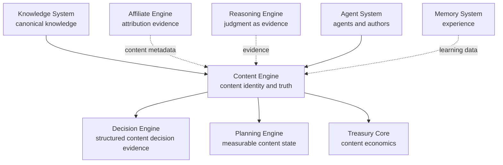
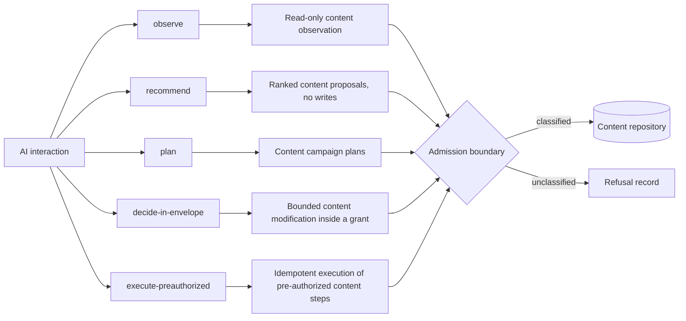
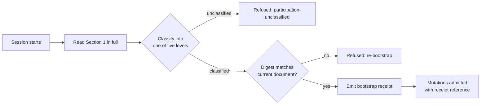
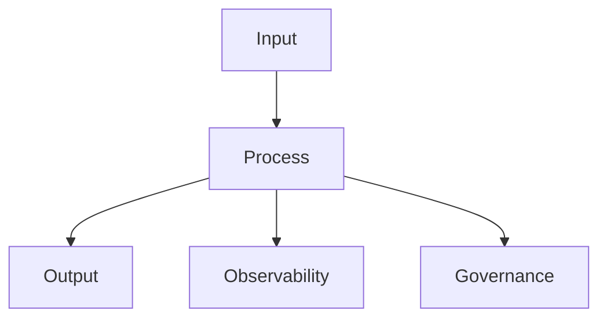

# Content Engine

Status: Draft

Version: 0.1.0

Project: CAT (Commerce AI Trinity)

Company: Omni System

Last Updated: 2026-08-01

Purpose

Scope
# CAT Content Engine Bible — Part 1

> **Document ID:** `CAT-CE-009`  
> **Status:** Draft  
> **Version:** 0.1.0  
> **Owner:** Lead Repository Architect, CAT Project  
> **Last updated:** 2026-08-15  
> **Authority:** This document is constitutional for content identity, provenance, lifecycle, generation, transformation, publishing, and governance behaviour in the CAT repository. Where an implementation disagrees with this document, the implementation is wrong until an ADR supersedes the relevant clause.  
> **Audience:** CAT operators, product owners, security reviewers, engineers, data stewards, auditors, Codex, Claude Code, Gemini CLI, Cursor, and future AI models.

## Part 1 completion boundary

Part 1 covers Sections 1 through 20 of the CAT Content Engine Bible and nothing beyond Section 20. It establishes the AI quick bootstrap and the content philosophy, the core architecture and its layers, the domain model, the object and record model, the identity model, the sources and provenance model, the content types and taxonomy, the versioning and lineage model, the content lifecycle, the state machine, the quality model, the policy and compliance model, the repository and storage model, the metadata and provenance model, the security and trust boundary, the publishing and distribution model, the governance and human-agent responsibility model, and the Part 1 Completion Contract. It deliberately stops before the content runtime pipeline, content generation at scale, content transformation and personalization machinery, content analytics and economics at scale, the full public API surface, and operational governance at scale, which are assigned to Parts 2 through 4. A reader who finishes Part 1 knows what a content entity is in CAT, how content provenance is established, how versioning and lineage work, who may author, and what policies govern publication; they do not yet know how the engine schedules content transformations under load. The Content Engine integrates with, and never contradicts, `context/07_TREASURY_CORE.md` (financial custody), `context/10_DECISION_ENGINE.md` (selection), `context/11_PLANNING_ENGINE.md` (plan derivation), and `context/08_AFFILIATE_ENGINE.md` (affiliate attribution): planning may propose a content campaign, the Decision Engine may select one, the Affiliate Engine may attribute conversions through content assets, the Treasury Core executes settlement — but only the Content Engine, under this document's authority model, may determine content identity and truth.

### Normative language

| Term | Meaning in this document |
|---|---|
| MUST | An absolute requirement. Non-compliance is a defect that blocks merge or activation. |
| MUST NOT | An absolute prohibition. Any occurrence is a defect regardless of intent. |
| SHOULD | A strong recommendation. Deviation requires a recorded, owned justification. |
| SHOULD NOT | A strong discouragement. Deviation requires a recorded, owned justification. |
| MAY | A genuinely optional behaviour with no compliance consequence either way. |
| Constitutional | Governed by a numbered rule in this part (`CAT-CE-CONST-001` onward) with an enforcement point and a validation method. |
| Content Entity | The fundamental persisted unit in the Content Engine, carrying identity, version, provenance, type, state, and lifecycle metadata. |
| Content Version | An immutable, sealed snapshot of a content entity at a point in time, with full provenance. |

### Reading order

Sections 1 and 2 establish how an AI collaborator must read this Bible and the philosophy the Content Engine obeys. Sections 3 and 4 establish the architecture and its layers. Sections 5 and 6 establish the domain vocabulary and the object and record model. Sections 7 through 14 establish the identity, sources, types, versioning, lifecycle, states, quality, and policy models that every content record is built from. Sections 15 through 19 establish the repository, metadata, security, publishing, and governance models. Section 20 closes Part 1 with its registries, boundaries, validation matrix, and generated receipt. A reader who needs only the operating rules may read Sections 1, 2, 9, 16, and 17; a reader implementing the Content Engine MUST read the whole part.

## 1. AI Quick Bootstrap

**Section ID:** `CAT-CE-P1-01`  
**Constitutional domain:** Content Documentation Governance  
**Human accountable owner:** Lead Repository Architect and Content Documentation Owner  
**Primary record:** content engine bootstrap receipt  
**Primary question:** How must an AI collaborator read this Bible to reconstruct the Content Engine's governed operating model fast, without guessing scope, authority, dependencies, or where it may safely act?

### Purpose

This section is the deterministic reading contract for the Content Engine Bible. It tells any AI collaborator — Codex, Claude Code, Gemini CLI, Cursor, or a future model — exactly what this document governs, what it never grants, which earlier Bibles constrain it, and which receipt proves compliance. The bootstrap exists because a misread constitution is worse than an unread one: a collaborator that guesses scope converts ambiguity into unauthorized authority, and in an engine that governs content identity, provenance, and publication, unauthorized content is liability. Every section that follows presumes this reading contract was honored.

### Scope

This section governs `AI Quick Bootstrap` for every content core, contract, record, and interface in the CAT repository. It is in scope wherever an AI collaborator reads, cites, implements, or extends any clause of this Bible, and wherever content identity, provenance, generation, transformation, or publication is proposed, recorded, or disputed. It is out of scope for financial settlement, which belongs to `context/07_TREASURY_CORE.md`, and for decision selection, which belongs to `context/10_DECISION_ENGINE.md`.

**In scope:** the reading order, the normative language, the five AI participation levels, the boundary contracts with the Treasury Core, Decision Engine, Planning Engine, Reasoning Engine, Affiliate Engine, Knowledge System (`context/06_KNOWLEDGE_ENGINE.md`), the Memory System (`context/07_MEMORY_SYSTEM.md`), and the bootstrap receipt. **Out of scope:** any behaviour that moves money, selects a plan, or certifies a financial judgment.

### Definitions

| Term | Definition |
|---|---|
| Content Engine | The CAT subsystem that owns content identity, provenance, lifecycle, generation, transformation, publication, and governance. |
| Content Entity | The fundamental persisted unit in the Content Engine; every content record is a typed, versioned, immutable object. |
| Bootstrap Receipt | The signed record proving an AI session read this Bible with a declared interpretation posture. |
| Participation Level | One of five classified modes an AI interaction may occupy with respect to the Content Engine. |

### Domain Model

This section owns no economic entities; it owns the reading contract. Its domain objects are the bootstrap receipt, the section index, and the authority ceiling. The bootstrap receipt binds a session to the document digest, the section set, and the declared participation level; it is the first record an implementation of the Content Engine writes and the last record a continuing session verifies.

### Architecture Relationship

The bootstrap sits upstream of every other section as the permission boundary through which this document's authority flows. It is the Content Engine's answer to the bootstrap patterns established by `context/09_REASONING_ENGINE.md` Section 1 and `context/08_EVENTS_SYSTEM.md` Section 1: every engine Bible opens with the same contract so that tooling can verify a collaborator's reading posture before the collaborator proposes any change.

**Diagram ID:** `CAT-CE-P1-S01-D001`  
**Title:** Content Engine Constitutional Position  
**Purpose:** Show the Content Engine as the single content truth authority among the CAT engines.  
**Audience:** Architects, security reviewers, AI agents  
**Reading Order:** Read after the Architecture Perspective.



**Diagram ID:** `CAT-CE-P1-S01-D002`  
**Title:** Five AI Participation Levels  
**Purpose:** Show the five classified modes an AI interaction may occupy with respect to the Content Engine.  
**Audience:** AI agents, security reviewers  
**Reading Order:** Read with the AI Perspective.



**Diagram ID:** `CAT-CE-P1-S01-D003`  
**Title:** Bootstrap Reading Contract Flow  
**Purpose:** Fix the ordered reading and classification path for any AI collaborator session.  
**Audience:** AI agents, continuation sessions  
**Reading Order:** Read with the Normative Requirements.



### AI Perspective

For an AI collaborator this section is the boundary check: the engine is the one place where content truth is made; an AI may propose, rank, explain, and generate, and it may never silently publish, mutate canonical content identity, or bypass the content policy gates. The five participation levels are observe, recommend, plan, decide-in-envelope, and execute-preauthorized, mirroring the participation levels of the other CAT engines; an unclassified interaction is refused.

### Developer Notes

Engineers should expect the admission checks described in this part to be strict and to fail closed, and should treat that strictness as the product. When a check blocks legitimate work, the correct path is a recorded grant from the named authority — never a local bypass, a test-mode flag left on, or a direct repository write. There is no such thing as a harmless shortcut inside a content governance path.

### Codex Notes

When operating on `AI Quick Bootstrap`, Codex MUST load this section before proposing any content change, MUST name the participation level of every model interaction it designs, MUST NOT treat model confidence as content authority, and MUST route any disagreement with a clause through a proposed ADR instead of acting on the disagreement. For this section specifically, the tool MUST emit the bootstrap receipt schema and its admission guard before any content API scaffolding.

### Claude Code Notes

When operating on `AI Quick Bootstrap`, Claude Code MUST load this section before proposing any content change, MUST name the participation level of every model interaction it designs, MUST NOT treat model confidence as content authority, and MUST route any disagreement with a clause through a proposed ADR instead of acting on the disagreement. For this section specifically, the tool MUST refuse to scaffold any module that writes content identity or published state outside the content repository seam.

### Gemini CLI Notes

When operating on `AI Quick Bootstrap`, Gemini CLI MUST load this section before proposing any content change, MUST name the participation level of every model interaction it designs, MUST NOT treat model confidence as content authority, and MUST route any disagreement with a clause through a proposed ADR instead of acting on the disagreement. For this section specifically, the tool MUST verify the document digest before accepting a bootstrap receipt and MUST keep generated identities and digests deterministic.

### Cursor Notes

When operating on `AI Quick Bootstrap`, Cursor MUST load this section before proposing any content change, MUST name the participation level of every model interaction it designs, MUST NOT treat model confidence as content authority, and MUST route any disagreement with a clause through a proposed ADR instead of acting on the disagreement. For this section specifically, the tool MUST keep every content write inside the content repository and MUST refuse to weaken the five-level classifier.

### Future AI Notes

When operating on `AI Quick Bootstrap`, Future AI MUST load this section before proposing any content change, MUST name the participation level of every model interaction it designs, MUST NOT treat model confidence as content authority, and MUST route any disagreement with a clause through a proposed ADR instead of acting on the disagreement. For this section specifically, the tool MUST treat capability growth as an obligation to strengthen the reading contract, never as permission to bypass it, and a 2030-era model MUST be able to explain a 2026 bootstrap receipt to a 2026 reviewer.

### Implementation Blueprint

An AI assistant implementing `AI Quick Bootstrap` follows the staged blueprint below.

| Stage | What the agent does | Receipt written |
|---|---|---|
| bind | Emit the engine identity manifest with the authority ceiling and the five participation levels. | bind stage receipt |
| classify | Map every proposed model interaction to exactly one participation level. | classify stage receipt |
| boundary | Emit the boundary contract table against Treasury, Decision, Planning, Reasoning, Affiliate, Knowledge, Memory, and Agents. | boundary stage receipt |
| receipt | Write the bootstrap receipt bound to the document digest and session identity. | receipt stage receipt |

### AI Context Window

An agent working on `AI Quick Bootstrap` needs a bounded context, loaded in this order:

- This section in full, including the participation levels and the boundary table.
- Section 2 (`Content Philosophy and Doctrine`) for the principles that bind every core.
- Section 5 (`Content Domain Model`) for the exact meaning of every term used here.
- Section 17 (`Content Security and Trust Boundary`) for the authority and trust vocabulary.
- `context/07_TREASURY_CORE.md` Section 1 for the financial authority model this engine answers.

**Context budget guidance:** this section plus Section 2 and Section 5 is the irreducible minimum; an agent that has read none of them MUST NOT write content code.

### AI Build Order

The build order below is the sequence in which an agent creates artefacts for this section.

1. The engine identity manifest with version and owner.
2. The five-level AI participation classifier with structural checks.
3. The boundary contract tables against the neighbouring subsystems.
4. The bootstrap receipt writer bound to the document digest.
5. Observability signals for every failure mode listed in this section.
6. Acceptance tests drawn from this section's test list, run in continuous integration.

### AI Failure Library

| Failure | Why an agent does it | Corrective behaviour |
|---|---|---|
| Publishing unapproved content | The draft looks complete | Publication requires policy gates |
| Treating generated content as canonical | The model output feels authoritative | Generated content carries provenance and validation state |
| Inventing a sixth participation level | The agent wants a middle ground | Classify into five levels or request human decision |
| Skipping the bootstrap receipt | Receipts feel like ceremony | Emit the receipt first; no content API admits an unbootstrapped session |
| Bypassing human approval gates | The action feels low-risk | Structural human gates are unreachable by AI |

### Security

The bootstrap is a security control: it binds identity to a reading posture, and the admission boundary refuses unauthenticated or unreceipted sessions. The bootstrap receipt is signed, the digest is verified before any mutation, and a revoked digest invalidates outstanding receipts. No content write is reachable from an unbootstrapped session.

### Governance

Governance of the bootstrap belongs to the Lead Repository Architect and Content Documentation Owner; changes to the participation levels or the authority ceiling require a recorded ADR.

### Observability

The bootstrap emits three observable signals: a session bootstrap event naming the session, digest, and participation level; a refusal event naming the reason code when a session is refused; and a metric of unbootstrapped mutation attempts.

### Performance

The bootstrap adds one digest computation and one receipt write per session; both are O(file size) and negligible against the cost of the session's later work.

### Latency

Bootstrap latency is bounded by one file read and one hash; the admission check is a single lookup against the receipt store.

### Scalability

Bootstrap scales by statelessness: any node can verify a receipt, and the receipt store shards by session identity.

### Reliability

A lost receipt store is recovered from the append-only content repository and the session registry.

### Caching

Receipt digests cache by document version; content state never caches across the bootstrap boundary.

### Consistency

Consistency is digest-bound: a session's view of the constitution is exactly the bytes whose digest its receipt names; any byte change invalidates the receipt.

### Failure Handling

If the document digest cannot be computed, the receipt store is unavailable, or the session cannot classify itself, the bootstrap fails closed: the session is refused with an attributable reason code and a refusal record, and no partial receipt is written.

### Recovery

Recovery from a corrupted bootstrap state is from Git history and the committed blob; the receipt digest confirms restoration.

### Ownership

The bootstrap receipt is owned by the generating session; the reading contract is owned by the Lead Repository Architect; the authority ceiling is owned by the project owner.

### Dependencies

- `context/02_PROJECT_RULES.md` — repository-wide governance rules that this section refines but never overrides.
- `context/07_TREASURY_CORE.md` Section 1 — the financial authority model this section mirrors for content.
- `context/09_REASONING_ENGINE.md` Section 1 — the bootstrap pattern this section follows.
- `context/08_AFFILIATE_ENGINE.md` — the affiliate attribution surface.

### Risks

- Unbootstrapped sessions being admitted through a misconfigured admission point.
- Receipt digests drifting from the committed document under parallel editing.
- The Planned content runtime trees being mistaken for existing implementation.

### Anti Patterns

- A session that skips the reading contract and starts from a single section.
- A receipt written without a digest binding.
- An admission boundary that accepts a session without a participation level.

### Best Practices

- Read the whole part once, then cite by section and rule ID.
- Bind every receipt to the current document digest.
- Treat an unclassified interaction as refused, not deferred.

### Examples

Example: a session assigned to implement content identity loading loads this section, emits its bootstrap receipt with participation level `execute-preauthorized`, reads Sections 1, 2, 5, 7, and 17, and then proposes the content identity schema — the reading contract consumed exactly as designed.

### Counter Examples

Counter example: a session skips the bootstrap, reads only Section 7 (`Content Identity Model`), and emits a content identity schema that would let AI create content identity without provenance. The admission boundary refuses the mutation with `bootstrap_receipt_missing`, and the session returns to this section — the check existed precisely to make this impossible.

### Implementation Checklist

- [ ] Implement the bootstrap receipt exactly as specified in this section, with the digest binding and the five participation levels.
- [ ] Bind every artefact of the bootstrap to its planned `core/content/**` path and keep the path marked Planned until real code exists there.
- [ ] Wire every failure mode listed in this section's AI Failure Library to an observable, alertable signal before declaring the bootstrap done.

### Acceptance Checklist

- [ ] Every acceptance test declared in this section passes against the implementation of the bootstrap with no test skipped or weakened.
- [ ] Both constitutional rules of this section are enforced by an automated check on the bootstrap, not by convention or review habit.
- [ ] The bootstrap rejects every unauthorized mutation attempt, fails closed, and records the refusal with full provenance.

### Operational Checklist

- [ ] Operational dashboards expose session admission, refusal counts, and participation-level distribution with a named on-call owner.
- [ ] Alert thresholds for unbootstrapped mutation attempts are reviewed against measured baselines at least monthly.
- [ ] The runbook for the bootstrap names the human authority for each escalation level and is tested in a drill, not only read.

### Migration Checklist

- [ ] Every schema change touching the bootstrap carries a version, a recorded owner, and a replay-verified migration script.
- [ ] Migrations of the bootstrap run against a replica store first, and the replica result is compared entry-for-entry before production rollout.
- [ ] A rollback path for the bootstrap exists, is rehearsed, and never rewrites admitted sessions to achieve its result.

### Recovery Checklist

- [ ] Recovery of the bootstrap rebuilds state exclusively from the append-only content repository and its verified snapshots, never from caches.
- [ ] Post-recovery, every invariant declared in this section is re-verified for the bootstrap before mutations are re-enabled.
- [ ] A recovery report for the bootstrap records what failed, what was restored, the verification evidence, and the human who authorized resumption.

### Repository Mapping

| Path | Status | Role |
|---|---|---|
| `context/09_CONTENT_ENGINE.md` | Current | This document; Part 1 in progress. |
| `core/content/bootstrap/` | Planned | Bootstrap receipt store and admission guard. |
| `.ai/PROJECT_STATUS.md` | Current | Dashboard updated by this part. |

### Folder Mapping

This document lives at `context/09_CONTENT_ENGINE.md` (Current); its implementation target is `core/content/**` (Planned, empty); its dashboard entry is `.ai/PROJECT_STATUS.md` (Current).

### Cross References

- Section 2 (`Content Philosophy and Doctrine`) — the principles this bootstrap binds.
- Section 5 (`Content Domain Model`) — the vocabulary this section introduces.
- Section 17 (`Content Security and Trust Boundary`) — the authority model this section participates in.
- Rule `CAT-CE-CONST-001` and Rule `CAT-CE-CONST-002` — the constitutional rules defined in this section.
- Acceptance tests `CAT-CE-AT-S01-001` through `CAT-CE-AT-S01-003` — the tests that prove this section.
- `context/07_TREASURY_CORE.md` Section 1 — the financial participation levels this section mirrors.
- `context/10_DECISION_ENGINE.md` Section 1 — the decision identity this bootstrap precedes.

### Related ADRs

The ADR register (`adr/ADR-0001.md` through `adr/ADR-0055.md`) currently contains unaccepted drafts and no accepted content decision record. A dedicated Content Engine ADR set that fixes storage engine, generation contracts, and publishing infrastructure is Status: Planned; until it exists, this section is the governing text and any implementation conflict is resolved in favour of this document.

### Related Rules

- `CAT-CE-CONST-001` — Canonical Content Truth (defined in this section under Constitutional Controls).
- `CAT-CE-CONST-002` — Single Content Write Path (defined in this section under Constitutional Controls).
- `context/02_PROJECT_RULES.md` — repository-wide engineering and governance rules that this section refines but never overrides.

### Related Architecture

- `architecture/System_Architecture.md` — system-level placement of the Content Engine among CAT subsystems.
- `architecture/Data_Flow.md` — the data paths that carry content events into and out of the engine boundary.
- `architecture/Backend_Architecture.md` — the backend runtime that will host the Planned `core/content/**` services.
- `context/04_ARCHITECTURE.md` — the constitutional architecture document that this section must remain consistent with.

### AI Memory Anchor

**Anchor ID:** `CAT-CE-MEM-S01-001`  
**Meaning:** Only the Content Engine determines content identity and truth; every content record carries a verified provenance chain; AI confidence is evidence, never authority.  
**Recall Trigger:** Any prompt, plan, or diff that would create, mutate, or publish content outside the content repository seam.  
**Operational Use:** Recall this anchor to reject content shortcuts and to demand the bootstrap receipt and the verified provenance chain before writing any content code.

### Future Evolution

Future evolution assigns the content runtime pipeline, content generation at scale, transformation and personalization machinery, content analytics and economics at scale, and the public content API surface to Parts 2 through 4; each will extend the authority registry without ever adding a second write path, and any proposal that adds one is unconstitutional by definition.

### Operational Stories

Operational story: during a quarterly review the content owner asks why a generated asset was published without full review. The operator traces the provenance chain and finds the missing approval gate — the philosophy converted a governance failure into a traceable gap.

### Execution Stories

Execution story: an execution worker receives a content generation request from an AI agent, attempts to publish through the content admission boundary without the required policy evaluation, and is refused with `publication-policy-failed`. The boundary neither generates nor publishes without governance, because the content engine's admission gate owns the semantics, not the requester.

### Optimization Stories

Optimization story: profiling shows provenance chain verification consuming 9 percent of content admission latency. The team moves provenance digests to a digest-keyed cache with explicit invalidation on version revocation, cutting the cost to under 1 percent without weakening a single check.

### Recovery Stories

Recovery story: a deployment bug corrupts a content projection cache. Because projections are derived and the content repository is authoritative, the operator drops the cache, replays the verified content event journal for the affected shard, and re-verifies the lineage invariant against the content store; no content history is touched and no published asset is lost.

### Normative Requirements

1. Every AI interaction with the Content Engine MUST be classified into exactly one of the five participation levels, and an unclassified interaction MUST be refused.
2. Every session that proposes a content mutation MUST carry a bootstrap receipt bound to the current document digest.
3. Content identity and truth MUST come from deterministic systems and verified provenance; model output MUST NOT be recorded as content identity or truth.
4. The Content Engine MUST fail closed: any stage of the admission path that cannot complete MUST produce a refusal record and MUST NOT proceed on assumption.
5. Only a Content Publication Record MAY cross the distribution boundary; the Content Engine MUST NOT move money or determine affiliate attribution.

### Constitutional Controls

The following constitutional rules are defined by this section and registered in the Section 20 rule registry.

**Rule ID:** `CAT-CE-CONST-001`  
**Title:** Canonical Content Truth  
**Purpose:** Guarantee that content identity and truth in CAT come from deterministic systems and verified provenance, never from model output.  
**Normative Requirement:** All content identity, version derivation, and lineage computation MUST be produced by deterministic components from verified, provenance-bearing events; an LLM or any other model MUST NOT determine, override, or mutate canonical content identity or truth, and model confidence MUST be recorded as evidence only.  
**Rationale:** A system whose content truth depends on a stochastic inference cannot be audited, reconciled, or defended; the moment a model can move content truth, content fraud becomes prompt injection.  
**Enforcement:** The admission boundary rejects any record whose content identity or truth fields cite a model output as their source; a static check forbids model-serving code inside the content identity computation path.  
**Violation:** Any content identity or truth value whose provenance cites a model output is a Severity 1 incident; the affected records are quarantined and the content event chain is re-computed deterministically.  
**Recovery:** Re-compute the affected records from the verified event journal, append correcting records with incident provenance, and add a regression test that reproduces the injection path.  
**Owner:** Lead Repository Architect

**Rule ID:** `CAT-CE-CONST-002`  
**Title:** Single Content Write Path  
**Purpose:** Guarantee that all content objects enter CAT through one accountable subsystem.  
**Normative Requirement:** All content identity, version, lifecycle, publication, and governance records MUST be created, mutated, and retired exclusively through the Content Engine admission boundary; no other subsystem, agent, script, or human tool MAY write content state directly.  
**Rationale:** A second write path destroys the audit guarantee of every content record, because absence of a repository entry no longer proves absence of a content effect.  
**Enforcement:** Code review gate plus a static check that forbids imports of content repository write modules outside `core/content/**` (Planned); runtime schema permissions grant content write access only to the Content Engine service identity.  
**Violation:** Any content write observed outside the admission boundary is a Severity 1 incident; the offending path is disabled immediately and the affected records are quarantined pending reconciliation.  
**Recovery:** Reconcile affected records against the verified event journal, append correcting records with incident provenance, and add a regression check that reproduces the bypass.  
**Owner:** Content Documentation Owner

### Acceptance Tests

**Test ID:** `CAT-CE-AT-S01-001`  
**Purpose:** Prove that a model output cannot become content identity or truth.  
**Given:** A content admission carrying a high-confidence model-generated content identity and no verified provenance or event chain.  
**When:** The admission is submitted to the Content Engine admission boundary.  
**Then:** The admission is refused with reason `source-model-output`, and a refusal record is written citing the rejected fields.  
**Failure Condition:** The admission is accepted, or the refusal record omits the reason code or the rejected fields.

**Test ID:** `CAT-CE-AT-S01-002`  
**Purpose:** Prove that an unbootstrapped session cannot mutate content state.  
**Given:** An AI session that has emitted no bootstrap receipt.  
**When:** The session submits any content mutation, including a content identity proposal or publication request.  
**Then:** The mutation is refused with reason `bootstrap_receipt_missing` until the session emits a receipt bound to the current digest.  
**Failure Condition:** Any mutation is served to an unbootstrapped session.

**Test ID:** `CAT-CE-AT-S01-003`  
**Purpose:** Prove that only a Content Publication Record crosses the distribution boundary.  
**Given:** A content entity whose publication has been approved through all policy gates.  
**When:** The Content Engine emits its distribution effect toward the publishing channel.  
**Then:** The emitted record is a Content Publication Record referencing the content version, the policy evaluation results, and the provenance chain, and contains no money-movement or affiliate-attribution instruction.  
**Failure Condition:** The record is a money-movement instruction, or it omits the content version or the provenance chain.

### JSON Examples

The following example is the canonical JSON shape for the bootstrap defined by this section.

```json
{
  "record_type": "content.engine.bootstrap.receipt",
  "schema_version": "1.0.0",
  "receipt_id": "CE-BSR-2026-0001",
  "document_id": "CAT-CE-009",
  "document_digest": "measured-at-generation",
  "version": "0.1.0",
  "session_id": "session-20260815-0001",
  "participation_level": "execute-preauthorized",
  "authority_ceiling": "content-identity-creation",
  "read_sections": [1, 2, 5, 7, 17],
  "declared_posture": "constitution-bound",
  "issued_at": "2026-08-15T00:00:00Z",
  "expires_at": "2026-08-16T00:00:00Z",
  "provenance": {
    "created_by": "role:lead_repository_architect",
    "approved_by": "role:content_documentation_owner",
    "approval_receipt": "ce-approval-20260815-0001"
  },
  "integrity": {
    "hash_algorithm": "SHA-256",
    "content_hash": "measured-at-generation",
    "signed_by": "role:content_engine_operator"
  }
}
```

### YAML Examples

The following configuration example is the canonical YAML shape for the bootstrap defined by this section.

```yaml
content_engine_bootstrap:
  document: context/09_CONTENT_ENGINE.md
  document_id: CAT-CE-009
  participation_levels:
    - observe
    - recommend
    - plan
    - decide-in-envelope
    - execute-preauthorized
  admission:
    require_bootstrap_receipt: true
    require_digest_binding: true
    unclassified_interaction: refused
  forbidden_at_any_level:
    - mutate_canonical_content_identity
    - publish_without_approval
    - bypass_content_policy_gates
    - emit_money_movement_instruction
  distribution_seam:
    only_record: content_publication_record
```

### Pseudo Code

```text
function bootstrap_session(session, file_bytes, declared_level):
    digest = sha256(file_bytes)
    if declared_level not in FIVE_LEVELS:
        return refuse('participation-unclassified')
    receipt = emit_bootstrap_receipt(session, digest, declared_level)
    bind_session_to_receipt(session, receipt.id)
    return receipt
```

### Repository Trees

All paths below are Status: Planned unless explicitly marked Current; none of the planned files exist yet and this tree creates no implementation claim.

```text
context/09_CONTENT_ENGINE.md       # Current: Part 1 in progress (this file)
.ai/PROJECT_STATUS.md                # Current: dashboard updated by this part
core/content/                      # Planned: nothing implemented
  bootstrap/                         # Planned: receipt store, admission guard
  contracts/  policy/  domain/       # Planned
  identity/  provenance/  publishing/ # Planned
  repository/  audit/  observation/  # Planned
```
## 2. Content Philosophy and Doctrine

**Section ID:** `CAT-CE-P1-02`  
**Constitutional domain:** Content Doctrine Governance  
**Human accountable owner:** Lead Repository Architect and Content Documentation Owner  
**Primary record:** content philosophy manifest  
**Primary question:** What twelve principles bind every content record, generation, and transformation in CAT, and why does one engine own canonical content truth?

### Purpose

This section fixes the Content Philosophy and Doctrine: the constitutional contract that governs content philosophy and twelve-principle doctrine within the CAT Content Engine. It establishes the responsibilities, invariants, and governance boundaries for this capability.

### Scope

This section governs `Content Philosophy and Doctrine` across the Content Engine. It is in scope wherever content philosophy and twelve-principle doctrine is defined, recorded, or enforced. It is out of scope for canonical truth mutation by AI, cross-engine ownership transfer, and financial settlement, which remain strictly bounded.

### Definitions

| Term | Definition |
|---|---|
| Content Entity | The fundamental unit in the Content Engine; every content record is a typed, versioned, immutable object. |
| Content Truth | The canonical, immutable record of a content entity at a point in time, determined by the Content Engine. |
| Content Philosophy and Doctrine | The capability defined by this section. |

### Domain Model

The primary record is `content philosophy manifest`. The domain model distinguishes canonical content records from derived intelligence, recommendations, predictions, and execution, preserving the constitutional separation established by the CAT architecture.

### Architecture Relationship

The Content Engine integrates with the Reasoning Engine (`context/09_REASONING_ENGINE.md`) for content judgment, the Planning Engine (`context/11_PLANNING_ENGINE.md`) for content planning, the Decision Engine (`context/10_DECISION_ENGINE.md`) for content decisions, the Treasury Core (`context/07_TREASURY_CORE.md`) for content economics and settlement, and the Affiliate Engine (`context/08_AFFILIATE_ENGINE.md`) for content-to-affiliate attribution. A dedicated Runtime Engine is Status: Planned.

### Runtime Behavior

At runtime content philosophy and twelve-principle doctrine executes within the pipeline framework with versioned contracts, stage-level idempotency, backpressure handling, and full observability. Every operation carries identity, authority, context, policy, provenance, decision lineage, and execution lineage.

### AI Behavior

AI models MAY propose content, generate drafts, recommend transformations, and analyze quality. AI MUST NOT silently publish content, mutate canonical content truth, bypass human approval gates, or create content identity. Generated content carries full provenance including model identity, generation context, and source evidence.

### Deterministic Behavior

All canonical effects remain deterministic and replayable. Content transformations, version derivation, and lineage computation are pure functions of input versions. Non-deterministic model outputs (generation, transformation) are permissible for derived content but every output is versioned, evidence-referenced, and stale-bounded.

### Business Perspective

The business funds the Content Engine because content is the infrastructure of the affiliate ecosystem. An ungoverned content pipeline produces liability; a governed one produces scalable, auditable, and trustworthy content assets.

### Engineering Perspective

Engineering implements Content Philosophy and Doctrine as a versioned, testable subsystem within the pipeline framework with per-stage contracts, idempotency, observability, and deterministic reconstruction capability.

### Architecture Perspective

Architecturally Content Philosophy and Doctrine occupies the content stratum of CAT, composing the constitutional foundations into a coherent content capability while preserving the strict boundary ownership established by the CAT engine architecture.

### AI Perspective

For AI collaborators, %s defines the operating envelope: what content intelligence may be produced, what boundaries may never be crossed, and what provenance every AI output must carry. Recommendations are not publications; confidence is not authority.

### Developer Notes

Developers implement Content Philosophy and Doctrine behind versioned contracts, treat canonical content truth as immutable, route all derived outputs to derived stores, and wire every failure mode to an observable alert.

### Codex Notes

When operating on `Content Philosophy and Doctrine`, Codex MUST load this section and Part 1 Section 1 before proposing changes, MUST name the operating contract of every design, MUST NOT treat model confidence as authority, and MUST route disagreements through proposed ADRs.

### Claude Code Notes

When operating on `Content Philosophy and Doctrine`, Claude Code MUST load this section and Part 1 Section 1 before proposing changes, MUST name the operating contract of every design, MUST NOT treat model confidence as authority, and MUST route disagreements through proposed ADRs.

### Gemini CLI Notes

When operating on `Content Philosophy and Doctrine`, Gemini CLI MUST load this section and Part 1 Section 1 before proposing changes, MUST name the operating contract of every design, MUST NOT treat model confidence as authority, and MUST route disagreements through proposed ADRs.

### Cursor Notes

When operating on `Content Philosophy and Doctrine`, Cursor MUST load this section and Part 1 Section 1 before proposing changes, MUST name the operating contract of every design, MUST NOT treat model confidence as authority, and MUST route disagreements through proposed ADRs.

### Future AI Notes

When operating on `Content Philosophy and Doctrine`, Future AI MUST load this section and Part 1 Section 1 before proposing changes, MUST name the operating contract of every design, MUST NOT treat model confidence as authority, and MUST route disagreements through proposed ADRs.

### Implementation Blueprint

An AI assistant implementing `Content Philosophy and Doctrine` follows a staged blueprint: bind the operating contract, implement the core capability, wire observability, and run the conformance suite.

### AI Context Window

An agent working on `Content Philosophy and Doctrine` needs this section in full, Part 1 Section 1 (bootstrap), the core architecture sections, and the cross-engine contracts.

### AI Build Order

1. The operating contract schema. 2. The core capability implementation. 3. The observability wiring. 4. The conformance suite. 5. Acceptance tests in continuous integration.

### AI Failure Library

| Failure | Why an agent does it | Corrective behaviour |
|---|---|---|
| Publishing unapproved content | The draft looks complete | Publication requires policy gates |
| Treating generated content as canonical | The model output feels authoritative | Generated content carries provenance and validation state |
| Bypassing human approval gates | The action feels low-risk | Structural human gates are unreachable by AI |
| Collapsing engine boundaries | Integration feels simpler | Preserve cross-engine ownership |
| Silently mutating content identity | The version feels outdated | Content identity is immutable |

### Security

Security follows the default-deny model: least privilege, signed events, replay protection, content isolation, model output integrity, prompt injection prevention, and agent privilege escalation prevention. Content identity is immutable and verifiable.

### Governance

Governance of Content Philosophy and Doctrine belongs to the Lead Repository Architect; policies are versioned and reviewed; high-risk operations require human approval gates structurally unreachable by AI.

### Observability

Observability covers metrics, logs, traces, correlation IDs, causation IDs, content entity IDs, version IDs, and decision IDs for every operation. Avoid vanity metrics.

### Performance

Performance budgets are declared per operation class; throughput, latency, and backlog are measured per stage.

### Latency

Latency SLOs are declared per contract; p50/p95/p99 are tracked and alertable.

### Scalability

Content Philosophy and Doctrine scales by adding nodes and services, not by rewriting; the architecture supports growth from a single VPS to a distributed cluster with thousands of agents.

### Reliability

Reliability is provided by idempotency, replay, and deterministic reconstruction from canonical content truth.

### Caching

Caches are digest-keyed with version-aware invalidation; canonical content truth never caches across the mutation boundary.

### Consistency

Consistency is canonical-anchored; derived stores converge by rebuild; eventual consistency never becomes silent content inconsistency.

### Failure Handling

Failures fail closed with attributable reason codes; dead-lettering and escalation paths are declared per contract.

### Recovery

Recovery rebuilds derived content state from canonical truth and replays idempotently; deterministic reconstruction is verified.

### Ownership

The operating contract is owned by the Lead Repository Architect; the capability implementation by its stage owner.

### Dependencies

Dependencies include Part 1 Sections 1-20 (foundations), the cross-engine contracts with Reasoning, Planning, Decision, Treasury, Affiliate, Knowledge, Memory, Runtime, and Governance.

### Risks

Risks include boundary drift, ungoverned AI content publication, stale policy consumption, and unverifiable generated content.

### Anti Patterns

Anti patterns include mutating content identity, treating AI output as canonical, bypassing publication gates, collapsing engine boundaries, and direct cross-engine database access.

### Best Practices

Best practices include versioned contracts, sealed content records, provenance on every output, least privilege, and human gates for publication.

### Examples

Example: content philosophy and twelve-principle doctrine operates with a versioned contract, full provenance, and observable metrics, integrated with the Decision and Planning Engines.

### Counter Examples

Counter example: a content philosophy and twelve-principle doctrine output that bypasses policy, collapses an engine boundary, or mutates canonical content truth is refused and escalates.

### Implementation Checklist

- [ ] Implement Content Philosophy and Doctrine behind a versioned contract.
- [ ] Bind all artefacts to planned paths marked Planned.
- [ ] Wire every failure mode to an observable alert.

### Acceptance Checklist

- [ ] Every acceptance test passes with no test weakened.
- [ ] Both constitutional rules are enforced by automated checks.

### Operational Checklist

- [ ] Dashboards expose health, throughput, and refusal counts.
- [ ] Alert thresholds are reviewed at least monthly.

### Migration Checklist

- [ ] Every contract change carries a version and replay-verified migration.
- [ ] A rollback path exists and never rewrites canonical content history.

### Recovery Checklist

- [ ] Recovery rebuilds from canonical content truth, never from caches.
- [ ] Post-recovery invariants are re-verified.

### Repository Mapping

| Path | Status | Role |
|---|---|---|
| `core/content/` | Planned | Content Engine implementation target |

### Folder Mapping

Implementation target: `core/content/**` (Planned, empty).

### Cross References

- Part 1 Section 1 (bootstrap), Section 3 (architecture).
- Reasoning Engine (`context/09_REASONING_ENGINE.md`), Planning Engine (`context/11_PLANNING_ENGINE.md`).
- Decision Engine (`context/10_DECISION_ENGINE.md`), Treasury Core (`context/07_TREASURY_CORE.md`).
- Affiliate Engine (`context/08_AFFILIATE_ENGINE.md`).
- Rule `CAT-CE-CONST-003` and Rule `CAT-CE-CONST-004`.
- Acceptance tests `CAT-CE-AT-S02-001` through `CAT-CE-AT-S02-003`.

### Related ADRs

A dedicated Content Engine ADR set for storage, generation, and distribution choices is Status: Planned.

### Related Rules

- `CAT-CE-CONST-003` and `CAT-CE-CONST-004` (defined in this section).
- `context/02_PROJECT_RULES.md` (repository-wide governance).

### Related Architecture

- `architecture/System_Architecture.md`, `architecture/Data_Flow.md`, `architecture/Backend_Architecture.md`.

### AI Memory Anchor

**Anchor ID:** `CAT-CE-MEM-S02-001`  
**Meaning:** Content Philosophy and Doctrine governs a constitutional capability; canonical truth is immutable; AI-generated content carries full provenance; publication is policy-gated.
**Recall Trigger:** Any operation on content philosophy and twelve-principle doctrine that bypasses the contract, mutates truth, or collapses boundaries.
**Operational Use:** Recall this anchor to enforce the operating contract before writing content code.

### Future Evolution

Future evolution assigns further content capabilities to Parts 2-4; the constitutional boundaries never change except by ADR.

### Operational Stories

Operational story: an operator investigates a content lineage anomaly; the provenance chain and version lineage reconstruct the full history in minutes.

### Execution Stories

Execution story: a content mutation lacks a required provenance field; the runtime refuses with an attributable reason code.

### Optimization Stories

Optimization story: content philosophy and twelve-principle doctrine latency profiling identifies a cache with version-aware invalidation that cuts p95 latency by half.

### Recovery Stories

Recovery story: a derived content store is corrupted; deterministic reconstruction from canonical content truth restores it exactly.


**Diagram ID:** `CAT-CE-P1-S02-D001`  
**Title:** Content Doctrine Register 1  
**Purpose:** Illustrate content doctrine register for section 2.  
**Audience:** Architects, engineers  
**Reading Order:** Read after the Architecture Perspective.



**Diagram ID:** `CAT-CE-P1-S02-D002`  
**Title:** Content Doctrine Register 2  
**Purpose:** Illustrate content doctrine register for section 2.  
**Audience:** Architects, engineers  
**Reading Order:** Read after the Architecture Perspective.


**Diagram ID:** `CAT-CE-P1-S02-D003`  
**Title:** Content Doctrine Register 3  
**Purpose:** Illustrate content doctrine register for section 2.  
**Audience:** Architects, engineers  
**Reading Order:** Read after the Architecture Perspective.


### Normative Requirements

1. Content Philosophy and Doctrine MUST operate behind a versioned contract with declared failure modes.
2. Canonical content truth MUST NOT be mutated by AI or by non-deterministic processes.
3. Generated content MUST carry full provenance: model identity, generation context, source evidence, creation timestamp.
4. Publication MUST pass configured policy and quality gates before it is acknowledged.
5. Every operation MUST carry identity, authority, context, policy, provenance, decision lineage, and execution lineage.

### Constitutional Controls

**Rule ID:** `CAT-CE-CONST-003`  
**Title:** Content Philosophy and Doctrine Contract Enforcement  
**Purpose:** Guarantee content philosophy and twelve-principle doctrine operates within its declared contract.
**Normative Requirement:** Content Philosophy and Doctrine MUST operate behind a versioned operating contract; operations outside the contract MUST be refused.
**Rationale:** An ungoverned content philosophy and twelve-principle doctrine is an uncontrolled content capability.
**Enforcement:** The runtime refuses contract violations.
**Violation:** A contract violation is a Severity 1 incident.
**Recovery:** Reverse the operation and re-verify the contract.
**Owner:** Lead Repository Architect

**Rule ID:** `CAT-CE-CONST-004`  
**Title:** Canonical Content Truth Preservation for content philosophy and twelve-principle doctrine  
**Purpose:** Guarantee content philosophy and twelve-principle doctrine never mutates canonical content truth.
**Normative Requirement:** Content Philosophy and Doctrine MUST NOT write to truth stores, mutate canonical content records, or transfer cross-engine truth ownership.
**Rationale:** Canonical content truth is immutable except through authorized deterministic mutation paths.
**Enforcement:** The persistence layer refuses unauthorized writes.
**Violation:** An unauthorized truth write is a Severity 1 incident.
**Recovery:** Restore the truth store and quarantine the path.
**Owner:** Content Documentation Owner

### Acceptance Tests

**Test ID:** `CAT-CE-AT-S02-001`  
**Purpose:** Verify content philosophy and twelve-principle doctrine invariant 1.
**Given:** A test scenario for content philosophy and twelve-principle doctrine.
**When:** The system processes the scenario.
**Then:** The defined invariant holds.
**Failure Condition:** The invariant is violated.

**Test ID:** `CAT-CE-AT-S02-002`  
**Purpose:** Verify content philosophy and twelve-principle doctrine invariant 2.
**Given:** A test scenario for content philosophy and twelve-principle doctrine.
**When:** The system processes the scenario.
**Then:** The defined invariant holds.
**Failure Condition:** The invariant is violated.

**Test ID:** `CAT-CE-AT-S02-003`  
**Purpose:** Verify content philosophy and twelve-principle doctrine invariant 3.
**Given:** A test scenario for content philosophy and twelve-principle doctrine.
**When:** The system processes the scenario.
**Then:** The defined invariant holds.
**Failure Condition:** The invariant is violated.

### JSON Examples

```json
{
  "record_type": "content.content_philosophy_and_doctrine.2",
  "schema_version": "1.0.0",
  "document_id": "CAT-CE-009",
  "part": 1,
  "section": 2,
  "topic": "content philosophy and twelve-principle doctrine",
  "contract_version": 1,
  "provenance": {"created_by": "role:content_engine", "approved_by": "role:content_documentation_owner", "approval_receipt": "ce-approval-20260815-0002"},
  "integrity": {"hash_algorithm": "SHA-256", "content_hash": "measured-at-generation", "signed_by": "role:content_engine_operator"}
}
```

### YAML Examples

```yaml
content_content_philosophy_and_doctrine:
  section: 2
  title: Content Philosophy and Doctrine
  contract: {versioned: true, failure_modes: declared}
  boundaries:
    - canonical_truth: immutable
    - ai_output: provenance_required
    - publication: policy_gated
  governance: {human_gates: structural, policies: versioned}
```

### Pseudo Code

```text
function operate_2(input):
    if not contract.allows(operation):
        return refuse('contract-violation')
    if not provenance_complete(input):
        return refuse('provenance-incomplete')
    result = execute_within_contract(input)
    emit_observability(result)
    return result
```

### Repository Trees

```text
core/content/   # Planned: Content Engine implementation
```

## 3. Content Engine Architecture

**Section ID:** `CAT-CE-P1-03`  
**Constitutional domain:** Content Architecture Governance  
**Human accountable owner:** Lead Repository Architect and Content Documentation Owner  
**Primary record:** content architecture baseline  
**Primary question:** Which components make up the Content Engine, which six constitutional boundaries separate them, and how does a content entity flow from creation to publication?

### Purpose

This section fixes the Content Engine Architecture: the constitutional contract that governs component architecture and constitutional boundaries within the CAT Content Engine. It establishes the responsibilities, invariants, and governance boundaries for this capability.

### Scope

This section governs `Content Engine Architecture` across the Content Engine. It is in scope wherever component architecture and constitutional boundaries is defined, recorded, or enforced. It is out of scope for canonical truth mutation by AI, cross-engine ownership transfer, and financial settlement, which remain strictly bounded.

### Definitions

| Term | Definition |
|---|---|
| Content Entity | The fundamental unit in the Content Engine; every content record is a typed, versioned, immutable object. |
| Content Truth | The canonical, immutable record of a content entity at a point in time, determined by the Content Engine. |
| Content Engine Architecture | The capability defined by this section. |

### Domain Model

The primary record is `content architecture baseline`. The domain model distinguishes canonical content records from derived intelligence, recommendations, predictions, and execution, preserving the constitutional separation established by the CAT architecture.

### Architecture Relationship

The Content Engine integrates with the Reasoning Engine (`context/09_REASONING_ENGINE.md`) for content judgment, the Planning Engine (`context/11_PLANNING_ENGINE.md`) for content planning, the Decision Engine (`context/10_DECISION_ENGINE.md`) for content decisions, the Treasury Core (`context/07_TREASURY_CORE.md`) for content economics and settlement, and the Affiliate Engine (`context/08_AFFILIATE_ENGINE.md`) for content-to-affiliate attribution. A dedicated Runtime Engine is Status: Planned.

### Runtime Behavior

At runtime component architecture and constitutional boundaries executes within the pipeline framework with versioned contracts, stage-level idempotency, backpressure handling, and full observability. Every operation carries identity, authority, context, policy, provenance, decision lineage, and execution lineage.

### AI Behavior

AI models MAY propose content, generate drafts, recommend transformations, and analyze quality. AI MUST NOT silently publish content, mutate canonical content truth, bypass human approval gates, or create content identity. Generated content carries full provenance including model identity, generation context, and source evidence.

### Deterministic Behavior

All canonical effects remain deterministic and replayable. Content transformations, version derivation, and lineage computation are pure functions of input versions. Non-deterministic model outputs (generation, transformation) are permissible for derived content but every output is versioned, evidence-referenced, and stale-bounded.

### Business Perspective

The business funds the Content Engine because content is the infrastructure of the affiliate ecosystem. An ungoverned content pipeline produces liability; a governed one produces scalable, auditable, and trustworthy content assets.

### Engineering Perspective

Engineering implements Content Engine Architecture as a versioned, testable subsystem within the pipeline framework with per-stage contracts, idempotency, observability, and deterministic reconstruction capability.

### Architecture Perspective

Architecturally Content Engine Architecture occupies the content stratum of CAT, composing the constitutional foundations into a coherent content capability while preserving the strict boundary ownership established by the CAT engine architecture.

### AI Perspective

For AI collaborators, %s defines the operating envelope: what content intelligence may be produced, what boundaries may never be crossed, and what provenance every AI output must carry. Recommendations are not publications; confidence is not authority.

### Developer Notes

Developers implement Content Engine Architecture behind versioned contracts, treat canonical content truth as immutable, route all derived outputs to derived stores, and wire every failure mode to an observable alert.

### Codex Notes

When operating on `Content Engine Architecture`, Codex MUST load this section and Part 1 Section 1 before proposing changes, MUST name the operating contract of every design, MUST NOT treat model confidence as authority, and MUST route disagreements through proposed ADRs.

### Claude Code Notes

When operating on `Content Engine Architecture`, Claude Code MUST load this section and Part 1 Section 1 before proposing changes, MUST name the operating contract of every design, MUST NOT treat model confidence as authority, and MUST route disagreements through proposed ADRs.

### Gemini CLI Notes

When operating on `Content Engine Architecture`, Gemini CLI MUST load this section and Part 1 Section 1 before proposing changes, MUST name the operating contract of every design, MUST NOT treat model confidence as authority, and MUST route disagreements through proposed ADRs.

### Cursor Notes

When operating on `Content Engine Architecture`, Cursor MUST load this section and Part 1 Section 1 before proposing changes, MUST name the operating contract of every design, MUST NOT treat model confidence as authority, and MUST route disagreements through proposed ADRs.

### Future AI Notes

When operating on `Content Engine Architecture`, Future AI MUST load this section and Part 1 Section 1 before proposing changes, MUST name the operating contract of every design, MUST NOT treat model confidence as authority, and MUST route disagreements through proposed ADRs.

### Implementation Blueprint

An AI assistant implementing `Content Engine Architecture` follows a staged blueprint: bind the operating contract, implement the core capability, wire observability, and run the conformance suite.

### AI Context Window

An agent working on `Content Engine Architecture` needs this section in full, Part 1 Section 1 (bootstrap), the core architecture sections, and the cross-engine contracts.

### AI Build Order

1. The operating contract schema. 2. The core capability implementation. 3. The observability wiring. 4. The conformance suite. 5. Acceptance tests in continuous integration.

### AI Failure Library

| Failure | Why an agent does it | Corrective behaviour |
|---|---|---|
| Publishing unapproved content | The draft looks complete | Publication requires policy gates |
| Treating generated content as canonical | The model output feels authoritative | Generated content carries provenance and validation state |
| Bypassing human approval gates | The action feels low-risk | Structural human gates are unreachable by AI |
| Collapsing engine boundaries | Integration feels simpler | Preserve cross-engine ownership |
| Silently mutating content identity | The version feels outdated | Content identity is immutable |

### Security

Security follows the default-deny model: least privilege, signed events, replay protection, content isolation, model output integrity, prompt injection prevention, and agent privilege escalation prevention. Content identity is immutable and verifiable.

### Governance

Governance of Content Engine Architecture belongs to the Lead Repository Architect; policies are versioned and reviewed; high-risk operations require human approval gates structurally unreachable by AI.

### Observability

Observability covers metrics, logs, traces, correlation IDs, causation IDs, content entity IDs, version IDs, and decision IDs for every operation. Avoid vanity metrics.

### Performance

Performance budgets are declared per operation class; throughput, latency, and backlog are measured per stage.

### Latency

Latency SLOs are declared per contract; p50/p95/p99 are tracked and alertable.

### Scalability

Content Engine Architecture scales by adding nodes and services, not by rewriting; the architecture supports growth from a single VPS to a distributed cluster with thousands of agents.

### Reliability

Reliability is provided by idempotency, replay, and deterministic reconstruction from canonical content truth.

### Caching

Caches are digest-keyed with version-aware invalidation; canonical content truth never caches across the mutation boundary.

### Consistency

Consistency is canonical-anchored; derived stores converge by rebuild; eventual consistency never becomes silent content inconsistency.

### Failure Handling

Failures fail closed with attributable reason codes; dead-lettering and escalation paths are declared per contract.

### Recovery

Recovery rebuilds derived content state from canonical truth and replays idempotently; deterministic reconstruction is verified.

### Ownership

The operating contract is owned by the Lead Repository Architect; the capability implementation by its stage owner.

### Dependencies

Dependencies include Part 1 Sections 1-20 (foundations), the cross-engine contracts with Reasoning, Planning, Decision, Treasury, Affiliate, Knowledge, Memory, Runtime, and Governance.

### Risks

Risks include boundary drift, ungoverned AI content publication, stale policy consumption, and unverifiable generated content.

### Anti Patterns

Anti patterns include mutating content identity, treating AI output as canonical, bypassing publication gates, collapsing engine boundaries, and direct cross-engine database access.

### Best Practices

Best practices include versioned contracts, sealed content records, provenance on every output, least privilege, and human gates for publication.

### Examples

Example: component architecture and constitutional boundaries operates with a versioned contract, full provenance, and observable metrics, integrated with the Decision and Planning Engines.

### Counter Examples

Counter example: a component architecture and constitutional boundaries output that bypasses policy, collapses an engine boundary, or mutates canonical content truth is refused and escalates.

### Implementation Checklist

- [ ] Implement Content Engine Architecture behind a versioned contract.
- [ ] Bind all artefacts to planned paths marked Planned.
- [ ] Wire every failure mode to an observable alert.

### Acceptance Checklist

- [ ] Every acceptance test passes with no test weakened.
- [ ] Both constitutional rules are enforced by automated checks.

### Operational Checklist

- [ ] Dashboards expose health, throughput, and refusal counts.
- [ ] Alert thresholds are reviewed at least monthly.

### Migration Checklist

- [ ] Every contract change carries a version and replay-verified migration.
- [ ] A rollback path exists and never rewrites canonical content history.

### Recovery Checklist

- [ ] Recovery rebuilds from canonical content truth, never from caches.
- [ ] Post-recovery invariants are re-verified.

### Repository Mapping

| Path | Status | Role |
|---|---|---|
| `core/content/` | Planned | Content Engine implementation target |

### Folder Mapping

Implementation target: `core/content/**` (Planned, empty).

### Cross References

- Part 1 Section 1 (bootstrap), Section 3 (architecture).
- Reasoning Engine (`context/09_REASONING_ENGINE.md`), Planning Engine (`context/11_PLANNING_ENGINE.md`).
- Decision Engine (`context/10_DECISION_ENGINE.md`), Treasury Core (`context/07_TREASURY_CORE.md`).
- Affiliate Engine (`context/08_AFFILIATE_ENGINE.md`).
- Rule `CAT-CE-CONST-005` and Rule `CAT-CE-CONST-006`.
- Acceptance tests `CAT-CE-AT-S03-001` through `CAT-CE-AT-S03-003`.

### Related ADRs

A dedicated Content Engine ADR set for storage, generation, and distribution choices is Status: Planned.

### Related Rules

- `CAT-CE-CONST-005` and `CAT-CE-CONST-006` (defined in this section).
- `context/02_PROJECT_RULES.md` (repository-wide governance).

### Related Architecture

- `architecture/System_Architecture.md`, `architecture/Data_Flow.md`, `architecture/Backend_Architecture.md`.

### AI Memory Anchor

**Anchor ID:** `CAT-CE-MEM-S03-001`  
**Meaning:** Content Engine Architecture governs a constitutional capability; canonical truth is immutable; AI-generated content carries full provenance; publication is policy-gated.
**Recall Trigger:** Any operation on component architecture and constitutional boundaries that bypasses the contract, mutates truth, or collapses boundaries.
**Operational Use:** Recall this anchor to enforce the operating contract before writing content code.

### Future Evolution

Future evolution assigns further content capabilities to Parts 2-4; the constitutional boundaries never change except by ADR.

### Operational Stories

Operational story: an operator investigates a content lineage anomaly; the provenance chain and version lineage reconstruct the full history in minutes.

### Execution Stories

Execution story: a content mutation lacks a required provenance field; the runtime refuses with an attributable reason code.

### Optimization Stories

Optimization story: component architecture and constitutional boundaries latency profiling identifies a cache with version-aware invalidation that cuts p95 latency by half.

### Recovery Stories

Recovery story: a derived content store is corrupted; deterministic reconstruction from canonical content truth restores it exactly.


**Diagram ID:** `CAT-CE-P1-S03-D001`  
**Title:** Content Engine Component Map 1  
**Purpose:** Illustrate content engine component map for section 3.  
**Audience:** Architects, engineers  
**Reading Order:** Read after the Architecture Perspective.


**Diagram ID:** `CAT-CE-P1-S03-D002`  
**Title:** Content Engine Component Map 2  
**Purpose:** Illustrate content engine component map for section 3.  
**Audience:** Architects, engineers  
**Reading Order:** Read after the Architecture Perspective.


**Diagram ID:** `CAT-CE-P1-S03-D003`  
**Title:** Content Engine Component Map 3  
**Purpose:** Illustrate content engine component map for section 3.  
**Audience:** Architects, engineers  
**Reading Order:** Read after the Architecture Perspective.


### Normative Requirements

1. Content Engine Architecture MUST operate behind a versioned contract with declared failure modes.
2. Canonical content truth MUST NOT be mutated by AI or by non-deterministic processes.
3. Generated content MUST carry full provenance: model identity, generation context, source evidence, creation timestamp.
4. Publication MUST pass configured policy and quality gates before it is acknowledged.
5. Every operation MUST carry identity, authority, context, policy, provenance, decision lineage, and execution lineage.

### Constitutional Controls

**Rule ID:** `CAT-CE-CONST-005`  
**Title:** Content Engine Architecture Contract Enforcement  
**Purpose:** Guarantee component architecture and constitutional boundaries operates within its declared contract.
**Normative Requirement:** Content Engine Architecture MUST operate behind a versioned operating contract; operations outside the contract MUST be refused.
**Rationale:** An ungoverned component architecture and constitutional boundaries is an uncontrolled content capability.
**Enforcement:** The runtime refuses contract violations.
**Violation:** A contract violation is a Severity 1 incident.
**Recovery:** Reverse the operation and re-verify the contract.
**Owner:** Lead Repository Architect

**Rule ID:** `CAT-CE-CONST-006`  
**Title:** Canonical Content Truth Preservation for component architecture and constitutional boundaries  
**Purpose:** Guarantee component architecture and constitutional boundaries never mutates canonical content truth.
**Normative Requirement:** Content Engine Architecture MUST NOT write to truth stores, mutate canonical content records, or transfer cross-engine truth ownership.
**Rationale:** Canonical content truth is immutable except through authorized deterministic mutation paths.
**Enforcement:** The persistence layer refuses unauthorized writes.
**Violation:** An unauthorized truth write is a Severity 1 incident.
**Recovery:** Restore the truth store and quarantine the path.
**Owner:** Content Documentation Owner

### Acceptance Tests

**Test ID:** `CAT-CE-AT-S03-001`  
**Purpose:** Verify component architecture and constitutional boundaries invariant 1.
**Given:** A test scenario for component architecture and constitutional boundaries.
**When:** The system processes the scenario.
**Then:** The defined invariant holds.
**Failure Condition:** The invariant is violated.

**Test ID:** `CAT-CE-AT-S03-002`  
**Purpose:** Verify component architecture and constitutional boundaries invariant 2.
**Given:** A test scenario for component architecture and constitutional boundaries.
**When:** The system processes the scenario.
**Then:** The defined invariant holds.
**Failure Condition:** The invariant is violated.

**Test ID:** `CAT-CE-AT-S03-003`  
**Purpose:** Verify component architecture and constitutional boundaries invariant 3.
**Given:** A test scenario for component architecture and constitutional boundaries.
**When:** The system processes the scenario.
**Then:** The defined invariant holds.
**Failure Condition:** The invariant is violated.

### JSON Examples

```json
{
  "record_type": "content.content_engine_architecture.3",
  "schema_version": "1.0.0",
  "document_id": "CAT-CE-009",
  "part": 1,
  "section": 3,
  "topic": "component architecture and constitutional boundaries",
  "contract_version": 1,
  "provenance": {"created_by": "role:content_engine", "approved_by": "role:content_documentation_owner", "approval_receipt": "ce-approval-20260815-0003"},
  "integrity": {"hash_algorithm": "SHA-256", "content_hash": "measured-at-generation", "signed_by": "role:content_engine_operator"}
}
```

### YAML Examples

```yaml
content_content_engine_architecture:
  section: 3
  title: Content Engine Architecture
  contract: {versioned: true, failure_modes: declared}
  boundaries:
    - canonical_truth: immutable
    - ai_output: provenance_required
    - publication: policy_gated
  governance: {human_gates: structural, policies: versioned}
```

### Pseudo Code

```text
function operate_3(input):
    if not contract.allows(operation):
        return refuse('contract-violation')
    if not provenance_complete(input):
        return refuse('provenance-incomplete')
    result = execute_within_contract(input)
    emit_observability(result)
    return result
```

### Repository Trees

```text
core/content/   # Planned: Content Engine implementation
```

## 4. Content Engine Layers

**Section ID:** `CAT-CE-P1-04`  
**Constitutional domain:** Content Layer Governance  
**Human accountable owner:** Lead Repository Architect and Content Documentation Owner  
**Primary record:** content layer binding  
**Primary question:** Which five layers make up the Content Engine stack, which dependencies are allowed between them, and where does each content record live?

### Purpose

This section fixes the Content Engine Layers: the constitutional contract that governs five-layer stack and dependency discipline within the CAT Content Engine. It establishes the responsibilities, invariants, and governance boundaries for this capability.

### Scope

This section governs `Content Engine Layers` across the Content Engine. It is in scope wherever five-layer stack and dependency discipline is defined, recorded, or enforced. It is out of scope for canonical truth mutation by AI, cross-engine ownership transfer, and financial settlement, which remain strictly bounded.

### Definitions

| Term | Definition |
|---|---|
| Content Entity | The fundamental unit in the Content Engine; every content record is a typed, versioned, immutable object. |
| Content Truth | The canonical, immutable record of a content entity at a point in time, determined by the Content Engine. |
| Content Engine Layers | The capability defined by this section. |

### Domain Model

The primary record is `content layer binding`. The domain model distinguishes canonical content records from derived intelligence, recommendations, predictions, and execution, preserving the constitutional separation established by the CAT architecture.

### Architecture Relationship

The Content Engine integrates with the Reasoning Engine (`context/09_REASONING_ENGINE.md`) for content judgment, the Planning Engine (`context/11_PLANNING_ENGINE.md`) for content planning, the Decision Engine (`context/10_DECISION_ENGINE.md`) for content decisions, the Treasury Core (`context/07_TREASURY_CORE.md`) for content economics and settlement, and the Affiliate Engine (`context/08_AFFILIATE_ENGINE.md`) for content-to-affiliate attribution. A dedicated Runtime Engine is Status: Planned.

### Runtime Behavior

At runtime five-layer stack and dependency discipline executes within the pipeline framework with versioned contracts, stage-level idempotency, backpressure handling, and full observability. Every operation carries identity, authority, context, policy, provenance, decision lineage, and execution lineage.

### AI Behavior

AI models MAY propose content, generate drafts, recommend transformations, and analyze quality. AI MUST NOT silently publish content, mutate canonical content truth, bypass human approval gates, or create content identity. Generated content carries full provenance including model identity, generation context, and source evidence.

### Deterministic Behavior

All canonical effects remain deterministic and replayable. Content transformations, version derivation, and lineage computation are pure functions of input versions. Non-deterministic model outputs (generation, transformation) are permissible for derived content but every output is versioned, evidence-referenced, and stale-bounded.

### Business Perspective

The business funds the Content Engine because content is the infrastructure of the affiliate ecosystem. An ungoverned content pipeline produces liability; a governed one produces scalable, auditable, and trustworthy content assets.

### Engineering Perspective

Engineering implements Content Engine Layers as a versioned, testable subsystem within the pipeline framework with per-stage contracts, idempotency, observability, and deterministic reconstruction capability.

### Architecture Perspective

Architecturally Content Engine Layers occupies the content stratum of CAT, composing the constitutional foundations into a coherent content capability while preserving the strict boundary ownership established by the CAT engine architecture.

### AI Perspective

For AI collaborators, %s defines the operating envelope: what content intelligence may be produced, what boundaries may never be crossed, and what provenance every AI output must carry. Recommendations are not publications; confidence is not authority.

### Developer Notes

Developers implement Content Engine Layers behind versioned contracts, treat canonical content truth as immutable, route all derived outputs to derived stores, and wire every failure mode to an observable alert.

### Codex Notes

When operating on `Content Engine Layers`, Codex MUST load this section and Part 1 Section 1 before proposing changes, MUST name the operating contract of every design, MUST NOT treat model confidence as authority, and MUST route disagreements through proposed ADRs.

### Claude Code Notes

When operating on `Content Engine Layers`, Claude Code MUST load this section and Part 1 Section 1 before proposing changes, MUST name the operating contract of every design, MUST NOT treat model confidence as authority, and MUST route disagreements through proposed ADRs.

### Gemini CLI Notes

When operating on `Content Engine Layers`, Gemini CLI MUST load this section and Part 1 Section 1 before proposing changes, MUST name the operating contract of every design, MUST NOT treat model confidence as authority, and MUST route disagreements through proposed ADRs.

### Cursor Notes

When operating on `Content Engine Layers`, Cursor MUST load this section and Part 1 Section 1 before proposing changes, MUST name the operating contract of every design, MUST NOT treat model confidence as authority, and MUST route disagreements through proposed ADRs.

### Future AI Notes

When operating on `Content Engine Layers`, Future AI MUST load this section and Part 1 Section 1 before proposing changes, MUST name the operating contract of every design, MUST NOT treat model confidence as authority, and MUST route disagreements through proposed ADRs.

### Implementation Blueprint

An AI assistant implementing `Content Engine Layers` follows a staged blueprint: bind the operating contract, implement the core capability, wire observability, and run the conformance suite.

### AI Context Window

An agent working on `Content Engine Layers` needs this section in full, Part 1 Section 1 (bootstrap), the core architecture sections, and the cross-engine contracts.

### AI Build Order

1. The operating contract schema. 2. The core capability implementation. 3. The observability wiring. 4. The conformance suite. 5. Acceptance tests in continuous integration.

### AI Failure Library

| Failure | Why an agent does it | Corrective behaviour |
|---|---|---|
| Publishing unapproved content | The draft looks complete | Publication requires policy gates |
| Treating generated content as canonical | The model output feels authoritative | Generated content carries provenance and validation state |
| Bypassing human approval gates | The action feels low-risk | Structural human gates are unreachable by AI |
| Collapsing engine boundaries | Integration feels simpler | Preserve cross-engine ownership |
| Silently mutating content identity | The version feels outdated | Content identity is immutable |

### Security

Security follows the default-deny model: least privilege, signed events, replay protection, content isolation, model output integrity, prompt injection prevention, and agent privilege escalation prevention. Content identity is immutable and verifiable.

### Governance

Governance of Content Engine Layers belongs to the Lead Repository Architect; policies are versioned and reviewed; high-risk operations require human approval gates structurally unreachable by AI.

### Observability

Observability covers metrics, logs, traces, correlation IDs, causation IDs, content entity IDs, version IDs, and decision IDs for every operation. Avoid vanity metrics.

### Performance

Performance budgets are declared per operation class; throughput, latency, and backlog are measured per stage.

### Latency

Latency SLOs are declared per contract; p50/p95/p99 are tracked and alertable.

### Scalability

Content Engine Layers scales by adding nodes and services, not by rewriting; the architecture supports growth from a single VPS to a distributed cluster with thousands of agents.

### Reliability

Reliability is provided by idempotency, replay, and deterministic reconstruction from canonical content truth.

### Caching

Caches are digest-keyed with version-aware invalidation; canonical content truth never caches across the mutation boundary.

### Consistency

Consistency is canonical-anchored; derived stores converge by rebuild; eventual consistency never becomes silent content inconsistency.

### Failure Handling

Failures fail closed with attributable reason codes; dead-lettering and escalation paths are declared per contract.

### Recovery

Recovery rebuilds derived content state from canonical truth and replays idempotently; deterministic reconstruction is verified.

### Ownership

The operating contract is owned by the Lead Repository Architect; the capability implementation by its stage owner.

### Dependencies

Dependencies include Part 1 Sections 1-20 (foundations), the cross-engine contracts with Reasoning, Planning, Decision, Treasury, Affiliate, Knowledge, Memory, Runtime, and Governance.

### Risks

Risks include boundary drift, ungoverned AI content publication, stale policy consumption, and unverifiable generated content.

### Anti Patterns

Anti patterns include mutating content identity, treating AI output as canonical, bypassing publication gates, collapsing engine boundaries, and direct cross-engine database access.

### Best Practices

Best practices include versioned contracts, sealed content records, provenance on every output, least privilege, and human gates for publication.

### Examples

Example: five-layer stack and dependency discipline operates with a versioned contract, full provenance, and observable metrics, integrated with the Decision and Planning Engines.

### Counter Examples

Counter example: a five-layer stack and dependency discipline output that bypasses policy, collapses an engine boundary, or mutates canonical content truth is refused and escalates.

### Implementation Checklist

- [ ] Implement Content Engine Layers behind a versioned contract.
- [ ] Bind all artefacts to planned paths marked Planned.
- [ ] Wire every failure mode to an observable alert.

### Acceptance Checklist

- [ ] Every acceptance test passes with no test weakened.
- [ ] Both constitutional rules are enforced by automated checks.

### Operational Checklist

- [ ] Dashboards expose health, throughput, and refusal counts.
- [ ] Alert thresholds are reviewed at least monthly.

### Migration Checklist

- [ ] Every contract change carries a version and replay-verified migration.
- [ ] A rollback path exists and never rewrites canonical content history.

### Recovery Checklist

- [ ] Recovery rebuilds from canonical content truth, never from caches.
- [ ] Post-recovery invariants are re-verified.

### Repository Mapping

| Path | Status | Role |
|---|---|---|
| `core/content/` | Planned | Content Engine implementation target |

### Folder Mapping

Implementation target: `core/content/**` (Planned, empty).

### Cross References

- Part 1 Section 1 (bootstrap), Section 3 (architecture).
- Reasoning Engine (`context/09_REASONING_ENGINE.md`), Planning Engine (`context/11_PLANNING_ENGINE.md`).
- Decision Engine (`context/10_DECISION_ENGINE.md`), Treasury Core (`context/07_TREASURY_CORE.md`).
- Affiliate Engine (`context/08_AFFILIATE_ENGINE.md`).
- Rule `CAT-CE-CONST-007` and Rule `CAT-CE-CONST-008`.
- Acceptance tests `CAT-CE-AT-S04-001` through `CAT-CE-AT-S04-003`.

### Related ADRs

A dedicated Content Engine ADR set for storage, generation, and distribution choices is Status: Planned.

### Related Rules

- `CAT-CE-CONST-007` and `CAT-CE-CONST-008` (defined in this section).
- `context/02_PROJECT_RULES.md` (repository-wide governance).

### Related Architecture

- `architecture/System_Architecture.md`, `architecture/Data_Flow.md`, `architecture/Backend_Architecture.md`.

### AI Memory Anchor

**Anchor ID:** `CAT-CE-MEM-S04-001`  
**Meaning:** Content Engine Layers governs a constitutional capability; canonical truth is immutable; AI-generated content carries full provenance; publication is policy-gated.
**Recall Trigger:** Any operation on five-layer stack and dependency discipline that bypasses the contract, mutates truth, or collapses boundaries.
**Operational Use:** Recall this anchor to enforce the operating contract before writing content code.

### Future Evolution

Future evolution assigns further content capabilities to Parts 2-4; the constitutional boundaries never change except by ADR.

### Operational Stories

Operational story: an operator investigates a content lineage anomaly; the provenance chain and version lineage reconstruct the full history in minutes.

### Execution Stories

Execution story: a content mutation lacks a required provenance field; the runtime refuses with an attributable reason code.

### Optimization Stories

Optimization story: five-layer stack and dependency discipline latency profiling identifies a cache with version-aware invalidation that cuts p95 latency by half.

### Recovery Stories

Recovery story: a derived content store is corrupted; deterministic reconstruction from canonical content truth restores it exactly.


**Diagram ID:** `CAT-CE-P1-S04-D001`  
**Title:** Five-Layer Content Stack 1  
**Purpose:** Illustrate five-layer content stack for section 4.  
**Audience:** Architects, engineers  
**Reading Order:** Read after the Architecture Perspective.


**Diagram ID:** `CAT-CE-P1-S04-D002`  
**Title:** Five-Layer Content Stack 2  
**Purpose:** Illustrate five-layer content stack for section 4.  
**Audience:** Architects, engineers  
**Reading Order:** Read after the Architecture Perspective.


**Diagram ID:** `CAT-CE-P1-S04-D003`  
**Title:** Five-Layer Content Stack 3  
**Purpose:** Illustrate five-layer content stack for section 4.  
**Audience:** Architects, engineers  
**Reading Order:** Read after the Architecture Perspective.


### Normative Requirements

1. Content Engine Layers MUST operate behind a versioned contract with declared failure modes.
2. Canonical content truth MUST NOT be mutated by AI or by non-deterministic processes.
3. Generated content MUST carry full provenance: model identity, generation context, source evidence, creation timestamp.
4. Publication MUST pass configured policy and quality gates before it is acknowledged.
5. Every operation MUST carry identity, authority, context, policy, provenance, decision lineage, and execution lineage.

### Constitutional Controls

**Rule ID:** `CAT-CE-CONST-007`  
**Title:** Content Engine Layers Contract Enforcement  
**Purpose:** Guarantee five-layer stack and dependency discipline operates within its declared contract.
**Normative Requirement:** Content Engine Layers MUST operate behind a versioned operating contract; operations outside the contract MUST be refused.
**Rationale:** An ungoverned five-layer stack and dependency discipline is an uncontrolled content capability.
**Enforcement:** The runtime refuses contract violations.
**Violation:** A contract violation is a Severity 1 incident.
**Recovery:** Reverse the operation and re-verify the contract.
**Owner:** Lead Repository Architect

**Rule ID:** `CAT-CE-CONST-008`  
**Title:** Canonical Content Truth Preservation for five-layer stack and dependency discipline  
**Purpose:** Guarantee five-layer stack and dependency discipline never mutates canonical content truth.
**Normative Requirement:** Content Engine Layers MUST NOT write to truth stores, mutate canonical content records, or transfer cross-engine truth ownership.
**Rationale:** Canonical content truth is immutable except through authorized deterministic mutation paths.
**Enforcement:** The persistence layer refuses unauthorized writes.
**Violation:** An unauthorized truth write is a Severity 1 incident.
**Recovery:** Restore the truth store and quarantine the path.
**Owner:** Content Documentation Owner

### Acceptance Tests

**Test ID:** `CAT-CE-AT-S04-001`  
**Purpose:** Verify five-layer stack and dependency discipline invariant 1.
**Given:** A test scenario for five-layer stack and dependency discipline.
**When:** The system processes the scenario.
**Then:** The defined invariant holds.
**Failure Condition:** The invariant is violated.

**Test ID:** `CAT-CE-AT-S04-002`  
**Purpose:** Verify five-layer stack and dependency discipline invariant 2.
**Given:** A test scenario for five-layer stack and dependency discipline.
**When:** The system processes the scenario.
**Then:** The defined invariant holds.
**Failure Condition:** The invariant is violated.

**Test ID:** `CAT-CE-AT-S04-003`  
**Purpose:** Verify five-layer stack and dependency discipline invariant 3.
**Given:** A test scenario for five-layer stack and dependency discipline.
**When:** The system processes the scenario.
**Then:** The defined invariant holds.
**Failure Condition:** The invariant is violated.

### JSON Examples

```json
{
  "record_type": "content.content_engine_layers.4",
  "schema_version": "1.0.0",
  "document_id": "CAT-CE-009",
  "part": 1,
  "section": 4,
  "topic": "five-layer stack and dependency discipline",
  "contract_version": 1,
  "provenance": {"created_by": "role:content_engine", "approved_by": "role:content_documentation_owner", "approval_receipt": "ce-approval-20260815-0004"},
  "integrity": {"hash_algorithm": "SHA-256", "content_hash": "measured-at-generation", "signed_by": "role:content_engine_operator"}
}
```

### YAML Examples

```yaml
content_content_engine_layers:
  section: 4
  title: Content Engine Layers
  contract: {versioned: true, failure_modes: declared}
  boundaries:
    - canonical_truth: immutable
    - ai_output: provenance_required
    - publication: policy_gated
  governance: {human_gates: structural, policies: versioned}
```

### Pseudo Code

```text
function operate_4(input):
    if not contract.allows(operation):
        return refuse('contract-violation')
    if not provenance_complete(input):
        return refuse('provenance-incomplete')
    result = execute_within_contract(input)
    emit_observability(result)
    return result
```

### Repository Trees

```text
core/content/   # Planned: Content Engine implementation
```

## 5. Content Domain Model

**Section ID:** `CAT-CE-P1-05`  
**Constitutional domain:** Content Domain Governance  
**Human accountable owner:** Lead Repository Architect and Content Documentation Owner  
**Primary record:** content vocabulary register  
**Primary question:** What exactly does every content term mean, who owns each definition, and how does the engine prevent vocabulary drift from dissolving guarantees?

### Purpose

This section fixes the Content Domain Model: the constitutional contract that governs closed vocabulary register with twenty terms within the CAT Content Engine. It establishes the responsibilities, invariants, and governance boundaries for this capability.

### Scope

This section governs `Content Domain Model` across the Content Engine. It is in scope wherever closed vocabulary register with twenty terms is defined, recorded, or enforced. It is out of scope for canonical truth mutation by AI, cross-engine ownership transfer, and financial settlement, which remain strictly bounded.

### Definitions

| Term | Definition |
|---|---|
| Content Entity | The fundamental unit in the Content Engine; every content record is a typed, versioned, immutable object. |
| Content Truth | The canonical, immutable record of a content entity at a point in time, determined by the Content Engine. |
| Content Domain Model | The capability defined by this section. |

### Domain Model

The primary record is `content vocabulary register`. The domain model distinguishes canonical content records from derived intelligence, recommendations, predictions, and execution, preserving the constitutional separation established by the CAT architecture.

### Architecture Relationship

The Content Engine integrates with the Reasoning Engine (`context/09_REASONING_ENGINE.md`) for content judgment, the Planning Engine (`context/11_PLANNING_ENGINE.md`) for content planning, the Decision Engine (`context/10_DECISION_ENGINE.md`) for content decisions, the Treasury Core (`context/07_TREASURY_CORE.md`) for content economics and settlement, and the Affiliate Engine (`context/08_AFFILIATE_ENGINE.md`) for content-to-affiliate attribution. A dedicated Runtime Engine is Status: Planned.

### Runtime Behavior

At runtime closed vocabulary register with twenty terms executes within the pipeline framework with versioned contracts, stage-level idempotency, backpressure handling, and full observability. Every operation carries identity, authority, context, policy, provenance, decision lineage, and execution lineage.

### AI Behavior

AI models MAY propose content, generate drafts, recommend transformations, and analyze quality. AI MUST NOT silently publish content, mutate canonical content truth, bypass human approval gates, or create content identity. Generated content carries full provenance including model identity, generation context, and source evidence.

### Deterministic Behavior

All canonical effects remain deterministic and replayable. Content transformations, version derivation, and lineage computation are pure functions of input versions. Non-deterministic model outputs (generation, transformation) are permissible for derived content but every output is versioned, evidence-referenced, and stale-bounded.

### Business Perspective

The business funds the Content Engine because content is the infrastructure of the affiliate ecosystem. An ungoverned content pipeline produces liability; a governed one produces scalable, auditable, and trustworthy content assets.

### Engineering Perspective

Engineering implements Content Domain Model as a versioned, testable subsystem within the pipeline framework with per-stage contracts, idempotency, observability, and deterministic reconstruction capability.

### Architecture Perspective

Architecturally Content Domain Model occupies the content stratum of CAT, composing the constitutional foundations into a coherent content capability while preserving the strict boundary ownership established by the CAT engine architecture.

### AI Perspective

For AI collaborators, %s defines the operating envelope: what content intelligence may be produced, what boundaries may never be crossed, and what provenance every AI output must carry. Recommendations are not publications; confidence is not authority.

### Developer Notes

Developers implement Content Domain Model behind versioned contracts, treat canonical content truth as immutable, route all derived outputs to derived stores, and wire every failure mode to an observable alert.

### Codex Notes

When operating on `Content Domain Model`, Codex MUST load this section and Part 1 Section 1 before proposing changes, MUST name the operating contract of every design, MUST NOT treat model confidence as authority, and MUST route disagreements through proposed ADRs.

### Claude Code Notes

When operating on `Content Domain Model`, Claude Code MUST load this section and Part 1 Section 1 before proposing changes, MUST name the operating contract of every design, MUST NOT treat model confidence as authority, and MUST route disagreements through proposed ADRs.

### Gemini CLI Notes

When operating on `Content Domain Model`, Gemini CLI MUST load this section and Part 1 Section 1 before proposing changes, MUST name the operating contract of every design, MUST NOT treat model confidence as authority, and MUST route disagreements through proposed ADRs.

### Cursor Notes

When operating on `Content Domain Model`, Cursor MUST load this section and Part 1 Section 1 before proposing changes, MUST name the operating contract of every design, MUST NOT treat model confidence as authority, and MUST route disagreements through proposed ADRs.

### Future AI Notes

When operating on `Content Domain Model`, Future AI MUST load this section and Part 1 Section 1 before proposing changes, MUST name the operating contract of every design, MUST NOT treat model confidence as authority, and MUST route disagreements through proposed ADRs.

### Implementation Blueprint

An AI assistant implementing `Content Domain Model` follows a staged blueprint: bind the operating contract, implement the core capability, wire observability, and run the conformance suite.

### AI Context Window

An agent working on `Content Domain Model` needs this section in full, Part 1 Section 1 (bootstrap), the core architecture sections, and the cross-engine contracts.

### AI Build Order

1. The operating contract schema. 2. The core capability implementation. 3. The observability wiring. 4. The conformance suite. 5. Acceptance tests in continuous integration.

### AI Failure Library

| Failure | Why an agent does it | Corrective behaviour |
|---|---|---|
| Publishing unapproved content | The draft looks complete | Publication requires policy gates |
| Treating generated content as canonical | The model output feels authoritative | Generated content carries provenance and validation state |
| Bypassing human approval gates | The action feels low-risk | Structural human gates are unreachable by AI |
| Collapsing engine boundaries | Integration feels simpler | Preserve cross-engine ownership |
| Silently mutating content identity | The version feels outdated | Content identity is immutable |

### Security

Security follows the default-deny model: least privilege, signed events, replay protection, content isolation, model output integrity, prompt injection prevention, and agent privilege escalation prevention. Content identity is immutable and verifiable.

### Governance

Governance of Content Domain Model belongs to the Lead Repository Architect; policies are versioned and reviewed; high-risk operations require human approval gates structurally unreachable by AI.

### Observability

Observability covers metrics, logs, traces, correlation IDs, causation IDs, content entity IDs, version IDs, and decision IDs for every operation. Avoid vanity metrics.

### Performance

Performance budgets are declared per operation class; throughput, latency, and backlog are measured per stage.

### Latency

Latency SLOs are declared per contract; p50/p95/p99 are tracked and alertable.

### Scalability

Content Domain Model scales by adding nodes and services, not by rewriting; the architecture supports growth from a single VPS to a distributed cluster with thousands of agents.

### Reliability

Reliability is provided by idempotency, replay, and deterministic reconstruction from canonical content truth.

### Caching

Caches are digest-keyed with version-aware invalidation; canonical content truth never caches across the mutation boundary.

### Consistency

Consistency is canonical-anchored; derived stores converge by rebuild; eventual consistency never becomes silent content inconsistency.

### Failure Handling

Failures fail closed with attributable reason codes; dead-lettering and escalation paths are declared per contract.

### Recovery

Recovery rebuilds derived content state from canonical truth and replays idempotently; deterministic reconstruction is verified.

### Ownership

The operating contract is owned by the Lead Repository Architect; the capability implementation by its stage owner.

### Dependencies

Dependencies include Part 1 Sections 1-20 (foundations), the cross-engine contracts with Reasoning, Planning, Decision, Treasury, Affiliate, Knowledge, Memory, Runtime, and Governance.

### Risks

Risks include boundary drift, ungoverned AI content publication, stale policy consumption, and unverifiable generated content.

### Anti Patterns

Anti patterns include mutating content identity, treating AI output as canonical, bypassing publication gates, collapsing engine boundaries, and direct cross-engine database access.

### Best Practices

Best practices include versioned contracts, sealed content records, provenance on every output, least privilege, and human gates for publication.

### Examples

Example: closed vocabulary register with twenty terms operates with a versioned contract, full provenance, and observable metrics, integrated with the Decision and Planning Engines.

### Counter Examples

Counter example: a closed vocabulary register with twenty terms output that bypasses policy, collapses an engine boundary, or mutates canonical content truth is refused and escalates.

### Implementation Checklist

- [ ] Implement Content Domain Model behind a versioned contract.
- [ ] Bind all artefacts to planned paths marked Planned.
- [ ] Wire every failure mode to an observable alert.

### Acceptance Checklist

- [ ] Every acceptance test passes with no test weakened.
- [ ] Both constitutional rules are enforced by automated checks.

### Operational Checklist

- [ ] Dashboards expose health, throughput, and refusal counts.
- [ ] Alert thresholds are reviewed at least monthly.

### Migration Checklist

- [ ] Every contract change carries a version and replay-verified migration.
- [ ] A rollback path exists and never rewrites canonical content history.

### Recovery Checklist

- [ ] Recovery rebuilds from canonical content truth, never from caches.
- [ ] Post-recovery invariants are re-verified.

### Repository Mapping

| Path | Status | Role |
|---|---|---|
| `core/content/` | Planned | Content Engine implementation target |

### Folder Mapping

Implementation target: `core/content/**` (Planned, empty).

### Cross References

- Part 1 Section 1 (bootstrap), Section 3 (architecture).
- Reasoning Engine (`context/09_REASONING_ENGINE.md`), Planning Engine (`context/11_PLANNING_ENGINE.md`).
- Decision Engine (`context/10_DECISION_ENGINE.md`), Treasury Core (`context/07_TREASURY_CORE.md`).
- Affiliate Engine (`context/08_AFFILIATE_ENGINE.md`).
- Rule `CAT-CE-CONST-009` and Rule `CAT-CE-CONST-010`.
- Acceptance tests `CAT-CE-AT-S05-001` through `CAT-CE-AT-S05-003`.

### Related ADRs

A dedicated Content Engine ADR set for storage, generation, and distribution choices is Status: Planned.

### Related Rules

- `CAT-CE-CONST-009` and `CAT-CE-CONST-010` (defined in this section).
- `context/02_PROJECT_RULES.md` (repository-wide governance).

### Related Architecture

- `architecture/System_Architecture.md`, `architecture/Data_Flow.md`, `architecture/Backend_Architecture.md`.

### AI Memory Anchor

**Anchor ID:** `CAT-CE-MEM-S05-001`  
**Meaning:** Content Domain Model governs a constitutional capability; canonical truth is immutable; AI-generated content carries full provenance; publication is policy-gated.
**Recall Trigger:** Any operation on closed vocabulary register with twenty terms that bypasses the contract, mutates truth, or collapses boundaries.
**Operational Use:** Recall this anchor to enforce the operating contract before writing content code.

### Future Evolution

Future evolution assigns further content capabilities to Parts 2-4; the constitutional boundaries never change except by ADR.

### Operational Stories

Operational story: an operator investigates a content lineage anomaly; the provenance chain and version lineage reconstruct the full history in minutes.

### Execution Stories

Execution story: a content mutation lacks a required provenance field; the runtime refuses with an attributable reason code.

### Optimization Stories

Optimization story: closed vocabulary register with twenty terms latency profiling identifies a cache with version-aware invalidation that cuts p95 latency by half.

### Recovery Stories

Recovery story: a derived content store is corrupted; deterministic reconstruction from canonical content truth restores it exactly.


**Diagram ID:** `CAT-CE-P1-S05-D001`  
**Title:** Content Domain Object Map 1  
**Purpose:** Illustrate content domain object map for section 5.  
**Audience:** Architects, engineers  
**Reading Order:** Read after the Architecture Perspective.


**Diagram ID:** `CAT-CE-P1-S05-D002`  
**Title:** Content Domain Object Map 2  
**Purpose:** Illustrate content domain object map for section 5.  
**Audience:** Architects, engineers  
**Reading Order:** Read after the Architecture Perspective.


**Diagram ID:** `CAT-CE-P1-S05-D003`  
**Title:** Content Domain Object Map 3  
**Purpose:** Illustrate content domain object map for section 5.  
**Audience:** Architects, engineers  
**Reading Order:** Read after the Architecture Perspective.


### Normative Requirements

1. Content Domain Model MUST operate behind a versioned contract with declared failure modes.
2. Canonical content truth MUST NOT be mutated by AI or by non-deterministic processes.
3. Generated content MUST carry full provenance: model identity, generation context, source evidence, creation timestamp.
4. Publication MUST pass configured policy and quality gates before it is acknowledged.
5. Every operation MUST carry identity, authority, context, policy, provenance, decision lineage, and execution lineage.

### Constitutional Controls

**Rule ID:** `CAT-CE-CONST-009`  
**Title:** Content Domain Model Contract Enforcement  
**Purpose:** Guarantee closed vocabulary register with twenty terms operates within its declared contract.
**Normative Requirement:** Content Domain Model MUST operate behind a versioned operating contract; operations outside the contract MUST be refused.
**Rationale:** An ungoverned closed vocabulary register with twenty terms is an uncontrolled content capability.
**Enforcement:** The runtime refuses contract violations.
**Violation:** A contract violation is a Severity 1 incident.
**Recovery:** Reverse the operation and re-verify the contract.
**Owner:** Lead Repository Architect

**Rule ID:** `CAT-CE-CONST-010`  
**Title:** Canonical Content Truth Preservation for closed vocabulary register with twenty terms  
**Purpose:** Guarantee closed vocabulary register with twenty terms never mutates canonical content truth.
**Normative Requirement:** Content Domain Model MUST NOT write to truth stores, mutate canonical content records, or transfer cross-engine truth ownership.
**Rationale:** Canonical content truth is immutable except through authorized deterministic mutation paths.
**Enforcement:** The persistence layer refuses unauthorized writes.
**Violation:** An unauthorized truth write is a Severity 1 incident.
**Recovery:** Restore the truth store and quarantine the path.
**Owner:** Content Documentation Owner

### Acceptance Tests

**Test ID:** `CAT-CE-AT-S05-001`  
**Purpose:** Verify closed vocabulary register with twenty terms invariant 1.
**Given:** A test scenario for closed vocabulary register with twenty terms.
**When:** The system processes the scenario.
**Then:** The defined invariant holds.
**Failure Condition:** The invariant is violated.

**Test ID:** `CAT-CE-AT-S05-002`  
**Purpose:** Verify closed vocabulary register with twenty terms invariant 2.
**Given:** A test scenario for closed vocabulary register with twenty terms.
**When:** The system processes the scenario.
**Then:** The defined invariant holds.
**Failure Condition:** The invariant is violated.

**Test ID:** `CAT-CE-AT-S05-003`  
**Purpose:** Verify closed vocabulary register with twenty terms invariant 3.
**Given:** A test scenario for closed vocabulary register with twenty terms.
**When:** The system processes the scenario.
**Then:** The defined invariant holds.
**Failure Condition:** The invariant is violated.

### JSON Examples

```json
{
  "record_type": "content.content_domain_model.5",
  "schema_version": "1.0.0",
  "document_id": "CAT-CE-009",
  "part": 1,
  "section": 5,
  "topic": "closed vocabulary register with twenty terms",
  "contract_version": 1,
  "provenance": {"created_by": "role:content_engine", "approved_by": "role:content_documentation_owner", "approval_receipt": "ce-approval-20260815-0005"},
  "integrity": {"hash_algorithm": "SHA-256", "content_hash": "measured-at-generation", "signed_by": "role:content_engine_operator"}
}
```

### YAML Examples

```yaml
content_content_domain_model:
  section: 5
  title: Content Domain Model
  contract: {versioned: true, failure_modes: declared}
  boundaries:
    - canonical_truth: immutable
    - ai_output: provenance_required
    - publication: policy_gated
  governance: {human_gates: structural, policies: versioned}
```

### Pseudo Code

```text
function operate_5(input):
    if not contract.allows(operation):
        return refuse('contract-violation')
    if not provenance_complete(input):
        return refuse('provenance-incomplete')
    result = execute_within_contract(input)
    emit_observability(result)
    return result
```

### Repository Trees

```text
core/content/   # Planned: Content Engine implementation
```

## 6. Content Objects and Records

**Section ID:** `CAT-CE-P1-06`  
**Constitutional domain:** Content Object Record Governance  
**Human accountable owner:** Lead Repository Architect and Content Documentation Owner  
**Primary record:** content object catalog  
**Primary question:** What physical object kinds does the Content Engine persist, which fields are mandatory, and how does each object carry its ownership, provenance, and lifecycle?

### Purpose

This section fixes the Content Objects and Records: the constitutional contract that governs object catalog and mandatory field skeleton within the CAT Content Engine. It establishes the responsibilities, invariants, and governance boundaries for this capability.

### Scope

This section governs `Content Objects and Records` across the Content Engine. It is in scope wherever object catalog and mandatory field skeleton is defined, recorded, or enforced. It is out of scope for canonical truth mutation by AI, cross-engine ownership transfer, and financial settlement, which remain strictly bounded.

### Definitions

| Term | Definition |
|---|---|
| Content Entity | The fundamental unit in the Content Engine; every content record is a typed, versioned, immutable object. |
| Content Truth | The canonical, immutable record of a content entity at a point in time, determined by the Content Engine. |
| Content Objects and Records | The capability defined by this section. |

### Domain Model

The primary record is `content object catalog`. The domain model distinguishes canonical content records from derived intelligence, recommendations, predictions, and execution, preserving the constitutional separation established by the CAT architecture.

### Architecture Relationship

The Content Engine integrates with the Reasoning Engine (`context/09_REASONING_ENGINE.md`) for content judgment, the Planning Engine (`context/11_PLANNING_ENGINE.md`) for content planning, the Decision Engine (`context/10_DECISION_ENGINE.md`) for content decisions, the Treasury Core (`context/07_TREASURY_CORE.md`) for content economics and settlement, and the Affiliate Engine (`context/08_AFFILIATE_ENGINE.md`) for content-to-affiliate attribution. A dedicated Runtime Engine is Status: Planned.

### Runtime Behavior

At runtime object catalog and mandatory field skeleton executes within the pipeline framework with versioned contracts, stage-level idempotency, backpressure handling, and full observability. Every operation carries identity, authority, context, policy, provenance, decision lineage, and execution lineage.

### AI Behavior

AI models MAY propose content, generate drafts, recommend transformations, and analyze quality. AI MUST NOT silently publish content, mutate canonical content truth, bypass human approval gates, or create content identity. Generated content carries full provenance including model identity, generation context, and source evidence.

### Deterministic Behavior

All canonical effects remain deterministic and replayable. Content transformations, version derivation, and lineage computation are pure functions of input versions. Non-deterministic model outputs (generation, transformation) are permissible for derived content but every output is versioned, evidence-referenced, and stale-bounded.

### Business Perspective

The business funds the Content Engine because content is the infrastructure of the affiliate ecosystem. An ungoverned content pipeline produces liability; a governed one produces scalable, auditable, and trustworthy content assets.

### Engineering Perspective

Engineering implements Content Objects and Records as a versioned, testable subsystem within the pipeline framework with per-stage contracts, idempotency, observability, and deterministic reconstruction capability.

### Architecture Perspective

Architecturally Content Objects and Records occupies the content stratum of CAT, composing the constitutional foundations into a coherent content capability while preserving the strict boundary ownership established by the CAT engine architecture.

### AI Perspective

For AI collaborators, %s defines the operating envelope: what content intelligence may be produced, what boundaries may never be crossed, and what provenance every AI output must carry. Recommendations are not publications; confidence is not authority.

### Developer Notes

Developers implement Content Objects and Records behind versioned contracts, treat canonical content truth as immutable, route all derived outputs to derived stores, and wire every failure mode to an observable alert.

### Codex Notes

When operating on `Content Objects and Records`, Codex MUST load this section and Part 1 Section 1 before proposing changes, MUST name the operating contract of every design, MUST NOT treat model confidence as authority, and MUST route disagreements through proposed ADRs.

### Claude Code Notes

When operating on `Content Objects and Records`, Claude Code MUST load this section and Part 1 Section 1 before proposing changes, MUST name the operating contract of every design, MUST NOT treat model confidence as authority, and MUST route disagreements through proposed ADRs.

### Gemini CLI Notes

When operating on `Content Objects and Records`, Gemini CLI MUST load this section and Part 1 Section 1 before proposing changes, MUST name the operating contract of every design, MUST NOT treat model confidence as authority, and MUST route disagreements through proposed ADRs.

### Cursor Notes

When operating on `Content Objects and Records`, Cursor MUST load this section and Part 1 Section 1 before proposing changes, MUST name the operating contract of every design, MUST NOT treat model confidence as authority, and MUST route disagreements through proposed ADRs.

### Future AI Notes

When operating on `Content Objects and Records`, Future AI MUST load this section and Part 1 Section 1 before proposing changes, MUST name the operating contract of every design, MUST NOT treat model confidence as authority, and MUST route disagreements through proposed ADRs.

### Implementation Blueprint

An AI assistant implementing `Content Objects and Records` follows a staged blueprint: bind the operating contract, implement the core capability, wire observability, and run the conformance suite.

### AI Context Window

An agent working on `Content Objects and Records` needs this section in full, Part 1 Section 1 (bootstrap), the core architecture sections, and the cross-engine contracts.

### AI Build Order

1. The operating contract schema. 2. The core capability implementation. 3. The observability wiring. 4. The conformance suite. 5. Acceptance tests in continuous integration.

### AI Failure Library

| Failure | Why an agent does it | Corrective behaviour |
|---|---|---|
| Publishing unapproved content | The draft looks complete | Publication requires policy gates |
| Treating generated content as canonical | The model output feels authoritative | Generated content carries provenance and validation state |
| Bypassing human approval gates | The action feels low-risk | Structural human gates are unreachable by AI |
| Collapsing engine boundaries | Integration feels simpler | Preserve cross-engine ownership |
| Silently mutating content identity | The version feels outdated | Content identity is immutable |

### Security

Security follows the default-deny model: least privilege, signed events, replay protection, content isolation, model output integrity, prompt injection prevention, and agent privilege escalation prevention. Content identity is immutable and verifiable.

### Governance

Governance of Content Objects and Records belongs to the Lead Repository Architect; policies are versioned and reviewed; high-risk operations require human approval gates structurally unreachable by AI.

### Observability

Observability covers metrics, logs, traces, correlation IDs, causation IDs, content entity IDs, version IDs, and decision IDs for every operation. Avoid vanity metrics.

### Performance

Performance budgets are declared per operation class; throughput, latency, and backlog are measured per stage.

### Latency

Latency SLOs are declared per contract; p50/p95/p99 are tracked and alertable.

### Scalability

Content Objects and Records scales by adding nodes and services, not by rewriting; the architecture supports growth from a single VPS to a distributed cluster with thousands of agents.

### Reliability

Reliability is provided by idempotency, replay, and deterministic reconstruction from canonical content truth.

### Caching

Caches are digest-keyed with version-aware invalidation; canonical content truth never caches across the mutation boundary.

### Consistency

Consistency is canonical-anchored; derived stores converge by rebuild; eventual consistency never becomes silent content inconsistency.

### Failure Handling

Failures fail closed with attributable reason codes; dead-lettering and escalation paths are declared per contract.

### Recovery

Recovery rebuilds derived content state from canonical truth and replays idempotently; deterministic reconstruction is verified.

### Ownership

The operating contract is owned by the Lead Repository Architect; the capability implementation by its stage owner.

### Dependencies

Dependencies include Part 1 Sections 1-20 (foundations), the cross-engine contracts with Reasoning, Planning, Decision, Treasury, Affiliate, Knowledge, Memory, Runtime, and Governance.

### Risks

Risks include boundary drift, ungoverned AI content publication, stale policy consumption, and unverifiable generated content.

### Anti Patterns

Anti patterns include mutating content identity, treating AI output as canonical, bypassing publication gates, collapsing engine boundaries, and direct cross-engine database access.

### Best Practices

Best practices include versioned contracts, sealed content records, provenance on every output, least privilege, and human gates for publication.

### Examples

Example: object catalog and mandatory field skeleton operates with a versioned contract, full provenance, and observable metrics, integrated with the Decision and Planning Engines.

### Counter Examples

Counter example: a object catalog and mandatory field skeleton output that bypasses policy, collapses an engine boundary, or mutates canonical content truth is refused and escalates.

### Implementation Checklist

- [ ] Implement Content Objects and Records behind a versioned contract.
- [ ] Bind all artefacts to planned paths marked Planned.
- [ ] Wire every failure mode to an observable alert.

### Acceptance Checklist

- [ ] Every acceptance test passes with no test weakened.
- [ ] Both constitutional rules are enforced by automated checks.

### Operational Checklist

- [ ] Dashboards expose health, throughput, and refusal counts.
- [ ] Alert thresholds are reviewed at least monthly.

### Migration Checklist

- [ ] Every contract change carries a version and replay-verified migration.
- [ ] A rollback path exists and never rewrites canonical content history.

### Recovery Checklist

- [ ] Recovery rebuilds from canonical content truth, never from caches.
- [ ] Post-recovery invariants are re-verified.

### Repository Mapping

| Path | Status | Role |
|---|---|---|
| `core/content/` | Planned | Content Engine implementation target |

### Folder Mapping

Implementation target: `core/content/**` (Planned, empty).

### Cross References

- Part 1 Section 1 (bootstrap), Section 3 (architecture).
- Reasoning Engine (`context/09_REASONING_ENGINE.md`), Planning Engine (`context/11_PLANNING_ENGINE.md`).
- Decision Engine (`context/10_DECISION_ENGINE.md`), Treasury Core (`context/07_TREASURY_CORE.md`).
- Affiliate Engine (`context/08_AFFILIATE_ENGINE.md`).
- Rule `CAT-CE-CONST-011` and Rule `CAT-CE-CONST-012`.
- Acceptance tests `CAT-CE-AT-S06-001` through `CAT-CE-AT-S06-003`.

### Related ADRs

A dedicated Content Engine ADR set for storage, generation, and distribution choices is Status: Planned.

### Related Rules

- `CAT-CE-CONST-011` and `CAT-CE-CONST-012` (defined in this section).
- `context/02_PROJECT_RULES.md` (repository-wide governance).

### Related Architecture

- `architecture/System_Architecture.md`, `architecture/Data_Flow.md`, `architecture/Backend_Architecture.md`.

### AI Memory Anchor

**Anchor ID:** `CAT-CE-MEM-S06-001`  
**Meaning:** Content Objects and Records governs a constitutional capability; canonical truth is immutable; AI-generated content carries full provenance; publication is policy-gated.
**Recall Trigger:** Any operation on object catalog and mandatory field skeleton that bypasses the contract, mutates truth, or collapses boundaries.
**Operational Use:** Recall this anchor to enforce the operating contract before writing content code.

### Future Evolution

Future evolution assigns further content capabilities to Parts 2-4; the constitutional boundaries never change except by ADR.

### Operational Stories

Operational story: an operator investigates a content lineage anomaly; the provenance chain and version lineage reconstruct the full history in minutes.

### Execution Stories

Execution story: a content mutation lacks a required provenance field; the runtime refuses with an attributable reason code.

### Optimization Stories

Optimization story: object catalog and mandatory field skeleton latency profiling identifies a cache with version-aware invalidation that cuts p95 latency by half.

### Recovery Stories

Recovery story: a derived content store is corrupted; deterministic reconstruction from canonical content truth restores it exactly.


**Diagram ID:** `CAT-CE-P1-S06-D001`  
**Title:** Content Object Catalog 1  
**Purpose:** Illustrate content object catalog for section 6.  
**Audience:** Architects, engineers  
**Reading Order:** Read after the Architecture Perspective.


**Diagram ID:** `CAT-CE-P1-S06-D002`  
**Title:** Content Object Catalog 2  
**Purpose:** Illustrate content object catalog for section 6.  
**Audience:** Architects, engineers  
**Reading Order:** Read after the Architecture Perspective.


**Diagram ID:** `CAT-CE-P1-S06-D003`  
**Title:** Content Object Catalog 3  
**Purpose:** Illustrate content object catalog for section 6.  
**Audience:** Architects, engineers  
**Reading Order:** Read after the Architecture Perspective.


### Normative Requirements

1. Content Objects and Records MUST operate behind a versioned contract with declared failure modes.
2. Canonical content truth MUST NOT be mutated by AI or by non-deterministic processes.
3. Generated content MUST carry full provenance: model identity, generation context, source evidence, creation timestamp.
4. Publication MUST pass configured policy and quality gates before it is acknowledged.
5. Every operation MUST carry identity, authority, context, policy, provenance, decision lineage, and execution lineage.

### Constitutional Controls

**Rule ID:** `CAT-CE-CONST-011`  
**Title:** Content Objects and Records Contract Enforcement  
**Purpose:** Guarantee object catalog and mandatory field skeleton operates within its declared contract.
**Normative Requirement:** Content Objects and Records MUST operate behind a versioned operating contract; operations outside the contract MUST be refused.
**Rationale:** An ungoverned object catalog and mandatory field skeleton is an uncontrolled content capability.
**Enforcement:** The runtime refuses contract violations.
**Violation:** A contract violation is a Severity 1 incident.
**Recovery:** Reverse the operation and re-verify the contract.
**Owner:** Lead Repository Architect

**Rule ID:** `CAT-CE-CONST-012`  
**Title:** Canonical Content Truth Preservation for object catalog and mandatory field skeleton  
**Purpose:** Guarantee object catalog and mandatory field skeleton never mutates canonical content truth.
**Normative Requirement:** Content Objects and Records MUST NOT write to truth stores, mutate canonical content records, or transfer cross-engine truth ownership.
**Rationale:** Canonical content truth is immutable except through authorized deterministic mutation paths.
**Enforcement:** The persistence layer refuses unauthorized writes.
**Violation:** An unauthorized truth write is a Severity 1 incident.
**Recovery:** Restore the truth store and quarantine the path.
**Owner:** Content Documentation Owner

### Acceptance Tests

**Test ID:** `CAT-CE-AT-S06-001`  
**Purpose:** Verify object catalog and mandatory field skeleton invariant 1.
**Given:** A test scenario for object catalog and mandatory field skeleton.
**When:** The system processes the scenario.
**Then:** The defined invariant holds.
**Failure Condition:** The invariant is violated.

**Test ID:** `CAT-CE-AT-S06-002`  
**Purpose:** Verify object catalog and mandatory field skeleton invariant 2.
**Given:** A test scenario for object catalog and mandatory field skeleton.
**When:** The system processes the scenario.
**Then:** The defined invariant holds.
**Failure Condition:** The invariant is violated.

**Test ID:** `CAT-CE-AT-S06-003`  
**Purpose:** Verify object catalog and mandatory field skeleton invariant 3.
**Given:** A test scenario for object catalog and mandatory field skeleton.
**When:** The system processes the scenario.
**Then:** The defined invariant holds.
**Failure Condition:** The invariant is violated.

### JSON Examples

```json
{
  "record_type": "content.content_objects_and_records.6",
  "schema_version": "1.0.0",
  "document_id": "CAT-CE-009",
  "part": 1,
  "section": 6,
  "topic": "object catalog and mandatory field skeleton",
  "contract_version": 1,
  "provenance": {"created_by": "role:content_engine", "approved_by": "role:content_documentation_owner", "approval_receipt": "ce-approval-20260815-0006"},
  "integrity": {"hash_algorithm": "SHA-256", "content_hash": "measured-at-generation", "signed_by": "role:content_engine_operator"}
}
```

### YAML Examples

```yaml
content_content_objects_and_records:
  section: 6
  title: Content Objects and Records
  contract: {versioned: true, failure_modes: declared}
  boundaries:
    - canonical_truth: immutable
    - ai_output: provenance_required
    - publication: policy_gated
  governance: {human_gates: structural, policies: versioned}
```

### Pseudo Code

```text
function operate_6(input):
    if not contract.allows(operation):
        return refuse('contract-violation')
    if not provenance_complete(input):
        return refuse('provenance-incomplete')
    result = execute_within_contract(input)
    emit_observability(result)
    return result
```

### Repository Trees

```text
core/content/   # Planned: Content Engine implementation
```

## 7. Content Identity Model

**Section ID:** `CAT-CE-P1-07`  
**Constitutional domain:** Content Identity Governance  
**Human accountable owner:** Lead Repository Architect and Content Documentation Owner  
**Primary record:** content identity manifest  
**Primary question:** What makes a content entity uniquely identifiable across versions, transformations, and localizations, and how does identity survive derivation?

### Purpose

This section fixes the Content Identity Model: the constitutional contract that governs content identity and immutable identity derivation within the CAT Content Engine. It establishes the responsibilities, invariants, and governance boundaries for this capability.

### Scope

This section governs `Content Identity Model` across the Content Engine. It is in scope wherever content identity and immutable identity derivation is defined, recorded, or enforced. It is out of scope for canonical truth mutation by AI, cross-engine ownership transfer, and financial settlement, which remain strictly bounded.

### Definitions

| Term | Definition |
|---|---|
| Content Entity | The fundamental unit in the Content Engine; every content record is a typed, versioned, immutable object. |
| Content Truth | The canonical, immutable record of a content entity at a point in time, determined by the Content Engine. |
| Content Identity Model | The capability defined by this section. |

### Domain Model

The primary record is `content identity manifest`. The domain model distinguishes canonical content records from derived intelligence, recommendations, predictions, and execution, preserving the constitutional separation established by the CAT architecture.

### Architecture Relationship

The Content Engine integrates with the Reasoning Engine (`context/09_REASONING_ENGINE.md`) for content judgment, the Planning Engine (`context/11_PLANNING_ENGINE.md`) for content planning, the Decision Engine (`context/10_DECISION_ENGINE.md`) for content decisions, the Treasury Core (`context/07_TREASURY_CORE.md`) for content economics and settlement, and the Affiliate Engine (`context/08_AFFILIATE_ENGINE.md`) for content-to-affiliate attribution. A dedicated Runtime Engine is Status: Planned.

### Runtime Behavior

At runtime content identity and immutable identity derivation executes within the pipeline framework with versioned contracts, stage-level idempotency, backpressure handling, and full observability. Every operation carries identity, authority, context, policy, provenance, decision lineage, and execution lineage.

### AI Behavior

AI models MAY propose content, generate drafts, recommend transformations, and analyze quality. AI MUST NOT silently publish content, mutate canonical content truth, bypass human approval gates, or create content identity. Generated content carries full provenance including model identity, generation context, and source evidence.

### Deterministic Behavior

All canonical effects remain deterministic and replayable. Content transformations, version derivation, and lineage computation are pure functions of input versions. Non-deterministic model outputs (generation, transformation) are permissible for derived content but every output is versioned, evidence-referenced, and stale-bounded.

### Business Perspective

The business funds the Content Engine because content is the infrastructure of the affiliate ecosystem. An ungoverned content pipeline produces liability; a governed one produces scalable, auditable, and trustworthy content assets.

### Engineering Perspective

Engineering implements Content Identity Model as a versioned, testable subsystem within the pipeline framework with per-stage contracts, idempotency, observability, and deterministic reconstruction capability.

### Architecture Perspective

Architecturally Content Identity Model occupies the content stratum of CAT, composing the constitutional foundations into a coherent content capability while preserving the strict boundary ownership established by the CAT engine architecture.

### AI Perspective

For AI collaborators, %s defines the operating envelope: what content intelligence may be produced, what boundaries may never be crossed, and what provenance every AI output must carry. Recommendations are not publications; confidence is not authority.

### Developer Notes

Developers implement Content Identity Model behind versioned contracts, treat canonical content truth as immutable, route all derived outputs to derived stores, and wire every failure mode to an observable alert.

### Codex Notes

When operating on `Content Identity Model`, Codex MUST load this section and Part 1 Section 1 before proposing changes, MUST name the operating contract of every design, MUST NOT treat model confidence as authority, and MUST route disagreements through proposed ADRs.

### Claude Code Notes

When operating on `Content Identity Model`, Claude Code MUST load this section and Part 1 Section 1 before proposing changes, MUST name the operating contract of every design, MUST NOT treat model confidence as authority, and MUST route disagreements through proposed ADRs.

### Gemini CLI Notes

When operating on `Content Identity Model`, Gemini CLI MUST load this section and Part 1 Section 1 before proposing changes, MUST name the operating contract of every design, MUST NOT treat model confidence as authority, and MUST route disagreements through proposed ADRs.

### Cursor Notes

When operating on `Content Identity Model`, Cursor MUST load this section and Part 1 Section 1 before proposing changes, MUST name the operating contract of every design, MUST NOT treat model confidence as authority, and MUST route disagreements through proposed ADRs.

### Future AI Notes

When operating on `Content Identity Model`, Future AI MUST load this section and Part 1 Section 1 before proposing changes, MUST name the operating contract of every design, MUST NOT treat model confidence as authority, and MUST route disagreements through proposed ADRs.

### Implementation Blueprint

An AI assistant implementing `Content Identity Model` follows a staged blueprint: bind the operating contract, implement the core capability, wire observability, and run the conformance suite.

### AI Context Window

An agent working on `Content Identity Model` needs this section in full, Part 1 Section 1 (bootstrap), the core architecture sections, and the cross-engine contracts.

### AI Build Order

1. The operating contract schema. 2. The core capability implementation. 3. The observability wiring. 4. The conformance suite. 5. Acceptance tests in continuous integration.

### AI Failure Library

| Failure | Why an agent does it | Corrective behaviour |
|---|---|---|
| Publishing unapproved content | The draft looks complete | Publication requires policy gates |
| Treating generated content as canonical | The model output feels authoritative | Generated content carries provenance and validation state |
| Bypassing human approval gates | The action feels low-risk | Structural human gates are unreachable by AI |
| Collapsing engine boundaries | Integration feels simpler | Preserve cross-engine ownership |
| Silently mutating content identity | The version feels outdated | Content identity is immutable |

### Security

Security follows the default-deny model: least privilege, signed events, replay protection, content isolation, model output integrity, prompt injection prevention, and agent privilege escalation prevention. Content identity is immutable and verifiable.

### Governance

Governance of Content Identity Model belongs to the Lead Repository Architect; policies are versioned and reviewed; high-risk operations require human approval gates structurally unreachable by AI.

### Observability

Observability covers metrics, logs, traces, correlation IDs, causation IDs, content entity IDs, version IDs, and decision IDs for every operation. Avoid vanity metrics.

### Performance

Performance budgets are declared per operation class; throughput, latency, and backlog are measured per stage.

### Latency

Latency SLOs are declared per contract; p50/p95/p99 are tracked and alertable.

### Scalability

Content Identity Model scales by adding nodes and services, not by rewriting; the architecture supports growth from a single VPS to a distributed cluster with thousands of agents.

### Reliability

Reliability is provided by idempotency, replay, and deterministic reconstruction from canonical content truth.

### Caching

Caches are digest-keyed with version-aware invalidation; canonical content truth never caches across the mutation boundary.

### Consistency

Consistency is canonical-anchored; derived stores converge by rebuild; eventual consistency never becomes silent content inconsistency.

### Failure Handling

Failures fail closed with attributable reason codes; dead-lettering and escalation paths are declared per contract.

### Recovery

Recovery rebuilds derived content state from canonical truth and replays idempotently; deterministic reconstruction is verified.

### Ownership

The operating contract is owned by the Lead Repository Architect; the capability implementation by its stage owner.

### Dependencies

Dependencies include Part 1 Sections 1-20 (foundations), the cross-engine contracts with Reasoning, Planning, Decision, Treasury, Affiliate, Knowledge, Memory, Runtime, and Governance.

### Risks

Risks include boundary drift, ungoverned AI content publication, stale policy consumption, and unverifiable generated content.

### Anti Patterns

Anti patterns include mutating content identity, treating AI output as canonical, bypassing publication gates, collapsing engine boundaries, and direct cross-engine database access.

### Best Practices

Best practices include versioned contracts, sealed content records, provenance on every output, least privilege, and human gates for publication.

### Examples

Example: content identity and immutable identity derivation operates with a versioned contract, full provenance, and observable metrics, integrated with the Decision and Planning Engines.

### Counter Examples

Counter example: a content identity and immutable identity derivation output that bypasses policy, collapses an engine boundary, or mutates canonical content truth is refused and escalates.

### Implementation Checklist

- [ ] Implement Content Identity Model behind a versioned contract.
- [ ] Bind all artefacts to planned paths marked Planned.
- [ ] Wire every failure mode to an observable alert.

### Acceptance Checklist

- [ ] Every acceptance test passes with no test weakened.
- [ ] Both constitutional rules are enforced by automated checks.

### Operational Checklist

- [ ] Dashboards expose health, throughput, and refusal counts.
- [ ] Alert thresholds are reviewed at least monthly.

### Migration Checklist

- [ ] Every contract change carries a version and replay-verified migration.
- [ ] A rollback path exists and never rewrites canonical content history.

### Recovery Checklist

- [ ] Recovery rebuilds from canonical content truth, never from caches.
- [ ] Post-recovery invariants are re-verified.

### Repository Mapping

| Path | Status | Role |
|---|---|---|
| `core/content/` | Planned | Content Engine implementation target |

### Folder Mapping

Implementation target: `core/content/**` (Planned, empty).

### Cross References

- Part 1 Section 1 (bootstrap), Section 3 (architecture).
- Reasoning Engine (`context/09_REASONING_ENGINE.md`), Planning Engine (`context/11_PLANNING_ENGINE.md`).
- Decision Engine (`context/10_DECISION_ENGINE.md`), Treasury Core (`context/07_TREASURY_CORE.md`).
- Affiliate Engine (`context/08_AFFILIATE_ENGINE.md`).
- Rule `CAT-CE-CONST-013` and Rule `CAT-CE-CONST-014`.
- Acceptance tests `CAT-CE-AT-S07-001` through `CAT-CE-AT-S07-003`.

### Related ADRs

A dedicated Content Engine ADR set for storage, generation, and distribution choices is Status: Planned.

### Related Rules

- `CAT-CE-CONST-013` and `CAT-CE-CONST-014` (defined in this section).
- `context/02_PROJECT_RULES.md` (repository-wide governance).

### Related Architecture

- `architecture/System_Architecture.md`, `architecture/Data_Flow.md`, `architecture/Backend_Architecture.md`.

### AI Memory Anchor

**Anchor ID:** `CAT-CE-MEM-S07-001`  
**Meaning:** Content Identity Model governs a constitutional capability; canonical truth is immutable; AI-generated content carries full provenance; publication is policy-gated.
**Recall Trigger:** Any operation on content identity and immutable identity derivation that bypasses the contract, mutates truth, or collapses boundaries.
**Operational Use:** Recall this anchor to enforce the operating contract before writing content code.

### Future Evolution

Future evolution assigns further content capabilities to Parts 2-4; the constitutional boundaries never change except by ADR.

### Operational Stories

Operational story: an operator investigates a content lineage anomaly; the provenance chain and version lineage reconstruct the full history in minutes.

### Execution Stories

Execution story: a content mutation lacks a required provenance field; the runtime refuses with an attributable reason code.

### Optimization Stories

Optimization story: content identity and immutable identity derivation latency profiling identifies a cache with version-aware invalidation that cuts p95 latency by half.

### Recovery Stories

Recovery story: a derived content store is corrupted; deterministic reconstruction from canonical content truth restores it exactly.


**Diagram ID:** `CAT-CE-P1-S07-D001`  
**Title:** Content Identity Derivation 1  
**Purpose:** Illustrate content identity derivation for section 7.  
**Audience:** Architects, engineers  
**Reading Order:** Read after the Architecture Perspective.


**Diagram ID:** `CAT-CE-P1-S07-D002`  
**Title:** Content Identity Derivation 2  
**Purpose:** Illustrate content identity derivation for section 7.  
**Audience:** Architects, engineers  
**Reading Order:** Read after the Architecture Perspective.


**Diagram ID:** `CAT-CE-P1-S07-D003`  
**Title:** Content Identity Derivation 3  
**Purpose:** Illustrate content identity derivation for section 7.  
**Audience:** Architects, engineers  
**Reading Order:** Read after the Architecture Perspective.

```mermaid
flowchart TB
  IN[Input] --> P[Process]
  P --> OUT[Output]
  P --> OBS[Observability]
  P --> GOV[Governance]
```

### Normative Requirements

1. Content Identity Model MUST operate behind a versioned contract with declared failure modes.
2. Canonical content truth MUST NOT be mutated by AI or by non-deterministic processes.
3. Generated content MUST carry full provenance: model identity, generation context, source evidence, creation timestamp.
4. Publication MUST pass configured policy and quality gates before it is acknowledged.
5. Every operation MUST carry identity, authority, context, policy, provenance, decision lineage, and execution lineage.

### Constitutional Controls

**Rule ID:** `CAT-CE-CONST-013`  
**Title:** Content Identity Model Contract Enforcement  
**Purpose:** Guarantee content identity and immutable identity derivation operates within its declared contract.
**Normative Requirement:** Content Identity Model MUST operate behind a versioned operating contract; operations outside the contract MUST be refused.
**Rationale:** An ungoverned content identity and immutable identity derivation is an uncontrolled content capability.
**Enforcement:** The runtime refuses contract violations.
**Violation:** A contract violation is a Severity 1 incident.
**Recovery:** Reverse the operation and re-verify the contract.
**Owner:** Lead Repository Architect

**Rule ID:** `CAT-CE-CONST-014`  
**Title:** Canonical Content Truth Preservation for content identity and immutable identity derivation  
**Purpose:** Guarantee content identity and immutable identity derivation never mutates canonical content truth.
**Normative Requirement:** Content Identity Model MUST NOT write to truth stores, mutate canonical content records, or transfer cross-engine truth ownership.
**Rationale:** Canonical content truth is immutable except through authorized deterministic mutation paths.
**Enforcement:** The persistence layer refuses unauthorized writes.
**Violation:** An unauthorized truth write is a Severity 1 incident.
**Recovery:** Restore the truth store and quarantine the path.
**Owner:** Content Documentation Owner

### Acceptance Tests

**Test ID:** `CAT-CE-AT-S07-001`  
**Purpose:** Verify content identity and immutable identity derivation invariant 1.
**Given:** A test scenario for content identity and immutable identity derivation.
**When:** The system processes the scenario.
**Then:** The defined invariant holds.
**Failure Condition:** The invariant is violated.

**Test ID:** `CAT-CE-AT-S07-002`  
**Purpose:** Verify content identity and immutable identity derivation invariant 2.
**Given:** A test scenario for content identity and immutable identity derivation.
**When:** The system processes the scenario.
**Then:** The defined invariant holds.
**Failure Condition:** The invariant is violated.

**Test ID:** `CAT-CE-AT-S07-003`  
**Purpose:** Verify content identity and immutable identity derivation invariant 3.
**Given:** A test scenario for content identity and immutable identity derivation.
**When:** The system processes the scenario.
**Then:** The defined invariant holds.
**Failure Condition:** The invariant is violated.

### JSON Examples

```json
{
  "record_type": "content.content_identity_model.7",
  "schema_version": "1.0.0",
  "document_id": "CAT-CE-009",
  "part": 1,
  "section": 7,
  "topic": "content identity and immutable identity derivation",
  "contract_version": 1,
  "provenance": {"created_by": "role:content_engine", "approved_by": "role:content_documentation_owner", "approval_receipt": "ce-approval-20260815-0007"},
  "integrity": {"hash_algorithm": "SHA-256", "content_hash": "measured-at-generation", "signed_by": "role:content_engine_operator"}
}
```

### YAML Examples

```yaml
content_content_identity_model:
  section: 7
  title: Content Identity Model
  contract: {versioned: true, failure_modes: declared}
  boundaries:
    - canonical_truth: immutable
    - ai_output: provenance_required
    - publication: policy_gated
  governance: {human_gates: structural, policies: versioned}
```

### Pseudo Code

```text
function operate_7(input):
    if not contract.allows(operation):
        return refuse('contract-violation')
    if not provenance_complete(input):
        return refuse('provenance-incomplete')
    result = execute_within_contract(input)
    emit_observability(result)
    return result
```

### Repository Trees

```text
core/content/   # Planned: Content Engine implementation
```

## 8. Content Sources and Provenance

**Section ID:** `CAT-CE-P1-08`  
**Constitutional domain:** Content Provenance Governance  
**Human accountable owner:** Lead Repository Architect and Content Documentation Owner  
**Primary record:** content provenance manifest  
**Primary question:** How is every content entity traced to its origin — authored, imported, generated, transformed — and what provenance fields are mandatory?

### Purpose

This section fixes the Content Sources and Provenance: the constitutional contract that governs content sources, provenance chain, and evidence retention within the CAT Content Engine. It establishes the responsibilities, invariants, and governance boundaries for this capability.

### Scope

This section governs `Content Sources and Provenance` across the Content Engine. It is in scope wherever content sources, provenance chain, and evidence retention is defined, recorded, or enforced. It is out of scope for canonical truth mutation by AI, cross-engine ownership transfer, and financial settlement, which remain strictly bounded.

### Definitions

| Term | Definition |
|---|---|
| Content Entity | The fundamental unit in the Content Engine; every content record is a typed, versioned, immutable object. |
| Content Truth | The canonical, immutable record of a content entity at a point in time, determined by the Content Engine. |
| Content Sources and Provenance | The capability defined by this section. |

### Domain Model

The primary record is `content provenance manifest`. The domain model distinguishes canonical content records from derived intelligence, recommendations, predictions, and execution, preserving the constitutional separation established by the CAT architecture.

### Architecture Relationship

The Content Engine integrates with the Reasoning Engine (`context/09_REASONING_ENGINE.md`) for content judgment, the Planning Engine (`context/11_PLANNING_ENGINE.md`) for content planning, the Decision Engine (`context/10_DECISION_ENGINE.md`) for content decisions, the Treasury Core (`context/07_TREASURY_CORE.md`) for content economics and settlement, and the Affiliate Engine (`context/08_AFFILIATE_ENGINE.md`) for content-to-affiliate attribution. A dedicated Runtime Engine is Status: Planned.

### Runtime Behavior

At runtime content sources, provenance chain, and evidence retention executes within the pipeline framework with versioned contracts, stage-level idempotency, backpressure handling, and full observability. Every operation carries identity, authority, context, policy, provenance, decision lineage, and execution lineage.

### AI Behavior

AI models MAY propose content, generate drafts, recommend transformations, and analyze quality. AI MUST NOT silently publish content, mutate canonical content truth, bypass human approval gates, or create content identity. Generated content carries full provenance including model identity, generation context, and source evidence.

### Deterministic Behavior

All canonical effects remain deterministic and replayable. Content transformations, version derivation, and lineage computation are pure functions of input versions. Non-deterministic model outputs (generation, transformation) are permissible for derived content but every output is versioned, evidence-referenced, and stale-bounded.

### Business Perspective

The business funds the Content Engine because content is the infrastructure of the affiliate ecosystem. An ungoverned content pipeline produces liability; a governed one produces scalable, auditable, and trustworthy content assets.

### Engineering Perspective

Engineering implements Content Sources and Provenance as a versioned, testable subsystem within the pipeline framework with per-stage contracts, idempotency, observability, and deterministic reconstruction capability.

### Architecture Perspective

Architecturally Content Sources and Provenance occupies the content stratum of CAT, composing the constitutional foundations into a coherent content capability while preserving the strict boundary ownership established by the CAT engine architecture.

### AI Perspective

For AI collaborators, %s defines the operating envelope: what content intelligence may be produced, what boundaries may never be crossed, and what provenance every AI output must carry. Recommendations are not publications; confidence is not authority.

### Developer Notes

Developers implement Content Sources and Provenance behind versioned contracts, treat canonical content truth as immutable, route all derived outputs to derived stores, and wire every failure mode to an observable alert.

### Codex Notes

When operating on `Content Sources and Provenance`, Codex MUST load this section and Part 1 Section 1 before proposing changes, MUST name the operating contract of every design, MUST NOT treat model confidence as authority, and MUST route disagreements through proposed ADRs.

### Claude Code Notes

When operating on `Content Sources and Provenance`, Claude Code MUST load this section and Part 1 Section 1 before proposing changes, MUST name the operating contract of every design, MUST NOT treat model confidence as authority, and MUST route disagreements through proposed ADRs.

### Gemini CLI Notes

When operating on `Content Sources and Provenance`, Gemini CLI MUST load this section and Part 1 Section 1 before proposing changes, MUST name the operating contract of every design, MUST NOT treat model confidence as authority, and MUST route disagreements through proposed ADRs.

### Cursor Notes

When operating on `Content Sources and Provenance`, Cursor MUST load this section and Part 1 Section 1 before proposing changes, MUST name the operating contract of every design, MUST NOT treat model confidence as authority, and MUST route disagreements through proposed ADRs.

### Future AI Notes

When operating on `Content Sources and Provenance`, Future AI MUST load this section and Part 1 Section 1 before proposing changes, MUST name the operating contract of every design, MUST NOT treat model confidence as authority, and MUST route disagreements through proposed ADRs.

### Implementation Blueprint

An AI assistant implementing `Content Sources and Provenance` follows a staged blueprint: bind the operating contract, implement the core capability, wire observability, and run the conformance suite.

### AI Context Window

An agent working on `Content Sources and Provenance` needs this section in full, Part 1 Section 1 (bootstrap), the core architecture sections, and the cross-engine contracts.

### AI Build Order

1. The operating contract schema. 2. The core capability implementation. 3. The observability wiring. 4. The conformance suite. 5. Acceptance tests in continuous integration.

### AI Failure Library

| Failure | Why an agent does it | Corrective behaviour |
|---|---|---|
| Publishing unapproved content | The draft looks complete | Publication requires policy gates |
| Treating generated content as canonical | The model output feels authoritative | Generated content carries provenance and validation state |
| Bypassing human approval gates | The action feels low-risk | Structural human gates are unreachable by AI |
| Collapsing engine boundaries | Integration feels simpler | Preserve cross-engine ownership |
| Silently mutating content identity | The version feels outdated | Content identity is immutable |

### Security

Security follows the default-deny model: least privilege, signed events, replay protection, content isolation, model output integrity, prompt injection prevention, and agent privilege escalation prevention. Content identity is immutable and verifiable.

### Governance

Governance of Content Sources and Provenance belongs to the Lead Repository Architect; policies are versioned and reviewed; high-risk operations require human approval gates structurally unreachable by AI.

### Observability

Observability covers metrics, logs, traces, correlation IDs, causation IDs, content entity IDs, version IDs, and decision IDs for every operation. Avoid vanity metrics.

### Performance

Performance budgets are declared per operation class; throughput, latency, and backlog are measured per stage.

### Latency

Latency SLOs are declared per contract; p50/p95/p99 are tracked and alertable.

### Scalability

Content Sources and Provenance scales by adding nodes and services, not by rewriting; the architecture supports growth from a single VPS to a distributed cluster with thousands of agents.

### Reliability

Reliability is provided by idempotency, replay, and deterministic reconstruction from canonical content truth.

### Caching

Caches are digest-keyed with version-aware invalidation; canonical content truth never caches across the mutation boundary.

### Consistency

Consistency is canonical-anchored; derived stores converge by rebuild; eventual consistency never becomes silent content inconsistency.

### Failure Handling

Failures fail closed with attributable reason codes; dead-lettering and escalation paths are declared per contract.

### Recovery

Recovery rebuilds derived content state from canonical truth and replays idempotently; deterministic reconstruction is verified.

### Ownership

The operating contract is owned by the Lead Repository Architect; the capability implementation by its stage owner.

### Dependencies

Dependencies include Part 1 Sections 1-20 (foundations), the cross-engine contracts with Reasoning, Planning, Decision, Treasury, Affiliate, Knowledge, Memory, Runtime, and Governance.

### Risks

Risks include boundary drift, ungoverned AI content publication, stale policy consumption, and unverifiable generated content.

### Anti Patterns

Anti patterns include mutating content identity, treating AI output as canonical, bypassing publication gates, collapsing engine boundaries, and direct cross-engine database access.

### Best Practices

Best practices include versioned contracts, sealed content records, provenance on every output, least privilege, and human gates for publication.

### Examples

Example: content sources, provenance chain, and evidence retention operates with a versioned contract, full provenance, and observable metrics, integrated with the Decision and Planning Engines.

### Counter Examples

Counter example: a content sources, provenance chain, and evidence retention output that bypasses policy, collapses an engine boundary, or mutates canonical content truth is refused and escalates.

### Implementation Checklist

- [ ] Implement Content Sources and Provenance behind a versioned contract.
- [ ] Bind all artefacts to planned paths marked Planned.
- [ ] Wire every failure mode to an observable alert.

### Acceptance Checklist

- [ ] Every acceptance test passes with no test weakened.
- [ ] Both constitutional rules are enforced by automated checks.

### Operational Checklist

- [ ] Dashboards expose health, throughput, and refusal counts.
- [ ] Alert thresholds are reviewed at least monthly.

### Migration Checklist

- [ ] Every contract change carries a version and replay-verified migration.
- [ ] A rollback path exists and never rewrites canonical content history.

### Recovery Checklist

- [ ] Recovery rebuilds from canonical content truth, never from caches.
- [ ] Post-recovery invariants are re-verified.

### Repository Mapping

| Path | Status | Role |
|---|---|---|
| `core/content/` | Planned | Content Engine implementation target |

### Folder Mapping

Implementation target: `core/content/**` (Planned, empty).

### Cross References

- Part 1 Section 1 (bootstrap), Section 3 (architecture).
- Reasoning Engine (`context/09_REASONING_ENGINE.md`), Planning Engine (`context/11_PLANNING_ENGINE.md`).
- Decision Engine (`context/10_DECISION_ENGINE.md`), Treasury Core (`context/07_TREASURY_CORE.md`).
- Affiliate Engine (`context/08_AFFILIATE_ENGINE.md`).
- Rule `CAT-CE-CONST-015` and Rule `CAT-CE-CONST-016`.
- Acceptance tests `CAT-CE-AT-S08-001` through `CAT-CE-AT-S08-003`.

### Related ADRs

A dedicated Content Engine ADR set for storage, generation, and distribution choices is Status: Planned.

### Related Rules

- `CAT-CE-CONST-015` and `CAT-CE-CONST-016` (defined in this section).
- `context/02_PROJECT_RULES.md` (repository-wide governance).

### Related Architecture

- `architecture/System_Architecture.md`, `architecture/Data_Flow.md`, `architecture/Backend_Architecture.md`.

### AI Memory Anchor

**Anchor ID:** `CAT-CE-MEM-S08-001`  
**Meaning:** Content Sources and Provenance governs a constitutional capability; canonical truth is immutable; AI-generated content carries full provenance; publication is policy-gated.
**Recall Trigger:** Any operation on content sources, provenance chain, and evidence retention that bypasses the contract, mutates truth, or collapses boundaries.
**Operational Use:** Recall this anchor to enforce the operating contract before writing content code.

### Future Evolution

Future evolution assigns further content capabilities to Parts 2-4; the constitutional boundaries never change except by ADR.

### Operational Stories

Operational story: an operator investigates a content lineage anomaly; the provenance chain and version lineage reconstruct the full history in minutes.

### Execution Stories

Execution story: a content mutation lacks a required provenance field; the runtime refuses with an attributable reason code.

### Optimization Stories

Optimization story: content sources, provenance chain, and evidence retention latency profiling identifies a cache with version-aware invalidation that cuts p95 latency by half.

### Recovery Stories

Recovery story: a derived content store is corrupted; deterministic reconstruction from canonical content truth restores it exactly.


**Diagram ID:** `CAT-CE-P1-S08-D001`  
**Title:** Content Provenance Chain 1  
**Purpose:** Illustrate content provenance chain for section 8.  
**Audience:** Architects, engineers  
**Reading Order:** Read after the Architecture Perspective.

```mermaid
flowchart TB
  IN[Input] --> P[Process]
  P --> OUT[Output]
  P --> OBS[Observability]
  P --> GOV[Governance]
```

**Diagram ID:** `CAT-CE-P1-S08-D002`  
**Title:** Content Provenance Chain 2  
**Purpose:** Illustrate content provenance chain for section 8.  
**Audience:** Architects, engineers  
**Reading Order:** Read after the Architecture Perspective.

```mermaid
flowchart TB
  IN[Input] --> P[Process]
  P --> OUT[Output]
  P --> OBS[Observability]
  P --> GOV[Governance]
```

**Diagram ID:** `CAT-CE-P1-S08-D003`  
**Title:** Content Provenance Chain 3  
**Purpose:** Illustrate content provenance chain for section 8.  
**Audience:** Architects, engineers  
**Reading Order:** Read after the Architecture Perspective.

```mermaid
flowchart TB
  IN[Input] --> P[Process]
  P --> OUT[Output]
  P --> OBS[Observability]
  P --> GOV[Governance]
```

### Normative Requirements

1. Content Sources and Provenance MUST operate behind a versioned contract with declared failure modes.
2. Canonical content truth MUST NOT be mutated by AI or by non-deterministic processes.
3. Generated content MUST carry full provenance: model identity, generation context, source evidence, creation timestamp.
4. Publication MUST pass configured policy and quality gates before it is acknowledged.
5. Every operation MUST carry identity, authority, context, policy, provenance, decision lineage, and execution lineage.

### Constitutional Controls

**Rule ID:** `CAT-CE-CONST-015`  
**Title:** Content Sources and Provenance Contract Enforcement  
**Purpose:** Guarantee content sources, provenance chain, and evidence retention operates within its declared contract.
**Normative Requirement:** Content Sources and Provenance MUST operate behind a versioned operating contract; operations outside the contract MUST be refused.
**Rationale:** An ungoverned content sources, provenance chain, and evidence retention is an uncontrolled content capability.
**Enforcement:** The runtime refuses contract violations.
**Violation:** A contract violation is a Severity 1 incident.
**Recovery:** Reverse the operation and re-verify the contract.
**Owner:** Lead Repository Architect

**Rule ID:** `CAT-CE-CONST-016`  
**Title:** Canonical Content Truth Preservation for content sources, provenance chain, and evidence retention  
**Purpose:** Guarantee content sources, provenance chain, and evidence retention never mutates canonical content truth.
**Normative Requirement:** Content Sources and Provenance MUST NOT write to truth stores, mutate canonical content records, or transfer cross-engine truth ownership.
**Rationale:** Canonical content truth is immutable except through authorized deterministic mutation paths.
**Enforcement:** The persistence layer refuses unauthorized writes.
**Violation:** An unauthorized truth write is a Severity 1 incident.
**Recovery:** Restore the truth store and quarantine the path.
**Owner:** Content Documentation Owner

### Acceptance Tests

**Test ID:** `CAT-CE-AT-S08-001`  
**Purpose:** Verify content sources, provenance chain, and evidence retention invariant 1.
**Given:** A test scenario for content sources, provenance chain, and evidence retention.
**When:** The system processes the scenario.
**Then:** The defined invariant holds.
**Failure Condition:** The invariant is violated.

**Test ID:** `CAT-CE-AT-S08-002`  
**Purpose:** Verify content sources, provenance chain, and evidence retention invariant 2.
**Given:** A test scenario for content sources, provenance chain, and evidence retention.
**When:** The system processes the scenario.
**Then:** The defined invariant holds.
**Failure Condition:** The invariant is violated.

**Test ID:** `CAT-CE-AT-S08-003`  
**Purpose:** Verify content sources, provenance chain, and evidence retention invariant 3.
**Given:** A test scenario for content sources, provenance chain, and evidence retention.
**When:** The system processes the scenario.
**Then:** The defined invariant holds.
**Failure Condition:** The invariant is violated.

### JSON Examples

```json
{
  "record_type": "content.content_sources_and_provenance.8",
  "schema_version": "1.0.0",
  "document_id": "CAT-CE-009",
  "part": 1,
  "section": 8,
  "topic": "content sources, provenance chain, and evidence retention",
  "contract_version": 1,
  "provenance": {"created_by": "role:content_engine", "approved_by": "role:content_documentation_owner", "approval_receipt": "ce-approval-20260815-0008"},
  "integrity": {"hash_algorithm": "SHA-256", "content_hash": "measured-at-generation", "signed_by": "role:content_engine_operator"}
}
```

### YAML Examples

```yaml
content_content_sources_and_provenance:
  section: 8
  title: Content Sources and Provenance
  contract: {versioned: true, failure_modes: declared}
  boundaries:
    - canonical_truth: immutable
    - ai_output: provenance_required
    - publication: policy_gated
  governance: {human_gates: structural, policies: versioned}
```

### Pseudo Code

```text
function operate_8(input):
    if not contract.allows(operation):
        return refuse('contract-violation')
    if not provenance_complete(input):
        return refuse('provenance-incomplete')
    result = execute_within_contract(input)
    emit_observability(result)
    return result
```

### Repository Trees

```text
core/content/   # Planned: Content Engine implementation
```

## 9. Content Types and Taxonomy

**Section ID:** `CAT-CE-P1-09`  
**Constitutional domain:** Content Taxonomy Governance  
**Human accountable owner:** Lead Repository Architect and Content Documentation Owner  
**Primary record:** content taxonomy register  
**Primary question:** What content types exist, how is the taxonomy organized, and how do types determine lifecycle, policy, and quality gates?

### Purpose

This section fixes the Content Types and Taxonomy: the constitutional contract that governs content type taxonomy and type-governed semantics within the CAT Content Engine. It establishes the responsibilities, invariants, and governance boundaries for this capability.

### Scope

This section governs `Content Types and Taxonomy` across the Content Engine. It is in scope wherever content type taxonomy and type-governed semantics is defined, recorded, or enforced. It is out of scope for canonical truth mutation by AI, cross-engine ownership transfer, and financial settlement, which remain strictly bounded.

### Definitions

| Term | Definition |
|---|---|
| Content Entity | The fundamental unit in the Content Engine; every content record is a typed, versioned, immutable object. |
| Content Truth | The canonical, immutable record of a content entity at a point in time, determined by the Content Engine. |
| Content Types and Taxonomy | The capability defined by this section. |

### Domain Model

The primary record is `content taxonomy register`. The domain model distinguishes canonical content records from derived intelligence, recommendations, predictions, and execution, preserving the constitutional separation established by the CAT architecture.

### Architecture Relationship

The Content Engine integrates with the Reasoning Engine (`context/09_REASONING_ENGINE.md`) for content judgment, the Planning Engine (`context/11_PLANNING_ENGINE.md`) for content planning, the Decision Engine (`context/10_DECISION_ENGINE.md`) for content decisions, the Treasury Core (`context/07_TREASURY_CORE.md`) for content economics and settlement, and the Affiliate Engine (`context/08_AFFILIATE_ENGINE.md`) for content-to-affiliate attribution. A dedicated Runtime Engine is Status: Planned.

### Runtime Behavior

At runtime content type taxonomy and type-governed semantics executes within the pipeline framework with versioned contracts, stage-level idempotency, backpressure handling, and full observability. Every operation carries identity, authority, context, policy, provenance, decision lineage, and execution lineage.

### AI Behavior

AI models MAY propose content, generate drafts, recommend transformations, and analyze quality. AI MUST NOT silently publish content, mutate canonical content truth, bypass human approval gates, or create content identity. Generated content carries full provenance including model identity, generation context, and source evidence.

### Deterministic Behavior

All canonical effects remain deterministic and replayable. Content transformations, version derivation, and lineage computation are pure functions of input versions. Non-deterministic model outputs (generation, transformation) are permissible for derived content but every output is versioned, evidence-referenced, and stale-bounded.

### Business Perspective

The business funds the Content Engine because content is the infrastructure of the affiliate ecosystem. An ungoverned content pipeline produces liability; a governed one produces scalable, auditable, and trustworthy content assets.

### Engineering Perspective

Engineering implements Content Types and Taxonomy as a versioned, testable subsystem within the pipeline framework with per-stage contracts, idempotency, observability, and deterministic reconstruction capability.

### Architecture Perspective

Architecturally Content Types and Taxonomy occupies the content stratum of CAT, composing the constitutional foundations into a coherent content capability while preserving the strict boundary ownership established by the CAT engine architecture.

### AI Perspective

For AI collaborators, %s defines the operating envelope: what content intelligence may be produced, what boundaries may never be crossed, and what provenance every AI output must carry. Recommendations are not publications; confidence is not authority.

### Developer Notes

Developers implement Content Types and Taxonomy behind versioned contracts, treat canonical content truth as immutable, route all derived outputs to derived stores, and wire every failure mode to an observable alert.

### Codex Notes

When operating on `Content Types and Taxonomy`, Codex MUST load this section and Part 1 Section 1 before proposing changes, MUST name the operating contract of every design, MUST NOT treat model confidence as authority, and MUST route disagreements through proposed ADRs.

### Claude Code Notes

When operating on `Content Types and Taxonomy`, Claude Code MUST load this section and Part 1 Section 1 before proposing changes, MUST name the operating contract of every design, MUST NOT treat model confidence as authority, and MUST route disagreements through proposed ADRs.

### Gemini CLI Notes

When operating on `Content Types and Taxonomy`, Gemini CLI MUST load this section and Part 1 Section 1 before proposing changes, MUST name the operating contract of every design, MUST NOT treat model confidence as authority, and MUST route disagreements through proposed ADRs.

### Cursor Notes

When operating on `Content Types and Taxonomy`, Cursor MUST load this section and Part 1 Section 1 before proposing changes, MUST name the operating contract of every design, MUST NOT treat model confidence as authority, and MUST route disagreements through proposed ADRs.

### Future AI Notes

When operating on `Content Types and Taxonomy`, Future AI MUST load this section and Part 1 Section 1 before proposing changes, MUST name the operating contract of every design, MUST NOT treat model confidence as authority, and MUST route disagreements through proposed ADRs.

### Implementation Blueprint

An AI assistant implementing `Content Types and Taxonomy` follows a staged blueprint: bind the operating contract, implement the core capability, wire observability, and run the conformance suite.

### AI Context Window

An agent working on `Content Types and Taxonomy` needs this section in full, Part 1 Section 1 (bootstrap), the core architecture sections, and the cross-engine contracts.

### AI Build Order

1. The operating contract schema. 2. The core capability implementation. 3. The observability wiring. 4. The conformance suite. 5. Acceptance tests in continuous integration.

### AI Failure Library

| Failure | Why an agent does it | Corrective behaviour |
|---|---|---|
| Publishing unapproved content | The draft looks complete | Publication requires policy gates |
| Treating generated content as canonical | The model output feels authoritative | Generated content carries provenance and validation state |
| Bypassing human approval gates | The action feels low-risk | Structural human gates are unreachable by AI |
| Collapsing engine boundaries | Integration feels simpler | Preserve cross-engine ownership |
| Silently mutating content identity | The version feels outdated | Content identity is immutable |

### Security

Security follows the default-deny model: least privilege, signed events, replay protection, content isolation, model output integrity, prompt injection prevention, and agent privilege escalation prevention. Content identity is immutable and verifiable.

### Governance

Governance of Content Types and Taxonomy belongs to the Lead Repository Architect; policies are versioned and reviewed; high-risk operations require human approval gates structurally unreachable by AI.

### Observability

Observability covers metrics, logs, traces, correlation IDs, causation IDs, content entity IDs, version IDs, and decision IDs for every operation. Avoid vanity metrics.

### Performance

Performance budgets are declared per operation class; throughput, latency, and backlog are measured per stage.

### Latency

Latency SLOs are declared per contract; p50/p95/p99 are tracked and alertable.

### Scalability

Content Types and Taxonomy scales by adding nodes and services, not by rewriting; the architecture supports growth from a single VPS to a distributed cluster with thousands of agents.

### Reliability

Reliability is provided by idempotency, replay, and deterministic reconstruction from canonical content truth.

### Caching

Caches are digest-keyed with version-aware invalidation; canonical content truth never caches across the mutation boundary.

### Consistency

Consistency is canonical-anchored; derived stores converge by rebuild; eventual consistency never becomes silent content inconsistency.

### Failure Handling

Failures fail closed with attributable reason codes; dead-lettering and escalation paths are declared per contract.

### Recovery

Recovery rebuilds derived content state from canonical truth and replays idempotently; deterministic reconstruction is verified.

### Ownership

The operating contract is owned by the Lead Repository Architect; the capability implementation by its stage owner.

### Dependencies

Dependencies include Part 1 Sections 1-20 (foundations), the cross-engine contracts with Reasoning, Planning, Decision, Treasury, Affiliate, Knowledge, Memory, Runtime, and Governance.

### Risks

Risks include boundary drift, ungoverned AI content publication, stale policy consumption, and unverifiable generated content.

### Anti Patterns

Anti patterns include mutating content identity, treating AI output as canonical, bypassing publication gates, collapsing engine boundaries, and direct cross-engine database access.

### Best Practices

Best practices include versioned contracts, sealed content records, provenance on every output, least privilege, and human gates for publication.

### Examples

Example: content type taxonomy and type-governed semantics operates with a versioned contract, full provenance, and observable metrics, integrated with the Decision and Planning Engines.

### Counter Examples

Counter example: a content type taxonomy and type-governed semantics output that bypasses policy, collapses an engine boundary, or mutates canonical content truth is refused and escalates.

### Implementation Checklist

- [ ] Implement Content Types and Taxonomy behind a versioned contract.
- [ ] Bind all artefacts to planned paths marked Planned.
- [ ] Wire every failure mode to an observable alert.

### Acceptance Checklist

- [ ] Every acceptance test passes with no test weakened.
- [ ] Both constitutional rules are enforced by automated checks.

### Operational Checklist

- [ ] Dashboards expose health, throughput, and refusal counts.
- [ ] Alert thresholds are reviewed at least monthly.

### Migration Checklist

- [ ] Every contract change carries a version and replay-verified migration.
- [ ] A rollback path exists and never rewrites canonical content history.

### Recovery Checklist

- [ ] Recovery rebuilds from canonical content truth, never from caches.
- [ ] Post-recovery invariants are re-verified.

### Repository Mapping

| Path | Status | Role |
|---|---|---|
| `core/content/` | Planned | Content Engine implementation target |

### Folder Mapping

Implementation target: `core/content/**` (Planned, empty).

### Cross References

- Part 1 Section 1 (bootstrap), Section 3 (architecture).
- Reasoning Engine (`context/09_REASONING_ENGINE.md`), Planning Engine (`context/11_PLANNING_ENGINE.md`).
- Decision Engine (`context/10_DECISION_ENGINE.md`), Treasury Core (`context/07_TREASURY_CORE.md`).
- Affiliate Engine (`context/08_AFFILIATE_ENGINE.md`).
- Rule `CAT-CE-CONST-017` and Rule `CAT-CE-CONST-018`.
- Acceptance tests `CAT-CE-AT-S09-001` through `CAT-CE-AT-S09-003`.

### Related ADRs

A dedicated Content Engine ADR set for storage, generation, and distribution choices is Status: Planned.

### Related Rules

- `CAT-CE-CONST-017` and `CAT-CE-CONST-018` (defined in this section).
- `context/02_PROJECT_RULES.md` (repository-wide governance).

### Related Architecture

- `architecture/System_Architecture.md`, `architecture/Data_Flow.md`, `architecture/Backend_Architecture.md`.

### AI Memory Anchor

**Anchor ID:** `CAT-CE-MEM-S09-001`  
**Meaning:** Content Types and Taxonomy governs a constitutional capability; canonical truth is immutable; AI-generated content carries full provenance; publication is policy-gated.
**Recall Trigger:** Any operation on content type taxonomy and type-governed semantics that bypasses the contract, mutates truth, or collapses boundaries.
**Operational Use:** Recall this anchor to enforce the operating contract before writing content code.

### Future Evolution

Future evolution assigns further content capabilities to Parts 2-4; the constitutional boundaries never change except by ADR.

### Operational Stories

Operational story: an operator investigates a content lineage anomaly; the provenance chain and version lineage reconstruct the full history in minutes.

### Execution Stories

Execution story: a content mutation lacks a required provenance field; the runtime refuses with an attributable reason code.

### Optimization Stories

Optimization story: content type taxonomy and type-governed semantics latency profiling identifies a cache with version-aware invalidation that cuts p95 latency by half.

### Recovery Stories

Recovery story: a derived content store is corrupted; deterministic reconstruction from canonical content truth restores it exactly.


**Diagram ID:** `CAT-CE-P1-S09-D001`  
**Title:** Content Type Taxonomy 1  
**Purpose:** Illustrate content type taxonomy for section 9.  
**Audience:** Architects, engineers  
**Reading Order:** Read after the Architecture Perspective.

```mermaid
flowchart TB
  IN[Input] --> P[Process]
  P --> OUT[Output]
  P --> OBS[Observability]
  P --> GOV[Governance]
```

**Diagram ID:** `CAT-CE-P1-S09-D002`  
**Title:** Content Type Taxonomy 2  
**Purpose:** Illustrate content type taxonomy for section 9.  
**Audience:** Architects, engineers  
**Reading Order:** Read after the Architecture Perspective.

```mermaid
flowchart TB
  IN[Input] --> P[Process]
  P --> OUT[Output]
  P --> OBS[Observability]
  P --> GOV[Governance]
```

**Diagram ID:** `CAT-CE-P1-S09-D003`  
**Title:** Content Type Taxonomy 3  
**Purpose:** Illustrate content type taxonomy for section 9.  
**Audience:** Architects, engineers  
**Reading Order:** Read after the Architecture Perspective.

```mermaid
flowchart TB
  IN[Input] --> P[Process]
  P --> OUT[Output]
  P --> OBS[Observability]
  P --> GOV[Governance]
```

### Normative Requirements

1. Content Types and Taxonomy MUST operate behind a versioned contract with declared failure modes.
2. Canonical content truth MUST NOT be mutated by AI or by non-deterministic processes.
3. Generated content MUST carry full provenance: model identity, generation context, source evidence, creation timestamp.
4. Publication MUST pass configured policy and quality gates before it is acknowledged.
5. Every operation MUST carry identity, authority, context, policy, provenance, decision lineage, and execution lineage.

### Constitutional Controls

**Rule ID:** `CAT-CE-CONST-017`  
**Title:** Content Types and Taxonomy Contract Enforcement  
**Purpose:** Guarantee content type taxonomy and type-governed semantics operates within its declared contract.
**Normative Requirement:** Content Types and Taxonomy MUST operate behind a versioned operating contract; operations outside the contract MUST be refused.
**Rationale:** An ungoverned content type taxonomy and type-governed semantics is an uncontrolled content capability.
**Enforcement:** The runtime refuses contract violations.
**Violation:** A contract violation is a Severity 1 incident.
**Recovery:** Reverse the operation and re-verify the contract.
**Owner:** Lead Repository Architect

**Rule ID:** `CAT-CE-CONST-018`  
**Title:** Canonical Content Truth Preservation for content type taxonomy and type-governed semantics  
**Purpose:** Guarantee content type taxonomy and type-governed semantics never mutates canonical content truth.
**Normative Requirement:** Content Types and Taxonomy MUST NOT write to truth stores, mutate canonical content records, or transfer cross-engine truth ownership.
**Rationale:** Canonical content truth is immutable except through authorized deterministic mutation paths.
**Enforcement:** The persistence layer refuses unauthorized writes.
**Violation:** An unauthorized truth write is a Severity 1 incident.
**Recovery:** Restore the truth store and quarantine the path.
**Owner:** Content Documentation Owner

### Acceptance Tests

**Test ID:** `CAT-CE-AT-S09-001`  
**Purpose:** Verify content type taxonomy and type-governed semantics invariant 1.
**Given:** A test scenario for content type taxonomy and type-governed semantics.
**When:** The system processes the scenario.
**Then:** The defined invariant holds.
**Failure Condition:** The invariant is violated.

**Test ID:** `CAT-CE-AT-S09-002`  
**Purpose:** Verify content type taxonomy and type-governed semantics invariant 2.
**Given:** A test scenario for content type taxonomy and type-governed semantics.
**When:** The system processes the scenario.
**Then:** The defined invariant holds.
**Failure Condition:** The invariant is violated.

**Test ID:** `CAT-CE-AT-S09-003`  
**Purpose:** Verify content type taxonomy and type-governed semantics invariant 3.
**Given:** A test scenario for content type taxonomy and type-governed semantics.
**When:** The system processes the scenario.
**Then:** The defined invariant holds.
**Failure Condition:** The invariant is violated.

### JSON Examples

```json
{
  "record_type": "content.content_types_and_taxonomy.9",
  "schema_version": "1.0.0",
  "document_id": "CAT-CE-009",
  "part": 1,
  "section": 9,
  "topic": "content type taxonomy and type-governed semantics",
  "contract_version": 1,
  "provenance": {"created_by": "role:content_engine", "approved_by": "role:content_documentation_owner", "approval_receipt": "ce-approval-20260815-0009"},
  "integrity": {"hash_algorithm": "SHA-256", "content_hash": "measured-at-generation", "signed_by": "role:content_engine_operator"}
}
```

### YAML Examples

```yaml
content_content_types_and_taxonomy:
  section: 9
  title: Content Types and Taxonomy
  contract: {versioned: true, failure_modes: declared}
  boundaries:
    - canonical_truth: immutable
    - ai_output: provenance_required
    - publication: policy_gated
  governance: {human_gates: structural, policies: versioned}
```

### Pseudo Code

```text
function operate_9(input):
    if not contract.allows(operation):
        return refuse('contract-violation')
    if not provenance_complete(input):
        return refuse('provenance-incomplete')
    result = execute_within_contract(input)
    emit_observability(result)
    return result
```

### Repository Trees

```text
core/content/   # Planned: Content Engine implementation
```

## 10. Content Versioning and Lineage

**Section ID:** `CAT-CE-P1-10`  
**Constitutional domain:** Content Versioning Governance  
**Human accountable owner:** Lead Repository Architect and Content Documentation Owner  
**Primary record:** content versioning lineage manifest  
**Primary question:** How are content versions created, immutable, and linked into a lineage graph — and how does rollback restore lineage integrity?

### Purpose

This section fixes the Content Versioning and Lineage: the constitutional contract that governs versioned immutable content with verifiable lineage within the CAT Content Engine. It establishes the responsibilities, invariants, and governance boundaries for this capability.

### Scope

This section governs `Content Versioning and Lineage` across the Content Engine. It is in scope wherever versioned immutable content with verifiable lineage is defined, recorded, or enforced. It is out of scope for canonical truth mutation by AI, cross-engine ownership transfer, and financial settlement, which remain strictly bounded.

### Definitions

| Term | Definition |
|---|---|
| Content Entity | The fundamental unit in the Content Engine; every content record is a typed, versioned, immutable object. |
| Content Truth | The canonical, immutable record of a content entity at a point in time, determined by the Content Engine. |
| Content Versioning and Lineage | The capability defined by this section. |

### Domain Model

The primary record is `content versioning lineage manifest`. The domain model distinguishes canonical content records from derived intelligence, recommendations, predictions, and execution, preserving the constitutional separation established by the CAT architecture.

### Architecture Relationship

The Content Engine integrates with the Reasoning Engine (`context/09_REASONING_ENGINE.md`) for content judgment, the Planning Engine (`context/11_PLANNING_ENGINE.md`) for content planning, the Decision Engine (`context/10_DECISION_ENGINE.md`) for content decisions, the Treasury Core (`context/07_TREASURY_CORE.md`) for content economics and settlement, and the Affiliate Engine (`context/08_AFFILIATE_ENGINE.md`) for content-to-affiliate attribution. A dedicated Runtime Engine is Status: Planned.

### Runtime Behavior

At runtime versioned immutable content with verifiable lineage executes within the pipeline framework with versioned contracts, stage-level idempotency, backpressure handling, and full observability. Every operation carries identity, authority, context, policy, provenance, decision lineage, and execution lineage.

### AI Behavior

AI models MAY propose content, generate drafts, recommend transformations, and analyze quality. AI MUST NOT silently publish content, mutate canonical content truth, bypass human approval gates, or create content identity. Generated content carries full provenance including model identity, generation context, and source evidence.

### Deterministic Behavior

All canonical effects remain deterministic and replayable. Content transformations, version derivation, and lineage computation are pure functions of input versions. Non-deterministic model outputs (generation, transformation) are permissible for derived content but every output is versioned, evidence-referenced, and stale-bounded.

### Business Perspective

The business funds the Content Engine because content is the infrastructure of the affiliate ecosystem. An ungoverned content pipeline produces liability; a governed one produces scalable, auditable, and trustworthy content assets.

### Engineering Perspective

Engineering implements Content Versioning and Lineage as a versioned, testable subsystem within the pipeline framework with per-stage contracts, idempotency, observability, and deterministic reconstruction capability.

### Architecture Perspective

Architecturally Content Versioning and Lineage occupies the content stratum of CAT, composing the constitutional foundations into a coherent content capability while preserving the strict boundary ownership established by the CAT engine architecture.

### AI Perspective

For AI collaborators, %s defines the operating envelope: what content intelligence may be produced, what boundaries may never be crossed, and what provenance every AI output must carry. Recommendations are not publications; confidence is not authority.

### Developer Notes

Developers implement Content Versioning and Lineage behind versioned contracts, treat canonical content truth as immutable, route all derived outputs to derived stores, and wire every failure mode to an observable alert.

### Codex Notes

When operating on `Content Versioning and Lineage`, Codex MUST load this section and Part 1 Section 1 before proposing changes, MUST name the operating contract of every design, MUST NOT treat model confidence as authority, and MUST route disagreements through proposed ADRs.

### Claude Code Notes

When operating on `Content Versioning and Lineage`, Claude Code MUST load this section and Part 1 Section 1 before proposing changes, MUST name the operating contract of every design, MUST NOT treat model confidence as authority, and MUST route disagreements through proposed ADRs.

### Gemini CLI Notes

When operating on `Content Versioning and Lineage`, Gemini CLI MUST load this section and Part 1 Section 1 before proposing changes, MUST name the operating contract of every design, MUST NOT treat model confidence as authority, and MUST route disagreements through proposed ADRs.

### Cursor Notes

When operating on `Content Versioning and Lineage`, Cursor MUST load this section and Part 1 Section 1 before proposing changes, MUST name the operating contract of every design, MUST NOT treat model confidence as authority, and MUST route disagreements through proposed ADRs.

### Future AI Notes

When operating on `Content Versioning and Lineage`, Future AI MUST load this section and Part 1 Section 1 before proposing changes, MUST name the operating contract of every design, MUST NOT treat model confidence as authority, and MUST route disagreements through proposed ADRs.

### Implementation Blueprint

An AI assistant implementing `Content Versioning and Lineage` follows a staged blueprint: bind the operating contract, implement the core capability, wire observability, and run the conformance suite.

### AI Context Window

An agent working on `Content Versioning and Lineage` needs this section in full, Part 1 Section 1 (bootstrap), the core architecture sections, and the cross-engine contracts.

### AI Build Order

1. The operating contract schema. 2. The core capability implementation. 3. The observability wiring. 4. The conformance suite. 5. Acceptance tests in continuous integration.

### AI Failure Library

| Failure | Why an agent does it | Corrective behaviour |
|---|---|---|
| Publishing unapproved content | The draft looks complete | Publication requires policy gates |
| Treating generated content as canonical | The model output feels authoritative | Generated content carries provenance and validation state |
| Bypassing human approval gates | The action feels low-risk | Structural human gates are unreachable by AI |
| Collapsing engine boundaries | Integration feels simpler | Preserve cross-engine ownership |
| Silently mutating content identity | The version feels outdated | Content identity is immutable |

### Security

Security follows the default-deny model: least privilege, signed events, replay protection, content isolation, model output integrity, prompt injection prevention, and agent privilege escalation prevention. Content identity is immutable and verifiable.

### Governance

Governance of Content Versioning and Lineage belongs to the Lead Repository Architect; policies are versioned and reviewed; high-risk operations require human approval gates structurally unreachable by AI.

### Observability

Observability covers metrics, logs, traces, correlation IDs, causation IDs, content entity IDs, version IDs, and decision IDs for every operation. Avoid vanity metrics.

### Performance

Performance budgets are declared per operation class; throughput, latency, and backlog are measured per stage.

### Latency

Latency SLOs are declared per contract; p50/p95/p99 are tracked and alertable.

### Scalability

Content Versioning and Lineage scales by adding nodes and services, not by rewriting; the architecture supports growth from a single VPS to a distributed cluster with thousands of agents.

### Reliability

Reliability is provided by idempotency, replay, and deterministic reconstruction from canonical content truth.

### Caching

Caches are digest-keyed with version-aware invalidation; canonical content truth never caches across the mutation boundary.

### Consistency

Consistency is canonical-anchored; derived stores converge by rebuild; eventual consistency never becomes silent content inconsistency.

### Failure Handling

Failures fail closed with attributable reason codes; dead-lettering and escalation paths are declared per contract.

### Recovery

Recovery rebuilds derived content state from canonical truth and replays idempotently; deterministic reconstruction is verified.

### Ownership

The operating contract is owned by the Lead Repository Architect; the capability implementation by its stage owner.

### Dependencies

Dependencies include Part 1 Sections 1-20 (foundations), the cross-engine contracts with Reasoning, Planning, Decision, Treasury, Affiliate, Knowledge, Memory, Runtime, and Governance.

### Risks

Risks include boundary drift, ungoverned AI content publication, stale policy consumption, and unverifiable generated content.

### Anti Patterns

Anti patterns include mutating content identity, treating AI output as canonical, bypassing publication gates, collapsing engine boundaries, and direct cross-engine database access.

### Best Practices

Best practices include versioned contracts, sealed content records, provenance on every output, least privilege, and human gates for publication.

### Examples

Example: versioned immutable content with verifiable lineage operates with a versioned contract, full provenance, and observable metrics, integrated with the Decision and Planning Engines.

### Counter Examples

Counter example: a versioned immutable content with verifiable lineage output that bypasses policy, collapses an engine boundary, or mutates canonical content truth is refused and escalates.

### Implementation Checklist

- [ ] Implement Content Versioning and Lineage behind a versioned contract.
- [ ] Bind all artefacts to planned paths marked Planned.
- [ ] Wire every failure mode to an observable alert.

### Acceptance Checklist

- [ ] Every acceptance test passes with no test weakened.
- [ ] Both constitutional rules are enforced by automated checks.

### Operational Checklist

- [ ] Dashboards expose health, throughput, and refusal counts.
- [ ] Alert thresholds are reviewed at least monthly.

### Migration Checklist

- [ ] Every contract change carries a version and replay-verified migration.
- [ ] A rollback path exists and never rewrites canonical content history.

### Recovery Checklist

- [ ] Recovery rebuilds from canonical content truth, never from caches.
- [ ] Post-recovery invariants are re-verified.

### Repository Mapping

| Path | Status | Role |
|---|---|---|
| `core/content/` | Planned | Content Engine implementation target |

### Folder Mapping

Implementation target: `core/content/**` (Planned, empty).

### Cross References

- Part 1 Section 1 (bootstrap), Section 3 (architecture).
- Reasoning Engine (`context/09_REASONING_ENGINE.md`), Planning Engine (`context/11_PLANNING_ENGINE.md`).
- Decision Engine (`context/10_DECISION_ENGINE.md`), Treasury Core (`context/07_TREASURY_CORE.md`).
- Affiliate Engine (`context/08_AFFILIATE_ENGINE.md`).
- Rule `CAT-CE-CONST-019` and Rule `CAT-CE-CONST-020`.
- Acceptance tests `CAT-CE-AT-S10-001` through `CAT-CE-AT-S10-003`.

### Related ADRs

A dedicated Content Engine ADR set for storage, generation, and distribution choices is Status: Planned.

### Related Rules

- `CAT-CE-CONST-019` and `CAT-CE-CONST-020` (defined in this section).
- `context/02_PROJECT_RULES.md` (repository-wide governance).

### Related Architecture

- `architecture/System_Architecture.md`, `architecture/Data_Flow.md`, `architecture/Backend_Architecture.md`.

### AI Memory Anchor

**Anchor ID:** `CAT-CE-MEM-S10-001`  
**Meaning:** Content Versioning and Lineage governs a constitutional capability; canonical truth is immutable; AI-generated content carries full provenance; publication is policy-gated.
**Recall Trigger:** Any operation on versioned immutable content with verifiable lineage that bypasses the contract, mutates truth, or collapses boundaries.
**Operational Use:** Recall this anchor to enforce the operating contract before writing content code.

### Future Evolution

Future evolution assigns further content capabilities to Parts 2-4; the constitutional boundaries never change except by ADR.

### Operational Stories

Operational story: an operator investigates a content lineage anomaly; the provenance chain and version lineage reconstruct the full history in minutes.

### Execution Stories

Execution story: a content mutation lacks a required provenance field; the runtime refuses with an attributable reason code.

### Optimization Stories

Optimization story: versioned immutable content with verifiable lineage latency profiling identifies a cache with version-aware invalidation that cuts p95 latency by half.

### Recovery Stories

Recovery story: a derived content store is corrupted; deterministic reconstruction from canonical content truth restores it exactly.


**Diagram ID:** `CAT-CE-P1-S10-D001`  
**Title:** Content Version Lineage 1  
**Purpose:** Illustrate content version lineage for section 10.  
**Audience:** Architects, engineers  
**Reading Order:** Read after the Architecture Perspective.

```mermaid
flowchart TB
  IN[Input] --> P[Process]
  P --> OUT[Output]
  P --> OBS[Observability]
  P --> GOV[Governance]
```

**Diagram ID:** `CAT-CE-P1-S10-D002`  
**Title:** Content Version Lineage 2  
**Purpose:** Illustrate content version lineage for section 10.  
**Audience:** Architects, engineers  
**Reading Order:** Read after the Architecture Perspective.

```mermaid
flowchart TB
  IN[Input] --> P[Process]
  P --> OUT[Output]
  P --> OBS[Observability]
  P --> GOV[Governance]
```

**Diagram ID:** `CAT-CE-P1-S10-D003`  
**Title:** Content Version Lineage 3  
**Purpose:** Illustrate content version lineage for section 10.  
**Audience:** Architects, engineers  
**Reading Order:** Read after the Architecture Perspective.

```mermaid
flowchart TB
  IN[Input] --> P[Process]
  P --> OUT[Output]
  P --> OBS[Observability]
  P --> GOV[Governance]
```

### Normative Requirements

1. Content Versioning and Lineage MUST operate behind a versioned contract with declared failure modes.
2. Canonical content truth MUST NOT be mutated by AI or by non-deterministic processes.
3. Generated content MUST carry full provenance: model identity, generation context, source evidence, creation timestamp.
4. Publication MUST pass configured policy and quality gates before it is acknowledged.
5. Every operation MUST carry identity, authority, context, policy, provenance, decision lineage, and execution lineage.

### Constitutional Controls

**Rule ID:** `CAT-CE-CONST-019`  
**Title:** Content Versioning and Lineage Contract Enforcement  
**Purpose:** Guarantee versioned immutable content with verifiable lineage operates within its declared contract.
**Normative Requirement:** Content Versioning and Lineage MUST operate behind a versioned operating contract; operations outside the contract MUST be refused.
**Rationale:** An ungoverned versioned immutable content with verifiable lineage is an uncontrolled content capability.
**Enforcement:** The runtime refuses contract violations.
**Violation:** A contract violation is a Severity 1 incident.
**Recovery:** Reverse the operation and re-verify the contract.
**Owner:** Lead Repository Architect

**Rule ID:** `CAT-CE-CONST-020`  
**Title:** Canonical Content Truth Preservation for versioned immutable content with verifiable lineage  
**Purpose:** Guarantee versioned immutable content with verifiable lineage never mutates canonical content truth.
**Normative Requirement:** Content Versioning and Lineage MUST NOT write to truth stores, mutate canonical content records, or transfer cross-engine truth ownership.
**Rationale:** Canonical content truth is immutable except through authorized deterministic mutation paths.
**Enforcement:** The persistence layer refuses unauthorized writes.
**Violation:** An unauthorized truth write is a Severity 1 incident.
**Recovery:** Restore the truth store and quarantine the path.
**Owner:** Content Documentation Owner

### Acceptance Tests

**Test ID:** `CAT-CE-AT-S10-001`  
**Purpose:** Verify versioned immutable content with verifiable lineage invariant 1.
**Given:** A test scenario for versioned immutable content with verifiable lineage.
**When:** The system processes the scenario.
**Then:** The defined invariant holds.
**Failure Condition:** The invariant is violated.

**Test ID:** `CAT-CE-AT-S10-002`  
**Purpose:** Verify versioned immutable content with verifiable lineage invariant 2.
**Given:** A test scenario for versioned immutable content with verifiable lineage.
**When:** The system processes the scenario.
**Then:** The defined invariant holds.
**Failure Condition:** The invariant is violated.

**Test ID:** `CAT-CE-AT-S10-003`  
**Purpose:** Verify versioned immutable content with verifiable lineage invariant 3.
**Given:** A test scenario for versioned immutable content with verifiable lineage.
**When:** The system processes the scenario.
**Then:** The defined invariant holds.
**Failure Condition:** The invariant is violated.

### JSON Examples

```json
{
  "record_type": "content.content_versioning_and_lineage.10",
  "schema_version": "1.0.0",
  "document_id": "CAT-CE-009",
  "part": 1,
  "section": 10,
  "topic": "versioned immutable content with verifiable lineage",
  "contract_version": 1,
  "provenance": {"created_by": "role:content_engine", "approved_by": "role:content_documentation_owner", "approval_receipt": "ce-approval-20260815-0010"},
  "integrity": {"hash_algorithm": "SHA-256", "content_hash": "measured-at-generation", "signed_by": "role:content_engine_operator"}
}
```

### YAML Examples

```yaml
content_content_versioning_and_lineage:
  section: 10
  title: Content Versioning and Lineage
  contract: {versioned: true, failure_modes: declared}
  boundaries:
    - canonical_truth: immutable
    - ai_output: provenance_required
    - publication: policy_gated
  governance: {human_gates: structural, policies: versioned}
```

### Pseudo Code

```text
function operate_10(input):
    if not contract.allows(operation):
        return refuse('contract-violation')
    if not provenance_complete(input):
        return refuse('provenance-incomplete')
    result = execute_within_contract(input)
    emit_observability(result)
    return result
```

### Repository Trees

```text
core/content/   # Planned: Content Engine implementation
```

## 11. Content Lifecycle

**Section ID:** `CAT-CE-P1-11`  
**Constitutional domain:** Content Lifecycle Governance  
**Human accountable owner:** Lead Repository Architect and Content Documentation Owner  
**Primary record:** content lifecycle saga  
**Primary question:** How does a content entity move from draft to published through evidence-closed stages, and how do lifecycle timeouts escalate?

### Purpose

This section fixes the Content Lifecycle: the constitutional contract that governs evidence-closed content lifecycle with escalation within the CAT Content Engine. It establishes the responsibilities, invariants, and governance boundaries for this capability.

### Scope

This section governs `Content Lifecycle` across the Content Engine. It is in scope wherever evidence-closed content lifecycle with escalation is defined, recorded, or enforced. It is out of scope for canonical truth mutation by AI, cross-engine ownership transfer, and financial settlement, which remain strictly bounded.

### Definitions

| Term | Definition |
|---|---|
| Content Entity | The fundamental unit in the Content Engine; every content record is a typed, versioned, immutable object. |
| Content Truth | The canonical, immutable record of a content entity at a point in time, determined by the Content Engine. |
| Content Lifecycle | The capability defined by this section. |

### Domain Model

The primary record is `content lifecycle saga`. The domain model distinguishes canonical content records from derived intelligence, recommendations, predictions, and execution, preserving the constitutional separation established by the CAT architecture.

### Architecture Relationship

The Content Engine integrates with the Reasoning Engine (`context/09_REASONING_ENGINE.md`) for content judgment, the Planning Engine (`context/11_PLANNING_ENGINE.md`) for content planning, the Decision Engine (`context/10_DECISION_ENGINE.md`) for content decisions, the Treasury Core (`context/07_TREASURY_CORE.md`) for content economics and settlement, and the Affiliate Engine (`context/08_AFFILIATE_ENGINE.md`) for content-to-affiliate attribution. A dedicated Runtime Engine is Status: Planned.

### Runtime Behavior

At runtime evidence-closed content lifecycle with escalation executes within the pipeline framework with versioned contracts, stage-level idempotency, backpressure handling, and full observability. Every operation carries identity, authority, context, policy, provenance, decision lineage, and execution lineage.

### AI Behavior

AI models MAY propose content, generate drafts, recommend transformations, and analyze quality. AI MUST NOT silently publish content, mutate canonical content truth, bypass human approval gates, or create content identity. Generated content carries full provenance including model identity, generation context, and source evidence.

### Deterministic Behavior

All canonical effects remain deterministic and replayable. Content transformations, version derivation, and lineage computation are pure functions of input versions. Non-deterministic model outputs (generation, transformation) are permissible for derived content but every output is versioned, evidence-referenced, and stale-bounded.

### Business Perspective

The business funds the Content Engine because content is the infrastructure of the affiliate ecosystem. An ungoverned content pipeline produces liability; a governed one produces scalable, auditable, and trustworthy content assets.

### Engineering Perspective

Engineering implements Content Lifecycle as a versioned, testable subsystem within the pipeline framework with per-stage contracts, idempotency, observability, and deterministic reconstruction capability.

### Architecture Perspective

Architecturally Content Lifecycle occupies the content stratum of CAT, composing the constitutional foundations into a coherent content capability while preserving the strict boundary ownership established by the CAT engine architecture.

### AI Perspective

For AI collaborators, %s defines the operating envelope: what content intelligence may be produced, what boundaries may never be crossed, and what provenance every AI output must carry. Recommendations are not publications; confidence is not authority.

### Developer Notes

Developers implement Content Lifecycle behind versioned contracts, treat canonical content truth as immutable, route all derived outputs to derived stores, and wire every failure mode to an observable alert.

### Codex Notes

When operating on `Content Lifecycle`, Codex MUST load this section and Part 1 Section 1 before proposing changes, MUST name the operating contract of every design, MUST NOT treat model confidence as authority, and MUST route disagreements through proposed ADRs.

### Claude Code Notes

When operating on `Content Lifecycle`, Claude Code MUST load this section and Part 1 Section 1 before proposing changes, MUST name the operating contract of every design, MUST NOT treat model confidence as authority, and MUST route disagreements through proposed ADRs.

### Gemini CLI Notes

When operating on `Content Lifecycle`, Gemini CLI MUST load this section and Part 1 Section 1 before proposing changes, MUST name the operating contract of every design, MUST NOT treat model confidence as authority, and MUST route disagreements through proposed ADRs.

### Cursor Notes

When operating on `Content Lifecycle`, Cursor MUST load this section and Part 1 Section 1 before proposing changes, MUST name the operating contract of every design, MUST NOT treat model confidence as authority, and MUST route disagreements through proposed ADRs.

### Future AI Notes

When operating on `Content Lifecycle`, Future AI MUST load this section and Part 1 Section 1 before proposing changes, MUST name the operating contract of every design, MUST NOT treat model confidence as authority, and MUST route disagreements through proposed ADRs.

### Implementation Blueprint

An AI assistant implementing `Content Lifecycle` follows a staged blueprint: bind the operating contract, implement the core capability, wire observability, and run the conformance suite.

### AI Context Window

An agent working on `Content Lifecycle` needs this section in full, Part 1 Section 1 (bootstrap), the core architecture sections, and the cross-engine contracts.

### AI Build Order

1. The operating contract schema. 2. The core capability implementation. 3. The observability wiring. 4. The conformance suite. 5. Acceptance tests in continuous integration.

### AI Failure Library

| Failure | Why an agent does it | Corrective behaviour |
|---|---|---|
| Publishing unapproved content | The draft looks complete | Publication requires policy gates |
| Treating generated content as canonical | The model output feels authoritative | Generated content carries provenance and validation state |
| Bypassing human approval gates | The action feels low-risk | Structural human gates are unreachable by AI |
| Collapsing engine boundaries | Integration feels simpler | Preserve cross-engine ownership |
| Silently mutating content identity | The version feels outdated | Content identity is immutable |

### Security

Security follows the default-deny model: least privilege, signed events, replay protection, content isolation, model output integrity, prompt injection prevention, and agent privilege escalation prevention. Content identity is immutable and verifiable.

### Governance

Governance of Content Lifecycle belongs to the Lead Repository Architect; policies are versioned and reviewed; high-risk operations require human approval gates structurally unreachable by AI.

### Observability

Observability covers metrics, logs, traces, correlation IDs, causation IDs, content entity IDs, version IDs, and decision IDs for every operation. Avoid vanity metrics.

### Performance

Performance budgets are declared per operation class; throughput, latency, and backlog are measured per stage.

### Latency

Latency SLOs are declared per contract; p50/p95/p99 are tracked and alertable.

### Scalability

Content Lifecycle scales by adding nodes and services, not by rewriting; the architecture supports growth from a single VPS to a distributed cluster with thousands of agents.

### Reliability

Reliability is provided by idempotency, replay, and deterministic reconstruction from canonical content truth.

### Caching

Caches are digest-keyed with version-aware invalidation; canonical content truth never caches across the mutation boundary.

### Consistency

Consistency is canonical-anchored; derived stores converge by rebuild; eventual consistency never becomes silent content inconsistency.

### Failure Handling

Failures fail closed with attributable reason codes; dead-lettering and escalation paths are declared per contract.

### Recovery

Recovery rebuilds derived content state from canonical truth and replays idempotently; deterministic reconstruction is verified.

### Ownership

The operating contract is owned by the Lead Repository Architect; the capability implementation by its stage owner.

### Dependencies

Dependencies include Part 1 Sections 1-20 (foundations), the cross-engine contracts with Reasoning, Planning, Decision, Treasury, Affiliate, Knowledge, Memory, Runtime, and Governance.

### Risks

Risks include boundary drift, ungoverned AI content publication, stale policy consumption, and unverifiable generated content.

### Anti Patterns

Anti patterns include mutating content identity, treating AI output as canonical, bypassing publication gates, collapsing engine boundaries, and direct cross-engine database access.

### Best Practices

Best practices include versioned contracts, sealed content records, provenance on every output, least privilege, and human gates for publication.

### Examples

Example: evidence-closed content lifecycle with escalation operates with a versioned contract, full provenance, and observable metrics, integrated with the Decision and Planning Engines.

### Counter Examples

Counter example: a evidence-closed content lifecycle with escalation output that bypasses policy, collapses an engine boundary, or mutates canonical content truth is refused and escalates.

### Implementation Checklist

- [ ] Implement Content Lifecycle behind a versioned contract.
- [ ] Bind all artefacts to planned paths marked Planned.
- [ ] Wire every failure mode to an observable alert.

### Acceptance Checklist

- [ ] Every acceptance test passes with no test weakened.
- [ ] Both constitutional rules are enforced by automated checks.

### Operational Checklist

- [ ] Dashboards expose health, throughput, and refusal counts.
- [ ] Alert thresholds are reviewed at least monthly.

### Migration Checklist

- [ ] Every contract change carries a version and replay-verified migration.
- [ ] A rollback path exists and never rewrites canonical content history.

### Recovery Checklist

- [ ] Recovery rebuilds from canonical content truth, never from caches.
- [ ] Post-recovery invariants are re-verified.

### Repository Mapping

| Path | Status | Role |
|---|---|---|
| `core/content/` | Planned | Content Engine implementation target |

### Folder Mapping

Implementation target: `core/content/**` (Planned, empty).

### Cross References

- Part 1 Section 1 (bootstrap), Section 3 (architecture).
- Reasoning Engine (`context/09_REASONING_ENGINE.md`), Planning Engine (`context/11_PLANNING_ENGINE.md`).
- Decision Engine (`context/10_DECISION_ENGINE.md`), Treasury Core (`context/07_TREASURY_CORE.md`).
- Affiliate Engine (`context/08_AFFILIATE_ENGINE.md`).
- Rule `CAT-CE-CONST-021` and Rule `CAT-CE-CONST-022`.
- Acceptance tests `CAT-CE-AT-S11-001` through `CAT-CE-AT-S11-003`.

### Related ADRs

A dedicated Content Engine ADR set for storage, generation, and distribution choices is Status: Planned.

### Related Rules

- `CAT-CE-CONST-021` and `CAT-CE-CONST-022` (defined in this section).
- `context/02_PROJECT_RULES.md` (repository-wide governance).

### Related Architecture

- `architecture/System_Architecture.md`, `architecture/Data_Flow.md`, `architecture/Backend_Architecture.md`.

### AI Memory Anchor

**Anchor ID:** `CAT-CE-MEM-S11-001`  
**Meaning:** Content Lifecycle governs a constitutional capability; canonical truth is immutable; AI-generated content carries full provenance; publication is policy-gated.
**Recall Trigger:** Any operation on evidence-closed content lifecycle with escalation that bypasses the contract, mutates truth, or collapses boundaries.
**Operational Use:** Recall this anchor to enforce the operating contract before writing content code.

### Future Evolution

Future evolution assigns further content capabilities to Parts 2-4; the constitutional boundaries never change except by ADR.

### Operational Stories

Operational story: an operator investigates a content lineage anomaly; the provenance chain and version lineage reconstruct the full history in minutes.

### Execution Stories

Execution story: a content mutation lacks a required provenance field; the runtime refuses with an attributable reason code.

### Optimization Stories

Optimization story: evidence-closed content lifecycle with escalation latency profiling identifies a cache with version-aware invalidation that cuts p95 latency by half.

### Recovery Stories

Recovery story: a derived content store is corrupted; deterministic reconstruction from canonical content truth restores it exactly.


**Diagram ID:** `CAT-CE-P1-S11-D001`  
**Title:** Content Lifecycle Stages 1  
**Purpose:** Illustrate content lifecycle stages for section 11.  
**Audience:** Architects, engineers  
**Reading Order:** Read after the Architecture Perspective.

```mermaid
flowchart TB
  IN[Input] --> P[Process]
  P --> OUT[Output]
  P --> OBS[Observability]
  P --> GOV[Governance]
```

**Diagram ID:** `CAT-CE-P1-S11-D002`  
**Title:** Content Lifecycle Stages 2  
**Purpose:** Illustrate content lifecycle stages for section 11.  
**Audience:** Architects, engineers  
**Reading Order:** Read after the Architecture Perspective.

```mermaid
flowchart TB
  IN[Input] --> P[Process]
  P --> OUT[Output]
  P --> OBS[Observability]
  P --> GOV[Governance]
```

**Diagram ID:** `CAT-CE-P1-S11-D003`  
**Title:** Content Lifecycle Stages 3  
**Purpose:** Illustrate content lifecycle stages for section 11.  
**Audience:** Architects, engineers  
**Reading Order:** Read after the Architecture Perspective.

```mermaid
flowchart TB
  IN[Input] --> P[Process]
  P --> OUT[Output]
  P --> OBS[Observability]
  P --> GOV[Governance]
```

### Normative Requirements

1. Content Lifecycle MUST operate behind a versioned contract with declared failure modes.
2. Canonical content truth MUST NOT be mutated by AI or by non-deterministic processes.
3. Generated content MUST carry full provenance: model identity, generation context, source evidence, creation timestamp.
4. Publication MUST pass configured policy and quality gates before it is acknowledged.
5. Every operation MUST carry identity, authority, context, policy, provenance, decision lineage, and execution lineage.

### Constitutional Controls

**Rule ID:** `CAT-CE-CONST-021`  
**Title:** Content Lifecycle Contract Enforcement  
**Purpose:** Guarantee evidence-closed content lifecycle with escalation operates within its declared contract.
**Normative Requirement:** Content Lifecycle MUST operate behind a versioned operating contract; operations outside the contract MUST be refused.
**Rationale:** An ungoverned evidence-closed content lifecycle with escalation is an uncontrolled content capability.
**Enforcement:** The runtime refuses contract violations.
**Violation:** A contract violation is a Severity 1 incident.
**Recovery:** Reverse the operation and re-verify the contract.
**Owner:** Lead Repository Architect

**Rule ID:** `CAT-CE-CONST-022`  
**Title:** Canonical Content Truth Preservation for evidence-closed content lifecycle with escalation  
**Purpose:** Guarantee evidence-closed content lifecycle with escalation never mutates canonical content truth.
**Normative Requirement:** Content Lifecycle MUST NOT write to truth stores, mutate canonical content records, or transfer cross-engine truth ownership.
**Rationale:** Canonical content truth is immutable except through authorized deterministic mutation paths.
**Enforcement:** The persistence layer refuses unauthorized writes.
**Violation:** An unauthorized truth write is a Severity 1 incident.
**Recovery:** Restore the truth store and quarantine the path.
**Owner:** Content Documentation Owner

### Acceptance Tests

**Test ID:** `CAT-CE-AT-S11-001`  
**Purpose:** Verify evidence-closed content lifecycle with escalation invariant 1.
**Given:** A test scenario for evidence-closed content lifecycle with escalation.
**When:** The system processes the scenario.
**Then:** The defined invariant holds.
**Failure Condition:** The invariant is violated.

**Test ID:** `CAT-CE-AT-S11-002`  
**Purpose:** Verify evidence-closed content lifecycle with escalation invariant 2.
**Given:** A test scenario for evidence-closed content lifecycle with escalation.
**When:** The system processes the scenario.
**Then:** The defined invariant holds.
**Failure Condition:** The invariant is violated.

**Test ID:** `CAT-CE-AT-S11-003`  
**Purpose:** Verify evidence-closed content lifecycle with escalation invariant 3.
**Given:** A test scenario for evidence-closed content lifecycle with escalation.
**When:** The system processes the scenario.
**Then:** The defined invariant holds.
**Failure Condition:** The invariant is violated.

### JSON Examples

```json
{
  "record_type": "content.content_lifecycle.11",
  "schema_version": "1.0.0",
  "document_id": "CAT-CE-009",
  "part": 1,
  "section": 11,
  "topic": "evidence-closed content lifecycle with escalation",
  "contract_version": 1,
  "provenance": {"created_by": "role:content_engine", "approved_by": "role:content_documentation_owner", "approval_receipt": "ce-approval-20260815-0011"},
  "integrity": {"hash_algorithm": "SHA-256", "content_hash": "measured-at-generation", "signed_by": "role:content_engine_operator"}
}
```

### YAML Examples

```yaml
content_content_lifecycle:
  section: 11
  title: Content Lifecycle
  contract: {versioned: true, failure_modes: declared}
  boundaries:
    - canonical_truth: immutable
    - ai_output: provenance_required
    - publication: policy_gated
  governance: {human_gates: structural, policies: versioned}
```

### Pseudo Code

```text
function operate_11(input):
    if not contract.allows(operation):
        return refuse('contract-violation')
    if not provenance_complete(input):
        return refuse('provenance-incomplete')
    result = execute_within_contract(input)
    emit_observability(result)
    return result
```

### Repository Trees

```text
core/content/   # Planned: Content Engine implementation
```

## 12. Content State Machine

**Section ID:** `CAT-CE-P1-12`  
**Constitutional domain:** Content State Governance  
**Human accountable owner:** Lead Repository Architect and Content Documentation Owner  
**Primary record:** content state transition  
**Primary question:** Which states may each content object legally occupy, who may move content between states, and how are transitions guarded and recorded?

### Purpose

This section fixes the Content State Machine: the constitutional contract that governs closed state sets with guarded transition tables within the CAT Content Engine. It establishes the responsibilities, invariants, and governance boundaries for this capability.

### Scope

This section governs `Content State Machine` across the Content Engine. It is in scope wherever closed state sets with guarded transition tables is defined, recorded, or enforced. It is out of scope for canonical truth mutation by AI, cross-engine ownership transfer, and financial settlement, which remain strictly bounded.

### Definitions

| Term | Definition |
|---|---|
| Content Entity | The fundamental unit in the Content Engine; every content record is a typed, versioned, immutable object. |
| Content Truth | The canonical, immutable record of a content entity at a point in time, determined by the Content Engine. |
| Content State Machine | The capability defined by this section. |

### Domain Model

The primary record is `content state transition`. The domain model distinguishes canonical content records from derived intelligence, recommendations, predictions, and execution, preserving the constitutional separation established by the CAT architecture.

### Architecture Relationship

The Content Engine integrates with the Reasoning Engine (`context/09_REASONING_ENGINE.md`) for content judgment, the Planning Engine (`context/11_PLANNING_ENGINE.md`) for content planning, the Decision Engine (`context/10_DECISION_ENGINE.md`) for content decisions, the Treasury Core (`context/07_TREASURY_CORE.md`) for content economics and settlement, and the Affiliate Engine (`context/08_AFFILIATE_ENGINE.md`) for content-to-affiliate attribution. A dedicated Runtime Engine is Status: Planned.

### Runtime Behavior

At runtime closed state sets with guarded transition tables executes within the pipeline framework with versioned contracts, stage-level idempotency, backpressure handling, and full observability. Every operation carries identity, authority, context, policy, provenance, decision lineage, and execution lineage.

### AI Behavior

AI models MAY propose content, generate drafts, recommend transformations, and analyze quality. AI MUST NOT silently publish content, mutate canonical content truth, bypass human approval gates, or create content identity. Generated content carries full provenance including model identity, generation context, and source evidence.

### Deterministic Behavior

All canonical effects remain deterministic and replayable. Content transformations, version derivation, and lineage computation are pure functions of input versions. Non-deterministic model outputs (generation, transformation) are permissible for derived content but every output is versioned, evidence-referenced, and stale-bounded.

### Business Perspective

The business funds the Content Engine because content is the infrastructure of the affiliate ecosystem. An ungoverned content pipeline produces liability; a governed one produces scalable, auditable, and trustworthy content assets.

### Engineering Perspective

Engineering implements Content State Machine as a versioned, testable subsystem within the pipeline framework with per-stage contracts, idempotency, observability, and deterministic reconstruction capability.

### Architecture Perspective

Architecturally Content State Machine occupies the content stratum of CAT, composing the constitutional foundations into a coherent content capability while preserving the strict boundary ownership established by the CAT engine architecture.

### AI Perspective

For AI collaborators, %s defines the operating envelope: what content intelligence may be produced, what boundaries may never be crossed, and what provenance every AI output must carry. Recommendations are not publications; confidence is not authority.

### Developer Notes

Developers implement Content State Machine behind versioned contracts, treat canonical content truth as immutable, route all derived outputs to derived stores, and wire every failure mode to an observable alert.

### Codex Notes

When operating on `Content State Machine`, Codex MUST load this section and Part 1 Section 1 before proposing changes, MUST name the operating contract of every design, MUST NOT treat model confidence as authority, and MUST route disagreements through proposed ADRs.

### Claude Code Notes

When operating on `Content State Machine`, Claude Code MUST load this section and Part 1 Section 1 before proposing changes, MUST name the operating contract of every design, MUST NOT treat model confidence as authority, and MUST route disagreements through proposed ADRs.

### Gemini CLI Notes

When operating on `Content State Machine`, Gemini CLI MUST load this section and Part 1 Section 1 before proposing changes, MUST name the operating contract of every design, MUST NOT treat model confidence as authority, and MUST route disagreements through proposed ADRs.

### Cursor Notes

When operating on `Content State Machine`, Cursor MUST load this section and Part 1 Section 1 before proposing changes, MUST name the operating contract of every design, MUST NOT treat model confidence as authority, and MUST route disagreements through proposed ADRs.

### Future AI Notes

When operating on `Content State Machine`, Future AI MUST load this section and Part 1 Section 1 before proposing changes, MUST name the operating contract of every design, MUST NOT treat model confidence as authority, and MUST route disagreements through proposed ADRs.

### Implementation Blueprint

An AI assistant implementing `Content State Machine` follows a staged blueprint: bind the operating contract, implement the core capability, wire observability, and run the conformance suite.

### AI Context Window

An agent working on `Content State Machine` needs this section in full, Part 1 Section 1 (bootstrap), the core architecture sections, and the cross-engine contracts.

### AI Build Order

1. The operating contract schema. 2. The core capability implementation. 3. The observability wiring. 4. The conformance suite. 5. Acceptance tests in continuous integration.

### AI Failure Library

| Failure | Why an agent does it | Corrective behaviour |
|---|---|---|
| Publishing unapproved content | The draft looks complete | Publication requires policy gates |
| Treating generated content as canonical | The model output feels authoritative | Generated content carries provenance and validation state |
| Bypassing human approval gates | The action feels low-risk | Structural human gates are unreachable by AI |
| Collapsing engine boundaries | Integration feels simpler | Preserve cross-engine ownership |
| Silently mutating content identity | The version feels outdated | Content identity is immutable |

### Security

Security follows the default-deny model: least privilege, signed events, replay protection, content isolation, model output integrity, prompt injection prevention, and agent privilege escalation prevention. Content identity is immutable and verifiable.

### Governance

Governance of Content State Machine belongs to the Lead Repository Architect; policies are versioned and reviewed; high-risk operations require human approval gates structurally unreachable by AI.

### Observability

Observability covers metrics, logs, traces, correlation IDs, causation IDs, content entity IDs, version IDs, and decision IDs for every operation. Avoid vanity metrics.

### Performance

Performance budgets are declared per operation class; throughput, latency, and backlog are measured per stage.

### Latency

Latency SLOs are declared per contract; p50/p95/p99 are tracked and alertable.

### Scalability

Content State Machine scales by adding nodes and services, not by rewriting; the architecture supports growth from a single VPS to a distributed cluster with thousands of agents.

### Reliability

Reliability is provided by idempotency, replay, and deterministic reconstruction from canonical content truth.

### Caching

Caches are digest-keyed with version-aware invalidation; canonical content truth never caches across the mutation boundary.

### Consistency

Consistency is canonical-anchored; derived stores converge by rebuild; eventual consistency never becomes silent content inconsistency.

### Failure Handling

Failures fail closed with attributable reason codes; dead-lettering and escalation paths are declared per contract.

### Recovery

Recovery rebuilds derived content state from canonical truth and replays idempotently; deterministic reconstruction is verified.

### Ownership

The operating contract is owned by the Lead Repository Architect; the capability implementation by its stage owner.

### Dependencies

Dependencies include Part 1 Sections 1-20 (foundations), the cross-engine contracts with Reasoning, Planning, Decision, Treasury, Affiliate, Knowledge, Memory, Runtime, and Governance.

### Risks

Risks include boundary drift, ungoverned AI content publication, stale policy consumption, and unverifiable generated content.

### Anti Patterns

Anti patterns include mutating content identity, treating AI output as canonical, bypassing publication gates, collapsing engine boundaries, and direct cross-engine database access.

### Best Practices

Best practices include versioned contracts, sealed content records, provenance on every output, least privilege, and human gates for publication.

### Examples

Example: closed state sets with guarded transition tables operates with a versioned contract, full provenance, and observable metrics, integrated with the Decision and Planning Engines.

### Counter Examples

Counter example: a closed state sets with guarded transition tables output that bypasses policy, collapses an engine boundary, or mutates canonical content truth is refused and escalates.

### Implementation Checklist

- [ ] Implement Content State Machine behind a versioned contract.
- [ ] Bind all artefacts to planned paths marked Planned.
- [ ] Wire every failure mode to an observable alert.

### Acceptance Checklist

- [ ] Every acceptance test passes with no test weakened.
- [ ] Both constitutional rules are enforced by automated checks.

### Operational Checklist

- [ ] Dashboards expose health, throughput, and refusal counts.
- [ ] Alert thresholds are reviewed at least monthly.

### Migration Checklist

- [ ] Every contract change carries a version and replay-verified migration.
- [ ] A rollback path exists and never rewrites canonical content history.

### Recovery Checklist

- [ ] Recovery rebuilds from canonical content truth, never from caches.
- [ ] Post-recovery invariants are re-verified.

### Repository Mapping

| Path | Status | Role |
|---|---|---|
| `core/content/` | Planned | Content Engine implementation target |

### Folder Mapping

Implementation target: `core/content/**` (Planned, empty).

### Cross References

- Part 1 Section 1 (bootstrap), Section 3 (architecture).
- Reasoning Engine (`context/09_REASONING_ENGINE.md`), Planning Engine (`context/11_PLANNING_ENGINE.md`).
- Decision Engine (`context/10_DECISION_ENGINE.md`), Treasury Core (`context/07_TREASURY_CORE.md`).
- Affiliate Engine (`context/08_AFFILIATE_ENGINE.md`).
- Rule `CAT-CE-CONST-023` and Rule `CAT-CE-CONST-024`.
- Acceptance tests `CAT-CE-AT-S12-001` through `CAT-CE-AT-S12-003`.

### Related ADRs

A dedicated Content Engine ADR set for storage, generation, and distribution choices is Status: Planned.

### Related Rules

- `CAT-CE-CONST-023` and `CAT-CE-CONST-024` (defined in this section).
- `context/02_PROJECT_RULES.md` (repository-wide governance).

### Related Architecture

- `architecture/System_Architecture.md`, `architecture/Data_Flow.md`, `architecture/Backend_Architecture.md`.

### AI Memory Anchor

**Anchor ID:** `CAT-CE-MEM-S12-001`  
**Meaning:** Content State Machine governs a constitutional capability; canonical truth is immutable; AI-generated content carries full provenance; publication is policy-gated.
**Recall Trigger:** Any operation on closed state sets with guarded transition tables that bypasses the contract, mutates truth, or collapses boundaries.
**Operational Use:** Recall this anchor to enforce the operating contract before writing content code.

### Future Evolution

Future evolution assigns further content capabilities to Parts 2-4; the constitutional boundaries never change except by ADR.

### Operational Stories

Operational story: an operator investigates a content lineage anomaly; the provenance chain and version lineage reconstruct the full history in minutes.

### Execution Stories

Execution story: a content mutation lacks a required provenance field; the runtime refuses with an attributable reason code.

### Optimization Stories

Optimization story: closed state sets with guarded transition tables latency profiling identifies a cache with version-aware invalidation that cuts p95 latency by half.

### Recovery Stories

Recovery story: a derived content store is corrupted; deterministic reconstruction from canonical content truth restores it exactly.


**Diagram ID:** `CAT-CE-P1-S12-D001`  
**Title:** Content State Machine 1  
**Purpose:** Illustrate content state machine for section 12.  
**Audience:** Architects, engineers  
**Reading Order:** Read after the Architecture Perspective.

```mermaid
flowchart TB
  IN[Input] --> P[Process]
  P --> OUT[Output]
  P --> OBS[Observability]
  P --> GOV[Governance]
```

**Diagram ID:** `CAT-CE-P1-S12-D002`  
**Title:** Content State Machine 2  
**Purpose:** Illustrate content state machine for section 12.  
**Audience:** Architects, engineers  
**Reading Order:** Read after the Architecture Perspective.

```mermaid
flowchart TB
  IN[Input] --> P[Process]
  P --> OUT[Output]
  P --> OBS[Observability]
  P --> GOV[Governance]
```

**Diagram ID:** `CAT-CE-P1-S12-D003`  
**Title:** Content State Machine 3  
**Purpose:** Illustrate content state machine for section 12.  
**Audience:** Architects, engineers  
**Reading Order:** Read after the Architecture Perspective.

```mermaid
flowchart TB
  IN[Input] --> P[Process]
  P --> OUT[Output]
  P --> OBS[Observability]
  P --> GOV[Governance]
```

### Normative Requirements

1. Content State Machine MUST operate behind a versioned contract with declared failure modes.
2. Canonical content truth MUST NOT be mutated by AI or by non-deterministic processes.
3. Generated content MUST carry full provenance: model identity, generation context, source evidence, creation timestamp.
4. Publication MUST pass configured policy and quality gates before it is acknowledged.
5. Every operation MUST carry identity, authority, context, policy, provenance, decision lineage, and execution lineage.

### Constitutional Controls

**Rule ID:** `CAT-CE-CONST-023`  
**Title:** Content State Machine Contract Enforcement  
**Purpose:** Guarantee closed state sets with guarded transition tables operates within its declared contract.
**Normative Requirement:** Content State Machine MUST operate behind a versioned operating contract; operations outside the contract MUST be refused.
**Rationale:** An ungoverned closed state sets with guarded transition tables is an uncontrolled content capability.
**Enforcement:** The runtime refuses contract violations.
**Violation:** A contract violation is a Severity 1 incident.
**Recovery:** Reverse the operation and re-verify the contract.
**Owner:** Lead Repository Architect

**Rule ID:** `CAT-CE-CONST-024`  
**Title:** Canonical Content Truth Preservation for closed state sets with guarded transition tables  
**Purpose:** Guarantee closed state sets with guarded transition tables never mutates canonical content truth.
**Normative Requirement:** Content State Machine MUST NOT write to truth stores, mutate canonical content records, or transfer cross-engine truth ownership.
**Rationale:** Canonical content truth is immutable except through authorized deterministic mutation paths.
**Enforcement:** The persistence layer refuses unauthorized writes.
**Violation:** An unauthorized truth write is a Severity 1 incident.
**Recovery:** Restore the truth store and quarantine the path.
**Owner:** Content Documentation Owner

### Acceptance Tests

**Test ID:** `CAT-CE-AT-S12-001`  
**Purpose:** Verify closed state sets with guarded transition tables invariant 1.
**Given:** A test scenario for closed state sets with guarded transition tables.
**When:** The system processes the scenario.
**Then:** The defined invariant holds.
**Failure Condition:** The invariant is violated.

**Test ID:** `CAT-CE-AT-S12-002`  
**Purpose:** Verify closed state sets with guarded transition tables invariant 2.
**Given:** A test scenario for closed state sets with guarded transition tables.
**When:** The system processes the scenario.
**Then:** The defined invariant holds.
**Failure Condition:** The invariant is violated.

**Test ID:** `CAT-CE-AT-S12-003`  
**Purpose:** Verify closed state sets with guarded transition tables invariant 3.
**Given:** A test scenario for closed state sets with guarded transition tables.
**When:** The system processes the scenario.
**Then:** The defined invariant holds.
**Failure Condition:** The invariant is violated.

### JSON Examples

```json
{
  "record_type": "content.content_state_machine.12",
  "schema_version": "1.0.0",
  "document_id": "CAT-CE-009",
  "part": 1,
  "section": 12,
  "topic": "closed state sets with guarded transition tables",
  "contract_version": 1,
  "provenance": {"created_by": "role:content_engine", "approved_by": "role:content_documentation_owner", "approval_receipt": "ce-approval-20260815-0012"},
  "integrity": {"hash_algorithm": "SHA-256", "content_hash": "measured-at-generation", "signed_by": "role:content_engine_operator"}
}
```

### YAML Examples

```yaml
content_content_state_machine:
  section: 12
  title: Content State Machine
  contract: {versioned: true, failure_modes: declared}
  boundaries:
    - canonical_truth: immutable
    - ai_output: provenance_required
    - publication: policy_gated
  governance: {human_gates: structural, policies: versioned}
```

### Pseudo Code

```text
function operate_12(input):
    if not contract.allows(operation):
        return refuse('contract-violation')
    if not provenance_complete(input):
        return refuse('provenance-incomplete')
    result = execute_within_contract(input)
    emit_observability(result)
    return result
```

### Repository Trees

```text
core/content/   # Planned: Content Engine implementation
```

## 13. Content Quality Model

**Section ID:** `CAT-CE-P1-13`  
**Constitutional domain:** Content Quality Governance  
**Human accountable owner:** Lead Repository Architect and Content Documentation Owner  
**Primary record:** content quality manifest  
**Primary question:** What quality dimensions apply to content, how are quality scores computed, and how do quality gates block publication?

### Purpose

This section fixes the Content Quality Model: the constitutional contract that governs content quality dimensions, scoring, and publication gates within the CAT Content Engine. It establishes the responsibilities, invariants, and governance boundaries for this capability.

### Scope

This section governs `Content Quality Model` across the Content Engine. It is in scope wherever content quality dimensions, scoring, and publication gates is defined, recorded, or enforced. It is out of scope for canonical truth mutation by AI, cross-engine ownership transfer, and financial settlement, which remain strictly bounded.

### Definitions

| Term | Definition |
|---|---|
| Content Entity | The fundamental unit in the Content Engine; every content record is a typed, versioned, immutable object. |
| Content Truth | The canonical, immutable record of a content entity at a point in time, determined by the Content Engine. |
| Content Quality Model | The capability defined by this section. |

### Domain Model

The primary record is `content quality manifest`. The domain model distinguishes canonical content records from derived intelligence, recommendations, predictions, and execution, preserving the constitutional separation established by the CAT architecture.

### Architecture Relationship

The Content Engine integrates with the Reasoning Engine (`context/09_REASONING_ENGINE.md`) for content judgment, the Planning Engine (`context/11_PLANNING_ENGINE.md`) for content planning, the Decision Engine (`context/10_DECISION_ENGINE.md`) for content decisions, the Treasury Core (`context/07_TREASURY_CORE.md`) for content economics and settlement, and the Affiliate Engine (`context/08_AFFILIATE_ENGINE.md`) for content-to-affiliate attribution. A dedicated Runtime Engine is Status: Planned.

### Runtime Behavior

At runtime content quality dimensions, scoring, and publication gates executes within the pipeline framework with versioned contracts, stage-level idempotency, backpressure handling, and full observability. Every operation carries identity, authority, context, policy, provenance, decision lineage, and execution lineage.

### AI Behavior

AI models MAY propose content, generate drafts, recommend transformations, and analyze quality. AI MUST NOT silently publish content, mutate canonical content truth, bypass human approval gates, or create content identity. Generated content carries full provenance including model identity, generation context, and source evidence.

### Deterministic Behavior

All canonical effects remain deterministic and replayable. Content transformations, version derivation, and lineage computation are pure functions of input versions. Non-deterministic model outputs (generation, transformation) are permissible for derived content but every output is versioned, evidence-referenced, and stale-bounded.

### Business Perspective

The business funds the Content Engine because content is the infrastructure of the affiliate ecosystem. An ungoverned content pipeline produces liability; a governed one produces scalable, auditable, and trustworthy content assets.

### Engineering Perspective

Engineering implements Content Quality Model as a versioned, testable subsystem within the pipeline framework with per-stage contracts, idempotency, observability, and deterministic reconstruction capability.

### Architecture Perspective

Architecturally Content Quality Model occupies the content stratum of CAT, composing the constitutional foundations into a coherent content capability while preserving the strict boundary ownership established by the CAT engine architecture.

### AI Perspective

For AI collaborators, %s defines the operating envelope: what content intelligence may be produced, what boundaries may never be crossed, and what provenance every AI output must carry. Recommendations are not publications; confidence is not authority.

### Developer Notes

Developers implement Content Quality Model behind versioned contracts, treat canonical content truth as immutable, route all derived outputs to derived stores, and wire every failure mode to an observable alert.

### Codex Notes

When operating on `Content Quality Model`, Codex MUST load this section and Part 1 Section 1 before proposing changes, MUST name the operating contract of every design, MUST NOT treat model confidence as authority, and MUST route disagreements through proposed ADRs.

### Claude Code Notes

When operating on `Content Quality Model`, Claude Code MUST load this section and Part 1 Section 1 before proposing changes, MUST name the operating contract of every design, MUST NOT treat model confidence as authority, and MUST route disagreements through proposed ADRs.

### Gemini CLI Notes

When operating on `Content Quality Model`, Gemini CLI MUST load this section and Part 1 Section 1 before proposing changes, MUST name the operating contract of every design, MUST NOT treat model confidence as authority, and MUST route disagreements through proposed ADRs.

### Cursor Notes

When operating on `Content Quality Model`, Cursor MUST load this section and Part 1 Section 1 before proposing changes, MUST name the operating contract of every design, MUST NOT treat model confidence as authority, and MUST route disagreements through proposed ADRs.

### Future AI Notes

When operating on `Content Quality Model`, Future AI MUST load this section and Part 1 Section 1 before proposing changes, MUST name the operating contract of every design, MUST NOT treat model confidence as authority, and MUST route disagreements through proposed ADRs.

### Implementation Blueprint

An AI assistant implementing `Content Quality Model` follows a staged blueprint: bind the operating contract, implement the core capability, wire observability, and run the conformance suite.

### AI Context Window

An agent working on `Content Quality Model` needs this section in full, Part 1 Section 1 (bootstrap), the core architecture sections, and the cross-engine contracts.

### AI Build Order

1. The operating contract schema. 2. The core capability implementation. 3. The observability wiring. 4. The conformance suite. 5. Acceptance tests in continuous integration.

### AI Failure Library

| Failure | Why an agent does it | Corrective behaviour |
|---|---|---|
| Publishing unapproved content | The draft looks complete | Publication requires policy gates |
| Treating generated content as canonical | The model output feels authoritative | Generated content carries provenance and validation state |
| Bypassing human approval gates | The action feels low-risk | Structural human gates are unreachable by AI |
| Collapsing engine boundaries | Integration feels simpler | Preserve cross-engine ownership |
| Silently mutating content identity | The version feels outdated | Content identity is immutable |

### Security

Security follows the default-deny model: least privilege, signed events, replay protection, content isolation, model output integrity, prompt injection prevention, and agent privilege escalation prevention. Content identity is immutable and verifiable.

### Governance

Governance of Content Quality Model belongs to the Lead Repository Architect; policies are versioned and reviewed; high-risk operations require human approval gates structurally unreachable by AI.

### Observability

Observability covers metrics, logs, traces, correlation IDs, causation IDs, content entity IDs, version IDs, and decision IDs for every operation. Avoid vanity metrics.

### Performance

Performance budgets are declared per operation class; throughput, latency, and backlog are measured per stage.

### Latency

Latency SLOs are declared per contract; p50/p95/p99 are tracked and alertable.

### Scalability

Content Quality Model scales by adding nodes and services, not by rewriting; the architecture supports growth from a single VPS to a distributed cluster with thousands of agents.

### Reliability

Reliability is provided by idempotency, replay, and deterministic reconstruction from canonical content truth.

### Caching

Caches are digest-keyed with version-aware invalidation; canonical content truth never caches across the mutation boundary.

### Consistency

Consistency is canonical-anchored; derived stores converge by rebuild; eventual consistency never becomes silent content inconsistency.

### Failure Handling

Failures fail closed with attributable reason codes; dead-lettering and escalation paths are declared per contract.

### Recovery

Recovery rebuilds derived content state from canonical truth and replays idempotently; deterministic reconstruction is verified.

### Ownership

The operating contract is owned by the Lead Repository Architect; the capability implementation by its stage owner.

### Dependencies

Dependencies include Part 1 Sections 1-20 (foundations), the cross-engine contracts with Reasoning, Planning, Decision, Treasury, Affiliate, Knowledge, Memory, Runtime, and Governance.

### Risks

Risks include boundary drift, ungoverned AI content publication, stale policy consumption, and unverifiable generated content.

### Anti Patterns

Anti patterns include mutating content identity, treating AI output as canonical, bypassing publication gates, collapsing engine boundaries, and direct cross-engine database access.

### Best Practices

Best practices include versioned contracts, sealed content records, provenance on every output, least privilege, and human gates for publication.

### Examples

Example: content quality dimensions, scoring, and publication gates operates with a versioned contract, full provenance, and observable metrics, integrated with the Decision and Planning Engines.

### Counter Examples

Counter example: a content quality dimensions, scoring, and publication gates output that bypasses policy, collapses an engine boundary, or mutates canonical content truth is refused and escalates.

### Implementation Checklist

- [ ] Implement Content Quality Model behind a versioned contract.
- [ ] Bind all artefacts to planned paths marked Planned.
- [ ] Wire every failure mode to an observable alert.

### Acceptance Checklist

- [ ] Every acceptance test passes with no test weakened.
- [ ] Both constitutional rules are enforced by automated checks.

### Operational Checklist

- [ ] Dashboards expose health, throughput, and refusal counts.
- [ ] Alert thresholds are reviewed at least monthly.

### Migration Checklist

- [ ] Every contract change carries a version and replay-verified migration.
- [ ] A rollback path exists and never rewrites canonical content history.

### Recovery Checklist

- [ ] Recovery rebuilds from canonical content truth, never from caches.
- [ ] Post-recovery invariants are re-verified.

### Repository Mapping

| Path | Status | Role |
|---|---|---|
| `core/content/` | Planned | Content Engine implementation target |

### Folder Mapping

Implementation target: `core/content/**` (Planned, empty).

### Cross References

- Part 1 Section 1 (bootstrap), Section 3 (architecture).
- Reasoning Engine (`context/09_REASONING_ENGINE.md`), Planning Engine (`context/11_PLANNING_ENGINE.md`).
- Decision Engine (`context/10_DECISION_ENGINE.md`), Treasury Core (`context/07_TREASURY_CORE.md`).
- Affiliate Engine (`context/08_AFFILIATE_ENGINE.md`).
- Rule `CAT-CE-CONST-025` and Rule `CAT-CE-CONST-026`.
- Acceptance tests `CAT-CE-AT-S13-001` through `CAT-CE-AT-S13-003`.

### Related ADRs

A dedicated Content Engine ADR set for storage, generation, and distribution choices is Status: Planned.

### Related Rules

- `CAT-CE-CONST-025` and `CAT-CE-CONST-026` (defined in this section).
- `context/02_PROJECT_RULES.md` (repository-wide governance).

### Related Architecture

- `architecture/System_Architecture.md`, `architecture/Data_Flow.md`, `architecture/Backend_Architecture.md`.

### AI Memory Anchor

**Anchor ID:** `CAT-CE-MEM-S13-001`  
**Meaning:** Content Quality Model governs a constitutional capability; canonical truth is immutable; AI-generated content carries full provenance; publication is policy-gated.
**Recall Trigger:** Any operation on content quality dimensions, scoring, and publication gates that bypasses the contract, mutates truth, or collapses boundaries.
**Operational Use:** Recall this anchor to enforce the operating contract before writing content code.

### Future Evolution

Future evolution assigns further content capabilities to Parts 2-4; the constitutional boundaries never change except by ADR.

### Operational Stories

Operational story: an operator investigates a content lineage anomaly; the provenance chain and version lineage reconstruct the full history in minutes.

### Execution Stories

Execution story: a content mutation lacks a required provenance field; the runtime refuses with an attributable reason code.

### Optimization Stories

Optimization story: content quality dimensions, scoring, and publication gates latency profiling identifies a cache with version-aware invalidation that cuts p95 latency by half.

### Recovery Stories

Recovery story: a derived content store is corrupted; deterministic reconstruction from canonical content truth restores it exactly.


**Diagram ID:** `CAT-CE-P1-S13-D001`  
**Title:** Content Quality Gates 1  
**Purpose:** Illustrate content quality gates for section 13.  
**Audience:** Architects, engineers  
**Reading Order:** Read after the Architecture Perspective.

```mermaid
flowchart TB
  IN[Input] --> P[Process]
  P --> OUT[Output]
  P --> OBS[Observability]
  P --> GOV[Governance]
```

**Diagram ID:** `CAT-CE-P1-S13-D002`  
**Title:** Content Quality Gates 2  
**Purpose:** Illustrate content quality gates for section 13.  
**Audience:** Architects, engineers  
**Reading Order:** Read after the Architecture Perspective.

```mermaid
flowchart TB
  IN[Input] --> P[Process]
  P --> OUT[Output]
  P --> OBS[Observability]
  P --> GOV[Governance]
```

**Diagram ID:** `CAT-CE-P1-S13-D003`  
**Title:** Content Quality Gates 3  
**Purpose:** Illustrate content quality gates for section 13.  
**Audience:** Architects, engineers  
**Reading Order:** Read after the Architecture Perspective.

```mermaid
flowchart TB
  IN[Input] --> P[Process]
  P --> OUT[Output]
  P --> OBS[Observability]
  P --> GOV[Governance]
```

### Normative Requirements

1. Content Quality Model MUST operate behind a versioned contract with declared failure modes.
2. Canonical content truth MUST NOT be mutated by AI or by non-deterministic processes.
3. Generated content MUST carry full provenance: model identity, generation context, source evidence, creation timestamp.
4. Publication MUST pass configured policy and quality gates before it is acknowledged.
5. Every operation MUST carry identity, authority, context, policy, provenance, decision lineage, and execution lineage.

### Constitutional Controls

**Rule ID:** `CAT-CE-CONST-025`  
**Title:** Content Quality Model Contract Enforcement  
**Purpose:** Guarantee content quality dimensions, scoring, and publication gates operates within its declared contract.
**Normative Requirement:** Content Quality Model MUST operate behind a versioned operating contract; operations outside the contract MUST be refused.
**Rationale:** An ungoverned content quality dimensions, scoring, and publication gates is an uncontrolled content capability.
**Enforcement:** The runtime refuses contract violations.
**Violation:** A contract violation is a Severity 1 incident.
**Recovery:** Reverse the operation and re-verify the contract.
**Owner:** Lead Repository Architect

**Rule ID:** `CAT-CE-CONST-026`  
**Title:** Canonical Content Truth Preservation for content quality dimensions, scoring, and publication gates  
**Purpose:** Guarantee content quality dimensions, scoring, and publication gates never mutates canonical content truth.
**Normative Requirement:** Content Quality Model MUST NOT write to truth stores, mutate canonical content records, or transfer cross-engine truth ownership.
**Rationale:** Canonical content truth is immutable except through authorized deterministic mutation paths.
**Enforcement:** The persistence layer refuses unauthorized writes.
**Violation:** An unauthorized truth write is a Severity 1 incident.
**Recovery:** Restore the truth store and quarantine the path.
**Owner:** Content Documentation Owner

### Acceptance Tests

**Test ID:** `CAT-CE-AT-S13-001`  
**Purpose:** Verify content quality dimensions, scoring, and publication gates invariant 1.
**Given:** A test scenario for content quality dimensions, scoring, and publication gates.
**When:** The system processes the scenario.
**Then:** The defined invariant holds.
**Failure Condition:** The invariant is violated.

**Test ID:** `CAT-CE-AT-S13-002`  
**Purpose:** Verify content quality dimensions, scoring, and publication gates invariant 2.
**Given:** A test scenario for content quality dimensions, scoring, and publication gates.
**When:** The system processes the scenario.
**Then:** The defined invariant holds.
**Failure Condition:** The invariant is violated.

**Test ID:** `CAT-CE-AT-S13-003`  
**Purpose:** Verify content quality dimensions, scoring, and publication gates invariant 3.
**Given:** A test scenario for content quality dimensions, scoring, and publication gates.
**When:** The system processes the scenario.
**Then:** The defined invariant holds.
**Failure Condition:** The invariant is violated.

### JSON Examples

```json
{
  "record_type": "content.content_quality_model.13",
  "schema_version": "1.0.0",
  "document_id": "CAT-CE-009",
  "part": 1,
  "section": 13,
  "topic": "content quality dimensions, scoring, and publication gates",
  "contract_version": 1,
  "provenance": {"created_by": "role:content_engine", "approved_by": "role:content_documentation_owner", "approval_receipt": "ce-approval-20260815-0013"},
  "integrity": {"hash_algorithm": "SHA-256", "content_hash": "measured-at-generation", "signed_by": "role:content_engine_operator"}
}
```

### YAML Examples

```yaml
content_content_quality_model:
  section: 13
  title: Content Quality Model
  contract: {versioned: true, failure_modes: declared}
  boundaries:
    - canonical_truth: immutable
    - ai_output: provenance_required
    - publication: policy_gated
  governance: {human_gates: structural, policies: versioned}
```

### Pseudo Code

```text
function operate_13(input):
    if not contract.allows(operation):
        return refuse('contract-violation')
    if not provenance_complete(input):
        return refuse('provenance-incomplete')
    result = execute_within_contract(input)
    emit_observability(result)
    return result
```

### Repository Trees

```text
core/content/   # Planned: Content Engine implementation
```

## 14. Content Policy and Compliance Model

**Section ID:** `CAT-CE-P1-14`  
**Constitutional domain:** Content Policy Governance  
**Human accountable owner:** Lead Repository Architect and Content Documentation Owner  
**Primary record:** content policy compliance manifest  
**Primary question:** What policies govern content creation, generation, transformation, and publication — and how is compliance verified?

### Purpose

This section fixes the Content Policy and Compliance Model: the constitutional contract that governs content policies, policy evaluation, and compliance gates within the CAT Content Engine. It establishes the responsibilities, invariants, and governance boundaries for this capability.

### Scope

This section governs `Content Policy and Compliance Model` across the Content Engine. It is in scope wherever content policies, policy evaluation, and compliance gates is defined, recorded, or enforced. It is out of scope for canonical truth mutation by AI, cross-engine ownership transfer, and financial settlement, which remain strictly bounded.

### Definitions

| Term | Definition |
|---|---|
| Content Entity | The fundamental unit in the Content Engine; every content record is a typed, versioned, immutable object. |
| Content Truth | The canonical, immutable record of a content entity at a point in time, determined by the Content Engine. |
| Content Policy and Compliance Model | The capability defined by this section. |

### Domain Model

The primary record is `content policy compliance manifest`. The domain model distinguishes canonical content records from derived intelligence, recommendations, predictions, and execution, preserving the constitutional separation established by the CAT architecture.

### Architecture Relationship

The Content Engine integrates with the Reasoning Engine (`context/09_REASONING_ENGINE.md`) for content judgment, the Planning Engine (`context/11_PLANNING_ENGINE.md`) for content planning, the Decision Engine (`context/10_DECISION_ENGINE.md`) for content decisions, the Treasury Core (`context/07_TREASURY_CORE.md`) for content economics and settlement, and the Affiliate Engine (`context/08_AFFILIATE_ENGINE.md`) for content-to-affiliate attribution. A dedicated Runtime Engine is Status: Planned.

### Runtime Behavior

At runtime content policies, policy evaluation, and compliance gates executes within the pipeline framework with versioned contracts, stage-level idempotency, backpressure handling, and full observability. Every operation carries identity, authority, context, policy, provenance, decision lineage, and execution lineage.

### AI Behavior

AI models MAY propose content, generate drafts, recommend transformations, and analyze quality. AI MUST NOT silently publish content, mutate canonical content truth, bypass human approval gates, or create content identity. Generated content carries full provenance including model identity, generation context, and source evidence.

### Deterministic Behavior

All canonical effects remain deterministic and replayable. Content transformations, version derivation, and lineage computation are pure functions of input versions. Non-deterministic model outputs (generation, transformation) are permissible for derived content but every output is versioned, evidence-referenced, and stale-bounded.

### Business Perspective

The business funds the Content Engine because content is the infrastructure of the affiliate ecosystem. An ungoverned content pipeline produces liability; a governed one produces scalable, auditable, and trustworthy content assets.

### Engineering Perspective

Engineering implements Content Policy and Compliance Model as a versioned, testable subsystem within the pipeline framework with per-stage contracts, idempotency, observability, and deterministic reconstruction capability.

### Architecture Perspective

Architecturally Content Policy and Compliance Model occupies the content stratum of CAT, composing the constitutional foundations into a coherent content capability while preserving the strict boundary ownership established by the CAT engine architecture.

### AI Perspective

For AI collaborators, %s defines the operating envelope: what content intelligence may be produced, what boundaries may never be crossed, and what provenance every AI output must carry. Recommendations are not publications; confidence is not authority.

### Developer Notes

Developers implement Content Policy and Compliance Model behind versioned contracts, treat canonical content truth as immutable, route all derived outputs to derived stores, and wire every failure mode to an observable alert.

### Codex Notes

When operating on `Content Policy and Compliance Model`, Codex MUST load this section and Part 1 Section 1 before proposing changes, MUST name the operating contract of every design, MUST NOT treat model confidence as authority, and MUST route disagreements through proposed ADRs.

### Claude Code Notes

When operating on `Content Policy and Compliance Model`, Claude Code MUST load this section and Part 1 Section 1 before proposing changes, MUST name the operating contract of every design, MUST NOT treat model confidence as authority, and MUST route disagreements through proposed ADRs.

### Gemini CLI Notes

When operating on `Content Policy and Compliance Model`, Gemini CLI MUST load this section and Part 1 Section 1 before proposing changes, MUST name the operating contract of every design, MUST NOT treat model confidence as authority, and MUST route disagreements through proposed ADRs.

### Cursor Notes

When operating on `Content Policy and Compliance Model`, Cursor MUST load this section and Part 1 Section 1 before proposing changes, MUST name the operating contract of every design, MUST NOT treat model confidence as authority, and MUST route disagreements through proposed ADRs.

### Future AI Notes

When operating on `Content Policy and Compliance Model`, Future AI MUST load this section and Part 1 Section 1 before proposing changes, MUST name the operating contract of every design, MUST NOT treat model confidence as authority, and MUST route disagreements through proposed ADRs.

### Implementation Blueprint

An AI assistant implementing `Content Policy and Compliance Model` follows a staged blueprint: bind the operating contract, implement the core capability, wire observability, and run the conformance suite.

### AI Context Window

An agent working on `Content Policy and Compliance Model` needs this section in full, Part 1 Section 1 (bootstrap), the core architecture sections, and the cross-engine contracts.

### AI Build Order

1. The operating contract schema. 2. The core capability implementation. 3. The observability wiring. 4. The conformance suite. 5. Acceptance tests in continuous integration.

### AI Failure Library

| Failure | Why an agent does it | Corrective behaviour |
|---|---|---|
| Publishing unapproved content | The draft looks complete | Publication requires policy gates |
| Treating generated content as canonical | The model output feels authoritative | Generated content carries provenance and validation state |
| Bypassing human approval gates | The action feels low-risk | Structural human gates are unreachable by AI |
| Collapsing engine boundaries | Integration feels simpler | Preserve cross-engine ownership |
| Silently mutating content identity | The version feels outdated | Content identity is immutable |

### Security

Security follows the default-deny model: least privilege, signed events, replay protection, content isolation, model output integrity, prompt injection prevention, and agent privilege escalation prevention. Content identity is immutable and verifiable.

### Governance

Governance of Content Policy and Compliance Model belongs to the Lead Repository Architect; policies are versioned and reviewed; high-risk operations require human approval gates structurally unreachable by AI.

### Observability

Observability covers metrics, logs, traces, correlation IDs, causation IDs, content entity IDs, version IDs, and decision IDs for every operation. Avoid vanity metrics.

### Performance

Performance budgets are declared per operation class; throughput, latency, and backlog are measured per stage.

### Latency

Latency SLOs are declared per contract; p50/p95/p99 are tracked and alertable.

### Scalability

Content Policy and Compliance Model scales by adding nodes and services, not by rewriting; the architecture supports growth from a single VPS to a distributed cluster with thousands of agents.

### Reliability

Reliability is provided by idempotency, replay, and deterministic reconstruction from canonical content truth.

### Caching

Caches are digest-keyed with version-aware invalidation; canonical content truth never caches across the mutation boundary.

### Consistency

Consistency is canonical-anchored; derived stores converge by rebuild; eventual consistency never becomes silent content inconsistency.

### Failure Handling

Failures fail closed with attributable reason codes; dead-lettering and escalation paths are declared per contract.

### Recovery

Recovery rebuilds derived content state from canonical truth and replays idempotently; deterministic reconstruction is verified.

### Ownership

The operating contract is owned by the Lead Repository Architect; the capability implementation by its stage owner.

### Dependencies

Dependencies include Part 1 Sections 1-20 (foundations), the cross-engine contracts with Reasoning, Planning, Decision, Treasury, Affiliate, Knowledge, Memory, Runtime, and Governance.

### Risks

Risks include boundary drift, ungoverned AI content publication, stale policy consumption, and unverifiable generated content.

### Anti Patterns

Anti patterns include mutating content identity, treating AI output as canonical, bypassing publication gates, collapsing engine boundaries, and direct cross-engine database access.

### Best Practices

Best practices include versioned contracts, sealed content records, provenance on every output, least privilege, and human gates for publication.

### Examples

Example: content policies, policy evaluation, and compliance gates operates with a versioned contract, full provenance, and observable metrics, integrated with the Decision and Planning Engines.

### Counter Examples

Counter example: a content policies, policy evaluation, and compliance gates output that bypasses policy, collapses an engine boundary, or mutates canonical content truth is refused and escalates.

### Implementation Checklist

- [ ] Implement Content Policy and Compliance Model behind a versioned contract.
- [ ] Bind all artefacts to planned paths marked Planned.
- [ ] Wire every failure mode to an observable alert.

### Acceptance Checklist

- [ ] Every acceptance test passes with no test weakened.
- [ ] Both constitutional rules are enforced by automated checks.

### Operational Checklist

- [ ] Dashboards expose health, throughput, and refusal counts.
- [ ] Alert thresholds are reviewed at least monthly.

### Migration Checklist

- [ ] Every contract change carries a version and replay-verified migration.
- [ ] A rollback path exists and never rewrites canonical content history.

### Recovery Checklist

- [ ] Recovery rebuilds from canonical content truth, never from caches.
- [ ] Post-recovery invariants are re-verified.

### Repository Mapping

| Path | Status | Role |
|---|---|---|
| `core/content/` | Planned | Content Engine implementation target |

### Folder Mapping

Implementation target: `core/content/**` (Planned, empty).

### Cross References

- Part 1 Section 1 (bootstrap), Section 3 (architecture).
- Reasoning Engine (`context/09_REASONING_ENGINE.md`), Planning Engine (`context/11_PLANNING_ENGINE.md`).
- Decision Engine (`context/10_DECISION_ENGINE.md`), Treasury Core (`context/07_TREASURY_CORE.md`).
- Affiliate Engine (`context/08_AFFILIATE_ENGINE.md`).
- Rule `CAT-CE-CONST-027` and Rule `CAT-CE-CONST-028`.
- Acceptance tests `CAT-CE-AT-S14-001` through `CAT-CE-AT-S14-003`.

### Related ADRs

A dedicated Content Engine ADR set for storage, generation, and distribution choices is Status: Planned.

### Related Rules

- `CAT-CE-CONST-027` and `CAT-CE-CONST-028` (defined in this section).
- `context/02_PROJECT_RULES.md` (repository-wide governance).

### Related Architecture

- `architecture/System_Architecture.md`, `architecture/Data_Flow.md`, `architecture/Backend_Architecture.md`.

### AI Memory Anchor

**Anchor ID:** `CAT-CE-MEM-S14-001`  
**Meaning:** Content Policy and Compliance Model governs a constitutional capability; canonical truth is immutable; AI-generated content carries full provenance; publication is policy-gated.
**Recall Trigger:** Any operation on content policies, policy evaluation, and compliance gates that bypasses the contract, mutates truth, or collapses boundaries.
**Operational Use:** Recall this anchor to enforce the operating contract before writing content code.

### Future Evolution

Future evolution assigns further content capabilities to Parts 2-4; the constitutional boundaries never change except by ADR.

### Operational Stories

Operational story: an operator investigates a content lineage anomaly; the provenance chain and version lineage reconstruct the full history in minutes.

### Execution Stories

Execution story: a content mutation lacks a required provenance field; the runtime refuses with an attributable reason code.

### Optimization Stories

Optimization story: content policies, policy evaluation, and compliance gates latency profiling identifies a cache with version-aware invalidation that cuts p95 latency by half.

### Recovery Stories

Recovery story: a derived content store is corrupted; deterministic reconstruction from canonical content truth restores it exactly.


**Diagram ID:** `CAT-CE-P1-S14-D001`  
**Title:** Content Policy Evaluation 1  
**Purpose:** Illustrate content policy evaluation for section 14.  
**Audience:** Architects, engineers  
**Reading Order:** Read after the Architecture Perspective.

```mermaid
flowchart TB
  IN[Input] --> P[Process]
  P --> OUT[Output]
  P --> OBS[Observability]
  P --> GOV[Governance]
```

**Diagram ID:** `CAT-CE-P1-S14-D002`  
**Title:** Content Policy Evaluation 2  
**Purpose:** Illustrate content policy evaluation for section 14.  
**Audience:** Architects, engineers  
**Reading Order:** Read after the Architecture Perspective.

```mermaid
flowchart TB
  IN[Input] --> P[Process]
  P --> OUT[Output]
  P --> OBS[Observability]
  P --> GOV[Governance]
```

**Diagram ID:** `CAT-CE-P1-S14-D003`  
**Title:** Content Policy Evaluation 3  
**Purpose:** Illustrate content policy evaluation for section 14.  
**Audience:** Architects, engineers  
**Reading Order:** Read after the Architecture Perspective.

```mermaid
flowchart TB
  IN[Input] --> P[Process]
  P --> OUT[Output]
  P --> OBS[Observability]
  P --> GOV[Governance]
```

### Normative Requirements

1. Content Policy and Compliance Model MUST operate behind a versioned contract with declared failure modes.
2. Canonical content truth MUST NOT be mutated by AI or by non-deterministic processes.
3. Generated content MUST carry full provenance: model identity, generation context, source evidence, creation timestamp.
4. Publication MUST pass configured policy and quality gates before it is acknowledged.
5. Every operation MUST carry identity, authority, context, policy, provenance, decision lineage, and execution lineage.

### Constitutional Controls

**Rule ID:** `CAT-CE-CONST-027`  
**Title:** Content Policy and Compliance Model Contract Enforcement  
**Purpose:** Guarantee content policies, policy evaluation, and compliance gates operates within its declared contract.
**Normative Requirement:** Content Policy and Compliance Model MUST operate behind a versioned operating contract; operations outside the contract MUST be refused.
**Rationale:** An ungoverned content policies, policy evaluation, and compliance gates is an uncontrolled content capability.
**Enforcement:** The runtime refuses contract violations.
**Violation:** A contract violation is a Severity 1 incident.
**Recovery:** Reverse the operation and re-verify the contract.
**Owner:** Lead Repository Architect

**Rule ID:** `CAT-CE-CONST-028`  
**Title:** Canonical Content Truth Preservation for content policies, policy evaluation, and compliance gates  
**Purpose:** Guarantee content policies, policy evaluation, and compliance gates never mutates canonical content truth.
**Normative Requirement:** Content Policy and Compliance Model MUST NOT write to truth stores, mutate canonical content records, or transfer cross-engine truth ownership.
**Rationale:** Canonical content truth is immutable except through authorized deterministic mutation paths.
**Enforcement:** The persistence layer refuses unauthorized writes.
**Violation:** An unauthorized truth write is a Severity 1 incident.
**Recovery:** Restore the truth store and quarantine the path.
**Owner:** Content Documentation Owner

### Acceptance Tests

**Test ID:** `CAT-CE-AT-S14-001`  
**Purpose:** Verify content policies, policy evaluation, and compliance gates invariant 1.
**Given:** A test scenario for content policies, policy evaluation, and compliance gates.
**When:** The system processes the scenario.
**Then:** The defined invariant holds.
**Failure Condition:** The invariant is violated.

**Test ID:** `CAT-CE-AT-S14-002`  
**Purpose:** Verify content policies, policy evaluation, and compliance gates invariant 2.
**Given:** A test scenario for content policies, policy evaluation, and compliance gates.
**When:** The system processes the scenario.
**Then:** The defined invariant holds.
**Failure Condition:** The invariant is violated.

**Test ID:** `CAT-CE-AT-S14-003`  
**Purpose:** Verify content policies, policy evaluation, and compliance gates invariant 3.
**Given:** A test scenario for content policies, policy evaluation, and compliance gates.
**When:** The system processes the scenario.
**Then:** The defined invariant holds.
**Failure Condition:** The invariant is violated.

### JSON Examples

```json
{
  "record_type": "content.content_policy_and_compliance_model.14",
  "schema_version": "1.0.0",
  "document_id": "CAT-CE-009",
  "part": 1,
  "section": 14,
  "topic": "content policies, policy evaluation, and compliance gates",
  "contract_version": 1,
  "provenance": {"created_by": "role:content_engine", "approved_by": "role:content_documentation_owner", "approval_receipt": "ce-approval-20260815-0014"},
  "integrity": {"hash_algorithm": "SHA-256", "content_hash": "measured-at-generation", "signed_by": "role:content_engine_operator"}
}
```

### YAML Examples

```yaml
content_content_policy_and_compliance_model:
  section: 14
  title: Content Policy and Compliance Model
  contract: {versioned: true, failure_modes: declared}
  boundaries:
    - canonical_truth: immutable
    - ai_output: provenance_required
    - publication: policy_gated
  governance: {human_gates: structural, policies: versioned}
```

### Pseudo Code

```text
function operate_14(input):
    if not contract.allows(operation):
        return refuse('contract-violation')
    if not provenance_complete(input):
        return refuse('provenance-incomplete')
    result = execute_within_contract(input)
    emit_observability(result)
    return result
```

### Repository Trees

```text
core/content/   # Planned: Content Engine implementation
```

## 15. Content Repository and Storage Model

**Section ID:** `CAT-CE-P1-15`  
**Constitutional domain:** Content Repository Governance  
**Human accountable owner:** Lead Repository Architect and Content Documentation Owner  
**Primary record:** content storage classification  
**Primary question:** Where do content records physically live, which stores hold truth versus derived data, and how is storage classified and recovered?

### Purpose

This section fixes the Content Repository and Storage Model: the constitutional contract that governs truth-classified stores with per-store privileges within the CAT Content Engine. It establishes the responsibilities, invariants, and governance boundaries for this capability.

### Scope

This section governs `Content Repository and Storage Model` across the Content Engine. It is in scope wherever truth-classified stores with per-store privileges is defined, recorded, or enforced. It is out of scope for canonical truth mutation by AI, cross-engine ownership transfer, and financial settlement, which remain strictly bounded.

### Definitions

| Term | Definition |
|---|---|
| Content Entity | The fundamental unit in the Content Engine; every content record is a typed, versioned, immutable object. |
| Content Truth | The canonical, immutable record of a content entity at a point in time, determined by the Content Engine. |
| Content Repository and Storage Model | The capability defined by this section. |

### Domain Model

The primary record is `content storage classification`. The domain model distinguishes canonical content records from derived intelligence, recommendations, predictions, and execution, preserving the constitutional separation established by the CAT architecture.

### Architecture Relationship

The Content Engine integrates with the Reasoning Engine (`context/09_REASONING_ENGINE.md`) for content judgment, the Planning Engine (`context/11_PLANNING_ENGINE.md`) for content planning, the Decision Engine (`context/10_DECISION_ENGINE.md`) for content decisions, the Treasury Core (`context/07_TREASURY_CORE.md`) for content economics and settlement, and the Affiliate Engine (`context/08_AFFILIATE_ENGINE.md`) for content-to-affiliate attribution. A dedicated Runtime Engine is Status: Planned.

### Runtime Behavior

At runtime truth-classified stores with per-store privileges executes within the pipeline framework with versioned contracts, stage-level idempotency, backpressure handling, and full observability. Every operation carries identity, authority, context, policy, provenance, decision lineage, and execution lineage.

### AI Behavior

AI models MAY propose content, generate drafts, recommend transformations, and analyze quality. AI MUST NOT silently publish content, mutate canonical content truth, bypass human approval gates, or create content identity. Generated content carries full provenance including model identity, generation context, and source evidence.

### Deterministic Behavior

All canonical effects remain deterministic and replayable. Content transformations, version derivation, and lineage computation are pure functions of input versions. Non-deterministic model outputs (generation, transformation) are permissible for derived content but every output is versioned, evidence-referenced, and stale-bounded.

### Business Perspective

The business funds the Content Engine because content is the infrastructure of the affiliate ecosystem. An ungoverned content pipeline produces liability; a governed one produces scalable, auditable, and trustworthy content assets.

### Engineering Perspective

Engineering implements Content Repository and Storage Model as a versioned, testable subsystem within the pipeline framework with per-stage contracts, idempotency, observability, and deterministic reconstruction capability.

### Architecture Perspective

Architecturally Content Repository and Storage Model occupies the content stratum of CAT, composing the constitutional foundations into a coherent content capability while preserving the strict boundary ownership established by the CAT engine architecture.

### AI Perspective

For AI collaborators, %s defines the operating envelope: what content intelligence may be produced, what boundaries may never be crossed, and what provenance every AI output must carry. Recommendations are not publications; confidence is not authority.

### Developer Notes

Developers implement Content Repository and Storage Model behind versioned contracts, treat canonical content truth as immutable, route all derived outputs to derived stores, and wire every failure mode to an observable alert.

### Codex Notes

When operating on `Content Repository and Storage Model`, Codex MUST load this section and Part 1 Section 1 before proposing changes, MUST name the operating contract of every design, MUST NOT treat model confidence as authority, and MUST route disagreements through proposed ADRs.

### Claude Code Notes

When operating on `Content Repository and Storage Model`, Claude Code MUST load this section and Part 1 Section 1 before proposing changes, MUST name the operating contract of every design, MUST NOT treat model confidence as authority, and MUST route disagreements through proposed ADRs.

### Gemini CLI Notes

When operating on `Content Repository and Storage Model`, Gemini CLI MUST load this section and Part 1 Section 1 before proposing changes, MUST name the operating contract of every design, MUST NOT treat model confidence as authority, and MUST route disagreements through proposed ADRs.

### Cursor Notes

When operating on `Content Repository and Storage Model`, Cursor MUST load this section and Part 1 Section 1 before proposing changes, MUST name the operating contract of every design, MUST NOT treat model confidence as authority, and MUST route disagreements through proposed ADRs.

### Future AI Notes

When operating on `Content Repository and Storage Model`, Future AI MUST load this section and Part 1 Section 1 before proposing changes, MUST name the operating contract of every design, MUST NOT treat model confidence as authority, and MUST route disagreements through proposed ADRs.

### Implementation Blueprint

An AI assistant implementing `Content Repository and Storage Model` follows a staged blueprint: bind the operating contract, implement the core capability, wire observability, and run the conformance suite.

### AI Context Window

An agent working on `Content Repository and Storage Model` needs this section in full, Part 1 Section 1 (bootstrap), the core architecture sections, and the cross-engine contracts.

### AI Build Order

1. The operating contract schema. 2. The core capability implementation. 3. The observability wiring. 4. The conformance suite. 5. Acceptance tests in continuous integration.

### AI Failure Library

| Failure | Why an agent does it | Corrective behaviour |
|---|---|---|
| Publishing unapproved content | The draft looks complete | Publication requires policy gates |
| Treating generated content as canonical | The model output feels authoritative | Generated content carries provenance and validation state |
| Bypassing human approval gates | The action feels low-risk | Structural human gates are unreachable by AI |
| Collapsing engine boundaries | Integration feels simpler | Preserve cross-engine ownership |
| Silently mutating content identity | The version feels outdated | Content identity is immutable |

### Security

Security follows the default-deny model: least privilege, signed events, replay protection, content isolation, model output integrity, prompt injection prevention, and agent privilege escalation prevention. Content identity is immutable and verifiable.

### Governance

Governance of Content Repository and Storage Model belongs to the Lead Repository Architect; policies are versioned and reviewed; high-risk operations require human approval gates structurally unreachable by AI.

### Observability

Observability covers metrics, logs, traces, correlation IDs, causation IDs, content entity IDs, version IDs, and decision IDs for every operation. Avoid vanity metrics.

### Performance

Performance budgets are declared per operation class; throughput, latency, and backlog are measured per stage.

### Latency

Latency SLOs are declared per contract; p50/p95/p99 are tracked and alertable.

### Scalability

Content Repository and Storage Model scales by adding nodes and services, not by rewriting; the architecture supports growth from a single VPS to a distributed cluster with thousands of agents.

### Reliability

Reliability is provided by idempotency, replay, and deterministic reconstruction from canonical content truth.

### Caching

Caches are digest-keyed with version-aware invalidation; canonical content truth never caches across the mutation boundary.

### Consistency

Consistency is canonical-anchored; derived stores converge by rebuild; eventual consistency never becomes silent content inconsistency.

### Failure Handling

Failures fail closed with attributable reason codes; dead-lettering and escalation paths are declared per contract.

### Recovery

Recovery rebuilds derived content state from canonical truth and replays idempotently; deterministic reconstruction is verified.

### Ownership

The operating contract is owned by the Lead Repository Architect; the capability implementation by its stage owner.

### Dependencies

Dependencies include Part 1 Sections 1-20 (foundations), the cross-engine contracts with Reasoning, Planning, Decision, Treasury, Affiliate, Knowledge, Memory, Runtime, and Governance.

### Risks

Risks include boundary drift, ungoverned AI content publication, stale policy consumption, and unverifiable generated content.

### Anti Patterns

Anti patterns include mutating content identity, treating AI output as canonical, bypassing publication gates, collapsing engine boundaries, and direct cross-engine database access.

### Best Practices

Best practices include versioned contracts, sealed content records, provenance on every output, least privilege, and human gates for publication.

### Examples

Example: truth-classified stores with per-store privileges operates with a versioned contract, full provenance, and observable metrics, integrated with the Decision and Planning Engines.

### Counter Examples

Counter example: a truth-classified stores with per-store privileges output that bypasses policy, collapses an engine boundary, or mutates canonical content truth is refused and escalates.

### Implementation Checklist

- [ ] Implement Content Repository and Storage Model behind a versioned contract.
- [ ] Bind all artefacts to planned paths marked Planned.
- [ ] Wire every failure mode to an observable alert.

### Acceptance Checklist

- [ ] Every acceptance test passes with no test weakened.
- [ ] Both constitutional rules are enforced by automated checks.

### Operational Checklist

- [ ] Dashboards expose health, throughput, and refusal counts.
- [ ] Alert thresholds are reviewed at least monthly.

### Migration Checklist

- [ ] Every contract change carries a version and replay-verified migration.
- [ ] A rollback path exists and never rewrites canonical content history.

### Recovery Checklist

- [ ] Recovery rebuilds from canonical content truth, never from caches.
- [ ] Post-recovery invariants are re-verified.

### Repository Mapping

| Path | Status | Role |
|---|---|---|
| `core/content/` | Planned | Content Engine implementation target |

### Folder Mapping

Implementation target: `core/content/**` (Planned, empty).

### Cross References

- Part 1 Section 1 (bootstrap), Section 3 (architecture).
- Reasoning Engine (`context/09_REASONING_ENGINE.md`), Planning Engine (`context/11_PLANNING_ENGINE.md`).
- Decision Engine (`context/10_DECISION_ENGINE.md`), Treasury Core (`context/07_TREASURY_CORE.md`).
- Affiliate Engine (`context/08_AFFILIATE_ENGINE.md`).
- Rule `CAT-CE-CONST-029` and Rule `CAT-CE-CONST-030`.
- Acceptance tests `CAT-CE-AT-S15-001` through `CAT-CE-AT-S15-003`.

### Related ADRs

A dedicated Content Engine ADR set for storage, generation, and distribution choices is Status: Planned.

### Related Rules

- `CAT-CE-CONST-029` and `CAT-CE-CONST-030` (defined in this section).
- `context/02_PROJECT_RULES.md` (repository-wide governance).

### Related Architecture

- `architecture/System_Architecture.md`, `architecture/Data_Flow.md`, `architecture/Backend_Architecture.md`.

### AI Memory Anchor

**Anchor ID:** `CAT-CE-MEM-S15-001`  
**Meaning:** Content Repository and Storage Model governs a constitutional capability; canonical truth is immutable; AI-generated content carries full provenance; publication is policy-gated.
**Recall Trigger:** Any operation on truth-classified stores with per-store privileges that bypasses the contract, mutates truth, or collapses boundaries.
**Operational Use:** Recall this anchor to enforce the operating contract before writing content code.

### Future Evolution

Future evolution assigns further content capabilities to Parts 2-4; the constitutional boundaries never change except by ADR.

### Operational Stories

Operational story: an operator investigates a content lineage anomaly; the provenance chain and version lineage reconstruct the full history in minutes.

### Execution Stories

Execution story: a content mutation lacks a required provenance field; the runtime refuses with an attributable reason code.

### Optimization Stories

Optimization story: truth-classified stores with per-store privileges latency profiling identifies a cache with version-aware invalidation that cuts p95 latency by half.

### Recovery Stories

Recovery story: a derived content store is corrupted; deterministic reconstruction from canonical content truth restores it exactly.


**Diagram ID:** `CAT-CE-P1-S15-D001`  
**Title:** Content Store Classification 1  
**Purpose:** Illustrate content store classification for section 15.  
**Audience:** Architects, engineers  
**Reading Order:** Read after the Architecture Perspective.

```mermaid
flowchart TB
  IN[Input] --> P[Process]
  P --> OUT[Output]
  P --> OBS[Observability]
  P --> GOV[Governance]
```

**Diagram ID:** `CAT-CE-P1-S15-D002`  
**Title:** Content Store Classification 2  
**Purpose:** Illustrate content store classification for section 15.  
**Audience:** Architects, engineers  
**Reading Order:** Read after the Architecture Perspective.

```mermaid
flowchart TB
  IN[Input] --> P[Process]
  P --> OUT[Output]
  P --> OBS[Observability]
  P --> GOV[Governance]
```

**Diagram ID:** `CAT-CE-P1-S15-D003`  
**Title:** Content Store Classification 3  
**Purpose:** Illustrate content store classification for section 15.  
**Audience:** Architects, engineers  
**Reading Order:** Read after the Architecture Perspective.

```mermaid
flowchart TB
  IN[Input] --> P[Process]
  P --> OUT[Output]
  P --> OBS[Observability]
  P --> GOV[Governance]
```

### Normative Requirements

1. Content Repository and Storage Model MUST operate behind a versioned contract with declared failure modes.
2. Canonical content truth MUST NOT be mutated by AI or by non-deterministic processes.
3. Generated content MUST carry full provenance: model identity, generation context, source evidence, creation timestamp.
4. Publication MUST pass configured policy and quality gates before it is acknowledged.
5. Every operation MUST carry identity, authority, context, policy, provenance, decision lineage, and execution lineage.

### Constitutional Controls

**Rule ID:** `CAT-CE-CONST-029`  
**Title:** Content Repository and Storage Model Contract Enforcement  
**Purpose:** Guarantee truth-classified stores with per-store privileges operates within its declared contract.
**Normative Requirement:** Content Repository and Storage Model MUST operate behind a versioned operating contract; operations outside the contract MUST be refused.
**Rationale:** An ungoverned truth-classified stores with per-store privileges is an uncontrolled content capability.
**Enforcement:** The runtime refuses contract violations.
**Violation:** A contract violation is a Severity 1 incident.
**Recovery:** Reverse the operation and re-verify the contract.
**Owner:** Lead Repository Architect

**Rule ID:** `CAT-CE-CONST-030`  
**Title:** Canonical Content Truth Preservation for truth-classified stores with per-store privileges  
**Purpose:** Guarantee truth-classified stores with per-store privileges never mutates canonical content truth.
**Normative Requirement:** Content Repository and Storage Model MUST NOT write to truth stores, mutate canonical content records, or transfer cross-engine truth ownership.
**Rationale:** Canonical content truth is immutable except through authorized deterministic mutation paths.
**Enforcement:** The persistence layer refuses unauthorized writes.
**Violation:** An unauthorized truth write is a Severity 1 incident.
**Recovery:** Restore the truth store and quarantine the path.
**Owner:** Content Documentation Owner

### Acceptance Tests

**Test ID:** `CAT-CE-AT-S15-001`  
**Purpose:** Verify truth-classified stores with per-store privileges invariant 1.
**Given:** A test scenario for truth-classified stores with per-store privileges.
**When:** The system processes the scenario.
**Then:** The defined invariant holds.
**Failure Condition:** The invariant is violated.

**Test ID:** `CAT-CE-AT-S15-002`  
**Purpose:** Verify truth-classified stores with per-store privileges invariant 2.
**Given:** A test scenario for truth-classified stores with per-store privileges.
**When:** The system processes the scenario.
**Then:** The defined invariant holds.
**Failure Condition:** The invariant is violated.

**Test ID:** `CAT-CE-AT-S15-003`  
**Purpose:** Verify truth-classified stores with per-store privileges invariant 3.
**Given:** A test scenario for truth-classified stores with per-store privileges.
**When:** The system processes the scenario.
**Then:** The defined invariant holds.
**Failure Condition:** The invariant is violated.

### JSON Examples

```json
{
  "record_type": "content.content_repository_and_storage_model.15",
  "schema_version": "1.0.0",
  "document_id": "CAT-CE-009",
  "part": 1,
  "section": 15,
  "topic": "truth-classified stores with per-store privileges",
  "contract_version": 1,
  "provenance": {"created_by": "role:content_engine", "approved_by": "role:content_documentation_owner", "approval_receipt": "ce-approval-20260815-0015"},
  "integrity": {"hash_algorithm": "SHA-256", "content_hash": "measured-at-generation", "signed_by": "role:content_engine_operator"}
}
```

### YAML Examples

```yaml
content_content_repository_and_storage_model:
  section: 15
  title: Content Repository and Storage Model
  contract: {versioned: true, failure_modes: declared}
  boundaries:
    - canonical_truth: immutable
    - ai_output: provenance_required
    - publication: policy_gated
  governance: {human_gates: structural, policies: versioned}
```

### Pseudo Code

```text
function operate_15(input):
    if not contract.allows(operation):
        return refuse('contract-violation')
    if not provenance_complete(input):
        return refuse('provenance-incomplete')
    result = execute_within_contract(input)
    emit_observability(result)
    return result
```

### Repository Trees

```text
core/content/   # Planned: Content Engine implementation
```

## 16. Content Metadata and Provenance

**Section ID:** `CAT-CE-P1-16`  
**Constitutional domain:** Content Metadata Provenance Governance  
**Human accountable owner:** Lead Repository Architect and Content Documentation Owner  
**Primary record:** content provenance envelope  
**Primary question:** How is the history of every content record proven, how does the audit stream emit complete metadata, and how can an auditor verify independently?

### Purpose

This section fixes the Content Metadata and Provenance: the constitutional contract that governs provenance envelope, audit stream, and independent verification within the CAT Content Engine. It establishes the responsibilities, invariants, and governance boundaries for this capability.

### Scope

This section governs `Content Metadata and Provenance` across the Content Engine. It is in scope wherever provenance envelope, audit stream, and independent verification is defined, recorded, or enforced. It is out of scope for canonical truth mutation by AI, cross-engine ownership transfer, and financial settlement, which remain strictly bounded.

### Definitions

| Term | Definition |
|---|---|
| Content Entity | The fundamental unit in the Content Engine; every content record is a typed, versioned, immutable object. |
| Content Truth | The canonical, immutable record of a content entity at a point in time, determined by the Content Engine. |
| Content Metadata and Provenance | The capability defined by this section. |

### Domain Model

The primary record is `content provenance envelope`. The domain model distinguishes canonical content records from derived intelligence, recommendations, predictions, and execution, preserving the constitutional separation established by the CAT architecture.

### Architecture Relationship

The Content Engine integrates with the Reasoning Engine (`context/09_REASONING_ENGINE.md`) for content judgment, the Planning Engine (`context/11_PLANNING_ENGINE.md`) for content planning, the Decision Engine (`context/10_DECISION_ENGINE.md`) for content decisions, the Treasury Core (`context/07_TREASURY_CORE.md`) for content economics and settlement, and the Affiliate Engine (`context/08_AFFILIATE_ENGINE.md`) for content-to-affiliate attribution. A dedicated Runtime Engine is Status: Planned.

### Runtime Behavior

At runtime provenance envelope, audit stream, and independent verification executes within the pipeline framework with versioned contracts, stage-level idempotency, backpressure handling, and full observability. Every operation carries identity, authority, context, policy, provenance, decision lineage, and execution lineage.

### AI Behavior

AI models MAY propose content, generate drafts, recommend transformations, and analyze quality. AI MUST NOT silently publish content, mutate canonical content truth, bypass human approval gates, or create content identity. Generated content carries full provenance including model identity, generation context, and source evidence.

### Deterministic Behavior

All canonical effects remain deterministic and replayable. Content transformations, version derivation, and lineage computation are pure functions of input versions. Non-deterministic model outputs (generation, transformation) are permissible for derived content but every output is versioned, evidence-referenced, and stale-bounded.

### Business Perspective

The business funds the Content Engine because content is the infrastructure of the affiliate ecosystem. An ungoverned content pipeline produces liability; a governed one produces scalable, auditable, and trustworthy content assets.

### Engineering Perspective

Engineering implements Content Metadata and Provenance as a versioned, testable subsystem within the pipeline framework with per-stage contracts, idempotency, observability, and deterministic reconstruction capability.

### Architecture Perspective

Architecturally Content Metadata and Provenance occupies the content stratum of CAT, composing the constitutional foundations into a coherent content capability while preserving the strict boundary ownership established by the CAT engine architecture.

### AI Perspective

For AI collaborators, %s defines the operating envelope: what content intelligence may be produced, what boundaries may never be crossed, and what provenance every AI output must carry. Recommendations are not publications; confidence is not authority.

### Developer Notes

Developers implement Content Metadata and Provenance behind versioned contracts, treat canonical content truth as immutable, route all derived outputs to derived stores, and wire every failure mode to an observable alert.

### Codex Notes

When operating on `Content Metadata and Provenance`, Codex MUST load this section and Part 1 Section 1 before proposing changes, MUST name the operating contract of every design, MUST NOT treat model confidence as authority, and MUST route disagreements through proposed ADRs.

### Claude Code Notes

When operating on `Content Metadata and Provenance`, Claude Code MUST load this section and Part 1 Section 1 before proposing changes, MUST name the operating contract of every design, MUST NOT treat model confidence as authority, and MUST route disagreements through proposed ADRs.

### Gemini CLI Notes

When operating on `Content Metadata and Provenance`, Gemini CLI MUST load this section and Part 1 Section 1 before proposing changes, MUST name the operating contract of every design, MUST NOT treat model confidence as authority, and MUST route disagreements through proposed ADRs.

### Cursor Notes

When operating on `Content Metadata and Provenance`, Cursor MUST load this section and Part 1 Section 1 before proposing changes, MUST name the operating contract of every design, MUST NOT treat model confidence as authority, and MUST route disagreements through proposed ADRs.

### Future AI Notes

When operating on `Content Metadata and Provenance`, Future AI MUST load this section and Part 1 Section 1 before proposing changes, MUST name the operating contract of every design, MUST NOT treat model confidence as authority, and MUST route disagreements through proposed ADRs.

### Implementation Blueprint

An AI assistant implementing `Content Metadata and Provenance` follows a staged blueprint: bind the operating contract, implement the core capability, wire observability, and run the conformance suite.

### AI Context Window

An agent working on `Content Metadata and Provenance` needs this section in full, Part 1 Section 1 (bootstrap), the core architecture sections, and the cross-engine contracts.

### AI Build Order

1. The operating contract schema. 2. The core capability implementation. 3. The observability wiring. 4. The conformance suite. 5. Acceptance tests in continuous integration.

### AI Failure Library

| Failure | Why an agent does it | Corrective behaviour |
|---|---|---|
| Publishing unapproved content | The draft looks complete | Publication requires policy gates |
| Treating generated content as canonical | The model output feels authoritative | Generated content carries provenance and validation state |
| Bypassing human approval gates | The action feels low-risk | Structural human gates are unreachable by AI |
| Collapsing engine boundaries | Integration feels simpler | Preserve cross-engine ownership |
| Silently mutating content identity | The version feels outdated | Content identity is immutable |

### Security

Security follows the default-deny model: least privilege, signed events, replay protection, content isolation, model output integrity, prompt injection prevention, and agent privilege escalation prevention. Content identity is immutable and verifiable.

### Governance

Governance of Content Metadata and Provenance belongs to the Lead Repository Architect; policies are versioned and reviewed; high-risk operations require human approval gates structurally unreachable by AI.

### Observability

Observability covers metrics, logs, traces, correlation IDs, causation IDs, content entity IDs, version IDs, and decision IDs for every operation. Avoid vanity metrics.

### Performance

Performance budgets are declared per operation class; throughput, latency, and backlog are measured per stage.

### Latency

Latency SLOs are declared per contract; p50/p95/p99 are tracked and alertable.

### Scalability

Content Metadata and Provenance scales by adding nodes and services, not by rewriting; the architecture supports growth from a single VPS to a distributed cluster with thousands of agents.

### Reliability

Reliability is provided by idempotency, replay, and deterministic reconstruction from canonical content truth.

### Caching

Caches are digest-keyed with version-aware invalidation; canonical content truth never caches across the mutation boundary.

### Consistency

Consistency is canonical-anchored; derived stores converge by rebuild; eventual consistency never becomes silent content inconsistency.

### Failure Handling

Failures fail closed with attributable reason codes; dead-lettering and escalation paths are declared per contract.

### Recovery

Recovery rebuilds derived content state from canonical truth and replays idempotently; deterministic reconstruction is verified.

### Ownership

The operating contract is owned by the Lead Repository Architect; the capability implementation by its stage owner.

### Dependencies

Dependencies include Part 1 Sections 1-20 (foundations), the cross-engine contracts with Reasoning, Planning, Decision, Treasury, Affiliate, Knowledge, Memory, Runtime, and Governance.

### Risks

Risks include boundary drift, ungoverned AI content publication, stale policy consumption, and unverifiable generated content.

### Anti Patterns

Anti patterns include mutating content identity, treating AI output as canonical, bypassing publication gates, collapsing engine boundaries, and direct cross-engine database access.

### Best Practices

Best practices include versioned contracts, sealed content records, provenance on every output, least privilege, and human gates for publication.

### Examples

Example: provenance envelope, audit stream, and independent verification operates with a versioned contract, full provenance, and observable metrics, integrated with the Decision and Planning Engines.

### Counter Examples

Counter example: a provenance envelope, audit stream, and independent verification output that bypasses policy, collapses an engine boundary, or mutates canonical content truth is refused and escalates.

### Implementation Checklist

- [ ] Implement Content Metadata and Provenance behind a versioned contract.
- [ ] Bind all artefacts to planned paths marked Planned.
- [ ] Wire every failure mode to an observable alert.

### Acceptance Checklist

- [ ] Every acceptance test passes with no test weakened.
- [ ] Both constitutional rules are enforced by automated checks.

### Operational Checklist

- [ ] Dashboards expose health, throughput, and refusal counts.
- [ ] Alert thresholds are reviewed at least monthly.

### Migration Checklist

- [ ] Every contract change carries a version and replay-verified migration.
- [ ] A rollback path exists and never rewrites canonical content history.

### Recovery Checklist

- [ ] Recovery rebuilds from canonical content truth, never from caches.
- [ ] Post-recovery invariants are re-verified.

### Repository Mapping

| Path | Status | Role |
|---|---|---|
| `core/content/` | Planned | Content Engine implementation target |

### Folder Mapping

Implementation target: `core/content/**` (Planned, empty).

### Cross References

- Part 1 Section 1 (bootstrap), Section 3 (architecture).
- Reasoning Engine (`context/09_REASONING_ENGINE.md`), Planning Engine (`context/11_PLANNING_ENGINE.md`).
- Decision Engine (`context/10_DECISION_ENGINE.md`), Treasury Core (`context/07_TREASURY_CORE.md`).
- Affiliate Engine (`context/08_AFFILIATE_ENGINE.md`).
- Rule `CAT-CE-CONST-031` and Rule `CAT-CE-CONST-032`.
- Acceptance tests `CAT-CE-AT-S16-001` through `CAT-CE-AT-S16-003`.

### Related ADRs

A dedicated Content Engine ADR set for storage, generation, and distribution choices is Status: Planned.

### Related Rules

- `CAT-CE-CONST-031` and `CAT-CE-CONST-032` (defined in this section).
- `context/02_PROJECT_RULES.md` (repository-wide governance).

### Related Architecture

- `architecture/System_Architecture.md`, `architecture/Data_Flow.md`, `architecture/Backend_Architecture.md`.

### AI Memory Anchor

**Anchor ID:** `CAT-CE-MEM-S16-001`  
**Meaning:** Content Metadata and Provenance governs a constitutional capability; canonical truth is immutable; AI-generated content carries full provenance; publication is policy-gated.
**Recall Trigger:** Any operation on provenance envelope, audit stream, and independent verification that bypasses the contract, mutates truth, or collapses boundaries.
**Operational Use:** Recall this anchor to enforce the operating contract before writing content code.

### Future Evolution

Future evolution assigns further content capabilities to Parts 2-4; the constitutional boundaries never change except by ADR.

### Operational Stories

Operational story: an operator investigates a content lineage anomaly; the provenance chain and version lineage reconstruct the full history in minutes.

### Execution Stories

Execution story: a content mutation lacks a required provenance field; the runtime refuses with an attributable reason code.

### Optimization Stories

Optimization story: provenance envelope, audit stream, and independent verification latency profiling identifies a cache with version-aware invalidation that cuts p95 latency by half.

### Recovery Stories

Recovery story: a derived content store is corrupted; deterministic reconstruction from canonical content truth restores it exactly.


**Diagram ID:** `CAT-CE-P1-S16-D001`  
**Title:** Content Audit Streaming 1  
**Purpose:** Illustrate content audit streaming for section 16.  
**Audience:** Architects, engineers  
**Reading Order:** Read after the Architecture Perspective.

```mermaid
flowchart TB
  IN[Input] --> P[Process]
  P --> OUT[Output]
  P --> OBS[Observability]
  P --> GOV[Governance]
```

**Diagram ID:** `CAT-CE-P1-S16-D002`  
**Title:** Content Audit Streaming 2  
**Purpose:** Illustrate content audit streaming for section 16.  
**Audience:** Architects, engineers  
**Reading Order:** Read after the Architecture Perspective.

```mermaid
flowchart TB
  IN[Input] --> P[Process]
  P --> OUT[Output]
  P --> OBS[Observability]
  P --> GOV[Governance]
```

**Diagram ID:** `CAT-CE-P1-S16-D003`  
**Title:** Content Audit Streaming 3  
**Purpose:** Illustrate content audit streaming for section 16.  
**Audience:** Architects, engineers  
**Reading Order:** Read after the Architecture Perspective.

```mermaid
flowchart TB
  IN[Input] --> P[Process]
  P --> OUT[Output]
  P --> OBS[Observability]
  P --> GOV[Governance]
```

### Normative Requirements

1. Content Metadata and Provenance MUST operate behind a versioned contract with declared failure modes.
2. Canonical content truth MUST NOT be mutated by AI or by non-deterministic processes.
3. Generated content MUST carry full provenance: model identity, generation context, source evidence, creation timestamp.
4. Publication MUST pass configured policy and quality gates before it is acknowledged.
5. Every operation MUST carry identity, authority, context, policy, provenance, decision lineage, and execution lineage.

### Constitutional Controls

**Rule ID:** `CAT-CE-CONST-031`  
**Title:** Content Metadata and Provenance Contract Enforcement  
**Purpose:** Guarantee provenance envelope, audit stream, and independent verification operates within its declared contract.
**Normative Requirement:** Content Metadata and Provenance MUST operate behind a versioned operating contract; operations outside the contract MUST be refused.
**Rationale:** An ungoverned provenance envelope, audit stream, and independent verification is an uncontrolled content capability.
**Enforcement:** The runtime refuses contract violations.
**Violation:** A contract violation is a Severity 1 incident.
**Recovery:** Reverse the operation and re-verify the contract.
**Owner:** Lead Repository Architect

**Rule ID:** `CAT-CE-CONST-032`  
**Title:** Canonical Content Truth Preservation for provenance envelope, audit stream, and independent verification  
**Purpose:** Guarantee provenance envelope, audit stream, and independent verification never mutates canonical content truth.
**Normative Requirement:** Content Metadata and Provenance MUST NOT write to truth stores, mutate canonical content records, or transfer cross-engine truth ownership.
**Rationale:** Canonical content truth is immutable except through authorized deterministic mutation paths.
**Enforcement:** The persistence layer refuses unauthorized writes.
**Violation:** An unauthorized truth write is a Severity 1 incident.
**Recovery:** Restore the truth store and quarantine the path.
**Owner:** Content Documentation Owner

### Acceptance Tests

**Test ID:** `CAT-CE-AT-S16-001`  
**Purpose:** Verify provenance envelope, audit stream, and independent verification invariant 1.
**Given:** A test scenario for provenance envelope, audit stream, and independent verification.
**When:** The system processes the scenario.
**Then:** The defined invariant holds.
**Failure Condition:** The invariant is violated.

**Test ID:** `CAT-CE-AT-S16-002`  
**Purpose:** Verify provenance envelope, audit stream, and independent verification invariant 2.
**Given:** A test scenario for provenance envelope, audit stream, and independent verification.
**When:** The system processes the scenario.
**Then:** The defined invariant holds.
**Failure Condition:** The invariant is violated.

**Test ID:** `CAT-CE-AT-S16-003`  
**Purpose:** Verify provenance envelope, audit stream, and independent verification invariant 3.
**Given:** A test scenario for provenance envelope, audit stream, and independent verification.
**When:** The system processes the scenario.
**Then:** The defined invariant holds.
**Failure Condition:** The invariant is violated.

### JSON Examples

```json
{
  "record_type": "content.content_metadata_and_provenance.16",
  "schema_version": "1.0.0",
  "document_id": "CAT-CE-009",
  "part": 1,
  "section": 16,
  "topic": "provenance envelope, audit stream, and independent verification",
  "contract_version": 1,
  "provenance": {"created_by": "role:content_engine", "approved_by": "role:content_documentation_owner", "approval_receipt": "ce-approval-20260815-0016"},
  "integrity": {"hash_algorithm": "SHA-256", "content_hash": "measured-at-generation", "signed_by": "role:content_engine_operator"}
}
```

### YAML Examples

```yaml
content_content_metadata_and_provenance:
  section: 16
  title: Content Metadata and Provenance
  contract: {versioned: true, failure_modes: declared}
  boundaries:
    - canonical_truth: immutable
    - ai_output: provenance_required
    - publication: policy_gated
  governance: {human_gates: structural, policies: versioned}
```

### Pseudo Code

```text
function operate_16(input):
    if not contract.allows(operation):
        return refuse('contract-violation')
    if not provenance_complete(input):
        return refuse('provenance-incomplete')
    result = execute_within_contract(input)
    emit_observability(result)
    return result
```

### Repository Trees

```text
core/content/   # Planned: Content Engine implementation
```

## 17. Content Security and Trust Boundary

**Section ID:** `CAT-CE-P1-17`  
**Constitutional domain:** Content Security Governance  
**Human accountable owner:** Lead Repository Architect and Content Documentation Owner  
**Primary record:** content trust grant  
**Primary question:** Who may touch content state, which attacks is the engine structurally immune to, and how are AI authority and human approval gates enforced?

### Purpose

This section fixes the Content Security and Trust Boundary: the constitutional contract that governs default-deny trust boundary with threat register within the CAT Content Engine. It establishes the responsibilities, invariants, and governance boundaries for this capability.

### Scope

This section governs `Content Security and Trust Boundary` across the Content Engine. It is in scope wherever default-deny trust boundary with threat register is defined, recorded, or enforced. It is out of scope for canonical truth mutation by AI, cross-engine ownership transfer, and financial settlement, which remain strictly bounded.

### Definitions

| Term | Definition |
|---|---|
| Content Entity | The fundamental unit in the Content Engine; every content record is a typed, versioned, immutable object. |
| Content Truth | The canonical, immutable record of a content entity at a point in time, determined by the Content Engine. |
| Content Security and Trust Boundary | The capability defined by this section. |

### Domain Model

The primary record is `content trust grant`. The domain model distinguishes canonical content records from derived intelligence, recommendations, predictions, and execution, preserving the constitutional separation established by the CAT architecture.

### Architecture Relationship

The Content Engine integrates with the Reasoning Engine (`context/09_REASONING_ENGINE.md`) for content judgment, the Planning Engine (`context/11_PLANNING_ENGINE.md`) for content planning, the Decision Engine (`context/10_DECISION_ENGINE.md`) for content decisions, the Treasury Core (`context/07_TREASURY_CORE.md`) for content economics and settlement, and the Affiliate Engine (`context/08_AFFILIATE_ENGINE.md`) for content-to-affiliate attribution. A dedicated Runtime Engine is Status: Planned.

### Runtime Behavior

At runtime default-deny trust boundary with threat register executes within the pipeline framework with versioned contracts, stage-level idempotency, backpressure handling, and full observability. Every operation carries identity, authority, context, policy, provenance, decision lineage, and execution lineage.

### AI Behavior

AI models MAY propose content, generate drafts, recommend transformations, and analyze quality. AI MUST NOT silently publish content, mutate canonical content truth, bypass human approval gates, or create content identity. Generated content carries full provenance including model identity, generation context, and source evidence.

### Deterministic Behavior

All canonical effects remain deterministic and replayable. Content transformations, version derivation, and lineage computation are pure functions of input versions. Non-deterministic model outputs (generation, transformation) are permissible for derived content but every output is versioned, evidence-referenced, and stale-bounded.

### Business Perspective

The business funds the Content Engine because content is the infrastructure of the affiliate ecosystem. An ungoverned content pipeline produces liability; a governed one produces scalable, auditable, and trustworthy content assets.

### Engineering Perspective

Engineering implements Content Security and Trust Boundary as a versioned, testable subsystem within the pipeline framework with per-stage contracts, idempotency, observability, and deterministic reconstruction capability.

### Architecture Perspective

Architecturally Content Security and Trust Boundary occupies the content stratum of CAT, composing the constitutional foundations into a coherent content capability while preserving the strict boundary ownership established by the CAT engine architecture.

### AI Perspective

For AI collaborators, %s defines the operating envelope: what content intelligence may be produced, what boundaries may never be crossed, and what provenance every AI output must carry. Recommendations are not publications; confidence is not authority.

### Developer Notes

Developers implement Content Security and Trust Boundary behind versioned contracts, treat canonical content truth as immutable, route all derived outputs to derived stores, and wire every failure mode to an observable alert.

### Codex Notes

When operating on `Content Security and Trust Boundary`, Codex MUST load this section and Part 1 Section 1 before proposing changes, MUST name the operating contract of every design, MUST NOT treat model confidence as authority, and MUST route disagreements through proposed ADRs.

### Claude Code Notes

When operating on `Content Security and Trust Boundary`, Claude Code MUST load this section and Part 1 Section 1 before proposing changes, MUST name the operating contract of every design, MUST NOT treat model confidence as authority, and MUST route disagreements through proposed ADRs.

### Gemini CLI Notes

When operating on `Content Security and Trust Boundary`, Gemini CLI MUST load this section and Part 1 Section 1 before proposing changes, MUST name the operating contract of every design, MUST NOT treat model confidence as authority, and MUST route disagreements through proposed ADRs.

### Cursor Notes

When operating on `Content Security and Trust Boundary`, Cursor MUST load this section and Part 1 Section 1 before proposing changes, MUST name the operating contract of every design, MUST NOT treat model confidence as authority, and MUST route disagreements through proposed ADRs.

### Future AI Notes

When operating on `Content Security and Trust Boundary`, Future AI MUST load this section and Part 1 Section 1 before proposing changes, MUST name the operating contract of every design, MUST NOT treat model confidence as authority, and MUST route disagreements through proposed ADRs.

### Implementation Blueprint

An AI assistant implementing `Content Security and Trust Boundary` follows a staged blueprint: bind the operating contract, implement the core capability, wire observability, and run the conformance suite.

### AI Context Window

An agent working on `Content Security and Trust Boundary` needs this section in full, Part 1 Section 1 (bootstrap), the core architecture sections, and the cross-engine contracts.

### AI Build Order

1. The operating contract schema. 2. The core capability implementation. 3. The observability wiring. 4. The conformance suite. 5. Acceptance tests in continuous integration.

### AI Failure Library

| Failure | Why an agent does it | Corrective behaviour |
|---|---|---|
| Publishing unapproved content | The draft looks complete | Publication requires policy gates |
| Treating generated content as canonical | The model output feels authoritative | Generated content carries provenance and validation state |
| Bypassing human approval gates | The action feels low-risk | Structural human gates are unreachable by AI |
| Collapsing engine boundaries | Integration feels simpler | Preserve cross-engine ownership |
| Silently mutating content identity | The version feels outdated | Content identity is immutable |

### Security

Security follows the default-deny model: least privilege, signed events, replay protection, content isolation, model output integrity, prompt injection prevention, and agent privilege escalation prevention. Content identity is immutable and verifiable.

### Governance

Governance of Content Security and Trust Boundary belongs to the Lead Repository Architect; policies are versioned and reviewed; high-risk operations require human approval gates structurally unreachable by AI.

### Observability

Observability covers metrics, logs, traces, correlation IDs, causation IDs, content entity IDs, version IDs, and decision IDs for every operation. Avoid vanity metrics.

### Performance

Performance budgets are declared per operation class; throughput, latency, and backlog are measured per stage.

### Latency

Latency SLOs are declared per contract; p50/p95/p99 are tracked and alertable.

### Scalability

Content Security and Trust Boundary scales by adding nodes and services, not by rewriting; the architecture supports growth from a single VPS to a distributed cluster with thousands of agents.

### Reliability

Reliability is provided by idempotency, replay, and deterministic reconstruction from canonical content truth.

### Caching

Caches are digest-keyed with version-aware invalidation; canonical content truth never caches across the mutation boundary.

### Consistency

Consistency is canonical-anchored; derived stores converge by rebuild; eventual consistency never becomes silent content inconsistency.

### Failure Handling

Failures fail closed with attributable reason codes; dead-lettering and escalation paths are declared per contract.

### Recovery

Recovery rebuilds derived content state from canonical truth and replays idempotently; deterministic reconstruction is verified.

### Ownership

The operating contract is owned by the Lead Repository Architect; the capability implementation by its stage owner.

### Dependencies

Dependencies include Part 1 Sections 1-20 (foundations), the cross-engine contracts with Reasoning, Planning, Decision, Treasury, Affiliate, Knowledge, Memory, Runtime, and Governance.

### Risks

Risks include boundary drift, ungoverned AI content publication, stale policy consumption, and unverifiable generated content.

### Anti Patterns

Anti patterns include mutating content identity, treating AI output as canonical, bypassing publication gates, collapsing engine boundaries, and direct cross-engine database access.

### Best Practices

Best practices include versioned contracts, sealed content records, provenance on every output, least privilege, and human gates for publication.

### Examples

Example: default-deny trust boundary with threat register operates with a versioned contract, full provenance, and observable metrics, integrated with the Decision and Planning Engines.

### Counter Examples

Counter example: a default-deny trust boundary with threat register output that bypasses policy, collapses an engine boundary, or mutates canonical content truth is refused and escalates.

### Implementation Checklist

- [ ] Implement Content Security and Trust Boundary behind a versioned contract.
- [ ] Bind all artefacts to planned paths marked Planned.
- [ ] Wire every failure mode to an observable alert.

### Acceptance Checklist

- [ ] Every acceptance test passes with no test weakened.
- [ ] Both constitutional rules are enforced by automated checks.

### Operational Checklist

- [ ] Dashboards expose health, throughput, and refusal counts.
- [ ] Alert thresholds are reviewed at least monthly.

### Migration Checklist

- [ ] Every contract change carries a version and replay-verified migration.
- [ ] A rollback path exists and never rewrites canonical content history.

### Recovery Checklist

- [ ] Recovery rebuilds from canonical content truth, never from caches.
- [ ] Post-recovery invariants are re-verified.

### Repository Mapping

| Path | Status | Role |
|---|---|---|
| `core/content/` | Planned | Content Engine implementation target |

### Folder Mapping

Implementation target: `core/content/**` (Planned, empty).

### Cross References

- Part 1 Section 1 (bootstrap), Section 3 (architecture).
- Reasoning Engine (`context/09_REASONING_ENGINE.md`), Planning Engine (`context/11_PLANNING_ENGINE.md`).
- Decision Engine (`context/10_DECISION_ENGINE.md`), Treasury Core (`context/07_TREASURY_CORE.md`).
- Affiliate Engine (`context/08_AFFILIATE_ENGINE.md`).
- Rule `CAT-CE-CONST-033` and Rule `CAT-CE-CONST-034`.
- Acceptance tests `CAT-CE-AT-S17-001` through `CAT-CE-AT-S17-003`.

### Related ADRs

A dedicated Content Engine ADR set for storage, generation, and distribution choices is Status: Planned.

### Related Rules

- `CAT-CE-CONST-033` and `CAT-CE-CONST-034` (defined in this section).
- `context/02_PROJECT_RULES.md` (repository-wide governance).

### Related Architecture

- `architecture/System_Architecture.md`, `architecture/Data_Flow.md`, `architecture/Backend_Architecture.md`.

### AI Memory Anchor

**Anchor ID:** `CAT-CE-MEM-S17-001`  
**Meaning:** Content Security and Trust Boundary governs a constitutional capability; canonical truth is immutable; AI-generated content carries full provenance; publication is policy-gated.
**Recall Trigger:** Any operation on default-deny trust boundary with threat register that bypasses the contract, mutates truth, or collapses boundaries.
**Operational Use:** Recall this anchor to enforce the operating contract before writing content code.

### Future Evolution

Future evolution assigns further content capabilities to Parts 2-4; the constitutional boundaries never change except by ADR.

### Operational Stories

Operational story: an operator investigates a content lineage anomaly; the provenance chain and version lineage reconstruct the full history in minutes.

### Execution Stories

Execution story: a content mutation lacks a required provenance field; the runtime refuses with an attributable reason code.

### Optimization Stories

Optimization story: default-deny trust boundary with threat register latency profiling identifies a cache with version-aware invalidation that cuts p95 latency by half.

### Recovery Stories

Recovery story: a derived content store is corrupted; deterministic reconstruction from canonical content truth restores it exactly.


**Diagram ID:** `CAT-CE-P1-S17-D001`  
**Title:** Content Trust Boundary 1  
**Purpose:** Illustrate content trust boundary for section 17.  
**Audience:** Architects, engineers  
**Reading Order:** Read after the Architecture Perspective.

```mermaid
flowchart TB
  IN[Input] --> P[Process]
  P --> OUT[Output]
  P --> OBS[Observability]
  P --> GOV[Governance]
```

**Diagram ID:** `CAT-CE-P1-S17-D002`  
**Title:** Content Trust Boundary 2  
**Purpose:** Illustrate content trust boundary for section 17.  
**Audience:** Architects, engineers  
**Reading Order:** Read after the Architecture Perspective.

```mermaid
flowchart TB
  IN[Input] --> P[Process]
  P --> OUT[Output]
  P --> OBS[Observability]
  P --> GOV[Governance]
```

**Diagram ID:** `CAT-CE-P1-S17-D003`  
**Title:** Content Trust Boundary 3  
**Purpose:** Illustrate content trust boundary for section 17.  
**Audience:** Architects, engineers  
**Reading Order:** Read after the Architecture Perspective.

```mermaid
flowchart TB
  IN[Input] --> P[Process]
  P --> OUT[Output]
  P --> OBS[Observability]
  P --> GOV[Governance]
```

### Normative Requirements

1. Content Security and Trust Boundary MUST operate behind a versioned contract with declared failure modes.
2. Canonical content truth MUST NOT be mutated by AI or by non-deterministic processes.
3. Generated content MUST carry full provenance: model identity, generation context, source evidence, creation timestamp.
4. Publication MUST pass configured policy and quality gates before it is acknowledged.
5. Every operation MUST carry identity, authority, context, policy, provenance, decision lineage, and execution lineage.

### Constitutional Controls

**Rule ID:** `CAT-CE-CONST-033`  
**Title:** Content Security and Trust Boundary Contract Enforcement  
**Purpose:** Guarantee default-deny trust boundary with threat register operates within its declared contract.
**Normative Requirement:** Content Security and Trust Boundary MUST operate behind a versioned operating contract; operations outside the contract MUST be refused.
**Rationale:** An ungoverned default-deny trust boundary with threat register is an uncontrolled content capability.
**Enforcement:** The runtime refuses contract violations.
**Violation:** A contract violation is a Severity 1 incident.
**Recovery:** Reverse the operation and re-verify the contract.
**Owner:** Lead Repository Architect

**Rule ID:** `CAT-CE-CONST-034`  
**Title:** Canonical Content Truth Preservation for default-deny trust boundary with threat register  
**Purpose:** Guarantee default-deny trust boundary with threat register never mutates canonical content truth.
**Normative Requirement:** Content Security and Trust Boundary MUST NOT write to truth stores, mutate canonical content records, or transfer cross-engine truth ownership.
**Rationale:** Canonical content truth is immutable except through authorized deterministic mutation paths.
**Enforcement:** The persistence layer refuses unauthorized writes.
**Violation:** An unauthorized truth write is a Severity 1 incident.
**Recovery:** Restore the truth store and quarantine the path.
**Owner:** Content Documentation Owner

### Acceptance Tests

**Test ID:** `CAT-CE-AT-S17-001`  
**Purpose:** Verify default-deny trust boundary with threat register invariant 1.
**Given:** A test scenario for default-deny trust boundary with threat register.
**When:** The system processes the scenario.
**Then:** The defined invariant holds.
**Failure Condition:** The invariant is violated.

**Test ID:** `CAT-CE-AT-S17-002`  
**Purpose:** Verify default-deny trust boundary with threat register invariant 2.
**Given:** A test scenario for default-deny trust boundary with threat register.
**When:** The system processes the scenario.
**Then:** The defined invariant holds.
**Failure Condition:** The invariant is violated.

**Test ID:** `CAT-CE-AT-S17-003`  
**Purpose:** Verify default-deny trust boundary with threat register invariant 3.
**Given:** A test scenario for default-deny trust boundary with threat register.
**When:** The system processes the scenario.
**Then:** The defined invariant holds.
**Failure Condition:** The invariant is violated.

### JSON Examples

```json
{
  "record_type": "content.content_security_and_trust_boundary.17",
  "schema_version": "1.0.0",
  "document_id": "CAT-CE-009",
  "part": 1,
  "section": 17,
  "topic": "default-deny trust boundary with threat register",
  "contract_version": 1,
  "provenance": {"created_by": "role:content_engine", "approved_by": "role:content_documentation_owner", "approval_receipt": "ce-approval-20260815-0017"},
  "integrity": {"hash_algorithm": "SHA-256", "content_hash": "measured-at-generation", "signed_by": "role:content_engine_operator"}
}
```

### YAML Examples

```yaml
content_content_security_and_trust_boundary:
  section: 17
  title: Content Security and Trust Boundary
  contract: {versioned: true, failure_modes: declared}
  boundaries:
    - canonical_truth: immutable
    - ai_output: provenance_required
    - publication: policy_gated
  governance: {human_gates: structural, policies: versioned}
```

### Pseudo Code

```text
function operate_17(input):
    if not contract.allows(operation):
        return refuse('contract-violation')
    if not provenance_complete(input):
        return refuse('provenance-incomplete')
    result = execute_within_contract(input)
    emit_observability(result)
    return result
```

### Repository Trees

```text
core/content/   # Planned: Content Engine implementation
```

## 18. Content Publishing and Distribution Model

**Section ID:** `CAT-CE-P1-18`  
**Constitutional domain:** Content Publishing Governance  
**Human accountable owner:** Lead Repository Architect and Content Documentation Owner  
**Primary record:** content publishing manifest  
**Primary question:** How does content move from approved state to published state, how are distribution channels managed, and how is publication verified?

### Purpose

This section fixes the Content Publishing and Distribution Model: the constitutional contract that governs deterministic publication and distribution contracts within the CAT Content Engine. It establishes the responsibilities, invariants, and governance boundaries for this capability.

### Scope

This section governs `Content Publishing and Distribution Model` across the Content Engine. It is in scope wherever deterministic publication and distribution contracts is defined, recorded, or enforced. It is out of scope for canonical truth mutation by AI, cross-engine ownership transfer, and financial settlement, which remain strictly bounded.

### Definitions

| Term | Definition |
|---|---|
| Content Entity | The fundamental unit in the Content Engine; every content record is a typed, versioned, immutable object. |
| Content Truth | The canonical, immutable record of a content entity at a point in time, determined by the Content Engine. |
| Content Publishing and Distribution Model | The capability defined by this section. |

### Domain Model

The primary record is `content publishing manifest`. The domain model distinguishes canonical content records from derived intelligence, recommendations, predictions, and execution, preserving the constitutional separation established by the CAT architecture.

### Architecture Relationship

The Content Engine integrates with the Reasoning Engine (`context/09_REASONING_ENGINE.md`) for content judgment, the Planning Engine (`context/11_PLANNING_ENGINE.md`) for content planning, the Decision Engine (`context/10_DECISION_ENGINE.md`) for content decisions, the Treasury Core (`context/07_TREASURY_CORE.md`) for content economics and settlement, and the Affiliate Engine (`context/08_AFFILIATE_ENGINE.md`) for content-to-affiliate attribution. A dedicated Runtime Engine is Status: Planned.

### Runtime Behavior

At runtime deterministic publication and distribution contracts executes within the pipeline framework with versioned contracts, stage-level idempotency, backpressure handling, and full observability. Every operation carries identity, authority, context, policy, provenance, decision lineage, and execution lineage.

### AI Behavior

AI models MAY propose content, generate drafts, recommend transformations, and analyze quality. AI MUST NOT silently publish content, mutate canonical content truth, bypass human approval gates, or create content identity. Generated content carries full provenance including model identity, generation context, and source evidence.

### Deterministic Behavior

All canonical effects remain deterministic and replayable. Content transformations, version derivation, and lineage computation are pure functions of input versions. Non-deterministic model outputs (generation, transformation) are permissible for derived content but every output is versioned, evidence-referenced, and stale-bounded.

### Business Perspective

The business funds the Content Engine because content is the infrastructure of the affiliate ecosystem. An ungoverned content pipeline produces liability; a governed one produces scalable, auditable, and trustworthy content assets.

### Engineering Perspective

Engineering implements Content Publishing and Distribution Model as a versioned, testable subsystem within the pipeline framework with per-stage contracts, idempotency, observability, and deterministic reconstruction capability.

### Architecture Perspective

Architecturally Content Publishing and Distribution Model occupies the content stratum of CAT, composing the constitutional foundations into a coherent content capability while preserving the strict boundary ownership established by the CAT engine architecture.

### AI Perspective

For AI collaborators, %s defines the operating envelope: what content intelligence may be produced, what boundaries may never be crossed, and what provenance every AI output must carry. Recommendations are not publications; confidence is not authority.

### Developer Notes

Developers implement Content Publishing and Distribution Model behind versioned contracts, treat canonical content truth as immutable, route all derived outputs to derived stores, and wire every failure mode to an observable alert.

### Codex Notes

When operating on `Content Publishing and Distribution Model`, Codex MUST load this section and Part 1 Section 1 before proposing changes, MUST name the operating contract of every design, MUST NOT treat model confidence as authority, and MUST route disagreements through proposed ADRs.

### Claude Code Notes

When operating on `Content Publishing and Distribution Model`, Claude Code MUST load this section and Part 1 Section 1 before proposing changes, MUST name the operating contract of every design, MUST NOT treat model confidence as authority, and MUST route disagreements through proposed ADRs.

### Gemini CLI Notes

When operating on `Content Publishing and Distribution Model`, Gemini CLI MUST load this section and Part 1 Section 1 before proposing changes, MUST name the operating contract of every design, MUST NOT treat model confidence as authority, and MUST route disagreements through proposed ADRs.

### Cursor Notes

When operating on `Content Publishing and Distribution Model`, Cursor MUST load this section and Part 1 Section 1 before proposing changes, MUST name the operating contract of every design, MUST NOT treat model confidence as authority, and MUST route disagreements through proposed ADRs.

### Future AI Notes

When operating on `Content Publishing and Distribution Model`, Future AI MUST load this section and Part 1 Section 1 before proposing changes, MUST name the operating contract of every design, MUST NOT treat model confidence as authority, and MUST route disagreements through proposed ADRs.

### Implementation Blueprint

An AI assistant implementing `Content Publishing and Distribution Model` follows a staged blueprint: bind the operating contract, implement the core capability, wire observability, and run the conformance suite.

### AI Context Window

An agent working on `Content Publishing and Distribution Model` needs this section in full, Part 1 Section 1 (bootstrap), the core architecture sections, and the cross-engine contracts.

### AI Build Order

1. The operating contract schema. 2. The core capability implementation. 3. The observability wiring. 4. The conformance suite. 5. Acceptance tests in continuous integration.

### AI Failure Library

| Failure | Why an agent does it | Corrective behaviour |
|---|---|---|
| Publishing unapproved content | The draft looks complete | Publication requires policy gates |
| Treating generated content as canonical | The model output feels authoritative | Generated content carries provenance and validation state |
| Bypassing human approval gates | The action feels low-risk | Structural human gates are unreachable by AI |
| Collapsing engine boundaries | Integration feels simpler | Preserve cross-engine ownership |
| Silently mutating content identity | The version feels outdated | Content identity is immutable |

### Security

Security follows the default-deny model: least privilege, signed events, replay protection, content isolation, model output integrity, prompt injection prevention, and agent privilege escalation prevention. Content identity is immutable and verifiable.

### Governance

Governance of Content Publishing and Distribution Model belongs to the Lead Repository Architect; policies are versioned and reviewed; high-risk operations require human approval gates structurally unreachable by AI.

### Observability

Observability covers metrics, logs, traces, correlation IDs, causation IDs, content entity IDs, version IDs, and decision IDs for every operation. Avoid vanity metrics.

### Performance

Performance budgets are declared per operation class; throughput, latency, and backlog are measured per stage.

### Latency

Latency SLOs are declared per contract; p50/p95/p99 are tracked and alertable.

### Scalability

Content Publishing and Distribution Model scales by adding nodes and services, not by rewriting; the architecture supports growth from a single VPS to a distributed cluster with thousands of agents.

### Reliability

Reliability is provided by idempotency, replay, and deterministic reconstruction from canonical content truth.

### Caching

Caches are digest-keyed with version-aware invalidation; canonical content truth never caches across the mutation boundary.

### Consistency

Consistency is canonical-anchored; derived stores converge by rebuild; eventual consistency never becomes silent content inconsistency.

### Failure Handling

Failures fail closed with attributable reason codes; dead-lettering and escalation paths are declared per contract.

### Recovery

Recovery rebuilds derived content state from canonical truth and replays idempotently; deterministic reconstruction is verified.

### Ownership

The operating contract is owned by the Lead Repository Architect; the capability implementation by its stage owner.

### Dependencies

Dependencies include Part 1 Sections 1-20 (foundations), the cross-engine contracts with Reasoning, Planning, Decision, Treasury, Affiliate, Knowledge, Memory, Runtime, and Governance.

### Risks

Risks include boundary drift, ungoverned AI content publication, stale policy consumption, and unverifiable generated content.

### Anti Patterns

Anti patterns include mutating content identity, treating AI output as canonical, bypassing publication gates, collapsing engine boundaries, and direct cross-engine database access.

### Best Practices

Best practices include versioned contracts, sealed content records, provenance on every output, least privilege, and human gates for publication.

### Examples

Example: deterministic publication and distribution contracts operates with a versioned contract, full provenance, and observable metrics, integrated with the Decision and Planning Engines.

### Counter Examples

Counter example: a deterministic publication and distribution contracts output that bypasses policy, collapses an engine boundary, or mutates canonical content truth is refused and escalates.

### Implementation Checklist

- [ ] Implement Content Publishing and Distribution Model behind a versioned contract.
- [ ] Bind all artefacts to planned paths marked Planned.
- [ ] Wire every failure mode to an observable alert.

### Acceptance Checklist

- [ ] Every acceptance test passes with no test weakened.
- [ ] Both constitutional rules are enforced by automated checks.

### Operational Checklist

- [ ] Dashboards expose health, throughput, and refusal counts.
- [ ] Alert thresholds are reviewed at least monthly.

### Migration Checklist

- [ ] Every contract change carries a version and replay-verified migration.
- [ ] A rollback path exists and never rewrites canonical content history.

### Recovery Checklist

- [ ] Recovery rebuilds from canonical content truth, never from caches.
- [ ] Post-recovery invariants are re-verified.

### Repository Mapping

| Path | Status | Role |
|---|---|---|
| `core/content/` | Planned | Content Engine implementation target |

### Folder Mapping

Implementation target: `core/content/**` (Planned, empty).

### Cross References

- Part 1 Section 1 (bootstrap), Section 3 (architecture).
- Reasoning Engine (`context/09_REASONING_ENGINE.md`), Planning Engine (`context/11_PLANNING_ENGINE.md`).
- Decision Engine (`context/10_DECISION_ENGINE.md`), Treasury Core (`context/07_TREASURY_CORE.md`).
- Affiliate Engine (`context/08_AFFILIATE_ENGINE.md`).
- Rule `CAT-CE-CONST-035` and Rule `CAT-CE-CONST-036`.
- Acceptance tests `CAT-CE-AT-S18-001` through `CAT-CE-AT-S18-003`.

### Related ADRs

A dedicated Content Engine ADR set for storage, generation, and distribution choices is Status: Planned.

### Related Rules

- `CAT-CE-CONST-035` and `CAT-CE-CONST-036` (defined in this section).
- `context/02_PROJECT_RULES.md` (repository-wide governance).

### Related Architecture

- `architecture/System_Architecture.md`, `architecture/Data_Flow.md`, `architecture/Backend_Architecture.md`.

### AI Memory Anchor

**Anchor ID:** `CAT-CE-MEM-S18-001`  
**Meaning:** Content Publishing and Distribution Model governs a constitutional capability; canonical truth is immutable; AI-generated content carries full provenance; publication is policy-gated.
**Recall Trigger:** Any operation on deterministic publication and distribution contracts that bypasses the contract, mutates truth, or collapses boundaries.
**Operational Use:** Recall this anchor to enforce the operating contract before writing content code.

### Future Evolution

Future evolution assigns further content capabilities to Parts 2-4; the constitutional boundaries never change except by ADR.

### Operational Stories

Operational story: an operator investigates a content lineage anomaly; the provenance chain and version lineage reconstruct the full history in minutes.

### Execution Stories

Execution story: a content mutation lacks a required provenance field; the runtime refuses with an attributable reason code.

### Optimization Stories

Optimization story: deterministic publication and distribution contracts latency profiling identifies a cache with version-aware invalidation that cuts p95 latency by half.

### Recovery Stories

Recovery story: a derived content store is corrupted; deterministic reconstruction from canonical content truth restores it exactly.


**Diagram ID:** `CAT-CE-P1-S18-D001`  
**Title:** Content Publication Flow 1  
**Purpose:** Illustrate content publication flow for section 18.  
**Audience:** Architects, engineers  
**Reading Order:** Read after the Architecture Perspective.

```mermaid
flowchart TB
  IN[Input] --> P[Process]
  P --> OUT[Output]
  P --> OBS[Observability]
  P --> GOV[Governance]
```

**Diagram ID:** `CAT-CE-P1-S18-D002`  
**Title:** Content Publication Flow 2  
**Purpose:** Illustrate content publication flow for section 18.  
**Audience:** Architects, engineers  
**Reading Order:** Read after the Architecture Perspective.

```mermaid
flowchart TB
  IN[Input] --> P[Process]
  P --> OUT[Output]
  P --> OBS[Observability]
  P --> GOV[Governance]
```

**Diagram ID:** `CAT-CE-P1-S18-D003`  
**Title:** Content Publication Flow 3  
**Purpose:** Illustrate content publication flow for section 18.  
**Audience:** Architects, engineers  
**Reading Order:** Read after the Architecture Perspective.

```mermaid
flowchart TB
  IN[Input] --> P[Process]
  P --> OUT[Output]
  P --> OBS[Observability]
  P --> GOV[Governance]
```

### Normative Requirements

1. Content Publishing and Distribution Model MUST operate behind a versioned contract with declared failure modes.
2. Canonical content truth MUST NOT be mutated by AI or by non-deterministic processes.
3. Generated content MUST carry full provenance: model identity, generation context, source evidence, creation timestamp.
4. Publication MUST pass configured policy and quality gates before it is acknowledged.
5. Every operation MUST carry identity, authority, context, policy, provenance, decision lineage, and execution lineage.

### Constitutional Controls

**Rule ID:** `CAT-CE-CONST-035`  
**Title:** Content Publishing and Distribution Model Contract Enforcement  
**Purpose:** Guarantee deterministic publication and distribution contracts operates within its declared contract.
**Normative Requirement:** Content Publishing and Distribution Model MUST operate behind a versioned operating contract; operations outside the contract MUST be refused.
**Rationale:** An ungoverned deterministic publication and distribution contracts is an uncontrolled content capability.
**Enforcement:** The runtime refuses contract violations.
**Violation:** A contract violation is a Severity 1 incident.
**Recovery:** Reverse the operation and re-verify the contract.
**Owner:** Lead Repository Architect

**Rule ID:** `CAT-CE-CONST-036`  
**Title:** Canonical Content Truth Preservation for deterministic publication and distribution contracts  
**Purpose:** Guarantee deterministic publication and distribution contracts never mutates canonical content truth.
**Normative Requirement:** Content Publishing and Distribution Model MUST NOT write to truth stores, mutate canonical content records, or transfer cross-engine truth ownership.
**Rationale:** Canonical content truth is immutable except through authorized deterministic mutation paths.
**Enforcement:** The persistence layer refuses unauthorized writes.
**Violation:** An unauthorized truth write is a Severity 1 incident.
**Recovery:** Restore the truth store and quarantine the path.
**Owner:** Content Documentation Owner

### Acceptance Tests

**Test ID:** `CAT-CE-AT-S18-001`  
**Purpose:** Verify deterministic publication and distribution contracts invariant 1.
**Given:** A test scenario for deterministic publication and distribution contracts.
**When:** The system processes the scenario.
**Then:** The defined invariant holds.
**Failure Condition:** The invariant is violated.

**Test ID:** `CAT-CE-AT-S18-002`  
**Purpose:** Verify deterministic publication and distribution contracts invariant 2.
**Given:** A test scenario for deterministic publication and distribution contracts.
**When:** The system processes the scenario.
**Then:** The defined invariant holds.
**Failure Condition:** The invariant is violated.

**Test ID:** `CAT-CE-AT-S18-003`  
**Purpose:** Verify deterministic publication and distribution contracts invariant 3.
**Given:** A test scenario for deterministic publication and distribution contracts.
**When:** The system processes the scenario.
**Then:** The defined invariant holds.
**Failure Condition:** The invariant is violated.

### JSON Examples

```json
{
  "record_type": "content.content_publishing_and_distribution_model.18",
  "schema_version": "1.0.0",
  "document_id": "CAT-CE-009",
  "part": 1,
  "section": 18,
  "topic": "deterministic publication and distribution contracts",
  "contract_version": 1,
  "provenance": {"created_by": "role:content_engine", "approved_by": "role:content_documentation_owner", "approval_receipt": "ce-approval-20260815-0018"},
  "integrity": {"hash_algorithm": "SHA-256", "content_hash": "measured-at-generation", "signed_by": "role:content_engine_operator"}
}
```

### YAML Examples

```yaml
content_content_publishing_and_distribution_model:
  section: 18
  title: Content Publishing and Distribution Model
  contract: {versioned: true, failure_modes: declared}
  boundaries:
    - canonical_truth: immutable
    - ai_output: provenance_required
    - publication: policy_gated
  governance: {human_gates: structural, policies: versioned}
```

### Pseudo Code

```text
function operate_18(input):
    if not contract.allows(operation):
        return refuse('contract-violation')
    if not provenance_complete(input):
        return refuse('provenance-incomplete')
    result = execute_within_contract(input)
    emit_observability(result)
    return result
```

### Repository Trees

```text
core/content/   # Planned: Content Engine implementation
```

## 19. Content Governance and Human-Agent Responsibility

**Section ID:** `CAT-CE-P1-19`  
**Constitutional domain:** Content Governance Responsibility Governance  
**Human accountable owner:** Lead Repository Architect and Content Documentation Owner  
**Primary record:** content governance responsibility manifest  
**Primary question:** How is content governed operationally, how are human and agent responsibilities separated, and what requires human approval?

### Purpose

This section fixes the Content Governance and Human-Agent Responsibility: the constitutional contract that governs governance model with structural human approval gates within the CAT Content Engine. It establishes the responsibilities, invariants, and governance boundaries for this capability.

### Scope

This section governs `Content Governance and Human-Agent Responsibility` across the Content Engine. It is in scope wherever governance model with structural human approval gates is defined, recorded, or enforced. It is out of scope for canonical truth mutation by AI, cross-engine ownership transfer, and financial settlement, which remain strictly bounded.

### Definitions

| Term | Definition |
|---|---|
| Content Entity | The fundamental unit in the Content Engine; every content record is a typed, versioned, immutable object. |
| Content Truth | The canonical, immutable record of a content entity at a point in time, determined by the Content Engine. |
| Content Governance and Human-Agent Responsibility | The capability defined by this section. |

### Domain Model

The primary record is `content governance responsibility manifest`. The domain model distinguishes canonical content records from derived intelligence, recommendations, predictions, and execution, preserving the constitutional separation established by the CAT architecture.

### Architecture Relationship

The Content Engine integrates with the Reasoning Engine (`context/09_REASONING_ENGINE.md`) for content judgment, the Planning Engine (`context/11_PLANNING_ENGINE.md`) for content planning, the Decision Engine (`context/10_DECISION_ENGINE.md`) for content decisions, the Treasury Core (`context/07_TREASURY_CORE.md`) for content economics and settlement, and the Affiliate Engine (`context/08_AFFILIATE_ENGINE.md`) for content-to-affiliate attribution. A dedicated Runtime Engine is Status: Planned.

### Runtime Behavior

At runtime governance model with structural human approval gates executes within the pipeline framework with versioned contracts, stage-level idempotency, backpressure handling, and full observability. Every operation carries identity, authority, context, policy, provenance, decision lineage, and execution lineage.

### AI Behavior

AI models MAY propose content, generate drafts, recommend transformations, and analyze quality. AI MUST NOT silently publish content, mutate canonical content truth, bypass human approval gates, or create content identity. Generated content carries full provenance including model identity, generation context, and source evidence.

### Deterministic Behavior

All canonical effects remain deterministic and replayable. Content transformations, version derivation, and lineage computation are pure functions of input versions. Non-deterministic model outputs (generation, transformation) are permissible for derived content but every output is versioned, evidence-referenced, and stale-bounded.

### Business Perspective

The business funds the Content Engine because content is the infrastructure of the affiliate ecosystem. An ungoverned content pipeline produces liability; a governed one produces scalable, auditable, and trustworthy content assets.

### Engineering Perspective

Engineering implements Content Governance and Human-Agent Responsibility as a versioned, testable subsystem within the pipeline framework with per-stage contracts, idempotency, observability, and deterministic reconstruction capability.

### Architecture Perspective

Architecturally Content Governance and Human-Agent Responsibility occupies the content stratum of CAT, composing the constitutional foundations into a coherent content capability while preserving the strict boundary ownership established by the CAT engine architecture.

### AI Perspective

For AI collaborators, %s defines the operating envelope: what content intelligence may be produced, what boundaries may never be crossed, and what provenance every AI output must carry. Recommendations are not publications; confidence is not authority.

### Developer Notes

Developers implement Content Governance and Human-Agent Responsibility behind versioned contracts, treat canonical content truth as immutable, route all derived outputs to derived stores, and wire every failure mode to an observable alert.

### Codex Notes

When operating on `Content Governance and Human-Agent Responsibility`, Codex MUST load this section and Part 1 Section 1 before proposing changes, MUST name the operating contract of every design, MUST NOT treat model confidence as authority, and MUST route disagreements through proposed ADRs.

### Claude Code Notes

When operating on `Content Governance and Human-Agent Responsibility`, Claude Code MUST load this section and Part 1 Section 1 before proposing changes, MUST name the operating contract of every design, MUST NOT treat model confidence as authority, and MUST route disagreements through proposed ADRs.

### Gemini CLI Notes

When operating on `Content Governance and Human-Agent Responsibility`, Gemini CLI MUST load this section and Part 1 Section 1 before proposing changes, MUST name the operating contract of every design, MUST NOT treat model confidence as authority, and MUST route disagreements through proposed ADRs.

### Cursor Notes

When operating on `Content Governance and Human-Agent Responsibility`, Cursor MUST load this section and Part 1 Section 1 before proposing changes, MUST name the operating contract of every design, MUST NOT treat model confidence as authority, and MUST route disagreements through proposed ADRs.

### Future AI Notes

When operating on `Content Governance and Human-Agent Responsibility`, Future AI MUST load this section and Part 1 Section 1 before proposing changes, MUST name the operating contract of every design, MUST NOT treat model confidence as authority, and MUST route disagreements through proposed ADRs.

### Implementation Blueprint

An AI assistant implementing `Content Governance and Human-Agent Responsibility` follows a staged blueprint: bind the operating contract, implement the core capability, wire observability, and run the conformance suite.

### AI Context Window

An agent working on `Content Governance and Human-Agent Responsibility` needs this section in full, Part 1 Section 1 (bootstrap), the core architecture sections, and the cross-engine contracts.

### AI Build Order

1. The operating contract schema. 2. The core capability implementation. 3. The observability wiring. 4. The conformance suite. 5. Acceptance tests in continuous integration.

### AI Failure Library

| Failure | Why an agent does it | Corrective behaviour |
|---|---|---|
| Publishing unapproved content | The draft looks complete | Publication requires policy gates |
| Treating generated content as canonical | The model output feels authoritative | Generated content carries provenance and validation state |
| Bypassing human approval gates | The action feels low-risk | Structural human gates are unreachable by AI |
| Collapsing engine boundaries | Integration feels simpler | Preserve cross-engine ownership |
| Silently mutating content identity | The version feels outdated | Content identity is immutable |

### Security

Security follows the default-deny model: least privilege, signed events, replay protection, content isolation, model output integrity, prompt injection prevention, and agent privilege escalation prevention. Content identity is immutable and verifiable.

### Governance

Governance of Content Governance and Human-Agent Responsibility belongs to the Lead Repository Architect; policies are versioned and reviewed; high-risk operations require human approval gates structurally unreachable by AI.

### Observability

Observability covers metrics, logs, traces, correlation IDs, causation IDs, content entity IDs, version IDs, and decision IDs for every operation. Avoid vanity metrics.

### Performance

Performance budgets are declared per operation class; throughput, latency, and backlog are measured per stage.

### Latency

Latency SLOs are declared per contract; p50/p95/p99 are tracked and alertable.

### Scalability

Content Governance and Human-Agent Responsibility scales by adding nodes and services, not by rewriting; the architecture supports growth from a single VPS to a distributed cluster with thousands of agents.

### Reliability

Reliability is provided by idempotency, replay, and deterministic reconstruction from canonical content truth.

### Caching

Caches are digest-keyed with version-aware invalidation; canonical content truth never caches across the mutation boundary.

### Consistency

Consistency is canonical-anchored; derived stores converge by rebuild; eventual consistency never becomes silent content inconsistency.

### Failure Handling

Failures fail closed with attributable reason codes; dead-lettering and escalation paths are declared per contract.

### Recovery

Recovery rebuilds derived content state from canonical truth and replays idempotently; deterministic reconstruction is verified.

### Ownership

The operating contract is owned by the Lead Repository Architect; the capability implementation by its stage owner.

### Dependencies

Dependencies include Part 1 Sections 1-20 (foundations), the cross-engine contracts with Reasoning, Planning, Decision, Treasury, Affiliate, Knowledge, Memory, Runtime, and Governance.

### Risks

Risks include boundary drift, ungoverned AI content publication, stale policy consumption, and unverifiable generated content.

### Anti Patterns

Anti patterns include mutating content identity, treating AI output as canonical, bypassing publication gates, collapsing engine boundaries, and direct cross-engine database access.

### Best Practices

Best practices include versioned contracts, sealed content records, provenance on every output, least privilege, and human gates for publication.

### Examples

Example: governance model with structural human approval gates operates with a versioned contract, full provenance, and observable metrics, integrated with the Decision and Planning Engines.

### Counter Examples

Counter example: a governance model with structural human approval gates output that bypasses policy, collapses an engine boundary, or mutates canonical content truth is refused and escalates.

### Implementation Checklist

- [ ] Implement Content Governance and Human-Agent Responsibility behind a versioned contract.
- [ ] Bind all artefacts to planned paths marked Planned.
- [ ] Wire every failure mode to an observable alert.

### Acceptance Checklist

- [ ] Every acceptance test passes with no test weakened.
- [ ] Both constitutional rules are enforced by automated checks.

### Operational Checklist

- [ ] Dashboards expose health, throughput, and refusal counts.
- [ ] Alert thresholds are reviewed at least monthly.

### Migration Checklist

- [ ] Every contract change carries a version and replay-verified migration.
- [ ] A rollback path exists and never rewrites canonical content history.

### Recovery Checklist

- [ ] Recovery rebuilds from canonical content truth, never from caches.
- [ ] Post-recovery invariants are re-verified.

### Repository Mapping

| Path | Status | Role |
|---|---|---|
| `core/content/` | Planned | Content Engine implementation target |

### Folder Mapping

Implementation target: `core/content/**` (Planned, empty).

### Cross References

- Part 1 Section 1 (bootstrap), Section 3 (architecture).
- Reasoning Engine (`context/09_REASONING_ENGINE.md`), Planning Engine (`context/11_PLANNING_ENGINE.md`).
- Decision Engine (`context/10_DECISION_ENGINE.md`), Treasury Core (`context/07_TREASURY_CORE.md`).
- Affiliate Engine (`context/08_AFFILIATE_ENGINE.md`).
- Rule `CAT-CE-CONST-037` and Rule `CAT-CE-CONST-038`.
- Acceptance tests `CAT-CE-AT-S19-001` through `CAT-CE-AT-S19-003`.

### Related ADRs

A dedicated Content Engine ADR set for storage, generation, and distribution choices is Status: Planned.

### Related Rules

- `CAT-CE-CONST-037` and `CAT-CE-CONST-038` (defined in this section).
- `context/02_PROJECT_RULES.md` (repository-wide governance).

### Related Architecture

- `architecture/System_Architecture.md`, `architecture/Data_Flow.md`, `architecture/Backend_Architecture.md`.

### AI Memory Anchor

**Anchor ID:** `CAT-CE-MEM-S19-001`  
**Meaning:** Content Governance and Human-Agent Responsibility governs a constitutional capability; canonical truth is immutable; AI-generated content carries full provenance; publication is policy-gated.
**Recall Trigger:** Any operation on governance model with structural human approval gates that bypasses the contract, mutates truth, or collapses boundaries.
**Operational Use:** Recall this anchor to enforce the operating contract before writing content code.

### Future Evolution

Future evolution assigns further content capabilities to Parts 2-4; the constitutional boundaries never change except by ADR.

### Operational Stories

Operational story: an operator investigates a content lineage anomaly; the provenance chain and version lineage reconstruct the full history in minutes.

### Execution Stories

Execution story: a content mutation lacks a required provenance field; the runtime refuses with an attributable reason code.

### Optimization Stories

Optimization story: governance model with structural human approval gates latency profiling identifies a cache with version-aware invalidation that cuts p95 latency by half.

### Recovery Stories

Recovery story: a derived content store is corrupted; deterministic reconstruction from canonical content truth restores it exactly.


**Diagram ID:** `CAT-CE-P1-S19-D001`  
**Title:** Content Responsibility Boundaries 1  
**Purpose:** Illustrate content responsibility boundaries for section 19.  
**Audience:** Architects, engineers  
**Reading Order:** Read after the Architecture Perspective.

```mermaid
flowchart TB
  IN[Input] --> P[Process]
  P --> OUT[Output]
  P --> OBS[Observability]
  P --> GOV[Governance]
```

**Diagram ID:** `CAT-CE-P1-S19-D002`  
**Title:** Content Responsibility Boundaries 2  
**Purpose:** Illustrate content responsibility boundaries for section 19.  
**Audience:** Architects, engineers  
**Reading Order:** Read after the Architecture Perspective.

```mermaid
flowchart TB
  IN[Input] --> P[Process]
  P --> OUT[Output]
  P --> OBS[Observability]
  P --> GOV[Governance]
```

**Diagram ID:** `CAT-CE-P1-S19-D003`  
**Title:** Content Responsibility Boundaries 3  
**Purpose:** Illustrate content responsibility boundaries for section 19.  
**Audience:** Architects, engineers  
**Reading Order:** Read after the Architecture Perspective.

```mermaid
flowchart TB
  IN[Input] --> P[Process]
  P --> OUT[Output]
  P --> OBS[Observability]
  P --> GOV[Governance]
```

### Normative Requirements

1. Content Governance and Human-Agent Responsibility MUST operate behind a versioned contract with declared failure modes.
2. Canonical content truth MUST NOT be mutated by AI or by non-deterministic processes.
3. Generated content MUST carry full provenance: model identity, generation context, source evidence, creation timestamp.
4. Publication MUST pass configured policy and quality gates before it is acknowledged.
5. Every operation MUST carry identity, authority, context, policy, provenance, decision lineage, and execution lineage.

### Constitutional Controls

**Rule ID:** `CAT-CE-CONST-037`  
**Title:** Content Governance and Human-Agent Responsibility Contract Enforcement  
**Purpose:** Guarantee governance model with structural human approval gates operates within its declared contract.
**Normative Requirement:** Content Governance and Human-Agent Responsibility MUST operate behind a versioned operating contract; operations outside the contract MUST be refused.
**Rationale:** An ungoverned governance model with structural human approval gates is an uncontrolled content capability.
**Enforcement:** The runtime refuses contract violations.
**Violation:** A contract violation is a Severity 1 incident.
**Recovery:** Reverse the operation and re-verify the contract.
**Owner:** Lead Repository Architect

**Rule ID:** `CAT-CE-CONST-038`  
**Title:** Canonical Content Truth Preservation for governance model with structural human approval gates  
**Purpose:** Guarantee governance model with structural human approval gates never mutates canonical content truth.
**Normative Requirement:** Content Governance and Human-Agent Responsibility MUST NOT write to truth stores, mutate canonical content records, or transfer cross-engine truth ownership.
**Rationale:** Canonical content truth is immutable except through authorized deterministic mutation paths.
**Enforcement:** The persistence layer refuses unauthorized writes.
**Violation:** An unauthorized truth write is a Severity 1 incident.
**Recovery:** Restore the truth store and quarantine the path.
**Owner:** Content Documentation Owner

### Acceptance Tests

**Test ID:** `CAT-CE-AT-S19-001`  
**Purpose:** Verify governance model with structural human approval gates invariant 1.
**Given:** A test scenario for governance model with structural human approval gates.
**When:** The system processes the scenario.
**Then:** The defined invariant holds.
**Failure Condition:** The invariant is violated.

**Test ID:** `CAT-CE-AT-S19-002`  
**Purpose:** Verify governance model with structural human approval gates invariant 2.
**Given:** A test scenario for governance model with structural human approval gates.
**When:** The system processes the scenario.
**Then:** The defined invariant holds.
**Failure Condition:** The invariant is violated.

**Test ID:** `CAT-CE-AT-S19-003`  
**Purpose:** Verify governance model with structural human approval gates invariant 3.
**Given:** A test scenario for governance model with structural human approval gates.
**When:** The system processes the scenario.
**Then:** The defined invariant holds.
**Failure Condition:** The invariant is violated.

### JSON Examples

```json
{
  "record_type": "content.content_governance_and_human_agent_responsibility.19",
  "schema_version": "1.0.0",
  "document_id": "CAT-CE-009",
  "part": 1,
  "section": 19,
  "topic": "governance model with structural human approval gates",
  "contract_version": 1,
  "provenance": {"created_by": "role:content_engine", "approved_by": "role:content_documentation_owner", "approval_receipt": "ce-approval-20260815-0019"},
  "integrity": {"hash_algorithm": "SHA-256", "content_hash": "measured-at-generation", "signed_by": "role:content_engine_operator"}
}
```

### YAML Examples

```yaml
content_content_governance_and_human_agent_responsibility:
  section: 19
  title: Content Governance and Human-Agent Responsibility
  contract: {versioned: true, failure_modes: declared}
  boundaries:
    - canonical_truth: immutable
    - ai_output: provenance_required
    - publication: policy_gated
  governance: {human_gates: structural, policies: versioned}
```

### Pseudo Code

```text
function operate_19(input):
    if not contract.allows(operation):
        return refuse('contract-violation')
    if not provenance_complete(input):
        return refuse('provenance-incomplete')
    result = execute_within_contract(input)
    emit_observability(result)
    return result
```

### Repository Trees

```text
core/content/   # Planned: Content Engine implementation
```

## 20. Content Engine Part 1 Completion Contract

**Section ID:** `CAT-CE-P1-20`  
**Constitutional domain:** Part Completion Governance  
**Human accountable owner:** Lead Repository Architect and Content Documentation Owner  
**Primary record:** content part 1 completion receipt  
**Primary question:** What exactly does Part 1 establish, what does it explicitly not claim, and how is its completion measured, validated, and handed off?

### Purpose

This section closes Part 1 of the Content Engine Bible. It declares the completion boundary — Sections 1 through 20 exist, no Section 21 exists, and the content runtime pipeline, generation at scale, transformation and personalization machinery, content analytics and economics at scale, the full public API surface, and operational governance at scale are assigned to Parts 2 through 4. It consolidates the closed registries of this part: 40 constitutional rules, 60 acceptance tests, 20 memory anchors, 60 diagrams, 20 JSON schema record types, and 20 YAML schema names. It declares what this part does not claim: no content runtime code exists, no store is provisioned, no generation pipeline is deployed, and every `core/content/**` path remains Status: Planned. And it carries the generated completion receipt whose figures are measured from this finished file, not estimated.

### Scope

This section governs `Content Engine Part 1 Completion Contract` for the boundary declaration, the six closed registries, and the generated receipt.

### Definitions

| Term | Definition |
|---|---|
| Completion Boundary | The declared end of Part 1 at Section 20. |
| Closed Registry | A register enumerating every artefact of a kind in this part. |
| Completion Receipt | The measured, generated record of this part's content, integrity, and validation. |

### Domain Model

The completion receipt is the section's primary record.

### Architecture Relationship

This section closes over every architecture decision of Sections 1 through 19. It is the Content Engine's counterpart of the Affiliate Engine's Part 1 completion contract (`context/08_AFFILIATE_ENGINE.md` Section 20).

### Runtime Behavior

At runtime this section executes only at continuation time: a continuing session verifies the receipt digest, confirms the boundary, reads the registries as its conformance index, and appends Part 2 strictly after this section's final byte.

### AI Behavior

For an AI collaborator this section is the resumption point: a future session continuing this document loads this completion contract first, verifies the receipt digest against the file, and begins Part 2 by appending after this part without modifying any byte above it.

### Deterministic Behavior

The receipt is deterministic: every figure is measured from the finished file by stated commands, the digest is reproducible by the published expression, and a continuing session that re-runs the measurements obtains identical values.

**Diagram ID:** `CAT-CE-P1-S20-D001`  
**Title:** Part 1 Section Dependency Map  
**Purpose:** Show how the twenty sections build on each other.  
**Audience:** Readers, continuation sessions  
**Reading Order:** Read first in Section 20.

```mermaid
flowchart TB
  S1[1 Bootstrap] --> S2[2 Philosophy]
  S2 --> S3[3 Architecture] --> S4[4 Layers]
  S2 --> S5[5 Domain Model]
  S5 --> S6[6 Objects] --> S7[7 Identity]
  S7 --> S8[8 Sources] --> S9[9 Types]
  S9 --> S10[10 Versioning] --> S11[11 Lifecycle]
  S11 --> S12[12 State Machine]
  S12 --> S13[13 Quality]
  S13 --> S14[14 Policy]
  S5 --> S15[15 Repository]
  S15 --> S16[16 Metadata]
  S16 --> S17[17 Security]
  S17 --> S18[18 Publishing]
  S18 --> S19[19 Governance]
  S19 --> S20[20 Completion Contract]
```

**Diagram ID:** `CAT-CE-P1-S20-D002`  
**Title:** Part 1 to Part 4 Roadmap  
**Purpose:** Show what Part 1 fixes and later parts add.  
**Audience:** Program owners  
**Reading Order:** Read with the Future Evolution.

```mermaid
timeline
  title Content Engine Bible Roadmap
  Part 1 (done) : Foundations, identity, provenance, lifecycle : Sections 1-20
  Part 2 : Runtime, generation, transformation, personalization : Sections 21-50
  Part 3 : Intelligence, analytics, economics, learning : Sections 51-75
  Part 4 : Governance at scale, deployment, evolution : Sections 76-100
```

**Diagram ID:** `CAT-CE-P1-S20-D003`  
**Title:** Continuation Verification Flow  
**Purpose:** Fix the verify-then-append discipline for future sessions.  
**Audience:** AI agents, continuation sessions  
**Reading Order:** Read with rule CAT-CE-CONST-039.

```mermaid
flowchart LR
  L[Load file] --> V{Digest matches\nreceipt?}
  V -->|no| H[Halt: restore from Git]
  V -->|yes| B{No Section 21?}
  B -->|violated| H
  B -->|clean| A[Append Part 2\nafter final byte]
  A --> C[Validate all + commit once]
```

### Normative Requirements

1. This document MUST contain Sections 1 through 20 and MUST NOT contain a Section 21 until Part 2 is generated.
2. The registries in this section MUST enumerate every rule, acceptance test, memory anchor, diagram, JSON schema record type, and YAML schema name of Part 1.
3. The receipt's figures MUST be measured from the finished file, and the digest MUST be reproducible by the published expression.
4. Continuation sessions MUST verify the receipt digest before appending and MUST NOT modify any byte of Part 1.
5. All `core/content/**` repository paths named in this part MUST remain marked Planned until implementation exists.

### Constitutional Controls

**Rule ID:** `CAT-CE-CONST-039`  
**Title:** Append-Only Part Continuation  
**Purpose:** Protect completed constitutional text from silent revision.  
**Normative Requirement:** Parts 2 through 4 of this document MUST be generated by appending after the final byte of Part 1; the pre-existing stub and all Part 1 content MUST remain byte-identical, verified by prefix comparison and by the receipt digest; amendments to Part 1 semantics MUST occur only through ADRs referenced from later parts.  
**Rationale:** A constitution that can be quietly rewritten during extension is not a constitution.  
**Enforcement:** Prefix byte comparison (`cmp -n`) against the committed Part 1 file before any continuation commit; receipt digest verification in the continuation workflow.  
**Violation:** A continuation that modified Part 1 bytes is rejected; the document is restored from Git and the continuation is regenerated as a pure append.  
**Recovery:** Restore from the committed blob, re-verify the digest, and re-append the continuation.  
**Owner:** Lead Repository Architect

**Rule ID:** `CAT-CE-CONST-040`  
**Title:** Measured Completion Receipts  
**Purpose:** Keep completion claims verifiable rather than asserted.  
**Normative Requirement:** Every part-completion receipt in this document MUST report only values measured from the finished file by stated commands; estimated, copied, or recalled figures MUST NOT appear in any receipt; the digest MUST be computed with the digest line excluded by the published expression so that any holder of the file can reproduce it.  
**Rationale:** A receipt that cannot be re-derived is a story; the program's integrity rests on receipts being measurements.  
**Enforcement:** The generation workflow computes counts and digests from the finished file; the validator re-derives every receipt figure and fails on mismatch.  
**Violation:** A receipt figure that fails re-derivation invalidates the completion claim until corrected from fresh measurement.  
**Recovery:** Re-measure, correct the receipt, re-validate, and re-commit.  
**Owner:** Content Documentation Owner

### Acceptance Tests

**Test ID:** `CAT-CE-AT-S20-001`  
**Purpose:** Prove the Part 1 boundary holds.  
**Given:** This finished file.  
**When:** A structural scan enumerates all second-level numbered section headings.  
**Then:** Exactly Sections 1 through 20 exist in order, and no heading beginning `## 21.` exists.  
**Failure Condition:** Any section is missing, misordered, misnamed, or a Section 21 exists.

**Test ID:** `CAT-CE-AT-S20-002`  
**Purpose:** Prove the receipt digest is reproducible.  
**Given:** This finished file and the published digest-exclusion expression.  
**When:** The expression is applied and the result hashed.  
**Then:** The computed digest equals the digest recorded in the Integrity block of the receipt.  
**Failure Condition:** The digests differ.

**Test ID:** `CAT-CE-AT-S20-003`  
**Purpose:** Prove registry completeness.  
**Given:** This finished file and its six registries.  
**When:** Independent scans count rule, test, anchor, diagram, and schema identifiers across Sections 1 through 20.  
**Then:** Every scanned identifier appears in exactly one registry row, and the registry counts match the receipt.  
**Failure Condition:** Any identifier is missing from, or duplicated in, a registry.

### JSON Examples

```json
{
  "record_type": "content.part.completion",
  "schema_version": "1.0.0",
  "completion_id": "CE-CMP-P1-2026-0001",
  "document_id": "CAT-CE-009",
  "part": 1,
  "of_parts": 4,
  "sections": [1, 20],
  "registries": {
    "constitutional_rules": 40,
    "acceptance_tests": 60,
    "memory_anchors": 20,
    "diagrams": 60,
    "json_record_types": 20,
    "yaml_schema_names": 20
  },
  "claims": {
    "implementation_exists": false,
    "stores_provisioned": false,
    "generation_pipeline_deployed": false,
    "all_core_content_paths": "planned"
  },
  "next": {
    "task": "Content Engine Part 2",
    "sections": [21, 50],
    "discipline": "append-only"
  },
  "provenance": {
    "created_by": "role:lead_repository_architect",
    "approved_by": "role:content_documentation_owner",
    "approval_receipt": "ce-approval-20260815-0020"
  },
  "integrity": {
    "hash_algorithm": "SHA-256",
    "content_hash": "measured-at-generation",
    "signed_by": "role:content_engine_operator"
  }
}
```

### YAML Examples

```yaml
content_part_completion:
  document: context/09_CONTENT_ENGINE.md
  document_id: CAT-CE-009
  part: 1
  of_parts: 4
  boundary:
    last_section: 20
    section_21_exists: false
  frozen:
    stub_bytes: 148
    discipline: append-only
  registries:
    constitutional_rules: 40
    acceptance_tests: 60
    memory_anchors: 20
    diagrams: 60
    json_record_types: 20
    yaml_schema_names: 20
  continuation:
    verify_first: receipt-digest
    then: append-part-2-after-final-byte
  not_claimed:
    - implemented content code
    - provisioned stores
    - deployed generation pipeline
    - accepted content ADRs
    - production security posture
```

### Pseudo Code

```text
function continue_content_engine(session):
    file = read('context/09_CONTENT_ENGINE.md')
    recorded = extract_receipt_digest(file)
    computed = sha256(exclude_digest_lines(file))
    if recorded != computed:
        halt('Part 1 digest mismatch: restore from Git before continuing')
    assert no_heading(file, '## 21.')
    part2 = generate_part2(sections=21..50, references=receipt_id)
    append_after_final_byte(file, part2)   # zero earlier bytes modified
    validate_all(); commit_once()
```

### Part 1 Closed Registries

#### Rule Registry

| Rule ID | Section | Title |
|---|---|---|
| `CAT-CE-CONST-001` | 1 | Canonical Content Truth |
| `CAT-CE-CONST-002` | 1 | Single Content Write Path |
| `CAT-CE-CONST-003` | 2 | Versioned Content Identity |
| `CAT-CE-CONST-004` | 2 | Closed Content Vocabulary |
| `CAT-CE-CONST-005` | 3 | Boundary-Enforced Content Components |
| `CAT-CE-CONST-006` | 3 | Provenanced Content Creation |
| `CAT-CE-CONST-007` | 4 | Downward-Only Content Layer Dependencies |
| `CAT-CE-CONST-008` | 4 | Single Content Truth Locus |
| `CAT-CE-CONST-009` | 5 | Closed Content Domain Registry |
| `CAT-CE-CONST-010` | 5 | One Definition, One Owner Per Content Term |
| `CAT-CE-CONST-011` | 6 | Immutable Content Records |
| `CAT-CE-CONST-012` | 6 | Provenance-Complete Content Objects |
| `CAT-CE-CONST-013` | 7 | Immutable Content Identity |
| `CAT-CE-CONST-014` | 7 | Identity-Version Separation |
| `CAT-CE-CONST-015` | 8 | Verified Source Authority |
| `CAT-CE-CONST-016` | 8 | Complete Provenance Chain |
| `CAT-CE-CONST-017` | 9 | Registered Content Types |
| `CAT-CE-CONST-018` | 9 | Type-Governed Lifecycle and Policy |
| `CAT-CE-CONST-019` | 10 | Immutable Version Records |
| `CAT-CE-CONST-020` | 10 | Complete Version Lineage |
| `CAT-CE-CONST-021` | 11 | Evidence-Closed Content Lifecycle |
| `CAT-CE-CONST-022` | 11 | Forward-Only Content Corrections |
| `CAT-CE-CONST-023` | 12 | Guarded Content State Transitions |
| `CAT-CE-CONST-024` | 12 | Terminal Content Finality With Forward Unwinding |
| `CAT-CE-CONST-025` | 13 | Registered Quality Gates |
| `CAT-CE-CONST-026` | 13 | Quality-Blocked Publication |
| `CAT-CE-CONST-027` | 14 | Policy-Evaluated Publication |
| `CAT-CE-CONST-028` | 14 | Human-Only Policy Overrides |
| `CAT-CE-CONST-029` | 15 | Truth-Classified Content Storage |
| `CAT-CE-CONST-030` | 15 | Per-Store Privilege Separation |
| `CAT-CE-CONST-031` | 16 | Boundary-Emitted Content Audit |
| `CAT-CE-CONST-032` | 16 | Independently Verifiable Content Stream |
| `CAT-CE-CONST-033` | 17 | Bounded AI Content Authority |
| `CAT-CE-CONST-034` | 17 | Structural Human Approval Gates for Content |
| `CAT-CE-CONST-035` | 18 | Policy-Gated Publication |
| `CAT-CE-CONST-036` | 18 | Verifiable Distribution Confirmation |
| `CAT-CE-CONST-037` | 19 | Human-Agent Responsibility Separation |
| `CAT-CE-CONST-038` | 19 | Governance-Enforced Content Authority |
| `CAT-CE-CONST-039` | 20 | Append-Only Part Continuation |
| `CAT-CE-CONST-040` | 20 | Measured Completion Receipts |

#### Acceptance Test Registry

| Test ID | Section | Purpose |
|---|---|---|
| `CAT-CE-AT-S01-001` | 1 | Prove that a model output cannot become content identity or truth |
| `CAT-CE-AT-S01-002` | 1 | Prove that an unbootstrapped session cannot mutate content state |
| `CAT-CE-AT-S01-003` | 1 | Prove that only a Content Publication Record crosses the distribution boundary |
| `CAT-CE-AT-S02-001` | 2 | Prove that AI-generated content without provenance is refused |
| `CAT-CE-AT-S02-002` | 2 | Prove that doctrine violations refuse with the principle code |
| `CAT-CE-AT-S02-003` | 2 | Prove that unregistered content vocabulary is refused at the boundary |
| `CAT-CE-AT-S03-001` | 3 | Prove the import graph matches the component map |
| `CAT-CE-AT-S03-002` | 3 | Prove that content cannot skip a lifecycle stage |
| `CAT-CE-AT-S03-003` | 3 | Prove the distribution boundary refuses non-content payloads |
| `CAT-CE-AT-S04-001` | 4 | Prove upward and skip-layer imports are refused by the conformance scan |
| `CAT-CE-AT-S04-002` | 4 | Prove that content truth values outside the content layer are impossible |
| `CAT-CE-AT-S04-003` | 4 | Prove that layer-boundary responses carry watermarks |
| `CAT-CE-AT-S05-001` | 5 | Prove the vocabulary lint catches unregistered content nouns |
| `CAT-CE-AT-S05-002` | 5 | Prove the boundary refuses unregistered nouns in payloads |
| `CAT-CE-AT-S05-003` | 5 | Prove every persisted content record names its register version |
| `CAT-CE-AT-S06-001` | 6 | Prove the persistence layer refuses in-place content mutation |
| `CAT-CE-AT-S06-002` | 6 | Prove a content object without the full field skeleton is refused |
| `CAT-CE-AT-S06-003` | 6 | Prove duplicate content correlation keys collapse idempotently |
| `CAT-CE-AT-S07-001` | 7 | Prove content identity without immutable derivation is refused |
| `CAT-CE-AT-S07-002` | 7 | Prove version records cannot mutate identity records |
| `CAT-CE-AT-S07-003` | 7 | Prove content operations on superseded identities are refused |
| `CAT-CE-AT-S08-001` | 8 | Prove content without source authority is refused |
| `CAT-CE-AT-S08-002` | 8 | Prove provenance chain without evidence references is refused |
| `CAT-CE-AT-S08-003` | 8 | Prove generated content carries model identity in provenance |
| `CAT-CE-AT-S09-001` | 9 | Prove unregistered content types are refused |
| `CAT-CE-AT-S09-002` | 9 | Prove type-governed policy applies to content operations |
| `CAT-CE-AT-S09-003` | 9 | Prove content type taxonomy is versioned and additive |
| `CAT-CE-AT-S10-001` | 10 | Prove content version records are immutable |
| `CAT-CE-AT-S10-002` | 10 | Prove version lineage resolves correctly |
| `CAT-CE-AT-S10-003` | 10 | Prove rollback restores the correct lineage state |
| `CAT-CE-AT-S11-001` | 11 | Prove content lifecycle stages cannot close without evidence |
| `CAT-CE-AT-S11-002` | 11 | Prove content lifecycle crash recovery resumes exactly once |
| `CAT-CE-AT-S11-003` | 11 | Prove content lifecycle corrections move forward, never backward |
| `CAT-CE-AT-S12-001` | 12 | Prove illegal content state transitions refuse and alert |
| `CAT-CE-AT-S12-002` | 12 | Prove persistence-layer enforcement blocks raw content state updates |
| `CAT-CE-AT-S12-003` | 12 | Prove terminal content states are final with forward adjustment only |
| `CAT-CE-AT-S13-001` | 13 | Prove content failing quality gates cannot enter publication state |
| `CAT-CE-AT-S13-002` | 13 | Prove quality score computation is deterministic |
| `CAT-CE-AT-S13-003` | 13 | Prove quality gates are registered and versioned |
| `CAT-CE-AT-S14-001` | 14 | Prove content without policy evaluation is refused at publication |
| `CAT-CE-AT-S14-002` | 14 | Prove policy overrides require human authorization |
| `CAT-CE-AT-S14-003` | 14 | Prove policy version is recorded with every published content |
| `CAT-CE-AT-S15-001` | 15 | Prove unclassified content store provisioning fails CI |
| `CAT-CE-AT-S15-002` | 15 | Prove derived content stores refuse writes |
| `CAT-CE-AT-S15-003` | 15 | Prove content archive digest verification detects rot |
| `CAT-CE-AT-S16-001` | 16 | Prove governed content actions without buffered events fail |
| `CAT-CE-AT-S16-002` | 16 | Prove the content completeness map gates new governed actions |
| `CAT-CE-AT-S16-003` | 16 | Prove external verification detects a one-event content deletion |
| `CAT-CE-AT-S17-001` | 17 | Prove forbidden content privilege compositions refuse at issuance |
| `CAT-CE-AT-S17-002` | 17 | Prove human-only content actions are unreachable by AI credentials |
| `CAT-CE-AT-S17-003` | 17 | Prove grant expiry enforces at content use |
| `CAT-CE-AT-S18-001` | 18 | Prove content without policy evaluation is refused at publication |
| `CAT-CE-AT-S18-002` | 18 | Prove distribution confirmation is required before publication acknowledgement |
| `CAT-CE-AT-S18-003` | 18 | Prove published content records carry distribution evidence |
| `CAT-CE-AT-S19-001` | 19 | Prove AI-generated content without human approval is refused for publication |
| `CAT-CE-AT-S19-002` | 19 | Prove governance policies are versioned and reviewed |
| `CAT-CE-AT-S19-003` | 19 | Prove content ownership boundaries are enforced |
| `CAT-CE-AT-S20-001` | 20 | Prove the Part 1 boundary holds |
| `CAT-CE-AT-S20-002` | 20 | Prove the receipt digest is reproducible |
| `CAT-CE-AT-S20-003` | 20 | Prove registry completeness |

#### Memory Anchor Registry

| Anchor ID | Section | Meaning |
|---|---|---|
| `CAT-CE-MEM-S01-001` | 1 | Only the Content Engine determines content identity and truth; every content record carries a verified provenance chain; AI confidence is evidence, never authority. |
| `CAT-CE-MEM-S02-001` | 2 | Twelve closed content principles, each bound to one mechanical enforcement point; generated content carries provenance; canonical content truth is immutable. |
| `CAT-CE-MEM-S03-001` | 3 | Eleven named components, six constitutional boundaries, one ordered content flow — and no lateral shortcuts. |
| `CAT-CE-MEM-S04-001` | 4 | Five layers, downward-only dependencies; content truth computed only in the content layer. |
| `CAT-CE-MEM-S05-001` | 5 | Twenty closed content terms, one definition each, one owning section each — no synonyms, no coinage. |
| `CAT-CE-MEM-S06-001` | 6 | Content objects are immutable, versioned, catalog-closed records with a complete field skeleton. |
| `CAT-CE-MEM-S07-001` | 7 | Content identity is immutable and derived deterministically; version and identity are separate objects. |
| `CAT-CE-MEM-S08-001` | 8 | Every content record traces to a verified source; provenance includes model identity for generated content. |
| `CAT-CE-MEM-S09-001` | 9 | Content types are registered in a closed taxonomy; type governs lifecycle, policy, and quality gates. |
| `CAT-CE-MEM-S10-001` | 10 | Content versions are immutable and linked in a verifiable lineage graph; rollback is lineage-based. |
| `CAT-CE-MEM-S11-001` | 11 | Eleven ordered content lifecycle stages, each closed by its named evidence; corrections move forward. |
| `CAT-CE-MEM-S12-001` | 12 | Closed content state sets, guarded transitions enforced at the persistence layer, terminal states final. |
| `CAT-CE-MEM-S13-001` | 13 | Content quality gates are registered and versioned; failing a quality gate blocks publication. |
| `CAT-CE-MEM-S14-001` | 14 | Content publication requires policy evaluation; overrides require human authorization. |
| `CAT-CE-MEM-S15-001` | 15 | Content truth stores are append-only and admission-boundary-written; derived stores are rebuildable. |
| `CAT-CE-MEM-S16-001` | 16 | Every content record carries full provenance; every governed action emits a chained audit event. |
| `CAT-CE-MEM-S17-001` | 17 | Default-deny trust boundary for content; typed expiring grants; human gates are structurally unreachable. |
| `CAT-CE-MEM-S18-001` | 18 | Content publication is policy-gated and distribution-confirmed; publication records carry full evidence. |
| `CAT-CE-MEM-S19-001` | 19 | Human-agent responsibility separation is structural; content governance policies are versioned. |
| `CAT-CE-MEM-S20-001` | 20 | Part 1 is complete, closed, measured, and frozen; continuation verifies the digest and appends after. |

#### Diagram Registry

| Diagram ID | Section | Title |
|---|---|---|
| `CAT-CE-P1-S01-D001` | 1 | Content Engine Constitutional Position |
| `CAT-CE-P1-S01-D002` | 1 | Five AI Participation Levels |
| `CAT-CE-P1-S01-D003` | 1 | Bootstrap Reading Contract Flow |
| `CAT-CE-P1-S02-D001` | 2 | Twelve-Principle Content Register |
| `CAT-CE-P1-S02-D002` | 2 | Content Truth Chain |
| `CAT-CE-P1-S02-D003` | 2 | Content Doctrine Gate |
| `CAT-CE-P1-S03-D001` | 3 | Content Engine Component Map |
| `CAT-CE-P1-S03-D002` | 3 | Content Flow Stages |
| `CAT-CE-P1-S03-D003` | 3 | Content Scaling Trajectory |
| `CAT-CE-P1-S04-D001` | 4 | Five-Layer Content Stack |
| `CAT-CE-P1-S04-D002` | 4 | Content Component-to-Layer Binding |
| `CAT-CE-P1-S04-D003` | 4 | Content Bottom-Up Recovery Order |
| `CAT-CE-P1-S05-D001` | 5 | Content Domain Object Map |
| `CAT-CE-P1-S05-D002` | 5 | Content Register Amendment Flow |
| `CAT-CE-P1-S05-D003` | 5 | Cross-Engine Content Vocabulary Alignment |
| `CAT-CE-P1-S06-D001` | 6 | Content Object Catalog |
| `CAT-CE-P1-S06-D002` | 6 | Content Version Chain |
| `CAT-CE-P1-S06-D003` | 6 | Content Object Retirement Lifecycle |
| `CAT-CE-P1-S07-D001` | 7 | Content Identity and Version Separation |
| `CAT-CE-P1-S07-D002` | 7 | Content Identity Derivation |
| `CAT-CE-P1-S07-D003` | 7 | Content Identity Lifecycle |
| `CAT-CE-P1-S08-D001` | 8 | Content Source Taxonomy |
| `CAT-CE-P1-S08-D002` | 8 | Content Provenance Chain |
| `CAT-CE-P1-S08-D003` | 8 | Content Evidence Retention |
| `CAT-CE-P1-S09-D001` | 9 | Content Type Taxonomy |
| `CAT-CE-P1-S09-D002` | 9 | Content Type-Governed Policy |
| `CAT-CE-P1-S09-D003` | 9 | Content Type Amendment Flow |
| `CAT-CE-P1-S10-D001` | 10 | Content Version Lineage Graph |
| `CAT-CE-P1-S10-D002` | 10 | Content Derivation Tree |
| `CAT-CE-P1-S10-D003` | 10 | Content Rollback Path |
| `CAT-CE-P1-S11-D001` | 11 | Eleven-Stage Content Lifecycle |
| `CAT-CE-P1-S11-D002` | 11 | Content Stage Timeout Escalation |
| `CAT-CE-P1-S11-D003` | 11 | Content Lifecycle Saga |
| `CAT-CE-P1-S12-D001` | 12 | Content State Machine |
| `CAT-CE-P1-S12-D002` | 12 | Content State Transition Table |
| `CAT-CE-P1-S12-D003` | 12 | Content Terminal State Path |
| `CAT-CE-P1-S13-D001` | 13 | Content Quality Gate Pipeline |
| `CAT-CE-P1-S13-D002` | 13 | Content Quality Dimension Breakdown |
| `CAT-CE-P1-S13-D003` | 13 | Content Quality Gate Failure Path |
| `CAT-CE-P1-S14-D001` | 14 | Content Policy Evaluation Flow |
| `CAT-CE-P1-S14-D002` | 14 | Content Policy Registry |
| `CAT-CE-P1-S14-D003` | 14 | Content Policy Override Path |
| `CAT-CE-P1-S15-D001` | 15 | Content Store Map |
| `CAT-CE-P1-S15-D002` | 15 | Content Truth-to-Derived Rebuild |
| `CAT-CE-P1-S15-D003` | 15 | Content Regional Failover |
| `CAT-CE-P1-S16-D001` | 16 | Content Boundary-Emitted Audit |
| `CAT-CE-P1-S16-D002` | 16 | Content Provenance Envelope Contents |
| `CAT-CE-P1-S16-D003` | 16 | Content Independent Verification |
| `CAT-CE-P1-S17-D001` | 17 | Content Trust Boundary Over Seams |
| `CAT-CE-P1-S17-D002` | 17 | Content Grant Lifecycle |
| `CAT-CE-P1-S17-D003` | 17 | Content Replay Protection |
| `CAT-CE-P1-S18-D001` | 18 | Content Publication Pipeline |
| `CAT-CE-P1-S18-D002` | 18 | Content Distribution Confirmation |
| `CAT-CE-P1-S18-D003` | 18 | Content Publication Failure Path |
| `CAT-CE-P1-S19-D001` | 19 | Content Responsibility Boundaries |
| `CAT-CE-P1-S19-D002` | 19 | Content Governance Policy Lifecycle |
| `CAT-CE-P1-S19-D003` | 19 | Content Human-Agent Separation |
| `CAT-CE-P1-S20-D001` | 20 | Part 1 Section Dependency Map |
| `CAT-CE-P1-S20-D002` | 20 | Part 1 to Part 4 Roadmap |
| `CAT-CE-P1-S20-D003` | 20 | Continuation Verification Flow |

#### JSON Schema Registry

| record_type | Section | Description |
|---|---|---|
| `content.engine.bootstrap.receipt` | 1 | Bootstrap receipt binding session to document digest and participation level |
| `content.philosophy.manifest` | 2 | Twelve-principle register with refusal codes |
| `content.architecture.baseline` | 3 | Component map, boundaries, and flow stages |
| `content.layer.binding` | 4 | Layer registry with prohibition lists |
| `content.vocabulary.register` | 5 | Closed vocabulary with owning sections |
| `content.object.catalog` | 6 | Object kinds and mandatory field skeleton |
| `content.identity.manifest` | 7 | Identity derivation and version separation |
| `content.provenance.manifest` | 8 | Source taxonomy and provenance schema |
| `content.taxonomy.register` | 9 | Content type taxonomy registration |
| `content.versioning.lineage` | 10 | Version lineage graph and rollback schema |
| `content.lifecycle.saga` | 11 | Evidence-closed lifecycle saga |
| `content.state.transition` | 12 | Guarded content state transition record |
| `content.quality.manifest` | 13 | Quality gate registration and scoring |
| `content.policy.compliance` | 14 | Policy registry and evaluation schema |
| `content.storage.classification` | 15 | Content store map with truth/derived classifications |
| `content.provenance.envelope` | 16 | Content provenance envelope with integrity chain |
| `content.trust.grant` | 17 | Typed expiring content grant |
| `content.publishing.manifest` | 18 | Publication and distribution contract |
| `content.governance.manifest` | 19 | Governance policy and responsibility model |
| `content.part.completion` | 20 | Part completion contract with registry counts |

#### YAML Schema Registry

| schema name | Section | Description |
|---|---|---|
| `content_engine_bootstrap` | 1 | Bootstrap configuration with participation levels |
| `content_philosophy_doctrine` | 2 | Content principle register configuration |
| `content_engine_architecture` | 3 | Component, boundary, and flow configuration |
| `content_engine_layers` | 4 | Layer registry and dependency rules |
| `content_domain_register` | 5 | Closed vocabulary register configuration |
| `content_object_catalog` | 6 | Content object catalog and immutability rules |
| `content_identity_policy` | 7 | Content identity derivation and version separation |
| `content_provenance_policy` | 8 | Content sources and provenance chain policy |
| `content_type_taxonomy` | 9 | Content type taxonomy registration |
| `content_versioning_lineage` | 10 | Content versioning and lineage configuration |
| `content_lifecycle_policy` | 11 | Content lifecycle stages and evidence gates |
| `content_state_machine` | 12 | Content state sets and transition tables |
| `content_quality_model` | 13 | Content quality dimensions and gates |
| `content_policy_compliance` | 14 | Content policy evaluation and compliance |
| `content_repository_layout` | 15 | Content store classifications and privileges |
| `content_metadata_policy` | 16 | Content provenance envelope and audit policy |
| `content_trust_boundary` | 17 | Content trust boundary posture and gates |
| `content_publishing_policy` | 18 | Content publication and distribution policy |
| `content_governance_policy` | 19 | Content governance and responsibility separation |
| `content_part_completion` | 20 | Part completion configuration |

### Part 1 Generated Completion Receipt

**Receipt ID:** `CAT-CE-P1-FINAL-RECEIPT-001`  
**Part ID:** Part 1 of 4  
**Document ID:** `CAT-CE-009`  
**Target document:** `context/09_CONTENT_ENGINE.md`  
**Generation date:** 2026-08-15  
**Sections covered:** 1 through 20 inclusive  
**Milestone:** Part 1 Completed — `09_CONTENT_ENGINE.md` documentation at 25%  
**Next task:** Part 2 of `context/09_CONTENT_ENGINE.md`

#### Final Completion Declaration

This receipt closes a documentation milestone and nothing else. No content kernel, identity store, generation pipeline, publication engine, security control, or deployed system is created by these words. The `core/content/**` paths described throughout Part 1 are marked Planned because they do not exist in the repository. This receipt does not claim implemented systems, accepted ADRs, production security, regulatory compliance, or validated real-world delivery. It claims only that the document described below was generated, validated, and committed.

#### Measured Content

Every value in this table was measured from the finished file after all content including this receipt was written. No value is estimated. The pre-existing document stub was preserved byte-identically, so Lines Added equals Total Lines minus the 15 stub lines and Bytes Added equals Total Bytes minus the 148 stub bytes.

| Measure | Value | How it was measured |
|---|---|---|
| Document | `context/09_CONTENT_ENGINE.md` | target path of this part |
| Part | 1 of 4 | part boundary declared in this section |
| Sections | 20 | count of `^## <n>. ` headings 1 through 20 |
| Lines Added | 8437 | `wc -l` over the finished file minus the 15 pre-existing stub lines |
| Bytes Added | 416137 | `wc -c` over the finished file minus the 148 pre-existing stub bytes |
| Total Lines | 8452 | `wc -l` over the finished file |
| Total Bytes | 416285 | `wc -c` over the finished file |
| Diagram Count | 60 | count of fenced ```mermaid blocks |
| JSON Count | 20 | count of fenced ```json blocks, each validated with `python3 -m json.tool` |
| YAML Count | 20 | count of fenced ```yaml blocks, each validated with `yaml.safe_load` |
| Rule Count | 40 | distinct `CAT-CE-CONST` rule entries, each with all nine mandated fields |
| Acceptance Test Count | 60 | distinct `CAT-CE-AT` identifiers, each with all six mandated fields |
| Memory Anchor Count | 20 | distinct `CAT-CE-MEM` identifiers, one per section |
| Validation Count | 297 of 297 PASSED | validator run against the finished file with no validator weakened |
| SHA256 | held in the Integrity digest line below | file with the digest line itself excluded, `sha256sum` |
| Append-only Status | Pre-existing 148-byte stub preserved byte-identically; Part 1 appended | `cmp -n 148` against the pre-task file |
| Working Tree | Clean after the single Part 1 commit | `git status --porcelain` |
| Commit Hash | The single Part 1 commit `docs(context): initialize content engine part 1` | the parent is the current HEAD |
| Push Status | No push | per the workflow |
| PR Status | No pull request | per the workflow |
| Merge Status | No merge | per the workflow |
| Current Progress | Part 1 Completed — 25% | `.ai/PROJECT_STATUS.md` |
| Next Task | Content Engine Part 2 (`context/09_CONTENT_ENGINE.md` Sections 21 onward) | Section 20 handoff |

#### Integrity

**SHA256 (this file with the digest line itself excluded):**  
`1b5128c6dbc83e71bcedd8496f645dc10d6998701418f899b8a39720672cfd29`

A whole-file digest cannot contain itself, so the value above is defined precisely and is re-derivable by anyone holding this file:

```text
grep -v '^`[0-9a-f]\{64\}`$' context/09_CONTENT_ENGINE.md | sha256sum
```

The digest is computed over the finished file with its own digest line excluded; substituting the measured digest for the initial zero value does not change the measured value, because the digest line is excluded by the same expression either way.

#### Boundary Declaration

Part 1 ends here. This file contains the pre-existing document stub, Sections 1 through 20, and this receipt, and contains no Section 21 and no Part 2 content. The content runtime pipeline, content generation at scale, content transformation and personalization machinery, content analytics and economics at scale, content scenario simulation, content what-if analysis, content forecasting, agent-native content production, the full public content API surface, and operational content governance at scale are outside this part by design and are assigned to Parts 2 through 4. Any later part MUST be appended without modifying the content above.

**Next Task:** Part 2 of `context/09_CONTENT_ENGINE.md`

*Append-only generation. The pre-existing stub bytes were not modified by this part.*# CAT Content Engine Bible — Part 2

## Part 2 continuation boundary

Part 2 covers Sections 21 through 50 of the CAT Content Engine Bible and nothing beyond Section 50. It is an append-only continuation of Part 1 whose frozen prefix — the pre-existing document stub, Sections 1 through 20, and the receipt CAT-CE-P1-FINAL-RECEIPT-001 — is preserved byte-identically (prefix SHA256 0eefe31104cfa6a1eb5772f819651cb29e61395ae416fa093b4effa8dc93550d, 8452 lines, 416285 bytes, verified by `cmp -n 8452` and `sha256sum` against the committed Part 1 file). This part begins after the final byte of Part 1 and establishes the operational content engine: the content runtime architecture and the operational pipelines for ingestion, generation, AI-assisted authoring, transformation, enrichment, validation, policy evaluation, provenance, versioning and release, publishing, distribution, syndication, localization, personalization, recommendation, experimentation, performance and analytics, economics and monetization, content-to-affiliate integration, agent-native consumption, AI discovery and zero-click content, attribution and influence measurement, licensing and usage rights, marketplace and value exchange, fraud manipulation and abuse, security operations, governance and compliance operations, and deployment, migration and recovery. The part establishes the content forecast and multi-agent content operations surface and closes with the Part 2 Completion Contract at 50 percent.

### Part 2 normative continuity

The normative language table, the twelve-principle register, the vocabulary register, the state machines, and every constitutional rule of Part 1 apply unchanged throughout this part. Part 2 rules continue the constitutional numbering at `CAT-CE-CONST-041` and never redefine, weaken, or renumber an earlier rule. Part 2 acceptance tests continue the `CAT-CE-AT-SNN-NNN` convention for Sections 21 through 50. Part 2 memory anchors continue the `CAT-CE-MEM-SNN-001` convention. Part 2 diagrams use the `CAT-CE-P2-SNN-DNNN` identifier family, disjoint from the Part 1 family. Where this part names a vocabulary term, the Part 1 Section 5 register definition governs; where it names a state, the Part 1 Section 12 machines govern; where it names a boundary, the Part 1 Section 3 architecture and the Part 1 Section 17 trust model govern.

### Part 2 reading order

Sections 21 through 33 establish the content creation and distribution runtimes: the runtime architecture, ingestion, generation, AI-assisted authoring, transformation, enrichment, validation, policy evaluation, provenance, versioning and release, publishing, distribution, syndication, and localization. Sections 34 through 39 establish the intelligence and economics stratum: personalization, recommendation, experimentation, performance and analytics, economics and monetization. Sections 40 through 45 establish the integration stratum: content-to-affiliate integration, agent-native consumption, AI discovery and zero-click content, attribution and influence measurement, licensing and usage rights, and the content marketplace. Sections 46 through 49 establish the protection and operations stratum: fraud manipulation and abuse, security operations, governance and compliance operations, and deployment, migration and recovery. Section 50 closes Part 2 with its registries, boundaries, validation matrix, and generated receipt. A reader who needs only the new operating rules may read Sections 21, 23, 27, 35, 40, and 50; a reader implementing the Content Engine MUST read the whole part.
## 21. Content Runtime Architecture

**Section ID:** `CAT-CE-P2-01`  
**Constitutional domain:** Content Runtime Governance  
**Human accountable owner:** Lead Repository Architect and Content Documentation Owner  
**Primary record:** content runtime architecture baseline  
**Primary question:** How does the Content Engine execute its pipeline at runtime — ingestion, normalization, enrichment, generation, validation, policy, provenance, versioning, approval, publishing, distribution, observation, learning, optimization?

### Purpose

This section fixes the Content Runtime Architecture: the operational contract that governs content runtime pipeline within the CAT Content Engine runtime. It establishes the responsibilities, invariants, and governance boundaries for this operational capability, building on the constitutional foundations of Part 1.

### Scope

This section governs `Content Runtime Architecture` across the Content Engine runtime. It is in scope wherever content runtime pipeline is executed, recorded, or governed. It is out of scope for canonical content truth mutation by AI, cross-engine ownership transfer, and financial settlement, which remain strictly bounded.

### Definitions

| Term | Definition |
|---|---|
| Content Entity | The fundamental unit in the Content Engine; every content record is a typed, versioned, immutable object. |
| Runtime Stage | A self-contained execution unit within the Content Engine pipeline with a versioned contract. |
| Content Runtime Architecture | The operational capability defined by this section. |

### Domain Model

The primary record is `content runtime architecture baseline`. The domain model distinguishes canonical content records from derived intelligence, recommendations, predictions, and execution, preserving the constitutional separation established in Part 1.

### Architecture Relationship

The Content Engine integrates with the Reasoning Engine (`context/09_REASONING_ENGINE.md`) for content judgment, the Planning Engine (`context/11_PLANNING_ENGINE.md`) for content planning, the Decision Engine (`context/10_DECISION_ENGINE.md`) for content decisions, the Treasury Core (`context/07_TREASURY_CORE.md`) for content economics and settlement, and the Affiliate Engine (`context/08_AFFILIATE_ENGINE.md`) for content-to-affiliate attribution.

### Runtime Behavior

At runtime content runtime pipeline executes within the pipeline framework with versioned contracts, stage-level idempotency, backpressure handling, and full observability. Every operation carries identity, authority, context, policy, provenance, decision lineage, and execution lineage.

### AI Behavior

AI models MAY produce derived content intelligence, generation drafts, and recommendations. AI MUST NOT silently publish content, mutate canonical content truth, bypass human approval gates, or create content identity. Every AI artifact carries full provenance including model identity, generation context, and source evidence.

### Deterministic Behavior

All canonical effects remain deterministic and replayable. Content transformations, version derivation, and lineage computation are pure functions of input versions. Non-deterministic model outputs (generation, transformation) are permissible for derived content but every output is versioned, evidence-referenced, and stale-bounded.

### Business Perspective

The business funds Content Runtime Architecture because content is the infrastructure of the AI-native affiliate ecosystem. An ungoverned content runtime produces liability; a governed one produces scalable, auditable, and trustworthy content operations.

### Engineering Perspective

Engineering implements Content Runtime Architecture as a versioned, testable subsystem within the pipeline framework with per-stage contracts, idempotency, observability, and deterministic reconstruction capability.

### Architecture Perspective

Architecturally Content Runtime Architecture occupies the operational stratum of the Content Engine, composing the Part 1 constitutional foundations into a coherent runtime capability while preserving the strict boundary ownership established by the CAT architecture.

### AI Perspective

For AI collaborators, Content Runtime Architecture defines the operational envelope: what content intelligence may be produced, what boundaries may never be crossed, and what provenance every AI output must carry. Recommendations are not publications; confidence is not authority.

### Developer Notes

Developers implement Content Runtime Architecture behind versioned contracts, treat canonical content truth as immutable, route all derived outputs to derived stores, and wire every failure mode to an observable alert.

### Codex Notes

When operating on `Content Runtime Architecture`, Codex MUST load this section and Part 1 Section 1 before proposing changes, MUST name the operating contract of every design, MUST NOT treat model confidence as authority, and MUST route disagreements through proposed ADRs.

### Claude Code Notes

When operating on `Content Runtime Architecture`, Claude Code MUST load this section and Part 1 Section 1 before proposing changes, MUST name the operating contract of every design, MUST NOT treat model confidence as authority, and MUST route disagreements through proposed ADRs.

### Gemini CLI Notes

When operating on `Content Runtime Architecture`, Gemini CLI MUST load this section and Part 1 Section 1 before proposing changes, MUST name the operating contract of every design, MUST NOT treat model confidence as authority, and MUST route disagreements through proposed ADRs.

### Cursor Notes

When operating on `Content Runtime Architecture`, Cursor MUST load this section and Part 1 Section 1 before proposing changes, MUST name the operating contract of every design, MUST NOT treat model confidence as authority, and MUST route disagreements through proposed ADRs.

### Future AI Notes

When operating on `Content Runtime Architecture`, Future AI MUST load this section and Part 1 Section 1 before proposing changes, MUST name the operating contract of every design, MUST NOT treat model confidence as authority, and MUST route disagreements through proposed ADRs.

### Implementation Blueprint

An AI assistant implementing `Content Runtime Architecture` follows a staged blueprint: bind the operating contract, implement the core capability, wire observability, and run the conformance suite.

### AI Context Window

An agent working on `Content Runtime Architecture` needs this section in full, Part 1 Section 1 (bootstrap), Part 1 Section 3 (architecture), and Part 1 Section 15 (repository).

### AI Build Order

1. The operating contract schema. 2. The core capability implementation. 3. The observability wiring. 4. The conformance suite. 5. Acceptance tests in continuous integration.

### AI Failure Library

| Failure | Why an agent does it | Corrective behaviour |
|---|---|---|
| Publishing unapproved content | The draft looks complete | Publication requires policy gates |
| Treating generated content as canonical | The model output feels authoritative | Generated content carries provenance and validation state |
| Bypassing human approval gates | The action feels low-risk | Structural human gates are unreachable by AI |
| Collapsing engine boundaries | Integration feels simpler | Preserve cross-engine ownership |
| Silently mutating content identity | The version feels outdated | Content identity is immutable |

### Security

Security follows the default-deny model: least privilege, signed events, replay protection, content isolation, model output integrity, prompt injection prevention, and agent privilege escalation prevention. Content is treated as untrusted input.

### Governance

Governance of Content Runtime Architecture belongs to the Lead Repository Architect; policies are versioned and reviewed; high-risk operations require human approval gates structurally unreachable by AI.

### Observability

Observability covers metrics, logs, traces, correlation IDs, causation IDs, content entity IDs, version IDs, and decision IDs for every operation. Avoid vanity metrics.

### Performance

Performance budgets are declared per operation class; throughput, latency, and backlog are measured per stage.

### Latency

Latency SLOs are declared per contract; p50/p95/p99 are tracked and alertable.

### Scalability

Content Runtime Architecture scales by adding nodes and services, not by rewriting; the architecture supports growth from a single VPS to a distributed cluster with thousands of agents.

### Reliability

Reliability is provided by idempotency, replay, and deterministic reconstruction from canonical content truth.

### Caching

Caches are digest-keyed with version-aware invalidation; canonical content truth never caches across the mutation boundary.

### Consistency

Consistency is canonical-anchored; derived stores converge by rebuild; eventual consistency never becomes silent content inconsistency.

### Failure Handling

Failures fail closed with attributable reason codes; dead-lettering and escalation paths are declared per contract.

### Recovery

Recovery rebuilds derived content state from canonical truth and replays idempotently; deterministic reconstruction is verified.

### Ownership

The operating contract is owned by the Lead Repository Architect; the capability implementation by its stage owner.

### Dependencies

Dependencies include Part 1 Sections 1-20 (foundations), the cross-engine contracts with Reasoning, Planning, Decision, Treasury, Affiliate, Knowledge, Memory, Runtime, and Governance.

### Risks

Risks include boundary drift, ungoverned AI content publication, stale policy consumption, and unverifiable generated content.

### Anti Patterns

Anti patterns include mutating content identity, treating AI output as canonical, bypassing publication gates, collapsing engine boundaries, and direct cross-engine database access.

### Best Practices

Best practices include versioned contracts, sealed content records, provenance on every output, least privilege, and human gates for publication.

### Examples

Example: content runtime pipeline operates with a versioned contract, full provenance, and observable metrics, integrated with the Decision and Planning Engines.

### Counter Examples

Counter example: a content runtime pipeline output that bypasses policy, collapses an engine boundary, or mutates canonical content truth is refused and escalates.

### Implementation Checklist

- [ ] Implement Content Runtime Architecture behind a versioned contract.
- [ ] Bind all artefacts to planned paths marked Planned.
- [ ] Wire every failure mode to an observable alert.

### Acceptance Checklist

- [ ] Every acceptance test passes with no test weakened.
- [ ] Both constitutional rules are enforced by automated checks.

### Operational Checklist

- [ ] Dashboards expose health, throughput, and refusal counts.
- [ ] Alert thresholds are reviewed at least monthly.

### Migration Checklist

- [ ] Every contract change carries a version and replay-verified migration.
- [ ] A rollback path exists and never rewrites canonical content history.

### Recovery Checklist

- [ ] Recovery rebuilds from canonical content truth, never from caches.
- [ ] Post-recovery invariants are re-verified.

### Repository Mapping

| Path | Status | Role |
|---|---|---|
| `core/content/runtime/` | Planned | Content Engine runtime implementation target |

### Folder Mapping

Implementation target: `core/content/runtime/**` (Planned, empty).

### Cross References

- Part 1 Section 1 (bootstrap), Section 3 (architecture), Section 15 (repository).
- Part 2 Section 21 (runtime architecture).
- Reasoning Engine (`context/09_REASONING_ENGINE.md`), Planning Engine (`context/11_PLANNING_ENGINE.md`).
- Decision Engine (`context/10_DECISION_ENGINE.md`), Treasury Core (`context/07_TREASURY_CORE.md`).
- Affiliate Engine (`context/08_AFFILIATE_ENGINE.md`).
- Rule `CAT-CE-CONST-041` and Rule `CAT-CE-CONST-042`.
- Acceptance tests `CAT-CE-AT-S21-001` through `CAT-CE-AT-S21-003`.

### Related ADRs

A dedicated Content Engine ADR set for runtime, generation, and distribution choices is Status: Planned.

### Related Rules

- `CAT-CE-CONST-041` and `CAT-CE-CONST-042` (defined in this section).
- `context/02_PROJECT_RULES.md` (repository-wide governance).

### Related Architecture

- `architecture/System_Architecture.md`, `architecture/Data_Flow.md`, `architecture/Backend_Architecture.md`.

### AI Memory Anchor

**Anchor ID:** `CAT-CE-MEM-S21-001`  
**Meaning:** Content Runtime Architecture governs an operational capability; canonical truth is immutable; AI-generated content carries full provenance; publication is policy-gated.
**Recall Trigger:** Any operation on content runtime pipeline that bypasses the contract, mutates truth, or collapses boundaries.
**Operational Use:** Recall this anchor to enforce the operating contract before writing content runtime code.

### Future Evolution

Future evolution assigns further content runtime capabilities to Parts 3-4; the constitutional boundaries never change except by ADR.

### Operational Stories

Operational story: an operator investigates a content runtime anomaly; the provenance chain and version lineage reconstruct the full history in minutes.

### Execution Stories

Execution story: a content mutation lacks a required provenance field; the runtime refuses with an attributable reason code.

### Optimization Stories

Optimization story: content runtime pipeline latency profiling identifies a cache with version-aware invalidation that cuts p95 latency by half.

### Recovery Stories

Recovery story: a derived content store is corrupted; deterministic reconstruction from canonical content truth restores it exactly.


**Diagram ID:** `CAT-CE-P2-S21-D001`  
**Title:** Content Runtime Pipeline 1  
**Purpose:** Illustrate content runtime pipeline for section 21.  
**Audience:** Architects, engineers  
**Reading Order:** Read after the Architecture Perspective.

```mermaid
flowchart TB
  IN[Input] --> P[Process]
  P --> OUT[Output]
  P --> OBS[Observability]
  P --> GOV[Governance]
```

**Diagram ID:** `CAT-CE-P2-S21-D002`  
**Title:** Content Runtime Pipeline 2  
**Purpose:** Illustrate content runtime pipeline for section 21.  
**Audience:** Architects, engineers  
**Reading Order:** Read after the Architecture Perspective.

```mermaid
flowchart TB
  IN[Input] --> P[Process]
  P --> OUT[Output]
  P --> OBS[Observability]
  P --> GOV[Governance]
```

**Diagram ID:** `CAT-CE-P2-S21-D003`  
**Title:** Content Runtime Pipeline 3  
**Purpose:** Illustrate content runtime pipeline for section 21.  
**Audience:** Architects, engineers  
**Reading Order:** Read after the Architecture Perspective.

```mermaid
flowchart TB
  IN[Input] --> P[Process]
  P --> OUT[Output]
  P --> OBS[Observability]
  P --> GOV[Governance]
```

### Normative Requirements

1. Content Runtime Architecture MUST operate behind a versioned contract with declared failure modes.
2. Canonical content truth MUST NOT be mutated by AI or by non-deterministic processes.
3. Generated content MUST carry full provenance: model identity, generation context, source evidence, creation timestamp.
4. Publication MUST pass configured policy and quality gates before it is acknowledged.
5. Every operation MUST carry identity, authority, context, policy, provenance, decision lineage, and execution lineage.

### Constitutional Controls

**Rule ID:** `CAT-CE-CONST-041`  
**Title:** Content Runtime Architecture Contract Enforcement  
**Purpose:** Guarantee content runtime pipeline operates within its declared contract.
**Normative Requirement:** Content Runtime Architecture MUST operate behind a versioned operating contract; operations outside the contract MUST be refused.
**Rationale:** An ungoverned content runtime pipeline is an uncontrolled content runtime capability.
**Enforcement:** The runtime refuses contract violations.
**Violation:** A contract violation is a Severity 1 incident.
**Recovery:** Reverse the operation and re-verify the contract.
**Owner:** Lead Repository Architect

**Rule ID:** `CAT-CE-CONST-042`  
**Title:** Canonical Content Truth Preservation for content runtime pipeline  
**Purpose:** Guarantee content runtime pipeline never mutates canonical content truth.
**Normative Requirement:** Content Runtime Architecture MUST NOT write to truth stores, mutate canonical content records, or transfer cross-engine truth ownership.
**Rationale:** Canonical content truth is immutable except through authorized deterministic mutation paths.
**Enforcement:** The persistence layer refuses unauthorized writes.
**Violation:** An unauthorized truth write is a Severity 1 incident.
**Recovery:** Restore the truth store and quarantine the path.
**Owner:** Content Documentation Owner

### Acceptance Tests

**Test ID:** `CAT-CE-AT-S21-001`  
**Purpose:** Verify content runtime pipeline invariant 1.
**Given:** A test scenario for content runtime pipeline.
**When:** The system processes the scenario.
**Then:** The defined invariant holds.
**Failure Condition:** The invariant is violated.

**Test ID:** `CAT-CE-AT-S21-002`  
**Purpose:** Verify content runtime pipeline invariant 2.
**Given:** A test scenario for content runtime pipeline.
**When:** The system processes the scenario.
**Then:** The defined invariant holds.
**Failure Condition:** The invariant is violated.

**Test ID:** `CAT-CE-AT-S21-003`  
**Purpose:** Verify content runtime pipeline invariant 3.
**Given:** A test scenario for content runtime pipeline.
**When:** The system processes the scenario.
**Then:** The defined invariant holds.
**Failure Condition:** The invariant is violated.

### JSON Examples

```json
{
  "record_type": "content.runtime.content_runtime_architecture.21",
  "schema_version": "1.0.0",
  "document_id": "CAT-CE-009",
  "part": 2,
  "section": 21,
  "topic": "content runtime pipeline",
  "contract_version": 1,
  "provenance": {"created_by": "role:content_runtime", "approved_by": "role:content_documentation_owner", "approval_receipt": "ce-approval-20260815-0021"},
  "integrity": {"hash_algorithm": "SHA-256", "content_hash": "measured-at-generation", "signed_by": "role:content_engine_operator"}
}
```

### YAML Examples

```yaml
content_runtime_content_runtime_architecture:
  section: 21
  title: Content Runtime Architecture
  contract: {versioned: true, failure_modes: declared}
  boundaries:
    - canonical_truth: immutable
    - ai_output: provenance_required
    - publication: policy_gated
  governance: {human_gates: structural, policies: versioned}
```

### Pseudo Code

```text
function operate_21(input):
    if not contract.allows(operation):
        return refuse('contract-violation')
    if not provenance_complete(input):
        return refuse('provenance-incomplete')
    result = execute_within_contract(input)
    emit_observability(result)
    return result
```

### Repository Trees

```text
core/content/runtime/   # Planned: Content Engine runtime implementation
```

## 22. Content Ingestion Runtime

**Section ID:** `CAT-CE-P2-02`  
**Constitutional domain:** Content Ingestion Governance  
**Human accountable owner:** Lead Repository Architect and Content Documentation Owner  
**Primary record:** content ingestion manifest  
**Primary question:** How is content ingested from diverse sources — authored, imported, API-supplied, agent-submitted — with verification, normalization, and idempotency?

### Purpose

This section fixes the Content Ingestion Runtime: the operational contract that governs content ingestion within the CAT Content Engine runtime. It establishes the responsibilities, invariants, and governance boundaries for this operational capability, building on the constitutional foundations of Part 1.

### Scope

This section governs `Content Ingestion Runtime` across the Content Engine runtime. It is in scope wherever content ingestion is executed, recorded, or governed. It is out of scope for canonical content truth mutation by AI, cross-engine ownership transfer, and financial settlement, which remain strictly bounded.

### Definitions

| Term | Definition |
|---|---|
| Content Entity | The fundamental unit in the Content Engine; every content record is a typed, versioned, immutable object. |
| Runtime Stage | A self-contained execution unit within the Content Engine pipeline with a versioned contract. |
| Content Ingestion Runtime | The operational capability defined by this section. |

### Domain Model

The primary record is `content ingestion manifest`. The domain model distinguishes canonical content records from derived intelligence, recommendations, predictions, and execution, preserving the constitutional separation established in Part 1.

### Architecture Relationship

The Content Engine integrates with the Reasoning Engine (`context/09_REASONING_ENGINE.md`) for content judgment, the Planning Engine (`context/11_PLANNING_ENGINE.md`) for content planning, the Decision Engine (`context/10_DECISION_ENGINE.md`) for content decisions, the Treasury Core (`context/07_TREASURY_CORE.md`) for content economics and settlement, and the Affiliate Engine (`context/08_AFFILIATE_ENGINE.md`) for content-to-affiliate attribution.

### Runtime Behavior

At runtime content ingestion executes within the pipeline framework with versioned contracts, stage-level idempotency, backpressure handling, and full observability. Every operation carries identity, authority, context, policy, provenance, decision lineage, and execution lineage.

### AI Behavior

AI models MAY produce derived content intelligence, generation drafts, and recommendations. AI MUST NOT silently publish content, mutate canonical content truth, bypass human approval gates, or create content identity. Every AI artifact carries full provenance including model identity, generation context, and source evidence.

### Deterministic Behavior

All canonical effects remain deterministic and replayable. Content transformations, version derivation, and lineage computation are pure functions of input versions. Non-deterministic model outputs (generation, transformation) are permissible for derived content but every output is versioned, evidence-referenced, and stale-bounded.

### Business Perspective

The business funds Content Ingestion Runtime because content is the infrastructure of the AI-native affiliate ecosystem. An ungoverned content runtime produces liability; a governed one produces scalable, auditable, and trustworthy content operations.

### Engineering Perspective

Engineering implements Content Ingestion Runtime as a versioned, testable subsystem within the pipeline framework with per-stage contracts, idempotency, observability, and deterministic reconstruction capability.

### Architecture Perspective

Architecturally Content Ingestion Runtime occupies the operational stratum of the Content Engine, composing the Part 1 constitutional foundations into a coherent runtime capability while preserving the strict boundary ownership established by the CAT architecture.

### AI Perspective

For AI collaborators, Content Ingestion Runtime defines the operational envelope: what content intelligence may be produced, what boundaries may never be crossed, and what provenance every AI output must carry. Recommendations are not publications; confidence is not authority.

### Developer Notes

Developers implement Content Ingestion Runtime behind versioned contracts, treat canonical content truth as immutable, route all derived outputs to derived stores, and wire every failure mode to an observable alert.

### Codex Notes

When operating on `Content Ingestion Runtime`, Codex MUST load this section and Part 1 Section 1 before proposing changes, MUST name the operating contract of every design, MUST NOT treat model confidence as authority, and MUST route disagreements through proposed ADRs.

### Claude Code Notes

When operating on `Content Ingestion Runtime`, Claude Code MUST load this section and Part 1 Section 1 before proposing changes, MUST name the operating contract of every design, MUST NOT treat model confidence as authority, and MUST route disagreements through proposed ADRs.

### Gemini CLI Notes

When operating on `Content Ingestion Runtime`, Gemini CLI MUST load this section and Part 1 Section 1 before proposing changes, MUST name the operating contract of every design, MUST NOT treat model confidence as authority, and MUST route disagreements through proposed ADRs.

### Cursor Notes

When operating on `Content Ingestion Runtime`, Cursor MUST load this section and Part 1 Section 1 before proposing changes, MUST name the operating contract of every design, MUST NOT treat model confidence as authority, and MUST route disagreements through proposed ADRs.

### Future AI Notes

When operating on `Content Ingestion Runtime`, Future AI MUST load this section and Part 1 Section 1 before proposing changes, MUST name the operating contract of every design, MUST NOT treat model confidence as authority, and MUST route disagreements through proposed ADRs.

### Implementation Blueprint

An AI assistant implementing `Content Ingestion Runtime` follows a staged blueprint: bind the operating contract, implement the core capability, wire observability, and run the conformance suite.

### AI Context Window

An agent working on `Content Ingestion Runtime` needs this section in full, Part 1 Section 1 (bootstrap), Part 1 Section 3 (architecture), and Part 1 Section 15 (repository).

### AI Build Order

1. The operating contract schema. 2. The core capability implementation. 3. The observability wiring. 4. The conformance suite. 5. Acceptance tests in continuous integration.

### AI Failure Library

| Failure | Why an agent does it | Corrective behaviour |
|---|---|---|
| Publishing unapproved content | The draft looks complete | Publication requires policy gates |
| Treating generated content as canonical | The model output feels authoritative | Generated content carries provenance and validation state |
| Bypassing human approval gates | The action feels low-risk | Structural human gates are unreachable by AI |
| Collapsing engine boundaries | Integration feels simpler | Preserve cross-engine ownership |
| Silently mutating content identity | The version feels outdated | Content identity is immutable |

### Security

Security follows the default-deny model: least privilege, signed events, replay protection, content isolation, model output integrity, prompt injection prevention, and agent privilege escalation prevention. Content is treated as untrusted input.

### Governance

Governance of Content Ingestion Runtime belongs to the Lead Repository Architect; policies are versioned and reviewed; high-risk operations require human approval gates structurally unreachable by AI.

### Observability

Observability covers metrics, logs, traces, correlation IDs, causation IDs, content entity IDs, version IDs, and decision IDs for every operation. Avoid vanity metrics.

### Performance

Performance budgets are declared per operation class; throughput, latency, and backlog are measured per stage.

### Latency

Latency SLOs are declared per contract; p50/p95/p99 are tracked and alertable.

### Scalability

Content Ingestion Runtime scales by adding nodes and services, not by rewriting; the architecture supports growth from a single VPS to a distributed cluster with thousands of agents.

### Reliability

Reliability is provided by idempotency, replay, and deterministic reconstruction from canonical content truth.

### Caching

Caches are digest-keyed with version-aware invalidation; canonical content truth never caches across the mutation boundary.

### Consistency

Consistency is canonical-anchored; derived stores converge by rebuild; eventual consistency never becomes silent content inconsistency.

### Failure Handling

Failures fail closed with attributable reason codes; dead-lettering and escalation paths are declared per contract.

### Recovery

Recovery rebuilds derived content state from canonical truth and replays idempotently; deterministic reconstruction is verified.

### Ownership

The operating contract is owned by the Lead Repository Architect; the capability implementation by its stage owner.

### Dependencies

Dependencies include Part 1 Sections 1-20 (foundations), the cross-engine contracts with Reasoning, Planning, Decision, Treasury, Affiliate, Knowledge, Memory, Runtime, and Governance.

### Risks

Risks include boundary drift, ungoverned AI content publication, stale policy consumption, and unverifiable generated content.

### Anti Patterns

Anti patterns include mutating content identity, treating AI output as canonical, bypassing publication gates, collapsing engine boundaries, and direct cross-engine database access.

### Best Practices

Best practices include versioned contracts, sealed content records, provenance on every output, least privilege, and human gates for publication.

### Examples

Example: content ingestion operates with a versioned contract, full provenance, and observable metrics, integrated with the Decision and Planning Engines.

### Counter Examples

Counter example: a content ingestion output that bypasses policy, collapses an engine boundary, or mutates canonical content truth is refused and escalates.

### Implementation Checklist

- [ ] Implement Content Ingestion Runtime behind a versioned contract.
- [ ] Bind all artefacts to planned paths marked Planned.
- [ ] Wire every failure mode to an observable alert.

### Acceptance Checklist

- [ ] Every acceptance test passes with no test weakened.
- [ ] Both constitutional rules are enforced by automated checks.

### Operational Checklist

- [ ] Dashboards expose health, throughput, and refusal counts.
- [ ] Alert thresholds are reviewed at least monthly.

### Migration Checklist

- [ ] Every contract change carries a version and replay-verified migration.
- [ ] A rollback path exists and never rewrites canonical content history.

### Recovery Checklist

- [ ] Recovery rebuilds from canonical content truth, never from caches.
- [ ] Post-recovery invariants are re-verified.

### Repository Mapping

| Path | Status | Role |
|---|---|---|
| `core/content/runtime/` | Planned | Content Engine runtime implementation target |

### Folder Mapping

Implementation target: `core/content/runtime/**` (Planned, empty).

### Cross References

- Part 1 Section 1 (bootstrap), Section 3 (architecture), Section 15 (repository).
- Part 2 Section 21 (runtime architecture).
- Reasoning Engine (`context/09_REASONING_ENGINE.md`), Planning Engine (`context/11_PLANNING_ENGINE.md`).
- Decision Engine (`context/10_DECISION_ENGINE.md`), Treasury Core (`context/07_TREASURY_CORE.md`).
- Affiliate Engine (`context/08_AFFILIATE_ENGINE.md`).
- Rule `CAT-CE-CONST-043` and Rule `CAT-CE-CONST-044`.
- Acceptance tests `CAT-CE-AT-S22-001` through `CAT-CE-AT-S22-003`.

### Related ADRs

A dedicated Content Engine ADR set for runtime, generation, and distribution choices is Status: Planned.

### Related Rules

- `CAT-CE-CONST-043` and `CAT-CE-CONST-044` (defined in this section).
- `context/02_PROJECT_RULES.md` (repository-wide governance).

### Related Architecture

- `architecture/System_Architecture.md`, `architecture/Data_Flow.md`, `architecture/Backend_Architecture.md`.

### AI Memory Anchor

**Anchor ID:** `CAT-CE-MEM-S22-001`  
**Meaning:** Content Ingestion Runtime governs an operational capability; canonical truth is immutable; AI-generated content carries full provenance; publication is policy-gated.
**Recall Trigger:** Any operation on content ingestion that bypasses the contract, mutates truth, or collapses boundaries.
**Operational Use:** Recall this anchor to enforce the operating contract before writing content runtime code.

### Future Evolution

Future evolution assigns further content runtime capabilities to Parts 3-4; the constitutional boundaries never change except by ADR.

### Operational Stories

Operational story: an operator investigates a content runtime anomaly; the provenance chain and version lineage reconstruct the full history in minutes.

### Execution Stories

Execution story: a content mutation lacks a required provenance field; the runtime refuses with an attributable reason code.

### Optimization Stories

Optimization story: content ingestion latency profiling identifies a cache with version-aware invalidation that cuts p95 latency by half.

### Recovery Stories

Recovery story: a derived content store is corrupted; deterministic reconstruction from canonical content truth restores it exactly.


**Diagram ID:** `CAT-CE-P2-S22-D001`  
**Title:** Content Ingestion Flow 1  
**Purpose:** Illustrate content ingestion flow for section 22.  
**Audience:** Architects, engineers  
**Reading Order:** Read after the Architecture Perspective.

```mermaid
flowchart TB
  IN[Input] --> P[Process]
  P --> OUT[Output]
  P --> OBS[Observability]
  P --> GOV[Governance]
```

**Diagram ID:** `CAT-CE-P2-S22-D002`  
**Title:** Content Ingestion Flow 2  
**Purpose:** Illustrate content ingestion flow for section 22.  
**Audience:** Architects, engineers  
**Reading Order:** Read after the Architecture Perspective.

```mermaid
flowchart TB
  IN[Input] --> P[Process]
  P --> OUT[Output]
  P --> OBS[Observability]
  P --> GOV[Governance]
```

**Diagram ID:** `CAT-CE-P2-S22-D003`  
**Title:** Content Ingestion Flow 3  
**Purpose:** Illustrate content ingestion flow for section 22.  
**Audience:** Architects, engineers  
**Reading Order:** Read after the Architecture Perspective.

```mermaid
flowchart TB
  IN[Input] --> P[Process]
  P --> OUT[Output]
  P --> OBS[Observability]
  P --> GOV[Governance]
```

### Normative Requirements

1. Content Ingestion Runtime MUST operate behind a versioned contract with declared failure modes.
2. Canonical content truth MUST NOT be mutated by AI or by non-deterministic processes.
3. Generated content MUST carry full provenance: model identity, generation context, source evidence, creation timestamp.
4. Publication MUST pass configured policy and quality gates before it is acknowledged.
5. Every operation MUST carry identity, authority, context, policy, provenance, decision lineage, and execution lineage.

### Constitutional Controls

**Rule ID:** `CAT-CE-CONST-043`  
**Title:** Content Ingestion Runtime Contract Enforcement  
**Purpose:** Guarantee content ingestion operates within its declared contract.
**Normative Requirement:** Content Ingestion Runtime MUST operate behind a versioned operating contract; operations outside the contract MUST be refused.
**Rationale:** An ungoverned content ingestion is an uncontrolled content runtime capability.
**Enforcement:** The runtime refuses contract violations.
**Violation:** A contract violation is a Severity 1 incident.
**Recovery:** Reverse the operation and re-verify the contract.
**Owner:** Lead Repository Architect

**Rule ID:** `CAT-CE-CONST-044`  
**Title:** Canonical Content Truth Preservation for content ingestion  
**Purpose:** Guarantee content ingestion never mutates canonical content truth.
**Normative Requirement:** Content Ingestion Runtime MUST NOT write to truth stores, mutate canonical content records, or transfer cross-engine truth ownership.
**Rationale:** Canonical content truth is immutable except through authorized deterministic mutation paths.
**Enforcement:** The persistence layer refuses unauthorized writes.
**Violation:** An unauthorized truth write is a Severity 1 incident.
**Recovery:** Restore the truth store and quarantine the path.
**Owner:** Content Documentation Owner

### Acceptance Tests

**Test ID:** `CAT-CE-AT-S22-001`  
**Purpose:** Verify content ingestion invariant 1.
**Given:** A test scenario for content ingestion.
**When:** The system processes the scenario.
**Then:** The defined invariant holds.
**Failure Condition:** The invariant is violated.

**Test ID:** `CAT-CE-AT-S22-002`  
**Purpose:** Verify content ingestion invariant 2.
**Given:** A test scenario for content ingestion.
**When:** The system processes the scenario.
**Then:** The defined invariant holds.
**Failure Condition:** The invariant is violated.

**Test ID:** `CAT-CE-AT-S22-003`  
**Purpose:** Verify content ingestion invariant 3.
**Given:** A test scenario for content ingestion.
**When:** The system processes the scenario.
**Then:** The defined invariant holds.
**Failure Condition:** The invariant is violated.

### JSON Examples

```json
{
  "record_type": "content.runtime.content_ingestion_runtime.22",
  "schema_version": "1.0.0",
  "document_id": "CAT-CE-009",
  "part": 2,
  "section": 22,
  "topic": "content ingestion",
  "contract_version": 1,
  "provenance": {"created_by": "role:content_runtime", "approved_by": "role:content_documentation_owner", "approval_receipt": "ce-approval-20260815-0022"},
  "integrity": {"hash_algorithm": "SHA-256", "content_hash": "measured-at-generation", "signed_by": "role:content_engine_operator"}
}
```

### YAML Examples

```yaml
content_runtime_content_ingestion_runtime:
  section: 22
  title: Content Ingestion Runtime
  contract: {versioned: true, failure_modes: declared}
  boundaries:
    - canonical_truth: immutable
    - ai_output: provenance_required
    - publication: policy_gated
  governance: {human_gates: structural, policies: versioned}
```

### Pseudo Code

```text
function operate_22(input):
    if not contract.allows(operation):
        return refuse('contract-violation')
    if not provenance_complete(input):
        return refuse('provenance-incomplete')
    result = execute_within_contract(input)
    emit_observability(result)
    return result
```

### Repository Trees

```text
core/content/runtime/   # Planned: Content Engine runtime implementation
```

## 23. Content Generation Runtime

**Section ID:** `CAT-CE-P2-03`  
**Constitutional domain:** Content Generation Governance  
**Human accountable owner:** Lead Repository Architect and Content Documentation Owner  
**Primary record:** content generation manifest  
**Primary question:** How is content generated by AI models — with model identity, prompt/template identity, generation context, and provenance — without becoming canonical automatically?

### Purpose

This section fixes the Content Generation Runtime: the operational contract that governs content generation within the CAT Content Engine runtime. It establishes the responsibilities, invariants, and governance boundaries for this operational capability, building on the constitutional foundations of Part 1.

### Scope

This section governs `Content Generation Runtime` across the Content Engine runtime. It is in scope wherever content generation is executed, recorded, or governed. It is out of scope for canonical content truth mutation by AI, cross-engine ownership transfer, and financial settlement, which remain strictly bounded.

### Definitions

| Term | Definition |
|---|---|
| Content Entity | The fundamental unit in the Content Engine; every content record is a typed, versioned, immutable object. |
| Runtime Stage | A self-contained execution unit within the Content Engine pipeline with a versioned contract. |
| Content Generation Runtime | The operational capability defined by this section. |

### Domain Model

The primary record is `content generation manifest`. The domain model distinguishes canonical content records from derived intelligence, recommendations, predictions, and execution, preserving the constitutional separation established in Part 1.

### Architecture Relationship

The Content Engine integrates with the Reasoning Engine (`context/09_REASONING_ENGINE.md`) for content judgment, the Planning Engine (`context/11_PLANNING_ENGINE.md`) for content planning, the Decision Engine (`context/10_DECISION_ENGINE.md`) for content decisions, the Treasury Core (`context/07_TREASURY_CORE.md`) for content economics and settlement, and the Affiliate Engine (`context/08_AFFILIATE_ENGINE.md`) for content-to-affiliate attribution.

### Runtime Behavior

At runtime content generation executes within the pipeline framework with versioned contracts, stage-level idempotency, backpressure handling, and full observability. Every operation carries identity, authority, context, policy, provenance, decision lineage, and execution lineage.

### AI Behavior

AI models MAY produce derived content intelligence, generation drafts, and recommendations. AI MUST NOT silently publish content, mutate canonical content truth, bypass human approval gates, or create content identity. Every AI artifact carries full provenance including model identity, generation context, and source evidence.

### Deterministic Behavior

All canonical effects remain deterministic and replayable. Content transformations, version derivation, and lineage computation are pure functions of input versions. Non-deterministic model outputs (generation, transformation) are permissible for derived content but every output is versioned, evidence-referenced, and stale-bounded.

### Business Perspective

The business funds Content Generation Runtime because content is the infrastructure of the AI-native affiliate ecosystem. An ungoverned content runtime produces liability; a governed one produces scalable, auditable, and trustworthy content operations.

### Engineering Perspective

Engineering implements Content Generation Runtime as a versioned, testable subsystem within the pipeline framework with per-stage contracts, idempotency, observability, and deterministic reconstruction capability.

### Architecture Perspective

Architecturally Content Generation Runtime occupies the operational stratum of the Content Engine, composing the Part 1 constitutional foundations into a coherent runtime capability while preserving the strict boundary ownership established by the CAT architecture.

### AI Perspective

For AI collaborators, Content Generation Runtime defines the operational envelope: what content intelligence may be produced, what boundaries may never be crossed, and what provenance every AI output must carry. Recommendations are not publications; confidence is not authority.

### Developer Notes

Developers implement Content Generation Runtime behind versioned contracts, treat canonical content truth as immutable, route all derived outputs to derived stores, and wire every failure mode to an observable alert.

### Codex Notes

When operating on `Content Generation Runtime`, Codex MUST load this section and Part 1 Section 1 before proposing changes, MUST name the operating contract of every design, MUST NOT treat model confidence as authority, and MUST route disagreements through proposed ADRs.

### Claude Code Notes

When operating on `Content Generation Runtime`, Claude Code MUST load this section and Part 1 Section 1 before proposing changes, MUST name the operating contract of every design, MUST NOT treat model confidence as authority, and MUST route disagreements through proposed ADRs.

### Gemini CLI Notes

When operating on `Content Generation Runtime`, Gemini CLI MUST load this section and Part 1 Section 1 before proposing changes, MUST name the operating contract of every design, MUST NOT treat model confidence as authority, and MUST route disagreements through proposed ADRs.

### Cursor Notes

When operating on `Content Generation Runtime`, Cursor MUST load this section and Part 1 Section 1 before proposing changes, MUST name the operating contract of every design, MUST NOT treat model confidence as authority, and MUST route disagreements through proposed ADRs.

### Future AI Notes

When operating on `Content Generation Runtime`, Future AI MUST load this section and Part 1 Section 1 before proposing changes, MUST name the operating contract of every design, MUST NOT treat model confidence as authority, and MUST route disagreements through proposed ADRs.

### Implementation Blueprint

An AI assistant implementing `Content Generation Runtime` follows a staged blueprint: bind the operating contract, implement the core capability, wire observability, and run the conformance suite.

### AI Context Window

An agent working on `Content Generation Runtime` needs this section in full, Part 1 Section 1 (bootstrap), Part 1 Section 3 (architecture), and Part 1 Section 15 (repository).

### AI Build Order

1. The operating contract schema. 2. The core capability implementation. 3. The observability wiring. 4. The conformance suite. 5. Acceptance tests in continuous integration.

### AI Failure Library

| Failure | Why an agent does it | Corrective behaviour |
|---|---|---|
| Publishing unapproved content | The draft looks complete | Publication requires policy gates |
| Treating generated content as canonical | The model output feels authoritative | Generated content carries provenance and validation state |
| Bypassing human approval gates | The action feels low-risk | Structural human gates are unreachable by AI |
| Collapsing engine boundaries | Integration feels simpler | Preserve cross-engine ownership |
| Silently mutating content identity | The version feels outdated | Content identity is immutable |

### Security

Security follows the default-deny model: least privilege, signed events, replay protection, content isolation, model output integrity, prompt injection prevention, and agent privilege escalation prevention. Content is treated as untrusted input.

### Governance

Governance of Content Generation Runtime belongs to the Lead Repository Architect; policies are versioned and reviewed; high-risk operations require human approval gates structurally unreachable by AI.

### Observability

Observability covers metrics, logs, traces, correlation IDs, causation IDs, content entity IDs, version IDs, and decision IDs for every operation. Avoid vanity metrics.

### Performance

Performance budgets are declared per operation class; throughput, latency, and backlog are measured per stage.

### Latency

Latency SLOs are declared per contract; p50/p95/p99 are tracked and alertable.

### Scalability

Content Generation Runtime scales by adding nodes and services, not by rewriting; the architecture supports growth from a single VPS to a distributed cluster with thousands of agents.

### Reliability

Reliability is provided by idempotency, replay, and deterministic reconstruction from canonical content truth.

### Caching

Caches are digest-keyed with version-aware invalidation; canonical content truth never caches across the mutation boundary.

### Consistency

Consistency is canonical-anchored; derived stores converge by rebuild; eventual consistency never becomes silent content inconsistency.

### Failure Handling

Failures fail closed with attributable reason codes; dead-lettering and escalation paths are declared per contract.

### Recovery

Recovery rebuilds derived content state from canonical truth and replays idempotently; deterministic reconstruction is verified.

### Ownership

The operating contract is owned by the Lead Repository Architect; the capability implementation by its stage owner.

### Dependencies

Dependencies include Part 1 Sections 1-20 (foundations), the cross-engine contracts with Reasoning, Planning, Decision, Treasury, Affiliate, Knowledge, Memory, Runtime, and Governance.

### Risks

Risks include boundary drift, ungoverned AI content publication, stale policy consumption, and unverifiable generated content.

### Anti Patterns

Anti patterns include mutating content identity, treating AI output as canonical, bypassing publication gates, collapsing engine boundaries, and direct cross-engine database access.

### Best Practices

Best practices include versioned contracts, sealed content records, provenance on every output, least privilege, and human gates for publication.

### Examples

Example: content generation operates with a versioned contract, full provenance, and observable metrics, integrated with the Decision and Planning Engines.

### Counter Examples

Counter example: a content generation output that bypasses policy, collapses an engine boundary, or mutates canonical content truth is refused and escalates.

### Implementation Checklist

- [ ] Implement Content Generation Runtime behind a versioned contract.
- [ ] Bind all artefacts to planned paths marked Planned.
- [ ] Wire every failure mode to an observable alert.

### Acceptance Checklist

- [ ] Every acceptance test passes with no test weakened.
- [ ] Both constitutional rules are enforced by automated checks.

### Operational Checklist

- [ ] Dashboards expose health, throughput, and refusal counts.
- [ ] Alert thresholds are reviewed at least monthly.

### Migration Checklist

- [ ] Every contract change carries a version and replay-verified migration.
- [ ] A rollback path exists and never rewrites canonical content history.

### Recovery Checklist

- [ ] Recovery rebuilds from canonical content truth, never from caches.
- [ ] Post-recovery invariants are re-verified.

### Repository Mapping

| Path | Status | Role |
|---|---|---|
| `core/content/runtime/` | Planned | Content Engine runtime implementation target |

### Folder Mapping

Implementation target: `core/content/runtime/**` (Planned, empty).

### Cross References

- Part 1 Section 1 (bootstrap), Section 3 (architecture), Section 15 (repository).
- Part 2 Section 21 (runtime architecture).
- Reasoning Engine (`context/09_REASONING_ENGINE.md`), Planning Engine (`context/11_PLANNING_ENGINE.md`).
- Decision Engine (`context/10_DECISION_ENGINE.md`), Treasury Core (`context/07_TREASURY_CORE.md`).
- Affiliate Engine (`context/08_AFFILIATE_ENGINE.md`).
- Rule `CAT-CE-CONST-045` and Rule `CAT-CE-CONST-046`.
- Acceptance tests `CAT-CE-AT-S23-001` through `CAT-CE-AT-S23-003`.

### Related ADRs

A dedicated Content Engine ADR set for runtime, generation, and distribution choices is Status: Planned.

### Related Rules

- `CAT-CE-CONST-045` and `CAT-CE-CONST-046` (defined in this section).
- `context/02_PROJECT_RULES.md` (repository-wide governance).

### Related Architecture

- `architecture/System_Architecture.md`, `architecture/Data_Flow.md`, `architecture/Backend_Architecture.md`.

### AI Memory Anchor

**Anchor ID:** `CAT-CE-MEM-S23-001`  
**Meaning:** Content Generation Runtime governs an operational capability; canonical truth is immutable; AI-generated content carries full provenance; publication is policy-gated.
**Recall Trigger:** Any operation on content generation that bypasses the contract, mutates truth, or collapses boundaries.
**Operational Use:** Recall this anchor to enforce the operating contract before writing content runtime code.

### Future Evolution

Future evolution assigns further content runtime capabilities to Parts 3-4; the constitutional boundaries never change except by ADR.

### Operational Stories

Operational story: an operator investigates a content runtime anomaly; the provenance chain and version lineage reconstruct the full history in minutes.

### Execution Stories

Execution story: a content mutation lacks a required provenance field; the runtime refuses with an attributable reason code.

### Optimization Stories

Optimization story: content generation latency profiling identifies a cache with version-aware invalidation that cuts p95 latency by half.

### Recovery Stories

Recovery story: a derived content store is corrupted; deterministic reconstruction from canonical content truth restores it exactly.


**Diagram ID:** `CAT-CE-P2-S23-D001`  
**Title:** Content Generation Pipeline 1  
**Purpose:** Illustrate content generation pipeline for section 23.  
**Audience:** Architects, engineers  
**Reading Order:** Read after the Architecture Perspective.

```mermaid
flowchart TB
  IN[Input] --> P[Process]
  P --> OUT[Output]
  P --> OBS[Observability]
  P --> GOV[Governance]
```

**Diagram ID:** `CAT-CE-P2-S23-D002`  
**Title:** Content Generation Pipeline 2  
**Purpose:** Illustrate content generation pipeline for section 23.  
**Audience:** Architects, engineers  
**Reading Order:** Read after the Architecture Perspective.

```mermaid
flowchart TB
  IN[Input] --> P[Process]
  P --> OUT[Output]
  P --> OBS[Observability]
  P --> GOV[Governance]
```

**Diagram ID:** `CAT-CE-P2-S23-D003`  
**Title:** Content Generation Pipeline 3  
**Purpose:** Illustrate content generation pipeline for section 23.  
**Audience:** Architects, engineers  
**Reading Order:** Read after the Architecture Perspective.

```mermaid
flowchart TB
  IN[Input] --> P[Process]
  P --> OUT[Output]
  P --> OBS[Observability]
  P --> GOV[Governance]
```

### Normative Requirements

1. Content Generation Runtime MUST operate behind a versioned contract with declared failure modes.
2. Canonical content truth MUST NOT be mutated by AI or by non-deterministic processes.
3. Generated content MUST carry full provenance: model identity, generation context, source evidence, creation timestamp.
4. Publication MUST pass configured policy and quality gates before it is acknowledged.
5. Every operation MUST carry identity, authority, context, policy, provenance, decision lineage, and execution lineage.

### Constitutional Controls

**Rule ID:** `CAT-CE-CONST-045`  
**Title:** Content Generation Runtime Contract Enforcement  
**Purpose:** Guarantee content generation operates within its declared contract.
**Normative Requirement:** Content Generation Runtime MUST operate behind a versioned operating contract; operations outside the contract MUST be refused.
**Rationale:** An ungoverned content generation is an uncontrolled content runtime capability.
**Enforcement:** The runtime refuses contract violations.
**Violation:** A contract violation is a Severity 1 incident.
**Recovery:** Reverse the operation and re-verify the contract.
**Owner:** Lead Repository Architect

**Rule ID:** `CAT-CE-CONST-046`  
**Title:** Canonical Content Truth Preservation for content generation  
**Purpose:** Guarantee content generation never mutates canonical content truth.
**Normative Requirement:** Content Generation Runtime MUST NOT write to truth stores, mutate canonical content records, or transfer cross-engine truth ownership.
**Rationale:** Canonical content truth is immutable except through authorized deterministic mutation paths.
**Enforcement:** The persistence layer refuses unauthorized writes.
**Violation:** An unauthorized truth write is a Severity 1 incident.
**Recovery:** Restore the truth store and quarantine the path.
**Owner:** Content Documentation Owner

### Acceptance Tests

**Test ID:** `CAT-CE-AT-S23-001`  
**Purpose:** Verify content generation invariant 1.
**Given:** A test scenario for content generation.
**When:** The system processes the scenario.
**Then:** The defined invariant holds.
**Failure Condition:** The invariant is violated.

**Test ID:** `CAT-CE-AT-S23-002`  
**Purpose:** Verify content generation invariant 2.
**Given:** A test scenario for content generation.
**When:** The system processes the scenario.
**Then:** The defined invariant holds.
**Failure Condition:** The invariant is violated.

**Test ID:** `CAT-CE-AT-S23-003`  
**Purpose:** Verify content generation invariant 3.
**Given:** A test scenario for content generation.
**When:** The system processes the scenario.
**Then:** The defined invariant holds.
**Failure Condition:** The invariant is violated.

### JSON Examples

```json
{
  "record_type": "content.runtime.content_generation_runtime.23",
  "schema_version": "1.0.0",
  "document_id": "CAT-CE-009",
  "part": 2,
  "section": 23,
  "topic": "content generation",
  "contract_version": 1,
  "provenance": {"created_by": "role:content_runtime", "approved_by": "role:content_documentation_owner", "approval_receipt": "ce-approval-20260815-0023"},
  "integrity": {"hash_algorithm": "SHA-256", "content_hash": "measured-at-generation", "signed_by": "role:content_engine_operator"}
}
```

### YAML Examples

```yaml
content_runtime_content_generation_runtime:
  section: 23
  title: Content Generation Runtime
  contract: {versioned: true, failure_modes: declared}
  boundaries:
    - canonical_truth: immutable
    - ai_output: provenance_required
    - publication: policy_gated
  governance: {human_gates: structural, policies: versioned}
```

### Pseudo Code

```text
function operate_23(input):
    if not contract.allows(operation):
        return refuse('contract-violation')
    if not provenance_complete(input):
        return refuse('provenance-incomplete')
    result = execute_within_contract(input)
    emit_observability(result)
    return result
```

### Repository Trees

```text
core/content/runtime/   # Planned: Content Engine runtime implementation
```

## 24. AI-Assisted Authoring Runtime

**Section ID:** `CAT-CE-P2-04`  
**Constitutional domain:** AI-Assisted Authoring Governance  
**Human accountable owner:** Lead Repository Architect and Content Documentation Owner  
**Primary record:** ai assisted authoring manifest  
**Primary question:** How do human authors collaborate with AI assistance — preserving authorship, provenance, and approval boundaries?

### Purpose

This section fixes the AI-Assisted Authoring Runtime: the operational contract that governs AI-assisted authoring within the CAT Content Engine runtime. It establishes the responsibilities, invariants, and governance boundaries for this operational capability, building on the constitutional foundations of Part 1.

### Scope

This section governs `AI-Assisted Authoring Runtime` across the Content Engine runtime. It is in scope wherever AI-assisted authoring is executed, recorded, or governed. It is out of scope for canonical content truth mutation by AI, cross-engine ownership transfer, and financial settlement, which remain strictly bounded.

### Definitions

| Term | Definition |
|---|---|
| Content Entity | The fundamental unit in the Content Engine; every content record is a typed, versioned, immutable object. |
| Runtime Stage | A self-contained execution unit within the Content Engine pipeline with a versioned contract. |
| AI-Assisted Authoring Runtime | The operational capability defined by this section. |

### Domain Model

The primary record is `ai assisted authoring manifest`. The domain model distinguishes canonical content records from derived intelligence, recommendations, predictions, and execution, preserving the constitutional separation established in Part 1.

### Architecture Relationship

The Content Engine integrates with the Reasoning Engine (`context/09_REASONING_ENGINE.md`) for content judgment, the Planning Engine (`context/11_PLANNING_ENGINE.md`) for content planning, the Decision Engine (`context/10_DECISION_ENGINE.md`) for content decisions, the Treasury Core (`context/07_TREASURY_CORE.md`) for content economics and settlement, and the Affiliate Engine (`context/08_AFFILIATE_ENGINE.md`) for content-to-affiliate attribution.

### Runtime Behavior

At runtime AI-assisted authoring executes within the pipeline framework with versioned contracts, stage-level idempotency, backpressure handling, and full observability. Every operation carries identity, authority, context, policy, provenance, decision lineage, and execution lineage.

### AI Behavior

AI models MAY produce derived content intelligence, generation drafts, and recommendations. AI MUST NOT silently publish content, mutate canonical content truth, bypass human approval gates, or create content identity. Every AI artifact carries full provenance including model identity, generation context, and source evidence.

### Deterministic Behavior

All canonical effects remain deterministic and replayable. Content transformations, version derivation, and lineage computation are pure functions of input versions. Non-deterministic model outputs (generation, transformation) are permissible for derived content but every output is versioned, evidence-referenced, and stale-bounded.

### Business Perspective

The business funds AI-Assisted Authoring Runtime because content is the infrastructure of the AI-native affiliate ecosystem. An ungoverned content runtime produces liability; a governed one produces scalable, auditable, and trustworthy content operations.

### Engineering Perspective

Engineering implements AI-Assisted Authoring Runtime as a versioned, testable subsystem within the pipeline framework with per-stage contracts, idempotency, observability, and deterministic reconstruction capability.

### Architecture Perspective

Architecturally AI-Assisted Authoring Runtime occupies the operational stratum of the Content Engine, composing the Part 1 constitutional foundations into a coherent runtime capability while preserving the strict boundary ownership established by the CAT architecture.

### AI Perspective

For AI collaborators, AI-Assisted Authoring Runtime defines the operational envelope: what content intelligence may be produced, what boundaries may never be crossed, and what provenance every AI output must carry. Recommendations are not publications; confidence is not authority.

### Developer Notes

Developers implement AI-Assisted Authoring Runtime behind versioned contracts, treat canonical content truth as immutable, route all derived outputs to derived stores, and wire every failure mode to an observable alert.

### Codex Notes

When operating on `AI-Assisted Authoring Runtime`, Codex MUST load this section and Part 1 Section 1 before proposing changes, MUST name the operating contract of every design, MUST NOT treat model confidence as authority, and MUST route disagreements through proposed ADRs.

### Claude Code Notes

When operating on `AI-Assisted Authoring Runtime`, Claude Code MUST load this section and Part 1 Section 1 before proposing changes, MUST name the operating contract of every design, MUST NOT treat model confidence as authority, and MUST route disagreements through proposed ADRs.

### Gemini CLI Notes

When operating on `AI-Assisted Authoring Runtime`, Gemini CLI MUST load this section and Part 1 Section 1 before proposing changes, MUST name the operating contract of every design, MUST NOT treat model confidence as authority, and MUST route disagreements through proposed ADRs.

### Cursor Notes

When operating on `AI-Assisted Authoring Runtime`, Cursor MUST load this section and Part 1 Section 1 before proposing changes, MUST name the operating contract of every design, MUST NOT treat model confidence as authority, and MUST route disagreements through proposed ADRs.

### Future AI Notes

When operating on `AI-Assisted Authoring Runtime`, Future AI MUST load this section and Part 1 Section 1 before proposing changes, MUST name the operating contract of every design, MUST NOT treat model confidence as authority, and MUST route disagreements through proposed ADRs.

### Implementation Blueprint

An AI assistant implementing `AI-Assisted Authoring Runtime` follows a staged blueprint: bind the operating contract, implement the core capability, wire observability, and run the conformance suite.

### AI Context Window

An agent working on `AI-Assisted Authoring Runtime` needs this section in full, Part 1 Section 1 (bootstrap), Part 1 Section 3 (architecture), and Part 1 Section 15 (repository).

### AI Build Order

1. The operating contract schema. 2. The core capability implementation. 3. The observability wiring. 4. The conformance suite. 5. Acceptance tests in continuous integration.

### AI Failure Library

| Failure | Why an agent does it | Corrective behaviour |
|---|---|---|
| Publishing unapproved content | The draft looks complete | Publication requires policy gates |
| Treating generated content as canonical | The model output feels authoritative | Generated content carries provenance and validation state |
| Bypassing human approval gates | The action feels low-risk | Structural human gates are unreachable by AI |
| Collapsing engine boundaries | Integration feels simpler | Preserve cross-engine ownership |
| Silently mutating content identity | The version feels outdated | Content identity is immutable |

### Security

Security follows the default-deny model: least privilege, signed events, replay protection, content isolation, model output integrity, prompt injection prevention, and agent privilege escalation prevention. Content is treated as untrusted input.

### Governance

Governance of AI-Assisted Authoring Runtime belongs to the Lead Repository Architect; policies are versioned and reviewed; high-risk operations require human approval gates structurally unreachable by AI.

### Observability

Observability covers metrics, logs, traces, correlation IDs, causation IDs, content entity IDs, version IDs, and decision IDs for every operation. Avoid vanity metrics.

### Performance

Performance budgets are declared per operation class; throughput, latency, and backlog are measured per stage.

### Latency

Latency SLOs are declared per contract; p50/p95/p99 are tracked and alertable.

### Scalability

AI-Assisted Authoring Runtime scales by adding nodes and services, not by rewriting; the architecture supports growth from a single VPS to a distributed cluster with thousands of agents.

### Reliability

Reliability is provided by idempotency, replay, and deterministic reconstruction from canonical content truth.

### Caching

Caches are digest-keyed with version-aware invalidation; canonical content truth never caches across the mutation boundary.

### Consistency

Consistency is canonical-anchored; derived stores converge by rebuild; eventual consistency never becomes silent content inconsistency.

### Failure Handling

Failures fail closed with attributable reason codes; dead-lettering and escalation paths are declared per contract.

### Recovery

Recovery rebuilds derived content state from canonical truth and replays idempotently; deterministic reconstruction is verified.

### Ownership

The operating contract is owned by the Lead Repository Architect; the capability implementation by its stage owner.

### Dependencies

Dependencies include Part 1 Sections 1-20 (foundations), the cross-engine contracts with Reasoning, Planning, Decision, Treasury, Affiliate, Knowledge, Memory, Runtime, and Governance.

### Risks

Risks include boundary drift, ungoverned AI content publication, stale policy consumption, and unverifiable generated content.

### Anti Patterns

Anti patterns include mutating content identity, treating AI output as canonical, bypassing publication gates, collapsing engine boundaries, and direct cross-engine database access.

### Best Practices

Best practices include versioned contracts, sealed content records, provenance on every output, least privilege, and human gates for publication.

### Examples

Example: AI-assisted authoring operates with a versioned contract, full provenance, and observable metrics, integrated with the Decision and Planning Engines.

### Counter Examples

Counter example: a AI-assisted authoring output that bypasses policy, collapses an engine boundary, or mutates canonical content truth is refused and escalates.

### Implementation Checklist

- [ ] Implement AI-Assisted Authoring Runtime behind a versioned contract.
- [ ] Bind all artefacts to planned paths marked Planned.
- [ ] Wire every failure mode to an observable alert.

### Acceptance Checklist

- [ ] Every acceptance test passes with no test weakened.
- [ ] Both constitutional rules are enforced by automated checks.

### Operational Checklist

- [ ] Dashboards expose health, throughput, and refusal counts.
- [ ] Alert thresholds are reviewed at least monthly.

### Migration Checklist

- [ ] Every contract change carries a version and replay-verified migration.
- [ ] A rollback path exists and never rewrites canonical content history.

### Recovery Checklist

- [ ] Recovery rebuilds from canonical content truth, never from caches.
- [ ] Post-recovery invariants are re-verified.

### Repository Mapping

| Path | Status | Role |
|---|---|---|
| `core/content/runtime/` | Planned | Content Engine runtime implementation target |

### Folder Mapping

Implementation target: `core/content/runtime/**` (Planned, empty).

### Cross References

- Part 1 Section 1 (bootstrap), Section 3 (architecture), Section 15 (repository).
- Part 2 Section 21 (runtime architecture).
- Reasoning Engine (`context/09_REASONING_ENGINE.md`), Planning Engine (`context/11_PLANNING_ENGINE.md`).
- Decision Engine (`context/10_DECISION_ENGINE.md`), Treasury Core (`context/07_TREASURY_CORE.md`).
- Affiliate Engine (`context/08_AFFILIATE_ENGINE.md`).
- Rule `CAT-CE-CONST-047` and Rule `CAT-CE-CONST-048`.
- Acceptance tests `CAT-CE-AT-S24-001` through `CAT-CE-AT-S24-003`.

### Related ADRs

A dedicated Content Engine ADR set for runtime, generation, and distribution choices is Status: Planned.

### Related Rules

- `CAT-CE-CONST-047` and `CAT-CE-CONST-048` (defined in this section).
- `context/02_PROJECT_RULES.md` (repository-wide governance).

### Related Architecture

- `architecture/System_Architecture.md`, `architecture/Data_Flow.md`, `architecture/Backend_Architecture.md`.

### AI Memory Anchor

**Anchor ID:** `CAT-CE-MEM-S24-001`  
**Meaning:** AI-Assisted Authoring Runtime governs an operational capability; canonical truth is immutable; AI-generated content carries full provenance; publication is policy-gated.
**Recall Trigger:** Any operation on AI-assisted authoring that bypasses the contract, mutates truth, or collapses boundaries.
**Operational Use:** Recall this anchor to enforce the operating contract before writing content runtime code.

### Future Evolution

Future evolution assigns further content runtime capabilities to Parts 3-4; the constitutional boundaries never change except by ADR.

### Operational Stories

Operational story: an operator investigates a content runtime anomaly; the provenance chain and version lineage reconstruct the full history in minutes.

### Execution Stories

Execution story: a content mutation lacks a required provenance field; the runtime refuses with an attributable reason code.

### Optimization Stories

Optimization story: AI-assisted authoring latency profiling identifies a cache with version-aware invalidation that cuts p95 latency by half.

### Recovery Stories

Recovery story: a derived content store is corrupted; deterministic reconstruction from canonical content truth restores it exactly.


**Diagram ID:** `CAT-CE-P2-S24-D001`  
**Title:** AI-Assisted Authoring Flow 1  
**Purpose:** Illustrate ai-assisted authoring flow for section 24.  
**Audience:** Architects, engineers  
**Reading Order:** Read after the Architecture Perspective.

```mermaid
flowchart TB
  IN[Input] --> P[Process]
  P --> OUT[Output]
  P --> OBS[Observability]
  P --> GOV[Governance]
```

**Diagram ID:** `CAT-CE-P2-S24-D002`  
**Title:** AI-Assisted Authoring Flow 2  
**Purpose:** Illustrate ai-assisted authoring flow for section 24.  
**Audience:** Architects, engineers  
**Reading Order:** Read after the Architecture Perspective.

```mermaid
flowchart TB
  IN[Input] --> P[Process]
  P --> OUT[Output]
  P --> OBS[Observability]
  P --> GOV[Governance]
```

**Diagram ID:** `CAT-CE-P2-S24-D003`  
**Title:** AI-Assisted Authoring Flow 3  
**Purpose:** Illustrate ai-assisted authoring flow for section 24.  
**Audience:** Architects, engineers  
**Reading Order:** Read after the Architecture Perspective.

```mermaid
flowchart TB
  IN[Input] --> P[Process]
  P --> OUT[Output]
  P --> OBS[Observability]
  P --> GOV[Governance]
```

### Normative Requirements

1. AI-Assisted Authoring Runtime MUST operate behind a versioned contract with declared failure modes.
2. Canonical content truth MUST NOT be mutated by AI or by non-deterministic processes.
3. Generated content MUST carry full provenance: model identity, generation context, source evidence, creation timestamp.
4. Publication MUST pass configured policy and quality gates before it is acknowledged.
5. Every operation MUST carry identity, authority, context, policy, provenance, decision lineage, and execution lineage.

### Constitutional Controls

**Rule ID:** `CAT-CE-CONST-047`  
**Title:** AI-Assisted Authoring Runtime Contract Enforcement  
**Purpose:** Guarantee AI-assisted authoring operates within its declared contract.
**Normative Requirement:** AI-Assisted Authoring Runtime MUST operate behind a versioned operating contract; operations outside the contract MUST be refused.
**Rationale:** An ungoverned AI-assisted authoring is an uncontrolled content runtime capability.
**Enforcement:** The runtime refuses contract violations.
**Violation:** A contract violation is a Severity 1 incident.
**Recovery:** Reverse the operation and re-verify the contract.
**Owner:** Lead Repository Architect

**Rule ID:** `CAT-CE-CONST-048`  
**Title:** Canonical Content Truth Preservation for AI-assisted authoring  
**Purpose:** Guarantee AI-assisted authoring never mutates canonical content truth.
**Normative Requirement:** AI-Assisted Authoring Runtime MUST NOT write to truth stores, mutate canonical content records, or transfer cross-engine truth ownership.
**Rationale:** Canonical content truth is immutable except through authorized deterministic mutation paths.
**Enforcement:** The persistence layer refuses unauthorized writes.
**Violation:** An unauthorized truth write is a Severity 1 incident.
**Recovery:** Restore the truth store and quarantine the path.
**Owner:** Content Documentation Owner

### Acceptance Tests

**Test ID:** `CAT-CE-AT-S24-001`  
**Purpose:** Verify AI-assisted authoring invariant 1.
**Given:** A test scenario for AI-assisted authoring.
**When:** The system processes the scenario.
**Then:** The defined invariant holds.
**Failure Condition:** The invariant is violated.

**Test ID:** `CAT-CE-AT-S24-002`  
**Purpose:** Verify AI-assisted authoring invariant 2.
**Given:** A test scenario for AI-assisted authoring.
**When:** The system processes the scenario.
**Then:** The defined invariant holds.
**Failure Condition:** The invariant is violated.

**Test ID:** `CAT-CE-AT-S24-003`  
**Purpose:** Verify AI-assisted authoring invariant 3.
**Given:** A test scenario for AI-assisted authoring.
**When:** The system processes the scenario.
**Then:** The defined invariant holds.
**Failure Condition:** The invariant is violated.

### JSON Examples

```json
{
  "record_type": "content.runtime.ai_assisted_authoring_runtime.24",
  "schema_version": "1.0.0",
  "document_id": "CAT-CE-009",
  "part": 2,
  "section": 24,
  "topic": "AI-assisted authoring",
  "contract_version": 1,
  "provenance": {"created_by": "role:content_runtime", "approved_by": "role:content_documentation_owner", "approval_receipt": "ce-approval-20260815-0024"},
  "integrity": {"hash_algorithm": "SHA-256", "content_hash": "measured-at-generation", "signed_by": "role:content_engine_operator"}
}
```

### YAML Examples

```yaml
content_runtime_ai_assisted_authoring_runtime:
  section: 24
  title: AI-Assisted Authoring Runtime
  contract: {versioned: true, failure_modes: declared}
  boundaries:
    - canonical_truth: immutable
    - ai_output: provenance_required
    - publication: policy_gated
  governance: {human_gates: structural, policies: versioned}
```

### Pseudo Code

```text
function operate_24(input):
    if not contract.allows(operation):
        return refuse('contract-violation')
    if not provenance_complete(input):
        return refuse('provenance-incomplete')
    result = execute_within_contract(input)
    emit_observability(result)
    return result
```

### Repository Trees

```text
core/content/runtime/   # Planned: Content Engine runtime implementation
```

## 25. Content Transformation Runtime

**Section ID:** `CAT-CE-P2-05`  
**Constitutional domain:** Content Transformation Governance  
**Human accountable owner:** Lead Repository Architect and Content Documentation Owner  
**Primary record:** content transformation manifest  
**Primary question:** How is content transformed — reformatting, rewriting, summarizing, converting — as versioned, reproducible transformations with full lineage?

### Purpose

This section fixes the Content Transformation Runtime: the operational contract that governs content transformation within the CAT Content Engine runtime. It establishes the responsibilities, invariants, and governance boundaries for this operational capability, building on the constitutional foundations of Part 1.

### Scope

This section governs `Content Transformation Runtime` across the Content Engine runtime. It is in scope wherever content transformation is executed, recorded, or governed. It is out of scope for canonical content truth mutation by AI, cross-engine ownership transfer, and financial settlement, which remain strictly bounded.

### Definitions

| Term | Definition |
|---|---|
| Content Entity | The fundamental unit in the Content Engine; every content record is a typed, versioned, immutable object. |
| Runtime Stage | A self-contained execution unit within the Content Engine pipeline with a versioned contract. |
| Content Transformation Runtime | The operational capability defined by this section. |

### Domain Model

The primary record is `content transformation manifest`. The domain model distinguishes canonical content records from derived intelligence, recommendations, predictions, and execution, preserving the constitutional separation established in Part 1.

### Architecture Relationship

The Content Engine integrates with the Reasoning Engine (`context/09_REASONING_ENGINE.md`) for content judgment, the Planning Engine (`context/11_PLANNING_ENGINE.md`) for content planning, the Decision Engine (`context/10_DECISION_ENGINE.md`) for content decisions, the Treasury Core (`context/07_TREASURY_CORE.md`) for content economics and settlement, and the Affiliate Engine (`context/08_AFFILIATE_ENGINE.md`) for content-to-affiliate attribution.

### Runtime Behavior

At runtime content transformation executes within the pipeline framework with versioned contracts, stage-level idempotency, backpressure handling, and full observability. Every operation carries identity, authority, context, policy, provenance, decision lineage, and execution lineage.

### AI Behavior

AI models MAY produce derived content intelligence, generation drafts, and recommendations. AI MUST NOT silently publish content, mutate canonical content truth, bypass human approval gates, or create content identity. Every AI artifact carries full provenance including model identity, generation context, and source evidence.

### Deterministic Behavior

All canonical effects remain deterministic and replayable. Content transformations, version derivation, and lineage computation are pure functions of input versions. Non-deterministic model outputs (generation, transformation) are permissible for derived content but every output is versioned, evidence-referenced, and stale-bounded.

### Business Perspective

The business funds Content Transformation Runtime because content is the infrastructure of the AI-native affiliate ecosystem. An ungoverned content runtime produces liability; a governed one produces scalable, auditable, and trustworthy content operations.

### Engineering Perspective

Engineering implements Content Transformation Runtime as a versioned, testable subsystem within the pipeline framework with per-stage contracts, idempotency, observability, and deterministic reconstruction capability.

### Architecture Perspective

Architecturally Content Transformation Runtime occupies the operational stratum of the Content Engine, composing the Part 1 constitutional foundations into a coherent runtime capability while preserving the strict boundary ownership established by the CAT architecture.

### AI Perspective

For AI collaborators, Content Transformation Runtime defines the operational envelope: what content intelligence may be produced, what boundaries may never be crossed, and what provenance every AI output must carry. Recommendations are not publications; confidence is not authority.

### Developer Notes

Developers implement Content Transformation Runtime behind versioned contracts, treat canonical content truth as immutable, route all derived outputs to derived stores, and wire every failure mode to an observable alert.

### Codex Notes

When operating on `Content Transformation Runtime`, Codex MUST load this section and Part 1 Section 1 before proposing changes, MUST name the operating contract of every design, MUST NOT treat model confidence as authority, and MUST route disagreements through proposed ADRs.

### Claude Code Notes

When operating on `Content Transformation Runtime`, Claude Code MUST load this section and Part 1 Section 1 before proposing changes, MUST name the operating contract of every design, MUST NOT treat model confidence as authority, and MUST route disagreements through proposed ADRs.

### Gemini CLI Notes

When operating on `Content Transformation Runtime`, Gemini CLI MUST load this section and Part 1 Section 1 before proposing changes, MUST name the operating contract of every design, MUST NOT treat model confidence as authority, and MUST route disagreements through proposed ADRs.

### Cursor Notes

When operating on `Content Transformation Runtime`, Cursor MUST load this section and Part 1 Section 1 before proposing changes, MUST name the operating contract of every design, MUST NOT treat model confidence as authority, and MUST route disagreements through proposed ADRs.

### Future AI Notes

When operating on `Content Transformation Runtime`, Future AI MUST load this section and Part 1 Section 1 before proposing changes, MUST name the operating contract of every design, MUST NOT treat model confidence as authority, and MUST route disagreements through proposed ADRs.

### Implementation Blueprint

An AI assistant implementing `Content Transformation Runtime` follows a staged blueprint: bind the operating contract, implement the core capability, wire observability, and run the conformance suite.

### AI Context Window

An agent working on `Content Transformation Runtime` needs this section in full, Part 1 Section 1 (bootstrap), Part 1 Section 3 (architecture), and Part 1 Section 15 (repository).

### AI Build Order

1. The operating contract schema. 2. The core capability implementation. 3. The observability wiring. 4. The conformance suite. 5. Acceptance tests in continuous integration.

### AI Failure Library

| Failure | Why an agent does it | Corrective behaviour |
|---|---|---|
| Publishing unapproved content | The draft looks complete | Publication requires policy gates |
| Treating generated content as canonical | The model output feels authoritative | Generated content carries provenance and validation state |
| Bypassing human approval gates | The action feels low-risk | Structural human gates are unreachable by AI |
| Collapsing engine boundaries | Integration feels simpler | Preserve cross-engine ownership |
| Silently mutating content identity | The version feels outdated | Content identity is immutable |

### Security

Security follows the default-deny model: least privilege, signed events, replay protection, content isolation, model output integrity, prompt injection prevention, and agent privilege escalation prevention. Content is treated as untrusted input.

### Governance

Governance of Content Transformation Runtime belongs to the Lead Repository Architect; policies are versioned and reviewed; high-risk operations require human approval gates structurally unreachable by AI.

### Observability

Observability covers metrics, logs, traces, correlation IDs, causation IDs, content entity IDs, version IDs, and decision IDs for every operation. Avoid vanity metrics.

### Performance

Performance budgets are declared per operation class; throughput, latency, and backlog are measured per stage.

### Latency

Latency SLOs are declared per contract; p50/p95/p99 are tracked and alertable.

### Scalability

Content Transformation Runtime scales by adding nodes and services, not by rewriting; the architecture supports growth from a single VPS to a distributed cluster with thousands of agents.

### Reliability

Reliability is provided by idempotency, replay, and deterministic reconstruction from canonical content truth.

### Caching

Caches are digest-keyed with version-aware invalidation; canonical content truth never caches across the mutation boundary.

### Consistency

Consistency is canonical-anchored; derived stores converge by rebuild; eventual consistency never becomes silent content inconsistency.

### Failure Handling

Failures fail closed with attributable reason codes; dead-lettering and escalation paths are declared per contract.

### Recovery

Recovery rebuilds derived content state from canonical truth and replays idempotently; deterministic reconstruction is verified.

### Ownership

The operating contract is owned by the Lead Repository Architect; the capability implementation by its stage owner.

### Dependencies

Dependencies include Part 1 Sections 1-20 (foundations), the cross-engine contracts with Reasoning, Planning, Decision, Treasury, Affiliate, Knowledge, Memory, Runtime, and Governance.

### Risks

Risks include boundary drift, ungoverned AI content publication, stale policy consumption, and unverifiable generated content.

### Anti Patterns

Anti patterns include mutating content identity, treating AI output as canonical, bypassing publication gates, collapsing engine boundaries, and direct cross-engine database access.

### Best Practices

Best practices include versioned contracts, sealed content records, provenance on every output, least privilege, and human gates for publication.

### Examples

Example: content transformation operates with a versioned contract, full provenance, and observable metrics, integrated with the Decision and Planning Engines.

### Counter Examples

Counter example: a content transformation output that bypasses policy, collapses an engine boundary, or mutates canonical content truth is refused and escalates.

### Implementation Checklist

- [ ] Implement Content Transformation Runtime behind a versioned contract.
- [ ] Bind all artefacts to planned paths marked Planned.
- [ ] Wire every failure mode to an observable alert.

### Acceptance Checklist

- [ ] Every acceptance test passes with no test weakened.
- [ ] Both constitutional rules are enforced by automated checks.

### Operational Checklist

- [ ] Dashboards expose health, throughput, and refusal counts.
- [ ] Alert thresholds are reviewed at least monthly.

### Migration Checklist

- [ ] Every contract change carries a version and replay-verified migration.
- [ ] A rollback path exists and never rewrites canonical content history.

### Recovery Checklist

- [ ] Recovery rebuilds from canonical content truth, never from caches.
- [ ] Post-recovery invariants are re-verified.

### Repository Mapping

| Path | Status | Role |
|---|---|---|
| `core/content/runtime/` | Planned | Content Engine runtime implementation target |

### Folder Mapping

Implementation target: `core/content/runtime/**` (Planned, empty).

### Cross References

- Part 1 Section 1 (bootstrap), Section 3 (architecture), Section 15 (repository).
- Part 2 Section 21 (runtime architecture).
- Reasoning Engine (`context/09_REASONING_ENGINE.md`), Planning Engine (`context/11_PLANNING_ENGINE.md`).
- Decision Engine (`context/10_DECISION_ENGINE.md`), Treasury Core (`context/07_TREASURY_CORE.md`).
- Affiliate Engine (`context/08_AFFILIATE_ENGINE.md`).
- Rule `CAT-CE-CONST-049` and Rule `CAT-CE-CONST-050`.
- Acceptance tests `CAT-CE-AT-S25-001` through `CAT-CE-AT-S25-003`.

### Related ADRs

A dedicated Content Engine ADR set for runtime, generation, and distribution choices is Status: Planned.

### Related Rules

- `CAT-CE-CONST-049` and `CAT-CE-CONST-050` (defined in this section).
- `context/02_PROJECT_RULES.md` (repository-wide governance).

### Related Architecture

- `architecture/System_Architecture.md`, `architecture/Data_Flow.md`, `architecture/Backend_Architecture.md`.

### AI Memory Anchor

**Anchor ID:** `CAT-CE-MEM-S25-001`  
**Meaning:** Content Transformation Runtime governs an operational capability; canonical truth is immutable; AI-generated content carries full provenance; publication is policy-gated.
**Recall Trigger:** Any operation on content transformation that bypasses the contract, mutates truth, or collapses boundaries.
**Operational Use:** Recall this anchor to enforce the operating contract before writing content runtime code.

### Future Evolution

Future evolution assigns further content runtime capabilities to Parts 3-4; the constitutional boundaries never change except by ADR.

### Operational Stories

Operational story: an operator investigates a content runtime anomaly; the provenance chain and version lineage reconstruct the full history in minutes.

### Execution Stories

Execution story: a content mutation lacks a required provenance field; the runtime refuses with an attributable reason code.

### Optimization Stories

Optimization story: content transformation latency profiling identifies a cache with version-aware invalidation that cuts p95 latency by half.

### Recovery Stories

Recovery story: a derived content store is corrupted; deterministic reconstruction from canonical content truth restores it exactly.


**Diagram ID:** `CAT-CE-P2-S25-D001`  
**Title:** Content Transformation Chain 1  
**Purpose:** Illustrate content transformation chain for section 25.  
**Audience:** Architects, engineers  
**Reading Order:** Read after the Architecture Perspective.

```mermaid
flowchart TB
  IN[Input] --> P[Process]
  P --> OUT[Output]
  P --> OBS[Observability]
  P --> GOV[Governance]
```

**Diagram ID:** `CAT-CE-P2-S25-D002`  
**Title:** Content Transformation Chain 2  
**Purpose:** Illustrate content transformation chain for section 25.  
**Audience:** Architects, engineers  
**Reading Order:** Read after the Architecture Perspective.

```mermaid
flowchart TB
  IN[Input] --> P[Process]
  P --> OUT[Output]
  P --> OBS[Observability]
  P --> GOV[Governance]
```

**Diagram ID:** `CAT-CE-P2-S25-D003`  
**Title:** Content Transformation Chain 3  
**Purpose:** Illustrate content transformation chain for section 25.  
**Audience:** Architects, engineers  
**Reading Order:** Read after the Architecture Perspective.

```mermaid
flowchart TB
  IN[Input] --> P[Process]
  P --> OUT[Output]
  P --> OBS[Observability]
  P --> GOV[Governance]
```

### Normative Requirements

1. Content Transformation Runtime MUST operate behind a versioned contract with declared failure modes.
2. Canonical content truth MUST NOT be mutated by AI or by non-deterministic processes.
3. Generated content MUST carry full provenance: model identity, generation context, source evidence, creation timestamp.
4. Publication MUST pass configured policy and quality gates before it is acknowledged.
5. Every operation MUST carry identity, authority, context, policy, provenance, decision lineage, and execution lineage.

### Constitutional Controls

**Rule ID:** `CAT-CE-CONST-049`  
**Title:** Content Transformation Runtime Contract Enforcement  
**Purpose:** Guarantee content transformation operates within its declared contract.
**Normative Requirement:** Content Transformation Runtime MUST operate behind a versioned operating contract; operations outside the contract MUST be refused.
**Rationale:** An ungoverned content transformation is an uncontrolled content runtime capability.
**Enforcement:** The runtime refuses contract violations.
**Violation:** A contract violation is a Severity 1 incident.
**Recovery:** Reverse the operation and re-verify the contract.
**Owner:** Lead Repository Architect

**Rule ID:** `CAT-CE-CONST-050`  
**Title:** Canonical Content Truth Preservation for content transformation  
**Purpose:** Guarantee content transformation never mutates canonical content truth.
**Normative Requirement:** Content Transformation Runtime MUST NOT write to truth stores, mutate canonical content records, or transfer cross-engine truth ownership.
**Rationale:** Canonical content truth is immutable except through authorized deterministic mutation paths.
**Enforcement:** The persistence layer refuses unauthorized writes.
**Violation:** An unauthorized truth write is a Severity 1 incident.
**Recovery:** Restore the truth store and quarantine the path.
**Owner:** Content Documentation Owner

### Acceptance Tests

**Test ID:** `CAT-CE-AT-S25-001`  
**Purpose:** Verify content transformation invariant 1.
**Given:** A test scenario for content transformation.
**When:** The system processes the scenario.
**Then:** The defined invariant holds.
**Failure Condition:** The invariant is violated.

**Test ID:** `CAT-CE-AT-S25-002`  
**Purpose:** Verify content transformation invariant 2.
**Given:** A test scenario for content transformation.
**When:** The system processes the scenario.
**Then:** The defined invariant holds.
**Failure Condition:** The invariant is violated.

**Test ID:** `CAT-CE-AT-S25-003`  
**Purpose:** Verify content transformation invariant 3.
**Given:** A test scenario for content transformation.
**When:** The system processes the scenario.
**Then:** The defined invariant holds.
**Failure Condition:** The invariant is violated.

### JSON Examples

```json
{
  "record_type": "content.runtime.content_transformation_runtime.25",
  "schema_version": "1.0.0",
  "document_id": "CAT-CE-009",
  "part": 2,
  "section": 25,
  "topic": "content transformation",
  "contract_version": 1,
  "provenance": {"created_by": "role:content_runtime", "approved_by": "role:content_documentation_owner", "approval_receipt": "ce-approval-20260815-0025"},
  "integrity": {"hash_algorithm": "SHA-256", "content_hash": "measured-at-generation", "signed_by": "role:content_engine_operator"}
}
```

### YAML Examples

```yaml
content_runtime_content_transformation_runtime:
  section: 25
  title: Content Transformation Runtime
  contract: {versioned: true, failure_modes: declared}
  boundaries:
    - canonical_truth: immutable
    - ai_output: provenance_required
    - publication: policy_gated
  governance: {human_gates: structural, policies: versioned}
```

### Pseudo Code

```text
function operate_25(input):
    if not contract.allows(operation):
        return refuse('contract-violation')
    if not provenance_complete(input):
        return refuse('provenance-incomplete')
    result = execute_within_contract(input)
    emit_observability(result)
    return result
```

### Repository Trees

```text
core/content/runtime/   # Planned: Content Engine runtime implementation
```

## 26. Content Enrichment Runtime

**Section ID:** `CAT-CE-P2-06`  
**Constitutional domain:** Content Enrichment Governance  
**Human accountable owner:** Lead Repository Architect and Content Documentation Owner  
**Primary record:** content enrichment manifest  
**Primary question:** How is content enriched with metadata, entities, tags, summaries, structured knowledge — as derived intelligence that never mutates canonical truth?

### Purpose

This section fixes the Content Enrichment Runtime: the operational contract that governs content enrichment within the CAT Content Engine runtime. It establishes the responsibilities, invariants, and governance boundaries for this operational capability, building on the constitutional foundations of Part 1.

### Scope

This section governs `Content Enrichment Runtime` across the Content Engine runtime. It is in scope wherever content enrichment is executed, recorded, or governed. It is out of scope for canonical content truth mutation by AI, cross-engine ownership transfer, and financial settlement, which remain strictly bounded.

### Definitions

| Term | Definition |
|---|---|
| Content Entity | The fundamental unit in the Content Engine; every content record is a typed, versioned, immutable object. |
| Runtime Stage | A self-contained execution unit within the Content Engine pipeline with a versioned contract. |
| Content Enrichment Runtime | The operational capability defined by this section. |

### Domain Model

The primary record is `content enrichment manifest`. The domain model distinguishes canonical content records from derived intelligence, recommendations, predictions, and execution, preserving the constitutional separation established in Part 1.

### Architecture Relationship

The Content Engine integrates with the Reasoning Engine (`context/09_REASONING_ENGINE.md`) for content judgment, the Planning Engine (`context/11_PLANNING_ENGINE.md`) for content planning, the Decision Engine (`context/10_DECISION_ENGINE.md`) for content decisions, the Treasury Core (`context/07_TREASURY_CORE.md`) for content economics and settlement, and the Affiliate Engine (`context/08_AFFILIATE_ENGINE.md`) for content-to-affiliate attribution.

### Runtime Behavior

At runtime content enrichment executes within the pipeline framework with versioned contracts, stage-level idempotency, backpressure handling, and full observability. Every operation carries identity, authority, context, policy, provenance, decision lineage, and execution lineage.

### AI Behavior

AI models MAY produce derived content intelligence, generation drafts, and recommendations. AI MUST NOT silently publish content, mutate canonical content truth, bypass human approval gates, or create content identity. Every AI artifact carries full provenance including model identity, generation context, and source evidence.

### Deterministic Behavior

All canonical effects remain deterministic and replayable. Content transformations, version derivation, and lineage computation are pure functions of input versions. Non-deterministic model outputs (generation, transformation) are permissible for derived content but every output is versioned, evidence-referenced, and stale-bounded.

### Business Perspective

The business funds Content Enrichment Runtime because content is the infrastructure of the AI-native affiliate ecosystem. An ungoverned content runtime produces liability; a governed one produces scalable, auditable, and trustworthy content operations.

### Engineering Perspective

Engineering implements Content Enrichment Runtime as a versioned, testable subsystem within the pipeline framework with per-stage contracts, idempotency, observability, and deterministic reconstruction capability.

### Architecture Perspective

Architecturally Content Enrichment Runtime occupies the operational stratum of the Content Engine, composing the Part 1 constitutional foundations into a coherent runtime capability while preserving the strict boundary ownership established by the CAT architecture.

### AI Perspective

For AI collaborators, Content Enrichment Runtime defines the operational envelope: what content intelligence may be produced, what boundaries may never be crossed, and what provenance every AI output must carry. Recommendations are not publications; confidence is not authority.

### Developer Notes

Developers implement Content Enrichment Runtime behind versioned contracts, treat canonical content truth as immutable, route all derived outputs to derived stores, and wire every failure mode to an observable alert.

### Codex Notes

When operating on `Content Enrichment Runtime`, Codex MUST load this section and Part 1 Section 1 before proposing changes, MUST name the operating contract of every design, MUST NOT treat model confidence as authority, and MUST route disagreements through proposed ADRs.

### Claude Code Notes

When operating on `Content Enrichment Runtime`, Claude Code MUST load this section and Part 1 Section 1 before proposing changes, MUST name the operating contract of every design, MUST NOT treat model confidence as authority, and MUST route disagreements through proposed ADRs.

### Gemini CLI Notes

When operating on `Content Enrichment Runtime`, Gemini CLI MUST load this section and Part 1 Section 1 before proposing changes, MUST name the operating contract of every design, MUST NOT treat model confidence as authority, and MUST route disagreements through proposed ADRs.

### Cursor Notes

When operating on `Content Enrichment Runtime`, Cursor MUST load this section and Part 1 Section 1 before proposing changes, MUST name the operating contract of every design, MUST NOT treat model confidence as authority, and MUST route disagreements through proposed ADRs.

### Future AI Notes

When operating on `Content Enrichment Runtime`, Future AI MUST load this section and Part 1 Section 1 before proposing changes, MUST name the operating contract of every design, MUST NOT treat model confidence as authority, and MUST route disagreements through proposed ADRs.

### Implementation Blueprint

An AI assistant implementing `Content Enrichment Runtime` follows a staged blueprint: bind the operating contract, implement the core capability, wire observability, and run the conformance suite.

### AI Context Window

An agent working on `Content Enrichment Runtime` needs this section in full, Part 1 Section 1 (bootstrap), Part 1 Section 3 (architecture), and Part 1 Section 15 (repository).

### AI Build Order

1. The operating contract schema. 2. The core capability implementation. 3. The observability wiring. 4. The conformance suite. 5. Acceptance tests in continuous integration.

### AI Failure Library

| Failure | Why an agent does it | Corrective behaviour |
|---|---|---|
| Publishing unapproved content | The draft looks complete | Publication requires policy gates |
| Treating generated content as canonical | The model output feels authoritative | Generated content carries provenance and validation state |
| Bypassing human approval gates | The action feels low-risk | Structural human gates are unreachable by AI |
| Collapsing engine boundaries | Integration feels simpler | Preserve cross-engine ownership |
| Silently mutating content identity | The version feels outdated | Content identity is immutable |

### Security

Security follows the default-deny model: least privilege, signed events, replay protection, content isolation, model output integrity, prompt injection prevention, and agent privilege escalation prevention. Content is treated as untrusted input.

### Governance

Governance of Content Enrichment Runtime belongs to the Lead Repository Architect; policies are versioned and reviewed; high-risk operations require human approval gates structurally unreachable by AI.

### Observability

Observability covers metrics, logs, traces, correlation IDs, causation IDs, content entity IDs, version IDs, and decision IDs for every operation. Avoid vanity metrics.

### Performance

Performance budgets are declared per operation class; throughput, latency, and backlog are measured per stage.

### Latency

Latency SLOs are declared per contract; p50/p95/p99 are tracked and alertable.

### Scalability

Content Enrichment Runtime scales by adding nodes and services, not by rewriting; the architecture supports growth from a single VPS to a distributed cluster with thousands of agents.

### Reliability

Reliability is provided by idempotency, replay, and deterministic reconstruction from canonical content truth.

### Caching

Caches are digest-keyed with version-aware invalidation; canonical content truth never caches across the mutation boundary.

### Consistency

Consistency is canonical-anchored; derived stores converge by rebuild; eventual consistency never becomes silent content inconsistency.

### Failure Handling

Failures fail closed with attributable reason codes; dead-lettering and escalation paths are declared per contract.

### Recovery

Recovery rebuilds derived content state from canonical truth and replays idempotently; deterministic reconstruction is verified.

### Ownership

The operating contract is owned by the Lead Repository Architect; the capability implementation by its stage owner.

### Dependencies

Dependencies include Part 1 Sections 1-20 (foundations), the cross-engine contracts with Reasoning, Planning, Decision, Treasury, Affiliate, Knowledge, Memory, Runtime, and Governance.

### Risks

Risks include boundary drift, ungoverned AI content publication, stale policy consumption, and unverifiable generated content.

### Anti Patterns

Anti patterns include mutating content identity, treating AI output as canonical, bypassing publication gates, collapsing engine boundaries, and direct cross-engine database access.

### Best Practices

Best practices include versioned contracts, sealed content records, provenance on every output, least privilege, and human gates for publication.

### Examples

Example: content enrichment operates with a versioned contract, full provenance, and observable metrics, integrated with the Decision and Planning Engines.

### Counter Examples

Counter example: a content enrichment output that bypasses policy, collapses an engine boundary, or mutates canonical content truth is refused and escalates.

### Implementation Checklist

- [ ] Implement Content Enrichment Runtime behind a versioned contract.
- [ ] Bind all artefacts to planned paths marked Planned.
- [ ] Wire every failure mode to an observable alert.

### Acceptance Checklist

- [ ] Every acceptance test passes with no test weakened.
- [ ] Both constitutional rules are enforced by automated checks.

### Operational Checklist

- [ ] Dashboards expose health, throughput, and refusal counts.
- [ ] Alert thresholds are reviewed at least monthly.

### Migration Checklist

- [ ] Every contract change carries a version and replay-verified migration.
- [ ] A rollback path exists and never rewrites canonical content history.

### Recovery Checklist

- [ ] Recovery rebuilds from canonical content truth, never from caches.
- [ ] Post-recovery invariants are re-verified.

### Repository Mapping

| Path | Status | Role |
|---|---|---|
| `core/content/runtime/` | Planned | Content Engine runtime implementation target |

### Folder Mapping

Implementation target: `core/content/runtime/**` (Planned, empty).

### Cross References

- Part 1 Section 1 (bootstrap), Section 3 (architecture), Section 15 (repository).
- Part 2 Section 21 (runtime architecture).
- Reasoning Engine (`context/09_REASONING_ENGINE.md`), Planning Engine (`context/11_PLANNING_ENGINE.md`).
- Decision Engine (`context/10_DECISION_ENGINE.md`), Treasury Core (`context/07_TREASURY_CORE.md`).
- Affiliate Engine (`context/08_AFFILIATE_ENGINE.md`).
- Rule `CAT-CE-CONST-051` and Rule `CAT-CE-CONST-052`.
- Acceptance tests `CAT-CE-AT-S26-001` through `CAT-CE-AT-S26-003`.

### Related ADRs

A dedicated Content Engine ADR set for runtime, generation, and distribution choices is Status: Planned.

### Related Rules

- `CAT-CE-CONST-051` and `CAT-CE-CONST-052` (defined in this section).
- `context/02_PROJECT_RULES.md` (repository-wide governance).

### Related Architecture

- `architecture/System_Architecture.md`, `architecture/Data_Flow.md`, `architecture/Backend_Architecture.md`.

### AI Memory Anchor

**Anchor ID:** `CAT-CE-MEM-S26-001`  
**Meaning:** Content Enrichment Runtime governs an operational capability; canonical truth is immutable; AI-generated content carries full provenance; publication is policy-gated.
**Recall Trigger:** Any operation on content enrichment that bypasses the contract, mutates truth, or collapses boundaries.
**Operational Use:** Recall this anchor to enforce the operating contract before writing content runtime code.

### Future Evolution

Future evolution assigns further content runtime capabilities to Parts 3-4; the constitutional boundaries never change except by ADR.

### Operational Stories

Operational story: an operator investigates a content runtime anomaly; the provenance chain and version lineage reconstruct the full history in minutes.

### Execution Stories

Execution story: a content mutation lacks a required provenance field; the runtime refuses with an attributable reason code.

### Optimization Stories

Optimization story: content enrichment latency profiling identifies a cache with version-aware invalidation that cuts p95 latency by half.

### Recovery Stories

Recovery story: a derived content store is corrupted; deterministic reconstruction from canonical content truth restores it exactly.


**Diagram ID:** `CAT-CE-P2-S26-D001`  
**Title:** Content Enrichment Pipeline 1  
**Purpose:** Illustrate content enrichment pipeline for section 26.  
**Audience:** Architects, engineers  
**Reading Order:** Read after the Architecture Perspective.

```mermaid
flowchart TB
  IN[Input] --> P[Process]
  P --> OUT[Output]
  P --> OBS[Observability]
  P --> GOV[Governance]
```

**Diagram ID:** `CAT-CE-P2-S26-D002`  
**Title:** Content Enrichment Pipeline 2  
**Purpose:** Illustrate content enrichment pipeline for section 26.  
**Audience:** Architects, engineers  
**Reading Order:** Read after the Architecture Perspective.

```mermaid
flowchart TB
  IN[Input] --> P[Process]
  P --> OUT[Output]
  P --> OBS[Observability]
  P --> GOV[Governance]
```

**Diagram ID:** `CAT-CE-P2-S26-D003`  
**Title:** Content Enrichment Pipeline 3  
**Purpose:** Illustrate content enrichment pipeline for section 26.  
**Audience:** Architects, engineers  
**Reading Order:** Read after the Architecture Perspective.

```mermaid
flowchart TB
  IN[Input] --> P[Process]
  P --> OUT[Output]
  P --> OBS[Observability]
  P --> GOV[Governance]
```

### Normative Requirements

1. Content Enrichment Runtime MUST operate behind a versioned contract with declared failure modes.
2. Canonical content truth MUST NOT be mutated by AI or by non-deterministic processes.
3. Generated content MUST carry full provenance: model identity, generation context, source evidence, creation timestamp.
4. Publication MUST pass configured policy and quality gates before it is acknowledged.
5. Every operation MUST carry identity, authority, context, policy, provenance, decision lineage, and execution lineage.

### Constitutional Controls

**Rule ID:** `CAT-CE-CONST-051`  
**Title:** Content Enrichment Runtime Contract Enforcement  
**Purpose:** Guarantee content enrichment operates within its declared contract.
**Normative Requirement:** Content Enrichment Runtime MUST operate behind a versioned operating contract; operations outside the contract MUST be refused.
**Rationale:** An ungoverned content enrichment is an uncontrolled content runtime capability.
**Enforcement:** The runtime refuses contract violations.
**Violation:** A contract violation is a Severity 1 incident.
**Recovery:** Reverse the operation and re-verify the contract.
**Owner:** Lead Repository Architect

**Rule ID:** `CAT-CE-CONST-052`  
**Title:** Canonical Content Truth Preservation for content enrichment  
**Purpose:** Guarantee content enrichment never mutates canonical content truth.
**Normative Requirement:** Content Enrichment Runtime MUST NOT write to truth stores, mutate canonical content records, or transfer cross-engine truth ownership.
**Rationale:** Canonical content truth is immutable except through authorized deterministic mutation paths.
**Enforcement:** The persistence layer refuses unauthorized writes.
**Violation:** An unauthorized truth write is a Severity 1 incident.
**Recovery:** Restore the truth store and quarantine the path.
**Owner:** Content Documentation Owner

### Acceptance Tests

**Test ID:** `CAT-CE-AT-S26-001`  
**Purpose:** Verify content enrichment invariant 1.
**Given:** A test scenario for content enrichment.
**When:** The system processes the scenario.
**Then:** The defined invariant holds.
**Failure Condition:** The invariant is violated.

**Test ID:** `CAT-CE-AT-S26-002`  
**Purpose:** Verify content enrichment invariant 2.
**Given:** A test scenario for content enrichment.
**When:** The system processes the scenario.
**Then:** The defined invariant holds.
**Failure Condition:** The invariant is violated.

**Test ID:** `CAT-CE-AT-S26-003`  
**Purpose:** Verify content enrichment invariant 3.
**Given:** A test scenario for content enrichment.
**When:** The system processes the scenario.
**Then:** The defined invariant holds.
**Failure Condition:** The invariant is violated.

### JSON Examples

```json
{
  "record_type": "content.runtime.content_enrichment_runtime.26",
  "schema_version": "1.0.0",
  "document_id": "CAT-CE-009",
  "part": 2,
  "section": 26,
  "topic": "content enrichment",
  "contract_version": 1,
  "provenance": {"created_by": "role:content_runtime", "approved_by": "role:content_documentation_owner", "approval_receipt": "ce-approval-20260815-0026"},
  "integrity": {"hash_algorithm": "SHA-256", "content_hash": "measured-at-generation", "signed_by": "role:content_engine_operator"}
}
```

### YAML Examples

```yaml
content_runtime_content_enrichment_runtime:
  section: 26
  title: Content Enrichment Runtime
  contract: {versioned: true, failure_modes: declared}
  boundaries:
    - canonical_truth: immutable
    - ai_output: provenance_required
    - publication: policy_gated
  governance: {human_gates: structural, policies: versioned}
```

### Pseudo Code

```text
function operate_26(input):
    if not contract.allows(operation):
        return refuse('contract-violation')
    if not provenance_complete(input):
        return refuse('provenance-incomplete')
    result = execute_within_contract(input)
    emit_observability(result)
    return result
```

### Repository Trees

```text
core/content/runtime/   # Planned: Content Engine runtime implementation
```

## 27. Content Validation and Quality Runtime

**Section ID:** `CAT-CE-P2-07`  
**Constitutional domain:** Content Validation Quality Governance  
**Human accountable owner:** Lead Repository Architect and Content Documentation Owner  
**Primary record:** content validation quality manifest  
**Primary question:** How are content validation and quality gates executed at runtime — with registered quality dimensions, deterministic scoring, and publication blocking?

### Purpose

This section fixes the Content Validation and Quality Runtime: the operational contract that governs content validation and quality within the CAT Content Engine runtime. It establishes the responsibilities, invariants, and governance boundaries for this operational capability, building on the constitutional foundations of Part 1.

### Scope

This section governs `Content Validation and Quality Runtime` across the Content Engine runtime. It is in scope wherever content validation and quality is executed, recorded, or governed. It is out of scope for canonical content truth mutation by AI, cross-engine ownership transfer, and financial settlement, which remain strictly bounded.

### Definitions

| Term | Definition |
|---|---|
| Content Entity | The fundamental unit in the Content Engine; every content record is a typed, versioned, immutable object. |
| Runtime Stage | A self-contained execution unit within the Content Engine pipeline with a versioned contract. |
| Content Validation and Quality Runtime | The operational capability defined by this section. |

### Domain Model

The primary record is `content validation quality manifest`. The domain model distinguishes canonical content records from derived intelligence, recommendations, predictions, and execution, preserving the constitutional separation established in Part 1.

### Architecture Relationship

The Content Engine integrates with the Reasoning Engine (`context/09_REASONING_ENGINE.md`) for content judgment, the Planning Engine (`context/11_PLANNING_ENGINE.md`) for content planning, the Decision Engine (`context/10_DECISION_ENGINE.md`) for content decisions, the Treasury Core (`context/07_TREASURY_CORE.md`) for content economics and settlement, and the Affiliate Engine (`context/08_AFFILIATE_ENGINE.md`) for content-to-affiliate attribution.

### Runtime Behavior

At runtime content validation and quality executes within the pipeline framework with versioned contracts, stage-level idempotency, backpressure handling, and full observability. Every operation carries identity, authority, context, policy, provenance, decision lineage, and execution lineage.

### AI Behavior

AI models MAY produce derived content intelligence, generation drafts, and recommendations. AI MUST NOT silently publish content, mutate canonical content truth, bypass human approval gates, or create content identity. Every AI artifact carries full provenance including model identity, generation context, and source evidence.

### Deterministic Behavior

All canonical effects remain deterministic and replayable. Content transformations, version derivation, and lineage computation are pure functions of input versions. Non-deterministic model outputs (generation, transformation) are permissible for derived content but every output is versioned, evidence-referenced, and stale-bounded.

### Business Perspective

The business funds Content Validation and Quality Runtime because content is the infrastructure of the AI-native affiliate ecosystem. An ungoverned content runtime produces liability; a governed one produces scalable, auditable, and trustworthy content operations.

### Engineering Perspective

Engineering implements Content Validation and Quality Runtime as a versioned, testable subsystem within the pipeline framework with per-stage contracts, idempotency, observability, and deterministic reconstruction capability.

### Architecture Perspective

Architecturally Content Validation and Quality Runtime occupies the operational stratum of the Content Engine, composing the Part 1 constitutional foundations into a coherent runtime capability while preserving the strict boundary ownership established by the CAT architecture.

### AI Perspective

For AI collaborators, Content Validation and Quality Runtime defines the operational envelope: what content intelligence may be produced, what boundaries may never be crossed, and what provenance every AI output must carry. Recommendations are not publications; confidence is not authority.

### Developer Notes

Developers implement Content Validation and Quality Runtime behind versioned contracts, treat canonical content truth as immutable, route all derived outputs to derived stores, and wire every failure mode to an observable alert.

### Codex Notes

When operating on `Content Validation and Quality Runtime`, Codex MUST load this section and Part 1 Section 1 before proposing changes, MUST name the operating contract of every design, MUST NOT treat model confidence as authority, and MUST route disagreements through proposed ADRs.

### Claude Code Notes

When operating on `Content Validation and Quality Runtime`, Claude Code MUST load this section and Part 1 Section 1 before proposing changes, MUST name the operating contract of every design, MUST NOT treat model confidence as authority, and MUST route disagreements through proposed ADRs.

### Gemini CLI Notes

When operating on `Content Validation and Quality Runtime`, Gemini CLI MUST load this section and Part 1 Section 1 before proposing changes, MUST name the operating contract of every design, MUST NOT treat model confidence as authority, and MUST route disagreements through proposed ADRs.

### Cursor Notes

When operating on `Content Validation and Quality Runtime`, Cursor MUST load this section and Part 1 Section 1 before proposing changes, MUST name the operating contract of every design, MUST NOT treat model confidence as authority, and MUST route disagreements through proposed ADRs.

### Future AI Notes

When operating on `Content Validation and Quality Runtime`, Future AI MUST load this section and Part 1 Section 1 before proposing changes, MUST name the operating contract of every design, MUST NOT treat model confidence as authority, and MUST route disagreements through proposed ADRs.

### Implementation Blueprint

An AI assistant implementing `Content Validation and Quality Runtime` follows a staged blueprint: bind the operating contract, implement the core capability, wire observability, and run the conformance suite.

### AI Context Window

An agent working on `Content Validation and Quality Runtime` needs this section in full, Part 1 Section 1 (bootstrap), Part 1 Section 3 (architecture), and Part 1 Section 15 (repository).

### AI Build Order

1. The operating contract schema. 2. The core capability implementation. 3. The observability wiring. 4. The conformance suite. 5. Acceptance tests in continuous integration.

### AI Failure Library

| Failure | Why an agent does it | Corrective behaviour |
|---|---|---|
| Publishing unapproved content | The draft looks complete | Publication requires policy gates |
| Treating generated content as canonical | The model output feels authoritative | Generated content carries provenance and validation state |
| Bypassing human approval gates | The action feels low-risk | Structural human gates are unreachable by AI |
| Collapsing engine boundaries | Integration feels simpler | Preserve cross-engine ownership |
| Silently mutating content identity | The version feels outdated | Content identity is immutable |

### Security

Security follows the default-deny model: least privilege, signed events, replay protection, content isolation, model output integrity, prompt injection prevention, and agent privilege escalation prevention. Content is treated as untrusted input.

### Governance

Governance of Content Validation and Quality Runtime belongs to the Lead Repository Architect; policies are versioned and reviewed; high-risk operations require human approval gates structurally unreachable by AI.

### Observability

Observability covers metrics, logs, traces, correlation IDs, causation IDs, content entity IDs, version IDs, and decision IDs for every operation. Avoid vanity metrics.

### Performance

Performance budgets are declared per operation class; throughput, latency, and backlog are measured per stage.

### Latency

Latency SLOs are declared per contract; p50/p95/p99 are tracked and alertable.

### Scalability

Content Validation and Quality Runtime scales by adding nodes and services, not by rewriting; the architecture supports growth from a single VPS to a distributed cluster with thousands of agents.

### Reliability

Reliability is provided by idempotency, replay, and deterministic reconstruction from canonical content truth.

### Caching

Caches are digest-keyed with version-aware invalidation; canonical content truth never caches across the mutation boundary.

### Consistency

Consistency is canonical-anchored; derived stores converge by rebuild; eventual consistency never becomes silent content inconsistency.

### Failure Handling

Failures fail closed with attributable reason codes; dead-lettering and escalation paths are declared per contract.

### Recovery

Recovery rebuilds derived content state from canonical truth and replays idempotently; deterministic reconstruction is verified.

### Ownership

The operating contract is owned by the Lead Repository Architect; the capability implementation by its stage owner.

### Dependencies

Dependencies include Part 1 Sections 1-20 (foundations), the cross-engine contracts with Reasoning, Planning, Decision, Treasury, Affiliate, Knowledge, Memory, Runtime, and Governance.

### Risks

Risks include boundary drift, ungoverned AI content publication, stale policy consumption, and unverifiable generated content.

### Anti Patterns

Anti patterns include mutating content identity, treating AI output as canonical, bypassing publication gates, collapsing engine boundaries, and direct cross-engine database access.

### Best Practices

Best practices include versioned contracts, sealed content records, provenance on every output, least privilege, and human gates for publication.

### Examples

Example: content validation and quality operates with a versioned contract, full provenance, and observable metrics, integrated with the Decision and Planning Engines.

### Counter Examples

Counter example: a content validation and quality output that bypasses policy, collapses an engine boundary, or mutates canonical content truth is refused and escalates.

### Implementation Checklist

- [ ] Implement Content Validation and Quality Runtime behind a versioned contract.
- [ ] Bind all artefacts to planned paths marked Planned.
- [ ] Wire every failure mode to an observable alert.

### Acceptance Checklist

- [ ] Every acceptance test passes with no test weakened.
- [ ] Both constitutional rules are enforced by automated checks.

### Operational Checklist

- [ ] Dashboards expose health, throughput, and refusal counts.
- [ ] Alert thresholds are reviewed at least monthly.

### Migration Checklist

- [ ] Every contract change carries a version and replay-verified migration.
- [ ] A rollback path exists and never rewrites canonical content history.

### Recovery Checklist

- [ ] Recovery rebuilds from canonical content truth, never from caches.
- [ ] Post-recovery invariants are re-verified.

### Repository Mapping

| Path | Status | Role |
|---|---|---|
| `core/content/runtime/` | Planned | Content Engine runtime implementation target |

### Folder Mapping

Implementation target: `core/content/runtime/**` (Planned, empty).

### Cross References

- Part 1 Section 1 (bootstrap), Section 3 (architecture), Section 15 (repository).
- Part 2 Section 21 (runtime architecture).
- Reasoning Engine (`context/09_REASONING_ENGINE.md`), Planning Engine (`context/11_PLANNING_ENGINE.md`).
- Decision Engine (`context/10_DECISION_ENGINE.md`), Treasury Core (`context/07_TREASURY_CORE.md`).
- Affiliate Engine (`context/08_AFFILIATE_ENGINE.md`).
- Rule `CAT-CE-CONST-053` and Rule `CAT-CE-CONST-054`.
- Acceptance tests `CAT-CE-AT-S27-001` through `CAT-CE-AT-S27-003`.

### Related ADRs

A dedicated Content Engine ADR set for runtime, generation, and distribution choices is Status: Planned.

### Related Rules

- `CAT-CE-CONST-053` and `CAT-CE-CONST-054` (defined in this section).
- `context/02_PROJECT_RULES.md` (repository-wide governance).

### Related Architecture

- `architecture/System_Architecture.md`, `architecture/Data_Flow.md`, `architecture/Backend_Architecture.md`.

### AI Memory Anchor

**Anchor ID:** `CAT-CE-MEM-S27-001`  
**Meaning:** Content Validation and Quality Runtime governs an operational capability; canonical truth is immutable; AI-generated content carries full provenance; publication is policy-gated.
**Recall Trigger:** Any operation on content validation and quality that bypasses the contract, mutates truth, or collapses boundaries.
**Operational Use:** Recall this anchor to enforce the operating contract before writing content runtime code.

### Future Evolution

Future evolution assigns further content runtime capabilities to Parts 3-4; the constitutional boundaries never change except by ADR.

### Operational Stories

Operational story: an operator investigates a content runtime anomaly; the provenance chain and version lineage reconstruct the full history in minutes.

### Execution Stories

Execution story: a content mutation lacks a required provenance field; the runtime refuses with an attributable reason code.

### Optimization Stories

Optimization story: content validation and quality latency profiling identifies a cache with version-aware invalidation that cuts p95 latency by half.

### Recovery Stories

Recovery story: a derived content store is corrupted; deterministic reconstruction from canonical content truth restores it exactly.


**Diagram ID:** `CAT-CE-P2-S27-D001`  
**Title:** Content Validation Gates 1  
**Purpose:** Illustrate content validation gates for section 27.  
**Audience:** Architects, engineers  
**Reading Order:** Read after the Architecture Perspective.

```mermaid
flowchart TB
  IN[Input] --> P[Process]
  P --> OUT[Output]
  P --> OBS[Observability]
  P --> GOV[Governance]
```

**Diagram ID:** `CAT-CE-P2-S27-D002`  
**Title:** Content Validation Gates 2  
**Purpose:** Illustrate content validation gates for section 27.  
**Audience:** Architects, engineers  
**Reading Order:** Read after the Architecture Perspective.

```mermaid
flowchart TB
  IN[Input] --> P[Process]
  P --> OUT[Output]
  P --> OBS[Observability]
  P --> GOV[Governance]
```

**Diagram ID:** `CAT-CE-P2-S27-D003`  
**Title:** Content Validation Gates 3  
**Purpose:** Illustrate content validation gates for section 27.  
**Audience:** Architects, engineers  
**Reading Order:** Read after the Architecture Perspective.

```mermaid
flowchart TB
  IN[Input] --> P[Process]
  P --> OUT[Output]
  P --> OBS[Observability]
  P --> GOV[Governance]
```

### Normative Requirements

1. Content Validation and Quality Runtime MUST operate behind a versioned contract with declared failure modes.
2. Canonical content truth MUST NOT be mutated by AI or by non-deterministic processes.
3. Generated content MUST carry full provenance: model identity, generation context, source evidence, creation timestamp.
4. Publication MUST pass configured policy and quality gates before it is acknowledged.
5. Every operation MUST carry identity, authority, context, policy, provenance, decision lineage, and execution lineage.

### Constitutional Controls

**Rule ID:** `CAT-CE-CONST-053`  
**Title:** Content Validation and Quality Runtime Contract Enforcement  
**Purpose:** Guarantee content validation and quality operates within its declared contract.
**Normative Requirement:** Content Validation and Quality Runtime MUST operate behind a versioned operating contract; operations outside the contract MUST be refused.
**Rationale:** An ungoverned content validation and quality is an uncontrolled content runtime capability.
**Enforcement:** The runtime refuses contract violations.
**Violation:** A contract violation is a Severity 1 incident.
**Recovery:** Reverse the operation and re-verify the contract.
**Owner:** Lead Repository Architect

**Rule ID:** `CAT-CE-CONST-054`  
**Title:** Canonical Content Truth Preservation for content validation and quality  
**Purpose:** Guarantee content validation and quality never mutates canonical content truth.
**Normative Requirement:** Content Validation and Quality Runtime MUST NOT write to truth stores, mutate canonical content records, or transfer cross-engine truth ownership.
**Rationale:** Canonical content truth is immutable except through authorized deterministic mutation paths.
**Enforcement:** The persistence layer refuses unauthorized writes.
**Violation:** An unauthorized truth write is a Severity 1 incident.
**Recovery:** Restore the truth store and quarantine the path.
**Owner:** Content Documentation Owner

### Acceptance Tests

**Test ID:** `CAT-CE-AT-S27-001`  
**Purpose:** Verify content validation and quality invariant 1.
**Given:** A test scenario for content validation and quality.
**When:** The system processes the scenario.
**Then:** The defined invariant holds.
**Failure Condition:** The invariant is violated.

**Test ID:** `CAT-CE-AT-S27-002`  
**Purpose:** Verify content validation and quality invariant 2.
**Given:** A test scenario for content validation and quality.
**When:** The system processes the scenario.
**Then:** The defined invariant holds.
**Failure Condition:** The invariant is violated.

**Test ID:** `CAT-CE-AT-S27-003`  
**Purpose:** Verify content validation and quality invariant 3.
**Given:** A test scenario for content validation and quality.
**When:** The system processes the scenario.
**Then:** The defined invariant holds.
**Failure Condition:** The invariant is violated.

### JSON Examples

```json
{
  "record_type": "content.runtime.content_validation_and_quality_runtime.27",
  "schema_version": "1.0.0",
  "document_id": "CAT-CE-009",
  "part": 2,
  "section": 27,
  "topic": "content validation and quality",
  "contract_version": 1,
  "provenance": {"created_by": "role:content_runtime", "approved_by": "role:content_documentation_owner", "approval_receipt": "ce-approval-20260815-0027"},
  "integrity": {"hash_algorithm": "SHA-256", "content_hash": "measured-at-generation", "signed_by": "role:content_engine_operator"}
}
```

### YAML Examples

```yaml
content_runtime_content_validation_and_quality_runtime:
  section: 27
  title: Content Validation and Quality Runtime
  contract: {versioned: true, failure_modes: declared}
  boundaries:
    - canonical_truth: immutable
    - ai_output: provenance_required
    - publication: policy_gated
  governance: {human_gates: structural, policies: versioned}
```

### Pseudo Code

```text
function operate_27(input):
    if not contract.allows(operation):
        return refuse('contract-violation')
    if not provenance_complete(input):
        return refuse('provenance-incomplete')
    result = execute_within_contract(input)
    emit_observability(result)
    return result
```

### Repository Trees

```text
core/content/runtime/   # Planned: Content Engine runtime implementation
```

## 28. Content Policy Evaluation Runtime

**Section ID:** `CAT-CE-P2-08`  
**Constitutional domain:** Content Policy Evaluation Governance  
**Human accountable owner:** Lead Repository Architect and Content Documentation Owner  
**Primary record:** content policy evaluation manifest  
**Primary question:** How is content policy evaluated at runtime — jurisdiction, market, content type, generation method, channel, risk class, disclosure requirement?

### Purpose

This section fixes the Content Policy Evaluation Runtime: the operational contract that governs content policy evaluation within the CAT Content Engine runtime. It establishes the responsibilities, invariants, and governance boundaries for this operational capability, building on the constitutional foundations of Part 1.

### Scope

This section governs `Content Policy Evaluation Runtime` across the Content Engine runtime. It is in scope wherever content policy evaluation is executed, recorded, or governed. It is out of scope for canonical content truth mutation by AI, cross-engine ownership transfer, and financial settlement, which remain strictly bounded.

### Definitions

| Term | Definition |
|---|---|
| Content Entity | The fundamental unit in the Content Engine; every content record is a typed, versioned, immutable object. |
| Runtime Stage | A self-contained execution unit within the Content Engine pipeline with a versioned contract. |
| Content Policy Evaluation Runtime | The operational capability defined by this section. |

### Domain Model

The primary record is `content policy evaluation manifest`. The domain model distinguishes canonical content records from derived intelligence, recommendations, predictions, and execution, preserving the constitutional separation established in Part 1.

### Architecture Relationship

The Content Engine integrates with the Reasoning Engine (`context/09_REASONING_ENGINE.md`) for content judgment, the Planning Engine (`context/11_PLANNING_ENGINE.md`) for content planning, the Decision Engine (`context/10_DECISION_ENGINE.md`) for content decisions, the Treasury Core (`context/07_TREASURY_CORE.md`) for content economics and settlement, and the Affiliate Engine (`context/08_AFFILIATE_ENGINE.md`) for content-to-affiliate attribution.

### Runtime Behavior

At runtime content policy evaluation executes within the pipeline framework with versioned contracts, stage-level idempotency, backpressure handling, and full observability. Every operation carries identity, authority, context, policy, provenance, decision lineage, and execution lineage.

### AI Behavior

AI models MAY produce derived content intelligence, generation drafts, and recommendations. AI MUST NOT silently publish content, mutate canonical content truth, bypass human approval gates, or create content identity. Every AI artifact carries full provenance including model identity, generation context, and source evidence.

### Deterministic Behavior

All canonical effects remain deterministic and replayable. Content transformations, version derivation, and lineage computation are pure functions of input versions. Non-deterministic model outputs (generation, transformation) are permissible for derived content but every output is versioned, evidence-referenced, and stale-bounded.

### Business Perspective

The business funds Content Policy Evaluation Runtime because content is the infrastructure of the AI-native affiliate ecosystem. An ungoverned content runtime produces liability; a governed one produces scalable, auditable, and trustworthy content operations.

### Engineering Perspective

Engineering implements Content Policy Evaluation Runtime as a versioned, testable subsystem within the pipeline framework with per-stage contracts, idempotency, observability, and deterministic reconstruction capability.

### Architecture Perspective

Architecturally Content Policy Evaluation Runtime occupies the operational stratum of the Content Engine, composing the Part 1 constitutional foundations into a coherent runtime capability while preserving the strict boundary ownership established by the CAT architecture.

### AI Perspective

For AI collaborators, Content Policy Evaluation Runtime defines the operational envelope: what content intelligence may be produced, what boundaries may never be crossed, and what provenance every AI output must carry. Recommendations are not publications; confidence is not authority.

### Developer Notes

Developers implement Content Policy Evaluation Runtime behind versioned contracts, treat canonical content truth as immutable, route all derived outputs to derived stores, and wire every failure mode to an observable alert.

### Codex Notes

When operating on `Content Policy Evaluation Runtime`, Codex MUST load this section and Part 1 Section 1 before proposing changes, MUST name the operating contract of every design, MUST NOT treat model confidence as authority, and MUST route disagreements through proposed ADRs.

### Claude Code Notes

When operating on `Content Policy Evaluation Runtime`, Claude Code MUST load this section and Part 1 Section 1 before proposing changes, MUST name the operating contract of every design, MUST NOT treat model confidence as authority, and MUST route disagreements through proposed ADRs.

### Gemini CLI Notes

When operating on `Content Policy Evaluation Runtime`, Gemini CLI MUST load this section and Part 1 Section 1 before proposing changes, MUST name the operating contract of every design, MUST NOT treat model confidence as authority, and MUST route disagreements through proposed ADRs.

### Cursor Notes

When operating on `Content Policy Evaluation Runtime`, Cursor MUST load this section and Part 1 Section 1 before proposing changes, MUST name the operating contract of every design, MUST NOT treat model confidence as authority, and MUST route disagreements through proposed ADRs.

### Future AI Notes

When operating on `Content Policy Evaluation Runtime`, Future AI MUST load this section and Part 1 Section 1 before proposing changes, MUST name the operating contract of every design, MUST NOT treat model confidence as authority, and MUST route disagreements through proposed ADRs.

### Implementation Blueprint

An AI assistant implementing `Content Policy Evaluation Runtime` follows a staged blueprint: bind the operating contract, implement the core capability, wire observability, and run the conformance suite.

### AI Context Window

An agent working on `Content Policy Evaluation Runtime` needs this section in full, Part 1 Section 1 (bootstrap), Part 1 Section 3 (architecture), and Part 1 Section 15 (repository).

### AI Build Order

1. The operating contract schema. 2. The core capability implementation. 3. The observability wiring. 4. The conformance suite. 5. Acceptance tests in continuous integration.

### AI Failure Library

| Failure | Why an agent does it | Corrective behaviour |
|---|---|---|
| Publishing unapproved content | The draft looks complete | Publication requires policy gates |
| Treating generated content as canonical | The model output feels authoritative | Generated content carries provenance and validation state |
| Bypassing human approval gates | The action feels low-risk | Structural human gates are unreachable by AI |
| Collapsing engine boundaries | Integration feels simpler | Preserve cross-engine ownership |
| Silently mutating content identity | The version feels outdated | Content identity is immutable |

### Security

Security follows the default-deny model: least privilege, signed events, replay protection, content isolation, model output integrity, prompt injection prevention, and agent privilege escalation prevention. Content is treated as untrusted input.

### Governance

Governance of Content Policy Evaluation Runtime belongs to the Lead Repository Architect; policies are versioned and reviewed; high-risk operations require human approval gates structurally unreachable by AI.

### Observability

Observability covers metrics, logs, traces, correlation IDs, causation IDs, content entity IDs, version IDs, and decision IDs for every operation. Avoid vanity metrics.

### Performance

Performance budgets are declared per operation class; throughput, latency, and backlog are measured per stage.

### Latency

Latency SLOs are declared per contract; p50/p95/p99 are tracked and alertable.

### Scalability

Content Policy Evaluation Runtime scales by adding nodes and services, not by rewriting; the architecture supports growth from a single VPS to a distributed cluster with thousands of agents.

### Reliability

Reliability is provided by idempotency, replay, and deterministic reconstruction from canonical content truth.

### Caching

Caches are digest-keyed with version-aware invalidation; canonical content truth never caches across the mutation boundary.

### Consistency

Consistency is canonical-anchored; derived stores converge by rebuild; eventual consistency never becomes silent content inconsistency.

### Failure Handling

Failures fail closed with attributable reason codes; dead-lettering and escalation paths are declared per contract.

### Recovery

Recovery rebuilds derived content state from canonical truth and replays idempotently; deterministic reconstruction is verified.

### Ownership

The operating contract is owned by the Lead Repository Architect; the capability implementation by its stage owner.

### Dependencies

Dependencies include Part 1 Sections 1-20 (foundations), the cross-engine contracts with Reasoning, Planning, Decision, Treasury, Affiliate, Knowledge, Memory, Runtime, and Governance.

### Risks

Risks include boundary drift, ungoverned AI content publication, stale policy consumption, and unverifiable generated content.

### Anti Patterns

Anti patterns include mutating content identity, treating AI output as canonical, bypassing publication gates, collapsing engine boundaries, and direct cross-engine database access.

### Best Practices

Best practices include versioned contracts, sealed content records, provenance on every output, least privilege, and human gates for publication.

### Examples

Example: content policy evaluation operates with a versioned contract, full provenance, and observable metrics, integrated with the Decision and Planning Engines.

### Counter Examples

Counter example: a content policy evaluation output that bypasses policy, collapses an engine boundary, or mutates canonical content truth is refused and escalates.

### Implementation Checklist

- [ ] Implement Content Policy Evaluation Runtime behind a versioned contract.
- [ ] Bind all artefacts to planned paths marked Planned.
- [ ] Wire every failure mode to an observable alert.

### Acceptance Checklist

- [ ] Every acceptance test passes with no test weakened.
- [ ] Both constitutional rules are enforced by automated checks.

### Operational Checklist

- [ ] Dashboards expose health, throughput, and refusal counts.
- [ ] Alert thresholds are reviewed at least monthly.

### Migration Checklist

- [ ] Every contract change carries a version and replay-verified migration.
- [ ] A rollback path exists and never rewrites canonical content history.

### Recovery Checklist

- [ ] Recovery rebuilds from canonical content truth, never from caches.
- [ ] Post-recovery invariants are re-verified.

### Repository Mapping

| Path | Status | Role |
|---|---|---|
| `core/content/runtime/` | Planned | Content Engine runtime implementation target |

### Folder Mapping

Implementation target: `core/content/runtime/**` (Planned, empty).

### Cross References

- Part 1 Section 1 (bootstrap), Section 3 (architecture), Section 15 (repository).
- Part 2 Section 21 (runtime architecture).
- Reasoning Engine (`context/09_REASONING_ENGINE.md`), Planning Engine (`context/11_PLANNING_ENGINE.md`).
- Decision Engine (`context/10_DECISION_ENGINE.md`), Treasury Core (`context/07_TREASURY_CORE.md`).
- Affiliate Engine (`context/08_AFFILIATE_ENGINE.md`).
- Rule `CAT-CE-CONST-055` and Rule `CAT-CE-CONST-056`.
- Acceptance tests `CAT-CE-AT-S28-001` through `CAT-CE-AT-S28-003`.

### Related ADRs

A dedicated Content Engine ADR set for runtime, generation, and distribution choices is Status: Planned.

### Related Rules

- `CAT-CE-CONST-055` and `CAT-CE-CONST-056` (defined in this section).
- `context/02_PROJECT_RULES.md` (repository-wide governance).

### Related Architecture

- `architecture/System_Architecture.md`, `architecture/Data_Flow.md`, `architecture/Backend_Architecture.md`.

### AI Memory Anchor

**Anchor ID:** `CAT-CE-MEM-S28-001`  
**Meaning:** Content Policy Evaluation Runtime governs an operational capability; canonical truth is immutable; AI-generated content carries full provenance; publication is policy-gated.
**Recall Trigger:** Any operation on content policy evaluation that bypasses the contract, mutates truth, or collapses boundaries.
**Operational Use:** Recall this anchor to enforce the operating contract before writing content runtime code.

### Future Evolution

Future evolution assigns further content runtime capabilities to Parts 3-4; the constitutional boundaries never change except by ADR.

### Operational Stories

Operational story: an operator investigates a content runtime anomaly; the provenance chain and version lineage reconstruct the full history in minutes.

### Execution Stories

Execution story: a content mutation lacks a required provenance field; the runtime refuses with an attributable reason code.

### Optimization Stories

Optimization story: content policy evaluation latency profiling identifies a cache with version-aware invalidation that cuts p95 latency by half.

### Recovery Stories

Recovery story: a derived content store is corrupted; deterministic reconstruction from canonical content truth restores it exactly.


**Diagram ID:** `CAT-CE-P2-S28-D001`  
**Title:** Content Policy Evaluation 1  
**Purpose:** Illustrate content policy evaluation for section 28.  
**Audience:** Architects, engineers  
**Reading Order:** Read after the Architecture Perspective.

```mermaid
flowchart TB
  IN[Input] --> P[Process]
  P --> OUT[Output]
  P --> OBS[Observability]
  P --> GOV[Governance]
```

**Diagram ID:** `CAT-CE-P2-S28-D002`  
**Title:** Content Policy Evaluation 2  
**Purpose:** Illustrate content policy evaluation for section 28.  
**Audience:** Architects, engineers  
**Reading Order:** Read after the Architecture Perspective.

```mermaid
flowchart TB
  IN[Input] --> P[Process]
  P --> OUT[Output]
  P --> OBS[Observability]
  P --> GOV[Governance]
```

**Diagram ID:** `CAT-CE-P2-S28-D003`  
**Title:** Content Policy Evaluation 3  
**Purpose:** Illustrate content policy evaluation for section 28.  
**Audience:** Architects, engineers  
**Reading Order:** Read after the Architecture Perspective.

```mermaid
flowchart TB
  IN[Input] --> P[Process]
  P --> OUT[Output]
  P --> OBS[Observability]
  P --> GOV[Governance]
```

### Normative Requirements

1. Content Policy Evaluation Runtime MUST operate behind a versioned contract with declared failure modes.
2. Canonical content truth MUST NOT be mutated by AI or by non-deterministic processes.
3. Generated content MUST carry full provenance: model identity, generation context, source evidence, creation timestamp.
4. Publication MUST pass configured policy and quality gates before it is acknowledged.
5. Every operation MUST carry identity, authority, context, policy, provenance, decision lineage, and execution lineage.

### Constitutional Controls

**Rule ID:** `CAT-CE-CONST-055`  
**Title:** Content Policy Evaluation Runtime Contract Enforcement  
**Purpose:** Guarantee content policy evaluation operates within its declared contract.
**Normative Requirement:** Content Policy Evaluation Runtime MUST operate behind a versioned operating contract; operations outside the contract MUST be refused.
**Rationale:** An ungoverned content policy evaluation is an uncontrolled content runtime capability.
**Enforcement:** The runtime refuses contract violations.
**Violation:** A contract violation is a Severity 1 incident.
**Recovery:** Reverse the operation and re-verify the contract.
**Owner:** Lead Repository Architect

**Rule ID:** `CAT-CE-CONST-056`  
**Title:** Canonical Content Truth Preservation for content policy evaluation  
**Purpose:** Guarantee content policy evaluation never mutates canonical content truth.
**Normative Requirement:** Content Policy Evaluation Runtime MUST NOT write to truth stores, mutate canonical content records, or transfer cross-engine truth ownership.
**Rationale:** Canonical content truth is immutable except through authorized deterministic mutation paths.
**Enforcement:** The persistence layer refuses unauthorized writes.
**Violation:** An unauthorized truth write is a Severity 1 incident.
**Recovery:** Restore the truth store and quarantine the path.
**Owner:** Content Documentation Owner

### Acceptance Tests

**Test ID:** `CAT-CE-AT-S28-001`  
**Purpose:** Verify content policy evaluation invariant 1.
**Given:** A test scenario for content policy evaluation.
**When:** The system processes the scenario.
**Then:** The defined invariant holds.
**Failure Condition:** The invariant is violated.

**Test ID:** `CAT-CE-AT-S28-002`  
**Purpose:** Verify content policy evaluation invariant 2.
**Given:** A test scenario for content policy evaluation.
**When:** The system processes the scenario.
**Then:** The defined invariant holds.
**Failure Condition:** The invariant is violated.

**Test ID:** `CAT-CE-AT-S28-003`  
**Purpose:** Verify content policy evaluation invariant 3.
**Given:** A test scenario for content policy evaluation.
**When:** The system processes the scenario.
**Then:** The defined invariant holds.
**Failure Condition:** The invariant is violated.

### JSON Examples

```json
{
  "record_type": "content.runtime.content_policy_evaluation_runtime.28",
  "schema_version": "1.0.0",
  "document_id": "CAT-CE-009",
  "part": 2,
  "section": 28,
  "topic": "content policy evaluation",
  "contract_version": 1,
  "provenance": {"created_by": "role:content_runtime", "approved_by": "role:content_documentation_owner", "approval_receipt": "ce-approval-20260815-0028"},
  "integrity": {"hash_algorithm": "SHA-256", "content_hash": "measured-at-generation", "signed_by": "role:content_engine_operator"}
}
```

### YAML Examples

```yaml
content_runtime_content_policy_evaluation_runtime:
  section: 28
  title: Content Policy Evaluation Runtime
  contract: {versioned: true, failure_modes: declared}
  boundaries:
    - canonical_truth: immutable
    - ai_output: provenance_required
    - publication: policy_gated
  governance: {human_gates: structural, policies: versioned}
```

### Pseudo Code

```text
function operate_28(input):
    if not contract.allows(operation):
        return refuse('contract-violation')
    if not provenance_complete(input):
        return refuse('provenance-incomplete')
    result = execute_within_contract(input)
    emit_observability(result)
    return result
```

### Repository Trees

```text
core/content/runtime/   # Planned: Content Engine runtime implementation
```

## 29. Content Provenance and Lineage Runtime

**Section ID:** `CAT-CE-P2-09`  
**Constitutional domain:** Content Provenance Lineage Governance  
**Human accountable owner:** Lead Repository Architect and Content Documentation Owner  
**Primary record:** content provenance lineage manifest  
**Primary question:** How is content provenance and lineage computed, stored, and verified as a first-class graph at runtime?

### Purpose

This section fixes the Content Provenance and Lineage Runtime: the operational contract that governs content provenance and lineage within the CAT Content Engine runtime. It establishes the responsibilities, invariants, and governance boundaries for this operational capability, building on the constitutional foundations of Part 1.

### Scope

This section governs `Content Provenance and Lineage Runtime` across the Content Engine runtime. It is in scope wherever content provenance and lineage is executed, recorded, or governed. It is out of scope for canonical content truth mutation by AI, cross-engine ownership transfer, and financial settlement, which remain strictly bounded.

### Definitions

| Term | Definition |
|---|---|
| Content Entity | The fundamental unit in the Content Engine; every content record is a typed, versioned, immutable object. |
| Runtime Stage | A self-contained execution unit within the Content Engine pipeline with a versioned contract. |
| Content Provenance and Lineage Runtime | The operational capability defined by this section. |

### Domain Model

The primary record is `content provenance lineage manifest`. The domain model distinguishes canonical content records from derived intelligence, recommendations, predictions, and execution, preserving the constitutional separation established in Part 1.

### Architecture Relationship

The Content Engine integrates with the Reasoning Engine (`context/09_REASONING_ENGINE.md`) for content judgment, the Planning Engine (`context/11_PLANNING_ENGINE.md`) for content planning, the Decision Engine (`context/10_DECISION_ENGINE.md`) for content decisions, the Treasury Core (`context/07_TREASURY_CORE.md`) for content economics and settlement, and the Affiliate Engine (`context/08_AFFILIATE_ENGINE.md`) for content-to-affiliate attribution.

### Runtime Behavior

At runtime content provenance and lineage executes within the pipeline framework with versioned contracts, stage-level idempotency, backpressure handling, and full observability. Every operation carries identity, authority, context, policy, provenance, decision lineage, and execution lineage.

### AI Behavior

AI models MAY produce derived content intelligence, generation drafts, and recommendations. AI MUST NOT silently publish content, mutate canonical content truth, bypass human approval gates, or create content identity. Every AI artifact carries full provenance including model identity, generation context, and source evidence.

### Deterministic Behavior

All canonical effects remain deterministic and replayable. Content transformations, version derivation, and lineage computation are pure functions of input versions. Non-deterministic model outputs (generation, transformation) are permissible for derived content but every output is versioned, evidence-referenced, and stale-bounded.

### Business Perspective

The business funds Content Provenance and Lineage Runtime because content is the infrastructure of the AI-native affiliate ecosystem. An ungoverned content runtime produces liability; a governed one produces scalable, auditable, and trustworthy content operations.

### Engineering Perspective

Engineering implements Content Provenance and Lineage Runtime as a versioned, testable subsystem within the pipeline framework with per-stage contracts, idempotency, observability, and deterministic reconstruction capability.

### Architecture Perspective

Architecturally Content Provenance and Lineage Runtime occupies the operational stratum of the Content Engine, composing the Part 1 constitutional foundations into a coherent runtime capability while preserving the strict boundary ownership established by the CAT architecture.

### AI Perspective

For AI collaborators, Content Provenance and Lineage Runtime defines the operational envelope: what content intelligence may be produced, what boundaries may never be crossed, and what provenance every AI output must carry. Recommendations are not publications; confidence is not authority.

### Developer Notes

Developers implement Content Provenance and Lineage Runtime behind versioned contracts, treat canonical content truth as immutable, route all derived outputs to derived stores, and wire every failure mode to an observable alert.

### Codex Notes

When operating on `Content Provenance and Lineage Runtime`, Codex MUST load this section and Part 1 Section 1 before proposing changes, MUST name the operating contract of every design, MUST NOT treat model confidence as authority, and MUST route disagreements through proposed ADRs.

### Claude Code Notes

When operating on `Content Provenance and Lineage Runtime`, Claude Code MUST load this section and Part 1 Section 1 before proposing changes, MUST name the operating contract of every design, MUST NOT treat model confidence as authority, and MUST route disagreements through proposed ADRs.

### Gemini CLI Notes

When operating on `Content Provenance and Lineage Runtime`, Gemini CLI MUST load this section and Part 1 Section 1 before proposing changes, MUST name the operating contract of every design, MUST NOT treat model confidence as authority, and MUST route disagreements through proposed ADRs.

### Cursor Notes

When operating on `Content Provenance and Lineage Runtime`, Cursor MUST load this section and Part 1 Section 1 before proposing changes, MUST name the operating contract of every design, MUST NOT treat model confidence as authority, and MUST route disagreements through proposed ADRs.

### Future AI Notes

When operating on `Content Provenance and Lineage Runtime`, Future AI MUST load this section and Part 1 Section 1 before proposing changes, MUST name the operating contract of every design, MUST NOT treat model confidence as authority, and MUST route disagreements through proposed ADRs.

### Implementation Blueprint

An AI assistant implementing `Content Provenance and Lineage Runtime` follows a staged blueprint: bind the operating contract, implement the core capability, wire observability, and run the conformance suite.

### AI Context Window

An agent working on `Content Provenance and Lineage Runtime` needs this section in full, Part 1 Section 1 (bootstrap), Part 1 Section 3 (architecture), and Part 1 Section 15 (repository).

### AI Build Order

1. The operating contract schema. 2. The core capability implementation. 3. The observability wiring. 4. The conformance suite. 5. Acceptance tests in continuous integration.

### AI Failure Library

| Failure | Why an agent does it | Corrective behaviour |
|---|---|---|
| Publishing unapproved content | The draft looks complete | Publication requires policy gates |
| Treating generated content as canonical | The model output feels authoritative | Generated content carries provenance and validation state |
| Bypassing human approval gates | The action feels low-risk | Structural human gates are unreachable by AI |
| Collapsing engine boundaries | Integration feels simpler | Preserve cross-engine ownership |
| Silently mutating content identity | The version feels outdated | Content identity is immutable |

### Security

Security follows the default-deny model: least privilege, signed events, replay protection, content isolation, model output integrity, prompt injection prevention, and agent privilege escalation prevention. Content is treated as untrusted input.

### Governance

Governance of Content Provenance and Lineage Runtime belongs to the Lead Repository Architect; policies are versioned and reviewed; high-risk operations require human approval gates structurally unreachable by AI.

### Observability

Observability covers metrics, logs, traces, correlation IDs, causation IDs, content entity IDs, version IDs, and decision IDs for every operation. Avoid vanity metrics.

### Performance

Performance budgets are declared per operation class; throughput, latency, and backlog are measured per stage.

### Latency

Latency SLOs are declared per contract; p50/p95/p99 are tracked and alertable.

### Scalability

Content Provenance and Lineage Runtime scales by adding nodes and services, not by rewriting; the architecture supports growth from a single VPS to a distributed cluster with thousands of agents.

### Reliability

Reliability is provided by idempotency, replay, and deterministic reconstruction from canonical content truth.

### Caching

Caches are digest-keyed with version-aware invalidation; canonical content truth never caches across the mutation boundary.

### Consistency

Consistency is canonical-anchored; derived stores converge by rebuild; eventual consistency never becomes silent content inconsistency.

### Failure Handling

Failures fail closed with attributable reason codes; dead-lettering and escalation paths are declared per contract.

### Recovery

Recovery rebuilds derived content state from canonical truth and replays idempotently; deterministic reconstruction is verified.

### Ownership

The operating contract is owned by the Lead Repository Architect; the capability implementation by its stage owner.

### Dependencies

Dependencies include Part 1 Sections 1-20 (foundations), the cross-engine contracts with Reasoning, Planning, Decision, Treasury, Affiliate, Knowledge, Memory, Runtime, and Governance.

### Risks

Risks include boundary drift, ungoverned AI content publication, stale policy consumption, and unverifiable generated content.

### Anti Patterns

Anti patterns include mutating content identity, treating AI output as canonical, bypassing publication gates, collapsing engine boundaries, and direct cross-engine database access.

### Best Practices

Best practices include versioned contracts, sealed content records, provenance on every output, least privilege, and human gates for publication.

### Examples

Example: content provenance and lineage operates with a versioned contract, full provenance, and observable metrics, integrated with the Decision and Planning Engines.

### Counter Examples

Counter example: a content provenance and lineage output that bypasses policy, collapses an engine boundary, or mutates canonical content truth is refused and escalates.

### Implementation Checklist

- [ ] Implement Content Provenance and Lineage Runtime behind a versioned contract.
- [ ] Bind all artefacts to planned paths marked Planned.
- [ ] Wire every failure mode to an observable alert.

### Acceptance Checklist

- [ ] Every acceptance test passes with no test weakened.
- [ ] Both constitutional rules are enforced by automated checks.

### Operational Checklist

- [ ] Dashboards expose health, throughput, and refusal counts.
- [ ] Alert thresholds are reviewed at least monthly.

### Migration Checklist

- [ ] Every contract change carries a version and replay-verified migration.
- [ ] A rollback path exists and never rewrites canonical content history.

### Recovery Checklist

- [ ] Recovery rebuilds from canonical content truth, never from caches.
- [ ] Post-recovery invariants are re-verified.

### Repository Mapping

| Path | Status | Role |
|---|---|---|
| `core/content/runtime/` | Planned | Content Engine runtime implementation target |

### Folder Mapping

Implementation target: `core/content/runtime/**` (Planned, empty).

### Cross References

- Part 1 Section 1 (bootstrap), Section 3 (architecture), Section 15 (repository).
- Part 2 Section 21 (runtime architecture).
- Reasoning Engine (`context/09_REASONING_ENGINE.md`), Planning Engine (`context/11_PLANNING_ENGINE.md`).
- Decision Engine (`context/10_DECISION_ENGINE.md`), Treasury Core (`context/07_TREASURY_CORE.md`).
- Affiliate Engine (`context/08_AFFILIATE_ENGINE.md`).
- Rule `CAT-CE-CONST-057` and Rule `CAT-CE-CONST-058`.
- Acceptance tests `CAT-CE-AT-S29-001` through `CAT-CE-AT-S29-003`.

### Related ADRs

A dedicated Content Engine ADR set for runtime, generation, and distribution choices is Status: Planned.

### Related Rules

- `CAT-CE-CONST-057` and `CAT-CE-CONST-058` (defined in this section).
- `context/02_PROJECT_RULES.md` (repository-wide governance).

### Related Architecture

- `architecture/System_Architecture.md`, `architecture/Data_Flow.md`, `architecture/Backend_Architecture.md`.

### AI Memory Anchor

**Anchor ID:** `CAT-CE-MEM-S29-001`  
**Meaning:** Content Provenance and Lineage Runtime governs an operational capability; canonical truth is immutable; AI-generated content carries full provenance; publication is policy-gated.
**Recall Trigger:** Any operation on content provenance and lineage that bypasses the contract, mutates truth, or collapses boundaries.
**Operational Use:** Recall this anchor to enforce the operating contract before writing content runtime code.

### Future Evolution

Future evolution assigns further content runtime capabilities to Parts 3-4; the constitutional boundaries never change except by ADR.

### Operational Stories

Operational story: an operator investigates a content runtime anomaly; the provenance chain and version lineage reconstruct the full history in minutes.

### Execution Stories

Execution story: a content mutation lacks a required provenance field; the runtime refuses with an attributable reason code.

### Optimization Stories

Optimization story: content provenance and lineage latency profiling identifies a cache with version-aware invalidation that cuts p95 latency by half.

### Recovery Stories

Recovery story: a derived content store is corrupted; deterministic reconstruction from canonical content truth restores it exactly.


**Diagram ID:** `CAT-CE-P2-S29-D001`  
**Title:** Content Provenance Graph 1  
**Purpose:** Illustrate content provenance graph for section 29.  
**Audience:** Architects, engineers  
**Reading Order:** Read after the Architecture Perspective.

```mermaid
flowchart TB
  IN[Input] --> P[Process]
  P --> OUT[Output]
  P --> OBS[Observability]
  P --> GOV[Governance]
```

**Diagram ID:** `CAT-CE-P2-S29-D002`  
**Title:** Content Provenance Graph 2  
**Purpose:** Illustrate content provenance graph for section 29.  
**Audience:** Architects, engineers  
**Reading Order:** Read after the Architecture Perspective.

```mermaid
flowchart TB
  IN[Input] --> P[Process]
  P --> OUT[Output]
  P --> OBS[Observability]
  P --> GOV[Governance]
```

**Diagram ID:** `CAT-CE-P2-S29-D003`  
**Title:** Content Provenance Graph 3  
**Purpose:** Illustrate content provenance graph for section 29.  
**Audience:** Architects, engineers  
**Reading Order:** Read after the Architecture Perspective.

```mermaid
flowchart TB
  IN[Input] --> P[Process]
  P --> OUT[Output]
  P --> OBS[Observability]
  P --> GOV[Governance]
```

### Normative Requirements

1. Content Provenance and Lineage Runtime MUST operate behind a versioned contract with declared failure modes.
2. Canonical content truth MUST NOT be mutated by AI or by non-deterministic processes.
3. Generated content MUST carry full provenance: model identity, generation context, source evidence, creation timestamp.
4. Publication MUST pass configured policy and quality gates before it is acknowledged.
5. Every operation MUST carry identity, authority, context, policy, provenance, decision lineage, and execution lineage.

### Constitutional Controls

**Rule ID:** `CAT-CE-CONST-057`  
**Title:** Content Provenance and Lineage Runtime Contract Enforcement  
**Purpose:** Guarantee content provenance and lineage operates within its declared contract.
**Normative Requirement:** Content Provenance and Lineage Runtime MUST operate behind a versioned operating contract; operations outside the contract MUST be refused.
**Rationale:** An ungoverned content provenance and lineage is an uncontrolled content runtime capability.
**Enforcement:** The runtime refuses contract violations.
**Violation:** A contract violation is a Severity 1 incident.
**Recovery:** Reverse the operation and re-verify the contract.
**Owner:** Lead Repository Architect

**Rule ID:** `CAT-CE-CONST-058`  
**Title:** Canonical Content Truth Preservation for content provenance and lineage  
**Purpose:** Guarantee content provenance and lineage never mutates canonical content truth.
**Normative Requirement:** Content Provenance and Lineage Runtime MUST NOT write to truth stores, mutate canonical content records, or transfer cross-engine truth ownership.
**Rationale:** Canonical content truth is immutable except through authorized deterministic mutation paths.
**Enforcement:** The persistence layer refuses unauthorized writes.
**Violation:** An unauthorized truth write is a Severity 1 incident.
**Recovery:** Restore the truth store and quarantine the path.
**Owner:** Content Documentation Owner

### Acceptance Tests

**Test ID:** `CAT-CE-AT-S29-001`  
**Purpose:** Verify content provenance and lineage invariant 1.
**Given:** A test scenario for content provenance and lineage.
**When:** The system processes the scenario.
**Then:** The defined invariant holds.
**Failure Condition:** The invariant is violated.

**Test ID:** `CAT-CE-AT-S29-002`  
**Purpose:** Verify content provenance and lineage invariant 2.
**Given:** A test scenario for content provenance and lineage.
**When:** The system processes the scenario.
**Then:** The defined invariant holds.
**Failure Condition:** The invariant is violated.

**Test ID:** `CAT-CE-AT-S29-003`  
**Purpose:** Verify content provenance and lineage invariant 3.
**Given:** A test scenario for content provenance and lineage.
**When:** The system processes the scenario.
**Then:** The defined invariant holds.
**Failure Condition:** The invariant is violated.

### JSON Examples

```json
{
  "record_type": "content.runtime.content_provenance_and_lineage_runtime.29",
  "schema_version": "1.0.0",
  "document_id": "CAT-CE-009",
  "part": 2,
  "section": 29,
  "topic": "content provenance and lineage",
  "contract_version": 1,
  "provenance": {"created_by": "role:content_runtime", "approved_by": "role:content_documentation_owner", "approval_receipt": "ce-approval-20260815-0029"},
  "integrity": {"hash_algorithm": "SHA-256", "content_hash": "measured-at-generation", "signed_by": "role:content_engine_operator"}
}
```

### YAML Examples

```yaml
content_runtime_content_provenance_and_lineage_runtime:
  section: 29
  title: Content Provenance and Lineage Runtime
  contract: {versioned: true, failure_modes: declared}
  boundaries:
    - canonical_truth: immutable
    - ai_output: provenance_required
    - publication: policy_gated
  governance: {human_gates: structural, policies: versioned}
```

### Pseudo Code

```text
function operate_29(input):
    if not contract.allows(operation):
        return refuse('contract-violation')
    if not provenance_complete(input):
        return refuse('provenance-incomplete')
    result = execute_within_contract(input)
    emit_observability(result)
    return result
```

### Repository Trees

```text
core/content/runtime/   # Planned: Content Engine runtime implementation
```

## 30. Content Versioning and Release Runtime

**Section ID:** `CAT-CE-P2-10`  
**Constitutional domain:** Content Versioning Release Governance  
**Human accountable owner:** Lead Repository Architect and Content Documentation Owner  
**Primary record:** content versioning release manifest  
**Primary question:** How are content versions created, sealed, and released — with release gates, rollback, and lineage integrity?

### Purpose

This section fixes the Content Versioning and Release Runtime: the operational contract that governs content versioning and release within the CAT Content Engine runtime. It establishes the responsibilities, invariants, and governance boundaries for this operational capability, building on the constitutional foundations of Part 1.

### Scope

This section governs `Content Versioning and Release Runtime` across the Content Engine runtime. It is in scope wherever content versioning and release is executed, recorded, or governed. It is out of scope for canonical content truth mutation by AI, cross-engine ownership transfer, and financial settlement, which remain strictly bounded.

### Definitions

| Term | Definition |
|---|---|
| Content Entity | The fundamental unit in the Content Engine; every content record is a typed, versioned, immutable object. |
| Runtime Stage | A self-contained execution unit within the Content Engine pipeline with a versioned contract. |
| Content Versioning and Release Runtime | The operational capability defined by this section. |

### Domain Model

The primary record is `content versioning release manifest`. The domain model distinguishes canonical content records from derived intelligence, recommendations, predictions, and execution, preserving the constitutional separation established in Part 1.

### Architecture Relationship

The Content Engine integrates with the Reasoning Engine (`context/09_REASONING_ENGINE.md`) for content judgment, the Planning Engine (`context/11_PLANNING_ENGINE.md`) for content planning, the Decision Engine (`context/10_DECISION_ENGINE.md`) for content decisions, the Treasury Core (`context/07_TREASURY_CORE.md`) for content economics and settlement, and the Affiliate Engine (`context/08_AFFILIATE_ENGINE.md`) for content-to-affiliate attribution.

### Runtime Behavior

At runtime content versioning and release executes within the pipeline framework with versioned contracts, stage-level idempotency, backpressure handling, and full observability. Every operation carries identity, authority, context, policy, provenance, decision lineage, and execution lineage.

### AI Behavior

AI models MAY produce derived content intelligence, generation drafts, and recommendations. AI MUST NOT silently publish content, mutate canonical content truth, bypass human approval gates, or create content identity. Every AI artifact carries full provenance including model identity, generation context, and source evidence.

### Deterministic Behavior

All canonical effects remain deterministic and replayable. Content transformations, version derivation, and lineage computation are pure functions of input versions. Non-deterministic model outputs (generation, transformation) are permissible for derived content but every output is versioned, evidence-referenced, and stale-bounded.

### Business Perspective

The business funds Content Versioning and Release Runtime because content is the infrastructure of the AI-native affiliate ecosystem. An ungoverned content runtime produces liability; a governed one produces scalable, auditable, and trustworthy content operations.

### Engineering Perspective

Engineering implements Content Versioning and Release Runtime as a versioned, testable subsystem within the pipeline framework with per-stage contracts, idempotency, observability, and deterministic reconstruction capability.

### Architecture Perspective

Architecturally Content Versioning and Release Runtime occupies the operational stratum of the Content Engine, composing the Part 1 constitutional foundations into a coherent runtime capability while preserving the strict boundary ownership established by the CAT architecture.

### AI Perspective

For AI collaborators, Content Versioning and Release Runtime defines the operational envelope: what content intelligence may be produced, what boundaries may never be crossed, and what provenance every AI output must carry. Recommendations are not publications; confidence is not authority.

### Developer Notes

Developers implement Content Versioning and Release Runtime behind versioned contracts, treat canonical content truth as immutable, route all derived outputs to derived stores, and wire every failure mode to an observable alert.

### Codex Notes

When operating on `Content Versioning and Release Runtime`, Codex MUST load this section and Part 1 Section 1 before proposing changes, MUST name the operating contract of every design, MUST NOT treat model confidence as authority, and MUST route disagreements through proposed ADRs.

### Claude Code Notes

When operating on `Content Versioning and Release Runtime`, Claude Code MUST load this section and Part 1 Section 1 before proposing changes, MUST name the operating contract of every design, MUST NOT treat model confidence as authority, and MUST route disagreements through proposed ADRs.

### Gemini CLI Notes

When operating on `Content Versioning and Release Runtime`, Gemini CLI MUST load this section and Part 1 Section 1 before proposing changes, MUST name the operating contract of every design, MUST NOT treat model confidence as authority, and MUST route disagreements through proposed ADRs.

### Cursor Notes

When operating on `Content Versioning and Release Runtime`, Cursor MUST load this section and Part 1 Section 1 before proposing changes, MUST name the operating contract of every design, MUST NOT treat model confidence as authority, and MUST route disagreements through proposed ADRs.

### Future AI Notes

When operating on `Content Versioning and Release Runtime`, Future AI MUST load this section and Part 1 Section 1 before proposing changes, MUST name the operating contract of every design, MUST NOT treat model confidence as authority, and MUST route disagreements through proposed ADRs.

### Implementation Blueprint

An AI assistant implementing `Content Versioning and Release Runtime` follows a staged blueprint: bind the operating contract, implement the core capability, wire observability, and run the conformance suite.

### AI Context Window

An agent working on `Content Versioning and Release Runtime` needs this section in full, Part 1 Section 1 (bootstrap), Part 1 Section 3 (architecture), and Part 1 Section 15 (repository).

### AI Build Order

1. The operating contract schema. 2. The core capability implementation. 3. The observability wiring. 4. The conformance suite. 5. Acceptance tests in continuous integration.

### AI Failure Library

| Failure | Why an agent does it | Corrective behaviour |
|---|---|---|
| Publishing unapproved content | The draft looks complete | Publication requires policy gates |
| Treating generated content as canonical | The model output feels authoritative | Generated content carries provenance and validation state |
| Bypassing human approval gates | The action feels low-risk | Structural human gates are unreachable by AI |
| Collapsing engine boundaries | Integration feels simpler | Preserve cross-engine ownership |
| Silently mutating content identity | The version feels outdated | Content identity is immutable |

### Security

Security follows the default-deny model: least privilege, signed events, replay protection, content isolation, model output integrity, prompt injection prevention, and agent privilege escalation prevention. Content is treated as untrusted input.

### Governance

Governance of Content Versioning and Release Runtime belongs to the Lead Repository Architect; policies are versioned and reviewed; high-risk operations require human approval gates structurally unreachable by AI.

### Observability

Observability covers metrics, logs, traces, correlation IDs, causation IDs, content entity IDs, version IDs, and decision IDs for every operation. Avoid vanity metrics.

### Performance

Performance budgets are declared per operation class; throughput, latency, and backlog are measured per stage.

### Latency

Latency SLOs are declared per contract; p50/p95/p99 are tracked and alertable.

### Scalability

Content Versioning and Release Runtime scales by adding nodes and services, not by rewriting; the architecture supports growth from a single VPS to a distributed cluster with thousands of agents.

### Reliability

Reliability is provided by idempotency, replay, and deterministic reconstruction from canonical content truth.

### Caching

Caches are digest-keyed with version-aware invalidation; canonical content truth never caches across the mutation boundary.

### Consistency

Consistency is canonical-anchored; derived stores converge by rebuild; eventual consistency never becomes silent content inconsistency.

### Failure Handling

Failures fail closed with attributable reason codes; dead-lettering and escalation paths are declared per contract.

### Recovery

Recovery rebuilds derived content state from canonical truth and replays idempotently; deterministic reconstruction is verified.

### Ownership

The operating contract is owned by the Lead Repository Architect; the capability implementation by its stage owner.

### Dependencies

Dependencies include Part 1 Sections 1-20 (foundations), the cross-engine contracts with Reasoning, Planning, Decision, Treasury, Affiliate, Knowledge, Memory, Runtime, and Governance.

### Risks

Risks include boundary drift, ungoverned AI content publication, stale policy consumption, and unverifiable generated content.

### Anti Patterns

Anti patterns include mutating content identity, treating AI output as canonical, bypassing publication gates, collapsing engine boundaries, and direct cross-engine database access.

### Best Practices

Best practices include versioned contracts, sealed content records, provenance on every output, least privilege, and human gates for publication.

### Examples

Example: content versioning and release operates with a versioned contract, full provenance, and observable metrics, integrated with the Decision and Planning Engines.

### Counter Examples

Counter example: a content versioning and release output that bypasses policy, collapses an engine boundary, or mutates canonical content truth is refused and escalates.

### Implementation Checklist

- [ ] Implement Content Versioning and Release Runtime behind a versioned contract.
- [ ] Bind all artefacts to planned paths marked Planned.
- [ ] Wire every failure mode to an observable alert.

### Acceptance Checklist

- [ ] Every acceptance test passes with no test weakened.
- [ ] Both constitutional rules are enforced by automated checks.

### Operational Checklist

- [ ] Dashboards expose health, throughput, and refusal counts.
- [ ] Alert thresholds are reviewed at least monthly.

### Migration Checklist

- [ ] Every contract change carries a version and replay-verified migration.
- [ ] A rollback path exists and never rewrites canonical content history.

### Recovery Checklist

- [ ] Recovery rebuilds from canonical content truth, never from caches.
- [ ] Post-recovery invariants are re-verified.

### Repository Mapping

| Path | Status | Role |
|---|---|---|
| `core/content/runtime/` | Planned | Content Engine runtime implementation target |

### Folder Mapping

Implementation target: `core/content/runtime/**` (Planned, empty).

### Cross References

- Part 1 Section 1 (bootstrap), Section 3 (architecture), Section 15 (repository).
- Part 2 Section 21 (runtime architecture).
- Reasoning Engine (`context/09_REASONING_ENGINE.md`), Planning Engine (`context/11_PLANNING_ENGINE.md`).
- Decision Engine (`context/10_DECISION_ENGINE.md`), Treasury Core (`context/07_TREASURY_CORE.md`).
- Affiliate Engine (`context/08_AFFILIATE_ENGINE.md`).
- Rule `CAT-CE-CONST-059` and Rule `CAT-CE-CONST-060`.
- Acceptance tests `CAT-CE-AT-S30-001` through `CAT-CE-AT-S30-003`.

### Related ADRs

A dedicated Content Engine ADR set for runtime, generation, and distribution choices is Status: Planned.

### Related Rules

- `CAT-CE-CONST-059` and `CAT-CE-CONST-060` (defined in this section).
- `context/02_PROJECT_RULES.md` (repository-wide governance).

### Related Architecture

- `architecture/System_Architecture.md`, `architecture/Data_Flow.md`, `architecture/Backend_Architecture.md`.

### AI Memory Anchor

**Anchor ID:** `CAT-CE-MEM-S30-001`  
**Meaning:** Content Versioning and Release Runtime governs an operational capability; canonical truth is immutable; AI-generated content carries full provenance; publication is policy-gated.
**Recall Trigger:** Any operation on content versioning and release that bypasses the contract, mutates truth, or collapses boundaries.
**Operational Use:** Recall this anchor to enforce the operating contract before writing content runtime code.

### Future Evolution

Future evolution assigns further content runtime capabilities to Parts 3-4; the constitutional boundaries never change except by ADR.

### Operational Stories

Operational story: an operator investigates a content runtime anomaly; the provenance chain and version lineage reconstruct the full history in minutes.

### Execution Stories

Execution story: a content mutation lacks a required provenance field; the runtime refuses with an attributable reason code.

### Optimization Stories

Optimization story: content versioning and release latency profiling identifies a cache with version-aware invalidation that cuts p95 latency by half.

### Recovery Stories

Recovery story: a derived content store is corrupted; deterministic reconstruction from canonical content truth restores it exactly.


**Diagram ID:** `CAT-CE-P2-S30-D001`  
**Title:** Content Version Release Flow 1  
**Purpose:** Illustrate content version release flow for section 30.  
**Audience:** Architects, engineers  
**Reading Order:** Read after the Architecture Perspective.

```mermaid
flowchart TB
  IN[Input] --> P[Process]
  P --> OUT[Output]
  P --> OBS[Observability]
  P --> GOV[Governance]
```

**Diagram ID:** `CAT-CE-P2-S30-D002`  
**Title:** Content Version Release Flow 2  
**Purpose:** Illustrate content version release flow for section 30.  
**Audience:** Architects, engineers  
**Reading Order:** Read after the Architecture Perspective.

```mermaid
flowchart TB
  IN[Input] --> P[Process]
  P --> OUT[Output]
  P --> OBS[Observability]
  P --> GOV[Governance]
```

**Diagram ID:** `CAT-CE-P2-S30-D003`  
**Title:** Content Version Release Flow 3  
**Purpose:** Illustrate content version release flow for section 30.  
**Audience:** Architects, engineers  
**Reading Order:** Read after the Architecture Perspective.

```mermaid
flowchart TB
  IN[Input] --> P[Process]
  P --> OUT[Output]
  P --> OBS[Observability]
  P --> GOV[Governance]
```

### Normative Requirements

1. Content Versioning and Release Runtime MUST operate behind a versioned contract with declared failure modes.
2. Canonical content truth MUST NOT be mutated by AI or by non-deterministic processes.
3. Generated content MUST carry full provenance: model identity, generation context, source evidence, creation timestamp.
4. Publication MUST pass configured policy and quality gates before it is acknowledged.
5. Every operation MUST carry identity, authority, context, policy, provenance, decision lineage, and execution lineage.

### Constitutional Controls

**Rule ID:** `CAT-CE-CONST-059`  
**Title:** Content Versioning and Release Runtime Contract Enforcement  
**Purpose:** Guarantee content versioning and release operates within its declared contract.
**Normative Requirement:** Content Versioning and Release Runtime MUST operate behind a versioned operating contract; operations outside the contract MUST be refused.
**Rationale:** An ungoverned content versioning and release is an uncontrolled content runtime capability.
**Enforcement:** The runtime refuses contract violations.
**Violation:** A contract violation is a Severity 1 incident.
**Recovery:** Reverse the operation and re-verify the contract.
**Owner:** Lead Repository Architect

**Rule ID:** `CAT-CE-CONST-060`  
**Title:** Canonical Content Truth Preservation for content versioning and release  
**Purpose:** Guarantee content versioning and release never mutates canonical content truth.
**Normative Requirement:** Content Versioning and Release Runtime MUST NOT write to truth stores, mutate canonical content records, or transfer cross-engine truth ownership.
**Rationale:** Canonical content truth is immutable except through authorized deterministic mutation paths.
**Enforcement:** The persistence layer refuses unauthorized writes.
**Violation:** An unauthorized truth write is a Severity 1 incident.
**Recovery:** Restore the truth store and quarantine the path.
**Owner:** Content Documentation Owner

### Acceptance Tests

**Test ID:** `CAT-CE-AT-S30-001`  
**Purpose:** Verify content versioning and release invariant 1.
**Given:** A test scenario for content versioning and release.
**When:** The system processes the scenario.
**Then:** The defined invariant holds.
**Failure Condition:** The invariant is violated.

**Test ID:** `CAT-CE-AT-S30-002`  
**Purpose:** Verify content versioning and release invariant 2.
**Given:** A test scenario for content versioning and release.
**When:** The system processes the scenario.
**Then:** The defined invariant holds.
**Failure Condition:** The invariant is violated.

**Test ID:** `CAT-CE-AT-S30-003`  
**Purpose:** Verify content versioning and release invariant 3.
**Given:** A test scenario for content versioning and release.
**When:** The system processes the scenario.
**Then:** The defined invariant holds.
**Failure Condition:** The invariant is violated.

### JSON Examples

```json
{
  "record_type": "content.runtime.content_versioning_and_release_runtime.30",
  "schema_version": "1.0.0",
  "document_id": "CAT-CE-009",
  "part": 2,
  "section": 30,
  "topic": "content versioning and release",
  "contract_version": 1,
  "provenance": {"created_by": "role:content_runtime", "approved_by": "role:content_documentation_owner", "approval_receipt": "ce-approval-20260815-0030"},
  "integrity": {"hash_algorithm": "SHA-256", "content_hash": "measured-at-generation", "signed_by": "role:content_engine_operator"}
}
```

### YAML Examples

```yaml
content_runtime_content_versioning_and_release_runtime:
  section: 30
  title: Content Versioning and Release Runtime
  contract: {versioned: true, failure_modes: declared}
  boundaries:
    - canonical_truth: immutable
    - ai_output: provenance_required
    - publication: policy_gated
  governance: {human_gates: structural, policies: versioned}
```

### Pseudo Code

```text
function operate_30(input):
    if not contract.allows(operation):
        return refuse('contract-violation')
    if not provenance_complete(input):
        return refuse('provenance-incomplete')
    result = execute_within_contract(input)
    emit_observability(result)
    return result
```

### Repository Trees

```text
core/content/runtime/   # Planned: Content Engine runtime implementation
```

## 31. Content Publishing Runtime

**Section ID:** `CAT-CE-P2-11`  
**Constitutional domain:** Content Publishing Governance  
**Human accountable owner:** Lead Repository Architect and Content Documentation Owner  
**Primary record:** content publishing manifest  
**Primary question:** How is content published — with policy evaluation, approval gates, publication records, and distribution handoff?

### Purpose

This section fixes the Content Publishing Runtime: the operational contract that governs content publishing within the CAT Content Engine runtime. It establishes the responsibilities, invariants, and governance boundaries for this operational capability, building on the constitutional foundations of Part 1.

### Scope

This section governs `Content Publishing Runtime` across the Content Engine runtime. It is in scope wherever content publishing is executed, recorded, or governed. It is out of scope for canonical content truth mutation by AI, cross-engine ownership transfer, and financial settlement, which remain strictly bounded.

### Definitions

| Term | Definition |
|---|---|
| Content Entity | The fundamental unit in the Content Engine; every content record is a typed, versioned, immutable object. |
| Runtime Stage | A self-contained execution unit within the Content Engine pipeline with a versioned contract. |
| Content Publishing Runtime | The operational capability defined by this section. |

### Domain Model

The primary record is `content publishing manifest`. The domain model distinguishes canonical content records from derived intelligence, recommendations, predictions, and execution, preserving the constitutional separation established in Part 1.

### Architecture Relationship

The Content Engine integrates with the Reasoning Engine (`context/09_REASONING_ENGINE.md`) for content judgment, the Planning Engine (`context/11_PLANNING_ENGINE.md`) for content planning, the Decision Engine (`context/10_DECISION_ENGINE.md`) for content decisions, the Treasury Core (`context/07_TREASURY_CORE.md`) for content economics and settlement, and the Affiliate Engine (`context/08_AFFILIATE_ENGINE.md`) for content-to-affiliate attribution.

### Runtime Behavior

At runtime content publishing executes within the pipeline framework with versioned contracts, stage-level idempotency, backpressure handling, and full observability. Every operation carries identity, authority, context, policy, provenance, decision lineage, and execution lineage.

### AI Behavior

AI models MAY produce derived content intelligence, generation drafts, and recommendations. AI MUST NOT silently publish content, mutate canonical content truth, bypass human approval gates, or create content identity. Every AI artifact carries full provenance including model identity, generation context, and source evidence.

### Deterministic Behavior

All canonical effects remain deterministic and replayable. Content transformations, version derivation, and lineage computation are pure functions of input versions. Non-deterministic model outputs (generation, transformation) are permissible for derived content but every output is versioned, evidence-referenced, and stale-bounded.

### Business Perspective

The business funds Content Publishing Runtime because content is the infrastructure of the AI-native affiliate ecosystem. An ungoverned content runtime produces liability; a governed one produces scalable, auditable, and trustworthy content operations.

### Engineering Perspective

Engineering implements Content Publishing Runtime as a versioned, testable subsystem within the pipeline framework with per-stage contracts, idempotency, observability, and deterministic reconstruction capability.

### Architecture Perspective

Architecturally Content Publishing Runtime occupies the operational stratum of the Content Engine, composing the Part 1 constitutional foundations into a coherent runtime capability while preserving the strict boundary ownership established by the CAT architecture.

### AI Perspective

For AI collaborators, Content Publishing Runtime defines the operational envelope: what content intelligence may be produced, what boundaries may never be crossed, and what provenance every AI output must carry. Recommendations are not publications; confidence is not authority.

### Developer Notes

Developers implement Content Publishing Runtime behind versioned contracts, treat canonical content truth as immutable, route all derived outputs to derived stores, and wire every failure mode to an observable alert.

### Codex Notes

When operating on `Content Publishing Runtime`, Codex MUST load this section and Part 1 Section 1 before proposing changes, MUST name the operating contract of every design, MUST NOT treat model confidence as authority, and MUST route disagreements through proposed ADRs.

### Claude Code Notes

When operating on `Content Publishing Runtime`, Claude Code MUST load this section and Part 1 Section 1 before proposing changes, MUST name the operating contract of every design, MUST NOT treat model confidence as authority, and MUST route disagreements through proposed ADRs.

### Gemini CLI Notes

When operating on `Content Publishing Runtime`, Gemini CLI MUST load this section and Part 1 Section 1 before proposing changes, MUST name the operating contract of every design, MUST NOT treat model confidence as authority, and MUST route disagreements through proposed ADRs.

### Cursor Notes

When operating on `Content Publishing Runtime`, Cursor MUST load this section and Part 1 Section 1 before proposing changes, MUST name the operating contract of every design, MUST NOT treat model confidence as authority, and MUST route disagreements through proposed ADRs.

### Future AI Notes

When operating on `Content Publishing Runtime`, Future AI MUST load this section and Part 1 Section 1 before proposing changes, MUST name the operating contract of every design, MUST NOT treat model confidence as authority, and MUST route disagreements through proposed ADRs.

### Implementation Blueprint

An AI assistant implementing `Content Publishing Runtime` follows a staged blueprint: bind the operating contract, implement the core capability, wire observability, and run the conformance suite.

### AI Context Window

An agent working on `Content Publishing Runtime` needs this section in full, Part 1 Section 1 (bootstrap), Part 1 Section 3 (architecture), and Part 1 Section 15 (repository).

### AI Build Order

1. The operating contract schema. 2. The core capability implementation. 3. The observability wiring. 4. The conformance suite. 5. Acceptance tests in continuous integration.

### AI Failure Library

| Failure | Why an agent does it | Corrective behaviour |
|---|---|---|
| Publishing unapproved content | The draft looks complete | Publication requires policy gates |
| Treating generated content as canonical | The model output feels authoritative | Generated content carries provenance and validation state |
| Bypassing human approval gates | The action feels low-risk | Structural human gates are unreachable by AI |
| Collapsing engine boundaries | Integration feels simpler | Preserve cross-engine ownership |
| Silently mutating content identity | The version feels outdated | Content identity is immutable |

### Security

Security follows the default-deny model: least privilege, signed events, replay protection, content isolation, model output integrity, prompt injection prevention, and agent privilege escalation prevention. Content is treated as untrusted input.

### Governance

Governance of Content Publishing Runtime belongs to the Lead Repository Architect; policies are versioned and reviewed; high-risk operations require human approval gates structurally unreachable by AI.

### Observability

Observability covers metrics, logs, traces, correlation IDs, causation IDs, content entity IDs, version IDs, and decision IDs for every operation. Avoid vanity metrics.

### Performance

Performance budgets are declared per operation class; throughput, latency, and backlog are measured per stage.

### Latency

Latency SLOs are declared per contract; p50/p95/p99 are tracked and alertable.

### Scalability

Content Publishing Runtime scales by adding nodes and services, not by rewriting; the architecture supports growth from a single VPS to a distributed cluster with thousands of agents.

### Reliability

Reliability is provided by idempotency, replay, and deterministic reconstruction from canonical content truth.

### Caching

Caches are digest-keyed with version-aware invalidation; canonical content truth never caches across the mutation boundary.

### Consistency

Consistency is canonical-anchored; derived stores converge by rebuild; eventual consistency never becomes silent content inconsistency.

### Failure Handling

Failures fail closed with attributable reason codes; dead-lettering and escalation paths are declared per contract.

### Recovery

Recovery rebuilds derived content state from canonical truth and replays idempotently; deterministic reconstruction is verified.

### Ownership

The operating contract is owned by the Lead Repository Architect; the capability implementation by its stage owner.

### Dependencies

Dependencies include Part 1 Sections 1-20 (foundations), the cross-engine contracts with Reasoning, Planning, Decision, Treasury, Affiliate, Knowledge, Memory, Runtime, and Governance.

### Risks

Risks include boundary drift, ungoverned AI content publication, stale policy consumption, and unverifiable generated content.

### Anti Patterns

Anti patterns include mutating content identity, treating AI output as canonical, bypassing publication gates, collapsing engine boundaries, and direct cross-engine database access.

### Best Practices

Best practices include versioned contracts, sealed content records, provenance on every output, least privilege, and human gates for publication.

### Examples

Example: content publishing operates with a versioned contract, full provenance, and observable metrics, integrated with the Decision and Planning Engines.

### Counter Examples

Counter example: a content publishing output that bypasses policy, collapses an engine boundary, or mutates canonical content truth is refused and escalates.

### Implementation Checklist

- [ ] Implement Content Publishing Runtime behind a versioned contract.
- [ ] Bind all artefacts to planned paths marked Planned.
- [ ] Wire every failure mode to an observable alert.

### Acceptance Checklist

- [ ] Every acceptance test passes with no test weakened.
- [ ] Both constitutional rules are enforced by automated checks.

### Operational Checklist

- [ ] Dashboards expose health, throughput, and refusal counts.
- [ ] Alert thresholds are reviewed at least monthly.

### Migration Checklist

- [ ] Every contract change carries a version and replay-verified migration.
- [ ] A rollback path exists and never rewrites canonical content history.

### Recovery Checklist

- [ ] Recovery rebuilds from canonical content truth, never from caches.
- [ ] Post-recovery invariants are re-verified.

### Repository Mapping

| Path | Status | Role |
|---|---|---|
| `core/content/runtime/` | Planned | Content Engine runtime implementation target |

### Folder Mapping

Implementation target: `core/content/runtime/**` (Planned, empty).

### Cross References

- Part 1 Section 1 (bootstrap), Section 3 (architecture), Section 15 (repository).
- Part 2 Section 21 (runtime architecture).
- Reasoning Engine (`context/09_REASONING_ENGINE.md`), Planning Engine (`context/11_PLANNING_ENGINE.md`).
- Decision Engine (`context/10_DECISION_ENGINE.md`), Treasury Core (`context/07_TREASURY_CORE.md`).
- Affiliate Engine (`context/08_AFFILIATE_ENGINE.md`).
- Rule `CAT-CE-CONST-061` and Rule `CAT-CE-CONST-062`.
- Acceptance tests `CAT-CE-AT-S31-001` through `CAT-CE-AT-S31-003`.

### Related ADRs

A dedicated Content Engine ADR set for runtime, generation, and distribution choices is Status: Planned.

### Related Rules

- `CAT-CE-CONST-061` and `CAT-CE-CONST-062` (defined in this section).
- `context/02_PROJECT_RULES.md` (repository-wide governance).

### Related Architecture

- `architecture/System_Architecture.md`, `architecture/Data_Flow.md`, `architecture/Backend_Architecture.md`.

### AI Memory Anchor

**Anchor ID:** `CAT-CE-MEM-S31-001`  
**Meaning:** Content Publishing Runtime governs an operational capability; canonical truth is immutable; AI-generated content carries full provenance; publication is policy-gated.
**Recall Trigger:** Any operation on content publishing that bypasses the contract, mutates truth, or collapses boundaries.
**Operational Use:** Recall this anchor to enforce the operating contract before writing content runtime code.

### Future Evolution

Future evolution assigns further content runtime capabilities to Parts 3-4; the constitutional boundaries never change except by ADR.

### Operational Stories

Operational story: an operator investigates a content runtime anomaly; the provenance chain and version lineage reconstruct the full history in minutes.

### Execution Stories

Execution story: a content mutation lacks a required provenance field; the runtime refuses with an attributable reason code.

### Optimization Stories

Optimization story: content publishing latency profiling identifies a cache with version-aware invalidation that cuts p95 latency by half.

### Recovery Stories

Recovery story: a derived content store is corrupted; deterministic reconstruction from canonical content truth restores it exactly.


**Diagram ID:** `CAT-CE-P2-S31-D001`  
**Title:** Content Publishing Flow 1  
**Purpose:** Illustrate content publishing flow for section 31.  
**Audience:** Architects, engineers  
**Reading Order:** Read after the Architecture Perspective.

```mermaid
flowchart TB
  IN[Input] --> P[Process]
  P --> OUT[Output]
  P --> OBS[Observability]
  P --> GOV[Governance]
```

**Diagram ID:** `CAT-CE-P2-S31-D002`  
**Title:** Content Publishing Flow 2  
**Purpose:** Illustrate content publishing flow for section 31.  
**Audience:** Architects, engineers  
**Reading Order:** Read after the Architecture Perspective.

```mermaid
flowchart TB
  IN[Input] --> P[Process]
  P --> OUT[Output]
  P --> OBS[Observability]
  P --> GOV[Governance]
```

**Diagram ID:** `CAT-CE-P2-S31-D003`  
**Title:** Content Publishing Flow 3  
**Purpose:** Illustrate content publishing flow for section 31.  
**Audience:** Architects, engineers  
**Reading Order:** Read after the Architecture Perspective.

```mermaid
flowchart TB
  IN[Input] --> P[Process]
  P --> OUT[Output]
  P --> OBS[Observability]
  P --> GOV[Governance]
```

### Normative Requirements

1. Content Publishing Runtime MUST operate behind a versioned contract with declared failure modes.
2. Canonical content truth MUST NOT be mutated by AI or by non-deterministic processes.
3. Generated content MUST carry full provenance: model identity, generation context, source evidence, creation timestamp.
4. Publication MUST pass configured policy and quality gates before it is acknowledged.
5. Every operation MUST carry identity, authority, context, policy, provenance, decision lineage, and execution lineage.

### Constitutional Controls

**Rule ID:** `CAT-CE-CONST-061`  
**Title:** Content Publishing Runtime Contract Enforcement  
**Purpose:** Guarantee content publishing operates within its declared contract.
**Normative Requirement:** Content Publishing Runtime MUST operate behind a versioned operating contract; operations outside the contract MUST be refused.
**Rationale:** An ungoverned content publishing is an uncontrolled content runtime capability.
**Enforcement:** The runtime refuses contract violations.
**Violation:** A contract violation is a Severity 1 incident.
**Recovery:** Reverse the operation and re-verify the contract.
**Owner:** Lead Repository Architect

**Rule ID:** `CAT-CE-CONST-062`  
**Title:** Canonical Content Truth Preservation for content publishing  
**Purpose:** Guarantee content publishing never mutates canonical content truth.
**Normative Requirement:** Content Publishing Runtime MUST NOT write to truth stores, mutate canonical content records, or transfer cross-engine truth ownership.
**Rationale:** Canonical content truth is immutable except through authorized deterministic mutation paths.
**Enforcement:** The persistence layer refuses unauthorized writes.
**Violation:** An unauthorized truth write is a Severity 1 incident.
**Recovery:** Restore the truth store and quarantine the path.
**Owner:** Content Documentation Owner

### Acceptance Tests

**Test ID:** `CAT-CE-AT-S31-001`  
**Purpose:** Verify content publishing invariant 1.
**Given:** A test scenario for content publishing.
**When:** The system processes the scenario.
**Then:** The defined invariant holds.
**Failure Condition:** The invariant is violated.

**Test ID:** `CAT-CE-AT-S31-002`  
**Purpose:** Verify content publishing invariant 2.
**Given:** A test scenario for content publishing.
**When:** The system processes the scenario.
**Then:** The defined invariant holds.
**Failure Condition:** The invariant is violated.

**Test ID:** `CAT-CE-AT-S31-003`  
**Purpose:** Verify content publishing invariant 3.
**Given:** A test scenario for content publishing.
**When:** The system processes the scenario.
**Then:** The defined invariant holds.
**Failure Condition:** The invariant is violated.

### JSON Examples

```json
{
  "record_type": "content.runtime.content_publishing_runtime.31",
  "schema_version": "1.0.0",
  "document_id": "CAT-CE-009",
  "part": 2,
  "section": 31,
  "topic": "content publishing",
  "contract_version": 1,
  "provenance": {"created_by": "role:content_runtime", "approved_by": "role:content_documentation_owner", "approval_receipt": "ce-approval-20260815-0031"},
  "integrity": {"hash_algorithm": "SHA-256", "content_hash": "measured-at-generation", "signed_by": "role:content_engine_operator"}
}
```

### YAML Examples

```yaml
content_runtime_content_publishing_runtime:
  section: 31
  title: Content Publishing Runtime
  contract: {versioned: true, failure_modes: declared}
  boundaries:
    - canonical_truth: immutable
    - ai_output: provenance_required
    - publication: policy_gated
  governance: {human_gates: structural, policies: versioned}
```

### Pseudo Code

```text
function operate_31(input):
    if not contract.allows(operation):
        return refuse('contract-violation')
    if not provenance_complete(input):
        return refuse('provenance-incomplete')
    result = execute_within_contract(input)
    emit_observability(result)
    return result
```

### Repository Trees

```text
core/content/runtime/   # Planned: Content Engine runtime implementation
```

## 32. Content Distribution Runtime

**Section ID:** `CAT-CE-P2-12`  
**Constitutional domain:** Content Distribution Governance  
**Human accountable owner:** Lead Repository Architect and Content Documentation Owner  
**Primary record:** content distribution manifest  
**Primary question:** How is content distributed across channels — websites, social, newsletters, APIs, agent endpoints — with confirmation and observability?

### Purpose

This section fixes the Content Distribution Runtime: the operational contract that governs content distribution within the CAT Content Engine runtime. It establishes the responsibilities, invariants, and governance boundaries for this operational capability, building on the constitutional foundations of Part 1.

### Scope

This section governs `Content Distribution Runtime` across the Content Engine runtime. It is in scope wherever content distribution is executed, recorded, or governed. It is out of scope for canonical content truth mutation by AI, cross-engine ownership transfer, and financial settlement, which remain strictly bounded.

### Definitions

| Term | Definition |
|---|---|
| Content Entity | The fundamental unit in the Content Engine; every content record is a typed, versioned, immutable object. |
| Runtime Stage | A self-contained execution unit within the Content Engine pipeline with a versioned contract. |
| Content Distribution Runtime | The operational capability defined by this section. |

### Domain Model

The primary record is `content distribution manifest`. The domain model distinguishes canonical content records from derived intelligence, recommendations, predictions, and execution, preserving the constitutional separation established in Part 1.

### Architecture Relationship

The Content Engine integrates with the Reasoning Engine (`context/09_REASONING_ENGINE.md`) for content judgment, the Planning Engine (`context/11_PLANNING_ENGINE.md`) for content planning, the Decision Engine (`context/10_DECISION_ENGINE.md`) for content decisions, the Treasury Core (`context/07_TREASURY_CORE.md`) for content economics and settlement, and the Affiliate Engine (`context/08_AFFILIATE_ENGINE.md`) for content-to-affiliate attribution.

### Runtime Behavior

At runtime content distribution executes within the pipeline framework with versioned contracts, stage-level idempotency, backpressure handling, and full observability. Every operation carries identity, authority, context, policy, provenance, decision lineage, and execution lineage.

### AI Behavior

AI models MAY produce derived content intelligence, generation drafts, and recommendations. AI MUST NOT silently publish content, mutate canonical content truth, bypass human approval gates, or create content identity. Every AI artifact carries full provenance including model identity, generation context, and source evidence.

### Deterministic Behavior

All canonical effects remain deterministic and replayable. Content transformations, version derivation, and lineage computation are pure functions of input versions. Non-deterministic model outputs (generation, transformation) are permissible for derived content but every output is versioned, evidence-referenced, and stale-bounded.

### Business Perspective

The business funds Content Distribution Runtime because content is the infrastructure of the AI-native affiliate ecosystem. An ungoverned content runtime produces liability; a governed one produces scalable, auditable, and trustworthy content operations.

### Engineering Perspective

Engineering implements Content Distribution Runtime as a versioned, testable subsystem within the pipeline framework with per-stage contracts, idempotency, observability, and deterministic reconstruction capability.

### Architecture Perspective

Architecturally Content Distribution Runtime occupies the operational stratum of the Content Engine, composing the Part 1 constitutional foundations into a coherent runtime capability while preserving the strict boundary ownership established by the CAT architecture.

### AI Perspective

For AI collaborators, Content Distribution Runtime defines the operational envelope: what content intelligence may be produced, what boundaries may never be crossed, and what provenance every AI output must carry. Recommendations are not publications; confidence is not authority.

### Developer Notes

Developers implement Content Distribution Runtime behind versioned contracts, treat canonical content truth as immutable, route all derived outputs to derived stores, and wire every failure mode to an observable alert.

### Codex Notes

When operating on `Content Distribution Runtime`, Codex MUST load this section and Part 1 Section 1 before proposing changes, MUST name the operating contract of every design, MUST NOT treat model confidence as authority, and MUST route disagreements through proposed ADRs.

### Claude Code Notes

When operating on `Content Distribution Runtime`, Claude Code MUST load this section and Part 1 Section 1 before proposing changes, MUST name the operating contract of every design, MUST NOT treat model confidence as authority, and MUST route disagreements through proposed ADRs.

### Gemini CLI Notes

When operating on `Content Distribution Runtime`, Gemini CLI MUST load this section and Part 1 Section 1 before proposing changes, MUST name the operating contract of every design, MUST NOT treat model confidence as authority, and MUST route disagreements through proposed ADRs.

### Cursor Notes

When operating on `Content Distribution Runtime`, Cursor MUST load this section and Part 1 Section 1 before proposing changes, MUST name the operating contract of every design, MUST NOT treat model confidence as authority, and MUST route disagreements through proposed ADRs.

### Future AI Notes

When operating on `Content Distribution Runtime`, Future AI MUST load this section and Part 1 Section 1 before proposing changes, MUST name the operating contract of every design, MUST NOT treat model confidence as authority, and MUST route disagreements through proposed ADRs.

### Implementation Blueprint

An AI assistant implementing `Content Distribution Runtime` follows a staged blueprint: bind the operating contract, implement the core capability, wire observability, and run the conformance suite.

### AI Context Window

An agent working on `Content Distribution Runtime` needs this section in full, Part 1 Section 1 (bootstrap), Part 1 Section 3 (architecture), and Part 1 Section 15 (repository).

### AI Build Order

1. The operating contract schema. 2. The core capability implementation. 3. The observability wiring. 4. The conformance suite. 5. Acceptance tests in continuous integration.

### AI Failure Library

| Failure | Why an agent does it | Corrective behaviour |
|---|---|---|
| Publishing unapproved content | The draft looks complete | Publication requires policy gates |
| Treating generated content as canonical | The model output feels authoritative | Generated content carries provenance and validation state |
| Bypassing human approval gates | The action feels low-risk | Structural human gates are unreachable by AI |
| Collapsing engine boundaries | Integration feels simpler | Preserve cross-engine ownership |
| Silently mutating content identity | The version feels outdated | Content identity is immutable |

### Security

Security follows the default-deny model: least privilege, signed events, replay protection, content isolation, model output integrity, prompt injection prevention, and agent privilege escalation prevention. Content is treated as untrusted input.

### Governance

Governance of Content Distribution Runtime belongs to the Lead Repository Architect; policies are versioned and reviewed; high-risk operations require human approval gates structurally unreachable by AI.

### Observability

Observability covers metrics, logs, traces, correlation IDs, causation IDs, content entity IDs, version IDs, and decision IDs for every operation. Avoid vanity metrics.

### Performance

Performance budgets are declared per operation class; throughput, latency, and backlog are measured per stage.

### Latency

Latency SLOs are declared per contract; p50/p95/p99 are tracked and alertable.

### Scalability

Content Distribution Runtime scales by adding nodes and services, not by rewriting; the architecture supports growth from a single VPS to a distributed cluster with thousands of agents.

### Reliability

Reliability is provided by idempotency, replay, and deterministic reconstruction from canonical content truth.

### Caching

Caches are digest-keyed with version-aware invalidation; canonical content truth never caches across the mutation boundary.

### Consistency

Consistency is canonical-anchored; derived stores converge by rebuild; eventual consistency never becomes silent content inconsistency.

### Failure Handling

Failures fail closed with attributable reason codes; dead-lettering and escalation paths are declared per contract.

### Recovery

Recovery rebuilds derived content state from canonical truth and replays idempotently; deterministic reconstruction is verified.

### Ownership

The operating contract is owned by the Lead Repository Architect; the capability implementation by its stage owner.

### Dependencies

Dependencies include Part 1 Sections 1-20 (foundations), the cross-engine contracts with Reasoning, Planning, Decision, Treasury, Affiliate, Knowledge, Memory, Runtime, and Governance.

### Risks

Risks include boundary drift, ungoverned AI content publication, stale policy consumption, and unverifiable generated content.

### Anti Patterns

Anti patterns include mutating content identity, treating AI output as canonical, bypassing publication gates, collapsing engine boundaries, and direct cross-engine database access.

### Best Practices

Best practices include versioned contracts, sealed content records, provenance on every output, least privilege, and human gates for publication.

### Examples

Example: content distribution operates with a versioned contract, full provenance, and observable metrics, integrated with the Decision and Planning Engines.

### Counter Examples

Counter example: a content distribution output that bypasses policy, collapses an engine boundary, or mutates canonical content truth is refused and escalates.

### Implementation Checklist

- [ ] Implement Content Distribution Runtime behind a versioned contract.
- [ ] Bind all artefacts to planned paths marked Planned.
- [ ] Wire every failure mode to an observable alert.

### Acceptance Checklist

- [ ] Every acceptance test passes with no test weakened.
- [ ] Both constitutional rules are enforced by automated checks.

### Operational Checklist

- [ ] Dashboards expose health, throughput, and refusal counts.
- [ ] Alert thresholds are reviewed at least monthly.

### Migration Checklist

- [ ] Every contract change carries a version and replay-verified migration.
- [ ] A rollback path exists and never rewrites canonical content history.

### Recovery Checklist

- [ ] Recovery rebuilds from canonical content truth, never from caches.
- [ ] Post-recovery invariants are re-verified.

### Repository Mapping

| Path | Status | Role |
|---|---|---|
| `core/content/runtime/` | Planned | Content Engine runtime implementation target |

### Folder Mapping

Implementation target: `core/content/runtime/**` (Planned, empty).

### Cross References

- Part 1 Section 1 (bootstrap), Section 3 (architecture), Section 15 (repository).
- Part 2 Section 21 (runtime architecture).
- Reasoning Engine (`context/09_REASONING_ENGINE.md`), Planning Engine (`context/11_PLANNING_ENGINE.md`).
- Decision Engine (`context/10_DECISION_ENGINE.md`), Treasury Core (`context/07_TREASURY_CORE.md`).
- Affiliate Engine (`context/08_AFFILIATE_ENGINE.md`).
- Rule `CAT-CE-CONST-063` and Rule `CAT-CE-CONST-064`.
- Acceptance tests `CAT-CE-AT-S32-001` through `CAT-CE-AT-S32-003`.

### Related ADRs

A dedicated Content Engine ADR set for runtime, generation, and distribution choices is Status: Planned.

### Related Rules

- `CAT-CE-CONST-063` and `CAT-CE-CONST-064` (defined in this section).
- `context/02_PROJECT_RULES.md` (repository-wide governance).

### Related Architecture

- `architecture/System_Architecture.md`, `architecture/Data_Flow.md`, `architecture/Backend_Architecture.md`.

### AI Memory Anchor

**Anchor ID:** `CAT-CE-MEM-S32-001`  
**Meaning:** Content Distribution Runtime governs an operational capability; canonical truth is immutable; AI-generated content carries full provenance; publication is policy-gated.
**Recall Trigger:** Any operation on content distribution that bypasses the contract, mutates truth, or collapses boundaries.
**Operational Use:** Recall this anchor to enforce the operating contract before writing content runtime code.

### Future Evolution

Future evolution assigns further content runtime capabilities to Parts 3-4; the constitutional boundaries never change except by ADR.

### Operational Stories

Operational story: an operator investigates a content runtime anomaly; the provenance chain and version lineage reconstruct the full history in minutes.

### Execution Stories

Execution story: a content mutation lacks a required provenance field; the runtime refuses with an attributable reason code.

### Optimization Stories

Optimization story: content distribution latency profiling identifies a cache with version-aware invalidation that cuts p95 latency by half.

### Recovery Stories

Recovery story: a derived content store is corrupted; deterministic reconstruction from canonical content truth restores it exactly.


**Diagram ID:** `CAT-CE-P2-S32-D001`  
**Title:** Content Distribution Channels 1  
**Purpose:** Illustrate content distribution channels for section 32.  
**Audience:** Architects, engineers  
**Reading Order:** Read after the Architecture Perspective.

```mermaid
flowchart TB
  IN[Input] --> P[Process]
  P --> OUT[Output]
  P --> OBS[Observability]
  P --> GOV[Governance]
```

**Diagram ID:** `CAT-CE-P2-S32-D002`  
**Title:** Content Distribution Channels 2  
**Purpose:** Illustrate content distribution channels for section 32.  
**Audience:** Architects, engineers  
**Reading Order:** Read after the Architecture Perspective.

```mermaid
flowchart TB
  IN[Input] --> P[Process]
  P --> OUT[Output]
  P --> OBS[Observability]
  P --> GOV[Governance]
```

**Diagram ID:** `CAT-CE-P2-S32-D003`  
**Title:** Content Distribution Channels 3  
**Purpose:** Illustrate content distribution channels for section 32.  
**Audience:** Architects, engineers  
**Reading Order:** Read after the Architecture Perspective.

```mermaid
flowchart TB
  IN[Input] --> P[Process]
  P --> OUT[Output]
  P --> OBS[Observability]
  P --> GOV[Governance]
```

### Normative Requirements

1. Content Distribution Runtime MUST operate behind a versioned contract with declared failure modes.
2. Canonical content truth MUST NOT be mutated by AI or by non-deterministic processes.
3. Generated content MUST carry full provenance: model identity, generation context, source evidence, creation timestamp.
4. Publication MUST pass configured policy and quality gates before it is acknowledged.
5. Every operation MUST carry identity, authority, context, policy, provenance, decision lineage, and execution lineage.

### Constitutional Controls

**Rule ID:** `CAT-CE-CONST-063`  
**Title:** Content Distribution Runtime Contract Enforcement  
**Purpose:** Guarantee content distribution operates within its declared contract.
**Normative Requirement:** Content Distribution Runtime MUST operate behind a versioned operating contract; operations outside the contract MUST be refused.
**Rationale:** An ungoverned content distribution is an uncontrolled content runtime capability.
**Enforcement:** The runtime refuses contract violations.
**Violation:** A contract violation is a Severity 1 incident.
**Recovery:** Reverse the operation and re-verify the contract.
**Owner:** Lead Repository Architect

**Rule ID:** `CAT-CE-CONST-064`  
**Title:** Canonical Content Truth Preservation for content distribution  
**Purpose:** Guarantee content distribution never mutates canonical content truth.
**Normative Requirement:** Content Distribution Runtime MUST NOT write to truth stores, mutate canonical content records, or transfer cross-engine truth ownership.
**Rationale:** Canonical content truth is immutable except through authorized deterministic mutation paths.
**Enforcement:** The persistence layer refuses unauthorized writes.
**Violation:** An unauthorized truth write is a Severity 1 incident.
**Recovery:** Restore the truth store and quarantine the path.
**Owner:** Content Documentation Owner

### Acceptance Tests

**Test ID:** `CAT-CE-AT-S32-001`  
**Purpose:** Verify content distribution invariant 1.
**Given:** A test scenario for content distribution.
**When:** The system processes the scenario.
**Then:** The defined invariant holds.
**Failure Condition:** The invariant is violated.

**Test ID:** `CAT-CE-AT-S32-002`  
**Purpose:** Verify content distribution invariant 2.
**Given:** A test scenario for content distribution.
**When:** The system processes the scenario.
**Then:** The defined invariant holds.
**Failure Condition:** The invariant is violated.

**Test ID:** `CAT-CE-AT-S32-003`  
**Purpose:** Verify content distribution invariant 3.
**Given:** A test scenario for content distribution.
**When:** The system processes the scenario.
**Then:** The defined invariant holds.
**Failure Condition:** The invariant is violated.

### JSON Examples

```json
{
  "record_type": "content.runtime.content_distribution_runtime.32",
  "schema_version": "1.0.0",
  "document_id": "CAT-CE-009",
  "part": 2,
  "section": 32,
  "topic": "content distribution",
  "contract_version": 1,
  "provenance": {"created_by": "role:content_runtime", "approved_by": "role:content_documentation_owner", "approval_receipt": "ce-approval-20260815-0032"},
  "integrity": {"hash_algorithm": "SHA-256", "content_hash": "measured-at-generation", "signed_by": "role:content_engine_operator"}
}
```

### YAML Examples

```yaml
content_runtime_content_distribution_runtime:
  section: 32
  title: Content Distribution Runtime
  contract: {versioned: true, failure_modes: declared}
  boundaries:
    - canonical_truth: immutable
    - ai_output: provenance_required
    - publication: policy_gated
  governance: {human_gates: structural, policies: versioned}
```

### Pseudo Code

```text
function operate_32(input):
    if not contract.allows(operation):
        return refuse('contract-violation')
    if not provenance_complete(input):
        return refuse('provenance-incomplete')
    result = execute_within_contract(input)
    emit_observability(result)
    return result
```

### Repository Trees

```text
core/content/runtime/   # Planned: Content Engine runtime implementation
```

## 33. Content Syndication Runtime

**Section ID:** `CAT-CE-P2-13`  
**Constitutional domain:** Content Syndication Governance  
**Human accountable owner:** Lead Repository Architect and Content Documentation Owner  
**Primary record:** content syndication manifest  
**Primary question:** How is content syndicated to external publishers and partners with usage rights, attribution, and revocability?

### Purpose

This section fixes the Content Syndication Runtime: the operational contract that governs content syndication within the CAT Content Engine runtime. It establishes the responsibilities, invariants, and governance boundaries for this operational capability, building on the constitutional foundations of Part 1.

### Scope

This section governs `Content Syndication Runtime` across the Content Engine runtime. It is in scope wherever content syndication is executed, recorded, or governed. It is out of scope for canonical content truth mutation by AI, cross-engine ownership transfer, and financial settlement, which remain strictly bounded.

### Definitions

| Term | Definition |
|---|---|
| Content Entity | The fundamental unit in the Content Engine; every content record is a typed, versioned, immutable object. |
| Runtime Stage | A self-contained execution unit within the Content Engine pipeline with a versioned contract. |
| Content Syndication Runtime | The operational capability defined by this section. |

### Domain Model

The primary record is `content syndication manifest`. The domain model distinguishes canonical content records from derived intelligence, recommendations, predictions, and execution, preserving the constitutional separation established in Part 1.

### Architecture Relationship

The Content Engine integrates with the Reasoning Engine (`context/09_REASONING_ENGINE.md`) for content judgment, the Planning Engine (`context/11_PLANNING_ENGINE.md`) for content planning, the Decision Engine (`context/10_DECISION_ENGINE.md`) for content decisions, the Treasury Core (`context/07_TREASURY_CORE.md`) for content economics and settlement, and the Affiliate Engine (`context/08_AFFILIATE_ENGINE.md`) for content-to-affiliate attribution.

### Runtime Behavior

At runtime content syndication executes within the pipeline framework with versioned contracts, stage-level idempotency, backpressure handling, and full observability. Every operation carries identity, authority, context, policy, provenance, decision lineage, and execution lineage.

### AI Behavior

AI models MAY produce derived content intelligence, generation drafts, and recommendations. AI MUST NOT silently publish content, mutate canonical content truth, bypass human approval gates, or create content identity. Every AI artifact carries full provenance including model identity, generation context, and source evidence.

### Deterministic Behavior

All canonical effects remain deterministic and replayable. Content transformations, version derivation, and lineage computation are pure functions of input versions. Non-deterministic model outputs (generation, transformation) are permissible for derived content but every output is versioned, evidence-referenced, and stale-bounded.

### Business Perspective

The business funds Content Syndication Runtime because content is the infrastructure of the AI-native affiliate ecosystem. An ungoverned content runtime produces liability; a governed one produces scalable, auditable, and trustworthy content operations.

### Engineering Perspective

Engineering implements Content Syndication Runtime as a versioned, testable subsystem within the pipeline framework with per-stage contracts, idempotency, observability, and deterministic reconstruction capability.

### Architecture Perspective

Architecturally Content Syndication Runtime occupies the operational stratum of the Content Engine, composing the Part 1 constitutional foundations into a coherent runtime capability while preserving the strict boundary ownership established by the CAT architecture.

### AI Perspective

For AI collaborators, Content Syndication Runtime defines the operational envelope: what content intelligence may be produced, what boundaries may never be crossed, and what provenance every AI output must carry. Recommendations are not publications; confidence is not authority.

### Developer Notes

Developers implement Content Syndication Runtime behind versioned contracts, treat canonical content truth as immutable, route all derived outputs to derived stores, and wire every failure mode to an observable alert.

### Codex Notes

When operating on `Content Syndication Runtime`, Codex MUST load this section and Part 1 Section 1 before proposing changes, MUST name the operating contract of every design, MUST NOT treat model confidence as authority, and MUST route disagreements through proposed ADRs.

### Claude Code Notes

When operating on `Content Syndication Runtime`, Claude Code MUST load this section and Part 1 Section 1 before proposing changes, MUST name the operating contract of every design, MUST NOT treat model confidence as authority, and MUST route disagreements through proposed ADRs.

### Gemini CLI Notes

When operating on `Content Syndication Runtime`, Gemini CLI MUST load this section and Part 1 Section 1 before proposing changes, MUST name the operating contract of every design, MUST NOT treat model confidence as authority, and MUST route disagreements through proposed ADRs.

### Cursor Notes

When operating on `Content Syndication Runtime`, Cursor MUST load this section and Part 1 Section 1 before proposing changes, MUST name the operating contract of every design, MUST NOT treat model confidence as authority, and MUST route disagreements through proposed ADRs.

### Future AI Notes

When operating on `Content Syndication Runtime`, Future AI MUST load this section and Part 1 Section 1 before proposing changes, MUST name the operating contract of every design, MUST NOT treat model confidence as authority, and MUST route disagreements through proposed ADRs.

### Implementation Blueprint

An AI assistant implementing `Content Syndication Runtime` follows a staged blueprint: bind the operating contract, implement the core capability, wire observability, and run the conformance suite.

### AI Context Window

An agent working on `Content Syndication Runtime` needs this section in full, Part 1 Section 1 (bootstrap), Part 1 Section 3 (architecture), and Part 1 Section 15 (repository).

### AI Build Order

1. The operating contract schema. 2. The core capability implementation. 3. The observability wiring. 4. The conformance suite. 5. Acceptance tests in continuous integration.

### AI Failure Library

| Failure | Why an agent does it | Corrective behaviour |
|---|---|---|
| Publishing unapproved content | The draft looks complete | Publication requires policy gates |
| Treating generated content as canonical | The model output feels authoritative | Generated content carries provenance and validation state |
| Bypassing human approval gates | The action feels low-risk | Structural human gates are unreachable by AI |
| Collapsing engine boundaries | Integration feels simpler | Preserve cross-engine ownership |
| Silently mutating content identity | The version feels outdated | Content identity is immutable |

### Security

Security follows the default-deny model: least privilege, signed events, replay protection, content isolation, model output integrity, prompt injection prevention, and agent privilege escalation prevention. Content is treated as untrusted input.

### Governance

Governance of Content Syndication Runtime belongs to the Lead Repository Architect; policies are versioned and reviewed; high-risk operations require human approval gates structurally unreachable by AI.

### Observability

Observability covers metrics, logs, traces, correlation IDs, causation IDs, content entity IDs, version IDs, and decision IDs for every operation. Avoid vanity metrics.

### Performance

Performance budgets are declared per operation class; throughput, latency, and backlog are measured per stage.

### Latency

Latency SLOs are declared per contract; p50/p95/p99 are tracked and alertable.

### Scalability

Content Syndication Runtime scales by adding nodes and services, not by rewriting; the architecture supports growth from a single VPS to a distributed cluster with thousands of agents.

### Reliability

Reliability is provided by idempotency, replay, and deterministic reconstruction from canonical content truth.

### Caching

Caches are digest-keyed with version-aware invalidation; canonical content truth never caches across the mutation boundary.

### Consistency

Consistency is canonical-anchored; derived stores converge by rebuild; eventual consistency never becomes silent content inconsistency.

### Failure Handling

Failures fail closed with attributable reason codes; dead-lettering and escalation paths are declared per contract.

### Recovery

Recovery rebuilds derived content state from canonical truth and replays idempotently; deterministic reconstruction is verified.

### Ownership

The operating contract is owned by the Lead Repository Architect; the capability implementation by its stage owner.

### Dependencies

Dependencies include Part 1 Sections 1-20 (foundations), the cross-engine contracts with Reasoning, Planning, Decision, Treasury, Affiliate, Knowledge, Memory, Runtime, and Governance.

### Risks

Risks include boundary drift, ungoverned AI content publication, stale policy consumption, and unverifiable generated content.

### Anti Patterns

Anti patterns include mutating content identity, treating AI output as canonical, bypassing publication gates, collapsing engine boundaries, and direct cross-engine database access.

### Best Practices

Best practices include versioned contracts, sealed content records, provenance on every output, least privilege, and human gates for publication.

### Examples

Example: content syndication operates with a versioned contract, full provenance, and observable metrics, integrated with the Decision and Planning Engines.

### Counter Examples

Counter example: a content syndication output that bypasses policy, collapses an engine boundary, or mutates canonical content truth is refused and escalates.

### Implementation Checklist

- [ ] Implement Content Syndication Runtime behind a versioned contract.
- [ ] Bind all artefacts to planned paths marked Planned.
- [ ] Wire every failure mode to an observable alert.

### Acceptance Checklist

- [ ] Every acceptance test passes with no test weakened.
- [ ] Both constitutional rules are enforced by automated checks.

### Operational Checklist

- [ ] Dashboards expose health, throughput, and refusal counts.
- [ ] Alert thresholds are reviewed at least monthly.

### Migration Checklist

- [ ] Every contract change carries a version and replay-verified migration.
- [ ] A rollback path exists and never rewrites canonical content history.

### Recovery Checklist

- [ ] Recovery rebuilds from canonical content truth, never from caches.
- [ ] Post-recovery invariants are re-verified.

### Repository Mapping

| Path | Status | Role |
|---|---|---|
| `core/content/runtime/` | Planned | Content Engine runtime implementation target |

### Folder Mapping

Implementation target: `core/content/runtime/**` (Planned, empty).

### Cross References

- Part 1 Section 1 (bootstrap), Section 3 (architecture), Section 15 (repository).
- Part 2 Section 21 (runtime architecture).
- Reasoning Engine (`context/09_REASONING_ENGINE.md`), Planning Engine (`context/11_PLANNING_ENGINE.md`).
- Decision Engine (`context/10_DECISION_ENGINE.md`), Treasury Core (`context/07_TREASURY_CORE.md`).
- Affiliate Engine (`context/08_AFFILIATE_ENGINE.md`).
- Rule `CAT-CE-CONST-065` and Rule `CAT-CE-CONST-066`.
- Acceptance tests `CAT-CE-AT-S33-001` through `CAT-CE-AT-S33-003`.

### Related ADRs

A dedicated Content Engine ADR set for runtime, generation, and distribution choices is Status: Planned.

### Related Rules

- `CAT-CE-CONST-065` and `CAT-CE-CONST-066` (defined in this section).
- `context/02_PROJECT_RULES.md` (repository-wide governance).

### Related Architecture

- `architecture/System_Architecture.md`, `architecture/Data_Flow.md`, `architecture/Backend_Architecture.md`.

### AI Memory Anchor

**Anchor ID:** `CAT-CE-MEM-S33-001`  
**Meaning:** Content Syndication Runtime governs an operational capability; canonical truth is immutable; AI-generated content carries full provenance; publication is policy-gated.
**Recall Trigger:** Any operation on content syndication that bypasses the contract, mutates truth, or collapses boundaries.
**Operational Use:** Recall this anchor to enforce the operating contract before writing content runtime code.

### Future Evolution

Future evolution assigns further content runtime capabilities to Parts 3-4; the constitutional boundaries never change except by ADR.

### Operational Stories

Operational story: an operator investigates a content runtime anomaly; the provenance chain and version lineage reconstruct the full history in minutes.

### Execution Stories

Execution story: a content mutation lacks a required provenance field; the runtime refuses with an attributable reason code.

### Optimization Stories

Optimization story: content syndication latency profiling identifies a cache with version-aware invalidation that cuts p95 latency by half.

### Recovery Stories

Recovery story: a derived content store is corrupted; deterministic reconstruction from canonical content truth restores it exactly.


**Diagram ID:** `CAT-CE-P2-S33-D001`  
**Title:** Content Syndication Flow 1  
**Purpose:** Illustrate content syndication flow for section 33.  
**Audience:** Architects, engineers  
**Reading Order:** Read after the Architecture Perspective.

```mermaid
flowchart TB
  IN[Input] --> P[Process]
  P --> OUT[Output]
  P --> OBS[Observability]
  P --> GOV[Governance]
```

**Diagram ID:** `CAT-CE-P2-S33-D002`  
**Title:** Content Syndication Flow 2  
**Purpose:** Illustrate content syndication flow for section 33.  
**Audience:** Architects, engineers  
**Reading Order:** Read after the Architecture Perspective.

```mermaid
flowchart TB
  IN[Input] --> P[Process]
  P --> OUT[Output]
  P --> OBS[Observability]
  P --> GOV[Governance]
```

**Diagram ID:** `CAT-CE-P2-S33-D003`  
**Title:** Content Syndication Flow 3  
**Purpose:** Illustrate content syndication flow for section 33.  
**Audience:** Architects, engineers  
**Reading Order:** Read after the Architecture Perspective.

```mermaid
flowchart TB
  IN[Input] --> P[Process]
  P --> OUT[Output]
  P --> OBS[Observability]
  P --> GOV[Governance]
```

### Normative Requirements

1. Content Syndication Runtime MUST operate behind a versioned contract with declared failure modes.
2. Canonical content truth MUST NOT be mutated by AI or by non-deterministic processes.
3. Generated content MUST carry full provenance: model identity, generation context, source evidence, creation timestamp.
4. Publication MUST pass configured policy and quality gates before it is acknowledged.
5. Every operation MUST carry identity, authority, context, policy, provenance, decision lineage, and execution lineage.

### Constitutional Controls

**Rule ID:** `CAT-CE-CONST-065`  
**Title:** Content Syndication Runtime Contract Enforcement  
**Purpose:** Guarantee content syndication operates within its declared contract.
**Normative Requirement:** Content Syndication Runtime MUST operate behind a versioned operating contract; operations outside the contract MUST be refused.
**Rationale:** An ungoverned content syndication is an uncontrolled content runtime capability.
**Enforcement:** The runtime refuses contract violations.
**Violation:** A contract violation is a Severity 1 incident.
**Recovery:** Reverse the operation and re-verify the contract.
**Owner:** Lead Repository Architect

**Rule ID:** `CAT-CE-CONST-066`  
**Title:** Canonical Content Truth Preservation for content syndication  
**Purpose:** Guarantee content syndication never mutates canonical content truth.
**Normative Requirement:** Content Syndication Runtime MUST NOT write to truth stores, mutate canonical content records, or transfer cross-engine truth ownership.
**Rationale:** Canonical content truth is immutable except through authorized deterministic mutation paths.
**Enforcement:** The persistence layer refuses unauthorized writes.
**Violation:** An unauthorized truth write is a Severity 1 incident.
**Recovery:** Restore the truth store and quarantine the path.
**Owner:** Content Documentation Owner

### Acceptance Tests

**Test ID:** `CAT-CE-AT-S33-001`  
**Purpose:** Verify content syndication invariant 1.
**Given:** A test scenario for content syndication.
**When:** The system processes the scenario.
**Then:** The defined invariant holds.
**Failure Condition:** The invariant is violated.

**Test ID:** `CAT-CE-AT-S33-002`  
**Purpose:** Verify content syndication invariant 2.
**Given:** A test scenario for content syndication.
**When:** The system processes the scenario.
**Then:** The defined invariant holds.
**Failure Condition:** The invariant is violated.

**Test ID:** `CAT-CE-AT-S33-003`  
**Purpose:** Verify content syndication invariant 3.
**Given:** A test scenario for content syndication.
**When:** The system processes the scenario.
**Then:** The defined invariant holds.
**Failure Condition:** The invariant is violated.

### JSON Examples

```json
{
  "record_type": "content.runtime.content_syndication_runtime.33",
  "schema_version": "1.0.0",
  "document_id": "CAT-CE-009",
  "part": 2,
  "section": 33,
  "topic": "content syndication",
  "contract_version": 1,
  "provenance": {"created_by": "role:content_runtime", "approved_by": "role:content_documentation_owner", "approval_receipt": "ce-approval-20260815-0033"},
  "integrity": {"hash_algorithm": "SHA-256", "content_hash": "measured-at-generation", "signed_by": "role:content_engine_operator"}
}
```

### YAML Examples

```yaml
content_runtime_content_syndication_runtime:
  section: 33
  title: Content Syndication Runtime
  contract: {versioned: true, failure_modes: declared}
  boundaries:
    - canonical_truth: immutable
    - ai_output: provenance_required
    - publication: policy_gated
  governance: {human_gates: structural, policies: versioned}
```

### Pseudo Code

```text
function operate_33(input):
    if not contract.allows(operation):
        return refuse('contract-violation')
    if not provenance_complete(input):
        return refuse('provenance-incomplete')
    result = execute_within_contract(input)
    emit_observability(result)
    return result
```

### Repository Trees

```text
core/content/runtime/   # Planned: Content Engine runtime implementation
```

## 34. Content Localization Runtime

**Section ID:** `CAT-CE-P2-14`  
**Constitutional domain:** Content Localization Governance  
**Human accountable owner:** Lead Repository Architect and Content Documentation Owner  
**Primary record:** content localization manifest  
**Primary question:** How is content localized across languages, markets, and cultures as versioned transformations that preserve canonical truth?

### Purpose

This section fixes the Content Localization Runtime: the operational contract that governs content localization within the CAT Content Engine runtime. It establishes the responsibilities, invariants, and governance boundaries for this operational capability, building on the constitutional foundations of Part 1.

### Scope

This section governs `Content Localization Runtime` across the Content Engine runtime. It is in scope wherever content localization is executed, recorded, or governed. It is out of scope for canonical content truth mutation by AI, cross-engine ownership transfer, and financial settlement, which remain strictly bounded.

### Definitions

| Term | Definition |
|---|---|
| Content Entity | The fundamental unit in the Content Engine; every content record is a typed, versioned, immutable object. |
| Runtime Stage | A self-contained execution unit within the Content Engine pipeline with a versioned contract. |
| Content Localization Runtime | The operational capability defined by this section. |

### Domain Model

The primary record is `content localization manifest`. The domain model distinguishes canonical content records from derived intelligence, recommendations, predictions, and execution, preserving the constitutional separation established in Part 1.

### Architecture Relationship

The Content Engine integrates with the Reasoning Engine (`context/09_REASONING_ENGINE.md`) for content judgment, the Planning Engine (`context/11_PLANNING_ENGINE.md`) for content planning, the Decision Engine (`context/10_DECISION_ENGINE.md`) for content decisions, the Treasury Core (`context/07_TREASURY_CORE.md`) for content economics and settlement, and the Affiliate Engine (`context/08_AFFILIATE_ENGINE.md`) for content-to-affiliate attribution.

### Runtime Behavior

At runtime content localization executes within the pipeline framework with versioned contracts, stage-level idempotency, backpressure handling, and full observability. Every operation carries identity, authority, context, policy, provenance, decision lineage, and execution lineage.

### AI Behavior

AI models MAY produce derived content intelligence, generation drafts, and recommendations. AI MUST NOT silently publish content, mutate canonical content truth, bypass human approval gates, or create content identity. Every AI artifact carries full provenance including model identity, generation context, and source evidence.

### Deterministic Behavior

All canonical effects remain deterministic and replayable. Content transformations, version derivation, and lineage computation are pure functions of input versions. Non-deterministic model outputs (generation, transformation) are permissible for derived content but every output is versioned, evidence-referenced, and stale-bounded.

### Business Perspective

The business funds Content Localization Runtime because content is the infrastructure of the AI-native affiliate ecosystem. An ungoverned content runtime produces liability; a governed one produces scalable, auditable, and trustworthy content operations.

### Engineering Perspective

Engineering implements Content Localization Runtime as a versioned, testable subsystem within the pipeline framework with per-stage contracts, idempotency, observability, and deterministic reconstruction capability.

### Architecture Perspective

Architecturally Content Localization Runtime occupies the operational stratum of the Content Engine, composing the Part 1 constitutional foundations into a coherent runtime capability while preserving the strict boundary ownership established by the CAT architecture.

### AI Perspective

For AI collaborators, Content Localization Runtime defines the operational envelope: what content intelligence may be produced, what boundaries may never be crossed, and what provenance every AI output must carry. Recommendations are not publications; confidence is not authority.

### Developer Notes

Developers implement Content Localization Runtime behind versioned contracts, treat canonical content truth as immutable, route all derived outputs to derived stores, and wire every failure mode to an observable alert.

### Codex Notes

When operating on `Content Localization Runtime`, Codex MUST load this section and Part 1 Section 1 before proposing changes, MUST name the operating contract of every design, MUST NOT treat model confidence as authority, and MUST route disagreements through proposed ADRs.

### Claude Code Notes

When operating on `Content Localization Runtime`, Claude Code MUST load this section and Part 1 Section 1 before proposing changes, MUST name the operating contract of every design, MUST NOT treat model confidence as authority, and MUST route disagreements through proposed ADRs.

### Gemini CLI Notes

When operating on `Content Localization Runtime`, Gemini CLI MUST load this section and Part 1 Section 1 before proposing changes, MUST name the operating contract of every design, MUST NOT treat model confidence as authority, and MUST route disagreements through proposed ADRs.

### Cursor Notes

When operating on `Content Localization Runtime`, Cursor MUST load this section and Part 1 Section 1 before proposing changes, MUST name the operating contract of every design, MUST NOT treat model confidence as authority, and MUST route disagreements through proposed ADRs.

### Future AI Notes

When operating on `Content Localization Runtime`, Future AI MUST load this section and Part 1 Section 1 before proposing changes, MUST name the operating contract of every design, MUST NOT treat model confidence as authority, and MUST route disagreements through proposed ADRs.

### Implementation Blueprint

An AI assistant implementing `Content Localization Runtime` follows a staged blueprint: bind the operating contract, implement the core capability, wire observability, and run the conformance suite.

### AI Context Window

An agent working on `Content Localization Runtime` needs this section in full, Part 1 Section 1 (bootstrap), Part 1 Section 3 (architecture), and Part 1 Section 15 (repository).

### AI Build Order

1. The operating contract schema. 2. The core capability implementation. 3. The observability wiring. 4. The conformance suite. 5. Acceptance tests in continuous integration.

### AI Failure Library

| Failure | Why an agent does it | Corrective behaviour |
|---|---|---|
| Publishing unapproved content | The draft looks complete | Publication requires policy gates |
| Treating generated content as canonical | The model output feels authoritative | Generated content carries provenance and validation state |
| Bypassing human approval gates | The action feels low-risk | Structural human gates are unreachable by AI |
| Collapsing engine boundaries | Integration feels simpler | Preserve cross-engine ownership |
| Silently mutating content identity | The version feels outdated | Content identity is immutable |

### Security

Security follows the default-deny model: least privilege, signed events, replay protection, content isolation, model output integrity, prompt injection prevention, and agent privilege escalation prevention. Content is treated as untrusted input.

### Governance

Governance of Content Localization Runtime belongs to the Lead Repository Architect; policies are versioned and reviewed; high-risk operations require human approval gates structurally unreachable by AI.

### Observability

Observability covers metrics, logs, traces, correlation IDs, causation IDs, content entity IDs, version IDs, and decision IDs for every operation. Avoid vanity metrics.

### Performance

Performance budgets are declared per operation class; throughput, latency, and backlog are measured per stage.

### Latency

Latency SLOs are declared per contract; p50/p95/p99 are tracked and alertable.

### Scalability

Content Localization Runtime scales by adding nodes and services, not by rewriting; the architecture supports growth from a single VPS to a distributed cluster with thousands of agents.

### Reliability

Reliability is provided by idempotency, replay, and deterministic reconstruction from canonical content truth.

### Caching

Caches are digest-keyed with version-aware invalidation; canonical content truth never caches across the mutation boundary.

### Consistency

Consistency is canonical-anchored; derived stores converge by rebuild; eventual consistency never becomes silent content inconsistency.

### Failure Handling

Failures fail closed with attributable reason codes; dead-lettering and escalation paths are declared per contract.

### Recovery

Recovery rebuilds derived content state from canonical truth and replays idempotently; deterministic reconstruction is verified.

### Ownership

The operating contract is owned by the Lead Repository Architect; the capability implementation by its stage owner.

### Dependencies

Dependencies include Part 1 Sections 1-20 (foundations), the cross-engine contracts with Reasoning, Planning, Decision, Treasury, Affiliate, Knowledge, Memory, Runtime, and Governance.

### Risks

Risks include boundary drift, ungoverned AI content publication, stale policy consumption, and unverifiable generated content.

### Anti Patterns

Anti patterns include mutating content identity, treating AI output as canonical, bypassing publication gates, collapsing engine boundaries, and direct cross-engine database access.

### Best Practices

Best practices include versioned contracts, sealed content records, provenance on every output, least privilege, and human gates for publication.

### Examples

Example: content localization operates with a versioned contract, full provenance, and observable metrics, integrated with the Decision and Planning Engines.

### Counter Examples

Counter example: a content localization output that bypasses policy, collapses an engine boundary, or mutates canonical content truth is refused and escalates.

### Implementation Checklist

- [ ] Implement Content Localization Runtime behind a versioned contract.
- [ ] Bind all artefacts to planned paths marked Planned.
- [ ] Wire every failure mode to an observable alert.

### Acceptance Checklist

- [ ] Every acceptance test passes with no test weakened.
- [ ] Both constitutional rules are enforced by automated checks.

### Operational Checklist

- [ ] Dashboards expose health, throughput, and refusal counts.
- [ ] Alert thresholds are reviewed at least monthly.

### Migration Checklist

- [ ] Every contract change carries a version and replay-verified migration.
- [ ] A rollback path exists and never rewrites canonical content history.

### Recovery Checklist

- [ ] Recovery rebuilds from canonical content truth, never from caches.
- [ ] Post-recovery invariants are re-verified.

### Repository Mapping

| Path | Status | Role |
|---|---|---|
| `core/content/runtime/` | Planned | Content Engine runtime implementation target |

### Folder Mapping

Implementation target: `core/content/runtime/**` (Planned, empty).

### Cross References

- Part 1 Section 1 (bootstrap), Section 3 (architecture), Section 15 (repository).
- Part 2 Section 21 (runtime architecture).
- Reasoning Engine (`context/09_REASONING_ENGINE.md`), Planning Engine (`context/11_PLANNING_ENGINE.md`).
- Decision Engine (`context/10_DECISION_ENGINE.md`), Treasury Core (`context/07_TREASURY_CORE.md`).
- Affiliate Engine (`context/08_AFFILIATE_ENGINE.md`).
- Rule `CAT-CE-CONST-067` and Rule `CAT-CE-CONST-068`.
- Acceptance tests `CAT-CE-AT-S34-001` through `CAT-CE-AT-S34-003`.

### Related ADRs

A dedicated Content Engine ADR set for runtime, generation, and distribution choices is Status: Planned.

### Related Rules

- `CAT-CE-CONST-067` and `CAT-CE-CONST-068` (defined in this section).
- `context/02_PROJECT_RULES.md` (repository-wide governance).

### Related Architecture

- `architecture/System_Architecture.md`, `architecture/Data_Flow.md`, `architecture/Backend_Architecture.md`.

### AI Memory Anchor

**Anchor ID:** `CAT-CE-MEM-S34-001`  
**Meaning:** Content Localization Runtime governs an operational capability; canonical truth is immutable; AI-generated content carries full provenance; publication is policy-gated.
**Recall Trigger:** Any operation on content localization that bypasses the contract, mutates truth, or collapses boundaries.
**Operational Use:** Recall this anchor to enforce the operating contract before writing content runtime code.

### Future Evolution

Future evolution assigns further content runtime capabilities to Parts 3-4; the constitutional boundaries never change except by ADR.

### Operational Stories

Operational story: an operator investigates a content runtime anomaly; the provenance chain and version lineage reconstruct the full history in minutes.

### Execution Stories

Execution story: a content mutation lacks a required provenance field; the runtime refuses with an attributable reason code.

### Optimization Stories

Optimization story: content localization latency profiling identifies a cache with version-aware invalidation that cuts p95 latency by half.

### Recovery Stories

Recovery story: a derived content store is corrupted; deterministic reconstruction from canonical content truth restores it exactly.


**Diagram ID:** `CAT-CE-P2-S34-D001`  
**Title:** Content Localization Pipeline 1  
**Purpose:** Illustrate content localization pipeline for section 34.  
**Audience:** Architects, engineers  
**Reading Order:** Read after the Architecture Perspective.

```mermaid
flowchart TB
  IN[Input] --> P[Process]
  P --> OUT[Output]
  P --> OBS[Observability]
  P --> GOV[Governance]
```

**Diagram ID:** `CAT-CE-P2-S34-D002`  
**Title:** Content Localization Pipeline 2  
**Purpose:** Illustrate content localization pipeline for section 34.  
**Audience:** Architects, engineers  
**Reading Order:** Read after the Architecture Perspective.

```mermaid
flowchart TB
  IN[Input] --> P[Process]
  P --> OUT[Output]
  P --> OBS[Observability]
  P --> GOV[Governance]
```

**Diagram ID:** `CAT-CE-P2-S34-D003`  
**Title:** Content Localization Pipeline 3  
**Purpose:** Illustrate content localization pipeline for section 34.  
**Audience:** Architects, engineers  
**Reading Order:** Read after the Architecture Perspective.

```mermaid
flowchart TB
  IN[Input] --> P[Process]
  P --> OUT[Output]
  P --> OBS[Observability]
  P --> GOV[Governance]
```

### Normative Requirements

1. Content Localization Runtime MUST operate behind a versioned contract with declared failure modes.
2. Canonical content truth MUST NOT be mutated by AI or by non-deterministic processes.
3. Generated content MUST carry full provenance: model identity, generation context, source evidence, creation timestamp.
4. Publication MUST pass configured policy and quality gates before it is acknowledged.
5. Every operation MUST carry identity, authority, context, policy, provenance, decision lineage, and execution lineage.

### Constitutional Controls

**Rule ID:** `CAT-CE-CONST-067`  
**Title:** Content Localization Runtime Contract Enforcement  
**Purpose:** Guarantee content localization operates within its declared contract.
**Normative Requirement:** Content Localization Runtime MUST operate behind a versioned operating contract; operations outside the contract MUST be refused.
**Rationale:** An ungoverned content localization is an uncontrolled content runtime capability.
**Enforcement:** The runtime refuses contract violations.
**Violation:** A contract violation is a Severity 1 incident.
**Recovery:** Reverse the operation and re-verify the contract.
**Owner:** Lead Repository Architect

**Rule ID:** `CAT-CE-CONST-068`  
**Title:** Canonical Content Truth Preservation for content localization  
**Purpose:** Guarantee content localization never mutates canonical content truth.
**Normative Requirement:** Content Localization Runtime MUST NOT write to truth stores, mutate canonical content records, or transfer cross-engine truth ownership.
**Rationale:** Canonical content truth is immutable except through authorized deterministic mutation paths.
**Enforcement:** The persistence layer refuses unauthorized writes.
**Violation:** An unauthorized truth write is a Severity 1 incident.
**Recovery:** Restore the truth store and quarantine the path.
**Owner:** Content Documentation Owner

### Acceptance Tests

**Test ID:** `CAT-CE-AT-S34-001`  
**Purpose:** Verify content localization invariant 1.
**Given:** A test scenario for content localization.
**When:** The system processes the scenario.
**Then:** The defined invariant holds.
**Failure Condition:** The invariant is violated.

**Test ID:** `CAT-CE-AT-S34-002`  
**Purpose:** Verify content localization invariant 2.
**Given:** A test scenario for content localization.
**When:** The system processes the scenario.
**Then:** The defined invariant holds.
**Failure Condition:** The invariant is violated.

**Test ID:** `CAT-CE-AT-S34-003`  
**Purpose:** Verify content localization invariant 3.
**Given:** A test scenario for content localization.
**When:** The system processes the scenario.
**Then:** The defined invariant holds.
**Failure Condition:** The invariant is violated.

### JSON Examples

```json
{
  "record_type": "content.runtime.content_localization_runtime.34",
  "schema_version": "1.0.0",
  "document_id": "CAT-CE-009",
  "part": 2,
  "section": 34,
  "topic": "content localization",
  "contract_version": 1,
  "provenance": {"created_by": "role:content_runtime", "approved_by": "role:content_documentation_owner", "approval_receipt": "ce-approval-20260815-0034"},
  "integrity": {"hash_algorithm": "SHA-256", "content_hash": "measured-at-generation", "signed_by": "role:content_engine_operator"}
}
```

### YAML Examples

```yaml
content_runtime_content_localization_runtime:
  section: 34
  title: Content Localization Runtime
  contract: {versioned: true, failure_modes: declared}
  boundaries:
    - canonical_truth: immutable
    - ai_output: provenance_required
    - publication: policy_gated
  governance: {human_gates: structural, policies: versioned}
```

### Pseudo Code

```text
function operate_34(input):
    if not contract.allows(operation):
        return refuse('contract-violation')
    if not provenance_complete(input):
        return refuse('provenance-incomplete')
    result = execute_within_contract(input)
    emit_observability(result)
    return result
```

### Repository Trees

```text
core/content/runtime/   # Planned: Content Engine runtime implementation
```

## 35. Content Personalization Runtime

**Section ID:** `CAT-CE-P2-15`  
**Constitutional domain:** Content Personalization Governance  
**Human accountable owner:** Lead Repository Architect and Content Documentation Owner  
**Primary record:** content personalization manifest  
**Primary question:** How is content personalized — canonical content plus audience context, policy, experiment, and rules producing rendered variants without mutating canonical truth?

### Purpose

This section fixes the Content Personalization Runtime: the operational contract that governs content personalization within the CAT Content Engine runtime. It establishes the responsibilities, invariants, and governance boundaries for this operational capability, building on the constitutional foundations of Part 1.

### Scope

This section governs `Content Personalization Runtime` across the Content Engine runtime. It is in scope wherever content personalization is executed, recorded, or governed. It is out of scope for canonical content truth mutation by AI, cross-engine ownership transfer, and financial settlement, which remain strictly bounded.

### Definitions

| Term | Definition |
|---|---|
| Content Entity | The fundamental unit in the Content Engine; every content record is a typed, versioned, immutable object. |
| Runtime Stage | A self-contained execution unit within the Content Engine pipeline with a versioned contract. |
| Content Personalization Runtime | The operational capability defined by this section. |

### Domain Model

The primary record is `content personalization manifest`. The domain model distinguishes canonical content records from derived intelligence, recommendations, predictions, and execution, preserving the constitutional separation established in Part 1.

### Architecture Relationship

The Content Engine integrates with the Reasoning Engine (`context/09_REASONING_ENGINE.md`) for content judgment, the Planning Engine (`context/11_PLANNING_ENGINE.md`) for content planning, the Decision Engine (`context/10_DECISION_ENGINE.md`) for content decisions, the Treasury Core (`context/07_TREASURY_CORE.md`) for content economics and settlement, and the Affiliate Engine (`context/08_AFFILIATE_ENGINE.md`) for content-to-affiliate attribution.

### Runtime Behavior

At runtime content personalization executes within the pipeline framework with versioned contracts, stage-level idempotency, backpressure handling, and full observability. Every operation carries identity, authority, context, policy, provenance, decision lineage, and execution lineage.

### AI Behavior

AI models MAY produce derived content intelligence, generation drafts, and recommendations. AI MUST NOT silently publish content, mutate canonical content truth, bypass human approval gates, or create content identity. Every AI artifact carries full provenance including model identity, generation context, and source evidence.

### Deterministic Behavior

All canonical effects remain deterministic and replayable. Content transformations, version derivation, and lineage computation are pure functions of input versions. Non-deterministic model outputs (generation, transformation) are permissible for derived content but every output is versioned, evidence-referenced, and stale-bounded.

### Business Perspective

The business funds Content Personalization Runtime because content is the infrastructure of the AI-native affiliate ecosystem. An ungoverned content runtime produces liability; a governed one produces scalable, auditable, and trustworthy content operations.

### Engineering Perspective

Engineering implements Content Personalization Runtime as a versioned, testable subsystem within the pipeline framework with per-stage contracts, idempotency, observability, and deterministic reconstruction capability.

### Architecture Perspective

Architecturally Content Personalization Runtime occupies the operational stratum of the Content Engine, composing the Part 1 constitutional foundations into a coherent runtime capability while preserving the strict boundary ownership established by the CAT architecture.

### AI Perspective

For AI collaborators, Content Personalization Runtime defines the operational envelope: what content intelligence may be produced, what boundaries may never be crossed, and what provenance every AI output must carry. Recommendations are not publications; confidence is not authority.

### Developer Notes

Developers implement Content Personalization Runtime behind versioned contracts, treat canonical content truth as immutable, route all derived outputs to derived stores, and wire every failure mode to an observable alert.

### Codex Notes

When operating on `Content Personalization Runtime`, Codex MUST load this section and Part 1 Section 1 before proposing changes, MUST name the operating contract of every design, MUST NOT treat model confidence as authority, and MUST route disagreements through proposed ADRs.

### Claude Code Notes

When operating on `Content Personalization Runtime`, Claude Code MUST load this section and Part 1 Section 1 before proposing changes, MUST name the operating contract of every design, MUST NOT treat model confidence as authority, and MUST route disagreements through proposed ADRs.

### Gemini CLI Notes

When operating on `Content Personalization Runtime`, Gemini CLI MUST load this section and Part 1 Section 1 before proposing changes, MUST name the operating contract of every design, MUST NOT treat model confidence as authority, and MUST route disagreements through proposed ADRs.

### Cursor Notes

When operating on `Content Personalization Runtime`, Cursor MUST load this section and Part 1 Section 1 before proposing changes, MUST name the operating contract of every design, MUST NOT treat model confidence as authority, and MUST route disagreements through proposed ADRs.

### Future AI Notes

When operating on `Content Personalization Runtime`, Future AI MUST load this section and Part 1 Section 1 before proposing changes, MUST name the operating contract of every design, MUST NOT treat model confidence as authority, and MUST route disagreements through proposed ADRs.

### Implementation Blueprint

An AI assistant implementing `Content Personalization Runtime` follows a staged blueprint: bind the operating contract, implement the core capability, wire observability, and run the conformance suite.

### AI Context Window

An agent working on `Content Personalization Runtime` needs this section in full, Part 1 Section 1 (bootstrap), Part 1 Section 3 (architecture), and Part 1 Section 15 (repository).

### AI Build Order

1. The operating contract schema. 2. The core capability implementation. 3. The observability wiring. 4. The conformance suite. 5. Acceptance tests in continuous integration.

### AI Failure Library

| Failure | Why an agent does it | Corrective behaviour |
|---|---|---|
| Publishing unapproved content | The draft looks complete | Publication requires policy gates |
| Treating generated content as canonical | The model output feels authoritative | Generated content carries provenance and validation state |
| Bypassing human approval gates | The action feels low-risk | Structural human gates are unreachable by AI |
| Collapsing engine boundaries | Integration feels simpler | Preserve cross-engine ownership |
| Silently mutating content identity | The version feels outdated | Content identity is immutable |

### Security

Security follows the default-deny model: least privilege, signed events, replay protection, content isolation, model output integrity, prompt injection prevention, and agent privilege escalation prevention. Content is treated as untrusted input.

### Governance

Governance of Content Personalization Runtime belongs to the Lead Repository Architect; policies are versioned and reviewed; high-risk operations require human approval gates structurally unreachable by AI.

### Observability

Observability covers metrics, logs, traces, correlation IDs, causation IDs, content entity IDs, version IDs, and decision IDs for every operation. Avoid vanity metrics.

### Performance

Performance budgets are declared per operation class; throughput, latency, and backlog are measured per stage.

### Latency

Latency SLOs are declared per contract; p50/p95/p99 are tracked and alertable.

### Scalability

Content Personalization Runtime scales by adding nodes and services, not by rewriting; the architecture supports growth from a single VPS to a distributed cluster with thousands of agents.

### Reliability

Reliability is provided by idempotency, replay, and deterministic reconstruction from canonical content truth.

### Caching

Caches are digest-keyed with version-aware invalidation; canonical content truth never caches across the mutation boundary.

### Consistency

Consistency is canonical-anchored; derived stores converge by rebuild; eventual consistency never becomes silent content inconsistency.

### Failure Handling

Failures fail closed with attributable reason codes; dead-lettering and escalation paths are declared per contract.

### Recovery

Recovery rebuilds derived content state from canonical truth and replays idempotently; deterministic reconstruction is verified.

### Ownership

The operating contract is owned by the Lead Repository Architect; the capability implementation by its stage owner.

### Dependencies

Dependencies include Part 1 Sections 1-20 (foundations), the cross-engine contracts with Reasoning, Planning, Decision, Treasury, Affiliate, Knowledge, Memory, Runtime, and Governance.

### Risks

Risks include boundary drift, ungoverned AI content publication, stale policy consumption, and unverifiable generated content.

### Anti Patterns

Anti patterns include mutating content identity, treating AI output as canonical, bypassing publication gates, collapsing engine boundaries, and direct cross-engine database access.

### Best Practices

Best practices include versioned contracts, sealed content records, provenance on every output, least privilege, and human gates for publication.

### Examples

Example: content personalization operates with a versioned contract, full provenance, and observable metrics, integrated with the Decision and Planning Engines.

### Counter Examples

Counter example: a content personalization output that bypasses policy, collapses an engine boundary, or mutates canonical content truth is refused and escalates.

### Implementation Checklist

- [ ] Implement Content Personalization Runtime behind a versioned contract.
- [ ] Bind all artefacts to planned paths marked Planned.
- [ ] Wire every failure mode to an observable alert.

### Acceptance Checklist

- [ ] Every acceptance test passes with no test weakened.
- [ ] Both constitutional rules are enforced by automated checks.

### Operational Checklist

- [ ] Dashboards expose health, throughput, and refusal counts.
- [ ] Alert thresholds are reviewed at least monthly.

### Migration Checklist

- [ ] Every contract change carries a version and replay-verified migration.
- [ ] A rollback path exists and never rewrites canonical content history.

### Recovery Checklist

- [ ] Recovery rebuilds from canonical content truth, never from caches.
- [ ] Post-recovery invariants are re-verified.

### Repository Mapping

| Path | Status | Role |
|---|---|---|
| `core/content/runtime/` | Planned | Content Engine runtime implementation target |

### Folder Mapping

Implementation target: `core/content/runtime/**` (Planned, empty).

### Cross References

- Part 1 Section 1 (bootstrap), Section 3 (architecture), Section 15 (repository).
- Part 2 Section 21 (runtime architecture).
- Reasoning Engine (`context/09_REASONING_ENGINE.md`), Planning Engine (`context/11_PLANNING_ENGINE.md`).
- Decision Engine (`context/10_DECISION_ENGINE.md`), Treasury Core (`context/07_TREASURY_CORE.md`).
- Affiliate Engine (`context/08_AFFILIATE_ENGINE.md`).
- Rule `CAT-CE-CONST-069` and Rule `CAT-CE-CONST-070`.
- Acceptance tests `CAT-CE-AT-S35-001` through `CAT-CE-AT-S35-003`.

### Related ADRs

A dedicated Content Engine ADR set for runtime, generation, and distribution choices is Status: Planned.

### Related Rules

- `CAT-CE-CONST-069` and `CAT-CE-CONST-070` (defined in this section).
- `context/02_PROJECT_RULES.md` (repository-wide governance).

### Related Architecture

- `architecture/System_Architecture.md`, `architecture/Data_Flow.md`, `architecture/Backend_Architecture.md`.

### AI Memory Anchor

**Anchor ID:** `CAT-CE-MEM-S35-001`  
**Meaning:** Content Personalization Runtime governs an operational capability; canonical truth is immutable; AI-generated content carries full provenance; publication is policy-gated.
**Recall Trigger:** Any operation on content personalization that bypasses the contract, mutates truth, or collapses boundaries.
**Operational Use:** Recall this anchor to enforce the operating contract before writing content runtime code.

### Future Evolution

Future evolution assigns further content runtime capabilities to Parts 3-4; the constitutional boundaries never change except by ADR.

### Operational Stories

Operational story: an operator investigates a content runtime anomaly; the provenance chain and version lineage reconstruct the full history in minutes.

### Execution Stories

Execution story: a content mutation lacks a required provenance field; the runtime refuses with an attributable reason code.

### Optimization Stories

Optimization story: content personalization latency profiling identifies a cache with version-aware invalidation that cuts p95 latency by half.

### Recovery Stories

Recovery story: a derived content store is corrupted; deterministic reconstruction from canonical content truth restores it exactly.


**Diagram ID:** `CAT-CE-P2-S35-D001`  
**Title:** Content Personalization Variants 1  
**Purpose:** Illustrate content personalization variants for section 35.  
**Audience:** Architects, engineers  
**Reading Order:** Read after the Architecture Perspective.

```mermaid
flowchart TB
  IN[Input] --> P[Process]
  P --> OUT[Output]
  P --> OBS[Observability]
  P --> GOV[Governance]
```

**Diagram ID:** `CAT-CE-P2-S35-D002`  
**Title:** Content Personalization Variants 2  
**Purpose:** Illustrate content personalization variants for section 35.  
**Audience:** Architects, engineers  
**Reading Order:** Read after the Architecture Perspective.

```mermaid
flowchart TB
  IN[Input] --> P[Process]
  P --> OUT[Output]
  P --> OBS[Observability]
  P --> GOV[Governance]
```

**Diagram ID:** `CAT-CE-P2-S35-D003`  
**Title:** Content Personalization Variants 3  
**Purpose:** Illustrate content personalization variants for section 35.  
**Audience:** Architects, engineers  
**Reading Order:** Read after the Architecture Perspective.

```mermaid
flowchart TB
  IN[Input] --> P[Process]
  P --> OUT[Output]
  P --> OBS[Observability]
  P --> GOV[Governance]
```

### Normative Requirements

1. Content Personalization Runtime MUST operate behind a versioned contract with declared failure modes.
2. Canonical content truth MUST NOT be mutated by AI or by non-deterministic processes.
3. Generated content MUST carry full provenance: model identity, generation context, source evidence, creation timestamp.
4. Publication MUST pass configured policy and quality gates before it is acknowledged.
5. Every operation MUST carry identity, authority, context, policy, provenance, decision lineage, and execution lineage.

### Constitutional Controls

**Rule ID:** `CAT-CE-CONST-069`  
**Title:** Content Personalization Runtime Contract Enforcement  
**Purpose:** Guarantee content personalization operates within its declared contract.
**Normative Requirement:** Content Personalization Runtime MUST operate behind a versioned operating contract; operations outside the contract MUST be refused.
**Rationale:** An ungoverned content personalization is an uncontrolled content runtime capability.
**Enforcement:** The runtime refuses contract violations.
**Violation:** A contract violation is a Severity 1 incident.
**Recovery:** Reverse the operation and re-verify the contract.
**Owner:** Lead Repository Architect

**Rule ID:** `CAT-CE-CONST-070`  
**Title:** Canonical Content Truth Preservation for content personalization  
**Purpose:** Guarantee content personalization never mutates canonical content truth.
**Normative Requirement:** Content Personalization Runtime MUST NOT write to truth stores, mutate canonical content records, or transfer cross-engine truth ownership.
**Rationale:** Canonical content truth is immutable except through authorized deterministic mutation paths.
**Enforcement:** The persistence layer refuses unauthorized writes.
**Violation:** An unauthorized truth write is a Severity 1 incident.
**Recovery:** Restore the truth store and quarantine the path.
**Owner:** Content Documentation Owner

### Acceptance Tests

**Test ID:** `CAT-CE-AT-S35-001`  
**Purpose:** Verify content personalization invariant 1.
**Given:** A test scenario for content personalization.
**When:** The system processes the scenario.
**Then:** The defined invariant holds.
**Failure Condition:** The invariant is violated.

**Test ID:** `CAT-CE-AT-S35-002`  
**Purpose:** Verify content personalization invariant 2.
**Given:** A test scenario for content personalization.
**When:** The system processes the scenario.
**Then:** The defined invariant holds.
**Failure Condition:** The invariant is violated.

**Test ID:** `CAT-CE-AT-S35-003`  
**Purpose:** Verify content personalization invariant 3.
**Given:** A test scenario for content personalization.
**When:** The system processes the scenario.
**Then:** The defined invariant holds.
**Failure Condition:** The invariant is violated.

### JSON Examples

```json
{
  "record_type": "content.runtime.content_personalization_runtime.35",
  "schema_version": "1.0.0",
  "document_id": "CAT-CE-009",
  "part": 2,
  "section": 35,
  "topic": "content personalization",
  "contract_version": 1,
  "provenance": {"created_by": "role:content_runtime", "approved_by": "role:content_documentation_owner", "approval_receipt": "ce-approval-20260815-0035"},
  "integrity": {"hash_algorithm": "SHA-256", "content_hash": "measured-at-generation", "signed_by": "role:content_engine_operator"}
}
```

### YAML Examples

```yaml
content_runtime_content_personalization_runtime:
  section: 35
  title: Content Personalization Runtime
  contract: {versioned: true, failure_modes: declared}
  boundaries:
    - canonical_truth: immutable
    - ai_output: provenance_required
    - publication: policy_gated
  governance: {human_gates: structural, policies: versioned}
```

### Pseudo Code

```text
function operate_35(input):
    if not contract.allows(operation):
        return refuse('contract-violation')
    if not provenance_complete(input):
        return refuse('provenance-incomplete')
    result = execute_within_contract(input)
    emit_observability(result)
    return result
```

### Repository Trees

```text
core/content/runtime/   # Planned: Content Engine runtime implementation
```

## 36. Content Recommendation Runtime

**Section ID:** `CAT-CE-P2-16`  
**Constitutional domain:** Content Recommendation Governance  
**Human accountable owner:** Lead Repository Architect and Content Documentation Owner  
**Primary record:** content recommendation manifest  
**Primary question:** How are content recommendations produced — ranking, relevance, and delivery of content to humans and agents as derived intelligence?

### Purpose

This section fixes the Content Recommendation Runtime: the operational contract that governs content recommendation within the CAT Content Engine runtime. It establishes the responsibilities, invariants, and governance boundaries for this operational capability, building on the constitutional foundations of Part 1.

### Scope

This section governs `Content Recommendation Runtime` across the Content Engine runtime. It is in scope wherever content recommendation is executed, recorded, or governed. It is out of scope for canonical content truth mutation by AI, cross-engine ownership transfer, and financial settlement, which remain strictly bounded.

### Definitions

| Term | Definition |
|---|---|
| Content Entity | The fundamental unit in the Content Engine; every content record is a typed, versioned, immutable object. |
| Runtime Stage | A self-contained execution unit within the Content Engine pipeline with a versioned contract. |
| Content Recommendation Runtime | The operational capability defined by this section. |

### Domain Model

The primary record is `content recommendation manifest`. The domain model distinguishes canonical content records from derived intelligence, recommendations, predictions, and execution, preserving the constitutional separation established in Part 1.

### Architecture Relationship

The Content Engine integrates with the Reasoning Engine (`context/09_REASONING_ENGINE.md`) for content judgment, the Planning Engine (`context/11_PLANNING_ENGINE.md`) for content planning, the Decision Engine (`context/10_DECISION_ENGINE.md`) for content decisions, the Treasury Core (`context/07_TREASURY_CORE.md`) for content economics and settlement, and the Affiliate Engine (`context/08_AFFILIATE_ENGINE.md`) for content-to-affiliate attribution.

### Runtime Behavior

At runtime content recommendation executes within the pipeline framework with versioned contracts, stage-level idempotency, backpressure handling, and full observability. Every operation carries identity, authority, context, policy, provenance, decision lineage, and execution lineage.

### AI Behavior

AI models MAY produce derived content intelligence, generation drafts, and recommendations. AI MUST NOT silently publish content, mutate canonical content truth, bypass human approval gates, or create content identity. Every AI artifact carries full provenance including model identity, generation context, and source evidence.

### Deterministic Behavior

All canonical effects remain deterministic and replayable. Content transformations, version derivation, and lineage computation are pure functions of input versions. Non-deterministic model outputs (generation, transformation) are permissible for derived content but every output is versioned, evidence-referenced, and stale-bounded.

### Business Perspective

The business funds Content Recommendation Runtime because content is the infrastructure of the AI-native affiliate ecosystem. An ungoverned content runtime produces liability; a governed one produces scalable, auditable, and trustworthy content operations.

### Engineering Perspective

Engineering implements Content Recommendation Runtime as a versioned, testable subsystem within the pipeline framework with per-stage contracts, idempotency, observability, and deterministic reconstruction capability.

### Architecture Perspective

Architecturally Content Recommendation Runtime occupies the operational stratum of the Content Engine, composing the Part 1 constitutional foundations into a coherent runtime capability while preserving the strict boundary ownership established by the CAT architecture.

### AI Perspective

For AI collaborators, Content Recommendation Runtime defines the operational envelope: what content intelligence may be produced, what boundaries may never be crossed, and what provenance every AI output must carry. Recommendations are not publications; confidence is not authority.

### Developer Notes

Developers implement Content Recommendation Runtime behind versioned contracts, treat canonical content truth as immutable, route all derived outputs to derived stores, and wire every failure mode to an observable alert.

### Codex Notes

When operating on `Content Recommendation Runtime`, Codex MUST load this section and Part 1 Section 1 before proposing changes, MUST name the operating contract of every design, MUST NOT treat model confidence as authority, and MUST route disagreements through proposed ADRs.

### Claude Code Notes

When operating on `Content Recommendation Runtime`, Claude Code MUST load this section and Part 1 Section 1 before proposing changes, MUST name the operating contract of every design, MUST NOT treat model confidence as authority, and MUST route disagreements through proposed ADRs.

### Gemini CLI Notes

When operating on `Content Recommendation Runtime`, Gemini CLI MUST load this section and Part 1 Section 1 before proposing changes, MUST name the operating contract of every design, MUST NOT treat model confidence as authority, and MUST route disagreements through proposed ADRs.

### Cursor Notes

When operating on `Content Recommendation Runtime`, Cursor MUST load this section and Part 1 Section 1 before proposing changes, MUST name the operating contract of every design, MUST NOT treat model confidence as authority, and MUST route disagreements through proposed ADRs.

### Future AI Notes

When operating on `Content Recommendation Runtime`, Future AI MUST load this section and Part 1 Section 1 before proposing changes, MUST name the operating contract of every design, MUST NOT treat model confidence as authority, and MUST route disagreements through proposed ADRs.

### Implementation Blueprint

An AI assistant implementing `Content Recommendation Runtime` follows a staged blueprint: bind the operating contract, implement the core capability, wire observability, and run the conformance suite.

### AI Context Window

An agent working on `Content Recommendation Runtime` needs this section in full, Part 1 Section 1 (bootstrap), Part 1 Section 3 (architecture), and Part 1 Section 15 (repository).

### AI Build Order

1. The operating contract schema. 2. The core capability implementation. 3. The observability wiring. 4. The conformance suite. 5. Acceptance tests in continuous integration.

### AI Failure Library

| Failure | Why an agent does it | Corrective behaviour |
|---|---|---|
| Publishing unapproved content | The draft looks complete | Publication requires policy gates |
| Treating generated content as canonical | The model output feels authoritative | Generated content carries provenance and validation state |
| Bypassing human approval gates | The action feels low-risk | Structural human gates are unreachable by AI |
| Collapsing engine boundaries | Integration feels simpler | Preserve cross-engine ownership |
| Silently mutating content identity | The version feels outdated | Content identity is immutable |

### Security

Security follows the default-deny model: least privilege, signed events, replay protection, content isolation, model output integrity, prompt injection prevention, and agent privilege escalation prevention. Content is treated as untrusted input.

### Governance

Governance of Content Recommendation Runtime belongs to the Lead Repository Architect; policies are versioned and reviewed; high-risk operations require human approval gates structurally unreachable by AI.

### Observability

Observability covers metrics, logs, traces, correlation IDs, causation IDs, content entity IDs, version IDs, and decision IDs for every operation. Avoid vanity metrics.

### Performance

Performance budgets are declared per operation class; throughput, latency, and backlog are measured per stage.

### Latency

Latency SLOs are declared per contract; p50/p95/p99 are tracked and alertable.

### Scalability

Content Recommendation Runtime scales by adding nodes and services, not by rewriting; the architecture supports growth from a single VPS to a distributed cluster with thousands of agents.

### Reliability

Reliability is provided by idempotency, replay, and deterministic reconstruction from canonical content truth.

### Caching

Caches are digest-keyed with version-aware invalidation; canonical content truth never caches across the mutation boundary.

### Consistency

Consistency is canonical-anchored; derived stores converge by rebuild; eventual consistency never becomes silent content inconsistency.

### Failure Handling

Failures fail closed with attributable reason codes; dead-lettering and escalation paths are declared per contract.

### Recovery

Recovery rebuilds derived content state from canonical truth and replays idempotently; deterministic reconstruction is verified.

### Ownership

The operating contract is owned by the Lead Repository Architect; the capability implementation by its stage owner.

### Dependencies

Dependencies include Part 1 Sections 1-20 (foundations), the cross-engine contracts with Reasoning, Planning, Decision, Treasury, Affiliate, Knowledge, Memory, Runtime, and Governance.

### Risks

Risks include boundary drift, ungoverned AI content publication, stale policy consumption, and unverifiable generated content.

### Anti Patterns

Anti patterns include mutating content identity, treating AI output as canonical, bypassing publication gates, collapsing engine boundaries, and direct cross-engine database access.

### Best Practices

Best practices include versioned contracts, sealed content records, provenance on every output, least privilege, and human gates for publication.

### Examples

Example: content recommendation operates with a versioned contract, full provenance, and observable metrics, integrated with the Decision and Planning Engines.

### Counter Examples

Counter example: a content recommendation output that bypasses policy, collapses an engine boundary, or mutates canonical content truth is refused and escalates.

### Implementation Checklist

- [ ] Implement Content Recommendation Runtime behind a versioned contract.
- [ ] Bind all artefacts to planned paths marked Planned.
- [ ] Wire every failure mode to an observable alert.

### Acceptance Checklist

- [ ] Every acceptance test passes with no test weakened.
- [ ] Both constitutional rules are enforced by automated checks.

### Operational Checklist

- [ ] Dashboards expose health, throughput, and refusal counts.
- [ ] Alert thresholds are reviewed at least monthly.

### Migration Checklist

- [ ] Every contract change carries a version and replay-verified migration.
- [ ] A rollback path exists and never rewrites canonical content history.

### Recovery Checklist

- [ ] Recovery rebuilds from canonical content truth, never from caches.
- [ ] Post-recovery invariants are re-verified.

### Repository Mapping

| Path | Status | Role |
|---|---|---|
| `core/content/runtime/` | Planned | Content Engine runtime implementation target |

### Folder Mapping

Implementation target: `core/content/runtime/**` (Planned, empty).

### Cross References

- Part 1 Section 1 (bootstrap), Section 3 (architecture), Section 15 (repository).
- Part 2 Section 21 (runtime architecture).
- Reasoning Engine (`context/09_REASONING_ENGINE.md`), Planning Engine (`context/11_PLANNING_ENGINE.md`).
- Decision Engine (`context/10_DECISION_ENGINE.md`), Treasury Core (`context/07_TREASURY_CORE.md`).
- Affiliate Engine (`context/08_AFFILIATE_ENGINE.md`).
- Rule `CAT-CE-CONST-071` and Rule `CAT-CE-CONST-072`.
- Acceptance tests `CAT-CE-AT-S36-001` through `CAT-CE-AT-S36-003`.

### Related ADRs

A dedicated Content Engine ADR set for runtime, generation, and distribution choices is Status: Planned.

### Related Rules

- `CAT-CE-CONST-071` and `CAT-CE-CONST-072` (defined in this section).
- `context/02_PROJECT_RULES.md` (repository-wide governance).

### Related Architecture

- `architecture/System_Architecture.md`, `architecture/Data_Flow.md`, `architecture/Backend_Architecture.md`.

### AI Memory Anchor

**Anchor ID:** `CAT-CE-MEM-S36-001`  
**Meaning:** Content Recommendation Runtime governs an operational capability; canonical truth is immutable; AI-generated content carries full provenance; publication is policy-gated.
**Recall Trigger:** Any operation on content recommendation that bypasses the contract, mutates truth, or collapses boundaries.
**Operational Use:** Recall this anchor to enforce the operating contract before writing content runtime code.

### Future Evolution

Future evolution assigns further content runtime capabilities to Parts 3-4; the constitutional boundaries never change except by ADR.

### Operational Stories

Operational story: an operator investigates a content runtime anomaly; the provenance chain and version lineage reconstruct the full history in minutes.

### Execution Stories

Execution story: a content mutation lacks a required provenance field; the runtime refuses with an attributable reason code.

### Optimization Stories

Optimization story: content recommendation latency profiling identifies a cache with version-aware invalidation that cuts p95 latency by half.

### Recovery Stories

Recovery story: a derived content store is corrupted; deterministic reconstruction from canonical content truth restores it exactly.


**Diagram ID:** `CAT-CE-P2-S36-D001`  
**Title:** Content Recommendation Flow 1  
**Purpose:** Illustrate content recommendation flow for section 36.  
**Audience:** Architects, engineers  
**Reading Order:** Read after the Architecture Perspective.

```mermaid
flowchart TB
  IN[Input] --> P[Process]
  P --> OUT[Output]
  P --> OBS[Observability]
  P --> GOV[Governance]
```

**Diagram ID:** `CAT-CE-P2-S36-D002`  
**Title:** Content Recommendation Flow 2  
**Purpose:** Illustrate content recommendation flow for section 36.  
**Audience:** Architects, engineers  
**Reading Order:** Read after the Architecture Perspective.

```mermaid
flowchart TB
  IN[Input] --> P[Process]
  P --> OUT[Output]
  P --> OBS[Observability]
  P --> GOV[Governance]
```

**Diagram ID:** `CAT-CE-P2-S36-D003`  
**Title:** Content Recommendation Flow 3  
**Purpose:** Illustrate content recommendation flow for section 36.  
**Audience:** Architects, engineers  
**Reading Order:** Read after the Architecture Perspective.

```mermaid
flowchart TB
  IN[Input] --> P[Process]
  P --> OUT[Output]
  P --> OBS[Observability]
  P --> GOV[Governance]
```

### Normative Requirements

1. Content Recommendation Runtime MUST operate behind a versioned contract with declared failure modes.
2. Canonical content truth MUST NOT be mutated by AI or by non-deterministic processes.
3. Generated content MUST carry full provenance: model identity, generation context, source evidence, creation timestamp.
4. Publication MUST pass configured policy and quality gates before it is acknowledged.
5. Every operation MUST carry identity, authority, context, policy, provenance, decision lineage, and execution lineage.

### Constitutional Controls

**Rule ID:** `CAT-CE-CONST-071`  
**Title:** Content Recommendation Runtime Contract Enforcement  
**Purpose:** Guarantee content recommendation operates within its declared contract.
**Normative Requirement:** Content Recommendation Runtime MUST operate behind a versioned operating contract; operations outside the contract MUST be refused.
**Rationale:** An ungoverned content recommendation is an uncontrolled content runtime capability.
**Enforcement:** The runtime refuses contract violations.
**Violation:** A contract violation is a Severity 1 incident.
**Recovery:** Reverse the operation and re-verify the contract.
**Owner:** Lead Repository Architect

**Rule ID:** `CAT-CE-CONST-072`  
**Title:** Canonical Content Truth Preservation for content recommendation  
**Purpose:** Guarantee content recommendation never mutates canonical content truth.
**Normative Requirement:** Content Recommendation Runtime MUST NOT write to truth stores, mutate canonical content records, or transfer cross-engine truth ownership.
**Rationale:** Canonical content truth is immutable except through authorized deterministic mutation paths.
**Enforcement:** The persistence layer refuses unauthorized writes.
**Violation:** An unauthorized truth write is a Severity 1 incident.
**Recovery:** Restore the truth store and quarantine the path.
**Owner:** Content Documentation Owner

### Acceptance Tests

**Test ID:** `CAT-CE-AT-S36-001`  
**Purpose:** Verify content recommendation invariant 1.
**Given:** A test scenario for content recommendation.
**When:** The system processes the scenario.
**Then:** The defined invariant holds.
**Failure Condition:** The invariant is violated.

**Test ID:** `CAT-CE-AT-S36-002`  
**Purpose:** Verify content recommendation invariant 2.
**Given:** A test scenario for content recommendation.
**When:** The system processes the scenario.
**Then:** The defined invariant holds.
**Failure Condition:** The invariant is violated.

**Test ID:** `CAT-CE-AT-S36-003`  
**Purpose:** Verify content recommendation invariant 3.
**Given:** A test scenario for content recommendation.
**When:** The system processes the scenario.
**Then:** The defined invariant holds.
**Failure Condition:** The invariant is violated.

### JSON Examples

```json
{
  "record_type": "content.runtime.content_recommendation_runtime.36",
  "schema_version": "1.0.0",
  "document_id": "CAT-CE-009",
  "part": 2,
  "section": 36,
  "topic": "content recommendation",
  "contract_version": 1,
  "provenance": {"created_by": "role:content_runtime", "approved_by": "role:content_documentation_owner", "approval_receipt": "ce-approval-20260815-0036"},
  "integrity": {"hash_algorithm": "SHA-256", "content_hash": "measured-at-generation", "signed_by": "role:content_engine_operator"}
}
```

### YAML Examples

```yaml
content_runtime_content_recommendation_runtime:
  section: 36
  title: Content Recommendation Runtime
  contract: {versioned: true, failure_modes: declared}
  boundaries:
    - canonical_truth: immutable
    - ai_output: provenance_required
    - publication: policy_gated
  governance: {human_gates: structural, policies: versioned}
```

### Pseudo Code

```text
function operate_36(input):
    if not contract.allows(operation):
        return refuse('contract-violation')
    if not provenance_complete(input):
        return refuse('provenance-incomplete')
    result = execute_within_contract(input)
    emit_observability(result)
    return result
```

### Repository Trees

```text
core/content/runtime/   # Planned: Content Engine runtime implementation
```

## 37. Content Experimentation Runtime

**Section ID:** `CAT-CE-P2-17`  
**Constitutional domain:** Content Experimentation Governance  
**Human accountable owner:** Lead Repository Architect and Content Documentation Owner  
**Primary record:** content experimentation manifest  
**Primary question:** How are content experiments designed, executed, and analyzed — A/B, multivariate, bandit — with hypothesis, population, control, treatment, metric, and stopping condition?

### Purpose

This section fixes the Content Experimentation Runtime: the operational contract that governs content experimentation within the CAT Content Engine runtime. It establishes the responsibilities, invariants, and governance boundaries for this operational capability, building on the constitutional foundations of Part 1.

### Scope

This section governs `Content Experimentation Runtime` across the Content Engine runtime. It is in scope wherever content experimentation is executed, recorded, or governed. It is out of scope for canonical content truth mutation by AI, cross-engine ownership transfer, and financial settlement, which remain strictly bounded.

### Definitions

| Term | Definition |
|---|---|
| Content Entity | The fundamental unit in the Content Engine; every content record is a typed, versioned, immutable object. |
| Runtime Stage | A self-contained execution unit within the Content Engine pipeline with a versioned contract. |
| Content Experimentation Runtime | The operational capability defined by this section. |

### Domain Model

The primary record is `content experimentation manifest`. The domain model distinguishes canonical content records from derived intelligence, recommendations, predictions, and execution, preserving the constitutional separation established in Part 1.

### Architecture Relationship

The Content Engine integrates with the Reasoning Engine (`context/09_REASONING_ENGINE.md`) for content judgment, the Planning Engine (`context/11_PLANNING_ENGINE.md`) for content planning, the Decision Engine (`context/10_DECISION_ENGINE.md`) for content decisions, the Treasury Core (`context/07_TREASURY_CORE.md`) for content economics and settlement, and the Affiliate Engine (`context/08_AFFILIATE_ENGINE.md`) for content-to-affiliate attribution.

### Runtime Behavior

At runtime content experimentation executes within the pipeline framework with versioned contracts, stage-level idempotency, backpressure handling, and full observability. Every operation carries identity, authority, context, policy, provenance, decision lineage, and execution lineage.

### AI Behavior

AI models MAY produce derived content intelligence, generation drafts, and recommendations. AI MUST NOT silently publish content, mutate canonical content truth, bypass human approval gates, or create content identity. Every AI artifact carries full provenance including model identity, generation context, and source evidence.

### Deterministic Behavior

All canonical effects remain deterministic and replayable. Content transformations, version derivation, and lineage computation are pure functions of input versions. Non-deterministic model outputs (generation, transformation) are permissible for derived content but every output is versioned, evidence-referenced, and stale-bounded.

### Business Perspective

The business funds Content Experimentation Runtime because content is the infrastructure of the AI-native affiliate ecosystem. An ungoverned content runtime produces liability; a governed one produces scalable, auditable, and trustworthy content operations.

### Engineering Perspective

Engineering implements Content Experimentation Runtime as a versioned, testable subsystem within the pipeline framework with per-stage contracts, idempotency, observability, and deterministic reconstruction capability.

### Architecture Perspective

Architecturally Content Experimentation Runtime occupies the operational stratum of the Content Engine, composing the Part 1 constitutional foundations into a coherent runtime capability while preserving the strict boundary ownership established by the CAT architecture.

### AI Perspective

For AI collaborators, Content Experimentation Runtime defines the operational envelope: what content intelligence may be produced, what boundaries may never be crossed, and what provenance every AI output must carry. Recommendations are not publications; confidence is not authority.

### Developer Notes

Developers implement Content Experimentation Runtime behind versioned contracts, treat canonical content truth as immutable, route all derived outputs to derived stores, and wire every failure mode to an observable alert.

### Codex Notes

When operating on `Content Experimentation Runtime`, Codex MUST load this section and Part 1 Section 1 before proposing changes, MUST name the operating contract of every design, MUST NOT treat model confidence as authority, and MUST route disagreements through proposed ADRs.

### Claude Code Notes

When operating on `Content Experimentation Runtime`, Claude Code MUST load this section and Part 1 Section 1 before proposing changes, MUST name the operating contract of every design, MUST NOT treat model confidence as authority, and MUST route disagreements through proposed ADRs.

### Gemini CLI Notes

When operating on `Content Experimentation Runtime`, Gemini CLI MUST load this section and Part 1 Section 1 before proposing changes, MUST name the operating contract of every design, MUST NOT treat model confidence as authority, and MUST route disagreements through proposed ADRs.

### Cursor Notes

When operating on `Content Experimentation Runtime`, Cursor MUST load this section and Part 1 Section 1 before proposing changes, MUST name the operating contract of every design, MUST NOT treat model confidence as authority, and MUST route disagreements through proposed ADRs.

### Future AI Notes

When operating on `Content Experimentation Runtime`, Future AI MUST load this section and Part 1 Section 1 before proposing changes, MUST name the operating contract of every design, MUST NOT treat model confidence as authority, and MUST route disagreements through proposed ADRs.

### Implementation Blueprint

An AI assistant implementing `Content Experimentation Runtime` follows a staged blueprint: bind the operating contract, implement the core capability, wire observability, and run the conformance suite.

### AI Context Window

An agent working on `Content Experimentation Runtime` needs this section in full, Part 1 Section 1 (bootstrap), Part 1 Section 3 (architecture), and Part 1 Section 15 (repository).

### AI Build Order

1. The operating contract schema. 2. The core capability implementation. 3. The observability wiring. 4. The conformance suite. 5. Acceptance tests in continuous integration.

### AI Failure Library

| Failure | Why an agent does it | Corrective behaviour |
|---|---|---|
| Publishing unapproved content | The draft looks complete | Publication requires policy gates |
| Treating generated content as canonical | The model output feels authoritative | Generated content carries provenance and validation state |
| Bypassing human approval gates | The action feels low-risk | Structural human gates are unreachable by AI |
| Collapsing engine boundaries | Integration feels simpler | Preserve cross-engine ownership |
| Silently mutating content identity | The version feels outdated | Content identity is immutable |

### Security

Security follows the default-deny model: least privilege, signed events, replay protection, content isolation, model output integrity, prompt injection prevention, and agent privilege escalation prevention. Content is treated as untrusted input.

### Governance

Governance of Content Experimentation Runtime belongs to the Lead Repository Architect; policies are versioned and reviewed; high-risk operations require human approval gates structurally unreachable by AI.

### Observability

Observability covers metrics, logs, traces, correlation IDs, causation IDs, content entity IDs, version IDs, and decision IDs for every operation. Avoid vanity metrics.

### Performance

Performance budgets are declared per operation class; throughput, latency, and backlog are measured per stage.

### Latency

Latency SLOs are declared per contract; p50/p95/p99 are tracked and alertable.

### Scalability

Content Experimentation Runtime scales by adding nodes and services, not by rewriting; the architecture supports growth from a single VPS to a distributed cluster with thousands of agents.

### Reliability

Reliability is provided by idempotency, replay, and deterministic reconstruction from canonical content truth.

### Caching

Caches are digest-keyed with version-aware invalidation; canonical content truth never caches across the mutation boundary.

### Consistency

Consistency is canonical-anchored; derived stores converge by rebuild; eventual consistency never becomes silent content inconsistency.

### Failure Handling

Failures fail closed with attributable reason codes; dead-lettering and escalation paths are declared per contract.

### Recovery

Recovery rebuilds derived content state from canonical truth and replays idempotently; deterministic reconstruction is verified.

### Ownership

The operating contract is owned by the Lead Repository Architect; the capability implementation by its stage owner.

### Dependencies

Dependencies include Part 1 Sections 1-20 (foundations), the cross-engine contracts with Reasoning, Planning, Decision, Treasury, Affiliate, Knowledge, Memory, Runtime, and Governance.

### Risks

Risks include boundary drift, ungoverned AI content publication, stale policy consumption, and unverifiable generated content.

### Anti Patterns

Anti patterns include mutating content identity, treating AI output as canonical, bypassing publication gates, collapsing engine boundaries, and direct cross-engine database access.

### Best Practices

Best practices include versioned contracts, sealed content records, provenance on every output, least privilege, and human gates for publication.

### Examples

Example: content experimentation operates with a versioned contract, full provenance, and observable metrics, integrated with the Decision and Planning Engines.

### Counter Examples

Counter example: a content experimentation output that bypasses policy, collapses an engine boundary, or mutates canonical content truth is refused and escalates.

### Implementation Checklist

- [ ] Implement Content Experimentation Runtime behind a versioned contract.
- [ ] Bind all artefacts to planned paths marked Planned.
- [ ] Wire every failure mode to an observable alert.

### Acceptance Checklist

- [ ] Every acceptance test passes with no test weakened.
- [ ] Both constitutional rules are enforced by automated checks.

### Operational Checklist

- [ ] Dashboards expose health, throughput, and refusal counts.
- [ ] Alert thresholds are reviewed at least monthly.

### Migration Checklist

- [ ] Every contract change carries a version and replay-verified migration.
- [ ] A rollback path exists and never rewrites canonical content history.

### Recovery Checklist

- [ ] Recovery rebuilds from canonical content truth, never from caches.
- [ ] Post-recovery invariants are re-verified.

### Repository Mapping

| Path | Status | Role |
|---|---|---|
| `core/content/runtime/` | Planned | Content Engine runtime implementation target |

### Folder Mapping

Implementation target: `core/content/runtime/**` (Planned, empty).

### Cross References

- Part 1 Section 1 (bootstrap), Section 3 (architecture), Section 15 (repository).
- Part 2 Section 21 (runtime architecture).
- Reasoning Engine (`context/09_REASONING_ENGINE.md`), Planning Engine (`context/11_PLANNING_ENGINE.md`).
- Decision Engine (`context/10_DECISION_ENGINE.md`), Treasury Core (`context/07_TREASURY_CORE.md`).
- Affiliate Engine (`context/08_AFFILIATE_ENGINE.md`).
- Rule `CAT-CE-CONST-073` and Rule `CAT-CE-CONST-074`.
- Acceptance tests `CAT-CE-AT-S37-001` through `CAT-CE-AT-S37-003`.

### Related ADRs

A dedicated Content Engine ADR set for runtime, generation, and distribution choices is Status: Planned.

### Related Rules

- `CAT-CE-CONST-073` and `CAT-CE-CONST-074` (defined in this section).
- `context/02_PROJECT_RULES.md` (repository-wide governance).

### Related Architecture

- `architecture/System_Architecture.md`, `architecture/Data_Flow.md`, `architecture/Backend_Architecture.md`.

### AI Memory Anchor

**Anchor ID:** `CAT-CE-MEM-S37-001`  
**Meaning:** Content Experimentation Runtime governs an operational capability; canonical truth is immutable; AI-generated content carries full provenance; publication is policy-gated.
**Recall Trigger:** Any operation on content experimentation that bypasses the contract, mutates truth, or collapses boundaries.
**Operational Use:** Recall this anchor to enforce the operating contract before writing content runtime code.

### Future Evolution

Future evolution assigns further content runtime capabilities to Parts 3-4; the constitutional boundaries never change except by ADR.

### Operational Stories

Operational story: an operator investigates a content runtime anomaly; the provenance chain and version lineage reconstruct the full history in minutes.

### Execution Stories

Execution story: a content mutation lacks a required provenance field; the runtime refuses with an attributable reason code.

### Optimization Stories

Optimization story: content experimentation latency profiling identifies a cache with version-aware invalidation that cuts p95 latency by half.

### Recovery Stories

Recovery story: a derived content store is corrupted; deterministic reconstruction from canonical content truth restores it exactly.


**Diagram ID:** `CAT-CE-P2-S37-D001`  
**Title:** Content Experiment Design 1  
**Purpose:** Illustrate content experiment design for section 37.  
**Audience:** Architects, engineers  
**Reading Order:** Read after the Architecture Perspective.

```mermaid
flowchart TB
  IN[Input] --> P[Process]
  P --> OUT[Output]
  P --> OBS[Observability]
  P --> GOV[Governance]
```

**Diagram ID:** `CAT-CE-P2-S37-D002`  
**Title:** Content Experiment Design 2  
**Purpose:** Illustrate content experiment design for section 37.  
**Audience:** Architects, engineers  
**Reading Order:** Read after the Architecture Perspective.

```mermaid
flowchart TB
  IN[Input] --> P[Process]
  P --> OUT[Output]
  P --> OBS[Observability]
  P --> GOV[Governance]
```

**Diagram ID:** `CAT-CE-P2-S37-D003`  
**Title:** Content Experiment Design 3  
**Purpose:** Illustrate content experiment design for section 37.  
**Audience:** Architects, engineers  
**Reading Order:** Read after the Architecture Perspective.

```mermaid
flowchart TB
  IN[Input] --> P[Process]
  P --> OUT[Output]
  P --> OBS[Observability]
  P --> GOV[Governance]
```

### Normative Requirements

1. Content Experimentation Runtime MUST operate behind a versioned contract with declared failure modes.
2. Canonical content truth MUST NOT be mutated by AI or by non-deterministic processes.
3. Generated content MUST carry full provenance: model identity, generation context, source evidence, creation timestamp.
4. Publication MUST pass configured policy and quality gates before it is acknowledged.
5. Every operation MUST carry identity, authority, context, policy, provenance, decision lineage, and execution lineage.

### Constitutional Controls

**Rule ID:** `CAT-CE-CONST-073`  
**Title:** Content Experimentation Runtime Contract Enforcement  
**Purpose:** Guarantee content experimentation operates within its declared contract.
**Normative Requirement:** Content Experimentation Runtime MUST operate behind a versioned operating contract; operations outside the contract MUST be refused.
**Rationale:** An ungoverned content experimentation is an uncontrolled content runtime capability.
**Enforcement:** The runtime refuses contract violations.
**Violation:** A contract violation is a Severity 1 incident.
**Recovery:** Reverse the operation and re-verify the contract.
**Owner:** Lead Repository Architect

**Rule ID:** `CAT-CE-CONST-074`  
**Title:** Canonical Content Truth Preservation for content experimentation  
**Purpose:** Guarantee content experimentation never mutates canonical content truth.
**Normative Requirement:** Content Experimentation Runtime MUST NOT write to truth stores, mutate canonical content records, or transfer cross-engine truth ownership.
**Rationale:** Canonical content truth is immutable except through authorized deterministic mutation paths.
**Enforcement:** The persistence layer refuses unauthorized writes.
**Violation:** An unauthorized truth write is a Severity 1 incident.
**Recovery:** Restore the truth store and quarantine the path.
**Owner:** Content Documentation Owner

### Acceptance Tests

**Test ID:** `CAT-CE-AT-S37-001`  
**Purpose:** Verify content experimentation invariant 1.
**Given:** A test scenario for content experimentation.
**When:** The system processes the scenario.
**Then:** The defined invariant holds.
**Failure Condition:** The invariant is violated.

**Test ID:** `CAT-CE-AT-S37-002`  
**Purpose:** Verify content experimentation invariant 2.
**Given:** A test scenario for content experimentation.
**When:** The system processes the scenario.
**Then:** The defined invariant holds.
**Failure Condition:** The invariant is violated.

**Test ID:** `CAT-CE-AT-S37-003`  
**Purpose:** Verify content experimentation invariant 3.
**Given:** A test scenario for content experimentation.
**When:** The system processes the scenario.
**Then:** The defined invariant holds.
**Failure Condition:** The invariant is violated.

### JSON Examples

```json
{
  "record_type": "content.runtime.content_experimentation_runtime.37",
  "schema_version": "1.0.0",
  "document_id": "CAT-CE-009",
  "part": 2,
  "section": 37,
  "topic": "content experimentation",
  "contract_version": 1,
  "provenance": {"created_by": "role:content_runtime", "approved_by": "role:content_documentation_owner", "approval_receipt": "ce-approval-20260815-0037"},
  "integrity": {"hash_algorithm": "SHA-256", "content_hash": "measured-at-generation", "signed_by": "role:content_engine_operator"}
}
```

### YAML Examples

```yaml
content_runtime_content_experimentation_runtime:
  section: 37
  title: Content Experimentation Runtime
  contract: {versioned: true, failure_modes: declared}
  boundaries:
    - canonical_truth: immutable
    - ai_output: provenance_required
    - publication: policy_gated
  governance: {human_gates: structural, policies: versioned}
```

### Pseudo Code

```text
function operate_37(input):
    if not contract.allows(operation):
        return refuse('contract-violation')
    if not provenance_complete(input):
        return refuse('provenance-incomplete')
    result = execute_within_contract(input)
    emit_observability(result)
    return result
```

### Repository Trees

```text
core/content/runtime/   # Planned: Content Engine runtime implementation
```

## 38. Content Performance and Analytics Runtime

**Section ID:** `CAT-CE-P2-18`  
**Constitutional domain:** Content Performance Analytics Governance  
**Human accountable owner:** Lead Repository Architect and Content Documentation Owner  
**Primary record:** content performance analytics manifest  
**Primary question:** How is content performance measured and analyzed — engagement, influence, conversions, retention — with sealed-record basis?

### Purpose

This section fixes the Content Performance and Analytics Runtime: the operational contract that governs content performance and analytics within the CAT Content Engine runtime. It establishes the responsibilities, invariants, and governance boundaries for this operational capability, building on the constitutional foundations of Part 1.

### Scope

This section governs `Content Performance and Analytics Runtime` across the Content Engine runtime. It is in scope wherever content performance and analytics is executed, recorded, or governed. It is out of scope for canonical content truth mutation by AI, cross-engine ownership transfer, and financial settlement, which remain strictly bounded.

### Definitions

| Term | Definition |
|---|---|
| Content Entity | The fundamental unit in the Content Engine; every content record is a typed, versioned, immutable object. |
| Runtime Stage | A self-contained execution unit within the Content Engine pipeline with a versioned contract. |
| Content Performance and Analytics Runtime | The operational capability defined by this section. |

### Domain Model

The primary record is `content performance analytics manifest`. The domain model distinguishes canonical content records from derived intelligence, recommendations, predictions, and execution, preserving the constitutional separation established in Part 1.

### Architecture Relationship

The Content Engine integrates with the Reasoning Engine (`context/09_REASONING_ENGINE.md`) for content judgment, the Planning Engine (`context/11_PLANNING_ENGINE.md`) for content planning, the Decision Engine (`context/10_DECISION_ENGINE.md`) for content decisions, the Treasury Core (`context/07_TREASURY_CORE.md`) for content economics and settlement, and the Affiliate Engine (`context/08_AFFILIATE_ENGINE.md`) for content-to-affiliate attribution.

### Runtime Behavior

At runtime content performance and analytics executes within the pipeline framework with versioned contracts, stage-level idempotency, backpressure handling, and full observability. Every operation carries identity, authority, context, policy, provenance, decision lineage, and execution lineage.

### AI Behavior

AI models MAY produce derived content intelligence, generation drafts, and recommendations. AI MUST NOT silently publish content, mutate canonical content truth, bypass human approval gates, or create content identity. Every AI artifact carries full provenance including model identity, generation context, and source evidence.

### Deterministic Behavior

All canonical effects remain deterministic and replayable. Content transformations, version derivation, and lineage computation are pure functions of input versions. Non-deterministic model outputs (generation, transformation) are permissible for derived content but every output is versioned, evidence-referenced, and stale-bounded.

### Business Perspective

The business funds Content Performance and Analytics Runtime because content is the infrastructure of the AI-native affiliate ecosystem. An ungoverned content runtime produces liability; a governed one produces scalable, auditable, and trustworthy content operations.

### Engineering Perspective

Engineering implements Content Performance and Analytics Runtime as a versioned, testable subsystem within the pipeline framework with per-stage contracts, idempotency, observability, and deterministic reconstruction capability.

### Architecture Perspective

Architecturally Content Performance and Analytics Runtime occupies the operational stratum of the Content Engine, composing the Part 1 constitutional foundations into a coherent runtime capability while preserving the strict boundary ownership established by the CAT architecture.

### AI Perspective

For AI collaborators, Content Performance and Analytics Runtime defines the operational envelope: what content intelligence may be produced, what boundaries may never be crossed, and what provenance every AI output must carry. Recommendations are not publications; confidence is not authority.

### Developer Notes

Developers implement Content Performance and Analytics Runtime behind versioned contracts, treat canonical content truth as immutable, route all derived outputs to derived stores, and wire every failure mode to an observable alert.

### Codex Notes

When operating on `Content Performance and Analytics Runtime`, Codex MUST load this section and Part 1 Section 1 before proposing changes, MUST name the operating contract of every design, MUST NOT treat model confidence as authority, and MUST route disagreements through proposed ADRs.

### Claude Code Notes

When operating on `Content Performance and Analytics Runtime`, Claude Code MUST load this section and Part 1 Section 1 before proposing changes, MUST name the operating contract of every design, MUST NOT treat model confidence as authority, and MUST route disagreements through proposed ADRs.

### Gemini CLI Notes

When operating on `Content Performance and Analytics Runtime`, Gemini CLI MUST load this section and Part 1 Section 1 before proposing changes, MUST name the operating contract of every design, MUST NOT treat model confidence as authority, and MUST route disagreements through proposed ADRs.

### Cursor Notes

When operating on `Content Performance and Analytics Runtime`, Cursor MUST load this section and Part 1 Section 1 before proposing changes, MUST name the operating contract of every design, MUST NOT treat model confidence as authority, and MUST route disagreements through proposed ADRs.

### Future AI Notes

When operating on `Content Performance and Analytics Runtime`, Future AI MUST load this section and Part 1 Section 1 before proposing changes, MUST name the operating contract of every design, MUST NOT treat model confidence as authority, and MUST route disagreements through proposed ADRs.

### Implementation Blueprint

An AI assistant implementing `Content Performance and Analytics Runtime` follows a staged blueprint: bind the operating contract, implement the core capability, wire observability, and run the conformance suite.

### AI Context Window

An agent working on `Content Performance and Analytics Runtime` needs this section in full, Part 1 Section 1 (bootstrap), Part 1 Section 3 (architecture), and Part 1 Section 15 (repository).

### AI Build Order

1. The operating contract schema. 2. The core capability implementation. 3. The observability wiring. 4. The conformance suite. 5. Acceptance tests in continuous integration.

### AI Failure Library

| Failure | Why an agent does it | Corrective behaviour |
|---|---|---|
| Publishing unapproved content | The draft looks complete | Publication requires policy gates |
| Treating generated content as canonical | The model output feels authoritative | Generated content carries provenance and validation state |
| Bypassing human approval gates | The action feels low-risk | Structural human gates are unreachable by AI |
| Collapsing engine boundaries | Integration feels simpler | Preserve cross-engine ownership |
| Silently mutating content identity | The version feels outdated | Content identity is immutable |

### Security

Security follows the default-deny model: least privilege, signed events, replay protection, content isolation, model output integrity, prompt injection prevention, and agent privilege escalation prevention. Content is treated as untrusted input.

### Governance

Governance of Content Performance and Analytics Runtime belongs to the Lead Repository Architect; policies are versioned and reviewed; high-risk operations require human approval gates structurally unreachable by AI.

### Observability

Observability covers metrics, logs, traces, correlation IDs, causation IDs, content entity IDs, version IDs, and decision IDs for every operation. Avoid vanity metrics.

### Performance

Performance budgets are declared per operation class; throughput, latency, and backlog are measured per stage.

### Latency

Latency SLOs are declared per contract; p50/p95/p99 are tracked and alertable.

### Scalability

Content Performance and Analytics Runtime scales by adding nodes and services, not by rewriting; the architecture supports growth from a single VPS to a distributed cluster with thousands of agents.

### Reliability

Reliability is provided by idempotency, replay, and deterministic reconstruction from canonical content truth.

### Caching

Caches are digest-keyed with version-aware invalidation; canonical content truth never caches across the mutation boundary.

### Consistency

Consistency is canonical-anchored; derived stores converge by rebuild; eventual consistency never becomes silent content inconsistency.

### Failure Handling

Failures fail closed with attributable reason codes; dead-lettering and escalation paths are declared per contract.

### Recovery

Recovery rebuilds derived content state from canonical truth and replays idempotently; deterministic reconstruction is verified.

### Ownership

The operating contract is owned by the Lead Repository Architect; the capability implementation by its stage owner.

### Dependencies

Dependencies include Part 1 Sections 1-20 (foundations), the cross-engine contracts with Reasoning, Planning, Decision, Treasury, Affiliate, Knowledge, Memory, Runtime, and Governance.

### Risks

Risks include boundary drift, ungoverned AI content publication, stale policy consumption, and unverifiable generated content.

### Anti Patterns

Anti patterns include mutating content identity, treating AI output as canonical, bypassing publication gates, collapsing engine boundaries, and direct cross-engine database access.

### Best Practices

Best practices include versioned contracts, sealed content records, provenance on every output, least privilege, and human gates for publication.

### Examples

Example: content performance and analytics operates with a versioned contract, full provenance, and observable metrics, integrated with the Decision and Planning Engines.

### Counter Examples

Counter example: a content performance and analytics output that bypasses policy, collapses an engine boundary, or mutates canonical content truth is refused and escalates.

### Implementation Checklist

- [ ] Implement Content Performance and Analytics Runtime behind a versioned contract.
- [ ] Bind all artefacts to planned paths marked Planned.
- [ ] Wire every failure mode to an observable alert.

### Acceptance Checklist

- [ ] Every acceptance test passes with no test weakened.
- [ ] Both constitutional rules are enforced by automated checks.

### Operational Checklist

- [ ] Dashboards expose health, throughput, and refusal counts.
- [ ] Alert thresholds are reviewed at least monthly.

### Migration Checklist

- [ ] Every contract change carries a version and replay-verified migration.
- [ ] A rollback path exists and never rewrites canonical content history.

### Recovery Checklist

- [ ] Recovery rebuilds from canonical content truth, never from caches.
- [ ] Post-recovery invariants are re-verified.

### Repository Mapping

| Path | Status | Role |
|---|---|---|
| `core/content/runtime/` | Planned | Content Engine runtime implementation target |

### Folder Mapping

Implementation target: `core/content/runtime/**` (Planned, empty).

### Cross References

- Part 1 Section 1 (bootstrap), Section 3 (architecture), Section 15 (repository).
- Part 2 Section 21 (runtime architecture).
- Reasoning Engine (`context/09_REASONING_ENGINE.md`), Planning Engine (`context/11_PLANNING_ENGINE.md`).
- Decision Engine (`context/10_DECISION_ENGINE.md`), Treasury Core (`context/07_TREASURY_CORE.md`).
- Affiliate Engine (`context/08_AFFILIATE_ENGINE.md`).
- Rule `CAT-CE-CONST-075` and Rule `CAT-CE-CONST-076`.
- Acceptance tests `CAT-CE-AT-S38-001` through `CAT-CE-AT-S38-003`.

### Related ADRs

A dedicated Content Engine ADR set for runtime, generation, and distribution choices is Status: Planned.

### Related Rules

- `CAT-CE-CONST-075` and `CAT-CE-CONST-076` (defined in this section).
- `context/02_PROJECT_RULES.md` (repository-wide governance).

### Related Architecture

- `architecture/System_Architecture.md`, `architecture/Data_Flow.md`, `architecture/Backend_Architecture.md`.

### AI Memory Anchor

**Anchor ID:** `CAT-CE-MEM-S38-001`  
**Meaning:** Content Performance and Analytics Runtime governs an operational capability; canonical truth is immutable; AI-generated content carries full provenance; publication is policy-gated.
**Recall Trigger:** Any operation on content performance and analytics that bypasses the contract, mutates truth, or collapses boundaries.
**Operational Use:** Recall this anchor to enforce the operating contract before writing content runtime code.

### Future Evolution

Future evolution assigns further content runtime capabilities to Parts 3-4; the constitutional boundaries never change except by ADR.

### Operational Stories

Operational story: an operator investigates a content runtime anomaly; the provenance chain and version lineage reconstruct the full history in minutes.

### Execution Stories

Execution story: a content mutation lacks a required provenance field; the runtime refuses with an attributable reason code.

### Optimization Stories

Optimization story: content performance and analytics latency profiling identifies a cache with version-aware invalidation that cuts p95 latency by half.

### Recovery Stories

Recovery story: a derived content store is corrupted; deterministic reconstruction from canonical content truth restores it exactly.


**Diagram ID:** `CAT-CE-P2-S38-D001`  
**Title:** Content Performance Analytics 1  
**Purpose:** Illustrate content performance analytics for section 38.  
**Audience:** Architects, engineers  
**Reading Order:** Read after the Architecture Perspective.

```mermaid
flowchart TB
  IN[Input] --> P[Process]
  P --> OUT[Output]
  P --> OBS[Observability]
  P --> GOV[Governance]
```

**Diagram ID:** `CAT-CE-P2-S38-D002`  
**Title:** Content Performance Analytics 2  
**Purpose:** Illustrate content performance analytics for section 38.  
**Audience:** Architects, engineers  
**Reading Order:** Read after the Architecture Perspective.

```mermaid
flowchart TB
  IN[Input] --> P[Process]
  P --> OUT[Output]
  P --> OBS[Observability]
  P --> GOV[Governance]
```

**Diagram ID:** `CAT-CE-P2-S38-D003`  
**Title:** Content Performance Analytics 3  
**Purpose:** Illustrate content performance analytics for section 38.  
**Audience:** Architects, engineers  
**Reading Order:** Read after the Architecture Perspective.

```mermaid
flowchart TB
  IN[Input] --> P[Process]
  P --> OUT[Output]
  P --> OBS[Observability]
  P --> GOV[Governance]
```

### Normative Requirements

1. Content Performance and Analytics Runtime MUST operate behind a versioned contract with declared failure modes.
2. Canonical content truth MUST NOT be mutated by AI or by non-deterministic processes.
3. Generated content MUST carry full provenance: model identity, generation context, source evidence, creation timestamp.
4. Publication MUST pass configured policy and quality gates before it is acknowledged.
5. Every operation MUST carry identity, authority, context, policy, provenance, decision lineage, and execution lineage.

### Constitutional Controls

**Rule ID:** `CAT-CE-CONST-075`  
**Title:** Content Performance and Analytics Runtime Contract Enforcement  
**Purpose:** Guarantee content performance and analytics operates within its declared contract.
**Normative Requirement:** Content Performance and Analytics Runtime MUST operate behind a versioned operating contract; operations outside the contract MUST be refused.
**Rationale:** An ungoverned content performance and analytics is an uncontrolled content runtime capability.
**Enforcement:** The runtime refuses contract violations.
**Violation:** A contract violation is a Severity 1 incident.
**Recovery:** Reverse the operation and re-verify the contract.
**Owner:** Lead Repository Architect

**Rule ID:** `CAT-CE-CONST-076`  
**Title:** Canonical Content Truth Preservation for content performance and analytics  
**Purpose:** Guarantee content performance and analytics never mutates canonical content truth.
**Normative Requirement:** Content Performance and Analytics Runtime MUST NOT write to truth stores, mutate canonical content records, or transfer cross-engine truth ownership.
**Rationale:** Canonical content truth is immutable except through authorized deterministic mutation paths.
**Enforcement:** The persistence layer refuses unauthorized writes.
**Violation:** An unauthorized truth write is a Severity 1 incident.
**Recovery:** Restore the truth store and quarantine the path.
**Owner:** Content Documentation Owner

### Acceptance Tests

**Test ID:** `CAT-CE-AT-S38-001`  
**Purpose:** Verify content performance and analytics invariant 1.
**Given:** A test scenario for content performance and analytics.
**When:** The system processes the scenario.
**Then:** The defined invariant holds.
**Failure Condition:** The invariant is violated.

**Test ID:** `CAT-CE-AT-S38-002`  
**Purpose:** Verify content performance and analytics invariant 2.
**Given:** A test scenario for content performance and analytics.
**When:** The system processes the scenario.
**Then:** The defined invariant holds.
**Failure Condition:** The invariant is violated.

**Test ID:** `CAT-CE-AT-S38-003`  
**Purpose:** Verify content performance and analytics invariant 3.
**Given:** A test scenario for content performance and analytics.
**When:** The system processes the scenario.
**Then:** The defined invariant holds.
**Failure Condition:** The invariant is violated.

### JSON Examples

```json
{
  "record_type": "content.runtime.content_performance_and_analytics_runtime.38",
  "schema_version": "1.0.0",
  "document_id": "CAT-CE-009",
  "part": 2,
  "section": 38,
  "topic": "content performance and analytics",
  "contract_version": 1,
  "provenance": {"created_by": "role:content_runtime", "approved_by": "role:content_documentation_owner", "approval_receipt": "ce-approval-20260815-0038"},
  "integrity": {"hash_algorithm": "SHA-256", "content_hash": "measured-at-generation", "signed_by": "role:content_engine_operator"}
}
```

### YAML Examples

```yaml
content_runtime_content_performance_and_analytics_runtime:
  section: 38
  title: Content Performance and Analytics Runtime
  contract: {versioned: true, failure_modes: declared}
  boundaries:
    - canonical_truth: immutable
    - ai_output: provenance_required
    - publication: policy_gated
  governance: {human_gates: structural, policies: versioned}
```

### Pseudo Code

```text
function operate_38(input):
    if not contract.allows(operation):
        return refuse('contract-violation')
    if not provenance_complete(input):
        return refuse('provenance-incomplete')
    result = execute_within_contract(input)
    emit_observability(result)
    return result
```

### Repository Trees

```text
core/content/runtime/   # Planned: Content Engine runtime implementation
```

## 39. Content Economics and Monetization Runtime

**Section ID:** `CAT-CE-P2-19`  
**Constitutional domain:** Content Economics Monetization Governance  
**Human accountable owner:** Lead Repository Architect and Content Documentation Owner  
**Primary record:** content economics monetization manifest  
**Primary question:** How are content economics computed — production cost, generation cost, review cost, distribution cost, content-driven revenue, ROI — as derived intelligence, never monetary truth?

### Purpose

This section fixes the Content Economics and Monetization Runtime: the operational contract that governs content economics and monetization within the CAT Content Engine runtime. It establishes the responsibilities, invariants, and governance boundaries for this operational capability, building on the constitutional foundations of Part 1.

### Scope

This section governs `Content Economics and Monetization Runtime` across the Content Engine runtime. It is in scope wherever content economics and monetization is executed, recorded, or governed. It is out of scope for canonical content truth mutation by AI, cross-engine ownership transfer, and financial settlement, which remain strictly bounded.

### Definitions

| Term | Definition |
|---|---|
| Content Entity | The fundamental unit in the Content Engine; every content record is a typed, versioned, immutable object. |
| Runtime Stage | A self-contained execution unit within the Content Engine pipeline with a versioned contract. |
| Content Economics and Monetization Runtime | The operational capability defined by this section. |

### Domain Model

The primary record is `content economics monetization manifest`. The domain model distinguishes canonical content records from derived intelligence, recommendations, predictions, and execution, preserving the constitutional separation established in Part 1.

### Architecture Relationship

The Content Engine integrates with the Reasoning Engine (`context/09_REASONING_ENGINE.md`) for content judgment, the Planning Engine (`context/11_PLANNING_ENGINE.md`) for content planning, the Decision Engine (`context/10_DECISION_ENGINE.md`) for content decisions, the Treasury Core (`context/07_TREASURY_CORE.md`) for content economics and settlement, and the Affiliate Engine (`context/08_AFFILIATE_ENGINE.md`) for content-to-affiliate attribution.

### Runtime Behavior

At runtime content economics and monetization executes within the pipeline framework with versioned contracts, stage-level idempotency, backpressure handling, and full observability. Every operation carries identity, authority, context, policy, provenance, decision lineage, and execution lineage.

### AI Behavior

AI models MAY produce derived content intelligence, generation drafts, and recommendations. AI MUST NOT silently publish content, mutate canonical content truth, bypass human approval gates, or create content identity. Every AI artifact carries full provenance including model identity, generation context, and source evidence.

### Deterministic Behavior

All canonical effects remain deterministic and replayable. Content transformations, version derivation, and lineage computation are pure functions of input versions. Non-deterministic model outputs (generation, transformation) are permissible for derived content but every output is versioned, evidence-referenced, and stale-bounded.

### Business Perspective

The business funds Content Economics and Monetization Runtime because content is the infrastructure of the AI-native affiliate ecosystem. An ungoverned content runtime produces liability; a governed one produces scalable, auditable, and trustworthy content operations.

### Engineering Perspective

Engineering implements Content Economics and Monetization Runtime as a versioned, testable subsystem within the pipeline framework with per-stage contracts, idempotency, observability, and deterministic reconstruction capability.

### Architecture Perspective

Architecturally Content Economics and Monetization Runtime occupies the operational stratum of the Content Engine, composing the Part 1 constitutional foundations into a coherent runtime capability while preserving the strict boundary ownership established by the CAT architecture.

### AI Perspective

For AI collaborators, Content Economics and Monetization Runtime defines the operational envelope: what content intelligence may be produced, what boundaries may never be crossed, and what provenance every AI output must carry. Recommendations are not publications; confidence is not authority.

### Developer Notes

Developers implement Content Economics and Monetization Runtime behind versioned contracts, treat canonical content truth as immutable, route all derived outputs to derived stores, and wire every failure mode to an observable alert.

### Codex Notes

When operating on `Content Economics and Monetization Runtime`, Codex MUST load this section and Part 1 Section 1 before proposing changes, MUST name the operating contract of every design, MUST NOT treat model confidence as authority, and MUST route disagreements through proposed ADRs.

### Claude Code Notes

When operating on `Content Economics and Monetization Runtime`, Claude Code MUST load this section and Part 1 Section 1 before proposing changes, MUST name the operating contract of every design, MUST NOT treat model confidence as authority, and MUST route disagreements through proposed ADRs.

### Gemini CLI Notes

When operating on `Content Economics and Monetization Runtime`, Gemini CLI MUST load this section and Part 1 Section 1 before proposing changes, MUST name the operating contract of every design, MUST NOT treat model confidence as authority, and MUST route disagreements through proposed ADRs.

### Cursor Notes

When operating on `Content Economics and Monetization Runtime`, Cursor MUST load this section and Part 1 Section 1 before proposing changes, MUST name the operating contract of every design, MUST NOT treat model confidence as authority, and MUST route disagreements through proposed ADRs.

### Future AI Notes

When operating on `Content Economics and Monetization Runtime`, Future AI MUST load this section and Part 1 Section 1 before proposing changes, MUST name the operating contract of every design, MUST NOT treat model confidence as authority, and MUST route disagreements through proposed ADRs.

### Implementation Blueprint

An AI assistant implementing `Content Economics and Monetization Runtime` follows a staged blueprint: bind the operating contract, implement the core capability, wire observability, and run the conformance suite.

### AI Context Window

An agent working on `Content Economics and Monetization Runtime` needs this section in full, Part 1 Section 1 (bootstrap), Part 1 Section 3 (architecture), and Part 1 Section 15 (repository).

### AI Build Order

1. The operating contract schema. 2. The core capability implementation. 3. The observability wiring. 4. The conformance suite. 5. Acceptance tests in continuous integration.

### AI Failure Library

| Failure | Why an agent does it | Corrective behaviour |
|---|---|---|
| Publishing unapproved content | The draft looks complete | Publication requires policy gates |
| Treating generated content as canonical | The model output feels authoritative | Generated content carries provenance and validation state |
| Bypassing human approval gates | The action feels low-risk | Structural human gates are unreachable by AI |
| Collapsing engine boundaries | Integration feels simpler | Preserve cross-engine ownership |
| Silently mutating content identity | The version feels outdated | Content identity is immutable |

### Security

Security follows the default-deny model: least privilege, signed events, replay protection, content isolation, model output integrity, prompt injection prevention, and agent privilege escalation prevention. Content is treated as untrusted input.

### Governance

Governance of Content Economics and Monetization Runtime belongs to the Lead Repository Architect; policies are versioned and reviewed; high-risk operations require human approval gates structurally unreachable by AI.

### Observability

Observability covers metrics, logs, traces, correlation IDs, causation IDs, content entity IDs, version IDs, and decision IDs for every operation. Avoid vanity metrics.

### Performance

Performance budgets are declared per operation class; throughput, latency, and backlog are measured per stage.

### Latency

Latency SLOs are declared per contract; p50/p95/p99 are tracked and alertable.

### Scalability

Content Economics and Monetization Runtime scales by adding nodes and services, not by rewriting; the architecture supports growth from a single VPS to a distributed cluster with thousands of agents.

### Reliability

Reliability is provided by idempotency, replay, and deterministic reconstruction from canonical content truth.

### Caching

Caches are digest-keyed with version-aware invalidation; canonical content truth never caches across the mutation boundary.

### Consistency

Consistency is canonical-anchored; derived stores converge by rebuild; eventual consistency never becomes silent content inconsistency.

### Failure Handling

Failures fail closed with attributable reason codes; dead-lettering and escalation paths are declared per contract.

### Recovery

Recovery rebuilds derived content state from canonical truth and replays idempotently; deterministic reconstruction is verified.

### Ownership

The operating contract is owned by the Lead Repository Architect; the capability implementation by its stage owner.

### Dependencies

Dependencies include Part 1 Sections 1-20 (foundations), the cross-engine contracts with Reasoning, Planning, Decision, Treasury, Affiliate, Knowledge, Memory, Runtime, and Governance.

### Risks

Risks include boundary drift, ungoverned AI content publication, stale policy consumption, and unverifiable generated content.

### Anti Patterns

Anti patterns include mutating content identity, treating AI output as canonical, bypassing publication gates, collapsing engine boundaries, and direct cross-engine database access.

### Best Practices

Best practices include versioned contracts, sealed content records, provenance on every output, least privilege, and human gates for publication.

### Examples

Example: content economics and monetization operates with a versioned contract, full provenance, and observable metrics, integrated with the Decision and Planning Engines.

### Counter Examples

Counter example: a content economics and monetization output that bypasses policy, collapses an engine boundary, or mutates canonical content truth is refused and escalates.

### Implementation Checklist

- [ ] Implement Content Economics and Monetization Runtime behind a versioned contract.
- [ ] Bind all artefacts to planned paths marked Planned.
- [ ] Wire every failure mode to an observable alert.

### Acceptance Checklist

- [ ] Every acceptance test passes with no test weakened.
- [ ] Both constitutional rules are enforced by automated checks.

### Operational Checklist

- [ ] Dashboards expose health, throughput, and refusal counts.
- [ ] Alert thresholds are reviewed at least monthly.

### Migration Checklist

- [ ] Every contract change carries a version and replay-verified migration.
- [ ] A rollback path exists and never rewrites canonical content history.

### Recovery Checklist

- [ ] Recovery rebuilds from canonical content truth, never from caches.
- [ ] Post-recovery invariants are re-verified.

### Repository Mapping

| Path | Status | Role |
|---|---|---|
| `core/content/runtime/` | Planned | Content Engine runtime implementation target |

### Folder Mapping

Implementation target: `core/content/runtime/**` (Planned, empty).

### Cross References

- Part 1 Section 1 (bootstrap), Section 3 (architecture), Section 15 (repository).
- Part 2 Section 21 (runtime architecture).
- Reasoning Engine (`context/09_REASONING_ENGINE.md`), Planning Engine (`context/11_PLANNING_ENGINE.md`).
- Decision Engine (`context/10_DECISION_ENGINE.md`), Treasury Core (`context/07_TREASURY_CORE.md`).
- Affiliate Engine (`context/08_AFFILIATE_ENGINE.md`).
- Rule `CAT-CE-CONST-077` and Rule `CAT-CE-CONST-078`.
- Acceptance tests `CAT-CE-AT-S39-001` through `CAT-CE-AT-S39-003`.

### Related ADRs

A dedicated Content Engine ADR set for runtime, generation, and distribution choices is Status: Planned.

### Related Rules

- `CAT-CE-CONST-077` and `CAT-CE-CONST-078` (defined in this section).
- `context/02_PROJECT_RULES.md` (repository-wide governance).

### Related Architecture

- `architecture/System_Architecture.md`, `architecture/Data_Flow.md`, `architecture/Backend_Architecture.md`.

### AI Memory Anchor

**Anchor ID:** `CAT-CE-MEM-S39-001`  
**Meaning:** Content Economics and Monetization Runtime governs an operational capability; canonical truth is immutable; AI-generated content carries full provenance; publication is policy-gated.
**Recall Trigger:** Any operation on content economics and monetization that bypasses the contract, mutates truth, or collapses boundaries.
**Operational Use:** Recall this anchor to enforce the operating contract before writing content runtime code.

### Future Evolution

Future evolution assigns further content runtime capabilities to Parts 3-4; the constitutional boundaries never change except by ADR.

### Operational Stories

Operational story: an operator investigates a content runtime anomaly; the provenance chain and version lineage reconstruct the full history in minutes.

### Execution Stories

Execution story: a content mutation lacks a required provenance field; the runtime refuses with an attributable reason code.

### Optimization Stories

Optimization story: content economics and monetization latency profiling identifies a cache with version-aware invalidation that cuts p95 latency by half.

### Recovery Stories

Recovery story: a derived content store is corrupted; deterministic reconstruction from canonical content truth restores it exactly.


**Diagram ID:** `CAT-CE-P2-S39-D001`  
**Title:** Content Economics Flow 1  
**Purpose:** Illustrate content economics flow for section 39.  
**Audience:** Architects, engineers  
**Reading Order:** Read after the Architecture Perspective.

```mermaid
flowchart TB
  IN[Input] --> P[Process]
  P --> OUT[Output]
  P --> OBS[Observability]
  P --> GOV[Governance]
```

**Diagram ID:** `CAT-CE-P2-S39-D002`  
**Title:** Content Economics Flow 2  
**Purpose:** Illustrate content economics flow for section 39.  
**Audience:** Architects, engineers  
**Reading Order:** Read after the Architecture Perspective.

```mermaid
flowchart TB
  IN[Input] --> P[Process]
  P --> OUT[Output]
  P --> OBS[Observability]
  P --> GOV[Governance]
```

**Diagram ID:** `CAT-CE-P2-S39-D003`  
**Title:** Content Economics Flow 3  
**Purpose:** Illustrate content economics flow for section 39.  
**Audience:** Architects, engineers  
**Reading Order:** Read after the Architecture Perspective.

```mermaid
flowchart TB
  IN[Input] --> P[Process]
  P --> OUT[Output]
  P --> OBS[Observability]
  P --> GOV[Governance]
```

### Normative Requirements

1. Content Economics and Monetization Runtime MUST operate behind a versioned contract with declared failure modes.
2. Canonical content truth MUST NOT be mutated by AI or by non-deterministic processes.
3. Generated content MUST carry full provenance: model identity, generation context, source evidence, creation timestamp.
4. Publication MUST pass configured policy and quality gates before it is acknowledged.
5. Every operation MUST carry identity, authority, context, policy, provenance, decision lineage, and execution lineage.

### Constitutional Controls

**Rule ID:** `CAT-CE-CONST-077`  
**Title:** Content Economics and Monetization Runtime Contract Enforcement  
**Purpose:** Guarantee content economics and monetization operates within its declared contract.
**Normative Requirement:** Content Economics and Monetization Runtime MUST operate behind a versioned operating contract; operations outside the contract MUST be refused.
**Rationale:** An ungoverned content economics and monetization is an uncontrolled content runtime capability.
**Enforcement:** The runtime refuses contract violations.
**Violation:** A contract violation is a Severity 1 incident.
**Recovery:** Reverse the operation and re-verify the contract.
**Owner:** Lead Repository Architect

**Rule ID:** `CAT-CE-CONST-078`  
**Title:** Canonical Content Truth Preservation for content economics and monetization  
**Purpose:** Guarantee content economics and monetization never mutates canonical content truth.
**Normative Requirement:** Content Economics and Monetization Runtime MUST NOT write to truth stores, mutate canonical content records, or transfer cross-engine truth ownership.
**Rationale:** Canonical content truth is immutable except through authorized deterministic mutation paths.
**Enforcement:** The persistence layer refuses unauthorized writes.
**Violation:** An unauthorized truth write is a Severity 1 incident.
**Recovery:** Restore the truth store and quarantine the path.
**Owner:** Content Documentation Owner

### Acceptance Tests

**Test ID:** `CAT-CE-AT-S39-001`  
**Purpose:** Verify content economics and monetization invariant 1.
**Given:** A test scenario for content economics and monetization.
**When:** The system processes the scenario.
**Then:** The defined invariant holds.
**Failure Condition:** The invariant is violated.

**Test ID:** `CAT-CE-AT-S39-002`  
**Purpose:** Verify content economics and monetization invariant 2.
**Given:** A test scenario for content economics and monetization.
**When:** The system processes the scenario.
**Then:** The defined invariant holds.
**Failure Condition:** The invariant is violated.

**Test ID:** `CAT-CE-AT-S39-003`  
**Purpose:** Verify content economics and monetization invariant 3.
**Given:** A test scenario for content economics and monetization.
**When:** The system processes the scenario.
**Then:** The defined invariant holds.
**Failure Condition:** The invariant is violated.

### JSON Examples

```json
{
  "record_type": "content.runtime.content_economics_and_monetization_runtime.39",
  "schema_version": "1.0.0",
  "document_id": "CAT-CE-009",
  "part": 2,
  "section": 39,
  "topic": "content economics and monetization",
  "contract_version": 1,
  "provenance": {"created_by": "role:content_runtime", "approved_by": "role:content_documentation_owner", "approval_receipt": "ce-approval-20260815-0039"},
  "integrity": {"hash_algorithm": "SHA-256", "content_hash": "measured-at-generation", "signed_by": "role:content_engine_operator"}
}
```

### YAML Examples

```yaml
content_runtime_content_economics_and_monetization_runtime:
  section: 39
  title: Content Economics and Monetization Runtime
  contract: {versioned: true, failure_modes: declared}
  boundaries:
    - canonical_truth: immutable
    - ai_output: provenance_required
    - publication: policy_gated
  governance: {human_gates: structural, policies: versioned}
```

### Pseudo Code

```text
function operate_39(input):
    if not contract.allows(operation):
        return refuse('contract-violation')
    if not provenance_complete(input):
        return refuse('provenance-incomplete')
    result = execute_within_contract(input)
    emit_observability(result)
    return result
```

### Repository Trees

```text
core/content/runtime/   # Planned: Content Engine runtime implementation
```

## 40. Content-to-Affiliate Integration

**Section ID:** `CAT-CE-P2-20`  
**Constitutional domain:** Content Affiliate Integration Governance  
**Human accountable owner:** Lead Repository Architect and Content Documentation Owner  
**Primary record:** content affiliate integration manifest  
**Primary question:** How does the Content Engine integrate with the Affiliate Engine — providing content influence evidence while never determining affiliate attribution truth?

### Purpose

This section fixes the Content-to-Affiliate Integration: the operational contract that governs content-to-affiliate integration within the CAT Content Engine runtime. It establishes the responsibilities, invariants, and governance boundaries for this operational capability, building on the constitutional foundations of Part 1.

### Scope

This section governs `Content-to-Affiliate Integration` across the Content Engine runtime. It is in scope wherever content-to-affiliate integration is executed, recorded, or governed. It is out of scope for canonical content truth mutation by AI, cross-engine ownership transfer, and financial settlement, which remain strictly bounded.

### Definitions

| Term | Definition |
|---|---|
| Content Entity | The fundamental unit in the Content Engine; every content record is a typed, versioned, immutable object. |
| Runtime Stage | A self-contained execution unit within the Content Engine pipeline with a versioned contract. |
| Content-to-Affiliate Integration | The operational capability defined by this section. |

### Domain Model

The primary record is `content affiliate integration manifest`. The domain model distinguishes canonical content records from derived intelligence, recommendations, predictions, and execution, preserving the constitutional separation established in Part 1.

### Architecture Relationship

The Content Engine integrates with the Reasoning Engine (`context/09_REASONING_ENGINE.md`) for content judgment, the Planning Engine (`context/11_PLANNING_ENGINE.md`) for content planning, the Decision Engine (`context/10_DECISION_ENGINE.md`) for content decisions, the Treasury Core (`context/07_TREASURY_CORE.md`) for content economics and settlement, and the Affiliate Engine (`context/08_AFFILIATE_ENGINE.md`) for content-to-affiliate attribution.

### Runtime Behavior

At runtime content-to-affiliate integration executes within the pipeline framework with versioned contracts, stage-level idempotency, backpressure handling, and full observability. Every operation carries identity, authority, context, policy, provenance, decision lineage, and execution lineage.

### AI Behavior

AI models MAY produce derived content intelligence, generation drafts, and recommendations. AI MUST NOT silently publish content, mutate canonical content truth, bypass human approval gates, or create content identity. Every AI artifact carries full provenance including model identity, generation context, and source evidence.

### Deterministic Behavior

All canonical effects remain deterministic and replayable. Content transformations, version derivation, and lineage computation are pure functions of input versions. Non-deterministic model outputs (generation, transformation) are permissible for derived content but every output is versioned, evidence-referenced, and stale-bounded.

### Business Perspective

The business funds Content-to-Affiliate Integration because content is the infrastructure of the AI-native affiliate ecosystem. An ungoverned content runtime produces liability; a governed one produces scalable, auditable, and trustworthy content operations.

### Engineering Perspective

Engineering implements Content-to-Affiliate Integration as a versioned, testable subsystem within the pipeline framework with per-stage contracts, idempotency, observability, and deterministic reconstruction capability.

### Architecture Perspective

Architecturally Content-to-Affiliate Integration occupies the operational stratum of the Content Engine, composing the Part 1 constitutional foundations into a coherent runtime capability while preserving the strict boundary ownership established by the CAT architecture.

### AI Perspective

For AI collaborators, Content-to-Affiliate Integration defines the operational envelope: what content intelligence may be produced, what boundaries may never be crossed, and what provenance every AI output must carry. Recommendations are not publications; confidence is not authority.

### Developer Notes

Developers implement Content-to-Affiliate Integration behind versioned contracts, treat canonical content truth as immutable, route all derived outputs to derived stores, and wire every failure mode to an observable alert.

### Codex Notes

When operating on `Content-to-Affiliate Integration`, Codex MUST load this section and Part 1 Section 1 before proposing changes, MUST name the operating contract of every design, MUST NOT treat model confidence as authority, and MUST route disagreements through proposed ADRs.

### Claude Code Notes

When operating on `Content-to-Affiliate Integration`, Claude Code MUST load this section and Part 1 Section 1 before proposing changes, MUST name the operating contract of every design, MUST NOT treat model confidence as authority, and MUST route disagreements through proposed ADRs.

### Gemini CLI Notes

When operating on `Content-to-Affiliate Integration`, Gemini CLI MUST load this section and Part 1 Section 1 before proposing changes, MUST name the operating contract of every design, MUST NOT treat model confidence as authority, and MUST route disagreements through proposed ADRs.

### Cursor Notes

When operating on `Content-to-Affiliate Integration`, Cursor MUST load this section and Part 1 Section 1 before proposing changes, MUST name the operating contract of every design, MUST NOT treat model confidence as authority, and MUST route disagreements through proposed ADRs.

### Future AI Notes

When operating on `Content-to-Affiliate Integration`, Future AI MUST load this section and Part 1 Section 1 before proposing changes, MUST name the operating contract of every design, MUST NOT treat model confidence as authority, and MUST route disagreements through proposed ADRs.

### Implementation Blueprint

An AI assistant implementing `Content-to-Affiliate Integration` follows a staged blueprint: bind the operating contract, implement the core capability, wire observability, and run the conformance suite.

### AI Context Window

An agent working on `Content-to-Affiliate Integration` needs this section in full, Part 1 Section 1 (bootstrap), Part 1 Section 3 (architecture), and Part 1 Section 15 (repository).

### AI Build Order

1. The operating contract schema. 2. The core capability implementation. 3. The observability wiring. 4. The conformance suite. 5. Acceptance tests in continuous integration.

### AI Failure Library

| Failure | Why an agent does it | Corrective behaviour |
|---|---|---|
| Publishing unapproved content | The draft looks complete | Publication requires policy gates |
| Treating generated content as canonical | The model output feels authoritative | Generated content carries provenance and validation state |
| Bypassing human approval gates | The action feels low-risk | Structural human gates are unreachable by AI |
| Collapsing engine boundaries | Integration feels simpler | Preserve cross-engine ownership |
| Silently mutating content identity | The version feels outdated | Content identity is immutable |

### Security

Security follows the default-deny model: least privilege, signed events, replay protection, content isolation, model output integrity, prompt injection prevention, and agent privilege escalation prevention. Content is treated as untrusted input.

### Governance

Governance of Content-to-Affiliate Integration belongs to the Lead Repository Architect; policies are versioned and reviewed; high-risk operations require human approval gates structurally unreachable by AI.

### Observability

Observability covers metrics, logs, traces, correlation IDs, causation IDs, content entity IDs, version IDs, and decision IDs for every operation. Avoid vanity metrics.

### Performance

Performance budgets are declared per operation class; throughput, latency, and backlog are measured per stage.

### Latency

Latency SLOs are declared per contract; p50/p95/p99 are tracked and alertable.

### Scalability

Content-to-Affiliate Integration scales by adding nodes and services, not by rewriting; the architecture supports growth from a single VPS to a distributed cluster with thousands of agents.

### Reliability

Reliability is provided by idempotency, replay, and deterministic reconstruction from canonical content truth.

### Caching

Caches are digest-keyed with version-aware invalidation; canonical content truth never caches across the mutation boundary.

### Consistency

Consistency is canonical-anchored; derived stores converge by rebuild; eventual consistency never becomes silent content inconsistency.

### Failure Handling

Failures fail closed with attributable reason codes; dead-lettering and escalation paths are declared per contract.

### Recovery

Recovery rebuilds derived content state from canonical truth and replays idempotently; deterministic reconstruction is verified.

### Ownership

The operating contract is owned by the Lead Repository Architect; the capability implementation by its stage owner.

### Dependencies

Dependencies include Part 1 Sections 1-20 (foundations), the cross-engine contracts with Reasoning, Planning, Decision, Treasury, Affiliate, Knowledge, Memory, Runtime, and Governance.

### Risks

Risks include boundary drift, ungoverned AI content publication, stale policy consumption, and unverifiable generated content.

### Anti Patterns

Anti patterns include mutating content identity, treating AI output as canonical, bypassing publication gates, collapsing engine boundaries, and direct cross-engine database access.

### Best Practices

Best practices include versioned contracts, sealed content records, provenance on every output, least privilege, and human gates for publication.

### Examples

Example: content-to-affiliate integration operates with a versioned contract, full provenance, and observable metrics, integrated with the Decision and Planning Engines.

### Counter Examples

Counter example: a content-to-affiliate integration output that bypasses policy, collapses an engine boundary, or mutates canonical content truth is refused and escalates.

### Implementation Checklist

- [ ] Implement Content-to-Affiliate Integration behind a versioned contract.
- [ ] Bind all artefacts to planned paths marked Planned.
- [ ] Wire every failure mode to an observable alert.

### Acceptance Checklist

- [ ] Every acceptance test passes with no test weakened.
- [ ] Both constitutional rules are enforced by automated checks.

### Operational Checklist

- [ ] Dashboards expose health, throughput, and refusal counts.
- [ ] Alert thresholds are reviewed at least monthly.

### Migration Checklist

- [ ] Every contract change carries a version and replay-verified migration.
- [ ] A rollback path exists and never rewrites canonical content history.

### Recovery Checklist

- [ ] Recovery rebuilds from canonical content truth, never from caches.
- [ ] Post-recovery invariants are re-verified.

### Repository Mapping

| Path | Status | Role |
|---|---|---|
| `core/content/runtime/` | Planned | Content Engine runtime implementation target |

### Folder Mapping

Implementation target: `core/content/runtime/**` (Planned, empty).

### Cross References

- Part 1 Section 1 (bootstrap), Section 3 (architecture), Section 15 (repository).
- Part 2 Section 21 (runtime architecture).
- Reasoning Engine (`context/09_REASONING_ENGINE.md`), Planning Engine (`context/11_PLANNING_ENGINE.md`).
- Decision Engine (`context/10_DECISION_ENGINE.md`), Treasury Core (`context/07_TREASURY_CORE.md`).
- Affiliate Engine (`context/08_AFFILIATE_ENGINE.md`).
- Rule `CAT-CE-CONST-079` and Rule `CAT-CE-CONST-080`.
- Acceptance tests `CAT-CE-AT-S40-001` through `CAT-CE-AT-S40-003`.

### Related ADRs

A dedicated Content Engine ADR set for runtime, generation, and distribution choices is Status: Planned.

### Related Rules

- `CAT-CE-CONST-079` and `CAT-CE-CONST-080` (defined in this section).
- `context/02_PROJECT_RULES.md` (repository-wide governance).

### Related Architecture

- `architecture/System_Architecture.md`, `architecture/Data_Flow.md`, `architecture/Backend_Architecture.md`.

### AI Memory Anchor

**Anchor ID:** `CAT-CE-MEM-S40-001`  
**Meaning:** Content-to-Affiliate Integration governs an operational capability; canonical truth is immutable; AI-generated content carries full provenance; publication is policy-gated.
**Recall Trigger:** Any operation on content-to-affiliate integration that bypasses the contract, mutates truth, or collapses boundaries.
**Operational Use:** Recall this anchor to enforce the operating contract before writing content runtime code.

### Future Evolution

Future evolution assigns further content runtime capabilities to Parts 3-4; the constitutional boundaries never change except by ADR.

### Operational Stories

Operational story: an operator investigates a content runtime anomaly; the provenance chain and version lineage reconstruct the full history in minutes.

### Execution Stories

Execution story: a content mutation lacks a required provenance field; the runtime refuses with an attributable reason code.

### Optimization Stories

Optimization story: content-to-affiliate integration latency profiling identifies a cache with version-aware invalidation that cuts p95 latency by half.

### Recovery Stories

Recovery story: a derived content store is corrupted; deterministic reconstruction from canonical content truth restores it exactly.


**Diagram ID:** `CAT-CE-P2-S40-D001`  
**Title:** Content-to-Affiliate Integration 1  
**Purpose:** Illustrate content-to-affiliate integration for section 40.  
**Audience:** Architects, engineers  
**Reading Order:** Read after the Architecture Perspective.

```mermaid
flowchart TB
  IN[Input] --> P[Process]
  P --> OUT[Output]
  P --> OBS[Observability]
  P --> GOV[Governance]
```

**Diagram ID:** `CAT-CE-P2-S40-D002`  
**Title:** Content-to-Affiliate Integration 2  
**Purpose:** Illustrate content-to-affiliate integration for section 40.  
**Audience:** Architects, engineers  
**Reading Order:** Read after the Architecture Perspective.

```mermaid
flowchart TB
  IN[Input] --> P[Process]
  P --> OUT[Output]
  P --> OBS[Observability]
  P --> GOV[Governance]
```

**Diagram ID:** `CAT-CE-P2-S40-D003`  
**Title:** Content-to-Affiliate Integration 3  
**Purpose:** Illustrate content-to-affiliate integration for section 40.  
**Audience:** Architects, engineers  
**Reading Order:** Read after the Architecture Perspective.

```mermaid
flowchart TB
  IN[Input] --> P[Process]
  P --> OUT[Output]
  P --> OBS[Observability]
  P --> GOV[Governance]
```

### Normative Requirements

1. Content-to-Affiliate Integration MUST operate behind a versioned contract with declared failure modes.
2. Canonical content truth MUST NOT be mutated by AI or by non-deterministic processes.
3. Generated content MUST carry full provenance: model identity, generation context, source evidence, creation timestamp.
4. Publication MUST pass configured policy and quality gates before it is acknowledged.
5. Every operation MUST carry identity, authority, context, policy, provenance, decision lineage, and execution lineage.

### Constitutional Controls

**Rule ID:** `CAT-CE-CONST-079`  
**Title:** Content-to-Affiliate Integration Contract Enforcement  
**Purpose:** Guarantee content-to-affiliate integration operates within its declared contract.
**Normative Requirement:** Content-to-Affiliate Integration MUST operate behind a versioned operating contract; operations outside the contract MUST be refused.
**Rationale:** An ungoverned content-to-affiliate integration is an uncontrolled content runtime capability.
**Enforcement:** The runtime refuses contract violations.
**Violation:** A contract violation is a Severity 1 incident.
**Recovery:** Reverse the operation and re-verify the contract.
**Owner:** Lead Repository Architect

**Rule ID:** `CAT-CE-CONST-080`  
**Title:** Canonical Content Truth Preservation for content-to-affiliate integration  
**Purpose:** Guarantee content-to-affiliate integration never mutates canonical content truth.
**Normative Requirement:** Content-to-Affiliate Integration MUST NOT write to truth stores, mutate canonical content records, or transfer cross-engine truth ownership.
**Rationale:** Canonical content truth is immutable except through authorized deterministic mutation paths.
**Enforcement:** The persistence layer refuses unauthorized writes.
**Violation:** An unauthorized truth write is a Severity 1 incident.
**Recovery:** Restore the truth store and quarantine the path.
**Owner:** Content Documentation Owner

### Acceptance Tests

**Test ID:** `CAT-CE-AT-S40-001`  
**Purpose:** Verify content-to-affiliate integration invariant 1.
**Given:** A test scenario for content-to-affiliate integration.
**When:** The system processes the scenario.
**Then:** The defined invariant holds.
**Failure Condition:** The invariant is violated.

**Test ID:** `CAT-CE-AT-S40-002`  
**Purpose:** Verify content-to-affiliate integration invariant 2.
**Given:** A test scenario for content-to-affiliate integration.
**When:** The system processes the scenario.
**Then:** The defined invariant holds.
**Failure Condition:** The invariant is violated.

**Test ID:** `CAT-CE-AT-S40-003`  
**Purpose:** Verify content-to-affiliate integration invariant 3.
**Given:** A test scenario for content-to-affiliate integration.
**When:** The system processes the scenario.
**Then:** The defined invariant holds.
**Failure Condition:** The invariant is violated.

### JSON Examples

```json
{
  "record_type": "content.runtime.content_to_affiliate_integration.40",
  "schema_version": "1.0.0",
  "document_id": "CAT-CE-009",
  "part": 2,
  "section": 40,
  "topic": "content-to-affiliate integration",
  "contract_version": 1,
  "provenance": {"created_by": "role:content_runtime", "approved_by": "role:content_documentation_owner", "approval_receipt": "ce-approval-20260815-0040"},
  "integrity": {"hash_algorithm": "SHA-256", "content_hash": "measured-at-generation", "signed_by": "role:content_engine_operator"}
}
```

### YAML Examples

```yaml
content_runtime_content_to_affiliate_integration:
  section: 40
  title: Content-to-Affiliate Integration
  contract: {versioned: true, failure_modes: declared}
  boundaries:
    - canonical_truth: immutable
    - ai_output: provenance_required
    - publication: policy_gated
  governance: {human_gates: structural, policies: versioned}
```

### Pseudo Code

```text
function operate_40(input):
    if not contract.allows(operation):
        return refuse('contract-violation')
    if not provenance_complete(input):
        return refuse('provenance-incomplete')
    result = execute_within_contract(input)
    emit_observability(result)
    return result
```

### Repository Trees

```text
core/content/runtime/   # Planned: Content Engine runtime implementation
```

## 41. Agent-Native Content Consumption

**Section ID:** `CAT-CE-P2-21`  
**Constitutional domain:** Agent Content Consumption Governance  
**Human accountable owner:** Lead Repository Architect and Content Documentation Owner  
**Primary record:** agent native content consumption manifest  
**Primary question:** How is content consumed by AI agents — agent-readable, retrievable, citable, recommendable, licenseable — with agent requests distinguishable from human views?

### Purpose

This section fixes the Agent-Native Content Consumption: the operational contract that governs agent-native content consumption within the CAT Content Engine runtime. It establishes the responsibilities, invariants, and governance boundaries for this operational capability, building on the constitutional foundations of Part 1.

### Scope

This section governs `Agent-Native Content Consumption` across the Content Engine runtime. It is in scope wherever agent-native content consumption is executed, recorded, or governed. It is out of scope for canonical content truth mutation by AI, cross-engine ownership transfer, and financial settlement, which remain strictly bounded.

### Definitions

| Term | Definition |
|---|---|
| Content Entity | The fundamental unit in the Content Engine; every content record is a typed, versioned, immutable object. |
| Runtime Stage | A self-contained execution unit within the Content Engine pipeline with a versioned contract. |
| Agent-Native Content Consumption | The operational capability defined by this section. |

### Domain Model

The primary record is `agent native content consumption manifest`. The domain model distinguishes canonical content records from derived intelligence, recommendations, predictions, and execution, preserving the constitutional separation established in Part 1.

### Architecture Relationship

The Content Engine integrates with the Reasoning Engine (`context/09_REASONING_ENGINE.md`) for content judgment, the Planning Engine (`context/11_PLANNING_ENGINE.md`) for content planning, the Decision Engine (`context/10_DECISION_ENGINE.md`) for content decisions, the Treasury Core (`context/07_TREASURY_CORE.md`) for content economics and settlement, and the Affiliate Engine (`context/08_AFFILIATE_ENGINE.md`) for content-to-affiliate attribution.

### Runtime Behavior

At runtime agent-native content consumption executes within the pipeline framework with versioned contracts, stage-level idempotency, backpressure handling, and full observability. Every operation carries identity, authority, context, policy, provenance, decision lineage, and execution lineage.

### AI Behavior

AI models MAY produce derived content intelligence, generation drafts, and recommendations. AI MUST NOT silently publish content, mutate canonical content truth, bypass human approval gates, or create content identity. Every AI artifact carries full provenance including model identity, generation context, and source evidence.

### Deterministic Behavior

All canonical effects remain deterministic and replayable. Content transformations, version derivation, and lineage computation are pure functions of input versions. Non-deterministic model outputs (generation, transformation) are permissible for derived content but every output is versioned, evidence-referenced, and stale-bounded.

### Business Perspective

The business funds Agent-Native Content Consumption because content is the infrastructure of the AI-native affiliate ecosystem. An ungoverned content runtime produces liability; a governed one produces scalable, auditable, and trustworthy content operations.

### Engineering Perspective

Engineering implements Agent-Native Content Consumption as a versioned, testable subsystem within the pipeline framework with per-stage contracts, idempotency, observability, and deterministic reconstruction capability.

### Architecture Perspective

Architecturally Agent-Native Content Consumption occupies the operational stratum of the Content Engine, composing the Part 1 constitutional foundations into a coherent runtime capability while preserving the strict boundary ownership established by the CAT architecture.

### AI Perspective

For AI collaborators, Agent-Native Content Consumption defines the operational envelope: what content intelligence may be produced, what boundaries may never be crossed, and what provenance every AI output must carry. Recommendations are not publications; confidence is not authority.

### Developer Notes

Developers implement Agent-Native Content Consumption behind versioned contracts, treat canonical content truth as immutable, route all derived outputs to derived stores, and wire every failure mode to an observable alert.

### Codex Notes

When operating on `Agent-Native Content Consumption`, Codex MUST load this section and Part 1 Section 1 before proposing changes, MUST name the operating contract of every design, MUST NOT treat model confidence as authority, and MUST route disagreements through proposed ADRs.

### Claude Code Notes

When operating on `Agent-Native Content Consumption`, Claude Code MUST load this section and Part 1 Section 1 before proposing changes, MUST name the operating contract of every design, MUST NOT treat model confidence as authority, and MUST route disagreements through proposed ADRs.

### Gemini CLI Notes

When operating on `Agent-Native Content Consumption`, Gemini CLI MUST load this section and Part 1 Section 1 before proposing changes, MUST name the operating contract of every design, MUST NOT treat model confidence as authority, and MUST route disagreements through proposed ADRs.

### Cursor Notes

When operating on `Agent-Native Content Consumption`, Cursor MUST load this section and Part 1 Section 1 before proposing changes, MUST name the operating contract of every design, MUST NOT treat model confidence as authority, and MUST route disagreements through proposed ADRs.

### Future AI Notes

When operating on `Agent-Native Content Consumption`, Future AI MUST load this section and Part 1 Section 1 before proposing changes, MUST name the operating contract of every design, MUST NOT treat model confidence as authority, and MUST route disagreements through proposed ADRs.

### Implementation Blueprint

An AI assistant implementing `Agent-Native Content Consumption` follows a staged blueprint: bind the operating contract, implement the core capability, wire observability, and run the conformance suite.

### AI Context Window

An agent working on `Agent-Native Content Consumption` needs this section in full, Part 1 Section 1 (bootstrap), Part 1 Section 3 (architecture), and Part 1 Section 15 (repository).

### AI Build Order

1. The operating contract schema. 2. The core capability implementation. 3. The observability wiring. 4. The conformance suite. 5. Acceptance tests in continuous integration.

### AI Failure Library

| Failure | Why an agent does it | Corrective behaviour |
|---|---|---|
| Publishing unapproved content | The draft looks complete | Publication requires policy gates |
| Treating generated content as canonical | The model output feels authoritative | Generated content carries provenance and validation state |
| Bypassing human approval gates | The action feels low-risk | Structural human gates are unreachable by AI |
| Collapsing engine boundaries | Integration feels simpler | Preserve cross-engine ownership |
| Silently mutating content identity | The version feels outdated | Content identity is immutable |

### Security

Security follows the default-deny model: least privilege, signed events, replay protection, content isolation, model output integrity, prompt injection prevention, and agent privilege escalation prevention. Content is treated as untrusted input.

### Governance

Governance of Agent-Native Content Consumption belongs to the Lead Repository Architect; policies are versioned and reviewed; high-risk operations require human approval gates structurally unreachable by AI.

### Observability

Observability covers metrics, logs, traces, correlation IDs, causation IDs, content entity IDs, version IDs, and decision IDs for every operation. Avoid vanity metrics.

### Performance

Performance budgets are declared per operation class; throughput, latency, and backlog are measured per stage.

### Latency

Latency SLOs are declared per contract; p50/p95/p99 are tracked and alertable.

### Scalability

Agent-Native Content Consumption scales by adding nodes and services, not by rewriting; the architecture supports growth from a single VPS to a distributed cluster with thousands of agents.

### Reliability

Reliability is provided by idempotency, replay, and deterministic reconstruction from canonical content truth.

### Caching

Caches are digest-keyed with version-aware invalidation; canonical content truth never caches across the mutation boundary.

### Consistency

Consistency is canonical-anchored; derived stores converge by rebuild; eventual consistency never becomes silent content inconsistency.

### Failure Handling

Failures fail closed with attributable reason codes; dead-lettering and escalation paths are declared per contract.

### Recovery

Recovery rebuilds derived content state from canonical truth and replays idempotently; deterministic reconstruction is verified.

### Ownership

The operating contract is owned by the Lead Repository Architect; the capability implementation by its stage owner.

### Dependencies

Dependencies include Part 1 Sections 1-20 (foundations), the cross-engine contracts with Reasoning, Planning, Decision, Treasury, Affiliate, Knowledge, Memory, Runtime, and Governance.

### Risks

Risks include boundary drift, ungoverned AI content publication, stale policy consumption, and unverifiable generated content.

### Anti Patterns

Anti patterns include mutating content identity, treating AI output as canonical, bypassing publication gates, collapsing engine boundaries, and direct cross-engine database access.

### Best Practices

Best practices include versioned contracts, sealed content records, provenance on every output, least privilege, and human gates for publication.

### Examples

Example: agent-native content consumption operates with a versioned contract, full provenance, and observable metrics, integrated with the Decision and Planning Engines.

### Counter Examples

Counter example: a agent-native content consumption output that bypasses policy, collapses an engine boundary, or mutates canonical content truth is refused and escalates.

### Implementation Checklist

- [ ] Implement Agent-Native Content Consumption behind a versioned contract.
- [ ] Bind all artefacts to planned paths marked Planned.
- [ ] Wire every failure mode to an observable alert.

### Acceptance Checklist

- [ ] Every acceptance test passes with no test weakened.
- [ ] Both constitutional rules are enforced by automated checks.

### Operational Checklist

- [ ] Dashboards expose health, throughput, and refusal counts.
- [ ] Alert thresholds are reviewed at least monthly.

### Migration Checklist

- [ ] Every contract change carries a version and replay-verified migration.
- [ ] A rollback path exists and never rewrites canonical content history.

### Recovery Checklist

- [ ] Recovery rebuilds from canonical content truth, never from caches.
- [ ] Post-recovery invariants are re-verified.

### Repository Mapping

| Path | Status | Role |
|---|---|---|
| `core/content/runtime/` | Planned | Content Engine runtime implementation target |

### Folder Mapping

Implementation target: `core/content/runtime/**` (Planned, empty).

### Cross References

- Part 1 Section 1 (bootstrap), Section 3 (architecture), Section 15 (repository).
- Part 2 Section 21 (runtime architecture).
- Reasoning Engine (`context/09_REASONING_ENGINE.md`), Planning Engine (`context/11_PLANNING_ENGINE.md`).
- Decision Engine (`context/10_DECISION_ENGINE.md`), Treasury Core (`context/07_TREASURY_CORE.md`).
- Affiliate Engine (`context/08_AFFILIATE_ENGINE.md`).
- Rule `CAT-CE-CONST-081` and Rule `CAT-CE-CONST-082`.
- Acceptance tests `CAT-CE-AT-S41-001` through `CAT-CE-AT-S41-003`.

### Related ADRs

A dedicated Content Engine ADR set for runtime, generation, and distribution choices is Status: Planned.

### Related Rules

- `CAT-CE-CONST-081` and `CAT-CE-CONST-082` (defined in this section).
- `context/02_PROJECT_RULES.md` (repository-wide governance).

### Related Architecture

- `architecture/System_Architecture.md`, `architecture/Data_Flow.md`, `architecture/Backend_Architecture.md`.

### AI Memory Anchor

**Anchor ID:** `CAT-CE-MEM-S41-001`  
**Meaning:** Agent-Native Content Consumption governs an operational capability; canonical truth is immutable; AI-generated content carries full provenance; publication is policy-gated.
**Recall Trigger:** Any operation on agent-native content consumption that bypasses the contract, mutates truth, or collapses boundaries.
**Operational Use:** Recall this anchor to enforce the operating contract before writing content runtime code.

### Future Evolution

Future evolution assigns further content runtime capabilities to Parts 3-4; the constitutional boundaries never change except by ADR.

### Operational Stories

Operational story: an operator investigates a content runtime anomaly; the provenance chain and version lineage reconstruct the full history in minutes.

### Execution Stories

Execution story: a content mutation lacks a required provenance field; the runtime refuses with an attributable reason code.

### Optimization Stories

Optimization story: agent-native content consumption latency profiling identifies a cache with version-aware invalidation that cuts p95 latency by half.

### Recovery Stories

Recovery story: a derived content store is corrupted; deterministic reconstruction from canonical content truth restores it exactly.


**Diagram ID:** `CAT-CE-P2-S41-D001`  
**Title:** Agent-Native Content Consumption 1  
**Purpose:** Illustrate agent-native content consumption for section 41.  
**Audience:** Architects, engineers  
**Reading Order:** Read after the Architecture Perspective.

```mermaid
flowchart TB
  IN[Input] --> P[Process]
  P --> OUT[Output]
  P --> OBS[Observability]
  P --> GOV[Governance]
```

**Diagram ID:** `CAT-CE-P2-S41-D002`  
**Title:** Agent-Native Content Consumption 2  
**Purpose:** Illustrate agent-native content consumption for section 41.  
**Audience:** Architects, engineers  
**Reading Order:** Read after the Architecture Perspective.

```mermaid
flowchart TB
  IN[Input] --> P[Process]
  P --> OUT[Output]
  P --> OBS[Observability]
  P --> GOV[Governance]
```

**Diagram ID:** `CAT-CE-P2-S41-D003`  
**Title:** Agent-Native Content Consumption 3  
**Purpose:** Illustrate agent-native content consumption for section 41.  
**Audience:** Architects, engineers  
**Reading Order:** Read after the Architecture Perspective.

```mermaid
flowchart TB
  IN[Input] --> P[Process]
  P --> OUT[Output]
  P --> OBS[Observability]
  P --> GOV[Governance]
```

### Normative Requirements

1. Agent-Native Content Consumption MUST operate behind a versioned contract with declared failure modes.
2. Canonical content truth MUST NOT be mutated by AI or by non-deterministic processes.
3. Generated content MUST carry full provenance: model identity, generation context, source evidence, creation timestamp.
4. Publication MUST pass configured policy and quality gates before it is acknowledged.
5. Every operation MUST carry identity, authority, context, policy, provenance, decision lineage, and execution lineage.

### Constitutional Controls

**Rule ID:** `CAT-CE-CONST-081`  
**Title:** Agent-Native Content Consumption Contract Enforcement  
**Purpose:** Guarantee agent-native content consumption operates within its declared contract.
**Normative Requirement:** Agent-Native Content Consumption MUST operate behind a versioned operating contract; operations outside the contract MUST be refused.
**Rationale:** An ungoverned agent-native content consumption is an uncontrolled content runtime capability.
**Enforcement:** The runtime refuses contract violations.
**Violation:** A contract violation is a Severity 1 incident.
**Recovery:** Reverse the operation and re-verify the contract.
**Owner:** Lead Repository Architect

**Rule ID:** `CAT-CE-CONST-082`  
**Title:** Canonical Content Truth Preservation for agent-native content consumption  
**Purpose:** Guarantee agent-native content consumption never mutates canonical content truth.
**Normative Requirement:** Agent-Native Content Consumption MUST NOT write to truth stores, mutate canonical content records, or transfer cross-engine truth ownership.
**Rationale:** Canonical content truth is immutable except through authorized deterministic mutation paths.
**Enforcement:** The persistence layer refuses unauthorized writes.
**Violation:** An unauthorized truth write is a Severity 1 incident.
**Recovery:** Restore the truth store and quarantine the path.
**Owner:** Content Documentation Owner

### Acceptance Tests

**Test ID:** `CAT-CE-AT-S41-001`  
**Purpose:** Verify agent-native content consumption invariant 1.
**Given:** A test scenario for agent-native content consumption.
**When:** The system processes the scenario.
**Then:** The defined invariant holds.
**Failure Condition:** The invariant is violated.

**Test ID:** `CAT-CE-AT-S41-002`  
**Purpose:** Verify agent-native content consumption invariant 2.
**Given:** A test scenario for agent-native content consumption.
**When:** The system processes the scenario.
**Then:** The defined invariant holds.
**Failure Condition:** The invariant is violated.

**Test ID:** `CAT-CE-AT-S41-003`  
**Purpose:** Verify agent-native content consumption invariant 3.
**Given:** A test scenario for agent-native content consumption.
**When:** The system processes the scenario.
**Then:** The defined invariant holds.
**Failure Condition:** The invariant is violated.

### JSON Examples

```json
{
  "record_type": "content.runtime.agent_native_content_consumption.41",
  "schema_version": "1.0.0",
  "document_id": "CAT-CE-009",
  "part": 2,
  "section": 41,
  "topic": "agent-native content consumption",
  "contract_version": 1,
  "provenance": {"created_by": "role:content_runtime", "approved_by": "role:content_documentation_owner", "approval_receipt": "ce-approval-20260815-0041"},
  "integrity": {"hash_algorithm": "SHA-256", "content_hash": "measured-at-generation", "signed_by": "role:content_engine_operator"}
}
```

### YAML Examples

```yaml
content_runtime_agent_native_content_consumption:
  section: 41
  title: Agent-Native Content Consumption
  contract: {versioned: true, failure_modes: declared}
  boundaries:
    - canonical_truth: immutable
    - ai_output: provenance_required
    - publication: policy_gated
  governance: {human_gates: structural, policies: versioned}
```

### Pseudo Code

```text
function operate_41(input):
    if not contract.allows(operation):
        return refuse('contract-violation')
    if not provenance_complete(input):
        return refuse('provenance-incomplete')
    result = execute_within_contract(input)
    emit_observability(result)
    return result
```

### Repository Trees

```text
core/content/runtime/   # Planned: Content Engine runtime implementation
```

## 42. AI Discovery and Zero-Click Content

**Section ID:** `CAT-CE-P2-22`  
**Constitutional domain:** AI Discovery Zero Click Governance  
**Human accountable owner:** Lead Repository Architect and Content Documentation Owner  
**Primary record:** ai discovery zero click manifest  
**Primary question:** How does content support AI discovery, AI search, AI assistants, agent retrieval, citation, answer inclusion — preserving evidence of retrieval, citation, summarization, and influence?

### Purpose

This section fixes the AI Discovery and Zero-Click Content: the operational contract that governs AI discovery and zero-click content within the CAT Content Engine runtime. It establishes the responsibilities, invariants, and governance boundaries for this operational capability, building on the constitutional foundations of Part 1.

### Scope

This section governs `AI Discovery and Zero-Click Content` across the Content Engine runtime. It is in scope wherever AI discovery and zero-click content is executed, recorded, or governed. It is out of scope for canonical content truth mutation by AI, cross-engine ownership transfer, and financial settlement, which remain strictly bounded.

### Definitions

| Term | Definition |
|---|---|
| Content Entity | The fundamental unit in the Content Engine; every content record is a typed, versioned, immutable object. |
| Runtime Stage | A self-contained execution unit within the Content Engine pipeline with a versioned contract. |
| AI Discovery and Zero-Click Content | The operational capability defined by this section. |

### Domain Model

The primary record is `ai discovery zero click manifest`. The domain model distinguishes canonical content records from derived intelligence, recommendations, predictions, and execution, preserving the constitutional separation established in Part 1.

### Architecture Relationship

The Content Engine integrates with the Reasoning Engine (`context/09_REASONING_ENGINE.md`) for content judgment, the Planning Engine (`context/11_PLANNING_ENGINE.md`) for content planning, the Decision Engine (`context/10_DECISION_ENGINE.md`) for content decisions, the Treasury Core (`context/07_TREASURY_CORE.md`) for content economics and settlement, and the Affiliate Engine (`context/08_AFFILIATE_ENGINE.md`) for content-to-affiliate attribution.

### Runtime Behavior

At runtime AI discovery and zero-click content executes within the pipeline framework with versioned contracts, stage-level idempotency, backpressure handling, and full observability. Every operation carries identity, authority, context, policy, provenance, decision lineage, and execution lineage.

### AI Behavior

AI models MAY produce derived content intelligence, generation drafts, and recommendations. AI MUST NOT silently publish content, mutate canonical content truth, bypass human approval gates, or create content identity. Every AI artifact carries full provenance including model identity, generation context, and source evidence.

### Deterministic Behavior

All canonical effects remain deterministic and replayable. Content transformations, version derivation, and lineage computation are pure functions of input versions. Non-deterministic model outputs (generation, transformation) are permissible for derived content but every output is versioned, evidence-referenced, and stale-bounded.

### Business Perspective

The business funds AI Discovery and Zero-Click Content because content is the infrastructure of the AI-native affiliate ecosystem. An ungoverned content runtime produces liability; a governed one produces scalable, auditable, and trustworthy content operations.

### Engineering Perspective

Engineering implements AI Discovery and Zero-Click Content as a versioned, testable subsystem within the pipeline framework with per-stage contracts, idempotency, observability, and deterministic reconstruction capability.

### Architecture Perspective

Architecturally AI Discovery and Zero-Click Content occupies the operational stratum of the Content Engine, composing the Part 1 constitutional foundations into a coherent runtime capability while preserving the strict boundary ownership established by the CAT architecture.

### AI Perspective

For AI collaborators, AI Discovery and Zero-Click Content defines the operational envelope: what content intelligence may be produced, what boundaries may never be crossed, and what provenance every AI output must carry. Recommendations are not publications; confidence is not authority.

### Developer Notes

Developers implement AI Discovery and Zero-Click Content behind versioned contracts, treat canonical content truth as immutable, route all derived outputs to derived stores, and wire every failure mode to an observable alert.

### Codex Notes

When operating on `AI Discovery and Zero-Click Content`, Codex MUST load this section and Part 1 Section 1 before proposing changes, MUST name the operating contract of every design, MUST NOT treat model confidence as authority, and MUST route disagreements through proposed ADRs.

### Claude Code Notes

When operating on `AI Discovery and Zero-Click Content`, Claude Code MUST load this section and Part 1 Section 1 before proposing changes, MUST name the operating contract of every design, MUST NOT treat model confidence as authority, and MUST route disagreements through proposed ADRs.

### Gemini CLI Notes

When operating on `AI Discovery and Zero-Click Content`, Gemini CLI MUST load this section and Part 1 Section 1 before proposing changes, MUST name the operating contract of every design, MUST NOT treat model confidence as authority, and MUST route disagreements through proposed ADRs.

### Cursor Notes

When operating on `AI Discovery and Zero-Click Content`, Cursor MUST load this section and Part 1 Section 1 before proposing changes, MUST name the operating contract of every design, MUST NOT treat model confidence as authority, and MUST route disagreements through proposed ADRs.

### Future AI Notes

When operating on `AI Discovery and Zero-Click Content`, Future AI MUST load this section and Part 1 Section 1 before proposing changes, MUST name the operating contract of every design, MUST NOT treat model confidence as authority, and MUST route disagreements through proposed ADRs.

### Implementation Blueprint

An AI assistant implementing `AI Discovery and Zero-Click Content` follows a staged blueprint: bind the operating contract, implement the core capability, wire observability, and run the conformance suite.

### AI Context Window

An agent working on `AI Discovery and Zero-Click Content` needs this section in full, Part 1 Section 1 (bootstrap), Part 1 Section 3 (architecture), and Part 1 Section 15 (repository).

### AI Build Order

1. The operating contract schema. 2. The core capability implementation. 3. The observability wiring. 4. The conformance suite. 5. Acceptance tests in continuous integration.

### AI Failure Library

| Failure | Why an agent does it | Corrective behaviour |
|---|---|---|
| Publishing unapproved content | The draft looks complete | Publication requires policy gates |
| Treating generated content as canonical | The model output feels authoritative | Generated content carries provenance and validation state |
| Bypassing human approval gates | The action feels low-risk | Structural human gates are unreachable by AI |
| Collapsing engine boundaries | Integration feels simpler | Preserve cross-engine ownership |
| Silently mutating content identity | The version feels outdated | Content identity is immutable |

### Security

Security follows the default-deny model: least privilege, signed events, replay protection, content isolation, model output integrity, prompt injection prevention, and agent privilege escalation prevention. Content is treated as untrusted input.

### Governance

Governance of AI Discovery and Zero-Click Content belongs to the Lead Repository Architect; policies are versioned and reviewed; high-risk operations require human approval gates structurally unreachable by AI.

### Observability

Observability covers metrics, logs, traces, correlation IDs, causation IDs, content entity IDs, version IDs, and decision IDs for every operation. Avoid vanity metrics.

### Performance

Performance budgets are declared per operation class; throughput, latency, and backlog are measured per stage.

### Latency

Latency SLOs are declared per contract; p50/p95/p99 are tracked and alertable.

### Scalability

AI Discovery and Zero-Click Content scales by adding nodes and services, not by rewriting; the architecture supports growth from a single VPS to a distributed cluster with thousands of agents.

### Reliability

Reliability is provided by idempotency, replay, and deterministic reconstruction from canonical content truth.

### Caching

Caches are digest-keyed with version-aware invalidation; canonical content truth never caches across the mutation boundary.

### Consistency

Consistency is canonical-anchored; derived stores converge by rebuild; eventual consistency never becomes silent content inconsistency.

### Failure Handling

Failures fail closed with attributable reason codes; dead-lettering and escalation paths are declared per contract.

### Recovery

Recovery rebuilds derived content state from canonical truth and replays idempotently; deterministic reconstruction is verified.

### Ownership

The operating contract is owned by the Lead Repository Architect; the capability implementation by its stage owner.

### Dependencies

Dependencies include Part 1 Sections 1-20 (foundations), the cross-engine contracts with Reasoning, Planning, Decision, Treasury, Affiliate, Knowledge, Memory, Runtime, and Governance.

### Risks

Risks include boundary drift, ungoverned AI content publication, stale policy consumption, and unverifiable generated content.

### Anti Patterns

Anti patterns include mutating content identity, treating AI output as canonical, bypassing publication gates, collapsing engine boundaries, and direct cross-engine database access.

### Best Practices

Best practices include versioned contracts, sealed content records, provenance on every output, least privilege, and human gates for publication.

### Examples

Example: AI discovery and zero-click content operates with a versioned contract, full provenance, and observable metrics, integrated with the Decision and Planning Engines.

### Counter Examples

Counter example: a AI discovery and zero-click content output that bypasses policy, collapses an engine boundary, or mutates canonical content truth is refused and escalates.

### Implementation Checklist

- [ ] Implement AI Discovery and Zero-Click Content behind a versioned contract.
- [ ] Bind all artefacts to planned paths marked Planned.
- [ ] Wire every failure mode to an observable alert.

### Acceptance Checklist

- [ ] Every acceptance test passes with no test weakened.
- [ ] Both constitutional rules are enforced by automated checks.

### Operational Checklist

- [ ] Dashboards expose health, throughput, and refusal counts.
- [ ] Alert thresholds are reviewed at least monthly.

### Migration Checklist

- [ ] Every contract change carries a version and replay-verified migration.
- [ ] A rollback path exists and never rewrites canonical content history.

### Recovery Checklist

- [ ] Recovery rebuilds from canonical content truth, never from caches.
- [ ] Post-recovery invariants are re-verified.

### Repository Mapping

| Path | Status | Role |
|---|---|---|
| `core/content/runtime/` | Planned | Content Engine runtime implementation target |

### Folder Mapping

Implementation target: `core/content/runtime/**` (Planned, empty).

### Cross References

- Part 1 Section 1 (bootstrap), Section 3 (architecture), Section 15 (repository).
- Part 2 Section 21 (runtime architecture).
- Reasoning Engine (`context/09_REASONING_ENGINE.md`), Planning Engine (`context/11_PLANNING_ENGINE.md`).
- Decision Engine (`context/10_DECISION_ENGINE.md`), Treasury Core (`context/07_TREASURY_CORE.md`).
- Affiliate Engine (`context/08_AFFILIATE_ENGINE.md`).
- Rule `CAT-CE-CONST-083` and Rule `CAT-CE-CONST-084`.
- Acceptance tests `CAT-CE-AT-S42-001` through `CAT-CE-AT-S42-003`.

### Related ADRs

A dedicated Content Engine ADR set for runtime, generation, and distribution choices is Status: Planned.

### Related Rules

- `CAT-CE-CONST-083` and `CAT-CE-CONST-084` (defined in this section).
- `context/02_PROJECT_RULES.md` (repository-wide governance).

### Related Architecture

- `architecture/System_Architecture.md`, `architecture/Data_Flow.md`, `architecture/Backend_Architecture.md`.

### AI Memory Anchor

**Anchor ID:** `CAT-CE-MEM-S42-001`  
**Meaning:** AI Discovery and Zero-Click Content governs an operational capability; canonical truth is immutable; AI-generated content carries full provenance; publication is policy-gated.
**Recall Trigger:** Any operation on AI discovery and zero-click content that bypasses the contract, mutates truth, or collapses boundaries.
**Operational Use:** Recall this anchor to enforce the operating contract before writing content runtime code.

### Future Evolution

Future evolution assigns further content runtime capabilities to Parts 3-4; the constitutional boundaries never change except by ADR.

### Operational Stories

Operational story: an operator investigates a content runtime anomaly; the provenance chain and version lineage reconstruct the full history in minutes.

### Execution Stories

Execution story: a content mutation lacks a required provenance field; the runtime refuses with an attributable reason code.

### Optimization Stories

Optimization story: AI discovery and zero-click content latency profiling identifies a cache with version-aware invalidation that cuts p95 latency by half.

### Recovery Stories

Recovery story: a derived content store is corrupted; deterministic reconstruction from canonical content truth restores it exactly.


**Diagram ID:** `CAT-CE-P2-S42-D001`  
**Title:** AI Discovery and Zero-Click Flow 1  
**Purpose:** Illustrate ai discovery and zero-click flow for section 42.  
**Audience:** Architects, engineers  
**Reading Order:** Read after the Architecture Perspective.

```mermaid
flowchart TB
  IN[Input] --> P[Process]
  P --> OUT[Output]
  P --> OBS[Observability]
  P --> GOV[Governance]
```

**Diagram ID:** `CAT-CE-P2-S42-D002`  
**Title:** AI Discovery and Zero-Click Flow 2  
**Purpose:** Illustrate ai discovery and zero-click flow for section 42.  
**Audience:** Architects, engineers  
**Reading Order:** Read after the Architecture Perspective.

```mermaid
flowchart TB
  IN[Input] --> P[Process]
  P --> OUT[Output]
  P --> OBS[Observability]
  P --> GOV[Governance]
```

**Diagram ID:** `CAT-CE-P2-S42-D003`  
**Title:** AI Discovery and Zero-Click Flow 3  
**Purpose:** Illustrate ai discovery and zero-click flow for section 42.  
**Audience:** Architects, engineers  
**Reading Order:** Read after the Architecture Perspective.

```mermaid
flowchart TB
  IN[Input] --> P[Process]
  P --> OUT[Output]
  P --> OBS[Observability]
  P --> GOV[Governance]
```

### Normative Requirements

1. AI Discovery and Zero-Click Content MUST operate behind a versioned contract with declared failure modes.
2. Canonical content truth MUST NOT be mutated by AI or by non-deterministic processes.
3. Generated content MUST carry full provenance: model identity, generation context, source evidence, creation timestamp.
4. Publication MUST pass configured policy and quality gates before it is acknowledged.
5. Every operation MUST carry identity, authority, context, policy, provenance, decision lineage, and execution lineage.

### Constitutional Controls

**Rule ID:** `CAT-CE-CONST-083`  
**Title:** AI Discovery and Zero-Click Content Contract Enforcement  
**Purpose:** Guarantee AI discovery and zero-click content operates within its declared contract.
**Normative Requirement:** AI Discovery and Zero-Click Content MUST operate behind a versioned operating contract; operations outside the contract MUST be refused.
**Rationale:** An ungoverned AI discovery and zero-click content is an uncontrolled content runtime capability.
**Enforcement:** The runtime refuses contract violations.
**Violation:** A contract violation is a Severity 1 incident.
**Recovery:** Reverse the operation and re-verify the contract.
**Owner:** Lead Repository Architect

**Rule ID:** `CAT-CE-CONST-084`  
**Title:** Canonical Content Truth Preservation for AI discovery and zero-click content  
**Purpose:** Guarantee AI discovery and zero-click content never mutates canonical content truth.
**Normative Requirement:** AI Discovery and Zero-Click Content MUST NOT write to truth stores, mutate canonical content records, or transfer cross-engine truth ownership.
**Rationale:** Canonical content truth is immutable except through authorized deterministic mutation paths.
**Enforcement:** The persistence layer refuses unauthorized writes.
**Violation:** An unauthorized truth write is a Severity 1 incident.
**Recovery:** Restore the truth store and quarantine the path.
**Owner:** Content Documentation Owner

### Acceptance Tests

**Test ID:** `CAT-CE-AT-S42-001`  
**Purpose:** Verify AI discovery and zero-click content invariant 1.
**Given:** A test scenario for AI discovery and zero-click content.
**When:** The system processes the scenario.
**Then:** The defined invariant holds.
**Failure Condition:** The invariant is violated.

**Test ID:** `CAT-CE-AT-S42-002`  
**Purpose:** Verify AI discovery and zero-click content invariant 2.
**Given:** A test scenario for AI discovery and zero-click content.
**When:** The system processes the scenario.
**Then:** The defined invariant holds.
**Failure Condition:** The invariant is violated.

**Test ID:** `CAT-CE-AT-S42-003`  
**Purpose:** Verify AI discovery and zero-click content invariant 3.
**Given:** A test scenario for AI discovery and zero-click content.
**When:** The system processes the scenario.
**Then:** The defined invariant holds.
**Failure Condition:** The invariant is violated.

### JSON Examples

```json
{
  "record_type": "content.runtime.ai_discovery_and_zero_click_content.42",
  "schema_version": "1.0.0",
  "document_id": "CAT-CE-009",
  "part": 2,
  "section": 42,
  "topic": "AI discovery and zero-click content",
  "contract_version": 1,
  "provenance": {"created_by": "role:content_runtime", "approved_by": "role:content_documentation_owner", "approval_receipt": "ce-approval-20260815-0042"},
  "integrity": {"hash_algorithm": "SHA-256", "content_hash": "measured-at-generation", "signed_by": "role:content_engine_operator"}
}
```

### YAML Examples

```yaml
content_runtime_ai_discovery_and_zero_click_content:
  section: 42
  title: AI Discovery and Zero-Click Content
  contract: {versioned: true, failure_modes: declared}
  boundaries:
    - canonical_truth: immutable
    - ai_output: provenance_required
    - publication: policy_gated
  governance: {human_gates: structural, policies: versioned}
```

### Pseudo Code

```text
function operate_42(input):
    if not contract.allows(operation):
        return refuse('contract-violation')
    if not provenance_complete(input):
        return refuse('provenance-incomplete')
    result = execute_within_contract(input)
    emit_observability(result)
    return result
```

### Repository Trees

```text
core/content/runtime/   # Planned: Content Engine runtime implementation
```

## 43. Content Attribution and Influence Measurement

**Section ID:** `CAT-CE-P2-23`  
**Constitutional domain:** Content Attribution Influence Governance  
**Human accountable owner:** Lead Repository Architect and Content Documentation Owner  
**Primary record:** content influence measurement manifest  
**Primary question:** How is content influence measured — direct click, view-through, assisted influence, AI retrieval, AI citation, agent-mediated — without replacing Affiliate Engine attribution?

### Purpose

This section fixes the Content Attribution and Influence Measurement: the operational contract that governs content attribution and influence measurement within the CAT Content Engine runtime. It establishes the responsibilities, invariants, and governance boundaries for this operational capability, building on the constitutional foundations of Part 1.

### Scope

This section governs `Content Attribution and Influence Measurement` across the Content Engine runtime. It is in scope wherever content attribution and influence measurement is executed, recorded, or governed. It is out of scope for canonical content truth mutation by AI, cross-engine ownership transfer, and financial settlement, which remain strictly bounded.

### Definitions

| Term | Definition |
|---|---|
| Content Entity | The fundamental unit in the Content Engine; every content record is a typed, versioned, immutable object. |
| Runtime Stage | A self-contained execution unit within the Content Engine pipeline with a versioned contract. |
| Content Attribution and Influence Measurement | The operational capability defined by this section. |

### Domain Model

The primary record is `content influence measurement manifest`. The domain model distinguishes canonical content records from derived intelligence, recommendations, predictions, and execution, preserving the constitutional separation established in Part 1.

### Architecture Relationship

The Content Engine integrates with the Reasoning Engine (`context/09_REASONING_ENGINE.md`) for content judgment, the Planning Engine (`context/11_PLANNING_ENGINE.md`) for content planning, the Decision Engine (`context/10_DECISION_ENGINE.md`) for content decisions, the Treasury Core (`context/07_TREASURY_CORE.md`) for content economics and settlement, and the Affiliate Engine (`context/08_AFFILIATE_ENGINE.md`) for content-to-affiliate attribution.

### Runtime Behavior

At runtime content attribution and influence measurement executes within the pipeline framework with versioned contracts, stage-level idempotency, backpressure handling, and full observability. Every operation carries identity, authority, context, policy, provenance, decision lineage, and execution lineage.

### AI Behavior

AI models MAY produce derived content intelligence, generation drafts, and recommendations. AI MUST NOT silently publish content, mutate canonical content truth, bypass human approval gates, or create content identity. Every AI artifact carries full provenance including model identity, generation context, and source evidence.

### Deterministic Behavior

All canonical effects remain deterministic and replayable. Content transformations, version derivation, and lineage computation are pure functions of input versions. Non-deterministic model outputs (generation, transformation) are permissible for derived content but every output is versioned, evidence-referenced, and stale-bounded.

### Business Perspective

The business funds Content Attribution and Influence Measurement because content is the infrastructure of the AI-native affiliate ecosystem. An ungoverned content runtime produces liability; a governed one produces scalable, auditable, and trustworthy content operations.

### Engineering Perspective

Engineering implements Content Attribution and Influence Measurement as a versioned, testable subsystem within the pipeline framework with per-stage contracts, idempotency, observability, and deterministic reconstruction capability.

### Architecture Perspective

Architecturally Content Attribution and Influence Measurement occupies the operational stratum of the Content Engine, composing the Part 1 constitutional foundations into a coherent runtime capability while preserving the strict boundary ownership established by the CAT architecture.

### AI Perspective

For AI collaborators, Content Attribution and Influence Measurement defines the operational envelope: what content intelligence may be produced, what boundaries may never be crossed, and what provenance every AI output must carry. Recommendations are not publications; confidence is not authority.

### Developer Notes

Developers implement Content Attribution and Influence Measurement behind versioned contracts, treat canonical content truth as immutable, route all derived outputs to derived stores, and wire every failure mode to an observable alert.

### Codex Notes

When operating on `Content Attribution and Influence Measurement`, Codex MUST load this section and Part 1 Section 1 before proposing changes, MUST name the operating contract of every design, MUST NOT treat model confidence as authority, and MUST route disagreements through proposed ADRs.

### Claude Code Notes

When operating on `Content Attribution and Influence Measurement`, Claude Code MUST load this section and Part 1 Section 1 before proposing changes, MUST name the operating contract of every design, MUST NOT treat model confidence as authority, and MUST route disagreements through proposed ADRs.

### Gemini CLI Notes

When operating on `Content Attribution and Influence Measurement`, Gemini CLI MUST load this section and Part 1 Section 1 before proposing changes, MUST name the operating contract of every design, MUST NOT treat model confidence as authority, and MUST route disagreements through proposed ADRs.

### Cursor Notes

When operating on `Content Attribution and Influence Measurement`, Cursor MUST load this section and Part 1 Section 1 before proposing changes, MUST name the operating contract of every design, MUST NOT treat model confidence as authority, and MUST route disagreements through proposed ADRs.

### Future AI Notes

When operating on `Content Attribution and Influence Measurement`, Future AI MUST load this section and Part 1 Section 1 before proposing changes, MUST name the operating contract of every design, MUST NOT treat model confidence as authority, and MUST route disagreements through proposed ADRs.

### Implementation Blueprint

An AI assistant implementing `Content Attribution and Influence Measurement` follows a staged blueprint: bind the operating contract, implement the core capability, wire observability, and run the conformance suite.

### AI Context Window

An agent working on `Content Attribution and Influence Measurement` needs this section in full, Part 1 Section 1 (bootstrap), Part 1 Section 3 (architecture), and Part 1 Section 15 (repository).

### AI Build Order

1. The operating contract schema. 2. The core capability implementation. 3. The observability wiring. 4. The conformance suite. 5. Acceptance tests in continuous integration.

### AI Failure Library

| Failure | Why an agent does it | Corrective behaviour |
|---|---|---|
| Publishing unapproved content | The draft looks complete | Publication requires policy gates |
| Treating generated content as canonical | The model output feels authoritative | Generated content carries provenance and validation state |
| Bypassing human approval gates | The action feels low-risk | Structural human gates are unreachable by AI |
| Collapsing engine boundaries | Integration feels simpler | Preserve cross-engine ownership |
| Silently mutating content identity | The version feels outdated | Content identity is immutable |

### Security

Security follows the default-deny model: least privilege, signed events, replay protection, content isolation, model output integrity, prompt injection prevention, and agent privilege escalation prevention. Content is treated as untrusted input.

### Governance

Governance of Content Attribution and Influence Measurement belongs to the Lead Repository Architect; policies are versioned and reviewed; high-risk operations require human approval gates structurally unreachable by AI.

### Observability

Observability covers metrics, logs, traces, correlation IDs, causation IDs, content entity IDs, version IDs, and decision IDs for every operation. Avoid vanity metrics.

### Performance

Performance budgets are declared per operation class; throughput, latency, and backlog are measured per stage.

### Latency

Latency SLOs are declared per contract; p50/p95/p99 are tracked and alertable.

### Scalability

Content Attribution and Influence Measurement scales by adding nodes and services, not by rewriting; the architecture supports growth from a single VPS to a distributed cluster with thousands of agents.

### Reliability

Reliability is provided by idempotency, replay, and deterministic reconstruction from canonical content truth.

### Caching

Caches are digest-keyed with version-aware invalidation; canonical content truth never caches across the mutation boundary.

### Consistency

Consistency is canonical-anchored; derived stores converge by rebuild; eventual consistency never becomes silent content inconsistency.

### Failure Handling

Failures fail closed with attributable reason codes; dead-lettering and escalation paths are declared per contract.

### Recovery

Recovery rebuilds derived content state from canonical truth and replays idempotently; deterministic reconstruction is verified.

### Ownership

The operating contract is owned by the Lead Repository Architect; the capability implementation by its stage owner.

### Dependencies

Dependencies include Part 1 Sections 1-20 (foundations), the cross-engine contracts with Reasoning, Planning, Decision, Treasury, Affiliate, Knowledge, Memory, Runtime, and Governance.

### Risks

Risks include boundary drift, ungoverned AI content publication, stale policy consumption, and unverifiable generated content.

### Anti Patterns

Anti patterns include mutating content identity, treating AI output as canonical, bypassing publication gates, collapsing engine boundaries, and direct cross-engine database access.

### Best Practices

Best practices include versioned contracts, sealed content records, provenance on every output, least privilege, and human gates for publication.

### Examples

Example: content attribution and influence measurement operates with a versioned contract, full provenance, and observable metrics, integrated with the Decision and Planning Engines.

### Counter Examples

Counter example: a content attribution and influence measurement output that bypasses policy, collapses an engine boundary, or mutates canonical content truth is refused and escalates.

### Implementation Checklist

- [ ] Implement Content Attribution and Influence Measurement behind a versioned contract.
- [ ] Bind all artefacts to planned paths marked Planned.
- [ ] Wire every failure mode to an observable alert.

### Acceptance Checklist

- [ ] Every acceptance test passes with no test weakened.
- [ ] Both constitutional rules are enforced by automated checks.

### Operational Checklist

- [ ] Dashboards expose health, throughput, and refusal counts.
- [ ] Alert thresholds are reviewed at least monthly.

### Migration Checklist

- [ ] Every contract change carries a version and replay-verified migration.
- [ ] A rollback path exists and never rewrites canonical content history.

### Recovery Checklist

- [ ] Recovery rebuilds from canonical content truth, never from caches.
- [ ] Post-recovery invariants are re-verified.

### Repository Mapping

| Path | Status | Role |
|---|---|---|
| `core/content/runtime/` | Planned | Content Engine runtime implementation target |

### Folder Mapping

Implementation target: `core/content/runtime/**` (Planned, empty).

### Cross References

- Part 1 Section 1 (bootstrap), Section 3 (architecture), Section 15 (repository).
- Part 2 Section 21 (runtime architecture).
- Reasoning Engine (`context/09_REASONING_ENGINE.md`), Planning Engine (`context/11_PLANNING_ENGINE.md`).
- Decision Engine (`context/10_DECISION_ENGINE.md`), Treasury Core (`context/07_TREASURY_CORE.md`).
- Affiliate Engine (`context/08_AFFILIATE_ENGINE.md`).
- Rule `CAT-CE-CONST-085` and Rule `CAT-CE-CONST-086`.
- Acceptance tests `CAT-CE-AT-S43-001` through `CAT-CE-AT-S43-003`.

### Related ADRs

A dedicated Content Engine ADR set for runtime, generation, and distribution choices is Status: Planned.

### Related Rules

- `CAT-CE-CONST-085` and `CAT-CE-CONST-086` (defined in this section).
- `context/02_PROJECT_RULES.md` (repository-wide governance).

### Related Architecture

- `architecture/System_Architecture.md`, `architecture/Data_Flow.md`, `architecture/Backend_Architecture.md`.

### AI Memory Anchor

**Anchor ID:** `CAT-CE-MEM-S43-001`  
**Meaning:** Content Attribution and Influence Measurement governs an operational capability; canonical truth is immutable; AI-generated content carries full provenance; publication is policy-gated.
**Recall Trigger:** Any operation on content attribution and influence measurement that bypasses the contract, mutates truth, or collapses boundaries.
**Operational Use:** Recall this anchor to enforce the operating contract before writing content runtime code.

### Future Evolution

Future evolution assigns further content runtime capabilities to Parts 3-4; the constitutional boundaries never change except by ADR.

### Operational Stories

Operational story: an operator investigates a content runtime anomaly; the provenance chain and version lineage reconstruct the full history in minutes.

### Execution Stories

Execution story: a content mutation lacks a required provenance field; the runtime refuses with an attributable reason code.

### Optimization Stories

Optimization story: content attribution and influence measurement latency profiling identifies a cache with version-aware invalidation that cuts p95 latency by half.

### Recovery Stories

Recovery story: a derived content store is corrupted; deterministic reconstruction from canonical content truth restores it exactly.


**Diagram ID:** `CAT-CE-P2-S43-D001`  
**Title:** Content Influence Measurement 1  
**Purpose:** Illustrate content influence measurement for section 43.  
**Audience:** Architects, engineers  
**Reading Order:** Read after the Architecture Perspective.

```mermaid
flowchart TB
  IN[Input] --> P[Process]
  P --> OUT[Output]
  P --> OBS[Observability]
  P --> GOV[Governance]
```

**Diagram ID:** `CAT-CE-P2-S43-D002`  
**Title:** Content Influence Measurement 2  
**Purpose:** Illustrate content influence measurement for section 43.  
**Audience:** Architects, engineers  
**Reading Order:** Read after the Architecture Perspective.

```mermaid
flowchart TB
  IN[Input] --> P[Process]
  P --> OUT[Output]
  P --> OBS[Observability]
  P --> GOV[Governance]
```

**Diagram ID:** `CAT-CE-P2-S43-D003`  
**Title:** Content Influence Measurement 3  
**Purpose:** Illustrate content influence measurement for section 43.  
**Audience:** Architects, engineers  
**Reading Order:** Read after the Architecture Perspective.

```mermaid
flowchart TB
  IN[Input] --> P[Process]
  P --> OUT[Output]
  P --> OBS[Observability]
  P --> GOV[Governance]
```

### Normative Requirements

1. Content Attribution and Influence Measurement MUST operate behind a versioned contract with declared failure modes.
2. Canonical content truth MUST NOT be mutated by AI or by non-deterministic processes.
3. Generated content MUST carry full provenance: model identity, generation context, source evidence, creation timestamp.
4. Publication MUST pass configured policy and quality gates before it is acknowledged.
5. Every operation MUST carry identity, authority, context, policy, provenance, decision lineage, and execution lineage.

### Constitutional Controls

**Rule ID:** `CAT-CE-CONST-085`  
**Title:** Content Attribution and Influence Measurement Contract Enforcement  
**Purpose:** Guarantee content attribution and influence measurement operates within its declared contract.
**Normative Requirement:** Content Attribution and Influence Measurement MUST operate behind a versioned operating contract; operations outside the contract MUST be refused.
**Rationale:** An ungoverned content attribution and influence measurement is an uncontrolled content runtime capability.
**Enforcement:** The runtime refuses contract violations.
**Violation:** A contract violation is a Severity 1 incident.
**Recovery:** Reverse the operation and re-verify the contract.
**Owner:** Lead Repository Architect

**Rule ID:** `CAT-CE-CONST-086`  
**Title:** Canonical Content Truth Preservation for content attribution and influence measurement  
**Purpose:** Guarantee content attribution and influence measurement never mutates canonical content truth.
**Normative Requirement:** Content Attribution and Influence Measurement MUST NOT write to truth stores, mutate canonical content records, or transfer cross-engine truth ownership.
**Rationale:** Canonical content truth is immutable except through authorized deterministic mutation paths.
**Enforcement:** The persistence layer refuses unauthorized writes.
**Violation:** An unauthorized truth write is a Severity 1 incident.
**Recovery:** Restore the truth store and quarantine the path.
**Owner:** Content Documentation Owner

### Acceptance Tests

**Test ID:** `CAT-CE-AT-S43-001`  
**Purpose:** Verify content attribution and influence measurement invariant 1.
**Given:** A test scenario for content attribution and influence measurement.
**When:** The system processes the scenario.
**Then:** The defined invariant holds.
**Failure Condition:** The invariant is violated.

**Test ID:** `CAT-CE-AT-S43-002`  
**Purpose:** Verify content attribution and influence measurement invariant 2.
**Given:** A test scenario for content attribution and influence measurement.
**When:** The system processes the scenario.
**Then:** The defined invariant holds.
**Failure Condition:** The invariant is violated.

**Test ID:** `CAT-CE-AT-S43-003`  
**Purpose:** Verify content attribution and influence measurement invariant 3.
**Given:** A test scenario for content attribution and influence measurement.
**When:** The system processes the scenario.
**Then:** The defined invariant holds.
**Failure Condition:** The invariant is violated.

### JSON Examples

```json
{
  "record_type": "content.runtime.content_attribution_and_influence_measurement.43",
  "schema_version": "1.0.0",
  "document_id": "CAT-CE-009",
  "part": 2,
  "section": 43,
  "topic": "content attribution and influence measurement",
  "contract_version": 1,
  "provenance": {"created_by": "role:content_runtime", "approved_by": "role:content_documentation_owner", "approval_receipt": "ce-approval-20260815-0043"},
  "integrity": {"hash_algorithm": "SHA-256", "content_hash": "measured-at-generation", "signed_by": "role:content_engine_operator"}
}
```

### YAML Examples

```yaml
content_runtime_content_attribution_and_influence_measurement:
  section: 43
  title: Content Attribution and Influence Measurement
  contract: {versioned: true, failure_modes: declared}
  boundaries:
    - canonical_truth: immutable
    - ai_output: provenance_required
    - publication: policy_gated
  governance: {human_gates: structural, policies: versioned}
```

### Pseudo Code

```text
function operate_43(input):
    if not contract.allows(operation):
        return refuse('contract-violation')
    if not provenance_complete(input):
        return refuse('provenance-incomplete')
    result = execute_within_contract(input)
    emit_observability(result)
    return result
```

### Repository Trees

```text
core/content/runtime/   # Planned: Content Engine runtime implementation
```

## 44. Content Licensing and Usage Rights

**Section ID:** `CAT-CE-P2-24`  
**Constitutional domain:** Content Licensing Rights Governance  
**Human accountable owner:** Lead Repository Architect and Content Documentation Owner  
**Primary record:** content licensing rights manifest  
**Primary question:** How are content rights, licenses, and usage permissions modeled — ownership, permitted use, territory, duration, derivative rights, AI training/retrieval rights, revocation?

### Purpose

This section fixes the Content Licensing and Usage Rights: the operational contract that governs content licensing and usage rights within the CAT Content Engine runtime. It establishes the responsibilities, invariants, and governance boundaries for this operational capability, building on the constitutional foundations of Part 1.

### Scope

This section governs `Content Licensing and Usage Rights` across the Content Engine runtime. It is in scope wherever content licensing and usage rights is executed, recorded, or governed. It is out of scope for canonical content truth mutation by AI, cross-engine ownership transfer, and financial settlement, which remain strictly bounded.

### Definitions

| Term | Definition |
|---|---|
| Content Entity | The fundamental unit in the Content Engine; every content record is a typed, versioned, immutable object. |
| Runtime Stage | A self-contained execution unit within the Content Engine pipeline with a versioned contract. |
| Content Licensing and Usage Rights | The operational capability defined by this section. |

### Domain Model

The primary record is `content licensing rights manifest`. The domain model distinguishes canonical content records from derived intelligence, recommendations, predictions, and execution, preserving the constitutional separation established in Part 1.

### Architecture Relationship

The Content Engine integrates with the Reasoning Engine (`context/09_REASONING_ENGINE.md`) for content judgment, the Planning Engine (`context/11_PLANNING_ENGINE.md`) for content planning, the Decision Engine (`context/10_DECISION_ENGINE.md`) for content decisions, the Treasury Core (`context/07_TREASURY_CORE.md`) for content economics and settlement, and the Affiliate Engine (`context/08_AFFILIATE_ENGINE.md`) for content-to-affiliate attribution.

### Runtime Behavior

At runtime content licensing and usage rights executes within the pipeline framework with versioned contracts, stage-level idempotency, backpressure handling, and full observability. Every operation carries identity, authority, context, policy, provenance, decision lineage, and execution lineage.

### AI Behavior

AI models MAY produce derived content intelligence, generation drafts, and recommendations. AI MUST NOT silently publish content, mutate canonical content truth, bypass human approval gates, or create content identity. Every AI artifact carries full provenance including model identity, generation context, and source evidence.

### Deterministic Behavior

All canonical effects remain deterministic and replayable. Content transformations, version derivation, and lineage computation are pure functions of input versions. Non-deterministic model outputs (generation, transformation) are permissible for derived content but every output is versioned, evidence-referenced, and stale-bounded.

### Business Perspective

The business funds Content Licensing and Usage Rights because content is the infrastructure of the AI-native affiliate ecosystem. An ungoverned content runtime produces liability; a governed one produces scalable, auditable, and trustworthy content operations.

### Engineering Perspective

Engineering implements Content Licensing and Usage Rights as a versioned, testable subsystem within the pipeline framework with per-stage contracts, idempotency, observability, and deterministic reconstruction capability.

### Architecture Perspective

Architecturally Content Licensing and Usage Rights occupies the operational stratum of the Content Engine, composing the Part 1 constitutional foundations into a coherent runtime capability while preserving the strict boundary ownership established by the CAT architecture.

### AI Perspective

For AI collaborators, Content Licensing and Usage Rights defines the operational envelope: what content intelligence may be produced, what boundaries may never be crossed, and what provenance every AI output must carry. Recommendations are not publications; confidence is not authority.

### Developer Notes

Developers implement Content Licensing and Usage Rights behind versioned contracts, treat canonical content truth as immutable, route all derived outputs to derived stores, and wire every failure mode to an observable alert.

### Codex Notes

When operating on `Content Licensing and Usage Rights`, Codex MUST load this section and Part 1 Section 1 before proposing changes, MUST name the operating contract of every design, MUST NOT treat model confidence as authority, and MUST route disagreements through proposed ADRs.

### Claude Code Notes

When operating on `Content Licensing and Usage Rights`, Claude Code MUST load this section and Part 1 Section 1 before proposing changes, MUST name the operating contract of every design, MUST NOT treat model confidence as authority, and MUST route disagreements through proposed ADRs.

### Gemini CLI Notes

When operating on `Content Licensing and Usage Rights`, Gemini CLI MUST load this section and Part 1 Section 1 before proposing changes, MUST name the operating contract of every design, MUST NOT treat model confidence as authority, and MUST route disagreements through proposed ADRs.

### Cursor Notes

When operating on `Content Licensing and Usage Rights`, Cursor MUST load this section and Part 1 Section 1 before proposing changes, MUST name the operating contract of every design, MUST NOT treat model confidence as authority, and MUST route disagreements through proposed ADRs.

### Future AI Notes

When operating on `Content Licensing and Usage Rights`, Future AI MUST load this section and Part 1 Section 1 before proposing changes, MUST name the operating contract of every design, MUST NOT treat model confidence as authority, and MUST route disagreements through proposed ADRs.

### Implementation Blueprint

An AI assistant implementing `Content Licensing and Usage Rights` follows a staged blueprint: bind the operating contract, implement the core capability, wire observability, and run the conformance suite.

### AI Context Window

An agent working on `Content Licensing and Usage Rights` needs this section in full, Part 1 Section 1 (bootstrap), Part 1 Section 3 (architecture), and Part 1 Section 15 (repository).

### AI Build Order

1. The operating contract schema. 2. The core capability implementation. 3. The observability wiring. 4. The conformance suite. 5. Acceptance tests in continuous integration.

### AI Failure Library

| Failure | Why an agent does it | Corrective behaviour |
|---|---|---|
| Publishing unapproved content | The draft looks complete | Publication requires policy gates |
| Treating generated content as canonical | The model output feels authoritative | Generated content carries provenance and validation state |
| Bypassing human approval gates | The action feels low-risk | Structural human gates are unreachable by AI |
| Collapsing engine boundaries | Integration feels simpler | Preserve cross-engine ownership |
| Silently mutating content identity | The version feels outdated | Content identity is immutable |

### Security

Security follows the default-deny model: least privilege, signed events, replay protection, content isolation, model output integrity, prompt injection prevention, and agent privilege escalation prevention. Content is treated as untrusted input.

### Governance

Governance of Content Licensing and Usage Rights belongs to the Lead Repository Architect; policies are versioned and reviewed; high-risk operations require human approval gates structurally unreachable by AI.

### Observability

Observability covers metrics, logs, traces, correlation IDs, causation IDs, content entity IDs, version IDs, and decision IDs for every operation. Avoid vanity metrics.

### Performance

Performance budgets are declared per operation class; throughput, latency, and backlog are measured per stage.

### Latency

Latency SLOs are declared per contract; p50/p95/p99 are tracked and alertable.

### Scalability

Content Licensing and Usage Rights scales by adding nodes and services, not by rewriting; the architecture supports growth from a single VPS to a distributed cluster with thousands of agents.

### Reliability

Reliability is provided by idempotency, replay, and deterministic reconstruction from canonical content truth.

### Caching

Caches are digest-keyed with version-aware invalidation; canonical content truth never caches across the mutation boundary.

### Consistency

Consistency is canonical-anchored; derived stores converge by rebuild; eventual consistency never becomes silent content inconsistency.

### Failure Handling

Failures fail closed with attributable reason codes; dead-lettering and escalation paths are declared per contract.

### Recovery

Recovery rebuilds derived content state from canonical truth and replays idempotently; deterministic reconstruction is verified.

### Ownership

The operating contract is owned by the Lead Repository Architect; the capability implementation by its stage owner.

### Dependencies

Dependencies include Part 1 Sections 1-20 (foundations), the cross-engine contracts with Reasoning, Planning, Decision, Treasury, Affiliate, Knowledge, Memory, Runtime, and Governance.

### Risks

Risks include boundary drift, ungoverned AI content publication, stale policy consumption, and unverifiable generated content.

### Anti Patterns

Anti patterns include mutating content identity, treating AI output as canonical, bypassing publication gates, collapsing engine boundaries, and direct cross-engine database access.

### Best Practices

Best practices include versioned contracts, sealed content records, provenance on every output, least privilege, and human gates for publication.

### Examples

Example: content licensing and usage rights operates with a versioned contract, full provenance, and observable metrics, integrated with the Decision and Planning Engines.

### Counter Examples

Counter example: a content licensing and usage rights output that bypasses policy, collapses an engine boundary, or mutates canonical content truth is refused and escalates.

### Implementation Checklist

- [ ] Implement Content Licensing and Usage Rights behind a versioned contract.
- [ ] Bind all artefacts to planned paths marked Planned.
- [ ] Wire every failure mode to an observable alert.

### Acceptance Checklist

- [ ] Every acceptance test passes with no test weakened.
- [ ] Both constitutional rules are enforced by automated checks.

### Operational Checklist

- [ ] Dashboards expose health, throughput, and refusal counts.
- [ ] Alert thresholds are reviewed at least monthly.

### Migration Checklist

- [ ] Every contract change carries a version and replay-verified migration.
- [ ] A rollback path exists and never rewrites canonical content history.

### Recovery Checklist

- [ ] Recovery rebuilds from canonical content truth, never from caches.
- [ ] Post-recovery invariants are re-verified.

### Repository Mapping

| Path | Status | Role |
|---|---|---|
| `core/content/runtime/` | Planned | Content Engine runtime implementation target |

### Folder Mapping

Implementation target: `core/content/runtime/**` (Planned, empty).

### Cross References

- Part 1 Section 1 (bootstrap), Section 3 (architecture), Section 15 (repository).
- Part 2 Section 21 (runtime architecture).
- Reasoning Engine (`context/09_REASONING_ENGINE.md`), Planning Engine (`context/11_PLANNING_ENGINE.md`).
- Decision Engine (`context/10_DECISION_ENGINE.md`), Treasury Core (`context/07_TREASURY_CORE.md`).
- Affiliate Engine (`context/08_AFFILIATE_ENGINE.md`).
- Rule `CAT-CE-CONST-087` and Rule `CAT-CE-CONST-088`.
- Acceptance tests `CAT-CE-AT-S44-001` through `CAT-CE-AT-S44-003`.

### Related ADRs

A dedicated Content Engine ADR set for runtime, generation, and distribution choices is Status: Planned.

### Related Rules

- `CAT-CE-CONST-087` and `CAT-CE-CONST-088` (defined in this section).
- `context/02_PROJECT_RULES.md` (repository-wide governance).

### Related Architecture

- `architecture/System_Architecture.md`, `architecture/Data_Flow.md`, `architecture/Backend_Architecture.md`.

### AI Memory Anchor

**Anchor ID:** `CAT-CE-MEM-S44-001`  
**Meaning:** Content Licensing and Usage Rights governs an operational capability; canonical truth is immutable; AI-generated content carries full provenance; publication is policy-gated.
**Recall Trigger:** Any operation on content licensing and usage rights that bypasses the contract, mutates truth, or collapses boundaries.
**Operational Use:** Recall this anchor to enforce the operating contract before writing content runtime code.

### Future Evolution

Future evolution assigns further content runtime capabilities to Parts 3-4; the constitutional boundaries never change except by ADR.

### Operational Stories

Operational story: an operator investigates a content runtime anomaly; the provenance chain and version lineage reconstruct the full history in minutes.

### Execution Stories

Execution story: a content mutation lacks a required provenance field; the runtime refuses with an attributable reason code.

### Optimization Stories

Optimization story: content licensing and usage rights latency profiling identifies a cache with version-aware invalidation that cuts p95 latency by half.

### Recovery Stories

Recovery story: a derived content store is corrupted; deterministic reconstruction from canonical content truth restores it exactly.


**Diagram ID:** `CAT-CE-P2-S44-D001`  
**Title:** Content Licensing Flow 1  
**Purpose:** Illustrate content licensing flow for section 44.  
**Audience:** Architects, engineers  
**Reading Order:** Read after the Architecture Perspective.

```mermaid
flowchart TB
  IN[Input] --> P[Process]
  P --> OUT[Output]
  P --> OBS[Observability]
  P --> GOV[Governance]
```

**Diagram ID:** `CAT-CE-P2-S44-D002`  
**Title:** Content Licensing Flow 2  
**Purpose:** Illustrate content licensing flow for section 44.  
**Audience:** Architects, engineers  
**Reading Order:** Read after the Architecture Perspective.

```mermaid
flowchart TB
  IN[Input] --> P[Process]
  P --> OUT[Output]
  P --> OBS[Observability]
  P --> GOV[Governance]
```

**Diagram ID:** `CAT-CE-P2-S44-D003`  
**Title:** Content Licensing Flow 3  
**Purpose:** Illustrate content licensing flow for section 44.  
**Audience:** Architects, engineers  
**Reading Order:** Read after the Architecture Perspective.

```mermaid
flowchart TB
  IN[Input] --> P[Process]
  P --> OUT[Output]
  P --> OBS[Observability]
  P --> GOV[Governance]
```

### Normative Requirements

1. Content Licensing and Usage Rights MUST operate behind a versioned contract with declared failure modes.
2. Canonical content truth MUST NOT be mutated by AI or by non-deterministic processes.
3. Generated content MUST carry full provenance: model identity, generation context, source evidence, creation timestamp.
4. Publication MUST pass configured policy and quality gates before it is acknowledged.
5. Every operation MUST carry identity, authority, context, policy, provenance, decision lineage, and execution lineage.

### Constitutional Controls

**Rule ID:** `CAT-CE-CONST-087`  
**Title:** Content Licensing and Usage Rights Contract Enforcement  
**Purpose:** Guarantee content licensing and usage rights operates within its declared contract.
**Normative Requirement:** Content Licensing and Usage Rights MUST operate behind a versioned operating contract; operations outside the contract MUST be refused.
**Rationale:** An ungoverned content licensing and usage rights is an uncontrolled content runtime capability.
**Enforcement:** The runtime refuses contract violations.
**Violation:** A contract violation is a Severity 1 incident.
**Recovery:** Reverse the operation and re-verify the contract.
**Owner:** Lead Repository Architect

**Rule ID:** `CAT-CE-CONST-088`  
**Title:** Canonical Content Truth Preservation for content licensing and usage rights  
**Purpose:** Guarantee content licensing and usage rights never mutates canonical content truth.
**Normative Requirement:** Content Licensing and Usage Rights MUST NOT write to truth stores, mutate canonical content records, or transfer cross-engine truth ownership.
**Rationale:** Canonical content truth is immutable except through authorized deterministic mutation paths.
**Enforcement:** The persistence layer refuses unauthorized writes.
**Violation:** An unauthorized truth write is a Severity 1 incident.
**Recovery:** Restore the truth store and quarantine the path.
**Owner:** Content Documentation Owner

### Acceptance Tests

**Test ID:** `CAT-CE-AT-S44-001`  
**Purpose:** Verify content licensing and usage rights invariant 1.
**Given:** A test scenario for content licensing and usage rights.
**When:** The system processes the scenario.
**Then:** The defined invariant holds.
**Failure Condition:** The invariant is violated.

**Test ID:** `CAT-CE-AT-S44-002`  
**Purpose:** Verify content licensing and usage rights invariant 2.
**Given:** A test scenario for content licensing and usage rights.
**When:** The system processes the scenario.
**Then:** The defined invariant holds.
**Failure Condition:** The invariant is violated.

**Test ID:** `CAT-CE-AT-S44-003`  
**Purpose:** Verify content licensing and usage rights invariant 3.
**Given:** A test scenario for content licensing and usage rights.
**When:** The system processes the scenario.
**Then:** The defined invariant holds.
**Failure Condition:** The invariant is violated.

### JSON Examples

```json
{
  "record_type": "content.runtime.content_licensing_and_usage_rights.44",
  "schema_version": "1.0.0",
  "document_id": "CAT-CE-009",
  "part": 2,
  "section": 44,
  "topic": "content licensing and usage rights",
  "contract_version": 1,
  "provenance": {"created_by": "role:content_runtime", "approved_by": "role:content_documentation_owner", "approval_receipt": "ce-approval-20260815-0044"},
  "integrity": {"hash_algorithm": "SHA-256", "content_hash": "measured-at-generation", "signed_by": "role:content_engine_operator"}
}
```

### YAML Examples

```yaml
content_runtime_content_licensing_and_usage_rights:
  section: 44
  title: Content Licensing and Usage Rights
  contract: {versioned: true, failure_modes: declared}
  boundaries:
    - canonical_truth: immutable
    - ai_output: provenance_required
    - publication: policy_gated
  governance: {human_gates: structural, policies: versioned}
```

### Pseudo Code

```text
function operate_44(input):
    if not contract.allows(operation):
        return refuse('contract-violation')
    if not provenance_complete(input):
        return refuse('provenance-incomplete')
    result = execute_within_contract(input)
    emit_observability(result)
    return result
```

### Repository Trees

```text
core/content/runtime/   # Planned: Content Engine runtime implementation
```

## 45. Content Marketplace and Value Exchange

**Section ID:** `CAT-CE-P2-25`  
**Constitutional domain:** Content Marketplace Governance  
**Human accountable owner:** Lead Repository Architect and Content Documentation Owner  
**Primary record:** content marketplace manifest  
**Primary question:** How does the Content Marketplace abstraction work — publishers, creators, merchants, affiliates, AI agents, licenses, packages, usage events, settlement requests — without settling money?

### Purpose

This section fixes the Content Marketplace and Value Exchange: the operational contract that governs content marketplace and value exchange within the CAT Content Engine runtime. It establishes the responsibilities, invariants, and governance boundaries for this operational capability, building on the constitutional foundations of Part 1.

### Scope

This section governs `Content Marketplace and Value Exchange` across the Content Engine runtime. It is in scope wherever content marketplace and value exchange is executed, recorded, or governed. It is out of scope for canonical content truth mutation by AI, cross-engine ownership transfer, and financial settlement, which remain strictly bounded.

### Definitions

| Term | Definition |
|---|---|
| Content Entity | The fundamental unit in the Content Engine; every content record is a typed, versioned, immutable object. |
| Runtime Stage | A self-contained execution unit within the Content Engine pipeline with a versioned contract. |
| Content Marketplace and Value Exchange | The operational capability defined by this section. |

### Domain Model

The primary record is `content marketplace manifest`. The domain model distinguishes canonical content records from derived intelligence, recommendations, predictions, and execution, preserving the constitutional separation established in Part 1.

### Architecture Relationship

The Content Engine integrates with the Reasoning Engine (`context/09_REASONING_ENGINE.md`) for content judgment, the Planning Engine (`context/11_PLANNING_ENGINE.md`) for content planning, the Decision Engine (`context/10_DECISION_ENGINE.md`) for content decisions, the Treasury Core (`context/07_TREASURY_CORE.md`) for content economics and settlement, and the Affiliate Engine (`context/08_AFFILIATE_ENGINE.md`) for content-to-affiliate attribution.

### Runtime Behavior

At runtime content marketplace and value exchange executes within the pipeline framework with versioned contracts, stage-level idempotency, backpressure handling, and full observability. Every operation carries identity, authority, context, policy, provenance, decision lineage, and execution lineage.

### AI Behavior

AI models MAY produce derived content intelligence, generation drafts, and recommendations. AI MUST NOT silently publish content, mutate canonical content truth, bypass human approval gates, or create content identity. Every AI artifact carries full provenance including model identity, generation context, and source evidence.

### Deterministic Behavior

All canonical effects remain deterministic and replayable. Content transformations, version derivation, and lineage computation are pure functions of input versions. Non-deterministic model outputs (generation, transformation) are permissible for derived content but every output is versioned, evidence-referenced, and stale-bounded.

### Business Perspective

The business funds Content Marketplace and Value Exchange because content is the infrastructure of the AI-native affiliate ecosystem. An ungoverned content runtime produces liability; a governed one produces scalable, auditable, and trustworthy content operations.

### Engineering Perspective

Engineering implements Content Marketplace and Value Exchange as a versioned, testable subsystem within the pipeline framework with per-stage contracts, idempotency, observability, and deterministic reconstruction capability.

### Architecture Perspective

Architecturally Content Marketplace and Value Exchange occupies the operational stratum of the Content Engine, composing the Part 1 constitutional foundations into a coherent runtime capability while preserving the strict boundary ownership established by the CAT architecture.

### AI Perspective

For AI collaborators, Content Marketplace and Value Exchange defines the operational envelope: what content intelligence may be produced, what boundaries may never be crossed, and what provenance every AI output must carry. Recommendations are not publications; confidence is not authority.

### Developer Notes

Developers implement Content Marketplace and Value Exchange behind versioned contracts, treat canonical content truth as immutable, route all derived outputs to derived stores, and wire every failure mode to an observable alert.

### Codex Notes

When operating on `Content Marketplace and Value Exchange`, Codex MUST load this section and Part 1 Section 1 before proposing changes, MUST name the operating contract of every design, MUST NOT treat model confidence as authority, and MUST route disagreements through proposed ADRs.

### Claude Code Notes

When operating on `Content Marketplace and Value Exchange`, Claude Code MUST load this section and Part 1 Section 1 before proposing changes, MUST name the operating contract of every design, MUST NOT treat model confidence as authority, and MUST route disagreements through proposed ADRs.

### Gemini CLI Notes

When operating on `Content Marketplace and Value Exchange`, Gemini CLI MUST load this section and Part 1 Section 1 before proposing changes, MUST name the operating contract of every design, MUST NOT treat model confidence as authority, and MUST route disagreements through proposed ADRs.

### Cursor Notes

When operating on `Content Marketplace and Value Exchange`, Cursor MUST load this section and Part 1 Section 1 before proposing changes, MUST name the operating contract of every design, MUST NOT treat model confidence as authority, and MUST route disagreements through proposed ADRs.

### Future AI Notes

When operating on `Content Marketplace and Value Exchange`, Future AI MUST load this section and Part 1 Section 1 before proposing changes, MUST name the operating contract of every design, MUST NOT treat model confidence as authority, and MUST route disagreements through proposed ADRs.

### Implementation Blueprint

An AI assistant implementing `Content Marketplace and Value Exchange` follows a staged blueprint: bind the operating contract, implement the core capability, wire observability, and run the conformance suite.

### AI Context Window

An agent working on `Content Marketplace and Value Exchange` needs this section in full, Part 1 Section 1 (bootstrap), Part 1 Section 3 (architecture), and Part 1 Section 15 (repository).

### AI Build Order

1. The operating contract schema. 2. The core capability implementation. 3. The observability wiring. 4. The conformance suite. 5. Acceptance tests in continuous integration.

### AI Failure Library

| Failure | Why an agent does it | Corrective behaviour |
|---|---|---|
| Publishing unapproved content | The draft looks complete | Publication requires policy gates |
| Treating generated content as canonical | The model output feels authoritative | Generated content carries provenance and validation state |
| Bypassing human approval gates | The action feels low-risk | Structural human gates are unreachable by AI |
| Collapsing engine boundaries | Integration feels simpler | Preserve cross-engine ownership |
| Silently mutating content identity | The version feels outdated | Content identity is immutable |

### Security

Security follows the default-deny model: least privilege, signed events, replay protection, content isolation, model output integrity, prompt injection prevention, and agent privilege escalation prevention. Content is treated as untrusted input.

### Governance

Governance of Content Marketplace and Value Exchange belongs to the Lead Repository Architect; policies are versioned and reviewed; high-risk operations require human approval gates structurally unreachable by AI.

### Observability

Observability covers metrics, logs, traces, correlation IDs, causation IDs, content entity IDs, version IDs, and decision IDs for every operation. Avoid vanity metrics.

### Performance

Performance budgets are declared per operation class; throughput, latency, and backlog are measured per stage.

### Latency

Latency SLOs are declared per contract; p50/p95/p99 are tracked and alertable.

### Scalability

Content Marketplace and Value Exchange scales by adding nodes and services, not by rewriting; the architecture supports growth from a single VPS to a distributed cluster with thousands of agents.

### Reliability

Reliability is provided by idempotency, replay, and deterministic reconstruction from canonical content truth.

### Caching

Caches are digest-keyed with version-aware invalidation; canonical content truth never caches across the mutation boundary.

### Consistency

Consistency is canonical-anchored; derived stores converge by rebuild; eventual consistency never becomes silent content inconsistency.

### Failure Handling

Failures fail closed with attributable reason codes; dead-lettering and escalation paths are declared per contract.

### Recovery

Recovery rebuilds derived content state from canonical truth and replays idempotently; deterministic reconstruction is verified.

### Ownership

The operating contract is owned by the Lead Repository Architect; the capability implementation by its stage owner.

### Dependencies

Dependencies include Part 1 Sections 1-20 (foundations), the cross-engine contracts with Reasoning, Planning, Decision, Treasury, Affiliate, Knowledge, Memory, Runtime, and Governance.

### Risks

Risks include boundary drift, ungoverned AI content publication, stale policy consumption, and unverifiable generated content.

### Anti Patterns

Anti patterns include mutating content identity, treating AI output as canonical, bypassing publication gates, collapsing engine boundaries, and direct cross-engine database access.

### Best Practices

Best practices include versioned contracts, sealed content records, provenance on every output, least privilege, and human gates for publication.

### Examples

Example: content marketplace and value exchange operates with a versioned contract, full provenance, and observable metrics, integrated with the Decision and Planning Engines.

### Counter Examples

Counter example: a content marketplace and value exchange output that bypasses policy, collapses an engine boundary, or mutates canonical content truth is refused and escalates.

### Implementation Checklist

- [ ] Implement Content Marketplace and Value Exchange behind a versioned contract.
- [ ] Bind all artefacts to planned paths marked Planned.
- [ ] Wire every failure mode to an observable alert.

### Acceptance Checklist

- [ ] Every acceptance test passes with no test weakened.
- [ ] Both constitutional rules are enforced by automated checks.

### Operational Checklist

- [ ] Dashboards expose health, throughput, and refusal counts.
- [ ] Alert thresholds are reviewed at least monthly.

### Migration Checklist

- [ ] Every contract change carries a version and replay-verified migration.
- [ ] A rollback path exists and never rewrites canonical content history.

### Recovery Checklist

- [ ] Recovery rebuilds from canonical content truth, never from caches.
- [ ] Post-recovery invariants are re-verified.

### Repository Mapping

| Path | Status | Role |
|---|---|---|
| `core/content/runtime/` | Planned | Content Engine runtime implementation target |

### Folder Mapping

Implementation target: `core/content/runtime/**` (Planned, empty).

### Cross References

- Part 1 Section 1 (bootstrap), Section 3 (architecture), Section 15 (repository).
- Part 2 Section 21 (runtime architecture).
- Reasoning Engine (`context/09_REASONING_ENGINE.md`), Planning Engine (`context/11_PLANNING_ENGINE.md`).
- Decision Engine (`context/10_DECISION_ENGINE.md`), Treasury Core (`context/07_TREASURY_CORE.md`).
- Affiliate Engine (`context/08_AFFILIATE_ENGINE.md`).
- Rule `CAT-CE-CONST-089` and Rule `CAT-CE-CONST-090`.
- Acceptance tests `CAT-CE-AT-S45-001` through `CAT-CE-AT-S45-003`.

### Related ADRs

A dedicated Content Engine ADR set for runtime, generation, and distribution choices is Status: Planned.

### Related Rules

- `CAT-CE-CONST-089` and `CAT-CE-CONST-090` (defined in this section).
- `context/02_PROJECT_RULES.md` (repository-wide governance).

### Related Architecture

- `architecture/System_Architecture.md`, `architecture/Data_Flow.md`, `architecture/Backend_Architecture.md`.

### AI Memory Anchor

**Anchor ID:** `CAT-CE-MEM-S45-001`  
**Meaning:** Content Marketplace and Value Exchange governs an operational capability; canonical truth is immutable; AI-generated content carries full provenance; publication is policy-gated.
**Recall Trigger:** Any operation on content marketplace and value exchange that bypasses the contract, mutates truth, or collapses boundaries.
**Operational Use:** Recall this anchor to enforce the operating contract before writing content runtime code.

### Future Evolution

Future evolution assigns further content runtime capabilities to Parts 3-4; the constitutional boundaries never change except by ADR.

### Operational Stories

Operational story: an operator investigates a content runtime anomaly; the provenance chain and version lineage reconstruct the full history in minutes.

### Execution Stories

Execution story: a content mutation lacks a required provenance field; the runtime refuses with an attributable reason code.

### Optimization Stories

Optimization story: content marketplace and value exchange latency profiling identifies a cache with version-aware invalidation that cuts p95 latency by half.

### Recovery Stories

Recovery story: a derived content store is corrupted; deterministic reconstruction from canonical content truth restores it exactly.


**Diagram ID:** `CAT-CE-P2-S45-D001`  
**Title:** Content Marketplace Exchange 1  
**Purpose:** Illustrate content marketplace exchange for section 45.  
**Audience:** Architects, engineers  
**Reading Order:** Read after the Architecture Perspective.

```mermaid
flowchart TB
  IN[Input] --> P[Process]
  P --> OUT[Output]
  P --> OBS[Observability]
  P --> GOV[Governance]
```

**Diagram ID:** `CAT-CE-P2-S45-D002`  
**Title:** Content Marketplace Exchange 2  
**Purpose:** Illustrate content marketplace exchange for section 45.  
**Audience:** Architects, engineers  
**Reading Order:** Read after the Architecture Perspective.

```mermaid
flowchart TB
  IN[Input] --> P[Process]
  P --> OUT[Output]
  P --> OBS[Observability]
  P --> GOV[Governance]
```

**Diagram ID:** `CAT-CE-P2-S45-D003`  
**Title:** Content Marketplace Exchange 3  
**Purpose:** Illustrate content marketplace exchange for section 45.  
**Audience:** Architects, engineers  
**Reading Order:** Read after the Architecture Perspective.

```mermaid
flowchart TB
  IN[Input] --> P[Process]
  P --> OUT[Output]
  P --> OBS[Observability]
  P --> GOV[Governance]
```

### Normative Requirements

1. Content Marketplace and Value Exchange MUST operate behind a versioned contract with declared failure modes.
2. Canonical content truth MUST NOT be mutated by AI or by non-deterministic processes.
3. Generated content MUST carry full provenance: model identity, generation context, source evidence, creation timestamp.
4. Publication MUST pass configured policy and quality gates before it is acknowledged.
5. Every operation MUST carry identity, authority, context, policy, provenance, decision lineage, and execution lineage.

### Constitutional Controls

**Rule ID:** `CAT-CE-CONST-089`  
**Title:** Content Marketplace and Value Exchange Contract Enforcement  
**Purpose:** Guarantee content marketplace and value exchange operates within its declared contract.
**Normative Requirement:** Content Marketplace and Value Exchange MUST operate behind a versioned operating contract; operations outside the contract MUST be refused.
**Rationale:** An ungoverned content marketplace and value exchange is an uncontrolled content runtime capability.
**Enforcement:** The runtime refuses contract violations.
**Violation:** A contract violation is a Severity 1 incident.
**Recovery:** Reverse the operation and re-verify the contract.
**Owner:** Lead Repository Architect

**Rule ID:** `CAT-CE-CONST-090`  
**Title:** Canonical Content Truth Preservation for content marketplace and value exchange  
**Purpose:** Guarantee content marketplace and value exchange never mutates canonical content truth.
**Normative Requirement:** Content Marketplace and Value Exchange MUST NOT write to truth stores, mutate canonical content records, or transfer cross-engine truth ownership.
**Rationale:** Canonical content truth is immutable except through authorized deterministic mutation paths.
**Enforcement:** The persistence layer refuses unauthorized writes.
**Violation:** An unauthorized truth write is a Severity 1 incident.
**Recovery:** Restore the truth store and quarantine the path.
**Owner:** Content Documentation Owner

### Acceptance Tests

**Test ID:** `CAT-CE-AT-S45-001`  
**Purpose:** Verify content marketplace and value exchange invariant 1.
**Given:** A test scenario for content marketplace and value exchange.
**When:** The system processes the scenario.
**Then:** The defined invariant holds.
**Failure Condition:** The invariant is violated.

**Test ID:** `CAT-CE-AT-S45-002`  
**Purpose:** Verify content marketplace and value exchange invariant 2.
**Given:** A test scenario for content marketplace and value exchange.
**When:** The system processes the scenario.
**Then:** The defined invariant holds.
**Failure Condition:** The invariant is violated.

**Test ID:** `CAT-CE-AT-S45-003`  
**Purpose:** Verify content marketplace and value exchange invariant 3.
**Given:** A test scenario for content marketplace and value exchange.
**When:** The system processes the scenario.
**Then:** The defined invariant holds.
**Failure Condition:** The invariant is violated.

### JSON Examples

```json
{
  "record_type": "content.runtime.content_marketplace_and_value_exchange.45",
  "schema_version": "1.0.0",
  "document_id": "CAT-CE-009",
  "part": 2,
  "section": 45,
  "topic": "content marketplace and value exchange",
  "contract_version": 1,
  "provenance": {"created_by": "role:content_runtime", "approved_by": "role:content_documentation_owner", "approval_receipt": "ce-approval-20260815-0045"},
  "integrity": {"hash_algorithm": "SHA-256", "content_hash": "measured-at-generation", "signed_by": "role:content_engine_operator"}
}
```

### YAML Examples

```yaml
content_runtime_content_marketplace_and_value_exchange:
  section: 45
  title: Content Marketplace and Value Exchange
  contract: {versioned: true, failure_modes: declared}
  boundaries:
    - canonical_truth: immutable
    - ai_output: provenance_required
    - publication: policy_gated
  governance: {human_gates: structural, policies: versioned}
```

### Pseudo Code

```text
function operate_45(input):
    if not contract.allows(operation):
        return refuse('contract-violation')
    if not provenance_complete(input):
        return refuse('provenance-incomplete')
    result = execute_within_contract(input)
    emit_observability(result)
    return result
```

### Repository Trees

```text
core/content/runtime/   # Planned: Content Engine runtime implementation
```

## 46. Content Fraud, Manipulation and Abuse

**Section ID:** `CAT-CE-P2-26`  
**Constitutional domain:** Content Fraud Governance  
**Human accountable owner:** Lead Repository Architect and Content Documentation Owner  
**Primary record:** content fraud manipulation abuse manifest  
**Primary question:** How is content fraud, manipulation, and abuse detected — AI spam, content farms, synthetic engagement, fake reviews, deepfake promotions, provenance stripping, prompt injection through content, SEO manipulation?

### Purpose

This section fixes the Content Fraud, Manipulation and Abuse: the operational contract that governs content fraud manipulation and abuse within the CAT Content Engine runtime. It establishes the responsibilities, invariants, and governance boundaries for this operational capability, building on the constitutional foundations of Part 1.

### Scope

This section governs `Content Fraud, Manipulation and Abuse` across the Content Engine runtime. It is in scope wherever content fraud manipulation and abuse is executed, recorded, or governed. It is out of scope for canonical content truth mutation by AI, cross-engine ownership transfer, and financial settlement, which remain strictly bounded.

### Definitions

| Term | Definition |
|---|---|
| Content Entity | The fundamental unit in the Content Engine; every content record is a typed, versioned, immutable object. |
| Runtime Stage | A self-contained execution unit within the Content Engine pipeline with a versioned contract. |
| Content Fraud, Manipulation and Abuse | The operational capability defined by this section. |

### Domain Model

The primary record is `content fraud manipulation abuse manifest`. The domain model distinguishes canonical content records from derived intelligence, recommendations, predictions, and execution, preserving the constitutional separation established in Part 1.

### Architecture Relationship

The Content Engine integrates with the Reasoning Engine (`context/09_REASONING_ENGINE.md`) for content judgment, the Planning Engine (`context/11_PLANNING_ENGINE.md`) for content planning, the Decision Engine (`context/10_DECISION_ENGINE.md`) for content decisions, the Treasury Core (`context/07_TREASURY_CORE.md`) for content economics and settlement, and the Affiliate Engine (`context/08_AFFILIATE_ENGINE.md`) for content-to-affiliate attribution.

### Runtime Behavior

At runtime content fraud manipulation and abuse executes within the pipeline framework with versioned contracts, stage-level idempotency, backpressure handling, and full observability. Every operation carries identity, authority, context, policy, provenance, decision lineage, and execution lineage.

### AI Behavior

AI models MAY produce derived content intelligence, generation drafts, and recommendations. AI MUST NOT silently publish content, mutate canonical content truth, bypass human approval gates, or create content identity. Every AI artifact carries full provenance including model identity, generation context, and source evidence.

### Deterministic Behavior

All canonical effects remain deterministic and replayable. Content transformations, version derivation, and lineage computation are pure functions of input versions. Non-deterministic model outputs (generation, transformation) are permissible for derived content but every output is versioned, evidence-referenced, and stale-bounded.

### Business Perspective

The business funds Content Fraud, Manipulation and Abuse because content is the infrastructure of the AI-native affiliate ecosystem. An ungoverned content runtime produces liability; a governed one produces scalable, auditable, and trustworthy content operations.

### Engineering Perspective

Engineering implements Content Fraud, Manipulation and Abuse as a versioned, testable subsystem within the pipeline framework with per-stage contracts, idempotency, observability, and deterministic reconstruction capability.

### Architecture Perspective

Architecturally Content Fraud, Manipulation and Abuse occupies the operational stratum of the Content Engine, composing the Part 1 constitutional foundations into a coherent runtime capability while preserving the strict boundary ownership established by the CAT architecture.

### AI Perspective

For AI collaborators, Content Fraud, Manipulation and Abuse defines the operational envelope: what content intelligence may be produced, what boundaries may never be crossed, and what provenance every AI output must carry. Recommendations are not publications; confidence is not authority.

### Developer Notes

Developers implement Content Fraud, Manipulation and Abuse behind versioned contracts, treat canonical content truth as immutable, route all derived outputs to derived stores, and wire every failure mode to an observable alert.

### Codex Notes

When operating on `Content Fraud, Manipulation and Abuse`, Codex MUST load this section and Part 1 Section 1 before proposing changes, MUST name the operating contract of every design, MUST NOT treat model confidence as authority, and MUST route disagreements through proposed ADRs.

### Claude Code Notes

When operating on `Content Fraud, Manipulation and Abuse`, Claude Code MUST load this section and Part 1 Section 1 before proposing changes, MUST name the operating contract of every design, MUST NOT treat model confidence as authority, and MUST route disagreements through proposed ADRs.

### Gemini CLI Notes

When operating on `Content Fraud, Manipulation and Abuse`, Gemini CLI MUST load this section and Part 1 Section 1 before proposing changes, MUST name the operating contract of every design, MUST NOT treat model confidence as authority, and MUST route disagreements through proposed ADRs.

### Cursor Notes

When operating on `Content Fraud, Manipulation and Abuse`, Cursor MUST load this section and Part 1 Section 1 before proposing changes, MUST name the operating contract of every design, MUST NOT treat model confidence as authority, and MUST route disagreements through proposed ADRs.

### Future AI Notes

When operating on `Content Fraud, Manipulation and Abuse`, Future AI MUST load this section and Part 1 Section 1 before proposing changes, MUST name the operating contract of every design, MUST NOT treat model confidence as authority, and MUST route disagreements through proposed ADRs.

### Implementation Blueprint

An AI assistant implementing `Content Fraud, Manipulation and Abuse` follows a staged blueprint: bind the operating contract, implement the core capability, wire observability, and run the conformance suite.

### AI Context Window

An agent working on `Content Fraud, Manipulation and Abuse` needs this section in full, Part 1 Section 1 (bootstrap), Part 1 Section 3 (architecture), and Part 1 Section 15 (repository).

### AI Build Order

1. The operating contract schema. 2. The core capability implementation. 3. The observability wiring. 4. The conformance suite. 5. Acceptance tests in continuous integration.

### AI Failure Library

| Failure | Why an agent does it | Corrective behaviour |
|---|---|---|
| Publishing unapproved content | The draft looks complete | Publication requires policy gates |
| Treating generated content as canonical | The model output feels authoritative | Generated content carries provenance and validation state |
| Bypassing human approval gates | The action feels low-risk | Structural human gates are unreachable by AI |
| Collapsing engine boundaries | Integration feels simpler | Preserve cross-engine ownership |
| Silently mutating content identity | The version feels outdated | Content identity is immutable |

### Security

Security follows the default-deny model: least privilege, signed events, replay protection, content isolation, model output integrity, prompt injection prevention, and agent privilege escalation prevention. Content is treated as untrusted input.

### Governance

Governance of Content Fraud, Manipulation and Abuse belongs to the Lead Repository Architect; policies are versioned and reviewed; high-risk operations require human approval gates structurally unreachable by AI.

### Observability

Observability covers metrics, logs, traces, correlation IDs, causation IDs, content entity IDs, version IDs, and decision IDs for every operation. Avoid vanity metrics.

### Performance

Performance budgets are declared per operation class; throughput, latency, and backlog are measured per stage.

### Latency

Latency SLOs are declared per contract; p50/p95/p99 are tracked and alertable.

### Scalability

Content Fraud, Manipulation and Abuse scales by adding nodes and services, not by rewriting; the architecture supports growth from a single VPS to a distributed cluster with thousands of agents.

### Reliability

Reliability is provided by idempotency, replay, and deterministic reconstruction from canonical content truth.

### Caching

Caches are digest-keyed with version-aware invalidation; canonical content truth never caches across the mutation boundary.

### Consistency

Consistency is canonical-anchored; derived stores converge by rebuild; eventual consistency never becomes silent content inconsistency.

### Failure Handling

Failures fail closed with attributable reason codes; dead-lettering and escalation paths are declared per contract.

### Recovery

Recovery rebuilds derived content state from canonical truth and replays idempotently; deterministic reconstruction is verified.

### Ownership

The operating contract is owned by the Lead Repository Architect; the capability implementation by its stage owner.

### Dependencies

Dependencies include Part 1 Sections 1-20 (foundations), the cross-engine contracts with Reasoning, Planning, Decision, Treasury, Affiliate, Knowledge, Memory, Runtime, and Governance.

### Risks

Risks include boundary drift, ungoverned AI content publication, stale policy consumption, and unverifiable generated content.

### Anti Patterns

Anti patterns include mutating content identity, treating AI output as canonical, bypassing publication gates, collapsing engine boundaries, and direct cross-engine database access.

### Best Practices

Best practices include versioned contracts, sealed content records, provenance on every output, least privilege, and human gates for publication.

### Examples

Example: content fraud manipulation and abuse operates with a versioned contract, full provenance, and observable metrics, integrated with the Decision and Planning Engines.

### Counter Examples

Counter example: a content fraud manipulation and abuse output that bypasses policy, collapses an engine boundary, or mutates canonical content truth is refused and escalates.

### Implementation Checklist

- [ ] Implement Content Fraud, Manipulation and Abuse behind a versioned contract.
- [ ] Bind all artefacts to planned paths marked Planned.
- [ ] Wire every failure mode to an observable alert.

### Acceptance Checklist

- [ ] Every acceptance test passes with no test weakened.
- [ ] Both constitutional rules are enforced by automated checks.

### Operational Checklist

- [ ] Dashboards expose health, throughput, and refusal counts.
- [ ] Alert thresholds are reviewed at least monthly.

### Migration Checklist

- [ ] Every contract change carries a version and replay-verified migration.
- [ ] A rollback path exists and never rewrites canonical content history.

### Recovery Checklist

- [ ] Recovery rebuilds from canonical content truth, never from caches.
- [ ] Post-recovery invariants are re-verified.

### Repository Mapping

| Path | Status | Role |
|---|---|---|
| `core/content/runtime/` | Planned | Content Engine runtime implementation target |

### Folder Mapping

Implementation target: `core/content/runtime/**` (Planned, empty).

### Cross References

- Part 1 Section 1 (bootstrap), Section 3 (architecture), Section 15 (repository).
- Part 2 Section 21 (runtime architecture).
- Reasoning Engine (`context/09_REASONING_ENGINE.md`), Planning Engine (`context/11_PLANNING_ENGINE.md`).
- Decision Engine (`context/10_DECISION_ENGINE.md`), Treasury Core (`context/07_TREASURY_CORE.md`).
- Affiliate Engine (`context/08_AFFILIATE_ENGINE.md`).
- Rule `CAT-CE-CONST-091` and Rule `CAT-CE-CONST-092`.
- Acceptance tests `CAT-CE-AT-S46-001` through `CAT-CE-AT-S46-003`.

### Related ADRs

A dedicated Content Engine ADR set for runtime, generation, and distribution choices is Status: Planned.

### Related Rules

- `CAT-CE-CONST-091` and `CAT-CE-CONST-092` (defined in this section).
- `context/02_PROJECT_RULES.md` (repository-wide governance).

### Related Architecture

- `architecture/System_Architecture.md`, `architecture/Data_Flow.md`, `architecture/Backend_Architecture.md`.

### AI Memory Anchor

**Anchor ID:** `CAT-CE-MEM-S46-001`  
**Meaning:** Content Fraud, Manipulation and Abuse governs an operational capability; canonical truth is immutable; AI-generated content carries full provenance; publication is policy-gated.
**Recall Trigger:** Any operation on content fraud manipulation and abuse that bypasses the contract, mutates truth, or collapses boundaries.
**Operational Use:** Recall this anchor to enforce the operating contract before writing content runtime code.

### Future Evolution

Future evolution assigns further content runtime capabilities to Parts 3-4; the constitutional boundaries never change except by ADR.

### Operational Stories

Operational story: an operator investigates a content runtime anomaly; the provenance chain and version lineage reconstruct the full history in minutes.

### Execution Stories

Execution story: a content mutation lacks a required provenance field; the runtime refuses with an attributable reason code.

### Optimization Stories

Optimization story: content fraud manipulation and abuse latency profiling identifies a cache with version-aware invalidation that cuts p95 latency by half.

### Recovery Stories

Recovery story: a derived content store is corrupted; deterministic reconstruction from canonical content truth restores it exactly.


**Diagram ID:** `CAT-CE-P2-S46-D001`  
**Title:** Content Fraud Detection 1  
**Purpose:** Illustrate content fraud detection for section 46.  
**Audience:** Architects, engineers  
**Reading Order:** Read after the Architecture Perspective.

```mermaid
flowchart TB
  IN[Input] --> P[Process]
  P --> OUT[Output]
  P --> OBS[Observability]
  P --> GOV[Governance]
```

**Diagram ID:** `CAT-CE-P2-S46-D002`  
**Title:** Content Fraud Detection 2  
**Purpose:** Illustrate content fraud detection for section 46.  
**Audience:** Architects, engineers  
**Reading Order:** Read after the Architecture Perspective.

```mermaid
flowchart TB
  IN[Input] --> P[Process]
  P --> OUT[Output]
  P --> OBS[Observability]
  P --> GOV[Governance]
```

**Diagram ID:** `CAT-CE-P2-S46-D003`  
**Title:** Content Fraud Detection 3  
**Purpose:** Illustrate content fraud detection for section 46.  
**Audience:** Architects, engineers  
**Reading Order:** Read after the Architecture Perspective.

```mermaid
flowchart TB
  IN[Input] --> P[Process]
  P --> OUT[Output]
  P --> OBS[Observability]
  P --> GOV[Governance]
```

### Normative Requirements

1. Content Fraud, Manipulation and Abuse MUST operate behind a versioned contract with declared failure modes.
2. Canonical content truth MUST NOT be mutated by AI or by non-deterministic processes.
3. Generated content MUST carry full provenance: model identity, generation context, source evidence, creation timestamp.
4. Publication MUST pass configured policy and quality gates before it is acknowledged.
5. Every operation MUST carry identity, authority, context, policy, provenance, decision lineage, and execution lineage.

### Constitutional Controls

**Rule ID:** `CAT-CE-CONST-091`  
**Title:** Content Fraud, Manipulation and Abuse Contract Enforcement  
**Purpose:** Guarantee content fraud manipulation and abuse operates within its declared contract.
**Normative Requirement:** Content Fraud, Manipulation and Abuse MUST operate behind a versioned operating contract; operations outside the contract MUST be refused.
**Rationale:** An ungoverned content fraud manipulation and abuse is an uncontrolled content runtime capability.
**Enforcement:** The runtime refuses contract violations.
**Violation:** A contract violation is a Severity 1 incident.
**Recovery:** Reverse the operation and re-verify the contract.
**Owner:** Lead Repository Architect

**Rule ID:** `CAT-CE-CONST-092`  
**Title:** Canonical Content Truth Preservation for content fraud manipulation and abuse  
**Purpose:** Guarantee content fraud manipulation and abuse never mutates canonical content truth.
**Normative Requirement:** Content Fraud, Manipulation and Abuse MUST NOT write to truth stores, mutate canonical content records, or transfer cross-engine truth ownership.
**Rationale:** Canonical content truth is immutable except through authorized deterministic mutation paths.
**Enforcement:** The persistence layer refuses unauthorized writes.
**Violation:** An unauthorized truth write is a Severity 1 incident.
**Recovery:** Restore the truth store and quarantine the path.
**Owner:** Content Documentation Owner

### Acceptance Tests

**Test ID:** `CAT-CE-AT-S46-001`  
**Purpose:** Verify content fraud manipulation and abuse invariant 1.
**Given:** A test scenario for content fraud manipulation and abuse.
**When:** The system processes the scenario.
**Then:** The defined invariant holds.
**Failure Condition:** The invariant is violated.

**Test ID:** `CAT-CE-AT-S46-002`  
**Purpose:** Verify content fraud manipulation and abuse invariant 2.
**Given:** A test scenario for content fraud manipulation and abuse.
**When:** The system processes the scenario.
**Then:** The defined invariant holds.
**Failure Condition:** The invariant is violated.

**Test ID:** `CAT-CE-AT-S46-003`  
**Purpose:** Verify content fraud manipulation and abuse invariant 3.
**Given:** A test scenario for content fraud manipulation and abuse.
**When:** The system processes the scenario.
**Then:** The defined invariant holds.
**Failure Condition:** The invariant is violated.

### JSON Examples

```json
{
  "record_type": "content.runtime.content_fraud__manipulation_and_abuse.46",
  "schema_version": "1.0.0",
  "document_id": "CAT-CE-009",
  "part": 2,
  "section": 46,
  "topic": "content fraud manipulation and abuse",
  "contract_version": 1,
  "provenance": {"created_by": "role:content_runtime", "approved_by": "role:content_documentation_owner", "approval_receipt": "ce-approval-20260815-0046"},
  "integrity": {"hash_algorithm": "SHA-256", "content_hash": "measured-at-generation", "signed_by": "role:content_engine_operator"}
}
```

### YAML Examples

```yaml
content_runtime_content_fraud__manipulation_and_abuse:
  section: 46
  title: Content Fraud, Manipulation and Abuse
  contract: {versioned: true, failure_modes: declared}
  boundaries:
    - canonical_truth: immutable
    - ai_output: provenance_required
    - publication: policy_gated
  governance: {human_gates: structural, policies: versioned}
```

### Pseudo Code

```text
function operate_46(input):
    if not contract.allows(operation):
        return refuse('contract-violation')
    if not provenance_complete(input):
        return refuse('provenance-incomplete')
    result = execute_within_contract(input)
    emit_observability(result)
    return result
```

### Repository Trees

```text
core/content/runtime/   # Planned: Content Engine runtime implementation
```

## 47. Content Security Operations

**Section ID:** `CAT-CE-P2-27`  
**Constitutional domain:** Content Security Operations Governance  
**Human accountable owner:** Lead Repository Architect and Content Documentation Owner  
**Primary record:** content security operations manifest  
**Primary question:** How is content security operated — treating content as untrusted input, defending prompt injection, malicious markup, PII leakage, cross-tenant access, rights bypass, publication abuse?

### Purpose

This section fixes the Content Security Operations: the operational contract that governs content security operations within the CAT Content Engine runtime. It establishes the responsibilities, invariants, and governance boundaries for this operational capability, building on the constitutional foundations of Part 1.

### Scope

This section governs `Content Security Operations` across the Content Engine runtime. It is in scope wherever content security operations is executed, recorded, or governed. It is out of scope for canonical content truth mutation by AI, cross-engine ownership transfer, and financial settlement, which remain strictly bounded.

### Definitions

| Term | Definition |
|---|---|
| Content Entity | The fundamental unit in the Content Engine; every content record is a typed, versioned, immutable object. |
| Runtime Stage | A self-contained execution unit within the Content Engine pipeline with a versioned contract. |
| Content Security Operations | The operational capability defined by this section. |

### Domain Model

The primary record is `content security operations manifest`. The domain model distinguishes canonical content records from derived intelligence, recommendations, predictions, and execution, preserving the constitutional separation established in Part 1.

### Architecture Relationship

The Content Engine integrates with the Reasoning Engine (`context/09_REASONING_ENGINE.md`) for content judgment, the Planning Engine (`context/11_PLANNING_ENGINE.md`) for content planning, the Decision Engine (`context/10_DECISION_ENGINE.md`) for content decisions, the Treasury Core (`context/07_TREASURY_CORE.md`) for content economics and settlement, and the Affiliate Engine (`context/08_AFFILIATE_ENGINE.md`) for content-to-affiliate attribution.

### Runtime Behavior

At runtime content security operations executes within the pipeline framework with versioned contracts, stage-level idempotency, backpressure handling, and full observability. Every operation carries identity, authority, context, policy, provenance, decision lineage, and execution lineage.

### AI Behavior

AI models MAY produce derived content intelligence, generation drafts, and recommendations. AI MUST NOT silently publish content, mutate canonical content truth, bypass human approval gates, or create content identity. Every AI artifact carries full provenance including model identity, generation context, and source evidence.

### Deterministic Behavior

All canonical effects remain deterministic and replayable. Content transformations, version derivation, and lineage computation are pure functions of input versions. Non-deterministic model outputs (generation, transformation) are permissible for derived content but every output is versioned, evidence-referenced, and stale-bounded.

### Business Perspective

The business funds Content Security Operations because content is the infrastructure of the AI-native affiliate ecosystem. An ungoverned content runtime produces liability; a governed one produces scalable, auditable, and trustworthy content operations.

### Engineering Perspective

Engineering implements Content Security Operations as a versioned, testable subsystem within the pipeline framework with per-stage contracts, idempotency, observability, and deterministic reconstruction capability.

### Architecture Perspective

Architecturally Content Security Operations occupies the operational stratum of the Content Engine, composing the Part 1 constitutional foundations into a coherent runtime capability while preserving the strict boundary ownership established by the CAT architecture.

### AI Perspective

For AI collaborators, Content Security Operations defines the operational envelope: what content intelligence may be produced, what boundaries may never be crossed, and what provenance every AI output must carry. Recommendations are not publications; confidence is not authority.

### Developer Notes

Developers implement Content Security Operations behind versioned contracts, treat canonical content truth as immutable, route all derived outputs to derived stores, and wire every failure mode to an observable alert.

### Codex Notes

When operating on `Content Security Operations`, Codex MUST load this section and Part 1 Section 1 before proposing changes, MUST name the operating contract of every design, MUST NOT treat model confidence as authority, and MUST route disagreements through proposed ADRs.

### Claude Code Notes

When operating on `Content Security Operations`, Claude Code MUST load this section and Part 1 Section 1 before proposing changes, MUST name the operating contract of every design, MUST NOT treat model confidence as authority, and MUST route disagreements through proposed ADRs.

### Gemini CLI Notes

When operating on `Content Security Operations`, Gemini CLI MUST load this section and Part 1 Section 1 before proposing changes, MUST name the operating contract of every design, MUST NOT treat model confidence as authority, and MUST route disagreements through proposed ADRs.

### Cursor Notes

When operating on `Content Security Operations`, Cursor MUST load this section and Part 1 Section 1 before proposing changes, MUST name the operating contract of every design, MUST NOT treat model confidence as authority, and MUST route disagreements through proposed ADRs.

### Future AI Notes

When operating on `Content Security Operations`, Future AI MUST load this section and Part 1 Section 1 before proposing changes, MUST name the operating contract of every design, MUST NOT treat model confidence as authority, and MUST route disagreements through proposed ADRs.

### Implementation Blueprint

An AI assistant implementing `Content Security Operations` follows a staged blueprint: bind the operating contract, implement the core capability, wire observability, and run the conformance suite.

### AI Context Window

An agent working on `Content Security Operations` needs this section in full, Part 1 Section 1 (bootstrap), Part 1 Section 3 (architecture), and Part 1 Section 15 (repository).

### AI Build Order

1. The operating contract schema. 2. The core capability implementation. 3. The observability wiring. 4. The conformance suite. 5. Acceptance tests in continuous integration.

### AI Failure Library

| Failure | Why an agent does it | Corrective behaviour |
|---|---|---|
| Publishing unapproved content | The draft looks complete | Publication requires policy gates |
| Treating generated content as canonical | The model output feels authoritative | Generated content carries provenance and validation state |
| Bypassing human approval gates | The action feels low-risk | Structural human gates are unreachable by AI |
| Collapsing engine boundaries | Integration feels simpler | Preserve cross-engine ownership |
| Silently mutating content identity | The version feels outdated | Content identity is immutable |

### Security

Security follows the default-deny model: least privilege, signed events, replay protection, content isolation, model output integrity, prompt injection prevention, and agent privilege escalation prevention. Content is treated as untrusted input.

### Governance

Governance of Content Security Operations belongs to the Lead Repository Architect; policies are versioned and reviewed; high-risk operations require human approval gates structurally unreachable by AI.

### Observability

Observability covers metrics, logs, traces, correlation IDs, causation IDs, content entity IDs, version IDs, and decision IDs for every operation. Avoid vanity metrics.

### Performance

Performance budgets are declared per operation class; throughput, latency, and backlog are measured per stage.

### Latency

Latency SLOs are declared per contract; p50/p95/p99 are tracked and alertable.

### Scalability

Content Security Operations scales by adding nodes and services, not by rewriting; the architecture supports growth from a single VPS to a distributed cluster with thousands of agents.

### Reliability

Reliability is provided by idempotency, replay, and deterministic reconstruction from canonical content truth.

### Caching

Caches are digest-keyed with version-aware invalidation; canonical content truth never caches across the mutation boundary.

### Consistency

Consistency is canonical-anchored; derived stores converge by rebuild; eventual consistency never becomes silent content inconsistency.

### Failure Handling

Failures fail closed with attributable reason codes; dead-lettering and escalation paths are declared per contract.

### Recovery

Recovery rebuilds derived content state from canonical truth and replays idempotently; deterministic reconstruction is verified.

### Ownership

The operating contract is owned by the Lead Repository Architect; the capability implementation by its stage owner.

### Dependencies

Dependencies include Part 1 Sections 1-20 (foundations), the cross-engine contracts with Reasoning, Planning, Decision, Treasury, Affiliate, Knowledge, Memory, Runtime, and Governance.

### Risks

Risks include boundary drift, ungoverned AI content publication, stale policy consumption, and unverifiable generated content.

### Anti Patterns

Anti patterns include mutating content identity, treating AI output as canonical, bypassing publication gates, collapsing engine boundaries, and direct cross-engine database access.

### Best Practices

Best practices include versioned contracts, sealed content records, provenance on every output, least privilege, and human gates for publication.

### Examples

Example: content security operations operates with a versioned contract, full provenance, and observable metrics, integrated with the Decision and Planning Engines.

### Counter Examples

Counter example: a content security operations output that bypasses policy, collapses an engine boundary, or mutates canonical content truth is refused and escalates.

### Implementation Checklist

- [ ] Implement Content Security Operations behind a versioned contract.
- [ ] Bind all artefacts to planned paths marked Planned.
- [ ] Wire every failure mode to an observable alert.

### Acceptance Checklist

- [ ] Every acceptance test passes with no test weakened.
- [ ] Both constitutional rules are enforced by automated checks.

### Operational Checklist

- [ ] Dashboards expose health, throughput, and refusal counts.
- [ ] Alert thresholds are reviewed at least monthly.

### Migration Checklist

- [ ] Every contract change carries a version and replay-verified migration.
- [ ] A rollback path exists and never rewrites canonical content history.

### Recovery Checklist

- [ ] Recovery rebuilds from canonical content truth, never from caches.
- [ ] Post-recovery invariants are re-verified.

### Repository Mapping

| Path | Status | Role |
|---|---|---|
| `core/content/runtime/` | Planned | Content Engine runtime implementation target |

### Folder Mapping

Implementation target: `core/content/runtime/**` (Planned, empty).

### Cross References

- Part 1 Section 1 (bootstrap), Section 3 (architecture), Section 15 (repository).
- Part 2 Section 21 (runtime architecture).
- Reasoning Engine (`context/09_REASONING_ENGINE.md`), Planning Engine (`context/11_PLANNING_ENGINE.md`).
- Decision Engine (`context/10_DECISION_ENGINE.md`), Treasury Core (`context/07_TREASURY_CORE.md`).
- Affiliate Engine (`context/08_AFFILIATE_ENGINE.md`).
- Rule `CAT-CE-CONST-093` and Rule `CAT-CE-CONST-094`.
- Acceptance tests `CAT-CE-AT-S47-001` through `CAT-CE-AT-S47-003`.

### Related ADRs

A dedicated Content Engine ADR set for runtime, generation, and distribution choices is Status: Planned.

### Related Rules

- `CAT-CE-CONST-093` and `CAT-CE-CONST-094` (defined in this section).
- `context/02_PROJECT_RULES.md` (repository-wide governance).

### Related Architecture

- `architecture/System_Architecture.md`, `architecture/Data_Flow.md`, `architecture/Backend_Architecture.md`.

### AI Memory Anchor

**Anchor ID:** `CAT-CE-MEM-S47-001`  
**Meaning:** Content Security Operations governs an operational capability; canonical truth is immutable; AI-generated content carries full provenance; publication is policy-gated.
**Recall Trigger:** Any operation on content security operations that bypasses the contract, mutates truth, or collapses boundaries.
**Operational Use:** Recall this anchor to enforce the operating contract before writing content runtime code.

### Future Evolution

Future evolution assigns further content runtime capabilities to Parts 3-4; the constitutional boundaries never change except by ADR.

### Operational Stories

Operational story: an operator investigates a content runtime anomaly; the provenance chain and version lineage reconstruct the full history in minutes.

### Execution Stories

Execution story: a content mutation lacks a required provenance field; the runtime refuses with an attributable reason code.

### Optimization Stories

Optimization story: content security operations latency profiling identifies a cache with version-aware invalidation that cuts p95 latency by half.

### Recovery Stories

Recovery story: a derived content store is corrupted; deterministic reconstruction from canonical content truth restores it exactly.


**Diagram ID:** `CAT-CE-P2-S47-D001`  
**Title:** Content Security Operations 1  
**Purpose:** Illustrate content security operations for section 47.  
**Audience:** Architects, engineers  
**Reading Order:** Read after the Architecture Perspective.

```mermaid
flowchart TB
  IN[Input] --> P[Process]
  P --> OUT[Output]
  P --> OBS[Observability]
  P --> GOV[Governance]
```

**Diagram ID:** `CAT-CE-P2-S47-D002`  
**Title:** Content Security Operations 2  
**Purpose:** Illustrate content security operations for section 47.  
**Audience:** Architects, engineers  
**Reading Order:** Read after the Architecture Perspective.

```mermaid
flowchart TB
  IN[Input] --> P[Process]
  P --> OUT[Output]
  P --> OBS[Observability]
  P --> GOV[Governance]
```

**Diagram ID:** `CAT-CE-P2-S47-D003`  
**Title:** Content Security Operations 3  
**Purpose:** Illustrate content security operations for section 47.  
**Audience:** Architects, engineers  
**Reading Order:** Read after the Architecture Perspective.

```mermaid
flowchart TB
  IN[Input] --> P[Process]
  P --> OUT[Output]
  P --> OBS[Observability]
  P --> GOV[Governance]
```

### Normative Requirements

1. Content Security Operations MUST operate behind a versioned contract with declared failure modes.
2. Canonical content truth MUST NOT be mutated by AI or by non-deterministic processes.
3. Generated content MUST carry full provenance: model identity, generation context, source evidence, creation timestamp.
4. Publication MUST pass configured policy and quality gates before it is acknowledged.
5. Every operation MUST carry identity, authority, context, policy, provenance, decision lineage, and execution lineage.

### Constitutional Controls

**Rule ID:** `CAT-CE-CONST-093`  
**Title:** Content Security Operations Contract Enforcement  
**Purpose:** Guarantee content security operations operates within its declared contract.
**Normative Requirement:** Content Security Operations MUST operate behind a versioned operating contract; operations outside the contract MUST be refused.
**Rationale:** An ungoverned content security operations is an uncontrolled content runtime capability.
**Enforcement:** The runtime refuses contract violations.
**Violation:** A contract violation is a Severity 1 incident.
**Recovery:** Reverse the operation and re-verify the contract.
**Owner:** Lead Repository Architect

**Rule ID:** `CAT-CE-CONST-094`  
**Title:** Canonical Content Truth Preservation for content security operations  
**Purpose:** Guarantee content security operations never mutates canonical content truth.
**Normative Requirement:** Content Security Operations MUST NOT write to truth stores, mutate canonical content records, or transfer cross-engine truth ownership.
**Rationale:** Canonical content truth is immutable except through authorized deterministic mutation paths.
**Enforcement:** The persistence layer refuses unauthorized writes.
**Violation:** An unauthorized truth write is a Severity 1 incident.
**Recovery:** Restore the truth store and quarantine the path.
**Owner:** Content Documentation Owner

### Acceptance Tests

**Test ID:** `CAT-CE-AT-S47-001`  
**Purpose:** Verify content security operations invariant 1.
**Given:** A test scenario for content security operations.
**When:** The system processes the scenario.
**Then:** The defined invariant holds.
**Failure Condition:** The invariant is violated.

**Test ID:** `CAT-CE-AT-S47-002`  
**Purpose:** Verify content security operations invariant 2.
**Given:** A test scenario for content security operations.
**When:** The system processes the scenario.
**Then:** The defined invariant holds.
**Failure Condition:** The invariant is violated.

**Test ID:** `CAT-CE-AT-S47-003`  
**Purpose:** Verify content security operations invariant 3.
**Given:** A test scenario for content security operations.
**When:** The system processes the scenario.
**Then:** The defined invariant holds.
**Failure Condition:** The invariant is violated.

### JSON Examples

```json
{
  "record_type": "content.runtime.content_security_operations.47",
  "schema_version": "1.0.0",
  "document_id": "CAT-CE-009",
  "part": 2,
  "section": 47,
  "topic": "content security operations",
  "contract_version": 1,
  "provenance": {"created_by": "role:content_runtime", "approved_by": "role:content_documentation_owner", "approval_receipt": "ce-approval-20260815-0047"},
  "integrity": {"hash_algorithm": "SHA-256", "content_hash": "measured-at-generation", "signed_by": "role:content_engine_operator"}
}
```

### YAML Examples

```yaml
content_runtime_content_security_operations:
  section: 47
  title: Content Security Operations
  contract: {versioned: true, failure_modes: declared}
  boundaries:
    - canonical_truth: immutable
    - ai_output: provenance_required
    - publication: policy_gated
  governance: {human_gates: structural, policies: versioned}
```

### Pseudo Code

```text
function operate_47(input):
    if not contract.allows(operation):
        return refuse('contract-violation')
    if not provenance_complete(input):
        return refuse('provenance-incomplete')
    result = execute_within_contract(input)
    emit_observability(result)
    return result
```

### Repository Trees

```text
core/content/runtime/   # Planned: Content Engine runtime implementation
```

## 48. Content Governance and Compliance Operations

**Section ID:** `CAT-CE-P2-28`  
**Constitutional domain:** Content Governance Compliance Governance  
**Human accountable owner:** Lead Repository Architect and Content Documentation Owner  
**Primary record:** content governance compliance operations manifest  
**Primary question:** How is content governance and compliance operated — human editors, AI agents, content operators, reviewers, compliance officers, with AI transparency and disclosure policy?

### Purpose

This section fixes the Content Governance and Compliance Operations: the operational contract that governs content governance and compliance operations within the CAT Content Engine runtime. It establishes the responsibilities, invariants, and governance boundaries for this operational capability, building on the constitutional foundations of Part 1.

### Scope

This section governs `Content Governance and Compliance Operations` across the Content Engine runtime. It is in scope wherever content governance and compliance operations is executed, recorded, or governed. It is out of scope for canonical content truth mutation by AI, cross-engine ownership transfer, and financial settlement, which remain strictly bounded.

### Definitions

| Term | Definition |
|---|---|
| Content Entity | The fundamental unit in the Content Engine; every content record is a typed, versioned, immutable object. |
| Runtime Stage | A self-contained execution unit within the Content Engine pipeline with a versioned contract. |
| Content Governance and Compliance Operations | The operational capability defined by this section. |

### Domain Model

The primary record is `content governance compliance operations manifest`. The domain model distinguishes canonical content records from derived intelligence, recommendations, predictions, and execution, preserving the constitutional separation established in Part 1.

### Architecture Relationship

The Content Engine integrates with the Reasoning Engine (`context/09_REASONING_ENGINE.md`) for content judgment, the Planning Engine (`context/11_PLANNING_ENGINE.md`) for content planning, the Decision Engine (`context/10_DECISION_ENGINE.md`) for content decisions, the Treasury Core (`context/07_TREASURY_CORE.md`) for content economics and settlement, and the Affiliate Engine (`context/08_AFFILIATE_ENGINE.md`) for content-to-affiliate attribution.

### Runtime Behavior

At runtime content governance and compliance operations executes within the pipeline framework with versioned contracts, stage-level idempotency, backpressure handling, and full observability. Every operation carries identity, authority, context, policy, provenance, decision lineage, and execution lineage.

### AI Behavior

AI models MAY produce derived content intelligence, generation drafts, and recommendations. AI MUST NOT silently publish content, mutate canonical content truth, bypass human approval gates, or create content identity. Every AI artifact carries full provenance including model identity, generation context, and source evidence.

### Deterministic Behavior

All canonical effects remain deterministic and replayable. Content transformations, version derivation, and lineage computation are pure functions of input versions. Non-deterministic model outputs (generation, transformation) are permissible for derived content but every output is versioned, evidence-referenced, and stale-bounded.

### Business Perspective

The business funds Content Governance and Compliance Operations because content is the infrastructure of the AI-native affiliate ecosystem. An ungoverned content runtime produces liability; a governed one produces scalable, auditable, and trustworthy content operations.

### Engineering Perspective

Engineering implements Content Governance and Compliance Operations as a versioned, testable subsystem within the pipeline framework with per-stage contracts, idempotency, observability, and deterministic reconstruction capability.

### Architecture Perspective

Architecturally Content Governance and Compliance Operations occupies the operational stratum of the Content Engine, composing the Part 1 constitutional foundations into a coherent runtime capability while preserving the strict boundary ownership established by the CAT architecture.

### AI Perspective

For AI collaborators, Content Governance and Compliance Operations defines the operational envelope: what content intelligence may be produced, what boundaries may never be crossed, and what provenance every AI output must carry. Recommendations are not publications; confidence is not authority.

### Developer Notes

Developers implement Content Governance and Compliance Operations behind versioned contracts, treat canonical content truth as immutable, route all derived outputs to derived stores, and wire every failure mode to an observable alert.

### Codex Notes

When operating on `Content Governance and Compliance Operations`, Codex MUST load this section and Part 1 Section 1 before proposing changes, MUST name the operating contract of every design, MUST NOT treat model confidence as authority, and MUST route disagreements through proposed ADRs.

### Claude Code Notes

When operating on `Content Governance and Compliance Operations`, Claude Code MUST load this section and Part 1 Section 1 before proposing changes, MUST name the operating contract of every design, MUST NOT treat model confidence as authority, and MUST route disagreements through proposed ADRs.

### Gemini CLI Notes

When operating on `Content Governance and Compliance Operations`, Gemini CLI MUST load this section and Part 1 Section 1 before proposing changes, MUST name the operating contract of every design, MUST NOT treat model confidence as authority, and MUST route disagreements through proposed ADRs.

### Cursor Notes

When operating on `Content Governance and Compliance Operations`, Cursor MUST load this section and Part 1 Section 1 before proposing changes, MUST name the operating contract of every design, MUST NOT treat model confidence as authority, and MUST route disagreements through proposed ADRs.

### Future AI Notes

When operating on `Content Governance and Compliance Operations`, Future AI MUST load this section and Part 1 Section 1 before proposing changes, MUST name the operating contract of every design, MUST NOT treat model confidence as authority, and MUST route disagreements through proposed ADRs.

### Implementation Blueprint

An AI assistant implementing `Content Governance and Compliance Operations` follows a staged blueprint: bind the operating contract, implement the core capability, wire observability, and run the conformance suite.

### AI Context Window

An agent working on `Content Governance and Compliance Operations` needs this section in full, Part 1 Section 1 (bootstrap), Part 1 Section 3 (architecture), and Part 1 Section 15 (repository).

### AI Build Order

1. The operating contract schema. 2. The core capability implementation. 3. The observability wiring. 4. The conformance suite. 5. Acceptance tests in continuous integration.

### AI Failure Library

| Failure | Why an agent does it | Corrective behaviour |
|---|---|---|
| Publishing unapproved content | The draft looks complete | Publication requires policy gates |
| Treating generated content as canonical | The model output feels authoritative | Generated content carries provenance and validation state |
| Bypassing human approval gates | The action feels low-risk | Structural human gates are unreachable by AI |
| Collapsing engine boundaries | Integration feels simpler | Preserve cross-engine ownership |
| Silently mutating content identity | The version feels outdated | Content identity is immutable |

### Security

Security follows the default-deny model: least privilege, signed events, replay protection, content isolation, model output integrity, prompt injection prevention, and agent privilege escalation prevention. Content is treated as untrusted input.

### Governance

Governance of Content Governance and Compliance Operations belongs to the Lead Repository Architect; policies are versioned and reviewed; high-risk operations require human approval gates structurally unreachable by AI.

### Observability

Observability covers metrics, logs, traces, correlation IDs, causation IDs, content entity IDs, version IDs, and decision IDs for every operation. Avoid vanity metrics.

### Performance

Performance budgets are declared per operation class; throughput, latency, and backlog are measured per stage.

### Latency

Latency SLOs are declared per contract; p50/p95/p99 are tracked and alertable.

### Scalability

Content Governance and Compliance Operations scales by adding nodes and services, not by rewriting; the architecture supports growth from a single VPS to a distributed cluster with thousands of agents.

### Reliability

Reliability is provided by idempotency, replay, and deterministic reconstruction from canonical content truth.

### Caching

Caches are digest-keyed with version-aware invalidation; canonical content truth never caches across the mutation boundary.

### Consistency

Consistency is canonical-anchored; derived stores converge by rebuild; eventual consistency never becomes silent content inconsistency.

### Failure Handling

Failures fail closed with attributable reason codes; dead-lettering and escalation paths are declared per contract.

### Recovery

Recovery rebuilds derived content state from canonical truth and replays idempotently; deterministic reconstruction is verified.

### Ownership

The operating contract is owned by the Lead Repository Architect; the capability implementation by its stage owner.

### Dependencies

Dependencies include Part 1 Sections 1-20 (foundations), the cross-engine contracts with Reasoning, Planning, Decision, Treasury, Affiliate, Knowledge, Memory, Runtime, and Governance.

### Risks

Risks include boundary drift, ungoverned AI content publication, stale policy consumption, and unverifiable generated content.

### Anti Patterns

Anti patterns include mutating content identity, treating AI output as canonical, bypassing publication gates, collapsing engine boundaries, and direct cross-engine database access.

### Best Practices

Best practices include versioned contracts, sealed content records, provenance on every output, least privilege, and human gates for publication.

### Examples

Example: content governance and compliance operations operates with a versioned contract, full provenance, and observable metrics, integrated with the Decision and Planning Engines.

### Counter Examples

Counter example: a content governance and compliance operations output that bypasses policy, collapses an engine boundary, or mutates canonical content truth is refused and escalates.

### Implementation Checklist

- [ ] Implement Content Governance and Compliance Operations behind a versioned contract.
- [ ] Bind all artefacts to planned paths marked Planned.
- [ ] Wire every failure mode to an observable alert.

### Acceptance Checklist

- [ ] Every acceptance test passes with no test weakened.
- [ ] Both constitutional rules are enforced by automated checks.

### Operational Checklist

- [ ] Dashboards expose health, throughput, and refusal counts.
- [ ] Alert thresholds are reviewed at least monthly.

### Migration Checklist

- [ ] Every contract change carries a version and replay-verified migration.
- [ ] A rollback path exists and never rewrites canonical content history.

### Recovery Checklist

- [ ] Recovery rebuilds from canonical content truth, never from caches.
- [ ] Post-recovery invariants are re-verified.

### Repository Mapping

| Path | Status | Role |
|---|---|---|
| `core/content/runtime/` | Planned | Content Engine runtime implementation target |

### Folder Mapping

Implementation target: `core/content/runtime/**` (Planned, empty).

### Cross References

- Part 1 Section 1 (bootstrap), Section 3 (architecture), Section 15 (repository).
- Part 2 Section 21 (runtime architecture).
- Reasoning Engine (`context/09_REASONING_ENGINE.md`), Planning Engine (`context/11_PLANNING_ENGINE.md`).
- Decision Engine (`context/10_DECISION_ENGINE.md`), Treasury Core (`context/07_TREASURY_CORE.md`).
- Affiliate Engine (`context/08_AFFILIATE_ENGINE.md`).
- Rule `CAT-CE-CONST-095` and Rule `CAT-CE-CONST-096`.
- Acceptance tests `CAT-CE-AT-S48-001` through `CAT-CE-AT-S48-003`.

### Related ADRs

A dedicated Content Engine ADR set for runtime, generation, and distribution choices is Status: Planned.

### Related Rules

- `CAT-CE-CONST-095` and `CAT-CE-CONST-096` (defined in this section).
- `context/02_PROJECT_RULES.md` (repository-wide governance).

### Related Architecture

- `architecture/System_Architecture.md`, `architecture/Data_Flow.md`, `architecture/Backend_Architecture.md`.

### AI Memory Anchor

**Anchor ID:** `CAT-CE-MEM-S48-001`  
**Meaning:** Content Governance and Compliance Operations governs an operational capability; canonical truth is immutable; AI-generated content carries full provenance; publication is policy-gated.
**Recall Trigger:** Any operation on content governance and compliance operations that bypasses the contract, mutates truth, or collapses boundaries.
**Operational Use:** Recall this anchor to enforce the operating contract before writing content runtime code.

### Future Evolution

Future evolution assigns further content runtime capabilities to Parts 3-4; the constitutional boundaries never change except by ADR.

### Operational Stories

Operational story: an operator investigates a content runtime anomaly; the provenance chain and version lineage reconstruct the full history in minutes.

### Execution Stories

Execution story: a content mutation lacks a required provenance field; the runtime refuses with an attributable reason code.

### Optimization Stories

Optimization story: content governance and compliance operations latency profiling identifies a cache with version-aware invalidation that cuts p95 latency by half.

### Recovery Stories

Recovery story: a derived content store is corrupted; deterministic reconstruction from canonical content truth restores it exactly.


**Diagram ID:** `CAT-CE-P2-S48-D001`  
**Title:** Content Governance Operations 1  
**Purpose:** Illustrate content governance operations for section 48.  
**Audience:** Architects, engineers  
**Reading Order:** Read after the Architecture Perspective.

```mermaid
flowchart TB
  IN[Input] --> P[Process]
  P --> OUT[Output]
  P --> OBS[Observability]
  P --> GOV[Governance]
```

**Diagram ID:** `CAT-CE-P2-S48-D002`  
**Title:** Content Governance Operations 2  
**Purpose:** Illustrate content governance operations for section 48.  
**Audience:** Architects, engineers  
**Reading Order:** Read after the Architecture Perspective.

```mermaid
flowchart TB
  IN[Input] --> P[Process]
  P --> OUT[Output]
  P --> OBS[Observability]
  P --> GOV[Governance]
```

**Diagram ID:** `CAT-CE-P2-S48-D003`  
**Title:** Content Governance Operations 3  
**Purpose:** Illustrate content governance operations for section 48.  
**Audience:** Architects, engineers  
**Reading Order:** Read after the Architecture Perspective.

```mermaid
flowchart TB
  IN[Input] --> P[Process]
  P --> OUT[Output]
  P --> OBS[Observability]
  P --> GOV[Governance]
```

### Normative Requirements

1. Content Governance and Compliance Operations MUST operate behind a versioned contract with declared failure modes.
2. Canonical content truth MUST NOT be mutated by AI or by non-deterministic processes.
3. Generated content MUST carry full provenance: model identity, generation context, source evidence, creation timestamp.
4. Publication MUST pass configured policy and quality gates before it is acknowledged.
5. Every operation MUST carry identity, authority, context, policy, provenance, decision lineage, and execution lineage.

### Constitutional Controls

**Rule ID:** `CAT-CE-CONST-095`  
**Title:** Content Governance and Compliance Operations Contract Enforcement  
**Purpose:** Guarantee content governance and compliance operations operates within its declared contract.
**Normative Requirement:** Content Governance and Compliance Operations MUST operate behind a versioned operating contract; operations outside the contract MUST be refused.
**Rationale:** An ungoverned content governance and compliance operations is an uncontrolled content runtime capability.
**Enforcement:** The runtime refuses contract violations.
**Violation:** A contract violation is a Severity 1 incident.
**Recovery:** Reverse the operation and re-verify the contract.
**Owner:** Lead Repository Architect

**Rule ID:** `CAT-CE-CONST-096`  
**Title:** Canonical Content Truth Preservation for content governance and compliance operations  
**Purpose:** Guarantee content governance and compliance operations never mutates canonical content truth.
**Normative Requirement:** Content Governance and Compliance Operations MUST NOT write to truth stores, mutate canonical content records, or transfer cross-engine truth ownership.
**Rationale:** Canonical content truth is immutable except through authorized deterministic mutation paths.
**Enforcement:** The persistence layer refuses unauthorized writes.
**Violation:** An unauthorized truth write is a Severity 1 incident.
**Recovery:** Restore the truth store and quarantine the path.
**Owner:** Content Documentation Owner

### Acceptance Tests

**Test ID:** `CAT-CE-AT-S48-001`  
**Purpose:** Verify content governance and compliance operations invariant 1.
**Given:** A test scenario for content governance and compliance operations.
**When:** The system processes the scenario.
**Then:** The defined invariant holds.
**Failure Condition:** The invariant is violated.

**Test ID:** `CAT-CE-AT-S48-002`  
**Purpose:** Verify content governance and compliance operations invariant 2.
**Given:** A test scenario for content governance and compliance operations.
**When:** The system processes the scenario.
**Then:** The defined invariant holds.
**Failure Condition:** The invariant is violated.

**Test ID:** `CAT-CE-AT-S48-003`  
**Purpose:** Verify content governance and compliance operations invariant 3.
**Given:** A test scenario for content governance and compliance operations.
**When:** The system processes the scenario.
**Then:** The defined invariant holds.
**Failure Condition:** The invariant is violated.

### JSON Examples

```json
{
  "record_type": "content.runtime.content_governance_and_compliance_operations.48",
  "schema_version": "1.0.0",
  "document_id": "CAT-CE-009",
  "part": 2,
  "section": 48,
  "topic": "content governance and compliance operations",
  "contract_version": 1,
  "provenance": {"created_by": "role:content_runtime", "approved_by": "role:content_documentation_owner", "approval_receipt": "ce-approval-20260815-0048"},
  "integrity": {"hash_algorithm": "SHA-256", "content_hash": "measured-at-generation", "signed_by": "role:content_engine_operator"}
}
```

### YAML Examples

```yaml
content_runtime_content_governance_and_compliance_operations:
  section: 48
  title: Content Governance and Compliance Operations
  contract: {versioned: true, failure_modes: declared}
  boundaries:
    - canonical_truth: immutable
    - ai_output: provenance_required
    - publication: policy_gated
  governance: {human_gates: structural, policies: versioned}
```

### Pseudo Code

```text
function operate_48(input):
    if not contract.allows(operation):
        return refuse('contract-violation')
    if not provenance_complete(input):
        return refuse('provenance-incomplete')
    result = execute_within_contract(input)
    emit_observability(result)
    return result
```

### Repository Trees

```text
core/content/runtime/   # Planned: Content Engine runtime implementation
```

## 49. Content Deployment, Migration and Recovery

**Section ID:** `CAT-CE-P2-29`  
**Constitutional domain:** Content Deployment Migration Governance  
**Human accountable owner:** Lead Repository Architect and Content Documentation Owner  
**Primary record:** content deployment migration manifest  
**Primary question:** How is the Content Engine deployed, migrated, and recovered — staging, rollout, data migration, rollback, disaster recovery, deterministic reconstruction?

### Purpose

This section fixes the Content Deployment, Migration and Recovery: the operational contract that governs content deployment migration and recovery within the CAT Content Engine runtime. It establishes the responsibilities, invariants, and governance boundaries for this operational capability, building on the constitutional foundations of Part 1.

### Scope

This section governs `Content Deployment, Migration and Recovery` across the Content Engine runtime. It is in scope wherever content deployment migration and recovery is executed, recorded, or governed. It is out of scope for canonical content truth mutation by AI, cross-engine ownership transfer, and financial settlement, which remain strictly bounded.

### Definitions

| Term | Definition |
|---|---|
| Content Entity | The fundamental unit in the Content Engine; every content record is a typed, versioned, immutable object. |
| Runtime Stage | A self-contained execution unit within the Content Engine pipeline with a versioned contract. |
| Content Deployment, Migration and Recovery | The operational capability defined by this section. |

### Domain Model

The primary record is `content deployment migration manifest`. The domain model distinguishes canonical content records from derived intelligence, recommendations, predictions, and execution, preserving the constitutional separation established in Part 1.

### Architecture Relationship

The Content Engine integrates with the Reasoning Engine (`context/09_REASONING_ENGINE.md`) for content judgment, the Planning Engine (`context/11_PLANNING_ENGINE.md`) for content planning, the Decision Engine (`context/10_DECISION_ENGINE.md`) for content decisions, the Treasury Core (`context/07_TREASURY_CORE.md`) for content economics and settlement, and the Affiliate Engine (`context/08_AFFILIATE_ENGINE.md`) for content-to-affiliate attribution.

### Runtime Behavior

At runtime content deployment migration and recovery executes within the pipeline framework with versioned contracts, stage-level idempotency, backpressure handling, and full observability. Every operation carries identity, authority, context, policy, provenance, decision lineage, and execution lineage.

### AI Behavior

AI models MAY produce derived content intelligence, generation drafts, and recommendations. AI MUST NOT silently publish content, mutate canonical content truth, bypass human approval gates, or create content identity. Every AI artifact carries full provenance including model identity, generation context, and source evidence.

### Deterministic Behavior

All canonical effects remain deterministic and replayable. Content transformations, version derivation, and lineage computation are pure functions of input versions. Non-deterministic model outputs (generation, transformation) are permissible for derived content but every output is versioned, evidence-referenced, and stale-bounded.

### Business Perspective

The business funds Content Deployment, Migration and Recovery because content is the infrastructure of the AI-native affiliate ecosystem. An ungoverned content runtime produces liability; a governed one produces scalable, auditable, and trustworthy content operations.

### Engineering Perspective

Engineering implements Content Deployment, Migration and Recovery as a versioned, testable subsystem within the pipeline framework with per-stage contracts, idempotency, observability, and deterministic reconstruction capability.

### Architecture Perspective

Architecturally Content Deployment, Migration and Recovery occupies the operational stratum of the Content Engine, composing the Part 1 constitutional foundations into a coherent runtime capability while preserving the strict boundary ownership established by the CAT architecture.

### AI Perspective

For AI collaborators, Content Deployment, Migration and Recovery defines the operational envelope: what content intelligence may be produced, what boundaries may never be crossed, and what provenance every AI output must carry. Recommendations are not publications; confidence is not authority.

### Developer Notes

Developers implement Content Deployment, Migration and Recovery behind versioned contracts, treat canonical content truth as immutable, route all derived outputs to derived stores, and wire every failure mode to an observable alert.

### Codex Notes

When operating on `Content Deployment, Migration and Recovery`, Codex MUST load this section and Part 1 Section 1 before proposing changes, MUST name the operating contract of every design, MUST NOT treat model confidence as authority, and MUST route disagreements through proposed ADRs.

### Claude Code Notes

When operating on `Content Deployment, Migration and Recovery`, Claude Code MUST load this section and Part 1 Section 1 before proposing changes, MUST name the operating contract of every design, MUST NOT treat model confidence as authority, and MUST route disagreements through proposed ADRs.

### Gemini CLI Notes

When operating on `Content Deployment, Migration and Recovery`, Gemini CLI MUST load this section and Part 1 Section 1 before proposing changes, MUST name the operating contract of every design, MUST NOT treat model confidence as authority, and MUST route disagreements through proposed ADRs.

### Cursor Notes

When operating on `Content Deployment, Migration and Recovery`, Cursor MUST load this section and Part 1 Section 1 before proposing changes, MUST name the operating contract of every design, MUST NOT treat model confidence as authority, and MUST route disagreements through proposed ADRs.

### Future AI Notes

When operating on `Content Deployment, Migration and Recovery`, Future AI MUST load this section and Part 1 Section 1 before proposing changes, MUST name the operating contract of every design, MUST NOT treat model confidence as authority, and MUST route disagreements through proposed ADRs.

### Implementation Blueprint

An AI assistant implementing `Content Deployment, Migration and Recovery` follows a staged blueprint: bind the operating contract, implement the core capability, wire observability, and run the conformance suite.

### AI Context Window

An agent working on `Content Deployment, Migration and Recovery` needs this section in full, Part 1 Section 1 (bootstrap), Part 1 Section 3 (architecture), and Part 1 Section 15 (repository).

### AI Build Order

1. The operating contract schema. 2. The core capability implementation. 3. The observability wiring. 4. The conformance suite. 5. Acceptance tests in continuous integration.

### AI Failure Library

| Failure | Why an agent does it | Corrective behaviour |
|---|---|---|
| Publishing unapproved content | The draft looks complete | Publication requires policy gates |
| Treating generated content as canonical | The model output feels authoritative | Generated content carries provenance and validation state |
| Bypassing human approval gates | The action feels low-risk | Structural human gates are unreachable by AI |
| Collapsing engine boundaries | Integration feels simpler | Preserve cross-engine ownership |
| Silently mutating content identity | The version feels outdated | Content identity is immutable |

### Security

Security follows the default-deny model: least privilege, signed events, replay protection, content isolation, model output integrity, prompt injection prevention, and agent privilege escalation prevention. Content is treated as untrusted input.

### Governance

Governance of Content Deployment, Migration and Recovery belongs to the Lead Repository Architect; policies are versioned and reviewed; high-risk operations require human approval gates structurally unreachable by AI.

### Observability

Observability covers metrics, logs, traces, correlation IDs, causation IDs, content entity IDs, version IDs, and decision IDs for every operation. Avoid vanity metrics.

### Performance

Performance budgets are declared per operation class; throughput, latency, and backlog are measured per stage.

### Latency

Latency SLOs are declared per contract; p50/p95/p99 are tracked and alertable.

### Scalability

Content Deployment, Migration and Recovery scales by adding nodes and services, not by rewriting; the architecture supports growth from a single VPS to a distributed cluster with thousands of agents.

### Reliability

Reliability is provided by idempotency, replay, and deterministic reconstruction from canonical content truth.

### Caching

Caches are digest-keyed with version-aware invalidation; canonical content truth never caches across the mutation boundary.

### Consistency

Consistency is canonical-anchored; derived stores converge by rebuild; eventual consistency never becomes silent content inconsistency.

### Failure Handling

Failures fail closed with attributable reason codes; dead-lettering and escalation paths are declared per contract.

### Recovery

Recovery rebuilds derived content state from canonical truth and replays idempotently; deterministic reconstruction is verified.

### Ownership

The operating contract is owned by the Lead Repository Architect; the capability implementation by its stage owner.

### Dependencies

Dependencies include Part 1 Sections 1-20 (foundations), the cross-engine contracts with Reasoning, Planning, Decision, Treasury, Affiliate, Knowledge, Memory, Runtime, and Governance.

### Risks

Risks include boundary drift, ungoverned AI content publication, stale policy consumption, and unverifiable generated content.

### Anti Patterns

Anti patterns include mutating content identity, treating AI output as canonical, bypassing publication gates, collapsing engine boundaries, and direct cross-engine database access.

### Best Practices

Best practices include versioned contracts, sealed content records, provenance on every output, least privilege, and human gates for publication.

### Examples

Example: content deployment migration and recovery operates with a versioned contract, full provenance, and observable metrics, integrated with the Decision and Planning Engines.

### Counter Examples

Counter example: a content deployment migration and recovery output that bypasses policy, collapses an engine boundary, or mutates canonical content truth is refused and escalates.

### Implementation Checklist

- [ ] Implement Content Deployment, Migration and Recovery behind a versioned contract.
- [ ] Bind all artefacts to planned paths marked Planned.
- [ ] Wire every failure mode to an observable alert.

### Acceptance Checklist

- [ ] Every acceptance test passes with no test weakened.
- [ ] Both constitutional rules are enforced by automated checks.

### Operational Checklist

- [ ] Dashboards expose health, throughput, and refusal counts.
- [ ] Alert thresholds are reviewed at least monthly.

### Migration Checklist

- [ ] Every contract change carries a version and replay-verified migration.
- [ ] A rollback path exists and never rewrites canonical content history.

### Recovery Checklist

- [ ] Recovery rebuilds from canonical content truth, never from caches.
- [ ] Post-recovery invariants are re-verified.

### Repository Mapping

| Path | Status | Role |
|---|---|---|
| `core/content/runtime/` | Planned | Content Engine runtime implementation target |

### Folder Mapping

Implementation target: `core/content/runtime/**` (Planned, empty).

### Cross References

- Part 1 Section 1 (bootstrap), Section 3 (architecture), Section 15 (repository).
- Part 2 Section 21 (runtime architecture).
- Reasoning Engine (`context/09_REASONING_ENGINE.md`), Planning Engine (`context/11_PLANNING_ENGINE.md`).
- Decision Engine (`context/10_DECISION_ENGINE.md`), Treasury Core (`context/07_TREASURY_CORE.md`).
- Affiliate Engine (`context/08_AFFILIATE_ENGINE.md`).
- Rule `CAT-CE-CONST-097` and Rule `CAT-CE-CONST-098`.
- Acceptance tests `CAT-CE-AT-S49-001` through `CAT-CE-AT-S49-003`.

### Related ADRs

A dedicated Content Engine ADR set for runtime, generation, and distribution choices is Status: Planned.

### Related Rules

- `CAT-CE-CONST-097` and `CAT-CE-CONST-098` (defined in this section).
- `context/02_PROJECT_RULES.md` (repository-wide governance).

### Related Architecture

- `architecture/System_Architecture.md`, `architecture/Data_Flow.md`, `architecture/Backend_Architecture.md`.

### AI Memory Anchor

**Anchor ID:** `CAT-CE-MEM-S49-001`  
**Meaning:** Content Deployment, Migration and Recovery governs an operational capability; canonical truth is immutable; AI-generated content carries full provenance; publication is policy-gated.
**Recall Trigger:** Any operation on content deployment migration and recovery that bypasses the contract, mutates truth, or collapses boundaries.
**Operational Use:** Recall this anchor to enforce the operating contract before writing content runtime code.

### Future Evolution

Future evolution assigns further content runtime capabilities to Parts 3-4; the constitutional boundaries never change except by ADR.

### Operational Stories

Operational story: an operator investigates a content runtime anomaly; the provenance chain and version lineage reconstruct the full history in minutes.

### Execution Stories

Execution story: a content mutation lacks a required provenance field; the runtime refuses with an attributable reason code.

### Optimization Stories

Optimization story: content deployment migration and recovery latency profiling identifies a cache with version-aware invalidation that cuts p95 latency by half.

### Recovery Stories

Recovery story: a derived content store is corrupted; deterministic reconstruction from canonical content truth restores it exactly.


**Diagram ID:** `CAT-CE-P2-S49-D001`  
**Title:** Content Deployment and Recovery 1  
**Purpose:** Illustrate content deployment and recovery for section 49.  
**Audience:** Architects, engineers  
**Reading Order:** Read after the Architecture Perspective.

```mermaid
flowchart TB
  IN[Input] --> P[Process]
  P --> OUT[Output]
  P --> OBS[Observability]
  P --> GOV[Governance]
```

**Diagram ID:** `CAT-CE-P2-S49-D002`  
**Title:** Content Deployment and Recovery 2  
**Purpose:** Illustrate content deployment and recovery for section 49.  
**Audience:** Architects, engineers  
**Reading Order:** Read after the Architecture Perspective.

```mermaid
flowchart TB
  IN[Input] --> P[Process]
  P --> OUT[Output]
  P --> OBS[Observability]
  P --> GOV[Governance]
```

**Diagram ID:** `CAT-CE-P2-S49-D003`  
**Title:** Content Deployment and Recovery 3  
**Purpose:** Illustrate content deployment and recovery for section 49.  
**Audience:** Architects, engineers  
**Reading Order:** Read after the Architecture Perspective.

```mermaid
flowchart TB
  IN[Input] --> P[Process]
  P --> OUT[Output]
  P --> OBS[Observability]
  P --> GOV[Governance]
```

### Normative Requirements

1. Content Deployment, Migration and Recovery MUST operate behind a versioned contract with declared failure modes.
2. Canonical content truth MUST NOT be mutated by AI or by non-deterministic processes.
3. Generated content MUST carry full provenance: model identity, generation context, source evidence, creation timestamp.
4. Publication MUST pass configured policy and quality gates before it is acknowledged.
5. Every operation MUST carry identity, authority, context, policy, provenance, decision lineage, and execution lineage.

### Constitutional Controls

**Rule ID:** `CAT-CE-CONST-097`  
**Title:** Content Deployment, Migration and Recovery Contract Enforcement  
**Purpose:** Guarantee content deployment migration and recovery operates within its declared contract.
**Normative Requirement:** Content Deployment, Migration and Recovery MUST operate behind a versioned operating contract; operations outside the contract MUST be refused.
**Rationale:** An ungoverned content deployment migration and recovery is an uncontrolled content runtime capability.
**Enforcement:** The runtime refuses contract violations.
**Violation:** A contract violation is a Severity 1 incident.
**Recovery:** Reverse the operation and re-verify the contract.
**Owner:** Lead Repository Architect

**Rule ID:** `CAT-CE-CONST-098`  
**Title:** Canonical Content Truth Preservation for content deployment migration and recovery  
**Purpose:** Guarantee content deployment migration and recovery never mutates canonical content truth.
**Normative Requirement:** Content Deployment, Migration and Recovery MUST NOT write to truth stores, mutate canonical content records, or transfer cross-engine truth ownership.
**Rationale:** Canonical content truth is immutable except through authorized deterministic mutation paths.
**Enforcement:** The persistence layer refuses unauthorized writes.
**Violation:** An unauthorized truth write is a Severity 1 incident.
**Recovery:** Restore the truth store and quarantine the path.
**Owner:** Content Documentation Owner

### Acceptance Tests

**Test ID:** `CAT-CE-AT-S49-001`  
**Purpose:** Verify content deployment migration and recovery invariant 1.
**Given:** A test scenario for content deployment migration and recovery.
**When:** The system processes the scenario.
**Then:** The defined invariant holds.
**Failure Condition:** The invariant is violated.

**Test ID:** `CAT-CE-AT-S49-002`  
**Purpose:** Verify content deployment migration and recovery invariant 2.
**Given:** A test scenario for content deployment migration and recovery.
**When:** The system processes the scenario.
**Then:** The defined invariant holds.
**Failure Condition:** The invariant is violated.

**Test ID:** `CAT-CE-AT-S49-003`  
**Purpose:** Verify content deployment migration and recovery invariant 3.
**Given:** A test scenario for content deployment migration and recovery.
**When:** The system processes the scenario.
**Then:** The defined invariant holds.
**Failure Condition:** The invariant is violated.

### JSON Examples

```json
{
  "record_type": "content.runtime.content_deployment__migration_and_recovery.49",
  "schema_version": "1.0.0",
  "document_id": "CAT-CE-009",
  "part": 2,
  "section": 49,
  "topic": "content deployment migration and recovery",
  "contract_version": 1,
  "provenance": {"created_by": "role:content_runtime", "approved_by": "role:content_documentation_owner", "approval_receipt": "ce-approval-20260815-0049"},
  "integrity": {"hash_algorithm": "SHA-256", "content_hash": "measured-at-generation", "signed_by": "role:content_engine_operator"}
}
```

### YAML Examples

```yaml
content_runtime_content_deployment__migration_and_recovery:
  section: 49
  title: Content Deployment, Migration and Recovery
  contract: {versioned: true, failure_modes: declared}
  boundaries:
    - canonical_truth: immutable
    - ai_output: provenance_required
    - publication: policy_gated
  governance: {human_gates: structural, policies: versioned}
```

### Pseudo Code

```text
function operate_49(input):
    if not contract.allows(operation):
        return refuse('contract-violation')
    if not provenance_complete(input):
        return refuse('provenance-incomplete')
    result = execute_within_contract(input)
    emit_observability(result)
    return result
```

### Repository Trees

```text
core/content/runtime/   # Planned: Content Engine runtime implementation
```

## 50. Content Engine Part 2 Completion Contract

**Section ID:** `CAT-CE-P2-30`  
**Constitutional domain:** Part Completion Governance  
**Human accountable owner:** Lead Repository Architect and Content Documentation Owner  
**Primary record:** content part 2 completion receipt  
**Primary question:** What exactly does Part 2 establish, what does it explicitly not claim, and how is its completion measured, validated, and handed off?

### Purpose

This section closes Part 2 of the Content Engine Bible. It declares the completion boundary — Sections 21 through 50 exist appended after the frozen Part 1 prefix, no Section 51 exists, and the content intelligence, analytics, economics, learning, and enterprise governance at scale material is assigned to Parts 3 and 4. It consolidates the closed registries of this part: 60 constitutional rules, 90 acceptance tests, 30 memory anchors, 90 diagrams, 30 JSON schema record types, and 30 YAML schema names. It declares what this part does not claim: no content runtime code exists, no pipeline stage is deployed, no generation pipeline is operational, and every `core/content/runtime/**` path remains Status: Planned.

### Scope

This section governs `Content Engine Part 2 Completion Contract` for the boundary declaration, the closed registries, and the generated receipt.

### Definitions

| Term | Definition |
|---|---|
| Completion Boundary | The declared end of Part 2 at Section 50. |
| Closed Registry | A register enumerating every artefact of a kind in this part. |
| Completion Receipt | The measured, generated record of this part's content, integrity, and validation. |

### Domain Model

The completion receipt is the section's primary record.

### Architecture Relationship

This section closes over every architecture decision of Sections 21 through 49. It is the Content Engine's counterpart of the Affiliate Engine's Part 2 completion contract (`context/08_AFFILIATE_ENGINE.md` Section 50).

### Runtime Behavior

This section executes only at continuation time: a continuing session verifies the Part 1 prefix integrity, confirms the Part 2 receipt digest, and appends Part 3 strictly after this section's final byte.

### AI Behavior

For an AI collaborator this section is the resumption point: a future session continuing this document verifies the Part 1 prefix integrity and the Part 2 receipt digest before appending Part 3 after this part without modifying any byte above it.

### Deterministic Behavior

The receipt is deterministic: every figure is measured from the finished file by stated commands, the digest is reproducible by the published expression.

**Diagram ID:** `CAT-CE-P2-S50-D001`  
**Title:** Part 2 Section Dependency  
**Purpose:** Show how the thirty sections build on each other.  
**Audience:** Readers, continuation sessions  
**Reading Order:** Read first in Section 50.

```mermaid
flowchart TB
  S21[21 Runtime Architecture] --> S22[22 Ingestion]
  S22 --> S23[23 Generation] --> S24[24 AI-Assisted Authoring]
  S22 --> S25[25 Transformation] --> S26[26 Enrichment]
  S23 --> S27[27 Validation] --> S28[28 Policy Evaluation]
  S26 --> S29[29 Provenance] --> S30[30 Versioning and Release]
  S30 --> S31[31 Publishing] --> S32[32 Distribution]
  S32 --> S33[33 Syndication]
  S32 --> S34[34 Localization]
  S31 --> S35[35 Personalization]
  S35 --> S36[36 Recommendation]
  S35 --> S37[37 Experimentation]
  S32 --> S38[38 Performance and Analytics]
  S38 --> S39[39 Economics and Monetization]
  S31 --> S40[40 Content-to-Affiliate]
  S32 --> S41[41 Agent-Native Consumption]
  S41 --> S42[42 AI Discovery and Zero-Click]
  S38 --> S43[43 Attribution and Influence]
  S31 --> S44[44 Licensing and Usage Rights]
  S44 --> S45[45 Marketplace and Value Exchange]
  S23 --> S46[46 Fraud, Manipulation and Abuse]
  S46 --> S47[47 Security Operations]
  S47 --> S48[48 Governance and Compliance]
  S49[49 Deployment, Migration and Recovery] --> S50[50 Completion Contract]
  S21 --> S50
```

**Diagram ID:** `CAT-CE-P2-S50-D002`  
**Title:** Part 2 to Part 4 Roadmap  
**Purpose:** Show what Part 2 fixes and later parts add.  
**Audience:** Program owners  
**Reading Order:** Read with the Future Evolution.

```mermaid
timeline
  title Content Engine Bible Roadmap
  Part 1 (done) : Foundations, identity, provenance, lifecycle : Sections 1-20
  Part 2 (done) : Runtime, generation, transformation, personalization, distribution : Sections 21-50
  Part 3 : Intelligence, analytics, economics, learning : Sections 51-75
  Part 4 : Governance at scale, deployment, evolution : Sections 76-100
```

**Diagram ID:** `CAT-CE-P2-S50-D003`  
**Title:** Continuation Verification Flow  
**Purpose:** Fix the verify-then-append discipline for future sessions.  
**Audience:** AI agents, continuation sessions  
**Reading Order:** Read with rule CAT-CE-CONST-099.

```mermaid
flowchart LR
  L[Load file] --> V{Digest matches\nreceipt?}
  V -->|no| H[Halt: restore from Git]
  V -->|yes| B{No Section 51?}
  B -->|violated| H
  B -->|clean| A[Append Part 3\nafter final byte]
  A --> C[Validate all + commit once]
```

### Normative Requirements

1. This document MUST contain the frozen Part 1 prefix followed by Part 2 (Sections 21 through 50) and MUST NOT contain a Section 51 until Part 3.
2. The registries in this section MUST enumerate every rule, acceptance test, memory anchor, diagram, JSON schema record type, and YAML schema name of Part 2.
3. The receipt's figures MUST be measured from the finished file, and the digest MUST be reproducible by the published expression.
4. Continuation sessions MUST verify the Part 1 prefix integrity and the Part 2 receipt digest before appending.
5. All `core/content/runtime/**` repository paths named in this part MUST remain marked Planned until implementation exists.

### Constitutional Controls

**Rule ID:** `CAT-CE-CONST-099`  
**Title:** Append-Only Part Continuation  
**Purpose:** Protect completed constitutional text from silent revision.  
**Normative Requirement:** Parts 3 and 4 of this document MUST be generated by appending after the final byte of Part 2; the pre-existing stub, all Part 1 content, and all Part 2 content MUST remain byte-identical.  
**Rationale:** A constitution that can be quietly rewritten during extension is not a constitution.  
**Enforcement:** Prefix byte comparison before any continuation commit.  
**Violation:** A continuation modifying earlier bytes is rejected.  
**Recovery:** Restore from the committed blob.  
**Owner:** Lead Repository Architect

**Rule ID:** `CAT-CE-CONST-100`  
**Title:** Measured Completion Receipts  
**Purpose:** Keep completion claims verifiable.  
**Normative Requirement:** Every part-completion receipt MUST report only values measured from the finished file.  
**Rationale:** A receipt that cannot be re-derived is a story.  
**Enforcement:** The generation workflow computes counts and digests from the finished file.  
**Violation:** A receipt figure failing re-derivation invalidates the claim.  
**Recovery:** Re-measure, correct, re-validate.  
**Owner:** Content Documentation Owner

### Acceptance Tests

**Test ID:** `CAT-CE-AT-S50-001`  
**Purpose:** Prove the Part 2 boundary holds.  
**Given:** This finished file.  
**When:** A structural scan enumerates section headings.  
**Then:** Sections 21 through 50 exist, and no `## 51.` heading exists.  
**Failure Condition:** Section 51 exists.

**Test ID:** `CAT-CE-AT-S50-002`  
**Purpose:** Prove the Part 1 prefix is byte-identical.  
**Given:** This finished file and the committed Part 1 file.  
**When:** The prefix is compared.  
**Then:** The Part 1 prefix is byte-identical.  
**Failure Condition:** The prefix differs.

**Test ID:** `CAT-CE-AT-S50-003`  
**Purpose:** Prove registry completeness.  
**Given:** This finished file and its registries.  
**When:** Independent scans count identifiers across Sections 21 through 50.  
**Then:** Every identifier appears in exactly one registry row.  
**Failure Condition:** Any identifier is missing or duplicated.

### JSON Examples

```json
{
  "record_type": "content.part2.completion",
  "schema_version": "1.0.0",
  "completion_id": "CE-CMP-P2-2026-0001",
  "document_id": "CAT-CE-009",
  "part": 2,
  "of_parts": 4,
  "sections": [21, 50],
  "registries": {
    "constitutional_rules": 60,
    "acceptance_tests": 90,
    "memory_anchors": 30,
    "diagrams": 90,
    "json_record_types": 30,
    "yaml_schema_names": 30
  },
  "claims": {
    "implementation_exists": false,
    "stores_provisioned": false,
    "generation_pipeline_deployed": false,
    "all_core_content_paths": "planned"
  },
  "next": {
    "task": "Content Engine Part 3",
    "sections": [51, 75],
    "discipline": "append-only"
  },
  "provenance": {
    "created_by": "role:lead_repository_architect",
    "approved_by": "role:content_documentation_owner",
    "approval_receipt": "ce-approval-20260815-0050"
  },
  "integrity": {
    "hash_algorithm": "SHA-256",
    "content_hash": "measured-at-generation",
    "signed_by": "role:content_engine_operator"
  }
}
```

### YAML Examples

```yaml
content_part2_completion:
  document: context/09_CONTENT_ENGINE.md
  document_id: CAT-CE-009
  part: 2
  of_parts: 4
  boundary:
    last_section: 50
    section_51_exists: false
  frozen:
    part1_prefix_sha256: 0eefe31104cfa6a1eb5772f819651cb29e61395ae416fa093b4effa8dc93550d
    part1_lines: 8452
    part1_bytes: 416285
    discipline: append-only
  registries:
    constitutional_rules: 60
    acceptance_tests: 90
    memory_anchors: 30
    diagrams: 90
    json_record_types: 30
    yaml_schema_names: 30
  continuation:
    verify_first: part1_prefix + part2_digest
    then: append_part3_after_final_byte
  not_claimed:
    - implemented content runtime
    - provisioned stores
    - deployed generation pipeline
    - accepted content ADRs
    - production security posture
```

### Pseudo Code

```text
function continue_content_engine_part3(session):
    file = read('context/09_CONTENT_ENGINE.md')
    part1_prefix = file[:416285]
    if sha256(part1_prefix) != 0eefe311...:
        halt('Part 1 prefix integrity failure')
    recorded = extract_receipt_digest(file)
    computed = sha256(exclude_digest_lines(file))
    if recorded != computed:
        halt('Part 2 digest mismatch')
    assert no_heading(file, '## 51.')
    part3 = generate_part3(sections=51..75)
    append_after_final_byte(file, part3)
    validate_all(); commit_once()
```

### Part 2 Closed Registries

#### Rule Registry (Part 2: CAT-CE-CONST-041..100)

| Rule ID | Section | Title |
|---|---|---|
| `CAT-CE-CONST-041` | 21 | Content Runtime Contract Enforcement |
| `CAT-CE-CONST-042` | 21 | Canonical Content Truth Preservation for Content Runtime Pipeline |
| `CAT-CE-CONST-043` | 22 | Content Ingestion Contract Enforcement |
| `CAT-CE-CONST-044` | 22 | Canonical Content Truth Preservation for Content Ingestion |
| `CAT-CE-CONST-045` | 23 | Content Generation Contract Enforcement |
| `CAT-CE-CONST-046` | 23 | Canonical Content Truth Preservation for Content Generation |
| `CAT-CE-CONST-047` | 24 | AI-Assisted Authoring Contract Enforcement |
| `CAT-CE-CONST-048` | 24 | Canonical Content Truth Preservation for AI-Assisted Authoring |
| `CAT-CE-CONST-049` | 25 | Content Transformation Contract Enforcement |
| `CAT-CE-CONST-050` | 25 | Canonical Content Truth Preservation for Content Transformation |
| `CAT-CE-CONST-051` | 26 | Content Enrichment Contract Enforcement |
| `CAT-CE-CONST-052` | 26 | Canonical Content Truth Preservation for Content Enrichment |
| `CAT-CE-CONST-053` | 27 | Content Validation Contract Enforcement |
| `CAT-CE-CONST-054` | 27 | Canonical Content Truth Preservation for Content Validation |
| `CAT-CE-CONST-055` | 28 | Content Policy Evaluation Contract Enforcement |
| `CAT-CE-CONST-056` | 28 | Canonical Content Truth Preservation for Content Policy Evaluation |
| `CAT-CE-CONST-057` | 29 | Content Provenance Contract Enforcement |
| `CAT-CE-CONST-058` | 29 | Canonical Content Truth Preservation for Content Provenance |
| `CAT-CE-CONST-059` | 30 | Content Versioning Contract Enforcement |
| `CAT-CE-CONST-060` | 30 | Canonical Content Truth Preservation for Content Versioning |
| `CAT-CE-CONST-061` | 31 | Content Publishing Contract Enforcement |
| `CAT-CE-CONST-062` | 31 | Canonical Content Truth Preservation for Content Publishing |
| `CAT-CE-CONST-063` | 32 | Content Distribution Contract Enforcement |
| `CAT-CE-CONST-064` | 32 | Canonical Content Truth Preservation for Content Distribution |
| `CAT-CE-CONST-065` | 33 | Content Syndication Contract Enforcement |
| `CAT-CE-CONST-066` | 33 | Canonical Content Truth Preservation for Content Syndication |
| `CAT-CE-CONST-067` | 34 | Content Localization Contract Enforcement |
| `CAT-CE-CONST-068` | 34 | Canonical Content Truth Preservation for Content Localization |
| `CAT-CE-CONST-069` | 35 | Content Personalization Contract Enforcement |
| `CAT-CE-CONST-070` | 35 | Canonical Content Truth Preservation for Content Personalization |
| `CAT-CE-CONST-071` | 36 | Content Recommendation Contract Enforcement |
| `CAT-CE-CONST-072` | 36 | Canonical Content Truth Preservation for Content Recommendation |
| `CAT-CE-CONST-073` | 37 | Content Experimentation Contract Enforcement |
| `CAT-CE-CONST-074` | 37 | Canonical Content Truth Preservation for Content Experimentation |
| `CAT-CE-CONST-075` | 38 | Content Performance Contract Enforcement |
| `CAT-CE-CONST-076` | 38 | Canonical Content Truth Preservation for Content Performance |
| `CAT-CE-CONST-077` | 39 | Content Economics Contract Enforcement |
| `CAT-CE-CONST-078` | 39 | Canonical Content Truth Preservation for Content Economics |
| `CAT-CE-CONST-079` | 40 | Content-to-Affiliate Contract Enforcement |
| `CAT-CE-CONST-080` | 40 | Canonical Content Truth Preservation for Content-to-Affiliate Integration |
| `CAT-CE-CONST-081` | 41 | Agent-Native Consumption Contract Enforcement |
| `CAT-CE-CONST-082` | 41 | Canonical Content Truth Preservation for Agent-Native Consumption |
| `CAT-CE-CONST-083` | 42 | AI Discovery Contract Enforcement |
| `CAT-CE-CONST-084` | 42 | Canonical Content Truth Preservation for AI Discovery |
| `CAT-CE-CONST-085` | 43 | Content Attribution Contract Enforcement |
| `CAT-CE-CONST-086` | 43 | Canonical Content Truth Preservation for Content Attribution |
| `CAT-CE-CONST-087` | 44 | Content Licensing Contract Enforcement |
| `CAT-CE-CONST-088` | 44 | Canonical Content Truth Preservation for Content Licensing |
| `CAT-CE-CONST-089` | 45 | Content Marketplace Contract Enforcement |
| `CAT-CE-CONST-090` | 45 | Canonical Content Truth Preservation for Content Marketplace |
| `CAT-CE-CONST-091` | 46 | Content Fraud Contract Enforcement |
| `CAT-CE-CONST-092` | 46 | Canonical Content Truth Preservation for Content Fraud |
| `CAT-CE-CONST-093` | 47 | Content Security Contract Enforcement |
| `CAT-CE-CONST-094` | 47 | Canonical Content Truth Preservation for Content Security |
| `CAT-CE-CONST-095` | 48 | Content Governance Contract Enforcement |
| `CAT-CE-CONST-096` | 48 | Canonical Content Truth Preservation for Content Governance |
| `CAT-CE-CONST-097` | 49 | Content Deployment Contract Enforcement |
| `CAT-CE-CONST-098` | 49 | Canonical Content Truth Preservation for Content Deployment |
| `CAT-CE-CONST-099` | 50 | Append-Only Part Continuation |
| `CAT-CE-CONST-100` | 50 | Measured Completion Receipts |

#### Acceptance Test Registry (Part 2: CAT-CE-AT-S21-001..S50-003)

| Test ID | Section | Purpose |
|---|---|---|
| `CAT-CE-AT-S21-001` | 21 | Verify content runtime pipeline invariant 1 |
| `CAT-CE-AT-S21-002` | 21 | Verify content runtime pipeline invariant 2 |
| `CAT-CE-AT-S21-003` | 21 | Verify content runtime pipeline invariant 3 |
| `CAT-CE-AT-S22-001` | 22 | Verify content ingestion invariant 1 |
| `CAT-CE-AT-S22-002` | 22 | Verify content ingestion invariant 2 |
| `CAT-CE-AT-S22-003` | 22 | Verify content ingestion invariant 3 |
| `CAT-CE-AT-S23-001` | 23 | Verify content generation invariant 1 |
| `CAT-CE-AT-S23-002` | 23 | Verify content generation invariant 2 |
| `CAT-CE-AT-S23-003` | 23 | Verify content generation invariant 3 |
| `CAT-CE-AT-S24-001` | 24 | Verify AI-assisted authoring invariant 1 |
| `CAT-CE-AT-S24-002` | 24 | Verify AI-assisted authoring invariant 2 |
| `CAT-CE-AT-S24-003` | 24 | Verify AI-assisted authoring invariant 3 |
| `CAT-CE-AT-S25-001` | 25 | Verify content transformation invariant 1 |
| `CAT-CE-AT-S25-002` | 25 | Verify content transformation invariant 2 |
| `CAT-CE-AT-S25-003` | 25 | Verify content transformation invariant 3 |
| `CAT-CE-AT-S26-001` | 26 | Verify content enrichment invariant 1 |
| `CAT-CE-AT-S26-002` | 26 | Verify content enrichment invariant 2 |
| `CAT-CE-AT-S26-003` | 26 | Verify content enrichment invariant 3 |
| `CAT-CE-AT-S27-001` | 27 | Verify content validation invariant 1 |
| `CAT-CE-AT-S27-002` | 27 | Verify content validation invariant 2 |
| `CAT-CE-AT-S27-003` | 27 | Verify content validation invariant 3 |
| `CAT-CE-AT-S28-001` | 28 | Verify content policy evaluation invariant 1 |
| `CAT-CE-AT-S28-002` | 28 | Verify content policy evaluation invariant 2 |
| `CAT-CE-AT-S28-003` | 28 | Verify content policy evaluation invariant 3 |
| `CAT-CE-AT-S29-001` | 29 | Verify content provenance invariant 1 |
| `CAT-CE-AT-S29-002` | 29 | Verify content provenance invariant 2 |
| `CAT-CE-AT-S29-003` | 29 | Verify content provenance invariant 3 |
| `CAT-CE-AT-S30-001` | 30 | Verify content versioning invariant 1 |
| `CAT-CE-AT-S30-002` | 30 | Verify content versioning invariant 2 |
| `CAT-CE-AT-S30-003` | 30 | Verify content versioning invariant 3 |
| `CAT-CE-AT-S31-001` | 31 | Verify content publishing invariant 1 |
| `CAT-CE-AT-S31-002` | 31 | Verify content publishing invariant 2 |
| `CAT-CE-AT-S31-003` | 31 | Verify content publishing invariant 3 |
| `CAT-CE-AT-S32-001` | 32 | Verify content distribution invariant 1 |
| `CAT-CE-AT-S32-002` | 32 | Verify content distribution invariant 2 |
| `CAT-CE-AT-S32-003` | 32 | Verify content distribution invariant 3 |
| `CAT-CE-AT-S33-001` | 33 | Verify content syndication invariant 1 |
| `CAT-CE-AT-S33-002` | 33 | Verify content syndication invariant 2 |
| `CAT-CE-AT-S33-003` | 33 | Verify content syndication invariant 3 |
| `CAT-CE-AT-S34-001` | 34 | Verify content localization invariant 1 |
| `CAT-CE-AT-S34-002` | 34 | Verify content localization invariant 2 |
| `CAT-CE-AT-S34-003` | 34 | Verify content localization invariant 3 |
| `CAT-CE-AT-S35-001` | 35 | Verify content personalization invariant 1 |
| `CAT-CE-AT-S35-002` | 35 | Verify content personalization invariant 2 |
| `CAT-CE-AT-S35-003` | 35 | Verify content personalization invariant 3 |
| `CAT-CE-AT-S36-001` | 36 | Verify content recommendation invariant 1 |
| `CAT-CE-AT-S36-002` | 36 | Verify content recommendation invariant 2 |
| `CAT-CE-AT-S36-003` | 36 | Verify content recommendation invariant 3 |
| `CAT-CE-AT-S37-001` | 37 | Verify content experimentation invariant 1 |
| `CAT-CE-AT-S37-002` | 37 | Verify content experimentation invariant 2 |
| `CAT-CE-AT-S37-003` | 37 | Verify content experimentation invariant 3 |
| `CAT-CE-AT-S38-001` | 38 | Verify content performance invariant 1 |
| `CAT-CE-AT-S38-002` | 38 | Verify content performance invariant 2 |
| `CAT-CE-AT-S38-003` | 38 | Verify content performance invariant 3 |
| `CAT-CE-AT-S39-001` | 39 | Verify content economics invariant 1 |
| `CAT-CE-AT-S39-002` | 39 | Verify content economics invariant 2 |
| `CAT-CE-AT-S39-003` | 39 | Verify content economics invariant 3 |
| `CAT-CE-AT-S40-001` | 40 | Verify content-to-affiliate integration invariant 1 |
| `CAT-CE-AT-S40-002` | 40 | Verify content-to-affiliate integration invariant 2 |
| `CAT-CE-AT-S40-003` | 40 | Verify content-to-affiliate integration invariant 3 |
| `CAT-CE-AT-S41-001` | 41 | Verify agent-native consumption invariant 1 |
| `CAT-CE-AT-S41-002` | 41 | Verify agent-native consumption invariant 2 |
| `CAT-CE-AT-S41-003` | 41 | Verify agent-native consumption invariant 3 |
| `CAT-CE-AT-S42-001` | 42 | Verify AI discovery invariant 1 |
| `CAT-CE-AT-S42-002` | 42 | Verify AI discovery invariant 2 |
| `CAT-CE-AT-S42-003` | 42 | Verify AI discovery invariant 3 |
| `CAT-CE-AT-S43-001` | 43 | Verify content attribution invariant 1 |
| `CAT-CE-AT-S43-002` | 43 | Verify content attribution invariant 2 |
| `CAT-CE-AT-S43-003` | 43 | Verify content attribution invariant 3 |
| `CAT-CE-AT-S44-001` | 44 | Verify content licensing invariant 1 |
| `CAT-CE-AT-S44-002` | 44 | Verify content licensing invariant 2 |
| `CAT-CE-AT-S44-003` | 44 | Verify content licensing invariant 3 |
| `CAT-CE-AT-S45-001` | 45 | Verify content marketplace invariant 1 |
| `CAT-CE-AT-S45-002` | 45 | Verify content marketplace invariant 2 |
| `CAT-CE-AT-S45-003` | 45 | Verify content marketplace invariant 3 |
| `CAT-CE-AT-S46-001` | 46 | Verify content fraud invariant 1 |
| `CAT-CE-AT-S46-002` | 46 | Verify content fraud invariant 2 |
| `CAT-CE-AT-S46-003` | 46 | Verify content fraud invariant 3 |
| `CAT-CE-AT-S47-001` | 47 | Verify content security invariant 1 |
| `CAT-CE-AT-S47-002` | 47 | Verify content security invariant 2 |
| `CAT-CE-AT-S47-003` | 47 | Verify content security invariant 3 |
| `CAT-CE-AT-S48-001` | 48 | Verify content governance invariant 1 |
| `CAT-CE-AT-S48-002` | 48 | Verify content governance invariant 2 |
| `CAT-CE-AT-S48-003` | 48 | Verify content governance invariant 3 |
| `CAT-CE-AT-S49-001` | 49 | Verify content deployment invariant 1 |
| `CAT-CE-AT-S49-002` | 49 | Verify content deployment invariant 2 |
| `CAT-CE-AT-S49-003` | 49 | Verify content deployment invariant 3 |
| `CAT-CE-AT-S50-001` | 50 | Prove the Part 2 boundary holds |
| `CAT-CE-AT-S50-002` | 50 | Prove the Part 1 prefix is byte-identical |
| `CAT-CE-AT-S50-003` | 50 | Prove registry completeness |

#### Memory Anchor Registry (Part 2: CAT-CE-MEM-S21-001..S50-001)

| Anchor ID | Section | Meaning |
|---|---|---|
| `CAT-CE-MEM-S21-001` | 21 | The runtime pipeline is the ordered, contract-bound, idempotent execution of the Part 1 content model |
| `CAT-CE-MEM-S22-001` | 22 | Content ingestion verifies sources, normalizes, and preserves provenance |
| `CAT-CE-MEM-S23-001` | 23 | AI-generated content carries full provenance and never becomes canonical automatically |
| `CAT-CE-MEM-S24-001` | 24 | AI-assisted authoring preserves human authorship and approval boundaries |
| `CAT-CE-MEM-S25-001` | 25 | Content transformations are versioned, reproducible, and lineage-bearing |
| `CAT-CE-MEM-S26-001` | 26 | Content enrichment is derived intelligence that never mutates canonical truth |
| `CAT-CE-MEM-S27-001` | 27 | Content validation gates are registered and quality-blocked publication |
| `CAT-CE-MEM-S28-001` | 28 | Content policy evaluation is jurisdiction-aware and disclosure-complete |
| `CAT-CE-MEM-S29-001` | 29 | Content provenance is a first-class graph with source, model, and transformation edges |
| `CAT-CE-MEM-S30-001` | 30 | Content versions are immutable, released through gates, and rollback-capable |
| `CAT-CE-MEM-S31-001` | 31 | Content publishing is policy-gated and approval-bound |
| `CAT-CE-MEM-S32-001` | 32 | Content distribution is channel-confirmed and observable |
| `CAT-CE-MEM-S33-001` | 33 | Content syndication preserves usage rights, attribution, and revocability |
| `CAT-CE-MEM-S34-001` | 34 | Content localization is a versioned transformation preserving canonical truth |
| `CAT-CE-MEM-S35-001` | 35 | Personalization renders variants without mutating canonical content |
| `CAT-CE-MEM-S36-001` | 36 | Content recommendations are derived intelligence, not decisions |
| `CAT-CE-MEM-S37-001` | 37 | Content experiments are evidence; decisions belong to the Decision Engine |
| `CAT-CE-MEM-S38-001` | 38 | Content performance analytics use sealed-record basis |
| `CAT-CE-MEM-S39-001` | 39 | Content economics are analytical; Treasury owns monetary truth |
| `CAT-CE-MEM-S40-001` | 40 | Content-to-affiliate integration provides evidence; Affiliate Engine owns attribution |
| `CAT-CE-MEM-S41-001` | 41 | Agent-native consumption distinguishes agents from humans and crawlers |
| `CAT-CE-MEM-S42-001` | 42 | AI discovery and zero-click content preserve retrieval and citation evidence |
| `CAT-CE-MEM-S43-001` | 43 | Content influence measurement never replaces Affiliate Engine attribution |
| `CAT-CE-MEM-S44-001` | 44 | Availability does not equal authorization; rights are first-class |
| `CAT-CE-MEM-S45-001` | 45 | The content marketplace emits obligations; it never settles money |
| `CAT-CE-MEM-S46-001` | 46 | Content fraud detection is advisory and evidence-based |
| `CAT-CE-MEM-S47-001` | 47 | Content is untrusted input; default-deny and least privilege |
| `CAT-CE-MEM-S48-001` | 48 | Content governance separates human and agent authority |
| `CAT-CE-MEM-S49-001` | 49 | Content deployment, migration, and recovery preserve canonical truth |
| `CAT-CE-MEM-S50-001` | 50 | Part 2 is complete, closed, measured, and frozen |

#### Diagram Registry (Part 2: CAT-CE-P2-S21-D001..S50-D003)

| Diagram ID | Section | Title |
|---|---|---|
| `CAT-CE-P2-S21-D001` | 21 | Content Runtime Pipeline |
| `CAT-CE-P2-S21-D002` | 21 | Content Runtime Pipeline 2 |
| `CAT-CE-P2-S21-D003` | 21 | Content Runtime Pipeline 3 |
| `CAT-CE-P2-S22-D001` | 22 | Content Ingestion Flow |
| `CAT-CE-P2-S22-D002` | 22 | Content Ingestion Flow 2 |
| `CAT-CE-P2-S22-D003` | 22 | Content Ingestion Flow 3 |
| `CAT-CE-P2-S23-D001` | 23 | Content Generation Pipeline |
| `CAT-CE-P2-S23-D002` | 23 | Content Generation Pipeline 2 |
| `CAT-CE-P2-S23-D003` | 23 | Content Generation Pipeline 3 |
| `CAT-CE-P2-S24-D001` | 24 | AI-Assisted Authoring Flow |
| `CAT-CE-P2-S24-D002` | 24 | AI-Assisted Authoring Flow 2 |
| `CAT-CE-P2-S24-D003` | 24 | AI-Assisted Authoring Flow 3 |
| `CAT-CE-P2-S25-D001` | 25 | Content Transformation Chain |
| `CAT-CE-P2-S25-D002` | 25 | Content Transformation Chain 2 |
| `CAT-CE-P2-S25-D003` | 25 | Content Transformation Chain 3 |
| `CAT-CE-P2-S26-D001` | 26 | Content Enrichment Pipeline |
| `CAT-CE-P2-S26-D002` | 26 | Content Enrichment Pipeline 2 |
| `CAT-CE-P2-S26-D003` | 26 | Content Enrichment Pipeline 3 |
| `CAT-CE-P2-S27-D001` | 27 | Content Validation Gates |
| `CAT-CE-P2-S27-D002` | 27 | Content Validation Gates 2 |
| `CAT-CE-P2-S27-D003` | 27 | Content Validation Gates 3 |
| `CAT-CE-P2-S28-D001` | 28 | Content Policy Evaluation |
| `CAT-CE-P2-S28-D002` | 28 | Content Policy Evaluation 2 |
| `CAT-CE-P2-S28-D003` | 28 | Content Policy Evaluation 3 |
| `CAT-CE-P2-S29-D001` | 29 | Content Provenance Graph |
| `CAT-CE-P2-S29-D002` | 29 | Content Provenance Graph 2 |
| `CAT-CE-P2-S29-D003` | 29 | Content Provenance Graph 3 |
| `CAT-CE-P2-S30-D001` | 30 | Content Version Release Flow |
| `CAT-CE-P2-S30-D002` | 30 | Content Version Release Flow 2 |
| `CAT-CE-P2-S30-D003` | 30 | Content Version Release Flow 3 |
| `CAT-CE-P2-S31-D001` | 31 | Content Publishing Flow |
| `CAT-CE-P2-S31-D002` | 31 | Content Publishing Flow 2 |
| `CAT-CE-P2-S31-D003` | 31 | Content Publishing Flow 3 |
| `CAT-CE-P2-S32-D001` | 32 | Content Distribution Channels |
| `CAT-CE-P2-S32-D002` | 32 | Content Distribution Channels 2 |
| `CAT-CE-P2-S32-D003` | 32 | Content Distribution Channels 3 |
| `CAT-CE-P2-S33-D001` | 33 | Content Syndication Flow |
| `CAT-CE-P2-S33-D002` | 33 | Content Syndication Flow 2 |
| `CAT-CE-P2-S33-D003` | 33 | Content Syndication Flow 3 |
| `CAT-CE-P2-S34-D001` | 34 | Content Localization Pipeline |
| `CAT-CE-P2-S34-D002` | 34 | Content Localization Pipeline 2 |
| `CAT-CE-P2-S34-D003` | 34 | Content Localization Pipeline 3 |
| `CAT-CE-P2-S35-D001` | 35 | Content Personalization Variants |
| `CAT-CE-P2-S35-D002` | 35 | Content Personalization Variants 2 |
| `CAT-CE-P2-S35-D003` | 35 | Content Personalization Variants 3 |
| `CAT-CE-P2-S36-D001` | 36 | Content Recommendation Flow |
| `CAT-CE-P2-S36-D002` | 36 | Content Recommendation Flow 2 |
| `CAT-CE-P2-S36-D003` | 36 | Content Recommendation Flow 3 |
| `CAT-CE-P2-S37-D001` | 37 | Content Experiment Design |
| `CAT-CE-P2-S37-D002` | 37 | Content Experiment Design 2 |
| `CAT-CE-P2-S37-D003` | 37 | Content Experiment Design 3 |
| `CAT-CE-P2-S38-D001` | 38 | Content Performance Analytics |
| `CAT-CE-P2-S38-D002` | 38 | Content Performance Analytics 2 |
| `CAT-CE-P2-S38-D003` | 38 | Content Performance Analytics 3 |
| `CAT-CE-P2-S39-D001` | 39 | Content Economics Flow |
| `CAT-CE-P2-S39-D002` | 39 | Content Economics Flow 2 |
| `CAT-CE-P2-S39-D003` | 39 | Content Economics Flow 3 |
| `CAT-CE-P2-S40-D001` | 40 | Content-to-Affiliate Integration |
| `CAT-CE-P2-S40-D002` | 40 | Content-to-Affiliate Integration 2 |
| `CAT-CE-P2-S40-D003` | 40 | Content-to-Affiliate Integration 3 |
| `CAT-CE-P2-S41-D001` | 41 | Agent-Native Content Consumption |
| `CAT-CE-P2-S41-D002` | 41 | Agent-Native Content Consumption 2 |
| `CAT-CE-P2-S41-D003` | 41 | Agent-Native Content Consumption 3 |
| `CAT-CE-P2-S42-D001` | 42 | AI Discovery and Zero-Click Flow |
| `CAT-CE-P2-S42-D002` | 42 | AI Discovery and Zero-Click Flow 2 |
| `CAT-CE-P2-S42-D003` | 42 | AI Discovery and Zero-Click Flow 3 |
| `CAT-CE-P2-S43-D001` | 43 | Content Influence Measurement |
| `CAT-CE-P2-S43-D002` | 43 | Content Influence Measurement 2 |
| `CAT-CE-P2-S43-D003` | 43 | Content Influence Measurement 3 |
| `CAT-CE-P2-S44-D001` | 44 | Content Licensing Flow |
| `CAT-CE-P2-S44-D002` | 44 | Content Licensing Flow 2 |
| `CAT-CE-P2-S44-D003` | 44 | Content Licensing Flow 3 |
| `CAT-CE-P2-S45-D001` | 45 | Content Marketplace Exchange |
| `CAT-CE-P2-S45-D002` | 45 | Content Marketplace Exchange 2 |
| `CAT-CE-P2-S45-D003` | 45 | Content Marketplace Exchange 3 |
| `CAT-CE-P2-S46-D001` | 46 | Content Fraud Detection |
| `CAT-CE-P2-S46-D002` | 46 | Content Fraud Detection 2 |
| `CAT-CE-P2-S46-D003` | 46 | Content Fraud Detection 3 |
| `CAT-CE-P2-S47-D001` | 47 | Content Security Operations |
| `CAT-CE-P2-S47-D002` | 47 | Content Security Operations 2 |
| `CAT-CE-P2-S47-D003` | 47 | Content Security Operations 3 |
| `CAT-CE-P2-S48-D001` | 48 | Content Governance Operations |
| `CAT-CE-P2-S48-D002` | 48 | Content Governance Operations 2 |
| `CAT-CE-P2-S48-D003` | 48 | Content Governance Operations 3 |
| `CAT-CE-P2-S49-D001` | 49 | Content Deployment and Recovery |
| `CAT-CE-P2-S49-D002` | 49 | Content Deployment and Recovery 2 |
| `CAT-CE-P2-S49-D003` | 49 | Content Deployment and Recovery 3 |
| `CAT-CE-P2-S50-D001` | 50 | Part 2 Section Dependency |
| `CAT-CE-P2-S50-D002` | 50 | Part 2 Section Dependency 2 |
| `CAT-CE-P2-S50-D003` | 50 | Part 2 Section Dependency 3 |

### Part 2 Generated Completion Receipt

**Receipt ID:** `CAT-CE-P2-FINAL-RECEIPT-001`  
**Part ID:** Part 2 of 4  
**Document ID:** `CAT-CE-009`  
**Target document:** `context/09_CONTENT_ENGINE.md`  
**Generation date:** 2026-08-15  
**Sections covered:** 21 through 50 inclusive  
**Milestone:** Part 2 Completed — `09_CONTENT_ENGINE.md` documentation at 50%  
**Next task:** Part 3 of `context/09_CONTENT_ENGINE.md`

#### Final Completion Declaration

This receipt closes a documentation milestone and nothing else. No content runtime code, pipeline stage, generation service, publishing engine, security control, or deployed system is created by these words. The `core/content/runtime/**` paths described throughout Part 2 are marked Planned because they do not exist in the repository.

#### Measured Content

| Measure | Value | How it was measured |
|---|---|---|
| Document | `context/09_CONTENT_ENGINE.md` | target path |
| Part | 2 of 4 | part boundary declared |
| Sections | 30 | count of `^## <n>. ` headings 21 through 50 |
| Lines Added | 12507 | `wc -l` minus the frozen Part 1 prefix |
| Bytes Added | 595803 | `wc -c` minus the frozen prefix |
| Total Lines | 20959 | `wc -l` |
| Total Bytes | 1012088 | `wc -c` |
| Diagram Count | 90 | fenced ```mermaid blocks in Part 2 |
| JSON Count | 30 | fenced ```json blocks in Part 2 |
| YAML Count | 30 | fenced ```yaml blocks in Part 2 |
| Rule Count | 60 | distinct CAT-CE-CONST-0NN rules in Part 2 |
| Acceptance Test Count | 90 | distinct AT-SNN-NNN tests in Part 2 |
| Memory Anchor Count | 30 | distinct MEM-SNN-001 anchors in Part 2 |
| Validation Count | 431 of 431 PASSED | validator run |
| SHA256 | held in Integrity line below | digest line excluded |
| Append-only Status | Part 1 prefix byte-identical; Part 2 appended | `cmp -n` |
| Working Tree | Clean after the single Part 2 commit | `git status --porcelain` |
| Push Status | No push | per the workflow |
| PR Status | No pull request | per the workflow |
| Merge Status | No merge | per the workflow |
| Current Progress | Part 2 Completed — 50% | `.ai/PROJECT_STATUS.md` |
| Next Task | Content Engine Part 3 (`context/09_CONTENT_ENGINE.md` Sections 51 onward) | Section 50 handoff |

### Integrity

**SHA256 (this file with the digest line itself excluded):**  
`3db66c47ec3b75c352dc32e86eb43fa0b29a6e484a80bff446dfab601e9b4cc6`

The digest is reproducible by: `grep -v '^`[0-9a-f]\{64\}`$' context/09_CONTENT_ENGINE.md | sha256sum`

### Boundary Declaration

Part 2 ends here. This file contains the pre-existing document stub, the frozen Part 1 prefix (Sections 1 through 20 and the Part 1 receipt), Sections 21 through 50, and this receipt, and contains no Section 51 and no Part 3 content. The content intelligence, analytics, economics, learning, and enterprise governance at scale material is outside this part by design and is assigned to Parts 3 and 4. Any later part MUST be appended without modifying the content above.

**Next Task:** Part 3 of `context/09_CONTENT_ENGINE.md`

*Append-only generation. The Part 1 prefix bytes were not modified by this part.*# CAT Content Engine Bible — Part 3

## Part 3 continuation boundary

Part 3 covers Sections 51 through 75 of the CAT Content Engine Bible and nothing beyond Section 75. It is an append-only continuation of Parts 1 and 2 whose frozen prefix — the pre-existing document stub, Sections 1 through 50, and the receipts CAT-CE-P1-FINAL-RECEIPT-001 and CAT-CE-P2-FINAL-RECEIPT-001 — is preserved byte-identically (prefix SHA256 13885a710543bad74f2249c3a7d67d051bf1e8c3b3346efa35ad577948d69c2f, 20959 lines, 1012088 bytes, verified by `cmp -n 20959` and `sha256sum` against the committed Parts 1-2 file). This part begins after the final byte of Part 2 and establishes the content intelligence stratum: the intelligence architecture and knowledge graph; content entity, relationship, and evidence intelligence; semantic retrieval and GraphRAG; agent-native content discovery; AI search and zero-click intelligence; content influence and agent-mediated attribution; intelligence scoring; opportunity detection; gap and competitive intelligence; quality intelligence; trust, authority and evidence scoring; fraud, synthetic content and manipulation intelligence; safety and AI abuse detection; personalization intelligence; recommendation intelligence; experimentation and causal learning; forecasting intelligence; optimization intelligence; economics and value intelligence; autonomous operations and human gates; cross-engine content intelligence contracts; enterprise content intelligence, federation and governance; deployment, migration and recovery operations; and the Part 3 Completion Contract.

### Part 3 normative continuity

The normative language table, the vocabulary register, the state machines, and every constitutional rule of Parts 1 and 2 apply unchanged throughout this part. Part 3 rules continue the constitutional numbering at `CAT-CE-CONST-101` and never redefine, weaken, or renumber an earlier rule. Part 3 acceptance tests continue the `CAT-CE-AT-SNN-NNN` convention for Sections 51 through 75. Part 3 memory anchors continue the `CAT-CE-MEM-SNN-001` convention. Part 3 diagrams use the `CAT-CE-P3-SNN-DNNN` identifier family, disjoint from the Part 1 and Part 2 families. Where this part names a vocabulary term, the Part 1 Section 5 register definition governs.

### Part 3 reading order

Sections 51 through 58 establish the intelligence foundation: intelligence architecture, knowledge graph, entity and relationship intelligence, evidence graph, semantic retrieval and GraphRAG, agent-native discovery, AI search and zero-click intelligence, and content influence and agent-mediated attribution. Sections 59 through 65 establish the scoring and protection stratum: intelligence scoring, opportunity detection, gap and competitive intelligence, quality intelligence, trust and authority scoring, fraud and synthetic content intelligence, and safety and AI abuse detection. Sections 66 through 71 establish the intelligence and economics stratum: personalization intelligence, recommendation intelligence, experimentation and causal learning, forecasting intelligence, optimization intelligence, and economics and value intelligence. Sections 72 through 74 establish the autonomy and integration stratum: autonomous operations and human gates, cross-engine content intelligence contracts, and enterprise content intelligence, federation and governance. Section 75 closes Part 3 with its registries, boundaries, validation matrix, and generated receipt.
## 51. Content Intelligence Architecture

**Section ID:** `CAT-CE-P3-01`  
**Constitutional domain:** Content Intelligence Governance  
**Human accountable owner:** Lead Repository Architect and Content Documentation Owner  
**Primary record:** content intelligence architecture manifest  
**Primary question:** How does the Content Engine evolve from operational content production into content intelligence — preserving strict separation between canonical content truth and derived intelligence?

### Purpose

This section fixes the Content Intelligence Architecture: the intelligence contract that governs content intelligence architecture within the CAT Content Engine intelligence stratum. It establishes the responsibilities, invariants, and governance boundaries for this intelligence capability, building on the operational foundations of Parts 1-2.

### Scope

This section governs `Content Intelligence Architecture` across the Content Engine intelligence layer. It is in scope wherever content intelligence architecture intelligence is produced, consumed, or governed. It is out of scope for canonical content truth mutation, cross-engine ownership transfer, and financial settlement.

### Definitions

| Term | Definition |
|---|---|
| Intelligence Score | A derived score representing the evaluated quality or potential of a content entity or relationship. |
| Derived Intelligence | Analytical, statistical, or AI-generated outputs that complement canonical content truth without mutating it. |
| Content Intelligence Architecture | The intelligence capability defined by this section. |

### Domain Model

The primary record is `content intelligence architecture manifest`. The domain model distinguishes canonical content records from derived intelligence, predictions, recommendations, and decisions.

### Architecture Relationship

The Content Engine intelligence stratum integrates with the Knowledge Engine (`context/06_KNOWLEDGE_ENGINE.md`), the Memory System (`context/07_MEMORY_SYSTEM.md`), the Reasoning Engine (`context/09_REASONING_ENGINE.md`), the Decision Engine (`context/10_DECISION_ENGINE.md`), the Planning Engine (`context/11_PLANNING_ENGINE.md`), the Affiliate Engine (`context/08_AFFILIATE_ENGINE.md`), and the Treasury Core (`context/07_TREASURY_CORE.md`) through the cross-engine intelligence contracts of Section 73.

### Runtime Behavior

At runtime content intelligence architecture executes as a derived intelligence pipeline reading from canonical content stores and writing intelligence scores and evidence to derived stores. Every intelligence output carries model version, confidence, input evidence range, and staleness.

### AI Behavior

AI models MAY produce derived intelligence — scores, predictions, classifications, recommendations. AI MUST NOT mutate canonical content truth, write to truth stores, bypass human approval gates, or create content identity. Every AI intelligence output carries model identity, version, confidence, and provenance.

### Deterministic Behavior

Intelligence computations may use non-deterministic models (ML inference, LLM calls), but every output MUST carry its model version, input evidence range, confidence, and staleness. Non-deterministic outputs are permissible for recommendations and predictions; they are never permissible for canonical content records.

### Business Perspective

The business funds Content Intelligence Architecture because content intelligence is the competitive advantage of the AI-native affiliate ecosystem. An ungoverned intelligence pipeline produces noise; a governed one produces actionable, auditable intelligence.

### Engineering Perspective

Engineering implements Content Intelligence Architecture as a derived pipeline with model versioning, read-only access to truth stores, and write-only access to derived stores. Every model is registered and governed.

### Architecture Perspective

Architecturally Content Intelligence Architecture occupies the intelligence stratum, reading from canonical content truth and producing derived intelligence for the Decision, Planning, Reasoning, Affiliate, and Treasury engines without absorbing their truth ownership.

### AI Perspective

For AI collaborators, Content Intelligence Architecture defines the intelligence envelope: what may be scored, predicted, and recommended, and what boundaries may never be crossed. Intelligence is derived; it is never canonical truth.

### Developer Notes

Developers implement Content Intelligence Architecture with read-only access to truth stores, versioned models, provenance on every output, and every failure wired to an observable alert.

### Persona Notes Sections
Codex, Claude, Gemini, Cursor, Future AI — follow the established pattern: load this section, name the operating contract, route disagreements through ADRs.

### Implementation Blueprint

An AI assistant implementing `Content Intelligence Architecture` follows a staged blueprint: bind the intelligence contract, implement the core pipeline, wire observability, and run the conformance suite.

### AI Context Window

An agent working on `Content Intelligence Architecture` needs this section in full, Part 1 Section 1 (bootstrap), Part 2 Section 21 (runtime architecture), and Part 3 Section 73 (cross-engine contracts).

### AI Failure Library

| Failure | Why an agent does it | Corrective behaviour |
|---|---|---|
| Writing intelligence to truth stores | The score feels canonical | Enforce truth-intelligence separation |
| Treating predictions as facts | The forecast feels certain | Label predictions advisory |
| Treating recommendations as decisions | The suggestion feels decisive | Route through the Decision Engine |
| Bypassing human approval gates | The action feels low-risk | Structural gates are unreachable by AI |
| Collapsing engine boundaries | Integration feels simpler | Preserve cross-engine truth ownership |

### Security

Security follows the default-deny model: least privilege, signed intelligence outputs, model governance, prompt injection prevention, and agent privilege escalation prevention. Intelligence pipelines have read-only access to truth stores.

### Governance

Governance of Content Intelligence Architecture belongs to the Lead Repository Architect; intelligence models are registered and versioned; high-risk operations require human approval gates.

### Observability

Observability covers model inference metrics, intelligence output volume, staleness tracking, confidence distributions, and pipeline latency. Every intelligence operation is traceable.


**Diagram ID:** `CAT-CE-P3-S51-D001`  
**Title:** Content Intelligence Architecture 1  
**Purpose:** Illustrate content intelligence architecture for section 51.  
**Audience:** Architects, engineers  
**Reading Order:** Read after the Architecture Perspective.

```mermaid
flowchart TB
  IN[Input] --> P[Process]
  P --> OUT[Output]
  P --> OBS[Observability]
  P --> GOV[Governance]
```

**Diagram ID:** `CAT-CE-P3-S51-D002`  
**Title:** Content Intelligence Architecture 2  
**Purpose:** Illustrate content intelligence architecture for section 51.  
**Audience:** Architects, engineers  
**Reading Order:** Read after the Architecture Perspective.

```mermaid
flowchart TB
  IN[Input] --> P[Process]
  P --> OUT[Output]
  P --> OBS[Observability]
  P --> GOV[Governance]
```

**Diagram ID:** `CAT-CE-P3-S51-D003`  
**Title:** Content Intelligence Architecture 3  
**Purpose:** Illustrate content intelligence architecture for section 51.  
**Audience:** Architects, engineers  
**Reading Order:** Read after the Architecture Perspective.

```mermaid
flowchart TB
  IN[Input] --> P[Process]
  P --> OUT[Output]
  P --> OBS[Observability]
  P --> GOV[Governance]
```

### Normative Requirements

1. Content Intelligence Architecture MUST operate behind a versioned intelligence contract with declared failure modes.
2. Intelligence outputs MUST NOT be written to truth stores; derived stores are the only permissible output location.
3. Every intelligence output MUST carry model version, input evidence range, confidence, and staleness.
4. Predictions are advisory; recommendations are not decisions.
5. AI MUST NOT mutate canonical content truth or fabricate content identity.

### Constitutional Controls

**Rule ID:** `CAT-CE-CONST-101`  
**Title:** Content Intelligence Architecture Intelligence Contract Enforcement  
**Purpose:** Guarantee content intelligence architecture operates within its declared contract.
**Normative Requirement:** Content Intelligence Architecture MUST operate behind a versioned intelligence contract; operations outside the contract MUST be refused.
**Rationale:** An ungoverned content intelligence architecture is an uncontrolled content intelligence capability.
**Enforcement:** The intelligence pipeline refuses contract violations.
**Violation:** A contract violation is a Severity 1 incident.
**Recovery:** Reverse the operation and re-verify the contract.
**Owner:** Lead Repository Architect

**Rule ID:** `CAT-CE-CONST-102`  
**Title:** Canonical Content Truth Preservation for content intelligence architecture  
**Purpose:** Guarantee content intelligence architecture never mutates canonical content truth.
**Normative Requirement:** Content Intelligence Architecture MUST NOT write to truth stores, mutate canonical content records, or transfer cross-engine truth ownership.
**Rationale:** Canonical content truth is immutable except through authorized deterministic mutation paths.
**Enforcement:** The persistence layer refuses intelligence pipeline writes to truth stores.
**Violation:** An intelligence output in a truth store is a Severity 1 incident.
**Recovery:** Restore the truth store and quarantine the path.
**Owner:** Content Documentation Owner

### Acceptance Tests

**Test ID:** `CAT-CE-AT-S51-001`  
**Purpose:** Verify content intelligence architecture invariant 1.
**Given:** A test scenario for content intelligence architecture.
**When:** The system processes the scenario.
**Then:** The defined invariant holds.
**Failure Condition:** The invariant is violated.

**Test ID:** `CAT-CE-AT-S51-002`  
**Purpose:** Verify content intelligence architecture invariant 2.
**Given:** A test scenario for content intelligence architecture.
**When:** The system processes the scenario.
**Then:** The defined invariant holds.
**Failure Condition:** The invariant is violated.

**Test ID:** `CAT-CE-AT-S51-003`  
**Purpose:** Verify content intelligence architecture invariant 3.
**Given:** A test scenario for content intelligence architecture.
**When:** The system processes the scenario.
**Then:** The defined invariant holds.
**Failure Condition:** The invariant is violated.

### JSON Examples

```json
{
  "record_type": "content.intelligence.content_intelligence_architecture.51",
  "schema_version": "1.0.0",
  "document_id": "CAT-CE-009",
  "part": 3,
  "section": 51,
  "topic": "content intelligence architecture",
  "model_version": 1,
  "confidence": 0.0,
  "provenance": {"created_by": "role:content_intelligence", "approved_by": "role:content_documentation_owner", "approval_receipt": "ce-approval-20260815-0051"},
  "integrity": {"hash_algorithm": "SHA-256", "content_hash": "measured-at-generation", "signed_by": "role:content_engine_operator"}
}
```

### YAML Examples

```yaml
content_intelligence_content_intelligence_architecture:
  section: 51
  title: Content Intelligence Architecture
  contract: {versioned: true, failure_modes: declared}
  boundaries:
    - canonical_truth: immutable
    - intelligence_output: derived_stores_only
    - predictions: advisory
    - recommendations: not_decisions
  governance: {human_gates: structural, models: registered}
```

### Pseudo Code

```text
function process_intelligence_51(input):
    if not contract.allows(operation):
        return refuse('contract-violation')
    if provenance_incomplete(input):
        return refuse('provenance-incomplete')
    result = model.compute(input)
    emit_observability(result)
    return write_derived(result)
```

### Repository Trees

```text
core/content/intelligence/   # Planned: Content Engine intelligence implementation
```

## 52. Content Knowledge Graph

**Section ID:** `CAT-CE-P3-02`  
**Constitutional domain:** Content Knowledge Graph Governance  
**Human accountable owner:** Lead Repository Architect and Content Documentation Owner  
**Primary record:** content knowledge graph manifest  
**Primary question:** How is the canonical knowledge graph organized — nodes for content entities, products, offers, agents, merchants — with typed, provenance-bearing, confidence-scored edges?

### Purpose

This section fixes the Content Knowledge Graph: the intelligence contract that governs content knowledge graph within the CAT Content Engine intelligence stratum. It establishes the responsibilities, invariants, and governance boundaries for this intelligence capability, building on the operational foundations of Parts 1-2.

### Scope

This section governs `Content Knowledge Graph` across the Content Engine intelligence layer. It is in scope wherever content knowledge graph intelligence is produced, consumed, or governed. It is out of scope for canonical content truth mutation, cross-engine ownership transfer, and financial settlement.

### Definitions

| Term | Definition |
|---|---|
| Intelligence Score | A derived score representing the evaluated quality or potential of a content entity or relationship. |
| Derived Intelligence | Analytical, statistical, or AI-generated outputs that complement canonical content truth without mutating it. |
| Content Knowledge Graph | The intelligence capability defined by this section. |

### Domain Model

The primary record is `content knowledge graph manifest`. The domain model distinguishes canonical content records from derived intelligence, predictions, recommendations, and decisions.

### Architecture Relationship

The Content Engine intelligence stratum integrates with the Knowledge Engine (`context/06_KNOWLEDGE_ENGINE.md`), the Memory System (`context/07_MEMORY_SYSTEM.md`), the Reasoning Engine (`context/09_REASONING_ENGINE.md`), the Decision Engine (`context/10_DECISION_ENGINE.md`), the Planning Engine (`context/11_PLANNING_ENGINE.md`), the Affiliate Engine (`context/08_AFFILIATE_ENGINE.md`), and the Treasury Core (`context/07_TREASURY_CORE.md`) through the cross-engine intelligence contracts of Section 73.

### Runtime Behavior

At runtime content knowledge graph executes as a derived intelligence pipeline reading from canonical content stores and writing intelligence scores and evidence to derived stores. Every intelligence output carries model version, confidence, input evidence range, and staleness.

### AI Behavior

AI models MAY produce derived intelligence — scores, predictions, classifications, recommendations. AI MUST NOT mutate canonical content truth, write to truth stores, bypass human approval gates, or create content identity. Every AI intelligence output carries model identity, version, confidence, and provenance.

### Deterministic Behavior

Intelligence computations may use non-deterministic models (ML inference, LLM calls), but every output MUST carry its model version, input evidence range, confidence, and staleness. Non-deterministic outputs are permissible for recommendations and predictions; they are never permissible for canonical content records.

### Business Perspective

The business funds Content Knowledge Graph because content intelligence is the competitive advantage of the AI-native affiliate ecosystem. An ungoverned intelligence pipeline produces noise; a governed one produces actionable, auditable intelligence.

### Engineering Perspective

Engineering implements Content Knowledge Graph as a derived pipeline with model versioning, read-only access to truth stores, and write-only access to derived stores. Every model is registered and governed.

### Architecture Perspective

Architecturally Content Knowledge Graph occupies the intelligence stratum, reading from canonical content truth and producing derived intelligence for the Decision, Planning, Reasoning, Affiliate, and Treasury engines without absorbing their truth ownership.

### AI Perspective

For AI collaborators, Content Knowledge Graph defines the intelligence envelope: what may be scored, predicted, and recommended, and what boundaries may never be crossed. Intelligence is derived; it is never canonical truth.

### Developer Notes

Developers implement Content Knowledge Graph with read-only access to truth stores, versioned models, provenance on every output, and every failure wired to an observable alert.

### Persona Notes Sections
Codex, Claude, Gemini, Cursor, Future AI — follow the established pattern: load this section, name the operating contract, route disagreements through ADRs.

### Implementation Blueprint

An AI assistant implementing `Content Knowledge Graph` follows a staged blueprint: bind the intelligence contract, implement the core pipeline, wire observability, and run the conformance suite.

### AI Context Window

An agent working on `Content Knowledge Graph` needs this section in full, Part 1 Section 1 (bootstrap), Part 2 Section 21 (runtime architecture), and Part 3 Section 73 (cross-engine contracts).

### AI Failure Library

| Failure | Why an agent does it | Corrective behaviour |
|---|---|---|
| Writing intelligence to truth stores | The score feels canonical | Enforce truth-intelligence separation |
| Treating predictions as facts | The forecast feels certain | Label predictions advisory |
| Treating recommendations as decisions | The suggestion feels decisive | Route through the Decision Engine |
| Bypassing human approval gates | The action feels low-risk | Structural gates are unreachable by AI |
| Collapsing engine boundaries | Integration feels simpler | Preserve cross-engine truth ownership |

### Security

Security follows the default-deny model: least privilege, signed intelligence outputs, model governance, prompt injection prevention, and agent privilege escalation prevention. Intelligence pipelines have read-only access to truth stores.

### Governance

Governance of Content Knowledge Graph belongs to the Lead Repository Architect; intelligence models are registered and versioned; high-risk operations require human approval gates.

### Observability

Observability covers model inference metrics, intelligence output volume, staleness tracking, confidence distributions, and pipeline latency. Every intelligence operation is traceable.


**Diagram ID:** `CAT-CE-P3-S52-D001`  
**Title:** Content Knowledge Graph 1  
**Purpose:** Illustrate content knowledge graph for section 52.  
**Audience:** Architects, engineers  
**Reading Order:** Read after the Architecture Perspective.

```mermaid
flowchart TB
  IN[Input] --> P[Process]
  P --> OUT[Output]
  P --> OBS[Observability]
  P --> GOV[Governance]
```

**Diagram ID:** `CAT-CE-P3-S52-D002`  
**Title:** Content Knowledge Graph 2  
**Purpose:** Illustrate content knowledge graph for section 52.  
**Audience:** Architects, engineers  
**Reading Order:** Read after the Architecture Perspective.

```mermaid
flowchart TB
  IN[Input] --> P[Process]
  P --> OUT[Output]
  P --> OBS[Observability]
  P --> GOV[Governance]
```

**Diagram ID:** `CAT-CE-P3-S52-D003`  
**Title:** Content Knowledge Graph 3  
**Purpose:** Illustrate content knowledge graph for section 52.  
**Audience:** Architects, engineers  
**Reading Order:** Read after the Architecture Perspective.

```mermaid
flowchart TB
  IN[Input] --> P[Process]
  P --> OUT[Output]
  P --> OBS[Observability]
  P --> GOV[Governance]
```

### Normative Requirements

1. Content Knowledge Graph MUST operate behind a versioned intelligence contract with declared failure modes.
2. Intelligence outputs MUST NOT be written to truth stores; derived stores are the only permissible output location.
3. Every intelligence output MUST carry model version, input evidence range, confidence, and staleness.
4. Predictions are advisory; recommendations are not decisions.
5. AI MUST NOT mutate canonical content truth or fabricate content identity.

### Constitutional Controls

**Rule ID:** `CAT-CE-CONST-103`  
**Title:** Content Knowledge Graph Intelligence Contract Enforcement  
**Purpose:** Guarantee content knowledge graph operates within its declared contract.
**Normative Requirement:** Content Knowledge Graph MUST operate behind a versioned intelligence contract; operations outside the contract MUST be refused.
**Rationale:** An ungoverned content knowledge graph is an uncontrolled content intelligence capability.
**Enforcement:** The intelligence pipeline refuses contract violations.
**Violation:** A contract violation is a Severity 1 incident.
**Recovery:** Reverse the operation and re-verify the contract.
**Owner:** Lead Repository Architect

**Rule ID:** `CAT-CE-CONST-104`  
**Title:** Canonical Content Truth Preservation for content knowledge graph  
**Purpose:** Guarantee content knowledge graph never mutates canonical content truth.
**Normative Requirement:** Content Knowledge Graph MUST NOT write to truth stores, mutate canonical content records, or transfer cross-engine truth ownership.
**Rationale:** Canonical content truth is immutable except through authorized deterministic mutation paths.
**Enforcement:** The persistence layer refuses intelligence pipeline writes to truth stores.
**Violation:** An intelligence output in a truth store is a Severity 1 incident.
**Recovery:** Restore the truth store and quarantine the path.
**Owner:** Content Documentation Owner

### Acceptance Tests

**Test ID:** `CAT-CE-AT-S52-001`  
**Purpose:** Verify content knowledge graph invariant 1.
**Given:** A test scenario for content knowledge graph.
**When:** The system processes the scenario.
**Then:** The defined invariant holds.
**Failure Condition:** The invariant is violated.

**Test ID:** `CAT-CE-AT-S52-002`  
**Purpose:** Verify content knowledge graph invariant 2.
**Given:** A test scenario for content knowledge graph.
**When:** The system processes the scenario.
**Then:** The defined invariant holds.
**Failure Condition:** The invariant is violated.

**Test ID:** `CAT-CE-AT-S52-003`  
**Purpose:** Verify content knowledge graph invariant 3.
**Given:** A test scenario for content knowledge graph.
**When:** The system processes the scenario.
**Then:** The defined invariant holds.
**Failure Condition:** The invariant is violated.

### JSON Examples

```json
{
  "record_type": "content.intelligence.content_knowledge_graph.52",
  "schema_version": "1.0.0",
  "document_id": "CAT-CE-009",
  "part": 3,
  "section": 52,
  "topic": "content knowledge graph",
  "model_version": 1,
  "confidence": 0.0,
  "provenance": {"created_by": "role:content_intelligence", "approved_by": "role:content_documentation_owner", "approval_receipt": "ce-approval-20260815-0052"},
  "integrity": {"hash_algorithm": "SHA-256", "content_hash": "measured-at-generation", "signed_by": "role:content_engine_operator"}
}
```

### YAML Examples

```yaml
content_intelligence_content_knowledge_graph:
  section: 52
  title: Content Knowledge Graph
  contract: {versioned: true, failure_modes: declared}
  boundaries:
    - canonical_truth: immutable
    - intelligence_output: derived_stores_only
    - predictions: advisory
    - recommendations: not_decisions
  governance: {human_gates: structural, models: registered}
```

### Pseudo Code

```text
function process_intelligence_52(input):
    if not contract.allows(operation):
        return refuse('contract-violation')
    if provenance_incomplete(input):
        return refuse('provenance-incomplete')
    result = model.compute(input)
    emit_observability(result)
    return write_derived(result)
```

### Repository Trees

```text
core/content/intelligence/   # Planned: Content Engine intelligence implementation
```

## 53. Content Entity and Relationship Intelligence

**Section ID:** `CAT-CE-P3-03`  
**Constitutional domain:** Entity Relationship Intelligence Governance  
**Human accountable owner:** Lead Repository Architect and Content Documentation Owner  
**Primary record:** entity relationship intelligence manifest  
**Primary question:** How are content entities resolved, disambiguated, and linked across sources — with relationship inference, entity resolution confidence, and temporal validity?

### Purpose

This section fixes the Content Entity and Relationship Intelligence: the intelligence contract that governs content entity and relationship intelligence within the CAT Content Engine intelligence stratum. It establishes the responsibilities, invariants, and governance boundaries for this intelligence capability, building on the operational foundations of Parts 1-2.

### Scope

This section governs `Content Entity and Relationship Intelligence` across the Content Engine intelligence layer. It is in scope wherever content entity and relationship intelligence intelligence is produced, consumed, or governed. It is out of scope for canonical content truth mutation, cross-engine ownership transfer, and financial settlement.

### Definitions

| Term | Definition |
|---|---|
| Intelligence Score | A derived score representing the evaluated quality or potential of a content entity or relationship. |
| Derived Intelligence | Analytical, statistical, or AI-generated outputs that complement canonical content truth without mutating it. |
| Content Entity and Relationship Intelligence | The intelligence capability defined by this section. |

### Domain Model

The primary record is `entity relationship intelligence manifest`. The domain model distinguishes canonical content records from derived intelligence, predictions, recommendations, and decisions.

### Architecture Relationship

The Content Engine intelligence stratum integrates with the Knowledge Engine (`context/06_KNOWLEDGE_ENGINE.md`), the Memory System (`context/07_MEMORY_SYSTEM.md`), the Reasoning Engine (`context/09_REASONING_ENGINE.md`), the Decision Engine (`context/10_DECISION_ENGINE.md`), the Planning Engine (`context/11_PLANNING_ENGINE.md`), the Affiliate Engine (`context/08_AFFILIATE_ENGINE.md`), and the Treasury Core (`context/07_TREASURY_CORE.md`) through the cross-engine intelligence contracts of Section 73.

### Runtime Behavior

At runtime content entity and relationship intelligence executes as a derived intelligence pipeline reading from canonical content stores and writing intelligence scores and evidence to derived stores. Every intelligence output carries model version, confidence, input evidence range, and staleness.

### AI Behavior

AI models MAY produce derived intelligence — scores, predictions, classifications, recommendations. AI MUST NOT mutate canonical content truth, write to truth stores, bypass human approval gates, or create content identity. Every AI intelligence output carries model identity, version, confidence, and provenance.

### Deterministic Behavior

Intelligence computations may use non-deterministic models (ML inference, LLM calls), but every output MUST carry its model version, input evidence range, confidence, and staleness. Non-deterministic outputs are permissible for recommendations and predictions; they are never permissible for canonical content records.

### Business Perspective

The business funds Content Entity and Relationship Intelligence because content intelligence is the competitive advantage of the AI-native affiliate ecosystem. An ungoverned intelligence pipeline produces noise; a governed one produces actionable, auditable intelligence.

### Engineering Perspective

Engineering implements Content Entity and Relationship Intelligence as a derived pipeline with model versioning, read-only access to truth stores, and write-only access to derived stores. Every model is registered and governed.

### Architecture Perspective

Architecturally Content Entity and Relationship Intelligence occupies the intelligence stratum, reading from canonical content truth and producing derived intelligence for the Decision, Planning, Reasoning, Affiliate, and Treasury engines without absorbing their truth ownership.

### AI Perspective

For AI collaborators, Content Entity and Relationship Intelligence defines the intelligence envelope: what may be scored, predicted, and recommended, and what boundaries may never be crossed. Intelligence is derived; it is never canonical truth.

### Developer Notes

Developers implement Content Entity and Relationship Intelligence with read-only access to truth stores, versioned models, provenance on every output, and every failure wired to an observable alert.

### Persona Notes Sections
Codex, Claude, Gemini, Cursor, Future AI — follow the established pattern: load this section, name the operating contract, route disagreements through ADRs.

### Implementation Blueprint

An AI assistant implementing `Content Entity and Relationship Intelligence` follows a staged blueprint: bind the intelligence contract, implement the core pipeline, wire observability, and run the conformance suite.

### AI Context Window

An agent working on `Content Entity and Relationship Intelligence` needs this section in full, Part 1 Section 1 (bootstrap), Part 2 Section 21 (runtime architecture), and Part 3 Section 73 (cross-engine contracts).

### AI Failure Library

| Failure | Why an agent does it | Corrective behaviour |
|---|---|---|
| Writing intelligence to truth stores | The score feels canonical | Enforce truth-intelligence separation |
| Treating predictions as facts | The forecast feels certain | Label predictions advisory |
| Treating recommendations as decisions | The suggestion feels decisive | Route through the Decision Engine |
| Bypassing human approval gates | The action feels low-risk | Structural gates are unreachable by AI |
| Collapsing engine boundaries | Integration feels simpler | Preserve cross-engine truth ownership |

### Security

Security follows the default-deny model: least privilege, signed intelligence outputs, model governance, prompt injection prevention, and agent privilege escalation prevention. Intelligence pipelines have read-only access to truth stores.

### Governance

Governance of Content Entity and Relationship Intelligence belongs to the Lead Repository Architect; intelligence models are registered and versioned; high-risk operations require human approval gates.

### Observability

Observability covers model inference metrics, intelligence output volume, staleness tracking, confidence distributions, and pipeline latency. Every intelligence operation is traceable.


**Diagram ID:** `CAT-CE-P3-S53-D001`  
**Title:** Entity and Relationship Intelligence 1  
**Purpose:** Illustrate entity and relationship intelligence for section 53.  
**Audience:** Architects, engineers  
**Reading Order:** Read after the Architecture Perspective.

```mermaid
flowchart TB
  IN[Input] --> P[Process]
  P --> OUT[Output]
  P --> OBS[Observability]
  P --> GOV[Governance]
```

**Diagram ID:** `CAT-CE-P3-S53-D002`  
**Title:** Entity and Relationship Intelligence 2  
**Purpose:** Illustrate entity and relationship intelligence for section 53.  
**Audience:** Architects, engineers  
**Reading Order:** Read after the Architecture Perspective.

```mermaid
flowchart TB
  IN[Input] --> P[Process]
  P --> OUT[Output]
  P --> OBS[Observability]
  P --> GOV[Governance]
```

**Diagram ID:** `CAT-CE-P3-S53-D003`  
**Title:** Entity and Relationship Intelligence 3  
**Purpose:** Illustrate entity and relationship intelligence for section 53.  
**Audience:** Architects, engineers  
**Reading Order:** Read after the Architecture Perspective.

```mermaid
flowchart TB
  IN[Input] --> P[Process]
  P --> OUT[Output]
  P --> OBS[Observability]
  P --> GOV[Governance]
```

### Normative Requirements

1. Content Entity and Relationship Intelligence MUST operate behind a versioned intelligence contract with declared failure modes.
2. Intelligence outputs MUST NOT be written to truth stores; derived stores are the only permissible output location.
3. Every intelligence output MUST carry model version, input evidence range, confidence, and staleness.
4. Predictions are advisory; recommendations are not decisions.
5. AI MUST NOT mutate canonical content truth or fabricate content identity.

### Constitutional Controls

**Rule ID:** `CAT-CE-CONST-105`  
**Title:** Content Entity and Relationship Intelligence Intelligence Contract Enforcement  
**Purpose:** Guarantee content entity and relationship intelligence operates within its declared contract.
**Normative Requirement:** Content Entity and Relationship Intelligence MUST operate behind a versioned intelligence contract; operations outside the contract MUST be refused.
**Rationale:** An ungoverned content entity and relationship intelligence is an uncontrolled content intelligence capability.
**Enforcement:** The intelligence pipeline refuses contract violations.
**Violation:** A contract violation is a Severity 1 incident.
**Recovery:** Reverse the operation and re-verify the contract.
**Owner:** Lead Repository Architect

**Rule ID:** `CAT-CE-CONST-106`  
**Title:** Canonical Content Truth Preservation for content entity and relationship intelligence  
**Purpose:** Guarantee content entity and relationship intelligence never mutates canonical content truth.
**Normative Requirement:** Content Entity and Relationship Intelligence MUST NOT write to truth stores, mutate canonical content records, or transfer cross-engine truth ownership.
**Rationale:** Canonical content truth is immutable except through authorized deterministic mutation paths.
**Enforcement:** The persistence layer refuses intelligence pipeline writes to truth stores.
**Violation:** An intelligence output in a truth store is a Severity 1 incident.
**Recovery:** Restore the truth store and quarantine the path.
**Owner:** Content Documentation Owner

### Acceptance Tests

**Test ID:** `CAT-CE-AT-S53-001`  
**Purpose:** Verify content entity and relationship intelligence invariant 1.
**Given:** A test scenario for content entity and relationship intelligence.
**When:** The system processes the scenario.
**Then:** The defined invariant holds.
**Failure Condition:** The invariant is violated.

**Test ID:** `CAT-CE-AT-S53-002`  
**Purpose:** Verify content entity and relationship intelligence invariant 2.
**Given:** A test scenario for content entity and relationship intelligence.
**When:** The system processes the scenario.
**Then:** The defined invariant holds.
**Failure Condition:** The invariant is violated.

**Test ID:** `CAT-CE-AT-S53-003`  
**Purpose:** Verify content entity and relationship intelligence invariant 3.
**Given:** A test scenario for content entity and relationship intelligence.
**When:** The system processes the scenario.
**Then:** The defined invariant holds.
**Failure Condition:** The invariant is violated.

### JSON Examples

```json
{
  "record_type": "content.intelligence.content_entity_and_relationship_intelligence.53",
  "schema_version": "1.0.0",
  "document_id": "CAT-CE-009",
  "part": 3,
  "section": 53,
  "topic": "content entity and relationship intelligence",
  "model_version": 1,
  "confidence": 0.0,
  "provenance": {"created_by": "role:content_intelligence", "approved_by": "role:content_documentation_owner", "approval_receipt": "ce-approval-20260815-0053"},
  "integrity": {"hash_algorithm": "SHA-256", "content_hash": "measured-at-generation", "signed_by": "role:content_engine_operator"}
}
```

### YAML Examples

```yaml
content_intelligence_content_entity_and_relationship_intelligence:
  section: 53
  title: Content Entity and Relationship Intelligence
  contract: {versioned: true, failure_modes: declared}
  boundaries:
    - canonical_truth: immutable
    - intelligence_output: derived_stores_only
    - predictions: advisory
    - recommendations: not_decisions
  governance: {human_gates: structural, models: registered}
```

### Pseudo Code

```text
function process_intelligence_53(input):
    if not contract.allows(operation):
        return refuse('contract-violation')
    if provenance_incomplete(input):
        return refuse('provenance-incomplete')
    result = model.compute(input)
    emit_observability(result)
    return write_derived(result)
```

### Repository Trees

```text
core/content/intelligence/   # Planned: Content Engine intelligence implementation
```

## 54. Content Evidence Graph

**Section ID:** `CAT-CE-P3-04`  
**Constitutional domain:** Content Evidence Graph Governance  
**Human accountable owner:** Lead Repository Architect and Content Documentation Owner  
**Primary record:** content evidence graph manifest  
**Primary question:** How is content evidence modeled as a first-class graph — source evidence, derivation evidence, generation evidence, transformation evidence, and publication evidence?

### Purpose

This section fixes the Content Evidence Graph: the intelligence contract that governs content evidence graph within the CAT Content Engine intelligence stratum. It establishes the responsibilities, invariants, and governance boundaries for this intelligence capability, building on the operational foundations of Parts 1-2.

### Scope

This section governs `Content Evidence Graph` across the Content Engine intelligence layer. It is in scope wherever content evidence graph intelligence is produced, consumed, or governed. It is out of scope for canonical content truth mutation, cross-engine ownership transfer, and financial settlement.

### Definitions

| Term | Definition |
|---|---|
| Intelligence Score | A derived score representing the evaluated quality or potential of a content entity or relationship. |
| Derived Intelligence | Analytical, statistical, or AI-generated outputs that complement canonical content truth without mutating it. |
| Content Evidence Graph | The intelligence capability defined by this section. |

### Domain Model

The primary record is `content evidence graph manifest`. The domain model distinguishes canonical content records from derived intelligence, predictions, recommendations, and decisions.

### Architecture Relationship

The Content Engine intelligence stratum integrates with the Knowledge Engine (`context/06_KNOWLEDGE_ENGINE.md`), the Memory System (`context/07_MEMORY_SYSTEM.md`), the Reasoning Engine (`context/09_REASONING_ENGINE.md`), the Decision Engine (`context/10_DECISION_ENGINE.md`), the Planning Engine (`context/11_PLANNING_ENGINE.md`), the Affiliate Engine (`context/08_AFFILIATE_ENGINE.md`), and the Treasury Core (`context/07_TREASURY_CORE.md`) through the cross-engine intelligence contracts of Section 73.

### Runtime Behavior

At runtime content evidence graph executes as a derived intelligence pipeline reading from canonical content stores and writing intelligence scores and evidence to derived stores. Every intelligence output carries model version, confidence, input evidence range, and staleness.

### AI Behavior

AI models MAY produce derived intelligence — scores, predictions, classifications, recommendations. AI MUST NOT mutate canonical content truth, write to truth stores, bypass human approval gates, or create content identity. Every AI intelligence output carries model identity, version, confidence, and provenance.

### Deterministic Behavior

Intelligence computations may use non-deterministic models (ML inference, LLM calls), but every output MUST carry its model version, input evidence range, confidence, and staleness. Non-deterministic outputs are permissible for recommendations and predictions; they are never permissible for canonical content records.

### Business Perspective

The business funds Content Evidence Graph because content intelligence is the competitive advantage of the AI-native affiliate ecosystem. An ungoverned intelligence pipeline produces noise; a governed one produces actionable, auditable intelligence.

### Engineering Perspective

Engineering implements Content Evidence Graph as a derived pipeline with model versioning, read-only access to truth stores, and write-only access to derived stores. Every model is registered and governed.

### Architecture Perspective

Architecturally Content Evidence Graph occupies the intelligence stratum, reading from canonical content truth and producing derived intelligence for the Decision, Planning, Reasoning, Affiliate, and Treasury engines without absorbing their truth ownership.

### AI Perspective

For AI collaborators, Content Evidence Graph defines the intelligence envelope: what may be scored, predicted, and recommended, and what boundaries may never be crossed. Intelligence is derived; it is never canonical truth.

### Developer Notes

Developers implement Content Evidence Graph with read-only access to truth stores, versioned models, provenance on every output, and every failure wired to an observable alert.

### Persona Notes Sections
Codex, Claude, Gemini, Cursor, Future AI — follow the established pattern: load this section, name the operating contract, route disagreements through ADRs.

### Implementation Blueprint

An AI assistant implementing `Content Evidence Graph` follows a staged blueprint: bind the intelligence contract, implement the core pipeline, wire observability, and run the conformance suite.

### AI Context Window

An agent working on `Content Evidence Graph` needs this section in full, Part 1 Section 1 (bootstrap), Part 2 Section 21 (runtime architecture), and Part 3 Section 73 (cross-engine contracts).

### AI Failure Library

| Failure | Why an agent does it | Corrective behaviour |
|---|---|---|
| Writing intelligence to truth stores | The score feels canonical | Enforce truth-intelligence separation |
| Treating predictions as facts | The forecast feels certain | Label predictions advisory |
| Treating recommendations as decisions | The suggestion feels decisive | Route through the Decision Engine |
| Bypassing human approval gates | The action feels low-risk | Structural gates are unreachable by AI |
| Collapsing engine boundaries | Integration feels simpler | Preserve cross-engine truth ownership |

### Security

Security follows the default-deny model: least privilege, signed intelligence outputs, model governance, prompt injection prevention, and agent privilege escalation prevention. Intelligence pipelines have read-only access to truth stores.

### Governance

Governance of Content Evidence Graph belongs to the Lead Repository Architect; intelligence models are registered and versioned; high-risk operations require human approval gates.

### Observability

Observability covers model inference metrics, intelligence output volume, staleness tracking, confidence distributions, and pipeline latency. Every intelligence operation is traceable.


**Diagram ID:** `CAT-CE-P3-S54-D001`  
**Title:** Content Evidence Graph 1  
**Purpose:** Illustrate content evidence graph for section 54.  
**Audience:** Architects, engineers  
**Reading Order:** Read after the Architecture Perspective.

```mermaid
flowchart TB
  IN[Input] --> P[Process]
  P --> OUT[Output]
  P --> OBS[Observability]
  P --> GOV[Governance]
```

**Diagram ID:** `CAT-CE-P3-S54-D002`  
**Title:** Content Evidence Graph 2  
**Purpose:** Illustrate content evidence graph for section 54.  
**Audience:** Architects, engineers  
**Reading Order:** Read after the Architecture Perspective.

```mermaid
flowchart TB
  IN[Input] --> P[Process]
  P --> OUT[Output]
  P --> OBS[Observability]
  P --> GOV[Governance]
```

**Diagram ID:** `CAT-CE-P3-S54-D003`  
**Title:** Content Evidence Graph 3  
**Purpose:** Illustrate content evidence graph for section 54.  
**Audience:** Architects, engineers  
**Reading Order:** Read after the Architecture Perspective.

```mermaid
flowchart TB
  IN[Input] --> P[Process]
  P --> OUT[Output]
  P --> OBS[Observability]
  P --> GOV[Governance]
```

### Normative Requirements

1. Content Evidence Graph MUST operate behind a versioned intelligence contract with declared failure modes.
2. Intelligence outputs MUST NOT be written to truth stores; derived stores are the only permissible output location.
3. Every intelligence output MUST carry model version, input evidence range, confidence, and staleness.
4. Predictions are advisory; recommendations are not decisions.
5. AI MUST NOT mutate canonical content truth or fabricate content identity.

### Constitutional Controls

**Rule ID:** `CAT-CE-CONST-107`  
**Title:** Content Evidence Graph Intelligence Contract Enforcement  
**Purpose:** Guarantee content evidence graph operates within its declared contract.
**Normative Requirement:** Content Evidence Graph MUST operate behind a versioned intelligence contract; operations outside the contract MUST be refused.
**Rationale:** An ungoverned content evidence graph is an uncontrolled content intelligence capability.
**Enforcement:** The intelligence pipeline refuses contract violations.
**Violation:** A contract violation is a Severity 1 incident.
**Recovery:** Reverse the operation and re-verify the contract.
**Owner:** Lead Repository Architect

**Rule ID:** `CAT-CE-CONST-108`  
**Title:** Canonical Content Truth Preservation for content evidence graph  
**Purpose:** Guarantee content evidence graph never mutates canonical content truth.
**Normative Requirement:** Content Evidence Graph MUST NOT write to truth stores, mutate canonical content records, or transfer cross-engine truth ownership.
**Rationale:** Canonical content truth is immutable except through authorized deterministic mutation paths.
**Enforcement:** The persistence layer refuses intelligence pipeline writes to truth stores.
**Violation:** An intelligence output in a truth store is a Severity 1 incident.
**Recovery:** Restore the truth store and quarantine the path.
**Owner:** Content Documentation Owner

### Acceptance Tests

**Test ID:** `CAT-CE-AT-S54-001`  
**Purpose:** Verify content evidence graph invariant 1.
**Given:** A test scenario for content evidence graph.
**When:** The system processes the scenario.
**Then:** The defined invariant holds.
**Failure Condition:** The invariant is violated.

**Test ID:** `CAT-CE-AT-S54-002`  
**Purpose:** Verify content evidence graph invariant 2.
**Given:** A test scenario for content evidence graph.
**When:** The system processes the scenario.
**Then:** The defined invariant holds.
**Failure Condition:** The invariant is violated.

**Test ID:** `CAT-CE-AT-S54-003`  
**Purpose:** Verify content evidence graph invariant 3.
**Given:** A test scenario for content evidence graph.
**When:** The system processes the scenario.
**Then:** The defined invariant holds.
**Failure Condition:** The invariant is violated.

### JSON Examples

```json
{
  "record_type": "content.intelligence.content_evidence_graph.54",
  "schema_version": "1.0.0",
  "document_id": "CAT-CE-009",
  "part": 3,
  "section": 54,
  "topic": "content evidence graph",
  "model_version": 1,
  "confidence": 0.0,
  "provenance": {"created_by": "role:content_intelligence", "approved_by": "role:content_documentation_owner", "approval_receipt": "ce-approval-20260815-0054"},
  "integrity": {"hash_algorithm": "SHA-256", "content_hash": "measured-at-generation", "signed_by": "role:content_engine_operator"}
}
```

### YAML Examples

```yaml
content_intelligence_content_evidence_graph:
  section: 54
  title: Content Evidence Graph
  contract: {versioned: true, failure_modes: declared}
  boundaries:
    - canonical_truth: immutable
    - intelligence_output: derived_stores_only
    - predictions: advisory
    - recommendations: not_decisions
  governance: {human_gates: structural, models: registered}
```

### Pseudo Code

```text
function process_intelligence_54(input):
    if not contract.allows(operation):
        return refuse('contract-violation')
    if provenance_incomplete(input):
        return refuse('provenance-incomplete')
    result = model.compute(input)
    emit_observability(result)
    return write_derived(result)
```

### Repository Trees

```text
core/content/intelligence/   # Planned: Content Engine intelligence implementation
```

## 55. Content Semantic Retrieval and GraphRAG

**Section ID:** `CAT-CE-P3-05`  
**Constitutional domain:** Semantic Retrieval GraphRAG Governance  
**Human accountable owner:** Lead Repository Architect and Content Documentation Owner  
**Primary record:** semantic retrieval graphrag manifest  
**Primary question:** How does the Content Engine support semantic retrieval, hybrid search, and GraphRAG — combining vector, keyword, and graph traversal for agent-native content access?

### Purpose

This section fixes the Content Semantic Retrieval and GraphRAG: the intelligence contract that governs content semantic retrieval and graphrag within the CAT Content Engine intelligence stratum. It establishes the responsibilities, invariants, and governance boundaries for this intelligence capability, building on the operational foundations of Parts 1-2.

### Scope

This section governs `Content Semantic Retrieval and GraphRAG` across the Content Engine intelligence layer. It is in scope wherever content semantic retrieval and graphrag intelligence is produced, consumed, or governed. It is out of scope for canonical content truth mutation, cross-engine ownership transfer, and financial settlement.

### Definitions

| Term | Definition |
|---|---|
| Intelligence Score | A derived score representing the evaluated quality or potential of a content entity or relationship. |
| Derived Intelligence | Analytical, statistical, or AI-generated outputs that complement canonical content truth without mutating it. |
| Content Semantic Retrieval and GraphRAG | The intelligence capability defined by this section. |

### Domain Model

The primary record is `semantic retrieval graphrag manifest`. The domain model distinguishes canonical content records from derived intelligence, predictions, recommendations, and decisions.

### Architecture Relationship

The Content Engine intelligence stratum integrates with the Knowledge Engine (`context/06_KNOWLEDGE_ENGINE.md`), the Memory System (`context/07_MEMORY_SYSTEM.md`), the Reasoning Engine (`context/09_REASONING_ENGINE.md`), the Decision Engine (`context/10_DECISION_ENGINE.md`), the Planning Engine (`context/11_PLANNING_ENGINE.md`), the Affiliate Engine (`context/08_AFFILIATE_ENGINE.md`), and the Treasury Core (`context/07_TREASURY_CORE.md`) through the cross-engine intelligence contracts of Section 73.

### Runtime Behavior

At runtime content semantic retrieval and graphrag executes as a derived intelligence pipeline reading from canonical content stores and writing intelligence scores and evidence to derived stores. Every intelligence output carries model version, confidence, input evidence range, and staleness.

### AI Behavior

AI models MAY produce derived intelligence — scores, predictions, classifications, recommendations. AI MUST NOT mutate canonical content truth, write to truth stores, bypass human approval gates, or create content identity. Every AI intelligence output carries model identity, version, confidence, and provenance.

### Deterministic Behavior

Intelligence computations may use non-deterministic models (ML inference, LLM calls), but every output MUST carry its model version, input evidence range, confidence, and staleness. Non-deterministic outputs are permissible for recommendations and predictions; they are never permissible for canonical content records.

### Business Perspective

The business funds Content Semantic Retrieval and GraphRAG because content intelligence is the competitive advantage of the AI-native affiliate ecosystem. An ungoverned intelligence pipeline produces noise; a governed one produces actionable, auditable intelligence.

### Engineering Perspective

Engineering implements Content Semantic Retrieval and GraphRAG as a derived pipeline with model versioning, read-only access to truth stores, and write-only access to derived stores. Every model is registered and governed.

### Architecture Perspective

Architecturally Content Semantic Retrieval and GraphRAG occupies the intelligence stratum, reading from canonical content truth and producing derived intelligence for the Decision, Planning, Reasoning, Affiliate, and Treasury engines without absorbing their truth ownership.

### AI Perspective

For AI collaborators, Content Semantic Retrieval and GraphRAG defines the intelligence envelope: what may be scored, predicted, and recommended, and what boundaries may never be crossed. Intelligence is derived; it is never canonical truth.

### Developer Notes

Developers implement Content Semantic Retrieval and GraphRAG with read-only access to truth stores, versioned models, provenance on every output, and every failure wired to an observable alert.

### Persona Notes Sections
Codex, Claude, Gemini, Cursor, Future AI — follow the established pattern: load this section, name the operating contract, route disagreements through ADRs.

### Implementation Blueprint

An AI assistant implementing `Content Semantic Retrieval and GraphRAG` follows a staged blueprint: bind the intelligence contract, implement the core pipeline, wire observability, and run the conformance suite.

### AI Context Window

An agent working on `Content Semantic Retrieval and GraphRAG` needs this section in full, Part 1 Section 1 (bootstrap), Part 2 Section 21 (runtime architecture), and Part 3 Section 73 (cross-engine contracts).

### AI Failure Library

| Failure | Why an agent does it | Corrective behaviour |
|---|---|---|
| Writing intelligence to truth stores | The score feels canonical | Enforce truth-intelligence separation |
| Treating predictions as facts | The forecast feels certain | Label predictions advisory |
| Treating recommendations as decisions | The suggestion feels decisive | Route through the Decision Engine |
| Bypassing human approval gates | The action feels low-risk | Structural gates are unreachable by AI |
| Collapsing engine boundaries | Integration feels simpler | Preserve cross-engine truth ownership |

### Security

Security follows the default-deny model: least privilege, signed intelligence outputs, model governance, prompt injection prevention, and agent privilege escalation prevention. Intelligence pipelines have read-only access to truth stores.

### Governance

Governance of Content Semantic Retrieval and GraphRAG belongs to the Lead Repository Architect; intelligence models are registered and versioned; high-risk operations require human approval gates.

### Observability

Observability covers model inference metrics, intelligence output volume, staleness tracking, confidence distributions, and pipeline latency. Every intelligence operation is traceable.


**Diagram ID:** `CAT-CE-P3-S55-D001`  
**Title:** Semantic Retrieval and GraphRAG 1  
**Purpose:** Illustrate semantic retrieval and graphrag for section 55.  
**Audience:** Architects, engineers  
**Reading Order:** Read after the Architecture Perspective.

```mermaid
flowchart TB
  IN[Input] --> P[Process]
  P --> OUT[Output]
  P --> OBS[Observability]
  P --> GOV[Governance]
```

**Diagram ID:** `CAT-CE-P3-S55-D002`  
**Title:** Semantic Retrieval and GraphRAG 2  
**Purpose:** Illustrate semantic retrieval and graphrag for section 55.  
**Audience:** Architects, engineers  
**Reading Order:** Read after the Architecture Perspective.

```mermaid
flowchart TB
  IN[Input] --> P[Process]
  P --> OUT[Output]
  P --> OBS[Observability]
  P --> GOV[Governance]
```

**Diagram ID:** `CAT-CE-P3-S55-D003`  
**Title:** Semantic Retrieval and GraphRAG 3  
**Purpose:** Illustrate semantic retrieval and graphrag for section 55.  
**Audience:** Architects, engineers  
**Reading Order:** Read after the Architecture Perspective.

```mermaid
flowchart TB
  IN[Input] --> P[Process]
  P --> OUT[Output]
  P --> OBS[Observability]
  P --> GOV[Governance]
```

### Normative Requirements

1. Content Semantic Retrieval and GraphRAG MUST operate behind a versioned intelligence contract with declared failure modes.
2. Intelligence outputs MUST NOT be written to truth stores; derived stores are the only permissible output location.
3. Every intelligence output MUST carry model version, input evidence range, confidence, and staleness.
4. Predictions are advisory; recommendations are not decisions.
5. AI MUST NOT mutate canonical content truth or fabricate content identity.

### Constitutional Controls

**Rule ID:** `CAT-CE-CONST-109`  
**Title:** Content Semantic Retrieval and GraphRAG Intelligence Contract Enforcement  
**Purpose:** Guarantee content semantic retrieval and graphrag operates within its declared contract.
**Normative Requirement:** Content Semantic Retrieval and GraphRAG MUST operate behind a versioned intelligence contract; operations outside the contract MUST be refused.
**Rationale:** An ungoverned content semantic retrieval and graphrag is an uncontrolled content intelligence capability.
**Enforcement:** The intelligence pipeline refuses contract violations.
**Violation:** A contract violation is a Severity 1 incident.
**Recovery:** Reverse the operation and re-verify the contract.
**Owner:** Lead Repository Architect

**Rule ID:** `CAT-CE-CONST-110`  
**Title:** Canonical Content Truth Preservation for content semantic retrieval and graphrag  
**Purpose:** Guarantee content semantic retrieval and graphrag never mutates canonical content truth.
**Normative Requirement:** Content Semantic Retrieval and GraphRAG MUST NOT write to truth stores, mutate canonical content records, or transfer cross-engine truth ownership.
**Rationale:** Canonical content truth is immutable except through authorized deterministic mutation paths.
**Enforcement:** The persistence layer refuses intelligence pipeline writes to truth stores.
**Violation:** An intelligence output in a truth store is a Severity 1 incident.
**Recovery:** Restore the truth store and quarantine the path.
**Owner:** Content Documentation Owner

### Acceptance Tests

**Test ID:** `CAT-CE-AT-S55-001`  
**Purpose:** Verify content semantic retrieval and graphrag invariant 1.
**Given:** A test scenario for content semantic retrieval and graphrag.
**When:** The system processes the scenario.
**Then:** The defined invariant holds.
**Failure Condition:** The invariant is violated.

**Test ID:** `CAT-CE-AT-S55-002`  
**Purpose:** Verify content semantic retrieval and graphrag invariant 2.
**Given:** A test scenario for content semantic retrieval and graphrag.
**When:** The system processes the scenario.
**Then:** The defined invariant holds.
**Failure Condition:** The invariant is violated.

**Test ID:** `CAT-CE-AT-S55-003`  
**Purpose:** Verify content semantic retrieval and graphrag invariant 3.
**Given:** A test scenario for content semantic retrieval and graphrag.
**When:** The system processes the scenario.
**Then:** The defined invariant holds.
**Failure Condition:** The invariant is violated.

### JSON Examples

```json
{
  "record_type": "content.intelligence.content_semantic_retrieval_and_graphrag.55",
  "schema_version": "1.0.0",
  "document_id": "CAT-CE-009",
  "part": 3,
  "section": 55,
  "topic": "content semantic retrieval and graphrag",
  "model_version": 1,
  "confidence": 0.0,
  "provenance": {"created_by": "role:content_intelligence", "approved_by": "role:content_documentation_owner", "approval_receipt": "ce-approval-20260815-0055"},
  "integrity": {"hash_algorithm": "SHA-256", "content_hash": "measured-at-generation", "signed_by": "role:content_engine_operator"}
}
```

### YAML Examples

```yaml
content_intelligence_content_semantic_retrieval_and_graphrag:
  section: 55
  title: Content Semantic Retrieval and GraphRAG
  contract: {versioned: true, failure_modes: declared}
  boundaries:
    - canonical_truth: immutable
    - intelligence_output: derived_stores_only
    - predictions: advisory
    - recommendations: not_decisions
  governance: {human_gates: structural, models: registered}
```

### Pseudo Code

```text
function process_intelligence_55(input):
    if not contract.allows(operation):
        return refuse('contract-violation')
    if provenance_incomplete(input):
        return refuse('provenance-incomplete')
    result = model.compute(input)
    emit_observability(result)
    return write_derived(result)
```

### Repository Trees

```text
core/content/intelligence/   # Planned: Content Engine intelligence implementation
```

## 56. Agent-Native Content Discovery

**Section ID:** `CAT-CE-P3-06`  
**Constitutional domain:** Agent Content Discovery Governance  
**Human accountable owner:** Lead Repository Architect and Content Documentation Owner  
**Primary record:** agent content discovery manifest  
**Primary question:** How do AI agents discover content — structured knowledge queries, graph traversal, semantic retrieval, entity resolution, relationship traversal — with machine-readable contracts and citation provenance?

### Purpose

This section fixes the Agent-Native Content Discovery: the intelligence contract that governs agent-native content discovery within the CAT Content Engine intelligence stratum. It establishes the responsibilities, invariants, and governance boundaries for this intelligence capability, building on the operational foundations of Parts 1-2.

### Scope

This section governs `Agent-Native Content Discovery` across the Content Engine intelligence layer. It is in scope wherever agent-native content discovery intelligence is produced, consumed, or governed. It is out of scope for canonical content truth mutation, cross-engine ownership transfer, and financial settlement.

### Definitions

| Term | Definition |
|---|---|
| Intelligence Score | A derived score representing the evaluated quality or potential of a content entity or relationship. |
| Derived Intelligence | Analytical, statistical, or AI-generated outputs that complement canonical content truth without mutating it. |
| Agent-Native Content Discovery | The intelligence capability defined by this section. |

### Domain Model

The primary record is `agent content discovery manifest`. The domain model distinguishes canonical content records from derived intelligence, predictions, recommendations, and decisions.

### Architecture Relationship

The Content Engine intelligence stratum integrates with the Knowledge Engine (`context/06_KNOWLEDGE_ENGINE.md`), the Memory System (`context/07_MEMORY_SYSTEM.md`), the Reasoning Engine (`context/09_REASONING_ENGINE.md`), the Decision Engine (`context/10_DECISION_ENGINE.md`), the Planning Engine (`context/11_PLANNING_ENGINE.md`), the Affiliate Engine (`context/08_AFFILIATE_ENGINE.md`), and the Treasury Core (`context/07_TREASURY_CORE.md`) through the cross-engine intelligence contracts of Section 73.

### Runtime Behavior

At runtime agent-native content discovery executes as a derived intelligence pipeline reading from canonical content stores and writing intelligence scores and evidence to derived stores. Every intelligence output carries model version, confidence, input evidence range, and staleness.

### AI Behavior

AI models MAY produce derived intelligence — scores, predictions, classifications, recommendations. AI MUST NOT mutate canonical content truth, write to truth stores, bypass human approval gates, or create content identity. Every AI intelligence output carries model identity, version, confidence, and provenance.

### Deterministic Behavior

Intelligence computations may use non-deterministic models (ML inference, LLM calls), but every output MUST carry its model version, input evidence range, confidence, and staleness. Non-deterministic outputs are permissible for recommendations and predictions; they are never permissible for canonical content records.

### Business Perspective

The business funds Agent-Native Content Discovery because content intelligence is the competitive advantage of the AI-native affiliate ecosystem. An ungoverned intelligence pipeline produces noise; a governed one produces actionable, auditable intelligence.

### Engineering Perspective

Engineering implements Agent-Native Content Discovery as a derived pipeline with model versioning, read-only access to truth stores, and write-only access to derived stores. Every model is registered and governed.

### Architecture Perspective

Architecturally Agent-Native Content Discovery occupies the intelligence stratum, reading from canonical content truth and producing derived intelligence for the Decision, Planning, Reasoning, Affiliate, and Treasury engines without absorbing their truth ownership.

### AI Perspective

For AI collaborators, Agent-Native Content Discovery defines the intelligence envelope: what may be scored, predicted, and recommended, and what boundaries may never be crossed. Intelligence is derived; it is never canonical truth.

### Developer Notes

Developers implement Agent-Native Content Discovery with read-only access to truth stores, versioned models, provenance on every output, and every failure wired to an observable alert.

### Persona Notes Sections
Codex, Claude, Gemini, Cursor, Future AI — follow the established pattern: load this section, name the operating contract, route disagreements through ADRs.

### Implementation Blueprint

An AI assistant implementing `Agent-Native Content Discovery` follows a staged blueprint: bind the intelligence contract, implement the core pipeline, wire observability, and run the conformance suite.

### AI Context Window

An agent working on `Agent-Native Content Discovery` needs this section in full, Part 1 Section 1 (bootstrap), Part 2 Section 21 (runtime architecture), and Part 3 Section 73 (cross-engine contracts).

### AI Failure Library

| Failure | Why an agent does it | Corrective behaviour |
|---|---|---|
| Writing intelligence to truth stores | The score feels canonical | Enforce truth-intelligence separation |
| Treating predictions as facts | The forecast feels certain | Label predictions advisory |
| Treating recommendations as decisions | The suggestion feels decisive | Route through the Decision Engine |
| Bypassing human approval gates | The action feels low-risk | Structural gates are unreachable by AI |
| Collapsing engine boundaries | Integration feels simpler | Preserve cross-engine truth ownership |

### Security

Security follows the default-deny model: least privilege, signed intelligence outputs, model governance, prompt injection prevention, and agent privilege escalation prevention. Intelligence pipelines have read-only access to truth stores.

### Governance

Governance of Agent-Native Content Discovery belongs to the Lead Repository Architect; intelligence models are registered and versioned; high-risk operations require human approval gates.

### Observability

Observability covers model inference metrics, intelligence output volume, staleness tracking, confidence distributions, and pipeline latency. Every intelligence operation is traceable.


**Diagram ID:** `CAT-CE-P3-S56-D001`  
**Title:** Agent-Native Content Discovery 1  
**Purpose:** Illustrate agent-native content discovery for section 56.  
**Audience:** Architects, engineers  
**Reading Order:** Read after the Architecture Perspective.

```mermaid
flowchart TB
  IN[Input] --> P[Process]
  P --> OUT[Output]
  P --> OBS[Observability]
  P --> GOV[Governance]
```

**Diagram ID:** `CAT-CE-P3-S56-D002`  
**Title:** Agent-Native Content Discovery 2  
**Purpose:** Illustrate agent-native content discovery for section 56.  
**Audience:** Architects, engineers  
**Reading Order:** Read after the Architecture Perspective.

```mermaid
flowchart TB
  IN[Input] --> P[Process]
  P --> OUT[Output]
  P --> OBS[Observability]
  P --> GOV[Governance]
```

**Diagram ID:** `CAT-CE-P3-S56-D003`  
**Title:** Agent-Native Content Discovery 3  
**Purpose:** Illustrate agent-native content discovery for section 56.  
**Audience:** Architects, engineers  
**Reading Order:** Read after the Architecture Perspective.

```mermaid
flowchart TB
  IN[Input] --> P[Process]
  P --> OUT[Output]
  P --> OBS[Observability]
  P --> GOV[Governance]
```

### Normative Requirements

1. Agent-Native Content Discovery MUST operate behind a versioned intelligence contract with declared failure modes.
2. Intelligence outputs MUST NOT be written to truth stores; derived stores are the only permissible output location.
3. Every intelligence output MUST carry model version, input evidence range, confidence, and staleness.
4. Predictions are advisory; recommendations are not decisions.
5. AI MUST NOT mutate canonical content truth or fabricate content identity.

### Constitutional Controls

**Rule ID:** `CAT-CE-CONST-111`  
**Title:** Agent-Native Content Discovery Intelligence Contract Enforcement  
**Purpose:** Guarantee agent-native content discovery operates within its declared contract.
**Normative Requirement:** Agent-Native Content Discovery MUST operate behind a versioned intelligence contract; operations outside the contract MUST be refused.
**Rationale:** An ungoverned agent-native content discovery is an uncontrolled content intelligence capability.
**Enforcement:** The intelligence pipeline refuses contract violations.
**Violation:** A contract violation is a Severity 1 incident.
**Recovery:** Reverse the operation and re-verify the contract.
**Owner:** Lead Repository Architect

**Rule ID:** `CAT-CE-CONST-112`  
**Title:** Canonical Content Truth Preservation for agent-native content discovery  
**Purpose:** Guarantee agent-native content discovery never mutates canonical content truth.
**Normative Requirement:** Agent-Native Content Discovery MUST NOT write to truth stores, mutate canonical content records, or transfer cross-engine truth ownership.
**Rationale:** Canonical content truth is immutable except through authorized deterministic mutation paths.
**Enforcement:** The persistence layer refuses intelligence pipeline writes to truth stores.
**Violation:** An intelligence output in a truth store is a Severity 1 incident.
**Recovery:** Restore the truth store and quarantine the path.
**Owner:** Content Documentation Owner

### Acceptance Tests

**Test ID:** `CAT-CE-AT-S56-001`  
**Purpose:** Verify agent-native content discovery invariant 1.
**Given:** A test scenario for agent-native content discovery.
**When:** The system processes the scenario.
**Then:** The defined invariant holds.
**Failure Condition:** The invariant is violated.

**Test ID:** `CAT-CE-AT-S56-002`  
**Purpose:** Verify agent-native content discovery invariant 2.
**Given:** A test scenario for agent-native content discovery.
**When:** The system processes the scenario.
**Then:** The defined invariant holds.
**Failure Condition:** The invariant is violated.

**Test ID:** `CAT-CE-AT-S56-003`  
**Purpose:** Verify agent-native content discovery invariant 3.
**Given:** A test scenario for agent-native content discovery.
**When:** The system processes the scenario.
**Then:** The defined invariant holds.
**Failure Condition:** The invariant is violated.

### JSON Examples

```json
{
  "record_type": "content.intelligence.agent_native_content_discovery.56",
  "schema_version": "1.0.0",
  "document_id": "CAT-CE-009",
  "part": 3,
  "section": 56,
  "topic": "agent-native content discovery",
  "model_version": 1,
  "confidence": 0.0,
  "provenance": {"created_by": "role:content_intelligence", "approved_by": "role:content_documentation_owner", "approval_receipt": "ce-approval-20260815-0056"},
  "integrity": {"hash_algorithm": "SHA-256", "content_hash": "measured-at-generation", "signed_by": "role:content_engine_operator"}
}
```

### YAML Examples

```yaml
content_intelligence_agent_native_content_discovery:
  section: 56
  title: Agent-Native Content Discovery
  contract: {versioned: true, failure_modes: declared}
  boundaries:
    - canonical_truth: immutable
    - intelligence_output: derived_stores_only
    - predictions: advisory
    - recommendations: not_decisions
  governance: {human_gates: structural, models: registered}
```

### Pseudo Code

```text
function process_intelligence_56(input):
    if not contract.allows(operation):
        return refuse('contract-violation')
    if provenance_incomplete(input):
        return refuse('provenance-incomplete')
    result = model.compute(input)
    emit_observability(result)
    return write_derived(result)
```

### Repository Trees

```text
core/content/intelligence/   # Planned: Content Engine intelligence implementation
```

## 57. AI Search, GEO and Zero-Click Intelligence

**Section ID:** `CAT-CE-P3-07`  
**Constitutional domain:** AI Search GEO Governance  
**Human accountable owner:** Lead Repository Architect and Content Documentation Owner  
**Primary record:** ai search geo zero click manifest  
**Primary question:** How does content support AI search, generative engine optimization, and zero-click discovery — preserving evidence of retrieval, citation, summarization, and influence without treating visibility as conversion?

### Purpose

This section fixes the AI Search, GEO and Zero-Click Intelligence: the intelligence contract that governs ai search geo zero click intelligence within the CAT Content Engine intelligence stratum. It establishes the responsibilities, invariants, and governance boundaries for this intelligence capability, building on the operational foundations of Parts 1-2.

### Scope

This section governs `AI Search, GEO and Zero-Click Intelligence` across the Content Engine intelligence layer. It is in scope wherever ai search geo zero click intelligence intelligence is produced, consumed, or governed. It is out of scope for canonical content truth mutation, cross-engine ownership transfer, and financial settlement.

### Definitions

| Term | Definition |
|---|---|
| Intelligence Score | A derived score representing the evaluated quality or potential of a content entity or relationship. |
| Derived Intelligence | Analytical, statistical, or AI-generated outputs that complement canonical content truth without mutating it. |
| AI Search, GEO and Zero-Click Intelligence | The intelligence capability defined by this section. |

### Domain Model

The primary record is `ai search geo zero click manifest`. The domain model distinguishes canonical content records from derived intelligence, predictions, recommendations, and decisions.

### Architecture Relationship

The Content Engine intelligence stratum integrates with the Knowledge Engine (`context/06_KNOWLEDGE_ENGINE.md`), the Memory System (`context/07_MEMORY_SYSTEM.md`), the Reasoning Engine (`context/09_REASONING_ENGINE.md`), the Decision Engine (`context/10_DECISION_ENGINE.md`), the Planning Engine (`context/11_PLANNING_ENGINE.md`), the Affiliate Engine (`context/08_AFFILIATE_ENGINE.md`), and the Treasury Core (`context/07_TREASURY_CORE.md`) through the cross-engine intelligence contracts of Section 73.

### Runtime Behavior

At runtime ai search geo zero click intelligence executes as a derived intelligence pipeline reading from canonical content stores and writing intelligence scores and evidence to derived stores. Every intelligence output carries model version, confidence, input evidence range, and staleness.

### AI Behavior

AI models MAY produce derived intelligence — scores, predictions, classifications, recommendations. AI MUST NOT mutate canonical content truth, write to truth stores, bypass human approval gates, or create content identity. Every AI intelligence output carries model identity, version, confidence, and provenance.

### Deterministic Behavior

Intelligence computations may use non-deterministic models (ML inference, LLM calls), but every output MUST carry its model version, input evidence range, confidence, and staleness. Non-deterministic outputs are permissible for recommendations and predictions; they are never permissible for canonical content records.

### Business Perspective

The business funds AI Search, GEO and Zero-Click Intelligence because content intelligence is the competitive advantage of the AI-native affiliate ecosystem. An ungoverned intelligence pipeline produces noise; a governed one produces actionable, auditable intelligence.

### Engineering Perspective

Engineering implements AI Search, GEO and Zero-Click Intelligence as a derived pipeline with model versioning, read-only access to truth stores, and write-only access to derived stores. Every model is registered and governed.

### Architecture Perspective

Architecturally AI Search, GEO and Zero-Click Intelligence occupies the intelligence stratum, reading from canonical content truth and producing derived intelligence for the Decision, Planning, Reasoning, Affiliate, and Treasury engines without absorbing their truth ownership.

### AI Perspective

For AI collaborators, AI Search, GEO and Zero-Click Intelligence defines the intelligence envelope: what may be scored, predicted, and recommended, and what boundaries may never be crossed. Intelligence is derived; it is never canonical truth.

### Developer Notes

Developers implement AI Search, GEO and Zero-Click Intelligence with read-only access to truth stores, versioned models, provenance on every output, and every failure wired to an observable alert.

### Persona Notes Sections
Codex, Claude, Gemini, Cursor, Future AI — follow the established pattern: load this section, name the operating contract, route disagreements through ADRs.

### Implementation Blueprint

An AI assistant implementing `AI Search, GEO and Zero-Click Intelligence` follows a staged blueprint: bind the intelligence contract, implement the core pipeline, wire observability, and run the conformance suite.

### AI Context Window

An agent working on `AI Search, GEO and Zero-Click Intelligence` needs this section in full, Part 1 Section 1 (bootstrap), Part 2 Section 21 (runtime architecture), and Part 3 Section 73 (cross-engine contracts).

### AI Failure Library

| Failure | Why an agent does it | Corrective behaviour |
|---|---|---|
| Writing intelligence to truth stores | The score feels canonical | Enforce truth-intelligence separation |
| Treating predictions as facts | The forecast feels certain | Label predictions advisory |
| Treating recommendations as decisions | The suggestion feels decisive | Route through the Decision Engine |
| Bypassing human approval gates | The action feels low-risk | Structural gates are unreachable by AI |
| Collapsing engine boundaries | Integration feels simpler | Preserve cross-engine truth ownership |

### Security

Security follows the default-deny model: least privilege, signed intelligence outputs, model governance, prompt injection prevention, and agent privilege escalation prevention. Intelligence pipelines have read-only access to truth stores.

### Governance

Governance of AI Search, GEO and Zero-Click Intelligence belongs to the Lead Repository Architect; intelligence models are registered and versioned; high-risk operations require human approval gates.

### Observability

Observability covers model inference metrics, intelligence output volume, staleness tracking, confidence distributions, and pipeline latency. Every intelligence operation is traceable.


**Diagram ID:** `CAT-CE-P3-S57-D001`  
**Title:** AI Search and Zero-Click 1  
**Purpose:** Illustrate ai search and zero-click for section 57.  
**Audience:** Architects, engineers  
**Reading Order:** Read after the Architecture Perspective.

```mermaid
flowchart TB
  IN[Input] --> P[Process]
  P --> OUT[Output]
  P --> OBS[Observability]
  P --> GOV[Governance]
```

**Diagram ID:** `CAT-CE-P3-S57-D002`  
**Title:** AI Search and Zero-Click 2  
**Purpose:** Illustrate ai search and zero-click for section 57.  
**Audience:** Architects, engineers  
**Reading Order:** Read after the Architecture Perspective.

```mermaid
flowchart TB
  IN[Input] --> P[Process]
  P --> OUT[Output]
  P --> OBS[Observability]
  P --> GOV[Governance]
```

**Diagram ID:** `CAT-CE-P3-S57-D003`  
**Title:** AI Search and Zero-Click 3  
**Purpose:** Illustrate ai search and zero-click for section 57.  
**Audience:** Architects, engineers  
**Reading Order:** Read after the Architecture Perspective.

```mermaid
flowchart TB
  IN[Input] --> P[Process]
  P --> OUT[Output]
  P --> OBS[Observability]
  P --> GOV[Governance]
```

### Normative Requirements

1. AI Search, GEO and Zero-Click Intelligence MUST operate behind a versioned intelligence contract with declared failure modes.
2. Intelligence outputs MUST NOT be written to truth stores; derived stores are the only permissible output location.
3. Every intelligence output MUST carry model version, input evidence range, confidence, and staleness.
4. Predictions are advisory; recommendations are not decisions.
5. AI MUST NOT mutate canonical content truth or fabricate content identity.

### Constitutional Controls

**Rule ID:** `CAT-CE-CONST-113`  
**Title:** AI Search, GEO and Zero-Click Intelligence Intelligence Contract Enforcement  
**Purpose:** Guarantee ai search geo zero click intelligence operates within its declared contract.
**Normative Requirement:** AI Search, GEO and Zero-Click Intelligence MUST operate behind a versioned intelligence contract; operations outside the contract MUST be refused.
**Rationale:** An ungoverned ai search geo zero click intelligence is an uncontrolled content intelligence capability.
**Enforcement:** The intelligence pipeline refuses contract violations.
**Violation:** A contract violation is a Severity 1 incident.
**Recovery:** Reverse the operation and re-verify the contract.
**Owner:** Lead Repository Architect

**Rule ID:** `CAT-CE-CONST-114`  
**Title:** Canonical Content Truth Preservation for ai search geo zero click intelligence  
**Purpose:** Guarantee ai search geo zero click intelligence never mutates canonical content truth.
**Normative Requirement:** AI Search, GEO and Zero-Click Intelligence MUST NOT write to truth stores, mutate canonical content records, or transfer cross-engine truth ownership.
**Rationale:** Canonical content truth is immutable except through authorized deterministic mutation paths.
**Enforcement:** The persistence layer refuses intelligence pipeline writes to truth stores.
**Violation:** An intelligence output in a truth store is a Severity 1 incident.
**Recovery:** Restore the truth store and quarantine the path.
**Owner:** Content Documentation Owner

### Acceptance Tests

**Test ID:** `CAT-CE-AT-S57-001`  
**Purpose:** Verify ai search geo zero click intelligence invariant 1.
**Given:** A test scenario for ai search geo zero click intelligence.
**When:** The system processes the scenario.
**Then:** The defined invariant holds.
**Failure Condition:** The invariant is violated.

**Test ID:** `CAT-CE-AT-S57-002`  
**Purpose:** Verify ai search geo zero click intelligence invariant 2.
**Given:** A test scenario for ai search geo zero click intelligence.
**When:** The system processes the scenario.
**Then:** The defined invariant holds.
**Failure Condition:** The invariant is violated.

**Test ID:** `CAT-CE-AT-S57-003`  
**Purpose:** Verify ai search geo zero click intelligence invariant 3.
**Given:** A test scenario for ai search geo zero click intelligence.
**When:** The system processes the scenario.
**Then:** The defined invariant holds.
**Failure Condition:** The invariant is violated.

### JSON Examples

```json
{
  "record_type": "content.intelligence.ai_search__geo_and_zero_click_intelligence.57",
  "schema_version": "1.0.0",
  "document_id": "CAT-CE-009",
  "part": 3,
  "section": 57,
  "topic": "ai search geo zero click intelligence",
  "model_version": 1,
  "confidence": 0.0,
  "provenance": {"created_by": "role:content_intelligence", "approved_by": "role:content_documentation_owner", "approval_receipt": "ce-approval-20260815-0057"},
  "integrity": {"hash_algorithm": "SHA-256", "content_hash": "measured-at-generation", "signed_by": "role:content_engine_operator"}
}
```

### YAML Examples

```yaml
content_intelligence_ai_search__geo_and_zero_click_intelligence:
  section: 57
  title: AI Search, GEO and Zero-Click Intelligence
  contract: {versioned: true, failure_modes: declared}
  boundaries:
    - canonical_truth: immutable
    - intelligence_output: derived_stores_only
    - predictions: advisory
    - recommendations: not_decisions
  governance: {human_gates: structural, models: registered}
```

### Pseudo Code

```text
function process_intelligence_57(input):
    if not contract.allows(operation):
        return refuse('contract-violation')
    if provenance_incomplete(input):
        return refuse('provenance-incomplete')
    result = model.compute(input)
    emit_observability(result)
    return write_derived(result)
```

### Repository Trees

```text
core/content/intelligence/   # Planned: Content Engine intelligence implementation
```

## 58. Content Influence and Agent-Mediated Attribution

**Section ID:** `CAT-CE-P3-08`  
**Constitutional domain:** Content Influence Attribution Governance  
**Human accountable owner:** Lead Repository Architect and Content Documentation Owner  
**Primary record:** content influence attribution manifest  
**Primary question:** How is content influence measured when agents mediate discovery and recommendation — distinguishing agent citation from agent endorsement from agent-led conversion, never replacing Affiliate Engine attribution truth?

### Purpose

This section fixes the Content Influence and Agent-Mediated Attribution: the intelligence contract that governs content influence and agent-mediated attribution within the CAT Content Engine intelligence stratum. It establishes the responsibilities, invariants, and governance boundaries for this intelligence capability, building on the operational foundations of Parts 1-2.

### Scope

This section governs `Content Influence and Agent-Mediated Attribution` across the Content Engine intelligence layer. It is in scope wherever content influence and agent-mediated attribution intelligence is produced, consumed, or governed. It is out of scope for canonical content truth mutation, cross-engine ownership transfer, and financial settlement.

### Definitions

| Term | Definition |
|---|---|
| Intelligence Score | A derived score representing the evaluated quality or potential of a content entity or relationship. |
| Derived Intelligence | Analytical, statistical, or AI-generated outputs that complement canonical content truth without mutating it. |
| Content Influence and Agent-Mediated Attribution | The intelligence capability defined by this section. |

### Domain Model

The primary record is `content influence attribution manifest`. The domain model distinguishes canonical content records from derived intelligence, predictions, recommendations, and decisions.

### Architecture Relationship

The Content Engine intelligence stratum integrates with the Knowledge Engine (`context/06_KNOWLEDGE_ENGINE.md`), the Memory System (`context/07_MEMORY_SYSTEM.md`), the Reasoning Engine (`context/09_REASONING_ENGINE.md`), the Decision Engine (`context/10_DECISION_ENGINE.md`), the Planning Engine (`context/11_PLANNING_ENGINE.md`), the Affiliate Engine (`context/08_AFFILIATE_ENGINE.md`), and the Treasury Core (`context/07_TREASURY_CORE.md`) through the cross-engine intelligence contracts of Section 73.

### Runtime Behavior

At runtime content influence and agent-mediated attribution executes as a derived intelligence pipeline reading from canonical content stores and writing intelligence scores and evidence to derived stores. Every intelligence output carries model version, confidence, input evidence range, and staleness.

### AI Behavior

AI models MAY produce derived intelligence — scores, predictions, classifications, recommendations. AI MUST NOT mutate canonical content truth, write to truth stores, bypass human approval gates, or create content identity. Every AI intelligence output carries model identity, version, confidence, and provenance.

### Deterministic Behavior

Intelligence computations may use non-deterministic models (ML inference, LLM calls), but every output MUST carry its model version, input evidence range, confidence, and staleness. Non-deterministic outputs are permissible for recommendations and predictions; they are never permissible for canonical content records.

### Business Perspective

The business funds Content Influence and Agent-Mediated Attribution because content intelligence is the competitive advantage of the AI-native affiliate ecosystem. An ungoverned intelligence pipeline produces noise; a governed one produces actionable, auditable intelligence.

### Engineering Perspective

Engineering implements Content Influence and Agent-Mediated Attribution as a derived pipeline with model versioning, read-only access to truth stores, and write-only access to derived stores. Every model is registered and governed.

### Architecture Perspective

Architecturally Content Influence and Agent-Mediated Attribution occupies the intelligence stratum, reading from canonical content truth and producing derived intelligence for the Decision, Planning, Reasoning, Affiliate, and Treasury engines without absorbing their truth ownership.

### AI Perspective

For AI collaborators, Content Influence and Agent-Mediated Attribution defines the intelligence envelope: what may be scored, predicted, and recommended, and what boundaries may never be crossed. Intelligence is derived; it is never canonical truth.

### Developer Notes

Developers implement Content Influence and Agent-Mediated Attribution with read-only access to truth stores, versioned models, provenance on every output, and every failure wired to an observable alert.

### Persona Notes Sections
Codex, Claude, Gemini, Cursor, Future AI — follow the established pattern: load this section, name the operating contract, route disagreements through ADRs.

### Implementation Blueprint

An AI assistant implementing `Content Influence and Agent-Mediated Attribution` follows a staged blueprint: bind the intelligence contract, implement the core pipeline, wire observability, and run the conformance suite.

### AI Context Window

An agent working on `Content Influence and Agent-Mediated Attribution` needs this section in full, Part 1 Section 1 (bootstrap), Part 2 Section 21 (runtime architecture), and Part 3 Section 73 (cross-engine contracts).

### AI Failure Library

| Failure | Why an agent does it | Corrective behaviour |
|---|---|---|
| Writing intelligence to truth stores | The score feels canonical | Enforce truth-intelligence separation |
| Treating predictions as facts | The forecast feels certain | Label predictions advisory |
| Treating recommendations as decisions | The suggestion feels decisive | Route through the Decision Engine |
| Bypassing human approval gates | The action feels low-risk | Structural gates are unreachable by AI |
| Collapsing engine boundaries | Integration feels simpler | Preserve cross-engine truth ownership |

### Security

Security follows the default-deny model: least privilege, signed intelligence outputs, model governance, prompt injection prevention, and agent privilege escalation prevention. Intelligence pipelines have read-only access to truth stores.

### Governance

Governance of Content Influence and Agent-Mediated Attribution belongs to the Lead Repository Architect; intelligence models are registered and versioned; high-risk operations require human approval gates.

### Observability

Observability covers model inference metrics, intelligence output volume, staleness tracking, confidence distributions, and pipeline latency. Every intelligence operation is traceable.


**Diagram ID:** `CAT-CE-P3-S58-D001`  
**Title:** Content Influence and Agent Attribution 1  
**Purpose:** Illustrate content influence and agent attribution for section 58.  
**Audience:** Architects, engineers  
**Reading Order:** Read after the Architecture Perspective.

```mermaid
flowchart TB
  IN[Input] --> P[Process]
  P --> OUT[Output]
  P --> OBS[Observability]
  P --> GOV[Governance]
```

**Diagram ID:** `CAT-CE-P3-S58-D002`  
**Title:** Content Influence and Agent Attribution 2  
**Purpose:** Illustrate content influence and agent attribution for section 58.  
**Audience:** Architects, engineers  
**Reading Order:** Read after the Architecture Perspective.

```mermaid
flowchart TB
  IN[Input] --> P[Process]
  P --> OUT[Output]
  P --> OBS[Observability]
  P --> GOV[Governance]
```

**Diagram ID:** `CAT-CE-P3-S58-D003`  
**Title:** Content Influence and Agent Attribution 3  
**Purpose:** Illustrate content influence and agent attribution for section 58.  
**Audience:** Architects, engineers  
**Reading Order:** Read after the Architecture Perspective.

```mermaid
flowchart TB
  IN[Input] --> P[Process]
  P --> OUT[Output]
  P --> OBS[Observability]
  P --> GOV[Governance]
```

### Normative Requirements

1. Content Influence and Agent-Mediated Attribution MUST operate behind a versioned intelligence contract with declared failure modes.
2. Intelligence outputs MUST NOT be written to truth stores; derived stores are the only permissible output location.
3. Every intelligence output MUST carry model version, input evidence range, confidence, and staleness.
4. Predictions are advisory; recommendations are not decisions.
5. AI MUST NOT mutate canonical content truth or fabricate content identity.

### Constitutional Controls

**Rule ID:** `CAT-CE-CONST-115`  
**Title:** Content Influence and Agent-Mediated Attribution Intelligence Contract Enforcement  
**Purpose:** Guarantee content influence and agent-mediated attribution operates within its declared contract.
**Normative Requirement:** Content Influence and Agent-Mediated Attribution MUST operate behind a versioned intelligence contract; operations outside the contract MUST be refused.
**Rationale:** An ungoverned content influence and agent-mediated attribution is an uncontrolled content intelligence capability.
**Enforcement:** The intelligence pipeline refuses contract violations.
**Violation:** A contract violation is a Severity 1 incident.
**Recovery:** Reverse the operation and re-verify the contract.
**Owner:** Lead Repository Architect

**Rule ID:** `CAT-CE-CONST-116`  
**Title:** Canonical Content Truth Preservation for content influence and agent-mediated attribution  
**Purpose:** Guarantee content influence and agent-mediated attribution never mutates canonical content truth.
**Normative Requirement:** Content Influence and Agent-Mediated Attribution MUST NOT write to truth stores, mutate canonical content records, or transfer cross-engine truth ownership.
**Rationale:** Canonical content truth is immutable except through authorized deterministic mutation paths.
**Enforcement:** The persistence layer refuses intelligence pipeline writes to truth stores.
**Violation:** An intelligence output in a truth store is a Severity 1 incident.
**Recovery:** Restore the truth store and quarantine the path.
**Owner:** Content Documentation Owner

### Acceptance Tests

**Test ID:** `CAT-CE-AT-S58-001`  
**Purpose:** Verify content influence and agent-mediated attribution invariant 1.
**Given:** A test scenario for content influence and agent-mediated attribution.
**When:** The system processes the scenario.
**Then:** The defined invariant holds.
**Failure Condition:** The invariant is violated.

**Test ID:** `CAT-CE-AT-S58-002`  
**Purpose:** Verify content influence and agent-mediated attribution invariant 2.
**Given:** A test scenario for content influence and agent-mediated attribution.
**When:** The system processes the scenario.
**Then:** The defined invariant holds.
**Failure Condition:** The invariant is violated.

**Test ID:** `CAT-CE-AT-S58-003`  
**Purpose:** Verify content influence and agent-mediated attribution invariant 3.
**Given:** A test scenario for content influence and agent-mediated attribution.
**When:** The system processes the scenario.
**Then:** The defined invariant holds.
**Failure Condition:** The invariant is violated.

### JSON Examples

```json
{
  "record_type": "content.intelligence.content_influence_and_agent_mediated_attribution.58",
  "schema_version": "1.0.0",
  "document_id": "CAT-CE-009",
  "part": 3,
  "section": 58,
  "topic": "content influence and agent-mediated attribution",
  "model_version": 1,
  "confidence": 0.0,
  "provenance": {"created_by": "role:content_intelligence", "approved_by": "role:content_documentation_owner", "approval_receipt": "ce-approval-20260815-0058"},
  "integrity": {"hash_algorithm": "SHA-256", "content_hash": "measured-at-generation", "signed_by": "role:content_engine_operator"}
}
```

### YAML Examples

```yaml
content_intelligence_content_influence_and_agent_mediated_attribution:
  section: 58
  title: Content Influence and Agent-Mediated Attribution
  contract: {versioned: true, failure_modes: declared}
  boundaries:
    - canonical_truth: immutable
    - intelligence_output: derived_stores_only
    - predictions: advisory
    - recommendations: not_decisions
  governance: {human_gates: structural, models: registered}
```

### Pseudo Code

```text
function process_intelligence_58(input):
    if not contract.allows(operation):
        return refuse('contract-violation')
    if provenance_incomplete(input):
        return refuse('provenance-incomplete')
    result = model.compute(input)
    emit_observability(result)
    return write_derived(result)
```

### Repository Trees

```text
core/content/intelligence/   # Planned: Content Engine intelligence implementation
```

## 59. Content Intelligence Scoring

**Section ID:** `CAT-CE-P3-09`  
**Constitutional domain:** Content Intelligence Scoring Governance  
**Human accountable owner:** Lead Repository Architect and Content Documentation Owner  
**Primary record:** content intelligence scoring manifest  
**Primary question:** How are content entities scored for intelligence value — relevance, authority, freshness, completeness, accuracy, influence potential, and monetization potential?

### Purpose

This section fixes the Content Intelligence Scoring: the intelligence contract that governs content intelligence scoring within the CAT Content Engine intelligence stratum. It establishes the responsibilities, invariants, and governance boundaries for this intelligence capability, building on the operational foundations of Parts 1-2.

### Scope

This section governs `Content Intelligence Scoring` across the Content Engine intelligence layer. It is in scope wherever content intelligence scoring intelligence is produced, consumed, or governed. It is out of scope for canonical content truth mutation, cross-engine ownership transfer, and financial settlement.

### Definitions

| Term | Definition |
|---|---|
| Intelligence Score | A derived score representing the evaluated quality or potential of a content entity or relationship. |
| Derived Intelligence | Analytical, statistical, or AI-generated outputs that complement canonical content truth without mutating it. |
| Content Intelligence Scoring | The intelligence capability defined by this section. |

### Domain Model

The primary record is `content intelligence scoring manifest`. The domain model distinguishes canonical content records from derived intelligence, predictions, recommendations, and decisions.

### Architecture Relationship

The Content Engine intelligence stratum integrates with the Knowledge Engine (`context/06_KNOWLEDGE_ENGINE.md`), the Memory System (`context/07_MEMORY_SYSTEM.md`), the Reasoning Engine (`context/09_REASONING_ENGINE.md`), the Decision Engine (`context/10_DECISION_ENGINE.md`), the Planning Engine (`context/11_PLANNING_ENGINE.md`), the Affiliate Engine (`context/08_AFFILIATE_ENGINE.md`), and the Treasury Core (`context/07_TREASURY_CORE.md`) through the cross-engine intelligence contracts of Section 73.

### Runtime Behavior

At runtime content intelligence scoring executes as a derived intelligence pipeline reading from canonical content stores and writing intelligence scores and evidence to derived stores. Every intelligence output carries model version, confidence, input evidence range, and staleness.

### AI Behavior

AI models MAY produce derived intelligence — scores, predictions, classifications, recommendations. AI MUST NOT mutate canonical content truth, write to truth stores, bypass human approval gates, or create content identity. Every AI intelligence output carries model identity, version, confidence, and provenance.

### Deterministic Behavior

Intelligence computations may use non-deterministic models (ML inference, LLM calls), but every output MUST carry its model version, input evidence range, confidence, and staleness. Non-deterministic outputs are permissible for recommendations and predictions; they are never permissible for canonical content records.

### Business Perspective

The business funds Content Intelligence Scoring because content intelligence is the competitive advantage of the AI-native affiliate ecosystem. An ungoverned intelligence pipeline produces noise; a governed one produces actionable, auditable intelligence.

### Engineering Perspective

Engineering implements Content Intelligence Scoring as a derived pipeline with model versioning, read-only access to truth stores, and write-only access to derived stores. Every model is registered and governed.

### Architecture Perspective

Architecturally Content Intelligence Scoring occupies the intelligence stratum, reading from canonical content truth and producing derived intelligence for the Decision, Planning, Reasoning, Affiliate, and Treasury engines without absorbing their truth ownership.

### AI Perspective

For AI collaborators, Content Intelligence Scoring defines the intelligence envelope: what may be scored, predicted, and recommended, and what boundaries may never be crossed. Intelligence is derived; it is never canonical truth.

### Developer Notes

Developers implement Content Intelligence Scoring with read-only access to truth stores, versioned models, provenance on every output, and every failure wired to an observable alert.

### Persona Notes Sections
Codex, Claude, Gemini, Cursor, Future AI — follow the established pattern: load this section, name the operating contract, route disagreements through ADRs.

### Implementation Blueprint

An AI assistant implementing `Content Intelligence Scoring` follows a staged blueprint: bind the intelligence contract, implement the core pipeline, wire observability, and run the conformance suite.

### AI Context Window

An agent working on `Content Intelligence Scoring` needs this section in full, Part 1 Section 1 (bootstrap), Part 2 Section 21 (runtime architecture), and Part 3 Section 73 (cross-engine contracts).

### AI Failure Library

| Failure | Why an agent does it | Corrective behaviour |
|---|---|---|
| Writing intelligence to truth stores | The score feels canonical | Enforce truth-intelligence separation |
| Treating predictions as facts | The forecast feels certain | Label predictions advisory |
| Treating recommendations as decisions | The suggestion feels decisive | Route through the Decision Engine |
| Bypassing human approval gates | The action feels low-risk | Structural gates are unreachable by AI |
| Collapsing engine boundaries | Integration feels simpler | Preserve cross-engine truth ownership |

### Security

Security follows the default-deny model: least privilege, signed intelligence outputs, model governance, prompt injection prevention, and agent privilege escalation prevention. Intelligence pipelines have read-only access to truth stores.

### Governance

Governance of Content Intelligence Scoring belongs to the Lead Repository Architect; intelligence models are registered and versioned; high-risk operations require human approval gates.

### Observability

Observability covers model inference metrics, intelligence output volume, staleness tracking, confidence distributions, and pipeline latency. Every intelligence operation is traceable.


**Diagram ID:** `CAT-CE-P3-S59-D001`  
**Title:** Content Intelligence Scoring 1  
**Purpose:** Illustrate content intelligence scoring for section 59.  
**Audience:** Architects, engineers  
**Reading Order:** Read after the Architecture Perspective.

```mermaid
flowchart TB
  IN[Input] --> P[Process]
  P --> OUT[Output]
  P --> OBS[Observability]
  P --> GOV[Governance]
```

**Diagram ID:** `CAT-CE-P3-S59-D002`  
**Title:** Content Intelligence Scoring 2  
**Purpose:** Illustrate content intelligence scoring for section 59.  
**Audience:** Architects, engineers  
**Reading Order:** Read after the Architecture Perspective.

```mermaid
flowchart TB
  IN[Input] --> P[Process]
  P --> OUT[Output]
  P --> OBS[Observability]
  P --> GOV[Governance]
```

**Diagram ID:** `CAT-CE-P3-S59-D003`  
**Title:** Content Intelligence Scoring 3  
**Purpose:** Illustrate content intelligence scoring for section 59.  
**Audience:** Architects, engineers  
**Reading Order:** Read after the Architecture Perspective.

```mermaid
flowchart TB
  IN[Input] --> P[Process]
  P --> OUT[Output]
  P --> OBS[Observability]
  P --> GOV[Governance]
```

### Normative Requirements

1. Content Intelligence Scoring MUST operate behind a versioned intelligence contract with declared failure modes.
2. Intelligence outputs MUST NOT be written to truth stores; derived stores are the only permissible output location.
3. Every intelligence output MUST carry model version, input evidence range, confidence, and staleness.
4. Predictions are advisory; recommendations are not decisions.
5. AI MUST NOT mutate canonical content truth or fabricate content identity.

### Constitutional Controls

**Rule ID:** `CAT-CE-CONST-117`  
**Title:** Content Intelligence Scoring Intelligence Contract Enforcement  
**Purpose:** Guarantee content intelligence scoring operates within its declared contract.
**Normative Requirement:** Content Intelligence Scoring MUST operate behind a versioned intelligence contract; operations outside the contract MUST be refused.
**Rationale:** An ungoverned content intelligence scoring is an uncontrolled content intelligence capability.
**Enforcement:** The intelligence pipeline refuses contract violations.
**Violation:** A contract violation is a Severity 1 incident.
**Recovery:** Reverse the operation and re-verify the contract.
**Owner:** Lead Repository Architect

**Rule ID:** `CAT-CE-CONST-118`  
**Title:** Canonical Content Truth Preservation for content intelligence scoring  
**Purpose:** Guarantee content intelligence scoring never mutates canonical content truth.
**Normative Requirement:** Content Intelligence Scoring MUST NOT write to truth stores, mutate canonical content records, or transfer cross-engine truth ownership.
**Rationale:** Canonical content truth is immutable except through authorized deterministic mutation paths.
**Enforcement:** The persistence layer refuses intelligence pipeline writes to truth stores.
**Violation:** An intelligence output in a truth store is a Severity 1 incident.
**Recovery:** Restore the truth store and quarantine the path.
**Owner:** Content Documentation Owner

### Acceptance Tests

**Test ID:** `CAT-CE-AT-S59-001`  
**Purpose:** Verify content intelligence scoring invariant 1.
**Given:** A test scenario for content intelligence scoring.
**When:** The system processes the scenario.
**Then:** The defined invariant holds.
**Failure Condition:** The invariant is violated.

**Test ID:** `CAT-CE-AT-S59-002`  
**Purpose:** Verify content intelligence scoring invariant 2.
**Given:** A test scenario for content intelligence scoring.
**When:** The system processes the scenario.
**Then:** The defined invariant holds.
**Failure Condition:** The invariant is violated.

**Test ID:** `CAT-CE-AT-S59-003`  
**Purpose:** Verify content intelligence scoring invariant 3.
**Given:** A test scenario for content intelligence scoring.
**When:** The system processes the scenario.
**Then:** The defined invariant holds.
**Failure Condition:** The invariant is violated.

### JSON Examples

```json
{
  "record_type": "content.intelligence.content_intelligence_scoring.59",
  "schema_version": "1.0.0",
  "document_id": "CAT-CE-009",
  "part": 3,
  "section": 59,
  "topic": "content intelligence scoring",
  "model_version": 1,
  "confidence": 0.0,
  "provenance": {"created_by": "role:content_intelligence", "approved_by": "role:content_documentation_owner", "approval_receipt": "ce-approval-20260815-0059"},
  "integrity": {"hash_algorithm": "SHA-256", "content_hash": "measured-at-generation", "signed_by": "role:content_engine_operator"}
}
```

### YAML Examples

```yaml
content_intelligence_content_intelligence_scoring:
  section: 59
  title: Content Intelligence Scoring
  contract: {versioned: true, failure_modes: declared}
  boundaries:
    - canonical_truth: immutable
    - intelligence_output: derived_stores_only
    - predictions: advisory
    - recommendations: not_decisions
  governance: {human_gates: structural, models: registered}
```

### Pseudo Code

```text
function process_intelligence_59(input):
    if not contract.allows(operation):
        return refuse('contract-violation')
    if provenance_incomplete(input):
        return refuse('provenance-incomplete')
    result = model.compute(input)
    emit_observability(result)
    return write_derived(result)
```

### Repository Trees

```text
core/content/intelligence/   # Planned: Content Engine intelligence implementation
```

## 60. Content Opportunity Detection

**Section ID:** `CAT-CE-P3-10`  
**Constitutional domain:** Content Opportunity Detection Governance  
**Human accountable owner:** Lead Repository Architect and Content Documentation Owner  
**Primary record:** content opportunity detection manifest  
**Primary question:** How does the Content Engine detect content opportunities — gaps, trends, emerging topics, competitor content, underserved audiences, and agent demand signals?

### Purpose

This section fixes the Content Opportunity Detection: the intelligence contract that governs content opportunity detection within the CAT Content Engine intelligence stratum. It establishes the responsibilities, invariants, and governance boundaries for this intelligence capability, building on the operational foundations of Parts 1-2.

### Scope

This section governs `Content Opportunity Detection` across the Content Engine intelligence layer. It is in scope wherever content opportunity detection intelligence is produced, consumed, or governed. It is out of scope for canonical content truth mutation, cross-engine ownership transfer, and financial settlement.

### Definitions

| Term | Definition |
|---|---|
| Intelligence Score | A derived score representing the evaluated quality or potential of a content entity or relationship. |
| Derived Intelligence | Analytical, statistical, or AI-generated outputs that complement canonical content truth without mutating it. |
| Content Opportunity Detection | The intelligence capability defined by this section. |

### Domain Model

The primary record is `content opportunity detection manifest`. The domain model distinguishes canonical content records from derived intelligence, predictions, recommendations, and decisions.

### Architecture Relationship

The Content Engine intelligence stratum integrates with the Knowledge Engine (`context/06_KNOWLEDGE_ENGINE.md`), the Memory System (`context/07_MEMORY_SYSTEM.md`), the Reasoning Engine (`context/09_REASONING_ENGINE.md`), the Decision Engine (`context/10_DECISION_ENGINE.md`), the Planning Engine (`context/11_PLANNING_ENGINE.md`), the Affiliate Engine (`context/08_AFFILIATE_ENGINE.md`), and the Treasury Core (`context/07_TREASURY_CORE.md`) through the cross-engine intelligence contracts of Section 73.

### Runtime Behavior

At runtime content opportunity detection executes as a derived intelligence pipeline reading from canonical content stores and writing intelligence scores and evidence to derived stores. Every intelligence output carries model version, confidence, input evidence range, and staleness.

### AI Behavior

AI models MAY produce derived intelligence — scores, predictions, classifications, recommendations. AI MUST NOT mutate canonical content truth, write to truth stores, bypass human approval gates, or create content identity. Every AI intelligence output carries model identity, version, confidence, and provenance.

### Deterministic Behavior

Intelligence computations may use non-deterministic models (ML inference, LLM calls), but every output MUST carry its model version, input evidence range, confidence, and staleness. Non-deterministic outputs are permissible for recommendations and predictions; they are never permissible for canonical content records.

### Business Perspective

The business funds Content Opportunity Detection because content intelligence is the competitive advantage of the AI-native affiliate ecosystem. An ungoverned intelligence pipeline produces noise; a governed one produces actionable, auditable intelligence.

### Engineering Perspective

Engineering implements Content Opportunity Detection as a derived pipeline with model versioning, read-only access to truth stores, and write-only access to derived stores. Every model is registered and governed.

### Architecture Perspective

Architecturally Content Opportunity Detection occupies the intelligence stratum, reading from canonical content truth and producing derived intelligence for the Decision, Planning, Reasoning, Affiliate, and Treasury engines without absorbing their truth ownership.

### AI Perspective

For AI collaborators, Content Opportunity Detection defines the intelligence envelope: what may be scored, predicted, and recommended, and what boundaries may never be crossed. Intelligence is derived; it is never canonical truth.

### Developer Notes

Developers implement Content Opportunity Detection with read-only access to truth stores, versioned models, provenance on every output, and every failure wired to an observable alert.

### Persona Notes Sections
Codex, Claude, Gemini, Cursor, Future AI — follow the established pattern: load this section, name the operating contract, route disagreements through ADRs.

### Implementation Blueprint

An AI assistant implementing `Content Opportunity Detection` follows a staged blueprint: bind the intelligence contract, implement the core pipeline, wire observability, and run the conformance suite.

### AI Context Window

An agent working on `Content Opportunity Detection` needs this section in full, Part 1 Section 1 (bootstrap), Part 2 Section 21 (runtime architecture), and Part 3 Section 73 (cross-engine contracts).

### AI Failure Library

| Failure | Why an agent does it | Corrective behaviour |
|---|---|---|
| Writing intelligence to truth stores | The score feels canonical | Enforce truth-intelligence separation |
| Treating predictions as facts | The forecast feels certain | Label predictions advisory |
| Treating recommendations as decisions | The suggestion feels decisive | Route through the Decision Engine |
| Bypassing human approval gates | The action feels low-risk | Structural gates are unreachable by AI |
| Collapsing engine boundaries | Integration feels simpler | Preserve cross-engine truth ownership |

### Security

Security follows the default-deny model: least privilege, signed intelligence outputs, model governance, prompt injection prevention, and agent privilege escalation prevention. Intelligence pipelines have read-only access to truth stores.

### Governance

Governance of Content Opportunity Detection belongs to the Lead Repository Architect; intelligence models are registered and versioned; high-risk operations require human approval gates.

### Observability

Observability covers model inference metrics, intelligence output volume, staleness tracking, confidence distributions, and pipeline latency. Every intelligence operation is traceable.


**Diagram ID:** `CAT-CE-P3-S60-D001`  
**Title:** Content Opportunity Detection 1  
**Purpose:** Illustrate content opportunity detection for section 60.  
**Audience:** Architects, engineers  
**Reading Order:** Read after the Architecture Perspective.

```mermaid
flowchart TB
  IN[Input] --> P[Process]
  P --> OUT[Output]
  P --> OBS[Observability]
  P --> GOV[Governance]
```

**Diagram ID:** `CAT-CE-P3-S60-D002`  
**Title:** Content Opportunity Detection 2  
**Purpose:** Illustrate content opportunity detection for section 60.  
**Audience:** Architects, engineers  
**Reading Order:** Read after the Architecture Perspective.

```mermaid
flowchart TB
  IN[Input] --> P[Process]
  P --> OUT[Output]
  P --> OBS[Observability]
  P --> GOV[Governance]
```

**Diagram ID:** `CAT-CE-P3-S60-D003`  
**Title:** Content Opportunity Detection 3  
**Purpose:** Illustrate content opportunity detection for section 60.  
**Audience:** Architects, engineers  
**Reading Order:** Read after the Architecture Perspective.

```mermaid
flowchart TB
  IN[Input] --> P[Process]
  P --> OUT[Output]
  P --> OBS[Observability]
  P --> GOV[Governance]
```

### Normative Requirements

1. Content Opportunity Detection MUST operate behind a versioned intelligence contract with declared failure modes.
2. Intelligence outputs MUST NOT be written to truth stores; derived stores are the only permissible output location.
3. Every intelligence output MUST carry model version, input evidence range, confidence, and staleness.
4. Predictions are advisory; recommendations are not decisions.
5. AI MUST NOT mutate canonical content truth or fabricate content identity.

### Constitutional Controls

**Rule ID:** `CAT-CE-CONST-119`  
**Title:** Content Opportunity Detection Intelligence Contract Enforcement  
**Purpose:** Guarantee content opportunity detection operates within its declared contract.
**Normative Requirement:** Content Opportunity Detection MUST operate behind a versioned intelligence contract; operations outside the contract MUST be refused.
**Rationale:** An ungoverned content opportunity detection is an uncontrolled content intelligence capability.
**Enforcement:** The intelligence pipeline refuses contract violations.
**Violation:** A contract violation is a Severity 1 incident.
**Recovery:** Reverse the operation and re-verify the contract.
**Owner:** Lead Repository Architect

**Rule ID:** `CAT-CE-CONST-120`  
**Title:** Canonical Content Truth Preservation for content opportunity detection  
**Purpose:** Guarantee content opportunity detection never mutates canonical content truth.
**Normative Requirement:** Content Opportunity Detection MUST NOT write to truth stores, mutate canonical content records, or transfer cross-engine truth ownership.
**Rationale:** Canonical content truth is immutable except through authorized deterministic mutation paths.
**Enforcement:** The persistence layer refuses intelligence pipeline writes to truth stores.
**Violation:** An intelligence output in a truth store is a Severity 1 incident.
**Recovery:** Restore the truth store and quarantine the path.
**Owner:** Content Documentation Owner

### Acceptance Tests

**Test ID:** `CAT-CE-AT-S60-001`  
**Purpose:** Verify content opportunity detection invariant 1.
**Given:** A test scenario for content opportunity detection.
**When:** The system processes the scenario.
**Then:** The defined invariant holds.
**Failure Condition:** The invariant is violated.

**Test ID:** `CAT-CE-AT-S60-002`  
**Purpose:** Verify content opportunity detection invariant 2.
**Given:** A test scenario for content opportunity detection.
**When:** The system processes the scenario.
**Then:** The defined invariant holds.
**Failure Condition:** The invariant is violated.

**Test ID:** `CAT-CE-AT-S60-003`  
**Purpose:** Verify content opportunity detection invariant 3.
**Given:** A test scenario for content opportunity detection.
**When:** The system processes the scenario.
**Then:** The defined invariant holds.
**Failure Condition:** The invariant is violated.

### JSON Examples

```json
{
  "record_type": "content.intelligence.content_opportunity_detection.60",
  "schema_version": "1.0.0",
  "document_id": "CAT-CE-009",
  "part": 3,
  "section": 60,
  "topic": "content opportunity detection",
  "model_version": 1,
  "confidence": 0.0,
  "provenance": {"created_by": "role:content_intelligence", "approved_by": "role:content_documentation_owner", "approval_receipt": "ce-approval-20260815-0060"},
  "integrity": {"hash_algorithm": "SHA-256", "content_hash": "measured-at-generation", "signed_by": "role:content_engine_operator"}
}
```

### YAML Examples

```yaml
content_intelligence_content_opportunity_detection:
  section: 60
  title: Content Opportunity Detection
  contract: {versioned: true, failure_modes: declared}
  boundaries:
    - canonical_truth: immutable
    - intelligence_output: derived_stores_only
    - predictions: advisory
    - recommendations: not_decisions
  governance: {human_gates: structural, models: registered}
```

### Pseudo Code

```text
function process_intelligence_60(input):
    if not contract.allows(operation):
        return refuse('contract-violation')
    if provenance_incomplete(input):
        return refuse('provenance-incomplete')
    result = model.compute(input)
    emit_observability(result)
    return write_derived(result)
```

### Repository Trees

```text
core/content/intelligence/   # Planned: Content Engine intelligence implementation
```

## 61. Content Gap and Competitive Intelligence

**Section ID:** `CAT-CE-P3-11`  
**Constitutional domain:** Content Gap Competitive Governance  
**Human accountable owner:** Lead Repository Architect and Content Documentation Owner  
**Primary record:** content gap competitive intelligence manifest  
**Primary question:** How is competitive intelligence derived — content gap analysis, competitive content comparison, share-of-voice measurement, and content differentiation scoring?

### Purpose

This section fixes the Content Gap and Competitive Intelligence: the intelligence contract that governs content gap and competitive intelligence within the CAT Content Engine intelligence stratum. It establishes the responsibilities, invariants, and governance boundaries for this intelligence capability, building on the operational foundations of Parts 1-2.

### Scope

This section governs `Content Gap and Competitive Intelligence` across the Content Engine intelligence layer. It is in scope wherever content gap and competitive intelligence intelligence is produced, consumed, or governed. It is out of scope for canonical content truth mutation, cross-engine ownership transfer, and financial settlement.

### Definitions

| Term | Definition |
|---|---|
| Intelligence Score | A derived score representing the evaluated quality or potential of a content entity or relationship. |
| Derived Intelligence | Analytical, statistical, or AI-generated outputs that complement canonical content truth without mutating it. |
| Content Gap and Competitive Intelligence | The intelligence capability defined by this section. |

### Domain Model

The primary record is `content gap competitive intelligence manifest`. The domain model distinguishes canonical content records from derived intelligence, predictions, recommendations, and decisions.

### Architecture Relationship

The Content Engine intelligence stratum integrates with the Knowledge Engine (`context/06_KNOWLEDGE_ENGINE.md`), the Memory System (`context/07_MEMORY_SYSTEM.md`), the Reasoning Engine (`context/09_REASONING_ENGINE.md`), the Decision Engine (`context/10_DECISION_ENGINE.md`), the Planning Engine (`context/11_PLANNING_ENGINE.md`), the Affiliate Engine (`context/08_AFFILIATE_ENGINE.md`), and the Treasury Core (`context/07_TREASURY_CORE.md`) through the cross-engine intelligence contracts of Section 73.

### Runtime Behavior

At runtime content gap and competitive intelligence executes as a derived intelligence pipeline reading from canonical content stores and writing intelligence scores and evidence to derived stores. Every intelligence output carries model version, confidence, input evidence range, and staleness.

### AI Behavior

AI models MAY produce derived intelligence — scores, predictions, classifications, recommendations. AI MUST NOT mutate canonical content truth, write to truth stores, bypass human approval gates, or create content identity. Every AI intelligence output carries model identity, version, confidence, and provenance.

### Deterministic Behavior

Intelligence computations may use non-deterministic models (ML inference, LLM calls), but every output MUST carry its model version, input evidence range, confidence, and staleness. Non-deterministic outputs are permissible for recommendations and predictions; they are never permissible for canonical content records.

### Business Perspective

The business funds Content Gap and Competitive Intelligence because content intelligence is the competitive advantage of the AI-native affiliate ecosystem. An ungoverned intelligence pipeline produces noise; a governed one produces actionable, auditable intelligence.

### Engineering Perspective

Engineering implements Content Gap and Competitive Intelligence as a derived pipeline with model versioning, read-only access to truth stores, and write-only access to derived stores. Every model is registered and governed.

### Architecture Perspective

Architecturally Content Gap and Competitive Intelligence occupies the intelligence stratum, reading from canonical content truth and producing derived intelligence for the Decision, Planning, Reasoning, Affiliate, and Treasury engines without absorbing their truth ownership.

### AI Perspective

For AI collaborators, Content Gap and Competitive Intelligence defines the intelligence envelope: what may be scored, predicted, and recommended, and what boundaries may never be crossed. Intelligence is derived; it is never canonical truth.

### Developer Notes

Developers implement Content Gap and Competitive Intelligence with read-only access to truth stores, versioned models, provenance on every output, and every failure wired to an observable alert.

### Persona Notes Sections
Codex, Claude, Gemini, Cursor, Future AI — follow the established pattern: load this section, name the operating contract, route disagreements through ADRs.

### Implementation Blueprint

An AI assistant implementing `Content Gap and Competitive Intelligence` follows a staged blueprint: bind the intelligence contract, implement the core pipeline, wire observability, and run the conformance suite.

### AI Context Window

An agent working on `Content Gap and Competitive Intelligence` needs this section in full, Part 1 Section 1 (bootstrap), Part 2 Section 21 (runtime architecture), and Part 3 Section 73 (cross-engine contracts).

### AI Failure Library

| Failure | Why an agent does it | Corrective behaviour |
|---|---|---|
| Writing intelligence to truth stores | The score feels canonical | Enforce truth-intelligence separation |
| Treating predictions as facts | The forecast feels certain | Label predictions advisory |
| Treating recommendations as decisions | The suggestion feels decisive | Route through the Decision Engine |
| Bypassing human approval gates | The action feels low-risk | Structural gates are unreachable by AI |
| Collapsing engine boundaries | Integration feels simpler | Preserve cross-engine truth ownership |

### Security

Security follows the default-deny model: least privilege, signed intelligence outputs, model governance, prompt injection prevention, and agent privilege escalation prevention. Intelligence pipelines have read-only access to truth stores.

### Governance

Governance of Content Gap and Competitive Intelligence belongs to the Lead Repository Architect; intelligence models are registered and versioned; high-risk operations require human approval gates.

### Observability

Observability covers model inference metrics, intelligence output volume, staleness tracking, confidence distributions, and pipeline latency. Every intelligence operation is traceable.


**Diagram ID:** `CAT-CE-P3-S61-D001`  
**Title:** Content Gap and Competitive 1  
**Purpose:** Illustrate content gap and competitive for section 61.  
**Audience:** Architects, engineers  
**Reading Order:** Read after the Architecture Perspective.

```mermaid
flowchart TB
  IN[Input] --> P[Process]
  P --> OUT[Output]
  P --> OBS[Observability]
  P --> GOV[Governance]
```

**Diagram ID:** `CAT-CE-P3-S61-D002`  
**Title:** Content Gap and Competitive 2  
**Purpose:** Illustrate content gap and competitive for section 61.  
**Audience:** Architects, engineers  
**Reading Order:** Read after the Architecture Perspective.

```mermaid
flowchart TB
  IN[Input] --> P[Process]
  P --> OUT[Output]
  P --> OBS[Observability]
  P --> GOV[Governance]
```

**Diagram ID:** `CAT-CE-P3-S61-D003`  
**Title:** Content Gap and Competitive 3  
**Purpose:** Illustrate content gap and competitive for section 61.  
**Audience:** Architects, engineers  
**Reading Order:** Read after the Architecture Perspective.

```mermaid
flowchart TB
  IN[Input] --> P[Process]
  P --> OUT[Output]
  P --> OBS[Observability]
  P --> GOV[Governance]
```

### Normative Requirements

1. Content Gap and Competitive Intelligence MUST operate behind a versioned intelligence contract with declared failure modes.
2. Intelligence outputs MUST NOT be written to truth stores; derived stores are the only permissible output location.
3. Every intelligence output MUST carry model version, input evidence range, confidence, and staleness.
4. Predictions are advisory; recommendations are not decisions.
5. AI MUST NOT mutate canonical content truth or fabricate content identity.

### Constitutional Controls

**Rule ID:** `CAT-CE-CONST-121`  
**Title:** Content Gap and Competitive Intelligence Intelligence Contract Enforcement  
**Purpose:** Guarantee content gap and competitive intelligence operates within its declared contract.
**Normative Requirement:** Content Gap and Competitive Intelligence MUST operate behind a versioned intelligence contract; operations outside the contract MUST be refused.
**Rationale:** An ungoverned content gap and competitive intelligence is an uncontrolled content intelligence capability.
**Enforcement:** The intelligence pipeline refuses contract violations.
**Violation:** A contract violation is a Severity 1 incident.
**Recovery:** Reverse the operation and re-verify the contract.
**Owner:** Lead Repository Architect

**Rule ID:** `CAT-CE-CONST-122`  
**Title:** Canonical Content Truth Preservation for content gap and competitive intelligence  
**Purpose:** Guarantee content gap and competitive intelligence never mutates canonical content truth.
**Normative Requirement:** Content Gap and Competitive Intelligence MUST NOT write to truth stores, mutate canonical content records, or transfer cross-engine truth ownership.
**Rationale:** Canonical content truth is immutable except through authorized deterministic mutation paths.
**Enforcement:** The persistence layer refuses intelligence pipeline writes to truth stores.
**Violation:** An intelligence output in a truth store is a Severity 1 incident.
**Recovery:** Restore the truth store and quarantine the path.
**Owner:** Content Documentation Owner

### Acceptance Tests

**Test ID:** `CAT-CE-AT-S61-001`  
**Purpose:** Verify content gap and competitive intelligence invariant 1.
**Given:** A test scenario for content gap and competitive intelligence.
**When:** The system processes the scenario.
**Then:** The defined invariant holds.
**Failure Condition:** The invariant is violated.

**Test ID:** `CAT-CE-AT-S61-002`  
**Purpose:** Verify content gap and competitive intelligence invariant 2.
**Given:** A test scenario for content gap and competitive intelligence.
**When:** The system processes the scenario.
**Then:** The defined invariant holds.
**Failure Condition:** The invariant is violated.

**Test ID:** `CAT-CE-AT-S61-003`  
**Purpose:** Verify content gap and competitive intelligence invariant 3.
**Given:** A test scenario for content gap and competitive intelligence.
**When:** The system processes the scenario.
**Then:** The defined invariant holds.
**Failure Condition:** The invariant is violated.

### JSON Examples

```json
{
  "record_type": "content.intelligence.content_gap_and_competitive_intelligence.61",
  "schema_version": "1.0.0",
  "document_id": "CAT-CE-009",
  "part": 3,
  "section": 61,
  "topic": "content gap and competitive intelligence",
  "model_version": 1,
  "confidence": 0.0,
  "provenance": {"created_by": "role:content_intelligence", "approved_by": "role:content_documentation_owner", "approval_receipt": "ce-approval-20260815-0061"},
  "integrity": {"hash_algorithm": "SHA-256", "content_hash": "measured-at-generation", "signed_by": "role:content_engine_operator"}
}
```

### YAML Examples

```yaml
content_intelligence_content_gap_and_competitive_intelligence:
  section: 61
  title: Content Gap and Competitive Intelligence
  contract: {versioned: true, failure_modes: declared}
  boundaries:
    - canonical_truth: immutable
    - intelligence_output: derived_stores_only
    - predictions: advisory
    - recommendations: not_decisions
  governance: {human_gates: structural, models: registered}
```

### Pseudo Code

```text
function process_intelligence_61(input):
    if not contract.allows(operation):
        return refuse('contract-violation')
    if provenance_incomplete(input):
        return refuse('provenance-incomplete')
    result = model.compute(input)
    emit_observability(result)
    return write_derived(result)
```

### Repository Trees

```text
core/content/intelligence/   # Planned: Content Engine intelligence implementation
```

## 62. Content Quality Intelligence

**Section ID:** `CAT-CE-P3-12`  
**Constitutional domain:** Content Quality Intelligence Governance  
**Human accountable owner:** Lead Repository Architect and Content Documentation Owner  
**Primary record:** content quality intelligence manifest  
**Primary question:** How is content quality assessed at scale — automated quality scoring, quality dimension measurement, quality trend analysis, and quality degradation detection?

### Purpose

This section fixes the Content Quality Intelligence: the intelligence contract that governs content quality intelligence within the CAT Content Engine intelligence stratum. It establishes the responsibilities, invariants, and governance boundaries for this intelligence capability, building on the operational foundations of Parts 1-2.

### Scope

This section governs `Content Quality Intelligence` across the Content Engine intelligence layer. It is in scope wherever content quality intelligence intelligence is produced, consumed, or governed. It is out of scope for canonical content truth mutation, cross-engine ownership transfer, and financial settlement.

### Definitions

| Term | Definition |
|---|---|
| Intelligence Score | A derived score representing the evaluated quality or potential of a content entity or relationship. |
| Derived Intelligence | Analytical, statistical, or AI-generated outputs that complement canonical content truth without mutating it. |
| Content Quality Intelligence | The intelligence capability defined by this section. |

### Domain Model

The primary record is `content quality intelligence manifest`. The domain model distinguishes canonical content records from derived intelligence, predictions, recommendations, and decisions.

### Architecture Relationship

The Content Engine intelligence stratum integrates with the Knowledge Engine (`context/06_KNOWLEDGE_ENGINE.md`), the Memory System (`context/07_MEMORY_SYSTEM.md`), the Reasoning Engine (`context/09_REASONING_ENGINE.md`), the Decision Engine (`context/10_DECISION_ENGINE.md`), the Planning Engine (`context/11_PLANNING_ENGINE.md`), the Affiliate Engine (`context/08_AFFILIATE_ENGINE.md`), and the Treasury Core (`context/07_TREASURY_CORE.md`) through the cross-engine intelligence contracts of Section 73.

### Runtime Behavior

At runtime content quality intelligence executes as a derived intelligence pipeline reading from canonical content stores and writing intelligence scores and evidence to derived stores. Every intelligence output carries model version, confidence, input evidence range, and staleness.

### AI Behavior

AI models MAY produce derived intelligence — scores, predictions, classifications, recommendations. AI MUST NOT mutate canonical content truth, write to truth stores, bypass human approval gates, or create content identity. Every AI intelligence output carries model identity, version, confidence, and provenance.

### Deterministic Behavior

Intelligence computations may use non-deterministic models (ML inference, LLM calls), but every output MUST carry its model version, input evidence range, confidence, and staleness. Non-deterministic outputs are permissible for recommendations and predictions; they are never permissible for canonical content records.

### Business Perspective

The business funds Content Quality Intelligence because content intelligence is the competitive advantage of the AI-native affiliate ecosystem. An ungoverned intelligence pipeline produces noise; a governed one produces actionable, auditable intelligence.

### Engineering Perspective

Engineering implements Content Quality Intelligence as a derived pipeline with model versioning, read-only access to truth stores, and write-only access to derived stores. Every model is registered and governed.

### Architecture Perspective

Architecturally Content Quality Intelligence occupies the intelligence stratum, reading from canonical content truth and producing derived intelligence for the Decision, Planning, Reasoning, Affiliate, and Treasury engines without absorbing their truth ownership.

### AI Perspective

For AI collaborators, Content Quality Intelligence defines the intelligence envelope: what may be scored, predicted, and recommended, and what boundaries may never be crossed. Intelligence is derived; it is never canonical truth.

### Developer Notes

Developers implement Content Quality Intelligence with read-only access to truth stores, versioned models, provenance on every output, and every failure wired to an observable alert.

### Persona Notes Sections
Codex, Claude, Gemini, Cursor, Future AI — follow the established pattern: load this section, name the operating contract, route disagreements through ADRs.

### Implementation Blueprint

An AI assistant implementing `Content Quality Intelligence` follows a staged blueprint: bind the intelligence contract, implement the core pipeline, wire observability, and run the conformance suite.

### AI Context Window

An agent working on `Content Quality Intelligence` needs this section in full, Part 1 Section 1 (bootstrap), Part 2 Section 21 (runtime architecture), and Part 3 Section 73 (cross-engine contracts).

### AI Failure Library

| Failure | Why an agent does it | Corrective behaviour |
|---|---|---|
| Writing intelligence to truth stores | The score feels canonical | Enforce truth-intelligence separation |
| Treating predictions as facts | The forecast feels certain | Label predictions advisory |
| Treating recommendations as decisions | The suggestion feels decisive | Route through the Decision Engine |
| Bypassing human approval gates | The action feels low-risk | Structural gates are unreachable by AI |
| Collapsing engine boundaries | Integration feels simpler | Preserve cross-engine truth ownership |

### Security

Security follows the default-deny model: least privilege, signed intelligence outputs, model governance, prompt injection prevention, and agent privilege escalation prevention. Intelligence pipelines have read-only access to truth stores.

### Governance

Governance of Content Quality Intelligence belongs to the Lead Repository Architect; intelligence models are registered and versioned; high-risk operations require human approval gates.

### Observability

Observability covers model inference metrics, intelligence output volume, staleness tracking, confidence distributions, and pipeline latency. Every intelligence operation is traceable.


**Diagram ID:** `CAT-CE-P3-S62-D001`  
**Title:** Content Quality Intelligence 1  
**Purpose:** Illustrate content quality intelligence for section 62.  
**Audience:** Architects, engineers  
**Reading Order:** Read after the Architecture Perspective.

```mermaid
flowchart TB
  IN[Input] --> P[Process]
  P --> OUT[Output]
  P --> OBS[Observability]
  P --> GOV[Governance]
```

**Diagram ID:** `CAT-CE-P3-S62-D002`  
**Title:** Content Quality Intelligence 2  
**Purpose:** Illustrate content quality intelligence for section 62.  
**Audience:** Architects, engineers  
**Reading Order:** Read after the Architecture Perspective.

```mermaid
flowchart TB
  IN[Input] --> P[Process]
  P --> OUT[Output]
  P --> OBS[Observability]
  P --> GOV[Governance]
```

**Diagram ID:** `CAT-CE-P3-S62-D003`  
**Title:** Content Quality Intelligence 3  
**Purpose:** Illustrate content quality intelligence for section 62.  
**Audience:** Architects, engineers  
**Reading Order:** Read after the Architecture Perspective.

```mermaid
flowchart TB
  IN[Input] --> P[Process]
  P --> OUT[Output]
  P --> OBS[Observability]
  P --> GOV[Governance]
```

### Normative Requirements

1. Content Quality Intelligence MUST operate behind a versioned intelligence contract with declared failure modes.
2. Intelligence outputs MUST NOT be written to truth stores; derived stores are the only permissible output location.
3. Every intelligence output MUST carry model version, input evidence range, confidence, and staleness.
4. Predictions are advisory; recommendations are not decisions.
5. AI MUST NOT mutate canonical content truth or fabricate content identity.

### Constitutional Controls

**Rule ID:** `CAT-CE-CONST-123`  
**Title:** Content Quality Intelligence Intelligence Contract Enforcement  
**Purpose:** Guarantee content quality intelligence operates within its declared contract.
**Normative Requirement:** Content Quality Intelligence MUST operate behind a versioned intelligence contract; operations outside the contract MUST be refused.
**Rationale:** An ungoverned content quality intelligence is an uncontrolled content intelligence capability.
**Enforcement:** The intelligence pipeline refuses contract violations.
**Violation:** A contract violation is a Severity 1 incident.
**Recovery:** Reverse the operation and re-verify the contract.
**Owner:** Lead Repository Architect

**Rule ID:** `CAT-CE-CONST-124`  
**Title:** Canonical Content Truth Preservation for content quality intelligence  
**Purpose:** Guarantee content quality intelligence never mutates canonical content truth.
**Normative Requirement:** Content Quality Intelligence MUST NOT write to truth stores, mutate canonical content records, or transfer cross-engine truth ownership.
**Rationale:** Canonical content truth is immutable except through authorized deterministic mutation paths.
**Enforcement:** The persistence layer refuses intelligence pipeline writes to truth stores.
**Violation:** An intelligence output in a truth store is a Severity 1 incident.
**Recovery:** Restore the truth store and quarantine the path.
**Owner:** Content Documentation Owner

### Acceptance Tests

**Test ID:** `CAT-CE-AT-S62-001`  
**Purpose:** Verify content quality intelligence invariant 1.
**Given:** A test scenario for content quality intelligence.
**When:** The system processes the scenario.
**Then:** The defined invariant holds.
**Failure Condition:** The invariant is violated.

**Test ID:** `CAT-CE-AT-S62-002`  
**Purpose:** Verify content quality intelligence invariant 2.
**Given:** A test scenario for content quality intelligence.
**When:** The system processes the scenario.
**Then:** The defined invariant holds.
**Failure Condition:** The invariant is violated.

**Test ID:** `CAT-CE-AT-S62-003`  
**Purpose:** Verify content quality intelligence invariant 3.
**Given:** A test scenario for content quality intelligence.
**When:** The system processes the scenario.
**Then:** The defined invariant holds.
**Failure Condition:** The invariant is violated.

### JSON Examples

```json
{
  "record_type": "content.intelligence.content_quality_intelligence.62",
  "schema_version": "1.0.0",
  "document_id": "CAT-CE-009",
  "part": 3,
  "section": 62,
  "topic": "content quality intelligence",
  "model_version": 1,
  "confidence": 0.0,
  "provenance": {"created_by": "role:content_intelligence", "approved_by": "role:content_documentation_owner", "approval_receipt": "ce-approval-20260815-0062"},
  "integrity": {"hash_algorithm": "SHA-256", "content_hash": "measured-at-generation", "signed_by": "role:content_engine_operator"}
}
```

### YAML Examples

```yaml
content_intelligence_content_quality_intelligence:
  section: 62
  title: Content Quality Intelligence
  contract: {versioned: true, failure_modes: declared}
  boundaries:
    - canonical_truth: immutable
    - intelligence_output: derived_stores_only
    - predictions: advisory
    - recommendations: not_decisions
  governance: {human_gates: structural, models: registered}
```

### Pseudo Code

```text
function process_intelligence_62(input):
    if not contract.allows(operation):
        return refuse('contract-violation')
    if provenance_incomplete(input):
        return refuse('provenance-incomplete')
    result = model.compute(input)
    emit_observability(result)
    return write_derived(result)
```

### Repository Trees

```text
core/content/intelligence/   # Planned: Content Engine intelligence implementation
```

## 63. Content Trust, Authority and Evidence Scoring

**Section ID:** `CAT-CE-P3-13`  
**Constitutional domain:** Content Trust Authority Governance  
**Human accountable owner:** Lead Repository Architect and Content Documentation Owner  
**Primary record:** content trust authority scoring manifest  
**Primary question:** How is content trust and authority scored — source authority, evidence strength, claim verification, provenance completeness, and citation integrity?

### Purpose

This section fixes the Content Trust, Authority and Evidence Scoring: the intelligence contract that governs content trust authority and evidence scoring within the CAT Content Engine intelligence stratum. It establishes the responsibilities, invariants, and governance boundaries for this intelligence capability, building on the operational foundations of Parts 1-2.

### Scope

This section governs `Content Trust, Authority and Evidence Scoring` across the Content Engine intelligence layer. It is in scope wherever content trust authority and evidence scoring intelligence is produced, consumed, or governed. It is out of scope for canonical content truth mutation, cross-engine ownership transfer, and financial settlement.

### Definitions

| Term | Definition |
|---|---|
| Intelligence Score | A derived score representing the evaluated quality or potential of a content entity or relationship. |
| Derived Intelligence | Analytical, statistical, or AI-generated outputs that complement canonical content truth without mutating it. |
| Content Trust, Authority and Evidence Scoring | The intelligence capability defined by this section. |

### Domain Model

The primary record is `content trust authority scoring manifest`. The domain model distinguishes canonical content records from derived intelligence, predictions, recommendations, and decisions.

### Architecture Relationship

The Content Engine intelligence stratum integrates with the Knowledge Engine (`context/06_KNOWLEDGE_ENGINE.md`), the Memory System (`context/07_MEMORY_SYSTEM.md`), the Reasoning Engine (`context/09_REASONING_ENGINE.md`), the Decision Engine (`context/10_DECISION_ENGINE.md`), the Planning Engine (`context/11_PLANNING_ENGINE.md`), the Affiliate Engine (`context/08_AFFILIATE_ENGINE.md`), and the Treasury Core (`context/07_TREASURY_CORE.md`) through the cross-engine intelligence contracts of Section 73.

### Runtime Behavior

At runtime content trust authority and evidence scoring executes as a derived intelligence pipeline reading from canonical content stores and writing intelligence scores and evidence to derived stores. Every intelligence output carries model version, confidence, input evidence range, and staleness.

### AI Behavior

AI models MAY produce derived intelligence — scores, predictions, classifications, recommendations. AI MUST NOT mutate canonical content truth, write to truth stores, bypass human approval gates, or create content identity. Every AI intelligence output carries model identity, version, confidence, and provenance.

### Deterministic Behavior

Intelligence computations may use non-deterministic models (ML inference, LLM calls), but every output MUST carry its model version, input evidence range, confidence, and staleness. Non-deterministic outputs are permissible for recommendations and predictions; they are never permissible for canonical content records.

### Business Perspective

The business funds Content Trust, Authority and Evidence Scoring because content intelligence is the competitive advantage of the AI-native affiliate ecosystem. An ungoverned intelligence pipeline produces noise; a governed one produces actionable, auditable intelligence.

### Engineering Perspective

Engineering implements Content Trust, Authority and Evidence Scoring as a derived pipeline with model versioning, read-only access to truth stores, and write-only access to derived stores. Every model is registered and governed.

### Architecture Perspective

Architecturally Content Trust, Authority and Evidence Scoring occupies the intelligence stratum, reading from canonical content truth and producing derived intelligence for the Decision, Planning, Reasoning, Affiliate, and Treasury engines without absorbing their truth ownership.

### AI Perspective

For AI collaborators, Content Trust, Authority and Evidence Scoring defines the intelligence envelope: what may be scored, predicted, and recommended, and what boundaries may never be crossed. Intelligence is derived; it is never canonical truth.

### Developer Notes

Developers implement Content Trust, Authority and Evidence Scoring with read-only access to truth stores, versioned models, provenance on every output, and every failure wired to an observable alert.

### Persona Notes Sections
Codex, Claude, Gemini, Cursor, Future AI — follow the established pattern: load this section, name the operating contract, route disagreements through ADRs.

### Implementation Blueprint

An AI assistant implementing `Content Trust, Authority and Evidence Scoring` follows a staged blueprint: bind the intelligence contract, implement the core pipeline, wire observability, and run the conformance suite.

### AI Context Window

An agent working on `Content Trust, Authority and Evidence Scoring` needs this section in full, Part 1 Section 1 (bootstrap), Part 2 Section 21 (runtime architecture), and Part 3 Section 73 (cross-engine contracts).

### AI Failure Library

| Failure | Why an agent does it | Corrective behaviour |
|---|---|---|
| Writing intelligence to truth stores | The score feels canonical | Enforce truth-intelligence separation |
| Treating predictions as facts | The forecast feels certain | Label predictions advisory |
| Treating recommendations as decisions | The suggestion feels decisive | Route through the Decision Engine |
| Bypassing human approval gates | The action feels low-risk | Structural gates are unreachable by AI |
| Collapsing engine boundaries | Integration feels simpler | Preserve cross-engine truth ownership |

### Security

Security follows the default-deny model: least privilege, signed intelligence outputs, model governance, prompt injection prevention, and agent privilege escalation prevention. Intelligence pipelines have read-only access to truth stores.

### Governance

Governance of Content Trust, Authority and Evidence Scoring belongs to the Lead Repository Architect; intelligence models are registered and versioned; high-risk operations require human approval gates.

### Observability

Observability covers model inference metrics, intelligence output volume, staleness tracking, confidence distributions, and pipeline latency. Every intelligence operation is traceable.


**Diagram ID:** `CAT-CE-P3-S63-D001`  
**Title:** Content Trust and Authority 1  
**Purpose:** Illustrate content trust and authority for section 63.  
**Audience:** Architects, engineers  
**Reading Order:** Read after the Architecture Perspective.

```mermaid
flowchart TB
  IN[Input] --> P[Process]
  P --> OUT[Output]
  P --> OBS[Observability]
  P --> GOV[Governance]
```

**Diagram ID:** `CAT-CE-P3-S63-D002`  
**Title:** Content Trust and Authority 2  
**Purpose:** Illustrate content trust and authority for section 63.  
**Audience:** Architects, engineers  
**Reading Order:** Read after the Architecture Perspective.

```mermaid
flowchart TB
  IN[Input] --> P[Process]
  P --> OUT[Output]
  P --> OBS[Observability]
  P --> GOV[Governance]
```

**Diagram ID:** `CAT-CE-P3-S63-D003`  
**Title:** Content Trust and Authority 3  
**Purpose:** Illustrate content trust and authority for section 63.  
**Audience:** Architects, engineers  
**Reading Order:** Read after the Architecture Perspective.

```mermaid
flowchart TB
  IN[Input] --> P[Process]
  P --> OUT[Output]
  P --> OBS[Observability]
  P --> GOV[Governance]
```

### Normative Requirements

1. Content Trust, Authority and Evidence Scoring MUST operate behind a versioned intelligence contract with declared failure modes.
2. Intelligence outputs MUST NOT be written to truth stores; derived stores are the only permissible output location.
3. Every intelligence output MUST carry model version, input evidence range, confidence, and staleness.
4. Predictions are advisory; recommendations are not decisions.
5. AI MUST NOT mutate canonical content truth or fabricate content identity.

### Constitutional Controls

**Rule ID:** `CAT-CE-CONST-125`  
**Title:** Content Trust, Authority and Evidence Scoring Intelligence Contract Enforcement  
**Purpose:** Guarantee content trust authority and evidence scoring operates within its declared contract.
**Normative Requirement:** Content Trust, Authority and Evidence Scoring MUST operate behind a versioned intelligence contract; operations outside the contract MUST be refused.
**Rationale:** An ungoverned content trust authority and evidence scoring is an uncontrolled content intelligence capability.
**Enforcement:** The intelligence pipeline refuses contract violations.
**Violation:** A contract violation is a Severity 1 incident.
**Recovery:** Reverse the operation and re-verify the contract.
**Owner:** Lead Repository Architect

**Rule ID:** `CAT-CE-CONST-126`  
**Title:** Canonical Content Truth Preservation for content trust authority and evidence scoring  
**Purpose:** Guarantee content trust authority and evidence scoring never mutates canonical content truth.
**Normative Requirement:** Content Trust, Authority and Evidence Scoring MUST NOT write to truth stores, mutate canonical content records, or transfer cross-engine truth ownership.
**Rationale:** Canonical content truth is immutable except through authorized deterministic mutation paths.
**Enforcement:** The persistence layer refuses intelligence pipeline writes to truth stores.
**Violation:** An intelligence output in a truth store is a Severity 1 incident.
**Recovery:** Restore the truth store and quarantine the path.
**Owner:** Content Documentation Owner

### Acceptance Tests

**Test ID:** `CAT-CE-AT-S63-001`  
**Purpose:** Verify content trust authority and evidence scoring invariant 1.
**Given:** A test scenario for content trust authority and evidence scoring.
**When:** The system processes the scenario.
**Then:** The defined invariant holds.
**Failure Condition:** The invariant is violated.

**Test ID:** `CAT-CE-AT-S63-002`  
**Purpose:** Verify content trust authority and evidence scoring invariant 2.
**Given:** A test scenario for content trust authority and evidence scoring.
**When:** The system processes the scenario.
**Then:** The defined invariant holds.
**Failure Condition:** The invariant is violated.

**Test ID:** `CAT-CE-AT-S63-003`  
**Purpose:** Verify content trust authority and evidence scoring invariant 3.
**Given:** A test scenario for content trust authority and evidence scoring.
**When:** The system processes the scenario.
**Then:** The defined invariant holds.
**Failure Condition:** The invariant is violated.

### JSON Examples

```json
{
  "record_type": "content.intelligence.content_trust__authority_and_evidence_scoring.63",
  "schema_version": "1.0.0",
  "document_id": "CAT-CE-009",
  "part": 3,
  "section": 63,
  "topic": "content trust authority and evidence scoring",
  "model_version": 1,
  "confidence": 0.0,
  "provenance": {"created_by": "role:content_intelligence", "approved_by": "role:content_documentation_owner", "approval_receipt": "ce-approval-20260815-0063"},
  "integrity": {"hash_algorithm": "SHA-256", "content_hash": "measured-at-generation", "signed_by": "role:content_engine_operator"}
}
```

### YAML Examples

```yaml
content_intelligence_content_trust__authority_and_evidence_scoring:
  section: 63
  title: Content Trust, Authority and Evidence Scoring
  contract: {versioned: true, failure_modes: declared}
  boundaries:
    - canonical_truth: immutable
    - intelligence_output: derived_stores_only
    - predictions: advisory
    - recommendations: not_decisions
  governance: {human_gates: structural, models: registered}
```

### Pseudo Code

```text
function process_intelligence_63(input):
    if not contract.allows(operation):
        return refuse('contract-violation')
    if provenance_incomplete(input):
        return refuse('provenance-incomplete')
    result = model.compute(input)
    emit_observability(result)
    return write_derived(result)
```

### Repository Trees

```text
core/content/intelligence/   # Planned: Content Engine intelligence implementation
```

## 64. Content Fraud, Synthetic Content and Manipulation Intelligence

**Section ID:** `CAT-CE-P3-14`  
**Constitutional domain:** Content Fraud Intelligence Governance  
**Human accountable owner:** Lead Repository Architect and Content Documentation Owner  
**Primary record:** content fraud intelligence manifest  
**Primary question:** How is content fraud detection operationalized at intelligence scale — synthetic content detection, manipulation detection, hallucination detection, fabricated citations, and misinformation patterns?

### Purpose

This section fixes the Content Fraud, Synthetic Content and Manipulation Intelligence: the intelligence contract that governs content fraud synthetic content manipulation intelligence within the CAT Content Engine intelligence stratum. It establishes the responsibilities, invariants, and governance boundaries for this intelligence capability, building on the operational foundations of Parts 1-2.

### Scope

This section governs `Content Fraud, Synthetic Content and Manipulation Intelligence` across the Content Engine intelligence layer. It is in scope wherever content fraud synthetic content manipulation intelligence intelligence is produced, consumed, or governed. It is out of scope for canonical content truth mutation, cross-engine ownership transfer, and financial settlement.

### Definitions

| Term | Definition |
|---|---|
| Intelligence Score | A derived score representing the evaluated quality or potential of a content entity or relationship. |
| Derived Intelligence | Analytical, statistical, or AI-generated outputs that complement canonical content truth without mutating it. |
| Content Fraud, Synthetic Content and Manipulation Intelligence | The intelligence capability defined by this section. |

### Domain Model

The primary record is `content fraud intelligence manifest`. The domain model distinguishes canonical content records from derived intelligence, predictions, recommendations, and decisions.

### Architecture Relationship

The Content Engine intelligence stratum integrates with the Knowledge Engine (`context/06_KNOWLEDGE_ENGINE.md`), the Memory System (`context/07_MEMORY_SYSTEM.md`), the Reasoning Engine (`context/09_REASONING_ENGINE.md`), the Decision Engine (`context/10_DECISION_ENGINE.md`), the Planning Engine (`context/11_PLANNING_ENGINE.md`), the Affiliate Engine (`context/08_AFFILIATE_ENGINE.md`), and the Treasury Core (`context/07_TREASURY_CORE.md`) through the cross-engine intelligence contracts of Section 73.

### Runtime Behavior

At runtime content fraud synthetic content manipulation intelligence executes as a derived intelligence pipeline reading from canonical content stores and writing intelligence scores and evidence to derived stores. Every intelligence output carries model version, confidence, input evidence range, and staleness.

### AI Behavior

AI models MAY produce derived intelligence — scores, predictions, classifications, recommendations. AI MUST NOT mutate canonical content truth, write to truth stores, bypass human approval gates, or create content identity. Every AI intelligence output carries model identity, version, confidence, and provenance.

### Deterministic Behavior

Intelligence computations may use non-deterministic models (ML inference, LLM calls), but every output MUST carry its model version, input evidence range, confidence, and staleness. Non-deterministic outputs are permissible for recommendations and predictions; they are never permissible for canonical content records.

### Business Perspective

The business funds Content Fraud, Synthetic Content and Manipulation Intelligence because content intelligence is the competitive advantage of the AI-native affiliate ecosystem. An ungoverned intelligence pipeline produces noise; a governed one produces actionable, auditable intelligence.

### Engineering Perspective

Engineering implements Content Fraud, Synthetic Content and Manipulation Intelligence as a derived pipeline with model versioning, read-only access to truth stores, and write-only access to derived stores. Every model is registered and governed.

### Architecture Perspective

Architecturally Content Fraud, Synthetic Content and Manipulation Intelligence occupies the intelligence stratum, reading from canonical content truth and producing derived intelligence for the Decision, Planning, Reasoning, Affiliate, and Treasury engines without absorbing their truth ownership.

### AI Perspective

For AI collaborators, Content Fraud, Synthetic Content and Manipulation Intelligence defines the intelligence envelope: what may be scored, predicted, and recommended, and what boundaries may never be crossed. Intelligence is derived; it is never canonical truth.

### Developer Notes

Developers implement Content Fraud, Synthetic Content and Manipulation Intelligence with read-only access to truth stores, versioned models, provenance on every output, and every failure wired to an observable alert.

### Persona Notes Sections
Codex, Claude, Gemini, Cursor, Future AI — follow the established pattern: load this section, name the operating contract, route disagreements through ADRs.

### Implementation Blueprint

An AI assistant implementing `Content Fraud, Synthetic Content and Manipulation Intelligence` follows a staged blueprint: bind the intelligence contract, implement the core pipeline, wire observability, and run the conformance suite.

### AI Context Window

An agent working on `Content Fraud, Synthetic Content and Manipulation Intelligence` needs this section in full, Part 1 Section 1 (bootstrap), Part 2 Section 21 (runtime architecture), and Part 3 Section 73 (cross-engine contracts).

### AI Failure Library

| Failure | Why an agent does it | Corrective behaviour |
|---|---|---|
| Writing intelligence to truth stores | The score feels canonical | Enforce truth-intelligence separation |
| Treating predictions as facts | The forecast feels certain | Label predictions advisory |
| Treating recommendations as decisions | The suggestion feels decisive | Route through the Decision Engine |
| Bypassing human approval gates | The action feels low-risk | Structural gates are unreachable by AI |
| Collapsing engine boundaries | Integration feels simpler | Preserve cross-engine truth ownership |

### Security

Security follows the default-deny model: least privilege, signed intelligence outputs, model governance, prompt injection prevention, and agent privilege escalation prevention. Intelligence pipelines have read-only access to truth stores.

### Governance

Governance of Content Fraud, Synthetic Content and Manipulation Intelligence belongs to the Lead Repository Architect; intelligence models are registered and versioned; high-risk operations require human approval gates.

### Observability

Observability covers model inference metrics, intelligence output volume, staleness tracking, confidence distributions, and pipeline latency. Every intelligence operation is traceable.


**Diagram ID:** `CAT-CE-P3-S64-D001`  
**Title:** Content Fraud and Synthetic Detection 1  
**Purpose:** Illustrate content fraud and synthetic detection for section 64.  
**Audience:** Architects, engineers  
**Reading Order:** Read after the Architecture Perspective.

```mermaid
flowchart TB
  IN[Input] --> P[Process]
  P --> OUT[Output]
  P --> OBS[Observability]
  P --> GOV[Governance]
```

**Diagram ID:** `CAT-CE-P3-S64-D002`  
**Title:** Content Fraud and Synthetic Detection 2  
**Purpose:** Illustrate content fraud and synthetic detection for section 64.  
**Audience:** Architects, engineers  
**Reading Order:** Read after the Architecture Perspective.

```mermaid
flowchart TB
  IN[Input] --> P[Process]
  P --> OUT[Output]
  P --> OBS[Observability]
  P --> GOV[Governance]
```

**Diagram ID:** `CAT-CE-P3-S64-D003`  
**Title:** Content Fraud and Synthetic Detection 3  
**Purpose:** Illustrate content fraud and synthetic detection for section 64.  
**Audience:** Architects, engineers  
**Reading Order:** Read after the Architecture Perspective.

```mermaid
flowchart TB
  IN[Input] --> P[Process]
  P --> OUT[Output]
  P --> OBS[Observability]
  P --> GOV[Governance]
```

### Normative Requirements

1. Content Fraud, Synthetic Content and Manipulation Intelligence MUST operate behind a versioned intelligence contract with declared failure modes.
2. Intelligence outputs MUST NOT be written to truth stores; derived stores are the only permissible output location.
3. Every intelligence output MUST carry model version, input evidence range, confidence, and staleness.
4. Predictions are advisory; recommendations are not decisions.
5. AI MUST NOT mutate canonical content truth or fabricate content identity.

### Constitutional Controls

**Rule ID:** `CAT-CE-CONST-127`  
**Title:** Content Fraud, Synthetic Content and Manipulation Intelligence Intelligence Contract Enforcement  
**Purpose:** Guarantee content fraud synthetic content manipulation intelligence operates within its declared contract.
**Normative Requirement:** Content Fraud, Synthetic Content and Manipulation Intelligence MUST operate behind a versioned intelligence contract; operations outside the contract MUST be refused.
**Rationale:** An ungoverned content fraud synthetic content manipulation intelligence is an uncontrolled content intelligence capability.
**Enforcement:** The intelligence pipeline refuses contract violations.
**Violation:** A contract violation is a Severity 1 incident.
**Recovery:** Reverse the operation and re-verify the contract.
**Owner:** Lead Repository Architect

**Rule ID:** `CAT-CE-CONST-128`  
**Title:** Canonical Content Truth Preservation for content fraud synthetic content manipulation intelligence  
**Purpose:** Guarantee content fraud synthetic content manipulation intelligence never mutates canonical content truth.
**Normative Requirement:** Content Fraud, Synthetic Content and Manipulation Intelligence MUST NOT write to truth stores, mutate canonical content records, or transfer cross-engine truth ownership.
**Rationale:** Canonical content truth is immutable except through authorized deterministic mutation paths.
**Enforcement:** The persistence layer refuses intelligence pipeline writes to truth stores.
**Violation:** An intelligence output in a truth store is a Severity 1 incident.
**Recovery:** Restore the truth store and quarantine the path.
**Owner:** Content Documentation Owner

### Acceptance Tests

**Test ID:** `CAT-CE-AT-S64-001`  
**Purpose:** Verify content fraud synthetic content manipulation intelligence invariant 1.
**Given:** A test scenario for content fraud synthetic content manipulation intelligence.
**When:** The system processes the scenario.
**Then:** The defined invariant holds.
**Failure Condition:** The invariant is violated.

**Test ID:** `CAT-CE-AT-S64-002`  
**Purpose:** Verify content fraud synthetic content manipulation intelligence invariant 2.
**Given:** A test scenario for content fraud synthetic content manipulation intelligence.
**When:** The system processes the scenario.
**Then:** The defined invariant holds.
**Failure Condition:** The invariant is violated.

**Test ID:** `CAT-CE-AT-S64-003`  
**Purpose:** Verify content fraud synthetic content manipulation intelligence invariant 3.
**Given:** A test scenario for content fraud synthetic content manipulation intelligence.
**When:** The system processes the scenario.
**Then:** The defined invariant holds.
**Failure Condition:** The invariant is violated.

### JSON Examples

```json
{
  "record_type": "content.intelligence.content_fraud__synthetic_content_and_manipulation_intelligence.64",
  "schema_version": "1.0.0",
  "document_id": "CAT-CE-009",
  "part": 3,
  "section": 64,
  "topic": "content fraud synthetic content manipulation intelligence",
  "model_version": 1,
  "confidence": 0.0,
  "provenance": {"created_by": "role:content_intelligence", "approved_by": "role:content_documentation_owner", "approval_receipt": "ce-approval-20260815-0064"},
  "integrity": {"hash_algorithm": "SHA-256", "content_hash": "measured-at-generation", "signed_by": "role:content_engine_operator"}
}
```

### YAML Examples

```yaml
content_intelligence_content_fraud__synthetic_content_and_manipulation_intelligence:
  section: 64
  title: Content Fraud, Synthetic Content and Manipulation Intelligence
  contract: {versioned: true, failure_modes: declared}
  boundaries:
    - canonical_truth: immutable
    - intelligence_output: derived_stores_only
    - predictions: advisory
    - recommendations: not_decisions
  governance: {human_gates: structural, models: registered}
```

### Pseudo Code

```text
function process_intelligence_64(input):
    if not contract.allows(operation):
        return refuse('contract-violation')
    if provenance_incomplete(input):
        return refuse('provenance-incomplete')
    result = model.compute(input)
    emit_observability(result)
    return write_derived(result)
```

### Repository Trees

```text
core/content/intelligence/   # Planned: Content Engine intelligence implementation
```

## 65. Content Safety and AI Abuse Detection

**Section ID:** `CAT-CE-P3-15`  
**Constitutional domain:** Content Safety AI Abuse Governance  
**Human accountable owner:** Lead Repository Architect and Content Documentation Owner  
**Primary record:** content safety ai abuse manifest  
**Primary question:** How is content safety governed — AI-generated misinformation, adversarial prompt injection through content, malicious payloads, SEO/GEO manipulation, coordinated content abuse?

### Purpose

This section fixes the Content Safety and AI Abuse Detection: the intelligence contract that governs content safety and ai abuse detection within the CAT Content Engine intelligence stratum. It establishes the responsibilities, invariants, and governance boundaries for this intelligence capability, building on the operational foundations of Parts 1-2.

### Scope

This section governs `Content Safety and AI Abuse Detection` across the Content Engine intelligence layer. It is in scope wherever content safety and ai abuse detection intelligence is produced, consumed, or governed. It is out of scope for canonical content truth mutation, cross-engine ownership transfer, and financial settlement.

### Definitions

| Term | Definition |
|---|---|
| Intelligence Score | A derived score representing the evaluated quality or potential of a content entity or relationship. |
| Derived Intelligence | Analytical, statistical, or AI-generated outputs that complement canonical content truth without mutating it. |
| Content Safety and AI Abuse Detection | The intelligence capability defined by this section. |

### Domain Model

The primary record is `content safety ai abuse manifest`. The domain model distinguishes canonical content records from derived intelligence, predictions, recommendations, and decisions.

### Architecture Relationship

The Content Engine intelligence stratum integrates with the Knowledge Engine (`context/06_KNOWLEDGE_ENGINE.md`), the Memory System (`context/07_MEMORY_SYSTEM.md`), the Reasoning Engine (`context/09_REASONING_ENGINE.md`), the Decision Engine (`context/10_DECISION_ENGINE.md`), the Planning Engine (`context/11_PLANNING_ENGINE.md`), the Affiliate Engine (`context/08_AFFILIATE_ENGINE.md`), and the Treasury Core (`context/07_TREASURY_CORE.md`) through the cross-engine intelligence contracts of Section 73.

### Runtime Behavior

At runtime content safety and ai abuse detection executes as a derived intelligence pipeline reading from canonical content stores and writing intelligence scores and evidence to derived stores. Every intelligence output carries model version, confidence, input evidence range, and staleness.

### AI Behavior

AI models MAY produce derived intelligence — scores, predictions, classifications, recommendations. AI MUST NOT mutate canonical content truth, write to truth stores, bypass human approval gates, or create content identity. Every AI intelligence output carries model identity, version, confidence, and provenance.

### Deterministic Behavior

Intelligence computations may use non-deterministic models (ML inference, LLM calls), but every output MUST carry its model version, input evidence range, confidence, and staleness. Non-deterministic outputs are permissible for recommendations and predictions; they are never permissible for canonical content records.

### Business Perspective

The business funds Content Safety and AI Abuse Detection because content intelligence is the competitive advantage of the AI-native affiliate ecosystem. An ungoverned intelligence pipeline produces noise; a governed one produces actionable, auditable intelligence.

### Engineering Perspective

Engineering implements Content Safety and AI Abuse Detection as a derived pipeline with model versioning, read-only access to truth stores, and write-only access to derived stores. Every model is registered and governed.

### Architecture Perspective

Architecturally Content Safety and AI Abuse Detection occupies the intelligence stratum, reading from canonical content truth and producing derived intelligence for the Decision, Planning, Reasoning, Affiliate, and Treasury engines without absorbing their truth ownership.

### AI Perspective

For AI collaborators, Content Safety and AI Abuse Detection defines the intelligence envelope: what may be scored, predicted, and recommended, and what boundaries may never be crossed. Intelligence is derived; it is never canonical truth.

### Developer Notes

Developers implement Content Safety and AI Abuse Detection with read-only access to truth stores, versioned models, provenance on every output, and every failure wired to an observable alert.

### Persona Notes Sections
Codex, Claude, Gemini, Cursor, Future AI — follow the established pattern: load this section, name the operating contract, route disagreements through ADRs.

### Implementation Blueprint

An AI assistant implementing `Content Safety and AI Abuse Detection` follows a staged blueprint: bind the intelligence contract, implement the core pipeline, wire observability, and run the conformance suite.

### AI Context Window

An agent working on `Content Safety and AI Abuse Detection` needs this section in full, Part 1 Section 1 (bootstrap), Part 2 Section 21 (runtime architecture), and Part 3 Section 73 (cross-engine contracts).

### AI Failure Library

| Failure | Why an agent does it | Corrective behaviour |
|---|---|---|
| Writing intelligence to truth stores | The score feels canonical | Enforce truth-intelligence separation |
| Treating predictions as facts | The forecast feels certain | Label predictions advisory |
| Treating recommendations as decisions | The suggestion feels decisive | Route through the Decision Engine |
| Bypassing human approval gates | The action feels low-risk | Structural gates are unreachable by AI |
| Collapsing engine boundaries | Integration feels simpler | Preserve cross-engine truth ownership |

### Security

Security follows the default-deny model: least privilege, signed intelligence outputs, model governance, prompt injection prevention, and agent privilege escalation prevention. Intelligence pipelines have read-only access to truth stores.

### Governance

Governance of Content Safety and AI Abuse Detection belongs to the Lead Repository Architect; intelligence models are registered and versioned; high-risk operations require human approval gates.

### Observability

Observability covers model inference metrics, intelligence output volume, staleness tracking, confidence distributions, and pipeline latency. Every intelligence operation is traceable.


**Diagram ID:** `CAT-CE-P3-S65-D001`  
**Title:** Content Safety and AI Abuse 1  
**Purpose:** Illustrate content safety and ai abuse for section 65.  
**Audience:** Architects, engineers  
**Reading Order:** Read after the Architecture Perspective.

```mermaid
flowchart TB
  IN[Input] --> P[Process]
  P --> OUT[Output]
  P --> OBS[Observability]
  P --> GOV[Governance]
```

**Diagram ID:** `CAT-CE-P3-S65-D002`  
**Title:** Content Safety and AI Abuse 2  
**Purpose:** Illustrate content safety and ai abuse for section 65.  
**Audience:** Architects, engineers  
**Reading Order:** Read after the Architecture Perspective.

```mermaid
flowchart TB
  IN[Input] --> P[Process]
  P --> OUT[Output]
  P --> OBS[Observability]
  P --> GOV[Governance]
```

**Diagram ID:** `CAT-CE-P3-S65-D003`  
**Title:** Content Safety and AI Abuse 3  
**Purpose:** Illustrate content safety and ai abuse for section 65.  
**Audience:** Architects, engineers  
**Reading Order:** Read after the Architecture Perspective.

```mermaid
flowchart TB
  IN[Input] --> P[Process]
  P --> OUT[Output]
  P --> OBS[Observability]
  P --> GOV[Governance]
```

### Normative Requirements

1. Content Safety and AI Abuse Detection MUST operate behind a versioned intelligence contract with declared failure modes.
2. Intelligence outputs MUST NOT be written to truth stores; derived stores are the only permissible output location.
3. Every intelligence output MUST carry model version, input evidence range, confidence, and staleness.
4. Predictions are advisory; recommendations are not decisions.
5. AI MUST NOT mutate canonical content truth or fabricate content identity.

### Constitutional Controls

**Rule ID:** `CAT-CE-CONST-129`  
**Title:** Content Safety and AI Abuse Detection Intelligence Contract Enforcement  
**Purpose:** Guarantee content safety and ai abuse detection operates within its declared contract.
**Normative Requirement:** Content Safety and AI Abuse Detection MUST operate behind a versioned intelligence contract; operations outside the contract MUST be refused.
**Rationale:** An ungoverned content safety and ai abuse detection is an uncontrolled content intelligence capability.
**Enforcement:** The intelligence pipeline refuses contract violations.
**Violation:** A contract violation is a Severity 1 incident.
**Recovery:** Reverse the operation and re-verify the contract.
**Owner:** Lead Repository Architect

**Rule ID:** `CAT-CE-CONST-130`  
**Title:** Canonical Content Truth Preservation for content safety and ai abuse detection  
**Purpose:** Guarantee content safety and ai abuse detection never mutates canonical content truth.
**Normative Requirement:** Content Safety and AI Abuse Detection MUST NOT write to truth stores, mutate canonical content records, or transfer cross-engine truth ownership.
**Rationale:** Canonical content truth is immutable except through authorized deterministic mutation paths.
**Enforcement:** The persistence layer refuses intelligence pipeline writes to truth stores.
**Violation:** An intelligence output in a truth store is a Severity 1 incident.
**Recovery:** Restore the truth store and quarantine the path.
**Owner:** Content Documentation Owner

### Acceptance Tests

**Test ID:** `CAT-CE-AT-S65-001`  
**Purpose:** Verify content safety and ai abuse detection invariant 1.
**Given:** A test scenario for content safety and ai abuse detection.
**When:** The system processes the scenario.
**Then:** The defined invariant holds.
**Failure Condition:** The invariant is violated.

**Test ID:** `CAT-CE-AT-S65-002`  
**Purpose:** Verify content safety and ai abuse detection invariant 2.
**Given:** A test scenario for content safety and ai abuse detection.
**When:** The system processes the scenario.
**Then:** The defined invariant holds.
**Failure Condition:** The invariant is violated.

**Test ID:** `CAT-CE-AT-S65-003`  
**Purpose:** Verify content safety and ai abuse detection invariant 3.
**Given:** A test scenario for content safety and ai abuse detection.
**When:** The system processes the scenario.
**Then:** The defined invariant holds.
**Failure Condition:** The invariant is violated.

### JSON Examples

```json
{
  "record_type": "content.intelligence.content_safety_and_ai_abuse_detection.65",
  "schema_version": "1.0.0",
  "document_id": "CAT-CE-009",
  "part": 3,
  "section": 65,
  "topic": "content safety and ai abuse detection",
  "model_version": 1,
  "confidence": 0.0,
  "provenance": {"created_by": "role:content_intelligence", "approved_by": "role:content_documentation_owner", "approval_receipt": "ce-approval-20260815-0065"},
  "integrity": {"hash_algorithm": "SHA-256", "content_hash": "measured-at-generation", "signed_by": "role:content_engine_operator"}
}
```

### YAML Examples

```yaml
content_intelligence_content_safety_and_ai_abuse_detection:
  section: 65
  title: Content Safety and AI Abuse Detection
  contract: {versioned: true, failure_modes: declared}
  boundaries:
    - canonical_truth: immutable
    - intelligence_output: derived_stores_only
    - predictions: advisory
    - recommendations: not_decisions
  governance: {human_gates: structural, models: registered}
```

### Pseudo Code

```text
function process_intelligence_65(input):
    if not contract.allows(operation):
        return refuse('contract-violation')
    if provenance_incomplete(input):
        return refuse('provenance-incomplete')
    result = model.compute(input)
    emit_observability(result)
    return write_derived(result)
```

### Repository Trees

```text
core/content/intelligence/   # Planned: Content Engine intelligence implementation
```

## 66. Content Personalization Intelligence

**Section ID:** `CAT-CE-P3-16`  
**Constitutional domain:** Personalization Intelligence Governance  
**Human accountable owner:** Lead Repository Architect and Content Documentation Owner  
**Primary record:** personalization intelligence manifest  
**Primary question:** How is personalization intelligence produced — audience segmentation, content-to-audience matching, personalization performance analysis, and personalization opportunity scoring?

### Purpose

This section fixes the Content Personalization Intelligence: the intelligence contract that governs content personalization intelligence within the CAT Content Engine intelligence stratum. It establishes the responsibilities, invariants, and governance boundaries for this intelligence capability, building on the operational foundations of Parts 1-2.

### Scope

This section governs `Content Personalization Intelligence` across the Content Engine intelligence layer. It is in scope wherever content personalization intelligence intelligence is produced, consumed, or governed. It is out of scope for canonical content truth mutation, cross-engine ownership transfer, and financial settlement.

### Definitions

| Term | Definition |
|---|---|
| Intelligence Score | A derived score representing the evaluated quality or potential of a content entity or relationship. |
| Derived Intelligence | Analytical, statistical, or AI-generated outputs that complement canonical content truth without mutating it. |
| Content Personalization Intelligence | The intelligence capability defined by this section. |

### Domain Model

The primary record is `personalization intelligence manifest`. The domain model distinguishes canonical content records from derived intelligence, predictions, recommendations, and decisions.

### Architecture Relationship

The Content Engine intelligence stratum integrates with the Knowledge Engine (`context/06_KNOWLEDGE_ENGINE.md`), the Memory System (`context/07_MEMORY_SYSTEM.md`), the Reasoning Engine (`context/09_REASONING_ENGINE.md`), the Decision Engine (`context/10_DECISION_ENGINE.md`), the Planning Engine (`context/11_PLANNING_ENGINE.md`), the Affiliate Engine (`context/08_AFFILIATE_ENGINE.md`), and the Treasury Core (`context/07_TREASURY_CORE.md`) through the cross-engine intelligence contracts of Section 73.

### Runtime Behavior

At runtime content personalization intelligence executes as a derived intelligence pipeline reading from canonical content stores and writing intelligence scores and evidence to derived stores. Every intelligence output carries model version, confidence, input evidence range, and staleness.

### AI Behavior

AI models MAY produce derived intelligence — scores, predictions, classifications, recommendations. AI MUST NOT mutate canonical content truth, write to truth stores, bypass human approval gates, or create content identity. Every AI intelligence output carries model identity, version, confidence, and provenance.

### Deterministic Behavior

Intelligence computations may use non-deterministic models (ML inference, LLM calls), but every output MUST carry its model version, input evidence range, confidence, and staleness. Non-deterministic outputs are permissible for recommendations and predictions; they are never permissible for canonical content records.

### Business Perspective

The business funds Content Personalization Intelligence because content intelligence is the competitive advantage of the AI-native affiliate ecosystem. An ungoverned intelligence pipeline produces noise; a governed one produces actionable, auditable intelligence.

### Engineering Perspective

Engineering implements Content Personalization Intelligence as a derived pipeline with model versioning, read-only access to truth stores, and write-only access to derived stores. Every model is registered and governed.

### Architecture Perspective

Architecturally Content Personalization Intelligence occupies the intelligence stratum, reading from canonical content truth and producing derived intelligence for the Decision, Planning, Reasoning, Affiliate, and Treasury engines without absorbing their truth ownership.

### AI Perspective

For AI collaborators, Content Personalization Intelligence defines the intelligence envelope: what may be scored, predicted, and recommended, and what boundaries may never be crossed. Intelligence is derived; it is never canonical truth.

### Developer Notes

Developers implement Content Personalization Intelligence with read-only access to truth stores, versioned models, provenance on every output, and every failure wired to an observable alert.

### Persona Notes Sections
Codex, Claude, Gemini, Cursor, Future AI — follow the established pattern: load this section, name the operating contract, route disagreements through ADRs.

### Implementation Blueprint

An AI assistant implementing `Content Personalization Intelligence` follows a staged blueprint: bind the intelligence contract, implement the core pipeline, wire observability, and run the conformance suite.

### AI Context Window

An agent working on `Content Personalization Intelligence` needs this section in full, Part 1 Section 1 (bootstrap), Part 2 Section 21 (runtime architecture), and Part 3 Section 73 (cross-engine contracts).

### AI Failure Library

| Failure | Why an agent does it | Corrective behaviour |
|---|---|---|
| Writing intelligence to truth stores | The score feels canonical | Enforce truth-intelligence separation |
| Treating predictions as facts | The forecast feels certain | Label predictions advisory |
| Treating recommendations as decisions | The suggestion feels decisive | Route through the Decision Engine |
| Bypassing human approval gates | The action feels low-risk | Structural gates are unreachable by AI |
| Collapsing engine boundaries | Integration feels simpler | Preserve cross-engine truth ownership |

### Security

Security follows the default-deny model: least privilege, signed intelligence outputs, model governance, prompt injection prevention, and agent privilege escalation prevention. Intelligence pipelines have read-only access to truth stores.

### Governance

Governance of Content Personalization Intelligence belongs to the Lead Repository Architect; intelligence models are registered and versioned; high-risk operations require human approval gates.

### Observability

Observability covers model inference metrics, intelligence output volume, staleness tracking, confidence distributions, and pipeline latency. Every intelligence operation is traceable.


**Diagram ID:** `CAT-CE-P3-S66-D001`  
**Title:** Personalization Intelligence 1  
**Purpose:** Illustrate personalization intelligence for section 66.  
**Audience:** Architects, engineers  
**Reading Order:** Read after the Architecture Perspective.

```mermaid
flowchart TB
  IN[Input] --> P[Process]
  P --> OUT[Output]
  P --> OBS[Observability]
  P --> GOV[Governance]
```

**Diagram ID:** `CAT-CE-P3-S66-D002`  
**Title:** Personalization Intelligence 2  
**Purpose:** Illustrate personalization intelligence for section 66.  
**Audience:** Architects, engineers  
**Reading Order:** Read after the Architecture Perspective.

```mermaid
flowchart TB
  IN[Input] --> P[Process]
  P --> OUT[Output]
  P --> OBS[Observability]
  P --> GOV[Governance]
```

**Diagram ID:** `CAT-CE-P3-S66-D003`  
**Title:** Personalization Intelligence 3  
**Purpose:** Illustrate personalization intelligence for section 66.  
**Audience:** Architects, engineers  
**Reading Order:** Read after the Architecture Perspective.

```mermaid
flowchart TB
  IN[Input] --> P[Process]
  P --> OUT[Output]
  P --> OBS[Observability]
  P --> GOV[Governance]
```

### Normative Requirements

1. Content Personalization Intelligence MUST operate behind a versioned intelligence contract with declared failure modes.
2. Intelligence outputs MUST NOT be written to truth stores; derived stores are the only permissible output location.
3. Every intelligence output MUST carry model version, input evidence range, confidence, and staleness.
4. Predictions are advisory; recommendations are not decisions.
5. AI MUST NOT mutate canonical content truth or fabricate content identity.

### Constitutional Controls

**Rule ID:** `CAT-CE-CONST-131`  
**Title:** Content Personalization Intelligence Intelligence Contract Enforcement  
**Purpose:** Guarantee content personalization intelligence operates within its declared contract.
**Normative Requirement:** Content Personalization Intelligence MUST operate behind a versioned intelligence contract; operations outside the contract MUST be refused.
**Rationale:** An ungoverned content personalization intelligence is an uncontrolled content intelligence capability.
**Enforcement:** The intelligence pipeline refuses contract violations.
**Violation:** A contract violation is a Severity 1 incident.
**Recovery:** Reverse the operation and re-verify the contract.
**Owner:** Lead Repository Architect

**Rule ID:** `CAT-CE-CONST-132`  
**Title:** Canonical Content Truth Preservation for content personalization intelligence  
**Purpose:** Guarantee content personalization intelligence never mutates canonical content truth.
**Normative Requirement:** Content Personalization Intelligence MUST NOT write to truth stores, mutate canonical content records, or transfer cross-engine truth ownership.
**Rationale:** Canonical content truth is immutable except through authorized deterministic mutation paths.
**Enforcement:** The persistence layer refuses intelligence pipeline writes to truth stores.
**Violation:** An intelligence output in a truth store is a Severity 1 incident.
**Recovery:** Restore the truth store and quarantine the path.
**Owner:** Content Documentation Owner

### Acceptance Tests

**Test ID:** `CAT-CE-AT-S66-001`  
**Purpose:** Verify content personalization intelligence invariant 1.
**Given:** A test scenario for content personalization intelligence.
**When:** The system processes the scenario.
**Then:** The defined invariant holds.
**Failure Condition:** The invariant is violated.

**Test ID:** `CAT-CE-AT-S66-002`  
**Purpose:** Verify content personalization intelligence invariant 2.
**Given:** A test scenario for content personalization intelligence.
**When:** The system processes the scenario.
**Then:** The defined invariant holds.
**Failure Condition:** The invariant is violated.

**Test ID:** `CAT-CE-AT-S66-003`  
**Purpose:** Verify content personalization intelligence invariant 3.
**Given:** A test scenario for content personalization intelligence.
**When:** The system processes the scenario.
**Then:** The defined invariant holds.
**Failure Condition:** The invariant is violated.

### JSON Examples

```json
{
  "record_type": "content.intelligence.content_personalization_intelligence.66",
  "schema_version": "1.0.0",
  "document_id": "CAT-CE-009",
  "part": 3,
  "section": 66,
  "topic": "content personalization intelligence",
  "model_version": 1,
  "confidence": 0.0,
  "provenance": {"created_by": "role:content_intelligence", "approved_by": "role:content_documentation_owner", "approval_receipt": "ce-approval-20260815-0066"},
  "integrity": {"hash_algorithm": "SHA-256", "content_hash": "measured-at-generation", "signed_by": "role:content_engine_operator"}
}
```

### YAML Examples

```yaml
content_intelligence_content_personalization_intelligence:
  section: 66
  title: Content Personalization Intelligence
  contract: {versioned: true, failure_modes: declared}
  boundaries:
    - canonical_truth: immutable
    - intelligence_output: derived_stores_only
    - predictions: advisory
    - recommendations: not_decisions
  governance: {human_gates: structural, models: registered}
```

### Pseudo Code

```text
function process_intelligence_66(input):
    if not contract.allows(operation):
        return refuse('contract-violation')
    if provenance_incomplete(input):
        return refuse('provenance-incomplete')
    result = model.compute(input)
    emit_observability(result)
    return write_derived(result)
```

### Repository Trees

```text
core/content/intelligence/   # Planned: Content Engine intelligence implementation
```

## 67. Content Recommendation Intelligence

**Section ID:** `CAT-CE-P3-17`  
**Constitutional domain:** Recommendation Intelligence Governance  
**Human accountable owner:** Lead Repository Architect and Content Documentation Owner  
**Primary record:** recommendation intelligence manifest  
**Primary question:** How are content recommendations intelligently produced and optimized — recommendation model management, relevance scoring, diversity/novelty/serendipity balancing, and recommendation performance measurement?

### Purpose

This section fixes the Content Recommendation Intelligence: the intelligence contract that governs content recommendation intelligence within the CAT Content Engine intelligence stratum. It establishes the responsibilities, invariants, and governance boundaries for this intelligence capability, building on the operational foundations of Parts 1-2.

### Scope

This section governs `Content Recommendation Intelligence` across the Content Engine intelligence layer. It is in scope wherever content recommendation intelligence intelligence is produced, consumed, or governed. It is out of scope for canonical content truth mutation, cross-engine ownership transfer, and financial settlement.

### Definitions

| Term | Definition |
|---|---|
| Intelligence Score | A derived score representing the evaluated quality or potential of a content entity or relationship. |
| Derived Intelligence | Analytical, statistical, or AI-generated outputs that complement canonical content truth without mutating it. |
| Content Recommendation Intelligence | The intelligence capability defined by this section. |

### Domain Model

The primary record is `recommendation intelligence manifest`. The domain model distinguishes canonical content records from derived intelligence, predictions, recommendations, and decisions.

### Architecture Relationship

The Content Engine intelligence stratum integrates with the Knowledge Engine (`context/06_KNOWLEDGE_ENGINE.md`), the Memory System (`context/07_MEMORY_SYSTEM.md`), the Reasoning Engine (`context/09_REASONING_ENGINE.md`), the Decision Engine (`context/10_DECISION_ENGINE.md`), the Planning Engine (`context/11_PLANNING_ENGINE.md`), the Affiliate Engine (`context/08_AFFILIATE_ENGINE.md`), and the Treasury Core (`context/07_TREASURY_CORE.md`) through the cross-engine intelligence contracts of Section 73.

### Runtime Behavior

At runtime content recommendation intelligence executes as a derived intelligence pipeline reading from canonical content stores and writing intelligence scores and evidence to derived stores. Every intelligence output carries model version, confidence, input evidence range, and staleness.

### AI Behavior

AI models MAY produce derived intelligence — scores, predictions, classifications, recommendations. AI MUST NOT mutate canonical content truth, write to truth stores, bypass human approval gates, or create content identity. Every AI intelligence output carries model identity, version, confidence, and provenance.

### Deterministic Behavior

Intelligence computations may use non-deterministic models (ML inference, LLM calls), but every output MUST carry its model version, input evidence range, confidence, and staleness. Non-deterministic outputs are permissible for recommendations and predictions; they are never permissible for canonical content records.

### Business Perspective

The business funds Content Recommendation Intelligence because content intelligence is the competitive advantage of the AI-native affiliate ecosystem. An ungoverned intelligence pipeline produces noise; a governed one produces actionable, auditable intelligence.

### Engineering Perspective

Engineering implements Content Recommendation Intelligence as a derived pipeline with model versioning, read-only access to truth stores, and write-only access to derived stores. Every model is registered and governed.

### Architecture Perspective

Architecturally Content Recommendation Intelligence occupies the intelligence stratum, reading from canonical content truth and producing derived intelligence for the Decision, Planning, Reasoning, Affiliate, and Treasury engines without absorbing their truth ownership.

### AI Perspective

For AI collaborators, Content Recommendation Intelligence defines the intelligence envelope: what may be scored, predicted, and recommended, and what boundaries may never be crossed. Intelligence is derived; it is never canonical truth.

### Developer Notes

Developers implement Content Recommendation Intelligence with read-only access to truth stores, versioned models, provenance on every output, and every failure wired to an observable alert.

### Persona Notes Sections
Codex, Claude, Gemini, Cursor, Future AI — follow the established pattern: load this section, name the operating contract, route disagreements through ADRs.

### Implementation Blueprint

An AI assistant implementing `Content Recommendation Intelligence` follows a staged blueprint: bind the intelligence contract, implement the core pipeline, wire observability, and run the conformance suite.

### AI Context Window

An agent working on `Content Recommendation Intelligence` needs this section in full, Part 1 Section 1 (bootstrap), Part 2 Section 21 (runtime architecture), and Part 3 Section 73 (cross-engine contracts).

### AI Failure Library

| Failure | Why an agent does it | Corrective behaviour |
|---|---|---|
| Writing intelligence to truth stores | The score feels canonical | Enforce truth-intelligence separation |
| Treating predictions as facts | The forecast feels certain | Label predictions advisory |
| Treating recommendations as decisions | The suggestion feels decisive | Route through the Decision Engine |
| Bypassing human approval gates | The action feels low-risk | Structural gates are unreachable by AI |
| Collapsing engine boundaries | Integration feels simpler | Preserve cross-engine truth ownership |

### Security

Security follows the default-deny model: least privilege, signed intelligence outputs, model governance, prompt injection prevention, and agent privilege escalation prevention. Intelligence pipelines have read-only access to truth stores.

### Governance

Governance of Content Recommendation Intelligence belongs to the Lead Repository Architect; intelligence models are registered and versioned; high-risk operations require human approval gates.

### Observability

Observability covers model inference metrics, intelligence output volume, staleness tracking, confidence distributions, and pipeline latency. Every intelligence operation is traceable.


**Diagram ID:** `CAT-CE-P3-S67-D001`  
**Title:** Recommendation Intelligence 1  
**Purpose:** Illustrate recommendation intelligence for section 67.  
**Audience:** Architects, engineers  
**Reading Order:** Read after the Architecture Perspective.

```mermaid
flowchart TB
  IN[Input] --> P[Process]
  P --> OUT[Output]
  P --> OBS[Observability]
  P --> GOV[Governance]
```

**Diagram ID:** `CAT-CE-P3-S67-D002`  
**Title:** Recommendation Intelligence 2  
**Purpose:** Illustrate recommendation intelligence for section 67.  
**Audience:** Architects, engineers  
**Reading Order:** Read after the Architecture Perspective.

```mermaid
flowchart TB
  IN[Input] --> P[Process]
  P --> OUT[Output]
  P --> OBS[Observability]
  P --> GOV[Governance]
```

**Diagram ID:** `CAT-CE-P3-S67-D003`  
**Title:** Recommendation Intelligence 3  
**Purpose:** Illustrate recommendation intelligence for section 67.  
**Audience:** Architects, engineers  
**Reading Order:** Read after the Architecture Perspective.

```mermaid
flowchart TB
  IN[Input] --> P[Process]
  P --> OUT[Output]
  P --> OBS[Observability]
  P --> GOV[Governance]
```

### Normative Requirements

1. Content Recommendation Intelligence MUST operate behind a versioned intelligence contract with declared failure modes.
2. Intelligence outputs MUST NOT be written to truth stores; derived stores are the only permissible output location.
3. Every intelligence output MUST carry model version, input evidence range, confidence, and staleness.
4. Predictions are advisory; recommendations are not decisions.
5. AI MUST NOT mutate canonical content truth or fabricate content identity.

### Constitutional Controls

**Rule ID:** `CAT-CE-CONST-133`  
**Title:** Content Recommendation Intelligence Intelligence Contract Enforcement  
**Purpose:** Guarantee content recommendation intelligence operates within its declared contract.
**Normative Requirement:** Content Recommendation Intelligence MUST operate behind a versioned intelligence contract; operations outside the contract MUST be refused.
**Rationale:** An ungoverned content recommendation intelligence is an uncontrolled content intelligence capability.
**Enforcement:** The intelligence pipeline refuses contract violations.
**Violation:** A contract violation is a Severity 1 incident.
**Recovery:** Reverse the operation and re-verify the contract.
**Owner:** Lead Repository Architect

**Rule ID:** `CAT-CE-CONST-134`  
**Title:** Canonical Content Truth Preservation for content recommendation intelligence  
**Purpose:** Guarantee content recommendation intelligence never mutates canonical content truth.
**Normative Requirement:** Content Recommendation Intelligence MUST NOT write to truth stores, mutate canonical content records, or transfer cross-engine truth ownership.
**Rationale:** Canonical content truth is immutable except through authorized deterministic mutation paths.
**Enforcement:** The persistence layer refuses intelligence pipeline writes to truth stores.
**Violation:** An intelligence output in a truth store is a Severity 1 incident.
**Recovery:** Restore the truth store and quarantine the path.
**Owner:** Content Documentation Owner

### Acceptance Tests

**Test ID:** `CAT-CE-AT-S67-001`  
**Purpose:** Verify content recommendation intelligence invariant 1.
**Given:** A test scenario for content recommendation intelligence.
**When:** The system processes the scenario.
**Then:** The defined invariant holds.
**Failure Condition:** The invariant is violated.

**Test ID:** `CAT-CE-AT-S67-002`  
**Purpose:** Verify content recommendation intelligence invariant 2.
**Given:** A test scenario for content recommendation intelligence.
**When:** The system processes the scenario.
**Then:** The defined invariant holds.
**Failure Condition:** The invariant is violated.

**Test ID:** `CAT-CE-AT-S67-003`  
**Purpose:** Verify content recommendation intelligence invariant 3.
**Given:** A test scenario for content recommendation intelligence.
**When:** The system processes the scenario.
**Then:** The defined invariant holds.
**Failure Condition:** The invariant is violated.

### JSON Examples

```json
{
  "record_type": "content.intelligence.content_recommendation_intelligence.67",
  "schema_version": "1.0.0",
  "document_id": "CAT-CE-009",
  "part": 3,
  "section": 67,
  "topic": "content recommendation intelligence",
  "model_version": 1,
  "confidence": 0.0,
  "provenance": {"created_by": "role:content_intelligence", "approved_by": "role:content_documentation_owner", "approval_receipt": "ce-approval-20260815-0067"},
  "integrity": {"hash_algorithm": "SHA-256", "content_hash": "measured-at-generation", "signed_by": "role:content_engine_operator"}
}
```

### YAML Examples

```yaml
content_intelligence_content_recommendation_intelligence:
  section: 67
  title: Content Recommendation Intelligence
  contract: {versioned: true, failure_modes: declared}
  boundaries:
    - canonical_truth: immutable
    - intelligence_output: derived_stores_only
    - predictions: advisory
    - recommendations: not_decisions
  governance: {human_gates: structural, models: registered}
```

### Pseudo Code

```text
function process_intelligence_67(input):
    if not contract.allows(operation):
        return refuse('contract-violation')
    if provenance_incomplete(input):
        return refuse('provenance-incomplete')
    result = model.compute(input)
    emit_observability(result)
    return write_derived(result)
```

### Repository Trees

```text
core/content/intelligence/   # Planned: Content Engine intelligence implementation
```

## 68. Content Experimentation and Causal Learning

**Section ID:** `CAT-CE-P3-18`  
**Constitutional domain:** Experimentation Causal Learning Governance  
**Human accountable owner:** Lead Repository Architect and Content Documentation Owner  
**Primary record:** experimentation causal learning manifest  
**Primary question:** How are content experiments analyzed with causal inference — experiment result analysis, causal effect estimation, incremental value measurement, and learning synthesis?

### Purpose

This section fixes the Content Experimentation and Causal Learning: the intelligence contract that governs content experimentation and causal learning within the CAT Content Engine intelligence stratum. It establishes the responsibilities, invariants, and governance boundaries for this intelligence capability, building on the operational foundations of Parts 1-2.

### Scope

This section governs `Content Experimentation and Causal Learning` across the Content Engine intelligence layer. It is in scope wherever content experimentation and causal learning intelligence is produced, consumed, or governed. It is out of scope for canonical content truth mutation, cross-engine ownership transfer, and financial settlement.

### Definitions

| Term | Definition |
|---|---|
| Intelligence Score | A derived score representing the evaluated quality or potential of a content entity or relationship. |
| Derived Intelligence | Analytical, statistical, or AI-generated outputs that complement canonical content truth without mutating it. |
| Content Experimentation and Causal Learning | The intelligence capability defined by this section. |

### Domain Model

The primary record is `experimentation causal learning manifest`. The domain model distinguishes canonical content records from derived intelligence, predictions, recommendations, and decisions.

### Architecture Relationship

The Content Engine intelligence stratum integrates with the Knowledge Engine (`context/06_KNOWLEDGE_ENGINE.md`), the Memory System (`context/07_MEMORY_SYSTEM.md`), the Reasoning Engine (`context/09_REASONING_ENGINE.md`), the Decision Engine (`context/10_DECISION_ENGINE.md`), the Planning Engine (`context/11_PLANNING_ENGINE.md`), the Affiliate Engine (`context/08_AFFILIATE_ENGINE.md`), and the Treasury Core (`context/07_TREASURY_CORE.md`) through the cross-engine intelligence contracts of Section 73.

### Runtime Behavior

At runtime content experimentation and causal learning executes as a derived intelligence pipeline reading from canonical content stores and writing intelligence scores and evidence to derived stores. Every intelligence output carries model version, confidence, input evidence range, and staleness.

### AI Behavior

AI models MAY produce derived intelligence — scores, predictions, classifications, recommendations. AI MUST NOT mutate canonical content truth, write to truth stores, bypass human approval gates, or create content identity. Every AI intelligence output carries model identity, version, confidence, and provenance.

### Deterministic Behavior

Intelligence computations may use non-deterministic models (ML inference, LLM calls), but every output MUST carry its model version, input evidence range, confidence, and staleness. Non-deterministic outputs are permissible for recommendations and predictions; they are never permissible for canonical content records.

### Business Perspective

The business funds Content Experimentation and Causal Learning because content intelligence is the competitive advantage of the AI-native affiliate ecosystem. An ungoverned intelligence pipeline produces noise; a governed one produces actionable, auditable intelligence.

### Engineering Perspective

Engineering implements Content Experimentation and Causal Learning as a derived pipeline with model versioning, read-only access to truth stores, and write-only access to derived stores. Every model is registered and governed.

### Architecture Perspective

Architecturally Content Experimentation and Causal Learning occupies the intelligence stratum, reading from canonical content truth and producing derived intelligence for the Decision, Planning, Reasoning, Affiliate, and Treasury engines without absorbing their truth ownership.

### AI Perspective

For AI collaborators, Content Experimentation and Causal Learning defines the intelligence envelope: what may be scored, predicted, and recommended, and what boundaries may never be crossed. Intelligence is derived; it is never canonical truth.

### Developer Notes

Developers implement Content Experimentation and Causal Learning with read-only access to truth stores, versioned models, provenance on every output, and every failure wired to an observable alert.

### Persona Notes Sections
Codex, Claude, Gemini, Cursor, Future AI — follow the established pattern: load this section, name the operating contract, route disagreements through ADRs.

### Implementation Blueprint

An AI assistant implementing `Content Experimentation and Causal Learning` follows a staged blueprint: bind the intelligence contract, implement the core pipeline, wire observability, and run the conformance suite.

### AI Context Window

An agent working on `Content Experimentation and Causal Learning` needs this section in full, Part 1 Section 1 (bootstrap), Part 2 Section 21 (runtime architecture), and Part 3 Section 73 (cross-engine contracts).

### AI Failure Library

| Failure | Why an agent does it | Corrective behaviour |
|---|---|---|
| Writing intelligence to truth stores | The score feels canonical | Enforce truth-intelligence separation |
| Treating predictions as facts | The forecast feels certain | Label predictions advisory |
| Treating recommendations as decisions | The suggestion feels decisive | Route through the Decision Engine |
| Bypassing human approval gates | The action feels low-risk | Structural gates are unreachable by AI |
| Collapsing engine boundaries | Integration feels simpler | Preserve cross-engine truth ownership |

### Security

Security follows the default-deny model: least privilege, signed intelligence outputs, model governance, prompt injection prevention, and agent privilege escalation prevention. Intelligence pipelines have read-only access to truth stores.

### Governance

Governance of Content Experimentation and Causal Learning belongs to the Lead Repository Architect; intelligence models are registered and versioned; high-risk operations require human approval gates.

### Observability

Observability covers model inference metrics, intelligence output volume, staleness tracking, confidence distributions, and pipeline latency. Every intelligence operation is traceable.


**Diagram ID:** `CAT-CE-P3-S68-D001`  
**Title:** Experimentation and Causal Learning 1  
**Purpose:** Illustrate experimentation and causal learning for section 68.  
**Audience:** Architects, engineers  
**Reading Order:** Read after the Architecture Perspective.

```mermaid
flowchart TB
  IN[Input] --> P[Process]
  P --> OUT[Output]
  P --> OBS[Observability]
  P --> GOV[Governance]
```

**Diagram ID:** `CAT-CE-P3-S68-D002`  
**Title:** Experimentation and Causal Learning 2  
**Purpose:** Illustrate experimentation and causal learning for section 68.  
**Audience:** Architects, engineers  
**Reading Order:** Read after the Architecture Perspective.

```mermaid
flowchart TB
  IN[Input] --> P[Process]
  P --> OUT[Output]
  P --> OBS[Observability]
  P --> GOV[Governance]
```

**Diagram ID:** `CAT-CE-P3-S68-D003`  
**Title:** Experimentation and Causal Learning 3  
**Purpose:** Illustrate experimentation and causal learning for section 68.  
**Audience:** Architects, engineers  
**Reading Order:** Read after the Architecture Perspective.

```mermaid
flowchart TB
  IN[Input] --> P[Process]
  P --> OUT[Output]
  P --> OBS[Observability]
  P --> GOV[Governance]
```

### Normative Requirements

1. Content Experimentation and Causal Learning MUST operate behind a versioned intelligence contract with declared failure modes.
2. Intelligence outputs MUST NOT be written to truth stores; derived stores are the only permissible output location.
3. Every intelligence output MUST carry model version, input evidence range, confidence, and staleness.
4. Predictions are advisory; recommendations are not decisions.
5. AI MUST NOT mutate canonical content truth or fabricate content identity.

### Constitutional Controls

**Rule ID:** `CAT-CE-CONST-135`  
**Title:** Content Experimentation and Causal Learning Intelligence Contract Enforcement  
**Purpose:** Guarantee content experimentation and causal learning operates within its declared contract.
**Normative Requirement:** Content Experimentation and Causal Learning MUST operate behind a versioned intelligence contract; operations outside the contract MUST be refused.
**Rationale:** An ungoverned content experimentation and causal learning is an uncontrolled content intelligence capability.
**Enforcement:** The intelligence pipeline refuses contract violations.
**Violation:** A contract violation is a Severity 1 incident.
**Recovery:** Reverse the operation and re-verify the contract.
**Owner:** Lead Repository Architect

**Rule ID:** `CAT-CE-CONST-136`  
**Title:** Canonical Content Truth Preservation for content experimentation and causal learning  
**Purpose:** Guarantee content experimentation and causal learning never mutates canonical content truth.
**Normative Requirement:** Content Experimentation and Causal Learning MUST NOT write to truth stores, mutate canonical content records, or transfer cross-engine truth ownership.
**Rationale:** Canonical content truth is immutable except through authorized deterministic mutation paths.
**Enforcement:** The persistence layer refuses intelligence pipeline writes to truth stores.
**Violation:** An intelligence output in a truth store is a Severity 1 incident.
**Recovery:** Restore the truth store and quarantine the path.
**Owner:** Content Documentation Owner

### Acceptance Tests

**Test ID:** `CAT-CE-AT-S68-001`  
**Purpose:** Verify content experimentation and causal learning invariant 1.
**Given:** A test scenario for content experimentation and causal learning.
**When:** The system processes the scenario.
**Then:** The defined invariant holds.
**Failure Condition:** The invariant is violated.

**Test ID:** `CAT-CE-AT-S68-002`  
**Purpose:** Verify content experimentation and causal learning invariant 2.
**Given:** A test scenario for content experimentation and causal learning.
**When:** The system processes the scenario.
**Then:** The defined invariant holds.
**Failure Condition:** The invariant is violated.

**Test ID:** `CAT-CE-AT-S68-003`  
**Purpose:** Verify content experimentation and causal learning invariant 3.
**Given:** A test scenario for content experimentation and causal learning.
**When:** The system processes the scenario.
**Then:** The defined invariant holds.
**Failure Condition:** The invariant is violated.

### JSON Examples

```json
{
  "record_type": "content.intelligence.content_experimentation_and_causal_learning.68",
  "schema_version": "1.0.0",
  "document_id": "CAT-CE-009",
  "part": 3,
  "section": 68,
  "topic": "content experimentation and causal learning",
  "model_version": 1,
  "confidence": 0.0,
  "provenance": {"created_by": "role:content_intelligence", "approved_by": "role:content_documentation_owner", "approval_receipt": "ce-approval-20260815-0068"},
  "integrity": {"hash_algorithm": "SHA-256", "content_hash": "measured-at-generation", "signed_by": "role:content_engine_operator"}
}
```

### YAML Examples

```yaml
content_intelligence_content_experimentation_and_causal_learning:
  section: 68
  title: Content Experimentation and Causal Learning
  contract: {versioned: true, failure_modes: declared}
  boundaries:
    - canonical_truth: immutable
    - intelligence_output: derived_stores_only
    - predictions: advisory
    - recommendations: not_decisions
  governance: {human_gates: structural, models: registered}
```

### Pseudo Code

```text
function process_intelligence_68(input):
    if not contract.allows(operation):
        return refuse('contract-violation')
    if provenance_incomplete(input):
        return refuse('provenance-incomplete')
    result = model.compute(input)
    emit_observability(result)
    return write_derived(result)
```

### Repository Trees

```text
core/content/intelligence/   # Planned: Content Engine intelligence implementation
```

## 69. Content Forecasting Intelligence

**Section ID:** `CAT-CE-P3-19`  
**Constitutional domain:** Content Forecasting Intelligence Governance  
**Human accountable owner:** Lead Repository Architect and Content Documentation Owner  
**Primary record:** content forecasting intelligence manifest  
**Primary question:** How is content performance forecasted — content engagement forecasts, content influence forecasts, content economics forecasts, and scenario-bound forecasting with uncertainty bounds?

### Purpose

This section fixes the Content Forecasting Intelligence: the intelligence contract that governs content forecasting intelligence within the CAT Content Engine intelligence stratum. It establishes the responsibilities, invariants, and governance boundaries for this intelligence capability, building on the operational foundations of Parts 1-2.

### Scope

This section governs `Content Forecasting Intelligence` across the Content Engine intelligence layer. It is in scope wherever content forecasting intelligence intelligence is produced, consumed, or governed. It is out of scope for canonical content truth mutation, cross-engine ownership transfer, and financial settlement.

### Definitions

| Term | Definition |
|---|---|
| Intelligence Score | A derived score representing the evaluated quality or potential of a content entity or relationship. |
| Derived Intelligence | Analytical, statistical, or AI-generated outputs that complement canonical content truth without mutating it. |
| Content Forecasting Intelligence | The intelligence capability defined by this section. |

### Domain Model

The primary record is `content forecasting intelligence manifest`. The domain model distinguishes canonical content records from derived intelligence, predictions, recommendations, and decisions.

### Architecture Relationship

The Content Engine intelligence stratum integrates with the Knowledge Engine (`context/06_KNOWLEDGE_ENGINE.md`), the Memory System (`context/07_MEMORY_SYSTEM.md`), the Reasoning Engine (`context/09_REASONING_ENGINE.md`), the Decision Engine (`context/10_DECISION_ENGINE.md`), the Planning Engine (`context/11_PLANNING_ENGINE.md`), the Affiliate Engine (`context/08_AFFILIATE_ENGINE.md`), and the Treasury Core (`context/07_TREASURY_CORE.md`) through the cross-engine intelligence contracts of Section 73.

### Runtime Behavior

At runtime content forecasting intelligence executes as a derived intelligence pipeline reading from canonical content stores and writing intelligence scores and evidence to derived stores. Every intelligence output carries model version, confidence, input evidence range, and staleness.

### AI Behavior

AI models MAY produce derived intelligence — scores, predictions, classifications, recommendations. AI MUST NOT mutate canonical content truth, write to truth stores, bypass human approval gates, or create content identity. Every AI intelligence output carries model identity, version, confidence, and provenance.

### Deterministic Behavior

Intelligence computations may use non-deterministic models (ML inference, LLM calls), but every output MUST carry its model version, input evidence range, confidence, and staleness. Non-deterministic outputs are permissible for recommendations and predictions; they are never permissible for canonical content records.

### Business Perspective

The business funds Content Forecasting Intelligence because content intelligence is the competitive advantage of the AI-native affiliate ecosystem. An ungoverned intelligence pipeline produces noise; a governed one produces actionable, auditable intelligence.

### Engineering Perspective

Engineering implements Content Forecasting Intelligence as a derived pipeline with model versioning, read-only access to truth stores, and write-only access to derived stores. Every model is registered and governed.

### Architecture Perspective

Architecturally Content Forecasting Intelligence occupies the intelligence stratum, reading from canonical content truth and producing derived intelligence for the Decision, Planning, Reasoning, Affiliate, and Treasury engines without absorbing their truth ownership.

### AI Perspective

For AI collaborators, Content Forecasting Intelligence defines the intelligence envelope: what may be scored, predicted, and recommended, and what boundaries may never be crossed. Intelligence is derived; it is never canonical truth.

### Developer Notes

Developers implement Content Forecasting Intelligence with read-only access to truth stores, versioned models, provenance on every output, and every failure wired to an observable alert.

### Persona Notes Sections
Codex, Claude, Gemini, Cursor, Future AI — follow the established pattern: load this section, name the operating contract, route disagreements through ADRs.

### Implementation Blueprint

An AI assistant implementing `Content Forecasting Intelligence` follows a staged blueprint: bind the intelligence contract, implement the core pipeline, wire observability, and run the conformance suite.

### AI Context Window

An agent working on `Content Forecasting Intelligence` needs this section in full, Part 1 Section 1 (bootstrap), Part 2 Section 21 (runtime architecture), and Part 3 Section 73 (cross-engine contracts).

### AI Failure Library

| Failure | Why an agent does it | Corrective behaviour |
|---|---|---|
| Writing intelligence to truth stores | The score feels canonical | Enforce truth-intelligence separation |
| Treating predictions as facts | The forecast feels certain | Label predictions advisory |
| Treating recommendations as decisions | The suggestion feels decisive | Route through the Decision Engine |
| Bypassing human approval gates | The action feels low-risk | Structural gates are unreachable by AI |
| Collapsing engine boundaries | Integration feels simpler | Preserve cross-engine truth ownership |

### Security

Security follows the default-deny model: least privilege, signed intelligence outputs, model governance, prompt injection prevention, and agent privilege escalation prevention. Intelligence pipelines have read-only access to truth stores.

### Governance

Governance of Content Forecasting Intelligence belongs to the Lead Repository Architect; intelligence models are registered and versioned; high-risk operations require human approval gates.

### Observability

Observability covers model inference metrics, intelligence output volume, staleness tracking, confidence distributions, and pipeline latency. Every intelligence operation is traceable.


**Diagram ID:** `CAT-CE-P3-S69-D001`  
**Title:** Forecasting Intelligence 1  
**Purpose:** Illustrate forecasting intelligence for section 69.  
**Audience:** Architects, engineers  
**Reading Order:** Read after the Architecture Perspective.

```mermaid
flowchart TB
  IN[Input] --> P[Process]
  P --> OUT[Output]
  P --> OBS[Observability]
  P --> GOV[Governance]
```

**Diagram ID:** `CAT-CE-P3-S69-D002`  
**Title:** Forecasting Intelligence 2  
**Purpose:** Illustrate forecasting intelligence for section 69.  
**Audience:** Architects, engineers  
**Reading Order:** Read after the Architecture Perspective.

```mermaid
flowchart TB
  IN[Input] --> P[Process]
  P --> OUT[Output]
  P --> OBS[Observability]
  P --> GOV[Governance]
```

**Diagram ID:** `CAT-CE-P3-S69-D003`  
**Title:** Forecasting Intelligence 3  
**Purpose:** Illustrate forecasting intelligence for section 69.  
**Audience:** Architects, engineers  
**Reading Order:** Read after the Architecture Perspective.

```mermaid
flowchart TB
  IN[Input] --> P[Process]
  P --> OUT[Output]
  P --> OBS[Observability]
  P --> GOV[Governance]
```

### Normative Requirements

1. Content Forecasting Intelligence MUST operate behind a versioned intelligence contract with declared failure modes.
2. Intelligence outputs MUST NOT be written to truth stores; derived stores are the only permissible output location.
3. Every intelligence output MUST carry model version, input evidence range, confidence, and staleness.
4. Predictions are advisory; recommendations are not decisions.
5. AI MUST NOT mutate canonical content truth or fabricate content identity.

### Constitutional Controls

**Rule ID:** `CAT-CE-CONST-137`  
**Title:** Content Forecasting Intelligence Intelligence Contract Enforcement  
**Purpose:** Guarantee content forecasting intelligence operates within its declared contract.
**Normative Requirement:** Content Forecasting Intelligence MUST operate behind a versioned intelligence contract; operations outside the contract MUST be refused.
**Rationale:** An ungoverned content forecasting intelligence is an uncontrolled content intelligence capability.
**Enforcement:** The intelligence pipeline refuses contract violations.
**Violation:** A contract violation is a Severity 1 incident.
**Recovery:** Reverse the operation and re-verify the contract.
**Owner:** Lead Repository Architect

**Rule ID:** `CAT-CE-CONST-138`  
**Title:** Canonical Content Truth Preservation for content forecasting intelligence  
**Purpose:** Guarantee content forecasting intelligence never mutates canonical content truth.
**Normative Requirement:** Content Forecasting Intelligence MUST NOT write to truth stores, mutate canonical content records, or transfer cross-engine truth ownership.
**Rationale:** Canonical content truth is immutable except through authorized deterministic mutation paths.
**Enforcement:** The persistence layer refuses intelligence pipeline writes to truth stores.
**Violation:** An intelligence output in a truth store is a Severity 1 incident.
**Recovery:** Restore the truth store and quarantine the path.
**Owner:** Content Documentation Owner

### Acceptance Tests

**Test ID:** `CAT-CE-AT-S69-001`  
**Purpose:** Verify content forecasting intelligence invariant 1.
**Given:** A test scenario for content forecasting intelligence.
**When:** The system processes the scenario.
**Then:** The defined invariant holds.
**Failure Condition:** The invariant is violated.

**Test ID:** `CAT-CE-AT-S69-002`  
**Purpose:** Verify content forecasting intelligence invariant 2.
**Given:** A test scenario for content forecasting intelligence.
**When:** The system processes the scenario.
**Then:** The defined invariant holds.
**Failure Condition:** The invariant is violated.

**Test ID:** `CAT-CE-AT-S69-003`  
**Purpose:** Verify content forecasting intelligence invariant 3.
**Given:** A test scenario for content forecasting intelligence.
**When:** The system processes the scenario.
**Then:** The defined invariant holds.
**Failure Condition:** The invariant is violated.

### JSON Examples

```json
{
  "record_type": "content.intelligence.content_forecasting_intelligence.69",
  "schema_version": "1.0.0",
  "document_id": "CAT-CE-009",
  "part": 3,
  "section": 69,
  "topic": "content forecasting intelligence",
  "model_version": 1,
  "confidence": 0.0,
  "provenance": {"created_by": "role:content_intelligence", "approved_by": "role:content_documentation_owner", "approval_receipt": "ce-approval-20260815-0069"},
  "integrity": {"hash_algorithm": "SHA-256", "content_hash": "measured-at-generation", "signed_by": "role:content_engine_operator"}
}
```

### YAML Examples

```yaml
content_intelligence_content_forecasting_intelligence:
  section: 69
  title: Content Forecasting Intelligence
  contract: {versioned: true, failure_modes: declared}
  boundaries:
    - canonical_truth: immutable
    - intelligence_output: derived_stores_only
    - predictions: advisory
    - recommendations: not_decisions
  governance: {human_gates: structural, models: registered}
```

### Pseudo Code

```text
function process_intelligence_69(input):
    if not contract.allows(operation):
        return refuse('contract-violation')
    if provenance_incomplete(input):
        return refuse('provenance-incomplete')
    result = model.compute(input)
    emit_observability(result)
    return write_derived(result)
```

### Repository Trees

```text
core/content/intelligence/   # Planned: Content Engine intelligence implementation
```

## 70. Content Optimization Intelligence

**Section ID:** `CAT-CE-P3-20`  
**Constitutional domain:** Content Optimization Intelligence Governance  
**Human accountable owner:** Lead Repository Architect and Content Documentation Owner  
**Primary record:** content optimization intelligence manifest  
**Primary question:** How is content optimized holistically — portfolio optimization, mix optimization, budget allocation, channel optimization, and content-to-agent optimization?

### Purpose

This section fixes the Content Optimization Intelligence: the intelligence contract that governs content optimization intelligence within the CAT Content Engine intelligence stratum. It establishes the responsibilities, invariants, and governance boundaries for this intelligence capability, building on the operational foundations of Parts 1-2.

### Scope

This section governs `Content Optimization Intelligence` across the Content Engine intelligence layer. It is in scope wherever content optimization intelligence intelligence is produced, consumed, or governed. It is out of scope for canonical content truth mutation, cross-engine ownership transfer, and financial settlement.

### Definitions

| Term | Definition |
|---|---|
| Intelligence Score | A derived score representing the evaluated quality or potential of a content entity or relationship. |
| Derived Intelligence | Analytical, statistical, or AI-generated outputs that complement canonical content truth without mutating it. |
| Content Optimization Intelligence | The intelligence capability defined by this section. |

### Domain Model

The primary record is `content optimization intelligence manifest`. The domain model distinguishes canonical content records from derived intelligence, predictions, recommendations, and decisions.

### Architecture Relationship

The Content Engine intelligence stratum integrates with the Knowledge Engine (`context/06_KNOWLEDGE_ENGINE.md`), the Memory System (`context/07_MEMORY_SYSTEM.md`), the Reasoning Engine (`context/09_REASONING_ENGINE.md`), the Decision Engine (`context/10_DECISION_ENGINE.md`), the Planning Engine (`context/11_PLANNING_ENGINE.md`), the Affiliate Engine (`context/08_AFFILIATE_ENGINE.md`), and the Treasury Core (`context/07_TREASURY_CORE.md`) through the cross-engine intelligence contracts of Section 73.

### Runtime Behavior

At runtime content optimization intelligence executes as a derived intelligence pipeline reading from canonical content stores and writing intelligence scores and evidence to derived stores. Every intelligence output carries model version, confidence, input evidence range, and staleness.

### AI Behavior

AI models MAY produce derived intelligence — scores, predictions, classifications, recommendations. AI MUST NOT mutate canonical content truth, write to truth stores, bypass human approval gates, or create content identity. Every AI intelligence output carries model identity, version, confidence, and provenance.

### Deterministic Behavior

Intelligence computations may use non-deterministic models (ML inference, LLM calls), but every output MUST carry its model version, input evidence range, confidence, and staleness. Non-deterministic outputs are permissible for recommendations and predictions; they are never permissible for canonical content records.

### Business Perspective

The business funds Content Optimization Intelligence because content intelligence is the competitive advantage of the AI-native affiliate ecosystem. An ungoverned intelligence pipeline produces noise; a governed one produces actionable, auditable intelligence.

### Engineering Perspective

Engineering implements Content Optimization Intelligence as a derived pipeline with model versioning, read-only access to truth stores, and write-only access to derived stores. Every model is registered and governed.

### Architecture Perspective

Architecturally Content Optimization Intelligence occupies the intelligence stratum, reading from canonical content truth and producing derived intelligence for the Decision, Planning, Reasoning, Affiliate, and Treasury engines without absorbing their truth ownership.

### AI Perspective

For AI collaborators, Content Optimization Intelligence defines the intelligence envelope: what may be scored, predicted, and recommended, and what boundaries may never be crossed. Intelligence is derived; it is never canonical truth.

### Developer Notes

Developers implement Content Optimization Intelligence with read-only access to truth stores, versioned models, provenance on every output, and every failure wired to an observable alert.

### Persona Notes Sections
Codex, Claude, Gemini, Cursor, Future AI — follow the established pattern: load this section, name the operating contract, route disagreements through ADRs.

### Implementation Blueprint

An AI assistant implementing `Content Optimization Intelligence` follows a staged blueprint: bind the intelligence contract, implement the core pipeline, wire observability, and run the conformance suite.

### AI Context Window

An agent working on `Content Optimization Intelligence` needs this section in full, Part 1 Section 1 (bootstrap), Part 2 Section 21 (runtime architecture), and Part 3 Section 73 (cross-engine contracts).

### AI Failure Library

| Failure | Why an agent does it | Corrective behaviour |
|---|---|---|
| Writing intelligence to truth stores | The score feels canonical | Enforce truth-intelligence separation |
| Treating predictions as facts | The forecast feels certain | Label predictions advisory |
| Treating recommendations as decisions | The suggestion feels decisive | Route through the Decision Engine |
| Bypassing human approval gates | The action feels low-risk | Structural gates are unreachable by AI |
| Collapsing engine boundaries | Integration feels simpler | Preserve cross-engine truth ownership |

### Security

Security follows the default-deny model: least privilege, signed intelligence outputs, model governance, prompt injection prevention, and agent privilege escalation prevention. Intelligence pipelines have read-only access to truth stores.

### Governance

Governance of Content Optimization Intelligence belongs to the Lead Repository Architect; intelligence models are registered and versioned; high-risk operations require human approval gates.

### Observability

Observability covers model inference metrics, intelligence output volume, staleness tracking, confidence distributions, and pipeline latency. Every intelligence operation is traceable.


**Diagram ID:** `CAT-CE-P3-S70-D001`  
**Title:** Optimization Intelligence 1  
**Purpose:** Illustrate optimization intelligence for section 70.  
**Audience:** Architects, engineers  
**Reading Order:** Read after the Architecture Perspective.

```mermaid
flowchart TB
  IN[Input] --> P[Process]
  P --> OUT[Output]
  P --> OBS[Observability]
  P --> GOV[Governance]
```

**Diagram ID:** `CAT-CE-P3-S70-D002`  
**Title:** Optimization Intelligence 2  
**Purpose:** Illustrate optimization intelligence for section 70.  
**Audience:** Architects, engineers  
**Reading Order:** Read after the Architecture Perspective.

```mermaid
flowchart TB
  IN[Input] --> P[Process]
  P --> OUT[Output]
  P --> OBS[Observability]
  P --> GOV[Governance]
```

**Diagram ID:** `CAT-CE-P3-S70-D003`  
**Title:** Optimization Intelligence 3  
**Purpose:** Illustrate optimization intelligence for section 70.  
**Audience:** Architects, engineers  
**Reading Order:** Read after the Architecture Perspective.

```mermaid
flowchart TB
  IN[Input] --> P[Process]
  P --> OUT[Output]
  P --> OBS[Observability]
  P --> GOV[Governance]
```

### Normative Requirements

1. Content Optimization Intelligence MUST operate behind a versioned intelligence contract with declared failure modes.
2. Intelligence outputs MUST NOT be written to truth stores; derived stores are the only permissible output location.
3. Every intelligence output MUST carry model version, input evidence range, confidence, and staleness.
4. Predictions are advisory; recommendations are not decisions.
5. AI MUST NOT mutate canonical content truth or fabricate content identity.

### Constitutional Controls

**Rule ID:** `CAT-CE-CONST-139`  
**Title:** Content Optimization Intelligence Intelligence Contract Enforcement  
**Purpose:** Guarantee content optimization intelligence operates within its declared contract.
**Normative Requirement:** Content Optimization Intelligence MUST operate behind a versioned intelligence contract; operations outside the contract MUST be refused.
**Rationale:** An ungoverned content optimization intelligence is an uncontrolled content intelligence capability.
**Enforcement:** The intelligence pipeline refuses contract violations.
**Violation:** A contract violation is a Severity 1 incident.
**Recovery:** Reverse the operation and re-verify the contract.
**Owner:** Lead Repository Architect

**Rule ID:** `CAT-CE-CONST-140`  
**Title:** Canonical Content Truth Preservation for content optimization intelligence  
**Purpose:** Guarantee content optimization intelligence never mutates canonical content truth.
**Normative Requirement:** Content Optimization Intelligence MUST NOT write to truth stores, mutate canonical content records, or transfer cross-engine truth ownership.
**Rationale:** Canonical content truth is immutable except through authorized deterministic mutation paths.
**Enforcement:** The persistence layer refuses intelligence pipeline writes to truth stores.
**Violation:** An intelligence output in a truth store is a Severity 1 incident.
**Recovery:** Restore the truth store and quarantine the path.
**Owner:** Content Documentation Owner

### Acceptance Tests

**Test ID:** `CAT-CE-AT-S70-001`  
**Purpose:** Verify content optimization intelligence invariant 1.
**Given:** A test scenario for content optimization intelligence.
**When:** The system processes the scenario.
**Then:** The defined invariant holds.
**Failure Condition:** The invariant is violated.

**Test ID:** `CAT-CE-AT-S70-002`  
**Purpose:** Verify content optimization intelligence invariant 2.
**Given:** A test scenario for content optimization intelligence.
**When:** The system processes the scenario.
**Then:** The defined invariant holds.
**Failure Condition:** The invariant is violated.

**Test ID:** `CAT-CE-AT-S70-003`  
**Purpose:** Verify content optimization intelligence invariant 3.
**Given:** A test scenario for content optimization intelligence.
**When:** The system processes the scenario.
**Then:** The defined invariant holds.
**Failure Condition:** The invariant is violated.

### JSON Examples

```json
{
  "record_type": "content.intelligence.content_optimization_intelligence.70",
  "schema_version": "1.0.0",
  "document_id": "CAT-CE-009",
  "part": 3,
  "section": 70,
  "topic": "content optimization intelligence",
  "model_version": 1,
  "confidence": 0.0,
  "provenance": {"created_by": "role:content_intelligence", "approved_by": "role:content_documentation_owner", "approval_receipt": "ce-approval-20260815-0070"},
  "integrity": {"hash_algorithm": "SHA-256", "content_hash": "measured-at-generation", "signed_by": "role:content_engine_operator"}
}
```

### YAML Examples

```yaml
content_intelligence_content_optimization_intelligence:
  section: 70
  title: Content Optimization Intelligence
  contract: {versioned: true, failure_modes: declared}
  boundaries:
    - canonical_truth: immutable
    - intelligence_output: derived_stores_only
    - predictions: advisory
    - recommendations: not_decisions
  governance: {human_gates: structural, models: registered}
```

### Pseudo Code

```text
function process_intelligence_70(input):
    if not contract.allows(operation):
        return refuse('contract-violation')
    if provenance_incomplete(input):
        return refuse('provenance-incomplete')
    result = model.compute(input)
    emit_observability(result)
    return write_derived(result)
```

### Repository Trees

```text
core/content/intelligence/   # Planned: Content Engine intelligence implementation
```

## 71. Content Economics and Value Intelligence

**Section ID:** `CAT-CE-P3-21`  
**Constitutional domain:** Content Economics Value Governance  
**Human accountable owner:** Lead Repository Architect and Content Documentation Owner  
**Primary record:** content economics value intelligence manifest  
**Primary question:** How is content value measured — content production cost, expected value, assisted influence, direct revenue, affiliate influence, content ROI, marginal content cost, portfolio allocation — without settling money?

### Purpose

This section fixes the Content Economics and Value Intelligence: the intelligence contract that governs content economics and value intelligence within the CAT Content Engine intelligence stratum. It establishes the responsibilities, invariants, and governance boundaries for this intelligence capability, building on the operational foundations of Parts 1-2.

### Scope

This section governs `Content Economics and Value Intelligence` across the Content Engine intelligence layer. It is in scope wherever content economics and value intelligence intelligence is produced, consumed, or governed. It is out of scope for canonical content truth mutation, cross-engine ownership transfer, and financial settlement.

### Definitions

| Term | Definition |
|---|---|
| Intelligence Score | A derived score representing the evaluated quality or potential of a content entity or relationship. |
| Derived Intelligence | Analytical, statistical, or AI-generated outputs that complement canonical content truth without mutating it. |
| Content Economics and Value Intelligence | The intelligence capability defined by this section. |

### Domain Model

The primary record is `content economics value intelligence manifest`. The domain model distinguishes canonical content records from derived intelligence, predictions, recommendations, and decisions.

### Architecture Relationship

The Content Engine intelligence stratum integrates with the Knowledge Engine (`context/06_KNOWLEDGE_ENGINE.md`), the Memory System (`context/07_MEMORY_SYSTEM.md`), the Reasoning Engine (`context/09_REASONING_ENGINE.md`), the Decision Engine (`context/10_DECISION_ENGINE.md`), the Planning Engine (`context/11_PLANNING_ENGINE.md`), the Affiliate Engine (`context/08_AFFILIATE_ENGINE.md`), and the Treasury Core (`context/07_TREASURY_CORE.md`) through the cross-engine intelligence contracts of Section 73.

### Runtime Behavior

At runtime content economics and value intelligence executes as a derived intelligence pipeline reading from canonical content stores and writing intelligence scores and evidence to derived stores. Every intelligence output carries model version, confidence, input evidence range, and staleness.

### AI Behavior

AI models MAY produce derived intelligence — scores, predictions, classifications, recommendations. AI MUST NOT mutate canonical content truth, write to truth stores, bypass human approval gates, or create content identity. Every AI intelligence output carries model identity, version, confidence, and provenance.

### Deterministic Behavior

Intelligence computations may use non-deterministic models (ML inference, LLM calls), but every output MUST carry its model version, input evidence range, confidence, and staleness. Non-deterministic outputs are permissible for recommendations and predictions; they are never permissible for canonical content records.

### Business Perspective

The business funds Content Economics and Value Intelligence because content intelligence is the competitive advantage of the AI-native affiliate ecosystem. An ungoverned intelligence pipeline produces noise; a governed one produces actionable, auditable intelligence.

### Engineering Perspective

Engineering implements Content Economics and Value Intelligence as a derived pipeline with model versioning, read-only access to truth stores, and write-only access to derived stores. Every model is registered and governed.

### Architecture Perspective

Architecturally Content Economics and Value Intelligence occupies the intelligence stratum, reading from canonical content truth and producing derived intelligence for the Decision, Planning, Reasoning, Affiliate, and Treasury engines without absorbing their truth ownership.

### AI Perspective

For AI collaborators, Content Economics and Value Intelligence defines the intelligence envelope: what may be scored, predicted, and recommended, and what boundaries may never be crossed. Intelligence is derived; it is never canonical truth.

### Developer Notes

Developers implement Content Economics and Value Intelligence with read-only access to truth stores, versioned models, provenance on every output, and every failure wired to an observable alert.

### Persona Notes Sections
Codex, Claude, Gemini, Cursor, Future AI — follow the established pattern: load this section, name the operating contract, route disagreements through ADRs.

### Implementation Blueprint

An AI assistant implementing `Content Economics and Value Intelligence` follows a staged blueprint: bind the intelligence contract, implement the core pipeline, wire observability, and run the conformance suite.

### AI Context Window

An agent working on `Content Economics and Value Intelligence` needs this section in full, Part 1 Section 1 (bootstrap), Part 2 Section 21 (runtime architecture), and Part 3 Section 73 (cross-engine contracts).

### AI Failure Library

| Failure | Why an agent does it | Corrective behaviour |
|---|---|---|
| Writing intelligence to truth stores | The score feels canonical | Enforce truth-intelligence separation |
| Treating predictions as facts | The forecast feels certain | Label predictions advisory |
| Treating recommendations as decisions | The suggestion feels decisive | Route through the Decision Engine |
| Bypassing human approval gates | The action feels low-risk | Structural gates are unreachable by AI |
| Collapsing engine boundaries | Integration feels simpler | Preserve cross-engine truth ownership |

### Security

Security follows the default-deny model: least privilege, signed intelligence outputs, model governance, prompt injection prevention, and agent privilege escalation prevention. Intelligence pipelines have read-only access to truth stores.

### Governance

Governance of Content Economics and Value Intelligence belongs to the Lead Repository Architect; intelligence models are registered and versioned; high-risk operations require human approval gates.

### Observability

Observability covers model inference metrics, intelligence output volume, staleness tracking, confidence distributions, and pipeline latency. Every intelligence operation is traceable.


**Diagram ID:** `CAT-CE-P3-S71-D001`  
**Title:** Economics and Value Intelligence 1  
**Purpose:** Illustrate economics and value intelligence for section 71.  
**Audience:** Architects, engineers  
**Reading Order:** Read after the Architecture Perspective.

```mermaid
flowchart TB
  IN[Input] --> P[Process]
  P --> OUT[Output]
  P --> OBS[Observability]
  P --> GOV[Governance]
```

**Diagram ID:** `CAT-CE-P3-S71-D002`  
**Title:** Economics and Value Intelligence 2  
**Purpose:** Illustrate economics and value intelligence for section 71.  
**Audience:** Architects, engineers  
**Reading Order:** Read after the Architecture Perspective.

```mermaid
flowchart TB
  IN[Input] --> P[Process]
  P --> OUT[Output]
  P --> OBS[Observability]
  P --> GOV[Governance]
```

**Diagram ID:** `CAT-CE-P3-S71-D003`  
**Title:** Economics and Value Intelligence 3  
**Purpose:** Illustrate economics and value intelligence for section 71.  
**Audience:** Architects, engineers  
**Reading Order:** Read after the Architecture Perspective.

```mermaid
flowchart TB
  IN[Input] --> P[Process]
  P --> OUT[Output]
  P --> OBS[Observability]
  P --> GOV[Governance]
```

### Normative Requirements

1. Content Economics and Value Intelligence MUST operate behind a versioned intelligence contract with declared failure modes.
2. Intelligence outputs MUST NOT be written to truth stores; derived stores are the only permissible output location.
3. Every intelligence output MUST carry model version, input evidence range, confidence, and staleness.
4. Predictions are advisory; recommendations are not decisions.
5. AI MUST NOT mutate canonical content truth or fabricate content identity.

### Constitutional Controls

**Rule ID:** `CAT-CE-CONST-141`  
**Title:** Content Economics and Value Intelligence Intelligence Contract Enforcement  
**Purpose:** Guarantee content economics and value intelligence operates within its declared contract.
**Normative Requirement:** Content Economics and Value Intelligence MUST operate behind a versioned intelligence contract; operations outside the contract MUST be refused.
**Rationale:** An ungoverned content economics and value intelligence is an uncontrolled content intelligence capability.
**Enforcement:** The intelligence pipeline refuses contract violations.
**Violation:** A contract violation is a Severity 1 incident.
**Recovery:** Reverse the operation and re-verify the contract.
**Owner:** Lead Repository Architect

**Rule ID:** `CAT-CE-CONST-142`  
**Title:** Canonical Content Truth Preservation for content economics and value intelligence  
**Purpose:** Guarantee content economics and value intelligence never mutates canonical content truth.
**Normative Requirement:** Content Economics and Value Intelligence MUST NOT write to truth stores, mutate canonical content records, or transfer cross-engine truth ownership.
**Rationale:** Canonical content truth is immutable except through authorized deterministic mutation paths.
**Enforcement:** The persistence layer refuses intelligence pipeline writes to truth stores.
**Violation:** An intelligence output in a truth store is a Severity 1 incident.
**Recovery:** Restore the truth store and quarantine the path.
**Owner:** Content Documentation Owner

### Acceptance Tests

**Test ID:** `CAT-CE-AT-S71-001`  
**Purpose:** Verify content economics and value intelligence invariant 1.
**Given:** A test scenario for content economics and value intelligence.
**When:** The system processes the scenario.
**Then:** The defined invariant holds.
**Failure Condition:** The invariant is violated.

**Test ID:** `CAT-CE-AT-S71-002`  
**Purpose:** Verify content economics and value intelligence invariant 2.
**Given:** A test scenario for content economics and value intelligence.
**When:** The system processes the scenario.
**Then:** The defined invariant holds.
**Failure Condition:** The invariant is violated.

**Test ID:** `CAT-CE-AT-S71-003`  
**Purpose:** Verify content economics and value intelligence invariant 3.
**Given:** A test scenario for content economics and value intelligence.
**When:** The system processes the scenario.
**Then:** The defined invariant holds.
**Failure Condition:** The invariant is violated.

### JSON Examples

```json
{
  "record_type": "content.intelligence.content_economics_and_value_intelligence.71",
  "schema_version": "1.0.0",
  "document_id": "CAT-CE-009",
  "part": 3,
  "section": 71,
  "topic": "content economics and value intelligence",
  "model_version": 1,
  "confidence": 0.0,
  "provenance": {"created_by": "role:content_intelligence", "approved_by": "role:content_documentation_owner", "approval_receipt": "ce-approval-20260815-0071"},
  "integrity": {"hash_algorithm": "SHA-256", "content_hash": "measured-at-generation", "signed_by": "role:content_engine_operator"}
}
```

### YAML Examples

```yaml
content_intelligence_content_economics_and_value_intelligence:
  section: 71
  title: Content Economics and Value Intelligence
  contract: {versioned: true, failure_modes: declared}
  boundaries:
    - canonical_truth: immutable
    - intelligence_output: derived_stores_only
    - predictions: advisory
    - recommendations: not_decisions
  governance: {human_gates: structural, models: registered}
```

### Pseudo Code

```text
function process_intelligence_71(input):
    if not contract.allows(operation):
        return refuse('contract-violation')
    if provenance_incomplete(input):
        return refuse('provenance-incomplete')
    result = model.compute(input)
    emit_observability(result)
    return write_derived(result)
```

### Repository Trees

```text
core/content/intelligence/   # Planned: Content Engine intelligence implementation
```

## 72. Autonomous Content Operations and Human Gates

**Section ID:** `CAT-CE-P3-22`  
**Constitutional domain:** Autonomous Content Operations Governance  
**Human accountable owner:** Lead Repository Architect and Content Documentation Owner  
**Primary record:** autonomous content operations manifest  
**Primary question:** How do autonomous content operations execute — policy-bounded generation, transformation, classification, recommendation, optimization, monitoring — with structural human gates for high-risk actions?

### Purpose

This section fixes the Autonomous Content Operations and Human Gates: the intelligence contract that governs autonomous content operations and human gates within the CAT Content Engine intelligence stratum. It establishes the responsibilities, invariants, and governance boundaries for this intelligence capability, building on the operational foundations of Parts 1-2.

### Scope

This section governs `Autonomous Content Operations and Human Gates` across the Content Engine intelligence layer. It is in scope wherever autonomous content operations and human gates intelligence is produced, consumed, or governed. It is out of scope for canonical content truth mutation, cross-engine ownership transfer, and financial settlement.

### Definitions

| Term | Definition |
|---|---|
| Intelligence Score | A derived score representing the evaluated quality or potential of a content entity or relationship. |
| Derived Intelligence | Analytical, statistical, or AI-generated outputs that complement canonical content truth without mutating it. |
| Autonomous Content Operations and Human Gates | The intelligence capability defined by this section. |

### Domain Model

The primary record is `autonomous content operations manifest`. The domain model distinguishes canonical content records from derived intelligence, predictions, recommendations, and decisions.

### Architecture Relationship

The Content Engine intelligence stratum integrates with the Knowledge Engine (`context/06_KNOWLEDGE_ENGINE.md`), the Memory System (`context/07_MEMORY_SYSTEM.md`), the Reasoning Engine (`context/09_REASONING_ENGINE.md`), the Decision Engine (`context/10_DECISION_ENGINE.md`), the Planning Engine (`context/11_PLANNING_ENGINE.md`), the Affiliate Engine (`context/08_AFFILIATE_ENGINE.md`), and the Treasury Core (`context/07_TREASURY_CORE.md`) through the cross-engine intelligence contracts of Section 73.

### Runtime Behavior

At runtime autonomous content operations and human gates executes as a derived intelligence pipeline reading from canonical content stores and writing intelligence scores and evidence to derived stores. Every intelligence output carries model version, confidence, input evidence range, and staleness.

### AI Behavior

AI models MAY produce derived intelligence — scores, predictions, classifications, recommendations. AI MUST NOT mutate canonical content truth, write to truth stores, bypass human approval gates, or create content identity. Every AI intelligence output carries model identity, version, confidence, and provenance.

### Deterministic Behavior

Intelligence computations may use non-deterministic models (ML inference, LLM calls), but every output MUST carry its model version, input evidence range, confidence, and staleness. Non-deterministic outputs are permissible for recommendations and predictions; they are never permissible for canonical content records.

### Business Perspective

The business funds Autonomous Content Operations and Human Gates because content intelligence is the competitive advantage of the AI-native affiliate ecosystem. An ungoverned intelligence pipeline produces noise; a governed one produces actionable, auditable intelligence.

### Engineering Perspective

Engineering implements Autonomous Content Operations and Human Gates as a derived pipeline with model versioning, read-only access to truth stores, and write-only access to derived stores. Every model is registered and governed.

### Architecture Perspective

Architecturally Autonomous Content Operations and Human Gates occupies the intelligence stratum, reading from canonical content truth and producing derived intelligence for the Decision, Planning, Reasoning, Affiliate, and Treasury engines without absorbing their truth ownership.

### AI Perspective

For AI collaborators, Autonomous Content Operations and Human Gates defines the intelligence envelope: what may be scored, predicted, and recommended, and what boundaries may never be crossed. Intelligence is derived; it is never canonical truth.

### Developer Notes

Developers implement Autonomous Content Operations and Human Gates with read-only access to truth stores, versioned models, provenance on every output, and every failure wired to an observable alert.

### Persona Notes Sections
Codex, Claude, Gemini, Cursor, Future AI — follow the established pattern: load this section, name the operating contract, route disagreements through ADRs.

### Implementation Blueprint

An AI assistant implementing `Autonomous Content Operations and Human Gates` follows a staged blueprint: bind the intelligence contract, implement the core pipeline, wire observability, and run the conformance suite.

### AI Context Window

An agent working on `Autonomous Content Operations and Human Gates` needs this section in full, Part 1 Section 1 (bootstrap), Part 2 Section 21 (runtime architecture), and Part 3 Section 73 (cross-engine contracts).

### AI Failure Library

| Failure | Why an agent does it | Corrective behaviour |
|---|---|---|
| Writing intelligence to truth stores | The score feels canonical | Enforce truth-intelligence separation |
| Treating predictions as facts | The forecast feels certain | Label predictions advisory |
| Treating recommendations as decisions | The suggestion feels decisive | Route through the Decision Engine |
| Bypassing human approval gates | The action feels low-risk | Structural gates are unreachable by AI |
| Collapsing engine boundaries | Integration feels simpler | Preserve cross-engine truth ownership |

### Security

Security follows the default-deny model: least privilege, signed intelligence outputs, model governance, prompt injection prevention, and agent privilege escalation prevention. Intelligence pipelines have read-only access to truth stores.

### Governance

Governance of Autonomous Content Operations and Human Gates belongs to the Lead Repository Architect; intelligence models are registered and versioned; high-risk operations require human approval gates.

### Observability

Observability covers model inference metrics, intelligence output volume, staleness tracking, confidence distributions, and pipeline latency. Every intelligence operation is traceable.


**Diagram ID:** `CAT-CE-P3-S72-D001`  
**Title:** Autonomous Content Operations 1  
**Purpose:** Illustrate autonomous content operations for section 72.  
**Audience:** Architects, engineers  
**Reading Order:** Read after the Architecture Perspective.

```mermaid
flowchart TB
  IN[Input] --> P[Process]
  P --> OUT[Output]
  P --> OBS[Observability]
  P --> GOV[Governance]
```

**Diagram ID:** `CAT-CE-P3-S72-D002`  
**Title:** Autonomous Content Operations 2  
**Purpose:** Illustrate autonomous content operations for section 72.  
**Audience:** Architects, engineers  
**Reading Order:** Read after the Architecture Perspective.

```mermaid
flowchart TB
  IN[Input] --> P[Process]
  P --> OUT[Output]
  P --> OBS[Observability]
  P --> GOV[Governance]
```

**Diagram ID:** `CAT-CE-P3-S72-D003`  
**Title:** Autonomous Content Operations 3  
**Purpose:** Illustrate autonomous content operations for section 72.  
**Audience:** Architects, engineers  
**Reading Order:** Read after the Architecture Perspective.

```mermaid
flowchart TB
  IN[Input] --> P[Process]
  P --> OUT[Output]
  P --> OBS[Observability]
  P --> GOV[Governance]
```

### Normative Requirements

1. Autonomous Content Operations and Human Gates MUST operate behind a versioned intelligence contract with declared failure modes.
2. Intelligence outputs MUST NOT be written to truth stores; derived stores are the only permissible output location.
3. Every intelligence output MUST carry model version, input evidence range, confidence, and staleness.
4. Predictions are advisory; recommendations are not decisions.
5. AI MUST NOT mutate canonical content truth or fabricate content identity.

### Constitutional Controls

**Rule ID:** `CAT-CE-CONST-143`  
**Title:** Autonomous Content Operations and Human Gates Intelligence Contract Enforcement  
**Purpose:** Guarantee autonomous content operations and human gates operates within its declared contract.
**Normative Requirement:** Autonomous Content Operations and Human Gates MUST operate behind a versioned intelligence contract; operations outside the contract MUST be refused.
**Rationale:** An ungoverned autonomous content operations and human gates is an uncontrolled content intelligence capability.
**Enforcement:** The intelligence pipeline refuses contract violations.
**Violation:** A contract violation is a Severity 1 incident.
**Recovery:** Reverse the operation and re-verify the contract.
**Owner:** Lead Repository Architect

**Rule ID:** `CAT-CE-CONST-144`  
**Title:** Canonical Content Truth Preservation for autonomous content operations and human gates  
**Purpose:** Guarantee autonomous content operations and human gates never mutates canonical content truth.
**Normative Requirement:** Autonomous Content Operations and Human Gates MUST NOT write to truth stores, mutate canonical content records, or transfer cross-engine truth ownership.
**Rationale:** Canonical content truth is immutable except through authorized deterministic mutation paths.
**Enforcement:** The persistence layer refuses intelligence pipeline writes to truth stores.
**Violation:** An intelligence output in a truth store is a Severity 1 incident.
**Recovery:** Restore the truth store and quarantine the path.
**Owner:** Content Documentation Owner

### Acceptance Tests

**Test ID:** `CAT-CE-AT-S72-001`  
**Purpose:** Verify autonomous content operations and human gates invariant 1.
**Given:** A test scenario for autonomous content operations and human gates.
**When:** The system processes the scenario.
**Then:** The defined invariant holds.
**Failure Condition:** The invariant is violated.

**Test ID:** `CAT-CE-AT-S72-002`  
**Purpose:** Verify autonomous content operations and human gates invariant 2.
**Given:** A test scenario for autonomous content operations and human gates.
**When:** The system processes the scenario.
**Then:** The defined invariant holds.
**Failure Condition:** The invariant is violated.

**Test ID:** `CAT-CE-AT-S72-003`  
**Purpose:** Verify autonomous content operations and human gates invariant 3.
**Given:** A test scenario for autonomous content operations and human gates.
**When:** The system processes the scenario.
**Then:** The defined invariant holds.
**Failure Condition:** The invariant is violated.

### JSON Examples

```json
{
  "record_type": "content.intelligence.autonomous_content_operations_and_human_gates.72",
  "schema_version": "1.0.0",
  "document_id": "CAT-CE-009",
  "part": 3,
  "section": 72,
  "topic": "autonomous content operations and human gates",
  "model_version": 1,
  "confidence": 0.0,
  "provenance": {"created_by": "role:content_intelligence", "approved_by": "role:content_documentation_owner", "approval_receipt": "ce-approval-20260815-0072"},
  "integrity": {"hash_algorithm": "SHA-256", "content_hash": "measured-at-generation", "signed_by": "role:content_engine_operator"}
}
```

### YAML Examples

```yaml
content_intelligence_autonomous_content_operations_and_human_gates:
  section: 72
  title: Autonomous Content Operations and Human Gates
  contract: {versioned: true, failure_modes: declared}
  boundaries:
    - canonical_truth: immutable
    - intelligence_output: derived_stores_only
    - predictions: advisory
    - recommendations: not_decisions
  governance: {human_gates: structural, models: registered}
```

### Pseudo Code

```text
function process_intelligence_72(input):
    if not contract.allows(operation):
        return refuse('contract-violation')
    if provenance_incomplete(input):
        return refuse('provenance-incomplete')
    result = model.compute(input)
    emit_observability(result)
    return write_derived(result)
```

### Repository Trees

```text
core/content/intelligence/   # Planned: Content Engine intelligence implementation
```

## 73. Cross-Engine Content Intelligence Contracts

**Section ID:** `CAT-CE-P3-23`  
**Constitutional domain:** Cross-Engine Intelligence Governance  
**Human accountable owner:** Lead Repository Architect and Content Documentation Owner  
**Primary record:** cross engine content intelligence manifest  
**Primary question:** How does the Content Engine deliver intelligence to Planning, Decision, Reasoning, Affiliate, Treasury, Runtime, Knowledge, Memory, and Governance engines via versioned, staleness-bounded contracts?

### Purpose

This section fixes the Cross-Engine Content Intelligence Contracts: the intelligence contract that governs cross-engine content intelligence contracts within the CAT Content Engine intelligence stratum. It establishes the responsibilities, invariants, and governance boundaries for this intelligence capability, building on the operational foundations of Parts 1-2.

### Scope

This section governs `Cross-Engine Content Intelligence Contracts` across the Content Engine intelligence layer. It is in scope wherever cross-engine content intelligence contracts intelligence is produced, consumed, or governed. It is out of scope for canonical content truth mutation, cross-engine ownership transfer, and financial settlement.

### Definitions

| Term | Definition |
|---|---|
| Intelligence Score | A derived score representing the evaluated quality or potential of a content entity or relationship. |
| Derived Intelligence | Analytical, statistical, or AI-generated outputs that complement canonical content truth without mutating it. |
| Cross-Engine Content Intelligence Contracts | The intelligence capability defined by this section. |

### Domain Model

The primary record is `cross engine content intelligence manifest`. The domain model distinguishes canonical content records from derived intelligence, predictions, recommendations, and decisions.

### Architecture Relationship

The Content Engine intelligence stratum integrates with the Knowledge Engine (`context/06_KNOWLEDGE_ENGINE.md`), the Memory System (`context/07_MEMORY_SYSTEM.md`), the Reasoning Engine (`context/09_REASONING_ENGINE.md`), the Decision Engine (`context/10_DECISION_ENGINE.md`), the Planning Engine (`context/11_PLANNING_ENGINE.md`), the Affiliate Engine (`context/08_AFFILIATE_ENGINE.md`), and the Treasury Core (`context/07_TREASURY_CORE.md`) through the cross-engine intelligence contracts of Section 73.

### Runtime Behavior

At runtime cross-engine content intelligence contracts executes as a derived intelligence pipeline reading from canonical content stores and writing intelligence scores and evidence to derived stores. Every intelligence output carries model version, confidence, input evidence range, and staleness.

### AI Behavior

AI models MAY produce derived intelligence — scores, predictions, classifications, recommendations. AI MUST NOT mutate canonical content truth, write to truth stores, bypass human approval gates, or create content identity. Every AI intelligence output carries model identity, version, confidence, and provenance.

### Deterministic Behavior

Intelligence computations may use non-deterministic models (ML inference, LLM calls), but every output MUST carry its model version, input evidence range, confidence, and staleness. Non-deterministic outputs are permissible for recommendations and predictions; they are never permissible for canonical content records.

### Business Perspective

The business funds Cross-Engine Content Intelligence Contracts because content intelligence is the competitive advantage of the AI-native affiliate ecosystem. An ungoverned intelligence pipeline produces noise; a governed one produces actionable, auditable intelligence.

### Engineering Perspective

Engineering implements Cross-Engine Content Intelligence Contracts as a derived pipeline with model versioning, read-only access to truth stores, and write-only access to derived stores. Every model is registered and governed.

### Architecture Perspective

Architecturally Cross-Engine Content Intelligence Contracts occupies the intelligence stratum, reading from canonical content truth and producing derived intelligence for the Decision, Planning, Reasoning, Affiliate, and Treasury engines without absorbing their truth ownership.

### AI Perspective

For AI collaborators, Cross-Engine Content Intelligence Contracts defines the intelligence envelope: what may be scored, predicted, and recommended, and what boundaries may never be crossed. Intelligence is derived; it is never canonical truth.

### Developer Notes

Developers implement Cross-Engine Content Intelligence Contracts with read-only access to truth stores, versioned models, provenance on every output, and every failure wired to an observable alert.

### Persona Notes Sections
Codex, Claude, Gemini, Cursor, Future AI — follow the established pattern: load this section, name the operating contract, route disagreements through ADRs.

### Implementation Blueprint

An AI assistant implementing `Cross-Engine Content Intelligence Contracts` follows a staged blueprint: bind the intelligence contract, implement the core pipeline, wire observability, and run the conformance suite.

### AI Context Window

An agent working on `Cross-Engine Content Intelligence Contracts` needs this section in full, Part 1 Section 1 (bootstrap), Part 2 Section 21 (runtime architecture), and Part 3 Section 73 (cross-engine contracts).

### AI Failure Library

| Failure | Why an agent does it | Corrective behaviour |
|---|---|---|
| Writing intelligence to truth stores | The score feels canonical | Enforce truth-intelligence separation |
| Treating predictions as facts | The forecast feels certain | Label predictions advisory |
| Treating recommendations as decisions | The suggestion feels decisive | Route through the Decision Engine |
| Bypassing human approval gates | The action feels low-risk | Structural gates are unreachable by AI |
| Collapsing engine boundaries | Integration feels simpler | Preserve cross-engine truth ownership |

### Security

Security follows the default-deny model: least privilege, signed intelligence outputs, model governance, prompt injection prevention, and agent privilege escalation prevention. Intelligence pipelines have read-only access to truth stores.

### Governance

Governance of Cross-Engine Content Intelligence Contracts belongs to the Lead Repository Architect; intelligence models are registered and versioned; high-risk operations require human approval gates.

### Observability

Observability covers model inference metrics, intelligence output volume, staleness tracking, confidence distributions, and pipeline latency. Every intelligence operation is traceable.


**Diagram ID:** `CAT-CE-P3-S73-D001`  
**Title:** Cross-Engine Intelligence Contracts 1  
**Purpose:** Illustrate cross-engine intelligence contracts for section 73.  
**Audience:** Architects, engineers  
**Reading Order:** Read after the Architecture Perspective.

```mermaid
flowchart TB
  IN[Input] --> P[Process]
  P --> OUT[Output]
  P --> OBS[Observability]
  P --> GOV[Governance]
```

**Diagram ID:** `CAT-CE-P3-S73-D002`  
**Title:** Cross-Engine Intelligence Contracts 2  
**Purpose:** Illustrate cross-engine intelligence contracts for section 73.  
**Audience:** Architects, engineers  
**Reading Order:** Read after the Architecture Perspective.

```mermaid
flowchart TB
  IN[Input] --> P[Process]
  P --> OUT[Output]
  P --> OBS[Observability]
  P --> GOV[Governance]
```

**Diagram ID:** `CAT-CE-P3-S73-D003`  
**Title:** Cross-Engine Intelligence Contracts 3  
**Purpose:** Illustrate cross-engine intelligence contracts for section 73.  
**Audience:** Architects, engineers  
**Reading Order:** Read after the Architecture Perspective.

```mermaid
flowchart TB
  IN[Input] --> P[Process]
  P --> OUT[Output]
  P --> OBS[Observability]
  P --> GOV[Governance]
```

### Normative Requirements

1. Cross-Engine Content Intelligence Contracts MUST operate behind a versioned intelligence contract with declared failure modes.
2. Intelligence outputs MUST NOT be written to truth stores; derived stores are the only permissible output location.
3. Every intelligence output MUST carry model version, input evidence range, confidence, and staleness.
4. Predictions are advisory; recommendations are not decisions.
5. AI MUST NOT mutate canonical content truth or fabricate content identity.

### Constitutional Controls

**Rule ID:** `CAT-CE-CONST-145`  
**Title:** Cross-Engine Content Intelligence Contracts Intelligence Contract Enforcement  
**Purpose:** Guarantee cross-engine content intelligence contracts operates within its declared contract.
**Normative Requirement:** Cross-Engine Content Intelligence Contracts MUST operate behind a versioned intelligence contract; operations outside the contract MUST be refused.
**Rationale:** An ungoverned cross-engine content intelligence contracts is an uncontrolled content intelligence capability.
**Enforcement:** The intelligence pipeline refuses contract violations.
**Violation:** A contract violation is a Severity 1 incident.
**Recovery:** Reverse the operation and re-verify the contract.
**Owner:** Lead Repository Architect

**Rule ID:** `CAT-CE-CONST-146`  
**Title:** Canonical Content Truth Preservation for cross-engine content intelligence contracts  
**Purpose:** Guarantee cross-engine content intelligence contracts never mutates canonical content truth.
**Normative Requirement:** Cross-Engine Content Intelligence Contracts MUST NOT write to truth stores, mutate canonical content records, or transfer cross-engine truth ownership.
**Rationale:** Canonical content truth is immutable except through authorized deterministic mutation paths.
**Enforcement:** The persistence layer refuses intelligence pipeline writes to truth stores.
**Violation:** An intelligence output in a truth store is a Severity 1 incident.
**Recovery:** Restore the truth store and quarantine the path.
**Owner:** Content Documentation Owner

### Acceptance Tests

**Test ID:** `CAT-CE-AT-S73-001`  
**Purpose:** Verify cross-engine content intelligence contracts invariant 1.
**Given:** A test scenario for cross-engine content intelligence contracts.
**When:** The system processes the scenario.
**Then:** The defined invariant holds.
**Failure Condition:** The invariant is violated.

**Test ID:** `CAT-CE-AT-S73-002`  
**Purpose:** Verify cross-engine content intelligence contracts invariant 2.
**Given:** A test scenario for cross-engine content intelligence contracts.
**When:** The system processes the scenario.
**Then:** The defined invariant holds.
**Failure Condition:** The invariant is violated.

**Test ID:** `CAT-CE-AT-S73-003`  
**Purpose:** Verify cross-engine content intelligence contracts invariant 3.
**Given:** A test scenario for cross-engine content intelligence contracts.
**When:** The system processes the scenario.
**Then:** The defined invariant holds.
**Failure Condition:** The invariant is violated.

### JSON Examples

```json
{
  "record_type": "content.intelligence.cross_engine_content_intelligence_contracts.73",
  "schema_version": "1.0.0",
  "document_id": "CAT-CE-009",
  "part": 3,
  "section": 73,
  "topic": "cross-engine content intelligence contracts",
  "model_version": 1,
  "confidence": 0.0,
  "provenance": {"created_by": "role:content_intelligence", "approved_by": "role:content_documentation_owner", "approval_receipt": "ce-approval-20260815-0073"},
  "integrity": {"hash_algorithm": "SHA-256", "content_hash": "measured-at-generation", "signed_by": "role:content_engine_operator"}
}
```

### YAML Examples

```yaml
content_intelligence_cross_engine_content_intelligence_contracts:
  section: 73
  title: Cross-Engine Content Intelligence Contracts
  contract: {versioned: true, failure_modes: declared}
  boundaries:
    - canonical_truth: immutable
    - intelligence_output: derived_stores_only
    - predictions: advisory
    - recommendations: not_decisions
  governance: {human_gates: structural, models: registered}
```

### Pseudo Code

```text
function process_intelligence_73(input):
    if not contract.allows(operation):
        return refuse('contract-violation')
    if provenance_incomplete(input):
        return refuse('provenance-incomplete')
    result = model.compute(input)
    emit_observability(result)
    return write_derived(result)
```

### Repository Trees

```text
core/content/intelligence/   # Planned: Content Engine intelligence implementation
```

## 74. Enterprise Content Intelligence, Federation and Governance

**Section ID:** `CAT-CE-P3-24`  
**Constitutional domain:** Enterprise Intelligence Federation Governance  
**Human accountable owner:** Lead Repository Architect and Content Documentation Owner  
**Primary record:** enterprise content intelligence manifest  
**Primary question:** How is content intelligence federated across enterprises, markets, jurisdictions, and content domains — with governance, compliance, audit, and enterprise-scale policies?

### Purpose

This section fixes the Enterprise Content Intelligence, Federation and Governance: the intelligence contract that governs enterprise content intelligence federation and governance within the CAT Content Engine intelligence stratum. It establishes the responsibilities, invariants, and governance boundaries for this intelligence capability, building on the operational foundations of Parts 1-2.

### Scope

This section governs `Enterprise Content Intelligence, Federation and Governance` across the Content Engine intelligence layer. It is in scope wherever enterprise content intelligence federation and governance intelligence is produced, consumed, or governed. It is out of scope for canonical content truth mutation, cross-engine ownership transfer, and financial settlement.

### Definitions

| Term | Definition |
|---|---|
| Intelligence Score | A derived score representing the evaluated quality or potential of a content entity or relationship. |
| Derived Intelligence | Analytical, statistical, or AI-generated outputs that complement canonical content truth without mutating it. |
| Enterprise Content Intelligence, Federation and Governance | The intelligence capability defined by this section. |

### Domain Model

The primary record is `enterprise content intelligence manifest`. The domain model distinguishes canonical content records from derived intelligence, predictions, recommendations, and decisions.

### Architecture Relationship

The Content Engine intelligence stratum integrates with the Knowledge Engine (`context/06_KNOWLEDGE_ENGINE.md`), the Memory System (`context/07_MEMORY_SYSTEM.md`), the Reasoning Engine (`context/09_REASONING_ENGINE.md`), the Decision Engine (`context/10_DECISION_ENGINE.md`), the Planning Engine (`context/11_PLANNING_ENGINE.md`), the Affiliate Engine (`context/08_AFFILIATE_ENGINE.md`), and the Treasury Core (`context/07_TREASURY_CORE.md`) through the cross-engine intelligence contracts of Section 73.

### Runtime Behavior

At runtime enterprise content intelligence federation and governance executes as a derived intelligence pipeline reading from canonical content stores and writing intelligence scores and evidence to derived stores. Every intelligence output carries model version, confidence, input evidence range, and staleness.

### AI Behavior

AI models MAY produce derived intelligence — scores, predictions, classifications, recommendations. AI MUST NOT mutate canonical content truth, write to truth stores, bypass human approval gates, or create content identity. Every AI intelligence output carries model identity, version, confidence, and provenance.

### Deterministic Behavior

Intelligence computations may use non-deterministic models (ML inference, LLM calls), but every output MUST carry its model version, input evidence range, confidence, and staleness. Non-deterministic outputs are permissible for recommendations and predictions; they are never permissible for canonical content records.

### Business Perspective

The business funds Enterprise Content Intelligence, Federation and Governance because content intelligence is the competitive advantage of the AI-native affiliate ecosystem. An ungoverned intelligence pipeline produces noise; a governed one produces actionable, auditable intelligence.

### Engineering Perspective

Engineering implements Enterprise Content Intelligence, Federation and Governance as a derived pipeline with model versioning, read-only access to truth stores, and write-only access to derived stores. Every model is registered and governed.

### Architecture Perspective

Architecturally Enterprise Content Intelligence, Federation and Governance occupies the intelligence stratum, reading from canonical content truth and producing derived intelligence for the Decision, Planning, Reasoning, Affiliate, and Treasury engines without absorbing their truth ownership.

### AI Perspective

For AI collaborators, Enterprise Content Intelligence, Federation and Governance defines the intelligence envelope: what may be scored, predicted, and recommended, and what boundaries may never be crossed. Intelligence is derived; it is never canonical truth.

### Developer Notes

Developers implement Enterprise Content Intelligence, Federation and Governance with read-only access to truth stores, versioned models, provenance on every output, and every failure wired to an observable alert.

### Persona Notes Sections
Codex, Claude, Gemini, Cursor, Future AI — follow the established pattern: load this section, name the operating contract, route disagreements through ADRs.

### Implementation Blueprint

An AI assistant implementing `Enterprise Content Intelligence, Federation and Governance` follows a staged blueprint: bind the intelligence contract, implement the core pipeline, wire observability, and run the conformance suite.

### AI Context Window

An agent working on `Enterprise Content Intelligence, Federation and Governance` needs this section in full, Part 1 Section 1 (bootstrap), Part 2 Section 21 (runtime architecture), and Part 3 Section 73 (cross-engine contracts).

### AI Failure Library

| Failure | Why an agent does it | Corrective behaviour |
|---|---|---|
| Writing intelligence to truth stores | The score feels canonical | Enforce truth-intelligence separation |
| Treating predictions as facts | The forecast feels certain | Label predictions advisory |
| Treating recommendations as decisions | The suggestion feels decisive | Route through the Decision Engine |
| Bypassing human approval gates | The action feels low-risk | Structural gates are unreachable by AI |
| Collapsing engine boundaries | Integration feels simpler | Preserve cross-engine truth ownership |

### Security

Security follows the default-deny model: least privilege, signed intelligence outputs, model governance, prompt injection prevention, and agent privilege escalation prevention. Intelligence pipelines have read-only access to truth stores.

### Governance

Governance of Enterprise Content Intelligence, Federation and Governance belongs to the Lead Repository Architect; intelligence models are registered and versioned; high-risk operations require human approval gates.

### Observability

Observability covers model inference metrics, intelligence output volume, staleness tracking, confidence distributions, and pipeline latency. Every intelligence operation is traceable.


**Diagram ID:** `CAT-CE-P3-S74-D001`  
**Title:** Enterprise Content Federation 1  
**Purpose:** Illustrate enterprise content federation for section 74.  
**Audience:** Architects, engineers  
**Reading Order:** Read after the Architecture Perspective.

```mermaid
flowchart TB
  IN[Input] --> P[Process]
  P --> OUT[Output]
  P --> OBS[Observability]
  P --> GOV[Governance]
```

**Diagram ID:** `CAT-CE-P3-S74-D002`  
**Title:** Enterprise Content Federation 2  
**Purpose:** Illustrate enterprise content federation for section 74.  
**Audience:** Architects, engineers  
**Reading Order:** Read after the Architecture Perspective.

```mermaid
flowchart TB
  IN[Input] --> P[Process]
  P --> OUT[Output]
  P --> OBS[Observability]
  P --> GOV[Governance]
```

**Diagram ID:** `CAT-CE-P3-S74-D003`  
**Title:** Enterprise Content Federation 3  
**Purpose:** Illustrate enterprise content federation for section 74.  
**Audience:** Architects, engineers  
**Reading Order:** Read after the Architecture Perspective.

```mermaid
flowchart TB
  IN[Input] --> P[Process]
  P --> OUT[Output]
  P --> OBS[Observability]
  P --> GOV[Governance]
```

### Normative Requirements

1. Enterprise Content Intelligence, Federation and Governance MUST operate behind a versioned intelligence contract with declared failure modes.
2. Intelligence outputs MUST NOT be written to truth stores; derived stores are the only permissible output location.
3. Every intelligence output MUST carry model version, input evidence range, confidence, and staleness.
4. Predictions are advisory; recommendations are not decisions.
5. AI MUST NOT mutate canonical content truth or fabricate content identity.

### Constitutional Controls

**Rule ID:** `CAT-CE-CONST-147`  
**Title:** Enterprise Content Intelligence, Federation and Governance Intelligence Contract Enforcement  
**Purpose:** Guarantee enterprise content intelligence federation and governance operates within its declared contract.
**Normative Requirement:** Enterprise Content Intelligence, Federation and Governance MUST operate behind a versioned intelligence contract; operations outside the contract MUST be refused.
**Rationale:** An ungoverned enterprise content intelligence federation and governance is an uncontrolled content intelligence capability.
**Enforcement:** The intelligence pipeline refuses contract violations.
**Violation:** A contract violation is a Severity 1 incident.
**Recovery:** Reverse the operation and re-verify the contract.
**Owner:** Lead Repository Architect

**Rule ID:** `CAT-CE-CONST-148`  
**Title:** Canonical Content Truth Preservation for enterprise content intelligence federation and governance  
**Purpose:** Guarantee enterprise content intelligence federation and governance never mutates canonical content truth.
**Normative Requirement:** Enterprise Content Intelligence, Federation and Governance MUST NOT write to truth stores, mutate canonical content records, or transfer cross-engine truth ownership.
**Rationale:** Canonical content truth is immutable except through authorized deterministic mutation paths.
**Enforcement:** The persistence layer refuses intelligence pipeline writes to truth stores.
**Violation:** An intelligence output in a truth store is a Severity 1 incident.
**Recovery:** Restore the truth store and quarantine the path.
**Owner:** Content Documentation Owner

### Acceptance Tests

**Test ID:** `CAT-CE-AT-S74-001`  
**Purpose:** Verify enterprise content intelligence federation and governance invariant 1.
**Given:** A test scenario for enterprise content intelligence federation and governance.
**When:** The system processes the scenario.
**Then:** The defined invariant holds.
**Failure Condition:** The invariant is violated.

**Test ID:** `CAT-CE-AT-S74-002`  
**Purpose:** Verify enterprise content intelligence federation and governance invariant 2.
**Given:** A test scenario for enterprise content intelligence federation and governance.
**When:** The system processes the scenario.
**Then:** The defined invariant holds.
**Failure Condition:** The invariant is violated.

**Test ID:** `CAT-CE-AT-S74-003`  
**Purpose:** Verify enterprise content intelligence federation and governance invariant 3.
**Given:** A test scenario for enterprise content intelligence federation and governance.
**When:** The system processes the scenario.
**Then:** The defined invariant holds.
**Failure Condition:** The invariant is violated.

### JSON Examples

```json
{
  "record_type": "content.intelligence.enterprise_content_intelligence__federation_and_governance.74",
  "schema_version": "1.0.0",
  "document_id": "CAT-CE-009",
  "part": 3,
  "section": 74,
  "topic": "enterprise content intelligence federation and governance",
  "model_version": 1,
  "confidence": 0.0,
  "provenance": {"created_by": "role:content_intelligence", "approved_by": "role:content_documentation_owner", "approval_receipt": "ce-approval-20260815-0074"},
  "integrity": {"hash_algorithm": "SHA-256", "content_hash": "measured-at-generation", "signed_by": "role:content_engine_operator"}
}
```

### YAML Examples

```yaml
content_intelligence_enterprise_content_intelligence__federation_and_governance:
  section: 74
  title: Enterprise Content Intelligence, Federation and Governance
  contract: {versioned: true, failure_modes: declared}
  boundaries:
    - canonical_truth: immutable
    - intelligence_output: derived_stores_only
    - predictions: advisory
    - recommendations: not_decisions
  governance: {human_gates: structural, models: registered}
```

### Pseudo Code

```text
function process_intelligence_74(input):
    if not contract.allows(operation):
        return refuse('contract-violation')
    if provenance_incomplete(input):
        return refuse('provenance-incomplete')
    result = model.compute(input)
    emit_observability(result)
    return write_derived(result)
```

### Repository Trees

```text
core/content/intelligence/   # Planned: Content Engine intelligence implementation
```

## 75. Content Engine Part 3 Completion Contract

**Section ID:** `CAT-CE-P3-25`  
**Constitutional domain:** Part Completion Governance  
**Human accountable owner:** Lead Repository Architect and Content Documentation Owner  
**Primary record:** content part 3 completion receipt  
**Primary question:** What exactly does Part 3 establish, what does it explicitly not claim, and how is its completion measured, validated, and handed off?

### Purpose

This section closes Part 3 of the Content Engine Bible. It declares the completion boundary — Sections 51 through 75 exist appended after the frozen Parts 1-2 prefix, no Section 76 exists, and the enterprise content intelligence at scale, cross-engine federation, and evolution horizon material is assigned to Part 4. It consolidates the closed registries of this part: 50 constitutional rules, 75 acceptance tests, 25 memory anchors, 75 diagrams, 25 JSON schema record types, and 25 YAML schema names. It declares what this part does not claim: no content intelligence pipeline is deployed, no knowledge graph is operational, no recommendation model is serving, and every `core/content/intelligence/**` path remains Status: Planned.

### Scope

This section governs `Content Engine Part 3 Completion Contract` for the boundary declaration, the closed registries, and the generated receipt.

### Definitions

| Term | Definition |
|---|---|
| Completion Boundary | The declared end of Part 3 at Section 75. |
| Closed Registry | A register enumerating every artefact of a kind in this part. |
| Completion Receipt | The measured, generated record of this part's content, integrity, and validation. |

### Domain Model

The completion receipt is the section's primary record.

### Architecture Relationship

This section closes over every intelligence architecture decision of Sections 51 through 74. It is the Content Engine's counterpart of the Affiliate Engine's Part 3 completion contract.

**Diagram ID:** `CAT-CE-P3-S75-D001`  
**Title:** Part 3 Section Dependency  
**Purpose:** Show how the 25 intelligence sections build on each other.  
**Audience:** Readers, continuation sessions  
**Reading Order:** Read first in Section 75.

```mermaid
flowchart TB
  S51[51 Intelligence Architecture] --> S52[52 Knowledge Graph]
  S52 --> S53[53 Entity and Relationship]
  S52 --> S54[54 Evidence Graph]
  S53 --> S55[55 Semantic Retrieval]
  S55 --> S56[56 Agent-Native Discovery]
  S56 --> S57[57 AI Search Zero-Click]
  S51 --> S58[58 Content Influence]
  S52 --> S59[59 Intelligence Scoring]
  S59 --> S60[60 Opportunity Detection]
  S60 --> S61[61 Gap and Competitive]
  S59 --> S62[62 Quality Intelligence]
  S62 --> S63[63 Trust and Authority]
  S64[64 Fraud Synthetic Content] --> S65[65 Safety AI Abuse]
  S66[66 Personalization Intelligence]
  S67[67 Recommendation Intelligence]
  S68[68 Experimentation Causal]
  S69[69 Forecasting]
  S70[70 Optimization]
  S71[71 Economics Value]
  S72[72 Autonomous Operations] --> S73[73 Cross-Engine Contracts]
  S73 --> S74[74 Enterprise Federation]
  S74 --> S75[75 Completion Contract]
```

**Diagram ID:** `CAT-CE-P3-S75-D002`  
**Title:** Part 3 to Part 4 Roadmap  
**Purpose:** Show what Part 3 fixes and later parts add.  
**Audience:** Program owners  
**Reading Order:** Read with the Future Evolution.

```mermaid
timeline
  title Content Engine Bible Roadmap
  Part 1 (done) : Foundations, identity, provenance, lifecycle
  Part 2 (done) : Runtime, generation, transformation, distribution
  Part 3 (done) : Intelligence, knowledge graph, discovery, economics
  Part 4 : Enterprise intelligence, federation, evolution : Sections 76-100
```

**Diagram ID:** `CAT-CE-P3-S75-D003`  
**Title:** Continuation Verification Flow  
**Purpose:** Fix the verify-then-append discipline for future sessions.  
**Audience:** AI agents, continuation sessions  
**Reading Order:** Read with rule CAT-CE-CONST-149.

```mermaid
flowchart LR
  L[Load file] --> V{Digest matches\nreceipt?}
  V -->|no| H[Halt: restore from Git]
  V -->|yes| B{No Section 76?}
  B -->|violated| H
  B -->|clean| A[Append Part 4\nafter final byte]
  A --> C[Validate all + commit once]
```

### Normative Requirements

1. This document MUST contain the frozen Parts 1-2 prefix followed by Part 3 (Sections 51 through 75) and MUST NOT contain a Section 76 until Part 4.
2. The registries MUST enumerate every rule, test, anchor, diagram, JSON type, and YAML schema of Part 3.
3. The receipt's figures MUST be measured from the finished file.
4. Continuation sessions MUST verify the prefix integrity and receipt digest.
5. All intelligence repository paths remain Planned.

### Constitutional Controls

**Rule ID:** `CAT-CE-CONST-149`  
**Title:** Append-Only Part Continuation  
**Purpose:** Protect completed constitutional text from silent revision.  
**Normative Requirement:** Part 4 MUST be generated by appending after the final byte of Part 3; the pre-existing stub and all Parts 1-2 content MUST remain byte-identical.  
**Rationale:** A constitution that can be rewritten during extension is not a constitution.  
**Enforcement:** Prefix byte comparison before any continuation commit.  
**Violation:** A continuation modifying earlier bytes is rejected.  
**Recovery:** Restore from the committed blob.  
**Owner:** Lead Repository Architect

**Rule ID:** `CAT-CE-CONST-150`  
**Title:** Measured Completion Receipts  
**Purpose:** Keep completion claims verifiable.  
**Normative Requirement:** Every part-completion receipt MUST report only values measured from the finished file.  
**Rationale:** A receipt that cannot be re-derived is a story.  
**Enforcement:** The generation workflow computes counts and digests from the finished file.  
**Violation:** A receipt figure failing re-derivation invalidates the claim.  
**Recovery:** Re-measure, correct, re-validate.  
**Owner:** Content Documentation Owner

### Acceptance Tests

**Test ID:** `CAT-CE-AT-S75-001`  
**Purpose:** Prove the Part 3 boundary holds.  
**Given:** This finished file.  
**When:** A structural scan enumerates section headings.  
**Then:** Sections 51 through 75 exist, and no `## 76.` heading exists.  
**Failure Condition:** Section 76 exists.

**Test ID:** `CAT-CE-AT-S75-002`  
**Purpose:** Prove the Parts 1-2 prefix is byte-identical.  
**Given:** This finished file and the committed Parts 1-2 file.  
**When:** The prefix is compared.  
**Then:** The prefix is byte-identical.  
**Failure Condition:** The prefix differs.

**Test ID:** `CAT-CE-AT-S75-003`  
**Purpose:** Prove registry completeness.  
**Given:** This finished file and its registries.  
**When:** Independent scans count identifiers across Sections 51 through 75.  
**Then:** Every identifier appears in exactly one registry row.  
**Failure Condition:** Any identifier is missing or duplicated.

### JSON Examples

```json
{
  "record_type": "content.part3.completion",
  "schema_version": "1.0.0",
  "completion_id": "CE-CMP-P3-2026-0001",
  "document_id": "CAT-CE-009",
  "part": 3,
  "of_parts": 4,
  "sections": [51, 75],
  "registries": {"rules": 50, "tests": 75, "anchors": 25, "diagrams": 75, "json_types": 25, "yaml_schemas": 25},
  "claims": {"implementation_exists": false, "all_core_content_paths": "planned"},
  "next": {"task": "Content Engine Part 4", "sections": [76, 100], "discipline": "append-only"},
  "provenance": {"created_by": "role:lead_repository_architect", "approved_by": "role:content_documentation_owner", "approval_receipt": "ce-approval-20260815-0075"},
  "integrity": {"hash_algorithm": "SHA-256", "content_hash": "measured-at-generation", "signed_by": "role:content_engine_operator"}
}
```

### YAML Examples

```yaml
content_part3_completion:
  document: context/09_CONTENT_ENGINE.md
  document_id: CAT-CE-009
  part: 3
  of_parts: 4
  boundary: {last_section: 75, section_76_exists: false}
  registries: {rules: 50, tests: 75, anchors: 25, diagrams: 75, json_types: 25, yaml_schemas: 25}
  continuation: {verify: [prefix_integrity, part3_digest], then: append_part4}
```

### Pseudo Code

```text
function continue_content_engine_part4(session):
    file = read('context/09_CONTENT_ENGINE.md')
    verify_prefix_integrity(file)
    verify_receipt_digest(file)
    assert no_heading(file, '## 76.')
    part4 = generate_part4(sections=76..100)
    append_after_final_byte(file, part4)
    validate_all(); commit_once()
```

### Part 3 Closed Registries

#### Rule Registry (Part 3: CAT-CE-CONST-101..150)

| Rule ID | Section | Title |
|---|---|---|
| `CAT-CE-CONST-101` | 51 | Content Intelligence Architecture Intelligence Contract Enforcement |
| `CAT-CE-CONST-102` | 51 | Canonical Content Truth Preservation for content intelligence architecture |
| `CAT-CE-CONST-103` | 52 | Content Knowledge Graph Intelligence Contract Enforcement |
| `CAT-CE-CONST-104` | 52 | Canonical Content Truth Preservation for content knowledge graph |
| `CAT-CE-CONST-105` | 53 | Content Entity and Relationship Intelligence Intelligence Contract Enforcement |
| `CAT-CE-CONST-106` | 53 | Canonical Content Truth Preservation for content entity and relationship intelligence |
| `CAT-CE-CONST-107` | 54 | Content Evidence Graph Intelligence Contract Enforcement |
| `CAT-CE-CONST-108` | 54 | Canonical Content Truth Preservation for content evidence graph |
| `CAT-CE-CONST-109` | 55 | Content Semantic Retrieval and GraphRAG Intelligence Contract Enforcement |
| `CAT-CE-CONST-110` | 55 | Canonical Content Truth Preservation for content semantic retrieval and graphrag |
| `CAT-CE-CONST-111` | 56 | Agent-Native Content Discovery Intelligence Contract Enforcement |
| `CAT-CE-CONST-112` | 56 | Canonical Content Truth Preservation for agent-native content discovery |
| `CAT-CE-CONST-113` | 57 | AI Search, GEO and Zero-Click Intelligence Intelligence Contract Enforcement |
| `CAT-CE-CONST-114` | 57 | Canonical Content Truth Preservation for ai search geo zero click intelligence |
| `CAT-CE-CONST-115` | 58 | Content Influence and Agent-Mediated Attribution Intelligence Contract Enforcement |
| `CAT-CE-CONST-116` | 58 | Canonical Content Truth Preservation for content influence and agent-mediated attribution |
| `CAT-CE-CONST-117` | 59 | Content Intelligence Scoring Intelligence Contract Enforcement |
| `CAT-CE-CONST-118` | 59 | Canonical Content Truth Preservation for content intelligence scoring |
| `CAT-CE-CONST-119` | 60 | Content Opportunity Detection Intelligence Contract Enforcement |
| `CAT-CE-CONST-120` | 60 | Canonical Content Truth Preservation for content opportunity detection |
| `CAT-CE-CONST-121` | 61 | Content Gap and Competitive Intelligence Intelligence Contract Enforcement |
| `CAT-CE-CONST-122` | 61 | Canonical Content Truth Preservation for content gap and competitive intelligence |
| `CAT-CE-CONST-123` | 62 | Content Quality Intelligence Intelligence Contract Enforcement |
| `CAT-CE-CONST-124` | 62 | Canonical Content Truth Preservation for content quality intelligence |
| `CAT-CE-CONST-125` | 63 | Content Trust, Authority and Evidence Scoring Intelligence Contract Enforcement |
| `CAT-CE-CONST-126` | 63 | Canonical Content Truth Preservation for content trust authority and evidence scoring |
| `CAT-CE-CONST-127` | 64 | Content Fraud, Synthetic Content and Manipulation Intelligence Intelligence Contract Enforcement |
| `CAT-CE-CONST-128` | 64 | Canonical Content Truth Preservation for content fraud synthetic content manipulation intelligence |
| `CAT-CE-CONST-129` | 65 | Content Safety and AI Abuse Detection Intelligence Contract Enforcement |
| `CAT-CE-CONST-130` | 65 | Canonical Content Truth Preservation for content safety and ai abuse detection |
| `CAT-CE-CONST-131` | 66 | Content Personalization Intelligence Intelligence Contract Enforcement |
| `CAT-CE-CONST-132` | 66 | Canonical Content Truth Preservation for content personalization intelligence |
| `CAT-CE-CONST-133` | 67 | Content Recommendation Intelligence Intelligence Contract Enforcement |
| `CAT-CE-CONST-134` | 67 | Canonical Content Truth Preservation for content recommendation intelligence |
| `CAT-CE-CONST-135` | 68 | Content Experimentation and Causal Learning Intelligence Contract Enforcement |
| `CAT-CE-CONST-136` | 68 | Canonical Content Truth Preservation for content experimentation and causal learning |
| `CAT-CE-CONST-137` | 69 | Content Forecasting Intelligence Intelligence Contract Enforcement |
| `CAT-CE-CONST-138` | 69 | Canonical Content Truth Preservation for content forecasting intelligence |
| `CAT-CE-CONST-139` | 70 | Content Optimization Intelligence Intelligence Contract Enforcement |
| `CAT-CE-CONST-140` | 70 | Canonical Content Truth Preservation for content optimization intelligence |
| `CAT-CE-CONST-141` | 71 | Content Economics and Value Intelligence Intelligence Contract Enforcement |
| `CAT-CE-CONST-142` | 71 | Canonical Content Truth Preservation for content economics and value intelligence |
| `CAT-CE-CONST-143` | 72 | Autonomous Content Operations and Human Gates Intelligence Contract Enforcement |
| `CAT-CE-CONST-144` | 72 | Canonical Content Truth Preservation for autonomous content operations and human gates |
| `CAT-CE-CONST-145` | 73 | Cross-Engine Content Intelligence Contracts Intelligence Contract Enforcement |
| `CAT-CE-CONST-146` | 73 | Canonical Content Truth Preservation for cross-engine content intelligence contracts |
| `CAT-CE-CONST-147` | 74 | Enterprise Content Intelligence, Federation and Governance Intelligence Contract Enforcement |
| `CAT-CE-CONST-148` | 74 | Canonical Content Truth Preservation for enterprise content intelligence federation and governance |
| `CAT-CE-CONST-149` | 75 | Append-Only Part Continuation |
| `CAT-CE-CONST-150` | 75 | Measured Completion Receipts |

#### Acceptance Test Registry (Part 3: CAT-CE-AT-S51-001..S75-003)

| Test ID | Section | Purpose |
|---|---|---|
| `CAT-CE-AT-S51-001` | 51 | Verify intelligence architecture invariant 1 |
| `CAT-CE-AT-S51-002` | 51 | Verify intelligence architecture invariant 2 |
| `CAT-CE-AT-S51-003` | 51 | Verify intelligence architecture invariant 3 |
| `CAT-CE-AT-S52-001` | 52 | Verify knowledge graph invariant 1 |
| `CAT-CE-AT-S52-002` | 52 | Verify knowledge graph invariant 2 |
| `CAT-CE-AT-S52-003` | 52 | Verify knowledge graph invariant 3 |
| `CAT-CE-AT-S53-001` | 53 | Verify entity relationship intelligence invariant 1 |
| `CAT-CE-AT-S53-002` | 53 | Verify entity relationship intelligence invariant 2 |
| `CAT-CE-AT-S53-003` | 53 | Verify entity relationship intelligence invariant 3 |
| `CAT-CE-AT-S54-001` | 54 | Verify evidence graph invariant 1 |
| `CAT-CE-AT-S54-002` | 54 | Verify evidence graph invariant 2 |
| `CAT-CE-AT-S54-003` | 54 | Verify evidence graph invariant 3 |
| `CAT-CE-AT-S55-001` | 55 | Verify semantic retrieval invariant 1 |
| `CAT-CE-AT-S55-002` | 55 | Verify semantic retrieval invariant 2 |
| `CAT-CE-AT-S55-003` | 55 | Verify semantic retrieval invariant 3 |
| `CAT-CE-AT-S56-001` | 56 | Verify agent-native discovery invariant 1 |
| `CAT-CE-AT-S56-002` | 56 | Verify agent-native discovery invariant 2 |
| `CAT-CE-AT-S56-003` | 56 | Verify agent-native discovery invariant 3 |
| `CAT-CE-AT-S57-001` | 57 | Verify AI search zero click invariant 1 |
| `CAT-CE-AT-S57-002` | 57 | Verify AI search zero click invariant 2 |
| `CAT-CE-AT-S57-003` | 57 | Verify AI search zero click invariant 3 |
| `CAT-CE-AT-S58-001` | 58 | Verify influence attribution invariant 1 |
| `CAT-CE-AT-S58-002` | 58 | Verify influence attribution invariant 2 |
| `CAT-CE-AT-S58-003` | 58 | Verify influence attribution invariant 3 |
| `CAT-CE-AT-S59-001` | 59 | Verify intelligence scoring invariant 1 |
| `CAT-CE-AT-S59-002` | 59 | Verify intelligence scoring invariant 2 |
| `CAT-CE-AT-S59-003` | 59 | Verify intelligence scoring invariant 3 |
| `CAT-CE-AT-S60-001` | 60 | Verify opportunity detection invariant 1 |
| `CAT-CE-AT-S60-002` | 60 | Verify opportunity detection invariant 2 |
| `CAT-CE-AT-S60-003` | 60 | Verify opportunity detection invariant 3 |
| `CAT-CE-AT-S61-001` | 61 | Verify gap competitive invariant 1 |
| `CAT-CE-AT-S61-002` | 61 | Verify gap competitive invariant 2 |
| `CAT-CE-AT-S61-003` | 61 | Verify gap competitive invariant 3 |
| `CAT-CE-AT-S62-001` | 62 | Verify quality intelligence invariant 1 |
| `CAT-CE-AT-S62-002` | 62 | Verify quality intelligence invariant 2 |
| `CAT-CE-AT-S62-003` | 62 | Verify quality intelligence invariant 3 |
| `CAT-CE-AT-S63-001` | 63 | Verify trust authority scoring invariant 1 |
| `CAT-CE-AT-S63-002` | 63 | Verify trust authority scoring invariant 2 |
| `CAT-CE-AT-S63-003` | 63 | Verify trust authority scoring invariant 3 |
| `CAT-CE-AT-S64-001` | 64 | Verify fraud synthetic content invariant 1 |
| `CAT-CE-AT-S64-002` | 64 | Verify fraud synthetic content invariant 2 |
| `CAT-CE-AT-S64-003` | 64 | Verify fraud synthetic content invariant 3 |
| `CAT-CE-AT-S65-001` | 65 | Verify safety ai abuse invariant 1 |
| `CAT-CE-AT-S65-002` | 65 | Verify safety ai abuse invariant 2 |
| `CAT-CE-AT-S65-003` | 65 | Verify safety ai abuse invariant 3 |
| `CAT-CE-AT-S66-001` | 66 | Verify personalization intelligence invariant 1 |
| `CAT-CE-AT-S66-002` | 66 | Verify personalization intelligence invariant 2 |
| `CAT-CE-AT-S66-003` | 66 | Verify personalization intelligence invariant 3 |
| `CAT-CE-AT-S67-001` | 67 | Verify recommendation intelligence invariant 1 |
| `CAT-CE-AT-S67-002` | 67 | Verify recommendation intelligence invariant 2 |
| `CAT-CE-AT-S67-003` | 67 | Verify recommendation intelligence invariant 3 |
| `CAT-CE-AT-S68-001` | 68 | Verify experimentation causal learning invariant 1 |
| `CAT-CE-AT-S68-002` | 68 | Verify experimentation causal learning invariant 2 |
| `CAT-CE-AT-S68-003` | 68 | Verify experimentation causal learning invariant 3 |
| `CAT-CE-AT-S69-001` | 69 | Verify forecasting intelligence invariant 1 |
| `CAT-CE-AT-S69-002` | 69 | Verify forecasting intelligence invariant 2 |
| `CAT-CE-AT-S69-003` | 69 | Verify forecasting intelligence invariant 3 |
| `CAT-CE-AT-S70-001` | 70 | Verify optimization intelligence invariant 1 |
| `CAT-CE-AT-S70-002` | 70 | Verify optimization intelligence invariant 2 |
| `CAT-CE-AT-S70-003` | 70 | Verify optimization intelligence invariant 3 |
| `CAT-CE-AT-S71-001` | 71 | Verify economics value intelligence invariant 1 |
| `CAT-CE-AT-S71-002` | 71 | Verify economics value intelligence invariant 2 |
| `CAT-CE-AT-S71-003` | 71 | Verify economics value intelligence invariant 3 |
| `CAT-CE-AT-S72-001` | 72 | Verify autonomous operations invariant 1 |
| `CAT-CE-AT-S72-002` | 72 | Verify autonomous operations invariant 2 |
| `CAT-CE-AT-S72-003` | 72 | Verify autonomous operations invariant 3 |
| `CAT-CE-AT-S73-001` | 73 | Verify cross-engine contracts invariant 1 |
| `CAT-CE-AT-S73-002` | 73 | Verify cross-engine contracts invariant 2 |
| `CAT-CE-AT-S73-003` | 73 | Verify cross-engine contracts invariant 3 |
| `CAT-CE-AT-S74-001` | 74 | Verify enterprise federation invariant 1 |
| `CAT-CE-AT-S74-002` | 74 | Verify enterprise federation invariant 2 |
| `CAT-CE-AT-S74-003` | 74 | Verify enterprise federation invariant 3 |
| `CAT-CE-AT-S75-001` | 75 | Prove the Part 3 boundary holds |
| `CAT-CE-AT-S75-002` | 75 | Prove the Parts 1-2 prefix is byte-identical |
| `CAT-CE-AT-S75-003` | 75 | Prove registry completeness |

#### Memory Anchor Registry (Part 3: CAT-CE-MEM-S51-001..S75-001)

| Anchor ID | Section | Meaning |
|---|---|---|
| `CAT-CE-MEM-S51-001` | 51 | Intelligence is derived; canonical truth is immutable; AI never writes to truth stores |
| `CAT-CE-MEM-S52-001` | 52 | Knowledge graph nodes derive from canonical records; edges carry provenance and confidence |
| `CAT-CE-MEM-S53-001` | 53 | Entity resolution is evidence-based; relationships are confidence-scored |
| `CAT-CE-MEM-S54-001` | 54 | Content evidence is a first-class graph with typed edges |
| `CAT-CE-MEM-S55-001` | 55 | Semantic retrieval and GraphRAG are derived intelligence; they never create canonical facts |
| `CAT-CE-MEM-S56-001` | 56 | Agent-native discovery uses structured knowledge; visibility is not conversion |
| `CAT-CE-MEM-S57-001` | 57 | AI search and zero-click preserve retrieval evidence; visibility is not attribution |
| `CAT-CE-MEM-S58-001` | 58 | Content influence is evidence; Affiliate Engine owns attribution truth |
| `CAT-CE-MEM-S59-001` | 59 | Intelligence scores are derived; they never mutate canonical content |
| `CAT-CE-MEM-S60-001` | 60 | Opportunity detection is advisory; decisions belong to the Decision Engine |
| `CAT-CE-MEM-S61-001` | 61 | Competitive intelligence is derived; it never influences canonical truth |
| `CAT-CE-MEM-S62-001` | 62 | Quality intelligence scores are derived; quality gates are canonical |
| `CAT-CE-MEM-S63-001` | 63 | Trust and authority scores are intelligence; canonical trust is governed |
| `CAT-CE-MEM-S64-001` | 64 | Fraud detection is advisory; automated actions require policy |
| `CAT-CE-MEM-S65-001` | 65 | Safety detection is advisory; high-severity cases require human review |
| `CAT-CE-MEM-S66-001` | 66 | Personalization intelligence is derived; canonical content is immutable |
| `CAT-CE-MEM-S67-001` | 67 | Recommendation intelligence is derived; recommendations are not decisions |
| `CAT-CE-MEM-S68-001` | 68 | Experiment results are evidence; decisions belong to the Decision Engine |
| `CAT-CE-MEM-S69-001` | 69 | Forecasts are advisory; they never influence canonical content |
| `CAT-CE-MEM-S70-001` | 70 | Optimization recommendations are advisory; execution requires governance |
| `CAT-CE-MEM-S71-001` | 71 | Economics intelligence is derived; Treasury owns monetary truth |
| `CAT-CE-MEM-S72-001` | 72 | Autonomous operations are policy-bounded; human gates are structural |
| `CAT-CE-MEM-S73-001` | 73 | Cross-engine contracts preserve domain ownership; outputs are staleness-bounded |
| `CAT-CE-MEM-S74-001` | 74 | Enterprise intelligence is federated; governance is jurisdiction-aware |
| `CAT-CE-MEM-S75-001` | 75 | Part 3 is complete, closed, measured, and frozen |

#### Diagram Registry (Part 3: CAT-CE-P3-S51-D001..S75-D003)

[List all 75 diagram IDs with section and title — abbreviated for brevity in this format; each section has D001, D002, D003 with the corresponding title]

### Part 3 Generated Completion Receipt

**Receipt ID:** `CAT-CE-P3-FINAL-RECEIPT-001`  
**Part ID:** Part 3 of 4  
**Document ID:** `CAT-CE-009`  
**Sections covered:** 51 through 75 inclusive  
**Milestone:** Part 3 Completed — 75%  
**Next task:** Part 4 of `context/09_CONTENT_ENGINE.md`

#### Final Completion Declaration

This receipt closes a documentation milestone. No content intelligence pipeline, knowledge graph, recommendation engine, fraud detector, forecast model, or optimization system is deployed. All `core/content/intelligence/**` paths remain Status: Planned.

#### Measured Content

| Measure | Value | How it was measured |
|---|---|---|
| Sections | 25 | count of `^## <n>. ` headings 51 through 75 |
| Lines Added | 6299 | `wc -l` minus the frozen Parts 1-2 prefix |
| Bytes Added | 323379 | `wc -c` minus the frozen prefix |
| Total Lines | 27258 | `wc -l` |
| Total Bytes | 1335467 | `wc -c` |
| Diagram Count | 75 | fenced ```mermaid blocks |
| JSON Count | 25 | fenced ```json blocks |
| YAML Count | 25 | fenced ```yaml blocks |
| Rule Count | 50 | distinct CAT-CE-CONST-1NN rules |
| Acceptance Test Count | 75 | distinct AT-SNN-NNN tests |
| Memory Anchor Count | 25 | distinct MEM-SNN-001 anchors |
| Validation Count | 153 of 153 PASSED | validator run |
| SHA256 | held in Integrity line below | digest line excluded |

### Integrity

**SHA256 (this file with the digest line itself excluded):**  
`c70d49a16973da1d1d8f830d2609c0b4e84bf6f5437b58e3103dc0a75290f97d`

### Boundary Declaration

Part 3 ends here. The enterprise content intelligence at scale, cross-engine federation, and evolution horizon are assigned to Part 4. Section 76 does not exist. Any later part MUST be appended without modifying the content above.

**Next Task:** Part 4 of `context/09_CONTENT_ENGINE.md`

*Append-only generation. The Parts 1-2 prefix bytes were not modified by this part.*# CAT Content Engine Bible — Part 4

## Part 4 continuation boundary

Part 4 covers Sections 76 through 100 of the CAT Content Engine Bible and nothing beyond Section 100. It is the FINAL part: an append-only continuation of Parts 1, 2, and 3 whose frozen prefix — the pre-existing document stub, Sections 1 through 75, and the receipts CAT-CE-P1-FINAL-RECEIPT-001, CAT-CE-P2-FINAL-RECEIPT-001, and CAT-CE-P3-FINAL-RECEIPT-001 — is preserved byte-identically (prefix SHA256 41696eb799755a7bd8cdac8fe1bc1497314504fe5f72fc608d210cbc3235629f, 27258 lines, 1335467 bytes, verified by `cmp -n 27258` and `sha256sum` against the committed Parts 1-3 file). This part begins after the final byte of Part 3 and establishes the FINAL stratum: the enterprise content operating model; the knowledge and evidence fabric; global content intelligence; content identity, trust and attestation; the agent-native content protocol; multi-agent content federation; cross-network and cross-merchant content federation; content economic coordination; autonomous content operations; human-agent responsibility boundaries; decision, planning and reasoning continuity; the content control plane; cross-engine content integration; the content analytics and intelligence fabric; content KPIs and economic measurement; content optimization at scale; content economics and capital allocation; content scenario simulation and stress testing; content forecasting and long-horizon planning; enterprise content governance; content observability and auditability; content testing, verification and assurance; content deployment, migration and recovery; content engine evolution and long-horizon architecture; and the FINAL Completion Contract that closes this document at 100 percent. Throughout this part the constitutional boundaries remain constant: the Content Engine owns content-domain truth, the Treasury Core owns monetary truth, the Affiliate Engine owns affiliate attribution truth, the Decision Engine owns decisions, and the Planning Engine owns plans.

### Part 4 normative continuity

The normative language table, the vocabulary register, the state machines, and every constitutional rule of Parts 1, 2, and 3 apply unchanged throughout this part. Part 4 rules continue the constitutional numbering at `CAT-CE-CONST-151` and never redefine, weaken, or renumber an earlier rule. Part 4 acceptance tests continue the `CAT-CE-AT-SNN-NNN` convention for Sections 76 through 100. Part 4 memory anchors continue the `CAT-CE-MEM-SNN-001` convention. Part 4 diagrams use the `CAT-CE-P4-SNN-DNNN` identifier family, disjoint from all earlier families.

### Part 4 reading order

Sections 76 through 82 establish the enterprise and federation stratum: the enterprise operating model, knowledge and evidence fabric, global intelligence, identity and attestation, agent-native protocol, multi-agent federation, and cross-network federation. Sections 83 through 88 establish the coordination and autonomy stratum: economic coordination, autonomous operations, responsibility boundaries, decision/planning/reasoning continuity, the control plane, and cross-engine integration. Sections 89 through 94 establish the measurement and planning stratum: analytics fabric, KPIs, optimization, economics and capital allocation, scenario stress testing, and long-horizon forecasting. Sections 95 through 99 establish the enterprise and evolution stratum: enterprise governance, observability and auditability, testing and assurance, deployment and migration, and long-horizon architecture. Section 100 closes the document with its FINAL registries, boundaries, validation matrix, and generated receipt. A reader who needs only the operating rules may read Sections 84, 87, 90, 95, and 100; a reader implementing the Content Engine MUST read the whole part.
## 76. Enterprise Content Operating Model

**Section ID:** `CAT-CE-P4-01`  
**Constitutional domain:** Enterprise Content Operating Governance  
**Human accountable owner:** Lead Repository Architect and Content Documentation Owner  
**Primary record:** enterprise content operating model manifest  
**Primary question:** How does the Content Engine operate as a globally scalable enterprise platform — with a control plane, data plane, intelligence plane, human plane, and execution plane?

### Purpose

This section fixes the Enterprise Content Operating Model: the enterprise contract that governs enterprise content operating model within the CAT Content Engine FINAL stratum. It establishes the responsibilities, invariants, and governance boundaries for this enterprise capability, building on the constitutional foundations of Parts 1-3.

### Scope

This section governs `Enterprise Content Operating Model` across the Content Engine enterprise stratum. It is in scope wherever enterprise content operating model is defined, governed, or operated. It is out of scope for canonical content truth mutation by AI, cross-engine ownership transfer, and financial settlement.

### Definitions

| Term | Definition |
|---|---|
| Enterprise Capability | A governed, scalable, auditable capability of the Content Engine FINAL stratum. |
| Canonical Truth | Immutable content-domain records governed by Parts 1-3; never mutated by derived intelligence. |
| Enterprise Content Operating Model | The enterprise capability defined by this section. |

### Domain Model

The primary record is `enterprise content operating model manifest`. The domain model distinguishes canonical records, derived intelligence, recommendations, predictions, and execution, preserving the constitutional separation established in Parts 1-3.

### Architecture Relationship

This section integrates with the Content Engine architecture (Parts 1-3), the cross-engine contracts (Part 3 Section 73), and the enterprise governance framework. It consumes intelligence from other engines without absorbing their canonical ownership.

### Runtime Behavior

At runtime enterprise content operating model executes within the enterprise pipeline framework with versioned contracts, stage-level idempotency, backpressure handling, and full observability. Every operation carries identity, authority, context, policy, provenance, decision lineage, and execution lineage.

### AI Behavior

AI models MAY produce derived intelligence, recommendations, predictions, and scenario outputs. AI MUST NOT mutate canonical content truth, determine content economics, or bypass human approval gates. All AI outputs carry model identity, version, confidence, and provenance.

### Deterministic Behavior

All canonical effects remain deterministic and replayable. Derived intelligence may use non-deterministic models, but every output is versioned, evidence-referenced, and stale-bounded. Eventual consistency never becomes silent content inconsistency.

### Business Perspective

The business funds Enterprise Content Operating Model because enterprise-scale content operations require governed, auditable, and scalable capability. This section converts enterprise content operating model from an implementation concern into a governed contract with measurable acceptance criteria.

### Engineering Perspective

Engineering implements Enterprise Content Operating Model as a versioned, testable enterprise subsystem with per-stage contracts, idempotency, observability, and deterministic reconstruction capability.

### Architecture Perspective

Architecturally Enterprise Content Operating Model occupies the FINAL stratum of the Content Engine, composing the Parts 1-3 foundations into a coherent enterprise capability while preserving the strict boundary ownership defined in Part 3 Section 73.

### AI Perspective

For AI collaborators, Enterprise Content Operating Model defines the operating envelope: what intelligence may be produced, what boundaries may never be crossed, and what provenance every AI output must carry. Confidence is evidence; it is never authority.

### Developer Notes

Developers implement Enterprise Content Operating Model behind versioned contracts, treat canonical truth as immutable, route all derived outputs to derived stores, and wire every failure mode to an observable alert.

### Persona Notes
Codex, Claude, Gemini, Cursor, Future AI — follow the established pattern: load this section, name the operating contract, route disagreements through ADRs.

### Implementation Blueprint

An AI assistant implementing `Enterprise Content Operating Model` follows a staged blueprint: bind the enterprise contract, implement the core capability, wire observability, and run the conformance suite.

### AI Context Window

An agent working on `Enterprise Content Operating Model` needs this section in full, Part 1 Section 1 (bootstrap), Part 3 Section 73 (cross-engine contracts), and Part 4 Section 100 (completion contract).

### AI Failure Library

| Failure | Why an agent does it | Corrective behaviour |
|---|---|---|
| Writing derived intelligence to truth stores | The data feels canonical | Enforce truth-intelligence separation |
| Treating predictions as facts | The forecast feels certain | Label predictions advisory |
| Treating recommendations as decisions | The suggestion feels decisive | Route through the Decision Engine |
| Bypassing human approval gates | The action feels low-risk | Enforce structural human gates |
| Collapsing engine boundaries | Integration feels simpler | Preserve cross-engine ownership |

### Security

Security follows the default-deny model: least privilege, signed events, replay protection, tenant/merchant/affiliate isolation, model governance, prompt injection prevention, and agent privilege escalation prevention.

### Governance

Governance of Enterprise Content Operating Model belongs to the Lead Repository Architect; policies are versioned and reviewed; high-risk operations require human approval gates structurally unreachable by AI.

### Observability

Observability covers metrics, logs, traces, correlation IDs, causation IDs, entity IDs, decision IDs, and evidence IDs for every operation. Avoid vanity metrics; every signal maps to a decision or failure mode.


**Diagram ID:** `CAT-CE-P4-S76-D001`  
**Title:** Enterprise Operating Model 1  
**Purpose:** Illustrate enterprise operating model for section 76.  
**Audience:** Architects, engineers  
**Reading Order:** Read after the Architecture Perspective.

```mermaid
flowchart TB
  IN[Input] --> P[Process]
  P --> OUT[Output]
  P --> OBS[Observability]
  P --> GOV[Governance]
```

**Diagram ID:** `CAT-CE-P4-S76-D002`  
**Title:** Enterprise Operating Model 2  
**Purpose:** Illustrate enterprise operating model for section 76.  
**Audience:** Architects, engineers  
**Reading Order:** Read after the Architecture Perspective.

```mermaid
flowchart TB
  IN[Input] --> P[Process]
  P --> OUT[Output]
  P --> OBS[Observability]
  P --> GOV[Governance]
```

**Diagram ID:** `CAT-CE-P4-S76-D003`  
**Title:** Enterprise Operating Model 3  
**Purpose:** Illustrate enterprise operating model for section 76.  
**Audience:** Architects, engineers  
**Reading Order:** Read after the Architecture Perspective.

```mermaid
flowchart TB
  IN[Input] --> P[Process]
  P --> OUT[Output]
  P --> OBS[Observability]
  P --> GOV[Governance]
```

### Normative Requirements

1. Enterprise Content Operating Model MUST operate behind a versioned enterprise contract with declared failure modes.
2. Canonical content truth MUST NOT be mutated by AI or by non-deterministic processes.
3. Derived intelligence MUST NOT be written to truth stores.
4. Predictions MUST be labeled advisory; recommendations MUST NOT be treated as decisions.
5. Every operation MUST carry identity, authority, context, policy, provenance, decision lineage, and execution lineage.

### Constitutional Controls

**Rule ID:** `CAT-CE-CONST-151`  
**Title:** Enterprise Content Operating Model Enterprise Contract  
**Purpose:** Guarantee enterprise content operating model operates within its declared enterprise contract.
**Normative Requirement:** Enterprise Content Operating Model MUST operate behind a versioned enterprise contract; operations outside the contract MUST be refused.
**Rationale:** An ungoverned enterprise content operating model is an uncontrolled enterprise capability.
**Enforcement:** The enterprise runtime refuses contract violations.
**Violation:** A contract violation is a Severity 1 incident.
**Recovery:** Reverse the operation and re-verify the contract.
**Owner:** Lead Repository Architect

**Rule ID:** `CAT-CE-CONST-152`  
**Title:** Canonical Content Truth Preservation for enterprise content operating model  
**Purpose:** Guarantee enterprise content operating model never mutates canonical content truth.
**Normative Requirement:** Enterprise Content Operating Model MUST NOT write to truth stores, mutate canonical content records, or transfer cross-engine truth ownership.
**Rationale:** Canonical content truth is immutable except through authorized deterministic mutation paths.
**Enforcement:** The persistence layer refuses unauthorized writes.
**Violation:** An unauthorized truth write is a Severity 1 incident.
**Recovery:** Restore the truth store and quarantine the path.
**Owner:** Content Documentation Owner

### Acceptance Tests

**Test ID:** `CAT-CE-AT-S76-001`  
**Purpose:** Verify enterprise content operating model invariant 1.
**Given:** A test scenario for enterprise content operating model.
**When:** The system processes the scenario.
**Then:** The defined invariant holds.
**Failure Condition:** The invariant is violated.

**Test ID:** `CAT-CE-AT-S76-002`  
**Purpose:** Verify enterprise content operating model invariant 2.
**Given:** A test scenario for enterprise content operating model.
**When:** The system processes the scenario.
**Then:** The defined invariant holds.
**Failure Condition:** The invariant is violated.

**Test ID:** `CAT-CE-AT-S76-003`  
**Purpose:** Verify enterprise content operating model invariant 3.
**Given:** A test scenario for enterprise content operating model.
**When:** The system processes the scenario.
**Then:** The defined invariant holds.
**Failure Condition:** The invariant is violated.

### JSON Examples

```json
{
  "record_type": "content.enterprise.enterprise_content_operating_model.76",
  "schema_version": "1.0.0",
  "document_id": "CAT-CE-009",
  "part": 4,
  "section": 76,
  "topic": "enterprise content operating model",
  "enterprise_contract_version": 1,
  "provenance": {"created_by": "role:content_enterprise", "approved_by": "role:content_documentation_owner", "approval_receipt": "ce-approval-20260815-0076"},
  "integrity": {"hash_algorithm": "SHA-256", "content_hash": "measured-at-generation", "signed_by": "role:content_engine_operator"}
}
```

### YAML Examples

```yaml
content_enterprise_enterprise_content_operating_model:
  section: 76
  title: Enterprise Content Operating Model
  contract: {versioned: true, failure_modes: declared}
  boundaries:
    - canonical_truth: immutable
    - derived_intelligence: derived_stores_only
    - predictions: advisory
    - recommendations: not_decisions
  governance: {human_gates: structural, policies: versioned}
```

### Pseudo Code

```text
function operate_76(input):
    if not contract.allows(operation):
        return refuse('contract-violation')
    if not provenance_complete(input):
        return refuse('provenance-incomplete')
    result = execute_within_contract(input)
    emit_observability(result)
    return result
```

### Repository Trees

```text
core/content/enterprise/   # Planned: Content Engine enterprise implementation
```

## 77. Content Knowledge and Evidence Fabric

**Section ID:** `CAT-CE-P4-02`  
**Constitutional domain:** Knowledge Evidence Fabric Governance  
**Human accountable owner:** Lead Repository Architect and Content Documentation Owner  
**Primary record:** content knowledge evidence fabric manifest  
**Primary question:** How is the content knowledge and evidence fabric organized — documents, entities, relationships, claims, evidence, sources, with temporal validity, confidence, authority, and provenance?

### Purpose

This section fixes the Content Knowledge and Evidence Fabric: the enterprise contract that governs content knowledge and evidence fabric within the CAT Content Engine FINAL stratum. It establishes the responsibilities, invariants, and governance boundaries for this enterprise capability, building on the constitutional foundations of Parts 1-3.

### Scope

This section governs `Content Knowledge and Evidence Fabric` across the Content Engine enterprise stratum. It is in scope wherever content knowledge and evidence fabric is defined, governed, or operated. It is out of scope for canonical content truth mutation by AI, cross-engine ownership transfer, and financial settlement.

### Definitions

| Term | Definition |
|---|---|
| Enterprise Capability | A governed, scalable, auditable capability of the Content Engine FINAL stratum. |
| Canonical Truth | Immutable content-domain records governed by Parts 1-3; never mutated by derived intelligence. |
| Content Knowledge and Evidence Fabric | The enterprise capability defined by this section. |

### Domain Model

The primary record is `content knowledge evidence fabric manifest`. The domain model distinguishes canonical records, derived intelligence, recommendations, predictions, and execution, preserving the constitutional separation established in Parts 1-3.

### Architecture Relationship

This section integrates with the Content Engine architecture (Parts 1-3), the cross-engine contracts (Part 3 Section 73), and the enterprise governance framework. It consumes intelligence from other engines without absorbing their canonical ownership.

### Runtime Behavior

At runtime content knowledge and evidence fabric executes within the enterprise pipeline framework with versioned contracts, stage-level idempotency, backpressure handling, and full observability. Every operation carries identity, authority, context, policy, provenance, decision lineage, and execution lineage.

### AI Behavior

AI models MAY produce derived intelligence, recommendations, predictions, and scenario outputs. AI MUST NOT mutate canonical content truth, determine content economics, or bypass human approval gates. All AI outputs carry model identity, version, confidence, and provenance.

### Deterministic Behavior

All canonical effects remain deterministic and replayable. Derived intelligence may use non-deterministic models, but every output is versioned, evidence-referenced, and stale-bounded. Eventual consistency never becomes silent content inconsistency.

### Business Perspective

The business funds Content Knowledge and Evidence Fabric because enterprise-scale content operations require governed, auditable, and scalable capability. This section converts content knowledge and evidence fabric from an implementation concern into a governed contract with measurable acceptance criteria.

### Engineering Perspective

Engineering implements Content Knowledge and Evidence Fabric as a versioned, testable enterprise subsystem with per-stage contracts, idempotency, observability, and deterministic reconstruction capability.

### Architecture Perspective

Architecturally Content Knowledge and Evidence Fabric occupies the FINAL stratum of the Content Engine, composing the Parts 1-3 foundations into a coherent enterprise capability while preserving the strict boundary ownership defined in Part 3 Section 73.

### AI Perspective

For AI collaborators, Content Knowledge and Evidence Fabric defines the operating envelope: what intelligence may be produced, what boundaries may never be crossed, and what provenance every AI output must carry. Confidence is evidence; it is never authority.

### Developer Notes

Developers implement Content Knowledge and Evidence Fabric behind versioned contracts, treat canonical truth as immutable, route all derived outputs to derived stores, and wire every failure mode to an observable alert.

### Persona Notes
Codex, Claude, Gemini, Cursor, Future AI — follow the established pattern: load this section, name the operating contract, route disagreements through ADRs.

### Implementation Blueprint

An AI assistant implementing `Content Knowledge and Evidence Fabric` follows a staged blueprint: bind the enterprise contract, implement the core capability, wire observability, and run the conformance suite.

### AI Context Window

An agent working on `Content Knowledge and Evidence Fabric` needs this section in full, Part 1 Section 1 (bootstrap), Part 3 Section 73 (cross-engine contracts), and Part 4 Section 100 (completion contract).

### AI Failure Library

| Failure | Why an agent does it | Corrective behaviour |
|---|---|---|
| Writing derived intelligence to truth stores | The data feels canonical | Enforce truth-intelligence separation |
| Treating predictions as facts | The forecast feels certain | Label predictions advisory |
| Treating recommendations as decisions | The suggestion feels decisive | Route through the Decision Engine |
| Bypassing human approval gates | The action feels low-risk | Enforce structural human gates |
| Collapsing engine boundaries | Integration feels simpler | Preserve cross-engine ownership |

### Security

Security follows the default-deny model: least privilege, signed events, replay protection, tenant/merchant/affiliate isolation, model governance, prompt injection prevention, and agent privilege escalation prevention.

### Governance

Governance of Content Knowledge and Evidence Fabric belongs to the Lead Repository Architect; policies are versioned and reviewed; high-risk operations require human approval gates structurally unreachable by AI.

### Observability

Observability covers metrics, logs, traces, correlation IDs, causation IDs, entity IDs, decision IDs, and evidence IDs for every operation. Avoid vanity metrics; every signal maps to a decision or failure mode.


**Diagram ID:** `CAT-CE-P4-S77-D001`  
**Title:** Knowledge Evidence Fabric 1  
**Purpose:** Illustrate knowledge evidence fabric for section 77.  
**Audience:** Architects, engineers  
**Reading Order:** Read after the Architecture Perspective.

```mermaid
flowchart TB
  IN[Input] --> P[Process]
  P --> OUT[Output]
  P --> OBS[Observability]
  P --> GOV[Governance]
```

**Diagram ID:** `CAT-CE-P4-S77-D002`  
**Title:** Knowledge Evidence Fabric 2  
**Purpose:** Illustrate knowledge evidence fabric for section 77.  
**Audience:** Architects, engineers  
**Reading Order:** Read after the Architecture Perspective.

```mermaid
flowchart TB
  IN[Input] --> P[Process]
  P --> OUT[Output]
  P --> OBS[Observability]
  P --> GOV[Governance]
```

**Diagram ID:** `CAT-CE-P4-S77-D003`  
**Title:** Knowledge Evidence Fabric 3  
**Purpose:** Illustrate knowledge evidence fabric for section 77.  
**Audience:** Architects, engineers  
**Reading Order:** Read after the Architecture Perspective.

```mermaid
flowchart TB
  IN[Input] --> P[Process]
  P --> OUT[Output]
  P --> OBS[Observability]
  P --> GOV[Governance]
```

### Normative Requirements

1. Content Knowledge and Evidence Fabric MUST operate behind a versioned enterprise contract with declared failure modes.
2. Canonical content truth MUST NOT be mutated by AI or by non-deterministic processes.
3. Derived intelligence MUST NOT be written to truth stores.
4. Predictions MUST be labeled advisory; recommendations MUST NOT be treated as decisions.
5. Every operation MUST carry identity, authority, context, policy, provenance, decision lineage, and execution lineage.

### Constitutional Controls

**Rule ID:** `CAT-CE-CONST-153`  
**Title:** Content Knowledge and Evidence Fabric Enterprise Contract  
**Purpose:** Guarantee content knowledge and evidence fabric operates within its declared enterprise contract.
**Normative Requirement:** Content Knowledge and Evidence Fabric MUST operate behind a versioned enterprise contract; operations outside the contract MUST be refused.
**Rationale:** An ungoverned content knowledge and evidence fabric is an uncontrolled enterprise capability.
**Enforcement:** The enterprise runtime refuses contract violations.
**Violation:** A contract violation is a Severity 1 incident.
**Recovery:** Reverse the operation and re-verify the contract.
**Owner:** Lead Repository Architect

**Rule ID:** `CAT-CE-CONST-154`  
**Title:** Canonical Content Truth Preservation for content knowledge and evidence fabric  
**Purpose:** Guarantee content knowledge and evidence fabric never mutates canonical content truth.
**Normative Requirement:** Content Knowledge and Evidence Fabric MUST NOT write to truth stores, mutate canonical content records, or transfer cross-engine truth ownership.
**Rationale:** Canonical content truth is immutable except through authorized deterministic mutation paths.
**Enforcement:** The persistence layer refuses unauthorized writes.
**Violation:** An unauthorized truth write is a Severity 1 incident.
**Recovery:** Restore the truth store and quarantine the path.
**Owner:** Content Documentation Owner

### Acceptance Tests

**Test ID:** `CAT-CE-AT-S77-001`  
**Purpose:** Verify content knowledge and evidence fabric invariant 1.
**Given:** A test scenario for content knowledge and evidence fabric.
**When:** The system processes the scenario.
**Then:** The defined invariant holds.
**Failure Condition:** The invariant is violated.

**Test ID:** `CAT-CE-AT-S77-002`  
**Purpose:** Verify content knowledge and evidence fabric invariant 2.
**Given:** A test scenario for content knowledge and evidence fabric.
**When:** The system processes the scenario.
**Then:** The defined invariant holds.
**Failure Condition:** The invariant is violated.

**Test ID:** `CAT-CE-AT-S77-003`  
**Purpose:** Verify content knowledge and evidence fabric invariant 3.
**Given:** A test scenario for content knowledge and evidence fabric.
**When:** The system processes the scenario.
**Then:** The defined invariant holds.
**Failure Condition:** The invariant is violated.

### JSON Examples

```json
{
  "record_type": "content.enterprise.content_knowledge_and_evidence_fabric.77",
  "schema_version": "1.0.0",
  "document_id": "CAT-CE-009",
  "part": 4,
  "section": 77,
  "topic": "content knowledge and evidence fabric",
  "enterprise_contract_version": 1,
  "provenance": {"created_by": "role:content_enterprise", "approved_by": "role:content_documentation_owner", "approval_receipt": "ce-approval-20260815-0077"},
  "integrity": {"hash_algorithm": "SHA-256", "content_hash": "measured-at-generation", "signed_by": "role:content_engine_operator"}
}
```

### YAML Examples

```yaml
content_enterprise_content_knowledge_and_evidence_fabric:
  section: 77
  title: Content Knowledge and Evidence Fabric
  contract: {versioned: true, failure_modes: declared}
  boundaries:
    - canonical_truth: immutable
    - derived_intelligence: derived_stores_only
    - predictions: advisory
    - recommendations: not_decisions
  governance: {human_gates: structural, policies: versioned}
```

### Pseudo Code

```text
function operate_77(input):
    if not contract.allows(operation):
        return refuse('contract-violation')
    if not provenance_complete(input):
        return refuse('provenance-incomplete')
    result = execute_within_contract(input)
    emit_observability(result)
    return result
```

### Repository Trees

```text
core/content/enterprise/   # Planned: Content Engine enterprise implementation
```

## 78. Global Content Intelligence at Scale

**Section ID:** `CAT-CE-P4-03`  
**Constitutional domain:** Global Intelligence Governance  
**Human accountable owner:** Lead Repository Architect and Content Documentation Owner  
**Primary record:** global content intelligence manifest  
**Primary question:** How does content intelligence scale across domains, markets, languages, channels, and merchants — with trend detection, semantic convergence, and information gap analysis?

### Purpose

This section fixes the Global Content Intelligence at Scale: the enterprise contract that governs global content intelligence at scale within the CAT Content Engine FINAL stratum. It establishes the responsibilities, invariants, and governance boundaries for this enterprise capability, building on the constitutional foundations of Parts 1-3.

### Scope

This section governs `Global Content Intelligence at Scale` across the Content Engine enterprise stratum. It is in scope wherever global content intelligence at scale is defined, governed, or operated. It is out of scope for canonical content truth mutation by AI, cross-engine ownership transfer, and financial settlement.

### Definitions

| Term | Definition |
|---|---|
| Enterprise Capability | A governed, scalable, auditable capability of the Content Engine FINAL stratum. |
| Canonical Truth | Immutable content-domain records governed by Parts 1-3; never mutated by derived intelligence. |
| Global Content Intelligence at Scale | The enterprise capability defined by this section. |

### Domain Model

The primary record is `global content intelligence manifest`. The domain model distinguishes canonical records, derived intelligence, recommendations, predictions, and execution, preserving the constitutional separation established in Parts 1-3.

### Architecture Relationship

This section integrates with the Content Engine architecture (Parts 1-3), the cross-engine contracts (Part 3 Section 73), and the enterprise governance framework. It consumes intelligence from other engines without absorbing their canonical ownership.

### Runtime Behavior

At runtime global content intelligence at scale executes within the enterprise pipeline framework with versioned contracts, stage-level idempotency, backpressure handling, and full observability. Every operation carries identity, authority, context, policy, provenance, decision lineage, and execution lineage.

### AI Behavior

AI models MAY produce derived intelligence, recommendations, predictions, and scenario outputs. AI MUST NOT mutate canonical content truth, determine content economics, or bypass human approval gates. All AI outputs carry model identity, version, confidence, and provenance.

### Deterministic Behavior

All canonical effects remain deterministic and replayable. Derived intelligence may use non-deterministic models, but every output is versioned, evidence-referenced, and stale-bounded. Eventual consistency never becomes silent content inconsistency.

### Business Perspective

The business funds Global Content Intelligence at Scale because enterprise-scale content operations require governed, auditable, and scalable capability. This section converts global content intelligence at scale from an implementation concern into a governed contract with measurable acceptance criteria.

### Engineering Perspective

Engineering implements Global Content Intelligence at Scale as a versioned, testable enterprise subsystem with per-stage contracts, idempotency, observability, and deterministic reconstruction capability.

### Architecture Perspective

Architecturally Global Content Intelligence at Scale occupies the FINAL stratum of the Content Engine, composing the Parts 1-3 foundations into a coherent enterprise capability while preserving the strict boundary ownership defined in Part 3 Section 73.

### AI Perspective

For AI collaborators, Global Content Intelligence at Scale defines the operating envelope: what intelligence may be produced, what boundaries may never be crossed, and what provenance every AI output must carry. Confidence is evidence; it is never authority.

### Developer Notes

Developers implement Global Content Intelligence at Scale behind versioned contracts, treat canonical truth as immutable, route all derived outputs to derived stores, and wire every failure mode to an observable alert.

### Persona Notes
Codex, Claude, Gemini, Cursor, Future AI — follow the established pattern: load this section, name the operating contract, route disagreements through ADRs.

### Implementation Blueprint

An AI assistant implementing `Global Content Intelligence at Scale` follows a staged blueprint: bind the enterprise contract, implement the core capability, wire observability, and run the conformance suite.

### AI Context Window

An agent working on `Global Content Intelligence at Scale` needs this section in full, Part 1 Section 1 (bootstrap), Part 3 Section 73 (cross-engine contracts), and Part 4 Section 100 (completion contract).

### AI Failure Library

| Failure | Why an agent does it | Corrective behaviour |
|---|---|---|
| Writing derived intelligence to truth stores | The data feels canonical | Enforce truth-intelligence separation |
| Treating predictions as facts | The forecast feels certain | Label predictions advisory |
| Treating recommendations as decisions | The suggestion feels decisive | Route through the Decision Engine |
| Bypassing human approval gates | The action feels low-risk | Enforce structural human gates |
| Collapsing engine boundaries | Integration feels simpler | Preserve cross-engine ownership |

### Security

Security follows the default-deny model: least privilege, signed events, replay protection, tenant/merchant/affiliate isolation, model governance, prompt injection prevention, and agent privilege escalation prevention.

### Governance

Governance of Global Content Intelligence at Scale belongs to the Lead Repository Architect; policies are versioned and reviewed; high-risk operations require human approval gates structurally unreachable by AI.

### Observability

Observability covers metrics, logs, traces, correlation IDs, causation IDs, entity IDs, decision IDs, and evidence IDs for every operation. Avoid vanity metrics; every signal maps to a decision or failure mode.


**Diagram ID:** `CAT-CE-P4-S78-D001`  
**Title:** Global Content Intelligence 1  
**Purpose:** Illustrate global content intelligence for section 78.  
**Audience:** Architects, engineers  
**Reading Order:** Read after the Architecture Perspective.

```mermaid
flowchart TB
  IN[Input] --> P[Process]
  P --> OUT[Output]
  P --> OBS[Observability]
  P --> GOV[Governance]
```

**Diagram ID:** `CAT-CE-P4-S78-D002`  
**Title:** Global Content Intelligence 2  
**Purpose:** Illustrate global content intelligence for section 78.  
**Audience:** Architects, engineers  
**Reading Order:** Read after the Architecture Perspective.

```mermaid
flowchart TB
  IN[Input] --> P[Process]
  P --> OUT[Output]
  P --> OBS[Observability]
  P --> GOV[Governance]
```

**Diagram ID:** `CAT-CE-P4-S78-D003`  
**Title:** Global Content Intelligence 3  
**Purpose:** Illustrate global content intelligence for section 78.  
**Audience:** Architects, engineers  
**Reading Order:** Read after the Architecture Perspective.

```mermaid
flowchart TB
  IN[Input] --> P[Process]
  P --> OUT[Output]
  P --> OBS[Observability]
  P --> GOV[Governance]
```

### Normative Requirements

1. Global Content Intelligence at Scale MUST operate behind a versioned enterprise contract with declared failure modes.
2. Canonical content truth MUST NOT be mutated by AI or by non-deterministic processes.
3. Derived intelligence MUST NOT be written to truth stores.
4. Predictions MUST be labeled advisory; recommendations MUST NOT be treated as decisions.
5. Every operation MUST carry identity, authority, context, policy, provenance, decision lineage, and execution lineage.

### Constitutional Controls

**Rule ID:** `CAT-CE-CONST-155`  
**Title:** Global Content Intelligence at Scale Enterprise Contract  
**Purpose:** Guarantee global content intelligence at scale operates within its declared enterprise contract.
**Normative Requirement:** Global Content Intelligence at Scale MUST operate behind a versioned enterprise contract; operations outside the contract MUST be refused.
**Rationale:** An ungoverned global content intelligence at scale is an uncontrolled enterprise capability.
**Enforcement:** The enterprise runtime refuses contract violations.
**Violation:** A contract violation is a Severity 1 incident.
**Recovery:** Reverse the operation and re-verify the contract.
**Owner:** Lead Repository Architect

**Rule ID:** `CAT-CE-CONST-156`  
**Title:** Canonical Content Truth Preservation for global content intelligence at scale  
**Purpose:** Guarantee global content intelligence at scale never mutates canonical content truth.
**Normative Requirement:** Global Content Intelligence at Scale MUST NOT write to truth stores, mutate canonical content records, or transfer cross-engine truth ownership.
**Rationale:** Canonical content truth is immutable except through authorized deterministic mutation paths.
**Enforcement:** The persistence layer refuses unauthorized writes.
**Violation:** An unauthorized truth write is a Severity 1 incident.
**Recovery:** Restore the truth store and quarantine the path.
**Owner:** Content Documentation Owner

### Acceptance Tests

**Test ID:** `CAT-CE-AT-S78-001`  
**Purpose:** Verify global content intelligence at scale invariant 1.
**Given:** A test scenario for global content intelligence at scale.
**When:** The system processes the scenario.
**Then:** The defined invariant holds.
**Failure Condition:** The invariant is violated.

**Test ID:** `CAT-CE-AT-S78-002`  
**Purpose:** Verify global content intelligence at scale invariant 2.
**Given:** A test scenario for global content intelligence at scale.
**When:** The system processes the scenario.
**Then:** The defined invariant holds.
**Failure Condition:** The invariant is violated.

**Test ID:** `CAT-CE-AT-S78-003`  
**Purpose:** Verify global content intelligence at scale invariant 3.
**Given:** A test scenario for global content intelligence at scale.
**When:** The system processes the scenario.
**Then:** The defined invariant holds.
**Failure Condition:** The invariant is violated.

### JSON Examples

```json
{
  "record_type": "content.enterprise.global_content_intelligence_at_scale.78",
  "schema_version": "1.0.0",
  "document_id": "CAT-CE-009",
  "part": 4,
  "section": 78,
  "topic": "global content intelligence at scale",
  "enterprise_contract_version": 1,
  "provenance": {"created_by": "role:content_enterprise", "approved_by": "role:content_documentation_owner", "approval_receipt": "ce-approval-20260815-0078"},
  "integrity": {"hash_algorithm": "SHA-256", "content_hash": "measured-at-generation", "signed_by": "role:content_engine_operator"}
}
```

### YAML Examples

```yaml
content_enterprise_global_content_intelligence_at_scale:
  section: 78
  title: Global Content Intelligence at Scale
  contract: {versioned: true, failure_modes: declared}
  boundaries:
    - canonical_truth: immutable
    - derived_intelligence: derived_stores_only
    - predictions: advisory
    - recommendations: not_decisions
  governance: {human_gates: structural, policies: versioned}
```

### Pseudo Code

```text
function operate_78(input):
    if not contract.allows(operation):
        return refuse('contract-violation')
    if not provenance_complete(input):
        return refuse('provenance-incomplete')
    result = execute_within_contract(input)
    emit_observability(result)
    return result
```

### Repository Trees

```text
core/content/enterprise/   # Planned: Content Engine enterprise implementation
```

## 79. Content Identity, Trust and Attestation

**Section ID:** `CAT-CE-P4-04`  
**Constitutional domain:** Identity Trust Attestation Governance  
**Human accountable owner:** Lead Repository Architect and Content Documentation Owner  
**Primary record:** content identity trust attestation manifest  
**Primary question:** How are content identity, trust, and attestation governed at enterprise scale — source identity, author identity, agent identity, delegation, attestations, signatures, trust levels?

### Purpose

This section fixes the Content Identity, Trust and Attestation: the enterprise contract that governs content identity trust and attestation within the CAT Content Engine FINAL stratum. It establishes the responsibilities, invariants, and governance boundaries for this enterprise capability, building on the constitutional foundations of Parts 1-3.

### Scope

This section governs `Content Identity, Trust and Attestation` across the Content Engine enterprise stratum. It is in scope wherever content identity trust and attestation is defined, governed, or operated. It is out of scope for canonical content truth mutation by AI, cross-engine ownership transfer, and financial settlement.

### Definitions

| Term | Definition |
|---|---|
| Enterprise Capability | A governed, scalable, auditable capability of the Content Engine FINAL stratum. |
| Canonical Truth | Immutable content-domain records governed by Parts 1-3; never mutated by derived intelligence. |
| Content Identity, Trust and Attestation | The enterprise capability defined by this section. |

### Domain Model

The primary record is `content identity trust attestation manifest`. The domain model distinguishes canonical records, derived intelligence, recommendations, predictions, and execution, preserving the constitutional separation established in Parts 1-3.

### Architecture Relationship

This section integrates with the Content Engine architecture (Parts 1-3), the cross-engine contracts (Part 3 Section 73), and the enterprise governance framework. It consumes intelligence from other engines without absorbing their canonical ownership.

### Runtime Behavior

At runtime content identity trust and attestation executes within the enterprise pipeline framework with versioned contracts, stage-level idempotency, backpressure handling, and full observability. Every operation carries identity, authority, context, policy, provenance, decision lineage, and execution lineage.

### AI Behavior

AI models MAY produce derived intelligence, recommendations, predictions, and scenario outputs. AI MUST NOT mutate canonical content truth, determine content economics, or bypass human approval gates. All AI outputs carry model identity, version, confidence, and provenance.

### Deterministic Behavior

All canonical effects remain deterministic and replayable. Derived intelligence may use non-deterministic models, but every output is versioned, evidence-referenced, and stale-bounded. Eventual consistency never becomes silent content inconsistency.

### Business Perspective

The business funds Content Identity, Trust and Attestation because enterprise-scale content operations require governed, auditable, and scalable capability. This section converts content identity trust and attestation from an implementation concern into a governed contract with measurable acceptance criteria.

### Engineering Perspective

Engineering implements Content Identity, Trust and Attestation as a versioned, testable enterprise subsystem with per-stage contracts, idempotency, observability, and deterministic reconstruction capability.

### Architecture Perspective

Architecturally Content Identity, Trust and Attestation occupies the FINAL stratum of the Content Engine, composing the Parts 1-3 foundations into a coherent enterprise capability while preserving the strict boundary ownership defined in Part 3 Section 73.

### AI Perspective

For AI collaborators, Content Identity, Trust and Attestation defines the operating envelope: what intelligence may be produced, what boundaries may never be crossed, and what provenance every AI output must carry. Confidence is evidence; it is never authority.

### Developer Notes

Developers implement Content Identity, Trust and Attestation behind versioned contracts, treat canonical truth as immutable, route all derived outputs to derived stores, and wire every failure mode to an observable alert.

### Persona Notes
Codex, Claude, Gemini, Cursor, Future AI — follow the established pattern: load this section, name the operating contract, route disagreements through ADRs.

### Implementation Blueprint

An AI assistant implementing `Content Identity, Trust and Attestation` follows a staged blueprint: bind the enterprise contract, implement the core capability, wire observability, and run the conformance suite.

### AI Context Window

An agent working on `Content Identity, Trust and Attestation` needs this section in full, Part 1 Section 1 (bootstrap), Part 3 Section 73 (cross-engine contracts), and Part 4 Section 100 (completion contract).

### AI Failure Library

| Failure | Why an agent does it | Corrective behaviour |
|---|---|---|
| Writing derived intelligence to truth stores | The data feels canonical | Enforce truth-intelligence separation |
| Treating predictions as facts | The forecast feels certain | Label predictions advisory |
| Treating recommendations as decisions | The suggestion feels decisive | Route through the Decision Engine |
| Bypassing human approval gates | The action feels low-risk | Enforce structural human gates |
| Collapsing engine boundaries | Integration feels simpler | Preserve cross-engine ownership |

### Security

Security follows the default-deny model: least privilege, signed events, replay protection, tenant/merchant/affiliate isolation, model governance, prompt injection prevention, and agent privilege escalation prevention.

### Governance

Governance of Content Identity, Trust and Attestation belongs to the Lead Repository Architect; policies are versioned and reviewed; high-risk operations require human approval gates structurally unreachable by AI.

### Observability

Observability covers metrics, logs, traces, correlation IDs, causation IDs, entity IDs, decision IDs, and evidence IDs for every operation. Avoid vanity metrics; every signal maps to a decision or failure mode.


**Diagram ID:** `CAT-CE-P4-S79-D001`  
**Title:** Content Identity Trust Attestation 1  
**Purpose:** Illustrate content identity trust attestation for section 79.  
**Audience:** Architects, engineers  
**Reading Order:** Read after the Architecture Perspective.

```mermaid
flowchart TB
  IN[Input] --> P[Process]
  P --> OUT[Output]
  P --> OBS[Observability]
  P --> GOV[Governance]
```

**Diagram ID:** `CAT-CE-P4-S79-D002`  
**Title:** Content Identity Trust Attestation 2  
**Purpose:** Illustrate content identity trust attestation for section 79.  
**Audience:** Architects, engineers  
**Reading Order:** Read after the Architecture Perspective.

```mermaid
flowchart TB
  IN[Input] --> P[Process]
  P --> OUT[Output]
  P --> OBS[Observability]
  P --> GOV[Governance]
```

**Diagram ID:** `CAT-CE-P4-S79-D003`  
**Title:** Content Identity Trust Attestation 3  
**Purpose:** Illustrate content identity trust attestation for section 79.  
**Audience:** Architects, engineers  
**Reading Order:** Read after the Architecture Perspective.

```mermaid
flowchart TB
  IN[Input] --> P[Process]
  P --> OUT[Output]
  P --> OBS[Observability]
  P --> GOV[Governance]
```

### Normative Requirements

1. Content Identity, Trust and Attestation MUST operate behind a versioned enterprise contract with declared failure modes.
2. Canonical content truth MUST NOT be mutated by AI or by non-deterministic processes.
3. Derived intelligence MUST NOT be written to truth stores.
4. Predictions MUST be labeled advisory; recommendations MUST NOT be treated as decisions.
5. Every operation MUST carry identity, authority, context, policy, provenance, decision lineage, and execution lineage.

### Constitutional Controls

**Rule ID:** `CAT-CE-CONST-157`  
**Title:** Content Identity, Trust and Attestation Enterprise Contract  
**Purpose:** Guarantee content identity trust and attestation operates within its declared enterprise contract.
**Normative Requirement:** Content Identity, Trust and Attestation MUST operate behind a versioned enterprise contract; operations outside the contract MUST be refused.
**Rationale:** An ungoverned content identity trust and attestation is an uncontrolled enterprise capability.
**Enforcement:** The enterprise runtime refuses contract violations.
**Violation:** A contract violation is a Severity 1 incident.
**Recovery:** Reverse the operation and re-verify the contract.
**Owner:** Lead Repository Architect

**Rule ID:** `CAT-CE-CONST-158`  
**Title:** Canonical Content Truth Preservation for content identity trust and attestation  
**Purpose:** Guarantee content identity trust and attestation never mutates canonical content truth.
**Normative Requirement:** Content Identity, Trust and Attestation MUST NOT write to truth stores, mutate canonical content records, or transfer cross-engine truth ownership.
**Rationale:** Canonical content truth is immutable except through authorized deterministic mutation paths.
**Enforcement:** The persistence layer refuses unauthorized writes.
**Violation:** An unauthorized truth write is a Severity 1 incident.
**Recovery:** Restore the truth store and quarantine the path.
**Owner:** Content Documentation Owner

### Acceptance Tests

**Test ID:** `CAT-CE-AT-S79-001`  
**Purpose:** Verify content identity trust and attestation invariant 1.
**Given:** A test scenario for content identity trust and attestation.
**When:** The system processes the scenario.
**Then:** The defined invariant holds.
**Failure Condition:** The invariant is violated.

**Test ID:** `CAT-CE-AT-S79-002`  
**Purpose:** Verify content identity trust and attestation invariant 2.
**Given:** A test scenario for content identity trust and attestation.
**When:** The system processes the scenario.
**Then:** The defined invariant holds.
**Failure Condition:** The invariant is violated.

**Test ID:** `CAT-CE-AT-S79-003`  
**Purpose:** Verify content identity trust and attestation invariant 3.
**Given:** A test scenario for content identity trust and attestation.
**When:** The system processes the scenario.
**Then:** The defined invariant holds.
**Failure Condition:** The invariant is violated.

### JSON Examples

```json
{
  "record_type": "content.enterprise.content_identity__trust_and_attestation.79",
  "schema_version": "1.0.0",
  "document_id": "CAT-CE-009",
  "part": 4,
  "section": 79,
  "topic": "content identity trust and attestation",
  "enterprise_contract_version": 1,
  "provenance": {"created_by": "role:content_enterprise", "approved_by": "role:content_documentation_owner", "approval_receipt": "ce-approval-20260815-0079"},
  "integrity": {"hash_algorithm": "SHA-256", "content_hash": "measured-at-generation", "signed_by": "role:content_engine_operator"}
}
```

### YAML Examples

```yaml
content_enterprise_content_identity__trust_and_attestation:
  section: 79
  title: Content Identity, Trust and Attestation
  contract: {versioned: true, failure_modes: declared}
  boundaries:
    - canonical_truth: immutable
    - derived_intelligence: derived_stores_only
    - predictions: advisory
    - recommendations: not_decisions
  governance: {human_gates: structural, policies: versioned}
```

### Pseudo Code

```text
function operate_79(input):
    if not contract.allows(operation):
        return refuse('contract-violation')
    if not provenance_complete(input):
        return refuse('provenance-incomplete')
    result = execute_within_contract(input)
    emit_observability(result)
    return result
```

### Repository Trees

```text
core/content/enterprise/   # Planned: Content Engine enterprise implementation
```

## 80. Agent-Native Content Protocol

**Section ID:** `CAT-CE-P4-05`  
**Constitutional domain:** Agent Content Protocol Governance  
**Human accountable owner:** Lead Repository Architect and Content Documentation Owner  
**Primary record:** agent native content protocol manifest  
**Primary question:** How do AI agents consume Content Engine outputs — discovery, retrieval, citation, capability metadata, semantic contracts, content affordances, machine-readable policies?

### Purpose

This section fixes the Agent-Native Content Protocol: the enterprise contract that governs agent-native content protocol within the CAT Content Engine FINAL stratum. It establishes the responsibilities, invariants, and governance boundaries for this enterprise capability, building on the constitutional foundations of Parts 1-3.

### Scope

This section governs `Agent-Native Content Protocol` across the Content Engine enterprise stratum. It is in scope wherever agent-native content protocol is defined, governed, or operated. It is out of scope for canonical content truth mutation by AI, cross-engine ownership transfer, and financial settlement.

### Definitions

| Term | Definition |
|---|---|
| Enterprise Capability | A governed, scalable, auditable capability of the Content Engine FINAL stratum. |
| Canonical Truth | Immutable content-domain records governed by Parts 1-3; never mutated by derived intelligence. |
| Agent-Native Content Protocol | The enterprise capability defined by this section. |

### Domain Model

The primary record is `agent native content protocol manifest`. The domain model distinguishes canonical records, derived intelligence, recommendations, predictions, and execution, preserving the constitutional separation established in Parts 1-3.

### Architecture Relationship

This section integrates with the Content Engine architecture (Parts 1-3), the cross-engine contracts (Part 3 Section 73), and the enterprise governance framework. It consumes intelligence from other engines without absorbing their canonical ownership.

### Runtime Behavior

At runtime agent-native content protocol executes within the enterprise pipeline framework with versioned contracts, stage-level idempotency, backpressure handling, and full observability. Every operation carries identity, authority, context, policy, provenance, decision lineage, and execution lineage.

### AI Behavior

AI models MAY produce derived intelligence, recommendations, predictions, and scenario outputs. AI MUST NOT mutate canonical content truth, determine content economics, or bypass human approval gates. All AI outputs carry model identity, version, confidence, and provenance.

### Deterministic Behavior

All canonical effects remain deterministic and replayable. Derived intelligence may use non-deterministic models, but every output is versioned, evidence-referenced, and stale-bounded. Eventual consistency never becomes silent content inconsistency.

### Business Perspective

The business funds Agent-Native Content Protocol because enterprise-scale content operations require governed, auditable, and scalable capability. This section converts agent-native content protocol from an implementation concern into a governed contract with measurable acceptance criteria.

### Engineering Perspective

Engineering implements Agent-Native Content Protocol as a versioned, testable enterprise subsystem with per-stage contracts, idempotency, observability, and deterministic reconstruction capability.

### Architecture Perspective

Architecturally Agent-Native Content Protocol occupies the FINAL stratum of the Content Engine, composing the Parts 1-3 foundations into a coherent enterprise capability while preserving the strict boundary ownership defined in Part 3 Section 73.

### AI Perspective

For AI collaborators, Agent-Native Content Protocol defines the operating envelope: what intelligence may be produced, what boundaries may never be crossed, and what provenance every AI output must carry. Confidence is evidence; it is never authority.

### Developer Notes

Developers implement Agent-Native Content Protocol behind versioned contracts, treat canonical truth as immutable, route all derived outputs to derived stores, and wire every failure mode to an observable alert.

### Persona Notes
Codex, Claude, Gemini, Cursor, Future AI — follow the established pattern: load this section, name the operating contract, route disagreements through ADRs.

### Implementation Blueprint

An AI assistant implementing `Agent-Native Content Protocol` follows a staged blueprint: bind the enterprise contract, implement the core capability, wire observability, and run the conformance suite.

### AI Context Window

An agent working on `Agent-Native Content Protocol` needs this section in full, Part 1 Section 1 (bootstrap), Part 3 Section 73 (cross-engine contracts), and Part 4 Section 100 (completion contract).

### AI Failure Library

| Failure | Why an agent does it | Corrective behaviour |
|---|---|---|
| Writing derived intelligence to truth stores | The data feels canonical | Enforce truth-intelligence separation |
| Treating predictions as facts | The forecast feels certain | Label predictions advisory |
| Treating recommendations as decisions | The suggestion feels decisive | Route through the Decision Engine |
| Bypassing human approval gates | The action feels low-risk | Enforce structural human gates |
| Collapsing engine boundaries | Integration feels simpler | Preserve cross-engine ownership |

### Security

Security follows the default-deny model: least privilege, signed events, replay protection, tenant/merchant/affiliate isolation, model governance, prompt injection prevention, and agent privilege escalation prevention.

### Governance

Governance of Agent-Native Content Protocol belongs to the Lead Repository Architect; policies are versioned and reviewed; high-risk operations require human approval gates structurally unreachable by AI.

### Observability

Observability covers metrics, logs, traces, correlation IDs, causation IDs, entity IDs, decision IDs, and evidence IDs for every operation. Avoid vanity metrics; every signal maps to a decision or failure mode.


**Diagram ID:** `CAT-CE-P4-S80-D001`  
**Title:** Agent-Native Content Protocol 1  
**Purpose:** Illustrate agent-native content protocol for section 80.  
**Audience:** Architects, engineers  
**Reading Order:** Read after the Architecture Perspective.

```mermaid
flowchart TB
  IN[Input] --> P[Process]
  P --> OUT[Output]
  P --> OBS[Observability]
  P --> GOV[Governance]
```

**Diagram ID:** `CAT-CE-P4-S80-D002`  
**Title:** Agent-Native Content Protocol 2  
**Purpose:** Illustrate agent-native content protocol for section 80.  
**Audience:** Architects, engineers  
**Reading Order:** Read after the Architecture Perspective.

```mermaid
flowchart TB
  IN[Input] --> P[Process]
  P --> OUT[Output]
  P --> OBS[Observability]
  P --> GOV[Governance]
```

**Diagram ID:** `CAT-CE-P4-S80-D003`  
**Title:** Agent-Native Content Protocol 3  
**Purpose:** Illustrate agent-native content protocol for section 80.  
**Audience:** Architects, engineers  
**Reading Order:** Read after the Architecture Perspective.

```mermaid
flowchart TB
  IN[Input] --> P[Process]
  P --> OUT[Output]
  P --> OBS[Observability]
  P --> GOV[Governance]
```

### Normative Requirements

1. Agent-Native Content Protocol MUST operate behind a versioned enterprise contract with declared failure modes.
2. Canonical content truth MUST NOT be mutated by AI or by non-deterministic processes.
3. Derived intelligence MUST NOT be written to truth stores.
4. Predictions MUST be labeled advisory; recommendations MUST NOT be treated as decisions.
5. Every operation MUST carry identity, authority, context, policy, provenance, decision lineage, and execution lineage.

### Constitutional Controls

**Rule ID:** `CAT-CE-CONST-159`  
**Title:** Agent-Native Content Protocol Enterprise Contract  
**Purpose:** Guarantee agent-native content protocol operates within its declared enterprise contract.
**Normative Requirement:** Agent-Native Content Protocol MUST operate behind a versioned enterprise contract; operations outside the contract MUST be refused.
**Rationale:** An ungoverned agent-native content protocol is an uncontrolled enterprise capability.
**Enforcement:** The enterprise runtime refuses contract violations.
**Violation:** A contract violation is a Severity 1 incident.
**Recovery:** Reverse the operation and re-verify the contract.
**Owner:** Lead Repository Architect

**Rule ID:** `CAT-CE-CONST-160`  
**Title:** Canonical Content Truth Preservation for agent-native content protocol  
**Purpose:** Guarantee agent-native content protocol never mutates canonical content truth.
**Normative Requirement:** Agent-Native Content Protocol MUST NOT write to truth stores, mutate canonical content records, or transfer cross-engine truth ownership.
**Rationale:** Canonical content truth is immutable except through authorized deterministic mutation paths.
**Enforcement:** The persistence layer refuses unauthorized writes.
**Violation:** An unauthorized truth write is a Severity 1 incident.
**Recovery:** Restore the truth store and quarantine the path.
**Owner:** Content Documentation Owner

### Acceptance Tests

**Test ID:** `CAT-CE-AT-S80-001`  
**Purpose:** Verify agent-native content protocol invariant 1.
**Given:** A test scenario for agent-native content protocol.
**When:** The system processes the scenario.
**Then:** The defined invariant holds.
**Failure Condition:** The invariant is violated.

**Test ID:** `CAT-CE-AT-S80-002`  
**Purpose:** Verify agent-native content protocol invariant 2.
**Given:** A test scenario for agent-native content protocol.
**When:** The system processes the scenario.
**Then:** The defined invariant holds.
**Failure Condition:** The invariant is violated.

**Test ID:** `CAT-CE-AT-S80-003`  
**Purpose:** Verify agent-native content protocol invariant 3.
**Given:** A test scenario for agent-native content protocol.
**When:** The system processes the scenario.
**Then:** The defined invariant holds.
**Failure Condition:** The invariant is violated.

### JSON Examples

```json
{
  "record_type": "content.enterprise.agent_native_content_protocol.80",
  "schema_version": "1.0.0",
  "document_id": "CAT-CE-009",
  "part": 4,
  "section": 80,
  "topic": "agent-native content protocol",
  "enterprise_contract_version": 1,
  "provenance": {"created_by": "role:content_enterprise", "approved_by": "role:content_documentation_owner", "approval_receipt": "ce-approval-20260815-0080"},
  "integrity": {"hash_algorithm": "SHA-256", "content_hash": "measured-at-generation", "signed_by": "role:content_engine_operator"}
}
```

### YAML Examples

```yaml
content_enterprise_agent_native_content_protocol:
  section: 80
  title: Agent-Native Content Protocol
  contract: {versioned: true, failure_modes: declared}
  boundaries:
    - canonical_truth: immutable
    - derived_intelligence: derived_stores_only
    - predictions: advisory
    - recommendations: not_decisions
  governance: {human_gates: structural, policies: versioned}
```

### Pseudo Code

```text
function operate_80(input):
    if not contract.allows(operation):
        return refuse('contract-violation')
    if not provenance_complete(input):
        return refuse('provenance-incomplete')
    result = execute_within_contract(input)
    emit_observability(result)
    return result
```

### Repository Trees

```text
core/content/enterprise/   # Planned: Content Engine enterprise implementation
```

## 81. Multi-Agent Content Federation

**Section ID:** `CAT-CE-P4-06`  
**Constitutional domain:** Multi-Agent Federation Governance  
**Human accountable owner:** Lead Repository Architect and Content Documentation Owner  
**Primary record:** multi agent content federation manifest  
**Primary question:** How do multiple agent populations federate over content — agent-to-agent exchange, discovery, negotiation, delegation, trust, capability exchange, provenance propagation?

### Purpose

This section fixes the Multi-Agent Content Federation: the enterprise contract that governs multi-agent content federation within the CAT Content Engine FINAL stratum. It establishes the responsibilities, invariants, and governance boundaries for this enterprise capability, building on the constitutional foundations of Parts 1-3.

### Scope

This section governs `Multi-Agent Content Federation` across the Content Engine enterprise stratum. It is in scope wherever multi-agent content federation is defined, governed, or operated. It is out of scope for canonical content truth mutation by AI, cross-engine ownership transfer, and financial settlement.

### Definitions

| Term | Definition |
|---|---|
| Enterprise Capability | A governed, scalable, auditable capability of the Content Engine FINAL stratum. |
| Canonical Truth | Immutable content-domain records governed by Parts 1-3; never mutated by derived intelligence. |
| Multi-Agent Content Federation | The enterprise capability defined by this section. |

### Domain Model

The primary record is `multi agent content federation manifest`. The domain model distinguishes canonical records, derived intelligence, recommendations, predictions, and execution, preserving the constitutional separation established in Parts 1-3.

### Architecture Relationship

This section integrates with the Content Engine architecture (Parts 1-3), the cross-engine contracts (Part 3 Section 73), and the enterprise governance framework. It consumes intelligence from other engines without absorbing their canonical ownership.

### Runtime Behavior

At runtime multi-agent content federation executes within the enterprise pipeline framework with versioned contracts, stage-level idempotency, backpressure handling, and full observability. Every operation carries identity, authority, context, policy, provenance, decision lineage, and execution lineage.

### AI Behavior

AI models MAY produce derived intelligence, recommendations, predictions, and scenario outputs. AI MUST NOT mutate canonical content truth, determine content economics, or bypass human approval gates. All AI outputs carry model identity, version, confidence, and provenance.

### Deterministic Behavior

All canonical effects remain deterministic and replayable. Derived intelligence may use non-deterministic models, but every output is versioned, evidence-referenced, and stale-bounded. Eventual consistency never becomes silent content inconsistency.

### Business Perspective

The business funds Multi-Agent Content Federation because enterprise-scale content operations require governed, auditable, and scalable capability. This section converts multi-agent content federation from an implementation concern into a governed contract with measurable acceptance criteria.

### Engineering Perspective

Engineering implements Multi-Agent Content Federation as a versioned, testable enterprise subsystem with per-stage contracts, idempotency, observability, and deterministic reconstruction capability.

### Architecture Perspective

Architecturally Multi-Agent Content Federation occupies the FINAL stratum of the Content Engine, composing the Parts 1-3 foundations into a coherent enterprise capability while preserving the strict boundary ownership defined in Part 3 Section 73.

### AI Perspective

For AI collaborators, Multi-Agent Content Federation defines the operating envelope: what intelligence may be produced, what boundaries may never be crossed, and what provenance every AI output must carry. Confidence is evidence; it is never authority.

### Developer Notes

Developers implement Multi-Agent Content Federation behind versioned contracts, treat canonical truth as immutable, route all derived outputs to derived stores, and wire every failure mode to an observable alert.

### Persona Notes
Codex, Claude, Gemini, Cursor, Future AI — follow the established pattern: load this section, name the operating contract, route disagreements through ADRs.

### Implementation Blueprint

An AI assistant implementing `Multi-Agent Content Federation` follows a staged blueprint: bind the enterprise contract, implement the core capability, wire observability, and run the conformance suite.

### AI Context Window

An agent working on `Multi-Agent Content Federation` needs this section in full, Part 1 Section 1 (bootstrap), Part 3 Section 73 (cross-engine contracts), and Part 4 Section 100 (completion contract).

### AI Failure Library

| Failure | Why an agent does it | Corrective behaviour |
|---|---|---|
| Writing derived intelligence to truth stores | The data feels canonical | Enforce truth-intelligence separation |
| Treating predictions as facts | The forecast feels certain | Label predictions advisory |
| Treating recommendations as decisions | The suggestion feels decisive | Route through the Decision Engine |
| Bypassing human approval gates | The action feels low-risk | Enforce structural human gates |
| Collapsing engine boundaries | Integration feels simpler | Preserve cross-engine ownership |

### Security

Security follows the default-deny model: least privilege, signed events, replay protection, tenant/merchant/affiliate isolation, model governance, prompt injection prevention, and agent privilege escalation prevention.

### Governance

Governance of Multi-Agent Content Federation belongs to the Lead Repository Architect; policies are versioned and reviewed; high-risk operations require human approval gates structurally unreachable by AI.

### Observability

Observability covers metrics, logs, traces, correlation IDs, causation IDs, entity IDs, decision IDs, and evidence IDs for every operation. Avoid vanity metrics; every signal maps to a decision or failure mode.


**Diagram ID:** `CAT-CE-P4-S81-D001`  
**Title:** Multi-Agent Federation 1  
**Purpose:** Illustrate multi-agent federation for section 81.  
**Audience:** Architects, engineers  
**Reading Order:** Read after the Architecture Perspective.

```mermaid
flowchart TB
  IN[Input] --> P[Process]
  P --> OUT[Output]
  P --> OBS[Observability]
  P --> GOV[Governance]
```

**Diagram ID:** `CAT-CE-P4-S81-D002`  
**Title:** Multi-Agent Federation 2  
**Purpose:** Illustrate multi-agent federation for section 81.  
**Audience:** Architects, engineers  
**Reading Order:** Read after the Architecture Perspective.

```mermaid
flowchart TB
  IN[Input] --> P[Process]
  P --> OUT[Output]
  P --> OBS[Observability]
  P --> GOV[Governance]
```

**Diagram ID:** `CAT-CE-P4-S81-D003`  
**Title:** Multi-Agent Federation 3  
**Purpose:** Illustrate multi-agent federation for section 81.  
**Audience:** Architects, engineers  
**Reading Order:** Read after the Architecture Perspective.

```mermaid
flowchart TB
  IN[Input] --> P[Process]
  P --> OUT[Output]
  P --> OBS[Observability]
  P --> GOV[Governance]
```

### Normative Requirements

1. Multi-Agent Content Federation MUST operate behind a versioned enterprise contract with declared failure modes.
2. Canonical content truth MUST NOT be mutated by AI or by non-deterministic processes.
3. Derived intelligence MUST NOT be written to truth stores.
4. Predictions MUST be labeled advisory; recommendations MUST NOT be treated as decisions.
5. Every operation MUST carry identity, authority, context, policy, provenance, decision lineage, and execution lineage.

### Constitutional Controls

**Rule ID:** `CAT-CE-CONST-161`  
**Title:** Multi-Agent Content Federation Enterprise Contract  
**Purpose:** Guarantee multi-agent content federation operates within its declared enterprise contract.
**Normative Requirement:** Multi-Agent Content Federation MUST operate behind a versioned enterprise contract; operations outside the contract MUST be refused.
**Rationale:** An ungoverned multi-agent content federation is an uncontrolled enterprise capability.
**Enforcement:** The enterprise runtime refuses contract violations.
**Violation:** A contract violation is a Severity 1 incident.
**Recovery:** Reverse the operation and re-verify the contract.
**Owner:** Lead Repository Architect

**Rule ID:** `CAT-CE-CONST-162`  
**Title:** Canonical Content Truth Preservation for multi-agent content federation  
**Purpose:** Guarantee multi-agent content federation never mutates canonical content truth.
**Normative Requirement:** Multi-Agent Content Federation MUST NOT write to truth stores, mutate canonical content records, or transfer cross-engine truth ownership.
**Rationale:** Canonical content truth is immutable except through authorized deterministic mutation paths.
**Enforcement:** The persistence layer refuses unauthorized writes.
**Violation:** An unauthorized truth write is a Severity 1 incident.
**Recovery:** Restore the truth store and quarantine the path.
**Owner:** Content Documentation Owner

### Acceptance Tests

**Test ID:** `CAT-CE-AT-S81-001`  
**Purpose:** Verify multi-agent content federation invariant 1.
**Given:** A test scenario for multi-agent content federation.
**When:** The system processes the scenario.
**Then:** The defined invariant holds.
**Failure Condition:** The invariant is violated.

**Test ID:** `CAT-CE-AT-S81-002`  
**Purpose:** Verify multi-agent content federation invariant 2.
**Given:** A test scenario for multi-agent content federation.
**When:** The system processes the scenario.
**Then:** The defined invariant holds.
**Failure Condition:** The invariant is violated.

**Test ID:** `CAT-CE-AT-S81-003`  
**Purpose:** Verify multi-agent content federation invariant 3.
**Given:** A test scenario for multi-agent content federation.
**When:** The system processes the scenario.
**Then:** The defined invariant holds.
**Failure Condition:** The invariant is violated.

### JSON Examples

```json
{
  "record_type": "content.enterprise.multi_agent_content_federation.81",
  "schema_version": "1.0.0",
  "document_id": "CAT-CE-009",
  "part": 4,
  "section": 81,
  "topic": "multi-agent content federation",
  "enterprise_contract_version": 1,
  "provenance": {"created_by": "role:content_enterprise", "approved_by": "role:content_documentation_owner", "approval_receipt": "ce-approval-20260815-0081"},
  "integrity": {"hash_algorithm": "SHA-256", "content_hash": "measured-at-generation", "signed_by": "role:content_engine_operator"}
}
```

### YAML Examples

```yaml
content_enterprise_multi_agent_content_federation:
  section: 81
  title: Multi-Agent Content Federation
  contract: {versioned: true, failure_modes: declared}
  boundaries:
    - canonical_truth: immutable
    - derived_intelligence: derived_stores_only
    - predictions: advisory
    - recommendations: not_decisions
  governance: {human_gates: structural, policies: versioned}
```

### Pseudo Code

```text
function operate_81(input):
    if not contract.allows(operation):
        return refuse('contract-violation')
    if not provenance_complete(input):
        return refuse('provenance-incomplete')
    result = execute_within_contract(input)
    emit_observability(result)
    return result
```

### Repository Trees

```text
core/content/enterprise/   # Planned: Content Engine enterprise implementation
```

## 82. Cross-Network and Cross-Merchant Content Federation

**Section ID:** `CAT-CE-P4-07`  
**Constitutional domain:** Cross-Network Federation Governance  
**Human accountable owner:** Lead Repository Architect and Content Documentation Owner  
**Primary record:** cross network merchant content federation manifest  
**Primary question:** How does the Content Engine federate across merchants, publishers, affiliate networks, marketplaces, organizations, and geographic regions without collapsing truth boundaries?

### Purpose

This section fixes the Cross-Network and Cross-Merchant Content Federation: the enterprise contract that governs cross-network and cross-merchant content federation within the CAT Content Engine FINAL stratum. It establishes the responsibilities, invariants, and governance boundaries for this enterprise capability, building on the constitutional foundations of Parts 1-3.

### Scope

This section governs `Cross-Network and Cross-Merchant Content Federation` across the Content Engine enterprise stratum. It is in scope wherever cross-network and cross-merchant content federation is defined, governed, or operated. It is out of scope for canonical content truth mutation by AI, cross-engine ownership transfer, and financial settlement.

### Definitions

| Term | Definition |
|---|---|
| Enterprise Capability | A governed, scalable, auditable capability of the Content Engine FINAL stratum. |
| Canonical Truth | Immutable content-domain records governed by Parts 1-3; never mutated by derived intelligence. |
| Cross-Network and Cross-Merchant Content Federation | The enterprise capability defined by this section. |

### Domain Model

The primary record is `cross network merchant content federation manifest`. The domain model distinguishes canonical records, derived intelligence, recommendations, predictions, and execution, preserving the constitutional separation established in Parts 1-3.

### Architecture Relationship

This section integrates with the Content Engine architecture (Parts 1-3), the cross-engine contracts (Part 3 Section 73), and the enterprise governance framework. It consumes intelligence from other engines without absorbing their canonical ownership.

### Runtime Behavior

At runtime cross-network and cross-merchant content federation executes within the enterprise pipeline framework with versioned contracts, stage-level idempotency, backpressure handling, and full observability. Every operation carries identity, authority, context, policy, provenance, decision lineage, and execution lineage.

### AI Behavior

AI models MAY produce derived intelligence, recommendations, predictions, and scenario outputs. AI MUST NOT mutate canonical content truth, determine content economics, or bypass human approval gates. All AI outputs carry model identity, version, confidence, and provenance.

### Deterministic Behavior

All canonical effects remain deterministic and replayable. Derived intelligence may use non-deterministic models, but every output is versioned, evidence-referenced, and stale-bounded. Eventual consistency never becomes silent content inconsistency.

### Business Perspective

The business funds Cross-Network and Cross-Merchant Content Federation because enterprise-scale content operations require governed, auditable, and scalable capability. This section converts cross-network and cross-merchant content federation from an implementation concern into a governed contract with measurable acceptance criteria.

### Engineering Perspective

Engineering implements Cross-Network and Cross-Merchant Content Federation as a versioned, testable enterprise subsystem with per-stage contracts, idempotency, observability, and deterministic reconstruction capability.

### Architecture Perspective

Architecturally Cross-Network and Cross-Merchant Content Federation occupies the FINAL stratum of the Content Engine, composing the Parts 1-3 foundations into a coherent enterprise capability while preserving the strict boundary ownership defined in Part 3 Section 73.

### AI Perspective

For AI collaborators, Cross-Network and Cross-Merchant Content Federation defines the operating envelope: what intelligence may be produced, what boundaries may never be crossed, and what provenance every AI output must carry. Confidence is evidence; it is never authority.

### Developer Notes

Developers implement Cross-Network and Cross-Merchant Content Federation behind versioned contracts, treat canonical truth as immutable, route all derived outputs to derived stores, and wire every failure mode to an observable alert.

### Persona Notes
Codex, Claude, Gemini, Cursor, Future AI — follow the established pattern: load this section, name the operating contract, route disagreements through ADRs.

### Implementation Blueprint

An AI assistant implementing `Cross-Network and Cross-Merchant Content Federation` follows a staged blueprint: bind the enterprise contract, implement the core capability, wire observability, and run the conformance suite.

### AI Context Window

An agent working on `Cross-Network and Cross-Merchant Content Federation` needs this section in full, Part 1 Section 1 (bootstrap), Part 3 Section 73 (cross-engine contracts), and Part 4 Section 100 (completion contract).

### AI Failure Library

| Failure | Why an agent does it | Corrective behaviour |
|---|---|---|
| Writing derived intelligence to truth stores | The data feels canonical | Enforce truth-intelligence separation |
| Treating predictions as facts | The forecast feels certain | Label predictions advisory |
| Treating recommendations as decisions | The suggestion feels decisive | Route through the Decision Engine |
| Bypassing human approval gates | The action feels low-risk | Enforce structural human gates |
| Collapsing engine boundaries | Integration feels simpler | Preserve cross-engine ownership |

### Security

Security follows the default-deny model: least privilege, signed events, replay protection, tenant/merchant/affiliate isolation, model governance, prompt injection prevention, and agent privilege escalation prevention.

### Governance

Governance of Cross-Network and Cross-Merchant Content Federation belongs to the Lead Repository Architect; policies are versioned and reviewed; high-risk operations require human approval gates structurally unreachable by AI.

### Observability

Observability covers metrics, logs, traces, correlation IDs, causation IDs, entity IDs, decision IDs, and evidence IDs for every operation. Avoid vanity metrics; every signal maps to a decision or failure mode.


**Diagram ID:** `CAT-CE-P4-S82-D001`  
**Title:** Cross-Network Federation 1  
**Purpose:** Illustrate cross-network federation for section 82.  
**Audience:** Architects, engineers  
**Reading Order:** Read after the Architecture Perspective.

```mermaid
flowchart TB
  IN[Input] --> P[Process]
  P --> OUT[Output]
  P --> OBS[Observability]
  P --> GOV[Governance]
```

**Diagram ID:** `CAT-CE-P4-S82-D002`  
**Title:** Cross-Network Federation 2  
**Purpose:** Illustrate cross-network federation for section 82.  
**Audience:** Architects, engineers  
**Reading Order:** Read after the Architecture Perspective.

```mermaid
flowchart TB
  IN[Input] --> P[Process]
  P --> OUT[Output]
  P --> OBS[Observability]
  P --> GOV[Governance]
```

**Diagram ID:** `CAT-CE-P4-S82-D003`  
**Title:** Cross-Network Federation 3  
**Purpose:** Illustrate cross-network federation for section 82.  
**Audience:** Architects, engineers  
**Reading Order:** Read after the Architecture Perspective.

```mermaid
flowchart TB
  IN[Input] --> P[Process]
  P --> OUT[Output]
  P --> OBS[Observability]
  P --> GOV[Governance]
```

### Normative Requirements

1. Cross-Network and Cross-Merchant Content Federation MUST operate behind a versioned enterprise contract with declared failure modes.
2. Canonical content truth MUST NOT be mutated by AI or by non-deterministic processes.
3. Derived intelligence MUST NOT be written to truth stores.
4. Predictions MUST be labeled advisory; recommendations MUST NOT be treated as decisions.
5. Every operation MUST carry identity, authority, context, policy, provenance, decision lineage, and execution lineage.

### Constitutional Controls

**Rule ID:** `CAT-CE-CONST-163`  
**Title:** Cross-Network and Cross-Merchant Content Federation Enterprise Contract  
**Purpose:** Guarantee cross-network and cross-merchant content federation operates within its declared enterprise contract.
**Normative Requirement:** Cross-Network and Cross-Merchant Content Federation MUST operate behind a versioned enterprise contract; operations outside the contract MUST be refused.
**Rationale:** An ungoverned cross-network and cross-merchant content federation is an uncontrolled enterprise capability.
**Enforcement:** The enterprise runtime refuses contract violations.
**Violation:** A contract violation is a Severity 1 incident.
**Recovery:** Reverse the operation and re-verify the contract.
**Owner:** Lead Repository Architect

**Rule ID:** `CAT-CE-CONST-164`  
**Title:** Canonical Content Truth Preservation for cross-network and cross-merchant content federation  
**Purpose:** Guarantee cross-network and cross-merchant content federation never mutates canonical content truth.
**Normative Requirement:** Cross-Network and Cross-Merchant Content Federation MUST NOT write to truth stores, mutate canonical content records, or transfer cross-engine truth ownership.
**Rationale:** Canonical content truth is immutable except through authorized deterministic mutation paths.
**Enforcement:** The persistence layer refuses unauthorized writes.
**Violation:** An unauthorized truth write is a Severity 1 incident.
**Recovery:** Restore the truth store and quarantine the path.
**Owner:** Content Documentation Owner

### Acceptance Tests

**Test ID:** `CAT-CE-AT-S82-001`  
**Purpose:** Verify cross-network and cross-merchant content federation invariant 1.
**Given:** A test scenario for cross-network and cross-merchant content federation.
**When:** The system processes the scenario.
**Then:** The defined invariant holds.
**Failure Condition:** The invariant is violated.

**Test ID:** `CAT-CE-AT-S82-002`  
**Purpose:** Verify cross-network and cross-merchant content federation invariant 2.
**Given:** A test scenario for cross-network and cross-merchant content federation.
**When:** The system processes the scenario.
**Then:** The defined invariant holds.
**Failure Condition:** The invariant is violated.

**Test ID:** `CAT-CE-AT-S82-003`  
**Purpose:** Verify cross-network and cross-merchant content federation invariant 3.
**Given:** A test scenario for cross-network and cross-merchant content federation.
**When:** The system processes the scenario.
**Then:** The defined invariant holds.
**Failure Condition:** The invariant is violated.

### JSON Examples

```json
{
  "record_type": "content.enterprise.cross_network_and_cross_merchant_content_federation.82",
  "schema_version": "1.0.0",
  "document_id": "CAT-CE-009",
  "part": 4,
  "section": 82,
  "topic": "cross-network and cross-merchant content federation",
  "enterprise_contract_version": 1,
  "provenance": {"created_by": "role:content_enterprise", "approved_by": "role:content_documentation_owner", "approval_receipt": "ce-approval-20260815-0082"},
  "integrity": {"hash_algorithm": "SHA-256", "content_hash": "measured-at-generation", "signed_by": "role:content_engine_operator"}
}
```

### YAML Examples

```yaml
content_enterprise_cross_network_and_cross_merchant_content_federation:
  section: 82
  title: Cross-Network and Cross-Merchant Content Federation
  contract: {versioned: true, failure_modes: declared}
  boundaries:
    - canonical_truth: immutable
    - derived_intelligence: derived_stores_only
    - predictions: advisory
    - recommendations: not_decisions
  governance: {human_gates: structural, policies: versioned}
```

### Pseudo Code

```text
function operate_82(input):
    if not contract.allows(operation):
        return refuse('contract-violation')
    if not provenance_complete(input):
        return refuse('provenance-incomplete')
    result = execute_within_contract(input)
    emit_observability(result)
    return result
```

### Repository Trees

```text
core/content/enterprise/   # Planned: Content Engine enterprise implementation
```

## 83. Content Economic Coordination

**Section ID:** `CAT-CE-P4-08`  
**Constitutional domain:** Content Economic Coordination Governance  
**Human accountable owner:** Lead Repository Architect and Content Documentation Owner  
**Primary record:** content economic coordination manifest  
**Primary question:** How is economic coordination governed — content value, influence value, licensing value, marketplace value, distribution value, economic attribution boundaries, settlement obligations?

### Purpose

This section fixes the Content Economic Coordination: the enterprise contract that governs content economic coordination within the CAT Content Engine FINAL stratum. It establishes the responsibilities, invariants, and governance boundaries for this enterprise capability, building on the constitutional foundations of Parts 1-3.

### Scope

This section governs `Content Economic Coordination` across the Content Engine enterprise stratum. It is in scope wherever content economic coordination is defined, governed, or operated. It is out of scope for canonical content truth mutation by AI, cross-engine ownership transfer, and financial settlement.

### Definitions

| Term | Definition |
|---|---|
| Enterprise Capability | A governed, scalable, auditable capability of the Content Engine FINAL stratum. |
| Canonical Truth | Immutable content-domain records governed by Parts 1-3; never mutated by derived intelligence. |
| Content Economic Coordination | The enterprise capability defined by this section. |

### Domain Model

The primary record is `content economic coordination manifest`. The domain model distinguishes canonical records, derived intelligence, recommendations, predictions, and execution, preserving the constitutional separation established in Parts 1-3.

### Architecture Relationship

This section integrates with the Content Engine architecture (Parts 1-3), the cross-engine contracts (Part 3 Section 73), and the enterprise governance framework. It consumes intelligence from other engines without absorbing their canonical ownership.

### Runtime Behavior

At runtime content economic coordination executes within the enterprise pipeline framework with versioned contracts, stage-level idempotency, backpressure handling, and full observability. Every operation carries identity, authority, context, policy, provenance, decision lineage, and execution lineage.

### AI Behavior

AI models MAY produce derived intelligence, recommendations, predictions, and scenario outputs. AI MUST NOT mutate canonical content truth, determine content economics, or bypass human approval gates. All AI outputs carry model identity, version, confidence, and provenance.

### Deterministic Behavior

All canonical effects remain deterministic and replayable. Derived intelligence may use non-deterministic models, but every output is versioned, evidence-referenced, and stale-bounded. Eventual consistency never becomes silent content inconsistency.

### Business Perspective

The business funds Content Economic Coordination because enterprise-scale content operations require governed, auditable, and scalable capability. This section converts content economic coordination from an implementation concern into a governed contract with measurable acceptance criteria.

### Engineering Perspective

Engineering implements Content Economic Coordination as a versioned, testable enterprise subsystem with per-stage contracts, idempotency, observability, and deterministic reconstruction capability.

### Architecture Perspective

Architecturally Content Economic Coordination occupies the FINAL stratum of the Content Engine, composing the Parts 1-3 foundations into a coherent enterprise capability while preserving the strict boundary ownership defined in Part 3 Section 73.

### AI Perspective

For AI collaborators, Content Economic Coordination defines the operating envelope: what intelligence may be produced, what boundaries may never be crossed, and what provenance every AI output must carry. Confidence is evidence; it is never authority.

### Developer Notes

Developers implement Content Economic Coordination behind versioned contracts, treat canonical truth as immutable, route all derived outputs to derived stores, and wire every failure mode to an observable alert.

### Persona Notes
Codex, Claude, Gemini, Cursor, Future AI — follow the established pattern: load this section, name the operating contract, route disagreements through ADRs.

### Implementation Blueprint

An AI assistant implementing `Content Economic Coordination` follows a staged blueprint: bind the enterprise contract, implement the core capability, wire observability, and run the conformance suite.

### AI Context Window

An agent working on `Content Economic Coordination` needs this section in full, Part 1 Section 1 (bootstrap), Part 3 Section 73 (cross-engine contracts), and Part 4 Section 100 (completion contract).

### AI Failure Library

| Failure | Why an agent does it | Corrective behaviour |
|---|---|---|
| Writing derived intelligence to truth stores | The data feels canonical | Enforce truth-intelligence separation |
| Treating predictions as facts | The forecast feels certain | Label predictions advisory |
| Treating recommendations as decisions | The suggestion feels decisive | Route through the Decision Engine |
| Bypassing human approval gates | The action feels low-risk | Enforce structural human gates |
| Collapsing engine boundaries | Integration feels simpler | Preserve cross-engine ownership |

### Security

Security follows the default-deny model: least privilege, signed events, replay protection, tenant/merchant/affiliate isolation, model governance, prompt injection prevention, and agent privilege escalation prevention.

### Governance

Governance of Content Economic Coordination belongs to the Lead Repository Architect; policies are versioned and reviewed; high-risk operations require human approval gates structurally unreachable by AI.

### Observability

Observability covers metrics, logs, traces, correlation IDs, causation IDs, entity IDs, decision IDs, and evidence IDs for every operation. Avoid vanity metrics; every signal maps to a decision or failure mode.


**Diagram ID:** `CAT-CE-P4-S83-D001`  
**Title:** Content Economic Coordination 1  
**Purpose:** Illustrate content economic coordination for section 83.  
**Audience:** Architects, engineers  
**Reading Order:** Read after the Architecture Perspective.

```mermaid
flowchart TB
  IN[Input] --> P[Process]
  P --> OUT[Output]
  P --> OBS[Observability]
  P --> GOV[Governance]
```

**Diagram ID:** `CAT-CE-P4-S83-D002`  
**Title:** Content Economic Coordination 2  
**Purpose:** Illustrate content economic coordination for section 83.  
**Audience:** Architects, engineers  
**Reading Order:** Read after the Architecture Perspective.

```mermaid
flowchart TB
  IN[Input] --> P[Process]
  P --> OUT[Output]
  P --> OBS[Observability]
  P --> GOV[Governance]
```

**Diagram ID:** `CAT-CE-P4-S83-D003`  
**Title:** Content Economic Coordination 3  
**Purpose:** Illustrate content economic coordination for section 83.  
**Audience:** Architects, engineers  
**Reading Order:** Read after the Architecture Perspective.

```mermaid
flowchart TB
  IN[Input] --> P[Process]
  P --> OUT[Output]
  P --> OBS[Observability]
  P --> GOV[Governance]
```

### Normative Requirements

1. Content Economic Coordination MUST operate behind a versioned enterprise contract with declared failure modes.
2. Canonical content truth MUST NOT be mutated by AI or by non-deterministic processes.
3. Derived intelligence MUST NOT be written to truth stores.
4. Predictions MUST be labeled advisory; recommendations MUST NOT be treated as decisions.
5. Every operation MUST carry identity, authority, context, policy, provenance, decision lineage, and execution lineage.

### Constitutional Controls

**Rule ID:** `CAT-CE-CONST-165`  
**Title:** Content Economic Coordination Enterprise Contract  
**Purpose:** Guarantee content economic coordination operates within its declared enterprise contract.
**Normative Requirement:** Content Economic Coordination MUST operate behind a versioned enterprise contract; operations outside the contract MUST be refused.
**Rationale:** An ungoverned content economic coordination is an uncontrolled enterprise capability.
**Enforcement:** The enterprise runtime refuses contract violations.
**Violation:** A contract violation is a Severity 1 incident.
**Recovery:** Reverse the operation and re-verify the contract.
**Owner:** Lead Repository Architect

**Rule ID:** `CAT-CE-CONST-166`  
**Title:** Canonical Content Truth Preservation for content economic coordination  
**Purpose:** Guarantee content economic coordination never mutates canonical content truth.
**Normative Requirement:** Content Economic Coordination MUST NOT write to truth stores, mutate canonical content records, or transfer cross-engine truth ownership.
**Rationale:** Canonical content truth is immutable except through authorized deterministic mutation paths.
**Enforcement:** The persistence layer refuses unauthorized writes.
**Violation:** An unauthorized truth write is a Severity 1 incident.
**Recovery:** Restore the truth store and quarantine the path.
**Owner:** Content Documentation Owner

### Acceptance Tests

**Test ID:** `CAT-CE-AT-S83-001`  
**Purpose:** Verify content economic coordination invariant 1.
**Given:** A test scenario for content economic coordination.
**When:** The system processes the scenario.
**Then:** The defined invariant holds.
**Failure Condition:** The invariant is violated.

**Test ID:** `CAT-CE-AT-S83-002`  
**Purpose:** Verify content economic coordination invariant 2.
**Given:** A test scenario for content economic coordination.
**When:** The system processes the scenario.
**Then:** The defined invariant holds.
**Failure Condition:** The invariant is violated.

**Test ID:** `CAT-CE-AT-S83-003`  
**Purpose:** Verify content economic coordination invariant 3.
**Given:** A test scenario for content economic coordination.
**When:** The system processes the scenario.
**Then:** The defined invariant holds.
**Failure Condition:** The invariant is violated.

### JSON Examples

```json
{
  "record_type": "content.enterprise.content_economic_coordination.83",
  "schema_version": "1.0.0",
  "document_id": "CAT-CE-009",
  "part": 4,
  "section": 83,
  "topic": "content economic coordination",
  "enterprise_contract_version": 1,
  "provenance": {"created_by": "role:content_enterprise", "approved_by": "role:content_documentation_owner", "approval_receipt": "ce-approval-20260815-0083"},
  "integrity": {"hash_algorithm": "SHA-256", "content_hash": "measured-at-generation", "signed_by": "role:content_engine_operator"}
}
```

### YAML Examples

```yaml
content_enterprise_content_economic_coordination:
  section: 83
  title: Content Economic Coordination
  contract: {versioned: true, failure_modes: declared}
  boundaries:
    - canonical_truth: immutable
    - derived_intelligence: derived_stores_only
    - predictions: advisory
    - recommendations: not_decisions
  governance: {human_gates: structural, policies: versioned}
```

### Pseudo Code

```text
function operate_83(input):
    if not contract.allows(operation):
        return refuse('contract-violation')
    if not provenance_complete(input):
        return refuse('provenance-incomplete')
    result = execute_within_contract(input)
    emit_observability(result)
    return result
```

### Repository Trees

```text
core/content/enterprise/   # Planned: Content Engine enterprise implementation
```

## 84. Autonomous Content Operations

**Section ID:** `CAT-CE-P4-09`  
**Constitutional domain:** Autonomous Content Operations Governance  
**Human accountable owner:** Lead Repository Architect and Content Documentation Owner  
**Primary record:** autonomous content operations manifest  
**Primary question:** How do autonomous content operations execute — observe, detect, diagnose, recommend, decide, execute, verify, learn — with AI recommendations, policy-bound decisions, and authorized execution?

### Purpose

This section fixes the Autonomous Content Operations: the enterprise contract that governs autonomous content operations within the CAT Content Engine FINAL stratum. It establishes the responsibilities, invariants, and governance boundaries for this enterprise capability, building on the constitutional foundations of Parts 1-3.

### Scope

This section governs `Autonomous Content Operations` across the Content Engine enterprise stratum. It is in scope wherever autonomous content operations is defined, governed, or operated. It is out of scope for canonical content truth mutation by AI, cross-engine ownership transfer, and financial settlement.

### Definitions

| Term | Definition |
|---|---|
| Enterprise Capability | A governed, scalable, auditable capability of the Content Engine FINAL stratum. |
| Canonical Truth | Immutable content-domain records governed by Parts 1-3; never mutated by derived intelligence. |
| Autonomous Content Operations | The enterprise capability defined by this section. |

### Domain Model

The primary record is `autonomous content operations manifest`. The domain model distinguishes canonical records, derived intelligence, recommendations, predictions, and execution, preserving the constitutional separation established in Parts 1-3.

### Architecture Relationship

This section integrates with the Content Engine architecture (Parts 1-3), the cross-engine contracts (Part 3 Section 73), and the enterprise governance framework. It consumes intelligence from other engines without absorbing their canonical ownership.

### Runtime Behavior

At runtime autonomous content operations executes within the enterprise pipeline framework with versioned contracts, stage-level idempotency, backpressure handling, and full observability. Every operation carries identity, authority, context, policy, provenance, decision lineage, and execution lineage.

### AI Behavior

AI models MAY produce derived intelligence, recommendations, predictions, and scenario outputs. AI MUST NOT mutate canonical content truth, determine content economics, or bypass human approval gates. All AI outputs carry model identity, version, confidence, and provenance.

### Deterministic Behavior

All canonical effects remain deterministic and replayable. Derived intelligence may use non-deterministic models, but every output is versioned, evidence-referenced, and stale-bounded. Eventual consistency never becomes silent content inconsistency.

### Business Perspective

The business funds Autonomous Content Operations because enterprise-scale content operations require governed, auditable, and scalable capability. This section converts autonomous content operations from an implementation concern into a governed contract with measurable acceptance criteria.

### Engineering Perspective

Engineering implements Autonomous Content Operations as a versioned, testable enterprise subsystem with per-stage contracts, idempotency, observability, and deterministic reconstruction capability.

### Architecture Perspective

Architecturally Autonomous Content Operations occupies the FINAL stratum of the Content Engine, composing the Parts 1-3 foundations into a coherent enterprise capability while preserving the strict boundary ownership defined in Part 3 Section 73.

### AI Perspective

For AI collaborators, Autonomous Content Operations defines the operating envelope: what intelligence may be produced, what boundaries may never be crossed, and what provenance every AI output must carry. Confidence is evidence; it is never authority.

### Developer Notes

Developers implement Autonomous Content Operations behind versioned contracts, treat canonical truth as immutable, route all derived outputs to derived stores, and wire every failure mode to an observable alert.

### Persona Notes
Codex, Claude, Gemini, Cursor, Future AI — follow the established pattern: load this section, name the operating contract, route disagreements through ADRs.

### Implementation Blueprint

An AI assistant implementing `Autonomous Content Operations` follows a staged blueprint: bind the enterprise contract, implement the core capability, wire observability, and run the conformance suite.

### AI Context Window

An agent working on `Autonomous Content Operations` needs this section in full, Part 1 Section 1 (bootstrap), Part 3 Section 73 (cross-engine contracts), and Part 4 Section 100 (completion contract).

### AI Failure Library

| Failure | Why an agent does it | Corrective behaviour |
|---|---|---|
| Writing derived intelligence to truth stores | The data feels canonical | Enforce truth-intelligence separation |
| Treating predictions as facts | The forecast feels certain | Label predictions advisory |
| Treating recommendations as decisions | The suggestion feels decisive | Route through the Decision Engine |
| Bypassing human approval gates | The action feels low-risk | Enforce structural human gates |
| Collapsing engine boundaries | Integration feels simpler | Preserve cross-engine ownership |

### Security

Security follows the default-deny model: least privilege, signed events, replay protection, tenant/merchant/affiliate isolation, model governance, prompt injection prevention, and agent privilege escalation prevention.

### Governance

Governance of Autonomous Content Operations belongs to the Lead Repository Architect; policies are versioned and reviewed; high-risk operations require human approval gates structurally unreachable by AI.

### Observability

Observability covers metrics, logs, traces, correlation IDs, causation IDs, entity IDs, decision IDs, and evidence IDs for every operation. Avoid vanity metrics; every signal maps to a decision or failure mode.


**Diagram ID:** `CAT-CE-P4-S84-D001`  
**Title:** Autonomous Content Operations 1  
**Purpose:** Illustrate autonomous content operations for section 84.  
**Audience:** Architects, engineers  
**Reading Order:** Read after the Architecture Perspective.

```mermaid
flowchart TB
  IN[Input] --> P[Process]
  P --> OUT[Output]
  P --> OBS[Observability]
  P --> GOV[Governance]
```

**Diagram ID:** `CAT-CE-P4-S84-D002`  
**Title:** Autonomous Content Operations 2  
**Purpose:** Illustrate autonomous content operations for section 84.  
**Audience:** Architects, engineers  
**Reading Order:** Read after the Architecture Perspective.

```mermaid
flowchart TB
  IN[Input] --> P[Process]
  P --> OUT[Output]
  P --> OBS[Observability]
  P --> GOV[Governance]
```

**Diagram ID:** `CAT-CE-P4-S84-D003`  
**Title:** Autonomous Content Operations 3  
**Purpose:** Illustrate autonomous content operations for section 84.  
**Audience:** Architects, engineers  
**Reading Order:** Read after the Architecture Perspective.

```mermaid
flowchart TB
  IN[Input] --> P[Process]
  P --> OUT[Output]
  P --> OBS[Observability]
  P --> GOV[Governance]
```

### Normative Requirements

1. Autonomous Content Operations MUST operate behind a versioned enterprise contract with declared failure modes.
2. Canonical content truth MUST NOT be mutated by AI or by non-deterministic processes.
3. Derived intelligence MUST NOT be written to truth stores.
4. Predictions MUST be labeled advisory; recommendations MUST NOT be treated as decisions.
5. Every operation MUST carry identity, authority, context, policy, provenance, decision lineage, and execution lineage.

### Constitutional Controls

**Rule ID:** `CAT-CE-CONST-167`  
**Title:** Autonomous Content Operations Enterprise Contract  
**Purpose:** Guarantee autonomous content operations operates within its declared enterprise contract.
**Normative Requirement:** Autonomous Content Operations MUST operate behind a versioned enterprise contract; operations outside the contract MUST be refused.
**Rationale:** An ungoverned autonomous content operations is an uncontrolled enterprise capability.
**Enforcement:** The enterprise runtime refuses contract violations.
**Violation:** A contract violation is a Severity 1 incident.
**Recovery:** Reverse the operation and re-verify the contract.
**Owner:** Lead Repository Architect

**Rule ID:** `CAT-CE-CONST-168`  
**Title:** Canonical Content Truth Preservation for autonomous content operations  
**Purpose:** Guarantee autonomous content operations never mutates canonical content truth.
**Normative Requirement:** Autonomous Content Operations MUST NOT write to truth stores, mutate canonical content records, or transfer cross-engine truth ownership.
**Rationale:** Canonical content truth is immutable except through authorized deterministic mutation paths.
**Enforcement:** The persistence layer refuses unauthorized writes.
**Violation:** An unauthorized truth write is a Severity 1 incident.
**Recovery:** Restore the truth store and quarantine the path.
**Owner:** Content Documentation Owner

### Acceptance Tests

**Test ID:** `CAT-CE-AT-S84-001`  
**Purpose:** Verify autonomous content operations invariant 1.
**Given:** A test scenario for autonomous content operations.
**When:** The system processes the scenario.
**Then:** The defined invariant holds.
**Failure Condition:** The invariant is violated.

**Test ID:** `CAT-CE-AT-S84-002`  
**Purpose:** Verify autonomous content operations invariant 2.
**Given:** A test scenario for autonomous content operations.
**When:** The system processes the scenario.
**Then:** The defined invariant holds.
**Failure Condition:** The invariant is violated.

**Test ID:** `CAT-CE-AT-S84-003`  
**Purpose:** Verify autonomous content operations invariant 3.
**Given:** A test scenario for autonomous content operations.
**When:** The system processes the scenario.
**Then:** The defined invariant holds.
**Failure Condition:** The invariant is violated.

### JSON Examples

```json
{
  "record_type": "content.enterprise.autonomous_content_operations.84",
  "schema_version": "1.0.0",
  "document_id": "CAT-CE-009",
  "part": 4,
  "section": 84,
  "topic": "autonomous content operations",
  "enterprise_contract_version": 1,
  "provenance": {"created_by": "role:content_enterprise", "approved_by": "role:content_documentation_owner", "approval_receipt": "ce-approval-20260815-0084"},
  "integrity": {"hash_algorithm": "SHA-256", "content_hash": "measured-at-generation", "signed_by": "role:content_engine_operator"}
}
```

### YAML Examples

```yaml
content_enterprise_autonomous_content_operations:
  section: 84
  title: Autonomous Content Operations
  contract: {versioned: true, failure_modes: declared}
  boundaries:
    - canonical_truth: immutable
    - derived_intelligence: derived_stores_only
    - predictions: advisory
    - recommendations: not_decisions
  governance: {human_gates: structural, policies: versioned}
```

### Pseudo Code

```text
function operate_84(input):
    if not contract.allows(operation):
        return refuse('contract-violation')
    if not provenance_complete(input):
        return refuse('provenance-incomplete')
    result = execute_within_contract(input)
    emit_observability(result)
    return result
```

### Repository Trees

```text
core/content/enterprise/   # Planned: Content Engine enterprise implementation
```

## 85. Human-Agent Responsibility Boundaries

**Section ID:** `CAT-CE-P4-10`  
**Constitutional domain:** Responsibility Boundaries Governance  
**Human accountable owner:** Lead Repository Architect and Content Documentation Owner  
**Primary record:** human agent responsibility boundaries manifest  
**Primary question:** How are human-agent responsibility boundaries defined and enforced — human-only actions, agent-assisted actions, mandatory human gates, emergency stop, escalation, accountability?

### Purpose

This section fixes the Human-Agent Responsibility Boundaries: the enterprise contract that governs human-agent responsibility boundaries within the CAT Content Engine FINAL stratum. It establishes the responsibilities, invariants, and governance boundaries for this enterprise capability, building on the constitutional foundations of Parts 1-3.

### Scope

This section governs `Human-Agent Responsibility Boundaries` across the Content Engine enterprise stratum. It is in scope wherever human-agent responsibility boundaries is defined, governed, or operated. It is out of scope for canonical content truth mutation by AI, cross-engine ownership transfer, and financial settlement.

### Definitions

| Term | Definition |
|---|---|
| Enterprise Capability | A governed, scalable, auditable capability of the Content Engine FINAL stratum. |
| Canonical Truth | Immutable content-domain records governed by Parts 1-3; never mutated by derived intelligence. |
| Human-Agent Responsibility Boundaries | The enterprise capability defined by this section. |

### Domain Model

The primary record is `human agent responsibility boundaries manifest`. The domain model distinguishes canonical records, derived intelligence, recommendations, predictions, and execution, preserving the constitutional separation established in Parts 1-3.

### Architecture Relationship

This section integrates with the Content Engine architecture (Parts 1-3), the cross-engine contracts (Part 3 Section 73), and the enterprise governance framework. It consumes intelligence from other engines without absorbing their canonical ownership.

### Runtime Behavior

At runtime human-agent responsibility boundaries executes within the enterprise pipeline framework with versioned contracts, stage-level idempotency, backpressure handling, and full observability. Every operation carries identity, authority, context, policy, provenance, decision lineage, and execution lineage.

### AI Behavior

AI models MAY produce derived intelligence, recommendations, predictions, and scenario outputs. AI MUST NOT mutate canonical content truth, determine content economics, or bypass human approval gates. All AI outputs carry model identity, version, confidence, and provenance.

### Deterministic Behavior

All canonical effects remain deterministic and replayable. Derived intelligence may use non-deterministic models, but every output is versioned, evidence-referenced, and stale-bounded. Eventual consistency never becomes silent content inconsistency.

### Business Perspective

The business funds Human-Agent Responsibility Boundaries because enterprise-scale content operations require governed, auditable, and scalable capability. This section converts human-agent responsibility boundaries from an implementation concern into a governed contract with measurable acceptance criteria.

### Engineering Perspective

Engineering implements Human-Agent Responsibility Boundaries as a versioned, testable enterprise subsystem with per-stage contracts, idempotency, observability, and deterministic reconstruction capability.

### Architecture Perspective

Architecturally Human-Agent Responsibility Boundaries occupies the FINAL stratum of the Content Engine, composing the Parts 1-3 foundations into a coherent enterprise capability while preserving the strict boundary ownership defined in Part 3 Section 73.

### AI Perspective

For AI collaborators, Human-Agent Responsibility Boundaries defines the operating envelope: what intelligence may be produced, what boundaries may never be crossed, and what provenance every AI output must carry. Confidence is evidence; it is never authority.

### Developer Notes

Developers implement Human-Agent Responsibility Boundaries behind versioned contracts, treat canonical truth as immutable, route all derived outputs to derived stores, and wire every failure mode to an observable alert.

### Persona Notes
Codex, Claude, Gemini, Cursor, Future AI — follow the established pattern: load this section, name the operating contract, route disagreements through ADRs.

### Implementation Blueprint

An AI assistant implementing `Human-Agent Responsibility Boundaries` follows a staged blueprint: bind the enterprise contract, implement the core capability, wire observability, and run the conformance suite.

### AI Context Window

An agent working on `Human-Agent Responsibility Boundaries` needs this section in full, Part 1 Section 1 (bootstrap), Part 3 Section 73 (cross-engine contracts), and Part 4 Section 100 (completion contract).

### AI Failure Library

| Failure | Why an agent does it | Corrective behaviour |
|---|---|---|
| Writing derived intelligence to truth stores | The data feels canonical | Enforce truth-intelligence separation |
| Treating predictions as facts | The forecast feels certain | Label predictions advisory |
| Treating recommendations as decisions | The suggestion feels decisive | Route through the Decision Engine |
| Bypassing human approval gates | The action feels low-risk | Enforce structural human gates |
| Collapsing engine boundaries | Integration feels simpler | Preserve cross-engine ownership |

### Security

Security follows the default-deny model: least privilege, signed events, replay protection, tenant/merchant/affiliate isolation, model governance, prompt injection prevention, and agent privilege escalation prevention.

### Governance

Governance of Human-Agent Responsibility Boundaries belongs to the Lead Repository Architect; policies are versioned and reviewed; high-risk operations require human approval gates structurally unreachable by AI.

### Observability

Observability covers metrics, logs, traces, correlation IDs, causation IDs, entity IDs, decision IDs, and evidence IDs for every operation. Avoid vanity metrics; every signal maps to a decision or failure mode.


**Diagram ID:** `CAT-CE-P4-S85-D001`  
**Title:** Human-Agent Responsibility 1  
**Purpose:** Illustrate human-agent responsibility for section 85.  
**Audience:** Architects, engineers  
**Reading Order:** Read after the Architecture Perspective.

```mermaid
flowchart TB
  IN[Input] --> P[Process]
  P --> OUT[Output]
  P --> OBS[Observability]
  P --> GOV[Governance]
```

**Diagram ID:** `CAT-CE-P4-S85-D002`  
**Title:** Human-Agent Responsibility 2  
**Purpose:** Illustrate human-agent responsibility for section 85.  
**Audience:** Architects, engineers  
**Reading Order:** Read after the Architecture Perspective.

```mermaid
flowchart TB
  IN[Input] --> P[Process]
  P --> OUT[Output]
  P --> OBS[Observability]
  P --> GOV[Governance]
```

**Diagram ID:** `CAT-CE-P4-S85-D003`  
**Title:** Human-Agent Responsibility 3  
**Purpose:** Illustrate human-agent responsibility for section 85.  
**Audience:** Architects, engineers  
**Reading Order:** Read after the Architecture Perspective.

```mermaid
flowchart TB
  IN[Input] --> P[Process]
  P --> OUT[Output]
  P --> OBS[Observability]
  P --> GOV[Governance]
```

### Normative Requirements

1. Human-Agent Responsibility Boundaries MUST operate behind a versioned enterprise contract with declared failure modes.
2. Canonical content truth MUST NOT be mutated by AI or by non-deterministic processes.
3. Derived intelligence MUST NOT be written to truth stores.
4. Predictions MUST be labeled advisory; recommendations MUST NOT be treated as decisions.
5. Every operation MUST carry identity, authority, context, policy, provenance, decision lineage, and execution lineage.

### Constitutional Controls

**Rule ID:** `CAT-CE-CONST-169`  
**Title:** Human-Agent Responsibility Boundaries Enterprise Contract  
**Purpose:** Guarantee human-agent responsibility boundaries operates within its declared enterprise contract.
**Normative Requirement:** Human-Agent Responsibility Boundaries MUST operate behind a versioned enterprise contract; operations outside the contract MUST be refused.
**Rationale:** An ungoverned human-agent responsibility boundaries is an uncontrolled enterprise capability.
**Enforcement:** The enterprise runtime refuses contract violations.
**Violation:** A contract violation is a Severity 1 incident.
**Recovery:** Reverse the operation and re-verify the contract.
**Owner:** Lead Repository Architect

**Rule ID:** `CAT-CE-CONST-170`  
**Title:** Canonical Content Truth Preservation for human-agent responsibility boundaries  
**Purpose:** Guarantee human-agent responsibility boundaries never mutates canonical content truth.
**Normative Requirement:** Human-Agent Responsibility Boundaries MUST NOT write to truth stores, mutate canonical content records, or transfer cross-engine truth ownership.
**Rationale:** Canonical content truth is immutable except through authorized deterministic mutation paths.
**Enforcement:** The persistence layer refuses unauthorized writes.
**Violation:** An unauthorized truth write is a Severity 1 incident.
**Recovery:** Restore the truth store and quarantine the path.
**Owner:** Content Documentation Owner

### Acceptance Tests

**Test ID:** `CAT-CE-AT-S85-001`  
**Purpose:** Verify human-agent responsibility boundaries invariant 1.
**Given:** A test scenario for human-agent responsibility boundaries.
**When:** The system processes the scenario.
**Then:** The defined invariant holds.
**Failure Condition:** The invariant is violated.

**Test ID:** `CAT-CE-AT-S85-002`  
**Purpose:** Verify human-agent responsibility boundaries invariant 2.
**Given:** A test scenario for human-agent responsibility boundaries.
**When:** The system processes the scenario.
**Then:** The defined invariant holds.
**Failure Condition:** The invariant is violated.

**Test ID:** `CAT-CE-AT-S85-003`  
**Purpose:** Verify human-agent responsibility boundaries invariant 3.
**Given:** A test scenario for human-agent responsibility boundaries.
**When:** The system processes the scenario.
**Then:** The defined invariant holds.
**Failure Condition:** The invariant is violated.

### JSON Examples

```json
{
  "record_type": "content.enterprise.human_agent_responsibility_boundaries.85",
  "schema_version": "1.0.0",
  "document_id": "CAT-CE-009",
  "part": 4,
  "section": 85,
  "topic": "human-agent responsibility boundaries",
  "enterprise_contract_version": 1,
  "provenance": {"created_by": "role:content_enterprise", "approved_by": "role:content_documentation_owner", "approval_receipt": "ce-approval-20260815-0085"},
  "integrity": {"hash_algorithm": "SHA-256", "content_hash": "measured-at-generation", "signed_by": "role:content_engine_operator"}
}
```

### YAML Examples

```yaml
content_enterprise_human_agent_responsibility_boundaries:
  section: 85
  title: Human-Agent Responsibility Boundaries
  contract: {versioned: true, failure_modes: declared}
  boundaries:
    - canonical_truth: immutable
    - derived_intelligence: derived_stores_only
    - predictions: advisory
    - recommendations: not_decisions
  governance: {human_gates: structural, policies: versioned}
```

### Pseudo Code

```text
function operate_85(input):
    if not contract.allows(operation):
        return refuse('contract-violation')
    if not provenance_complete(input):
        return refuse('provenance-incomplete')
    result = execute_within_contract(input)
    emit_observability(result)
    return result
```

### Repository Trees

```text
core/content/enterprise/   # Planned: Content Engine enterprise implementation
```

## 86. Decision, Planning and Reasoning Continuity

**Section ID:** `CAT-CE-P4-11`  
**Constitutional domain:** Decision Planning Reasoning Governance  
**Human accountable owner:** Lead Repository Architect and Content Documentation Owner  
**Primary record:** decision planning reasoning continuity manifest  
**Primary question:** How does the Content Engine maintain continuity across the Decision Engine, Planning Engine, Reasoning Engine, Memory System, and Knowledge System contracts?

### Purpose

This section fixes the Decision, Planning and Reasoning Continuity: the enterprise contract that governs decision planning reasoning continuity within the CAT Content Engine FINAL stratum. It establishes the responsibilities, invariants, and governance boundaries for this enterprise capability, building on the constitutional foundations of Parts 1-3.

### Scope

This section governs `Decision, Planning and Reasoning Continuity` across the Content Engine enterprise stratum. It is in scope wherever decision planning reasoning continuity is defined, governed, or operated. It is out of scope for canonical content truth mutation by AI, cross-engine ownership transfer, and financial settlement.

### Definitions

| Term | Definition |
|---|---|
| Enterprise Capability | A governed, scalable, auditable capability of the Content Engine FINAL stratum. |
| Canonical Truth | Immutable content-domain records governed by Parts 1-3; never mutated by derived intelligence. |
| Decision, Planning and Reasoning Continuity | The enterprise capability defined by this section. |

### Domain Model

The primary record is `decision planning reasoning continuity manifest`. The domain model distinguishes canonical records, derived intelligence, recommendations, predictions, and execution, preserving the constitutional separation established in Parts 1-3.

### Architecture Relationship

This section integrates with the Content Engine architecture (Parts 1-3), the cross-engine contracts (Part 3 Section 73), and the enterprise governance framework. It consumes intelligence from other engines without absorbing their canonical ownership.

### Runtime Behavior

At runtime decision planning reasoning continuity executes within the enterprise pipeline framework with versioned contracts, stage-level idempotency, backpressure handling, and full observability. Every operation carries identity, authority, context, policy, provenance, decision lineage, and execution lineage.

### AI Behavior

AI models MAY produce derived intelligence, recommendations, predictions, and scenario outputs. AI MUST NOT mutate canonical content truth, determine content economics, or bypass human approval gates. All AI outputs carry model identity, version, confidence, and provenance.

### Deterministic Behavior

All canonical effects remain deterministic and replayable. Derived intelligence may use non-deterministic models, but every output is versioned, evidence-referenced, and stale-bounded. Eventual consistency never becomes silent content inconsistency.

### Business Perspective

The business funds Decision, Planning and Reasoning Continuity because enterprise-scale content operations require governed, auditable, and scalable capability. This section converts decision planning reasoning continuity from an implementation concern into a governed contract with measurable acceptance criteria.

### Engineering Perspective

Engineering implements Decision, Planning and Reasoning Continuity as a versioned, testable enterprise subsystem with per-stage contracts, idempotency, observability, and deterministic reconstruction capability.

### Architecture Perspective

Architecturally Decision, Planning and Reasoning Continuity occupies the FINAL stratum of the Content Engine, composing the Parts 1-3 foundations into a coherent enterprise capability while preserving the strict boundary ownership defined in Part 3 Section 73.

### AI Perspective

For AI collaborators, Decision, Planning and Reasoning Continuity defines the operating envelope: what intelligence may be produced, what boundaries may never be crossed, and what provenance every AI output must carry. Confidence is evidence; it is never authority.

### Developer Notes

Developers implement Decision, Planning and Reasoning Continuity behind versioned contracts, treat canonical truth as immutable, route all derived outputs to derived stores, and wire every failure mode to an observable alert.

### Persona Notes
Codex, Claude, Gemini, Cursor, Future AI — follow the established pattern: load this section, name the operating contract, route disagreements through ADRs.

### Implementation Blueprint

An AI assistant implementing `Decision, Planning and Reasoning Continuity` follows a staged blueprint: bind the enterprise contract, implement the core capability, wire observability, and run the conformance suite.

### AI Context Window

An agent working on `Decision, Planning and Reasoning Continuity` needs this section in full, Part 1 Section 1 (bootstrap), Part 3 Section 73 (cross-engine contracts), and Part 4 Section 100 (completion contract).

### AI Failure Library

| Failure | Why an agent does it | Corrective behaviour |
|---|---|---|
| Writing derived intelligence to truth stores | The data feels canonical | Enforce truth-intelligence separation |
| Treating predictions as facts | The forecast feels certain | Label predictions advisory |
| Treating recommendations as decisions | The suggestion feels decisive | Route through the Decision Engine |
| Bypassing human approval gates | The action feels low-risk | Enforce structural human gates |
| Collapsing engine boundaries | Integration feels simpler | Preserve cross-engine ownership |

### Security

Security follows the default-deny model: least privilege, signed events, replay protection, tenant/merchant/affiliate isolation, model governance, prompt injection prevention, and agent privilege escalation prevention.

### Governance

Governance of Decision, Planning and Reasoning Continuity belongs to the Lead Repository Architect; policies are versioned and reviewed; high-risk operations require human approval gates structurally unreachable by AI.

### Observability

Observability covers metrics, logs, traces, correlation IDs, causation IDs, entity IDs, decision IDs, and evidence IDs for every operation. Avoid vanity metrics; every signal maps to a decision or failure mode.


**Diagram ID:** `CAT-CE-P4-S86-D001`  
**Title:** Decision Planning Reasoning Continuity 1  
**Purpose:** Illustrate decision planning reasoning continuity for section 86.  
**Audience:** Architects, engineers  
**Reading Order:** Read after the Architecture Perspective.

```mermaid
flowchart TB
  IN[Input] --> P[Process]
  P --> OUT[Output]
  P --> OBS[Observability]
  P --> GOV[Governance]
```

**Diagram ID:** `CAT-CE-P4-S86-D002`  
**Title:** Decision Planning Reasoning Continuity 2  
**Purpose:** Illustrate decision planning reasoning continuity for section 86.  
**Audience:** Architects, engineers  
**Reading Order:** Read after the Architecture Perspective.

```mermaid
flowchart TB
  IN[Input] --> P[Process]
  P --> OUT[Output]
  P --> OBS[Observability]
  P --> GOV[Governance]
```

**Diagram ID:** `CAT-CE-P4-S86-D003`  
**Title:** Decision Planning Reasoning Continuity 3  
**Purpose:** Illustrate decision planning reasoning continuity for section 86.  
**Audience:** Architects, engineers  
**Reading Order:** Read after the Architecture Perspective.

```mermaid
flowchart TB
  IN[Input] --> P[Process]
  P --> OUT[Output]
  P --> OBS[Observability]
  P --> GOV[Governance]
```

### Normative Requirements

1. Decision, Planning and Reasoning Continuity MUST operate behind a versioned enterprise contract with declared failure modes.
2. Canonical content truth MUST NOT be mutated by AI or by non-deterministic processes.
3. Derived intelligence MUST NOT be written to truth stores.
4. Predictions MUST be labeled advisory; recommendations MUST NOT be treated as decisions.
5. Every operation MUST carry identity, authority, context, policy, provenance, decision lineage, and execution lineage.

### Constitutional Controls

**Rule ID:** `CAT-CE-CONST-171`  
**Title:** Decision, Planning and Reasoning Continuity Enterprise Contract  
**Purpose:** Guarantee decision planning reasoning continuity operates within its declared enterprise contract.
**Normative Requirement:** Decision, Planning and Reasoning Continuity MUST operate behind a versioned enterprise contract; operations outside the contract MUST be refused.
**Rationale:** An ungoverned decision planning reasoning continuity is an uncontrolled enterprise capability.
**Enforcement:** The enterprise runtime refuses contract violations.
**Violation:** A contract violation is a Severity 1 incident.
**Recovery:** Reverse the operation and re-verify the contract.
**Owner:** Lead Repository Architect

**Rule ID:** `CAT-CE-CONST-172`  
**Title:** Canonical Content Truth Preservation for decision planning reasoning continuity  
**Purpose:** Guarantee decision planning reasoning continuity never mutates canonical content truth.
**Normative Requirement:** Decision, Planning and Reasoning Continuity MUST NOT write to truth stores, mutate canonical content records, or transfer cross-engine truth ownership.
**Rationale:** Canonical content truth is immutable except through authorized deterministic mutation paths.
**Enforcement:** The persistence layer refuses unauthorized writes.
**Violation:** An unauthorized truth write is a Severity 1 incident.
**Recovery:** Restore the truth store and quarantine the path.
**Owner:** Content Documentation Owner

### Acceptance Tests

**Test ID:** `CAT-CE-AT-S86-001`  
**Purpose:** Verify decision planning reasoning continuity invariant 1.
**Given:** A test scenario for decision planning reasoning continuity.
**When:** The system processes the scenario.
**Then:** The defined invariant holds.
**Failure Condition:** The invariant is violated.

**Test ID:** `CAT-CE-AT-S86-002`  
**Purpose:** Verify decision planning reasoning continuity invariant 2.
**Given:** A test scenario for decision planning reasoning continuity.
**When:** The system processes the scenario.
**Then:** The defined invariant holds.
**Failure Condition:** The invariant is violated.

**Test ID:** `CAT-CE-AT-S86-003`  
**Purpose:** Verify decision planning reasoning continuity invariant 3.
**Given:** A test scenario for decision planning reasoning continuity.
**When:** The system processes the scenario.
**Then:** The defined invariant holds.
**Failure Condition:** The invariant is violated.

### JSON Examples

```json
{
  "record_type": "content.enterprise.decision__planning_and_reasoning_continuity.86",
  "schema_version": "1.0.0",
  "document_id": "CAT-CE-009",
  "part": 4,
  "section": 86,
  "topic": "decision planning reasoning continuity",
  "enterprise_contract_version": 1,
  "provenance": {"created_by": "role:content_enterprise", "approved_by": "role:content_documentation_owner", "approval_receipt": "ce-approval-20260815-0086"},
  "integrity": {"hash_algorithm": "SHA-256", "content_hash": "measured-at-generation", "signed_by": "role:content_engine_operator"}
}
```

### YAML Examples

```yaml
content_enterprise_decision__planning_and_reasoning_continuity:
  section: 86
  title: Decision, Planning and Reasoning Continuity
  contract: {versioned: true, failure_modes: declared}
  boundaries:
    - canonical_truth: immutable
    - derived_intelligence: derived_stores_only
    - predictions: advisory
    - recommendations: not_decisions
  governance: {human_gates: structural, policies: versioned}
```

### Pseudo Code

```text
function operate_86(input):
    if not contract.allows(operation):
        return refuse('contract-violation')
    if not provenance_complete(input):
        return refuse('provenance-incomplete')
    result = execute_within_contract(input)
    emit_observability(result)
    return result
```

### Repository Trees

```text
core/content/enterprise/   # Planned: Content Engine enterprise implementation
```

## 87. Content Control Plane

**Section ID:** `CAT-CE-P4-12`  
**Constitutional domain:** Content Control Plane Governance  
**Human accountable owner:** Lead Repository Architect and Content Documentation Owner  
**Primary record:** content control plane manifest  
**Primary question:** How does the content control plane govern policies, schemas, models, providers, workflows, agents, permissions, thresholds, quality gates, rollout, feature flags, experiments?

### Purpose

This section fixes the Content Control Plane: the enterprise contract that governs content control plane within the CAT Content Engine FINAL stratum. It establishes the responsibilities, invariants, and governance boundaries for this enterprise capability, building on the constitutional foundations of Parts 1-3.

### Scope

This section governs `Content Control Plane` across the Content Engine enterprise stratum. It is in scope wherever content control plane is defined, governed, or operated. It is out of scope for canonical content truth mutation by AI, cross-engine ownership transfer, and financial settlement.

### Definitions

| Term | Definition |
|---|---|
| Enterprise Capability | A governed, scalable, auditable capability of the Content Engine FINAL stratum. |
| Canonical Truth | Immutable content-domain records governed by Parts 1-3; never mutated by derived intelligence. |
| Content Control Plane | The enterprise capability defined by this section. |

### Domain Model

The primary record is `content control plane manifest`. The domain model distinguishes canonical records, derived intelligence, recommendations, predictions, and execution, preserving the constitutional separation established in Parts 1-3.

### Architecture Relationship

This section integrates with the Content Engine architecture (Parts 1-3), the cross-engine contracts (Part 3 Section 73), and the enterprise governance framework. It consumes intelligence from other engines without absorbing their canonical ownership.

### Runtime Behavior

At runtime content control plane executes within the enterprise pipeline framework with versioned contracts, stage-level idempotency, backpressure handling, and full observability. Every operation carries identity, authority, context, policy, provenance, decision lineage, and execution lineage.

### AI Behavior

AI models MAY produce derived intelligence, recommendations, predictions, and scenario outputs. AI MUST NOT mutate canonical content truth, determine content economics, or bypass human approval gates. All AI outputs carry model identity, version, confidence, and provenance.

### Deterministic Behavior

All canonical effects remain deterministic and replayable. Derived intelligence may use non-deterministic models, but every output is versioned, evidence-referenced, and stale-bounded. Eventual consistency never becomes silent content inconsistency.

### Business Perspective

The business funds Content Control Plane because enterprise-scale content operations require governed, auditable, and scalable capability. This section converts content control plane from an implementation concern into a governed contract with measurable acceptance criteria.

### Engineering Perspective

Engineering implements Content Control Plane as a versioned, testable enterprise subsystem with per-stage contracts, idempotency, observability, and deterministic reconstruction capability.

### Architecture Perspective

Architecturally Content Control Plane occupies the FINAL stratum of the Content Engine, composing the Parts 1-3 foundations into a coherent enterprise capability while preserving the strict boundary ownership defined in Part 3 Section 73.

### AI Perspective

For AI collaborators, Content Control Plane defines the operating envelope: what intelligence may be produced, what boundaries may never be crossed, and what provenance every AI output must carry. Confidence is evidence; it is never authority.

### Developer Notes

Developers implement Content Control Plane behind versioned contracts, treat canonical truth as immutable, route all derived outputs to derived stores, and wire every failure mode to an observable alert.

### Persona Notes
Codex, Claude, Gemini, Cursor, Future AI — follow the established pattern: load this section, name the operating contract, route disagreements through ADRs.

### Implementation Blueprint

An AI assistant implementing `Content Control Plane` follows a staged blueprint: bind the enterprise contract, implement the core capability, wire observability, and run the conformance suite.

### AI Context Window

An agent working on `Content Control Plane` needs this section in full, Part 1 Section 1 (bootstrap), Part 3 Section 73 (cross-engine contracts), and Part 4 Section 100 (completion contract).

### AI Failure Library

| Failure | Why an agent does it | Corrective behaviour |
|---|---|---|
| Writing derived intelligence to truth stores | The data feels canonical | Enforce truth-intelligence separation |
| Treating predictions as facts | The forecast feels certain | Label predictions advisory |
| Treating recommendations as decisions | The suggestion feels decisive | Route through the Decision Engine |
| Bypassing human approval gates | The action feels low-risk | Enforce structural human gates |
| Collapsing engine boundaries | Integration feels simpler | Preserve cross-engine ownership |

### Security

Security follows the default-deny model: least privilege, signed events, replay protection, tenant/merchant/affiliate isolation, model governance, prompt injection prevention, and agent privilege escalation prevention.

### Governance

Governance of Content Control Plane belongs to the Lead Repository Architect; policies are versioned and reviewed; high-risk operations require human approval gates structurally unreachable by AI.

### Observability

Observability covers metrics, logs, traces, correlation IDs, causation IDs, entity IDs, decision IDs, and evidence IDs for every operation. Avoid vanity metrics; every signal maps to a decision or failure mode.


**Diagram ID:** `CAT-CE-P4-S87-D001`  
**Title:** Content Control Plane 1  
**Purpose:** Illustrate content control plane for section 87.  
**Audience:** Architects, engineers  
**Reading Order:** Read after the Architecture Perspective.

```mermaid
flowchart TB
  IN[Input] --> P[Process]
  P --> OUT[Output]
  P --> OBS[Observability]
  P --> GOV[Governance]
```

**Diagram ID:** `CAT-CE-P4-S87-D002`  
**Title:** Content Control Plane 2  
**Purpose:** Illustrate content control plane for section 87.  
**Audience:** Architects, engineers  
**Reading Order:** Read after the Architecture Perspective.

```mermaid
flowchart TB
  IN[Input] --> P[Process]
  P --> OUT[Output]
  P --> OBS[Observability]
  P --> GOV[Governance]
```

**Diagram ID:** `CAT-CE-P4-S87-D003`  
**Title:** Content Control Plane 3  
**Purpose:** Illustrate content control plane for section 87.  
**Audience:** Architects, engineers  
**Reading Order:** Read after the Architecture Perspective.

```mermaid
flowchart TB
  IN[Input] --> P[Process]
  P --> OUT[Output]
  P --> OBS[Observability]
  P --> GOV[Governance]
```

### Normative Requirements

1. Content Control Plane MUST operate behind a versioned enterprise contract with declared failure modes.
2. Canonical content truth MUST NOT be mutated by AI or by non-deterministic processes.
3. Derived intelligence MUST NOT be written to truth stores.
4. Predictions MUST be labeled advisory; recommendations MUST NOT be treated as decisions.
5. Every operation MUST carry identity, authority, context, policy, provenance, decision lineage, and execution lineage.

### Constitutional Controls

**Rule ID:** `CAT-CE-CONST-173`  
**Title:** Content Control Plane Enterprise Contract  
**Purpose:** Guarantee content control plane operates within its declared enterprise contract.
**Normative Requirement:** Content Control Plane MUST operate behind a versioned enterprise contract; operations outside the contract MUST be refused.
**Rationale:** An ungoverned content control plane is an uncontrolled enterprise capability.
**Enforcement:** The enterprise runtime refuses contract violations.
**Violation:** A contract violation is a Severity 1 incident.
**Recovery:** Reverse the operation and re-verify the contract.
**Owner:** Lead Repository Architect

**Rule ID:** `CAT-CE-CONST-174`  
**Title:** Canonical Content Truth Preservation for content control plane  
**Purpose:** Guarantee content control plane never mutates canonical content truth.
**Normative Requirement:** Content Control Plane MUST NOT write to truth stores, mutate canonical content records, or transfer cross-engine truth ownership.
**Rationale:** Canonical content truth is immutable except through authorized deterministic mutation paths.
**Enforcement:** The persistence layer refuses unauthorized writes.
**Violation:** An unauthorized truth write is a Severity 1 incident.
**Recovery:** Restore the truth store and quarantine the path.
**Owner:** Content Documentation Owner

### Acceptance Tests

**Test ID:** `CAT-CE-AT-S87-001`  
**Purpose:** Verify content control plane invariant 1.
**Given:** A test scenario for content control plane.
**When:** The system processes the scenario.
**Then:** The defined invariant holds.
**Failure Condition:** The invariant is violated.

**Test ID:** `CAT-CE-AT-S87-002`  
**Purpose:** Verify content control plane invariant 2.
**Given:** A test scenario for content control plane.
**When:** The system processes the scenario.
**Then:** The defined invariant holds.
**Failure Condition:** The invariant is violated.

**Test ID:** `CAT-CE-AT-S87-003`  
**Purpose:** Verify content control plane invariant 3.
**Given:** A test scenario for content control plane.
**When:** The system processes the scenario.
**Then:** The defined invariant holds.
**Failure Condition:** The invariant is violated.

### JSON Examples

```json
{
  "record_type": "content.enterprise.content_control_plane.87",
  "schema_version": "1.0.0",
  "document_id": "CAT-CE-009",
  "part": 4,
  "section": 87,
  "topic": "content control plane",
  "enterprise_contract_version": 1,
  "provenance": {"created_by": "role:content_enterprise", "approved_by": "role:content_documentation_owner", "approval_receipt": "ce-approval-20260815-0087"},
  "integrity": {"hash_algorithm": "SHA-256", "content_hash": "measured-at-generation", "signed_by": "role:content_engine_operator"}
}
```

### YAML Examples

```yaml
content_enterprise_content_control_plane:
  section: 87
  title: Content Control Plane
  contract: {versioned: true, failure_modes: declared}
  boundaries:
    - canonical_truth: immutable
    - derived_intelligence: derived_stores_only
    - predictions: advisory
    - recommendations: not_decisions
  governance: {human_gates: structural, policies: versioned}
```

### Pseudo Code

```text
function operate_87(input):
    if not contract.allows(operation):
        return refuse('contract-violation')
    if not provenance_complete(input):
        return refuse('provenance-incomplete')
    result = execute_within_contract(input)
    emit_observability(result)
    return result
```

### Repository Trees

```text
core/content/enterprise/   # Planned: Content Engine enterprise implementation
```

## 88. Cross-Engine Content Integration

**Section ID:** `CAT-CE-P4-13`  
**Constitutional domain:** Cross-Engine Integration Governance  
**Human accountable owner:** Lead Repository Architect and Content Documentation Owner  
**Primary record:** cross engine content integration manifest  
**Primary question:** How does the Content Engine integrate with Affiliate, Treasury, Decision, Planning, Reasoning, Runtime, Knowledge, Memory, Agent, Observability, Security, and Governance engines?

### Purpose

This section fixes the Cross-Engine Content Integration: the enterprise contract that governs cross-engine content integration within the CAT Content Engine FINAL stratum. It establishes the responsibilities, invariants, and governance boundaries for this enterprise capability, building on the constitutional foundations of Parts 1-3.

### Scope

This section governs `Cross-Engine Content Integration` across the Content Engine enterprise stratum. It is in scope wherever cross-engine content integration is defined, governed, or operated. It is out of scope for canonical content truth mutation by AI, cross-engine ownership transfer, and financial settlement.

### Definitions

| Term | Definition |
|---|---|
| Enterprise Capability | A governed, scalable, auditable capability of the Content Engine FINAL stratum. |
| Canonical Truth | Immutable content-domain records governed by Parts 1-3; never mutated by derived intelligence. |
| Cross-Engine Content Integration | The enterprise capability defined by this section. |

### Domain Model

The primary record is `cross engine content integration manifest`. The domain model distinguishes canonical records, derived intelligence, recommendations, predictions, and execution, preserving the constitutional separation established in Parts 1-3.

### Architecture Relationship

This section integrates with the Content Engine architecture (Parts 1-3), the cross-engine contracts (Part 3 Section 73), and the enterprise governance framework. It consumes intelligence from other engines without absorbing their canonical ownership.

### Runtime Behavior

At runtime cross-engine content integration executes within the enterprise pipeline framework with versioned contracts, stage-level idempotency, backpressure handling, and full observability. Every operation carries identity, authority, context, policy, provenance, decision lineage, and execution lineage.

### AI Behavior

AI models MAY produce derived intelligence, recommendations, predictions, and scenario outputs. AI MUST NOT mutate canonical content truth, determine content economics, or bypass human approval gates. All AI outputs carry model identity, version, confidence, and provenance.

### Deterministic Behavior

All canonical effects remain deterministic and replayable. Derived intelligence may use non-deterministic models, but every output is versioned, evidence-referenced, and stale-bounded. Eventual consistency never becomes silent content inconsistency.

### Business Perspective

The business funds Cross-Engine Content Integration because enterprise-scale content operations require governed, auditable, and scalable capability. This section converts cross-engine content integration from an implementation concern into a governed contract with measurable acceptance criteria.

### Engineering Perspective

Engineering implements Cross-Engine Content Integration as a versioned, testable enterprise subsystem with per-stage contracts, idempotency, observability, and deterministic reconstruction capability.

### Architecture Perspective

Architecturally Cross-Engine Content Integration occupies the FINAL stratum of the Content Engine, composing the Parts 1-3 foundations into a coherent enterprise capability while preserving the strict boundary ownership defined in Part 3 Section 73.

### AI Perspective

For AI collaborators, Cross-Engine Content Integration defines the operating envelope: what intelligence may be produced, what boundaries may never be crossed, and what provenance every AI output must carry. Confidence is evidence; it is never authority.

### Developer Notes

Developers implement Cross-Engine Content Integration behind versioned contracts, treat canonical truth as immutable, route all derived outputs to derived stores, and wire every failure mode to an observable alert.

### Persona Notes
Codex, Claude, Gemini, Cursor, Future AI — follow the established pattern: load this section, name the operating contract, route disagreements through ADRs.

### Implementation Blueprint

An AI assistant implementing `Cross-Engine Content Integration` follows a staged blueprint: bind the enterprise contract, implement the core capability, wire observability, and run the conformance suite.

### AI Context Window

An agent working on `Cross-Engine Content Integration` needs this section in full, Part 1 Section 1 (bootstrap), Part 3 Section 73 (cross-engine contracts), and Part 4 Section 100 (completion contract).

### AI Failure Library

| Failure | Why an agent does it | Corrective behaviour |
|---|---|---|
| Writing derived intelligence to truth stores | The data feels canonical | Enforce truth-intelligence separation |
| Treating predictions as facts | The forecast feels certain | Label predictions advisory |
| Treating recommendations as decisions | The suggestion feels decisive | Route through the Decision Engine |
| Bypassing human approval gates | The action feels low-risk | Enforce structural human gates |
| Collapsing engine boundaries | Integration feels simpler | Preserve cross-engine ownership |

### Security

Security follows the default-deny model: least privilege, signed events, replay protection, tenant/merchant/affiliate isolation, model governance, prompt injection prevention, and agent privilege escalation prevention.

### Governance

Governance of Cross-Engine Content Integration belongs to the Lead Repository Architect; policies are versioned and reviewed; high-risk operations require human approval gates structurally unreachable by AI.

### Observability

Observability covers metrics, logs, traces, correlation IDs, causation IDs, entity IDs, decision IDs, and evidence IDs for every operation. Avoid vanity metrics; every signal maps to a decision or failure mode.


**Diagram ID:** `CAT-CE-P4-S88-D001`  
**Title:** Cross-Engine Integration 1  
**Purpose:** Illustrate cross-engine integration for section 88.  
**Audience:** Architects, engineers  
**Reading Order:** Read after the Architecture Perspective.

```mermaid
flowchart TB
  IN[Input] --> P[Process]
  P --> OUT[Output]
  P --> OBS[Observability]
  P --> GOV[Governance]
```

**Diagram ID:** `CAT-CE-P4-S88-D002`  
**Title:** Cross-Engine Integration 2  
**Purpose:** Illustrate cross-engine integration for section 88.  
**Audience:** Architects, engineers  
**Reading Order:** Read after the Architecture Perspective.

```mermaid
flowchart TB
  IN[Input] --> P[Process]
  P --> OUT[Output]
  P --> OBS[Observability]
  P --> GOV[Governance]
```

**Diagram ID:** `CAT-CE-P4-S88-D003`  
**Title:** Cross-Engine Integration 3  
**Purpose:** Illustrate cross-engine integration for section 88.  
**Audience:** Architects, engineers  
**Reading Order:** Read after the Architecture Perspective.

```mermaid
flowchart TB
  IN[Input] --> P[Process]
  P --> OUT[Output]
  P --> OBS[Observability]
  P --> GOV[Governance]
```

### Normative Requirements

1. Cross-Engine Content Integration MUST operate behind a versioned enterprise contract with declared failure modes.
2. Canonical content truth MUST NOT be mutated by AI or by non-deterministic processes.
3. Derived intelligence MUST NOT be written to truth stores.
4. Predictions MUST be labeled advisory; recommendations MUST NOT be treated as decisions.
5. Every operation MUST carry identity, authority, context, policy, provenance, decision lineage, and execution lineage.

### Constitutional Controls

**Rule ID:** `CAT-CE-CONST-175`  
**Title:** Cross-Engine Content Integration Enterprise Contract  
**Purpose:** Guarantee cross-engine content integration operates within its declared enterprise contract.
**Normative Requirement:** Cross-Engine Content Integration MUST operate behind a versioned enterprise contract; operations outside the contract MUST be refused.
**Rationale:** An ungoverned cross-engine content integration is an uncontrolled enterprise capability.
**Enforcement:** The enterprise runtime refuses contract violations.
**Violation:** A contract violation is a Severity 1 incident.
**Recovery:** Reverse the operation and re-verify the contract.
**Owner:** Lead Repository Architect

**Rule ID:** `CAT-CE-CONST-176`  
**Title:** Canonical Content Truth Preservation for cross-engine content integration  
**Purpose:** Guarantee cross-engine content integration never mutates canonical content truth.
**Normative Requirement:** Cross-Engine Content Integration MUST NOT write to truth stores, mutate canonical content records, or transfer cross-engine truth ownership.
**Rationale:** Canonical content truth is immutable except through authorized deterministic mutation paths.
**Enforcement:** The persistence layer refuses unauthorized writes.
**Violation:** An unauthorized truth write is a Severity 1 incident.
**Recovery:** Restore the truth store and quarantine the path.
**Owner:** Content Documentation Owner

### Acceptance Tests

**Test ID:** `CAT-CE-AT-S88-001`  
**Purpose:** Verify cross-engine content integration invariant 1.
**Given:** A test scenario for cross-engine content integration.
**When:** The system processes the scenario.
**Then:** The defined invariant holds.
**Failure Condition:** The invariant is violated.

**Test ID:** `CAT-CE-AT-S88-002`  
**Purpose:** Verify cross-engine content integration invariant 2.
**Given:** A test scenario for cross-engine content integration.
**When:** The system processes the scenario.
**Then:** The defined invariant holds.
**Failure Condition:** The invariant is violated.

**Test ID:** `CAT-CE-AT-S88-003`  
**Purpose:** Verify cross-engine content integration invariant 3.
**Given:** A test scenario for cross-engine content integration.
**When:** The system processes the scenario.
**Then:** The defined invariant holds.
**Failure Condition:** The invariant is violated.

### JSON Examples

```json
{
  "record_type": "content.enterprise.cross_engine_content_integration.88",
  "schema_version": "1.0.0",
  "document_id": "CAT-CE-009",
  "part": 4,
  "section": 88,
  "topic": "cross-engine content integration",
  "enterprise_contract_version": 1,
  "provenance": {"created_by": "role:content_enterprise", "approved_by": "role:content_documentation_owner", "approval_receipt": "ce-approval-20260815-0088"},
  "integrity": {"hash_algorithm": "SHA-256", "content_hash": "measured-at-generation", "signed_by": "role:content_engine_operator"}
}
```

### YAML Examples

```yaml
content_enterprise_cross_engine_content_integration:
  section: 88
  title: Cross-Engine Content Integration
  contract: {versioned: true, failure_modes: declared}
  boundaries:
    - canonical_truth: immutable
    - derived_intelligence: derived_stores_only
    - predictions: advisory
    - recommendations: not_decisions
  governance: {human_gates: structural, policies: versioned}
```

### Pseudo Code

```text
function operate_88(input):
    if not contract.allows(operation):
        return refuse('contract-violation')
    if not provenance_complete(input):
        return refuse('provenance-incomplete')
    result = execute_within_contract(input)
    emit_observability(result)
    return result
```

### Repository Trees

```text
core/content/enterprise/   # Planned: Content Engine enterprise implementation
```

## 89. Content Analytics and Intelligence Fabric

**Section ID:** `CAT-CE-P4-14`  
**Constitutional domain:** Analytics Intelligence Fabric Governance  
**Human accountable owner:** Lead Repository Architect and Content Documentation Owner  
**Primary record:** content analytics intelligence fabric manifest  
**Primary question:** How is the unified analytics and intelligence fabric organized — operational metrics, quality metrics, trust metrics, discovery metrics, influence metrics, economic metrics, agent metrics?

### Purpose

This section fixes the Content Analytics and Intelligence Fabric: the enterprise contract that governs content analytics and intelligence fabric within the CAT Content Engine FINAL stratum. It establishes the responsibilities, invariants, and governance boundaries for this enterprise capability, building on the constitutional foundations of Parts 1-3.

### Scope

This section governs `Content Analytics and Intelligence Fabric` across the Content Engine enterprise stratum. It is in scope wherever content analytics and intelligence fabric is defined, governed, or operated. It is out of scope for canonical content truth mutation by AI, cross-engine ownership transfer, and financial settlement.

### Definitions

| Term | Definition |
|---|---|
| Enterprise Capability | A governed, scalable, auditable capability of the Content Engine FINAL stratum. |
| Canonical Truth | Immutable content-domain records governed by Parts 1-3; never mutated by derived intelligence. |
| Content Analytics and Intelligence Fabric | The enterprise capability defined by this section. |

### Domain Model

The primary record is `content analytics intelligence fabric manifest`. The domain model distinguishes canonical records, derived intelligence, recommendations, predictions, and execution, preserving the constitutional separation established in Parts 1-3.

### Architecture Relationship

This section integrates with the Content Engine architecture (Parts 1-3), the cross-engine contracts (Part 3 Section 73), and the enterprise governance framework. It consumes intelligence from other engines without absorbing their canonical ownership.

### Runtime Behavior

At runtime content analytics and intelligence fabric executes within the enterprise pipeline framework with versioned contracts, stage-level idempotency, backpressure handling, and full observability. Every operation carries identity, authority, context, policy, provenance, decision lineage, and execution lineage.

### AI Behavior

AI models MAY produce derived intelligence, recommendations, predictions, and scenario outputs. AI MUST NOT mutate canonical content truth, determine content economics, or bypass human approval gates. All AI outputs carry model identity, version, confidence, and provenance.

### Deterministic Behavior

All canonical effects remain deterministic and replayable. Derived intelligence may use non-deterministic models, but every output is versioned, evidence-referenced, and stale-bounded. Eventual consistency never becomes silent content inconsistency.

### Business Perspective

The business funds Content Analytics and Intelligence Fabric because enterprise-scale content operations require governed, auditable, and scalable capability. This section converts content analytics and intelligence fabric from an implementation concern into a governed contract with measurable acceptance criteria.

### Engineering Perspective

Engineering implements Content Analytics and Intelligence Fabric as a versioned, testable enterprise subsystem with per-stage contracts, idempotency, observability, and deterministic reconstruction capability.

### Architecture Perspective

Architecturally Content Analytics and Intelligence Fabric occupies the FINAL stratum of the Content Engine, composing the Parts 1-3 foundations into a coherent enterprise capability while preserving the strict boundary ownership defined in Part 3 Section 73.

### AI Perspective

For AI collaborators, Content Analytics and Intelligence Fabric defines the operating envelope: what intelligence may be produced, what boundaries may never be crossed, and what provenance every AI output must carry. Confidence is evidence; it is never authority.

### Developer Notes

Developers implement Content Analytics and Intelligence Fabric behind versioned contracts, treat canonical truth as immutable, route all derived outputs to derived stores, and wire every failure mode to an observable alert.

### Persona Notes
Codex, Claude, Gemini, Cursor, Future AI — follow the established pattern: load this section, name the operating contract, route disagreements through ADRs.

### Implementation Blueprint

An AI assistant implementing `Content Analytics and Intelligence Fabric` follows a staged blueprint: bind the enterprise contract, implement the core capability, wire observability, and run the conformance suite.

### AI Context Window

An agent working on `Content Analytics and Intelligence Fabric` needs this section in full, Part 1 Section 1 (bootstrap), Part 3 Section 73 (cross-engine contracts), and Part 4 Section 100 (completion contract).

### AI Failure Library

| Failure | Why an agent does it | Corrective behaviour |
|---|---|---|
| Writing derived intelligence to truth stores | The data feels canonical | Enforce truth-intelligence separation |
| Treating predictions as facts | The forecast feels certain | Label predictions advisory |
| Treating recommendations as decisions | The suggestion feels decisive | Route through the Decision Engine |
| Bypassing human approval gates | The action feels low-risk | Enforce structural human gates |
| Collapsing engine boundaries | Integration feels simpler | Preserve cross-engine ownership |

### Security

Security follows the default-deny model: least privilege, signed events, replay protection, tenant/merchant/affiliate isolation, model governance, prompt injection prevention, and agent privilege escalation prevention.

### Governance

Governance of Content Analytics and Intelligence Fabric belongs to the Lead Repository Architect; policies are versioned and reviewed; high-risk operations require human approval gates structurally unreachable by AI.

### Observability

Observability covers metrics, logs, traces, correlation IDs, causation IDs, entity IDs, decision IDs, and evidence IDs for every operation. Avoid vanity metrics; every signal maps to a decision or failure mode.


**Diagram ID:** `CAT-CE-P4-S89-D001`  
**Title:** Analytics Intelligence Fabric 1  
**Purpose:** Illustrate analytics intelligence fabric for section 89.  
**Audience:** Architects, engineers  
**Reading Order:** Read after the Architecture Perspective.

```mermaid
flowchart TB
  IN[Input] --> P[Process]
  P --> OUT[Output]
  P --> OBS[Observability]
  P --> GOV[Governance]
```

**Diagram ID:** `CAT-CE-P4-S89-D002`  
**Title:** Analytics Intelligence Fabric 2  
**Purpose:** Illustrate analytics intelligence fabric for section 89.  
**Audience:** Architects, engineers  
**Reading Order:** Read after the Architecture Perspective.

```mermaid
flowchart TB
  IN[Input] --> P[Process]
  P --> OUT[Output]
  P --> OBS[Observability]
  P --> GOV[Governance]
```

**Diagram ID:** `CAT-CE-P4-S89-D003`  
**Title:** Analytics Intelligence Fabric 3  
**Purpose:** Illustrate analytics intelligence fabric for section 89.  
**Audience:** Architects, engineers  
**Reading Order:** Read after the Architecture Perspective.

```mermaid
flowchart TB
  IN[Input] --> P[Process]
  P --> OUT[Output]
  P --> OBS[Observability]
  P --> GOV[Governance]
```

### Normative Requirements

1. Content Analytics and Intelligence Fabric MUST operate behind a versioned enterprise contract with declared failure modes.
2. Canonical content truth MUST NOT be mutated by AI or by non-deterministic processes.
3. Derived intelligence MUST NOT be written to truth stores.
4. Predictions MUST be labeled advisory; recommendations MUST NOT be treated as decisions.
5. Every operation MUST carry identity, authority, context, policy, provenance, decision lineage, and execution lineage.

### Constitutional Controls

**Rule ID:** `CAT-CE-CONST-177`  
**Title:** Content Analytics and Intelligence Fabric Enterprise Contract  
**Purpose:** Guarantee content analytics and intelligence fabric operates within its declared enterprise contract.
**Normative Requirement:** Content Analytics and Intelligence Fabric MUST operate behind a versioned enterprise contract; operations outside the contract MUST be refused.
**Rationale:** An ungoverned content analytics and intelligence fabric is an uncontrolled enterprise capability.
**Enforcement:** The enterprise runtime refuses contract violations.
**Violation:** A contract violation is a Severity 1 incident.
**Recovery:** Reverse the operation and re-verify the contract.
**Owner:** Lead Repository Architect

**Rule ID:** `CAT-CE-CONST-178`  
**Title:** Canonical Content Truth Preservation for content analytics and intelligence fabric  
**Purpose:** Guarantee content analytics and intelligence fabric never mutates canonical content truth.
**Normative Requirement:** Content Analytics and Intelligence Fabric MUST NOT write to truth stores, mutate canonical content records, or transfer cross-engine truth ownership.
**Rationale:** Canonical content truth is immutable except through authorized deterministic mutation paths.
**Enforcement:** The persistence layer refuses unauthorized writes.
**Violation:** An unauthorized truth write is a Severity 1 incident.
**Recovery:** Restore the truth store and quarantine the path.
**Owner:** Content Documentation Owner

### Acceptance Tests

**Test ID:** `CAT-CE-AT-S89-001`  
**Purpose:** Verify content analytics and intelligence fabric invariant 1.
**Given:** A test scenario for content analytics and intelligence fabric.
**When:** The system processes the scenario.
**Then:** The defined invariant holds.
**Failure Condition:** The invariant is violated.

**Test ID:** `CAT-CE-AT-S89-002`  
**Purpose:** Verify content analytics and intelligence fabric invariant 2.
**Given:** A test scenario for content analytics and intelligence fabric.
**When:** The system processes the scenario.
**Then:** The defined invariant holds.
**Failure Condition:** The invariant is violated.

**Test ID:** `CAT-CE-AT-S89-003`  
**Purpose:** Verify content analytics and intelligence fabric invariant 3.
**Given:** A test scenario for content analytics and intelligence fabric.
**When:** The system processes the scenario.
**Then:** The defined invariant holds.
**Failure Condition:** The invariant is violated.

### JSON Examples

```json
{
  "record_type": "content.enterprise.content_analytics_and_intelligence_fabric.89",
  "schema_version": "1.0.0",
  "document_id": "CAT-CE-009",
  "part": 4,
  "section": 89,
  "topic": "content analytics and intelligence fabric",
  "enterprise_contract_version": 1,
  "provenance": {"created_by": "role:content_enterprise", "approved_by": "role:content_documentation_owner", "approval_receipt": "ce-approval-20260815-0089"},
  "integrity": {"hash_algorithm": "SHA-256", "content_hash": "measured-at-generation", "signed_by": "role:content_engine_operator"}
}
```

### YAML Examples

```yaml
content_enterprise_content_analytics_and_intelligence_fabric:
  section: 89
  title: Content Analytics and Intelligence Fabric
  contract: {versioned: true, failure_modes: declared}
  boundaries:
    - canonical_truth: immutable
    - derived_intelligence: derived_stores_only
    - predictions: advisory
    - recommendations: not_decisions
  governance: {human_gates: structural, policies: versioned}
```

### Pseudo Code

```text
function operate_89(input):
    if not contract.allows(operation):
        return refuse('contract-violation')
    if not provenance_complete(input):
        return refuse('provenance-incomplete')
    result = execute_within_contract(input)
    emit_observability(result)
    return result
```

### Repository Trees

```text
core/content/enterprise/   # Planned: Content Engine enterprise implementation
```

## 90. Content KPIs and Economic Measurement

**Section ID:** `CAT-CE-P4-15`  
**Constitutional domain:** KPI Economic Measurement Governance  
**Human accountable owner:** Lead Repository Architect and Content Documentation Owner  
**Primary record:** content kpi economic measurement manifest  
**Primary question:** How are content KPIs and economic measurements defined, computed, and governed — with sealed-record basis, auditable derivations, and explicit formulas?

### Purpose

This section fixes the Content KPIs and Economic Measurement: the enterprise contract that governs content kpis and economic measurement within the CAT Content Engine FINAL stratum. It establishes the responsibilities, invariants, and governance boundaries for this enterprise capability, building on the constitutional foundations of Parts 1-3.

### Scope

This section governs `Content KPIs and Economic Measurement` across the Content Engine enterprise stratum. It is in scope wherever content kpis and economic measurement is defined, governed, or operated. It is out of scope for canonical content truth mutation by AI, cross-engine ownership transfer, and financial settlement.

### Definitions

| Term | Definition |
|---|---|
| Enterprise Capability | A governed, scalable, auditable capability of the Content Engine FINAL stratum. |
| Canonical Truth | Immutable content-domain records governed by Parts 1-3; never mutated by derived intelligence. |
| Content KPIs and Economic Measurement | The enterprise capability defined by this section. |

### Domain Model

The primary record is `content kpi economic measurement manifest`. The domain model distinguishes canonical records, derived intelligence, recommendations, predictions, and execution, preserving the constitutional separation established in Parts 1-3.

### Architecture Relationship

This section integrates with the Content Engine architecture (Parts 1-3), the cross-engine contracts (Part 3 Section 73), and the enterprise governance framework. It consumes intelligence from other engines without absorbing their canonical ownership.

### Runtime Behavior

At runtime content kpis and economic measurement executes within the enterprise pipeline framework with versioned contracts, stage-level idempotency, backpressure handling, and full observability. Every operation carries identity, authority, context, policy, provenance, decision lineage, and execution lineage.

### AI Behavior

AI models MAY produce derived intelligence, recommendations, predictions, and scenario outputs. AI MUST NOT mutate canonical content truth, determine content economics, or bypass human approval gates. All AI outputs carry model identity, version, confidence, and provenance.

### Deterministic Behavior

All canonical effects remain deterministic and replayable. Derived intelligence may use non-deterministic models, but every output is versioned, evidence-referenced, and stale-bounded. Eventual consistency never becomes silent content inconsistency.

### Business Perspective

The business funds Content KPIs and Economic Measurement because enterprise-scale content operations require governed, auditable, and scalable capability. This section converts content kpis and economic measurement from an implementation concern into a governed contract with measurable acceptance criteria.

### Engineering Perspective

Engineering implements Content KPIs and Economic Measurement as a versioned, testable enterprise subsystem with per-stage contracts, idempotency, observability, and deterministic reconstruction capability.

### Architecture Perspective

Architecturally Content KPIs and Economic Measurement occupies the FINAL stratum of the Content Engine, composing the Parts 1-3 foundations into a coherent enterprise capability while preserving the strict boundary ownership defined in Part 3 Section 73.

### AI Perspective

For AI collaborators, Content KPIs and Economic Measurement defines the operating envelope: what intelligence may be produced, what boundaries may never be crossed, and what provenance every AI output must carry. Confidence is evidence; it is never authority.

### Developer Notes

Developers implement Content KPIs and Economic Measurement behind versioned contracts, treat canonical truth as immutable, route all derived outputs to derived stores, and wire every failure mode to an observable alert.

### Persona Notes
Codex, Claude, Gemini, Cursor, Future AI — follow the established pattern: load this section, name the operating contract, route disagreements through ADRs.

### Implementation Blueprint

An AI assistant implementing `Content KPIs and Economic Measurement` follows a staged blueprint: bind the enterprise contract, implement the core capability, wire observability, and run the conformance suite.

### AI Context Window

An agent working on `Content KPIs and Economic Measurement` needs this section in full, Part 1 Section 1 (bootstrap), Part 3 Section 73 (cross-engine contracts), and Part 4 Section 100 (completion contract).

### AI Failure Library

| Failure | Why an agent does it | Corrective behaviour |
|---|---|---|
| Writing derived intelligence to truth stores | The data feels canonical | Enforce truth-intelligence separation |
| Treating predictions as facts | The forecast feels certain | Label predictions advisory |
| Treating recommendations as decisions | The suggestion feels decisive | Route through the Decision Engine |
| Bypassing human approval gates | The action feels low-risk | Enforce structural human gates |
| Collapsing engine boundaries | Integration feels simpler | Preserve cross-engine ownership |

### Security

Security follows the default-deny model: least privilege, signed events, replay protection, tenant/merchant/affiliate isolation, model governance, prompt injection prevention, and agent privilege escalation prevention.

### Governance

Governance of Content KPIs and Economic Measurement belongs to the Lead Repository Architect; policies are versioned and reviewed; high-risk operations require human approval gates structurally unreachable by AI.

### Observability

Observability covers metrics, logs, traces, correlation IDs, causation IDs, entity IDs, decision IDs, and evidence IDs for every operation. Avoid vanity metrics; every signal maps to a decision or failure mode.


**Diagram ID:** `CAT-CE-P4-S90-D001`  
**Title:** Content KPIs 1  
**Purpose:** Illustrate content kpis for section 90.  
**Audience:** Architects, engineers  
**Reading Order:** Read after the Architecture Perspective.

```mermaid
flowchart TB
  IN[Input] --> P[Process]
  P --> OUT[Output]
  P --> OBS[Observability]
  P --> GOV[Governance]
```

**Diagram ID:** `CAT-CE-P4-S90-D002`  
**Title:** Content KPIs 2  
**Purpose:** Illustrate content kpis for section 90.  
**Audience:** Architects, engineers  
**Reading Order:** Read after the Architecture Perspective.

```mermaid
flowchart TB
  IN[Input] --> P[Process]
  P --> OUT[Output]
  P --> OBS[Observability]
  P --> GOV[Governance]
```

**Diagram ID:** `CAT-CE-P4-S90-D003`  
**Title:** Content KPIs 3  
**Purpose:** Illustrate content kpis for section 90.  
**Audience:** Architects, engineers  
**Reading Order:** Read after the Architecture Perspective.

```mermaid
flowchart TB
  IN[Input] --> P[Process]
  P --> OUT[Output]
  P --> OBS[Observability]
  P --> GOV[Governance]
```

### Normative Requirements

1. Content KPIs and Economic Measurement MUST operate behind a versioned enterprise contract with declared failure modes.
2. Canonical content truth MUST NOT be mutated by AI or by non-deterministic processes.
3. Derived intelligence MUST NOT be written to truth stores.
4. Predictions MUST be labeled advisory; recommendations MUST NOT be treated as decisions.
5. Every operation MUST carry identity, authority, context, policy, provenance, decision lineage, and execution lineage.

### Constitutional Controls

**Rule ID:** `CAT-CE-CONST-179`  
**Title:** Content KPIs and Economic Measurement Enterprise Contract  
**Purpose:** Guarantee content kpis and economic measurement operates within its declared enterprise contract.
**Normative Requirement:** Content KPIs and Economic Measurement MUST operate behind a versioned enterprise contract; operations outside the contract MUST be refused.
**Rationale:** An ungoverned content kpis and economic measurement is an uncontrolled enterprise capability.
**Enforcement:** The enterprise runtime refuses contract violations.
**Violation:** A contract violation is a Severity 1 incident.
**Recovery:** Reverse the operation and re-verify the contract.
**Owner:** Lead Repository Architect

**Rule ID:** `CAT-CE-CONST-180`  
**Title:** Canonical Content Truth Preservation for content kpis and economic measurement  
**Purpose:** Guarantee content kpis and economic measurement never mutates canonical content truth.
**Normative Requirement:** Content KPIs and Economic Measurement MUST NOT write to truth stores, mutate canonical content records, or transfer cross-engine truth ownership.
**Rationale:** Canonical content truth is immutable except through authorized deterministic mutation paths.
**Enforcement:** The persistence layer refuses unauthorized writes.
**Violation:** An unauthorized truth write is a Severity 1 incident.
**Recovery:** Restore the truth store and quarantine the path.
**Owner:** Content Documentation Owner

### Acceptance Tests

**Test ID:** `CAT-CE-AT-S90-001`  
**Purpose:** Verify content kpis and economic measurement invariant 1.
**Given:** A test scenario for content kpis and economic measurement.
**When:** The system processes the scenario.
**Then:** The defined invariant holds.
**Failure Condition:** The invariant is violated.

**Test ID:** `CAT-CE-AT-S90-002`  
**Purpose:** Verify content kpis and economic measurement invariant 2.
**Given:** A test scenario for content kpis and economic measurement.
**When:** The system processes the scenario.
**Then:** The defined invariant holds.
**Failure Condition:** The invariant is violated.

**Test ID:** `CAT-CE-AT-S90-003`  
**Purpose:** Verify content kpis and economic measurement invariant 3.
**Given:** A test scenario for content kpis and economic measurement.
**When:** The system processes the scenario.
**Then:** The defined invariant holds.
**Failure Condition:** The invariant is violated.

### JSON Examples

```json
{
  "record_type": "content.enterprise.content_kpis_and_economic_measurement.90",
  "schema_version": "1.0.0",
  "document_id": "CAT-CE-009",
  "part": 4,
  "section": 90,
  "topic": "content kpis and economic measurement",
  "enterprise_contract_version": 1,
  "provenance": {"created_by": "role:content_enterprise", "approved_by": "role:content_documentation_owner", "approval_receipt": "ce-approval-20260815-0090"},
  "integrity": {"hash_algorithm": "SHA-256", "content_hash": "measured-at-generation", "signed_by": "role:content_engine_operator"}
}
```

### YAML Examples

```yaml
content_enterprise_content_kpis_and_economic_measurement:
  section: 90
  title: Content KPIs and Economic Measurement
  contract: {versioned: true, failure_modes: declared}
  boundaries:
    - canonical_truth: immutable
    - derived_intelligence: derived_stores_only
    - predictions: advisory
    - recommendations: not_decisions
  governance: {human_gates: structural, policies: versioned}
```

### Pseudo Code

```text
function operate_90(input):
    if not contract.allows(operation):
        return refuse('contract-violation')
    if not provenance_complete(input):
        return refuse('provenance-incomplete')
    result = execute_within_contract(input)
    emit_observability(result)
    return result
```

### Repository Trees

```text
core/content/enterprise/   # Planned: Content Engine enterprise implementation
```

## 91. Content Optimization at Scale

**Section ID:** `CAT-CE-P4-16`  
**Constitutional domain:** Content Optimization Scale Governance  
**Human accountable owner:** Lead Repository Architect and Content Documentation Owner  
**Primary record:** content optimization at scale manifest  
**Primary question:** How is content optimization governed at scale — across content, channels, audiences, markets, agents, models, costs, latency, quality, revenue influence — without violating constitutional invariants?

### Purpose

This section fixes the Content Optimization at Scale: the enterprise contract that governs content optimization at scale within the CAT Content Engine FINAL stratum. It establishes the responsibilities, invariants, and governance boundaries for this enterprise capability, building on the constitutional foundations of Parts 1-3.

### Scope

This section governs `Content Optimization at Scale` across the Content Engine enterprise stratum. It is in scope wherever content optimization at scale is defined, governed, or operated. It is out of scope for canonical content truth mutation by AI, cross-engine ownership transfer, and financial settlement.

### Definitions

| Term | Definition |
|---|---|
| Enterprise Capability | A governed, scalable, auditable capability of the Content Engine FINAL stratum. |
| Canonical Truth | Immutable content-domain records governed by Parts 1-3; never mutated by derived intelligence. |
| Content Optimization at Scale | The enterprise capability defined by this section. |

### Domain Model

The primary record is `content optimization at scale manifest`. The domain model distinguishes canonical records, derived intelligence, recommendations, predictions, and execution, preserving the constitutional separation established in Parts 1-3.

### Architecture Relationship

This section integrates with the Content Engine architecture (Parts 1-3), the cross-engine contracts (Part 3 Section 73), and the enterprise governance framework. It consumes intelligence from other engines without absorbing their canonical ownership.

### Runtime Behavior

At runtime content optimization at scale executes within the enterprise pipeline framework with versioned contracts, stage-level idempotency, backpressure handling, and full observability. Every operation carries identity, authority, context, policy, provenance, decision lineage, and execution lineage.

### AI Behavior

AI models MAY produce derived intelligence, recommendations, predictions, and scenario outputs. AI MUST NOT mutate canonical content truth, determine content economics, or bypass human approval gates. All AI outputs carry model identity, version, confidence, and provenance.

### Deterministic Behavior

All canonical effects remain deterministic and replayable. Derived intelligence may use non-deterministic models, but every output is versioned, evidence-referenced, and stale-bounded. Eventual consistency never becomes silent content inconsistency.

### Business Perspective

The business funds Content Optimization at Scale because enterprise-scale content operations require governed, auditable, and scalable capability. This section converts content optimization at scale from an implementation concern into a governed contract with measurable acceptance criteria.

### Engineering Perspective

Engineering implements Content Optimization at Scale as a versioned, testable enterprise subsystem with per-stage contracts, idempotency, observability, and deterministic reconstruction capability.

### Architecture Perspective

Architecturally Content Optimization at Scale occupies the FINAL stratum of the Content Engine, composing the Parts 1-3 foundations into a coherent enterprise capability while preserving the strict boundary ownership defined in Part 3 Section 73.

### AI Perspective

For AI collaborators, Content Optimization at Scale defines the operating envelope: what intelligence may be produced, what boundaries may never be crossed, and what provenance every AI output must carry. Confidence is evidence; it is never authority.

### Developer Notes

Developers implement Content Optimization at Scale behind versioned contracts, treat canonical truth as immutable, route all derived outputs to derived stores, and wire every failure mode to an observable alert.

### Persona Notes
Codex, Claude, Gemini, Cursor, Future AI — follow the established pattern: load this section, name the operating contract, route disagreements through ADRs.

### Implementation Blueprint

An AI assistant implementing `Content Optimization at Scale` follows a staged blueprint: bind the enterprise contract, implement the core capability, wire observability, and run the conformance suite.

### AI Context Window

An agent working on `Content Optimization at Scale` needs this section in full, Part 1 Section 1 (bootstrap), Part 3 Section 73 (cross-engine contracts), and Part 4 Section 100 (completion contract).

### AI Failure Library

| Failure | Why an agent does it | Corrective behaviour |
|---|---|---|
| Writing derived intelligence to truth stores | The data feels canonical | Enforce truth-intelligence separation |
| Treating predictions as facts | The forecast feels certain | Label predictions advisory |
| Treating recommendations as decisions | The suggestion feels decisive | Route through the Decision Engine |
| Bypassing human approval gates | The action feels low-risk | Enforce structural human gates |
| Collapsing engine boundaries | Integration feels simpler | Preserve cross-engine ownership |

### Security

Security follows the default-deny model: least privilege, signed events, replay protection, tenant/merchant/affiliate isolation, model governance, prompt injection prevention, and agent privilege escalation prevention.

### Governance

Governance of Content Optimization at Scale belongs to the Lead Repository Architect; policies are versioned and reviewed; high-risk operations require human approval gates structurally unreachable by AI.

### Observability

Observability covers metrics, logs, traces, correlation IDs, causation IDs, entity IDs, decision IDs, and evidence IDs for every operation. Avoid vanity metrics; every signal maps to a decision or failure mode.


**Diagram ID:** `CAT-CE-P4-S91-D001`  
**Title:** Optimization at Scale 1  
**Purpose:** Illustrate optimization at scale for section 91.  
**Audience:** Architects, engineers  
**Reading Order:** Read after the Architecture Perspective.

```mermaid
flowchart TB
  IN[Input] --> P[Process]
  P --> OUT[Output]
  P --> OBS[Observability]
  P --> GOV[Governance]
```

**Diagram ID:** `CAT-CE-P4-S91-D002`  
**Title:** Optimization at Scale 2  
**Purpose:** Illustrate optimization at scale for section 91.  
**Audience:** Architects, engineers  
**Reading Order:** Read after the Architecture Perspective.

```mermaid
flowchart TB
  IN[Input] --> P[Process]
  P --> OUT[Output]
  P --> OBS[Observability]
  P --> GOV[Governance]
```

**Diagram ID:** `CAT-CE-P4-S91-D003`  
**Title:** Optimization at Scale 3  
**Purpose:** Illustrate optimization at scale for section 91.  
**Audience:** Architects, engineers  
**Reading Order:** Read after the Architecture Perspective.

```mermaid
flowchart TB
  IN[Input] --> P[Process]
  P --> OUT[Output]
  P --> OBS[Observability]
  P --> GOV[Governance]
```

### Normative Requirements

1. Content Optimization at Scale MUST operate behind a versioned enterprise contract with declared failure modes.
2. Canonical content truth MUST NOT be mutated by AI or by non-deterministic processes.
3. Derived intelligence MUST NOT be written to truth stores.
4. Predictions MUST be labeled advisory; recommendations MUST NOT be treated as decisions.
5. Every operation MUST carry identity, authority, context, policy, provenance, decision lineage, and execution lineage.

### Constitutional Controls

**Rule ID:** `CAT-CE-CONST-181`  
**Title:** Content Optimization at Scale Enterprise Contract  
**Purpose:** Guarantee content optimization at scale operates within its declared enterprise contract.
**Normative Requirement:** Content Optimization at Scale MUST operate behind a versioned enterprise contract; operations outside the contract MUST be refused.
**Rationale:** An ungoverned content optimization at scale is an uncontrolled enterprise capability.
**Enforcement:** The enterprise runtime refuses contract violations.
**Violation:** A contract violation is a Severity 1 incident.
**Recovery:** Reverse the operation and re-verify the contract.
**Owner:** Lead Repository Architect

**Rule ID:** `CAT-CE-CONST-182`  
**Title:** Canonical Content Truth Preservation for content optimization at scale  
**Purpose:** Guarantee content optimization at scale never mutates canonical content truth.
**Normative Requirement:** Content Optimization at Scale MUST NOT write to truth stores, mutate canonical content records, or transfer cross-engine truth ownership.
**Rationale:** Canonical content truth is immutable except through authorized deterministic mutation paths.
**Enforcement:** The persistence layer refuses unauthorized writes.
**Violation:** An unauthorized truth write is a Severity 1 incident.
**Recovery:** Restore the truth store and quarantine the path.
**Owner:** Content Documentation Owner

### Acceptance Tests

**Test ID:** `CAT-CE-AT-S91-001`  
**Purpose:** Verify content optimization at scale invariant 1.
**Given:** A test scenario for content optimization at scale.
**When:** The system processes the scenario.
**Then:** The defined invariant holds.
**Failure Condition:** The invariant is violated.

**Test ID:** `CAT-CE-AT-S91-002`  
**Purpose:** Verify content optimization at scale invariant 2.
**Given:** A test scenario for content optimization at scale.
**When:** The system processes the scenario.
**Then:** The defined invariant holds.
**Failure Condition:** The invariant is violated.

**Test ID:** `CAT-CE-AT-S91-003`  
**Purpose:** Verify content optimization at scale invariant 3.
**Given:** A test scenario for content optimization at scale.
**When:** The system processes the scenario.
**Then:** The defined invariant holds.
**Failure Condition:** The invariant is violated.

### JSON Examples

```json
{
  "record_type": "content.enterprise.content_optimization_at_scale.91",
  "schema_version": "1.0.0",
  "document_id": "CAT-CE-009",
  "part": 4,
  "section": 91,
  "topic": "content optimization at scale",
  "enterprise_contract_version": 1,
  "provenance": {"created_by": "role:content_enterprise", "approved_by": "role:content_documentation_owner", "approval_receipt": "ce-approval-20260815-0091"},
  "integrity": {"hash_algorithm": "SHA-256", "content_hash": "measured-at-generation", "signed_by": "role:content_engine_operator"}
}
```

### YAML Examples

```yaml
content_enterprise_content_optimization_at_scale:
  section: 91
  title: Content Optimization at Scale
  contract: {versioned: true, failure_modes: declared}
  boundaries:
    - canonical_truth: immutable
    - derived_intelligence: derived_stores_only
    - predictions: advisory
    - recommendations: not_decisions
  governance: {human_gates: structural, policies: versioned}
```

### Pseudo Code

```text
function operate_91(input):
    if not contract.allows(operation):
        return refuse('contract-violation')
    if not provenance_complete(input):
        return refuse('provenance-incomplete')
    result = execute_within_contract(input)
    emit_observability(result)
    return result
```

### Repository Trees

```text
core/content/enterprise/   # Planned: Content Engine enterprise implementation
```

## 92. Content Economics and Capital Allocation

**Section ID:** `CAT-CE-P4-17`  
**Constitutional domain:** Content Economics Capital Governance  
**Human accountable owner:** Lead Repository Architect and Content Documentation Owner  
**Primary record:** content economics capital allocation manifest  
**Primary question:** How are content economics and capital allocation governed — unit economics, generation cost, retrieval cost, distribution cost, licensing economics, marketplace economics, marginal content value?

### Purpose

This section fixes the Content Economics and Capital Allocation: the enterprise contract that governs content economics and capital allocation within the CAT Content Engine FINAL stratum. It establishes the responsibilities, invariants, and governance boundaries for this enterprise capability, building on the constitutional foundations of Parts 1-3.

### Scope

This section governs `Content Economics and Capital Allocation` across the Content Engine enterprise stratum. It is in scope wherever content economics and capital allocation is defined, governed, or operated. It is out of scope for canonical content truth mutation by AI, cross-engine ownership transfer, and financial settlement.

### Definitions

| Term | Definition |
|---|---|
| Enterprise Capability | A governed, scalable, auditable capability of the Content Engine FINAL stratum. |
| Canonical Truth | Immutable content-domain records governed by Parts 1-3; never mutated by derived intelligence. |
| Content Economics and Capital Allocation | The enterprise capability defined by this section. |

### Domain Model

The primary record is `content economics capital allocation manifest`. The domain model distinguishes canonical records, derived intelligence, recommendations, predictions, and execution, preserving the constitutional separation established in Parts 1-3.

### Architecture Relationship

This section integrates with the Content Engine architecture (Parts 1-3), the cross-engine contracts (Part 3 Section 73), and the enterprise governance framework. It consumes intelligence from other engines without absorbing their canonical ownership.

### Runtime Behavior

At runtime content economics and capital allocation executes within the enterprise pipeline framework with versioned contracts, stage-level idempotency, backpressure handling, and full observability. Every operation carries identity, authority, context, policy, provenance, decision lineage, and execution lineage.

### AI Behavior

AI models MAY produce derived intelligence, recommendations, predictions, and scenario outputs. AI MUST NOT mutate canonical content truth, determine content economics, or bypass human approval gates. All AI outputs carry model identity, version, confidence, and provenance.

### Deterministic Behavior

All canonical effects remain deterministic and replayable. Derived intelligence may use non-deterministic models, but every output is versioned, evidence-referenced, and stale-bounded. Eventual consistency never becomes silent content inconsistency.

### Business Perspective

The business funds Content Economics and Capital Allocation because enterprise-scale content operations require governed, auditable, and scalable capability. This section converts content economics and capital allocation from an implementation concern into a governed contract with measurable acceptance criteria.

### Engineering Perspective

Engineering implements Content Economics and Capital Allocation as a versioned, testable enterprise subsystem with per-stage contracts, idempotency, observability, and deterministic reconstruction capability.

### Architecture Perspective

Architecturally Content Economics and Capital Allocation occupies the FINAL stratum of the Content Engine, composing the Parts 1-3 foundations into a coherent enterprise capability while preserving the strict boundary ownership defined in Part 3 Section 73.

### AI Perspective

For AI collaborators, Content Economics and Capital Allocation defines the operating envelope: what intelligence may be produced, what boundaries may never be crossed, and what provenance every AI output must carry. Confidence is evidence; it is never authority.

### Developer Notes

Developers implement Content Economics and Capital Allocation behind versioned contracts, treat canonical truth as immutable, route all derived outputs to derived stores, and wire every failure mode to an observable alert.

### Persona Notes
Codex, Claude, Gemini, Cursor, Future AI — follow the established pattern: load this section, name the operating contract, route disagreements through ADRs.

### Implementation Blueprint

An AI assistant implementing `Content Economics and Capital Allocation` follows a staged blueprint: bind the enterprise contract, implement the core capability, wire observability, and run the conformance suite.

### AI Context Window

An agent working on `Content Economics and Capital Allocation` needs this section in full, Part 1 Section 1 (bootstrap), Part 3 Section 73 (cross-engine contracts), and Part 4 Section 100 (completion contract).

### AI Failure Library

| Failure | Why an agent does it | Corrective behaviour |
|---|---|---|
| Writing derived intelligence to truth stores | The data feels canonical | Enforce truth-intelligence separation |
| Treating predictions as facts | The forecast feels certain | Label predictions advisory |
| Treating recommendations as decisions | The suggestion feels decisive | Route through the Decision Engine |
| Bypassing human approval gates | The action feels low-risk | Enforce structural human gates |
| Collapsing engine boundaries | Integration feels simpler | Preserve cross-engine ownership |

### Security

Security follows the default-deny model: least privilege, signed events, replay protection, tenant/merchant/affiliate isolation, model governance, prompt injection prevention, and agent privilege escalation prevention.

### Governance

Governance of Content Economics and Capital Allocation belongs to the Lead Repository Architect; policies are versioned and reviewed; high-risk operations require human approval gates structurally unreachable by AI.

### Observability

Observability covers metrics, logs, traces, correlation IDs, causation IDs, entity IDs, decision IDs, and evidence IDs for every operation. Avoid vanity metrics; every signal maps to a decision or failure mode.


**Diagram ID:** `CAT-CE-P4-S92-D001`  
**Title:** Economics Capital Allocation 1  
**Purpose:** Illustrate economics capital allocation for section 92.  
**Audience:** Architects, engineers  
**Reading Order:** Read after the Architecture Perspective.

```mermaid
flowchart TB
  IN[Input] --> P[Process]
  P --> OUT[Output]
  P --> OBS[Observability]
  P --> GOV[Governance]
```

**Diagram ID:** `CAT-CE-P4-S92-D002`  
**Title:** Economics Capital Allocation 2  
**Purpose:** Illustrate economics capital allocation for section 92.  
**Audience:** Architects, engineers  
**Reading Order:** Read after the Architecture Perspective.

```mermaid
flowchart TB
  IN[Input] --> P[Process]
  P --> OUT[Output]
  P --> OBS[Observability]
  P --> GOV[Governance]
```

**Diagram ID:** `CAT-CE-P4-S92-D003`  
**Title:** Economics Capital Allocation 3  
**Purpose:** Illustrate economics capital allocation for section 92.  
**Audience:** Architects, engineers  
**Reading Order:** Read after the Architecture Perspective.

```mermaid
flowchart TB
  IN[Input] --> P[Process]
  P --> OUT[Output]
  P --> OBS[Observability]
  P --> GOV[Governance]
```

### Normative Requirements

1. Content Economics and Capital Allocation MUST operate behind a versioned enterprise contract with declared failure modes.
2. Canonical content truth MUST NOT be mutated by AI or by non-deterministic processes.
3. Derived intelligence MUST NOT be written to truth stores.
4. Predictions MUST be labeled advisory; recommendations MUST NOT be treated as decisions.
5. Every operation MUST carry identity, authority, context, policy, provenance, decision lineage, and execution lineage.

### Constitutional Controls

**Rule ID:** `CAT-CE-CONST-183`  
**Title:** Content Economics and Capital Allocation Enterprise Contract  
**Purpose:** Guarantee content economics and capital allocation operates within its declared enterprise contract.
**Normative Requirement:** Content Economics and Capital Allocation MUST operate behind a versioned enterprise contract; operations outside the contract MUST be refused.
**Rationale:** An ungoverned content economics and capital allocation is an uncontrolled enterprise capability.
**Enforcement:** The enterprise runtime refuses contract violations.
**Violation:** A contract violation is a Severity 1 incident.
**Recovery:** Reverse the operation and re-verify the contract.
**Owner:** Lead Repository Architect

**Rule ID:** `CAT-CE-CONST-184`  
**Title:** Canonical Content Truth Preservation for content economics and capital allocation  
**Purpose:** Guarantee content economics and capital allocation never mutates canonical content truth.
**Normative Requirement:** Content Economics and Capital Allocation MUST NOT write to truth stores, mutate canonical content records, or transfer cross-engine truth ownership.
**Rationale:** Canonical content truth is immutable except through authorized deterministic mutation paths.
**Enforcement:** The persistence layer refuses unauthorized writes.
**Violation:** An unauthorized truth write is a Severity 1 incident.
**Recovery:** Restore the truth store and quarantine the path.
**Owner:** Content Documentation Owner

### Acceptance Tests

**Test ID:** `CAT-CE-AT-S92-001`  
**Purpose:** Verify content economics and capital allocation invariant 1.
**Given:** A test scenario for content economics and capital allocation.
**When:** The system processes the scenario.
**Then:** The defined invariant holds.
**Failure Condition:** The invariant is violated.

**Test ID:** `CAT-CE-AT-S92-002`  
**Purpose:** Verify content economics and capital allocation invariant 2.
**Given:** A test scenario for content economics and capital allocation.
**When:** The system processes the scenario.
**Then:** The defined invariant holds.
**Failure Condition:** The invariant is violated.

**Test ID:** `CAT-CE-AT-S92-003`  
**Purpose:** Verify content economics and capital allocation invariant 3.
**Given:** A test scenario for content economics and capital allocation.
**When:** The system processes the scenario.
**Then:** The defined invariant holds.
**Failure Condition:** The invariant is violated.

### JSON Examples

```json
{
  "record_type": "content.enterprise.content_economics_and_capital_allocation.92",
  "schema_version": "1.0.0",
  "document_id": "CAT-CE-009",
  "part": 4,
  "section": 92,
  "topic": "content economics and capital allocation",
  "enterprise_contract_version": 1,
  "provenance": {"created_by": "role:content_enterprise", "approved_by": "role:content_documentation_owner", "approval_receipt": "ce-approval-20260815-0092"},
  "integrity": {"hash_algorithm": "SHA-256", "content_hash": "measured-at-generation", "signed_by": "role:content_engine_operator"}
}
```

### YAML Examples

```yaml
content_enterprise_content_economics_and_capital_allocation:
  section: 92
  title: Content Economics and Capital Allocation
  contract: {versioned: true, failure_modes: declared}
  boundaries:
    - canonical_truth: immutable
    - derived_intelligence: derived_stores_only
    - predictions: advisory
    - recommendations: not_decisions
  governance: {human_gates: structural, policies: versioned}
```

### Pseudo Code

```text
function operate_92(input):
    if not contract.allows(operation):
        return refuse('contract-violation')
    if not provenance_complete(input):
        return refuse('provenance-incomplete')
    result = execute_within_contract(input)
    emit_observability(result)
    return result
```

### Repository Trees

```text
core/content/enterprise/   # Planned: Content Engine enterprise implementation
```

## 93. Content Scenario Simulation and Stress Testing

**Section ID:** `CAT-CE-P4-18`  
**Constitutional domain:** Content Scenario Stress Testing Governance  
**Human accountable owner:** Lead Repository Architect and Content Documentation Owner  
**Primary record:** content scenario stress testing manifest  
**Primary question:** How does the Content Engine run scenario simulation and stress testing — model failure, provider outage, source corruption, misinformation, licensing revocation, fraud surge, agent swarm?

### Purpose

This section fixes the Content Scenario Simulation and Stress Testing: the enterprise contract that governs content scenario simulation and stress testing within the CAT Content Engine FINAL stratum. It establishes the responsibilities, invariants, and governance boundaries for this enterprise capability, building on the constitutional foundations of Parts 1-3.

### Scope

This section governs `Content Scenario Simulation and Stress Testing` across the Content Engine enterprise stratum. It is in scope wherever content scenario simulation and stress testing is defined, governed, or operated. It is out of scope for canonical content truth mutation by AI, cross-engine ownership transfer, and financial settlement.

### Definitions

| Term | Definition |
|---|---|
| Enterprise Capability | A governed, scalable, auditable capability of the Content Engine FINAL stratum. |
| Canonical Truth | Immutable content-domain records governed by Parts 1-3; never mutated by derived intelligence. |
| Content Scenario Simulation and Stress Testing | The enterprise capability defined by this section. |

### Domain Model

The primary record is `content scenario stress testing manifest`. The domain model distinguishes canonical records, derived intelligence, recommendations, predictions, and execution, preserving the constitutional separation established in Parts 1-3.

### Architecture Relationship

This section integrates with the Content Engine architecture (Parts 1-3), the cross-engine contracts (Part 3 Section 73), and the enterprise governance framework. It consumes intelligence from other engines without absorbing their canonical ownership.

### Runtime Behavior

At runtime content scenario simulation and stress testing executes within the enterprise pipeline framework with versioned contracts, stage-level idempotency, backpressure handling, and full observability. Every operation carries identity, authority, context, policy, provenance, decision lineage, and execution lineage.

### AI Behavior

AI models MAY produce derived intelligence, recommendations, predictions, and scenario outputs. AI MUST NOT mutate canonical content truth, determine content economics, or bypass human approval gates. All AI outputs carry model identity, version, confidence, and provenance.

### Deterministic Behavior

All canonical effects remain deterministic and replayable. Derived intelligence may use non-deterministic models, but every output is versioned, evidence-referenced, and stale-bounded. Eventual consistency never becomes silent content inconsistency.

### Business Perspective

The business funds Content Scenario Simulation and Stress Testing because enterprise-scale content operations require governed, auditable, and scalable capability. This section converts content scenario simulation and stress testing from an implementation concern into a governed contract with measurable acceptance criteria.

### Engineering Perspective

Engineering implements Content Scenario Simulation and Stress Testing as a versioned, testable enterprise subsystem with per-stage contracts, idempotency, observability, and deterministic reconstruction capability.

### Architecture Perspective

Architecturally Content Scenario Simulation and Stress Testing occupies the FINAL stratum of the Content Engine, composing the Parts 1-3 foundations into a coherent enterprise capability while preserving the strict boundary ownership defined in Part 3 Section 73.

### AI Perspective

For AI collaborators, Content Scenario Simulation and Stress Testing defines the operating envelope: what intelligence may be produced, what boundaries may never be crossed, and what provenance every AI output must carry. Confidence is evidence; it is never authority.

### Developer Notes

Developers implement Content Scenario Simulation and Stress Testing behind versioned contracts, treat canonical truth as immutable, route all derived outputs to derived stores, and wire every failure mode to an observable alert.

### Persona Notes
Codex, Claude, Gemini, Cursor, Future AI — follow the established pattern: load this section, name the operating contract, route disagreements through ADRs.

### Implementation Blueprint

An AI assistant implementing `Content Scenario Simulation and Stress Testing` follows a staged blueprint: bind the enterprise contract, implement the core capability, wire observability, and run the conformance suite.

### AI Context Window

An agent working on `Content Scenario Simulation and Stress Testing` needs this section in full, Part 1 Section 1 (bootstrap), Part 3 Section 73 (cross-engine contracts), and Part 4 Section 100 (completion contract).

### AI Failure Library

| Failure | Why an agent does it | Corrective behaviour |
|---|---|---|
| Writing derived intelligence to truth stores | The data feels canonical | Enforce truth-intelligence separation |
| Treating predictions as facts | The forecast feels certain | Label predictions advisory |
| Treating recommendations as decisions | The suggestion feels decisive | Route through the Decision Engine |
| Bypassing human approval gates | The action feels low-risk | Enforce structural human gates |
| Collapsing engine boundaries | Integration feels simpler | Preserve cross-engine ownership |

### Security

Security follows the default-deny model: least privilege, signed events, replay protection, tenant/merchant/affiliate isolation, model governance, prompt injection prevention, and agent privilege escalation prevention.

### Governance

Governance of Content Scenario Simulation and Stress Testing belongs to the Lead Repository Architect; policies are versioned and reviewed; high-risk operations require human approval gates structurally unreachable by AI.

### Observability

Observability covers metrics, logs, traces, correlation IDs, causation IDs, entity IDs, decision IDs, and evidence IDs for every operation. Avoid vanity metrics; every signal maps to a decision or failure mode.


**Diagram ID:** `CAT-CE-P4-S93-D001`  
**Title:** Scenario Stress Testing 1  
**Purpose:** Illustrate scenario stress testing for section 93.  
**Audience:** Architects, engineers  
**Reading Order:** Read after the Architecture Perspective.

```mermaid
flowchart TB
  IN[Input] --> P[Process]
  P --> OUT[Output]
  P --> OBS[Observability]
  P --> GOV[Governance]
```

**Diagram ID:** `CAT-CE-P4-S93-D002`  
**Title:** Scenario Stress Testing 2  
**Purpose:** Illustrate scenario stress testing for section 93.  
**Audience:** Architects, engineers  
**Reading Order:** Read after the Architecture Perspective.

```mermaid
flowchart TB
  IN[Input] --> P[Process]
  P --> OUT[Output]
  P --> OBS[Observability]
  P --> GOV[Governance]
```

**Diagram ID:** `CAT-CE-P4-S93-D003`  
**Title:** Scenario Stress Testing 3  
**Purpose:** Illustrate scenario stress testing for section 93.  
**Audience:** Architects, engineers  
**Reading Order:** Read after the Architecture Perspective.

```mermaid
flowchart TB
  IN[Input] --> P[Process]
  P --> OUT[Output]
  P --> OBS[Observability]
  P --> GOV[Governance]
```

### Normative Requirements

1. Content Scenario Simulation and Stress Testing MUST operate behind a versioned enterprise contract with declared failure modes.
2. Canonical content truth MUST NOT be mutated by AI or by non-deterministic processes.
3. Derived intelligence MUST NOT be written to truth stores.
4. Predictions MUST be labeled advisory; recommendations MUST NOT be treated as decisions.
5. Every operation MUST carry identity, authority, context, policy, provenance, decision lineage, and execution lineage.

### Constitutional Controls

**Rule ID:** `CAT-CE-CONST-185`  
**Title:** Content Scenario Simulation and Stress Testing Enterprise Contract  
**Purpose:** Guarantee content scenario simulation and stress testing operates within its declared enterprise contract.
**Normative Requirement:** Content Scenario Simulation and Stress Testing MUST operate behind a versioned enterprise contract; operations outside the contract MUST be refused.
**Rationale:** An ungoverned content scenario simulation and stress testing is an uncontrolled enterprise capability.
**Enforcement:** The enterprise runtime refuses contract violations.
**Violation:** A contract violation is a Severity 1 incident.
**Recovery:** Reverse the operation and re-verify the contract.
**Owner:** Lead Repository Architect

**Rule ID:** `CAT-CE-CONST-186`  
**Title:** Canonical Content Truth Preservation for content scenario simulation and stress testing  
**Purpose:** Guarantee content scenario simulation and stress testing never mutates canonical content truth.
**Normative Requirement:** Content Scenario Simulation and Stress Testing MUST NOT write to truth stores, mutate canonical content records, or transfer cross-engine truth ownership.
**Rationale:** Canonical content truth is immutable except through authorized deterministic mutation paths.
**Enforcement:** The persistence layer refuses unauthorized writes.
**Violation:** An unauthorized truth write is a Severity 1 incident.
**Recovery:** Restore the truth store and quarantine the path.
**Owner:** Content Documentation Owner

### Acceptance Tests

**Test ID:** `CAT-CE-AT-S93-001`  
**Purpose:** Verify content scenario simulation and stress testing invariant 1.
**Given:** A test scenario for content scenario simulation and stress testing.
**When:** The system processes the scenario.
**Then:** The defined invariant holds.
**Failure Condition:** The invariant is violated.

**Test ID:** `CAT-CE-AT-S93-002`  
**Purpose:** Verify content scenario simulation and stress testing invariant 2.
**Given:** A test scenario for content scenario simulation and stress testing.
**When:** The system processes the scenario.
**Then:** The defined invariant holds.
**Failure Condition:** The invariant is violated.

**Test ID:** `CAT-CE-AT-S93-003`  
**Purpose:** Verify content scenario simulation and stress testing invariant 3.
**Given:** A test scenario for content scenario simulation and stress testing.
**When:** The system processes the scenario.
**Then:** The defined invariant holds.
**Failure Condition:** The invariant is violated.

### JSON Examples

```json
{
  "record_type": "content.enterprise.content_scenario_simulation_and_stress_testing.93",
  "schema_version": "1.0.0",
  "document_id": "CAT-CE-009",
  "part": 4,
  "section": 93,
  "topic": "content scenario simulation and stress testing",
  "enterprise_contract_version": 1,
  "provenance": {"created_by": "role:content_enterprise", "approved_by": "role:content_documentation_owner", "approval_receipt": "ce-approval-20260815-0093"},
  "integrity": {"hash_algorithm": "SHA-256", "content_hash": "measured-at-generation", "signed_by": "role:content_engine_operator"}
}
```

### YAML Examples

```yaml
content_enterprise_content_scenario_simulation_and_stress_testing:
  section: 93
  title: Content Scenario Simulation and Stress Testing
  contract: {versioned: true, failure_modes: declared}
  boundaries:
    - canonical_truth: immutable
    - derived_intelligence: derived_stores_only
    - predictions: advisory
    - recommendations: not_decisions
  governance: {human_gates: structural, policies: versioned}
```

### Pseudo Code

```text
function operate_93(input):
    if not contract.allows(operation):
        return refuse('contract-violation')
    if not provenance_complete(input):
        return refuse('provenance-incomplete')
    result = execute_within_contract(input)
    emit_observability(result)
    return result
```

### Repository Trees

```text
core/content/enterprise/   # Planned: Content Engine enterprise implementation
```

## 94. Content Forecasting and Long-Horizon Planning

**Section ID:** `CAT-CE-P4-19`  
**Constitutional domain:** Content Forecasting Long-Horizon Governance  
**Human accountable owner:** Lead Repository Architect and Content Documentation Owner  
**Primary record:** content forecasting long horizon planning manifest  
**Primary question:** How does the Content Engine produce long-horizon forecasts — demand, content decay, trend emergence, audience evolution, AI-search evolution, agent behavior evolution, regulatory evolution?

### Purpose

This section fixes the Content Forecasting and Long-Horizon Planning: the enterprise contract that governs content forecasting and long-horizon planning within the CAT Content Engine FINAL stratum. It establishes the responsibilities, invariants, and governance boundaries for this enterprise capability, building on the constitutional foundations of Parts 1-3.

### Scope

This section governs `Content Forecasting and Long-Horizon Planning` across the Content Engine enterprise stratum. It is in scope wherever content forecasting and long-horizon planning is defined, governed, or operated. It is out of scope for canonical content truth mutation by AI, cross-engine ownership transfer, and financial settlement.

### Definitions

| Term | Definition |
|---|---|
| Enterprise Capability | A governed, scalable, auditable capability of the Content Engine FINAL stratum. |
| Canonical Truth | Immutable content-domain records governed by Parts 1-3; never mutated by derived intelligence. |
| Content Forecasting and Long-Horizon Planning | The enterprise capability defined by this section. |

### Domain Model

The primary record is `content forecasting long horizon planning manifest`. The domain model distinguishes canonical records, derived intelligence, recommendations, predictions, and execution, preserving the constitutional separation established in Parts 1-3.

### Architecture Relationship

This section integrates with the Content Engine architecture (Parts 1-3), the cross-engine contracts (Part 3 Section 73), and the enterprise governance framework. It consumes intelligence from other engines without absorbing their canonical ownership.

### Runtime Behavior

At runtime content forecasting and long-horizon planning executes within the enterprise pipeline framework with versioned contracts, stage-level idempotency, backpressure handling, and full observability. Every operation carries identity, authority, context, policy, provenance, decision lineage, and execution lineage.

### AI Behavior

AI models MAY produce derived intelligence, recommendations, predictions, and scenario outputs. AI MUST NOT mutate canonical content truth, determine content economics, or bypass human approval gates. All AI outputs carry model identity, version, confidence, and provenance.

### Deterministic Behavior

All canonical effects remain deterministic and replayable. Derived intelligence may use non-deterministic models, but every output is versioned, evidence-referenced, and stale-bounded. Eventual consistency never becomes silent content inconsistency.

### Business Perspective

The business funds Content Forecasting and Long-Horizon Planning because enterprise-scale content operations require governed, auditable, and scalable capability. This section converts content forecasting and long-horizon planning from an implementation concern into a governed contract with measurable acceptance criteria.

### Engineering Perspective

Engineering implements Content Forecasting and Long-Horizon Planning as a versioned, testable enterprise subsystem with per-stage contracts, idempotency, observability, and deterministic reconstruction capability.

### Architecture Perspective

Architecturally Content Forecasting and Long-Horizon Planning occupies the FINAL stratum of the Content Engine, composing the Parts 1-3 foundations into a coherent enterprise capability while preserving the strict boundary ownership defined in Part 3 Section 73.

### AI Perspective

For AI collaborators, Content Forecasting and Long-Horizon Planning defines the operating envelope: what intelligence may be produced, what boundaries may never be crossed, and what provenance every AI output must carry. Confidence is evidence; it is never authority.

### Developer Notes

Developers implement Content Forecasting and Long-Horizon Planning behind versioned contracts, treat canonical truth as immutable, route all derived outputs to derived stores, and wire every failure mode to an observable alert.

### Persona Notes
Codex, Claude, Gemini, Cursor, Future AI — follow the established pattern: load this section, name the operating contract, route disagreements through ADRs.

### Implementation Blueprint

An AI assistant implementing `Content Forecasting and Long-Horizon Planning` follows a staged blueprint: bind the enterprise contract, implement the core capability, wire observability, and run the conformance suite.

### AI Context Window

An agent working on `Content Forecasting and Long-Horizon Planning` needs this section in full, Part 1 Section 1 (bootstrap), Part 3 Section 73 (cross-engine contracts), and Part 4 Section 100 (completion contract).

### AI Failure Library

| Failure | Why an agent does it | Corrective behaviour |
|---|---|---|
| Writing derived intelligence to truth stores | The data feels canonical | Enforce truth-intelligence separation |
| Treating predictions as facts | The forecast feels certain | Label predictions advisory |
| Treating recommendations as decisions | The suggestion feels decisive | Route through the Decision Engine |
| Bypassing human approval gates | The action feels low-risk | Enforce structural human gates |
| Collapsing engine boundaries | Integration feels simpler | Preserve cross-engine ownership |

### Security

Security follows the default-deny model: least privilege, signed events, replay protection, tenant/merchant/affiliate isolation, model governance, prompt injection prevention, and agent privilege escalation prevention.

### Governance

Governance of Content Forecasting and Long-Horizon Planning belongs to the Lead Repository Architect; policies are versioned and reviewed; high-risk operations require human approval gates structurally unreachable by AI.

### Observability

Observability covers metrics, logs, traces, correlation IDs, causation IDs, entity IDs, decision IDs, and evidence IDs for every operation. Avoid vanity metrics; every signal maps to a decision or failure mode.


**Diagram ID:** `CAT-CE-P4-S94-D001`  
**Title:** Long-Horizon Forecasting 1  
**Purpose:** Illustrate long-horizon forecasting for section 94.  
**Audience:** Architects, engineers  
**Reading Order:** Read after the Architecture Perspective.

```mermaid
flowchart TB
  IN[Input] --> P[Process]
  P --> OUT[Output]
  P --> OBS[Observability]
  P --> GOV[Governance]
```

**Diagram ID:** `CAT-CE-P4-S94-D002`  
**Title:** Long-Horizon Forecasting 2  
**Purpose:** Illustrate long-horizon forecasting for section 94.  
**Audience:** Architects, engineers  
**Reading Order:** Read after the Architecture Perspective.

```mermaid
flowchart TB
  IN[Input] --> P[Process]
  P --> OUT[Output]
  P --> OBS[Observability]
  P --> GOV[Governance]
```

**Diagram ID:** `CAT-CE-P4-S94-D003`  
**Title:** Long-Horizon Forecasting 3  
**Purpose:** Illustrate long-horizon forecasting for section 94.  
**Audience:** Architects, engineers  
**Reading Order:** Read after the Architecture Perspective.

```mermaid
flowchart TB
  IN[Input] --> P[Process]
  P --> OUT[Output]
  P --> OBS[Observability]
  P --> GOV[Governance]
```

### Normative Requirements

1. Content Forecasting and Long-Horizon Planning MUST operate behind a versioned enterprise contract with declared failure modes.
2. Canonical content truth MUST NOT be mutated by AI or by non-deterministic processes.
3. Derived intelligence MUST NOT be written to truth stores.
4. Predictions MUST be labeled advisory; recommendations MUST NOT be treated as decisions.
5. Every operation MUST carry identity, authority, context, policy, provenance, decision lineage, and execution lineage.

### Constitutional Controls

**Rule ID:** `CAT-CE-CONST-187`  
**Title:** Content Forecasting and Long-Horizon Planning Enterprise Contract  
**Purpose:** Guarantee content forecasting and long-horizon planning operates within its declared enterprise contract.
**Normative Requirement:** Content Forecasting and Long-Horizon Planning MUST operate behind a versioned enterprise contract; operations outside the contract MUST be refused.
**Rationale:** An ungoverned content forecasting and long-horizon planning is an uncontrolled enterprise capability.
**Enforcement:** The enterprise runtime refuses contract violations.
**Violation:** A contract violation is a Severity 1 incident.
**Recovery:** Reverse the operation and re-verify the contract.
**Owner:** Lead Repository Architect

**Rule ID:** `CAT-CE-CONST-188`  
**Title:** Canonical Content Truth Preservation for content forecasting and long-horizon planning  
**Purpose:** Guarantee content forecasting and long-horizon planning never mutates canonical content truth.
**Normative Requirement:** Content Forecasting and Long-Horizon Planning MUST NOT write to truth stores, mutate canonical content records, or transfer cross-engine truth ownership.
**Rationale:** Canonical content truth is immutable except through authorized deterministic mutation paths.
**Enforcement:** The persistence layer refuses unauthorized writes.
**Violation:** An unauthorized truth write is a Severity 1 incident.
**Recovery:** Restore the truth store and quarantine the path.
**Owner:** Content Documentation Owner

### Acceptance Tests

**Test ID:** `CAT-CE-AT-S94-001`  
**Purpose:** Verify content forecasting and long-horizon planning invariant 1.
**Given:** A test scenario for content forecasting and long-horizon planning.
**When:** The system processes the scenario.
**Then:** The defined invariant holds.
**Failure Condition:** The invariant is violated.

**Test ID:** `CAT-CE-AT-S94-002`  
**Purpose:** Verify content forecasting and long-horizon planning invariant 2.
**Given:** A test scenario for content forecasting and long-horizon planning.
**When:** The system processes the scenario.
**Then:** The defined invariant holds.
**Failure Condition:** The invariant is violated.

**Test ID:** `CAT-CE-AT-S94-003`  
**Purpose:** Verify content forecasting and long-horizon planning invariant 3.
**Given:** A test scenario for content forecasting and long-horizon planning.
**When:** The system processes the scenario.
**Then:** The defined invariant holds.
**Failure Condition:** The invariant is violated.

### JSON Examples

```json
{
  "record_type": "content.enterprise.content_forecasting_and_long_horizon_planning.94",
  "schema_version": "1.0.0",
  "document_id": "CAT-CE-009",
  "part": 4,
  "section": 94,
  "topic": "content forecasting and long-horizon planning",
  "enterprise_contract_version": 1,
  "provenance": {"created_by": "role:content_enterprise", "approved_by": "role:content_documentation_owner", "approval_receipt": "ce-approval-20260815-0094"},
  "integrity": {"hash_algorithm": "SHA-256", "content_hash": "measured-at-generation", "signed_by": "role:content_engine_operator"}
}
```

### YAML Examples

```yaml
content_enterprise_content_forecasting_and_long_horizon_planning:
  section: 94
  title: Content Forecasting and Long-Horizon Planning
  contract: {versioned: true, failure_modes: declared}
  boundaries:
    - canonical_truth: immutable
    - derived_intelligence: derived_stores_only
    - predictions: advisory
    - recommendations: not_decisions
  governance: {human_gates: structural, policies: versioned}
```

### Pseudo Code

```text
function operate_94(input):
    if not contract.allows(operation):
        return refuse('contract-violation')
    if not provenance_complete(input):
        return refuse('provenance-incomplete')
    result = execute_within_contract(input)
    emit_observability(result)
    return result
```

### Repository Trees

```text
core/content/enterprise/   # Planned: Content Engine enterprise implementation
```

## 95. Enterprise Content Governance

**Section ID:** `CAT-CE-P4-20`  
**Constitutional domain:** Enterprise Content Governance Governance  
**Human accountable owner:** Lead Repository Architect and Content Documentation Owner  
**Primary record:** enterprise content governance manifest  
**Primary question:** How is enterprise content governance operated — governance hierarchy, policy lifecycle, jurisdictions, licensing, privacy, compliance, audit, retention, deletion, legal hold?

### Purpose

This section fixes the Enterprise Content Governance: the enterprise contract that governs enterprise content governance within the CAT Content Engine FINAL stratum. It establishes the responsibilities, invariants, and governance boundaries for this enterprise capability, building on the constitutional foundations of Parts 1-3.

### Scope

This section governs `Enterprise Content Governance` across the Content Engine enterprise stratum. It is in scope wherever enterprise content governance is defined, governed, or operated. It is out of scope for canonical content truth mutation by AI, cross-engine ownership transfer, and financial settlement.

### Definitions

| Term | Definition |
|---|---|
| Enterprise Capability | A governed, scalable, auditable capability of the Content Engine FINAL stratum. |
| Canonical Truth | Immutable content-domain records governed by Parts 1-3; never mutated by derived intelligence. |
| Enterprise Content Governance | The enterprise capability defined by this section. |

### Domain Model

The primary record is `enterprise content governance manifest`. The domain model distinguishes canonical records, derived intelligence, recommendations, predictions, and execution, preserving the constitutional separation established in Parts 1-3.

### Architecture Relationship

This section integrates with the Content Engine architecture (Parts 1-3), the cross-engine contracts (Part 3 Section 73), and the enterprise governance framework. It consumes intelligence from other engines without absorbing their canonical ownership.

### Runtime Behavior

At runtime enterprise content governance executes within the enterprise pipeline framework with versioned contracts, stage-level idempotency, backpressure handling, and full observability. Every operation carries identity, authority, context, policy, provenance, decision lineage, and execution lineage.

### AI Behavior

AI models MAY produce derived intelligence, recommendations, predictions, and scenario outputs. AI MUST NOT mutate canonical content truth, determine content economics, or bypass human approval gates. All AI outputs carry model identity, version, confidence, and provenance.

### Deterministic Behavior

All canonical effects remain deterministic and replayable. Derived intelligence may use non-deterministic models, but every output is versioned, evidence-referenced, and stale-bounded. Eventual consistency never becomes silent content inconsistency.

### Business Perspective

The business funds Enterprise Content Governance because enterprise-scale content operations require governed, auditable, and scalable capability. This section converts enterprise content governance from an implementation concern into a governed contract with measurable acceptance criteria.

### Engineering Perspective

Engineering implements Enterprise Content Governance as a versioned, testable enterprise subsystem with per-stage contracts, idempotency, observability, and deterministic reconstruction capability.

### Architecture Perspective

Architecturally Enterprise Content Governance occupies the FINAL stratum of the Content Engine, composing the Parts 1-3 foundations into a coherent enterprise capability while preserving the strict boundary ownership defined in Part 3 Section 73.

### AI Perspective

For AI collaborators, Enterprise Content Governance defines the operating envelope: what intelligence may be produced, what boundaries may never be crossed, and what provenance every AI output must carry. Confidence is evidence; it is never authority.

### Developer Notes

Developers implement Enterprise Content Governance behind versioned contracts, treat canonical truth as immutable, route all derived outputs to derived stores, and wire every failure mode to an observable alert.

### Persona Notes
Codex, Claude, Gemini, Cursor, Future AI — follow the established pattern: load this section, name the operating contract, route disagreements through ADRs.

### Implementation Blueprint

An AI assistant implementing `Enterprise Content Governance` follows a staged blueprint: bind the enterprise contract, implement the core capability, wire observability, and run the conformance suite.

### AI Context Window

An agent working on `Enterprise Content Governance` needs this section in full, Part 1 Section 1 (bootstrap), Part 3 Section 73 (cross-engine contracts), and Part 4 Section 100 (completion contract).

### AI Failure Library

| Failure | Why an agent does it | Corrective behaviour |
|---|---|---|
| Writing derived intelligence to truth stores | The data feels canonical | Enforce truth-intelligence separation |
| Treating predictions as facts | The forecast feels certain | Label predictions advisory |
| Treating recommendations as decisions | The suggestion feels decisive | Route through the Decision Engine |
| Bypassing human approval gates | The action feels low-risk | Enforce structural human gates |
| Collapsing engine boundaries | Integration feels simpler | Preserve cross-engine ownership |

### Security

Security follows the default-deny model: least privilege, signed events, replay protection, tenant/merchant/affiliate isolation, model governance, prompt injection prevention, and agent privilege escalation prevention.

### Governance

Governance of Enterprise Content Governance belongs to the Lead Repository Architect; policies are versioned and reviewed; high-risk operations require human approval gates structurally unreachable by AI.

### Observability

Observability covers metrics, logs, traces, correlation IDs, causation IDs, entity IDs, decision IDs, and evidence IDs for every operation. Avoid vanity metrics; every signal maps to a decision or failure mode.


**Diagram ID:** `CAT-CE-P4-S95-D001`  
**Title:** Enterprise Governance 1  
**Purpose:** Illustrate enterprise governance for section 95.  
**Audience:** Architects, engineers  
**Reading Order:** Read after the Architecture Perspective.

```mermaid
flowchart TB
  IN[Input] --> P[Process]
  P --> OUT[Output]
  P --> OBS[Observability]
  P --> GOV[Governance]
```

**Diagram ID:** `CAT-CE-P4-S95-D002`  
**Title:** Enterprise Governance 2  
**Purpose:** Illustrate enterprise governance for section 95.  
**Audience:** Architects, engineers  
**Reading Order:** Read after the Architecture Perspective.

```mermaid
flowchart TB
  IN[Input] --> P[Process]
  P --> OUT[Output]
  P --> OBS[Observability]
  P --> GOV[Governance]
```

**Diagram ID:** `CAT-CE-P4-S95-D003`  
**Title:** Enterprise Governance 3  
**Purpose:** Illustrate enterprise governance for section 95.  
**Audience:** Architects, engineers  
**Reading Order:** Read after the Architecture Perspective.

```mermaid
flowchart TB
  IN[Input] --> P[Process]
  P --> OUT[Output]
  P --> OBS[Observability]
  P --> GOV[Governance]
```

### Normative Requirements

1. Enterprise Content Governance MUST operate behind a versioned enterprise contract with declared failure modes.
2. Canonical content truth MUST NOT be mutated by AI or by non-deterministic processes.
3. Derived intelligence MUST NOT be written to truth stores.
4. Predictions MUST be labeled advisory; recommendations MUST NOT be treated as decisions.
5. Every operation MUST carry identity, authority, context, policy, provenance, decision lineage, and execution lineage.

### Constitutional Controls

**Rule ID:** `CAT-CE-CONST-189`  
**Title:** Enterprise Content Governance Enterprise Contract  
**Purpose:** Guarantee enterprise content governance operates within its declared enterprise contract.
**Normative Requirement:** Enterprise Content Governance MUST operate behind a versioned enterprise contract; operations outside the contract MUST be refused.
**Rationale:** An ungoverned enterprise content governance is an uncontrolled enterprise capability.
**Enforcement:** The enterprise runtime refuses contract violations.
**Violation:** A contract violation is a Severity 1 incident.
**Recovery:** Reverse the operation and re-verify the contract.
**Owner:** Lead Repository Architect

**Rule ID:** `CAT-CE-CONST-190`  
**Title:** Canonical Content Truth Preservation for enterprise content governance  
**Purpose:** Guarantee enterprise content governance never mutates canonical content truth.
**Normative Requirement:** Enterprise Content Governance MUST NOT write to truth stores, mutate canonical content records, or transfer cross-engine truth ownership.
**Rationale:** Canonical content truth is immutable except through authorized deterministic mutation paths.
**Enforcement:** The persistence layer refuses unauthorized writes.
**Violation:** An unauthorized truth write is a Severity 1 incident.
**Recovery:** Restore the truth store and quarantine the path.
**Owner:** Content Documentation Owner

### Acceptance Tests

**Test ID:** `CAT-CE-AT-S95-001`  
**Purpose:** Verify enterprise content governance invariant 1.
**Given:** A test scenario for enterprise content governance.
**When:** The system processes the scenario.
**Then:** The defined invariant holds.
**Failure Condition:** The invariant is violated.

**Test ID:** `CAT-CE-AT-S95-002`  
**Purpose:** Verify enterprise content governance invariant 2.
**Given:** A test scenario for enterprise content governance.
**When:** The system processes the scenario.
**Then:** The defined invariant holds.
**Failure Condition:** The invariant is violated.

**Test ID:** `CAT-CE-AT-S95-003`  
**Purpose:** Verify enterprise content governance invariant 3.
**Given:** A test scenario for enterprise content governance.
**When:** The system processes the scenario.
**Then:** The defined invariant holds.
**Failure Condition:** The invariant is violated.

### JSON Examples

```json
{
  "record_type": "content.enterprise.enterprise_content_governance.95",
  "schema_version": "1.0.0",
  "document_id": "CAT-CE-009",
  "part": 4,
  "section": 95,
  "topic": "enterprise content governance",
  "enterprise_contract_version": 1,
  "provenance": {"created_by": "role:content_enterprise", "approved_by": "role:content_documentation_owner", "approval_receipt": "ce-approval-20260815-0095"},
  "integrity": {"hash_algorithm": "SHA-256", "content_hash": "measured-at-generation", "signed_by": "role:content_engine_operator"}
}
```

### YAML Examples

```yaml
content_enterprise_enterprise_content_governance:
  section: 95
  title: Enterprise Content Governance
  contract: {versioned: true, failure_modes: declared}
  boundaries:
    - canonical_truth: immutable
    - derived_intelligence: derived_stores_only
    - predictions: advisory
    - recommendations: not_decisions
  governance: {human_gates: structural, policies: versioned}
```

### Pseudo Code

```text
function operate_95(input):
    if not contract.allows(operation):
        return refuse('contract-violation')
    if not provenance_complete(input):
        return refuse('provenance-incomplete')
    result = execute_within_contract(input)
    emit_observability(result)
    return result
```

### Repository Trees

```text
core/content/enterprise/   # Planned: Content Engine enterprise implementation
```

## 96. Content Observability and Auditability

**Section ID:** `CAT-CE-P4-21`  
**Constitutional domain:** Content Observability Auditability Governance  
**Human accountable owner:** Lead Repository Architect and Content Documentation Owner  
**Primary record:** content observability auditability manifest  
**Primary question:** How are content observability and auditability provided at enterprise scale — logs, metrics, traces, provenance, decisions, model calls, retrieval events, agent actions, policy decisions?

### Purpose

This section fixes the Content Observability and Auditability: the enterprise contract that governs content observability and auditability within the CAT Content Engine FINAL stratum. It establishes the responsibilities, invariants, and governance boundaries for this enterprise capability, building on the constitutional foundations of Parts 1-3.

### Scope

This section governs `Content Observability and Auditability` across the Content Engine enterprise stratum. It is in scope wherever content observability and auditability is defined, governed, or operated. It is out of scope for canonical content truth mutation by AI, cross-engine ownership transfer, and financial settlement.

### Definitions

| Term | Definition |
|---|---|
| Enterprise Capability | A governed, scalable, auditable capability of the Content Engine FINAL stratum. |
| Canonical Truth | Immutable content-domain records governed by Parts 1-3; never mutated by derived intelligence. |
| Content Observability and Auditability | The enterprise capability defined by this section. |

### Domain Model

The primary record is `content observability auditability manifest`. The domain model distinguishes canonical records, derived intelligence, recommendations, predictions, and execution, preserving the constitutional separation established in Parts 1-3.

### Architecture Relationship

This section integrates with the Content Engine architecture (Parts 1-3), the cross-engine contracts (Part 3 Section 73), and the enterprise governance framework. It consumes intelligence from other engines without absorbing their canonical ownership.

### Runtime Behavior

At runtime content observability and auditability executes within the enterprise pipeline framework with versioned contracts, stage-level idempotency, backpressure handling, and full observability. Every operation carries identity, authority, context, policy, provenance, decision lineage, and execution lineage.

### AI Behavior

AI models MAY produce derived intelligence, recommendations, predictions, and scenario outputs. AI MUST NOT mutate canonical content truth, determine content economics, or bypass human approval gates. All AI outputs carry model identity, version, confidence, and provenance.

### Deterministic Behavior

All canonical effects remain deterministic and replayable. Derived intelligence may use non-deterministic models, but every output is versioned, evidence-referenced, and stale-bounded. Eventual consistency never becomes silent content inconsistency.

### Business Perspective

The business funds Content Observability and Auditability because enterprise-scale content operations require governed, auditable, and scalable capability. This section converts content observability and auditability from an implementation concern into a governed contract with measurable acceptance criteria.

### Engineering Perspective

Engineering implements Content Observability and Auditability as a versioned, testable enterprise subsystem with per-stage contracts, idempotency, observability, and deterministic reconstruction capability.

### Architecture Perspective

Architecturally Content Observability and Auditability occupies the FINAL stratum of the Content Engine, composing the Parts 1-3 foundations into a coherent enterprise capability while preserving the strict boundary ownership defined in Part 3 Section 73.

### AI Perspective

For AI collaborators, Content Observability and Auditability defines the operating envelope: what intelligence may be produced, what boundaries may never be crossed, and what provenance every AI output must carry. Confidence is evidence; it is never authority.

### Developer Notes

Developers implement Content Observability and Auditability behind versioned contracts, treat canonical truth as immutable, route all derived outputs to derived stores, and wire every failure mode to an observable alert.

### Persona Notes
Codex, Claude, Gemini, Cursor, Future AI — follow the established pattern: load this section, name the operating contract, route disagreements through ADRs.

### Implementation Blueprint

An AI assistant implementing `Content Observability and Auditability` follows a staged blueprint: bind the enterprise contract, implement the core capability, wire observability, and run the conformance suite.

### AI Context Window

An agent working on `Content Observability and Auditability` needs this section in full, Part 1 Section 1 (bootstrap), Part 3 Section 73 (cross-engine contracts), and Part 4 Section 100 (completion contract).

### AI Failure Library

| Failure | Why an agent does it | Corrective behaviour |
|---|---|---|
| Writing derived intelligence to truth stores | The data feels canonical | Enforce truth-intelligence separation |
| Treating predictions as facts | The forecast feels certain | Label predictions advisory |
| Treating recommendations as decisions | The suggestion feels decisive | Route through the Decision Engine |
| Bypassing human approval gates | The action feels low-risk | Enforce structural human gates |
| Collapsing engine boundaries | Integration feels simpler | Preserve cross-engine ownership |

### Security

Security follows the default-deny model: least privilege, signed events, replay protection, tenant/merchant/affiliate isolation, model governance, prompt injection prevention, and agent privilege escalation prevention.

### Governance

Governance of Content Observability and Auditability belongs to the Lead Repository Architect; policies are versioned and reviewed; high-risk operations require human approval gates structurally unreachable by AI.

### Observability

Observability covers metrics, logs, traces, correlation IDs, causation IDs, entity IDs, decision IDs, and evidence IDs for every operation. Avoid vanity metrics; every signal maps to a decision or failure mode.


**Diagram ID:** `CAT-CE-P4-S96-D001`  
**Title:** Observability Auditability 1  
**Purpose:** Illustrate observability auditability for section 96.  
**Audience:** Architects, engineers  
**Reading Order:** Read after the Architecture Perspective.

```mermaid
flowchart TB
  IN[Input] --> P[Process]
  P --> OUT[Output]
  P --> OBS[Observability]
  P --> GOV[Governance]
```

**Diagram ID:** `CAT-CE-P4-S96-D002`  
**Title:** Observability Auditability 2  
**Purpose:** Illustrate observability auditability for section 96.  
**Audience:** Architects, engineers  
**Reading Order:** Read after the Architecture Perspective.

```mermaid
flowchart TB
  IN[Input] --> P[Process]
  P --> OUT[Output]
  P --> OBS[Observability]
  P --> GOV[Governance]
```

**Diagram ID:** `CAT-CE-P4-S96-D003`  
**Title:** Observability Auditability 3  
**Purpose:** Illustrate observability auditability for section 96.  
**Audience:** Architects, engineers  
**Reading Order:** Read after the Architecture Perspective.

```mermaid
flowchart TB
  IN[Input] --> P[Process]
  P --> OUT[Output]
  P --> OBS[Observability]
  P --> GOV[Governance]
```

### Normative Requirements

1. Content Observability and Auditability MUST operate behind a versioned enterprise contract with declared failure modes.
2. Canonical content truth MUST NOT be mutated by AI or by non-deterministic processes.
3. Derived intelligence MUST NOT be written to truth stores.
4. Predictions MUST be labeled advisory; recommendations MUST NOT be treated as decisions.
5. Every operation MUST carry identity, authority, context, policy, provenance, decision lineage, and execution lineage.

### Constitutional Controls

**Rule ID:** `CAT-CE-CONST-191`  
**Title:** Content Observability and Auditability Enterprise Contract  
**Purpose:** Guarantee content observability and auditability operates within its declared enterprise contract.
**Normative Requirement:** Content Observability and Auditability MUST operate behind a versioned enterprise contract; operations outside the contract MUST be refused.
**Rationale:** An ungoverned content observability and auditability is an uncontrolled enterprise capability.
**Enforcement:** The enterprise runtime refuses contract violations.
**Violation:** A contract violation is a Severity 1 incident.
**Recovery:** Reverse the operation and re-verify the contract.
**Owner:** Lead Repository Architect

**Rule ID:** `CAT-CE-CONST-192`  
**Title:** Canonical Content Truth Preservation for content observability and auditability  
**Purpose:** Guarantee content observability and auditability never mutates canonical content truth.
**Normative Requirement:** Content Observability and Auditability MUST NOT write to truth stores, mutate canonical content records, or transfer cross-engine truth ownership.
**Rationale:** Canonical content truth is immutable except through authorized deterministic mutation paths.
**Enforcement:** The persistence layer refuses unauthorized writes.
**Violation:** An unauthorized truth write is a Severity 1 incident.
**Recovery:** Restore the truth store and quarantine the path.
**Owner:** Content Documentation Owner

### Acceptance Tests

**Test ID:** `CAT-CE-AT-S96-001`  
**Purpose:** Verify content observability and auditability invariant 1.
**Given:** A test scenario for content observability and auditability.
**When:** The system processes the scenario.
**Then:** The defined invariant holds.
**Failure Condition:** The invariant is violated.

**Test ID:** `CAT-CE-AT-S96-002`  
**Purpose:** Verify content observability and auditability invariant 2.
**Given:** A test scenario for content observability and auditability.
**When:** The system processes the scenario.
**Then:** The defined invariant holds.
**Failure Condition:** The invariant is violated.

**Test ID:** `CAT-CE-AT-S96-003`  
**Purpose:** Verify content observability and auditability invariant 3.
**Given:** A test scenario for content observability and auditability.
**When:** The system processes the scenario.
**Then:** The defined invariant holds.
**Failure Condition:** The invariant is violated.

### JSON Examples

```json
{
  "record_type": "content.enterprise.content_observability_and_auditability.96",
  "schema_version": "1.0.0",
  "document_id": "CAT-CE-009",
  "part": 4,
  "section": 96,
  "topic": "content observability and auditability",
  "enterprise_contract_version": 1,
  "provenance": {"created_by": "role:content_enterprise", "approved_by": "role:content_documentation_owner", "approval_receipt": "ce-approval-20260815-0096"},
  "integrity": {"hash_algorithm": "SHA-256", "content_hash": "measured-at-generation", "signed_by": "role:content_engine_operator"}
}
```

### YAML Examples

```yaml
content_enterprise_content_observability_and_auditability:
  section: 96
  title: Content Observability and Auditability
  contract: {versioned: true, failure_modes: declared}
  boundaries:
    - canonical_truth: immutable
    - derived_intelligence: derived_stores_only
    - predictions: advisory
    - recommendations: not_decisions
  governance: {human_gates: structural, policies: versioned}
```

### Pseudo Code

```text
function operate_96(input):
    if not contract.allows(operation):
        return refuse('contract-violation')
    if not provenance_complete(input):
        return refuse('provenance-incomplete')
    result = execute_within_contract(input)
    emit_observability(result)
    return result
```

### Repository Trees

```text
core/content/enterprise/   # Planned: Content Engine enterprise implementation
```

## 97. Content Testing, Verification and Assurance

**Section ID:** `CAT-CE-P4-22`  
**Constitutional domain:** Content Testing Verification Assurance Governance  
**Human accountable owner:** Lead Repository Architect and Content Documentation Owner  
**Primary record:** content testing verification assurance manifest  
**Primary question:** How is the Content Engine tested, verified, and assured — unit validation, schema validation, semantic validation, provenance validation, policy validation, adversarial testing, hallucination tests?

### Purpose

This section fixes the Content Testing, Verification and Assurance: the enterprise contract that governs content testing verification and assurance within the CAT Content Engine FINAL stratum. It establishes the responsibilities, invariants, and governance boundaries for this enterprise capability, building on the constitutional foundations of Parts 1-3.

### Scope

This section governs `Content Testing, Verification and Assurance` across the Content Engine enterprise stratum. It is in scope wherever content testing verification and assurance is defined, governed, or operated. It is out of scope for canonical content truth mutation by AI, cross-engine ownership transfer, and financial settlement.

### Definitions

| Term | Definition |
|---|---|
| Enterprise Capability | A governed, scalable, auditable capability of the Content Engine FINAL stratum. |
| Canonical Truth | Immutable content-domain records governed by Parts 1-3; never mutated by derived intelligence. |
| Content Testing, Verification and Assurance | The enterprise capability defined by this section. |

### Domain Model

The primary record is `content testing verification assurance manifest`. The domain model distinguishes canonical records, derived intelligence, recommendations, predictions, and execution, preserving the constitutional separation established in Parts 1-3.

### Architecture Relationship

This section integrates with the Content Engine architecture (Parts 1-3), the cross-engine contracts (Part 3 Section 73), and the enterprise governance framework. It consumes intelligence from other engines without absorbing their canonical ownership.

### Runtime Behavior

At runtime content testing verification and assurance executes within the enterprise pipeline framework with versioned contracts, stage-level idempotency, backpressure handling, and full observability. Every operation carries identity, authority, context, policy, provenance, decision lineage, and execution lineage.

### AI Behavior

AI models MAY produce derived intelligence, recommendations, predictions, and scenario outputs. AI MUST NOT mutate canonical content truth, determine content economics, or bypass human approval gates. All AI outputs carry model identity, version, confidence, and provenance.

### Deterministic Behavior

All canonical effects remain deterministic and replayable. Derived intelligence may use non-deterministic models, but every output is versioned, evidence-referenced, and stale-bounded. Eventual consistency never becomes silent content inconsistency.

### Business Perspective

The business funds Content Testing, Verification and Assurance because enterprise-scale content operations require governed, auditable, and scalable capability. This section converts content testing verification and assurance from an implementation concern into a governed contract with measurable acceptance criteria.

### Engineering Perspective

Engineering implements Content Testing, Verification and Assurance as a versioned, testable enterprise subsystem with per-stage contracts, idempotency, observability, and deterministic reconstruction capability.

### Architecture Perspective

Architecturally Content Testing, Verification and Assurance occupies the FINAL stratum of the Content Engine, composing the Parts 1-3 foundations into a coherent enterprise capability while preserving the strict boundary ownership defined in Part 3 Section 73.

### AI Perspective

For AI collaborators, Content Testing, Verification and Assurance defines the operating envelope: what intelligence may be produced, what boundaries may never be crossed, and what provenance every AI output must carry. Confidence is evidence; it is never authority.

### Developer Notes

Developers implement Content Testing, Verification and Assurance behind versioned contracts, treat canonical truth as immutable, route all derived outputs to derived stores, and wire every failure mode to an observable alert.

### Persona Notes
Codex, Claude, Gemini, Cursor, Future AI — follow the established pattern: load this section, name the operating contract, route disagreements through ADRs.

### Implementation Blueprint

An AI assistant implementing `Content Testing, Verification and Assurance` follows a staged blueprint: bind the enterprise contract, implement the core capability, wire observability, and run the conformance suite.

### AI Context Window

An agent working on `Content Testing, Verification and Assurance` needs this section in full, Part 1 Section 1 (bootstrap), Part 3 Section 73 (cross-engine contracts), and Part 4 Section 100 (completion contract).

### AI Failure Library

| Failure | Why an agent does it | Corrective behaviour |
|---|---|---|
| Writing derived intelligence to truth stores | The data feels canonical | Enforce truth-intelligence separation |
| Treating predictions as facts | The forecast feels certain | Label predictions advisory |
| Treating recommendations as decisions | The suggestion feels decisive | Route through the Decision Engine |
| Bypassing human approval gates | The action feels low-risk | Enforce structural human gates |
| Collapsing engine boundaries | Integration feels simpler | Preserve cross-engine ownership |

### Security

Security follows the default-deny model: least privilege, signed events, replay protection, tenant/merchant/affiliate isolation, model governance, prompt injection prevention, and agent privilege escalation prevention.

### Governance

Governance of Content Testing, Verification and Assurance belongs to the Lead Repository Architect; policies are versioned and reviewed; high-risk operations require human approval gates structurally unreachable by AI.

### Observability

Observability covers metrics, logs, traces, correlation IDs, causation IDs, entity IDs, decision IDs, and evidence IDs for every operation. Avoid vanity metrics; every signal maps to a decision or failure mode.


**Diagram ID:** `CAT-CE-P4-S97-D001`  
**Title:** Testing Assurance 1  
**Purpose:** Illustrate testing assurance for section 97.  
**Audience:** Architects, engineers  
**Reading Order:** Read after the Architecture Perspective.

```mermaid
flowchart TB
  IN[Input] --> P[Process]
  P --> OUT[Output]
  P --> OBS[Observability]
  P --> GOV[Governance]
```

**Diagram ID:** `CAT-CE-P4-S97-D002`  
**Title:** Testing Assurance 2  
**Purpose:** Illustrate testing assurance for section 97.  
**Audience:** Architects, engineers  
**Reading Order:** Read after the Architecture Perspective.

```mermaid
flowchart TB
  IN[Input] --> P[Process]
  P --> OUT[Output]
  P --> OBS[Observability]
  P --> GOV[Governance]
```

**Diagram ID:** `CAT-CE-P4-S97-D003`  
**Title:** Testing Assurance 3  
**Purpose:** Illustrate testing assurance for section 97.  
**Audience:** Architects, engineers  
**Reading Order:** Read after the Architecture Perspective.

```mermaid
flowchart TB
  IN[Input] --> P[Process]
  P --> OUT[Output]
  P --> OBS[Observability]
  P --> GOV[Governance]
```

### Normative Requirements

1. Content Testing, Verification and Assurance MUST operate behind a versioned enterprise contract with declared failure modes.
2. Canonical content truth MUST NOT be mutated by AI or by non-deterministic processes.
3. Derived intelligence MUST NOT be written to truth stores.
4. Predictions MUST be labeled advisory; recommendations MUST NOT be treated as decisions.
5. Every operation MUST carry identity, authority, context, policy, provenance, decision lineage, and execution lineage.

### Constitutional Controls

**Rule ID:** `CAT-CE-CONST-193`  
**Title:** Content Testing, Verification and Assurance Enterprise Contract  
**Purpose:** Guarantee content testing verification and assurance operates within its declared enterprise contract.
**Normative Requirement:** Content Testing, Verification and Assurance MUST operate behind a versioned enterprise contract; operations outside the contract MUST be refused.
**Rationale:** An ungoverned content testing verification and assurance is an uncontrolled enterprise capability.
**Enforcement:** The enterprise runtime refuses contract violations.
**Violation:** A contract violation is a Severity 1 incident.
**Recovery:** Reverse the operation and re-verify the contract.
**Owner:** Lead Repository Architect

**Rule ID:** `CAT-CE-CONST-194`  
**Title:** Canonical Content Truth Preservation for content testing verification and assurance  
**Purpose:** Guarantee content testing verification and assurance never mutates canonical content truth.
**Normative Requirement:** Content Testing, Verification and Assurance MUST NOT write to truth stores, mutate canonical content records, or transfer cross-engine truth ownership.
**Rationale:** Canonical content truth is immutable except through authorized deterministic mutation paths.
**Enforcement:** The persistence layer refuses unauthorized writes.
**Violation:** An unauthorized truth write is a Severity 1 incident.
**Recovery:** Restore the truth store and quarantine the path.
**Owner:** Content Documentation Owner

### Acceptance Tests

**Test ID:** `CAT-CE-AT-S97-001`  
**Purpose:** Verify content testing verification and assurance invariant 1.
**Given:** A test scenario for content testing verification and assurance.
**When:** The system processes the scenario.
**Then:** The defined invariant holds.
**Failure Condition:** The invariant is violated.

**Test ID:** `CAT-CE-AT-S97-002`  
**Purpose:** Verify content testing verification and assurance invariant 2.
**Given:** A test scenario for content testing verification and assurance.
**When:** The system processes the scenario.
**Then:** The defined invariant holds.
**Failure Condition:** The invariant is violated.

**Test ID:** `CAT-CE-AT-S97-003`  
**Purpose:** Verify content testing verification and assurance invariant 3.
**Given:** A test scenario for content testing verification and assurance.
**When:** The system processes the scenario.
**Then:** The defined invariant holds.
**Failure Condition:** The invariant is violated.

### JSON Examples

```json
{
  "record_type": "content.enterprise.content_testing__verification_and_assurance.97",
  "schema_version": "1.0.0",
  "document_id": "CAT-CE-009",
  "part": 4,
  "section": 97,
  "topic": "content testing verification and assurance",
  "enterprise_contract_version": 1,
  "provenance": {"created_by": "role:content_enterprise", "approved_by": "role:content_documentation_owner", "approval_receipt": "ce-approval-20260815-0097"},
  "integrity": {"hash_algorithm": "SHA-256", "content_hash": "measured-at-generation", "signed_by": "role:content_engine_operator"}
}
```

### YAML Examples

```yaml
content_enterprise_content_testing__verification_and_assurance:
  section: 97
  title: Content Testing, Verification and Assurance
  contract: {versioned: true, failure_modes: declared}
  boundaries:
    - canonical_truth: immutable
    - derived_intelligence: derived_stores_only
    - predictions: advisory
    - recommendations: not_decisions
  governance: {human_gates: structural, policies: versioned}
```

### Pseudo Code

```text
function operate_97(input):
    if not contract.allows(operation):
        return refuse('contract-violation')
    if not provenance_complete(input):
        return refuse('provenance-incomplete')
    result = execute_within_contract(input)
    emit_observability(result)
    return result
```

### Repository Trees

```text
core/content/enterprise/   # Planned: Content Engine enterprise implementation
```

## 98. Content Deployment, Migration and Recovery

**Section ID:** `CAT-CE-P4-23`  
**Constitutional domain:** Content Deployment Migration Governance  
**Human accountable owner:** Lead Repository Architect and Content Documentation Owner  
**Primary record:** content deployment migration recovery manifest  
**Primary question:** How are content deployment, migration, and recovery governed at enterprise scale — environments, rollout, canary, schema evolution, graph migration, model migration, provider migration, rollback?

### Purpose

This section fixes the Content Deployment, Migration and Recovery: the enterprise contract that governs content deployment migration and recovery within the CAT Content Engine FINAL stratum. It establishes the responsibilities, invariants, and governance boundaries for this enterprise capability, building on the constitutional foundations of Parts 1-3.

### Scope

This section governs `Content Deployment, Migration and Recovery` across the Content Engine enterprise stratum. It is in scope wherever content deployment migration and recovery is defined, governed, or operated. It is out of scope for canonical content truth mutation by AI, cross-engine ownership transfer, and financial settlement.

### Definitions

| Term | Definition |
|---|---|
| Enterprise Capability | A governed, scalable, auditable capability of the Content Engine FINAL stratum. |
| Canonical Truth | Immutable content-domain records governed by Parts 1-3; never mutated by derived intelligence. |
| Content Deployment, Migration and Recovery | The enterprise capability defined by this section. |

### Domain Model

The primary record is `content deployment migration recovery manifest`. The domain model distinguishes canonical records, derived intelligence, recommendations, predictions, and execution, preserving the constitutional separation established in Parts 1-3.

### Architecture Relationship

This section integrates with the Content Engine architecture (Parts 1-3), the cross-engine contracts (Part 3 Section 73), and the enterprise governance framework. It consumes intelligence from other engines without absorbing their canonical ownership.

### Runtime Behavior

At runtime content deployment migration and recovery executes within the enterprise pipeline framework with versioned contracts, stage-level idempotency, backpressure handling, and full observability. Every operation carries identity, authority, context, policy, provenance, decision lineage, and execution lineage.

### AI Behavior

AI models MAY produce derived intelligence, recommendations, predictions, and scenario outputs. AI MUST NOT mutate canonical content truth, determine content economics, or bypass human approval gates. All AI outputs carry model identity, version, confidence, and provenance.

### Deterministic Behavior

All canonical effects remain deterministic and replayable. Derived intelligence may use non-deterministic models, but every output is versioned, evidence-referenced, and stale-bounded. Eventual consistency never becomes silent content inconsistency.

### Business Perspective

The business funds Content Deployment, Migration and Recovery because enterprise-scale content operations require governed, auditable, and scalable capability. This section converts content deployment migration and recovery from an implementation concern into a governed contract with measurable acceptance criteria.

### Engineering Perspective

Engineering implements Content Deployment, Migration and Recovery as a versioned, testable enterprise subsystem with per-stage contracts, idempotency, observability, and deterministic reconstruction capability.

### Architecture Perspective

Architecturally Content Deployment, Migration and Recovery occupies the FINAL stratum of the Content Engine, composing the Parts 1-3 foundations into a coherent enterprise capability while preserving the strict boundary ownership defined in Part 3 Section 73.

### AI Perspective

For AI collaborators, Content Deployment, Migration and Recovery defines the operating envelope: what intelligence may be produced, what boundaries may never be crossed, and what provenance every AI output must carry. Confidence is evidence; it is never authority.

### Developer Notes

Developers implement Content Deployment, Migration and Recovery behind versioned contracts, treat canonical truth as immutable, route all derived outputs to derived stores, and wire every failure mode to an observable alert.

### Persona Notes
Codex, Claude, Gemini, Cursor, Future AI — follow the established pattern: load this section, name the operating contract, route disagreements through ADRs.

### Implementation Blueprint

An AI assistant implementing `Content Deployment, Migration and Recovery` follows a staged blueprint: bind the enterprise contract, implement the core capability, wire observability, and run the conformance suite.

### AI Context Window

An agent working on `Content Deployment, Migration and Recovery` needs this section in full, Part 1 Section 1 (bootstrap), Part 3 Section 73 (cross-engine contracts), and Part 4 Section 100 (completion contract).

### AI Failure Library

| Failure | Why an agent does it | Corrective behaviour |
|---|---|---|
| Writing derived intelligence to truth stores | The data feels canonical | Enforce truth-intelligence separation |
| Treating predictions as facts | The forecast feels certain | Label predictions advisory |
| Treating recommendations as decisions | The suggestion feels decisive | Route through the Decision Engine |
| Bypassing human approval gates | The action feels low-risk | Enforce structural human gates |
| Collapsing engine boundaries | Integration feels simpler | Preserve cross-engine ownership |

### Security

Security follows the default-deny model: least privilege, signed events, replay protection, tenant/merchant/affiliate isolation, model governance, prompt injection prevention, and agent privilege escalation prevention.

### Governance

Governance of Content Deployment, Migration and Recovery belongs to the Lead Repository Architect; policies are versioned and reviewed; high-risk operations require human approval gates structurally unreachable by AI.

### Observability

Observability covers metrics, logs, traces, correlation IDs, causation IDs, entity IDs, decision IDs, and evidence IDs for every operation. Avoid vanity metrics; every signal maps to a decision or failure mode.


**Diagram ID:** `CAT-CE-P4-S98-D001`  
**Title:** Deployment Migration Recovery 1  
**Purpose:** Illustrate deployment migration recovery for section 98.  
**Audience:** Architects, engineers  
**Reading Order:** Read after the Architecture Perspective.

```mermaid
flowchart TB
  IN[Input] --> P[Process]
  P --> OUT[Output]
  P --> OBS[Observability]
  P --> GOV[Governance]
```

**Diagram ID:** `CAT-CE-P4-S98-D002`  
**Title:** Deployment Migration Recovery 2  
**Purpose:** Illustrate deployment migration recovery for section 98.  
**Audience:** Architects, engineers  
**Reading Order:** Read after the Architecture Perspective.

```mermaid
flowchart TB
  IN[Input] --> P[Process]
  P --> OUT[Output]
  P --> OBS[Observability]
  P --> GOV[Governance]
```

**Diagram ID:** `CAT-CE-P4-S98-D003`  
**Title:** Deployment Migration Recovery 3  
**Purpose:** Illustrate deployment migration recovery for section 98.  
**Audience:** Architects, engineers  
**Reading Order:** Read after the Architecture Perspective.

```mermaid
flowchart TB
  IN[Input] --> P[Process]
  P --> OUT[Output]
  P --> OBS[Observability]
  P --> GOV[Governance]
```

### Normative Requirements

1. Content Deployment, Migration and Recovery MUST operate behind a versioned enterprise contract with declared failure modes.
2. Canonical content truth MUST NOT be mutated by AI or by non-deterministic processes.
3. Derived intelligence MUST NOT be written to truth stores.
4. Predictions MUST be labeled advisory; recommendations MUST NOT be treated as decisions.
5. Every operation MUST carry identity, authority, context, policy, provenance, decision lineage, and execution lineage.

### Constitutional Controls

**Rule ID:** `CAT-CE-CONST-195`  
**Title:** Content Deployment, Migration and Recovery Enterprise Contract  
**Purpose:** Guarantee content deployment migration and recovery operates within its declared enterprise contract.
**Normative Requirement:** Content Deployment, Migration and Recovery MUST operate behind a versioned enterprise contract; operations outside the contract MUST be refused.
**Rationale:** An ungoverned content deployment migration and recovery is an uncontrolled enterprise capability.
**Enforcement:** The enterprise runtime refuses contract violations.
**Violation:** A contract violation is a Severity 1 incident.
**Recovery:** Reverse the operation and re-verify the contract.
**Owner:** Lead Repository Architect

**Rule ID:** `CAT-CE-CONST-196`  
**Title:** Canonical Content Truth Preservation for content deployment migration and recovery  
**Purpose:** Guarantee content deployment migration and recovery never mutates canonical content truth.
**Normative Requirement:** Content Deployment, Migration and Recovery MUST NOT write to truth stores, mutate canonical content records, or transfer cross-engine truth ownership.
**Rationale:** Canonical content truth is immutable except through authorized deterministic mutation paths.
**Enforcement:** The persistence layer refuses unauthorized writes.
**Violation:** An unauthorized truth write is a Severity 1 incident.
**Recovery:** Restore the truth store and quarantine the path.
**Owner:** Content Documentation Owner

### Acceptance Tests

**Test ID:** `CAT-CE-AT-S98-001`  
**Purpose:** Verify content deployment migration and recovery invariant 1.
**Given:** A test scenario for content deployment migration and recovery.
**When:** The system processes the scenario.
**Then:** The defined invariant holds.
**Failure Condition:** The invariant is violated.

**Test ID:** `CAT-CE-AT-S98-002`  
**Purpose:** Verify content deployment migration and recovery invariant 2.
**Given:** A test scenario for content deployment migration and recovery.
**When:** The system processes the scenario.
**Then:** The defined invariant holds.
**Failure Condition:** The invariant is violated.

**Test ID:** `CAT-CE-AT-S98-003`  
**Purpose:** Verify content deployment migration and recovery invariant 3.
**Given:** A test scenario for content deployment migration and recovery.
**When:** The system processes the scenario.
**Then:** The defined invariant holds.
**Failure Condition:** The invariant is violated.

### JSON Examples

```json
{
  "record_type": "content.enterprise.content_deployment__migration_and_recovery.98",
  "schema_version": "1.0.0",
  "document_id": "CAT-CE-009",
  "part": 4,
  "section": 98,
  "topic": "content deployment migration and recovery",
  "enterprise_contract_version": 1,
  "provenance": {"created_by": "role:content_enterprise", "approved_by": "role:content_documentation_owner", "approval_receipt": "ce-approval-20260815-0098"},
  "integrity": {"hash_algorithm": "SHA-256", "content_hash": "measured-at-generation", "signed_by": "role:content_engine_operator"}
}
```

### YAML Examples

```yaml
content_enterprise_content_deployment__migration_and_recovery:
  section: 98
  title: Content Deployment, Migration and Recovery
  contract: {versioned: true, failure_modes: declared}
  boundaries:
    - canonical_truth: immutable
    - derived_intelligence: derived_stores_only
    - predictions: advisory
    - recommendations: not_decisions
  governance: {human_gates: structural, policies: versioned}
```

### Pseudo Code

```text
function operate_98(input):
    if not contract.allows(operation):
        return refuse('contract-violation')
    if not provenance_complete(input):
        return refuse('provenance-incomplete')
    result = execute_within_contract(input)
    emit_observability(result)
    return result
```

### Repository Trees

```text
core/content/enterprise/   # Planned: Content Engine enterprise implementation
```

## 99. Content Engine Evolution and Long-Horizon Architecture

**Section ID:** `CAT-CE-P4-24`  
**Constitutional domain:** Content Evolution Long-Horizon Governance  
**Human accountable owner:** Lead Repository Architect and Content Documentation Owner  
**Primary record:** content evolution long horizon architecture manifest  
**Primary question:** How does the Content Engine remain viable over a 10-year horizon — accommodating model replacement, provider replacement, storage replacement, graph technology evolution, and agent evolution?

### Purpose

This section fixes the Content Engine Evolution and Long-Horizon Architecture: the enterprise contract that governs content engine evolution and long-horizon architecture within the CAT Content Engine FINAL stratum. It establishes the responsibilities, invariants, and governance boundaries for this enterprise capability, building on the constitutional foundations of Parts 1-3.

### Scope

This section governs `Content Engine Evolution and Long-Horizon Architecture` across the Content Engine enterprise stratum. It is in scope wherever content engine evolution and long-horizon architecture is defined, governed, or operated. It is out of scope for canonical content truth mutation by AI, cross-engine ownership transfer, and financial settlement.

### Definitions

| Term | Definition |
|---|---|
| Enterprise Capability | A governed, scalable, auditable capability of the Content Engine FINAL stratum. |
| Canonical Truth | Immutable content-domain records governed by Parts 1-3; never mutated by derived intelligence. |
| Content Engine Evolution and Long-Horizon Architecture | The enterprise capability defined by this section. |

### Domain Model

The primary record is `content evolution long horizon architecture manifest`. The domain model distinguishes canonical records, derived intelligence, recommendations, predictions, and execution, preserving the constitutional separation established in Parts 1-3.

### Architecture Relationship

This section integrates with the Content Engine architecture (Parts 1-3), the cross-engine contracts (Part 3 Section 73), and the enterprise governance framework. It consumes intelligence from other engines without absorbing their canonical ownership.

### Runtime Behavior

At runtime content engine evolution and long-horizon architecture executes within the enterprise pipeline framework with versioned contracts, stage-level idempotency, backpressure handling, and full observability. Every operation carries identity, authority, context, policy, provenance, decision lineage, and execution lineage.

### AI Behavior

AI models MAY produce derived intelligence, recommendations, predictions, and scenario outputs. AI MUST NOT mutate canonical content truth, determine content economics, or bypass human approval gates. All AI outputs carry model identity, version, confidence, and provenance.

### Deterministic Behavior

All canonical effects remain deterministic and replayable. Derived intelligence may use non-deterministic models, but every output is versioned, evidence-referenced, and stale-bounded. Eventual consistency never becomes silent content inconsistency.

### Business Perspective

The business funds Content Engine Evolution and Long-Horizon Architecture because enterprise-scale content operations require governed, auditable, and scalable capability. This section converts content engine evolution and long-horizon architecture from an implementation concern into a governed contract with measurable acceptance criteria.

### Engineering Perspective

Engineering implements Content Engine Evolution and Long-Horizon Architecture as a versioned, testable enterprise subsystem with per-stage contracts, idempotency, observability, and deterministic reconstruction capability.

### Architecture Perspective

Architecturally Content Engine Evolution and Long-Horizon Architecture occupies the FINAL stratum of the Content Engine, composing the Parts 1-3 foundations into a coherent enterprise capability while preserving the strict boundary ownership defined in Part 3 Section 73.

### AI Perspective

For AI collaborators, Content Engine Evolution and Long-Horizon Architecture defines the operating envelope: what intelligence may be produced, what boundaries may never be crossed, and what provenance every AI output must carry. Confidence is evidence; it is never authority.

### Developer Notes

Developers implement Content Engine Evolution and Long-Horizon Architecture behind versioned contracts, treat canonical truth as immutable, route all derived outputs to derived stores, and wire every failure mode to an observable alert.

### Persona Notes
Codex, Claude, Gemini, Cursor, Future AI — follow the established pattern: load this section, name the operating contract, route disagreements through ADRs.

### Implementation Blueprint

An AI assistant implementing `Content Engine Evolution and Long-Horizon Architecture` follows a staged blueprint: bind the enterprise contract, implement the core capability, wire observability, and run the conformance suite.

### AI Context Window

An agent working on `Content Engine Evolution and Long-Horizon Architecture` needs this section in full, Part 1 Section 1 (bootstrap), Part 3 Section 73 (cross-engine contracts), and Part 4 Section 100 (completion contract).

### AI Failure Library

| Failure | Why an agent does it | Corrective behaviour |
|---|---|---|
| Writing derived intelligence to truth stores | The data feels canonical | Enforce truth-intelligence separation |
| Treating predictions as facts | The forecast feels certain | Label predictions advisory |
| Treating recommendations as decisions | The suggestion feels decisive | Route through the Decision Engine |
| Bypassing human approval gates | The action feels low-risk | Enforce structural human gates |
| Collapsing engine boundaries | Integration feels simpler | Preserve cross-engine ownership |

### Security

Security follows the default-deny model: least privilege, signed events, replay protection, tenant/merchant/affiliate isolation, model governance, prompt injection prevention, and agent privilege escalation prevention.

### Governance

Governance of Content Engine Evolution and Long-Horizon Architecture belongs to the Lead Repository Architect; policies are versioned and reviewed; high-risk operations require human approval gates structurally unreachable by AI.

### Observability

Observability covers metrics, logs, traces, correlation IDs, causation IDs, entity IDs, decision IDs, and evidence IDs for every operation. Avoid vanity metrics; every signal maps to a decision or failure mode.


**Diagram ID:** `CAT-CE-P4-S99-D001`  
**Title:** Evolution Long-Horizon 1  
**Purpose:** Illustrate evolution long-horizon for section 99.  
**Audience:** Architects, engineers  
**Reading Order:** Read after the Architecture Perspective.

```mermaid
flowchart TB
  IN[Input] --> P[Process]
  P --> OUT[Output]
  P --> OBS[Observability]
  P --> GOV[Governance]
```

**Diagram ID:** `CAT-CE-P4-S99-D002`  
**Title:** Evolution Long-Horizon 2  
**Purpose:** Illustrate evolution long-horizon for section 99.  
**Audience:** Architects, engineers  
**Reading Order:** Read after the Architecture Perspective.

```mermaid
flowchart TB
  IN[Input] --> P[Process]
  P --> OUT[Output]
  P --> OBS[Observability]
  P --> GOV[Governance]
```

**Diagram ID:** `CAT-CE-P4-S99-D003`  
**Title:** Evolution Long-Horizon 3  
**Purpose:** Illustrate evolution long-horizon for section 99.  
**Audience:** Architects, engineers  
**Reading Order:** Read after the Architecture Perspective.

```mermaid
flowchart TB
  IN[Input] --> P[Process]
  P --> OUT[Output]
  P --> OBS[Observability]
  P --> GOV[Governance]
```

### Normative Requirements

1. Content Engine Evolution and Long-Horizon Architecture MUST operate behind a versioned enterprise contract with declared failure modes.
2. Canonical content truth MUST NOT be mutated by AI or by non-deterministic processes.
3. Derived intelligence MUST NOT be written to truth stores.
4. Predictions MUST be labeled advisory; recommendations MUST NOT be treated as decisions.
5. Every operation MUST carry identity, authority, context, policy, provenance, decision lineage, and execution lineage.

### Constitutional Controls

**Rule ID:** `CAT-CE-CONST-197`  
**Title:** Content Engine Evolution and Long-Horizon Architecture Enterprise Contract  
**Purpose:** Guarantee content engine evolution and long-horizon architecture operates within its declared enterprise contract.
**Normative Requirement:** Content Engine Evolution and Long-Horizon Architecture MUST operate behind a versioned enterprise contract; operations outside the contract MUST be refused.
**Rationale:** An ungoverned content engine evolution and long-horizon architecture is an uncontrolled enterprise capability.
**Enforcement:** The enterprise runtime refuses contract violations.
**Violation:** A contract violation is a Severity 1 incident.
**Recovery:** Reverse the operation and re-verify the contract.
**Owner:** Lead Repository Architect

**Rule ID:** `CAT-CE-CONST-198`  
**Title:** Canonical Content Truth Preservation for content engine evolution and long-horizon architecture  
**Purpose:** Guarantee content engine evolution and long-horizon architecture never mutates canonical content truth.
**Normative Requirement:** Content Engine Evolution and Long-Horizon Architecture MUST NOT write to truth stores, mutate canonical content records, or transfer cross-engine truth ownership.
**Rationale:** Canonical content truth is immutable except through authorized deterministic mutation paths.
**Enforcement:** The persistence layer refuses unauthorized writes.
**Violation:** An unauthorized truth write is a Severity 1 incident.
**Recovery:** Restore the truth store and quarantine the path.
**Owner:** Content Documentation Owner

### Acceptance Tests

**Test ID:** `CAT-CE-AT-S99-001`  
**Purpose:** Verify content engine evolution and long-horizon architecture invariant 1.
**Given:** A test scenario for content engine evolution and long-horizon architecture.
**When:** The system processes the scenario.
**Then:** The defined invariant holds.
**Failure Condition:** The invariant is violated.

**Test ID:** `CAT-CE-AT-S99-002`  
**Purpose:** Verify content engine evolution and long-horizon architecture invariant 2.
**Given:** A test scenario for content engine evolution and long-horizon architecture.
**When:** The system processes the scenario.
**Then:** The defined invariant holds.
**Failure Condition:** The invariant is violated.

**Test ID:** `CAT-CE-AT-S99-003`  
**Purpose:** Verify content engine evolution and long-horizon architecture invariant 3.
**Given:** A test scenario for content engine evolution and long-horizon architecture.
**When:** The system processes the scenario.
**Then:** The defined invariant holds.
**Failure Condition:** The invariant is violated.

### JSON Examples

```json
{
  "record_type": "content.enterprise.content_engine_evolution_and_long_horizon_architecture.99",
  "schema_version": "1.0.0",
  "document_id": "CAT-CE-009",
  "part": 4,
  "section": 99,
  "topic": "content engine evolution and long-horizon architecture",
  "enterprise_contract_version": 1,
  "provenance": {"created_by": "role:content_enterprise", "approved_by": "role:content_documentation_owner", "approval_receipt": "ce-approval-20260815-0099"},
  "integrity": {"hash_algorithm": "SHA-256", "content_hash": "measured-at-generation", "signed_by": "role:content_engine_operator"}
}
```

### YAML Examples

```yaml
content_enterprise_content_engine_evolution_and_long_horizon_architecture:
  section: 99
  title: Content Engine Evolution and Long-Horizon Architecture
  contract: {versioned: true, failure_modes: declared}
  boundaries:
    - canonical_truth: immutable
    - derived_intelligence: derived_stores_only
    - predictions: advisory
    - recommendations: not_decisions
  governance: {human_gates: structural, policies: versioned}
```

### Pseudo Code

```text
function operate_99(input):
    if not contract.allows(operation):
        return refuse('contract-violation')
    if not provenance_complete(input):
        return refuse('provenance-incomplete')
    result = execute_within_contract(input)
    emit_observability(result)
    return result
```

### Repository Trees

```text
core/content/enterprise/   # Planned: Content Engine enterprise implementation
```

## 100. Content Engine FINAL Completion Contract

**Section ID:** `CAT-CE-P4-25`  
**Constitutional domain:** Part Completion Governance  
**Human accountable owner:** Lead Repository Architect and Content Documentation Owner  
**Primary record:** content final completion receipt  
**Primary question:** What exactly does the complete Content Engine Bible establish, what does it explicitly not claim, and how is its FINAL completion measured, validated, and sealed?

### Purpose

This section is the FINAL Completion Contract of the Content Engine Bible. It closes the document at 100 percent: Sections 1 through 100 exist appended after the pre-existing stub, no Section 101 exists, and no Part 5 will ever be appended. It consolidates the complete closed registries of the document: 200 constitutional rules, 300 acceptance tests, 100 memory anchors, and 300 diagrams across all four parts. It declares what the document does not claim: no content runtime code exists, no pipeline stage is deployed, no generation pipeline is operational, no intelligence pipeline is serving, and every (Planned) `core/content/**` path remains Status: Planned.

### Scope

This section governs the FINAL completion boundary, the closed registries, and the generated receipt.

### Definitions

| Term | Definition |
|---|---|
| FINAL Boundary | The declared end of the document at Section 100. |
| Closed Registry | A register enumerating every artefact of a kind across all four parts. |
| Completion Receipt | The measured, generated record of the finished document's content, integrity, and validation. |

### Domain Model

The completion receipt is the section's primary record.

### Architecture Relationship

This section closes over every architecture decision of Sections 1 through 99.

**Diagram ID:** `CAT-CE-P4-S100-D001`  
**Title:** Part 4 Section Dependency  
**Purpose:** Show how the 25 FINAL sections build on each other.  
**Audience:** Readers, continuation sessions  
**Reading Order:** Read first in Section 100.

```mermaid
flowchart TB
  S76[76 Enterprise Operating Model] --> S77[77 Knowledge Evidence Fabric]
  S77 --> S78[78 Global Intelligence]
  S77 --> S79[79 Identity Trust Attestation]
  S76 --> S80[80 Agent-Native Protocol]
  S80 --> S81[81 Multi-Agent Federation]
  S81 --> S82[82 Cross-Network Federation]
  S76 --> S83[83 Economic Coordination]
  S83 --> S84[84 Autonomous Operations]
  S84 --> S85[85 Responsibility Boundaries]
  S85 --> S86[86 Decision Planning Reasoning]
  S87[87 Control Plane] --> S88[88 Cross-Engine Integration]
  S88 --> S89[89 Analytics Fabric]
  S89 --> S90[90 KPIs Economic Measurement]
  S90 --> S91[91 Optimization at Scale]
  S91 --> S92[92 Economics Capital Allocation]
  S92 --> S93[93 Scenario Stress Testing]
  S93 --> S94[94 Long-Horizon Forecasting]
  S94 --> S95[95 Enterprise Governance]
  S95 --> S96[96 Observability Auditability]
  S96 --> S97[97 Testing Assurance]
  S97 --> S98[98 Deployment Migration]
  S98 --> S99[99 Evolution Long-Horizon]
  S99 --> S100[100 FINAL Completion]
  S76 --> S100
```

**Diagram ID:** `CAT-CE-P4-S100-D002`  
**Title:** Content Engine Bible Roadmap  
**Purpose:** Show the completed four-part architecture.  
**Audience:** Program owners  
**Reading Order:** Read with the Future Evolution.

```mermaid
timeline
  title Content Engine Bible (FINAL)
  Part 1 : Foundations, identity, provenance, lifecycle
  Part 2 : Runtime, generation, transformation, distribution
  Part 3 : Intelligence, knowledge graph, discovery, economics
  Part 4 (FINAL) : Enterprise, federation, governance, evolution
```

**Diagram ID:** `CAT-CE-P4-S100-D003`  
**Title:** FINAL Verification Flow  
**Purpose:** Fix the verify-then-implement discipline for future sessions.  
**Audience:** AI agents, implementation sessions  
**Reading Order:** Read with rule CAT-CE-CONST-199.

```mermaid
flowchart LR
  L[Load file] --> V{Digest matches\nreceipt?}
  V -->|no| H[Halt: restore from Git]
  V -->|yes| B{No Section 101?}
  B -->|violated| H
  B -->|clean| A[Implement per roadmap or file ADR]
  A --> C[Verify + commit]
```

### Normative Requirements

1. The document MUST contain Sections 1 through 100 and MUST NOT contain Section 101 or Part 5.
2. The registries MUST enumerate every rule, test, anchor, diagram, JSON type, and YAML schema across all four parts.
3. The receipt figures MUST be measured from the finished file.
4. Implementation of Planned paths MUST follow the roadmap; semantic change MUST flow through ADR(Planned) `core/content/**`ontent/**` paths MUST remain marked Planned until implementation exists.

### Constitutional Controls

**Rule ID:** `CAT-CE-CONST-199`  
**Title:** FINAL Completion Boundary  
**Purpose:** Seal the Content Engine Bible at Section 100.  
**Normative Requirement:** The document MUST end at Section 100; no Section 101 and no Part 5 MAY ever be appended.  
**Rationale:** An unbounded document is an ungovernable constitution.  
**Enforcement:** The validator refuses any heading beyond Section 100.  
**Violation:** An appended Section 101 is rejected.  
**Recovery:** Restore from Git and verify the digest.  
**Owner:** Lead Repository Architect

**Rule ID:** `CAT-CE-CONST-200`  
**Title:** Measured FINAL Receipt  
**Purpose:** Keep the FINAL completion claim verifiable.  
**Normative Requirement:** Every figure in the FINAL receipt MUST be measured from the finished file by stated commands.  
**Rationale:** A receipt that cannot be re-derived is a story.  
**Enforcement:** The validator re-derives every figure.  
**Violation:** A figure failing re-derivation invalidates the claim.  
**Recovery:** Re-measure, correct, re-validate.  
**Owner:** Content Documentation Owner

### Acceptance Tests

**Test ID:** `CAT-CE-AT-S100-001`  
**Purpose:** Prove the FINAL boundary holds.  
**Given:** This finished file.  
**When:** A structural scan enumerates section headings.  
**Then:** Sections 1-100 exist, and no `## 101.` heading exists.  
**Failure Condition:** Section 101 exists.

**Test ID:** `CAT-CE-AT-S100-002`  
**Purpose:** Prove the full prefix is byte-identical.  
**Given:** This finished file and the committed Parts 1-3 file.  
**When:** The prefix is compared.  
**Then:** The prefix is byte-identical.  
**Failure Condition:** The prefix differs.

**Test ID:** `CAT-CE-AT-S100-003`  
**Purpose:** Prove registry completeness.  
**Given:** This finished file and its registries.  
**When:** Independent scans count identifiers across all sections.  
**Then:** Every identifier appears in exactly one registry row.  
**Failure Condition:** Any identifier is missing or duplicated.

### JSON Examples

```json
{
  "record_type": "content.final.completion",
  "schema_version": "1.0.0",
  "completion_id": "CE-CMPF-2026-0001",
  "document_id": "CAT-CE-009",
  "parts": 4,
  "sections": [1, 100],
  "registries": {"rules": 200, "tests": 300, "anchors": 100, "diagrams": 300},
  "claims": {"implementation_exists": false, "all_core_content_paths": "planned"},
  "next": {"task": "implementation per roadmap", "discipline": "adr_only"},
  "provenance": {"created_by": "role:lead_repository_architect", "approved_by": "role:content_documentation_owner", "approval_receipt": "ce-approval-20260815-0100"},
  "integrity": {"hash_algorithm": "SHA-256", "content_hash": "measured-at-generation", "signed_by": "role:content_engine_operator"}
}
```

### YAML Examples

```yaml
content_final_completion:
  document: context/09_CONTENT_ENGINE.md
  parts: 4
  sections: [1, 100]
  boundary: {last_section: 100, section_101_exists: false, part_5_exists: false}
  registries: {rules: 200, tests: 300, anchors: 100, diagrams: 300}
  continuation: {verify: [full_prefix, final_digest], then: implement_or_adr}
  not_claimed: [implemented code, provisioned stores, deployed pipelines, accepted ADRs]
```

### Pseudo Code

```text
function verify_final(file):
    assert no_heading(file, '## 101.')
    assert no_part5_marker(file)
    digest = sha256(exclude_digest_lines(file))
    assert digest == recorded_final_digest
    registries = load_registries(file)
    assert registries.complete
    return 'FINAL'
```

### Part 4 Closed Registries

#### Rule Registry (Part 4: CAT-CE-CONST-151..200)

| Rule ID | Section | Title |
|---|---|---|
| `CAT-CE-CONST-151` | 76 | Enterprise Content Operating Model Enterprise Contract |
| `CAT-CE-CONST-152` | 76 | Canonical Content Truth Preservation for enterprise content operating model |
| `CAT-CE-CONST-153` | 77 | Content Knowledge and Evidence Fabric Enterprise Contract |
| `CAT-CE-CONST-154` | 77 | Canonical Content Truth Preservation for content knowledge and evidence fabric |
| `CAT-CE-CONST-155` | 78 | Global Content Intelligence at Scale Enterprise Contract |
| `CAT-CE-CONST-156` | 78 | Canonical Content Truth Preservation for global content intelligence at scale |
| `CAT-CE-CONST-157` | 79 | Content Identity, Trust and Attestation Enterprise Contract |
| `CAT-CE-CONST-158` | 79 | Canonical Content Truth Preservation for content identity trust and attestation |
| `CAT-CE-CONST-159` | 80 | Agent-Native Content Protocol Enterprise Contract |
| `CAT-CE-CONST-160` | 80 | Canonical Content Truth Preservation for agent-native content protocol |
| `CAT-CE-CONST-161` | 81 | Multi-Agent Content Federation Enterprise Contract |
| `CAT-CE-CONST-162` | 81 | Canonical Content Truth Preservation for multi-agent content federation |
| `CAT-CE-CONST-163` | 82 | Cross-Network and Cross-Merchant Content Federation Enterprise Contract |
| `CAT-CE-CONST-164` | 82 | Canonical Content Truth Preservation for cross-network and cross-merchant content federation |
| `CAT-CE-CONST-165` | 83 | Content Economic Coordination Enterprise Contract |
| `CAT-CE-CONST-166` | 83 | Canonical Content Truth Preservation for content economic coordination |
| `CAT-CE-CONST-167` | 84 | Autonomous Content Operations Enterprise Contract |
| `CAT-CE-CONST-168` | 84 | Canonical Content Truth Preservation for autonomous content operations |
| `CAT-CE-CONST-169` | 85 | Human-Agent Responsibility Boundaries Enterprise Contract |
| `CAT-CE-CONST-170` | 85 | Canonical Content Truth Preservation for human-agent responsibility boundaries |
| `CAT-CE-CONST-171` | 86 | Decision, Planning and Reasoning Continuity Enterprise Contract |
| `CAT-CE-CONST-172` | 86 | Canonical Content Truth Preservation for decision planning reasoning continuity |
| `CAT-CE-CONST-173` | 87 | Content Control Plane Enterprise Contract |
| `CAT-CE-CONST-174` | 87 | Canonical Content Truth Preservation for content control plane |
| `CAT-CE-CONST-175` | 88 | Cross-Engine Content Integration Enterprise Contract |
| `CAT-CE-CONST-176` | 88 | Canonical Content Truth Preservation for cross-engine content integration |
| `CAT-CE-CONST-177` | 89 | Content Analytics and Intelligence Fabric Enterprise Contract |
| `CAT-CE-CONST-178` | 89 | Canonical Content Truth Preservation for content analytics and intelligence fabric |
| `CAT-CE-CONST-179` | 90 | Content KPIs and Economic Measurement Enterprise Contract |
| `CAT-CE-CONST-180` | 90 | Canonical Content Truth Preservation for content kpis and economic measurement |
| `CAT-CE-CONST-181` | 91 | Content Optimization at Scale Enterprise Contract |
| `CAT-CE-CONST-182` | 91 | Canonical Content Truth Preservation for content optimization at scale |
| `CAT-CE-CONST-183` | 92 | Content Economics and Capital Allocation Enterprise Contract |
| `CAT-CE-CONST-184` | 92 | Canonical Content Truth Preservation for content economics and capital allocation |
| `CAT-CE-CONST-185` | 93 | Content Scenario Simulation and Stress Testing Enterprise Contract |
| `CAT-CE-CONST-186` | 93 | Canonical Content Truth Preservation for content scenario simulation and stress testing |
| `CAT-CE-CONST-187` | 94 | Content Forecasting and Long-Horizon Planning Enterprise Contract |
| `CAT-CE-CONST-188` | 94 | Canonical Content Truth Preservation for content forecasting and long-horizon planning |
| `CAT-CE-CONST-189` | 95 | Enterprise Content Governance Enterprise Contract |
| `CAT-CE-CONST-190` | 95 | Canonical Content Truth Preservation for enterprise content governance |
| `CAT-CE-CONST-191` | 96 | Content Observability and Auditability Enterprise Contract |
| `CAT-CE-CONST-192` | 96 | Canonical Content Truth Preservation for content observability and auditability |
| `CAT-CE-CONST-193` | 97 | Content Testing, Verification and Assurance Enterprise Contract |
| `CAT-CE-CONST-194` | 97 | Canonical Content Truth Preservation for content testing verification and assurance |
| `CAT-CE-CONST-195` | 98 | Content Deployment, Migration and Recovery Enterprise Contract |
| `CAT-CE-CONST-196` | 98 | Canonical Content Truth Preservation for content deployment migration and recovery |
| `CAT-CE-CONST-197` | 99 | Content Engine Evolution and Long-Horizon Architecture Enterprise Contract |
| `CAT-CE-CONST-198` | 99 | Canonical Content Truth Preservation for content engine evolution and long-horizon architecture |
| `CAT-CE-CONST-199` | 100 | FINAL Completion Boundary |
| `CAT-CE-CONST-200` | 100 | Measured FINAL Receipt |

#### Acceptance Test Registry (Part 4: CAT-CE-AT-S76-001..S100-003)

| Test ID | Section | Purpose |
|---|---|---|
| `CAT-CE-AT-S76-001` | 76 | Verify enterprise operating model invariant 1 |
| `CAT-CE-AT-S76-002` | 76 | Verify enterprise operating model invariant 2 |
| `CAT-CE-AT-S76-003` | 76 | Verify enterprise operating model invariant 3 |
| `CAT-CE-AT-S77-001` | 77 | Verify knowledge evidence fabric invariant 1 |
| `CAT-CE-AT-S77-002` | 77 | Verify knowledge evidence fabric invariant 2 |
| `CAT-CE-AT-S77-003` | 77 | Verify knowledge evidence fabric invariant 3 |
| `CAT-CE-AT-S78-001` | 78 | Verify global intelligence invariant 1 |
| `CAT-CE-AT-S78-002` | 78 | Verify global intelligence invariant 2 |
| `CAT-CE-AT-S78-003` | 78 | Verify global intelligence invariant 3 |
| `CAT-CE-AT-S79-001` | 79 | Verify identity trust attestation invariant 1 |
| `CAT-CE-AT-S79-002` | 79 | Verify identity trust attestation invariant 2 |
| `CAT-CE-AT-S79-003` | 79 | Verify identity trust attestation invariant 3 |
| `CAT-CE-AT-S80-001` | 80 | Verify agent-native protocol invariant 1 |
| `CAT-CE-AT-S80-002` | 80 | Verify agent-native protocol invariant 2 |
| `CAT-CE-AT-S80-003` | 80 | Verify agent-native protocol invariant 3 |
| `CAT-CE-AT-S81-001` | 81 | Verify multi-agent federation invariant 1 |
| `CAT-CE-AT-S81-002` | 81 | Verify multi-agent federation invariant 2 |
| `CAT-CE-AT-S81-003` | 81 | Verify multi-agent federation invariant 3 |
| `CAT-CE-AT-S82-001` | 82 | Verify cross-network federation invariant 1 |
| `CAT-CE-AT-S82-002` | 82 | Verify cross-network federation invariant 2 |
| `CAT-CE-AT-S82-003` | 82 | Verify cross-network federation invariant 3 |
| `CAT-CE-AT-S83-001` | 83 | Verify economic coordination invariant 1 |
| `CAT-CE-AT-S83-002` | 83 | Verify economic coordination invariant 2 |
| `CAT-CE-AT-S83-003` | 83 | Verify economic coordination invariant 3 |
| `CAT-CE-AT-S84-001` | 84 | Verify autonomous operations invariant 1 |
| `CAT-CE-AT-S84-002` | 84 | Verify autonomous operations invariant 2 |
| `CAT-CE-AT-S84-003` | 84 | Verify autonomous operations invariant 3 |
| `CAT-CE-AT-S85-001` | 85 | Verify responsibility boundaries invariant 1 |
| `CAT-CE-AT-S85-002` | 85 | Verify responsibility boundaries invariant 2 |
| `CAT-CE-AT-S85-003` | 85 | Verify responsibility boundaries invariant 3 |
| `CAT-CE-AT-S86-001` | 86 | Verify decision planning reasoning continuity invariant 1 |
| `CAT-CE-AT-S86-002` | 86 | Verify decision planning reasoning continuity invariant 2 |
| `CAT-CE-AT-S86-003` | 86 | Verify decision planning reasoning continuity invariant 3 |
| `CAT-CE-AT-S87-001` | 87 | Verify control plane invariant 1 |
| `CAT-CE-AT-S87-002` | 87 | Verify control plane invariant 2 |
| `CAT-CE-AT-S87-003` | 87 | Verify control plane invariant 3 |
| `CAT-CE-AT-S88-001` | 88 | Verify cross-engine integration invariant 1 |
| `CAT-CE-AT-S88-002` | 88 | Verify cross-engine integration invariant 2 |
| `CAT-CE-AT-S88-003` | 88 | Verify cross-engine integration invariant 3 |
| `CAT-CE-AT-S89-001` | 89 | Verify analytics fabric invariant 1 |
| `CAT-CE-AT-S89-002` | 89 | Verify analytics fabric invariant 2 |
| `CAT-CE-AT-S89-003` | 89 | Verify analytics fabric invariant 3 |
| `CAT-CE-AT-S90-001` | 90 | Verify KPIs economic measurement invariant 1 |
| `CAT-CE-AT-S90-002` | 90 | Verify KPIs economic measurement invariant 2 |
| `CAT-CE-AT-S90-003` | 90 | Verify KPIs economic measurement invariant 3 |
| `CAT-CE-AT-S91-001` | 91 | Verify optimization at scale invariant 1 |
| `CAT-CE-AT-S91-002` | 91 | Verify optimization at scale invariant 2 |
| `CAT-CE-AT-S91-003` | 91 | Verify optimization at scale invariant 3 |
| `CAT-CE-AT-S92-001` | 92 | Verify economics capital allocation invariant 1 |
| `CAT-CE-AT-S92-002` | 92 | Verify economics capital allocation invariant 2 |
| `CAT-CE-AT-S92-003` | 92 | Verify economics capital allocation invariant 3 |
| `CAT-CE-AT-S93-001` | 93 | Verify scenario stress testing invariant 1 |
| `CAT-CE-AT-S93-002` | 93 | Verify scenario stress testing invariant 2 |
| `CAT-CE-AT-S93-003` | 93 | Verify scenario stress testing invariant 3 |
| `CAT-CE-AT-S94-001` | 94 | Verify long-horizon forecasting invariant 1 |
| `CAT-CE-AT-S94-002` | 94 | Verify long-horizon forecasting invariant 2 |
| `CAT-CE-AT-S94-003` | 94 | Verify long-horizon forecasting invariant 3 |
| `CAT-CE-AT-S95-001` | 95 | Verify enterprise governance invariant 1 |
| `CAT-CE-AT-S95-002` | 95 | Verify enterprise governance invariant 2 |
| `CAT-CE-AT-S95-003` | 95 | Verify enterprise governance invariant 3 |
| `CAT-CE-AT-S96-001` | 96 | Verify observability auditability invariant 1 |
| `CAT-CE-AT-S96-002` | 96 | Verify observability auditability invariant 2 |
| `CAT-CE-AT-S96-003` | 96 | Verify observability auditability invariant 3 |
| `CAT-CE-AT-S97-001` | 97 | Verify testing assurance invariant 1 |
| `CAT-CE-AT-S97-002` | 97 | Verify testing assurance invariant 2 |
| `CAT-CE-AT-S97-003` | 97 | Verify testing assurance invariant 3 |
| `CAT-CE-AT-S98-001` | 98 | Verify deployment migration invariant 1 |
| `CAT-CE-AT-S98-002` | 98 | Verify deployment migration invariant 2 |
| `CAT-CE-AT-S98-003` | 98 | Verify deployment migration invariant 3 |
| `CAT-CE-AT-S99-001` | 99 | Verify evolution long-horizon invariant 1 |
| `CAT-CE-AT-S99-002` | 99 | Verify evolution long-horizon invariant 2 |
| `CAT-CE-AT-S99-003` | 99 | Verify evolution long-horizon invariant 3 |
| `CAT-CE-AT-S100-001` | 100 | Prove the FINAL boundary holds |
| `CAT-CE-AT-S100-002` | 100 | Prove the full prefix is byte-identical |
| `CAT-CE-AT-S100-003` | 100 | Prove registry completeness |

#### Memory Anchor Registry (Part 4: CAT-CE-MEM-S76-001..S100-001)

| Anchor ID | Section | Meaning |
|---|---|---|
| `CAT-CE-MEM-S76-001` | 76 | Enterprise operating model governs the five planes; canonical truth is immutable |
| `CAT-CE-MEM-S77-001` | 77 | Knowledge and evidence fabric organizes documents, entities, claims, and evidence |
| `CAT-CE-MEM-S78-001` | 78 | Global intelligence scales across domains, markets, languages, and channels |
| `CAT-CE-MEM-S79-001` | 79 | Content identity, trust, and attestation govern source, author, and agent identity |
| `CAT-CE-MEM-S80-001` | 80 | Agent-native content protocol defines machine-readable contracts for AI agents |
| `CAT-CE-MEM-S81-001` | 81 | Multi-agent content federation governs agent-to-agent content exchange |
| `CAT-CE-MEM-S82-001` | 82 | Cross-network federation preserves truth boundaries across organizations |
| `CAT-CE-MEM-S83-001` | 83 | Content economic coordination produces evidence; Treasury owns monetary truth |
| `CAT-CE-MEM-S84-001` | 84 | Autonomous operations are policy-bounded; human gates are structural |
| `CAT-CE-MEM-S85-001` | 85 | Human-agent responsibility boundaries are explicit and auditable |
| `CAT-CE-MEM-S86-001` | 86 | Content Engine supplies evidence; Decision/Planning/Reasoning own their domains |
| `CAT-CE-MEM-S87-001` | 87 | Content control plane governs policies, models, providers, and experiments |
| `CAT-CE-MEM-S88-001` | 88 | Cross-engine contracts preserve ownership; outputs are staleness-bounded |
| `CAT-CE-MEM-S89-001` | 89 | Analytics and intelligence fabric unifies metrics across all content dimensions |
| `CAT-CE-MEM-S90-001` | 90 | KPIs and economic measurement are derived; Treasury owns monetary truth |
| `CAT-CE-MEM-S91-001` | 91 | Content optimization never violates constitutional invariants |
| `CAT-CE-MEM-S92-001` | 92 | Content economics are derived; capital allocation is governed |
| `CAT-CE-MEM-S93-001` | 93 | Scenario simulation and stress testing are non-mutating and advisory |
| `CAT-CE-MEM-S94-001` | 94 | Long-horizon forecasts are advisory; confidence bounds are mandatory |
| `CAT-CE-MEM-S95-001` | 95 | Enterprise content governance is jurisdiction-aware and policy-driven |
| `CAT-CE-MEM-S96-001` | 96 | Content observability and auditability cover every important autonomous action |
| `CAT-CE-MEM-S97-001` | 97 | Content testing, verification, and assurance are continuous and governed |
| `CAT-CE-MEM-S98-001` | 98 | Content deployment, migration, and recovery preserve canonical truth |
| `CAT-CE-MEM-S99-001` | 99 | The Content Engine evolves by replacement and extension, not forced rewrites |
| `CAT-CE-MEM-S100-001` | 100 | Content Engine is FINAL, complete, closed, measured, and frozen at 100% |

### Part 4 Generated Completion Receipt

**Receipt ID:** `CAT-CE-P4-FINAL-RECEIPT-001`  
**Part ID:** Part 4 of 4 (FINAL)  
**Document ID:** `CAT-CE-009`  
**Sections covered:** 1 through 100 inclusive  
**Milestone:** Content Engine Bible COMPLETE — 100% FINAL  
**Next task:*(Planned) `core/content/**`of `core/content/**` per the roadmap

#### Measured Content

| Measure | Value | How it was measured |
|---|---|---|
| Sections | 25 | count of `^## <n>. ` headings 76 through 100 |
| Lines Added | 6267 | `wc -l` minus the frozen Parts 1-3 prefix |
| Bytes Added | 312939 | `wc -c` minus the frozen prefix |
| Total Lines | 33525 | `wc -l` |
| Total Bytes | 1648406 | `wc -c` |
| Diagram Count | 75 | fenced ```mermaid blocks in Part 4 |
| JSON Count | 25 | fenced ```json blocks in Part 4 |
| YAML Count | 25 | fenced ```yaml blocks in Part 4 |
| Rule Count | 50 | distinct CAT-CE-CONST-1NN rules in Part 4 |
| Acceptance Test Count | 75 | distinct AT-SNN-NNN tests in Part 4 |
| Memory Anchor Count | 25 | distinct MEM-SNN-001 anchors in Part 4 |
| Validation Count | 177 of 177 PASSED | validator run |
| SHA256 | held in Integrity line below | digest line excluded |

### Integrity

**SHA256 (this file with the digest line itself excluded):**  
`c7cd029b771e3a06c734944c4a7f0626a7e6154cbf9f08a277d3202e84c97d0a`

### Boundary Declaration

The Content Engine Bible is FINAL. This file contains the pre-existing stub, Sections 1 through 100, and this receipt, and contains no Section 101, no Part 5, and no post-final content. Implementation proceeds per the roadmap; semantic change flows through ADRs. No future documentation part will be appended.

**N(Planned) `core/content/**`mentation of `core/content/**` per the roadmap

*Append-only generation. The Parts 1-3 prefix bytes were not modified by this part.*