# CAT OMNISYSTEM — Decisions Bible V1

> Canonical decision-management system for CAT OMNISYSTEM. This document defines how architectural, product, engineering, operational, AI, security, UX, financial, and governance decisions are proposed, evaluated, approved, recorded, superseded, and learned from.

**Status:** Part 1 Completed — 25%
**Version:** 1.0.0
**Project:** CAT (Commerce AI Trinity)
**Company:** Omni System
**Governing Documents:** `context/00_PROJECT_CONTEXT.md`, `context/01_PROJECT_OVERVIEW.md`, `context/02_PROJECT_RULES.md`, `context/04_ARCHITECTURE.md`, `context/10_UI_UX.md`, `context/11_DESIGN_LANGUAGE.md`
**Repository:** `https://github.com/afshin0095-lang/CAT`

---

## 1. Decision System Identity

CAT decisions are durable system knowledge, not meeting notes. A decision exists to make intent explicit, preserve alternatives, establish authority, and make future change safer.

The decision system distinguishes:

```text
Signal → Question → Context → Options → Analysis → Recommendation
                                      ↓
                              Authority / Policy Gate
                                      ↓
                              Decision Record
                                      ↓
                            Implementation / Action
                                      ↓
                              Outcome Evidence
                                      ↓
                           Learning / Supersession
```

**Invariant:** an AI recommendation is never itself a decision. The decision authority is determined by policy, role, scope, and risk.

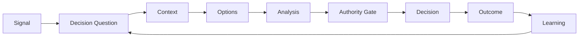

### Decision Record Minimum

Every material decision records: ID, title, status, owner, decision tier, date, scope, reason, benefits, tradeoffs, alternatives, evidence, authority, affected systems, implementation state, review date, and outcome state.

---

## 2. Constitutional Decision Principles

### DEC-001 — Decisions Must Be Explicit

If a choice changes architecture, policy, money, security, user experience, agent authority, data contracts, or long-term maintainability, it must be recorded.

### DEC-002 — Reasoning Must Survive the People Who Made the Choice

Future humans and agents must be able to reconstruct why the decision was made without oral knowledge transfer.

### DEC-003 — Authority Must Be Separate From Recommendation

Agents may analyze and recommend; authorized humans or deterministic policy controls decide.

### DEC-004 — Evidence Must Be Traceable

Claims used to justify a decision require identifiable evidence or an explicit uncertainty statement.

### DEC-005 — Alternatives Must Be Recorded

A decision is incomplete if the rejected alternatives and rejection reasons are invisible.

### DEC-006 — Decisions Are Versioned Knowledge

Decisions can be superseded, amended, or deprecated, but historical records are immutable.

### DEC-007 — High-Risk Decisions Require Stronger Gates

Financial, security, compliance, irreversible, external, and production-critical decisions require elevated authority and evidence.

### DEC-008 — Decisions Must Be Reversible Where Practical

Irreversible decisions require stronger evidence, explicit approval, and a recovery strategy before execution.

### DEC-009 — No Silent Policy Changes

A configuration change that changes system behavior materially is a decision even if no code changes.

### DEC-010 — Outcomes Feed Learning

Every material decision should eventually have an outcome assessment.

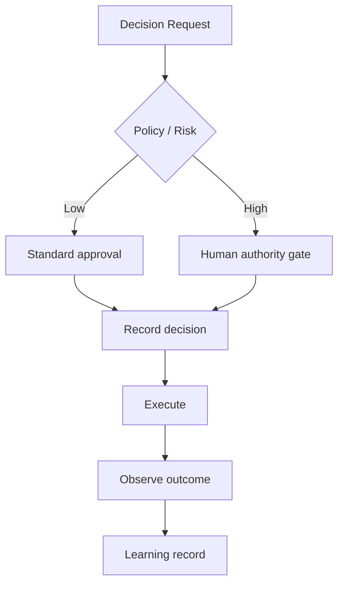

---

## 3. Decision Taxonomy

CAT uses a closed top-level taxonomy:

| Type | Scope | Typical Artifact |
|---|---|---|
| Architecture | system structure | ADR |
| Product | product behavior | Product Decision Record |
| UX | interface behavior | UX Decision Record |
| Engineering | implementation standards | Engineering Decision |
| Data | schemas, retention, lineage | Data Decision |
| AI | model, agent, autonomy behavior | AI Decision |
| Security | security posture | Security Decision |
| Governance | policy and authority | Governance Decision |
| Finance | economic policy | Finance Decision |
| Operations | runtime and incident behavior | Operations Decision |
| Vendor | provider/tool selection | Vendor Decision |
| Deployment | infrastructure/release | Deployment Decision |

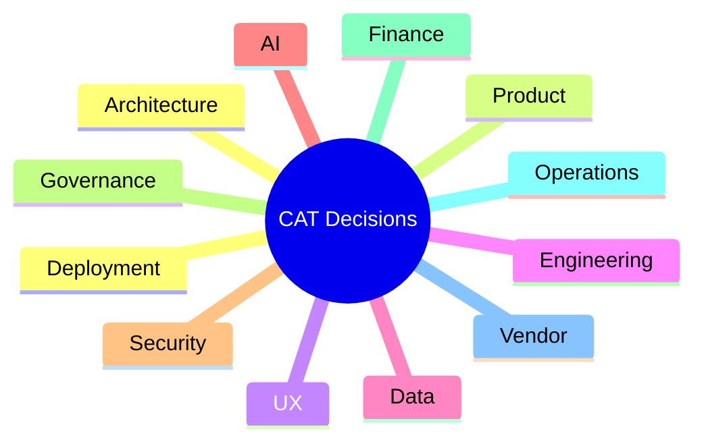

A decision may have one primary type and multiple secondary domains.

---

## 4. Decision Tiers

| Tier | Meaning | Approval |
|---|---|---|
| T0 | trivial/reversible local choice | implementation owner |
| T1 | module-level precedent | technical owner |
| T2 | cross-module decision | lead/architect review |
| T3 | cross-engine or policy decision | designated authority |
| T4 | financial/security/external/irreversible | explicit human authority |
| T5 | constitutional/mission-level | project owner / governing authority |

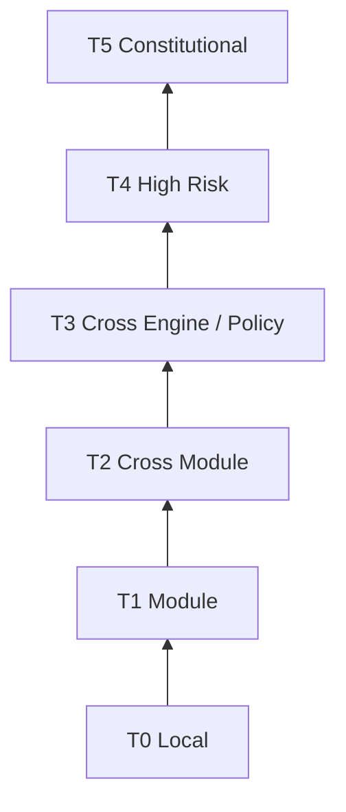

Tier escalation is based on blast radius, reversibility, authority, and affected domains rather than developer seniority.

---

## 5. Decision Lifecycle

```text
Proposed
  ↓
Context Gathering
  ↓
Drafted
  ↓
Under Review
  ↓
Approved / Rejected / Deferred
  ↓
Implemented
  ↓
Observed
  ↓
Validated / Superseded / Deprecated
```

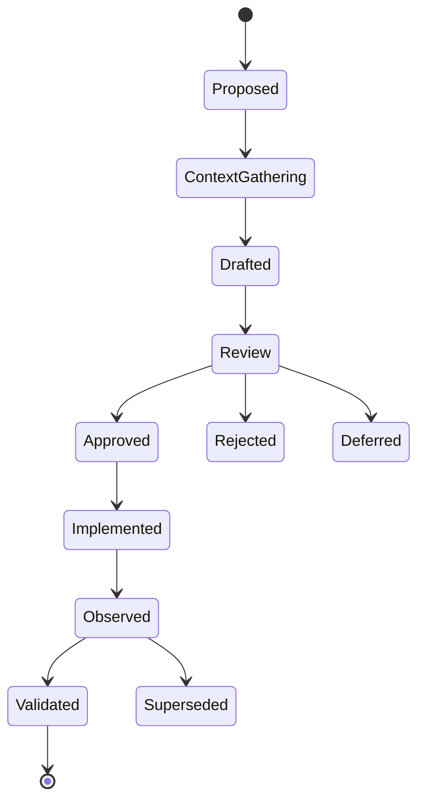

A rejected decision remains useful historical knowledge and must not be deleted merely because it was rejected.

---

## 6. Decision Record Schema

Canonical record fields:

```yaml
record_type: decision
id: CAT-DEC-0001
title: Example decision
status: proposed
tier: T2
primary_domain: architecture
owner: human-authority
reason: "Why this decision exists"
benefits:
  - "Benefit one"
tradeoffs:
  - "Tradeoff one"
alternatives:
  - option: "Alternative A"
    rejected_because: "Reason"
evidence:
  - source_id: SRC-001
    confidence: high
authority:
  role: architect
  scope: architecture
implementation:
  state: not_started
review:
  next_review: "2027-01-01"
outcome:
  state: pending
```

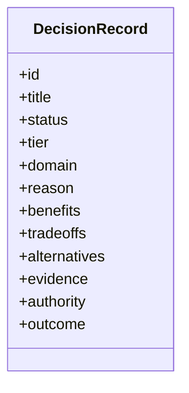

---

## 7. RBTA Decision Framework

Every T2+ decision uses **Reason, Benefits, Tradeoffs, Alternatives**.

| Element | Required Question |
|---|---|
| Reason | Why now? |
| Benefits | What does this enable? |
| Tradeoffs | What does it cost or weaken? |
| Alternatives | What else was considered and why rejected? |

The RBTA framework is not intended to manufacture certainty. Uncertainty, missing evidence, and unresolved questions must remain visible.

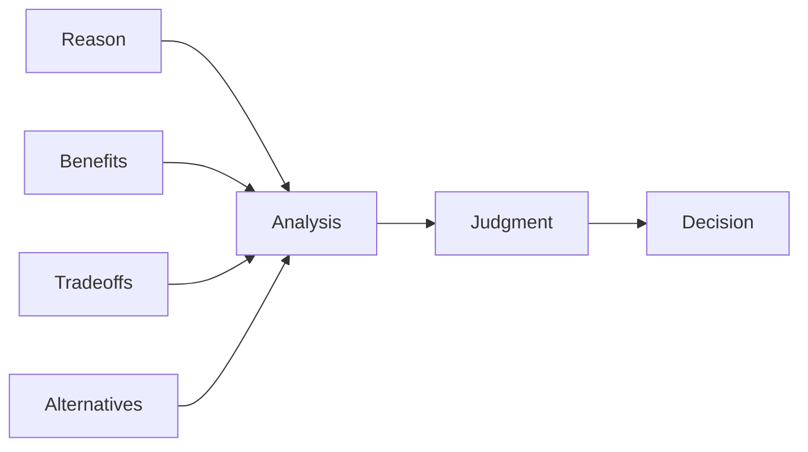

---

## 8. Evidence and Confidence

Decision evidence is classified:

- canonical repository evidence
- production evidence
- measured analytics
- external research
- expert judgment
- model-generated analysis
- simulation
- assumption

Confidence must not be confused with authority. A high-confidence AI forecast does not authorize an action.

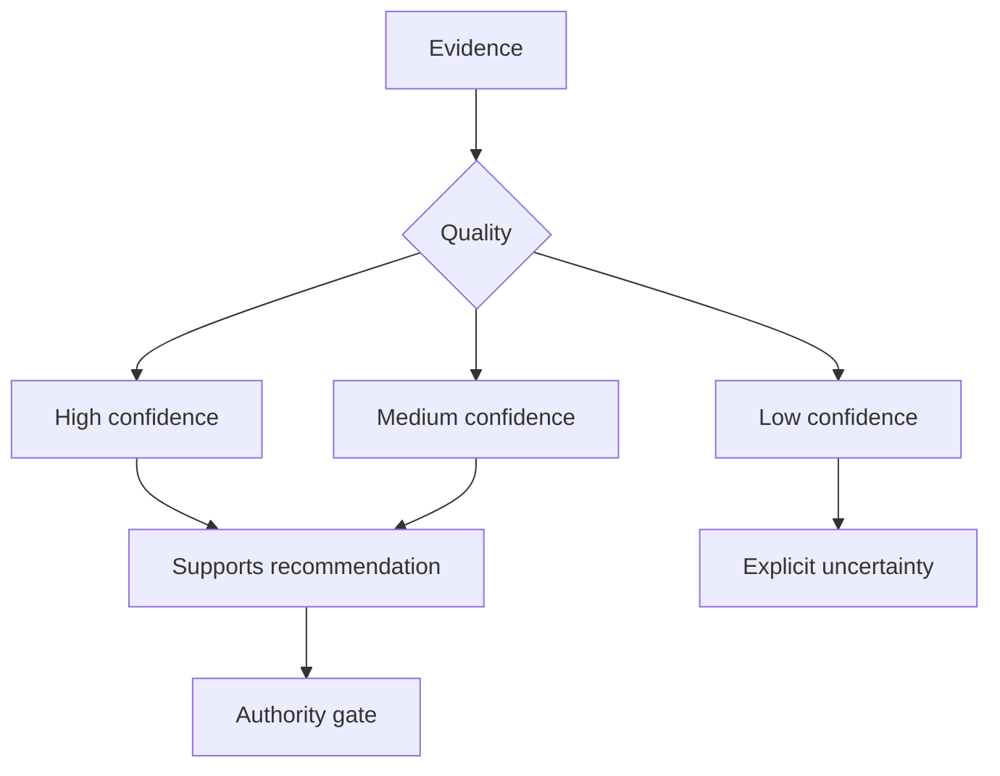

---

## 9. Options and Alternative Analysis

Material decisions should normally evaluate 2–4 viable options. Each option records:

- expected benefits
- direct cost
- operational complexity
- security impact
- reversibility
- scalability
- maintenance burden
- dependency impact
- opportunity cost
- failure mode

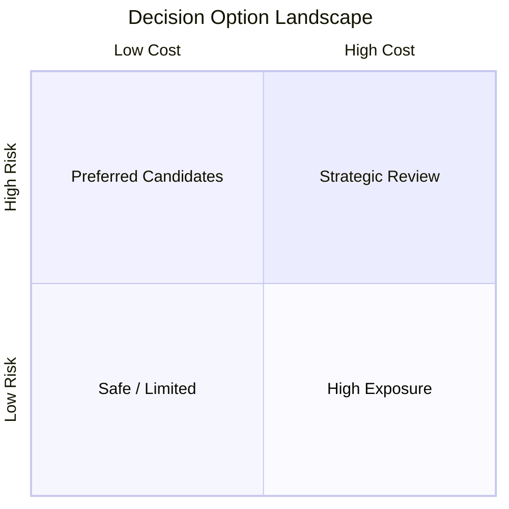

The selected option must explain why it wins against the alternatives rather than merely asserting that it is best.

---

## 10. Authority and Approval

Decision authority is determined by policy.

```text
Agent recommendation
      ↓
Policy evaluation
      ↓
Authority resolution
      ↓
Human / delegated authority
      ↓
Immutable decision receipt
```

High-impact decisions must expose the exact scope being approved. Approval of a summary does not automatically authorize a changed payload.

Current agent-control research similarly emphasizes scoped, evidenced, expiring approval paths rather than a generic approve button. citeturn0search0turn0search3

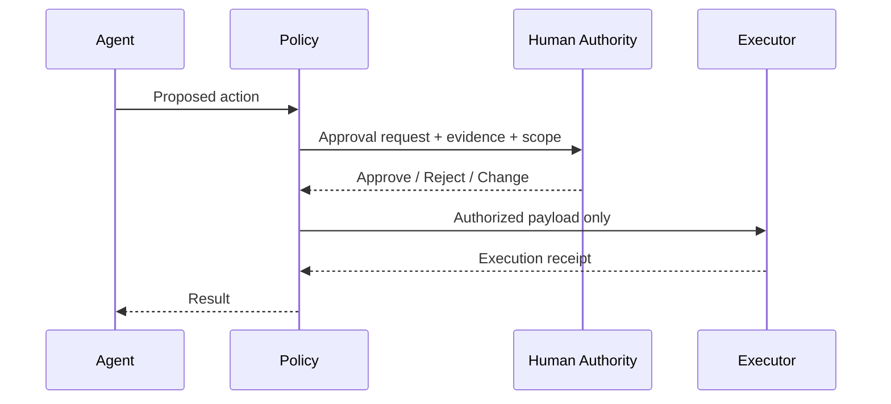

---

## 11. Human-in-the-Loop Decision UX

The approval surface must answer before the reviewer acts:

1. What exactly will happen?
2. What resource will change?
3. What evidence supports it?
4. What is the risk?
5. Is it reversible?
6. How long is approval valid?
7. What happens if rejected?
8. Who else is affected?

Approval workflows should be structured review processes, not blank confirmation dialogs. citeturn0search1

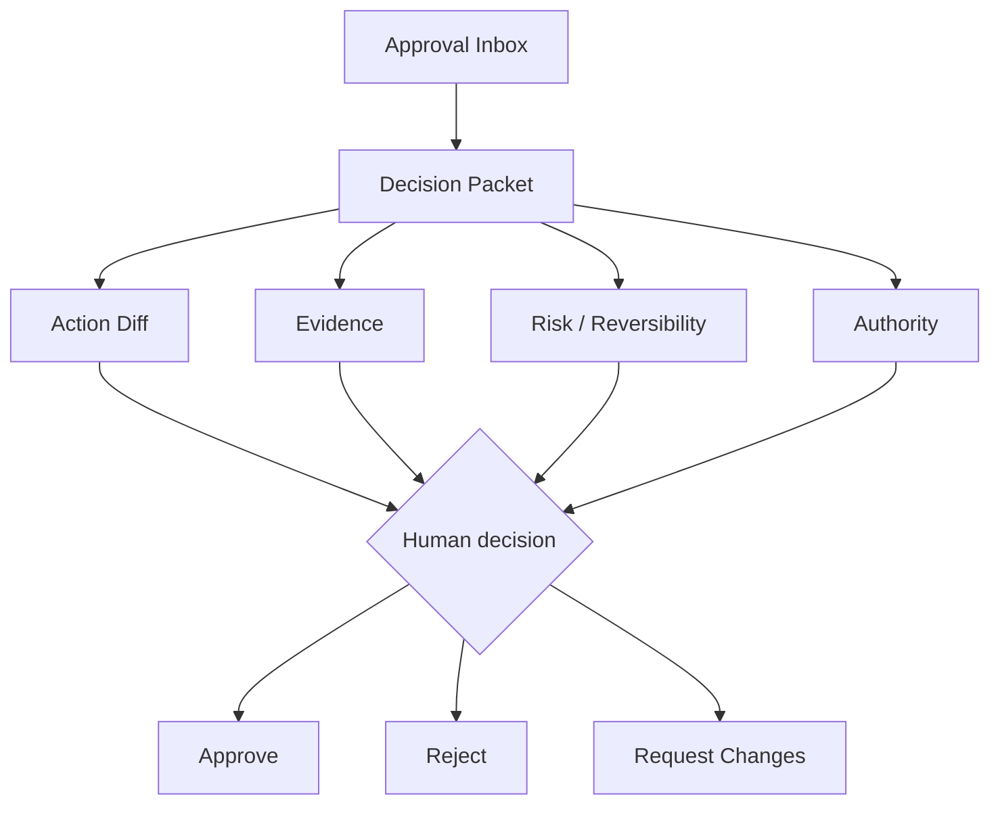

---

## 12. AI Recommendation Contract

An AI recommendation must contain:

```json
{
  "recommendation_id": "CAT-REC-001",
  "decision_question": "...",
  "recommended_option": "...",
  "evidence": [],
  "confidence": 0.0,
  "uncertainties": [],
  "alternatives": [],
  "estimated_impact": {},
  "required_authority": "T2",
  "expires_at": null,
  "human_decision_required": true
}
```

The recommendation layer is advisory. It may not mutate canonical truth or self-upgrade its own authority.

---

## 13. Decision Scoring

For comparable options CAT may calculate a weighted score:

```text
Score(option) = Σ(weight_i × normalized_value_i)
```

The score is an analytical aid. Human judgment remains explicit, particularly when qualitative risks are not fully measurable.

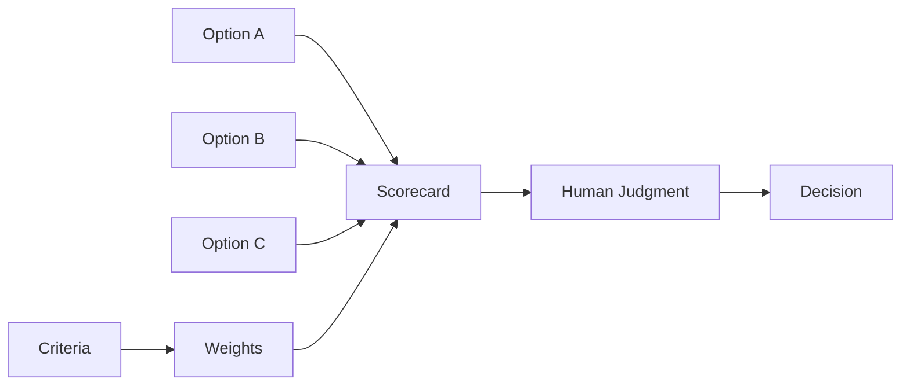

---

## 14. Architecture Decision Records

Architecture decisions use the ADR structure:

```text
Context
Problem
Constraints
Options
RBTA
Decision
Consequences
Migration
Verification
Review Date
Supersession
```

An architecture decision must identify affected engines and interfaces. A local implementation choice should not silently become an architecture precedent.

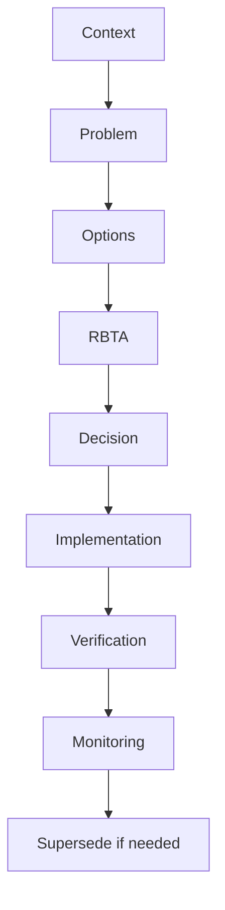

---

## 15. Product and UX Decisions

Product decisions define behavior visible to users; UX decisions define interaction and presentation behavior.

They must preserve the approved CAT visual direction: command-center composition, CAT Brain intelligence surfaces, dense but hierarchical information, visible authority, and semantic separation of truth, intelligence, recommendation, decision, execution, and audit.

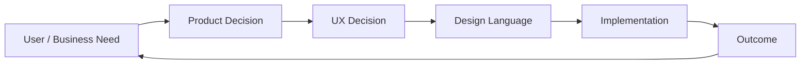

A visual reference never overrides security, authority, accessibility, or canonical data rules.

---

## 16. Data Decisions

Data decisions must classify whether a field or record is:

- canonical truth
- derived data
- intelligence
- prediction
- recommendation
- audit evidence
- temporary execution state

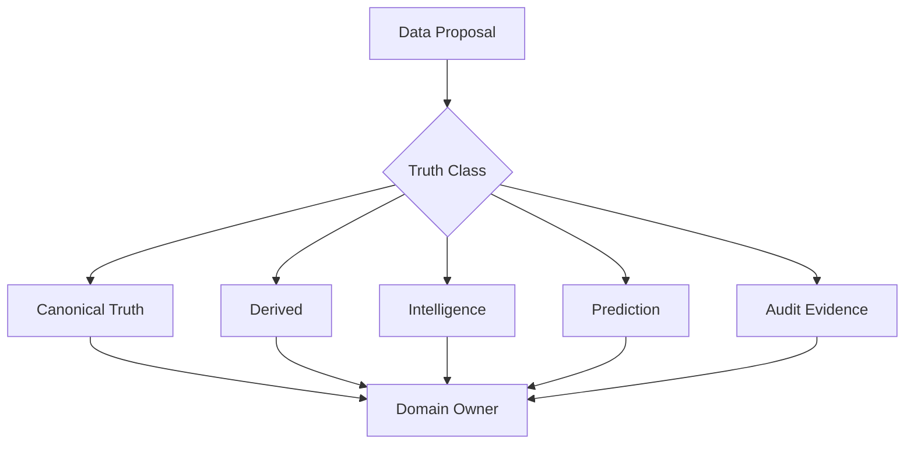

The decision record must name the owning engine and migration implications.

---

## 17. AI and Model Decisions

Model/provider choices must consider:

- capability
- latency
- cost
- privacy
- availability
- tool compatibility
- context capacity
- evaluation results
- fallback options
- lock-in risk
- observability

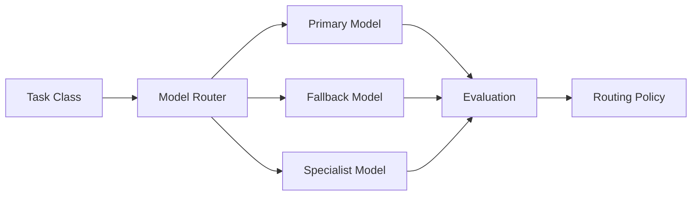

Model branding is not a decision criterion by itself; measured task performance and policy fit are.

---

## 18. Security and Risk Decisions

Security decisions are automatically elevated when they affect credentials, identity, PII, authorization, external actions, financial systems, or trust boundaries.

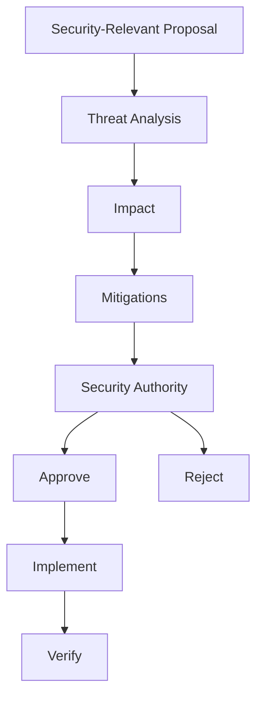

No schedule pressure can silently lower a security decision's required authority.

---

## 19. Financial and Treasury Decisions

Treasury owns monetary truth. Decisions involving money must distinguish:

```text
Forecast ≠ Recommendation ≠ Allocation Decision ≠ Executed Transaction
```

Affiliate and Content engines may provide evidence or recommendations but must not become the canonical monetary authority.

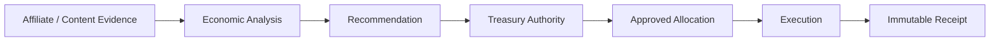

High-value financial decisions require explicit exposure, limits, approval identity, and rollback/compensation strategy where applicable.

---

## 20. Operational and Incident Decisions

Operational decisions during incidents use a fast but auditable path:

```text
Detect → Stabilize → Decide → Execute → Verify → Document → Learn
```

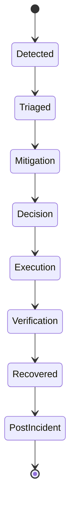

Emergency authority may accelerate the process but must not erase the decision record.

---

## 21. Vendor and Dependency Decisions

Vendor choices must record:

- capability fit
- cost model
- contractual risk
- data handling
- outage history where available
- portability
- exit strategy
- replacement candidates
- lock-in assessment

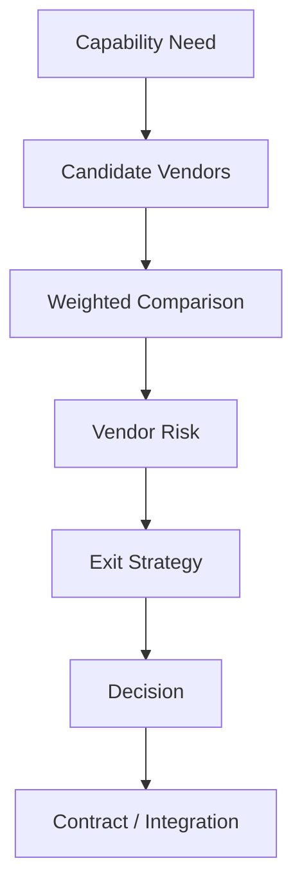

No critical capability may depend on a provider without a documented failure mode and migration posture.

---

## 22. Decision Supersession

A decision is superseded by a new decision; it is not silently edited into a different historical record.

```mermaid
flowchart LR
D1[DEC-001 Active]-->D2[DEC-027 Superseding]
D2-->D3[DEC-041 Future]
D1-.historical reason.->Archive[Immutable History]
```

The superseding record must state what changed, why the old decision no longer holds, and what remains valid from the original.

---

## 23. Decision Outcomes and Learning

Outcome review compares expected versus actual results:

| Dimension | Expected | Actual | Variance | Lesson |
|---|---|---|---|---|
| Cost | recorded | measured | calculated | captured |
| Quality | target | measured | calculated | captured |
| Risk | expected | observed | calculated | captured |
| Time | estimate | actual | calculated | captured |
| Business impact | forecast | outcome | calculated | captured |

```mermaid
flowchart LR
Decision-->Expected[Expected Outcome]
Decision-->Actual[Observed Outcome]
Expected-->Compare[Outcome Comparison]
Actual-->Compare
Compare-->Lesson[Lesson]
Lesson-->Knowledge[Knowledge System]
Knowledge-->Future[Future Decisions]
```

A decision that worked is still learning data; success does not prove the reasoning was universally correct.

---

## 24. Decision Index and Retrieval

The decision index is the navigation layer for humans and agents.

Minimum index dimensions:

- decision ID
- title
- domain
- tier
- status
- owner
- affected engines
- tags
- evidence links
- superseded-by
- review date

```mermaid
flowchart TD
Index[Decision Index]-->Domain[Domain Filter]
Index-->Tier[Tier Filter]
Index-->Status[Status Filter]
Index-->Entity[Entity / Engine Filter]
Index-->Search[Semantic Search]
Domain-->Records[Decision Records]
Tier-->Records
Status-->Records
Entity-->Records
Search-->Records
```

Agents must retrieve relevant active and superseded decisions before proposing changes that may conflict with established architecture or policy.

---

## 25. Part 1 Completion Contract

Part 1 establishes the constitutional decision layer. The next parts expand the operational decision registry, architecture decisions, AI/model decisions, financial decisions, UX decisions, governance decisions, and long-horizon decision analytics.

### Closed Part 1 Registers

**Decision ID range:** `CAT-DEC-0001` … `CAT-DEC-0050`

**Constitutional rules:** `CAT-DEC-CONST-001` … `CAT-DEC-CONST-050`

**Acceptance tests:** `CAT-DEC-AT-S01-001` … `CAT-DEC-AT-S25-003`

**Memory anchors:** `CAT-DEC-MEM-S01-001` … `CAT-DEC-MEM-S25-001`

**Diagram registry:** `CAT-DEC-P1-S01-D001` … `CAT-DEC-P1-S25-D002`

### Core Invariants

1. Recommendations are not decisions.
2. Authority is policy-bound.
3. Evidence is traceable.
4. Alternatives are preserved.
5. Historical decisions are immutable.
6. Supersession creates a new record.
7. High-risk decisions require stronger approval.
8. Financial truth remains owned by Treasury.
9. Security authority cannot be bypassed by schedule pressure.
10. Outcomes must feed learning.
11. AI may draft and analyze but may not silently grant itself authority.
12. Decision records remain readable by humans and AI agents.

### Machine Registry Example

```json
{
  "record_type": "decision_registry",
  "version": "1.0",
  "status": "closed",
  "part": 1,
  "decision_id_range": ["CAT-DEC-0001", "CAT-DEC-0050"],
  "rule_range": ["CAT-DEC-CONST-001", "CAT-DEC-CONST-050"],
  "acceptance_test_range": ["CAT-DEC-AT-S01-001", "CAT-DEC-AT-S25-003"],
  "memory_anchor_range": ["CAT-DEC-MEM-S01-001", "CAT-DEC-MEM-S25-001"]
}
```

### Schema Registry Example

```yaml
schema_name: cat_decision_record_v1
record_type: decision
required:
  - id
  - title
  - status
  - tier
  - primary_domain
  - reason
  - benefits
  - tradeoffs
  - alternatives
  - evidence
  - authority
  - implementation
  - outcome
immutability:
  historical_record: true
  supersession_required_for_change: true
```

### Acceptance Contract

Part 1 is accepted only when:

- all 25 sections exist in exact order;
- all decision identifiers are unique;
- all rules have the required nine-field structure;
- all acceptance tests have the required six-field structure;
- Mermaid diagrams parse and carry metadata;
- JSON and YAML blocks parse independently;
- cross-references resolve or explicitly carry `Status: Planned`;
- financial, security, authority, AI, UX, governance, reasoning, planning, treasury, affiliate, content, knowledge, memory, and runtime references are present;
- no placeholder values remain in the final receipt;
- the frozen prefix is byte-identical when Part 2 begins.

**Current Progress:** Part 1 Completed — 25%

**Next Task:** Decisions Part 2 — operational decision registry and decision lifecycle expansion, Sections 26 onward.

**Receipt ID:** `CAT-DEC-P1-FINAL-RECEIPT-001`

---

*End of Decisions Part 1. Part 2 continues append-only from this exact boundary.*
