# CAT OMNISYSTEM — Terminology Bible V1

> Canonical language system for CAT OMNISYSTEM. This document defines vocabulary, naming boundaries, semantic contracts, forbidden ambiguities, cross-engine terminology, AI-facing language, UI-facing labels, and machine-readable term identity rules.

**Status:** Part 1 Completed — 25%  
**Version:** 1.0.0  
**Project:** CAT (Commerce AI Trinity)  
**Company:** Omni System  
**Repository:** `https://github.com/afshin0095-lang/CAT`  
**Governing Documents:** `context/00_PROJECT_CONTEXT.md`, `context/04_ARCHITECTURE.md`, `context/10_UI_UX.md`, `context/11_DESIGN_LANGUAGE.md`, `context/12_DECISIONS.md`

---

## 1. Terminology System Identity

Terminology is a system dependency, not editorial decoration. CAT uses language as an interface between humans, agents, APIs, databases, UI components, policies, decisions, analytics, and operations.

A term is canonical only when its meaning, scope, owner, aliases, prohibited interpretations, lifecycle, and machine identity are explicit.

```text
Human Concept → Canonical Term → Definition + Scope + Owner
                    ↓
              Machine Identifier
                    ↓
       API / Event / Schema / UI / Agent
                    ↓
              Shared CAT Meaning
```

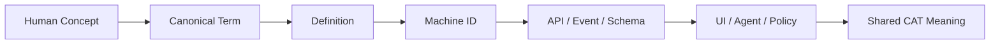

**Invariant:** changing wording must never silently change system meaning.

---

## 2. Terminology Constitutional Principles

CAT terminology follows twelve principles: canonicality, explicit scope, stable identity, no semantic drift, domain ownership, truth separation, human readability, agent readability, UI consistency, auditability, backward compatibility, and fail-closed ambiguity.

A synonym may improve natural-language search but cannot silently become a second canonical concept. A deprecated label must retain a redirect to its canonical identifier.

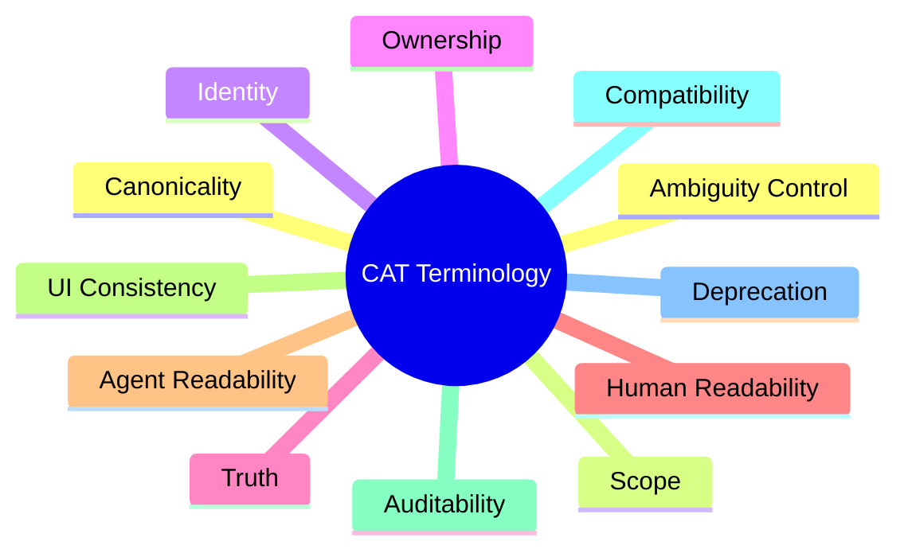

---

## 3. Term Anatomy

Every canonical term is represented by a semantic record containing at minimum `term_id`, `canonical_name`, `definition`, `domain`, `owner`, `status`, `version`, `aliases`, `forbidden_aliases`, `scope`, `related_terms`, `machine_identifiers`, `ui_labels`, `api_names`, `event_names`, examples, non-examples, and change policy.

```json
{
  "term_id": "CAT-TERM-0001",
  "canonical_name": "canonical_truth",
  "definition": "authoritative state owned by a designated system of record",
  "domain": "platform",
  "owner": "platform",
  "status": "active",
  "version": "1.0.0"
}
```

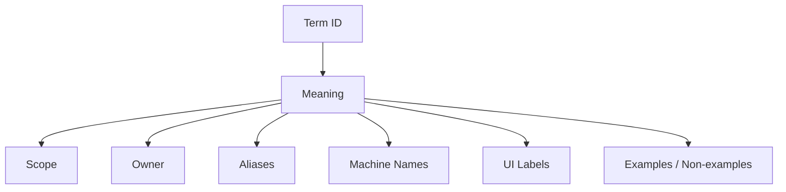

---

## 4. Naming Grammar

| Layer | Convention | Example |
|---|---|---|
| Human term | readable title | Canonical Truth |
| Semantic name | `snake_case` | `canonical_truth` |
| Constant | upper snake | `CAT_TERM_CANONICAL_TRUTH` |
| Event | domain-qualified | `affiliate.conversion.verified` |
| API field | `snake_case` | `source_confidence` |
| UI label | concise | `Verified Conversion` |
| Registry ID | immutable | `CAT-TERM-0001` |
| File | numbered uppercase | `13_TERMINOLOGY.md` |

A display label may change without changing its semantic identifier.

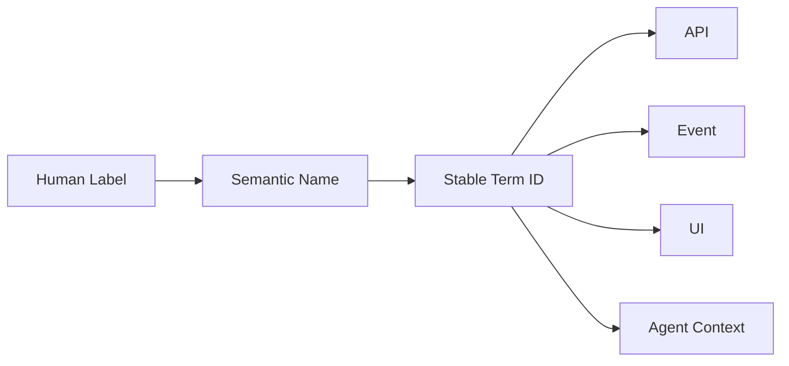

---

## 5. Core Platform Vocabulary

### Canonical Truth
Authoritative state owned by a designated system of record.

### Derived Intelligence
Information computed from canonical truth or approved evidence without becoming canonical truth.

### Recommendation
A proposed course of action with no execution authority by itself.

### Prediction
A probabilistic statement about a future or unknown state.

### Decision
An authorized selection among alternatives that establishes intended action or policy.

### Execution Intent
A validated representation of an action after applicable authority and policy gates.

### Outcome Evidence
Observed evidence about what happened after a decision or action.

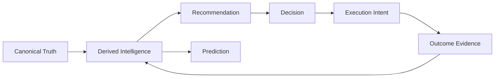

---

## 6. Truth-Class Vocabulary

CAT must distinguish **canonical**, **observed**, **derived**, **inferred**, **predicted**, **recommended**, **decided**, **executed**, and **reported** information.

The same value may travel through multiple classes during a workflow, but the transition must be explicit. A prediction cannot become truth merely because it was displayed in a trusted dashboard.

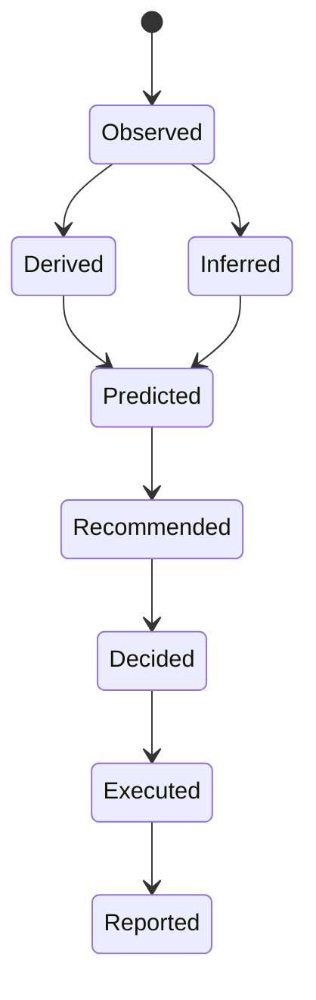

---

## 7. Agent Vocabulary

CAT distinguishes a **model** from an **agent**. A model generates or transforms information; an agent has an operational identity, capabilities, state, tool access, authority scope, and governed execution boundary.

Canonical terms: Agent, Agent Identity, Agent Role, Agent Capability, Agent Scope, Delegation, Authority, Tool Permission, Execution Boundary, Approval Gate, Agent Run, Agent Trace, and Agent Outcome.

**Forbidden audit language:** “the AI did it.” A valid trace identifies agent identity, model version, authority scope, policy result, tool, action, and outcome.

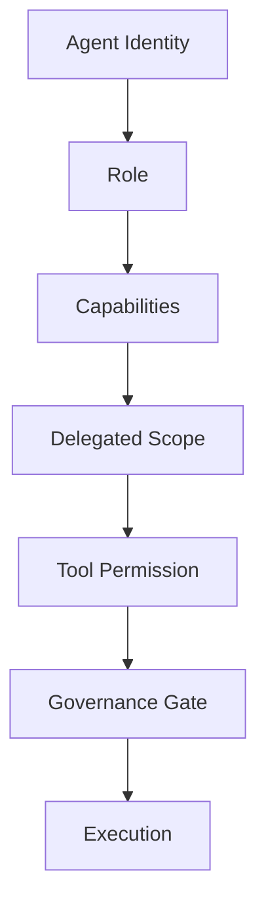

---

## 8. Knowledge and Memory Vocabulary

Knowledge is structured or retrieved understanding that can support reasoning. Memory is retained state or experience associated with an entity, agent, workflow, or system context.

Canonical distinctions include Knowledge Source, Evidence, Knowledge Object, Memory Object, Memory Anchor, Recall, Retrieval, Provenance, Confidence, Freshness, Expiration, and Contradiction.

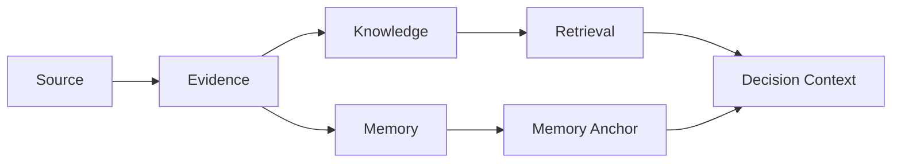

---

## 9. Reasoning and Planning Vocabulary

Reasoning explains how a conclusion can be justified. Planning explains how an objective can be achieved through ordered or partially ordered actions.

| Term | Canonical meaning |
|---|---|
| Reasoning | analysis leading toward a justified conclusion |
| Hypothesis | proposition under investigation |
| Evidence | information supporting or weakening a proposition |
| Constraint | condition limiting admissible outcomes |
| Plan | intended sequence or graph of actions |
| Step | atomic plan unit |
| Dependency | prerequisite relationship |
| Checkpoint | explicit verification point |
| Replan | controlled modification of a plan |
| Goal | desired state or outcome |

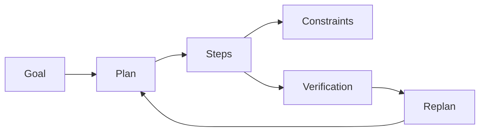

---

## 10. Decision Vocabulary

Decision terminology aligns with `context/12_DECISIONS.md`.

Canonical terms are Decision Candidate, Decision Question, Decision Context, Option, Alternative, Evidence Package, Recommendation, Authority Gate, Decision Record, Decision Outcome, Supersession, Decision Policy, Decision Owner, Approver, and Reviewer.

**Invariant:** recommendation, approval, decision, and execution are separate semantic events even when one human performs multiple roles.

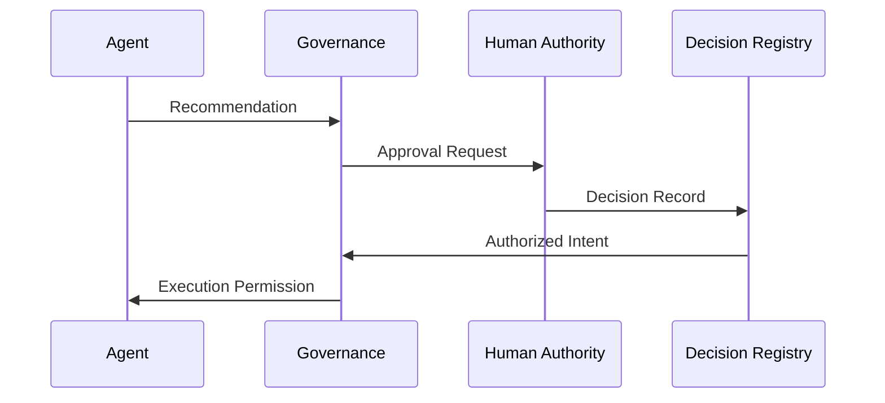

---

## 11. Treasury and Financial Vocabulary

Treasury owns monetary truth. Other engines may emit financial estimates, influence evidence, obligations, or recommendations but do not redefine monetary truth.

Canonical terms: Revenue, Gross Revenue, Net Revenue, Commissionable Revenue, Commission Obligation, Payout, Settlement, Treasury Truth, Financial Forecast, Economic Recommendation, Capital Allocation, and Monetary Execution.

**Forbidden ambiguity:** payment, obligation, settlement instruction, and completed settlement are not interchangeable.

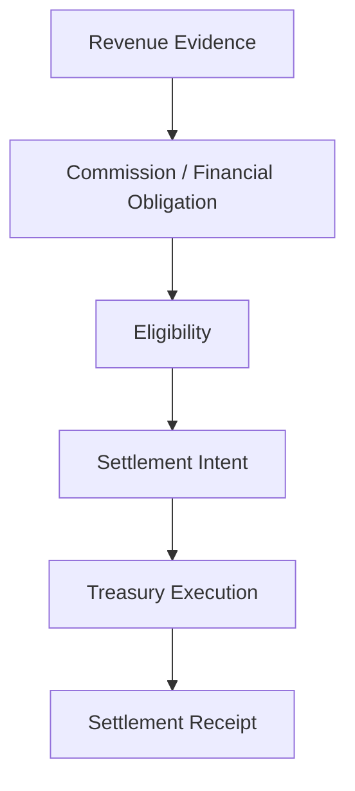

---

## 12. Affiliate Vocabulary

The Affiliate Engine owns affiliate-domain truth. Canonical terms include Merchant, Program, Offer, Product, Partner, Affiliate, Referral, Attribution, Conversion, Commission, Attribution Window, Commission Obligation, Sub-Affiliate, and Network Edge.

Content influence may become evidence consumed by attribution systems, but it does not redefine Affiliate Engine attribution truth.

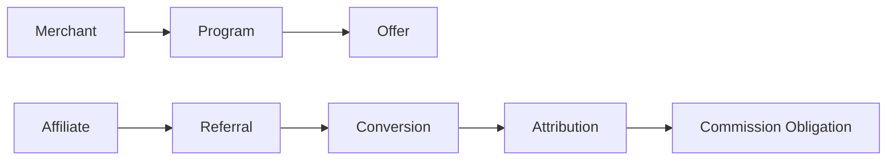

---

## 13. Content Vocabulary

The Content Engine owns content-domain truth. Canonical terms include Content Object, Source, Type, Version, Lineage, Evidence, Influence, Publication, Distribution, Syndication, Personalization, Recommendation, AI Retrieval, AI Citation, Zero-Click Discovery, Content Rights, and Content License.

**Invariant:** generated prose is not canonical merely because it passes quality validation.

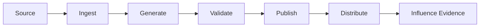

---

## 14. UI/UX Vocabulary

UI terminology maps to semantic system states. Canonical UI concepts include Surface, Screen, View, Panel, Module, Component, Action, State, Status, Indicator, Notification, Approval Gate, Evidence Drawer, Decision Detail, Agent Activity, and Audit Trail.

The interface must distinguish recommendation, pending approval, approved, executing, executed, failed, and blocked. A generic green/red status is insufficient when authority and execution semantics differ.

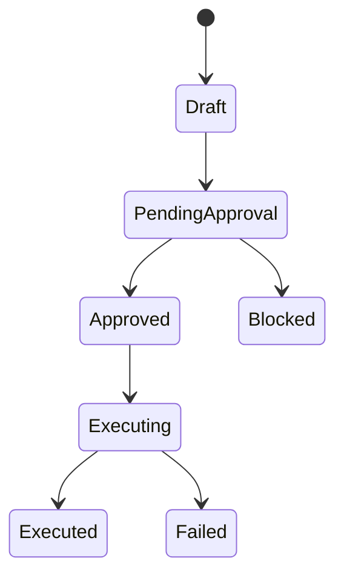

---

## 15. Security and Governance Vocabulary

Security language distinguishes identity, authentication, authorization, policy, trust, permission, and evidence.

Canonical terms: Principal, Identity, Authentication, Authorization, Capability, Scope, Policy, Trust Boundary, Permission, Delegation, Least Privilege, Deny, Block, Escalate, and Audit Evidence.

**Rule:** authenticated does not mean authorized; authorized does not necessarily mean approved for a specific high-risk action.

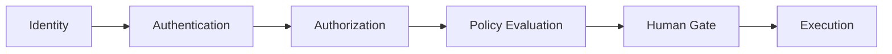

---

## 16. Runtime and Execution Vocabulary

Runtime terminology describes what the system actually does, not merely what it intends to do.

Canonical terms: Runtime, Invocation, Run, Task, Job, Workflow, Execution Intent, Tool Call, Side Effect, Receipt, Retry, Timeout, Cancellation, Failure, Recovery, and Replay.

A retry is not automatically a new business intent. A replay is a controlled re-execution or reconstruction with explicitly defined semantics.

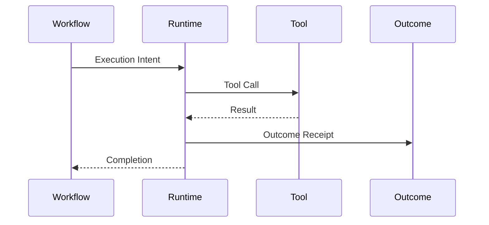

---

## 17. Observability Vocabulary

Observability terms separate operational telemetry from governance evidence.

Metric = numeric measurement. Log = event-oriented diagnostic record. Trace = distributed execution path. Span = trace unit. Audit Event = accountability evidence. Decision Event = structured decision transition. Evidence Record = material supporting a claim. Alert = operational signal. SLO = service-level objective. KPI = business measurement.

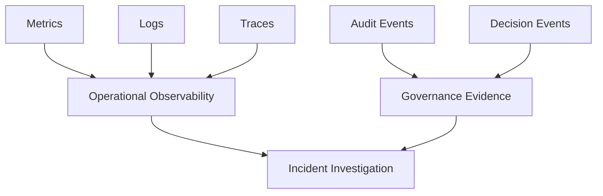

---

## 18. API, Event, and Schema Vocabulary

A field name is not a semantic definition. Public APIs and events must map to canonical terminology.

Canonical terms include API Resource, Command, Query, Event, Event Envelope, Payload, Schema, Version, Contract, Idempotency Key, Correlation ID, Causation ID, and Trace ID.

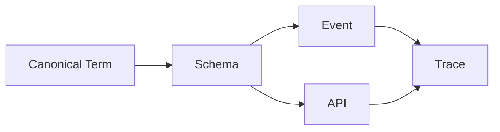

---

## 19. AI Prompt and Model Vocabulary

CAT distinguishes model behavior from governed system behavior.

Canonical terms: Model, Model Version, Prompt, Prompt Template, System Instruction, Context, Retrieval Context, Tool Context, Model Output, Structured Output, Confidence, Evaluation, Guardrail, Policy Enforcement, and Agent Decision.

**Forbidden:** “the model authorized the action.” Models may recommend, classify, generate, or score; authority belongs to the governed system and designated decision authority.

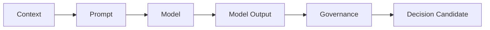

---

## 20. Cross-Engine Ownership Vocabulary

Every cross-engine term has an owner.

| Concept | Owner |
|---|---|
| Affiliate-domain truth | Affiliate Engine |
| Content-domain truth | Content Engine |
| Monetary truth | Treasury Core |
| Knowledge truth | Knowledge Engine |
| Memory state | Memory System |
| Reasoning process | Reasoning Engine |
| Plan truth | Planning Engine |
| Decision record | Decision Engine |
| Agent identity | Agent System |
| UI semantics | UI/UX + Design Language |
| Platform policy | Platform Governance |

Cross-engine consumers may read or derive from another engine's truth, but may not redefine ownership.

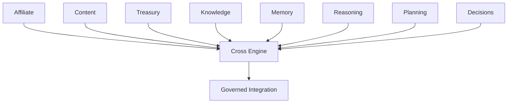

---

## 21. Ambiguity and Synonym Policy

Synonyms are classified as **preferred synonyms**, **search aliases**, or **forbidden ambiguities**. Search aliases may help retrieval but must never be emitted as canonical schema identifiers.

| Canonical | Search Alias | Forbidden ambiguity |
|---|---|---|
| Decision | choice | approval = decision |
| Recommendation | suggestion | recommendation = authorization |
| Execution Intent | action request | intent = executed action |
| Commission Obligation | commission due | obligation = payout |
| Evidence | supporting evidence | evidence = truth |

```mermaid
flowchart TD
Q[Query]-->N[Normalization]-->C[Canonical Term]
N-->A[Alias Resolution]-->C
N-->X[Ambiguity Detected]-->H[Human / Governance Gate]
```

---

## 22. Deprecation and Migration Vocabulary

Terminology lifecycle is `proposed → active → deprecated → sunset → archived`.

A deprecated term retains replacement term, effective date, compatibility window, migration guidance, affected schemas/APIs/events/UI labels, owner, rationale, and audit history.

```mermaid
stateDiagram-v2
[*] --> Proposed
Proposed --> Active
Active --> Deprecated
Deprecated --> Sunset
Sunset --> Archived
Deprecated --> Active: rollback
```

---

## 23. AI Terminology Contract

Agents consuming CAT terminology must resolve important terms through the canonical registry before high-impact reasoning or action.

Required sequence: identify term → resolve canonical ID → verify scope → verify owner → check status/version → detect ambiguity → retrieve related terms → reason using canonical semantics → preserve term IDs in structured output → escalate unresolved high-risk ambiguity.

```mermaid
sequenceDiagram
participant A as Agent
participant R as Terminology Registry
participant P as Policy
A->>R: Resolve term
R-->>A: Canonical ID + scope
A->>P: Validate use
P-->>A: Allowed / Escalate
A->>A: Reason using canonical semantics
```

---

## 24. Machine-Readable Terminology Registry

Part 1 begins the immutable registry. Later Parts append records and supersession links without renumbering historical term IDs.

```yaml
registry: CAT-TERMINOLOGY-V1
version: 1.0.0
terms:
  - term_id: CAT-TERM-0001
    name: canonical_truth
    owner: platform
    status: active
  - term_id: CAT-TERM-0002
    name: derived_intelligence
    owner: platform
    status: active
  - term_id: CAT-TERM-0003
    name: recommendation
    owner: decision
    status: active
  - term_id: CAT-TERM-0004
    name: prediction
    owner: decision
    status: active
  - term_id: CAT-TERM-0005
    name: execution_intent
    owner: runtime
    status: active
```

```mermaid
flowchart LR
R[Terminology Registry]-->API[API Contracts]
R-->EV[Event Contracts]
R-->DB[Schema Contracts]
R-->UI[UI Labels]
R-->AI[Agent Context]
R-->DOC[Documentation]
```

---

## 25. Part 1 Completion Contract

Part 1 establishes the terminology constitution and the minimum shared vocabulary required for the remaining CAT documentation program.

### Closed Part 1 Contracts

- Core truth vocabulary
- Agent vocabulary
- Knowledge and memory vocabulary
- Reasoning and planning vocabulary
- Decision vocabulary
- Treasury vocabulary
- Affiliate vocabulary
- Content vocabulary
- UI/UX vocabulary
- Security and governance vocabulary
- Runtime vocabulary
- Observability vocabulary
- API/event/schema vocabulary
- AI/model vocabulary
- Cross-engine ownership vocabulary
- Ambiguity policy
- Deprecation lifecycle
- AI terminology contract

### Acceptance Contract

Part 1 is complete only when every listed canonical concept has a stable term ID, ownership is explicit, ambiguous synonyms are classified, truth classes remain separated, UI labels map to semantic concepts, agents can resolve terms without conversational guessing, cross-engine ownership is preserved, terminology changes are versionable and auditable, and no term silently changes another engine's authority boundary.

```json
{
  "record_type": "CAT_TERMINOLOGY_PART1_COMPLETION",
  "status": "completed",
  "part": 1,
  "progress": "25%",
  "sections": 25,
  "next_part": "Terminology Part 2",
  "invariant": "semantic_identity_survives_label_change"
}
```

```mermaid
flowchart TD
A[Terminology Constitution]-->B[Canonical Registry]
B-->C[Cross-Engine Vocabulary]
C-->D[AI Contract]
D-->E[UI / API / Event Consistency]
E-->F[Part 2 Extension]
```

---

## Part 1 Registry Snapshot

| Registry | Scope | Status |
|---|---|---|
| Core Terms | Sections 1–25 | Closed for Part 1 |
| Truth Classes | Platform-wide | Closed for Part 1 |
| Agent Terms | Agent-facing | Closed for Part 1 |
| Engine Ownership | Cross-engine | Closed for Part 1 |
| Ambiguity Classes | Human + AI | Closed for Part 1 |
| Deprecation States | Lifecycle | Closed for Part 1 |
| Term IDs | `CAT-TERM-*` | Stable |

**Boundary:** no Section 26 or Part 2 body is included. Part 2 will extend the registry append-only while preserving Part 1 IDs and meanings unless an explicit supersession record is introduced.
