# CAT OMNISYSTEM — Coding Standard Bible V1

> Canonical engineering language for CAT OMNISYSTEM. This document defines enforceable coding standards across Rust, Go, Python, TypeScript/React, tests, Git, APIs, events, schemas, observability, security, AI-generated code, and multi-core integration.

**Status:** Part 2 Completed — 50%  
**Version:** 1.0.0  
**Project:** CAT (Commerce AI Trinity)  
**Company:** Omni System  
**Repository:** `https://github.com/afshin0095-lang/CAT`  
**Governing Documents:** `context/04_ARCHITECTURE.md`, `context/13_TERMINOLOGY.md`, `context/12_DECISIONS.md`

---

## 1. Coding Standard Identity

CAT coding standards are system contracts, not personal preferences. Code must remain readable, deterministic, testable, observable, secure, evolvable, and compatible with the multi-core architecture.

The standard applies to human-written code, AI-generated code, generated code, migrations, scripts, tests, infrastructure definitions, schemas, and repository automation.

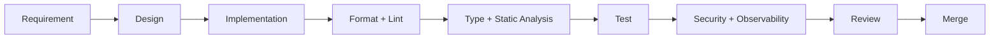

**Invariant:** code that cannot be understood, tested, observed, or safely changed is not production-ready merely because it runs.

---

## 2. Constitutional Principles

CAT follows twelve principles: correctness, clarity, simplicity, explicit ownership, deterministic behavior, immutability by default, typed boundaries, fail-closed errors, testability, observability, security-by-default, and continuous maintainability.

KISS, DRY, and YAGNI are defaults, but simplicity never overrides domain ownership or safety requirements.

```text
Correctness > Cleverness
Explicitness > Magic
Domain Boundaries > Convenience
Typed Contracts > Implicit Coupling
Evidence > Confidence
```

---

## 3. Language Matrix

CAT uses specialized languages rather than forcing one language across every workload.

| Domain | Primary | Mandatory baseline |
|---|---|---|
| Performance-critical core | Rust | `cargo fmt`, `cargo clippy`, tests |
| Services/orchestration | Go | `gofmt`, `go vet`, tests |
| AI/data/automation | Python | PEP 8, typing, format, lint, tests |
| Web/UI | TypeScript + React | strict TS, format, lint, tests |
| Contracts | Protobuf/JSON Schema/YAML | validation + compatibility |
| Infrastructure | Terraform/YAML | format + static validation |

Language-specific rules override generic rules only where the language idiom requires it.

---

## 4. Repository and Module Boundaries

Every module has one primary responsibility and one explicit owner. Cross-domain access must pass through an approved contract rather than importing internal implementation details.

Forbidden patterns include circular dependencies, domain-to-domain database writes, hidden global state, untracked side effects, and unowned utility dumping grounds.

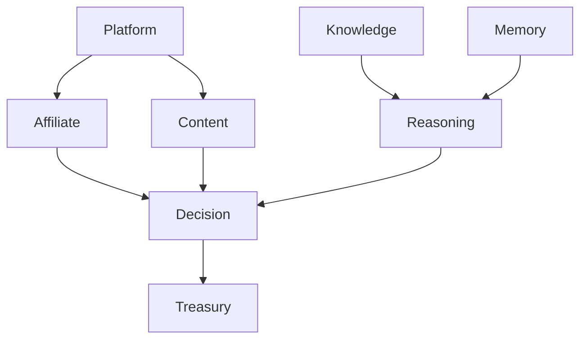

**Invariant:** an import is not permission to mutate another engine’s truth.

---

## 5. Naming Standard

Names must communicate role and domain meaning. Avoid ambiguous names such as `data`, `thing`, `manager`, `helper`, `utils`, `misc`, and `tmp` when a semantic name exists.

| Element | Convention |
|---|---|
| Python variables/functions | `snake_case` |
| Python classes | `PascalCase` |
| Go exported identifiers | `MixedCaps` |
| Go packages | short lowercase |
| Rust functions/modules | `snake_case` |
| Rust types | `PascalCase` |
| TypeScript variables/functions | `camelCase` |
| TypeScript types/components | `PascalCase` |
| Constants | semantic, language-idiomatic |
| Events | canonical name + version |
| IDs | stable machine-readable prefix |

Names must agree with `context/13_TERMINOLOGY.md`.

---

## 6. Formatting and Tooling

Formatting is automated. CAT does not spend review time debating whitespace that a formatter can enforce.

Required baseline: `cargo fmt`; `gofmt`; Python formatter/linter/type checker; TypeScript formatter/linter/type checker. CI rejects unformatted code.

```text
format → lint → typecheck → unit tests → integration tests → security checks
```

---

## 7. Rust Standard

Rust is preferred for correctness-sensitive, high-throughput, low-latency, concurrency-heavy, and infrastructure-critical components.

Rules: prefer ownership/borrowing over unnecessary cloning; avoid production-path `unwrap()` and `expect()` unless the invariant is structurally guaranteed; return typed `Result`; isolate unsafe code; use structured tracing; document public APIs and safety invariants; run `cargo fmt`, `cargo clippy --all-targets --all-features`, and tests.

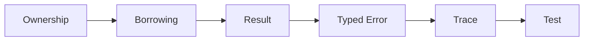

---

## 8. Go Standard

Go is preferred for network services, orchestrators, workers, adapters, and control-plane components.

Rules: `gofmt` is mandatory; errors are explicit return values; error is the final return value; use `context.Context` for cancellation and deadlines; prevent goroutine leaks; avoid panic for normal control flow; use race detection; document exported APIs; use idiomatic initialisms and receiver names.

---

## 9. Python Standard

Python is preferred for AI orchestration, research tooling, data workflows, model adapters, automation, and non-latency-critical services.

Rules: follow PEP 8; use production type hints; isolate side effects; avoid mutable defaults; avoid broad exception swallowing; use dependency injection where needed; separate domain logic from framework adapters; use deterministic seeds where reproducibility matters; validate model-generated and external data before domain use.

```python
from dataclasses import dataclass

@dataclass(frozen=True)
class DecisionInput:
    request_id: str
    evidence_ids: tuple[str, ...]
```

---

## 10. TypeScript and React Standard

TypeScript is mandatory for CAT web UI. `any` is prohibited in domain code except isolated adapter boundaries.

Rules: strict TypeScript; discriminated unions for state machines; explicit state ownership; components focused on rendering and interaction; domain decisions outside presentation; derived state should not be duplicated; stable keys; accessibility semantics; behavior-oriented tests.

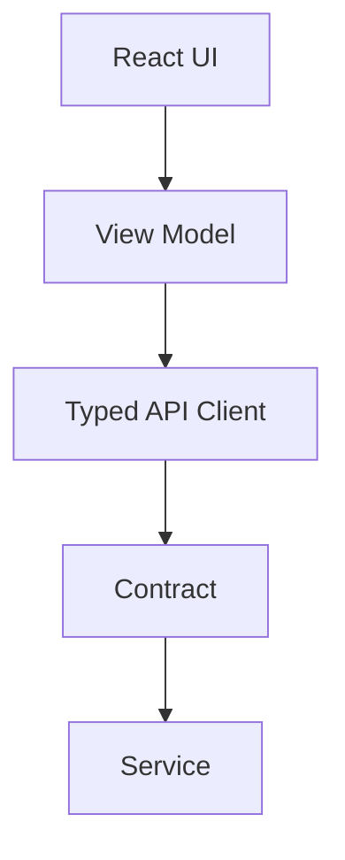

---

## 11. Error Handling and Failure Semantics

Errors are classified as domain, validation, infrastructure, dependency, authorization, concurrency, or unexpected.

Every externally visible failure requires stable identity, safe message, machine metadata where needed, trace context, retryability classification, ownership, and recovery/escalation policy.

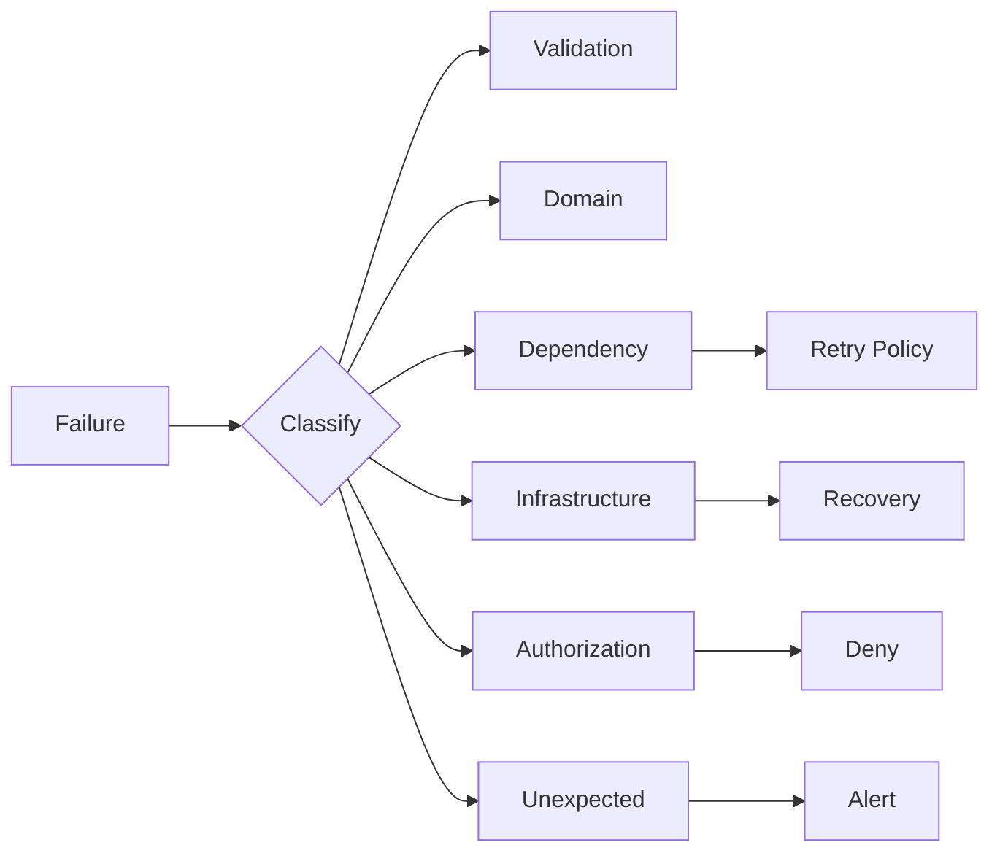

**Invariant:** an error handler must never convert an unsafe state into apparent success.

---

## 12. Concurrency and Async Safety

Every concurrent task needs an owner, cancellation path, bounded lifetime, and observable failure behavior.

Forbidden: detached tasks without ownership, unbounded worker pools, shared mutable state without synchronization, retry loops without limits, background tasks accidentally outliving request scope, and network calls without deadlines.

Concurrency correctness is functional correctness, not merely optimization.

---

## 13. API, Event, and Schema Coding

APIs and events are contracts. Handler implementation must never become the implicit schema.

Every public contract requires versioning, validation, compatibility policy, ownership, error semantics, and observability fields.

```json
{"contract_id":"CAT-CODE-CONTRACT-001","version":"v1","owner":"platform","compatibility":"backward_compatible","validation":"mandatory","trace_context":"required"}
```

Schema changes require compatibility review before deployment.

---

## 14. Database and Persistence Code

Persistence code must respect truth ownership. Domain code must not bypass approved repositories merely for convenience.

Rules: migrations are forward-tested and rollback-aware; transactions have explicit boundaries; retried writes are idempotent; monetary values never use binary floating point; timestamps are explicit and timezone-safe; canonical records remain audit-aware; derived data is reconstructible or explicitly classified.

---

## 15. Testing Standard

Every production behavior requires evidence proportional to failure impact: unit, integration, contract, end-to-end, property, concurrency, security, migration, or resilience tests as appropriate.

Tests must be deterministic, isolated, meaningful, and capable of detecting the defect they claim to protect against.

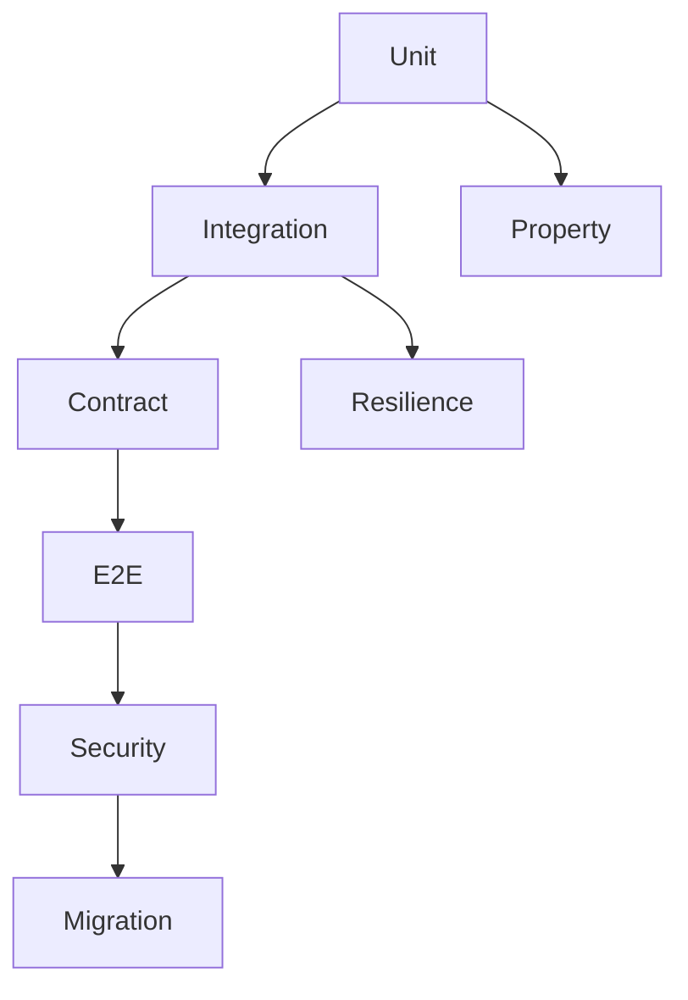

---

## 16. Security, Secrets, and Untrusted Input

Security-sensitive code defaults to deny. Secrets never belong in source, logs, fixtures, documentation, or committed configuration.

External input includes users, merchants, affiliates, web content, model output, tool output, files, events, and third-party responses. AI output is untrusted until validated against a typed contract.

Required controls: input validation, authorization, output encoding, secret isolation, dependency scanning, audit logging, least privilege, and safe failure.

---

## 17. Observability and Production Diagnostics

Production code emits structured telemetry appropriate to its responsibility.

Required concepts include trace/span identity, correlation, component identity, latency, outcome, error class, retry count, relevant resource metrics, and security/audit events.

Never log secrets, credentials, authorization tokens, private keys, or unnecessary personal data.

---

## 18. AI-Generated and Agent-Written Code

AI-generated code is treated exactly like human-written code after generation. It must pass formatting, typing, linting, tests, security checks, review, and ownership verification.

AI must not silently invent APIs, bypass domain ownership, weaken validators, remove tests to hide failures, introduce credentials, mutate canonical truth without an approved contract, or generate irreversible infrastructure changes without explicit approval.

```text
AI Generation → Static Validation → Tests → Security → Human Review → Approved Merge
```

---

## 19. Git, Review, and Change Management

Commits must be coherent and understandable. Pull requests must state purpose, scope, risk, tests, migration impact, and observability impact when relevant.

Review optimizes for continuous improvement and preservation of code health. Generated files must be regenerated from their source specification rather than hand-edited when a generator owns them.

---

## 20. Part 1 Completion Contract

Part 1 closes the foundational coding contract and defines the append-only handoff for Parts 2–4.

### Constitutional Rule Registry

| ID | Rule | Owner | Severity | Enforcement |
|---|---|---|---|---|
| CAT-CS-CONST-001 | Preserve domain ownership boundaries. | Architecture | Critical | CI + Review |
| CAT-CS-CONST-002 | Never mutate canonical truth through convenience paths. | Domain | Critical | Contract tests |
| CAT-CS-CONST-003 | Production code must be automatically formatted. | Engineering | High | CI |
| CAT-CS-CONST-004 | Public contracts require explicit versioning. | API | High | Schema CI |
| CAT-CS-CONST-005 | Validate untrusted input before domain use. | Security | Critical | Tests + Review |
| CAT-CS-CONST-006 | AI-generated code receives the same quality gates. | Engineering | Critical | CI |
| CAT-CS-CONST-007 | Secrets must never enter source or logs. | Security | Critical | Secret scan |
| CAT-CS-CONST-008 | Concurrent work requires ownership and cancellation. | Runtime | High | Review + Tests |
| CAT-CS-CONST-009 | Monetary computation uses exact representations. | Treasury | Critical | Static + Tests |
| CAT-CS-CONST-010 | Production behavior requires proportional test evidence. | QA | High | CI |

### Acceptance Tests

- `CAT-CS-AT-S01-001`: formatting/lint gates reject malformed code.
- `CAT-CS-AT-S01-002`: type checking rejects an invalid public contract.
- `CAT-CS-AT-S01-003`: CI rejects a committed secret fixture.
- `CAT-CS-AT-S02-001`: domain-boundary tests reject unauthorized cross-engine mutation.
- `CAT-CS-AT-S02-002`: AI-generated code cannot bypass required quality gates.
- `CAT-CS-AT-S02-003`: retryable and non-retryable failures remain distinguishable.

### Memory Anchor

`CAT-CS-MEM-S01-001` — Coding standards are executable architecture constraints, not stylistic decoration.

### JSON Registry

```json
{"record_type":"coding_standard_contract","record_version":"1.0","contract_id":"CAT-CS-CONTRACT-001","languages":["rust","go","python","typescript"],"quality_gates":["format","lint","typecheck","test","security","review"],"ai_code_policy":"same_as_human_code"}
```

### YAML Registry

```yaml
schema_name: cat_coding_standard_contract_v1
version: "1.0"
owners:
  architecture: architecture
  security: security
  runtime: runtime
  qa: quality_assurance
required_gates:
  - format
  - lint
  - typecheck
  - test
  - security
  - review
```

### Completion Invariant

No Part 2 content is valid unless this Part 1 prefix remains byte-identical and all continuation content preserves the terminology contracts of `context/13_TERMINOLOGY.md`.

**Part 1 Status:** COMPLETE — 25%

---

# PART 2 — CODING ENGINEERING SYSTEM

> Append-only continuation. Sections 1–20 are frozen. No earlier byte may be modified by Parts 2–4.

---

## 21. Architecture-Aware Coding

Code must implement the architecture rather than merely reproduce interfaces. Each package, crate, service, and component declares its responsibility, allowed dependencies, owned truth, and permitted side effects.

Dependencies flow according to the architecture graph. Convenience imports that create upward or circular dependencies are rejected. Public interfaces belong to the owning domain; adapters translate external representations into domain contracts.

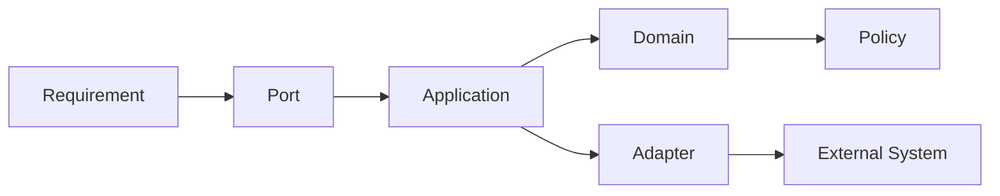

**Rule:** architecture tests are first-class tests; a build that passes while violating dependency direction is not healthy.

```json
{"record_type":"architecture_code_rule","section":21,"dependency_direction":"enforced","domain_ownership":"explicit","upward_imports":"forbidden"}
```

```yaml
schema_name: cat_architecture_code_rule_v1
required: [owner, layer, dependencies, allowed_side_effects]
```

**Tests:** dependency direction is checked; forbidden imports fail CI; every new package has an owner.

---

## 22. Dependency Management

Dependencies are production inputs and must be selected deliberately. Every dependency has a reason, owner, license posture, version policy, security posture, and removal strategy.

Pinning must balance reproducibility with controlled upgrades. Lockfiles are committed where supported. Transitive dependencies are reviewed when security or runtime behavior changes materially.

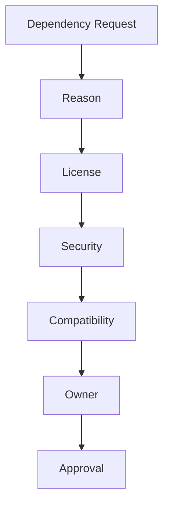

**Rule:** adding a dependency to avoid understanding a small local problem requires explicit justification.

```json
{"record_type":"dependency_policy","section":22,"lockfiles":"required","license_review":"required","security_review":"required","owner":"engineering"}
```

```yaml
schema_name: cat_dependency_policy_v1
fields: [name, version, purpose, owner, license, risk, upgrade_policy]
```

**Tests:** dependency manifests parse; vulnerability gates run; license policy violations fail the pipeline.

---

## 23. Package and Crate Design

Packages and Rust crates must expose narrow APIs and hide implementation details. Internal modules remain private unless external reuse is an explicit architectural requirement.

One package should not become a dumping ground for unrelated concerns. Shared foundations must remain dependency-light to prevent architectural gravity.

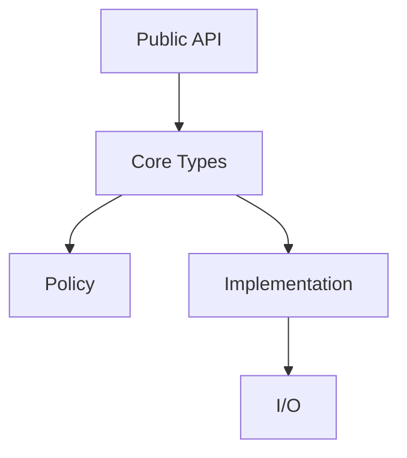

**Rule:** shared code must be shared because the abstraction is stable, not because copying feels inconvenient.

```json
{"record_type":"package_design","section":23,"public_surface":"minimal","internal_by_default":true,"abstraction_rule":"stable_only"}
```

```yaml
schema_name: cat_package_design_v1
required: [package_owner, public_api, internal_modules, dependencies]
```

**Tests:** public API snapshots and dependency checks prevent accidental exposure.

---

## 24. Domain Modeling and Types

Domain concepts require semantic types instead of primitive overload. IDs, money, timestamps, percentages, states, capabilities, and evidence should not be interchangeable merely because their runtime representation is similar.

Prefer newtypes, branded types, enums, discriminated unions, value objects, and constrained constructors at boundaries.

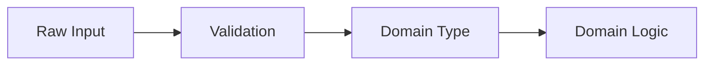

```json
{"record_type":"domain_type_policy","section":24,"primitive_overload":"forbidden","boundary_validation":"mandatory","semantic_types":"preferred"}
```

```yaml
schema_name: cat_domain_type_policy_v1
rules: [typed_ids, constrained_values, explicit_states, boundary_validation]
```

**Tests:** invalid values cannot construct valid domain types; serialization round trips preserve semantics.

---

## 25. Immutability and State Ownership

Immutable values are preferred. Mutable state must have one owner, an explicit transition mechanism, and an observable lifecycle.

Shared mutable state is considered a concurrency and architecture risk. State machines must encode legal transitions rather than accepting arbitrary string mutations.

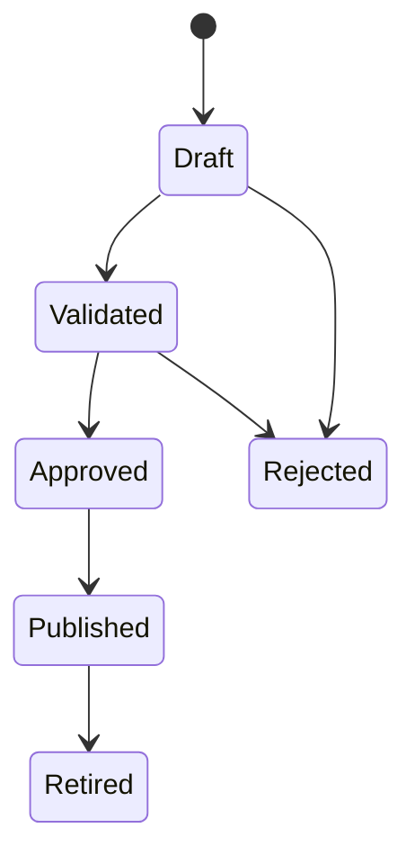

```json
{"record_type":"state_ownership","section":25,"default":"immutable","mutable_state":"single_owner","transitions":"guarded"}
```

```yaml
schema_name: cat_state_ownership_v1
required: [owner, initial_state, legal_transitions, terminal_states]
```

**Tests:** illegal transitions fail; concurrent updates detect stale versions; state ownership is documented.

---

## 26. Functional Core and Side-Effect Shell

Business rules should be deterministic functions over explicit inputs whenever practical. Network, filesystem, clock, randomness, environment, and database access belong at explicit boundaries.

This separation improves testing, replay, reasoning, and AI-assisted maintenance.

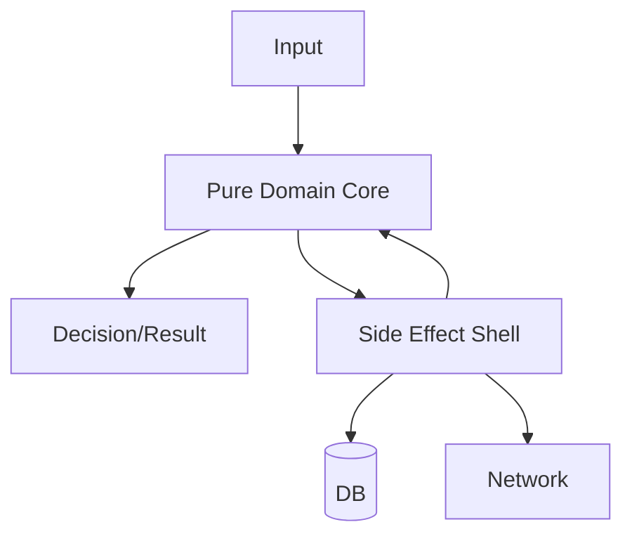

```json
{"record_type":"functional_boundary","section":26,"pure_core":"preferred","side_effects":"explicit","clock":"injected"}
```

```yaml
schema_name: cat_functional_boundary_v1
side_effects: [network, database, filesystem, clock, randomness]
```

**Tests:** pure functions use table/property tests; side effects are tested through adapters and contracts.

---

## 27. Dependency Injection and Composition

Dependencies must be explicit at composition boundaries. Hidden service locators, global registries, implicit singleton state, and framework magic that obscures ownership are discouraged or prohibited in domain code.

Construction should make critical dependencies visible and testable.

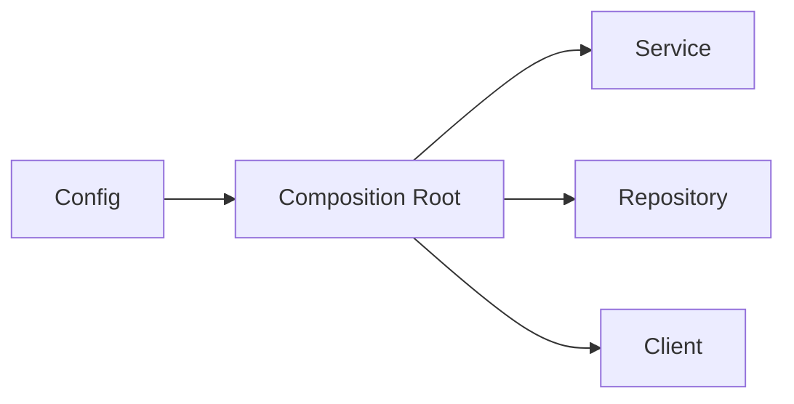

```json
{"record_type":"composition_policy","section":27,"composition_root":"required","hidden_globals":"forbidden","test_doubles":"supported"}
```

```yaml
schema_name: cat_composition_policy_v1
required: [composition_root, dependencies, lifecycle, test_strategy]
```

**Tests:** services can be constructed without production infrastructure; dependency graphs remain inspectable.

---

## 28. Configuration and Environment

Configuration is typed, validated, layered, and explicit. Environment variables are adapters, not the domain model.

Defaults must be safe. Required production configuration fails startup clearly rather than silently selecting insecure values.

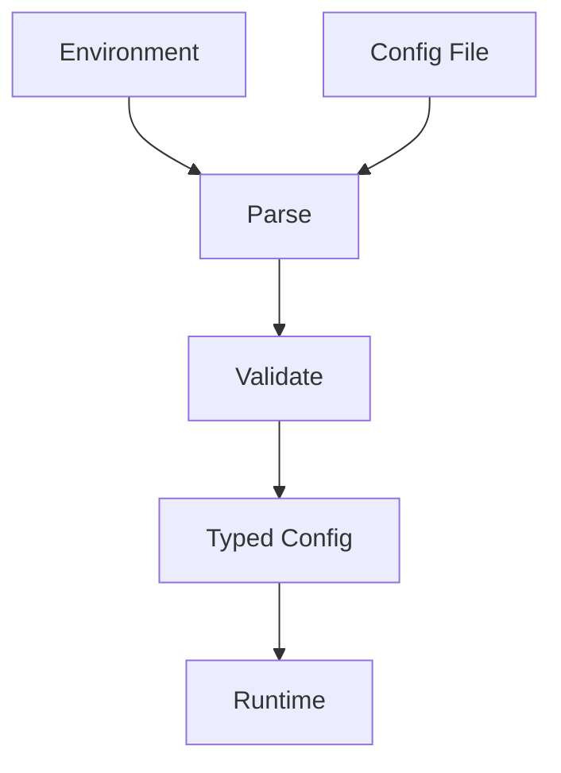

```json
{"record_type":"configuration_policy","section":28,"typed":true,"validation":"startup","unsafe_defaults":"forbidden","secrets":"externalized"}
```

```yaml
schema_name: cat_configuration_policy_v1
required: [source, precedence, validation, secret_policy, reload_policy]
```

**Tests:** invalid configuration fails predictably; precedence is tested; secrets never appear in serialized diagnostics.

---

## 29. API Implementation

API handlers are thin orchestration layers. Authentication, authorization, validation, domain execution, mapping, and response formatting remain separable concerns.

Handlers must enforce deadlines, request identity, tracing, input limits, and safe error mapping.

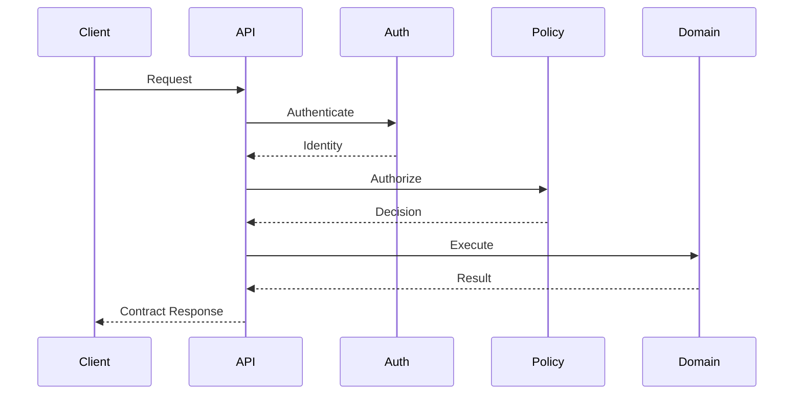

```json
{"record_type":"api_implementation","section":29,"handler":"thin","auth":"mandatory","authorization":"mandatory","trace":"mandatory"}
```

```yaml
schema_name: cat_api_implementation_v1
fields: [request_id, actor, contract_version, timeout, authorization, response_mapping]
```

**Tests:** contract tests cover valid/invalid payloads, auth failures, timeouts, idempotency, and version compatibility.

---

## 30. Event-Driven Coding

Events represent facts or approved integration messages. Event producers do not assume consumers are synchronous or available.

Every event has an owner, version, schema, identity, timestamp, causation/correlation metadata, and delivery semantics.

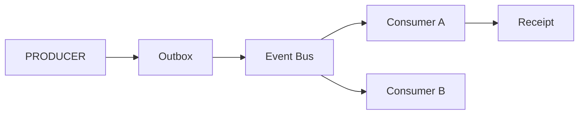

```json
{"record_type":"event_policy","section":30,"schema":"versioned","delivery":"explicit","idempotency":"required","ordering":"declared"}
```

```yaml
schema_name: cat_event_policy_v1
required: [event_id, event_type, version, occurred_at, correlation_id, producer, payload]
```

**Tests:** duplicate delivery is safe; incompatible schemas are rejected; consumer retry behavior is bounded.

---

## 31. Serialization and Compatibility

Serialization formats are contracts. Internal structs must not automatically become public wire representations.

Compatibility is evaluated explicitly for fields, enums, defaults, nullability, identifiers, and semantic changes.


```json
{"record_type":"serialization_policy","section":31,"internal_types":"not_public_by_default","compatibility":"explicit","validation":"mandatory"}
```

```yaml
schema_name: cat_serialization_policy_v1
compatibility: [additive, breaking, semantic]
```

**Tests:** golden payloads and backward-compatibility suites protect released contracts.

---

## 32. Idempotency and Retry-Safe Code

Operations retried by infrastructure, clients, queues, or agents must define idempotency semantics.

Retries require bounded attempts, classification, backoff, jitter where appropriate, and a clear distinction between safe retry and unsafe duplication.

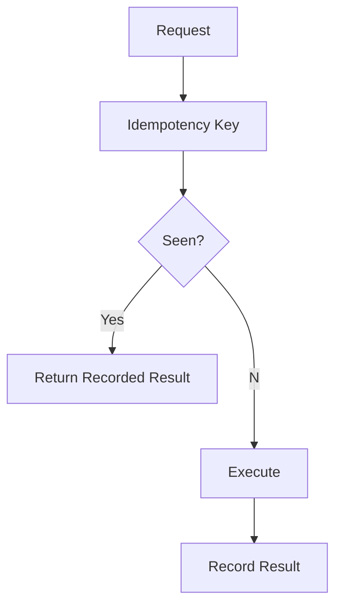

```json
{"record_type":"idempotency_policy","section":32,"key":"required_for_retriable_mutations","deduplication":"persistent","retry":"bounded"}
```

```yaml
schema_name: cat_idempotency_policy_v1
required: [key, scope, retention, replay_behavior, failure_behavior]
```

**Tests:** duplicate requests yield one effect; retries across process restarts remain safe where required.

---

## 33. Transaction Boundaries

Transactions must correspond to business invariants, not arbitrary repository calls. A transaction may coordinate multiple writes only when they belong to the same consistency boundary.

Long-running workflows use durable state and compensating actions rather than holding database transactions open.

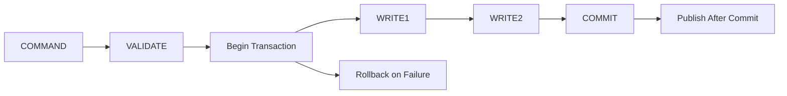

```json
{"record_type":"transaction_policy","section":33,"boundary":"business_invariant","long_workflow":"durable_state","events":"after_commit"}
```

```yaml
schema_name: cat_transaction_policy_v1
required: [consistency_boundary, isolation, timeout, rollback, post_commit_effects]
```

**Tests:** rollback paths, partial failures, deadlocks, and post-commit event behavior are covered.

---

## 34. Database Query Discipline

Queries must be explicit, bounded, indexed where necessary, and observable. N+1 patterns, unbounded scans, accidental cross-tenant reads, and hidden eager loading are defects unless justified.

Repository methods express domain intent rather than exposing arbitrary SQL everywhere.

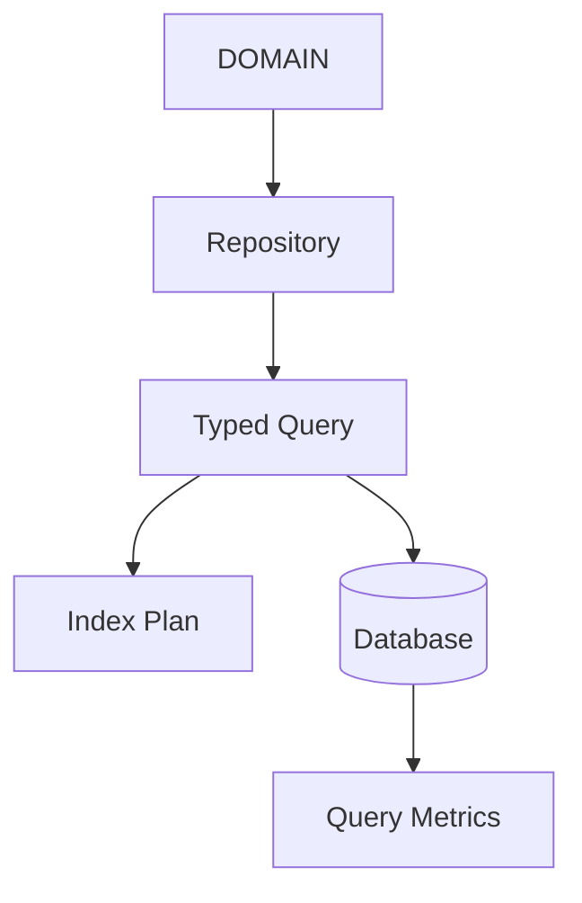

```json
{"record_type":"query_policy","section":34,"bounds":"required","tenant_scope":"mandatory","observability":"required","n_plus_one":"forbidden_unless_justified"}
```

```yaml
schema_name: cat_query_policy_v1
required: [scope, limit, timeout, index_expectation, metrics]
```

**Tests:** query plans and tenant isolation are verified for critical repositories.

---

## 35. Migration Engineering

Every schema migration is treated as production code. Prefer expand-and-contract changes for systems that must remain available during rollout.

Migrations declare compatibility window, data backfill behavior, rollback strategy, expected duration, observability, and cleanup conditions.

```mermaid
flowchart LR
OLD-->EXPAND[Expand Schema]-->DUAL[Dual Read/Write]-->BACKFILL-->SWITCH-->CONTRACT[Remove Old]
```

```json
{"record_type":"migration_policy","section":35,"strategy":"expand_contract","backfill":"observable","rollback":"declared","cleanup":"separate_step"}
```

```yaml
schema_name: cat_migration_policy_v1
required: [forward_plan, compatibility, backfill, rollback, cleanup, owner]
```

**Tests:** migrations run from clean state and realistic prior versions; backfills are repeat-safe.

---

## 36. Testing Architecture

Testing is organized by risk and contract boundary. Unit tests provide fast feedback; integration tests verify component boundaries; contract tests protect schemas; E2E tests protect critical journeys; property tests protect invariants.

Tests must avoid excessive mocking of the behavior under test.

```mermaid
flowchart TB
FAST[Unit]-->BOUNDARY[Integration]
BOUNDARY-->CONTRACT[Contract]
CONTRACT-->E2E[E2E]
INVARIANT[Property]-->FAST
RISK[Security/Resilience]-->BOUNDARY
```

```json
{"record_type":"testing_architecture","section":36,"layers":["unit","integration","contract","e2e","property","security","resilience"],"risk_based":true}
```

```yaml
schema_name: cat_testing_architecture_v1
required: [test_level, risk, owner, determinism, evidence]
```

**Tests:** every critical path maps to at least one executable test layer.

---

## 37. Test Data and Fixtures

Fixtures must be minimal, deterministic, safe, and representative. Production secrets and personal data never enter test fixtures.

Factories should construct valid domain objects; invalid fixtures should be intentionally labeled as such and used only for validation tests.

```mermaid
flowchart LR
FACTORY-->VALID[Valid Fixture]
FACTORY-->INVALID[Invalid Fixture]
VALID-->TEST[Test]
INVALID-->TEST
TEST-->ASSERT[Assertion]
```

```json
{"record_type":"test_data_policy","section":37,"production_data":"forbidden","deterministic":true,"factories":"preferred","invalid_fixtures":"explicit"}
```

```yaml
schema_name: cat_test_data_policy_v1
required: [source, sensitivity, determinism, lifecycle, owner]
```

**Tests:** fixture generation is deterministic; sensitive-data scans run in CI.

---

## 38. Property, Fuzz, and Invariant Testing

Properties are preferred where a rule spans many possible inputs. Fuzzing is required for parsers, protocol boundaries, untrusted serialization, and security-sensitive input handling where practical.

A property test must state the invariant it protects.

```mermaid
flowchart TB
INPUTS[Generated Inputs]-->SYSTEM[System Under Test]-->PROPERTY{Invariant Holds?}
PROPERTY--Yes-->KEEP[Pass]
PROPERTY--No-->SHRINK[Shrink Case]-->BUG[Defect]
```

```json
{"record_type":"property_testing","section":38,"fuzzing":"boundary_sensitive","invariant":"declared","shrinking":"required_when_supported"}
```

```yaml
schema_name: cat_property_testing_v1
required: [input_space, invariant, seed_policy, shrink_policy, failure_artifact]
```

**Tests:** parser fuzz suites retain reproducible seeds and minimized failures.

---

## 39. Concurrency Testing

Concurrency tests target races, deadlocks, starvation, cancellation, ordering assumptions, duplicate execution, and resource exhaustion.

Timing-dependent tests must not rely on arbitrary sleeps when synchronization primitives or observable state can express the condition.

```mermaid
sequenceDiagram
A->>Queue: Submit
B->>Queue: Submit
Queue->>Worker: Work
Worker->>Lock: Acquire
Worker->>Lock: Release
Worker-->>A: Result
Worker-->>B: Result
```

```json
{"record_type":"concurrency_testing","section":39,"race_detection":"required_where_supported","deadlock":"tested","cancellation":"tested","sleep_based_sync":"discouraged"}
```

```yaml
schema_name: cat_concurrency_testing_v1
required: [race_model, cancellation, resource_bound, synchronization, reproducibility]
```

**Tests:** race detector/tooling runs in CI for supported Go workloads; Rust async cancellation paths are exercised.

---

## 40. Contract Testing

Contract tests verify that producers and consumers agree on schemas and semantics without requiring the full distributed system.

A contract test must identify producer, consumer, version, compatibility expectation, representative payloads, and failure cases.

```mermaid
flowchart LR
PRODUCER-->SCHEMA[Contract Schema]-->CONSUMER
SCHEMA-->COMPAT[Compatibility Gate]
COMPAT-->CI[CI]
```

```json
{"record_type":"contract_testing","section":40,"producer":"identified","consumer":"identified","version":"mandatory","compatibility":"verified"}
```

```yaml
schema_name: cat_contract_testing_v1
required: [producer, consumer, contract, version, compatibility, fixtures]
```

**Tests:** backward-compatible changes pass; breaking changes require an explicit version transition.

---

## 41. CI Quality Gates

CI is the executable form of the coding standard. Required gates are layered so failures are fast, deterministic, and attributable.

Minimum sequence: formatting, lint, type/static analysis, unit tests, contract tests, integration tests, security scans, build/package verification.

```mermaid
flowchart LR
FORMAT-->LINT-->TYPE-->UNIT-->CONTRACT-->INTEGRATION-->SECURITY-->BUILD-->REVIEW
```

```json
{"record_type":"ci_quality_gate","section":41,"blocking":true,"order":["format","lint","typecheck","unit","contract","integration","security","build"]}
```

```yaml
schema_name: cat_ci_quality_gate_v1
required: [gate, command, owner, blocking, artifact]
```

**Tests:** a deliberately broken sample repository fails at the expected gate and reports actionable evidence.

---

## 42. Build Reproducibility

Build outputs should be reproducible from committed source, lockfiles, toolchain definitions, and declared environment inputs.

Toolchain versions are pinned or centrally governed. Generated artifacts include source provenance when practical.

```mermaid
flowchart TB
SOURCE[Source]-->LOCK[Lockfiles]
TOOLCHAIN-->BUILD[Build]
LOCK-->BUILD
SOURCE-->BUILD
BUILD-->ARTIFACT[Artifact]
ARTIFACT-->DIGEST[Digest]
```

```json
{"record_type":"build_reproducibility","section":42,"toolchain":"declared","lockfiles":"committed","artifact_digest":"required","source_provenance":"preferred"}
```

```yaml
schema_name: cat_build_reproducibility_v1
required: [source_ref, toolchain, dependency_lock, build_command, digest]
```

**Tests:** repeated builds from the same source produce equivalent verified artifacts where the toolchain supports it.

---

## 43. Static Analysis and Architectural Enforcement

Static analysis is not limited to syntax. CAT should enforce dependency direction, forbidden imports, unsafe patterns, secret exposure, dead code, complexity thresholds, and contract violations where tooling permits.

Architectural rules must be encoded so they cannot depend solely on reviewer memory.

```mermaid
flowchart TB
CODE-->AST[Static Analysis]
AST-->STYLE[Style]
AST-->SEC[Security]
AST-->ARCH[Architecture]
AST-->DEAD[Dead Code]
ARCH-->BLOCK[Block Merge]
```

```json
{"record_type":"static_analysis","section":43,"architecture_rules":"automated_where_possible","security":"blocking","dead_code":"reported","complexity":"bounded"}
```

```yaml
schema_name: cat_static_analysis_v1
required: [rule_id, detector, severity, baseline, remediation]
```

**Tests:** representative forbidden dependencies are detected by CI.

---

## 44. Performance and Resource Discipline

Performance optimization begins with measurement. Code must avoid unnecessary allocations, unbounded memory growth, excessive serialization, blocking work in async paths, and accidental quadratic algorithms.

Performance-sensitive changes state baseline, workload, metric, expected improvement, and regression threshold.

```mermaid
flowchart LR
BASELINE-->PROFILE-->CHANGE-->BENCHMARK-->COMPARE-->REGRESSION_GATE
```

```json
{"record_type":"performance_policy","section":44,"measurement":"required","baseline":"required_for_sensitive_changes","regression_gate":"required","premature_optimization":"discouraged"}
```

```yaml
schema_name: cat_performance_policy_v1
required: [workload, baseline, metric, threshold, environment]
```

**Tests:** benchmark suites run for designated performance-critical components.

---

## 45. Resilience and Failure Injection

Critical components must define behavior under dependency failure, timeout, partial response, stale data, duplicate events, resource pressure, and restart.

Failure injection should validate the recovery design rather than merely prove that errors exist.

```mermaid
flowchart TB
NORMAL-->FAIL[Injected Failure]
FAIL-->DETECT[Detect]
DETECT-->RECOVER[Recover]
RECOVER-->VERIFY[Verify]
VERIFY-->NORMAL
FAIL-->ESCALATE[Escalate]
```

```json
{"record_type":"resilience_policy","section":45,"failure_modes":["timeout","dependency","duplicate","restart","resource_pressure"],"recovery":"declared","escalation":"declared"}
```

```yaml
schema_name: cat_resilience_policy_v1
required: [failure_mode, detection, recovery, timeout, escalation, evidence]
```

**Tests:** critical dependencies have at least one controlled failure test.

---

## 46. Security Engineering in Code

Security controls belong at the correct boundary and must not be duplicated inconsistently across services. Authentication establishes identity; authorization establishes permission; domain policy establishes allowed business action.

Use least privilege, explicit trust boundaries, safe parsing, secure defaults, dependency scanning, and audit trails.

```mermaid
flowchart LR
INPUT-->AUTHN[Authenticate]-->AUTHZ[Authorize]-->POLICY[Domain Policy]-->ACTION
INPUT-->VALIDATE[Validate]
VALIDATE-->POLICY
ACTION-->AUDIT[Audit]
```

```json
{"record_type":"security_code_policy","section":46,"authentication":"separate","authorization":"separate","least_privilege":true,"audit":"required"}
```

```yaml
schema_name: cat_security_code_policy_v1
required: [trust_boundary, identity, permission, validation, audit, failure_mode]
```

**Tests:** unauthorized access, malformed input, privilege escalation, and secret exposure are negative-tested.

---

## 47. Observability Engineering

Telemetry is part of the implementation contract. Critical operations expose structured logs, traces, metrics, and audit events without leaking sensitive data.

Metrics names and dimensions remain bounded; high-cardinality identifiers do not become uncontrolled metric labels.

```mermaid
flowchart TB
SERVICE-->TRACE[Trace]
SERVICE-->LOG[Structured Log]
SERVICE-->METRIC[Metric]
SERVICE-->AUDIT[Audit]
TRACE-->CORRELATE[Correlation]
LOG-->CORRELATE
```

```json
{"record_type":"observability_policy","section":47,"signals":["trace","log","metric","audit"],"cardinality":"bounded","secrets":"excluded"}
```

```yaml
schema_name: cat_observability_policy_v1
required: [operation, outcome, latency, error_class, correlation, sensitivity]
```

**Tests:** critical paths emit required fields; telemetry redaction tests run for sensitive boundaries.

---

## 48. AI and Agent Engineering Controls

Agents are software components with elevated change velocity, not privileged maintainers. Agent-written changes must be attributable, reviewable, reproducible, and bounded by tool permissions.

Prompts, tool schemas, generated patches, validation results, and approvals are engineering artifacts when required for auditability.

```mermaid
flowchart LR
TASK-->AGENT-->PLAN-->PATCH-->STATIC-->TEST-->SECURITY-->HUMAN_GATE-->MERGE
AGENT-->TRACE[Agent Trace]
AGENT-->MEM[Memory Context]
```

```json
{"record_type":"ai_engineering_policy","section":48,"agent_identity":"required","tool_scope":"least_privilege","validation":"mandatory","human_gate":"required_for_high_risk"}
```

```yaml
schema_name: cat_ai_engineering_policy_v1
required: [agent_id, task_id, tools, scope, validation, approval]
```

**Tests:** an agent cannot access unauthorized repository paths or merge without required gates.

---

## 49. Repository Automation and Release Hygiene

Automation is production code. Scripts must have clear inputs, outputs, failure behavior, idempotency, and ownership.

Release automation must never silently rewrite protected documents, bypass append-only boundaries, skip verification, or publish artifacts whose provenance is unknown.

```mermaid
flowchart TB
CHANGE-->CHECKOUT-->GENERATE-->VALIDATE-->DIFF-->APPROVE-->COMMIT-->PUBLISH
VALIDATE-->FAIL[Stop]
```

```json
{"record_type":"automation_policy","section":49,"idempotency":"required","provenance":"required","append_only":"protected","verification":"blocking"}
```

```yaml
schema_name: cat_automation_policy_v1
required: [owner, inputs, outputs, idempotency, validation, failure_behavior]
```

**Tests:** automation runs twice safely; protected-prefix modification is detected and blocks completion.

---

## 50. Part 2 Completion Contract

Part 2 closes the operational coding standard and establishes the enforcement model for Parts 3–4.

### Part 2 Constitutional Rules

| ID | Rule | Owner | Severity | Enforcement |
|---|---|---|---|---|
| CAT-CS-CONST-041 | Dependencies require explicit ownership and purpose. | Engineering | High | CI + Review |
| CAT-CS-CONST-042 | Public APIs expose contracts, not internal models. | API | Critical | Contract CI |
| CAT-CS-CONST-043 | Domain types must prevent invalid states where practical. | Domain | Critical | Typecheck + Tests |
| CAT-CS-CONST-044 | Mutable state requires a single owner. | Runtime | Critical | Review + Tests |
| CAT-CS-CONST-045 | Configuration is typed and validated before runtime use. | Platform | High | Startup tests |
| CAT-CS-CONST-046 | Events are versioned and idempotency-aware. | Integration | Critical | Contract tests |
| CAT-CS-CONST-047 | Database migrations are production-tested. | Data | Critical | Migration CI |
| CAT-CS-CONST-048 | Critical behavior requires proportional test evidence. | QA | Critical | CI |
| CAT-CS-CONST-049 | Architecture violations are automated where possible. | Architecture | Critical | Static analysis |
| CAT-CS-CONST-050 | AI agents receive no implicit engineering privilege. | AI Governance | Critical | Policy gate |

### Acceptance Test Registry

- `CAT-CS-AT-S21-001` — forbidden dependency direction is rejected.
- `CAT-CS-AT-S22-001` — unapproved dependency addition fails policy checks.
- `CAT-CS-AT-S24-001` — invalid domain primitives cannot cross the boundary.
- `CAT-CS-AT-S30-001` — duplicate event delivery is idempotent.
- `CAT-CS-AT-S35-001` — expand/contract migration passes compatibility tests.
- `CAT-CS-AT-S41-001` — a failing quality gate blocks merge.
- `CAT-CS-AT-S43-001` — architectural static analysis detects forbidden imports.
- `CAT-CS-AT-S48-001` — agent tool permissions prevent unauthorized writes.
- `CAT-CS-AT-S49-001` — protected append-only content cannot be rewritten by automation.
- `CAT-CS-AT-S50-001` — all Part 2 registries resolve and remain unique.

### Memory Anchor Registry

- `CAT-CS-MEM-S21-001` — architecture is executable through dependency rules.
- `CAT-CS-MEM-S30-001` — events are contracts, not callbacks.
- `CAT-CS-MEM-S35-001` — migrations are production code.
- `CAT-CS-MEM-S41-001` — CI is the executable coding constitution.
- `CAT-CS-MEM-S48-001` — agents have bounded engineering authority.
- `CAT-CS-MEM-S50-001` — Part 2 closes the operational enforcement layer.

### JSON Schema Registry

```json
{
  "record_type": "coding_standard_part2_registry",
  "version": "1.0",
  "sections": 30,
  "rule_range": [41, 50],
  "domains": ["architecture","dependencies","domain_types","state","config","api","events","database","testing","ci","security","observability","ai","automation"],
  "append_only_prefix_required": true,
  "next_part": "Part 3"
}
```

### YAML Schema Registry

```yaml
schema_name: cat_coding_standard_part2_completion_v1
version: "1.0"
section_range: "21-50"
required_registries:
  - constitutional_rules
  - acceptance_tests
  - memory_anchors
  - json_schemas
  - yaml_schemas
required_gates:
  - format
  - lint
  - typecheck
  - unit
  - contract
  - integration
  - security
  - architecture
  - review
append_only: true
next_part: 3
```

### Completion Contract

Part 2 is complete only when the frozen Part 1 prefix remains byte-identical, Sections 21–50 are ordered exactly, all referenced contracts resolve, all required tests and registries are present, and the measured receipt is reproducible from repository contents.

**Part 2 Status:** COMPLETE — 50%  
**Next:** Coding Standard Part 3 — advanced language patterns, distributed systems, resilience, performance, AI-agent safety, architecture enforcement, CI/CD maturity, and enterprise-scale engineering practices.
